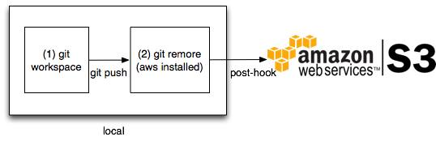
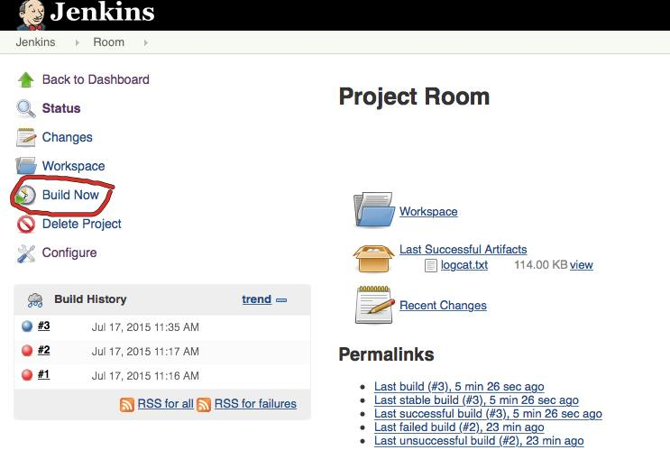
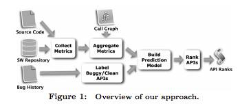
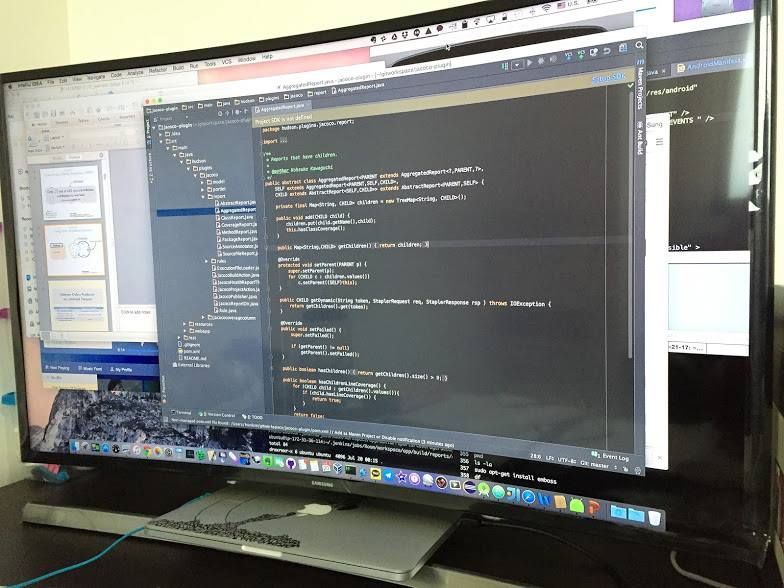
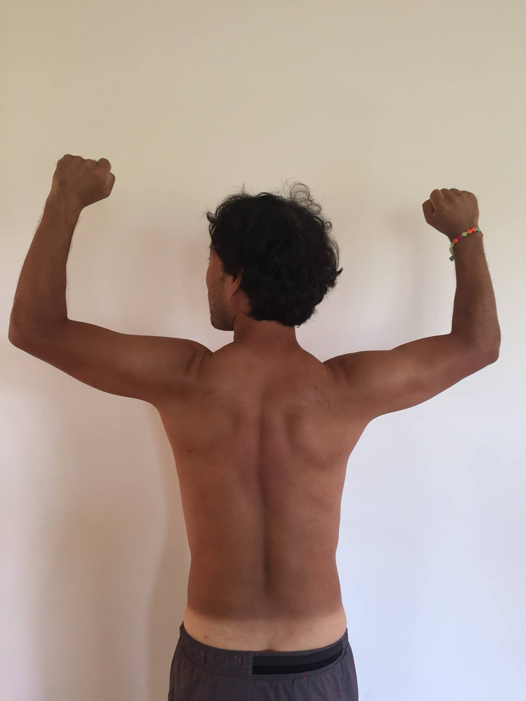

# 2015년 7월

[← 2015년](README.md)

### 7월 11일 (토) 13:18 · 📷 사진 (1장)

**이미지 캡션:** 이 이미지는 Git 워크플로우를 보여주는 다이어그램으로, 로컬 환경에서 Git 저장소를 관리하고 Amazon Web Services(AWS) S3로 데이터를 푸시하는 과정을 설명합니다. 왼쪽에는 "local"이라는 레이블이 붙은 큰 사각형이 있고, 그 안에 두 개의 작은 사각형이 순서대로 배치되어 있습니다. 첫 번째 사각형에는 "(1) git workspace"라고 적혀 있으며, 이는 사용자의 로컬 Git 작업 공간을 나타냅니다. 이 작업 공간에서 "git push"라는 화살표가 두 번째 사각형으로 이어집니다. 두 번째 사각형에는 "(2) git remore (aws installed)"라고 적혀 있으며, 이는 AWS가 설치된 Git 원격 저장소를 의미합니다. 이 두 번째 사각형에서 "post-hook"이라는 레이블과 함께 화살표가 오른쪽으로 뻗어 나가며, 이는 Amazon Web Services 로고와 "S3"라는 텍스트로 연결됩니다. Amazon Web Services 로고는 여러 개의 주황색 큐브로 이루어진 아이콘과 함께 "amazon web services™"라는 텍스트로 구성되어 있으며, 그 옆에는 "S3"라는 큰 글자가 검은색으로 표시되어 있습니다. 이 다이어그램은 로컬 Git 저장소에서 변경 사항을 푸시하면 AWS에 설치된 Git 원격 저장소의 post-hook 스크립트가 트리거되어 Amazon S3로 데이터가 전송되는 과정을 시각적으로 표현하고 있습니다.. 두 번째 사각형에는 "(2) git remore (aws installed)"라고 적혀 있으며, 이는 AWS가 설치된 Git 원격 저장소를 의미합니다. 이 두 번째 사각형에서 "post-hook"이라는 레이블과 함께 화살표가 오른쪽으로 뻗어 나가며, 이는 Amazon Web Services 로고와 "S3"라는 텍스트로 연결됩니다. Amazon Web Services 로고는 여러 개의 주황색 큐브로 이루어진 아이콘과 함께 "amazon web services™"라는 텍스트로 구성되어 있으며, 그 옆에는 "S3"라는 큰 글자가 검은색으로 표시되어 있습니다. 이 다이어그램은 로컬 Git 저장소에서 변경 사항을 푸시하면 AWS에 설치된 Git 원격 저장소의 post-hook 스크립트가 트리거되어 Amazon S3로 데이터가 전송되는 과정을 시각적으로 표현하고 있습니다.

> (다 아시는 것이겠지만) Git으로 S3 사용법 다시 정리해보았습니다. AWS너무 좋아요!  http://www.se.or.kr/153

### 7월 17일 (금) 23:27 · 📷 사진 (1장)

**이미지 캡션:** 이 이미지는 Jenkins라는 소프트웨어의 프로젝트 관리 화면을 보여줍니다. 화면 상단에는 Jenkins 로고와 함께 "Jenkins"와 "Room"이라는 텍스트가 있습니다. 왼쪽 메뉴에는 "Back to Dashboard", "Status", "Changes", "Workspace", "Build Now", "Delete Project", "Configure"와 같은 항목들이 아이콘과 함께 나열되어 있으며, 이 중 "Build Now" 항목이 빨간색 원으로 강조되어 있습니다. 화면 중앙에는 "Project Room"이라는 제목이 있고, 그 아래에는 "Workspace", "Last Successful Artifacts" (logcat.txt 파일 정보 포함), "Recent Changes" 등의 정보가 표시됩니다. 화면 하단에는 "Build History" 섹션이 있으며, 빌드 번호(#3, #2, #1)와 해당 빌드가 실행된 날짜 및 시간이 나열되어 있습니다. 또한 "RSS for all"과 "RSS for failures" 링크도 보입니다. 오른쪽 하단에는 "Permalinks" 섹션이 있으며, 마지막 빌드, 마지막 안정 빌드, 마지막 성공 빌드, 마지막 실패 빌드, 마지막 비성공 빌드에 대한 링크와 시간이 표시됩니다. 전체적으로 깔끔하고 기능적인 웹 인터페이스의 모습이며, 소프트웨어 개발 프로젝트의 빌드 및 관리 상태를 보여주는 상황입니다.Room"이라는 제목이 있고, 그 아래에는 "Workspace", "Last Successful Artifacts" (logcat.txt 파일 정보 포함), "Recent Changes" 등의 정보가 표시됩니다. 화면 하단에는 "Build History" 섹션이 있으며, 빌드 번호(#3, #2, #1)와 해당 빌드가 실행된 날짜 및 시간이 나열되어 있습니다. 또한 "RSS for all"과 "RSS for failures" 링크도 보입니다. 오른쪽 하단에는 "Permalinks" 섹션이 있으며, 마지막 빌드, 마지막 안정 빌드, 마지막 성공 빌드, 마지막 실패 빌드, 마지막 비성공 빌드에 대한 링크와 시간이 표시됩니다. 전체적으로 깔끔하고 기능적인 웹 인터페이스의 모습이며, 소프트웨어 개발 프로젝트의 빌드 및 관리 상태를 보여주는 상황입니다.

> 아마존 AWS로 안드로이드를 자동 빌드하고 테스트 하는 CI 설치해보자!   http://www.se.or.kr/154

### 7월 19일 (일) 18:35 · Is defect prediction useful? It's a good…

Is defect prediction useful? It's a good question. At FSE2015 we will show you defect prediction is actually useful in practice (Samsung). Our preprint is available at http://hunkim.cse.ust.hk/papers/kim-REMI(industry)-fse2015.pdf.

For our other recent work, please visit http://hunkim.cse.ust.hk/.

**이미지 캡션:** 이 이미지는 소프트웨어 개발 접근 방식의 개요를 보여주는 플로우차트입니다. 사람이나 동물은 보이지 않으며, 모든 요소는 그래픽 아이콘과 텍스트로 구성되어 있습니다. 배경은 흰색이며, 각 단계는 회색 화살표로 연결되어 있습니다. 왼쪽 상단에는 소스 코드 아이콘과 "Source Code"라는 텍스트가 있습니다. 그 아래에는 데이터베이스 스택 아이콘과 "SW Repository"라는 텍스트가 있으며, 이 두 아이콘에서 화살표가 "Collect Metrics"라는 사각형 상자로 이어집니다. "Collect Metrics" 상자 오른쪽에는 "Aggregate Metrics"라는 사각형 상자가 있고, 그 위에는 점들이 연결된 그래프 모양의 "Call Graph" 아이콘이 있습니다. "Aggregate Metrics" 상자 아래에는 "Label Buggy/Clean APIs"라는 사각형 상자가 있으며, 이 상자에는 버그 기록을 나타내는 문서 아이콘과 "Bug History"라는 텍스트가 연결되어 있습니다. "Aggregate Metrics"와 "Label Buggy/Clean APIs" 상자에서 나온 화살표는 "Build Prediction Model"이라는 사각형 상자로 합쳐집니다. 이 상자에서 나온 화살표는 "Rank APIs"라는 사각형 상자로 이어지고, 마지막으로 "API Ranks"라는 순위표 모양의 아이콘으로 연결됩니다. 이미지 하단에는 "Figure 1: Overview of our approach."라는 캡션이 있습니다. 전체적으로 기술적인 내용을 전달하는 차분하고 정보 전달 중심적인 분위기입니다.cs" 상자 오른쪽에는 "Aggregate Metrics"라는 사각형 상자가 있고, 그 위에는 점들이 연결된 그래프 모양의 "Call Graph" 아이콘이 있습니다. "Aggregate Metrics" 상자 아래에는 "Label Buggy/Clean APIs"라는 사각형 상자가 있으며, 이 상자에는 버그 기록을 나타내는 문서 아이콘과 "Bug History"라는 텍스트가 연결되어 있습니다. "Aggregate Metrics"와 "Label Buggy/Clean APIs" 상자에서 나온 화살표는 "Build Prediction Model"이라는 사각형 상자로 합쳐집니다. 이 상자에서 나온 화살표는 "Rank APIs"라는 사각형 상자로 이어지고, 마지막으로 "API Ranks"라는 순위표 모양의 아이콘으로 연결됩니다. 이미지 하단에는 "Figure 1: Overview of our approach."라는 캡션이 있습니다. 전체적으로 기술적인 내용을 전달하는 차분하고 정보 전달 중심적인 분위기입니다.

### 7월 20일 (월) 09:31 · feels very happy and productive with a n…

feels very happy and productive with a new 4K curved monitor.

**이미지 캡션:** 이 사진은 여러 개의 모니터가 놓여 있는 책상 위에서 촬영된 것으로, 주로 프로그래밍 작업이 이루어지고 있는 장면을 보여줍니다. 중앙의 큰 모니터에는 통합 개발 환경(IDE)인 IntelliJ IDEA가 실행되고 있으며, 코드 편집 창에는 Java 코드가 표시되어 있습니다. 코드 창 왼쪽에는 프로젝트 파일 구조를 보여주는 탐색기 창이 있으며, 다양한 폴더와 파일들이 나열되어 있습니다. 탐색기 창 왼쪽에는 프레젠테이션 슬라이드처럼 보이는 창이 열려 있어, 코드 작업과 함께 문서나 디자인을 참고하고 있을 가능성이 있습니다. 오른쪽 모니터에는 AndroidManifest.xml 파일의 일부와 다른 개발 관련 창이 보입니다. 책상 위에는 키보드와 마우스, 그리고 여러 개의 케이블이 어지럽게 놓여 있습니다. 전반적으로 개발자가 코딩에 집중하고 있는 모습이며, 복잡한 프로젝트를 진행 중인 것으로 보입니다. 있습니다. 오른쪽 모니터에는 AndroidManifest.xml 파일의 일부와 다른 개발 관련 창이 보입니다. 책상 위에는 키보드와 마우스, 그리고 여러 개의 케이블이 어지럽게 놓여 있습니다. 전반적으로 개발자가 코딩에 집중하고 있는 모습이며, 복잡한 프로젝트를 진행 중인 것으로 보입니다.

### 7월 22일 (수) 08:45 · is having a good summer. See the color d…

is having a good summer. See the color difference, and don't look at something else. :-)

**이미지 캡션:** 사진은 흰색 벽을 배경으로 서 있는 성인 남성의 뒷모습을 보여준다. 남성은 20대 후반에서 30대 초반으로 보이며, 곱슬거리는 검은색 머리카락을 가지고 있다. 상의는 입지 않았으며, 팔은 위로 들어 올려 주먹을 쥐고 있다. 오른쪽 팔목에는 여러 색깔의 구슬로 만들어진 팔찌를 착용하고 있다. 남성의 피부는 햇볕에 그을린 듯한 갈색이며, 허리 부분에 수영복이나 반바지를 입고 있어 햇볕에 그을리지 않은 하얀색 띠가 보인다. 남성의 표정은 보이지 않지만, 팔을 들어 올린 모습에서 자신감이나 힘을 과시하는 듯한 분위기를 느낄 수 있다. 배경은 단순한 흰색 벽으로 특별한 사물이나 장소 정보는 제공하지 않는다. 전체적으로 건강하고 활동적인 느낌을 주는 사진이다.를 느낄 수 있다. 배경은 단순한 흰색 벽으로 특별한 사물이나 장소 정보는 제공하지 않는다. 전체적으로 건강하고 활동적인 느낌을 주는 사진이다.
