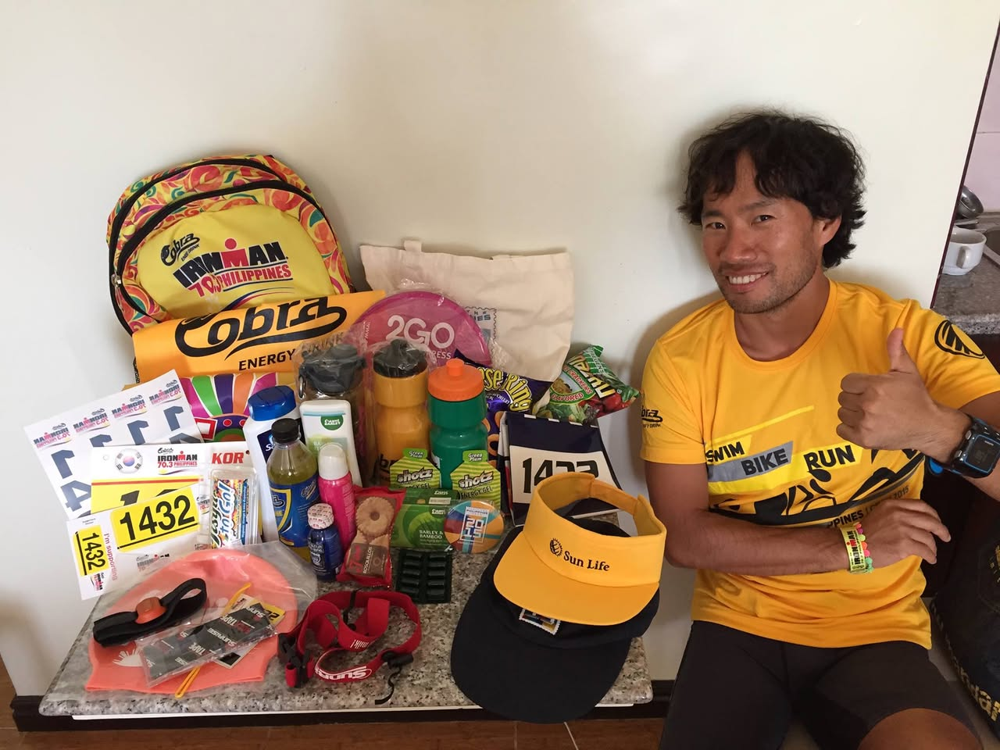
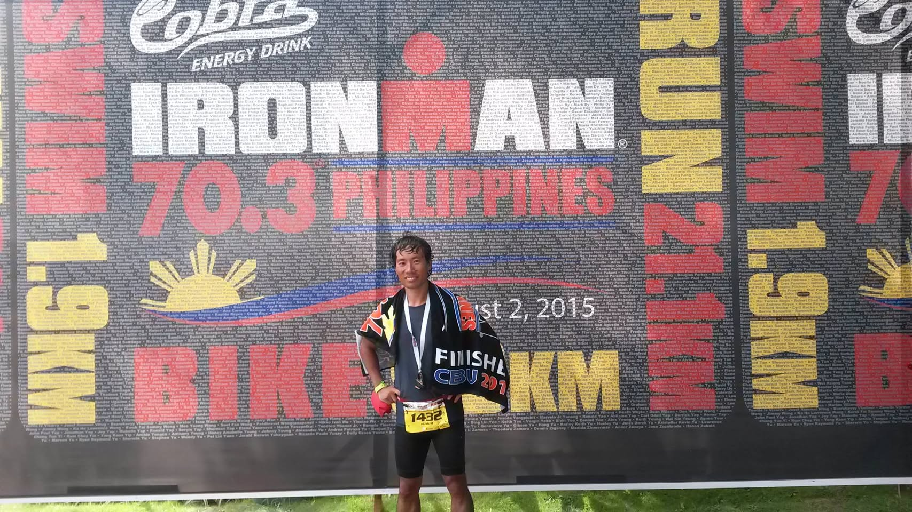
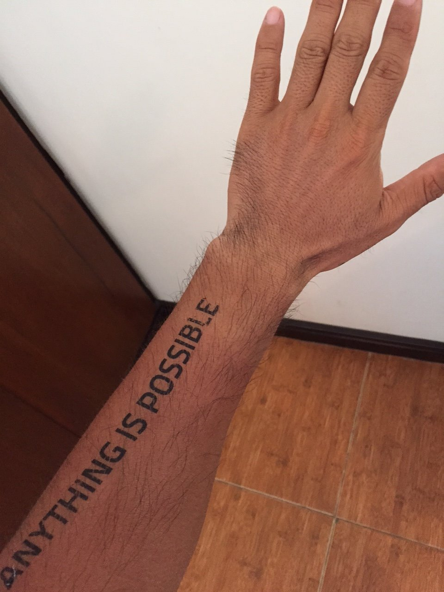
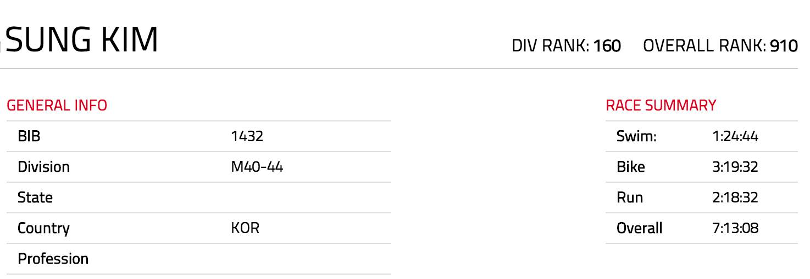
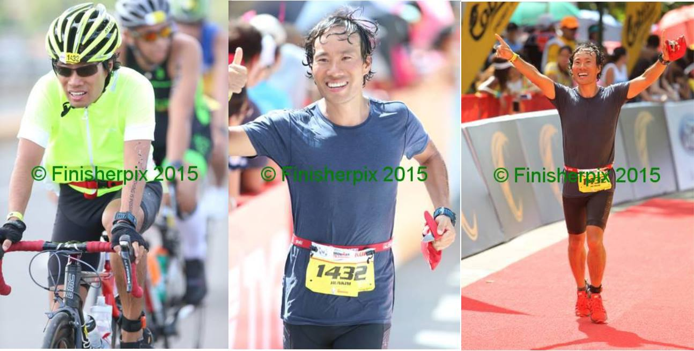
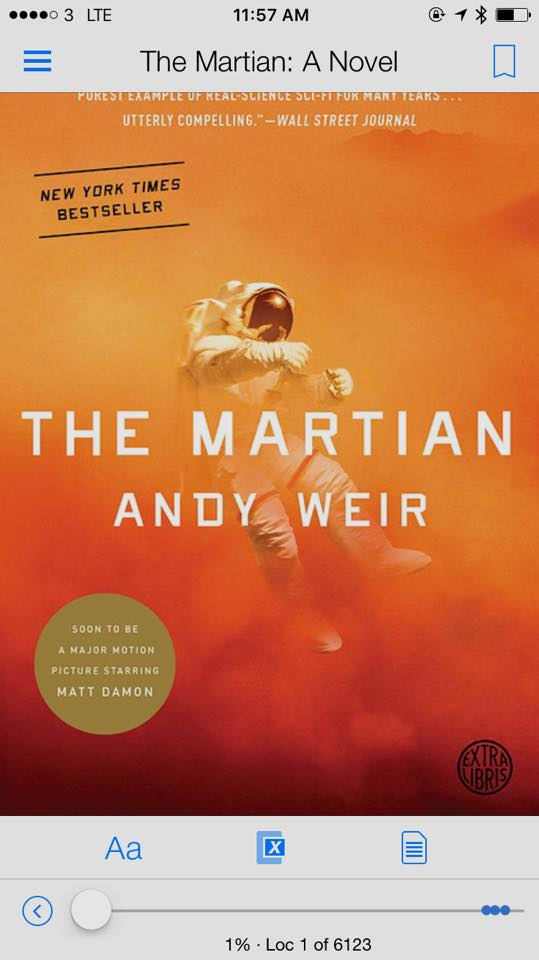

# 2015년 8월

[← 2015년](README.md)

### 8월 1일 (토) 15:01 · is almost ready for his first Ironman 70…

is almost ready for his first Ironman 70.3 race with so many free stuffs.

**이미지 캡션:** 한 명의 성인 남성이 노란색 티셔츠를 입고 엄지손가락을 치켜세우며 카메라를 향해 웃고 있으며, 그의 옆에는 수영, 자전거, 달리기를 위한 다양한 용품들이 놓여 있습니다. 남성은 짧은 검은색 머리에 약간의 수염이 있으며, 20대 후반에서 30대 초반으로 보입니다. 그는 "SWIM BIKE RUN PHILIPPINES"라고 적힌 노란색 티셔츠와 검은색 반바지를 입고 있으며, 손목에는 스포츠 시계와 여러 개의 팔찌를 착용하고 있습니다. 배경에는 흰색 벽이 보이고, 테이블 위에는 "IRONMAN 70.3 PHILIPPINES"라고 적힌 노란색 백팩, "Cobra ENERGY DRINK"라고 적힌 노란색 롤업 배너, 여러 개의 에너지 드링크 병, 스포츠 보충제, 선크림, 스포츠용 모자, 수영모, 고글, 그리고 번호표 등이 진열되어 있습니다. 전체적으로 스포츠 대회 준비를 마친 듯한 활기차고 긍정적인 분위기를 자아냅니다.PINES"라고 적힌 노란색 백팩, "Cobra ENERGY DRINK"라고 적힌 노란색 롤업 배너, 여러 개의 에너지 드링크 병, 스포츠 보충제, 선크림, 스포츠용 모자, 수영모, 고글, 그리고 번호표 등이 진열되어 있습니다. 전체적으로 스포츠 대회 준비를 마친 듯한 활기차고 긍정적인 분위기를 자아냅니다.

### 8월 4일 (화) 08:45 · is a (half) Ironman now! I finished the …

is a (half) Ironman now! I finished the Ironman 70.3 in 7 hours and 13 minutes. (Overall Rank: 910 out of  2020 athletes). 

1.9KM ocean swimming, 90KM bike riding with strong head wind, and 21KM running in the sunny hot (35ºC) weather were absolutely crazy, but surely I'll do it again. 

Next: Full Ironman in 2016!

**이미지 캡션:** 한 명의 성인 남성이 철인 3종 경기인 "IRONMAN 70.3 PHILIPPINES" 행사 배경 앞에서 포즈를 취하고 있다. 남성은 30대 후반에서 40대 초반으로 보이며, 짧은 검은색 머리에 웃는 표정을 짓고 있다. 그는 검은색 반팔 경기복과 검은색 반바지를 입고 있으며, 목에는 메달을 걸고 있고 허리에는 노란색 번호표(1432)를 달고 있다. 그의 어깨에는 "FINISHER CBU 2015"라고 적힌 수건이 걸려 있다. 배경은 행사의 이름과 종목별 거리(SWIM 1.9KM, BIKE 90KM, RUN 21.1KM)가 큰 글씨로 적혀 있으며, 필리핀 국기의 태양 문양이 보인다. 또한, 수많은 참가자들의 이름이 작은 글씨로 빼곡하게 채워져 있다. 행사는 2015년 8월 2일에 개최된 것으로 보인다. 전체적으로 행사를 성공적으로 마친 참가자의 자부심과 기쁨이 느껴지는 분위기이다.1.1KM)가 큰 글씨로 적혀 있으며, 필리핀 국기의 태양 문양이 보인다. 또한, 수많은 참가자들의 이름이 작은 글씨로 빼곡하게 채워져 있다. 행사는 2015년 8월 2일에 개최된 것으로 보인다. 전체적으로 행사를 성공적으로 마친 참가자의 자부심과 기쁨이 느껴지는 분위기이다.
 
**이미지 캡션:** 이 사진은 성인 남성의 팔에 새겨진 "ANYTHING IS POSSIBLE"이라는 문구를 보여줍니다. 남성은 20대에서 40대 사이로 보이며, 피부는 약간 어두운 편이고 팔에는 털이 있습니다. 그는 흰색 벽과 갈색 나무 바닥이 있는 실내에 서 있으며, 팔을 들어 올리고 손가락을 펼친 모습입니다. 사진의 분위기는 긍정적이고 희망적이며, 동기 부여를 주는 메시지를 전달하고 있습니다.
 
**이미지 캡션:** 이 이미지는 'SUNG KIM'이라는 이름의 참가자에 대한 경기 결과 요약 정보를 보여줍니다. 참가자는 성인 남성이며, 나이대는 40-44세로 추정됩니다. 복장이나 표정, 행동에 대한 정보는 없으며, 장소나 배경도 나타나지 않습니다. 이미지에는 참가자의 일반 정보와 경기 요약 정보가 표 형태로 제시되어 있습니다. 일반 정보에는 BIB 번호 1432, M40-44 연령대, 국가는 KOR로 표시되어 있으며, 직업 정보는 비어 있습니다. 경기 요약 정보에는 수영 1시간 24분 44초, 자전거 3시간 19분 32초, 달리기 2시간 18분 32초의 기록과 전체 합계 기록 7시간 13분 08초가 명시되어 있습니다. 또한, 해당 참가자의 부문 순위는 160위, 전체 순위는 910위임을 알 수 있습니다. 전반적으로 깔끔하고 정보 전달에 초점을 맞춘 디자인이며, 차분하고 객관적인 분위기입니다. 달리기 2시간 18분 32초의 기록과 전체 합계 기록 7시간 13분 08초가 명시되어 있습니다. 또한, 해당 참가자의 부문 순위는 160위, 전체 순위는 910위임을 알 수 있습니다. 전반적으로 깔끔하고 정보 전달에 초점을 맞춘 디자인이며, 차분하고 객관적인 분위기입니다.

### 8월 4일 (화) 19:05 · Sung Kim shared a link.

🔗 <http://www.wired.com/2015/06/facebooks-ai-tool-squashing-bugs-now-open/>

### 8월 4일 (화) 19:50 · Ironman 70.3

Ironman 70.3

**이미지 캡션:** 이 사진은 세 개의 패널로 구성되어 있으며, 각 패널은 한 명의 성인 남성이 철인 3종 경기 또는 유사한 스포츠 행사에 참여하는 모습을 보여줍니다. 첫 번째 패널에서 남성은 30대 후반에서 40대 초반으로 보이며, 노란색 헬멧과 형광 연두색 상의, 검은색 반바지를 입고 자전거를 타고 있습니다. 그는 선글라스를 착용하고 있으며, 얼굴에는 땀이 흐르고 약간 힘든 표정이지만 의지가 강해 보입니다. 배경에는 다른 참가자들이 흐릿하게 보이며, 야외의 밝은 날씨임을 알 수 있습니다. 두 번째 패널에서 같은 남성은 30대 후반에서 40대 초반으로 보이며, 짙은 파란색 반팔 상의를 입고 달리고 있습니다. 머리카락은 땀에 젖어 있고, 얼굴에는 환한 미소를 띠고 엄지손가락을 치켜세우고 있습니다. 그의 허리에는 노란색 번호표가 달려 있으며, 번호는 1432입니다. 배경에는 관중들이 흐릿하게 보이며, 행사가 진행 중임을 나타냅니다. 세 번째 패널에서 남성은 30대 후반에서 40대 초반으로 보이며, 어두운 색상의 반팔 상의와 검은색 반바지를 입고 결승선을 통과하는 듯한 모습입니다. 두 팔을 높이 들어 올리고 환하게 웃으며 승리의 기쁨을 표현하고 있습니다. 그의 허리에는 역시 번호 1432가 적힌 노란색 번호표가 보입니다. 붉은색 신발을 신고 있으며, 배경에는 결승선으로 보이는 붉은색 카펫과 관중석이 보입니다. 세 패널 모두 "© Finisherpix 2015"라는 워터마크가 포함되어 있어, 이 사진들이 2015년에 Finisherpix라는 사진 작가나 단체에 의해 촬영되었음을 알 수 있습니다. 전반적으로 사진은 스포츠 경기의 역동성과 참가자의 성취감을 잘 보여주고 있습니다. 후반에서 40대 초반으로 보이며, 짙은 파란색 반팔 상의를 입고 달리고 있습니다. 머리카락은 땀에 젖어 있고, 얼굴에는 환한 미소를 띠고 엄지손가락을 치켜세우고 있습니다. 그의 허리에는 노란색 번호표가 달려 있으며, 번호는 1432입니다. 배경에는 관중들이 흐릿하게 보이며, 행사가 진행 중임을 나타냅니다. 세 번째 패널에서 남성은 30대 후반에서 40대 초반으로 보이며, 어두운 색상의 반팔 상의와 검은색 반바지를 입고 결승선을 통과하는 듯한 모습입니다. 두 팔을 높이 들어 올리고 환하게 웃으며 승리의 기쁨을 표현하고 있습니다. 그의 허리에는 역시 번호 1432가 적힌 노란색 번호표가 보입니다. 붉은색 신발을 신고 있으며, 배경에는 결승선으로 보이는 붉은색 카펫과 관중석이 보입니다. 세 패널 모두 "© Finisherpix 2015"라는 워터마크가 포함되어 있어, 이 사진들이 2015년에 Finisherpix라는 사진 작가나 단체에 의해 촬영되었음을 알 수 있습니다. 전반적으로 사진은 스포츠 경기의 역동성과 참가자의 성취감을 잘 보여주고 있습니다.

### 8월 4일 (화) 19:55 · 📷 사진 (1장)

**이미지 캡션:** 이 사진은 세 개의 장면으로 구성되어 있으며, 모두 같은 성인 남성이 참여하는 스포츠 경기 장면을 담고 있습니다. 왼쪽 사진에서 남성은 헬멧과 선글라스를 착용하고 형광 연두색 상의와 검은색 하의를 입고 자전거를 타고 있습니다. 그는 30대 후반에서 40대 초반으로 보이며, 땀에 젖은 머리카락과 힘찬 표정이 경기 중임을 보여줍니다. 배경에는 다른 참가자들과 녹색의 나무들이 보입니다. 중간 사진에서 남성은 파란색 반팔 티셔츠를 입고 달리고 있으며, 30대 후반에서 40대 초반으로 보입니다. 그는 환하게 웃으며 엄지손가락을 치켜들고 있으며, 땀에 젖은 머리카락과 얼굴에 땀방울이 맺혀 있습니다. 노란색 레이스 번호표 1432가 허리에 부착되어 있습니다. 배경에는 다른 참가자들과 관중들이 흐릿하게 보입니다. 오른쪽 사진에서 남성은 검은색 반팔 티셔츠와 검은색 하의를 입고 결승선을 통과하는 듯한 모습입니다. 그는 30대 후반에서 40대 초반으로 보이며, 두 팔을 번쩍 들어 올리며 승리의 환호를 보내고 있습니다. 그의 얼굴에는 기쁨과 안도감이 가득하며, 땀에 젖은 머리카락과 얼굴에 땀방울이 보입니다. 허리에는 노란색 레이스 번호표 1432가 부착되어 있으며, 빨간색 손수건을 쥐고 있습니다. 배경에는 결승선 아치와 관중들이 보입니다. 세 장면 모두 야외에서 진행되는 스포츠 경기임을 알 수 있으며, 특히 철인 3종 경기와 같은 다종목 경기의 일부일 가능성이 높습니다. 사진에는 "© Finisherpix 2015"라는 워터마크가 세 장면 모두에 표시되어 있습니다.지손가락을 치켜들고 있으며, 땀에 젖은 머리카락과 얼굴에 땀방울이 맺혀 있습니다. 노란색 레이스 번호표 1432가 허리에 부착되어 있습니다. 배경에는 다른 참가자들과 관중들이 흐릿하게 보입니다. 오른쪽 사진에서 남성은 검은색 반팔 티셔츠와 검은색 하의를 입고 결승선을 통과하는 듯한 모습입니다. 그는 30대 후반에서 40대 초반으로 보이며, 두 팔을 번쩍 들어 올리며 승리의 환호를 보내고 있습니다. 그의 얼굴에는 기쁨과 안도감이 가득하며, 땀에 젖은 머리카락과 얼굴에 땀방울이 보입니다. 허리에는 노란색 레이스 번호표 1432가 부착되어 있으며, 빨간색 손수건을 쥐고 있습니다. 배경에는 결승선 아치와 관중들이 보입니다. 세 장면 모두 야외에서 진행되는 스포츠 경기임을 알 수 있으며, 특히 철인 3종 경기와 같은 다종목 경기의 일부일 가능성이 높습니다. 사진에는 "© Finisherpix 2015"라는 워터마크가 세 장면 모두에 표시되어 있습니다.

### 8월 21일 (금) 19:46 · Beautiful day!

Beautiful day!

### 8월 21일 (금) 21:02 · will be an Ironman next year! I said yes…

will be an Ironman next year! I said yes on this:

[v] I agree: I understand that I am registering for the 2016 IRONMAN North American Championship Texas (2.4 mi swim, 112 mi bike, 26.2 mi run) held on Saturday, May 14, 2016

---
2016 MEMORIAL HERMANN IRONMAN TEXAS

Congratulations! You are now registered for the 2016 MEMORIAL HERMANN IRONMAN TEXAS. Please check the event's official website for updates: http://ironmantexas.com/

Race Date: May 14, 2016

### 8월 30일 (일) 13:01 · The best book of this year! Watney's pro…

The best book of this year! Watney's problem solving skills are amazing.

**이미지 캡션:** 이것은 "The Martian: A Novel"이라는 책의 표지 이미지로, 붉은색과 주황색 톤의 배경에 우주복을 입은 성인 남성 우주비행사가 그려져 있습니다. 우주비행사는 마치 무중력 상태에서 떠다니는 듯한 역동적인 자세를 취하고 있으며, 헬멧의 바이저에는 주변 풍경이 반사되어 보입니다. 배경은 화성 표면이나 먼지가 자욱한 행성의 대기를 연상시키며, 전체적으로 신비롭고 광활한 우주 공간의 분위기를 자아냅니다. 책 제목인 "THE MARTIAN"이 크고 흰색 글씨로 중앙에 배치되어 있으며, 그 아래에는 작가 이름 "ANDY WEIR"가 흰색으로 쓰여 있습니다. 왼쪽 상단에는 "NEW YORK TIMES BESTSELLER"라는 문구가 검은색 사선으로 강조되어 있습니다. 또한, "SOON TO BE A MAJOR MOTION PICTURE STARRING MATT DAMON"이라는 문구가 원형의 녹색 배경 안에 담겨 있어, 이 책이 영화화될 예정이며 맷 데이먼이 주연을 맡았음을 알 수 있습니다. 이미지 하단에는 책의 진행 상황을 나타내는 정보와 함께 글꼴 크기 조절, 검색, 목차 등의 인터페이스 요소가 보입니다. 전반적으로 SF 소설의 표지로서 흥미와 기대를 유발하는 디자인입니다.름 "ANDY WEIR"가 흰색으로 쓰여 있습니다. 왼쪽 상단에는 "NEW YORK TIMES BESTSELLER"라는 문구가 검은색 사선으로 강조되어 있습니다. 또한, "SOON TO BE A MAJOR MOTION PICTURE STARRING MATT DAMON"이라는 문구가 원형의 녹색 배경 안에 담겨 있어, 이 책이 영화화될 예정이며 맷 데이먼이 주연을 맡았음을 알 수 있습니다. 이미지 하단에는 책의 진행 상황을 나타내는 정보와 함께 글꼴 크기 조절, 검색, 목차 등의 인터페이스 요소가 보입니다. 전반적으로 SF 소설의 표지로서 흥미와 기대를 유발하는 디자인입니다.
