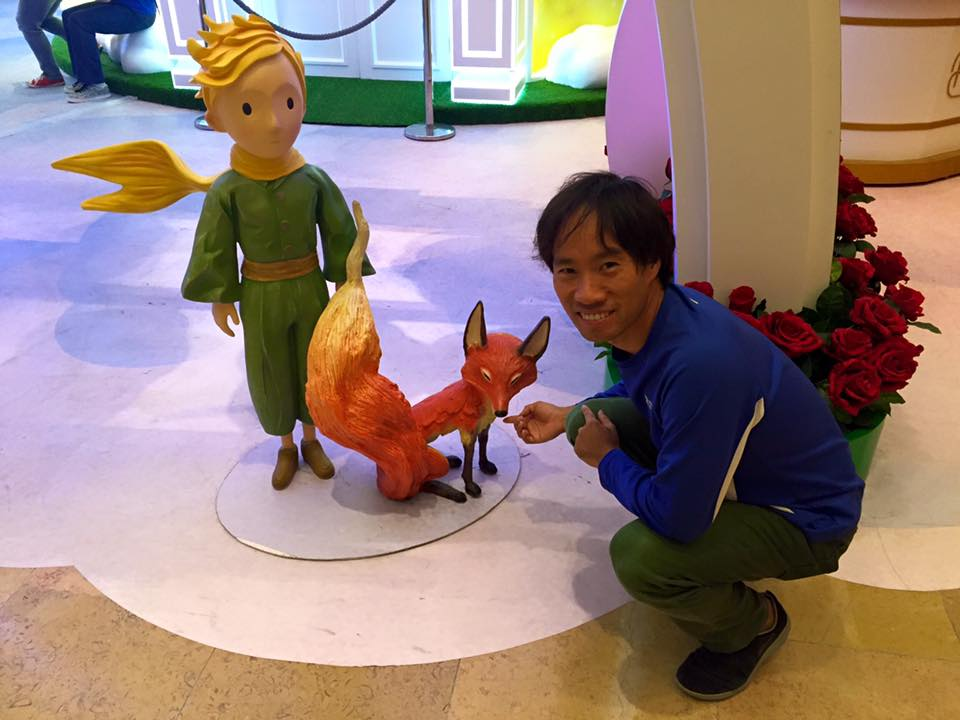
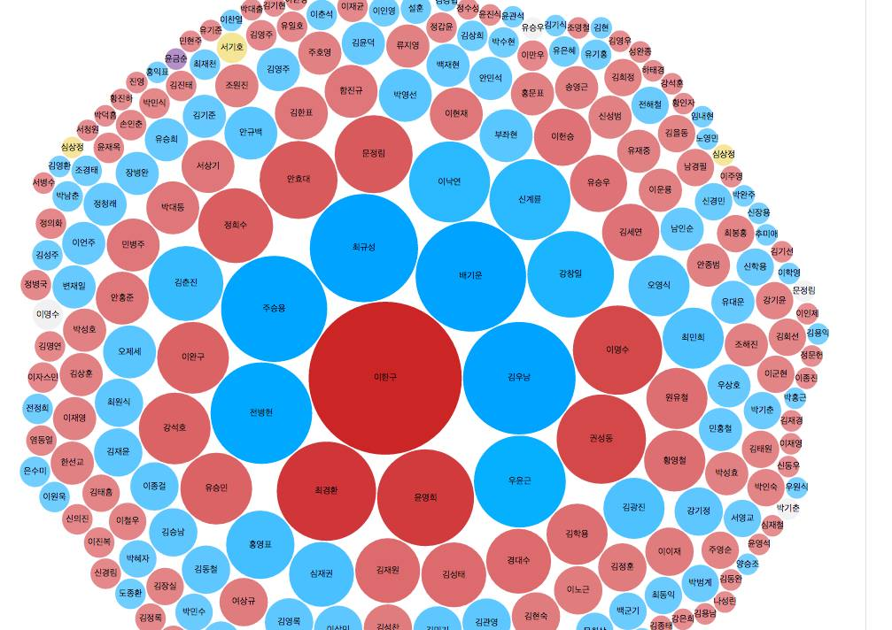
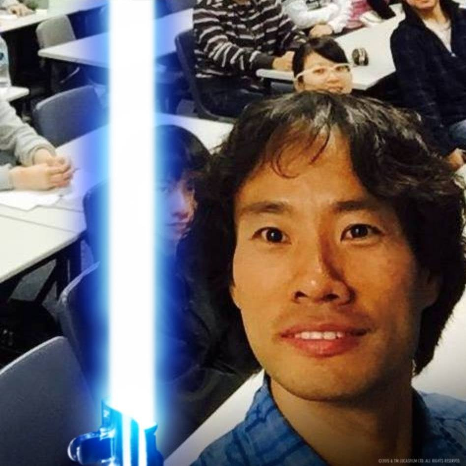
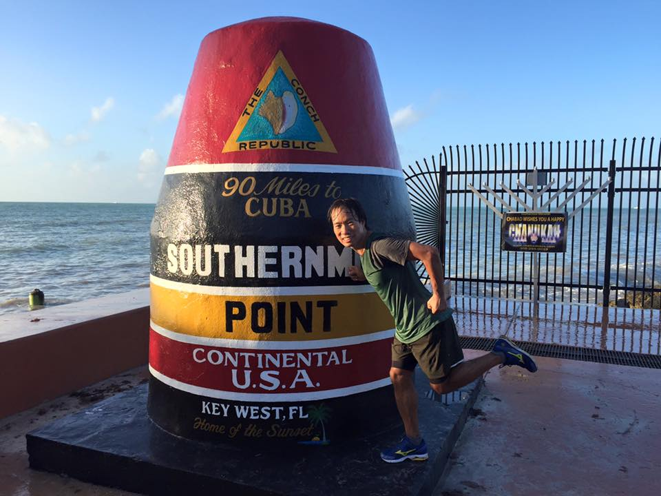
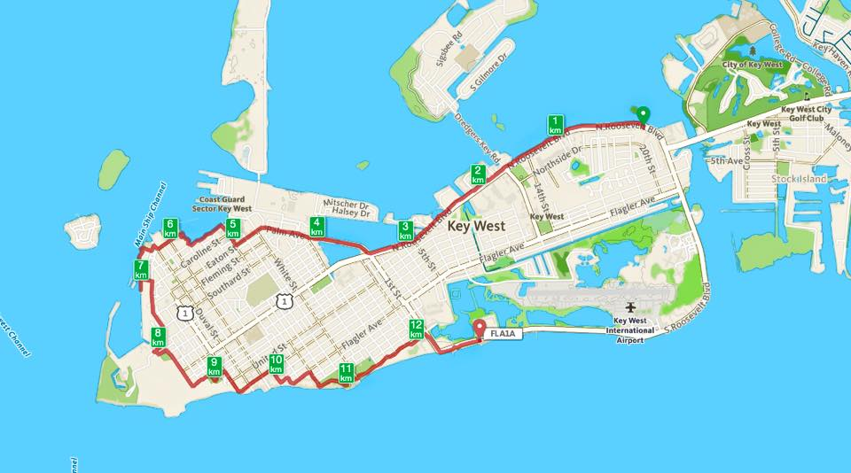
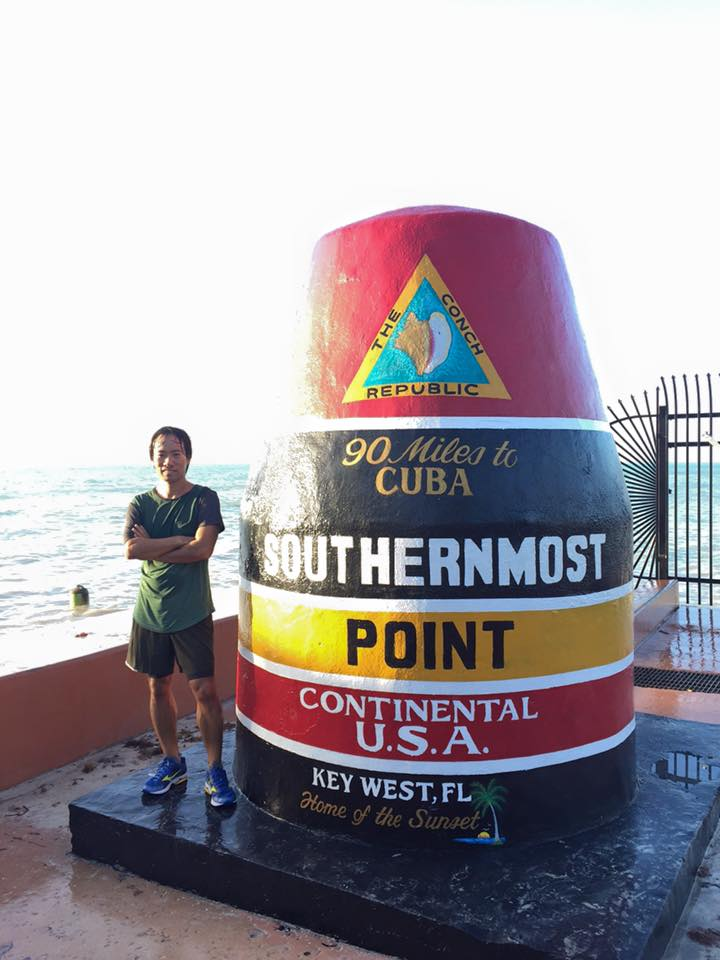

# 2015년 12월

[← 2015년](README.md)

### 12월 2일 (수) 16:46 · met the little prince and fox today!

met the little prince and fox today!

**이미지 캡션:** 한 성인 남성이 푸른색 긴팔 상의와 녹색 바지를 입고 쪼그려 앉아 있으며, 그의 오른손 검지를 여우 조각상에 뻗어 가리키고 있다. 남성은 옅은 미소를 띠고 있으며, 그의 뒤로는 붉은 장미꽃이 가득 담긴 화분이 보인다. 남성의 왼쪽에는 어린 왕자 조각상과 여우 조각상이 서 있으며, 어린 왕자는 녹색 옷을 입고 노란색 목도리를 하고 있다. 배경에는 흰색 기둥과 녹색 잔디, 그리고 조명이 설치되어 있어 실내 전시 공간으로 보인다.

### 12월 5일 (토) 01:50 · 교수님, 생신 축하 드립니다!

교수님, 생신 축하 드립니다!

### 12월 5일 (토) 01:50 · ↪ 교수님, 생신 축하 드립니다!

*다른 프로필에 남긴 글*

교수님, 생신 축하 드립니다!

### 12월 5일 (토) 11:44 · 📷 사진 (1장)

**이미지 캡션:** 이 이미지는 한국의 정치인 이름들이 원형으로 배치된 시각화 자료로, 각 이름은 원의 크기로 표현되어 있으며, 색상은 파란색, 빨간색, 분홍색으로 구분되어 있다. 파란색 원은 주로 중견 정치인이나 비교적 최근에 부각된 인물들을 나타내는 것으로 보이며, 빨간색 원은 더 큰 영향력을 가진 인물이나 주요 정치적 인물들을 나타내는 것으로 추정된다. 분홍색 원은 상대적으로 작은 영향력을 가진 인물이나 특정 그룹에 속한 인물들을 나타낼 수 있다. 각 원 안에는 한국어 이름이 기재되어 있으며, 이름의 크기는 해당 인물의 정치적 영향력이나 인지도를 나타내는 것으로 해석된다. 예를 들어, '이한구', '최규성', '이명수', '김우남' 등은 큰 원으로 표현되어 영향력이 크다는 것을 시사한다. 이 자료는 한국 정치계의 인물 관계나 영향력 분포를 한눈에 파악할 수 있도록 시각화한 것으로 보인다.치적 영향력이나 인지도를 나타내는 것으로 해석된다. 예를 들어, '이한구', '최규성', '이명수', '김우남' 등은 큰 원으로 표현되어 영향력이 크다는 것을 시사한다. 이 자료는 한국 정치계의 인물 관계나 영향력 분포를 한눈에 파악할 수 있도록 시각화한 것으로 보인다.

### 12월 17일 (목) 11:40 · Our work, veridraw,  is covered by a maj…

Our work, veridraw, http://veridraw.snu.ac.kr/ is covered by a major Korean TV News (KBS).

https://www.youtube.com/watch?v=z8hx-vAW1NQ

### 12월 18일 (금) 09:03 · 📷 앨범: Profile pictures (1장)

**이미지 캡션:** 이 사진은 강의실로 보이는 장소에서 촬영되었으며, 여러 명의 사람들이 책상에 앉아 있다. 사진의 전면에는 푸른색 광선검이 세워져 있고, 그 옆으로 성인 남성이 셀카를 찍고 있다. 이 남성은 30대 초중반으로 보이며, 검은색 곱슬머리에 옅은 미소를 띠고 있다. 그는 파란색 체크무늬 셔츠를 입고 있으며, 카메라를 향해 얼굴을 가까이 대고 있다. 남성의 뒤쪽으로는 다른 사람들이 흐릿하게 보인다. 한 여성은 안경을 쓰고 있으며, 다른 사람들은 강의에 집중하거나 휴식을 취하는 듯한 모습이다. 전반적으로 캐주얼하고 유쾌한 분위기이며, 광선검은 사진에 재미있는 요소를 더한다. 사진 하단에는 "© 2015 & ™ LUCASFILM LTD ALL RIGHTS RESERVED"라는 저작권 문구가 보인다.한 분위기이며, 광선검은 사진에 재미있는 요소를 더한다. 사진 하단에는 "© 2015 & ™ LUCASFILM LTD ALL RIGHTS RESERVED"라는 저작권 문구가 보인다.

### 12월 20일 (일) 00:59 · Happy birthday!

Happy birthday!

### 12월 20일 (일) 00:59 · ↪ Happy birthday!

*다른 프로필에 남긴 글*

Happy birthday!

### 12월 20일 (일) 00:59 · Happy birthday!!

Happy birthday!!

### 12월 20일 (일) 00:59 · ↪ Happy birthday!!

*다른 프로필에 남긴 글*

Happy birthday!!

### 12월 21일 (월) 03:50 · Happy birthday!!

Happy birthday!!

### 12월 21일 (월) 03:50 · ↪ Happy birthday!!

*다른 프로필에 남긴 글*

Happy birthday!!

### 12월 22일 (화) 21:44 · Ran to the southernmost point in USA!

📍 Southernmost Point in the US, Key West, FL

Ran to the southernmost point in USA!

**이미지 캡션:** 한 명의 성인 남성이 키 웨스트의 서던모스트 포인트 기념비 옆에서 포즈를 취하고 있다. 남성은 20대 후반에서 30대 초반으로 보이며, 짧은 검은 머리에 웃는 표정을 짓고 있다. 그는 녹색 반팔 티셔츠와 검은색 반바지, 파란색과 노란색 운동화를 신고 있다. 남성은 기념비에 기대어 한쪽 다리를 뒤로 뻗고 팔을 앞으로 내밀며 역동적인 자세를 취하고 있다. 기념비는 빨간색, 검은색, 노란색, 흰색으로 칠해져 있으며 "THE CONCH REPUBLIC", "90 Miles to CUBA", "SOUTHERNMOST POINT", "CONTINENTAL U.S.A.", "KEY WEST, FL Home of the Sunset"이라는 글자가 새겨져 있다. 배경에는 푸른 바다와 맑은 하늘이 보이며, 오른쪽에는 검은색 철제 울타리와 "CHARAD WISHES YOU A HAPPY CHANUKAH"라고 적힌 간판이 있다. 전반적으로 밝고 활기찬 분위기이며, 여행 중 즐거운 순간을 포착한 사진이다.POINT", "CONTINENTAL U.S.A.", "KEY WEST, FL Home of the Sunset"이라는 글자가 새겨져 있다. 배경에는 푸른 바다와 맑은 하늘이 보이며, 오른쪽에는 검은색 철제 울타리와 "CHARAD WISHES YOU A HAPPY CHANUKAH"라고 적힌 간판이 있다. 전반적으로 밝고 활기찬 분위기이며, 여행 중 즐거운 순간을 포착한 사진이다.
 
**이미지 캡션:** 이것은 키 웨스트의 지도이며, 붉은색 선으로 표시된 경로가 있으며, 1부터 12까지 번호가 매겨진 지점이 있습니다. 지도에는 주요 항구 채널, 해안 경비대 섹터 키 웨스트, 키 웨스트 시 골프 클럽, 키 웨스트 국제공항과 같은 여러 장소가 표시되어 있습니다. 또한 캐롤라인 스트리트, 이튼 스트리트, 플레밍 스트리트, 사우스아드 스트리트, 듀발 스트리트, 화이트 스트리트, 플래글러 애비뉴, 1번가, 유닛 스트리트, 20번가, 14번가, 5번가, 노스사이드 드라이브, 미처 드라이브, 할시 드라이브, 시그스비 로드, S. 길모어 드라이브, 드레저스 키 로드, N. 루스벨트 블러바드, S. 루스벨트 블러바드, 칼리지 로드, 키 헤이븐 로드, 말로니 로드와 같은 여러 거리 이름이 보입니다. 또한 스톡아일랜드라는 지역도 표시되어 있습니다. 지도에는 1km부터 12km까지의 거리가 표시되어 있으며, 이는 경로의 각 지점까지의 거리를 나타내는 것으로 보입니다. 전반적으로 이 지도는 키 웨스트 지역의 특정 경로를 보여주는 것으로, 아마도 달리기, 자전거 타기 또는 도보 여행을 위한 것일 수 있습니다., S. 길모어 드라이브, 드레저스 키 로드, N. 루스벨트 블러바드, S. 루스벨트 블러바드, 칼리지 로드, 키 헤이븐 로드, 말로니 로드와 같은 여러 거리 이름이 보입니다. 또한 스톡아일랜드라는 지역도 표시되어 있습니다. 지도에는 1km부터 12km까지의 거리가 표시되어 있으며, 이는 경로의 각 지점까지의 거리를 나타내는 것으로 보입니다. 전반적으로 이 지도는 키 웨스트 지역의 특정 경로를 보여주는 것으로, 아마도 달리기, 자전거 타기 또는 도보 여행을 위한 것일 수 있습니다.
 
**이미지 캡션:** 한 명의 성인 남성이 푸른색 운동화와 녹색 반팔 티셔츠, 검은색 반바지를 입고 서 있습니다. 그는 팔짱을 끼고 있으며, 표정은 편안해 보입니다. 남성은 키 웨스트의 유명한 "서던모스트 포인트" 표지석 옆에 서 있습니다. 이 표지석은 붉은색, 검은색, 노란색, 흰색으로 칠해져 있으며, "THE CONCH REPUBLIC", "90 Miles to CUBA", "SOUTHERNMOST POINT", "CONTINENTAL U.S.A.", "KEY WEST, FL Home of the Sunset"이라는 글자가 새겨져 있습니다. 배경에는 잔잔한 바다가 보이고, 하늘은 맑고 밝습니다. 사진은 낮에 촬영되었으며, 전반적으로 여행지의 여유롭고 즐거운 분위기를 나타냅니다.겨져 있습니다. 배경에는 잔잔한 바다가 보이고, 하늘은 맑고 밝습니다. 사진은 낮에 촬영되었으며, 전반적으로 여행지의 여유롭고 즐거운 분위기를 나타냅니다.

### 12월 28일 (월) 01:19 · Happy birthday!

Happy birthday!

### 12월 28일 (월) 01:19 · ↪ Happy birthday!

*다른 프로필에 남긴 글*

Happy birthday!
