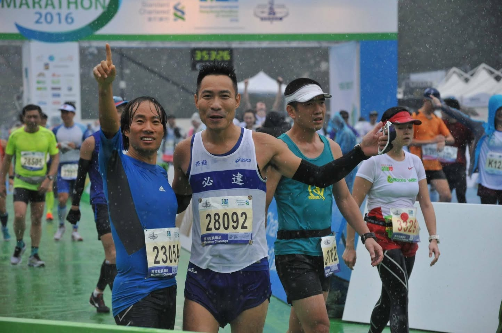
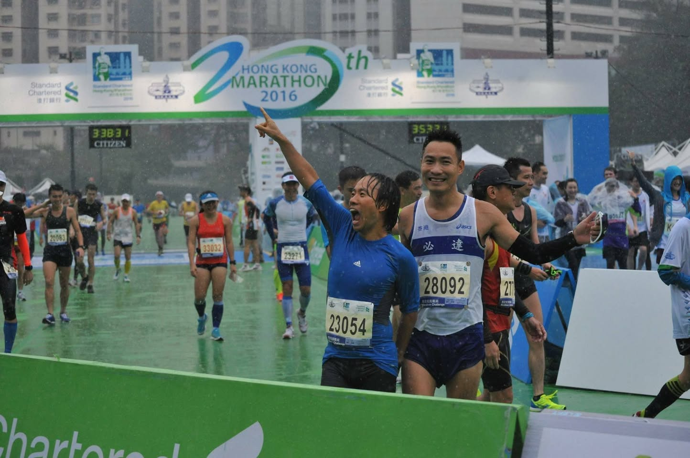
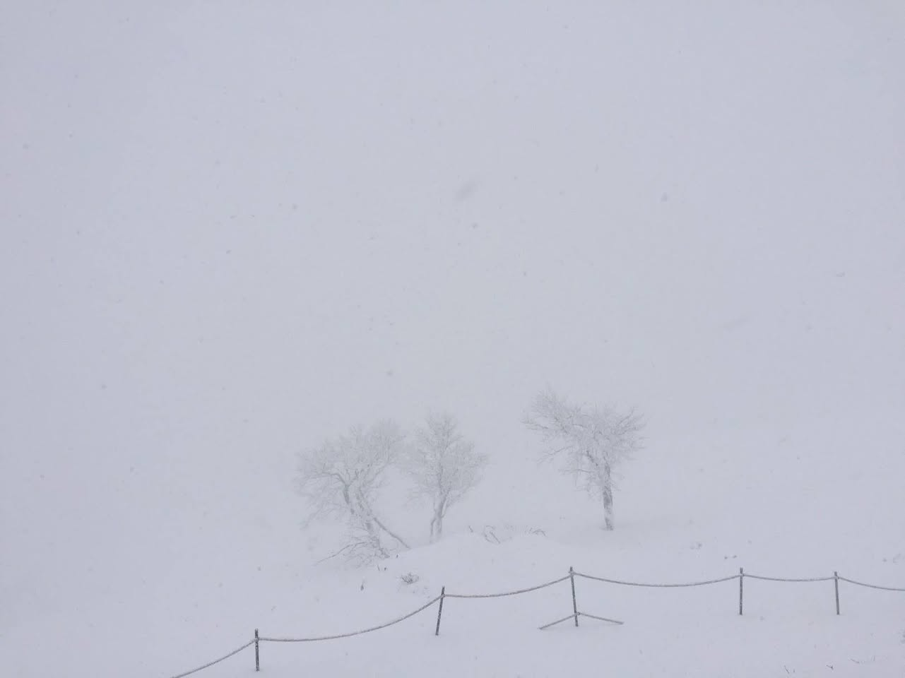
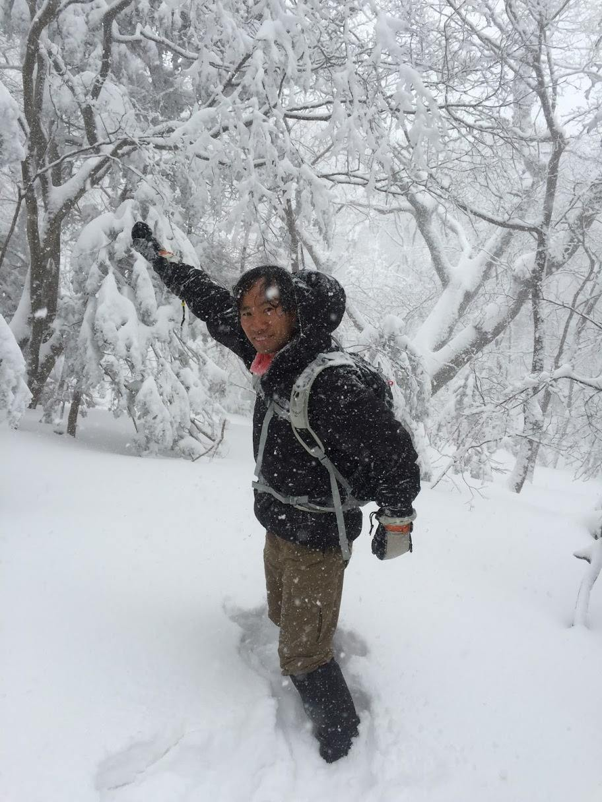
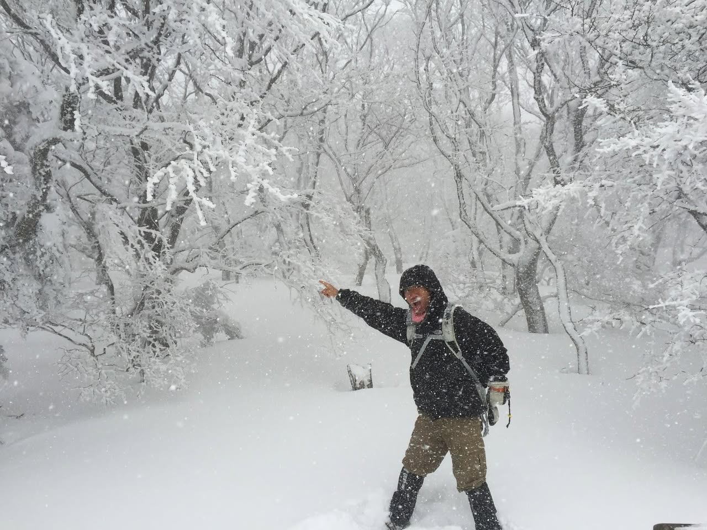

# 2016년 1월

[← 2016년](README.md)

### 1월 10일 (일) 09:51 · 생신 감축드립니다. 새해 복 많이 받으세요. 2016년은 홍콩 오셔서 저…

생신 감축드립니다. 새해 복 많이 받으세요. 2016년은 홍콩 오셔서 저희를 한번 격려해주실 예정은 없으신지요?

### 1월 10일 (일) 09:51 · ↪ 생신 감축드립니다. 새해 복 많이 받으세요. 2016년은 홍콩 오셔서 저…

*다른 프로필에 남긴 글*

생신 감축드립니다. 새해 복 많이 받으세요. 2016년은 홍콩 오셔서 저희를 한번 격려해주실 예정은 없으신지요?

### 1월 17일 (일) 22:14 · My 3rd HK marathon: It was a heavy rain …

My 3rd HK marathon: It was a heavy rain race, but I finished!! 

HK Marathon runners, you may find your pictures at https://racephotos.org.
#渣打香港馬拉松 #SCHKMarathon Standard Chartered HK Marathon

**이미지 캡션:** 밤에 열린 마라톤 대회에서 한 성인 남성이 흰색과 파란색 천을 들고 환하게 웃으며 카메라를 바라보고 있다. 남성은 파란색 반팔 티셔츠와 회색 반바지, 빨간색 운동화를 신고 있으며, 천에는 다리 모양과 "MARATHON"이라는 글자가 파란색으로 인쇄되어 있다. 배경에는 다른 참가자들이 흐릿하게 뛰고 있으며, 건물들과 간판들이 보인다. 도로에는 흰색 차선이 그려져 있고, 전체적으로 활기차고 축제 같은 분위기이다.

### 1월 19일 (화) 19:08 · Done and Happy! Standard Chartered HK Ma…

Done and Happy! Standard Chartered HK Marathon 2016!!

**이미지 캡션:** 세 명의 성인 남성이 마라톤 결승선을 통과하는 모습으로, 비가 내리는 가운데 모두 운동복을 입고 있다. 왼쪽 남성은 파란색 긴팔 상의와 검은색 반바지를 입고 있으며, 오른손을 들어 올리고 있다. 가운데 남성은 흰색과 파란색이 섞인 민소매 상의와 파란색 반바지를 입고 있으며, 번호 28092가 적힌 배번을 달고 있다. 오른쪽 남성은 청록색 민소매 상의와 검은색 반바지를 입고 있으며, 팔에 검은색 팔토시를 하고 있다. 배경에는 마라톤 결승선 아치가 보이고, 다른 참가자들과 관계자들도 보인다. 전반적으로 축하와 성취감을 나타내는 분위기이다.취감을 나타내는 분위기이다.
 
**이미지 캡션:** 이 사진은 홍콩 마라톤 2016 결승선 근처에서 비가 내리는 가운데 두 명의 성인 남성이 환호하는 모습을 담고 있습니다. 왼쪽 남성은 파란색 반팔 운동복을 입고 있으며, 오른쪽 남성은 흰색과 파란색이 섞인 마라톤 조끼와 파란색 반바지를 입고 있습니다. 두 사람 모두 마라톤 참가 번호가 적힌 배지를 달고 있으며, 왼쪽 남성은 23054, 오른쪽 남성은 28092입니다. 왼쪽 남성은 오른팔을 높이 들고 입을 크게 벌린 채 기뻐하는 표정이며, 오른쪽 남성은 미소를 지으며 카메라를 바라보고 있습니다. 배경에는 마라톤 결승선 아치가 보이고, "HONG KONG MARATHON 2016"이라는 글자가 쓰여 있습니다. 또한, 여러 명의 다른 참가자들이 비를 맞으며 결승선을 통과하거나 대기하고 있는 모습도 보입니다. 전반적으로 축제 분위기 속에서 마라톤 완주를 축하하는 활기찬 분위기입니다. 결승선 아치가 보이고, "HONG KONG MARATHON 2016"이라는 글자가 쓰여 있습니다. 또한, 여러 명의 다른 참가자들이 비를 맞으며 결승선을 통과하거나 대기하고 있는 모습도 보입니다. 전반적으로 축제 분위기 속에서 마라톤 완주를 축하하는 활기찬 분위기입니다.

### 1월 20일 (수) 22:10 · Happy birthday, Channy Yun!!

Happy birthday, Channy Yun!!

🎬 동영상 1개 (생략)

### 1월 23일 (토) 22:14 · White, white, white! Mt. Halla this morn…

White, white, white! Mt. Halla this morning!

**이미지 캡션:** 눈이 내리는 겨울 풍경으로, 사진에는 눈으로 뒤덮인 세 그루의 나무와 눈이 흩날리는 하늘이 담겨 있습니다. 나무들은 앙상한 가지를 드러내고 있으며, 눈이 쌓여 하얗게 변한 모습입니다. 사진 하단에는 쇠기둥에 연결된 밧줄로 된 울타리가 보입니다. 전체적으로 희뿌연 하늘과 눈으로 인해 시야가 제한적이며, 고요하고 쓸쓸한 분위기를 자아냅니다. 사람이나 텍스트는 보이지 않습니다.
 
**이미지 캡션:** 눈이 많이 내리는 산속에서 한 성인 남성이 카메라를 향해 웃으며 오른팔을 들어 올리고 있다. 남성은 30대 후반에서 40대 초반으로 보이며, 검은색 방수 재킷과 갈색 바지, 검은색 부츠를 착용하고 있다. 재킷 안에는 분홍색 목도리를 하고 있으며, 배낭을 메고 있다. 남성의 얼굴에는 눈이 묻어 있고, 머리카락은 젖어 있다. 배경에는 눈으로 뒤덮인 나무들이 보이며, 눈이 계속 내리고 있다. 전반적으로 추운 날씨 속에서 야외 활동을 즐기는 듯한 분위기이다.
 
**이미지 캡션:** 눈이 펑펑 내리는 겨울 숲에서 한 성인 남성이 활기찬 표정으로 포즈를 취하고 있다. 남성은 20대 후반에서 30대 초반으로 보이며, 검은색 후드 재킷과 갈색 반바지, 검은색 부츠를 착용하고 있다. 그는 배낭을 메고 있으며, 배낭에는 물병이 달려 있다. 남성은 입을 크게 벌리고 환호하는 듯한 표정을 짓고 있으며, 한 손으로는 눈 덮인 나뭇가지를 가리키고 있다. 배경에는 눈으로 뒤덮인 나무들이 빽빽하게 들어서 있어 마치 동화 속 풍경 같다. 눈이 계속 내리고 있어 시야가 다소 흐릿하지만, 남성의 역동적인 모습과 눈 덮인 숲의 아름다움이 어우러져 생동감 넘치는 분위기를 자아낸다.눈 덮인 숲의 아름다움이 어우러져 생동감 넘치는 분위기를 자아낸다.
