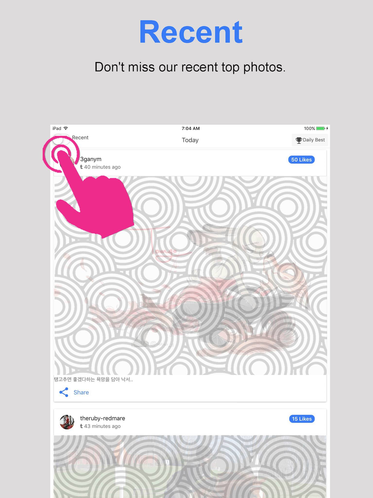
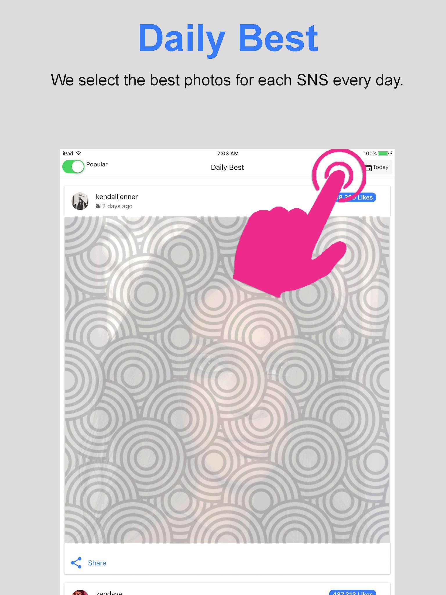
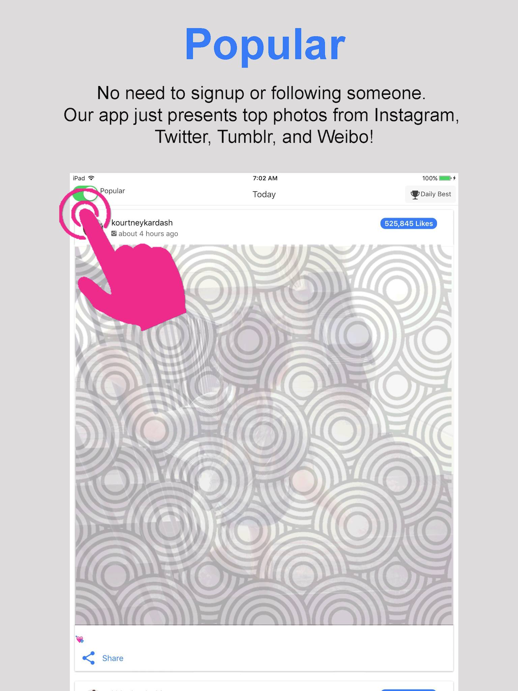
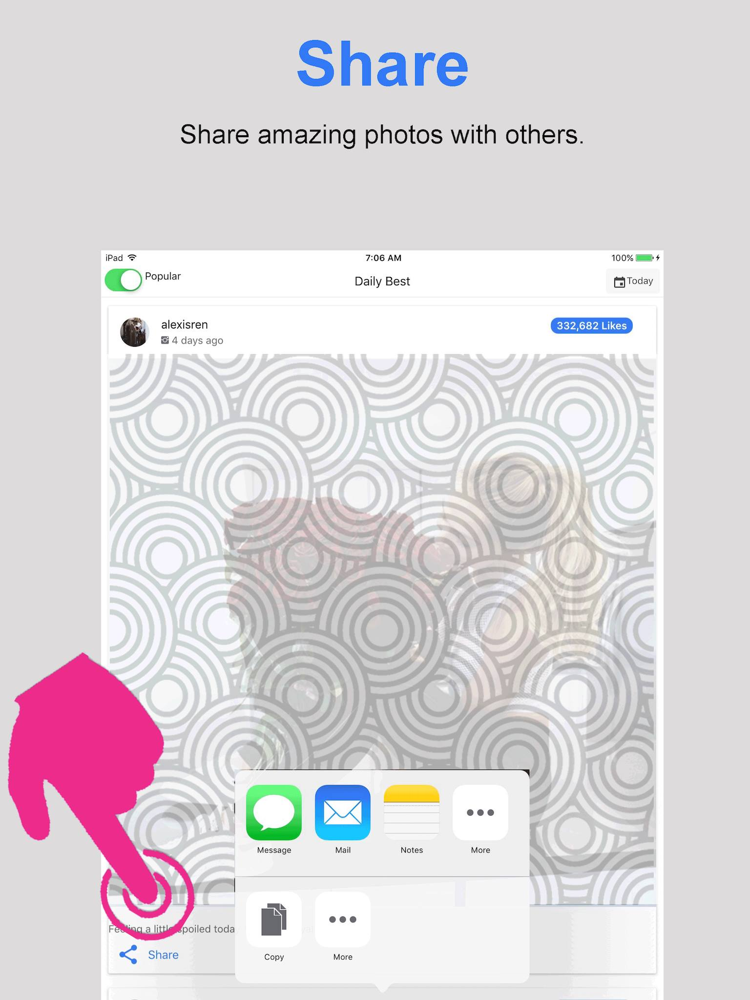
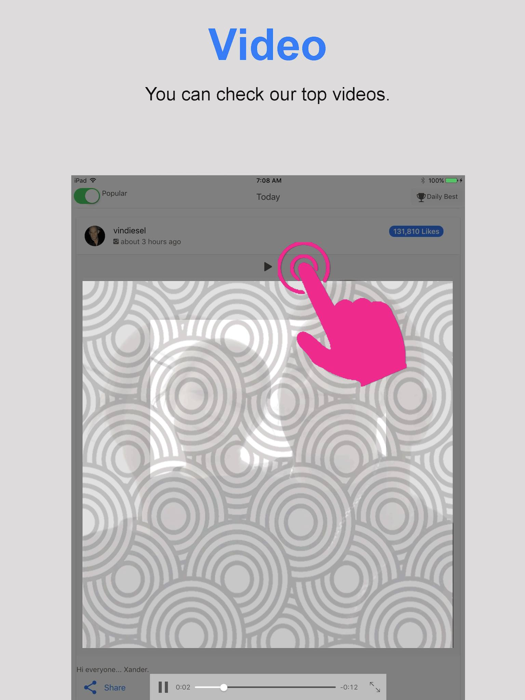
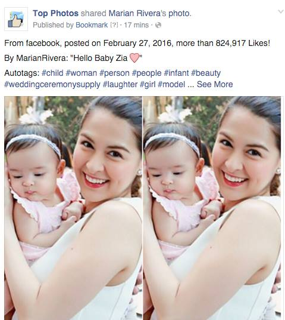

# 2016년 2월

[← 2016년](README.md)

### 2월 16일 (화) 10:33 · I miss them!

I miss them!

4 Years Ago

Sung Kim added a new photo.

Feb 16, 2012 11:57:04 pm

enjoyed farewell dinner for two visiting students, Guangtai (Peking U) and Kihong (Seoul National U). We were so happy to have you. Let's keep in touch.

**이미지 캡션:** 이 사진은 실내에서 촬영되었으며, 여러 명의 젊은 성인들이 함께 서서 포즈를 취하고 있습니다. 왼쪽부터 한 명의 성인 여성이 회색 후드티와 검은색 줄무늬 티셔츠를 입고 안경을 쓰고 있으며, 그녀 옆에는 안경을 쓴 성인 남성이 회색 후드티를 입고 있습니다. 그 뒤로 여러 명의 성인 남성들이 각기 다른 캐주얼 복장을 하고 서 있으며, 대부분 어두운 색상의 점퍼나 재킷을 입고 있습니다. 중앙에 있는 성인 남성은 검은색 패딩 점퍼에 빨간색 줄무늬가 있고, 그의 옆에는 검은색 후드티를 입은 성인 남성이 청바지를 입고 있습니다. 오른쪽으로 갈수록 성인 남성들이 더 많이 보이며, 마지막에는 체크무늬 재킷을 입은 성인 여성이 검은색 부츠를 신고 있습니다. 배경에는 대나무 장식이 있는 벽과 조명이 보이며, 전체적으로 편안하고 캐주얼한 분위기입니다. 사진에는 "7"이라는 숫자가 희미하게 보입니다.있습니다. 오른쪽으로 갈수록 성인 남성들이 더 많이 보이며, 마지막에는 체크무늬 재킷을 입은 성인 여성이 검은색 부츠를 신고 있습니다. 배경에는 대나무 장식이 있는 벽과 조명이 보이며, 전체적으로 편안하고 캐주얼한 분위기입니다. 사진에는 "7"이라는 숫자가 희미하게 보입니다.

### 2월 21일 (일) 10:57 · Sung Kim shared a link.

🔗 <http://www.phpgang.com/search-content-in-facebook-with-open-graph-api-in-php_721.html>

### 2월 21일 (일) 23:43 · Sung's first app: Top photos!

Sung's first app: Top photos!

Do you want to check out daily top photos from Twitter, Instagram, Tumblr, and Weibo? Here we are! You can use this Android app, https://play.google.com/store/apps/details?id=hk.ust.hunkim.topline, or web version at https://topp.firebaseapp.com. (The IOS version will be available soon.) No login, signup, or followings! Just you can enjoy these top photos. I was using the apps for several days, and these top photos are amazing.  

In addition, you can "Like" the Autogenerated Daily Best Facebook page: https://www.facebook.com/Top-Photos-110372946020357/.

Feel free to send me comments.

🔗 <https://play.google.com/store/apps/details?id=com.ionicframework.smile432887>

### 2월 22일 (월) 10:46 · happy birthday!!

happy birthday!!

### 2월 22일 (월) 10:46 · ↪ happy birthday!!

*다른 프로필에 남긴 글*

happy birthday!!

### 2월 23일 (화) 11:53 · Sung Kim shared a link.

🔗 <https://www.instagram.com/p/BCHAnoYk1mS/>

### 2월 23일 (화) 15:53 · Sung Kim shared a link.

🔗 <https://www.instagram.com/p/BCHZ_tvjCaf/>

### 2월 23일 (화) 23:26 · 2.1M likes in two days! Really amazing!!

2.1M likes in two days! Really amazing!!

### 2월 24일 (수) 22:17 · "No days off!" I like it.

"No days off!" I like it.

### 2월 24일 (수) 23:30 · 📷 사진 (5장)

**이미지 캡션:** 화면 상단에는 "Recent"라는 파란색 글씨와 "Don't miss our recent top photos."라는 문구가 보이며, 그 아래에는 iPad 화면이 나타난다. iPad 화면 상단에는 시간(7:04 AM), 날짜(Today), 배터리 잔량(100%), 그리고 "Daily Best"라는 문구가 보인다. 화면 중앙에는 분홍색 손가락 모양의 일러스트가 "Recent" 탭을 누르는 듯한 모습으로 그려져 있으며, 그 아래에는 "3ganym"이라는 사용자 이름과 "40 minutes ago"라는 게시 시간이 표시되어 있다. 게시물에는 "탱고추면 좋겠다하는 욕망을 담아 낙서.."라는 한국어 텍스트와 "Share" 버튼이 있다. 게시물에는 "50 Likes"라는 좋아요 수가 표시되어 있다. 그 아래에는 "theruby-redmare"라는 사용자 이름과 "43 minutes ago"라는 게시 시간이 보이며, 이 게시물에는 "15 Likes"라는 좋아요 수가 표시되어 있다. 전체적으로 사진은 소셜 미디어 앱의 최근 게시물 목록을 보여주는 화면을 캡처한 것으로, 사용자의 관심을 유도하는 디자인 요소와 함께 여러 게시물이 나열되어 있다. 배경에는 동심원 패턴의 이미지가 흐릿하게 겹쳐져 있다.표시되어 있다. 게시물에는 "탱고추면 좋겠다하는 욕망을 담아 낙서.."라는 한국어 텍스트와 "Share" 버튼이 있다. 게시물에는 "50 Likes"라는 좋아요 수가 표시되어 있다. 그 아래에는 "theruby-redmare"라는 사용자 이름과 "43 minutes ago"라는 게시 시간이 보이며, 이 게시물에는 "15 Likes"라는 좋아요 수가 표시되어 있다. 전체적으로 사진은 소셜 미디어 앱의 최근 게시물 목록을 보여주는 화면을 캡처한 것으로, 사용자의 관심을 유도하는 디자인 요소와 함께 여러 게시물이 나열되어 있다. 배경에는 동심원 패턴의 이미지가 흐릿하게 겹쳐져 있다.
 
**이미지 캡션:** 화면 상단에는 파란색 글씨로 "Daily Best"라고 쓰여 있고, 그 아래에는 "We select the best photos for each SNS every day."라는 문구가 있다. 화면 중앙에는 아이패드 화면이 보이며, 상단에는 "iPad", "Popular", "7:03 AM", "Daily Best", "100%", "Today" 등의 텍스트가 있다. "Daily Best"라는 글씨 옆에는 분홍색으로 칠해진 손가락이 아이콘을 누르는 모습이 그려져 있으며, 이 아이콘은 "Likes"라고 표시된 버튼 위에 있다. 아이패드 화면 안에는 "kendalljenner"라는 계정 이름과 "2 days ago"라는 게시 시간이 보이며, 그 아래에는 동심원 패턴의 배경 이미지가 있다. 화면 하단에는 "Share"라는 글씨와 함께 공유 아이콘이 보인다. 전반적으로 소셜 미디어에서 인기 있는 사진을 선별하는 앱이나 서비스를 홍보하는 듯한 분위기이다.튼 위에 있다. 아이패드 화면 안에는 "kendalljenner"라는 계정 이름과 "2 days ago"라는 게시 시간이 보이며, 그 아래에는 동심원 패턴의 배경 이미지가 있다. 화면 하단에는 "Share"라는 글씨와 함께 공유 아이콘이 보인다. 전반적으로 소셜 미디어에서 인기 있는 사진을 선별하는 앱이나 서비스를 홍보하는 듯한 분위기이다.
 
**이미지 캡션:** 화면 상단에는 파란색 글씨로 "Popular"라고 쓰여 있고, 그 아래에는 "No need to signup or following someone. Our app just presents top photos from Instagram, Twitter, Tumblr, and Weibo!"라는 문구가 적혀 있습니다. 화면 중앙에는 태블릿 화면이 보이며, 상단에는 "iPad", "Popular", "7:02 AM", "Today", "100%", "Daily Best" 등의 텍스트가 있습니다. "Popular" 옆에는 녹색으로 켜진 토글 스위치가 있고, 그 옆에 분홍색 손가락 모양의 그림이 토글 스위치를 누르는 듯한 동작을 하고 있습니다. 그 아래에는 "kourtneykardash"라는 이름과 "about 4 hours ago"라는 시간이 표시되어 있습니다. 사진은 회색 동심원 패턴으로 채워져 있으며, 그 위에 희미하게 사람의 모습이 비칩니다. 사진 오른쪽 상단에는 "525,845 Likes"라는 버튼이 있습니다. 화면 하단에는 "Share"라는 텍스트와 공유 아이콘이 보입니다. 전반적으로 앱의 기능을 설명하고 인기 있는 사진을 보여주는 화면을 보여주는 것으로 보이며, 분홍색 손가락은 사용자의 인터랙션을 나타내는 것으로 추정됩니다.에는 녹색으로 켜진 토글 스위치가 있고, 그 옆에 분홍색 손가락 모양의 그림이 토글 스위치를 누르는 듯한 동작을 하고 있습니다. 그 아래에는 "kourtneykardash"라는 이름과 "about 4 hours ago"라는 시간이 표시되어 있습니다. 사진은 회색 동심원 패턴으로 채워져 있으며, 그 위에 희미하게 사람의 모습이 비칩니다. 사진 오른쪽 상단에는 "525,845 Likes"라는 버튼이 있습니다. 화면 하단에는 "Share"라는 텍스트와 공유 아이콘이 보입니다. 전반적으로 앱의 기능을 설명하고 인기 있는 사진을 보여주는 화면을 보여주는 것으로 보이며, 분홍색 손가락은 사용자의 인터랙션을 나타내는 것으로 추정됩니다.
 
**이미지 캡션:** 화면 상단에는 파란색 글씨로 "Share"라고 쓰여 있고, 그 아래에는 "Share amazing photos with others."라는 문구가 있습니다. 화면 중앙에는 아이패드 화면이 보이며, 상단에는 "iPad", "Popular", "7:06 AM", "Daily Best", "100%", "Today" 등의 정보가 표시됩니다. 그 아래에는 "alexisren"이라는 사용자 이름과 "4 days ago"라는 게시 시간이 보이며, "332,682 Likes"라는 좋아요 수가 나타납니다. 게시물 내용은 회색 동심원 패턴의 배경 위에 흐릿하게 사람 형상이 있는 사진입니다. 화면 하단에는 분홍색 손가락 모양의 아이콘이 나타나고 있으며, 이 손가락은 화면 하단의 공유 메뉴를 누르고 있는 듯한 동작을 하고 있습니다. 공유 메뉴에는 메시지, 메일, 노트, 더 보기, 복사 등의 아이콘과 텍스트가 보입니다. 전반적으로 사진 공유 기능을 설명하는 화면으로 보이며, 밝고 긍정적인 분위기입니다.색 동심원 패턴의 배경 위에 흐릿하게 사람 형상이 있는 사진입니다. 화면 하단에는 분홍색 손가락 모양의 아이콘이 나타나고 있으며, 이 손가락은 화면 하단의 공유 메뉴를 누르고 있는 듯한 동작을 하고 있습니다. 공유 메뉴에는 메시지, 메일, 노트, 더 보기, 복사 등의 아이콘과 텍스트가 보입니다. 전반적으로 사진 공유 기능을 설명하는 화면으로 보이며, 밝고 긍정적인 분위기입니다.
 
**이미지 캡션:** 화면 상단에는 파란색 글씨로 "Video"라고 쓰여 있고, 그 아래에는 "You can check our top videos."라는 문구가 있다. 그 아래에는 태블릿 화면이 보이며, 화면 상단에는 "iPad", "Popular", "7:08 AM", "Today", "100%", "Daily Best" 등의 텍스트가 있다. 화면 중앙에는 "vindiesel"이라는 이름과 "about 3 hours ago"라는 문구가 보이며, 그 옆에는 동영상 재생 버튼과 함께 핑크색 손가락이 동영상 재생 버튼을 누르려는 듯한 모습이 그려져 있다. 동영상 화면에는 회색과 흰색의 동심원 패턴이 반복되고 있으며, 그 위에 "HI"라는 글자가 희미하게 보인다. 동영상 하단에는 "Hi everyone... Xander."라는 텍스트와 함께 "Share" 버튼, 재생/일시정지 버튼, 재생 시간 표시, 그리고 전체 재생 시간 표시가 있다. 전반적으로 동영상을 홍보하고 시청을 유도하는 듯한 분위기이다. 모습이 그려져 있다. 동영상 화면에는 회색과 흰색의 동심원 패턴이 반복되고 있으며, 그 위에 "HI"라는 글자가 희미하게 보인다. 동영상 하단에는 "Hi everyone... Xander."라는 텍스트와 함께 "Share" 버튼, 재생/일시정지 버튼, 재생 시간 표시, 그리고 전체 재생 시간 표시가 있다. 전반적으로 동영상을 홍보하고 시청을 유도하는 듯한 분위기이다.

### 2월 29일 (월) 20:50 · 📷 사진 (1장)

**이미지 캡션:** 사진에는 성인 여성 한 명과 아기 한 명이 등장하며, 여성은 아기를 품에 안고 환하게 웃고 있습니다. 여성은 20대 후반에서 30대 초반으로 보이며, 옅은 화장을 하고 흰색 민소매 원피스를 입고 있습니다. 머리에는 흰색 헤어밴드를 하고 있으며, 귀에는 작은 귀걸이를 착용했습니다. 아기는 6개월에서 1세 정도로 보이며, 분홍색 옷을 입고 머리에는 흰색 헤어밴드를 하고 있습니다. 아기는 여성의 품에 안겨 약간은 멍한 표정으로 정면을 응시하고 있습니다. 사진은 두 개의 동일한 이미지가 나란히 배치된 형태로, 마치 콜라주처럼 보입니다. 배경은 흐릿하게 처리되어 있지만, 야외에서 찍은 것으로 추정되며 나뭇잎과 같은 녹색 식물들이 보입니다. 전체적으로 따뜻하고 행복한 분위기를 자아냅니다. 사진은 페이스북에 게시되었으며, "Top Photos"라는 페이지에서 공유되었고, 게시자는 "Marian Rivera"입니다. 게시물에는 "Hello Baby Zia"라는 문구와 함께 하트 이모티콘이 포함되어 있으며, #child, #woman, #person, #people, #infant, #beauty, #weddingceremonysupply, #laughter, #girl, #model 등의 해시태그가 달려 있습니다. 게시일은 2016년 2월 27일이며, 82만 개 이상의 좋아요를 받았습니다.콜라주처럼 보입니다. 배경은 흐릿하게 처리되어 있지만, 야외에서 찍은 것으로 추정되며 나뭇잎과 같은 녹색 식물들이 보입니다. 전체적으로 따뜻하고 행복한 분위기를 자아냅니다. 사진은 페이스북에 게시되었으며, "Top Photos"라는 페이지에서 공유되었고, 게시자는 "Marian Rivera"입니다. 게시물에는 "Hello Baby Zia"라는 문구와 함께 하트 이모티콘이 포함되어 있으며, #child, #woman, #person, #people, #infant, #beauty, #weddingceremonysupply, #laughter, #girl, #model 등의 해시태그가 달려 있습니다. 게시일은 2016년 2월 27일이며, 82만 개 이상의 좋아요를 받았습니다.

> 간단하게 해보는 구글 Vision API. 최근 구글이 이미지를 자동으로 레벨링할수 있는 API (https://cloud.google.com/vision/docs/) 를 소개 했는데요 간단하게 PHP로 이미지 레벨을 뽑아 오는 프로그램을 만들어 보았는데 한번 해보실 분들을 위해 공개합니다.  const GOOGLE_VISION_KEY = '여러분의키'; const GOOGLE_VISION_END_POINT = "https://vision.googleapis.com/v1/images:annotate?key=";  function doGoogleVisionRquest($filename, $type="LABEL_DETECTION") {  $request['requests'] = ['image'=>[], 'features'=>["type"=>$type,  "maxResults"=>999]];    $data = file_get_contents($filename);  if ($data===FALSE) {  die("Invalid file/url: $filename\n");  }   $request['requests']['image']['content'] =  base64_encode($data);  $payload = json_encode($request);   $ch = curl_init(GOOGLE_VISION_END_POINT . GOOGLE_VISION_KEY);  curl_setopt( $ch, CURLOPT_POSTFIELDS, $payload );  curl_setopt( $ch, CURLOPT_HTTPHEADER, array('Content-Type:application/json'));  curl_setopt( $ch, CURLOPT_RETURNTRANSFER, true );  $result = curl_exec($ch);  curl_close($ch);   return $result; } $file이름은 로컬파일이나 이미지 URL을 주면 되고, $type에는 FACE_DETECTION, LANDMARK_DETECTION, LOGO_DETECTION, LABEL_DETECTION, TEXT_DETECTION, SAFE_SEARCH_DETECTION 중 하나를 입력하시면 됩니다.   간단한 commandline에서 테스트 하시려면 다음을 추가:   if ($argc < 2) {  die("Usage: " .  $argv[0] . " <img_file|img_url> <type>\n");  }    if (!isset($argv[2])) {  $argv[2] = 'LABEL_DETECTION';  }    $response = doGoogleVisionRquest($argv[1], $argv[2]);  echo($response);  각각의 type에 대해 매달 1000개의 이미지는 무료로 처리가 가능합니다. 키를 받기위해서는 (https://cloud.google.com/vision/docs/getting-started) 참조.  그런데 이 API로 무엇을 할수 있을까요? 저는 자동으로 모아오는 Top Photos 자동tag 를 달아 보았습니다. #child #woman #person #people #infant #beauty #weddingceremonysupply #laughter #girl #model 등을 달아 주네요. (사진 참조.)   뭘 더 할수 있을지는 좀더 고민해봐야 할것 같습니다.
