# 2016년 3월

[← 2016년](README.md)

### 3월 1일 (화) 07:13 · Beautiful!

Beautiful!

### 3월 1일 (화) 13:12 · Happy birthday!

Happy birthday!

### 3월 1일 (화) 13:12 · ↪ Happy birthday!

*다른 프로필에 남긴 글*

Happy birthday!

### 3월 2일 (수) 11:23 · 📷 사진 (1장)

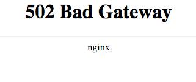

### 3월 5일 (토) 11:04 · Happy birthday!

Happy birthday!

### 3월 5일 (토) 11:04 · ↪ Happy birthday!

*다른 프로필에 남긴 글*

Happy birthday!

### 3월 8일 (화) 09:57 · 📷 사진 (1장)

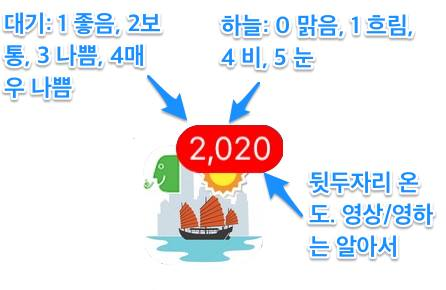

> 3일간의 삽질로 알아낸 iOS Push를 이용한 Badge (아이콘 옆 번호) 엡 만들어 보기에 대한 스크린샷 위주의 슬라이드 입니다. http://www.slideshare.net/HannaSungKim/i-os-push-59229467  이 Badge를 이용해 아래와 같은 엡을 만들수 있습니다. 엡을 열어보기도 귀찮을때 번호만으로도 날씨와 대기환경을 한눈에. :-)

### 3월 8일 (화) 13:27 · 생일 축하 드립니다. 행복한 하루 되세요!

생일 축하 드립니다. 행복한 하루 되세요!

### 3월 8일 (화) 13:27 · ↪ 생일 축하 드립니다. 행복한 하루 되세요!

*다른 프로필에 남긴 글*

생일 축하 드립니다. 행복한 하루 되세요!

### 3월 8일 (화) 14:10 · Good to be on top of the mountain on a b…

Good to be on top of the mountain on a beautiful day!

### 3월 9일 (수) 11:27 · Very good overview to understand what Go…

Very good overview to understand what Google is doing with Deep learning.

🔗 <https://youtu.be/QSaZGT4-6EY>

### 3월 9일 (수) 11:52 · Happy birthday!!

Happy birthday!!

### 3월 9일 (수) 11:52 · ↪ Happy birthday!!

*다른 프로필에 남긴 글*

Happy birthday!!

### 3월 9일 (수) 11:52 · Jappy birthday!

Jappy birthday!

### 3월 9일 (수) 11:52 · ↪ Jappy birthday!

*다른 프로필에 남긴 글*

Jappy birthday!

### 3월 11일 (금) 10:54 · Happy birthday, Alex!

Happy birthday, Alex!

### 3월 11일 (금) 10:54 · ↪ Happy birthday, Alex!

*다른 프로필에 남긴 글*

Happy birthday, Alex!

### 3월 11일 (금) 10:54 · Happy birthday!

Happy birthday!

### 3월 11일 (금) 10:54 · ↪ Happy birthday!

*다른 프로필에 남긴 글*

Happy birthday!

### 3월 11일 (금) 10:54 · Happy birthday!

Happy birthday!

### 3월 11일 (금) 10:54 · ↪ Happy birthday!

*다른 프로필에 남긴 글*

Happy birthday!

### 3월 13일 (일) 10:41 · makes me smile.

makes me smile.

### 3월 13일 (일) 17:46 · Lee Se-dol won!  Alphago resigned!! #dee…

Lee Se-dol won!  Alphago resigned!! #deepmind #alphago

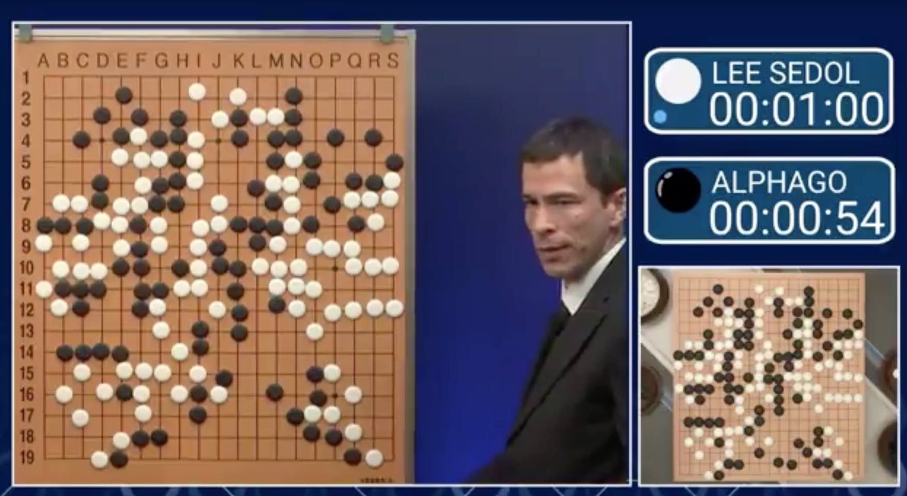

### 3월 17일 (목) 12:36 · If you are around, your are welcome to j…

If you are around, your are welcome to join this event.

"This year we will be following 3 main themes, which you and your team can follow to compete for prizes from our sponsors that are altogether valued at more than HKD 100,000!

1. Mobile Gaming - Sponsored by Madhead - HK$80,000

2. FinTech - Sponsored by Bank of East Asia - HK$30,000

3. WomenTech - Google - HK$16,000

4. Alternatively, you can choose the Creative theme and develop ideas without any restrictions - Sponsored by Microsoft - Surface3 Laptop"

🔗 <https://www.eventbrite.hk/e/hackust-2016-tickets-22763351798/?aff=efbnreg>

### 3월 18일 (금) 10:16 · Happy birthday!

Happy birthday!

### 3월 18일 (금) 10:16 · ↪ Happy birthday!

*다른 프로필에 남긴 글*

Happy birthday!

### 3월 21일 (월) 08:39 · #PrayForTurkey

#PrayForTurkey

### 3월 22일 (화) 23:13 · Totally!

Totally!

### 3월 23일 (수) 09:51 · 생일 축하! 오늘 행복한 하루 되세요!

생일 축하! 오늘 행복한 하루 되세요!

### 3월 23일 (수) 09:51 · ↪ 생일 축하! 오늘 행복한 하루 되세요!

*다른 프로필에 남긴 글*

생일 축하! 오늘 행복한 하루 되세요!

### 3월 23일 (수) 09:51 · Happy birthday!!

Happy birthday!!

### 3월 23일 (수) 09:51 · ↪ Happy birthday!!

*다른 프로필에 남긴 글*

Happy birthday!!

### 3월 24일 (목) 10:16 · 생일 축하 드립니다. 행복한 하루 되세요!

생일 축하 드립니다. 행복한 하루 되세요!

### 3월 24일 (목) 10:16 · ↪ 생일 축하 드립니다. 행복한 하루 되세요!

*다른 프로필에 남긴 글*

생일 축하 드립니다. 행복한 하루 되세요!

### 3월 25일 (금) 01:40 · 생신 축하 드립니다.

생신 축하 드립니다.

### 3월 25일 (금) 01:40 · ↪ 생신 축하 드립니다.

*다른 프로필에 남긴 글*

생신 축하 드립니다.

### 3월 25일 (금) 17:35 · 📷 사진 (1장)

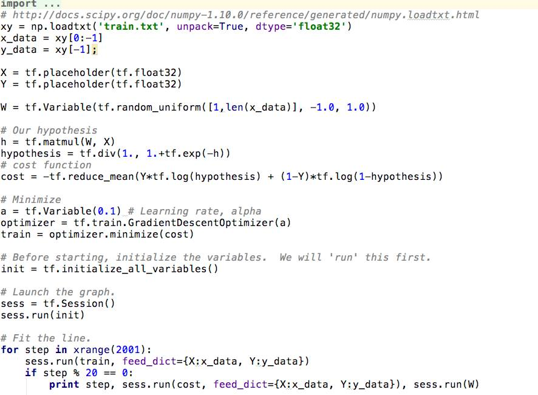

> 한페이지로 구현하는 Logistic Classification (TensorFlow) 입니다. 이 알고리즘은 정확도가 높은 것으로 알려져 있어 feature 가 수백개 이하면 현업에서도 사용가능합니다.  이론 부분은 ML/DL 수업 (http://hunkim.github.io/ml/) 5강에서 보실수 있습니다.  #ML #DeepLearning #TensorFlow

### 3월 26일 (토) 09:46 · 생신 축하드립니다. 행복한 하루 되세요!

생신 축하드립니다. 행복한 하루 되세요!

### 3월 26일 (토) 09:46 · ↪ 생신 축하드립니다. 행복한 하루 되세요!

*다른 프로필에 남긴 글*

생신 축하드립니다. 행복한 하루 되세요!

### 3월 27일 (일) 09:37 · 📷 사진 (3장)

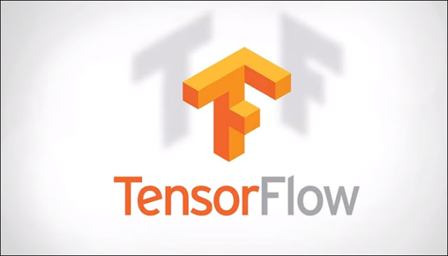 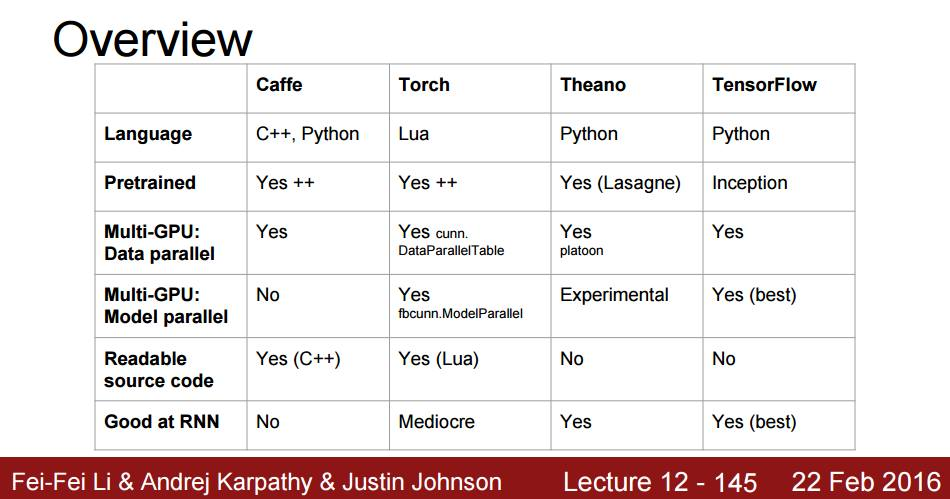 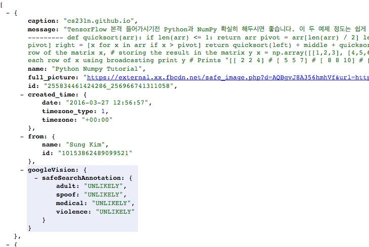

> 다른 도구들고 많은데 왜 TensorFlow일까요?  아래 Andrej 수업에서도 나오는 것 처럼  1. 전문 개발자 (속칭 구글러)에 의해 처음 부터 개발. (다른 도구들은 대학원생이 대부분 처음 만듬)  2. Multi-machine, multi-CPU, multi-GPU! 아마 multi-machine이 되는 유일한 도구.  3. 우리 모두가 사랑하는 Python.  단 하나의 단점은 Pre-trained 데이타 (transfer learning등에 사용할)가 많지 않다는 것인데 이는 사용자들이 급격하게 늘고 있으니 곧 많아 질듯합니다.  TensorFlow 의 전문가가 되어 보아요.
> [스팸/음란물로 부터 우리 그룹을 지키자 프로젝트 #1]  다른 그룹들 보니 스펨이 엄청있네요. 일일이 다 지울수도 없고. 우리가 TensorFlow DeepLearning인 만큼 이런것은 우리 손으로.  그래서 일단 1) FB API를 이용해 Feed를 가져 옵니다. 2) Google Vision API를 이용 이것이 음란물인지 확인합니다.  데모: http://r.kproperty.xyz/getFeed.php (작은 서버에서 Google Vision API를 호출하기때문에 조금 느립니다.)  제가 올린 그림은 다음과 같이 나옵니다.  { safeSearchAnnotation: { adult: "UNLIKELY", spoof: "UNLIKELY", medical: "UNLIKELY", violence: "UNLIKELY" }  할일1: adult/spoof등에서 고득점 할경우 자동 삭제및 회원 강퇴. 할일2: 한글 문자열을 읽어 스펨인지 아닌지 분류  혹시 할일 2를 TF로 구현해주실분 계신가요?

### 3월 28일 (월) 17:12 · 📷 사진 (3장)

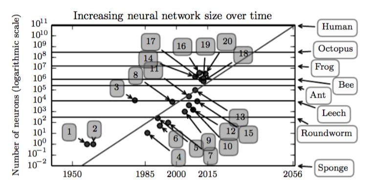 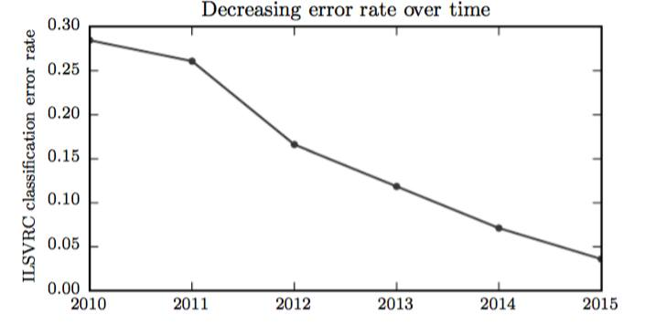 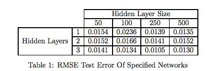

> 오늘 올라온 open, high, low, close and volume 정보만 사용한 주식 정보 예측: (LSTM 모델 500 Layer 사용). 수업의 프로젝트 리포트 정도 수준의 매우 초보적인 논문으로 보입니다만 주식 예측 분야 입문으로 보기 좋을듯.  그런데 결과는 비교가 없어서 좋은지 어떤지 모르겠네요. (이분야 일하시는분 계시면 코멘트 부탁드립니다.)  http://arxiv.org/pdf/1603.07893v1.pdf

### 3월 29일 (화) 18:37 · 📷 사진 (1장)

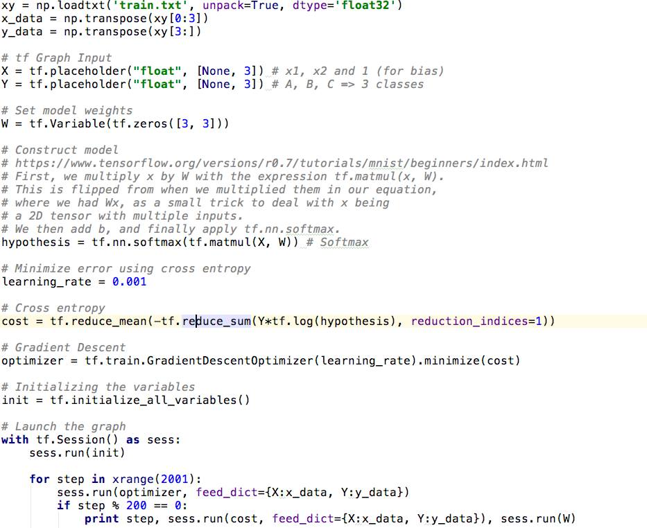

> 한페이지에 쏙 들어가는 TensorFlow를 이용한 Softmax Classifier강의 업 되었습니다.  http://hunkim.github.io/ml/  여기까지만 오시면 기본 머신러닝의 이해 끝이며, https://www.tensorflow.org/ 의 기본 예제들이 완전 이해 되실 것입니다.  다음부터 더디어 Deep Network 강의로 이어 집니다.

### 3월 30일 (수) 11:44 · happy birthday!

happy birthday!

### 3월 30일 (수) 11:44 · ↪ happy birthday!

*다른 프로필에 남긴 글*

happy birthday!

### 3월 30일 (수) 21:57 · 📷 사진 (1장)

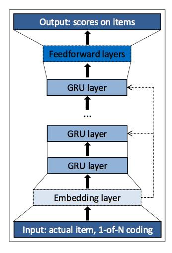

> ICLR2016년 논문인데 session 기반의 상품추천인데 아래와 같이  수정된 RNN 을 사용했는데 기존에 비해 정확도가 20~30% 증가 한다고 합니다. Deep Nets가 추천 시스템에서도 힘을 발휘하네요. 온라인 쇼핑몰과 유사한 사업을 하신다면 눈여겨 볼만합니다.   입력도 전체 아이템을 벡터로 (이번 세션에서 선택된 항목은 1, 나머지 0) 통채로 넣어 주네요. 통큰 Deep Nets입니다.  Session-based Recommendations with Recurrent Neural Networks http://arxiv.org/abs/1511.06939

### 3월 31일 (목) 09:37 · Happy birthday!!

Happy birthday!!

### 3월 31일 (목) 09:37 · ↪ Happy birthday!!

*다른 프로필에 남긴 글*

Happy birthday!!

### 3월 31일 (목) 22:59 · 📷 사진 (1장)

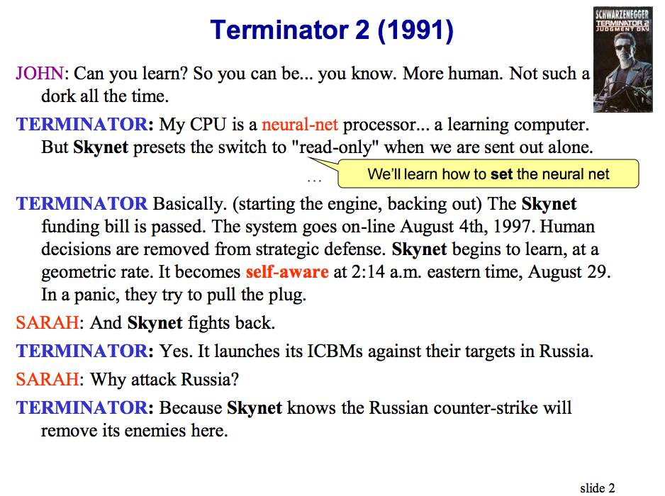

> 뒷북일수 있으나 터미네이터 영화에 이런 대사가 나오나요?  TERMINATOR: My CPU is a neural-net processor... a learning computer. But Skynet presets the switch to "read-only" when we are sent out alone.   그럼 구글의 TF가 나중에 스카이넷이 될 가능성이? :-)  http://pages.cs.wisc.edu/~jerryzhu/cs540/handouts/neural.pdf
