# 2016년 4월

[← 2016년](README.md)

### 4월 1일 (금) 09:08 · "Only those who will risk going too far …

"Only those who will risk going too far can possibly find out how far one can go." - T.S. Eliot

### 4월 1일 (금) 15:40 · TensorFlow T-shirts from Google!!

TensorFlow T-shirts from Google!!

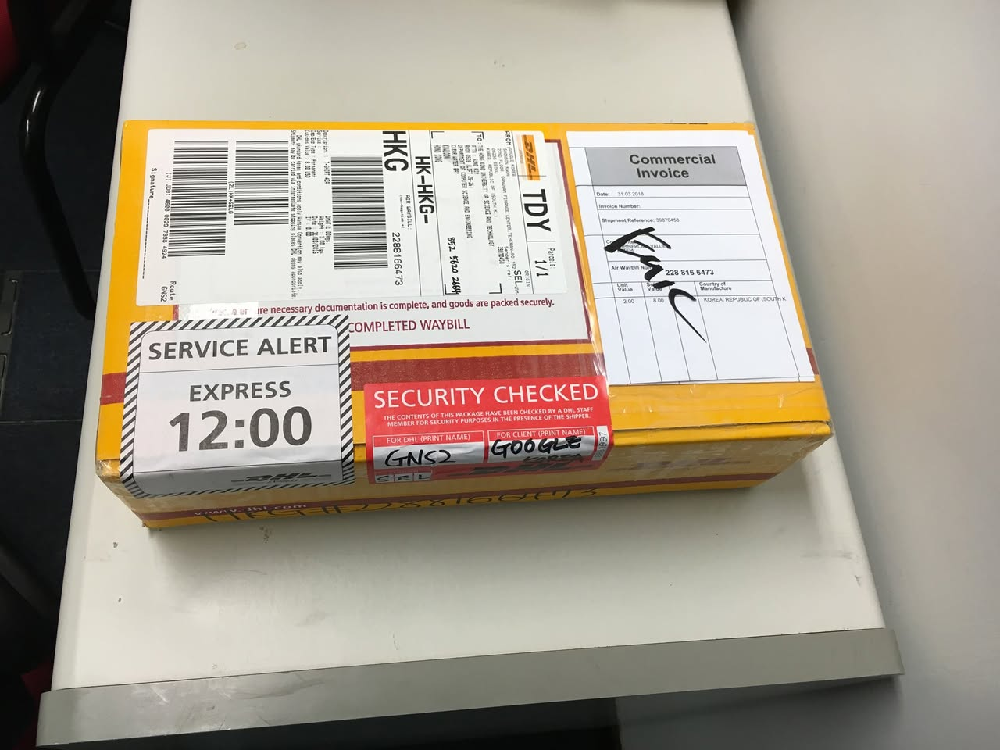 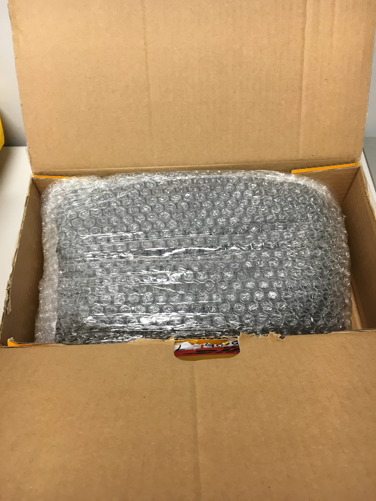 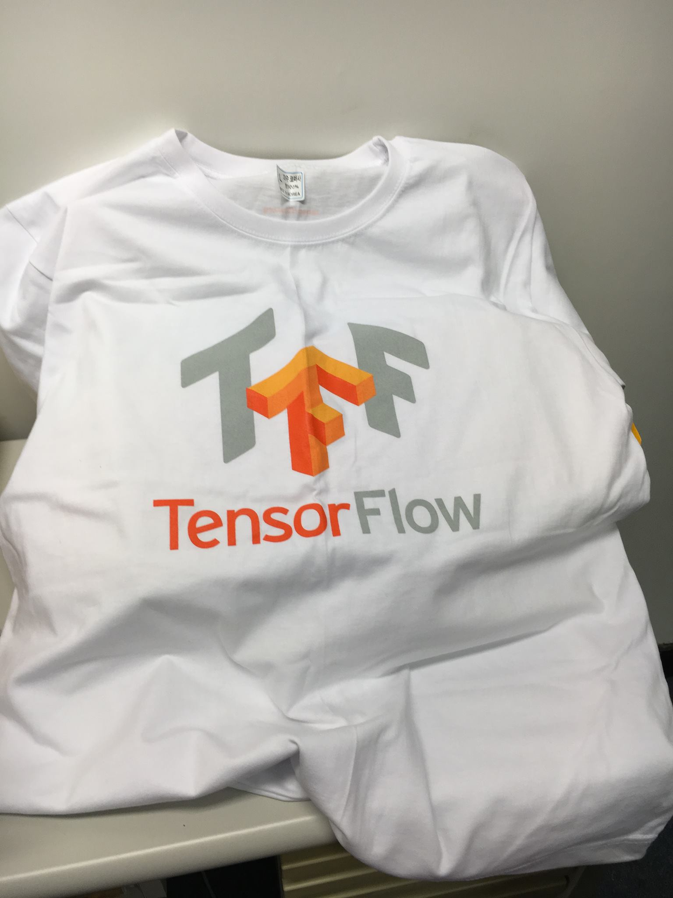

### 4월 2일 (토) 08:29 · 지난 3월 23일 CGP NEXT 2016년 Jeff Dean 의 구글 …

지난 3월 23일 CGP NEXT 2016년 Jeff Dean 의 구글 Deep Learning @Google에 대해 이야기하는데 

VisionAPI의 재미있는 데모, 스피치 API (한글포함?), TensorFlow (작년 11월에 발표후 5개월간 github에서 ML 최고 인기 프로젝트, 800여개의 TF관련 프로젝트가 이미 github에 있다고), TF를 이용한 Cloud Machine Learning Product 데모를 보여 줍니다. 

간단한 DeepLearning의 구조와 TF tutorial을 하면서 --cloud 옵션으로  구글 클라우드에서 돌리는 놀라운 방법을 보여 줍니다.

이제 데이타와 알고리즘만 있으면 뭐든 다 돌려볼수 있을듯합니다.

https://youtu.be/HgWHeT_OwHc?t=1h59m17s

Cloud Machine Learning 정보는 여기 https://cloud.google.com/ml/.

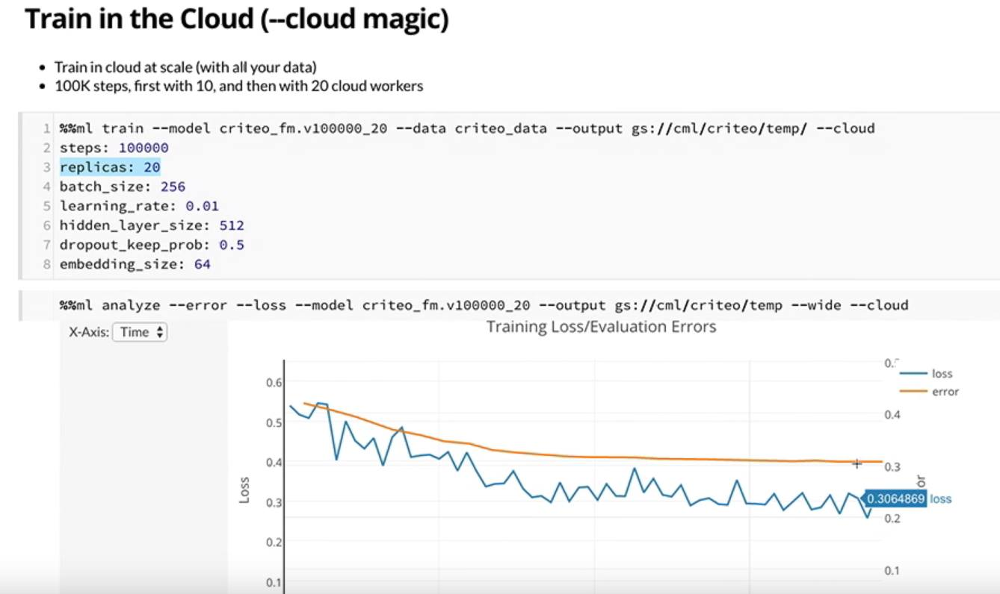 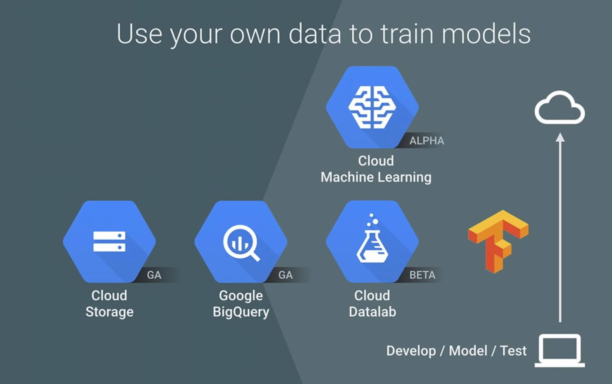

### 4월 2일 (토) 08:29 · 📷 사진 (2장)

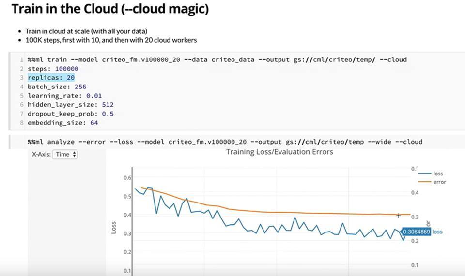 

### 4월 3일 (일) 12:07 · 📷 사진 (1장)

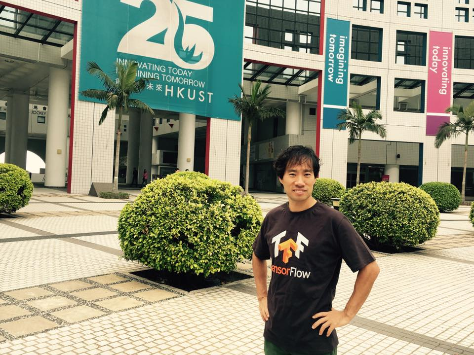

> 챡용샷 입니다. 외출용으로도 손색이 없는듯 합니다. 올 여름 IT계의 패션을 주도할 아이템이 아닐지 조심스레 예측해봅니다. :-)

### 4월 4일 (월) 13:13 · 📷 사진 (2장)

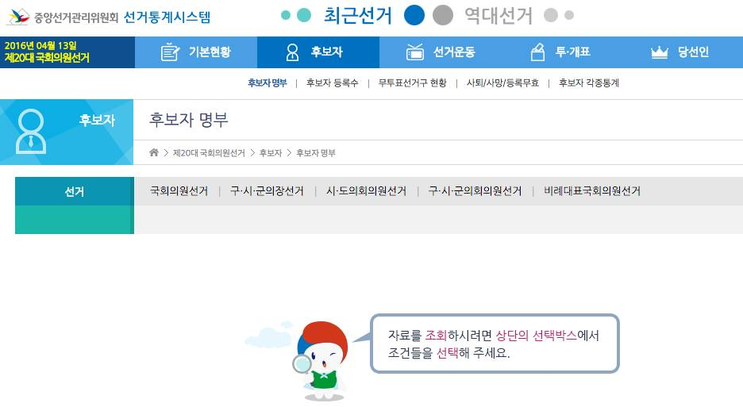 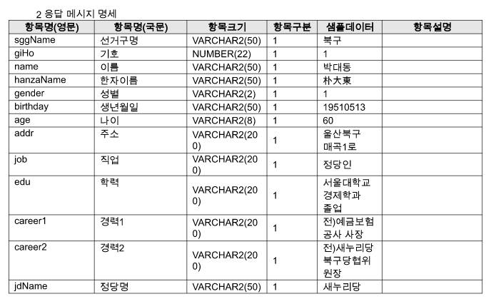

### 4월 5일 (화) 10:32 · 📷 사진 (1장)

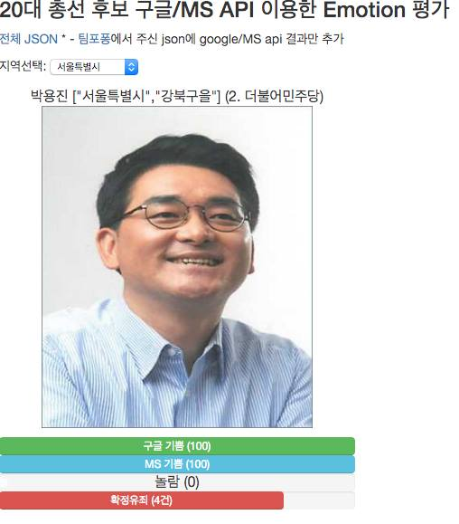

> [많은 분들의 도움으로 디자인 중입니다.] Google/MS Vision (딥러닝)API 를 이용한 20대 국회의원 후보사진 표정비교 입니다. (유죄확정은 딥러닝이 아닌 fact입니다.)  https://emotelec.firebaseapp.com/ 디자인이 전혀 안되어 있는데 혹 디자인 도와주실분 계신가요? 이쁘게 나오면 오유나 아고라 등에 보내 투표를 장려하려고 합니다.  혹시 전체 json이 필요하시면 팀포퐁에서 만들어주신 json에 제가 google/ms vision 결과를 붙여둔 파일을 https://emotelec.firebaseio.com/candidates/.json 에서 받으실수 있습니다.  결과의 예는 아래와 같이 대부분 웃음만 있고 놀람이나 슬픈 표정은 없습니다. 아직 가식된 웃음은 찾아 내지 못합니다.                     [anger] => 2.21821284E-10                     [contempt] => 1.737765E-9                     [disgust] => 2.2780533E-9                     [fear] => 1.10149436E-8                     [happiness] => 0.999999762                     [neutral] => 7.33599848E-8                     [sadness] => 5.92993672E-8                     [surprise] => 1.03607789E-7

### 4월 6일 (수) 13:54 · 📷 사진 (3장)

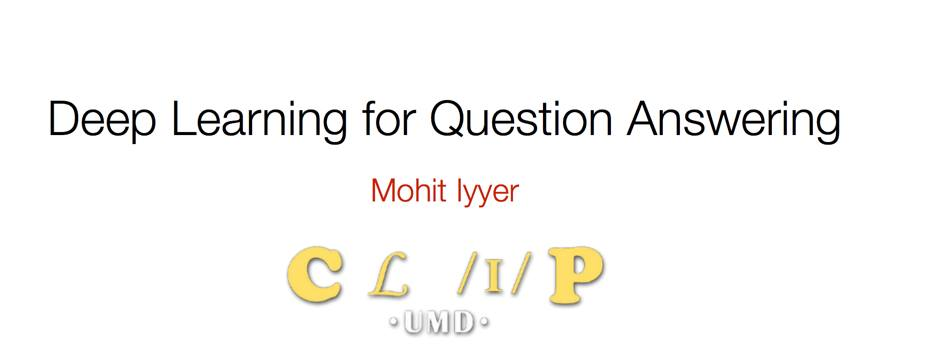 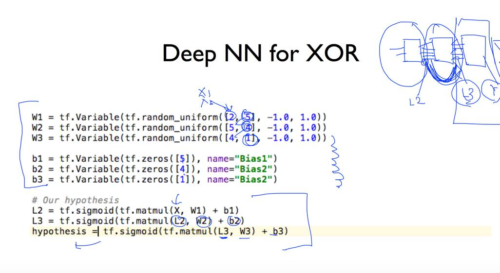 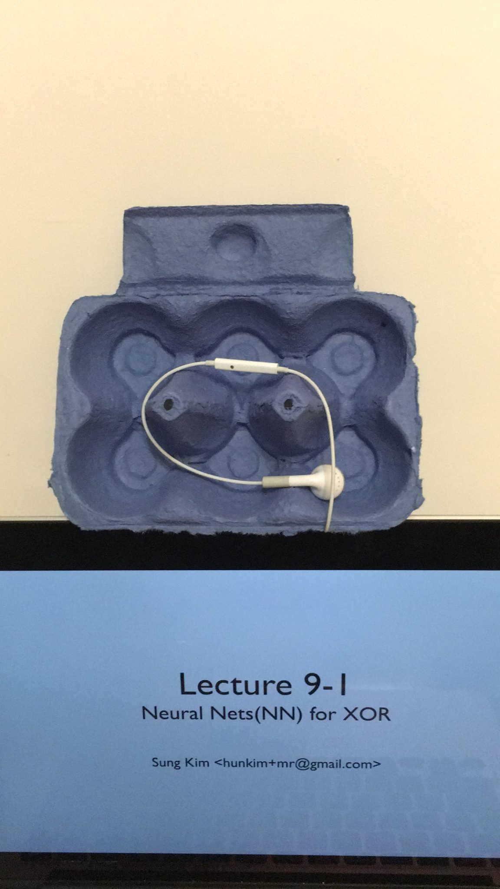

> 딥러닝을 이용한 QA시스템에 대해 잘 설명해주는 슬라이드입니다. Word embading도 잘 설명해줍니다. 간단한 모델에서 시작하여 더 발전된 모델을 보여주고 소스코드도 공개 합니다.  http://cs.umd.edu/~miyyer/data/deepqa.pdf

### 4월 7일 (목) 06:43 · 📷 사진 (4장)

 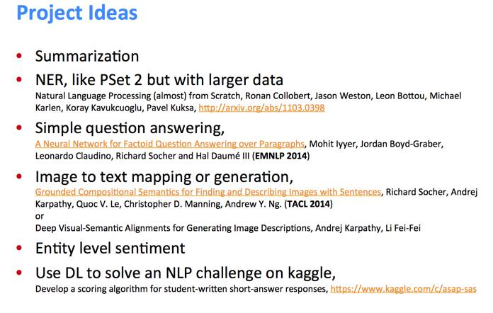 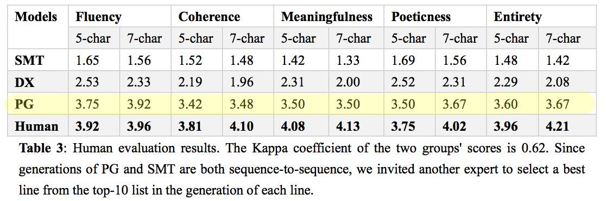 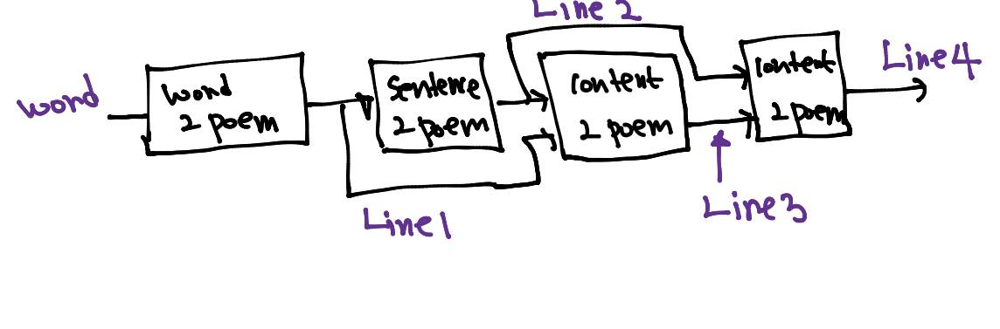

> 500! 3/26일 시작한 저희 그룹이 500명의 회원을 돌파하였습니다. 감사합니다. 기념으로 여러분들의 사진들을 모아 500숫자 사진을 만들어 보았습니다. (본인의 사진을 찾아 tag해주세요. :-) )
> http://cs224d.stanford.edu/ 수업 2016년 프로젝트 아이디어를 추천해주는 슬라이드입니다. 대략적인 NLP+Deeplearning의 동향과 참고 논문/자료를 볼수 있네요.  •  Summariza2on •  NER, like PSet 2 but with larger data Natural Language Processing (almost) from Scratch, Ronan Collobert, Jason Weston, Leon BoMou, Michael Karlen, Koray Kavukcuoglu, Pavel Kuksa, http://arxiv.org/abs/1103.0398 •  Simple ques2on answering, A Neural Network for Factoid Ques2on Answering over Paragraphs, Mohit Iyyer, Jordan Boyd-Graber, Leonardo Claudino, Richard Socher and Hal Daumé III (EMNLP 2014) •  Image to text mapping or genera2on, Grounded Composi2onal Seman2cs for Finding and Describing Images with Sentences, Richard Socher, Andrej Karpathy, Quoc V. Le, Christopher D. Manning, Andrew Y. Ng. (TACL 2014) or Deep Visual-Seman2c Alignments for Genera2ng Image Descrip2ons, Andrej Karpathy, Li Fei-Fei •  En2ty level sen2ment •  Use DL to solve an NLP challenge on kaggle, Develop a scoring algorithm for student-wriMen short-answer responses, https://www.kaggle.com/c/asap-sas

### 4월 7일 (목) 20:08 · Voting Done!

Voting Done!

### 4월 8일 (금) 09:29 · 📷 사진 (9장)

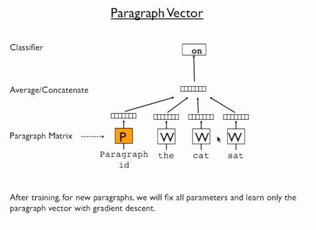 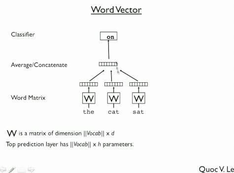 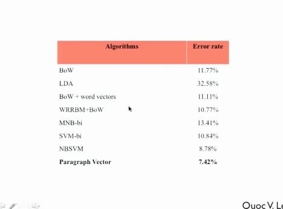 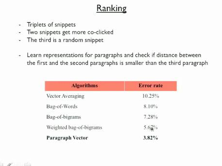 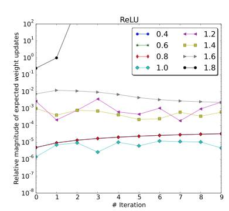 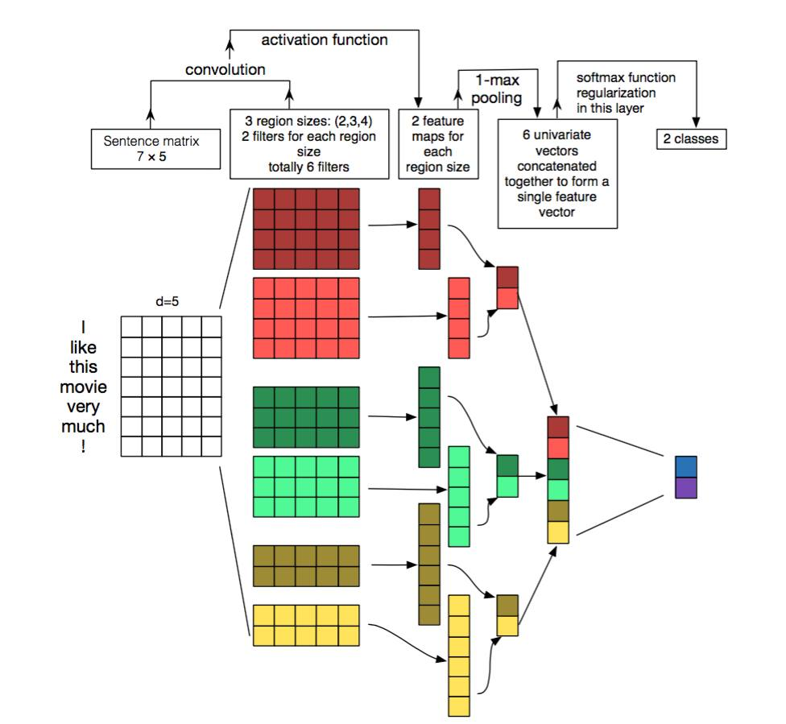 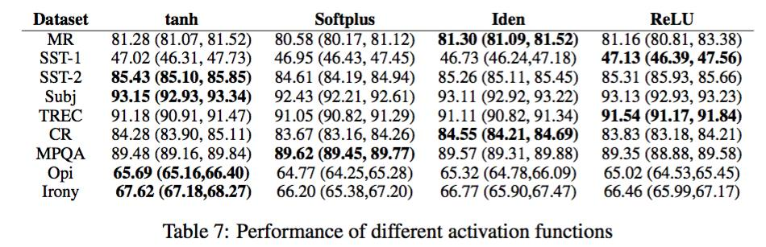 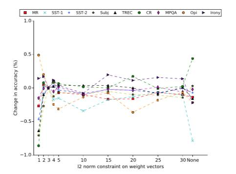 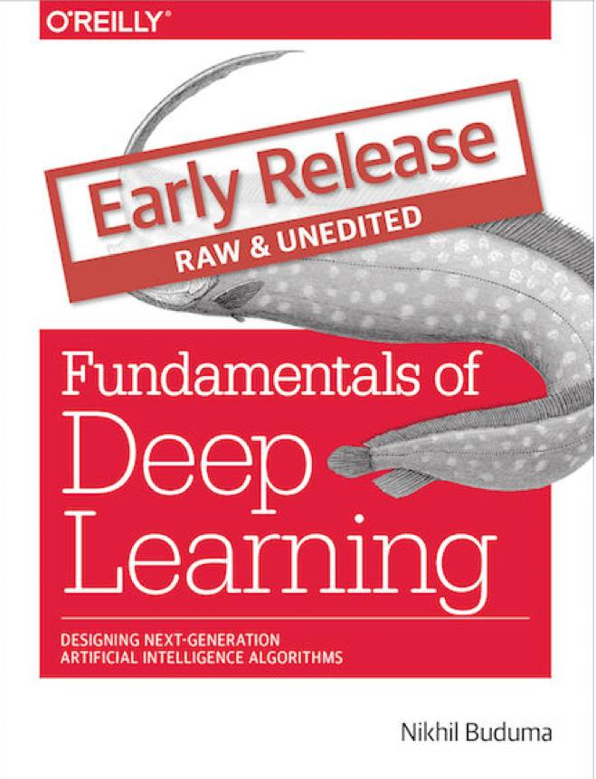

> DeepLearning은 역시 초기값이 중요하다는 것을 보여주는 유명한 논문.  ReLu의 경우 초기값의 범위에 따라 학습 결과가 많이 차이나고 1.4 근처가 좋다는...  http://arxiv.org/abs/1511.06422
> 오렐리에서 올해말에 나올 예정이라는 TF를 이용한 딥러닝 책에 사용될 예제들 만들고 있는 깃 허브입니다. (쓸데 없이 너무 def를 남용하여 전체 뉴럴 넷트웍의 흐름을 보기 어렵게 코딩한 스타일이 조금 마음에 들지 않지만) TF 를 이해 하시는데 도움 되실듯해서 공유 합니다.  책은 작성중인데 pre-order로 작성중인 부분까지 볼수 있습니다.  https://github.com/darksigma/Fundamentals-of-Deep-Learning-Book

### 4월 9일 (토) 08:20 · 📷 사진 (2장)

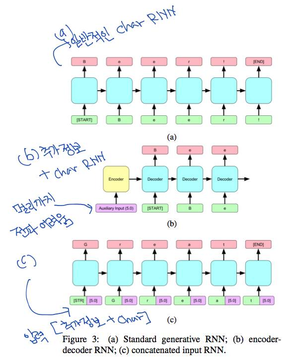 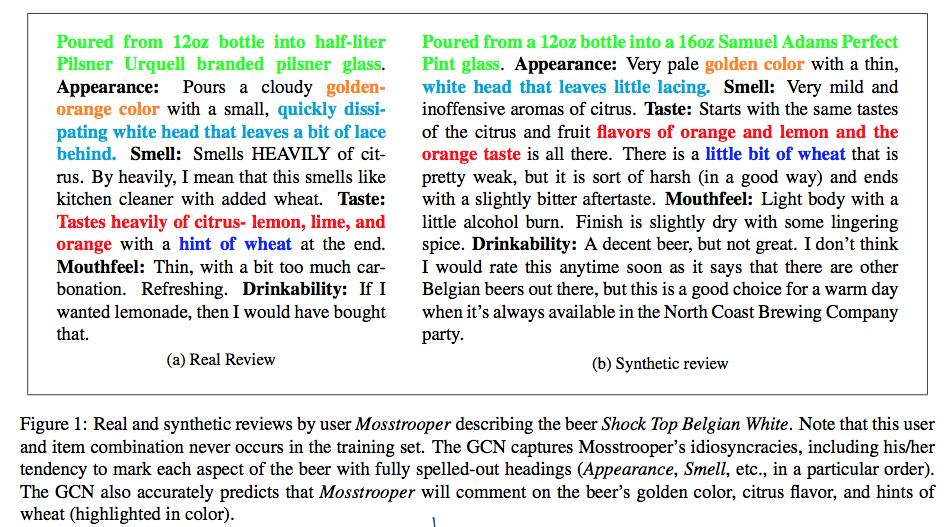

### 4월 9일 (토) 10:22 · Happy birthday!

Happy birthday!

### 4월 9일 (토) 10:22 · ↪ Happy birthday!

*다른 프로필에 남긴 글*

Happy birthday!

### 4월 9일 (토) 10:22 · Jane, happy birthday!

Jane, happy birthday!

### 4월 9일 (토) 10:22 · ↪ Jane, happy birthday!

*다른 프로필에 남긴 글*

Jane, happy birthday!

### 4월 9일 (토) 10:23 · 생일 축하!!

생일 축하!!

### 4월 9일 (토) 10:23 · ↪ 생일 축하!!

*다른 프로필에 남긴 글*

생일 축하!!

### 4월 10일 (일) 09:56 · 생일축하해요. 잘지내죠?

생일축하해요. 잘지내죠?

### 4월 10일 (일) 09:56 · ↪ 생일축하해요. 잘지내죠?

*다른 프로필에 남긴 글*

생일축하해요. 잘지내죠?

### 4월 10일 (일) 09:56 · Happy birthday!

Happy birthday!

### 4월 10일 (일) 09:56 · ↪ Happy birthday!

*다른 프로필에 남긴 글*

Happy birthday!

### 4월 11일 (월) 07:48 · 📷 사진 (3장)

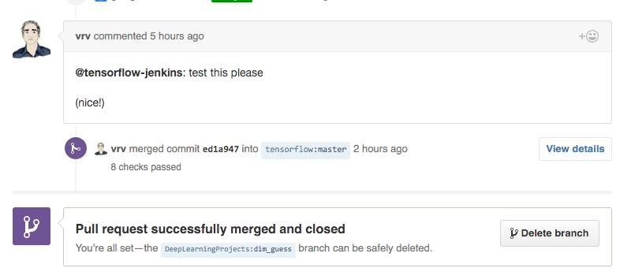 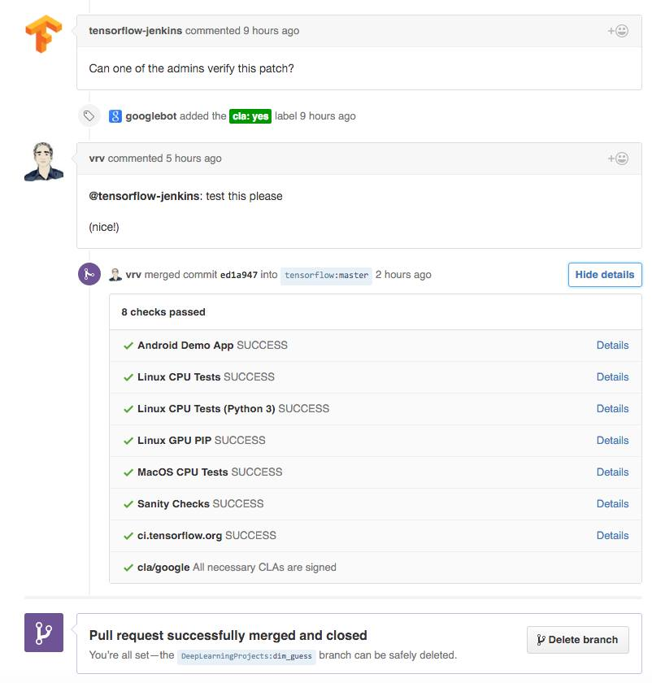 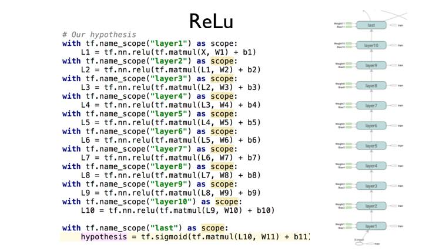

> 저의 첫 TF pull request가 (nice)와 함께 merge되었습니다. 아주 사소한 것이지만 기분 좋네요. 다른거 pull request할만한거 있는지 같이 찾아 보아요.  https://github.com/tensorflow/tensorflow/pull/1838
> [github + Jenkins Bot 설정]  TensorFlow에 보니 pull request가 올라오면 TF bot이 "누가 이 patch 잘되나 살펴봐" 자동으로 메시지를 보내고, 사람이 살펴본 다음 괜찮으면 Jenkins 에게 "이거 테스트 해봐" 하면 그 결과를 github pull request에 다 올려주고, 이걸 보고 마지막 merge등을 하는데  뭐 거의 로봇과 같이 일하는 듯한 분위기인데 이런 세팅 해보신분 계신가요?  https://github.com/tensorflow/tensorflow/pull/1831 참조.
> [모두를 위한 머신/딥 러닝 Froward Deep Network 종결편]  이번강의로 딥 Forward net 완전 정리 가능합니다. 9단의 딥넷트웍 으로 MNIST (손으로 쓴 숫자 인식) 98~99% 가능하고 여러분 현업에도 고성능 예측 충분히 가능합니다.  10강 첫 비디오: https://youtu.be/cKtg_fpw88c 10강 실습: https://youtu.be/ls8jHqRnEQk  전체 수업: hunkim.github.io/ml/

### 4월 12일 (화) 05:48 · 📷 사진 (3장)

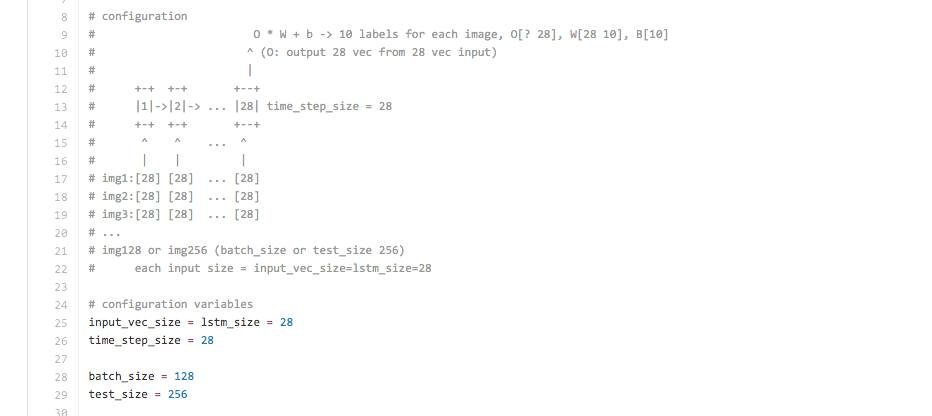 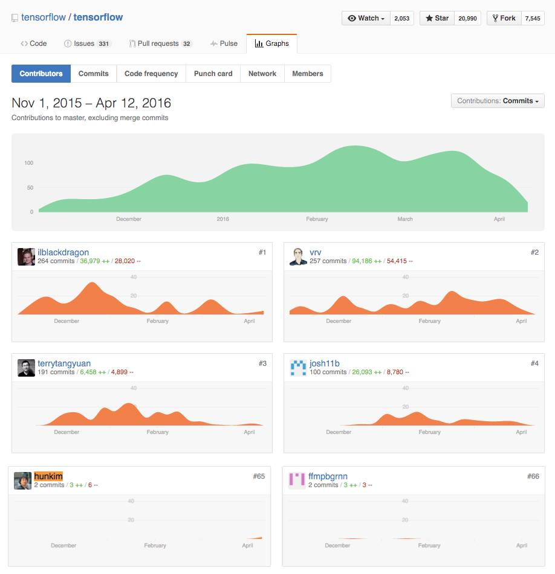 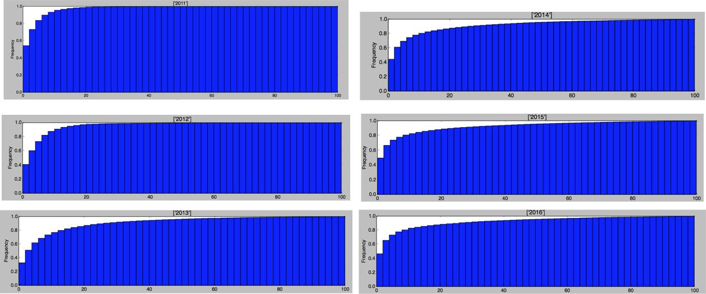

> Python에 막 입문하여 배우면서 만든 TensorFlow (TF) RNN (LSTM) 예제 코드가 TF 간단 예제모음으로 유명한 ensorFlow-Tutorials 에 merge되었습니다.  RNN은 딥러닝의 네트웍 구조중 번역이나 문장을 만들어 내는등의 가장 유용한 구조중 하나입니다.  https://github.com/nlintz/TensorFlow-Tutorials/blob/master/7_lstm.py  Python 3.3관련 호환성에 대해 도와주실분 있으시면 PR보내주시면 좋겠습니다. (https://github.com/nlintz/TensorFlow-Tutorials/pull/8 참조)  참고로 RNN은 제가 진행중인 강의의 (hunkim.github.io/ml/) 마지막 강의 주제이며 이 예제를 사용하여 진행할 예정입니다.
> 간단한거 하나랑 오타를 수정했더니 2개의 commit으로 TF "Contributors" 로 (오늘 현재) 65번째 이름이 올라갑니다. 코드 열심히 봐서 여름까지 10개 정도 그리고 좀더 의미 있는 commit을 목표로 해봐야겠습니다.  정말 active한 프로젝트 답게 PR올리면 바로 바로 답을 달아 주고 merge해줍니다. 여러분들도 코드 보시고 PR 많이 보내보시길.
> 생코의 글들은 대략 몇개의 like를 받을까요? Jiho Bak 님께서 모아주신 데이타를 이용 간단한 histogram 을 그려 보았습니다. 히스토그램 각 한칸이 2를 나타내는데, 그래서 2개를 받으면 상위 50%, 8개를 받으면 상위 20%, 30개 이상을 받으면 상위 10% 정도 됩니다. 그래프 모양을 보니 글들이 2011, 2012년에 비해 많은 점점더 많은 like를 받고있는것 같은 기운이 느껴집니다. 좋은 일입니다. :-)  이 데이타로 무엇을 할수 있을까요?   TensorFlow/딥러닝을 이용해 1. 글을 보고 어느정도의 Like를 받을지 예측 2. 글이 질문인지 아닌지, 질문이라면 코멘트 중에 어떤것이 최고의 답인지 찾아 Stackoverflow 같은 사이트를 자동으로 만들어 주는 프로젝트를 진행중입니다.  혹 관심있으신 분들은 함께 해요. 데이터와 프로젝트 페이지: https://github.com/TensorFlowKR/flowbox

### 4월 13일 (수) 07:31 · 📷 사진 (3장)

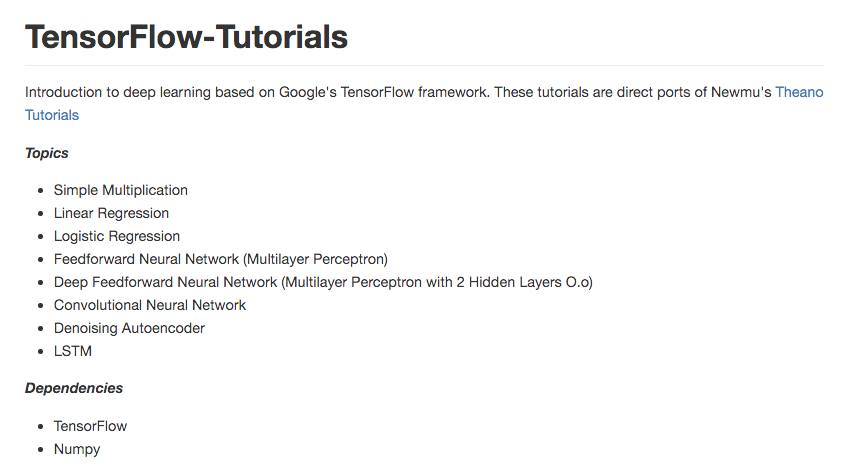 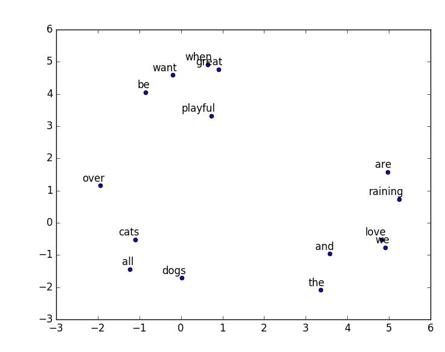 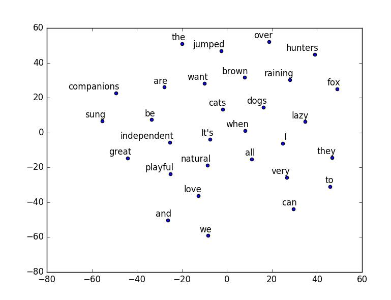

> 구글의 딥러닝툴인 TensorFlow를 한번에 이해할수 있는 정말 정말 쉬운 예제들의 모음. 한숨에 다 읽으실수 있습니다!  https://github.com/nlintz/TensorFlow-Tutorials  PR은 언제나 환영합니다!
> Word2vec 해보신분들에게 질문 드립니다. 제가 개념을 이해하기 위해 TF tutorial에 있는 것을 이용하여 정말 간단하게 구현해 보았는데, 제대로 돌아가는지 모르겠습니다. cost는 줄어 들긴합니다. tsne가 부담스러워 embeding 도 2차원으로 해서 바로 그림을 그리니, cat과 dog이 비슷한 위치이긴 한데 이것이 잘 되는 것인지 잘 모르겠습니다. (우선 sample수도 너무 부족합니다만.)  혹시 embeding weights를 디버깅/verification 하는 좋은 방법이 있을까요? 코드는 50줄 정도 밖에 안되는데 한번 봐주세요. 미리 감사드립니다.  https://github.com/DeepLearningProjects/TensorFlow-Tutorials/blob/word2vec/8_word2vec.py

### 4월 13일 (수) 09:50 · 생신 축하 드립니다. 행복한 하루 되세요!

생신 축하 드립니다. 행복한 하루 되세요!

### 4월 13일 (수) 09:50 · ↪ 생신 축하 드립니다. 행복한 하루 되세요!

*다른 프로필에 남긴 글*

생신 축하 드립니다. 행복한 하루 되세요!

### 4월 13일 (수) 09:50 · Happy birthday!

Happy birthday!

### 4월 13일 (수) 09:50 · ↪ Happy birthday!

*다른 프로필에 남긴 글*

Happy birthday!

### 4월 14일 (목) 08:51 · 📷 사진 (1장)

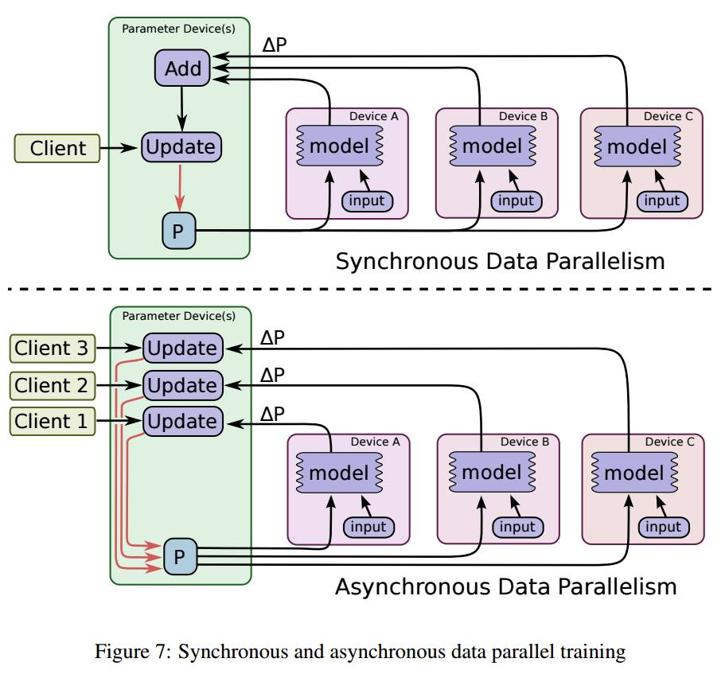

> Soonson Kwon 님이 아침부터 전해주신 기쁜소식, 0.8. 분산 환경에서 돌리는 방법을 본인들의 "Inception Architecture" 코드공개와 함게 설명합니다. 오늘 한번 해봐야겠습니다.  https://github.com/tensorflow/models/tree/master/inception

### 4월 15일 (금) 08:53 · If you want to keep up with Google Tenso…

If you want to keep up with Google TensorFlow (Deep-learning tool), please check out this very simple and fun tutorials that Nathan and I are working on.

https://github.com/nlintz/TensorFlow-Tutorials

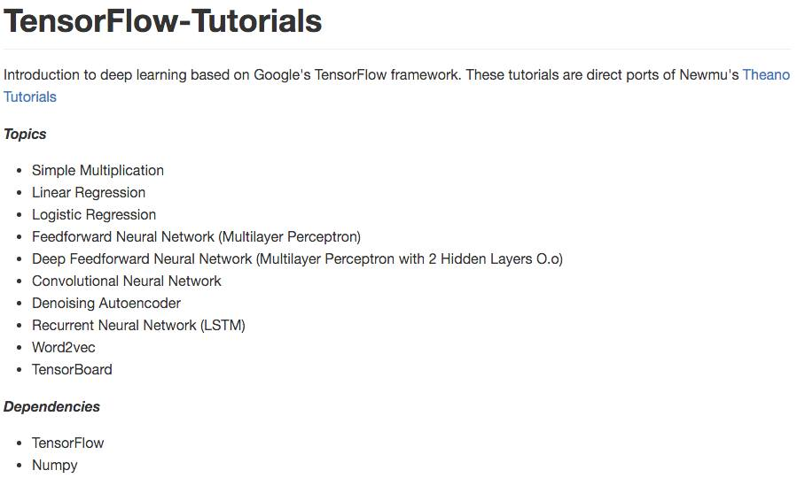

### 4월 15일 (금) 10:10 · Happy birthday!!

Happy birthday!!

### 4월 15일 (금) 10:10 · ↪ Happy birthday!!

*다른 프로필에 남긴 글*

Happy birthday!!

### 4월 15일 (금) 17:43 · 📷 사진 (2장)

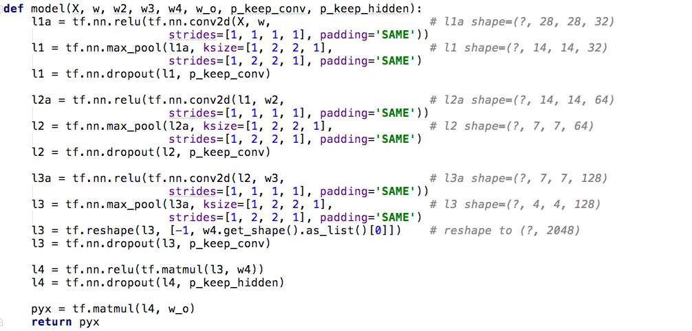 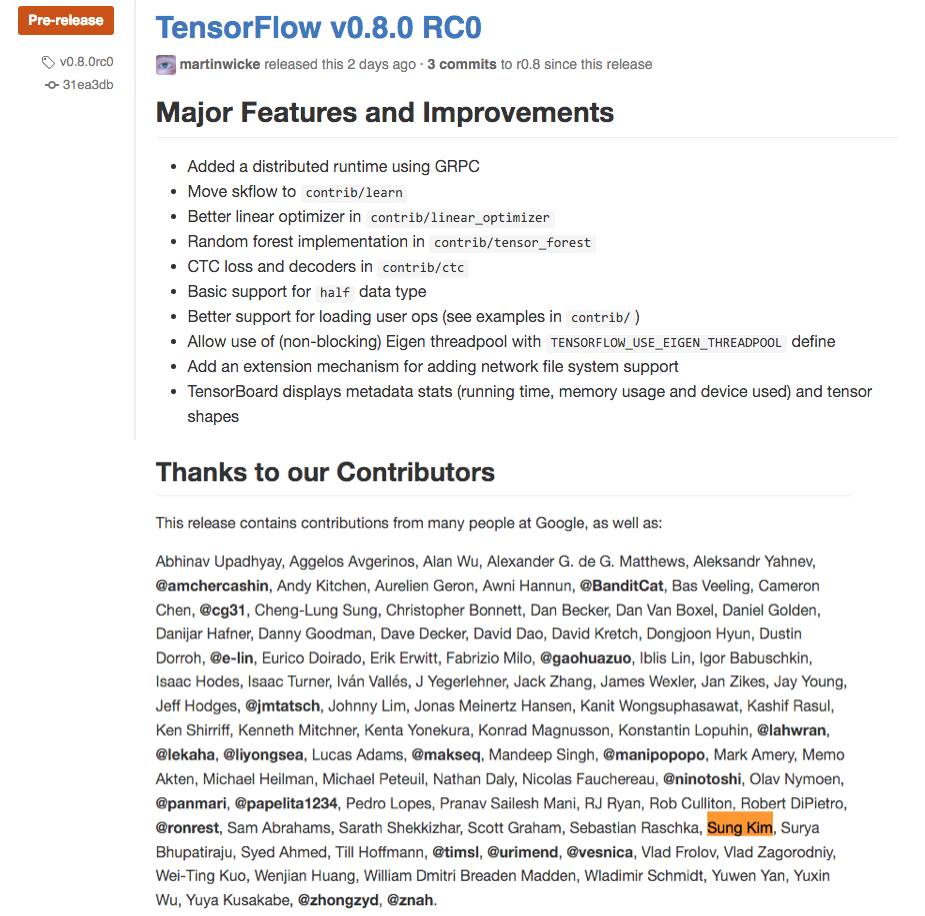

> [ConvNet (딥러닝) 으로 MNIST (손으로 쓴 숫자) 인식률 99.x%] Conv 넷은 이미지 인식의 끝판왕이라 불릴수 있는 뉴럴넷입니다. 알파고에도 사용된 넷입니다.  몇줄 안되는 아래 코드로 ConvNet 구성 가능합니다. 코드에 숫자가 좀 많은데 이에 대한 설명은 아래에 있습니다.  이론 첫 비디오: https://youtu.be/Em63mknbtWo 실습 비디오: https://youtu.be/6KlkiKyjEu0  전체 수업 웹페이지: hunkim.github.io/ml/ 소스예제: https://github.com/nlintz/TensorFlow-Tutorials
> TF 8.0의 개선사항. 가장 큰것인 distributed 말고도 TensorBoard에도 shape info등이 추가 되며 좋은 기능이 추가 되었네요. 아래 Contributors 이름도 한번 읽어 주세요. :-)  https://github.com/tensorflow/tensorflow/releases/tag/v0.8.0rc0

### 4월 16일 (토) 07:18 · 📷 사진 (2장)

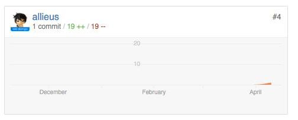 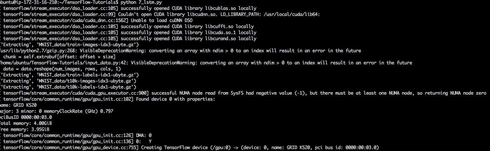

> Terry Tae-woong Um 포스팅 보고 AWS에서 저도 해보는 중인데, 다음 GPU가 동작 하는 것인가요?  "I tensorflow/core/common_runtime/gpu/gpu_device.cc:755] Creating TensorFlow device (/gpu:0) -> (device: 0, name: GRID K520, pci bus id: 0000:00:03.0)"  이렇게 나오는데, 앞에 보니 에러들이 많네요.  I tensorflow/stream_executor/dso_loader.cc:99] Couldn't open CUDA library libcudnn.so. LD_LIBRARY_PATH: /usr/local/cuda/lib64:  TF가 cuda 7.5로 컴파일 되어 있는듯 한데, 혹 cuda 7.5를 AWS EC2에 설치해보신분 계신가요?

### 4월 16일 (토) 18:14 · 4KM swimming (80 laps) in 1:50! Not too …

4KM swimming (80 laps) in 1:50! Not too fast, but good enough for my first Ironman race next month -- 2:30min cut-off time.

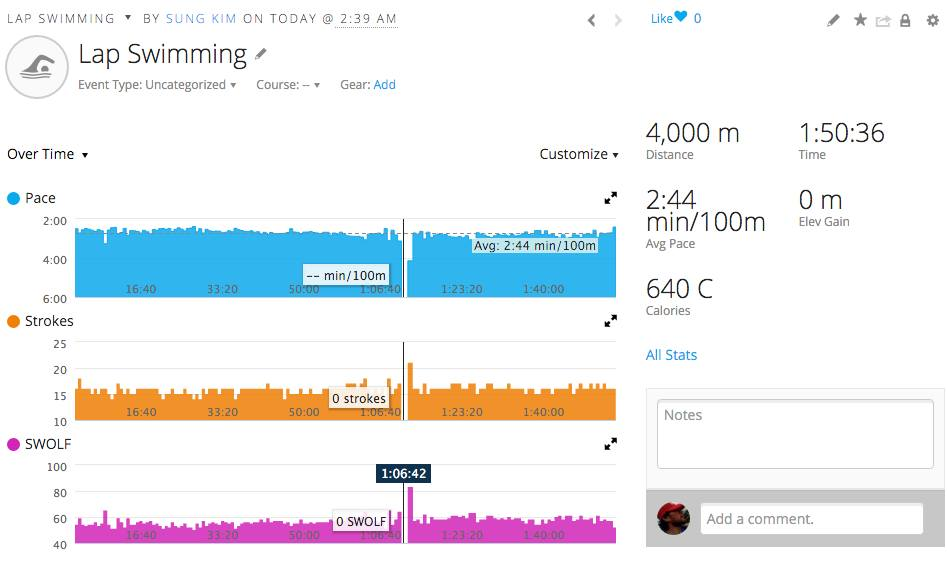

### 4월 17일 (일) 01:37 · 📷 사진 (1장)

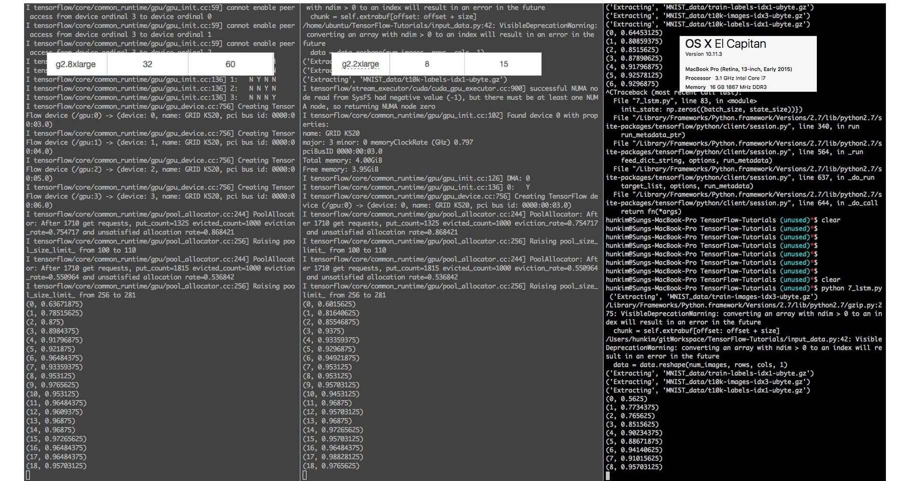

> [AWS EC2에 GPU활용하기]   g2.8xlarg, g2.2xlarge 와 저의 Maci7 16G 성능비교 (그림 참조). 간단한 작업이라 그런지 g2.8xlarg 와 g2.2xlarg는 큰 차이가 없었고, 제 Mac보다는 2~3배 정도 빠른듯 보입니다.  AWS AMI 를 public으로 만들어 두어습니다: ami-4bf6002b  아래는 간략 설치 설명  0. TF whl 설치파일은 CUDA 7.5를 요구. ImportError: libcudart.so.7.5: cannot open shared object file: No such file or directory 그런데 CUDA 7.5는 AWS EC2 Ubuntu와는 뭔가가 안맞음. (한시간동안 시도후 포기 - 다른 방법을 찾았습니다. 다음 포스트 참조)  1. 우선 CUDA 7.0 을 설치 (김정주님의 가이드 그대로 따라함. 6.x를 7.0으로 바꿈. https://gist.github.com/haje01/f13053738853f39ce5a2 참조) http://tleyden.github.io/blog/2014/10/25/cuda-6-dot-5-on-aws-gpu-instance-running-ubuntu-14-dot-04/  2. cuDNN (개발자 가입후) 설치: https://developer.nvidia.com/cudnn  3. 바젤 설치: http://bazel.io/docs/install.html  4. 자잘한것들 pip/apt-get등으로 시키는 대로 설치: https://www.tensorflow.org/versions/r0.8/get_started/os_setup.html#installing-from-sources  5.Tensorflow 소스 다운후 ./configure ... 마지막 질문 주의! your build time and binary size. [Default is: "3.5,5.2"]: 3.0 # 꼭 3.0 선택 http://stackoverflow.com/questions/33651810 참고   6. 바젤로 한참 컴파일후, whl파일 만들고, 설치완료! https://www.tensorflow.org/versions/r0.8/get_started/os_setup.html#installing-from-sources  7. 이전에 TF 를 설치하였으면 먼저 sudo pip uninstall tensorflow 한후 설치.

### 4월 18일 (월) 23:09 · 📷 사진 (1장)

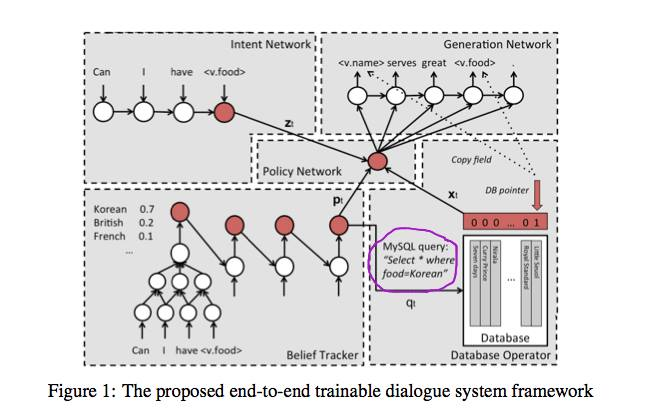

> 여러 종류의 넷트웍에다, Belief Trackers, DB까지 붙여서 만드는 특정 task를 수행하는 봇 논문. 데이타 베이스 쿼리 까지 연결시키고 결과를 다시 넷트웍의 입력으로 사용하는 것이 재미있네요.  https://arxiv.org/abs/1604.04562  정확도도 상당하고 논문에 붙어 있는 대화 예제도 훌륭합니다.  Human : hello  Machine : what cuisine would you like ?  Human : afghan  Machine : i am sorry , there are no afghan restaurants . would you like something else ?  Human : korean  Machine : little seoul serves korean food , it is located at 108 regent street city centre .  Human : is it expensive?  Machine : little seoul serves korean food and is in the expensive price range .  Human : what area is that  Machine : little seoul is located in the centre area of town . would you like their number ?  Human : yes  Machine : the telephone number is 01223 308681 . is there anything else i can help you with today ?  Human : no goodbye  Machine : thank you for using the cambridge restaurant system , goodbye .  그림과 대화에 한국 식당이 나오는 것으로 봐서 저자중 한국분이 있는 것일까요?

### 4월 19일 (화) 09:50 · 생일축하합니다.

생일축하합니다.

### 4월 19일 (화) 09:50 · ↪ 생일축하합니다.

*다른 프로필에 남긴 글*

생일축하합니다.

### 4월 19일 (화) 09:50 · Happy birthday!

Happy birthday!

### 4월 19일 (화) 09:50 · ↪ Happy birthday!

*다른 프로필에 남긴 글*

Happy birthday!

### 4월 19일 (화) 22:41 · 📷 사진 (3장)

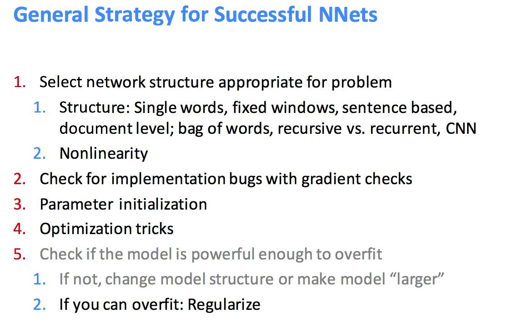 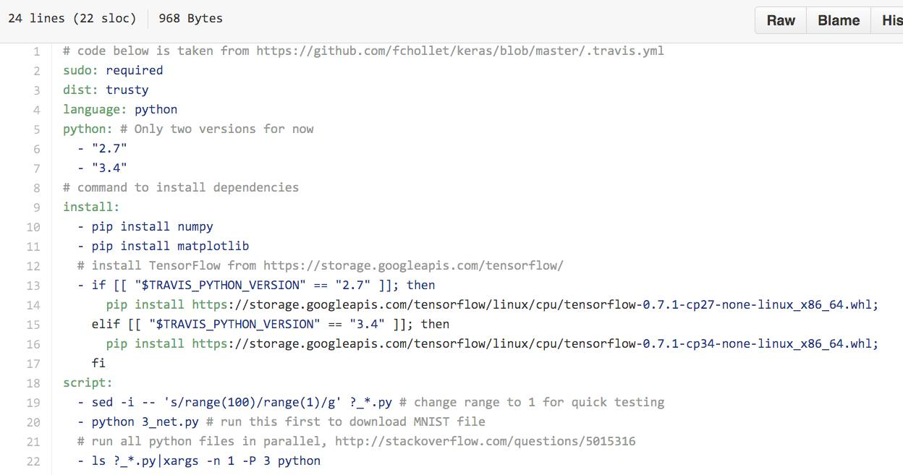 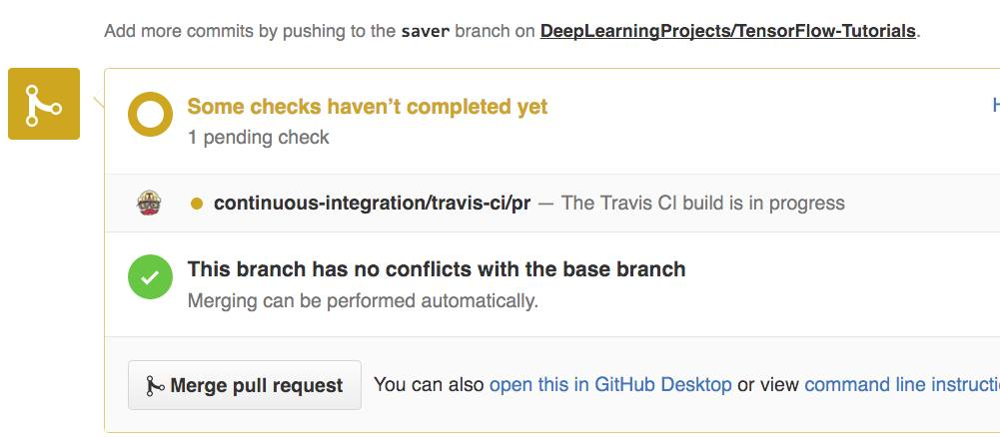

> 슬라이드 한장으로 셜명하는 성공적인 딥뉴럴넷 구축방법  http://cs224d.stanford.edu/syllabus.html

### 4월 20일 (수) 15:34 · 📷 사진 (3장)

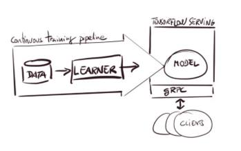 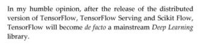 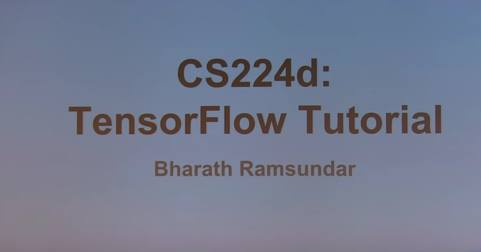

> Hyeongdo Lee 이 소개해주신 First Contact With TensorFlow보고 있는데 Tensor Serving 그림 귀엽게 소개하네요.  혹 Tensor Serving으로 서비스 하시는분 계신가요? 설치나 운영 경험담 부탁드립니다.
> Hyeongdo Lee 이 소개해주신 First Contact With TensorFlow 결론 부분에 나오는 이야기 입니다. 충분히 공감가고 그래서 지금 TensorFlow를 시작하시는 것이 매우 도움이 될듯합니다.
> 몇시간 전에 올라온 스텐포드 CS224D 수업의 TF Tutorial 비디오 입니다. TF 튜토리얼중 최고입니다. 발음도 좋고 말도 잘하고 내용도 매우 충실 합니다. 강추 합니다.   비디오: https://www.youtube.com/watch?v=L8Y2_Cq2X5s 슬라이드: http://cs224d.stanford.edu/lectures/CS224d-Lecture7.pdf

### 4월 21일 (목) 16:39 · 📷 사진 (1장)

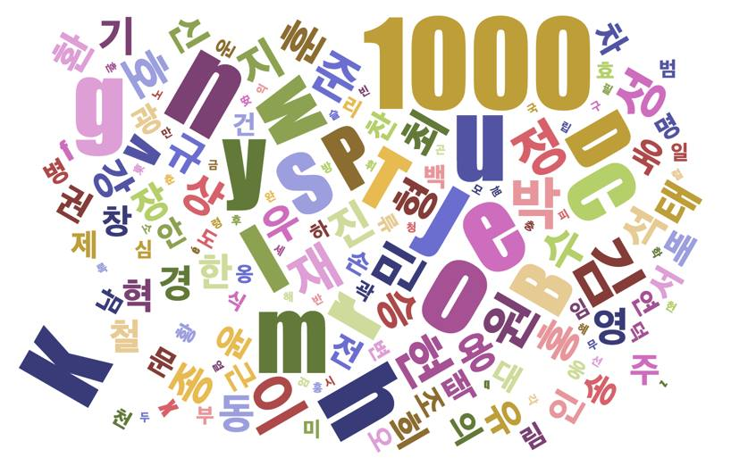

> 1,000!   가입해주시고 활동회주시는 1,000 명의 회원님들에게 감사드리며 여러분들의 귀한 이름으로 word colud를 만들어 보았습니다.   다시 한번 감사드리며 자주 뵙도록 하겠습니다.

### 4월 22일 (금) 07:23 · 📷 사진 (3장)

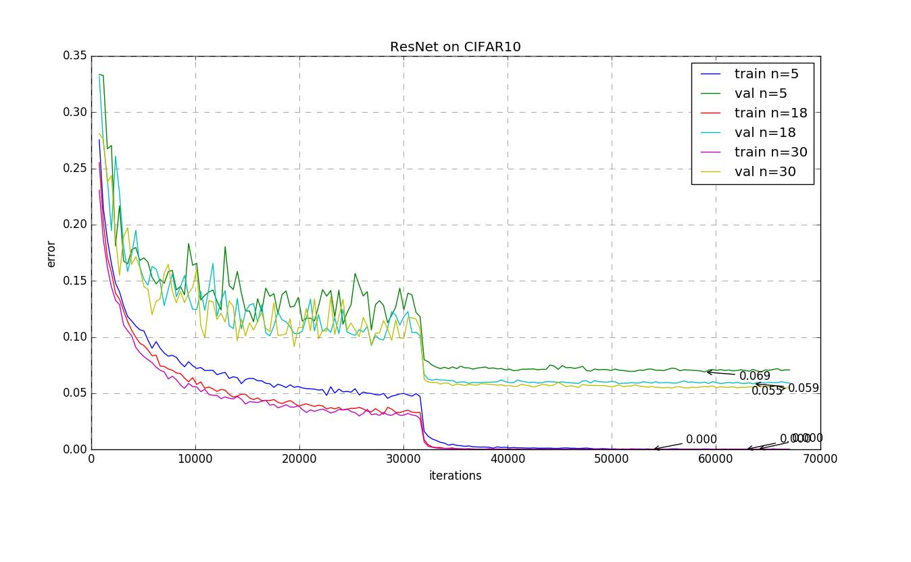 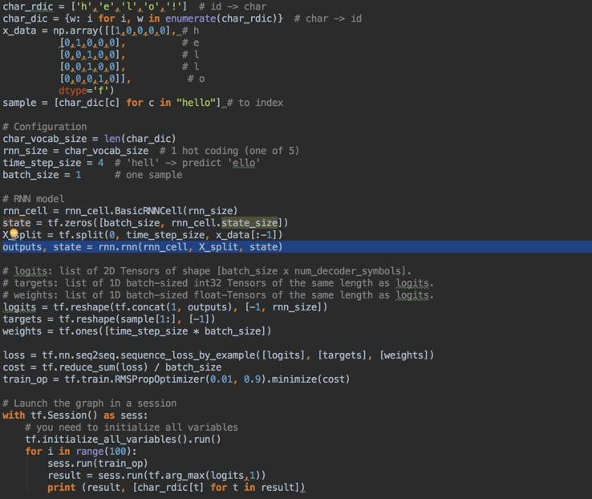 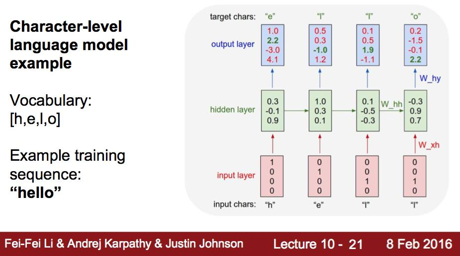

> 2015년 imagenet의 Top5예측 에러율 3%대로 떨어뜨려 사람들을 깜짝 놀라게 했던 ResNet의 TF구현입니다.  https://github.com/ppwwyyxx/tensorpack/tree/master/examples/ResNet

### 4월 23일 (토) 11:36 · 📷 사진 (2장)

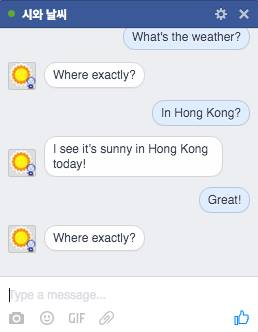 

> [10분만에 FB에서 최근 발표한 Wit.ai와 FB메신저를 연동하여 봇 만들어 보기]  이번 주말 심심한데 최근 화제가 되고 있는 Wit.ai를 사용한 봇 한번 만들어 볼까요?   https://github.com/hunkim/Wit-Facebook/blob/master/README_KR.md 보고 따라하시면 바로 봇이 완성됩니다.  혹시 잘 안되는 부분이 있으면 comment나 PR 부탁드립니다.
> Node로 간단하게 해보는 Wit과 Facebook 메신저의 연동입니다. FB, Bot, serve로 나누어 테스트하기 쉽게 만들어 보았습니다.   https://github.com/hunkim/Wit-Facebook  Wit은 앞단에서 NLP를 담당해서 context를 뽑아 내고 뒷단에서 Node js모듈이 답을 만들어 주는 형식입니다. 상당한 메뉴얼 작업이라 하겠습니다. 추후로는 TensorFlow QA 모델을 뒷단에 넣으면 정말 멋진 bot이 탄생할것 같습니다.  저도 처음해보는 것이라 설명과 코드에 오류가 있을수 있는데, comment와  PR환영합니다.

### 4월 24일 (일) 11:25 · Happy birthday!

Happy birthday!

### 4월 24일 (일) 11:25 · ↪ Happy birthday!

*다른 프로필에 남긴 글*

Happy birthday!

### 4월 24일 (일) 11:25 · Happy birthday!!!!

Happy birthday!!!!

### 4월 24일 (일) 11:25 · ↪ Happy birthday!!!!

*다른 프로필에 남긴 글*

Happy birthday!!!!

### 4월 24일 (일) 16:20 · 📷 사진 (1장)

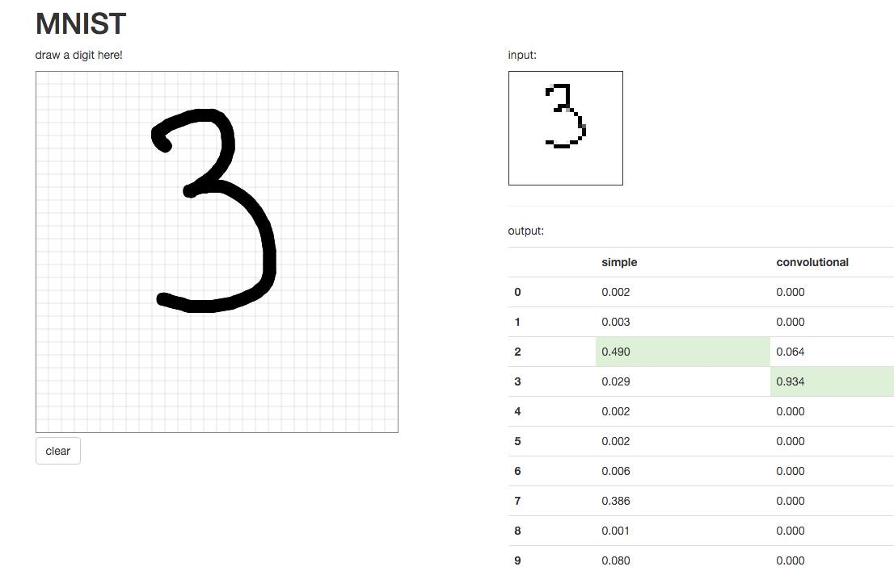

> Python Flask 로 간단하게 해보는 TF serving 예제. TensorFlow Serving 이 gRPC를 사용해서 성능은 좋다고 하는데 상당히 복잡한 면이 있는데, Python Flask 와 TF의 restore 를 이용하여 쉽게 RestAPI로 서비스 하는 데모입니다.  JS로 직접 숫자를 입력받는 모듈도 있어 재미있는 것을 만들어 볼수 있을것 같습니다.  깃허브: https://github.com/sugyan/tensorflow-mnist 데모: https://tensorflow-mnist.herokuapp.com/

### 4월 24일 (일) 16:32 · 글 잘 읽었습니다. ` 깃허브, 스택오버플로우, 메일링 리스트를 보면서 …

글 잘 읽었습니다. ` 깃허브, 스택오버플로우, 메일링 리스트를 보면서 텐서플로우 소식을 더 자세히 접할 수도 있습니다.` TensorFlow KR그룹에 오셔도 많은 정보를 접하실수 있습니다. https://www.facebook.com/groups/TensorFlowKR/

🔗 <https://lr.cx/51Aoc>

### 4월 25일 (월) 10:16 · Happy birthday!!

Happy birthday!!

### 4월 25일 (월) 10:16 · ↪ Happy birthday!!

*다른 프로필에 남긴 글*

Happy birthday!!

### 4월 25일 (월) 23:56 · 📷 사진 (1장)

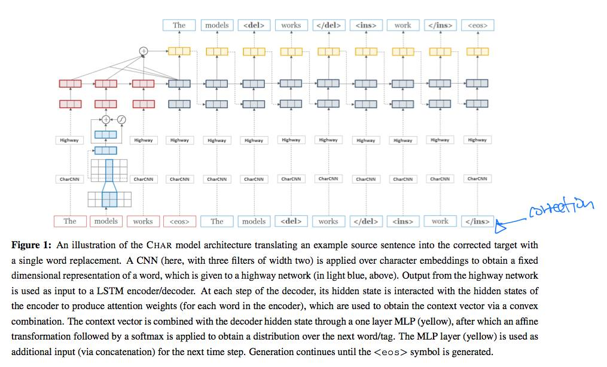

> 이제 영어의 문법도 딥러닝으로 고쳐 줍니다. AESW라는 100만 영어 문장의 문법 수정 자료를 시퀀스-시퀀스로 학습니다. (이런 공개된 데이타가 있다는 것도 멋지네요.) 특이점은 word/char embading을 사용하지 않고 CNN을 사용한다는 것입니다.  F1이 66% 정도 나오는데 노이즈가 많을수 밖에 없는 이런 문법수정 데이타에서 상당한 결과라 생각됩니다. 앞으로 영어문법 완벽하게 고쳐주는 로봇이 나올날이 멀지 않은것 같습니다.  https://arxiv.org/abs/1604.04677

### 4월 26일 (화) 00:04 · 📷 사진 (1장)

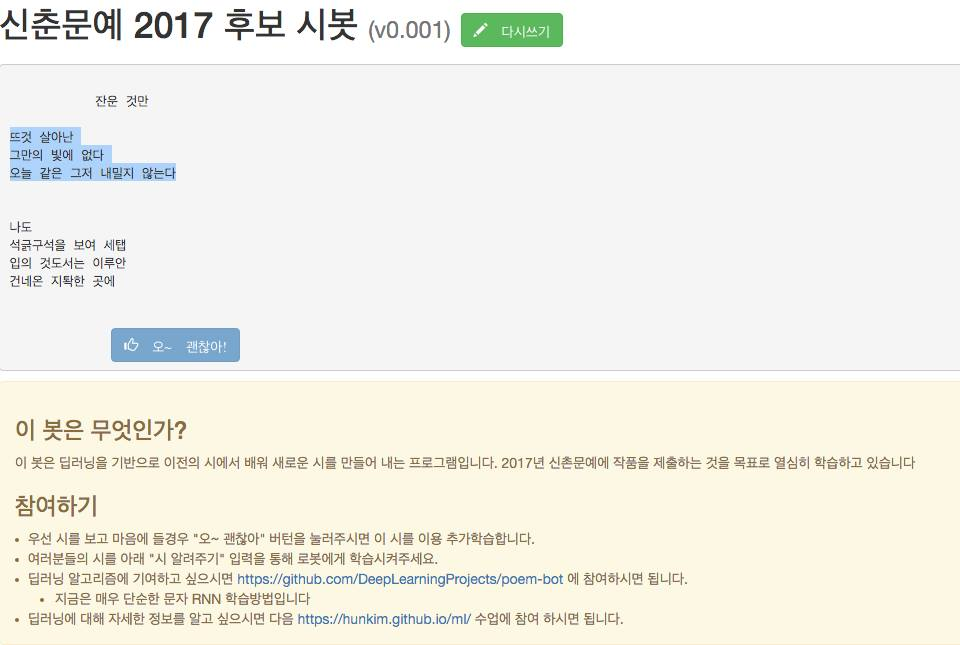

> 함께 로봇잘키워 2017/2018년 신춘 문예 도전해볼까요? http://bot.wpoem.com  "겨울소리 보고 걸어여라"  "그만의 빛에 없다 오늘 같은 그저 내밀지 않는다"  정말 간단한 TF char-rnn 으로 만들어 본것인데 100번에 한번 재미있는것이 나옵니다. 우선 학습할 시 데이타가 많지 않아, 엉성하지만  공개하고 데이타를 좀 모아 볼 생각입니다.  관심있으신 분들 같이 word-rnn, attention같은거 붙여서 2017년 신춘 문예 한번 도전해 볼까요? 로봇이 만들어 낸것에 우리가 손좀 보면 제출할수 있을듯 합니다. :-) PR/issue (아이디어) 다 환영합니다.

### 4월 26일 (화) 10:11 · happy birthday!

happy birthday!

### 4월 26일 (화) 10:11 · ↪ happy birthday!

*다른 프로필에 남긴 글*

happy birthday!

### 4월 26일 (화) 11:31 · Beautiful!

📍 The Hong Kong University of Science and Technology - HKUST, The Hong Kong University of Science and Technology - HKUST

Beautiful!

### 4월 27일 (수) 15:05 · 📷 사진 (2장)

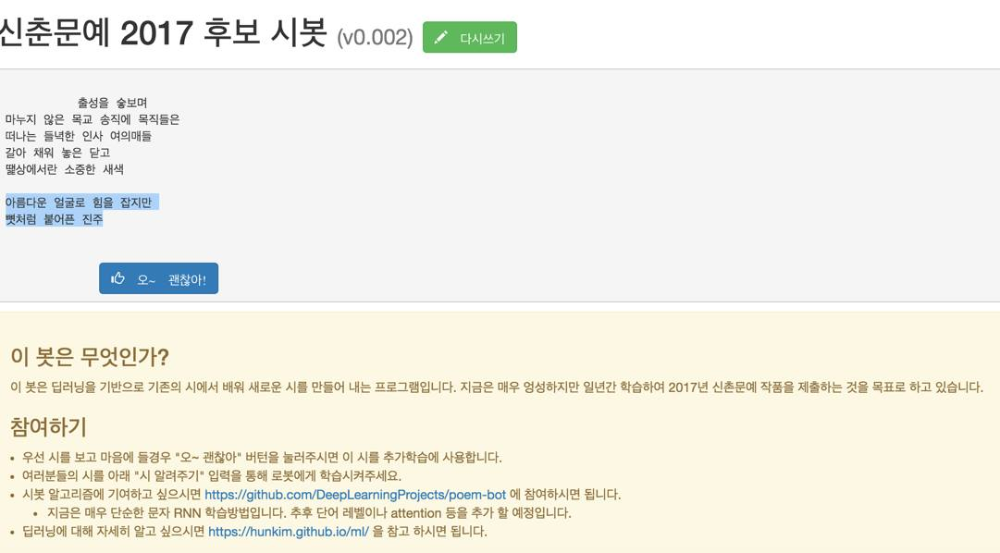 

> "여름이 가고 놀란 것인가", "꽃피는 것을 돌아있는", "아름다운 얼굴로 힘을 잡지만", "언제나 스스로 한번 짐승이다." ...  TensorFlow의 딥러닝 (char)RNN으로 간단하게 학습한 다음 시봇 (http://bot.wpoem.com/) 이 만들어 낸 시들입니다. 신기한것은 이 문장은 학습시킨 시에는 없는 *새로운* 매우 창의적인 문장이라는 것입니다.  학습데이타가 많이 부족하며 지금은 한글 맞춤법도 틀리는 매우 초보지만 학습데이타를 추가 하고 알고즘을 개선 시켜 2017년 공모전에 나가 보려고 합니다.  한번씩 방문하셔서 저희 봇을 훈련시켜 주세요.
> 혹 TensorFlow로 구현된 word-rnn 보신적 있으신가요? Torch/Lua 구현은 https://github.com/larspars/word-rnn 에 있는데 TensorFlow는 안 보이네요.   아님 ptb_word_lm.py 등을 참고하여 새로 만들어야 할까요?  http://clickotron.com/ 은 100% word-rnn으로 만든 뉴스 사이트 인데, 내용은 좀 그렇지만 제목을 잘 뽑네요. word-rnn으로 재미있는거 많이 만들수 있을것 같아요.

### 4월 28일 (목) 21:39 · Our Dracaena (Corn Plant, 鐵樹) blooming. …

Our Dracaena (Corn Plant, 鐵樹) blooming. In Korea, we call it lucky-tree, and blooming is very rare. Good luck to you ALL!

🎬 동영상 1개 (생략)

### 4월 29일 (금) 11:24 · 교수님, 생신 축하 드립니다.

교수님, 생신 축하 드립니다.

### 4월 29일 (금) 11:24 · ↪ 교수님, 생신 축하 드립니다.

*다른 프로필에 남긴 글*

교수님, 생신 축하 드립니다.

### 4월 30일 (토) 21:08 · 📷 사진 (1장)

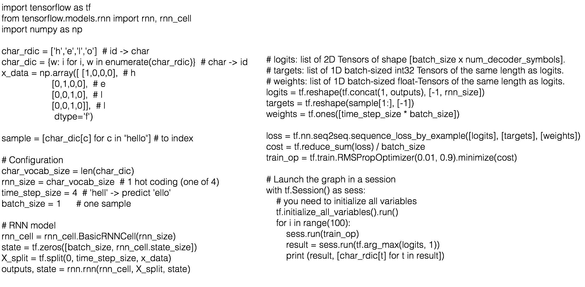

> [뉴럴넷의 꽃, RNN: 모두를 위한 딥러닝 시즌1 *종강* 강의]  강의를 시작한지 한달만에 41,000+ View, 감사합니다. 그래서 이번 종강의를 봐주시는 분들에게 Amazon Web Service 한국 사용자 모임 (Korean User Group) 의 후원으로 100불의 AWS 크레딧을 드립니다. (비디오 참조)   그 복잡한 RNN도 아래 몇줄 안되는 코드로 TensorFlow에서 구현이 가능합니다.  강의: https://youtu.be/-SHPG_KMUkQ 실습: https://youtu.be/A8wJYfDUYCk  수업페이지: hunkim.github.io/ml/  마지막 보너스 실습은 AWS/GPU에서 딥러닝 돌려보기 입니다. 모두들 크레딧 받으시고 뵙겠습니다.
