# 2016년 6월

[← 2016년](README.md)

### 6월 2일 (목) 00:04 · 📷 사진 (3장)

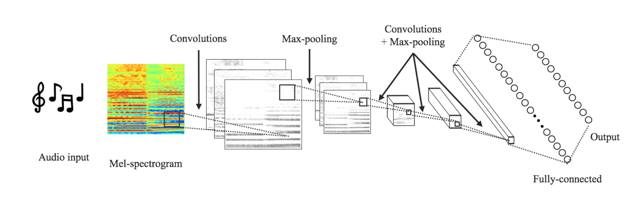
**이미지 캡션:** 이 이미지는 오디오 입력을 멜 스펙트로그램으로 변환하고, 이를 컨볼루션 신경망(CNN)을 통해 처리하여 최종적으로 출력하는 과정을 시각적으로 보여주는 도식입니다. 왼쪽에는 음악 기호와 함께 "Audio input"이라는 텍스트가 있고, 그 옆에는 컬러풀한 멜 스펙트로그램 이미지가 있습니다. 멜 스펙트로그램은 시간의 흐름에 따라 소리의 주파수별 강도를 색상으로 나타낸 것으로, 이 이미지에서는 주로 빨간색, 주황색, 노란색, 녹색, 파란색 계열의 색상이 복합적으로 나타나고 있습니다. 멜 스펙트로그램 이미지 위에는 "Convolutions"라는 텍스트와 함께 화살표가 그려져 있으며, 이는 컨볼루션 연산이 적용됨을 나타냅니다. 컨볼루션 연산 후에는 여러 개의 2차원 이미지가 쌓인 형태의 결과가 나타나고, 이어서 "Max-pooling"이라는 텍스트와 화살표가 있으며, 이는 맥스 풀링 연산이 적용됨을 보여줍니다. 맥스 풀링 후에는 차원이 축소된 여러 개의 2차원 이미지들이 나타납니다. 그 다음 단계에서는 "Convolutions + Max-pooling"이라는 텍스트와 함께 화살표가 두 번 적용되는 것을 보여주는데, 이는 컨볼루션과 맥스 풀링이 반복적으로 적용됨을 의미합니다. 이 과정을 거치면서 데이터는 3차원 형태의 큐브로 표현되고, 최종적으로는 길쭉한 막대 형태로 변환됩니다. 마지막으로, 이 막대 형태의 데이터는 "Fully-connected"라는 텍스트와 함께 점선으로 둘러싸인 두 개의 원형 노드 그룹으로 연결되며, 이 노드 그룹의 끝에는 "Output"이라는 텍스트가 표시되어 최종 결과가 출력됨을 나타냅니다. 전체적으로 흰색 배경에 검은색 선과 텍스트, 그리고 컬러 멜 스펙트로그램으로 구성되어 있으며, 기술적인 과정을 설명하는 데 초점을 맞춘 다이어그램입니다. "Convolutions"라는 텍스트와 함께 화살표가 그려져 있으며, 이는 컨볼루션 연산이 적용됨을 나타냅니다. 컨볼루션 연산 후에는 여러 개의 2차원 이미지가 쌓인 형태의 결과가 나타나고, 이어서 "Max-pooling"이라는 텍스트와 화살표가 있으며, 이는 맥스 풀링 연산이 적용됨을 보여줍니다. 맥스 풀링 후에는 차원이 축소된 여러 개의 2차원 이미지들이 나타납니다. 그 다음 단계에서는 "Convolutions + Max-pooling"이라는 텍스트와 함께 화살표가 두 번 적용되는 것을 보여주는데, 이는 컨볼루션과 맥스 풀링이 반복적으로 적용됨을 의미합니다. 이 과정을 거치면서 데이터는 3차원 형태의 큐브로 표현되고, 최종적으로는 길쭉한 막대 형태로 변환됩니다. 마지막으로, 이 막대 형태의 데이터는 "Fully-connected"라는 텍스트와 함께 점선으로 둘러싸인 두 개의 원형 노드 그룹으로 연결되며, 이 노드 그룹의 끝에는 "Output"이라는 텍스트가 표시되어 최종 결과가 출력됨을 나타냅니다. 전체적으로 흰색 배경에 검은색 선과 텍스트, 그리고 컬러 멜 스펙트로그램으로 구성되어 있으며, 기술적인 과정을 설명하는 데 초점을 맞춘 다이어그램입니다.
 
**이미지 캡션:** 이 화면은 모임 정보를 보여주는 웹페이지의 일부로, 상단에는 웹사이트 주소인 "m.onoffmix.com"과 "Share" 버튼이 보이며, 그 아래에는 "ONOFFMix" 로고와 검색 아이콘이 있다. 메인 콘텐츠는 "모임기간"으로 6월 18일 토요일 11시 30분부터 19시까지 진행됨을 알리고, "참가신청" 기간은 6월 2일 목요일 10시부터 6월 14일 화요일 9시까지임을 나타낸다. "모임장소"는 Google Seoul office (역삼역 2번출구 강남 파이낸스 센터 22층)이다. 현재 "참여자"는 50명, "대기자"는 72명이며, "총 모집인원"은 140명이다. 모임 개설자는 "김성훈"이며, 연락처는 010-7214-9467, 이메일은 hunkim@gmail.com이다. 모임에 대한 설명은 "설레이는 마음으로 TensorFlow-KR 첫 모임 6/18일을 통해 여러분들을 만나고자 합니다. 유익하고 흥미로운 강의와, 특히 이번 첫 모임에는 서로 교류하고 이야기하는 시간이 많이 있습니다."라고 적혀 있으며, 모임 번호는 NO. 69537이다. 화면 하단에는 "모임내용 더보기" 버튼과 "참여하기" 버튼이 파란색으로 강조되어 있다. 전체적으로 모임 참여를 독려하는 긍정적이고 정보 전달적인 분위기이다., "대기자"는 72명이며, "총 모집인원"은 140명이다. 모임 개설자는 "김성훈"이며, 연락처는 010-7214-9467, 이메일은 hunkim@gmail.com이다. 모임에 대한 설명은 "설레이는 마음으로 TensorFlow-KR 첫 모임 6/18일을 통해 여러분들을 만나고자 합니다. 유익하고 흥미로운 강의와, 특히 이번 첫 모임에는 서로 교류하고 이야기하는 시간이 많이 있습니다."라고 적혀 있으며, 모임 번호는 NO. 69537이다. 화면 하단에는 "모임내용 더보기" 버튼과 "참여하기" 버튼이 파란색으로 강조되어 있다. 전체적으로 모임 참여를 독려하는 긍정적이고 정보 전달적인 분위기이다.
 
**이미지 캡션:** 이 화면은 "TensorFlow-KR 첫 오프라인 모임"에 대한 정보를 제공하는 웹페이지의 일부입니다. 상단에는 "onoffmix.com"이라는 웹사이트 주소와 "ONOFFMIX" 로고가 보입니다. 메인 이미지에는 주황색과 청록색의 추상적인 도형이 있습니다. 모임의 제목은 "TensorFlow-KR 첫 오프라인 모임"이며, 유료 행사이고 마감까지 2주가 남았음을 나타냅니다. 모임 기간은 6월 18일 토요일 오전 11시 30분부터 오후 7시까지이며, 참가 신청 기간은 6월 2일 목요일 오전 10시부터 6월 14일 화요일 오전 9시까지입니다. 모임 장소는 Google Seoul office로, 역삼역 2번 출구 강남 파이낸스 센터 22층입니다. 현재 참여자는 140명이고 대기자는 57명이며, 총 모집 인원은 140명입니다. 모임 개설자는 김성훈이며, 연락처와 이메일 주소가 제공됩니다. 하단에는 모임에 대한 설명이 있는데, 설레는 마음으로 TensorFlow-KR 첫 모임을 통해 여러분을 만나고자 하며, 유익하고 흥미로운 강의와 함께 서로 교류하고 이야기하는 시간을 가질 수 있다고 합니다. 화면 하단에는 "참여하기" 버튼이 파란색으로 표시되어 있습니다. 전반적으로 기술 관련 오프라인 모임에 대한 안내와 참여를 독려하는 분위기입니다.일 화요일 오전 9시까지입니다. 모임 장소는 Google Seoul office로, 역삼역 2번 출구 강남 파이낸스 센터 22층입니다. 현재 참여자는 140명이고 대기자는 57명이며, 총 모집 인원은 140명입니다. 모임 개설자는 김성훈이며, 연락처와 이메일 주소가 제공됩니다. 하단에는 모임에 대한 설명이 있는데, 설레는 마음으로 TensorFlow-KR 첫 모임을 통해 여러분을 만나고자 하며, 유익하고 흥미로운 강의와 함께 서로 교류하고 이야기하는 시간을 가질 수 있다고 합니다. 화면 하단에는 "참여하기" 버튼이 파란색으로 표시되어 있습니다. 전반적으로 기술 관련 오프라인 모임에 대한 안내와 참여를 독려하는 분위기입니다.

> 한국분들의 논문입니다. CNN을 사용하여 다성 음악 (polyphonic music) 소리를 듣고 사용된 악기가 무엇인지 알아내다고 합니다. F-measure가 0.5정도 나오는데 이전 방법에 비해 16%이상 성능이 개선 되었다고 합니다.  딥러닝이 정말 여러분야에서 성능을 개선하고 있네요.  https://arxiv.org/abs/1605.09507
> 2분만에 50명 등록 입니다. 참여하실 분들은 서둘러 주세요. http://onoffmix.com/event/69537/
> 13분만에 140명 모두 마감 되었습니다! 신청해주신 분들에게 정말 감사드리며 남은 기간동안 열심히 모임을 준비하겠습니다.   더 넓은 장소를 준비하지 못해 부득이하게 대기하신 분들에게는 죄송하다는 말씀을 드립니다.   혹 등록하신분중 불가피하게 참여하지 못하시면 대기하시는 분들을 위해 등록을 취소해주시면 감사하겠습니다.   다시 한번 모든 분들에게 감사 드립니다.   TF-KR 운영진 드림.

### 6월 3일 (금) 11:49 · Best riding ever!

📍 Grand Teton National Park

Best riding ever!

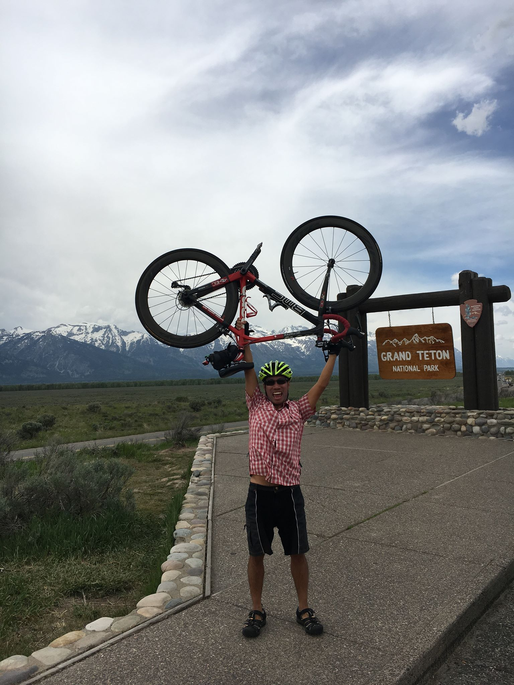
**이미지 캡션:** 한 성인 남성이 자전거를 머리 위로 들어 올리며 환호하고 있다. 그는 30대 후반에서 40대 초반으로 보이며, 밝은 노란색 헬멧을 쓰고 빨간색 체크무늬 셔츠와 검은색 반바지, 샌들을 착용하고 있다. 그의 표정은 매우 기쁘고 활기차 보인다. 배경에는 그랜드 티턴 국립공원 표지판이 보이며, 그 뒤로는 눈 덮인 산맥과 넓은 초원이 펼쳐져 있다. 하늘은 구름이 약간 낀 맑은 날씨를 나타낸다. 전체적으로 야외 활동을 즐기는 사람의 성취감과 자연의 아름다움을 담은 역동적인 분위기이다.

### 6월 5일 (일) 10:08 · Happy birthday.

Happy birthday.

### 6월 5일 (일) 10:08 · ↪ Happy birthday.

*다른 프로필에 남긴 글*

Happy birthday.

### 6월 5일 (일) 10:08 · Happy birthday.

Happy birthday.

### 6월 5일 (일) 10:08 · ↪ Happy birthday.

*다른 프로필에 남긴 글*

Happy birthday.

### 6월 7일 (화) 08:38 · Watching geysers is so much fun, and thi…

Watching geysers is so much fun, and this is my favorite: dancing muddy pool! Yellowstone National Park

🎬 동영상 1개 (생략)

### 6월 9일 (목) 03:48 · Leaving @Yellowstone National Park. So s…

Leaving @Yellowstone National Park. So sad but will come back again!

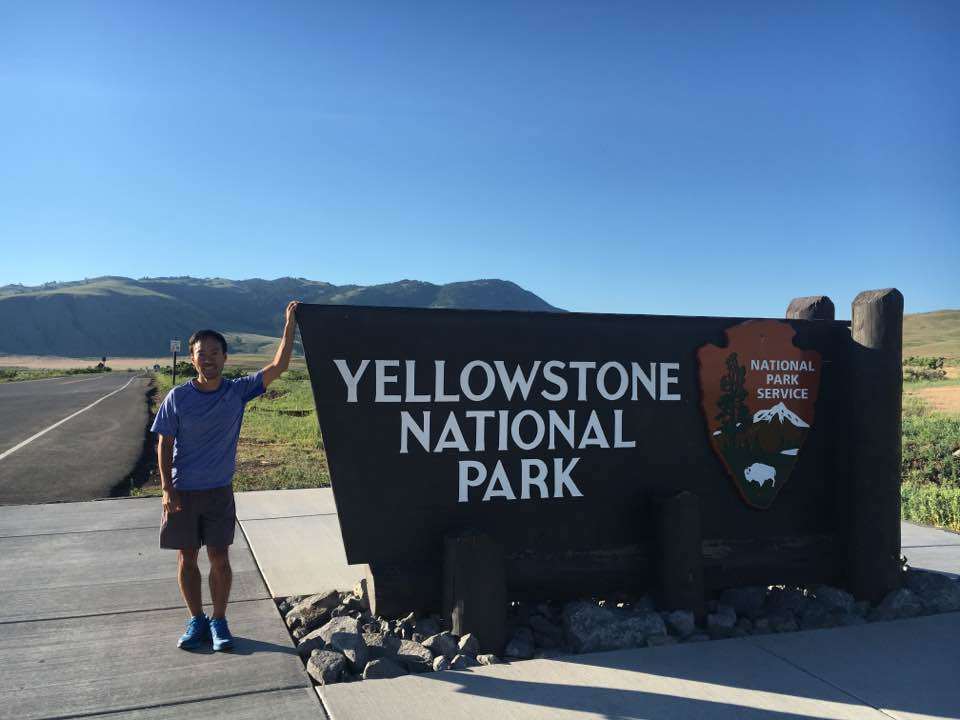
**이미지 캡션:** 푸른 하늘 아래, 한 성인 남성이 옐로스톤 국립공원 표지판 옆에 서 있다. 남성은 30대 초중반으로 보이며, 짧은 파란색 반팔 티셔츠와 회색 반바지, 파란색 운동화를 착용하고 있다. 그는 표지판의 오른쪽 상단을 한 손으로 잡고 있으며, 얼굴에는 미소를 띠고 있다. 배경에는 넓은 도로와 푸른 초원, 그리고 완만한 산들이 펼쳐져 있다. 표지판에는 "YELLOWSTONE NATIONAL PARK"라는 글자와 국립공원 서비스 로고가 새겨져 있다. 전체적으로 맑고 화창한 날씨 속에서 여행을 즐기는 듯한 밝고 긍정적인 분위기이다.분위기이다.

### 6월 9일 (목) 11:47 · 📷 사진 (1장)

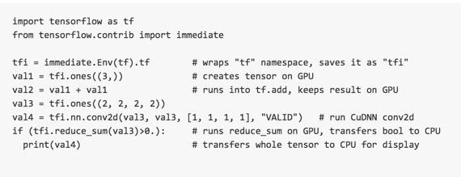
**이미지 캡션:** 이 사진은 회색 배경에 흰색 텍스트로 작성된 파이썬 코드 스니펫을 보여줍니다. 코드는 TensorFlow 라이브러리를 사용하여 GPU에서 텐서 연산을 수행하는 방법을 보여줍니다. 구체적으로, 코드는 TensorFlow를 `tf`로 가져오고, `immediate` 모듈을 사용하여 즉시 실행 환경을 설정합니다. 그런 다음 `tfi`라는 변수에 래핑된 TensorFlow 네임스페이스를 생성하고, GPU에서 `ones` 텐서를 생성하며, 텐서 덧셈을 수행하고, 4차원 텐서를 생성한 후, CuDNN을 사용하여 2D 컨볼루션 연산을 실행합니다. 마지막으로, 텐서의 합계를 계산하여 GPU에서 CPU로 불리언 값을 전송하고, 조건이 참이면 전체 텐서를 CPU로 전송하여 출력합니다. 코드에는 각 줄의 목적을 설명하는 주석이 포함되어 있어, TensorFlow의 즉시 실행 모드와 GPU 활용에 대한 이해를 돕습니다.볼루션 연산을 실행합니다. 마지막으로, 텐서의 합계를 계산하여 GPU에서 CPU로 불리언 값을 전송하고, 조건이 참이면 전체 텐서를 CPU로 전송하여 출력합니다. 코드에는 각 줄의 목적을 설명하는 주석이 포함되어 있어, TensorFlow의 즉시 실행 모드와 GPU 활용에 대한 이해를 돕습니다.

> TF 즉시 실행모드. Reinforcement learning 등 다양하게 사용될수 있을듯 합니다.  https://github.com/tensorflow/tensorflow/pull/2747  곧 merge될듯 합니다.

### 6월 14일 (화) 14:37 · happy to be home, Hong Kong!

happy to be home, Hong Kong!

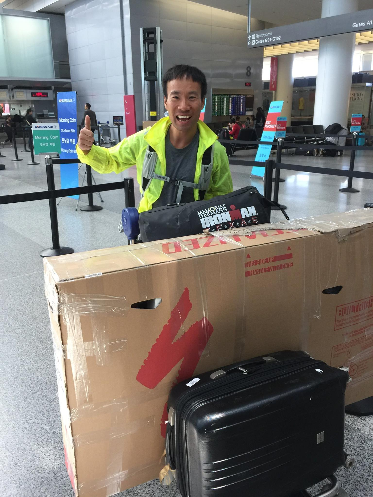
**이미지 캡션:** 공항에서 한 성인 남성이 밝은 노란색 방수 재킷과 회색 조끼를 입고 엄지손가락을 치켜들며 활짝 웃고 있다. 그는 여행 가방으로 보이는 큰 갈색 상자와 검은색 여행 가방 앞에 서 있으며, 상자에는 빨간색 로고가 그려져 있고 "THIS SIDE UP HANDLE WITH CARE"라는 문구가 보인다. 남성 뒤로는 공항 대합실이 보이며, 여러 개의 표지판과 좌석, 그리고 다른 여행객들이 희미하게 보인다. 전반적으로 여행을 떠나는 설렘과 기대감이 느껴지는 분위기이다.

### 6월 18일 (토) 05:02 · I really miss Santa Cruz.

I really miss Santa Cruz.

🔗 <https://www.quora.com/What-are-the-must-dos-in-Santa-Cruz?srid=4qd5&share=f90857e7>

### 6월 18일 (토) 21:57 · 📷 사진 (1장)

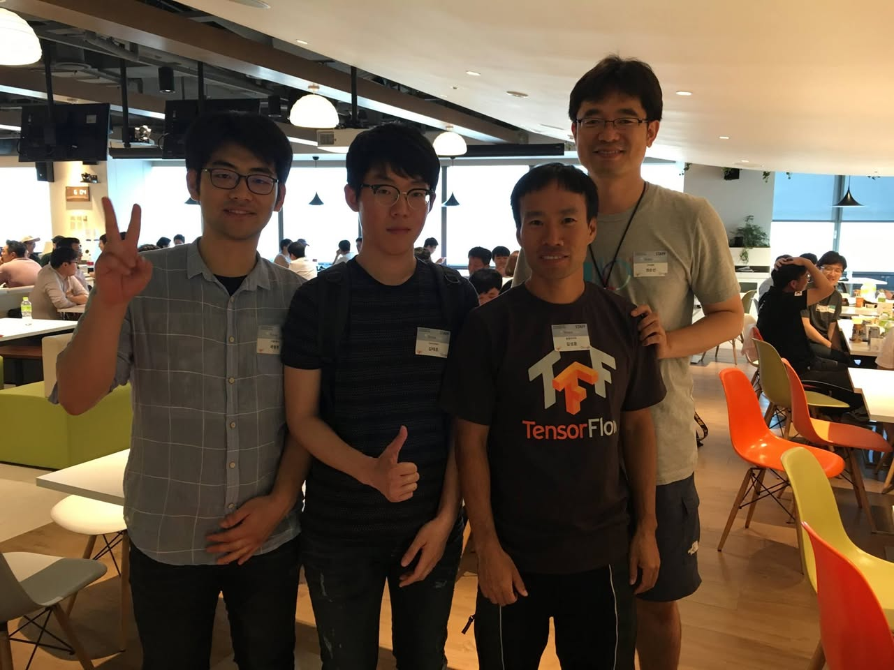
**이미지 캡션:** 네 명의 성인 남성이 실내 공간에서 포즈를 취하고 있다. 왼쪽에서 두 번째 남성은 회색 체크무늬 셔츠와 검은색 바지를 입고 있으며, 안경을 쓰고 있고, 오른손으로 브이(V) 표시를 하고 있다. 그의 옆에 있는 남성은 검은색 티셔츠와 검은색 바지를 입고 있으며, 안경을 쓰고 있고, 오른손으로 엄지척을 하고 있다. 가장 오른쪽에 있는 남성은 회색 티셔츠와 남색 반바지를 입고 있으며, 안경을 쓰고 있고, 왼손으로 다른 남성의 어깨에 손을 올리고 있다. 가장 왼쪽에 있는 남성은 검은색 티셔츠와 검은색 바지를 입고 있으며, 티셔츠에는 "TensorFlow"라고 적힌 로고가 있다. 배경에는 여러 테이블과 의자가 보이며, 다른 사람들이 앉아 있거나 서 있는 모습도 보인다. 전반적으로 편안하고 캐주얼한 분위기이다.으며, 티셔츠에는 "TensorFlow"라고 적힌 로고가 있다. 배경에는 여러 테이블과 의자가 보이며, 다른 사람들이 앉아 있거나 서 있는 모습도 보인다. 전반적으로 편안하고 캐주얼한 분위기이다.

> 오늘 참여해주셔서 첫 모임을 흥미진진하고 신나게 해주신 모든 분들에게 감사드립니다. 앞으로도 이런 재미있는 모임을 더 많이 같이 만들어 가면 좋겠습니다.  여러분들은 오늘 모임 어떻게 보셨는지 생생한 후기들 많이 올려 주세요.  TF-KR 운영진 드림 (오늘 맛있는 음식을 준비해주신 김택수님은 아쉽게도 같이 사진을 촬영하지 못했습니다.)

### 6월 19일 (일) 21:02 · Thanks for your birthday wishes! (Fun pa…

Thanks for your birthday wishes! (Fun party with Channy Yun's family)

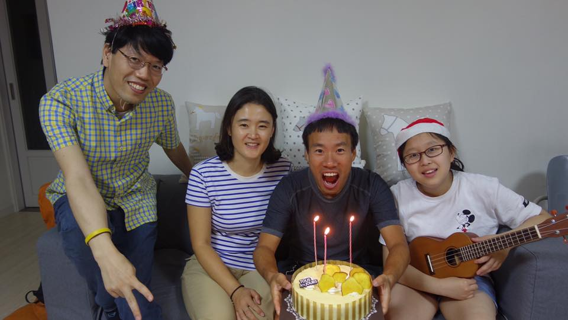
**이미지 캡션:** 네 명의 사람이 생일 케이크를 앞에 두고 기념 사진을 찍고 있다. 왼쪽부터 성인 남성은 노란색과 파란색 체크무늬 셔츠와 청바지를 입고 있으며, 머리에는 생일 모자를 쓰고 안경을 착용하고 있다. 그는 활짝 웃으며 두 손가락을 펴 보이는 포즈를 취하고 있다. 그 옆에는 성인 여성이 파란색과 흰색 줄무늬 티셔츠와 베이지색 바지를 입고 있으며, 부드러운 미소를 짓고 있다. 가운데 있는 성인 남성은 회색 반팔 티셔츠를 입고 보라색 생일 모자를 쓰고 있으며, 입을 크게 벌리고 환호하는 듯한 표정을 짓고 있다. 그의 앞에는 세 개의 촛불이 켜진 생일 케이크가 놓여 있다. 오른쪽에는 어린 소녀가 흰색 티셔츠와 파란색 반바지를 입고 있으며, 산타 모자를 쓰고 안경을 착용하고 있다. 그녀는 우쿨렐레를 들고 카메라를 바라보며 미소 짓고 있다. 배경에는 소파와 쿠션, 그리고 벽이 보인다. 전반적으로 즐겁고 축하하는 분위기이다.는 세 개의 촛불이 켜진 생일 케이크가 놓여 있다. 오른쪽에는 어린 소녀가 흰색 티셔츠와 파란색 반바지를 입고 있으며, 산타 모자를 쓰고 안경을 착용하고 있다. 그녀는 우쿨렐레를 들고 카메라를 바라보며 미소 짓고 있다. 배경에는 소파와 쿠션, 그리고 벽이 보인다. 전반적으로 즐겁고 축하하는 분위기이다.

### 6월 21일 (화) 11:27 · Jeju day 1: Wonderful Saryeoni trail (사려…

📍 Jeju City

Jeju day 1: Wonderful Saryeoni trail (사려니 숲길)!

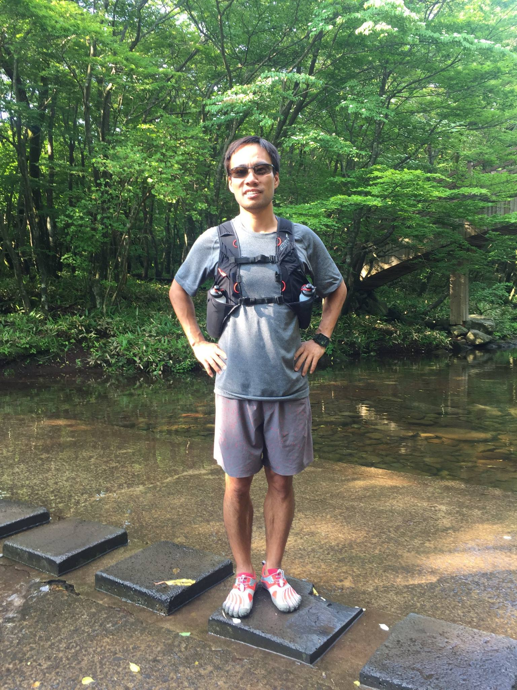
**이미지 캡션:** 한 명의 성인 남성이 숲 속의 얕은 개울을 건너기 위해 놓인 돌판 위에 서 있다. 남성은 회색 반팔 티셔츠와 회색 반바지를 입고 있으며, 등에는 물통이 달린 검은색 조끼를 메고 있다. 그는 선글라스를 착용하고 있으며, 얼굴에는 미소를 띠고 있다. 그의 발에는 독특한 모양의 운동화가 신겨져 있다. 배경에는 울창한 나무들이 우거져 있으며, 개울물은 맑고 잔잔하다. 햇빛이 나뭇잎 사이로 비쳐 들어와 자연스러운 분위기를 자아낸다. 남성은 두 손을 허리에 얹고 카메라를 응시하고 있으며, 편안하고 여유로운 모습이다.

### 6월 22일 (수) 18:32 · 📷 사진 (1장)

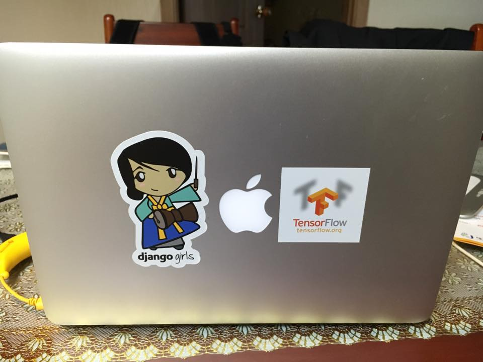
**이미지 캡션:** 닫힌 은색 노트북의 뒷면에 두 개의 스티커가 붙어 있으며, 왼쪽에는 한국 전통 의상을 입은 귀여운 만화 캐릭터 스티커가 있고, 오른쪽에는 애플 로고와 함께 TensorFlow 로고와 웹사이트 주소가 적힌 스티커가 있습니다. 캐릭터 스티커에는 "django girls"라는 글자가 쓰여 있으며, TensorFlow 스티커에는 "TensorFlow"와 "tensorflow.org"라는 글자가 쓰여 있습니다. 노트북은 테이블 위에 놓여 있으며, 테이블 위에는 레이스 무늬의 테이블보가 깔려 있습니다. 배경에는 의자와 문이 보이며, 전체적으로 실내의 평범한 풍경을 담고 있습니다.문이 보이며, 전체적으로 실내의 평범한 풍경을 담고 있습니다.

### 6월 23일 (목) 14:09 · 📷 사진 (2장)

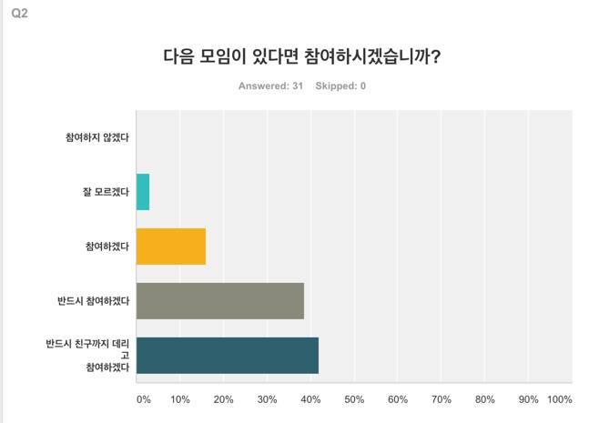
**이미지 캡션:** 이 이미지는 설문조사 결과를 보여주는 그래프로, "다음 모임이 있다면 참여하시겠습니까?"라는 질문에 대한 응답을 나타냅니다. 그래프는 수직 막대 형태로 각 응답의 비율을 보여주며, 응답은 "참여하지 않겠다", "잘 모르겠다", "참여하겠다", "반드시 참여하겠다", "반드시 친구까지 데리고 참여하겠다"로 구성되어 있습니다. "참여하지 않겠다"는 약 10% 미만, "잘 모르겠다"는 약 5% 미만, "참여하겠다"는 약 15% 미만, "반드시 참여하겠다"는 약 35% 미만, 그리고 "반드시 친구까지 데리고 참여하겠다"는 약 40% 미만의 응답률을 보입니다. 총 31명이 응답했으며, 아무도 질문을 건너뛰지 않았습니다. 그래프의 배경은 흰색이며, 질문과 응답 내용은 한국어로 작성되어 있습니다. 전반적으로 차분하고 정보 전달에 집중된 분위기입니다.다"는 약 40% 미만의 응답률을 보입니다. 총 31명이 응답했으며, 아무도 질문을 건너뛰지 않았습니다. 그래프의 배경은 흰색이며, 질문과 응답 내용은 한국어로 작성되어 있습니다. 전반적으로 차분하고 정보 전달에 집중된 분위기입니다.
 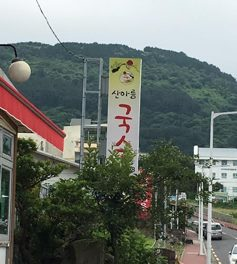
**이미지 캡션:** 흐린 날씨에 산을 배경으로 한 도로변에 세워진 간판이 보인다. 간판에는 노란색 바탕에 붉은색 글씨로 '산아름 국수'라고 쓰여 있으며, 국수 그릇 그림이 함께 그려져 있다. 간판 옆으로는 푸른 나무들이 우거져 있고, 도로에는 차량 몇 대가 지나가고 있다. 건물 일부와 가로등도 보인다. 전체적으로 평범한 시골 마을의 식당 풍경을 담고 있다.

> [TF-KR 첫 모임 이후 설문조사 결과]  지난 18일 있었던 첫 모임에 대한 설문 조사 결과 입니다. 많은 분들이 2번째 모임에도 (친구까지 데리고) 참여하겠다고 해주셔서,  두번째 모임을 잘 준비해보겠습니다.  다른 설문 내용은 https://www.surveymonkey.com/results/SM-J6J3G7YT/ 더 보실수있습니다.  혹시 두번째 모임에서 다루었으면 하는 부분이 있으면 댓글로 알려주시면 참고하여 좋은 강사님들을 섭외 하겠습니다.  감사합니다.
> 6월 27일 월요일 제대 후문 점심 (12:30) 번개!  제주 딥러닝 스터디 준비중입니다. 이번에 신청하신 분들이 많아 재미난 모임이 될듯 한데 이중 제대 근처계시는 분들도 많아 번개 한번 합니다. 점심때 산아름 국수로 오시면 제가 국수 대접하겠습니다.   제주 IT 프리랜서 커뮤니티 그룹의 멤버들도 근처 계시면 초대 합니다. (다만 학생은 제가 대접하고 일반은 본인 부담입니다.)  근처 계시는 분들 뵙겠습니다.

### 6월 23일 (목) 14:55 · Wonderful to hike with Korean Archery Na…

📍 Mt. Hallasan, Jeju-do

Wonderful to hike with Korean Archery National Team and Olympic gold medalist, Ki Bo Bae. Good luck in Rio!

**이미지 캡션:** 한 명의 성인 남성과 한 명의 성인 여성이 산길에서 함께 사진을 찍고 있으며, 배경에는 울창한 녹색 식물과 나무가 보이고 하늘은 맑다. 남성은 30대 후반에서 40대 초반으로 보이며, 짧은 검은색 머리에 옅은 갈색 피부를 가졌고, 회색 반팔 티셔츠와 검은색 조끼형 배낭을 착용하고 있다. 배낭에는 물병이 달려 있다. 그는 활짝 웃으며 카메라를 바라보고 있다. 여성은 20대 후반에서 30대 초반으로 보이며, 붉은 갈색 머리를 높게 묶고 있으며, 흰색 반팔 폴로 셔츠와 파란색 배낭을 착용하고 있다. 셔츠 왼쪽 소매에는 태극기가 부착되어 있다. 그녀 역시 환하게 웃으며 카메라를 바라보고 있다. 두 사람 모두 등산이나 하이킹을 즐기는 듯한 모습이며, 밝고 긍정적인 분위기를 자아낸다.에는 태극기가 부착되어 있다. 그녀 역시 환하게 웃으며 카메라를 바라보고 있다. 두 사람 모두 등산이나 하이킹을 즐기는 듯한 모습이며, 밝고 긍정적인 분위기를 자아낸다.
 
**이미지 캡션:** 이 사진은 흐린 날씨에 한라산 국립공원 입구에서 찍은 단체 사진으로, 12명의 성인 남녀가 등산복을 입고 포즈를 취하고 있습니다. 대부분 파란색 또는 흰색 계열의 등산복을 착용했으며, 일부는 모자를 쓰고 있습니다. 모두 밝고 긍정적인 표정을 짓고 있으며, 일부는 등산 스틱을 들고 있거나 서로 어깨동무를 하고 있습니다. 배경에는 한라산 국립공원을 소개하는 안내판 두 개가 보이며, 왼쪽 안내판에는 "세계자연유산 한라산국립공원에 오신 것을 환영합니다. Welcome to Mt. Hallasan National Park"라는 문구가 한국어와 영어로 적혀 있습니다. 오른쪽 안내판에는 "31일까지 한라 시간은 05:00-"라는 문구가 보입니다. 전체적으로 등산을 앞두고 설레는 분위기를 느낄 수 있습니다.rk"라는 문구가 한국어와 영어로 적혀 있습니다. 오른쪽 안내판에는 "31일까지 한라 시간은 05:00-"라는 문구가 보입니다. 전체적으로 등산을 앞두고 설레는 분위기를 느낄 수 있습니다.
 
**이미지 캡션:** 사진에는 숲이 우거진 산길을 오르고 있는 두 사람이 담겨 있습니다. 왼쪽에 있는 성인 남성은 30대 후반에서 40대 초반으로 보이며, 짧은 검은 머리에 옅은 미소를 띠고 있습니다. 그는 회색 반팔 티셔츠와 검은색 조끼형 배낭을 착용하고 있으며, 배낭에는 물통이 달려 있습니다. 엄지손가락을 치켜들고 있어 긍정적인 기분을 나타냅니다. 오른쪽에 있는 성인 여성은 20대 후반에서 30대 초반으로 보이며, 갈색 머리를 단정하게 묶고 있습니다. 그녀는 흰색 카라 티셔츠와 파란색 배낭을 메고 있으며, 티셔츠 왼쪽 소매에는 태극기가 부착되어 있습니다. 두 사람 모두 등산복 차림이며, 배경에는 울창한 나무와 푸른 하늘이 보입니다. 뒤쪽으로도 두 명의 등산객이 더 보이며, 전체적으로 등산을 즐기는 활기찬 분위기입니다. 태극기가 부착되어 있습니다. 두 사람 모두 등산복 차림이며, 배경에는 울창한 나무와 푸른 하늘이 보입니다. 뒤쪽으로도 두 명의 등산객이 더 보이며, 전체적으로 등산을 즐기는 활기찬 분위기입니다.

### 6월 24일 (금) 08:09 · Happy birthday.

Happy birthday.

### 6월 24일 (금) 08:09 · ↪ Happy birthday.

*다른 프로필에 남긴 글*

Happy birthday.

### 6월 24일 (금) 08:09 · 생일 축하 드립니다.

생일 축하 드립니다.

### 6월 24일 (금) 08:09 · ↪ 생일 축하 드립니다.

*다른 프로필에 남긴 글*

생일 축하 드립니다.

### 6월 24일 (금) 08:09 · Happy birthday.

Happy birthday.

### 6월 24일 (금) 08:09 · ↪ Happy birthday.

*다른 프로필에 남긴 글*

Happy birthday.

### 6월 24일 (금) 08:10 · 생일 축하 드립니다.

생일 축하 드립니다.

### 6월 24일 (금) 08:10 · ↪ 생일 축하 드립니다.

*다른 프로필에 남긴 글*

생일 축하 드립니다.

### 6월 24일 (금) 08:10 · Happy birthday.

Happy birthday.

### 6월 24일 (금) 08:10 · ↪ Happy birthday.

*다른 프로필에 남긴 글*

Happy birthday.

### 6월 24일 (금) 08:10 · Happy birthday.

Happy birthday.

### 6월 24일 (금) 08:10 · ↪ Happy birthday.

*다른 프로필에 남긴 글*

Happy birthday.

### 6월 24일 (금) 08:10 · Happy birthday.

Happy birthday.

### 6월 24일 (금) 08:10 · ↪ Happy birthday.

*다른 프로필에 남긴 글*

Happy birthday.

### 6월 24일 (금) 08:10 · 생일 축하 드립니다.

생일 축하 드립니다.

### 6월 24일 (금) 08:10 · ↪ 생일 축하 드립니다.

*다른 프로필에 남긴 글*

생일 축하 드립니다.

### 6월 25일 (토) 20:09 · 📷 사진 (3장)

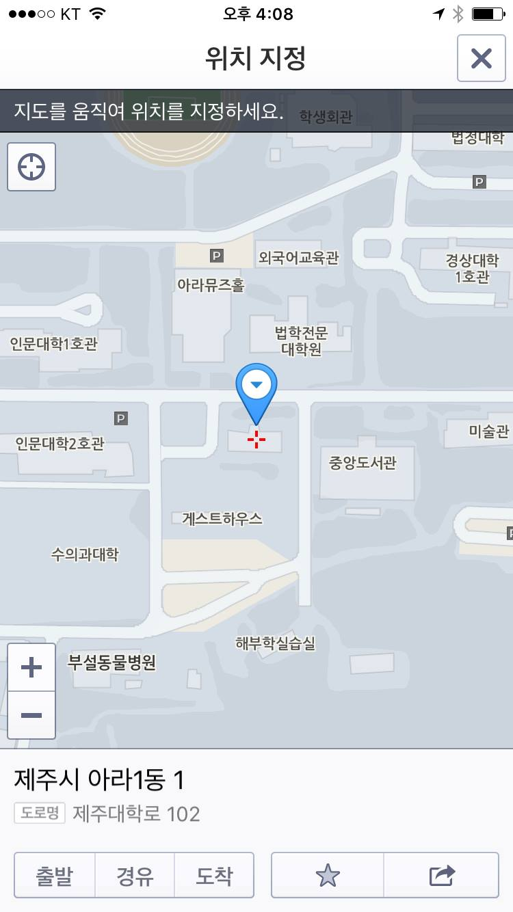
**이미지 캡션:** 이 화면은 스마트폰 지도 애플리케이션의 위치 지정 화면으로, 현재 시간은 오후 4시 8분이며 KT 통신사 신호가 잡혀 있다. 화면 상단에는 '위치 지정'이라는 제목이 있고, 오른쪽 상단에는 닫기 버튼으로 보이는 X 표시가 있다. 지도 영역에는 '지도를 움직여 위치를 지정하세요.'라는 안내 문구와 함께 '학생회관'이라는 텍스트가 보인다. 지도에는 여러 건물과 도로가 표시되어 있으며, 현재 지정된 위치는 파란색 말풍선 모양의 핀으로 표시되어 있고, 그 아래에 빨간색 십자 모양의 조준점이 있다. 지도에는 '법성대학', '경상대학 1호관', '외국어교육관', '아라뮤즈홀', '인문대학 1호관', '법학전문대학원', '인문대학 2호관', '중앙도서관', '미술관', '게스트하우스', '수의과대학', '부설동물병원', '해부학실습실' 등의 건물 이름이 한국어로 표시되어 있다. 또한, 'P' 표시와 함께 주차장임을 나타내는 아이콘도 보인다. 화면 하단에는 현재 지정된 주소가 '제주시 아라1동 1'이며, 도로명 주소는 '제주대학로 102'라고 표시되어 있다. 그 아래에는 '출발', '경유', '도착'이라는 버튼과 함께 즐겨찾기 및 공유 아이콘이 보인다. 전반적으로 대학 캠퍼스 내의 특정 위치를 설정하는 상황으로 보인다.', '경상대학 1호관', '외국어교육관', '아라뮤즈홀', '인문대학 1호관', '법학전문대학원', '인문대학 2호관', '중앙도서관', '미술관', '게스트하우스', '수의과대학', '부설동물병원', '해부학실습실' 등의 건물 이름이 한국어로 표시되어 있다. 또한, 'P' 표시와 함께 주차장임을 나타내는 아이콘도 보인다. 화면 하단에는 현재 지정된 주소가 '제주시 아라1동 1'이며, 도로명 주소는 '제주대학로 102'라고 표시되어 있다. 그 아래에는 '출발', '경유', '도착'이라는 버튼과 함께 즐겨찾기 및 공유 아이콘이 보인다. 전반적으로 대학 캠퍼스 내의 특정 위치를 설정하는 상황으로 보인다.
 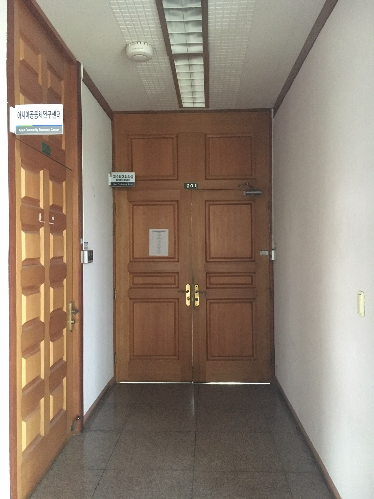
**이미지 캡션:** 이 사진은 복도에 있는 두 개의 문을 보여줍니다. 왼쪽 문은 나무로 만들어졌으며, "아시아공동체연구센터 Asian Community Research Center"라고 적힌 흰색 표지판이 붙어 있습니다. 오른쪽 문은 더 큰 이중문으로, 역시 나무로 만들어졌으며, "교수회대회의실"이라고 적힌 작은 표지판과 "201"이라는 숫자가 붙어 있습니다. 두 문 모두 금색 손잡이가 달려 있습니다. 복도 바닥은 회색 타일로 되어 있으며, 천장에는 형광등이 설치되어 있습니다. 사진에는 사람이 보이지 않으며, 전체적으로 조용하고 정돈된 분위기입니다. 정돈된 분위기입니다.
 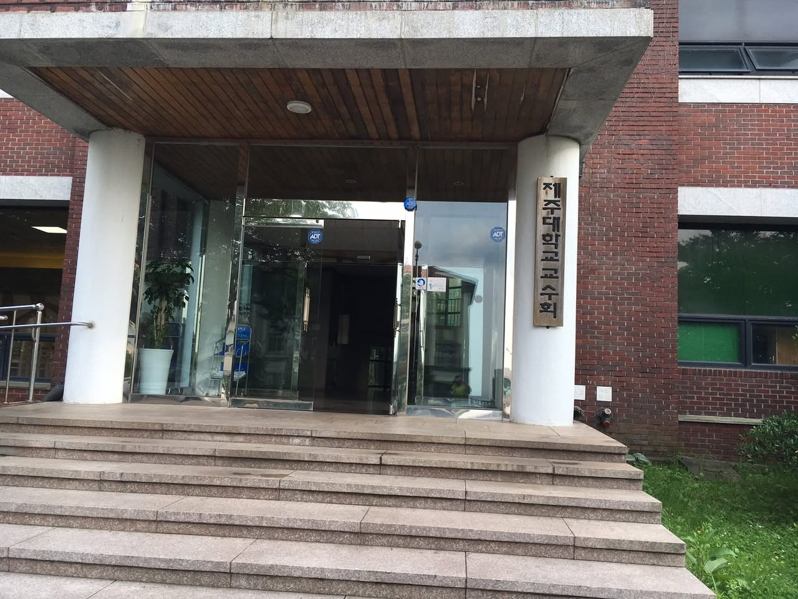
**이미지 캡션:** 넓은 계단을 올라가면 유리문으로 된 건물 입구가 보입니다. 입구 왼쪽에는 하얀색 화분에 심어진 푸른 식물이 놓여 있고, 오른쪽 기둥에는 '제주대학교 총회'라고 쓰인 현판이 걸려 있습니다. 건물 외벽은 붉은 벽돌로 되어 있으며, 창문에는 녹색 블라인드가 쳐져 있습니다. 건물 앞쪽에는 잔디와 풀이 자라고 있어 자연스러운 분위기를 자아냅니다. 건물 안쪽으로는 희미하게 책장과 사람들이 보이지만, 자세한 모습은 파악하기 어렵습니다. 전체적으로 차분하고 정돈된 느낌을 주는 건물 입구의 모습입니다.wooden ceiling over the entrance. Inside the glass doors, a potted plant is visible, and a security camera is mounted on the wall. The overall atmosphere is one of a formal institution, likely a university building. There are no people clearly visible in the image, but the presence of a security camera and the nature of the building suggest a public or semi-public space. The lighting is natural daylight, and the scene appears to be taken during the daytime.

### 6월 26일 (일) 07:39 · 📷 사진 (1장)

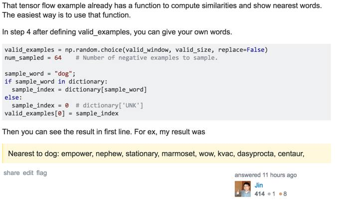
**이미지 캡션:** 이 이미지는 프로그래밍 코드와 텍스트가 포함된 스크린샷으로, 텐서플로우를 사용하여 단어 유사성을 계산하는 방법을 설명하고 있습니다. 상단에는 "텐서플로우 예제에는 이미 유사성을 계산하고 가장 가까운 단어를 보여주는 함수가 있습니다. 이 함수를 사용하는 가장 쉬운 방법입니다."라는 텍스트가 있습니다. 그 아래에는 "valid_examples를 정의한 후 단계 4에서 자신만의 단어를 지정할 수 있습니다."라는 설명과 함께 파이썬 코드 블록이 표시됩니다. 코드 블록에는 `valid_examples = np.random.choice(valid_window, valid_size, replace=False)`와 같은 코드가 포함되어 있으며, `sample_word = "dog"`로 설정되어 있습니다. 코드 아래에는 "그런 다음 첫 번째 줄에서 결과를 볼 수 있습니다. 예를 들어, 제 결과는 다음과 같습니다."라는 문구가 있습니다. 마지막으로 노란색 배경의 텍스트 줄에는 "Nearest to dog: empower, nephew, stationary, marmoset, wow, kvac, dasyprocta, centaur,"라고 표시되어 있으며, 이는 "dog"라는 단어와 가장 유사한 단어들의 목록입니다. 이미지 하단에는 "share edit flag"라는 링크와 함께 "answered 11 hours ago"라는 정보와 함께 "Jin"이라는 이름의 사용자가 표시되며, 그의 프로필 사진과 함께 414개의 포인트와 8개의 좋아요를 나타내는 아이콘이 있습니다. 전체적으로 이 이미지는 프로그래밍 관련 질문에 대한 답변의 일부로 보이며, 기술적인 내용을 설명하고 있습니다.om.choice(valid_window, valid_size, replace=False)`와 같은 코드가 포함되어 있으며, `sample_word = "dog"`로 설정되어 있습니다. 코드 아래에는 "그런 다음 첫 번째 줄에서 결과를 볼 수 있습니다. 예를 들어, 제 결과는 다음과 같습니다."라는 문구가 있습니다. 마지막으로 노란색 배경의 텍스트 줄에는 "Nearest to dog: empower, nephew, stationary, marmoset, wow, kvac, dasyprocta, centaur,"라고 표시되어 있으며, 이는 "dog"라는 단어와 가장 유사한 단어들의 목록입니다. 이미지 하단에는 "share edit flag"라는 링크와 함께 "answered 11 hours ago"라는 정보와 함께 "Jin"이라는 이름의 사용자가 표시되며, 그의 프로필 사진과 함께 414개의 포인트와 8개의 좋아요를 나타내는 아이콘이 있습니다. 전체적으로 이 이미지는 프로그래밍 관련 질문에 대한 답변의 일부로 보이며, 기술적인 내용을 설명하고 있습니다.

> Word2Vec에 대한 질문과 간단한 사용방법을 알려주는 답변입니다. http://stackoverflow.com/questions/38027289  혹시 한글로 Word2vec모델 만들어 사용하시는 분들이 계신가요?

### 6월 27일 (월) 06:42 · 📷 사진 (1장)

**이미지 캡션:** 황금색으로 빛나는 3000이라는 숫자가 웅장한 석조 받침대 위에 새겨져 있습니다. 숫자는 입체적으로 표현되어 있으며, 금속 재질 특유의 광택과 함께 깊이감이 느껴집니다. 배경에는 어두운 회색 구름과 함께 빛줄기가 여러 방향으로 뻗어 나와 극적인 분위기를 연출합니다. 전체적으로 고급스럽고 신비로운 느낌을 주며, 마치 영화의 오프닝 시퀀스나 중요한 기념일을 나타내는 듯한 인상을 줍니다.

> 여러분들의 왕성한 활동으로 3,000+멤버 그룹이 되었습니다. 감사드립니다. 운영진으로 활동하고 수고하고 계신 Soonson Kwon, 김택수, DongHyun Kwak, Taehoon Kim 님에게 감사드리고 추가로 Lucy Park 님이 운영진으로 합류하여 더 재미있고 활발한 그룹이 될것으로 기대 합니다.

### 6월 28일 (화) 20:54 · 📷 사진 (5장)

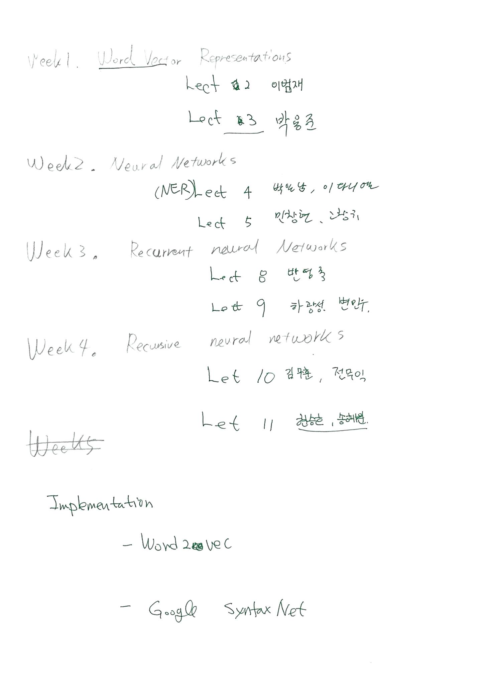
**이미지 캡션:** 이 사진은 흰색 배경에 검은색 펜으로 작성된 손글씨 메모로, 주로 컴퓨터 과학 관련 강의 내용을 정리한 것으로 보인다. 왼쪽에는 "Week 1", "Week 2", "Week 3", "Week 4", "Weeks"와 같이 주차별로 구분된 제목들이 나열되어 있으며, 각 주차별 제목 옆에는 해당 주차에 다루는 주요 주제들이 영어와 한국어로 함께 기재되어 있다. 예를 들어, "Week 1"에는 "Word Vector Representations"라고 적혀 있고, 그 아래에는 "Lect #2 이범재", "Lect #3 박용준"과 같이 강의 번호와 강사 또는 발표자 이름으로 추정되는 한국어 이름들이 나열되어 있다. "Week 2"에는 "Neural Networks"라는 주제와 함께 "(NER)Lect 4 박일남, 이다니엘", "Lect 5 민창현, 고창규" 등이, "Week 3"에는 "Recurrent neural Networks"와 "Lect 8 반영중", "Lect 9 하광성. 변민우." 등이, "Week 4"에는 "Recursive neural networks"와 "Let 10 김무훈, 전무익", "Let 11 현승호, 송혜원." 등이 기재되어 있다. "Weeks" 아래에는 "Implementation"이라는 제목과 함께 "- Word 2 vec", "- Google Syntax Net"이라는 하위 항목들이 나열되어 있다. 전체적으로 학술적인 내용을 기록한 것으로 보이며, 특별히 사람의 외모나 복장, 표정, 행동을 묘사할 만한 정보는 없다. 배경은 깨끗한 흰색 종이이며, 특별한 사물은 보이지 않는다. 보이는 텍스트는 모두 손글씨로 작성된 영어와 한국어 단어 및 문장들이다. 분위기는 차분하고 학구적인 느낌을 준다.3 박용준"과 같이 강의 번호와 강사 또는 발표자 이름으로 추정되는 한국어 이름들이 나열되어 있다. "Week 2"에는 "Neural Networks"라는 주제와 함께 "(NER)Lect 4 박일남, 이다니엘", "Lect 5 민창현, 고창규" 등이, "Week 3"에는 "Recurrent neural Networks"와 "Lect 8 반영중", "Lect 9 하광성. 변민우." 등이, "Week 4"에는 "Recursive neural networks"와 "Let 10 김무훈, 전무익", "Let 11 현승호, 송혜원." 등이 기재되어 있다. "Weeks" 아래에는 "Implementation"이라는 제목과 함께 "- Word 2 vec", "- Google Syntax Net"이라는 하위 항목들이 나열되어 있다. 전체적으로 학술적인 내용을 기록한 것으로 보이며, 특별히 사람의 외모나 복장, 표정, 행동을 묘사할 만한 정보는 없다. 배경은 깨끗한 흰색 종이이며, 특별한 사물은 보이지 않는다. 보이는 텍스트는 모두 손글씨로 작성된 영어와 한국어 단어 및 문장들이다. 분위기는 차분하고 학구적인 느낌을 준다.
 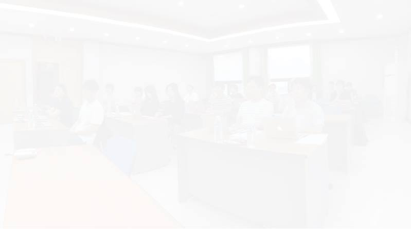
**이미지 캡션:** 밝고 현대적인 강의실에서 여러 명의 성인 남녀가 강의를 듣고 있는 모습입니다. 대부분 20대에서 30대로 보이는 젊은층이며, 편안한 복장을 하고 있습니다. 일부는 노트북이나 서류를 보며 집중하고 있고, 다른 일부는 강사를 바라보거나 잠시 쉬는 듯한 표정을 짓고 있습니다. 강의실은 밝은 조명과 깔끔한 책상, 그리고 벽면에 설치된 스크린으로 인해 교육적인 분위기를 풍깁니다. 책상 위에는 노트북, 서류, 물병 등이 놓여 있으며, 전체적으로 차분하고 집중된 상황임을 알 수 있습니다.
 
**이미지 캡션:** 이 사진은 강의실에서 수업을 듣고 있는 여러 명의 성인 남녀를 보여줍니다. 대부분의 사람들은 20대에서 30대로 보이며, 캐주얼한 복장을 하고 있습니다. 몇몇은 노트북을 사용하거나 필기를 하고 있으며, 전반적으로 집중하는 표정입니다. 강의실은 밝고 현대적인 분위기이며, 천장에는 조명이 설치되어 있고 벽에는 스크린이 걸려 있습니다. 책상 위에는 노트북, 물병, 서류 등이 놓여 있습니다. 사진은 전체적으로 밝고 깨끗한 느낌을 주며, 교육 또는 회의 상황을 묘사하고 있습니다.
 
**이미지 캡션:** 이 사진은 흰색 배경에 검은색 펜으로 필기된 강의 노트의 일부이다. 왼쪽에는 "Week 1", "Week 2", "Week 3", "Week 4", "Weeks"라고 쓰여 있으며, 각 주차별로 강의 주제와 관련된 내용이 오른쪽에 나열되어 있다. "Week 1"에는 "Word Vector Representations"라는 주제와 함께 "Lect #2 이범재", "Lect #3 박용준"이라고 적혀 있다. "Week 2"에는 "Neural Networks"라는 주제 아래 "(NER) Lect 4 박일남, 이다니엘", "Lect 5 민창현, 고창규"라고 쓰여 있다. "Week 3"에는 "Recurrent neural Networks"라는 주제와 함께 "Lect 8 반영중", "Lect 9 하광성, 변민우"라고 기록되어 있다. "Week 4"에는 "Recursive neural networks"라는 주제 아래 "Let 10 김무훈, 전무익", "Let 11 현승호, 송혜원"이라고 적혀 있다. "Weeks" 아래에는 "Implementation"이라는 제목과 함께 "- Word 2 vec", "- Google Syntax Net"이라고 쓰여 있다. 전체적으로 강의 내용을 정리한 것으로 보이며, 필체는 또박또박 쓰여 있어 가독성이 좋다. 특별한 인물 묘사나 장소 묘사는 없으며, 오로지 텍스트 정보만을 담고 있다., "Lect 5 민창현, 고창규"라고 쓰여 있다. "Week 3"에는 "Recurrent neural Networks"라는 주제와 함께 "Lect 8 반영중", "Lect 9 하광성, 변민우"라고 기록되어 있다. "Week 4"에는 "Recursive neural networks"라는 주제 아래 "Let 10 김무훈, 전무익", "Let 11 현승호, 송혜원"이라고 적혀 있다. "Weeks" 아래에는 "Implementation"이라는 제목과 함께 "- Word 2 vec", "- Google Syntax Net"이라고 쓰여 있다. 전체적으로 강의 내용을 정리한 것으로 보이며, 필체는 또박또박 쓰여 있어 가독성이 좋다. 특별한 인물 묘사나 장소 묘사는 없으며, 오로지 텍스트 정보만을 담고 있다.
 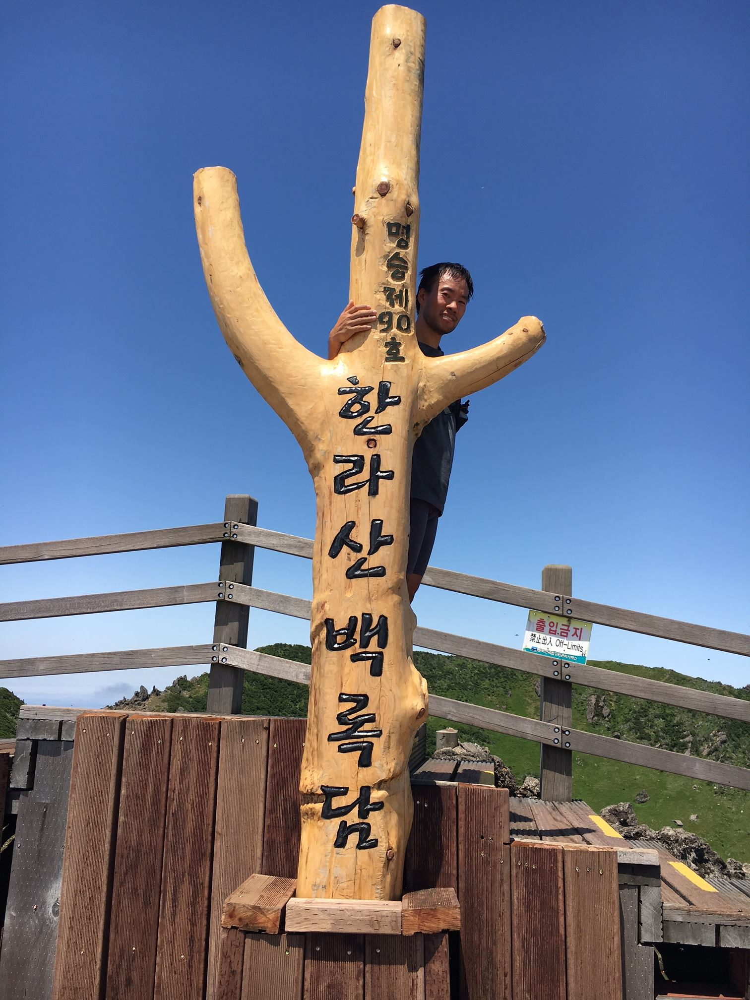
**이미지 캡션:** 맑고 푸른 하늘 아래, 한 성인 남성이 나무로 만들어진 독특한 모양의 표지판 뒤에 서서 카메라를 바라보고 있다. 남성은 30대 후반에서 40대 초반으로 보이며, 짧은 검은 머리에 약간 그을린 피부를 가지고 있다. 그는 회색 반팔 티셔츠를 입고 있으며, 표지판에 팔을 걸치고 미소를 짓고 있다. 표지판은 굵고 자연스러운 나무 기둥 모양으로, 위쪽은 두 갈래로 갈라져 있고 아래쪽은 받침대에 고정되어 있다. 표지판에는 검은색 글씨로 "명승 제 40호", "90", "한라산 백록담"이라고 쓰여 있다. 배경에는 나무로 된 울타리와 계단식 데크가 보이며, 멀리 푸른 산과 맑은 하늘이 펼쳐져 있다. 울타리에는 "출입금지"라고 쓰인 작은 표지판도 보인다. 전체적으로 등산객이 정상에 도착하여 기념 사진을 찍는 듯한 밝고 활기찬 분위기이다.된 울타리와 계단식 데크가 보이며, 멀리 푸른 산과 맑은 하늘이 펼쳐져 있다. 울타리에는 "출입금지"라고 쓰인 작은 표지판도 보인다. 전체적으로 등산객이 정상에 도착하여 기념 사진을 찍는 듯한 밝고 활기찬 분위기이다.

> [IT 멤버들도 백록담 등반 가능할까요?]  늘 컴퓨터앞에 앉아 있어 다리 힘이 약할 것이라는 선입견을 깨고 우리도 단숨에 백록담 정도는 갈수 있음을 보여줍시다. 이번주 토요일 한라산 백록담 번개!  *천천이* 올라가면서 IT, 노마드, 딥러닝등에 대한 재미난 이야기 해보아요. (토요일 날씨는 비가 오지 않는 것으로 예보되고 있습니다.)  일시: 7월 2일 토요일 오전 9시 (09:00:00에 더 기다리지 않고 바로 출발합니다.) 장소: 성팍악 휴게소 옆 (왼쪽편) 코스: 성팍악->속밭->진달래->백록담 (본인이 갈수 있는 만큼 가시면 되는데 백록담 추천합니다.) 준비물: 등산가능 신발, 물 1L 이상, 가벼운 음식 (김밥, 사과등), 가방은 가볍게.  관심있으신 분들은 댓글 달아 주세요. (대략인원 파악.) 오실 분들은 댓글 없이 그냥 시간에 맞게 오시면 됩니다.   * 기상등의 이유로 한라산 입산이 금지될 경우 번개 자동으로 취소 됩니다. (날씨 좋지 않을 경우 오시기전 064-725-9950 확인)

### 6월 29일 (수) 18:49 · 📷 사진 (1장)

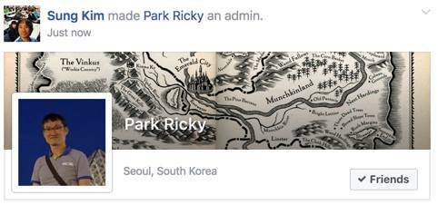
**이미지 캡션:** 사진은 페이스북 프로필 화면으로, 상단에는 "Sung Kim made Park Ricky an admin. Just now"라는 텍스트가 보이며, 이는 Sung Kim이라는 사용자가 Park Ricky를 관리자로 임명했음을 나타냅니다. 중앙에는 동화 '오즈의 마법사'에 나오는 듯한 흑백 지도 이미지가 배경으로 사용되었으며, 지도에는 'The Vinkus', 'The Emerald City', 'Munchkinland' 등의 지명이 표시되어 있습니다. 지도 중앙에는 'Park Ricky'라는 이름이 크게 쓰여 있습니다. 왼쪽 하단에는 Park Ricky의 프로필 사진으로 보이는 한 성인 남성의 사진이 있습니다. 이 남성은 안경을 쓰고 있으며, 회색과 파란색이 섞인 옷을 입고 있으며, 어깨에는 검은색 가방을 메고 있습니다. 그는 카메라를 향해 미소를 짓고 있으며, 배경에는 파란 하늘과 건물 일부가 보입니다. 프로필 사진 아래에는 "Seoul, South Korea"라는 거주지 정보가 표시되어 있으며, 우측 하단에는 "✓ Friends"라는 버튼이 있어 Park Ricky가 친구 상태임을 알 수 있습니다. 전반적으로 캐주얼하고 친근한 분위기를 풍깁니다.있습니다. 왼쪽 하단에는 Park Ricky의 프로필 사진으로 보이는 한 성인 남성의 사진이 있습니다. 이 남성은 안경을 쓰고 있으며, 회색과 파란색이 섞인 옷을 입고 있으며, 어깨에는 검은색 가방을 메고 있습니다. 그는 카메라를 향해 미소를 짓고 있으며, 배경에는 파란 하늘과 건물 일부가 보입니다. 프로필 사진 아래에는 "Seoul, South Korea"라는 거주지 정보가 표시되어 있으며, 우측 하단에는 "✓ Friends"라는 버튼이 있어 Park Ricky가 친구 상태임을 알 수 있습니다. 전반적으로 캐주얼하고 친근한 분위기를 풍깁니다.

> Park Ricky님 저희 그룹 운영진에 합류하였습니다! TensorFlow의 엄청난 정보가 있는 https://tensorflowkorea.wordpress.com/ 의 운영자이시기도 합니다. (제가 처음 TensorFlow를 접하고 공부한곳이기도 합니다.)  앞으로 저희 그룹에도 많은 소식을 나누어 주시고 또 저희 멤버들에게 큰 도움을 주실 것으로 기대합니다.  함께 환영해주세요.   PS - FB도 하지 않으시는데 저희 그룹 운영진에 합류하기 위해 FB에 전격 가입하였습니다. 친구 신청도 많이 해주세요.

### 6월 29일 (수) 19:38 · Test

Test

🔗 <https://fyu.se/v/8yego596h7>

### 6월 30일 (목) 08:52 · 📷 사진 (3장)

**이미지 캡션:** 한 명의 성인 남성이 트라이애슬론 완주 메달을 목에 걸고 밝게 웃으며 카메라를 바라보고 있다. 그는 30대 후반에서 40대 초반으로 보이며, 짧은 검은 머리에 약간 이마가 넓은 편이다. 검은색과 파란색이 섞인 트라이애슬론 슈트를 입고 있으며, 슈트 앞면에는 "2387 SUNG"이라고 적힌 번호표가 달려 있다. 목에 걸린 메달은 둥근 모양으로 텍사스 주의 지도와 건물이 그려져 있으며, "2016 FINISHER"라는 문구가 보인다. 배경에는 천막이 쳐져 있고, 여러 개의 물병 박스와 흰색 천으로 덮인 물건들이 쌓여 있다. 왼쪽에는 다른 참가자들로 보이는 사람들이 서 있고, 오른쪽에는 두 명의 남성이 웃으며 카메라를 향해 손짓하고 있다. 전반적으로 성공적인 경기를 마친 후의 기쁨과 축하 분위기가 느껴진다.쌓여 있다. 왼쪽에는 다른 참가자들로 보이는 사람들이 서 있고, 오른쪽에는 두 명의 남성이 웃으며 카메라를 향해 손짓하고 있다. 전반적으로 성공적인 경기를 마친 후의 기쁨과 축하 분위기가 느껴진다.
 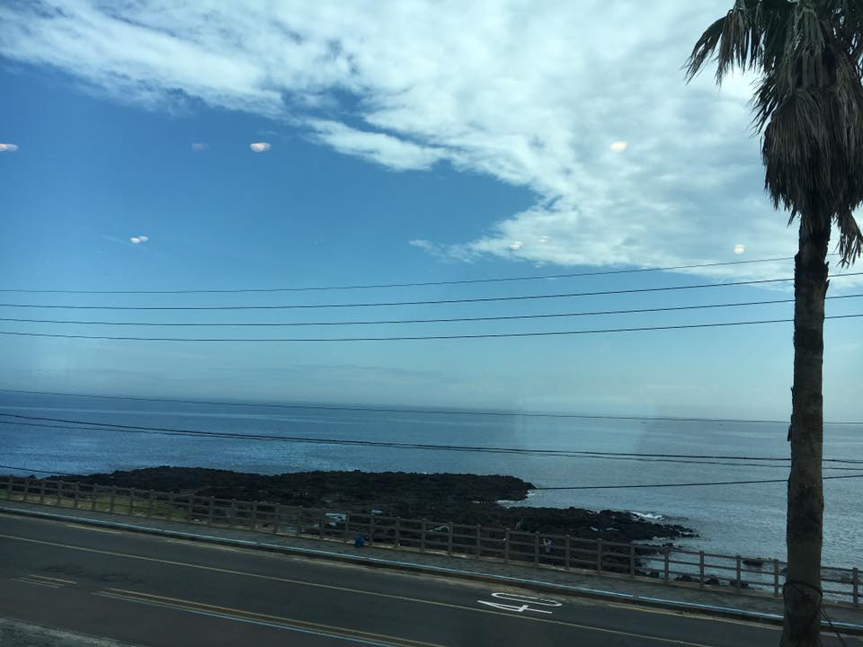
**이미지 캡션:** 창밖으로 보이는 풍경으로, 맑고 푸른 하늘에는 뭉게구름이 떠 있고, 수평선 너머로 잔잔한 바다가 펼쳐져 있습니다. 바닷가에는 검은 현무암 해안이 보이고, 그 위로는 낮은 목재 울타리가 설치되어 있습니다. 울타리 너머로는 아스팔트 도로가 보이며, 도로에는 흰색 차선과 기호가 그려져 있습니다. 사진 오른쪽에는 야자수가 서 있어 이국적인 분위기를 더합니다. 하늘에는 몇 개의 불빛이 반사되어 보이며, 이는 창문에 비친 내부의 조명으로 추정됩니다. 전체적으로 평화롭고 시원한 느낌을 주는 풍경입니다.
 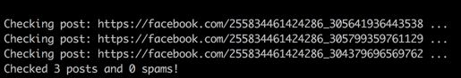
**이미지 캡션:** 이 이미지는 검은색 배경에 흰색 텍스트로 표시된 컴퓨터 화면의 일부를 보여줍니다. 텍스트는 프로그래밍 또는 시스템 로그의 일부로 보이며, "Checking post:"라는 문구와 함께 페이스북 게시물에 대한 여러 개의 URL이 나열되어 있습니다. 각 URL 뒤에는 말줄임표(...)가 붙어 있어 추가적인 정보가 있거나 작업이 진행 중임을 나타냅니다. 마지막 줄에는 "Checked 3 posts and 0 spams!"라는 메시지가 표시되어, 총 3개의 게시물을 확인했으며 스팸은 발견되지 않았음을 알립니다. 이 화면에는 사람이나 구체적인 장소, 사물은 보이지 않으며, 오직 텍스트 정보만이 존재합니다. 전반적으로 기술적인 작업이 수행되고 있음을 나타내는 차분하고 정보 중심적인 분위기입니다.화면에는 사람이나 구체적인 장소, 사물은 보이지 않으며, 오직 텍스트 정보만이 존재합니다. 전반적으로 기술적인 작업이 수행되고 있음을 나타내는 차분하고 정보 중심적인 분위기입니다.

> Facebook Spam Out!  최근들에 FB그룹에 스펨이 많이 올라옵니다. 특히 그림관련 스템은 정말 보는 이들을 불쾌하게 하는데요, 구글의 딥러닝 (Vision API)기술을 이용하여 그림이 성인물이거나 불쾌할경우 이 글을 자동으로 삭제하게 됩니다.   Facebook post될경우 hook같은것이 없어서 (있으면 알려주세요), 5분마다 한번씩 확인을 합니다. 지금 저희 그룹에 적용중인데 한달정도 시험한 다음, 실전에 적용할 예정입니다.  소스코드: https://github.com/hunkim/FacebookSpamOut  그룹 숫자 아이디만 수정하시면 본인이 관리하는 다른 그룹에서도 사용가능합니다. PR 이나 이슈, 언제나 환영합니다.

### 6월 30일 (목) 13:35 · Sung's new Jeju office! If you happen to…

Sung's new Jeju office! If you happen to be in Jeju or have a plan to visit, please ping me.

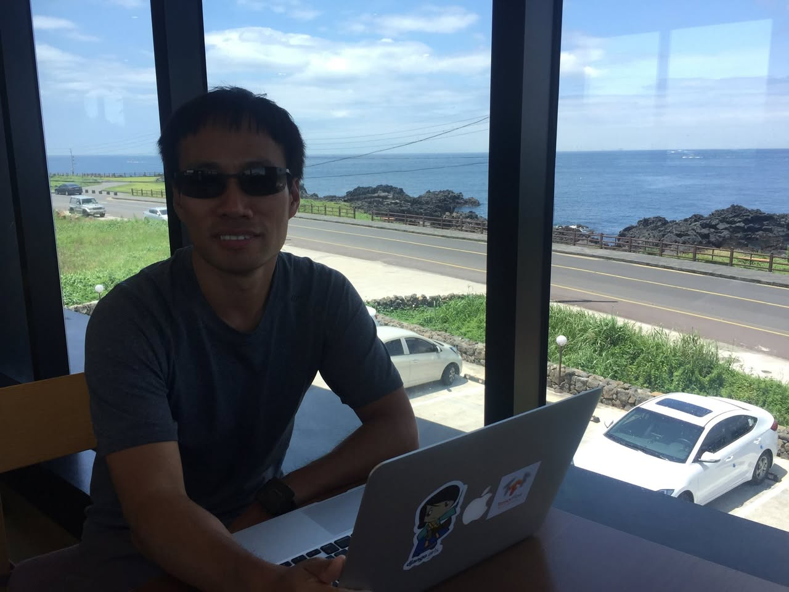
**이미지 캡션:** 사진 속에는 성인 남성이 검은색 선글라스를 끼고 회색 반팔 티셔츠를 입고 있으며, 노트북 앞에 앉아 카메라를 바라보며 미소를 짓고 있다. 남성은 30대 후반에서 40대 초반으로 보이며, 짧은 검은색 머리카락을 가지고 있다. 그의 왼쪽 손목에는 검은색 시계가 착용되어 있다. 남성이 앉아 있는 테이블은 어두운 색이며, 노트북은 은색으로 애플 로고와 두 개의 스티커가 붙어 있다. 배경으로는 넓은 창문 너머로 푸른 바다와 검은색 현무암 해안이 보이며, 해안 도로에는 흰색 승용차와 회색 SUV가 주차되어 있다. 도로 옆으로는 푸른 잔디와 나무가 우거져 있고, 하늘은 맑고 푸르다. 전체적으로 편안하고 여유로운 분위기를 풍기며, 마치 바닷가 카페에서 일하거나 휴식을 취하는 듯한 모습이다.옆으로는 푸른 잔디와 나무가 우거져 있고, 하늘은 맑고 푸르다. 전체적으로 편안하고 여유로운 분위기를 풍기며, 마치 바닷가 카페에서 일하거나 휴식을 취하는 듯한 모습이다.
 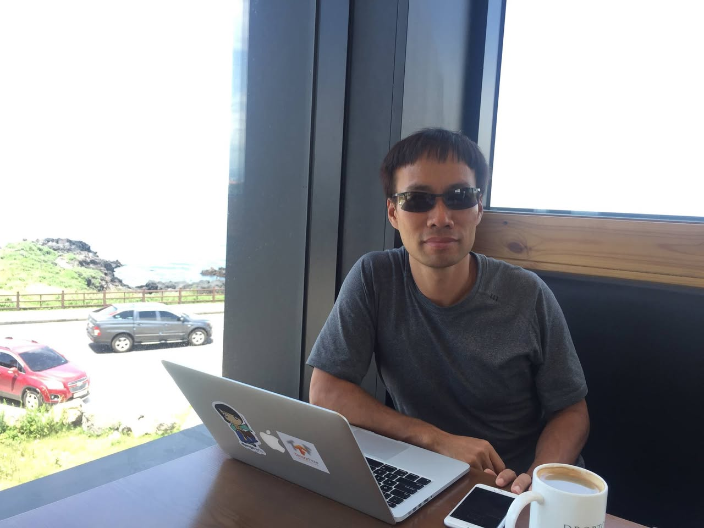
**이미지 캡션:** 한 명의 성인 남성이 회색 반팔 티셔츠를 입고 선글라스를 착용한 채 노트북 앞에 앉아 있다. 남성은 30대 후반에서 40대 초반으로 보이며, 짧은 검은색 머리카락을 가지고 있다. 그는 편안하고 약간 미소를 띤 표정으로 카메라를 응시하고 있으며, 오른손은 노트북 위에, 왼손은 테이블 위에 놓여 있다. 테이블 위에는 노트북 외에 스마트폰과 커피잔이 놓여 있다. 노트북에는 귀여운 캐릭터 스티커와 애플 로고 스티커가 붙어 있다. 배경으로는 창밖으로 보이는 바다 풍경과 도로, 그리고 두 대의 차가 보인다. 창틀은 검은색이고, 테이블은 나무 재질이다. 전체적으로 편안하고 여유로운 분위기이며, 남성은 카페나 휴식 공간에서 작업을 하고 있는 것으로 보인다.색이고, 테이블은 나무 재질이다. 전체적으로 편안하고 여유로운 분위기이며, 남성은 카페나 휴식 공간에서 작업을 하고 있는 것으로 보인다.
