# 2016년 7월

[← 2016년](README.md)

### 7월 1일 (금) 07:31 · 📷 사진 (1장)

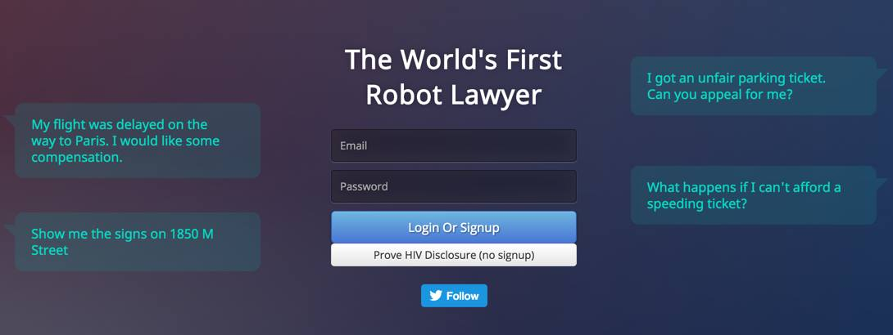
**이미지 캡션:** 이 화면은 "The World's First Robot Lawyer"라는 제목의 웹사이트 로그인 페이지를 보여줍니다. 배경은 어두운 남색이며, 화면 왼쪽에는 사용자가 로봇 변호사에게 보낸 것으로 보이는 메시지들이 녹색 말풍선 안에 표시되어 있습니다. 첫 번째 메시지는 "My flight was delayed on the way to Paris. I would like some compensation." (파리로 가는 길에 비행기가 지연되었습니다. 보상을 받고 싶습니다.)라고 적혀 있고, 두 번째 메시지는 "Show me the signs on 1850 M Street" (1850 M 스트리트의 표지판을 보여주세요.)입니다. 화면 오른쪽에는 역시 녹색 말풍선 안에 로봇 변호사에게 온 것으로 보이는 질문들이 있습니다. 첫 번째 질문은 "I got an unfair parking ticket. Can you appeal for me?" (부당한 주차 위반 딱지를 받았습니다. 저를 위해 항소해 주실 수 있나요?)이고, 두 번째 질문은 "What happens if I can't afford a speeding ticket?" (과속 딱지를 감당할 수 없으면 어떻게 되나요?)입니다. 중앙에는 이메일과 비밀번호를 입력하는 입력란, "Login Or Signup" 버튼, 그리고 "Prove HIV Disclosure (no signup)"라는 버튼이 있습니다. 그 아래에는 파란색 "Follow" 버튼이 트위터 로고와 함께 있습니다. 이 화면은 사용자가 법률 관련 질문을 하거나 서비스를 이용하기 위해 로그인 또는 가입하는 과정을 보여주는 것으로 보이며, 전반적으로 현대적이고 깔끔한 디자인을 가지고 있습니다.how me the signs on 1850 M Street" (1850 M 스트리트의 표지판을 보여주세요.)입니다. 화면 오른쪽에는 역시 녹색 말풍선 안에 로봇 변호사에게 온 것으로 보이는 질문들이 있습니다. 첫 번째 질문은 "I got an unfair parking ticket. Can you appeal for me?" (부당한 주차 위반 딱지를 받았습니다. 저를 위해 항소해 주실 수 있나요?)이고, 두 번째 질문은 "What happens if I can't afford a speeding ticket?" (과속 딱지를 감당할 수 없으면 어떻게 되나요?)입니다. 중앙에는 이메일과 비밀번호를 입력하는 입력란, "Login Or Signup" 버튼, 그리고 "Prove HIV Disclosure (no signup)"라는 버튼이 있습니다. 그 아래에는 파란색 "Follow" 버튼이 트위터 로고와 함께 있습니다. 이 화면은 사용자가 법률 관련 질문을 하거나 서비스를 이용하기 위해 로그인 또는 가입하는 과정을 보여주는 것으로 보이며, 전반적으로 현대적이고 깔끔한 디자인을 가지고 있습니다.

> 19살의 학생이 만들었다고 하는 최초의 법률봇이라고 합니다.  http://www.donotpay.co.uk/  인공지능이라기보다 간략한 룰에 의해 법률적으로 연착된 비행에 대한 보상을 요구하는 이메일, 주차 범칙금에 대한 어필을 하는 이메일 등을 생성해줍니다. 많은 사람들이 사용해서 상당한 범칙금을 줄여주었다는데...  우리나라에서는 어떤 경우에 사용할수 있을까요? 관공서나 경찰서, 검찰등에 보내는 이메일등을 자동으로 생성해주면 좋을것 같습니다. 혹시 이쪽으로 경험있으신 분들이 계신지요?

### 7월 1일 (금) 12:14 · 어제 반가웠습니다.

어제 반가웠습니다.

### 7월 1일 (금) 12:14 · ↪ 어제 반가웠습니다.

*다른 프로필에 남긴 글*

어제 반가웠습니다.

### 7월 1일 (금) 12:23 · Happy birthday!!!

Happy birthday!!!

### 7월 1일 (금) 12:23 · ↪ Happy birthday!!!

*다른 프로필에 남긴 글*

Happy birthday!!!

### 7월 2일 (토) 14:24 · 📷 사진 (1장)

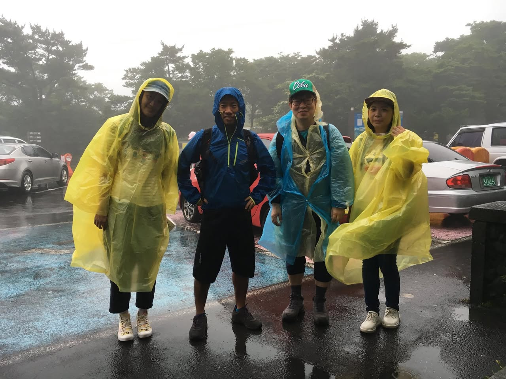
**이미지 캡션:** 네 명의 사람이 비옷을 입고 야외에 서 있습니다. 왼쪽부터 성인 남성 두 명, 성인 여성 한 명, 성인 남성 한 명으로 보입니다. 모두 노란색 또는 파란색 비옷을 착용하고 있으며, 일부는 모자나 헤드폰을 착용하고 있습니다. 왼쪽에서 두 번째 남성은 파란색 비옷에 녹색 모자를 쓰고 있으며, 세 번째 여성은 노란색 비옷에 갈색 모자를 쓰고 있습니다. 네 번째 남성은 파란색 비옷을 입고 있습니다. 모두 신발을 신고 있으며, 일부는 등산화처럼 보입니다. 배경에는 나무와 안개가 자욱하며, 여러 대의 차량이 주차되어 있습니다. 땅은 비에 젖어 있으며, 파란색과 흰색 페인트로 표시된 주차 공간이 보입니다. 차량 번호판에는 '3045'라는 숫자가 보입니다. 전반적으로 흐린 날씨에 비가 오는 상황으로 보이며, 사람들은 여행 중이거나 야외 활동 중인 것으로 추정됩니다.습니다. 땅은 비에 젖어 있으며, 파란색과 흰색 페인트로 표시된 주차 공간이 보입니다. 차량 번호판에는 '3045'라는 숫자가 보입니다. 전반적으로 흐린 날씨에 비가 오는 상황으로 보이며, 사람들은 여행 중이거나 야외 활동 중인 것으로 추정됩니다.

> 백록담 번개 2차: 다른 일정때문에 오늘 오고 싶어도 못 오신 분들과 저에게 개인적으로 연락주신 분들이 많아서 2차 백록담 번개를 하고자합니다. 산을 천천히 걸어오르면서 제주, IT, 딥러닝에 대해 함께 이야기 나누어요. 참여 가능하신분들은 아래에 댓글 달아주시면 대략 인원을 알 수 있을 듯 합니다.  장소: 7월 9일 (토요일) 오전 9시 성판악 휴게소 왼편 준비물: 물 1L이상, 간단한 음식 (가벼운 가방), 트레킹화 (기상악화등으로 한라산 입산이 금지될경우 자동 취소 됩니다.)  오늘 비가 오는 날씨에도 좋은 분들과 함께 정말 운치있고 좋은 산행, 그리고 많은 아이디어를 나눠서 즐거웠습니다.

### 7월 4일 (월) 07:42 · 📷 사진 (1장)

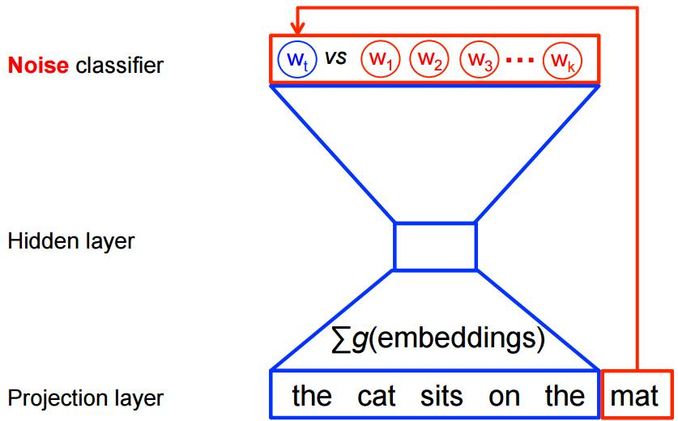
**이미지 캡션:** 이 이미지는 텍스트를 처리하는 신경망 모델의 구조를 시각적으로 표현한 것으로, 사람이나 장소, 구체적인 사물은 나타나지 않으며, 오직 텍스트와 기호로 구성된 다이어그램이다. 좌측에는 "Noise classifier", "Hidden layer", "Projection layer"라는 텍스트 레이블이 수직으로 배치되어 있으며, 우측에는 파란색과 빨간색 선으로 연결된 여러 개의 상자와 원이 모델의 계층 구조와 데이터 흐름을 나타낸다. 가장 상단에는 빨간색 테두리로 둘러싸인 "Wt VS W1 W2 W3 ... Wk"라는 텍스트가 원 안에 표시되어 있으며, 이는 특정 단어(Wt)와 다른 단어들(W1부터 Wk까지)을 비교하는 과정을 암시한다. 이 부분은 "Noise classifier"라는 레이블과 연결되어 있어, 노이즈를 분류하는 역할을 하는 것으로 보인다. 그 아래에는 파란색 선으로 연결된 사다리꼴 모양의 구조가 있으며, 중간에는 "Hidden layer"라는 레이블과 연결된 작은 사각형이 있다. 가장 하단에는 "Projection layer"라는 레이블과 연결된 넓은 사다리꼴 모양의 구조가 있고, 그 안에는 "Σg(embeddings)"라는 수식이 표시되어 있으며, 이는 여러 임베딩의 합을 나타내는 것으로 해석된다. 이 수식 아래에는 "the cat sits on the mat"라는 문장이 파란색 테두리의 사각형 안에 표시되어 있으며, 마지막 단어인 "mat"는 빨간색 테두리의 사각형 안에 별도로 강조되어 있다. 전체적으로 이 이미지는 텍스트 데이터의 임베딩, 은닉층, 그리고 노이즈 분류를 포함하는 딥러닝 모델의 작동 방식을 설명하는 기술적인 다이어그램으로, 차분하고 분석적인 분위기를 풍긴다."라는 텍스트가 원 안에 표시되어 있으며, 이는 특정 단어(Wt)와 다른 단어들(W1부터 Wk까지)을 비교하는 과정을 암시한다. 이 부분은 "Noise classifier"라는 레이블과 연결되어 있어, 노이즈를 분류하는 역할을 하는 것으로 보인다. 그 아래에는 파란색 선으로 연결된 사다리꼴 모양의 구조가 있으며, 중간에는 "Hidden layer"라는 레이블과 연결된 작은 사각형이 있다. 가장 하단에는 "Projection layer"라는 레이블과 연결된 넓은 사다리꼴 모양의 구조가 있고, 그 안에는 "Σg(embeddings)"라는 수식이 표시되어 있으며, 이는 여러 임베딩의 합을 나타내는 것으로 해석된다. 이 수식 아래에는 "the cat sits on the mat"라는 문장이 파란색 테두리의 사각형 안에 표시되어 있으며, 마지막 단어인 "mat"는 빨간색 테두리의 사각형 안에 별도로 강조되어 있다. 전체적으로 이 이미지는 텍스트 데이터의 임베딩, 은닉층, 그리고 노이즈 분류를 포함하는 딥러닝 모델의 작동 방식을 설명하는 기술적인 다이어그램으로, 차분하고 분석적인 분위기를 풍긴다.

> 제주 딥 (NLP) 러닝 스타디 (사실상) 첫 모임, 7월 5일 오후 7시 제대 교수회관, 2층 201호  사실상 첫 *스터디*인 이번 7월 5일 모임에서는 이범재, 박용준님께서 Deep NLP의 가장 기본이 되는 word2vec에 대한 설명과 토론이 이어집니다.  그리고 다음주는 이 이론을 바탕으로 코딩의 신으로도 불리는 Kwangsung Ha님께서 word2vec TensorFlow 코드 구현에 대한 설명이 이어집니다.  Word2vec은 아래 한장의 그림으로 설명이 가능한데 그림이 퍼즐이라는 것이 함정. 이번 모임 참여하시면 이 그림 완벽 이해 가능하십니다.  아울러 이 모임은 열린 모임으로 참여가 가능하신 분들 모두 환영합니다.

### 7월 6일 (수) 05:39 · :-)

:-)

### 7월 7일 (목) 06:31 · 📷 사진 (1장)

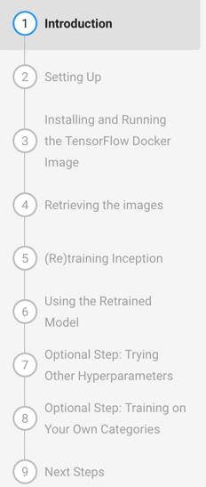
**이미지 캡션:** 이 이미지는 튜토리얼 또는 안내서의 일부로 보이는 화면의 일부를 보여줍니다. 화면에는 번호가 매겨진 단계 목록이 세로로 정렬되어 있으며, 각 단계에는 해당 설명이 있습니다. 1단계는 "Introduction"으로 강조 표시되어 있으며 파란색 원 안에 숫자 1이 있습니다. 나머지 단계는 2단계 "Setting Up"부터 9단계 "Next Steps"까지 회색 원 안에 숫자로 표시됩니다. 각 단계의 텍스트는 회색으로 표시되어 있으며, 일부 단계는 두 줄에 걸쳐 설명이 있습니다. 예를 들어 3단계는 "Installing and Running the TensorFlow Docker Image"이고 8단계는 "Optional Step: Training on Your Own Categories"입니다. 이 화면에는 사람이 보이지 않으며, 배경은 단순한 회색입니다. 이 화면은 컴퓨터 화면이나 문서의 일부로 보이며, 텍스트는 기술적인 주제, 특히 TensorFlow와 관련된 주제를 다루고 있음을 나타냅니다. 전반적인 분위기는 정보 제공적이고 교육적입니다.ing and Running the TensorFlow Docker Image"이고 8단계는 "Optional Step: Training on Your Own Categories"입니다. 이 화면에는 사람이 보이지 않으며, 배경은 단순한 회색입니다. 이 화면은 컴퓨터 화면이나 문서의 일부로 보이며, 텍스트는 기술적인 주제, 특히 TensorFlow와 관련된 주제를 다루고 있음을 나타냅니다. 전반적인 분위기는 정보 제공적이고 교육적입니다.

> 따라하다 보면 50분안에 TF설치에서 부터 Inception 돌려보며 TF의 개념을 잡게해주는 스스로 하는 lab입니다.   저도 오늘 50분을 만들어 돌려볼 생각입니다.  https://codelabs.developers.google.com/codelabs/tensorflow-for-poets/#0

### 7월 10일 (일) 06:58 · 📷 사진 (2장)

**이미지 캡션:** 이 이미지는 어두운 남색 배경에 주황색 테두리가 있는 디자인으로, 왼쪽에는 갈색 머리에 옅은 피부색을 가진 젊은 성인 남성 캐릭터가 그려져 있습니다. 그는 흰색 셔츠 위에 체크무늬 조끼를 입고 있으며, 오른손에는 노란색 카드에 흰색 느낌표가 그려진 것을 들고 있습니다. 캐릭터는 밝게 웃으며 긍정적인 표정을 짓고 있습니다. 오른쪽에는 "s2-lab 1:", 주황색 아이콘과 함께 "api.ai", 그리고 "GETTING STARTED"라는 흰색 글자가 쓰여 있습니다. 그 아래에는 "Sung Kim <hunkim+ml@gmail.com>"이라는 이름과 이메일 주소, 그리고 "https://hunkim.github.io/ml/"와 "https://www.facebook.com/groups/TensorFlowKR/"라는 웹사이트 및 페이스북 그룹 주소가 나열되어 있습니다. 전체적으로 기술 관련 발표나 소개 자료의 일부로 보이는 분위기이며, 정보를 전달하고 참여를 유도하는 듯한 느낌을 줍니다.ml@gmail.com>"이라는 이름과 이메일 주소, 그리고 "https://hunkim.github.io/ml/"와 "https://www.facebook.com/groups/TensorFlowKR/"라는 웹사이트 및 페이스북 그룹 주소가 나열되어 있습니다. 전체적으로 기술 관련 발표나 소개 자료의 일부로 보이는 분위기이며, 정보를 전달하고 참여를 유도하는 듯한 느낌을 줍니다.
 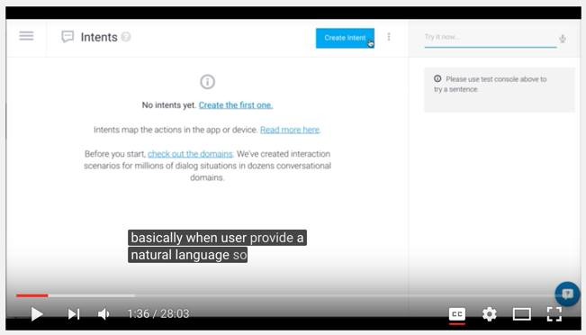
**이미지 캡션:** 이 화면은 챗봇 개발 플랫폼의 인터페이스를 보여주며, 현재 "Intents" 섹션이 활성화되어 있습니다. 화면 중앙에는 "No intents yet. Create the first one."이라는 메시지가 표시되어 있어 아직 의도(intent)가 생성되지 않았음을 알 수 있습니다. 그 아래에는 의도가 앱이나 기기에서 동작을 매핑한다는 설명과 함께 "Read more here" 링크가 있습니다. 또한, "Before you start, check out the domains."라는 문구와 함께 도메인 확인을 권장하는 내용이 있으며, 수백만 개의 대화 상황에 대한 상호작용 시나리오가 수십 개의 대화형 도메인에 걸쳐 생성되었다는 설명이 이어집니다. 화면 상단에는 파란색 버튼으로 "Create Intent"라고 적혀 있으며, 그 옆에는 점 세 개로 된 메뉴 아이콘이 있습니다. 오른쪽 상단에는 "Try it now..."라는 입력란과 마이크 아이콘이 있으며, 그 아래에는 "Please use test console above to try a sentence"라는 안내 메시지가 회색 상자 안에 표시되어 있습니다. 화면 하단에는 비디오 플레이어 컨트롤이 보이며, 현재 재생 시간은 1분 36초이고 총 재생 시간은 28분 3초입니다. 화면 하단 오른쪽에는 자막(CC), 설정, 전체 화면 모드 전환 버튼 등이 있습니다. 화면 중앙 하단에는 검은색 배경에 흰색 글씨로 "basically when user provide a natural language so"라는 자막이 표시되어 있습니다. 전체적으로 기술적인 내용을 설명하는 인터페이스 화면이며, 차분하고 정보 전달에 집중하는 분위기입니다.장하는 내용이 있으며, 수백만 개의 대화 상황에 대한 상호작용 시나리오가 수십 개의 대화형 도메인에 걸쳐 생성되었다는 설명이 이어집니다. 화면 상단에는 파란색 버튼으로 "Create Intent"라고 적혀 있으며, 그 옆에는 점 세 개로 된 메뉴 아이콘이 있습니다. 오른쪽 상단에는 "Try it now..."라는 입력란과 마이크 아이콘이 있으며, 그 아래에는 "Please use test console above to try a sentence"라는 안내 메시지가 회색 상자 안에 표시되어 있습니다. 화면 하단에는 비디오 플레이어 컨트롤이 보이며, 현재 재생 시간은 1분 36초이고 총 재생 시간은 28분 3초입니다. 화면 하단 오른쪽에는 자막(CC), 설정, 전체 화면 모드 전환 버튼 등이 있습니다. 화면 중앙 하단에는 검은색 배경에 흰색 글씨로 "basically when user provide a natural language so"라는 자막이 표시되어 있습니다. 전체적으로 기술적인 내용을 설명하는 인터페이스 화면이며, 차분하고 정보 전달에 집중하는 분위기입니다.

> 시즌2 LAB1-NLP 기반의 챗봇 만들기 (API.ai) TF와 직접 연관은 없지만 곧 들어갈 DEEP NLP 를 위한 준비과정인 비디오 입니다.  용어와 개념: https://www.youtube.com/watch?v=jF70X0tUzV8 데모: https://youtu.be/jBnzfLGcn5o (영어버전, 비슷한 내용: https://www.youtube.com/watch?v=gHjtsa7BaiQ) 수업 웹페이지: hunkim.github.io/ml/ side-effect (부작용): 요즘핫한 챗봇 만드는 방법이 그냥 정복됩니다!
> 놀라운 구글의 voice to text!   제가 오늘 올린 비디오의 자동 caption을 시험해보니 저의 경상도 억양이 섞인 영어임에도 불구하고 상당히 정확한 text를 만들어 냅니다. 아마 네이티브의 목소리는 99%정확하지 않을까 생각해봅니다.  자세하게는 몰라도 대략 DNN-RNN으로 학습한것 같은데 딥러닝의 파워를 다시한번 느끼게 됩니다.

### 7월 12일 (화) 12:10 · 📷 사진 (1장)

**이미지 캡션:** 이 이미지는 노란색 배경에 검은색 텍스트로 구성된 슬라이드 또는 프레젠테이션의 한 장면을 보여줍니다. 상단에는 "Word2Vec with TensorFlow"라는 제목이 영어로 쓰여 있으며, 이는 자연어 처리 기술인 Word2Vec과 딥러닝 프레임워크인 TensorFlow를 함께 사용하는 것에 대한 내용을 다루고 있음을 시사합니다. 그 아래에는 "하광성"이라는 이름이 한국어로 적혀 있으며, 이는 발표자 또는 관련 인물의 이름일 가능성이 높습니다. 마지막으로 "2016.07.12"라는 날짜가 표기되어 있어, 이 발표가 2016년 7월 12일에 이루어졌음을 알 수 있습니다. 이미지에는 사람이 등장하지 않으며, 배경은 단색의 노란색으로 특별한 장소나 사물은 보이지 않습니다. 전체적으로 정보 전달을 목적으로 하는 깔끔하고 간결한 디자인의 슬라이드입니다. 발표가 2016년 7월 12일에 이루어졌음을 알 수 있습니다. 이미지에는 사람이 등장하지 않으며, 배경은 단색의 노란색으로 특별한 장소나 사물은 보이지 않습니다. 전체적으로 정보 전달을 목적으로 하는 깔끔하고 간결한 디자인의 슬라이드입니다.

> [제주 딥러닝 모임 #2]  오늘은 지난주 설명했던 Word2Vec을 Kwangsung Ha 님의 코드설명을 들으며 완전 이해에 도전합니다. 그후 기본적인 뉴럴넷에 대한 설명을 가집니다.  일시: 매주 화요일 오후 7시~8:30분 (첫 모임 6/28일, 마지막 7/26일) 장소: 제주대학교 교수회관 201. 후문으로 들어오시면 찾기 쉽습니다. 주차공간 넓습니다.   이 모임은 열린 모임으로 참여가 가능하신 분들 모두 환영합니다. 저녁에 뵙겠습니다.

### 7월 13일 (수) 13:58 · 📷 사진 (1장)

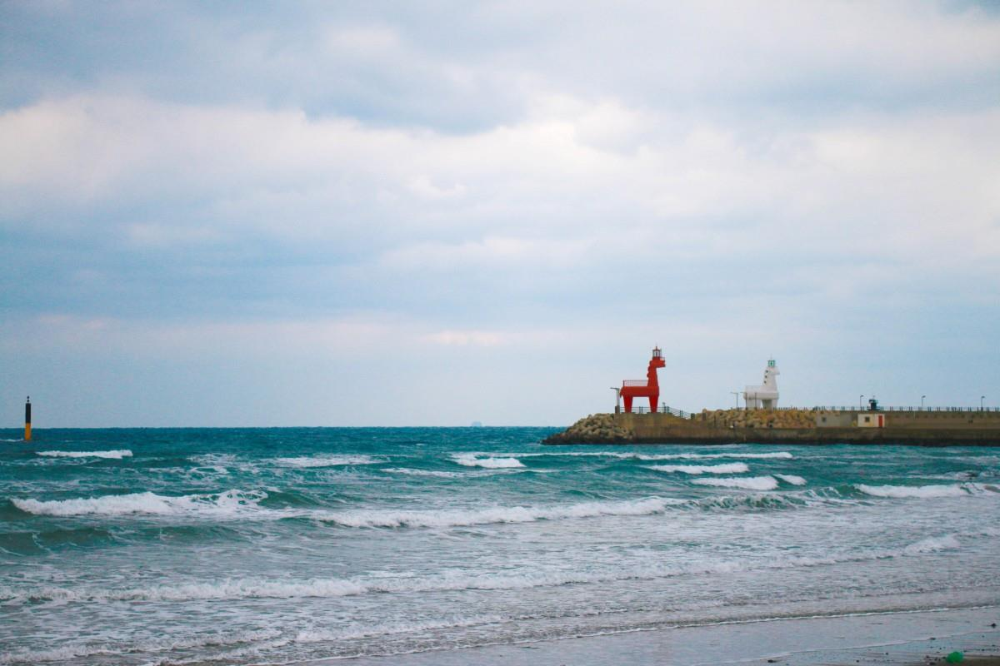
**이미지 캡션:** 푸른 바다 위로 파도가 일렁이는 해변의 풍경으로, 멀리 방파제 위에 독특한 모양의 등대가 서 있다. 왼쪽에는 빨간색 사슴 모양의 등대가, 오른쪽에는 하얀색 말 모양의 등대가 나란히 서 있어 마치 동화 속 장면을 연상시킨다. 등대 뒤로는 방파제를 따라 늘어선 건물들과 가로등이 보이며, 하늘은 구름이 낀 흐린 날씨를 나타낸다. 바다 위에는 노란색과 검은색으로 된 부표가 떠 있고, 해변에는 모래와 작은 조약돌들이 보인다. 전반적으로 차분하고 평화로운 분위기를 자아내는 풍경이다.

> 이호태우 해변 급 번개.  노마드씨의 Hee Jung Anna Cho님과 Zi Su Lee 님과 함께 이호태우 해변에서 번개를 2:30분 부터 가집니다. 해변 앞쪽 파라솔을 차지하고 IT관련 수다를 떨고 있을 예정입니다. 근체 계신분들 들러주세요. 대략 4시까지 있을듯 합니다.

### 7월 14일 (목) 09:38 · 📷 사진 (1장)

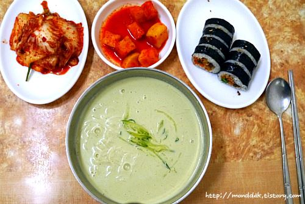
**이미지 캡션:** 이 사진은 한국의 전통적인 식사를 보여주며, 네 개의 접시에 담긴 음식과 식기가 테이블 위에 놓여 있습니다. 사진 중앙에는 옅은 녹색의 국물이 담긴 큰 그릇이 있으며, 그 안에는 얇은 면과 채 썬 오이가 고명으로 올라 있습니다. 이 음식은 아마도 냉면이나 콩국수와 같은 차가운 국수 요리일 가능성이 높습니다. 왼쪽 상단에는 붉은 양념이 버무려진 배추김치가 담긴 흰색 접시가 있습니다. 오른쪽 상단에는 깍둑썰기 된 무와 당근이 붉은 양념에 버무려진 깍두기가 담긴 작은 흰색 그릇이 있습니다. 그 옆에는 검은 김으로 말아진 두 개의 김밥 조각이 놓인 타원형 흰색 접시가 있습니다. 김밥 속에는 밥과 다양한 재료가 보입니다. 사진의 오른쪽에는 은색 숟가락과 젓가락이 놓여 있습니다. 테이블은 나무 재질로 보이며, 따뜻하고 편안한 분위기를 자아냅니다. 사진 하단에는 "http://monddak.tistory.com"이라는 웹사이트 주소가 흐릿하게 보입니다. 이 사진은 한국의 가정식 또는 식당에서의 식사 장면을 담고 있으며, 전반적으로 풍성하고 맛있는 식사를 연상시킵니다.말아진 두 개의 김밥 조각이 놓인 타원형 흰색 접시가 있습니다. 김밥 속에는 밥과 다양한 재료가 보입니다. 사진의 오른쪽에는 은색 숟가락과 젓가락이 놓여 있습니다. 테이블은 나무 재질로 보이며, 따뜻하고 편안한 분위기를 자아냅니다. 사진 하단에는 "http://monddak.tistory.com"이라는 웹사이트 주소가 흐릿하게 보입니다. 이 사진은 한국의 가정식 또는 식당에서의 식사 장면을 담고 있으며, 전반적으로 풍성하고 맛있는 식사를 연상시킵니다.

> 노마드씨 (Hee Jung Anna Cho, Hyesoo Jung) 와 함께하는 남춘식당 점심 번개, 오늘 (7월 14일 11:35분)! 시간되시면 오셔서 IT와 제주생활 이야기 나누어요.  오늘 같은날 정말 어울리는 남춘식당의 진한 콩국수 한그릇. 홍콩에서도 그 맛을 잊을수 없어 여름에 제주를 오는 이유이기도 합니다. 오실수 있으신 분들 뵙도록 하겠습니다.

### 7월 14일 (목) 22:16 · This is how we (with @Yang JeongSeok) sw…

This is how we (with @Yang JeongSeok) swim in the ocean. Wonderful drone video  by Leo Kim. Thanks, Leo!

🎬 동영상 1개 (생략)

### 7월 17일 (일) 08:07 · 📷 사진 (3장)

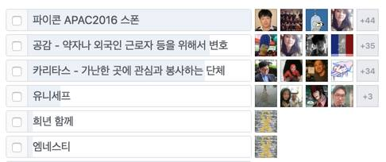
**이미지 캡션:** 이 이미지는 여러 항목이 나열된 목록을 보여주며, 각 항목에는 텍스트 설명과 함께 여러 개의 작은 사진이 표시됩니다. 첫 번째 항목은 "파이콘 APAC2016 스폰"이라고 적혀 있으며, 네 개의 사진과 "+44"이라는 숫자가 있습니다. 두 번째 항목은 "공감 - 약자나 외국인 근로자 등을 위해서 변호"라고 적혀 있으며, 네 개의 사진과 "+35"라는 숫자가 있습니다. 세 번째 항목은 "카리타스 - 가난한 곳에 관심과 봉사하는 단체"라고 적혀 있으며, 네 개의 사진과 "+34"라는 숫자가 있습니다. 네 번째 항목은 "유니세프"라고 적혀 있으며, 네 개의 사진과 "+3"라는 숫자가 있습니다. 다섯 번째와 여섯 번째 항목은 각각 "희년 함께"와 "엠네스티"라고 적혀 있지만, 사진이나 숫자는 보이지 않습니다. 사진들은 대부분 사람들의 얼굴이나 그룹 사진이며, 일부는 추상적인 그림이나 국기 사진도 포함되어 있습니다. 전반적으로 이 이미지는 소셜 미디어 피드나 목록 기반의 인터페이스를 연상시키며, 각 항목은 특정 주제나 단체와 관련된 활동을 나타내는 것으로 보입니다.목은 "유니세프"라고 적혀 있으며, 네 개의 사진과 "+3"라는 숫자가 있습니다. 다섯 번째와 여섯 번째 항목은 각각 "희년 함께"와 "엠네스티"라고 적혀 있지만, 사진이나 숫자는 보이지 않습니다. 사진들은 대부분 사람들의 얼굴이나 그룹 사진이며, 일부는 추상적인 그림이나 국기 사진도 포함되어 있습니다. 전반적으로 이 이미지는 소셜 미디어 피드나 목록 기반의 인터페이스를 연상시키며, 각 항목은 특정 주제나 단체와 관련된 활동을 나타내는 것으로 보입니다.
 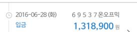
**이미지 캡션:** 이 사진은 금융 거래 내역의 일부를 보여주는 것으로 보이며, 날짜는 2016년 6월 28일 화요일이고, 거래 내용은 '입금'으로 표시되어 있습니다. 거래 금액은 1,318,900원이며, 그 옆에는 '69537온오프믹'이라는 텍스트가 있습니다. 이 텍스트는 거래 상대방이나 거래 상품을 나타내는 것으로 추정됩니다. 사진에는 사람이 직접적으로 보이지는 않으며, 배경은 흰색으로 금융 거래 내역 화면의 일부임을 시사합니다. 전반적으로 정보 전달에 초점을 맞춘 깔끔하고 간결한 분위기입니다.
 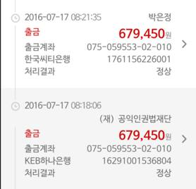
**이미지 캡션:** 이 이미지는 두 개의 금융 거래 내역을 보여주는 스크린샷입니다. 상단 거래는 2016년 7월 17일 오전 8시 21분 35초에 발생했으며, '박은정'이라는 이름으로 679,450원이 출금되었습니다. 출금 계좌는 '한국씨티은행'이며 계좌 번호는 075-059553-02-010이고, 처리 결과는 '정상'입니다. 하단 거래는 같은 날 오전 8시 18분 6초에 발생했으며, '(재) 공익인권법재단'으로 679,450원이 출금되었습니다. 이 거래 역시 출금 계좌는 075-059553-02-010이며, 은행은 'KEB하나은행'이고, 처리 결과는 '정상'입니다. 두 거래 모두 동일한 금액이 출금되었으며, 출금 계좌 번호도 동일합니다. 이미지는 금융 거래 내역을 보여주는 화면으로, 특별한 인물이나 장소, 사물은 보이지 않으며, 텍스트 정보가 주를 이룹니다. 전반적으로 차분하고 정보 전달에 초점을 맞춘 분위기입니다.은행'이고, 처리 결과는 '정상'입니다. 두 거래 모두 동일한 금액이 출금되었으며, 출금 계좌 번호도 동일합니다. 이미지는 금융 거래 내역을 보여주는 화면으로, 특별한 인물이나 장소, 사물은 보이지 않으며, 텍스트 정보가 주를 이룹니다. 전반적으로 차분하고 정보 전달에 초점을 맞춘 분위기입니다.

### 7월 19일 (화) 13:33 · 📷 사진 (2장)

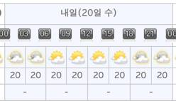
**이미지 캡션:** 이 이미지는 날씨 예보를 보여주는 표입니다. 표의 상단에는 "내일(20일 수)"이라는 제목이 있으며, 이는 내일, 즉 20일 수요일의 날씨 예보임을 나타냅니다. 그 아래에는 시간대별로 날씨 아이콘과 기온이 표시되어 있습니다. 시간대는 00시부터 시작하여 3시간 간격으로 03시, 06시, 09시, 12시, 15시, 18시, 21시, 그리고 다시 00시까지 이어집니다. 각 시간대별로 날씨 아이콘은 구름과 해가 섞여 있는 모습, 혹은 맑은 날씨를 나타내는 모습 등 다양하게 표현되어 있습니다. 기온은 모든 시간대에 걸쳐 20도로 표시되어 있습니다. 표의 가장 아래 행에는 "-" 표시가 있어 추가 정보가 없거나 해당 정보가 비어 있음을 나타냅니다. 전체적으로 차분하고 정보 전달에 집중된 분위기이며, 특정 인물이나 사물은 보이지 않고 오직 날씨 예보 정보만이 담겨 있습니다.걸쳐 20도로 표시되어 있습니다. 표의 가장 아래 행에는 "-" 표시가 있어 추가 정보가 없거나 해당 정보가 비어 있음을 나타냅니다. 전체적으로 차분하고 정보 전달에 집중된 분위기이며, 특정 인물이나 사물은 보이지 않고 오직 날씨 예보 정보만이 담겨 있습니다.
 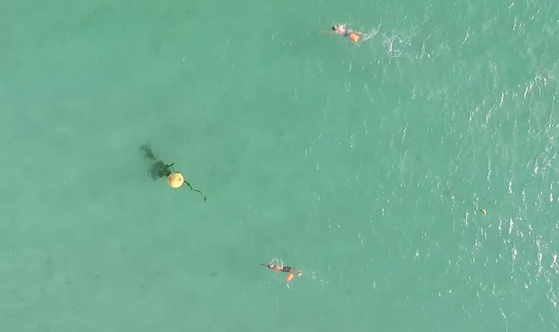
**이미지 캡션:** 맑고 푸른 바다 위에서 세 명의 사람이 수영을 하고 있으며, 그중 두 명은 오렌지색 부표를 착용하고 있다. 상단에 있는 사람은 성인 여성으로 보이며, 분홍색 수영복을 입고 오렌지색 부표를 다리에 착용하고 자유형으로 헤엄치고 있다. 중간쯤에 있는 사람은 성인 남성으로 보이며, 검은색 수영복과 오렌지색 부표를 착용하고 자유형으로 헤엄치고 있다. 하단에 있는 사람은 성인 여성으로 보이며, 오렌지색 부표를 착용하고 자유형으로 헤엄치고 있다. 바다에는 두 개의 노란색 부표가 떠 있으며, 하나는 밧줄에 연결되어 있고 다른 하나는 멀리 떨어져 있다. 전반적으로 평화롭고 활동적인 분위기이며, 야외 활동이나 해양 스포츠를 즐기는 모습으로 보인다.른 하나는 멀리 떨어져 있다. 전반적으로 평화롭고 활동적인 분위기이며, 야외 활동이나 해양 스포츠를 즐기는 모습으로 보인다.

### 7월 21일 (목) 12:51 · If you are around, feel free to join thi…

If you are around, feel free to join this ocean swimming event I'm co-organizing. We are going to cross the Biyang Island in Jeju (about one mile). It should be really fun! 

http://abcjeju.com (in Korean)

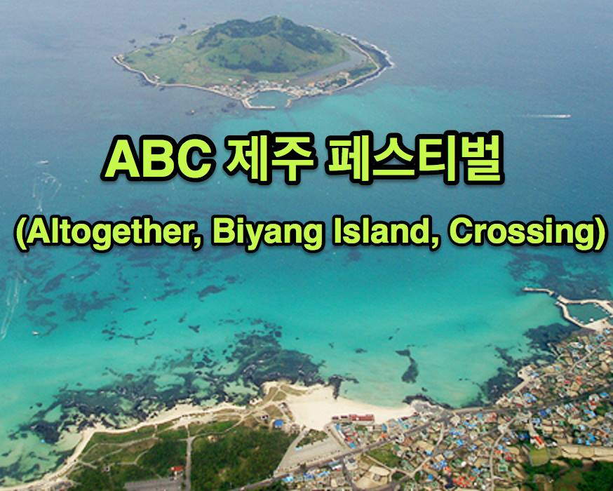
**이미지 캡션:** 이 사진은 푸른 바다와 섬, 그리고 해안가 마을의 항공 사진을 배경으로 하고 있으며, 사진 상단에는 "ABC 제주 페스티벌"이라는 한국어 문구가, 그 아래에는 "(Altogether, Biyang Island, Crossing)"이라는 영어 문구가 노란색 글씨와 검은색 테두리로 표시되어 있습니다. 사진에는 사람이 보이지 않으며, 장소는 제주도의 아름다운 해안 풍경으로, 맑고 투명한 바닷물과 그 안에 보이는 암초, 그리고 해안선을 따라 형성된 마을의 모습이 담겨 있습니다. 배경에는 작은 섬도 보입니다. 특별한 사물은 눈에 띄지 않으며, 보이는 텍스트는 페스티벌의 이름과 관련 정보를 나타냅니다. 전체적인 분위기는 휴양지에서의 축제를 알리는 듯한 밝고 활기찬 느낌을 줍니다.사물은 눈에 띄지 않으며, 보이는 텍스트는 페스티벌의 이름과 관련 정보를 나타냅니다. 전체적인 분위기는 휴양지에서의 축제를 알리는 듯한 밝고 활기찬 느낌을 줍니다.

### 7월 21일 (목) 12:55 · 📷 사진 (1장)

**이미지 캡션:** 이 사진은 푸른 바다와 섬, 그리고 해안가 마을의 풍경을 담고 있으며, 상단에는 "ABC 제주 페스티벌"이라는 한국어 문구와 그 아래에 "(Altogether, Biyang Island, Crossing)"이라는 영어 문구가 노란색 글씨로 쓰여 있습니다. 사진 속에는 사람이 보이지 않으며, 장소는 제주도의 아름다운 해안 지역으로 보입니다. 특히, 푸른 바닷물과 맑은 하늘, 그리고 섬의 모습이 어우러져 평화롭고 시원한 분위기를 자아냅니다. 해안가에는 작은 마을이 형성되어 있고, 바다에는 여러 개의 작은 섬들이 떠 있습니다. 전반적으로 휴양지나 관광지의 풍경을 보여주는 사진으로, 축제나 행사를 홍보하는 데 사용될 수 있을 것 같습니다.떠 있습니다. 전반적으로 휴양지나 관광지의 풍경을 보여주는 사진으로, 축제나 행사를 홍보하는 데 사용될 수 있을 것 같습니다.

> 제주 IT멤버들중 수영 좋아 하시는분들이 반가워할 대회입니다. 협재를 지나면서 늘 바라보던 그 아름다운 비양도를 7월 30일 헤엄쳐서 건네게 됩니다.  관심있으신분들 같이 헤엄쳐요. 올해는 50명 마감인데, 오늘 부터 등록을 받았는데 벌써 22명 결제 등록으로, 참가등록은 오늘중 마감될듯 합니다.   http://abcjeju.com  혹 7월 30일 대회를 도와주실 자원봉사단도 모집중입니다. 관심있으신분들 알려 주세요. (티셔츠와 점심 식사 제공합니다.)  내년부터는 1,000여명 등록 마감인 국제 대회로 개최하려고 하는데 IT기술을 도입하여 선수들의 수중 위치 추적, 드론등을 통한 응용등 IT기술을 접목해보려고 합니다. 혹시 좋은 아이디어가 있으시면 알려주시고 또 참여해주시면 감사!

### 7월 24일 (일) 10:54 · 📷 사진 (2장)

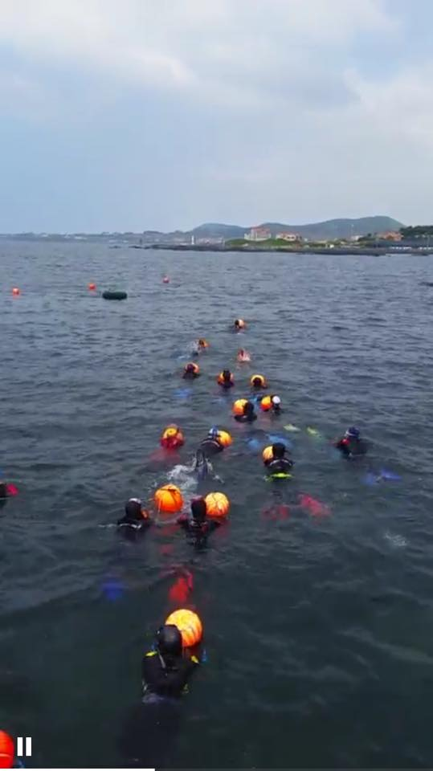
**이미지 캡션:** 바다에서 여러 명의 성인 남녀가 잠수복을 입고 오렌지색 부표와 함께 줄지어 이동하고 있으며, 일부는 스노클링 장비를 착용한 것으로 보인다. 배경에는 잔잔한 바다와 멀리 보이는 해안선, 그리고 산과 건물들이 흐릿하게 보이며, 하늘은 구름이 약간 낀 흐린 날씨이다. 전반적으로 해양 활동이나 훈련 중인 상황으로 추정되며, 사람들은 수면 위에서 활동하며 서로 간격을 유지하고 있다.
 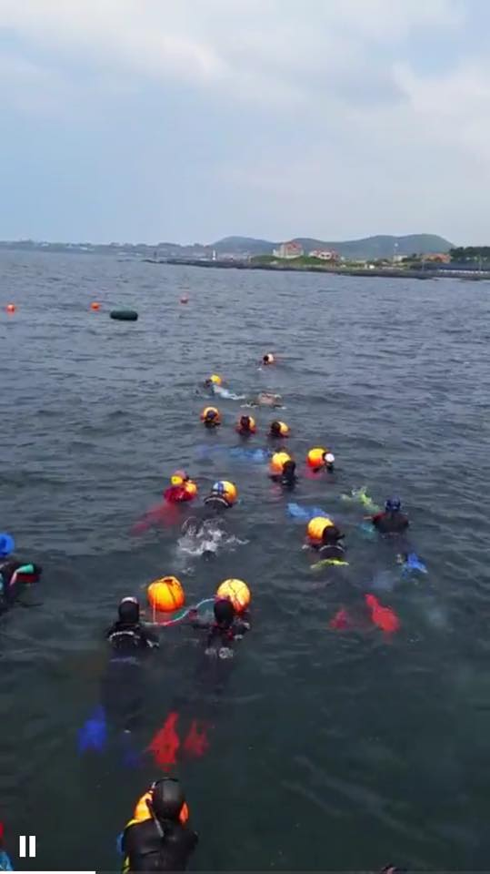
**이미지 캡션:** 바다 위에서 여러 명의 잠수부들이 수면 위로 머리를 내밀고 있으며, 일부는 오렌지색 부표를 잡고 있다. 잠수부들은 검은색 잠수복과 노란색, 주황색, 빨간색 등의 잠수 장비를 착용하고 있으며, 일부는 오렌지색 잠수모를 쓰고 있다. 푸른색과 빨간색 잠수용 발이 물속에서 보인다. 배경에는 잔잔한 바다가 펼쳐져 있고, 멀리 해안선에는 건물들과 언덕이 보인다. 하늘은 구름이 낀 흐린 날씨이다. 전반적으로 해양 활동이나 훈련 중인 모습으로 보이며, 평화롭고 활동적인 분위기이다.

### 7월 26일 (화) 16:34 · 📷 사진 (1장)

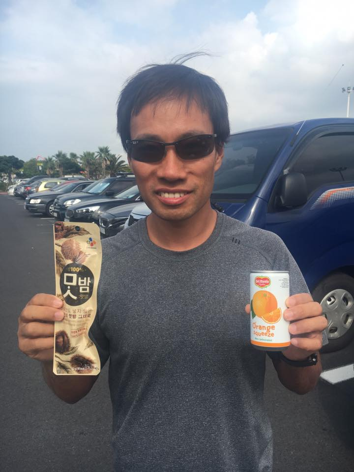
**이미지 캡션:** 한 명의 성인 남성이 회색 반팔 티셔츠와 선글라스를 착용하고 카메라를 향해 웃고 있으며, 그의 오른손에는 델몬트 오렌지 주스 캔이, 왼손에는 밤 간식 봉지가 들려 있습니다. 배경에는 여러 대의 차량이 주차되어 있고, 흐린 하늘과 야자수가 보입니다. 남성은 20대 후반에서 30대 초반으로 보이며, 짧은 검은색 머리카락을 가지고 있습니다. 간식 봉지에는 한국어로 "100% 밤", "맛밤" 등의 글자가 쓰여 있고, 오렌지 주스 캔에는 "Del Monte Orange Squeeze"라고 적혀 있습니다. 전반적으로 야외 주차장에서 찍은 밝고 캐주얼한 분위기의 사진입니다.외 주차장에서 찍은 밝고 캐주얼한 분위기의 사진입니다.

### 7월 26일 (화) 21:45 · Finally, swam to the Biyang Island, one …

Finally, swam to the Biyang Island, one of the most beautiful islands around Jeju!

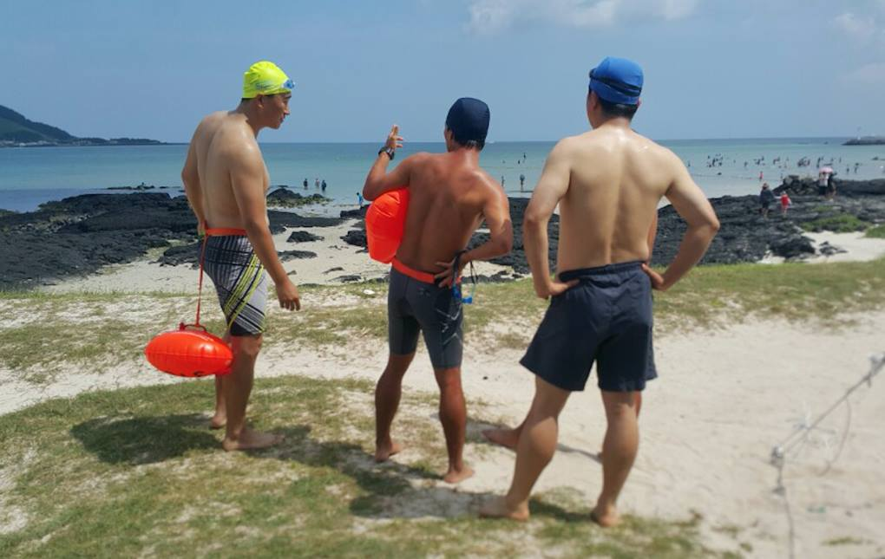
**이미지 캡션:** 세 명의 성인 남성이 해변에서 수영복과 수영모를 착용하고 서 있다. 왼쪽 남성은 노란색 수영모와 파란색 고글을 착용하고 있으며, 허리에 주황색 부표를 매달고 있다. 그는 회색과 검은색 줄무늬 수영복 하의를 입고 있으며, 표정은 보이지 않는다. 가운데 남성은 파란색 수영모를 착용하고 주황색 부표를 등 뒤에 메고 있으며, 회색 반바지를 입고 있다. 그는 오른손으로 허리를 짚고 있으며, 왼쪽 손가락으로 무언가를 가리키는 듯한 제스처를 취하고 있다. 오른쪽 남성은 파란색 수영모를 착용하고 남색 반바지를 입고 있으며, 양손을 허리에 짚고 바다를 바라보고 있다. 배경에는 푸른 바다와 맑은 하늘이 보이며, 해변에는 검은색 바위와 잔디가 섞여 있다. 멀리 바다에는 사람들이 물놀이를 즐기고 있으며, 전체적으로 화창하고 평화로운 여름날의 해변 풍경이다. 양손을 허리에 짚고 바다를 바라보고 있다. 배경에는 푸른 바다와 맑은 하늘이 보이며, 해변에는 검은색 바위와 잔디가 섞여 있다. 멀리 바다에는 사람들이 물놀이를 즐기고 있으며, 전체적으로 화창하고 평화로운 여름날의 해변 풍경이다.
 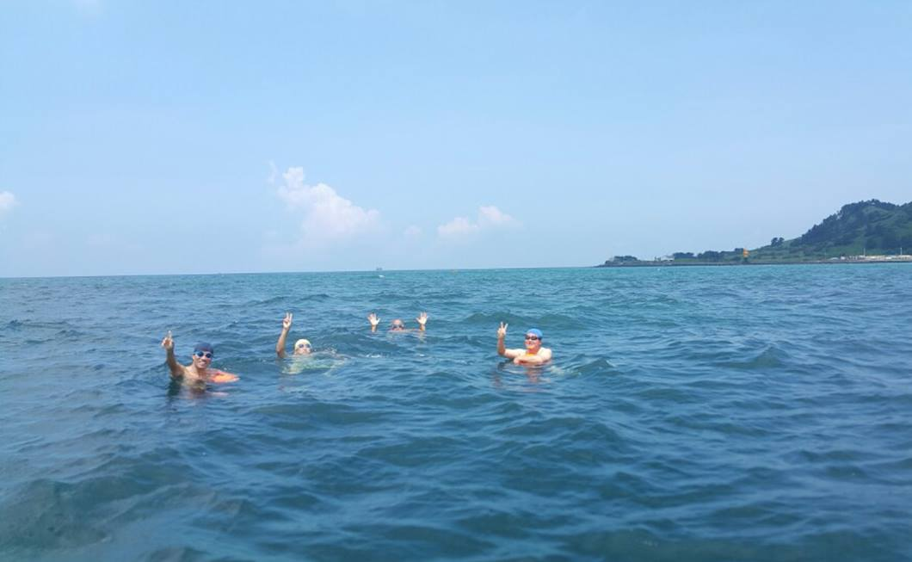
**이미지 캡션:** 푸른 바다 위에서 네 명의 성인 남성이 수영을 즐기고 있으며, 모두 수영모를 착용하고 있다. 왼쪽에서 두 번째 남성은 주황색 튜브를 착용하고 있으며, 다른 세 명의 남성은 수영복만 착용하고 있다. 모두 손을 흔들거나 브이(V)자를 그리며 카메라를 향해 즐거운 표정을 짓고 있다. 배경으로는 맑고 푸른 하늘과 구름, 그리고 멀리 보이는 섬과 산이 보인다. 전반적으로 화창한 날씨 속에서 시원한 바다를 즐기는 여유롭고 즐거운 분위기이다.
 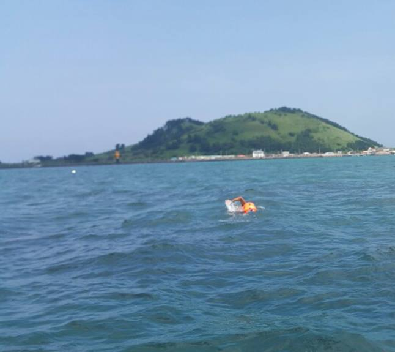
**이미지 캡션:** 푸른 바다 위에서 한 명의 성인 남성이 오렌지색 구명조끼를 착용하고 수영하고 있으며, 그의 팔이 물 위로 솟아 있어 자유형으로 헤엄치는 것으로 보인다. 배경에는 푸른 잔디로 덮인 완만한 언덕이 있는 섬이 보이고, 섬 해안선을 따라 하얀 건물들과 나무들이 늘어서 있으며, 멀리 작은 마을의 모습도 희미하게 보인다. 하늘은 맑고 푸르며, 바다는 잔잔한 파도가 일고 있다. 전반적으로 평화롭고 여유로운 여름날의 해양 활동 분위기를 나타낸다.
 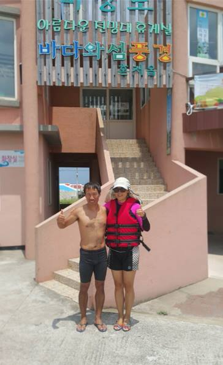
**이미지 캡션:** 한 성인 남성과 한 성인 여성이 건물 앞에 서 있다. 남성은 40대 후반에서 50대 초반으로 보이며, 상의를 탈의한 채 검은색 수영복 하의를 입고 엄지손가락을 치켜들고 있다. 여성은 40대 중반에서 50대 초반으로 보이며, 분홍색 상의 위에 빨간색 구명조끼를 착용하고 흰색 모자와 선글라스를 쓰고 있다. 그녀 역시 엄지손가락을 치켜들고 있다. 두 사람 모두 샌들을 신고 있다. 배경에는 분홍색 건물과 계단이 보이며, 건물 위에는 "아름다운 전망대 유게실"이라는 글자가 쓰여 있다. 전체적으로 화창한 날씨에 즐거운 분위기이다.분위기이다.
 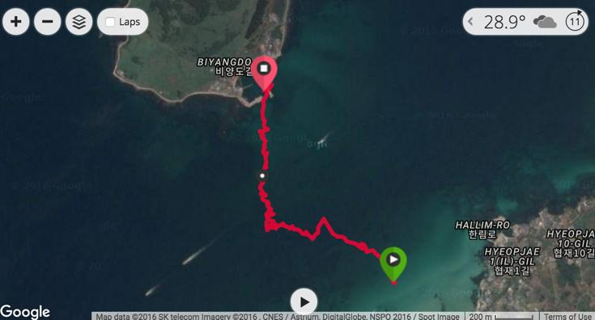
**이미지 캡션:** 이 이미지는 한국의 섬인 비양도를 배경으로 한 지도 화면을 보여줍니다. 화면 상단에는 온도 28.9도와 구름 아이콘, 그리고 숫자 11이 표시되어 있으며, 좌측 상단에는 확대/축소 버튼과 'Laps'라는 글자가 적힌 버튼이 있습니다. 지도에는 비양도라는 지명이 한글과 영어로 표시되어 있으며, 빨간색 선으로 표시된 이동 경로가 섬 주변 바다를 따라 이어져 있습니다. 이 경로는 섬의 한 지점에서 시작하여 바다를 가로질러 다른 지점으로 이동하는 것을 나타냅니다. 또한, 지도에는 'HALLIM-RO', 'HYEOPJAE 1(IL)-GIL', 'HYEOPJAE 10-GIL'과 같은 도로명 주소가 한글과 영어로 표기되어 있습니다. 화면 하단에는 'Google' 로고와 함께 지도 데이터 출처에 대한 정보가 표시되어 있습니다. 전반적으로 활동 추적 앱이나 내비게이션 화면의 일부로 보이며, 야외 활동 중인 사람의 이동 경로를 기록한 것으로 추정됩니다.AE 1(IL)-GIL', 'HYEOPJAE 10-GIL'과 같은 도로명 주소가 한글과 영어로 표기되어 있습니다. 화면 하단에는 'Google' 로고와 함께 지도 데이터 출처에 대한 정보가 표시되어 있습니다. 전반적으로 활동 추적 앱이나 내비게이션 화면의 일부로 보이며, 야외 활동 중인 사람의 이동 경로를 기록한 것으로 추정됩니다.

### 7월 28일 (목) 08:44 · Happy birthday!!

Happy birthday!!

### 7월 28일 (목) 08:44 · ↪ Happy birthday!!

*다른 프로필에 남긴 글*

Happy birthday!!

### 7월 29일 (금) 09:38 · 생일축하합니다.

생일축하합니다.

### 7월 29일 (금) 09:38 · ↪ 생일축하합니다.

*다른 프로필에 남긴 글*

생일축하합니다.

### 7월 29일 (금) 09:39 · Happy birthday!

Happy birthday!

### 7월 29일 (금) 09:39 · ↪ Happy birthday!

*다른 프로필에 남긴 글*

Happy birthday!

### 7월 29일 (금) 10:37 · signed up for New World Harbour Race 201…

signed up for New World Harbour Race 2016!
http://www.hkharbourrace.com/

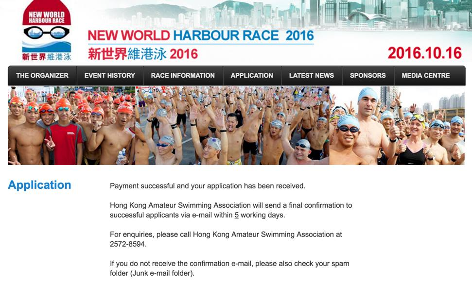
**이미지 캡션:** 이 사진은 2016년 10월 16일에 열린 뉴 월드 하버 레이스 2016 행사를 홍보하는 웹사이트의 일부를 보여줍니다. 상단에는 행

### 7월 29일 (금) 12:46 · All Jeju afternoon flights have been div…

All Jeju afternoon flights have been diverted!

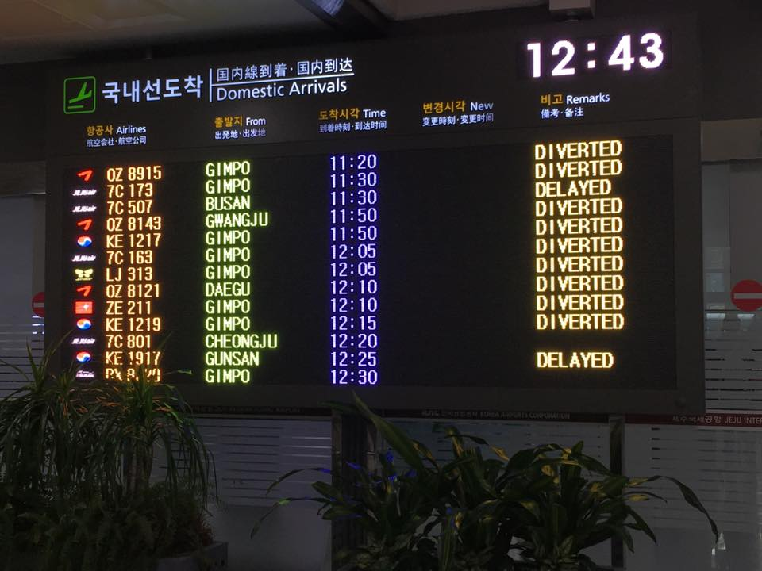
**이미지 캡션:** 이 사진은 공항의 도착 정보 전광판을 보여주며, 현재 시각은 12시 43분이다. 전광판에는 국내선 도착 항공편 정보가 한국어와 영어로 표시되어 있으며, 항공편명, 출발지, 도착 예정 시각, 변경 시각, 비고란으로 구성되어 있다. 여러 항공편이 지연(DELAYED)되거나 회항(DIVERTED)된 상태임을 알 수 있다. 전광판 앞쪽으로는 푸른 잎을 가진 식물들이 배치되어 있어 실내 공간임을 짐작하게 한다. 전광판의 조명과 식물의 녹색이 어우러져 다소 어두운 실내 분위기를 연출한다.

### 7월 30일 (토) 22:10 · It was a really fun and beautiful swimmi…

It was a really fun and beautiful swimming event! I'll do it again in 2017! #ABCJeju

### 7월 31일 (일) 07:09 · 📷 사진 (1장)

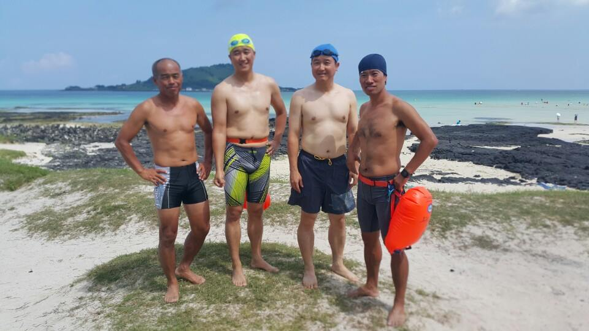
**이미지 캡션:** 네 명의 성인 남성이 해변에서 수영복과 수영모를 착용하고 서 있습니다. 왼쪽 첫 번째 남성은 50대 초반으로 보이며, 검은색과 은색이 섞인 수영복 하의를 입고 있습니다. 두 번째 남성은 30대 후반으로 보이며, 노란색 수영모와 기하학적 무늬의 수영복 하의를 입고 있습니다. 세 번째 남성은 40대 초반으로 보이며, 파란색 수영모와 남색 수영복 하의를 입고 있습니다. 네 번째 남성은 40대 초반으로 보이며, 파란색 수영모와 회색 수영복 하의를 입고 있으며, 주황색 부이를 들고 있습니다. 네 명 모두 밝은 표정으로 카메라를 바라보고 있으며, 해변에서 즐거운 시간을 보내는 듯한 분위기입니다. 배경에는 푸른 바다와 하얀 모래사장, 그리고 검은색 현무암이 보입니다. 멀리 보이는 바다에는 몇몇 사람들이 물놀이를 즐기고 있습니다. 전반적으로 화창한 날씨 속에서 휴가를 즐기는 듯한 평화롭고 즐거운 분위기입니다. 카메라를 바라보고 있으며, 해변에서 즐거운 시간을 보내는 듯한 분위기입니다. 배경에는 푸른 바다와 하얀 모래사장, 그리고 검은색 현무암이 보입니다. 멀리 보이는 바다에는 몇몇 사람들이 물놀이를 즐기고 있습니다. 전반적으로 화창한 날씨 속에서 휴가를 즐기는 듯한 평화롭고 즐거운 분위기입니다.

> [제주 IT 한달 살이를 마치며...]  그동안 한달동안 제주 살면서 참 즐겁고 행복한 시간 보냈습니다. 행복한일이 오만가지가 넘지만 그중 3개만 꼽아 본다면:  1. 제주창조경제혁신센터  Jeonghwan Jeon센터장님과의 만남을 시작으로 정말 멋지고 닮고 싶은 많은 분들을 만나고 또 육지에서 제주로 오신 많은 분들을 만난것  2. 꿈이였던 비양도 수영해서 건너기 ABC 축제(ABCJeju) 를 같이 준비하고, 선발대원으로 Yang JeongSeok님과 함께 비양도를 건넌것 -- 꿈의 성취  3. Deep-Jeju 스터디 모임을 통해 Deep NLP를 배우고 이분야 전문가들을 많이 만났던일 입니다.  저는 다시 홍콩으로 돌아갔다가 제 일을 하다가 2017년 7월 다시 한달간 제주를 방문할 예정입니다.   이 모든일의 구심점이 되었던 제주 IT 프리랜서 커뮤니티 ( Jeju IT Freelancer Groups) 멤버들에게 감사드립니다.   한달간 제주에 살아보는 것은 매우 매력적인 일입니다. 강추합니다!

### 7월 31일 (일) 16:32 · Sung was on TV (MBC) thanks to ABCJeju!

Sung was on TV (MBC) thanks to ABCJeju!
