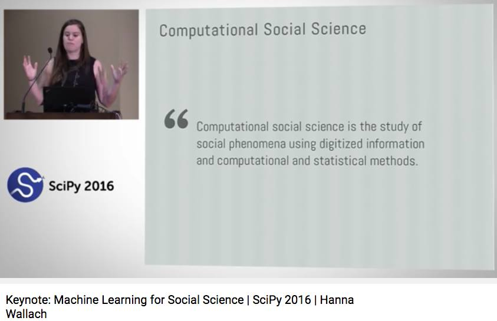
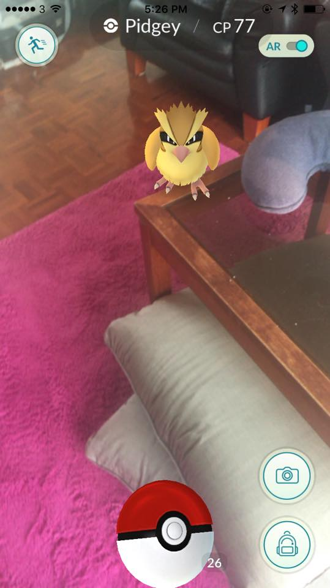
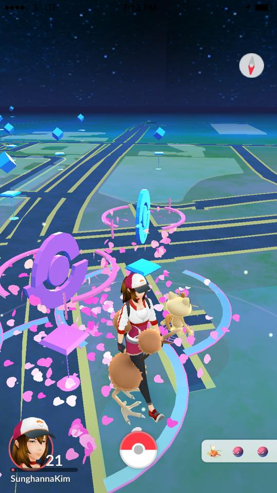
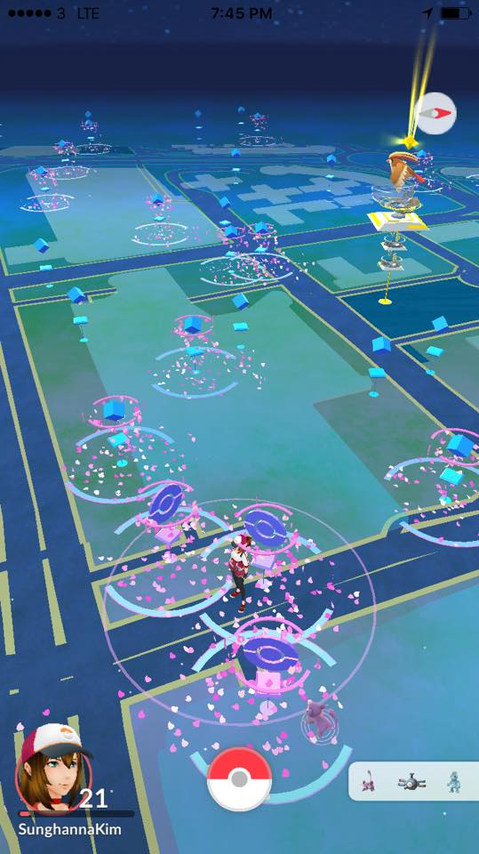
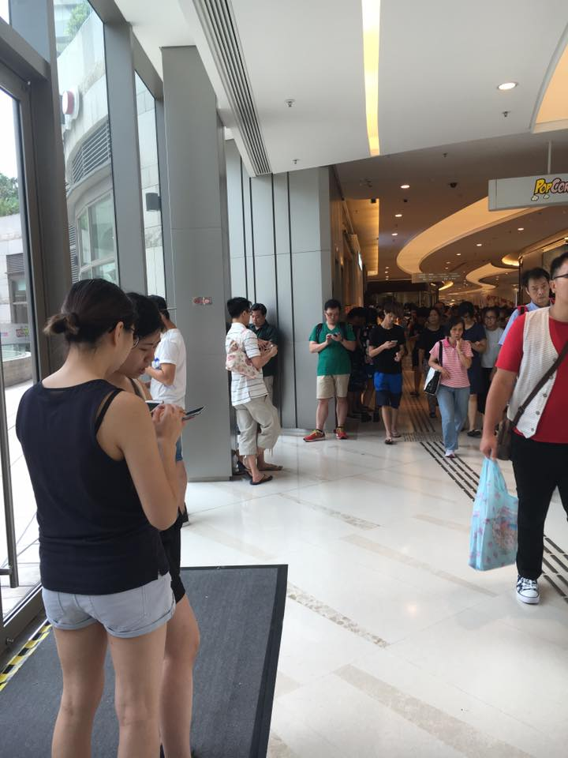

# 2016년 8월

[← 2016년](README.md)

### 8월 3일 (수) 07:08 · 📷 사진 (1장)

**이미지 캡션:** 화면 왼쪽에는 검은색 민소매 상의를 입은 젊은 여성 발표자가 연단 뒤에 서서 마이크에 대고 말하고 있으며, 양손을 펼쳐 제스처를 취하고 있다. 연단 위에는 노트북이 놓여 있다. 화면 왼쪽 하단에는 파란색 원 안에 흰색 S자 모양이 있는 SciPy 2016 로고가 보인다. 화면 오른쪽에는 "Computational Social Science"라는 제목과 함께 "Computational social science is the study of social phenomena using digitized information and computational and statistical methods."라는 인용문이 회색 배경에 표시되어 있다. 화면 하단에는 "Keynote: Machine Learning for Social Science | SciPy 2016 | Hanna Wallach"라는 캡션이 있다. 전반적으로 학술 발표 또는 컨퍼런스의 한 장면으로 보인다.

> 최근 열렸던 SciPy 2016: Scientific Computing with Python Conference 발표된 92 video 들입니다.  https://www.youtube.com/watch?v=oqfKz-PP9FU&index=7&list=PLYx7XA2nY5Gf37zYZMw6OqGFRPjB1jCy6  이중 Hanna 연구원의 머신러닝관련 강의를 듣고 있는데 정말 유창하시네요. Python을  ML에 이용해야 하는 이유도 나옵니다.  이 비디오 말고도 볼만한 비디오들이 정말 많은것 같습니다. 즐거운 한주가 될것 같습니다.

### 8월 3일 (수) 08:13 · Happy birthday.

Happy birthday.

### 8월 3일 (수) 08:13 · ↪ Happy birthday.

*다른 프로필에 남긴 글*

Happy birthday.

### 8월 3일 (수) 08:14 · Happy birthday!

Happy birthday!

### 8월 3일 (수) 08:14 · ↪ Happy birthday!

*다른 프로필에 남긴 글*

Happy birthday!

### 8월 3일 (수) 08:14 · Happy birthday.

Happy birthday.

### 8월 3일 (수) 08:14 · ↪ Happy birthday.

*다른 프로필에 남긴 글*

Happy birthday.

### 8월 3일 (수) 08:14 · Happy birthday.

Happy birthday.

### 8월 3일 (수) 08:14 · ↪ Happy birthday.

*다른 프로필에 남긴 글*

Happy birthday.

### 8월 3일 (수) 18:31 · Pidgey showed up in my house. I got her.…

Pidgey showed up in my house. I got her. :-)

**이미지 캡션:** 이 사진은 포켓몬 GO 게임 화면을 캡처한 것으로, 5시 26분으로 표시된 시간과 함께 "Pidgey"라는 포켓몬이 화면 중앙에 증강현실로 나타나 있습니다. 삐삐는 노란색 깃털을 가진 작은 새 형태의 포켓몬으로, 날카로운 눈매와 삐죽삐죽 솟은 깃털이 특징입니다. AR 모드가 활성화되어 있으며, 화면 오른쪽 상단에는 AR 토글 스위치가 보입니다. 배경은 실내로 보이며, 푹신한 핑크색 카펫이 깔려 있고, 나무 재질의 낮은 테이블과 흰색 쿠션, 그리고 검은색 소파가 일부 보입니다. 화면 하단에는 포켓볼 아이콘과 함께 숫자 26이 표시되어 있으며, 카메라와 가방 모양의 아이콘도 보입니다. 전체적으로 게임을 플레이하는 듯한 상황을 보여주며, 포켓몬을 발견하고 포획하려는 순간을 담고 있습니다.

### 8월 8일 (월) 08:26 · 📷 사진 (3장)

**이미지 캡션:** 이것은 포켓몬 GO 게임 화면으로, 밤하늘을 배경으로 도시의 도로망이 펼쳐져 있고, 핑크색 꽃잎이 흩날리는 효과와 함께 여러 개의 포켓몬 관련 아이템들이 나타나 있다. 화면 중앙에는 갈색 머리에 흰색과 빨간색이 조합된 복장을 하고 모자를 쓴 젊은 여성 캐릭터가 서 있으며, 그녀의 옆에는 노란색의 작은 포켓몬이 함께 있다. 여성 캐릭터는 약간 고개를 숙이고 있으며, 표정은 명확하게 보이지 않는다. 화면 하단에는 플레이어의 프로필 사진과 이름 "SunghannaKim", 레벨 "21"이 표시되어 있고, 그 옆에는 빨간색과 흰색의 포켓볼 아이콘이 보인다. 또한, 화면 오른쪽 하단에는 붉은색 물고기 모양의 포켓몬과 두 개의 보라색 몬스터볼 아이콘이 보인다. 전반적으로 게임 속에서 포켓몬을 잡거나 탐험하는 듯한 분위기를 연출하고 있다.
 
**이미지 캡션:** 이것은 포켓몬 GO 게임의 스크린샷으로, 밤 시간대인 오후 7시 45분경을 나타냅니다. 화면에는 게임 내 지도 인터페이스가 보이며, 파란색과 녹색의 건물 및 도로가 묘사되어 있습니다. 지도 위에는 분홍색과 보라색의 꽃잎 모양 효과가 흩날리고 있으며, 이는 게임 내 이벤트나 아이템 사용을 나타내는 것으로 보입니다. 여러 개의 푸른색 큐브 모양 아이템들이 지도 곳곳에 배치되어 있으며, 원형으로 빛나는 효과가 있는 포켓스톱으로 추정되는 지점들도 보입니다. 화면 중앙 상단에는 노란색 빛줄기와 함께 포켓몬이 등장하는 듯한 연출이 있습니다. 화면 하단 왼쪽에는 플레이어의 아바타인 젊은 여성 캐릭터가 모자를 쓰고 있으며, 레벨 21과 플레이어 이름 "SunghannaKim"이 표시되어 있습니다. 화면 하단 중앙에는 빨간색과 흰색의 포켓볼 아이콘이 보입니다. 전반적으로 게임을 플레이하는 즐겁고 활기찬 분위기를 보여줍니다.
 
**이미지 캡션:** 이 사진은 실내 쇼핑몰이나 복도에서 사람들이 줄을 서서 기다리는 모습을 담고 있으며, 여러 명의 성인 남녀가 스마트폰을 보거나 대화를 나누며 시간을 보내고 있습니다. 사진 왼쪽에는 두 명의 젊은 여성으로 보이는 사람들이 서 있으며, 한 명은 검은색 민소매 상의와 회색 반바지를 입고 스마트폰을 보고 있고, 다른 한 명은 검은색 상의와 반바지를 입고 있습니다. 그 뒤로는 흰색 티셔츠를 입은 성인 남성과 꽃무늬 셔츠를 입은 성인 남성이 보입니다. 더 안쪽으로 들어가면 녹색 티셔츠를 입은 성인 남성이 스마트폰을 보고 있고, 그 뒤로 여러 명의 사람들이 줄지어 서 있습니다. 사진 오른쪽에는 빨간색 상의와 흰색 조끼를 입은 성인 남성이 파란색 쇼핑백을 들고 걸어가고 있으며, 그의 뒤로도 많은 사람들이 보입니다. 배경에는 현대적인 쇼핑몰의 천장과 조명, 기둥, 그리고 "Pop Corn"이라고 쓰인 간판이 보입니다. 전체적으로 사람들이 무언가를 기다리거나 이동하는 분주한 분위기이며, 밝고 깨끗한 실내 환경입니다.

### 8월 8일 (월) 09:15 · 생신 축하 드립니다!

생신 축하 드립니다!

### 8월 8일 (월) 09:15 · ↪ 생신 축하 드립니다!

*다른 프로필에 남긴 글*

생신 축하 드립니다!

### 8월 10일 (수) 10:16 · 생신 축하 드립니다.

생신 축하 드립니다.

### 8월 10일 (수) 10:16 · ↪ 생신 축하 드립니다.

*다른 프로필에 남긴 글*

생신 축하 드립니다.

### 8월 10일 (수) 11:59 · 📷 사진 (1장)

**이미지 캡션:** 한 남성과 한 여성이 산길에서 함께 사진을 찍고 있다. 남성은 30대 후반에서 40대 초반으로 보이며, 짧은 검은 머리에 웃는 표정을 짓고 엄지손가락을 치켜들고 있다. 그는 회색 반팔 티셔츠와 검은색 조끼형 배낭을 착용하고 있으며, 배낭에는 물병이 달려 있다. 여성은 20대 후반에서 30대 초반으로 보이며, 갈색 머리를 단정하게 묶고 카메라를 향해 부드럽게 미소 짓고 있다. 그녀는 흰색 폴로 셔츠와 파란색 배낭을 메고 있으며, 셔츠 왼쪽 소매에는 태극기 패치가 붙어 있다. 두 사람 뒤로는 다른 등산객 두 명이 흐릿하게 보이며, 배경은 울창한 녹색 식물과 나무로 뒤덮인 산길이다. 전반적으로 화창한 날씨에 즐겁고 활동적인 분위기를 나타낸다.

### 8월 18일 (목) 14:21 · Happy birthday!! We miss you a lot!!

Happy birthday!! We miss you a lot!!

### 8월 18일 (목) 14:21 · ↪ Happy birthday!! We miss you a lot!!

*다른 프로필에 남긴 글*

Happy birthday!! We miss you a lot!!
