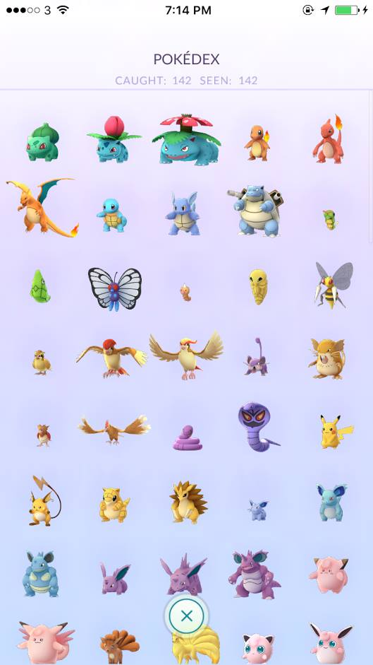

# 2016년 9월

[← 2016년](README.md)

### 9월 3일 (토) 20:16 · 📷 사진 (1장)

**이미지 캡션:** 이 이미지는 스마트폰 화면을 캡처한 것으로, 포켓몬 도감 앱의 화면을 보여줍니다. 화면 상단에는 시간과 배터리 잔량 표시가 있으며, "POKÉDEX"라는 제목 아래 "CAUGHT: 142 SEEN: 142"라는 텍스트가 표시되어 있어 142마리의 포켓몬을 잡았고 142마리를 확인했음을 나타냅니다. 화면 전체에는 다양한 포켓몬 캐릭터들이 격자 형태로 배열되어 있으며, 각 포켓몬은 3D 그래픽으로 표현되어 있습니다. 포켓몬들은 초록색의 파이리, 파란색의 꼬부기, 빨간색의 리자드 등 다양한 색상과 형태로 나타나며, 일부 포켓몬은 날개를 펼치거나 발톱을 세우는 등 역동적인 자세를 취하고 있습니다. 화면 중앙에는 나비 모양의 포켓몬과 곤충 모양의 포켓몬도 보입니다. 화면 하단에는 동그란 테두리 안에 X 표시가 있는 버튼이 있으며, 이는 특정 기능을 나타내는 것으로 보입니다. 배경은 연한 보라색으로, 포켓몬 캐릭터들을 돋보이게 합니다. 전반적으로 게임 화면의 일부를 보여주는 것으로, 포켓몬 수집 및 도감 완성에 대한 정보를 담고 있습니다. 일부 포켓몬은 날개를 펼치거나 발톱을 세우는 등 역동적인 자세를 취하고 있습니다. 화면 중앙에는 나비 모양의 포켓몬과 곤충 모양의 포켓몬도 보입니다. 화면 하단에는 동그란 테두리 안에 X 표시가 있는 버튼이 있으며, 이는 특정 기능을 나타내는 것으로 보입니다. 배경은 연한 보라색으로, 포켓몬 캐릭터들을 돋보이게 합니다. 전반적으로 게임 화면의 일부를 보여주는 것으로, 포켓몬 수집 및 도감 완성에 대한 정보를 담고 있습니다.

### 9월 4일 (일) 17:30 · caught 'em ALL (in Hong Kong). Side effe…

caught 'em ALL (in Hong Kong). Side effect: I have (re)discovered so many new cool places in Hong Kong including parks, shopping malls, streets and restaurants. It was really wonderful and fun! 
#PokemonGo #PokemonGoHK

**이미지 캡션:** 이것은 포켓몬 도감 앱의 스크린샷으로, 142마리의 포켓몬을 잡았고 142마리를 모두 보았다는 것을 보여줍니다. 화면에는 다양한 포켓몬의 3D 렌더링이 격자 형태로 표시되어 있으며, 각 포켓몬은 고유한 색상과 특징을 가지고 있습니다. 상단에는 "POKÉDEX"라는 제목과 함께 "CAUGHT: 142 SEEN: 142"라는 텍스트가 표시되어 있습니다. 배경은 연한 보라색이며, 포켓몬들이 떠 있는 듯한 느낌을 줍니다. 화면 오른쪽 하단에는 흰색 테두리에 녹색 X 표시가 있는 원형 버튼이 있어, 특정 기능을 수행하거나 창을 닫는 데 사용될 수 있습니다. 전반적으로 이 화면은 포켓몬 수집 게임의 진행 상황을 보여주는 인터페이스로 보입니다.거나 창을 닫는 데 사용될 수 있습니다. 전반적으로 이 화면은 포켓몬 수집 게임의 진행 상황을 보여주는 인터페이스로 보입니다.

### 9월 17일 (토) 10:25 · We are looking for new faculty members i…

We are looking for new faculty members in areas of cybersecurity and compilers, among a few other areas.

🔗 <http://www.cse.ust.hk/admin/recruitment/faculty/>

### 9월 25일 (일) 09:14 · 목사님, 생신 축하 드립니다.

목사님, 생신 축하 드립니다.

### 9월 25일 (일) 09:14 · ↪ 목사님, 생신 축하 드립니다.

*다른 프로필에 남긴 글*

목사님, 생신 축하 드립니다.

### 9월 26일 (월) 09:17 · Happy birthday!

Happy birthday!

### 9월 26일 (월) 09:17 · ↪ Happy birthday!

*다른 프로필에 남긴 글*

Happy birthday!

### 9월 26일 (월) 09:18 · Happy birthday!

Happy birthday!

### 9월 26일 (월) 09:18 · ↪ Happy birthday!

*다른 프로필에 남긴 글*

Happy birthday!
