# 2016년 10월

[← 2016년](README.md)

### 10월 4일 (화) 17:10 · Happy birthday!!

Happy birthday!!

### 10월 4일 (화) 17:10 · ↪ Happy birthday!!

*다른 프로필에 남긴 글*

Happy birthday!!

### 10월 7일 (금) 20:56 · 📷 사진 (3장)

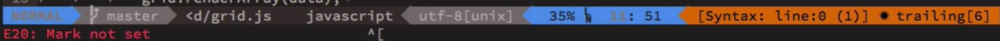
**이미지 캡션:** 이 이미지는 컴퓨터 프로그래밍 환경의 스크린샷으로, 텍스트 편집기나 IDE의 상태 표시줄로 보입니다. 사람의 모습은 보이지 않으며, 배경은 어두운 색상의 컴퓨터 화면입니다. 상단에는 여러 정보가 표시되는 막대가 있으며, 왼쪽부터 "NORMAL"이라는 텍스트가 파란색 배경에 표시되어 있고, 그 옆에는 Git 브랜치를 나타내는 듯한 아이콘과 함께 "master"라는 텍스트가 회색 배경에 있습니다. 이어서 파일 경로로 추정되는 "<d/grid.js"와 "javascript"라는 텍스트가 보입니다. 그 옆에는 "utf-8 [unix]"라는 인코딩 및 줄바꿈 방식 정보가 표시되어 있습니다. 오른쪽으로 이동하면 "35%"라는 텍스트와 함께 커서 위치를 나타내는 듯한 "LN : 51"이라는 정보가 파란색 배경에 표시됩니다. 가장 오른쪽에는 주황색 배경에 "[Syntax: line:0 (1)] * trailing [6]"이라는 텍스트가 있는데, 이는 구문 강조, 현재 줄 번호, 그리고 후행 공백에 대한 정보를 나타내는 것으로 보입니다. 하단에는 "E20: Mark not set"이라는 텍스트가 빨간색으로 표시되어 있어, 특정 마크가 설정되지 않았음을 알리고 있습니다. 전체적으로 코딩 작업 중인 개발자의 화면 일부를 보여주는 것으로, 정보 전달과 효율적인 작업 환경을 위한 UI 요소들이 포함되어 있습니다.f-8 [unix]"라는 인코딩 및 줄바꿈 방식 정보가 표시되어 있습니다. 오른쪽으로 이동하면 "35%"라는 텍스트와 함께 커서 위치를 나타내는 듯한 "LN : 51"이라는 정보가 파란색 배경에 표시됩니다. 가장 오른쪽에는 주황색 배경에 "[Syntax: line:0 (1)] * trailing [6]"이라는 텍스트가 있는데, 이는 구문 강조, 현재 줄 번호, 그리고 후행 공백에 대한 정보를 나타내는 것으로 보입니다. 하단에는 "E20: Mark not set"이라는 텍스트가 빨간색으로 표시되어 있어, 특정 마크가 설정되지 않았음을 알리고 있습니다. 전체적으로 코딩 작업 중인 개발자의 화면 일부를 보여주는 것으로, 정보 전달과 효율적인 작업 환경을 위한 UI 요소들이 포함되어 있습니다.
 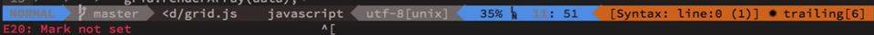
**이미지 캡션:** 이것은 컴퓨터 화면의 일부를 확대한 것으로, 코드를 편집하는 소프트웨어의 인터페이스로 보입니다. 화면에는 여러 줄의 텍스트가 표시되며, 각 줄은 다른 색상으로 강조 표시되어 있습니다. 상단 줄에는 "master", "<d/grid.js", "javascript", "utf-8 [unix]"와 같은 텍스트가 보입니다. 그 아래 줄에는 "E20: Mark not set"이라는 텍스트가 빨간색으로 표시되어 있습니다. 또한, 화면 오른쪽에는 파란색과 주황색으로 구분된 영역에 "35%", ": 51", "[Syntax: line:0 (1)]", "trailing [6]"와 같은 정보가 표시되어 있습니다. 이 정보들은 현재 작업 중인 파일의 상태, 코드의 위치, 문법 오류 등을 나타내는 것으로 추정됩니다. 전반적으로, 이 화면은 프로그래머가 코드를 작성하고 수정하는 개발 환경의 일부를 보여줍니다.: line:0 (1)]", "trailing [6]"와 같은 정보가 표시되어 있습니다. 이 정보들은 현재 작업 중인 파일의 상태, 코드의 위치, 문법 오류 등을 나타내는 것으로 추정됩니다. 전반적으로, 이 화면은 프로그래머가 코드를 작성하고 수정하는 개발 환경의 일부를 보여줍니다.
 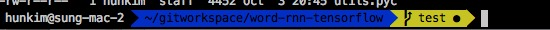
**이미지 캡션:** 이 이미지는 컴퓨터 터미널 화면의 일부를 보여줍니다. 검은색 배경에 흰색, 파란색, 노란색 텍스트가 표시됩니다. 화면 상단에는 "--- OCR Start ---"와 "--- OCR End ---"라는 텍스트가 있으며, 그 사이에는 "I"와 "1 hunkim Start 44:52 OCT 5 20:45 OCTUS.pyc"라는 텍스트가 보입니다. 이 부분은 시스템 로그나 파일 정보의 일부로 추정됩니다. 화면의 주요 부분에는 프롬프트가 표시되어 있습니다. "hunkim@sung-mac-2"는 사용자 이름과 컴퓨터 이름을 나타내며, 이는 성인 남성 사용자가 "sung-mac-2"라는 이름의 컴퓨터에서 작업하고 있음을 시사합니다. "~"는 홈 디렉토리를 의미하며, "/gitworkspace/word-rnn-tensorflow"는 현재 작업 중인 디렉토리 경로를 나타냅니다. 이 경로는 "word-rnn-tensorflow"라는 이름의 프로젝트 폴더가 "gitworkspace"라는 상위 폴더 안에 있고, 그 상위 폴더가 홈 디렉토리 안에 있음을 보여줍니다. 파란색 배경의 텍스트는 현재 작업 중인 디렉토리 경로를 강조하고 있으며, 그 뒤에 노란색 배경의 "test"라는 텍스트와 검은색 점이 보입니다. "test"는 현재 작업 중인 파일이나 테스트 환경을 나타낼 수 있으며, 검은색 점은 커서나 실행 중인 프로세스를 나타낼 수 있습니다. 전체적으로 이 화면은 프로그래밍 또는 개발 환경에서 사용자가 명령줄 인터페이스를 통해 특정 프로젝트의 테스트 관련 작업을 수행하고 있음을 보여주는 상황입니다.름을 나타내며, 이는 성인 남성 사용자가 "sung-mac-2"라는 이름의 컴퓨터에서 작업하고 있음을 시사합니다. "~"는 홈 디렉토리를 의미하며, "/gitworkspace/word-rnn-tensorflow"는 현재 작업 중인 디렉토리 경로를 나타냅니다. 이 경로는 "word-rnn-tensorflow"라는 이름의 프로젝트 폴더가 "gitworkspace"라는 상위 폴더 안에 있고, 그 상위 폴더가 홈 디렉토리 안에 있음을 보여줍니다. 파란색 배경의 텍스트는 현재 작업 중인 디렉토리 경로를 강조하고 있으며, 그 뒤에 노란색 배경의 "test"라는 텍스트와 검은색 점이 보입니다. "test"는 현재 작업 중인 파일이나 테스트 환경을 나타낼 수 있으며, 검은색 점은 커서나 실행 중인 프로세스를 나타낼 수 있습니다. 전체적으로 이 화면은 프로그래밍 또는 개발 환경에서 사용자가 명령줄 인터페이스를 통해 특정 프로젝트의 테스트 관련 작업을 수행하고 있음을 보여주는 상황입니다.

> 터미널 관련 비디오등을 보다 보니 아래 prompt 같은 것이 보이는데 git 의 branch상태도 보여주고요. 혹시 이거 어떻게 설정하시는지 아시나요?

### 10월 10일 (월) 21:07 · 📷 사진 (1장)

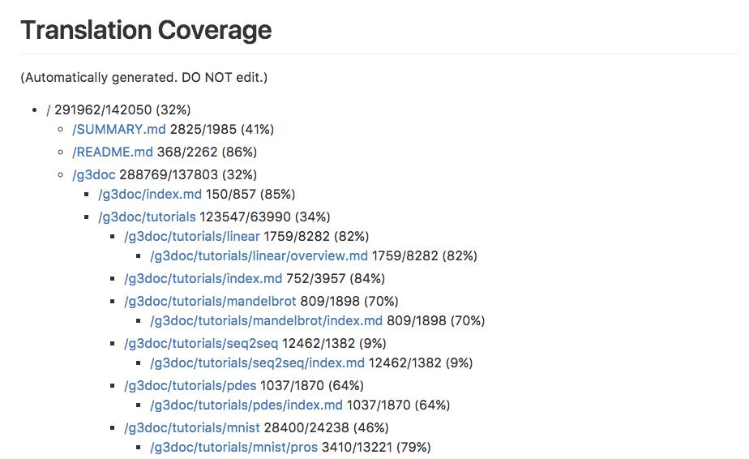
**이미지 캡션:** 이 이미지는 "Translation Coverage"라는 제목의 웹 페이지 또는 문서의 일부를 보여줍니다. 제목 아래에는 "(Automatically generated. DO NOT edit.)"라는 문구가 있어 이 내용이 자동으로 생성되었으며 편집해서는 안 된다는 것을 나타냅니다. 본문은 들여쓰기된 목록 형태로 구성되어 있으며, 각 항목은 파일 경로와 함께 번역 진행률을 나타내는 백분율을 포함하고 있습니다. 예를 들어, "/SUMMARY.md 2825/1985 (41%)"는 SUMMARY.md 파일의 번역이 2825개의 항목 중 1985개, 즉 41% 완료되었음을 의미합니다. 하위 항목들은 더 구체적인 파일 경로와 번역 진행률을 보여주며, 이는 문서의 다양한 부분에 대한 번역 상태를 나타내는 것으로 보입니다. 전반적으로 이 이미지는 문서 번역의 진행 상황을 요약하여 보여주는 정보성 콘텐츠입니다. 2825개의 항목 중 1985개, 즉 41% 완료되었음을 의미합니다. 하위 항목들은 더 구체적인 파일 경로와 번역 진행률을 보여주며, 이는 문서의 다양한 부분에 대한 번역 상태를 나타내는 것으로 보입니다. 전반적으로 이 이미지는 문서 번역의 진행 상황을 요약하여 보여주는 정보성 콘텐츠입니다.

> [번역진행사항 자동 업데이트 프로그램]  혹시 github 등으로 번역 프로젝트를 진행하고 계신지요? 이런경우 어떤 파일이 어느정도 번역되었는지를 각각 기록하고 업데이트하기 힘든데 이것을 자동으로 해주는 간단한 python script를 소개드립니다.  파일을 읽어와서 영어와 영어가 아닌 글씨의 비율을 구한다음 간단하게 보여 줍니다. 프로그래밍 관련 문서는 소스코드등 영문이 많아 대략 50%이상이면 번역이 완료되었다고 볼수 있습니다. 이를 계산하는 부분은 아래 4줄인데 좀 개선할 필요가 있습니다. (혹 도움주실수 있으신 분들 부탁드립니다.)  numbers = sum(c.isdigit() for c in s) words = sum(c.isalpha() for c in s) spaces = sum(c.isspace() for c in s) others = len(s) - numbers - words - spaces  cron을 이용하여 이 번역 진행보고서를 본인의 github 프로젝트에 자동으로 올릴수도 있습니다. 코드와 예제는 아래 참조.  https://github.com/hunkim/translation_coverage  예제는 여기에 있습니다. https://github.com/tensorflowkorea/tensorflow-kr/blob/master/progress.md (매일 새벽 1시 자동으로 계산후, progress.md 파일을 github로 push 합니다.)

### 10월 11일 (화) 17:14 · 📷 사진 (1장)

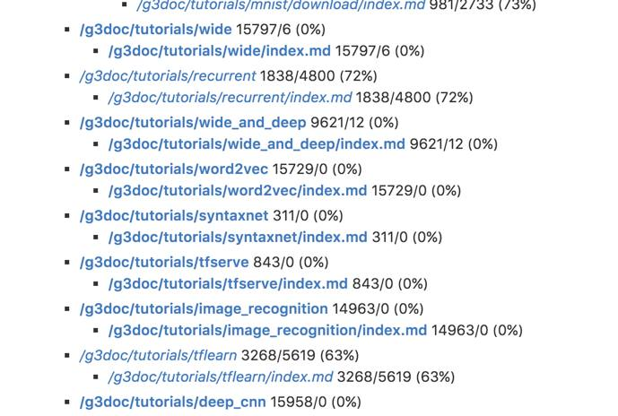
**이미지 캡션:** 이 이미지는 컴퓨터 화면에 표시된 텍스트 목록을 보여주며, 특정 파일 경로와 관련된 정보가 포함되어 있습니다. 사람, 장소, 사물, 텍스트 외의 시각적 요소는 보이지 않으며, 텍스트는 주로 파일 경로와 숫자, 퍼센트 등으로 구성되어 있습니다. 각 항목은 점으로 시작하며, "/g3doc/tutorials/"로 시작하는 디렉토리 구조를 나타냅니다. 각 파일 경로 뒤에는 숫자와 슬래시, 그리고 괄호 안의 퍼센트 값이 표시되어 있는데, 이는 파일의 크기나 관련 데이터의 양, 또는 검색 결과의 관련성을 나타내는 것으로 추정됩니다. 예를 들어, "/g3doc/tutorials/mnist/download/index.md 981/2/33 (73%)"는 mnist 튜토리얼의 다운로드 관련 파일에 대한 정보로, 73%의 관련성을 나타냅니다. 다른 항목들도 유사한 형식으로 다양한 튜토리얼 주제(wide, recurrent, wide_and_deep, word2vec, syntaxnet, tfserve, image_recognition, tflearn, deep_cnn)와 관련된 파일 정보를 보여줍니다. 전반적으로 기술 문서나 코드 저장소의 검색 결과 또는 파일 목록을 보여주는 것으로 보이며, 차분하고 정보 중심적인 분위기입니다. 추정됩니다. 예를 들어, "/g3doc/tutorials/mnist/download/index.md 981/2/33 (73%)"는 mnist 튜토리얼의 다운로드 관련 파일에 대한 정보로, 73%의 관련성을 나타냅니다. 다른 항목들도 유사한 형식으로 다양한 튜토리얼 주제(wide, recurrent, wide_and_deep, word2vec, syntaxnet, tfserve, image_recognition, tflearn, deep_cnn)와 관련된 파일 정보를 보여줍니다. 전반적으로 기술 문서나 코드 저장소의 검색 결과 또는 파일 목록을 보여주는 것으로 보이며, 차분하고 정보 중심적인 분위기입니다.

> 이벤트로 진행중인  https://github.com/tensorflowkorea/tensorflow-kr 번역의 진행 사항입니다. https://github.com/tensorflowkorea/tensorflow-kr/blob/master/progress.md  아직 0%인 파일이 많습니다. 10월중에 tutorials/todos 정도는 100%달성해 보아요.

### 10월 14일 (금) 18:07 · 📷 사진 (1장)

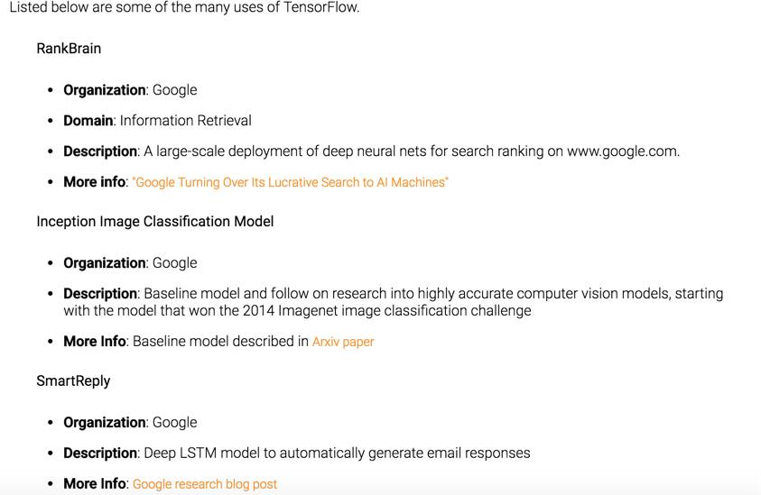
**이미지 캡션:** 이 이미지는 TensorFlow의 여러 용도를 나열한 웹 페이지의 일부를 보여줍니다. 사람이나 장소는 보이지 않고, 오직 흰색 배경에 검은색 텍스트로 구성된 정보만 표시됩니다. 텍스트는 "Listed below are some of the many uses of TensorFlow."라는 제목으로 시작하며, 그 아래에 RankBrain, Inception Image Classification Model, SmartReply라는 세 가지 주요 항목이 있습니다. 각 항목은 조직(Google), 도메인(RankBrain의 경우 Information Retrieval), 설명, 추가 정보 링크를 포함합니다. RankBrain은 www.google.com에서 검색 순위를 매기기 위한 대규모 딥 신경망 배포에 대해 설명하며, "Google Turning Over Its Lucrative Search to AI Machines"라는 기사를 링크합니다. Inception Image Classification Model은 2014년 ImageNet 이미지 분류 챌린지에서 우승한 모델을 시작으로 고도로 정확한 컴퓨터 비전 모델에 대한 연구를 설명하며, Arxiv 논문을 추가 정보로 제공합니다. SmartReply는 이메일 응답을 자동으로 생성하는 딥 LSTM 모델에 대해 설명하며, Google 연구 블로그 게시물을 추가 정보로 제공합니다. 전반적으로 정보 전달에 초점을 맞춘 깔끔하고 전문적인 분위기입니다.ain의 경우 Information Retrieval), 설명, 추가 정보 링크를 포함합니다. RankBrain은 www.google.com에서 검색 순위를 매기기 위한 대규모 딥 신경망 배포에 대해 설명하며, "Google Turning Over Its Lucrative Search to AI Machines"라는 기사를 링크합니다. Inception Image Classification Model은 2014년 ImageNet 이미지 분류 챌린지에서 우승한 모델을 시작으로 고도로 정확한 컴퓨터 비전 모델에 대한 연구를 설명하며, Arxiv 논문을 추가 정보로 제공합니다. SmartReply는 이메일 응답을 자동으로 생성하는 딥 LSTM 모델에 대해 설명하며, Google 연구 블로그 게시물을 추가 정보로 제공합니다. 전반적으로 정보 전달에 초점을 맞춘 깔끔하고 전문적인 분위기입니다.

> TensorFlow로 구글은 무엇을 하고 있을까요?   https://www.tensorflow.org/versions/r0.11/resources/uses.html 문서를 보니 검색결과 튜닝, Smart reply, Drug Discovery등에 사용된다고 하며 상세한 정보 링크도 걸려있습니다. 앞으로 더 많아 지겠지요?

### 10월 15일 (토) 22:06 · 📷 사진 (1장)

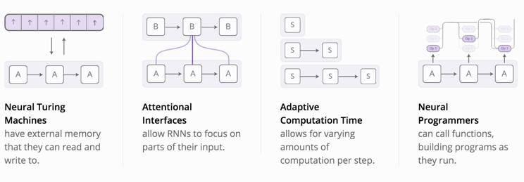
**이미지 캡션:** 이 이미지는 네 가지 인공지능 모델의 개념을 시각적으로 설명하고 있습니다. 왼쪽 상단에는 "Neural Turing Machines"라는 제목과 함께 외부 메모리를 읽고 쓸 수 있는 신경망의 구조를 보여주는 다이어그램이 있습니다. 그 아래에는 "Attentional Interfaces"라는 제목과 함께 RNN이 입력의 특정 부분에 집중할 수 있도록 하는 메커니즘을 나타내는 다이어그램이 있습니다. 오른쪽 상단에는 "Adaptive Computation Time"이라는 제목과 함께 각 단계마다 계산량을 조절할 수 있는 모델의 구조를 보여주는 다이어그램이 있습니다. 마지막으로 오른쪽 하단에는 "Neural Programmers"라는 제목과 함께 함수를 호출하고 실행 중에 프로그램을 구축할 수 있는 신경망의 개념을 나타내는 다이어그램이 있습니다. 각 섹션에는 해당 모델의 핵심 기능을 설명하는 짧은 텍스트가 포함되어 있습니다. 전체적인 분위기는 정보 전달에 초점을 맞춘 교육적이고 기술적인 느낌을 줍니다. 있는 모델의 구조를 보여주는 다이어그램이 있습니다. 마지막으로 오른쪽 하단에는 "Neural Programmers"라는 제목과 함께 함수를 호출하고 실행 중에 프로그램을 구축할 수 있는 신경망의 개념을 나타내는 다이어그램이 있습니다. 각 섹션에는 해당 모델의 핵심 기능을 설명하는 짧은 텍스트가 포함되어 있습니다. 전체적인 분위기는 정보 전달에 초점을 맞춘 교육적이고 기술적인 느낌을 줍니다.

> Augment 된 4개의 RNN 모델들에 대해 잘 정리된 문서입니다.  http://distill.pub/2016/augmented-rnns/  "As this has happened, we’ve seen a growing number of attempts to augment RNNs with new properties. Four directions stand out as particularly exciting:"

### 10월 16일 (일) 17:37 · second Harbour race! It's tough due to t…

second Harbour race! It's tough due to the current, but I finished!

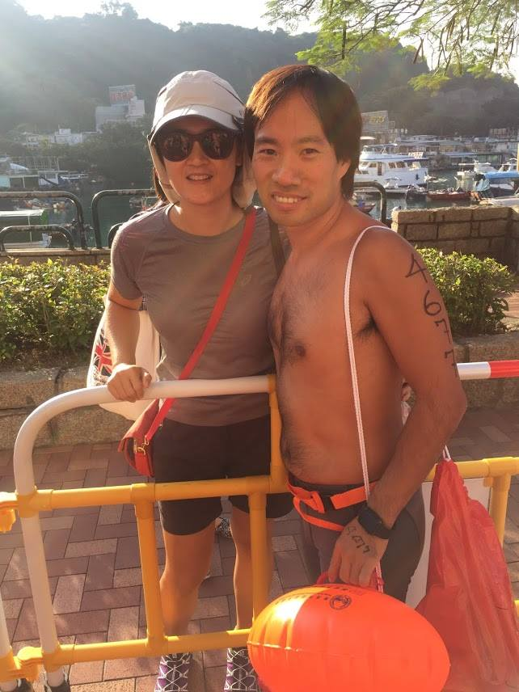
**이미지 캡션:** 한 명의 성인 여성은 회색 반팔 티셔츠, 검은색 반바지, 흰색 야구 모자, 선글라스를 착용하고 있으며, 빨간색 크로스백을 메고 있다. 그녀는 카메라를 향해 미소를 짓고 있다. 그녀 옆에는 상반신을 노출한 성인 남성이 서 있으며, 그의 팔에는 숫자가 문신으로 새겨져 있고, 허리에는 주황색 벨트와 검은색 손목시계를 착용하고 있다. 그는 주황색 부표를 들고 있으며, 빨간색 가방을 메고 있다. 두 사람 모두 야외에서 사진을 찍고 있으며, 배경에는 산과 건물, 그리고 여러 척의 보트가 정박해 있는 항구가 보인다. 노란색과 흰색으로 된 울타리가 앞에 놓여 있고, 바닥은 타일로 포장되어 있다. 전반적으로 밝고 화창한 날씨 속에서 두 사람이 함께 즐거운 시간을 보내고 있는 듯한 분위기이다.색과 흰색으로 된 울타리가 앞에 놓여 있고, 바닥은 타일로 포장되어 있다. 전반적으로 밝고 화창한 날씨 속에서 두 사람이 함께 즐거운 시간을 보내고 있는 듯한 분위기이다.
 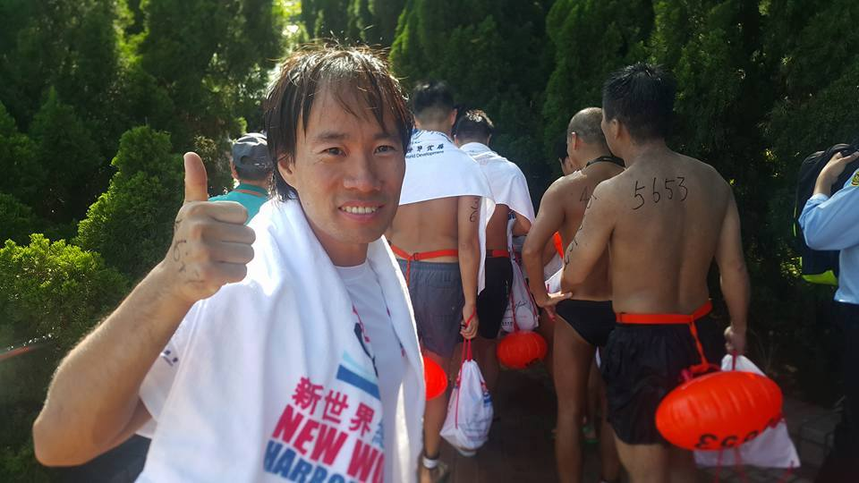
**이미지 캡션:** 한 명의 성인 남성이 엄지손가락을 치켜세우며 카메라를 향해 웃고 있으며, 그의 목에는 흰색 수건이 걸려 있고 수건에는 "新世界 NEW WORLD HARBOR"라는 글자가 쓰여 있습니다. 그의 뒤로는 여러 명의 다른 참가자들이 줄지어 서 있으며, 일부는 상의를 탈의하고 등에는 숫자(예: 5653)가 적혀 있고, 일부는 수영용 부표와 가방을 들고 있습니다. 배경에는 울창한 녹색 나무들이 보이며, 햇볕이 비치는 야외 행사 또는 스포츠 경기의 시작 지점으로 보입니다. 전반적으로 활기차고 긍정적인 분위기입니다.
 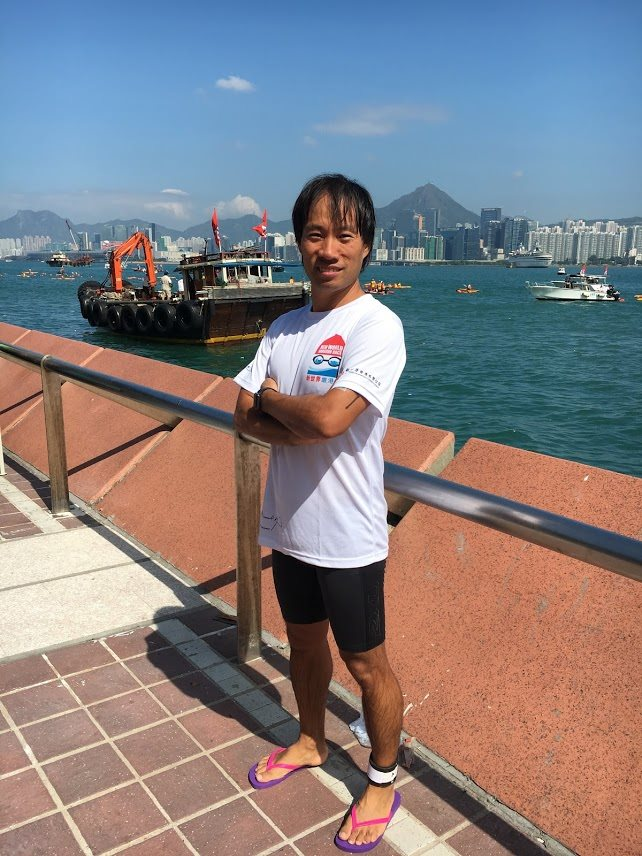
**이미지 캡션:** 한 명의 성인 남성이 팔짱을 끼고 카메라를 바라보며 서 있다. 그는 30대 후반에서 40대 초반으로 보이며, 짧은 검은 머리에 약간의 곱슬기가 있다. 얼굴에는 미소가 번지고 있으며, 건강하고 활동적인 인상을 준다. 흰색 반팔 티셔츠에는 수영하는 사람과 안경을 쓴 사람을 형상화한 로고가 그려져 있고, 검은색 반바지를 입고 있다. 발에는 보라색과 분홍색이 섞인 플립플랍을 신고 있으며, 한쪽 발목에는 흰색 밴드가 착용되어 있다. 배경으로는 푸른 바다와 홍콩의 스카이라인이 펼쳐져 있다. 바다 위에는 여러 척의 배가 떠 있으며, 그중에는 대형 바지선과 여러 대의 카약이 보인다. 멀리 보이는 도시에는 고층 빌딩들이 빽빽하게 들어서 있고, 산이 배경으로 자리 잡고 있다. 햇볕이 강하게 내리쬐는 맑은 날씨이며, 전체적으로 활동적이고 즐거운 분위기를 연출한다.떠 있으며, 그중에는 대형 바지선과 여러 대의 카약이 보인다. 멀리 보이는 도시에는 고층 빌딩들이 빽빽하게 들어서 있고, 산이 배경으로 자리 잡고 있다. 햇볕이 강하게 내리쬐는 맑은 날씨이며, 전체적으로 활동적이고 즐거운 분위기를 연출한다.
 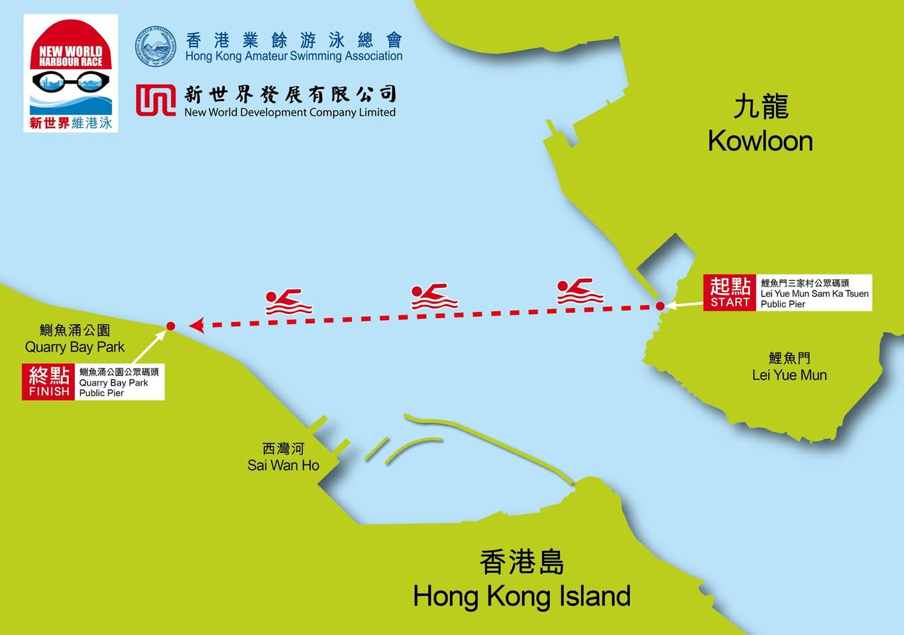
**이미지 캡션:** 이 이미지는 홍콩에서 열리는 뉴 월드 하버 레이스 수영 대회의 코스를 보여주는 지도입니다. 지도 상단에는 홍콩 아마추어 수영 협회와 뉴 월드 개발 유한공사의 로고가 있으며, "뉴 월드 하버 레이스"라는 문구가 강조되어 있습니다. 지도 중앙에는 구룡반도와 홍콩섬의 지형이 녹색으로 표시되어 있고, 그 사이의 바다는 파란색으로 표현되어 있습니다. 수영 코스는 빨간색 점선으로 표시되어 있으며, 여러 개의 빨간색 수영하는 사람 모양 아이콘이 코스를 따라 배치되어 있습니다. 코스의 시작점은 "鯉魚門 Lei Yue Mun" 지역의 "鯉魚門三家村公眾碼頭 Lei Yue Mun Sam Ka Tsuen Public Pier"로 표시되어 있으며, "START"라는 글자와 함께 붉은색 사각형으로 강조되어 있습니다. 코스의 종착점은 "鰂魚涌公園 Quarry Bay Park" 지역의 "鰂魚涌公園公眾碼頭 Quarry Bay Park Public Pier"로 표시되어 있으며, "FINISH"라는 글자와 함께 붉은색 사각형으로 강조되어 있습니다. 지도에는 "九龍 Kowloon", "香港島 Hong Kong Island", "西灣河 Sai Wan Ho"와 같은 지명도 표시되어 있습니다. 전반적으로 행사를 알리고 코스를 안내하는 정보성 지도로, 활동적이고 역동적인 분위기를 전달합니다." 지역의 "鯉魚門三家村公眾碼頭 Lei Yue Mun Sam Ka Tsuen Public Pier"로 표시되어 있으며, "START"라는 글자와 함께 붉은색 사각형으로 강조되어 있습니다. 코스의 종착점은 "鰂魚涌公園 Quarry Bay Park" 지역의 "鰂魚涌公園公眾碼頭 Quarry Bay Park Public Pier"로 표시되어 있으며, "FINISH"라는 글자와 함께 붉은색 사각형으로 강조되어 있습니다. 지도에는 "九龍 Kowloon", "香港島 Hong Kong Island", "西灣河 Sai Wan Ho"와 같은 지명도 표시되어 있습니다. 전반적으로 행사를 알리고 코스를 안내하는 정보성 지도로, 활동적이고 역동적인 분위기를 전달합니다.

### 10월 17일 (월) 11:57 · 📷 사진 (1장)

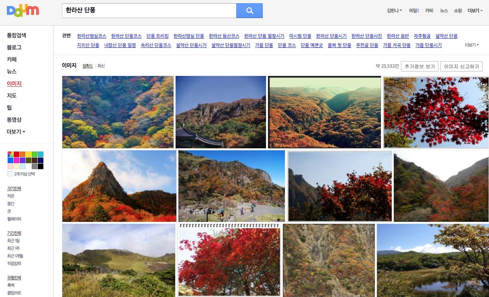
**이미지 캡션:** 이 화면은 Daum에서 "한라산 단풍"을 검색한 결과 페이지로, 다양한 가을 산의 풍경 사진들이 썸네일 형태로 나열되어 있습니다. 왼쪽에는 통합검색, 블로그, 카페, 뉴스, 이미지, 지도, 팁, 동영상 등의 메뉴와 함께 이미지 검색을 위한 색상 팔레트, 크기 및 기간별 필터 옵션이 보입니다. 검색 결과 상단에는 "관련" 검색어와 함께 "한라산영실코스", "한라산 단풍코스", "설악산 단풍시기" 등 다양한 연관 검색어들이 제시되어 있으며, 총 25,532건의 이미지가 검색되었음을 알 수 있습니다. 중앙에는 여러 장의 산 사진들이 격자 형태로 배열되어 있으며, 대부분 울긋불긋한 단풍으로 물든 산봉우리, 계곡, 숲의 모습입니다. 일부 사진에는 등산객으로 보이는 사람들이 작게 보이기도 하며, 맑고 푸른 하늘과 어우러진 가을 산의 아름다운 풍경을 담고 있습니다. 전반적으로 가을철 산행이나 단풍 명소를 찾는 사람들에게 유용한 정보와 시각적 자료를 제공하는 페이지입니다. 장의 산 사진들이 격자 형태로 배열되어 있으며, 대부분 울긋불긋한 단풍으로 물든 산봉우리, 계곡, 숲의 모습입니다. 일부 사진에는 등산객으로 보이는 사람들이 작게 보이기도 하며, 맑고 푸른 하늘과 어우러진 가을 산의 아름다운 풍경을 담고 있습니다. 전반적으로 가을철 산행이나 단풍 명소를 찾는 사람들에게 유용한 정보와 시각적 자료를 제공하는 페이지입니다.

> [10월 22일 오전 9시 성판악 IT 번개]  올 여름 제주에서 즐거운 시간을 잘 보낸 것을 그리워 했었는데, 이번 주말에 다시 제주를 방문할 기회가 생겼습니다.  많은 분들이 말씀하시는 "놓치면 후회하는 한라산의 명품단풍"도 즐기시면서 함께 제주생활과 IT에 대해 이야기 나누어요.  * 코스: 성판악->속밭->진달래->백록담->관음사 (본인이 가고싶은 만큼만 본인의 페이스로 가시면 됩니다.) * 준비물: 산행에 편안한 신발, 가벼운 가방, 물 1.5L 이상, 간단하고 가벼운 점심 (김밥 한두줄), 등산중 나눌 이야기 거리 * 만남장소: 성판악 매점 입구 오른쪽 편 (화장실 방향)  참여 가능하신분들 아래 댓글 남겨주시면 감사하겠습니다. 9:00 정각에 출발합니다.  (아래 사진은 다음 이미지 검색결과로 10월 22일 당일 보실 단풍과는 차이가 있을수 있습니다.)

### 10월 18일 (화) 16:13 · 📷 사진 (2장)

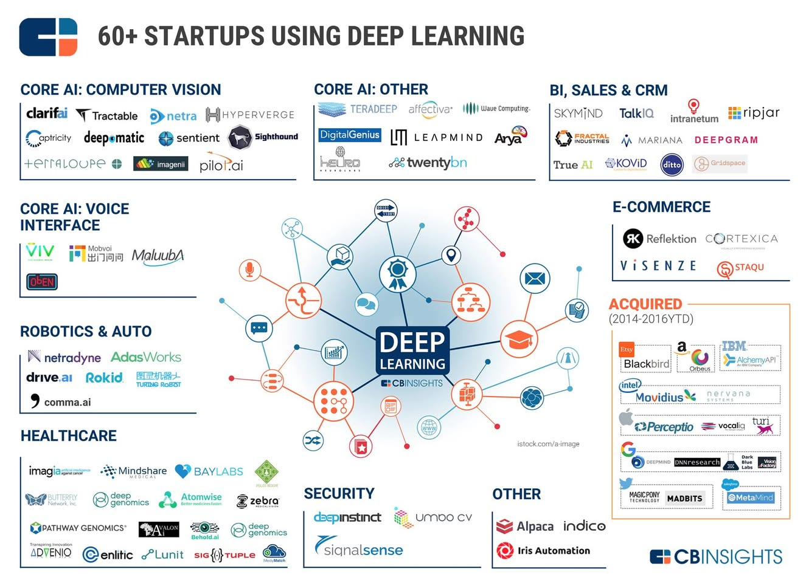
**이미지 캡션:** 이 이미지는 딥러닝 기술을 활용하는 60개 이상의 스타트업을 분류하여 보여주는 인포그래픽입니다. 중앙에는 "DEEP LEARNING"이라는 제목과 CBINSIGHTS 로고가 있으며, 이를 중심으로 다양한 아이콘들이 연결되어 딥러닝의 여러 응용 분야를 나타냅니다. 왼쪽 상단에는 "CORE AI: COMPUTER VISION" 섹션에 clarifai, Tractable, netra, HYPERVERGE 등 컴퓨터 비전 관련 스타트업들이 나열되어 있습니다. 그 아래 "CORE AI: VOICE INTERFACE" 섹션에는 VIV, Mobvoi, MaluubA 등 음성 인터페이스 관련 스타트업들이 있습니다. "ROBOTICS & AUTO" 섹션에는 netradyne, AdasWorks, drive.ai, Rokid, comma.ai 등이 포함되어 있으며, "HEALTHCARE" 섹션에는 imagia, Mindshare, BAYLABS, deep genomics, Atomwise, zebra 등 헬스케어 분야 스타트업들이 있습니다. 오른쪽 상단에는 "CORE AI: OTHER" 섹션에 TERADEEP, affectiva, Wave Computing, Digital Genius, LEAPMIND, Arya, twentybn 등 기타 핵심 AI 분야 스타트업들이 있습니다. 그 옆 "BI, SALES & CRM" 섹션에는 SKYMIND, TalkIQ, intranetum, ripjar, MARIANA, DEEPGRAM 등 비즈니스 인텔리전스, 영업, CRM 관련 스타트업들이 있습니다. "E-COMMERCE" 섹션에는 Reflektion, CORTEXICA, VISENZE, STAQU 등 전자상거래 분야 스타트업들이 나열되어 있습니다. 하단에는 "ACQUIRED (2014-2016YTD)" 섹션에 Etsy, Blackbird, Orbeus, Movidius, Perceptio, vocalig, IBM, Alchemy API 등 2014년부터 2016년까지 인수된 스타트업들이 표시되어 있습니다. 또한 "SECURITY" 섹션에는 deepinstinct, signal sense, umbo CV 등 보안 분야 스타트업들이, "OTHER" 섹션에는 Alpaca, indico, Iris Automation 등 기타 분야 스타트업들이 있습니다. 전체적으로 깔끔하고 정보 전달에 용이한 디자인이며, 딥러닝 기술의 광범위한 적용 분야를 한눈에 파악할 수 있도록 구성되어 있습니다.섹션에는 VIV, Mobvoi, MaluubA 등 음성 인터페이스 관련 스타트업들이 있습니다. "ROBOTICS & AUTO" 섹션에는 netradyne, AdasWorks, drive.ai, Rokid, comma.ai 등이 포함되어 있으며, "HEALTHCARE" 섹션에는 imagia, Mindshare, BAYLABS, deep genomics, Atomwise, zebra 등 헬스케어 분야 스타트업들이 있습니다. 오른쪽 상단에는 "CORE AI: OTHER" 섹션에 TERADEEP, affectiva, Wave Computing, Digital Genius, LEAPMIND, Arya, twentybn 등 기타 핵심 AI 분야 스타트업들이 있습니다. 그 옆 "BI, SALES & CRM" 섹션에는 SKYMIND, TalkIQ, intranetum, ripjar, MARIANA, DEEPGRAM 등 비즈니스 인텔리전스, 영업, CRM 관련 스타트업들이 있습니다. "E-COMMERCE" 섹션에는 Reflektion, CORTEXICA, VISENZE, STAQU 등 전자상거래 분야 스타트업들이 나열되어 있습니다. 하단에는 "ACQUIRED (2014-2016YTD)" 섹션에 Etsy, Blackbird, Orbeus, Movidius, Perceptio, vocalig, IBM, Alchemy API 등 2014년부터 2016년까지 인수된 스타트업들이 표시되어 있습니다. 또한 "SECURITY" 섹션에는 deepinstinct, signal sense, umbo CV 등 보안 분야 스타트업들이, "OTHER" 섹션에는 Alpaca, indico, Iris Automation 등 기타 분야 스타트업들이 있습니다. 전체적으로 깔끔하고 정보 전달에 용이한 디자인이며, 딥러닝 기술의 광범위한 적용 분야를 한눈에 파악할 수 있도록 구성되어 있습니다.
 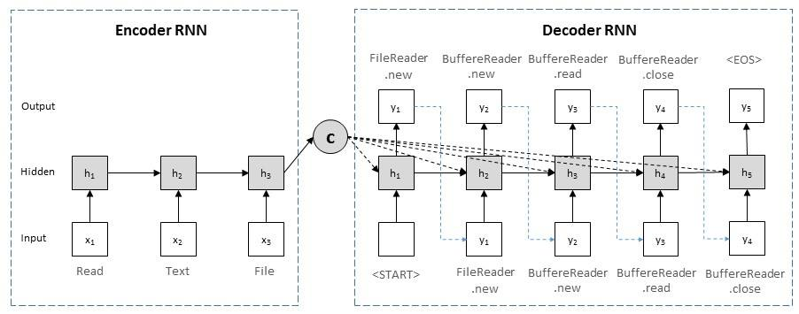
**이미지 캡션:** 이 이미지는 순환 신경망(RNN)의 인코더-디코더 구조를 시각적으로 표현한 다이어그램으로, 텍스트 시퀀스를 처리하는 과정을 보여줍니다. 다이어그램은 흰색 배경에 파란색 점선으로 구분된 두 개의 주요 영역, 즉 "Encoder RNN"과 "Decoder RNN"으로 구성되어 있습니다. 각 영역 안에는 "Input", "Hidden", "Output"이라는 레이블이 붙어 있으며, 여러 개의 사각형 상자와 화살표로 구성된 노드들이 연결되어 있습니다. "Encoder RNN" 부분에서는 "Input" 레이블 아래에 "x1", "x2", "x3"이라는 상자가 각각 "Read", "Text", "File"이라는 텍스트와 함께 표시되어 있으며, 이들은 순서대로 "Hidden" 레이블 아래의 "h1", "h2", "h3"이라는 회색 사각형 상자로 연결됩니다. "h3" 상자에서는 "C"라는 회색 원으로 화살표가 이어지는데, 이는 인코더의 최종 은닉 상태를 나타내는 것으로 보입니다. "Decoder RNN" 부분에서는 "<START>"라는 텍스트와 함께 "h1" 상자가 시작점으로 표시되며, 이어서 "h2", "h3", "h4", "h5" 상자가 순차적으로 연결됩니다. 각 "h" 상자 위에는 "y1", "y2", "y3", "y4", "y5"라는 상자가 있으며, "y5" 상자 옆에는 "<EOS>"라는 텍스트가 있습니다. 또한, "Decoder RNN"의 "Input" 레이블 아래에는 "y1", "y2", "y3", "y4"라는 상자가 각각 "FileReader.new", "BuffereReader.new", "BuffereReader.read", "BuffereReader.close"와 같은 텍스트와 함께 표시되어 있으며, 이들은 해당 단계의 "h" 상자로 연결됩니다. 특히, "C" 상자에서 "Decoder RNN"의 각 "h" 상자로 점선 화살표가 여러 개 그려져 있는데, 이는 인코더의 최종 상태가 디코더의 각 단계에 영향을 미치는 어텐션 메커니즘을 시사합니다. 또한, 디코더의 각 "h" 상자에서 다음 "h" 상자로 이어지는 실선 화살표와 함께, 이전 단계의 "h" 상자에서 현재 단계의 "h" 상자로 이어지는 점선 화살표도 일부 존재하여, RNN의 순환적인 특성을 보여줍니다. 전체적으로 이 다이어그램은 자연어 처리 분야에서 사용되는 시퀀스-투-시퀀스 모델의 작동 방식을 개념적으로 설명하고 있습니다."x1", "x2", "x3"이라는 상자가 각각 "Read", "Text", "File"이라는 텍스트와 함께 표시되어 있으며, 이들은 순서대로 "Hidden" 레이블 아래의 "h1", "h2", "h3"이라는 회색 사각형 상자로 연결됩니다. "h3" 상자에서는 "C"라는 회색 원으로 화살표가 이어지는데, 이는 인코더의 최종 은닉 상태를 나타내는 것으로 보입니다. "Decoder RNN" 부분에서는 "<START>"라는 텍스트와 함께 "h1" 상자가 시작점으로 표시되며, 이어서 "h2", "h3", "h4", "h5" 상자가 순차적으로 연결됩니다. 각 "h" 상자 위에는 "y1", "y2", "y3", "y4", "y5"라는 상자가 있으며, "y5" 상자 옆에는 "<EOS>"라는 텍스트가 있습니다. 또한, "Decoder RNN"의 "Input" 레이블 아래에는 "y1", "y2", "y3", "y4"라는 상자가 각각 "FileReader.new", "BuffereReader.new", "BuffereReader.read", "BuffereReader.close"와 같은 텍스트와 함께 표시되어 있으며, 이들은 해당 단계의 "h" 상자로 연결됩니다. 특히, "C" 상자에서 "Decoder RNN"의 각 "h" 상자로 점선 화살표가 여러 개 그려져 있는데, 이는 인코더의 최종 상태가 디코더의 각 단계에 영향을 미치는 어텐션 메커니즘을 시사합니다. 또한, 디코더의 각 "h" 상자에서 다음 "h" 상자로 이어지는 실선 화살표와 함께, 이전 단계의 "h" 상자에서 현재 단계의 "h" 상자로 이어지는 점선 화살표도 일부 존재하여, RNN의 순환적인 특성을 보여줍니다. 전체적으로 이 다이어그램은 자연어 처리 분야에서 사용되는 시퀀스-투-시퀀스 모델의 작동 방식을 개념적으로 설명하고 있습니다.

> 60개이상의 Deep learning 관련 startup들을 통해 트랜드 한번 보세요.  재미있는 회사들이 많이 있네요. https://www.cbinsights.com/blog/deep-learning-ai-startups-market-map-company-list/
> DeepCoding Project @Hong Kong University of Science and Technology (HKUST) 박사과정 모집  저희 연구실에서 활발히 진행중인 DeepCoding (딥러닝을 이용한 소스코드 부분/sequence/patch 생성)에 같이 참여할 박사과정 학생을 초빙합니다.  * 지원 자격: 학사 또는 2017년 7월 이전 학사취득 예정 (GRE, 석사가 필요하지 않습니다) + TOEFL등 영어 성적 * 혜택: 4년간 매월 20,000 HKD (약 290만원) stipend 지급 (TA나 RA나 다른 산업체 프로젝트에 참여하지 않고 잡무 0.) * 연구실 철학: http://www.se.or.kr/60 참조 * 연구 (preliminary) 진행결과: http://home.cse.ust.hk/~xguaa/papers/deepapi.pdf (논문), http://bda-codehow.cloudapp.net:88/ (데모) 참조 * 지원방법: https://cerg1.ugc.edu.hk/hkpfs/apply.html (홍콩과기대 CSE 선택)  * 지원 마감: 2016년 12월 4일  * 문의및 상담: hunkim@cse.ust.hk

### 10월 20일 (목) 22:29 · 📷 사진 (1장)

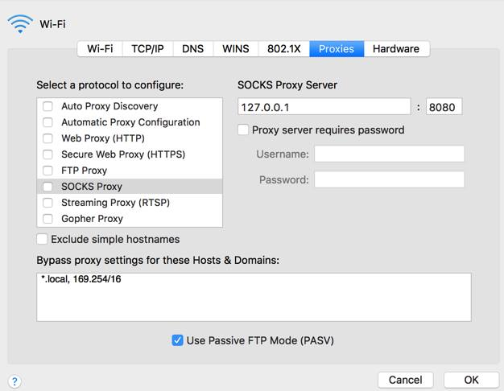
**이미지 캡션:** 이 사진은 컴퓨터 화면의 일부로, Wi-Fi 설정 창에서 프록시 서버 설정을 구성하는 화면을 보여줍니다. 화면 상단에는 "Wi-Fi"라는 제목과 함께 Wi-Fi 아이콘이 있고, 그 아래에는 "Wi-Fi", "TCP/IP", "DNS", "WINS", "802.1X", "Proxies", "Hardware" 탭이 나열되어 있으며, 현재 "Proxies" 탭이 선택되어 파란색으로 강조 표시되어 있습니다. 화면 왼쪽에는 "Select a protocol to configure:"라는 문구와 함께 여러 프록시 프로토콜 옵션이 체크박스와 함께 나열되어 있으며, "SOCKS Proxy"가 회색으로 선택되어 있습니다. 화면 오른쪽에는 "SOCKS Proxy Server"라는 제목 아래에 "127.0.0.1"이라는 IP 주소와 "8080"이라는 포트 번호가 입력되어 있고, "Proxy server requires password"라는 옵션 아래에 사용자 이름과 비밀번호를 입력하는 입력란이 있습니다. 그 아래에는 "Bypass proxy settings for these Hosts & Domains:"라는 문구와 함께 프록시 설정을 우회할 호스트 및 도메인 목록을 입력하는 큰 텍스트 상자가 있으며, "*.local, 169.254/16"이라는 예시가 입력되어 있습니다. 화면 하단에는 "Use Passive FTP Mode (PASV)"라는 체크박스가 선택되어 있고, 오른쪽 하단에는 "Cancel"과 "OK" 버튼이 있습니다. 전체적으로 기술적인 설정을 다루는 화면으로, 차분하고 기능적인 분위기를 띠고 있습니다.콜 옵션이 체크박스와 함께 나열되어 있으며, "SOCKS Proxy"가 회색으로 선택되어 있습니다. 화면 오른쪽에는 "SOCKS Proxy Server"라는 제목 아래에 "127.0.0.1"이라는 IP 주소와 "8080"이라는 포트 번호가 입력되어 있고, "Proxy server requires password"라는 옵션 아래에 사용자 이름과 비밀번호를 입력하는 입력란이 있습니다. 그 아래에는 "Bypass proxy settings for these Hosts & Domains:"라는 문구와 함께 프록시 설정을 우회할 호스트 및 도메인 목록을 입력하는 큰 텍스트 상자가 있으며, "*.local, 169.254/16"이라는 예시가 입력되어 있습니다. 화면 하단에는 "Use Passive FTP Mode (PASV)"라는 체크박스가 선택되어 있고, 오른쪽 하단에는 "Cancel"과 "OK" 버튼이 있습니다. 전체적으로 기술적인 설정을 다루는 화면으로, 차분하고 기능적인 분위기를 띠고 있습니다.

> [ssh를 통한 간단 vpn]  중국등을 여행하실때 facebook 이나 google이 막혀있는 경우가 있는데 이때 아주 간단하게 사용할수 있는 팁을 알려드립니다. (제가 오늘 중국 들럴일이 있어 찾아서 해보았습니다.) 한국이나 다른 나라에 ssh할수 있는 서버가 있어야 합니다. 없으면 AWS에서 instance 하나 만듭니다.  1. ssh -D 8080 ubuntu@myserver.com 2. (Mac의 경우) System Preference/Wifi/Advanced/Proxies/SOCKS Proxy 를 127.0.0.1:8080으로 지정후 check!  끝!  Windows는 사용하지 않아서 잘 모르겠습니다만 ssh한다음 비슷한 방법이 있을듯 합니다.

### 10월 21일 (금) 07:31 · 📷 사진 (1장)

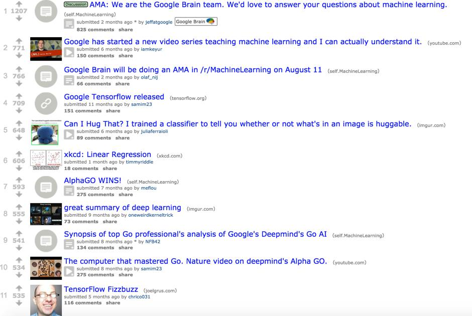
**이미지 캡션:** 이 이미지는 기계 학습 관련 주제에 대한 Reddit 게시물 목록을 보여줍니다. 각 게시물에는 제목, 제출자, 제출 시간, 댓글 수 및 공유 링크가 포함되어 있습니다. 첫 번째 게시물은 Google Brain 팀이 기계 학습에 대한 AMA(Ask Me Anything)를 진행한다는 내용이며, 두 번째 게시물은 Google에서 기계 학습을 가르치는 새로운 비디오 시리즈를 시작했다는 내용입니다. 세 번째 게시물은 Google Brain 팀이 /r/MachineLearning 서브레딧에서 AMA를 진행한다는 내용입니다. 네 번째 게시물은 Google TensorFlow의 출시를 알리고, 다섯 번째 게시물은 이미지에서 포옹 가능한 것을 분류하는 방법을 설명합니다. 여섯 번째 게시물은 xkcd 만화의 선형 회귀를 보여주고, 일곱 번째 게시물은 AlphaGo의 승리를 축하합니다. 여덟 번째 게시물은 딥 러닝에 대한 요약을 제공하고, 아홉 번째 게시물은 Google DeepMind의 Go AI에 대한 분석을 요약합니다. 열 번째 게시물은 Go를 마스터한 컴퓨터와 DeepMind의 AlphaGo에 대한 Nature 비디오를 다루고, 마지막 게시물은 TensorFlow Fizzbuzz에 대한 것입니다. 이미지의 오른쪽 하단에는 안경을 쓴 성인 남성이 웃고 있는 사진이 있습니다.니다. 네 번째 게시물은 Google TensorFlow의 출시를 알리고, 다섯 번째 게시물은 이미지에서 포옹 가능한 것을 분류하는 방법을 설명합니다. 여섯 번째 게시물은 xkcd 만화의 선형 회귀를 보여주고, 일곱 번째 게시물은 AlphaGo의 승리를 축하합니다. 여덟 번째 게시물은 딥 러닝에 대한 요약을 제공하고, 아홉 번째 게시물은 Google DeepMind의 Go AI에 대한 분석을 요약합니다. 열 번째 게시물은 Go를 마스터한 컴퓨터와 DeepMind의 AlphaGo에 대한 Nature 비디오를 다루고, 마지막 게시물은 TensorFlow Fizzbuzz에 대한 것입니다. 이미지의 오른쪽 하단에는 안경을 쓴 성인 남성이 웃고 있는 사진이 있습니다.

### 10월 23일 (일) 22:10 · Wonderful to be at Jeju Hackathon 2016 w…

Wonderful to be at Jeju Hackathon 2016 with many great people!

#OH_MY_JEJU #HACKATHON

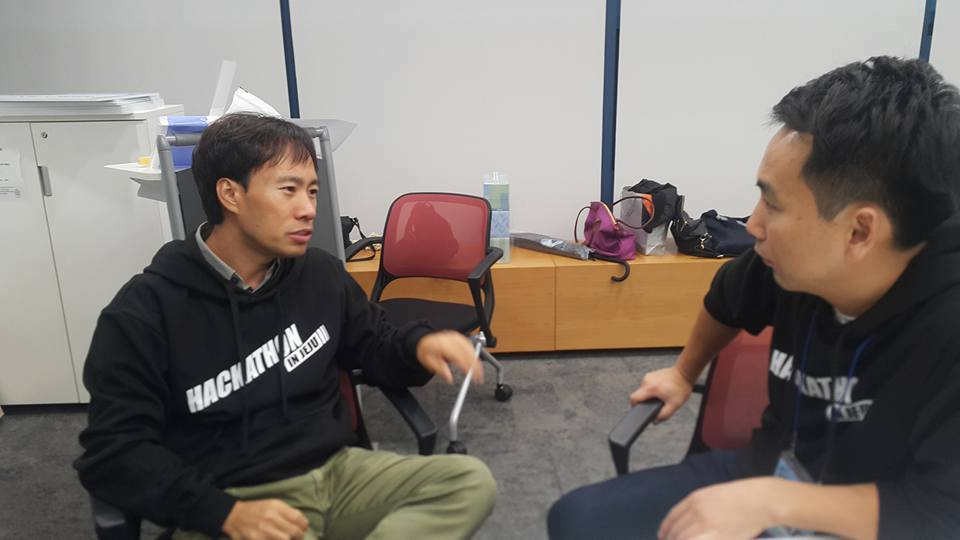
**이미지 캡션:** 두 명의 성인 남성이 실내에서 마주 앉아 대화하고 있다. 왼쪽 남성은 30대 후반에서 40대 초반으로 보이며, 짧은 검은색 머리에 검은색 후드티를 입고 있다. 후드티에는 흰색 글씨로 "HACKATHON IN JEJU"라고 쓰여 있다. 그는 연한 녹색 바지를 입고 있으며, 손을 들어 무언가를 설명하는 듯한 제스처를 취하고 있다. 표정은 진지하며 대화에 집중하고 있는 모습이다. 오른쪽 남성 역시 30대 후반에서 40대 초반으로 보이며, 짧은 검은색 머리에 검은색 후드티를 입고 있다. 그의 후드티에도 비슷한 문구가 희미하게 보인다. 그는 왼쪽 남성을 바라보며 경청하는 듯한 표정을 짓고 있다. 두 사람 모두 편안한 복장을 하고 있어 비공식적인 자리에서 대화하는 것으로 보인다. 배경에는 흰색 벽과 갈색 캐비닛, 그리고 빨간색 의자가 보인다. 캐비닛 위에는 물병, 가방, 안경 등 여러 물건이 놓여 있다. 전반적으로 차분하고 집중된 분위기이며, 해커톤 행사와 관련된 대화가 오가는 것으로 추측된다. 희미하게 보인다. 그는 왼쪽 남성을 바라보며 경청하는 듯한 표정을 짓고 있다. 두 사람 모두 편안한 복장을 하고 있어 비공식적인 자리에서 대화하는 것으로 보인다. 배경에는 흰색 벽과 갈색 캐비닛, 그리고 빨간색 의자가 보인다. 캐비닛 위에는 물병, 가방, 안경 등 여러 물건이 놓여 있다. 전반적으로 차분하고 집중된 분위기이며, 해커톤 행사와 관련된 대화가 오가는 것으로 추측된다.
 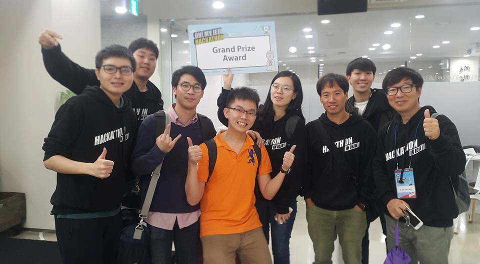
**이미지 캡션:** 이 사진은 해커톤 행사에서 그랜드 프라이즈를 수상한 팀원들이 함께 찍은 기념 사진으로, 총 8명의 성인 남성과 1명의 성인 여성이 등장한다. 대부분의 참가자는 검은색 후드티를 입고 있으며, 후드티에는 "HACKATHON IN JEJU"라는 문구가 흰색으로 새겨져 있다. 가운데에 있는 한 남성은 주황색 카라티를 입고 있으며, 다른 참가자들은 캐주얼한 복장을 하고 있다. 참가자들은 대부분 밝고 긍정적인 표정을 짓고 있으며, 일부는 엄지손가락을 치켜세우거나 손가락으로 브이(V) 모양을 만들며 수상의 기쁨을 표현하고 있다. 한 여성 참가자는 "Grand Prize Award"라고 적힌 현수막을 들고 있다. 배경은 실내 공간으로, 형광등 조명이 켜져 있고 벽에는 행사 관련 안내문이나 로고가 부착되어 있는 것으로 보인다. 전반적으로 축하와 성취감을 나타내는 활기찬 분위기이다. 있다. 한 여성 참가자는 "Grand Prize Award"라고 적힌 현수막을 들고 있다. 배경은 실내 공간으로, 형광등 조명이 켜져 있고 벽에는 행사 관련 안내문이나 로고가 부착되어 있는 것으로 보인다. 전반적으로 축하와 성취감을 나타내는 활기찬 분위기이다.
 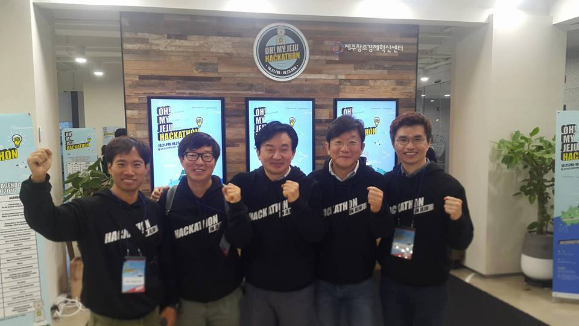
**이미지 캡션:** 다섯 명의 성인 남성이 검은색 후드티를 입고 환하게 웃으며 주먹을 불끈 쥐고 있다. 이들은 "OH! MY JEJU HACKATHON"이라는 문구가 적힌 후드티를 입고 있으며, 목에는 행사 이름과 날짜가 적힌 인식표를 걸고 있다. 배경에는 "OH! MY JEJU HACKATHON"이라는 문구가 적힌 세 개의 대형 스크린과 "제주창조경제혁신센터"라는 현판이 보인다. 왼쪽 벽에는 "HON AGENDA 2016"이라고 적힌 포스터가 걸려 있고, 오른쪽에는 화분이 놓여 있다. 전체적으로 행사의 성공적인 개최를 축하하고 참여자들의 열정을 보여주는 듯한 긍정적이고 활기찬 분위기이다. 참여자들의 열정을 보여주는 듯한 긍정적이고 활기찬 분위기이다.

### 10월 24일 (월) 18:52 · Successfully registered for Hong Kong Ma…

Successfully registered for Hong Kong Marathon 2017. My goal is 3:15. Wish me luck!

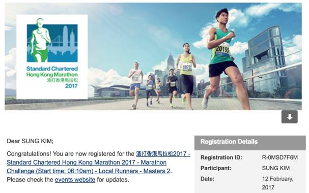
**이미지 캡션:** 사진 상단에는 스탠다드차타드 홍콩 마라톤 2017 로고와 함께 여러 명의 참가자들이 달리는 모습이 담겨 있습니다. 로고에는 달리는 사람 실루엣과 홍콩의 랜드마크인 빌딩들이 그려져 있습니다. 마라톤 참가자들은 다양한 복장을 하고 있으며, 일부는 경기 번호가 적힌 조끼를 입고 있습니다. 배경에는 현대적인 건물들과 푸른 하늘, 구름이 보입니다. 사진 하단에는 "Dear SUNG KIM;"으로 시작하는 이메일 내용이 있습니다. 이메일은 SUNG KIM이 스탠다드차타드 홍콩 마라톤 2017 마라톤 챌린지에 등록되었음을 축하하며, 시작 시간과 참가 부문에 대한 정보를 제공합니다. 또한 업데이트를 위해 이벤트 웹사이트를 확인하라는 안내가 포함되어 있습니다. 오른쪽에는 "Registration Details" 섹션이 있으며, 등록 ID, 참가자 이름(SUNG KIM), 그리고 등록 날짜(2017년 2월 12일)가 명시되어 있습니다. 전체적으로 활기차고 긍정적인 분위기이며, 마라톤 등록 확인 이메일임을 알 수 있습니다. 축하하며, 시작 시간과 참가 부문에 대한 정보를 제공합니다. 또한 업데이트를 위해 이벤트 웹사이트를 확인하라는 안내가 포함되어 있습니다. 오른쪽에는 "Registration Details" 섹션이 있으며, 등록 ID, 참가자 이름(SUNG KIM), 그리고 등록 날짜(2017년 2월 12일)가 명시되어 있습니다. 전체적으로 활기차고 긍정적인 분위기이며, 마라톤 등록 확인 이메일임을 알 수 있습니다.

### 10월 28일 (금) 09:05 · 📷 사진 (1장)

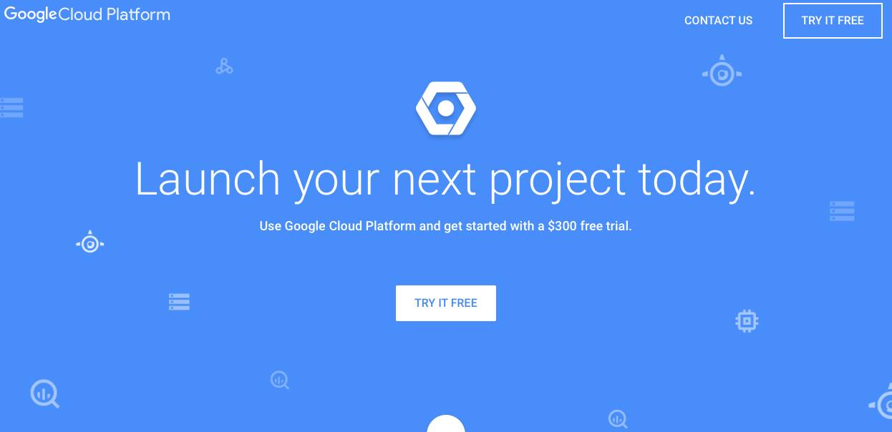
**이미지 캡션:** 이 이미지는 Google Cloud Platform의 웹사이트 랜딩 페이지를 보여줍니다. 배경은 밝은 파란색이며, 여러 개의 흰색 아이콘이 산재해 있습니다. 중앙에는 "Launch your next project today."라는 큰 흰색 글씨가 있고, 그 아래에는 "Use Google Cloud Platform and get started with a $300 free trial."이라는 작은 흰색 글씨가 있습니다. 페이지 상단 왼쪽에는 "Google Cloud Platform" 로고가 있으며, 오른쪽에는 "CONTACT US"와 "TRY IT FREE" 버튼이 있습니다. 중앙에는 Google Cloud Platform의 로고인 육각형 안에 동그라미가 있는 아이콘이 있습니다. 이 페이지는 새로운 프로젝트를 시작하도록 유도하며, 무료 체험 기회를 제공하는 것을 목표로 합니다. 사람이나 특정 인물은 보이지 않으며, 전반적으로 깔끔하고 현대적인 디자인으로 기술적인 서비스의 신뢰성과 효율성을 강조하는 분위기입니다."CONTACT US"와 "TRY IT FREE" 버튼이 있습니다. 중앙에는 Google Cloud Platform의 로고인 육각형 안에 동그라미가 있는 아이콘이 있습니다. 이 페이지는 새로운 프로젝트를 시작하도록 유도하며, 무료 체험 기회를 제공하는 것을 목표로 합니다. 사람이나 특정 인물은 보이지 않으며, 전반적으로 깔끔하고 현대적인 디자인으로 기술적인 서비스의 신뢰성과 효율성을 강조하는 분위기입니다.

> [Google Cloud ML 온라인 강좌 예고]  * 업데이트: 비디오 (https://www.youtube.com/watch?v=8Jkz2HexDAM)  "혼이 다 빠져버리는" 이 힘든 시국에서도 나름 시간을 내어 최근 오픈한 Google Cloud ML 을 공부하고 그 내용을 이번 주말, 강의비디오를 공개할 예정입니다. 여러분들이 만든 TensorFlow Task 를 그냥 클라우드에 던지면, 이를 실행하고 결과를 구글 storage에 저장해주는 방식입니다. 별도의 최신 장비 없이도 어느정도 규모의 학습은 빨리 돌려볼수 있을듯 합니다.  혹 구글 클라우드 계정이 없으신분들은 하나 준비해주시면 바로 제 강의를 따라 해보실수 있으실듯합니다.  https://cloud.google.com (가입시 300 USD를 지급합니다.)

### 10월 28일 (금) 10:18 · Happy birthday!!

Happy birthday!!

### 10월 28일 (금) 10:18 · ↪ Happy birthday!!

*다른 프로필에 남긴 글*

Happy birthday!!

### 10월 29일 (토) 09:33 · 배성이 생일 축하한다.

배성이 생일 축하한다.

### 10월 29일 (토) 09:33 · ↪ 배성이 생일 축하한다.

*다른 프로필에 남긴 글*

배성이 생일 축하한다.

### 10월 29일 (토) 15:13 · 📷 사진 (1장)

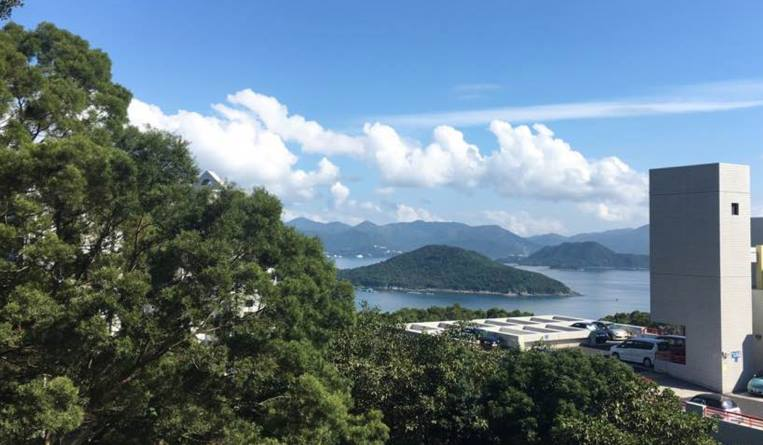
**이미지 캡션:** 푸른 하늘 아래 구름이 흩날리는 맑은 날, 울창한 녹색 나무들이 시야를 가리고 그 너머로 잔잔한 바다와 산들이 펼쳐져 있습니다. 바다에는 작은 섬들이 점점이 떠 있고, 멀리 보이는 산들은 겹겹이 이어져 평화로운 풍경을 자아냅니다. 사진 오른쪽에는 현대적인 디자인의 회색 건물이 서 있으며, 건물 앞 주차장에는 여러 대의 차량이 주차되어 있습니다. 건물 외벽에는 작은 사각형 창문과 함께 알 수 없는 기호가 새겨져 있습니다. 전반적으로 자연과 현대 건축물이 조화를 이루는 고요하고 평화로운 분위기입니다.

### 10월 30일 (일) 03:13 · 📷 앨범: Profile pictures (3장)

**이미지 캡션:** 사진에는 여러 명의 성인 남성들이 강의실로 보이는 곳에 앉아 있으며, 그들 앞에는 붉은색 바탕에 흰색 글씨로 "#내려와라 박근혜"라는 문구가 크게 쓰여 있습니다. 문구 오른쪽에는 말풍선 모양의 이모티콘이 있는데, 찡그린 표정으로 보입니다. 배경의 사람들은 대부분 정면을 응시하고 있으며, 일부는 흐릿하게 처리되어 있습니다. 전체적으로 시위나 집회와 관련된 메시지를 담고 있는 것으로 추정되며, 다소 강한 메시지를 전달하려는 분위기입니다.
 
**이미지 캡션:** 이 사진은 야외에서 촬영된 것으로 보이며, 한 명의 성인 남성이 카메라를 향해 미소를 짓고 있다. 남성은 30대에서 40대로 추정되며, 짧은 검은색 머리카락에 선글라스를 착용하고 있다. 회색 티셔츠를 입고 있으며, 등에는 검은색 백팩을 메고 있다. 배경에는 울창한 녹색 숲이 펼쳐져 있어 자연 속에서 활동 중인 모습이다. 남성의 표정은 편안하고 긍정적인 분위기를 나타내며, 햇살이 비치는 듯한 자연광이 사진에 따뜻한 느낌을 더한다. 특별한 텍스트는 보이지 않으며, 전체적으로 활동적이고 건강한 이미지를 전달한다.
 
**이미지 캡션:** 이 사진은 강의실로 보이는 배경에서 여러 명의 성인 남성들이 앉아 있는 모습이며, 전면에 붉은색 글씨로 "#내려와라 박근혜"라는 문구가 크게 쓰여 있습니다. 문구 오른쪽에는 말풍선 모양의 이모티콘이 있는데, 찡그린 표정으로 보입니다. 사진의 전반적인 분위기는 시위나 정치적 메시지를 담고 있는 것으로 해석될 수 있습니다.

### 10월 30일 (일) 03:31 · Want to have a profile picture like me? …

Want to have a profile picture like me? Check this out:
http://stepdown-349bd.firebaseapp.com
(Please share it if you like.)

제 프로필 사진 같은 이미지를 자동으로 생성하고 싶으시면 http://stepdown-349bd.firebaseapp.com 를 사용해보세요. 마음에 드시면 널리 공유 부탁드립니다.

#내려와라_박근혜

🎬 동영상 1개 (생략)

### 10월 30일 (일) 10:11 · Happy birthday!!

Happy birthday!!

### 10월 30일 (일) 10:11 · ↪ Happy birthday!!

*다른 프로필에 남긴 글*

Happy birthday!!
