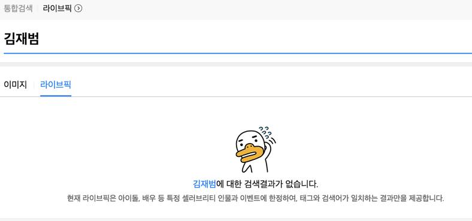
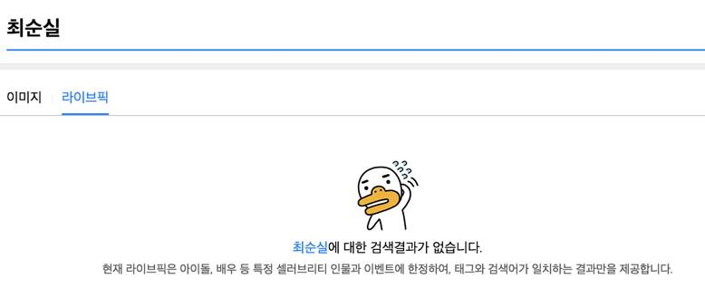

# 2016년 11월

[← 2016년](README.md)

### 11월 2일 (수) 10:09 · 생일 축하 드립니다.

생일 축하 드립니다.

### 11월 2일 (수) 10:09 · ↪ 생일 축하 드립니다.

*다른 프로필에 남긴 글*

생일 축하 드립니다.

### 11월 2일 (수) 10:09 · Happy birthday!

Happy birthday!

### 11월 2일 (수) 10:09 · ↪ Happy birthday!

*다른 프로필에 남긴 글*

Happy birthday!

### 11월 10일 (목) 08:44 · 📷 사진 (1장)

**이미지 캡션:** 이 이미지는 흰색 배경에 귀여운 동물 캐릭터와 함께 "Happy 1st birthday"라는 문구가 그려진 일러스트입니다. 왼쪽부터 노란색 점박이 기린이 'H'자를, 회색 코끼리가 'a'자를, 초록색 점박이 뱀이 'p'자를, 주황색 줄무늬 뱀이 또 다른 'p'자를, 그리고 청록색 벌레 모양 캐릭터가 'y'자를 형상화하고 있습니다. '1st'는 주황색 숫자 '1'과 'st'로, 'birthday'는 주황색 글씨로 쓰여 있습니다. 이미지 곳곳에 분홍색, 주황색, 회색의 귀여운 꽃들과 초록색 덩굴 장식이 더해져 생일 축하 분위기를 돋우고 있습니다. 전체적으로 밝고 즐거운 느낌을 주는 디자인입니다.일 축하 분위기를 돋우고 있습니다. 전체적으로 밝고 즐거운 느낌을 주는 디자인입니다.

> Ming Kwon 님이 올려주신대로 TensorFlow의 First Year! 축하합니다. 아래 재미있는 예를 포함하여 많은 곳에서 사용되었다고 합니다:  - 호주 해양연구소에서 수만장의 사진에서 멸종 위기인 해우(sea cows)를 찾아내고 그 수를 관찰하는데 사용 - 일본의 오이분류기: 크기, 모양, 그리고 특징에 따라 오이 분류 - 의료 스캔화면을 이용해 파키슨병의 가능성이 있는지 판단 - 로즈베리와 같이 사용하여 칼트레인 (베이지역의 교통수단) 추적  재미있는곳에 많이 사용되었네요.  https://research.googleblog.com/2016/11/celebrating-tensorflows-first-year.html

### 11월 10일 (목) 17:58 · Step Down!

Step Down!

🔗 <http://www.ohmynews.com/NWS_Web/View/at_pg.aspx?CNTN_CD=A0002259488>

### 11월 19일 (토) 09:17 · Please stop by wonderful Hong Kong!

Please stop by wonderful Hong Kong!

### 11월 24일 (목) 23:20 · 📷 사진 (2장)

**이미지 캡션:** 화면 상단에는 "통합검색"과 "라이브픽" 탭이 있으며, 현재 "라이브픽" 탭이 선택되어 파란색 밑줄이 표시되어 있습니다. 검색창에는 "김재범"이라는 텍스트가 입력되어 있습니다. 그 아래에는 "이미지"와 "라이브픽" 탭이 다시 나타나며, "라이브픽"이 선택되어 있습니다. 화면 중앙에는 당황한 표정의 오리가 그려진 카카오프렌즈 캐릭터인 "무지"의 이모티콘이 있습니다. 이모티콘 아래에는 "김재범에 대한 검색결과가 없습니다."라는 텍스트가 파란색으로 표시되어 있으며, 그 아래에는 "현재 라이브픽은 아이돌, 배우 등 특정 셀러브리티 인물과 이벤트에 한정하여, 태그와 검색어가 일치하는 결과만을 제공합니다."라는 안내 문구가 흰색으로 표시되어 있습니다. 전체적으로 검색 결과가 없음을 알리는 차분하고 약간은 당황스러운 분위기입니다.특정 셀러브리티 인물과 이벤트에 한정하여, 태그와 검색어가 일치하는 결과만을 제공합니다."라는 안내 문구가 흰색으로 표시되어 있습니다. 전체적으로 검색 결과가 없음을 알리는 차분하고 약간은 당황스러운 분위기입니다.
 
**이미지 캡션:** 화면 상단에는 "최순실"이라는 검색어가 보이며, 그 아래에는 "이미지"와 "라이브픽" 두 개의 탭이 있다. 현재 "라이브픽" 탭이 선택되어 파란색 밑줄이 그어져 있다. 중앙에는 당황한 표정의 오리 캐릭터가 그려져 있으며, 그 아래에는 "최순실에 대한 검색결과가 없습니다."라는 문구가 표시되어 있다. 마지막으로, "현재 라이브픽은 아이돌, 배우 등 특정 셀러브리티 인물과 이벤트에 한정하여, 태그와 검색어가 일치하는 결과만을 제공합니다."라는 안내 문구가 하단에 작성되어 있다. 전반적으로 검색 결과가 없음을 알리는 화면으로, 다소 허탈하거나 당황스러운 분위기를 연출하고 있다.는 화면으로, 다소 허탈하거나 당황스러운 분위기를 연출하고 있다.

### 11월 28일 (월) 15:04 · Don't miss out EBS Theme Around World, H…

Don't miss out EBS Theme Around World, Hong Kong and Macau with Sung! 

Dec 12-15, 8:50PM  KST, EBS1

EBS 세계테마기행, 홍콩/마카오편 12월 12-15, 8:50PM EBS1

### 11월 29일 (화) 11:22 · Happy birthday!!

Happy birthday!!

### 11월 29일 (화) 11:22 · ↪ Happy birthday!!

*다른 프로필에 남긴 글*

Happy birthday!!

### 11월 29일 (화) 11:22 · Happy birthday!

Happy birthday!

### 11월 29일 (화) 11:22 · ↪ Happy birthday!

*다른 프로필에 남긴 글*

Happy birthday!

### 11월 29일 (화) 11:22 · Happy birthday!

Happy birthday!

### 11월 29일 (화) 11:22 · ↪ Happy birthday!

*다른 프로필에 남긴 글*

Happy birthday!
