# 2016년 12월

[← 2016년](README.md)

### 12월 1일 (목) 14:55 · 반가워요. 산에 많이 가시나 봅니다.

반가워요. 산에 많이 가시나 봅니다.

### 12월 1일 (목) 14:55 · ↪ 반가워요. 산에 많이 가시나 봅니다.

*다른 프로필에 남긴 글*

반가워요. 산에 많이 가시나 봅니다.

### 12월 3일 (토) 12:47 · is ready to visit Gwanghwamun Square - 광…

is ready to visit Gwanghwamun Square - 광화문광장 and  Seoul, South Korea from Dec 5-11. (Note: These are not Boxing Gloves.)

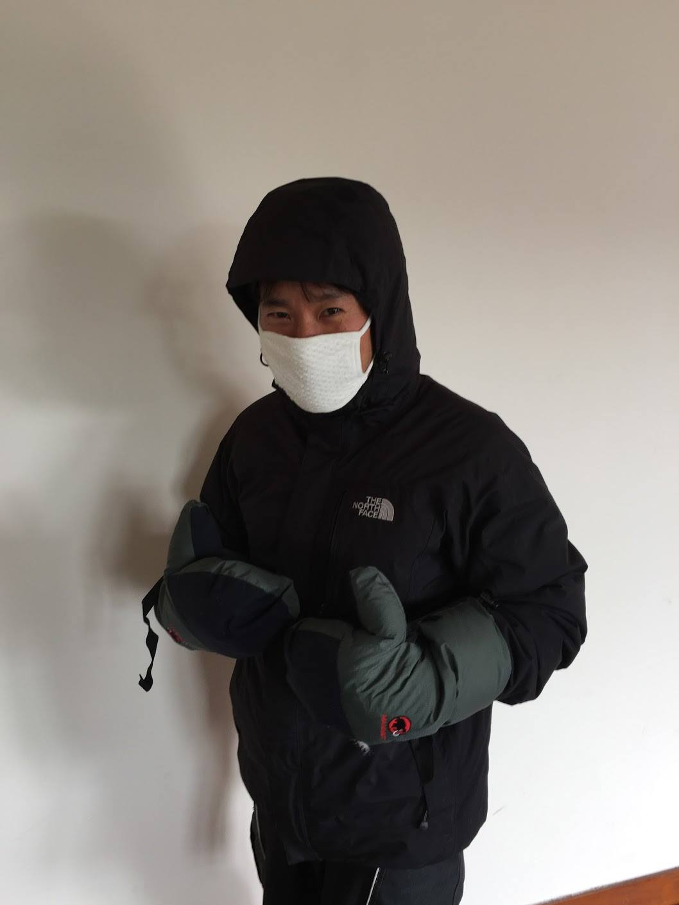

### 12월 8일 (목) 10:33 · 📷 사진 (1장)

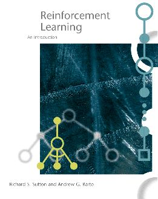

> 요즈음 Deep Learning과 Reinforcement Learning을 같이 사용하면 더 많은 문제를 풀수 있습니다. Reinforcement Learning을 깊게 이해할수 있는 1998년 나왔던 첫번째판 책이 거의 20년만에 새로운 버전이 나왔습니다.  Q-learning 과 Policy Gradient등 다양한 내용을 담고 있습니다.  https://webdocs.cs.ualberta.ca/~sutton/book/the-book-2nd.html  현재 draft를 PDF를 다운받아 읽어 보실수 있습니다. https://webdocs.cs.ualberta.ca/~sutton/book/bookdraft2016sep.pdf

### 12월 9일 (금) 13:34 · Good to be here with JTBC.

📍 여의도 새누리당 중앙당사

Good to be here with JTBC. 

#박근혜탄핵

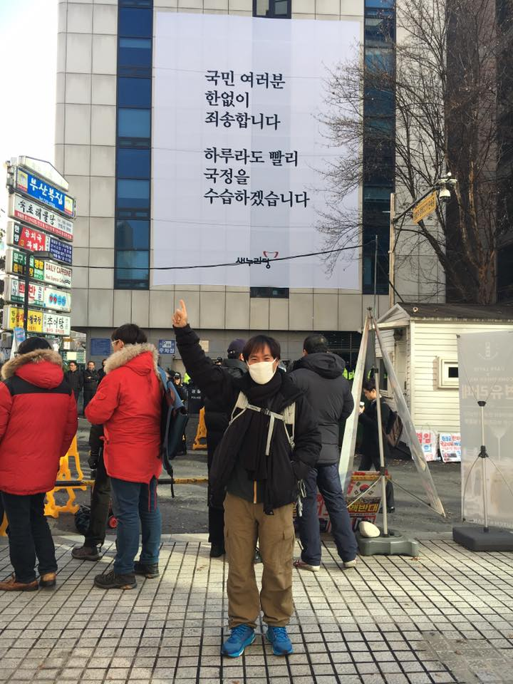 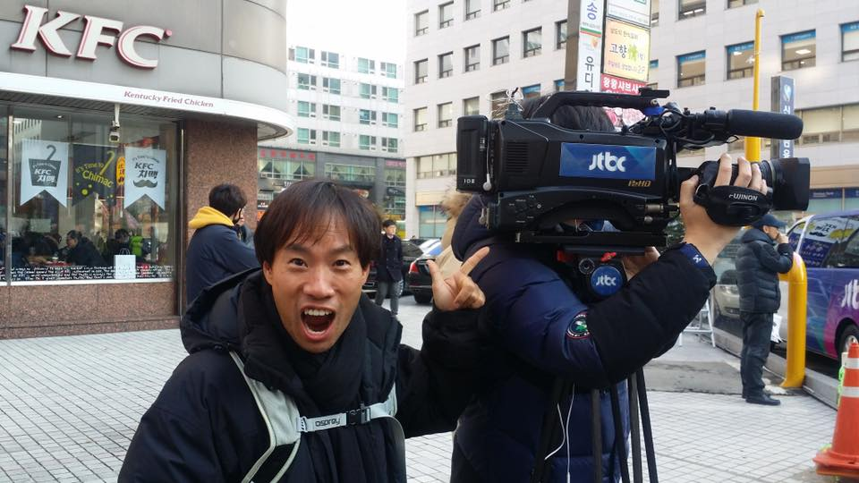

### 12월 9일 (금) 18:05 · Our president, Park Has Been Impeached! …

📍 여의도 국회의사당

Our president, Park Has Been Impeached! It was wonderful to be just right there.

🎬 동영상 1개 (생략)

### 12월 10일 (토) 10:12 · 📷 앨범: Profile pictures (1장)

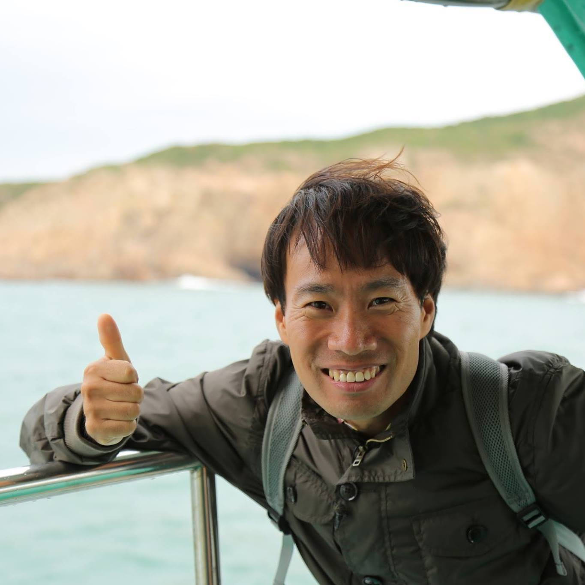

### 12월 10일 (토) 22:25 · @Gwanghwamun Square

@Gwanghwamun Square

 #박근혜를구속하라 #박근혜즉각퇴진

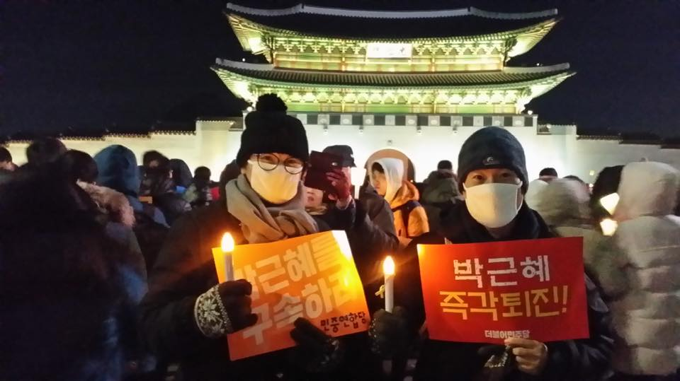

### 12월 11일 (일) 09:53 · Let's go to Hong Kong this week!

Let's go to Hong Kong this week!
(12/12~15, 8:50PM, EBS1)

EBS 세계테마기행 홍콩 본방사수!

🎬 동영상 1개 (생략)

### 12월 13일 (화) 10:17 · Happy birthday!

Happy birthday!

### 12월 13일 (화) 10:17 · ↪ Happy birthday!

*다른 프로필에 남긴 글*

Happy birthday!

### 12월 13일 (화) 19:55 · Invite you all to EBS1 tonight (8:50PM)!

Invite you all to EBS1 tonight (8:50PM)!

오늘저녁도 EBS 세계테마기행 본방사수!

### 12월 14일 (수) 17:24 · Let's go to Macau tonight with EBS!

Let's go to Macau tonight with EBS!

오늘은 마카오로 떠납니다. EBS1 8:50PM!

### 12월 14일 (수) 23:20 · Santa-Pikachu showed up in my house! Mer…

Santa-Pikachu showed up in my house! Merry Christmas!!

#pokemongo

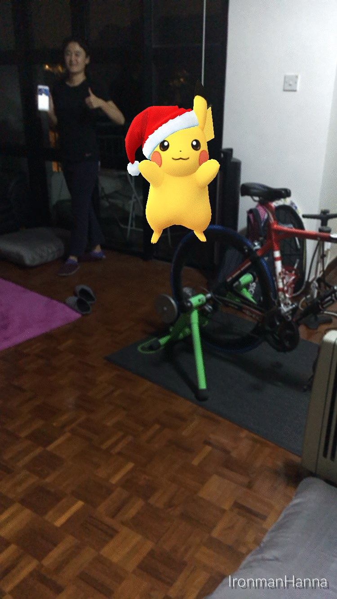

### 12월 15일 (목) 09:37 · 생신축하드립니다.

생신축하드립니다.

### 12월 15일 (목) 09:37 · ↪ 생신축하드립니다.

*다른 프로필에 남긴 글*

생신축하드립니다.

### 12월 15일 (목) 17:38 · So sad. Last episode tonight 8:50 PM EBS…

So sad. Last episode tonight 8:50 PM EBS.

아쉽게도 오늘이 EBS 테마기행 홍콩/마카오 마지막편! 8:50PM EBS, 본방사수! 선물받으실분은 여기 참고 하세요: https://www.facebook.com/ebstheme/posts/1661435160549097

### 12월 16일 (금) 21:10 · IU concert in Hong Kong!!

IU concert in Hong Kong!!

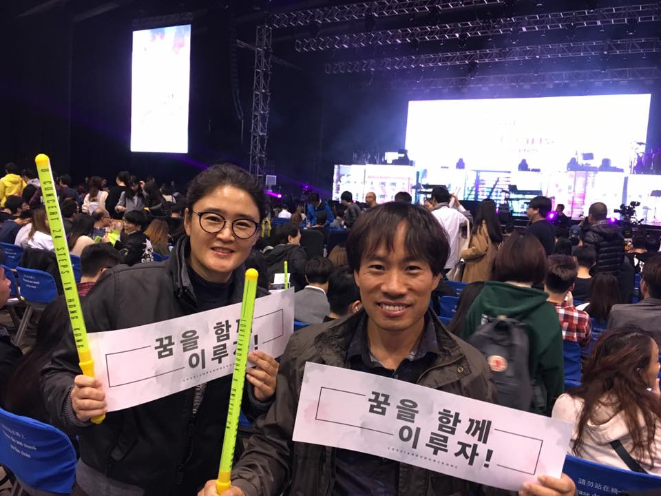 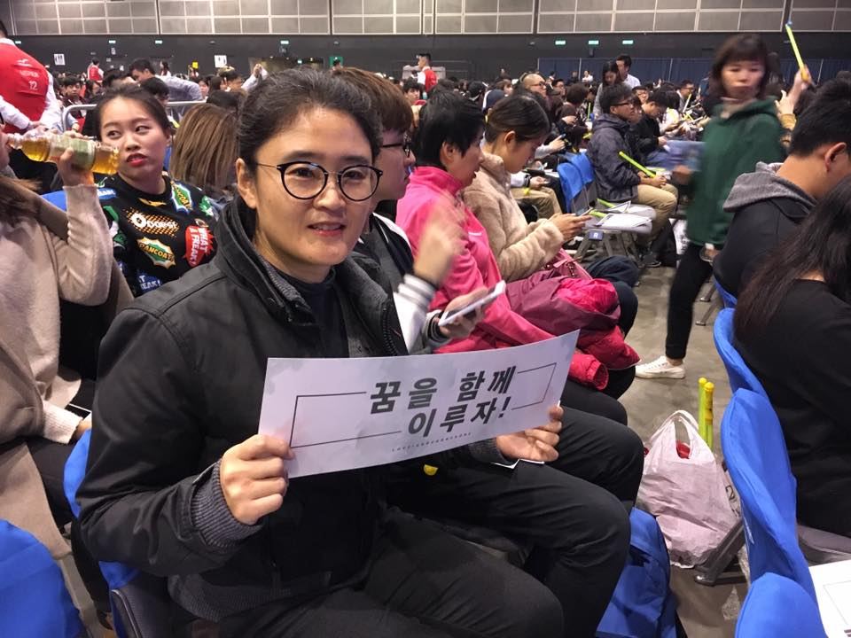 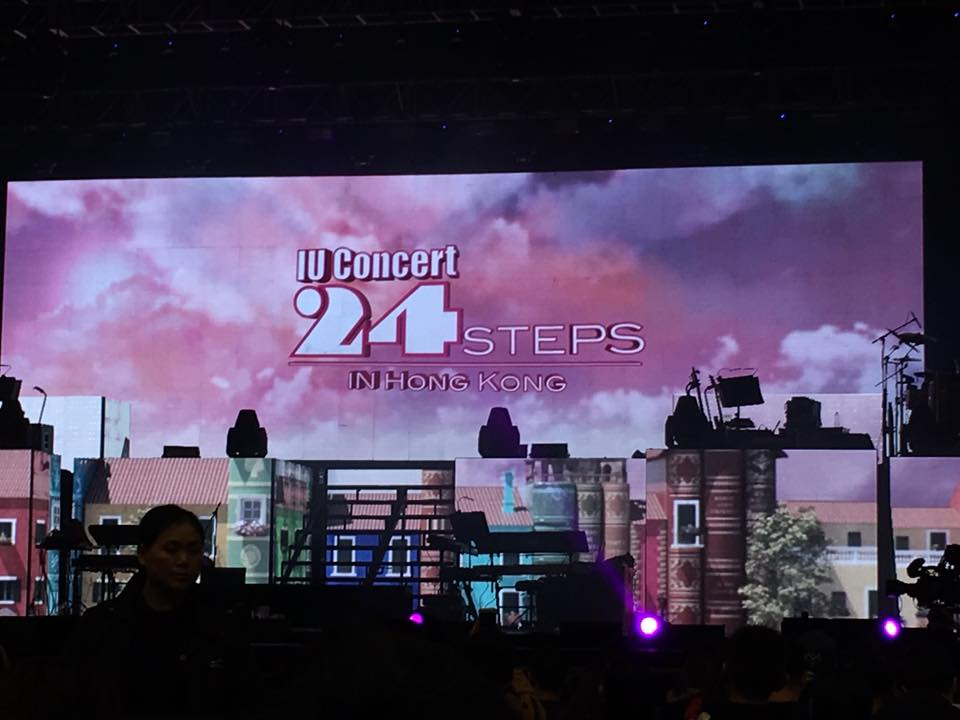

### 12월 17일 (토) 18:47 · Quick HKUST/CSE tour (in Korean)!

Quick HKUST/CSE tour (in Korean)!

https://www.youtube.com/watch?v=dGCzwgN19H4

### 12월 18일 (일) 12:04 · If you missed, don't worry. Today 5:35pm…

If you missed, don't worry. Today 5:35pm at EBS, you can watch all four episodes. Enjoy!

본방사수 못하셔서 아쉬워하시는 많은 분들을 위해 오늘 오후 5:35분 부터 EBS 홍콩테마기행 4편이 연속 방송됩니다.

### 12월 19일 (월) 17:04 · HKUST ocean tour!

HKUST ocean tour!

오늘 월요일 어떻게 보내셨나요? 12월 홍콩과기대앞 바닷가 한번 보고 오늘 마무리 해요.

홍콩과기대는 제가 공부해보고 일해본 대학들중 가장 아름다운 곳입니다. 이곳에서 아침을 보내는 방법을 담아 보았습니다. 

이곳에서 같이 공부/연구하실 분들을 애타게 찾고 있습니다. hunkim@gmail.com으로 CV보내주시면 됩니다.

https://www.youtube.com/watch?v=IU5Pu66a8Og

### 12월 20일 (화) 13:21 · If you have missed the Hong Kong/Macau t…

If you have missed the Hong Kong/Macau tour on EBS, still you can watch online (with 15% free preview). 

홍콩, 마카오 테마기행을 온라인으로도 보실수 있습니다. (15% free preview!)

재미있습니다. :-)

http://www.ebs.co.kr/tv/show?prodId=391&lectId=10605602&gnbVal=1&pageNum=1

### 12월 21일 (수) 07:23 · 📷 사진 (1장)

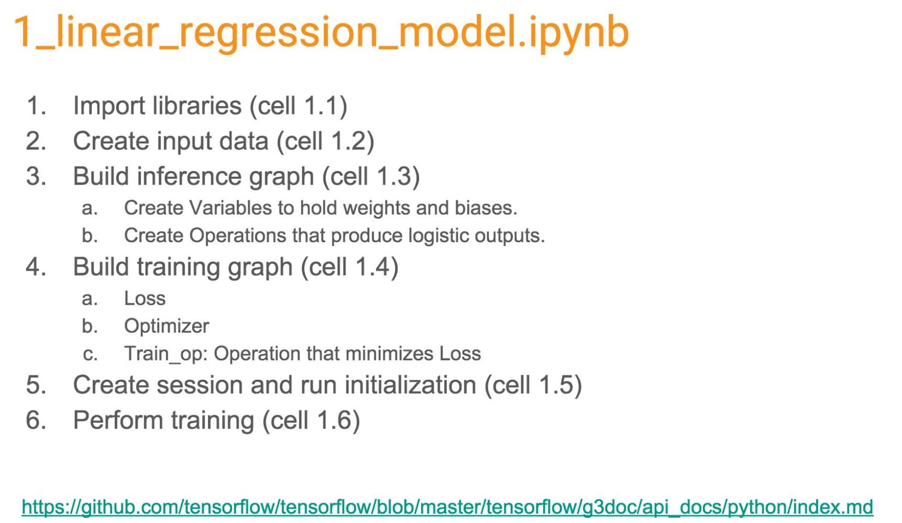

> [구글브레인팀에서 만든 TensorFlow Tutorial]  1. TensorFlow를 어떻게 사용하는지 예를 보여줘서 동기 부여 2. 이미 만들어 놓은 Deep Learning 모델을 보여주고 (대부분은 그대로 사용가능, Inception, Show and Tell, Text summary, etc.) 3. 간단한 lab을 통한 TensorFlow 실습  슬라이드/lab등도 너무 잘만들어져 있어서 기본적인 TF강의에서 그대로 사용해도 좋을것 같습니다.   슬라이드: https://github.com/sherrym/tf-tutorial/blob/master/DeepLearningSchool2016.pdf 비디오: https://www.youtube.com/watch?v=Ejec3ID_h0w (코드 설명은 잘 못합니다. 슬라이드만 보셔도 될듯.) 코드: https://github.com/sherrym/tf-tutorial

### 12월 23일 (금) 10:58 · Three best places to study at HKUST!

Three best places to study at HKUST!

홍콩과기대에서 공부하고 프로그래밍하기 좋은장소 3곳을 소개 합니다.

https://www.youtube.com/watch?v=Aby75OGxHzo

이곳에서 같이 박사과정으로 공부/연구하실 분들을 애타게 찾고 있습니다. http://home.cse.ust.hk/~hunkim/를 참고 하시고 hunkim@gmail.com으로 CV보내주시면 됩니다.

### 12월 23일 (금) 14:34 · 📷 사진 (1장)

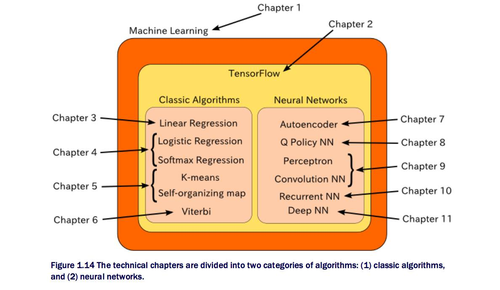

> Park Ricky 님께서 올려주신 포스트를 보고 1장 무료 다운로드부분 (https://manning-content.s3.amazonaws.com/download/9/a3272eb-d214-4710-a4ee-226c92b9b615/Shukla_MLwTensorFlow_MEAP_V05_ch1.pdf) 을 읽어 보았는데요, 아주 재미있게 쓰여져있습니다.   1장은 supervised, unsupervised, reinforcement 등의 일반적인 ML의 개념을 재미있는 그림과 함께 다룹니다. 아래 그림과 같이 책의 구성을 보니 사고 싶은 마음이 들어 구매했습니다. (구매시 ctwpscfastw 쿠폰 사용하면 39% 할인 됩니다.)  https://tensorflow.blog/2016/12/23/python-ds-handbook-ml-with-tf-repo/

### 12월 24일 (토) 13:58 · 📷 사진 (2장)

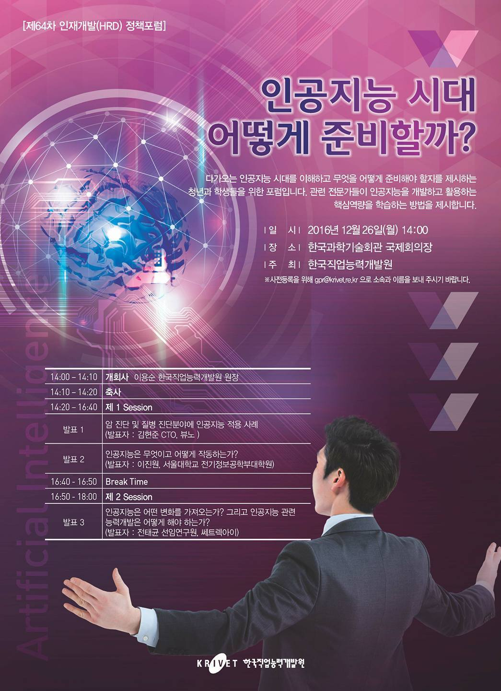 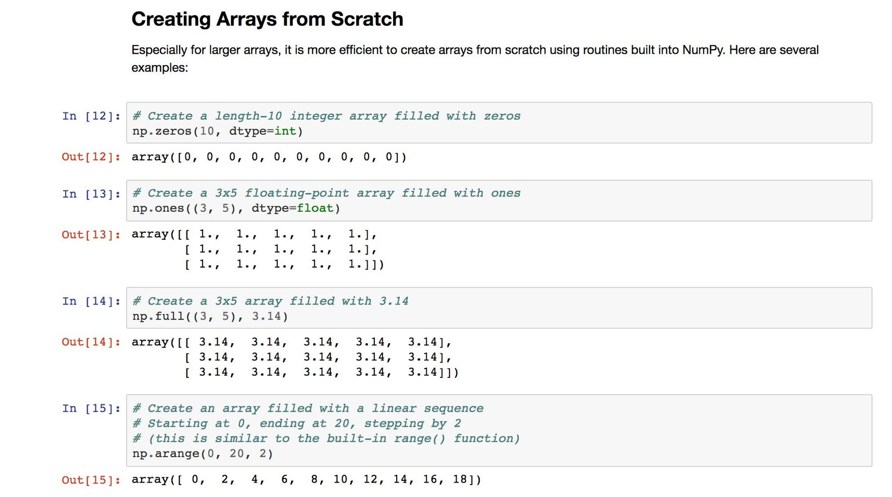

> [Numpy Array 정복!] Numpy Array는 TensorFlow 를 잘 다루기 위한 기본기 같은 것인데요, 최근 무료로 공개된 ‘Python Data Science Handbook‘의 2장에 코드와 멋진 설명! 코드들을 쓱 보기만해도 감이 팍팍 옵니다.  http://nbviewer.jupyter.org/github/jakevdp/PythonDataScienceHandbook/blob/master/notebooks/Index.ipynb

### 12월 26일 (월) 11:10 · 📷 사진 (1장)

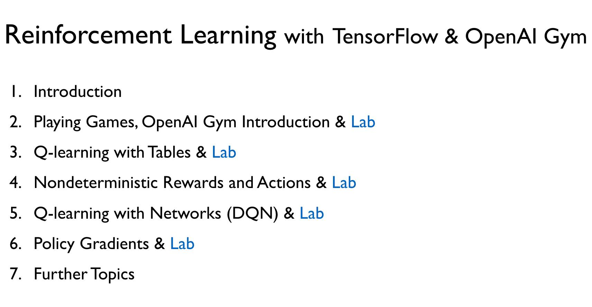

> [Reinforcement Learning with TensorFlow & OpenAI Gym] 강의 예고  ATARI 게임들을 자동으로 학습하여 사람보다 잘하고, 이세돌 선수를 이겨버린 알파고의 핵심인 강화학습! TensorFlow와 OpenAI Gym 를 이용한 강화학습 강의가 2월 1일 부터 공개됩니다.  아래가 대략적인 주제이며 lab과 함께 최소 12강에서 15강으로 이루어질 예정입니다. (아직 강의를 다 만들지는 않았으니 혹시 추가해야할 중요한 주가 주제가 있으시면 알려주세요.)  강화학습강의를 위한 선수 과목으로 "모두를 위한 딥러닝" ( https://www.inflearn.com/course/기본적인-머신러닝-딥러닝-강좌/ 또는 https://hunkim.github.io/ml/) 필수 입니다!

### 12월 27일 (화) 09:26 · 📷 사진 (1장)

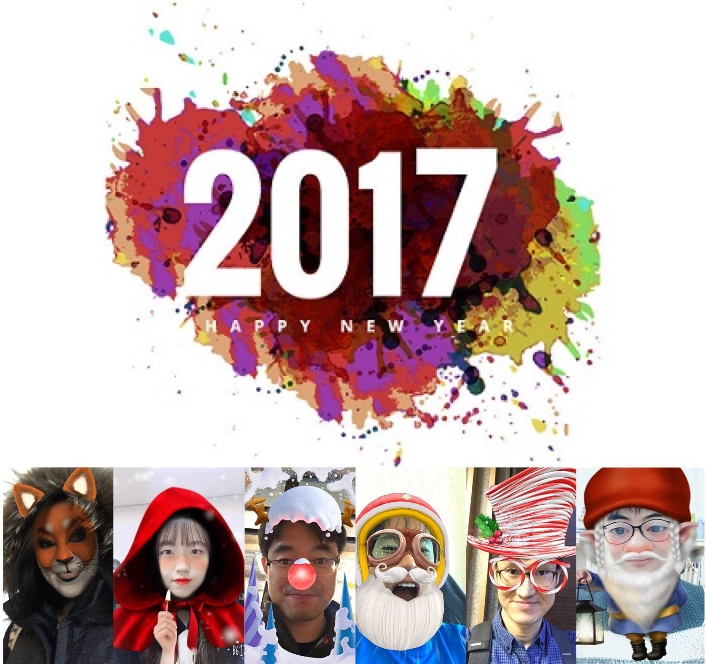

> [2017년 새해 복 많이 받으세요!]  TensorFlow를 공부하기 위해 2016년 3월 26일부터 모이기 시작한 TF-KR그룹이 이제는 7,638 분들이 재미난 정보를 "공유"해주시고 함께 "소통"해주시는 정말 신나는 커뮤니티가 되었습니다. 한 해 동안 가입해주시고 자주 찾아주시고 또 열심히 활동해주신 모든 분들에게 감사드립니다.  2017년에도 우리 그룹에서 재미있는 공유와 신나는 소통이 이어지기를 기대하며 여러분 한분 한분에게도 만복이 깃드는 새해가 되기를 소망합니다.  - TF-KR 운영진 Lucy Park, Jimin Lee, Soonson Kwon, Sung Kim, Park Ricky, and Donghyun Kwak 드림   PS - 저희 그룹이나 그룹운영에 건의 사항이 있으시면 댓글로 또는 저희 운영진에게 메시지등으로 알려주세요. 항상 귀기울이겠습니다.

### 12월 30일 (금) 13:31 · Best Christmas/New Year gift for Sung th…

Best Christmas/New Year gift for Sung thanks to LG! It's really ultra sharp and removes all my USBC/USB cables/dongles!

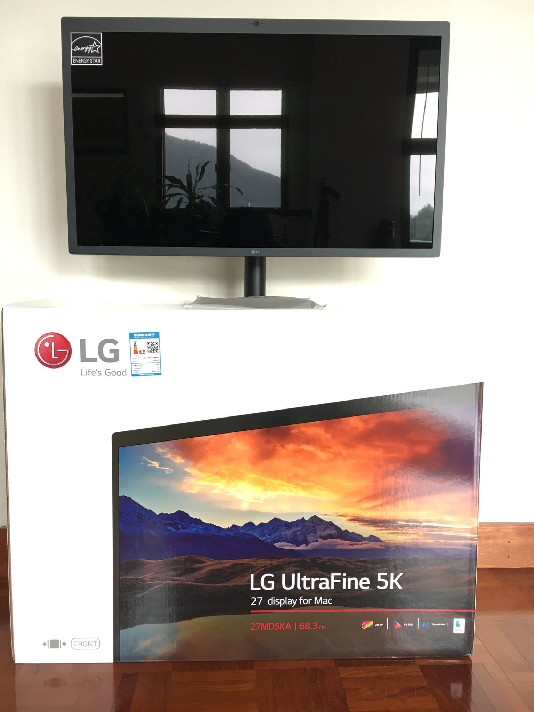

### 12월 30일 (금) 13:50 · Watch all EBS theme HK/Macau at Youtube!…

Watch all EBS theme HK/Macau at Youtube! Enjoy!

EBS 세계테마기행 홍콩/마카오편이 유투브에 전격 공개 되었습니다.

https://www.youtube.com/playlist?list=PLlMkM4tgfjnL8XJUOmcfhCaiQ4JDlwwHe

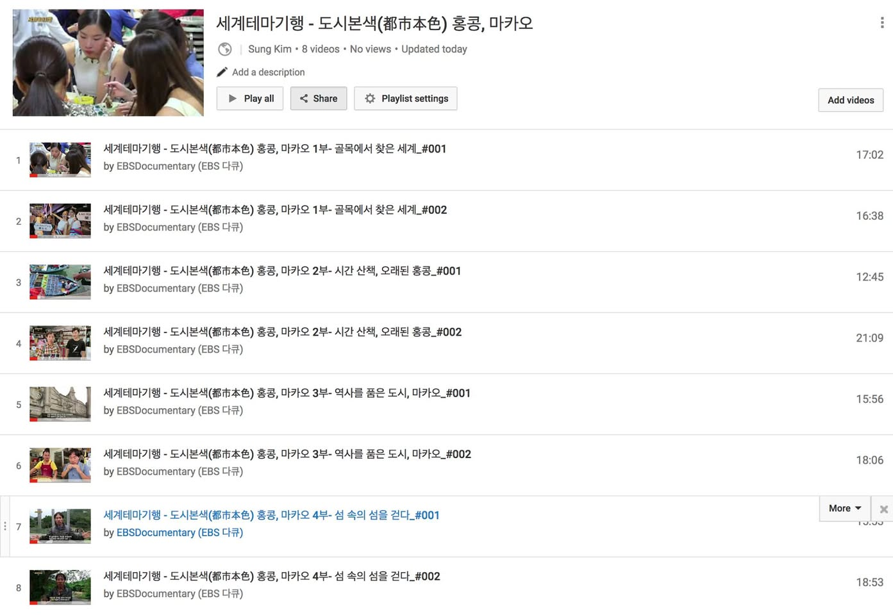
