# 2017년 2월

[← 2017년](README.md)

### 2월 1일 (수) 10:08 · Happy birthday!

Happy birthday!

### 2월 1일 (수) 10:08 · ↪ Happy birthday!

*다른 프로필에 남긴 글*

Happy birthday!

### 2월 1일 (수) 10:09 · Happy birthday.

Happy birthday.

### 2월 1일 (수) 10:09 · ↪ Happy birthday.

*다른 프로필에 남긴 글*

Happy birthday.

### 2월 1일 (수) 10:09 · Happy birthday.

Happy birthday.

### 2월 1일 (수) 10:09 · ↪ Happy birthday.

*다른 프로필에 남긴 글*

Happy birthday.

### 2월 1일 (수) 14:02 · 📷 사진 (2장)

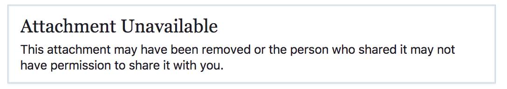 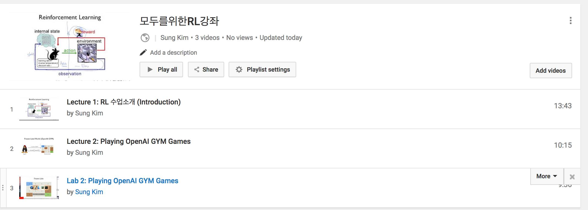

> [모두를 위한 RL 강좌 시작]  RL에 대한 전혀 지식이 없으신분, 수학과 컴퓨터에 지식이 없으셔도 편안하세 보실수 있는 #모두를위한RL 강의 시작합니다. 대략 일주일에 하나씩 올라와서 3월중에 종강할 예정입니다. 선수과목: #모두를위한딥러닝  보시고 의견 주시면 다음강의에 바로 반영됩니다.   - 비디오링크/슬라이드: http://hunkim.github.io/ml/ - 리스트: https://www.youtube.com/playlist?list=PLlMkM4tgfjnKsCWav-Z2F-MMFRx-2gMGG - 인프런: https://www.inflearn.com/course/reinforcement-learning/

### 2월 2일 (목) 09:30 · 📷 사진 (1장)

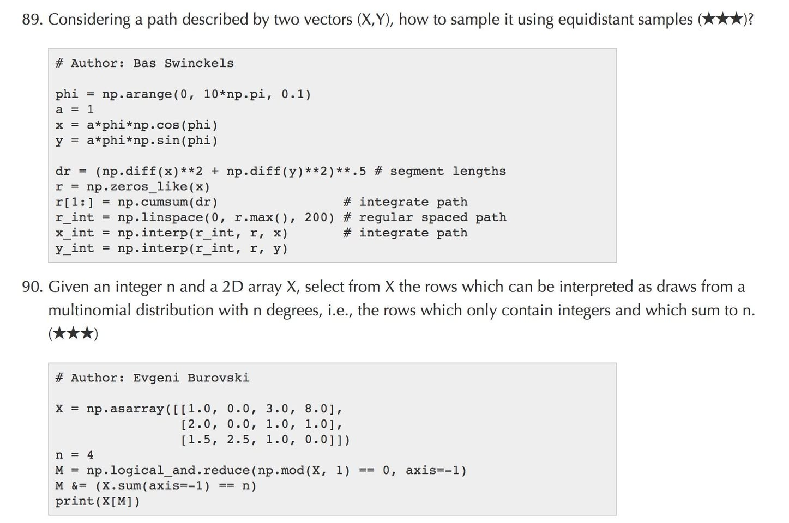

> Numpy에 한번 빠져 볼까요? 100가지 다양한 (별하나부터 별3개) 난이도의 문제들을 보면서 익히는 Numpy, 딱딱한 메뉴얼보다 훨씬 재미있습니다.  https://github.com/rougier/numpy-100/blob/master/100%20Numpy%20exercises.ipynb  추가: http://nbviewer.jupyter.org/github/rougier/numpy-100/blob/master/100%20Numpy%20exercises.ipynb (Thanks to Yoongho Ahn)

### 2월 3일 (금) 08:44 · 📷 사진 (2장)

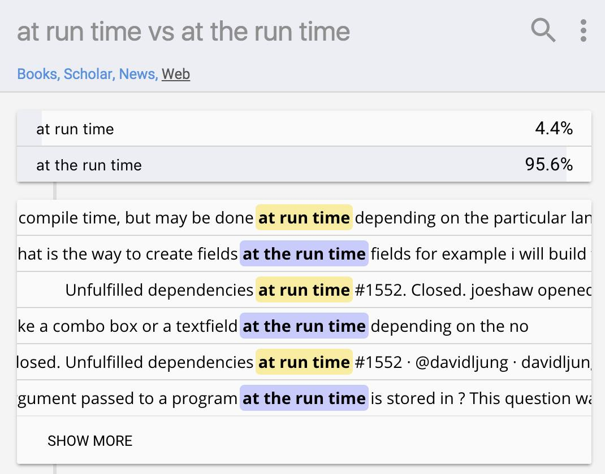 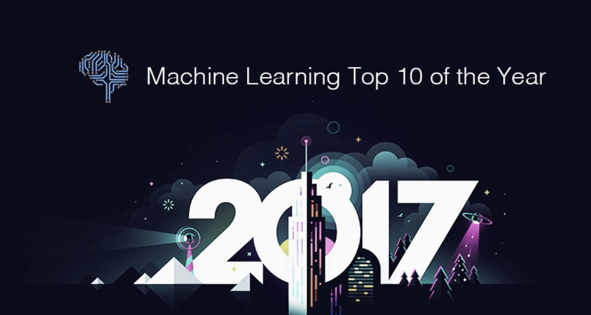

> at run time 이 맞을까요? 아님 at *the* run time이 맞는 표현일까요? 구글에게 물어보면 되는데 (검색해봐서 어떤표현이 더 많이 사용되는지), 이를 자동으로 해주는 툴이 있습니다.  영어문장 작성하실때 사용해 보세요. https://writefullapp.com/
> 2016년 머신러닝관련 top10 article은 무엇일까요? 흥미로운 주제가 많습니다. 이번주 읽을거리들이 많이 생겼습니다.  https://medium.mybridge.co/machine-learning-top-10-of-the-year-v-2017-7552599935c0#.h2ojmkfzn  Machine Learning Top 10 Articles for the Past Year (v.2017)  1. Complete Deep Learning Tutorial, Starting with Linear Regression. Courtesy of Andrew Ng at Stanford University  2. Teaching Computer to Play Super Mario with DeepMind & Neural Networks. Courtesy of Ehren J. Brav  3. A Beginner’s Guide To Understanding Convolutional Neural Networks [CNN Part I]. Courtesy of Adit Amol Deshpande  4. Modern Face Recognition with Deep Learning — Machine Learning is Fun [Part 4]. Courtesy of Adam Geitgey  5. Machine Learning in a Year: From a total beginner to start using it at work. Courtesy of Per Harald Borgen  6. Building Jarvis AI with Natural Language Processing. Courtesy of Mark Zuckerburg, CEO at Facebook.  7. Image Completion with Deep Learning in TensorFlow. Courtesy of Brandon Amos, Ph.D at Carnegie Mellon University  8. The Neural Network Zoo.  9. How to Code and Understand DeepMind’s Neural Stack Machine. Courtesy of Andrew Trask, PhD at University of Oxford  10. Neural Network that Changes Everything. Courtesy of Computerphile and Dr. Mike Pound, PhD at University of Nottingham

### 2월 3일 (금) 21:08 · #friendsday Wonderful to have so many am…

#friendsday Wonderful to have so many amazing friends! Thanks to all!

🎬 동영상 1개 (생략)

### 2월 4일 (토) 06:46 · 📷 사진 (4장)

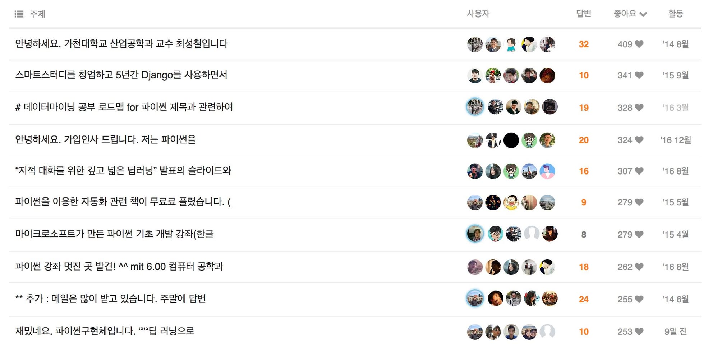 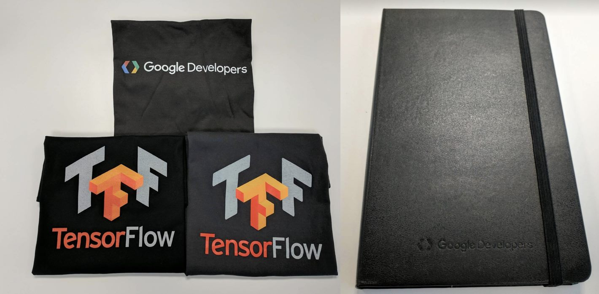 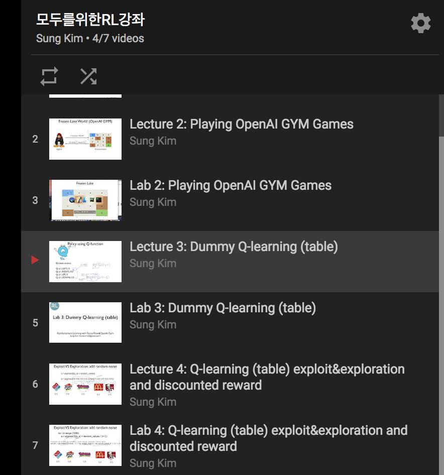 

> 2012년 Kwon-Han Bae 님의 수고와 노력으로 시작된 Python Korea! 지금까지의 가장 인기글은 무엇일까요?  Sungchul Choi 님의 흡입력있는 강의 슬라이드 글이 최고의 like를 받은듯 합니다.  최근 운영진과 회원들의 동의를 얻어 시작한 fbsight.com 의 아카이빙이 완료되었으며 매일 새벽 6:30분 지난 7일전 글들이 자동으로 아카이빙됩니다.  인기글등 재미있는 통계뿐만 아니라 검색도 잘 지원되고 feed로 가끔 놓칠수있는 글들도 한번 들어오셔서 최근글 리스트만 보셔도 도움이 되실것입니다.  다만 fbsight는 읽기 전용이므로 새로운글이나 댓글등은 Python Korea facebook 페이지에 많이 올려주시면 됩니다.  http://fbsight.com/c/pythonkorea
> #모두를위한딥러닝 선물을 받기 위한 신청까지 이제 30여시간 남았습니다. 응모하시고 당첨되셔서 멋진 선물 꼭 받아 가시길. (2017년 2월 5일 저녁 11:59분까지 제출가능)  https://goo.gl/Jn3mOu
> 이번 주말 RL 한번 달려볼까요? RL에 익숙하지 않으신 분들을 위한 수학과 프로그램 개념을 (거의) 사용하지 않는 강의입니다. 7강, q-learning까지 업데이트 되었습니다.   주위 RL 에 관심있는 분들에게 많이 알려주세요.  https://www.youtube.com/watch?v=dZ4vw6v3LcA&list=PLlMkM4tgfjnKsCWav-Z2F-MMFRx-2gMGG
> 생활코딩으로 충분히 이해가능한 큐러닝 알고리즘의 4개 강의가 추가 되었습니다. 큐러닝만 이해 되시면 나머지 강화 알고리즘도 매우 쉽게 다가갈수 있습니다.  이번 주말 RL 공부 같이 달려보실분, 여기 입니다. https://www.youtube.com/watch?v=dZ4vw6v3LcA&list=PLlMkM4tgfjnKsCWav-Z2F-MMFRx-2gMGG&index=1

### 2월 5일 (일) 19:57 · 생신축하드립니다!

생신축하드립니다!

### 2월 5일 (일) 19:57 · ↪ 생신축하드립니다!

*다른 프로필에 남긴 글*

생신축하드립니다!

### 2월 5일 (일) 21:00 · will be ready to run 42KM again in a wee…

will be ready to run 42KM again in a week with other 70,000 runners in Hong Kong! Standard Chartered HK Marathon

 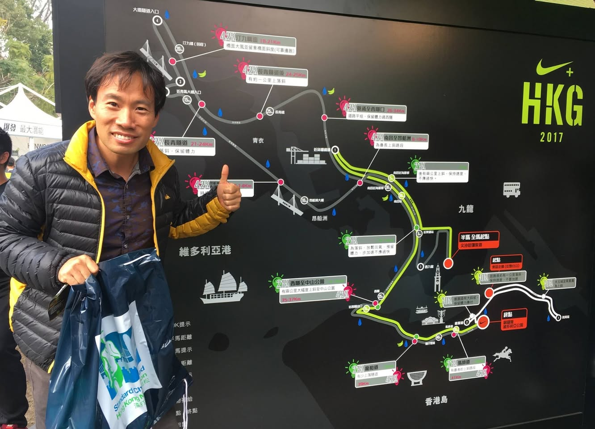 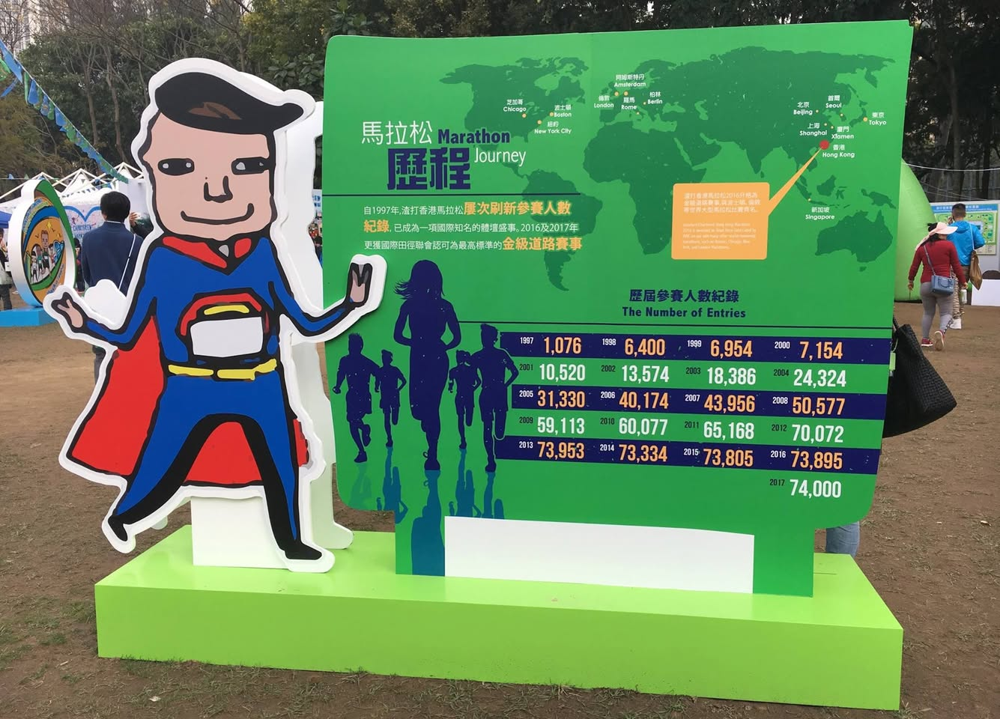

### 2월 6일 (월) 09:49 · 📷 사진 (2장)

 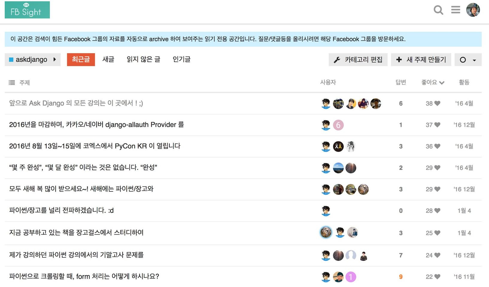

> 최근 Chinseok Lee 운영자님의 요청으로 Ask Django가 fbsight에 아카이빙 되고 있습니다.  http://fbsight.com/c/askdjango   아래 최다 like를 받은 글들입니다. 7일이 지난 글들만 아카이빙되며 아카이빙을 원하지 않으시면 #NoArchive 해쉬테그를 넣어 주시면 됩니다.  아카이빙등에 대한 의견이 있으시면 알려주세요. 감사합니다.

### 2월 9일 (목) 00:07 · 📷 사진 (2장)

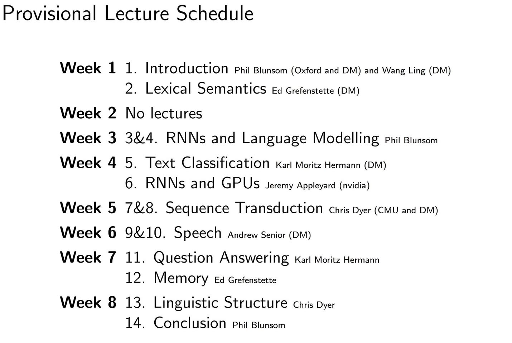 

> 딥마인드와 옥스포트가 같이 진행하는 NLP 수업. 귀여운 슬라이드로 시작되는 기초부터 QA, Memory등도 다룹니다. 딥마인드 직원과 옥스포드 교수가 나누어서 수업을 하는듯 합니다.  슬라이드등은 모두 https://github.com/oxford-cs-deepnlp-2017/lectures 에 바로 올라옵니다.   공부할 재미난 것들이 차고 넘칩니다!
> [우리에게는 이제 1만 회원이 있습니다!] 저희 커뮤니티를 시작한지 11개월만에 1만 회원을 돌파하게 되었습니다. (깜짝 놀라하는 아래 운영진 모습 참고)  회원수 뿐만 아니라 한달에 200여개 이상의 포스트와 활발한 토론이 이어지는 국내 최대 TensorFlow 커뮤니티가 아닌가 합니다. 2만 3만을 넘어 10만, 그리고 그 이상 계속 많은 분들이 함께 하면 좋겠습니다.  함께 멋진 커뮤니티를 만들어주신 1만 멤버들에게 큰 감사드립니다. (곧 이벤트 공지 나갑니다.)  #TF_KR일만멤버

### 2월 10일 (금) 06:02 · 📷 사진 (11장)

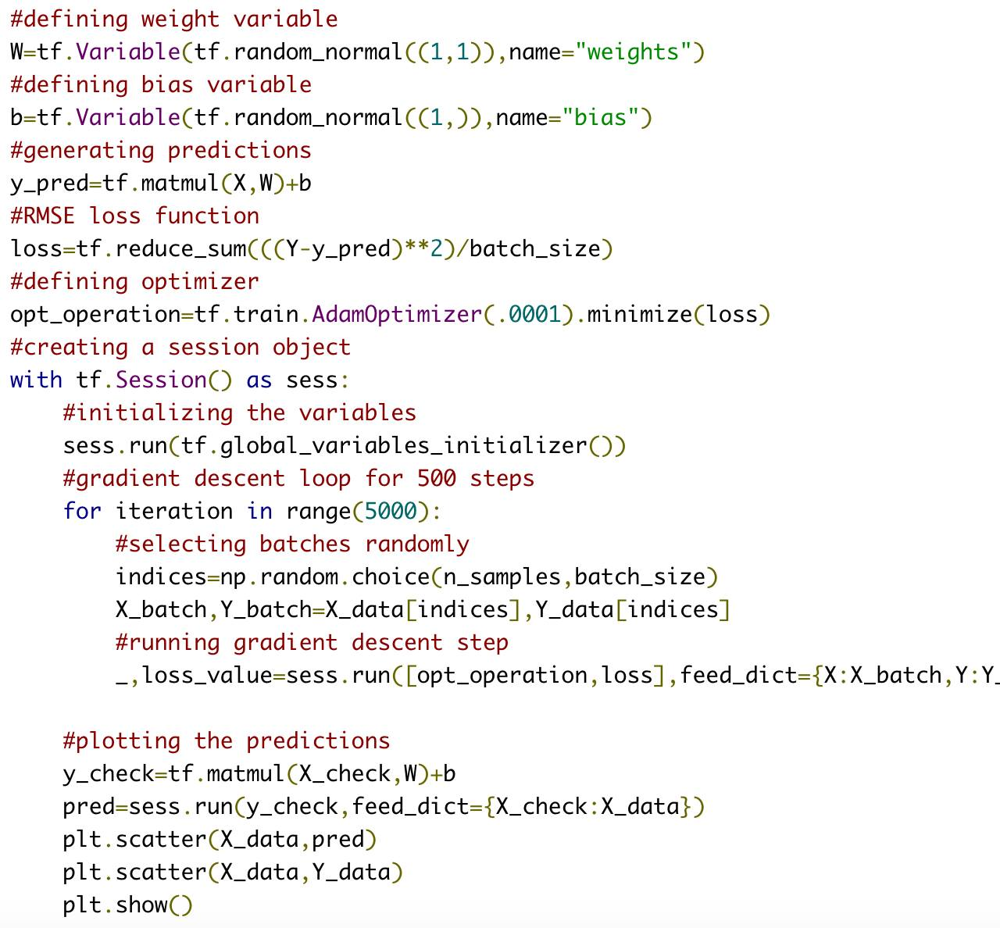 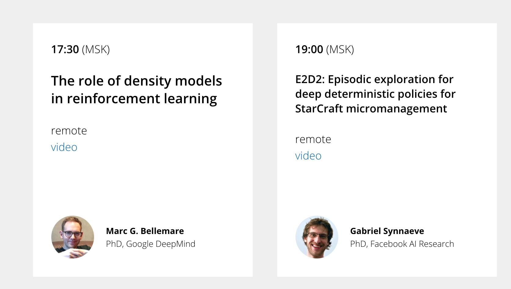 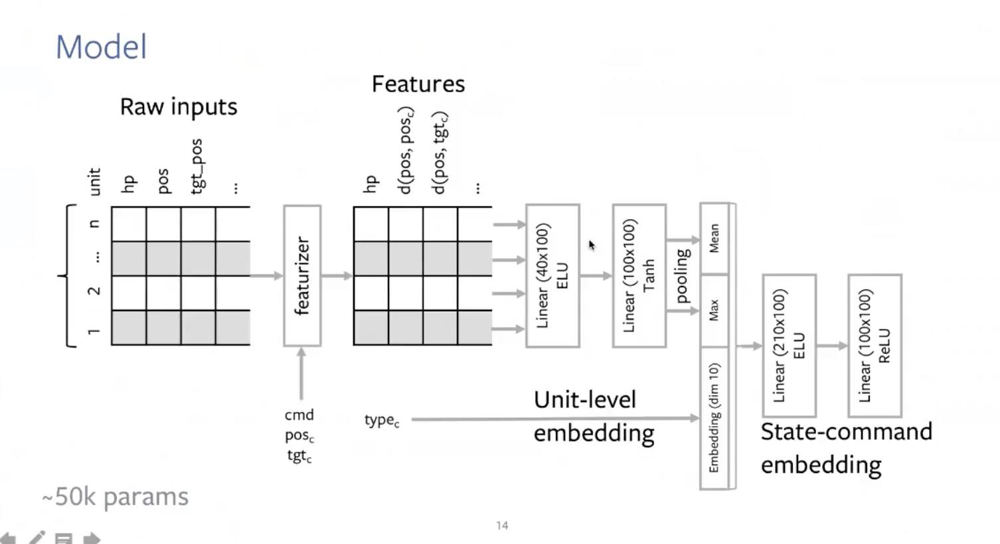 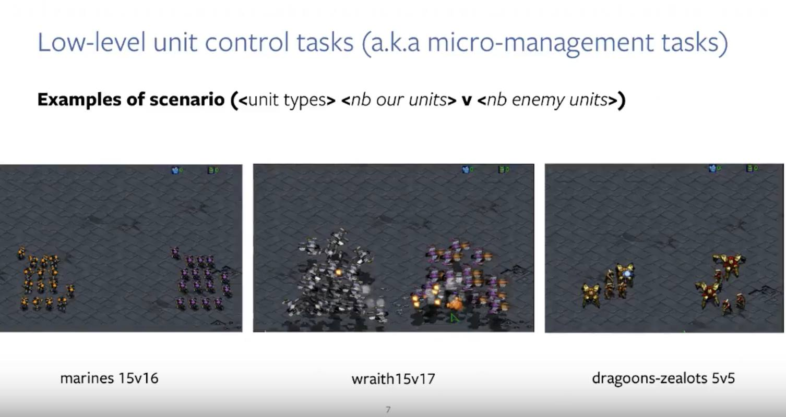 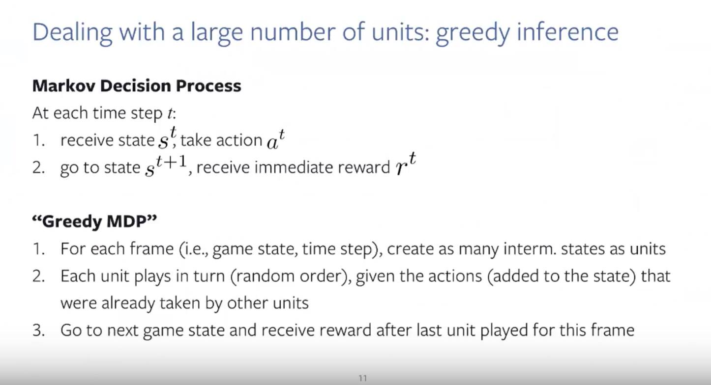 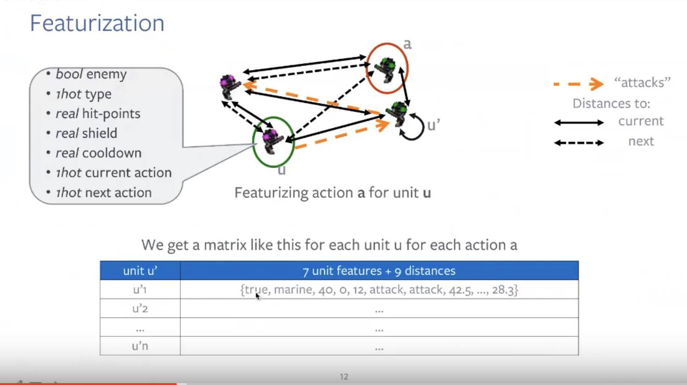 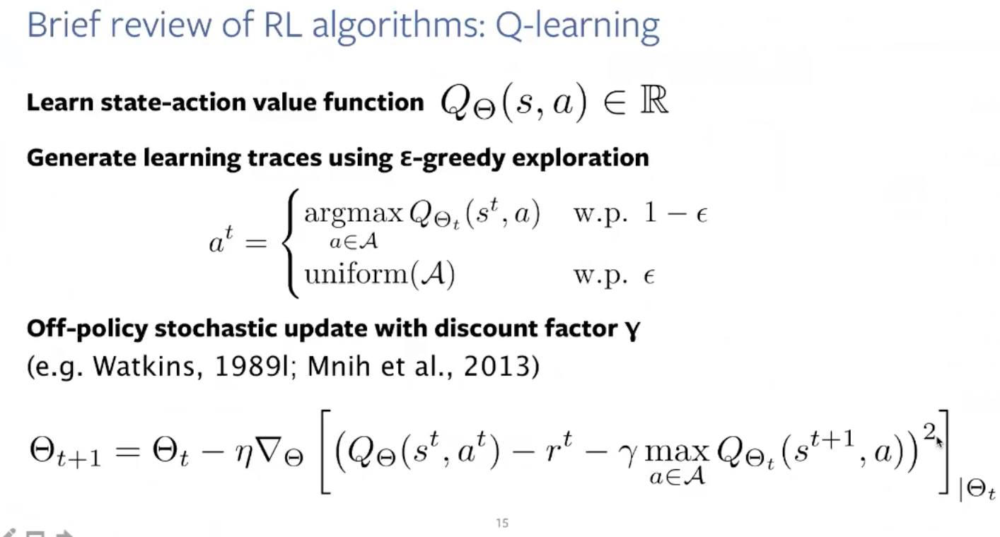 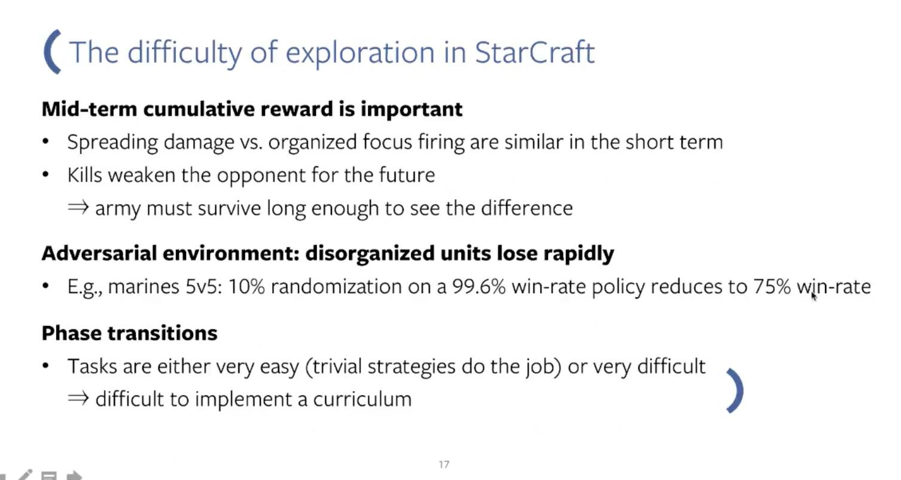 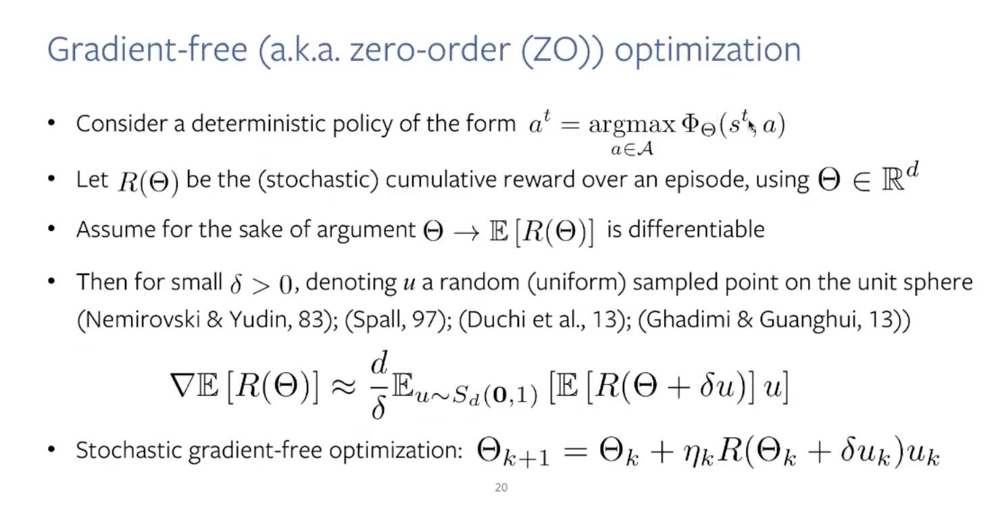 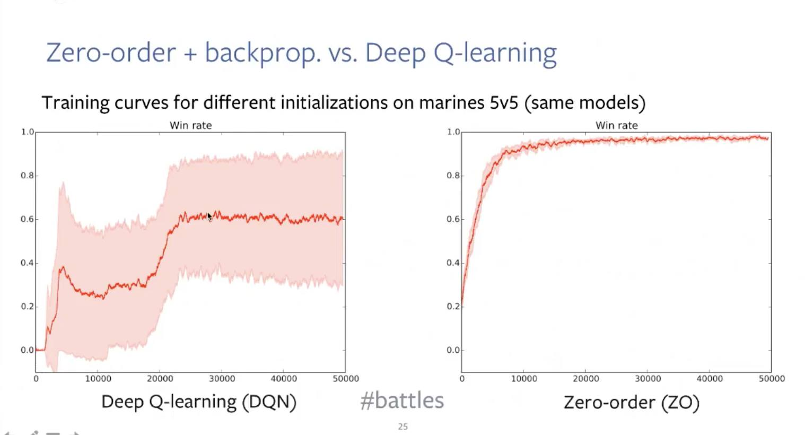 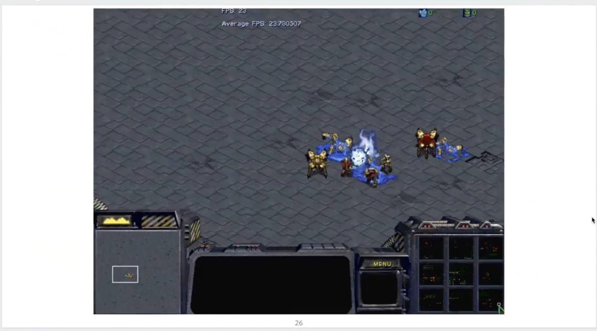

> 쉽게 한눈에 쏙 들어오는 TensorFlow 시작해보기. 간단한 상수, 변수, 실행을 이야기하며 Linear Regression까지 만들어 봅니다. 코드만 보셔도 좋고 처음 시작하시는 분들에게 추천하기 좋은 문서 입니다.  https://jasdeep06.github.io/posts/getting-started-with-tensorflow/
> 러시아도 일어나고 있습니다. 지금 러시아에서 열리고 있는 deep RL 학교가 열리고 있는데 비디오 다 올려줍니다. 러시아어도 있고 영어도 있는데 강사들이 훌륭하고 remote (행아웃)등으로 facebook, deepmind강사들도 모셨습니다. starcraft를 Q-learning으로 해보는 facebook 강사의 강의도 있습니다.   http://rl.deephack.me/  전체 비디오 리스트: https://www.youtube.com/watch?v=fnTkxI3rfn8&index=11&list=PLt1IfGj6-_-efXDATIw4JI92DjMrVed3P

### 2월 10일 (금) 10:14 · 생신 축하드립니다

생신 축하드립니다

### 2월 10일 (금) 10:14 · ↪ 생신 축하드립니다

*다른 프로필에 남긴 글*

생신 축하드립니다

### 2월 10일 (금) 10:14 · Happy new year.

Happy new year.

### 2월 10일 (금) 10:14 · ↪ Happy new year.

*다른 프로필에 남긴 글*

Happy new year.

### 2월 15일 (수) 11:15 · 📷 사진 (1장)

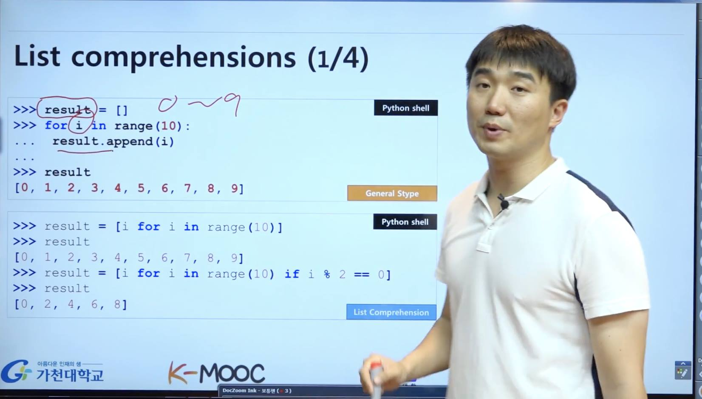

> TensorFlow 코드에 정말 많이 나오는 List comprehension. 잘생긴 스타 명강 강사님과 함께 완전 정복해보아요.  https://www.youtube.com/watch?v=AWAISEXNPPI&list=PLBHVuYlKEkUJvRVv9_je9j3BpHwGHSZHz&index=40

### 2월 17일 (금) 11:56 · 📷 사진 (1장)

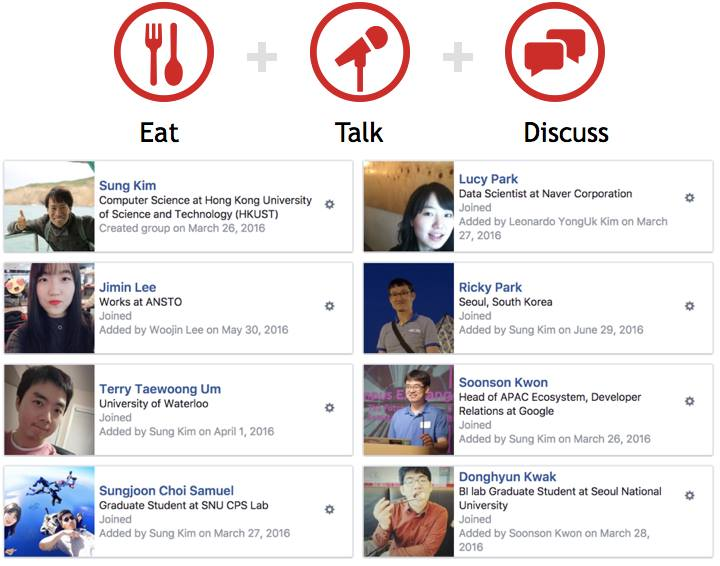

> [회원분들을 식사에 초대합니다.]  #TF-KR 일만명멤버, TF 1.0 기념 이벤트!  “딥러닝이란 (나에게) …” 안에 들어갈 “...” 을 3줄 이내로 작성하여 이 글의 댓글로 달아 주세요. 의미가 있으면서도 재치가 넘치고 거기에 유머까지 더해지면 정말 좋겠죠? 이걸 모두 3줄 (한줄 80 char) 이내로. 한줄평이면 더 좋고요! 3월 1일까지 댓글 남겨주신 분들 중 가장 많은 라이크를 받은 5분을 모십니다. (3월 25-26일 중)  저희 운영진과 함께 식사도 하고, 차도 마시고, 보드 게임도 하고 이런 저런 이야기로 웃으며 즐겁게 하루 저녁을 보낼 수 있는 멋진 저녁에 여러분들 모두를 초대합니다. 선정되실 5분이 어떤분들일지 저희들도 설레이는 마음으로 기다립니다. 많은 참여 부탁드려요!   1만회원 TF-KR 운영진 드림

### 2월 19일 (일) 07:54 · 📷 사진 (2장)

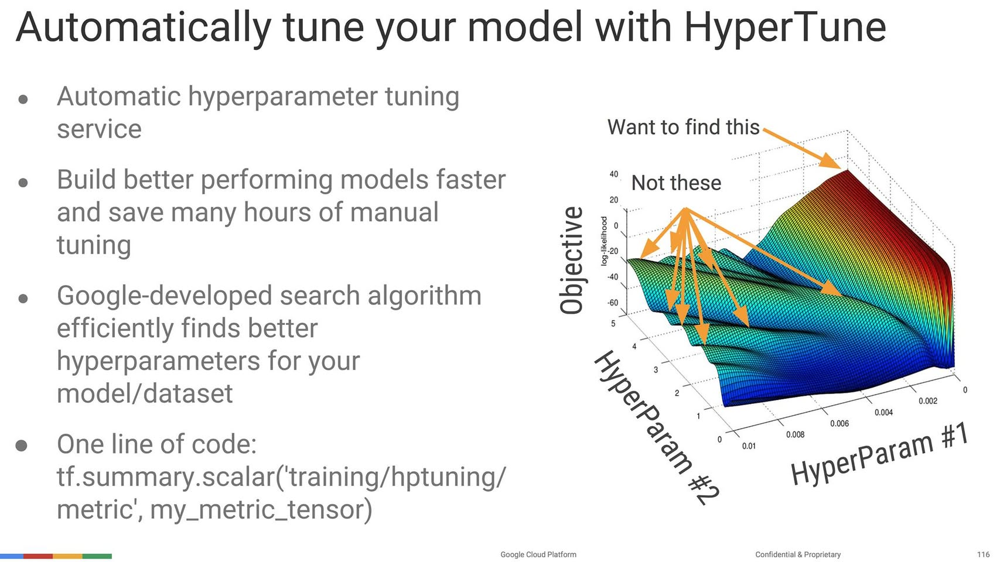 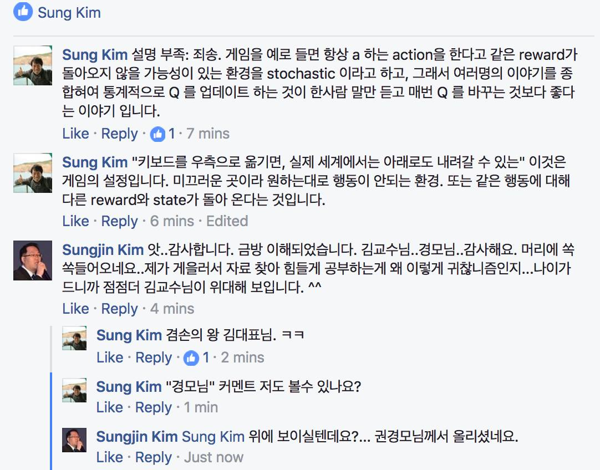

> TensorFlow Worksop 슬라이드. 간단한 모델, 데이터 읽기, Word2Vec, 인셥션 모델 재사용, hyperparameter 자동튜닝, TensorBoard까지. 텐스플로우를 한번에 다 익힐수 있는 3~4시간 웍샵 자료로 너무 훌륭합니다.  https://storage.googleapis.com/amy-jo/talks/tf-workshop.pdf  코드: https://github.com/amygdala/tensorflow-workshop

### 2월 20일 (월) 12:58 · 📷 사진 (2장)

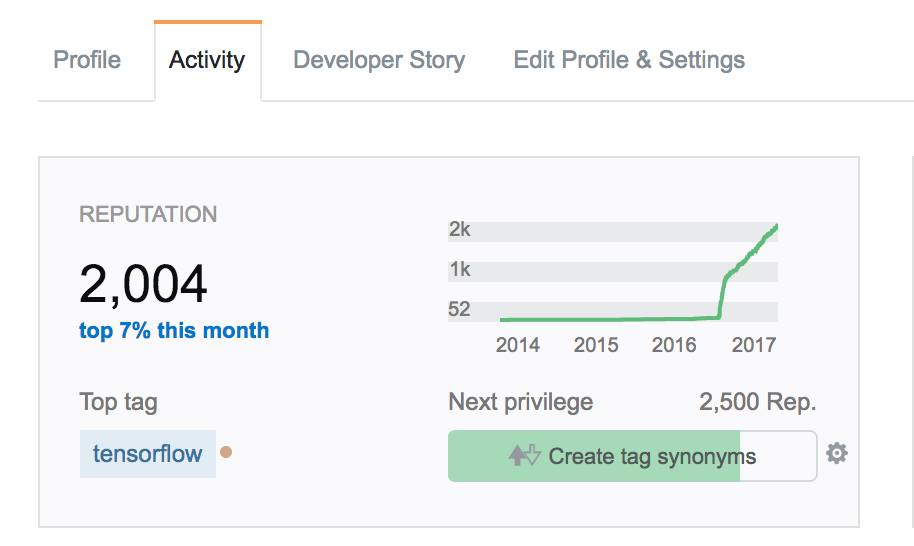 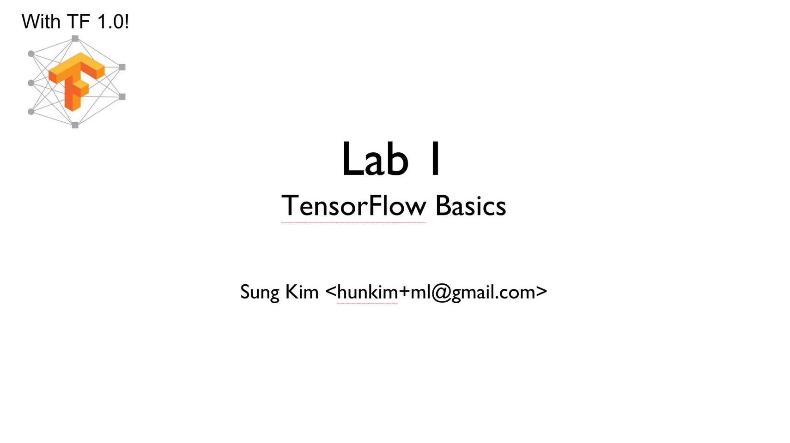

> #tensorflow (top tag)로 StackOverflow 2,000 점 달성!  그동안 저의 개인 적인 목표로 삼고 있었던 StackOverflow 2,000점을 달성하였습니다. 다른 많을 분들에 비하면 큰 점수는 아니지만, 2,000점을 받으면 모든 질문과 답변들을 바로 수정할수 있기때문에 꼭 달성하고 싶었습니다.   TensorFlow관련 질문 StackOverflow에도 많이 올려주세요. (필요하면 제가 질문 바로 수정합니다. :-)  http://stackoverflow.com/users/364772/sung-kim
> [강의 재녹음 예고및 커멘트 요청]  TF 1.0을 기념하며 이전에 올렸던 #모두를위한딥러닝 강의의 실습 (lab)부분을 TF 1.0에 맞게 재 녹음하고 부족했던 RNN과 Sequence 2 Sequence 이론과 실습을 추가 할 예정입니다.  그리고 제가 잘 설명하지 못하고 부족했던 부분 (예: WX vs XW)등을 보강하기 위해 비디오에 달려있던 질문들을 다 읽어보고 보강할 예정입니다.  추가로 Keras와 layer등을 이용한 간략한 버전도 lab-k01, lab-k02등 같이 진행하여 이론에서 진행한 부분을 TF와 더불어 Keras도 같이 이야기 해보려고 합니다. (slim보다는 keras가 좋겠지요?)  여러분들은 이미 다 아시는 내용이지만 새로 진입하시는 분들을 위해 부족했던 부분과 보강할 부분을 알려주시면 재녹음에 큰 도움이 될것 같습니다. 미리 감사드립니다.  (재강의 녹음은 여러분들의 커멘트를 충분히 받은후 그리고 지금 진행중인 RL수업이 종강되는 3월초부터 시작할 예정입니다.)

### 2월 21일 (화) 09:00 · 생일축하합니다.

생일축하합니다.

### 2월 21일 (화) 09:00 · ↪ 생일축하합니다.

*다른 프로필에 남긴 글*

생일축하합니다.

### 2월 22일 (수) 14:39 · 📷 사진 (1장)

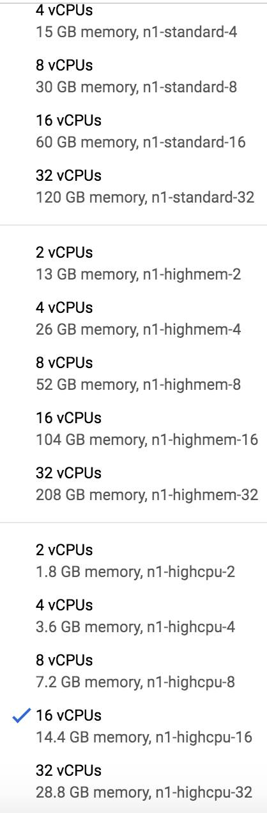

### 2월 23일 (목) 11:58 · 📷 사진 (3장)

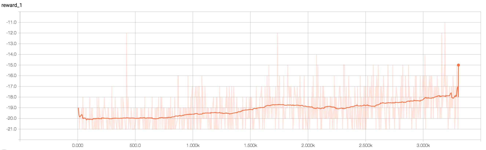 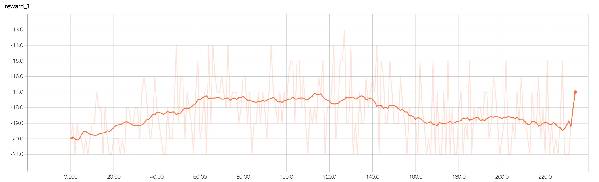 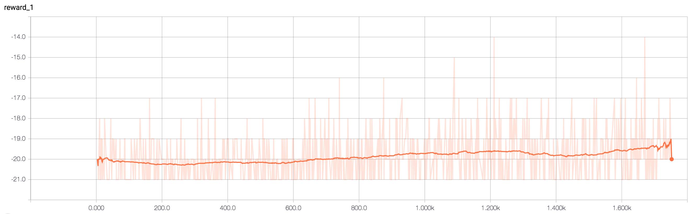

### 2월 24일 (금) 23:34 · 📷 사진 (1장)

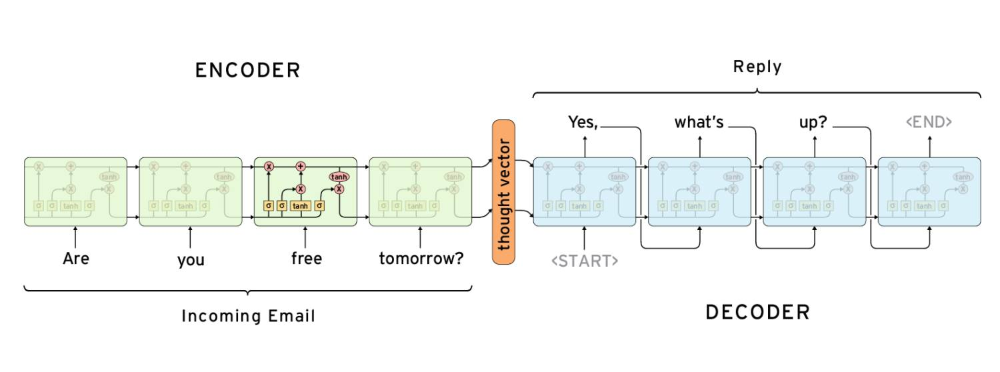

> 그 복잡한 seq2seq 모델의 구현을 TensorFlow로 쉽게 설명합니다. 이번기회에 seq2seq 이론과 실기를 모두!  http://suriyadeepan.github.io/2016-12-31-practical-seq2seq/

### 2월 25일 (토) 05:34 · 📷 사진 (3장)

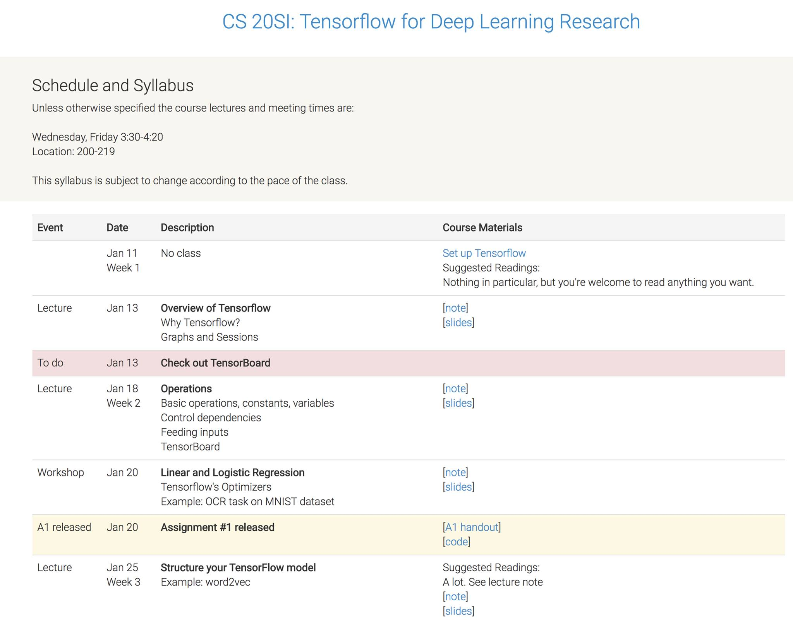 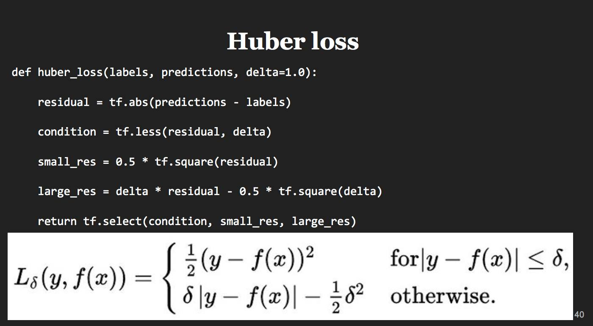 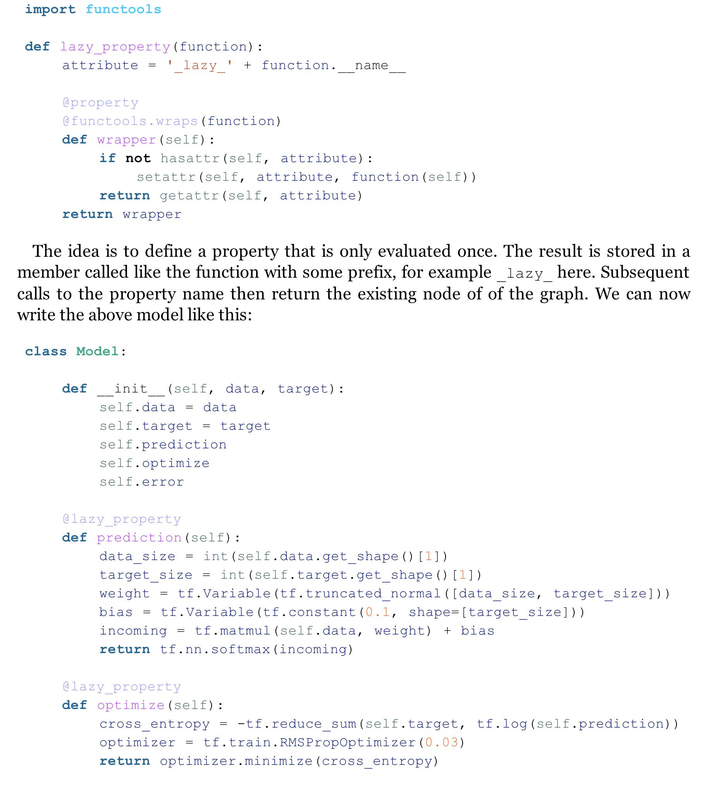

> 숨이 딱 막히는 멋진 TensorFlow 이론+구현 슬라이드, 기본, CNN, RNN모두 있는 스텐포드 학부 수업입니다. 매우 쉽게 그리고 친절한 슬라이드와 강의 노트. 일단 다운받고 봅시다.  CS 20SI: Tensorflow for Deep Learning Research http://web.stanford.edu/class/cs20si/syllabus.html
> 요즈음 많이 사용한다는 Huber loss를 TF 1.0에 있는 condition을 이용해서 구현하는 방법을 보여주는 한장의 슬라이드!  더 많은 슬라이드:  CS 20SI: Tensorflow for Deep Learning Research http://web.stanford.edu/class/cs20si/syllabus.html
> TF 코드를 클래스로 구조화 하면서 함수에다 TF 넷트웍 코드를 넣으면 함수를 호출할때마다 그래프가 중복될수 있는데 파이썬의 기능을 이용해 @lazy_property를 선언한다음 넷트웍코드를 함수에 넣고 여러번 호출할수 있다는 것을 오늘 배웠습니다. (파이썬 잘 사용하시는 분들은 잘 아시는 내용.)  TF코드 Python class 로 정리할때  도움이 될듯 합니다.  상당히 괜찮은 책입니다. TensorFlow For Machine Intelligence: A hands-on introduction to learning algorithms Kindle Edition by Sam Abrahams (Author), Danijar Hafner (Author), Erik Erwitt (Author), Ariel Scarpinelli (Author), etc.

### 2월 28일 (화) 11:25 · 📷 사진 (1장)

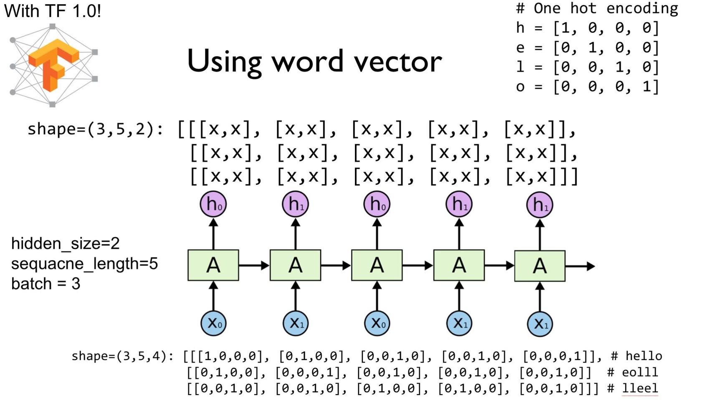

> [TF 1.0 강의 재녹음 예고 #2 + 코드 리뷰 요청]  TF 1.0의 멋진 기능을 담아 #모두를위한딥러닝 lab부분 재녹음 준비하며 우선 코드를 다듬고 있습니다.   https://github.com/hunkim/DeepLearningZeroToAll  기존의 lab+재미있는 데이타(zoo, 주식정보)+Dynamic RNN (아래 그림참조) 까지 더 흥미롭고 재미있는 lab강의를 준비중입니다.  TF코드와 함께 더 쉽게 딥러닝을 다가가기 위한 Keras 코드도 작성중입니다.   강의 녹음전에 다음 부분에 대해 여러 전문가들 코드리뷰및 자문을 부탁드리려고 합니다:   1. TF와 딥러닝을 쉽게 이해할수 있는 재미있는 코드인가?   2. TF 1.0의 API를 충분히 이용하고 있나?   3. Pythonic 한가?   4. KISS (Keep It Simple Stupid) 원칙대로 엄청나게 단순한 코드인가?  보시고 오타등의 사소한 것이라도 pull request 보내 주시면 감사하겠습니다. 코드리뷰를 해주신 분들에게는 매 lab 강의 앞부분에서 이름과 함께 감사를 표시 하겠습니다. 여러분들의 도움으로 세계에서 가장 아름답고, 쉽고 재미있는 TF/Keras tutorial 코드가 될것으로 기대합니다.  3월 중순경에 녹음이 들어갈 예정으로 그전에 review 해주시면 도움이 될듯 합니다!  (저희 학교 학생인 Jenny가 많은 코드를 작성하였으며, Keras 코드는 NYU의 Keon Kim 님께서 많이 기여하셨고, 김진중, SeungHyun Jeon 님의 코드를 많이 참고하였습니다.)
