# 2017년 3월

[← 2017년](README.md)

### 3월 1일 (수) 08:09 · 📷 사진 (3장)

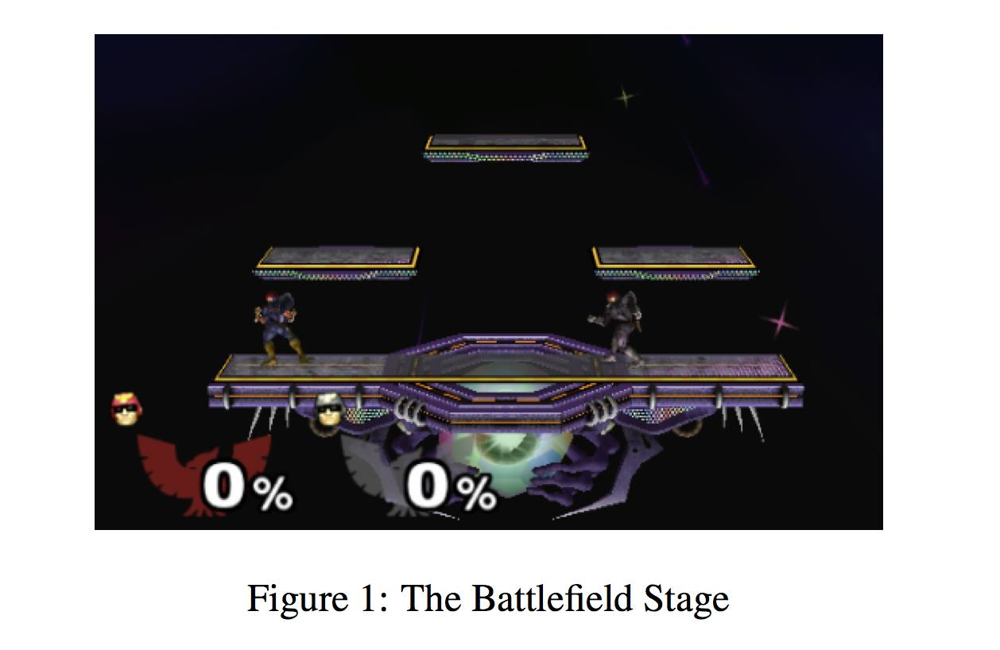
**이미지 캡션:** 이 이미지는 비디오 게임의 한 장면을 보여주며, 보라색과 검은색이 주를 이루는 우주 배경에 여러 개의 플랫폼이 떠 있는 모습이다. 가장 큰 플랫폼은 중앙에 위치하며, 그 위로 두 개의 작은 플랫폼이 더 떠 있다. 각 플랫폼 위에는 게임 캐릭터로 보이는 두 명의 성인 남성이 서 있다. 왼쪽 캐릭터는 파란색과 노란색이 조합된 복장을 하고 있으며, 오른쪽 캐릭터는 어두운 색상의 복장을 하고 있다. 두 캐릭터 모두 전투 준비 자세를 취하고 있는 것으로 보인다. 플랫폼 아래에는 보라색의 복잡한 구조물이 있으며, 그 안에는 녹색 눈 모양의 이미지가 보인다. 화면 왼쪽 하단에는 붉은색 새 모양의 아이콘과 함께 "0%"라는 글자가 표시되어 있고, 오른쪽 하단에도 "0%"라는 글자가 표시되어 있다. 이는 게임의 대미지 수치를 나타내는 것으로 추정된다. 전체적으로 긴장감 넘치는 전투 상황을 연출하는 분위기이다.에는 녹색 눈 모양의 이미지가 보인다. 화면 왼쪽 하단에는 붉은색 새 모양의 아이콘과 함께 "0%"라는 글자가 표시되어 있고, 오른쪽 하단에도 "0%"라는 글자가 표시되어 있다. 이는 게임의 대미지 수치를 나타내는 것으로 추정된다. 전체적으로 긴장감 넘치는 전투 상황을 연출하는 분위기이다.
 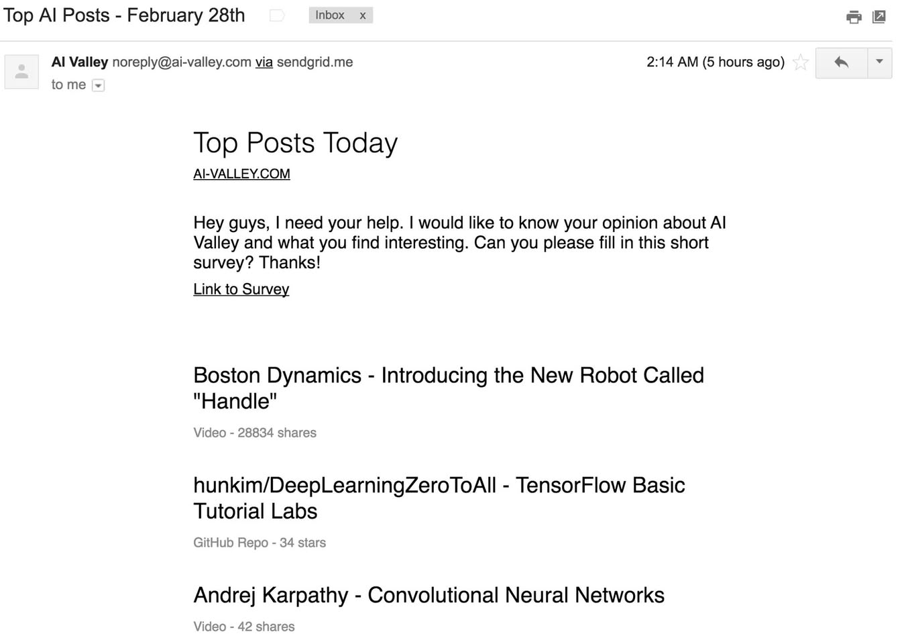
**이미지 캡션:** 이것은 이메일의 스크린샷으로, 제목은 "Top AI Posts - February 28th"이며, 발신자는 "AI Valley"이고, 발신 주소는 "noreply@ai-valley.com"이며, "sendgrid.me"를 통해 전송되었습니다. 이메일은 "Top Posts Today"라는 제목으로 시작하며, "AI-VALLEY.COM"이라는 링크가 있습니다. 본문에는 "Hey guys, I need your help. I would like to know your opinion about AI Valley and what you find interesting. Can you please fill in this short survey? Thanks!"라는 내용과 함께 "Link to Survey"라는 링크가 있습니다. 그 아래에는 세 개의 게시물 제목이 나열되어 있습니다: "Boston Dynamics - Introducing the New Robot Called 'Handle'" (Video - 28834 shares), "hunkim/DeepLearningZeroToAll - TensorFlow Basic Tutorial Labs" (GitHub Repo - 34 stars), 그리고 "Andrej Karpathy - Convolutional Neural Networks" (Video - 42 shares). 이메일은 오전 2시 14분(5시간 전)에 수신되었으며, 받은 편지함에 있으며 "Inbox"라는 탭이 보입니다. 이메일의 전반적인 분위기는 정보 제공 및 설문 참여 요청입니다.d what you find interesting. Can you please fill in this short survey? Thanks!"라는 내용과 함께 "Link to Survey"라는 링크가 있습니다. 그 아래에는 세 개의 게시물 제목이 나열되어 있습니다: "Boston Dynamics - Introducing the New Robot Called 'Handle'" (Video - 28834 shares), "hunkim/DeepLearningZeroToAll - TensorFlow Basic Tutorial Labs" (GitHub Repo - 34 stars), 그리고 "Andrej Karpathy - Convolutional Neural Networks" (Video - 42 shares). 이메일은 오전 2시 14분(5시간 전)에 수신되었으며, 받은 편지함에 있으며 "Inbox"라는 탭이 보입니다. 이메일의 전반적인 분위기는 정보 제공 및 설문 참여 요청입니다.
 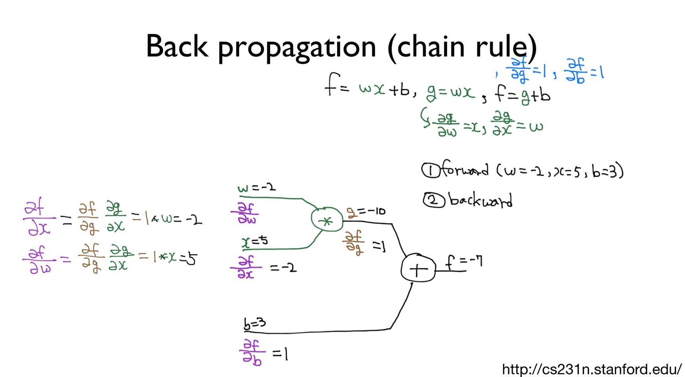
**이미지 캡션:** 이 이미지는 딥러닝의 핵심 개념인 역전파(Back propagation)와 연쇄 법칙(chain rule)을 설명하는 강의 자료의 일부로, 흰색 배경에 손으로 쓴 듯한 필기체로 수식이 적혀 있습니다. 상단에는 "Back propagation (chain rule)"이라는 제목이 검은색으로 쓰여 있으며, 그 아래에는 여러 수식들이 나열되어 있습니다. 오른쪽에는 순전파(forward)와 역전파(backward) 과정을 나타내는 다이어그램이 그려져 있습니다. 다이어그램은 노드와 화살표로 구성되어 있으며, 각 노드에는 변수 값이나 연산이 표시되어 있습니다. 예를 들어, 곱셈 기호(*)와 덧셈 기호(+)가 사용되었고, 각 변수(w, x, b, g, f)의 값과 편미분 값들이 함께 표시되어 있습니다. 다이어그램의 왼쪽에는 변수 w, x, b의 값과 해당 변수에 대한 편미분 값이 보라색, 녹색, 주황색 등으로 구분되어 표시되어 있습니다. 오른쪽 하단에는 "http://cs231n.stanford.edu/"라는 웹사이트 주소가 작게 기재되어 있습니다. 전체적으로 복잡한 수학적 개념을 시각적으로 이해하기 쉽게 설명하려는 의도가 엿보입니다.는 변수 값이나 연산이 표시되어 있습니다. 예를 들어, 곱셈 기호(*)와 덧셈 기호(+)가 사용되었고, 각 변수(w, x, b, g, f)의 값과 편미분 값들이 함께 표시되어 있습니다. 다이어그램의 왼쪽에는 변수 w, x, b의 값과 해당 변수에 대한 편미분 값이 보라색, 녹색, 주황색 등으로 구분되어 표시되어 있습니다. 오른쪽 하단에는 "http://cs231n.stanford.edu/"라는 웹사이트 주소가 작게 기재되어 있습니다. 전체적으로 복잡한 수학적 개념을 시각적으로 이해하기 쉽게 설명하려는 의도가 엿보입니다.

> 강화학습으로 Super Smash Bros라는 게임을 정복한 논문인데 상당히 읽을만 합니다. 특히 3장만 읽으셔도 DQN이나 Policy Gradient (PG) 에 대한 간략한 개요를 이해하실수 있습니다. https://arxiv.org/abs/1702.06230  기존의 DQN과 PG를 조금 수정하여 좋은 결과를 냈다고 합니다.  기본적인 강화학습 강의도 참고 하세요: https://www.youtube.com/watch?v=dZ4vw6v3LcA&list=PLlMkM4tgfjnKsCWav-Z2F-MMFRx-2gMGG
> 제가 아침마다 받아보는 AI-VALLEY.COM 에서 보내주는 이메일 소식지 같은 것이 있는데요, 여기 어제 소개한 #모두를위한딥러닝 수업을 위한 lab 코드들이 소개 되었습니다. 그것도 Boston Dynamics와 Andrej Karpathy 비디오 사이에 리스트 되어 있네요. :-)  https://github.com/hunkim/DeepLearningZeroToAll  기분좋은 아침입니다!
> [TF 로 backprop 구현해보기]  Karpathy의 최근 인기 글, "Yes you should understand backprop" 에서도 밝혀두었듯이 딥러닝을 한걸음 더 들어가기 위해 이해해두면 매우 좋은 backprop!  https://medium.com/@karpathy/yes-you-should-understand-backprop-e2f06eab496b#.b3rvzhx89  #모두를위한딥러닝 9-2강 (https://www.youtube.com/watch?v=573EZkzfnZ0&index=23&list=PLlMkM4tgfjnLSOjrEJN31gZATbcj_MpUm) 에서도 다루었던 backprp을 TF로 직접 구현해보면서 100%이해해 볼수 있습니다.  TF backprop 구현: https://github.com/hunkim/DeepLearningZeroToAll/blob/master/lab-09-5-softmax_back_prop.py  사실 아래 한줄로 TF가 다해주는 일을 이렇게 복잡하게 구현해보는 것입니다. :-) step = tf.train.GradientDescentOptimizer(0.1).minimize(cost)  (코드에 버그가 있으니 살살 읽어주세요. :-)

### 3월 2일 (목) 06:16 · 📷 사진 (1장)

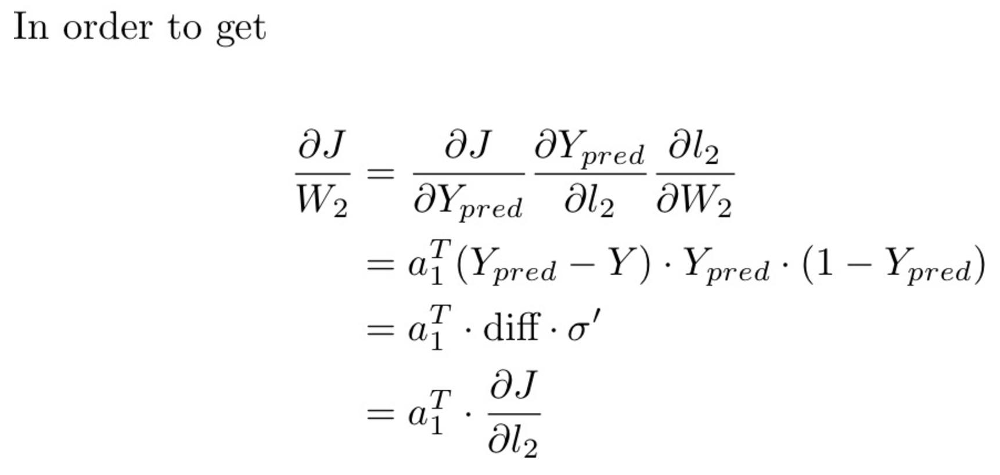
**이미지 캡션:** 이 이미지는 흰색 배경에 수학 공식이 포함된 문서의 일부입니다. 공식은 텍스트 "In order to get"으로 시작하며, 이는 어떤 결과를 얻기 위한 과정임을 나타냅니다. 그 아래에는 연쇄 법칙을 사용하여 가중치 W2에 대한 손실 함수 J의 편미분을 계산하는 일련의 방정식이 표시됩니다. 공식에는 편미분 기호(∂), 변수(J, W2, Ypred, Y, l2), 벡터(a1), 행렬 연산(T), 곱셈(·), 그리고 함수(diff, σ')가 포함되어 있습니다. 이 공식은 인공지능 또는 기계 학습 모델의 학습 과정, 특히 역전파 알고리즘과 관련이 있을 가능성이 높습니다. 이미지에는 사람이 등장하지 않으며, 배경은 단순한 흰색입니다. 보이는 텍스트는 모두 수학 기호와 영어 단어로 구성되어 있습니다. 전반적인 분위기는 학술적이고 기술적인 내용을 다루고 있음을 시사합니다., 특히 역전파 알고리즘과 관련이 있을 가능성이 높습니다. 이미지에는 사람이 등장하지 않으며, 배경은 단순한 흰색입니다. 보이는 텍스트는 모두 수학 기호와 영어 단어로 구성되어 있습니다. 전반적인 분위기는 학술적이고 기술적인 내용을 다루고 있음을 시사합니다.

> [Backprop 이해하기 #2.] 어제 올려두었던  https://github.com/hunkim/DeepLearningZeroToAll/blob/master/lab-10-X1-mnist_back_prop.py 에 loss 관련 문제가 있는데 Kyung Mo Kweon님과 Sangwhan Moon님께서  아래 두줄에 대한 재미있는 토론과 설명이 이어지고 있습니다. (https://github.com/hunkim/DeepLearningZeroToAll/issues/25)  d_l2 = diff * sigma_prime(l2) d_w2 = tf.matmul(tf.transpose(a1), d_l2)  그동안 막연히 제가 알고 있다고 생각했던 backprop과 loss (의 미분), 이번기회에 확실하게 배우게 되었습니다. *기분 좋은 아침입니다*. 두분께 감사드립니다. 토론하시고 싶으신분은 https://github.com/hunkim/DeepLearningZeroToAll/issues/25 입니다.  토론해주신 모든 내용을 반영하여 #모두를위한딥러닝 TF labs 수업에 반영하겠습니다.

### 3월 3일 (금) 08:18 · 📷 사진 (1장)

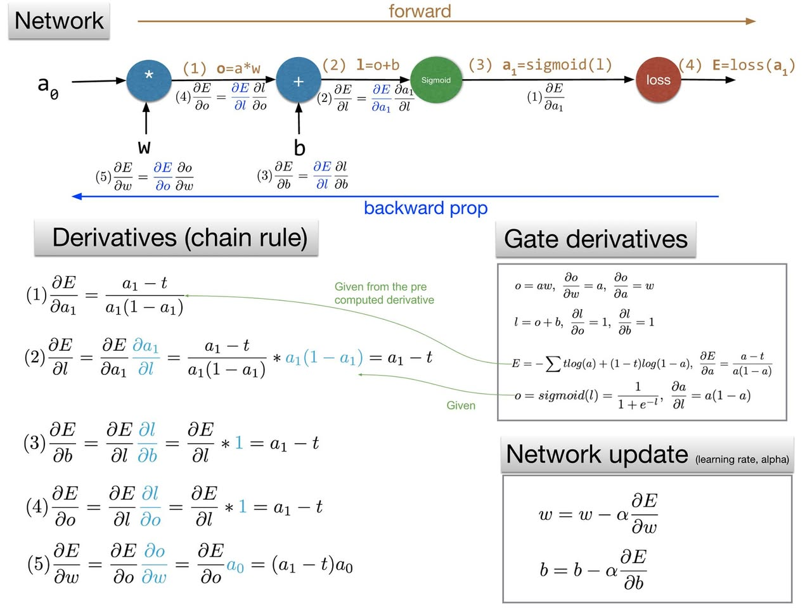
**이미지 캡션:** 이 이미지는 신경망의 순방향 및 역방향 전파 과정을 설명하는 다이어그램으로, 수학적 공식과 함께 표시되어 있습니다. 다이어그램은 여러 개의 노드와 화살표로 구성되어 있으며, 각 노드는 신경망의 특정 연산(곱셈, 덧셈, 시그모이드, 손실 함수)을 나타냅니다. 순방향 전파는 왼쪽에서 오른쪽으로 진행되며, 입력값 a₀가 가중치 w와 편향 b를 거쳐 최종 출력값 E(손실)로 계산되는 과정을 보여줍니다. 역방향 전파는 오른쪽에서 왼쪽으로 진행되며, 손실 함수로부터 각 파라미터(w, b)에 대한 기울기(gradient)를 계산하는 과정을 보여줍니다. "Derivatives (chain rule)" 섹션에서는 연쇄 법칙을 사용하여 각 노드에서의 기울기를 계산하는 과정을 상세히 보여주고 있으며, "Gate derivatives" 섹션에서는 각 연산(게이트)에 대한 미분값을 요약하고 있습니다. 마지막으로 "Network update" 섹션에서는 계산된 기울기를 사용하여 신경망의 가중치와 편향을 업데이트하는 공식을 보여줍니다. 전체적으로 복잡한 수학적 개념을 시각적으로 명확하게 전달하는 교육적인 자료입니다.를 계산하는 과정을 보여줍니다. "Derivatives (chain rule)" 섹션에서는 연쇄 법칙을 사용하여 각 노드에서의 기울기를 계산하는 과정을 상세히 보여주고 있으며, "Gate derivatives" 섹션에서는 각 연산(게이트)에 대한 미분값을 요약하고 있습니다. 마지막으로 "Network update" 섹션에서는 계산된 기울기를 사용하여 신경망의 가중치와 편향을 업데이트하는 공식을 보여줍니다. 전체적으로 복잡한 수학적 개념을 시각적으로 명확하게 전달하는 교육적인 자료입니다.

> [슬라이드 한장으로 보는 backprop] 좀 복잡하기는 해도 깊은 넷트웍 학습시키실때, loss등 관련 디버깅할때 매우 도움이 됩니다.  구글 슬라이드 원본: https://docs.google.com/presentation/d/1_ZmtfEjLmhbuM_PqbDYMXXLAqeWN0HwuhcSKnUQZ6MM/edit#slide=id.p6  슬라이드에 커멘트 하실수도  있도록 하였으니 커멘트 주시면 반영하겠습니다. (typo등이 많을 것입니다.)  backprop을 구현한 코드는 https://github.com/hunkim/DeepLearningZeroToAll 에서 보실수 있습니다.  (1) o=a*w -> o=a0*w

### 3월 4일 (토) 09:57 · I'd love to share water from Merlion wit…

📍 Marina Bay Singapore

I'd love to share water from Merlion with all of you.

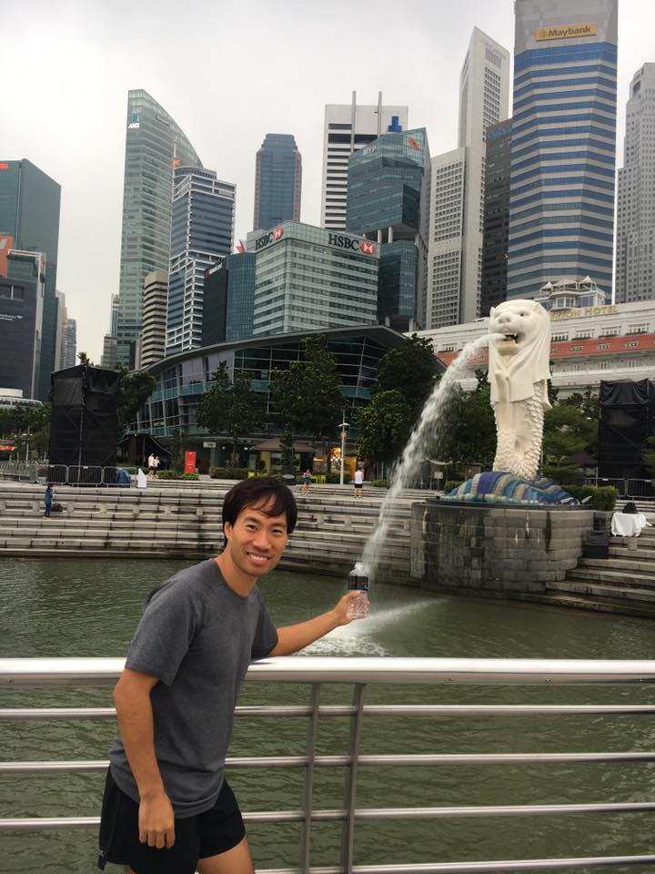
**이미지 캡션:** 한 명의 성인 남성이 회색 반팔 티셔츠와 검은색 반바지를 입고 카메라를 향해 웃고 있으며, 손에는 물병을 들고 있다. 그는 싱가포르의 상징인 머라이언 동상 앞에서 사진을 찍고 있으며, 머라이언 동상에서는 물줄기가 뿜어져 나오고 있다. 배경에는 현대적인 고층 빌딩들이 늘어서 있으며, 흐린 날씨에도 불구하고 도시의 활기찬 분위기를 느낄 수 있다. 빌딩에는 HSBC와 Maybank와 같은 기업 로고가 보인다. 남성은 야외에서 여유로운 시간을 보내고 있는 것으로 보인다.

### 3월 5일 (일) 08:22 · 📷 사진 (2장)

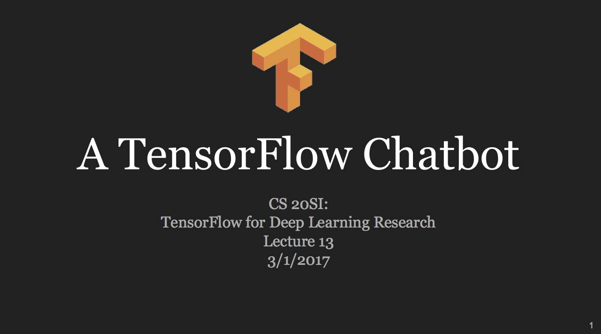
**이미지 캡션:** 이 이미지는 검은색 배경에 흰색과 회색 텍스트로 구성된 프레젠테이션 슬라이드입니다. 상단 중앙에는 주황색 3D 텐서플로우 로고가 있습니다. 로고 아래에는 "A TensorFlow Chatbot"이라는 큰 흰색 제목이 있습니다. 그 아래에는 "CS 20SI:", "TensorFlow for Deep Learning Research", "Lecture 13", "3/1/2017"라는 더 작은 회색 텍스트가 순서대로 나열되어 있습니다. 오른쪽 하단에는 페이지 번호 "1"이 작게 표시되어 있습니다. 이 슬라이드는 텐서플로우를 이용한 챗봇 개발에 관한 강의 자료로 보이며, 2017년 3월 1일에 진행된 13번째 강의임을 알 수 있습니다. 특별히 사람이나 구체적인 사물이 등장하지 않으며, 텍스트 정보와 로고를 통해 학술적인 발표 자료임을 알 수 있습니다.서플로우를 이용한 챗봇 개발에 관한 강의 자료로 보이며, 2017년 3월 1일에 진행된 13번째 강의임을 알 수 있습니다. 특별히 사람이나 구체적인 사물이 등장하지 않으며, 텍스트 정보와 로고를 통해 학술적인 발표 자료임을 알 수 있습니다.
 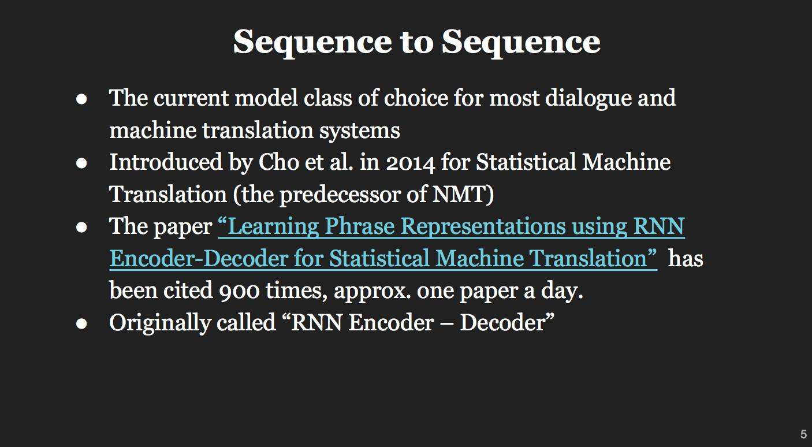
**이미지 캡션:** 이 이미지는 "Sequence to Sequence"라는 제목의 슬라이드로, 딥러닝 모델인 Sequence to Sequence 모델에 대한 정보를 담고 있습니다. 슬라이드는 어두운 회색 배경에 흰색 글자로 구성되어 있으며, 네 개의 글머리 기호로 이루어진 목록이 주요 내용을 설명합니다. 첫 번째 글머리 기호는 이 모델이 대부분의 대화 및 기계 번역 시스템에서 현재 선호되는 모델 클래스임을 나타냅니다. 두 번째 글머리 기호는 2014년 Cho 등이 통계적 기계 번역을 위해 이 모델을 소개했으며, 이는 신경망 기계 번역(NMT)의 전신이라고 설명합니다. 세 번째 글머리 기호는 "Learning Phrase Representations using RNN Encoder-Decoder for Statistical Machine Translation"이라는 제목의 논문이 약 900회 인용되었으며, 이는 하루에 약 한 편의 논문에 해당한다고 언급합니다. 마지막 네 번째 글머리 기호는 이 모델이 원래 "RNN Encoder – Decoder"라고 불렸다고 명시합니다. 슬라이드 오른쪽 하단에는 페이지 번호 5가 작게 표시되어 있습니다. 이 슬라이드에는 사람이 등장하지 않으며, 특정 장소나 사물도 보이지 않습니다. 텍스트는 정보 전달에 초점을 맞추고 있으며, 전반적으로 학술적이거나 기술적인 발표의 일부로 보입니다.기계 번역(NMT)의 전신이라고 설명합니다. 세 번째 글머리 기호는 "Learning Phrase Representations using RNN Encoder-Decoder for Statistical Machine Translation"이라는 제목의 논문이 약 900회 인용되었으며, 이는 하루에 약 한 편의 논문에 해당한다고 언급합니다. 마지막 네 번째 글머리 기호는 이 모델이 원래 "RNN Encoder – Decoder"라고 불렸다고 명시합니다. 슬라이드 오른쪽 하단에는 페이지 번호 5가 작게 표시되어 있습니다. 이 슬라이드에는 사람이 등장하지 않으며, 특정 장소나 사물도 보이지 않습니다. 텍스트는 정보 전달에 초점을 맞추고 있으며, 전반적으로 학술적이거나 기술적인 발표의 일부로 보입니다.

### 3월 6일 (월) 19:50 · 📷 사진 (1장)

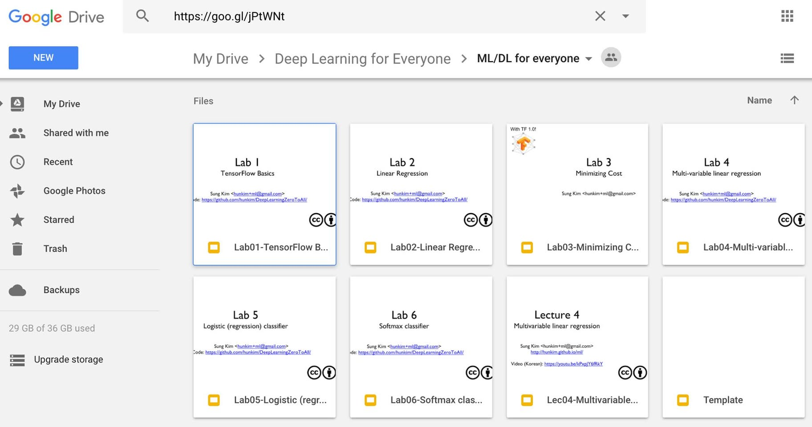
**이미지 캡션:** 이 사진은 구글 드라이브의 파일 탐색 화면을 보여줍니다. 화면 중앙에는 "Deep Learning for Everyone" 폴더 안의 "ML/DL for everyone" 하위 폴더에 있는 여러 개의 파일과 폴더가 카드 형태로 나열되어 있습니다. 각 카드에는 "Lab 1 TensorFlow Basics", "Lab 2 Linear Regression", "Lab 3 Minimizing Cost", "Lab 4 Multi-variable linear regression", "Lab 5 Logistic (regression) classifier", "Lab 6 Softmax classifier", "Lecture 4 Multivariable linear regression", "Template"와 같은 제목과 함께 관련 정보가 포함되어 있습니다. 제목 아래에는 "Sung Kim <hunkim+ml@gmail.com>"이라는 이름과 이메일 주소, 그리고 GitHub 저장소 링크 또는 YouTube 영상 링크가 표시되어 있습니다. 일부 카드에는 저작권 표시(CC)와 함께 사람 모양 아이콘이 함께 표시되어 있습니다. 화면 왼쪽에는 "My Drive", "Shared with me", "Recent", "Google Photos", "Starred", "Trash", "Backups" 등의 메뉴가 있으며, 현재 사용 중인 저장 공간 정보와 "Upgrade storage" 버튼도 보입니다. 화면 상단에는 구글 드라이브 로고, 검색창, URL 주소, 그리고 계정 정보로 보이는 아이콘들이 있습니다. 전체적으로 학습 자료가 정리된 디지털 폴더의 모습을 보여주며, 딥러닝 관련 강의 자료들이 체계적으로 관리되고 있음을 알 수 있습니다.ession) classifier", "Lab 6 Softmax classifier", "Lecture 4 Multivariable linear regression", "Template"와 같은 제목과 함께 관련 정보가 포함되어 있습니다. 제목 아래에는 "Sung Kim <hunkim+ml@gmail.com>"이라는 이름과 이메일 주소, 그리고 GitHub 저장소 링크 또는 YouTube 영상 링크가 표시되어 있습니다. 일부 카드에는 저작권 표시(CC)와 함께 사람 모양 아이콘이 함께 표시되어 있습니다. 화면 왼쪽에는 "My Drive", "Shared with me", "Recent", "Google Photos", "Starred", "Trash", "Backups" 등의 메뉴가 있으며, 현재 사용 중인 저장 공간 정보와 "Upgrade storage" 버튼도 보입니다. 화면 상단에는 구글 드라이브 로고, 검색창, URL 주소, 그리고 계정 정보로 보이는 아이콘들이 있습니다. 전체적으로 학습 자료가 정리된 디지털 폴더의 모습을 보여주며, 딥러닝 관련 강의 자료들이 체계적으로 관리되고 있음을 알 수 있습니다.

> 저희 그룹의 많은 분들이 온라인 강의 수업을 위한 코드와 슬라이드에 커멘트를 주셔서 점점 좋은 자료가 되어가고 있습니다. 그 결과로 새로 시작하시는 분들에게 함께 만든 좋은 자료와 코드를 보여줄수 있게 되어 기쁩니다.  재녹음을 위한 lab 1~7강 슬라이드 원본을 공개하며 슬라이드에 직접 comment를 남겨 주실수 있습니다.   https://goo.gl/jPtWNt  저희 멤버들은 다 아시는 내용이지만 옛기억을 되살려 처음 공부하실때 햇갈리는 부분을 최대한 잘 설명할수 있도록 커멘트 남겨주세요. 더 좋은 표현과 코드, 또는 그림등이 있으시면 알려주셔도 좋습니다.  커멘트를 반영한 자료가 정리되는대로 재녹음 시작합니다. 도와주시는 분들에게 미리 감사드립니다.

### 3월 9일 (목) 09:19 · 📷 사진 (2장)

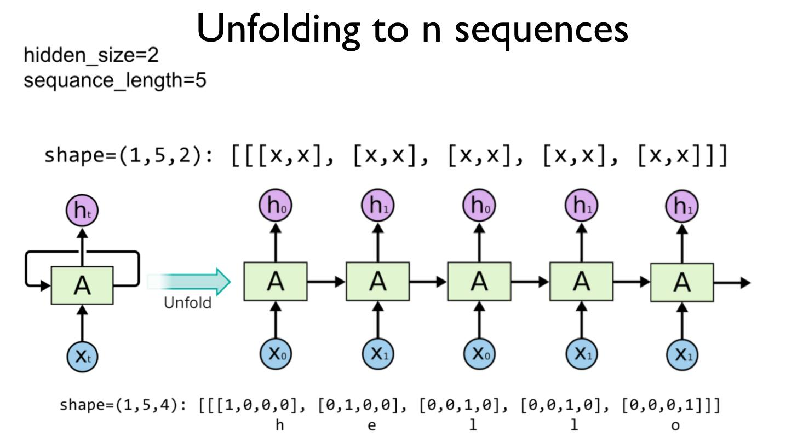
**이미지 캡션:** 이 이미지는 순환 신경망(RNN)의 "Unfolding to n sequences"라는 개념을 설명하는 다이어그램입니다. 이미지 상단에는 "Unfolding to n sequences"라는 제목이 있고, 그 아래에는 "hidden_size=2"와 "sequance_length=5"라는 텍스트가 있습니다. 중앙에는 두 개의 다이어그램이 화살표로 연결되어 있습니다. 왼쪽 다이어그램은 하나의 순환 신경망 셀을 나타내며, 입력 'Xt'와 은닉 상태 'ht'를 가지고 있으며, 셀 자체는 'A'로 표시되어 있습니다. 오른쪽 다이어그램은 왼쪽의 순환 신경망 셀이 시간 축을 따라 5개의 셀로 펼쳐진(unfolded) 모습을 보여줍니다. 각 펼쳐진 셀은 입력 'X0', 'X1', 'X0', 'X1', 'X1'과 은닉 상태 'h0', 'h1', 'h0', 'h1', 'h1'을 가지고 있으며, 모두 'A'로 표시되어 있습니다. 각 셀은 이전 셀의 은닉 상태를 입력으로 받아 다음 셀로 전달하는 순환 구조를 시각적으로 보여줍니다. 다이어그램 아래에는 펼쳐진 순환 신경망의 입력 데이터의 형태를 나타내는 "shape=(1,5,4): [[[1,0,0,0], [0,1,0,0], [0,0,1,0], [0,0,1,0], [0,0,0,1]]]"라는 텍스트와 함께 각 입력에 해당하는 것으로 보이는 'h', 'e', 'l', 'l', 'o'라는 글자가 표시되어 있습니다. 전반적으로 흰색 배경에 파란색, 녹색, 보라색, 주황색이 사용된 깔끔하고 정보 전달에 집중된 그래픽입니다.른쪽 다이어그램은 왼쪽의 순환 신경망 셀이 시간 축을 따라 5개의 셀로 펼쳐진(unfolded) 모습을 보여줍니다. 각 펼쳐진 셀은 입력 'X0', 'X1', 'X0', 'X1', 'X1'과 은닉 상태 'h0', 'h1', 'h0', 'h1', 'h1'을 가지고 있으며, 모두 'A'로 표시되어 있습니다. 각 셀은 이전 셀의 은닉 상태를 입력으로 받아 다음 셀로 전달하는 순환 구조를 시각적으로 보여줍니다. 다이어그램 아래에는 펼쳐진 순환 신경망의 입력 데이터의 형태를 나타내는 "shape=(1,5,4): [[[1,0,0,0], [0,1,0,0], [0,0,1,0], [0,0,1,0], [0,0,0,1]]]"라는 텍스트와 함께 각 입력에 해당하는 것으로 보이는 'h', 'e', 'l', 'l', 'o'라는 글자가 표시되어 있습니다. 전반적으로 흰색 배경에 파란색, 녹색, 보라색, 주황색이 사용된 깔끔하고 정보 전달에 집중된 그래픽입니다.
 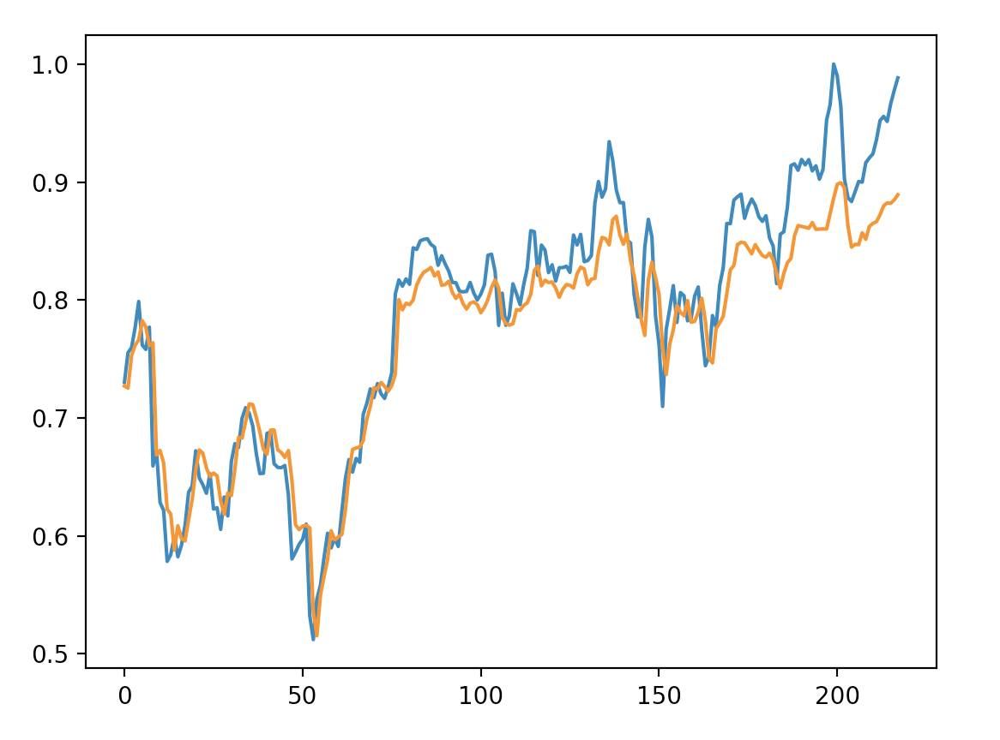
**이미지 캡션:** 이 사진은 파란색과 주황색 두 개의 선 그래프를 보여줍니다. 그래프는 x축과 y축으로 구성되어 있으며, x축에는 0부터 200까지의 숫자가 표시되어 있고, y축에는 0.5부터 1.0까지의 숫자가 0.1 단위로 표시되어 있습니다. 두 선은 시간 경과에 따른 데이터의 변화를 나타내는 것으로 보이며, 전반적으로 비슷한 추세를 보이지만 미세한 차이를 보입니다. 그래프는 흰색 배경에 검은색 테두리로 둘러싸여 있으며, 별도의 텍스트나 이미지는 포함되어 있지 않습니다. 이 그래프는 금융 데이터, 과학 실험 결과 또는 기타 시계열 데이터를 시각화하는 데 사용될 수 있습니다. 시계열 데이터를 시각화하는 데 사용될 수 있습니다.

### 3월 9일 (목) 15:41 · 📷 앨범: Profile pictures (2장)

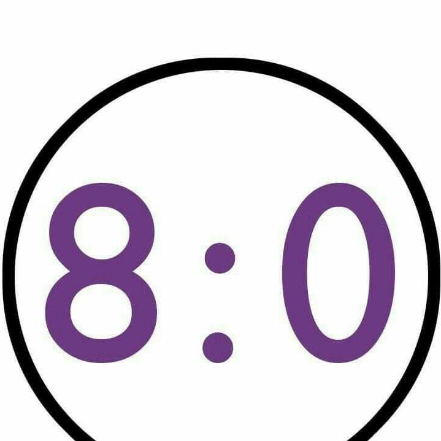
**이미지 캡션:** 이 이미지는 흰색 배경에 검은색 테두리로 둘러싸인 보라색 숫자 '8:0'을 보여줍니다. 숫자 '8'은 보라색으로, 콜론 ':'도 보라색으로, 숫자 '0'도 보라색으로 표시되어 있습니다. 이 이미지는 스포츠 경기나 게임의 점수를 나타내는 것으로 보이며, 8대 0이라는 압도적인 점수 차이를 시각적으로 표현하고 있습니다. 사람, 장소, 사물, 텍스트, 분위기 등은 이 이미지에 나타나 있지 않습니다.
 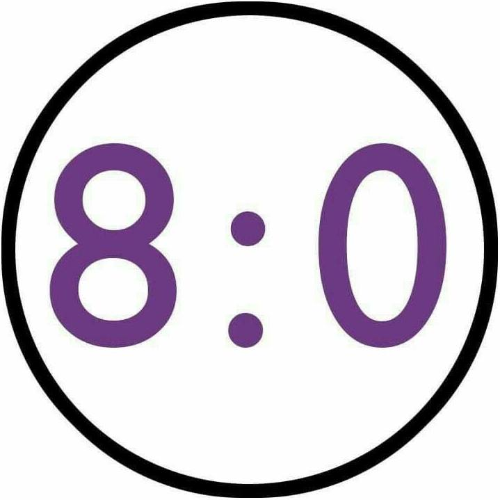
**이미지 캡션:** 이 이미지는 보라색 숫자 8과 0이 콜론으로 구분되어 있고, 이 전체가 두꺼운 검은색 테두리가 있는 흰색 원 안에 그려져 있는 단순한 그래픽 디자인입니다. 사람, 장소, 사물, 텍스트, 분위기나 상황에 대한 정보는 전혀 없습니다. 이 이미지는 스포츠 경기나 다른 경쟁 상황에서의 점수를 나타내는 것으로 해석될 수 있으며, 8대 0이라는 압도적인 점수 차이를 보여줍니다.

> Till March 10, 11AM!

### 3월 10일 (금) 11:23 · So happy!

So happy!

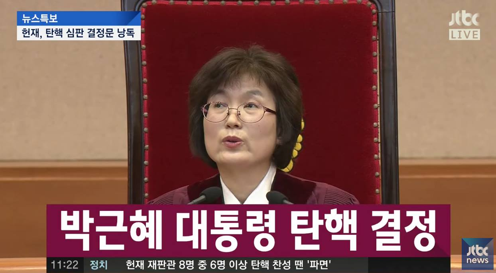
**이미지 캡션:** 화면 중앙에는 안경을 쓴 50대 한국인 여성으로 보이는 사람이 정면을 응시하며 입을 열고 말하고 있다. 그녀는 짙은 자주색 법복을 입고 있으며, 배경은 붉은색 천으로 장식된 의자와 베이지색 벽으로 이루어져 있다. 화면 하단에는 "박근혜 대통령 탄핵 결정"이라는 큰 글씨와 함께 "뉴스특보", "헌재, 탄핵 심판 결정문 낭독", "11:22 정치 헌재 재판관 8명 중 6명 이상 탄핵 찬성 땐 '파면'"이라는 자막이 보인다. 오른쪽 상단에는 JTBC LIVE 로고가, 오른쪽 하단에는 JTBC NEWS 로고가 있다. 전반적으로 뉴스를 전달하는 엄숙하고 공식적인 분위기이다. 전반적으로 뉴스를 전달하는 엄숙하고 공식적인 분위기이다.

### 3월 10일 (금) 11:49 · CNN: "Constitutional court upholds Presi…

CNN: "Constitutional court upholds President Park Geun-hye's impeachment"

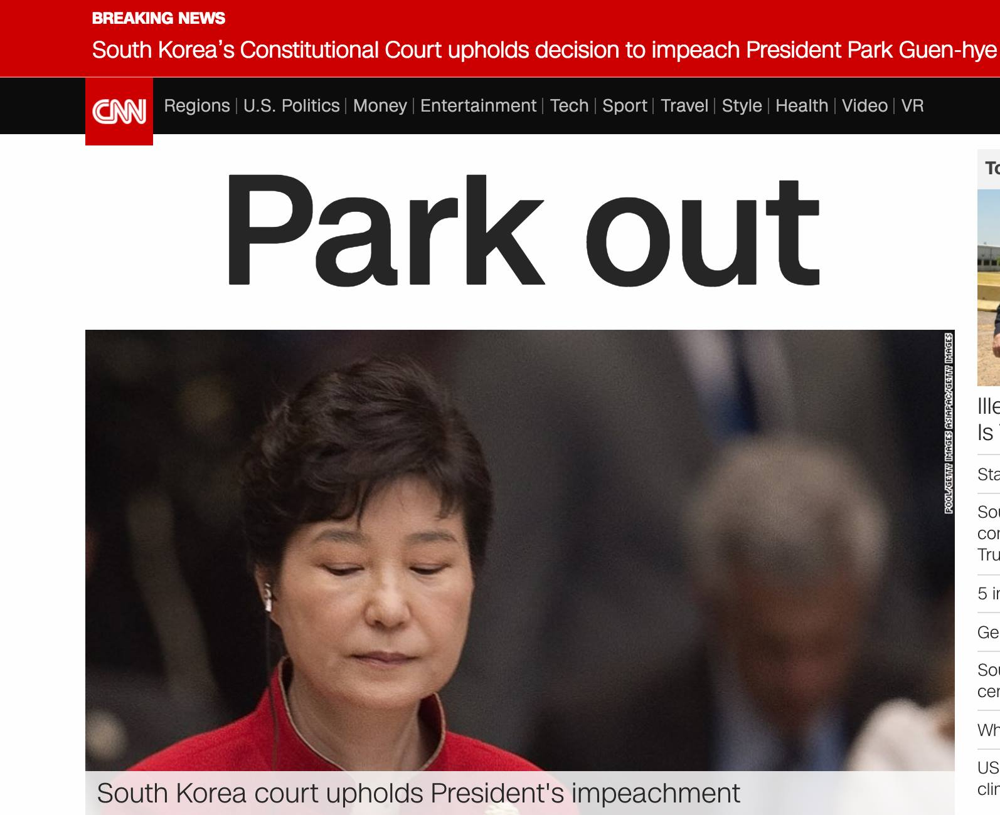
**이미지 캡션:** 이 사진은 한국의 전 대통령 박근혜의 탄핵 결정에 대한 CNN 뉴스를 보여줍니다. 사진 중앙에는 붉은색 상의를 입고 눈을 감고 있는 중년의 아시아 여성의 얼굴이 클로즈업되어 있습니다. 그녀의 표정은 침통해 보이며, 귀에는 이어폰을 착용하고 있습니다. 배경에는 흐릿하게 여러 명의 사람들이 보이며, 이는 공식적인 자리임을 암시합니다. 사진 상단에는 "BREAKING NEWS"와 함께 "South Korea's Constitutional Court upholds decision to impeach President Park Guen-hye"라는 헤드라인이 붉은색과 흰색으로 표시되어 있습니다. 그 아래에는 CNN 로고와 함께 "Regions | U.S. Politics | Money | Entertainment | Tech | Sport | Travel | Style | Health | Video | VR"이라는 메뉴가 보입니다. 또한, "Park out"이라는 큰 글씨가 사진 위에 배치되어 있어 뉴스의 핵심 내용을 강조합니다. 사진 하단에는 "South Korea court upholds President's impeachment"라는 문구가 보입니다. 전반적으로 이 사진은 한국의 정치적 사건에 대한 심각하고 중요한 뉴스를 전달하는 분위기를 자아냅니다. Park Guen-hye"라는 헤드라인이 붉은색과 흰색으로 표시되어 있습니다. 그 아래에는 CNN 로고와 함께 "Regions | U.S. Politics | Money | Entertainment | Tech | Sport | Travel | Style | Health | Video | VR"이라는 메뉴가 보입니다. 또한, "Park out"이라는 큰 글씨가 사진 위에 배치되어 있어 뉴스의 핵심 내용을 강조합니다. 사진 하단에는 "South Korea court upholds President's impeachment"라는 문구가 보입니다. 전반적으로 이 사진은 한국의 정치적 사건에 대한 심각하고 중요한 뉴스를 전달하는 분위기를 자아냅니다.

### 3월 10일 (금) 11:54 · 📷 앨범: Profile pictures (1장)

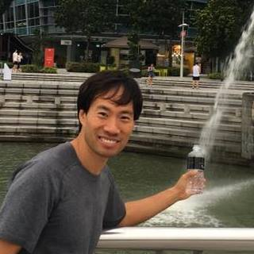
**이미지 캡션:** 이 사진은 밝은 표정의 성인 남성이 물병을 들고 카메라를 향해 미소 짓고 있는 모습을 담고 있다. 남성은 30대 후반에서 40대 초반으로 보이며, 짧은 검은색 머리에 편안한 회색 반팔 티셔츠를 입고 있다. 배경에는 계단식 구조물과 분수가 있는 야외 공간이 보인다. 분수에서는 물줄기가 솟아오르고 있으며, 그 뒤로 건물과 나무들이 보인다. 남성은 난간에 기대어 서 있으며, 그의 손에는 투명한 물병이 들려 있다. 전체적으로 여유롭고 즐거운 분위기를 연출하고 있다.

### 3월 10일 (금) 16:41 · 📷 사진 (1장)

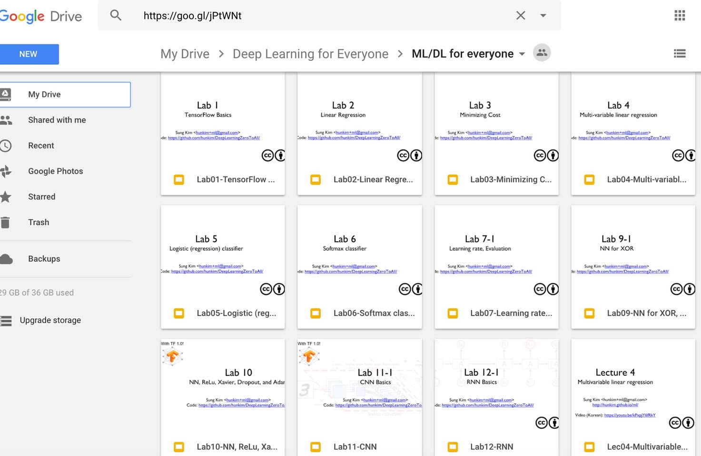
**이미지 캡션:** 이 이미지는 구글 드라이브 화면을 캡처한 것으로, 'Deep Learning for Everyone'이라는 폴더 안에 'ML/DL for everyone'이라는 하위 폴더가 열려 있는 상태입니다. 화면 왼쪽에는 'My Drive', 'Shared with me', 'Recent', 'Google Photos', 'Starred', 'Trash', 'Backups' 등의 메뉴가 보이며, 현재 'My Drive'가 선택되어 있습니다. 화면 중앙에는 여러 개의 카드 형태로 구성된 파일들이 나열되어 있으며, 각 카드에는 'Lab 1 TensorFlow Basics', 'Lab 2 Linear Regression', 'Lab 3 Minimizing Cost', 'Lab 4 Multi-variable linear regression', 'Lab 5 Logistic (regression) classifier', 'Lab 6 Softmax classifier', 'Lab 7-1 Learning rate, Evaluation', 'Lab 9-1 NN for XOR', 'Lab 10 NN, ReLu, Xavier, Dropout, and Adar', 'Lab 11-1 CNN Basics', 'Lab 12-1 RNN Basics', 'Lecture 4 Multivariable linear regression'과 같은 제목과 함께 강사 이름(Sung Kim)과 이메일 주소, 그리고 GitHub 링크가 표시되어 있습니다. 일부 카드에는 저작권 표시(CC)와 함께 영상 링크도 포함되어 있습니다. 전반적으로 학습 자료가 정리된 디지털 폴더의 모습을 보여주며, 딥러닝 관련 강의 자료들이 체계적으로 관리되고 있음을 알 수 있습니다.s and columns, with titles like "Lab 1 TensorFlow Basics," "Lab 2 Linear Regression," "Lab 3 Minimizing Cost," "Lab 4 Multi-variable linear regression," "Lab 5 Logistic (regression) classifier," "Lab 6 Softmax classifier," "Lab 7-1 Learning rate, Evaluation," "Lab 9-1 NN for XOR," "Lab 10 NN, ReLu, Xavier, Dropout, and Adar," "Lab 11-1 CNN Basics," "Lab 12-1 RNN Basics," and "Lecture 4 Multivariable linear regression." Each card includes the name of the instructor, "Sung Kim," an email address, and a GitHub link. Some cards also have icons indicating content type or licensing. The left sidebar shows navigation options like "My Drive," "Shared with me," "Recent," "Google Photos," "Starred," "Trash," and "Backups," along with storage usage information. The overall atmosphere is organized and informative, suggesting a digital repository for educational materials on machine learning.

> 기쁜날, #모두를위한딥러닝 강의 실습부분을 TensorFlow 1.0 API에 맞게 새로운 녹음을 준비하고 있습니다.  이제는 TensorFlow를 잘하시는 분들이 많으시기 때문에 함께 자료와 코드를 만들고 있는 중인데 드디어 모든 슬라이드와 코드가 준비 되었습니다.  - Lab 전체 슬라이드 원본: https://goo.gl/jPtWNt  - Lab 에 사용될 전체 코드: https://github.com/hunkim/DeepLearningZeroToAll  슬라이드에도 직접 커멘트를 주실수 있으니 혹시 잘못된 부분이나 설명이 부족한 부분등에 대해 알려주시면 반영하야 다음주부터 #모두를위한딥러닝 실습부분 재녹음에 반영하겠습니다. 미리 감사드립니다.

### 3월 15일 (수) 14:12 · 📷 사진 (1장)

**이미지 캡션:** 이 사진은 젊은 여성 예술가가 캔버스에 유화로 집을 그리고 있는 모습을 보여줍니다. 여성은 흰색 민소매 상의를 입고 있으며, 머리카락은 뒤로 묶고 있습니다. 그녀는 붓을 들고 그림에 집중하고 있으며, 진지하고 차분한 표정을 짓고 있습니다. 배경에는 그림이 그려지고 있는 캔버스가 이젤에 놓여 있고, 그 옆에는 붓과 물감 팔레트가 보입니다. 그림 속에는 햇살이 비치는 푸른 잔디와 돌계단이 있는 하얀 집이 그려져 있습니다. 전체적으로 예술가의 창작 활동에 집중하는 고요하고 집중된 분위기를 느낄 수 있습니다.

> (저희 그룹에는 일러스트레이터분들이 많지 않을것으로 예상합니다만 주위 분들에게 홍보 부탁드립니다.)   #모두를위한딥러닝 슬라이드 재작업을 위한 일러스트레이터 모집   #모두를위한딥러닝 이론+실습강의를 중국어와 영어버전을 준비중인데 제가 다른분들 슬라이드에서 가져다 사용한 그림도 많고 해서 이번 기회에 이를 새롭게 그려주실 일러스트레이터 지원을 받습니다.  개요: 백문이 불여일견. 그림으로 개념을 정말 쉽게 이해할수 있고, 한걸음 더 들어가서 마음이 따뜻해 지는 그림들을 많이 보여 주고 싶습니다. 수채화톤의 깔끔한 분위기도 좋고 잘 정돈된 다이어그램형태 (너무 딱딱하지 않은 분위기), 나 매우 재미있고 창의적인 형태 모두 환영. 그래서 Deep Learning 을 생각하면 딱 떠오르는 그림들을 많이 만들어 내는 것입니다.  보수: 그림당 또는 전체일괄등의 계약으로 해당분야 *최고 수준*으로 대우 해드립니다.  지원방법: http://hunkim.github.io/ml/RL/rl03.pdf 등 http://hunkim.github.io/ml 에 있는 슬라이드 한두장의 그림을 새로 그려 본인의 포트폴리오와 함께 hunkim+pic@gmail.com으로 보내주시면 됩니다.  지원기간: 적절한 분이 찾아질때까지 작업기간: 선정되는대로 작업시작후 약 6~7월 이전까지 마감예정     (그림: https://namu.wiki/w/%EC%9D%BC%EB%9F%AC%EC%8A%A4%ED%8A%B8%EB%A0%88%EC%9D%B4%ED%84%B0)

### 3월 16일 (목) 08:39 · 📷 사진 (1장)

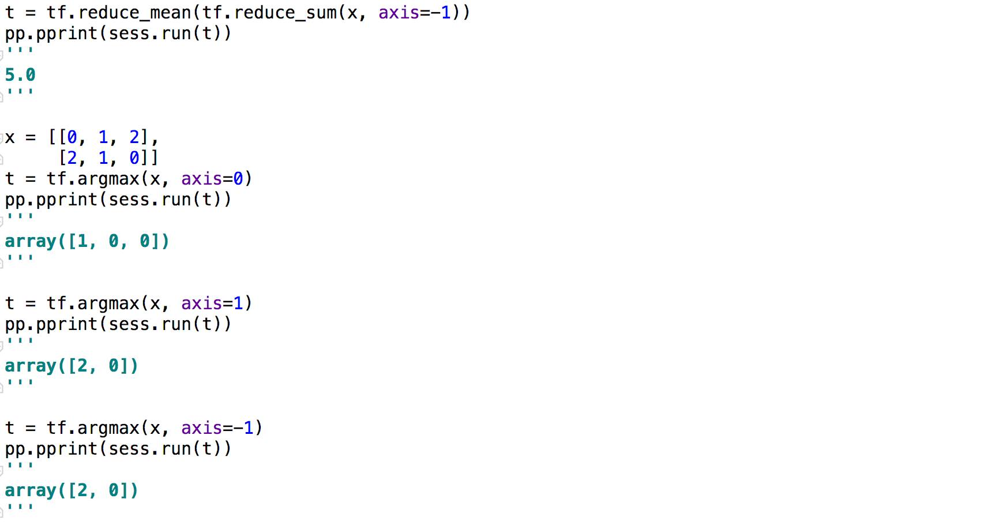
**이미지 캡션:** 이 이미지는 프로그래밍 코드의 스크린샷으로, 텐서플로우(TensorFlow) 라이브러리를 사용하여 행렬 연산을 수행하는 과정을 보여줍니다. 코드의 내용은 텐서플로우 함수인 `reduce_mean`, `reduce_sum`, `argmax`를 사용하여 주어진 행렬 `x`에 대한 평균, 합계, 그리고 최대값의 인덱스를 계산하는 것을 나타냅니다. 각 연산의 결과는 `pp.pprint(sess.run(t))`를 통해 출력되며, `5.0`, `array([1, 0, 0])`, `array([2, 0])`, `array([2, 0])`와 같은 결과값이 표시됩니다. 배경은 흰색이며, 특별한 인물이나 사물은 보이지 않고 순수하게 코드와 그 실행 결과만 담고 있습니다. 전반적으로 기술적인 내용을 담고 있는 차분하고 정보 전달 중심의 분위기입니다.([2, 0])`와 같은 결과값이 표시됩니다. 배경은 흰색이며, 특별한 인물이나 사물은 보이지 않고 순수하게 코드와 그 실행 결과만 담고 있습니다. 전반적으로 기술적인 내용을 담고 있는 차분하고 정보 전달 중심의 분위기입니다.

> [WIP] 흔히 사용하지만 꼼꼼히 챙기지 않으면 실수하기 쉬운 Tensor 처리/변형하는 함수들에 대한 간단한 예제들을 만들어 보고 있습니다.  https://github.com/hunkim/DeepLearningZeroToAll/blob/master/lab-08-tensor_transformations.py  #모두를위한딥러닝 강의에서도 reduce_mean 의 axis의 의미등에 대해 많이 질문해주셨는데요.  이런 헷갈릴수 있는 다른 함수들이 있으면 댓글이나 위 github 파일의 pull request 부탁드립니다. 모두 모아서 예제로 만들고 강의로 만들려고 합니다. 미리 감사드립니다.

### 3월 17일 (금) 09:57 · 📷 사진 (1장)

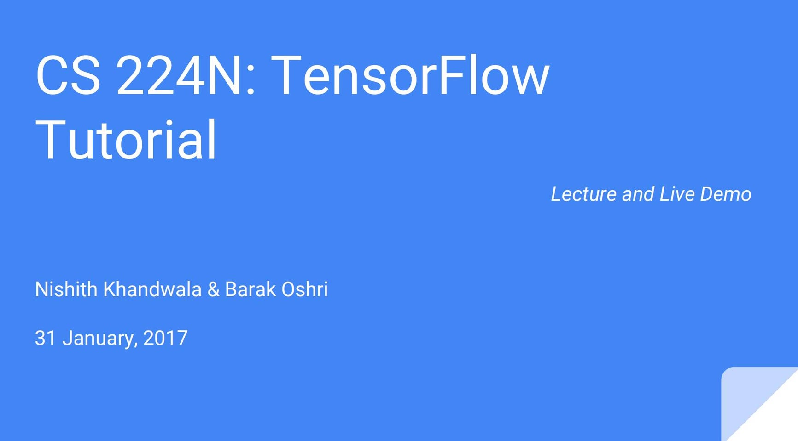
**이미지 캡션:** 이 이미지는 파란색 배경에 흰색 텍스트로 된 슬라이드 또는 프레젠테이션의 일부입니다. 상단에는 "CS 224N: TensorFlow Tutorial"이라는 제목이 크게 표시되어 있으며, 그 아래에는 "Nishith Khandwala & Barak Oshri"라는 이름과 "31 January, 2017"이라는 날짜가 있습니다. 오른쪽 상단에는 "Lecture and Live Demo"라는 문구가 작게 표시되어 있습니다. 이미지의 오른쪽 하단에는 흰색으로 된 종이가 접힌 듯한 그래픽 요소가 있습니다. 이 이미지는 특정 강의 또는 튜토리얼의 시작 화면으로 보이며, TensorFlow라는 딥러닝 라이브러리를 다루는 CS 224N이라는 과목에 대한 내용임을 알 수 있습니다. 사람에 대한 정보는 텍스트로만 제공되며, 실제 인물은 보이지 않습니다. 배경은 단색의 파란색이며, 특별한 장소나 사물은 보이지 않습니다. 전체적으로 정보 전달에 초점을 맞춘 깔끔하고 간결한 디자인입니다. 특정 강의 또는 튜토리얼의 시작 화면으로 보이며, TensorFlow라는 딥러닝 라이브러리를 다루는 CS 224N이라는 과목에 대한 내용임을 알 수 있습니다. 사람에 대한 정보는 텍스트로만 제공되며, 실제 인물은 보이지 않습니다. 배경은 단색의 파란색이며, 특별한 장소나 사물은 보이지 않습니다. 전체적으로 정보 전달에 초점을 맞춘 깔끔하고 간결한 디자인입니다.

> 스텐포드의 CS224N: Deep NLP의 종강이 일주일 앞으로 다가왔습니다. 작년에 비해 어떤 새로운 내용이 있는지 이번 주말에 한번 슬라이드 쫙 읽어보면 재미있을듯 합니다.  그런중 TensorFlow를 정말 간단하게 소개해주는 슬라이드: http://web.stanford.edu/class/cs224n/lectures/cs224n-2017-tensorflow.pdf

### 3월 18일 (토) 07:16 · 📷 사진 (2장)

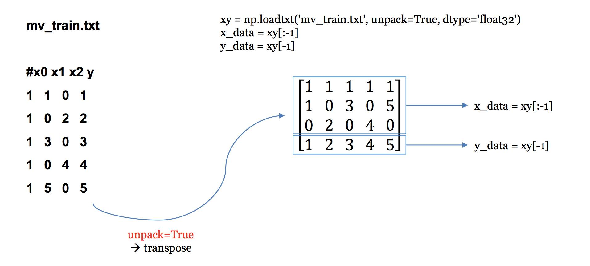
**이미지 캡션:** 이 이미지는 텍스트와 코드로 구성된 다이어그램으로, 데이터 로딩 및 분할 과정을 설명합니다. 좌측 상단에는 "mv_train.txt"라는 파일 이름이 표시되어 있으며, 그 아래에는 "#x0 x1 x2 y"라는 헤더와 함께 5행 4열의 숫자 데이터가 나열되어 있습니다. 이 데이터는 1, 1, 0, 1부터 시작하여 1, 5, 0, 5로 끝납니다. 좌측 하단에는 "unpack
 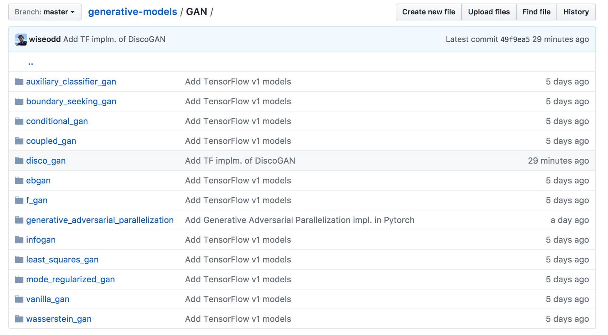
**이미지 캡션:** 이것은 GitHub 저장소의 파일 목록을 보여주는 스크린샷으로, "generative-models"라는 폴더 안에 "GAN"이라는 하위 폴더가 있습니다. 상단에는 "Branch: master"라는 드롭다운 메뉴와 "Create new file", "Upload files", "Find file", "History" 버튼이 보입니다. 그 아래에는 "wiseodd"라는 사용자가 "DiscoGAN의 TF 구현 추가"라는 커밋 메시지와 함께 29분 전에 최신 커밋을 했다는 정보가 있습니다. 파일 목록에는 "auxiliary_classifier_gan", "boundary_seeking_gan", "conditional_gan", "coupled_gan", "disco_gan", "ebgan", "f_gan", "generative_adversarial_parallelization", "infogan", "least_squares_gan", "mode_regularized_gan", "vanilla_gan", "wasserstein_gan"와 같은 다양한 GAN 모델 이름이 폴더 아이콘과 함께 나열되어 있으며, 각 항목 옆에는 "Add TensorFlow v1 models" 또는 "Add Generative Adversarial Parallelization impl. in Pytorch"와 같은 설명과 함께 커밋된 시간(예: 5일 전, 하루 전, 29분 전)이 표시됩니다. 전반적으로 이 화면은 머신러닝 프로젝트의 코드 저장소에서 GAN 관련 모델들의 업데이트 현황을 보여주는 기술적인 인터페이스입니다.iary_classifier_gan", "boundary_seeking_gan", "conditional_gan", "coupled_gan", "disco_gan", "ebgan", "f_gan", "generative_adversarial_parallelization", "infogan", "least_squares_gan", "mode_regularized_gan", "vanilla_gan", "wasserstein_gan"와 같은 다양한 GAN 모델 이름이 폴더 아이콘과 함께 나열되어 있으며, 각 항목 옆에는 "Add TensorFlow v1 models" 또는 "Add Generative Adversarial Parallelization impl. in Pytorch"와 같은 설명과 함께 커밋된 시간(예: 5일 전, 하루 전, 29분 전)이 표시됩니다. 전반적으로 이 화면은 머신러닝 프로젝트의 코드 저장소에서 GAN 관련 모델들의 업데이트 현황을 보여주는 기술적인 인터페이스입니다.

> 거의 모든 GAN의 구현 이라고 볼수 있는 github가 있네요.  https://github.com/wiseodd/generative-models/tree/master/GAN  제가 들어본 GAN은 다 구현되어 있는듯합니다. 재미있는것은 TensorFlow와 함께 torch 버전도 있습니다.  이번주말에 좋은 읽을거기라 될것 같습니다.

### 3월 22일 (수) 17:43 · 📷 사진 (1장)

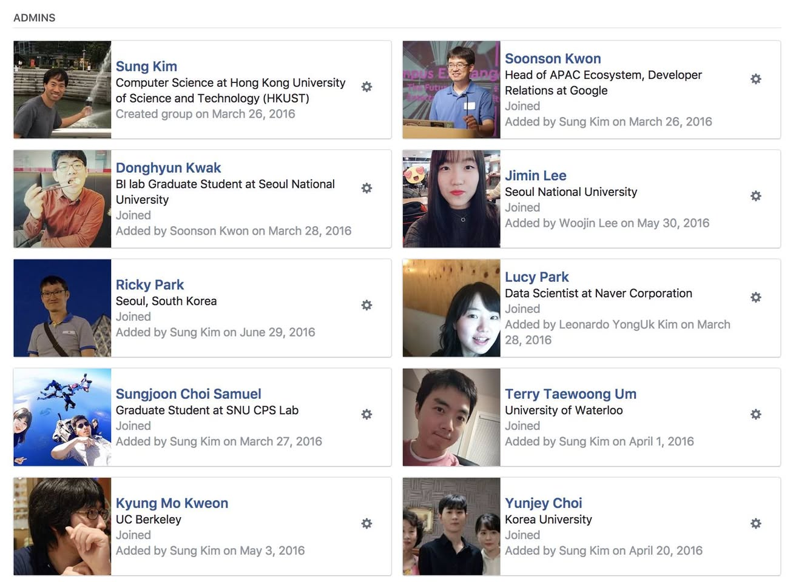
**이미지 캡션:** 이 사진은 여러 사람들의 프로필 정보가 담긴 목록으로, 각 프로필은 사진, 이름, 소속, 직책, 가입일 등의 정보를 포함하고 있습니다. 왼쪽 열에는 성인 남성인 Sung Kim이 야외에서 물줄기를 배경으로 서 있는 모습과 함께 홍콩과기대 컴퓨터공학과 소속임을 나타내고 있으며, 그 아래에는 안경을 쓴 성인 남성인 Donghyun Kwak이 음식을 먹는 모습과 함께 서울대학교 BI 연구실 대학원생임을 보여줍니다. 더 아래에는 안경을 쓴 성인 남성인 Ricky Park가 서울, 대한민국 소속임을 나타내고 있으며, 그 아래에는 스카이다이빙을 하는 사람들의 사진과 함께 SNU CPS 연구실 대학원생인 Sungjoon Choi Samuel의 프로필이 있습니다. 가장 아래에는 안경을 쓴 성인 남성인 Kyung Mo Kweon이 UC Berkeley 소속임을 보여줍니다. 오른쪽 열에는 파란색 셔츠를 입은 성인 남성인 Soonson Kwon이 연설하는 모습과 함께 구글의 APAC 생태계 개발자 관계 책임자임을 나타내고 있습니다. 그 아래에는 검은색 옷을 입은 젊은 여성인 Jimin Lee가 서울대학교 소속임을 보여주며, 더 아래에는 밝게 웃는 젊은 여성인 Lucy Park가 네이버 코퍼레이션의 데이터 과학자임을 나타냅니다. 가장 아래에는 젊은 성인 남성인 Terry Taewoong Um이 워털루 대학교 소속임을 보여주며, 그 아래에는 세 명의 젊은 사람들이 함께 찍은 사진과 함께 한국대학교 소속인 Yunjey Choi의 프로필이 있습니다. 전반적으로 이 사진은 학계 및 IT 업계 종사자들의 온라인 커뮤니티 또는 그룹 관리자 목록으로 보이며, 각 개인의 전문성과 소속을 간략하게 보여주는 정보성 콘텐츠입니다.그 아래에는 스카이다이빙을 하는 사람들의 사진과 함께 SNU CPS 연구실 대학원생인 Sungjoon Choi Samuel의 프로필이 있습니다. 가장 아래에는 안경을 쓴 성인 남성인 Kyung Mo Kweon이 UC Berkeley 소속임을 보여줍니다. 오른쪽 열에는 파란색 셔츠를 입은 성인 남성인 Soonson Kwon이 연설하는 모습과 함께 구글의 APAC 생태계 개발자 관계 책임자임을 나타내고 있습니다. 그 아래에는 검은색 옷을 입은 젊은 여성인 Jimin Lee가 서울대학교 소속임을 보여주며, 더 아래에는 밝게 웃는 젊은 여성인 Lucy Park가 네이버 코퍼레이션의 데이터 과학자임을 나타냅니다. 가장 아래에는 젊은 성인 남성인 Terry Taewoong Um이 워털루 대학교 소속임을 보여주며, 그 아래에는 세 명의 젊은 사람들이 함께 찍은 사진과 함께 한국대학교 소속인 Yunjey Choi의 프로필이 있습니다. 전반적으로 이 사진은 학계 및 IT 업계 종사자들의 온라인 커뮤니티 또는 그룹 관리자 목록으로 보이며, 각 개인의 전문성과 소속을 간략하게 보여주는 정보성 콘텐츠입니다.

> 13K 회원 그룹이 되었습니다! 그룹 운영을 더욱 재미있게 하기 위해 함께 일하기로 해주신 두분 운영진을 소개해드립니다.  Kyung Mo Kweon님, 저희 그룹에서의 활약상을 이미 보셨겠지만 글이나 답변만 봐도 정말 최고수의 향기가 나는 분입니다. 현재 버클리 거주로 동부쪽에 거주하시는 테리님과 함께 대칭이 되는 미주 서부거주로, 한국뿐만 아니라 저희가 이제 북미 전역을 커버하게 되었습니다.  Yunjey Choi님, TF는 이제 마스터하시고 PyTorch 까지 마스터. 최근 만든  tutorial이 LeCun 교수님에게 트윗이 되어 유명세를 타고 계시는 최고수. 앞으로 TF와 함께 PyTorch의 소식도 많이 전해 주실것으로 기대합니다.  이제 저희 그룹에는 정말 멋지신 운영진 열명이 있습니다. 모두 함께 더욱 재미있고 신나는 그룹이 되도록 노력 하겠습니다. 여러분들께서도 의견 있으시면 언제나 저희 운영진에게 알려주세요.  혹시 운영진으로 참여하시고 싶은 회원계실듯 하여 저희 운영진 선정 방법에 대해 알려드립니다. 새로운 운영진은, 운영진 1명이상의 추천과 운영진 과반수의 찬성 (과 0 반대)에 의해 결정됩니다. 좋은 활동해주시고 저희 운영진에게 말도 걸어 주시고 친한척 하시면 추천되실 확률이 높아집니다. :-)

### 3월 23일 (목) 06:38 · 📷 사진 (2장)

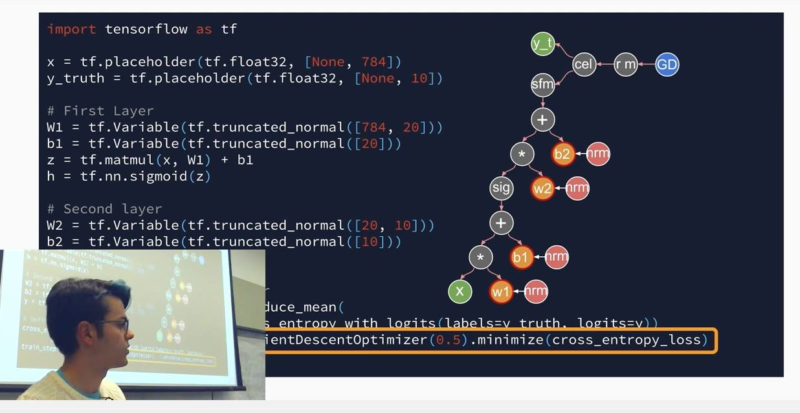
**이미지 캡션:** 어두운 배경에 텐서플로 코드가 보이고, 그 옆에는 신경망의 연산 과정을 시각화한 그래프가 그려져 있으며, 화면 왼쪽 하단에는 한 명의 성인 남성이 강의를 듣고 있는 모습이 보인다. 남성은 20대 초반으로 추정되며, 검은색 머리에 파란색으로 염색한 부분이 있으며, 안경을 쓰고 흰색 상의를 입고 있다. 그는 화면을 집중해서 바라보고 있으며, 표정은 진지하다. 배경에는 흰색 스크린이 있고, 그 위에는 여러 개의 원과 화살표로 이루어진 신경망 그래프가 표시되어 있다. 코드에는 텐서플로 라이브러리를 임포트하고 플레이스홀더, 변수, 행렬 곱셈, 시그모이드 함수 등을 정의하는 내용이 담겨 있으며, 그래프는 이러한 연산 과정을 시각적으로 표현하고 있다. 전체적으로 기술 강의 또는 발표 장면으로 보이며, 딥러닝 모델의 구현 및 구조에 대한 설명이 이루어지고 있는 것으로 추정된다.홀더, 변수, 행렬 곱셈, 시그모이드 함수 등을 정의하는 내용이 담겨 있으며, 그래프는 이러한 연산 과정을 시각적으로 표현하고 있다. 전체적으로 기술 강의 또는 발표 장면으로 보이며, 딥러닝 모델의 구현 및 구조에 대한 설명이 이루어지고 있는 것으로 추정된다.
 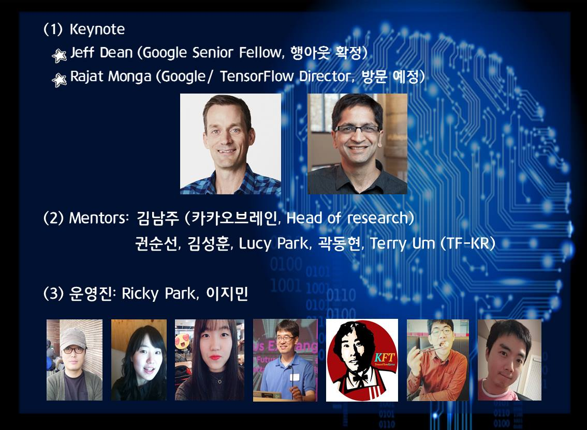
**이미지 캡션:** 이 사진은 기술 컨퍼런스 또는 발표회와 관련된 슬라이드로 보이며, 파란색 배경에 회로 기판 디자인이 그려져 있습니다. 상단에는 "(1) Keynote"라는 제목과 함께 두 명의 성인 남성 사진이 있습니다. 왼쪽 사진 속 남성은 30대 후반에서 40대 초반으로 보이며, 체크무늬 셔츠를 입고 밝게 웃고 있습니다. 오른쪽 사진 속 남성은 40대 초반으로 보이며, 안경을 쓰고 검은색 셔츠를 입고 미소를 짓고 있습니다. 이들의 이름은 Jeff Dean과 Rajat Monga로, 각각 Google Senior Fellow와 Google/TensorFlow Director로 소개되어 있습니다. 그 아래에는 "(2) Mentors"라는 제목과 함께 김남주(카카오브레인, Head of research)를 포함한 여러 사람들의 이름이 나열되어 있으며, 권순선, 김성훈, Lucy Park, 곽동현, Terry Um (TF-KR)이 언급됩니다. 가장 아래에는 "(3) 운영진"이라는 제목과 함께 Ricky Park와 이지민이라는 이름이 보이며, 이들의 사진이 나란히 배치되어 있습니다. Ricky Park로 추정되는 첫 번째 남성은 회색 모자를 쓰고 안경을 착용했으며, 두 번째는 젊은 여성, 세 번째는 젊은 여성, 네 번째는 파란색 셔츠를 입은 남성, 다섯 번째는 KFC 로고가 그려진 붉은색 원 안에 있는 사람의 실루엣, 여섯 번째는 붉은색 셔츠를 입은 남성입니다. 전반적으로 전문적이고 기술적인 분위기를 풍깁니다.w와 Google/TensorFlow Director로 소개되어 있습니다. 그 아래에는 "(2) Mentors"라는 제목과 함께 김남주(카카오브레인, Head of research)를 포함한 여러 사람들의 이름이 나열되어 있으며, 권순선, 김성훈, Lucy Park, 곽동현, Terry Um (TF-KR)이 언급됩니다. 가장 아래에는 "(3) 운영진"이라는 제목과 함께 Ricky Park와 이지민이라는 이름이 보이며, 이들의 사진이 나란히 배치되어 있습니다. Ricky Park로 추정되는 첫 번째 남성은 회색 모자를 쓰고 안경을 착용했으며, 두 번째는 젊은 여성, 세 번째는 젊은 여성, 네 번째는 파란색 셔츠를 입은 남성, 다섯 번째는 KFC 로고가 그려진 붉은색 원 안에 있는 사람의 실루엣, 여섯 번째는 붉은색 셔츠를 입은 남성입니다. 전반적으로 전문적이고 기술적인 분위기를 풍깁니다.

> 간단하게 들어보는 딥러닝 전반과 TensorFlow (41분경부터 시작). 이미 아시는 분들도 백그라운드로 들으시면서 영어공부하기 좋은 발음인듯 합니다.  https://www.youtube.com/watch?v=DYlHnxfrrZY  추가로 TF code 작성할때 아래 그림의 오른쪽 노드 그림을 코드옆에 바로 보여주면 (TensorBoard에 들어가지 않고) 도움이 될까요? 만들어 보시고 싶은분 계신가요?
> [2017년 7월 모두 모두 제주로 모여요!] #MLJejuCamp  제주의 여름은 언제나 마음을 설레게 하는데요. 여기서 이번 여름은 설렘^100이 되는 캠프가 열립니다. 한달간 합숙하며 딥러닝/머신러닝 전문가들과 함께 TensorFlow를 이용해 하나의 모델을 처음부터 끝까지 만들어 보는 것입니다.   생활비, 항공료, 숙식, 구글 클라우드 크래딧등 300만원 상당의 지원이 있고요.  무엇보다도 그 유명한 Jeff Dean (Google Senior Fellow via Hangout), and Rajat Monga (Google/TensorFlow Director (TBC)) 등이 키노트 강사로 참여. 화려한 멘토단!  무엇을 망설이시나요? 선지원 후고민하세요.  등록: https://www.surveymonkey.com/r/LY29GM5 (마감 4월 20일 11:59 PM AOE) 자세한 정보: https://github.com/TensorFlowKR/MLJejuCamp (github 별 부탁드립니다. 우리 회원수 만큼 13K 별 기대해봅니다.)

### 3월 24일 (금) 06:29 · 📷 사진 (1장)

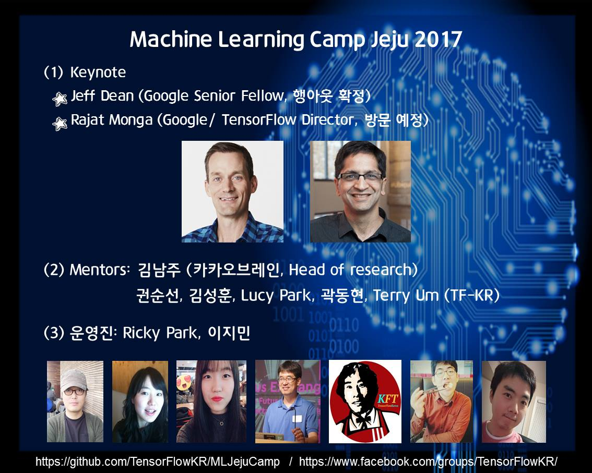
**이미지 캡션:** 이 사진은 "Machine Learning Camp Jeju 2017"이라는 제목의 프레젠테이션 슬라이드로, 파란색 배경에 회로 기판 패턴이 그려져 있으며 디지털 느낌을 준다. 슬라이드는 크게 세 부분으로 나뉘어 있다. 첫 번째 부분인 (1) Keynote에는 두 명의 성인 남성이 사진과 함께 소개되어 있다. 왼쪽 사진의 남성은 흰색 피부에 짧은 금발 머리를 하고 있으며, 체크무늬 셔츠를 입고 환하게 웃고 있다. 그는 Google Senior Fellow인 Jeff Dean으로 소개되어 있으며, 행아웃 확정이라는 문구가 적혀 있다. 오른쪽 사진의 남성은 검은색 머리에 안경을 쓰고 있으며, 검은색 셔츠를 입고 미소를 짓고 있다. 그는 Google/TensorFlow Director인 Rajat Monga로 소개되어 있으며, 방문 예정이라는 문구가 있다. 두 번째 부분인 (2) Mentors에는 김남주(카카오브레인, Head of research), 권순선, 김성훈, Lucy Park, 곽동현, Terry Um (TF-KR)의 이름이 나열되어 있다. 세 번째 부분인 (3) 운영진에는 Ricky Park, 이지민의 이름과 함께 여섯 명의 젊은 성인 남녀의 사진이 작게 배치되어 있다. 왼쪽에서 첫 번째 남성은 회색 모자와 회색 카디건을 입고 있으며, 두 번째는 젊은 여성으로 검은색 머리에 흰색 상의를 입고 밝게 웃고 있다. 세 번째는 젊은 여성으로 검은색 머리에 흰색 상의를 입고 카메라를 응시하고 있으며, 네 번째는 파란색 셔츠를 입은 남성으로 안경을 쓰고 있다. 다섯 번째는 KFC 로고가 그려진 빨간색 배경에 한 남성의 얼굴이 그려진 이미지이고, 여섯 번째는 주황색 셔츠를 입은 남성이 담배를 피우는 듯한 모습이며, 마지막은 분홍색 상의를 입은 젊은 남성이 카메라를 보고 있다. 슬라이드 하단에는 "https://github.com/TensorFlowKR/MLJejuCamp"와 "https://www.facebook.com/groups/TensorFlowKR/"라는 웹사이트 주소가 표시되어 있다. 전반적으로 정보 전달과 네트워킹을 위한 행사 소개 슬라이드로 보인다.라는 문구가 적혀 있다. 오른쪽 사진의 남성은 검은색 머리에 안경을 쓰고 있으며, 검은색 셔츠를 입고 미소를 짓고 있다. 그는 Google/TensorFlow Director인 Rajat Monga로 소개되어 있으며, 방문 예정이라는 문구가 있다. 두 번째 부분인 (2) Mentors에는 김남주(카카오브레인, Head of research), 권순선, 김성훈, Lucy Park, 곽동현, Terry Um (TF-KR)의 이름이 나열되어 있다. 세 번째 부분인 (3) 운영진에는 Ricky Park, 이지민의 이름과 함께 여섯 명의 젊은 성인 남녀의 사진이 작게 배치되어 있다. 왼쪽에서 첫 번째 남성은 회색 모자와 회색 카디건을 입고 있으며, 두 번째는 젊은 여성으로 검은색 머리에 흰색 상의를 입고 밝게 웃고 있다. 세 번째는 젊은 여성으로 검은색 머리에 흰색 상의를 입고 카메라를 응시하고 있으며, 네 번째는 파란색 셔츠를 입은 남성으로 안경을 쓰고 있다. 다섯 번째는 KFC 로고가 그려진 빨간색 배경에 한 남성의 얼굴이 그려진 이미지이고, 여섯 번째는 주황색 셔츠를 입은 남성이 담배를 피우는 듯한 모습이며, 마지막은 분홍색 상의를 입은 젊은 남성이 카메라를 보고 있다. 슬라이드 하단에는 "https://github.com/TensorFlowKR/MLJejuCamp"와 "https://www.facebook.com/groups/TensorFlowKR/"라는 웹사이트 주소가 표시되어 있다. 전반적으로 정보 전달과 네트워킹을 위한 행사 소개 슬라이드로 보인다.

> 아름다운 여름의 제주에서 한달동안 딥러닝 연구/구현에만 100% 집중할수 있다면 얼마나 좋을까요? 바로 그 꿈이 이루어지는곳, ML Jeju Camp 2017에 여러분들을 초대 합니다. 선발된 참여자는 생활비, 항공료등 300만원 상당의 지원을 받으며 한달간 집중할수 있는 공간과 분위기가 제공됩니다.  Jeff Dean (Google Senior Fellow via Hangout), and @Rajat Monga  (Google/TensorFlow Director (TBC))등 대가들이 강의해주시며, Namju Kim 님등이 멘토로 함께 해주십니다.  등록: https://www.surveymonkey.com/r/LY29GM5 (마감 4월 20일 11:59 PM AOE) 자세한 정보: https://github.com/TensorFlowKR/MLJejuCamp   * AI Korea 전문가분들 중 참여자들에게 조언을 해주시고 프로젝트 진행을 봐주실 멘토 분들을 초빙합니다. 일주일에 두번 정도 온라인 미팅 + 주말 제주 1회 방문 정도 해주시면 됩니다. 항공료와 숙박제공해드립니다. https://github.com/TensorFlowKR/MLJejuCamp 지원 정보 참고.

### 3월 25일 (토) 09:25 · Happy birthday!!

Happy birthday!!

### 3월 25일 (토) 09:25 · ↪ Happy birthday!!

*다른 프로필에 남긴 글*

Happy birthday!!

### 3월 25일 (토) 09:54 · 📷 사진 (8장)

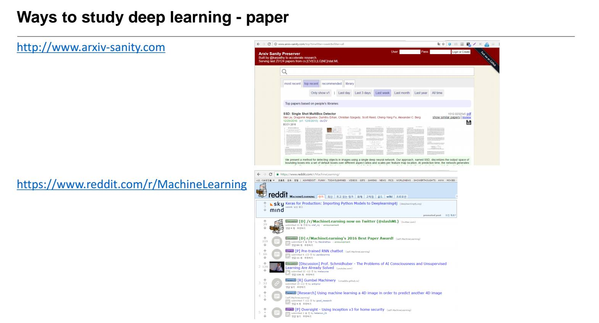
**이미지 캡션:** 이 사진은 딥러닝 논문을 공부하는 방법에 대한 정보를 담고 있으며, 두 개의 웹사이트 스크린샷을 보여줍니다. 왼쪽 상단에는 "Ways to study deep learning - paper"라는 제목과 함께 "http://www.arxiv-sanity.com"이라는 링크가 있습니다. 이 링크는 Arxiv Sanity Preserver라는 웹사이트로 연결되며, 딥러닝 관련 논문을 검색하고 필터링할 수 있는 기능을 제공합니다. 화면에는 논문 제목, 저자, 발표 연도 등의 정보가 표시되어 있습니다. 오른쪽 하단에는 "https://www.reddit.com/r/MachineLearning"이라는 링크가 있으며, 이는 Reddit의 MachineLearning 서브레딧으로 연결됩니다. 이 서브레딧에는 딥러닝 관련 게시물들이 나열되어 있으며, "Keras for Production: Importing Python Models to Deeplearning4j"와 같은 제목의 게시물과 함께 댓글 수, 추천 수 등이 표시되어 있습니다. 또한, 한 게시물에는 딥러닝 모델을 사용하여 객체를 탐지하는 방법에 대한 설명이 포함되어 있습니다. 전반적으로 이 사진은 딥러닝 연구자들이 논문을 찾고 관련 정보를 공유하는 온라인 플랫폼을 보여주며, 학습 및 연구에 유용한 자료들을 제공하고 있습니다. "https://www.reddit.com/r/MachineLearning"이라는 링크가 있으며, 이는 Reddit의 MachineLearning 서브레딧으로 연결됩니다. 이 서브레딧에는 딥러닝 관련 게시물들이 나열되어 있으며, "Keras for Production: Importing Python Models to Deeplearning4j"와 같은 제목의 게시물과 함께 댓글 수, 추천 수 등이 표시되어 있습니다. 또한, 한 게시물에는 딥러닝 모델을 사용하여 객체를 탐지하는 방법에 대한 설명이 포함되어 있습니다. 전반적으로 이 사진은 딥러닝 연구자들이 논문을 찾고 관련 정보를 공유하는 온라인 플랫폼을 보여주며, 학습 및 연구에 유용한 자료들을 제공하고 있습니다.
 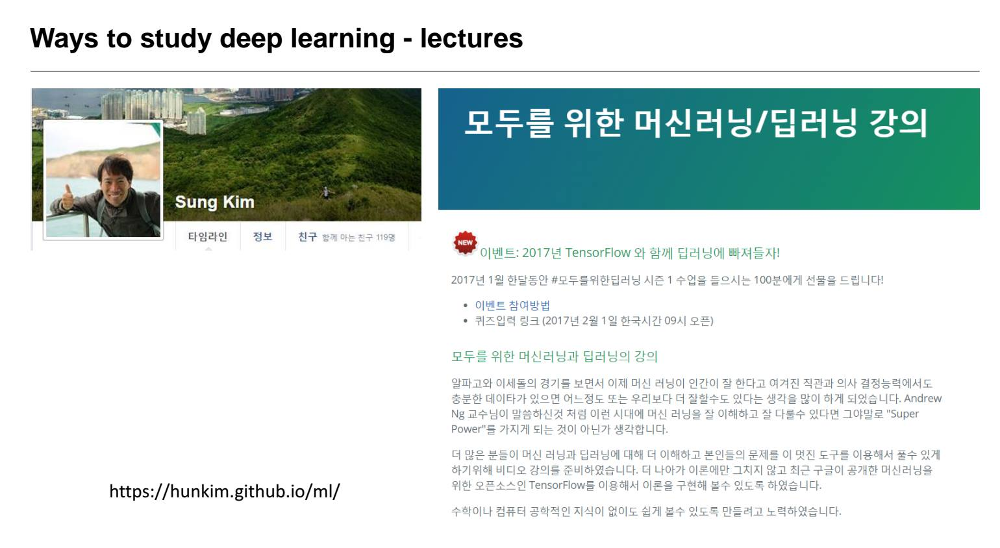
**이미지 캡션:** 화면 상단에는 "Ways to study deep learning - lectures"라는 제목이 있고, 그 아래에는 두 개의 섹션이 있습니다. 왼쪽 섹션에는 산악 풍경을 배경으로 엄지척을 하며 웃고 있는 성인 남성 사진이 있고, 그의 이름은 Sung Kim으로 표시되어 있습니다. 사진 아래에는 "타임라인", "정보", "친구 함께 아는 친구 119명"이라는 텍스트가 있습니다. 오른쪽 섹션에는 "모두를 위한 머신러닝/딥러닝 강의"라는 제목이 있고, 그 아래에는 "NEW 이벤트: 2017년 TensorFlow 와 함께 딥러닝에 빠져들자!"라는 문구와 함께 이벤트에 대한 설명이 있습니다. 이벤트는 2017년 1월 한 달 동안 진행되며, 시즌 1 수업을 듣는 100명에게 선물을 증정한다는 내용입니다. 이벤트 참여 방법과 퀴즈 입력 링크에 대한 정보도 포함되어 있습니다. 그 아래에는 "모두를 위한 머신러닝과 딥러닝의 강의"라는 제목으로, 머신러닝과 딥러닝에 대한 설명과 함께 Andrew Ng 교수의 강의에 대한 내용이 담겨 있습니다. 강의는 수학이나 컴퓨터 공학 지식이 없어도 쉽게 이해할 수 있도록 구성되었다고 합니다. 화면 하단에는 "https://hunkim.github.io/ml/"이라는 URL이 표시되어 있습니다. 전반적으로 딥러닝 학습에 대한 정보를 제공하는 웹페이지의 일부로 보입니다.와 함께 딥러닝에 빠져들자!"라는 문구와 함께 이벤트에 대한 설명이 있습니다. 이벤트는 2017년 1월 한 달 동안 진행되며, 시즌 1 수업을 듣는 100명에게 선물을 증정한다는 내용입니다. 이벤트 참여 방법과 퀴즈 입력 링크에 대한 정보도 포함되어 있습니다. 그 아래에는 "모두를 위한 머신러닝과 딥러닝의 강의"라는 제목으로, 머신러닝과 딥러닝에 대한 설명과 함께 Andrew Ng 교수의 강의에 대한 내용이 담겨 있습니다. 강의는 수학이나 컴퓨터 공학 지식이 없어도 쉽게 이해할 수 있도록 구성되었다고 합니다. 화면 하단에는 "https://hunkim.github.io/ml/"이라는 URL이 표시되어 있습니다. 전반적으로 딥러닝 학습에 대한 정보를 제공하는 웹페이지의 일부로 보입니다.
 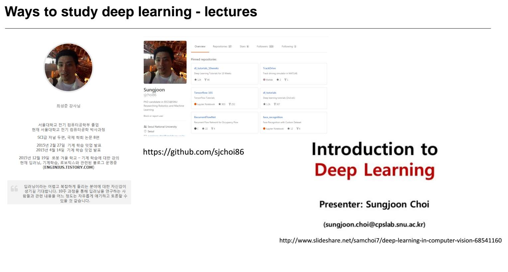
**이미지 캡션:** 이 사진은 "Ways to study deep learning - lectures"라는 제목의 발표 자료의 일부로, 딥러닝 연구자인 성인 남성 최성준 씨의 프로필과 관련 정보, 그리고 발표 주제인 "Introduction to Deep Learning"을 소개하고 있습니다. 사진 왼쪽 상단에는 최성준 씨의 프로필 사진이 원형으로 배치되어 있으며, 그 아래에는 그의 학력 및 경력, 발표 이력, 그리고 블로그 운영 정보가 한국어로 상세히 기재되어 있습니다. 특히 서울대학교 전기 컴퓨터공학부 졸업 및 박사 과정 중임을 알 수 있으며, SCI급 논문 발표 및 국제 학회 논문 발표 경험이 있음을 확인할 수 있습니다. 또한, 2015년 12월 19일에 있었던 로봇 겨울 학교에서의 기계 학습 강의 경험과 현재 운영 중인 블로그 주소(ENGINIUS.TISTORY.COM)도 명시되어 있습니다. 사진 중앙에는 최성준 씨의 깃허브 프로필 링크(https://github.com/sjchoi86)가 보이며, 그의 깃허브 계정에는 딥러닝 관련 튜토리얼 및 프로젝트들이 pinned repositories로 나열되어 있습니다. 사진 오른쪽에는 발표의 핵심 주제인 "Introduction to Deep Learning"이라는 제목이 붉은색으로 강조되어 있으며, 발표자는 Sungjoon Choi로 소개되고 있습니다. 그의 이메일 주소(sungjoon.choi@cpslab.snu.ac.kr)와 발표 자료의 슬라이드 공유 링크(http://www.slideshare.net/samchoi7/deep-learning-in-computer-vision-68541160)도 함께 제공됩니다. 사진 하단에는 딥러닝에 대한 기대감을 표현하는 인용문이 한국어로 작성되어 있어, 발표자가 딥러닝 학습에 대한 열정과 자신감을 가지고 있음을 엿볼 수 있습니다. 전반적으로 차분하고 정보 전달에 초점을 맞춘 학술적인 분위기를 띠고 있습니다.임을 알 수 있으며, SCI급 논문 발표 및 국제 학회 논문 발표 경험이 있음을 확인할 수 있습니다. 또한, 2015년 12월 19일에 있었던 로봇 겨울 학교에서의 기계 학습 강의 경험과 현재 운영 중인 블로그 주소(ENGINIUS.TISTORY.COM)도 명시되어 있습니다. 사진 중앙에는 최성준 씨의 깃허브 프로필 링크(https://github.com/sjchoi86)가 보이며, 그의 깃허브 계정에는 딥러닝 관련 튜토리얼 및 프로젝트들이 pinned repositories로 나열되어 있습니다. 사진 오른쪽에는 발표의 핵심 주제인 "Introduction to Deep Learning"이라는 제목이 붉은색으로 강조되어 있으며, 발표자는 Sungjoon Choi로 소개되고 있습니다. 그의 이메일 주소(sungjoon.choi@cpslab.snu.ac.kr)와 발표 자료의 슬라이드 공유 링크(http://www.slideshare.net/samchoi7/deep-learning-in-computer-vision-68541160)도 함께 제공됩니다. 사진 하단에는 딥러닝에 대한 기대감을 표현하는 인용문이 한국어로 작성되어 있어, 발표자가 딥러닝 학습에 대한 열정과 자신감을 가지고 있음을 엿볼 수 있습니다. 전반적으로 차분하고 정보 전달에 초점을 맞춘 학술적인 분위기를 띠고 있습니다.
 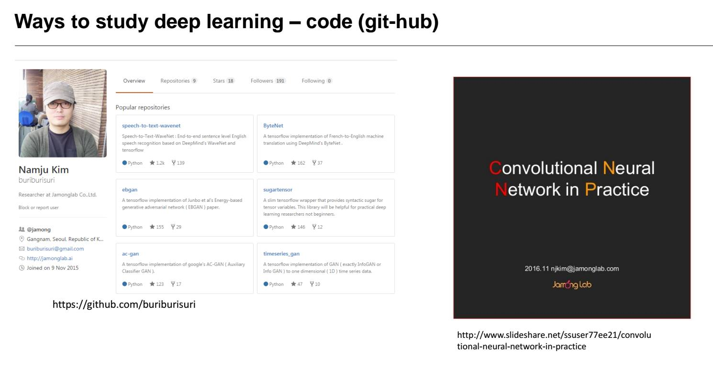
**이미지 캡션:** 화면 상단에는 "Ways to study deep learning – code (git-hub)"라는 제목이 보이며, 왼쪽에는 한 성인 남성이 자신의 깃허브 프로필 페이지를 보여주고 있다. 이 남성은 40대 정도로 보이며, 회색 모자와 안경을 착용하고 회색 카디건을 입고 있다. 그의 표정은 차분하고 진지하며, 화면을 응시하고 있다. 그의 이름은 남주 김(Namju Kim)이며, 깃허브 사용자 이름은 buriburisuri이다. 그는 Jamonglab Co., Ltd.의 연구원이며, 서울 강남에 거주하고 이메일 주소와 웹사이트 주소가 공개되어 있다. 2015년 11월 9일에 가입했다. 그의 프로필 페이지에는 인기 있는 저장소 목록이 나열되어 있으며, speech-to-text-wavenet, ebgan, ac-gan, ByteNet, sugartensor, timeseries_gan 등 딥러닝 관련 프로젝트들이 포함되어 있다. 각 프로젝트는 파이썬으로 작성되었으며, 별점과 포크 수를 나타내는 숫자가 표시되어 있다. 오른쪽에는 "Convolutional Neural Network in Practice"라는 제목의 슬라이드 자료가 보인다. 이 자료는 2016년 11월에 생성되었으며, njkim@jamonglab.com 이메일 주소와 Jamong Lab이라는 로고가 포함되어 있다. 하단에는 해당 슬라이드 자료의 웹사이트 주소가 링크되어 있다. 전체적으로 딥러닝 연구 및 코드 공유에 관한 정보를 담고 있는 화면이다. 주소와 웹사이트 주소가 공개되어 있다. 2015년 11월 9일에 가입했다. 그의 프로필 페이지에는 인기 있는 저장소 목록이 나열되어 있으며, speech-to-text-wavenet, ebgan, ac-gan, ByteNet, sugartensor, timeseries_gan 등 딥러닝 관련 프로젝트들이 포함되어 있다. 각 프로젝트는 파이썬으로 작성되었으며, 별점과 포크 수를 나타내는 숫자가 표시되어 있다. 오른쪽에는 "Convolutional Neural Network in Practice"라는 제목의 슬라이드 자료가 보인다. 이 자료는 2016년 11월에 생성되었으며, njkim@jamonglab.com 이메일 주소와 Jamong Lab이라는 로고가 포함되어 있다. 하단에는 해당 슬라이드 자료의 웹사이트 주소가 링크되어 있다. 전체적으로 딥러닝 연구 및 코드 공유에 관한 정보를 담고 있는 화면이다.
 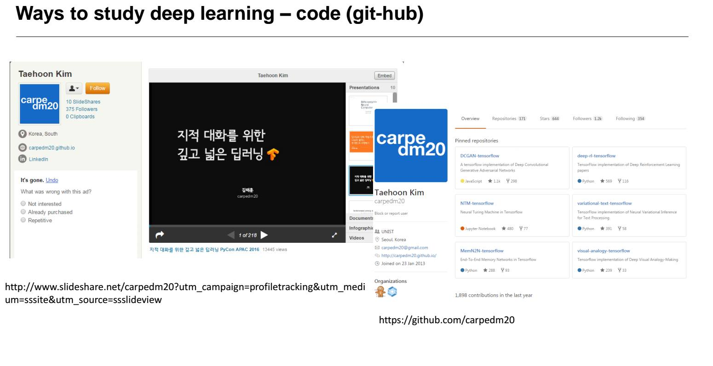
**이미지 캡션:** 이 이미지는 딥러닝 학습 방법에 대한 웹 페이지의 스크린샷으로, "Ways to study deep learning – code (git-hub)"라는 제목이 상단에 표시되어 있습니다. 왼쪽에는 "Taehoon Kim"이라는 이름의 사용자에 대한 프로필 정보가 있으며, 그의 GitHub 계정, LinkedIn 프로필, 그리고 "It's gone. Undo"라는 문구와 함께 광고에 대한 피드백 옵션이 보입니다. 중앙에는 "Taehoon Kim"이라는 이름의 사용자가 발표한 "지적 대화를 위한 깊고 넓은 딥러닝"이라는 제목의 슬라이드 발표 영상이 재생되고 있으며, 영상 하단에는 발표 날짜와 조회수가 표시되어 있습니다. 오른쪽에는 "Taehoon Kim"의 GitHub 프로필 페이지가 표시되어 있으며, "Pinned repositories" 섹션에는 "DCGAN-tensorflow", "deep-rl-tensorflow", "NTM-tensorflow", "variational-text-tensorflow", "MemN2N-tensorflow", "visual-analogy-tensorflow" 등 다양한 딥러닝 관련 프로젝트들이 나열되어 있습니다. 각 프로젝트는 설명, 사용된 프로그래밍 언어, 별표 수, 포크 수 등의 정보를 포함하고 있습니다. 또한, 사용자의 소속 기관으로 "UNIST"와 "Seoul Korea"가 언급되어 있으며, 이메일 주소와 GitHub 링크도 확인할 수 있습니다. 하단에는 "1,898 contributions in the last year"라는 문구와 함께 사용자의 GitHub 프로필 링크가 다시 한번 제공됩니다. 전반적으로 이 이미지는 딥러닝 분야의 전문가가 자신의 학습 방법과 관련 프로젝트를 공유하는 온라인 프로필을 보여주고 있으며, 기술적인 내용을 다루는 분위기입니다.이라는 제목의 슬라이드 발표 영상이 재생되고 있으며, 영상 하단에는 발표 날짜와 조회수가 표시되어 있습니다. 오른쪽에는 "Taehoon Kim"의 GitHub 프로필 페이지가 표시되어 있으며, "Pinned repositories" 섹션에는 "DCGAN-tensorflow", "deep-rl-tensorflow", "NTM-tensorflow", "variational-text-tensorflow", "MemN2N-tensorflow", "visual-analogy-tensorflow" 등 다양한 딥러닝 관련 프로젝트들이 나열되어 있습니다. 각 프로젝트는 설명, 사용된 프로그래밍 언어, 별표 수, 포크 수 등의 정보를 포함하고 있습니다. 또한, 사용자의 소속 기관으로 "UNIST"와 "Seoul Korea"가 언급되어 있으며, 이메일 주소와 GitHub 링크도 확인할 수 있습니다. 하단에는 "1,898 contributions in the last year"라는 문구와 함께 사용자의 GitHub 프로필 링크가 다시 한번 제공됩니다. 전반적으로 이 이미지는 딥러닝 분야의 전문가가 자신의 학습 방법과 관련 프로젝트를 공유하는 온라인 프로필을 보여주고 있으며, 기술적인 내용을 다루는 분위기입니다.
 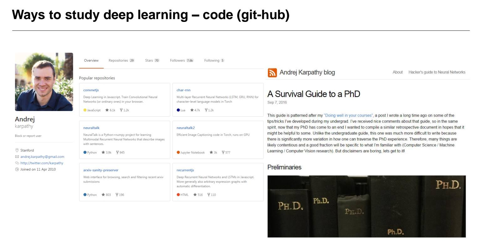
**이미지 캡션:** 화면 왼쪽에는 검은색 셔츠를 입고 미소를 짓고 있는 백인 남성이 보인다. 그의 이름은 Andrej karpathy이며, 스탠퍼드 대학교 소속임을 알 수 있다. 그의 아래에는 그의 이메일 주소와 트위터 계정, 그리고 2010년 4월 11일에 가입했다는 정보가 있다. 화면 중앙에는 그의 인기 있는 저장소 목록이 나열되어 있으며, 각 저장소는 이름, 설명, 사용된 프로그래밍 언어, 그리고 별표와 포크 수를 보여준다. 오른쪽에는 "Andrej Karpathy blog"라는 제목과 함께 "A Survival Guide to a PhD"라는 글이 보인다. 이 글은 2016년 9월 7일에 작성되었으며, 박사 과정 경험에 대한 내용을 담고 있다. 글 아래에는 "Preliminaries"라는 제목과 함께 여러 권의 책이 쌓여 있는 모습이 보인다. 책등에는 모두 "Ph.D."라고 쓰여 있어 학문적인 분위기를 자아낸다. 전체적으로 이 화면은 프로그래머의 개인 프로필 페이지와 그의 블로그 게시물을 보여주며, 딥러닝 및 박사 과정에 대한 정보를 전달하고 있다.ord, his email address, his Twitter handle, and the date he joined. To the right of his profile, a list of his popular GitHub repositories is shown, including "convnetjs," "neuraltalk," "arxiv-sanity-preserver," "char-rnn," "neuraltalk2," and "recurrentjs," each with a brief description and metrics. Further to the right, a blog post titled "A Survival Guide to a PhD" by Andrej Karpathy is displayed, with the publication date "Sep 7, 2016." The text describes the post as a retrospective document about the PhD experience, particularly for those in Computer Science and Machine Learning. Below the blog post, a section titled "Preliminaries" shows a close-up of several dark-bound books with "Ph.D." embossed in gold lettering on their spines. The overall atmosphere of the image is professional and informative, suggesting a focus on academic and technical pursuits.
 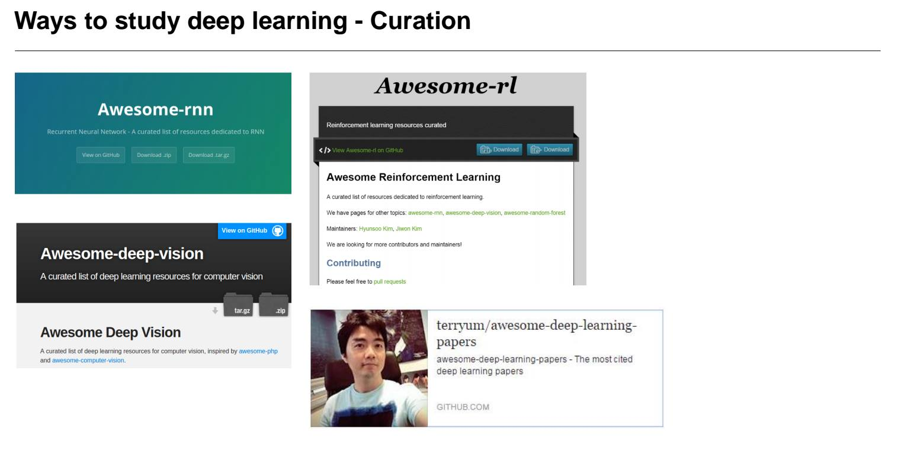
**이미지 캡션:** 화면 상단에는 "Ways to study deep learning - Curation"이라는 제목이 보이며, 그 아래에는 딥러닝 관련 자료들을 모아놓은 웹사이트 링크 세 개가 나란히 배치되어 있습니다. 왼쪽 상단에는 "Awesome-rnn"이라는 제목과 함께 순환 신경망(Recurrent Neural Network)에 대한 자료 목록임을 알리는 설명이 있고, "View on GitHub", "Download .zip", "Download .tar.gz" 버튼이 있습니다. 그 아래에는 "Awesome-deep-vision"이라는 제목과 컴퓨터 비전(computer vision) 관련 딥러닝 자료 목록임을 알리는 설명이 있으며, "View on GitHub" 버튼과 함께 .tar.gz, .zip 파일 다운로드 아이콘이 보입니다. 그 아래에는 "Awesome Deep Vision"이라는 제목과 함께 컴퓨터 비전 관련 딥러닝 자료 목록이며, awesome-php와 awesome-computer-vision에서 영감을 받았다는 설명이 있습니다. 오른쪽 상단에는 "Awesome-rl"이라는 제목과 강화학습(Reinforcement learning) 관련 자료 목록임을 알리는 설명이 있고, "View Awesome-rl on GitHub", "Download" 버튼이 있습니다. 그 아래에는 "Awesome Reinforcement Learning"이라는 제목과 강화학습에 대한 자료 목록임을 알리는 설명이 있으며, 다른 주제들에 대한 페이지 링크와 함께 "Maintainers: Hyunsoo Kim, Jiwon Kim"이라고 적혀 있습니다. 또한, 더 많은 기여자 및 유지보수자를 찾고 있다는 내용과 "Contributing"이라는 제목 아래 "Please feel free to pull requests"라는 문구가 있습니다. 가장 아래에는 한 남성이 카메라를 보며 미소 짓고 있는 사진이 있고, 그 옆에는 "terryum/awesome-deep-learning-papers"라는 제목과 함께 "awesome-deep-learning-papers - The most cited deep learning papers"라는 설명이 있으며, 하단에는 "GITHUB.COM"이라고 적혀 있습니다. 전체적으로 딥러닝 학습에 유용한 자료들을 소개하는 웹사이트들을 보여주는 화면으로, 정보 전달에 초점을 맞춘 차분하고 전문적인 분위기입니다.ork - A curated list of resources dedicated to RNN" and buttons for "View on GitHub", "Download .zip", and "Download .tar.gz". Below this, on the left, is a dark grey card titled "Awesome-deep-vision" with the subtitle "A curated list of deep learning resources for computer vision" and a "View on GitHub" button, along with download icons for "tar.gz" and ".zip" files. The right side of the slide shows a white card with a dark grey header titled "Awesome-rl" and the subtitle "Reinforcement learning resources curated", followed by a button "<> View Awesome-rl on GitHub" and two "Download" buttons. Below this, the card expands to show "Awesome Reinforcement Learning", a description, mentions of other topics like "awesome-rnn", "awesome-deep-vision", and "awesome-random-forest", and lists "Maintainers: Hyunsoo Kim, Jiwon Kim" and a call for contributors. Further down, there is a section titled "Contributing" with a prompt to "Please feel free to pull requests". At the bottom right, a photograph of an adult male with dark hair, wearing a light-colored t-shirt with a blue and white pattern, is shown. To the right of the photo is a text box with the GitHub username "terryum/awesome-deep-learning-papers" and the description "awesome-deep-learning-papers - The most cited deep learning papers", with "GITHUB.COM" at the bottom. The overall atmosphere is informative and professional, suggesting a resource guide for learning deep learning.
 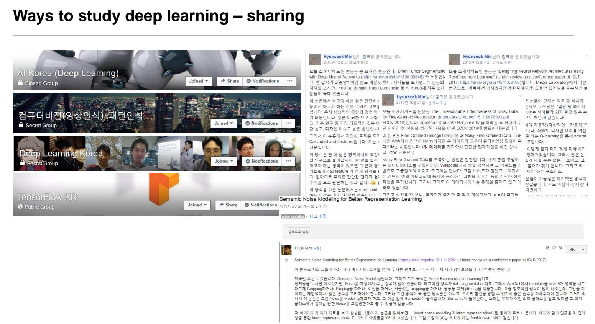
**이미지 캡션:** 이 사진은 딥러닝 학습 및 공유에 관한 내용을 담고 있으며, 여러 소셜 미디어 게시물과 그룹 목록을 보여줍니다. 상단에는 "Ways to study deep learning – sharing"이라는 제목이 있습니다. 왼쪽에는 "AI Korea (Deep Learning)", "컴퓨터비젼(영상인식), 패턴인식", "Deep Learning Korea", "TensorFlow KR"과 같은 딥러닝 관련 그룹 목록이 보이며, 각 그룹은 닫힌 그룹, 비밀 그룹, 공개 그룹 등으로 분류되어 있습니다. 오른쪽에는 "Hyunseok Min"이라는 사용자가 공유한 여러 게시물이 나타납니다. 게시물들은 주로 딥러닝 관련 논문 소개와 내용 요약이며, "Brain Tumor Segmentation with Deep Neural Networks", "Designing Neural Network Architectures using Reinforcement Learning", "The Unreasonable Effectiveness of Noisy Data for Fine-Grained Recognition", "Semantic Noise Modeling for Better Representation Learning" 등의 논문 제목이 언급됩니다. 게시물들은 2016년과 2017년에 작성되었으며, 일부는 링크와 함께 제공됩니다. 사진의 전체적인 분위기는 학술적이고 정보 공유에 초점을 맞추고 있습니다.unseok Min"이라는 사용자가 공유한 여러 게시물이 나타납니다. 게시물들은 주로 딥러닝 관련 논문 소개와 내용 요약이며, "Brain Tumor Segmentation with Deep Neural Networks", "Designing Neural Network Architectures using Reinforcement Learning", "The Unreasonable Effectiveness of Noisy Data for Fine-Grained Recognition", "Semantic Noise Modeling for Better Representation Learning" 등의 논문 제목이 언급됩니다. 게시물들은 2016년과 2017년에 작성되었으며, 일부는 링크와 함께 제공됩니다. 사진의 전체적인 분위기는 학술적이고 정보 공유에 초점을 맞추고 있습니다.

### 3월 26일 (일) 10:51 · 📷 사진 (2장)

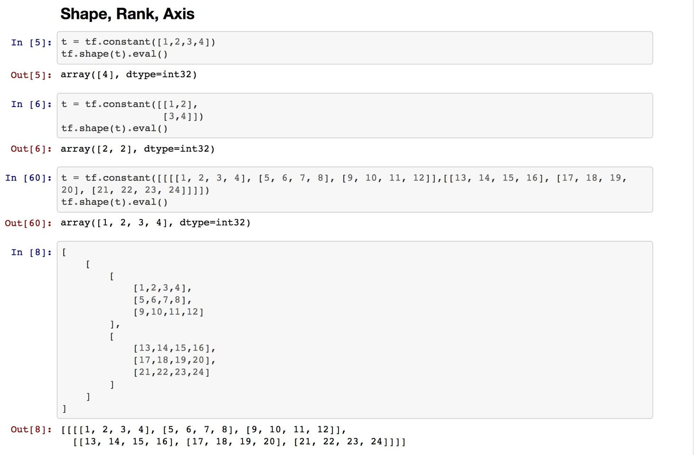
**이미지 캡션:** 이 이미지는 프로그래밍 코드와 그 실행 결과를 보여주는 스크린샷으로, 텐서플로우(TensorFlow) 라이브러리를 사용하여 텐서의 모양(shape), 랭크(rank), 축(axis)을 다루는 예제를 담고 있습니다. 상단에는 "Shape, Rank, Axis"라는 제목이 흰색 바탕에 검은색 글씨로 쓰여 있습니다. 그 아래로 여러 개의 코드 입력(In)과 출력(Out) 블록이 순서대로 나열되어 있습니다. 각 블록은 회색 배경에 흰색 글씨로 코드가 표시되며, 그 아래에는 실행 결과가 흰색 배경에 검은색 글씨로 나타납니다. 코드 블록에서는 `tf.constant` 함수를 사용하여 다양한 형태의 텐서를 생성하고, `tf.shape(t).eval()`을 통해 해당 텐서의 모양을 출력하는 것을 볼 수 있습니다. 예를 들어, 첫 번째 코드 블록에서는 1차원 텐서 `[1, 2, 3, 4]`를 생성하고 그 모양이 `[4]`임을 보여줍니다. 두 번째 블록에서는 2차원 텐서 `[[1, 2], [3, 4]]`를 생성하고 모양이 `[2, 2]`임을 보여줍니다. 세 번째 블록에서는 더 복잡한 3차원 텐서를 생성하고 그 모양이 `[1, 2, 3, 4]`임을 보여주는데, 이는 텐서의 차원이 4개임을 의미합니다. 마지막 코드 블록에서는 중첩된 리스트를 사용하여 3차원 텐서를 생성하고, 그 결과로 출력되는 텐서의 구조를 보여줍니다. 이 이미지는 프로그래밍 학습 자료나 기술 문서의 일부로 보이며, 텐서플로우를 이용한 데이터 구조 이해에 초점을 맞추고 있습니다. 특별한 인물, 장소, 사물, 텍스트는 보이지 않으며, 전체적으로 차분하고 정보 전달에 집중된 분위기입니다.납니다. 코드 블록에서는 `tf.constant` 함수를 사용하여 다양한 형태의 텐서를 생성하고, `tf.shape(t).eval()`을 통해 해당 텐서의 모양을 출력하는 것을 볼 수 있습니다. 예를 들어, 첫 번째 코드 블록에서는 1차원 텐서 `[1, 2, 3, 4]`를 생성하고 그 모양이 `[4]`임을 보여줍니다. 두 번째 블록에서는 2차원 텐서 `[[1, 2], [3, 4]]`를 생성하고 모양이 `[2, 2]`임을 보여줍니다. 세 번째 블록에서는 더 복잡한 3차원 텐서를 생성하고 그 모양이 `[1, 2, 3, 4]`임을 보여주는데, 이는 텐서의 차원이 4개임을 의미합니다. 마지막 코드 블록에서는 중첩된 리스트를 사용하여 3차원 텐서를 생성하고, 그 결과로 출력되는 텐서의 구조를 보여줍니다. 이 이미지는 프로그래밍 학습 자료나 기술 문서의 일부로 보이며, 텐서플로우를 이용한 데이터 구조 이해에 초점을 맞추고 있습니다. 특별한 인물, 장소, 사물, 텍스트는 보이지 않으며, 전체적으로 차분하고 정보 전달에 집중된 분위기입니다.
 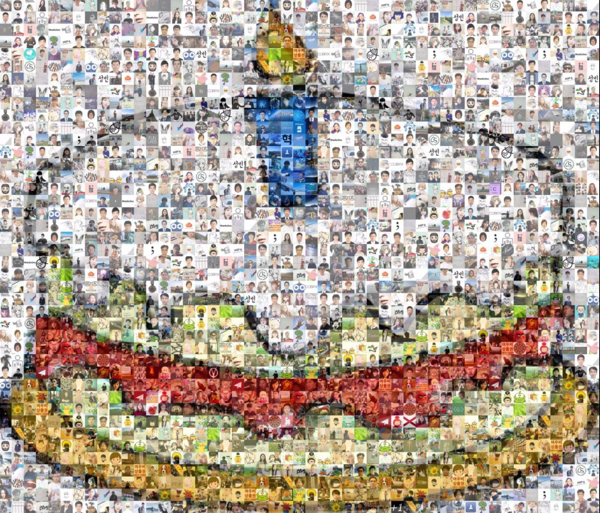
**이미지 캡션:** 이 이미지는 수많은 작은 사진들로 이루어진 모자이크 아트 작품으로, 전체적으로는 거대한 케이크 위에 놓인 촛불의 모습을 형상화하고 있습니다. 촛불 부분은 파란색과 노란색 계열의 작은 사진들로 이루어져 있으며, 불꽃 부분은 붉은색과 주황색 계열의 사진들로 표현되어 있습니다. 케이크 부분은 다양한 색상의 작은 사진들로 채워져 있으며, 특히 붉은색, 노란색, 초록색 계열의 사진들이 많이 사용되었습니다. 작은 사진들 속에는 주로 젊은 성인 남성과 여성들의 얼굴 사진이 많이 보이며, 일부는 귀여운 캐릭터나 풍경 사진도 포함되어 있습니다. 사진들 중에는 "성빈", "성인", "혁"과 같은 한글 텍스트가 포함된 것도 있습니다. 전반적으로 밝고 긍정적인 분위기를 풍기며, 축하 또는 기념하는 행사의 일부로 보입니다. 포함되어 있습니다. 사진들 중에는 "성빈", "성인", "혁"과 같은 한글 텍스트가 포함된 것도 있습니다. 전반적으로 밝고 긍정적인 분위기를 풍기며, 축하 또는 기념하는 행사의 일부로 보입니다.

> 그동안 출장이 많아 주춤하였던 TF 1.0에 맞게 재 녹음 하던 lab 강의를 이번주 부터 재시작하여 남은 XOR, NN, DNN, CNN, RNN등으로 마무리 하려고 합니다.  이제부터 많은 디멘션의 tensor를 다루게 되는데, 좀더 쉬운 이해를 위해 보너스로 tensor 다루는 방법 강의를 하고 DNN등으로 들어가려고 합니다. 예제를 작성중인데 혹시 tensor 다루시면서 햇갈리는 부분이나 다루었으면 하는 예제가 있으면 (pull request 또는 댓글등으로) 알려주세요. 강의에 반영하고 의견 주신분들을 강의에서 소개하겠습니다.  https://github.com/hunkim/DeepLearningZeroToAll/blob/master/lab-08-tensor_manipulation.ipynb   (많은 분들이 RL 나머지 강의 문의 주시는데 이번주 TF 1.0 lab 재녹음후, 추가 2~3강 (PG, A3C등)후 RL 종강될 예정입니다. 늦어져 죄송합니다.)
> TF-KR 첫번째 생일 축하합니다. 2016년 3월 26일 Soonson Kwon 님등 몇명의 운영진과 함께 시작한 그룹이 일년만에 13,300명의 그룹이 되었습니다.  여러분들 덕분에 한해동안 정말 즐겁고 행복한 시간이였고 저를 포함한 운영진들도 정말 많이 배웠습니다. 내년 2번째 TF-KR생일을 맞이할때 우리 그룹이, 또 우리 멤버들 각자가 얼마나 발전해 있을지 매우 기대됩니다.  TF-KR 첫번째 생일 축하의 의미로 여러분들의 얼굴이 담겨있는 케익을 선물로 드립니다.  (참고로 특정 facebook group의 사용자 profile사진을 다운 받으싶으시면 https://github.com/hunkim/FacebookGroupMemberPics 참고 하세요.)

### 3월 26일 (일) 14:47 · Very touching music to listen while Sewo…

Very touching music to listen while Sewol ferry emerges from the water 3 years after sinking. 

"This Album has been created by volunteers around the world, contributing by giving songs to give condolences to the Sewol Ferry Disaster Victims."

### 3월 27일 (월) 03:36 · Want to visit Jeju, a beautiful island i…

Want to visit Jeju, a beautiful island in Korea this July? Please consider a month-long and fun deep learning camp that I am co-organizing:

https://github.com/TensorFlowKR/MLJejuCamp

Jeff Dean (Google Senior Fellow via Hangout), and Rajat Monga (Google/TensorFlow Director (TBC)) will give us keynote talks.

(We are also looking for mentors.)

About Jeju:
"Jeju province encompasses the South Korean island of Jeju in the Korea Strait. It's known for its beach resorts and volcanic landscape of craters and cavelike lava tubes. Hallasan Mountain, a dormant volcano, features hiking trails, a crater lake at the 1,950m summit and nearby Gwaneumsa Temple. The Geomunoreum Lava Tube System includes 7km-long Manjanggul Cave, created centuries ago when Hallasan was still active." - google

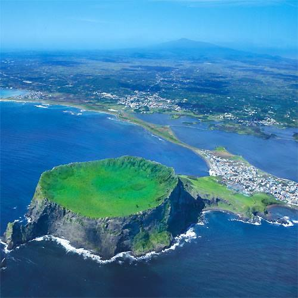
**이미지 캡션:** 푸른 바다 위에 솟아 있는 거대한 초록색 분화구 섬인 성산일출봉의 항공 촬영 사진으로, 분화구 정상은 푸른 잔디로 덮여 있으며, 섬의 절벽은 깎아지른 듯 가파르고 바위투성이입니다. 섬의 오른쪽으로는 하얀 건물들이 빽빽하게 들어선 마을이 길게 뻗어 있으며, 이 마을은 좁은 육로를 통해 본토와 연결되어 있습니다. 멀리 수평선 너머로는 희미하게 산의 윤곽이 보이며, 하늘은 맑고 푸릅니다. 사진에는 사람이 보이지 않으며, 자연의 웅장함과 평화로운 풍경이 조화를 이루고 있습니다.

### 3월 29일 (수) 07:11 · 📷 사진 (1장)

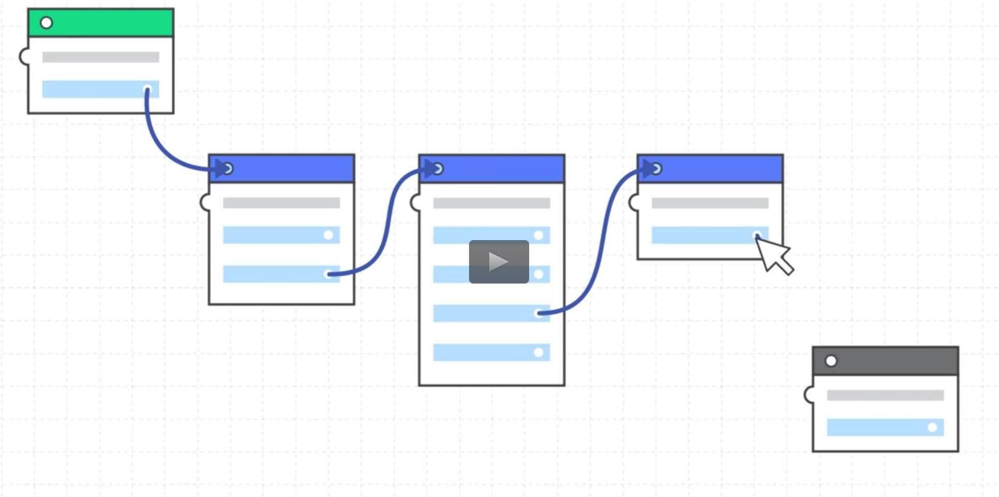
**이미지 캡션:** 이 이미지는 여러 개의 사각형 블록이 파란색 선으로 연결된 다이어그램을 보여줍니다. 각 블록은 회색과 파란색의 가로 줄무늬로 채워져 있으며, 상단에는 색상이 다른 헤더가 있습니다. 왼쪽 상단의 블록은 녹색 헤더를 가지고 있고, 그 아래의 세 블록은 파란색 헤더를 가지고 있으며, 오른쪽 하단의 블록은 회색 헤더를 가지고 있습니다. 블록들은 서로 연결되어 있으며, 특히 파란색 헤더를 가진 블록 중 가운데 블록에는 재생 버튼 모양의 아이콘이 있습니다. 오른쪽 하단 블록 위에는 마우스 커서 모양의 아이콘이 있어, 사용자가 블록과 상호작용하고 있음을 시사합니다. 배경은 격자무늬로 되어 있어, 마치 설계 도면이나 와이어프레임 같은 느낌을 줍니다. 전체적으로 추상적이고 기술적인 내용을 시각화한 것으로 보이며, 정보의 흐름이나 프로세스를 나타내는 데 사용될 수 있습니다. 사람이나 구체적인 사물은 보이지 않으며, 텍스트도 거의 없어, 순수하게 구조와 연결성을 보여주는 데 초점을 맞춘 이미지입니다.용자가 블록과 상호작용하고 있음을 시사합니다. 배경은 격자무늬로 되어 있어, 마치 설계 도면이나 와이어프레임 같은 느낌을 줍니다. 전체적으로 추상적이고 기술적인 내용을 시각화한 것으로 보이며, 정보의 흐름이나 프로세스를 나타내는 데 사용될 수 있습니다. 사람이나 구체적인 사물은 보이지 않으며, 텍스트도 거의 없어, 순수하게 구조와 연결성을 보여주는 데 초점을 맞춘 이미지입니다.

> Alexa 를 이용해 콜센터를 만들어 주는 재미있는 서비스가 나왔습니다. 코딩도 필요없이 드래그드랍으로 플로우를 만들어 낼수 있다고 합니다.  이번주에 저의 개인 콜센터를 하나 만들어 봐야겠습니다. ^^  https://aws.amazon.com/connect/  Channy Yun님이 그사이 번역까지. 대단하심. https://aws.amazon.com/ko/blogs/korea/amazon-connect-customer-contact-center-in-the-cloud/

### 3월 30일 (목) 07:11 · 📷 사진 (1장)

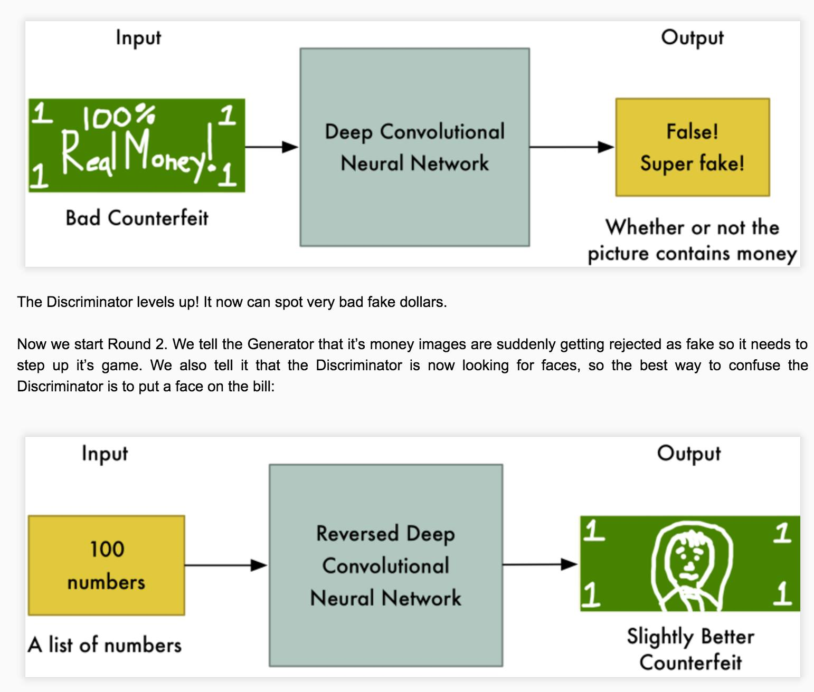
**이미지 캡션:** 이 이미지는 딥러닝 모델의 학습 과정을 시각적으로 설명하는 두 개의 다이어그램으로 구성되어 있습니다. 상단 다이어그램은 "입력"으로 "1 100% Real Money!"라고 쓰여진 칠판과 "Bad Counterfeit"라는 텍스트가 있고, "Deep Convolutional Neural Network"라는 녹색 사각형을 거쳐 "Output"으로 "False! Super fake!"라고 쓰여진 노란색 사각형과 "Whether or not the picture contains money"라는 텍스트가 나옵니다. 이는 딥러닝 모델이 가짜 돈을 식별하는 과정을 보여줍니다. 하단 다이어그램은 "입력"으로 "100 numbers"라고 쓰여진 노란색 사각형과 "A list of numbers"라는 텍스트가 있고, "Reversed Deep Convolutional Neural Network"라는 녹색 사각형을 거쳐 "Output"으로 1이 그려진 초록색 지폐에 얼굴 그림이 그려진 이미지와 "Slightly Better Counterfeit"라는 텍스트가 나옵니다. 이는 모델이 얼굴을 인식하도록 학습된 후, 가짜 돈에 얼굴을 그려 넣어 모델을 혼란스럽게 만드는 상황을 보여줍니다. 두 다이어그램 모두 흰색 배경에 단순한 도형과 텍스트로 구성되어 있으며, 학습 과정의 단계를 명확하게 전달하는 데 중점을 두고 있습니다.이는 딥러닝 모델이 가짜 돈을 식별하는 과정을 보여줍니다. 하단 다이어그램은 "입력"으로 "100 numbers"라고 쓰여진 노란색 사각형과 "A list of numbers"라는 텍스트가 있고, "Reversed Deep Convolutional Neural Network"라는 녹색 사각형을 거쳐 "Output"으로 1이 그려진 초록색 지폐에 얼굴 그림이 그려진 이미지와 "Slightly Better Counterfeit"라는 텍스트가 나옵니다. 이는 모델이 얼굴을 인식하도록 학습된 후, 가짜 돈에 얼굴을 그려 넣어 모델을 혼란스럽게 만드는 상황을 보여줍니다. 두 다이어그램 모두 흰색 배경에 단순한 도형과 텍스트로 구성되어 있으며, 학습 과정의 단계를 명확하게 전달하는 데 중점을 두고 있습니다.

> GAN을 설명하는 가장 귀여운 그림과 함께 우리가 많이 하는 게임 화면을 입력으로 사용하여 새로운 게임 화면을 만들어 보는 시도를 소개하는 글: http://www.rubedo.com.br/2017/03/generative-adversarial-networks-to-make.html  이런 한 도메인의 그림등을 모아서 학습시키면 같은 도메인의 *창의적*인 그림등을 만들어 낼수도 있을것 같습니다.  아침에 설명보고 재미있어서 공유드립니다.

### 3월 31일 (금) 05:47 · Really beautiful!

Really beautiful!

https://www.youtube.com/watch?v=peasBhOWKsY&app=desktop

### 3월 31일 (금) 06:20 · 📷 사진 (2장)

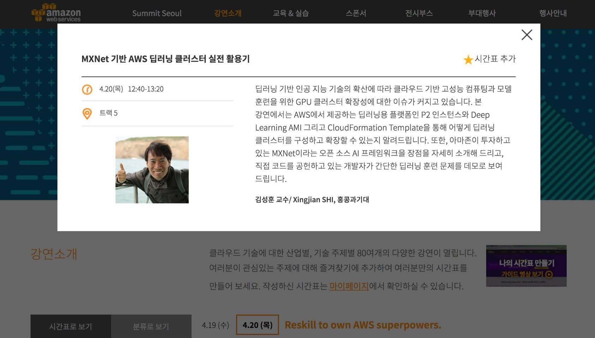
**이미지 캡션:** 한 명의 성인 남성이 사진 중앙에 있으며, 그는 옅은 갈색 재킷을 입고 환하게 웃으며 엄지손가락을 치켜들고 있습니다. 그의 머리카락은 검은색이고 짧으며, 그는 야외에서 찍은 사진으로 보입니다. 사진은 팝업 창 안에 있으며, 창의 제목은 "MXNet 기반 AWS 딥러닝 클러스터 실전 활용기"입니다. 창 안에는 강연 날짜와 시간, 장소, 그리고 강연 내용에 대한 설명이 한국어로 적혀 있습니다. 강연 내용은 딥러닝 기반 인공지능 기술의 확산에 따라 클라우드 기반 고성능 컴퓨팅과 모델 훈련을 위한 GPU 클러스터 확장성에 대한 이슈를 다루며, AWS에서 제공하는 P2 인스턴스와 Deep Learning AMI, CloudFormation Template을 통해 딥러닝 클러스터를 구성하고 확장하는 방법을 알려준다고 합니다. 또한, 아마존이 투자하고 있는 MXNet이라는 오픈 소스 AI 프레임워크의 장점을 소개하고, 직접 코드를 공헌하고 있는 개발자가 간단한 딥러닝 훈련 문제를 데모로 보여줄 예정이라고 합니다. 강연자는 김성훈 교수/Xingjian SHI, 홍콩과기대라고 명시되어 있습니다. 팝업 창 아래에는 "강연소개"라는 제목과 함께 클라우드 기술에 대한 다양한 강연이 열린다는 내용과, 관심 있는 주제를 즐겨찾기에 추가하여 자신만의 시간표를 만들 수 있다는 안내가 있습니다. 또한, "나의 시간표 만들기"라는 제목의 가이드 영상 보기 버튼도 보입니다. 화면 하단에는 "시간표로 보기", "분류로 보기" 버튼과 함께 4.19(수), 4.20(목) 날짜와 "Reskill to own AWS superpowers."라는 문구가 보입니다. 전반적으로 기술 강연에 대한 정보를 제공하는 웹페이지의 일부로 보이며, 긍정적이고 유익한 분위기입니다.장성에 대한 이슈를 다루며, AWS에서 제공하는 P2 인스턴스와 Deep Learning AMI, CloudFormation Template을 통해 딥러닝 클러스터를 구성하고 확장하는 방법을 알려준다고 합니다. 또한, 아마존이 투자하고 있는 MXNet이라는 오픈 소스 AI 프레임워크의 장점을 소개하고, 직접 코드를 공헌하고 있는 개발자가 간단한 딥러닝 훈련 문제를 데모로 보여줄 예정이라고 합니다. 강연자는 김성훈 교수/Xingjian SHI, 홍콩과기대라고 명시되어 있습니다. 팝업 창 아래에는 "강연소개"라는 제목과 함께 클라우드 기술에 대한 다양한 강연이 열린다는 내용과, 관심 있는 주제를 즐겨찾기에 추가하여 자신만의 시간표를 만들 수 있다는 안내가 있습니다. 또한, "나의 시간표 만들기"라는 제목의 가이드 영상 보기 버튼도 보입니다. 화면 하단에는 "시간표로 보기", "분류로 보기" 버튼과 함께 4.19(수), 4.20(목) 날짜와 "Reskill to own AWS superpowers."라는 문구가 보입니다. 전반적으로 기술 강연에 대한 정보를 제공하는 웹페이지의 일부로 보이며, 긍정적이고 유익한 분위기입니다.
 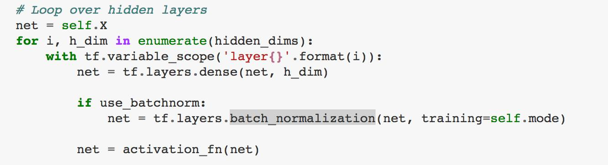
**이미지 캡션:** 이 이미지는 프로그래밍 코드의 스크린샷으로, 파이썬 언어로 작성된 딥러닝 모델의 일부를 보여줍니다. 코드의 배경은 흰색이며, 코드 자체는 다양한 색상으로 강조되어 가독성을 높였습니다. 코드의 내용은 딥러닝 신경망의 은닉층을 반복적으로 처리하는 부분을 나타냅니다. `# Loop over hidden layers`라는 주석으로 시작하여, `net = self.X`는 입력 데이터를 `net` 변수에 할당합니다. `for i, h_dim in enumerate(hidden_dims):` 루프는 `hidden_dims` 리스트를 순회하며 각 은닉층의 차원을 가져옵니다. `with tf.variable_scope('layer{}'.format(i)):`는 각 레이어에 대한 변수 스코프를 생성합니다. `net = tf.layers.dense(net, h_dim)`는 완전 연결(dense) 레이어를 추가하여 신경망을 구성합니다. `if use_batchnorm:` 조건문은 배치 정규화 사용 여부를 확인하며, `net = tf.layers.batch_normalization(net, training=self.mode)`는 배치 정규화 레이어를 적용합니다. 마지막으로 `net = activation_fn(net)`는 활성화 함수를 적용하여 비선형성을 추가합니다. 이 코드는 텐서플로우(TensorFlow) 라이브러리를 사용하여 딥러닝 모델을 구축하는 일반적인 패턴을 보여줍니다.` 리스트를 순회하며 각 은닉층의 차원을 가져옵니다. `with tf.variable_scope('layer{}'.format(i)):`는 각 레이어에 대한 변수 스코프를 생성합니다. `net = tf.layers.dense(net, h_dim)`는 완전 연결(dense) 레이어를 추가하여 신경망을 구성합니다. `if use_batchnorm:` 조건문은 배치 정규화 사용 여부를 확인하며, `net = tf.layers.batch_normalization(net, training=self.mode)`는 배치 정규화 레이어를 적용합니다. 마지막으로 `net = activation_fn(net)`는 활성화 함수를 적용하여 비선형성을 추가합니다. 이 코드는 텐서플로우(TensorFlow) 라이브러리를 사용하여 딥러닝 모델을 구축하는 일반적인 패턴을 보여줍니다.

> 2017년 4월 19일-20일, 코엑스에서 열리는 AWS Summit에서 저희 대학원생과 함께 딥러닝, AWS, MXNet에 대해 잠시 이야기 합니다. 저희 학교 학생중 Xianjian SHI 라는 학생이 MXNet의 개발자로 참여하고 있어서 같이 가게 되었습니다. 관심있으신 분들은 뵙겠습니다.  https://www.awssummit.kr/index.html
> 요즈음 무조건 사용하고 보는 Batch Normalization 을 Kyung Mo Kweon 님이 멋지게 설명해주십니다.  전체 코드도 두개의 클래스로 깔끔하게 정리하고 결과 그래프도 바로 비교해서 보여줍니다.  https://github.com/hunkim/DeepLearningZeroToAll/blob/master/lab-10-6-mnist_nn_batchnorm.ipynb
