# 2017년 4월

[← 2017년](README.md)

### 4월 1일 (토) 16:39 · 📷 사진 (1장)

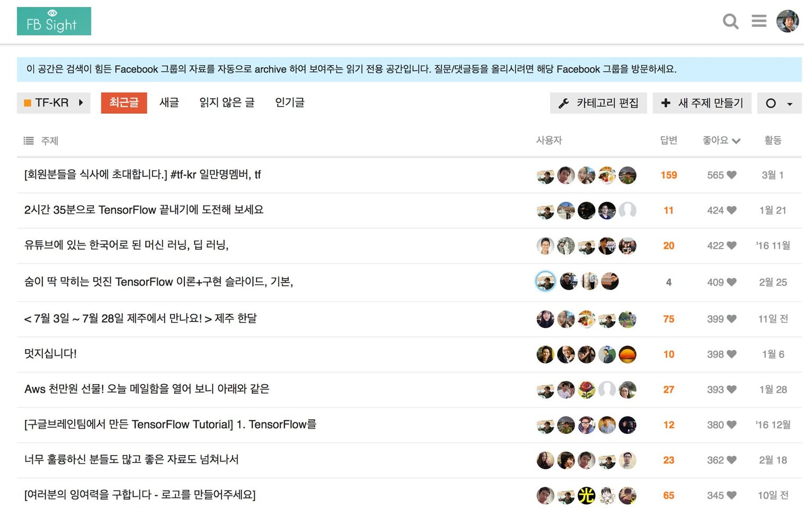

> 요즈음 저희 그룹에 재미있는 글들이 많고 300, 400 like는 쉽게 받고 있습니다. 좋은 글들 올려주시고 또 누르기 귀찮으실텐데도 "Like" 등으로 글 올리신 분을 격려해주시는 모든 멤버들에게 감사드립니다.  앞으로 1,000 like넘는 글들도 많이 볼수 있기를 기대합니다.  그동안 어떤 인기 글들이 있었을까요? http://fbsight.com/c/TF-KR?order=likes 가보시면 저희 그룹 인기글들의 archive를 모두 보실수 있습니다.

### 4월 2일 (일) 07:29 · 📷 사진 (1장)

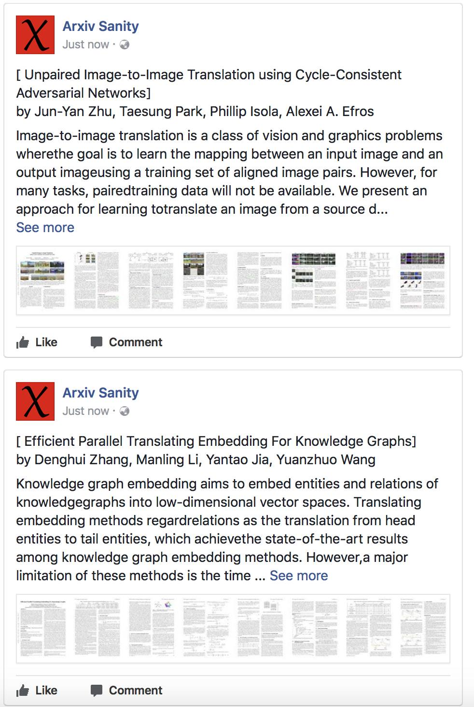

> [Arxiv FB Page 알파테스트 ]  https://www.facebook.com/pg/ArxivSanity   Owen Song 님이 어제 올려주신 포스트 (https://www.facebook.com/groups/TensorFlowKR/permalink/448201225520941/) 를 보고 ArxivSanity + 투표 (like)기능이 있으면 좋겠다 싶어서, 우선은 간단하게 FB page로 자동 등록되도록 만들어 보았습니다.  추가로 구글이나 파파고 번역을 넣어 한글로도 바로 읽을수 있도록 해보겠습니다.  의견 주시면 최대한 반양하겠습니다. 혹 Arxiv copyright에 대해 잘 아시는분 있으면 FB에 미러링 괜찮은지 의견 주시면 감사. http://www.arxiv-sanity.com/ 등의 서비스가 이미 있는 것을 보면 OK일듯 하긴 합니다.  (알파테스티 기간중에는 post가 사라졌다 다시 올라왔다하는등 많이 불안정 할 예정입니다.)

### 4월 4일 (화) 08:44 · 📷 사진 (1장)

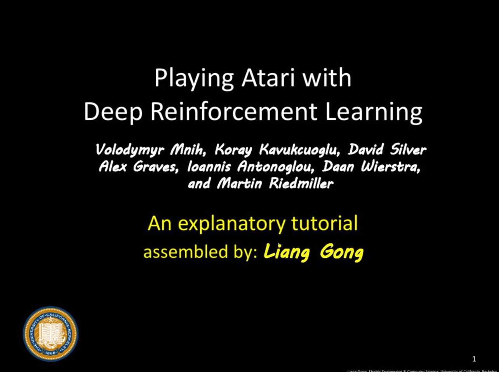

> 아주 잘 만들어진 DQN슬라이드! 수식도 나름 친절하게 annotation을 달아 설명해줍니다.  https://speakerdeck.com/jacksongl/playing-atari-with-deep-reinforcement-learning   저랑 같이 논문 작업을 한적이 있는 Liang Gong의 작품인데요, Kyung Mo Kweon과 만들고 있는 https://github.com/hunkim/ReinforcementZeroToAll 의 소스코드와 같이 보시면 좋습니다.

### 4월 4일 (화) 09:44 · 생일축하

생일축하

### 4월 4일 (화) 09:44 · ↪ 생일축하

*다른 프로필에 남긴 글*

생일축하

### 4월 5일 (수) 10:43 · 📷 사진 (3장)

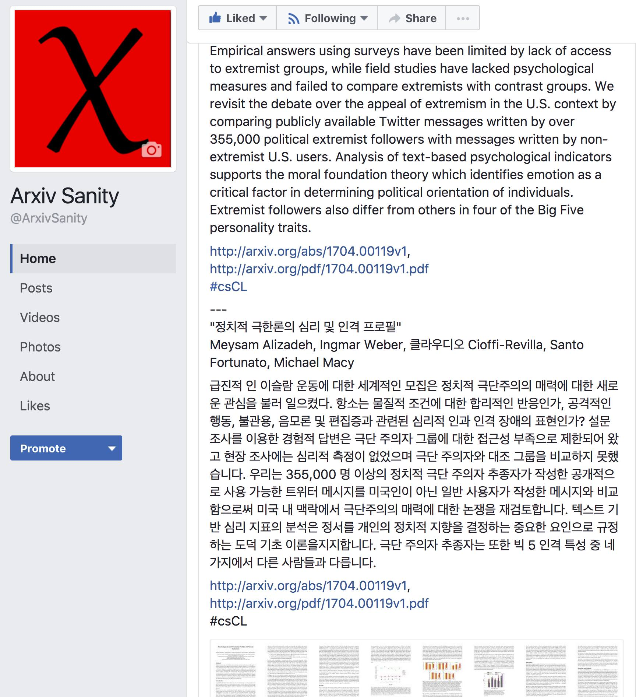  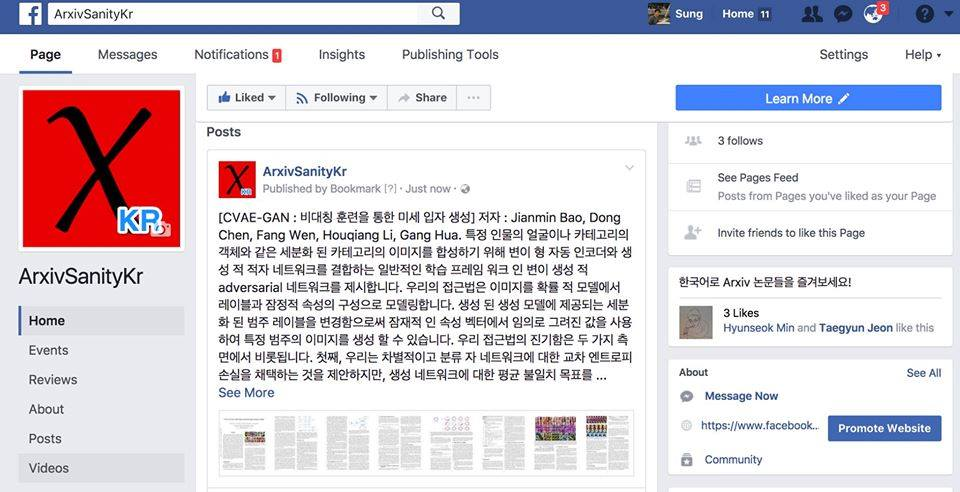

> Arixiv의 쏟아지는 논문을 빠르게 skim하기 위해 Arixiv 페이지가 한글을 지원합니다.   영문:  https://www.facebook.com/ArxivSanity 한글: https://www.facebook.com/ArxivSanityKR  많이 Like해주세요!
> [Arxiv 를 이제 한글로 Skim해보세요.]  일단  https://www.facebook.com/ArxivSanityKr-411075675932237/ 페이지 Like해주시면 매일 쏟아지는 Arxiv 논문을 한글로 빠르게, 본인의 facebook feed에서 skim 가능합니다. 조금 번역이 이상한 경우 G사에 유감을 표하시면서 스크롤 내리시면 영어 원문이 나옵니다.  논문 한편당 번역비로 제 개인 credit 20원씩 G사에 지급하는 것이니 한편 한편 소중하게 읽어 주시면 감사하겠습니다.
> [Arxiv 를 이제 한글로 Skim해보세요.] Arxiv 는 곳에 하루에 수십편, 그것도 인공지능에 관한 논문이 많아 나오는데, 그동안 영어만 있어서 읽기가 아주 불편했습니다.  그래서 G사의 도움을 빌려 한글로 읽을 수 있도록 해보았습니다.   우선 https://www.facebook.com/ArxivSanityKr-411075675932237/ 페이지 Like해주시면 논문 정보를 한글로, 그것도 facebook feed에서 skim 가능합니다. 조금 번역이 이상한 경우 G사에 유감을 표하시면서 스크롤 내리시면 영어 원문이 나옵니다.  논문 한편당 번역비로 제 개인 credit 20원씩 G사에 지급하는 것이니 한편 한편 소중하게 읽어 주시면 감사하겠습니다.

### 4월 6일 (목) 10:51 · 📷 사진 (1장)

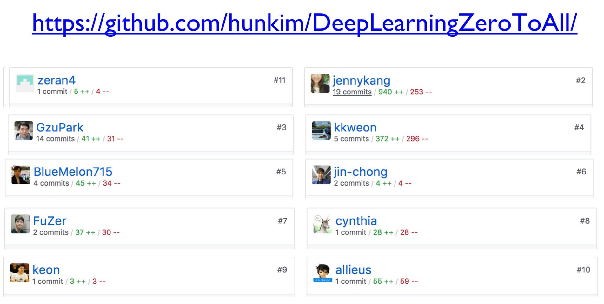

> #모두를위한딥러닝 TF1.0을 위한 lab 재녹음을 10강까지 마치고, 이제 11. CNN, 12. RNN 두 강좌만 남았습니다. 아래 슬라이드 처럼 많은 분들이 코드를 보내 주셔서 놀라운 일이 일어나고 있습니다. 상상하지도 못했던 Batch Norm, Ensemble 같은 모델이 생겨나고, 코드도 매우 깔끔해졌습니다.  도와주신분들 제가 강의 앞에 감사를 표하는데요, 제가 여러분들을 소개드릴수 있는 강의가 2개밖에 남지 않았습니다. 제가 더 많은 분들을 소개해드릴수 있도록 https://github.com/hunkim/DeepLearningZeroToAll 한번 보시고 pull request 보내 주시면 감사하겠습니다.  언제 11, 12강이 끝날지 알수 없으나 이번 주말정도에 완료되지 않을까 생각하고 있습니다.  여러분 모두 정말 감사드립니다.

### 4월 6일 (목) 15:00 · Good news! HKUST #2 in the world young u…

Good news! HKUST #2 in the world young university rankings 2017! We are young and very good!

### 4월 7일 (금) 04:52 · 📷 사진 (2장)

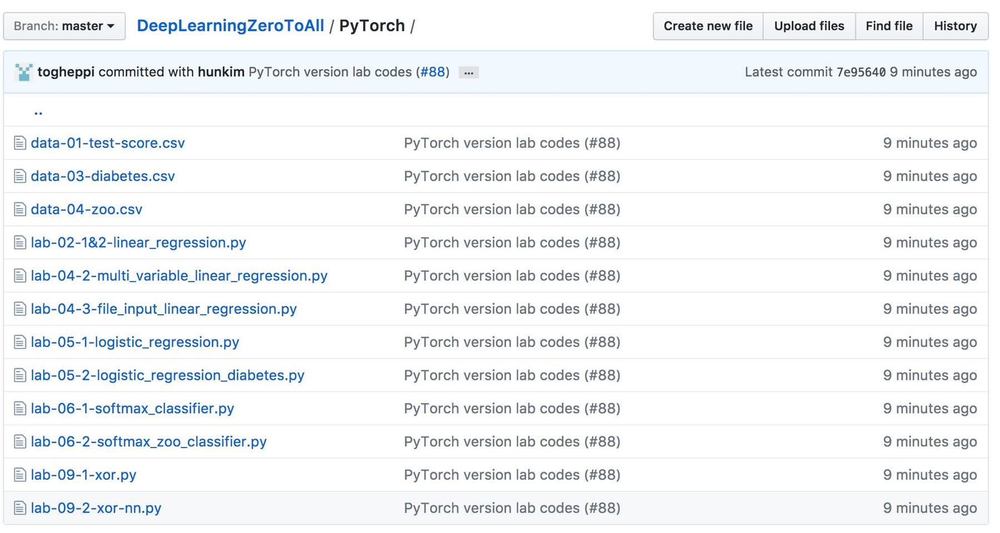 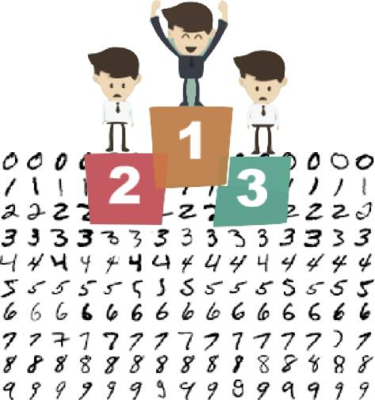

> TensorFlow, PyTorch, MXNet, Keras를 모두 한곳에서? 그것이 가능할까요?  https://github.com/hunkim/DeepLearningZeroToAll  많은분들의 도움으로 정말 멋진 repos가 되고 있습니다. @togheppi님PyTorch 코드 보내 주셨고, 2~3일 이내 MxNet의 핵심 개발 개발자인 @sxjscience님께서 MxNet 코드를 보내 주실 예정입니다.  저는 그냥 repository를 열어두기만 했는데 여러분들 덕분에 점점 멋진 곳이 되고 있습니다!
> #MNIST어디까지학습해봤니? [TF-KR 1회 대회]   [!] 마감 임박: 2017년 4월 22일 10PM KST. 한국시간 오늘 저녁 10시입니다!  여러분들이 많이 사용해보신 #MNIST, 여러분들 어느 정도 정확하게 학습해 보셨나요?  2017년 4월 22일까지 MNIST test set으로 가장 높은 정확도(accuracy)를 얻으신 분들에게는 저희 1회 대회 우승이라는 무한한 영광과 푸짐한 상품! 이번 기회에 MNIST로 끝까지 달려보아요! (@Hwalsuk Lee 님의 아이디어 제안으로 @Hwalsuk Lee님께서 이번 대회 심사 위원장을 맡아 주십니다. 감사!)  [상품] - 1위 1명: 누구나 갖고 싶어 하는 LAMY 만년필*2 (https://store.linefriends.com/timeline/brown-in-the-red/ 또는 비슷한 제품) 본인 하나+친구 선물! - 2위 3명: (5분만에 마감될 예정인) 3번째 TF-KR 모임 초대권*2 (본인과 친구선물). - 3위 5명: 딥러닝 관련 서적 1권 - 4위 5명: 뉴로핏 8G USB *2  [*추가 상품후원 환영] 약간 크라우드 펀딩 같은 개념인데요, 이 대회를 지지하고 참여자들에게 선물을 나누어주고 싶은 개인이나 회사가 있으면 hunkim+mnist@gmail.com 으로 선물명, 수량, 샘플 사진 등과 함께 알려주세요. 회사+개인 홍보 해드리며 위 상품 리스트에 넣어 드립니다. 커뮤니티에 의한 자체 상품 조달 시스템 만들어 이번 대회뿐만 아니라 2차 3차 대회를 만들어 가겠습니다. 위 상품 리스트가 길게 될수 있도록 꼭 부탁드립니다.  [참여 규칙] 1. 기간 및 방법: 지금부터 4월 22일 10PM KST 까지 이글의 댓글로 참가 (이후 댓글 잠금) 2. 평가: MNIST TensorFlow data Test Set Accuracy 3. 데이터: TensorFlow data, ‘input_data.read_data_sets("MNIST_data/", one_hot=True)’ 4. 학습: MNIST test set을 제외한 다른 모든 데이터 사용 가능 5. 프레임워크 자유 선택(TensorFlow, Keras, PyTorch 등 사용 가능) 6. Test set 데이터를 사용한 어떠한 형태의 reverse engineering, rule mining 등 금지 7. 학습 후 평가 결과가 나오면 일단 정확도 (TF float32 precision) 를 이 글의 댓글로 먼저 올리고 8. 2017년 4월 22일 10PM 까지 구현한 코드의 github/gist 등을 본인 댓글의 댓글, 또는 이전 정확도 댓글을 수정하여 추가 (복붙이기 방지를 위해 본인의 코드는 마지막 순간 (예 4/22, 9:50 PM) 제출 권장, 다른 분이 제출한 코드 복사/붙이기 적발 시 탈락 ㅠㅠ) 9. 2017년 4월 23~30일, 심사위원장, 운영진, 커뮤니티 회원들의 코드 검증 및 우승자 결정 10. 회원이 검증하고, 검증될 경우 OK라고 댓글의 댓글 남김. 두 명 이상 회원의 검증이 있으면 OK로 간주 11. 코드 reproducibility를 위해 tf.set_random_seed(777), numpy.random.seed(777)등 사용권장. Reproduce 안될경우 ㅠㅠ 12. 본인이 학습한 모델을 저장하여 같이 github에 올리는 것을 권장. 코드예제: https://github.com/hunkim/DeepLearningZeroToAll/blob/master/lab-13-3-mnist_save_restore.py 13. 테스트 및 accuracy 측정방법 (예제코드: https://github.com/hunkim/DeepLearningZeroToAll/blob/master/lab-07-4-mnist_introduction.py ( 그대로 사용하시면 됩니다.) 14. 여기에 정의되지 않은 룰은 운영진의 마음에 따릅니다.  [기타 질문] 모든 질문 환영하며 이글의 댓글을 이용해 주세요.

### 4월 9일 (일) 11:14 · 📷 사진 (2장)

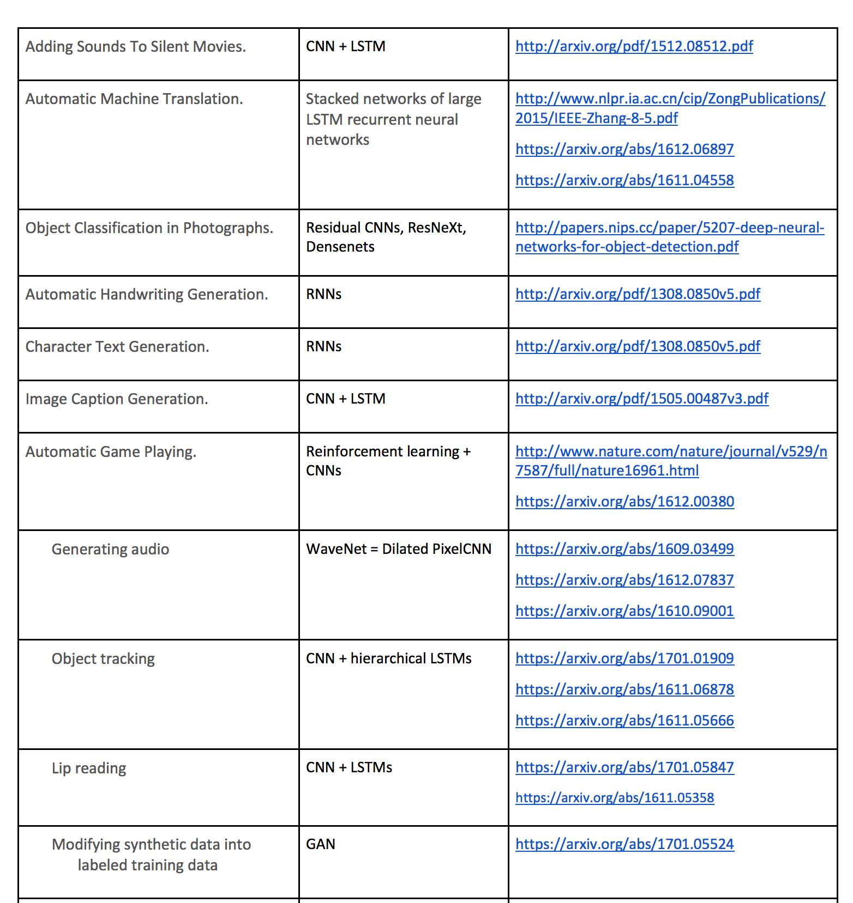 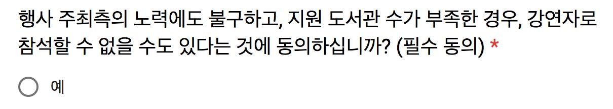

### 4월 10일 (월) 19:04 · 📷 사진 (2장)

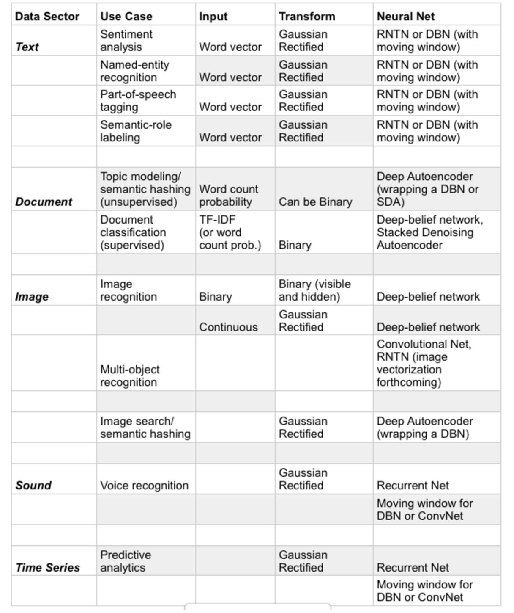 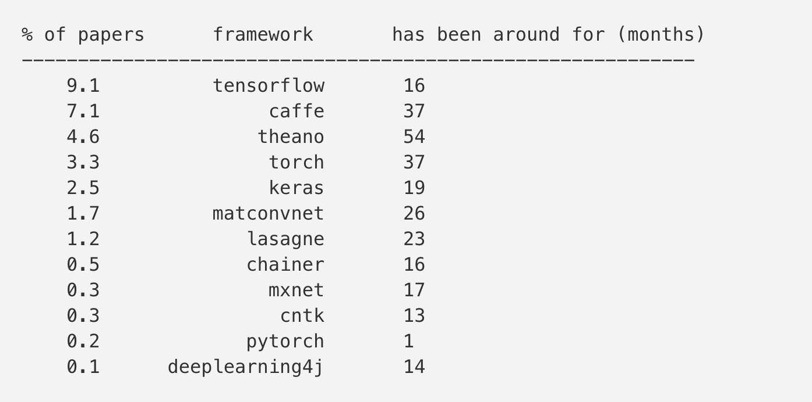

> 여러분들의 문제에 어떤 뉴럴렛을 사용하면 좋을까요?  테이블 하나로 깔끔하게 정리해줍니다. https://deeplearning4j.org/neuralnetworktable.html
> 2017년 3월에 arxiv 제출된 딥러닝 관련 10% 논문이 TF 언급 (아마도 구현), 커뮤니티의 40% (또는 그 이상)이 TF를 사용한다고 하네요. 그 외에도 딥러닝 트랜드 관련 재미있는 통계가 많습니다.  https://medium.com/@karpathy/a-peek-at-trends-in-machine-learning-ab8a1085a106 by Andrej Karpathy.   "10% of all papers submitted in March 2017 mention TensorFlow. ... it looks like about 40% of the community is currently using TensorFlow (or a bit more, if you count Keras with the TF backend)."

### 4월 11일 (화) 07:21 · 📷 사진 (8장)

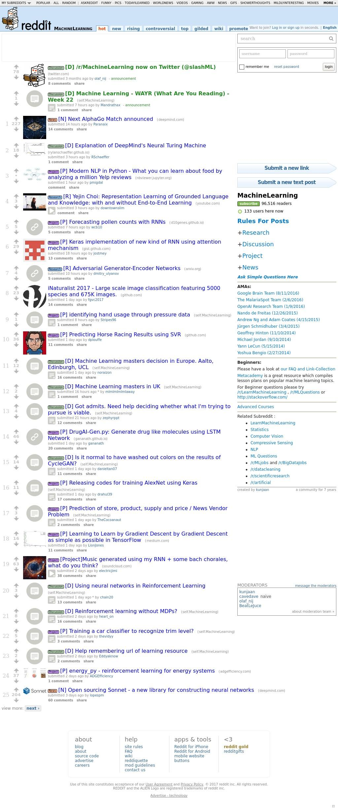   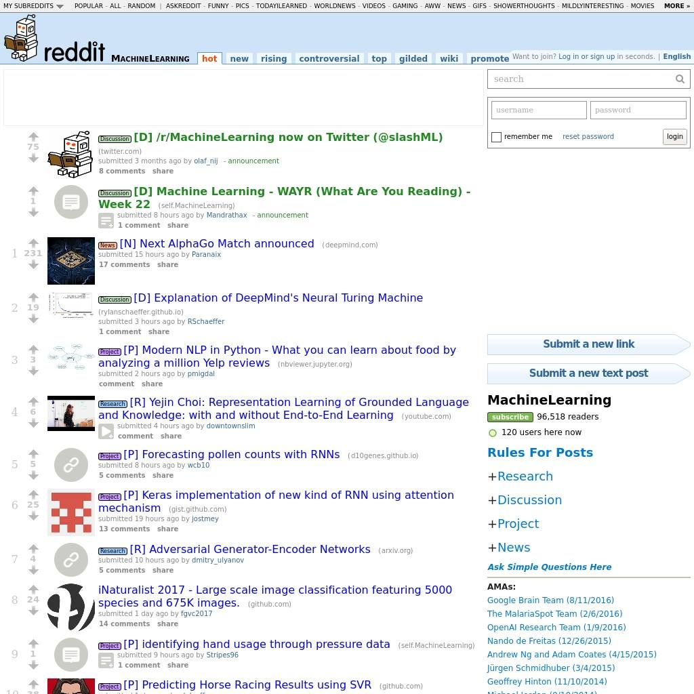    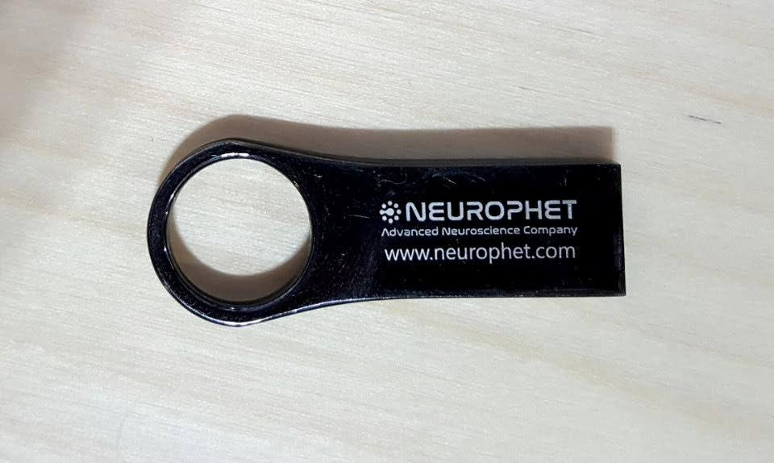

> #오늘의레딧 https://www.reddit.com/r/MachineLearning/ 오늘도 새소식이 많군요. (리스트가 길어 가독성이 좋지 않습니다. 가독성 관련 좋은 의견 있으시면 부탁드립니다)  1. 토론 - https://www.reddit.com/r/MachineLearning on Twitter (@slashML) 2. 토론 - 기계 학습 - WAYR (What Are You Reading) - 22 주차 3. 뉴스 - 다음 AlphaGo Match 발표 4. 토론 - DeepMind의 신경 튜링 기계에 대한 설명 5. 프로젝트 - 현대 NLP in Python - 수천 개의 Yelp 리뷰를 분석하여 음식에 대해 배울 수있는 것들 6. 연구 - 최 Yejin : 근거한 언어 및 지식의 대표 배우기 : 철저한 배우기와 더불어 그리고없이 7. 프로젝트 - RNN으로 꽃가루 수 예측 8. 프로젝트 - 관심 메커니즘을 사용하여 새로운 종류의 RNN을 Keras 구현 9. 연구 - Adversarial Generator-Encoder Networks 10. 프로젝트 - 압력 데이터를 통한 손 사용 확인 11. 프로젝트 - SVR을 사용하여 말 레이싱 결과 예측하기 12. 토론 - 유럽에서 기계 학습 석사 결정. 아 알토, 에딘버러, UCL 13. 토론 - 영국의 기계 학습 석사 14. 토론 - 인정했습니다. 내가 추구하려는 것이 실용적인지 판단하는 데 도움이 필요합니다. 15. 프로젝트 - DrugAI-Gen.py : LSTM 네트워크를 사용하여 분자와 같은 약물 생성 16. 토론 - CycleGAN의 결과에 색을 긋는 것이 정상입니까? 17. 프로젝트 - Keras를 사용하여 AlexNet을 교육하기위한 코드 공개 18. 프로젝트 - 매장, 제품, 공급 및 가격 예측 / 뉴스 공급 업체 문제 19. 프로젝트 - TensorFlow에서 가능한 한 단순한 Gradient Descent로 Gradient Descent로 배우기 20. 프로젝트 - 내 RNN + 바흐 합창곡을 사용하여 생성 된 음악, 어떻게 생각하십니까?  1. https://twitter.com/slashML 2. https://www.reddit.com/r/MachineLearning/comments/64jwde/d_machine_learning_wayr_what_are_you_reading_week/ 3. https://deepmind.com/blog/exploring-mysteries-alphago/ 4. http://rylanschaeffer.github.io/content/research/neural_turing_machine/main.html 5. http://nbviewer.jupyter.org/github/skipgram/modern-nlp-in-python/blob/master/executable/Modern_NLP_in_Python.ipynb 6. https://www.youtube.com/watch?v=7Zzg_TQgAbg 7. http://d10genes.github.io/blog/2017/04/05/pollen/ 8. https://gist.github.com/shamatar/55b804cf62b8ee0fa23efdb3ea5a4701?jostmey 9. https://arxiv.org/abs/1704.02304 10. https://www.reddit.com/r/MachineLearning/comments/64jk3p/p_identifying_hand_usage_through_pressure_data/ 11. https://github.com/dominicplouffe/HorseRacingPrediction 12. https://www.reddit.com/r/MachineLearning/comments/64fnya/d_machine_learning_masters_decision_in_europe/ 13. https://www.reddit.com/r/MachineLearning/comments/64hyes/d_machine_learning_masters_in_uk/ 14. https://www.reddit.com/r/MachineLearning/comments/64ghen/d_got_admits_need_help_deciding_whether_what_im/ 15. http://gananath.github.io/drugai-gen.html 16. https://www.reddit.com/r/MachineLearning/comments/64dtk3/d_is_it_normal_to_have_washed_out_colors_on_the/ 17. https://www.reddit.com/r/MachineLearning/comments/64cs0a/p_releasing_codes_for_training_alexnet_using_keras/ 18. https://www.reddit.com/r/MachineLearning/comments/64dzra/p_prediction_of_store_product_supply_and_price/ 19. https://medium.com/@llionj/learning-to-learn-by-gradient-descent-by-gradient-descent-4da2273d64f2 20. https://soundcloud.com/francesco-cardillo-2/rnn-first-result
> #오늘의레딧 https://www.reddit.com/r/MachineLearning/ 따끈한 소식들입니다. (리스트가 길어 가독성이 좋지 않습니다. 가독성 관련 좋은 의견 있으시면 부탁드립니다)  1. 토론 - https://www.reddit.com/r/MachineLearning on Twitter (@slashML) 2. 토론 - 기계 학습 - WAYR (What Are You Reading) - 22 주차 3. 뉴스 - 다음 AlphaGo Match 발표 4. 토론 - DeepMind의 신경 튜링 기계에 대한 설명 5. 프로젝트 - 현대 NLP in Python - 수천 개의 Yelp 리뷰를 분석하여 음식에 대해 배울 수있는 것들 6. 연구 - 최 Yejin : 근거한 언어 및 지식의 대표 배우기 : 철저한 배우기와 더불어 그리고없이 7. 프로젝트 - RNN으로 꽃가루 수 예측 8. 프로젝트 - 관심 메커니즘을 사용하여 새로운 종류의 RNN을 Keras 구현 9. 연구 - Adversarial Generator-Encoder Networks 10. 프로젝트 - 압력 데이터를 통한 손 사용 확인 11. 프로젝트 - SVR을 사용하여 말 레이싱 결과 예측하기 12. 토론 - 유럽에서 기계 학습 석사 결정. 아 알토, 에딘버러, UCL 13. 토론 - 인정했습니다. 내가 추구하려고 노력하는 것이 실용적인지 결정하는 데 도움이 필요합니다. 14. 프로젝트 - DrugAI-Gen.py : LSTM 네트워크를 사용하여 분자와 같은 약물 생성 15. 토론 - 영국의 기계 학습 석사 16. 토론 - CycleGAN의 결과에 색을 긋는 것이 정상입니까? 17. 프로젝트 - Keras를 사용하여 AlexNet을 교육하기위한 코드 공개 18. 프로젝트 - 매장, 제품, 공급 및 가격 예측 / 뉴스 공급 업체 문제 19. 프로젝트 - TensorFlow에서 가능한 한 단순한 Gradient Descent로 Gradient Descent로 배우기 20. 프로젝트 - 내 RNN + 바흐 합창곡을 사용하여 생성 된 음악, 어떻게 생각하십니까?  1. https://twitter.com/slashML 2. https://www.reddit.com/r/MachineLearning/comments/64jwde/d_machine_learning_wayr_what_are_you_reading_week/ 3. https://deepmind.com/blog/exploring-mysteries-alphago/ 4. http://rylanschaeffer.github.io/content/research/neural_turing_machine/main.html 5. http://nbviewer.jupyter.org/github/skipgram/modern-nlp-in-python/blob/master/executable/Modern_NLP_in_Python.ipynb 6. https://www.youtube.com/watch?v=7Zzg_TQgAbg 7. http://d10genes.github.io/blog/2017/04/05/pollen/ 8. https://gist.github.com/shamatar/55b804cf62b8ee0fa23efdb3ea5a4701?jostmey 9. https://arxiv.org/abs/1704.02304 10. https://www.reddit.com/r/MachineLearning/comments/64jk3p/p_identifying_hand_usage_through_pressure_data/ 11. https://github.com/dominicplouffe/HorseRacingPrediction 12. https://www.reddit.com/r/MachineLearning/comments/64fnya/d_machine_learning_masters_decision_in_europe/ 13. https://www.reddit.com/r/MachineLearning/comments/64ghen/d_got_admits_need_help_deciding_whether_what_im/ 14. http://gananath.github.io/drugai-gen.html 15. https://www.reddit.com/r/MachineLearning/comments/64hyes/d_machine_learning_masters_in_uk/ 16. https://www.reddit.com/r/MachineLearning/comments/64dtk3/d_is_it_normal_to_have_washed_out_colors_on_the/ 17. https://www.reddit.com/r/MachineLearning/comments/64cs0a/p_releasing_codes_for_training_alexnet_using_keras/ 18. https://www.reddit.com/r/MachineLearning/comments/64dzra/p_prediction_of_store_product_supply_and_price/ 19. https://medium.com/@llionj/learning-to-learn-by-gradient-descent-by-gradient-descent-4da2273d64f2 20. https://soundcloud.com/francesco-cardillo-2/rnn-first-result
> #오늘의레딧 https://www.reddit.com/r/MachineLearning/ 재미난 이야기들이 많습니다 (리스트가 길어 가독성이 좋지 않습니다. 가독성 관련 좋은 의견 있으시면 부탁드립니다)  1. 토론 - https://www.reddit.com/r/MachineLearning on Twitter (@slashML) 2. 토론 - 기계 학습 - WAYR (What Are You Reading) - 22 주차 3. 뉴스 - 다음 AlphaGo Match 발표 4. 토론 - DeepMind의 신경 튜링 기계에 대한 설명 5. 프로젝트 - 현대 NLP in Python - 수천 개의 Yelp 리뷰를 분석하여 음식에 대해 배울 수있는 것들 6. 연구 - 최 Yejin : 근거한 언어 및 지식의 대표 배우기 : 철저한 배우기와 더불어 그리고없이 7. 프로젝트 - RNN으로 꽃가루 수 예측 8. 프로젝트 - 관심 메커니즘을 사용하여 새로운 종류의 RNN을 Keras 구현 9. 연구 - Adversarial Generator-Encoder Networks 10. 프로젝트 - 압력 데이터를 통한 손 사용 확인 11. 프로젝트 - SVR을 사용하여 말 레이싱 결과 예측하기 12. 토론 - 유럽에서 기계 학습 석사 결정. 아 알토, 에딘버러, UCL 13. 토론 - 인정했습니다. 내가 추구하려고 노력하는 것이 실용적인지 결정하는 데 도움이 필요합니다. 14. 프로젝트 - DrugAI-Gen.py : LSTM 네트워크를 사용하여 분자와 같은 약물 생성 15. 토론 - 영국의 기계 학습 석사 16. 토론 - CycleGAN의 결과에 색을 긋는 것이 정상입니까? 17. 프로젝트 - Keras를 사용하여 AlexNet을 교육하기위한 코드 공개 18. 프로젝트 - 매장, 제품, 공급 및 가격 예측 / 뉴스 공급 업체 문제 19. 프로젝트 - TensorFlow에서 가능한 한 단순한 Gradient Descent로 Gradient Descent로 배우기 20. 프로젝트 - 내 RNN + 바흐 합창곡을 사용하여 생성 된 음악, 어떻게 생각하십니까?  1. https://twitter.com/slashML 2. https://www.reddit.com/r/MachineLearning/comments/64jwde/d_machine_learning_wayr_what_are_you_reading_week/ 3. https://deepmind.com/blog/exploring-mysteries-alphago/ 4. http://rylanschaeffer.github.io/content/research/neural_turing_machine/main.html 5. http://nbviewer.jupyter.org/github/skipgram/modern-nlp-in-python/blob/master/executable/Modern_NLP_in_Python.ipynb 6. https://www.youtube.com/watch?v=7Zzg_TQgAbg 7. http://d10genes.github.io/blog/2017/04/05/pollen/ 8. https://gist.github.com/shamatar/55b804cf62b8ee0fa23efdb3ea5a4701?jostmey 9. https://arxiv.org/abs/1704.02304 10. https://www.reddit.com/r/MachineLearning/comments/64jk3p/p_identifying_hand_usage_through_pressure_data/ 11. https://github.com/dominicplouffe/HorseRacingPrediction 12. https://www.reddit.com/r/MachineLearning/comments/64fnya/d_machine_learning_masters_decision_in_europe/ 13. https://www.reddit.com/r/MachineLearning/comments/64ghen/d_got_admits_need_help_deciding_whether_what_im/ 14. http://gananath.github.io/drugai-gen.html 15. https://www.reddit.com/r/MachineLearning/comments/64hyes/d_machine_learning_masters_in_uk/ 16. https://www.reddit.com/r/MachineLearning/comments/64dtk3/d_is_it_normal_to_have_washed_out_colors_on_the/ 17. https://www.reddit.com/r/MachineLearning/comments/64cs0a/p_releasing_codes_for_training_alexnet_using_keras/ 18. https://www.reddit.com/r/MachineLearning/comments/64dzra/p_prediction_of_store_product_supply_and_price/ 19. https://medium.com/@llionj/learning-to-learn-by-gradient-descent-by-gradient-descent-4da2273d64f2 20. https://soundcloud.com/francesco-cardillo-2/rnn-first-result
> #오늘의레딧 https://www.reddit.com/r/MachineLearning/ 재미난 이야기들이 많습니다 (리스트가 길어 가독성이 좋지 않습니다. 가독성 관련 좋은 의견 있으시면 부탁드립니다)  1. https://www.reddit.com/r/MachineLearning on Twitter (@slashML) 2. 기계 학습 - WAYR (What Are You Reading) - 22 주차 3. DeepMind의 신경 튜링 기계에 대한 설명 4. 다음 AlphaGo Match 발표 5. Python의 최신 NLP - 수천 가지 Yelp 리뷰를 분석하여 음식에 대해 배울 수있는 항목 6. 최 Yejin : 근거가있는 언어 및 지식의 대표자 배우기 - 철저한 배우기와 더불어 그리고없이 7. RNN으로 꽃가루 수 예측 8. Adversarial Generator-Encoder Networks 9. 주의 메커니즘을 사용한 새로운 종류의 RNN의 Keras 구현 10. 압력 데이터를 통한 손 사용 확인 11. SVR을 사용하여 말 레이싱 결과 예측하기 12. 기계 학습 유럽에서 결정 마스터. 아 알토, 에딘버러, UCL 13. 인정했다. 내가 추구하려는 것이 실용적인지 판단하는 데 도움이 필요합니다. 14. DrugAI-Gen.py : LSTM 네트워크를 사용하여 분자와 같은 약물 생성 15. 영국의 기계 학습 석사 16. CycleGAN의 결과에서 색이 씻어 내리는 것이 정상입니까? 17. Keras를 사용하여 AlexNet을 교육하기위한 코드 공개 18. 매장, 제품, 공급 및 가격 예측 / 뉴스 공급 업체의 문제점 19. TensorFlow에서 가능한 한 단순한 Gradient Descent에 의한 Gradient Descent로 배우는 법 배우기 20. 내 RNN + 일부 바흐 합창곡을 사용하여 생성 된 음악, 어떻게 생각하십니까?  1. https://twitter.com/slashML 2. https://www.reddit.com/r/MachineLearning/comments/64jwde/d_machine_learning_wayr_what_are_you_reading_week/ 3. http://rylanschaeffer.github.io/content/research/neural_turing_machine/main.html 4. https://deepmind.com/blog/exploring-mysteries-alphago/ 5. http://nbviewer.jupyter.org/github/skipgram/modern-nlp-in-python/blob/master/executable/Modern_NLP_in_Python.ipynb 6. https://www.youtube.com/watch?v=7Zzg_TQgAbg 7. http://d10genes.github.io/blog/2017/04/05/pollen/ 8. https://arxiv.org/abs/1704.02304 9. https://gist.github.com/shamatar/55b804cf62b8ee0fa23efdb3ea5a4701?jostmey 10. https://www.reddit.com/r/MachineLearning/comments/64jk3p/p_identifying_hand_usage_through_pressure_data/ 11. https://github.com/dominicplouffe/HorseRacingPrediction 12. https://www.reddit.com/r/MachineLearning/comments/64fnya/d_machine_learning_masters_decision_in_europe/ 13. https://www.reddit.com/r/MachineLearning/comments/64ghen/d_got_admits_need_help_deciding_whether_what_im/ 14. http://gananath.github.io/drugai-gen.html 15. https://www.reddit.com/r/MachineLearning/comments/64hyes/d_machine_learning_masters_in_uk/ 16. https://www.reddit.com/r/MachineLearning/comments/64dtk3/d_is_it_normal_to_have_washed_out_colors_on_the/ 17. https://www.reddit.com/r/MachineLearning/comments/64cs0a/p_releasing_codes_for_training_alexnet_using_keras/ 18. https://www.reddit.com/r/MachineLearning/comments/64dzra/p_prediction_of_store_product_supply_and_price/ 19. https://medium.com/@llionj/learning-to-learn-by-gradient-descent-by-gradient-descent-4da2273d64f2 20. https://soundcloud.com/francesco-cardillo-2/rnn-first-result
> #오늘의레딧 https://www.reddit.com/r/MachineLearning/ 래딧은 읽을 거리가 다양합니다.  1. https://www.reddit.com/r/MachineLearning on Twitter (@slashML) 2. 기계 학습 - WAYR (What Are You Reading) - 22 주차 3. DeepMind의 신경 튜링 기계에 대한 설명 4. 다음 AlphaGo Match 발표 5. Python의 최신 NLP - 수천 가지 Yelp 리뷰를 분석하여 음식에 대해 배울 수있는 항목 6. 최 Yejin : 근거가있는 언어 및 지식의 대표자 배우기 - 철저한 배우기와 더불어 그리고없이 7. 인간 두뇌 활동을 사용하여 기계 학습 안내 8. &quot;Bayesian Recurrent Neural Networks&quot;, Fortunato et al 2017 9. RNN으로 꽃가루 수 예측 10. Adversarial Generator-Encoder Networks 11. 주의 메커니즘을 사용한 새로운 종류의 RNN의 Keras 구현 12. 압력 데이터를 통한 손 사용 확인 13. SVR을 사용하여 말 레이싱 결과 예측하기 14. 기계 학습 유럽에서 결정 마스터. 아 알토, 에딘버러, UCL 15. 인정했다. 내가 추구하려는 것이 실용적인지 판단하는 데 도움이 필요합니다. 16. DrugAI-Gen.py : LSTM 네트워크를 사용하여 분자와 같은 약물 생성 17. 영국의 기계 학습 석사 18. CycleGAN의 결과에서 색이 씻어 내리는 것이 정상입니까? 19. Keras를 사용하여 AlexNet을 교육하기위한 코드 공개 20. 매장, 제품, 공급 및 가격 예측 / 뉴스 공급 업체의 문제점  1. https://twitter.com/slashML 2. https://www.reddit.com/r/MachineLearning/comments/64jwde/d_machine_learning_wayr_what_are_you_reading_week/ 3. http://rylanschaeffer.github.io/content/research/neural_turing_machine/main.html 4. https://deepmind.com/blog/exploring-mysteries-alphago/ 5. http://nbviewer.jupyter.org/github/skipgram/modern-nlp-in-python/blob/master/executable/Modern_NLP_in_Python.ipynb 6. https://www.youtube.com/watch?v=7Zzg_TQgAbg 7. https://arxiv.org/abs/1703.05463 8. https://arxiv.org/abs/1704.02798 9. http://d10genes.github.io/blog/2017/04/05/pollen/ 10. https://arxiv.org/abs/1704.02304 11. https://gist.github.com/shamatar/55b804cf62b8ee0fa23efdb3ea5a4701?jostmey 12. https://www.reddit.com/r/MachineLearning/comments/64jk3p/p_identifying_hand_usage_through_pressure_data/ 13. https://github.com/dominicplouffe/HorseRacingPrediction 14. https://www.reddit.com/r/MachineLearning/comments/64fnya/d_machine_learning_masters_decision_in_europe/ 15. https://www.reddit.com/r/MachineLearning/comments/64ghen/d_got_admits_need_help_deciding_whether_what_im/ 16. http://gananath.github.io/drugai-gen.html 17. https://www.reddit.com/r/MachineLearning/comments/64hyes/d_machine_learning_masters_in_uk/ 18. https://www.reddit.com/r/MachineLearning/comments/64dtk3/d_is_it_normal_to_have_washed_out_colors_on_the/ 19. https://www.reddit.com/r/MachineLearning/comments/64cs0a/p_releasing_codes_for_training_alexnet_using_keras/ 20. https://www.reddit.com/r/MachineLearning/comments/64dzra/p_prediction_of_store_product_supply_and_price/  (리스트가 길어 가독성이 좋지 않습니다. 가독성 관련 좋은 의견 있으시면 부탁드립니다)
> #오늘의레딧 https://www.reddit.com/r/MachineLearning/ 따끈한 소식들입니다.  1. https://www.reddit.com/r/MachineLearning on Twitter (@slashML) 2. 기계 학습 - WAYR (What Are You Reading) - 22 주차 3. DeepMind의 신경 튜링 기계에 대한 설명 4. &quot;Bayesian Recurrent Neural Networks&quot;, Fortunato et al 2017 5. 다음 AlphaGo Match 발표 6. Python의 최신 NLP - 수천 가지 Yelp 리뷰를 분석하여 음식에 대해 배울 수있는 항목 7. 인간 두뇌 활동을 사용하여 기계 학습 안내 8. 최 Yejin : 근거가있는 언어 및 지식의 대표자 배우기 - 철저한 배우기와 더불어 그리고없이 9. Adversarial Generator-Encoder Networks 10. RNN으로 꽃가루 수 예측 11. 주의 메커니즘을 사용한 새로운 종류의 RNN의 Keras 구현 12. 압력 데이터를 통한 손 사용 확인 13. SVR을 사용하여 말 레이싱 결과 예측하기 14. 기계 학습 유럽에서 결정 마스터. 아 알토, 에딘버러, UCL 15. 인정했다. 내가 추구하려는 것이 실용적인지 판단하는 데 도움이 필요합니다. 16. DrugAI-Gen.py : LSTM 네트워크를 사용하여 분자와 같은 약물 생성 17. 영국의 기계 학습 석사 18. CycleGAN의 결과에서 색이 씻어 내리는 것이 정상입니까? 19. Keras를 사용하여 AlexNet을 교육하기위한 코드 공개 20. 매장, 제품, 공급 및 가격 예측 / 뉴스 공급 업체의 문제점  1. https://twitter.com/slashML 2. https://www.reddit.com/r/MachineLearning/comments/64jwde/d_machine_learning_wayr_what_are_you_reading_week/ 3. http://rylanschaeffer.github.io/content/research/neural_turing_machine/main.html 4. https://arxiv.org/abs/1704.02798 5. https://deepmind.com/blog/exploring-mysteries-alphago/ 6. http://nbviewer.jupyter.org/github/skipgram/modern-nlp-in-python/blob/master/executable/Modern_NLP_in_Python.ipynb 7. https://arxiv.org/abs/1703.05463 8. https://www.youtube.com/watch?v=7Zzg_TQgAbg 9. https://arxiv.org/abs/1704.02304 10. http://d10genes.github.io/blog/2017/04/05/pollen/ 11. https://gist.github.com/shamatar/55b804cf62b8ee0fa23efdb3ea5a4701?jostmey 12. https://www.reddit.com/r/MachineLearning/comments/64jk3p/p_identifying_hand_usage_through_pressure_data/ 13. https://github.com/dominicplouffe/HorseRacingPrediction 14. https://www.reddit.com/r/MachineLearning/comments/64fnya/d_machine_learning_masters_decision_in_europe/ 15. https://www.reddit.com/r/MachineLearning/comments/64ghen/d_got_admits_need_help_deciding_whether_what_im/ 16. http://gananath.github.io/drugai-gen.html 17. https://www.reddit.com/r/MachineLearning/comments/64hyes/d_machine_learning_masters_in_uk/ 18. https://www.reddit.com/r/MachineLearning/comments/64dtk3/d_is_it_normal_to_have_washed_out_colors_on_the/ 19. https://www.reddit.com/r/MachineLearning/comments/64cs0a/p_releasing_codes_for_training_alexnet_using_keras/ 20. https://www.reddit.com/r/MachineLearning/comments/64dzra/p_prediction_of_store_product_supply_and_price/  (리스트가 길어 가독성이 좋지 않습니다. 가독성 관련 좋은 의견 있으시면 부탁드립니다)
> #MNIST어디까지학습해봤니? 대회가 4월 22일까지 열리는데요, 이 대회에 뉴로핏 (https://www.neurophet.com/)에서 8G 메모리 USB 10개를 후원해 주셨습니다.  MNIST대회 4등 상으로 5명 (USB*2)을 선정하면 뉴로핏에서 직접 선물을 배송해 주신다고 합니다. 정말 감사합니다.  아울러 이런 재미있는 대회가 커뮤니티 자체적으로 지속 유지 운영될수 있도록 (1) 대회에 사용할 데이타를 기부 해주시거나, (2) 대회의 상품을 후원해주실 분들을 기다립니다.

### 4월 12일 (수) 07:44 · 📷 사진 (4장)

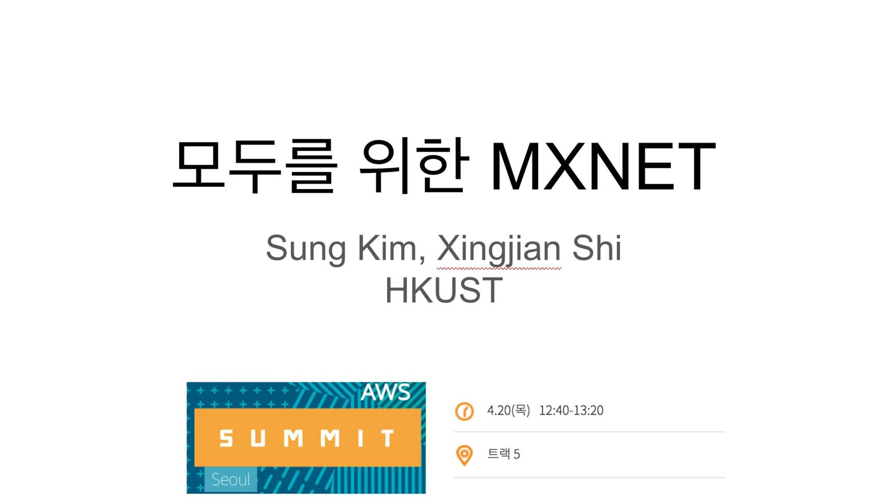 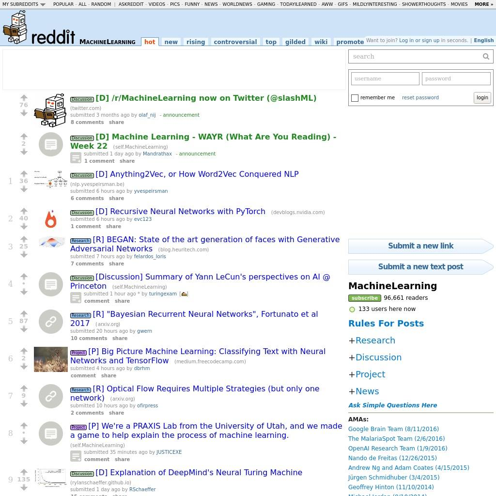  

> #모두를위한MXNET Channy Yun님의 초청으로 다음주 MXNET의핵심 개발자인 Xingjian Shi 와 함께 #모두를위한MXNET 발표합니다. TF로 이야기 하자면 "몽가형님이 직접 오셔서 코드 설명과 데모를 보여 주는 것이라" 보시면 됩니다.  프레임웍의 장단점이 있고 여러개의 프레임웍들이 경쟁하여 서로 발전하면 사용자에 입장에서는 매우 좋은 일이라 봅니다. 시간되시면 오셔서 보시고 TF 와도 비교해보시면 좋을것 같습니다.  MXNET 코드: https://github.com/hunkim/DeepLearningZeroToAll/tree/master/mxnet (TBA)  4.20(목)   12:40-13:20 부터 코엑스 D홀 트랙 5에서 진행됩니다.  아직 참여 등록이 가능한지 모르겠으나 참여나 등록에 대한 문의는 Channy Yun님에게 해주시면 될듯 합니다.
> #오늘의레딧 https://www.reddit.com/r/MachineLearning/ 래딧은 읽을 거리가 다양합니다.  1. https://www.reddit.com/r/MachineLearning on Twitter (@slashML) 2. 기계 학습 - WAYR (What Are You Reading) - 22 주차 3. Anything2Vec, 또는 Word2Vec이 NLP를 어떻게 정복했는지 4. PyTorch로 재귀 신경망 5. BEGAN : Generative Adversarial Networks를 이용한 최첨단 얼굴 생성 8. &quot;Bayesian Recurrent Neural Networks&quot;, Fortunato et al 2017 9. 큰 그림 기계 학습 : 신경망 및 TensorFlow로 텍스트 분류 10. 광학 흐름에는 여러 전략이 필요합니다 (단 하나의 네트워크 만). 11. 우리는 Utah 대학교의 PRAXIS Lab이며 기계 학습 과정을 설명하는 게임을 만들었습니다. 12. DeepMind의 신경 튜링 기계에 대한 설명 14. 베이지안 프로그램 학습과 MCMC를 사용하여 장착 한 모델의 차이점 15. Python의 최신 NLP - 수천 가지 Yelp 리뷰를 분석하여 음식에 대해 배울 수있는 항목 16. 비디오 / 이미지 프로세싱 알고리즘의 주관적 비교를위한 플랫폼 17. Doubly Permuted Homomorphic 암호화를 이용한 프라이버시 보호 시각 학습, Yonetani et.al. 자기 동조 암호화를 사용한 페더레이션 학습. 18. 인간 두뇌 활동을 사용하여 기계 학습 안내 19. 다음 AlphaGo Match 발표 20. 로봇 공학에서 고차원인지 능력을위한 기계 학습 방법  1. https://twitter.com/slashML 2. https://www.reddit.com/r/MachineLearning/comments/64jwde/d_machine_learning_wayr_what_are_you_reading_week/ 3. http://nlp.yvespeirsman.be/blog/anything2vec/ 4. https://devblogs.nvidia.com/parallelforall/recursive-neural-networks-pytorch/ 5. https://blog.heuritech.com/2017/04/11/began-state-of-the-art-generation-of-faces-with-generative-adversarial-networks/ 6. https://arxiv.org/abs/1704.02798 7. https://medium.freecodecamp.com/big-picture-machine-learning-classifying-text-with-neural-networks-and-tensorflow-d94036ac2274 8. https://arxiv.org/abs/1611.05607 9. https://www.reddit.com/r/MachineLearning/comments/64u5bj/p_were_a_praxis_lab_from_the_university_of_utah/ 10. http://rylanschaeffer.github.io/content/research/neural_turing_machine/main.html 11. https://www.reddit.com/r/MachineLearning/comments/64tk9x/d_difference_between_bayesian_program_learning/ 12. http://nbviewer.jupyter.org/github/skipgram/modern-nlp-in-python/blob/master/executable/Modern_NLP_in_Python.ipynb 13. https://www.youtube.com/watch?v=ftSbNUM1yMA 14. https://arxiv.org/abs/1704.02203 15. https://arxiv.org/abs/1703.05463 16. https://deepmind.com/blog/exploring-mysteries-alphago/ 17. http://journal.frontiersin.org/researchtopic/5334/machine-learning-methods-for-high-level-cognitive-capabilities-in-robotics  (리스트가 길어 가독성이 좋지 않습니다. 가독성 관련 좋은 의견 있으시면 부탁드립니다)
> #오늘의레딧 https://www.reddit.com/r/MachineLearning/ 아침부터 다양한 소식이 많네요.  1. https://www.reddit.com/r/MachineLearning on Twitter (@slashML) 2. 기계 학습 - WAYR (What Are You Reading) - 22 주차 3. Anything2Vec, 또는 Word2Vec이 NLP를 어떻게 정복했는지 4. PyTorch로 재귀 신경망 5. BEGAN : Generative Adversarial Networks를 이용한 최첨단 얼굴 생성 6. &quot;Bayesian Recurrent Neural Networks&quot;, Fortunato et al 2017 7. 큰 그림 기계 학습 : 신경망 및 TensorFlow로 텍스트 분류 8. 광학 흐름에는 여러 전략이 필요합니다 (단 하나의 네트워크 만). 9. 우리는 Utah 대학교의 PRAXIS Lab이며 기계 학습 과정을 설명하는 게임을 만들었습니다. 10. DeepMind의 신경 튜링 기계에 대한 설명 11. 베이지안 프로그램 학습과 MCMC를 사용하여 장착 한 모델의 차이점 12. Python의 최신 NLP - 수천 가지 Yelp 리뷰를 분석하여 음식에 대해 배울 수있는 항목 13. 비디오 / 이미지 프로세싱 알고리즘의 주관적 비교를위한 플랫폼 14. Doubly Permuted Homomorphic 암호화를 이용한 프라이버시 보호 시각 학습, Yonetani et.al. 자기 동조 암호화를 사용한 페더레이션 학습. 15. 인간 두뇌 활동을 사용하여 기계 학습 안내 16. 다음 AlphaGo Match 발표 17. 로봇 공학에서 고차원인지 능력을위한 기계 학습 방법 18. 최 Yejin : 근거가있는 언어 및 지식의 대표자 배우기 - 철저한 배우기와 더불어 그리고없이 19. 과거의 분 단위 재고 데이터 세트와 결합 된 사용자 정의 피쳐 속성 20. RNN으로 꽃가루 수 예측  1. https://twitter.com/slashML 2. https://www.reddit.com/r/MachineLearning/comments/64jwde/d_machine_learning_wayr_what_are_you_reading_week/ 3. http://nlp.yvespeirsman.be/blog/anything2vec/ 4. https://devblogs.nvidia.com/parallelforall/recursive-neural-networks-pytorch/ 5. https://blog.heuritech.com/2017/04/11/began-state-of-the-art-generation-of-faces-with-generative-adversarial-networks/ 6. https://arxiv.org/abs/1704.02798 7. https://medium.freecodecamp.com/big-picture-machine-learning-classifying-text-with-neural-networks-and-tensorflow-d94036ac2274 8. https://arxiv.org/abs/1611.05607 9. https://www.reddit.com/r/MachineLearning/comments/64u5bj/p_were_a_praxis_lab_from_the_university_of_utah/ 10. http://rylanschaeffer.github.io/content/research/neural_turing_machine/main.html 11. https://www.reddit.com/r/MachineLearning/comments/64tk9x/d_difference_between_bayesian_program_learning/ 12. http://nbviewer.jupyter.org/github/skipgram/modern-nlp-in-python/blob/master/executable/Modern_NLP_in_Python.ipynb 13. https://www.youtube.com/watch?v=ftSbNUM1yMA 14. https://arxiv.org/abs/1704.02203 15. https://arxiv.org/abs/1703.05463 16. https://deepmind.com/blog/exploring-mysteries-alphago/ 17. http://journal.frontiersin.org/researchtopic/5334/machine-learning-methods-for-high-level-cognitive-capabilities-in-robotics 18. https://www.youtube.com/watch?v=7Zzg_TQgAbg 19. http://54.174.116.134/recommend/datasets/index-ml01.html 20. http://d10genes.github.io/blog/2017/04/05/pollen/  (리스트가 길어 가독성이 좋지 않습니다. 가독성 관련 좋은 의견 있으시면 부탁드립니다)
> #오늘의레딧 https://www.reddit.com/r/MachineLearning/ 오늘도 새소식이 많군요.  1. https://www.reddit.com/r/MachineLearning on Twitter (@slashML) 2. 기계 학습 - WAYR (What Are You Reading) - 22 주차 3. Anything2Vec, 또는 Word2Vec이 NLP를 어떻게 정복했는지 4. PyTorch로 재귀 신경망 5. BEGAN : Generative Adversarial Networks를 이용한 최첨단 얼굴 생성 6. AI @ Princeton에 대한 Yann LeCun의 견해 요약 7. &quot;Bayesian Recurrent Neural Networks&quot;, Fortunato et al 2017 8. 큰 그림 기계 학습 : 신경망 및 TensorFlow로 텍스트 분류 9. 광학 흐름에는 여러 전략이 필요합니다 (단 하나의 네트워크 만). 10. 우리는 Utah 대학교의 PRAXIS Lab이며 기계 학습 과정을 설명하는 게임을 만들었습니다. 11. DeepMind의 신경 튜링 기계에 대한 설명 12. char embedding을 사용하는 seq2seq는 overfitting이 아니지만 모델 임베딩을 사용하는 동일한 모델은 모델 복잡성을 줄이고 드롭 아웃을 도입 한 후에도 많이 오버 피팅됩니다. 그 이유와 그 문제를 디버깅하는 방법은 무엇일까요? 13. 베이지안 프로그램 학습과 MCMC를 사용하여 장착 한 모델의 차이점 14. Python의 최신 NLP - 수천 가지 Yelp 리뷰를 분석하여 음식에 대해 배울 수있는 항목 15. 비디오 / 이미지 프로세싱 알고리즘의 주관적 비교를위한 플랫폼 16. Doubly Permuted Homomorphic 암호화를 이용한 프라이버시 보호 시각 학습, Yonetani et.al. 자기 동조 암호화를 사용한 페더레이션 학습. 17. 인간 두뇌 활동을 사용하여 기계 학습 안내 18. 다음 AlphaGo Match 발표 19. 로봇 공학에서 고차원인지 능력을위한 기계 학습 방법 20. 최 Yejin : 근거가있는 언어 및 지식의 대표자 배우기 - 철저한 배우기와 더불어 그리고없이  1. https://twitter.com/slashML 2. https://www.reddit.com/r/MachineLearning/comments/64jwde/d_machine_learning_wayr_what_are_you_reading_week/ 3. http://nlp.yvespeirsman.be/blog/anything2vec/ 4. https://devblogs.nvidia.com/parallelforall/recursive-neural-networks-pytorch/ 5. https://blog.heuritech.com/2017/04/11/began-state-of-the-art-generation-of-faces-with-generative-adversarial-networks/ 6. https://www.reddit.com/r/MachineLearning/comments/64txf1/discussion_summary_of_yann_lecuns_perspectives_on/ 7. https://arxiv.org/abs/1704.02798 8. https://medium.freecodecamp.com/big-picture-machine-learning-classifying-text-with-neural-networks-and-tensorflow-d94036ac2274 9. https://arxiv.org/abs/1611.05607 10. https://www.reddit.com/r/MachineLearning/comments/64u5bj/p_were_a_praxis_lab_from_the_university_of_utah/ 11. http://rylanschaeffer.github.io/content/research/neural_turing_machine/main.html 12. https://www.reddit.com/r/MachineLearning/comments/64tv5x/discussion_seq2seq_with_char_embeddings_is_not/ 13. https://www.reddit.com/r/MachineLearning/comments/64tk9x/d_difference_between_bayesian_program_learning/ 14. http://nbviewer.jupyter.org/github/skipgram/modern-nlp-in-python/blob/master/executable/Modern_NLP_in_Python.ipynb 15. https://www.youtube.com/watch?v=ftSbNUM1yMA 16. https://arxiv.org/abs/1704.02203 17. https://arxiv.org/abs/1703.05463 18. https://deepmind.com/blog/exploring-mysteries-alphago/ 19. http://journal.frontiersin.org/researchtopic/5334/machine-learning-methods-for-high-level-cognitive-capabilities-in-robotics 20. https://www.youtube.com/watch?v=7Zzg_TQgAbg  (리스트가 길어 가독성이 좋지 않습니다. 가독성 관련 좋은 의견 있으시면 부탁드립니다)

### 4월 13일 (목) 07:52 · 📷 사진 (1장)

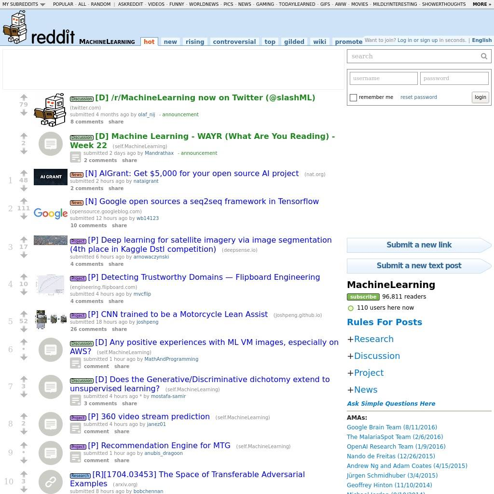

> #오늘의레딧 https://www.reddit.com/r/MachineLearning/ 재미난 이야기들이 많습니다  1. https://www.reddit.com/r/MachineLearning on Twitter (@slashML) 2. 기계 학습 - WAYR (What Are You Reading) - 22 주차 3. AIGrant : 오픈 소스 AI 프로젝트에 5,000 달러를 얻으십시오. 4. Google은 Tensorflow에서 seq2seq 프레임 워크를 공개합니다. 5. 이미지 세분화를 통한 위성 이미지에 대한 심층 학습 (Kaggle Dstl 대회에서 4 위) 6. 신뢰할 수있는 도메인 감지 - Flipboard Engineering 7. 오토바이 린 지원으로 훈련 된 CNN 8. 특히 AWS에서 ML VM 이미지에 대한 긍정적 인 경험이 있습니까? 9. Generative / Discriminative 이분법은 자율 학습 에까지 확장됩니까? 10. 360 비디오 스트림 예측 11. MTG 용 권장 사항 엔진 12. LSTM 셀 상태의 파생물이 이전 셀 상태를 잊어 버린 게이트와 동일하게 만드는 이유는 무엇입니까? 13. PyTorch로 재귀 신경망 14. 우리는 Utah 대학교의 PRAXIS Lab이며 기계 학습 과정을 설명하는 게임을 만들었습니다. 15. GAN 교육 후 발전기 역지도 학습? 16. Anything2Vec, 또는 Word2Vec이 NLP를 어떻게 정복했는지 17. 인기있는 CNN 아키텍처를 테스트하는 온라인 리소스 18. BEGAN : Generative Adversarial Networks를 이용한 최첨단 얼굴 생성 19. 구글, 페이스 북, 마이크로 소프트, IBM, 바이두 등이 AI 회사에 8 억 달러를 투자했다. 20. Google의 결투 신경망은 더 똑똑 해지고 인간은 필요 없다  1. https://twitter.com/slashML 2. https://www.reddit.com/r/MachineLearning/comments/64jwde/d_machine_learning_wayr_what_are_you_reading_week/ 3. https://nat.org/aigrant-get-5-000-for-your-open-source-ai-project-1118dd7db083 4. https://opensource.googleblog.com/2017/04/tf-seq2seq-sequence-to-sequence-framework-in-tensorflow.html 5. https://deepsense.io/deep-learning-for-satellite-imagery-via-image-segmentation/ 6. http://engineering.flipboard.com/2017/04/domainranking 7. https://joshpeng.github.io/post/mla/ 8. https://www.reddit.com/r/MachineLearning/comments/6515g6/d_any_positive_experiences_with_ml_vm_images/ 9. https://www.reddit.com/r/MachineLearning/comments/64zwt1/d_does_the_generativediscriminative_dichotomy/ 10. https://www.reddit.com/r/MachineLearning/comments/64zw3x/p_360_video_stream_prediction/ 11. https://www.reddit.com/r/MachineLearning/comments/650yvh/p_recommendation_engine_for_mtg/ 12. https://www.reddit.com/r/MachineLearning/comments/65005v/d_why_is_the_derivative_of_the_lstm_cell_state/ 13. https://devblogs.nvidia.com/parallelforall/recursive-neural-networks-pytorch/ 14. https://www.reddit.com/r/MachineLearning/comments/64u5bj/p_were_a_praxis_lab_from_the_university_of_utah/ 15. https://www.reddit.com/r/MachineLearning/comments/64w269/d_learning_inverse_map_of_generator_after/ 16. http://nlp.yvespeirsman.be/blog/anything2vec/ 17. https://www.reddit.com/r/MachineLearning/comments/64wxn9/discussion_online_resources_to_test_popular_cnn/ 18. https://blog.heuritech.com/2017/04/11/began-state-of-the-art-generation-of-faces-with-generative-adversarial-networks/ 19. https://medium.com/atomico/google-facebook-microsoft-ibm-baidu-and-others-just-invested-80m-into-every-ai-company-95dfcbe1ce11 20. https://www.wired.com/2017/04/googles-dueling-neural-networks-spar-get-smarter-no-humans-required/  (리스트가 길어 가독성이 좋지 않습니다. 가독성 관련 좋은 의견 있으시면 부탁드립니다)

### 4월 14일 (금) 07:52 · 📷 사진 (6장)

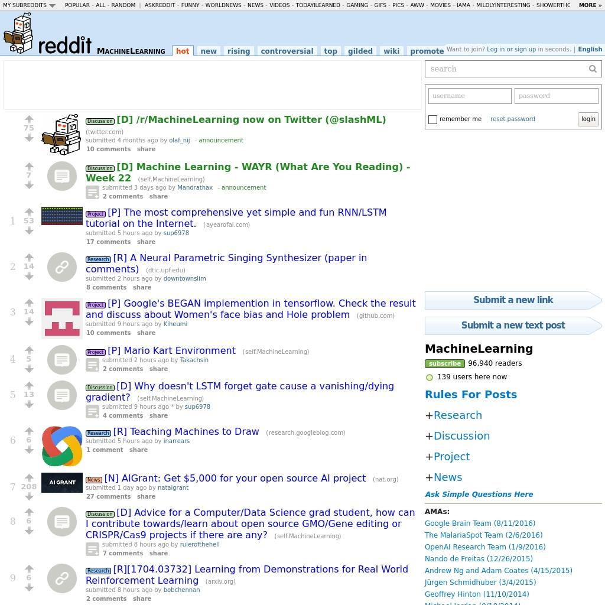    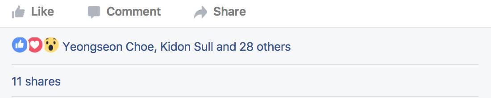 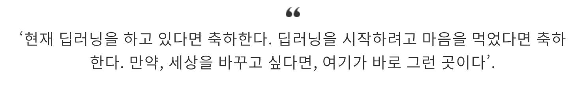

> #오늘의레딧 https://www.reddit.com/r/MachineLearning/ 오늘도 새소식이 많군요.  1. https://www.reddit.com/r/MachineLearning on Twitter (@slashML) 2. 기계 학습 - WAYR (What Are You Reading) - 22 주차 3. 인터넷에서 가장 포괄적이면서도 간단하고 재미있는 RNN / LSTM 자습서. 4. 신경 매개 성 노래 합성기 (논평에서 종이) 5. Google의 BEGAN 구현이 tensorflow에서 이루어졌습니다. 결과를 확인하고 여성의 얼굴 바이어스 및 홀 문제에 대해 토론하십시오. 6. 마리오 카트 환경 7. 왜 LSTM은 사라지는 / 죽어가는 그라디언트의 원인을 잊지 않습니까? 8. 그리는 기계 가르침 9. AIGrant : 오픈 소스 AI 프로젝트에 5,000 달러 할인 10. 컴퓨터 / 데이터 과학 대학원생을위한 조언, 오픈 소스 GMO / Gene 편집 또는 CRISPR / Cas9 프로젝트가있을 경우 어떻게 기여할 수 있습니까? 11. Torch에서 이미지 완성을 위해 GAN과 페인팅하기 12. LSTM을 사용하면 잘리는 셀 상태가 얼마나 흔한가요? 13. 스케치 도면의 신경 표현 14. 마지막 레이어 중 하나가 새로 고쳐지고 새 작업에 대해 재교육되는 비주얼 CNN의 리뷰를 찾습니다. 15. 내 (약간 수정) Keras RankNet의 구현. 16. 기계 학습이나 인공 지능 연구 분야로 들어가기를 원하는 학부생을위한 조언. 17. Google은 Tensorflow에서 seq2seq 프레임 워크를 공개합니다. 18. 이미지 세분화를 통한 위성 이미지에 대한 심층 학습 (Kaggle Dstl 대회에서 4 위) 19. 비교적 간단한 ML 알고리즘을 훈련시키는 Jetson TX2의 생존 가능성 20. 신뢰할 수있는 도메인 감지 - Flipboard Engineering  1. https://twitter.com/slashML 2. https://www.reddit.com/r/MachineLearning/comments/64jwde/d_machine_learning_wayr_what_are_you_reading_week/ 3. https://ayearofai.com/rohan-lenny-3-recurrent-neural-networks-10300100899b 4. http://www.dtic.upf.edu/~mblaauw/IS2017_NPSS/ 5. https://github.com/Heumi/BEGAN-tensorflow/blob/master/README.md 6. https://www.reddit.com/r/MachineLearning/comments/657ycj/p_mario_kart_environment/ 7. https://www.reddit.com/r/MachineLearning/comments/655iih/d_why_doesnt_lstm_forget_gate_cause_a/ 8. https://research.googleblog.com/2017/04/teaching-machines-to-draw.html 9. https://nat.org/aigrant-get-5-000-for-your-open-source-ai-project-1118dd7db083 10. https://www.reddit.com/r/MachineLearning/comments/655t5q/d_advice_for_a_computerdata_science_grad_student/ 11. https://github.com/fonfonx/dcgan-inpainting.torch 12. https://www.reddit.com/r/MachineLearning/comments/655tvn/d_how_common_is_truncated_cell_state_backprop/ 13. https://arxiv.org/abs/1704.03477 14. https://www.reddit.com/r/MachineLearning/comments/656q8u/d_looking_for_a_review_of_visual_cnns_where_one/ 15. https://github.com/airalcorn2/RankNet 16. https://www.reddit.com/r/MachineLearning/comments/654bmv/d_advice_for_an_undergrad_looking_to_get_into_the/ 17. https://opensource.googleblog.com/2017/04/tf-seq2seq-sequence-to-sequence-framework-in-tensorflow.html 18. https://deepsense.io/deep-learning-for-satellite-imagery-via-image-segmentation/ 19. https://www.reddit.com/r/MachineLearning/comments/653t5n/p_viability_of_a_jetson_tx2_to_train_relatively/ 20. http://engineering.flipboard.com/2017/04/domainranking  (리스트가 길어 가독성이 좋지 않습니다. 가독성 관련 좋은 의견 있으시면 부탁드립니다)
> #오늘의레딧 https://www.reddit.com/r/MachineLearning/ 재미난 이야기들이 많습니다  2. 기계 학습 - WAYR (What Are You Reading) - 22 주차 3. 인터넷에서 가장 포괄적이면서도 간단하고 재미있는 RNN / LSTM 자습서. 4. 신경 매개 성 노래 합성기 (논평에서 종이) 5. Google의 BEGAN 구현이 tensorflow에서 이루어졌습니다. 결과를 확인하고 여성의 얼굴 바이어스 및 홀 문제에 대해 토론하십시오. 6. 마리오 카트 환경 7. 왜 LSTM은 사라지는 / 죽어가는 그라디언트의 원인을 잊지 않습니까? 8. 그리는 기계 가르침 9. AIGrant : 오픈 소스 AI 프로젝트에 5,000 달러 할인 10. 컴퓨터 / 데이터 과학 대학원생을위한 조언, 오픈 소스 GMO / Gene 편집 또는 CRISPR / Cas9 프로젝트가있을 경우 어떻게 기여할 수 있습니까? 11. Torch에서 이미지 완성을 위해 GAN과 페인팅하기 12. LSTM을 사용하면 잘리는 셀 상태가 얼마나 흔한가요? 13. 스케치 도면의 신경 표현 14. 마지막 레이어 중 하나가 새로 고쳐지고 새 작업에 대해 재교육되는 비주얼 CNN을 검토합니다. 15. 내 (약간 수정) Keras RankNet의 구현. 16. 기계 학습이나 인공 지능 연구 분야로 들어가기를 원하는 학부생을위한 조언. 17. Google은 Tensorflow에서 seq2seq 프레임 워크를 공개합니다. 18. 이미지 세분화를 통한 위성 이미지에 대한 심층 학습 (Kaggle Dstl 대회에서 4 위) 19. 비교적 간단한 ML 알고리즘을 훈련시키는 Jetson TX2의 생존 가능성 20. 신뢰할 수있는 도메인 감지 - Flipboard Engineering  1. https://www.reddit.com/r/MachineLearning/comments/64jwde/d_machine_learning_wayr_what_are_you_reading_week/ 2. https://ayearofai.com/rohan-lenny-3-recurrent-neural-networks-10300100899b 3. http://www.dtic.upf.edu/~mblaauw/IS2017_NPSS/ 4. https://github.com/Heumi/BEGAN-tensorflow/blob/master/README.md 5. https://www.reddit.com/r/MachineLearning/comments/657ycj/p_mario_kart_environment/ 6. https://www.reddit.com/r/MachineLearning/comments/655iih/d_why_doesnt_lstm_forget_gate_cause_a/ 7. https://research.googleblog.com/2017/04/teaching-machines-to-draw.html 8. https://nat.org/aigrant-get-5-000-for-your-open-source-ai-project-1118dd7db083 9. https://www.reddit.com/r/MachineLearning/comments/655t5q/d_advice_for_a_computerdata_science_grad_student/ 10. https://github.com/fonfonx/dcgan-inpainting.torch 11. https://www.reddit.com/r/MachineLearning/comments/655tvn/d_how_common_is_truncated_cell_state_backprop/ 12. https://arxiv.org/abs/1704.03477 13. https://www.reddit.com/r/MachineLearning/comments/656q8u/d_looking_for_a_review_of_visual_cnns_where_one/ 14. https://github.com/airalcorn2/RankNet 15. https://www.reddit.com/r/MachineLearning/comments/654bmv/d_advice_for_an_undergrad_looking_to_get_into_the/ 16. https://opensource.googleblog.com/2017/04/tf-seq2seq-sequence-to-sequence-framework-in-tensorflow.html 17. https://deepsense.io/deep-learning-for-satellite-imagery-via-image-segmentation/ 18. https://www.reddit.com/r/MachineLearning/comments/653t5n/p_viability_of_a_jetson_tx2_to_train_relatively/ 19. http://engineering.flipboard.com/2017/04/domainranking  (리스트가 길어 가독성이 좋지 않습니다. 가독성 관련 좋은 의견 있으시면 부탁드립니다)
> #오늘의레딧 https://www.reddit.com/r/MachineLearning/ 래딧은 읽을 거리가 다양합니다.   (리스트가 길어 가독성이 좋지 않습니다. 가독성 관련 좋은 의견 있으시면 부탁드립니다)
> #오늘의레딧 https://www.reddit.com/r/MachineLearning/ 오늘도 새소식이 많군요.  1. 인터넷에서 가장 포괄적이면서도 간단하고 재미있는 RNN / LSTM 자습서. 2. 신경 매개 성 노래 합성기 (논평에서 종이) 3. Google의 BEGAN 구현이 tensorflow에서 이루어졌습니다. 결과를 확인하고 여성의 얼굴 바이어스 및 홀 문제에 대해 토론하십시오. 4. 마리오 카트 환경 5. 왜 LSTM은 사라지는 / 죽어가는 그라디언트의 원인을 잊지 않습니까? 6. 그리는 기계 가르침 7. AIGrant : 오픈 소스 AI 프로젝트에 5,000 달러 할인 8. 컴퓨터 / 데이터 과학 대학원생을위한 조언, 오픈 소스 GMO / Gene 편집 또는 CRISPR / Cas9 프로젝트가있을 경우 어떻게 기여할 수 있습니까? 9. Torch에서 이미지 완성을 위해 GAN과 페인팅하기 10. LSTM을 사용하면 잘리는 셀 상태가 얼마나 흔한가요? 11. 스케치 도면의 신경 표현 12. 마지막 레이어 중 하나가 새로 고쳐지고 새 작업에 대해 재교육되는 비주얼 CNN을 검토합니다. 13. 내 (약간 수정) Keras RankNet의 구현. 14. 기계 학습이나 인공 지능 연구 분야로 들어가기를 원하는 학부생을위한 조언. 15. Google은 Tensorflow에서 seq2seq 프레임 워크를 공개합니다. 16. 이미지 세분화를 통한 위성 이미지에 대한 심층 학습 (Kaggle Dstl 대회에서 4 위) 17. 비교적 간단한 ML 알고리즘을 훈련시키는 Jetson TX2의 생존 가능성 18. 신뢰할 수있는 도메인 감지 - Flipboard Engineering 19. 특히 AWS에서 ML VM 이미지에 대한 긍정적 인 경험이 있습니까? 20. 오토바이 린 지원으로 훈련 된 CNN  1. https://ayearofai.com/rohan-lenny-3-recurrent-neural-networks-10300100899b 2. http://www.dtic.upf.edu/~mblaauw/IS2017_NPSS/ 3. https://github.com/Heumi/BEGAN-tensorflow/blob/master/README.md 4. https://www.reddit.com/r/MachineLearning/comments/657ycj/p_mario_kart_environment/ 5. https://www.reddit.com/r/MachineLearning/comments/655iih/d_why_doesnt_lstm_forget_gate_cause_a/ 6. https://research.googleblog.com/2017/04/teaching-machines-to-draw.html 7. https://nat.org/aigrant-get-5-000-for-your-open-source-ai-project-1118dd7db083 8. https://www.reddit.com/r/MachineLearning/comments/655t5q/d_advice_for_a_computerdata_science_grad_student/ 9. https://github.com/fonfonx/dcgan-inpainting.torch 10. https://www.reddit.com/r/MachineLearning/comments/655tvn/d_how_common_is_truncated_cell_state_backprop/ 11. https://arxiv.org/abs/1704.03477 12. https://www.reddit.com/r/MachineLearning/comments/656q8u/d_looking_for_a_review_of_visual_cnns_where_one/ 13. https://github.com/airalcorn2/RankNet 14. https://www.reddit.com/r/MachineLearning/comments/654bmv/d_advice_for_an_undergrad_looking_to_get_into_the/ 15. https://opensource.googleblog.com/2017/04/tf-seq2seq-sequence-to-sequence-framework-in-tensorflow.html 16. https://deepsense.io/deep-learning-for-satellite-imagery-via-image-segmentation/ 17. https://www.reddit.com/r/MachineLearning/comments/653t5n/p_viability_of_a_jetson_tx2_to_train_relatively/ 18. http://engineering.flipboard.com/2017/04/domainranking 19. https://www.reddit.com/r/MachineLearning/comments/6515g6/d_any_positive_experiences_with_ml_vm_images/ 20. https://joshpeng.github.io/post/mla/  (리스트가 길어 가독성이 좋지 않습니다. 가독성 관련 좋은 의견 있으시면 부탁드립니다)

### 4월 14일 (금) 09:18 · Good to have Kazunori Sato from Google i…

Good to have Kazunori Sato from Google in Hong Kong and dinner in a Korean restaurant. Thanks Soonson Kwon for the arrangement.

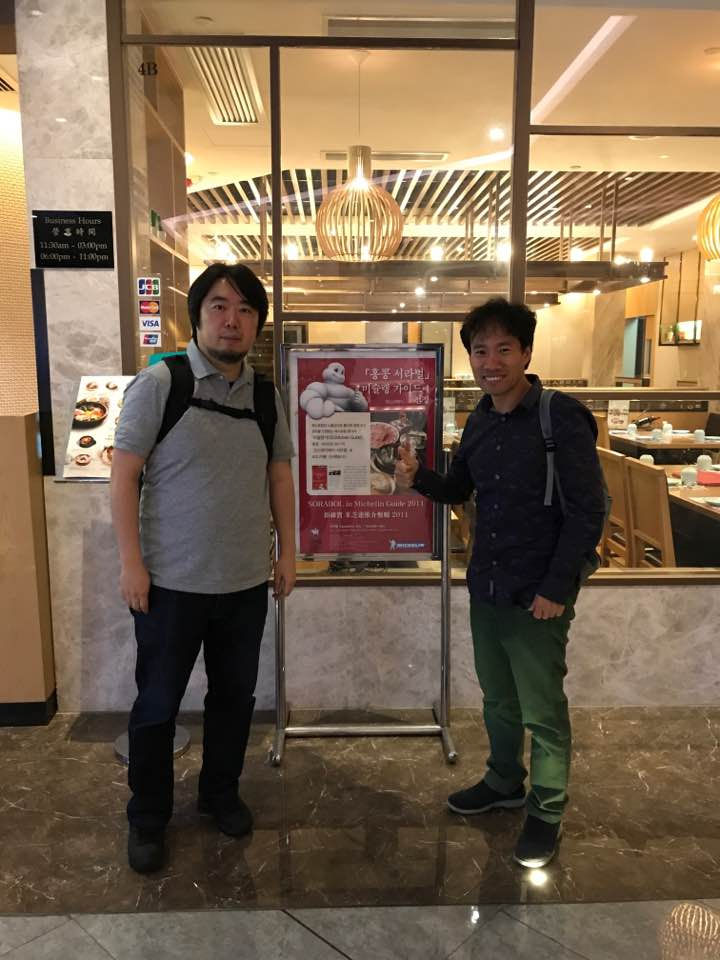 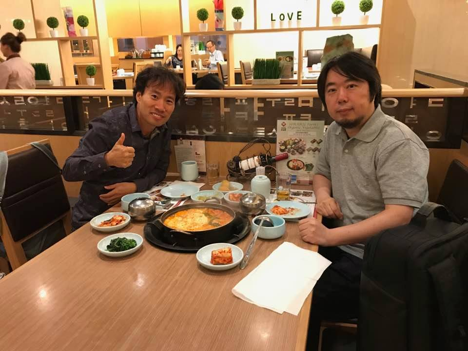

### 4월 15일 (토) 07:52 · 📷 사진 (2장)

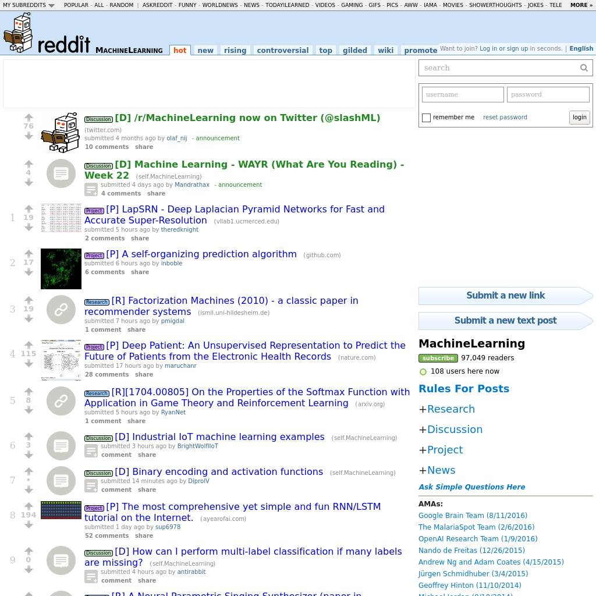 

> #오늘의레딧 https://www.reddit.com/r/MachineLearning/ 따끈한 소식들입니다.  1. https://www.reddit.com/r/MachineLearning on Twitter (@slashML) 2. 기계 학습 - WAYR (What Are You Reading) - 22 주차 3. LapSRN - 빠르고 정확한 초 해상을위한 Deep Laplacian 피라미드 네트워크 4. 자기 조직화 예측 알고리즘 5. Factorization Machines (2010) - 추천 시스템의 고전적인 논문 6. 딥 환자 (Deep Patient) : 전자 건강 기록에서 환자의 미래를 예견하기위한 감독되지 않은 대표 7. 산업용 IoT 기계 학습 사례 8. 이진 인코딩 및 활성화 함수 9. 인터넷에서 가장 포괄적이면서도 간단하고 재미있는 RNN / LSTM 자습서. 10. 많은 레이블이없는 경우 어떻게 다중 레이블 분류를 수행 할 수 있습니까? 11. 신경 매개 성 노래 합성기 (논평에서 종이) 12. 잠재적 인 아이디어에 관해 학생과 그의 고문과의 대화로 열리는 그 논문은 무엇입니까? 13. 그리는 기계 가르침 14. Google의 BEGAN 구현이 tensorflow에서 이루어졌습니다. 결과를 확인하고 여성의 얼굴 바이어스 및 홀 문제에 대해 토론하십시오. 15. 왜 LSTM은 사라지는 / 죽어가는 그라디언트의 원인을 잊지 않습니까? 16. Torch에서 이미지 완성을 위해 GAN과 페인팅하기 17. AIGrant : 오픈 소스 AI 프로젝트에 5,000 달러 할인 18. 컴퓨터 / 데이터 과학 대학원생을위한 조언, 오픈 소스 GMO / Gene 편집 또는 CRISPR / Cas9 프로젝트가있을 경우 어떻게 기여할 수 있습니까? 19. 마리오 카트 환경 20. 내 (약간 수정) Keras RankNet의 구현.  1. https://twitter.com/slashML 2. https://www.reddit.com/r/MachineLearning/comments/64jwde/d_machine_learning_wayr_what_are_you_reading_week/ 3. http://vllab1.ucmerced.edu/%7Ewlai24/LapSRN/ 4. https://github.com/CarsonScott/Prediction-Template-Learning/blob/master/README.md 5. https://www.ismll.uni-hildesheim.de/pub/pdfs/Rendle2010FM.pdf 6. https://www.nature.com/articles/srep26094 7. https://www.reddit.com/r/MachineLearning/comments/65ekzh/d_industrial_iot_machine_learning_examples/ 8. https://www.reddit.com/r/MachineLearning/comments/65fq5h/d_binary_encoding_and_activation_functions/ 9. https://ayearofai.com/rohan-lenny-3-recurrent-neural-networks-10300100899b 10. https://www.reddit.com/r/MachineLearning/comments/65e91x/d_how_can_i_perform_multilabel_classification_if/ 11. http://www.dtic.upf.edu/~mblaauw/IS2017_NPSS/ 12. https://www.reddit.com/r/MachineLearning/comments/65aplv/d_whats_that_paper_that_opens_with_a_conversation/ 13. https://research.googleblog.com/2017/04/teaching-machines-to-draw.html 14. https://github.com/Heumi/BEGAN-tensorflow/blob/master/README.md 15. https://www.reddit.com/r/MachineLearning/comments/655iih/d_why_doesnt_lstm_forget_gate_cause_a/ 16. https://github.com/fonfonx/dcgan-inpainting.torch 17. https://nat.org/aigrant-get-5-000-for-your-open-source-ai-project-1118dd7db083 18. https://www.reddit.com/r/MachineLearning/comments/655t5q/d_advice_for_a_computerdata_science_grad_student/ 19. https://www.reddit.com/r/MachineLearning/comments/657ycj/p_mario_kart_environment/ 20. https://github.com/airalcorn2/RankNet  (리스트가 길어 가독성이 좋지 않습니다. 가독성 관련 좋은 의견 있으시면 부탁드립니다)
> #오늘의레딧 https://www.reddit.com/r/MachineLearning/ 따끈한 소식들입니다.  1. LapSRN - 빠르고 정확한 초 해상을위한 Deep Laplacian 피라미드 네트워크 2. 자기 조직화 예측 알고리즘 3. Factorization Machines (2010) - 추천 시스템의 고전적인 논문 4. 딥 환자 (Deep Patient) : 전자 건강 기록에서 환자의 미래를 예견하기위한 감독되지 않은 대표 5. 산업용 IoT 기계 학습 사례 6. 운전할 게임 드라이버를 가르치는 데 도움 7. 이진 인코딩 및 활성화 함수 8. 인터넷에서 가장 포괄적이면서도 간단하고 재미있는 RNN / LSTM 자습서. 9. 많은 레이블이없는 경우 어떻게 다중 레이블 분류를 수행 할 수 있습니까? 10. 신경 매개 성 노래 합성기 (논평에서 종이) 11. 잠재적 인 아이디어에 관해 학생과 그의 고문과의 대화로 열리는 그 논문은 무엇입니까? 12. 그리는 기계 가르침 13. Google의 BEGAN 구현이 tensorflow에서 이루어졌습니다. 결과를 확인하고 여성의 얼굴 바이어스 및 홀 문제에 대해 토론하십시오. 14. 왜 LSTM은 사라지는 / 죽어가는 그라디언트의 원인을 잊지 않습니까? 15. Torch에서 이미지 완성을 위해 GAN과 페인팅하기 16. AIGrant : 오픈 소스 AI 프로젝트에 5,000 달러 할인 17. 컴퓨터 / 데이터 과학 대학원생을위한 조언, 오픈 소스 GMO / Gene 편집 또는 CRISPR / Cas9 프로젝트가있을 경우 어떻게 기여할 수 있습니까? 18. 내 (약간 수정) Keras RankNet의 구현. 19. 스케치 도면의 신경 표현 20. 마지막 레이어 중 하나가 새로 고쳐지고 새 작업에 대해 재교육되는 비주얼 CNN을 검토합니다.  1. http://vllab1.ucmerced.edu/%7Ewlai24/LapSRN/ 2. https://github.com/CarsonScott/Prediction-Template-Learning/blob/master/README.md 3. https://www.ismll.uni-hildesheim.de/pub/pdfs/Rendle2010FM.pdf 4. https://www.nature.com/articles/srep26094 5. https://www.reddit.com/r/MachineLearning/comments/65ekzh/d_industrial_iot_machine_learning_examples/ 6. https://www.reddit.com/r/MachineLearning/comments/65g50r/p_help_teaching_game_driver_to_drive/ 7. https://www.reddit.com/r/MachineLearning/comments/65fq5h/d_binary_encoding_and_activation_functions/ 8. https://ayearofai.com/rohan-lenny-3-recurrent-neural-networks-10300100899b 9. https://www.reddit.com/r/MachineLearning/comments/65e91x/d_how_can_i_perform_multilabel_classification_if/ 10. http://www.dtic.upf.edu/~mblaauw/IS2017_NPSS/ 11. https://www.reddit.com/r/MachineLearning/comments/65aplv/d_whats_that_paper_that_opens_with_a_conversation/ 12. https://research.googleblog.com/2017/04/teaching-machines-to-draw.html 13. https://github.com/Heumi/BEGAN-tensorflow/blob/master/README.md 14. https://www.reddit.com/r/MachineLearning/comments/655iih/d_why_doesnt_lstm_forget_gate_cause_a/ 15. https://github.com/fonfonx/dcgan-inpainting.torch 16. https://nat.org/aigrant-get-5-000-for-your-open-source-ai-project-1118dd7db083 17. https://www.reddit.com/r/MachineLearning/comments/655t5q/d_advice_for_a_computerdata_science_grad_student/ 18. https://github.com/airalcorn2/RankNet 19. https://arxiv.org/abs/1704.03477 20. https://www.reddit.com/r/MachineLearning/comments/656q8u/d_looking_for_a_review_of_visual_cnns_where_one/

### 4월 16일 (일) 07:52 · 📷 사진 (1장)

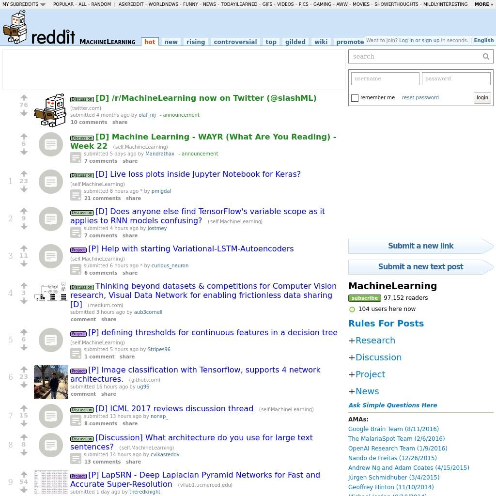

> #오늘의레딧 https://www.reddit.com/r/MachineLearning/ 아침부터 다양한 소식이 많네요.  1. https://www.reddit.com/r/MachineLearning on Twitter (@slashML) 2. 기계 학습 - WAYR (What Are You Reading) - 22 주차 3. Keras를위한 Jupyter Notebook 내부의 라이브 손실 표시? 4. 혼란스러운 RNN 모델에 적용되는 다른 사람이 TensorFlow의 가변 범위를 찾습니까? 5. Variational-LSTM-Autoencoders 시작 도움말 6. 의사 결정 트리에서 연속 피쳐에 대한 임계 값 정의 7. Tensorflow를 사용한 이미지 분류는 4 가지 네트워크 아키텍처를 지원합니다. 8. ICML 2017 토론 스레드 리뷰 9. 대형 텍스트 문장에 어떤 아키텍처를 사용합니까? 10. LapSRN - 빠르고 정확한 초 해상을위한 Deep Laplacian 피라미드 네트워크 11. 자기 조직화 예측 알고리즘 12. 산업용 IoT 기계 학습 사례 13. Factorization Machines (2010) - 추천 시스템의 고전적인 논문 14. 딥 환자 (Deep Patient) : 전자 건강 기록에서 환자의 미래를 예견하기위한 감독되지 않은 대표 15. 운전할 게임 드라이버를 가르치는 데 도움 16. 이진 인코딩 및 활성화 함수 17. 인터넷에서 가장 포괄적이면서도 간단하고 재미있는 RNN / LSTM 자습서. 18. 많은 레이블이없는 경우 어떻게 다중 레이블 분류를 수행 할 수 있습니까? 19. 신경 매개 성 노래 합성기 (논평에서 종이) 20. 잠재적 인 아이디어에 관해 학생과 그의 고문과의 대화로 열리는 그 논문은 무엇입니까?  1. https://twitter.com/slashML 2. https://www.reddit.com/r/MachineLearning/comments/64jwde/d_machine_learning_wayr_what_are_you_reading_week/ 3. https://www.reddit.com/r/MachineLearning/comments/65jelb/d_live_loss_plots_inside_jupyter_notebook_for/ 4. https://www.reddit.com/r/MachineLearning/comments/65kivu/d_does_anyone_else_find_tensorflows_variable/ 5. https://www.reddit.com/r/MachineLearning/comments/65jwms/p_help_with_starting_variationallstmautoencoders/ 6. https://www.reddit.com/r/MachineLearning/comments/65k7ex/p_defining_thresholds_for_continuous_features_in/ 7. https://github.com/utsavgarg/tensorflow-classification 8. https://www.reddit.com/r/MachineLearning/comments/65i8ae/d_icml_2017_reviews_discussion_thread/ 9. https://www.reddit.com/r/MachineLearning/comments/65i6k0/discussion_what_architecture_do_you_use_for_large/ 10. http://vllab1.ucmerced.edu/%7Ewlai24/LapSRN/ 11. https://github.com/CarsonScott/Prediction-Template-Learning/blob/master/README.md 12. https://www.reddit.com/r/MachineLearning/comments/65ekzh/d_industrial_iot_machine_learning_examples/ 13. https://www.ismll.uni-hildesheim.de/pub/pdfs/Rendle2010FM.pdf 14. https://www.nature.com/articles/srep26094 15. https://www.reddit.com/r/MachineLearning/comments/65g50r/p_help_teaching_game_driver_to_drive/ 16. https://www.reddit.com/r/MachineLearning/comments/65fq5h/d_binary_encoding_and_activation_functions/ 17. https://ayearofai.com/rohan-lenny-3-recurrent-neural-networks-10300100899b 18. https://www.reddit.com/r/MachineLearning/comments/65e91x/d_how_can_i_perform_multilabel_classification_if/ 19. http://www.dtic.upf.edu/~mblaauw/IS2017_NPSS/ 20. https://www.reddit.com/r/MachineLearning/comments/65aplv/d_whats_that_paper_that_opens_with_a_conversation/  (리스트가 길어 가독성이 좋지 않습니다. 가독성 관련 좋은 의견 있으시면 부탁드립니다)

### 4월 17일 (월) 07:52 · 📷 사진 (2장)

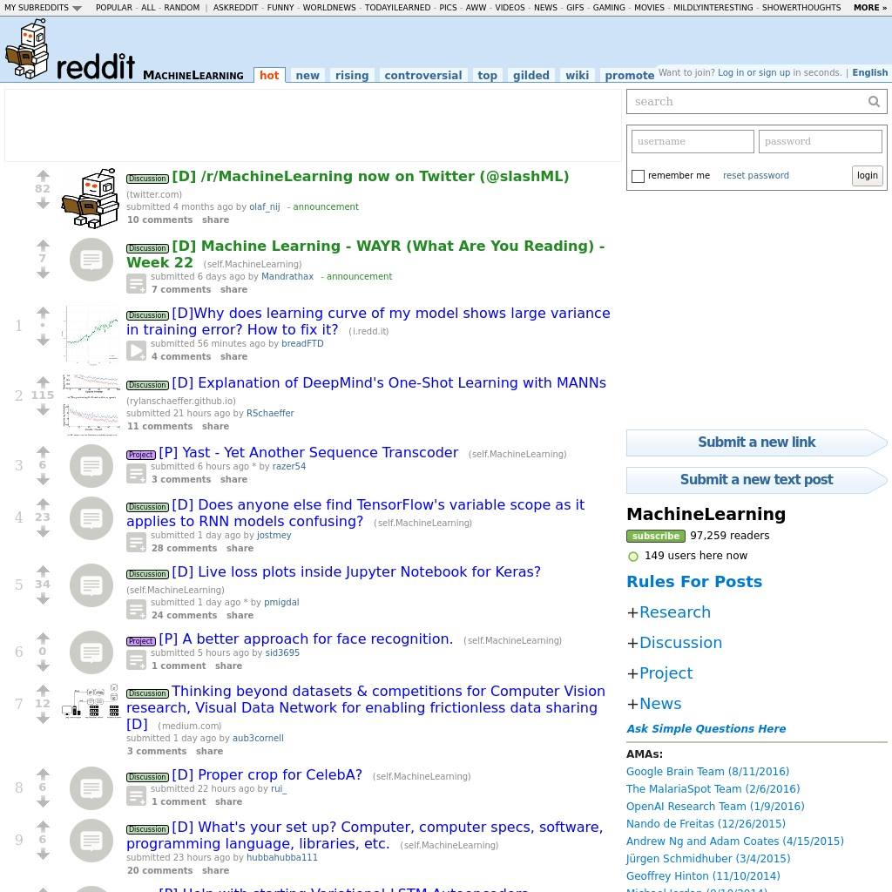 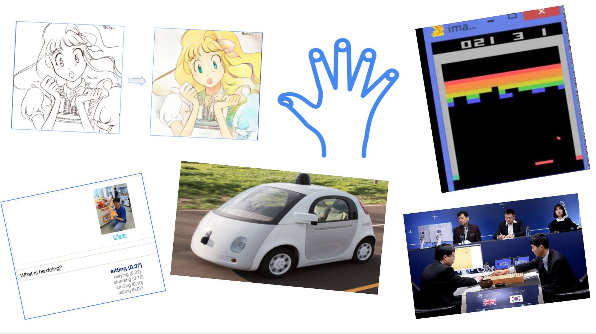

> #오늘의레딧 https://www.reddit.com/r/MachineLearning/ 따끈한 소식들입니다.  1. 내 모델의 학습 곡선이 교육 오류의 큰 차이를 보이는 이유는 무엇입니까? 그것을 고치는 방법? 2. DeepMind의 MANN을 이용한 원샷 학습에 대한 설명 3. Yast - 또 ​​다른 시퀀스 트랜스 코더 4. 혼란스러운 RNN 모델에 적용되는 다른 사람이 TensorFlow의 가변 범위를 찾습니까? 5. Keras를위한 Jupyter Notebook 내부의 라이브 손실 표시? 6. 얼굴 인식을위한 더 나은 접근법. 7. 소에 대한 적절한 작물? 8. 너 셋업은 뭐니? 컴퓨터, 컴퓨터 사양, 소프트웨어, 프로그래밍 언어, 라이브러리 등 9. Variational-LSTM-Autoencoders 시작 도움말 10. 의사 결정 트리에서 연속 피쳐에 대한 임계 값 정의 11. ICML 2017 토론 스레드 리뷰 12. Tensorflow를 사용한 이미지 분류는 4 가지 네트워크 아키텍처를 지원합니다. 13. 대형 텍스트 문장에 어떤 아키텍처를 사용합니까? 14. LapSRN - 빠르고 정확한 초 해상을위한 Deep Laplacian 피라미드 네트워크 15. 자기 조직화 예측 알고리즘 16. 산업용 IoT 기계 학습 사례 17. Factorization Machines (2010) - 추천 시스템의 고전적인 논문 18. 딥 환자 (Deep Patient) : 전자 건강 기록에서 환자의 미래를 예견하기위한 감독되지 않은 대표 19. 운전할 게임 드라이버를 가르치는 데 도움 20. 이진 인코딩 및 활성화 함수  1. https://www.reddit.com/r/MachineLearning/comments/65rnyj/dwhy_does_learning_curve_of_my_model_shows_large/ 2. http://rylanschaeffer.github.io/content/research/one_shot_learning_with_memory_augmented_nn/main.html 3. https://www.reddit.com/r/MachineLearning/comments/65pt57/p_yast_yet_another_sequence_transcoder/ 4. https://www.reddit.com/r/MachineLearning/comments/65kivu/d_does_anyone_else_find_tensorflows_variable/ 5. https://www.reddit.com/r/MachineLearning/comments/65jelb/d_live_loss_plots_inside_jupyter_notebook_for/ 6. https://www.reddit.com/r/MachineLearning/comments/65qazi/p_a_better_approach_for_face_recognition/ 7. https://www.reddit.com/r/MachineLearning/comments/65me2d/d_proper_crop_for_celeba/ 8. https://www.reddit.com/r/MachineLearning/comments/65m19y/d_whats_your_set_up_computer_computer_specs/ 9. https://www.reddit.com/r/MachineLearning/comments/65jwms/p_help_with_starting_variationallstmautoencoders/ 10. https://www.reddit.com/r/MachineLearning/comments/65k7ex/p_defining_thresholds_for_continuous_features_in/ 11. https://www.reddit.com/r/MachineLearning/comments/65i8ae/d_icml_2017_reviews_discussion_thread/ 12. https://github.com/utsavgarg/tensorflow-classification 13. https://www.reddit.com/r/MachineLearning/comments/65i6k0/discussion_what_architecture_do_you_use_for_large/ 14. http://vllab1.ucmerced.edu/%7Ewlai24/LapSRN/ 15. https://github.com/CarsonScott/Prediction-Template-Learning/blob/master/README.md 16. https://www.reddit.com/r/MachineLearning/comments/65ekzh/d_industrial_iot_machine_learning_examples/ 17. https://www.ismll.uni-hildesheim.de/pub/pdfs/Rendle2010FM.pdf 18. https://www.nature.com/articles/srep26094 19. https://www.reddit.com/r/MachineLearning/comments/65g50r/p_help_teaching_game_driver_to_drive/ 20. https://www.reddit.com/r/MachineLearning/comments/65fq5h/d_binary_encoding_and_activation_functions/
> #모두를위한딥러닝, 특히 #중학생을위한딥러닝 강의 슬라이드 (Call for comments)  https://docs.google.com/presentation/d/1C_eG3rhwwlC7PoTN5lDQ4FgSnvCXqO5Ru-9a7C0Jlgg/  제가 부끄러움이 많이 오프라인 강의는 잘 하지 못하는데 제가 거절할수 없는 분의 부탁으로 모 중학교에 가게 됩니다. 마침 5월 소프트웨어에 물들다 (http://somul.kr/) 등에도 재사용할수 있을듯 하여 슬라이드를 만들고, 여러분들의 커멘트를 기다립니다.  보시고 중학생이 이해가능한지, 없으면 좋을 내용, 추가 하면 좋을 내용등 있으시면 알려주세요.  아래 노트에는 제가 하고 싶은 말도 조금씩 적고 있으니 참조하시고, CC 라이센스로 자유롭게 수정/재배포 가능합니다.  Minsuk Lee 교수님, Haimin Lee님 조언 많이 부탁드립니다. 출연해주신 Soonson Kwon님께 감사드립니다.  http://somul.kr/ 에도 TF/딥러닝으로 같이 물들여 보아요.

### 4월 18일 (화) 07:52 · 📷 사진 (1장)

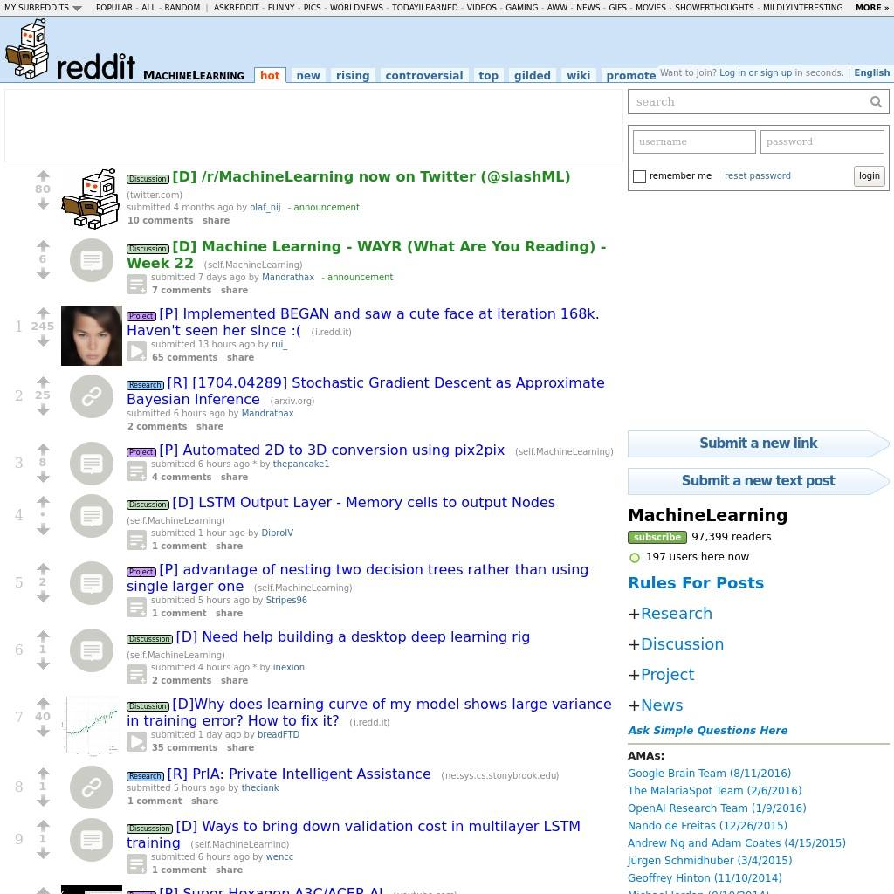

> #오늘의레딧 https://www.reddit.com/r/MachineLearning/ 오늘도 새소식이 많군요.  1. BEGAN을 구현하고 168k 반복에서 귀여운 얼굴을 보았습니다. 이후 그녀를 보지 못했 :( 2. pix2pix를 사용하여 2D에서 3D로 자동 변환 3. LSTM 출력 레이어 - 노드를 출력 할 메모리 셀 4. 하나의 큰 것을 사용하는 것보다 두 개의 결정 트리를 중첩하는 이점 5. 내 모델의 학습 곡선이 교육 오류의 큰 차이를 보이는 이유는 무엇입니까? 그것을 고치는 방법? 6. 남자 : 개인 지능형 지원 7. 슈퍼 헥사곤 A3C / ACER AI 8. denoising 자동 코드 벤치마킹. 9. 일반 벨만 방정식과 시차 차이 학습 10. midi-rnn : 기차를 타고 모노 포닉 미디 파일을 생성합니다. 11. 의사 결정 트리에서 임계 값의 최적 배치 12. Yast - 또 ​​다른 시퀀스 트랜스 코더 13. DeepMind의 MANN을 이용한 원샷 학습에 대한 설명 14. ML을 실행하는 데 가장 중요한 컴퓨터 사양은 무엇입니까? 램? SSD? 15. 혼란스러운 RNN 모델에 적용되는 다른 사람이 TensorFlow의 가변 범위를 찾습니까? 16. Keras를위한 Jupyter Notebook 내부의 라이브 손실 표시? 17. 얼굴 인식을위한 더 나은 접근법. 18. 너 셋업은 뭐니? 컴퓨터, 컴퓨터 사양, 소프트웨어, 프로그래밍 언어, 라이브러리 등 19. 소에 대한 적절한 작물? 20. Variational-LSTM-Autoencoders 시작 도움말  1. https://www.reddit.com/r/MachineLearning/comments/65ukie/p_implemented_began_and_saw_a_cute_face_at/ 2. https://www.reddit.com/r/MachineLearning/comments/65wdnd/p_automated_2d_to_3d_conversion_using_pix2pix/ 3. https://www.reddit.com/r/MachineLearning/comments/65yah7/d_lstm_output_layer_memory_cells_to_output_nodes/ 4. https://www.reddit.com/r/MachineLearning/comments/65wskb/p_advantage_of_nesting_two_decision_trees_rather/ 5. https://www.reddit.com/r/MachineLearning/comments/65rnyj/dwhy_does_learning_curve_of_my_model_shows_large/ 6. http://netsys.cs.stonybrook.edu/sites/netsys.cs.stonybrook.edu/files/hotmobile_final.pdf 7. https://www.youtube.com/watch?v=5Uao9Of_nxc 8. https://www.reddit.com/r/MachineLearning/comments/65wnp1/p_benchmarking_a_denoising_autoencoder/ 9. https://arxiv.org/pdf/1704.04463.pdf 10. https://github.com/brannondorsey/midi-rnn 11. https://www.reddit.com/r/MachineLearning/comments/65vv5w/p_optimal_positioning_of_threshold_in_decision/ 12. https://www.reddit.com/r/MachineLearning/comments/65pt57/p_yast_yet_another_sequence_transcoder/ 13. http://rylanschaeffer.github.io/content/research/one_shot_learning_with_memory_augmented_nn/main.html 14. https://www.reddit.com/r/MachineLearning/comments/65t24t/d_what_are_the_most_important_computer_specs_for/ 15. https://www.reddit.com/r/MachineLearning/comments/65kivu/d_does_anyone_else_find_tensorflows_variable/ 16. https://www.reddit.com/r/MachineLearning/comments/65jelb/d_live_loss_plots_inside_jupyter_notebook_for/ 17. https://www.reddit.com/r/MachineLearning/comments/65qazi/p_a_better_approach_for_face_recognition/ 18. https://www.reddit.com/r/MachineLearning/comments/65m19y/d_whats_your_set_up_computer_computer_specs/ 19. https://www.reddit.com/r/MachineLearning/comments/65me2d/d_proper_crop_for_celeba/ 20. https://www.reddit.com/r/MachineLearning/comments/65jwms/p_help_with_starting_variationallstmautoencoders/

### 4월 19일 (수) 07:52 · 📷 사진 (1장)

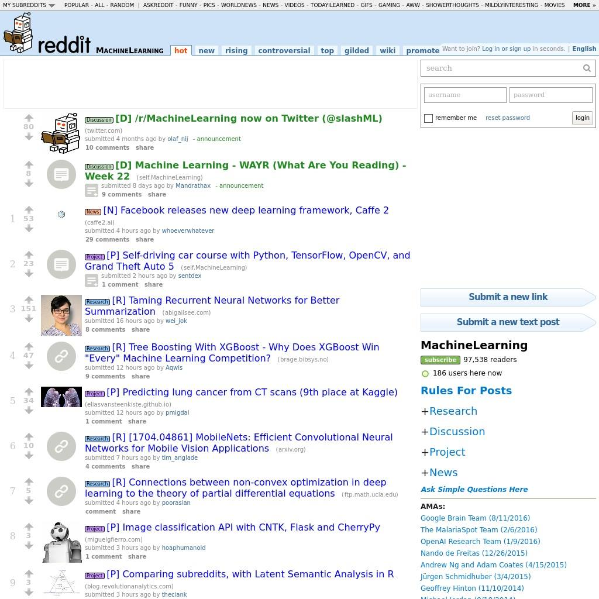

> #오늘의레딧 https://www.reddit.com/r/MachineLearning/ 따끈한 소식들입니다.  1. Facebook은 새로운 심층 학습 프레임 워크 인 Caffe 2를 출시합니다. 2. Python, TensorFlow, OpenCV 및 Grand Theft Auto 5를 사용한자가 운전 용 자동차 코스 3. 더 나은 요약을위한 반복적 인 신경 회로망 길들이기 4. XGBoost로 나무 부스트 - XGBoost가 &quot;모든&quot;기계 학습 경쟁에서 승리하는 이유는 무엇입니까? 5. CT 스캔으로 폐암 예측 (Kaggle에서 9 위) 6. 깊은 학습에서의 비 볼록 최적화와 편미분 방정식의 이론 사이의 연결 7. CNTK, Flask 및 CherryPy가 포함 된 이미지 분류 API 8. 서브 레퍼런스 비교, R의 잠재 시맨틱 분석 9. 단어 벡터를 사용하여 Wikipedia 페이지의 텍스트를 검색하는 작은 프로젝트. 10. 최소 및 깨끗한 강화 학습 사례 11. 보 검색에서 그라디언트 만들기 12. 미래의 로봇에 관한 위르겐 슈미트 후버 (Jürgen Schmidhuber) : &#39;우리는 개미와 마찬가지로 우리에게 많은 관심을 기울일 것&#39;| 기술 - Juergen Schmidhuber (AI 연구자일지도 모름)의 최고의 프로필과 인터뷰 13. PyTorch에서 묶인 가중치 사용하기 14. MIMIC-III 데이터베이스로부터 30 일간의 ICU 재입술 예측 15. BEGAN을 구현하고 168k 반복에서 귀여운 얼굴을 보았습니다. 이후 그녀를 보지 못했 :( 16. 이진 크로스 엔트로피 레이블 값 질문 17. 나는 평신도 용어로 RNN에 기초한 논문의 요약을 쓰려고 노력했다. 18. NN 훈련 중 당신은 무엇을하나요? 19. pix2pix를 사용하여 2D에서 3D로 자동 변환  1. http://caffe2.ai/ 2. https://www.reddit.com/r/MachineLearning/comments/665flm/p_selfdriving_car_course_with_python_tensorflow/ 3. http://www.abigailsee.com/2017/04/16/taming-rnns-for-better-summarization.html 4. https://brage.bibsys.no/xmlui/handle/11250/2433761 5. https://eliasvansteenkiste.github.io/machine%20learning/lung-cancer-pred/ 6. ftp://ftp.math.ucla.edu/pub/camreport/cam17-20.pdf 7. https://miguelgfierro.com/blog/2017/how-to-deploy-an-image-classification-api-based-on-deep-learning/ 8. http://blog.revolutionanalytics.com/2017/03/comparing-subreddits.html 9. https://cameron.cf/posts/2016-07-12-Wikipedia%20Categorizer.html 10. https://github.com/rlcode/reinforcement-learning 11. https://www.reddit.com/r/MachineLearning/comments/665le8/d_creating_gradients_from_beam_search/ 12. https://www.theguardian.com/technology/2017/apr/18/robot-man-artificial-intelligence-computer-milky-way 13. https://www.reddit.com/r/MachineLearning/comments/662rzo/p_using_tied_weights_in_pytorch/ 14. https://github.com/YaronBlinder/MIMIC-III_readmission/ 15. https://www.reddit.com/r/MachineLearning/comments/65ukie/p_implemented_began_and_saw_a_cute_face_at/ 16. https://www.reddit.com/r/MachineLearning/comments/660ms4/d_binarycross_entropy_label_value_question/ 17. https://medium.com/@nishantnikhil/paper-summary-opinion-mining-with-deep-recurrent-neural-networks-1fa791098fa5 18. https://www.reddit.com/r/MachineLearning/comments/66072j/d_what_do_you_guys_do_during_nn_training/ 19. https://www.reddit.com/r/MachineLearning/comments/65wdnd/p_automated_2d_to_3d_conversion_using_pix2pix/

### 4월 20일 (목) 07:52 · 📷 사진 (1장)

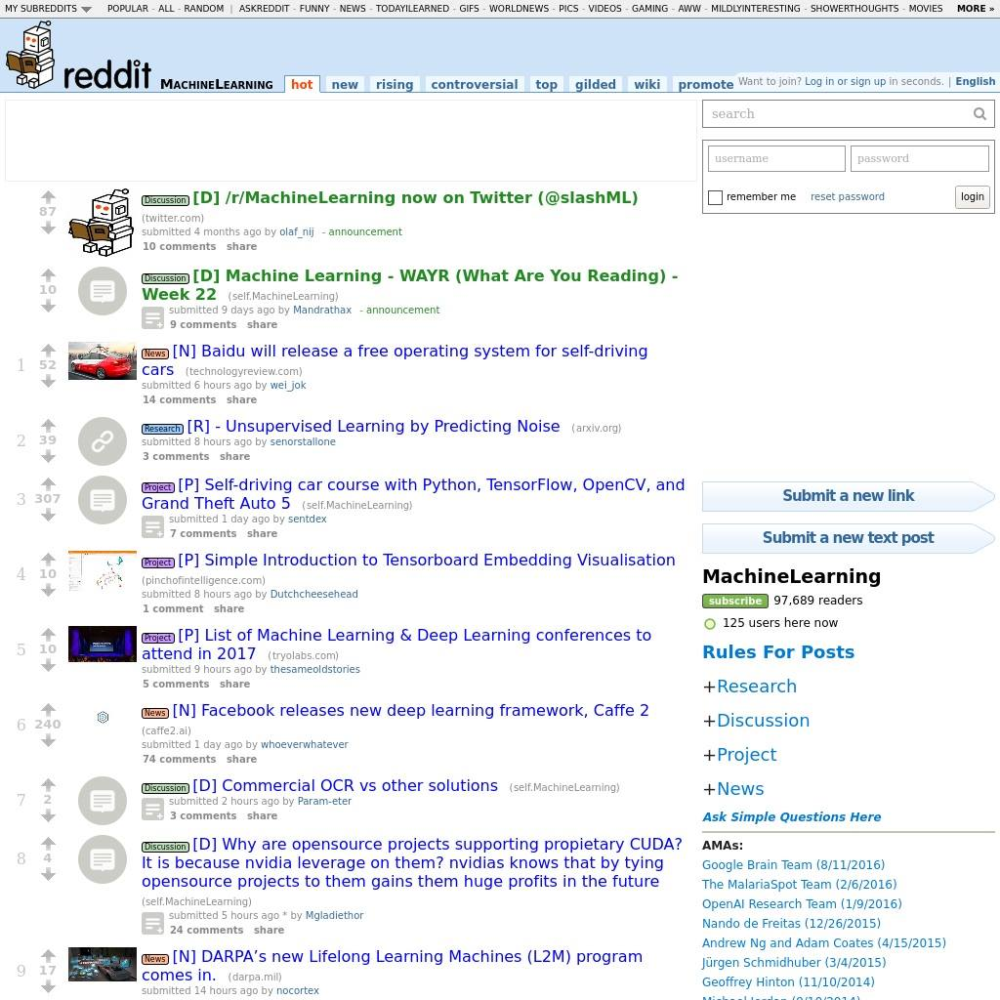

> #오늘의레딧 https://www.reddit.com/r/MachineLearning/ 아침부터 다양한 소식이 많네요.  1. Baidu는 자동 운전 차량을위한 무료 운영 체제를 출시합니다 2. - 예측 잡음에 의한 자율 학습 3. Python, TensorFlow, OpenCV 및 Grand Theft Auto 5를 사용한자가 운전 용 자동차 코스 4. Tensorboard 임베딩 시각화에 대한 간단한 소개 5. 2017 년에 열리는 기계 학습 및 심화 학습 회의 목록 6. Facebook은 새로운 심층 학습 프레임 워크 인 Caffe 2를 출시합니다. 7. 상업 OCR 대 다른 솔루션 8. 왜 오픈 소스 프로젝트가 독점 CUDA를 지원합니까? 그것은 nvidia가 그들에게 영향을 미치기 때문입니까? nvidias는 오픈 소스 프로젝트를 묶어 미래에 커다란 이익을 얻는다는 것을 안다. 9. DARPA의 새로운 평생 학습 기계 (L2M) 프로그램이 도입되었습니다. 10. BatchUp : Python을위한 미니 배치 반복 라이브러리, 피드백 (연료와 비슷하지만 단순함) 11. Alex Zhavoronkov 박사 - AI 대 고령화 12. 클러스터링을 사용하여 유사한 특성을 가진 클러스터 항목을 찾아 (연속) 특성의 10 가지 범주가있는 재료 DB를 기반으로 권장 사항을 만드는 것이 좋습니까? 13. 기계 학습 및 Clash Royale 14. 더 나은 요약을위한 반복적 인 신경 회로망 길들이기 15. XGBoost로 나무 부스트 - XGBoost가 &quot;모든&quot;기계 학습 경쟁에서 승리하는 이유는 무엇입니까? 16. CT 스캔으로 폐암 예측 (Kaggle에서 9 위) 17. 깊은 학습에서의 비 볼록 최적화와 편미분 방정식의 이론 사이의 연결 18. 스트리트 뷰 이미지로부터의 구조화 된 정보의주의 기반 추출 19. 심층 학습을 이용한 소셜 미디어 게시물의 감정 분석 20. 모델 손실이 빠르게 감소하지 않는 이유는 무엇입니까?  1. https://www.technologyreview.com/s/604220/baidu-will-release-a-free-operating-system-for-self-driving-cars/ 2. https://arxiv.org/pdf/1704.05310.pdf 3. https://www.reddit.com/r/MachineLearning/comments/665flm/p_selfdriving_car_course_with_python_tensorflow/ 4. http://www.pinchofintelligence.com/simple-introduction-to-tensorboard-embedding-visualisation/ 5. https://tryolabs.com/blog/machine-learning-deep-learning-conferences/?N 6. http://caffe2.ai/ 7. https://www.reddit.com/r/MachineLearning/comments/66cyng/d_commercial_ocr_vs_other_solutions/ 8. https://www.reddit.com/r/MachineLearning/comments/66bgmf/d_why_are_opensource_projects_supporting/ 9. http://www.darpa.mil/news-events/2017-03-16 10. https://github.com/Britefury/batchup 11. http://www.leafscience.org/a-i-versus-aging/ 12. https://www.reddit.com/r/MachineLearning/comments/66bab3/d_would_it_be_a_bad_idea_to_use_clustering_to/ 13. https://www.reddit.com/r/MachineLearning/comments/668ddy/p_machine_learning_and_clash_royale/ 14. http://www.abigailsee.com/2017/04/16/taming-rnns-for-better-summarization.html 15. https://brage.bibsys.no/xmlui/handle/11250/2433761 16. https://eliasvansteenkiste.github.io/machine%20learning/lung-cancer-pred/ 17. ftp://ftp.math.ucla.edu/pub/camreport/cam17-20.pdf 18. https://arxiv.org/abs/1704.03549 19. https://www.reddit.com/r/MachineLearning/comments/666qsd/d_sentiment_analysis_of_social_media_posts_using/ 20. https://www.reddit.com/r/MachineLearning/comments/6676g2/d_what_are_the_possible_reasons_why_model_loss_is/

### 4월 21일 (금) 07:52 · 📷 사진 (1장)

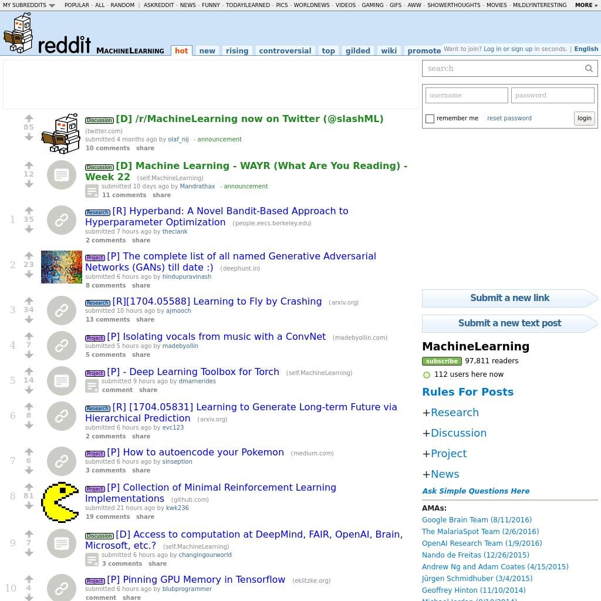

> #오늘의레딧 https://www.reddit.com/r/MachineLearning/ 아침부터 다양한 소식이 많네요.  1. 하이퍼 밴드 : 하이퍼 파라미터 최적화에 대한 새로운 산적 기반 접근법 2. 날짜까지 모든 명명 된 Generative Adversarial Networks (GAN)의 전체 목록 : 3. ConvNet으로 음악에서 보컬을 분리 4. - 토치를위한 딥 학습 도구 상자 5. 포켓몬 자동 인코딩 방법 6. 최소 강화 학습 학습 컬렉션 구현 7. DeepMind, FAIR, OpenAI, Brain, Microsoft 등에서 계산에 액세스 할 수 있습니까? 8. Tensorflow에서 GPU 메모리 고정 9. 다양한 GPU 옵션에서 Tensorflow 성능 및 비용 벤치마킹 10. 다중 센서가있는 신경 네트워크 11. Baidu는 자동 운전 차량을위한 무료 운영 체제를 출시합니다 12. 인간 의사의 끝 - 1 부 (blogpost 시리즈) 13. 자연 언어 학습 강화 학습을 통한 아타리 학습 14. 딥 뉴럴 네트워크 처음부터 (데이터 전처리, 전달 전파, 역 전파, 바이어스, 정규화, 그래디언트 디센트) 15. - 예측 잡음에 의한 자율 학습 16. Tensorboard 임베딩 시각화에 대한 간단한 소개 17. 왜 오픈 소스 프로젝트가 독점 CUDA를 지원합니까? 그것은 nvidia가 그들에게 영향을 미치기 때문입니까? nvidias는 오픈 소스 프로젝트를 묶어 미래에 커다란 이익을 얻는다는 것을 안다. 18. 내 학습 곡선이 더 많은 교육 데이터가 필요하다는 것을 나타 냅니까? 19. Python, TensorFlow, OpenCV 및 Grand Theft Auto 5를 사용한자가 운전 용 자동차 코스 20. 2017 년에 열리는 기계 학습 및 심화 학습 회의 목록  1. https://people.eecs.berkeley.edu/~kjamieson/hyperband.html?utm_content=buffera95c2&utm_medium=social&utm_source=twitter.com&utm_campaign=buffer 2. https://deephunt.in/the-gan-zoo-79597dc8c347 3. http://www.madebyollin.com/posts/cnn_acapella_extraction/ 4. https://www.reddit.com/r/MachineLearning/comments/66hszh/p_deep_learning_toolbox_for_torch/ 5. https://medium.com/@niazangels/how-to-autoencode-your-pokémon-6b0f5c7b7d97 6. https://github.com/rlcode/reinforcement-learning 7. https://www.reddit.com/r/MachineLearning/comments/66isyn/d_access_to_computation_at_deepmind_fair_openai/ 8. https://eklitzke.org/pinning-gpu-memory-in-tensorflow 9. https://medium.com/initialized-capital/benchmarking-tensorflow-performance-and-cost-across-different-gpu-options-69bd85fe5d58 10. https://www.reddit.com/r/MachineLearning/comments/66huzs/research_neural_network_with_multiple_sensors/ 11. https://www.technologyreview.com/s/604220/baidu-will-release-a-free-operating-system-for-self-driving-cars/ 12. https://lukeoakdenrayner.wordpress.com/2017/04/20/the-end-of-human-doctors-introduction/ 13. https://arxiv.org/abs/1704.05539 14. https://matrices.io/deep-neural-network-from-scratch/ 15. https://arxiv.org/pdf/1704.05310.pdf 16. http://www.pinchofintelligence.com/simple-introduction-to-tensorboard-embedding-visualisation/ 17. https://www.reddit.com/r/MachineLearning/comments/66bgmf/d_why_are_opensource_projects_supporting/ 18. https://www.reddit.com/r/MachineLearning/comments/66e127/d_does_my_learning_curve_indicate_i_need_more/ 19. https://www.reddit.com/r/MachineLearning/comments/665flm/p_selfdriving_car_course_with_python_tensorflow/ 20. https://tryolabs.com/blog/machine-learning-deep-learning-conferences/?N

### 4월 22일 (토) 07:52 · 📷 사진 (1장)

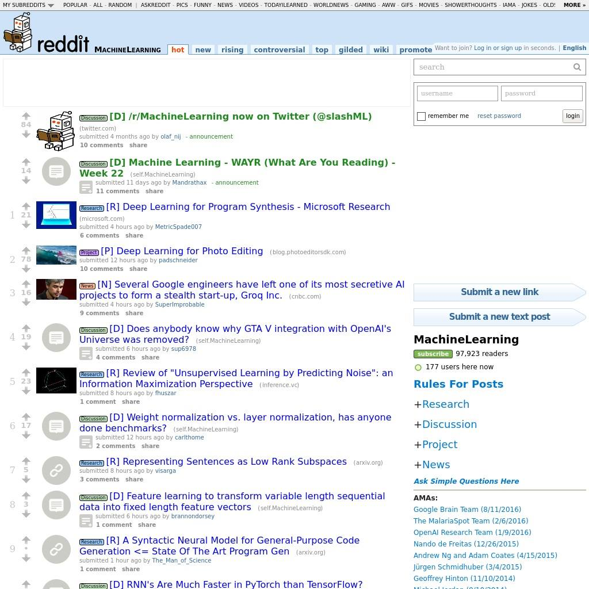

> #오늘의레딧 https://www.reddit.com/r/MachineLearning/ 따끈한 소식들입니다.  1. 프로그램 합성을위한 깊은 학습 - Microsoft Research 2. 사진 편집을위한 심층 학습 3. 몇몇 구글 엔지니어들은 스텔스 신생 기업인 Groq Inc.를 만들기 위해 가장 비밀스런 AI 프로젝트 중 하나를 떠났습니다. 4. OpenAI의 Universe와의 GTA V 통합이 제거 된 이유를 아는 사람이 있습니까? 5. &quot;잡음 예측에 의한 감독되지 않은 학습&quot;의 검토 : 정보의 극대화 관점 6. 체중 표준화 대 계층 정규화, 누구나 벤치마킹을 했습니까? 7. 낮은 순위 부분 공간으로 문장 표현하기 8. 가변 길이 순차 데이터를 고정 길이 특징 벡터로 변환하는 특징 학습 9. 범용 코드 생성을위한 구문 적 신경 모델 &lt;= 예술 프로그램의 상태 10. RNN은 TensorFlow보다 PyTorch에서 훨씬 빠릅니까? 11. 기계 학습의 성장을 2000 년경의 인터넷 성장과 비교해 보면, 지금은 몇 년 전인가? 12. 기계 학습이 과장되었다고 생각합니까? 13. 신경망의 병렬 및 분산 학습을위한 프레임 워크 14. Vincent et.al.의 데이터 세트 (2007) 실종. 15. Softmax GAN 16. 날짜까지 모든 명명 된 Generative Adversarial Networks (GAN)의 전체 목록 : 17. 다양한 GPU 옵션에서 Tensorflow 성능 및 비용 벤치마킹 18. SVHN 데이터 세트를 사용한 깊은 자릿수 검출기 19. 하이퍼 밴드 : 하이퍼 파라미터 최적화에 대한 새로운 산적 기반 접근법 20. ConvNet으로 음악에서 보컬을 분리  1. https://www.microsoft.com/en-us/research/blog/deep-learning-program-synthesis/?wt.mc_id=MCR_378116_FB1 2. https://blog.photoeditorsdk.com/deep-learning-for-photo-editing-943bdf9765e1 3. http://www.cnbc.com/2017/04/20/ex-googlers-left-secretive-ai-unit-to-form-groq-with-palihapitiya.html 4. https://www.reddit.com/r/MachineLearning/comments/66q6pg/d_does_anybody_know_why_gta_v_integration_with/ 5. http://www.inference.vc/unsupervised-learning-by-predicting-noise-an-information-maximization-view-2/ 6. https://www.reddit.com/r/MachineLearning/comments/66obrb/d_weight_normalization_vs_layer_normalization_has/ 7. https://arxiv.org/abs/1704.05358v1 8. https://www.reddit.com/r/MachineLearning/comments/66q8tb/d_feature_learning_to_transform_variable_length/ 9. https://arxiv.org/abs/1704.01696 10. https://www.reddit.com/r/MachineLearning/comments/66rriz/d_rnns_are_much_faster_in_pytorch_than_tensorflow/ 11. https://www.reddit.com/r/MachineLearning/comments/66rmba/d_comparing_the_growth_of_machine_learning_to/ 12. https://www.reddit.com/r/MachineLearning/comments/66qwju/d_do_you_believe_machine_learning_is_overhyped/ 13. https://arxiv.org/abs/1610.07448 14. https://www.reddit.com/r/MachineLearning/comments/66pfwv/r_datasets_of_vincent_etal_2007_missing/ 15. https://arxiv.org/abs/1704.06191 16. https://deephunt.in/the-gan-zoo-79597dc8c347 17. https://medium.com/initialized-capital/benchmarking-tensorflow-performance-and-cost-across-different-gpu-options-69bd85fe5d58 18. https://github.com/penny4860/SVHN-deep-digit-detector 19. https://people.eecs.berkeley.edu/~kjamieson/hyperband.html?utm_content=buffera95c2&utm_medium=social&utm_source=twitter.com&utm_campaign=buffer 20. http://www.madebyollin.com/posts/cnn_acapella_extraction/

### 4월 23일 (일) 07:53 · 📷 사진 (1장)

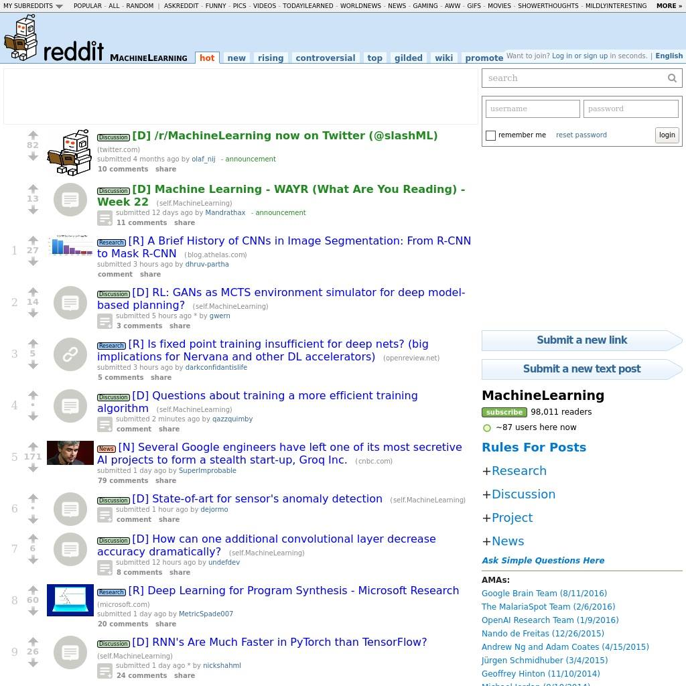

> #오늘의레딧 https://www.reddit.com/r/MachineLearning/ 아침부터 다양한 소식이 많네요.  1. 이미지 분할에서 CNN의 간략한 역사 : R-CNN에서 Mask R-CNN으로 2. RL : 깊은 모형 근거한 계획을위한 MCTS 환경 시뮬레이터로 GANs? 3. 정점 훈련이 깊은 그물을 위해 불충분합니까? (Nervana와 다른 DL 가속기에 대한 큰 함의) 4. 보다 효율적인 교육 알고리즘 교육에 관한 질문 5. 몇몇 구글 엔지니어들은 스텔스 신생 기업인 Groq Inc.를 만들기 위해 가장 비밀스런 AI 프로젝트 중 하나를 떠났습니다. 6. 센서의 이상 탐지를위한 최첨단 기술 7. 추가 컨볼 루션 레이어 하나가 어떻게 정확도를 극적으로 감소시킬 수 있습니까? 8. 프로그램 합성을위한 깊은 학습 - Microsoft Research 9. RNN은 TensorFlow보다 PyTorch에서 훨씬 빠릅니까? 10. 사진 편집을위한 심층 학습 11. &quot;잡음 예측에 의한 감독되지 않은 학습&quot;의 검토 : 정보의 극대화 관점 12. OpenAI의 Universe와의 GTA V 통합이 제거 된 이유를 아는 사람이 있습니까? 13. carpedm20 / DCGAN-tensorflow에 대한 모든 사전 모델? 14. 범용 코드 생성을위한 구문 적 신경 모델 &lt;= 예술 프로그램의 상태 15. ML 학자 경력 전망 16. 반복적 인 환경 시뮬레이터 (코멘트의 비디오) 17. 체중 표준화 대 계층 정규화, 누구나 벤치마킹을 했습니까? 18. 낮은 순위 부분 공간으로 문장 표현하기 19. 가변 길이 순차 데이터를 고정 길이 특징 벡터로 변환하는 특징 학습 20. 피닉스 대학 및 기계 학습  1. https://blog.athelas.com/a-brief-history-of-cnns-in-image-segmentation-from-r-cnn-to-mask-r-cnn-34ea83205de4 2. https://www.reddit.com/r/MachineLearning/comments/66x02v/d_rl_gans_as_mcts_environment_simulator_for_deep/ 3. https://openreview.net/pdf?id=BJ_MGwqlg 4. https://www.reddit.com/r/MachineLearning/comments/66yx2d/d_questions_about_training_a_more_efficient/ 5. http://www.cnbc.com/2017/04/20/ex-googlers-left-secretive-ai-unit-to-form-groq-with-palihapitiya.html 6. https://www.reddit.com/r/MachineLearning/comments/66yl6d/d_stateofart_for_sensors_anomaly_detection/ 7. https://www.reddit.com/r/MachineLearning/comments/66vbbe/d_how_can_one_additional_convolutional_layer/ 8. https://www.microsoft.com/en-us/research/blog/deep-learning-program-synthesis/?wt.mc_id=MCR_378116_FB1 9. https://www.reddit.com/r/MachineLearning/comments/66rriz/d_rnns_are_much_faster_in_pytorch_than_tensorflow/ 10. https://blog.photoeditorsdk.com/deep-learning-for-photo-editing-943bdf9765e1 11. http://www.inference.vc/unsupervised-learning-by-predicting-noise-an-information-maximization-view-2/ 12. https://www.reddit.com/r/MachineLearning/comments/66q6pg/d_does_anybody_know_why_gta_v_integration_with/ 13. https://www.reddit.com/r/MachineLearning/comments/66utqd/d_any_pretrained_models_for/ 14. https://arxiv.org/abs/1704.01696 15. https://www.reddit.com/r/MachineLearning/comments/66t0b3/d_career_prospects_for_ml_academics/ 16. https://arxiv.org/abs/1704.02254 17. https://www.reddit.com/r/MachineLearning/comments/66obrb/d_weight_normalization_vs_layer_normalization_has/ 18. https://arxiv.org/abs/1704.05358v1 19. https://www.reddit.com/r/MachineLearning/comments/66q8tb/d_feature_learning_to_transform_variable_length/ 20. https://www.reddit.com/r/MachineLearning/comments/66u2kz/d_university_of_phoenix_and_machine_learning/

### 4월 23일 (일) 07:53 · Two things I don't want to forget when I…

Two things I don't want to forget when I work with my students:

1. "Focus on the students, since graduating great students means you'll produce great research, while focusing on the research may or may not produce great students." - Nico Habermann (from David Notkin's web page)

2. "If you want to build a ship, don’t drum up people together to collect wood and don’t assign them tasks and work, but rather teach them to long for the endless immensity of the sea." - Le Petit Prince (The Little Prince).

### 4월 24일 (월) 07:52 · 📷 사진 (1장)

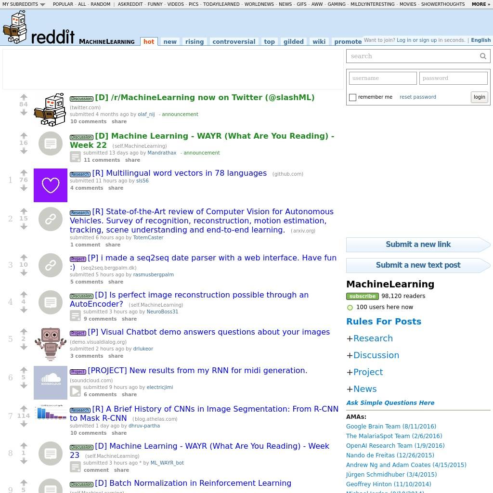

> #오늘의레딧 https://www.reddit.com/r/MachineLearning/ 래딧은 읽을 거리가 다양합니다.  1. 78 개 언어로 된 다국어 단어 벡터 2. 자율 차량을위한 컴퓨터 비전에 대한 최첨단 검토 인식, 재구성, 모션 추정, 추적, 장면 이해 및 철저한 학습에 대한 설문 조사. 3. seq2seq 날짜 파서를 웹 인터페이스로 만들었습니다. 즐겁게 보내주세요 :) 4. AutoEncoder를 통해 완벽한 이미지 재구성이 가능합니까? 5. Visual Chatbot 데모는 이미지에 대한 질문에 대답합니다. 6. 이미지 분할에서 CNN의 간략한 역사 : R-CNN에서 Mask R-CNN으로 7. 기계 학습 - WAYR (당신은 무엇을 읽고 있습니까?) - 23 주차 8. 강화 학습에서 일괄 정규화 9. 계층 적 예측을 통한 장기적인 미래를위한 학습 10. RL : 깊은 모형 근거한 계획을위한 MCTS 환경 시뮬레이터로 GANs? 11. 센서의 이상 탐지를위한 최첨단 기술 12. 정점 훈련이 깊은 그물을 위해 불충분합니까? (Nervana와 다른 DL 가속기에 대한 큰 함의) 13. 보다 효율적인 교육 알고리즘 교육에 관한 질문 14. 몇몇 구글 엔지니어들은 스텔스 신생 기업인 Groq Inc.를 만들기 위해 가장 비밀스런 AI 프로젝트 중 하나를 떠났습니다. 15. 추가 컨볼 루션 레이어 하나가 어떻게 정확도를 극적으로 감소시킬 수 있습니까? 16. Tensorflow LTSM (첫 번째 시도)에 의해 생성 된 Robert Frost시 17. 프로그램 합성을위한 깊은 학습 - Microsoft Research 18. RNN은 TensorFlow보다 PyTorch에서 훨씬 빠릅니까? 19. 사진 편집을위한 심층 학습 20. &quot;잡음 예측에 의한 감독되지 않은 학습&quot;의 검토 : 정보의 극대화 관점  1. https://github.com/Babylonpartners/fastText_multilingual 2. https://arxiv.org/abs/1704.05519 3. http://seq2seq.bergpalm.dk/# 4. https://www.reddit.com/r/MachineLearning/comments/6741jc/d_is_perfect_image_reconstruction_possible/ 5. http://demo.visualdialog.org/ 6. https://blog.athelas.com/a-brief-history-of-cnns-in-image-segmentation-from-r-cnn-to-mask-r-cnn-34ea83205de4 7. https://www.reddit.com/r/MachineLearning/comments/674331/d_machine_learning_wayr_what_are_you_reading_week/ 8. https://www.reddit.com/r/MachineLearning/comments/671455/d_batch_normalization_in_reinforcement_learning/ 9. https://sites.google.com/a/umich.edu/rubenevillegas/hierch_vid 10. https://www.reddit.com/r/MachineLearning/comments/66x02v/d_rl_gans_as_mcts_environment_simulator_for_deep/ 11. https://www.reddit.com/r/MachineLearning/comments/66yl6d/d_stateofart_for_sensors_anomaly_detection/ 12. https://openreview.net/pdf?id=BJ_MGwqlg 13. https://www.reddit.com/r/MachineLearning/comments/66yx2d/d_questions_about_training_a_more_efficient/ 14. http://www.cnbc.com/2017/04/20/ex-googlers-left-secretive-ai-unit-to-form-groq-with-palihapitiya.html 15. https://www.reddit.com/r/MachineLearning/comments/66vbbe/d_how_can_one_additional_convolutional_layer/ 16. http://robert-frost-s-tensorflow-ltsm-poetry-party.bitballoon.com/ 17. https://www.microsoft.com/en-us/research/blog/deep-learning-program-synthesis/?wt.mc_id=MCR_378116_FB1 18. https://www.reddit.com/r/MachineLearning/comments/66rriz/d_rnns_are_much_faster_in_pytorch_than_tensorflow/ 19. https://blog.photoeditorsdk.com/deep-learning-for-photo-editing-943bdf9765e1 20. http://www.inference.vc/unsupervised-learning-by-predicting-noise-an-information-maximization-view-2/

### 4월 24일 (월) 12:29 · Heading to Hong Kong, but I feel I'm alr…

📍 인천공항 Incheon Airport

Heading to Hong Kong, but I feel I'm already in Hong Kong. :-)

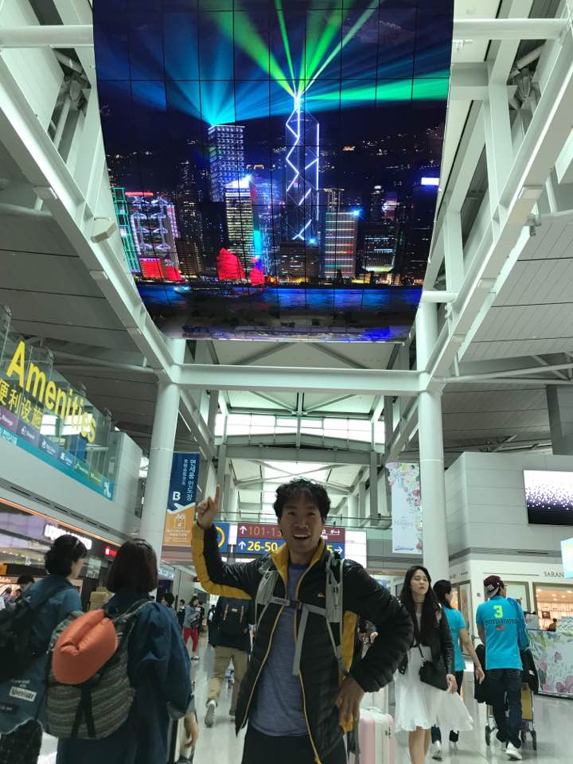

### 4월 25일 (화) 07:52 · 📷 사진 (1장)

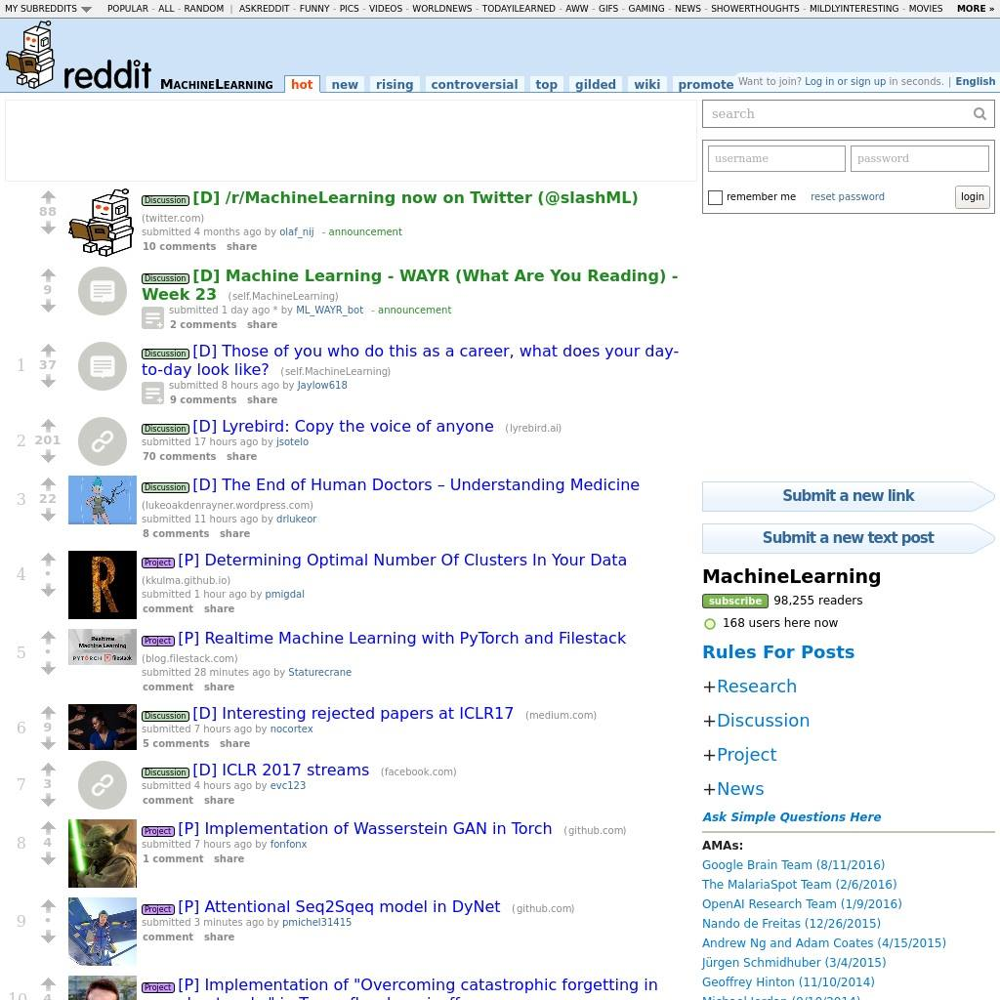

> #오늘의레딧 https://www.reddit.com/r/MachineLearning/ 재미난 이야기들이 많습니다  1. 이 일을 직업으로하는 당신의 사람들, 당신의 일상은 어떻게 생겼습니까? 2. Lyrebird : 누구의 목소리 복사 3. 인간 의사의 끝 - 의학 이해 4. 데이터에서 최적의 클러스터 수 결정 5. PyTorch 및 Filestack을 사용한 실시간 기계 학습 6. 흥미로운 ICLR17 논문 거부 7. ICLR 2017 개 스트림 8. 횃불에서의 Wasserstein GAN 구현 9. DyNet에서의 주목할만한 Seq2Sqeq 모델 10. ariseff에 의한 Tensorflow의 &quot;신경 네트워크에서 치명적인 망각 극복&quot;구현 11. IJCAI 2017 리뷰 토론 스레드 12. 만족스러운 modulo 이론 문제로 학습하는 오토 마타 13. MMDS 온라인 과정을위한 스터디 그룹 14. 데이터 분석, ML 및 AI의 차이점 15. 78 개 언어로 된 다국어 단어 벡터 16. 자율 차량을위한 컴퓨터 비전에 대한 최첨단 검토 인식, 재구성, 모션 추정, 추적, 장면 이해 및 철저한 학습에 대한 설문 조사. 17. seq2seq 날짜 파서를 웹 인터페이스로 만들었습니다. 즐겁게 보내주세요 :) 18. 스타 워즈 전장 : X-wing 자기 조종 프로그램 19. 관련 서브 스크립 션을 찾기 위해 reddit을 채점하는 관련성 20. Visual Chatbot 데모는 이미지에 대한 질문에 대답합니다.  1. https://www.reddit.com/r/MachineLearning/comments/679ffo/d_those_of_you_who_do_this_as_a_career_what_does/ 2. https://lyrebird.ai/demo 3. https://lukeoakdenrayner.wordpress.com/2017/04/24/the-end-of-human-doctors-understanding-medicine/ 4. https://kkulma.github.io/2017-04-24-determining-optimal-number-of-clusters-in-your-data/ 5. https://blog.filestack.com/tutorials/realtime-machine-learning-pytorch/ 6. https://medium.com/intuitionmachine/eight-deserving-deep-learning-papers-that-were-rejected-at-iclr-2017-119e19a4c30b 7. https://www.facebook.com/iclr.cc 8. https://github.com/fonfonx/WassersteinGAN.torch 9. https://github.com/pmichel31415/dynet-att 10. https://github.com/ariseff/overcoming-catastrophic 11. https://www.reddit.com/r/MachineLearning/comments/678ppt/d_ijcai_2017_reviews_discussion_thread/ 12. http://automatonlearning.net/2017/04/18/automata-learning-as-a-satisfiability-modulo-theories-problem/ 13. https://www.reddit.com/r/MachineLearning/comments/6778qg/d_study_group_for_mmds_online_course/ 14. https://www.reddit.com/r/MachineLearning/comments/67aekd/discussion_difference_between_data_analytics_ml/ 15. https://github.com/Babylonpartners/fastText_multilingual 16. https://arxiv.org/abs/1704.05519 17. http://seq2seq.bergpalm.dk/# 18. https://www.reddit.com/r/MachineLearning/comments/677g1x/project_star_wars_battlefront_xwing_self_piloting/ 19. http://blog.richardweiss.org/2017/04/23/relevancy-scoring-reddit.html 20. http://demo.visualdialog.org/

### 4월 26일 (수) 07:52 · 📷 사진 (1장)

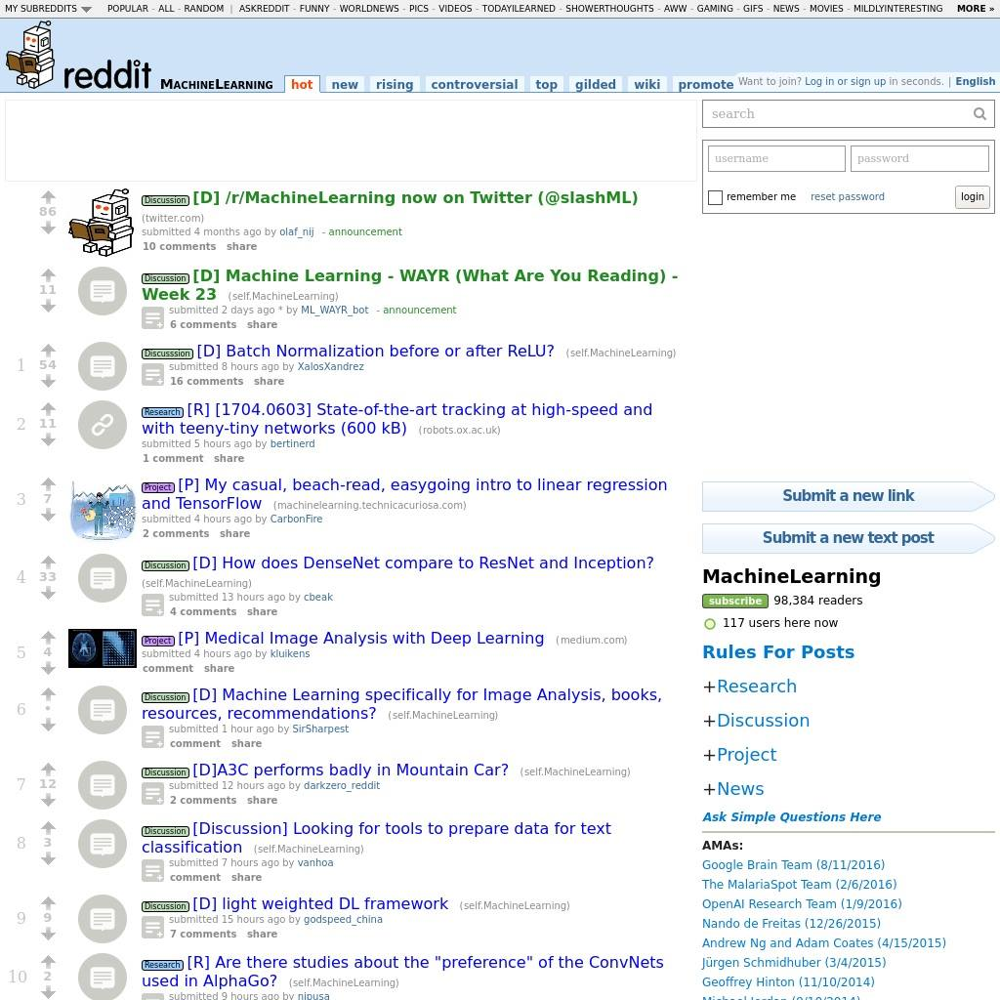

> #오늘의레딧 https://www.reddit.com/r/MachineLearning/ 오늘도 새소식이 많군요.  1. 내 회귀선과 TensorFlow에 대한 내 캐주얼, 해변 읽기, 쉬운 소개 2. DenseNet은 ResNet 및 Inception과 어떻게 비교됩니까? 3. 깊은 학습을 통한 의료 영상 분석 4. 기계 이미지 분석, 도서, 자원, 추천을 위해 특별히 배우고 있습니까? 5. A3C는 Mountain Car에서 성능이 좋지 않습니까? 6. 텍스트 분류를위한 데이터 준비 도구 찾기 7. 가중치가있는 DL 프레임 워크 8. AlphaGo에서 사용되는 ConvNets의 &quot;선호도&quot;에 대한 연구가 있습니까? 9. PyTorch 및 Filestack을 사용한 실시간 기계 학습 10. 이 일을 직업으로하는 당신의 사람들, 당신의 일상은 어떻게 생겼습니까? 11. 다중 에이전트 시스템에서의 지식 발견에 대한 목표 지향적 접근 12. 데이터에서 최적의 클러스터 수 결정 13. DyNet에서의 주목할만한 Seq2Sqeq 모델 14. Lyrebird : 누구의 목소리 복사 15. 인간 의사의 끝 - 의학 이해 16. ICLR 2017 개 스트림 17. ariseff에 의한 Tensorflow의 &quot;신경 네트워크에서 치명적인 망각 극복&quot;구현 18. 흥미로운 ICLR17 논문 거부 19. 횃불에서의 Wasserstein GAN 구현 20. nasdaq, nyse 및 otcbb 주식 및 가격, 기본 및 개념 관계 데이터에 대해 이러한 종류의 데이터 집합을 사용하여 어떤 ML 방법을 제안 하시겠습니까?  1. https://machinelearning.technicacuriosa.com/2017/04/22/machine-learning-with-tensorflow/ 2. https://www.reddit.com/r/MachineLearning/comments/67fds7/d_how_does_densenet_compare_to_resnet_and/ 3. https://medium.com/@taposhdr/medical-image-analysis-with-deep-learning-i-23d518abf531 4. https://www.reddit.com/r/MachineLearning/comments/67jo3t/d_machine_learning_specifically_for_image/ 5. https://www.reddit.com/r/MachineLearning/comments/67fqv8/da3c_performs_badly_in_mountain_car/ 6. https://www.reddit.com/r/MachineLearning/comments/67h4rs/discussion_looking_for_tools_to_prepare_data_for/ 7. https://www.reddit.com/r/MachineLearning/comments/67f5b0/d_light_weighted_dl_framework/ 8. https://www.reddit.com/r/MachineLearning/comments/67glpy/r_are_there_studies_about_the_preference_of_the/ 9. https://blog.filestack.com/tutorials/realtime-machine-learning-pytorch/ 10. https://www.reddit.com/r/MachineLearning/comments/679ffo/d_those_of_you_who_do_this_as_a_career_what_does/ 11. https://github.com/CarsonScott/Knowledge-Discovery-Agents 12. https://kkulma.github.io/2017-04-24-determining-optimal-number-of-clusters-in-your-data/ 13. https://github.com/pmichel31415/dynet-att 14. https://lyrebird.ai/demo 15. https://lukeoakdenrayner.wordpress.com/2017/04/24/the-end-of-human-doctors-understanding-medicine/ 16. https://www.facebook.com/iclr.cc 17. https://github.com/ariseff/overcoming-catastrophic 18. https://medium.com/intuitionmachine/eight-deserving-deep-learning-papers-that-were-rejected-at-iclr-2017-119e19a4c30b 19. https://github.com/fonfonx/WassersteinGAN.torch 20. https://www.reddit.com/r/MachineLearning/comments/67f1mo/d_what_ml_methods_would_you_suggest_using_on_this/

### 4월 27일 (목) 07:18 · 📷 사진 (4장)

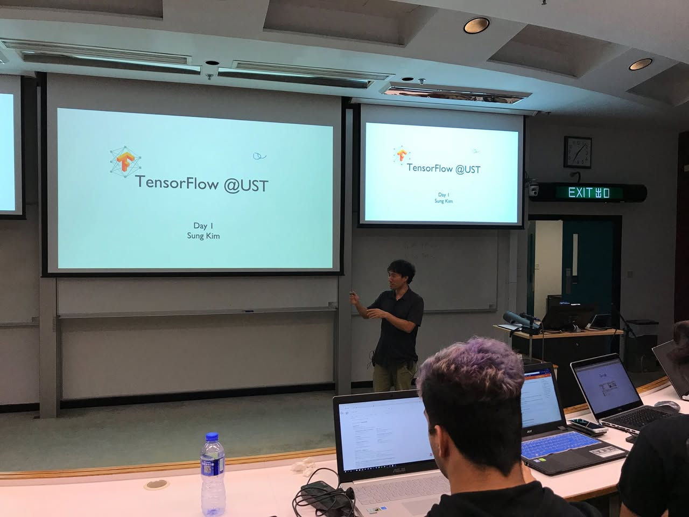 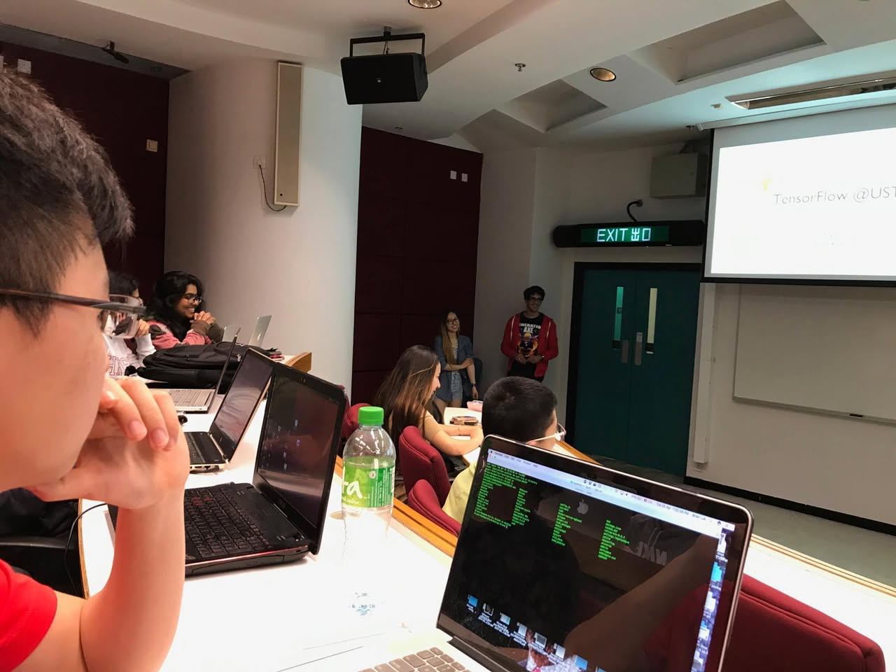 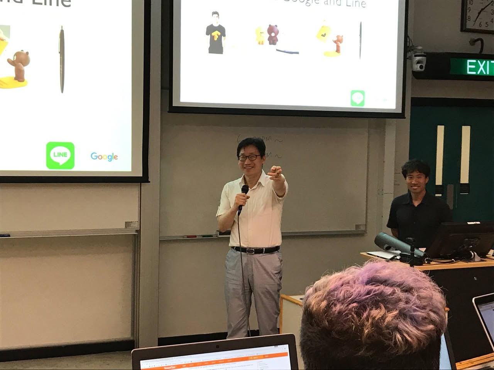 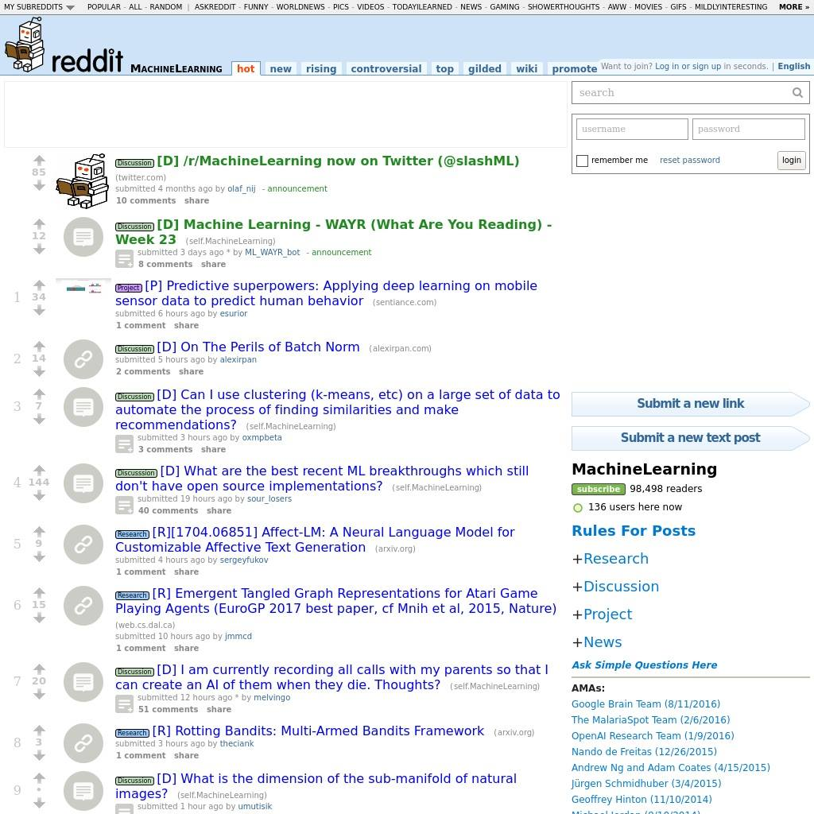

> #오늘의레딧 https://www.reddit.com/r/MachineLearning/ 래딧은 읽을 거리가 다양합니다.  1. 예측 슈퍼 파워 : 모바일 센서 데이터에 대한 심층적 학습을 적용하여 사람의 행동을 예측합니다. 2. 일괄 표준의 위험에 대하여 3. 유사성을 찾는 프로세스를 자동화하고 권장 사항을 제시하기 위해 대규모 데이터 세트에서 클러스터링 (k-means 등)을 사용할 수 있습니까? 4. Atari 게임 플레이 에이전트 (EuroGP 2017 최우수 논문, cf Mnih 외, 2015, 자연)에 대한 떠드는 얽힌 그래프 표현 5. 나는 현재 부모님들과 함께 모든 전화를 녹음하여 그들이 죽었을 때 AI를 만들 수 있습니다. 생각? 6. 썩은 산적 : 다중 무장 한 산적 프레임 워크 7. 자연 이미지의 하위 다양체의 차원은 무엇입니까? 8. 기계 학습 시스템의 현실 9. 대화 형 / 매력적인 기계 학습 프로젝트 10. Tffm : 임의 순서의 TensorFlow 구현 Factorization Machine 11. 내 회귀선과 TensorFlow에 대한 내 캐주얼, 해변 읽기, 쉬운 소개 12. 깊은 학습을 통한 의료 영상 분석 13. 강화 학습의 현저함 (ACER) 14. DenseNet은 ResNet 및 Inception과 어떻게 비교됩니까? 15. 초인간주의 AI의 신화 - 케빈 켈리 16. A3C는 Mountain Car에서 성능이 좋지 않습니까? 17. 가중치가있는 DL 프레임 워크 18. 기계 이미지 분석, 도서, 자원, 추천을 위해 특별히 배우고 있습니까? 19. 새로운 지식을 발견하고자하는 지능형 에이전트의 사회  1. http://www.sentiance.com/2017/04/25/predictive-analytics-applying-deep-learning-on-mobile-sensor-data/ 2. http://www.alexirpan.com/2017/04/26/perils-batch-norm.html 3. https://www.reddit.com/r/MachineLearning/comments/67qk9j/d_can_i_use_clustering_kmeans_etc_on_a_large_set/ 4. https://web.cs.dal.ca/~mheywood/OpenAccess/open-kelly17a.pdf 5. https://www.reddit.com/r/MachineLearning/comments/67nbbn/d_i_am_currently_recording_all_calls_with_my/ 6. https://arxiv.org/pdf/1702.07274v1.pdf?utm_content=bufferff145&utm_medium=social&utm_source=twitter.com&utm_campaign=buffer 7. https://www.reddit.com/r/MachineLearning/comments/67r81s/d_what_is_the_dimension_of_the_submanifold_of/ 8. http://sdtimes.com/realities-machine-learning-systems/ 9. https://www.reddit.com/r/MachineLearning/comments/67rigi/d_interactiveengaging_machine_learning_projects/ 10. https://github.com/geffy/tffm 11. https://machinelearning.technicacuriosa.com/2017/04/22/machine-learning-with-tensorflow/ 12. https://medium.com/@taposhdr/medical-image-analysis-with-deep-learning-i-23d518abf531 13. https://www.youtube.com/watch?v=tqrOXYBrHA4 14. https://www.reddit.com/r/MachineLearning/comments/67fds7/d_how_does_densenet_compare_to_resnet_and/ 15. https://backchannel.com/the-myth-of-a-superhuman-ai-59282b686c62 16. https://www.reddit.com/r/MachineLearning/comments/67fqv8/da3c_performs_badly_in_mountain_car/ 17. https://www.reddit.com/r/MachineLearning/comments/67f5b0/d_light_weighted_dl_framework/ 18. https://www.reddit.com/r/MachineLearning/comments/67jo3t/d_machine_learning_specifically_for_image/ 19. https://github.com/CarsonScott/Knowledge-Discovery-Agents/blob/master/README.md

### 4월 28일 (금) 07:52 · 📷 사진 (1장)

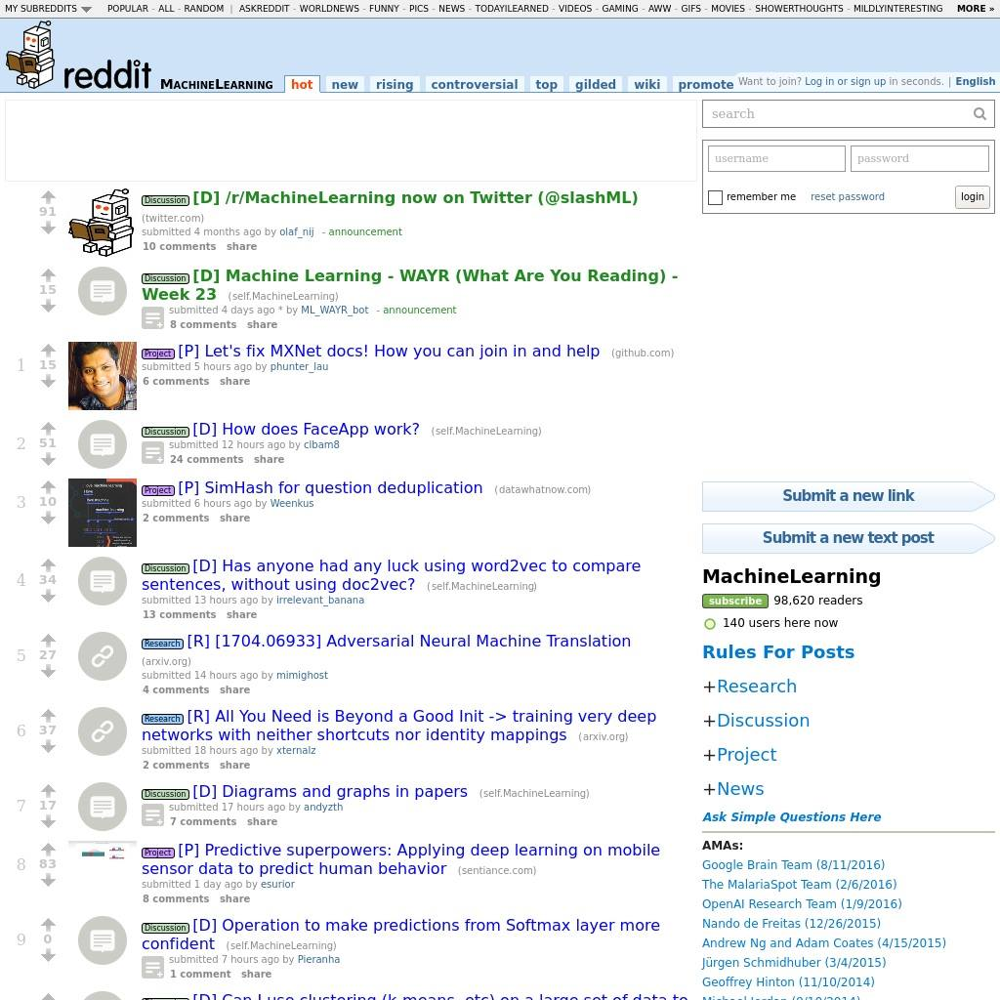

> #오늘의레딧 https://www.reddit.com/r/MachineLearning/ 오늘도 새소식이 많군요.  1. MXNet 문서를 수정합시다! 어떻게 참여하고 도움을 줄 수 있습니까? 2. FaceApp는 어떻게 작동합니까? 3. 질문 중복 제거를위한 SimHash 4. doc2vec를 사용하지 않고 word2vec를 사용하여 문장을 비교하는 사람이 있습니까? 5. 당신이 필요로하는 것은 모두 Good Init 이상입니다 - 바로 가기도 ID 매핑도없는 매우 깊은 네트워크를 훈련하십시오 6. 논문의 다이어그램과 그래프 7. 예측 슈퍼 파워 : 모바일 센서 데이터에 대한 심층적 학습을 적용하여 사람의 행동을 예측합니다. 8. Softmax 레이어의 예측을보다 확실하게하는 작업 9. 유사성을 찾는 프로세스를 자동화하고 권장 사항을 제시하기 위해 대규모 데이터 세트에서 클러스터링 (k-means 등)을 사용할 수 있습니까? 10. 왕립 학회에 의한 기계 학습의 사회적 및 거버넌스 함의에 대한 상세 보고서 11. 일괄 표준의 위험에 대하여 12. 대화 형 / 매력적인 기계 학습 프로젝트 13. 썩은 산적 : 다중 무장 한 산적 프레임 워크 14. Atari 게임 플레이 에이전트 (EuroGP 2017 최우수 논문, cf Mnih 외, 2015, 자연)에 대한 떠드는 얽힌 그래프 표현 15. 기계 학습 시스템의 현실 16. 나는 현재 부모님들과 함께 모든 전화를 녹음하여 그들이 죽었을 때 AI를 만들 수 있습니다. 생각? 17. 자연 이미지의 하위 다양체의 차원은 무엇입니까? 18. Tffm : 임의 순서의 TensorFlow 구현 Factorization Machine 19. 잘 알려지지 않은 AGI 개발자는 강력한 AI 프레임 워크를 구축하기를 포기했습니다.  1. https://github.com/dmlc/mxnet/issues/6000 2. https://www.reddit.com/r/MachineLearning/comments/67umwt/d_how_does_faceapp_work/ 3. https://datawhatnow.com/simhash-question-deduplicatoin/ 4. https://www.reddit.com/r/MachineLearning/comments/67ufwo/d_has_anyone_had_any_luck_using_word2vec_to/ 5. https://arxiv.org/abs/1703.01827 6. https://www.reddit.com/r/MachineLearning/comments/67tn9t/d_diagrams_and_graphs_in_papers/ 7. http://www.sentiance.com/2017/04/25/predictive-analytics-applying-deep-learning-on-mobile-sensor-data/ 8. https://www.reddit.com/r/MachineLearning/comments/67wg7b/d_operation_to_make_predictions_from_softmax/ 9. https://www.reddit.com/r/MachineLearning/comments/67qk9j/d_can_i_use_clustering_kmeans_etc_on_a_large_set/ 10. https://royalsociety.org/news/2017/04/machine-learning-requires-careful-stewardship-says-royal-society/ 11. http://www.alexirpan.com/2017/04/26/perils-batch-norm.html 12. https://www.reddit.com/r/MachineLearning/comments/67rigi/d_interactiveengaging_machine_learning_projects/ 13. https://arxiv.org/pdf/1702.07274v1.pdf?utm_content=bufferff145&utm_medium=social&utm_source=twitter.com&utm_campaign=buffer 14. https://web.cs.dal.ca/~mheywood/OpenAccess/open-kelly17a.pdf 15. http://sdtimes.com/realities-machine-learning-systems/ 16. https://www.reddit.com/r/MachineLearning/comments/67nbbn/d_i_am_currently_recording_all_calls_with_my/ 17. https://www.reddit.com/r/MachineLearning/comments/67r81s/d_what_is_the_dimension_of_the_submanifold_of/ 18. https://github.com/geffy/tffm 19. https://github.com/WalnutiQ/wAlnut

### 4월 28일 (금) 18:01 · Done and look forward to our new preside…

Done and look forward to our new president!

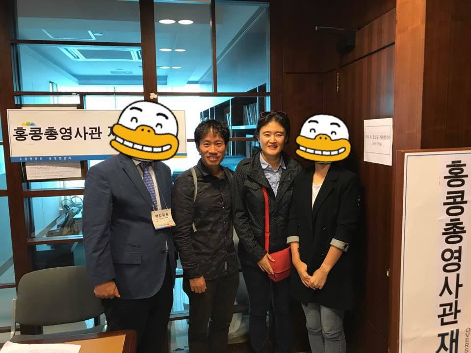

### 4월 29일 (토) 07:52 · 📷 사진 (1장)

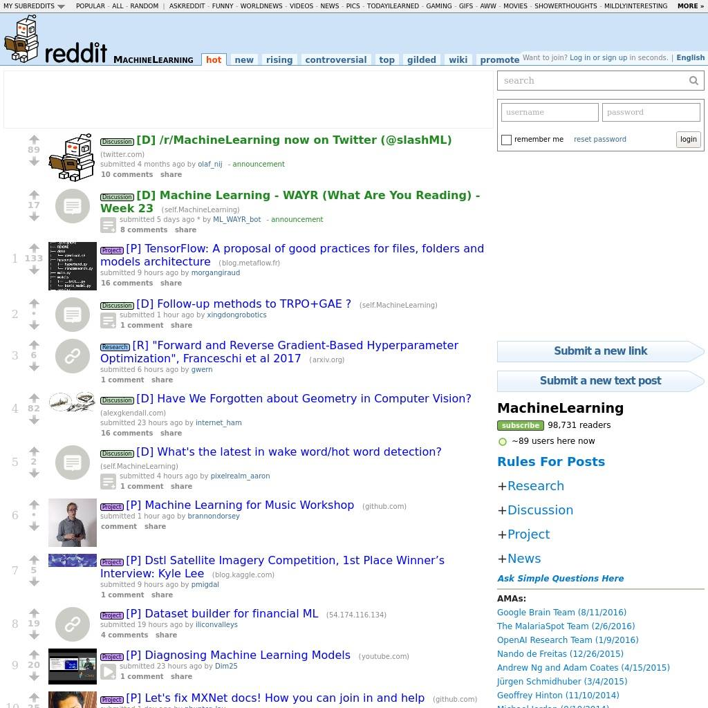

> #오늘의레딧 https://www.reddit.com/r/MachineLearning/ 아침부터 다양한 소식이 많네요.  1. TensorFlow : 파일, 폴더 및 모델 아키텍처의 우수 사례 제안 2. TRPO + GAE에 대한 후속 조치? 3. &quot;순방향 및 역방향 그라데이션 기반 하이퍼 매개 변수 최적화&quot;, Franceschi et al 2017 4. 우리는 컴퓨터 비전의 기하학을 잊어 버렸습니까? 5. 깨어나 최신 단어 검색의 최신 기능은 무엇입니까? 6. 음악 워크샵을위한 기계 학습 7. Dstl 위성 영상 경쟁, 1 위 수상자 인터뷰 : Kyle Lee 8. 금융 ML 용 데이터 세트 빌더 9. 기계 학습 모델 진단 10. MXNet 문서를 수정합시다! 어떻게 참여하고 도움을 줄 수 있습니까? 11. 시퀀스 LSTM 아키텍처 시퀀스 12. FaceApp는 어떻게 작동합니까? 13. 질문 중복 제거를위한 SimHash 14. Tensorflow를 사용하여 일부 이미지 생성 15. 오픈 소싱 MNIST 및 NIST 전처리 코드 16. doc2vec를 사용하지 않고 word2vec를 사용하여 문장을 비교하는 사람이 있습니까? 17. 당신이 필요로하는 것은 모두 Good Init 이상입니다 - 바로 가기도 ID 매핑도없는 매우 깊은 네트워크를 훈련하십시오 18. 논문의 다이어그램과 그래프 19. 예측 슈퍼 파워 : 모바일 센서 데이터에 대한 심층적 학습을 적용하여 사람의 행동을 예측합니다. 20. 유사성을 찾는 프로세스를 자동화하고 권장 사항을 제시하기 위해 대규모 데이터 세트에서 클러스터링 (k-means 등)을 사용할 수 있습니까?  1. https://blog.metaflow.fr/tensorflow-a-proposal-of-good-practices-for-files-folders-and-models-architecture-f23171501ae3 2. https://www.reddit.com/r/MachineLearning/comments/685itx/d_followup_methods_to_trpogae/ 3. https://arxiv.org/abs/1703.01785 4. http://alexgkendall.com/computer_vision/have_we_forgotten_about_geometry_in_computer_vision/ 5. https://www.reddit.com/r/MachineLearning/comments/684dr3/d_whats_the_latest_in_wake_wordhot_word_detection/ 6. https://github.com/brannondorsey/ml4music-workshop 7. http://blog.kaggle.com/2017/04/26/dstl-satellite-imagery-competition-1st-place-winners-interview-kyle-lee/ 8. http://54.174.116.134/recommend/datasets/explore-trends-04.html 9. https://www.youtube.com/watch?v=ZD8LA3n6YvI 10. https://github.com/dmlc/mxnet/issues/6000 11. https://www.reddit.com/r/MachineLearning/comments/681hqn/d_sequence_to_sequence_lstm_architectures/ 12. https://www.reddit.com/r/MachineLearning/comments/67umwt/d_how_does_faceapp_work/ 13. https://datawhatnow.com/simhash-question-deduplicatoin/ 14. https://www.youtube.com/watch?v=0VPQHbMvGzg&utm_source=f&utm_medium=h&utm_campaign=n&utm_term=n&utm_content=njsdddd 15. http://blog.agi.io/ 16. https://www.reddit.com/r/MachineLearning/comments/67ufwo/d_has_anyone_had_any_luck_using_word2vec_to/ 17. https://arxiv.org/abs/1703.01827 18. https://www.reddit.com/r/MachineLearning/comments/67tn9t/d_diagrams_and_graphs_in_papers/ 19. http://www.sentiance.com/2017/04/25/predictive-analytics-applying-deep-learning-on-mobile-sensor-data/ 20. https://www.reddit.com/r/MachineLearning/comments/67qk9j/d_can_i_use_clustering_kmeans_etc_on_a_large_set/

### 4월 30일 (일) 07:52 · 📷 사진 (1장)

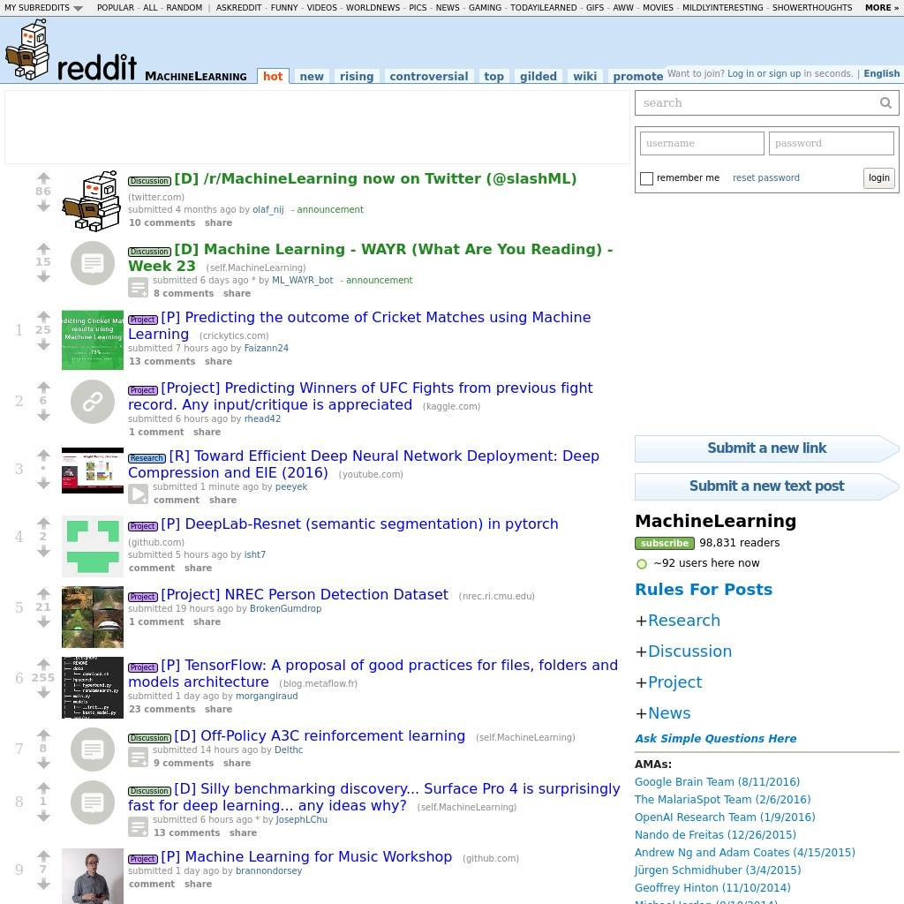

> #오늘의레딧 https://www.reddit.com/r/MachineLearning/ 래딧은 읽을 거리가 다양합니다.  1. 기계 학습을 사용하여 크리켓 경기 결과 예측 2. 이전 전투 기록에서 UFC 전투의 우승자를 예측하십시오. 어떤 입력 / 비평도 환영합니다. 3. 효율적인 딥 뉴럴 네트워크 배치 : 딥 압축 및 EIE (2016) 4. Pytorch의 DeepLab-Resnet (의미 론적 세분화) 5. NREC 사람 탐지 데이터 세트 6. TensorFlow : 파일, 폴더 및 모델 아키텍처의 우수 사례 제안 7. 오프 정책 A3C 강화 학습 8. 어리석은 벤치마킹 발견 ... Surface Pro 4는 깊은 학습을 위해 놀라 울 정도로 빠릅니다 ... 어떤 아이디어입니까? 9. 음악 워크샵을위한 기계 학습 10. Dstl 위성 영상 경쟁, 1 위 수상자 인터뷰 : Kyle Lee 11. TRPO + GAE에 대한 후속 조치? 12. &quot;순방향 및 역방향 그라데이션 기반 하이퍼 매개 변수 최적화&quot;, Franceschi et al 2017 13. 우리는 컴퓨터 비전의 기하학을 잊어 버렸습니까? 14. 깨어나 최신 단어 검색의 최신 기능은 무엇입니까? 15. 기계 학습 모델 진단 16. MXNet 문서를 수정합시다! 어떻게 참여하고 도움을 줄 수 있습니까? 17. 시퀀스 LSTM 아키텍처 시퀀스 18. FaceApp는 어떻게 작동합니까? 19. 질문 중복 제거를위한 SimHash 20. doc2vec를 사용하지 않고 word2vec를 사용하여 문장을 비교하는 사람이 있습니까?  1. https://crickytics.com/predicting-the-outcome-of-cricket-matches-using-machine-learning/ 2. https://www.kaggle.com/calmdownkarm/d/calmdownkarm/ufcdataset/ufc-predictor-and-notes/ 3. https://www.youtube.com/watch?v=CrDRr2fxbsg 4. https://github.com/isht7/pytorch-deeplab-resnet 5. http://www.nrec.ri.cmu.edu/projects/usdapersondetection/dataset/ 6. https://blog.metaflow.fr/tensorflow-a-proposal-of-good-practices-for-files-folders-and-models-architecture-f23171501ae3 7. https://www.reddit.com/r/MachineLearning/comments/688cm9/d_offpolicy_a3c_reinforcement_learning/ 8. https://www.reddit.com/r/MachineLearning/comments/68a2zq/d_silly_benchmarking_discovery_surface_pro_4_is/ 9. https://github.com/brannondorsey/ml4music-workshop 10. http://blog.kaggle.com/2017/04/26/dstl-satellite-imagery-competition-1st-place-winners-interview-kyle-lee/ 11. https://www.reddit.com/r/MachineLearning/comments/685itx/d_followup_methods_to_trpogae/ 12. https://arxiv.org/abs/1703.01785 13. http://alexgkendall.com/computer_vision/have_we_forgotten_about_geometry_in_computer_vision/ 14. https://www.reddit.com/r/MachineLearning/comments/684dr3/d_whats_the_latest_in_wake_wordhot_word_detection/ 15. https://www.youtube.com/watch?v=ZD8LA3n6YvI 16. https://github.com/dmlc/mxnet/issues/6000 17. https://www.reddit.com/r/MachineLearning/comments/681hqn/d_sequence_to_sequence_lstm_architectures/ 18. https://www.reddit.com/r/MachineLearning/comments/67umwt/d_how_does_faceapp_work/ 19. https://datawhatnow.com/simhash-question-deduplicatoin/ 20. https://www.reddit.com/r/MachineLearning/comments/67ufwo/d_has_anyone_had_any_luck_using_word2vec_to/
