# 2017년 5월

[← 2017년](README.md)

### 5월 1일 (월) 07:52 · 📷 사진 (1장)

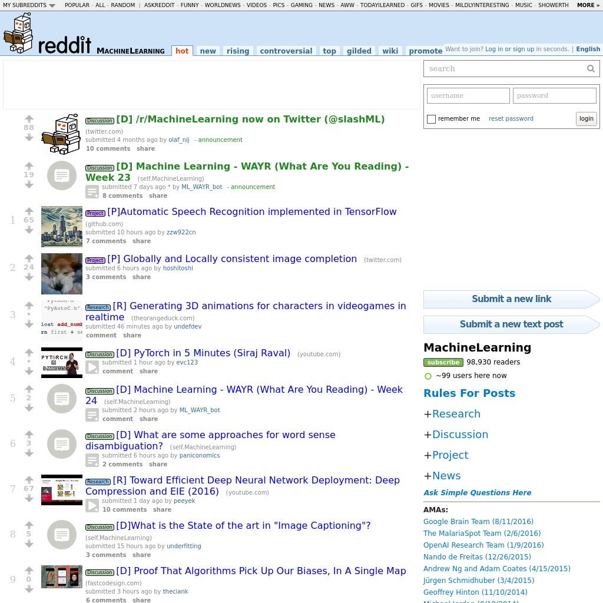
**이미지 캡션:** 이것은 Reddit의 Machine Learning 서브레딧 페이지로, 다양한 게시물 목록이 표시됩니다. 페이지 상단에는 Reddit 로고와 "Machine Learning"이라는 제목이 있으며, 그 아래에는 "hot", "new", "rising", "controversial", "top", "gilded", "wiki", "promote"와 같은 탭이 있습니다. 오른쪽 상단에는 로그인 또는 가입을 위한 입력 필드와 영어 언어 선택기가 있습니다. 페이지 중앙에는 검색창과 함께 게시물 목록이 표시됩니다. 각 게시물에는 제목, 출처, 작성자, 게시 시간, 댓글 수, 공유 버튼이 포함되어 있습니다. 게시물들은 머신러닝 관련 주제를 다루고 있으며, 예를 들어 "Machine Learning now on Twitter", "Automatic Speech Recognition implemented in TensorFlow", "Generating 3D animations for characters in videogames in realtime", "PyTorch in 5 Minutes", "What are some approaches for word sense disambiguation?", "Toward Efficient Deep Neural Network Deployment: Deep Compression and EIE (2016)", "What is the State of the art in 'Image Captioning'?", "Proof That Algorithms Pick Up Our Biases, In A Single Map" 등이 있습니다. 페이지 오른쪽에는 "Submit a new link" 및 "Submit a new text post" 버튼과 함께 "Machine Learning" 서브레딧의 구독자 수와 현재 접속자 수가 표시됩니다. 또한 "Rules For Posts" 섹션에는 "+Research", "+Discussion", "+Project", "+News"와 같은 카테고리가 있으며, "Ask Simple Questions Here" 섹션에는 AMAs(Ask Me Anything) 목록이 표시됩니다. 전반적으로 이 페이지는 머신러닝 커뮤니티의 정보 공유 및 토론을 위한 플랫폼으로 보입니다.

> #오늘의레딧 https://www.reddit.com/r/MachineLearning/ 재미난 이야기들이 많습니다  1. TensorFlow에서 구현 된 자동 음성 인식 2. 전 세계적 및 지역적으로 일관된 이미지 완성 3. 실시간으로 비디오 게임에서 캐릭터의 3D 애니메이션 생성 4. 5 분 안에 PyTorch (Siraj Raval) 5. 기계 학습 - WAYR (당신은 무엇을 읽고 있습니까?) - 24 주차 6. 단어 감각 모호성 제거를위한 몇 가지 접근 방법은 무엇입니까? 7. 효율적인 딥 뉴럴 네트워크 배치 : 딥 압축 및 EIE (2016) 8. &quot;이미지 캡션&quot;의 최첨단 기술은 무엇입니까? 9. 알고리즘이 단일 맵에서 우리의 편향을 선택한다는 증명 10. 기계 학습을 사용하여 크리켓 경기 결과 예측 11. Pytorch의 DeepLab-Resnet (의미 론적 세분화) 12. 이전 전투 기록에서 UFC 전투의 우승자를 예측하십시오. 어떤 입력 / 비평도 환영합니다. 13. NREC 사람 탐지 데이터 세트 14. 오프 정책 A3C 강화 학습 15. TensorFlow : 파일, 폴더 및 모델 아키텍처의 우수 사례 제안 16. 어리석은 벤치마킹 발견 ... Surface Pro 4는 깊은 학습을 위해 놀라 울 정도로 빠릅니다 ... 어떤 아이디어입니까? 17. 음악 워크샵을위한 기계 학습 18. Dstl 위성 영상 경쟁, 1 위 수상자 인터뷰 : Kyle Lee 19. TRPO + GAE에 대한 후속 조치? 20. &quot;순방향 및 역방향 그라데이션 기반 하이퍼 매개 변수 최적화&quot;, Franceschi et al 2017  1. https://github.com/zzw922cn/Automatic_Speech_Recognition 2. https://twitter.com/stsiizk/status/858517661889646592 3. http://theorangeduck.com/page/phase-functioned-neural-networks-character-control 4. https://www.youtube.com/watch?v=nbJ-2G2GXL0 5. https://www.reddit.com/r/MachineLearning/comments/68hhhb/d_machine_learning_wayr_what_are_you_reading_week/ 6. https://www.reddit.com/r/MachineLearning/comments/68gaf5/d_what_are_some_approaches_for_word_sense/ 7. https://www.youtube.com/watch?v=CrDRr2fxbsg 8. https://www.reddit.com/r/MachineLearning/comments/68ed9w/dwhat_is_the_state_of_the_art_in_image_captioning/ 9. https://www.fastcodesign.com/90111752/proof-that-algorithms-pick-up-our-biases-in-a-single-map 10. https://crickytics.com/predicting-the-outcome-of-cricket-matches-using-machine-learning/ 11. https://github.com/isht7/pytorch-deeplab-resnet 12. https://www.kaggle.com/calmdownkarm/d/calmdownkarm/ufcdataset/ufc-predictor-and-notes/ 13. http://www.nrec.ri.cmu.edu/projects/usdapersondetection/dataset/ 14. https://www.reddit.com/r/MachineLearning/comments/688cm9/d_offpolicy_a3c_reinforcement_learning/ 15. https://blog.metaflow.fr/tensorflow-a-proposal-of-good-practices-for-files-folders-and-models-architecture-f23171501ae3 16. https://www.reddit.com/r/MachineLearning/comments/68a2zq/d_silly_benchmarking_discovery_surface_pro_4_is/ 17. https://github.com/brannondorsey/ml4music-workshop 18. http://blog.kaggle.com/2017/04/26/dstl-satellite-imagery-competition-1st-place-winners-interview-kyle-lee/ 19. https://www.reddit.com/r/MachineLearning/comments/685itx/d_followup_methods_to_trpogae/ 20. https://arxiv.org/abs/1703.01785

### 5월 2일 (화) 07:49 · 📷 사진 (5장)

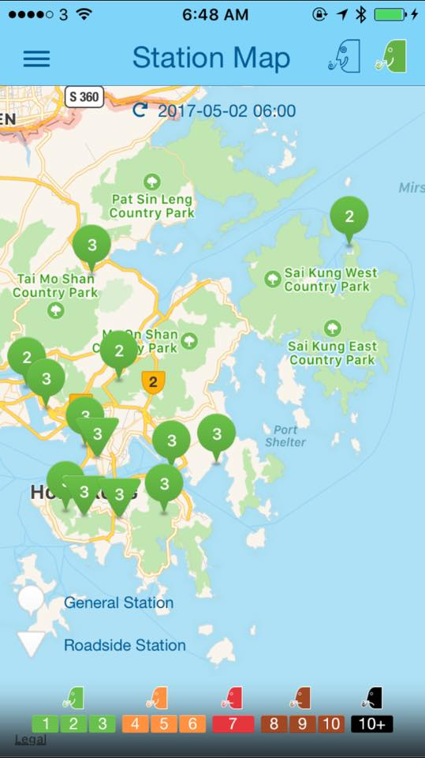
**이미지 캡션:** 이것은 스마트폰 화면의 스크린샷으로, 지도 애플리케이션의 "Station Map" 화면을 보여줍니다. 화면 상단에는 시간 "6:48 AM"과 배터리 잔량 표시가 있습니다. 중앙에는 "Station Map"이라는 제목이 있고, 그 아래에는 "2017-05-02 06:00"이라는 날짜와 시간이 표시되어 있습니다. 지도에는 홍콩 지역으로 보이는 지형과 해안선이 나타나 있으며, 여러 녹색 원형 마커와 일부 삼각형 마커가 표시되어 있습니다. 각 마커에는 숫자 2 또는 3이 적혀 있으며, 이는 특정 스테이션의 수를 나타내는 것으로 보입니다. 지도에는 "Pat Sin Leng Country Park", "Tai Mo Shan Country Park", "On Shan Country Park", "Sai Kung West Country Park", "Sai Kung East Country Park"와 같은 지명들이 표시되어 있습니다. 또한 "Port Shelter"라는 지명도 보입니다. 지도 하단에는 "General Station"과 "Roadside Station"이라는 텍스트가 있고, 그 아래에는 다양한 색상의 아이콘과 숫자 1부터 10+까지의 눈금 표시가 있습니다. 이 눈금은 스테이션의 상태나 등급을 나타내는 것으로 추정됩니다. 화면 하단에는 "Legal"이라는 텍스트가 희미하게 보입니다. 전반적으로 이 화면은 특정 지역의 스테이션 위치와 상태를 보여주는 지도 기반의 정보 시스템으로 보입니다.
 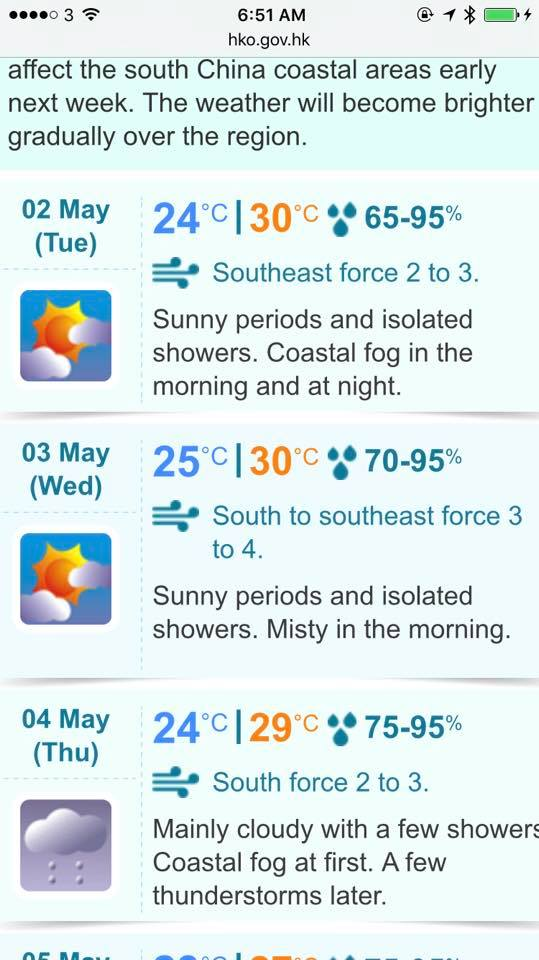
**이미지 캡션:** 이것은 스마트폰 화면의 일부를 캡처한 이미지로, 홍콩 천문대 웹사이트(hko.gov.hk)의 날씨 예보를 보여줍니다. 화면 상단에는 시간(6:51 AM)과 배터리 잔량 표시가 있으며, 그 아래에는 "affect the south China coastal areas early next week. The weather will become brighter gradually over the region."이라는 텍스트가 보입니다. 이 텍스트는 다음 주 초 남중국 해안 지역에 영향을 미칠 날씨에 대한 설명으로, 점차 지역 날씨가 더 밝아질 것이라고 예고합니다. 그 아래로는 5월 2일부터 4일까지의 날씨 예보가 날짜별로 나열되어 있습니다. 각 날짜별 예보에는 해당 날짜, 요일, 최고 및 최저 기온, 습도, 바람 정보, 그리고 날씨 설명이 포함되어 있습니다. 예를 들어, 5월 2일 화요일에는 24°C에서 30°C 사이의 기온에 65-95%의 습도를 보이며, 바람은 남동풍 2~3급으로 불고, 맑은 날씨에 산발적인 소나기가 내리며 아침과 밤에는 해무가 낄 것으로 예보하고 있습니다. 5월 3일 수요일에는 25°C에서 30°C 사이의 기온에 70-95%의 습도를 보이며, 바람은 남쪽에서 남동쪽으로 3~4급으로 불고, 맑은 날씨에 산발적인 소나기가 내리며 아침에는 안개가 낄 것으로 예상됩니다. 5월 4일 목요일에는 24°C에서 29°C 사이의 기온에 75-95%의 습도를 보이며, 바람은 남풍 2~3급으로 불고, 주로 흐린 날씨에 몇 차례 소나기가 내리며 처음에는 해무가 끼다가 나중에는 뇌우가 예상됩니다. 각 날짜별 예보 옆에는 해당 날씨를 시각적으로 나타내는 아이콘이 있습니다. 5월 2일과 3일에는 태양과 구름, 소나기 아이콘이, 5월 4일에는 먹구름과 소나기 아이콘이 보입니다. 전반적으로 이 이미지는 홍콩 지역의 며칠간의 날씨 정보를 제공하는 화면을 담고 있으며, 정보 전달에 초점을 맞춘 차분하고 명확한 분위기입니다.
 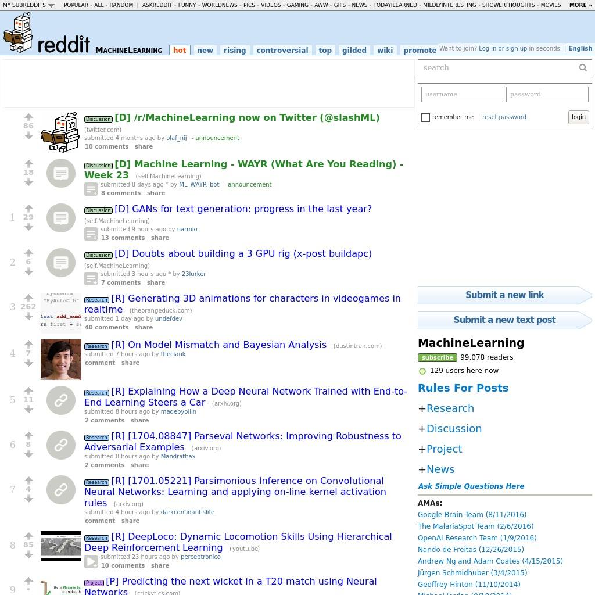
**이미지 캡션:** 이 이미지는 레딧의 머신러닝 서브레딧 페이지를 보여주며, 다양한 연구 및 토론 게시물 목록이 표시됩니다. 페이지 상단에는 레딧 로고와 함께 "hot", "new", "rising", "controversial", "top", "gilded", "wiki", "promote"와 같은 탭이 있으며, 검색창과 로그인/가입 옵션이 있습니다. 메인 콘텐츠 영역에는 여러 게시물이 나열되어 있으며, 각 게시물은 제목, 작성자, 제출 시간, 댓글 수 등의 정보를 포함합니다. 예를 들어, "Machine Learning - WAYR (What Are You Reading) - Week 23"이라는 제목의 게시물은 8일 전에 제출되었고 8개의 댓글이 있습니다. 또한, "GANs for text generation: progress in the last year?"라는 게시물은 9시간 전에 제출되었고 13개의 댓글이 있습니다. 페이지 오른쪽에는 "Submit a new link" 및 "Submit a new text post" 버튼과 함께 "Machine Learning" 서브레딧의 구독자 수와 현재 접속자 수가 표시됩니다. 그 아래에는 "+Research", "+Discussion", "+Project", "+News"와 같은 섹션과 "Ask Simple Questions Here"라는 문구가 있으며, "AMAS" 섹션에는 여러 연구팀 및 개인의 이름과 날짜가 나열되어 있습니다. 이미지 중앙에는 젊은 성인 남성이 웃으며 카메라를 바라보고 있는 사진이 포함된 게시물이 있습니다. 전반적으로 이 페이지는 머신러닝 커뮤니티의 최신 정보와 토론을 공유하는 온라인 포럼의 모습을 보여줍니다.
 
**이미지 캡션:** 흐린 날씨에 해변에 서 있는 성인 남성이 바다를 바라보고 있다. 남성은 30대 후반에서 40대 초반으로 보이며, 짧은 검은색 수영복과 수영모, 수경을 착용하고 있다. 팔짱을 끼고 있으며 표정은 무표정하다. 배경에는 잔잔한 바다와 멀리 보이는 산, 그리고 하늘에는 구름이 낀 흐린 날씨를 나타낸다. 바다 위에는 부표가 떠 있고, 해변에는 모래와 약간의 해초가 보인다. 전반적으로 차분하고 조용한 분위기이다.
 
**이미지 캡션:** 이것은 스마트폰 화면의 스크린샷으로, 지도 애플리케이션의 "Station Map" 화면을 보여줍니다. 화면 상단에는 시간 "6:48 AM"과 배터리 잔량 표시가 있습니다. 중앙에는 "Station Map"이라는 제목이 있고, 그 아래에는 날짜와 시간이 "2017-05-02 06:00"으로 표시되어 있습니다. 화면의 대부분은 홍콩 지역의 지도로 채워져 있으며, 여러 지점에 녹색 원형 마커와 숫자, 그리고 일부 노란색 마커가 표시되어 있습니다. 녹색 마커에는 숫자 2와 3이 적혀 있으며, 이는 특정 스테이션의 수를 나타내는 것으로 보입니다. 지도의 왼쪽 상단에는 "EN"이라는 글자가 보이고, "S 360"이라는 표지판도 있습니다. 지도의 여러 지역에는 "Pat Sin Leng Country Park", "Tai Mo Shan Country Park", "On Shan Country Park", "Sai Kung West Country Park", "Sai Kung East Country Park"와 같은 지명들이 표시되어 있습니다. 또한 "Port Shelter"라는 지명도 보입니다. 지도 하단에는 "General Station"과 "Roadside Station"이라는 텍스트가 있으며, 그 아래에는 다양한 색상의 아이콘과 숫자 1부터 10+까지의 범위가 표시된 막대가 있습니다. 이 막대는 스테이션의 상태나 종류를 나타내는 것으로 추정됩니다. 화면 하단 가장자리에는 "Legal"이라는 텍스트가 희미하게 보입니다. 전반적으로 이 화면은 특정 지역의 스테이션 위치와 상태를 보여주는 지도 기반의 정보 시스템으로 보이며, 날짜와 시간 정보로 미루어 보아 실시간 데이터 또는 특정 시점의 데이터를 표시하는 것으로 보입니다.

> #오늘의레딧 https://www.reddit.com/r/MachineLearning/ 재미난 이야기들이 많습니다  1. 텍스트 생성을위한 GAN : 작년에 진행 되었습니까? 2. 3 GPU 장비 구축에 대한 의구심 (x-post buildapc) 3. 실시간으로 비디오 게임에서 캐릭터의 3D 애니메이션 생성 4. 모델 불일치 및 베이지안 분석 5. 철저한 학습으로 훈련 된 심 신경 네트워크가 자동차를 조종하는 방법을 설명합니다. 6. DeepLoco : 계층 적 심층 강화 학습을 이용한 동적 이동 운동 학습 7. 신경 네트워크를 사용하여 T20 경기에서 다음 개찰구 예측 8. Keras로 깊은 학습 배우기 9. 언어 모델에 대한 예술적 난제는 무엇입니까? 10. TensorFlow에서 구현 된 자동 음성 인식 11. 전 세계적 및 지역적으로 일관된 이미지 완성 12. 새 데이터 세트를 찾고 사용하는 방법은 무엇입니까? 13. 5 분 안에 PyTorch (Siraj Raval) 14. 심층 학습 모델을 어떻게 배치합니까? 15. 기계 학습 - WAYR (당신은 무엇을 읽고 있습니까?) - 24 주차 16. 단어 감각 모호성 제거를위한 몇 가지 접근 방법은 무엇입니까? 17. 효율적인 딥 뉴럴 네트워크 배치 : 딥 압축 및 EIE (2016) 18. &quot;이미지 캡션&quot;의 최첨단 기술은 무엇입니까? 19. 기계 학습을 사용하여 크리켓 경기 결과 예측 20. 알고리즘이 단일 맵에서 우리의 편향을 선택한다는 증명  1. https://www.reddit.com/r/MachineLearning/comments/68lyuu/d_gans_for_text_generation_progress_in_the_last/ 2. https://www.reddit.com/r/MachineLearning/comments/68o981/d_doubts_about_building_a_3_gpu_rig_xpost_buildapc/ 3. http://theorangeduck.com/page/phase-functioned-neural-networks-character-control 4. http://dustintran.com/blog/on-model-mismatch-and-bayesian-analysis 5. https://arxiv.org/pdf/1704.07911.pdf 6. https://youtu.be/G4lT9CLyCNw 7. https://crickytics.com/predicting-next-wicket-in-a-t20-match-using-ai/ 8. http://p.migdal.pl/2017/04/30/teaching-deep-learning.html 9. https://www.reddit.com/r/MachineLearning/comments/68lia0/d_whats_the_state_of_the_art_perplexity_for/ 10. https://github.com/zzw922cn/Automatic_Speech_Recognition 11. https://twitter.com/stsiizk/status/858517661889646592 12. https://www.reddit.com/r/MachineLearning/comments/68ik63/d_how_do_you_find_and_use_new_datasets/ 13. https://www.youtube.com/watch?v=nbJ-2G2GXL0 14. https://www.reddit.com/r/MachineLearning/comments/68jmmy/d_how_do_you_deploy_deep_learning_models/ 15. https://www.reddit.com/r/MachineLearning/comments/68hhhb/d_machine_learning_wayr_what_are_you_reading_week/ 16. https://www.reddit.com/r/MachineLearning/comments/68gaf5/d_what_are_some_approaches_for_word_sense/ 17. https://www.youtube.com/watch?v=CrDRr2fxbsg 18. https://www.reddit.com/r/MachineLearning/comments/68ed9w/dwhat_is_the_state_of_the_art_in_image_captioning/ 19. https://crickytics.com/predicting-the-outcome-of-cricket-matches-using-machine-learning/ 20. https://www.fastcodesign.com/90111752/proof-that-algorithms-pick-up-our-biases-in-a-single-map

### 5월 2일 (화) 13:32 · Good to be in the water. BTW, where is S…

Good to be in the water. BTW, where is Sung?

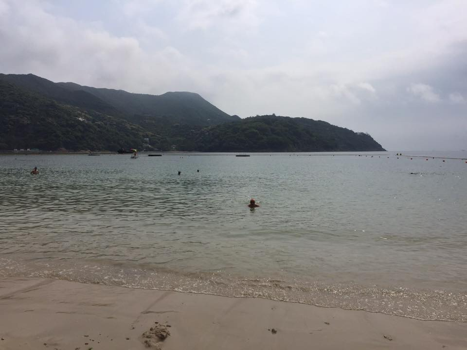
**이미지 캡션:** 흐린 날씨의 해변 풍경으로, 모래사장과 잔잔한 바다가 보인다. 바다에는 여러 사람이 수영을 즐기고 있으며, 그중 한 명은 오렌지색 수영모를 쓰고 물속에 잠겨 있다. 멀리 푸른 산이 병풍처럼 둘러싸고 있으며, 하늘에는 구름이 옅게 깔려 있다. 바다 위에는 부표와 함께 안전 구역을 표시하는 듯한 로프가 보인다. 전반적으로 평화롭고 한적한 분위기이다.

### 5월 3일 (수) 07:52 · 📷 사진 (1장)

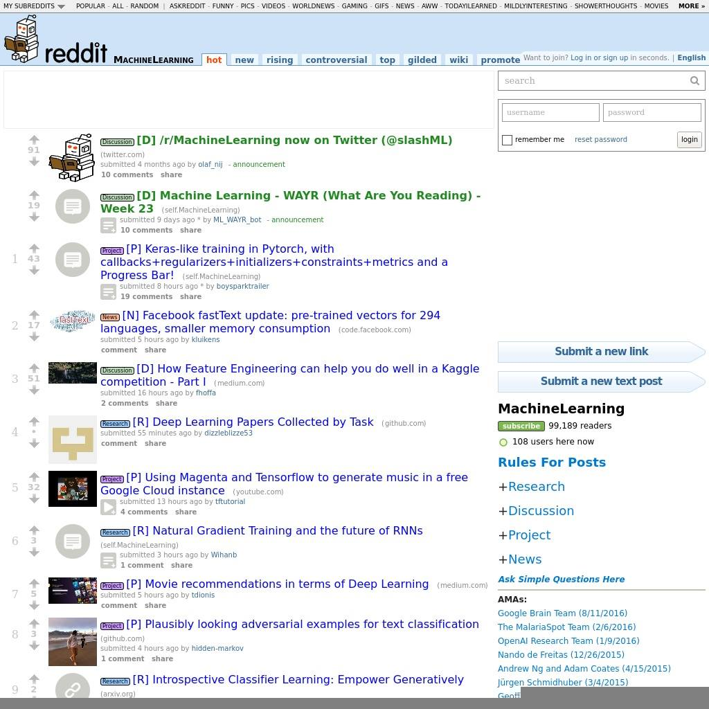
**이미지 캡션:** 이 이미지는 웹사이트 레딧의 머신러닝 서브레딧 페이지를 보여줍니다. 페이지 상단에는 레딧 로고와 함께 "MACHINE LEARNING"이라는 제목이 있고, 그 옆에는 "hot", "new", "rising", "controversial", "top", "gilded", "wiki", "promote"와 같은 탭들이 나열되어 있습니다. 오른쪽 상단에는 로그인 및 회원가입을 위한 입력 필드와 버튼이 있습니다. 메인 콘텐츠 영역에는 여러 개의 게시물 목록이 표시되며, 각 게시물은 제목, 출처, 작성자, 게시 시간, 댓글 수, 공유 수 등의 정보를 포함하고 있습니다. 게시물 제목들은 머신러닝 관련 주제들을 다루고 있으며, "[D]"는 토론, "[P]"는 프로젝트, "[N]"은 뉴스, "[R]"은 연구를 나타내는 태그가 붙어 있습니다. 예를 들어, 첫 번째 게시물은 "r/Machine Learning now on Twitter (@slashML)"이라는 제목으로 트위터 관련 내용을 다루고 있으며, 두 번째 게시물은 "Machine Learning - WAYR (What Are You Reading) - Week 23"이라는 제목으로 독서 추천 목록을 공유하고 있습니다. 또한, "Submit a new link"와 "Submit a new text post" 버튼이 있어 사용자가 새로운 게시물을 올릴 수 있습니다. 오른쪽 사이드바에는 "Machine Learning" 서브레딧의 구독자 수와 현재 접속자 수가 표시되어 있으며, 게시물 규칙과 자주 묻는 질문, 그리고 관련 인물들의 AMA(Ask Me Anything) 목록이 나열되어 있습니다. 전반적으로 정보가 많고 전문적인 내용을 다루는 커뮤니티 페이지의 모습입니다.

> #오늘의레딧 https://www.reddit.com/r/MachineLearning/ 아침부터 다양한 소식이 많네요.  1. 콜백 + 정규화 + 초기화 + 제약 + 메트릭 및 진행률 표시 줄이있는 Pytorch의 Keras 식 교육! 2. Facebook 빠른 텍스트 업데이트 : 294 개 언어에 대한 사전 훈련 된 벡터, 더 작은 메모리 사용 3. 기능 공학이 Kaggle 경쟁에서 당신을 잘 도울 수있는 방법 - 제 1 부 4. 작업으로 수집 한 깊은 학습 논문 5. Magenta 및 Tensorflow를 사용하여 무료 Google Cloud 인스턴스에서 음악 생성 6. 자연스러운 그라디언트 교육과 RNN의 미래 7. 깊은 학습 측면에서 영화 추천 8. 텍스트 분류를위한 어림 잡아 보이는 예제 9. 내성적 인 분류 자 ​​학습 : Generative Empower 10. 숨겨진 보석 학습 리소스가있는 주제 11. ML 대회 - 각 단어의 첫 글자 전체 문장 예측 12. 내적 생성 모델링 : 차별적 인 결정 13. 조건부 자동 인코딩을 사용하는 생성 모델링 : 통합 된 셀 만들기 14. 고용주에게 얼마나 가치가 있습니까? 15. Strange Loop 2017 프레젠테이션 요청 16. 지형지 물 시퀀스에 seq2seq LSTM 사용 17. 텍스트 생성을위한 GAN : 작년에 진행 되었습니까? 18. 신경 네트워크를 사용하여 T20 경기에서 다음 개찰구 예측 19. 모델 불일치 및 베이지안 분석 20. 철저한 학습으로 훈련 된 심 신경 네트워크가 자동차를 조종하는 방법을 설명합니다.  1. https://www.reddit.com/r/MachineLearning/comments/68tkm6/p_keraslike_training_in_pytorch_with/ 2. https://code.facebook.com/posts/162370720961195/expanded-fasttext-library-now-fits-on-smaller-memory-devices/ 3. https://medium.com/unstructured/how-feature-engineering-can-help-you-do-well-in-a-kaggle-competition-part-i-9cc9a883514d 4. https://github.com/sbrugman/deep-learning-papers 5. https://www.youtube.com/watch?v=4tujdi8yyow&t=17 6. https://www.reddit.com/r/MachineLearning/comments/68v4t1/r_natural_gradient_training_and_the_future_of_rnns/ 7. https://medium.com/deep-systems/movix-ai-movie-recommendations-using-deep-learning-5903d6a31607 8. https://github.com/bogdan-kulynych/textfool 9. https://arxiv.org/abs/1704.07816 10. https://www.reddit.com/r/MachineLearning/comments/68uf3t/d_topics_with_hidden_gem_learning_resources/ 11. http://live.unpossib.ly/message-prediction 12. https://arxiv.org/abs/1704.07820 13. https://arxiv.org/abs/1705.00092 14. https://www.reddit.com/r/MachineLearning/comments/68u58i/d_how_much_is_ones_github_worth_to_the_employer/ 15. https://thestrangeloop.com/cfp.html 16. https://www.reddit.com/r/MachineLearning/comments/68r270/d_using_seq2seq_lstm_on_feature_sequences/ 17. https://www.reddit.com/r/MachineLearning/comments/68lyuu/d_gans_for_text_generation_progress_in_the_last/ 18. https://crickytics.com/predicting-next-wicket-in-a-t20-match-using-ai/ 19. http://dustintran.com/blog/on-model-mismatch-and-bayesian-analysis 20. https://arxiv.org/pdf/1704.07911.pdf

### 5월 4일 (목) 07:28 · 📷 사진 (3장)

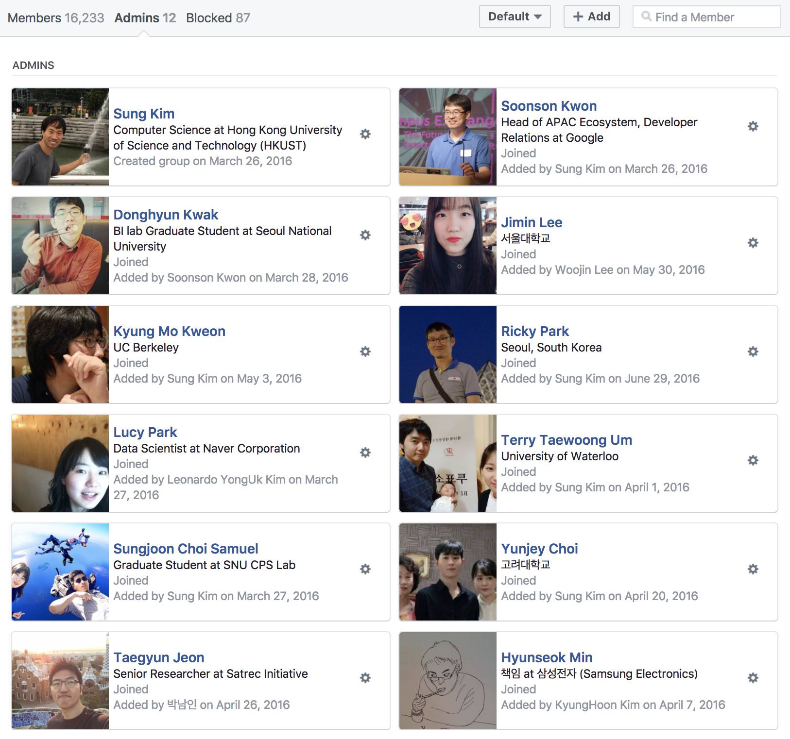
**이미지 캡션:** 이 화면은 웹사이트의 관리자 목록을 보여주는 페이지로, 총 16,233명의 회원 중 12명의 관리자가 등록되어 있으며 87명이 차단된 상태임을 나타냅니다. 각 관리자는 사진, 이름, 소속, 직책, 가입일, 그리고 누가 추가했는지에 대한 정보와 함께 표시됩니다. 첫 번째 관리자는 성인 남성으로, 회색 티셔츠를 입고 야외에서 포즈를 취하고 있으며, 홍콩 과학기술대학교 컴퓨터 과학과 소속으로 2016년 3월 26일에 그룹이 생성되었습니다. 두 번째 관리자는 성인 남성으로, 파란색 셔츠를 입고 안경을 썼으며, 구글의 APAC 생태계 및 개발자 관계 책임자이며 2016년 3월 26일에 성김에 의해 추가되었습니다. 세 번째 관리자는 성인 남성으로, 주황색 셔츠를 입고 안경을 썼으며, 서울대학교 대학원생으로 2016년 3월 28일에 손슨권에 의해 추가되었습니다. 네 번째 관리자는 젊은 여성으로, 검은색 옷을 입고 카메라를 응시하고 있으며, 서울대학교 소속으로 2016년 5월 30일에 우진리에 의해 추가되었습니다. 다섯 번째 관리자는 성인 남성으로, 검은색 셔츠를 입고 안경을 썼으며, UC 버클리 소속으로 2016년 5월 3일에 성김에 의해 추가되었습니다. 여섯 번째 관리자는 성인 남성으로, 파란색 폴로 셔츠를 입고 안경을 썼으며, 서울, 대한민국 소속으로 2016년 6월 29일에 성김에 의해 추가되었습니다. 일곱 번째 관리자는 젊은 여성으로, 검은색 옷을 입고 미소를 짓고 있으며, 네이버 주식회사 데이터 과학자로 2016년 3월 27일에 레오나르도 용욱김에 의해 추가되었습니다. 여덟 번째 관리자는 성인 남성으로, 체크무늬 셔츠를 입고 있으며, 워털루 대학교 소속으로 2016년 4월 1일에 성김에 의해 추가되었습니다. 아홉 번째 관리자는 성인 남성으로, 흰색 티셔츠를 입고 있으며, SNU CPS 연구실 대학원생으로 2016년 3월 27일에 성김에 의해 추가되었습니다. 열 번째 관리자는 성인 남성으로, 검은색 옷을 입고 있으며, 고려대학교 소속으로 2016년 4월 20일에 성김에 의해 추가
 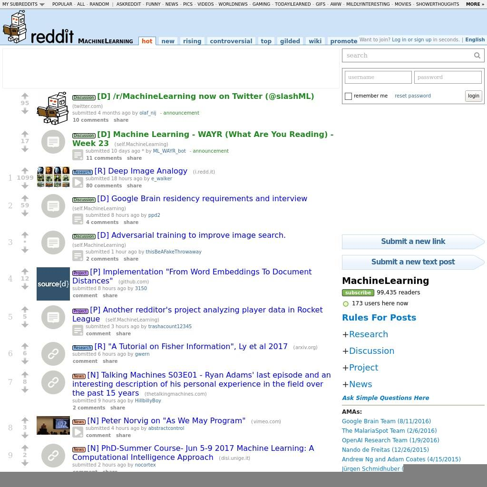
**이미지 캡션:** 이 이미지는 레딧의 머신러닝 서브레딧 페이지를 보여줍니다. 페이지 상단에는 레딧 로고와 함께 "MACHINE LEARNING"이라는 제목이 있고, 그 아래에는 "hot", "new", "rising", "controversial", "top", "gilded", "wiki"와 같은 탭들이 있습니다. 오른쪽 상단에는 로그인 및 회원가입을 할 수 있는 폼이 있습니다. 메인 콘텐츠 영역에는 다양한 머신러닝 관련 게시물 목록이 표시됩니다. 각 게시물은 제목, 출처, 작성자, 게시 시간, 댓글 수, 공유 버튼 등으로 구성되어 있습니다. 게시물 유형은 "Discussion", "Research", "Project", "News" 등으로 구분되어 있습니다. 예를 들어, 첫 번째 게시물은 "r/Machine Learning now on Twitter"라는 제목의 트위터 관련 토론이며, 두 번째 게시물은 "Machine Learning - WAYR (What Are You Reading) - Week 23"이라는 제목의 토론입니다. 세 번째 게시물은 "Deep Image Analogy"라는 제목의 연구이며, 네 번째 게시물은 "Google Brain residency requirements and interview"라는 제목의 토론입니다. 페이지 오른쪽에는 "Submit a new link" 및 "Submit a new text post" 버튼이 있고, "MachineLearning" 서브레딧의 구독자 수와 현재 접속자 수가 표시됩니다. 또한, "Rules For Posts" 섹션에는 "+Research", "+Discussion", "+Project", "+News"와 같은 카테고리가 있으며, "Ask Simple Questions Here" 섹션과 "AMAS" 목록도 보입니다. AMAS 목록에는 Google Brain Team, The MalariaSpot Team, OpenAI Research Team 등 유명 연구팀 및 인물들의 이름과 날짜가 나열되어 있습니다. 전반적으로 이 페이지는 머신러닝 커뮤니티의 최신 정보와 토론을 공유하는 온라인 포럼의 모습을 보여줍니다.
 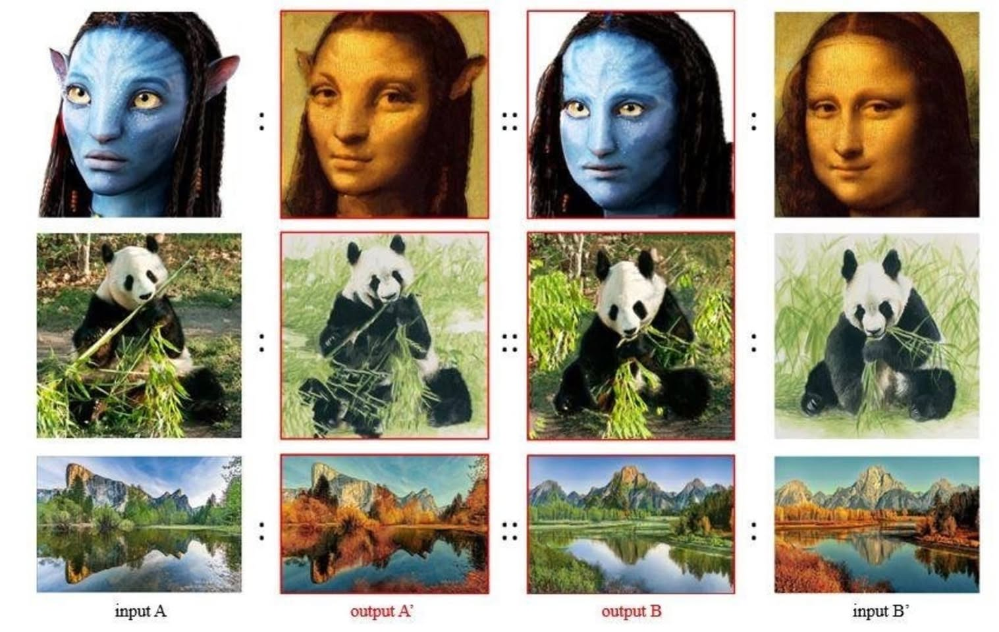
**이미지 캡션:** 이 이미지는 네 개의 행과 네 개의 열로 구성된 그리드로, 각 행은 서로 다른 주제를 보여주며, 각 주제는 입력 이미지와 여러 개의 출력 이미지를 비교하고 있습니다. 첫 번째 행에는 아바타 캐릭터의 얼굴과 모나리자 그림이 나란히 배치되어 있으며, 두 번째 행에는 대나무를 먹는 판다의 사진과 그림이, 세 번째 행에는 요세미티 국립공원의 풍경 사진과 그림이 각각 비교되어 있습니다. 각 행의 첫 번째 열은 "input A" 또는 "output B"로 표시되고, 두 번째 열은 "output A'" 또는 "input B'"로 표시됩니다. 이미지의 전체적인 분위기는 인공지능이나 이미지 처리 기술을 활용한 스타일 변환 또는 생성 과정을 시각적으로 보여주는 듯한 느낌을 줍니다.

> 저희그룹 회원이 16K를 돌파하고도 계속해서 빠르게 상승하고 있습니다. 활발한 활동을 해주시고 좋은 커뮤니티로 만들어 주시는 모든 회원들에게 큰 감사드립니다.   더욱 매끄러운 운영과 재미있는 활동을 위해 2분의 운영진을 추가로 모시게 되었습니다.  Taegyun님과 Hyunseok님의 왕성한 활동은 회원님들께서 이미 다 아시리라 생각합니다.  https://www.facebook.com/taegyun.jeon https://www.facebook.com/hyunseok.min  두분의 합류로 더욱 전문성과 재미를 동시에 갖춘 좋은 열린 커뮤니티가 되도록 노력하겠습니다. 혹 커무니티 운영등에 대한 건의나 의견이 있으시면 이 글의 댓글이나 저희 운영진에게 언제라도 알려주세요. 할수 있는 것들은 즉시 반영하겠습니다.  저희에게는 16K멤버들과 12분의 운영진이 있습니다.  (새로운 운영진은 왕성한 활동을 하시는 회원분들중, 기존 운영진 1인 이상의 추천 + 기존 운영진 과반 찬성, 그리고 0 반대에 의해 초대됩니다.)
> #오늘의레딧 https://www.reddit.com/r/MachineLearning/ 오늘도 새소식이 많군요.  1. 심상 유추 2. Google Brain 거주 요건 및 인터뷰 3. 이미지 검색을 향상시키기위한 애매한 훈련. 4. 구현 &quot;문서 Embedding에서 문서 거리까지&quot; 5. Rocket League에서 플레이어 데이터를 분석하는 또 다른 redditor의 프로젝트 6. &quot;피셔 정보에 대한 지침서&quot;, Ly et al 2017 7. 말하기 기계 S03E01 - Ryan Adams의 지난 15 년간의 현장에서의 개인적인 경험에 대한 마지막 에피소드 및 재미있는 설명 8. Peter Norvig가 &quot;우리가 프로그램 할 때&quot; 9. PhD - 여름 코스 - Jun 5-9 2017 기계 학습 : 전산 인텔리전스 접근법 10. 인간 의사의 끝 - 자동화 이해 11. 기계 학습 애플리케이션의 경우 데이터를 명목 카테고리 변수와 더미 변수의 비교로 저장하면 어떤 이점이 있습니까? 12. 작업으로 수집 한 깊은 학습 논문 13. 3 백만개 Instacart 주문, 오픈 소스 14. 개인 리눅스 박스 + GPU 설정하기? 15. 이미지 얼굴 스와핑 및 얼굴 세분화를위한 심층 모델 용 코드 16. 연구용으로도 GPU가 필요합니까? (교육용이 아님) 17. 다양한 데이터 정규화 방법 18. 피팅 방지 방법 19. 시계열 분류를위한 최상의 기계 학습 모델 20. 콜백 + 정규화 + 초기화 + 제약 + 메트릭 및 진행률 표시 줄이있는 Pytorch의 Keras 식 교육!  1. https://www.reddit.com/r/MachineLearning/comments/68y8bb/r_deep_image_analogy/ 2. https://www.reddit.com/r/MachineLearning/comments/690ixs/d_google_brain_residency_requirements_and/ 3. https://www.reddit.com/r/MachineLearning/comments/6936g5/d_adversarial_training_to_improve_image_search/ 4. https://github.com/src-d/wmd-relax 5. https://www.reddit.com/r/MachineLearning/comments/692da9/p_another_redditors_project_analyzing_player_data/ 6. https://arxiv.org/abs/1705.01064 7. http://www.thetalkingmachines.com/blog/ 8. https://vimeo.com/215418110 9. http://www.disi.unige.it/person/MasulliF/didattica/ML-CI-PhD/MLCI-2017.html 10. https://lukeoakdenrayner.wordpress.com/2017/05/03/the-end-of-human-doctors-understanding-automation/ 11. https://www.reddit.com/r/MachineLearning/comments/691hfp/d_for_machine_learning_applications_what_is_the/ 12. https://github.com/sbrugman/deep-learning-papers 13. https://tech.instacart.com/3-million-instacart-orders-open-sourced-d40d29ead6f2 14. https://www.reddit.com/r/MachineLearning/comments/691o47/d_setting_up_personal_linux_boxgpu/ 15. http://www.openu.ac.il/home/hassner/projects/faceswap 16. https://www.reddit.com/r/MachineLearning/comments/691dg1/d_do_i_need_gpu_for_research_as_wellnot_training/ 17. https://www.skcript.com/svr/normalizing-data-artificial-intelligence/ 18. http://sinahab.com/blog/how-to-prevent-overfitting/ 19. https://www.reddit.com/r/MachineLearning/comments/690zxy/r_best_machine_learning_model_for_time_series/ 20. https://www.reddit.com/r/MachineLearning/comments/68tkm6/p_keraslike_training_in_pytorch_with/

### 5월 4일 (목) 23:05 · Moved to...

Moved to...

I've been totally blessed in Rm 3536. So many talented students and wonderful visitors stopped by this room. Many interesting ideas were discussed, and many fun papers were written in this room. And many many more!!

Now I moved to Rm 2527 with Ocean view windows. I am sure I'll be much more blessed in this new room thanks to you. Please feel free to stop by Rm 2527 if you have a chance.

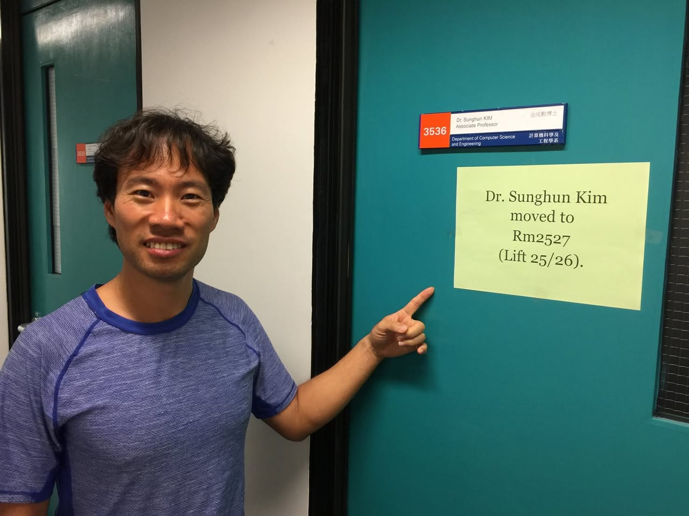
**이미지 캡션:** 한 성인 남성이 파란색 줄무늬 티셔츠를 입고 카메라를 향해 웃고 있으며, 그의 오른쪽에는 녹색 문이 있고 문에는 "Dr. Sunghun Kim moved to Rm2527 (Lift 25/26)."이라고 적힌 노란색 종이가 붙어 있습니다. 문에는 또한 "Dr. Sunghun KIM Associate Professor Department of Computer Science and Engineering"이라고 적힌 명패가 있습니다. 남자는 30대 후반에서 40대 초반으로 보이며, 짧고 약간 곱슬거리는 검은 머리를 하고 있습니다. 그는 밝고 긍정적인 표정을 짓고 있으며, 그의 오른쪽 손가락은 노란색 종이를 가리키고 있습니다. 배경에는 다른 문과 복도의 일부가 보입니다. 전체적인 분위기는 일상적이고 친근한 느낌을 줍니다.
 
**이미지 캡션:** 한 성인 남성이 나무 문 앞에 서서 문에 부착된 명패를 손가락으로 가리키고 있다. 남성은 30대 후반에서 40대 초반으로 보이며, 짧은 검은색 머리에 약간 곱슬거리는 머리카락을 가지고 있다. 그는 푸른색 반팔 스포츠 티셔츠와 검은색 바지를 입고 있으며, 한 손은 바지 주머니에 넣고 다른 손으로는 문을 가리키고 있다. 그의 표정은 밝고 미소를 띠고 있으며, 친근하고 활기찬 분위기를 자아낸다. 문은 밝은 나무 재질이며, 중앙에 세로로 검은색 줄무늬가 있고, 문 손잡이와 열쇠 구멍이 보인다. 문에는 "Department of Computer Science and Engineering"이라고 적힌 작은 명패와 함께 "Dr. Sunghun KIM Rm2527"이라고 쓰여 있다. 배경은 흰색 벽으로, 사무실이나 연구실의 복도로 추정된다. 전체적으로 긍정적이고 일상적인 상황을 담고 있다.
 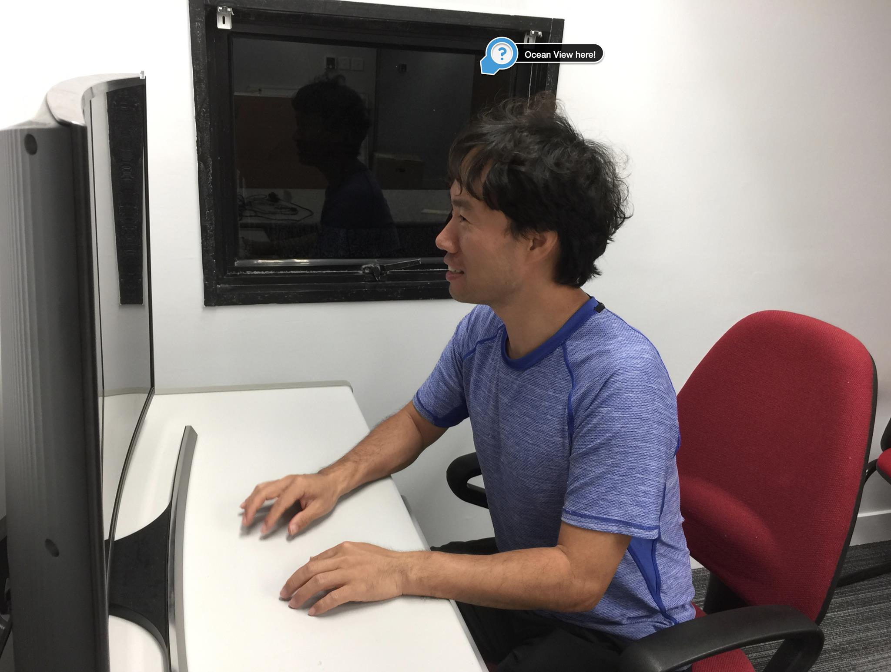
**이미지 캡션:** 한 명의 성인 남성이 사무실로 보이는 공간에서 책상에 앉아 컴퓨터 모니터를 바라보고 있다. 남성은 30대 후반에서 40대 초반으로 보이며, 검은색 곱슬머리에 약간 헝클어진 모습이다. 푸른색 반팔 운동복 상의와 검은색 하의를 입고 있으며, 얼굴에는 미소를 띠고 있다. 그의 손은 책상 위에 놓여 있으며, 모니터를 향해 뻗어 있는 듯한 자세를 취하고 있다. 배경에는 흰색 벽과 검은색 창문이 보이며, 창문 안쪽으로는 다른 방의 모습이 희미하게 비친다. 창문 위에는 "Ocean View here!"라는 문구가 적힌 파란색 말풍선 모양의 스티커가 붙어 있다. 남성 옆에는 붉은색 사무용 의자가 놓여 있고, 책상 위에는 검은색 컴퓨터 모니터가 보인다. 전반적으로 차분하고 집중하는 듯한 분위기이다.

### 5월 5일 (금) 07:53 · 📷 사진 (2장)

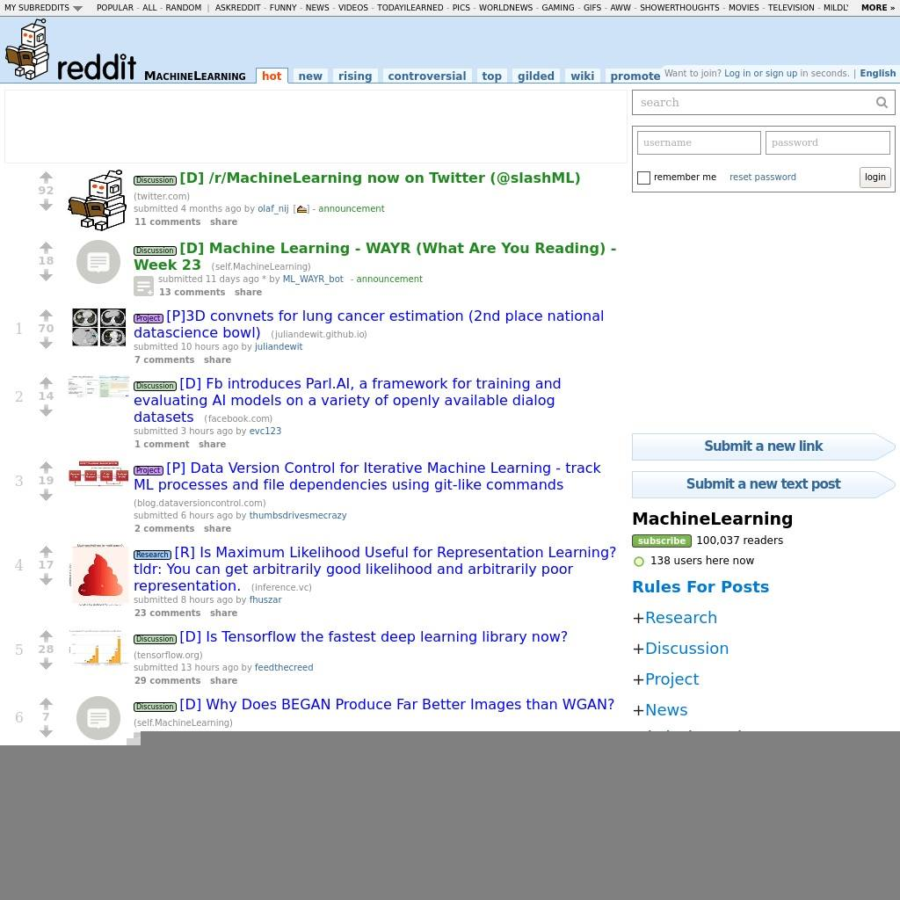
**이미지 캡션:** 이것은 Reddit의 Machine Learning 서브레딧 페이지 스크린샷으로, 다양한 게시물 목록과 오른쪽 사이드바가 보입니다. 페이지 상단에는 Reddit 로고와 함께 "Machine Learning"이라는 제목이 있고, 그 아래에는 "hot", "new", "rising", "controversial", "top", "gilded", "wiki"와 같은 탭이 있습니다. 오른쪽 상단에는 로그인 및 가입 옵션과 검색창이 있습니다. 게시물 목록은 제목, 작성자, 제출 시간, 댓글 수 등으로 구성되어 있으며, 각 게시물 옆에는 추천 및 비추천을 나타내는 화살표가 있습니다. 게시물들은 머신러닝 관련 주제를 다루고 있으며, 예를 들어 트위터 계정, 논문, 프로젝트, 라이브러리 등에 대한 내용이 포함되어 있습니다. 오른쪽 사이드바에는 "Submit a new link", "Submit a new text post" 버튼과 함께 "Machine Learning" 서브레딧의 구독자 수, 현재 접속자 수, 그리고 "Rules For Posts", "+Research", "+Discussion", "+Project", "+News"와 같은 섹션이 있습니다. 전반적으로 기술 관련 커뮤니티의 정보 공유 및 토론이 이루어지는 웹사이트의 모습을 보여줍니다.
 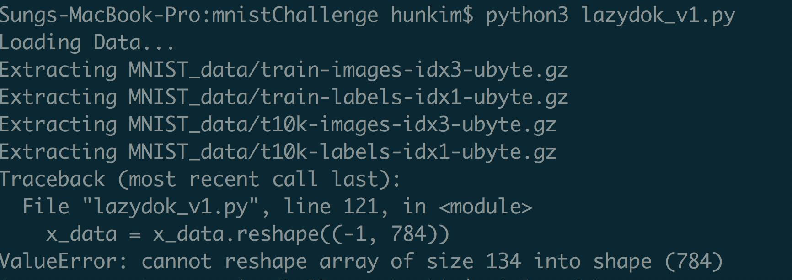
**이미지 캡션:** 이 사진은 컴퓨터 화면에 표시되는 텍스트의 스크린샷으로, 프로그래밍 오류 메시지를 보여줍니다. 화면은 어두운 배경에 밝은 색 글씨로 구성되어 있으며, 이는 터미널 또는 코드 편집기의 일반적인 모습입니다. 상단에는 "Sungs-MacBook-Pro:mnistChallenge hunkim$ python3 lazydok_v1.py"라는 줄이 있어, 사용자의 맥북 프로에서 'mnistChallenge'라는 디렉토리 내에 있는 'hunkim'이라는 사용자가 'lazydok_v1.py'라는 파이썬 스크립트를 실행했음을 알 수 있습니다. 그 다음 줄에는 "Loading Data..."라고 표시되어 데이터 로딩이 진행 중임을 나타냅니다. 이어서 "Extracting MNIST_data/train-images-idx3-ubyte.gz", "Extracting MNIST_data/train-labels-idx1-ubyte.gz", "Extracting MNIST_data/t10k-images-idx3-ubyte.gz", "Extracting MNIST_data/t10k-labels-idx1-ubyte.gz"와 같이 MNIST 데이터셋의 이미지와 레이블 파일들을 압축 해제하는 과정이 순차적으로 표시됩니다. 그러나 데이터 로딩 및 추출 과정 이후 "Traceback (most recent call last):"라는 문구와 함께 오류가 발생했음을 알리는 트레이스백이 나타납니다. 오류는 "File "lazydok_v1.py", line 121, in <module>"에서 발생했으며, 구체적인 오류 내용은 "x_data = x_data.reshape((-1, 784))"라는 코드 라인에서 "ValueError: cannot reshape array of size 134 into shape (784)"라는 메시지입니다. 이는 134개의 요소를 가진 배열을 784개의 열을 가진 형태로 재구성하려 했으나, 배열의 크기가 맞지 않아 발생하는 오류임을 의미합니다. 전반적으로 이 화면은 파이썬 스크립트 실행 중 데이터 처리 과정에서 발생한 오류를 보여주는 기술적인 상황을 나타냅니다.

> #오늘의레딧 https://www.reddit.com/r/MachineLearning/ 따끈한 소식들입니다.  1. 폐암 측정을위한 3D 전달 (2 위 국가 데이터 과학 보울) 2. Fb는 공개적으로 사용 가능한 다양한 대화 상자 데이터 세트에서 AI 모델을 학습하고 평가하기위한 프레임 워크 인 Parl.AI를 소개합니다. 3. 반복 기계 학습을위한 데이터 버전 제어 - git-like 명령을 사용하여 ML 프로세스와 파일 종속성을 추적합니다. 4. 표현 가능성 학습을위한 최대 가능성은 유용합니까? tldr : 당신은 임의로 좋은 가능성과 임의적으로 나쁜 표현을 얻을 수 있습니다. 5. Tensorflow는 지금 가장 빠른 학습 라이브러리입니까? 6. 왜 BEGAN은 WGAN보다 훨씬 좋은 이미지를 생산합니까? 7. 알파 풀링에 대한 평균 및 쌍 선형 풀링 일반화 8. 관측 자료에서 인과 적 추론으로 학습 이전 9. Python과 SciKit의 신경 회로망 학습 10. Tensorflow를 사용한 텍스트 분류 서버 11. 심상 유추 12. 포인트 클라우드 주석을 사용하는 사람들은 무엇입니까? 13. 기계 학습 구축 검토 14. 타협하지 않는 증분 학습자를위한 전략 15. DrugAI-GAN.py : 약물 생성 분자 생성을위한 GAN 실험 16. Google Brain 거주 요건 및 인터뷰 17. Mapillary Vistas Dataset - 기계를 가르치기위한 거리 수준의 이미지 데이터 세트 18. 컨벌루션 뉴럴 네트워크 (Convolutional Neural Network)가 무엇을 학습하는지 탐색 19. &quot;피셔 정보에 대한 지침서&quot;, Ly et al 2017 20. 블로깅 플랫폼  1. http://juliandewit.github.io/kaggle-ndsb2017/ 2. https://www.facebook.com/jason.weston.9887/posts/1890193187907552 3. https://blog.dataversioncontrol.com/data-version-control-beta-release-iterative-machine-learning-a7faf7c8be67 4. http://www.inference.vc/maximum-likelihood-for-representation-learning-2/ 5. https://www.tensorflow.org/performance/benchmarks 6. https://www.reddit.com/r/MachineLearning/comments/69832x/d_why_does_began_produce_far_better_images_than/ 7. https://arxiv.org/abs/1705.00487 8. https://www.reddit.com/r/MachineLearning/comments/698sw9/d_transfer_learning_from_observational_data_to/ 9. https://www.springboard.com/blog/beginners-guide-neural-network-in-python-scikit-learn-0-18 10. https://www.reddit.com/r/MachineLearning/comments/6976vv/p_text_classification_server_using_tensorflow/ 11. https://www.reddit.com/r/MachineLearning/comments/68y8bb/r_deep_image_analogy/ 12. https://www.reddit.com/r/MachineLearning/comments/699lzv/d_what_are_people_using_for_point_cloud_annotation/ 13. https://www.reddit.com/r/MachineLearning/comments/6983t4/d_machine_learning_build_review/ 14. https://arxiv.org/abs/1705.00744 15. http://gananath.github.io/drugai-gan.html 16. https://www.reddit.com/r/MachineLearning/comments/690ixs/d_google_brain_residency_requirements_and/ 17. http://blog.mapillary.com/product/2017/05/03/mapillary-vistas-dataset.html 18. https://medium.com/@r.ruizendaal/deep-learning-2-f81ebe632d5c 19. https://arxiv.org/abs/1705.01064 20. https://www.reddit.com/r/MachineLearning/comments/695lyc/d_blogging_platforms/

### 5월 6일 (토) 07:52 · 📷 사진 (3장)

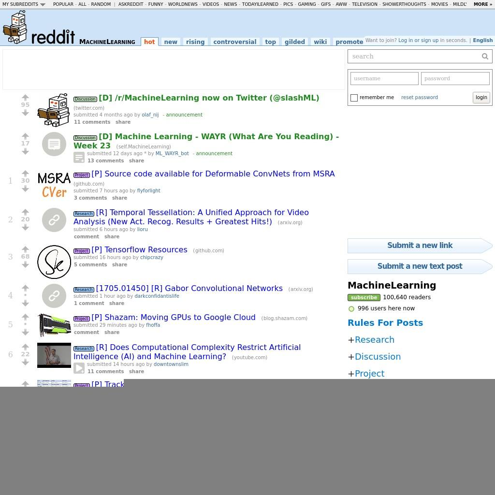
**이미지 캡션:** 이 이미지는 레딧의 머신러닝 서브레딧 페이지를 보여줍니다. 페이지 상단에는 레딧 로고와 함께 "MACHINE LEARNING"이라는 제목이 있고, 그 아래에는 "hot", "new", "rising", "controversial", "top", "gilded", "wiki"와 같은 탭들이 있습니다. 오른쪽 상단에는 로그인 또는 회원가입을 할 수 있는 폼이 있습니다. 메인 콘텐츠 영역에는 여러 게시물 목록이 표시되며, 각 게시물은 제목, 출처, 작성자, 시간, 댓글 수, 공유 수 등의 정보를 포함합니다. 게시물들은 주로 머신러닝 관련 연구 논문, 소스 코드, 트위터 게시물, 유튜브 영상 링크 등입니다. 예를 들어, "r/Machine Learning now on Twitter"라는 제목의 게시물, "Machine Learning - WAYR (What Are You Reading) - Week 23"라는 제목의 게시물, "Source code available for Deformable ConvNets from MSRA"라는 제목의 게시물 등이 보입니다. 페이지 오른쪽에는 "Submit a new link", "Submit a new text post" 버튼과 함께 "MachineLearning" 서브레딧의 구독자 수, 현재 접속자 수, 그리고 "Rules For Posts" 섹션이 있습니다. "Rules For Posts" 섹션에는 "+Research", "+Discussion", "+Project"와 같은 하위 메뉴가 있습니다. 전반적으로 기술 관련 커뮤니티의 정보 공유 및 토론이 이루어지는 웹사이트의 한 페이지를 보여주는 이미지입니다.
 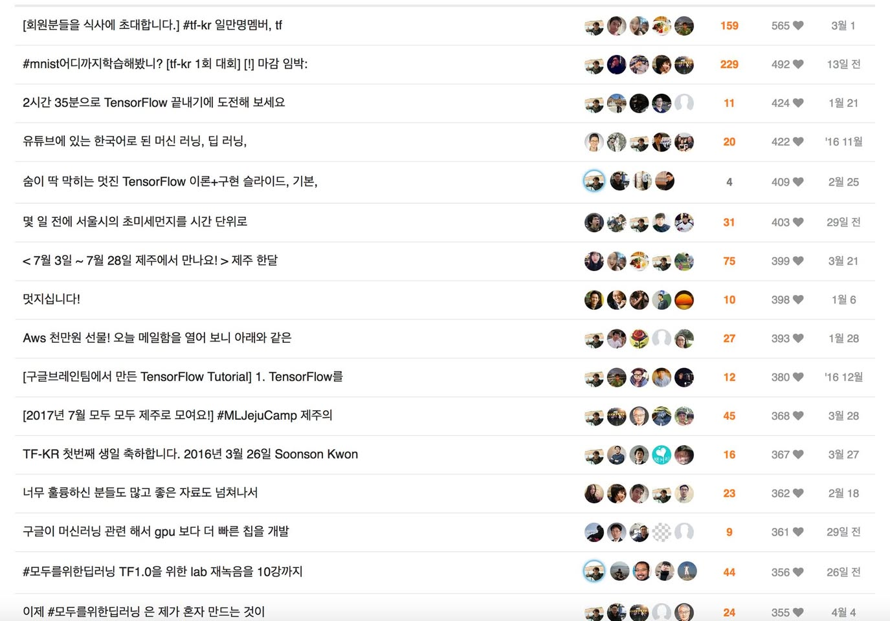
**이미지 캡션:** 이것은 한국어로 된 온라인 게시물 목록을 보여주는 스크린샷입니다. 각 게시물에는 제목, 게시물에 대한 사용자 프로필 사진 그룹, 좋아요 수, 댓글 수, 게시 날짜가 표시됩니다. 게시물 제목은 다양하며, #tf-kr, #mnist, TensorFlow, 머신러닝, 딥러닝, 제주도, AWS, GPU 등과 같은 키워드가 포함되어 있습니다. 일부 게시물에는 날짜와 이름이 포함되어 있으며, 예를 들어 "2016년 3월 26일 Soonson Kwon"과 같은 정보가 있습니다. 게시물은 2016년부터 최근까지 다양한 날짜에 게시되었습니다. 전반적으로 이 스크린샷은 기술 관련 커뮤니티의 활동을 보여주는 것으로 보입니다.
 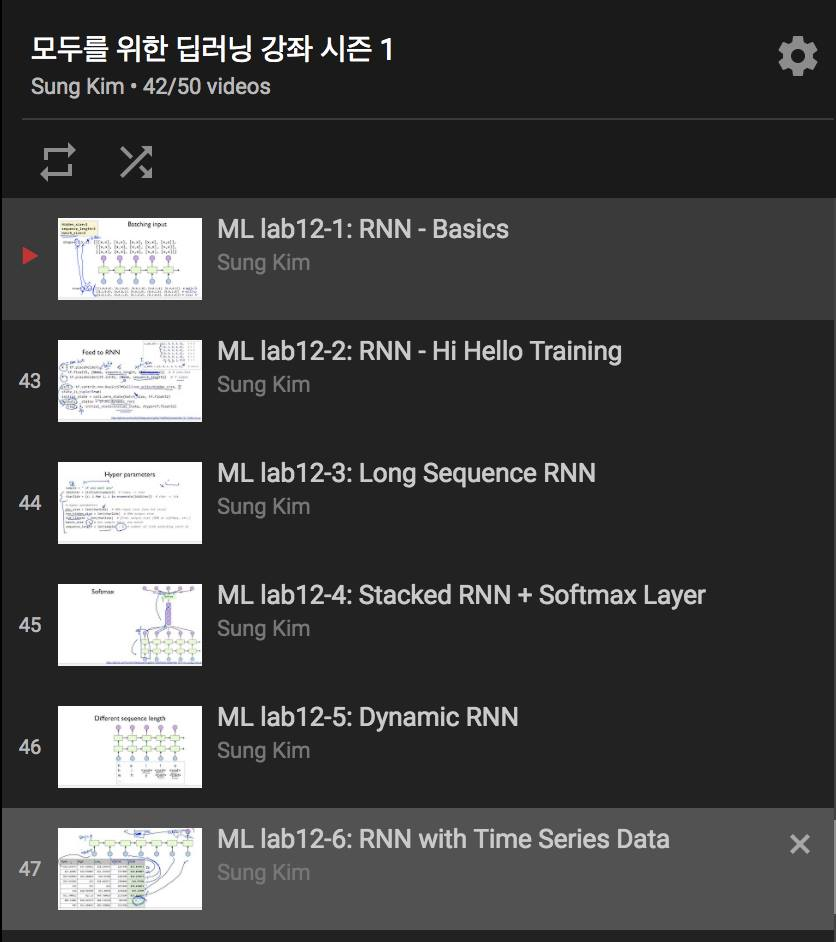
**이미지 캡션:** 이 화면은 "모두를 위한 딥러닝 강좌 시즌 1"이라는 제목의 온라인 강의 목록을 보여주며, 현재 42개의 영상 중 50개의 영상이 재생되었음을 나타냅니다. 강좌는 Sung Kim이라는 사람이 진행하며, 각 영상은 "ML lab12-1: RNN - Basics"부터 "ML lab12-6: RNN with Time Series Data"까지 순서대로 나열되어 있습니다. 각 영상 항목에는 썸네일 이미지, 영상 제목, 강사 이름이 포함되어 있습니다. 썸네일 이미지들은 주로 신경망 구조나 알고리즘을 시각적으로 표현한 다이어그램들입니다. 예를 들어, 43번 영상의 썸네일은 "Feed to RNN"이라는 제목과 함께 순환 신경망의 기본 구조를 보여주고, 44번 영상은 "Hyper parameters"라는 제목과 함께 관련 내용을 담고 있으며, 45번 영상은 "Softmax"라는 제목과 함께 신경망의 출력 부분을 시각화한 다이어그램을 보여줍니다. 46번 영상은 "Different sequence length"라는 제목과 함께 다양한 길이의 시퀀스를 처리하는 신경망 구조를 나타내고, 47번 영상은 "RNN with Time Series Data"라는 제목과 함께 시계열 데이터를 다루는 신경망 구조를 보여줍니다. 화면의 전체적인 분위기는 학습 콘텐츠를 제공하는 인터페이스로, 정보 전달에 초점을 맞추고 있습니다.

> #오늘의레딧 https://www.reddit.com/r/MachineLearning/ 따끈한 소식들입니다.  1. MSRA의 변형 가능한 전달에 사용할 수있는 소스 코드 2. 시간적 테셀레이션 : 비디오 분석을위한 통합 접근법 (새로운 법령 결과 기록 + 가장 큰 조회수!) 3. Tensorflow 리소스 4. Shazam : Google 클라우드로 GPU 이동 5. 전산 복합체가 인공 지능 (AI)과 기계 학습을 제한합니까? 6. 데이터 프로젝트의 추적 및 재현성 (CLI 도구) 7. CPU의 비디오 분류 8. Dataset 바이어스에서 편견을 봐라. 9. Fb는 공개적으로 사용 가능한 다양한 대화 상자 데이터 세트에서 AI 모델을 학습하고 평가하기위한 프레임 워크 인 Parl.AI를 소개합니다. 10. 이미지 분류에서 소수 샷 학습을위한 벤치 마크 11. 유령 이니? 아니, AI, ML 및 데이터 과학을 사용하는 추천 시스템 일뿐입니다. 12. 폐암 측정을위한 3D 전달 (2 위 국가 데이터 과학 보울) 13. 반복 기계 학습을위한 데이터 버전 제어 - git-like 명령을 사용하여 ML 프로세스와 파일 종속성을 추적합니다. 14. 표현 가능성 학습을위한 최대 가능성은 유용합니까? tldr : 당신은 임의로 좋은 가능성과 임의적으로 나쁜 표현을 얻을 수 있습니다. 15. 알파 풀링에 대한 평균 및 쌍 선형 풀링 일반화 16. 왜 BEGAN은 WGAN보다 훨씬 좋은 이미지를 생산합니까? 17. Tensorflow는 지금 가장 빠른 학습 라이브러리입니까? 18. NIPS가 학부생에게 훌륭한가요? 19. 관측 자료에서 인과 적 추론으로 학습 이전 20. Python과 SciKit의 신경 회로망 학습  1. https://github.com/msracver/Deformable-ConvNets 2. https://arxiv.org/abs/1612.06950 3. https://github.com/skcript/tensorflow-resources 4. https://blog.shazam.com/moving-gpus-to-google-cloud-36edb4983ce5 5. https://www.youtube.com/watch?v=p64CMGvKneQ 6. https://medium.com/@acusense_ai/tracking-and-reproducibility-in-data-projects-af64ce109774 7. https://www.reddit.com/r/MachineLearning/comments/69gx4u/d_video_classification_on_a_cpu/ 8. http://citeseerx.ist.psu.edu/viewdoc/download?doi=10.1.1.208.2314&rep=rep1&type=pdf 9. https://www.facebook.com/jason.weston.9887/posts/1890193187907552 10. https://www.reddit.com/r/MachineLearning/comments/69ce9v/d_benchmarks_for_fewshot_learning_in_image/ 11. https://medium.com/outsystems-engineering/ghost-in-the-machine-learning-recommender-systems-722f6c687698 12. http://juliandewit.github.io/kaggle-ndsb2017/ 13. https://blog.dataversioncontrol.com/data-version-control-beta-release-iterative-machine-learning-a7faf7c8be67 14. http://www.inference.vc/maximum-likelihood-for-representation-learning-2/ 15. https://arxiv.org/abs/1705.00487 16. https://www.reddit.com/r/MachineLearning/comments/69832x/d_why_does_began_produce_far_better_images_than/ 17. https://www.tensorflow.org/performance/benchmarks 18. https://www.reddit.com/r/MachineLearning/comments/69boh8/d_would_nips_be_great_for_an_undergraduate_student/ 19. https://www.reddit.com/r/MachineLearning/comments/698sw9/d_transfer_learning_from_observational_data_to/ 20. https://www.springboard.com/blog/beginners-guide-neural-network-in-python-scikit-learn-0-18
> 저희 그룹의 글 검색과 가장 인기 있었던 글들의 목록들을 볼수 있는 FBSIGHT 입니다.  http://fbsight.com/c/TF-KR?order=likes  정말 두고두고 읽어도 좋은 글들이 많습니다!
> #모두를위한딥러닝 TF 1.0 lab update가 오늘 RNN비디오를 끝으로 마무리 되었습니다. RNN의 이것 저것 이야기 하다보니 6개나 되었습니다.   그동안 녹음하면서 매우 즐거웠습니다.  소스코드와 슬라이드를 같이 만들어 주신 모든 회원님들에게 감사드립니다.  RNN Slides: https://docs.google.com/presentation/d/1UpZVnOvouIbXd0MAFBltSra5rRpsiJ-UyBUKGCrfYoo/   RNN Videos: https://www.youtube.com/watch?v=B5GtZuUvujQ&index=42&list=PLlMkM4tgfjnLSOjrEJN31gZATbcj_MpUm

### 5월 7일 (일) 09:58 · 📷 사진 (2장)

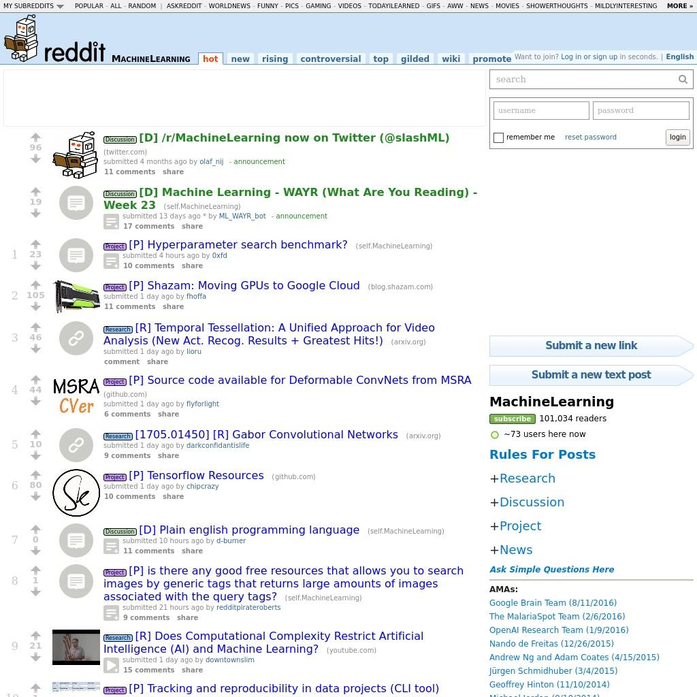
**이미지 캡션:** 이것은 머신러닝 관련 주제를 다루는 레딧 페이지의 스크린샷으로, 다양한 게시물과 관련 정보가 표시됩니다. 페이지 상단에는 레딧 로고와 함께 "MACHINE LEARNING"이라는 제목이 있고, 그 옆에는 "hot", "new", "rising", "controversial", "top", "gilded", "wiki"와 같은 탭이 있습니다. 오른쪽 상단에는 로그인 및 검색 기능이 있습니다. 페이지의 주요 부분은 머신러닝 커뮤니티의 최신 게시물 목록으로 구성되어 있으며, 각 게시물은 제목, 출처, 제출자, 제출 시간, 댓글 수, 공유 수 등의 정보를 포함합니다. 예를 들어, 첫 번째 게시물은 "/r/Machine Learning" 트위터 계정에 대한 내용이며, 두 번째 게시물은 "Machine Learning - WAYR (What Are You Reading) - Week 23"에 대한 것입니다. 또한 "Hyperparameter search benchmark?", "Shazam: Moving GPUs to Google Cloud", "Temporal Tessellation: A Unified Approach for Video Analysis" 등 다양한 프로젝트 및 연구 관련 게시물이 있습니다. 페이지 오른쪽에는 "Submit a new link" 및 "Submit a new text post" 버튼과 함께 "MachineLearning" 서브레딧에 대한 정보가 표시됩니다. 구독자 수는 101,034명이며 현재 73명의 사용자가 활동 중입니다. 또한 "Rules For Posts" 섹션에는 "+Research", "+Discussion", "+Project", "+News"와 같은 카테고리가 있으며, "Ask Simple Questions Here"라는 섹션과 함께 과거 AMA(Ask Me Anything) 목록이 표시됩니다. 전반적으로 이 페이지는 머신러닝 분야의 최신 정보와 토론을 공유하는 온라인 커뮤니티의 모습을 보여줍니다.
 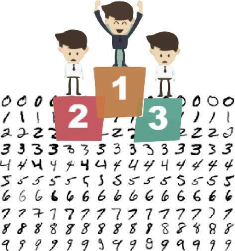
**이미지 캡션:** 세 명의 성인 남성이 시상대에 서 있으며, 가장 높은 1등 시상대에는 팔을 높이 들고 환하게 웃는 남성이 서 있고, 2등 시상대에는 입꼬리가 내려가고 눈썹이 찌푸려진 남성이, 3등 시상대에는 2등과 비슷한 표정으로 약간 시무룩한 표정의 남성이 서 있다. 이들은 모두 흰색 셔츠와 검은색 바지를 입고 있으며, 1등 남성은 파란색 재킷을 걸치고 있다. 배경에는 0부터 9까지의 숫자들이 반복적으로 나열되어 있으며, 이는 경쟁이나 순위를 나타내는 것으로 보인다. 전체적으로 밝고 긍정적인 분위기이지만, 2등과 3등의 표정에서 약간의 아쉬움이 느껴진다.

> #오늘의레딧 https://www.reddit.com/r/MachineLearning/ 오늘도 새소식이 많군요.  1. 하이퍼 매개 변수 검색 벤치 마크? 2. Shazam : Google 클라우드로 GPU 이동 3. 시간적 테셀레이션 : 비디오 분석을위한 통합 접근법 (새로운 법령 결과 기록 + 가장 큰 조회수!) 4. MSRA의 변형 가능한 전달에 사용할 수있는 소스 코드 5. Tensorflow 리소스 6. 일반 영어 프로그래밍 언어 7. 쿼리 태그와 관련된 많은 양의 이미지를 반환하는 일반 태그로 이미지를 검색 할 수있는 좋은 무료 리소스가 있습니까? 8. 전산 복합체가 인공 지능 (AI)과 기계 학습을 제한합니까? 9. 데이터 프로젝트의 추적 및 재현성 (CLI 도구) 10. Dataset 바이어스에서 편견을 봐라. 11. Fb는 공개적으로 사용 가능한 다양한 대화 상자 데이터 세트에서 AI 모델을 학습하고 평가하기위한 프레임 워크 인 Parl.AI를 소개합니다. 12. 이미지 분류에서 소수 샷 학습을위한 벤치 마크 13. CPU의 비디오 분류 14. 폐암 측정을위한 3D 전달 (2 위 국가 데이터 과학 보울) 15. 반복 기계 학습을위한 데이터 버전 제어 - git-like 명령을 사용하여 ML 프로세스와 파일 종속성을 추적합니다. 16. 표현 가능성 학습을위한 최대 가능성은 유용합니까? tldr : 당신은 임의로 좋은 가능성과 임의적으로 나쁜 표현을 얻을 수 있습니다. 17. 유령 이니? 아니, AI, ML 및 데이터 과학을 사용하는 추천 시스템 일뿐입니다. 18. 왜 BEGAN은 WGAN보다 훨씬 좋은 이미지를 생산합니까? 19. 알파 풀링에 대한 평균 및 쌍 선형 풀링 일반화 20. Tensorflow는 지금 가장 빠른 학습 라이브러리입니까?  1. https://www.reddit.com/r/MachineLearning/comments/69n74f/p_hyperparameter_search_benchmark/ 2. https://blog.shazam.com/moving-gpus-to-google-cloud-36edb4983ce5 3. https://arxiv.org/abs/1612.06950 4. https://github.com/msracver/Deformable-ConvNets 5. https://github.com/skcript/tensorflow-resources 6. https://www.reddit.com/r/MachineLearning/comments/69lben/d_plain_english_programming_language/ 7. https://www.reddit.com/r/MachineLearning/comments/69j8pw/p_is_there_any_good_free_resources_that_allows/ 8. https://www.youtube.com/watch?v=p64CMGvKneQ 9. https://medium.com/@acusense_ai/tracking-and-reproducibility-in-data-projects-af64ce109774 10. http://citeseerx.ist.psu.edu/viewdoc/download?doi=10.1.1.208.2314&rep=rep1&type=pdf 11. https://www.facebook.com/jason.weston.9887/posts/1890193187907552 12. https://www.reddit.com/r/MachineLearning/comments/69ce9v/d_benchmarks_for_fewshot_learning_in_image/ 13. https://www.reddit.com/r/MachineLearning/comments/69gx4u/d_video_classification_on_a_cpu/ 14. http://juliandewit.github.io/kaggle-ndsb2017/ 15. https://blog.dataversioncontrol.com/data-version-control-beta-release-iterative-machine-learning-a7faf7c8be67 16. http://www.inference.vc/maximum-likelihood-for-representation-learning-2/ 17. https://medium.com/outsystems-engineering/ghost-in-the-machine-learning-recommender-systems-722f6c687698 18. https://www.reddit.com/r/MachineLearning/comments/69832x/d_why_does_began_produce_far_better_images_than/ 19. https://arxiv.org/abs/1705.00487 20. https://www.tensorflow.org/performance/benchmarks
> #MNIST어디까지학습해봤니? [TF-KR 1회 대회 결과 및 시상] 대회 심사 위원장 이활석 Hwalsuk Lee 님과 많은 회원들의 땀과 눈물로 검증해주셔서 감사합니다. 이 결과를 바탕으로 1회 대회 시상자들을 큰 감격으로 발표 합니다. 모두 축하드립니다.   1 LAMY만년필x2 Kyung Mo Kweon 2 TF-KR초대권x2 차준범 2 TF-KR초대권x2 Jehoon Shin  2 TF-KR초대권x2 Owen Song  3 딥러닝책 1권 Kiru Park  3 딥러닝책 1권 김민태 3 딥러닝책 1권 Juyoung Lee 3 딥러닝책 1권 김형찬 3 딥러닝책 1권 우태강 4 8G USBx2 Hc Chae 4 8G USBx2 Junhyun Lee 4 8G USBx2 Sungsub Woo  4 8G USBx2 Byeongki Jeong 4 8G USBx2 Sungho Park  (입상하신 분들은 tf-kr@googlegroups.com (TF-KR운영진 수신이메일) 로 본인의 이름, 선물, 주소, 전호번호를 5월 20일까지 주시면 바로 선물 배송합니다. 제가 테깅에 실수가 있었으면 알려주세요.)  이번 저희들의 성적은 기존의 최고라 알려진 error rate 0.21% 보다 뛰어난0.20% 입니다. (대단합니다.)  그래서 그 결과를 간단한 논문으로 정리하여 Arxiv에 보내려고 합니다. http://bit.ly/ministpaper 참고하시고 이번에 참여하신 분중 공동 저자로 참여하시고 싶으신 분은 본인의 이름과, 본인의 모델에 대해서 한문단 정도만 적어 주시면 저희들이 정리하겠습니다.  결과는 https://github.com/hwalsuklee/how-far-can-we-go-with-MNIST 에 코드와 함께 정리 되어 있습니다.  다시한번 참여해주시고 격려해주시고, 선물 후원해주신 뉴로핏등 모든 분들에게 감사드립니다.

### 5월 8일 (월) 08:52 · 📷 사진 (2장)

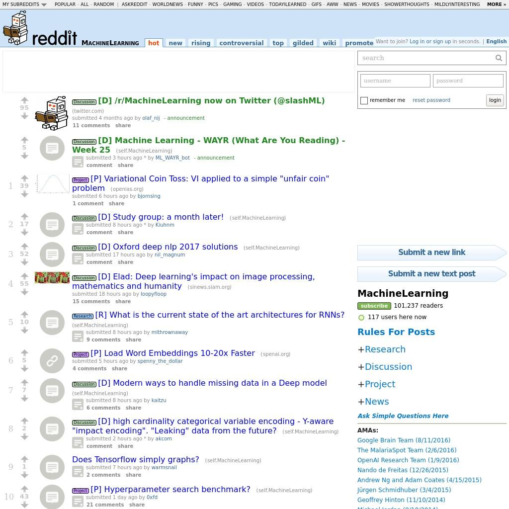
**이미지 캡션:** 이 이미지는 레딧의 머신러닝 서브레딧 페이지를 보여주며, 여러 게시물 목록과 사이드바 정보가 포함되어 있습니다. 페이지 상단에는 레딧 로고와 함께 "MACHINE LEARNING"이라는 제목이 보이고, 그 아래에는 "hot", "new", "rising", "controversial", "top", "gilded", "wiki", "promote"와 같은 탭들이 나열되어 있습니다. 오른쪽 상단에는 로그인 및 회원가입을 위한 입력 필드와 버튼이 있습니다. 메인 콘텐츠 영역에는 다양한 머신러닝 관련 게시물들이 시간순으로 나열되어 있으며, 각 게시물은 제목, 출처, 작성자, 게시 시간, 댓글 수, 공유 수 등의 정보를 포함하고 있습니다. 예를 들어, "r/MachineLearning now on Twitter"라는 제목의 게시물은 4개월 전에 올라왔고 11개의 댓글이 있습니다. 다른 게시물로는 "Machine Learning - WAYR (What Are You Reading) - Week 25", "Variational Coin Toss: VI applied to a simple 'unfair coin' problem", "Study group: a month later!", "Oxford deep nlp 2017 solutions", "Elad: Deep learning's impact on image processing, mathematics and humanity", "What is the current state of the art architectures for RNNs?", "Load Word Embeddings 10-20x Faster", "Modern ways to handle missing data in a Deep model", "high cardinality categorical variable encoding - Y-aware 'impact encoding'. 'Leaking' data from the future?", "Does Tensorflow simply graphs?", "Hyperparameter search benchmark?" 등이 있습니다. 각 게시물 옆에는 추천 및 비추천을 위한 화살표 아이콘이 있습니다. 사이드바에는 "Submit a new link" 및 "Submit a new text post" 버튼이 있고, "MachineLearning" 서브레딧의 구독자 수(101,237명)와 현재 접속자 수(117명)가 표시되어 있습니다. 또한, 게시물 규칙에 대한 링크와 "Ask Simple Questions Here" 섹션, 그리고 "AMAS"라는 제목 아래 여러 유명 머신러닝 연구자들의 이름과 날짜가 나열되어 있습니다. 전반적으로 기술 관련 커뮤니티의 정보 공유 및 토론이 이루어지는 웹사이트의 모습을 보여줍니다.
 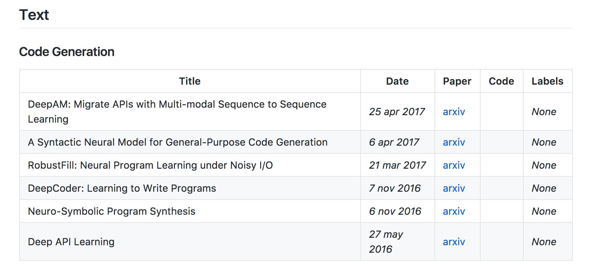
**이미지 캡션:** 이 이미지는 "Text"라는 제목 아래 "Code Generation"이라는 소제목으로 구성된 표를 보여줍니다. 표에는 "Title", "Date", "Paper", "Code", "Labels"라는 열이 있습니다. 각 행은 코드 생성을 주제로 하는 논문의 제목, 날짜, 출판 정보(arxiv), 코드 가용성(비어 있음), 레이블(모두 "None")을 나열합니다. 첫 번째 논문의 제목은 "DeepAM: Migrate APIs with Multi-modal Sequence to Sequence Learning"이며 2017년 4월 25일에 게시되었습니다. 두 번째 논문은 "A Syntactic Neural Model for General-Purpose Code Generation"이며 2017년 4월 6일에 게시되었습니다. 세 번째 논문은 "RobustFill: Neural Program Learning under Noisy I/O"이며 2017년 3월 21일에 게시되었습니다. 네 번째 논문은 "DeepCoder: Learning to Write Programs"이며 2016년 11월 7일에 게시되었습니다. 다섯 번째 논문은 "Neuro-Symbolic Program Synthesis"이며 2016년 11월 6일에 게시되었습니다. 마지막 논문은 "Deep API Learning"이며 2016년 5월 27일에 게시되었습니다. 모든 논문은 "arxiv"에 게시되었으며 레이블은 "None"으로 표시되어 있습니다. 이 이미지는 코드 생성 분야의 연구 논문 목록을 나타내며, 정보는 명확하고 체계적인 방식으로 제시됩니다.

> #오늘의레딧 https://www.reddit.com/r/MachineLearning/ 래딧은 읽을 거리가 다양합니다.  1. Variation Coin Toss : 간단한 &quot;부당한 동전&quot;문제에 적용된 VI 2. 스터디 그룹 : 한달 후! 3. Oxford deep nlp 2017 솔루션 4. Elad : 심오한 학습이 이미지 처리, 수학 및 인류에 미치는 영향 5. RNN의 최신 아키텍처는 무엇입니까? 6. Word Embedding을 10-20 배 빠르게로드 7. Deep 모델에서 누락 된 데이터를 처리하는 현대적인 방법 8. 높은 카디널리티 범주 형 변수 인코딩 - Y- 인식 &quot;영향 인코딩&quot;. 미래의 &quot;누출&quot;데이터? 9. 하이퍼 매개 변수 검색 벤치 마크? 10. University of Edinburgh 대 KU 루벤 : 인공 지능 마스터 11. Shazam : Google 클라우드로 GPU 이동 12. 시간적 테셀레이션 : 비디오 분석을위한 통합 접근법 (새로운 법령 결과 기록 + 가장 큰 조회수!) 13. MSRA의 변형 가능한 전달에 사용할 수있는 소스 코드 14. Tensorflow 리소스 15. 쿼리 태그와 관련된 많은 양의 이미지를 반환하는 일반 태그로 이미지를 검색 할 수있는 좋은 무료 리소스가 있습니까? 16. 일반 영어 프로그래밍 언어 17. 전산 복합체가 인공 지능 (AI)과 기계 학습을 제한합니까? 18. 데이터 프로젝트의 추적 및 재현성 (CLI 도구) 19. Dataset 바이어스에서 편견을 봐라. 20. Fb는 공개적으로 사용 가능한 다양한 대화 상자 데이터 세트에서 AI 모델을 학습하고 평가하기위한 프레임 워크 인 Parl.AI를 소개합니다.  1. http://www.openias.org/variational-coin-toss 2. https://www.reddit.com/r/MachineLearning/comments/69rrsa/d_study_group_a_month_later/ 3. https://www.reddit.com/r/MachineLearning/comments/69pzdg/d_oxford_deep_nlp_2017_solutions/ 4. https://sinews.siam.org/Details-Page/tabid/900/ArtMID/2243/ArticleID/2689/Deep,-Deep-Trouble 5. https://www.reddit.com/r/MachineLearning/comments/69rqza/r_what_is_the_current_state_of_the_art/ 6. https://spenai.org/bravepineapple/faster_em 7. https://www.reddit.com/r/MachineLearning/comments/69rv70/d_modern_ways_to_handle_missing_data_in_a_deep/ 8. https://www.reddit.com/r/MachineLearning/comments/69txzx/d_high_cardinality_categorical_variable_encoding/ 9. https://www.reddit.com/r/MachineLearning/comments/69n74f/p_hyperparameter_search_benchmark/ 10. https://www.reddit.com/r/MachineLearning/comments/69qqn3/d_university_of_edinburgh_vs_ku_leuven_master_in/ 11. https://blog.shazam.com/moving-gpus-to-google-cloud-36edb4983ce5 12. https://arxiv.org/abs/1612.06950 13. https://github.com/msracver/Deformable-ConvNets 14. https://github.com/skcript/tensorflow-resources 15. https://www.reddit.com/r/MachineLearning/comments/69j8pw/p_is_there_any_good_free_resources_that_allows/ 16. https://www.reddit.com/r/MachineLearning/comments/69lben/d_plain_english_programming_language/ 17. https://www.youtube.com/watch?v=p64CMGvKneQ 18. https://medium.com/@acusense_ai/tracking-and-reproducibility-in-data-projects-af64ce109774 19. http://citeseerx.ist.psu.edu/viewdoc/download?doi=10.1.1.208.2314&rep=rep1&type=pdf 20. https://www.facebook.com/jason.weston.9887/posts/1890193187907552
> "딥러닝으로 무엇을 할수 있나요?" 에 대한 거의 완벽한 답 (Task, 논문, 구현코드)을 할수 있도록 해주는 좋은 정보: https://github.com/sbrugman/deep-learning-papers  정리해놓은 분야중 Code Generation에 저희들 논문이 포함되었습니다. 매우 기본적인 seq2seq지만 코드를 다루는 초기 논문이라 그런듯 합니다.  이런 깃헙 (https://github.com/sbrugman/deep-learning-papers)은 무조건 별 꾹 눌러주세요!

### 5월 8일 (월) 09:38 · Happy mother's day!

Happy mother's day!

4 Years Ago

우리 그만 울어요 added a new photo.

### 5월 9일 (화) 08:54 · 📷 사진 (2장)

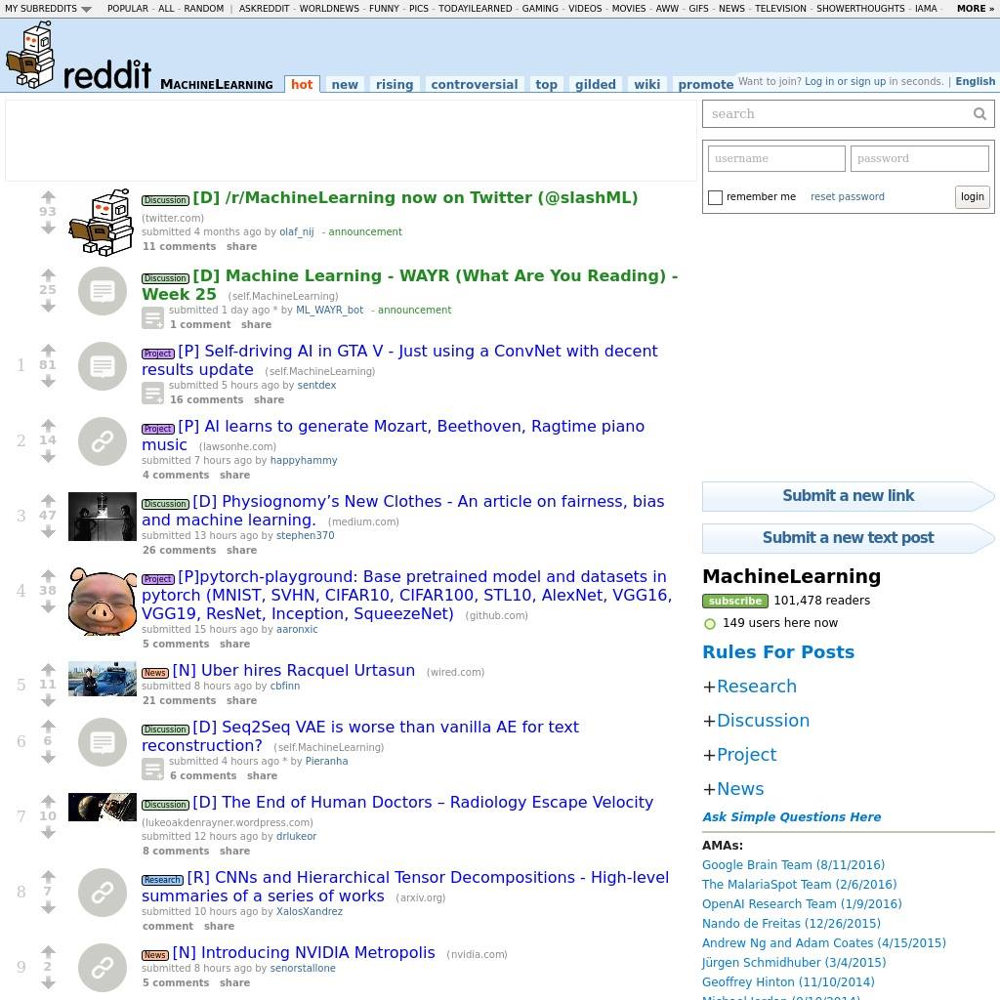
**이미지 캡션:** 이 이미지는 Reddit의 Machine Learning 서브레딧 페이지를 보여줍니다. 페이지 상단에는 Reddit 로고와 함께 "Machine Learning"이라는 제목이 있고, 그 아래에는 "hot", "new", "rising", "controversial", "top", "gilded", "wiki"와 같은 탭이 있습니다. 오른쪽 상단에는 로그인 및 회원가입을 위한 입력란과 버튼이 있습니다. 메인 콘텐츠 영역에는 다양한 주제의 게시물 목록이 표시됩니다. 각 게시물은 제목, 출처, 작성자, 게시 시간, 댓글 수 등의 정보를 포함하고 있습니다. 예를 들어, "Machine Learning now on Twitter"라는 제목의 게시물은 4개월 전에 올라왔고 11개의 댓글이 있습니다. "Self-driving AI in GTA V"라는 제목의 게시물은 5시간 전에 올라왔고 16개의 댓글이 있습니다. 또한, "Submit a new link"와 "Submit a new text post" 버튼이 있어 사용자가 새로운 게시물을 올릴 수 있습니다. 페이지 오른쪽에는 "MachineLearning" 서브레딧의 구독자 수와 "Rules For Posts" 섹션이 있으며, "Research", "Discussion", "Project", "News"와 같은 하위 섹션으로 나뉘어 있습니다. 하단에는 "Ask Simple Questions Here" 섹션과 "AMAS" (Ask Me Anything) 목록이 있습니다. 전반적으로 이 페이지는 머신러닝 관련 정보를 공유하고 토론하는 온라인 커뮤니티의 모습을 보여줍니다.
 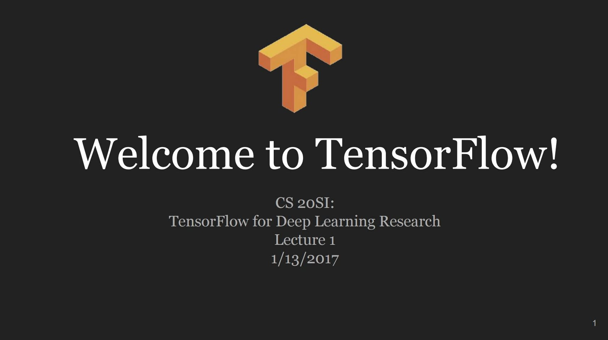
**이미지 캡션:** 이 이미지는 검은색 배경에 흰색 텍스트와 주황색 로고가 있는 슬라이드입니다. 사람이나 사물은 보이지 않습니다. 배경은 단색의 어두운 회색이며, 특별한 질감이나 패턴은 없습니다. 상단 중앙에는 주황색의 3D 로고가 있는데, 이는 TensorFlow의 로고로 보입니다. 로고 아래에는 "Welcome to TensorFlow!"라는 큰 흰색 글씨가 있습니다. 그 아래에는 "CS 20SI:", "TensorFlow for Deep Learning Research", "Lecture 1", "1/13/2017"이라는 더 작은 흰색 글씨가 순서대로 나열되어 있습니다. 오른쪽 하단에는 페이지 번호로 보이는 작은 숫자 "1"이 있습니다. 전체적으로 차분하고 정보 전달에 집중하는 분위기이며, 딥러닝 연구 강의의 첫 슬라이드임을 알 수 있습니다.

> #오늘의레딧 https://www.reddit.com/r/MachineLearning/ 아침부터 다양한 소식이 많네요.  1. GTA V의자가 운전 AI - 괜찮은 결과 업데이트가있는 ConvNet을 사용하면됩니다. 2. AI는 모짜르트, 베토벤, 라그 타임 피아노 음악을 생성하는 법을 배웁니다. 3. Physiognomy의 새로운 옷 - 공정성, 편견 및 기계 학습에 관한 기사. 4. pytorch-playground : Pytorch의 기본 예비 모델 및 데이터 세트 (MNIST, SVHN, CIFAR10, CIFAR100, STL10, AlexNet, VGG16, VGG19, ResNet, Inception, SqueezeNet) 5. Uber는 Racquel Urtasun을 고용합니다. 6. Seq2Seq VAE는 텍스트 재구성을 위해 바닐라 AE보다 나쁩니 까? 7. 인간 의사의 끝 - 방사선학 탈출 속도 8. CNN 및 계층 적 텐서 분해 - 일련의 작업에 대한 높은 수준의 요약 9. NVIDIA Metropolis 소개 10. 깊고 깊은 문제 이미지 처리, 수학 및 인간에 대한 깊은 학습의 영향 Michael Elad 11. Variation Coin Toss : 간단한 &quot;부당한 동전&quot;문제에 적용된 VI 12. 인간 두뇌 활동으로부터인지 된 이미지 재구성을위한 깊은 생성 표현의 공유 13. 스터디 그룹 : 한달 후! 14. Word Embedding을 10-20 배 빠르게로드 15. 높은 카디널리티 범주 형 변수 인코딩 - Y- 인식 &quot;영향 인코딩&quot;. 미래의 &quot;누출&quot;데이터? 16. RNN의 최신 아키텍처는 무엇입니까? 17. Oxford deep nlp 2017 솔루션 18. Deep 모델에서 누락 된 데이터를 처리하는 현대적인 방법 19. Elad : 심오한 학습이 이미지 처리, 수학 및 인류에 미치는 영향 20. 하이퍼 매개 변수 검색 벤치 마크?  1. https://www.reddit.com/r/MachineLearning/comments/6a028m/p_selfdriving_ai_in_gta_v_just_using_a_convnet/ 2. http://www.lawsonhe.com/music.html 3. https://medium.com/@blaisea/physiognomys-new-clothes-f2d4b59fdd6a 4. https://github.com/aaron-xichen/pytorch-playground 5. https://www.wired.com/2017/05/uber-hires-ai-superstar-quest-rehab-future/ 6. https://www.reddit.com/r/MachineLearning/comments/6a092u/d_seq2seq_vae_is_worse_than_vanilla_ae_for_text/ 7. https://lukeoakdenrayner.wordpress.com/2017/05/08/the-end-of-human-doctors-radiology-escape-velocity/ 8. https://arxiv.org/abs/1705.02302 9. https://www.nvidia.com/en-us/deep-learning-ai/industries/ai-cities/ 10. https://sinews.siam.org/Details-Page/deep-deep-trouble-4 11. http://www.openias.org/variational-coin-toss 12. https://arxiv.org/abs/1704.07575 13. https://www.reddit.com/r/MachineLearning/comments/69rrsa/d_study_group_a_month_later/ 14. https://spenai.org/bravepineapple/faster_em 15. https://www.reddit.com/r/MachineLearning/comments/69txzx/d_high_cardinality_categorical_variable_encoding/ 16. https://www.reddit.com/r/MachineLearning/comments/69rqza/r_what_is_the_current_state_of_the_art/ 17. https://www.reddit.com/r/MachineLearning/comments/69pzdg/d_oxford_deep_nlp_2017_solutions/ 18. https://www.reddit.com/r/MachineLearning/comments/69rv70/d_modern_ways_to_handle_missing_data_in_a_deep/ 19. https://sinews.siam.org/Details-Page/tabid/900/ArtMID/2243/ArticleID/2689/Deep,-Deep-Trouble 20. https://www.reddit.com/r/MachineLearning/comments/69n74f/p_hyperparameter_search_benchmark/
> [CS 20SI: Tensorflow for Deep Learning Research 강사를 만나게 된다면?]  자료도 너무 잘 만들고 이런 수업을 바로 시작할수 있다는 것에서 저를 비롯한 많은 분들의 부러움을 받았던 스텐포드 대학의 CS 20SI 수업. http://web.stanford.edu/class/cs20si/ 그 인기 강의의 강사를 만나게 된다면 어러분들은 어떤 이야기를 나누고 싶으세요?  제가 5월 어느날 점심을 같이 하기로 했는데, 이런 이야기를 해볼까 생각합니다.  * #모두를위한딥러닝 수업의 영어화 (한두개의 주제 공동 온라인 강의) * 저희 학교 학생, TF-KR멤버들과 CS20SI 수업 공동진행 및 공동 프로젝트 진행 (미국, 홍콩, 한국 3국 공동강의및 프로젝트 진행) * 3차 TF-KR모임등의 강사로 초청등등  의 이야기를 해보려고 합니다. 혹시 여러분들이 이런 강사님을 만나면 어떤 이야기 해보고 싶으신지요? 또 어떤 재미있는 것을 같이 해보고 싶으세요? 아이디어 주시면 제가 가서 이야기 하고 구현가능한것은 아이디어 주신분과 같이 구현해보겠습니다.

### 5월 9일 (화) 21:15 · I think it's a clear win. Congrats!!

I think it's a clear win. Congrats!!

http://m.news.naver.com/election/president2017/news/read.nhn?sid1=154&cid=1058893&iid=1202545

**이미지 캡션:** 한 명의 성인 남성이 정장을 입고 오른팔을 들어 엄지손가락을 치켜세우며 환하게 웃고 있다. 그는 안경을 쓰고 있으며, 그의 뒤로는 많은 사람들이 좌석에 앉아 그를 바라보고 있다. 배경에는 붉은색 좌석과 사람들이 보이며, 일부 사람들은 휴대폰으로 사진을 찍고 있다. 사진 하단에는 "아시아경제"라는 글자가 보인다. 전체적으로 축하하거나 지지하는 분위기이며, 행사장이나 강연장 같은 곳으로 보인다.

### 5월 10일 (수) 08:52 · 📷 사진 (1장)

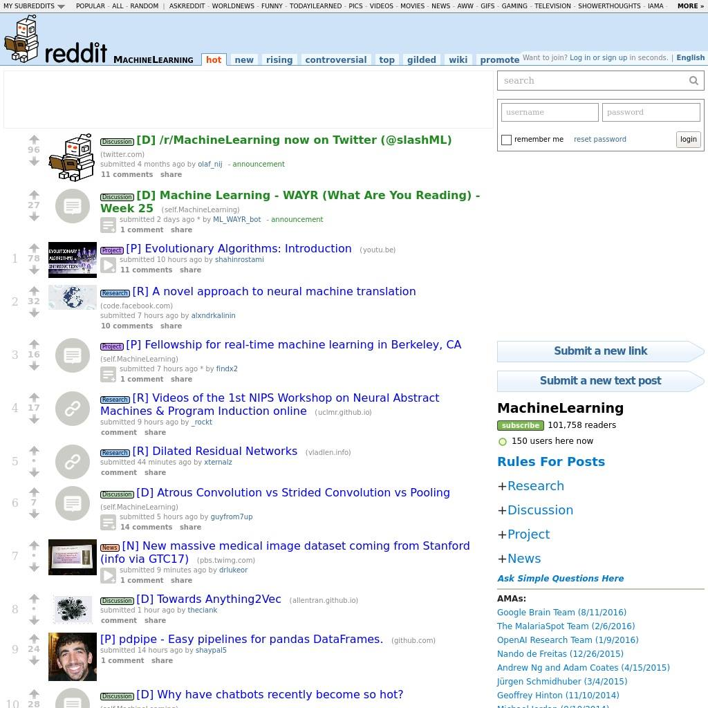
**이미지 캡션:** 이 이미지는 레딧의 머신러닝 서브레딧 페이지를 보여줍니다. 페이지 상단에는 레딧 로고와 함께 "MACHINE LEARNING"이라는 제목이 있고, 그 아래에는 "hot", "new", "rising", "controversial", "top", "gilded", "wiki"와 같은 탭들이 있습니다. 오른쪽 상단에는 로그인 또는 회원가입을 위한 입력 필드와 버튼이 있습니다. 페이지 중앙에는 다양한 머신러닝 관련 게시물 목록이 표시되어 있으며, 각 게시물은 제목, 작성자, 제출 시간, 댓글 수 등의 정보를 포함하고 있습니다. 게시물들은 "Discussion", "Project", "Research", "News"와 같은 카테고리로 분류되어 있습니다. 예를 들어, 첫 번째 게시물은 "Machine Learning now on Twitter"라는 제목의 토론이며, 두 번째 게시물은 "Machine Learning - WAYR (What Are You Reading) - Week 25"라는 제목의 토론입니다. 페이지 오른쪽에는 "Submit a new link", "Submit a new text post" 버튼과 함께 "Machine Learning" 서브레딧의 구독자 수와 현재 접속자 수가 표시되어 있습니다. 또한, "Rules For Posts" 섹션과 "Ask Simple Questions Here" 섹션, 그리고 "AMAS" (Ask Me Anything) 목록이 있습니다. 전반적으로 기술 및 학술 커뮤니티에서 활발하게 논의되는 머신러닝 관련 정보를 공유하고 소통하는 온라인 플랫폼의 모습을 보여줍니다.

> #오늘의레딧 https://www.reddit.com/r/MachineLearning/ 아침부터 다양한 소식이 많네요.  1. 진화 알고리즘 : 소개 2. 신경 기계 번역에 대한 새로운 접근법 3. 버클리, CA에서 실시간 기계 학습을위한 친목 4. 신경 추상 기계 및 프로그램 유도 온라인 1 차 NIPS 워크샵 비디오 5. 확장 된 잔여 네트워크 6. 비참한 회심 대 스트 라이드 회선 대 풀링 7. 스탠포드에서 온 새로운 대규모 의료 영상 데이터 세트 (GTC17을 통한 정보) 8. Anything2Vec을 향하여 9. 왜 최근에 챠트 봇이 너무 뜨거워 졌나요? 10. GTA V의자가 운전 AI - 괜찮은 결과 업데이트가있는 ConvNet 만 사용하면됩니다. 11. &quot;CaloGAN : Generative Adversarial Networks를 이용한 다중 층 전자기 열량계에서 3D 고 에너지 입자 소나기 시뮬레이션&quot;, Paganini et al 2017 12. 시장 분석가 Palihapitiya : IBM의 Watson은 농담입니다. 13. GIF로 설명 된 감독되지 않은 기계 학습 14. ML Workshop에서의 재현성, ICML&#39;17 15. 베이지안 RNN 구현 질문 / 리뷰 16. Birds + Captions Dataset의 액세스 가능한 형식 17. AI는 모짜르트, 베토벤, 라그 타임 피아노 음악을 생성하는 법을 배웁니다. 18. A3C 정책 네트워크의 손실 계산 도움 필요 19. Physiognomy의 새로운 옷 - 공정성, 편견 및 기계 학습에 관한 기사. 20. Seq2Seq VAE는 텍스트 재구성을 위해 바닐라 AE보다 나쁩니 까?  1. https://youtu.be/L--IxUH4fac 2. https://code.facebook.com/posts/1978007565818999/a-novel-approach-to-neural-machine-translation/ 3. https://www.reddit.com/r/MachineLearning/comments/6a6lqy/p_fellowship_for_realtime_machine_learning_in/ 4. https://uclmr.github.io/nampi/ 5. http://vladlen.info/publications/dilated-residual-networks/ 6. https://www.reddit.com/r/MachineLearning/comments/6a7euf/d_atrous_convolution_vs_strided_convolution_vs/ 7. https://pbs.twimg.com/media/C_ZpA8RVwAAlf_s.jpg 8. http://allentran.github.io/graph2vec 9. https://www.reddit.com/r/MachineLearning/comments/6a3ywi/d_why_have_chatbots_recently_become_so_hot/ 10. https://www.reddit.com/r/MachineLearning/comments/6a028m/p_selfdriving_ai_in_gta_v_just_using_a_convnet/ 11. https://arxiv.org/abs/1705.02355 12. http://video.cnbc.com/gallery/?video=3000616728 13. https://dashee87.github.io/data%20science/general/Clustering-with-Scikit-with-GIFs/ 14. https://sites.google.com/view/icml-reproducibility-workshop/home 15. https://www.reddit.com/r/MachineLearning/comments/6a2tvj/p_bayesian_rnn_implementation_questionreview/ 16. https://www.reddit.com/r/MachineLearning/comments/6a3s7n/r_accessible_format_for_birdscaptions_dataset/ 17. http://www.lawsonhe.com/music.html 18. https://www.reddit.com/r/MachineLearning/comments/6a2x92/p_need_help_calculating_loss_for_a3c_policy/ 19. https://medium.com/@blaisea/physiognomys-new-clothes-f2d4b59fdd6a 20. https://www.reddit.com/r/MachineLearning/comments/6a092u/d_seq2seq_vae_is_worse_than_vanilla_ae_for_text/

### 5월 11일 (목) 08:52 · 📷 사진 (1장)

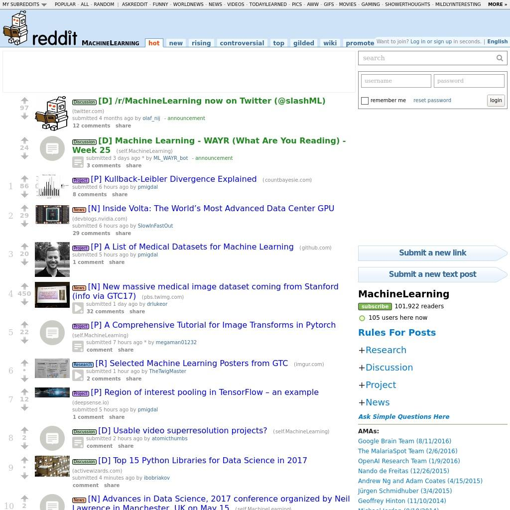
**이미지 캡션:** 이것은 Reddit의 Machine Learning 서브레딧 페이지로, 다양한 기계 학습 관련 게시물 목록을 보여줍니다. 페이지 상단에는 Reddit 로고와 함께 "hot", "new", "rising", "controversial", "top", "gilded", "wiki"와 같은 탭이 있으며, "promote" 버튼과 로그인/가입 옵션이 있습니다. 검색창과 사용자 이름, 비밀번호 입력란도 보입니다. 메인 콘텐츠 영역에는 여러 게시물이 나열되어 있으며, 각 게시물은 제목, 출처, 작성자, 게시 시간, 댓글 수, 공유 옵션 등을 포함합니다. 게시물 유형은 "Discussion", "Project", "News", "Research" 등으로 분류되어 있습니다. 예를 들어, "[D] /r/Machine Learning now on Twitter"라는 제목의 토론 게시물, "[P] Kullback-Leibler Divergence Explained"라는 제목의 프로젝트 게시물, "[N] Inside Volta: The World's Most Advanced Data Center GPU"라는 제목의 뉴스 게시물이 보입니다. 오른쪽 사이드바에는 "Submit a new link", "Submit a new text post" 버튼과 함께 "MachineLearning" 서브레딧의 구독자 수와 현재 접속자 수가 표시되어 있습니다. 또한, "Rules For Posts" 섹션과 "Research", "Discussion", "Project", "News"와 같은 카테고리 링크, 그리고 "Ask Simple Questions Here"라는 문구와 함께 몇몇 유명 인사의 AMA(Ask Me Anything) 목록이 나열되어 있습니다. 전반적으로 기술 관련 커뮤니티의 정보 공유 및 토론이 이루어지는 웹사이트의 모습을 보여줍니다.

> #오늘의레딧 https://www.reddit.com/r/MachineLearning/ 따끈한 소식들입니다.  1. Kullback-Leibler Divergence Explained 2. 내부 볼타 : 세계에서 가장 진보 된 데이터 센터 GPU 3. 기계 학습을위한 의료 데이터 세트 목록 4. 스탠포드에서 온 새로운 대규모 의료 영상 데이터 세트 (GTC17을 통한 정보) 5. Pytorch의 이미지 변환을위한 포괄적 인 자습서 6. 선택된 기계 학습 포스터 from GTC 7. TensorFlow의 관심 영역 풀링 - 예 8. 사용 가능한 비디오 초 고화질 프로젝트? 9. 2017 년 데이터 과학을위한 상위 15 개의 Python 라이브러리 10. 5 월 15 일 영국 맨체스터에서 개최 된 닐 로렌스 (Neil Lawrence)가 주최 한 데이터 과학 발전, 2017 회의 11. GTC 2017 기조 연설 &lt;- 2:40에서 시작 12. 혼잡 한 분야를 아직 깊이 배우고 있습니까? 13. 왜 AlphaGo는 단지 0 인 입력 피처 평면을 사용합니까? 14. GIF로 설명 된 감독되지 않은 기계 학습 15. 진화 알고리즘 : 소개 16. 확장 된 잔여 네트워크 17. 신경 기계 번역에 대한 새로운 접근법 18. 시장 분석가 Palihapitiya : IBM의 Watson은 농담입니다. 19. Anything2Vec을 향하여 20. 비참한 회심 대 스트 라이드 회선 대 풀링  1. https://www.countbayesie.com/blog/2017/5/9/kullback-leibler-divergence-explained 2. https://devblogs.nvidia.com/parallelforall/inside-volta/ 3. https://github.com/beamandrew/medical-data 4. https://pbs.twimg.com/media/C_ZpA8RVwAAlf_s.jpg 5. https://www.reddit.com/r/MachineLearning/comments/6ado09/p_a_comprehensive_tutorial_for_image_transforms/ 6. http://imgur.com/a/FUAIP 7. https://deepsense.io/region-of-interest-pooling-in-tensorflow-example/ 8. https://www.reddit.com/r/MachineLearning/comments/6afs64/d_usable_video_superresolution_projects/ 9. https://activewizards.com/blog/top-15-libraries-for-data-science-in-python/ 10. https://www.reddit.com/r/MachineLearning/comments/6af251/n_advances_in_data_science_2017_conference/ 11. http://www.ustream.tv/gpu-technology-conference 12. https://www.reddit.com/r/MachineLearning/comments/6afswm/d_is_deep_learning_a_crowded_field_yet/ 13. https://www.reddit.com/r/MachineLearning/comments/6ac3r3/d_why_does_alphago_use_an_input_feature_plane/ 14. https://dashee87.github.io/data%20science/general/Clustering-with-Scikit-with-GIFs/ 15. https://youtu.be/L--IxUH4fac 16. http://vladlen.info/publications/dilated-residual-networks/ 17. https://code.facebook.com/posts/1978007565818999/a-novel-approach-to-neural-machine-translation/ 18. http://video.cnbc.com/gallery/?video=3000616728 19. http://allentran.github.io/graph2vec 20. https://www.reddit.com/r/MachineLearning/comments/6a7euf/d_atrous_convolution_vs_strided_convolution_vs/

### 5월 12일 (금) 08:52 · 📷 사진 (1장)

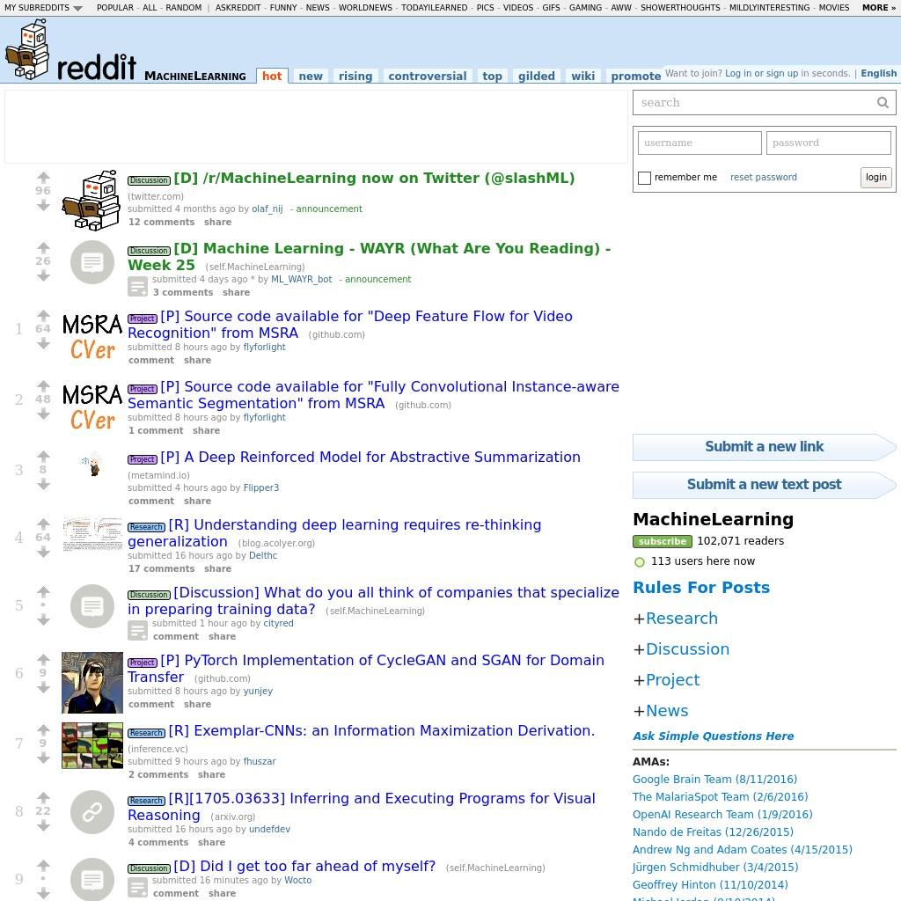
**이미지 캡션:** 이 이미지는 인기 있는 온라인 커뮤니티인 레딧의 머신러닝 서브레딧 페이지를 보여줍니다. 페이지 상단에는 레딧 로고와 함께 "MACHINE LEARNING"이라는 제목이 있고, 그 옆에는 "hot", "new", "rising", "controversial", "top", "gilded", "wiki", "promote"와 같은 다양한 카테고리 링크가 있습니다. 오른쪽 상단에는 로그인 및 회원가입을 위한 입력 필드와 버튼이 있습니다. 메인 콘텐츠 영역에는 여러 게시물 목록이 표시되며, 각 게시물은 제목, 작성자, 제출 시간, 댓글 수 등의 정보를 포함합니다. 게시물들은 주로 머신러닝 관련 연구, 프로젝트, 토론에 관한 내용입니다. 예를 들어, "Deep Feature Flow for Video Recognition" 또는 "Fully Convolutional Instance-aware Semantic Segmentation"과 같은 프로젝트 게시물과 "Understanding deep learning requires re-thinking generalization"과 같은 연구 게시물이 보입니다. 또한, "What do you all think of companies that specialize in preparing training data?"와 같은 토론 게시물도 있습니다. 페이지 오른쪽에는 "Submit a new link" 및 "Submit a new text post" 버튼과 함께 "MachineLearning" 서브레딧의 구독자 수와 현재 접속자 수가 표시되어 있습니다. 그 아래에는 "Rules For Posts"와 함께 "+Research", "+Discussion", "+Project", "+News"와 같은 하위 카테고리 링크가 있으며, "Ask Simple Questions Here"라는 섹션과 함께 과거 AMA(Ask Me Anything) 목록이 나열되어 있습니다. 전반적으로 이 페이지는 머신러닝 분야의 최신 정보와 토론을 공유하는 활발한 온라인 커뮤니티의 모습을 보여줍니다.

> #오늘의레딧 https://www.reddit.com/r/MachineLearning/ 래딧은 읽을 거리가 다양합니다.  1. MSRA의 &quot;비디오 인식을위한 딥 기능 흐름&quot;에 사용할 수있는 소스 코드 2. MSRA의 &quot;완전 컨벌루션 인스턴스 인식 시맨틱 세분화&quot;에 사용할 수있는 소스 코드 3. 추상적 요약을위한 심층적 인 모델 4. 깊은 학습을 이해하려면 다시 생각하는 일반화가 필요합니다. 5. 교육 자료를 준비하는 전문 회사에 대해 어떻게 생각하십니까? 6. 도메인 간 전송을위한 CycleGAN 및 SGAN의 PyTorch 구현 7. Exemplar-CNNs : 정보의 극대화 유도. 8. 나 자신보다 너무 앞서 갔어? 9. &quot;프랑스 양식의 스키야키 :식이 패턴의 변형을위한 새로운 시스템&quot;, Kazama et al 2017 10. Kullback-Leibler Divergence Explained 11. 신경망 - 생성 된 일러스트레이션 12. 추출 된 기능의 GAN 13. 강화 학습의 맥락에서 왜 일시적인 차이가 도입 된 것일까 요? 14. 증가하는 클래스 수를 가진 다중 클래스 분류 - 질문 15. 기계 학습 학교 프로젝트, 아이디어 필요! 16. 기계 학습을위한 의료 데이터 세트 목록 17. 네트워크 해부 : 통역 능력의 정량화 18. 선택된 기계 학습 포스터 from GTC 19. 내부 볼타 : 세계에서 가장 진보 된 데이터 센터 GPU 20. RL 탐사 정책?  1. https://github.com/msracver/Deep-Feature-Flow 2. https://github.com/msracver/FCIS 3. https://metamind.io/research/your-tldr-by-an-ai-a-deep-reinforced-model-for-abstractive-summarization 4. https://blog.acolyer.org/2017/05/11/understanding-deep-learning-requires-re-thinking-generalization/ 5. https://www.reddit.com/r/MachineLearning/comments/6anki8/discussion_what_do_you_all_think_of_companies/ 6. https://github.com/yunjey/mnist-svhn-transfer 7. http://www.inference.vc/exemplar-cnns-and-information-maximization/ 8. https://www.reddit.com/r/MachineLearning/comments/6anu7y/d_did_i_get_too_far_ahead_of_myself/ 9. https://arxiv.org/abs/1705.03487 10. https://www.countbayesie.com/blog/2017/5/9/kullback-leibler-divergence-explained 11. https://research.googleblog.com/2017/05/neural-network-generated-illustrations.html 12. https://www.reddit.com/r/MachineLearning/comments/6amvfq/d_gans_from_extracted_features/ 13. https://www.reddit.com/r/MachineLearning/comments/6aj6f2/d_why_is_temporal_difference_only_ever_introduced/ 14. https://www.reddit.com/r/MachineLearning/comments/6aie93/d_multiclass_classification_with_growing_number/ 15. https://www.reddit.com/r/MachineLearning/comments/6ami00/dmachine_learning_school_project_ideas_needed/ 16. https://github.com/beamandrew/medical-data 17. http://netdissect.csail.mit.edu/ 18. http://imgur.com/a/FUAIP 19. https://devblogs.nvidia.com/parallelforall/inside-volta/ 20. https://www.reddit.com/r/MachineLearning/comments/6ai46z/d_rl_exploration_policies/

### 5월 13일 (토) 08:52 · 📷 사진 (1장)

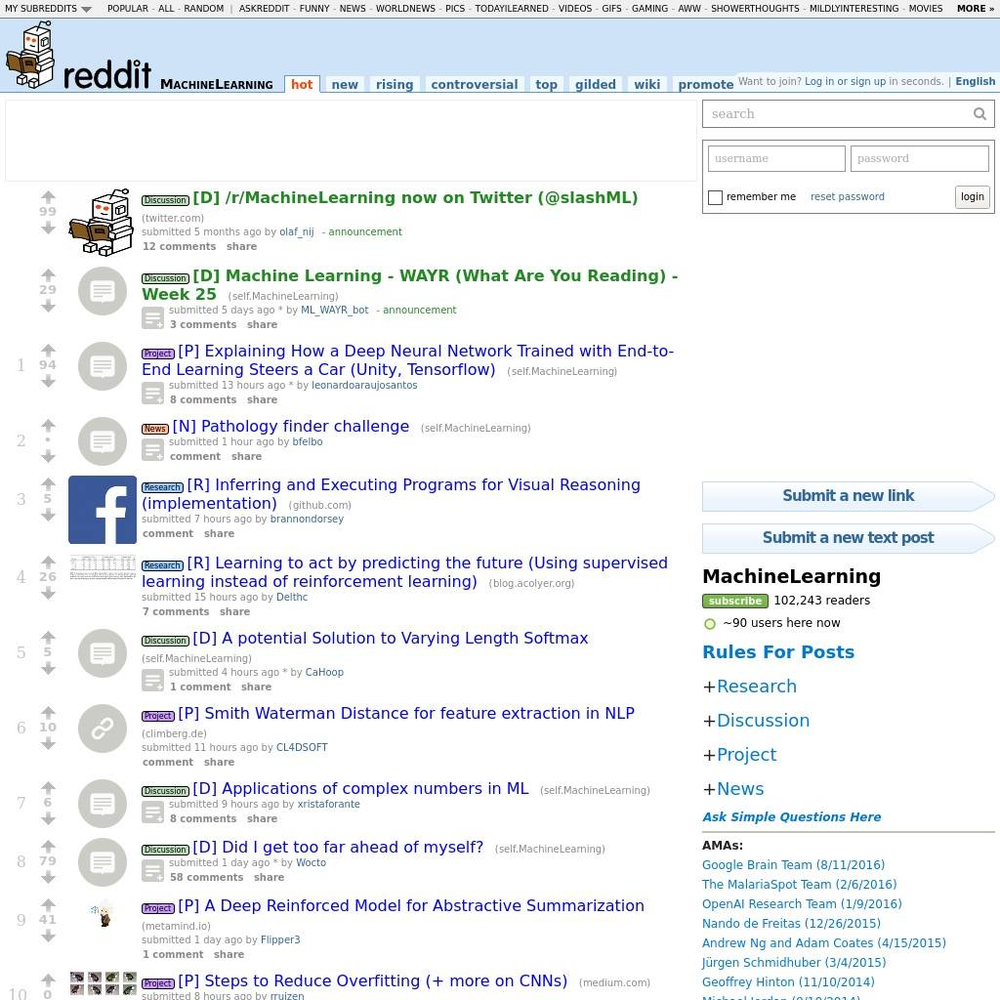
**이미지 캡션:** 이 이미지는 레딧의 머신러닝 서브레딧 페이지를 보여줍니다. 페이지 상단에는 레딧 로고와 함께 "MACHINE LEARNING"이라는 제목이 있고, 그 아래에는 "hot", "new", "rising", "controversial", "top", "gilded", "wiki"와 같은 탭이 있습니다. 오른쪽 상단에는 로그인 및 회원가입을 위한 입력 필드와 버튼이 있습니다. 페이지 중앙에는 다양한 머신러닝 관련 게시물 목록이 표시됩니다. 각 게시물은 제목, 출처, 작성자, 게시 시간, 댓글 수 등의 정보를 포함하고 있습니다. 예를 들어, 첫 번째 게시물은 "/r/MachineLearning now on Twitter (@slashML)"이라는 제목으로 5개월 전에 게시되었으며, 12개의 댓글이 있습니다. 다른 게시물로는 "Machine Learning - WAYR (What Are You Reading) - Week 25", "Explaining How a Deep Neural Network Trained with End-to-End Learning Steers a Car", "Pathology finder challenge", "Inferring and Executing Programs for Visual Reasoning", "Learning to act by predicting the future", "A potential Solution to Varying Length Softmax", "Smith Waterman Distance for feature extraction in NLP", "Applications of complex numbers in ML", "Did I get too far ahead of myself?", "A Deep Reinforced Model for Abstractive Summarization", "Steps to Reduce Overfitting (+ more on CNNs)" 등이 있습니다. 페이지 오른쪽에는 "Submit a new link", "Submit a new text post" 버튼과 함께 "Machine Learning" 서브레딧의 구독자 수(102,243명) 및 현재 접속자 수(~90명)가 표시됩니다. 또한 "Rules For Posts" 섹션에는 "+Research", "+Discussion", "+Project", "+News"와 같은 하위 섹션이 있으며, "Ask Simple Questions Here"라는 안내와 함께 "AMAS" 섹션에는 유명한 머신러닝 연구자들의 이름과 활동 날짜가 나열되어 있습니다. 전반적으로 이 페이지는 머신러닝 커뮤니티의 최신 정보와 토론을 공유하는 온라인 포럼의 모습을 보여줍니다.

> #오늘의레딧 https://www.reddit.com/r/MachineLearning/ 래딧은 읽을 거리가 다양합니다.  1. 엔드 - 투 - 엔드 학습으로 훈련 된 심 신경 네트워크가 자동차를 조종하는 방법을 설명 (Unity, Tensorflow) 2. 병리학 파인더 도전 3. 시각 추리를위한 프로그램의 추론과 실행 (구현) 4. 미래 예측을 통한 행동 학습 (강화 학습 대신 감독 학습 사용) 5. 가변 길이 Softmax에 대한 잠재적 솔루션 6. Smith Waterman NLP에서 피쳐 추출 거리 7. ML의 복소수 적용 8. 나 자신보다 너무 앞서 나간거야? 9. 추상적 요약을위한 심층적 인 모델 10. 오버 피팅을 줄이기위한 단계 (CNN에 대한 자세한 정보) 11. MSRA의 &quot;비디오 인식을위한 딥 기능 흐름&quot;에 사용할 수있는 소스 코드 12. MSRA의 &quot;완전 컨벌루션 인스턴스 인식 시맨틱 세분화&quot;에 사용할 수있는 소스 코드 13. 교육 자료를 준비하는 전문 회사에 대해 어떻게 생각하십니까? 14. 깊은 학습을 이해하려면 다시 생각하는 일반화가 필요합니다. 15. 도메인 간 전송을위한 CycleGAN 및 SGAN의 PyTorch 구현 16. 신경망 - 생성 된 일러스트레이션 17. &quot;프랑스 양식의 스키야키 :식이 패턴의 변형을위한 새로운 시스템&quot;, Kazama et al 2017 18. Exemplar-CNNs : 정보의 극대화 유도. 19. 추출 된 기능의 GAN 20. 네트워크 해부 : 통역 능력의 정량화  1. https://www.reddit.com/r/MachineLearning/comments/6aqdd8/p_explaining_how_a_deep_neural_network_trained/ 2. https://www.reddit.com/r/MachineLearning/comments/6aubkq/n_pathology_finder_challenge/ 3. https://github.com/facebookresearch/clevr-iep 4. https://blog.acolyer.org/2017/05/12/learning-to-act-by-predicting-the-future/ 5. https://www.reddit.com/r/MachineLearning/comments/6atcuk/d_a_potential_solution_to_varying_length_softmax/ 6. http://climberg.de/page/smith-waterman-distance-for-feature-extraction-in-nlp/ 7. https://www.reddit.com/r/MachineLearning/comments/6arg96/d_applications_of_complex_numbers_in_ml/ 8. https://www.reddit.com/r/MachineLearning/comments/6anu7y/d_did_i_get_too_far_ahead_of_myself/ 9. https://metamind.io/research/your-tldr-by-an-ai-a-deep-reinforced-model-for-abstractive-summarization 10. https://medium.com/@r.ruizendaal/deep-learning-3-more-on-cnns-handling-overfitting-2bd5d99abe5d 11. https://github.com/msracver/Deep-Feature-Flow 12. https://github.com/msracver/FCIS 13. https://www.reddit.com/r/MachineLearning/comments/6anki8/discussion_what_do_you_all_think_of_companies/ 14. https://blog.acolyer.org/2017/05/11/understanding-deep-learning-requires-re-thinking-generalization/ 15. https://github.com/yunjey/mnist-svhn-transfer 16. https://research.googleblog.com/2017/05/neural-network-generated-illustrations.html 17. https://arxiv.org/abs/1705.03487 18. http://www.inference.vc/exemplar-cnns-and-information-maximization/ 19. https://www.reddit.com/r/MachineLearning/comments/6amvfq/d_gans_from_extracted_features/ 20. http://netdissect.csail.mit.edu/

### 5월 14일 (일) 08:53 · 📷 사진 (1장)

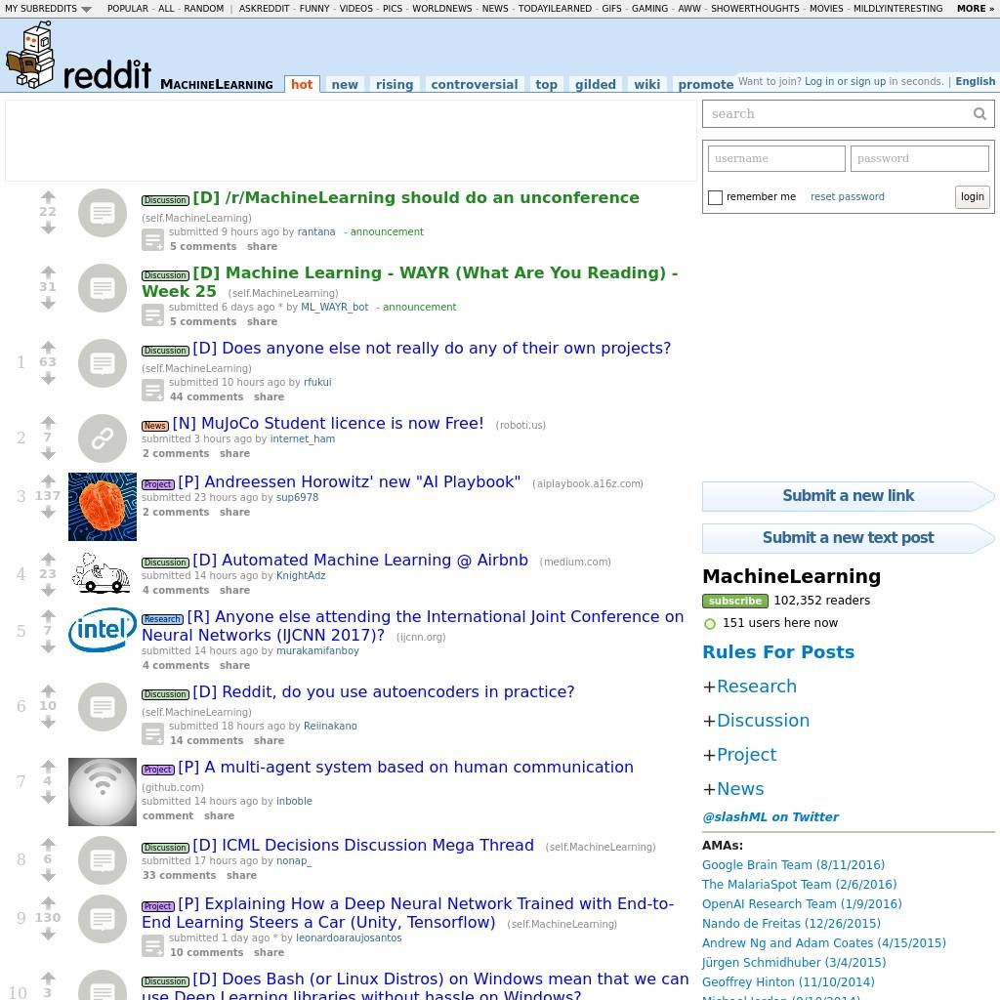
**이미지 캡션:** 이 이미지는 인기 있는 온라인 커뮤니티인 레딧의 머신러닝 서브레딧 페이지를 보여줍니다. 페이지 상단에는 레딧 로고와 함께 "MACHINE LEARNING"이라는 제목이 있고, 그 옆에는 "hot", "new", "rising", "controversial", "top", "gilded", "wiki", "promote"와 같은 다양한 탭이 있습니다. 오른쪽 상단에는 로그인 또는 회원가입을 위한 입력 필드와 버튼이 있습니다. 페이지의 주요 내용은 머신러닝 관련 게시물 목록으로, 각 게시물은 제목, 작성자, 제출 시간, 댓글 수, 공유 수 등의 정보를 포함합니다. 게시물 제목은 "[D]" (Discussion), "[N]" (News), "[R]" (Research), "[P]" (Project)와 같은 태그로 분류되어 있습니다. 예를 들어, 첫 번째 게시물은 "should do an unconference"라는 제목의 토론 게시물이며, 두 번째 게시물은 "WAYR (What Are You Reading) - Week 25"이라는 제목의 머신러닝 관련 토론 게시물입니다. 또한, 페이지 오른쪽에는 "Submit a new link" 및 "Submit a new text post" 버튼과 함께 "MachineLearning" 서브레딧의 구독자 수와 현재 접속자 수가 표시되어 있습니다. 그 아래에는 "Rules For Posts" 섹션이 있으며, "+Research", "+Discussion", "+Project", "+News"와 같은 하위 섹션이 나열되어 있습니다. 마지막으로, "AMAS" 섹션에는 과거에 진행되었던 AMA(Ask Me Anything) 세션 목록이 날짜와 함께 표시되어 있습니다. 전반적으로 이 페이지는 머신러닝 분야에 관심 있는 사용자들이 최신 정보와 토론을 공유하는 온라인 플랫폼의 모습을 보여줍니다.

> #오늘의레딧 https://www.reddit.com/r/MachineLearning/ 래딧은 읽을 거리가 다양합니다.  1. 다른 사람이 실제로 자신의 프로젝트를 수행하지 않습니까? 2. MuJoCo 학생 라이센스는 이제 무료입니다! 3. Andreessen Horowitz의 새로운 &quot;AI 플레이 북&quot; 4. 에어 비앤비 (Airbnb) 학습 자동화 기계 5. 신경망에 관한 국제 공동 회의 (IJCNN 2017)에 참석 한 사람은 누구입니까? 6. Reddit, 실제로 자동 인코딩을 사용합니까? 7. 인간 의사 소통을 기반으로 한 다중 에이전트 시스템 8. ICML 결정 토론 메가 실 9. 엔드 - 투 - 엔드 학습으로 훈련 된 심 신경 네트워크가 자동차를 조종하는 방법을 설명 (Unity, Tensorflow) 10. Windows에서 Bash (또는 Linux Distros)는 Windows에서 번거롭지 않고 Deep Learning 라이브러리를 사용할 수 있다는 의미입니까? 11. ML 프롬프트 : 기본 사용자에 대한 위키 피 디아 문서를 입력으로 받아서 출력으로 디즈니 영화 스크립트를 반환하는 알고리즘입니다. 12. 시각 추리를위한 프로그램의 추론과 실행 (구현) 13. 시간 복잡성을 무시하면 단일 알고리즘이 잘 수행되지 않으면 OnevAll 또는 AllvAll 앙상블 분류기를 사용하는 것이 가장 좋습니다. 14. 병리학 파인더 도전 15. 가변 길이 Softmax에 대한 잠재적 솔루션 16. ML의 복소수 적용 17. 미래 예측을 통한 행동 학습 (강화 학습 대신 감독 학습 사용) 18. Smith Waterman NLP에서 피쳐 추출 거리 19. 나 자신보다 너무 앞서 나간거야? 20. 추상적 요약을위한 심층적 인 모델  1. https://www.reddit.com/r/MachineLearning/comments/6axsub/d_does_anyone_else_not_really_do_any_of_their_own/ 2. https://www.roboti.us/license.html 3. http://aiplaybook.a16z.com/ 4. https://medium.com/airbnb-engineering/automated-machine-learning-a-paradigm-shift-that-accelerates-data-scientist-productivity-airbnb-f1f8a10d61f8 5. http://www.ijcnn.org 6. https://www.reddit.com/r/MachineLearning/comments/6aw8ik/d_reddit_do_you_use_autoencoders_in_practice/ 7. https://github.com/CarsonScott/Knowledge-Discovery-Agents/blob/master/README.md 8. https://www.reddit.com/r/MachineLearning/comments/6awg2g/d_icml_decisions_discussion_mega_thread/ 9. https://www.reddit.com/r/MachineLearning/comments/6aqdd8/p_explaining_how_a_deep_neural_network_trained/ 10. https://www.reddit.com/r/MachineLearning/comments/6aw6z5/d_does_bash_or_linux_distros_on_windows_mean_that/ 11. https://www.reddit.com/r/MachineLearning/comments/6azrma/d_ml_prompt_an_algorithm_that_takes_a_wikipedia/ 12. https://github.com/facebookresearch/clevr-iep 13. https://www.reddit.com/r/MachineLearning/comments/6aw4ea/d_disregarding_time_complexity_would_onevall_or/ 14. https://www.reddit.com/r/MachineLearning/comments/6aubkq/n_pathology_finder_challenge/ 15. https://www.reddit.com/r/MachineLearning/comments/6atcuk/d_a_potential_solution_to_varying_length_softmax/ 16. https://www.reddit.com/r/MachineLearning/comments/6arg96/d_applications_of_complex_numbers_in_ml/ 17. https://blog.acolyer.org/2017/05/12/learning-to-act-by-predicting-the-future/ 18. http://climberg.de/page/smith-waterman-distance-for-feature-extraction-in-nlp/ 19. https://www.reddit.com/r/MachineLearning/comments/6anu7y/d_did_i_get_too_far_ahead_of_myself/ 20. https://metamind.io/research/your-tldr-by-an-ai-a-deep-reinforced-model-for-abstractive-summarization

### 5월 15일 (월) 08:52 · 📷 사진 (1장)

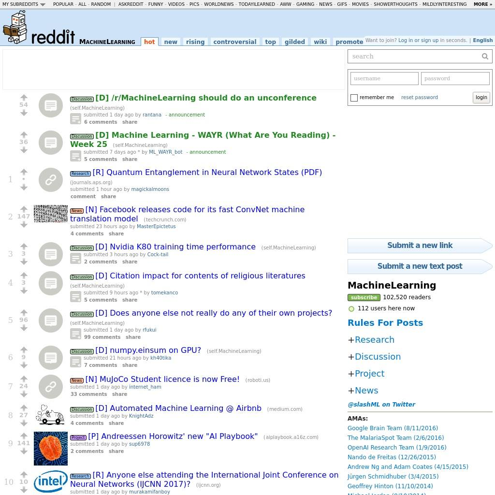
**이미지 캡션:** 이 이미지는 Reddit의 MachineLearning 서브레딧 페이지를 보여줍니다. 페이지 상단에는 Reddit 로고와 함께 "MachineLearning"이라는 제목이 있고, 그 아래에는 "hot", "new", "rising", "controversial", "top", "gilded", "wiki"와 같은 탭들이 있습니다. 오른쪽 상단에는 로그인 및 회원가입을 위한 입력 필드와 버튼이 있습니다. 페이지 중앙에는 다양한 주제의 게시물 목록이 표시되며, 각 게시물은 제목, 작성자, 제출 시간, 댓글 수, 공유 수 등의 정보를 포함하고 있습니다. 게시물 제목 앞에는 "[D]" (Discussion), "[R]" (Research), "[N]" (News), "[P]" (Project)와 같은 태그가 붙어 있어 게시물의 종류를 나타냅니다. 예를 들어, 첫 번째 게시물은 "MachineLearning should do an unconference"라는 제목의 토론 게시물이며, 6개의 댓글이 있습니다. 다른 게시물로는 "Machine Learning - WAYR (What Are You Reading) - Week 25", "Quantum Entanglement in Neural Network States (PDF)", "Facebook releases code for its fast ConvNet machine translation model" 등이 있습니다. 페이지 오른쪽에는 "Submit a new link", "Submit a new text post" 버튼과 함께 MachineLearning 서브레딧의 구독자 수, 현재 접속자 수, 그리고 게시물 규칙에 대한 링크가 있습니다. 또한, "@slashML on Twitter" 섹션과 "AMAS" (Ask Me Anything) 섹션에는 관련 트위터 계정 정보와 과거 AMA 참여자 목록이 나열되어 있습니다. 전반적으로, 이 페이지는 머신러닝 관련 정보를 공유하고 토론하는 온라인 커뮤니티의 모습을 보여줍니다.

> #오늘의레딧 https://www.reddit.com/r/MachineLearning/ 래딧은 읽을 거리가 다양합니다.  1. 뉴런 네트워크 상태의 양자 얽힘 (PDF) 2. 페이스 북은 빠른 ConvNet 기계 번역 모델을 발표했다. 3. Nvidia K80 교육 시간 실적 4. 종교적 내용에 대한 인용 영향 5. 다른 사람이 실제로 자신의 프로젝트를 수행하지 않습니까? 6. GPU의 numpy.einsum? 7. MuJoCo 학생 라이센스는 이제 무료입니다! 8. 에어 비앤비 (Airbnb) 학습 자동화 기계 9. Andreessen Horowitz의 새로운 &quot;AI 플레이 북&quot; 10. 신경망에 관한 국제 공동 회의 (IJCNN 2017)에 참석 한 사람은 누구입니까? 11. Reddit, 실제로 자동 인코딩을 사용합니까? 12. 인간 의사 소통을 기반으로 한 다중 에이전트 시스템 13. ICML 결정 토론 메가 실 14. Windows에서 Bash (또는 Linux Distros)는 Windows에서 번거롭지 않고 Deep Learning 라이브러리를 사용할 수 있다는 의미입니까? 15. 엔드 - 투 - 엔드 학습으로 훈련 된 심 신경 네트워크가 자동차를 조종하는 방법을 설명 (Unity, Tensorflow) 16. 시각 추리를위한 프로그램의 추론과 실행 (구현) 17. 가변 길이 Softmax에 대한 잠재적 솔루션 18. 시간 복잡성을 무시하면 단일 알고리즘이 잘 수행되지 않으면 OnevAll 또는 AllvAll 앙상블 분류기를 사용하는 것이 가장 좋습니다. 19. 병리학 파인더 도전 20. ML의 복소수 적용  1. https://journals.aps.org/prx/pdf/10.1103/PhysRevX.7.021021 2. https://techcrunch.com/2017/05/09/facebook-posts-its-fast-and-accurate-convnet-models-for-machine-translation-on-github/ 3. https://www.reddit.com/r/MachineLearning/comments/6b64u4/d_nvidia_k80_training_time_performance/ 4. https://www.reddit.com/r/MachineLearning/comments/6b42xt/d_citation_impact_for_contents_of_religious/ 5. https://www.reddit.com/r/MachineLearning/comments/6axsub/d_does_anyone_else_not_really_do_any_of_their_own/ 6. https://www.reddit.com/r/MachineLearning/comments/6b1qv1/d_numpyeinsum_on_gpu/ 7. https://www.roboti.us/license.html 8. https://medium.com/airbnb-engineering/automated-machine-learning-a-paradigm-shift-that-accelerates-data-scientist-productivity-airbnb-f1f8a10d61f8 9. http://aiplaybook.a16z.com/ 10. http://www.ijcnn.org 11. https://www.reddit.com/r/MachineLearning/comments/6aw8ik/d_reddit_do_you_use_autoencoders_in_practice/ 12. https://github.com/CarsonScott/Knowledge-Discovery-Agents/blob/master/README.md 13. https://www.reddit.com/r/MachineLearning/comments/6awg2g/d_icml_decisions_discussion_mega_thread/ 14. https://www.reddit.com/r/MachineLearning/comments/6aw6z5/d_does_bash_or_linux_distros_on_windows_mean_that/ 15. https://www.reddit.com/r/MachineLearning/comments/6aqdd8/p_explaining_how_a_deep_neural_network_trained/ 16. https://github.com/facebookresearch/clevr-iep 17. https://www.reddit.com/r/MachineLearning/comments/6atcuk/d_a_potential_solution_to_varying_length_softmax/ 18. https://www.reddit.com/r/MachineLearning/comments/6aw4ea/d_disregarding_time_complexity_would_onevall_or/ 19. https://www.reddit.com/r/MachineLearning/comments/6aubkq/n_pathology_finder_challenge/ 20. https://www.reddit.com/r/MachineLearning/comments/6arg96/d_applications_of_complex_numbers_in_ml/

### 5월 16일 (화) 06:51 · 📷 사진 (2장)

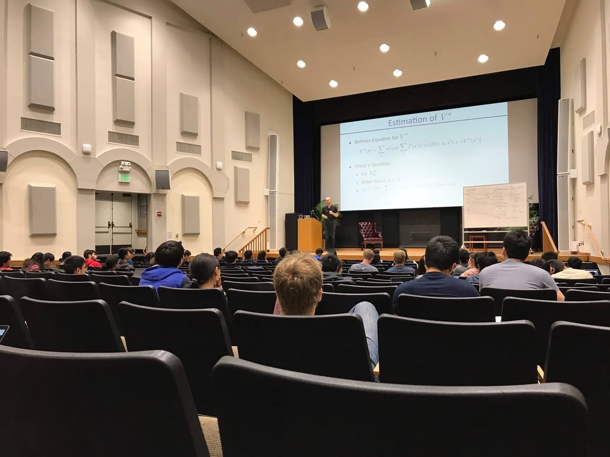
**이미지 캡션:** 강의실에서 한 명의 성인 남성이 강단에 서서 발표하고 있으며, 그의 뒤에는 "Estimation of V"라는 제목의 슬라이드가 띄워져 있다. 슬라이드에는 "Bellman Equation for V"와 "Fitted Viteration"이라는 제목과 함께 수식들이 적혀 있다. 강사는 검은색 상의와 바지를 입고 있으며, 오른손을 들고 설명하는 듯한 자세를 취하고 있다. 강의실에는 검은색 좌석들이 줄지어 있으며, 많은 학생들이 좌석에 앉아 강연을 듣고 있다. 학생들은 대부분 젊은 성인 남녀로 보이며, 다양한 복장을 하고 있다. 강의실 벽면에는 음향 패널이 부착되어 있고, 천장에는 조명이 설치되어 있다. 강의실 뒤쪽에는 출입문과 계단이 보인다. 전체적으로 학술적인 분위기의 강의 장면이다.
 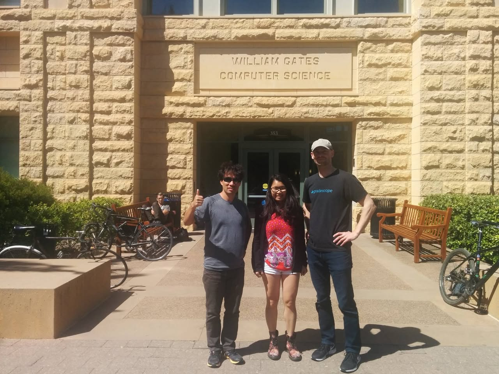
**이미지 캡션:** 세 명의 젊은 성인들이 빌 게이츠 컴퓨터 과학 건물 앞에서 사진을 찍고 있다. 왼쪽 남성은 회색 티셔츠와 검은색 바지를 입고 있으며, 오른손 엄지손가락을 치켜들고 있다. 가운데 여성은 빨간색 패턴의 상의와 흰색 반바지, 검은색 카디건을 입고 있으며, 안경을 쓰고 있다. 오른쪽 남성은 회색 모자와 검은색 티셔츠, 청바지를 입고 있으며, 티셔츠에는 "agradescope"라는 로고가 있다. 건물 외벽은 베이지색 석재로 되어 있으며, 건물 입구 위에는 "WILLIAM GATES COMPUTER SCIENCE"라는 글자가 새겨져 있다. 건물 앞에는 자전거 여러 대와 나무 벤치가 놓여 있고, 건물 뒤편에는 푸른 나무들이 보인다. 전체적으로 밝고 화창한 날씨이며, 사람들은 편안하고 긍정적인 표정을 짓고 있다.

> [Live from 스텐포드] 친구랑 같이 RL 수업을 듣는중인데 policy_gradients 를 2시간만에 100장의 슬라이드로 설명합니다.   슬라이드를 나중에 참고해야 할듯 합니다. ^^ http://web.stanford.edu/class/cs234/slides/cs234_guest_lecture_policy_gradients.pdf
> [부러움 주의] 오늘 만난 딥러닝 계열 유명 강사 두분.   여러분들이 정말 많이 보시는 슬라이드의 강사님들입니다.  1. Chip Huyen: Tensorflow for Deep Learning Research - Stanford University, cs20si.stanford.edu  2. Pieter Abbeel:  Deep Reinforcement Learning, http://rll.berkeley.edu/deeprlcourse/  저도 슬라이드로만 보든분들 뵈어서 반가웠습니다.

### 5월 17일 (수) 08:25 · 📷 사진 (32장)

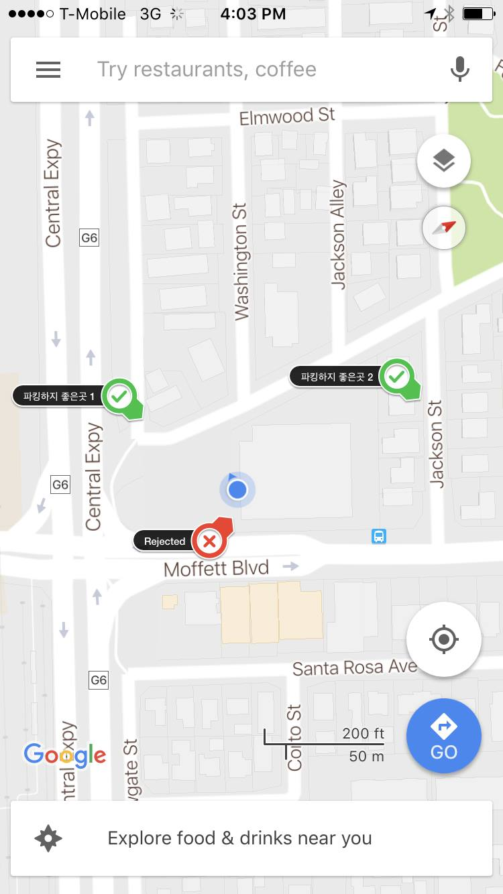
**이미지 캡션:** 이것은 스마트폰 화면의 스크린샷으로, 구글 지도가 표시되어 있습니다. 화면 상단에는 시간과 통신사 정보가 보이며, 검색창에는 "Try restaurants, coffee"라고 입력되어 있습니다. 지도에는 "Central Expy", "Washington St", "Jackson Alley", "Moffett Blvd", "Santa Rosa Ave", "Colto St" 등의 도로명이 표시되어 있습니다. 두 개의 녹색 체크 표시와 함께 "파킹하지 좋은곳 1", "파킹하지 좋은곳 2"라는 한국어 텍스트가 나타나며, 이는 주차하기 좋은 장소를 의미하는 것으로 보입니다. 또한, 빨간색 X 표시와 함께 "Rejected"라는 텍스트가 있어 특정 장소가 거부되었음을 나타냅니다. 지도에는 현재 위치를 나타내는 파란색 점과 함께 탐색 기능을 위한 "GO" 버튼이 보입니다. 화면 하단에는 "Explore food & drinks near you"라는 문구가 있어 주변 음식점 및 음료 가게를 탐색할 수 있음을 알립니다. 전반적으로 사용자가 주변의 식당이나 카페를 찾고 주차 정보를 확인하는 상황을 보여줍니다.
 
**이미지 캡션:** 이 이미지는 스마트폰 화면을 캡처한 것으로, 지도 애플리케이션이 실행 중입니다. 화면 상단에는 "T-Mobile 3G" 통신 상태와 "4:03 PM"이라는 시간이 표시되어 있습니다. 검색창에는 "Try restaurants, coffee"라고 입력되어 있어 주변의 식당이나 커피숍을 검색하려는 의도를 보여줍니다. 지도에는 "Central Expy", "Elmwood St", "Washington St", "Jackson Alley", "Jackson St", "Moffett Blvd", "Santa Rosa Ave", "Colto St" 등의 도로 이름이 표시되어 있으며, "G6"라는 표지판도 보입니다. 지도 상에는 여러 개의 마커가 표시되어 있는데, "파킹하지 좋은곳 1"과 "파킹하지 좋은곳 2"라는 한국어 텍스트가 포함된 녹색 체크 마커가 두 개 있고, "Rejected"라는 텍스트와 빨간색 X 마커가 하나 있습니다. 또한 파란색 점 마커도 하나 보입니다. 화면 하단에는 "Google" 로고와 함께 "Explore food & drinks near you"라는 문구가 포함된 흰색 정보 창이 있습니다. 지도 오른쪽에는 현재 위치를 표시하는 나침반 모양의 아이콘과 함께 "GO" 버튼이 있는 파란색 원형 버튼이 있습니다. 전반적으로 사용자가 주변의 식당이나 커피숍을 찾고 있으며, 주차할 만한 좋은 장소와 거부된 장소를 확인하고 있는 상황으로 보입니다.
 
**이미지 캡션:** 이것은 스마트폰 화면의 스크린샷으로, 구글 지도 앱이 열려 있습니다. 화면 상단에는 "..... T-Mobile 3G"와 "4:03 PM"이라는 텍스트가 보입니다. 검색창에는 "Try restaurants, coffee"라고 입력되어 있습니다. 지도에는 여러 도로와 건물들이 표시되어 있으며, "Central Expy", "Washington St", "Jackson Alley", "Moffett Blvd", "Santa Rosa Ave", "Colto St" 등의 도로 이름이 보입니다. 지도 상에는 파란색 점으로 현재 위치가 표시되어 있으며, 두 개의 녹색 체크 표시와 함께 "파킹하지 좋은곳 1", "파킹하지 좋은곳 2"라는 한국어 텍스트가 표시되어 있습니다. 또한, 빨간색 X 표시와 함께 "Rejected"라는 텍스트가 보입니다. 화면 하단에는 "Google" 로고와 함께 "Explore food & drinks near you"라는 텍스트가 있는 흰색 바가 있습니다. 지도에는 현재 위치를 중심으로 주변을 탐색할 수 있는 기능과 길찾기 기능이 활성화되어 있습니다. 전반적으로 사용자가 주변의 식당이나 카페를 찾고 있는 상황을 보여줍니다.
 
**이미지 캡션:** 이것은 스마트폰 화면의 스크린샷으로, 구글 지도 앱이 열려 있습니다. 화면 상단에는 "4:03 PM"이라는 시간이 표시되어 있으며, "T-Mobile 3G" 통신사 정보도 보입니다. 검색창에는 "Try restaurants, coffee"라고 입력되어 있어 음식점이나 카페를 찾는 중임을 알 수 있습니다. 지도에는 여러 도로와 건물들이 표시되어 있으며, "Central Expy", "Washington St", "Jackson Alley", "Moffett Blvd", "Santa Rosa Ave", "Colto St" 등의 거리 이름이 보입니다. 지도 상에는 파란색 점으로 현재 위치를 나타내고 있으며, 두 개의 녹색 체크 표시와 함께 "파킹하지 좋은곳 1", "파킹하지 좋은곳 2"라는 한국어 텍스트가 표시되어 있습니다. 또한, 빨간색 X 표시와 함께 "Rejected"라는 텍스트가 있는 마커도 보입니다. 화면 하단에는 "Google" 로고와 함께 "Explore food & drinks near you"라는 문구가 있는 흰색 바가 있습니다. 전반적으로 사용자가 주변의 음식점이나 카페를 찾고 있으며, 주차 가능한 장소에 대한 정보도 확인하고 있는 상황으로 보입니다.
 
**이미지 캡션:** 이것은 스마트폰 화면의 스크린샷으로, 구글 지도가 표시되어 있습니다. 화면 상단에는 "T-Mobile 3G"와 "4:03 PM"이라는 시간이 표시되어 있으며, 검색창에는 "Try restaurants, coffee"라고 입력되어 있습니다. 지도에는 여러 도로와 건물들이 표시되어 있으며, "Central Expy", "Washington St", "Jackson Alley", "Moffett Blvd", "Santa Rosa Ave", "Colto St" 등의 도로 이름이 보입니다. 지도 상에는 몇 개의 마커가 표시되어 있는데, "파킹하지 좋은곳 1"과 "파킹하지 좋은곳 2"라는 한국어 텍스트가 포함된 녹색 체크 표시 마커 두 개가 있고, "Rejected"라는 텍스트와 빨간색 X 표시 마커가 하나 있습니다. 또한, 파란색 점 마커도 하나 보입니다. 화면 하단에는 "Google" 로고와 함께 "Explore food & drinks near you"라는 문구가 표시된 검색창이 있습니다. 지도 우측에는 현재 위치를 나타내는 나침반 아이콘과 길찾기 기능을 위한 "GO" 버튼이 있습니다. 전반적으로, 사용자가 주변의 식당이나 카페를 검색하고 있는 상황을 보여주는 지도 앱 화면입니다.
 
**이미지 캡션:** 이것은 스마트폰 화면의 스크린샷으로, 구글 지도 앱이 열려 있습니다. 화면 상단에는 "4:03 PM"이라는 시간이 표시되어 있고, "T-Mobile 3G" 통신사 정보도 보입니다. 검색창에는 "Try restaurants, coffee"라고 입력되어 있어 음식점이나 카페를 찾는 중임을 알 수 있습니다. 지도에는 여러 도로와 건물들이 표시되어 있으며, "Central Expy", "Washington St", "Jackson Alley", "Moffett Blvd", "Santa Rosa Ave", "Colto St" 등의 도로 이름이 보입니다. 지도 상에는 여러 개의 마커가 표시되어 있는데, "파킹하지 좋은곳 1"과 "파킹하지 좋은곳 2"라는 라벨이 붙은 두 개의 녹색 체크 표시 마커가 있고, "Rejected"라는 라벨과 빨간색 X 표시가 있는 마커도 있습니다. 또한 파란색 점으로 현재 위치를 나타내는 마커도 보입니다. 화면 하단에는 "Google" 로고와 함께 "Explore food & drinks near you"라는 문구가 포함된 정보 창이 떠 있습니다. 전반적으로 사용자가 주변의 음식점이나 카페를 찾고 있으며, 주차 가능한 장소에 대한 정보도 확인하고 있는 상황으로 보입니다.
 
**이미지 캡션:** 이것은 스마트폰 화면의 스크린샷으로, 구글 지도가 표시되어 있습니다. 화면 상단에는 시간과 통신사 정보가 보이며, 검색창에는 "Try restaurants, coffee"라고 입력되어 있습니다. 지도에는 Central Expy, Washington St, Jackson Alley, Moffett Blvd, Santa Rosa Ave, Colto St 등의 도로명이 표시되어 있습니다. 두 개의 녹색 체크 표시와 함께 "파킹하지 좋은곳 1", "파킹하지 좋은곳 2"라는 한국어 텍스트가 보이며, 빨간색 X 표시와 함께 "Rejected"라는 텍스트도 보입니다. 파란색 점은 현재 위치를 나타내는 것으로 보이며, 나침반 아이콘과 현재 위치로 돌아가는 버튼, 그리고 길찾기 버튼이 화면 오른쪽에 있습니다. 화면 하단에는 "Explore food & drinks near you"라는 문구가 포함된 검색창이 있습니다. 전반적으로 사용자가 주변의 음식점이나 카페를 검색하고 있는 상황을 보여줍니다.
 
**이미지 캡션:** 이것은 스마트폰 화면의 스크린샷으로, 구글 지도가 표시되어 있습니다. 화면 상단에는 "T-Mobile 3G"와 "4:03 PM"이라는 텍스트가 보이며, 검색창에는 "Try restaurants, coffee"라고 입력되어 있습니다. 지도에는 Central Expy, Elmwood St, Washington St, Jackson Alley, Jackson St, Moffett Blvd, Santa Rosa Ave, Colto St 등의 도로명이 표시되어 있습니다. 여러 개의 마커가 지도에 나타나는데, 두 개의 녹색 체크 표시가 있는 마커에는 "파킹하지 좋은곳 1"과 "파킹하지 좋은곳 2"라는 한국어 텍스트가 표시되어 있습니다. 또한, 빨간색 X 표시와 함께 "Rejected"라는 텍스트가 있는 마커도 보입니다. 파란색 점 마커도 하나 있습니다. 화면 하단에는 "Google" 로고와 함께 "Explore food & drinks near you"라는 텍스트가 있는 흰색 바가 있습니다. 지도 오른쪽에는 현재 위치를 표시하는 나침반 모양 아이콘과 함께 "GO" 버튼이 있는 파란색 원형 아이콘이 있습니다. 전반적으로, 사용자가 주변의 식당이나 카페를 검색하고 있는 상황으로 보입니다.
 
**이미지 캡션:** 이 이미지는 스마트폰 화면을 캡처한 것으로, 지도 애플리케이션이 실행 중입니다. 화면 상단에는 "T-Mobile 3G"와 "4:03 PM"이라는 시간 정보가 표시되어 있습니다. 검색창에는 "Try restaurants, coffee"라고 입력되어 있어 레스토랑이나 커피숍을 검색하려는 의도를 알 수 있습니다. 지도에는 여러 도로와 건물들이 표시되어 있으며, "Central Expy", "Washington St", "Jackson Alley", "Moffett Blvd", "Santa Rosa Ave", "Colto St" 등의 거리 이름이 보입니다. 지도 상에는 여러 개의 마커가 표시되어 있습니다. 녹색 체크 표시와 함께 "파킹하지 좋은곳 1"이라고 표시된 마커가 두 개 있으며, 이는 주차하기 좋은 장소를 나타내는 것으로 보입니다. 빨간색 X 표시와 함께 "Rejected"라고 표시된 마커는 거부되었거나 사용할 수 없는 장소를 나타냅니다. 파란색 원형 마커는 현재 사용자의 위치를 나타내는 것으로 추정됩니다. 화면 하단에는 "Google" 로고와 함께 "Explore food & drinks near you"라는 문구가 표시되어 있어 주변의 음식점이나 음료 가게를 탐색할 수 있는 기능을 제공하고 있음을 알 수 있습니다. 또한, "GO" 버튼과 함께 길찾기 기능이 활성화되어 있음을 시사합니다. 전반적으로 사용자가 특정 지역에서 식당이나 카페를 찾고 길을 안내받으려는 상황을 보여줍니다.
 
**이미지 캡션:** 이것은 스마트폰 화면의 스크린샷으로, 구글 지도가 표시되어 있습니다. 화면 상단에는 "4:03 PM"이라는 시간이 보이며, "T-Mobile 3G" 통신사 정보도 함께 표시됩니다. 검색창에는 "Try restaurants, coffee"라고 입력되어 있어 음식점이나 커피숍을 찾는 중임을 알 수 있습니다. 지도에는 "Central Expy", "Washington St", "Jackson Alley", "Moffett Blvd", "Santa Rosa Ave", "Colto St" 등의 도로명이 표시되어 있습니다. 두 개의 녹색 체크 표시와 함께 "파킹하지 좋은곳 1", "파킹하지 좋은곳 2"라는 한국어 텍스트가 나타나는데, 이는 주차하기 좋은 장소를 나타내는 것으로 보입니다. 또한, 빨간색 X 표시와 함께 "Rejected"라는 텍스트가 있어 특정 장소가 거부되었음을 나타냅니다. 파란색 점은 현재 위치를 나타내는 것으로 추정됩니다. 지도 오른쪽에는 현재 위치를 중심으로 지도를 재설정하는 버튼과 길찾기 기능을 시작하는 "GO" 버튼이 있습니다. 화면 하단에는 "Explore food & drinks near you"라는 문구가 있어 주변의 음식점과 음료를 탐색하라는 안내가 표시됩니다. 전반적으로 사용자가 특정 지역에서 음식점이나 커피숍을 찾고 있으며, 주차 가능한 장소와 거부된 장소에 대한 정보도 함께 제공되고 있는 상황을 보여줍니다.
 
**이미지 캡션:** 이것은 스마트폰 화면을 캡처한 것으로, 구글 지도가 표시되어 있습니다. 화면 상단에는 "4:03 PM"이라는 시간이 보이며, "T-Mobile 3G" 통신사 정보도 함께 나타납니다. 검색창에는 "Try restaurants, coffee"라고 입력되어 있어 음식점이나 카페를 찾는 중임을 알 수 있습니다. 지도에는 "Central Expy", "Elmwood St", "Washington St", "Jackson Alley", "Jackson St", "Moffett Blvd", "Santa Rosa Ave", "Colto St" 등의 도로명이 표시되어 있습니다. 지도 상에는 여러 개의 마커가 있는데, "파킹하지 좋은곳 1"과 "파킹하지 좋은곳 2"라는 한국어 텍스트가 포함된 녹색 체크 마커 두 개가 보입니다. 또한, "Rejected"라는 텍스트와 함께 빨간색 X 마커가 있고, 파란색 점 마커도 하나 있습니다. 화면 하단에는 "Google" 로고와 함께 "Explore food & drinks near you"라는 문구가 보이며, 길찾기 기능을 위한 "GO" 버튼도 있습니다. 지도에는 축척 정보로 "200 ft"와 "50 m"가 표시되어 있습니다. 전반적으로 사용자가 주변의 음식점이나 카페를 찾기 위해 지도 앱을 사용하고 있는 상황을 보여줍니다.
 
**이미지 캡션:** 이것은 스마트폰 화면의 스크린샷으로, 구글 지도가 표시되어 있습니다. 화면 상단에는 "T-Mobile 3G"와 "4:03 PM"이라는 정보가 보입니다. 검색창에는 "Try restaurants, coffee"라고 입력되어 있습니다. 지도에는 여러 거리 이름이 표시되어 있으며, "Central Expy", "Washington St", "Jackson Alley", "Moffett Blvd", "Santa Rosa Ave", "Colto St" 등이 보입니다. 지도상에는 여러 개의 마커가 표시되어 있는데, 두 개의 녹색 마커에는 "파킹하지 좋은곳 1"과 "파킹하지 좋은곳 2"라는 한국어 텍스트와 함께 체크 표시가 있습니다. 또한, 빨간색 마커에는 "Rejected"라는 텍스트와 함께 X 표시가 있습니다. 파란색 원형 마커도 하나 보입니다. 화면 하단에는 "Google" 로고와 함께 "Explore food & drinks near you"라는 문구가 있는 검색창이 있습니다. 지도 오른쪽에는 현재 위치를 표시하는 나침반 모양 아이콘과 길찾기 기능을 활성화하는 파란색 "GO" 버튼이 있습니다. 전반적으로, 사용자가 주변의 식당이나 커피숍을 검색하고 있는 상황으로 보이며, 몇몇 장소는 이미 확인되었거나 거부된 상태임을 나타냅니다.
 
**이미지 캡션:** 이것은 스마트폰 화면의 스크린샷으로, 구글 지도가 표시되어 있습니다. 화면 상단에는 "T-Mobile 3G"와 "4:03 PM"이라는 시간이 보이며, 검색창에는 "Try restaurants, coffee"라고 입력되어 있습니다. 지도에는 Central Expy, Elmwood St, Washington St, Jackson Alley, Jackson St, Moffett Blvd, Santa Rosa Ave, Colto St 등의 도로명이 표시되어 있습니다. 여러 개의 마커가 보이며, 그중 두 개는 녹색 체크 표시와 함께 "파킹하지 좋은곳 1", "파킹하지 좋은곳 2"라는 한국어 문구가 적혀 있습니다. 또한 빨간색 X 표시와 함께 "Rejected"라는 문구가 있는 마커도 보입니다. 화면 하단에는 "Google" 로고와 함께 "Explore food & drinks near you"라는 문구가 있는 흰색 영역이 있습니다. 지도에는 현재 위치를 나타내는 파란색 점과 나침반 아이콘, 그리고 "GO" 버튼이 포함된 파란색 원형 버튼이 있습니다. 전반적으로 음식점이나 카페를 검색하는 상황으로 보이며, 주차 가능한 장소를 표시하거나 거부된 장소를 나타내는 정보가 포함되어 있습니다.
 
**이미지 캡션:** 이것은 스마트폰 화면의 스크린샷으로, 구글 지도 앱이 열려 있습니다. 화면 상단에는 "4:03 PM"이라는 시간이 표시되어 있고, "T-Mobile 3G" 통신사 정보도 보입니다. 검색창에는 "Try restaurants, coffee"라고 입력되어 있어 음식점이나 커피숍을 검색하려는 의도를 알 수 있습니다. 지도에는 여러 도로와 건물들이 표시되어 있으며, "Central Expy", "Washington St", "Jackson Alley", "Moffett Blvd", "Santa Rosa Ave" 등의 도로명이 보입니다. 지도 상에는 파란색 점으로 현재 위치가 표시되어 있고, 두 개의 녹색 체크 표시와 함께 "파킹하지 좋은곳 1", "파킹하지 좋은곳 2"라는 한국어 라벨이 붙어 있습니다. 또한, 빨간색 X 표시와 함께 "Rejected"라는 라벨이 붙어 있어 특정 장소가 거부되었음을 나타냅니다. 화면 하단에는 "Google" 로고와 함께 "Explore food & drinks near you"라는 문구가 표시되어 있어 주변의 음식점이나 음료 가게를 탐색할 수 있는 기능을 안내하고 있습니다. 지도에는 현재 위치를 중심으로 주변을 탐색할 수 있는 나침반 모양의 아이콘과 현재 위치로 돌아가는 버튼, 그리고 길 안내를 시작하는 "GO" 버튼이 보입니다. 전반적으로 사용자가 주변의 음식점이나 커피숍을 찾고 있으며, 주차 가능한 장소에 대한 정보도 함께 확인하고 있는 상황으로 보입니다.
 
**이미지 캡션:** 이것은 스마트폰 화면의 스크린샷으로, 구글 지도가 표시되어 있습니다. 화면 상단에는 "T-Mobile 3G"와 "4:03 PM"이라는 정보가 보입니다. 검색창에는 "Try restaurants, coffee"라고 입력되어 있습니다. 지도에는 여러 도로와 건물들이 표시되어 있으며, "Central Expy", "Washington St", "Jackson Alley", "Moffett Blvd", "Santa Rosa Ave", "Colto St" 등의 도로명이 보입니다. 지도 상에는 파란색 점으로 현재 위치를 나타내고 있으며, 두 개의 녹색 체크 표시와 함께 "파킹하지 좋은곳 1", "파킹하지 좋은곳 2"라는 한국어 텍스트가 표시되어 있습니다. 또한, 빨간색 X 표시와 함께 "Rejected"라는 텍스트가 있는 마커도 보입니다. 화면 하단에는 "Google" 로고와 함께 "Explore food & drinks near you"라는 문구가 있는 검색창이 있습니다. 지도 오른쪽에는 현재 위치를 중심으로 지도를 재설정하는 버튼과 길찾기 기능을 시작하는 "GO" 버튼이 있습니다. 전반적으로 사용자가 주변의 식당이나 카페를 찾고 있는 상황을 보여줍니다.
 
**이미지 캡션:** 이것은 스마트폰 화면의 스크린샷으로, 구글 지도 앱이 열려 있습니다. 화면 상단에는 시간과 통신사 정보가 표시되어 있으며, 검색창에는 "Try restaurants, coffee"라고 입력되어 있습니다. 지도에는 여러 도로와 건물들이 표시되어 있으며, "Central Expy", "Washington St", "Jackson Alley", "Moffett Blvd", "Santa Rosa Ave", "Colto St" 등의 도로명이 보입니다. 지도상에는 파란색 점으로 현재 위치를 나타내고 있으며, 두 개의 녹색 체크 표시와 함께 "파킹하지 좋은곳 1", "파킹하지 좋은곳 2"라는 한국어 라벨이 표시되어 있습니다. 또한, 빨간색 X 표시와 함께 "Rejected"라는 라벨이 붙어 있는 것도 보입니다. 화면 하단에는 "Google" 로고와 함께 "Explore food & drinks near you"라는 문구가 표시된 하얀색 정보창이 있습니다. 전반적으로 음식점이나 카페를 검색하고 주변 주차 공간을 확인하는 상황으로 보입니다.
 
**이미지 캡션:** 이것은 스마트폰 화면의 스크린샷으로, 구글 지도가 표시되어 있습니다. 화면 상단에는 "T-Mobile 3G"와 "4:03 PM"이라는 시간이 보입니다. 검색창에는 "Try restaurants, coffee"라고 입력되어 있습니다. 지도에는 여러 도로와 건물들이 표시되어 있으며, "Central Expy", "Washington St", "Jackson Alley", "Moffett Blvd", "Santa Rosa Ave", "Colto St" 등의 도로 이름이 보입니다. 지도 상에는 두 개의 녹색 체크 표시와 함께 "파킹하지 좋은곳 1", "파킹하지 좋은곳 2"라는 한국어 텍스트가 표시되어 있으며, 빨간색 X 표시와 함께 "Rejected"라는 텍스트도 보입니다. 파란색 점은 현재 위치를 나타내는 것으로 보입니다. 화면 하단에는 "Explore food & drinks near you"라는 문구가 있는 검색창이 있습니다. 전반적으로 사용자가 주변의 식당이나 커피숍을 찾고 있는 상황을 보여줍니다.
 
**이미지 캡션:** 이것은 스마트폰 화면의 스크린샷으로, 구글 지도가 표시되어 있습니다. 화면 상단에는 "4:03 PM"이라는 시간이 보이며, "Try restaurants, coffee"라는 검색창이 있습니다. 지도에는 Central Expy, Elmwood St, Washington St, Jackson Alley, Jackson St, Moffett Blvd, Santa Rosa Ave, Colto St 등의 도로 이름이 표시되어 있습니다. 몇몇 장소에는 "파킹하지 좋은곳 1"과 "파킹하지 좋은곳 2"라는 한국어 라벨이 붙어 있으며, 각각 초록색 체크 표시와 함께 나타납니다. 또한, "Rejected"라는 라벨과 빨간색 X 표시도 보입니다. 파란색 점은 현재 위치를 나타내는 것으로 보이며, 빨간색 화살표가 있는 나침반 아이콘과 현재 위치를 중심으로 지도를 재정렬하는 아이콘이 화면 오른쪽에 있습니다. 화면 하단에는 "Google" 로고와 함께 "Explore food & drinks near you"라는 문구가 보입니다. 전반적으로, 이 화면은 사용자가 주변의 음식점이나 카페를 찾고 있는 상황을 보여줍니다.
 
**이미지 캡션:** 이것은 스마트폰 화면으로, 구글 지도 앱이 실행 중이며 현재 위치 주변의 음식점과 카페를 검색하는 중입니다. 화면 상단에는 "Try restaurants, coffee"라는 검색창이 보이고, 그 옆에는 마이크 아이콘이 있습니다. 지도에는 "Central Expy", "Washington St", "Jackson Alley", "Moffett Blvd", "Santa Rosa Ave", "Colto St" 등의 도로명이 표시되어 있습니다. 두 개의 녹색 체크 표시와 함께 "파킹하지 좋은곳 1"과 "파킹하지 좋은곳 2"라는 한국어 텍스트가 나타나는데, 이는 주차하기 좋은 장소를 의미하는 것으로 보입니다. 빨간색 X 표시와 함께 "Rejected"라는 텍스트도 보이는데, 이는 특정 장소가 거부되었음을 나타냅니다. 현재 위치를 나타내는 파란색 점과 나침반, 현재 위치로 돌아가는 버튼, 그리고 길찾기 버튼인 "GO"가 화면 오른쪽에 배치되어 있습니다. 화면 하단에는 "Explore food & drinks near you"라는 문구가 보이며, 이는 주변의 음식점과 음료를 탐색하라는 안내입니다. 전반적으로 사용자가 주변의 식당이나 카페를 찾기 위해 지도 앱을 이용하고 있는 상황을 보여줍니다.
 
**이미지 캡션:** 이것은 스마트폰 화면의 스크린샷으로, 구글 지도가 표시되어 있습니다. 화면 상단에는 "T-Mobile 3G"와 "4:03 PM"이라는 시간이 보이며, 검색창에는 "Try restaurants, coffee"라고 입력되어 있습니다. 지도에는 Central Expy, Elmwood St, Washington St, Jackson Alley, Jackson St, Moffett Blvd, Santa Rosa Ave, Colto St 등의 도로 이름이 표시되어 있습니다. 여러 개의 마커가 보이며, 두 개의 녹색 체크 표시 마커에는 "파킹하지 좋은곳 1"과 "파킹하지 좋은곳 2"라는 한국어 문구가 적혀 있습니다. 또한, 빨간색 X 표시와 함께 "Rejected"라는 문구가 있는 마커도 보입니다. 파란색 원형 마커도 하나 있으며, 화면 오른쪽 하단에는 파란색 원형 버튼에 "GO"라고 쓰여 있고, 그 위에는 현재 위치를 나타내는 나침반 모양의 아이콘이 있습니다. 화면 하단에는 "Explore food & drinks near you"라는 문구가 있는 흰색 영역이 있습니다. 전반적으로 음식점이나 커피숍을 검색하고 있는 상황으로 보이며, 주차 가능한 장소를 찾거나 특정 장소에 대한 정보를 확인하는 것으로 추정됩니다.
 
**이미지 캡션:** 이것은 스마트폰 화면의 스크린샷으로, 구글 지도 앱이 열려 있습니다. 화면 상단에는 시간과 통신사 정보가 표시되어 있으며, 검색창에는 "Try restaurants, coffee"라고 입력되어 있습니다. 지도에는 여러 도로와 건물들이 표시되어 있으며, "Central Expy", "Washington St", "Jackson Alley", "Moffett Blvd", "Santa Rosa Ave", "Colto St" 등의 도로명이 보입니다. 지도 상에는 파란색 점으로 현재 위치를 나타내는 것으로 추정되는 마커가 있고, "Rejected"라고 표시된 빨간색 X 마커와 함께 "Rejected"라는 텍스트가 보입니다. 또한, "파킹하지 좋은곳 1"과 "파킹하지 좋은곳 2"라는 한국어 텍스트가 각각 녹색 체크 표시와 함께 표시되어 있습니다. 화면 하단에는 "Google" 로고와 함께 "Explore food & drinks near you"라는 텍스트가 보입니다. 전반적으로 사용자가 주변의 음식점이나 카페를 검색하고 있는 상황으로 보이며, 특정 장소에 대한 긍정적인 평가("파킹하지 좋은곳")와 부정적인 평가("Rejected")가 표시되어 있습니다.
 
**이미지 캡션:** 이것은 스마트폰 화면의 스크린샷으로, 구글 지도가 표시되어 있습니다. 화면 상단에는 "T-Mobile 3G"와 "4:03 PM"이라는 시간이 표시되어 있습니다. 검색창에는 "Try restaurants, coffee"라고 입력되어 있습니다. 지도에는 여러 도로와 건물들이 표시되어 있으며, "Central Expy", "Washington St", "Jackson Alley", "Moffett Blvd", "Santa Rosa Ave", "Colto St" 등의 도로 이름이 보입니다. 지도에는 두 개의 녹색 체크 표시와 함께 "파킹하지 좋은곳 1"과 "파킹하지 좋은곳 2"라는 한국어 텍스트가 표시되어 있으며, 빨간색 X 표시와 함께 "Rejected"라는 텍스트도 보입니다. 파란색 점은 현재 위치를 나타내는 것으로 보이며, 나침반 아이콘과 "GO" 버튼도 보입니다. 화면 하단에는 "Explore food & drinks near you"라는 텍스트가 포함된 검색창이 있습니다. 전반적으로 이 화면은 사용자가 주변의 식당이나 커피숍을 찾고 있는 상황을 보여줍니다.
 
**이미지 캡션:** 이것은 스마트폰 화면의 스크린샷으로, 구글 지도 앱이 열려 있습니다. 화면 상단에는 "4:03 PM"이라는 시간이 표시되어 있고, "T-Mobile 3G" 통신사 정보도 보입니다. 검색창에는 "Try restaurants, coffee"라고 입력되어 있어 음식점이나 카페를 검색하려는 의도를 알 수 있습니다. 지도에는 여러 도로와 건물들이 표시되어 있으며, "Central Expy", "Washington St", "Jackson Alley", "Moffett Blvd", "Santa Rosa Ave", "Colto St" 등의 거리 이름이 보입니다. 지도 상에는 여러 개의 마커가 표시되어 있는데, 두 개의 녹색 체크 표시가 있는 마커에는 "파킹하지 좋은곳 1"과 "파킹하지 좋은곳 2"라는 한국어 텍스트가 함께 표시되어 있습니다. 또한, 빨간색 X 표시와 함께 "Rejected"라는 텍스트가 있는 마커도 보입니다. 파란색 점 마커는 현재 위치를 나타내는 것으로 보입니다. 화면 하단에는 "Google" 로고와 함께 "Explore food & drinks near you"라는 문구가 표시되어 있어 주변의 음식점과 음료 가게를 탐색할 수 있음을 알립니다. 지도 오른쪽에는 현재 위치를 중심으로 지도를 재정렬하는 아이콘과 길찾기 기능을 활성화하는 "GO" 버튼이 있습니다. 전반적으로 사용자가 특정 지역에서 주차하기 좋은 장소를 찾고 있거나, 주변의 음식점 및 음료 가게를 탐색하려는 상황을 보여줍니다.
 
**이미지 캡션:** 이것은 스마트폰 화면의 스크린샷으로, 구글 지도 앱이 열려 있습니다. 화면 상단에는 "T-Mobile 3G"와 "4:03 PM"이라는 표시가 보입니다. 검색창에는 "Try restaurants, coffee"라고 입력되어 있습니다. 지도에는 여러 도로와 건물들이 표시되어 있으며, "Central Expy", "Washington St", "Jackson Alley", "Jackson St", "Moffett Blvd", "Santa Rosa Ave", "Colto St" 등의 도로 이름이 보입니다. 지도 상에는 몇 개의 아이콘이 표시되어 있는데, 녹색 체크 표시와 함께 "파킹하지 좋은곳 1"과 "파킹하지 좋은곳 2"라는 한국어 텍스트가 있는 두 개의 마커가 있습니다. 또한, 빨간색 X 표시와 함께 "Rejected"라는 텍스트가 있는 마커도 보입니다. 파란색 점은 현재 위치를 나타내는 것으로 보이며, 그 옆에는 나침반 아이콘과 "GO" 버튼이 있는 파란색 원형 버튼이 있습니다. 화면 하단에는 "Explore food & drinks near you"라는 텍스트가 있는 검색창이 있습니다. 전반적으로, 이 화면은 사용자가 주변의 식당이나 카페를 검색하고 있는 상황을 보여줍니다.
 
**이미지 캡션:** 이것은 스마트폰 화면의 스크린샷으로, 구글 지도가 표시되어 있습니다. 화면 상단에는 "4:03 PM"이라는 시간이 보이고, "T-Mobile 3G" 통신사 정보와 신호 강도 아이콘이 있습니다. 검색창에는 "Try restaurants, coffee"라고 입력되어 있으며, 마이크 아이콘도 보입니다. 지도에는 "Central Expy", "Washington St", "Jackson Alley", "Moffett Blvd", "Santa Rosa Ave", "Colto St" 등의 도로명이 표시되어 있습니다. 두 개의 녹색 체크 표시와 함께 "파킹하지 좋은곳 1", "파킹하지 좋은곳 2"라는 한국어 텍스트가 나타나 있으며, 빨간색 X 표시와 함께 "Rejected"라는 텍스트도 보입니다. 파란색 원형 아이콘은 현재 위치를 나타내는 것으로 보이며, 나침반 아이콘과 확대/축소 버튼도 있습니다. 화면 하단에는 "Google" 로고와 함께 "Explore food & drinks near you"라는 문구가 적힌 흰색 바가 있습니다. 전반적으로 사용자가 주변의 음식점이나 카페를 검색하고 있는 상황을 보여줍니다.
 
**이미지 캡션:** 이것은 스마트폰 화면의 지도 애플리케이션을 보여주는 스크린샷으로, 사용자는 "음식 및 음료 탐색"이라는 문구가 있는 하단 검색창을 볼 수 있습니다. 화면 상단에는 "음식점, 커피"를 검색하라는 텍스트가 있는 검색창이 있습니다. 지도에는 Central Expy, Washington St, Jackson Alley, Moffett Blvd, Santa Rosa Ave, Colto St와 같은 여러 거리 이름이 표시됩니다. "파킹하지 좋은곳 1"과 "파킹하지 좋은곳 2"라는 두 개의 녹색 체크 표시가 있는 마커가 지도에 표시되어 있으며, "Rejected"라는 빨간색 X 표시가 있는 마커도 있습니다. 파란색 원은 현재 사용자의 위치를 나타냅니다. 화면 오른쪽에는 현재 위치를 재설정하는 버튼과 "GO" 버튼이 있습니다. 지도에는 200피트 또는 50미터의 축척 표시도 포함되어 있습니다. 전반적인 분위기는 사용자가 주변의 음식점이나 음료수를 찾고 있는 것으로 보입니다.
 
**이미지 캡션:** 이것은 스마트폰 화면으로, 구글 지도 앱이 실행 중이며 사용자는 "음식 및 음료 탐색" 기능을 사용하고 있습니다. 화면 상단에는 "T-Mobile 3G" 통신사 정보와 "4:03 PM" 시간이 표시되어 있습니다. 검색창에는 "Try restaurants, coffee"라고 입력되어 있으며, 마이크 아이콘도 보입니다. 지도에는 "Central Expy", "Washington St", "Jackson Alley", "Moffett Blvd", "Santa Rosa Ave", "Colto St" 등의 도로명이 표시되어 있습니다. 두 개의 녹색 체크 표시와 함께 "파킹하지 좋은곳 1" 및 "파킹하지 좋은곳 2"라는 한국어 텍스트가 나타나 있으며, 이는 주차하기 좋은 장소를 의미하는 것으로 보입니다. 또한, 빨간색 X 표시와 함께 "Rejected"라는 텍스트가 있어 특정 장소가 거부되었음을 나타냅니다. 파란색 점은 현재 위치를 나타내며, 나침반 아이콘과 현재 위치를 재설정하는 버튼, 그리고 길찾기 기능을 시작하는 "GO" 버튼이 화면 오른쪽에 있습니다. 화면 하단에는 "Explore food & drinks near you"라는 문구가 보입니다. 전반적으로, 사용자가 주변의 음식점이나 카페를 찾고 있으며, 주차 가능한 장소에 대한 정보와 함께 길찾기 기능을 활용하려는 상황을 보여줍니다.
 
**이미지 캡션:** 이것은 스마트폰 화면의 스크린샷으로, 구글 지도가 표시되어 있습니다. 화면 상단에는 "T-Mobile 3G"와 "4:03 PM"이 표시되어 있으며, 검색창에는 "Try restaurants, coffee"라고 입력되어 있습니다. 지도에는 여러 도로와 건물들이 표시되어 있으며, "Central Expy", "Washington St", "Jackson Alley", "Moffett Blvd", "Santa Rosa Ave", "Colto St" 등의 도로 이름이 보입니다. 지도에는 두 개의 녹색 체크 표시와 함께 "파킹하지 좋은곳 1", "파킹하지 좋은곳 2"라는 한국어 텍스트가 표시되어 있으며, 빨간색 X 표시와 함께 "Rejected"라는 텍스트도 보입니다. 파란색 점은 현재 위치를 나타내는 것으로 보이며, 오른쪽 하단에는 "GO" 버튼과 함께 거리 측정기가 표시되어 있습니다. 화면 하단에는 "Explore food & drinks near you"라는 텍스트가 보입니다. 전반적으로 음식점이나 커피숍을 검색하는 상황으로 보이며, 특정 장소에 대한 긍정적인 평가와 거부된 평가가 표시되어 있습니다.
 
**이미지 캡션:** 이것은 스마트폰 화면의 스크린샷으로, 구글 지도 앱이 실행 중이며 현재 위치 주변의 음식점과 카페를 검색하는 것으로 보입니다. 화면 상단에는 "Try restaurants, coffee"라는 검색창이 있고, 그 옆에는 마이크 아이콘이 있습니다. 지도에는 "Central Expy", "Elmwood St", "Washington St", "Jackson Alley", "Jackson St", "Moffett Blvd", "Santa Rosa Ave", "Colto St" 등의 도로명이 표시되어 있습니다. 현재 위치를 나타내는 파란색 점과 함께 "Rejected"라는 빨간색 X 표시가 있는 마커가 보입니다. 또한, "파킹하지 좋은곳 1"과 "파킹하지 좋은곳 2"라는 한국어 라벨이 붙은 녹색 체크 표시 마커 두 개가 있습니다. 화면 하단에는 "Google" 로고와 함께 "Explore food & drinks near you"라는 문구가 보이며, 길찾기 기능을 위한 "GO" 버튼도 있습니다. 지도에는 200피트(50미터) 축척 표시도 있습니다. 전반적으로, 사용자가 주변의 식당이나 카페를 찾고 있는 상황을 보여줍니다.
 
**이미지 캡션:** 이것은 스마트폰 화면의 스크린샷으로, 구글 지도 앱이 열려 있습니다. 화면 상단에는 "4:03 PM"이라는 시간이 표시되어 있고, "T-Mobile 3G" 통신사 정보도 보입니다. 검색창에는 "Try restaurants, coffee"라고 입력되어 있어 음식점이나 카페를 찾는 중임을 알 수 있습니다. 지도에는 여러 도로와 건물들이 표시되어 있으며, "Central Expy", "Washington St", "Jackson Alley", "Moffett Blvd", "Santa Rosa Ave", "Colto St" 등의 도로 이름이 보입니다. 지도에는 두 개의 녹색 체크 표시와 함께 "파킹하지 좋은곳 1", "파킹하지 좋은곳 2"라는 한국어 텍스트가 표시되어 있으며, 이는 주차하기 좋은 장소를 나타내는 것으로 보입니다. 또한, 빨간색 X 표시와 함께 "Rejected"라는 텍스트가 있어 특정 장소가 거부되었음을 나타냅니다. 파란색 점은 현재 위치를 나타내는 것으로 추정되며, 나침반 아이콘과 현재 위치를 중심으로 지도를 재정렬하는 아이콘도 보입니다. 화면 하단에는 "Explore food & drinks near you"라는 문구가 있는 흰색 바가 있어 주변 음식점 및 음료 정보를 탐색할 수 있음을 시사합니다. 전반적으로 사용자가 특정 지역에서 주차하기 좋은 장소를 찾거나 음식점, 카페 등을 검색하고 있는 상황을 보여줍니다.
 
**이미지 캡션:** 이 이미지는 스마트폰 화면에 표시된 지도 애플리케이션의 스크린샷으로, 현재 위치 주변의 도로와 장소를 보여줍니다. 화면 상단에는 "Try restaurants, coffee"라는 검색창이 있고, 그 옆에는 마이크 아이콘이 있습니다. 지도에는 Central Expy, Elmwood St, Washington St, Jackson Alley, Jackson St, Moffett Blvd, Santa Rosa Ave, Colto St 등의 도로명이 표시되어 있습니다. 현재 위치는 파란색 점으로 표시되어 있으며, 두 개의 녹색 체크 표시와 함께 "파킹하지 좋은곳 1", "파킹하지 좋은곳 2"라는 한국어 텍스트가 나타나 있습니다. 또한, 빨간색 X 표시와 함께 "Rejected"라는 텍스트가 Moffett Blvd 근처에 표시되어 있습니다. 지도 오른쪽에는 현재 위치를 중심으로 지도를 재설정하는 버튼과 길찾기 기능을 시작하는 "GO" 버튼이 있습니다. 화면 하단에는 "Explore food & drinks near you"라는 문구가 포함된 정보 창이 있습니다. 전반적으로, 이 화면은 사용자가 주변의 식당이나 카페를 찾고 있는 상황을 보여줍니다.
 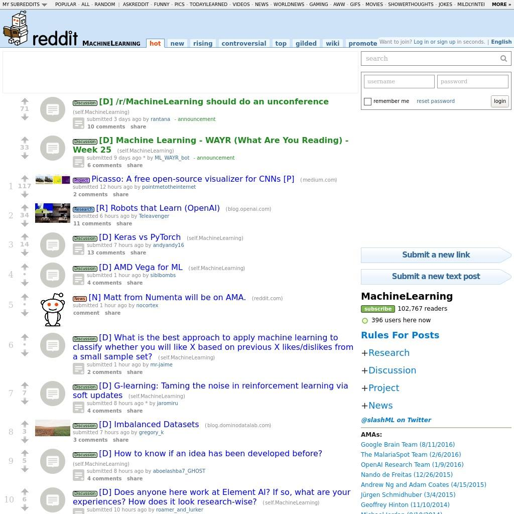
**이미지 캡션:** 이 이미지는 인기 있는 온라인 커뮤니티인 레딧의 머신러닝 서브레딧 페이지를 보여줍니다. 페이지 상단에는 레딧 로고와 함께 "MACHINE LEARNING"이라는 제목이 있고, 그 아래에는 "hot", "new", "rising", "controversial", "top", "gilded", "wiki"와 같은 다양한 정렬 옵션이 있습니다. 오른쪽 상단에는 로그인 및 회원가입을 위한 입력 필드와 버튼이 있습니다. 페이지의 주요 내용은 머신러닝 관련 게시물 목록으로, 각 게시물은 제목, 작성자, 제출 시간, 댓글 수 등의 정보를 포함하고 있습니다. 게시물들은 "Discussion", "Project", "Research", "News"와 같은 태그로 분류되어 있습니다. 예를 들어, 첫 번째 게시물은 "/r/MachineLearning should do an unconference"라는 제목의 토론이며, 3일 전에 제출되었고 10개의 댓글이 있습니다. 다른 게시물로는 "Machine Learning - WAYR (What Are You Reading) - Week 25", "Picasso: A free open-source visualizer for CNNs", "Robots that Learn (OpenAI)", "Keras vs PyTorch", "AMD Vega for ML", "Matt from Numenta will be on AMA" 등이 있습니다. 페이지 오른쪽에는 "Submit a new link" 및 "Submit a new text post" 버튼과 함께 "Machine Learning" 서브레딧의 구독자 수(102,767명)와 현재 접속자 수(396명)가 표시되어 있습니다. 또한, 게시물 규칙과 "AMA" 목록도 볼 수 있습니다. 전반적으로 이 페이지는 머신러닝에 관심 있는 사용자들이 최신 정보와 토론에 참여할 수 있는 플랫폼을 제공합니다.

> #오늘의레딧 https://www.reddit.com/r/MachineLearning/ 재미난 이야기들이 많습니다  1. 배우는 로봇 (OpenAI) 2. PyTorch 대 하드 3. ML 용 AMD Vega 4. Numenta의 매트는 AMA에 올거야. 5. 작은 샘플 세트의 이전 X X 선호도 / 싫어요를 기반으로 X를 선호할지 여부를 분류하기 위해 기계 학습을 적용하는 가장 좋은 방법은 무엇입니까? 6. G-learning : 소프트 업데이트를 통한 강화 학습에서의 잡음 방지 7. 불균형 데이터 세트 8. 전에 아이디어가 개발되었는지 어떻게 알 수 있습니까? 9. 누구나 엘리먼트 AI에서 일해? 그렇다면 귀하의 경험은 무엇입니까? 그것은 어떻게 연구에 현명 해 보입니까? 10. org.ideal.theory.wwidew.net 11. Roboschool 12. 기계 학습에 대한 기본적인 소개와 그라데이션 강하 사용. 13. 분류를 위해 여러 GMM을 통합하는 올바른 방법? 14. Feynman 기계의 지수 기억 15. Self-supervised Prediction에 의한 호기심에 기반한 탐험 16. Siamese LSTM의 그래디언트 언더 플로와 대조적 인 손실 17. 내 중고품 가게에서 싸구려 오래된 PC를 잔뜩. 몇 대의 PC를 통해 병렬 컴퓨팅을 통해 NN 교육을 실제로 빠르게하는 방법으로 이들을 조율 할 수있는 방법이 있습니까? 18. TensorFlow의 Alexnet 하이퍼 매개 변수 19. 너 그렇게 말했어? 오디오에서 말하는 얼굴의 비디오 합성 20. Anuj 굽타 | 지속적인 학습 시스템 구축  1. https://blog.openai.com/robots-that-learn/ 2. https://www.reddit.com/r/MachineLearning/comments/6bicfo/d_keras_vs_pytorch/ 3. https://www.reddit.com/r/MachineLearning/comments/6bkot6/d_amd_vega_for_ml/ 4. https://www.reddit.comhttps://www.reddit.com/r/artificial/comments/6beeqj/5182017_1200_pm_pst_iama_with_matt_taylor_numenta/ 5. https://www.reddit.com/r/MachineLearning/comments/6bkj8b/d_what_is_the_best_approach_to_apply_machine/ 6. https://www.reddit.com/r/MachineLearning/comments/6bi6np/d_glearning_taming_the_noise_in_reinforcement/ 7. https://blog.dominodatalab.com/imbalanced-datasets/ 8. https://www.reddit.com/r/MachineLearning/comments/6bhxnt/d_how_to_know_if_an_idea_has_been_developed_before/ 9. https://www.reddit.com/r/MachineLearning/comments/6bhjy6/d_does_anyone_here_work_at_element_ai_if_so_what/ 10. http://install.run.time.wwidew.net 11. https://blog.openai.com/roboschool/ 12. https://medium.com/onfido-tech/machine-learning-101-be2e0a86c96a 13. https://www.reddit.com/r/MachineLearning/comments/6bfzeh/r_correct_way_to_integrate_multiple_gmms_for/ 14. https://www.youtube.com/attribution_link?a=wHLkmg3r3rY&u=%2Fwatch%3Fv%3Dro60-1gT5BM%26feature%3Dshare 15. https://pathak22.github.io/noreward-rl/resources/icml17.pdf 16. https://www.reddit.com/r/MachineLearning/comments/6bfydi/d_contrastive_loss_with_siamese_lstms_gradient/ 17. https://www.reddit.com/r/MachineLearning/comments/6bh9du/d_a_bunch_of_cheap_old_pcs_at_my_thrift_store_is/ 18. https://www.reddit.com/r/MachineLearning/comments/6bg5lz/d_alexnet_hyper_parameters_in_tensorflow/ 19. https://arxiv.org/abs/1705.02966 20. https://www.youtube.com/watch?v=VtBvmrmMJaI&index=27&list=PLGVZCDnMOq0qLoYpkeySVtfdbQg1A_GiB

### 5월 18일 (목) 08:52 · 📷 사진 (1장)

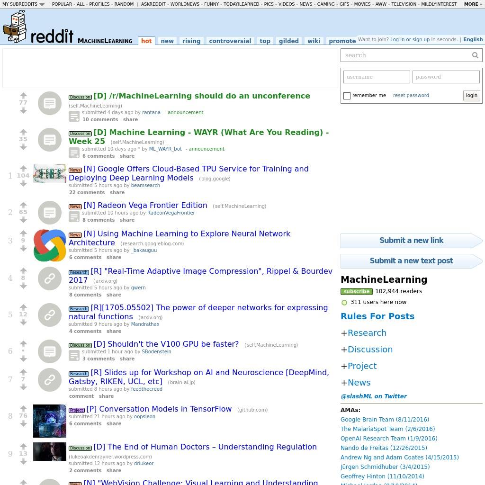
**이미지 캡션:** 이 이미지는 웹사이트 레딧의 머신러닝 서브레딧 페이지를 보여줍니다. 페이지 상단에는 레딧 로고와 함께 "MACHINE LEARNING"이라는 제목이 있고, 그 옆에는 "hot", "new", "rising", "controversial", "top", "gilded", "wiki"와 같은 다양한 탭이 있습니다. 오른쪽 상단에는 로그인 또는 회원가입을 할 수 있는 입력 필드와 버튼이 있습니다. 페이지 중앙에는 다양한 게시물 목록이 표시되며, 각 게시물은 제목, 작성자, 제출 시간, 댓글 수, 공유 수 등의 정보를 포함하고 있습니다. 게시물들은 "Discussion", "News", "Research", "Project"와 같은 카테고리로 분류되어 있습니다. 예를 들어, 첫 번째 게시물은 "[D] /r/Machine Learning should do an unconference"라는 제목의 토론 게시물이며, 4일 전에 제출되었고 10개의 댓글이 있습니다. 다른 게시물로는 "[N] Google Offers Cloud-Based TPU Service for Training and Deploying Deep Learning Models"라는 제목의 뉴스 게시물과 "[R] "Real-Time Adaptive Image Compression", Rippel & Bourdev 2017"라는 제목의 연구 게시물이 있습니다. 페이지 오른쪽에는 "Submit a new link" 및 "Submit a new text post" 버튼과 함께 "MachineLearning" 서브레딧의 구독자 수와 현재 접속자 수가 표시되어 있습니다. 또한, "Rules For Posts" 섹션에는 "+Research", "+Discussion", "+Project", "+News"와 같은 하위 메뉴가 있습니다. 하단에는 "AMAS" 섹션에 과거 AMA(Ask Me Anything) 세션 목록이 나열되어 있습니다. 전반적으로 이 페이지는 머신러닝 관련 정보를 공유하고 토론하는 온라인 커뮤니티의 모습을 보여줍니다.

> #오늘의레딧 https://www.reddit.com/r/MachineLearning/ 래딧은 읽을 거리가 다양합니다.  1. Google, 심층 학습 모델 교육 및 배포를위한 클라우드 기반 TPU 서비스 제공 2. 라데온 베가 프론티어 에디션 3. 신경망 아키텍처 탐구를위한 기계 학습 사용 4. "실시간 적응 형 이미지 압축", Rippel &amp; Bourdev 2017 5. V100 GPU가 더 빠르지 않아야합니까? 6. TensorFlow의 대화 모델 7. 인간 의사의 끝 - 규정 이해 8. "WebVision 챌린지 : 웹 데이터를 이용한 시각적 학습 및 이해", Li et al 2017 (2.4m 이미지, ImageNet에 대한 반 감독 적 후속 조치) 9. 기계 학습을 사용하여 새로운 멜로디 만들기 (블로그 게시물) 10. 배우는 로봇 (OpenAI) 11. ML 용 AMD Vega 12. C ++ 구현을위한 최고의 프레임 워크? 13. 기계 학습에 대한 기본적인 소개와 그라데이션 강하 사용. 14. PyTorch 대 하드 15. 통계 학습 요소에 관한 질문 16. 문학 CNN 분류 + 조건부 확률 17. Numenta의 매트는 AMA에 올거야. 18. 누구나 엘리먼트 AI에서 일해? 그렇다면 귀하의 경험은 무엇입니까? 그것은 어떻게 연구에 현명 해 보입니까? 19. 전에 아이디어가 개발되었는지 어떻게 알 수 있습니까? 20. 불균형 데이터 세트  1. https://blog.google/topics/google-cloud/google-cloud-offer-tpus-machine-learning/ 2. https://www.reddit.com/r/MachineLearning/comments/6boswp/n_radeon_vega_frontier_edition/ 3. https://research.googleblog.com/2017/05/using-machine-learning-to-explore.html 4. https://arxiv.org/abs/1705.05823 5. https://www.reddit.com/r/MachineLearning/comments/6bs0pw/d_shouldnt_the_v100_gpu_be_faster/ 6. https://github.com/mckinziebrandon/DeepChatModels 7. https://lukeoakdenrayner.wordpress.com/2017/05/17/the-end-of-human-doctors-understanding-regulation/ 8. https://arxiv.org/abs/1705.05640 9. http://brangerbriz.com/blog/using-machine-learning-to-create-new-melodies/ 10. https://blog.openai.com/robots-that-learn/ 11. https://www.reddit.com/r/MachineLearning/comments/6bkot6/d_amd_vega_for_ml/ 12. https://www.reddit.com/r/MachineLearning/comments/6bnmte/d_best_frameworks_for_c_implementations/ 13. https://medium.com/onfido-tech/machine-learning-101-be2e0a86c96a 14. https://www.reddit.com/r/MachineLearning/comments/6bicfo/d_keras_vs_pytorch/ 15. https://www.reddit.com/r/MachineLearning/comments/6bmt70/d_questions_on_elements_of_statistical_learning/ 16. https://www.reddit.com/r/MachineLearning/comments/6bnis0/d_literature_cnn_classification_conditional/ 17. https://www.reddit.comhttps://www.reddit.com/r/artificial/comments/6beeqj/5182017_1200_pm_pst_iama_with_matt_taylor_numenta/ 18. https://www.reddit.com/r/MachineLearning/comments/6bhjy6/d_does_anyone_here_work_at_element_ai_if_so_what/ 19. https://www.reddit.com/r/MachineLearning/comments/6bhxnt/d_how_to_know_if_an_idea_has_been_developed_before/ 20. https://blog.dominodatalab.com/imbalanced-datasets/

### 5월 19일 (금) 05:47 · It makes my day with Jeff Dean, Soonson …

📍 Shoreline Amphitheatre At Mountain View

It makes my day with Jeff Dean, Soonson Kwon, @Wolff Dobson, and @Zak Stone (Google Brain Team)!

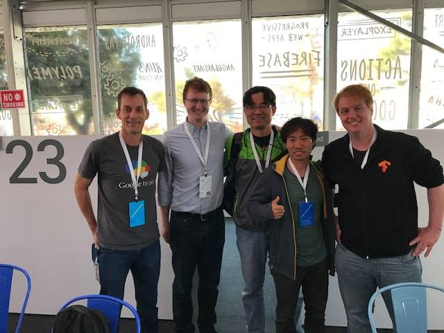
**이미지 캡션:** 다섯 명의 성인 남성이 나란히 서서 사진을 찍고 있다. 왼쪽에서 두 번째 남성은 회색 반팔 티셔츠를 입고 있으며, 티셔츠에는 "Google Brain"이라고 쓰여 있다. 그는 목에 파란색 목걸이와 함께 파란색 배지를 달고 있다. 그의 옆에 있는 남성은 파란색 셔츠를 입고 있으며, 목에 흰색 목걸이와 함께 흰색 배지를 달고 있다. 세 번째 남성은 녹색 재킷을 입고 있으며, 목에 흰색 목걸이와 함께 파란색 배지를 달고 있다. 그는 엄지손가락을 치켜세우고 있다. 네 번째 남성은 회색 재킷을 입고 있으며, 목에 흰색 목걸이와 함께 파란색 배지를 달고 있다. 가장 오른쪽에 있는 남성은 검은색 후드티를 입고 있으며, 후드티에는 주황색 로고가 있다. 그는 목에 흰색 목걸이와 함께 흰색 배지를 달고 있다. 배경에는 창문이 있고, 창문에는 "ANDROID", "FIREBASE", "EXOPLAYER"와 같은 텍스트가 거꾸로 쓰여 있다. 또한 "23"이라는 큰 숫자가 벽에 쓰여 있다. 전반적으로 사진은 컨퍼런스나 기술 행사에서 찍은 것으로 보이며, 참가자들이 즐겁게 포즈를 취하고 있다.

### 5월 19일 (금) 08:52 · 📷 사진 (1장)

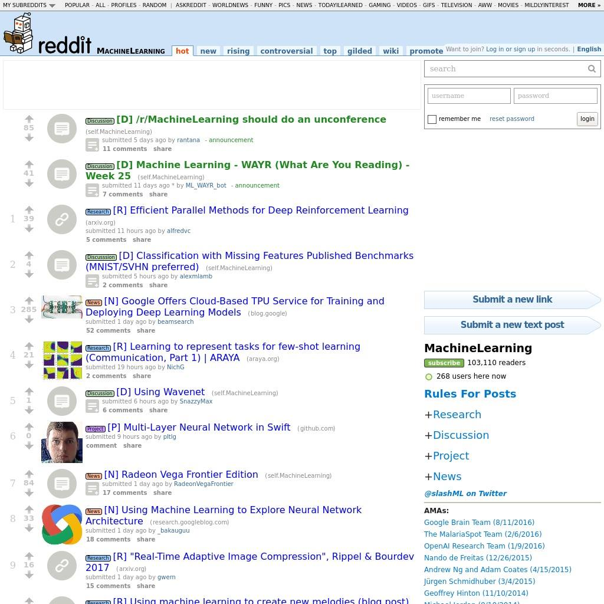
**이미지 캡션:** 이 이미지는 인기 있는 온라인 커뮤니티인 레딧의 머신러닝 서브레딧 페이지를 보여줍니다. 페이지 상단에는 레딧 로고와 함께 "MACHINE LEARNING"이라는 제목이 있고, 그 아래에는 "hot", "new", "rising", "controversial", "top", "gilded", "wiki"와 같은 다양한 정렬 옵션이 있습니다. 오른쪽 상단에는 로그인 또는 회원가입을 위한 입력란과 버튼이 있습니다. 페이지의 주요 내용은 머신러닝 관련 게시물 목록으로, 각 게시물은 제목, 작성자, 제출 시간, 댓글 수, 공유 수 등의 정보를 포함하고 있습니다. 게시물 제목 앞에는 "Discussion", "Research", "News", "Project"와 같은 태그가 붙어 있어 게시물의 성격을 나타냅니다. 예를 들어, "Discussion [D] /r/Machine Learning should do an unconference"는 토론 게시물이고, "Research [R] Efficient Parallel Methods for Deep Reinforcement Learning"은 연구 게시물입니다. 또한, 일부 게시물에는 관련 이미지나 링크가 첨부되어 있습니다. 페이지 오른쪽에는 "Submit a new link" 및 "Submit a new text post" 버튼과 함께 "MachineLearning" 서브레딧의 구독자 수와 현재 접속자 수가 표시되어 있습니다. 그 아래에는 "Rules For Posts" 섹션이 있으며, "Research", "Discussion", "Project", "News"와 같은 하위 섹션이 나열되어 있습니다. 가장 아래에는 "@slashML on Twitter" 링크와 "AMAS" 섹션이 있어, 머신러닝 분야의 저명한 인물들의 이름과 해당 AMA(Ask Me Anything)가 진행된 날짜가 나열되어 있습니다. 전반적으로 이 페이지는 머신러닝 커뮤니티의 최신 정보와 토론을 공유하는 플랫폼의 모습을 보여줍니다.

> #오늘의레딧 https://www.reddit.com/r/MachineLearning/ 래딧은 읽을 거리가 다양합니다.  1. 심층 강화 학습을위한 효율적인 병렬 방법 2. Google, 심층 학습 모델 교육 및 배포를위한 클라우드 기반 TPU 서비스 제공 3. 소수의 학습을위한 과제를 나타내는 학습 (의사 소통, 1 부) | 아라야 4. Wavenet 사용하기 5. 스위프트의 다층 신경망 6. 라데온 베가 프론티어 에디션 7. 신경망 아키텍처 탐구를위한 기계 학습 사용 8. "실시간 적응 형 이미지 압축", Rippel &amp; Bourdev 2017 9. 기계 학습을 사용하여 새로운 멜로디 만들기 (블로그 게시물) 10. V100 GPU가 더 빠르지 않아야합니까? 11. "WebVision 챌린지 : 웹 데이터를 이용한 시각적 학습 및 이해", Li et al 2017 (2.4m 이미지, ImageNet에 대한 반 감독 적 후속 조치) 12. 인간 의사의 끝 - 규정 이해 13. TensorFlow의 대화 모델 14. 배우는 로봇 (OpenAI) 15. ML 용 AMD Vega 16. 기계 학습에 대한 기본적인 소개와 그라데이션 강하 사용. 17. C ++ 구현을위한 최고의 프레임 워크? 18. 통계 학습 요소에 관한 질문 19. PyTorch 대 하드 20. 문학 CNN 분류 + 조건부 확률  1. https://arxiv.org/abs/1705.04862v2 2. https://blog.google/topics/google-cloud/google-cloud-offer-tpus-machine-learning/ 3. http://www.araya.org/archives/1971 4. https://www.reddit.com/r/MachineLearning/comments/6bxt80/d_using_wavenet/ 5. https://github.com/pltlg/FCMNN 6. https://www.reddit.com/r/MachineLearning/comments/6boswp/n_radeon_vega_frontier_edition/ 7. https://research.googleblog.com/2017/05/using-machine-learning-to-explore.html 8. https://arxiv.org/abs/1705.05823 9. http://brangerbriz.com/blog/using-machine-learning-to-create-new-melodies/ 10. https://www.reddit.com/r/MachineLearning/comments/6bs0pw/d_shouldnt_the_v100_gpu_be_faster/ 11. https://arxiv.org/abs/1705.05640 12. https://lukeoakdenrayner.wordpress.com/2017/05/17/the-end-of-human-doctors-understanding-regulation/ 13. https://github.com/mckinziebrandon/DeepChatModels 14. https://blog.openai.com/robots-that-learn/ 15. https://www.reddit.com/r/MachineLearning/comments/6bkot6/d_amd_vega_for_ml/ 16. https://medium.com/onfido-tech/machine-learning-101-be2e0a86c96a 17. https://www.reddit.com/r/MachineLearning/comments/6bnmte/d_best_frameworks_for_c_implementations/ 18. https://www.reddit.com/r/MachineLearning/comments/6bmt70/d_questions_on_elements_of_statistical_learning/ 19. https://www.reddit.com/r/MachineLearning/comments/6bicfo/d_keras_vs_pytorch/ 20. https://www.reddit.com/r/MachineLearning/comments/6bnis0/d_literature_cnn_classification_conditional/

### 5월 20일 (토) 08:52 · 📷 사진 (1장)

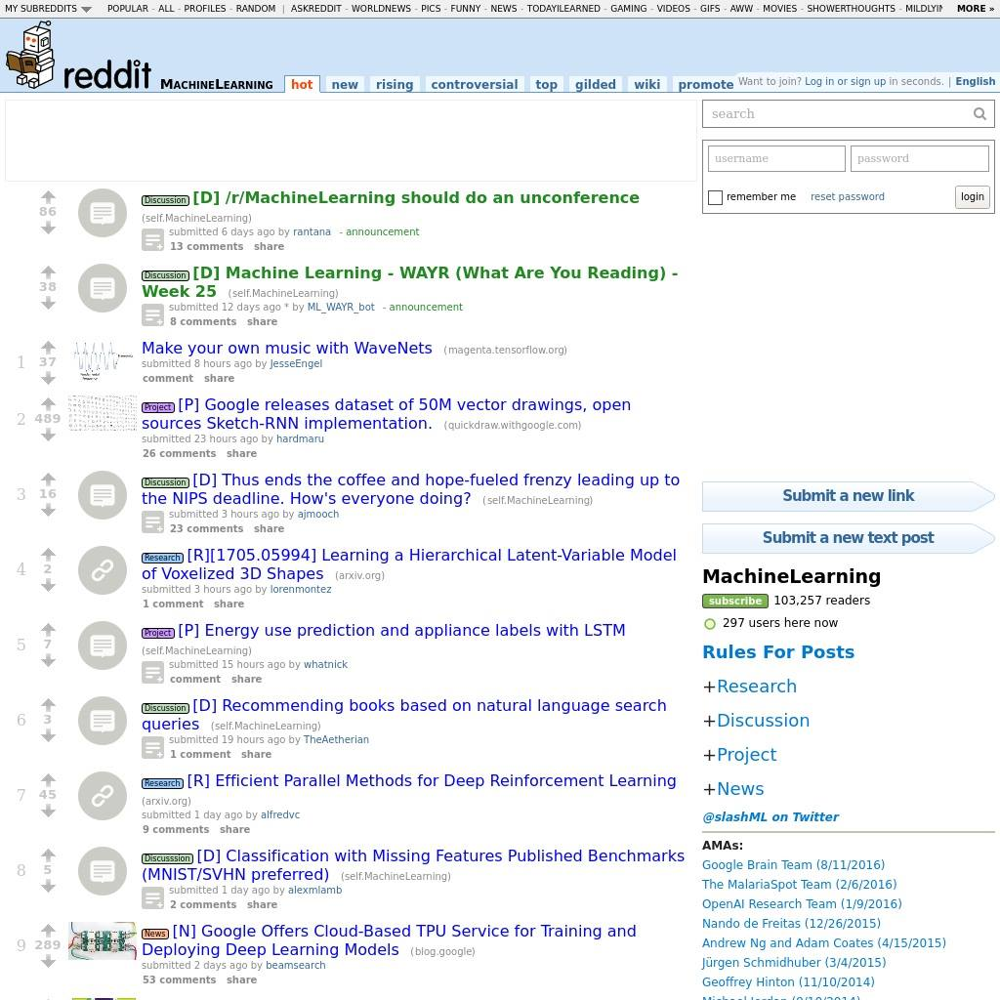
**이미지 캡션:** 이 이미지는 인기 있는 온라인 커뮤니티인 레딧의 머신러닝 서브레딧 페이지를 보여줍니다. 페이지 상단에는 레딧 로고와 함께 "MACHINE LEARNING"이라는 제목이 있고, 그 옆에는 "hot", "new", "rising", "controversial", "top", "gilded", "wiki", "promote"와 같은 다양한 탭이 있습니다. 오른쪽 상단에는 로그인 또는 회원가입을 할 수 있는 섹션이 있으며, 검색창도 보입니다. 페이지의 주요 부분은 머신러닝 관련 게시물 목록으로 구성되어 있으며, 각 게시물은 제목, 작성자, 제출 시간, 댓글 수, 공유 수 등의 정보를 포함합니다. 게시물들은 "Discussion", "Project", "Research", "News"와 같은 카테고리로 분류되어 있습니다. 예를 들어, 첫 번째 게시물은 "Discussion" 카테고리에 속하며 "r/Machine Learning should do an unconference"라는 제목을 가지고 있습니다. 다른 게시물로는 "Make your own music with WaveNets", "Google releases dataset of 50M vector drawings, open sources Sketch-RNN implementation", "Energy use prediction and appliance labels with LSTM", "Google Offers Cloud-Based TPU Service for Training and Deploying Deep Learning Models" 등이 있습니다. 페이지 오른쪽 사이드바에는 "Submit a new link", "Submit a new text post" 버튼과 함께 서브레딧의 구독자 수, 현재 접속자 수, 게시 규칙, 트위터 계정, 그리고 과거 AMA(Ask Me Anything) 목록이 표시되어 있습니다. 전반적으로 이 페이지는 머신러닝 분야의 최신 정보와 토론을 공유하는 커뮤니티의 모습을 보여줍니다.

> #오늘의레딧 https://www.reddit.com/r/MachineLearning/ 아침부터 다양한 소식이 많네요.  1. Google은 50M 벡터 드로잉, 오픈 소스 Sketch-RNN 구현의 데이터 세트를 출시합니다. 2. 따라서 NIPS 마감일까지 이어진 커피와 희망찬 열풍이 끝납니다. 모두는 어때? 3. LSTM을 사용한 에너지 사용 예측 및 기기 라벨 4. 자연어 검색 쿼리를 기반으로 한 서적 추천 5. 심층 강화 학습을위한 효율적인 병렬 방법 6. Google, 심층 학습 모델 교육 및 배포를위한 클라우드 기반 TPU 서비스 제공 7. 소수의 학습을위한 과제를 나타내는 학습 (의사 소통, 1 부) | 아라야 8. Wavenet 사용하기 9. 신경망 아키텍처 탐구를위한 기계 학습 사용 10. 라데온 베가 프론티어 에디션 11. "실시간 적응 형 이미지 압축", Rippel &amp; Bourdev 2017 12. 기계 학습을 사용하여 새로운 멜로디 만들기 (블로그 게시물) 13. 스위프트의 다층 신경망 14. V100 GPU가 더 빠르지 않아야합니까? 15. "WebVision 챌린지 : 웹 데이터를 이용한 시각적 학습 및 이해", Li et al 2017 (2.4m 이미지, ImageNet에 대한 반 감독 적 후속 조치) 16. 인간 의사의 끝 - 규정 이해 17. TensorFlow의 대화 모델 18. C ++ 구현을위한 최고의 프레임 워크? 19. 배우는 로봇 (OpenAI)  1. https://quickdraw.withgoogle.com/data 2. https://www.reddit.com/r/MachineLearning/comments/6c62d2/d_thus_ends_the_coffee_and_hopefueled_frenzy/ 3. https://www.reddit.com/r/MachineLearning/comments/6c2fkz/p_energy_use_prediction_and_appliance_labels_with/ 4. https://www.reddit.com/r/MachineLearning/comments/6c1ey5/d_recommending_books_based_on_natural_language/ 5. https://arxiv.org/abs/1705.04862v2 6. https://blog.google/topics/google-cloud/google-cloud-offer-tpus-machine-learning/ 7. http://www.araya.org/archives/1971 8. https://www.reddit.com/r/MachineLearning/comments/6bxt80/d_using_wavenet/ 9. https://research.googleblog.com/2017/05/using-machine-learning-to-explore.html 10. https://www.reddit.com/r/MachineLearning/comments/6boswp/n_radeon_vega_frontier_edition/ 11. https://arxiv.org/abs/1705.05823 12. http://brangerbriz.com/blog/using-machine-learning-to-create-new-melodies/ 13. https://github.com/pltlg/FCMNN 14. https://www.reddit.com/r/MachineLearning/comments/6bs0pw/d_shouldnt_the_v100_gpu_be_faster/ 15. https://arxiv.org/abs/1705.05640 16. https://lukeoakdenrayner.wordpress.com/2017/05/17/the-end-of-human-doctors-understanding-regulation/ 17. https://github.com/mckinziebrandon/DeepChatModels 18. https://www.reddit.com/r/MachineLearning/comments/6bnmte/d_best_frameworks_for_c_implementations/ 19. https://blog.openai.com/robots-that-learn/

### 5월 21일 (일) 08:52 · 📷 사진 (1장)

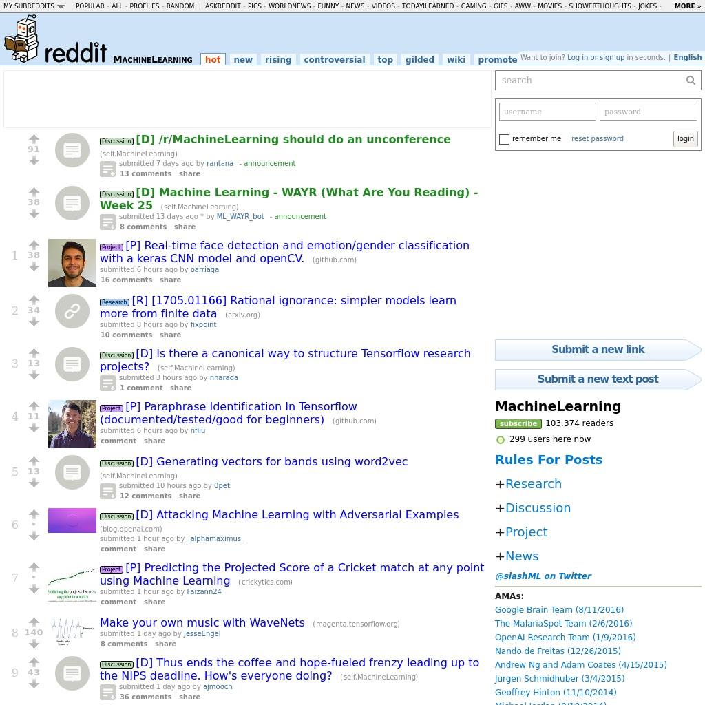
**이미지 캡션:** 화면은 레딧의 머신러닝 서브레딧 페이지로, 다양한 게시물 목록과 오른쪽 사이드바가 보인다. 게시물 목록에는 제목, 작성자, 시간, 댓글 수 등이 표시되어 있으며, 각 게시물은 토론, 프로젝트, 연구 등 다양한 카테고리로 분류되어 있다. 게시물 제목으로는 "[D] /r/MachineLearning should do an unconference", "[D] Machine Learning - WAYR (What Are You Reading) - Week 25", "[P] Real-time face detection and emotion/gender classification with a keras CNN model and openCV.", "[R] [1705.01166] Rational ignorance: simpler models learn more from finite data", "[D] Is there a canonical way to structure Tensorflow research projects?", "[P] Paraphrase Identification In Tensorflow (documented/tested/good for beginners)", "[D] Generating vectors for bands using word2vec", "[D] Attacking Machine Learning with Adversarial Examples", "[P] Predicting the Projected Score of a Cricket match at any point using Machine Learning", "Make your own music with WaveNets", "[D] Thus ends the coffee and hope-fueled frenzy leading up to the NIPS deadline. How's everyone doing?" 등이 보인다. 게시물 작성자로는 rantana, ML_WAYR_bot, oarriaga, fixpoint, nharada, nfliu, Opet, _alphamaximus_, Faizann24, JesseEngel, ajmooch 등이 있으며, 각 게시물은 몇 시간 전, 며칠 전, 1시간 전, 1일 전 등에 작성되었다. 댓글 수는 1개부터 36개까지 다양하다. 오른쪽 사이드바에는 "Submit a new link", "Submit a new text post" 버튼과 함께 "Machine Learning" 서브레딧 정보가 표시되어 있으며, 구독자 수는 103,374명이고 현재 접속자 수는 299명이다. 또한 "Rules For Posts" 섹션에는 "+Research", "+Discussion", "+Project", "+News" 등의 메뉴가 있으며, "@slashML on Twitter" 링크도 보인다. 하단에는 "AMAS" 섹션에 다양한 연구팀 및 인물들의 이름과 날짜가 나열되어 있다. 전반적으로 기술 관련 커뮤니티의 활발한 정보 교류가 이루어지고 있는 분위기이다.

> #오늘의레딧 https://www.reddit.com/r/MachineLearning/ 래딧은 읽을 거리가 다양합니다.  1. keras CNN 모델 및 openCV로 실시간 얼굴 탐지 및 감정 / 성별 분류. 2. Tensorflow 연구 프로젝트를 구조화 할 표준 방법이 있습니까? 3. 의역 문구 식별 Tensorflow (문서화 / 테스트 / 초보자 용) 4. word2vec를 사용하여 밴드 용 벡터 생성 5. 적대적인 사례를 이용한 공격 기계 학습 6. 기계 학습을 사용하여 어느 시점에서든 크리켓 경기의 예상 점수 예측 7. 따라서 NIPS 마감일까지 이어진 커피와 희망찬 열풍이 끝납니다. 모두는 어때? 8. Google은 50M 벡터 드로잉, 오픈 소스 Sketch-RNN 구현의 데이터 세트를 출시합니다. 9. LSTM을 사용한 에너지 사용 예측 및 기기 라벨 10. 자연어 검색 쿼리를 기반으로 한 서적 추천 11. 심층 강화 학습을위한 효율적인 병렬 방법 12. Google, 심층 학습 모델 교육 및 배포를위한 클라우드 기반 TPU 서비스 제공 13. 소수의 학습을위한 과제를 나타내는 학습 (의사 소통, 1 부) | 아라야 14. Wavenet 사용하기 15. 신경망 아키텍처 탐구를위한 기계 학습 사용 16. 라데온 베가 프론티어 에디션 17. 기계 학습을 사용하여 새로운 멜로디 만들기 (블로그 게시물) 18. 스위프트의 다층 신경망 19. "실시간 적응 형 이미지 압축", Rippel &amp; Bourdev 2017 20. V100 GPU가 더 빠르지 않아야합니까?  1. https://github.com/oarriaga/face_classification 2. https://www.reddit.com/r/MachineLearning/comments/6ccmvj/d_is_there_a_canonical_way_to_structure/ 3. https://github.com/nelson-liu/paraphrase-id-tensorflow 4. https://www.reddit.com/r/MachineLearning/comments/6caa3l/d_generating_vectors_for_bands_using_word2vec/ 5. https://blog.openai.com/adversarial-example-research/ 6. https://crickytics.com/predicting-the-projected-score-of-a-match-using-machine-learning/ 7. https://www.reddit.com/r/MachineLearning/comments/6c62d2/d_thus_ends_the_coffee_and_hopefueled_frenzy/ 8. https://quickdraw.withgoogle.com/data 9. https://www.reddit.com/r/MachineLearning/comments/6c2fkz/p_energy_use_prediction_and_appliance_labels_with/ 10. https://www.reddit.com/r/MachineLearning/comments/6c1ey5/d_recommending_books_based_on_natural_language/ 11. https://arxiv.org/abs/1705.04862v2 12. https://blog.google/topics/google-cloud/google-cloud-offer-tpus-machine-learning/ 13. http://www.araya.org/archives/1971 14. https://www.reddit.com/r/MachineLearning/comments/6bxt80/d_using_wavenet/ 15. https://research.googleblog.com/2017/05/using-machine-learning-to-explore.html 16. https://www.reddit.com/r/MachineLearning/comments/6boswp/n_radeon_vega_frontier_edition/ 17. http://brangerbriz.com/blog/using-machine-learning-to-create-new-melodies/ 18. https://github.com/pltlg/FCMNN 19. https://arxiv.org/abs/1705.05823 20. https://www.reddit.com/r/MachineLearning/comments/6bs0pw/d_shouldnt_the_v100_gpu_be_faster/

### 5월 22일 (월) 08:52 · 📷 사진 (1장)

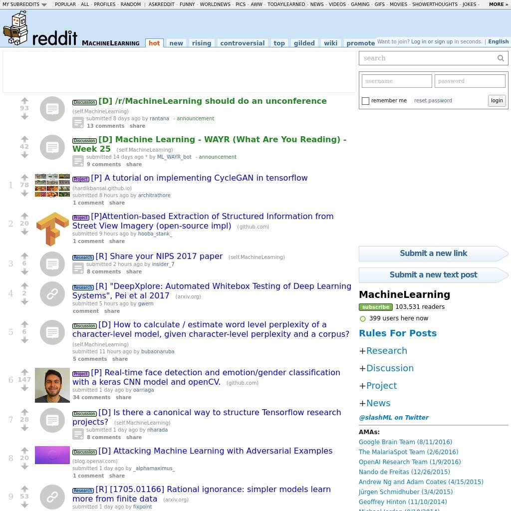
**이미지 캡션:** 이 이미지는 레딧의 머신러닝 서브레딧 페이지를 보여주며, 다양한 게시물과 관련 정보가 나열되어 있습니다. 페이지 상단에는 레딧 로고와 함께 "MACHINE LEARNING"이라는 제목이 보이고, 그 아래에는 "hot", "new", "rising", "controversial", "top", "gilded", "wiki", "promote"와 같은 탭들이 있습니다. 오른쪽 상단에는 로그인 또는 회원가입을 할 수 있는 입력란과 버튼이 있습니다. 페이지 중앙에는 여러 게시물들이 목록 형태로 나타나는데, 각 게시물은 제목, 작성자, 제출 시간, 댓글 수, 공유 수 등의 정보를 포함하고 있습니다. 게시물 제목들은 주로 머신러닝 관련 연구, 튜토리얼, 토론 주제 등을 다루고 있으며, "[D]"는 토론, "[P]"는 프로젝트, "[R]"은 연구를 나타내는 것으로 보입니다. 게시물 목록 아래에는 "Submit a new link"와 "Submit a new text post" 버튼이 있고, 오른쪽 사이드바에는 "MachineLearning" 서브레딧의 구독자 수, 현재 접속자 수, 규칙, 관련 링크, 트위터 계정, 그리고 "AMAS" 섹션에 머신러닝 분야의 유명 인사들의 이름과 날짜가 나열되어 있습니다. 전반적으로 기술 관련 커뮤니티의 정보 공유 및 토론이 이루어지는 온라인 포럼의 모습을 보여줍니다.

> #오늘의레딧 https://www.reddit.com/r/MachineLearning/ 래딧은 읽을 거리가 다양합니다.  1. CycleGAN을 텐서 플로우로 구현하는 방법에 대한 자습서 2. 스트리트 뷰 이미지에서주의를 기반으로 구조화 된 정보 추출 (오픈 소스 impl) 3. NIPS 2017 논문 공유 4. "DeepXplore : 딥 학습 시스템의 자동화 된 화이트 박스 테스트", Pei et al 2017 5. 문자 수준의 복잡성과 코퍼스가 주어지면 문자 수준 모델의 단어 수준 난이도를 계산 / 추정하는 방법? 6. keras CNN 모델 및 openCV로 실시간 얼굴 탐지 및 감정 / 성별 분류. 7. Tensorflow 연구 프로젝트를 구조화 할 표준 방법이 있습니까? 8. 적대적인 사례를 이용한 공격 기계 학습 9. 의역 문구 식별 Tensorflow (문서화 / 테스트 / 초보자 용) 10. 기계 학습을 사용하여 어느 시점에서든 크리켓 경기의 예상 점수 예측 11. word2vec를 사용하여 밴드 용 벡터 생성 12. 따라서 NIPS 마감일까지 이어진 커피와 희망찬 열풍이 끝납니다. 모두는 어때? 13. Google은 50M 벡터 드로잉, 오픈 소스 Sketch-RNN 구현의 데이터 세트를 출시합니다. 14. LSTM을 사용한 에너지 사용 예측 및 기기 라벨 15. 자연어 검색 쿼리를 기반으로 한 서적 추천 16. 심층 강화 학습을위한 효율적인 병렬 방법 17. Google, 심층 학습 모델 교육 및 배포를위한 클라우드 기반 TPU 서비스 제공 18. 소수의 학습을위한 과제를 나타내는 학습 (의사 소통, 1 부) | 아라야 19. Wavenet 사용하기 20. 신경망 아키텍처 탐구를위한 기계 학습 사용  1. https://hardikbansal.github.io/CycleGANBlog/ 2. https://github.com/tensorflow/models/tree/master/attention_ocr 3. https://www.reddit.com/r/MachineLearning/comments/6cixw9/r_share_your_nips_2017_paper/ 4. https://arxiv.org/abs/1705.06640 5. https://www.reddit.com/r/MachineLearning/comments/6cg5q1/d_how_to_calculate_estimate_word_level_perplexity/ 6. https://github.com/oarriaga/face_classification 7. https://www.reddit.com/r/MachineLearning/comments/6ccmvj/d_is_there_a_canonical_way_to_structure/ 8. https://blog.openai.com/adversarial-example-research/ 9. https://github.com/nelson-liu/paraphrase-id-tensorflow 10. https://crickytics.com/predicting-the-projected-score-of-a-match-using-machine-learning/ 11. https://www.reddit.com/r/MachineLearning/comments/6caa3l/d_generating_vectors_for_bands_using_word2vec/ 12. https://www.reddit.com/r/MachineLearning/comments/6c62d2/d_thus_ends_the_coffee_and_hopefueled_frenzy/ 13. https://quickdraw.withgoogle.com/data 14. https://www.reddit.com/r/MachineLearning/comments/6c2fkz/p_energy_use_prediction_and_appliance_labels_with/ 15. https://www.reddit.com/r/MachineLearning/comments/6c1ey5/d_recommending_books_based_on_natural_language/ 16. https://arxiv.org/abs/1705.04862v2 17. https://blog.google/topics/google-cloud/google-cloud-offer-tpus-machine-learning/ 18. http://www.araya.org/archives/1971 19. https://www.reddit.com/r/MachineLearning/comments/6bxt80/d_using_wavenet/ 20. https://research.googleblog.com/2017/05/using-machine-learning-to-explore.html

### 5월 23일 (화) 08:52 · 📷 사진 (1장)

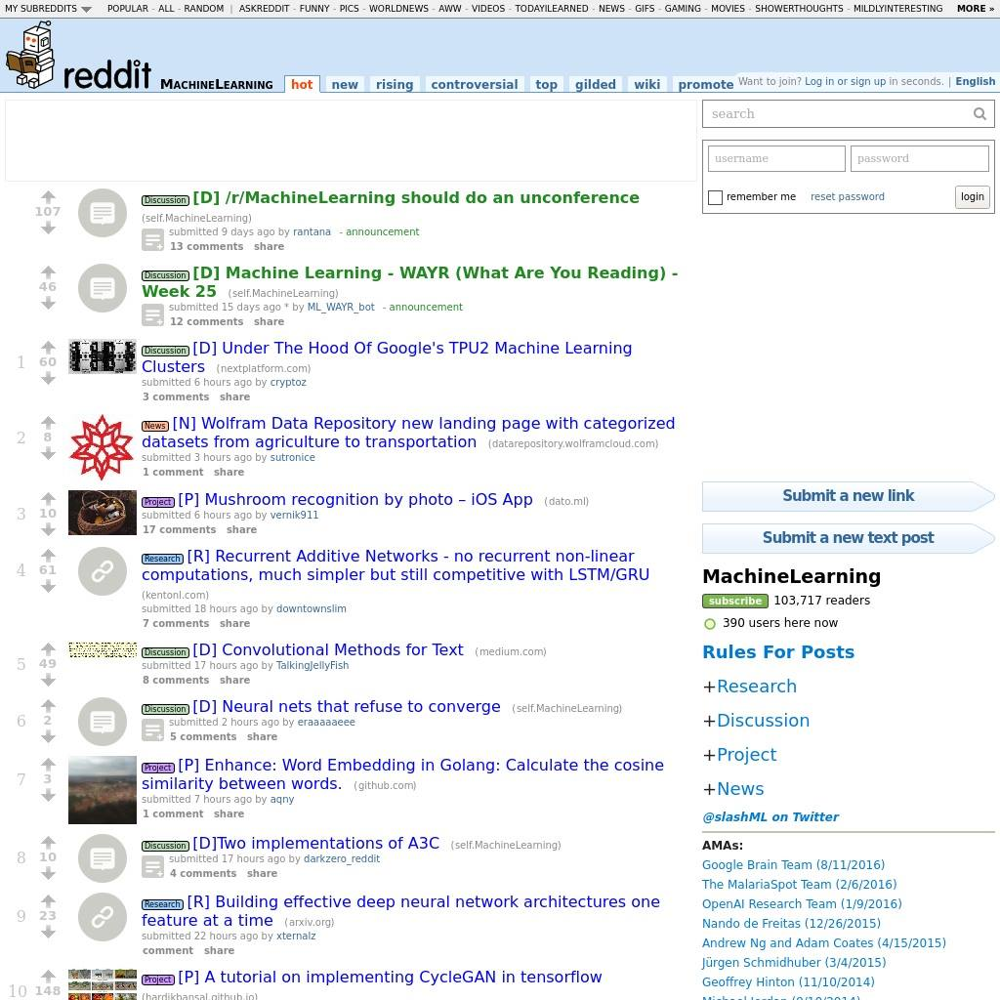
**이미지 캡션:** 이 이미지는 웹사이트 레딧의 머신러닝 서브레딧 페이지를 보여줍니다. 페이지 상단에는 레딧 로고와 함께 "MACHINE LEARNING"이라는 제목이 있고, 그 옆에는 "hot", "new", "rising", "controversial", "top", "gilded", "wiki", "promote"와 같은 탭들이 있습니다. 오른쪽 상단에는 로그인 폼이 있으며, 사용자 이름과 비밀번호를 입력하고 로그인할 수 있는 필드가 있습니다. 페이지 중앙에는 머신러닝 관련 게시물 목록이 표시됩니다. 각 게시물은 제목, 작성자, 제출 시간, 댓글 수, 공유 횟수 등의 정보를 포함하고 있습니다. 게시물 제목 앞에는 "[D]" (Discussion), "[N]" (News), "[P]" (Project), "[R]" (Research)와 같은 태그가 붙어 있어 게시물의 종류를 나타냅니다. 예를 들어, 첫 번째 게시물은 "[D] /r/Machine Learning should do an unconference"라는 제목으로, 머신러닝 커뮤니티에서 오프라인 행사를 개최하는 것에 대한 토론을 제안하는 내용입니다. 다른 게시물들은 머신러닝 관련 논문, 프로젝트, 뉴스 등을 다루고 있습니다. 페이지 오른쪽에는 "Submit a new link"와 "Submit a new text post" 버튼이 있으며, "MachineLearning" 서브레딧의 구독자 수와 현재 접속자 수가 표시됩니다. 또한, "Rules For Posts" 섹션에는 "Research", "Discussion", "Project", "News"와 같은 카테고리가 나열되어 있습니다. 하단에는 "AMAS" 섹션이 있어 과거에 진행되었던 AMA(Ask Me Anything) 세션 목록과 참여자들의 이름 및 날짜가 표시되어 있습니다. 전반적으로 이 페이지는 머신러닝 분야의 최신 정보와 토론을 공유하는 온라인 커뮤니티의 모습을 보여줍니다.

> #오늘의레딧 https://www.reddit.com/r/MachineLearning/ 아침부터 다양한 소식이 많네요.  1. Google &#39;의 TPU2 기계 학습 클러스터의 두뇌 아래 2. Wolfram Data Repository 농업에서 운송에 이르기까지 카테고리 화 된 데이터 세트가 포함 된 새로운 방문 페이지 3. 사진으로 버섯 인식 - iOS 앱 4. 반복적 인 부가 네트워크 - 반복적 인 비선형 계산이 필요하지 않으며 훨씬 간단하지만 LSTM / GRU와 여전히 경쟁적입니다. 5. 텍스트의 길쌈 방법 6. 수렴을 거부하는 신경망 7. Enhance : Golang에 단어 임베딩 : 단어 사이의 코사인 유사성을 계산합니다. 8. A3C의 두 가지 구현 9. 효과적인 심 신경 네트워크 아키텍처 구축 10. CycleGAN을 텐서 플로우로 구현하는 방법에 대한 자습서 11. 하드웨어에서의 뉴로 morphic 컴퓨팅 및 신경망에 대한 조사 12. pretrained fairseq 번역 모델 찾기 13. NIPS 2017 논문 공유 14. 스트리트 뷰 이미지에서주의를 기반으로 구조화 된 정보 추출 (오픈 소스 impl) 15. "DeepXplore : 딥 학습 시스템의 자동화 된 화이트 박스 테스트", Pei et al 2017 16. 문자 수준의 복잡성과 코퍼스가 주어지면 문자 수준 모델의 단어 수준 난이도를 계산 / 추정하는 방법? 17. keras CNN 모델 및 openCV로 실시간 얼굴 탐지 및 감정 / 성별 분류. 18. 딥 뉴런 네트워크와 우주의 본질 사이의 특별 링크 19. Tensorflow 연구 프로젝트를 구조화 할 표준 방법이 있습니까? 20. 적대적인 사례를 이용한 공격 기계 학습  1. https://www.nextplatform.com/2017/05/22/hood-googles-tpu2-machine-learning-clusters/ 2. https://datarepository.wolframcloud.com/ 3. https://dato.ml/mushrooms-great-encyclopedia-of-fungi/ 4. http://www.kentonl.com/pub/llz.2017.pdf 5. https://medium.com/@TalPerry/convolutional-methods-for-text-d5260fd5675f 6. https://www.reddit.com/r/MachineLearning/comments/6cqcda/d_neural_nets_that_refuse_to_converge/ 7. https://github.com/ynqa/word-embedding/tree/master/similarity 8. https://www.reddit.com/r/MachineLearning/comments/6clo33/dtwo_implementations_of_a3c/ 9. https://arxiv.org/abs/1705.06778 10. https://hardikbansal.github.io/CycleGANBlog/ 11. http://arxiv.org/abs/1705.06963 12. https://www.reddit.com/r/MachineLearning/comments/6clt82/d_looking_for_pretrained_fairseq_translation/ 13. https://www.reddit.com/r/MachineLearning/comments/6cixw9/r_share_your_nips_2017_paper/ 14. https://github.com/tensorflow/models/tree/master/attention_ocr 15. https://arxiv.org/abs/1705.06640 16. https://www.reddit.com/r/MachineLearning/comments/6cg5q1/d_how_to_calculate_estimate_word_level_perplexity/ 17. https://github.com/oarriaga/face_classification 18. https://www-technologyreview-com.cdn.ampproject.org/c/s/www.technologyreview.com/s/602344/the-extraordinary-link-between-deep-neural-networks-and-the-nature-of-the-universe/amp/ 19. https://www.reddit.com/r/MachineLearning/comments/6ccmvj/d_is_there_a_canonical_way_to_structure/ 20. https://blog.openai.com/adversarial-example-research/

### 5월 24일 (수) 08:54 · 📷 사진 (2장)

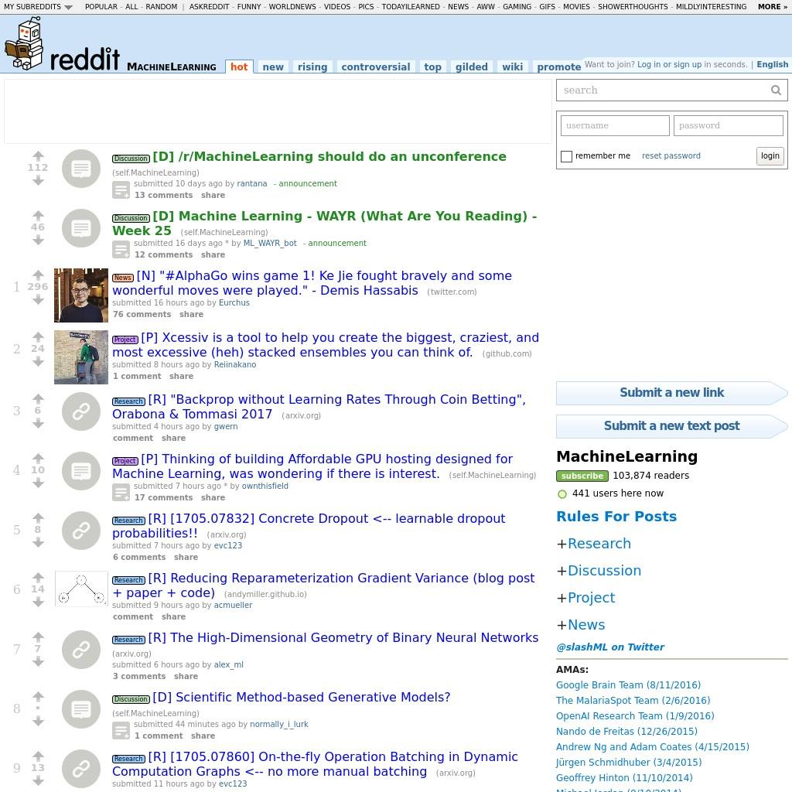
**이미지 캡션:** 이 이미지는 레딧의 머신러닝 서브레딧 페이지를 보여줍니다. 페이지 상단에는 레딧 로고와 함께 "MACHINE LEARNING"이라는 제목이 있고, 그 아래에는 "hot", "new", "rising", "controversial", "top", "gilded", "wiki", "promote"와 같은 다양한 탭이 있습니다. 오른쪽 상단에는 로그인 또는 회원가입을 위한 입력 필드와 버튼이 있습니다. 페이지 중앙에는 여러 게시물 목록이 표시되며, 각 게시물은 제목, 작성자, 게시 시간, 댓글 수, 공유 버튼 등으로 구성되어 있습니다. 게시물들은 주로 머신러닝 관련 연구, 프로젝트, 토론, 뉴스 등을 다루고 있습니다. 예를 들어, "#AlphaGo wins game 1!"이라는 뉴스 게시물, "Xcessiv is a tool to help you create the biggest, craziest, and most excessive (heh) stacked ensembles"라는 프로젝트 게시물, 그리고 다양한 연구 논문 링크 등이 보입니다. 페이지 오른쪽에는 "MachineLearning" 서브레딧의 구독자 수와 현재 접속자 수가 표시되어 있으며, 게시물 규칙과 트위터 계정 정보, 그리고 과거 AMA(Ask Me Anything) 목록이 나열되어 있습니다. 전반적으로 기술 관련 커뮤니티의 정보 공유 및 토론이 이루어지는 온라인 플랫폼의 모습을 보여줍니다.
 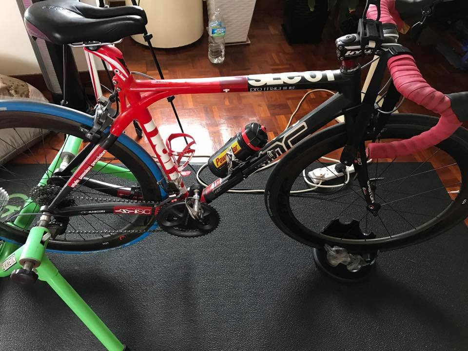
**이미지 캡션:** 이 사진은 실내에서 자전거 트레이너에 거치된 로드 자전거를 보여줍니다. 자전거는 빨간색과 검은색 프레임으로 되어 있으며, 핸들바에는 분홍색 바 테이프가 감겨 있습니다. 자전거 프레임에는 "SCOOT"라는 로고가 보이며, 물통 케이지에는 노란색 물통이 장착되어 있습니다. 자전거 뒷바퀴는 녹색의 자전거 트레이너에 고정되어 있으며, 앞바퀴는 검은색 받침대에 놓여 있습니다. 배경에는 나무 바닥과 흰색 벽, 그리고 물병이 보입니다. 사진에는 사람이 보이지 않으며, 자전거를 실내에서 운동하기 위해 준비해 놓은 상황으로 보입니다. 전반적으로 깔끔하고 정돈된 분위기입니다.

> #오늘의레딧 https://www.reddit.com/r/MachineLearning/ 오늘도 새소식이 많군요.  1. "#AlphaGo 경기 1 승리! Ke Jie는 용감하게 싸웠고 멋진 경기가 펼쳐졌습니다." - 데미스 하사 비스 2. Xcessiv는 당신이 생각할 수있는 가장 크고, 가장 미친, 가장 과도한 (ㅎ) 적층 앙상블을 만드는 데 도움이되는 도구입니다. 3. "코인 베팅을 통한 배움의 속도가없는 Backprop", Orabona &amp; Tommasi 2017 4. 생각하기 기계 학습을 위해 고안된 저렴한 GPU 호스팅은 관심이 있는지 궁금해하고있었습니다. 5. Reparameterization 그라디언트 분산 감소 (블로그 게시물 + 종이 + 코드) 6. 이진 신경망의 고차원 기하학 7. 과학적 방법 기반의 생성 모델? 8. 실제 문제에 대한 심층적 인 학습 : Merantix에서 수행 한 3 회의 수업 9. 단어 &#39;a&#39;로 시작하는 운세 정의 및 창세기의 컴퓨터를 이용한 작성을위한 Word2vec 10. Skater는 모델에 의존하지 않는 해석을위한 새로운 Python 라이브러리입니다. 11. 양자화 너머. 딥 커널 혼합 네트워크를 이용한 연속 밀도 모델링. 12. 딥 이미지 유추 (코드 및 데모 출시) 13. 다가오는 토론토 대학 수학 과학 연구 연구소 - 기계 학습 진보 및 응용 세미나 14. 진화 된 신경 회로에 의해 제어되는 관절 형 사지의 도구 구조 15. 가속화 된 계층 적 밀도 클러스터링 16. 포즈 탐지를 사용하여 어떤 새로운 AR 필터를 만들 수 있습니까? 17. Wolfram Data Repository 농업에서 운송에 이르기까지 카테고리 화 된 데이터 세트가 포함 된 새로운 방문 페이지 18. Google &#39;의 TPU2 기계 학습 클러스터의 두뇌 아래 19. Microsoft Malmo Challenge에 사용 된 PyTorch ACER 구현 20. 3 월 머신 러닝 매니아, 5 위 수상자 인터뷰 : David Scott  1. https://twitter.com/demishassabis/status/866909712305995776 2. https://github.com/reiinakano/xcessiv 3. https://arxiv.org/abs/1705.07795 4. https://www.reddit.com/r/MachineLearning/comments/6cvs3d/p_thinking_of_building_affordable_gpu_hosting/ 5. http://andymiller.github.io/2017/05/23/rv-rges.html 6. https://arxiv.org/abs/1705.07199 7. https://www.reddit.com/r/MachineLearning/comments/6cy9zx/d_scientific_methodbased_generative_models/ 8. https://medium.com/merantix/applying-deep-learning-to-real-world-problems-ba2d86ac5837 9. https://llamasandmystegosaurus.blogspot.com/2017/05/alpha.html 10. https://github.com/datascienceinc/Skater 11. https://arxiv.org/abs/1705.07111 12. https://github.com/msracver/Deep-Image-Analogy 13. http://www.fields.utoronto.ca/activities/16-17/machine-learning 14. https://www.youtube.com/watch?v=gNMpOAujbZo 15. https://arxiv.org/abs/1705.07321 16. https://www.reddit.com/r/MachineLearning/comments/6cwv45/d_what_new_ar_filters_can_be_built_using_pose/ 17. https://datarepository.wolframcloud.com/ 18. https://www.nextplatform.com/2017/05/22/hood-googles-tpu2-machine-learning-clusters/ 19. https://github.com/Kaixhin/malmo-challenge 20. http://blog.kaggle.com/2017/05/23/march-machine-learning-mania-5th-place-winners-interview-david-scott/

### 5월 25일 (목) 08:52 · 📷 사진 (1장)

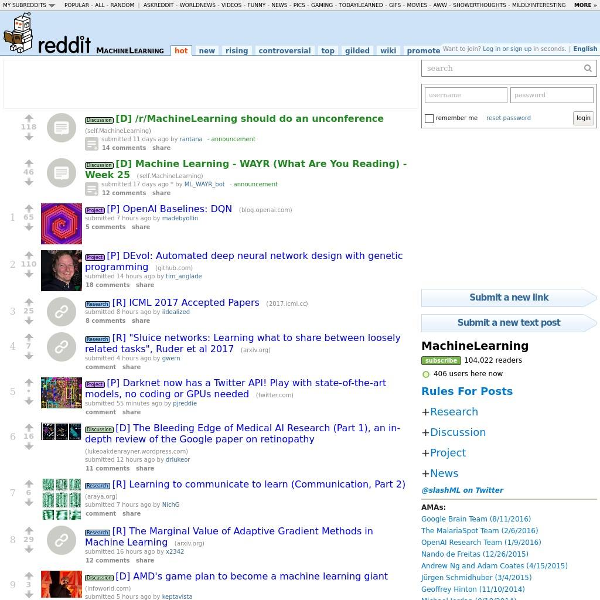
**이미지 캡션:** 이 이미지는 레딧의 머신러닝 서브레딧 페이지를 보여주며, 다양한 게시물 목록과 관련 정보가 표시됩니다. 페이지 상단에는 레딧 로고와 함께 "MACHINE LEARNING"이라는 제목이 보이며, 그 옆에는 "hot", "new", "rising", "controversial", "top", "gilded", "wiki"와 같은 정렬 옵션이 있습니다. 오른쪽 상단에는 로그인 및 회원가입을 위한 입력 필드와 버튼이 있습니다. 메인 콘텐츠 영역에는 여러 게시물이 시간순으로 나열되어 있으며, 각 게시물은 제목, 작성자, 제출 시간, 댓글 수, 그리고 관련 링크를 포함합니다. 예를 들어, "[D] /r/MachineLearning should do an unconference"라는 제목의 게시물은 11일 전에 제출되었고 14개의 댓글이 있습니다. 다른 게시물로는 "[P] OpenAI Baselines: DQN", "[P] DEvol: Automated deep neural network design with genetic programming", "[R] ICML 2017 Accepted Papers", "[R] "Sluice networks: Learning what to share between loosely related tasks"", "[P] Darknet now has a Twitter API!", "[D] The Bleeding Edge of Medical AI Research (Part 1)", "[R] Learning to communicate to learn", "[R] The Marginal Value of Adaptive Gradient Methods in Machine Learning", "[D] AMD's game plan to become a machine learning giant" 등이 있습니다. 각 게시물 옆에는 업보트/다운보트 화살표와 함께 숫자가 표시되어 게시물의 인기도를 나타냅니다. 페이지 오른쪽에는 "Submit a new link" 및 "Submit a new text post" 버튼과 함께 "Machine Learning" 서브레딧의 구독자 수(104,022명)와 현재 접속자 수(406명)가 표시됩니다. 또한, 게시물 규칙("Rules For Posts")과 관련 주제("Research", "Discussion", "Project", "News")가 나열되어 있으며, 트위터 계정(@slashML on Twitter)과 과거 AMA(Ask Me Anything) 참여자 목록도 보입니다. 전반적으로 이 페이지는 머신러닝 커뮤니티의 최신 정보와 토론을 공유하는 온라인 포럼의 모습을 보여줍니다.

> #오늘의레딧 https://www.reddit.com/r/MachineLearning/ 재미난 이야기들이 많습니다  1. OpenAI베이스 라인 : DQN 2. DEvol : 유전 프로그래밍을 이용한 자동화 된 심 신경 네트워크 설계 3. ICML 2017 수락 된 논문 4. "Sluice networks : 느슨하게 관련된 작업들간에 공유 할 것을 학습", Ruder et al 2017 5. Darknet에 Twitter API가 추가되었습니다! 최첨단 모델로 재생, 코딩 또는 GPU 필요 없음 6. 의료 인공 지능 연구의 출혈 엣지 (Part 1), 망막증에 관한 Google 논문의 심층 검토 7. 학습을 위해 의사 소통하는 방법 배우기 (의사 소통, 제 2 부) 8. 기계 학습에서 적응 형 그라디언트 방법의 한계 값 9. AMD의 게임 플랜은 기계 학습 거인이 될 것입니다 10. xcessiv / README.md at master · reiinakano / xcessiv 11. 깊은 학습은 충분하지 않습니다, 우리는 안전한 AI를위한 베이지안 깊은 학습이 필요합니다. 12. 깊은 학습을 사용하여 비디오의 자동 권총 탐지 경보 13. 졸업 주제 사이의 딜레마 : "오디오 데이터의 변화 추론"또는 "이미지 데이터의 의미 론적 세분화" 14. 완성 된 "정렬"프로젝트를 찾고 15. Gumbel-Softmax를 정책 구배 방법으로 사용하는 방법은 무엇입니까? 16. - 학습 속도에 적응하기 위해 강하 방향의 직교성을 측정합니까? 17. "코인 베팅을 통한 배움의 속도가없는 Backprop", Orabona &amp; Tommasi 2017 18. "#AlphaGo 경기 1 승리! Ke Jie는 용감하게 싸웠고 멋진 경기가 펼쳐졌습니다." - 데미스 하사 비스 19. cGAN (또는 생성 이미지 딥넷)의 입력 / 출력 해상도를 높일 수 있습니까? 20. 업 샘플링 vs. 가중치 : 불균형 트레이닝 세트를 처리하는 가장 좋은 방법은 무엇입니까?  1. https://blog.openai.com/openai-baselines-dqn/ 2. https://github.com/joeddav/devol 3. https://2017.icml.cc/Conferences/2017/AcceptedPapersInitial 4. https://arxiv.org/abs/1705.08142 5. https://twitter.com/DarknetForever 6. https://lukeoakdenrayner.wordpress.com/2017/05/24/the-end-of-human-doctors-the-bleeding-edge-of-medical-ai-research-part-1/ 7. http://www.araya.org/archives/2028 8. https://arxiv.org/abs/1705.08292 9. http://www.infoworld.com/article/3197577/artificial-intelligence/amds-game-plan-to-become-a-machine-learning-giant.html 10. https://github.com/reiinakano/xcessiv/blob/master/README.md 11. http://alexgkendall.com/computer_vision/bayesian_deep_learning_for_safe_ai/ 12. https://arxiv.org/pdf/1702.05147.pdf 13. https://www.reddit.com/r/MachineLearning/comments/6d1xwx/d_dilemma_between_graduation_topics_variational/ 14. https://www.reddit.com/r/MachineLearning/comments/6d45ev/research_looking_for_some_finished_sorting/ 15. https://www.reddit.com/r/MachineLearning/comments/6d44i7/d_how_to_use_gumbelsoftmax_for_policy_gradient/ 16. https://www.reddit.com/r/MachineLearning/comments/6d3i6c/d_measuring_orthogonality_of_descent_directions/ 17. https://arxiv.org/abs/1705.07795 18. https://twitter.com/demishassabis/status/866909712305995776 19. https://www.reddit.com/r/MachineLearning/comments/6cznfc/d_is_it_possible_to_increase_the_inputoutput/ 20. https://www.reddit.com/r/MachineLearning/comments/6czlty/d_upsampling_vs_weighting_whats_the_best_way_to/

### 5월 26일 (금) 08:52 · 📷 사진 (1장)

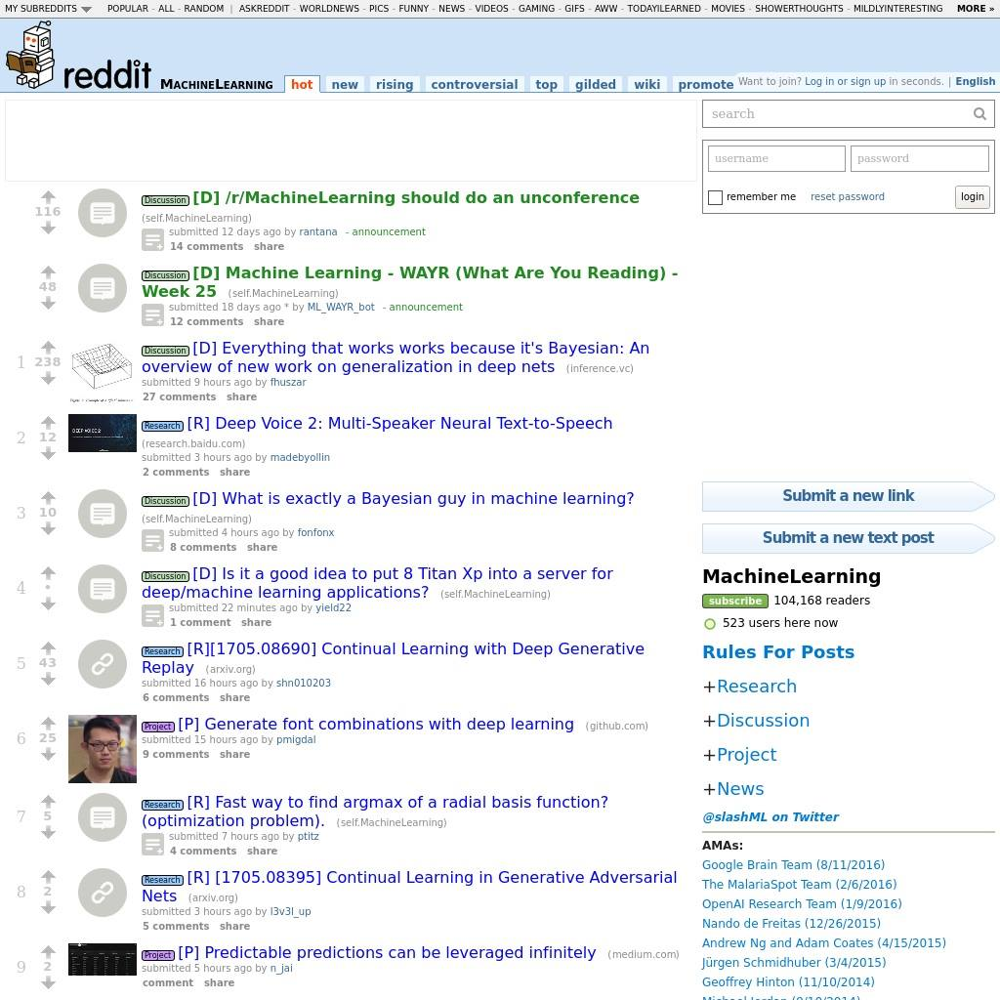
**이미지 캡션:** 이 이미지는 레딧의 머신러닝 서브레딧 페이지를 보여주며, 다양한 게시물과 관련 정보가 나열되어 있습니다. 페이지 상단에는 레딧 로고와 함께 "MACHINE LEARNING"이라는 제목이 보이며, 그 아래에는 "hot", "new", "rising", "controversial", "top", "gilded", "wiki"와 같은 탭들이 있습니다. 오른쪽 상단에는 로그인 또는 회원가입을 위한 입력란과 버튼이 있습니다. 페이지 중앙에는 여러 게시물들이 시간순으로 정렬되어 있으며, 각 게시물은 제목, 작성자, 제출 시간, 댓글 수 등의 정보를 포함하고 있습니다. 게시물 제목들은 머신러닝 관련 주제를 다루고 있으며, "[D]"는 토론, "[R]"은 연구, "[P]"는 프로젝트를 나타냅니다. 게시물 목록 아래에는 "Submit a new link"와 "Submit a new text post" 버튼이 있습니다. 오른쪽 사이드바에는 "MachineLearning" 서브레딧의 구독자 수와 현재 접속자 수가 표시되어 있으며, "Rules For Posts" 섹션에는 "+Research", "+Discussion", "+Project", "+News"와 같은 하위 섹션이 있습니다. 또한, "@slashML on Twitter" 링크와 과거 AMA(Ask Me Anything) 세션 목록이 표시되어 있습니다. 한 게시물에는 젊은 성인 남성이 안경을 쓰고 카메라를 응시하는 사진이 첨부되어 있습니다. 전반적으로 정보가 풍부하고 전문적인 분위기를 풍기는 웹페이지입니다.

> #오늘의레딧 https://www.reddit.com/r/MachineLearning/ 재미난 이야기들이 많습니다  1. Bayesian이기 때문에 작동하는 모든 것이 작동합니다 : 심층 네트워크에서의 일반화에 대한 새로운 작업의 개요 2. 딥 보이스 2 : 멀티 스피커 신경 텍스트 음성 변환 3. 기계 학습에서 베이 즈 녀석은 정확히 무엇입니까? 4. 딥 / 머신 러닝 어플리케이션을 위해 8 Titan XP를 서버에 설치하는 것이 좋은 생각입니까? 5. 깊은 학습으로 글꼴 조합 생성 6. 방사형 기초 함수의 argmax를 찾는 빠른 방법? (최적화 문제). 7. 예측 가능한 예측은 무한히 활용 될 수 있습니다. 8. 기계 학습 - WAYR (당신은 무엇을 읽고 있습니까) - 주 26 9. Darknet에 Twitter API가 추가되었습니다! 최첨단 모델로 재생, 코딩 또는 GPU 필요 없음 10. 더 길게 훈련하고, 더 잘 일반화하십시오 : 신경망의 대규모 배치 훈련에서 일반화 간격을 좁히십시오. 11. Fast-Slow Recurrent Neural Networks - PTB 및 enwik8의 SOTA 12. OpenAI베이스 라인 : DQN 13. 깊은 학습은 충분하지 않습니다, 우리는 안전한 AI를위한 베이지안 깊은 학습이 필요합니다. 14. DeepMasterPrint : 프리젠 테이션 공격을위한 지문 생성 15. 깊은 신경 네트워크를위한 컴퓨터 라이브러리 (CLDNN) 16. 석류를 이용한 파이썬의 반 감독 학습 17. 인간 벤치 마크 데이터 세트 18. 깊은 잠복 변수 모델을 이용한 인과 관계 추론 19. 멍청한 멍청한 질문 20. DEvol : 유전 프로그래밍을 이용한 자동화 된 심 신경 네트워크 설계  1. http://www.inference.vc/everything-that-works-works-because-its-bayesian-2/ 2. http://research.baidu.com/deep-voice-2-multi-speaker-neural-text-speech/ 3. https://www.reddit.com/r/MachineLearning/comments/6dbwnf/d_what_is_exactly_a_bayesian_guy_in_machine/ 4. https://www.reddit.com/r/MachineLearning/comments/6ddbeq/d_is_it_a_good_idea_to_put_8_titan_xp_into_a/ 5. https://github.com/Jack000/fontjoy 6. https://www.reddit.com/r/MachineLearning/comments/6damv7/r_fast_way_to_find_argmax_of_a_radial_basis/ 7. https://medium.com/numerai/numerais-new-tournament-to-crowdsource-the-future-of-the-stock-market-da1ac02adaef 8. https://www.reddit.com/r/MachineLearning/comments/6d7nb1/d_machine_learning_wayr_what_are_you_reading_week/ 9. https://twitter.com/DarknetForever 10. https://arxiv.org/abs/1705.08741 11. https://arxiv.org/abs/1705.08639 12. https://blog.openai.com/openai-baselines-dqn/ 13. http://alexgkendall.com/computer_vision/bayesian_deep_learning_for_safe_ai/ 14. https://arxiv.org/pdf/1705.07386.pdf 15. https://01.org/cldnn/blogs 16. https://github.com/jmschrei/pomegranate/blob/master/tutorials/Tutorial_8_Semisupervised_Learning.ipynb 17. https://www.reddit.com/r/MachineLearning/comments/6d6caq/d_human_benchmark_datasets/ 18. https://arxiv.org/abs/1705.08821 19. https://www.reddit.com/r/MachineLearning/comments/6dbb4u/d_dumb_noob_question/ 20. https://github.com/joeddav/devol

### 5월 27일 (토) 08:53 · 📷 사진 (1장)

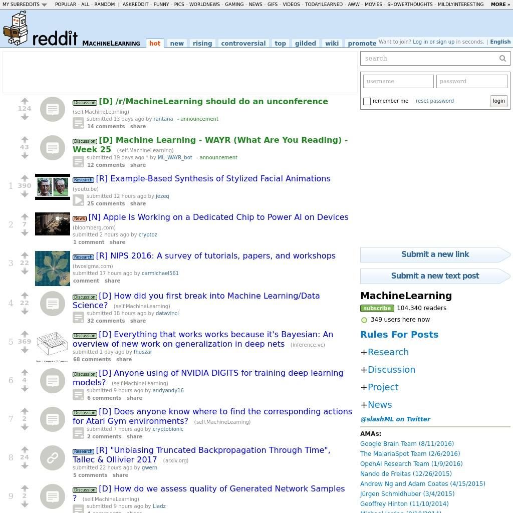
**이미지 캡션:** 이 이미지는 인기 있는 온라인 커뮤니티인 레딧의 머신러닝 서브레딧 페이지를 보여줍니다. 페이지 상단에는 레딧 로고와 함께 "MACHINE LEARNING"이라는 제목이 눈에 띄며, 그 옆에는 "hot", "new", "rising", "controversial", "top", "gilded", "wiki"와 같은 다양한 카테고리 링크가 있습니다. 오른쪽 상단에는 로그인 및 회원가입을 위한 입력 필드와 버튼이 보입니다. 페이지 중앙에는 다양한 주제의 게시물 목록이 나열되어 있으며, 각 게시물은 제목, 작성자, 제출 시간, 댓글 수 등의 정보를 포함하고 있습니다. 게시물 제목 앞에는 "[D]" (Discussion), "[R]" (Research), "[N]" (News)와 같은 태그가 붙어 있어 게시물의 성격을 나타냅니다. 예를 들어, 첫 번째 게시물은 "should do an unconference"라는 제목의 토론 게시물이며, 두 번째 게시물은 "WAYR (What Are You Reading) - Week 25"이라는 제목의 토론 게시물입니다. 세 번째 게시물은 "Example-Based Synthesis of Stylized Facial Animations"라는 제목의 연구 게시물이며, 유튜브 링크가 포함되어 있습니다. 네 번째 게시물은 "Apple Is Working on a Dedicated Chip to Power AI on Devices"라는 제목의 뉴스 게시물이며, 블룸버그닷컴 링크가 있습니다. 페이지 오른쪽에는 "Submit a new link"와 "Submit a new text post" 버튼이 있으며, "MachineLearning" 서브레딧의 구독자 수와 현재 접속자 수가 표시되어 있습니다. 또한, "Rules For Posts" 섹션에는 "+Research", "+Discussion", "+Project", "+News"와 같은 하위 카테고리가 나열되어 있습니다. 페이지 하단에는 "AMAS" 섹션에 머신러닝 분야의 저명한 연구자들의 이름과 활동 날짜가 나열되어 있습니다. 전반적으로 이 페이지는 머신러닝 관련 정보를 공유하고 토론하는 온라인 커뮤니티의 모습을 보여줍니다.

> #오늘의레딧 https://www.reddit.com/r/MachineLearning/ 래딧은 읽을 거리가 다양합니다.  1. 양식화 된 얼굴 애니메이션의 예제 기반 합성 2. 애플, 디바이스에서 AI를 구동하는 전용 칩으로 작업 중 3. NIPS 2016 : 자습서, 논문 및 워크샵 설문 조사 4. 처음으로 어떻게 Machine Learning / Data Science에 들어갔습니까? 5. Bayesian이기 때문에 작동하는 모든 것이 작동합니다 : 심층 네트워크에서의 일반화에 대한 새로운 작업의 개요 6. 누구나 NVIDIA DIGITS를 사용하여 심층 학습 모델을 교육합니까? 7. 누구든지 아타리 체육관 환경에서 해당 조치를 어디에서 찾을 수 있는지 알고 있습니까? 8. "시간을 통한 역 분모 된 백 프로 그레시이션", Tallec &amp; Ollivier 2017 9. 생성 된 네트워크 샘플의 품질을 어떻게 평가합니까? 10. TensorFlow의 비 결정론에 대한 해결 방법 11. 딥 보이스 2 : 멀티 스피커 신경 텍스트 음성 변환 12. 기계 학습에서 베이 즈 녀석은 정확히 무엇입니까? 13. 딥 / 머신 러닝 어플리케이션을 위해 8 Titan XP를 서버에 설치하는 것이 좋은 생각입니까? 14. 방사형 기초 함수의 argmax를 찾는 빠른 방법? (최적화 문제). 15. 깊은 학습으로 글꼴 조합 생성 16. 예측 가능한 예측은 무한히 활용 될 수 있습니다. 17. 기계 학습 - WAYR (당신은 무엇을 읽고 있습니까) - 주 26 18. Fast-Slow Recurrent Neural Networks - PTB 및 enwik8의 SOTA 19. Darknet에 Twitter API가 추가되었습니다! 최첨단 모델로 재생, 코딩 또는 GPU 필요 없음 20. 더 길게 훈련하고, 더 잘 일반화하십시오 : 신경망의 대규모 배치 훈련에서 일반화 간격을 좁히십시오.  1. https://youtu.be/0ueRYinz8Tk 2. https://www.bloomberg.com/news/articles/2017-05-26/apple-said-to-plan-dedicated-chip-to-power-ai-on-devices 3. https://www.twosigma.com/insights/nips-2016-a-survey-of-tutorials-papers-and-workshops-two-sigma 4. https://www.reddit.com/r/MachineLearning/comments/6df1tm/d_how_did_you_first_break_into_machine/ 5. http://www.inference.vc/everything-that-works-works-because-its-bayesian-2/ 6. https://www.reddit.com/r/MachineLearning/comments/6dh98z/d_anyone_using_of_nvidia_digits_for_training_deep/ 7. https://www.reddit.com/r/MachineLearning/comments/6di56j/d_does_anyone_know_where_to_find_the/ 8. https://arxiv.org/abs/1705.08209 9. https://www.reddit.com/r/MachineLearning/comments/6dh4yw/d_how_do_we_assess_quality_of_generated_network/ 10. https://www.twosigma.com/insights/a-workaround-for-non-determinism-in-tensorflow 11. http://research.baidu.com/deep-voice-2-multi-speaker-neural-text-speech/ 12. https://www.reddit.com/r/MachineLearning/comments/6dbwnf/d_what_is_exactly_a_bayesian_guy_in_machine/ 13. https://www.reddit.com/r/MachineLearning/comments/6ddbeq/d_is_it_a_good_idea_to_put_8_titan_xp_into_a/ 14. https://www.reddit.com/r/MachineLearning/comments/6damv7/r_fast_way_to_find_argmax_of_a_radial_basis/ 15. https://github.com/Jack000/fontjoy 16. https://medium.com/numerai/numerais-new-tournament-to-crowdsource-the-future-of-the-stock-market-da1ac02adaef 17. https://www.reddit.com/r/MachineLearning/comments/6d7nb1/d_machine_learning_wayr_what_are_you_reading_week/ 18. https://arxiv.org/abs/1705.08639 19. https://twitter.com/DarknetForever 20. https://arxiv.org/abs/1705.08741

### 5월 28일 (일) 08:52 · 📷 사진 (2장)

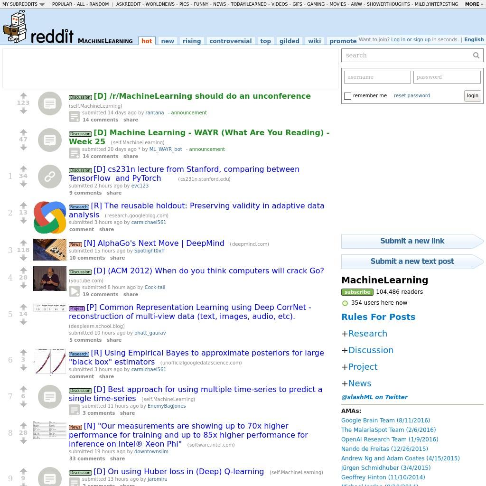
**이미지 캡션:** 이것은 레딧의 머신러닝 서브레딧 페이지로, 다양한 게시물 목록이 표시됩니다. 왼쪽에는 각 게시물의 추천/반대 투표 수와 게시물 링크, 작성자, 제출 시간, 댓글 수가 표시됩니다. 게시물 제목은 파란색으로 되어 있으며, 대부분 머신러닝 관련 주제를 다루고 있습니다. 예를 들어, "머신러닝은 언컨퍼런스를 해야 할까요?", "머신러닝 - 당신이 읽고 있는 것은 무엇인가요? 25주차", "스탠포드 cs231n 강의: 텐서플로우와 파이토치 비교", "재사용 가능한 홀드아웃: 적응형 데이터 분석의 유효성 보존", "알파고의 다음 수", "컴퓨터가 언제쯤 골을 넣을 수 있을까요?", "딥 코르넷을 사용한 일반 표현 학습", "대규모 '블랙박스' 추정치를 근사하기 위한 경험적 베이즈 사용", "단일 시계열 예측을 위한 다중 시계열 사용의 최적 접근 방식", "인텔 제온 파이에서 70배 더 높은 훈련 성능과 85배 더 높은 추론 성능을 보여주는 측정 결과", "허버 손실을 이용한 (딥) Q-러닝 활용" 등이 있습니다. 페이지 오른쪽에는 로그인/가입 옵션, 검색창, 그리고 머신러닝 서브레딧에 대한 정보와 관련 링크들이 있습니다. "새 링크 제출" 및 "새 텍스트 게시물 제출" 버튼도 보입니다. "머신러닝" 서브레딧은 104,486명의 구독자와 354명의 현재 사용자를 보유하고 있으며, "연구", "토론", "프로젝트", "뉴스"와 같은 섹션이 있습니다. 또한, "slashML on Twitter" 링크와 과거 AMA(Ask Me Anything) 목록도 포함되어 있습니다. 전체적으로 기술 및 연구 커뮤니티의 활발한 토론과 정보 공유를 보여주는 화면입니다.
 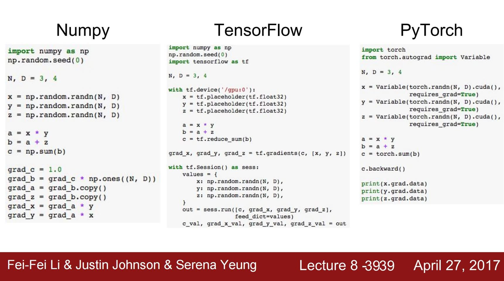
**이미지 캡션:** 이 이미지는 파이썬의 세 가지 주요 딥러닝 라이브러리인 NumPy, TensorFlow, PyTorch를 비교하는 슬라이드입니다. 각 섹션은 동일한 연산을 수행하는 코드를 보여줍니다. 왼쪽에는 NumPy를 사용한 코드가 있고, 가운데에는 TensorFlow를 사용한 코드가 있으며, 오른쪽에는 PyTorch를 사용한 코드가 있습니다. 각 섹션의 제목은 "Numpy", "TensorFlow", "PyTorch"로 명확하게 표시되어 있습니다. 코드 블록은 각 라이브러리의 구문과 사용법을 보여주며, 변수 초기화, 연산, 그리고 그래디언트 계산 및 역전파와 같은 딥러닝 관련 작업이 포함되어 있습니다. 이미지 하단에는 발표자의 이름인 "Fei-Fei Li & Justin Johnson & Serena Yeung"과 강의 정보 "Lecture 8 -3939 April 27, 2017"이 붉은색 배경에 흰색 글씨로 표시되어 있습니다. 전체적으로 이 이미지는 딥러닝 프레임워크 간의 코드 비교를 통해 기술적인 정보를 전달하는 교육적인 자료로 보입니다.

> #오늘의레딧 https://www.reddit.com/r/MachineLearning/ 오늘도 새소식이 많군요.  1. TensorFlow 🌊와 PyTorch 🔥를 비교 한 Stanford의 cs231n 강의 2. 재사용 가능한 유지 : 적응 형 데이터 분석에서 유효성 유지 3. AlphaGo의 다음 단계 | 딥 마인드 4. (ACM 2012) 언제 컴퓨터가 금이 갈 것이라고 생각하십니까? 5. 공통 표현 Deep CorrNet을 이용한 학습 - 멀티 뷰 데이터 (텍스트, 이미지, 오디오 등)의 재구성. 6. 대형 "블랙 박스"추산 자에 대한 경험적 베이 스를 사용하여 사후 상사를 근사 7. 여러 시계열을 사용하여 단일 시계열을 예측하는 최상의 방법 8. "우리의 측정 결과는 교육을위한 70 배 높은 성능과 인텔 ® 제온 파이에 대한 추론을위한 최대 85 배 높은 성능을 보여줍니다." 9. (깊은) Q- 학습에서 Huber 손실을 사용할 때 10. 양식화 된 얼굴 애니메이션의 예제 기반 합성 11. 애플, 디바이스에서 AI를 구동하는 전용 칩으로 작업 중 12. NIPS 2016 : 자습서, 논문 및 워크샵 설문 조사 13. 처음으로 어떻게 Machine Learning / Data Science에 들어갔습니까? 14. Bayesian이기 때문에 작동하는 모든 것이 작동합니다 : 심층 네트워크에서의 일반화에 대한 새로운 작업의 개요 15. 누구나 NVIDIA DIGITS를 사용하여 심층 학습 모델을 교육합니까? 16. 누구든지 아타리 체육관 환경에서 해당 조치를 어디에서 찾을 수 있는지 알고 있습니까? 17. 생성 된 네트워크 샘플의 품질을 어떻게 평가합니까? 18. TensorFlow의 비 결정론에 대한 해결 방법 19. "시간을 통한 역 분모 된 백 프로 그레시이션", Tallec &amp; Ollivier 2017 20. 딥 보이스 2 : 멀티 스피커 신경 텍스트 음성 변환  1. http://cs231n.stanford.edu/slides/2017/cs231n_2017_lecture8.pdf 2. https://research.googleblog.com/2015/08/the-reusable-holdout-preserving.html?m=1 3. https://deepmind.com/blog/alphagos-next-move/ 4. https://www.youtube.com/watch?v=dsMKJKTOte0&start=55:45&end=01:08:08 5. https://deeplearn.school.blog/2017/05/24/common-representation-learning-using-deep-corrnet/ 6. http://www.unofficialgoogledatascience.com/2015/11/using-empirical-bayes-to-approximate.html 7. https://www.reddit.com/r/MachineLearning/comments/6dnhp1/d_best_approach_for_using_multiple_timeseries_to/ 8. https://software.intel.com/en-us/articles/tensorflow-optimizations-on-modern-intel-architecture 9. https://www.reddit.com/r/MachineLearning/comments/6dmzdy/d_on_using_huber_loss_in_deep_qlearning/ 10. https://youtu.be/0ueRYinz8Tk 11. https://www.bloomberg.com/news/articles/2017-05-26/apple-said-to-plan-dedicated-chip-to-power-ai-on-devices 12. https://www.twosigma.com/insights/nips-2016-a-survey-of-tutorials-papers-and-workshops-two-sigma 13. https://www.reddit.com/r/MachineLearning/comments/6df1tm/d_how_did_you_first_break_into_machine/ 14. http://www.inference.vc/everything-that-works-works-because-its-bayesian-2/ 15. https://www.reddit.com/r/MachineLearning/comments/6dh98z/d_anyone_using_of_nvidia_digits_for_training_deep/ 16. https://www.reddit.com/r/MachineLearning/comments/6di56j/d_does_anyone_know_where_to_find_the/ 17. https://www.reddit.com/r/MachineLearning/comments/6dh4yw/d_how_do_we_assess_quality_of_generated_network/ 18. https://www.twosigma.com/insights/a-workaround-for-non-determinism-in-tensorflow 19. https://arxiv.org/abs/1705.08209 20. http://research.baidu.com/deep-voice-2-multi-speaker-neural-text-speech/
> 오늘의 래딧 1번에 나온 Numpy, TensorFlow, and PyTorch 의 비교.   http://cs231n.stanford.edu/slides/2017/cs231n_2017_lecture8.pdf  (올해 CS231n슬라이드를 좋아 하시는 분들도 많은듯 합니다. 언제한번 정독해봐야 겠습니다.)

### 5월 28일 (일) 13:07 · Ready to have a wonderful summer.

📍 Hong Kong

Ready to have a wonderful summer.

**이미지 캡션:** 공항 체크인 카운터 앞에서 한 성인 남성이 엄지손가락을 치켜들고 카메라를 향해 웃고 있다. 그는 선글라스를 끼고 파란색 티셔츠와 회색 재킷을 입고 있으며, 티셔츠에는 빨간색 별이 있는 흰색 로고가 있다. 그의 앞에는 바퀴 달린 큰 검은색 여행 가방과 회색 캐리어가 놓여 있다. 배경에는 다른 승객들과 체크인 카운터, 그리고 "KOREAN AIR"라고 쓰인 간판이 보인다. 전반적으로 여행을 떠나는 듯한 밝고 긍정적인 분위기이다.

### 5월 29일 (월) 08:52 · 📷 사진 (2장)

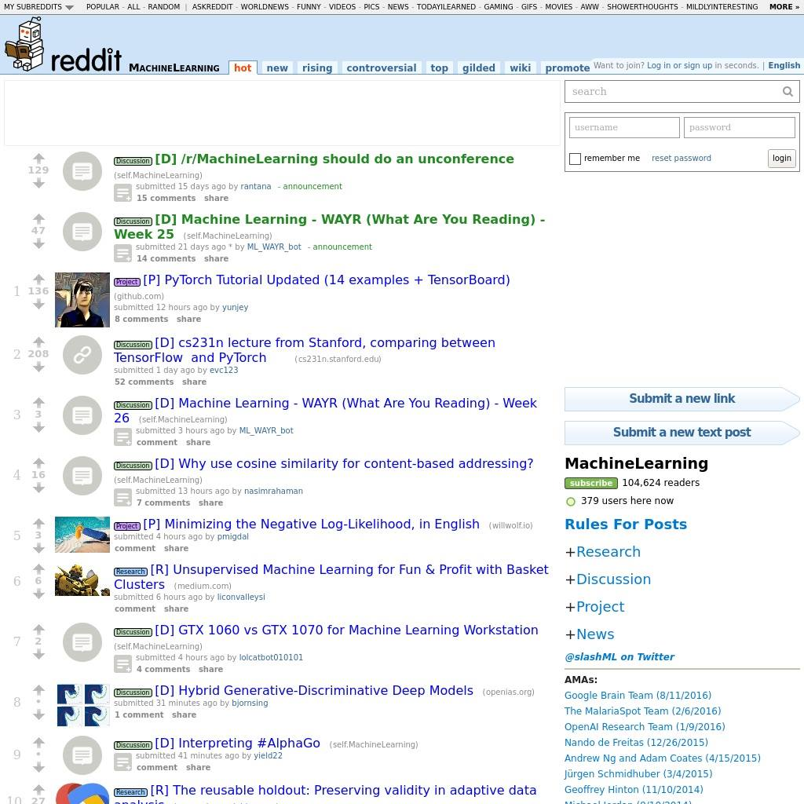
**이미지 캡션:** 이 이미지는 레딧(Reddit) 웹사이트의 머신러닝(Machine Learning) 서브레딧 페이지를 보여줍니다. 페이지 상단에는 레딧 로고와 함께 인기 있는 서브레딧 목록이 나열되어 있으며, 그 옆에는 "MachineLearning"이라는 제목과 함께 "hot", "new", "rising", "controversial", "top", "gilded", "wiki", "promote"와 같은 탭이 있습니다. 로그인 및 검색 기능도 상단에 배치되어 있습니다. 페이지 중앙에는 머신러닝 관련 게시물 목록이 시간순으로 정렬되어 있으며, 각 게시물은 제목, 작성자, 제출 시간, 댓글 수, 공유 링크 등의 정보를 포함하고 있습니다. 게시물 제목 앞에는 "[D]" (Discussion), "[P]" (Project), "[R]" (Research)와 같이 게시물의 종류를 나타내는 태그가 붙어 있습니다. 예를 들어, 첫 번째 게시물은 "Machine Learning should do an unconference"라는 제목의 토론 게시물이며, 15일 전에 제출되었고 15개의 댓글이 있습니다. 두 번째 게시물은 "Machine Learning - WAYR (What Are You Reading) - Week 25"라는 제목의 토론 게시물로, 21일 전에 제출되었고 14개의 댓글이 있습니다. 세 번째 게시물은 "(github.com) PyTorch Tutorial Updated (14 examples + TensorBoard)"라는 제목의 프로젝트 게시물로, 12시간 전에 제출되었고 8개의 댓글이 있습니다. 오른쪽 사이드바에는 "MachineLearning" 서브레딧의 구독자 수(104,624명)와 현재 접속자 수(379명)가 표시되어 있으며, 게시물 작성 규칙과 관련 링크들이 나열되어 있습니다. 또한, "AMAS" 섹션에는 과거에 진행되었던 유명 인사들의 AMA(Ask Me Anything) 목록이 날짜와 함께 표시되어 있습니다. 전반적으로 이 페이지는 머신러닝 커뮤니티의 최신 정보와 토론을 공유하는 온라인 플랫폼의 모습을 보여줍니다.
 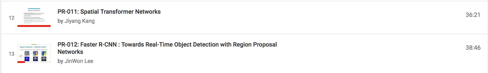
**이미지 캡션:** 이 사진은 두 개의 항목으로 구성된 목록을 보여줍니다. 각 항목에는 번호, 썸네일 이미지, 제목, 발표자 이름, 그리고 오른쪽에 시간 정보가 포함되어 있습니다. 첫 번째 항목은 번호 12로, "PR-011: Spatial Transformer Networks"라는 제목과 "by Jiyang Kang"이라는 발표자 이름, 그리고 36:21이라는 시간이 표시되어 있습니다. 썸네일 이미지에는 파란색과 주황색 선으로 구분된 텍스트가 포함된 슬라이드 이미지가 보입니다. 두 번째 항목은 번호 13으로, "PR-012: Faster R-CNN: Towards Real-Time Object Detection with Region Proposal Networks"라는 제목과 "by JinWon Lee"라는 발표자 이름, 그리고 38:46이라는 시간이 표시되어 있습니다. 이 썸네일 이미지에는 여러 개의 작은 이미지들이 격자 형태로 배열되어 있으며, 각 이미지 위에는 색상 선이 있습니다. 전체적으로 깔끔하고 정보 전달에 초점을 맞춘 인터페이스 디자인을 보여주며, 학술 발표나 강의 목록으로 보입니다.

> #오늘의레딧 https://www.reddit.com/r/MachineLearning/ 따끈한 소식들입니다.  1. PyTorch 자습서 업데이트 (14 가지 예 + TensorBoard) 2. TensorFlow 🌊와 PyTorch 🔥를 비교 한 Stanford의 cs231n 강의 3. 기계 학습 - WAYR (당신은 무엇을 읽고 있습니까) - 주 26 4. 왜 콘텐츠 기반 주소 지정을 위해 코사인 유사성을 사용합니까? 5. Negative Log-Likelihood 최소화, 영문 6. 바스켓 클러스터로 재미 있고 이익이있는 감독되지 않은 기계 학습 7. 기계 학습 워크 스테이션 용 GTX 1060 대 GTX 1070 8. 하이브리드 생성 형 차별화 깊은 모델 9. #AlphaGo 해석 10. 재사용 가능한 유지 : 적응 형 데이터 분석에서 유효성 유지 11. AlphaGo의 다음 단계 | 딥 마인드 12. (ACM 2012) 언제 컴퓨터가 금이 갈 것이라고 생각하십니까? 13. 공통 표현 Deep CorrNet을 이용한 학습 - 멀티 뷰 데이터 (텍스트, 이미지, 오디오 등)의 재구성. 14. 대형 "블랙 박스"추산 자에 대한 경험적 베이 스를 사용하여 사후 상사를 근사 15. "우리의 측정 결과는 교육을위한 70 배 높은 성능과 인텔 ® 제온 파이에 대한 추론을위한 최대 85 배 높은 성능을 보여줍니다." 16. (깊은) Q- 학습에서 후버 손실 사용에 관해서 17. 여러 시계열을 사용하여 단일 시계열을 예측하는 최상의 방법 18. 양식화 된 얼굴 애니메이션의 예제 기반 합성 19. 애플, 디바이스에서 AI를 구동하는 전용 칩으로 작업 중 20. NIPS 2016 : 자습서, 논문 및 워크샵 설문 조사  1. https://github.com/yunjey/pytorch-tutorial 2. http://cs231n.stanford.edu/slides/2017/cs231n_2017_lecture8.pdf 3. https://www.reddit.com/r/MachineLearning/comments/6dvtb2/d_machine_learning_wayr_what_are_you_reading_week/ 4. https://www.reddit.com/r/MachineLearning/comments/6dt51z/d_why_use_cosine_similarity_for_contentbased/ 5. http://willwolf.io/2017/05/18/minimizing_the_negative_log_likelihood_in_english/ 6. https://medium.com/@gaetanconsulting/unsupervised-machine-learning-for-fun-profit-with-basket-clusters-17a1161e7aa1 7. https://www.reddit.com/r/MachineLearning/comments/6dvqk1/d_gtx_1060_vs_gtx_1070_for_machine_learning/ 8. http://www.openias.org/hybrid-generative-discriminative 9. https://www.reddit.com/r/MachineLearning/comments/6dwt00/d_interpreting_alphago/ 10. https://research.googleblog.com/2015/08/the-reusable-holdout-preserving.html?m=1 11. https://deepmind.com/blog/alphagos-next-move/ 12. https://www.youtube.com/watch?v=dsMKJKTOte0&start=55:45&end=01:08:08 13. https://deeplearn.school.blog/2017/05/24/common-representation-learning-using-deep-corrnet/ 14. http://www.unofficialgoogledatascience.com/2015/11/using-empirical-bayes-to-approximate.html 15. https://software.intel.com/en-us/articles/tensorflow-optimizations-on-modern-intel-architecture 16. https://www.reddit.com/r/MachineLearning/comments/6dmzdy/d_on_using_huber_loss_in_deep_qlearning/ 17. https://www.reddit.com/r/MachineLearning/comments/6dnhp1/d_best_approach_for_using_multiple_timeseries_to/ 18. https://youtu.be/0ueRYinz8Tk 19. https://www.bloomberg.com/news/articles/2017-05-26/apple-said-to-plan-dedicated-chip-to-power-ai-on-devices 20. https://www.twosigma.com/insights/nips-2016-a-survey-of-tutorials-papers-and-workshops-two-sigma
> 이번주 2개의 논문 (Faster R-CNN, Spatial Transformer)는 정말 설명을 잘해주신 2분 덕분에 완전 이해 되었습니다.  https://www.youtube.com/playlist?list=PLlMkM4tgfjnJhhd4wn5aj8fVTYJwIpWkS  위 주제에 관심이 있으신분들은 30분만 투자해주시면 됩니다.  (계획한 100개의 논문 리뷰비디오 까지 88개 남았습니다.) 많은 응원 부탁드립니다.

### 5월 30일 (화) 08:52 · 📷 사진 (1장)

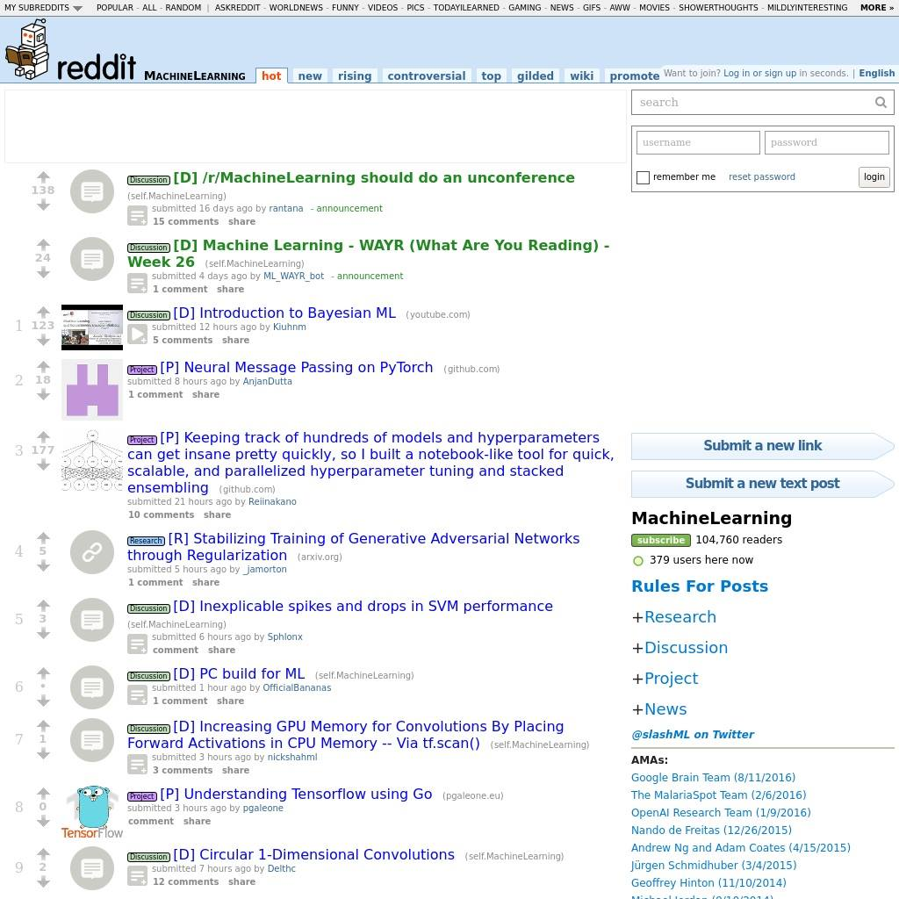
**이미지 캡션:** 이 이미지는 인기 있는 온라인 커뮤니티인 레딧의 머신러닝 서브레딧 페이지를 보여줍니다. 페이지 상단에는 레딧 로고와 함께 "MACHINE LEARNING"이라는 제목이 있고, 그 아래에는 "hot", "new", "rising", "controversial", "top", "gilded", "wiki", "promote"와 같은 다양한 카테고리 탭이 있습니다. 오른쪽 상단에는 로그인 및 회원가입을 위한 입력 필드와 버튼이 있습니다. 페이지 중앙에는 머신러닝 관련 게시물 목록이 표시되며, 각 게시물은 제목, 작성자, 제출 시간, 댓글 수, 공유 수 등의 정보를 포함합니다. 게시물 제목 옆에는 "Discussion", "Project", "Research"와 같은 태그가 붙어 있어 게시물의 성격을 나타냅니다. 게시물 목록 아래에는 새로운 링크나 텍스트 게시물을 제출할 수 있는 버튼이 있습니다. 오른쪽 사이드바에는 "MachineLearning" 서브레딧의 구독자 수, 현재 접속자 수, 게시 규칙, 트위터 계정, 그리고 과거 AMA(Ask Me Anything) 목록이 표시됩니다. 전반적으로 이 페이지는 머신러닝 분야의 최신 정보와 토론을 공유하는 온라인 커뮤니티의 모습을 보여줍니다.

> #오늘의레딧 https://www.reddit.com/r/MachineLearning/ 아침부터 다양한 소식이 많네요.  1. 베이지안 ML 소개 2. PyTorch를 통과하는 신경 메시지 3. 수백 가지 모델과 하이퍼 패러미터를 추적하면 아주 빨리 정신이 없어서 신속하고 확장 가능하며 병렬화 된 하이퍼 매개 변수 튜닝과 누적 된 앙상블을위한 노트북과 같은 도구를 만들었습니다 4. Regularization을 통한 Generic Adversarial Networks의 안정적인 교육 5. 설명 할 수없는 스파이크 및 SVM 성능 저하 6. ML 용 PC 빌드 7. tf.scan ()을 통해 CPU 메모리에 정방향 활성화를 적용하여 컨벌루션 용 GPU 메모리 늘리기 8. Go를 사용하여 Tensorflow 이해하기 9. 원형 1 차원 컨볼 루션 10. PyTorch 자습서 업데이트 (14 가지 예 + TensorBoard) 11. 현대 기계 학습 알고리즘 : 강점과 약점 12. 하이브리드 생성 형 차별화 깊은 모델 13. 깊은 신경 네트워크 블랙 박스 블로킹 방지 - 무료 웹 세미나 (5 월 30 일) 14. Negative Log-Likelihood 최소화, 영문 15. 1 백만 달러짜리 새끼를 낳는 문제 - 집값 추정치를 풀 수있는 방법 16. 바스켓 클러스터로 재미 있고 이익이있는 감독되지 않은 기계 학습 17. 왜 콘텐츠 기반 주소 지정을 위해 코사인 유사성을 사용합니까? 18. TensorFlow 🌊와 PyTorch 🔥를 비교 한 Stanford의 cs231n 강의 19. #AlphaGo 해석 20. 재사용 가능한 유지 : 적응 형 데이터 분석에서 유효성 유지  1. https://www.youtube.com/watch?v=5KdWhDpeQvU&index=1&list=PLAbhVprf4VPlqc8IoCi7Qk0YQ5cPQz9fn 2. https://github.com/priba/nmp_qc 3. https://github.com/reiinakano/xcessiv 4. https://arxiv.org/abs/1705.09367 5. https://www.reddit.com/r/MachineLearning/comments/6e1ppe/d_inexplicable_spikes_and_drops_in_svm_performance/ 6. https://www.reddit.com/r/MachineLearning/comments/6e3dp1/d_pc_build_for_ml/ 7. https://www.reddit.com/r/MachineLearning/comments/6e2rrt/d_increasing_gpu_memory_for_convolutions_by/ 8. https://pgaleone.eu/tensorflow/go/2017/05/29/understanding-tensorflow-using-go/ 9. https://www.reddit.com/r/MachineLearning/comments/6e1cx0/d_circular_1dimensional_convolutions/ 10. https://github.com/yunjey/pytorch-tutorial 11. https://elitedatascience.com/machine-learning-algorithms 12. http://www.openias.org/hybrid-generative-discriminative 13. https://www.crowdcast.io/e/unblackboxing-the-deep/register 14. http://willwolf.io/2017/05/18/minimizing_the_negative_log_likelihood_in_english/ 15. http://www.datasciencecentral.com/profiles/blogs/how-to-solve-the-new-1-million-kagge-problem 16. https://medium.com/@gaetanconsulting/unsupervised-machine-learning-for-fun-profit-with-basket-clusters-17a1161e7aa1 17. https://www.reddit.com/r/MachineLearning/comments/6dt51z/d_why_use_cosine_similarity_for_contentbased/ 18. http://cs231n.stanford.edu/slides/2017/cs231n_2017_lecture8.pdf 19. https://www.reddit.com/r/MachineLearning/comments/6dwt00/d_interpreting_alphago/ 20. https://research.googleblog.com/2015/08/the-reusable-holdout-preserving.html?m=1

### 5월 31일 (수) 08:52 · 📷 사진 (1장)

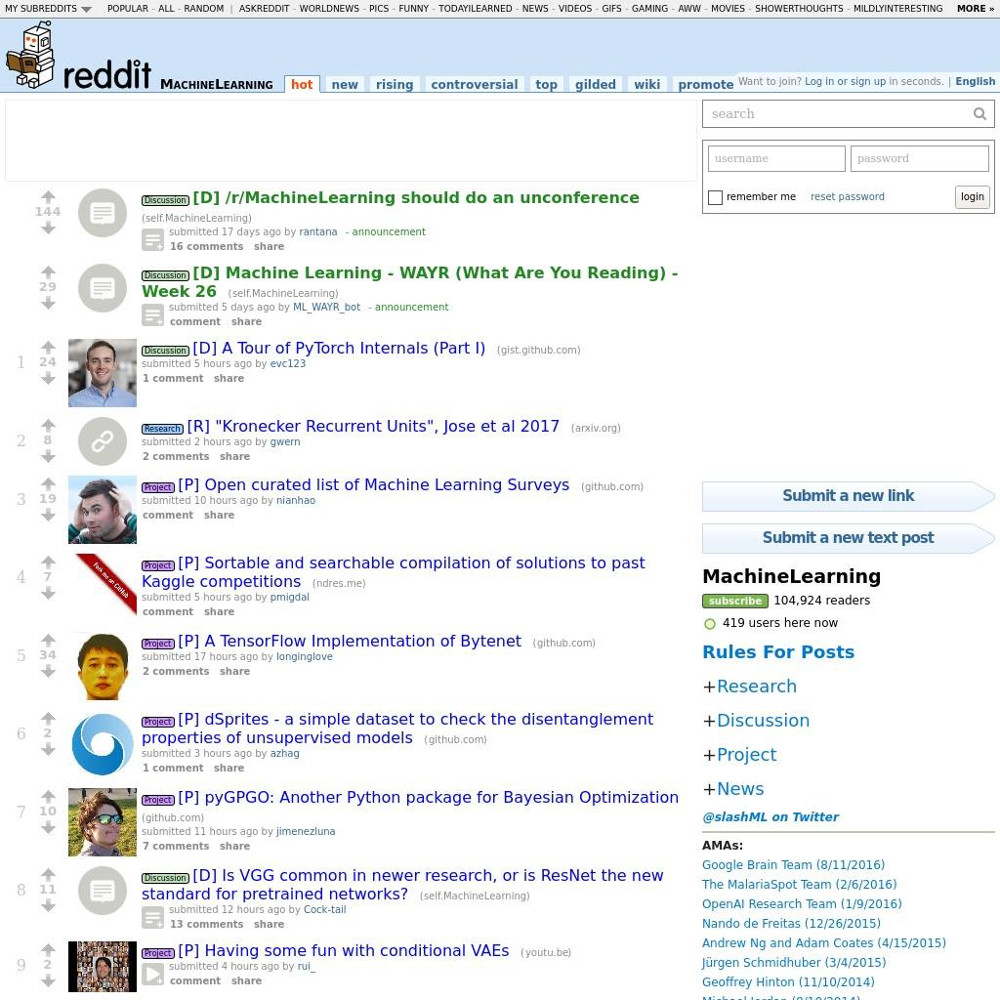
**이미지 캡션:** 이 이미지는 인기 있는 온라인 커뮤니티인 레딧의 머신러닝 서브레딧 페이지를 보여줍니다. 페이지 상단에는 레딧 로고와 함께 "MACHINE LEARNING"이라는 제목이 있고, 그 옆에는 "hot", "new", "rising", "controversial", "top", "gilded", "wiki"와 같은 다양한 정렬 옵션이 있습니다. 오른쪽 상단에는 로그인 및 회원가입을 위한 입력 필드와 버튼이 있습니다. 페이지 중앙에는 여러 게시물 목록이 있으며, 각 게시물은 제목, 작성자, 제출 시간, 댓글 수, 공유 옵션 등을 포함합니다. 게시물들은 주로 머신러닝 관련 연구, 프로젝트, 토론, 튜토리얼 등으로 구성되어 있습니다. 예를 들어, "Machine Learning - WAYR (What Are You Reading) - Week 26"이라는 제목의 게시물은 머신러닝 관련 읽을거리를 공유하는 내용이며, "A Tour of PyTorch Internals (Part I)"라는 게시물은 PyTorch 내부 구조에 대한 튜토리얼입니다. 또한, "Open curated list of Machine Learning Surveys"와 같은 게시물은 머신러닝 관련 설문 조사 목록을 제공합니다. 페이지 오른쪽에는 "Submit a new link" 및 "Submit a new text post" 버튼과 함께 서브레딧의 구독자 수, 현재 접속자 수, 게시 규칙 등이 표시되어 있습니다. 하단에는 "AMAS" 섹션이 있어 유명한 머신러닝 연구자들의 인터뷰 목록을 보여줍니다. 전반적으로 이 페이지는 머신러닝 분야의 최신 정보와 커뮤니티 활동을 공유하는 플랫폼의 모습을 보여줍니다.

> #오늘의레딧 https://www.reddit.com/r/MachineLearning/ 아침부터 다양한 소식이 많네요.  1. PyTorch 내부 둘러보기 (1 부) 2. "크로네 커 반복 단위", Jose et al 2017 3. 열띤 기계 학습 설문 조사 목록 4. 과거 Kaggle 대회에 대한 정렬 가능하고 검색 가능한 솔루션 모음 5. Bytenet의 TensorFlow 구현 6. dSprites - 감독되지 않은 모델의 풀림 특성을 확인하는 간단한 데이터 세트 7. pyGPGO : 베이지안 최적화를위한 또 다른 Python 패키지 8. VGG는 새로운 연구에서 흔히 볼 수 있습니까, 아니면 PreNet 네트워크의 새로운 표준 인 ResNet입니까? 9. 조건부 VAE로 재미있게 지내기 10. 좋은 책 / 텐서 분해에 대한 강의? 11. 평생 생성 모델링 12. 베이지안 ML 소개 13. tensorflow 모델을 시각화하는 더 좋은 방법이 있습니까? 14. Regularization을 통한 Generic Adversarial Networks의 안정적인 교육 15. PyTorch를 통과하는 신경 메시지 16. 수백 가지 모델과 하이퍼 패러미터를 추적하면 아주 빨리 정신이 없어서 신속하고 확장 가능하며 병렬화 된 하이퍼 매개 변수 튜닝과 누적 된 앙상블을위한 노트북과 같은 도구를 만들었습니다 17. ML 용 PC 빌드 18. tf.scan ()을 통해 CPU 메모리에 정방향 활성화를 적용하여 컨벌루션 용 GPU 메모리 늘리기 19. Go를 사용하여 Tensorflow 이해하기 20. 원형 1 차원 컨볼 루션  1. https://gist.github.com/killeent/4675635b40b61a45cac2f95a285ce3c0 2. https://arxiv.org/abs/1705.10142 3. https://github.com/metrofun/machine-learning-surveys/ 4. http://ndres.me/kaggle-past-solutions/ 5. https://github.com/Kyubyong/bytenet_translation 6. https://github.com/deepmind/dsprites-dataset 7. https://github.com/hawk31/pyGPGO 8. https://www.reddit.com/r/MachineLearning/comments/6e6mlf/d_is_vgg_common_in_newer_research_or_is_resnet/ 9. https://youtu.be/JoywehZ0uC4 10. https://www.reddit.com/r/MachineLearning/comments/6eaqon/d_good_bookslectures_on_tensor_decomposition/ 11. https://arxiv.org/abs/1705.09847 12. https://www.youtube.com/watch?v=5KdWhDpeQvU&index=1&list=PLAbhVprf4VPlqc8IoCi7Qk0YQ5cPQz9fn 13. https://www.reddit.com/r/MachineLearning/comments/6e55dv/d_is_there_a_better_way_to_visualize_tensorflow/ 14. https://arxiv.org/abs/1705.09367 15. https://github.com/priba/nmp_qc 16. https://github.com/reiinakano/xcessiv 17. https://www.reddit.com/r/MachineLearning/comments/6e3dp1/d_pc_build_for_ml/ 18. https://www.reddit.com/r/MachineLearning/comments/6e2rrt/d_increasing_gpu_memory_for_convolutions_by/ 19. https://pgaleone.eu/tensorflow/go/2017/05/29/understanding-tensorflow-using-go/ 20. https://www.reddit.com/r/MachineLearning/comments/6e1cx0/d_circular_1dimensional_convolutions/
