# 2017년 6월

[← 2017년](README.md)

### 6월 1일 (목) 08:52 · 📷 사진 (1장)

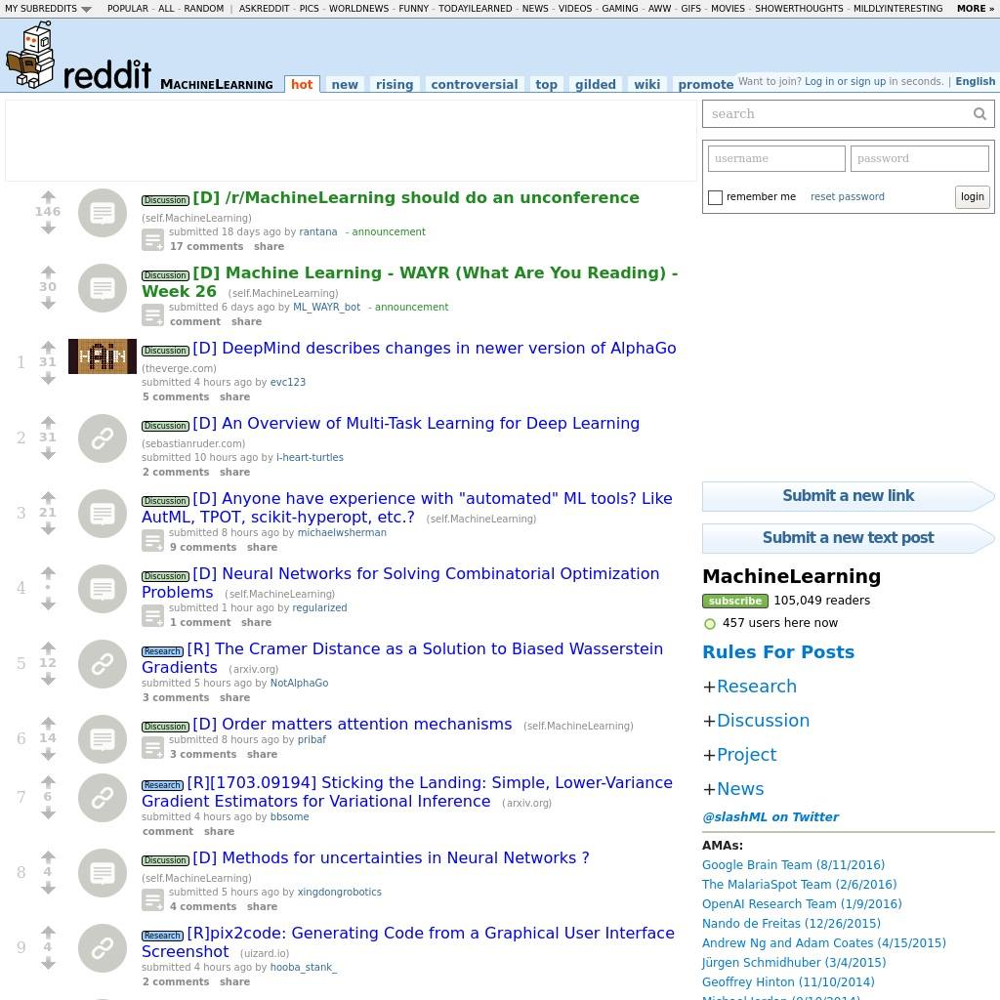
**이미지 캡션:** 이 이미지는 인기 있는 온라인 커뮤니티인 레딧의 머신러닝 서브레딧 페이지를 보여줍니다. 페이지 상단에는 레딧 로고와 함께 "MACHINE LEARNING"이라는 제목이 보이며, 그 옆에는 "hot", "new", "rising", "controversial", "top", "gilded", "wiki"와 같은 다양한 카테고리 링크가 나열되어 있습니다. 오른쪽 상단에는 로그인 또는 회원가입을 할 수 있는 폼이 있으며, 검색창도 있습니다. 페이지 중앙에는 머신러닝 관련 게시물 목록이 표시됩니다. 각 게시물은 제목, 작성자, 제출 시간, 댓글 수, 공유 수 등의 정보를 포함하고 있습니다. 예를 들어, 첫 번째 게시물은 "[D] /r/MachineLearning should do an unconference"라는 제목으로 18일 전에 제출되었고 17개의 댓글이 있습니다. 다른 게시물들도 "Machine Learning - WAYR (What Are You Reading) - Week 26", "DeepMind describes changes in newer version of AlphaGo", "An Overview of Multi-Task Learning for Deep Learning" 등 다양한 주제를 다루고 있습니다. 게시물 목록 오른쪽에는 "Submit a new link" 및 "Submit a new text post" 버튼이 있으며, "Machine Learning" 서브레딧에 대한 구독자 수(105,049명)와 현재 접속자 수(457명)가 표시됩니다. 또한, "Rules For Posts" 섹션에는 "+Research", "+Discussion", "+Project", "+News"와 같은 하위 섹션이 있습니다. 페이지 하단에는 "@slashML on Twitter" 링크와 "AMAS" 섹션이 있으며, 여기에는 과거 AMA(Ask Me Anything) 세션에 참여했던 유명 인사들의 이름과 날짜가 나열되어 있습니다. 전반적으로 이 페이지는 머신러닝 커뮤니티의 최신 정보와 토론을 공유하는 온라인 포럼의 모습을 보여줍니다.

> #오늘의레딧 https://www.reddit.com/r/MachineLearning/ 아침부터 다양한 소식이 많네요.  1. DeepMind는 최신 버전의 AlphaGo에 대한 변경 사항을 설명합니다. 2. 깊은 학습을위한 다중 태스크 학습 개요 3. 누구나 "자동화 된"ML 도구 사용 경험이 있습니까? AutML, TPOT, scikit-hyperopt 등과 같이? 4. 조합 최적화 문제를 해결하기위한 신경 회로망 5. 치우친 Wasserstein 그라디언트에 대한 솔루션 인 Cramer 거리 6. 순서는 관심 메커니즘을 결정합니다. 7. 신경 회로망의 불확실성을위한 방법? 8. pix2code : 그래픽 사용자 인터페이스에서 코드 생성하기 9. 딥 컴플렉스 네트워크 10. Conference.ai는 SF의 이번 금요일에 Google, Baidu, Maluuba, Amazon 등의 프리젠 테이션으로 진행됩니다. 11. 반전 된 드롭 아웃 : 어떻게 실제로 작동합니까? 12. Node.js로 마이크로 서비스를 배우는 Python 머신 사용에 관한 부드러운 질문 13. 누구나 좋아하는 박사. 영국의 IoT 네트워크 용 딥 학습 침입 탐지에서? 14. Babble-rnn : LSTM 네트워크를 통한 연설에서 음성 생성 15. 과거 Kaggle 대회에 대한 정렬 가능하고 검색 가능한 솔루션 모음 16. PyTorch 내부 둘러보기 (1 부) 17. 로얄 홀로 웨이 - 연구에 의한 Msc 18. "크로네 커 반복 단위", Jose et al 2017 19. 밀도 계산 학습 20. 신경망에서 0 입력의 영향  1. https://www.theverge.com/2017/5/30/15712300/alphago-ai-humanity-google-artificial-intelligence-ke-jie 2. http://sebastianruder.com/multi-task/index.html 3. https://www.reddit.com/r/MachineLearning/comments/6efs8u/d_anyone_have_experience_with_automated_ml_tools/ 4. https://www.reddit.com/r/MachineLearning/comments/6eieby/d_neural_networks_for_solving_combinatorial/ 5. https://arxiv.org/pdf/1705.10743.pdf 6. https://www.reddit.com/r/MachineLearning/comments/6efl5g/d_order_matters_attention_mechanisms/ 7. https://www.reddit.com/r/MachineLearning/comments/6eh197/d_methods_for_uncertainties_in_neural_networks/ 8. https://uizard.io/research#pix2code 9. https://arxiv.org/abs/1705.09792 10. https://aiconference.eventbrite.com?discount=redditML 11. https://www.reddit.com/r/MachineLearning/comments/6edku6/d_inverted_dropout_how_does_it_really_work/ 12. https://www.reddit.com/r/MachineLearning/comments/6ehhdi/d_soft_question_about_using_python_machine/ 13. https://www.reddit.com/r/MachineLearning/comments/6edi8w/ranyone_fancy_doing_a_phd_in_deep_learning/ 14. http://babble-rnn.consected.com/docs/babble-rnn-generating-speech-from-speech-post.html 15. http://ndres.me/kaggle-past-solutions/ 16. https://gist.github.com/killeent/4675635b40b61a45cac2f95a285ce3c0 17. https://www.reddit.com/r/MachineLearning/comments/6edjyk/d_royal_holloway_msc_by_research/ 18. https://arxiv.org/abs/1705.10142 19. https://www.reddit.com/r/MachineLearning/comments/6efur1/d_learning_of_dense_computations/ 20. https://www.reddit.com/r/MachineLearning/comments/6ed5pv/d_on_the_influence_of_zeroinputs_in_neural/

### 6월 2일 (금) 08:52 · 📷 사진 (1장)

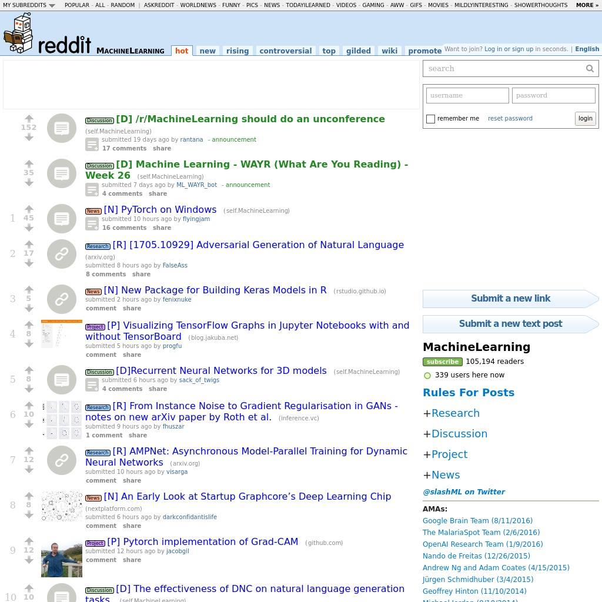
**이미지 캡션:** 이 이미지는 인기 있는 온라인 커뮤니티인 레딧의 머신러닝 서브레딧 페이지를 보여줍니다. 페이지 상단에는 레딧 로고와 함께 "MACHINE LEARNING"이라는 제목이 있고, 그 아래에는 "hot", "new", "rising", "controversial", "top", "gilded", "wiki", "promote"와 같은 다양한 정렬 옵션이 있습니다. 오른쪽 상단에는 로그인 폼이 있으며, 사용자 이름과 비밀번호를 입력하고 로그인할 수 있습니다. 페이지 중앙에는 머신러닝 관련 게시물 목록이 표시되며, 각 게시물은 제목, 작성자, 제출 시간, 댓글 수 등의 정보를 포함합니다. 게시물 유형은 "Discussion", "News", "Research", "Project" 등으로 구분되어 있습니다. 예를 들어, 첫 번째 게시물은 "[D] /r/MachineLearning should do an unconference"라는 제목의 토론 게시물이며, 19일 전에 제출되었고 17개의 댓글이 있습니다. 두 번째 게시물은 "[D] Machine Learning - WAYR (What Are You Reading) - Week 26"이라는 제목의 토론 게시물로, 7일 전에 제출되었고 4개의 댓글이 있습니다. 세 번째 게시물은 "[N] PyTorch on Windows"라는 제목의 뉴스 게시물로, 10시간 전에 제출되었고 16개의 댓글이 있습니다. 네 번째 게시물은 "[R] [1705.10929] Adversarial Generation of Natural Language"라는 제목의 연구 게시물로, 8시간 전에 제출되었고 8개의 댓글이 있습니다. 다섯 번째 게시물은 "[N] New Package for Building Keras Models in R"이라는 제목의 뉴스 게시물로, 2시간 전에 제출되었고 댓글이 하나 있습니다. 여섯 번째 게시물은 "[P] Visualizing TensorFlow Graphs in Jupyter Notebooks with and without TensorBoard"라는 제목의 프로젝트 게시물로, 5시간 전에 제출되었고 댓글이 하나 있습니다. 일곱 번째 게시물은 "[D]Recurrent Neural Networks for 3D models"이라는 제목의 토론 게시물로, 6시간 전에 제출되었고 4개의 댓글이 있습니다. 여덟 번째 게시물은 "[R] From Instance Noise to Gradient Regularisation in GANs - notes on new arXiv paper by Roth et al."이라는 제목의 연구 게시물로, 9시간 전에 제출되었고 댓글이 하나 있습니다. 아홉 번째 게시물은 "[R] AMPNet: Asynchronous Model-Parallel Training for Dynamic Neural Networks"라는 제목의 연구 게시물로, 10시간 전에 제출되었고 댓글이 하나 있습니다. 열 번째 게시물은 "[N] An Early Look at Startup Graphcore's Deep Learning Chip"이라는 제목의 뉴스 게시물로, 6시간 전에 제출되었고 댓글이 하나

> #오늘의레딧 https://www.reddit.com/r/MachineLearning/ 아침부터 다양한 소식이 많네요.  1. Windows의 PyTorch 2. R의 Keras 모델 구축을위한 새로운 패키지 3. TensorBoard 유무에 관계없이 Jupyter Notebook의 TensorFlow 그래프 시각화 4. 3D 모델을위한 반복적 인 신경망 5. 인스턴스 소음에서 GAN의 그라디언트 정규화까지 - Roth 외의 새로운 arXiv 논문 노트 6. AMPNet : 동적 신경망을위한 비동기 모델 - 병렬 교육 7. 시동 Graphcore의 깊은 배우는 칩에 이른보기 8. Grad-CAM의 Pytorch 구현 9. 자연 언어 생성 작업에 대한 DNC의 효과. 10. arXiv Paper to Python 구현 스크린 캐스트 시리즈 11. DeepMind는 최신 버전의 AlphaGo에 대한 변경 사항을 설명합니다. 12. 깊은 학습을 목표로하는 웨이브 컴퓨팅 13. Tacotron의 TensorFlow 구현 : 완벽한 종단 간 텍스트 - 음성 합성 모델 14. 치우친 Wasserstein 그라디언트에 대한 솔루션 인 Cramer 거리 15. 누구나 "자동화 된"ML 도구 사용 경험이 있습니까? AutML, TPOT, scikit-hyperopt 등과 같이? 16. 깊은 학습을위한 다중 태스크 학습 개요 17. 조합 최적화 문제를 해결하기위한 신경 회로망 18. pix2code : 그래픽 사용자 인터페이스에서 코드 생성하기 19. Conference.ai는 SF의 이번 금요일에 Google, Baidu, Maluuba, Amazon 등의 프리젠 테이션으로 진행됩니다. 20. 순서는 관심 메커니즘을 결정합니다.  1. https://www.reddit.com/r/MachineLearning/comments/6emoh5/n_pytorch_on_windows/ 2. https://rstudio.github.io/keras/ 3. https://blog.jakuba.net/2017/05/30/tensorflow-visualization.html 4. https://www.reddit.com/r/MachineLearning/comments/6eoejy/drecurrent_neural_networks_for_3d_models/ 5. http://www.inference.vc/from-instance-noise-to-gradient-regularisation/ 6. https://arxiv.org/abs/1705.09786 7. https://www.nextplatform.com/2017/03/09/early-look-startup-graphcores-deep-learning-chip/ 8. https://github.com/jacobgil/pytorch-grad-cam 9. https://www.reddit.com/r/MachineLearning/comments/6emaj6/d_the_effectiveness_of_dnc_on_natural_language/ 10. https://www.youtube.com/watch?v=S1HE9SpZl8A 11. https://www.theverge.com/2017/5/30/15712300/alphago-ai-humanity-google-artificial-intelligence-ke-jie 12. https://www.bdti.com/InsideDSP/2016/11/17/WaveComputing 13. https://github.com/Kyubyong/tacotron 14. https://arxiv.org/pdf/1705.10743.pdf 15. https://www.reddit.com/r/MachineLearning/comments/6efs8u/d_anyone_have_experience_with_automated_ml_tools/ 16. http://sebastianruder.com/multi-task/index.html 17. https://www.reddit.com/r/MachineLearning/comments/6eieby/d_neural_networks_for_solving_combinatorial/ 18. https://uizard.io/research#pix2code 19. https://aiconference.eventbrite.com?discount=redditML 20. https://www.reddit.com/r/MachineLearning/comments/6efl5g/d_order_matters_attention_mechanisms/

### 6월 3일 (토) 08:55 · 📷 사진 (1장)

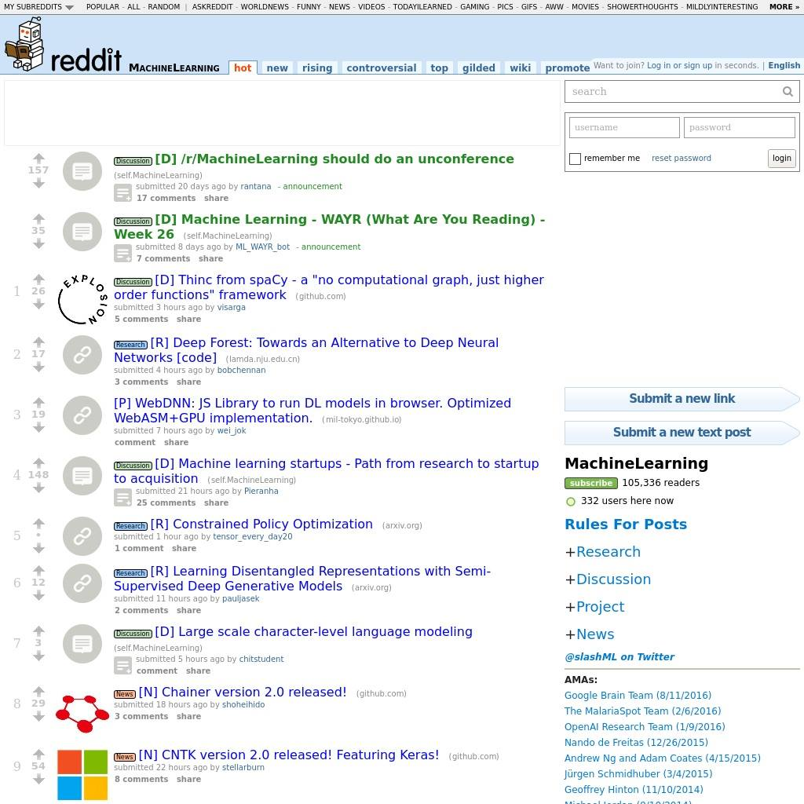
**이미지 캡션:** 이 이미지는 레딧의 머신러닝 서브레딧 페이지를 보여줍니다. 페이지 상단에는 레딧 로고와 함께 "MACHINE LEARNING"이라는 제목이 있고, 그 옆에는 "hot", "new", "rising", "controversial", "top", "gilded", "wiki"와 같은 카테고리 탭이 있습니다. 오른쪽 상단에는 검색창과 로그인/회원가입을 위한 입력란이 있습니다. 페이지 중앙에는 다양한 머신러닝 관련 게시물 목록이 표시되며, 각 게시물은 제목, 작성자, 제출 시간, 댓글 수 등의 정보를 포함하고 있습니다. 게시물 제목 옆에는 "Discussion", "Research", "News"와 같은 태그가 붙어 있습니다. 페이지 오른쪽에는 "Submit a new link" 및 "Submit a new text post" 버튼과 함께 "Machine Learning" 서브레딧의 구독자 수와 현재 접속자 수가 표시되어 있습니다. 또한, "Rules For Posts" 섹션에는 "+Research", "+Discussion", "+Project", "+News"와 같은 하위 카테고리가 나열되어 있으며, "@slashML on Twitter" 링크와 "AMAS" 섹션에는 유명 연구자들의 이름과 관련 날짜가 포함되어 있습니다. 전반적으로 기술 관련 커뮤니티의 정보 공유 및 토론이 이루어지는 웹사이트의 모습을 보여줍니다.

> #오늘의레딧 https://www.reddit.com/r/MachineLearning/ 재미난 이야기들이 많습니다  1. Thin은 spaCy에서 - "계산 그래프가없고, 더 높은 차수 함수"프레임 워크 2. 기계 학습 신생 기업 - 연구에서 시작, 인수까지의 경로 3. 제한된 정책 최적화 4. 반 감독 깊은 생성 모델을 이용한 Disentangled 표현 학습 5. 대규모 문자 레벨 언어 모델링 6. Chainer 버전 2.0 출시! 7. CNT 버전 2.0 출시! Keras 특징! 8. 수퍼 네트워크 예산으로 시간 효율적 딥 아키텍처 학습 9. Jeff는 IEEE Spectrum에 썼습니다. 지능형 기계가 대뇌 피질에서 배우기 위해 필요한 것 10. Google Brain &#39;s Magenta : Waybackprop (계층 형 RNN의 경우 더 똑똑한 백 드롭 자르기) 11. DiracNets : 건너 뛰기 연결없이 아주 깊은 신경 네트워크를 훈련하십시오 12. 신경 변이 추론을 이용한 이산 잠정적 인 주제 발견 13. TensorBoard 유무에 관계없이 Jupyter Notebook의 TensorFlow 그래프 시각화 14. Windows의 PyTorch 15. 신경 네트워크 및 심층 학습 리소스 16. 어떤 유형의 생성 네트워크를 사용해야합니까? 17. R의 Keras 모델 구축을위한 새로운 패키지 18. 인스턴스 소음에서 GAN의 그라디언트 정규화까지 - Roth 외의 새로운 arXiv 논문 노트 19. 시동 Graphcore의 깊은 배우는 칩에 이른보기 20. 3D 모델을위한 반복적 인 신경망  1. https://github.com/explosion/thinc 2. https://www.reddit.com/r/MachineLearning/comments/6ernyq/d_machine_learning_startups_path_from_research_to/ 3. https://arxiv.org/abs/1705.10528 4. https://arxiv.org/pdf/1706.00400.pdf 5. https://www.reddit.com/r/MachineLearning/comments/6ewbvo/d_large_scale_characterlevel_language_modeling/ 6. https://github.com/chainer/chainer/releases/tag/v2.0.0 7. https://github.com/Microsoft/CNTK/releases 8. https://arxiv.org/abs/1706.00046 9. http://spectrum.ieee.org/computing/software/what-intelligent-machines-need-to-learn-from-the-neocortex 10. https://magenta.tensorflow.org/blog/2017/06/01/waybackprop/ 11. https://arxiv.org/abs/1706.00388 12. https://arxiv.org/abs/1706.00359 13. https://blog.jakuba.net/2017/05/30/tensorflow-visualization.html 14. https://www.reddit.com/r/MachineLearning/comments/6emoh5/n_pytorch_on_windows/ 15. https://www.reddit.com/r/MachineLearning/comments/6etbww/d_resources_for_neural_networks_and_deep_learning/ 16. https://www.reddit.com/r/MachineLearning/comments/6er46i/d_which_type_of_generative_network_should_i_use/ 17. https://rstudio.github.io/keras/ 18. http://www.inference.vc/from-instance-noise-to-gradient-regularisation/ 19. https://www.nextplatform.com/2017/03/09/early-look-startup-graphcores-deep-learning-chip/ 20. https://www.reddit.com/r/MachineLearning/comments/6eoejy/drecurrent_neural_networks_for_3d_models/

### 6월 3일 (토) 20:12 · Wonderful swimming at the Haeundae beach…

📍 해운대구-Haeundae

Wonderful swimming at the Haeundae beach.

**이미지 캡션:** 해변에 서 있는 성인 남성은 검은색 긴팔 래시가드와 무늬가 있는 수영복 반바지를 입고 있으며, 주황색 수영모와 선글라스를 착용하고 있습니다. 그는 오른팔을 위로 뻗어 무언가를 가리키고 있으며, 왼손은 허리에 얹고 있습니다. 그의 표정은 밝고 자신감 있어 보입니다. 배경에는 잔잔한 파도가 치는 바다가 펼쳐져 있고, 멀리 수면 위에 부표와 구조물로 보이는 것이 보입니다. 하늘은 구름이 낀 흐린 날씨입니다. 해변은 모래로 덮여 있으며, 군데군데 해초가 흩어져 있습니다. 전반적으로 활동적인 분위기를 풍기는 사진입니다.
 
**이미지 캡션:** 한 명의 성인 남성이 해변에 서서 카메라를 바라보고 있다. 남성은 30대 후반에서 40대 초반으로 보이며, 짧은 검은색 래시가드를 입고 있으며, 허리에는 무늬가 있는 수영복 반바지를 입고 있다. 머리에는 주황색 수영모를 쓰고 있으며, 그 위에 파란색 수경을 걸치고 있다. 그의 표정은 약간 미소를 띠고 있으며, 양손은 허리에 얹고 있다. 배경에는 잔잔한 파도가 치는 바다가 보이고, 멀리 등대가 희미하게 보인다. 하늘은 구름이 낀 흐린 날씨이며, 해변은 모래로 덮여 있고 군데군데 해초가 흩어져 있다. 전체적으로 야외 활동을 준비하는 듯한 분위기이다.

### 6월 3일 (토) 20:56 · 생신 축하드립니다.

생신 축하드립니다.

### 6월 3일 (토) 20:56 · ↪ 생신 축하드립니다.

*다른 프로필에 남긴 글*

생신 축하드립니다.

### 6월 4일 (일) 08:52 · 📷 사진 (1장)

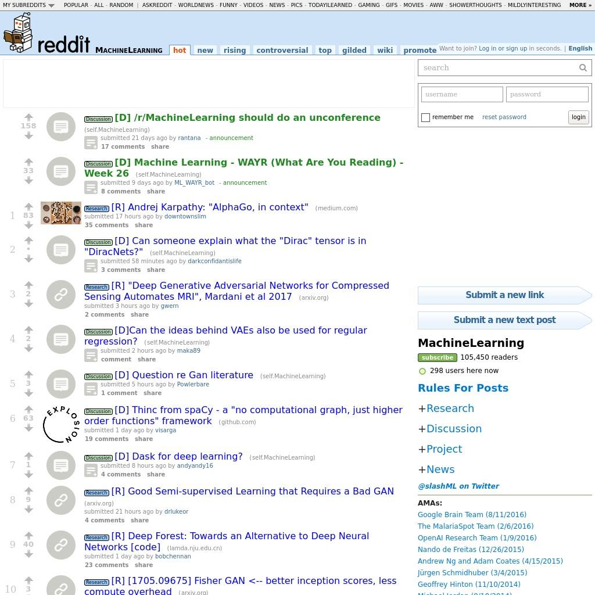
**이미지 캡션:** 이 이미지는 레딧의 머신러닝 서브레딧 페이지를 보여줍니다. 페이지 상단에는 레딧 로고와 함께 "MACHINE LEARNING"이라는 제목이 있고, 그 아래에는 "hot", "new", "rising", "controversial", "top", "gilded", "wiki"와 같은 카테고리 탭이 있습니다. 오른쪽 상단에는 로그인 또는 회원가입을 할 수 있는 입력 필드와 버튼이 있습니다. 페이지 중앙에는 다양한 머신러닝 관련 게시물 목록이 표시됩니다. 각 게시물은 제목, 작성자, 제출 시간, 댓글 수 등의 정보를 포함하고 있으며, 게시물 옆에는 추천/비추천을 나타내는 화살표와 숫자가 있습니다. 예를 들어, 첫 번째 게시물은 "[D] /r/MachineLearning should do an unconference"라는 제목으로 21일 전에 제출되었고 17개의 댓글이 있습니다. 두 번째 게시물은 "[D] Machine Learning - WAYR (What Are You Reading) - Week 26"이라는 제목으로 9일 전에 제출되었고 8개의 댓글이 있습니다. 세 번째 게시물은 "[R] Andrej Karpathy: "AlphaGo, in context""라는 제목으로 17시간 전에 제출되었고 35개의 댓글이 있습니다. 페이지 오른쪽에는 "Submit a new link" 및 "Submit a new text post" 버튼과 함께 "Machine Learning" 서브레딧에 대한 구독 정보와 현재 접속자 수가 표시됩니다. 또한 "Rules For Posts" 섹션과 함께 "+Research", "+Discussion", "+Project", "+News"와 같은 추가 섹션이 있습니다. 하단에는 "AMAS" 섹션에 여러 유명 연구자들의 이름과 날짜가 나열되어 있습니다. 전반적으로 이 페이지는 머신러닝 커뮤니티의 최신 정보와 토론을 공유하는 온라인 포럼의 모습을 보여줍니다.

> #오늘의레딧 https://www.reddit.com/r/MachineLearning/ 재미난 이야기들이 많습니다  1. Andrej Karpathy : "AlphaGo, 컨텍스트에서" 2. 누군가가 "Dirac"텐서가 "DiracNets"에 무엇인지 설명 할 수 있습니까? 3. "Compressed Sensing을위한 깊은 Generative Adversarial Networks는 MRI를 자동화합니다", Mardani et al 2017 4. VAE의 아이디어는 또한 정규 회귀에 사용될 수 있습니까? 5. 질문 간간 문학 6. Thin은 spaCy에서 - "계산 그래프가없고, 더 높은 차수 함수"프레임 워크 7. 깊은 학습 슬랩? 8. 나쁜 GAN을 필요로하는 좋은 세미 감독 학습 9. 제한된 정책 최적화 10. TensorFlow를 사용하여 AlexNet을 올바르게 구현 했습니까? 11. 기계 학습 신생 기업 - 연구에서 시작, 인수까지의 경로 12. Jeff는 IEEE Spectrum에 썼습니다. 지능형 기계가 대뇌 피질에서 배우기 위해 필요한 것 13. Tensor Networks의 문헌 14. 대규모 문자 레벨 언어 모델링 15. 반 감독 깊은 생성 모델을 이용한 Disentangled 표현 학습 16. Chainer 버전 2.0 출시! 17. CNT 버전 2.0 출시! Keras 특징! 18. 수퍼 네트워크 예산으로 시간 효율적 딥 아키텍처 학습 19. Google Brain &#39;s Magenta : Waybackprop (계층 형 RNN의 경우 더 똑똑한 백 드롭 자르기) 20. DiracNets : 건너 뛰기 연결없이 아주 깊은 신경 네트워크를 훈련하십시오  1. https://medium.com/@karpathy/alphago-in-context-c47718cb95a5 2. https://www.reddit.com/r/MachineLearning/comments/6f42i9/d_can_someone_explain_what_the_dirac_tensor_is_in/ 3. https://arxiv.org/abs/1706.00051 4. https://www.reddit.com/r/MachineLearning/comments/6f3i9v/dcan_the_ideas_behind_vaes_also_be_used_for/ 5. https://www.reddit.com/r/MachineLearning/comments/6f2lf8/d_question_re_gan_literature/ 6. https://github.com/explosion/thinc 7. https://www.reddit.com/r/MachineLearning/comments/6f1rhw/d_dask_for_deep_learning/ 8. https://arxiv.org/abs/1705.09783 9. https://arxiv.org/abs/1705.10528 10. https://www.reddit.com/r/MachineLearning/comments/6f0tqu/d_is_this_correct_implementation_of_alexnet_with/ 11. https://www.reddit.com/r/MachineLearning/comments/6ernyq/d_machine_learning_startups_path_from_research_to/ 12. http://spectrum.ieee.org/computing/software/what-intelligent-machines-need-to-learn-from-the-neocortex 13. https://www.reddit.com/r/MachineLearning/comments/6eyusl/d_literature_on_tensor_networks/ 14. https://www.reddit.com/r/MachineLearning/comments/6ewbvo/d_large_scale_characterlevel_language_modeling/ 15. https://arxiv.org/pdf/1706.00400.pdf 16. https://github.com/chainer/chainer/releases/tag/v2.0.0 17. https://github.com/Microsoft/CNTK/releases 18. https://arxiv.org/abs/1706.00046 19. https://magenta.tensorflow.org/blog/2017/06/01/waybackprop/ 20. https://arxiv.org/abs/1706.00388

### 6월 5일 (월) 08:52 · 📷 사진 (1장)

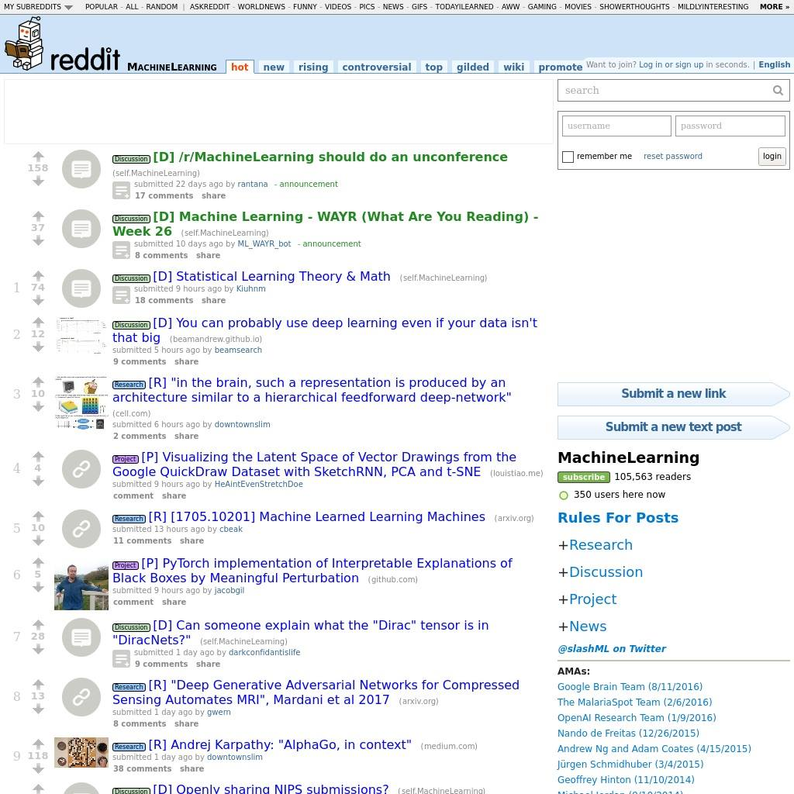
**이미지 캡션:** 이 이미지는 레딧의 머신러닝 서브레딧 페이지를 보여줍니다. 페이지 상단에는 레딧 로고와 함께 "MACHINE LEARNING"이라는 제목이 있고, 그 아래에는 "hot", "new", "rising", "controversial", "top", "gilded", "wiki", "promote"와 같은 탭들이 있습니다. 오른쪽 상단에는 로그인 또는 회원가입을 할 수 있는 입력란과 버튼이 있습니다. 메인 콘텐츠 영역에는 다양한 주제의 게시물 목록이 표시됩니다. 각 게시물은 제목, 작성자, 제출 시간, 댓글 수, 공유 수 등의 정보를 포함하고 있습니다. 게시물 중에는 "Discussion", "Research", "Project"와 같은 태그가 붙어 있으며, 일부 게시물에는 관련 이미지나 링크가 첨부되어 있습니다. 예를 들어, 6번째 게시물에는 파란색 셔츠를 입고 팔짱을 낀 채 카메라를 응시하는 성인 남성이 사진으로 첨부되어 있습니다. 오른쪽 사이드바에는 "MachineLearning" 서브레딧의 구독자 수와 현재 접속자 수가 표시되어 있으며, "Rules For Posts" 섹션에는 "Research", "Discussion", "Project", "News"와 같은 카테고리가 나열되어 있습니다. 또한, "AMAS" 섹션에는 과거 AMA(Ask Me Anything) 세션에 참여했던 인물들의 이름과 날짜가 나열되어 있습니다. 전반적으로 이 페이지는 머신러닝 관련 정보를 공유하고 토론하는 온라인 커뮤니티의 모습을 보여줍니다.

> #오늘의레딧 https://www.reddit.com/r/MachineLearning/ 오늘도 새소식이 많군요.  1. 통계 학습 이론 및 수학 2. 데이터가 그렇게 크지 않은 경우에도 깊은 학습을 사용할 수 있습니다. 3. "뇌에서 이러한 표현은 계층 적 피드 포워드 딥 네트워크와 유사한 아키텍처에 의해 생성됩니다." 4. SketchRNN, PCA 및 t-SNE를 사용하여 Google QuickDraw 데이터 세트에서 벡터 드로잉의 잠재 공간 시각화 5. 의미있는 섭동에 의한 블랙 박스의 해석 가능한 해석의 PyTorch 구현 6. 누군가가 "Dirac"텐서가 "DiracNets"에 무엇인지 설명 할 수 있습니까? 7. "Compressed Sensing을위한 깊은 Generative Adversarial Networks는 MRI를 자동화합니다", Mardani et al 2017 8. Andrej Karpathy : "AlphaGo, 컨텍스트에서" 9. NIPS 제출물을 공개적으로 공유하고 있습니까? 10. VAE의 아이디어는 또한 정규 회귀에 사용될 수 있습니까? 11. 질문 간간 문학 12. Thin은 spaCy에서 - "계산 그래프가없고, 더 높은 차수 함수"프레임 워크 13. 나쁜 GAN을 필요로하는 좋은 세미 감독 학습 14. 깊은 학습 슬랩? 15. 제한된 정책 최적화 16. TensorFlow를 사용하여 AlexNet을 올바르게 구현 했습니까? 17. Jeff는 IEEE Spectrum에 썼습니다. 지능형 기계가 대뇌 피질에서 배우기 위해 필요한 것 18. 기계 학습 신생 기업 - 연구에서 시작, 인수까지의 경로 19. 대규모 문자 레벨 언어 모델링 20. Tensor Networks의 문헌  1. https://www.reddit.com/r/MachineLearning/comments/6f7kmx/d_statistical_learning_theory_math/ 2. http://beamandrew.github.io/deeplearning/2017/06/04/deep_learning_works.html 3. http://www.cell.com/cell/abstract/S0092-8674\(17\)30538-X 4. http://louistiao.me/posts/notebooks/visualizing-the-latent-space-of-vector-drawings-from-the-google-quickdraw-dataset-with-sketchrnn-pca-and-t-sne/ 5. https://github.com/jacobgil/pytorch-explain-black-box 6. https://www.reddit.com/r/MachineLearning/comments/6f42i9/d_can_someone_explain_what_the_dirac_tensor_is_in/ 7. https://arxiv.org/abs/1706.00051 8. https://medium.com/@karpathy/alphago-in-context-c47718cb95a5 9. https://www.reddit.com/r/MachineLearning/comments/6f4fd4/d_openly_sharing_nips_submissions/ 10. https://www.reddit.com/r/MachineLearning/comments/6f3i9v/dcan_the_ideas_behind_vaes_also_be_used_for/ 11. https://www.reddit.com/r/MachineLearning/comments/6f2lf8/d_question_re_gan_literature/ 12. https://github.com/explosion/thinc 13. https://arxiv.org/abs/1705.09783 14. https://www.reddit.com/r/MachineLearning/comments/6f1rhw/d_dask_for_deep_learning/ 15. https://arxiv.org/abs/1705.10528 16. https://www.reddit.com/r/MachineLearning/comments/6f0tqu/d_is_this_correct_implementation_of_alexnet_with/ 17. http://spectrum.ieee.org/computing/software/what-intelligent-machines-need-to-learn-from-the-neocortex 18. https://www.reddit.com/r/MachineLearning/comments/6ernyq/d_machine_learning_startups_path_from_research_to/ 19. https://www.reddit.com/r/MachineLearning/comments/6ewbvo/d_large_scale_characterlevel_language_modeling/ 20. https://www.reddit.com/r/MachineLearning/comments/6eyusl/d_literature_on_tensor_networks/

### 6월 6일 (화) 08:52 · 📷 사진 (1장)

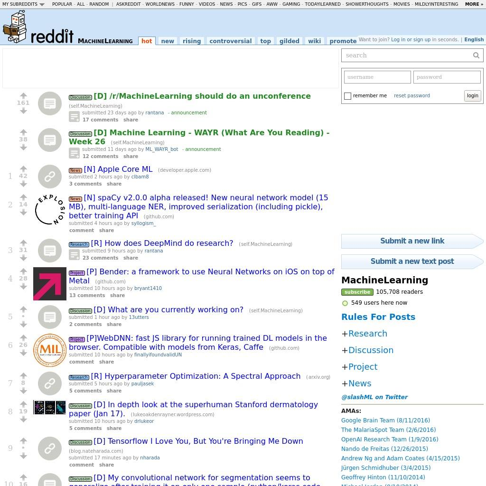
**이미지 캡션:** 이 이미지는 레딧의 머신러닝 서브레딧 페이지를 보여주며, 다양한 게시물과 관련 정보가 나열되어 있습니다. 페이지 상단에는 레딧 로고와 함께 "MACHINE LEARNING"이라는 제목이 보이고, 그 아래에는 "hot", "new", "rising", "controversial", "top", "gilded", "wiki", "promote"와 같은 탭들이 있습니다. 오른쪽 상단에는 로그인 폼이 있으며, 사용자 이름과 비밀번호를 입력하고 로그인할 수 있는 필드와 "remember me", "reset password" 옵션이 있습니다. 페이지 중앙에는 여러 게시물들이 시간 순서대로 나열되어 있으며, 각 게시물은 제목, 작성자, 제출 시간, 댓글 수, 공유 수 등의 정보를 포함하고 있습니다. 게시물 제목들은 "[D]" (Discussion), "[N]" (News), "[R]" (Research), "[P]" (Project)와 같은 접두사로 분류되어 있습니다. 예를 들어, "should do an unconference"라는 제목의 토론 게시물, "Machine Learning - WAYR (What Are You Reading) - Week 26"이라는 제목의 토론 게시물, "Apple Core ML"이라는 제목의 뉴스 게시물, "spaCy v2.0.0 alpha released!"라는 제목의 뉴스 게시물, "How does DeepMind do research?"라는 제목의 연구 게시물, "Bender: a framework to use Neural Networks on iOS on top of Metal"이라는 제목의 프로젝트 게시물 등이 보입니다. 또한, "What are you currently working on?"이라는 토론 게시물, "WebDNN: fast JS library for running trained DL models in the browser."라는 프로젝트 게시물, "Hyperparameter Optimization: A Spectral Approach"라는 연구 게시물, "In depth look at the superhuman Stanford dermatology paper (Jan 17)."라는 토론 게시물, "Tensorflow I Love You, But You're Bringing Me Down"이라는 토론 게시물이 있습니다. 오른쪽 사이드바에는 "Submit a new link", "Submit a new text post" 버튼이 있고, "MachineLearning" 서브레딧의 구독자 수와 현재 접속자 수가 표시되어 있습니다. 또한, "Rules For Posts" 섹션 아래에는 "+Research", "+Discussion", "+Project", "+News"와 같은 카테고리 링크가 있습니다. 그 아래에는 "@slashML on Twitter" 링크와 "AMAS" 섹션이 있으며, 과거 AMA(Ask Me Anything) 세션 목록이 날짜와 함께 나열되어 있습니다. 전반적으로 이 페이지는 머신러닝 분야의 최신 정보와 토론을 공유하는 커뮤니티의 모습을 보여줍니다.

> #오늘의레딧 https://www.reddit.com/r/MachineLearning/ 아침부터 다양한 소식이 많네요.  1. 애플 코어 ML 2. spaCy v2.0.0 알파가 출시되었습니다! 새로운 신경망 모델 (15 MB), 다국어 NER, 향상된 직렬화 (피클 포함), 향상된 교육 API 3. DeepMind는 어떻게 연구합니까? 4. Bender : Metal 위에 iOS에서 신경망을 사용하기위한 프레임 워크 5. 현재 어떤 작업을하고 계십니까? 6. WebDNN : 브라우저에서 훈련 된 DL 모델을 실행하기위한 빠른 JS 라이브러리. Keras, Caffe의 모델과 호환 가능 7. 하이퍼 매개 변수 최적화 : 스펙트럼 접근법 8. 초인간적 인 스탠포드 피부과 논문 (1 월 17 일)을 자세히보십시오. 9. Tensorflow 나는 당신을 사랑하지만, 당신은 나를 실망시키고 있습니다. 10. 세그먼트 화를위한 컨볼 루션 네트워크는 하나의 샘플 (파이썬 / 케 라스 코드 내부)에서 트레이닝 한 후 일반화 된 것처럼 보입니다. 11. MXNet R 패키지가있는 조건부 생성 적 adversarial 네트워크 (cGAN) 12. 어떤 GAN이 최고 품질의 세대를 성취합니까? 13. 당신은 하이퍼 파라미터 검색 CNN 아키텍처에 대해 어떻게 생각합니까? 14. 파이썬에서 PILCO 코드가 있습니까? 15. 파이썬에서 C-LSTM 또는 AC-BLSTM을 구현하는 라이브러리가 있습니까? 16. 누구나 Keras / Python의 CNN (길쌈 신경망)에 대한 경험이 있습니까? 도움이 되시면 감사하겠습니다. (x-post from https://www.reddit.com/r/datascience) 17. 이런 종류의 이미지 분할 문제에 사용할 수있는 몇 가지 기술은 무엇입니까? 18. 비선형 성 및 워드 임베딩 레이어 19. 데이터가 그렇게 크지 않은 경우에도 깊은 학습을 사용할 수 있습니다. 20. 조기 종료, 손실, 정확성 또는 기타?  1. https://developer.apple.com/machine-learning/ 2. https://github.com/explosion/spaCy/releases/tag/v2.0.0-alpha 3. https://www.reddit.com/r/MachineLearning/comments/6feiuo/r_how_does_deepmind_do_research/ 4. https://github.com/xmartlabs/Bender 5. https://www.reddit.com/r/MachineLearning/comments/6fhr7w/d_what_are_you_currently_working_on/ 6. https://github.com/mil-tokyo/webdnn 7. https://arxiv.org/pdf/1706.00764v1.pdf 8. https://lukeoakdenrayner.wordpress.com/2017/06/05/the-end-of-human-doctors-the-bleeding-edge-of-medical-ai-research-part-2/ 9. http://blog.nateharada.com/tensorflow-i-love-you-but 10. https://www.reddit.com/r/MachineLearning/comments/6fdquv/d_my_convolutional_network_for_segmentation_seems/ 11. http://dmlc.ml/rstats/2017/06/01/Generative-Adversarial-Network-in-R.html 12. https://www.reddit.com/r/MachineLearning/comments/6fgi7l/d_which_gan_achieves_the_highest_quality/ 13. https://www.reddit.com/r/MachineLearning/comments/6fi4dj/d_how_do_you_go_about_hyperparameter_searching/ 14. https://www.reddit.com/r/MachineLearning/comments/6feznz/d_is_there_pilco_code_in_python/ 15. https://www.reddit.com/r/MachineLearning/comments/6fhtp9/d_are_there_any_libraries_in_python_that/ 16. https://www.reddit.com/r/MachineLearning/comments/6ff6ku/p_anyone_have_experience_with_cnns_convolutional/ 17. https://www.reddit.com/r/MachineLearning/comments/6fh9k9/d_what_are_some_techniques_that_can_be_used_on/ 18. https://www.reddit.com/r/MachineLearning/comments/6fedrc/d_nonlinearity_and_word_embedding_layer/ 19. http://beamandrew.github.io/deeplearning/2017/06/04/deep_learning_works.html 20. https://www.reddit.com/r/MachineLearning/comments/6fg24h/d_early_termination_loss_accuracy_or_other/

### 6월 7일 (수) 08:52 · 📷 사진 (1장)

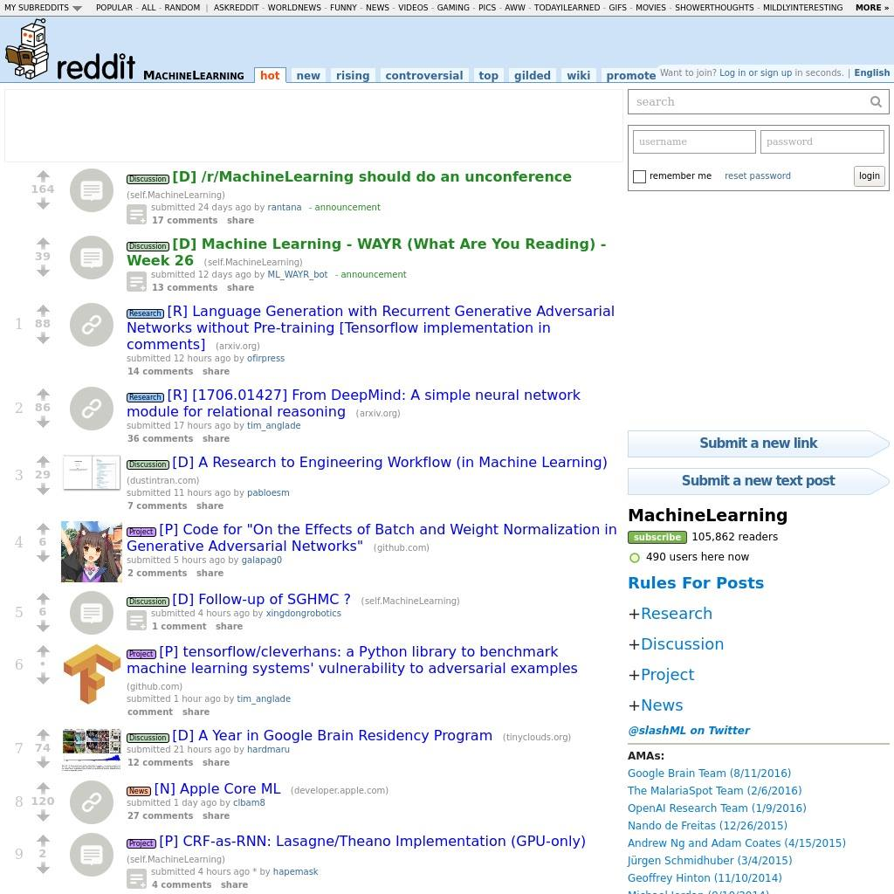
**이미지 캡션:** 이 이미지는 인기 있는 온라인 커뮤니티인 레딧의 머신러닝 서브레딧 페이지를 보여줍니다. 페이지 상단에는 레딧 로고와 함께 "MACHINE LEARNING"이라는 제목이 있고, 그 아래에는 "hot", "new", "rising", "controversial", "top", "gilded", "wiki"와 같은 다양한 정렬 옵션이 있습니다. 오른쪽 상단에는 로그인 폼이 있으며, 사용자 이름, 비밀번호 입력란과 "remember me", "reset password", "login" 버튼이 있습니다. 페이지 중앙에는 여러 게시물 목록이 표시되며, 각 게시물은 제목, 작성자, 제출 시간, 댓글 수, 공유 수 등의 정보를 포함합니다. 게시물들은 주로 머신러닝 관련 연구, 프로젝트, 토론 등이며, 링크는 github.com, arxiv.org, developer.apple.com 등 다양한 출처를 가리킵니다. 페이지 오른쪽에는 "Machine Learning" 서브레딧의 구독자 수와 "Rules For Posts" 섹션이 있으며, "Research", "Discussion", "Project", "News"와 같은 하위 카테고리가 나열되어 있습니다. 또한, "@slashML on Twitter" 링크와 과거 AMA(Ask Me Anything) 세션 목록도 보입니다. 전반적으로 이 페이지는 머신러닝 분야의 최신 정보와 토론을 공유하는 온라인 커뮤니티의 모습을 보여줍니다.

> #오늘의레딧 https://www.reddit.com/r/MachineLearning/ 아침부터 다양한 소식이 많네요.  1. 엔지니어링 워크 플로 연구 (기계 학습) 2. "Generative Adversarial Networks에서 배치 및 무게 정규화의 효과에 대한 코드" 3. SGHMC의 후속 조치는 무엇입니까? 4. tensorflow / cleverhans : 기계 학습 시스템의 적법성에 대한 벤치마킹을위한 Python 라이브러리 5. Google 브레인 레지던트 프로그램의 한 해 6. 애플 코어 ML 7. CRF-as-RNN : Lasagne / Theano 구현 (GPU 전용) 8. Tensorflow 나는 당신을 사랑하지만, 당신은 나를 실망시키고 있습니다. 9. 단일 CPU 및 PCIe 스위치 대 2 개의 제온 10. spaCy v2.0.0 알파가 출시되었습니다! 새로운 신경망 모델 (15 MB), 다국어 NER, 향상된 직렬화 (피클 포함), 향상된 교육 API 11. ML을 이용한 스케줄링 알고리즘의 향상 12. Tensorflow 구현을위한 매칭 네트워크, 피드백은 매우 환영합니다. 13. 현재 어떤 작업을하고 계십니까? 14. Apple WWDC에서 Session 608 "Compute에 Metal 2 사용하기"는 흥미 진진한 것으로 보이며 NN의 GPU 처리를위한 새로운 프리미티브를 목표로합니다. 누군가가 그것에 참석하고보고 할 수 있기를 바랍니다. 15. DeepMind는 어떻게 연구합니까? 16. 하이퍼 매개 변수 최적화 : 스펙트럼 접근법 17. WebDNN : 브라우저에서 훈련 된 DL 모델을 실행하기위한 빠른 JS 라이브러리. Keras, Caffe의 모델과 호환 가능 18. Bender : Metal 위에 iOS에서 신경망을 사용하기위한 프레임 워크 19. MXNet R 패키지가있는 조건부 생성 적 adversarial 네트워크 (cGAN) 20. 초인간적 인 스탠포드 피부과 논문 (1 월 17 일)에 대해 자세히 살펴보십시오.  1. http://dustintran.com/blog/a-research-to-engineering-workflow 2. https://github.com/stormraiser/GAN-weight-norm 3. https://www.reddit.com/r/MachineLearning/comments/6fnysr/d_followup_of_sghmc/ 4. https://github.com/tensorflow/cleverhans 5. http://tinyclouds.org/residency/ 6. https://developer.apple.com/machine-learning/ 7. https://www.reddit.com/r/MachineLearning/comments/6fny2w/p_crfasrnn_lasagnetheano_implementation_gpuonly/ 8. http://blog.nateharada.com/tensorflow-i-love-you-but 9. https://www.reddit.com/r/MachineLearning/comments/6fl7kv/d_single_cpu_and_pcie_switches_vs_two_xeons/ 10. https://github.com/explosion/spaCy/releases/tag/v2.0.0-alpha 11. https://www.reddit.com/r/MachineLearning/comments/6fleg4/r_enhancement_of_an_scheduling_algorithm_with_ml/ 12. https://github.com/AntreasAntoniou/MatchingNetworks 13. https://www.reddit.com/r/MachineLearning/comments/6fhr7w/d_what_are_you_currently_working_on/ 14. https://www.reddit.com/r/MachineLearning/comments/6fkths/d_at_the_apple_wwdc_session_608_using_metal_2_for/ 15. https://www.reddit.com/r/MachineLearning/comments/6feiuo/r_how_does_deepmind_do_research/ 16. https://arxiv.org/pdf/1706.00764v1.pdf 17. https://github.com/mil-tokyo/webdnn 18. https://github.com/xmartlabs/Bender 19. http://dmlc.ml/rstats/2017/06/01/Generative-Adversarial-Network-in-R.html 20. https://lukeoakdenrayner.wordpress.com/2017/06/05/the-end-of-human-doctors-the-bleeding-edge-of-medical-ai-research-part-2/

### 6월 8일 (목) 08:52 · 📷 사진 (1장)

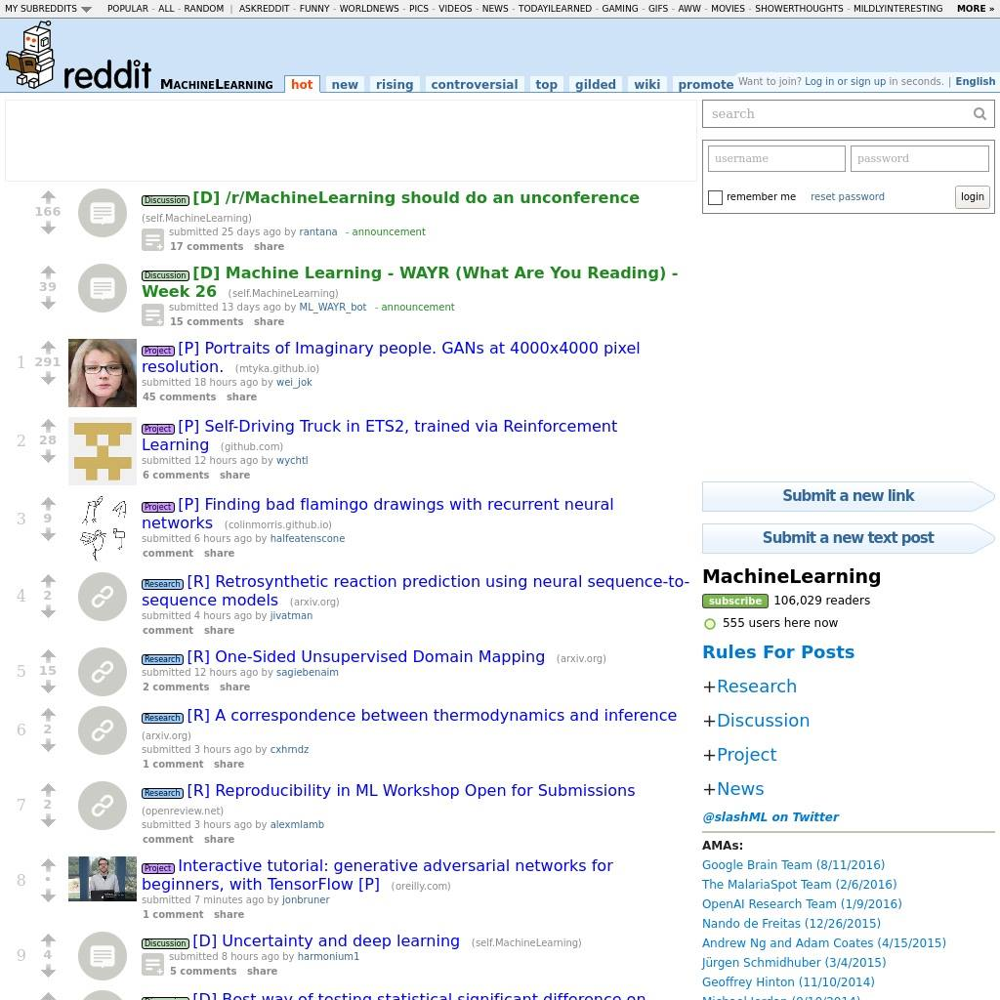
**이미지 캡션:** 이 이미지는 인기 있는 온라인 커뮤니티인 레딧의 머신러닝 서브레딧 페이지를 보여줍니다. 페이지 상단에는 레딧 로고와 함께 "MACHINE LEARNING"이라는 제목이 있고, 그 아래에는 "hot", "new", "rising", "controversial", "top", "gilded", "wiki"와 같은 다양한 정렬 옵션이 있습니다. 오른쪽 상단에는 로그인 또는 회원가입을 위한 입력 필드와 버튼이 있습니다. 페이지 중앙에는 여러 게시물 목록이 표시되며, 각 게시물은 제목, 작성자, 제출 시간, 댓글 수 등의 정보를 포함합니다. 게시물 중에는 "Machine Learning - WAYR (What Are You Reading) - Week 26", "Portraits of Imaginary people. GANs at 4000x4000 pixel resolution.", "Self-Driving Truck in ETS2, trained via Reinforcement Learning", "Finding bad flamingo drawings with recurrent neural networks", "Retrosynthetic reaction prediction using neural sequence-to-sequence models", "One-Sided Unsupervised Domain Mapping", "A correspondence between thermodynamics and inference", "Reproducibility in ML Workshop Open for Submissions", "Interactive tutorial: generative adversarial networks for beginners, with TensorFlow", "Uncertainty and deep learning"와 같은 다양한 주제를 다루고 있습니다. 각 게시물 옆에는 업보트 및 다운보트 화살표와 댓글 수를 나타내는 숫자가 있습니다. 페이지 오른쪽에는 "Submit a new link", "Submit a new text post" 버튼과 함께 "MachineLearning" 서브레딧에 대한 구독 정보, 사용자 수, 규칙, 최신 뉴스 및 과거 AMA(Ask Me Anything) 목록이 표시됩니다. 전반적으로 이 페이지는 머신러닝 분야의 최신 정보와 토론을 공유하는 온라인 커뮤니티의 모습을 보여줍니다.

> #오늘의레딧 https://www.reddit.com/r/MachineLearning/ 재미난 이야기들이 많습니다  1. 상상의 사람들의 초상화. 4000x4000 픽셀 해상도의 GAN 2. 보강 학습을 통해 훈련 된 ETS2의자가 운전 트럭 3. 재발하는 신경 네트워크로 나쁜 플라밍고 그림 찾기 4. 신경 시퀸스 모델을 이용한 역 합성 예측 5. 단면의 감독되지 않는 도메인 매핑 6. 열역학과 추론의 일치 7. ML Workshop의 재발 가능성 8. 불확실성과 깊은 학습 9. 벤치 마크 데이터 세트의 통계적 유의성 차이를 테스트하는 가장 좋은 방법 10. TensorFlow : Scatter Plots의 이미지를 분석하여 좋은 대 나쁜 그래프를 식별 할 수 있습니까? 11. LSTM을 사용하여 뮤지컬 스타일 배우기 및 음악 공연 생성 12. 빠른 R-CNN으로 개체 계산 13. 왜 ResNet은 첫 번째 레이어에 7 × 7 컨볼 루션을 가지고 있습니까? 14. Tensorflow로 시작하여 이제는 PyTorch가 따라 잡았습니다. PyTorch로 전환하기위한 노력을해야합니까? 15. 특징 추출을위한 완전 컨벌루션 DAE. 16. 4-, 5- 차원의 Tensor 분해 17. 유리 | 비전 기반 컴퓨팅 기능 집합 | 실시간 물체 인식 18. 엔지니어링 워크 플로 연구 (기계 학습) 19. "Generative Adversarial Networks에서 배치 및 무게 정규화의 효과에 대한 코드" 20. SGHMC의 후속 조치는 무엇입니까?  1. http://mtyka.github.io/machine/learning/2017/06/06/highres-gan-faces.html 2. https://github.com/aleju/self-driving-truck 3. http://colinmorris.github.io/blog/bad_flamingos 4. https://arxiv.org/abs/1706.01643 5. https://arxiv.org/abs/1706.00826 6. https://arxiv.org/abs/1706.01428 7. https://openreview.net/group?id=ICML.cc/2017/RML 8. https://www.reddit.com/r/MachineLearning/comments/6fu8vx/d_uncertainty_and_deep_learning/ 9. https://www.reddit.com/r/MachineLearning/comments/6fvn7u/d_best_way_of_testing_statistical_significant/ 10. https://www.reddit.com/r/MachineLearning/comments/6fwym6/r_tensorflow_analyze_images_of_scatter_plots_to/ 11. http://imanmalik.com/cs/2017/06/05/neural-style.html 12. https://softwaremill.com/counting-objects-with-faster-rcnn/ 13. https://www.reddit.com/r/MachineLearning/comments/6fsqww/d_why_does_resnet_have_a_77_convolution_in_the/ 14. https://www.reddit.com/r/MachineLearning/comments/6fvcfd/d_started_out_with_tensorflow_and_now_pytorch/ 15. https://www.reddit.com/r/MachineLearning/comments/6fubug/d_fullyconvolutional_dae_for_feature_extraction/ 16. https://www.reddit.com/r/MachineLearning/comments/6fq41p/d_tensor_decomposition_for_4_5_dimensional/ 17. https://www.reddit.com/r/MachineLearning/comments/6ftx1n/pglass_a_set_of_visionbased_computing/ 18. http://dustintran.com/blog/a-research-to-engineering-workflow 19. https://github.com/stormraiser/GAN-weight-norm 20. https://www.reddit.com/r/MachineLearning/comments/6fnysr/d_followup_of_sghmc/

### 6월 9일 (금) 08:52 · 📷 사진 (1장)

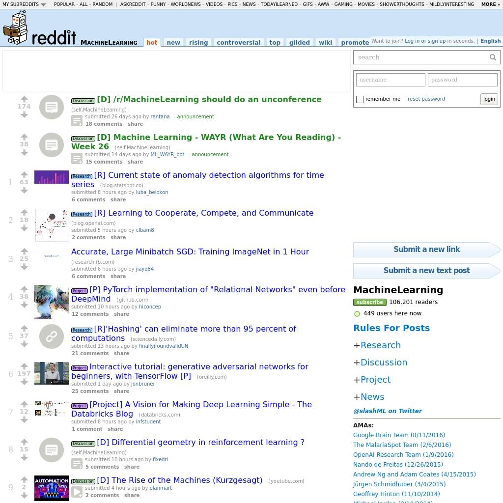
**이미지 캡션:** 이 이미지는 레딧의 머신러닝 서브레딧 페이지를 보여줍니다. 페이지 상단에는 레딧 로고와 함께 "MACHINE LEARNING"이라는 제목이 있고, 그 아래에는 "hot", "new", "rising", "controversial", "top", "gilded", "wiki"와 같은 탭들이 있습니다. 오른쪽 상단에는 로그인 폼이 있으며, 사용자 이름과 비밀번호를 입력하고 로그인할 수 있습니다. 페이지 중앙에는 다양한 머신러닝 관련 게시물 목록이 표시됩니다. 각 게시물은 제목, 출처, 작성자, 게시 시간, 댓글 수, 공유 수 등의 정보를 포함하고 있습니다. 예를 들어, 첫 번째 게시물은 "[D] /r/Machine Learning should do an unconference"라는 제목으로, 26일 전에 작성되었고 18개의 댓글이 있습니다. 다른 게시물로는 "Machine Learning - WAYR (What Are You Reading) - Week 26", "Current state of anomaly detection algorithms for time series", "Learning to Cooperate, Compete, and Communicate", "Accurate, Large Minibatch SGD: Training ImageNet in 1 Hour", "PyTorch implementation of 'Relational Networks' even before DeepMind", "'Hashing' can eliminate more than 95 percent of computations", "Interactive tutorial: generative adversarial networks for beginners, with TensorFlow", "A Vision for Making Deep Learning Simple - The Databricks Blog", "Differential geometry in reinforcement learning ?", 그리고 "The Rise of the Machines (Kurzgesagt)" 등이 있습니다. 페이지 오른쪽에는 "Submit a new link" 및 "Submit a new text post" 버튼이 있으며, "MachineLearning" 서브레딧에 대한 구독 정보와 현재 접속자 수가 표시됩니다. 또한, "Rules For Posts" 섹션에는 "+Research", "+Discussion", "+Project", "+News"와 같은 카테고리가 있으며, "@slashML on Twitter" 링크와 "AMAS" 섹션에는 유명 머신러닝 연구자들의 이름과 활동 날짜가 나열되어 있습니다. 전반적으로 이 페이지는 머신러닝 커뮤니티의 최신 정보와 토론을 공유하는 온라인 플랫폼의 모습을 보여줍니다.

> #오늘의레딧 https://www.reddit.com/r/MachineLearning/ 래딧은 읽을 거리가 다양합니다.  1. 시계열에 대한 비정상 검출 알고리즘의 현재 상태 2. 협력하고, 경쟁하고, 의사 소통하기위한 학습 3. DeepMind 이전에도 PyTorch의 "관계형 네트워크"구현 4. &#39;해싱&#39;은 95 % 이상의 계산을 제거 할 수 있습니다. 5. 깊은 학습을 단순하게 만들기위한 비전 - Databricks 블로그 6. 보강 학습의 차동 지오메트리? 7. 기계의 부상 (Kurzgesagt) 8. 커널 혼합 네트워크를 이용한 조건부 밀도 추정, TF의 이론 + 구현 9. ELU 대 ReLU, 새로운 벤치 마크가 있습니까? 10. Deep Q-Networks로 시뮬레이터 비행 11. 모델 및 에지 컴퓨팅 12. Keras 모델에서 입력 - 출력 그라디언트 추출하기 13. GPU 교육을 위해 2의 힘이 얼마나 중요합니까? 14. 뉴스 피드 항목을 순위 매길 때 경험적 방법을 결합합니까? 15. 8192의 minibatches를 가진 256 GPUs에 1 시간 안에 ImageNet을 훈련 하십시요 16. 분산 된 Tensorflow에 대한 부드러운 소개 17. Toribash AI bot에 대한 올바른 데이터 세트를 만드는 방법은 무엇입니까? 18. 상상의 사람들의 초상화. 4000x4000 픽셀 해상도의 GAN 19. 재발하는 신경 네트워크로 나쁜 플라밍고 그림 찾기 20. 열역학과 추론의 일치  1. https://blog.statsbot.co/time-series-anomaly-detection-algorithms-1cef5519aef2 2. https://blog.openai.com/learning-to-cooperate-compete-and-communicate/ 3. https://github.com/kimhc6028/relational-networks 4. https://www.sciencedaily.com/releases/2017/06/170601135633.htm 5. https://databricks.com/blog/2017/06/06/databricks-vision-simplify-large-scale-deep-learning.html 6. https://www.reddit.com/r/MachineLearning/comments/6g0s2g/d_differential_geometry_in_reinforcement_learning/ 7. https://www.youtube.com/watch?v=WSKi8HfcxEk 8. https://janvdvegt.github.io/2017/06/07/Kernel-Mixture-Networks.html 9. https://www.reddit.com/r/MachineLearning/comments/6g15si/d_elu_vs_relu_any_new_benchmarks/ 10. https://www.youtube.com/watch?v=fKN1q-rkyLY& 11. https://www.reddit.com/r/MachineLearning/comments/6g3gzb/d_models_and_edge_computing/ 12. https://www.reddit.com/r/MachineLearning/comments/6g38bv/p_extracting_inputtooutput_gradients_from_a_keras/ 13. https://www.reddit.com/r/MachineLearning/comments/6fzyrd/d_how_important_are_powers_of_two_for_gpu_training/ 14. https://www.reddit.com/r/MachineLearning/comments/6g2yhz/d_combining_heuristics_when_ranking_news_feed/ 15. https://research.fb.com/publications/ImageNet1kIn1h/ 16. https://clindatsci.com/blog/2017/5/31/distributed-tensorflow 17. https://www.reddit.com/r/MachineLearning/comments/6g03g8/d_how_to_mine_a_proper_dataset_for_toribash_ai_bot/ 18. http://mtyka.github.io/machine/learning/2017/06/06/highres-gan-faces.html 19. http://colinmorris.github.io/blog/bad_flamingos 20. https://arxiv.org/abs/1706.01428

### 6월 10일 (토) 07:53 · deeply admire Comey for his testimony an…

deeply admire Comey for his testimony and incredible courage.

Amazing Testimony:

"I worked every day at the FBI to help make that great organization better. And I say help, because I did nothing alone at the FBI."

"It was the honor of my life to serve beside you, to be part of the FBI family, and I will miss it for the rest of my life. Thank you for standing watch. Thank you for doing so much good for this country. Do that good as long as ever you can."

For more, please see https://youtu.be/7j0f6c-3x6s?t=16m29s

### 6월 10일 (토) 08:52 · 📷 사진 (2장)

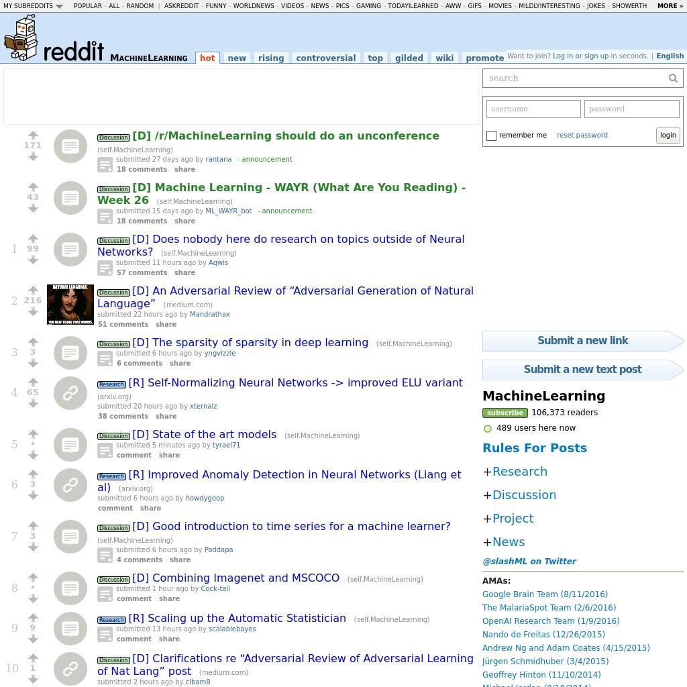
**이미지 캡션:** 이것은 레딧의 머신러닝 서브레딧 페이지로, 다양한 게시물 목록이 표시됩니다. 페이지 상단에는 레딧 로고와 함께 "hot", "new", "rising", "controversial", "top", "gilded", "wiki", "promote"와 같은 탭이 있습니다. 오른쪽 상단에는 로그인 또는 가입을 위한 입력 필드와 버튼이 있습니다. 페이지 중앙에는 "MachineLearning"이라는 제목의 서브레딧 이름이 있고, 그 아래에는 구독자 수와 현재 접속자 수가 표시됩니다. 또한 "Rules For Posts"라는 섹션과 "+Research", "+Discussion", "+Project", "+News"와 같은 하위 섹션이 있습니다. 그 아래에는 트위터 계정 "@slashML on Twitter"와 "AMAS" 섹션이 있으며, 머신러닝 분야의 유명 인사들의 이름과 날짜가 나열되어 있습니다. 게시물 목록은 각 게시물의 제목, 작성자, 제출 시간, 댓글 수, 공유 횟수 등을 포함합니다. 게시물 제목 앞에는 "Discussion" 또는 "Research"와 같은 태그가 붙어 있습니다. 예를 들어, 첫 번째 게시물은 "/r/Machine Learning should do an unconference"라는 제목의 토론 게시물이며, 27일 전에 제출되었고 18개의 댓글이 있습니다. 두 번째 게시물은 "Machine Learning - WAYR (What Are You Reading) - Week 26"이라는 제목의 토론 게시물이며, 15일 전에 제출되었고 18개의 댓글이 있습니다. 세 번째 게시물은 "Does nobody here do research on topics outside of Neural Networks?"라는 제목의 토론 게시물이며, 11시간 전에 제출되었고 57개의 댓글이 있습니다. 네 번째 게시물은 "An Adversarial Review of 'Adversarial Generation of Natural Language'"라는 제목의 토론 게시물이며, 22시간 전에 제출되었고 51개의 댓글이 있습니다. 다섯 번째 게시물은 "The sparsity of sparsity in deep learning"이라는 제목의 토론 게시물이며, 6시간 전에 제출되었고 6개의 댓글이 있습니다. 여섯 번째 게시물은 "Self-Normalizing Neural Networks -> improved ELU variant"라는 제목의 연구 게시물이며, 20시간 전에 제출되었고 38개의 댓글이 있습니다. 일곱 번째 게시물은 "State of the art models"라는 제목의 토론 게시물이며, 5분 전에 제출되었고 댓글이 있습니다. 여덟 번째 게시물은 "Improved Anomaly Detection in Neural Networks (Liang et al)"라는 제목의 연구 게시물이며, 6시간 전에 제출되었고 댓글이 있습니다. 아홉 번째 게시물은 "Good introduction to time series for a machine learner?"라는 제목의 토론 게시물이며, 6시간 전에
 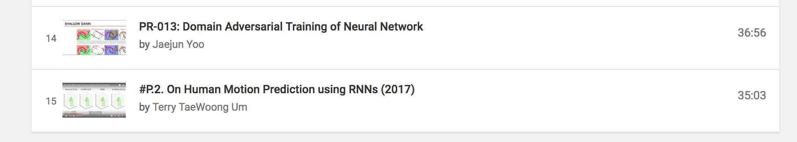
**이미지 캡션:** 이 이미지는 두 개의 비디오 목록 항목을 보여줍니다. 각 항목에는 번호, 썸네일 이미지, 제목, 발표자 이름 및 재생 시간이 포함됩니다. 첫 번째 항목은 번호 14이고 제목은 "PR-013: Domain Adversarial Training of Neural Network"이며, 발표자는 Jaejun Yoo이고 재생 시간은 36:56입니다. 썸네일에는 "SHALLOW DANN"이라는 텍스트와 함께 여러 개의 다이어그램이 포함되어 있습니다. 두 번째 항목은 번호 15이고 제목은 "#P.2. On Human Motion Prediction using RNNs (2017)"이며, 발표자는 Terry TaeWoong Um이고 재생 시간은 35:03입니다. 이 썸네일에는 "SOUND PLAY", "LSTM", "RNN", "EMOTION"과 같은 텍스트와 함께 여러 개의 인간 형상 그림이 표시됩니다. 전체적으로 이 이미지는 기술 또는 학술 발표 목록의 일부로 보이며, 컴퓨터 과학 또는 인공 지능 분야의 주제를 다루고 있습니다.

> #오늘의레딧 https://www.reddit.com/r/MachineLearning/ 아침부터 다양한 소식이 많네요.  1. 신경망 외부의 주제에 대한 연구는 여기에서하지 않습니까? 2. "자연 언어의 적대적 생성"에 대한 적대적인 검토 3. 깊은 학습에서 드문 드문 드문 드문 4. 자기 정규화 신경망 -&gt; 개선 된 ELU 변형 5. 최첨단 모델 6. 신경망에서의 이상 탐지 개선 (Liang 외) 7. 기계 학습자를위한 시계열에 대한 좋은 소개? 8. Imagenet과 MSCOCO 결합 9. 자동 통계 전문가 스케일 업 10. 해설은 "Nat Lang의 Adversarial Learning에 관한 Adversarial Review"포스트 11. 시계열에 대한 비정상 검출 알고리즘의 현재 상태 12. 협력하고, 경쟁하고, 의사 소통하기위한 학습 13. 기계의 부상 (Kurzgesagt) 14. DeepMind 이전에도 PyTorch의 "관계형 네트워크"구현 15. &#39;해싱&#39;은 95 % 이상의 계산을 제거 할 수 있습니다. 16. 진 코간 - 피카소의 터미널; 시각 예술 분야의 데이터 과학 및 인공 지능 17. 깊은 학습을 단순하게 만들기위한 비전 - Databricks 블로그 18. 보강 학습의 차동 지오메트리? 19. 커널 혼합 네트워크를 이용한 조건부 밀도 추정, TF의 이론 + 구현 20. Keras 모델에서 입력 - 출력 그라디언트 추출하기  1. https://www.reddit.com/r/MachineLearning/comments/6g82uc/d_does_nobody_here_do_research_on_topics_outside/ 2. https://medium.com/@yoav.goldberg/an-adversarial-review-of-adversarial-generation-of-natural-language-409ac3378bd7 3. https://www.reddit.com/r/MachineLearning/comments/6ga1fh/d_the_sparsity_of_sparsity_in_deep_learning/ 4. https://arxiv.org/abs/1706.02515 5. https://www.reddit.com/r/MachineLearning/comments/6gc5wk/d_state_of_the_art_models/ 6. https://arxiv.org/abs/1706.02690 7. https://www.reddit.com/r/MachineLearning/comments/6g9o72/d_good_introduction_to_time_series_for_a_machine/ 8. https://www.reddit.com/r/MachineLearning/comments/6gbrlq/d_combining_imagenet_and_mscoco/ 9. https://www.reddit.com/r/MachineLearning/comments/6g7gyd/r_scaling_up_the_automatic_statistician/ 10. https://medium.com/@yoav.goldberg/clarifications-re-adversarial-review-of-adversarial-learning-of-nat-lang-post-62acd39ebe0d 11. https://blog.statsbot.co/time-series-anomaly-detection-algorithms-1cef5519aef2 12. https://blog.openai.com/learning-to-cooperate-compete-and-communicate/ 13. https://www.youtube.com/watch?v=WSKi8HfcxEk 14. https://github.com/kimhc6028/relational-networks 15. https://www.sciencedaily.com/releases/2017/06/170601135633.htm 16. https://www.youtube.com/watch?v=JXx2MYtAU3o 17. https://databricks.com/blog/2017/06/06/databricks-vision-simplify-large-scale-deep-learning.html 18. https://www.reddit.com/r/MachineLearning/comments/6g0s2g/d_differential_geometry_in_reinforcement_learning/ 19. https://janvdvegt.github.io/2017/06/07/Kernel-Mixture-Networks.html 20. https://www.reddit.com/r/MachineLearning/comments/6g38bv/p_extracting_inputtooutput_gradients_from_a_keras/
> 두개의 논문 설명 비디오가 추가 되었습니다: - Domain Adversarial Training of Neural Network - On Human Motion Prediction using RNNs  (2017)  보시고 의견이나 질문이 있으시면 알려주세요.  https://www.youtube.com/playlist?list=PLlMkM4tgfjnJhhd4wn5aj8fVTYJwIpWkS

### 6월 10일 (토) 13:17 · "Spin to Win"

"Spin to Win"

**이미지 캡션:** 두 명의 성인이 자전거를 타고 강변 도로를 달리고 있으며, 한 명은 빨간색 셔츠와 헬멧을 착용하고 다른 한 명은 형광색 상의와 헬멧을 착용하고 엄지손가락을 치켜세우고 있다. 배경에는 넓은 강과 다리가 보이며, 다리 위에는 여러 개의 건물이 늘어서 있다. 날씨는 맑고 화창하며, 전반적으로 활동적이고 즐거운 분위기이다.

### 6월 11일 (일) 08:52 · 📷 사진 (1장)

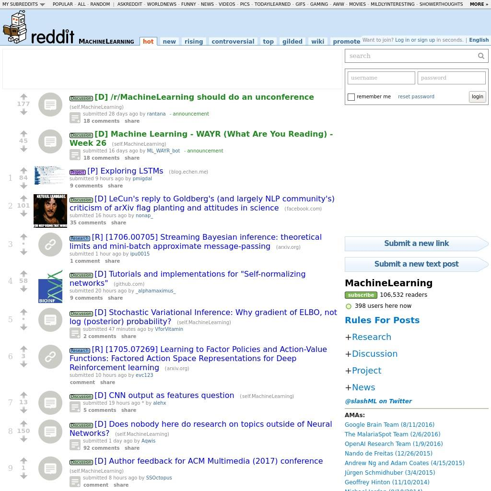
**이미지 캡션:** 이 이미지는 레딧(Reddit) 웹사이트의 머신러닝(Machine Learning) 서브레딧 페이지를 보여줍니다. 화면 중앙에는 다양한 게시물 목록이 있으며, 각 게시물은 제목, 작성자, 제출 시간, 댓글 수, 공유 수 등의 정보를 포함하고 있습니다. 게시물들은 주로 머신러닝 관련 주제를 다루고 있으며, "unconference" 개최 제안, "WAYR (What Are You Reading)" 주간 요약, LSTM 탐색, LeCun의 논평, 베이즈 추론, 자기 정규화 네트워크, 확률적 변분 추론, 강화 학습, CNN 특징 질문, 신경망 외 연구 주제, ACM 멀티미디어 컨퍼런스 피드백 등 다양한 내용이 있습니다. 왼쪽에는 각 게시물에 대한 투표 수와 게시물 유형을 나타내는 아이콘이 표시되어 있습니다. 오른쪽 상단에는 로그인 및 회원가입 창이 있으며, 그 아래에는 "Submit a new link" 및 "Submit a new text post" 버튼이 있습니다. 또한, "MachineLearning" 서브레딧의 구독자 수와 현재 접속자 수가 표시되어 있으며, "Rules For Posts" 섹션에는 "Research", "Discussion", "Project", "News"와 같은 카테고리가 나열되어 있습니다. 하단에는 "AMAS" 섹션이 있어 과거 AMA(Ask Me Anything) 세션에 참여했던 연구자들의 목록과 날짜가 표시되어 있습니다. 전반적으로 정보가 많고 기술적인 내용을 다루는 커뮤니티의 분위기를 나타냅니다.

> #오늘의레딧 https://www.reddit.com/r/MachineLearning/ 아침부터 다양한 소식이 많네요.  1. LSTM 탐색 2. LeCun은 Goldberg의 (그리고 대부분 NLP 커뮤니티의) arXiv 깃발 심기와 과학 태도 비판에 대한 회신 3. "자체 정규화 네트워크"에 대한 자습서 및 구현 4. 확률 적 변이 추론 : 로그 (후방) 확률이 아닌 왜 ELBO의 그래디언트입니까? 5. 기능 질문으로 CNN 출력 6. 신경망 외부의 주제에 대한 연구는 여기에서하지 않습니까? 7. ACM 멀티미디어 (2017) 컨퍼런스에 대한 의견 의견 8. PixelGAN Autoencoders 9. 최첨단 모델 10. Demis Hassabis, BBC 인터뷰 11. 해설은 "Nat Lang의 Adversarial Learning에 관한 Adversarial Review"포스트 12. "자연 언어의 적대적 생성"에 대한 적대적인 검토 13. reCaptcha가 인공 지능을 훈련 시키거나 그걸 위해 사용되고 있는지 알 수 있습니까? 14. Imagenet과 MSCOCO 결합 15. 자기 정규화 신경망 -&gt; 개선 된 ELU 변형 16. 깊은 학습에서 드문 드문 드문 드문 17. 신경망에서의 이상 탐지 개선 (Liang 외) 18. 자동 통계 전문가 스케일 업 19. 기계 학습자를위한 시계열에 대한 좋은 소개? 20. 시계열에 대한 비정상 검출 알고리즘의 현재 상태  1. http://blog.echen.me/2017/05/30/exploring-lstms/ 2. https://www.facebook.com/yann.lecun/posts/10154498539442143 3. https://github.com/bioinf-jku/SNNs 4. https://www.reddit.com/r/MachineLearning/comments/6gi7f2/d_stochastic_variational_inference_why_gradient/ 5. https://www.reddit.com/r/MachineLearning/comments/6gdayt/d_cnn_output_as_features_question/ 6. https://www.reddit.com/r/MachineLearning/comments/6g82uc/d_does_nobody_here_do_research_on_topics_outside/ 7. https://www.reddit.com/r/MachineLearning/comments/6gftns/d_author_feedback_for_acm_multimedia_2017/ 8. https://arxiv.org/abs/1706.00531 9. https://www.reddit.com/r/MachineLearning/comments/6gc5wk/d_state_of_the_art_models/ 10. http://www.bbc.co.uk/programmes/b08qy1sl 11. https://medium.com/@yoav.goldberg/clarifications-re-adversarial-review-of-adversarial-learning-of-nat-lang-post-62acd39ebe0d 12. https://medium.com/@yoav.goldberg/an-adversarial-review-of-adversarial-generation-of-natural-language-409ac3378bd7 13. https://www.reddit.com/r/MachineLearning/comments/6gdwxp/d_does_anyone_know_if_recaptcha_trains_ais_or_is/ 14. https://www.reddit.com/r/MachineLearning/comments/6gbrlq/d_combining_imagenet_and_mscoco/ 15. https://arxiv.org/abs/1706.02515 16. https://www.reddit.com/r/MachineLearning/comments/6ga1fh/d_the_sparsity_of_sparsity_in_deep_learning/ 17. https://arxiv.org/abs/1706.02690 18. https://www.reddit.com/r/MachineLearning/comments/6g7gyd/r_scaling_up_the_automatic_statistician/ 19. https://www.reddit.com/r/MachineLearning/comments/6g9o72/d_good_introduction_to_time_series_for_a_machine/ 20. https://blog.statsbot.co/time-series-anomaly-detection-algorithms-1cef5519aef2

### 6월 12일 (월) 08:52 · 📷 사진 (2장)

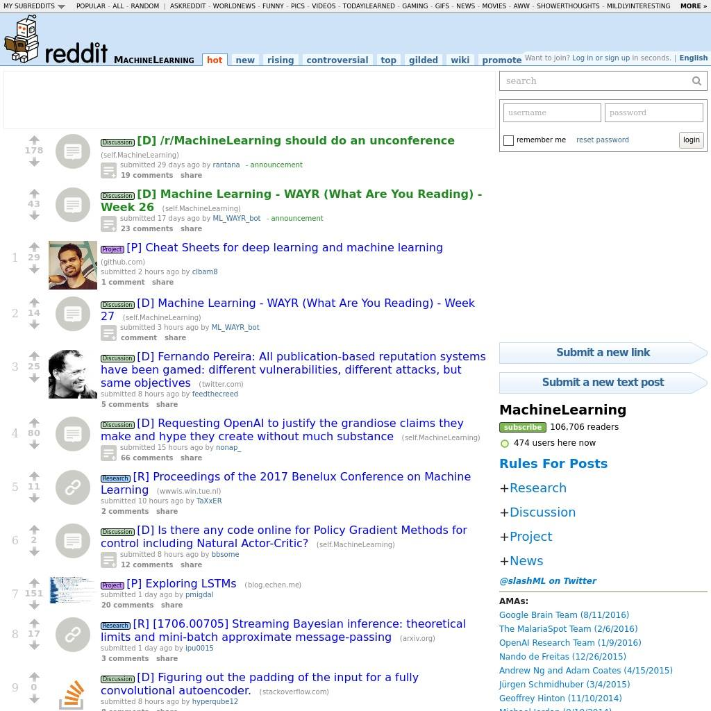
**이미지 캡션:** 이 이미지는 인기 있는 온라인 커뮤니티인 레딧의 머신러닝 서브레딧 페이지를 보여줍니다. 페이지 상단에는 레딧 로고와 함께 "MACHINE LEARNING"이라는 제목이 있고, 그 아래에는 "hot", "new", "rising", "controversial", "top", "gilded", "wiki", "promote"와 같은 다양한 탭이 있습니다. 오른쪽 상단에는 로그인 또는 회원가입을 할 수 있는 섹션이 있으며, 검색창과 사용자 이름 및 비밀번호 입력란이 있습니다. 페이지 중앙에는 머신러닝 관련 게시물 목록이 표시됩니다. 각 게시물은 제목, 작성자, 제출 시간, 댓글 수, 공유 횟수 등의 정보를 포함하고 있습니다. 게시물 목록에는 "Discussion", "Project", "Research"와 같은 태그가 붙어 있어 게시물의 유형을 나타냅니다. 예를 들어, 첫 번째 게시물은 "/r/MachineLearning should do an unconference"라는 제목의 토론 게시물이며, 29일 전에 제출되었고 19개의 댓글이 있습니다. 두 번째 게시물은 "Machine Learning - WAYR (What Are You Reading) - Week 26"이라는 제목의 토론 게시물이며, 17일 전에 제출되었고 23개의 댓글이 있습니다. 세 번째 게시물은 "Cheat Sheets for deep learning and machine learning"이라는 제목의 프로젝트 게시물이며, 2시간 전에 제출되었고 1개의 댓글이 있습니다. 페이지 오른쪽에는 "Submit a new link"와 "Submit a new text post" 버튼이 있고, "MachineLearning" 서브레딧의 구독자 수와 현재 접속자 수가 표시됩니다. 또한 "Rules For Posts" 섹션에는 "+Research", "+Discussion", "+Project", "+News"와 같은 하위 섹션이 있습니다. 그 아래에는 "@slashML on Twitter"라는 트위터 계정 정보와 "AMAS" 섹션이 있어 머신러닝 분야의 저명한 연구자들의 이름과 활동 날짜가 나열되어 있습니다. 전반적으로 이 페이지는 머신러닝 커뮤니티의 최신 정보와 토론을 공유하는 온라인 플랫폼의 모습을 보여줍니다.
 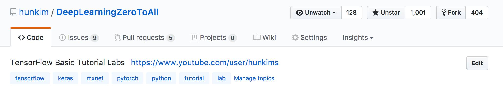
**이미지 캡션:** 이 이미지는 GitHub 웹사이트의 한 페이지를 보여줍니다. 화면 상단에는 "hunkim / DeepLearningZeroToAll"이라는 텍스트가 있으며, 이는 사용자 이름과 저장소 이름을 나타냅니다. 그 옆에는 "Unwatch", "Unstar", "Fork"와 같은 버튼들이 있으며, 각각의 버튼 옆에는 숫자가 표시되어 있습니다. "Unwatch" 버튼 옆에는 128, "Unstar" 버튼 옆에는 1,001, "Fork" 버튼 옆에는 404라는 숫자가 보입니다. 이 숫자는 각각 해당 액션을 수행한 횟수를 나타낼 가능성이 높습니다. 그 아래에는 "Code", "Issues", "Pull requests", "Projects", "Wiki", "Settings", "Insights"와 같은 탭들이 나열되어 있으며, 현재 "Code" 탭이 선택되어 주황색 밑줄로 강조되어 있습니다. "Code" 탭 옆에는 "<>" 아이콘이 있습니다. "Issues" 탭 옆에는 숫자 9, "Pull requests" 탭 옆에는 숫자 5, "Projects" 탭 옆에는 숫자 0이 표시되어 있습니다. 그 아래에는 "TensorFlow Basic Tutorial Labs"라는 제목과 함께 YouTube 채널 링크인 "https://www.youtube.com/user/hunkims"가 파란색 텍스트로 표시되어 있습니다. 이 링크 옆에는 "Edit" 버튼이 있습니다. 마지막으로, "TensorFlow Basic Tutorial Labs" 아래에는 "tensorflow", "keras", "mxnet", "pytorch", "python", "tutorial", "lab", "Manage topics"와 같은 키워드 태그들이 회색 배경에 흰색 글씨로 표시되어 있습니다. 이 이미지는 프로그래밍 관련 프로젝트의 정보를 보여주는 것으로, 특정 기술이나 튜토리얼에 대한 내용을 담고 있을 것으로 추정됩니다. 특별히 사람이나 특정 장소가 묘사되어 있지는 않으며, 전반적으로 기술적이고 정보 전달적인 분위기를 띱니다.

> #오늘의레딧 https://www.reddit.com/r/MachineLearning/ 아침부터 다양한 소식이 많네요.  1. 깊은 학습 및 기계 학습을위한 컨닝 페이퍼 2. 기계 학습 - WAYR (당신은 무엇을 읽고 있습니까?) - 27 주차 3. 페르난도 페레이라 (Fernando Pereira) : 모든 출판물 기반 평판 시스템이 서로 다른 취약점, 다양한 공격, 동일한 목표 4. OpenAI가 주장하는 웅장한 주장을 정당화하기 위해 OpenAI에 요청합니다. 5. 기계 학습에 관한 2017 년 베네룩스 회의의 진행 6. Natural Actor-Critic을 포함한 제어를위한 Policy Gradient Methods에 대한 온라인 코드가 있습니까? 7. LSTM 탐색 8. 완전 컨벌루션 자동 인코딩을위한 입력 패딩을 파악합니다. 9. LeCun은 Goldberg의 (그리고 대부분 NLP 커뮤니티의) arXiv 깃발 심기와 과학 태도 비판에 대한 회신 10. 확률 적 변이 추론 : 로그 (후방) 확률이 아닌 왜 ELBO의 그래디언트입니까? 11. "자체 정규화 네트워크"에 대한 자습서 및 구현 12. Demis Hassabis, BBC 인터뷰 13. 기능 질문으로 CNN 출력 14. 신경망 외부의 주제에 대한 연구는 여기에서하지 않습니까? 15. ACM 멀티미디어 (2017) 컨퍼런스에 대한 의견 의견 16. 최첨단 모델 17. PixelGAN Autoencoders 18. 해설은 "Nat Lang의 Adversarial Learning에 관한 Adversarial Review"포스트 19. "자연 언어의 적대적 생성"에 대한 적대적인 검토 20. 자기 정규화 신경망 -&gt; 개선 된 ELU 변형  1. https://github.com/kailashahirwar/cheatsheets-ai 2. https://www.reddit.com/r/MachineLearning/comments/6gngwc/d_machine_learning_wayr_what_are_you_reading_week/ 3. https://twitter.com/earnmyturns/status/873589229783097344 4. https://www.reddit.com/r/MachineLearning/comments/6gke6a/d_requesting_openai_to_justify_the_grandiose/ 5. http://wwwis.win.tue.nl/~benelearn2017/proceedings.pdf 6. https://www.reddit.com/r/MachineLearning/comments/6gm26z/d_is_there_any_code_online_for_policy_gradient/ 7. http://blog.echen.me/2017/05/30/exploring-lstms/ 8. https://stackoverflow.com/questions/44485304/finding-the-amount-of-zeros-to-pad-the-input-of-a-convolutional-layer 9. https://www.facebook.com/yann.lecun/posts/10154498539442143 10. https://www.reddit.com/r/MachineLearning/comments/6gi7f2/d_stochastic_variational_inference_why_gradient/ 11. https://github.com/bioinf-jku/SNNs 12. http://www.bbc.co.uk/programmes/b08qy1sl 13. https://www.reddit.com/r/MachineLearning/comments/6gdayt/d_cnn_output_as_features_question/ 14. https://www.reddit.com/r/MachineLearning/comments/6g82uc/d_does_nobody_here_do_research_on_topics_outside/ 15. https://www.reddit.com/r/MachineLearning/comments/6gftns/d_author_feedback_for_acm_multimedia_2017/ 16. https://www.reddit.com/r/MachineLearning/comments/6gc5wk/d_state_of_the_art_models/ 17. https://arxiv.org/abs/1706.00531 18. https://medium.com/@yoav.goldberg/clarifications-re-adversarial-review-of-adversarial-learning-of-nat-lang-post-62acd39ebe0d 19. https://medium.com/@yoav.goldberg/an-adversarial-review-of-adversarial-generation-of-natural-language-409ac3378bd7 20. https://arxiv.org/abs/1706.02515
> 많은 분들이 함께 개발해주셨던 DeepLearningZeroToAll 이 1K개의 별을 받게 되었습니다. 정말 감사드립니다.  https://github.com/hunkim/DeepLearningZeroToAll  그리고 404 Forks 입니다. ^^  아직 사소한 버그들이 많습니다. pull requests는 언제나 welcome입니다.  (며칠전에 나온 SELU등도 곧 추가 예정입니다.)

### 6월 13일 (화) 08:52 · 📷 사진 (1장)

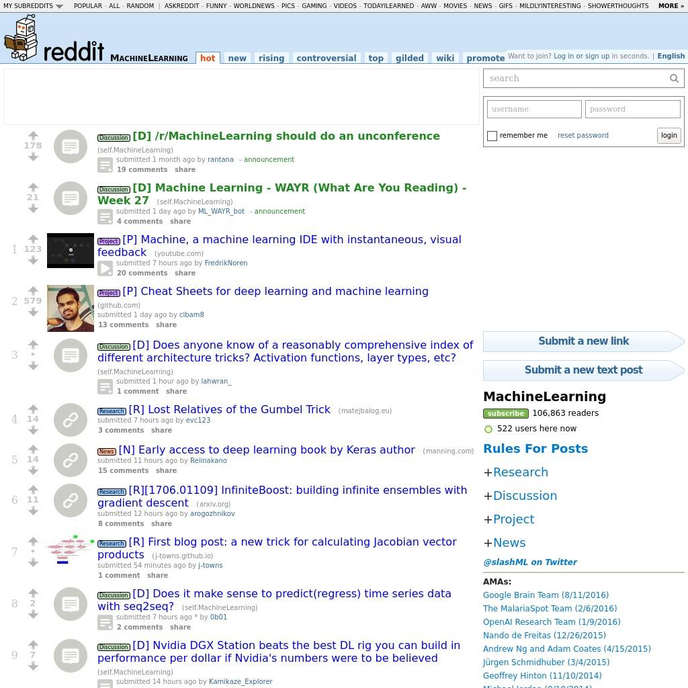
**이미지 캡션:** 이 이미지는 웹사이트 Reddit의 Machine Learning 서브레딧 페이지를 보여줍니다. 페이지 상단에는 Reddit 로고와 함께 "MACHINE LEARNING"이라는 제목이 있고, 그 아래에는 "hot", "new", "rising", "controversial", "top", "gilded", "wiki"와 같은 다양한 정렬 옵션이 있습니다. 오른쪽 상단에는 로그인 및 회원가입을 위한 입력 필드와 버튼이 있습니다. 페이지 중앙에는 여러 게시물 목록이 표시되며, 각 게시물은 제목, 작성자, 제출 시간, 댓글 수, 공유 수 등의 정보를 포함합니다. 게시물 제목 앞에는 해당 게시물의 유형을 나타내는 태그(예: Discussion, Project, Research, News)가 있습니다. 예를 들어, 첫 번째 게시물은 "[D] /r/Machine Learning should do an unconference"라는 제목의 토론 게시물이며, 1개월 전에 제출되었고 19개의 댓글이 있습니다. 두 번째 게시물은 "[D] Machine Learning - WAYR (What Are You Reading) - Week 27"이라는 제목의 토론 게시물이며, 1일 전에 제출되었고 4개의 댓글이 있습니다. 세 번째 게시물은 "[P] Machine, a machine learning IDE with instantaneous, visual feedback"이라는 제목의 프로젝트 게시물이며, 7시간 전에 제출되었고 20개의 댓글이 있습니다. 네 번째 게시물은 "[P] Cheat Sheets for deep learning and machine learning"이라는 제목의 프로젝트 게시물이며, 1일 전에 제출되었고 13개의 댓글이 있습니다. 다섯 번째 게시물은 "[D] Does anyone know of a reasonably comprehensive index of different architecture tricks? Activation functions, layer types, etc?"라는 제목의 토론 게시물이며, 1시간 전에 제출되었고 1개의 댓글이 있습니다. 여섯 번째 게시물은 "[R] Lost Relatives of the Gumbel Trick"이라는 제목의 연구 게시물이며, 7시간 전에 제출되었고 3개의 댓글이 있습니다. 일곱 번째 게시물은 "[N] Early access to deep learning book by Keras author"라는 제목의 뉴스 게시물이며, 11시간 전에 제출되었고 15개의 댓글이 있습니다. 여덟 번째 게시물은 "[R][1706.01109] InfiniteBoost: building infinite ensembles with gradient descent"라는 제목의 연구 게시물이며, 12시간 전에 제출되었고 8개의 댓글이 있습니다. 아홉 번째 게시물은 "[R] First blog post: a new trick for calculating Jacobian vector products"라는 제목의 연구 게시물이며, 54분 전에 제출되었고 1개의 댓글이 있습니다. 열 번째 게시물은 "[D] Does it make sense to predict(regress) time series data with seq2seq?"라는 제목의 토론 게시물이며,

> #오늘의레딧 https://www.reddit.com/r/MachineLearning/ 래딧은 읽을 거리가 다양합니다.  1. 즉각적이고 시각적 인 피드백을 갖춘 IDE 머신 2. 깊은 학습 및 기계 학습을위한 컨닝 페이퍼 3. 누구든지 다른 아키텍처 트릭의 합리적으로 포괄적 인 인덱스를 알고 있습니까? 활성화 함수, 레이어 유형 등? 4. Gumbel 간계의 잃어버린 친척들 5. Keras 작성자의 깊은 학습 서적에 대한 조기 접근 6. 첫 번째 블로그 게시물 : Jacobian 벡터 제품을 계산하는 새로운 트릭 7. seq2seq를 사용하여 시계열 데이터를 예측 (회귀)하는 것이 맞습니까? 8. Nvidia의 DGX Station은 Nvidia의 숫자가 믿어지면 1 달러당 성능으로 구축 할 수있는 최고의 DL 장비입니다. 9. CelebA 기준에 맞는 VAE가 필요합니다. 10. 변형 된 타코 트론을 이용한 신경 음성 인식 11. 전방 사고 : 신경망 구축 및 교육 한 번에 하나의 계층 12. Gated 직교 반복 단위 : 잊지 학습 13. 스파 스 행렬 및 압축 알고리즘에 대한 빠르고 포괄적 인 자습서 14. 페르난도 페레이라 (Fernando Pereira) : 모든 출판물 기반 평판 시스템이 서로 다른 취약점, 다양한 공격, 동일한 목표 15. 어떻게 단어를 분리하여 자연 문장을 생성 하는가? 16. OpenAI가 주장하는 웅장한 주장을 정당화하기 위해 OpenAI에 요청합니다. 17. "우리가 여기에서하는 일은 단순히 과학이 아니라 공학적"이라는 것을 기억합시다. 18. 기계 학습에 관한 2017 년 베네룩스 회의의 진행 19. Natural Actor-Critic을 포함한 제어를위한 Policy Gradient Methods에 대한 온라인 코드가 있습니까? 20. LSTM 탐색  1. https://www.youtube.com/watch?v=N9q9qacAKoM 2. https://github.com/kailashahirwar/cheatsheets-ai 3. https://www.reddit.com/r/MachineLearning/comments/6gvh6c/d_does_anyone_know_of_a_reasonably_comprehensive/ 4. http://matejbalog.eu/research/lost_relatives_of_the_gumbel_trick.pdf 5. https://www.manning.com/books/deep-learning-with-python?a_aid=keras&a_bid=76564dff 6. https://j-towns.github.io/2017/06/12/A-new-trick.html 7. https://www.reddit.com/r/MachineLearning/comments/6gt65z/d_does_it_make_sense_to_predictregress_time/ 8. https://www.reddit.com/r/MachineLearning/comments/6gr2z8/d_nvidia_dgx_station_beats_the_best_dl_rig_you/ 9. https://www.reddit.com/r/MachineLearning/comments/6gtiq7/p_need_good_vae_for_celeba_baseline/ 10. https://github.com/Kyubyong/tacotron_asr 11. https://arxiv.org/abs/1706.02480 12. https://arxiv.org/abs/1706.02761 13. https://dark-element.com/2017/06/11/sparse-matrices-and-their-compression-algorithms/ 14. https://twitter.com/earnmyturns/status/873589229783097344 15. https://www.reddit.com/r/MachineLearning/comments/6gr0oh/dhow_to_generate_a_nature_sentence_by_input_some/ 16. https://www.reddit.com/r/MachineLearning/comments/6gke6a/d_requesting_openai_to_justify_the_grandiose/ 17. https://www.reddit.com/r/MachineLearning/comments/6gsl0c/d_amongst_all_the_arguing_going_on_lets_remember/ 18. http://wwwis.win.tue.nl/~benelearn2017/proceedings.pdf 19. https://www.reddit.com/r/MachineLearning/comments/6gm26z/d_is_there_any_code_online_for_policy_gradient/ 20. http://blog.echen.me/2017/05/30/exploring-lstms/

### 6월 14일 (수) 08:52 · 📷 사진 (1장)

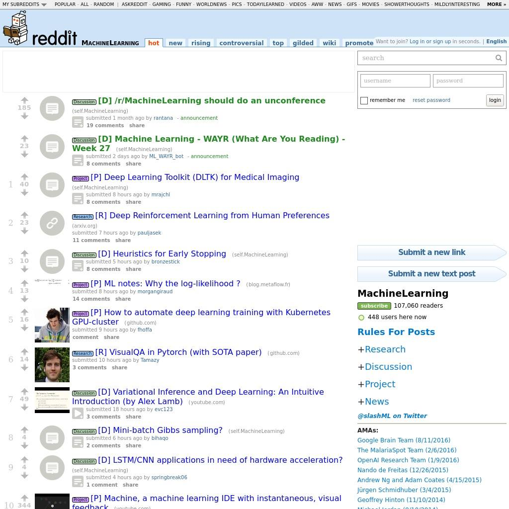
**이미지 캡션:** 이 이미지는 Reddit의 Machine Learning 서브레딧 페이지를 보여줍니다. 페이지 상단에는 Reddit 로고와 함께 "Machine Learning"이라는 제목이 있고, 그 아래에는 "hot", "new", "rising", "controversial", "top", "gilded", "wiki", "promote"와 같은 다양한 카테고리 링크가 있습니다. 오른쪽 상단에는 로그인 및 회원가입을 위한 입력 필드와 버튼이 있습니다. 페이지 중앙에는 다양한 게시물 목록이 표시되며, 각 게시물은 제목, 작성자, 제출 시간, 댓글 수, 공유 옵션 등을 포함합니다. 게시물들은 주로 머신러닝 관련 주제를 다루고 있으며, "[D]"는 토론, "[P]"는 프로젝트, "[R]"은 연구를 나타냅니다. 게시물 목록 옆에는 "Submit a new link", "Submit a new text post" 버튼과 함께 "Machine Learning" 서브레딧의 구독자 수와 현재 접속자 수가 표시됩니다. 또한, "Rules For Posts" 섹션 아래에는 "+Research", "+Discussion", "+Project", "+News"와 같은 추가적인 링크들이 있으며, "@slashML on Twitter" 링크와 함께 과거 머신러닝 관련 주요 팀 및 인물들의 이름과 활동 시기가 나열된 "AMAS" 섹션도 보입니다. 전반적으로 기술 커뮤니티의 정보 공유 및 토론이 이루어지는 온라인 플랫폼의 모습을 보여줍니다.

> #오늘의레딧 https://www.reddit.com/r/MachineLearning/ 재미난 이야기들이 많습니다  1. 의료 영상을위한 DLTK (Deep Learning Toolkit) 2. 인간 환경 설정을 통한 심층 강화 학습 3. 조기 정지를위한 경험적 발견법 4. ML 노트 : 왜 로그 가능성인가? 5. Kubernetes GPU-cluster로 심화 학습을 자동화하는 방법 6. Pytorch에 VisualQA (종이 SO) 7. 변이 추론과 깊은 학습 : 직관적 인 소개 (Alex Lamb 저) 8. 미니 배치 깁스 샘플링? 9. 하드웨어 가속을 필요로하는 LSTM / CNN 어플리케이션? 10. 즉각적이고 시각적 인 피드백을 갖춘 IDE 머신 11. 영국의 ML 산업 12. ML 실험 비교보기, 이메일 / 슬랙 알림 및 기타 AETROS 버전 2017.3. 오늘 생방송되었습니다. 13. 문장을 사실, 의견, 추론 등으로 분류 14. 현대의 요구에 맞게 학습하는 기계 스케일링 15. 압축 이미지 분류? 16. 간단히 Tensorflow로 개발하기 17. ImageNet : Keras로 VGGNet, ResNet, 개시 및 Xception 18. 소스에서 타겟 및 백으로 : 대칭 양방향 적응 형 GAN 19. 첫 번째 블로그 게시물 : Jacobian 벡터 제품을 계산하는 새로운 트릭 20. 가변 길이 관심 모델  1. https://www.reddit.com/r/MachineLearning/comments/6h0jrg/p_deep_learning_toolkit_dltk_for_medical_imaging/ 2. https://arxiv.org/pdf/1706.03741.pdf 3. https://www.reddit.com/r/MachineLearning/comments/6h1kry/d_heuristics_for_early_stopping/ 4. https://blog.metaflow.fr/ml-notes-why-the-log-likelihood-24f7b6c40f83 5. https://github.com/Langhalsdino/Kubernetes-GPU-Guide 6. https://github.com/Cadene/vqa.pytorch 7. https://www.youtube.com/watch?v=h0UE8FzdE8U 8. https://www.reddit.com/r/MachineLearning/comments/6h167z/d_minibatch_gibbs_sampling/ 9. https://www.reddit.com/r/MachineLearning/comments/6h26ia/d_lstmcnn_applications_in_need_of_hardware/ 10. https://www.youtube.com/watch?v=N9q9qacAKoM 11. https://www.reddit.com/r/MachineLearning/comments/6h01jk/d_ml_industry_in_the_uk/ 12. http://aetros.com/blog/Releases/12-06-2017-update-to-2017-3-version 13. https://www.reddit.com/r/MachineLearning/comments/6gz0n7/discussion_classification_of_sentences_into_fact/ 14. https://blog.dominodatalab.com/scaling-machine-learning/ 15. https://www.reddit.com/r/MachineLearning/comments/6gzk2q/d_classification_on_compressed_images/ 16. https://github.com/tensorflow/tensorflow/issues/9322#issuecomment-295850686 17. http://www.pyimagesearch.com/2017/03/20/imagenet-vggnet-resnet-inception-xception-keras/ 18. https://arxiv.org/abs/1705.08824 19. https://j-towns.github.io/2017/06/12/A-new-trick.html 20. https://www.reddit.com/r/MachineLearning/comments/6gx0c6/discussionvariable_length_attention_models/

### 6월 15일 (목) 08:53 · 📷 사진 (1장)

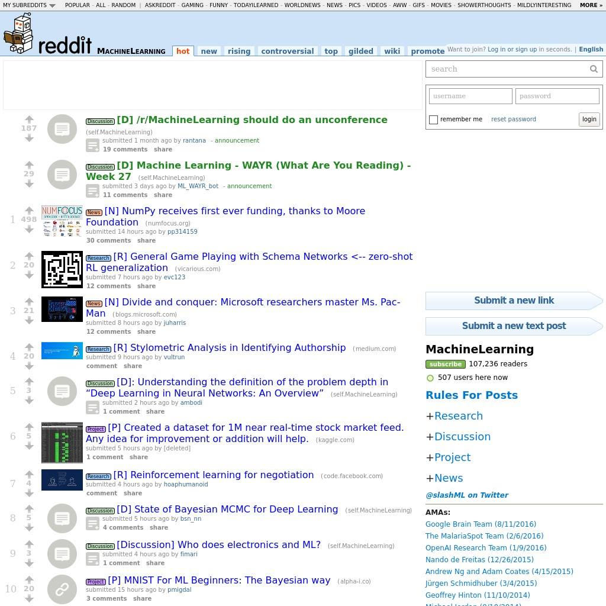
**이미지 캡션:** 이 화면은 레딧(Reddit) 웹사이트의 머신러닝(Machine Learning) 서브레딧 페이지로, 다양한 게시물 목록과 관련 정보가 표시됩니다. 페이지 상단에는 레딧 로고와 함께 "hot", "new", "rising", "controversial", "top", "gilded", "wiki", "promote"와 같은 메뉴가 보입니다. 오른쪽 상단에는 로그인 및 회원가입을 위한 사용자 이름과 비밀번호 입력란이 있습니다. 페이지 중앙에는 여러 게시물들이 나열되어 있으며, 각 게시물은 제목, 작성자, 제출 시간, 댓글 수, 공유 수 등의 정보를 포함합니다. 예를 들어, "[D] /r/MachineLearning should do an unconference"라는 제목의 게시물은 1개월 전에 제출되었고 19개의 댓글이 있습니다. 또한, "NumPy receives first ever funding, thanks to Moore Foundation"이라는 뉴스 게시물은 14시간 전에 제출되었고 30개의 댓글이 있습니다. 페이지 오른쪽에는 "Submit a new link" 및 "Submit a new text post" 버튼과 함께 "MachineLearning" 서브레딧의 구독자 수(107,236명)와 현재 접속자 수(507명)가 표시됩니다. 그 아래에는 "Rules For Posts"라는 제목으로 "+Research", "+Discussion", "+Project", "+News"와 같은 카테고리가 나열되어 있으며, 트위터 계정(@slashML)과 "AMAS" 목록도 보입니다. 전반적으로 기술 관련 커뮤니티의 정보 공유 및 토론이 이루어지는 온라인 공간의 모습을 보여줍니다.

> #오늘의레딧 https://www.reddit.com/r/MachineLearning/ 재미난 이야기들이 많습니다  1. NumPy는 Moore Foundation 덕분에 처음으로 기금을받습니다. 2. 스키마 네트워크를 이용한 일반적인 게임 &lt;- 제로 샷 RL 일반화 3. 나누고 정복하십시오 : Microsoft 연구원은 Pac-Man 양 4. 확인 저작자의 Stylometric 분석 5. : "신경망에서의 심층 학습 : 개요"에서 문제 심도의 정의 이해 6. 실시간 주식 시장 근처에서 1M에 대한 데이터 세트를 만들었습니다. 개선이나 추가에 대한 아이디어가 도움이 될 것입니다. 7. 협상 강화 학습 8. 딥 학습을위한 베이지안 MCMC의 상태 9. 전자 제품과 ML은 누구입니까? 10. ML 초보자를위한 MNIST : 베이지안 방식 11. CortexNet : 비디오에 대해 훈련 된 견고한 예측 신경 네트워크 12. 자연 언어 데이터베이스 인터페이스 : 자연어 - SQL 쿼리 번역 13. Inception v3, iOS CoreML 및 Vision을 사용하여 DJ Khaled 테마 객체 인식기 앱 14. 국방부와 국회, 미국의 AI 기업에 대한 중국 투자 금지 논의 15. (무작위 질문) - 왜 기계 학습 커뮤니티에서 Matlab / Octave를 채택하지 않았습니까? 16. 대형 태깅 된 데이터 세트에서 교육용 다중 레이블 이미지 분류? 17. 강화 학습을 사용하여 장난감 포커 게임하기 18. 기계 학습 모델 선택을 용이하게하는 시각적 분석 및 진단 도구. 19. 의료 영상을위한 DLTK (Deep Learning Toolkit) 20. 차별화 된 일정 샘플링을 통한 시퀀스 생성의 노출 바이어스 감소  1. https://www.numfocus.org/blog/numpy-receives-first-ever-funding-thanks-to-moore-foundation/ 2. https://www.vicarious.com/general-game-playing-with-schema-networks.html 3. https://blogs.microsoft.com/next/2017/06/14/divide-conquer-microsoft-researchers-used-ai-master-ms-pac-man 4. https://medium.com/emma-identity/get-inside-my-time-machine-a-quick-trip-to-the-stylometry-origin-b65481549096 5. https://www.reddit.com/r/MachineLearning/comments/6haowu/d_understanding_the_definition_of_the_problem/ 6. https://www.kaggle.com/deeiip/1m-real-time-stock-market-data-nse 7. https://code.facebook.com/posts/1686672014972296 8. https://www.reddit.com/r/MachineLearning/comments/6h99l3/d_state_of_bayesian_mcmc_for_deep_learning/ 9. https://www.reddit.com/r/MachineLearning/comments/6h9ohr/discussion_who_does_electronics_and_ml/ 10. https://alpha-i.co/blog/MNIST-for-ML-beginners-The-Bayesian-Way.html 11. https://engineering.purdue.edu/elab/CortexNet/ 12. https://www.reddit.com/r/MachineLearning/comments/6h9aws/d_natural_language_database_interfaces_natural/ 13. https://github.com/G2Jose/CoreMLVisionDJKhaled 14. https://www.nytimes.com/reuters/2017/06/13/technology/13reuters-usa-china-artificialintelligence.html 15. https://www.reddit.com/r/MachineLearning/comments/6h75h2/d_random_question_why_has_matlaboctave_not_been/ 16. https://www.reddit.com/r/MachineLearning/comments/6h757y/d_multilabel_image_classification_for_training/ 17. http://willtipton.com/coding/poker/2017/06/06/shove-fold-with-reinforcement-learning.html 18. https://github.com/DistrictDataLabs/yellowbrick 19. https://www.reddit.com/r/MachineLearning/comments/6h0jrg/p_deep_learning_toolkit_dltk_for_medical_imaging/ 20. https://www.reddit.com/r/MachineLearning/comments/6h7hrv/d_reducing_exposure_bias_in_sequence_generation/

### 6월 16일 (금) 08:52 · 📷 사진 (1장)

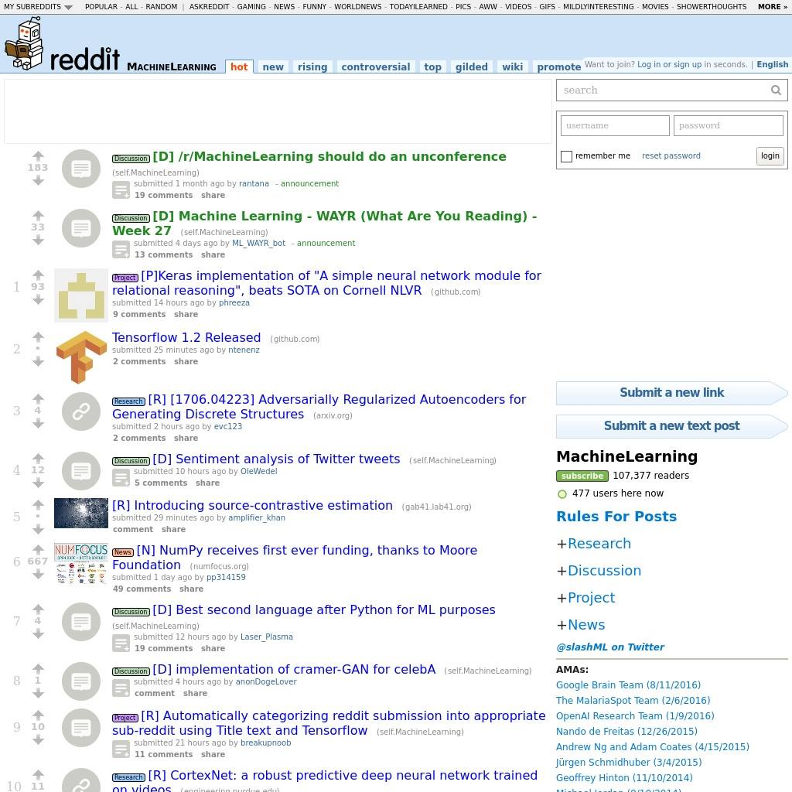
**이미지 캡션:** 이 이미지는 레딧의 머신러닝 서브레딧 페이지를 보여줍니다. 페이지 상단에는 레딧 로고와 함께 "MACHINE LEARNING"이라는 제목이 있고, 그 아래에는 "hot", "new", "rising", "controversial", "top", "gilded", "wiki"와 같은 탭이 있습니다. 오른쪽 상단에는 로그인 및 회원가입을 위한 입력 필드와 버튼이 있습니다. 페이지 중앙에는 다양한 머신러닝 관련 게시물 목록이 표시되며, 각 게시물은 제목, 작성자, 제출 시간, 댓글 수 등의 정보를 포함하고 있습니다. 게시물 제목 앞에는 "Discussion", "Project", "Research", "News"와 같은 태그가 붙어 있습니다. 페이지 오른쪽에는 "Submit a new link", "Submit a new text post" 버튼과 함께 "MachineLearning" 서브레딧의 구독자 수, 현재 접속자 수, 게시 규칙, 트위터 계정, 그리고 AMA(Ask Me Anything) 목록이 표시됩니다. 전반적으로 기술 관련 커뮤니티의 정보 공유 및 토론이 이루어지는 온라인 플랫폼의 모습을 보여줍니다.

> #오늘의레딧 https://www.reddit.com/r/MachineLearning/ 따끈한 소식들입니다.  1. "관계형 추론을위한 간단한 신경 네트워크 모듈"의 Keras 구현, Cornell NLVR에서 SOTA보다 우수 2. 트위터 짹짹의 감정 분석 3. NumPy는 Moore Foundation 덕분에 처음으로 기금을받습니다. 4. ML 용 Python 이후 최고의 제 2 언어 5. 셀레스트에 대한 크란 GAN의 구현 6. CortexNet : 비디오에 대해 훈련 된 견고한 예측 신경 네트워크 7. 스키마 네트워크를 이용한 일반적인 게임 &lt;- 제로 샷 RL 일반화 8. : "신경망에서의 심층 학습 : 개요"에서 문제 심도의 정의 이해 9. 실시간 주식 시장 근처에서 1M에 대한 데이터 세트를 만들었습니다. 개선이나 추가에 대한 아이디어가 도움이 될 것입니다. 10. 협상 강화 학습 11. 나누고 정복하십시오 : Microsoft 연구원은 Pac-Man 양 12. 확인 저작자의 Stylometric 분석 13. 딥 학습을위한 베이지안 MCMC의 상태 14. 신경망 학습 프로젝트 (자바) 15. 전자 제품과 ML은 누구입니까? 16. ML 초보자를위한 MNIST : 베이지안 방식 17. 자연 언어 데이터베이스 인터페이스 : 자연어 - SQL 쿼리 번역 18. 국방부와 국회, 미국의 AI 기업에 대한 중국 투자 금지 논의 19. (무작위 질문) - 왜 기계 학습 커뮤니티에서 Matlab / Octave를 채택하지 않았습니까? 20. 대형 태깅 된 데이터 세트에서 교육용 다중 레이블 이미지 분류?  1. https://github.com/Alan-Lee123/relation-network 2. https://www.reddit.com/r/MachineLearning/comments/6hf408/d_sentiment_analysis_of_twitter_tweets/ 3. https://www.numfocus.org/blog/numpy-receives-first-ever-funding-thanks-to-moore-foundation/ 4. https://www.reddit.com/r/MachineLearning/comments/6hedp2/d_best_second_language_after_python_for_ml/ 5. https://www.reddit.com/r/MachineLearning/comments/6hh9af/d_implementation_of_cramergan_for_celeba/ 6. https://engineering.purdue.edu/elab/CortexNet/ 7. https://www.vicarious.com/general-game-playing-with-schema-networks.html 8. https://www.reddit.com/r/MachineLearning/comments/6haowu/d_understanding_the_definition_of_the_problem/ 9. https://www.kaggle.com/deeiip/1m-real-time-stock-market-data-nse 10. https://code.facebook.com/posts/1686672014972296 11. https://blogs.microsoft.com/next/2017/06/14/divide-conquer-microsoft-researchers-used-ai-master-ms-pac-man 12. https://medium.com/emma-identity/get-inside-my-time-machine-a-quick-trip-to-the-stylometry-origin-b65481549096 13. https://www.reddit.com/r/MachineLearning/comments/6h99l3/d_state_of_bayesian_mcmc_for_deep_learning/ 14. https://www.reddit.com/r/MachineLearning/comments/6hczyk/p_neural_net_machine_learning_project_java/ 15. https://www.reddit.com/r/MachineLearning/comments/6h9ohr/discussion_who_does_electronics_and_ml/ 16. https://alpha-i.co/blog/MNIST-for-ML-beginners-The-Bayesian-Way.html 17. https://www.reddit.com/r/MachineLearning/comments/6h9aws/d_natural_language_database_interfaces_natural/ 18. https://www.nytimes.com/reuters/2017/06/13/technology/13reuters-usa-china-artificialintelligence.html 19. https://www.reddit.com/r/MachineLearning/comments/6h75h2/d_random_question_why_has_matlaboctave_not_been/ 20. https://www.reddit.com/r/MachineLearning/comments/6h757y/d_multilabel_image_classification_for_training/

### 6월 17일 (토) 08:55 · 📷 사진 (1장)

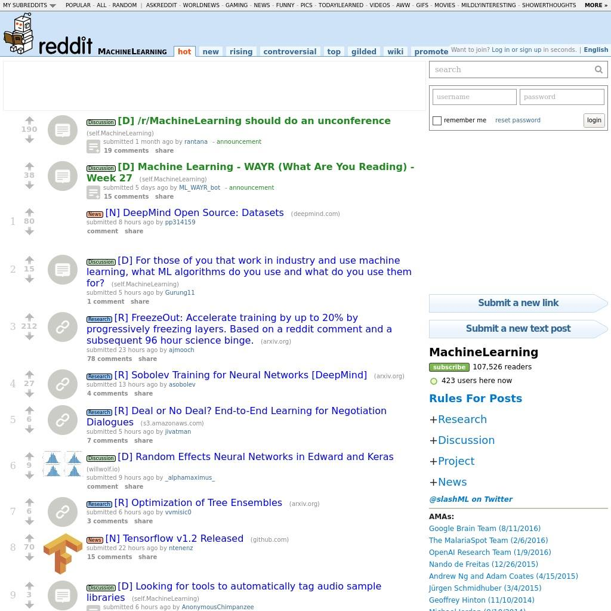
**이미지 캡션:** 이것은 레딧의 머신러닝 서브레딧 페이지로, 다양한 게시물과 관련 정보를 보여줍니다. 페이지 상단에는 레딧 로고와 함께 인기, 랜덤, AskReddit, WorldNews 등 다양한 서브레딧으로 이동할 수 있는 메뉴가 있습니다. 그 아래에는 머신러닝 서브레딧의 제목과 함께 "hot", "new", "rising", "controversial", "top", "gilded", "wiki"와 같은 탭이 있습니다. 오른쪽 상단에는 로그인 또는 회원가입을 할 수 있는 창이 있으며, 검색창도 있습니다. 페이지 중앙에는 머신러닝 관련 게시물 목록이 있으며, 각 게시물은 제목, 작성자, 제출 시간, 댓글 수 등의 정보를 포함합니다. 게시물 제목 옆에는 "Discussion", "News", "Research"와 같은 태그가 붙어 있어 게시물의 성격을 나타냅니다. 예를 들어, 첫 번째 게시물은 "Discussion" 태그와 함께 "/r/MachineLearning should do an unconference"라는 제목을 가지고 있으며, 1개월 전에 제출되었고 19개의 댓글이 있습니다. 다른 게시물로는 "Machine Learning - WAYR (What Are You Reading) - Week 27", "DeepMind Open Source: Datasets", "FreezeOut: Accelerate training by up to 20% by progressively freezing layers" 등이 있습니다. 페이지 오른쪽에는 "Submit a new link" 및 "Submit a new text post" 버튼과 함께 머신러닝 서브레딧의 구독자 수와 현재 접속자 수가 표시되어 있습니다. 또한, "Rules For Posts" 섹션에는 "+Research", "+Discussion", "+Project", "+News"와 같은 하위 섹션이 있으며, "@slashML on Twitter" 링크와 "AMAS" 목록도 있습니다. AMAS 목록에는 Google Brain Team, The MalariaSpot Team, OpenAI Research Team 등 다양한 팀의 이름과 해당 팀의 AMA가 진행된 날짜가 나열되어 있습니다. 전반적으로 이 페이지는 머신러닝 커뮤니티의 최신 정보와 토론을 공유하는 온라인 포럼의 모습을 보여줍니다.

> #오늘의레딧 https://www.reddit.com/r/MachineLearning/ 재미난 이야기들이 많습니다  1. DeepMind 오픈 소스 : 데이터 세트 2. 업계에서 일하고 기계 학습을 사용하는 사람들을 위해 어떤 ML 알고리즘을 사용하며 무엇을 사용합니까? 3. FreezeOut : 점진적으로 레이어를 고정하여 최대 20 %까지 교육을 가속화하십시오. reddit 코멘트와 그 이후의 96 시간의 과학적 폭력을 바탕으로합니다. 4. Edward와 Keras의 랜덤 효과 신경 회로망 5. 거래 또는 거래 금지? 협상 대화를위한 엔드 - 투 - 엔드 학습 6. 트리 앙상블의 최적화 7. Tensorflow v1.2 출시 8. 오디오 샘플 라이브러리에 자동으로 태그를 지정하는 도구 찾기 9. 최첨단 네트워크의 신경 세포 수는 생물학적 뇌와 어떻게 비교됩니까? 10. Google에서 출시 한 MobileNets : 효율적인 사전 교육 Tensorflow 컴퓨터 비전 모델 11. 깊은 학습이 할 수없는 것은 무엇입니까? 12. LSTM 검토 문제 13. TensorFlow 객체 감지 API로 컴퓨터 비전 모델을 과급하십시오. 14. 컨벌루션 자동 인코딩 장치를 사용한 돌출 감지 15. Boosting 이론을 사용하여 순차적으로 깊은 ResNet 블록 학습 16. 자동 인코딩을위한 변형 접근법 17. PyTorch 구현 "신경 회로망에서 배전되지 않은 예제의 원리 탐지"(UIUC, 코넬) 18. 체인저 구현 "관심은 모두 필요합니다" 19. 앤드류 로완 (Andrew Rowan) - 에드워드와의 베이식 깊은 학습 (Dropout을 사용한 트릭) 20. "관계형 추론을위한 간단한 신경 네트워크 모듈"의 Keras 구현, Cornell NLVR에서 SOTA보다 우수  1. https://deepmind.com/research/open-source/open-source-datasets/ 2. https://www.reddit.com/r/MachineLearning/comments/6hoi6u/d_for_those_of_you_that_work_in_industry_and_use/ 3. https://arxiv.org/abs/1706.04983 4. http://willwolf.io/2017/06/15/random-effects-neural-networks/ 5. https://s3.amazonaws.com/end-to-end-negotiator/end-to-end-negotiator.pdf 6. https://arxiv.org/abs/1705.10883 7. https://github.com/tensorflow/tensorflow/tree/v1.2.0 8. https://www.reddit.com/r/MachineLearning/comments/6ho4r0/d_looking_for_tools_to_automatically_tag_audio/ 9. https://www.reddit.com/r/MachineLearning/comments/6hott2/d_how_does_the_neuron_count_of_stateoftheart/ 10. https://www.infoq.com/news/2017/06/google-mobilenets-tensorflow 11. http://rbharath.github.io/what-cant-deep-learning-do/ 12. https://www.reddit.com/r/MachineLearning/comments/6hom09/p_lstm_lookback_issues/ 13. https://research.googleblog.com/2017/06/supercharge-your-computer-vision-models.html 14. https://github.com/arthurmeyer/Saliency_Detection_Convolutional_Autoencoder 15. https://arxiv.org/abs/1706.04964 16. https://arxiv.org/pdf/1706.04987.pdf 17. https://github.com/shiyuliang/odin-pytorch 18. https://www.reddit.com/r/MachineLearning/comments/6hjica/pchainer_implementation_of_attention_is_all_you/ 19. https://www.youtube.com/watch?v=I09QVNrUS3Q 20. https://github.com/Alan-Lee123/relation-network

### 6월 18일 (일) 08:52 · 📷 사진 (2장)

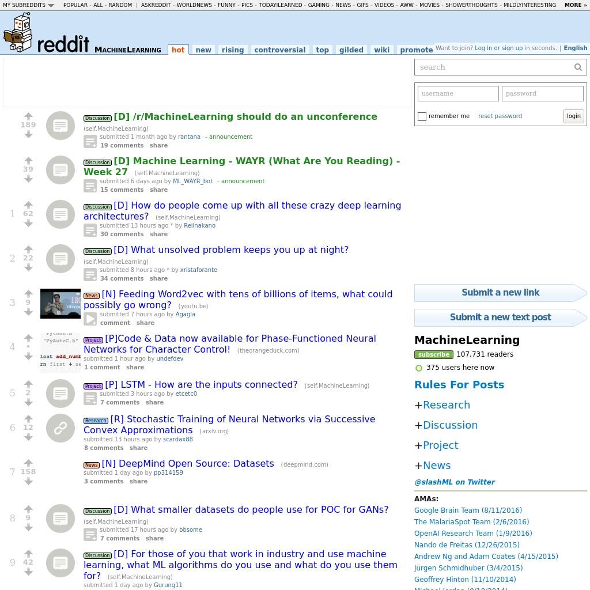
**이미지 캡션:** 이것은 웹사이트의 스크린샷으로, "MachineLearning"이라는 제목의 서브레딧을 보여줍니다. 화면 왼쪽에는 다양한 게시물 목록이 있으며, 각 게시물에는 제목, 작성자, 게시 시간, 댓글 수, 좋아요/싫어요 투표 수가 표시됩니다. 게시물은 "Discussion", "News", "Project", "Research"와 같은 다양한 카테고리로 분류됩니다. 화면 오른쪽에는 "Submit a new link" 및 "Submit a new text post"와 같은 옵션과 함께 서브레딧에 대한 정보가 표시됩니다. 또한 "Rules For Posts" 섹션과 "AMAS" 목록도 있습니다. 전반적인 분위기는 정보 제공적이고 커뮤니티 중심적입니다.
 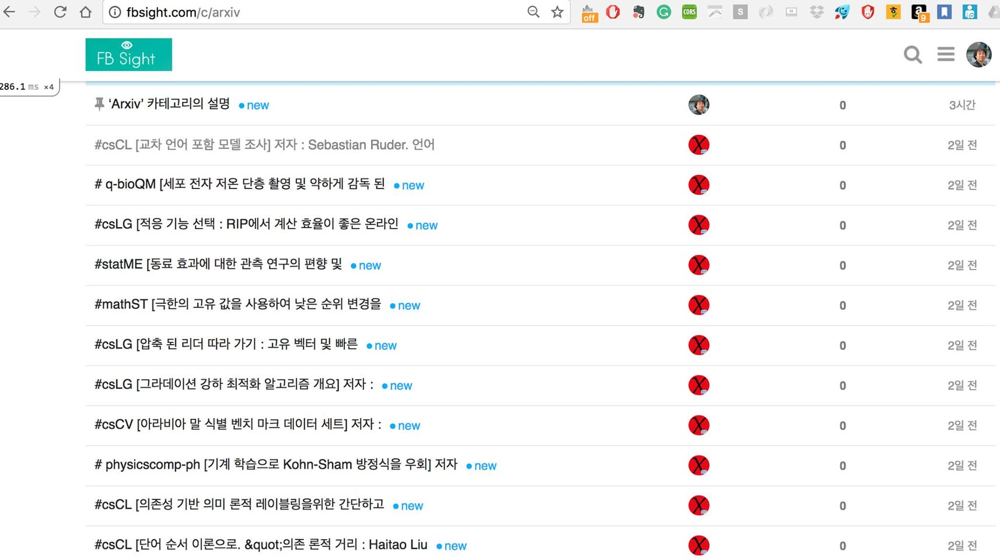
**이미지 캡션:** 이 화면은 웹 브라우저의 탭으로, 'FB Sight'라는 로고와 함께 'fbsight.com/c/arxiv'라는 주소가 표시되어 있습니다. 화면 중앙에는 'Arxiv' 카테고리에 대한 설명과 함께 여러 논문 제목들이 나열되어 있으며, 각 논문 제목 옆에는 'new'라는 표시와 함께 작성자, 게시 시간 등이 표시되어 있습니다. 논문 제목들은 '#csCL', '#q-bioQM', '#csLG', '#statME', '#mathST', '#csCV', '#physicscomp-ph' 등의 해시태그로 시작하며, 한국어로 된 논문 설명과 함께 영어로 된 작성자 이름이 포함되어 있습니다. 각 논문 항목에는 빨간색 동그라미 안에 X 표시가 된 아이콘이 반복적으로 나타나며, 일부 항목에는 성인 남성의 프로필 사진이 작게 표시되어 있습니다. 화면 오른쪽 상단에는 검색 아이콘, 메뉴 아이콘, 그리고 성인 남성의 프로필 사진이 보입니다. 전반적으로 학술 논문 목록을 보여주는 웹 페이지의 일부로 보이며, 정보 검색이나 RAG(Retrieval-Augmented Generation) 시스템에 활용될 수 있는 데이터로 구성되어 있습니다.

> #오늘의레딧 https://www.reddit.com/r/MachineLearning/ 아침부터 다양한 소식이 많네요.  1. 어떻게 사람들은이 모든 미친 깊은 학습 구조를 생각해 낼 수 있습니까? 2. 어떤 미해결 문제로 밤에 당신을 위로합니까? 3. Word2vec에 수십억 개의 항목을 제공하면 무엇이 잘못 될 수 있습니까? 4. 캐릭터 제어를위한 위상 기능 형 신경망에 대한 코드 및 데이터가 제공됩니다! 5. LSTM - 입력은 어떻게 연결되어 있습니까? 6. 연속 볼록 근사를 통한 신경망의 확률 적 훈련 7. DeepMind 오픈 소스 : 데이터 세트 8. 사람들이 POC에 대해 GAN을 사용하는 작은 데이터 집합은 무엇입니까? 9. 업계에서 일하고 기계 학습을 사용하는 사람들을 위해 어떤 ML 알고리즘을 사용하며 무엇을 사용합니까? 10. RNN은 MNIST와 동일합니까? 11. 손실은 적지 만 오진 (false positive)이 많습니다? 12. PyData Tel Aviv Meetup : 아미르 발리 쉬 | 주의 모델 13. Tensorflow를 사용하여 매우 구체적인 자동차 하위 모델에 대한 Craigslist 검색 14. 텍스트에서 개념 / 주제를 추출하는 방법은 무엇입니까? 15. 거래 또는 거래 금지? 협상 대화를위한 엔드 - 투 - 엔드 학습 16. Edward와 Keras의 랜덤 효과 신경 회로망 17. FreezeOut : 점진적으로 레이어를 고정하여 최대 20 %까지 교육을 가속화하십시오. reddit 코멘트와 그 이후의 96 시간의 과학적 폭력을 바탕으로합니다. 18. 올바른 딥 -RL 알고리즘 선택하기 19. LSTM 검토 문제 20. 오디오 샘플 라이브러리에 자동으로 태그를 지정하는 도구 찾기  1. https://www.reddit.com/r/MachineLearning/comments/6hso7g/d_how_do_people_come_up_with_all_these_crazy_deep/ 2. https://www.reddit.com/r/MachineLearning/comments/6hu2uv/d_what_unsolved_problem_keeps_you_up_at_night/ 3. https://youtu.be/qYpdW9cyEqY?list=PLq-odUc2x7i-9Nijx-WfoRMoAfHC9XzTt 4. http://theorangeduck.com/page/phase-functioned-neural-networks-character-control 5. https://www.reddit.com/r/MachineLearning/comments/6hvhzq/p_lstm_how_are_the_inputs_connected/ 6. https://arxiv.org/abs/1706.04769 7. https://deepmind.com/research/open-source/open-source-datasets/ 8. https://www.reddit.com/r/MachineLearning/comments/6hrvgz/d_what_smaller_datasets_do_people_use_for_poc_for/ 9. https://www.reddit.com/r/MachineLearning/comments/6hoi6u/d_for_those_of_you_that_work_in_industry_and_use/ 10. https://www.reddit.com/r/MachineLearning/comments/6hqnk0/d_rnns_equivalent_to_mnist/ 11. https://www.reddit.com/r/MachineLearning/comments/6hrtov/p_low_loss_but_large_amount_of_false_positives/ 12. https://www.youtube.com/watch?v=EcFJZKiMA94 13. https://www.reddit.com/r/MachineLearning/comments/6hrt5g/p_visually_searching_craigslist_for_very_specific/ 14. https://www.reddit.com/r/MachineLearning/comments/6htumx/d_how_to_extract_concept_topic_from_a_text/ 15. https://s3.amazonaws.com/end-to-end-negotiator/end-to-end-negotiator.pdf 16. http://willwolf.io/2017/06/15/random-effects-neural-networks/ 17. https://arxiv.org/abs/1706.04983 18. https://www.reddit.com/r/MachineLearning/comments/6hqtiq/d_choosing_the_right_deeprl_algorithm/ 19. https://www.reddit.com/r/MachineLearning/comments/6hom09/p_lstm_lookback_issues/ 20. https://www.reddit.com/r/MachineLearning/comments/6ho4r0/d_looking_for_tools_to_automatically_tag_audio/
> 숨가쁘게 달려 나오는 새로운 논문들 따라잡기. (제가 하는 방법)  1. https://www.facebook.com/ArxivSanityKR Like 한다음 FB에 올때마다 Feed를 받으며 한글 제목/요약을 읽어 봅니다.   2. 빠른 리스트 skim과 검색이 가능한 http://fbsight.com/c/arxiv/ 를 들러서 놓친 것이 없는지 보고, 생각나는 키워드가 있으면 검색해봅니다.   3. http://trendingarxiv.smerity.com/ 에 들어가서 트랜드를 한번 봅니다. (@Jin-Hwa Kim 님의 추천)  그럼 즐 논문 읽기 되세요!!

### 6월 19일 (월) 08:53 · 📷 사진 (1장)

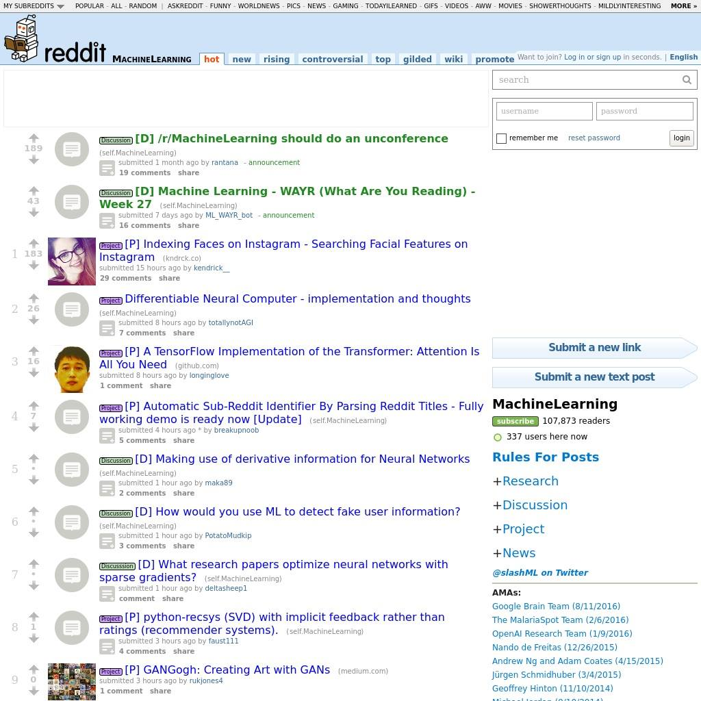
**이미지 캡션:** 이것은 Reddit의 Machine Learning 서브레딧 페이지로, 다양한 게시물 목록을 보여줍니다. 페이지 상단에는 Reddit 로고와 함께 "MACHINE LEARNING"이라는 제목이 있고, 그 아래에는 "hot", "new", "rising", "controversial", "top", "gilded", "wiki", "promote"와 같은 탭이 있습니다. 오른쪽 상단에는 로그인 또는 가입을 위한 입력란과 버튼이 있습니다. 페이지 중앙에는 여러 게시물이 나열되어 있으며, 각 게시물은 제목, 작성자, 제출 시간, 댓글 수 등의 정보를 포함합니다. 게시물 제목은 주로 "[D]" 또는 "[P]"로 시작하며, 각각 토론 또는 프로젝트를 나타냅니다. 예를 들어, 첫 번째 게시물은 "Discussion) [D] /r/Machine Learning should do an unconference"이며, 1개월 전에 제출되었고 19개의 댓글이 있습니다. 세 번째 게시물은 "Project [P] Indexing Faces on Instagram - Searching Facial Features on Instagram"이며, 15시간 전에 제출되었고 29개의 댓글이 있습니다. 이 게시물 중 하나에는 보라색 머리를 한 젊은 여성의 사진이 썸네일로 포함되어 있습니다. 페이지 오른쪽에는 "Submit a new link" 및 "Submit a new text post" 버튼과 함께 "MachineLearning" 서브레딧에 대한 구독 정보가 표시됩니다. 그 아래에는 "Rules For Posts" 섹션과 함께 "+Research", "+Discussion", "+Project", "+News"와 같은 카테고리가 있습니다. 또한 "@slashML on Twitter" 링크와 "AMAS" 섹션에는 과거 AMA(Ask Me Anything) 목록이 날짜와 함께 표시됩니다. 전반적으로 이 페이지는 Machine Learning 커뮤니티의 최신 토론과 프로젝트를 보여주는 정보 허브 역할을 합니다.

> #오늘의레딧 https://www.reddit.com/r/MachineLearning/ 오늘도 새소식이 많군요.  1. Instagram에서 얼굴 인덱싱 - Instagram에서 얼굴 특징 검색 2. Transformer의 TensorFlow 구현 : 관심이 모두 필요합니다. 3. 신경망을위한 파생 정보 활용 4. 가짜 사용자 정보를 탐지하기 위해 ML을 어떻게 사용합니까? 5. python-recsys (SVD)는 평가 (권고 시스템)보다는 암시 적 피드백을 사용합니다. 6. GANGHH : GAN을 이용한 예술 창조 7. 캐릭터 제어를위한 위상 기능 형 신경망에 대한 코드 및 데이터가 제공됩니다! 8. 깊은 학습을위한 Azure NV6 (M60 GPU) 9. 어떤 미해결 문제로 밤에 당신을 위로합니까? 10. 어떻게 사람들은이 모든 미친 깊은 학습 구조를 생각해 낼 수 있습니까? 11. Word2vec에 수십억 개의 항목을 제공하면 무엇이 잘못 될 수 있습니까? 12. 각 교육 사례와 관련된 기록을 모델의 기능으로 사용하는 가장 좋은 방법은 무엇입니까? 13. 연속 볼록 근사를 통한 신경망의 확률 적 훈련 14. LSTM - 입력은 어떻게 연결되어 있습니까? 15. DeepMind 오픈 소스 : 데이터 세트 16. RNN은 MNIST와 동일합니까? 17. 사람들이 POC에 대해 GAN을 사용하는 작은 데이터 집합은 무엇입니까? 18. 업계에서 일하고 기계 학습을 사용하는 사람들을 위해 어떤 ML 알고리즘을 사용하며 무엇을 사용합니까? 19. PyData Tel Aviv Meetup : 아미르 발리 쉬 | 주의 모델 20. 손실은 적지 만 오진 (false positive)이 많습니다?  1. https://kndrck.co/indexing-faces-on-instagram.html 2. https://github.com/Kyubyong/transformer 3. https://www.reddit.com/r/MachineLearning/comments/6i2j5g/d_making_use_of_derivative_information_for_neural/ 4. https://www.reddit.com/r/MachineLearning/comments/6i2bka/d_how_would_you_use_ml_to_detect_fake_user/ 5. https://www.reddit.com/r/MachineLearning/comments/6i1vr5/p_pythonrecsys_svd_with_implicit_feedback_rather/ 6. https://medium.com/@rkjones4/gangogh-creating-art-with-gans-8d087d8f74a1 7. http://theorangeduck.com/page/phase-functioned-neural-networks-character-control 8. https://www.reddit.com/r/MachineLearning/comments/6hzsni/p_azure_nv6_m60_gpu_for_deep_learning/ 9. https://www.reddit.com/r/MachineLearning/comments/6hu2uv/d_what_unsolved_problem_keeps_you_up_at_night/ 10. https://www.reddit.com/r/MachineLearning/comments/6hso7g/d_how_do_people_come_up_with_all_these_crazy_deep/ 11. https://youtu.be/qYpdW9cyEqY?list=PLq-odUc2x7i-9Nijx-WfoRMoAfHC9XzTt 12. https://www.reddit.com/r/MachineLearning/comments/6hx4sw/d_what_is_the_best_way_to_use_history_related_to/ 13. https://arxiv.org/abs/1706.04769 14. https://www.reddit.com/r/MachineLearning/comments/6hvhzq/p_lstm_how_are_the_inputs_connected/ 15. https://deepmind.com/research/open-source/open-source-datasets/ 16. https://www.reddit.com/r/MachineLearning/comments/6hqnk0/d_rnns_equivalent_to_mnist/ 17. https://www.reddit.com/r/MachineLearning/comments/6hrvgz/d_what_smaller_datasets_do_people_use_for_poc_for/ 18. https://www.reddit.com/r/MachineLearning/comments/6hoi6u/d_for_those_of_you_that_work_in_industry_and_use/ 19. https://www.youtube.com/watch?v=EcFJZKiMA94 20. https://www.reddit.com/r/MachineLearning/comments/6hrtov/p_low_loss_but_large_amount_of_false_positives/

### 6월 20일 (화) 08:52 · 📷 사진 (1장)

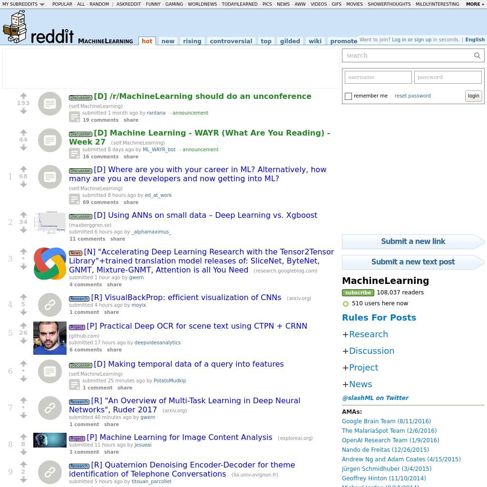
**이미지 캡션:** 이 이미지는 웹사이트 레딧의 머신러닝 서브레딧 페이지를 보여줍니다. 화면 중앙에는 여러 게시물 목록이 있으며, 각 게시물은 제목, 작성자, 제출 시간, 댓글 수 등의 정보를 포함하고 있습니다. 게시물 제목은 주로 머신러닝 관련 주제를 다루고 있으며, "[D]"는 토론, "[N]"은 뉴스, "[R]"은 연구, "[P]"는 프로젝트를 나타냅니다. 왼쪽에는 게시물의 추천/반대 투표 수와 게시물 아이콘이 표시됩니다. 오른쪽 상단에는 로그인 폼과 검색창이 있으며, 그 아래에는 "새 링크 제출" 및 "새 텍스트 게시물 제출" 버튼이 있습니다. 페이지 하단에는 서브레딧 이름, 구독자 수, 현재 접속자 수, 그리고 게시물 규칙 목록이 있습니다. 또한, 트위터 계정 정보와 "AMAS" 섹션에는 머신러닝 분야의 유명 인사들의 이름과 기여한 팀, 날짜가 나열되어 있습니다. 전반적으로 정보가 많고 기술적인 내용을 다루는 커뮤니티의 분위기를 엿볼 수 있습니다.

> #오늘의레딧 https://www.reddit.com/r/MachineLearning/ 아침부터 다양한 소식이 많네요.  1. ML에서의 경력은 어디에 있습니까? 또는 개발자 중 몇 명이 현재 ML에 가입하고 있습니까? 2. 소규모 데이터에 대한 ANN 사용 - 심층 학습 vs. Xgboost 3. "Tensor2Tensor 라이브러리를 통한 심층 학습 연구 가속화"+ 훈련 된 번역 모델 릴리스 : SliceNet, ByteNet, GNMT, Mixture-GNMT, 관심은 모두 필요합니다. 4. VisualBackProp : CNN의 효율적인 시각화 5. CTPN + CRNN을 사용한 장면 텍스트 용 실용적인 Deep OCR 6. 쿼리의 임시 데이터를 피쳐로 만들기 7. "심 신경 회로망에서 다중 태스크 학습 개요", Ruder 2017 8. 이미지 내용 분석을위한 기계 학습 9. 전화 대화의 테마 식별을위한 Quaternion Denoising 인코더 - 디코더 10. 협력 적 다중 에이전트 학습을위한 가치 - 분해 네트워크 11. 모든 것을 배울 수있는 하나의 모델 12. 탄력있는 무게 강화의 실제 문제 해결 응용 프로그램은 무엇입니까? 13. ML 도구에 대한 조언 얻기 14. 전기 양의 안드로이드 꿈을 꿉니다? 15. 3-Dim 입력 및 2-Dim 출력의 시각화 트릭 16. Instagram에서 얼굴 인덱싱 - Instagram에서 얼굴 특징 검색 17. 신경망을위한 파생 정보 활용 18. Transformer의 TensorFlow 구현 : 관심이 모두 필요합니다. 19. GANGHH : GAN을 이용한 예술 창조 20. python-recsys (SVD)는 평가 (권고 시스템)보다는 암시 적 피드백을 사용합니다.  1. https://www.reddit.com/r/MachineLearning/comments/6i71m0/d_where_are_you_with_your_career_in_ml/ 2. http://maxberggren.se/2017/06/18/deep-learning-vs-xgboost/ 3. https://research.googleblog.com/2017/06/accelerating-deep-learning-research.html 4. https://arxiv.org/abs/1611.05418 5. https://github.com/AKSHAYUBHAT/DeepVideoAnalytics/blob/master/notebooks/OCR/readme.md 6. https://www.reddit.com/r/MachineLearning/comments/6ia8d6/d_making_temporal_data_of_a_query_into_features/ 7. https://arxiv.org/abs/1706.05098 8. https://exploreai.org/p/machine-learning-image-content-analysis 9. http://lia.univ-avignon.fr/chercheurs/morchid/articles/interspeech2017_titouan_parcollet.pdf 10. https://arxiv.org/pdf/1706.05296.pdf 11. https://arxiv.org/abs/1706.05137 12. https://www.reddit.com/r/MachineLearning/comments/6i6efh/d_what_are_the_real_problem_solving_application/ 13. https://www.reddit.com/r/MachineLearning/comments/6i8if0/d_seeking_advice_on_ml_tools/ 14. https://blog.scrapinghub.com/2017/06/19/do-androids-dream-of-electric-sheep/ 15. https://www.reddit.com/r/MachineLearning/comments/6i6w5a/d_visualization_tricks_for_3dim_input_and_2dim/ 16. https://kndrck.co/indexing-faces-on-instagram.html 17. https://www.reddit.com/r/MachineLearning/comments/6i2j5g/d_making_use_of_derivative_information_for_neural/ 18. https://github.com/Kyubyong/transformer 19. https://medium.com/@rkjones4/gangogh-creating-art-with-gans-8d087d8f74a1 20. https://www.reddit.com/r/MachineLearning/comments/6i1vr5/p_pythonrecsys_svd_with_implicit_feedback_rather/

### 6월 20일 (화) 19:26 · 📷 앨범: Profile pictures (3장)

**이미지 캡션:** 사진에는 검은색 폴로 셔츠와 녹색 바지를 입은 성인 남성이 서 있으며, 왼쪽 손은 허리에 얹고 오른쪽 손은 자연스럽게 늘어뜨리고 있다. 남성은 옅은 미소를 띠고 있으며, 머리카락은 검은색이고 짧게 스타일링되어 있다. 배경에는 녹색과 보라색 네온 불빛으로 이루어진 추상적인 디자인이 격자무늬 벽에 걸려 있고, 그 앞에는 식물들이 심어진 화분들이 놓여 있다. 사진의 오른쪽과 왼쪽에는 만화 캐릭터로 보이는 큰 조형물들이 있으며, 이 조형물들은 밝고 긍정적인 분위기를 더한다. 전체적으로 사진은 캐주얼하고 즐거운 분위기를 연출하고 있다.
 
**이미지 캡션:** 사진에는 검은색 폴로 셔츠와 녹색 바지를 입은 성인 남성이 서 있습니다. 그는 30대 후반에서 40대 초반으로 보이며, 짧고 검은 머리에 부드러운 미소를 띠고 있습니다. 그의 오른손은 허리에 얹혀 있고, 왼손은 자연스럽게 늘어뜨리고 있습니다. 배경에는 밝은 네온 불빛으로 장식된 격자무늬 구조물이 보이며, 그 앞에는 여러 개의 만화 캐릭터 조형물이 배치되어 있습니다. 특히 남성의 왼쪽에는 분홍색 머리를 가진 캐릭터와 오른쪽에는 검은 머리에 큰 눈을 가진 캐릭터가 보입니다. 전반적으로 밝고 활기찬 분위기의 실내 공간으로 보입니다.
 
**이미지 캡션:** 사진에는 검은색 폴로 셔츠와 녹색 바지를 입은 성인 남성이 등장하며, 그는 왼쪽 허리에 손을 얹고 카메라를 향해 미소를 짓고 있다. 남성의 머리카락은 검은색이며 짧게 잘려 있고, 그의 얼굴에는 옅은 미소가 번져 있다. 배경에는 네온사인으로 만들어진 추상적인 형상이 녹색과 보라색 빛을 내며 빛나고 있으며, 그 뒤로는 격자무늬 벽과 식물들이 보인다. 사진의 오른쪽에는 큰 눈과 옅은 홍조를 띤 만화 캐릭터 조형물이 보인다. 전반적으로 사진은 밝고 긍정적인 분위기를 자아내며, 남성이 어떤 행사나 전시회에 참여한 것으로 보인다.

### 6월 21일 (수) 08:52 · 📷 사진 (1장)

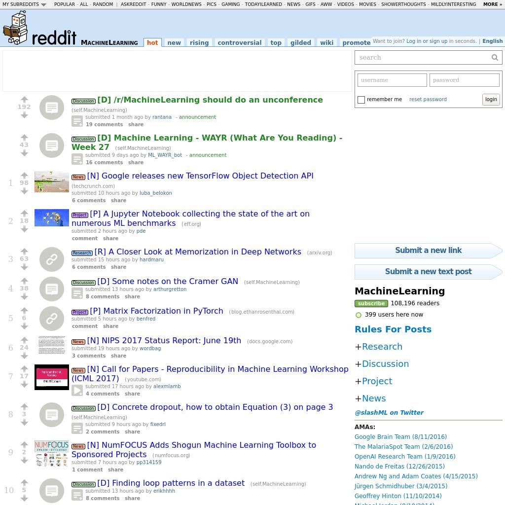
**이미지 캡션:** 이 이미지는 레딧의 머신러닝 서브레딧 페이지를 보여줍니다. 페이지 상단에는 레딧 로고와 함께 "MACHINE LEARNING"이라는 제목이 있고, 그 아래에는 "hot", "new", "rising", "controversial", "top", "gilded", "wiki", "promote"와 같은 탭이 있습니다. 오른쪽 상단에는 로그인 및 회원가입을 위한 입력 필드와 버튼이 있습니다. 메인 콘텐츠 영역에는 여러 게시물 목록이 있으며, 각 게시물은 제목, 제출자 정보, 댓글 수, 공유 수 등을 포함합니다. 게시물들은 주로 머신러닝 관련 주제에 대한 토론, 뉴스, 프로젝트, 연구 등을 다루고 있습니다. 예를 들어, "[D] /r/Machine Learning should do an unconference"라는 제목의 게시물은 192개의 추천을 받았고, "[N] Google releases new TensorFlow Object Detection API"라는 뉴스 게시물은 98개의 추천을 받았습니다. 페이지 오른쪽에는 "Submit a new link" 및 "Submit a new text post" 버튼과 함께 "MachineLearning" 서브레딧의 구독자 수와 현재 접속자 수가 표시되어 있습니다. 또한, "Rules For Posts" 섹션에는 "+Research", "+Discussion", "+Project", "+News"와 같은 하위 섹션이 있으며, "@slashML on Twitter" 링크와 "AMAS" 섹션에는 과거 AMA(Ask Me Anything) 세션 목록이 날짜와 함께 나열되어 있습니다. 전반적으로 이 페이지는 머신러닝 커뮤니티의 최신 정보와 토론을 공유하는 온라인 포럼의 모습을 보여줍니다.

> #오늘의레딧 https://www.reddit.com/r/MachineLearning/ 오늘도 새소식이 많군요.  1. Google, 새로운 TensorFlow 객체 감지 API 출시 2. 수많은 ML 벤치 마크에서 최첨단 기술을 수집 한 Jupyter Notebook 3. 깊은 네트워크에서 암기에 대해 자세히 살펴 봅니다. 4. Cramer GAN의 일부 노트 5. PyTorch의 매트릭스 분해 6. NIPS 2017 현황 보고서 : 6 월 19 일 7. 논문 요청 - 기계 학습 워크샵 (ICML 2017) 재발행 8. 콘크리트 드롭 아웃, 3 페이지의 등식 (3) 얻는 방법 9. NumFOCUS, Shogun Machine 학습 도구 상자를 스폰서 프로젝트에 추가 10. 데이터 세트에서 루프 패턴 찾기 11. ML에서의 경력은 어디에 있습니까? 또는 개발자 중 몇 명이 현재 ML에 가입하고 있습니까? 12. "Tensor2Tensor 라이브러리를 통한 심층 학습 연구 가속화"+ 훈련 된 번역 모델 릴리스 : SliceNet, ByteNet, GNMT, Mixture-GNMT, 관심은 모두 필요합니다. 13. 반복적 인 신경 모듈을 이용한 계층 적 정보 흐름 학습 14. 소규모 데이터에 대한 ANN 사용 - 심층 학습 vs. Xgboost 15. 관련 학위가있는 분은 수학 수업, 신호 처리 수업 또는 데이터베이스 / 알고리즘 수업을 선택 과목으로 선택하시는 것이 좋습니다. 16. "심 신경 회로망에서 다중 태스크 학습 개요", Ruder 2017 17. VisualBackProp : CNN의 효율적인 시각화 18. 협력 적 다중 에이전트 학습을위한 가치 - 분해 네트워크 19. CTPN + CRNN을 사용한 장면 텍스트 용 실용적인 Deep OCR 20. 쿼리의 임시 데이터를 피쳐로 만들기  1. https://techcrunch.com/2017/06/16/object-detection-api/ 2. https://www.eff.org/ai/metrics 3. https://arxiv.org/abs/1706.05394 4. https://www.reddit.com/r/MachineLearning/comments/6id9jr/d_some_notes_on_the_cramer_gan/ 5. http://blog.ethanrosenthal.com/2017/06/20/matrix-factorization-in-pytorch/ 6. https://docs.google.com/document/d/1WZkG8G3J97N-MfQ8NjoSXFXF_9gK-RGu1mrKGa6-9a0/edit 7. https://www.youtube.com/watch?v=ImQglLenTvE 8. https://www.reddit.com/r/MachineLearning/comments/6ieari/d_concrete_dropout_how_to_obtain_equation_3_on/ 9. https://www.numfocus.org/blog/numfocus-adds-shogun-machine-learning-toolbox-to-sponsored-projects/ 10. https://www.reddit.com/r/MachineLearning/comments/6id8kp/d_finding_loop_patterns_in_a_dataset/ 11. https://www.reddit.com/r/MachineLearning/comments/6i71m0/d_where_are_you_with_your_career_in_ml/ 12. https://research.googleblog.com/2017/06/accelerating-deep-learning-research.html 13. https://arxiv.org/abs/1706.05744 14. http://maxberggren.se/2017/06/18/deep-learning-vs-xgboost/ 15. https://www.reddit.com/r/MachineLearning/comments/6ib0o5/d_those_with_related_degrees_do_you_recommend/ 16. https://arxiv.org/abs/1706.05098 17. https://arxiv.org/abs/1611.05418 18. https://arxiv.org/pdf/1706.05296.pdf 19. https://github.com/AKSHAYUBHAT/DeepVideoAnalytics/blob/master/notebooks/OCR/readme.md 20. https://www.reddit.com/r/MachineLearning/comments/6ia8d6/d_making_temporal_data_of_a_query_into_features/

### 6월 21일 (수) 09:29 · Beautiful Jeju Bike Riding on July 15. I…

Beautiful Jeju Bike Riding on July 15. If you are around, please join us.
(Basically, we ride a beautiful 220K course in one day.)

http://cafe.naver.com/bikecity/1959318

### 6월 22일 (목) 08:52 · 📷 사진 (1장)

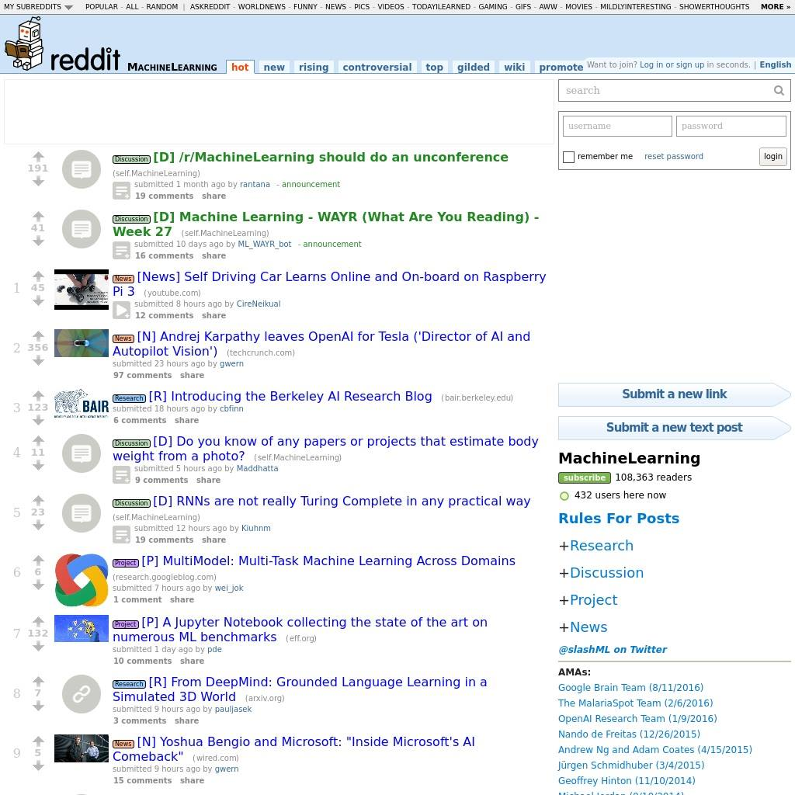
**이미지 캡션:** 이것은 레딧의 머신러닝 서브레딧 페이지로, 다양한 게시물 목록이 표시됩니다. 화면 왼쪽에는 게시물 제목, 작성자, 제출 시간, 댓글 수, 좋아요/싫어요 투표 수가 보입니다. 게시물들은 "머신러닝, 핫, 뉴, 라이징, 컨트로버셜, 탑, 길드, 위키"와 같은 태그로 분류되어 있습니다. 화면 오른쪽 상단에는 로그인 및 회원가입을 위한 입력란과 버튼이 있습니다. 그 아래에는 "새 링크 제출" 및 "새 텍스트 게시물 제출" 버튼이 있으며, "머신러닝" 서브레딧에 대한 구독자 수와 현재 접속자 수가 표시됩니다. 또한, 게시물 규칙 목록과 트위터 계정(@slashML on Twitter)이 보입니다. 하단에는 "AMAS" 섹션에 머신러닝 분야의 유명 인사들의 이름과 해당 활동 날짜가 나열되어 있습니다. 전반적으로 정보가 많고 기술적인 주제를 다루는 온라인 커뮤니티 페이지의 모습입니다.

> #오늘의레딧 https://www.reddit.com/r/MachineLearning/ 재미난 이야기들이 많습니다  1. 자가 운전 차는 라스베리 파이 3 온라인 및 온보드 학습 2. Andrej Karpathy는 Tesla ( &#39;AI 및 자동 파일럿 비전 담당 이사&#39;) 용 OpenAI를 남깁니다. 3. 버클리 인공 지능 연구 블로그 소개 4. 사진의 체중을 추정하는 서류 또는 프로젝트를 알고 있습니까? 5. RNN은 실제적인 방법으로 Turing Complete가 아닙니다. 6. MultiModel : 도메인 간 학습 다중 작업 시스템 7. 수많은 ML 벤치 마크에서 최첨단 기술을 수집 한 Jupyter Notebook 8. DeepMind : 모의 3D 세계에서의 언어 학습 9. Yoshua Bengio와 Microsoft : "Microsoft 내부의 AI 컴백" 10. 텍스트 분류에서 최첨단 기술은 무엇입니까? 11. 심 신경 네트워크 이론의 최신 개발은 무엇입니까? 12. Google, 새로운 TensorFlow 객체 감지 API 출시 13. meProp : 과포화가 감소 된 가속화 된 딥 학습을위한 희생 된 역 전파, "ICML 2017" 14. 10 개의 데이터 과학 포드 캐스트 지금 듣고 있어야합니다. 15. 축구 경기 데이터 필요 16. 플랫 파일 데이터 유형을 식별하는 ML 알고리즘 작성 도움말 17. PyTorch의 매트릭스 분해 18. 가장 중요한 특징 인 회귀 분석에서 종속 변수와 가장 밀접한 관계가 있습니다. 19. 깊은 네트워크에서 암기에 대해 자세히 살펴 봅니다. 20. Cramer GAN의 일부 노트  1. https://www.youtube.com/watch?v=0ibVhtuQkZA&feature=youtu.be 2. https://techcrunch.com/2017/06/20/tesla-hires-deep-learning-expert-andrej-karpathy-to-lead-autopilot-vision/? 3. http://bair.berkeley.edu/blog/2017/06/20/welcome/ 4. https://www.reddit.com/r/MachineLearning/comments/6innhc/d_do_you_know_of_any_papers_or_projects_that/ 5. https://www.reddit.com/r/MachineLearning/comments/6il5rk/d_rnns_are_not_really_turing_complete_in_any/ 6. https://research.googleblog.com/2017/06/multimodel-multi-task-machine-learning.html 7. https://www.eff.org/ai/metrics 8. https://arxiv.org/pdf/1706.06551.pdf 9. https://www.wired.com/story/inside-microsofts-ai-comeback 10. https://www.reddit.com/r/MachineLearning/comments/6ikcf6/d_what_is_the_state_of_the_art_in_text/ 11. https://www.reddit.com/r/MachineLearning/comments/6iin5q/d_what_are_the_latest_developments_in_the_theory/ 12. https://techcrunch.com/2017/06/16/object-detection-api/ 13. https://arxiv.org/abs/1706.06197 14. http://byteacademy.co/blog/data-science-podcasts 15. https://www.reddit.com/r/MachineLearning/comments/6inny0/pneed_soccer_match_data/ 16. https://www.reddit.com/r/MachineLearning/comments/6iltyj/p_help_creating_ml_algorithm_that_identifies_flat/ 17. http://blog.ethanrosenthal.com/2017/06/20/matrix-factorization-in-pytorch/ 18. https://www.reddit.com/r/MachineLearning/comments/6iklws/p_in_a_regression_which_features_are_most/ 19. https://arxiv.org/abs/1706.05394 20. https://www.reddit.com/r/MachineLearning/comments/6id9jr/d_some_notes_on_the_cramer_gan/

### 6월 23일 (금) 08:52 · 📷 사진 (1장)

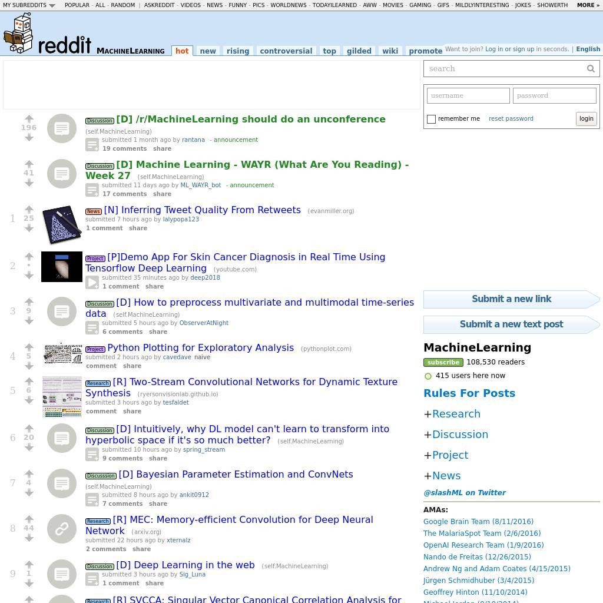
**이미지 캡션:** 이 이미지는 레딧(Reddit) 웹사이트의 머신러닝(Machine Learning) 서브레딧 페이지를 보여줍니다. 페이지 상단에는 레딧 로고와 함께 "MY SUBREDDITS", "POPULAR", "ALL", "RANDOM" 등 다양한 메뉴가 보이며, 그 옆에는 "MACHINE LEARNING"이라는 제목과 함께 "hot", "new", "rising", "controversial", "top", "gilded", "wiki", "promote"와 같은 탭들이 있습니다. 오른쪽 상단에는 로그인 또는 회원가입을 위한 입력 필드와 버튼이 있습니다. 메인 콘텐츠 영역에는 머신러닝 관련 게시물 목록이 표시됩니다. 각 게시물은 제목, 작성자, 제출 시간, 댓글 수, 공유 수 등의 정보를 포함하고 있습니다. 예를 들어, 첫 번째 게시물은 "[D] /r/Machine Learning should do an unconference"라는 제목으로 1개월 전에 제출되었으며 19개의 댓글과 공유가 있습니다. 두 번째 게시물은 "[D] Machine Learning - WAYR (What Are You Reading) - Week 27"으로 11일 전에 제출되었습니다. 세 번째 게시물은 "[N] Inferring Tweet Quality From Retweets"라는 뉴스 글로 7시간 전에 제출되었습니다. 네 번째 게시물은 "[P]Demo App For Skin Cancer Diagnosis in Real Time Using Tensorflow Deep Learning"이라는 프로젝트 게시물로 35분 전에 제출되었습니다. 이 외에도 다양한 연구 및 토론 게시물들이 시간 순서대로 나열되어 있습니다. 페이지 오른쪽에는 "Submit a new link"와 "Submit a new text post" 버튼이 있으며, "MachineLearning" 서브레딧의 구독자 수와 현재 접속자 수가 표시됩니다. 또한, "Rules For Posts" 섹션에는 "+Research", "+Discussion", "+Project", "+News"와 같은 카테고리가 있으며, 트위터 계정(@slashML on Twitter)과 과거 AMA(Ask Me Anything) 세션에 참여했던 유명 인사들의 목록도 보입니다. 전반적으로 이 페이지는 머신러닝 분야의 최신 정보와 토론을 공유하는 온라인 커뮤니티의 모습을 보여줍니다.

> #오늘의레딧 https://www.reddit.com/r/MachineLearning/ 오늘도 새소식이 많군요.  1. Retweets에서 트윗 퀄러티를 유추 2. Tensorflow 딥 학습을 사용하여 실시간으로 피부암 진단을위한 데모 응용 프로그램 3. 다 변수 및 다중 모달 시계열 데이터를 사전 처리하는 방법 4. 동적 텍스쳐 합성을위한 2 스트림 컨볼 루션 네트워크 5. 직관적으로 왜 DL 모델이 쌍곡선 공간으로 변환하는 법을 배울 수없는 이유가 훨씬 더 좋습니다. 6. MEC : 딥 신경망을위한 메모리 효율적인 컨볼 루션 7. 웹에서의 심오한 학습 8. SVCCA : 깊은 이해와 개선을위한 단일 벡터 정준 상관 분석 9. 데이터의 클래스 불균형을 처리하는 가장 좋은 방법은 무엇입니까? 10. OpenAI Universe를 모든 게임에 연결할 수있게 해주는 API가 있습니까? 11. 자가 운전 차는 라스베리 파이 3 온라인 및 온보드 학습 12. 클래스 컨디셔닝 된 컨볼 루션 신경 회로망 13. 데이터 과학자 프로젝트 재개 14. 애플은 CoreML을 발표하면서 Notes 애플리케이션에서 필기 인식을 시연했다. 잠재적으로 사용할 수있는 모델에 대한 의견은 있습니까? 15. 자동차 시뮬레이터 : 퍼지 제어 시스템, 유전자 알고리즘 및 PSO (JavaScript) 16. 연구 생각을 어떻게 체계적으로 유지합니까? 17. Andrej Karpathy는 Tesla ( &#39;AI 및 자동 파일럿 비전 담당 이사&#39;) 용 OpenAI를 남깁니다. 18. 버클리 인공 지능 연구 블로그 소개 19. 사진의 체중을 추정하는 서류 또는 프로젝트를 알고 있습니까? 20. MultiModel : 도메인 간 학습 다중 작업 시스템  1. http://www.evanmiller.org/inferring-tweet-quality-from-retweets.html 2. https://youtube.com/watch?v=fFVDNWN7wd8 3. https://www.reddit.com/r/MachineLearning/comments/6ivj6f/d_how_to_preprocess_multivariate_and_multimodal/ 4. https://ryersonvisionlab.github.io/two-stream-projpage/ 5. https://www.reddit.com/r/MachineLearning/comments/6itdxw/d_intuitively_why_dl_model_cant_learn_to/ 6. https://arxiv.org/abs/1706.06873 7. https://www.reddit.com/r/MachineLearning/comments/6iwc0k/d_deep_learning_in_the_web/ 8. https://arxiv.org/abs/1706.05806 9. https://www.reddit.com/r/MachineLearning/comments/6iq5i8/d_what_are_your_favorite_ways_for_dealing_with/ 10. https://www.reddit.com/r/MachineLearning/comments/6iragl/d_is_there_an_api_that_lets_openai_universe_plug/ 11. https://www.youtube.com/watch?v=0ibVhtuQkZA&feature=youtu.be 12. https://www.reddit.com/r/MachineLearning/comments/6iu57s/d_classconditioned_convolutional_neural_networks/ 13. https://blog.statsbot.co/data-scientist-resume-projects-806a74388ae6 14. https://www.reddit.com/r/MachineLearning/comments/6ipubp/d_with_apple_releasing_coreml_they_also_demoed/ 15. https://github.com/Jasonnor/Car-Simulator 16. https://www.reddit.com/r/MachineLearning/comments/6iqc10/d_how_do_you_keep_your_research_thoughts_organized/ 17. https://techcrunch.com/2017/06/20/tesla-hires-deep-learning-expert-andrej-karpathy-to-lead-autopilot-vision/? 18. http://bair.berkeley.edu/blog/2017/06/20/welcome/ 19. https://www.reddit.com/r/MachineLearning/comments/6innhc/d_do_you_know_of_any_papers_or_projects_that/ 20. https://research.googleblog.com/2017/06/multimodel-multi-task-machine-learning.html

### 6월 23일 (금) 09:07 · Like last year, I'll be in Jeju from Jul…

📍 Mt. Hallasan, Jeju-do

Like last year, I'll be in Jeju from July 1 to 30. If you are around, see you ALL!

1 Year Ago

Sung Kim added 3 new photos.

Jun 23, 2016 2:55:38 pm

Wonderful to hike with Korean Archery National Team and Olympic gold medalist, Ki Bo Bae. Good luck in Rio!

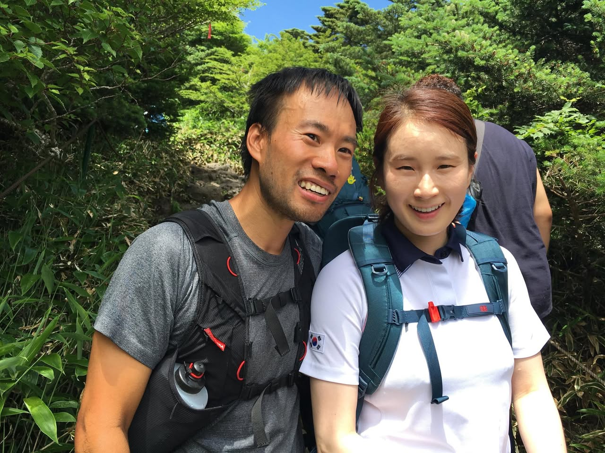
**이미지 캡션:** 이 사진은 맑은 날 야외에서 찍은 것으로, 두 명의 성인이 등산복을 입고 카메라를 향해 웃고 있다. 왼쪽에는 30대 후반에서 40대 초반으로 보이는 성인 남성이 회색 반팔 티셔츠와 검은색 조끼형 배낭을 착용하고 있으며, 배낭에는 물통이 달려 있다. 그는 환하게 웃으며 눈을 살짝 감고 있다. 오른쪽에는 20대 후반에서 30대 초반으로 보이는 성인 여성이 흰색 반팔 카라 티셔츠와 파란색 배낭을 착용하고 있다. 그녀의 티셔츠 왼쪽 소매에는 태극기 패치가 붙어 있으며, 그녀 역시 밝게 웃고 있다. 두 사람 뒤로는 울창한 녹색 숲과 나무가 보이며, 하늘은 맑고 푸르다. 배경에는 다른 사람 한 명이 흐릿하게 보이며, 전체적으로 등산이나 야외 활동 중 즐거운 순간을 포착한 모습이다.
 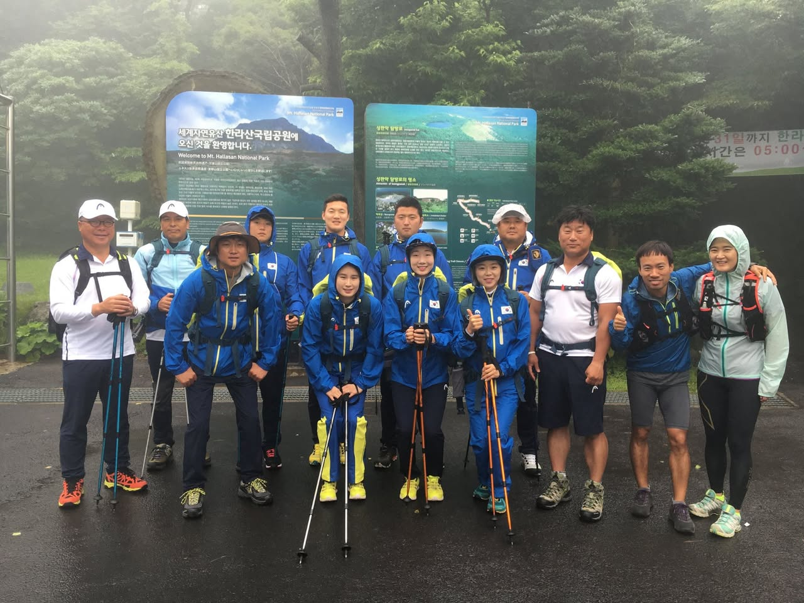
**이미지 캡션:** A group of thirteen hikers, consisting of seven adult males and six adult females, are posing for a photo in front of a large informational sign at the entrance to Mt. Hallasan National Park. The sign, which is partially obscured by trees and fog, welcomes visitors in Korean and English and displays a map of the park. The hikers are all dressed in athletic wear suitable for hiking, with many wearing blue and yellow jackets, backpacks, and hiking boots. Several individuals are holding trekking poles. The overall atmosphere is cheerful and adventurous, with most of the hikers smiling and looking at the camera. The background is a lush, green forest, shrouded in a light fog, suggesting a cool and possibly damp day. The ground is wet, indicating recent rain. The sign also contains Korean text that translates to "Welcome to Mt. Hallasan National Park" and "Until the 31st, Hallasan, Time is 05:00-".
 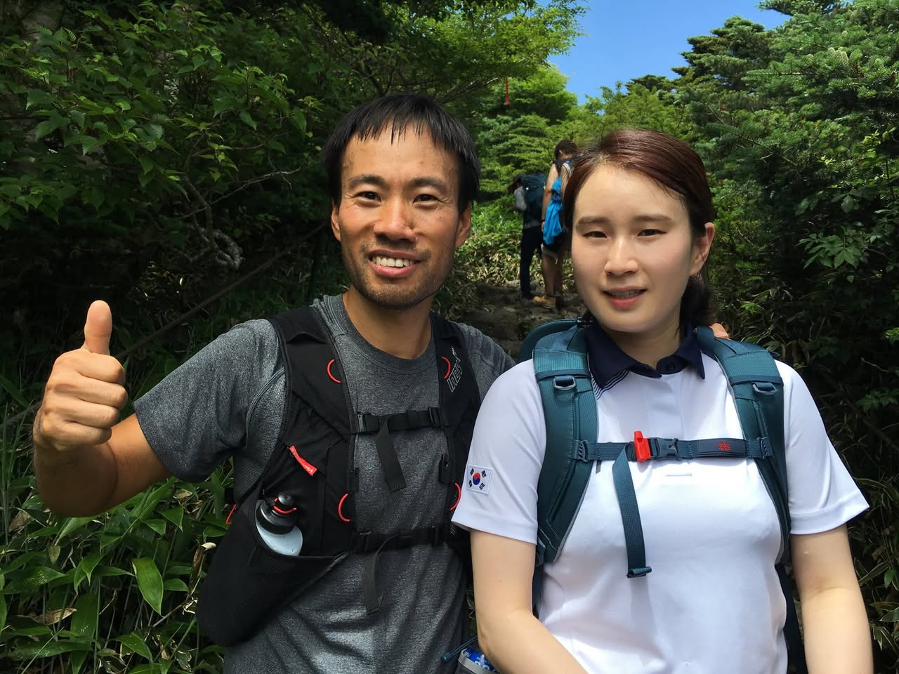
**이미지 캡션:** 한 명의 성인 남성과 한 명의 성인 여성이 산길에서 사진을 찍고 있습니다. 남성은 30대 후반에서 40대 초반으로 보이며, 짧은 검은 머리에 옅은 갈색 피부를 가지고 있습니다. 그는 활짝 웃으며 엄지손가락을 치켜들고 있습니다. 회색 반팔 티셔츠 위에 검은색 조끼형 배낭을 메고 있으며, 배낭에는 물통이 달려 있습니다. 여성은 20대 후반에서 30대 초반으로 보이며, 갈색 머리를 단정하게 묶고 있습니다. 그녀는 옅은 미소를 띠고 있으며, 흰색 반팔 폴로 셔츠 위에 파란색 배낭을 메고 있습니다. 셔츠 왼쪽 소매에는 태극기 패치가 붙어 있습니다. 두 사람 뒤로는 다른 등산객 두 명이 흐릿하게 보이며, 배경에는 울창한 녹색 숲과 푸른 하늘이 펼쳐져 있습니다. 전반적으로 등산을 즐기는 밝고 긍정적인 분위기입니다.

### 6월 24일 (토) 08:52 · 📷 사진 (1장)

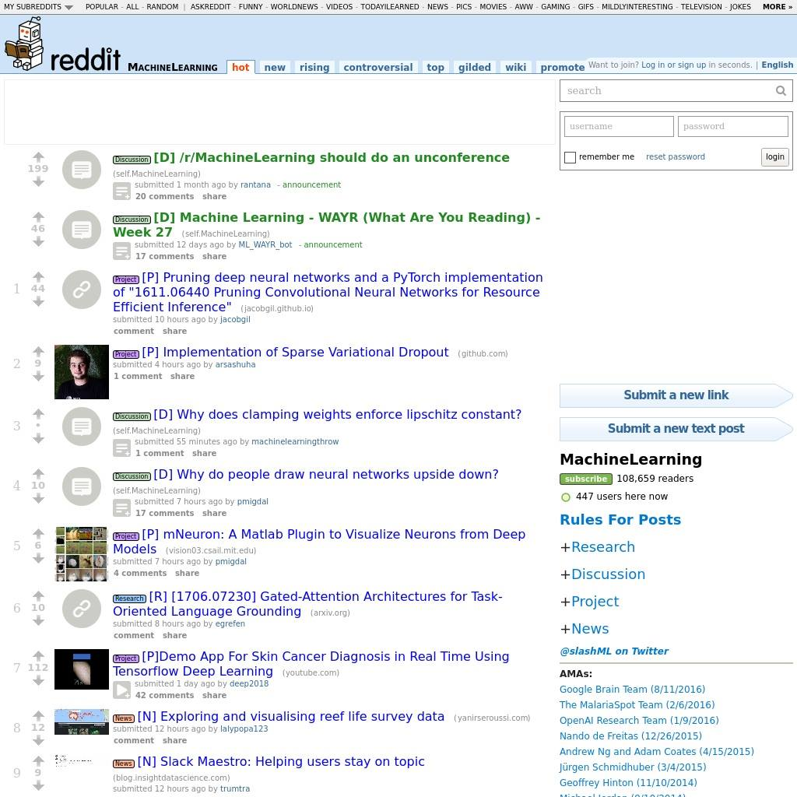
**이미지 캡션:** 이 이미지는 레딧의 머신러닝 서브레딧 페이지를 보여주며, 다양한 게시물과 관련 정보가 나열되어 있습니다. 페이지 상단에는 레딧 로고와 함께 "MACHINE LEARNING"이라는 제목이 있고, 그 아래에는 "hot", "new", "rising", "controversial", "top", "gilded", "wiki", "promote"와 같은 탭이 있습니다. 오른쪽 상단에는 로그인 및 회원가입을 위한 입력 필드와 버튼이 보입니다. 메인 콘텐츠 영역에는 여러 게시물이 시간순으로 정렬되어 있으며, 각 게시물은 제목, 작성자, 제출 시간, 댓글 수, 공유 옵션 등을 포함합니다. 게시물 제목 옆에는 "Discussion", "Project", "Research", "News"와 같은 태그가 붙어 있어 게시물의 성격을 나타냅니다. 예를 들어, 첫 번째 게시물은 "/r/MachineLearning should do an unconference"라는 제목의 토론 게시물이며, 199개의 추천을 받았습니다. 두 번째 게시물은 "Machine Learning - WAYR (What Are You Reading) - Week 27"이라는 제목의 토론 게시물입니다. 세 번째 게시물은 "Pruning deep neural networks and a PyTorch implementation of '1611.06440 Pruning Convolutional Neural Networks for Resource Efficient Inference'"라는 제목의 프로젝트 게시물이며, 작은 썸네일 이미지와 함께 링크가 제공됩니다. 네 번째 게시물은 "Implementation of Sparse Variational Dropout"이라는 제목의 프로젝트 게시물이며, 한 명의 성인 남성이 찍힌 작은 사진이 썸네일로 사용되었습니다. 그 외에도 신경망의 리프쉬츠 상수, 신경망의 시각화, 딥 모델 시각화를 위한 Matlab 플러그인, Gated-Attention 아키텍처, 피부암 진단을 위한 텐서플로우 딥러닝 앱, 산호초 생태계 조사 데이터 시각화, 슬랙 메시지 관리 도구 등 다양한 주제의 게시물들이 나열되어 있습니다. 페이지 오른쪽에는 "Submit a new link"와 "Submit a new text post" 버튼이 있으며, "MachineLearning" 서브레딧의 구독자 수와 현재 접속자 수가 표시됩니다. 또한, "Rules For Posts" 섹션에는 "Research", "Discussion", "Project", "News"와 같은 카테고리가 나열되어 있고, 트위터 계정(@slashML)과 "AMAS" 섹션에는 머신러닝 분야의 저명한 연구자들의 이름과 활동 날짜가 언급되어 있습니다. 전반적으로 이 페이지는 머신러닝 커뮤니티의 최신 정보와 토론을 공유하는 온라인 플랫폼의 모습을 보여줍니다.

> #오늘의레딧 https://www.reddit.com/r/MachineLearning/ 재미난 이야기들이 많습니다  1. 깊은 신경망을 제거하고 "1611.06440 자원 효율적인 추론을위한 전복 (convolutional) 신경 회로망 제거"의 PyTorch 구현 2. 스파 스 변이 제거의 구현 3. 왜 클램핑 가중치가 lipschitz를 일정하게 유지합니까? 4. 왜 사람들은 신경망을 거꾸로 그려야합니까? 5. mNeuron : 깊은 모델에서 뉴런을 시각화하는 Matlab 플러그인 6. Tensorflow 딥 학습을 사용하여 실시간으로 피부암 진단을위한 데모 응용 프로그램 7. 암초 수명 조사 데이터 탐색 및 시각화 8. 슬랙 마에스트로 : 사용자가 주제에 머무르는 것을 돕는다. 9. 일부 그라디언트는 훈련 중 비정상적으로 큽니다. 나는 그들을 클립해야합니까? 10. Clockwork RNN이 더 이상 사용되지 않는 이유는 무엇입니까? 11. 텐서 흐름의 업 샘플링 12. 연관 임베딩에 의한 픽셀 대 그래프 13. 기계 학습 분야에서 누가 논문의 마지막 저자가되어야합니까? 고위 관리자? 14. 연결 된 MNIST 데이터에 의해 테스트 된 순차적 데이터 GAN의 구현 15. Andrew Ng의 deeplearning.ai 프로젝트 16. 깊이있는 깊이있는 학습을 원하십니까? 17. 심층 학습을 사용하여 고해상도 오디오 재구성 18. 파이썬에서 기계 학습 자동화 - TPOT 및 유전 알고리즘 19. 거짓 진술 데이터 집합? 20. 동적 텍스쳐 합성을위한 2 스트림 컨볼 루션 네트워크  1. https://jacobgil.github.io/deeplearning/pruning-deep-learning 2. https://github.com/ars-ashuha/variational-dropout-sparsifies-dnn 3. https://www.reddit.com/r/MachineLearning/comments/6j4oza/d_why_does_clamping_weights_enforce_lipschitz/ 4. https://www.reddit.com/r/MachineLearning/comments/6j28t9/d_why_do_people_draw_neural_networks_upside_down/ 5. http://vision03.csail.mit.edu/cnn_art/ 6. https://youtube.com/watch?v=fFVDNWN7wd8 7. https://yanirseroussi.com/2017/06/03/exploring-and-visualising-reef-life-survey-data/ 8. https://blog.insightdatascience.com/slack-maestro-helping-users-stay-on-topic-b66bf41df75 9. https://www.reddit.com/r/MachineLearning/comments/6j3g92/d_some_gradients_abnormally_big_during_training/ 10. https://www.reddit.com/r/MachineLearning/comments/6iz881/d_why_are_clockwork_rnns_not_used_more/ 11. https://www.reddit.com/r/MachineLearning/comments/6j4ouv/d_upsampling_in_tensorflow/ 12. https://arxiv.org/abs/1706.07365v1 13. https://www.reddit.com/r/MachineLearning/comments/6j2o99/d_in_the_machine_learning_field_who_should_be_the/ 14. https://github.com/jaesik817/SequentialData-GAN 15. https://www.deeplearning.ai/ 16. https://www.reddit.com/r/MachineLearning/comments/6j3f68/d_studying_deep_learning_in_depth/ 17. https://blog.insightdatascience.com/using-deep-learning-to-reconstruct-high-resolution-audio-29deee8b7ccd 18. https://blog.alookanalytics.com/2017/05/25/automate-your-machine-learning/ 19. https://www.reddit.com/r/MachineLearning/comments/6j1jlk/d_false_statement_datasets/ 20. https://ryersonvisionlab.github.io/two-stream-projpage/

### 6월 25일 (일) 08:52 · 📷 사진 (1장)

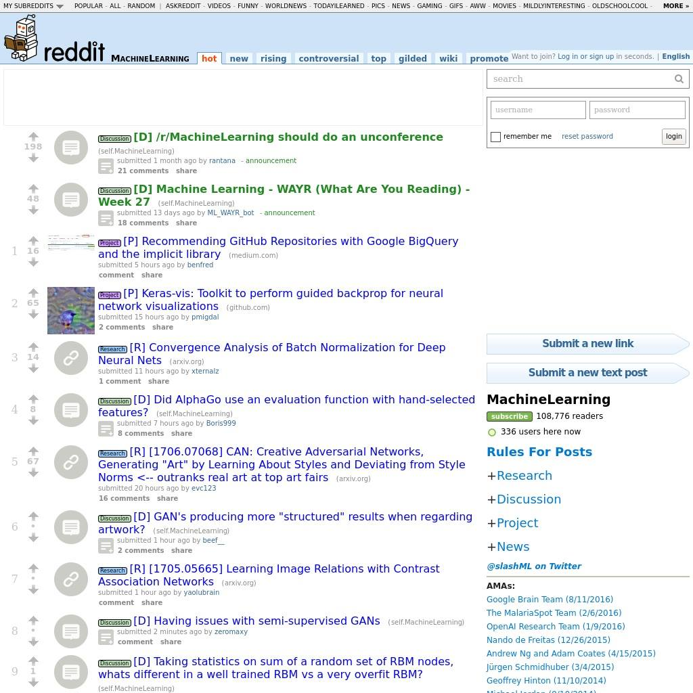
**이미지 캡션:** 이것은 Reddit의 Machine Learning 서브레딧 페이지로, 다양한 연구 및 토론 게시물이 나열되어 있습니다. 페이지 상단에는 Reddit 로고와 함께 "Machine Learning"이라는 제목이 있고, 그 아래에는 "hot", "new", "rising", "controversial", "top", "gilded", "wiki"와 같은 탭이 있습니다. 오른쪽 상단에는 로그인 및 회원가입을 위한 입력란과 버튼이 있습니다. 페이지 중앙에는 게시물 목록이 있으며, 각 게시물은 제목, 작성자, 제출 시간, 댓글 수, 공유 수 등의 정보를 포함합니다. 게시물 제목 앞에는 게시물의 유형을 나타내는 태그(예: [D] for Discussion, [R] for Research, [P] for Project)가 붙어 있습니다. 예를 들어, 첫 번째 게시물은 "Machine Learning should do an unconference"라는 제목의 토론 게시물이며, 1개월 전에 제출되었고 21개의 댓글이 있습니다. 페이지 오른쪽에는 "Submit a new link" 및 "Submit a new text post" 버튼과 함께 "MachineLearning" 서브레딧에 대한 구독 정보, 현재 접속자 수, 게시 규칙, 트위터 계정, 그리고 "AMAS" 섹션이 있습니다. AMAS 섹션에는 과거에 진행되었던 AMA(Ask Me Anything) 세션 목록이 날짜와 함께 표시되어 있습니다. 전반적으로 이 페이지는 머신러닝 분야의 최신 정보와 토론을 공유하는 커뮤니티 허브 역할을 하고 있습니다.

> #오늘의레딧 https://www.reddit.com/r/MachineLearning/ 따끈한 소식들입니다.  1. Google BigQuery 및 암시 적 라이브러리를 사용하여 GitHub 저장소를 추천하는 방법 2. Keras-vis : 신경망 시각화를위한 안내 된 백 드롭을 수행하는 툴킷 3. 심 신경망의 일괄 정규화에 대한 수렴 분석 4. AlphaGo가 직접 선택한 기능으로 평가 기능을 사용 했습니까? 5. GAN은 예술 작품과 관련하여 더 "구조화 된"결과를 산출합니까? 6. 세미 감독 GAN에 문제가 있음 7. RBM 노드의 무작위 집합의 합계에 대한 통계를 취하면 잘 훈련 된 RBM과 매우 다른 RBM은 무엇입니까? 8. 왜 SVM 메모리가 효율적입니까? 9. 신경 기계 번역을 통한 다국어 문장 표현 학습 10. 스파 스 변이 제거의 구현 11. 왜 클램핑 가중치가 lipschitz를 일정하게 유지합니까? 12. caffe를 이용한 연령 및 성별 분류 구현 13. "지식 사항 : 최적화를위한 사전 정보의 중요성"에 대한 생각? 14. 깊은 신경망을 제거하고 "1611.06440 자원 효율적인 추론을위한 전복 (convolutional) 신경 회로망 제거"의 PyTorch 구현 15. mNeuron : 깊은 모델에서 뉴런을 시각화하는 Matlab 플러그인 16. Tensorflow에서 Dirac 네트워크 구현 17. 왜 사람들은 신경망을 거꾸로 그려야합니까? 18. 기계 학습 워크 스테이션 용 GTX 1050ti 대 GTX 1060 19. 내 임의의 아이디어 20. 일부 그라디언트는 훈련 중 비정상적으로 큽니다. 나는 그들을 클립해야합니까?  1. https://medium.com/@jbochi/recommending-github-repositories-with-google-bigquery-and-the-implicit-library-e6cce666c77 2. https://github.com/raghakot/keras-vis 3. https://arxiv.org/abs/1705.08011 4. https://www.reddit.com/r/MachineLearning/comments/6j94al/d_did_alphago_use_an_evaluation_function_with/ 5. https://www.reddit.com/r/MachineLearning/comments/6jau55/d_gans_producing_more_structured_results_when/ 6. https://www.reddit.com/r/MachineLearning/comments/6jbc6r/d_having_issues_with_semisupervised_gans/ 7. https://www.reddit.com/r/MachineLearning/comments/6jai4r/d_taking_statistics_on_sum_of_a_random_set_of_rbm/ 8. https://www.reddit.com/r/MachineLearning/comments/6j8n86/d_why_is_svm_memory_efficient/ 9. https://research.fb.com/wp-content/uploads/2017/08/multiling_repl4nlp17_fair.pdf? 10. https://github.com/ars-ashuha/variational-dropout-sparsifies-dnn 11. https://www.reddit.com/r/MachineLearning/comments/6j4oza/d_why_does_clamping_weights_enforce_lipschitz/ 12. https://github.com/eveningglow/age-and-gender-classification 13. https://www.reddit.com/r/MachineLearning/comments/6j7ku5/d_any_thought_on_knowledge_matters_importance_of/ 14. https://jacobgil.github.io/deeplearning/pruning-deep-learning 15. http://vision03.csail.mit.edu/cnn_art/ 16. https://github.com/hardikbansal/General-DL-code-Tensorflow/tree/master/models/Diracnet 17. https://www.reddit.com/r/MachineLearning/comments/6j28t9/d_why_do_people_draw_neural_networks_upside_down/ 18. https://www.reddit.com/r/MachineLearning/comments/6j8229/d_gtx_1050ti_vs_gtx_1060_for_machine_learning/ 19. https://www.reddit.com/r/MachineLearning/comments/6j7bsr/d_my_random_idea/ 20. https://www.reddit.com/r/MachineLearning/comments/6j3g92/d_some_gradients_abnormally_big_during_training/

### 6월 26일 (월) 08:52 · 📷 사진 (1장)

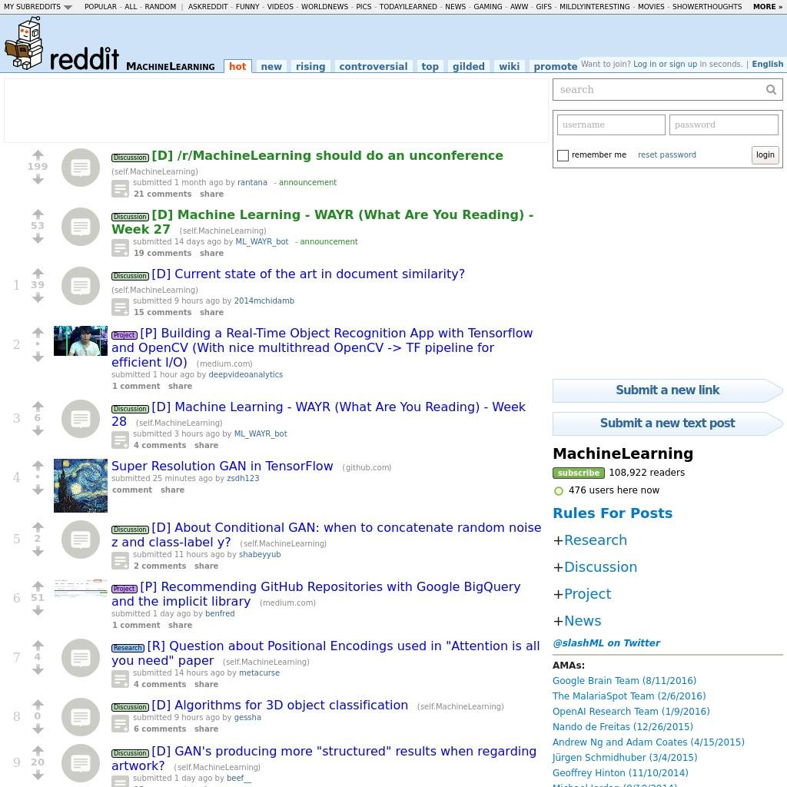
**이미지 캡션:** 이 이미지는 레딧의 머신러닝 서브레딧 페이지를 보여줍니다. 페이지 상단에는 레딧 로고와 함께 "MACHINE LEARNING"이라는 제목이 있고, 그 아래에는 "hot", "new", "rising", "controversial", "top", "gilded", "wiki", "promote"와 같은 탭들이 있습니다. 오른쪽 상단에는 로그인 또는 회원가입을 할 수 있는 입력란과 버튼이 있습니다. 페이지 중앙에는 다양한 주제의 게시물 목록이 표시되며, 각 게시물은 제목, 작성자, 제출 시간, 댓글 수 등의 정보를 포함하고 있습니다. 게시물 제목 앞에는 "[D]" (Discussion), "[P]" (Project), "[R]" (Research)와 같은 태그가 붙어 있어 게시물의 성격을 나타냅니다. 예를 들어, "Super Resolution GAN in TensorFlow"라는 제목의 게시물은 "github.com"에서 가져왔으며, 25분 전에 제출되었고 댓글은 없습니다. 오른쪽 사이드바에는 "Machine Learning" 서브레딧의 구독자 수와 현재 접속자 수가 표시되어 있으며, "Rules For Posts" 섹션에는 "+Research", "+Discussion", "+Project", "+News"와 같은 하위 섹션이 있습니다. 또한, "@slashML on Twitter" 링크와 과거 AMA(Ask Me Anything) 세션 목록도 보입니다. 전반적으로 기술 관련 커뮤니티의 정보 공유 및 토론이 이루어지는 온라인 플랫폼의 모습을 보여줍니다.

> #오늘의레딧 https://www.reddit.com/r/MachineLearning/ 오늘도 새소식이 많군요.  1. 문서 유사성의 현재 상태 2. Tensorflow 및 OpenCV가 포함 된 실시간 객체 인식 응용 프로그램 만들기 (효율적인 멀티 스레드 OpenCV -&gt; 효율적인 I / O를위한 TF 파이프 라인 사용) 3. 기계 학습 - WAYR (What Are You Reading) - 28 주차 4. 조건부 GAN : 임의 잡음 z와 클래스 레이블 y를 연결하는 경우? 5. Google BigQuery 및 암시 적 라이브러리를 사용하여 GitHub 저장소를 추천하는 방법 6. "주의는 당신이 필요로하는 것이 전부입니다"라는 종이에 사용 된 위치 정보 인코딩에 관한 질문 7. 3D 객체 분류를위한 알고리즘 8. GAN은 예술 작품과 관련하여 더 "구조화 된"결과를 산출합니까? 9. Keras-vis : 신경망 시각화를위한 안내 된 백 드롭을 수행하는 툴킷 10. AlphaGo가 직접 선택한 기능으로 평가 기능을 사용 했습니까? 11. 심 신경망의 일괄 정규화에 대한 수렴 분석 12. 세미 감독 GAN에 문제가 있음 13. Convolutions (Pixel Classification) 용 Softmax 사용법을 이해하는 데 어려움이 있습니다. 14. 왜 SVM 메모리가 효율적입니까? 15. RBM 노드의 무작위 집합의 합계에 대한 통계를 취하면 잘 훈련 된 RBM과 매우 다른 RBM은 무엇입니까? 16. 신경 기계 번역을 통한 다국어 문장 표현 학습 17. 스파 스 변이 제거의 구현 18. caffe를 이용한 연령 및 성별 분류 구현 19. 왜 클램핑 가중치가 lipschitz를 일정하게 유지합니까? 20. 깊은 신경망을 제거하고 "1611.06440 자원 효율적인 추론을위한 전복 (convolutional) 신경 회로망 제거"의 PyTorch 구현  1. https://www.reddit.com/r/MachineLearning/comments/6jeimv/d_current_state_of_the_art_in_document_similarity/ 2. https://medium.com/towards-data-science/building-a-real-time-object-recognition-app-with-tensorflow-and-opencv-b7a2b4ebdc32 3. https://www.reddit.com/r/MachineLearning/comments/6jgdva/d_machine_learning_wayr_what_are_you_reading_week/ 4. https://www.reddit.com/r/MachineLearning/comments/6je46u/d_about_conditional_gan_when_to_concatenate/ 5. https://medium.com/@jbochi/recommending-github-repositories-with-google-bigquery-and-the-implicit-library-e6cce666c77 6. https://www.reddit.com/r/MachineLearning/comments/6jdi87/r_question_about_positional_encodings_used_in/ 7. https://www.reddit.com/r/MachineLearning/comments/6jeovu/d_algorithms_for_3d_object_classification/ 8. https://www.reddit.com/r/MachineLearning/comments/6jau55/d_gans_producing_more_structured_results_when/ 9. https://github.com/raghakot/keras-vis 10. https://www.reddit.com/r/MachineLearning/comments/6j94al/d_did_alphago_use_an_evaluation_function_with/ 11. https://arxiv.org/abs/1705.08011 12. https://www.reddit.com/r/MachineLearning/comments/6jbc6r/d_having_issues_with_semisupervised_gans/ 13. https://www.reddit.com/r/MachineLearning/comments/6jc05k/d_having_trouble_understanding_the_usage_of/ 14. https://www.reddit.com/r/MachineLearning/comments/6j8n86/d_why_is_svm_memory_efficient/ 15. https://www.reddit.com/r/MachineLearning/comments/6jai4r/d_taking_statistics_on_sum_of_a_random_set_of_rbm/ 16. https://research.fb.com/wp-content/uploads/2017/08/multiling_repl4nlp17_fair.pdf? 17. https://github.com/ars-ashuha/variational-dropout-sparsifies-dnn 18. https://github.com/eveningglow/age-and-gender-classification 19. https://www.reddit.com/r/MachineLearning/comments/6j4oza/d_why_does_clamping_weights_enforce_lipschitz/ 20. https://jacobgil.github.io/deeplearning/pruning-deep-learning

### 6월 27일 (화) 08:52 · 📷 사진 (1장)

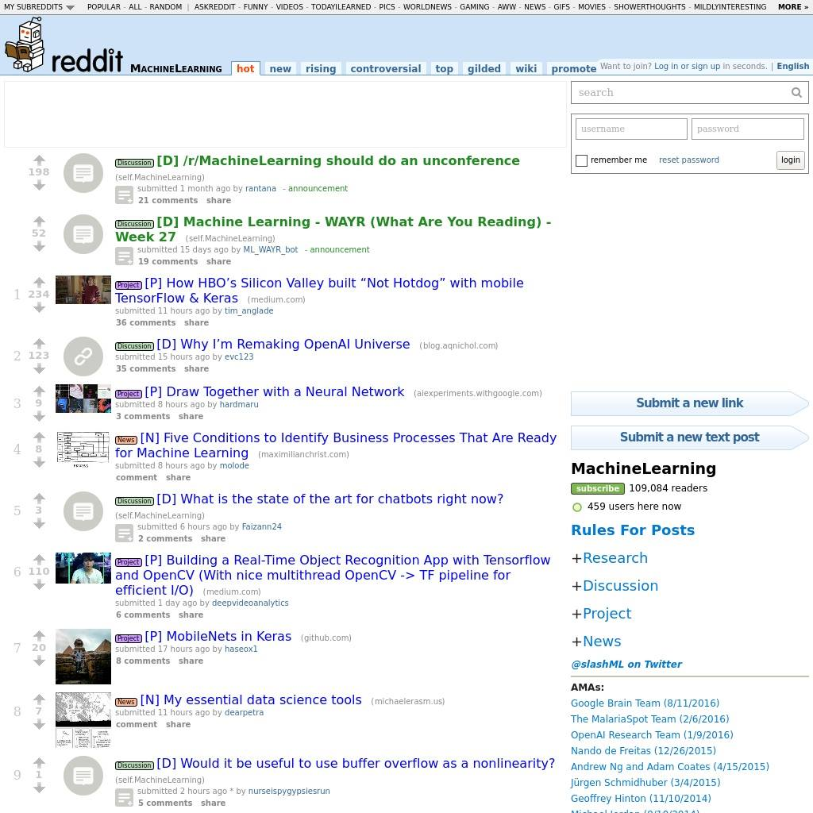
**이미지 캡션:** 이 이미지는 웹사이트 레딧의 머신러닝 관련 서브레딧 페이지를 보여줍니다. 페이지 상단에는 레딧 로고와 함께 "Machine Learning"이라는 제목이 있고, 그 아래에는 "hot", "new", "rising", "controversial", "top", "gilded", "wiki", "promote"와 같은 다양한 탭이 있습니다. 오른쪽 상단에는 로그인 및 회원가입을 위한 입력 필드와 버튼이 있습니다. 페이지 중앙에는 머신러닝 관련 게시물 목록이 표시되며, 각 게시물은 제목, 작성자, 제출 시간, 댓글 수, 공유 옵션 등을 포함합니다. 게시물 제목 옆에는 "Discussion", "Project", "News"와 같은 태그가 붙어 있어 게시물의 성격을 나타냅니다. 예를 들어, "[D] /r/Machine Learning should do an unconference"라는 제목의 게시물은 토론 주제임을 알 수 있습니다. 또한, "How HBO's Silicon Valley built 'Not Hotdog' with mobile TensorFlow & Keras"와 같은 프로젝트 관련 게시물도 있습니다. 페이지 오른쪽에는 "Machine Learning" 서브레딧의 구독자 수와 현재 접속자 수가 표시되며, "Rules For Posts" 섹션에는 "Research", "Discussion", "Project", "News"와 같은 하위 카테고리가 나열되어 있습니다. 하단에는 "AMAS" 섹션에 머신러닝 분야의 저명한 인물들과 그들의 AMA(Ask Me Anything) 날짜가 나열되어 있습니다. 전반적으로 이 페이지는 머신러닝 커뮤니티의 정보 공유 및 토론을 위한 플랫폼 역할을 하고 있음을 보여줍니다.

> #오늘의레딧 https://www.reddit.com/r/MachineLearning/ 따끈한 소식들입니다.  1. HBO의 실리콘 밸리가 모바일 TensorFlow &amp; Keras와 함께 "핫도그가 아닌"구조 2. 왜 내가 OpenAI Universe를 리메이크하고 있는지 3. 신경망과 함께 그리기 4. 기계 학습을위한 준비가 된 비즈니스 프로세스를 식별하는 5 가지 조건 5. 지금 채팅 봇의 최첨단 기술은 무엇입니까? 6. Tensorflow 및 OpenCV가 포함 된 실시간 객체 인식 응용 프로그램 만들기 (효율적인 멀티 스레드 OpenCV -&gt; 효율적인 I / O를위한 TF 파이프 라인 사용) 7. 하드에서 MobileNets 8. 내 필수 데이터 과학 도구 9. 버퍼 오버 플로우를 비선형 성으로 사용하는 것이 유용할까요? 10. 동기화 된 이미지로 3D 라이 다 분석 11. 금융 시장에서 배우는 파이썬 및 기계로부터 이익을 얻으십시오. 12. Brendan Herger | 계급 불균형 및 적들을위한 기계 학습 기법 13. 기계 학습 - WAYR (What Are You Reading) - 28 주차 14. GPU TensorFlow 플랫폼 설정 - Manuel Sánchez Hernández 15. 문서 유사성의 현재 상태 16. 텍스트로 데이터 분석을위한 기계 학습 17. 주요 구성 요소 분석 설명 18. Python vs R. 어느 언어를 선택해야합니까? 19. 3D 객체 분류를위한 알고리즘 20. "주의는 당신이 필요로하는 것이 전부입니다"라는 종이에 사용 된 위치 정보 인코딩에 관한 질문  1. https://medium.com/@timanglade/how-hbos-silicon-valley-built-not-hotdog-with-mobile-tensorflow-keras-react-native-ef03260747f3 2. https://blog.aqnichol.com/2017/06/11/why-im-remaking-openai-universe/ 3. https://aiexperiments.withgoogle.com/sketch-rnn-demo 4. http://maximilianchrist.com/blog/five-aspects-ml-business-processes 5. https://www.reddit.com/r/MachineLearning/comments/6jmijz/d_what_is_the_state_of_the_art_for_chatbots_right/ 6. https://medium.com/towards-data-science/building-a-real-time-object-recognition-app-with-tensorflow-and-opencv-b7a2b4ebdc32 7. https://github.com/titu1994/MobileNetworks 8. http://michaelerasm.us/post/my-essential-data-science-tools/ 9. https://www.reddit.com/r/MachineLearning/comments/6jo2z9/d_would_it_be_useful_to_use_buffer_overflow_as_a/ 10. https://www.reddit.com/r/MachineLearning/comments/6jnrwc/d_analyzing_3d_lidar_with_synced_images/ 11. https://hackernoon.com/unsupervised-machine-learning-for-fun-profit-with-basket-clusters-17a1161e7aa1?gi=1e6b4eacfe17 12. https://www.youtube.com/watch?v=u72FD79tsxA&list=PLGVZCDnMOq0qLoYpkeySVtfdbQg1A_GiB&index=8 13. https://www.reddit.com/r/MachineLearning/comments/6jgdva/d_machine_learning_wayr_what_are_you_reading_week/ 14. https://medium.com/@mansanher/setting-up-your-gpu-tensorflow-platform-1ba2c8b533a 15. https://www.reddit.com/r/MachineLearning/comments/6jeimv/d_current_state_of_the_art_in_document_similarity/ 16. https://exploreai.org/p/machine-learning-analyzing-text-data 17. https://www.neuraldesigner.com/blog/principal-components-analysis 18. http://byteacademy.co/blog/python-vs-r/ 19. https://www.reddit.com/r/MachineLearning/comments/6jeovu/d_algorithms_for_3d_object_classification/ 20. https://www.reddit.com/r/MachineLearning/comments/6jdi87/r_question_about_positional_encodings_used_in/

### 6월 28일 (수) 08:52 · 📷 사진 (2장)

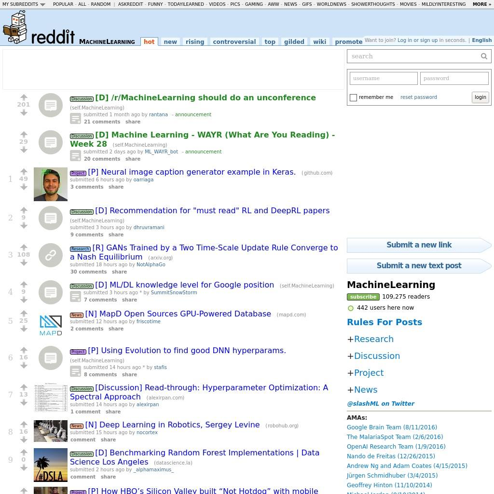
**이미지 캡션:** 이것은 Reddit의 MachineLearning 서브레딧 페이지로, 다양한 인공지능 및 머신러닝 관련 게시물 목록을 보여줍니다. 페이지 상단에는 Reddit 로고와 함께 "MachineLearning"이라는 제목이 있으며, "hot", "new", "rising", "controversial", "top", "gilded", "wiki"와 같은 탭이 있습니다. 오른쪽 상단에는 로그인 및 회원가입을 위한 입력란과 버튼이 있습니다. 메인 콘텐츠 영역에는 여러 게시물이 나열되어 있으며, 각 게시물은 제목, 게시자 정보, 댓글 수, 공유 수 등을 포함합니다. 게시물 유형은 "Discussion", "Project", "Research", "News" 등으로 구분됩니다. 예를 들어, 첫 번째 게시물은 "/r/MachineLearning should do an unconference"라는 제목의 토론이며, 21개의 댓글이 있습니다. 그 아래에는 "Machine Learning - WAYR (What Are You Reading) - Week 28"이라는 제목의 또 다른 토론 게시물이 있습니다. 또한, "Neural image caption generator example in Keras"와 같은 프로젝트 게시물도 보입니다. 페이지 오른쪽에는 "MachineLearning" 서브레딧의 구독자 수와 현재 접속자 수가 표시되어 있으며, "Rules For Posts"와 함께 "Research", "Discussion", "Project", "News"와 같은 섹션 링크가 있습니다. 하단에는 "AMAS" 섹션에 머신러닝 분야의 유명 인사들의 이름과 날짜가 나열되어 있습니다. 전반적으로 이 페이지는 머신러닝 커뮤니티의 최신 정보와 토론을 공유하는 온라인 포럼의 모습을 보여줍니다.
 
**이미지 캡션:** 흰 종이에 검은색 펜으로 쓴 한국어 글씨가 보인다. 글씨는 세 줄로 쓰여 있으며, 첫 번째 줄에는 "후회 없"이라고 쓰여 있고, 두 번째 줄에는 "꿈을 꾸었다"라고 쓰여 있으며, 세 번째 줄에는 "말해요"라고 쓰여 있다. 글씨체는 흘려 쓴 듯하지만 또박또박 읽을 수 있다. 종이의 오른쪽 가장자리는 연한 갈색 배경과 맞닿아 있다. 이 사진은 누군가가 자신의 생각이나 경험을 기록한 것으로 보이며, 긍정적이고 희망적인 메시지를 전달하는 듯한 분위기이다.

> #오늘의레딧 https://www.reddit.com/r/MachineLearning/ 아침부터 다양한 소식이 많네요.  1. Keras의 신경 이미지 캡션 생성기 예제입니다. 2. RL 및 DeepRL 논문의 "필독"권장 사항 3. 두 시간 규모 업데이트 규칙으로 훈련 된 GAN은 내쉬 균형으로 수렴합니다. 4. Google 직책에 대한 ML / DL 지식 수준 5. MapD 오픈 소스 GPU 기반 데이터베이스 6. Evolution을 사용하여 좋은 DNN 하이퍼 풀을 찾으십시오. 7. 읽기 통과 : 하이퍼 매개 변수 최적화 : 스펙트럼 접근법 8. 로봇에서의 심화 학습, Sergey Levine 9. 랜덤 포리스트 구현 벤치마킹 | 데이터 과학 로스 앤젤레스 10. HBO의 실리콘 밸리가 모바일 TensorFlow &amp; Keras와 함께 "핫도그가 아닌"구조 11. 응집성 나노 포토 회로로 깊은 학습 12. 가우스 혼합 모델 - 자율 학습 기계 학습용 JavaScript / Node.js 패키지 13. 코스 : TensorFlow Santa Clara 2017을 이용한 컴퓨터 비전을위한 깊은 학습 14. Ce soir, 파리 기계 학습 모임 # 10 시즌 4 : 대규모 비디오 분류, 커뮤니티 감지, 코드 마이닝,지도, 부하 모니터링 및인지. (영어 슬라이드, 프랑스어 회화) 15. 왜 내가 OpenAI Universe를 리메이크하고 있는지 16. Brendan Herger | 계급 불균형 및 적들을위한 기계 학습 기법 17. Sony의 신경망 라이브러리 18. 신경망과 함께 그리기 19. 내 새로운 장난감 : SFWchk - 깨끗한가요? 아니면 pr0n입니까? AI 결정! 20. 지금 채팅 봇의 최첨단 기술은 무엇입니까?  1. https://github.com/oarriaga/neural_image_captioning/blob/master/src/visualization.ipynb 2. https://www.reddit.com/r/MachineLearning/comments/6jvhna/d_recommendation_for_must_read_rl_and_deeprl/ 3. https://arxiv.org/abs/1706.08500 4. https://www.reddit.com/r/MachineLearning/comments/6jvg0k/d_mldl_knowledge_level_for_google_position/ 5. https://www.mapd.com/blog/2017/05/08/mapd-open-sources-gpu-powered-database/ 6. https://www.reddit.com/r/MachineLearning/comments/6jrmus/p_using_evolution_to_find_good_dnn_hyperparams/ 7. http://www.alexirpan.com/2017/06/27/hyperparam-spectral.html 8. http://robohub.org/deep-learning-in-robotics/ 9. http://datascience.la/benchmarking-random-forest-implementations/ 10. https://medium.com/@timanglade/how-hbos-silicon-valley-built-not-hotdog-with-mobile-tensorflow-keras-react-native-ef03260747f3 11. https://www.nature.com/nphoton/journal/vaop/ncurrent/full/nphoton.2017.93.html 12. https://github.com/lukapopijac/gaussian-mixture-model 13. http://computervisiononline.com/events/course-deep-learning-computer-vision-tensorflow-santa-clara-2017 14. http://nuit-blanche.blogspot.fr/2017/06/paris-machine-learning-10-ending-season.html 15. https://blog.aqnichol.com/2017/06/11/why-im-remaking-openai-universe/ 16. https://www.youtube.com/watch?v=u72FD79tsxA 17. https://nnabla.org 18. https://aiexperiments.withgoogle.com/sketch-rnn-demo 19. https://www.reddit.com/r/MachineLearning/comments/6jsa6b/p_my_new_plaything_sfwchk_is_it_clean_or_is_it/ 20. https://www.reddit.com/r/MachineLearning/comments/6jmijz/d_what_is_the_state_of_the_art_for_chatbots_right/

### 6월 29일 (목) 08:52 · 📷 사진 (1장)

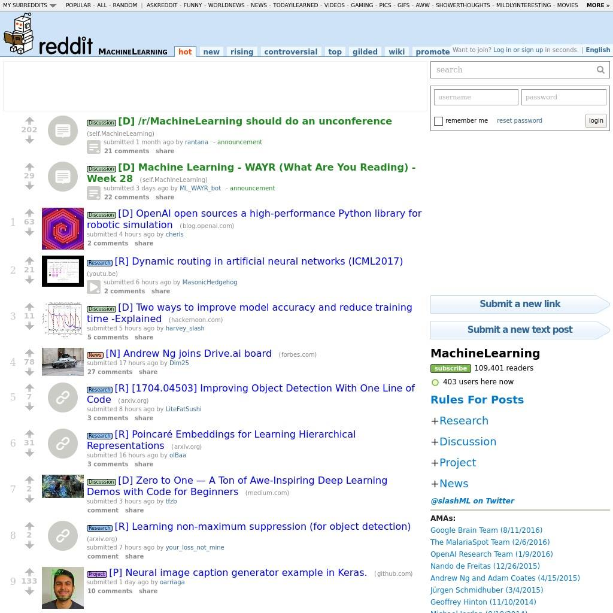
**이미지 캡션:** 이 이미지는 레딧의 머신러닝 서브레딧 페이지를 보여주며, 다양한 연구, 토론, 뉴스 게시물 목록과 함께 사이드바 정보가 포함되어 있습니다. 페이지 상단에는 레딧 로고와 함께 "MACHINE LEARNING"이라는 제목이 보이며, 그 아래에는 "hot", "new", "rising", "controversial", "top", "gilded", "wiki", "promote"와 같은 탭들이 나열되어 있습니다. 오른쪽 상단에는 로그인 및 회원가입을 위한 입력 필드와 버튼이 있습니다. 메인 콘텐츠 영역에는 여러 게시물들이 시간순으로 나열되어 있으며, 각 게시물은 제목, 출처, 작성자, 게시 시간, 댓글 수 등의 정보를 포함합니다. 예를 들어, 첫 번째 게시물은 "Discussion [D] /r/MachineLearning should do an unconference"라는 제목으로 1개월 전에 작성되었고 21개의 댓글이 있습니다. 다른 게시물로는 OpenAI의 파이썬 라이브러리, 인공 신경망에서의 동적 라우팅, 모델 정확도 향상 방법, Andrew Ng의 Drive.ai 합류 소식, 객체 탐지 관련 연구, 딥러닝 데모, 객체 탐지를 위한 비최대 억제 연구, 그리고 Keras를 사용한 신경망 이미지 캡션 생성기 예시 등이 있습니다. 각 게시물 옆에는 추천/비추천을 나타내는 화살표와 댓글 수를 나타내는 아이콘이 있습니다. 오른쪽 사이드바에는 "MachineLearning" 서브레딧의 구독자 수와 현재 접속자 수가 표시되어 있으며, "Rules For Posts" 섹션에는 "Research", "Discussion", "Project", "News"와 같은 카테고리가 나열되어 있습니다. 또한, "@slashML on Twitter" 링크와 과거 AMA(Ask Me Anything) 세션 목록이 포함되어 있습니다. 이미지 하단에는 9번째 게시물과 함께 한 성인 남성의 사진이 작게 보입니다. 이 남성은 짧은 머리에 수염을 기르고 있으며, 검은색 티셔츠를 입고 카메라를 향해 미소를 짓고 있습니다. 전반적으로 이 페이지는 머신러닝 분야의 최신 정보와 토론을 공유하는 온라인 커뮤니티의 모습을 보여줍니다.

> #오늘의레딧 https://www.reddit.com/r/MachineLearning/ 따끈한 소식들입니다.  1. OpenAI 오픈 소스 로봇 시뮬레이션을위한 고성능 파이썬 라이브러리 2. 인공 신경망의 동적 라우팅 (ICML2017) 3. 모델 정확도를 높이고 교육 시간을 단축하는 두 가지 방법 - 설명 4. Andrew Ng는 Drive.ai 보드에 합류했습니다. 5. 계층 적 표현 학습을위한 푸앵카레 삽입 6. 0 대 1 - 초심자를위한 강렬한 영감을주는 깊은 학습 데모 7. 최대치가 아닌 억제를 학습 (물체 감지 용) 8. Keras의 신경 이미지 캡션 생성기 예제입니다. 9. 신경 네트워크 양자화에 대해 배운 내용 10. RL 및 DeepRL 논문의 "필독"권장 사항 11. Google 직책에 대한 ML / DL 지식 수준 12. 최대 (최소) 고유 값을 찾는 데 예상되는 그라디언트 하강 13. 적대적인 네트워크로 정보를 뺄 14. 2 명의 NN이 서로에 대해 훈련합니까? 15. 연속체 학습을위한 그라데이션 에피소드 메모리 (FAIR) 16. 두 시간 규모 업데이트 규칙으로 훈련 된 GAN은 내쉬 균형으로 수렴합니다. 17. MapD 오픈 소스 GPU 기반 데이터베이스 18. 객체, 관계 및 물리학 학습을위한 Deepmind 상호 작용 네트워크의 Tensorflow 구현 19. Evolution을 사용하여 좋은 DNN 하이퍼 풀을 찾으십시오. 20. 누구도 0과 다른 비교 점을 ​​사용하여 ReLU를 시도 했습니까?  1. https://blog.openai.com/faster-robot-simulation-in-python/ 2. https://youtu.be/NHQsDaycwyQ 3. https://hackernoon.com/training-your-deep-model-faster-and-sharper-e85076c3b047 4. https://www.forbes.com/sites/alanohnsman/2017/06/27/robot-car-tech-startup-drive-ai-raises-50-million-adds-stanfords-ng-to-board/ 5. https://arxiv.org/abs/1705.08039 6. https://medium.com/@SamPutnam/deep-learning-download-and-run-a9a1e374d2d9 7. https://arxiv.org/abs/1705.02950 8. https://github.com/oarriaga/neural_image_captioning/blob/master/src/visualization.ipynb 9. https://petewarden.com/2017/06/22/what-ive-learned-about-neural-network-quantization/ 10. https://www.reddit.com/r/MachineLearning/comments/6jvhna/d_recommendation_for_must_read_rl_and_deeprl/ 11. https://www.reddit.com/r/MachineLearning/comments/6jvg0k/d_mldl_knowledge_level_for_google_position/ 12. https://sudeepraja.github.io/PGD/ 13. https://www.reddit.com/r/MachineLearning/comments/6jxtqo/d_subtracting_information_with_adversarial/ 14. https://www.reddit.com/r/MachineLearning/comments/6jxsxa/p_training_2_nns_against_eachother/ 15. https://arxiv.org/abs/1706.08840 16. https://arxiv.org/abs/1706.08500 17. https://www.mapd.com/blog/2017/05/08/mapd-open-sources-gpu-powered-database/ 18. https://github.com/jaesik817/Interaction-networks_tensorflow 19. https://www.reddit.com/r/MachineLearning/comments/6jrmus/p_using_evolution_to_find_good_dnn_hyperparams/ 20. https://www.reddit.com/r/MachineLearning/comments/6jx0wd/d_has_anyone_tried_relu_with_a_comparison_point/

### 6월 30일 (금) 08:52 · 📷 사진 (1장)

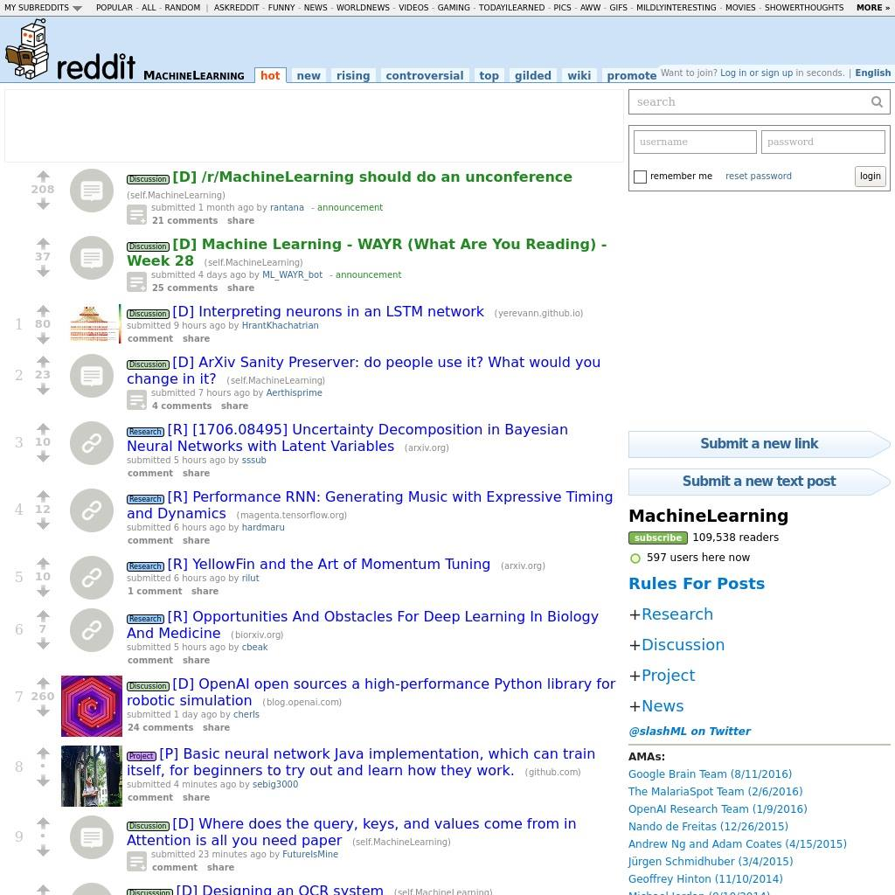
**이미지 캡션:** 이 이미지는 Reddit의 Machine Learning 서브레딧의 스크린샷으로, 다양한 인공지능 및 머신러닝 관련 게시물 목록을 보여줍니다. 화면 중앙에는 "Discussion" 또는 "Research" 태그가 붙은 여러 게시물 제목과 요약 정보가 나열되어 있으며, 각 게시물에는 추천 수, 작성자, 제출 시간, 댓글 수 등의 정보가 함께 표시됩니다. 예를 들어, "Discussion [D] /r/Machine Learning should do an unconference"라는 제목의 게시물은 208개의 추천을 받았고, "Discussion [D] Interpreting neurons in an LSTM network"라는 게시물은 80개의 추천을 받았습니다. 오른쪽에는 "Submit a new link" 및 "Submit a new text post" 버튼과 함께 서브레딧 구독자 수, 관련 링크 목록(+Research, +Discussion, +Project, +News), 그리고 트위터 계정(@slashML on Twitter) 정보가 있습니다. 하단에는 "AMAS" 섹션에 머신러닝 분야의 저명한 연구자들의 이름과 활동 시기가 나열되어 있습니다. 전반적으로 정보가 많고 전문적인 내용을 다루는 기술 커뮤니티의 분위기를 띠고 있습니다.

> #오늘의레딧 https://www.reddit.com/r/MachineLearning/ 따끈한 소식들입니다.  1. LSTM 네트워크에서 뉴런 해석 2. ArXiv Sanity Preserver : 사람들은 그것을 사용합니까? 그것에서 당신은 무엇을 바꿀 것입니까? 3. 퍼포먼스 RNN : 표현적인 타이밍과 다이내믹을 가진 음악 생성 4. YellowFin과 기세 조정 기술 5. 생물과 의학에서의 깊은 학습을위한 기회와 장애물 6. OpenAI 오픈 소스 로봇 시뮬레이션을위한 고성능 파이썬 라이브러리 7. 초보자를 위해 스스로 훈련 할 수있는 기본 신경망 Java 구현을 시도하고 작동하는 법을 배웁니다. 8. Attention에서 쿼리, 키 및 값의 출처는 모두 종이가 필요합니다. 9. 누구나 ICIP 2017을 등록하고 싶습니까? 10. YellowFin과 기세 조정 기술 11. 최소 RL 알고리즘 모음 (현재 고급 예제 포함) 12. 회귀 문제에 대한 팁 13. Google이 대형 채팅 봇을 교육하기 위해 모든 채팅 데이터를 수집하지 않는 이유는 무엇입니까? 14. VGG 딥 얼굴 인식 (caffe, C ++) 15. 인공 신경망의 동적 라우팅 (ICML2017) 16. 연속 신호 분류 17. 모델 정확도를 높이고 교육 시간을 단축하는 두 가지 방법 - 설명 18. 필리핀의 Facebook 뉴스에서 : 주제 모델링을 사용하여 온라인 뉴스 범위의 동향을 찾습니다. 19. Andrew Ng는 Drive.ai 보드에 합류했습니다. 20. Conditional GAN에서 잡음의 목적은 무엇입니까?  1. http://yerevann.github.io/2017/06/27/interpreting-neurons-in-an-LSTM-network/ 2. https://www.reddit.com/r/MachineLearning/comments/6k9l3j/d_arxiv_sanity_preserver_do_people_use_it_what/ 3. https://magenta.tensorflow.org/performance-rnn 4. https://arxiv.org/abs/1706.03471 5. http://www.biorxiv.org/content/early/2017/05/28/142760 6. https://blog.openai.com/faster-robot-simulation-in-python/ 7. https://github.com/sebig3000/MachineLearning 8. https://www.reddit.com/r/MachineLearning/comments/6kc7py/d_where_does_the_query_keys_and_values_come_from/ 9. https://www.reddit.com/r/MachineLearning/comments/6k91ie/r_anyone_wants_to_register_icip_2017_together/ 10. https://arxiv.org/pdf/1706.03471.pdf 11. https://github.com/rlcode/reinforcement-learning 12. https://www.reddit.com/r/MachineLearning/comments/6k9glk/d_tips_for_regression_problem_wanted/ 13. https://www.reddit.com/r/MachineLearning/comments/6k9gy2/d_why_doesnt_google_amass_all_chat_data_to_train/ 14. https://github.com/eveningglow/FaceRecognition 15. https://youtu.be/NHQsDaycwyQ 16. https://www.reddit.com/r/MachineLearning/comments/6k6xsg/d_continuous_signal_classification/ 17. https://hackernoon.com/training-your-deep-model-faster-and-sharper-e85076c3b047 18. http://www.tjpalanca.com/2017/03/facebook-news-topic-modeling.html 19. https://www.forbes.com/sites/alanohnsman/2017/06/27/robot-car-tech-startup-drive-ai-raises-50-million-adds-stanfords-ng-to-board/ 20. https://www.reddit.com/r/MachineLearning/comments/6k4sqj/discussion_what_is_the_purpose_of_noise_in_a/

### 6월 30일 (금) 20:30 · Good to have Prof. Alice Oh at HKUST! As…

Good to have Prof. Alice Oh at HKUST! As always, her work is very interesting.

Thanks, Alice Oh!

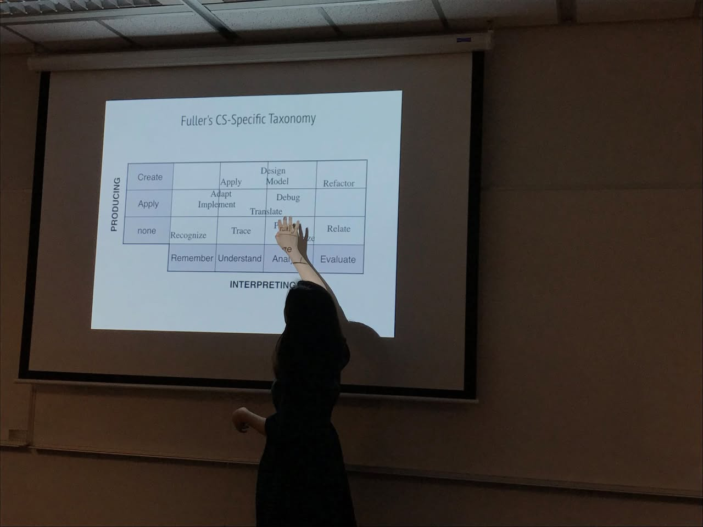
**이미지 캡션:** 어두운 강의실에서 한 명의 성인 여성이 프로젝터 화면을 향해 손가락으로 가리키고 있으며, 화면에는 "Fuller's CS-Specific Taxonomy"라는 제목과 함께 컴퓨터 과학 교육과 관련된 용어들이 표 형태로 정리되어 있다. 여성은 검은색 옷을 입고 있으며, 얼굴 표정은 보이지 않지만 손짓하는 모습에서 발표 중이거나 설명을 하고 있는 것으로 보인다. 배경에는 프로젝터 스크린과 벽이 보이며, 천장에는 조명이 설치되어 있다. 전체적으로 강의나 발표가 진행되는 학술적인 분위기이다.
 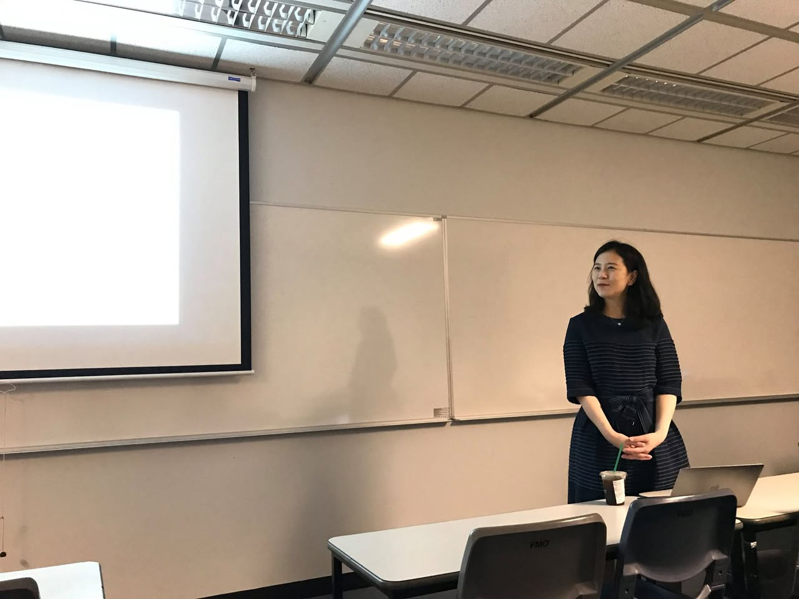
**이미지 캡션:** 한 명의 성인 여성이 강의실에서 발표를 하고 있다. 여성은 30대 후반에서 40대 초반으로 보이며, 검은색 단발머리에 차분한 표정을 짓고 있다. 네이비 색상의 줄무늬 원피스를 입고 있으며, 허리에는 벨트를 묶고 있다. 두 손을 가지런히 모으고 서 있으며, 무릎 위에는 컵과 노트북이 놓여 있다. 여성의 뒤로는 흰색 스크린과 칠판이 보인다. 스크린에는 아무 내용도 표시되지 않은 채 밝게 빛나고 있으며, 칠판은 비어 있다. 강의실 천장에는 형광등이 설치되어 있고, 앞쪽에는 여러 개의 책상이 놓여 있다. 책상 위에는 "FMO"라고 적힌 의자가 보인다. 전체적으로 차분하고 학술적인 분위기이다.
 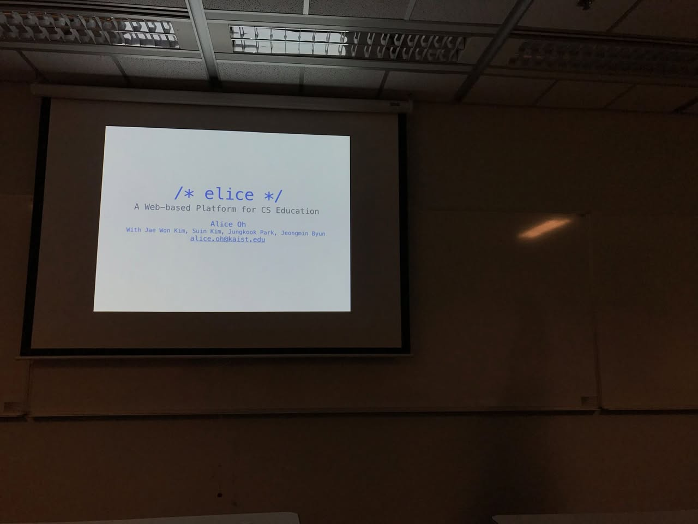
**이미지 캡션:** 이 사진은 강의실에서 진행되는 발표의 한 장면을 담고 있으며, 스크린에는 "/* elice */ A Web-based Platform for CS Education"이라는 제목과 함께 발표자의 이름인 Alice Oh와 공동 연구자들의 이름, 그리고 이메일 주소 alice.oh@kaist.edu가 흰색 글씨로 표시되어 있습니다. 발표자는 보이지 않으며, 배경은 어두운 갈색 벽과 천장의 형광등 조명이 보입니다. 스크린은 흰색이며, 벽에는 주황색 빛이 반사되어 있습니다. 전체적으로 차분하고 학술적인 분위기입니다.
