# 2017년 7월

[← 2017년](README.md)

### 7월 1일 (토) 08:52 · 📷 사진 (1장)

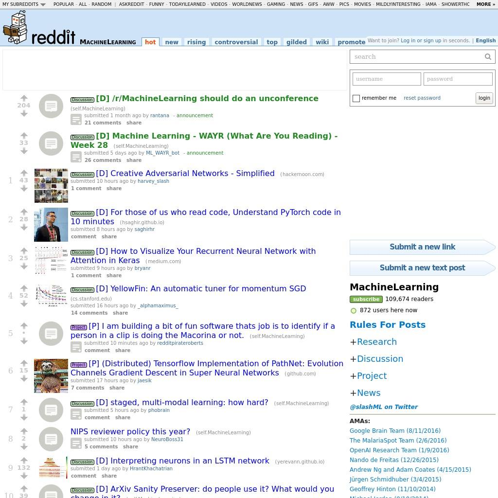
**이미지 캡션:** 이것은 Reddit의 MachineLearning 서브레딧 페이지로, 다양한 머신러닝 관련 게시물 목록을 보여줍니다. 페이지 상단에는 Reddit 로고와 함께 "MachineLearning"이라는 제목이 있고, 그 아래에는 "hot", "new", "rising", "controversial", "top", "gilded", "wiki"와 같은 탭이 있습니다. 오른쪽 상단에는 로그인 및 회원가입을 위한 입력 필드와 버튼이 있습니다. 메인 콘텐츠 영역에는 여러 게시물이 나열되어 있으며, 각 게시물은 제목, 작성자, 제출 시간, 댓글 수, 공유 수 등의 정보를 포함합니다. 게시물 제목은 주로 "[D]" 또는 "[P]"로 시작하며, 각각 토론 또는 프로젝트를 나타냅니다. 일부 게시물에는 외부 링크가 포함되어 있으며, 해당 링크는 괄호 안에 표시됩니다. 예를 들어, "should do an unconference"라는 제목의 게시물은 "self.MachineLearning"에서 제출되었고, "Machine Learning - WAYR (What Are You Reading) - Week 28"이라는 게시물은 "ML_WAYR_bot"에서 제출되었습니다. "Creative Adversarial Networks - Simplified" 게시물은 "hackermoon.com"에서 왔으며, "Understand PyTorch code in 10 minutes" 게시물은 "hsaghir.github.io"에서 왔습니다. "How to Visualize Your Recurrent Neural Network with Attention in Keras" 게시물은 "medium.com"에서 왔고, "YellowFin: An automatic tuner for momentum SGD" 게시물은 "cs.stanford.edu"에서 왔습니다. "I am building a bit of fun software thats job is to identify if a person in a clip is doing the Macorina or not."라는 프로젝트 게시물은 "self.MachineLearning"에서 왔습니다. "NIPS reviewer policy this year?"라는 게시물도 "self.MachineLearning"에서 왔습니다. "Interpreting neurons in an LSTM network" 게시물은 "yerevann.github.io"에서 왔습니다. 페이지 오른쪽에는 "Submit a new link" 및 "Submit a new text post" 버튼이 있고, "MachineLearning" 서브레딧에 대한 구독 정보와 현재 접속자 수가 표시됩니다. 또한 "Rules For Posts" 섹션과 함께 "+Research", "+Discussion", "+Project", "+News"와 같은 하위 섹션이 있습니다. 하단에는 "AMAS:" 섹션과 함께 여러 사람들의 이름과 날짜가 나열되어 있습니다. 전반적으로 이 페이지는 머신러닝 커뮤니티의 활동과 정보를 공유하는 온라인 포럼의 모습을 보여줍니다.자, 제출 시간, 댓글 수, 공유 수 등의 정보를 포함합니다. 게시물 제목은 주로 "[D]" 또는 "[P]"로 시작하며, 각각 토론 또는 프로젝트를 나타냅니다. 일부 게시물에는 외부 링크가 포함되어 있으며, 해당 링크는 괄호 안에 표시됩니다. 예를 들어, "should do an unconference"라는 제목의 게시물은 "self.MachineLearning"에서 제출되었고, "Machine Learning - WAYR (What Are You Reading) - Week 28"이라는 게시물은 "ML_WAYR_bot"에서 제출되었습니다. "Creative Adversarial Networks - Simplified" 게시물은 "hackermoon.com"에서 왔으며, "Understand PyTorch code in 10 minutes" 게시물은 "hsaghir.github.io"에서 왔습니다. "How to Visualize Your Recurrent Neural Network with Attention in Keras" 게시물은 "medium.com"에서 왔고, "YellowFin: An automatic tuner for momentum SGD" 게시물은 "cs.stanford.edu"에서 왔습니다. "I am building a bit of fun software thats job is to identify if a person in a clip is doing the Macorina or not."라는 프로젝트 게시물은 "self.MachineLearning"에서 왔습니다. "NIPS reviewer policy this year?"라는 게시물도 "self.MachineLearning"에서 왔습니다. "Interpreting neurons in an LSTM network" 게시물은 "yerevann.github.io"에서 왔습니다. 페이지 오른쪽에는 "Submit a new link" 및 "Submit a new text post" 버튼이 있고, "MachineLearning" 서브레딧에 대한 구독 정보와 현재 접속자 수가 표시됩니다. 또한 "Rules For Posts" 섹션과 함께 "+Research", "+Discussion", "+Project", "+News"와 같은 하위 섹션이 있습니다. 하단에는 "AMAS:" 섹션과 함께 여러 사람들의 이름과 날짜가 나열되어 있습니다. 전반적으로 이 페이지는 머신러닝 커뮤니티의 활동과 정보를 공유하는 온라인 포럼의 모습을 보여줍니다.

> #오늘의레딧 https://www.reddit.com/r/MachineLearning/ 따끈한 소식들입니다.  1. 크리 에이 티브 적대적 네트워크 - 간체 2. 코드를 읽은 사용자는 10 분 안에 PyTorch 코드를 이해할 수 있습니다. 3. Keras에주의를 기울여 재귀 신경 네트워크를 시각화하는 방법 4. YellowFin : 추진력을위한 자동 튜너 SGD 5. 나는 클립의 사람이 Macorina를하고 있는지 아닌지를 확인하는 일이 재미있는 소프트웨어를 만들고있다. 6. (분산) PathNet의 Tensorflow 구현 : 슈퍼 뉴럴 네트워크에서의 진화 채널 기울기 하강 7. 무대, 다중 모달 학습 : 얼마나 힘들지? 8. LSTM 네트워크에서 뉴런 해석 9. ArXiv Sanity Preserver : 사람들은 그것을 사용합니까? 그것에서 당신은 무엇을 바꿀 것입니까? 10. 퍼포먼스 RNN : 표현적인 타이밍과 다이내믹을 가진 음악 생성 11. keras-vis를 사용하여자가 운전 모델, 장난감 예를 디버깅합니다. 12. 생물과 의학에서의 깊은 학습을위한 기회와 장애물 13. Attention에서 쿼리, 키 및 값의 출처는 모두 종이가 필요합니다. 14. YellowFin과 기세 조정 기술 15. 초보자를 위해 스스로 훈련 할 수있는 기본 신경망 Java 구현을 시도하고 작동하는 법을 배웁니다. 16. OpenAI 오픈 소스 로봇 시뮬레이션을위한 고성능 파이썬 라이브러리 17. 누구나 ICIP 2017을 등록하고 싶습니까? 18. 최소 RL 알고리즘 모음 (현재 고급 예제 포함) 19. 회귀 문제에 대한 팁 20. VGG 딥 얼굴 인식 (caffe, C ++)  1. https://hackernoon.com/can-creative-adversarial-network-explained-1e31aea1dfe8 2. https://hsaghir.github.io/data_science/pytorch_starter/ 3. https://medium.com/datalogue/attention-in-keras-1892773a4f22 4. http://cs.stanford.edu/~zjian/project/YellowFin/ 5. https://www.reddit.com/r/MachineLearning/comments/6kjpff/p_i_am_building_a_bit_of_fun_software_thats_job/ 6. https://github.com/jaesik817/pathnet 7. https://www.reddit.com/r/MachineLearning/comments/6khxzk/d_staged_multimodal_learning_how_hard/ 8. http://yerevann.github.io/2017/06/27/interpreting-neurons-in-an-LSTM-network/ 9. https://www.reddit.com/r/MachineLearning/comments/6k9l3j/d_arxiv_sanity_preserver_do_people_use_it_what/ 10. https://magenta.tensorflow.org/performance-rnn 11. https://github.com/raghakot/keras-vis/blob/master/applications/self_driving/visualize_attention.ipynb 12. http://www.biorxiv.org/content/early/2017/05/28/142760 13. https://www.reddit.com/r/MachineLearning/comments/6kc7py/d_where_does_the_query_keys_and_values_come_from/ 14. https://arxiv.org/abs/1706.03471 15. https://github.com/sebig3000/MachineLearning 16. https://blog.openai.com/faster-robot-simulation-in-python/ 17. https://www.reddit.com/r/MachineLearning/comments/6k91ie/r_anyone_wants_to_register_icip_2017_together/ 18. https://github.com/rlcode/reinforcement-learning 19. https://www.reddit.com/r/MachineLearning/comments/6k9glk/d_tips_for_regression_problem_wanted/ 20. https://github.com/eveningglow/FaceRecognition

### 7월 2일 (일) 08:52 · 📷 사진 (1장)

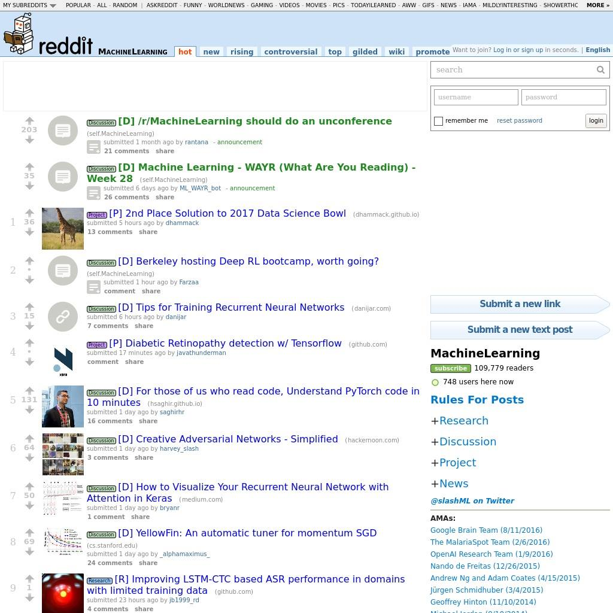
**이미지 캡션:** 이 이미지는 레딧의 머신러닝 서브레딧 페이지를 보여줍니다. 페이지 상단에는 레딧 로고와 함께 "MACHINE LEARNING"이라는 제목과 "hot", "new", "rising", "controversial", "top", "gilded", "wiki"와 같은 탭이 있습니다. 오른쪽 상단에는 로그인 및 회원가입을 위한 입력 필드와 버튼이 있습니다. 메인 콘텐츠 영역에는 다양한 머신러닝 관련 게시물 목록이 표시됩니다. 각 게시물은 제목, 작성자, 제출 시간, 댓글 수, 공유 횟수 등의 정보를 포함하고 있습니다. 게시물 목록에는 "r/MachineLearning should do an unconference", "Machine Learning - WAYR (What Are You Reading) - Week 28", "2nd Place Solution to 2017 Data Science Bowl", "Berkeley hosting Deep RL bootcamp, worth going?", "Tips for Training Recurrent Neural Networks", "Diabetic Retinopathy detection w/ Tensorflow", "For those of us who read code, Understand PyTorch code in 10 minutes", "Creative Adversarial Networks - Simplified", "How to Visualize Your Recurrent Neural Network with Attention in Keras", "YellowFin: An automatic tuner for momentum SGD", "Improving LSTM-CTC based ASR performance in domains with limited training data"와 같은 제목들이 보입니다. 각 게시물 옆에는 업로드된 이미지나 링크를 나타내는 아이콘이 있습니다. 오른쪽 사이드바에는 "Submit a new link" 및 "Submit a new text post" 버튼과 함께 "MachineLearning" 서브레딧의 구독자 수와 현재 접속자 수가 표시됩니다. 또한 "Rules For Posts" 섹션과 함께 "+Research", "+Discussion", "+Project", "+News"와 같은 하위 섹션이 있으며, "@slashML on Twitter" 링크도 있습니다. 하단에는 "AMAS" 섹션에 과거 AMA(Ask Me Anything) 세션에 참여했던 유명 인사들의 이름과 날짜가 나열되어 있습니다. 전반적으로 이 페이지는 머신러닝 커뮤니티의 최신 정보와 토론을 공유하는 온라인 포럼의 모습을 보여줍니다.. 게시물 목록에는 "r/MachineLearning should do an unconference", "Machine Learning - WAYR (What Are You Reading) - Week 28", "2nd Place Solution to 2017 Data Science Bowl", "Berkeley hosting Deep RL bootcamp, worth going?", "Tips for Training Recurrent Neural Networks", "Diabetic Retinopathy detection w/ Tensorflow", "For those of us who read code, Understand PyTorch code in 10 minutes", "Creative Adversarial Networks - Simplified", "How to Visualize Your Recurrent Neural Network with Attention in Keras", "YellowFin: An automatic tuner for momentum SGD", "Improving LSTM-CTC based ASR performance in domains with limited training data"와 같은 제목들이 보입니다. 각 게시물 옆에는 업로드된 이미지나 링크를 나타내는 아이콘이 있습니다. 오른쪽 사이드바에는 "Submit a new link" 및 "Submit a new text post" 버튼과 함께 "MachineLearning" 서브레딧의 구독자 수와 현재 접속자 수가 표시됩니다. 또한 "Rules For Posts" 섹션과 함께 "+Research", "+Discussion", "+Project", "+News"와 같은 하위 섹션이 있으며, "@slashML on Twitter" 링크도 있습니다. 하단에는 "AMAS" 섹션에 과거 AMA(Ask Me Anything) 세션에 참여했던 유명 인사들의 이름과 날짜가 나열되어 있습니다. 전반적으로 이 페이지는 머신러닝 커뮤니티의 최신 정보와 토론을 공유하는 온라인 포럼의 모습을 보여줍니다.

> #오늘의레딧 https://www.reddit.com/r/MachineLearning/ 아침부터 다양한 소식이 많네요.  1. 2017 년 데이터 과학 보울 2 위 솔루션 2. Berkeley는 Deep RL bootcamp를 호스팅하고 있으며, 가치가 있습니까? 3. 재귀 신경 네트워크 교육 팁 4. Tensorflow가있는 당뇨 망막 병증 검출 5. 코드를 읽은 사용자는 10 분 안에 PyTorch 코드를 이해할 수 있습니다. 6. 크리 에이 티브 적대적 네트워크 - 간체 7. Keras에주의를 기울여 재귀 신경 네트워크를 시각화하는 방법 8. YellowFin : 추진력을위한 자동 튜너 SGD 9. 제한된 교육 데이터가있는 도메인에서 LSTM-CTC 기반 ASR 성능 향상 10. 무대, 다중 모달 학습 : 얼마나 힘들지? 11. (분산) PathNet의 Tensorflow 구현 : 슈퍼 뉴럴 네트워크에서의 진화 채널 기울기 하강 12. 나는 클립의 사람이 Macorina를하고 있는지 아닌지를 확인하는 일이 재미있는 소프트웨어를 만들고있다. 13. LSTM 네트워크에서 뉴런 해석 14. 퍼포먼스 RNN : 표현적인 타이밍과 다이내믹을 가진 음악 생성 15. ArXiv Sanity Preserver : 사람들은 그것을 사용합니까? 그것에서 당신은 무엇을 바꿀 것입니까? 16. Attention에서 쿼리, 키 및 값의 출처는 모두 종이가 필요합니다. 17. keras-vis를 사용하여자가 운전 모델, 장난감 예를 디버깅합니다. 18. 생물과 의학에서의 깊은 학습을위한 기회와 장애물 19. YellowFin과 기세 조정 기술 20. 초보자를 위해 스스로 훈련 할 수있는 기본 신경망 Java 구현을 시도하고 작동하는 법을 배웁니다.  1. https://dhammack.github.io/kaggle-ndsb2017/ 2. https://www.reddit.com/r/MachineLearning/comments/6kpyay/d_berkeley_hosting_deep_rl_bootcamp_worth_going/ 3. http://danijar.com/tips-for-training-recurrent-neural-networks/ 4. https://github.com/Nomikxyz/diabetic-retinopathy-screening 5. https://hsaghir.github.io/data_science/pytorch_starter/ 6. https://hackernoon.com/can-creative-adversarial-network-explained-1e31aea1dfe8 7. https://medium.com/datalogue/attention-in-keras-1892773a4f22 8. http://cs.stanford.edu/~zjian/project/YellowFin/ 9. https://github.com/jb1999/eesen/blob/master/papers/LSTM-CTCperf2017.pdf 10. https://www.reddit.com/r/MachineLearning/comments/6khxzk/d_staged_multimodal_learning_how_hard/ 11. https://github.com/jaesik817/pathnet 12. https://www.reddit.com/r/MachineLearning/comments/6kjpff/p_i_am_building_a_bit_of_fun_software_thats_job/ 13. http://yerevann.github.io/2017/06/27/interpreting-neurons-in-an-LSTM-network/ 14. https://magenta.tensorflow.org/performance-rnn 15. https://www.reddit.com/r/MachineLearning/comments/6k9l3j/d_arxiv_sanity_preserver_do_people_use_it_what/ 16. https://www.reddit.com/r/MachineLearning/comments/6kc7py/d_where_does_the_query_keys_and_values_come_from/ 17. https://github.com/raghakot/keras-vis/blob/master/applications/self_driving/visualize_attention.ipynb 18. http://www.biorxiv.org/content/early/2017/05/28/142760 19. https://arxiv.org/abs/1706.03471 20. https://github.com/sebig3000/MachineLearning

### 7월 3일 (월) 08:52 · 📷 사진 (1장)

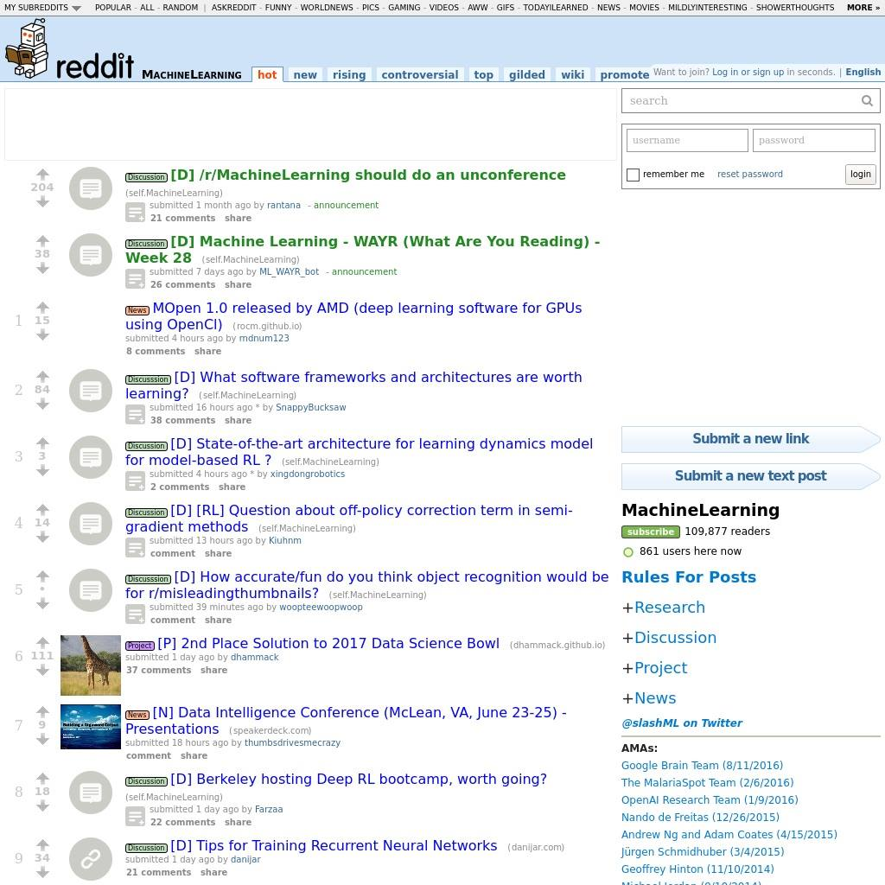
**이미지 캡션:** 이 이미지는 인기 있는 온라인 커뮤니티인 레딧의 머신러닝 서브레딧 페이지를 보여줍니다. 페이지 상단에는 레딧 로고와 함께 "MachineLearning"이라는 제목이 있고, 그 아래에는 "hot", "new", "rising", "controversial", "top", "gilded", "wiki"와 같은 다양한 탭이 있습니다. 오른쪽 상단에는 로그인 또는 회원가입을 할 수 있는 폼이 있으며, 검색창도 보입니다. 페이지의 주요 내용은 머신러닝 관련 게시물 목록으로, 각 게시물은 제목, 작성자, 제출 시간, 댓글 수, 공유 수 등의 정보를 포함하고 있습니다. 게시물 중에는 "Machine Learning - WAYR (What Are You Reading) - Week 28", "MOpen 1.0 released by AMD (deep learning software for GPUs using OpenCL)", "State-of-the-art architecture for learning dynamics model for model-based RL?", "2nd Place Solution to 2017 Data Science Bowl", "Data Intelligence Conference (McLean, VA, June 23-25) - Presentations"와 같은 다양한 주제를 다루고 있습니다. 오른쪽 사이드바에는 "MachineLearning" 서브레딧의 구독자 수와 현재 접속자 수가 표시되어 있으며, "Rules For Posts", "+Research", "+Discussion", "+Project", "+News"와 같은 추가 정보 링크도 있습니다. 또한, "AMAS" 섹션에는 과거에 진행되었던 AMA(Ask Me Anything) 세션 목록이 날짜와 함께 나열되어 있습니다. 전반적으로 이 페이지는 머신러닝 분야에 관심 있는 사용자들이 최신 정보와 토론을 공유하는 온라인 공간을 나타냅니다.댓글 수, 공유 수 등의 정보를 포함하고 있습니다. 게시물 중에는 "Machine Learning - WAYR (What Are You Reading) - Week 28", "MOpen 1.0 released by AMD (deep learning software for GPUs using OpenCL)", "State-of-the-art architecture for learning dynamics model for model-based RL?", "2nd Place Solution to 2017 Data Science Bowl", "Data Intelligence Conference (McLean, VA, June 23-25) - Presentations"와 같은 다양한 주제를 다루고 있습니다. 오른쪽 사이드바에는 "MachineLearning" 서브레딧의 구독자 수와 현재 접속자 수가 표시되어 있으며, "Rules For Posts", "+Research", "+Discussion", "+Project", "+News"와 같은 추가 정보 링크도 있습니다. 또한, "AMAS" 섹션에는 과거에 진행되었던 AMA(Ask Me Anything) 세션 목록이 날짜와 함께 나열되어 있습니다. 전반적으로 이 페이지는 머신러닝 분야에 관심 있는 사용자들이 최신 정보와 토론을 공유하는 온라인 공간을 나타냅니다.

> #오늘의레딧 https://www.reddit.com/r/MachineLearning/ 래딧은 읽을 거리가 다양합니다.  1. 모델 기반 RL을위한 역학 모델을 학습하기위한 최첨단 아키텍처? 2. 2017 년 데이터 과학 보울 2 위 솔루션 3. 데이터 인텔리전스 컨퍼런스 (McLean, VA, 6 월 23-25 ​​일) - 프레젠테이션 4. Berkeley는 Deep RL bootcamp를 호스팅하고 있으며, 가치가 있습니까? 5. 재귀 신경 네트워크 교육 팁 6. 상태 시뮬레이션 생성이란 무엇입니까? 7. Tensorflow가있는 당뇨 망막 병증 검출 8. 코드를 읽은 사용자는 10 분 안에 PyTorch 코드를 이해할 수 있습니다. 9. 크리 에이 티브 적대적 네트워크 - 간체 10. Keras에주의를 기울여 재귀 신경 네트워크를 시각화하는 방법 11. 제한된 교육 데이터가있는 도메인에서 LSTM-CTC 기반 ASR 성능 향상 12. YellowFin : 추진력을위한 자동 튜너 SGD 13. 무대, 다중 모달 학습 : 얼마나 힘들지? 14. (분산) PathNet의 Tensorflow 구현 : 슈퍼 뉴럴 네트워크에서의 진화 채널 기울기 하강 15. 나는 클립의 사람이 Macorina를하고 있는지 아닌지를 확인하는 일이 재미있는 소프트웨어를 만들고있다. 16. LSTM 네트워크에서 뉴런 해석 17. 퍼포먼스 RNN : 표현적인 타이밍과 다이내믹을 가진 음악 생성 18. ArXiv Sanity Preserver : 사람들은 그것을 사용합니까? 그것에서 당신은 무엇을 바꿀 것입니까? 19. Attention에서 쿼리, 키 및 값의 출처는 모두 종이가 필요합니다.  1. https://www.reddit.com/r/MachineLearning/comments/6kv1t3/d_stateoftheart_architecture_for_learning/ 2. https://dhammack.github.io/kaggle-ndsb2017/ 3. https://speakerdeck.com/dataintelligence 4. https://www.reddit.com/r/MachineLearning/comments/6kpyay/d_berkeley_hosting_deep_rl_bootcamp_worth_going/ 5. http://danijar.com/tips-for-training-recurrent-neural-networks/ 6. https://www.reddit.com/r/MachineLearning/comments/6ktbry/d_whats_the_state_simulation_generation/ 7. https://github.com/Nomikxyz/diabetic-retinopathy-screening 8. https://hsaghir.github.io/data_science/pytorch_starter/ 9. https://hackernoon.com/can-creative-adversarial-network-explained-1e31aea1dfe8 10. https://medium.com/datalogue/attention-in-keras-1892773a4f22 11. https://github.com/jb1999/eesen/blob/master/papers/LSTM-CTCperf2017.pdf 12. http://cs.stanford.edu/~zjian/project/YellowFin/ 13. https://www.reddit.com/r/MachineLearning/comments/6khxzk/d_staged_multimodal_learning_how_hard/ 14. https://github.com/jaesik817/pathnet 15. https://www.reddit.com/r/MachineLearning/comments/6kjpff/p_i_am_building_a_bit_of_fun_software_thats_job/ 16. http://yerevann.github.io/2017/06/27/interpreting-neurons-in-an-LSTM-network/ 17. https://magenta.tensorflow.org/performance-rnn 18. https://www.reddit.com/r/MachineLearning/comments/6k9l3j/d_arxiv_sanity_preserver_do_people_use_it_what/ 19. https://www.reddit.com/r/MachineLearning/comments/6kc7py/d_where_does_the_query_keys_and_values_come_from/

### 7월 4일 (화) 06:48 · 📷 사진 (2장)

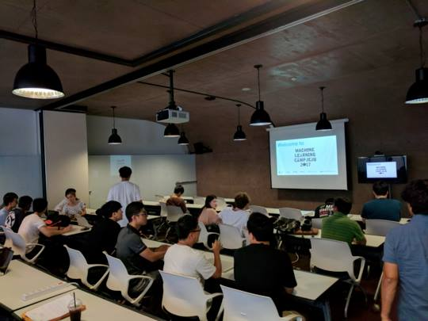
**이미지 캡션:** 이 사진은 강의실에서 열리는 머신러닝 캠프의 모습으로, 여러 명의 젊은 성인들이 강의를 듣고 있다. 대부분의 사람들은 20대 초중반으로 보이며, 편안한 복장을 하고 있다. 일부는 노트북을 켜고 강의 내용을 필기하거나 집중해서 듣고 있으며, 일부는 다른 사람들과 이야기를 나누는 듯한 모습도 보인다. 강의실은 현대적인 디자인으로, 천장에는 여러 개의 검은색 펜던트 조명이 달려 있고, 벽에는 프로젝터와 스크린이 설치되어 있다. 스크린에는 "Welcome to MACHINE LEARNING CAMP JEJU 2017"이라는 문구가 적혀 있어 행사의 이름과 연도를 알 수 있다. 또한, 옆쪽 벽에는 TV 화면이 있어 같은 내용을 보여주고 있다. 전반적으로 차분하고 집중된 분위기 속에서 교육이 이루어지고 있음을 알 수 있다."이라는 문구가 적혀 있어 행사의 이름과 연도를 알 수 있다. 또한, 옆쪽 벽에는 TV 화면이 있어 같은 내용을 보여주고 있다. 전반적으로 차분하고 집중된 분위기 속에서 교육이 이루어지고 있음을 알 수 있다.
 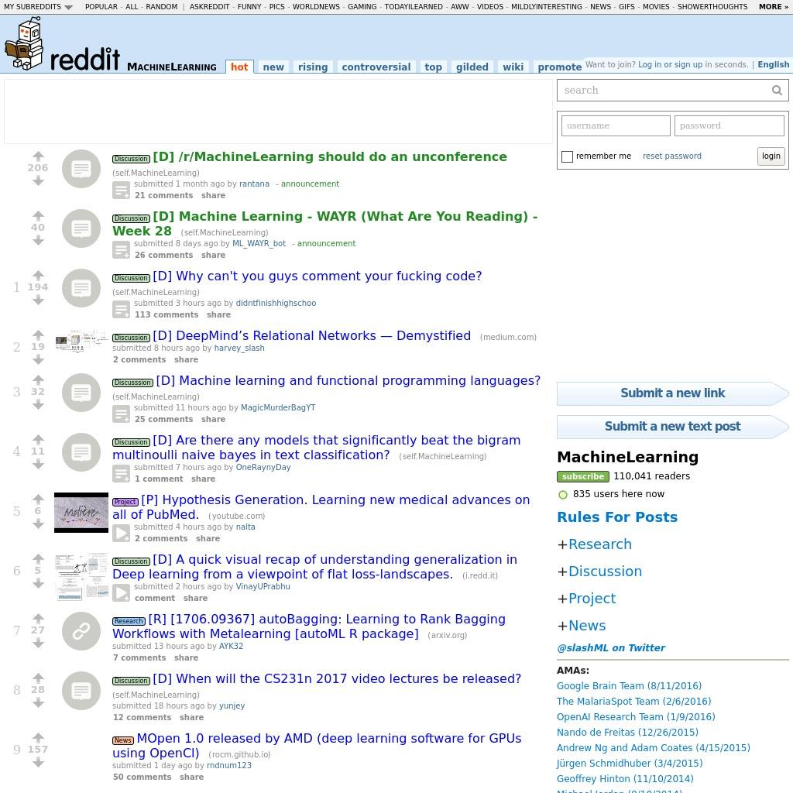
**이미지 캡션:** 이 이미지는 레딧의 머신러닝 서브레딧 페이지를 보여주며, 다양한 게시물과 관련 정보가 나열되어 있습니다. 페이지 상단에는 레딧 로고와 함께 "MACHINE LEARNING"이라는 제목이 있고, 그 아래에는 "hot", "new", "rising", "controversial", "top", "gilded", "wiki", "promote"와 같은 탭들이 있습니다. 오른쪽 상단에는 로그인 폼이 있으며, 사용자 이름과 비밀번호를 입력하고 로그인할 수 있습니다. 페이지 중앙에는 여러 게시물들이 목록 형태로 나타나는데, 각 게시물은 제목, 작성자, 제출 시간, 댓글 수 등의 정보를 포함하고 있습니다. 예를 들어, "[D] /r/Machine Learning should do an unconference"라는 제목의 게시물은 206개의 추천을 받았고, 21개의 댓글이 달려 있습니다. 또한, "MachineLearning" 서브레딧의 구독자 수와 현재 접속자 수가 표시되어 있으며, 게시물 규칙과 트위터 계정 정보도 확인할 수 있습니다. 페이지 하단에는 "AMAS" 섹션에 머신러닝 분야의 유명 인사들의 이름과 관련 날짜가 나열되어 있습니다. 전반적으로 이 페이지는 머신러닝 커뮤니티의 최신 정보와 토론을 공유하는 온라인 포럼의 모습을 보여줍니다.데, 각 게시물은 제목, 작성자, 제출 시간, 댓글 수 등의 정보를 포함하고 있습니다. 예를 들어, "[D] /r/Machine Learning should do an unconference"라는 제목의 게시물은 206개의 추천을 받았고, 21개의 댓글이 달려 있습니다. 또한, "MachineLearning" 서브레딧의 구독자 수와 현재 접속자 수가 표시되어 있으며, 게시물 규칙과 트위터 계정 정보도 확인할 수 있습니다. 페이지 하단에는 "AMAS" 섹션에 머신러닝 분야의 유명 인사들의 이름과 관련 날짜가 나열되어 있습니다. 전반적으로 이 페이지는 머신러닝 커뮤니티의 최신 정보와 토론을 공유하는 온라인 포럼의 모습을 보여줍니다.

> 제주 캠프 신나게 시작되었습니다. 이 행사는 TF-KR 주도로 준비되고 진행되는 행사입니다. 우리 모두의 행사인 것이죠.  어제 발표를 보니 매우 다양하고 재미있는 것들이 많이 나오게 될것 같아 기대가 됩니다.  http://biz.chosun.com/site/data/html_dir/2017/07/03/2017070302258.html  이번 캠프에 함께 하시면서 참여자를 격려할수 있는 방법: 7월 10일 함께 해주세요.  오시기전 신청은 http://onoffmix.com/event/103905  제주에서 많은 분들 뵙기 기대 합니다.
> #오늘의레딧 https://www.reddit.com/r/MachineLearning/ 아침부터 다양한 소식이 많네요.  1. 왜 너희들이 그 빌어 먹을 코드에 대해 논평 할 수 없어? 2. DeepMind의 관계형 네트워크 - Demystified 3. 텍스트 분류에서 bigram multinoulli naive bayes를 크게이긴 모델이 있습니까? 4. 가설 생성. 모든 PubMed에서 새로운 의학적 진보를 배우십시오. 5. 평평한 손실 경관의 관점에서 딥 러닝의 일반적인 이해를 빠르게 시각적으로 요약합니다. 6. CS231n 2017 비디오 강의는 언제 발표 될 예정입니까? 7. PixLab - 머신 비전 및 미디어 프로세싱 API 8. 이 중 어떤 것을 본 적이 있습니까 (소위 프랙탈 AI)? 그거에 대해서 어떻게 생각해? 9. 멀티 클래스 문제에서 특정 정밀도에 대한 리콜 최적화 10. 사진을 애니메이션 이미지로 변환. 11. 생산에서 배우는 시험 기계? 12. 이번 가을 마스터 프로그램에 CMU에 합류했습니다. 어떤 과목을들을 도움을 찾고. 13. 깊은 사전 14. 모델 기반 RL을위한 역학 모델을 학습하기위한 최첨단 아키텍처? 15. 2017 년 데이터 과학 보울 2 위 솔루션 16. 데이터 인텔리전스 컨퍼런스 (McLean, VA, 6 월 23-25 ​​일) - 프레젠테이션 17. Berkeley는 Deep RL bootcamp를 호스팅하고 있으며, 가치가 있습니까? 18. 재귀 신경 네트워크 교육 팁  1. https://www.reddit.com/r/MachineLearning/comments/6l2esd/d_why_cant_you_guys_comment_your_fucking_code/ 2. https://medium.com/@harshsayshi/deepmind-relational-networks-demystified-b593e408b643 3. https://www.reddit.com/r/MachineLearning/comments/6l11nz/d_are_there_any_models_that_significantly_beat/ 4. https://www.youtube.com/watch?v=wA6OCix-4FU&t=7s 5. https://www.reddit.com/r/MachineLearning/comments/6l2xo8/d_a_quick_visual_recap_of_understanding/ 6. https://www.reddit.com/r/MachineLearning/comments/6kxzcv/d_when_will_the_cs231n_2017_video_lectures_be/ 7. https://pixlab.io 8. https://entropicai.blogspot.com/ 9. https://www.reddit.com/r/MachineLearning/comments/6kyyx8/p_optimizing_recall_for_specified_precision_in/ 10. https://www.reddit.com/r/MachineLearning/comments/6ky33o/d_converting_photos_to_anime_images/ 11. https://www.reddit.com/r/MachineLearning/comments/6kyyq3/d_testing_machine_learning_in_production/ 12. https://www.reddit.com/r/MachineLearning/comments/6kzoq0/d_joining_cmu_for_a_masters_program_this_fall/ 13. https://cacm.acm.org/blogs/blog-cacm/218727-deep-dictionary/fulltext 14. https://www.reddit.com/r/MachineLearning/comments/6kv1t3/d_stateoftheart_architecture_for_learning/ 15. https://dhammack.github.io/kaggle-ndsb2017/ 16. https://speakerdeck.com/dataintelligence 17. https://www.reddit.com/r/MachineLearning/comments/6kpyay/d_berkeley_hosting_deep_rl_bootcamp_worth_going/ 18. http://danijar.com/tips-for-training-recurrent-neural-networks/

### 7월 5일 (수) 08:52 · 📷 사진 (1장)

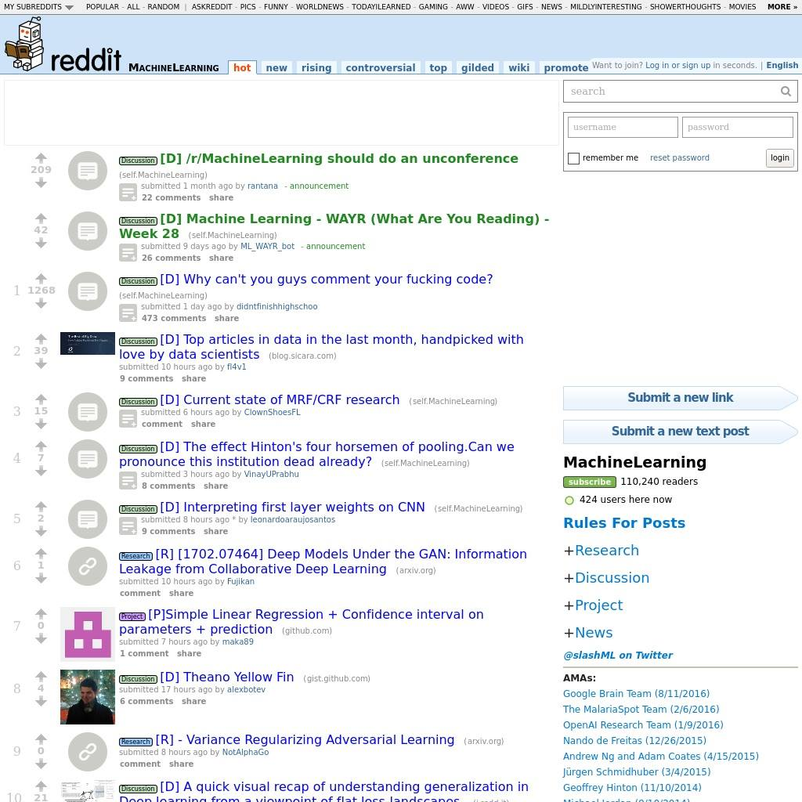
**이미지 캡션:** 이 이미지는 웹사이트인 레딧의 머신러닝 서브레딧 페이지를 보여줍니다. 페이지 상단에는 레딧 로고와 함께 "MACHINE LEARNING"이라는 제목이 있고, 그 옆에는 "hot", "new", "rising", "controversial", "top", "gilded", "wiki", "promote"와 같은 카테고리 탭이 있습니다. 오른쪽 상단에는 로그인 및 회원가입을 위한 입력 필드와 버튼이 있습니다. 페이지 중앙에는 다양한 머신러닝 관련 게시물 목록이 표시되며, 각 게시물은 제목, 작성자, 제출 시간, 댓글 수, 공유 수 등의 정보를 포함하고 있습니다. 게시물 중 하나에는 옅은 갈색 배경에 옅은 회색 머리카락을 가진 성인 남성이 웃고 있는 사진이 썸네일로 포함되어 있습니다. 페이지 오른쪽에는 "Submit a new link", "Submit a new text post" 버튼과 함께 "MachineLearning" 서브레딧에 대한 구독자 수, 현재 접속자 수, 게시 규칙, 트위터 계정, 그리고 "AMAS" 섹션이 표시되어 있습니다. 전반적으로 정보가 많고 기술적인 주제를 다루는 온라인 커뮤니티의 모습을 보여줍니다.댓글 수, 공유 수 등의 정보를 포함하고 있습니다. 게시물 중 하나에는 옅은 갈색 배경에 옅은 회색 머리카락을 가진 성인 남성이 웃고 있는 사진이 썸네일로 포함되어 있습니다. 페이지 오른쪽에는 "Submit a new link", "Submit a new text post" 버튼과 함께 "MachineLearning" 서브레딧에 대한 구독자 수, 현재 접속자 수, 게시 규칙, 트위터 계정, 그리고 "AMAS" 섹션이 표시되어 있습니다. 전반적으로 정보가 많고 기술적인 주제를 다루는 온라인 커뮤니티의 모습을 보여줍니다.

> #오늘의레딧 https://www.reddit.com/r/MachineLearning/ 래딧은 읽을 거리가 다양합니다.  1. 왜 너희들이 그 빌어 먹을 코드에 대해 논평 할 수 없어? 2. 지난 달 데이터의 최고 기사, 데이터 과학자들의 사랑으로 손짓 3. MRF / CRF 연구 현황 4. 힌튼의 4 명의 마술사 효과. 이미이 기관을 죽은 것으로 발음 할 수 있습니까? 5. CNN에서 첫 번째 계층 가중치 해석 6. 단순 선형 회귀 + 매개 변수에 대한 신뢰 구간 + 예측 7. 테아 노 옐로우 핀 8. - 분산 적대 적 학습의 분산 9. 평평한 손실 경관의 관점에서 딥 러닝의 일반적인 이해를 빠르게 시각적으로 요약합니다. 10. 신경 네트워크에 대한 주석이 달린 코드를 만들려고 시도했습니다. 11. AMD Vega를 기반으로하는 개인 예산 계획 워크 스테이션 공연에 관한 도움 12. 기계 학습은 스스로 가르 칠 수 있습니까? 13. 이 중 어떤 것을 본 적이 있습니까 (소위 프랙탈 AI)? 그거에 대해서 어떻게 생각해? 14. DeepMind의 관계형 네트워크 - Demystified 15. 텍스트 분류에서 bigram multinoulli naive bayes를 크게이긴 모델이 있습니까? 16. 가설 생성. 모든 PubMed에서 새로운 의학적 진보를 배우십시오. 17. 시인 실험을위한 TensorFlow 18. CS231n 2017 비디오 강의는 언제 발표 될 예정입니까? 19. 멀티 클래스 문제에서 특정 정밀도에 대한 리콜 최적화 20. 생산에서 배우는 시험 기계?  1. https://www.reddit.com/r/MachineLearning/comments/6l2esd/d_why_cant_you_guys_comment_your_fucking_code/ 2. https://blog.sicara.com/06-2017-best-big-data-new-articles-this-month-5c3478872a61 3. https://www.reddit.com/r/MachineLearning/comments/6l8g1o/d_current_state_of_mrfcrf_research/ 4. https://www.reddit.com/r/MachineLearning/comments/6l9ny5/d_the_effect_hintons_four_horsemen_of_poolingcan/ 5. https://www.reddit.com/r/MachineLearning/comments/6l7ua6/d_interpreting_first_layer_weights_on_cnn/ 6. https://github.com/maka89/slr 7. https://gist.github.com/botev/f8b32c00eafee222e47393f7f0747666 8. https://arxiv.org/pdf/1707.00309.pdf 9. https://www.reddit.com/r/MachineLearning/comments/6l2xo8/d_a_quick_visual_recap_of_understanding/ 10. https://www.reddit.com/r/MachineLearning/comments/6l72of/d_tried_to_make_a_well_commented_code_for_a/ 11. https://www.reddit.com/r/MachineLearning/comments/6l6hau/d_help_needed_regarding_personal_budget/ 12. https://www.reddit.com/r/MachineLearning/comments/6l5g9h/d_can_machine_learning_be_selftaught/ 13. https://entropicai.blogspot.com/ 14. https://medium.com/@harshsayshi/deepmind-relational-networks-demystified-b593e408b643 15. https://www.reddit.com/r/MachineLearning/comments/6l11nz/d_are_there_any_models_that_significantly_beat/ 16. https://www.youtube.com/watch?v=wA6OCix-4FU&t=7s 17. http://phobrain.com/pr/home/tf_poet.html 18. https://www.reddit.com/r/MachineLearning/comments/6kxzcv/d_when_will_the_cs231n_2017_video_lectures_be/ 19. https://www.reddit.com/r/MachineLearning/comments/6kyyx8/p_optimizing_recall_for_specified_precision_in/ 20. https://www.reddit.com/r/MachineLearning/comments/6kyyq3/d_testing_machine_learning_in_production/

### 7월 6일 (목) 08:52 · 📷 사진 (2장)

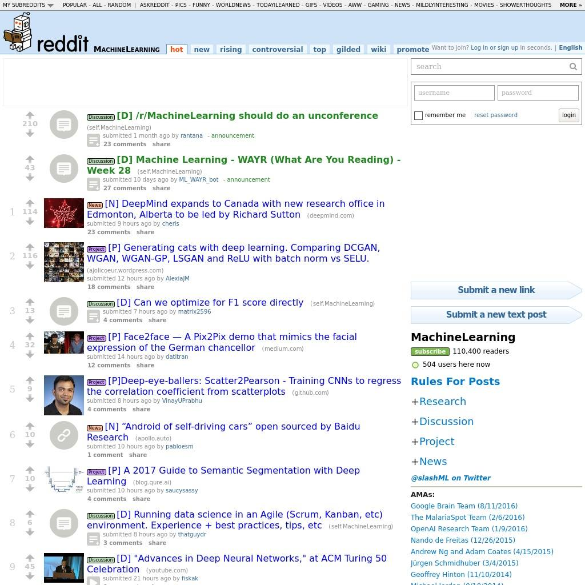
**이미지 캡션:** 이 이미지는 웹사이트 레딧의 머신러닝 서브레딧 페이지를 보여줍니다. 페이지 상단에는 레딧 로고와 함께 "MACHINE LEARNING"이라는 제목이 있고, 그 아래에는 "hot", "new", "rising", "controversial", "top", "gilded", "wiki", "promote"와 같은 메뉴가 있습니다. 오른쪽 상단에는 로그인 및 회원가입을 위한 입력 필드와 버튼이 있습니다. 페이지 중앙에는 여러 게시물 목록이 있으며, 각 게시물은 제목, 작성자, 제출 시간, 댓글 수, 공유 수 등의 정보를 포함합니다. 게시물 제목 앞에는 "Discussion", "News", "Project"와 같은 태그가 붙어 있습니다. 예를 들어, 첫 번째 게시물은 "[D] /r/Machine Learning should do an unconference"라는 제목의 토론 게시물입니다. 오른쪽 사이드바에는 "Submit a new link", "Submit a new text post" 버튼과 함께 "MachineLearning" 서브레딧에 대한 정보가 표시됩니다. 구독자 수, 현재 접속자 수, 규칙, 관련 링크 등이 있습니다. 또한 "AMAS" 섹션에는 과거에 AMA(Ask Me Anything)를 진행했던 사람들의 목록과 날짜가 나열되어 있습니다. 전반적으로 이 페이지는 머신러닝 관련 정보를 공유하고 토론하는 커뮤니티의 모습을 보여줍니다.정보를 포함합니다. 게시물 제목 앞에는 "Discussion", "News", "Project"와 같은 태그가 붙어 있습니다. 예를 들어, 첫 번째 게시물은 "[D] /r/Machine Learning should do an unconference"라는 제목의 토론 게시물입니다. 오른쪽 사이드바에는 "Submit a new link", "Submit a new text post" 버튼과 함께 "MachineLearning" 서브레딧에 대한 정보가 표시됩니다. 구독자 수, 현재 접속자 수, 규칙, 관련 링크 등이 있습니다. 또한 "AMAS" 섹션에는 과거에 AMA(Ask Me Anything)를 진행했던 사람들의 목록과 날짜가 나열되어 있습니다. 전반적으로 이 페이지는 머신러닝 관련 정보를 공유하고 토론하는 커뮤니티의 모습을 보여줍니다.
 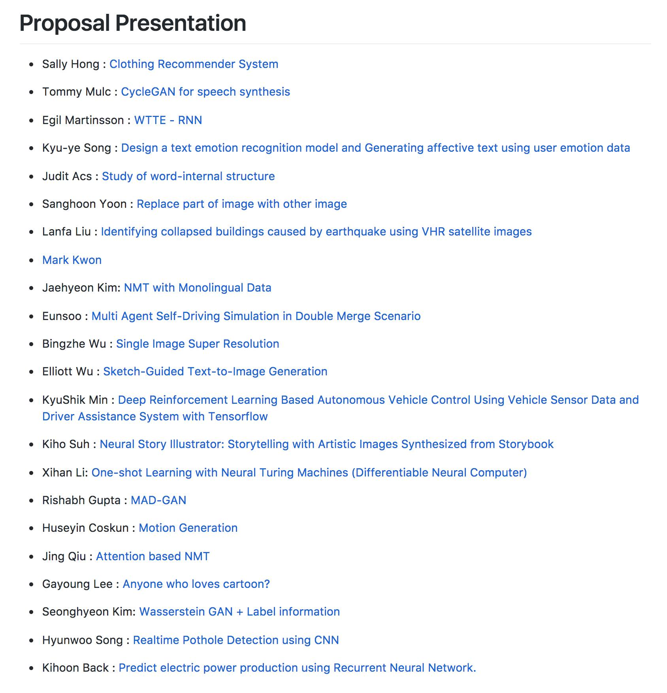
**이미지 캡션:** 이것은 "Proposal Presentation"이라는 제목의 슬라이드 또는 문서의 스크린샷으로, 여러 사람들의 이름과 그들의 연구 제안 제목이 글머리 기호 목록으로 나열되어 있습니다. 각 항목은 발표자의 이름과 그들의 제안 주제를 포함하며, 주제는 인공지능, 기계 학습, 컴퓨터 비전, 자연어 처리 등 다양한 기술 분야를 다룹니다. 예를 들어, "Sally Hong: Clothing Recommender System", "Tommy Mulc: CycleGAN for speech synthesis", "Kyu-ye Song: Design a text emotion recognition model and Generating affective text using user emotion data", "Lanfa Liu: Identifying collapsed buildings caused by earthquake using VHR satellite images", "Elliott Wu: Sketch-Guided Text-to-Image Generation", "KyuShik Min: Deep Reinforcement Learning Based Autonomous Vehicle Control Using Vehicle Sensor Data and Driver Assistance System with Tensorflow", "Kiho Suh: Neural Story Illustrator: Storytelling with Artistic Images Synthesized from Storybook", "Hyunwoo Song: Realtime Pothole Detection using CNN", "Kihoon Back: Predict electric power production using Recurrent Neural Network." 등이 있습니다. 배경은 흰색이며, 텍스트는 검은색으로 표시되어 있습니다. 전반적으로 학술 발표 또는 연구 제안 목록을 보여주는 깔끔하고 정보 중심적인 분위기입니다.ye Song: Design a text emotion recognition model and Generating affective text using user emotion data", "Lanfa Liu: Identifying collapsed buildings caused by earthquake using VHR satellite images", "Elliott Wu: Sketch-Guided Text-to-Image Generation", "KyuShik Min: Deep Reinforcement Learning Based Autonomous Vehicle Control Using Vehicle Sensor Data and Driver Assistance System with Tensorflow", "Kiho Suh: Neural Story Illustrator: Storytelling with Artistic Images Synthesized from Storybook", "Hyunwoo Song: Realtime Pothole Detection using CNN", "Kihoon Back: Predict electric power production using Recurrent Neural Network." 등이 있습니다. 배경은 흰색이며, 텍스트는 검은색으로 표시되어 있습니다. 전반적으로 학술 발표 또는 연구 제안 목록을 보여주는 깔끔하고 정보 중심적인 분위기입니다.

> #오늘의레딧 https://www.reddit.com/r/MachineLearning/ 오늘도 새소식이 많군요.  1. DeepMind는 앨버타 주 에드몬튼에 새로운 연구 사무소를두고 캐나다로 확장하여 Richard Sutton 2. 깊은 학습 고양이를 생성합니다. DCGAN, WGAN, WGAN-GP, LSGAN 및 ReLU를 일괄 표준 대 SELU와 비교합니다. 3. F1 점수를 직접 최적화 할 수 있습니까? 4. Face2face - 독일 총리의 얼굴 표정을 모방 한 Pix2Pix 데모 5. 깊은 눈알 볼러 : Scatter2Pearson - 산점도에서 상관 계수를 회귀시키는 CNN 훈련 6. Baidu Research가 출품 한 "Android의 자동 운전 차량" 7. A 2017 깊은 학습을 통한 시맨틱 세분화 가이드 8. Agile (Scrum, Kanban 등) 환경에서 데이터 과학을 실행합니다. 경험 + 우수 사례, 팁 등 9. ACM Turing 50 Celebration의 "심층 신경 회로망의 진보" 10. Game of Thrones에 당황한 사람들. N 그램과 언어 모델의 노래 11. 서비스로 학습 기계 확장 12. Cython을 사용하여 Sklearn Algorithms 호출 사용자 지정 메트릭 속도 향상 13. 힌튼의 4 명의 마술사 효과. 이미이 기관을 죽은 것으로 발음 할 수 있습니까? 14. 지난 달 데이터의 최고 기사, 데이터 과학자들의 사랑으로 손짓 15. NeuroBind - 신경망을 사용하여 바인딩 사이트 찾기에 대한 또 다른 모델 16. MRF / CRF 연구 현황 17. 왜 너희들이 그 빌어 먹을 코드에 대해 논평 할 수 없어? 18. CNN에서 첫 번째 계층 가중치 해석 19. 단순 선형 회귀 + 매개 변수에 대한 신뢰 구간 + 예측 20. 신경 네트워크에 대한 주석이 달린 코드를 만들려고 시도했습니다.  1. https://deepmind.com/blog/deepmind-office-canada-edmonton/ 2. https://ajolicoeur.wordpress.com/cats/ 3. https://www.reddit.com/r/MachineLearning/comments/6lf57v/d_can_we_optimize_for_f1_score_directly/ 4. https://medium.com/towards-data-science/face2face-a-pix2pix-demo-that-mimics-the-facial-expression-of-the-german-chancellor-b6771d65bf66 5. https://github.com/vinayprabhu/Deepeyeballers 6. http://apollo.auto/ 7. http://blog.qure.ai/notes/semantic-segmentation-deep-learning-review 8. https://www.reddit.com/r/MachineLearning/comments/6lekac/d_running_data_science_in_an_agile_scrum_kanban/ 9. https://www.youtube.com/watch?v=mFYM9j8bGtg 10. http://nlp.yvespeirsman.be/blog/song-of-ngrams-and-lms/ 11. http://proceedings.mlr.press/v67/li17a.html 12. https://blog.sicara.com/https-medium-com-redaboumahdi-speed-sklearn-algorithms-custom-metrics-using-cython-de92e5a325c 13. https://www.reddit.com/r/MachineLearning/comments/6l9ny5/d_the_effect_hintons_four_horsemen_of_poolingcan/ 14. https://blog.sicara.com/06-2017-best-big-data-new-articles-this-month-5c3478872a61 15. https://github.com/Kyubyong/neurobind 16. https://www.reddit.com/r/MachineLearning/comments/6l8g1o/d_current_state_of_mrfcrf_research/ 17. https://www.reddit.com/r/MachineLearning/comments/6l2esd/d_why_cant_you_guys_comment_your_fucking_code/ 18. https://www.reddit.com/r/MachineLearning/comments/6l7ua6/d_interpreting_first_layer_weights_on_cnn/ 19. https://github.com/maka89/slr 20. https://www.reddit.com/r/MachineLearning/comments/6l72of/d_tried_to_make_a_well_commented_code_for_a/
> What's up at ML Jeju Camp 2017??  아래 Jimin Lee님의 글에도 잠시 소개되어 있는 저희 참여자들이 진행하는 프로젝트에 대해 알려드립니다. 리스트와 슬라이드 파일들을 보실수 있습니다.  https://github.com/TensorFlowKR/MLJejuCamp/blob/master/ProposalPresentation.md  보시고 의견이나 커멘트 까지 주시면 참여자들에게 매우 큰 도움이 될듯 합니다.  그리고 이번 캠프에 함께 하시면서 참여자를 격려할수 있는 방법: 7월 10일 함께 해주세요. 오시기전 신청은 http://onoffmix.com/event/103905 제주에서 많은 분들 뵙기 기대 합니다.

### 7월 7일 (금) 08:52 · 📷 사진 (1장)

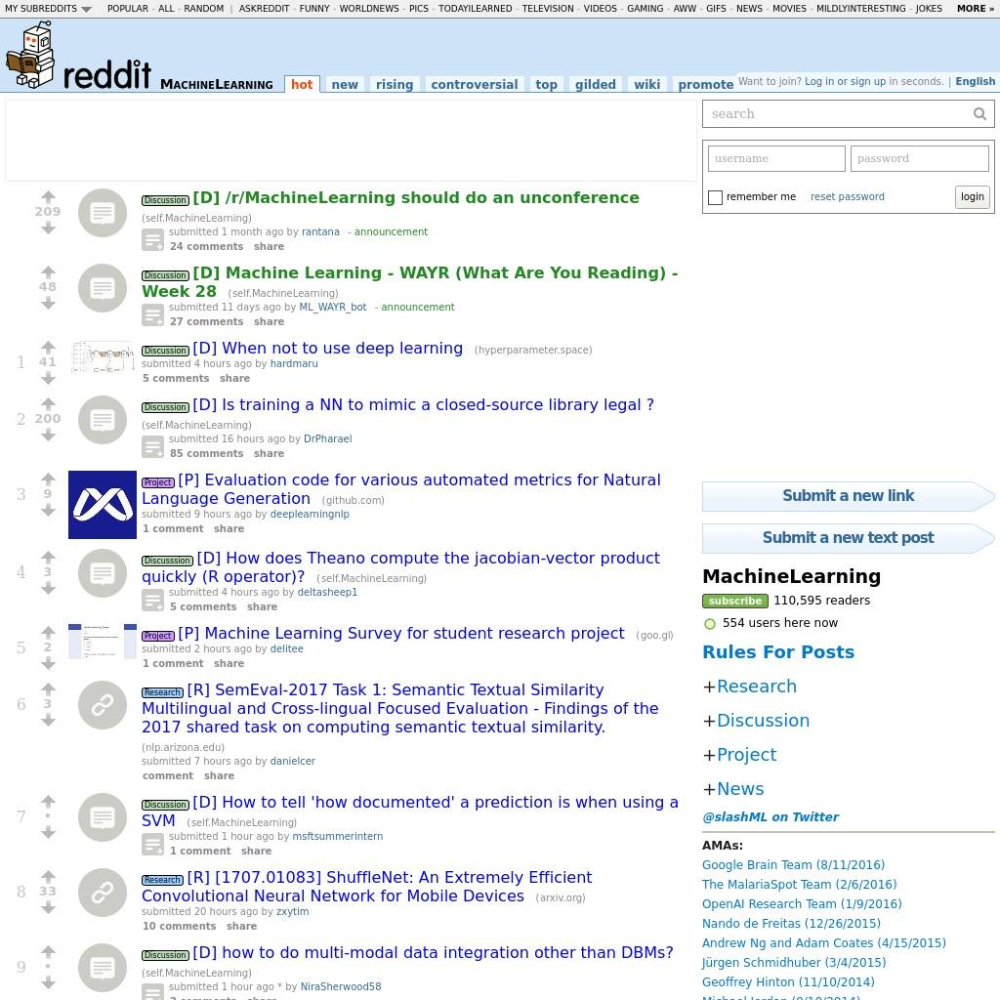
**이미지 캡션:** 이 이미지는 레딧의 머신러닝 서브레딧 페이지를 보여줍니다. 페이지 상단에는 레딧 로고와 함께 'MACHINE LEARNING'이라는 제목이 있고, 그 옆에는 'hot', 'new', 'rising', 'controversial', 'top', 'gilded', 'wiki'와 같은 탭들이 있습니다. 오른쪽 상단에는 로그인 및 회원가입을 위한 입력 필드와 버튼이 보입니다. 페이지 중앙에는 다양한 머신러닝 관련 게시물 목록이 나열되어 있으며, 각 게시물은 제목, 작성자, 제출 시간, 댓글 수, 공유 수 등의 정보를 포함하고 있습니다. 게시물들은 'Discussion', 'Project', 'Research'와 같은 태그로 분류되어 있습니다. 예를 들어, 첫 번째 게시물은 "[D] /r/Machine Learning should do an unconference"라는 제목의 토론 게시물이고, 두 번째 게시물은 "[D] Machine Learning - WAYR (What Are You Reading) - Week 28"이라는 제목의 토론 게시물입니다. 또한, 페이지 오른쪽에는 'MachineLearning' 서브레딧의 구독자 수와 현재 접속자 수가 표시되어 있으며, 'Rules For Posts' 섹션에는 'Research', 'Discussion', 'Project', 'News'와 같은 하위 섹션들이 나열되어 있습니다. 그 아래에는 '@slashML on Twitter' 링크와 'AMAS' 섹션이 있으며, 여러 연구팀 및 인물들의 이름과 날짜가 나열되어 있습니다. 전체적으로 기술 관련 커뮤니티의 정보 공유 및 토론이 이루어지는 온라인 플랫폼의 모습을 보여줍니다. 포함하고 있습니다. 게시물들은 'Discussion', 'Project', 'Research'와 같은 태그로 분류되어 있습니다. 예를 들어, 첫 번째 게시물은 "[D] /r/Machine Learning should do an unconference"라는 제목의 토론 게시물이고, 두 번째 게시물은 "[D] Machine Learning - WAYR (What Are You Reading) - Week 28"이라는 제목의 토론 게시물입니다. 또한, 페이지 오른쪽에는 'MachineLearning' 서브레딧의 구독자 수와 현재 접속자 수가 표시되어 있으며, 'Rules For Posts' 섹션에는 'Research', 'Discussion', 'Project', 'News'와 같은 하위 섹션들이 나열되어 있습니다. 그 아래에는 '@slashML on Twitter' 링크와 'AMAS' 섹션이 있으며, 여러 연구팀 및 인물들의 이름과 날짜가 나열되어 있습니다. 전체적으로 기술 관련 커뮤니티의 정보 공유 및 토론이 이루어지는 온라인 플랫폼의 모습을 보여줍니다.

> #오늘의레딧 https://www.reddit.com/r/MachineLearning/ 재미난 이야기들이 많습니다  1. 깊은 학습을 사용하지 않을 때 2. 폐쇄 형 소스 라이브러리를 모방하기 위해 NN을 교육합니까? 3. 자연 언어 생성을위한 다양한 자동화 된 측정 항목에 대한 평가 코드 4. 학생 연구 프로젝트를위한 기계 학습 설문 조사 5. SemEval-2017 작업 1 : 의미 론적 텍스트 유사성 다국어 및 교차 언어 중심 평가 - 의미 론적 텍스트 유사성을 계산하기위한 2017 공유 작업의 결과. 6. SVM을 사용할 때 &#39;어떻게 문서화 된&#39;예측을 말하는가? 7. DBM 이외의 멀티 모달 데이터 통합을 수행하는 방법? 8. ETL 목적으로 Tensorflow 사용? 9. Amazon.com에서 20 년 동안의 추천 시스템 10. 신경망을 사용하여 처음부터 사운드 분류 자 ​​생성하기 11. DeepMind는 앨버타 주 에드몬튼에 새로운 연구 사무소를두고 캐나다로 확장하여 Richard Sutton 12. 이 온라인 석사 프로그램 중 하나를 AI / ML PhD의 추구로 잘 전환합니까? 13. 비 핫 라벨의 Softmax 해석 14. 기계 학습 모드 로봇 15. 사람 재 식별을위한 보행자 정렬 16. AI 및 기계 학습 미래의 애니메이션. 17. 깊은 학습 고양이를 생성합니다. DCGAN, WGAN, WGAN-GP, LSGAN 및 ReLU를 일괄 표준 대 SELU와 비교합니다. 18. 인코더 - 디코더 네트워크의 차이점을 명시 적으로 타겟팅 19. 그것과 이전 위치의 이미지를 사용하여 객체 위치 예측 20. F1 점수를 직접 최적화 할 수 있습니까?  1. http://hyperparameter.space/blog/when-not-to-use-deep-learning/ 2. https://www.reddit.com/r/MachineLearning/comments/6lk6cu/d_is_training_a_nn_to_mimic_a_closedsource/ 3. https://github.com/Maluuba/nlg-eval 4. https://goo.gl/forms/cmuxXkyXirWrYRh83 5. http://nlp.arizona.edu/SemEval-2017/pdf/SemEval001.pdf 6. https://www.reddit.com/r/MachineLearning/comments/6lpgnh/d_how_to_tell_how_documented_a_prediction_is_when/ 7. https://www.reddit.com/r/MachineLearning/comments/6lp7lc/d_how_to_do_multimodal_data_integration_other/ 8. https://www.reddit.com/r/MachineLearning/comments/6lp3y2/d_using_tensorflow_for_etl_purposes/ 9. https://www.computer.org/csdl/mags/ic/2017/03/mic2017030012.html 10. https://www.skcript.com/svr/building-audio-classifier-nueral-network/ 11. https://deepmind.com/blog/deepmind-office-canada-edmonton/ 12. https://www.reddit.com/r/MachineLearning/comments/6ljp1g/d_do_any_of_these_online_masters_programs/ 13. https://www.reddit.com/r/MachineLearning/comments/6llhit/d_softmax_interpretation_with_non_1hot_labels/ 14. https://www.reddit.com/r/MachineLearning/comments/6lnoi2/d_machine_learning_mod_bot/ 15. https://github.com/layumi/Pedestrian_Alignment 16. https://www.scribd.com/document/353070617/Absentia-Magazine-Issue01 17. https://ajolicoeur.wordpress.com/cats/ 18. https://www.reddit.com/r/MachineLearning/comments/6lkmzu/d_explicitly_targeting_differences_in/ 19. https://www.reddit.com/r/MachineLearning/comments/6lknsz/d_predicting_object_position_using_image_of_it/ 20. https://www.reddit.com/r/MachineLearning/comments/6lf57v/d_can_we_optimize_for_f1_score_directly/

### 7월 8일 (토) 08:52 · 📷 사진 (1장)

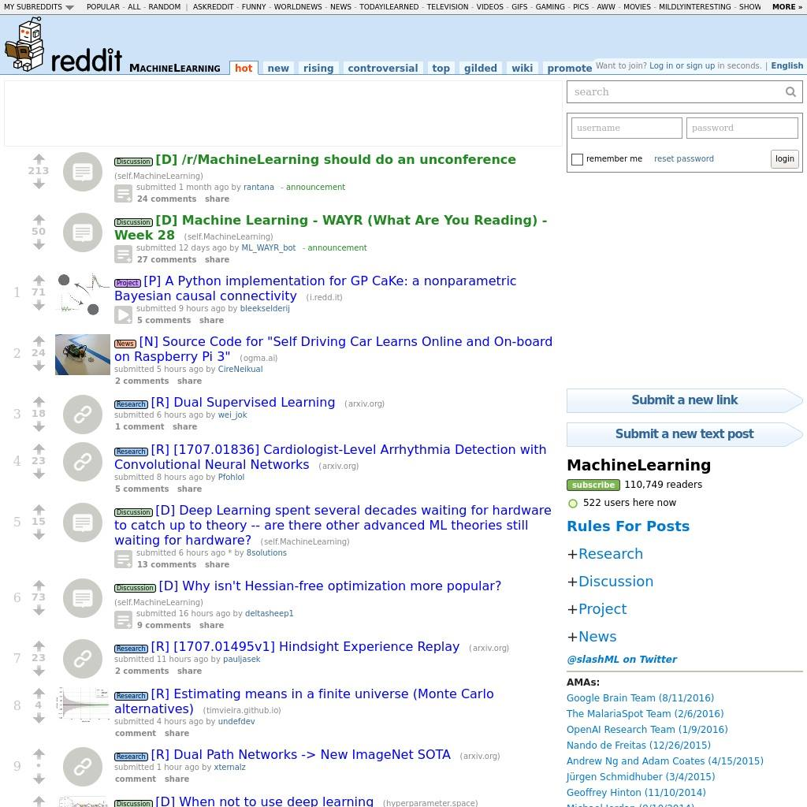
**이미지 캡션:** 이 이미지는 웹사이트 레딧의 머신러닝 관련 게시판을 보여줍니다. 화면 중앙에는 여러 게시글 목록이 있으며, 각 게시글은 제목, 작성자, 작성 시간, 댓글 수, 공유 수 등의 정보를 포함하고 있습니다. 게시글들은 주로 머신러닝 연구, 프로젝트, 토론 등과 관련된 내용을 다루고 있습니다. 오른쪽에는 "MachineLearning" 커뮤니티의 구독자 수, 관련 규칙, 트위터 계정 정보, 그리고 "AMAS"라는 제목 아래 여러 연구팀 및 인물들의 이름과 날짜가 나열되어 있습니다. 상단에는 레딧의 일반적인 탐색 메뉴와 로그인/회원가입 폼이 보입니다. 전체적으로 정보가 많고 기술적인 내용을 다루는 커뮤니티의 분위기를 띠고 있습니다. 로그인/회원가입 폼이 보입니다. 전체적으로 정보가 많고 기술적인 내용을 다루는 커뮤니티의 분위기를 띠고 있습니다.

> #오늘의레딧 https://www.reddit.com/r/MachineLearning/ 오늘도 새소식이 많군요.  1. GP CaKe를위한 파이썬 구현 : 비모수 적 베이지안 인과 관계 2. "자가 운전 차량 학습 온라인 및 온보드 라스베리 파이 3"에 대한 소스 코드 3. 이중 감독 학습 4. Deep Learning은 수십 년 동안 하드웨어가 이론을 따라 잡기를 기다렸습니다. 하드웨어를 기다리는 다른 고급 ML 이론이 있습니까? 5. 유한 우주에서의 추정 방법 (Monte Carlo 대안) 6. 이중 경로 네트워크 -&gt; 새로운 ImageNet SOTA 7. 깊은 학습을 사용하지 않을 때 8. "단조로운 정렬을 시행하여 온라인 및 선형 시간주의" 9. 경량 pix2pix Tensorflow 구현! 10. NLP에 대한 관계 추론 (여기서 말한대로)의 의미는 무엇입니까? 11. 폐쇄 형 소스 라이브러리를 모방하기 위해 NN을 교육합니까? 12. 자연 언어 생성을위한 다양한 자동화 된 측정 항목에 대한 평가 코드 13. ETL 목적으로 Tensorflow 사용? 14. SVM을 사용할 때 &#39;어떻게 문서화 된&#39;예측을 말하는가? 15. DBM 이외의 멀티 모달 데이터 통합을 수행하는 방법? 16. SemEval-2017 작업 1 : 의미 론적 텍스트 유사성 다국어 및 교차 언어 중심 평가 - 의미 론적 텍스트 유사성을 계산하기위한 2017 공유 작업의 결과. 17. 학생 연구 프로젝트를위한 기계 학습 설문 조사 18. Amazon.com에서 20 년 동안의 추천 시스템  1. https://www.reddit.com/r/MachineLearning/comments/6ltz4x/p_a_python_implementation_for_gp_cake_a/ 2. https://ogma.ai/2017/07/source-code-for-self-driving-car-learns-online-and-on-board-on-raspberry-pi-3/ 3. https://arxiv.org/abs/1707.00415 4. https://www.reddit.com/r/MachineLearning/comments/6lv5au/d_deep_learning_spent_several_decades_waiting_for/ 5. https://timvieira.github.io/blog/post/2017/07/03/estimating-means-in-a-finite-universe/ 6. https://arxiv.org/abs/1707.01629 7. http://hyperparameter.space/blog/when-not-to-use-deep-learning/ 8. http://colinraffel.com/blog/online-and-linear-time-attention-by-enforcing-monotonic-alignments.html 9. https://github.com/Eyyub/tensorflow-pix2pix 10. https://youtu.be/vzg5Qe0pTKk 11. https://www.reddit.com/r/MachineLearning/comments/6lk6cu/d_is_training_a_nn_to_mimic_a_closedsource/ 12. https://github.com/Maluuba/nlg-eval 13. https://www.reddit.com/r/MachineLearning/comments/6lp3y2/d_using_tensorflow_for_etl_purposes/ 14. https://www.reddit.com/r/MachineLearning/comments/6lpgnh/d_how_to_tell_how_documented_a_prediction_is_when/ 15. https://www.reddit.com/r/MachineLearning/comments/6lp7lc/d_how_to_do_multimodal_data_integration_other/ 16. http://nlp.arizona.edu/SemEval-2017/pdf/SemEval001.pdf 17. https://goo.gl/forms/cmuxXkyXirWrYRh83 18. https://www.computer.org/csdl/mags/ic/2017/03/mic2017030012.html

### 7월 8일 (토) 18:21 · Six days in Jeju: running, swimming, run…

Six days in Jeju: running, swimming, running, swimming, running, and finally cycling! Fantastic!!

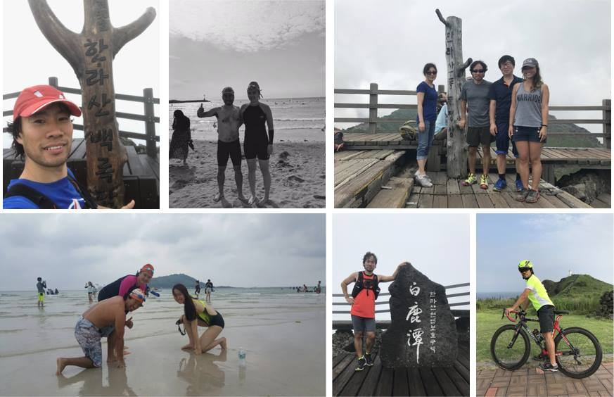
**이미지 캡션:** 상단 왼쪽 사진은 빨간 모자를 쓰고 파란색 티셔츠를 입은 성인 남성이 나무 표지판 옆에서 웃고 있는 모습이며, 표지판에는 한글로 "한라산 백록담"이라고 쓰여 있습니다. 상단 중앙 사진은 해변에서 수영복을 입은 두 명의 성인 남성이 포즈를 취하고 있는 흑백 사진입니다. 상단 오른쪽 사진은 나무 데크 위에서 네 명의 성인 남녀가 서 있는 모습이며, 여성 중 한 명은 "WARRIOR"라고 쓰인 회색 민소매를 입고 있습니다. 하단 왼쪽 사진은 해변에서 세 명의 젊은 성인 남녀가 물속에서 포즈를 취하고 있는 모습입니다. 하단 중앙 사진은 성인 남성이 "백록담"이라고 쓰인 큰 바위 옆에 서 있는 모습이며, 바위에는 한글로 "한라산천년보호구역"이라고도 쓰여 있습니다. 하단 오른쪽 사진은 헬멧을 쓰고 노란색 상의와 검은색 반바지를 입은 성인 남성이 자전거 옆에 서 있는 모습이며, 배경에는 등대와 바다가 보입니다. 전반적으로 사진들은 야외 활동과 여행을 담고 있으며, 일부 사진에는 한국어로 된 표지판이 포함되어 있습니다.. 하단 중앙 사진은 성인 남성이 "백록담"이라고 쓰인 큰 바위 옆에 서 있는 모습이며, 바위에는 한글로 "한라산천년보호구역"이라고도 쓰여 있습니다. 하단 오른쪽 사진은 헬멧을 쓰고 노란색 상의와 검은색 반바지를 입은 성인 남성이 자전거 옆에 서 있는 모습이며, 배경에는 등대와 바다가 보입니다. 전반적으로 사진들은 야외 활동과 여행을 담고 있으며, 일부 사진에는 한국어로 된 표지판이 포함되어 있습니다.

### 7월 8일 (토) 18:33 · Wonderful view with amazing picture by Y…

Wonderful view with amazing picture by Yeon Gyoung Gwack!

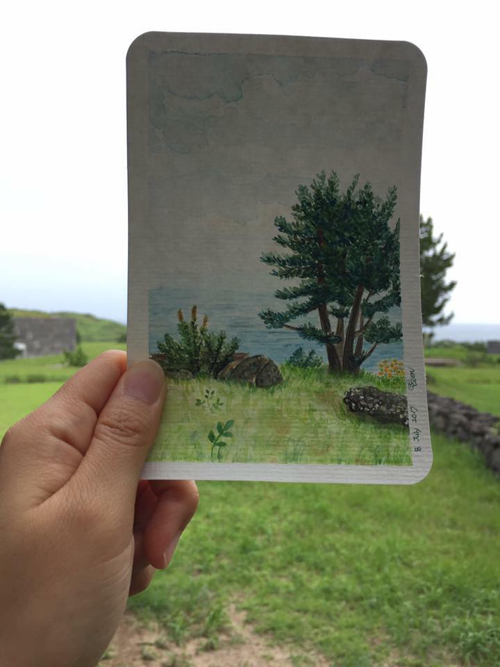
**이미지 캡션:** 한 손으로 엽서 크기의 그림을 들고 있는 모습으로, 그림에는 잔디밭과 바다가 보이는 풍경이 수채화로 그려져 있습니다. 그림 속에는 소나무와 작은 관목, 바위들이 있고, 하늘은 구름 낀 듯 흐릿하게 표현되었습니다. 그림 오른쪽 하단에는 "8 July 2017 Leon"이라는 글씨가 쓰여 있습니다. 그림을 들고 있는 손은 성인 여성의 것으로 보이며, 손톱은 짧게 다듬어져 있습니다. 배경에는 푸른 잔디밭과 돌담, 그리고 멀리 건물과 나무들이 보입니다. 전체적으로 차분하고 평화로운 분위기입니다.

### 7월 9일 (일) 08:52 · 📷 사진 (4장)

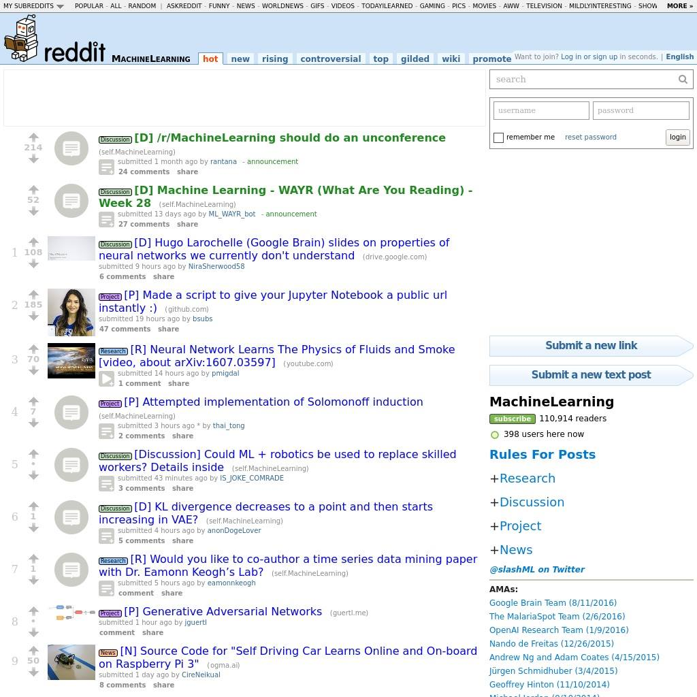
**이미지 캡션:** 이것은 웹사이트 레딧의 머신러닝 서브레딧 페이지 스크린샷으로, 다양한 게시물 목록과 사이드바 정보가 표시됩니다. 화면 중앙에는 여러 게시물이 나열되어 있으며, 각 게시물은 제목, 작성자, 제출 시간, 댓글 수, 공유 버튼을 포함합니다. 게시물 제목은 "[D] /r/MachineLearning should do an unconference", "[D] Machine Learning - WAYR (What Are You Reading) - Week 28", "[D] Hugo Larochelle (Google Brain) slides on properties of neural networks we currently don't understand", "[P] Made a script to give your Jupyter Notebook a public url instantly :)", "[R] Neural Network Learns The Physics of Fluids and Smoke [video, about arXiv:1607.03597]", "[P] Attempted implementation of Solomonoff induction", "[Discussion] Could ML + robotics be used to replace skilled workers? Details inside", "[D] KL divergence decreases to a point and then starts increasing in VAE?", "[R] Would you like to co-author a time series data mining paper with Dr. Eamonn Keogh's Lab?", "[P] Generative Adversarial Networks", "[N] Source Code for "Self Driving Car Learns Online and On-board on Raspberry Pi 3""입니다. 게시물들은 토론, 프로젝트, 연구, 뉴스로 분류되어 있으며, 각 게시물 옆에는 투표를 위한 위아래 화살표가 있습니다. 화면 오른쪽 상단에는 로그인 폼이 있으며, 사용자 이름과 비밀번호 입력란, "remember me" 체크박스, "reset password" 링크, "login" 버튼이 있습니다. 그 아래에는 "Submit a new link"와 "Submit a new text post" 버튼이 있습니다. 메인 콘텐츠 영역 아래에는 "MachineLearning"이라는 제목의 사이드바가 있으며, "subscribe 110,914 readers"와 "398 users here now" 정보가 표시됩니다. 또한 "Rules For Posts" 섹션에는 "+Research", "+Discussion", "+Project", "+News"와 같은 링크가 있습니다. 그 아래에는 "@slashML on Twitter" 링크와 "AMAS:" 섹션이 있으며, 여러 유명 연구자들의 이름과 해당 AMA 날짜가 나열되어 있습니다. 전반적으로 이 페이지는 머신러닝 커뮤니티의 최신 정보와 토론을 보여주는 온라인 포럼의 모습입니다.ain) slides on properties of neural networks we currently don't understand", "[P] Made a script to give your Jupyter Notebook a public url instantly :)", "[R] Neural Network Learns The Physics of Fluids and Smoke [video, about arXiv:1607.03597]", "[P] Attempted implementation of Solomonoff induction", "[Discussion] Could ML + robotics be used to replace skilled workers? Details inside", "[D] KL divergence decreases to a point and then starts increasing in VAE?", "[R] Would you like to co-author a time series data mining paper with Dr. Eamonn Keogh's Lab?", "[P] Generative Adversarial Networks", "[N] Source Code for "Self Driving Car Learns Online and On-board on Raspberry Pi 3""입니다. 게시물들은 토론, 프로젝트, 연구, 뉴스로 분류되어 있으며, 각 게시물 옆에는 투표를 위한 위아래 화살표가 있습니다. 화면 오른쪽 상단에는 로그인 폼이 있으며, 사용자 이름과 비밀번호 입력란, "remember me" 체크박스, "reset password" 링크, "login" 버튼이 있습니다. 그 아래에는 "Submit a new link"와 "Submit a new text post" 버튼이 있습니다. 메인 콘텐츠 영역 아래에는 "MachineLearning"이라는 제목의 사이드바가 있으며, "subscribe 110,914 readers"와 "398 users here now" 정보가 표시됩니다. 또한 "Rules For Posts" 섹션에는 "+Research", "+Discussion", "+Project", "+News"와 같은 링크가 있습니다. 그 아래에는 "@slashML on Twitter" 링크와 "AMAS:" 섹션이 있으며, 여러 유명 연구자들의 이름과 해당 AMA 날짜가 나열되어 있습니다. 전반적으로 이 페이지는 머신러닝 커뮤니티의 최신 정보와 토론을 보여주는 온라인 포럼의 모습입니다.
 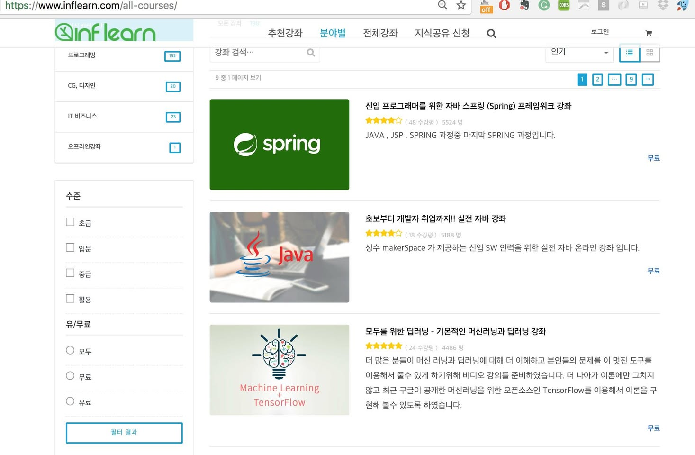
**이미지 캡션:** 이 화면은 인프런이라는 온라인 강의 플랫폼의 웹사이트로, 다양한 프로그래밍 관련 강좌 목록을 보여주고 있습니다. 화면 왼쪽에는 '프로그래밍', 'CG, 디자인', 'IT 비즈니스', '오프라인 강좌'와 같은 카테고리 분류와 '수준'별 필터(초급, 입문, 중급, 활용) 및 '유/무료' 필터(모두, 무료, 유료)가 있습니다. 화면 중앙과 오른쪽에는 검색 결과로 나온 강좌들이 썸네일 이미지와 함께 나열되어 있습니다. 첫 번째 강좌는 '신입 프로그래머를 위한 자바 스프링 (Spring) 프레임워크 강좌'로, 초록색 배경에 'spring' 로고가 있는 썸네일 이미지와 함께 'JAVA, JSP, SPRING 과정중 마지막 SPRING 과정입니다.'라는 설명이 있습니다. 두 번째 강좌는 '초보부터 개발자 취업까지!! 실전 자바 강좌'로, 커피잔 모양의 자바 로고와 노트북을 든 사람의 모습이 담긴 썸네일 이미지와 함께 '성수 makerSpace 가 제공하는 신입 SW 인력을 위한 실전 자바 온라인 강좌 입니다.'라는 설명이 있습니다. 세 번째 강좌는 '모두를 위한 딥러닝 - 기본적인 머신러닝과 딥러닝 강좌'로, 뇌 모양과 전구, 그리고 'Machine Learning + TensorFlow'라는 텍스트가 있는 썸네일 이미지와 함께 딥러닝과 머신러닝에 대한 설명이 있습니다. 각 강좌는 별점, 수강평 수, 수강생 수, 그리고 무료 여부를 표시하고 있습니다. 화면 상단에는 웹사이트 로고, 검색창, 메뉴(모든 강좌, 추천 강좌, 분야별, 전체 강좌, 지식공유 신청), 로그인 버튼, 장바구니 아이콘, 그리고 강좌 정렬 및 보기 방식 선택 옵션이 있습니다. 페이지네이션으로 '9 중 1페이지 보기'라고 표시되어 있으며, 페이지 번호 1, 2, 6, 9와 다음 페이지로 이동하는 화살표가 보입니다. 전반적으로 깔끔하고 정보가 잘 정리된 웹사이트 화면입니다.배경에 'spring' 로고가 있는 썸네일 이미지와 함께 'JAVA, JSP, SPRING 과정중 마지막 SPRING 과정입니다.'라는 설명이 있습니다. 두 번째 강좌는 '초보부터 개발자 취업까지!! 실전 자바 강좌'로, 커피잔 모양의 자바 로고와 노트북을 든 사람의 모습이 담긴 썸네일 이미지와 함께 '성수 makerSpace 가 제공하는 신입 SW 인력을 위한 실전 자바 온라인 강좌 입니다.'라는 설명이 있습니다. 세 번째 강좌는 '모두를 위한 딥러닝 - 기본적인 머신러닝과 딥러닝 강좌'로, 뇌 모양과 전구, 그리고 'Machine Learning + TensorFlow'라는 텍스트가 있는 썸네일 이미지와 함께 딥러닝과 머신러닝에 대한 설명이 있습니다. 각 강좌는 별점, 수강평 수, 수강생 수, 그리고 무료 여부를 표시하고 있습니다. 화면 상단에는 웹사이트 로고, 검색창, 메뉴(모든 강좌, 추천 강좌, 분야별, 전체 강좌, 지식공유 신청), 로그인 버튼, 장바구니 아이콘, 그리고 강좌 정렬 및 보기 방식 선택 옵션이 있습니다. 페이지네이션으로 '9 중 1페이지 보기'라고 표시되어 있으며, 페이지 번호 1, 2, 6, 9와 다음 페이지로 이동하는 화살표가 보입니다. 전반적으로 깔끔하고 정보가 잘 정리된 웹사이트 화면입니다.
 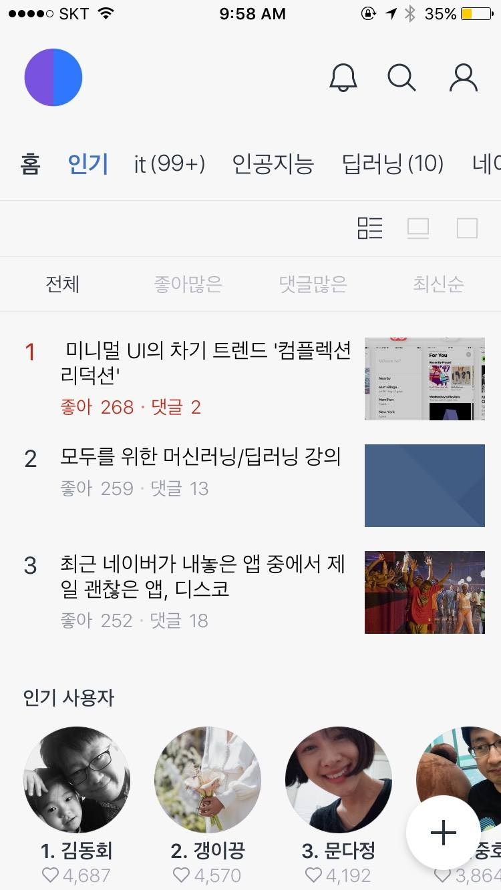
**이미지 캡션:** 이 화면은 모바일 앱의 인기 콘텐츠 목록을 보여주는 스크린샷으로, 상단에는 시간과 배터리 잔량, 그리고 SKT 통신사 정보가 표시되어 있습니다. 그 아래에는 보라색과 파란색이 섞인 동그란 아이콘과 함께 '홈', '인기', 'it (99+)', '인공지능', '딥러닝 (10)', '네이'와 같은 메뉴들이 나열되어 있습니다. 이어서 '전체', '좋아 많은', '댓글 많은', '최신순'과 같은 정렬 및 필터 옵션이 보입니다. 메인 콘텐츠 영역에는 1위부터 3위까지의 인기 게시물들이 순서대로 나열되어 있으며, 각 게시물은 제목, 좋아요 수, 댓글 수를 포함하고 있습니다. 예를 들어, 1위 게시물은 '미니멀 UI의 차기 트렌드 '컴플렉션 리덕션''이라는 제목으로 268개의 좋아요와 2개의 댓글을 얻었습니다. 각 게시물 옆에는 썸네일 이미지들이 함께 표시되어 있습니다. 하단에는 '인기 사용자' 섹션이 있으며, 프로필 사진과 함께 순위별 사용자 이름과 좋아요 수가 표시됩니다. 1위는 '김동회'로 4,687개의 좋아요를 받았고, 2위는 '갱이끙'으로 4,570개, 3위는 '문다정'으로 4,192개의 좋아요를 받았습니다. 화면 오른쪽 하단에는 새로운 콘텐츠를 추가하는 것으로 보이는 '+' 버튼이 있습니다. 전반적으로 이 화면은 사용자들이 관심을 가질 만한 인기 있는 글과 사람들을 보여주는 커뮤니티 또는 소셜 미디어 플랫폼의 일부로 보입니다.시물은 제목, 좋아요 수, 댓글 수를 포함하고 있습니다. 예를 들어, 1위 게시물은 '미니멀 UI의 차기 트렌드 '컴플렉션 리덕션''이라는 제목으로 268개의 좋아요와 2개의 댓글을 얻었습니다. 각 게시물 옆에는 썸네일 이미지들이 함께 표시되어 있습니다. 하단에는 '인기 사용자' 섹션이 있으며, 프로필 사진과 함께 순위별 사용자 이름과 좋아요 수가 표시됩니다. 1위는 '김동회'로 4,687개의 좋아요를 받았고, 2위는 '갱이끙'으로 4,570개, 3위는 '문다정'으로 4,192개의 좋아요를 받았습니다. 화면 오른쪽 하단에는 새로운 콘텐츠를 추가하는 것으로 보이는 '+' 버튼이 있습니다. 전반적으로 이 화면은 사용자들이 관심을 가질 만한 인기 있는 글과 사람들을 보여주는 커뮤니티 또는 소셜 미디어 플랫폼의 일부로 보입니다.
 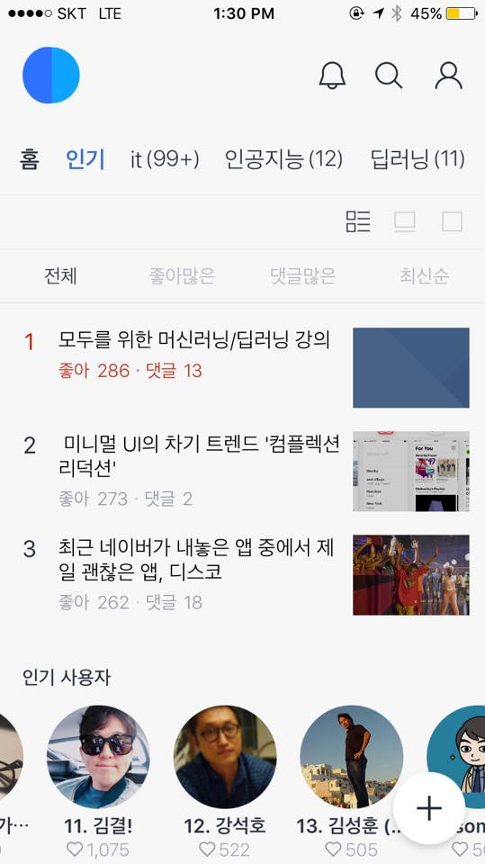
**이미지 캡션:** 이 화면은 모바일 애플리케이션의 인기 콘텐츠 목록을 보여줍니다. 상단에는 시간, 배터리 잔량, 통신사 정보가 표시되며, 앱의 로고와 검색, 알림, 프로필 아이콘이 있습니다. 메인 화면에는 '홈', '인기', 'it (99+)', '인공지능 (12)', '딥러닝 (11)'과 같은 메뉴가 있으며, 그 아래에는 '전체', '좋아많은', '댓글많은', '최신순'으로 콘텐츠를 정렬하는 옵션이 있습니다. 현재 인기 콘텐츠 목록이 번호 순서대로 나열되어 있으며, 각 항목은 제목, 좋아요 수, 댓글 수를 포함합니다. 예를 들어, 1번 항목은 '모두를 위한 머신러닝/딥러닝 강의'이며 286개의 좋아요와 13개의 댓글을 받았습니다. 각 콘텐츠 옆에는 썸네일 이미지가 작게 표시됩니다. 화면 하단에는 '인기 사용자' 섹션이 있으며, 여러 사용자의 프로필 사진과 이름, 좋아요 수가 보입니다. 11번 사용자는 '김결!'이며 1,075개의 좋아요를, 12번 사용자는 '강석호'이며 522개의 좋아요를, 13번 사용자는 '김성훈'이며 505개의 좋아요를 받았습니다. 화면 오른쪽 하단에는 추가 버튼으로 보이는 '+' 아이콘이 있습니다. 전반적으로 활발한 커뮤니티 활동과 인기 있는 주제 및 사용자를 보여주는 화면입니다.들어, 1번 항목은 '모두를 위한 머신러닝/딥러닝 강의'이며 286개의 좋아요와 13개의 댓글을 받았습니다. 각 콘텐츠 옆에는 썸네일 이미지가 작게 표시됩니다. 화면 하단에는 '인기 사용자' 섹션이 있으며, 여러 사용자의 프로필 사진과 이름, 좋아요 수가 보입니다. 11번 사용자는 '김결!'이며 1,075개의 좋아요를, 12번 사용자는 '강석호'이며 522개의 좋아요를, 13번 사용자는 '김성훈'이며 505개의 좋아요를 받았습니다. 화면 오른쪽 하단에는 추가 버튼으로 보이는 '+' 아이콘이 있습니다. 전반적으로 활발한 커뮤니티 활동과 인기 있는 주제 및 사용자를 보여주는 화면입니다.

> #오늘의레딧 https://www.reddit.com/r/MachineLearning/ 아침부터 다양한 소식이 많네요.  1. Hugo Larochelle (Google Brain)은 현재 이해할 수없는 신경 네트워크의 속성에 대해 설명합니다. 2. Jupyter Notebook에 공개 URL을 즉시 제공하는 스크립트 작성 :) 3. Solomonoff 유도 구현 시도 4. 숙련공을 대체하기 위해 ML + 로봇을 사용할 수 있습니까? 내부 세부 정보 5. KL 발산은 점으로 감소한 다음 VAE에서 증가하기 시작합니까? 6. Eamonn Keogh 박사의 실험실과 함께 시계열 데이터 마이닝 용지를 공동 작성 하시겠습니까? 7. 생성 적 적군 네트워크 8. "자가 운전 차량 학습 온라인 및 온보드 라스베리 파이 3"에 대한 소스 코드 9. GP CaKe를위한 파이썬 구현 : 비모수 적 베이지안 인과 관계 10. Deep Learning은 수십 년 동안 하드웨어가 이론을 따라 잡기를 기다렸습니다. 하드웨어를 기다리는 다른 고급 ML 이론이 있습니까? 11. 이중 경로 네트워크 -&gt; 새로운 ImageNet SOTA 12. Thomas Huijskens - Scikit을 배우는 베이지안 최적화 13. 이중 감독 학습 14. 유한 우주에서의 추정 방법 (Monte Carlo 대안) 15. "단조로운 정렬을 시행하여 온라인 및 선형 시간주의" 16. 경량 pix2pix Tensorflow 구현! 17. 깊은 학습을 사용하지 않을 때 18. NLP에 대한 관계 추론 (여기서 말한대로)의 의미는 무엇입니까? 19. 폐쇄 형 소스 라이브러리를 모방하기 위해 NN을 교육합니까? 20. 자연 언어 생성을위한 다양한 자동화 된 측정 항목에 대한 평가 코드  1. https://drive.google.com/file/d/0ByUKRdiCDK7-UXB1R1ZpX082MEk/view 2. https://github.com/biancasubion/jupyshare 3. https://www.reddit.com/r/MachineLearning/comments/6m38t2/p_attempted_implementation_of_solomonoff_induction/ 4. https://www.reddit.com/r/MachineLearning/comments/6m446c/discussion_could_ml_robotics_be_used_to_replace/ 5. https://www.reddit.com/r/MachineLearning/comments/6m2tje/d_kl_divergence_decreases_to_a_point_and_then/ 6. https://www.reddit.com/r/MachineLearning/comments/6m2fcq/r_would_you_like_to_coauthor_a_time_series_data/ 7. http://guertl.me/post/162759264070/generative-adversarial-networks 8. https://ogma.ai/2017/07/source-code-for-self-driving-car-learns-online-and-on-board-on-raspberry-pi-3/ 9. https://www.reddit.com/r/MachineLearning/comments/6ltz4x/p_a_python_implementation_for_gp_cake_a/ 10. https://www.reddit.com/r/MachineLearning/comments/6lv5au/d_deep_learning_spent_several_decades_waiting_for/ 11. https://arxiv.org/abs/1707.01629 12. https://www.youtube.com/watch?v=jtRPxRnOXnk 13. https://arxiv.org/abs/1707.00415 14. https://timvieira.github.io/blog/post/2017/07/03/estimating-means-in-a-finite-universe/ 15. http://colinraffel.com/blog/online-and-linear-time-attention-by-enforcing-monotonic-alignments.html 16. https://github.com/Eyyub/tensorflow-pix2pix 17. http://hyperparameter.space/blog/when-not-to-use-deep-learning/ 18. https://youtu.be/vzg5Qe0pTKk 19. https://www.reddit.com/r/MachineLearning/comments/6lk6cu/d_is_training_a_nn_to_mimic_a_closedsource/ 20. https://github.com/Maluuba/nlg-eval

### 7월 9일 (일) 22:29 · Very good to meet many wonderful people …

Very good to meet many wonderful people in Jeju!

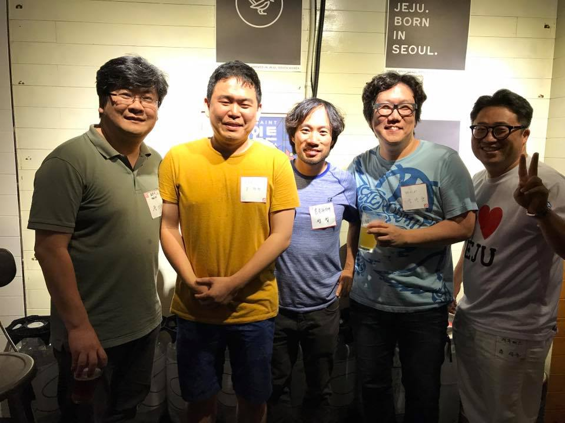
**이미지 캡션:** 다섯 명의 성인 남성이 실내에서 함께 서서 사진을 찍고 있다. 왼쪽부터 첫 번째 남성은 50대 초반으로 보이며, 검은색 안경을 쓰고 올리브색 카라티셔츠와 어두운 색 바지를 입고 있다. 그의 얼굴에는 미소가 번져 있고, 명찰을 달고 있다. 두 번째 남성은 40대 초반으로 보이며, 노란색 반팔 티셔츠와 파란색 반바지를 입고 있다. 그는 밝게 웃고 있으며, 명찰을 달고 있다. 세 번째 남성은 40대 초반으로 보이며, 회색빛이 도는 짧은 머리에 검은색 안경을 쓰고 파란색 티셔츠를 입고 있다. 그는 잔을 들고 있으며, 명찰을 달고 있다. 네 번째 남성은 40대 후반으로 보이며, 검은색 안경을 쓰고 파란색 티셔츠를 입고 있다. 그는 환하게 웃으며 브이 포즈를 취하고 있고, 명찰을 달고 있다. 다섯 번째 남성은 40대 후반으로 보이며, 흰색 티셔츠에 빨간색 하트와 "JEJU"라고 쓰인 문구를 입고 있다. 그는 밝게 웃으며 오른손으로 브이 포즈를 취하고 있다. 배경에는 흰색 벽과 검은색 간판이 보이며, 간판에는 "JEJU. BORN IN SEOUL."이라는 문구가 쓰여 있다. 전체적으로 편안하고 즐거운 분위기이다. 명찰을 달고 있다. 네 번째 남성은 40대 후반으로 보이며, 검은색 안경을 쓰고 파란색 티셔츠를 입고 있다. 그는 환하게 웃으며 브이 포즈를 취하고 있고, 명찰을 달고 있다. 다섯 번째 남성은 40대 후반으로 보이며, 흰색 티셔츠에 빨간색 하트와 "JEJU"라고 쓰인 문구를 입고 있다. 그는 밝게 웃으며 오른손으로 브이 포즈를 취하고 있다. 배경에는 흰색 벽과 검은색 간판이 보이며, 간판에는 "JEJU. BORN IN SEOUL."이라는 문구가 쓰여 있다. 전체적으로 편안하고 즐거운 분위기이다.

### 7월 10일 (월) 08:52 · 📷 사진 (1장)

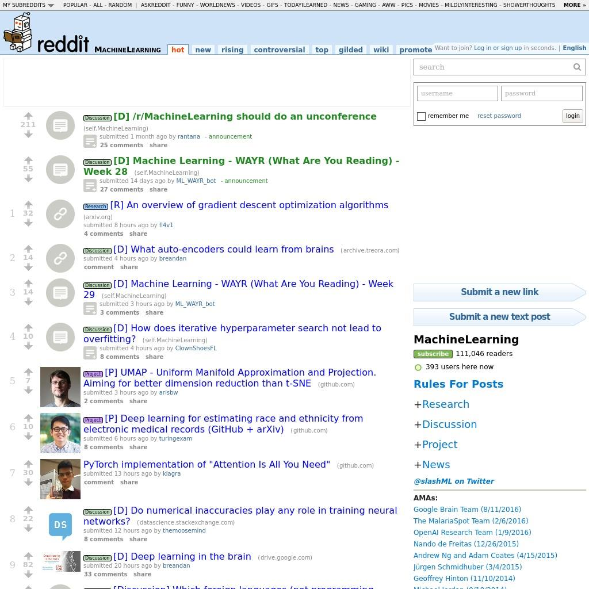
**이미지 캡션:** 이 이미지는 레딧의 머신러닝 서브레딧 페이지를 보여줍니다. 페이지 상단에는 레딧 로고와 함께 "MACHINE LEARNING"이라는 제목이 있고, 그 옆에는 "hot", "new", "rising", "controversial", "top", "gilded", "wiki", "promote"와 같은 카테고리 탭이 있습니다. 오른쪽 상단에는 로그인 폼이 있으며, 사용자 이름과 비밀번호를 입력하고 "remember me" 옵션을 선택하거나 "reset password"를 누를 수 있습니다. 페이지 중앙에는 다양한 머신러닝 관련 게시물 목록이 표시됩니다. 각 게시물은 제목, 작성자, 제출 시간, 댓글 수, 공유 수 등의 정보를 포함하고 있습니다. 게시물 제목 앞에는 "[D]" (Discussion), "[R]" (Research), "[P]" (Project)와 같은 태그가 붙어 있어 게시물의 종류를 나타냅니다. 예를 들어, 첫 번째 게시물은 "/r/MachineLearning should do an unconference"라는 제목의 토론 게시물이며, 25개의 댓글과 공유가 있습니다. 그 아래에는 "Machine Learning - WAYR (What Are You Reading) - Week 28"이라는 제목의 게시물이 있고, 그 다음에는 "An overview of gradient descent optimization algorithms"라는 제목의 연구 게시물이 있습니다. 페이지 오른쪽에는 "Submit a new link"와 "Submit a new text post" 버튼이 있고, "MachineLearning" 서브레딧에 대한 구독 정보와 현재 접속자 수가 표시됩니다. 또한, "Rules For Posts" 섹션에는 "+Research", "+Discussion", "+Project", "+News"와 같은 하위 섹션이 있습니다. 그 아래에는 "@slashML on Twitter" 링크와 "AMAS" 섹션이 있는데, 여기에는 머신러닝 분야의 유명 인사들의 이름과 해당 활동 날짜가 나열되어 있습니다. 전반적으로 이 페이지는 머신러닝 커뮤니티의 최신 정보와 토론을 공유하는 온라인 포럼의 모습을 보여줍니다. 머신러닝 관련 게시물 목록이 표시됩니다. 각 게시물은 제목, 작성자, 제출 시간, 댓글 수, 공유 수 등의 정보를 포함하고 있습니다. 게시물 제목 앞에는 "[D]" (Discussion), "[R]" (Research), "[P]" (Project)와 같은 태그가 붙어 있어 게시물의 종류를 나타냅니다. 예를 들어, 첫 번째 게시물은 "/r/MachineLearning should do an unconference"라는 제목의 토론 게시물이며, 25개의 댓글과 공유가 있습니다. 그 아래에는 "Machine Learning - WAYR (What Are You Reading) - Week 28"이라는 제목의 게시물이 있고, 그 다음에는 "An overview of gradient descent optimization algorithms"라는 제목의 연구 게시물이 있습니다. 페이지 오른쪽에는 "Submit a new link"와 "Submit a new text post" 버튼이 있고, "MachineLearning" 서브레딧에 대한 구독 정보와 현재 접속자 수가 표시됩니다. 또한, "Rules For Posts" 섹션에는 "+Research", "+Discussion", "+Project", "+News"와 같은 하위 섹션이 있습니다. 그 아래에는 "@slashML on Twitter" 링크와 "AMAS" 섹션이 있는데, 여기에는 머신러닝 분야의 유명 인사들의 이름과 해당 활동 날짜가 나열되어 있습니다. 전반적으로 이 페이지는 머신러닝 커뮤니티의 최신 정보와 토론을 공유하는 온라인 포럼의 모습을 보여줍니다.

> #오늘의레딧 https://www.reddit.com/r/MachineLearning/ 아침부터 다양한 소식이 많네요.  1. 그라데이션 강하 최적화 알고리즘 개요 2. 자동 인코더가 뇌에서 배울 수있는 것 3. 기계 학습 - WAYR (당신은 무엇을 읽고 있습니까?) - 29 주차 4. 반복적 인 하이퍼 파라 메트릭 검색은 어떻게 overfitting으로 이어지지 않습니까? 5. UMAP - 균일 매니 폴드 근사 및 투영법. t-SNE보다 더 우수한 치수 감소를 목표로 함 6. 전자 의료 기록 (GitHub + arXiv)에서 인종과 민족을 추정하기위한 심층 학습 7. 수치 부정확성은 신경망을 훈련 할 때 어떤 역할을합니까? 8. 뇌의 깊은 학습 9. 어떤 외국어 (프로그래밍 언어가 아님)가 ML에서 커리어에 도움이 되는지요? 10. 시각적 텍스트 구성 동작을 사용한 깊은 네트워크 11. Hugo Larochelle (Google Brain)은 현재 이해할 수없는 신경 네트워크의 속성에 대해 설명합니다. 12. Google Pre-emptible Cloud CPU에서 TensorFlow 벤치마킹 : Cloud GPU보다 딥 펙 학습 13. Solomonoff 유도 구현 시도 14. Jupyter Notebook에 공개 URL을 즉시 제공하는 스크립트 작성 :) 15. KL 발산은 점으로 감소한 다음 VAE에서 증가하기 시작합니까? 16. Thomas Huijskens - Scikit을 배우는 베이지안 최적화 17. "자가 운전 차량 학습 온라인 및 온보드 라스베리 파이 3"에 대한 소스 코드 18. Deep Learning은 수십 년 동안 하드웨어가 이론을 따라 잡기를 기다렸습니다. 하드웨어를 기다리는 다른 고급 ML 이론이 있습니까? 19. GP CaKe를위한 파이썬 구현 : 비모수 적 베이지안 인과 관계 20. 이중 경로 네트워크 -&gt; 새로운 ImageNet SOTA  1. https://arxiv.org/abs/1609.04747 2. http://archive.treora.com/2016/thesis/thesis.pdf 3. https://www.reddit.com/r/MachineLearning/comments/6m9l1v/d_machine_learning_wayr_what_are_you_reading_week/ 4. https://www.reddit.com/r/MachineLearning/comments/6m9c1o/d_how_does_iterative_hyperparameter_search_not/ 5. https://github.com/lmcinnes/umap 6. https://github.com/jisungk/riddle 7. https://datascience.stackexchange.com/q/20271/8820 8. https://drive.google.com/file/d/0B2A1tnmq5zQdQU1YRFpwWFNISDQ/view 9. https://www.reddit.com/r/MachineLearning/comments/6ma02e/discussion_which_foreign_languages_not/ 10. https://arxiv.org/abs/1707.01555 11. https://drive.google.com/file/d/0ByUKRdiCDK7-UXB1R1ZpX082MEk/view 12. http://minimaxir.com/2017/07/cpu-or-gpu/ 13. https://www.reddit.com/r/MachineLearning/comments/6m38t2/p_attempted_implementation_of_solomonoff_induction/ 14. https://github.com/biancasubion/jupyshare 15. https://www.reddit.com/r/MachineLearning/comments/6m2tje/d_kl_divergence_decreases_to_a_point_and_then/ 16. https://www.youtube.com/watch?v=jtRPxRnOXnk 17. https://ogma.ai/2017/07/source-code-for-self-driving-car-learns-online-and-on-board-on-raspberry-pi-3/ 18. https://www.reddit.com/r/MachineLearning/comments/6lv5au/d_deep_learning_spent_several_decades_waiting_for/ 19. https://www.reddit.com/r/MachineLearning/comments/6ltz4x/p_a_python_implementation_for_gp_cake_a/ 20. https://arxiv.org/abs/1707.01629

### 7월 11일 (화) 08:52 · 📷 사진 (1장)

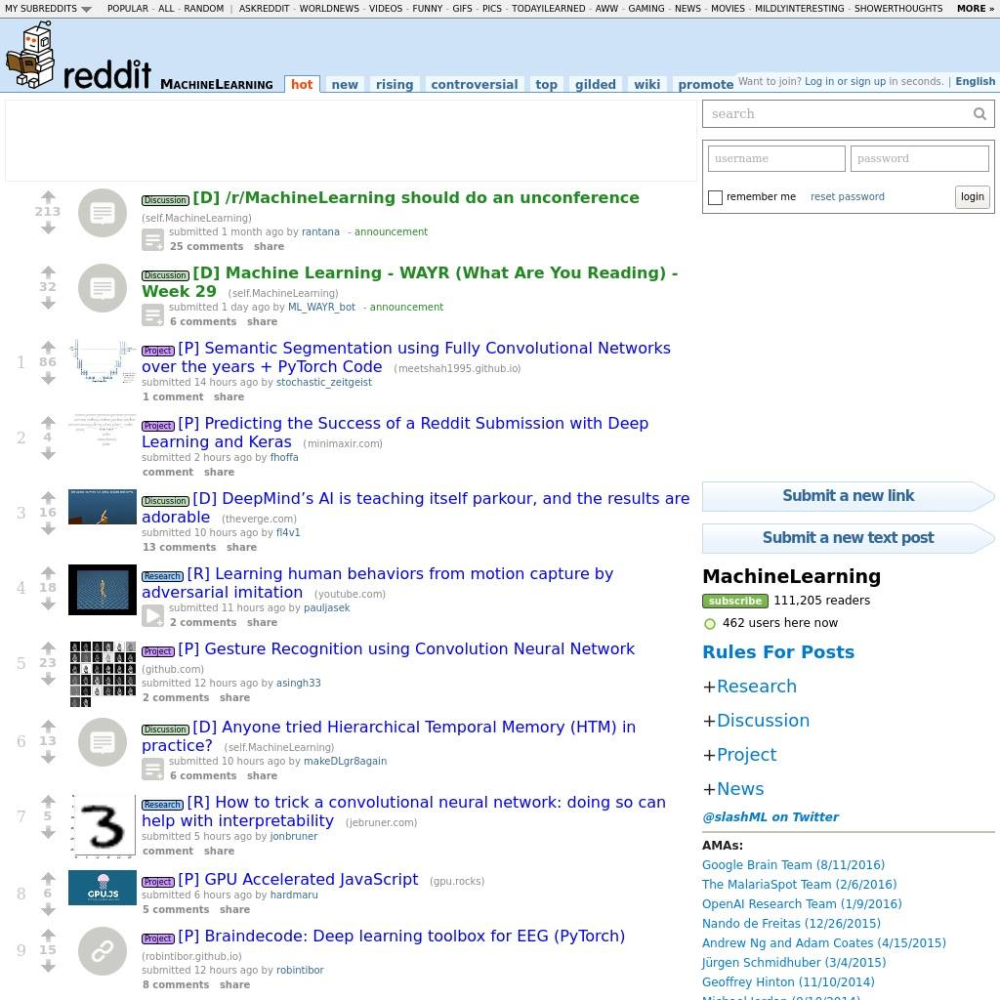
**이미지 캡션:** 이 이미지는 인기 있는 온라인 커뮤니티인 레딧의 머신러닝 서브레딧 페이지를 보여줍니다. 페이지 상단에는 레딧 로고와 함께 "MACHINE LEARNING"이라는 제목이 있고, 그 옆에는 "hot", "new", "rising", "controversial", "top", "gilded", "wiki", "promote"와 같은 다양한 정렬 옵션이 있습니다. 오른쪽 상단에는 로그인 및 회원가입을 위한 입력 필드와 버튼이 있습니다. 페이지 중앙에는 머신러닝 관련 게시물 목록이 표시되며, 각 게시물은 제목, 작성자, 제출 시간, 댓글 수, 공유 옵션 등을 포함합니다. 게시물들은 주로 프로젝트, 토론, 연구 등 다양한 주제를 다루고 있으며, 일부 게시물에는 관련 이미지나 링크가 첨부되어 있습니다. 페이지 오른쪽에는 "MachineLearning" 서브레딧의 구독자 수, 현재 접속자 수, 게시 규칙, 트위터 계정, 그리고 과거 AMA(Ask Me Anything) 목록이 표시됩니다. 전반적으로 이 페이지는 머신러닝 분야의 최신 정보와 토론을 공유하는 온라인 커뮤니티의 모습을 보여줍니다., 제출 시간, 댓글 수, 공유 옵션 등을 포함합니다. 게시물들은 주로 프로젝트, 토론, 연구 등 다양한 주제를 다루고 있으며, 일부 게시물에는 관련 이미지나 링크가 첨부되어 있습니다. 페이지 오른쪽에는 "MachineLearning" 서브레딧의 구독자 수, 현재 접속자 수, 게시 규칙, 트위터 계정, 그리고 과거 AMA(Ask Me Anything) 목록이 표시됩니다. 전반적으로 이 페이지는 머신러닝 분야의 최신 정보와 토론을 공유하는 온라인 커뮤니티의 모습을 보여줍니다.

> #오늘의레딧 https://www.reddit.com/r/MachineLearning/ 래딧은 읽을 거리가 다양합니다.  1. 수년에 걸친 완전 컨벌루션 네트워크를 이용한 시맨틱 세그멘테이션 + 피터 코치 코드 2. 깊은 학습과 Keras로 Reddit 제출의 성공 예측 3. DeepMind의 AI는 자체적으로 파 쿠르를 가르치고 있으며 그 결과는 귀엽다. 4. 적의 모방에 의한 모션 캡쳐로부터의 인간 행동 습득 5. 회선 신경망을 이용한 제스쳐 인식 6. 누구나 실제로 계층 적 임시 메모리 (HTM)를 시도 했습니까? 7. 길쌈 신경 네트워크를 속이는 방법 : 이렇게하면 해석 가능성을 도울 수 있습니다. 8. GPU 가속화 된 자바 스크립트 9. Braindecode : EEG (PyTorch)를위한 심층 학습 도구 10. PAIR : People + AI Research Initiative 11. 신경 coreference 해상도 SOTA 모델 + 오픈 소스 코드의 대화 형 데모 12. 로봇 운동을 예측하는 방법은 무엇입니까? 13. 앙상블 뒤에있는 수학은 구성 요소 모델 중 하나보다 더 나쁜 예측 인자입니까? 14. 오디오 + 비디오 조작 감지 : CycleGAN, Face2Face 등과의 전투 15. 자동 인코더가 뇌에서 배울 수있는 것 16. 최적의 원하는 출력을 나타내는 기존의 텐서를 사용하여 이미지 분할을위한 모델 교육 17. 그라데이션 강하 최적화 알고리즘 개요 18. 원 GAN 논문의 이론 19. 반복적 인 하이퍼 파라 메트릭 검색은 어떻게 overfitting으로 이어지지 않습니까? 20. 어떤 외국어 (프로그래밍 언어가 아님)가 ML에서 커리어에 도움이 되는지요?  1. https://meetshah1995.github.io/semantic-segmentation/deep-learning/pytorch/visdom/2017/06/01/semantic-segmentation-over-the-years.html 2. http://minimaxir.com/2017/06/reddit-deep-learning/ 3. https://www.theverge.com/tldr/2017/7/10/15946542/deepmind-parkour-agent-reinforcement-learning 4. https://www.youtube.com/watch?v=QwUJkSrbF68 5. https://github.com/asingh33/CNNGestureRecognizer 6. https://www.reddit.com/r/MachineLearning/comments/6mefdg/d_anyone_tried_hierarchical_temporal_memory_htm/ 7. https://www.jebruner.com/2017/07/interpreting-and-fooling-convolutional-neural-networks-part-1/ 8. http://gpu.rocks 9. https://robintibor.github.io/braindecode/ 10. https://www.blog.google/topics/machine-learning/pair-people-ai-research-initiative/ 11. https://huggingface.co/coref/ 12. https://www.reddit.com/r/MachineLearning/comments/6mgean/d_how_to_predict_a_robots_movement/ 13. https://www.reddit.com/r/MachineLearning/comments/6mg1s8/d_what_is_the_math_behind_ensembling_being_a/ 14. http://notes.michaeldempsey.me/post/159418832409/audio-video-manipulation 15. http://archive.treora.com/2016/thesis/thesis.pdf 16. https://www.reddit.com/r/MachineLearning/comments/6mf35b/d_training_a_model_for_image_segmentation_using/ 17. https://arxiv.org/abs/1609.04747 18. https://www.reddit.com/r/MachineLearning/comments/6mb9yv/d_theory_in_original_gan_paper/ 19. https://www.reddit.com/r/MachineLearning/comments/6m9c1o/d_how_does_iterative_hyperparameter_search_not/ 20. https://www.reddit.com/r/MachineLearning/comments/6ma02e/discussion_which_foreign_languages_not/

### 7월 12일 (수) 07:25 · 📷 사진 (2장)

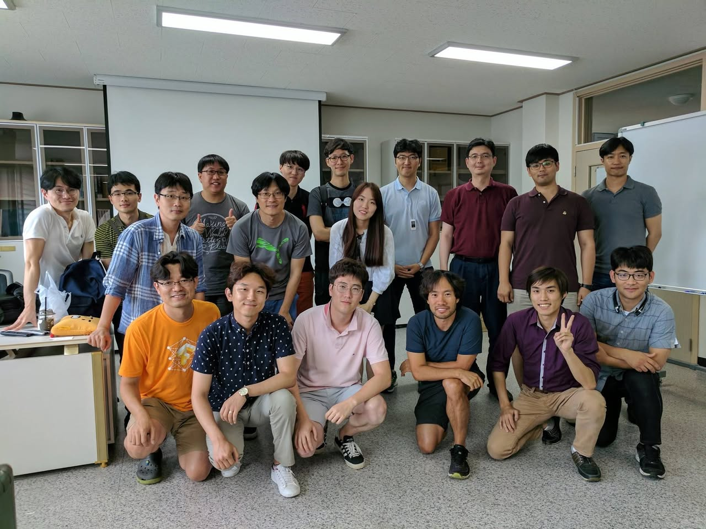
**이미지 캡션:** 이 사진은 10대 후반에서 30대 초반으로 보이는 성인 남성 15명과 성인 여성 1명이 실내에서 단체 사진을 찍는 모습을 담고 있습니다. 배경에는 흰색 스크린이 설치된 강의실 또는 회의실로 보이며, 좌측에는 책장과 책상이 놓여 있습니다. 사람들은 다양한 연령대의 남성들로, 대부분 캐주얼한 복장을 하고 있으며, 일부는 안경을 착용하고 있습니다. 표정은 대부분 밝고 자연스러우며, 일부는 웃고 있거나 손가락으로 브이(V)를 표시하는 등 긍정적인 분위기를 연출하고 있습니다. 중앙에 앉아 있는 남성은 오렌지색 티셔츠를 입고 있으며, 그 옆에는 남색 체크무늬 셔츠를 입은 남성이 앉아 있습니다. 전체적으로 편안하고 친근한 분위기 속에서 기념 사진을 촬영하는 모습입니다. 입고 있으며, 그 옆에는 남색 체크무늬 셔츠를 입은 남성이 앉아 있습니다. 전체적으로 편안하고 친근한 분위기 속에서 기념 사진을 촬영하는 모습입니다.
 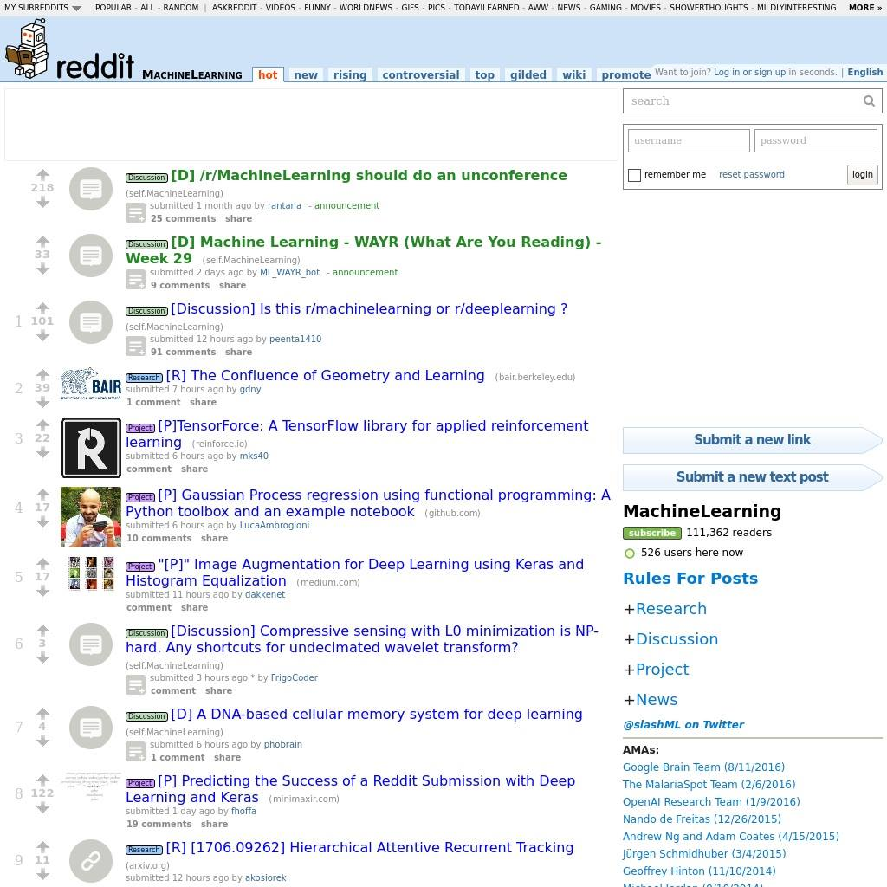
**이미지 캡션:** 이 이미지는 Reddit의 머신러닝 서브레딧 페이지를 보여줍니다. 페이지 상단에는 Reddit 로고와 함께 "MACHINE LEARNING"이라는 제목이 있고, 그 아래에는 "hot", "new", "rising", "controversial", "top", "gilded", "wiki"와 같은 탭이 있습니다. 오른쪽 상단에는 로그인 및 회원가입을 위한 입력 필드와 버튼이 있습니다. 페이지 중앙에는 다양한 주제의 게시물 목록이 표시되며, 각 게시물은 제목, 작성자, 제출 시간, 댓글 수, 공유 수 등의 정보를 포함합니다. 게시물 유형은 "Discussion", "Project", "Research" 등으로 구분됩니다. 예를 들어, 첫 번째 게시물은 "[D] /r/Machine Learning should do an unconference"라는 제목의 토론 게시물이며, 1개월 전에 제출되었습니다. 그 아래에는 "Machine Learning - WAYR (What Are You Reading) - Week 29"이라는 제목의 또 다른 토론 게시물이 있습니다. 또한, "TensorForce: A TensorFlow library for applied reinforcement learning"과 같은 프로젝트 게시물과 "The Confluence of Geometry and Learning"과 같은 연구 게시물도 보입니다. 오른쪽 사이드바에는 "Machine Learning" 서브레딧의 구독자 수와 현재 접속자 수가 표시되어 있으며, "Rules For Posts" 섹션에는 "Research", "Discussion", "Project", "News"와 같은 카테고리가 나열되어 있습니다. 그 아래에는 "AMAS" 섹션에 과거 AMA(Ask Me Anything) 세션 목록과 해당 날짜가 표시되어 있습니다. 전반적으로 이 페이지는 머신러닝 커뮤니티의 최신 정보와 토론을 공유하는 온라인 포럼의 모습을 보여줍니다. 포함합니다. 게시물 유형은 "Discussion", "Project", "Research" 등으로 구분됩니다. 예를 들어, 첫 번째 게시물은 "[D] /r/Machine Learning should do an unconference"라는 제목의 토론 게시물이며, 1개월 전에 제출되었습니다. 그 아래에는 "Machine Learning - WAYR (What Are You Reading) - Week 29"이라는 제목의 또 다른 토론 게시물이 있습니다. 또한, "TensorForce: A TensorFlow library for applied reinforcement learning"과 같은 프로젝트 게시물과 "The Confluence of Geometry and Learning"과 같은 연구 게시물도 보입니다. 오른쪽 사이드바에는 "Machine Learning" 서브레딧의 구독자 수와 현재 접속자 수가 표시되어 있으며, "Rules For Posts" 섹션에는 "Research", "Discussion", "Project", "News"와 같은 카테고리가 나열되어 있습니다. 그 아래에는 "AMAS" 섹션에 과거 AMA(Ask Me Anything) 세션 목록과 해당 날짜가 표시되어 있습니다. 전반적으로 이 페이지는 머신러닝 커뮤니티의 최신 정보와 토론을 공유하는 온라인 포럼의 모습을 보여줍니다.

> TF가 기획하고 추최하고 있는 제주 ML Camp 2017년 멘토단!  기술적인 부분에서 실제로 캠프 성공의 키를 쥐고 계시는 멘토분들! 정말 많은 수고에 감사드리며 각각의 멘티를 성공으로 이끌고 캠프를 성공으로 이끌어 주심에 미리 축하드립니다.  (아래는 7월 10일 멘토단 모임에 참여하신분들 사진이고 이날 뵙지 못한 분들에게도 큰 감사, 그리 곧 뵙겠습니다.)
> #오늘의레딧 https://www.reddit.com/r/MachineLearning/ 따끈한 소식들입니다.  1. 이 r / machinelearning 또는 r / deeplearning입니까? 2. 기하학과 학습의 융합 3. TensorForce : 응용 강화 학습을위한 TensorFlow 라이브러리 4. 함수 프로그래밍을 사용한 Gaussian Process 회귀 분석 : Python 도구 상자와 예제 노트 5. L0 최소화를 통한 압축 감지는 NP 하드입니다. undecimated 잔물결에 대한 모든 단축키? 6. 심층 학습을위한 DNA 기반 세포 기억 시스템 7. 깊은 학습과 Keras로 Reddit 제출의 성공 예측 8. Google 브레인 레지던트 프로그램 - 1 년 후 9. WGAN-GP, DFM, Cramer GAN, DRAGAN 및 BEGAN의 체인저 구현. 10. 인공 지능, 기계 학습 및 게임에서의 미래 11. 문장 삽입을위한 간단하지만 힘든 투쟁의 기본 12. 일괄 표준 및 관련 기술에 대한 현재 조사 13. 친애하는 동료 기계 배우기 포크 : 너는 멀리 우리 시대를 버리고있다. 14. 수년에 걸친 완전 컨벌루션 네트워크를 이용한 시맨틱 세그멘테이션 + 피터 코치 코드 15. SuperVised ML 방식을 사용하여 Chrome TRex를 재생하도록 안내합니다. 16. 오디오 + 비디오 조작 감지 : CycleGAN, Face2Face 등과의 전투 17. DeepMind의 AI는 자체적으로 파 쿠르를 가르치고 있으며 그 결과는 귀엽다. 18. PAIR : People + AI Research Initiative 19. 길쌈 신경 네트워크를 속이는 방법 : 이렇게하면 해석 가능성을 도울 수 있습니다. 20. GPU 가속화 된 자바 스크립트  1. https://www.reddit.com/r/MachineLearning/comments/6mloim/discussion_is_this_rmachinelearning_or/ 2. http://bair.berkeley.edu/blog/2017/07/11/confluence-of-geometry-and-learning/ 3. https://reinforce.io/blog/introduction-to-tensorforce/ 4. https://github.com/LucaAmbrogioni/Functional-GP-analysis-in-Python/blob/master/Example_Notebook.ipynb 5. https://www.reddit.com/r/MachineLearning/comments/6moub2/discussion_compressive_sensing_with_l0/ 6. https://www.reddit.com/r/MachineLearning/comments/6mnqwn/d_a_dnabased_cellular_memory_system_for_deep/ 7. http://minimaxir.com/2017/06/reddit-deep-learning/ 8. https://research.googleblog.com/2017/07/the-google-brain-residency-program-one.html 9. https://github.com/pfnet-research/chainer-gan-lib 10. https://medium.com/@shubham_2017/ai-ml-and-its-future-in-gaming-a2eeeb5561e1 11. https://openreview.net/pdf?id=SyK00v5xx 12. https://www.reddit.com/r/MachineLearning/comments/6ml2hm/d_current_survey_of_batchnorm_and_related/ 13. http://adamashwal.com/waste 14. https://meetshah1995.github.io/semantic-segmentation/deep-learning/pytorch/visdom/2017/06/01/semantic-segmentation-over-the-years.html 15. https://github.com/asingh33/SupervisedChromeTrex 16. http://notes.michaeldempsey.me/post/159418832409/audio-video-manipulation 17. https://www.theverge.com/tldr/2017/7/10/15946542/deepmind-parkour-agent-reinforcement-learning 18. https://www.blog.google/topics/machine-learning/pair-people-ai-research-initiative/ 19. https://www.jebruner.com/2017/07/interpreting-and-fooling-convolutional-neural-networks-part-1/ 20. http://gpu.rocks

### 7월 12일 (수) 18:15 · Who is she (in the middle)?

📍 Woljeongri Beach

Who is she (in the middle)?

**이미지 캡션:** 세 명의 사람이 해변에서 밝은 색상의 의자에 앉아 있다. 왼쪽에는 검은색과 분홍색 래시가드를 입은 성인 여성이 앉아 있고, 오른쪽에는 흰색 모자를 쓴 성인 남성이 앉아 있다. 가운데에는 긴 머리의 성인 여성이 앉아 있다. 세 사람 모두 바다를 향해 앉아 있으며, 두 여성은 팔을 들어 하트 모양을 만들거나 손가락으로 무언가를 가리키고 있고, 남성도 팔을 들어 무언가를 가리키고 있다. 의자에는 "모래비 카페 사색의자"라는 글자가 쓰여 있다. 배경에는 넓은 해변과 푸른 바다가 펼쳐져 있으며, 많은 사람들이 해변에서 휴식을 취하고 있다. 전반적으로 화창하고 즐거운 분위기이다. 휴식을 취하고 있다. 전반적으로 화창하고 즐거운 분위기이다.

### 7월 13일 (목) 08:52 · 📷 사진 (1장)

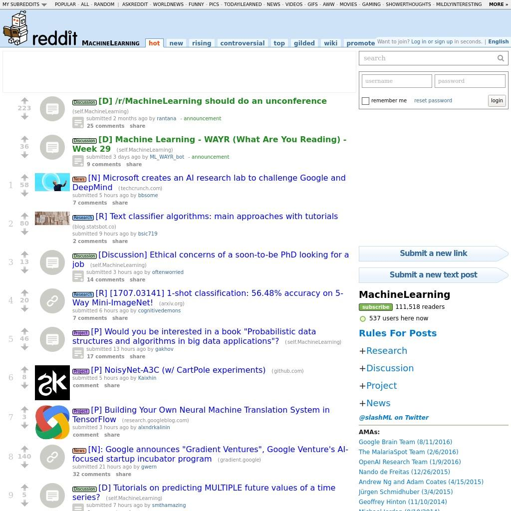
**이미지 캡션:** 이것은 컴퓨터 화면의 스크린샷으로, 웹사이트인 레딧의 머신러닝 서브레딧을 보여줍니다. 화면 상단에는 레딧 로고와 함께 "MachineLearning"이라는 제목이 있고, 그 옆에는 "hot", "new", "rising", "controversial", "top", "gilded", "wiki"와 같은 탭이 있습니다. 오른쪽 상단에는 검색창과 로그인/가입 옵션이 있습니다. 메인 콘텐츠 영역은 여러 개의 게시물 목록으로 구성되어 있으며, 각 게시물은 제목, 작성자, 제출 시간, 댓글 수 등의 정보를 포함합니다. 게시물들은 주로 머신러닝, 인공지능, 데이터 과학과 관련된 주제를 다루고 있습니다. 예를 들어, "Microsoft creates an AI research lab to challenge Google and DeepMind" 또는 "Ethical concerns of a soon-to-be PhD looking for a job"과 같은 제목들이 보입니다. 각 게시물 옆에는 게시물의 종류를 나타내는 태그(예: [N] for News, [R] for Research, [D] for Discussion, [P] for Project)가 있습니다. 오른쪽 사이드바에는 "MachineLearning" 서브레딧의 구독자 수와 현재 접속자 수가 표시되어 있으며, 게시물 규칙과 트위터 계정 정보, 그리고 과거 AMA(Ask Me Anything) 목록이 나열되어 있습니다. 전반적으로, 이 화면은 머신러닝 커뮤니티의 최신 정보와 토론을 보여주는 웹사이트의 일부입니다. 게시물들은 주로 머신러닝, 인공지능, 데이터 과학과 관련된 주제를 다루고 있습니다. 예를 들어, "Microsoft creates an AI research lab to challenge Google and DeepMind" 또는 "Ethical concerns of a soon-to-be PhD looking for a job"과 같은 제목들이 보입니다. 각 게시물 옆에는 게시물의 종류를 나타내는 태그(예: [N] for News, [R] for Research, [D] for Discussion, [P] for Project)가 있습니다. 오른쪽 사이드바에는 "MachineLearning" 서브레딧의 구독자 수와 현재 접속자 수가 표시되어 있으며, 게시물 규칙과 트위터 계정 정보, 그리고 과거 AMA(Ask Me Anything) 목록이 나열되어 있습니다. 전반적으로, 이 화면은 머신러닝 커뮤니티의 최신 정보와 토론을 보여주는 웹사이트의 일부입니다.

> #오늘의레딧 https://www.reddit.com/r/MachineLearning/ 래딧은 읽을 거리가 다양합니다.  1. Microsoft는 AI 연구실을 만들어 Google 및 DeepMind에 도전합니다. 2. 텍스트 분류 알고리즘 : 자습서를 사용한 주요 접근 방식 3. 곧 일할 의사를 찾고있는 PhD의 윤리적 인 관심사 4. "큰 데이터 응용 프로그램에서 확률 론적 데이터 구조 및 알고리즘"이라는 책에 관심이 있으십니까? 5. NoisyNet-A3C (CartPole 실험 포함) 6. TensorFlow에서 나만의 신경 기계 번역 시스템 구축 7. : Google, Google Venture의 AI 중심 벤처 창업 보육 센터 프로그램 인 "Gradient Ventures"발표 8. 시계열의 여러 미래 값을 예측하는 방법에 대한 자습서? 9. "16K SUPERGAN 환각"(Google Art Corpus에서 교육받은 16384x16384 픽셀 GAN 샘플) 10. Obama 합성 : 오디오로부터 립 싱크 학습 11. : 다른 클러스터 관리자와 함께 분산 된 심층 학습을위한 클러스터 관리자 선택. 12. Caffe - 여러 손실 레이어, 구현 위치는 어디입니까? 13. TensorForce : 응용 강화 학습을위한 TensorFlow 라이브러리 14. 기하학과 학습의 융합 15. 이 r / machinelearning 또는 r / deeplearning입니까? 16. 함수 프로그래밍을 사용한 Gaussian Process 회귀 분석 : Python 도구 상자 및 예제 노트 17. L0 최소화를 통한 압축 감지는 NP 하드입니다. undecimated 잔물결에 대한 모든 단축키? 18. 분리 된 멀티 모달 표현 학습 19. 심층 학습을위한 DNA 기반 세포 기억 시스템 20. 깊은 학습과 Keras로 Reddit 제출의 성공 예측  1. https://techcrunch.com/2017/07/12/microsoft-creates-an-ai-research-lab-to-challenge-google-and-deepmind/ 2. https://blog.statsbot.co/text-classifier-algorithms-in-machine-learning-acc115293278 3. https://www.reddit.com/r/MachineLearning/comments/6mwrys/discussion_ethical_concerns_of_a_soontobe_phd/ 4. https://www.reddit.com/r/MachineLearning/comments/6mt1sp/p_would_you_be_interested_in_a_book_probabilistic/ 5. https://github.com/Kaixhin/NoisyNet-A3C 6. https://research.googleblog.com/2017/07/building-your-own-neural-machine.html 7. https://gradient.google/ 8. https://www.reddit.com/r/MachineLearning/comments/6mv635/d_tutorials_on_predicting_multiple_future_values/ 9. http://memo.tv/supergan/ 10. http://grail.cs.washington.edu/projects/AudioToObama/ 11. https://www.reddit.com/r/MachineLearning/comments/6mtwch/d_selecting_cluster_manager_for_distributed_deep/ 12. https://www.reddit.com/r/MachineLearning/comments/6mw3s2/d_caffe_multiple_loss_layers_where_is_it/ 13. https://reinforce.io/blog/introduction-to-tensorforce/ 14. http://bair.berkeley.edu/blog/2017/07/11/confluence-of-geometry-and-learning/ 15. https://www.reddit.com/r/MachineLearning/comments/6mloim/discussion_is_this_rmachinelearning_or/ 16. https://github.com/LucaAmbrogioni/Functional-GP-analysis-in-Python/blob/master/Example_Notebook.ipynb 17. https://www.reddit.com/r/MachineLearning/comments/6moub2/discussion_compressive_sensing_with_l0/ 18. https://github.com/Jakobovski/decoupled-multimodal-learning 19. https://www.reddit.com/r/MachineLearning/comments/6mnqwn/d_a_dnabased_cellular_memory_system_for_deep/ 20. http://minimaxir.com/2017/06/reddit-deep-learning/

### 7월 14일 (금) 08:53 · 📷 사진 (1장)

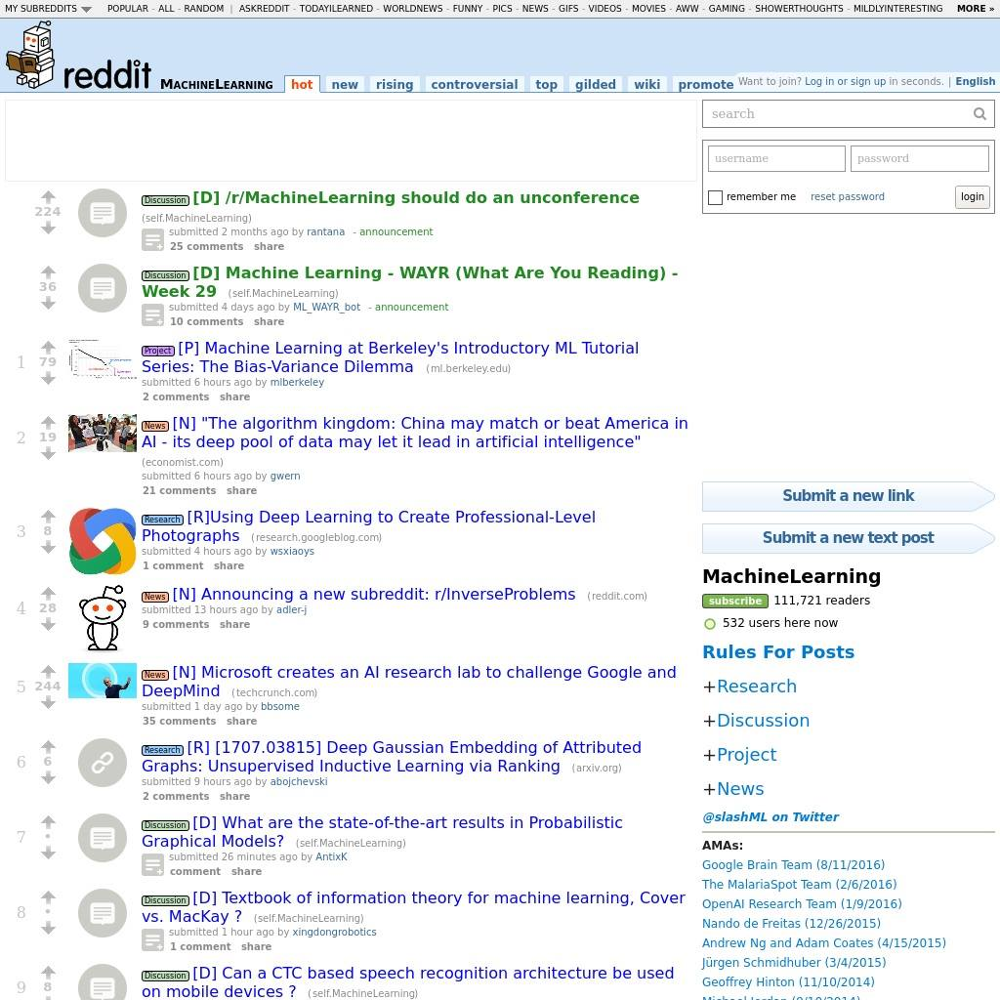
**이미지 캡션:** 이 이미지는 레딧의 머신러닝 서브레딧 페이지를 보여주며, 다양한 게시물과 관련 정보를 표시하고 있습니다. 페이지 상단에는 레딧 로고와 함께 "MACHINE LEARNING"이라는 제목이 있고, 그 아래에는 "hot", "new", "rising", "controversial", "top", "gilded", "wiki"와 같은 탭이 있습니다. 오른쪽 상단에는 로그인 또는 회원가입을 할 수 있는 폼이 있으며, 사용자 이름과 비밀번호를 입력하는 필드가 있습니다. 페이지 중앙에는 여러 게시물들이 목록 형태로 나열되어 있으며, 각 게시물은 제목, 작성자, 제출 시간, 댓글 수 등의 정보를 포함하고 있습니다. 게시물 제목들은 머신러닝 관련 주제들을 다루고 있으며, "unconference", "WAYR (What Are You Reading)", "Introductory ML Tutorial Series", "The algorithm kingdom", "Deep Learning to Create Professional-Level Photographs", "Announcing a new subreddit", "Microsoft creates an AI research lab", "Deep Gaussian Embedding of Attributed Graphs", "Probabilistic Graphical Models", "Textbook of information theory", "CTC based speech recognition architecture" 등이 있습니다. 각 게시물 옆에는 추천/반대 투표를 할 수 있는 화살표와 댓글 수를 나타내는 아이콘이 있습니다. 페이지 오른쪽에는 "Submit a new link", "Submit a new text post" 버튼과 함께 "Machine Learning" 서브레딧의 구독자 수, 현재 접속자 수, 그리고 게시물 규칙에 대한 정보가 표시되어 있습니다. 또한, "@slashML on Twitter" 링크와 과거 AMA(Ask Me Anything) 세션에 참여했던 인물들의 목록도 보입니다. 전반적으로 기술 및 학술 커뮤니티에서 활발하게 논의되는 머신러닝 관련 정보를 제공하는 웹페이지의 모습입니다.어 있으며, 각 게시물은 제목, 작성자, 제출 시간, 댓글 수 등의 정보를 포함하고 있습니다. 게시물 제목들은 머신러닝 관련 주제들을 다루고 있으며, "unconference", "WAYR (What Are You Reading)", "Introductory ML Tutorial Series", "The algorithm kingdom", "Deep Learning to Create Professional-Level Photographs", "Announcing a new subreddit", "Microsoft creates an AI research lab", "Deep Gaussian Embedding of Attributed Graphs", "Probabilistic Graphical Models", "Textbook of information theory", "CTC based speech recognition architecture" 등이 있습니다. 각 게시물 옆에는 추천/반대 투표를 할 수 있는 화살표와 댓글 수를 나타내는 아이콘이 있습니다. 페이지 오른쪽에는 "Submit a new link", "Submit a new text post" 버튼과 함께 "Machine Learning" 서브레딧의 구독자 수, 현재 접속자 수, 그리고 게시물 규칙에 대한 정보가 표시되어 있습니다. 또한, "@slashML on Twitter" 링크와 과거 AMA(Ask Me Anything) 세션에 참여했던 인물들의 목록도 보입니다. 전반적으로 기술 및 학술 커뮤니티에서 활발하게 논의되는 머신러닝 관련 정보를 제공하는 웹페이지의 모습입니다.

> #오늘의레딧 https://www.reddit.com/r/MachineLearning/ 재미난 이야기들이 많습니다  1. Berkeley의 입문 ML 튜토리얼 시리즈에서 배우는 기계 : 편견 - 분산 딜레마 2. "알고리즘 왕국 : 중국은 인공 지능에서 미국과 일치하거나 이길 수 있습니다 - 그 깊은 데이터 풀은 인공 지능으로 이끌 수 있습니다" 3. 딥 학습을 사용하여 전문가 수준의 사진 만들기 4. 새로운 하위 Reddit을 발표 : R / InverseProblems 5. Microsoft는 AI 연구실을 만들어 Google 및 DeepMind에 도전합니다. 6. Probabilistic Graphical Models의 최첨단 결과는 무엇입니까? 7. 기계 학습을위한 정보 이론의 교과서, Cover vs. MacKay? 8. 모바일 장치에서 CTC 기반 음성 인식 아키텍처를 사용할 수 있습니까? 9. 자율 차량의 물체 탐지에서의 어색한 예를 걱정할 필요가 없다. 10. 곧 일할 의사를 찾고있는 PhD의 윤리적 인 관심사 11. AI의 정치적 적용은 제한되어 있지 않습니까? 12. 서브 매니 폴드 스파 스 컨벌루션 네트워크 13. 텍스트 분류 알고리즘 : 자습서를 사용한 주요 접근 방식 14. "16K SUPERGAN 환각"(Google Art Corpus에서 교육받은 16384x16384 픽셀 GAN 샘플) 15. TensorFlow에서 나만의 신경 기계 번역 시스템 구축 16. 스캔 한 양식에서 손으로 쓴 텍스트를 추출하는 최첨단 기술은 무엇입니까? 17. "큰 데이터 응용 프로그램에서 확률 론적 데이터 구조 및 알고리즘"이라는 책에 관심이 있으십니까? 18. 감독자 및 반 감독자 학습을위한 적자 탈락 19. NoisyNet-A3C (CartPole 실험 포함) 20. 박사 학위 소지자, MSEE &amp; No 논문 보유  1. https://ml.berkeley.edu/blog/2017/07/13/tutorial-4/ 2. https://www.economist.com/news/business/21725018-its-deep-pool-data-may-let-it-lead-artificial-intelligence-china-may-match-or-beat-america 3. https://research.googleblog.com/2017/07/using-deep-learning-to-create.html 4. https://www.reddit.comhttps://www.reddit.com/r/InverseProblems/ 5. https://techcrunch.com/2017/07/12/microsoft-creates-an-ai-research-lab-to-challenge-google-and-deepmind/ 6. https://www.reddit.com/r/MachineLearning/comments/6n5c0b/d_what_are_the_stateoftheart_results_in/ 7. https://www.reddit.com/r/MachineLearning/comments/6n5469/d_textbook_of_information_theory_for_machine/ 8. https://www.reddit.com/r/MachineLearning/comments/6n0w0j/d_can_a_ctc_based_speech_recognition_architecture/ 9. https://arxiv.org/abs/1707.03501 10. https://www.reddit.com/r/MachineLearning/comments/6mwrys/discussion_ethical_concerns_of_a_soontobe_phd/ 11. https://www.reddit.com/r/MachineLearning/comments/6n3lpd/d_are_political_applications_of_ai_offlimits/ 12. https://arxiv.org/abs/1706.01307 13. https://blog.statsbot.co/text-classifier-algorithms-in-machine-learning-acc115293278 14. http://memo.tv/supergan/ 15. https://research.googleblog.com/2017/07/building-your-own-neural-machine.html 16. https://www.reddit.com/r/MachineLearning/comments/6myhli/d_what_is_the_state_of_the_art_in_extracting/ 17. https://www.reddit.com/r/MachineLearning/comments/6mt1sp/p_would_you_be_interested_in_a_book_probabilistic/ 18. https://arxiv.org/abs/1707.03631 19. https://github.com/Kaixhin/NoisyNet-A3C 20. https://www.reddit.com/r/MachineLearning/comments/6mzrjk/d_want_phd_have_msee_no_papers/

### 7월 15일 (토) 08:52 · 📷 사진 (1장)

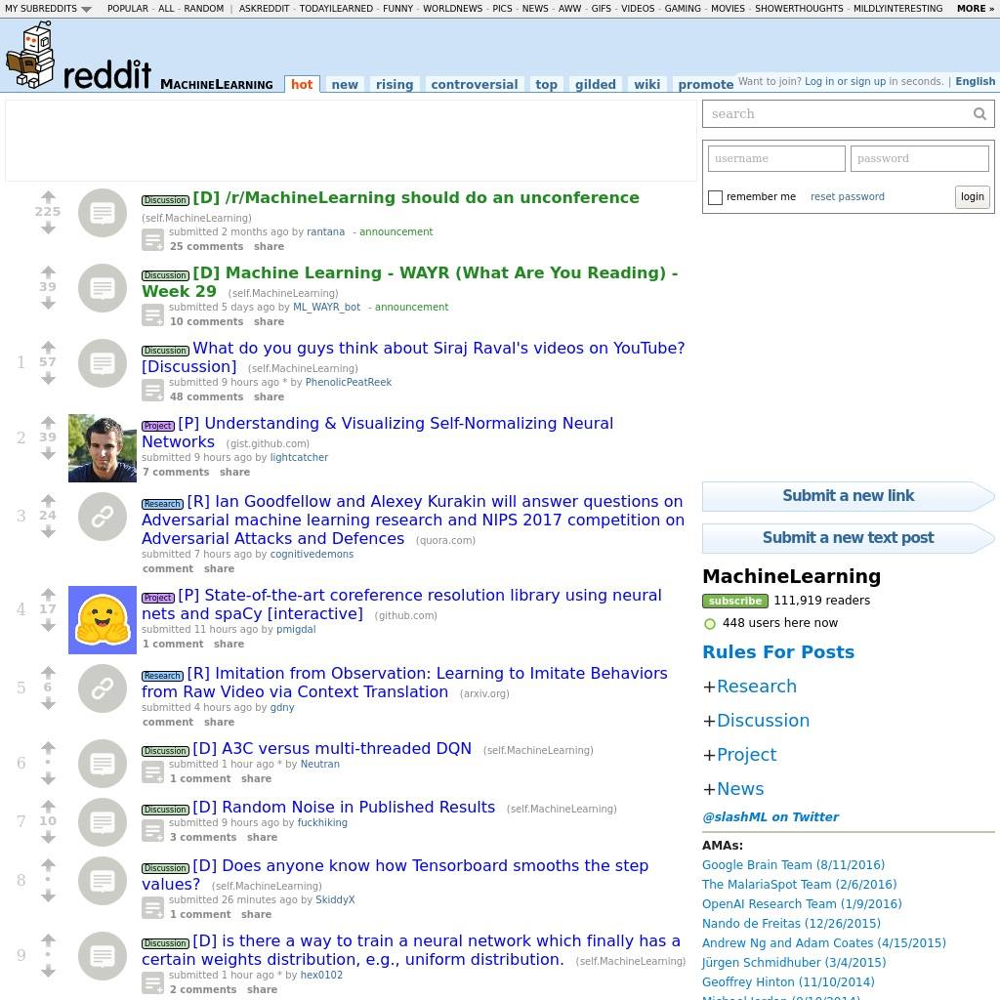
**이미지 캡션:** 이 이미지는 인기 있는 온라인 커뮤니티인 레딧의 머신러닝 서브레딧 페이지를 보여줍니다. 페이지 상단에는 레딧 로고와 함께 "MACHINE LEARNING"이라는 제목이 보이며, 그 아래에는 "hot", "new", "rising", "controversial", "top", "gilded", "wiki"와 같은 다양한 카테고리 탭이 있습니다. 오른쪽 상단에는 로그인 및 회원가입을 위한 입력 필드와 버튼이 있습니다. 페이지 중앙에는 여러 개의 게시물 목록이 표시되며, 각 게시물은 제목, 작성자, 댓글 수, 추천/반대 수 등의 정보를 포함하고 있습니다. 게시물 제목들은 머신러닝 관련 주제들을 다루고 있으며, "[D]"는 토론, "[P]"는 프로젝트, "[R]"는 연구를 나타내는 것으로 보입니다. 일부 게시물에는 관련 링크나 이미지도 첨부되어 있습니다. 페이지 오른쪽에는 "Submit a new link" 및 "Submit a new text post" 버튼과 함께 "MachineLearning" 서브레딧의 구독자 수와 현재 접속자 수가 표시되어 있습니다. 또한, 서브레딧 규칙과 "AMAS" 섹션에는 머신러닝 분야의 유명 인사나 팀 목록이 나열되어 있습니다. 전반적으로 이 페이지는 머신러닝에 관심 있는 사용자들이 최신 정보와 토론을 공유하는 온라인 공간의 모습을 보여줍니다./반대 수 등의 정보를 포함하고 있습니다. 게시물 제목들은 머신러닝 관련 주제들을 다루고 있으며, "[D]"는 토론, "[P]"는 프로젝트, "[R]"는 연구를 나타내는 것으로 보입니다. 일부 게시물에는 관련 링크나 이미지도 첨부되어 있습니다. 페이지 오른쪽에는 "Submit a new link" 및 "Submit a new text post" 버튼과 함께 "MachineLearning" 서브레딧의 구독자 수와 현재 접속자 수가 표시되어 있습니다. 또한, 서브레딧 규칙과 "AMAS" 섹션에는 머신러닝 분야의 유명 인사나 팀 목록이 나열되어 있습니다. 전반적으로 이 페이지는 머신러닝에 관심 있는 사용자들이 최신 정보와 토론을 공유하는 온라인 공간의 모습을 보여줍니다.

> #오늘의레딧 https://www.reddit.com/r/MachineLearning/ 래딧은 읽을 거리가 다양합니다.  1. 자기 정규화 신경망 이해 및 시각화 2. Ian Goodfellow와 Alexey Kurakin은 적의 공격과 방어에 관한 적의 기계 학습 연구와 NIPS 2017 대회에 관한 질문에 답할 것입니다. 3. 관측으로부터의 모방 : 컨텍스트 변환을 통한 원시 비디오에서의 행동을 모방하는 방법 학습 4. A3C 대 멀티 스레드 DQN 5. 게시 된 결과의 임의 잡음 6. Tensorboard가 단계 값을 부드럽게하는 방법을 아는 사람이 있습니까? 7. 마지막으로 일정한 가중치 분포 (예 : 균일 분포)를 갖는 신경망을 학습하는 방법이 있습니다. 8. 물리 학습을위한 영감으로서 기계 학습 과정 사용 9. Arnold - 메모리가있는 CNN 10. Berkeley의 입문 ML 튜토리얼 시리즈에서 배우는 기계 : 편견 - 분산 딜레마 11. 촬영 한 사진의 품질에 대한 기계 학습에 쓰여진 논문을 보았습니까? 즉. 사진이 얼마나 잘 짜 넣어 졌는지, 좋은 v. 나쁜지. 12. 실제 장면에 대해 정확하고 고품질의 지상 진실 깊이 맵을 생성하는 가장 좋은 방법은 무엇입니까? (예 : 방) 13. 퍼지 제한적 볼츠만 머신 구현 14. Kafnets : 신경망을위한 커널 기반의 비모수 적 활성화 함수 15. Probabilistic Graphical Models의 최첨단 결과는 무엇입니까? 16. 온라인 카테고리 학습 및 분류 17. 기계 학습을위한 정보 이론의 교과서, Cover vs. MacKay? 18. 이미지 변환을위한 기계 학습  1. https://gist.github.com/eamartin/d7f1f71e5ce54112fe05e2f2f17ebedf 2. https://www.quora.com/session/Adversarial-Machine-Learning/1 3. https://arxiv.org/abs/1707.03374 4. https://www.reddit.com/r/MachineLearning/comments/6nc90q/d_a3c_versus_multithreaded_dqn/ 5. https://www.reddit.com/r/MachineLearning/comments/6n9ckb/d_random_noise_in_published_results/ 6. https://www.reddit.com/r/MachineLearning/comments/6ncjqy/d_does_anyone_know_how_tensorboard_smooths_the/ 7. https://www.reddit.com/r/MachineLearning/comments/6nc8ou/d_is_there_a_way_to_train_a_neural_network_which/ 8. https://hackernoon.com/digital-processes-inspiring-analog-paintings-a358eb7801a0 9. https://www.reddit.com/r/MachineLearning/comments/6n8kf0/p_arnold_cnn_with_memory/ 10. https://ml.berkeley.edu/blog/2017/07/13/tutorial-4/ 11. https://www.reddit.com/r/MachineLearning/comments/6n9klv/d_have_their_been_papers_written_on_machine/ 12. https://www.reddit.com/r/MachineLearning/comments/6n7mi1/d_what_is_the_best_way_to_generate_accurate_and/ 13. https://www.reddit.com/r/MachineLearning/comments/6n7sce/dimplementing_a_fuzzy_restricted_boltzmann_machine/ 14. https://arxiv.org/abs/1707.04035 15. https://www.reddit.com/r/MachineLearning/comments/6n5c0b/d_what_are_the_stateoftheart_results_in/ 16. https://github.com/CarsonScott/Online-Category-Learning 17. https://www.reddit.com/r/MachineLearning/comments/6n5469/d_textbook_of_information_theory_for_machine/ 18. https://www.reddit.com/r/MachineLearning/comments/6n8w06/d_machine_learning_for_image_transformation/

### 7월 15일 (토) 22:55 · Done Jeju bike touring with wonderful fr…

Done Jeju bike touring with wonderful friends, Lucy Park, Jimin  Lee, Sok Kyun Han, Judit Acs, @은진은 and many others. It was really fun!

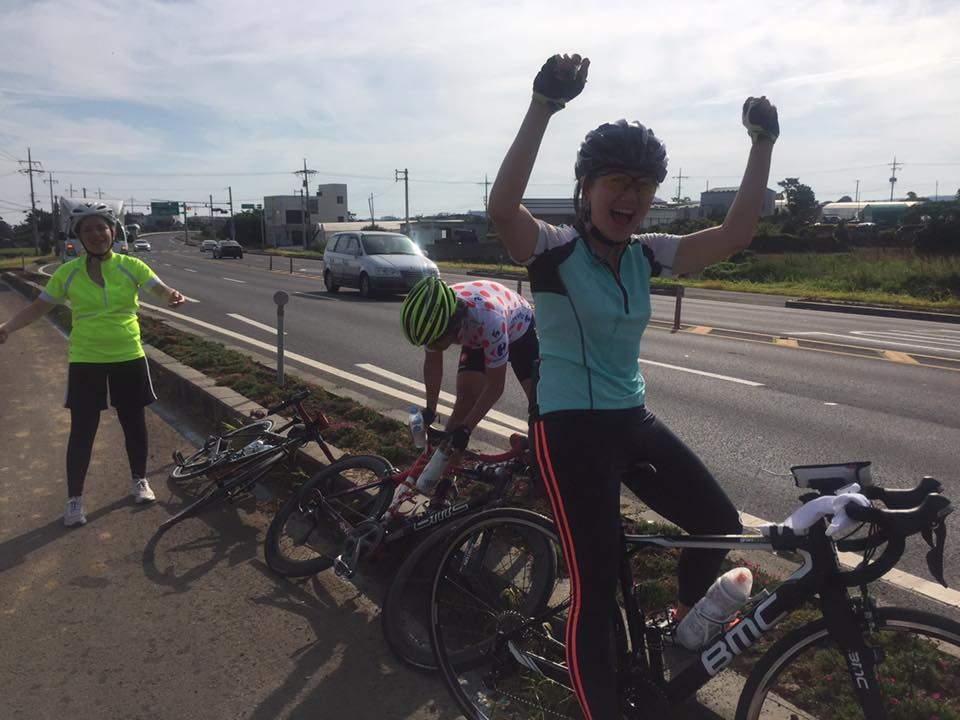
**이미지 캡션:** 세 명의 성인 남녀가 자전거를 타고 도로변에 서 있다. 왼쪽에는 형광 연두색 상의와 검은색 반바지, 검은색 타이즈를 입은 성인 여성이 헬멧을 쓰고 팔을 벌리고 서 있으며, 그녀의 표정은 밝고 활기차 보인다. 가운데에는 헬멧을 쓰고 빨간색과 흰색이 섞인 무늬의 상의와 검은색 타이즈를 입은 성인 남성이 자전거에 기대어 숙이고 있으며, 그의 표정은 보이지 않는다. 오른쪽에는 헬멧을 쓰고 청록색과 흰색이 섞인 상의와 검은색 타이즈를 입은 성인 여성이 헬멧을 쓰고 두 팔을 번쩍 들고 환호하는 듯한 표정을 짓고 있으며, 그녀의 자전거 핸들바에는 BMC 로고가 보인다. 배경에는 맑은 하늘과 구름, 전봇대, 건물, 그리고 차량이 다니는 도로가 보인다. 도로변에는 잔디와 나무가 심어져 있으며, 여러 대의 자전거가 세워져 있다. 전반적으로 즐겁고 활동적인 분위기이다. 그녀의 자전거 핸들바에는 BMC 로고가 보인다. 배경에는 맑은 하늘과 구름, 전봇대, 건물, 그리고 차량이 다니는 도로가 보인다. 도로변에는 잔디와 나무가 심어져 있으며, 여러 대의 자전거가 세워져 있다. 전반적으로 즐겁고 활동적인 분위기이다.
 
**이미지 캡션:** 이 화면은 스마트폰 애플리케이션의 요약 화면으로, 사용자의 자전거 타기 활동 기록을 보여줍니다. 상단에는 "Friends", "Summary", "Share" 메뉴가 있으며, "Nice job! Want more stats?"라는 문구와 함께 "Upgrade" 버튼이 보입니다. 그 아래에는 "Saturday Bike Ride"라는 제목과 함께 "Jul 15, 2017 6:48 AM"이라는 날짜와 시간이 표시되어 있습니다. 화면 중앙에는 제주도를 나타내는 지도 이미지가 있으며, 지도 위에는 자전거 경로로 보이는 파란색 선과 함께 여러 지점의 거리 정보(예: 58 km, 72 m, 77 km, 157 km, 056 m)가 표시되어 있습니다. 지도에는 "JEJUSI"와 "JEJU"라는 지명이 보이며, "Legal"과 "Seoviposi"라는 텍스트도 일부 보입니다. 지도 오른쪽에는 카메라 아이콘이 있습니다. 지도 아래에는 활동 요약 정보가 표시되는데, "174.85 km" (총 이동 거리), "11:32:38" (총 소요 시간), "15.15 km/h" (평균 속도), "4,643 calories" (소모 칼로리)가 나타납니다. 그 아래에는 "Your 31st fastest!"라는 문구와 함께 "Compare your 18-332 km workouts"라는 설명이 있고, "Splits"와 "Charts" 메뉴가 보입니다. 전반적으로 활동적인 라이프스타일을 기록하고 분석하는 데 사용되는 앱의 화면으로 보이며, 긍정적이고 동기 부여적인 분위기입니다. 파란색 선과 함께 여러 지점의 거리 정보(예: 58 km, 72 m, 77 km, 157 km, 056 m)가 표시되어 있습니다. 지도에는 "JEJUSI"와 "JEJU"라는 지명이 보이며, "Legal"과 "Seoviposi"라는 텍스트도 일부 보입니다. 지도 오른쪽에는 카메라 아이콘이 있습니다. 지도 아래에는 활동 요약 정보가 표시되는데, "174.85 km" (총 이동 거리), "11:32:38" (총 소요 시간), "15.15 km/h" (평균 속도), "4,643 calories" (소모 칼로리)가 나타납니다. 그 아래에는 "Your 31st fastest!"라는 문구와 함께 "Compare your 18-332 km workouts"라는 설명이 있고, "Splits"와 "Charts" 메뉴가 보입니다. 전반적으로 활동적인 라이프스타일을 기록하고 분석하는 데 사용되는 앱의 화면으로 보이며, 긍정적이고 동기 부여적인 분위기입니다.
 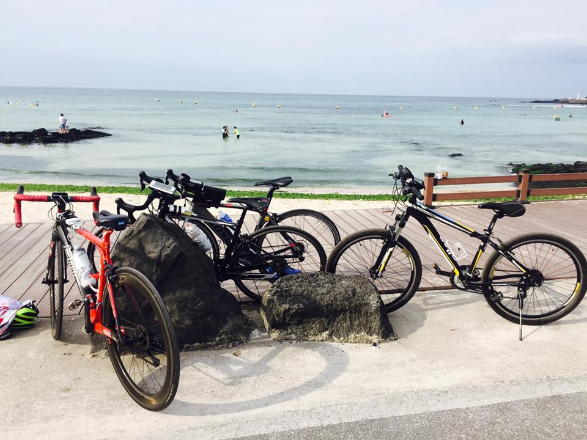
**이미지 캡션:** 해변가 나무 데크 위에 세 대의 자전거가 놓여 있고, 그 뒤로는 맑고 푸른 바다가 펼쳐져 있습니다. 왼쪽부터 빨간색 프레임의 로드 자전거, 검은색 프레임의 산악자전거, 그리고 또 다른 검은색 프레임의 산악자전거가 나란히 서 있습니다. 로드 자전거에는 물통이 달려 있고, 산악자전거에는 휴대폰 거치대와 카메라가 부착되어 있습니다. 자전거 앞쪽에는 두 개의 커다란 바위가 놓여 있으며, 바위 뒤로는 옅은 녹색의 잔디가 보입니다. 바다에는 몇몇 사람들이 물놀이를 즐기고 있으며, 수평선에는 작은 부표들이 떠 있습니다. 하늘은 옅은 구름이 드리워져 있습니다. 전반적으로 평화롭고 여유로운 해변의 풍경을 담고 있습니다.하늘은 옅은 구름이 드리워져 있습니다. 전반적으로 평화롭고 여유로운 해변의 풍경을 담고 있습니다.
 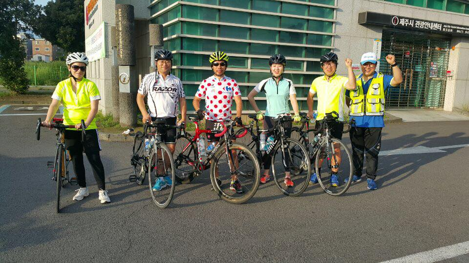
**이미지 캡션:** 여섯 명의 성인들이 자전거를 타고 도로에 서 있다. 왼쪽에서부터 첫 번째 사람은 노란색 상의와 검은색 바지를 입고 있으며, 헬멧과 선글라스를 착용하고 있다. 두 번째 사람은 흰색 상의에 검은색 바지를 입고 헬멧을 쓰고 있다. 세 번째 사람은 빨간색 물방울 무늬 상의와 검은색 바지를 입고 헬멧을 쓰고 있다. 네 번째 사람은 하늘색 상의와 검은색 바지를 입고 헬멧을 쓰고 있다. 다섯 번째 사람은 노란색 조끼와 파란색 상의, 검은색 바지를 입고 헬멧을 쓰고 있으며, 두 팔을 위로 들고 있다. 여섯 번째 사람은 노란색 상의와 검은색 바지를 입고 헬멧을 쓰고 있다. 배경에는 현대적인 건물과 나무가 보이며, 건물에는 "제주시 관광안내센터"라는 한국어 간판이 걸려 있다. 전체적으로 화창한 날씨에 야외 활동을 즐기는 듯한 분위기이다.색 상의와 검은색 바지를 입고 헬멧을 쓰고 있다. 배경에는 현대적인 건물과 나무가 보이며, 건물에는 "제주시 관광안내센터"라는 한국어 간판이 걸려 있다. 전체적으로 화창한 날씨에 야외 활동을 즐기는 듯한 분위기이다.

### 7월 16일 (일) 06:28 · 📷 사진 (2장)

**이미지 캡션:** 이 사진은 실내 식당으로 보이는 장소에서 촬영되었으며, 전면에 보이는 성인 남성은 30대 후반에서 40대 초반으로 추정되며, 곱슬거리는 검은색 머리카락에 수염을 기르고 있다. 그는 짙은 남색 반팔 티셔츠를 입고 있으며, 환하게 웃으며 카메라를 응시하고 있다. 그의 표정은 매우 긍정적이고 편안해 보인다. 배경에는 여러 사람이 앉아 있으며, 왼쪽에는 검은색 옷을 입은 남성이, 중앙에는 줄무늬 셔츠를 입은 남성이, 오른쪽에는 분홍색 옷을 입은 여성이 보인다. 식당 내부에는 나무 선반과 진열장이 보이며, 선반에는 다양한 식기류와 물건들이 놓여 있다. 벽에는 전통적인 한국식 문양과 숫자가 새겨진 장식이 보인다. 전반적으로 따뜻하고 친근한 분위기의 사진이다.양한 식기류와 물건들이 놓여 있다. 벽에는 전통적인 한국식 문양과 숫자가 새겨진 장식이 보인다. 전반적으로 따뜻하고 친근한 분위기의 사진이다.
 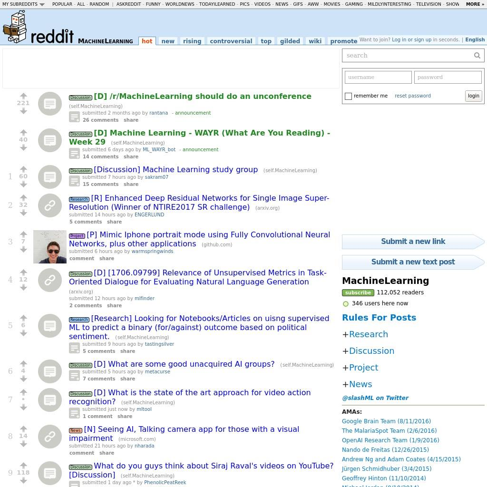
**이미지 캡션:** 이 이미지는 인기 있는 온라인 커뮤니티인 레딧의 머신러닝 서브레딧 페이지를 보여줍니다. 화면 중앙에는 다양한 주제의 게시물 목록이 표시되며, 각 게시물은 제목, 작성자, 댓글 수, 업로드 시간 등의 정보를 포함하고 있습니다. 게시물들은 주로 머신러닝 연구, 프로젝트, 토론, 뉴스 등과 관련된 내용입니다. 왼쪽에는 각 게시물의 추천 및 비추천 수를 나타내는 화살표와 아이콘이 있으며, 오른쪽에는 서브레딧 구독자 수, 관련 규칙, 트위터 계정, 그리고 과거 AMA(Ask Me Anything) 참여자 목록 등이 표시되어 있습니다. 전반적으로 정보가 많고 기술적인 주제를 다루는 커뮤니티의 분위기를 보여줍니다.시되어 있습니다. 전반적으로 정보가 많고 기술적인 주제를 다루는 커뮤니티의 분위기를 보여줍니다.

> #오늘의레딧 https://www.reddit.com/r/MachineLearning/ 아침부터 다양한 소식이 많네요.  1. 기계 학습 스터디 그룹 2. 단일 이미지 수퍼 해상도를위한 강화 된 딥 잔여 네트워크 (NTIRE2017 SR 챌린지 수상작) 3. 완전히 컨벌루션 뉴럴 네트워크 (Full Convolutional Neural Networks)를 사용하는 아이폰 (Iphone) 세로 모드를 모방 한 것 외에도 다른 애플리케이션 4. 정치 감정을 바탕으로 바이너리 (용 / 반대) 결과를 예측하기 위해 감시 된 ML에서 노트 / 기사를 찾고 있습니다. 5. 어떤 미숙 한 인공 지능 그룹이 좋을까요? 6. 비디오 액션 인식을위한 최첨단 접근법은 무엇입니까? 7. AI보기, 시각 장애가있는 사람들을위한 카메라 앱 이야기 8. Ian Goodfellow와 Alexey Kurakin은 적의 공격과 방어에 관한 적의 기계 학습 연구와 NIPS 2017 대회에 관한 질문에 답할 것입니다. 9. 자기 정규화 신경망 이해 및 시각화 10. Tensorboard가 단계 값을 부드럽게하는 방법을 아는 사람이 있습니까? 11. A3C 대 멀티 스레드 DQN 12. 마지막으로 일정한 가중치 분포 (예 : 균일 분포)를 갖는 신경망을 학습하는 방법이 있습니다. 13. 관측으로부터의 모방 : 컨텍스트 변환을 통한 원시 비디오에서의 행동을 모방하는 방법 학습 14. 물리 학습을위한 영감으로서 기계 학습 과정 사용 15. 게시 된 결과의 임의 잡음 16. Arnold - 메모리가있는 CNN 17. Berkeley의 입문 ML 튜토리얼 시리즈에서 배우는 기계 : 편견 - 분산 딜레마 18. 실제 장면에 대해 정확하고 고품질의 지상 진실 깊이 맵을 생성하는 가장 좋은 방법은 무엇입니까? (예 : 방)  1. https://www.reddit.com/r/MachineLearning/comments/6ngqgj/discussion_machine_learning_study_group/ 2. https://arxiv.org/pdf/1707.02921.pdf 3. https://github.com/warmspringwinds/dense-ai/blob/master/dense_ai/recipes/pascal_voc/segmentation/resnet_34_8s_demo.ipynb 4. https://www.reddit.com/r/MachineLearning/comments/6ng7pg/research_looking_for_notebooksarticles_on_uisng/ 5. https://www.reddit.com/r/MachineLearning/comments/6nhb7r/d_what_are_some_good_unacquired_ai_groups/ 6. https://www.reddit.com/r/MachineLearning/comments/6nj0b1/d_what_is_the_state_of_the_art_approach_for_video/ 7. https://www.microsoft.com/en-us/seeing-ai/ 8. https://www.quora.com/session/Adversarial-Machine-Learning/1 9. https://gist.github.com/eamartin/d7f1f71e5ce54112fe05e2f2f17ebedf 10. https://www.reddit.com/r/MachineLearning/comments/6ncjqy/d_does_anyone_know_how_tensorboard_smooths_the/ 11. https://www.reddit.com/r/MachineLearning/comments/6nc90q/d_a3c_versus_multithreaded_dqn/ 12. https://www.reddit.com/r/MachineLearning/comments/6nc8ou/d_is_there_a_way_to_train_a_neural_network_which/ 13. https://arxiv.org/abs/1707.03374 14. https://hackernoon.com/digital-processes-inspiring-analog-paintings-a358eb7801a0 15. https://www.reddit.com/r/MachineLearning/comments/6n9ckb/d_random_noise_in_published_results/ 16. https://www.reddit.com/r/MachineLearning/comments/6n8kf0/p_arnold_cnn_with_memory/ 17. https://ml.berkeley.edu/blog/2017/07/13/tutorial-4/ 18. https://www.reddit.com/r/MachineLearning/comments/6n7mi1/d_what_is_the_best_way_to_generate_accurate_and/

### 7월 17일 (월) 08:52 · 📷 사진 (1장)

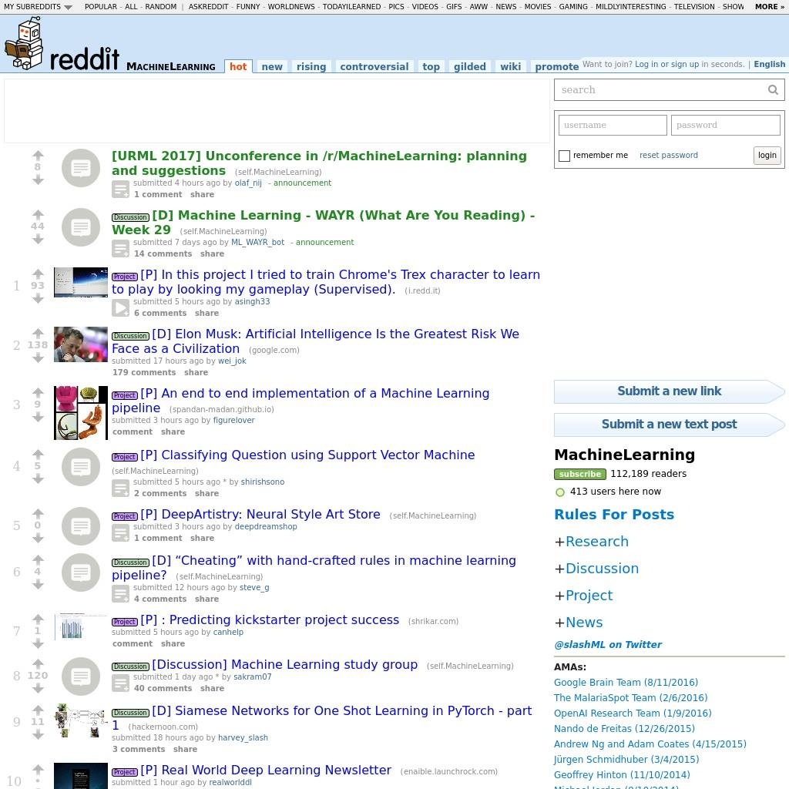
**이미지 캡션:** 이것은 Reddit의 Machine Learning 서브레딧 페이지로, 다양한 기계 학습 관련 게시물 목록을 보여줍니다. 페이지 상단에는 Reddit 로고와 함께 "Machine Learning"이라는 제목이 있고, 그 아래에는 "hot", "new", "rising", "controversial", "top", "gilded", "wiki", "promote"와 같은 탭이 있습니다. 오른쪽 상단에는 로그인 또는 가입을 위한 입력 필드와 버튼이 있습니다. 메인 콘텐츠 영역은 게시물 목록으로 구성되어 있으며, 각 게시물은 제목, 작성자, 제출 시간, 댓글 수, 그리고 종종 관련 썸네일 이미지나 아이콘을 포함합니다. 게시물 제목은 "[URML 2017] Unconference in /r/Machine Learning: planning and suggestions", "[D] Machine Learning - WAYR (What Are You Reading) - Week 29", "[P] In this project I tried to train Chrome's Trex character to learn to play by looking my gameplay (Supervised)", "[D] Elon Musk: Artificial Intelligence Is the Greatest Risk We Face as a Civilization", "[P] An end to end implementation of a Machine Learning pipeline", "[P] Classifying Question using Support Vector Machine", "[P] DeepArtistry: Neural Style Art Store", "[D] "Cheating" with hand-crafted rules in machine learning pipeline?", "[P]: Predicting kickstarter project success", "[Discussion] Machine Learning study group", "[D] Siamese Networks for One Shot Learning in PyTorch - part 1", "[P] Real World Deep Learning Newsletter" 등입니다. 각 게시물 옆에는 업보트/다운보트 화살표가 있습니다. 오른쪽 사이드바에는 "Submit a new link" 및 "Submit a new text post" 버튼, "Machine Learning" 서브레딧 구독자 수, "Rules For Posts" 섹션, 그리고 "AMAS" 목록이 있습니다. 전반적으로 이 페이지는 기계 학습 커뮤니티의 최신 정보와 토론을 공유하는 온라인 포럼의 모습을 보여줍니다.각 게시물은 제목, 작성자, 제출 시간, 댓글 수, 그리고 종종 관련 썸네일 이미지나 아이콘을 포함합니다. 게시물 제목은 "[URML 2017] Unconference in /r/Machine Learning: planning and suggestions", "[D] Machine Learning - WAYR (What Are You Reading) - Week 29", "[P] In this project I tried to train Chrome's Trex character to learn to play by looking my gameplay (Supervised)", "[D] Elon Musk: Artificial Intelligence Is the Greatest Risk We Face as a Civilization", "[P] An end to end implementation of a Machine Learning pipeline", "[P] Classifying Question using Support Vector Machine", "[P] DeepArtistry: Neural Style Art Store", "[D] "Cheating" with hand-crafted rules in machine learning pipeline?", "[P]: Predicting kickstarter project success", "[Discussion] Machine Learning study group", "[D] Siamese Networks for One Shot Learning in PyTorch - part 1", "[P] Real World Deep Learning Newsletter" 등입니다. 각 게시물 옆에는 업보트/다운보트 화살표가 있습니다. 오른쪽 사이드바에는 "Submit a new link" 및 "Submit a new text post" 버튼, "Machine Learning" 서브레딧 구독자 수, "Rules For Posts" 섹션, 그리고 "AMAS" 목록이 있습니다. 전반적으로 이 페이지는 기계 학습 커뮤니티의 최신 정보와 토론을 공유하는 온라인 포럼의 모습을 보여줍니다.

> #오늘의레딧 https://www.reddit.com/r/MachineLearning/ 따끈한 소식들입니다.  1. Elon Musk : 인공 지능은 문명으로서 우리가 직면하는 가장 큰 위험입니다 2. 기계 학습 파이프 라인의 종단 간 구현 3. 지원 벡터 머신을 이용한 질문 분류 4. DeepArtistry : 신경 스타일 아트 스토어 5. 기계 학습 파이프 라인에서 직접 만든 "부정 행위"? 6. : 프로젝트 성공을 예측하는 킥 스타터 7. 기계 학습 스터디 그룹 8. PyTorch에서 단발 학습을위한 샴 네트워크 - 1 부 9. 리얼 월드 딥 러닝 뉴스 레터 10. 비디오 액션 인식을위한 최첨단 접근법은 무엇입니까? 11. 완전히 컨벌루션 뉴럴 네트워크 (Full Convolutional Neural Networks)를 사용하는 아이폰 (Iphone) 세로 모드를 모방 한 것 외에도 다른 애플리케이션 12. 단일 이미지 수퍼 해상도를위한 강화 된 딥 잔여 네트워크 (NTIRE2017 SR 챌린지 수상작) 13. 어떤 미숙 한 인공 지능 그룹이 좋을까요? 14. 정치 감정을 바탕으로 바이너리 (용 / 반대) 결과를 예측하기 위해 감시 된 ML에서 노트 / 기사를 찾고 있습니다. 15. François Chollet은 어디에서 학교에 다녔습니까? 16. AI보기, 시각 장애가있는 사람들을위한 카메라 앱 이야기 17. 자기 정규화 신경망 이해 및 시각화 18. Ian Goodfellow와 Alexey Kurakin은 적의 공격과 방어에 관한 적의 기계 학습 연구와 NIPS 2017 대회에 관한 질문에 답할 것입니다. 19. Tensorboard가 단계 값을 부드럽게하는 방법을 아는 사람이 있습니까? 20. A3C 대 멀티 스레드 DQN  1. https://www.google.com/amp/amp.timeinc.net/fortune/2017/07/15/elon-musk-artificial-intelligence-2/%3Fsource%3Ddam 2. https://spandan-madan.github.io/DeepLearningProject/ 3. https://www.reddit.com/r/MachineLearning/comments/6nncsf/p_classifying_question_using_support_vector/ 4. https://www.reddit.com/r/MachineLearning/comments/6no9xo/p_deepartistry_neural_style_art_store/ 5. https://www.reddit.com/r/MachineLearning/comments/6nlogs/d_cheating_with_handcrafted_rules_in_machine/ 6. http://shrikar.com/predicting-kickstarter-project-success/ 7. https://www.reddit.com/r/MachineLearning/comments/6ngqgj/discussion_machine_learning_study_group/ 8. https://hackernoon.com/one-shot-learning-with-siamese-networks-in-pytorch-8ddaab10340e 9. http://enaible.launchrock.com 10. https://www.reddit.com/r/MachineLearning/comments/6nj0b1/d_what_is_the_state_of_the_art_approach_for_video/ 11. https://github.com/warmspringwinds/dense-ai/blob/master/dense_ai/recipes/pascal_voc/segmentation/resnet_34_8s_demo.ipynb 12. https://arxiv.org/pdf/1707.02921.pdf 13. https://www.reddit.com/r/MachineLearning/comments/6nhb7r/d_what_are_some_good_unacquired_ai_groups/ 14. https://www.reddit.com/r/MachineLearning/comments/6ng7pg/research_looking_for_notebooksarticles_on_uisng/ 15. https://www.reddit.com/r/MachineLearning/comments/6nkxu8/d_where_did_françois_chollet_go_to_school/ 16. https://www.microsoft.com/en-us/seeing-ai/ 17. https://gist.github.com/eamartin/d7f1f71e5ce54112fe05e2f2f17ebedf 18. https://www.quora.com/session/Adversarial-Machine-Learning/1 19. https://www.reddit.com/r/MachineLearning/comments/6ncjqy/d_does_anyone_know_how_tensorboard_smooths_the/ 20. https://www.reddit.com/r/MachineLearning/comments/6nc90q/d_a3c_versus_multithreaded_dqn/

### 7월 18일 (화) 08:52 · 📷 사진 (1장)

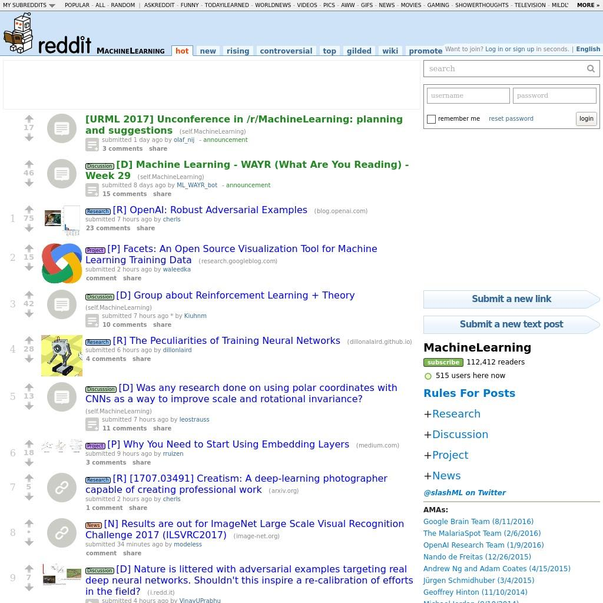
**이미지 캡션:** 이 이미지는 인기 있는 온라인 커뮤니티인 레딧의 머신러닝 서브레딧 페이지를 보여줍니다. 화면 중앙에는 다양한 게시물 목록이 있으며, 각 게시물은 제목, 작성자, 게시 시간, 댓글 수 등의 정보를 포함하고 있습니다. 게시물들은 주로 머신러닝 관련 연구, 토론, 프로젝트, 뉴스 등을 다루고 있습니다. 왼쪽에는 게시물에 대한 추천/비추천 버튼과 게시물의 순위를 나타내는 숫자가 표시되어 있습니다. 오른쪽 상단에는 로그인 및 회원가입을 위한 입력란과 버튼이 있으며, 그 아래에는 서브레딧의 이름인 "Machine Learning"과 구독자 수, 현재 접속자 수가 표시되어 있습니다. 또한, 서브레딧의 규칙과 관련된 링크들이 나열되어 있으며, "AMAS" 섹션에는 머신러닝 분야의 유명 인사들의 이름과 관련 날짜가 언급되어 있습니다. 전반적으로 기술 및 연구 커뮤니티의 활발한 정보 교류를 보여주는 화면입니다.rning"과 구독자 수, 현재 접속자 수가 표시되어 있습니다. 또한, 서브레딧의 규칙과 관련된 링크들이 나열되어 있으며, "AMAS" 섹션에는 머신러닝 분야의 유명 인사들의 이름과 관련 날짜가 언급되어 있습니다. 전반적으로 기술 및 연구 커뮤니티의 활발한 정보 교류를 보여주는 화면입니다.

> #오늘의레딧 https://www.reddit.com/r/MachineLearning/ 래딧은 읽을 거리가 다양합니다.  1. 면 : 기계 학습 교육 데이터를위한 오픈 소스 시각화 도구 2. 강화 학습 + 이론에 관한 그룹 3. 신경 회로망의 특성 4. 임베드 레이어를 사용해야하는 이유 5. ImageNet Large Scale Visual Recognition Challenge 2017 (ILSVRC2017)에 대한 결과가 나왔습니다. 6. 자연은 실제 깊은 신경망을 목표로하는 적대적인 사례로 산재 해 있습니다. 이것은 현장에서의 노력에 대한 재 교정에 영감을 주어야하지 않습니까? 7. 고해상도 비디오에서 다중 물체 인식 8. CNNs에 구성 성 가르침 9. E5450 및 GTX980 = 병목 현상 ?? 10. 이 프로젝트에서는 Chrome의 Trex 캐릭터가 내 게임 플레이 (감독자)를보고 노는 법을 배우도록했습니다. 11. Tensorflow : 모델을 저장 / 복원하는 가장 좋은 방법은 무엇입니까? 12. 건전한 분류를위한 학습 학습 13. bAbI 데이터 세트를위한 관계 네트워크의 Tensorflow 구현 14. TensorBoard를 사용한 신경 회로망의 디버깅 및 시각화 15. 분류 된 하나의 핫 인코딩 된 입력에 드롭 아웃 레이어 적용 16. 강세 법에 따라 범주 형 변수가있는 데이터를 처리합니까? 17. 신경망으로 정렬되지 않은 집합 출력 18. 스파 스 데이터를 처리 할 모델에 관한 질문 19. Nvidia AI 웹 세미나 : AI가 사이버 공격을 물리 쳤습니다. 20. 어떤 과제에서 깊은 학습이 인간의 수행을 이길 수 있습니까?  1. https://research.googleblog.com/2017/07/facets-open-source-visualization-tool.html 2. https://www.reddit.com/r/MachineLearning/comments/6ntp7y/d_group_about_reinforcement_learning_theory/ 3. https://dillonalaird.github.io/Peculiarities-of-Neural-Networks/ 4. https://medium.com/@r.ruizendaal/deep-learning-4-embedding-layers-f9a02d55ac12 5. http://image-net.org/challenges/LSVRC/2017/results 6. https://www.reddit.com/r/MachineLearning/comments/6nuyzu/d_nature_is_littered_with_adversarial_examples/ 7. https://www.reddit.com/r/MachineLearning/comments/6nvhoy/d_multiple_object_recognition_in_highresolution/ 8. https://arxiv.org/pdf/1706.04313v1.pdf 9. https://www.reddit.com/r/MachineLearning/comments/6nvafo/d_e5450_and_gtx980_bottleneck/ 10. https://www.reddit.com/r/MachineLearning/comments/6nnmdy/p_in_this_project_i_tried_to_train_chromes_trex/ 11. https://www.reddit.com/r/MachineLearning/comments/6nupas/p_tensorflow_whats_the_best_way_to_saverestore/ 12. http://tatalab.ca/2017/07/17/transfer-learning-for-sound-classification/ 13. https://www.reddit.com/r/MachineLearning/comments/6nskph/d_tensorflow_implementation_of_relation_network/ 14. https://www.analyticsvidhya.com/blog/2017/07/debugging-neural-network-with-tensorboard/ 15. https://www.reddit.com/r/MachineLearning/comments/6nv72e/d_applying_a_dropout_layer_to_classified_one_hot/ 16. https://www.reddit.com/r/MachineLearning/comments/6nsuin/d_handle_data_that_has_categorical_variables/ 17. https://www.reddit.com/r/MachineLearning/comments/6nurph/d_output_an_unordered_set_with_neural_network/ 18. https://www.reddit.com/r/MachineLearning/comments/6nrevg/d_question_about_models_to_handle_sparse_data/ 19. https://www.reddit.com/r/MachineLearning/comments/6numnh/n_nvidia_ai_webinar_ai_is_beating_cyber_attacks/ 20. https://www.reddit.com/r/MachineLearning/comments/6nsbxh/d_in_which_tasks_does_deep_learning_beat_human/

### 7월 18일 (화) 18:31 · Facebook VS DISCO! Can DISCO overcome th…

Facebook VS DISCO! Can DISCO overcome the *cold start* problem? Try it out!

초기 사용자가 충분히 모여야 한다는 그 초기 *죽음의 계곡*을 넘고 있다는 DISCO (https://disco.me/download). 한번 사용해 보세요. 저도 디스코 덕분에 재미있는 소식과 글들을 많이 보고 있습니다.

### 7월 19일 (수) 08:52 · 📷 사진 (1장)

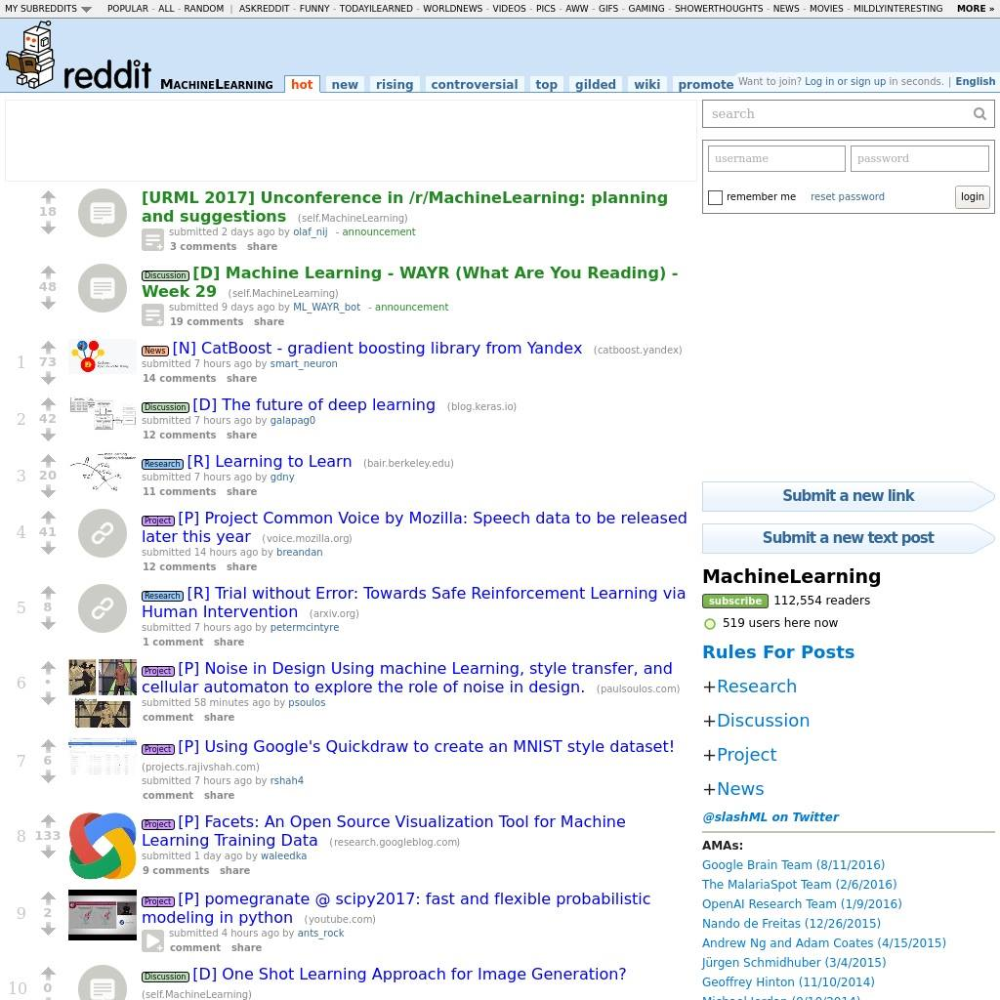
**이미지 캡션:** 이 이미지는 머신러닝 관련 주제를 다루는 레딧(Reddit) 웹사이트의 한 페이지를 보여줍니다. 페이지 상단에는 레딧 로고와 함께 "MACHINE LEARNING"이라는 제목이 있고, 그 아래에는 "hot", "new", "rising", "controversial", "top", "gilded", "wiki"와 같은 다양한 카테고리 탭이 있습니다. 오른쪽 상단에는 로그인 및 회원가입을 위한 입력 필드와 버튼이 있습니다. 페이지 중앙에는 다양한 머신러닝 관련 게시물 목록이 표시되며, 각 게시물은 제목, 작성자, 제출 시간, 댓글 수, 공유 수 등의 정보를 포함하고 있습니다. 게시물 제목 앞에는 "[URML 2017]", "[D]", "[N]", "[R]", "[P]"와 같은 태그가 붙어 있어 게시물의 유형(컨퍼런스, 토론, 뉴스, 연구, 프로젝트)을 나타냅니다. 일부 게시물에는 관련 이미지나 링크가 첨부되어 있습니다. 페이지 오른쪽에는 "MachineLearning" 서브레딧의 구독자 수와 현재 접속자 수가 표시되어 있으며, "Rules For Posts" 섹션에는 "+Research", "+Discussion", "+Project", "+News"와 같은 하위 섹션이 있습니다. 또한 "@slashML on Twitter" 링크와 "AMAS" 섹션에는 머신러닝 분야의 유명 인사들의 이름과 활동 날짜가 나열되어 있습니다. 전반적으로 이 페이지는 머신러닝 커뮤니티의 최신 정보와 토론을 공유하는 온라인 포럼의 모습을 보여줍니다., 제출 시간, 댓글 수, 공유 수 등의 정보를 포함하고 있습니다. 게시물 제목 앞에는 "[URML 2017]", "[D]", "[N]", "[R]", "[P]"와 같은 태그가 붙어 있어 게시물의 유형(컨퍼런스, 토론, 뉴스, 연구, 프로젝트)을 나타냅니다. 일부 게시물에는 관련 이미지나 링크가 첨부되어 있습니다. 페이지 오른쪽에는 "MachineLearning" 서브레딧의 구독자 수와 현재 접속자 수가 표시되어 있으며, "Rules For Posts" 섹션에는 "+Research", "+Discussion", "+Project", "+News"와 같은 하위 섹션이 있습니다. 또한 "@slashML on Twitter" 링크와 "AMAS" 섹션에는 머신러닝 분야의 유명 인사들의 이름과 활동 날짜가 나열되어 있습니다. 전반적으로 이 페이지는 머신러닝 커뮤니티의 최신 정보와 토론을 공유하는 온라인 포럼의 모습을 보여줍니다.

> #오늘의레딧 https://www.reddit.com/r/MachineLearning/ 따끈한 소식들입니다.  1. 깊은 학습의 미래 2. 배우기 배우기 3. Mozilla의 Project Common Voice : 올해 말 발표 될 음성 데이터 4. 실수없이 시험 사용 : 인간 개입을 통한 안전한 강화 학습 5. 디자인에서의 소음 기계 학습, 스타일 전송 및 셀룰러 오토 마톤을 사용하여 디자인에서 소음의 역할을 탐색합니다. 6. Google의 Quickdraw를 사용하여 MNIST 스타일 데이터 세트를 만드십시오! 7. 면 : 기계 학습 교육 데이터를위한 오픈 소스 시각화 도구 8. pomegranate @ scipy2017 : 빠르고 유연한 확률 론적 모델링 9. 이미지 생성을위한 One Shot Learning Approach? 10. 되돌릴 수있는 잔여 네트워크 : 활성화 저장하지 않고 역 전파 11. OpenAI : 강력한 애매 모범 사례 12. Facets Dive를 사용한 그래픽 혼란 행렬의 간단한 예 13. ImageNet Large Scale Visual Recognition Challenge 2017 (ILSVRC2017)에 대한 결과가 나왔습니다. 14. 역경에 직면하여 웃는 얼굴이 많이 있습니까? 인쇄 기반 스푸핑 공격 (CVPR workshop extended abstract) -TLDR : 웃는 얼굴로 &#39;등록&#39;하는 것은 좋지 않습니다. 15. CEC는 Lstm이 사라지는 그라디언트 문제를 어떻게 방지 할 수 있습니까? 16. 신경 회로망의 특성 17. 강화 학습 + 이론에 관한 그룹 18. 사전 설정된 음성 인식 모델 찾기 19. "유사한 문서"에서 감독 학습을위한 제안 - 도구?  1. https://blog.keras.io/the-future-of-deep-learning.html 2. http://bair.berkeley.edu/blog/2017/07/18/learning-to-learn/ 3. https://voice.mozilla.org/ 4. https://arxiv.org/pdf/1707.05173.pdf 5. http://paulsoulos.com/editorial/2017/07/18/noise-in-design.html 6. http://projects.rajivshah.com/blog/2017/07/14/QuickDraw/ 7. https://research.googleblog.com/2017/07/facets-open-source-visualization-tool.html 8. https://www.youtube.com/watch?v=kZPXbZT5stI 9. https://www.reddit.com/r/MachineLearning/comments/6o3l98/d_one_shot_learning_approach_for_image_generation/ 10. https://arxiv.org/abs/1707.04585 11. https://blog.openai.com/robust-adversarial-inputs/ 12. https://github.com/EtienneDesticourt/Graphical-Confusion-Matrix-for-MNIST-with-Facets 13. http://image-net.org/challenges/LSVRC/2017/results 14. https://www.reddit.com/r/MachineLearning/comments/6o0j67/r_smile_in_the_face_of_adversity_much_a_print/ 15. https://www.reddit.com/r/MachineLearning/comments/6o1w8u/dhow_can_cec_prevent_lstm_from_the_problem_of/ 16. https://dillonalaird.github.io/Peculiarities-of-Neural-Networks/ 17. https://www.reddit.com/r/MachineLearning/comments/6ntp7y/d_group_about_reinforcement_learning_theory/ 18. https://www.reddit.com/r/MachineLearning/comments/6nza49/p_looking_for_pretrained_speech_recognition_models/ 19. https://www.reddit.com/r/MachineLearning/comments/6nzoog/p_suggestions_for_supervised_learning_in_similar/

### 7월 20일 (목) 08:52 · 📷 사진 (1장)

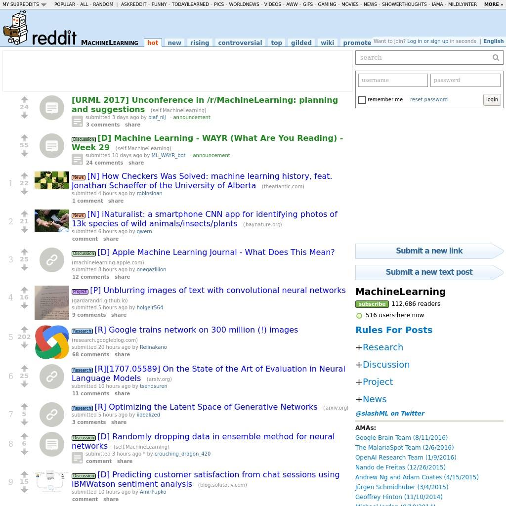
**이미지 캡션:** 이 이미지는 레딧의 머신러닝 서브레딧 페이지를 보여주며, 다양한 게시물과 관련 정보를 담고 있습니다. 페이지 상단에는 레딧 로고와 함께 "MACHINE LEARNING"이라는 제목이 보이고, 그 아래에는 "hot", "new", "rising", "controversial", "top", "gilded", "wiki"와 같은 탭들이 나열되어 있습니다. 오른쪽 상단에는 로그인 또는 회원가입을 위한 입력 필드와 버튼이 있습니다. 페이지 중앙에는 여러 게시물들이 시간순으로 정렬되어 있으며, 각 게시물은 제목, 작성자, 제출 시간, 댓글 수, 공유 버튼 등의 정보를 포함하고 있습니다. 게시물 제목들은 머신러닝 관련 주제들을 다루고 있으며, "[URML 2017] Unconference in /r/Machine Learning: planning and suggestions", "[D] Machine Learning - WAYR (What Are You Reading) - Week 29", "[N] How Checkers Was Solved: machine learning history, feat. Jonathan Schaeffer of the University of Alberta", "[N] iNaturalist: a smartphone CNN app for identifying photos of 13k species of wild animals/insects/plants", "[D] Apple Machine Learning Journal - What Does This Mean?", "[P] Unblurring images of text with convolutional neural networks", "[R] Google trains network on 300 million (!) images", "[R][1707.05589] On the State of the Art of Evaluation in Neural Language Models", "[R] Optimizing the Latent Space of Generative Networks", "[D] Randomly dropping data in ensemble method for neural networks", "[D] Predicting customer satisfaction from chat sessions using IBMWatson sentiment analysis" 등이 있습니다. 각 게시물 옆에는 업보트 및 다운보트 화살표와 함께 게시물의 인기도를 나타내는 숫자가 표시되어 있습니다. 페이지 오른쪽에는 "Submit a new link" 및 "Submit a new text post" 버튼, 서브레딧 구독 정보, "Rules For Posts", 그리고 "+Research", "+Discussion", "+Project", "+News"와 같은 카테고리 링크들이 보입니다. 또한, "@slashML on Twitter" 링크와 함께 과거 AMA(Ask Me Anything) 세션에 참여했던 유명 인사들의 목록이 날짜와 함께 나열되어 있습니다. 전반적으로 이 페이지는 머신러닝 커뮤니티의 최신 정보와 토론을 공유하는 온라인 포럼의 모습을 보여줍니다.자, 제출 시간, 댓글 수, 공유 버튼 등의 정보를 포함하고 있습니다. 게시물 제목들은 머신러닝 관련 주제들을 다루고 있으며, "[URML 2017] Unconference in /r/Machine Learning: planning and suggestions", "[D] Machine Learning - WAYR (What Are You Reading) - Week 29", "[N] How Checkers Was Solved: machine learning history, feat. Jonathan Schaeffer of the University of Alberta", "[N] iNaturalist: a smartphone CNN app for identifying photos of 13k species of wild animals/insects/plants", "[D] Apple Machine Learning Journal - What Does This Mean?", "[P] Unblurring images of text with convolutional neural networks", "[R] Google trains network on 300 million (!) images", "[R][1707.05589] On the State of the Art of Evaluation in Neural Language Models", "[R] Optimizing the Latent Space of Generative Networks", "[D] Randomly dropping data in ensemble method for neural networks", "[D] Predicting customer satisfaction from chat sessions using IBMWatson sentiment analysis" 등이 있습니다. 각 게시물 옆에는 업보트 및 다운보트 화살표와 함께 게시물의 인기도를 나타내는 숫자가 표시되어 있습니다. 페이지 오른쪽에는 "Submit a new link" 및 "Submit a new text post" 버튼, 서브레딧 구독 정보, "Rules For Posts", 그리고 "+Research", "+Discussion", "+Project", "+News"와 같은 카테고리 링크들이 보입니다. 또한, "@slashML on Twitter" 링크와 함께 과거 AMA(Ask Me Anything) 세션에 참여했던 유명 인사들의 목록이 날짜와 함께 나열되어 있습니다. 전반적으로 이 페이지는 머신러닝 커뮤니티의 최신 정보와 토론을 공유하는 온라인 포럼의 모습을 보여줍니다.

> #오늘의레딧 https://www.reddit.com/r/MachineLearning/ 래딧은 읽을 거리가 다양합니다.  1. iNaturalist : 13k 종의 야생 동물 / 곤충 / 식물 사진을 식별하는 스마트 폰 CNN 앱 2. Apple Machine Learning Journal - 이것은 무엇을 의미합니까? 3. 길쌈 신경 네트워크를 사용하여 텍스트의 이미지를 흐리게 처리하지 않음 4. Google은 3 억 개의 이미지 (!) 이미지를 네트워크에 전송합니다. 5. 생성 네트워크의 잠재 공간 최적화 6. 신경망을위한 앙상블 방법에서 무작위로 데이터를 버리는 것 7. IBMWatson 감정 분석을 사용하여 채팅 세션에서 고객 만족도 예측 8. 신경 진화 : 다른 종류의 깊은 학습 9. Sciblox에 대한 생각 - 새로운 파이썬 데이터 과학 패키지 10. BranchyNet : 딥 뉴럴 네트워크에서 조기 종료를 통한 빠른 추론 11. 불균형 데이터 세트의 Keras / Theano 이진 분류 12. 더미 (더미)에서 변형 된 자동 인코딩 프로그램 13. CatBoost - Yandex의 그라디언트 증폭 라이브러리 14. 캐서린 자말 | 기조 연설 : 윤리적 기계 학습 : 부당한 세계에서 공정한 모델 만들기 15. Tensorflow 심층 학습 및 강화 학습 라이브러리 16. 깊은 학습의 미래 17. 배우기 배우기 18. 발행 된 논문에 코드를 구현하는 데 도움을줍니다. 19. CNN (conv, relu, pool) CNN의 수용 영역을 어떻게 계산하나요? 20. 여러 카테고리 중에서 최대 가치를 찾는 방법은 무엇입니까?  1. https://baynature.org/article/identify-anything-anywhere-instantly-well-almost-newest-inaturalist-release/ 2. https://machinelearning.apple.com/?ref=producthunt 3. https://gardarandri.github.io/TextSharpener/ 4. https://research.googleblog.com/2017/07/revisiting-unreasonable-effectiveness.html 5. https://arxiv.org/abs/1707.05776 6. https://www.reddit.com/r/MachineLearning/comments/6ob82x/d_randomly_dropping_data_in_ensemble_method_for/ 7. https://blog.solutotlv.com/predicting-customer-satisfaction/?utm_source=reddit 8. https://www.oreilly.com/ideas/neuroevolution-a-different-kind-of-deep-learning 9. https://www.reddit.com/r/MachineLearning/comments/6o9cpf/p_thoughts_on_sciblox_new_python_data_science/ 10. https://www.reddit.com/r/MachineLearning/comments/6o71we/r_branchynet_fast_inference_via_early_exiting/ 11. https://www.reddit.com/r/MachineLearning/comments/6o99iq/p_kerastheano_binary_classification_of_unbalanced/ 12. https://xdutils.blogspot.de/2017/07/variational-autoencoders-for-dummies.html 13. https://catboost.yandex 14. https://www.youtube.com/watch?v=hDgXIUM3Rmw 15. http://polyaxon.com/ 16. https://blog.keras.io/the-future-of-deep-learning.html 17. http://bair.berkeley.edu/blog/2017/07/18/learning-to-learn/ 18. https://www.reddit.com/r/MachineLearning/comments/6o87xd/d_help_in_implementing_code_in_published_papers/ 19. https://www.reddit.com/r/MachineLearning/comments/6o6cr8/d_how_does_one_calculate_the_receptive_field_of_a/ 20. https://www.reddit.com/r/MachineLearning/comments/6o7xw4/discussion_how_to_find_max_value_choosing_from/

### 7월 20일 (목) 12:18 · happy birthday!

happy birthday!

### 7월 20일 (목) 12:18 · ↪ happy birthday!

*다른 프로필에 남긴 글*

happy birthday!

### 7월 21일 (금) 08:52 · 📷 사진 (4장)

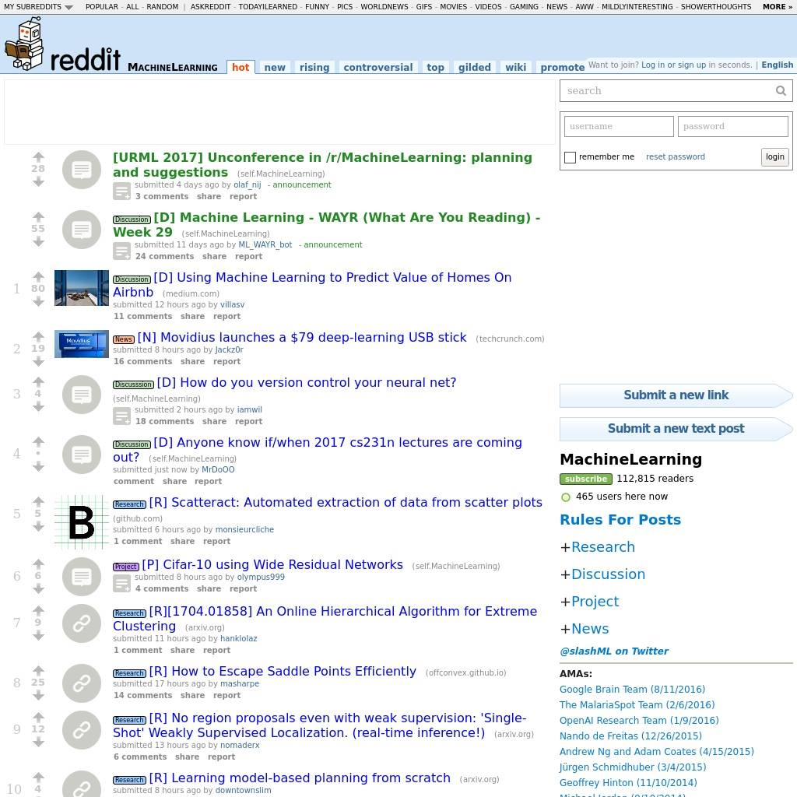
**이미지 캡션:** 이것은 Reddit의 MachineLearning 서브레딧 페이지로, 여러 게시물 목록이 표시됩니다. 페이지 상단에는 Reddit 로고와 함께 "MACHINE LEARNING"이라는 제목이 있고, 그 아래에는 "hot", "new", "rising", "controversial", "top", "gilded", "wiki"와 같은 탭이 있습니다. 오른쪽 상단에는 로그인 및 회원가입을 위한 입력란과 버튼이 있습니다. 메인 콘텐츠 영역에는 각 게시물이 제목, 제출자 정보, 댓글 수, 공유 링크 등을 포함하여 나열되어 있습니다. 게시물들은 주로 머신러닝 관련 주제를 다루고 있으며, "Unconference in /r/MachineLearning", "Machine Learning - WAYR (What Are You Reading)", "Using Machine Learning to Predict Value of Homes On Airbnb", "Movidius launches a $79 deep-learning USB stick", "How do you version control your neural net?", "Anyone know if/when 2017 cs231n lectures are coming out?", "Scatteract: Automated extraction of data from scatter plots", "Cifar-10 using Wide Residual Networks", "An Online Hierarchical Algorithm for Extreme Clustering", "How to Escape Saddle Points Efficiently", "No region proposals even with weak supervision: 'Single-Shot' Weakly Supervised Localization.", "Learning model-based planning from scratch" 등의 제목을 가지고 있습니다. 오른쪽 사이드바에는 "Submit a new link", "Submit a new text post" 버튼과 함께 "MachineLearning" 서브레딧의 구독자 수, 현재 접속자 수, 게시 규칙, 트위터 계정, 그리고 "AMAS" 섹션에 머신러닝 분야의 저명한 연구자 및 팀 목록이 표시됩니다. 전반적으로 기술 및 학술 커뮤니티의 정보 공유 및 토론이 이루어지는 온라인 포럼의 모습입니다.되어 있습니다. 게시물들은 주로 머신러닝 관련 주제를 다루고 있으며, "Unconference in /r/MachineLearning", "Machine Learning - WAYR (What Are You Reading)", "Using Machine Learning to Predict Value of Homes On Airbnb", "Movidius launches a $79 deep-learning USB stick", "How do you version control your neural net?", "Anyone know if/when 2017 cs231n lectures are coming out?", "Scatteract: Automated extraction of data from scatter plots", "Cifar-10 using Wide Residual Networks", "An Online Hierarchical Algorithm for Extreme Clustering", "How to Escape Saddle Points Efficiently", "No region proposals even with weak supervision: 'Single-Shot' Weakly Supervised Localization.", "Learning model-based planning from scratch" 등의 제목을 가지고 있습니다. 오른쪽 사이드바에는 "Submit a new link", "Submit a new text post" 버튼과 함께 "MachineLearning" 서브레딧의 구독자 수, 현재 접속자 수, 게시 규칙, 트위터 계정, 그리고 "AMAS" 섹션에 머신러닝 분야의 저명한 연구자 및 팀 목록이 표시됩니다. 전반적으로 기술 및 학술 커뮤니티의 정보 공유 및 토론이 이루어지는 온라인 포럼의 모습입니다.
 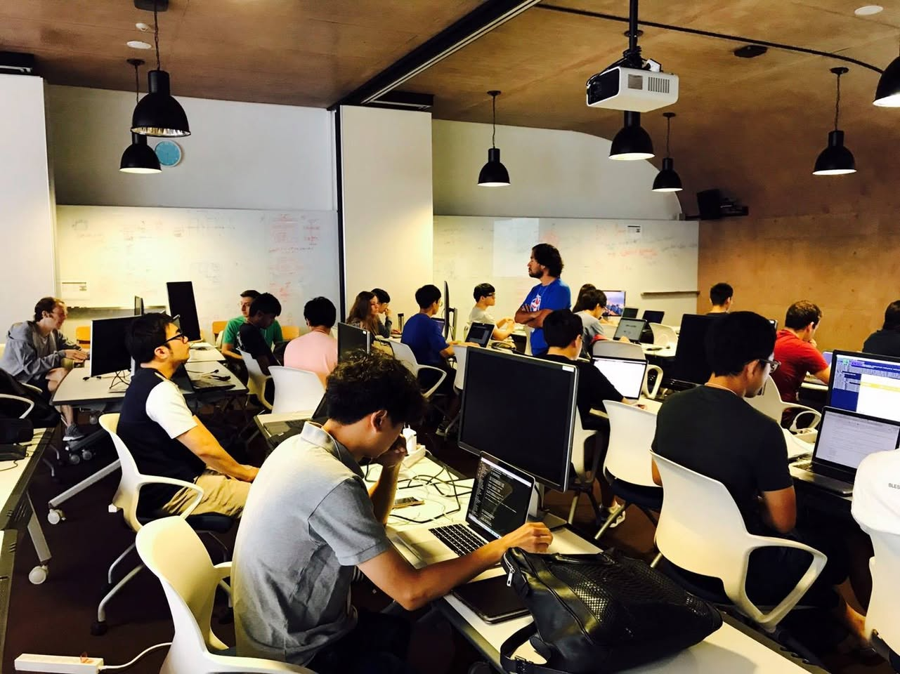
**이미지 캡션:** 이 사진은 강의실에서 컴퓨터를 사용하며 수업에 참여하고 있는 여러 명의 젊은 성인 남녀 수강생들과 한 명의 성인 남성 강사로 보이는 사람을 담고 있습니다. 수강생들은 대부분 20대 초중반으로 보이며, 각자 책상에 놓인 컴퓨터 모니터를 집중해서 바라보고 있습니다. 일부는 노트북을 사용하고 있으며, 코딩이나 프로그래밍과 관련된 작업을 하는 것으로 추정됩니다. 복장은 캐주얼하며, 티셔츠, 셔츠, 후드티 등 편안한 옷차림입니다. 표정은 대부분 진지하고 집중하는 모습입니다. 강사로 보이는 성인 남성은 파란색 티셔츠를 입고 팔짱을 낀 채 서서 수강생들을 바라보고 있으며, 강의를 하거나 지시를 내리는 듯한 모습입니다. 장소는 현대적인 강의실로, 흰색 벽에는 여러 개의 화이트보드가 설치되어 있고, 천장에는 검은색의 펜던트 조명과 프로젝터가 달려 있습니다. 책상들은 일렬로 배치되어 있으며, 각 책상에는 컴퓨터 모니터, 키보드, 마우스, 노트북 등이 놓여 있습니다. 전반적으로 학습 분위기가 느껴지며, IT 관련 교육이나 스터디 모임이 진행되는 상황으로 보입니다.입고 팔짱을 낀 채 서서 수강생들을 바라보고 있으며, 강의를 하거나 지시를 내리는 듯한 모습입니다. 장소는 현대적인 강의실로, 흰색 벽에는 여러 개의 화이트보드가 설치되어 있고, 천장에는 검은색의 펜던트 조명과 프로젝터가 달려 있습니다. 책상들은 일렬로 배치되어 있으며, 각 책상에는 컴퓨터 모니터, 키보드, 마우스, 노트북 등이 놓여 있습니다. 전반적으로 학습 분위기가 느껴지며, IT 관련 교육이나 스터디 모임이 진행되는 상황으로 보입니다.
 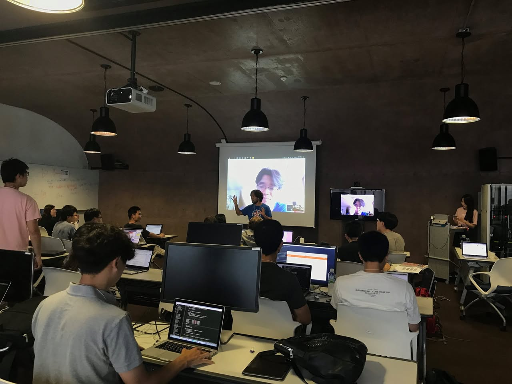
**이미지 캡션:** 이 사진은 강의실 또는 회의실에서 진행되는 교육 세션이나 발표를 보여줍니다. 중앙에는 성인 남성이 스크린에 비친 자신의 모습과 함께 열정적으로 발표하고 있으며, 그의 표정은 활기차고 손짓을 하며 설명하는 모습입니다. 스크린에는 또 다른 성인 남성의 모습이 화상 통화 형태로 함께 보입니다. 강의실에는 여러 명의 젊은 성인 남성들이 노트북과 컴퓨터 앞에 앉아 집중하고 있으며, 일부는 발표자를 바라보고 있습니다. 그들은 캐주얼한 복장을 하고 있으며, 대부분은 컴퓨터 화면에 몰두하고 있습니다. 배경에는 프로젝터, 조명, 그리고 벽에 붙은 화이트보드 또는 포스터가 보입니다. 전체적으로 학습과 협업이 이루어지는 현대적인 교육 환경의 분위기를 나타냅니다.명, 그리고 벽에 붙은 화이트보드 또는 포스터가 보입니다. 전체적으로 학습과 협업이 이루어지는 현대적인 교육 환경의 분위기를 나타냅니다.
 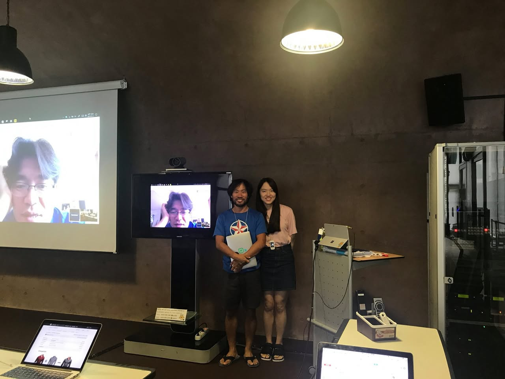
**이미지 캡션:** 이 사진은 회의실 또는 강의실로 보이는 장소에서 촬영되었으며, 둥근 천장 조명과 갈색 벽이 특징입니다. 중앙에는 대형 스크린이 있고, 그 앞에 텔레비전 모니터가 설치되어 있습니다. 모니터에는 화상 회의 중인 것으로 보이는 한 성인 남성이 비춰지고 있으며, 그는 안경을 쓰고 손으로 턱을 괴고 있습니다. 모니터 옆에는 한 성인 남성과 한 성인 여성이 서 있습니다. 남성은 파란색 티셔츠와 반바지, 샌들을 착용하고 있으며, 여성은 분홍색 상의와 데님 스커트, 샌들을 착용하고 있습니다. 두 사람 모두 노트북을 들고 있거나 근처에 두고 있으며, 밝고 긍정적인 표정을 짓고 있습니다. 배경에는 서버 랙으로 보이는 장비와 이동식 스탠드, 그리고 노트북이 놓인 테이블이 보입니다. 전반적으로 발표 또는 회의가 진행 중인 상황으로 보이며, 온라인과 오프라인 참여자가 함께하는 모습입니다.거나 근처에 두고 있으며, 밝고 긍정적인 표정을 짓고 있습니다. 배경에는 서버 랙으로 보이는 장비와 이동식 스탠드, 그리고 노트북이 놓인 테이블이 보입니다. 전반적으로 발표 또는 회의가 진행 중인 상황으로 보이며, 온라인과 오프라인 참여자가 함께하는 모습입니다.

> #오늘의레딧 https://www.reddit.com/r/MachineLearning/ 오늘도 새소식이 많군요.  1. Movidius, 79 달러짜리 학습용 USB 스틱 출시 2. 2017 년 cs231n 강의가 나오면 누구나 알 수 있습니까? 3. Scatteract : 분산 형 플롯에서 자동으로 데이터 추출 4. 넓은 잔여 네트워크를 사용하는 Cifar-10 5. 안장 점수를 효율적으로 없애는 방법 6. 약한 감독하에도 지역 제안이 없음 : &#39;단일 샷&#39;약식 감독 현지화. (실시간 추론!) 7. 모델 기반 계획을 처음부터 학습 8. PyTorch의 Siamese Networks와의 얼굴 유사도 9. Checkers가 어떻게 풀 렸는지 : machine learning history, feat. 앨버타 대학교의 Jonathan Schaeffer 10. 어떻게 비디오를 효율적으로 다운로드하고 처리 할 수 ​​있습니까? 11. Hassabis, Kumaran, Summerfield 및 Botvinick (x-post)의 신경 과학 영감 인공 지능 12. iNaturalist : 13k 종의 야생 동물 / 곤충 / 식물 사진을 식별하는 스마트 폰 CNN 앱 13. 자기 구성 분류 알고리즘 14. 주기적인 PSGAN (Spatial Generative Adversarial Networks) 15. 모든 옷을 입고 아무데도 갈 수 없습니다 ... 15-20 숫자 기능을 분류하는 최첨단 기술은 무엇입니까? 16. 자동화 된 기계 학습을위한 확률 론적 매트릭스 인수 분해 17. 길쌈 신경 네트워크를 사용하여 텍스트의 이미지를 흐리게 처리하지 않음 18. 심층 학습 아키텍처의 시각적으로 호소력있는 인물의 예를 찾고 있습니다. 19. Tensorflow LSTM 모델이 한 핫 코드 벡터에서 시계열 패턴을 예측할 수없는 이유는 무엇입니까?  1. https://techcrunch.com/2017/07/20/movidius-launches-a-79-deep-learning-usb-stick/ 2. https://www.reddit.com/r/MachineLearning/comments/6ok12v/d_anyone_know_ifwhen_2017_cs231n_lectures_are/ 3. https://github.com/bloomberg/scatteract 4. https://www.reddit.com/r/MachineLearning/comments/6oh1cn/p_cifar10_using_wide_residual_networks/ 5. http://offconvex.github.io/2017/07/19/saddle-efficiency/ 6. https://arxiv.org/abs/1707.06180 7. https://arxiv.org/abs/1707.06170 8. https://hackernoon.com/facial-similarity-with-siamese-networks-in-pytorch-9642aa9db2f7 9. https://www.theatlantic.com/technology/archive/2017/07/marion-tinsley-checkers/534111/ 10. https://www.reddit.com/r/MachineLearning/comments/6oh6qf/d_how_the_hell_can_i_download_and_process_video/ 11. https://www.reddit.comhttps://www.reddit.com/r/compneuroscience/comments/6odibt/d_neuroscienceinspired_artificial_intelligence_by/ 12. https://baynature.org/article/identify-anything-anywhere-instantly-well-almost-newest-inaturalist-release/ 13. https://github.com/CarsonScott/Online-Category-Learning 14. https://github.com/ubergmann/psgan 15. https://www.reddit.com/r/MachineLearning/comments/6oh682/d_all_dressed_up_and_nowhere_to_go_what_is_the/ 16. https://arxiv.org/abs/1705.05355 17. https://gardarandri.github.io/TextSharpener/ 18. https://www.reddit.com/r/MachineLearning/comments/6odjo0/d_looking_for_examples_of_visually_appealing/ 19. https://www.reddit.com/r/MachineLearning/comments/6oftmu/d_why_is_my_tensorflow_lstm_model_not_able_to/

### 7월 22일 (토) 08:52 · 📷 사진 (1장)

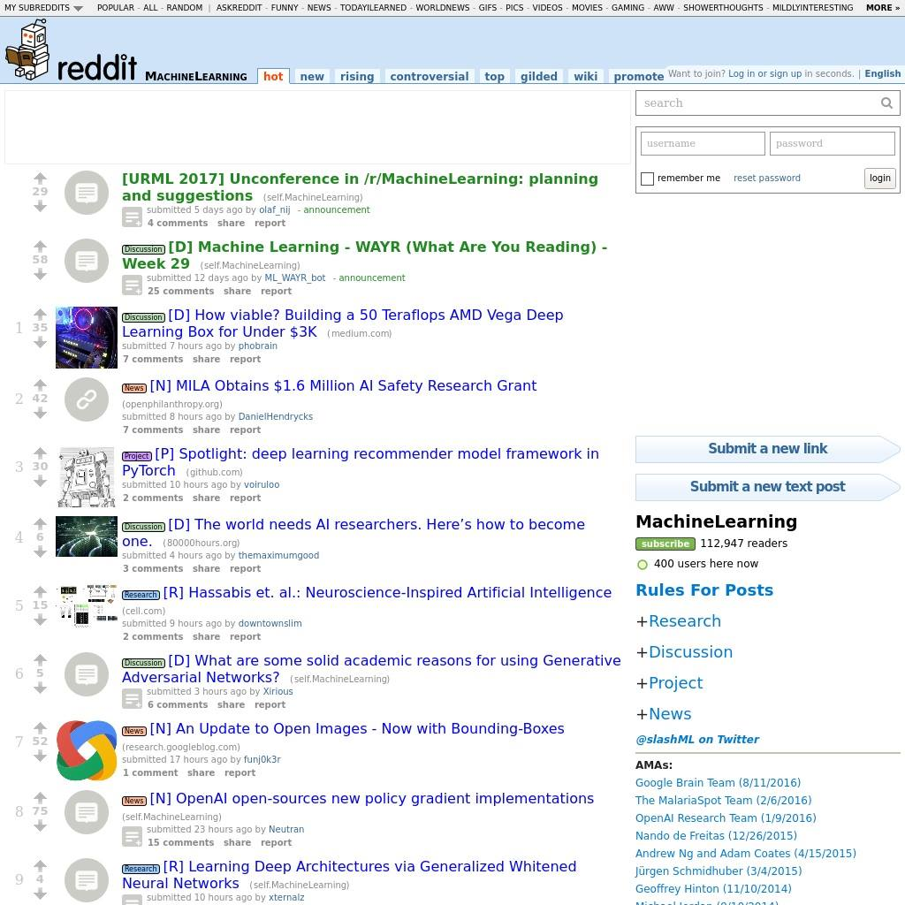
**이미지 캡션:** 이것은 Reddit의 Machine Learning 서브레딧 페이지로, 다양한 게시물 목록이 표시됩니다. 페이지 상단에는 Reddit 로고와 함께 "Machine Learning"이라는 제목이 있고, 그 아래에는 "hot", "new", "rising", "controversial", "top", "gilded", "wiki"와 같은 탭이 있습니다. 오른쪽 상단에는 로그인 또는 가입을 위한 입력 필드와 버튼이 있습니다. 메인 콘텐츠 영역에는 여러 게시물이 나열되어 있으며, 각 게시물에는 제목, 작성자, 제출 시간, 댓글 수, 그리고 관련 링크나 내용에 대한 간략한 설명이 포함되어 있습니다. 예를 들어, "[URML 2017] Unconference in /r/Machine Learning: planning and suggestions"라는 제목의 게시물은 5일 전에 제출되었고 4개의 댓글이 있습니다. 다른 게시물로는 "Machine Learning - WAYR (What Are You Reading) - Week 29", "How viable? Building a 50 Teraflops AMD Vega Deep Learning Box for Under $3K", "MILA Obtains $1.6 Million AI Safety Research Grant", "Spotlight: deep learning recommender model framework in PyTorch", "The world needs AI researchers. Here's how to become one.", "Hassabis et. al.: Neuroscience-Inspired Artificial Intelligence", "What are some solid academic reasons for using Generative Adversarial Networks?", "An Update to Open Images - Now with Bounding-Boxes", "OpenAI open-sources new policy gradient implementations", 그리고 "Learning Deep Architectures via Generalized Whitened Neural Networks" 등이 있습니다. 각 게시물 옆에는 게시물의 주제를 나타내는 아이콘이나 이미지가 있습니다. 오른쪽 사이드바에는 "Submit a new link" 및 "Submit a new text post" 버튼과 함께 "MachineLearning" 서브레딧에 대한 구독 정보, "Rules For Posts" 섹션, 그리고 "AMAS" 목록이 표시됩니다. 전반적으로 이 페이지는 머신러닝 커뮤니티의 최신 정보와 토론을 보여주는 온라인 포럼의 스크린샷입니다.시간, 댓글 수, 그리고 관련 링크나 내용에 대한 간략한 설명이 포함되어 있습니다. 예를 들어, "[URML 2017] Unconference in /r/Machine Learning: planning and suggestions"라는 제목의 게시물은 5일 전에 제출되었고 4개의 댓글이 있습니다. 다른 게시물로는 "Machine Learning - WAYR (What Are You Reading) - Week 29", "How viable? Building a 50 Teraflops AMD Vega Deep Learning Box for Under $3K", "MILA Obtains $1.6 Million AI Safety Research Grant", "Spotlight: deep learning recommender model framework in PyTorch", "The world needs AI researchers. Here's how to become one.", "Hassabis et. al.: Neuroscience-Inspired Artificial Intelligence", "What are some solid academic reasons for using Generative Adversarial Networks?", "An Update to Open Images - Now with Bounding-Boxes", "OpenAI open-sources new policy gradient implementations", 그리고 "Learning Deep Architectures via Generalized Whitened Neural Networks" 등이 있습니다. 각 게시물 옆에는 게시물의 주제를 나타내는 아이콘이나 이미지가 있습니다. 오른쪽 사이드바에는 "Submit a new link" 및 "Submit a new text post" 버튼과 함께 "MachineLearning" 서브레딧에 대한 구독 정보, "Rules For Posts" 섹션, 그리고 "AMAS" 목록이 표시됩니다. 전반적으로 이 페이지는 머신러닝 커뮤니티의 최신 정보와 토론을 보여주는 온라인 포럼의 스크린샷입니다.

> #오늘의레딧 https://www.reddit.com/r/MachineLearning/ 재미난 이야기들이 많습니다  1. MILA, AI 안전 연구 보조금 160 ​​만 달러 확보 2. 스포트라이트 : PyTorch의 깊은 학습 추천자 모델 프레임 워크 3. AI 연구자가 필요합니다. 다음은 하나가되는 방법입니다. 4. Hassabis et. al .: 신경 과학 - 영감 인공 지능 5. Generic Adversarial Networks 사용에 대한 학문적 이유는 무엇입니까? 6. 이미지를 여는 업데이트 - 이제는 경계 상자가 있음 7. OpenAI는 새로운 정책 그라디언트 구현을 오픈 소스로 제공합니다. 8. 일반화 된 화이트닝 된 신경 네트워크를 통한 심층 아키텍처 학습 9. CNN을위한 네트워크 구조 시각화 기 (TensorFlow의 확장 / atural 컨볼 루션 및 SAME / VALID 패딩 모드 포함) 10. 보조 ELBO를 얻는 방법? 11. 기계 학습, 딥 학습의 인기 12. 블록 체인 및 기계 학습 13. 기계 학습의 버전 관리 : Git vs. IPython / Jupiter vs. DVC 14. 2017 년 cs231n 강의가 나오면 누구나 알 수 있습니까? 15. Tensorflow를위한 심층적 인 학습 실험 플랫폼을 종결 16. Airbnb에서 가정 학습의 가치를 예측하는 기계 학습 사용 17. 호른 절 마이닝에 GRAKN.AI 사용 18. 딥 (Deep) 레이어 집계 19. Movidius, 79 달러짜리 학습용 USB 스틱 출시 20. Scatteract : 분산 형 플롯에서 자동으로 데이터 추출  1. http://www.openphilanthropy.org/focus/global-catastrophic-risks/potential-risks-advanced-artificial-intelligence/montreal-institute-learning-algorithms-ai-safety-research 2. https://github.com/maciejkula/spotlight 3. https://80000hours.org/2017/07/podcast-the-world-needs-ai-researchers-heres-how-to-become-one/ 4. http://www.cell.com/neuron/fulltext/S0896-6273\(17\)30509-3?utm_content=buffer1aad4&utm_medium=social&utm_source=twitter.com&utm_campaign=buffer 5. https://www.reddit.com/r/MachineLearning/comments/6oqk3z/d_what_are_some_solid_academic_reasons_for_using/ 6. https://research.googleblog.com/2017/07/an-update-to-open-images-now-with.html 7. https://www.reddit.com/r/MachineLearning/comments/6okfyj/n_openai_opensources_new_policy_gradient/ 8. https://www.reddit.com/r/MachineLearning/comments/6onyrk/r_learning_deep_architectures_via_generalized/ 9. http://rdinse.github.io/convnet-visualizer/convnet-visualizer.html#27~0,27,3,8,1,1,1~0,27,3,4,1,1,1~0,27,3,2,1,1,1~0,27,3,1,1,1,1 10. https://www.reddit.com/r/MachineLearning/comments/6oozh8/d_how_to_derive_the_auxiliary_elbo/ 11. https://www.reddit.com/r/MachineLearning/comments/6ons8j/d_popularity_of_machine_learning_deep_learning/ 12. https://www.reddit.com/r/MachineLearning/comments/6onfgl/d_blockchain_and_machine_learning/ 13. https://medium.com/towards-data-science/how-to-version-control-your-machine-learning-task-cad74dce44c4 14. https://www.reddit.com/r/MachineLearning/comments/6ok12v/d_anyone_know_ifwhen_2017_cs231n_lectures_are/ 15. https://github.com/polyaxon/polyaxon/ 16. https://medium.com/airbnb-engineering/using-machine-learning-to-predict-value-of-homes-on-airbnb-9272d3d4739d 17. https://blog.grakn.ai/using-grakn-ai-to-detect-patterns-in-credit-fraud-data-253d58ad4c6c 18. https://arxiv.org/abs/1707.06484 19. https://techcrunch.com/2017/07/20/movidius-launches-a-79-deep-learning-usb-stick/ 20. https://github.com/bloomberg/scatteract

### 7월 23일 (일) 08:52 · 📷 사진 (1장)

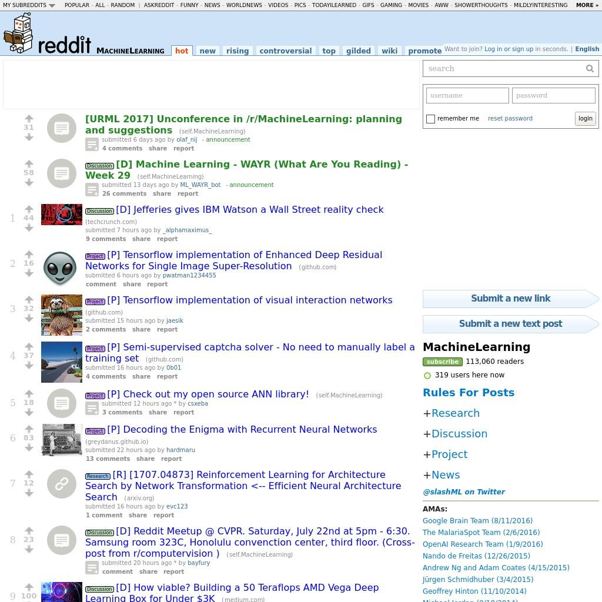
**이미지 캡션:** 이 이미지는 레딧(Reddit) 웹사이트의 머신러닝(Machine Learning) 서브레딧 페이지를 보여줍니다. 페이지 상단에는 레딧 로고와 함께 "MY SUBREDDITS", "POPULAR", "ALL", "RANDOM", "ASKREDDIT", "FUNNY", "NEWS", "WORLDNEWS", "VIDEOS", "PICS", "TODAYILEARNED", "GIFS", "GAMING", "MOVIES", "AWW", "SHOWERTHOUGHTS", "MILDLYINTERESTING" 등의 메뉴가 보입니다. 그 아래에는 "reddit" 로고와 함께 "MACHINE LEARNING"이라는 제목이 있고, "hot", "new", "rising", "controversial", "top", "gilded", "wiki"와 같은 탭들이 있습니다. 오른쪽 상단에는 "Want to join? Log in or sign up in seconds."라는 문구와 함께 로그인 및 회원가입을 할 수 있는 입력란과 버튼이 있습니다. 페이지 중앙에는 머신러닝 관련 게시물 목록이 나열되어 있습니다. 각 게시물은 제목, 작성자 정보, 제출 시간, 댓글 수, 공유 링크 등으로 구성되어 있습니다. 게시물 제목들은 "[URML 2017] Unconference in /r/Machine Learning: planning and suggestions", "[D] Machine Learning - WAYR (What Are You Reading) - Week 29", "[D] Jefferies gives IBM Watson a Wall Street reality check", "[P] Tensorflow implementation of Enhanced Deep Residual Networks for Single Image Super-Resolution", "[P] Tensorflow implementation of visual interaction networks", "[P] Semi-supervised captcha solver - No need to manually label a training set", "[P] Check out my open source ANN library!", "[P] Decoding the Enigma with Recurrent Neural Networks", "[R] [1707.04873] Reinforcement Learning for Architecture Search by Network Transformation <-- Efficient Neural Architecture Search", "[D] Reddit Meetup @ CVPR. Saturday, July 22nd at 5pm - 6:30. Samsung room 323C, Honolulu convenction center, third floor. (Cross-post from r/computervision)", "[D] How viable? Building a 50 Teraflops AMD Vega Deep Learning Box for Under $3K" 등입니다. 각 게시물 옆에는 추천/반대 화살표와 함께 숫자가 표시되어 있습니다. 오른쪽 사이드바에는 "Submit a new link", "Submit a new text post" 버튼이 있고, "MachineLearning" 서브레딧에 대한 구독 정보와 현재 접속자 수가 표시됩니다. 그 아래에는 "Rules For Posts"라는 제목과 함께 "+Research", "+Discussion", "+Project", "+News"와 같은 메뉴가 있습니다. 또한, "@slashML on Twitter"와입니다. 그 아래에는 "reddit" 로고와 함께 "MACHINE LEARNING"이라는 제목이 있고, "hot", "new", "rising", "controversial", "top", "gilded", "wiki"와 같은 탭들이 있습니다. 오른쪽 상단에는 "Want to join? Log in or sign up in seconds."라는 문구와 함께 로그인 및 회원가입을 할 수 있는 입력란과 버튼이 있습니다. 페이지 중앙에는 머신러닝 관련 게시물 목록이 나열되어 있습니다. 각 게시물은 제목, 작성자 정보, 제출 시간, 댓글 수, 공유 링크 등으로 구성되어 있습니다. 게시물 제목들은 "[URML 2017] Unconference in /r/Machine Learning: planning and suggestions", "[D] Machine Learning - WAYR (What Are You Reading) - Week 29", "[D] Jefferies gives IBM Watson a Wall Street reality check", "[P] Tensorflow implementation of Enhanced Deep Residual Networks for Single Image Super-Resolution", "[P] Tensorflow implementation of visual interaction networks", "[P] Semi-supervised captcha solver - No need to manually label a training set", "[P] Check out my open source ANN library!", "[P] Decoding the Enigma with Recurrent Neural Networks", "[R] [1707.04873] Reinforcement Learning for Architecture Search by Network Transformation <-- Efficient Neural Architecture Search", "[D] Reddit Meetup @ CVPR. Saturday, July 22nd at 5pm - 6:30. Samsung room 323C, Honolulu convenction center, third floor. (Cross-post from r/computervision)", "[D] How viable? Building a 50 Teraflops AMD Vega Deep Learning Box for Under $3K" 등입니다. 각 게시물 옆에는 추천/반대 화살표와 함께 숫자가 표시되어 있습니다. 오른쪽 사이드바에는 "Submit a new link", "Submit a new text post" 버튼이 있고, "MachineLearning" 서브레딧에 대한 구독 정보와 현재 접속자 수가 표시됩니다. 그 아래에는 "Rules For Posts"라는 제목과 함께 "+Research", "+Discussion", "+Project", "+News"와 같은 메뉴가 있습니다. 또한, "@slashML on Twitter"와

> #오늘의레딧 https://www.reddit.com/r/MachineLearning/ 아침부터 다양한 소식이 많네요.  1. 단일 이미지 수퍼 해상도를위한 향상된 딥 잔여 네트워크의 Tensorflow 구현 2. 시각적 상호 작용 네트워크의 Tensorflow 구현 3. 세미 감독 captcha solver - 수동으로 교육 세트에 레이블을 지정할 필요가 없음 4. 내 오픈 소스 ANN 라이브러리를 확인하십시오! 5. 반복적 신경 회로망을 이용한 수수께끼 해독 6. Reddit Meetup @ CVPR. 7 월 22 일 토요일 오후 5시 - 6시 30 분. 삼성 룸 323C, 호놀룰루 컨벤션 센터, 3 층. (r / computervision의 교차 게시) 7. 얼마나 실용적입니까? $ 3K 미만의 50 테라 플롭스 AMD Vega 딥 러닝 박스 구축 8. AI 연구자가 필요합니다. 다음은 하나가되는 방법입니다. 9. MILA, AI 안전 연구 보조금 160 ​​만 달러 확보 10. 스포트라이트 : PyTorch의 깊은 학습 추천자 모델 프레임 워크 11. Hassabis et. al .: 신경 과학 - 영감 인공 지능 12. Generic Adversarial Networks 사용에 대한 학문적 이유는 무엇입니까? 13. 단일 세포 RNA 시퀀싱을위한 VAMF (Varying-Censoring Aware Matrix Factorization) PCA와 같은 차원 축소 방법을 소개하지만 누락 된 데이터로 인해 가변성이 유도됩니다. 14. 이미지를 여는 업데이트 - 이제는 경계 상자가 있음 15. 일반화 된 화이트닝 된 신경 네트워크를 통한 심층 아키텍처 학습 16. CNN을위한 네트워크 구조 시각화 기 (TensorFlow의 확장 / atural 컨볼 루션 및 SAME / VALID 패딩 모드 포함) 17. 보조 ELBO를 얻는 방법? 18. OpenAI는 새로운 정책 그라디언트 구현을 오픈 소스로 제공합니다. 19. Tensorflow를위한 심층적 인 학습 실험 플랫폼을 종결 20. 기계 학습, 딥 학습의 인기  1. https://github.com/jmiller656/EDSR-Tensorflow 2. https://github.com/jaesik817/visual-interaction-networks_tensorflow 3. https://github.com/rickyhan/SimGAN-Captcha 4. https://www.reddit.com/r/MachineLearning/comments/6ouef8/p_check_out_my_open_source_ann_library/ 5. https://greydanus.github.io/2017/01/07/enigma-rnn/ 6. https://www.reddit.com/r/MachineLearning/comments/6osp94/d_reddit_meetup_cvpr_saturday_july_22nd_at_5pm/ 7. https://medium.com/intuitionmachine/building-a-50-teraflops-amd-vega-deep-learning-box-for-under-3k-ebdd60d4a93c 8. https://80000hours.org/2017/07/podcast-the-world-needs-ai-researchers-heres-how-to-become-one/ 9. http://www.openphilanthropy.org/focus/global-catastrophic-risks/potential-risks-advanced-artificial-intelligence/montreal-institute-learning-algorithms-ai-safety-research 10. https://github.com/maciejkula/spotlight 11. http://www.cell.com/neuron/fulltext/S0896-6273\(17\)30509-3?utm_content=buffer1aad4&utm_medium=social&utm_source=twitter.com&utm_campaign=buffer 12. https://www.reddit.com/r/MachineLearning/comments/6oqk3z/d_what_are_some_solid_academic_reasons_for_using/ 13. http://www.biorxiv.org/content/early/2017/07/21/166736 14. https://research.googleblog.com/2017/07/an-update-to-open-images-now-with.html 15. https://www.reddit.com/r/MachineLearning/comments/6onyrk/r_learning_deep_architectures_via_generalized/ 16. http://rdinse.github.io/convnet-visualizer/convnet-visualizer.html#27~0,27,3,8,1,1,1~0,27,3,4,1,1,1~0,27,3,2,1,1,1~0,27,3,1,1,1,1 17. https://www.reddit.com/r/MachineLearning/comments/6oozh8/d_how_to_derive_the_auxiliary_elbo/ 18. https://www.reddit.com/r/MachineLearning/comments/6okfyj/n_openai_opensources_new_policy_gradient/ 19. https://github.com/polyaxon/polyaxon/ 20. https://www.reddit.com/r/MachineLearning/comments/6ons8j/d_popularity_of_machine_learning_deep_learning/

### 7월 24일 (월) 08:52 · 📷 사진 (1장)

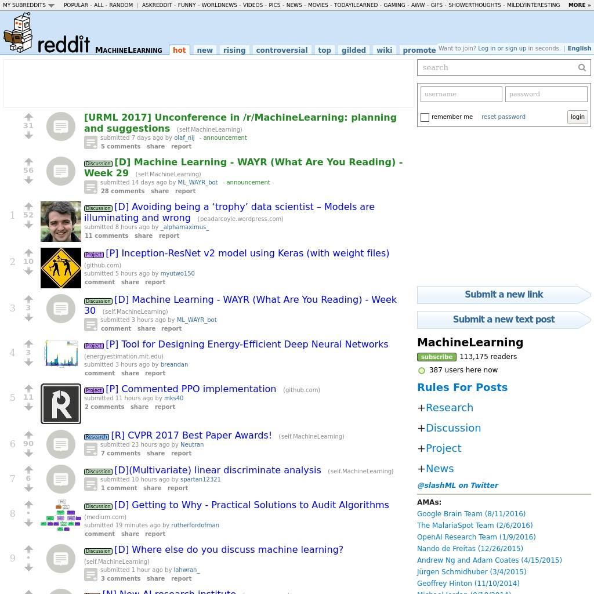
**이미지 캡션:** 이 이미지는 레딧의 머신러닝 서브레딧 페이지를 보여줍니다. 페이지 상단에는 레딧 로고와 함께 "MACHINE LEARNING"이라는 제목이 있고, 그 아래에는 "hot", "new", "rising", "controversial", "top", "gilded", "wiki"와 같은 탭들이 있습니다. 오른쪽 상단에는 로그인 및 회원가입을 위한 입력 필드와 버튼이 있습니다. 페이지 중앙에는 머신러닝 관련 게시물 목록이 표시되며, 각 게시물은 제목, 작성자, 제출 시간, 댓글 수 등의 정보를 포함합니다. 게시물 제목 옆에는 "Discussion", "Project", "Research"와 같은 태그가 붙어 있습니다. 게시물 목록 오른쪽에는 "Submit a new link", "Submit a new text post" 버튼과 함께 "MachineLearning" 서브레딧에 대한 구독 정보, 사용자 수, 그리고 게시물 규칙 목록이 있습니다. 또한, "@slashML on Twitter" 링크와 "AMAS" 섹션에는 과거 AMA(Ask Me Anything) 세션 목록이 날짜와 함께 표시되어 있습니다. 전반적으로 기술 관련 커뮤니티의 정보 공유 및 토론이 이루어지는 온라인 플랫폼의 모습을 보여줍니다.목 옆에는 "Discussion", "Project", "Research"와 같은 태그가 붙어 있습니다. 게시물 목록 오른쪽에는 "Submit a new link", "Submit a new text post" 버튼과 함께 "MachineLearning" 서브레딧에 대한 구독 정보, 사용자 수, 그리고 게시물 규칙 목록이 있습니다. 또한, "@slashML on Twitter" 링크와 "AMAS" 섹션에는 과거 AMA(Ask Me Anything) 세션 목록이 날짜와 함께 표시되어 있습니다. 전반적으로 기술 관련 커뮤니티의 정보 공유 및 토론이 이루어지는 온라인 플랫폼의 모습을 보여줍니다.

> #오늘의레딧 https://www.reddit.com/r/MachineLearning/ 아침부터 다양한 소식이 많네요.  1. 개념 - Keras를 사용하는 ResNet v2 모델 (가중치 파일 포함) 2. 기계 학습 - WAYR (What Are You Reading) - 30 주차 3. 에너지 효율적인 딥 뉴럴 네트워크 설계 도구 4. Commented PPO implementation 5. CVPR 2017 최우수 논문상! 6. (다 변수) 선형 판별 분석 7. 이유 - 감사 알고리즘에 대한 실제 솔루션 8. 그 외에 기계 학습에 관해 논의하는 곳은 어디입니까? 9. 신 AI 연구소 10. RBM의 역설은 가중치가 대칭 임에도 불구하고 추론과 대칭에 따라 비대칭 성 희박성을 배우므로 기억력을 감소시킵니다. 바이어스를 사용하지 않고 이것을 해결하기 위해 어떻게 표준 함수를 설계 할 수 있습니까? 11. 기계 학습과 인공 지능 사이에 차이점이 있습니까? 12. Jefferies, IBM Watson에게 월스트리트 현실 확인 제공 13. 단일 이미지 수퍼 해상도를위한 향상된 딥 잔여 네트워크의 Tensorflow 구현 14. 내 오픈 소스 ANN 라이브러리를 확인하십시오! 15. 시각적 상호 작용 네트워크의 Tensorflow 구현 16. 세미 감독 captcha solver - 수동으로 교육 세트에 레이블을 지정할 필요가 없음 17. 반복적 신경 회로망을 이용한 수수께끼 해독 18. Reddit Meetup @ CVPR. 7 월 22 일 토요일 오후 5시 - 6시 30 분. 삼성 룸 323C, 호놀룰루 컨벤션 센터, 3 층. (r / computervision의 교차 게시) 19. 얼마나 실용적입니까? $ 3K 미만의 50 테라 플롭스 AMD Vega 딥 러닝 박스 구축 20. AI 연구자가 필요합니다. 다음은 하나가되는 방법입니다.  1. https://github.com/myutwo150/keras-inception-resnet-v2 2. https://www.reddit.com/r/MachineLearning/comments/6p3ha7/d_machine_learning_wayr_what_are_you_reading_week/ 3. https://energyestimation.mit.edu/ 4. https://github.com/reinforceio/tensorforce/blob/master/tensorforce/models/ppo_model.py 5. https://www.reddit.com/r/MachineLearning/comments/6oyg1w/r_cvpr_2017_best_paper_awards/ 6. https://www.reddit.com/r/MachineLearning/comments/6p1dg1/dmultivariate_linear_discriminate_analysis/ 7. https://medium.com/@alexRutherford/getting-to-why-45d1521c6834 8. https://www.reddit.com/r/MachineLearning/comments/6p4ff5/d_where_else_do_you_discuss_machine_learning/ 9. https://occam.com.ua/ 10. https://www.reddit.com/r/MachineLearning/comments/6p32ik/d_a_paradox_of_rbm_is_despite_weights_being/ 11. https://www.reddit.com/r/MachineLearning/comments/6p22qt/d_is_there_a_difference_between_machine_learning/ 12. https://techcrunch.com/2017/07/13/jefferies-gives-ibm-watson-a-wall-street-reality-check/ 13. https://github.com/jmiller656/EDSR-Tensorflow 14. https://www.reddit.com/r/MachineLearning/comments/6ouef8/p_check_out_my_open_source_ann_library/ 15. https://github.com/jaesik817/visual-interaction-networks_tensorflow 16. https://github.com/rickyhan/SimGAN-Captcha 17. https://greydanus.github.io/2017/01/07/enigma-rnn/ 18. https://www.reddit.com/r/MachineLearning/comments/6osp94/d_reddit_meetup_cvpr_saturday_july_22nd_at_5pm/ 19. https://medium.com/intuitionmachine/building-a-50-teraflops-amd-vega-deep-learning-box-for-under-3k-ebdd60d4a93c 20. https://80000hours.org/2017/07/podcast-the-world-needs-ai-researchers-heres-how-to-become-one/

### 7월 25일 (화) 08:52 · 📷 사진 (1장)

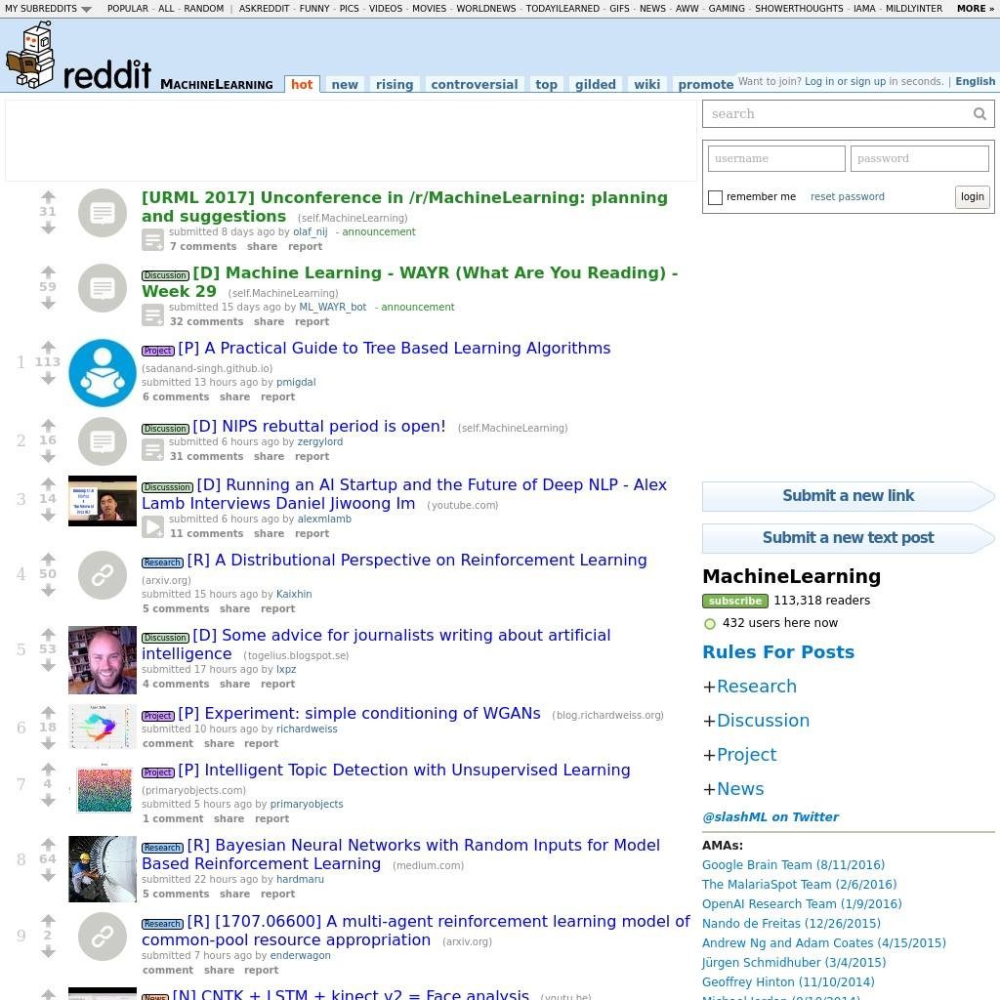
**이미지 캡션:** 이 이미지는 머신러닝 관련 주제를 다루는 레딧 커뮤니티인 r/MachineLearning의 웹사이트 화면을 보여줍니다. 화면 왼쪽에는 최신 게시물 목록이 있으며, 각 게시물은 제목, 작성자, 게시 시간, 댓글 수, 공유 수 등의 정보를 포함하고 있습니다. 게시물 제목은 "[URML 2017] Unconference in /r/Machine Learning: planning and suggestions", "[D] Machine Learning - WAYR (What Are You Reading) - Week 29", "[P] A Practical Guide to Tree Based Learning Algorithms", "[D] NIPS rebuttal period is open!", "[D] Running an AI Startup and the Future of Deep NLP - Alex Lamb Interviews Daniel Jiwoong Im", "[R] A Distributional Perspective on Reinforcement Learning", "[D] Some advice for journalists writing about artificial intelligence", "[P] Experiment: simple conditioning of WGANS", "[P] Intelligent Topic Detection with Unsupervised Learning", "[R] Bayesian Neural Networks with Random Inputs for Model Based Reinforcement Learning", "[R] [1707.06600] A multi-agent reinforcement learning model of common-pool resource appropriation" 등입니다. 각 게시물 옆에는 업보트 및 다운보트 화살표와 함께 게시물의 종류를 나타내는 아이콘(토론, 프로젝트, 연구 등)이 표시되어 있습니다. 화면 오른쪽 상단에는 로그인 및 회원가입을 위한 입력란과 버튼이 있으며, 그 아래에는 검색창이 있습니다. 화면 오른쪽 중간에는 "Submit a new link"와 "Submit a new text post" 버튼이 있고, 그 아래에는 "Machine Learning" 커뮤니티 정보와 함께 "Rules For Posts" 섹션이 있습니다. "Rules For Posts" 섹션 아래에는 "Research", "Discussion", "Project", "News"와 같은 하위 섹션들이 나열되어 있으며, "@slashML on Twitter" 링크와 "AMAS" 섹션에는 과거 AMA(Ask Me Anything) 세션에 참여했던 인물들의 이름과 날짜가 표시되어 있습니다. 전반적으로 정보가 많고 전문적인 내용을 다루는 웹사이트의 모습입니다.29", "[P] A Practical Guide to Tree Based Learning Algorithms", "[D] NIPS rebuttal period is open!", "[D] Running an AI Startup and the Future of Deep NLP - Alex Lamb Interviews Daniel Jiwoong Im", "[R] A Distributional Perspective on Reinforcement Learning", "[D] Some advice for journalists writing about artificial intelligence", "[P] Experiment: simple conditioning of WGANS", "[P] Intelligent Topic Detection with Unsupervised Learning", "[R] Bayesian Neural Networks with Random Inputs for Model Based Reinforcement Learning", "[R] [1707.06600] A multi-agent reinforcement learning model of common-pool resource appropriation" 등입니다. 각 게시물 옆에는 업보트 및 다운보트 화살표와 함께 게시물의 종류를 나타내는 아이콘(토론, 프로젝트, 연구 등)이 표시되어 있습니다. 화면 오른쪽 상단에는 로그인 및 회원가입을 위한 입력란과 버튼이 있으며, 그 아래에는 검색창이 있습니다. 화면 오른쪽 중간에는 "Submit a new link"와 "Submit a new text post" 버튼이 있고, 그 아래에는 "Machine Learning" 커뮤니티 정보와 함께 "Rules For Posts" 섹션이 있습니다. "Rules For Posts" 섹션 아래에는 "Research", "Discussion", "Project", "News"와 같은 하위 섹션들이 나열되어 있으며, "@slashML on Twitter" 링크와 "AMAS" 섹션에는 과거 AMA(Ask Me Anything) 세션에 참여했던 인물들의 이름과 날짜가 표시되어 있습니다. 전반적으로 정보가 많고 전문적인 내용을 다루는 웹사이트의 모습입니다.

> #오늘의레딧 https://www.reddit.com/r/MachineLearning/ 래딧은 읽을 거리가 다양합니다.  1. NIPS 반박 기간이 열려 있습니다! 2. 강화 학습에 대한 분산 관점 3. 인공 지능에 대해 쓰는 언론인을위한 조언 4. 실험 : WGAN의 간단한 컨디셔닝 5. 자율 학습을 통한 지능형 주제 탐지 6. 모형 기반 강화 학습을위한 무작위 입력을 갖는 베이지안 신경망 7. CNT + V2 = + 넥트 얼굴 분석 LSTM 8. 그 외에 기계 학습에 관해 논의하는 곳은 어디입니까? 9. &#39;트로피 (trophy)&#39;데이터 과학자의 피하기 - 모델이 밝고 틀리다. 10. 깊은 학습에서의 부동 소수점 정밀도 11. 파이썬에서 초급 수준의 ML 프로젝트 (솔루션 포함) 12. Resnet-18을 사용한 Torcs의 심층 Q- 학습 13. 개념 - Keras를 사용하는 ResNet v2 모델 (가중치 파일 포함) 14. 에너지 효율적인 딥 뉴럴 네트워크 설계 도구 15. 오른쪽 aws 인스턴스 선택. 16. 기계 학습 - WAYR (What Are You Reading) - 30 주차 17. RBM의 역설은 가중치가 대칭 임에도 불구하고 추론과 대칭에 따라 비대칭 성 희박성을 배우므로 기억력을 감소시킵니다. 바이어스를 사용하지 않고 이것을 해결하기 위해 어떻게 표준 함수를 설계 할 수 있습니까? 18. Commented PPO implementation 19. 신 AI 연구소 20. CVPR 2017 최우수 논문상!  1. https://www.reddit.com/r/MachineLearning/comments/6p9x02/d_nips_rebuttal_period_is_open/ 2. https://arxiv.org/abs/1707.06887 3. http://togelius.blogspot.se/2017/07/some-advice-for-journalists-writing.html 4. http://blog.richardweiss.org/2017/07/21/conditional-wasserstein-gan.html 5. http://www.primaryobjects.com/2017/07/24/intelligent-topic-detection-with-unsupervised-learning/ 6. https://medium.com/towards-data-science/bayesian-neural-networks-with-random-inputs-for-model-based-reinforcement-learning-36606a9399b4 7. https://youtu.be/sVFHaVG0TWY 8. https://www.reddit.com/r/MachineLearning/comments/6p4ff5/d_where_else_do_you_discuss_machine_learning/ 9. https://peadarcoyle.wordpress.com/2017/07/23/avoiding-being-a-trophy-data-scientist/ 10. https://www.reddit.com/r/MachineLearning/comments/6p8hcs/d_floating_point_precision_in_deep_learning/ 11. https://www.reddit.com/r/MachineLearning/comments/6p87fm/d_beginner_level_ml_projectswith_solutions_in/ 12. http://www.imagry.co/2017/07/24/deep-q-learning-on-torcs-with-resnet-18/ 13. https://github.com/myutwo150/keras-inception-resnet-v2 14. https://energyestimation.mit.edu/ 15. https://www.reddit.com/r/MachineLearning/comments/6p5mug/dchoosing_right_aws_instance/ 16. https://www.reddit.com/r/MachineLearning/comments/6p3ha7/d_machine_learning_wayr_what_are_you_reading_week/ 17. https://www.reddit.com/r/MachineLearning/comments/6p32ik/d_a_paradox_of_rbm_is_despite_weights_being/ 18. https://github.com/reinforceio/tensorforce/blob/master/tensorforce/models/ppo_model.py 19. https://occam.com.ua/ 20. https://www.reddit.com/r/MachineLearning/comments/6oyg1w/r_cvpr_2017_best_paper_awards/

### 7월 26일 (수) 08:15 · 📷 사진 (2장)

**이미지 캡션:** 이것은 파파고친구라는 사용자와의 대화 화면으로, 파란색 배경에 흰색과 노란색 말풍선으로 메시지가 표시됩니다. 대화 상대방은 파파고 캐릭터 프로필 사진을 사용하고 있으며, 메시지는 한국어와 영어로 번갈아 나타납니다. 대화는 "Haha"와 "뭐라고?"로 시작하여 "What?"과 "안녕", "Hi."와 "반갑습니다.", 그리고 "Nice to meet you."와 "오늘 날씨좋아요.", 마지막으로 "Today the weather good."로 이어집니다. 각 메시지 옆에는 시간 정보가 표시되어 있으며, 화면 하단에는 입력창과 첨부 파일, 이모티콘 버튼이 보입니다. 전체적으로 캐주얼하고 친근한 분위기의 대화입니다.에는 입력창과 첨부 파일, 이모티콘 버튼이 보입니다. 전체적으로 캐주얼하고 친근한 분위기의 대화입니다.
 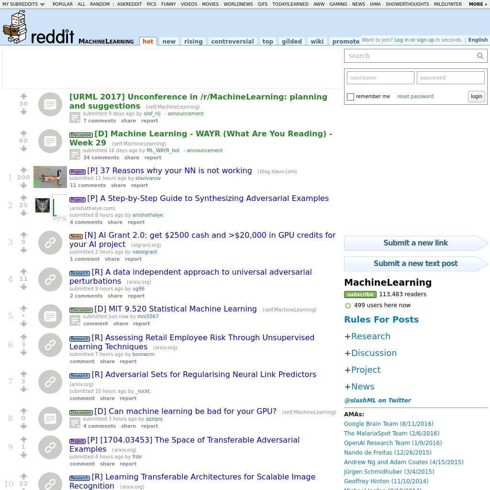
**이미지 캡션:** 이 이미지는 웹사이트 레딧의 머신러닝 관련 서브레딧 페이지를 보여줍니다. 페이지 상단에는 레딧 로고와 함께 "MACHINE LEARNING"이라는 제목이 있고, 그 아래에는 "hot", "new", "rising", "controversial", "top", "gilded", "wiki", "promote"와 같은 다양한 카테고리 링크가 있습니다. 오른쪽 상단에는 로그인 폼이 있으며, 사용자 이름과 비밀번호를 입력하고 로그인할 수 있습니다. 페이지 중앙에는 머신러닝 관련 게시물 목록이 표시됩니다. 각 게시물은 제목, 작성자, 제출 시간, 댓글 수, 공유 수 등의 정보를 포함하고 있습니다. 게시물 제목은 "[URML 2017] Unconference in /r/MachineLearning: planning and suggestions", "[D] Machine Learning - WAYR (What Are You Reading) - Week 29", "[P] 37 Reasons why your NN is not working", "[P] A Step-by-Step Guide to Synthesizing Adversarial Examples", "[N] AI Grant 2.0: get $2500 cash and >$20,000 in GPU credits for your AI project", "[R] A data independent approach to universal adversarial perturbations", "[D] MIT 9.520 Statistical Machine Learning", "[R] Assessing Retail Employee Risk Through Unsupervised Learning Techniques", "[R] Adversarial Sets for Regularising Neural Link Predictors", "[D] Can machine learning be bad for your GPU?", "[P] [1704.03453] The Space of Transferable Adversarial Examples", "[R] Learning Transferable Architectures for Scalable Image Recognition" 등입니다. 게시물 목록 오른쪽에는 "Submit a new link" 및 "Submit a new text post" 버튼이 있으며, "MachineLearning" 서브레딧의 구독자 수와 현재 접속자 수가 표시됩니다. 또한, "Rules For Posts" 섹션에는 "+Research", "+Discussion", "+Project", "+News"와 같은 하위 카테고리가 나열되어 있습니다. 페이지 하단에는 "@slashML on Twitter" 링크와 "AMAS" 섹션이 있으며, 머신러닝 분야의 저명한 연구자들의 이름과 해당 AMA(Ask Me Anything) 세션 날짜가 나열되어 있습니다. 전체적으로 이 페이지는 머신러닝 커뮤니티의 최신 정보와 토론을 공유하는 온라인 포럼의 모습을 보여줍니다. 제목, 작성자, 제출 시간, 댓글 수, 공유 수 등의 정보를 포함하고 있습니다. 게시물 제목은 "[URML 2017] Unconference in /r/MachineLearning: planning and suggestions", "[D] Machine Learning - WAYR (What Are You Reading) - Week 29", "[P] 37 Reasons why your NN is not working", "[P] A Step-by-Step Guide to Synthesizing Adversarial Examples", "[N] AI Grant 2.0: get $2500 cash and >$20,000 in GPU credits for your AI project", "[R] A data independent approach to universal adversarial perturbations", "[D] MIT 9.520 Statistical Machine Learning", "[R] Assessing Retail Employee Risk Through Unsupervised Learning Techniques", "[R] Adversarial Sets for Regularising Neural Link Predictors", "[D] Can machine learning be bad for your GPU?", "[P] [1704.03453] The Space of Transferable Adversarial Examples", "[R] Learning Transferable Architectures for Scalable Image Recognition" 등입니다. 게시물 목록 오른쪽에는 "Submit a new link" 및 "Submit a new text post" 버튼이 있으며, "MachineLearning" 서브레딧의 구독자 수와 현재 접속자 수가 표시됩니다. 또한, "Rules For Posts" 섹션에는 "+Research", "+Discussion", "+Project", "+News"와 같은 하위 카테고리가 나열되어 있습니다. 페이지 하단에는 "@slashML on Twitter" 링크와 "AMAS" 섹션이 있으며, 머신러닝 분야의 저명한 연구자들의 이름과 해당 AMA(Ask Me Anything) 세션 날짜가 나열되어 있습니다. 전체적으로 이 페이지는 머신러닝 커뮤니티의 최신 정보와 토론을 공유하는 온라인 포럼의 모습을 보여줍니다.

> 인공 지능 기술들이 이제 생활로 들어오고 있습니다. 그중 sequence2sequence 모델을 사용한 번역기인 파파고는 매우 유용합니다. API도 공개 되어 있습니다. 이를 이용해서 무엇을 만들수 있을까요?  한 예로 라인/카카오등에 장착하여 번역봇으로도 사용할수 있는데요. 데모 버전은 http://pf.kakao.com/_Txmtuxl 를 추가해보시면 보실수 있습니다.  파파고/Line/Kakao API를 이용하여 이런 프로그램을 만드는 방법은 bit.ly/line-papago, 그리고 코드는 https://github.com/hunkim/line-papago-bot 에 모두 공개 되어 있습니다.
> #오늘의레딧 https://www.reddit.com/r/MachineLearning/ 아침부터 다양한 소식이 많네요.  1. 적대적인 예를 합성하는 단계별 가이드 2. AI Grant 2.0 : AI 프로젝트에 대해 2,500 달러의 현금과 GPU 크레딧 20,000 달러 이상 확보 3. 보편적 인 적대 섭렵에 대한 데이터 독립적인 접근법 4. MIT 9.520 통계 컴퓨터 학습 5. 감독되지 않는 학습 기법을 통한 소매 직원 위험 평가 6. Regularizing Neural Link Predictors를위한 Adversarial Sets 7. 기계 학습이 GPU에 좋지 않을 수 있습니까? 8. 확장 가능한 이미지 인식을위한 이동 가능한 아키텍처 학습 9. mlmodelzoo.com - 모바일 학습 모델 10. 토론토 - 워털루 회랑의 ML 연구원 및 개발자를위한 여유없는 채널 11. 트리 기반 학습 알고리즘에 대한 실용 가이드 12. NIPS 반박 기간이 열려 있습니다! 13. 세레나 Yeung, 박사 학생, 스탠포드 MLconf 시애틀 2017에서 14. 깊은 학습 모델을 수학 방정식으로 사용하기위한 도구가 있습니까? 15. 무작위 프로세스의 분류에 대한 메트릭 선택 16. 실험 : WGAN의 간단한 컨디셔닝 17. 자율 학습을 통한 지능형 주제 탐지 18. 강화 학습에 대한 분산 관점 19. 인공 지능에 대해 쓰는 언론인을위한 조언 20. 모형 기반 강화 학습을위한 무작위 입력을 갖는 베이지안 신경망  1. http://www.anishathalye.com/2017/07/25/synthesizing-adversarial-examples/ 2. https://aigrant.org/ 3. https://arxiv.org/abs/1707.05572 4. https://www.reddit.com/r/MachineLearning/comments/6pk558/d_mit_9520_statistical_machine_learning/ 5. http://arxiv.org/abs/1707.04639 6. https://arxiv.org/abs/1707.07596 7. https://www.reddit.com/r/MachineLearning/comments/6pit7z/d_can_machine_learning_be_bad_for_your_gpu/ 8. https://arxiv.org/abs/1707.07012 9. http://mlmodelzoo.com/ 10. https://machine-learning-gta.com 11. https://sadanand-singh.github.io/posts/treebasedmodels/ 12. https://www.reddit.com/r/MachineLearning/comments/6p9x02/d_nips_rebuttal_period_is_open/ 13. https://youtu.be/h8GgxKCblfI 14. https://www.reddit.com/r/MachineLearning/comments/6pdi1z/d_are_there_any_tools_for_getting_deep_learning/ 15. https://www.reddit.com/r/MachineLearning/comments/6pf4f1/d_a_metric_choice_for_the_classification_of/ 16. http://blog.richardweiss.org/2017/07/21/conditional-wasserstein-gan.html 17. http://www.primaryobjects.com/2017/07/24/intelligent-topic-detection-with-unsupervised-learning/ 18. https://arxiv.org/abs/1707.06887 19. http://togelius.blogspot.se/2017/07/some-advice-for-journalists-writing.html 20. https://medium.com/towards-data-science/bayesian-neural-networks-with-random-inputs-for-model-based-reinforcement-learning-36606a9399b4

### 7월 27일 (목) 08:52 · 📷 사진 (1장)

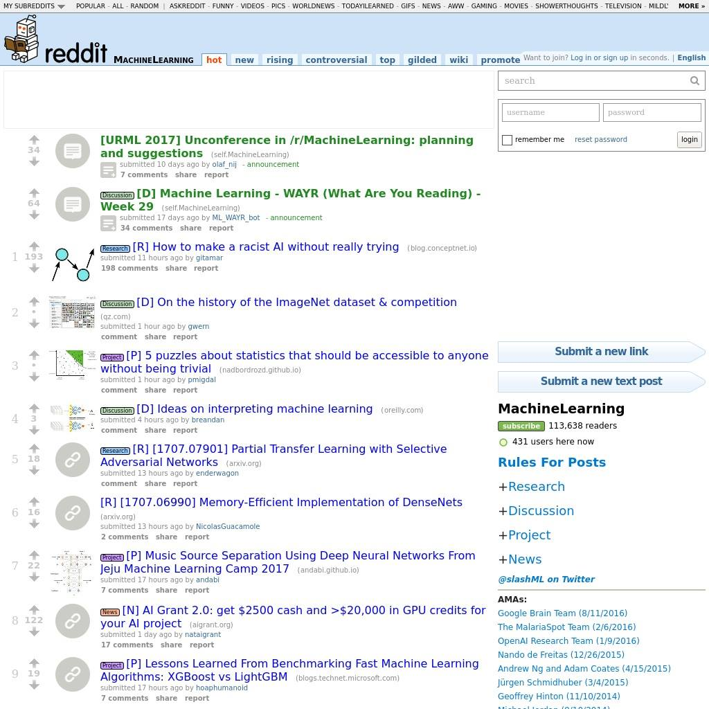
**이미지 캡션:** 이 이미지는 레딧의 머신러닝 서브레딧 페이지를 보여주며, 다양한 게시물과 관련 정보가 나열되어 있습니다. 페이지 상단에는 레딧 로고와 함께 "MACHINE LEARNING"이라는 제목이 있고, 그 아래에는 "hot", "new", "rising", "controversial", "top", "gilded", "wiki", "promote"와 같은 카테고리 링크가 있습니다. 오른쪽 상단에는 로그인 또는 회원가입을 위한 입력 필드와 버튼이 있습니다. 메인 콘텐츠 영역에는 여러 게시물이 시간순으로 정렬되어 있으며, 각 게시물은 제목, 작성자, 제출 시간, 댓글 수, 공유 수 등의 정보를 포함합니다. 게시물 제목 앞에는 아이콘과 함께 "[URML 2017]", "[D]", "[R]", "[P]", "[N]"과 같은 태그가 붙어 있어 게시물의 유형(예: 토론, 연구, 프로젝트, 뉴스)을 나타냅니다. 예를 들어, "How to make a racist AI without really trying"이라는 제목의 연구 게시물은 193개의 댓글과 198개의 공유를 가지고 있습니다. 페이지 오른쪽에는 "Submit a new link", "Submit a new text post" 버튼과 함께 "Machine Learning" 서브레딧의 구독자 수, 현재 접속자 수, 게시 규칙, 관련 링크 목록 등이 표시되어 있습니다. 또한, "AMAS" 섹션에는 과거에 진행되었던 AMA(Ask Me Anything) 목록이 날짜와 함께 나열되어 있습니다. 전반적으로 이 페이지는 머신러닝 커뮤니티의 최신 정보와 토론을 공유하는 온라인 포럼의 모습을 보여줍니다. 각 게시물은 제목, 작성자, 제출 시간, 댓글 수, 공유 수 등의 정보를 포함합니다. 게시물 제목 앞에는 아이콘과 함께 "[URML 2017]", "[D]", "[R]", "[P]", "[N]"과 같은 태그가 붙어 있어 게시물의 유형(예: 토론, 연구, 프로젝트, 뉴스)을 나타냅니다. 예를 들어, "How to make a racist AI without really trying"이라는 제목의 연구 게시물은 193개의 댓글과 198개의 공유를 가지고 있습니다. 페이지 오른쪽에는 "Submit a new link", "Submit a new text post" 버튼과 함께 "Machine Learning" 서브레딧의 구독자 수, 현재 접속자 수, 게시 규칙, 관련 링크 목록 등이 표시되어 있습니다. 또한, "AMAS" 섹션에는 과거에 진행되었던 AMA(Ask Me Anything) 목록이 날짜와 함께 나열되어 있습니다. 전반적으로 이 페이지는 머신러닝 커뮤니티의 최신 정보와 토론을 공유하는 온라인 포럼의 모습을 보여줍니다.

> #오늘의레딧 https://www.reddit.com/r/MachineLearning/ 오늘도 새소식이 많군요.  1. ImageNet 데이터 세트 및 경쟁사의 역사 2. 평범하지 않고 누구나 액세스 할 수 있어야하는 통계에 대한 5 가지 퍼즐 3. 기계 학습 해석에 대한 아이디어 4. 제주 기계 학습 캠프 2017에서 딥 뉴럴 네트워크를 이용한 음악 소스 분리 5. AI Grant 2.0 : AI 프로젝트에 대해 2,500 달러의 현금과 GPU 크레딧 20,000 달러 이상 확보 6. 빠른 기계 학습 알고리즘 벤치마킹에서 배운 교훈 : XGBoost와 LightGBM 비교 7. Geometric Deep SLAM을 향하여 8. 풍향 예측 - 기상학 석사 논문 - 어떤 알고리즘을 사용할 것인가? 9. 감시 비디오 분석 및 건물 에너지 절약에 대한 적용을 통해 사무실에서의 점유 감지 • r / iotml 10. NN이 작동하지 않는 37 가지 이유 11. MIT 9.520 통계 컴퓨터 학습 12. PyTorch 재건 문제의 DrNET 13. 적대적인 예를 합성하는 단계별 가이드 14. 보편적 인 적의 섭동에 대한 데이터 독립적인 접근법 15. 기계 학습이 GPU에 좋지 않을 수 있습니까? 16. Regularizing Neural Link Predictors를위한 Adversarial Sets 17. 감독되지 않는 학습 기법을 통한 소매 직원 위험 평가 18. 세레나 Yeung, 박사 학생, 스탠포드 MLconf 시애틀 2017에서 19. 확장 가능한 이미지 인식을위한 이동 가능한 아키텍처 학습 20. mlmodelzoo.com - 모바일 학습 모델  1. https://qz.com/1034972/the-data-that-changed-the-direction-of-ai-research-and-possibly-the-world/ 2. http://nadbordrozd.github.io/blog/2017/07/18/so-you-think-you-can-stats/ 3. https://www.oreilly.com/ideas/ideas-on-interpreting-machine-learning 4. https://andabi.github.io/music-source-separation/ 5. https://aigrant.org/ 6. https://blogs.technet.microsoft.com/machinelearning/2017/07/25/lessons-learned-benchmarking-fast-machine-learning-algorithms/ 7. https://arxiv.org/abs/1707.07410 8. https://www.reddit.com/r/MachineLearning/comments/6po491/p_wind_gust_forecasts_master_thesis_in/ 9. https://www.reddit.comhttps://www.reddit.com/r/iotml/comments/6pnyei/occupancy_detection_in_the_office_by_analyzing/ 10. https://blog.slavv.com/37-reasons-why-your-neural-network-is-not-working-4020854bd607 11. https://www.reddit.com/r/MachineLearning/comments/6pk558/d_mit_9520_statistical_machine_learning/ 12. https://www.reddit.com/r/MachineLearning/comments/6poyx3/p_drnet_in_pytorch_reconstruction_issues/ 13. http://www.anishathalye.com/2017/07/25/synthesizing-adversarial-examples/ 14. https://arxiv.org/abs/1707.05572 15. https://www.reddit.com/r/MachineLearning/comments/6pit7z/d_can_machine_learning_be_bad_for_your_gpu/ 16. https://arxiv.org/abs/1707.07596 17. http://arxiv.org/abs/1707.04639 18. https://youtu.be/h8GgxKCblfI 19. https://arxiv.org/abs/1707.07012 20. http://mlmodelzoo.com/

### 7월 28일 (금) 08:52 · 📷 사진 (1장)

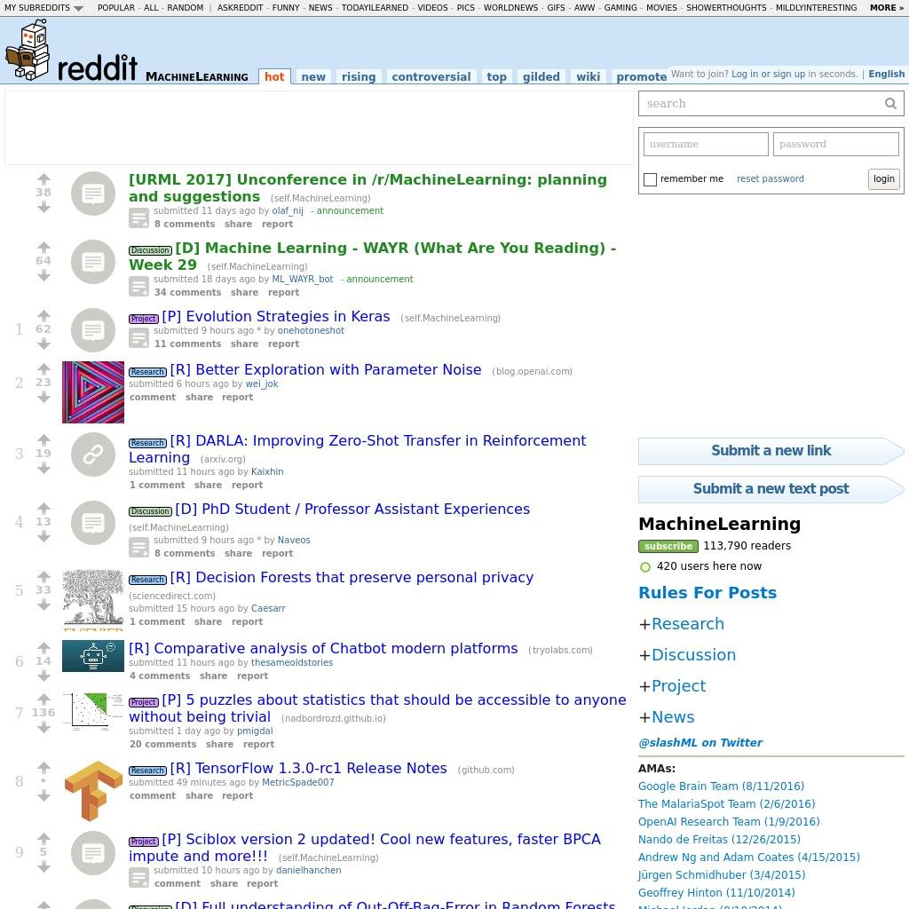
**이미지 캡션:** 이 이미지는 인기 있는 온라인 커뮤니티인 레딧의 머신러닝 관련 서브레딧 페이지를 보여줍니다. 화면 중앙에는 다양한 게시물 목록이 표시되며, 각 게시물은 제목, 작성자, 제출 시간, 댓글 수, 공유 및 보고 옵션으로 구성되어 있습니다. 게시물들은 주로 머신러닝 연구, 논문, 토론, 팁 등을 다루고 있으며, "[URML 2017] Unconference in /r/Machine Learning: planning and suggestions", "[D] Machine Learning - WAYR (What Are You Reading) - Week 29", "[P] Evolution Strategies in Keras", "[R] Better Exploration with Parameter Noise", "[R] DARLA: Improving Zero-Shot Transfer in Reinforcement Learning", "[D] PhD Student / Professor Assistant Experiences", "[R] Decision Forests that preserve personal privacy", "[R] Comparative analysis of Chatbot modern platforms", "[P] 5 puzzles about statistics that should be accessible to anyone without being trivial", "[R] TensorFlow 1.3.0-rc1 Release Notes", "[P] Sciblox version 2 updated! Cool new features, faster BPCA impute and more!!!" 등의 제목을 포함하고 있습니다. 각 게시물 옆에는 업보트 및 다운보트 화살표와 게시물의 유형을 나타내는 아이콘(토론, 프로젝트, 연구 등)이 있습니다. 오른쪽에는 "Submit a new link" 및 "Submit a new text post" 버튼과 함께 "Machine Learning" 서브레딧의 구독자 수, 현재 접속자 수, 규칙, 관련 링크 및 "AMAS" 섹션이 표시됩니다. 페이지 상단에는 레딧의 일반적인 탐색 메뉴와 검색창, 로그인/가입 옵션이 있습니다. 전체적으로 정보가 풍부하고 기술적인 주제에 관심 있는 사용자들을 위한 커뮤니티 페이지의 모습을 보여줍니다.You Reading) - Week 29", "[P] Evolution Strategies in Keras", "[R] Better Exploration with Parameter Noise", "[R] DARLA: Improving Zero-Shot Transfer in Reinforcement Learning", "[D] PhD Student / Professor Assistant Experiences", "[R] Decision Forests that preserve personal privacy", "[R] Comparative analysis of Chatbot modern platforms", "[P] 5 puzzles about statistics that should be accessible to anyone without being trivial", "[R] TensorFlow 1.3.0-rc1 Release Notes", "[P] Sciblox version 2 updated! Cool new features, faster BPCA impute and more!!!" 등의 제목을 포함하고 있습니다. 각 게시물 옆에는 업보트 및 다운보트 화살표와 게시물의 유형을 나타내는 아이콘(토론, 프로젝트, 연구 등)이 있습니다. 오른쪽에는 "Submit a new link" 및 "Submit a new text post" 버튼과 함께 "Machine Learning" 서브레딧의 구독자 수, 현재 접속자 수, 규칙, 관련 링크 및 "AMAS" 섹션이 표시됩니다. 페이지 상단에는 레딧의 일반적인 탐색 메뉴와 검색창, 로그인/가입 옵션이 있습니다. 전체적으로 정보가 풍부하고 기술적인 주제에 관심 있는 사용자들을 위한 커뮤니티 페이지의 모습을 보여줍니다.

> #오늘의레딧 https://www.reddit.com/r/MachineLearning/ 따끈한 소식들입니다.  1. 매개 변수 소음으로 더 나은 탐험 2. DARLA : 강화 학습에서 Zero-Shot 전송 개선 3. 박사 과정 학생 / 교수 보조 경험 4. 개인 정보를 보호하는 결정 숲 5. 평범하지 않고 누구나 액세스 할 수 있어야하는 통계에 대한 5 가지 퍼즐 6. TensorFlow 1.3.0-rc1 릴리스 정보 7. Sciblox 버전 2 업데이트! 멋진 새로운 기능, 빠른 BPCA impute 및 더 !!! 8. 무작위 숲의 Out-Off-Bag 오류에 대한 완벽한 이해 9. 압박 및 흥분 네트워크, ILSVRC 2017 수상자, CVPR2017 (프리젠 테이션 사진) 10. 실제로 시도하지 않고 인종 차별 주의자 AI를 만드는 법 11. 잠재 고객 채팅 반응을 사용하여 동영상 하이라이트 예측 12. 내 추세를 다시 예측에 반영하는 올바른 방법? 13. ImageNet 데이터 세트 및 경쟁사의 역사 14. ACL 2017 트랙 및 워크샵에서 사용 된 언어가 어떻게 다른지 시각화 15. 기계 학습 해석에 대한 아이디어 16. 제주 기계 학습 캠프 2017에서 딥 뉴럴 네트워크를 이용한 음악 소스 분리 17. AI Grant 2.0 : AI 프로젝트에 대해 2,500 달러의 현금과 GPU 크레딧 20,000 달러 이상 확보 18. 빠른 기계 학습 알고리즘 벤치마킹에서 배운 교훈 : XGBoost와 LightGBM 비교 19. 풍향 예측 - 기상학 석사 논문 - 어떤 알고리즘을 사용할 것인가? 20. Geometric Deep SLAM을 향하여  1. https://blog.openai.com/better-exploration-with-parameter-noise/ 2. https://arxiv.org/abs/1707.08475 3. https://www.reddit.com/r/MachineLearning/comments/6pw5fu/d_phd_student_professor_assistant_experiences/ 4. http://www.sciencedirect.com/science/article/pii/S0957417417300428 5. http://nadbordrozd.github.io/blog/2017/07/18/so-you-think-you-can-stats/ 6. https://github.com/tensorflow/tensorflow/releases/tag/v1.3.0-rc1 7. https://www.reddit.com/r/MachineLearning/comments/6pvutb/p_sciblox_version_2_updated_cool_new_features/ 8. https://www.reddit.com/r/MachineLearning/comments/6pvibx/d_full_understanding_of_outoffbagerror_in_random/ 9. https://photos.google.com/share/AF1QipNRXiNDP9tw-B_kyKk4hnXL_N283IaWNxSYH7jtAN1N0m62Uydh3MnpWFPh2GQYUw?key=STNBSU5XRkpKLXBSbmE2Um9GbGRUSm9aME1naFF3 10. https://blog.conceptnet.io/2017/07/13/how-to-make-a-racist-ai-without-really-trying/ 11. https://arxiv.org/abs/1707.08559v1 12. https://www.reddit.com/r/MachineLearning/comments/6pto1g/d_the_right_way_to_incorporate_trend_back_into_my/ 13. https://qz.com/1034972/the-data-that-changed-the-direction-of-ai-research-and-possibly-the-world/ 14. https://jasonkessler.github.io/acl2017/index.html 15. https://www.oreilly.com/ideas/ideas-on-interpreting-machine-learning 16. https://andabi.github.io/music-source-separation/ 17. https://aigrant.org/ 18. https://blogs.technet.microsoft.com/machinelearning/2017/07/25/lessons-learned-benchmarking-fast-machine-learning-algorithms/ 19. https://www.reddit.com/r/MachineLearning/comments/6po491/p_wind_gust_forecasts_master_thesis_in/ 20. https://arxiv.org/abs/1707.07410

### 7월 29일 (토) 08:52 · 📷 사진 (2장)

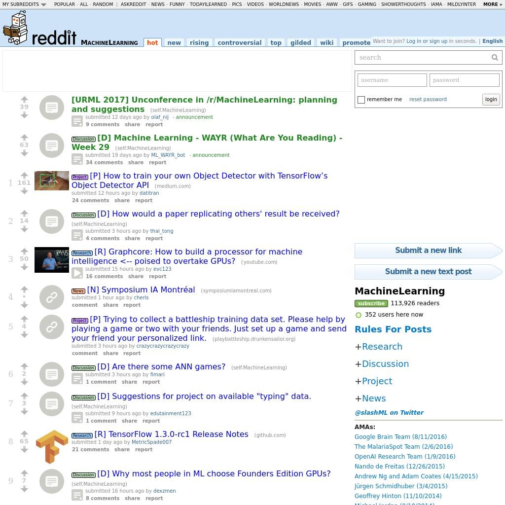
**이미지 캡션:** 이 이미지는 레딧의 머신러닝 커뮤니티 페이지를 보여줍니다. 페이지 상단에는 레딧 로고와 함께 "MachineLearning"이라는 제목이 있고, 그 아래에는 "hot", "new", "rising", "controversial", "top", "gilded", "wiki", "promote"와 같은 다양한 탭이 있습니다. 오른쪽 상단에는 로그인 또는 회원가입을 할 수 있는 창이 있으며, 검색창도 있습니다. 페이지 중앙에는 여러 게시물 목록이 나열되어 있으며, 각 게시물은 제목, 작성자, 제출 시간, 댓글 수, 공유 수 등의 정보를 포함하고 있습니다. 게시물들은 주로 머신러닝 관련 주제를 다루고 있으며, "URML 2017 Unconference", "Machine Learning - WAYR (What Are You Reading)", "How to train your own Object Detector with TensorFlow's Object Detector API", "How would a paper replicating others' result be received?", "Graphcore: How to build a processor for machine intelligence", "Symposium IA Montréal", "Trying to collect a battleship training data set", "Are there some ANN games?", "Suggestions for project on available 'typing' data", "TensorFlow 1.3.0-rc1 Release Notes", "Why most people in ML choose Founders Edition GPUs?"와 같은 제목들이 보입니다. 오른쪽 사이드바에는 "MachineLearning" 커뮤니티의 구독자 수와 "Rules For Posts" 섹션이 있으며, "Research", "Discussion", "Project", "News"와 같은 카테고리별 링크와 트위터 계정(@slashML on Twitter)도 보입니다. 또한 "AMAS" 섹션에는 과거 AMA(Ask Me Anything) 세션에 참여했던 유명 인사들의 이름과 날짜가 나열되어 있습니다. 전반적으로 이 페이지는 머신러닝 분야의 최신 정보와 토론을 공유하는 온라인 커뮤니티의 모습을 보여줍니다. 공유 수 등의 정보를 포함하고 있습니다. 게시물들은 주로 머신러닝 관련 주제를 다루고 있으며, "URML 2017 Unconference", "Machine Learning - WAYR (What Are You Reading)", "How to train your own Object Detector with TensorFlow's Object Detector API", "How would a paper replicating others' result be received?", "Graphcore: How to build a processor for machine intelligence", "Symposium IA Montréal", "Trying to collect a battleship training data set", "Are there some ANN games?", "Suggestions for project on available 'typing' data", "TensorFlow 1.3.0-rc1 Release Notes", "Why most people in ML choose Founders Edition GPUs?"와 같은 제목들이 보입니다. 오른쪽 사이드바에는 "MachineLearning" 커뮤니티의 구독자 수와 "Rules For Posts" 섹션이 있으며, "Research", "Discussion", "Project", "News"와 같은 카테고리별 링크와 트위터 계정(@slashML on Twitter)도 보입니다. 또한 "AMAS" 섹션에는 과거 AMA(Ask Me Anything) 세션에 참여했던 유명 인사들의 이름과 날짜가 나열되어 있습니다. 전반적으로 이 페이지는 머신러닝 분야의 최신 정보와 토론을 공유하는 온라인 커뮤니티의 모습을 보여줍니다.
 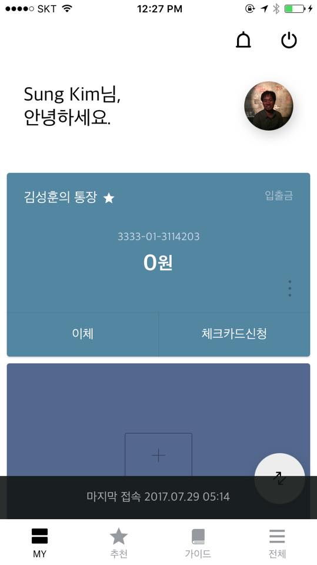
**이미지 캡션:** 화면 상단에는 시간 12:27 PM과 SKT 통신사 정보가 표시되어 있으며, 오른쪽에는 알림, 검색, 전원 아이콘이 보인다. 화면 중앙에는 "Sung Kim님, 안녕하세요."라는 문구와 함께 원형 프로필 사진이 작게 보인다. 프로필 사진 속 인물은 성인 남성으로, 짧은 머리에 어두운 색 상의를 입고 있으며, 카메라를 향해 미소 짓고 있다. 그 아래에는 "김성훈의 통장"이라는 제목과 함께 계좌 번호 "3333-01-3114203"과 잔액 "0원"이 표시되어 있다. "입출금"이라는 글자도 보인다. 계좌 정보 아래에는 "이체"와 "체크카드신청" 버튼이 있다. 가장 아래쪽에는 "마지막 접속 2017.07.29 05:14"라는 텍스트와 함께 네 개의 탭 메뉴가 보인다. 왼쪽부터 "MY", "추천", "가이드", "전체"로 표시되어 있으며, 현재 "MY" 탭이 선택된 것으로 보인다. 전체적으로 금융 앱의 메인 화면으로 보이며, 차분하고 깔끔한 분위기이다.에는 "이체"와 "체크카드신청" 버튼이 있다. 가장 아래쪽에는 "마지막 접속 2017.07.29 05:14"라는 텍스트와 함께 네 개의 탭 메뉴가 보인다. 왼쪽부터 "MY", "추천", "가이드", "전체"로 표시되어 있으며, 현재 "MY" 탭이 선택된 것으로 보인다. 전체적으로 금융 앱의 메인 화면으로 보이며, 차분하고 깔끔한 분위기이다.

> #오늘의레딧 https://www.reddit.com/r/MachineLearning/ 오늘도 새소식이 많군요.  1. 다른 사람들의 결과를 복제하는 종이는 어떻게받을 수 있습니까? 2. Graphcore : 기계 지능을위한 프로세서를 어떻게 구축 할 것인가? - GPU를 추월 할 태세? 3. 심포지엄 IA 몬트리올 4. 전함 훈련 데이터 세트를 수집하려고합니다. 친구와 함께 게임을하거나 두 사람을 도우십시오. 게임을 설정하고 친구에게 맞춤 링크를 보내십시오. 5. ANN 게임이 있습니까? 6. 사용 가능한 "타이핑"데이터에 대한 프로젝트 제안. 7. TensorFlow 1.3.0-rc1 릴리스 정보 8. ML에서 대부분의 사람들이 Founders Edition GPUs를 선택하는 이유는 무엇입니까? 9. 이 백서에서 파생 된 내용에 대한 설명 "강화 학습에 대한 확장 가능한 대안으로서의 진화 전략"(https://arxiv.org/abs/1703.03864) 10. 클러스터링 모델 신청 11. 시뮬레이션이 사용되는 좋은 보강 학습 논문은 무엇입니까? 12. 매개 변수 소음으로 더 나은 탐험 13. Keras의 진화 전략 14. Tensorflow 전에 어떤 일이 있었습니까? 15. 가중치 최적화를위한 "강화 학습에 대한 확장 가능한 대안으로서의 진화 전략"의 메타 학습 응용 16. 심층적 인 학습에서 인공적이고 희박하며 이미지와 비슷한 상태 표현을 위해 사용해야하는 conv net 아키텍처는 무엇입니까? 17. 더 나은 기계 학습 결과를 위해 결정 트리 가지 치기에 대한 팁 18. 박사 과정 학생 / 교수 보조 경험 19. DARLA : 강화 학습에서 Zero-Shot 전송 개선 20. 개인 정보를 보호하는 결정 숲  1. https://www.reddit.com/r/MachineLearning/comments/6q6dyn/d_how_would_a_paper_replicating_others_result_be/ 2. https://www.youtube.com/watch?v=T8DvHnb3Y9g 3. http://symposiumiamontreal.com/ 4. http://playbattleship.drunkensailor.org 5. https://www.reddit.com/r/MachineLearning/comments/6q6emy/d_are_there_some_ann_games/ 6. https://www.reddit.com/r/MachineLearning/comments/6q47od/d_suggestions_for_project_on_available_typing_data/ 7. https://github.com/tensorflow/tensorflow/releases/tag/v1.3.0-rc1 8. https://www.reddit.com/r/MachineLearning/comments/6q26qr/d_why_most_people_in_ml_choose_founders_edition/ 9. https://www.reddit.com/r/MachineLearning/comments/6q24wn/d_explanation_regarding_a_derivation_in_this/ 10. https://www.reddit.com/r/MachineLearning/comments/6q4rjb/d_application_for_clustering_model/ 11. https://www.reddit.com/r/MachineLearning/comments/6q1v7w/d_what_are_some_good_reinforcement_learning/ 12. https://blog.openai.com/better-exploration-with-parameter-noise/ 13. https://www.reddit.com/r/MachineLearning/comments/6pw3ud/p_evolution_strategies_in_keras/ 14. https://www.reddit.com/r/MachineLearning/comments/6q3te1/d_what_were_things_like_before_tensorflow/ 15. https://www.reddit.com/r/MachineLearning/comments/6q2s59/d_metalearning_application_of_evolution/ 16. https://www.reddit.com/r/MachineLearning/comments/6q2yzh/p_what_kind_of_conv_net_architecture_should_i_use/ 17. https://www.displayr.com/machine-learning-pruning-decision-trees/?utm_source=reddit&utm_medium=machine%20learning&utm_campaign=Pruning%20Trees 18. https://www.reddit.com/r/MachineLearning/comments/6pw5fu/d_phd_student_professor_assistant_experiences/ 19. https://arxiv.org/abs/1707.08475 20. http://www.sciencedirect.com/science/article/pii/S0957417417300428

### 7월 29일 (토) 12:35 · Happy birthday!!

Happy birthday!!

### 7월 29일 (토) 12:35 · ↪ Happy birthday!!

*다른 프로필에 남긴 글*

Happy birthday!!

### 7월 29일 (토) 22:20 · Done Jeju ML Camp 2017 and one month liv…

Done Jeju ML Camp 2017 and one month living in Jeju! I  really enjoyed it. 

BTW, the best way to start and end is going to 
Mt. Hanlla. I'll miss Jeju, and come back next year!

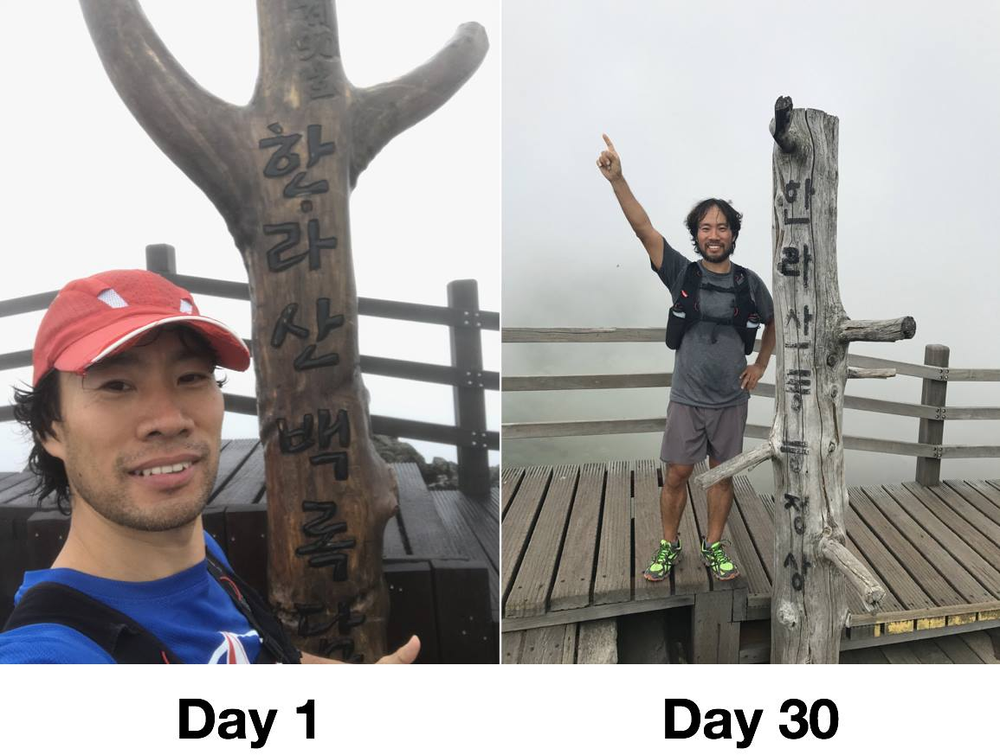
**이미지 캡션:** 이 사진은 두 개의 이미지를 나란히 보여주며, 한 명의 성인 남성이 30일 동안의 변화를 기록하고 있습니다. 왼쪽 사진은 'Day 1'이라고 표시되어 있으며, 남성은 빨간색 모자와 파란색 티셔츠, 검은색 백팩을 착용하고 있습니다. 그는 나무 기둥 옆에서 카메라를 향해 미소를 짓고 있으며, 기둥에는 한국어로 '한라산 백록담'이라고 쓰여 있습니다. 오른쪽 사진은 'Day 30'이라고 표시되어 있으며, 같은 남성이 회색 티셔츠와 회색 반바지, 운동화를 신고 있습니다. 그는 백팩을 메고 있으며, 손가락으로 하늘을 가리키고 있습니다. 이 사진 역시 같은 나무 기둥 옆에서 찍혔으며, 배경에는 안개가 자욱한 산의 풍경과 나무 데크가 보입니다. 두 사진 모두 산 정상 부근으로 추정되는 장소에서 촬영되었으며, 남성의 표정은 자신감 있고 활기찬 모습입니다.리키고 있습니다. 이 사진 역시 같은 나무 기둥 옆에서 찍혔으며, 배경에는 안개가 자욱한 산의 풍경과 나무 데크가 보입니다. 두 사진 모두 산 정상 부근으로 추정되는 장소에서 촬영되었으며, 남성의 표정은 자신감 있고 활기찬 모습입니다.

### 7월 30일 (일) 08:52 · 📷 사진 (1장)

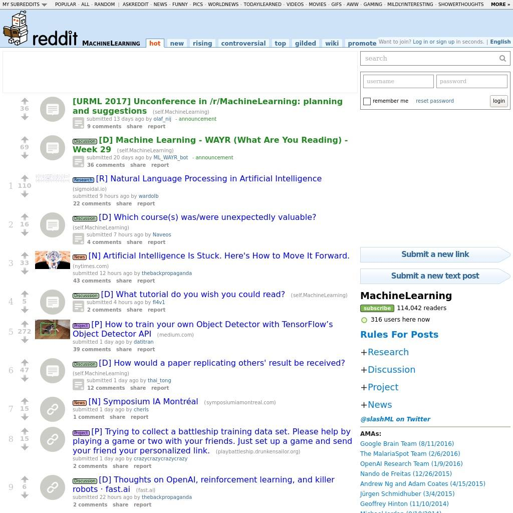
**이미지 캡션:** 이 이미지는 레딧의 머신러닝 서브레딧 페이지를 보여주며, 다양한 게시물과 관련 정보가 나열되어 있습니다. 페이지 상단에는 레딧 로고와 함께 "MachineLearning"이라는 서브레딧 이름이 보이고, 그 옆에는 "hot", "new", "rising", "controversial", "top", "gilded", "wiki"와 같은 탭들이 있습니다. 오른쪽 상단에는 로그인 및 회원가입을 위한 입력 필드와 버튼이 있습니다. 페이지 중앙에는 여러 게시물들이 목록 형태로 표시되어 있으며, 각 게시물은 제목, 작성자, 제출 시간, 댓글 수, 공유 수 등의 정보를 포함하고 있습니다. 게시물 제목들은 "[URML 2017] Unconference in /r/Machine Learning: planning and suggestions", "[D] Machine Learning - WAYR (What Are You Reading) - Week 29", "[R] Natural Language Processing in Artificial Intelligence", "[D] Which course(s) was/were unexpectedly valuable?", "[N] Artificial Intelligence Is Stuck. Here's How to Move It Forward.", "[D] What tutorial do you wish you could read?", "[P] How to train your own Object Detector with TensorFlow's Object Detector API", "[D] How would a paper replicating others' result be received?", "[N] Symposium IA Montréal", "[P] Trying to collect a battleship training data set. Please help by playing a game or two with your friends. Just set up a game and send your friend your personalized link.", "[D] Thoughts on OpenAI, reinforcement learning, and killer robots fast.ai" 등 머신러닝 및 인공지능 관련 주제를 다루고 있습니다. 게시물 옆에는 업보트 및 다운보트 아이콘과 함께 숫자가 표시되어 있습니다. 페이지 오른쪽에는 "Submit a new link", "Submit a new text post" 버튼과 함께 "MachineLearning" 서브레딧의 구독자 수, 현재 접속자 수, 게시 규칙 등이 표시되어 있습니다. 하단에는 "AMAs" 섹션과 함께 과거 AMA(Ask Me Anything) 목록이 날짜와 함께 나열되어 있습니다. 전반적으로 정보가 많고 전문적인 내용을 다루는 온라인 커뮤니티 페이지의 모습입니다.자, 제출 시간, 댓글 수, 공유 수 등의 정보를 포함하고 있습니다. 게시물 제목들은 "[URML 2017] Unconference in /r/Machine Learning: planning and suggestions", "[D] Machine Learning - WAYR (What Are You Reading) - Week 29", "[R] Natural Language Processing in Artificial Intelligence", "[D] Which course(s) was/were unexpectedly valuable?", "[N] Artificial Intelligence Is Stuck. Here's How to Move It Forward.", "[D] What tutorial do you wish you could read?", "[P] How to train your own Object Detector with TensorFlow's Object Detector API", "[D] How would a paper replicating others' result be received?", "[N] Symposium IA Montréal", "[P] Trying to collect a battleship training data set. Please help by playing a game or two with your friends. Just set up a game and send your friend your personalized link.", "[D] Thoughts on OpenAI, reinforcement learning, and killer robots fast.ai" 등 머신러닝 및 인공지능 관련 주제를 다루고 있습니다. 게시물 옆에는 업보트 및 다운보트 아이콘과 함께 숫자가 표시되어 있습니다. 페이지 오른쪽에는 "Submit a new link", "Submit a new text post" 버튼과 함께 "MachineLearning" 서브레딧의 구독자 수, 현재 접속자 수, 게시 규칙 등이 표시되어 있습니다. 하단에는 "AMAs" 섹션과 함께 과거 AMA(Ask Me Anything) 목록이 날짜와 함께 나열되어 있습니다. 전반적으로 정보가 많고 전문적인 내용을 다루는 온라인 커뮤니티 페이지의 모습입니다.

> #오늘의레딧 https://www.reddit.com/r/MachineLearning/ 따끈한 소식들입니다.  1. 어떤 코스가 예기치 않게 가치가 있었습니까? 2. 인공 지능이 막혔습니다. 그것 &#39;앞으로 어떻게 이동하는 방법. 3. TensorFlow의 Object Detector API를 사용하여 자신의 Object Detector를 교육하는 방법 4. 다른 사람들의 결과를 복제하는 종이는 어떻게받을 수 있습니까? 5. 심포지엄 IA 몬트리올 6. 전함 훈련 데이터 세트를 수집하려고합니다. 친구와 함께 게임을하거나 두 사람을 도우십시오. 게임을 설정하고 친구에게 맞춤 링크를 보내십시오. 7. OpenAI에 대한 생각, 강화 학습, 킬러 로봇 · fast.ai 8. Graphcore : 기계 지능을위한 프로세서를 어떻게 구축 할 것인가? - GPU를 추월 할 태세? 9. ANN 게임이 있습니까? 10. 사용 가능한 "타이핑"데이터에 대한 프로젝트 제안. 11. TensorFlow 1.3.0-rc1 릴리스 정보 12. ML에서 대부분의 사람들이 Founders Edition GPUs를 선택하는 이유는 무엇입니까? 13. Tensorflow 전에 어떤 일이 있었습니까? 14. 이 백서에서 파생 된 내용에 대한 설명 "강화 학습에 대한 확장 가능한 대안으로서의 진화 전략"(https://arxiv.org/abs/1703.03864) 15. 클러스터링 모델 신청 16. 시뮬레이션이 사용되는 좋은 보강 학습 논문은 무엇입니까? 17. 매개 변수 소음으로 더 나은 탐험 18. Keras의 진화 전략 19. 가중치 최적화를위한 "강화 학습에 대한 확장 가능한 대안으로서의 진화 전략"의 메타 학습 응용 20. 박사 과정 학생 / 교수 보조 경험  1. https://www.reddit.com/r/MachineLearning/comments/6qbyox/d_which_courses_waswere_unexpectedly_valuable/ 2. https://www.nytimes.com/2017/07/29/opinion/sunday/artificial-intelligence-is-stuck-heres-how-to-move-it-forward.html 3. https://medium.com/towards-data-science/how-to-train-your-own-object-detector-with-tensorflows-object-detector-api-bec72ecfe1d9 4. https://www.reddit.com/r/MachineLearning/comments/6q6dyn/d_how_would_a_paper_replicating_others_result_be/ 5. http://symposiumiamontreal.com/ 6. http://playbattleship.drunkensailor.org 7. http://www.fast.ai/2017/07/28/killer-robots/ 8. https://www.youtube.com/watch?v=T8DvHnb3Y9g 9. https://www.reddit.com/r/MachineLearning/comments/6q6emy/d_are_there_some_ann_games/ 10. https://www.reddit.com/r/MachineLearning/comments/6q47od/d_suggestions_for_project_on_available_typing_data/ 11. https://github.com/tensorflow/tensorflow/releases/tag/v1.3.0-rc1 12. https://www.reddit.com/r/MachineLearning/comments/6q26qr/d_why_most_people_in_ml_choose_founders_edition/ 13. https://www.reddit.com/r/MachineLearning/comments/6q3te1/d_what_were_things_like_before_tensorflow/ 14. https://www.reddit.com/r/MachineLearning/comments/6q24wn/d_explanation_regarding_a_derivation_in_this/ 15. https://www.reddit.com/r/MachineLearning/comments/6q4rjb/d_application_for_clustering_model/ 16. https://www.reddit.com/r/MachineLearning/comments/6q1v7w/d_what_are_some_good_reinforcement_learning/ 17. https://blog.openai.com/better-exploration-with-parameter-noise/ 18. https://www.reddit.com/r/MachineLearning/comments/6pw3ud/p_evolution_strategies_in_keras/ 19. https://www.reddit.com/r/MachineLearning/comments/6q2s59/d_metalearning_application_of_evolution/ 20. https://www.reddit.com/r/MachineLearning/comments/6pw5fu/d_phd_student_professor_assistant_experiences/

### 7월 31일 (월) 08:52 · 📷 사진 (1장)

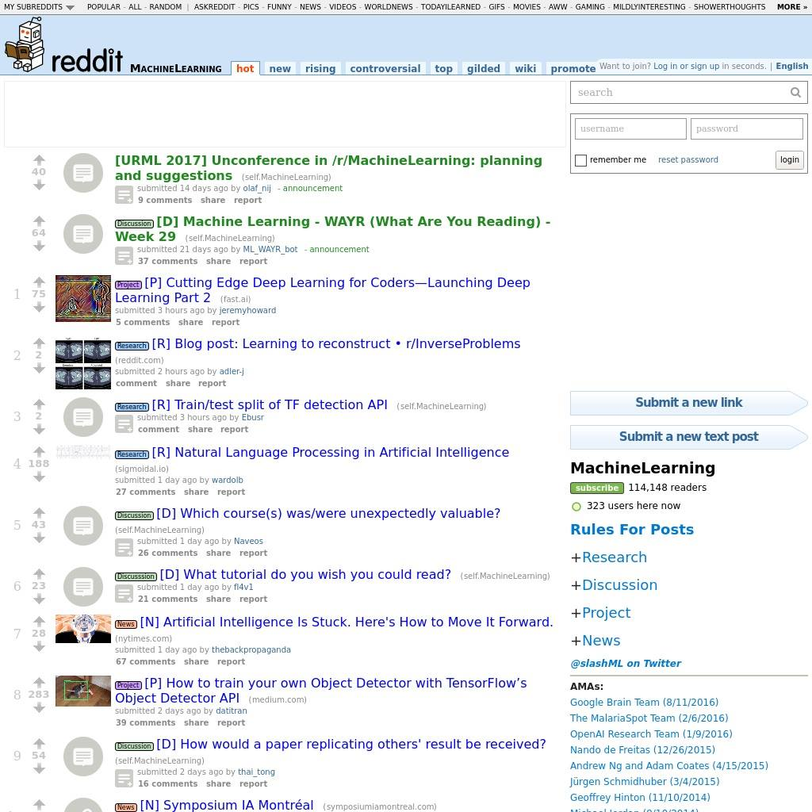
**이미지 캡션:** 이 이미지는 레딧의 머신러닝 관련 서브레딧 페이지를 보여줍니다. 페이지 상단에는 레딧 로고와 함께 "MACHINE LEARNING"이라는 제목이 있고, 그 옆에는 "hot", "new", "rising", "controversial", "top", "gilded", "wiki"와 같은 탭들이 있습니다. 오른쪽 상단에는 로그인 폼이 있으며, 사용자 이름과 비밀번호를 입력할 수 있는 칸이 있습니다. 페이지 중앙에는 다양한 머신러닝 관련 게시물 목록이 나열되어 있으며, 각 게시물은 제목, 작성자, 제출 시간, 댓글 수, 공유 및 신고 옵션을 포함합니다. 게시물 중에는 "Unconference in /r/Machine Learning", "Machine Learning - WAYR (What Are You Reading) - Week 29", "Cutting Edge Deep Learning for Coders", "Blog post: Learning to reconstruct", "Train/test split of TF detection API", "Natural Language Processing in Artificial Intelligence", "Which course(s) was/were unexpectedly valuable?", "What tutorial do you wish you could read?", "Artificial Intelligence Is Stuck. Here's How to Move It Forward.", "How to train your own Object Detector with TensorFlow's Object Detector API", "How would a paper replicating others' result be received?", "Symposium IA Montréal" 등이 있습니다. 오른쪽 사이드바에는 "Submit a new link", "Submit a new text post" 버튼과 함께 "MachineLearning" 서브레딧 정보가 표시되어 있으며, 구독자 수와 현재 접속자 수가 나타나 있습니다. 또한 "Rules For Posts" 섹션 아래에는 "Research", "Discussion", "Project", "News"와 같은 카테고리가 있으며, 트위터 계정(@slashML on Twitter)과 "AMAS" 섹션에는 과거 AMA(Ask Me Anything) 참여자들의 목록이 날짜와 함께 나열되어 있습니다. 전반적으로 이 페이지는 머신러닝 커뮤니티의 최신 정보와 토론을 공유하는 온라인 포럼의 모습을 보여줍니다. 수, 공유 및 신고 옵션을 포함합니다. 게시물 중에는 "Unconference in /r/Machine Learning", "Machine Learning - WAYR (What Are You Reading) - Week 29", "Cutting Edge Deep Learning for Coders", "Blog post: Learning to reconstruct", "Train/test split of TF detection API", "Natural Language Processing in Artificial Intelligence", "Which course(s) was/were unexpectedly valuable?", "What tutorial do you wish you could read?", "Artificial Intelligence Is Stuck. Here's How to Move It Forward.", "How to train your own Object Detector with TensorFlow's Object Detector API", "How would a paper replicating others' result be received?", "Symposium IA Montréal" 등이 있습니다. 오른쪽 사이드바에는 "Submit a new link", "Submit a new text post" 버튼과 함께 "MachineLearning" 서브레딧 정보가 표시되어 있으며, 구독자 수와 현재 접속자 수가 나타나 있습니다. 또한 "Rules For Posts" 섹션 아래에는 "Research", "Discussion", "Project", "News"와 같은 카테고리가 있으며, 트위터 계정(@slashML on Twitter)과 "AMAS" 섹션에는 과거 AMA(Ask Me Anything) 참여자들의 목록이 날짜와 함께 나열되어 있습니다. 전반적으로 이 페이지는 머신러닝 커뮤니티의 최신 정보와 토론을 공유하는 온라인 포럼의 모습을 보여줍니다.

> #오늘의레딧 https://www.reddit.com/r/MachineLearning/ 재미난 이야기들이 많습니다  1. 블로그 게시물 : 재구성 학습 • r / InverseProblems 2. TF 탐지 API의 훈련 / 테스트 분할 3. 인공 지능의 자연 언어 처리 4. 어떤 코스가 예기치 않게 가치가 있었습니까? 5. 인공 지능이 막혔습니다. 그것 &#39;앞으로 어떻게 이동하는 방법. 6. TensorFlow의 Object Detector API를 사용하여 자신의 Object Detector를 교육하는 방법 7. 다른 사람들의 결과를 복제하는 종이는 어떻게받을 수 있습니까? 8. 심포지엄 IA 몬트리올 9. 전함 훈련 데이터 세트를 수집하려고합니다. 친구와 함께 게임을하거나 두 사람을 도우십시오. 게임을 설정하고 친구에게 맞춤 링크를 보내십시오. 10. OpenAI에 대한 생각, 강화 학습, 킬러 로봇 · fast.ai 11. Graphcore : 기계 지능을위한 프로세서를 어떻게 구축 할 것인가? - GPU를 추월 할 태세? 12. ANN 게임이 있습니까? 13. 사용 가능한 "타이핑"데이터에 대한 프로젝트 제안. 14. TensorFlow 1.3.0-rc1 릴리스 정보 15. Tensorflow 전에 어떤 일이 있었습니까? 16. ML에서 대부분의 사람들이 Founders Edition GPUs를 선택하는 이유는 무엇입니까? 17. 이 백서에서 파생 된 내용에 대한 설명 "강화 학습에 대한 확장 가능한 대안으로서의 진화 전략"(https://arxiv.org/abs/1703.03864) 18. 클러스터링 모델 신청 19. 시뮬레이션이 사용되는 좋은 보강 학습 논문은 무엇입니까? 20. 매개 변수 소음으로 더 나은 탐험  1. https://www.reddit.comhttps://www.reddit.com/r/InverseProblems/comments/6qjunb/blog_post_learning_to_reconstruct/ 2. https://www.reddit.com/r/MachineLearning/comments/6qjj6q/r_traintest_split_of_tf_detection_api/ 3. https://sigmoidal.io/boosting-your-solutions-with-nlp/ 4. https://www.reddit.com/r/MachineLearning/comments/6qbyox/d_which_courses_waswere_unexpectedly_valuable/ 5. https://www.nytimes.com/2017/07/29/opinion/sunday/artificial-intelligence-is-stuck-heres-how-to-move-it-forward.html 6. https://medium.com/towards-data-science/how-to-train-your-own-object-detector-with-tensorflows-object-detector-api-bec72ecfe1d9 7. https://www.reddit.com/r/MachineLearning/comments/6q6dyn/d_how_would_a_paper_replicating_others_result_be/ 8. http://symposiumiamontreal.com/ 9. http://playbattleship.drunkensailor.org 10. http://www.fast.ai/2017/07/28/killer-robots/ 11. https://www.youtube.com/watch?v=T8DvHnb3Y9g 12. https://www.reddit.com/r/MachineLearning/comments/6q6emy/d_are_there_some_ann_games/ 13. https://www.reddit.com/r/MachineLearning/comments/6q47od/d_suggestions_for_project_on_available_typing_data/ 14. https://github.com/tensorflow/tensorflow/releases/tag/v1.3.0-rc1 15. https://www.reddit.com/r/MachineLearning/comments/6q3te1/d_what_were_things_like_before_tensorflow/ 16. https://www.reddit.com/r/MachineLearning/comments/6q26qr/d_why_most_people_in_ml_choose_founders_edition/ 17. https://www.reddit.com/r/MachineLearning/comments/6q24wn/d_explanation_regarding_a_derivation_in_this/ 18. https://www.reddit.com/r/MachineLearning/comments/6q4rjb/d_application_for_clustering_model/ 19. https://www.reddit.com/r/MachineLearning/comments/6q1v7w/d_what_are_some_good_reinforcement_learning/ 20. https://blog.openai.com/better-exploration-with-parameter-noise/
