# 2017년 8월

[← 2017년](README.md)

### 8월 1일 (화) 08:52 · 📷 사진 (1장)

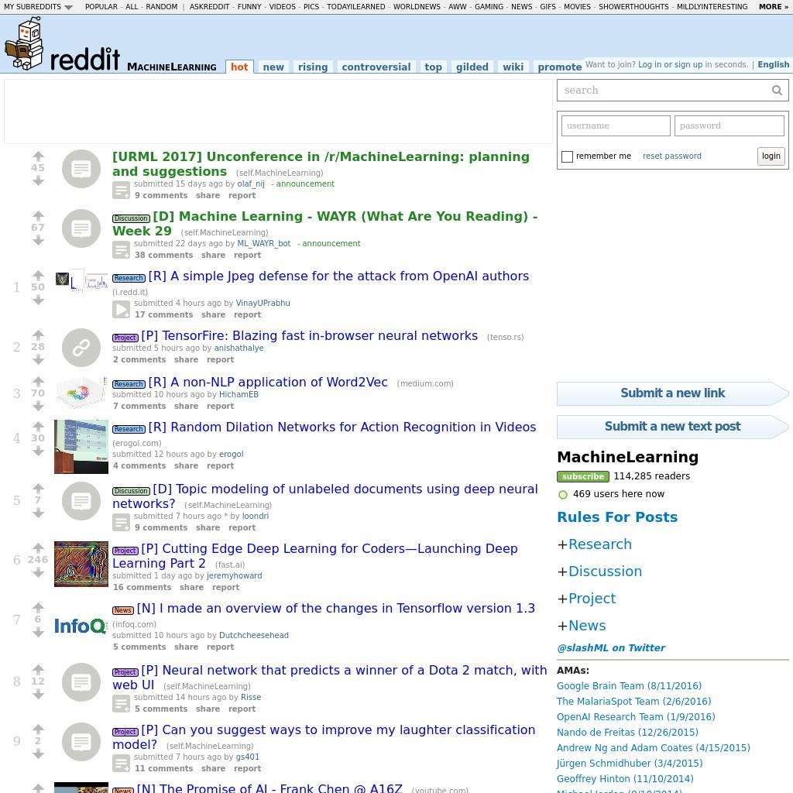
**이미지 캡션:** 이 이미지는 레딧(Reddit) 웹사이트의 머신러닝(Machine Learning) 서브레딧 페이지를 보여줍니다. 페이지 상단에는 레딧 로고와 함께 "MACHINE LEARNING"이라는 제목이 있고, 그 아래에는 "hot", "new", "rising", "controversial", "top", "gilded", "wiki", "promote"와 같은 카테고리 탭이 나열되어 있습니다. 오른쪽 상단에는 로그인 폼이 있으며, 사용자 이름과 비밀번호를 입력하고 로그인할 수 있는 필드와 "remember me", "reset password" 옵션이 있습니다. 페이지 중앙에는 다양한 머신러닝 관련 게시물 목록이 표시됩니다. 각 게시물은 제목, 작성자, 제출 시간, 댓글 수, 공유 수 등의 정보를 포함하고 있습니다. 예를 들어, "[URML 2017] Unconference in /r/Machine Learning: planning and suggestions"라는 제목의 게시물은 15일 전에 제출되었고 9개의 댓글이 달려 있습니다. 다른 게시물로는 "[D] Machine Learning - WAYR (What Are You Reading) - Week 29", "[R] A simple Jpeg defense for the attack from OpenAI authors", "[P] TensorFire: Blazing fast in-browser neural networks", "[R] A non-NLP application of Word2Vec", "[R] Random Dilation Networks for Action Recognition in Videos", "[D] Topic modeling of unlabeled documents using deep neural networks?", "[P] Cutting Edge Deep Learning for Coders—Launching Deep Learning Part 2", "[N] I made an overview of the changes in Tensorflow version 1.3", "[P] Neural network that predicts a winner of a Dota 2 match, with web UI", "[P] Can you suggest ways to improve my laughter classification model?" 등이 있습니다. 페이지 오른쪽에는 "MachineLearning" 서브레딧의 구독자 수와 현재 접속자 수가 표시되며, "Rules For Posts" 섹션에는 "+Research", "+Discussion", "+Project", "+News"와 같은 하위 카테고리가 있습니다. 또한, "@slashML on Twitter" 링크와 "AMAS" 섹션에는 다양한 연구팀 및 인물들의 이름과 날짜가 나열되어 있습니다. 전반적으로 이 페이지는 머신러닝 커뮤니티의 최신 정보와 토론을 공유하는 온라인 포럼의 모습을 보여줍니다.

> #오늘의레딧 https://www.reddit.com/r/MachineLearning/ 아침부터 다양한 소식이 많네요.  1. TensorFire : 빠른 브라우저 내 신경망 개발 2. Word2Vec의 비 NLP 응용 프로그램 3. 영화에서의 행동 인식을위한 무작위 편집 네트워크 4. 심 신경 네트워크를 사용하여 레이블이없는 문서의 주제 모델링? 5. 최첨단 코더 학습 - 깊은 학습 시작 2 부 6. Tensorflow 버전 1.3의 변경 사항 개요 7. Web UI를 사용하여 Dota 2 매치의 승자를 예측하는 신경 네트워크 8. 웃음 분류 모델을 개선 할 수있는 방법을 제안 할 수 있습니까? 9. AI의 약속 - 프랭크 첸 @ A16Z 10. R에서 Caret 패키지를 사용하는 svmRadialCost 최종 모델의 차이. 11. 왜 심층 학습은 컴퓨터 비전과 음성 인식 분야에서 훌륭한 결과를 보여 줬습니까? 12. 재발 성 래더 네트워크 13. 같은 오래된 역사주의, 지금 AI에 14. 유전 CNN, ICCV&#39;17 15. 인증 16. 블로그 게시물 : 재구성 학습 • r / InverseProblems 17. 컨트롤러 교체를위한 ML 알고리즘 18. TF 탐지 API의 훈련 / 테스트 분할 19. 인공 지능의 위험성 20. 인공 지능의 자연 언어 처리  1. https://tenso.rs/demos/fast-neural-style/ 2. https://medium.com/@kwykedu/a-non-nlp-application-of-word2vec-c637e35d3668 3. http://www.erogol.com/random-dilation-networks-action-recognition-videos/ 4. https://www.reddit.com/r/MachineLearning/comments/6qpb5v/d_topic_modeling_of_unlabeled_documents_using/ 5. http://www.fast.ai/2017/07/28/deep-learning-part-two-launch/ 6. https://www.infoq.com/news/2017/07/changes-tensorflow-1-3 7. https://www.reddit.com/r/MachineLearning/comments/6qn57n/p_neural_network_that_predicts_a_winner_of_a_dota/ 8. https://www.reddit.com/r/MachineLearning/comments/6qpep5/p_can_you_suggest_ways_to_improve_my_laughter/ 9. https://www.youtube.com/watch?v=8pLZkbN9h_s 10. https://www.reddit.com/r/MachineLearning/comments/6qnfrq/r_variance_of_svmradialcost_final_model_using/ 11. https://www.reddit.com/r/MachineLearning/comments/6qpsys/d_why_has_deep_learning_only_shown_decent_results/ 12. https://arxiv.org/abs/1707.09219 13. http://blog.christianperone.com/2017/07/the-same-old-historicism-now-on-ai/ 14. https://arxiv.org/abs/1703.01513 15. https://www.reddit.com/r/MachineLearning/comments/6qmxzs/d_certification/ 16. https://www.reddit.comhttps://www.reddit.com/r/InverseProblems/comments/6qjunb/blog_post_learning_to_reconstruct/ 17. https://www.reddit.com/r/MachineLearning/comments/6ql9bh/p_ml_algorithm_to_replace_controller/ 18. https://www.reddit.com/r/MachineLearning/comments/6qjj6q/r_traintest_split_of_tf_detection_api/ 19. https://thinkingwires.com/posts/2017-07-05-risks.html 20. https://sigmoidal.io/boosting-your-solutions-with-nlp/

### 8월 1일 (화) 17:31 · 📷 앨범: Profile pictures (1장)

**이미지 캡션:** 사진에는 성인 남성이 회색 반팔 티셔츠를 입고 팔짱을 낀 채 카메라를 바라보고 있다. 남성은 30대 후반에서 40대 초반으로 보이며, 짧고 헝클어진 검은색 머리카락과 턱수염을 가지고 있다. 그는 눈가에 주름이 있고 옅은 미소를 띠고 있으며, 표정은 편안하고 자신감 있어 보인다. 배경은 보라색 벽으로, 흰색 점들이 불규칙하게 찍혀 있어 약간의 질감을 더한다. 남성의 티셔츠에는 왼쪽 어깨 부분에 작은 흰색 글씨로 "TEK"라고 쓰여 있는 것이 보인다. 전반적으로 사진은 캐주얼하고 편안한 분위기를 연출한다.

### 8월 2일 (수) 08:53 · 📷 사진 (1장)

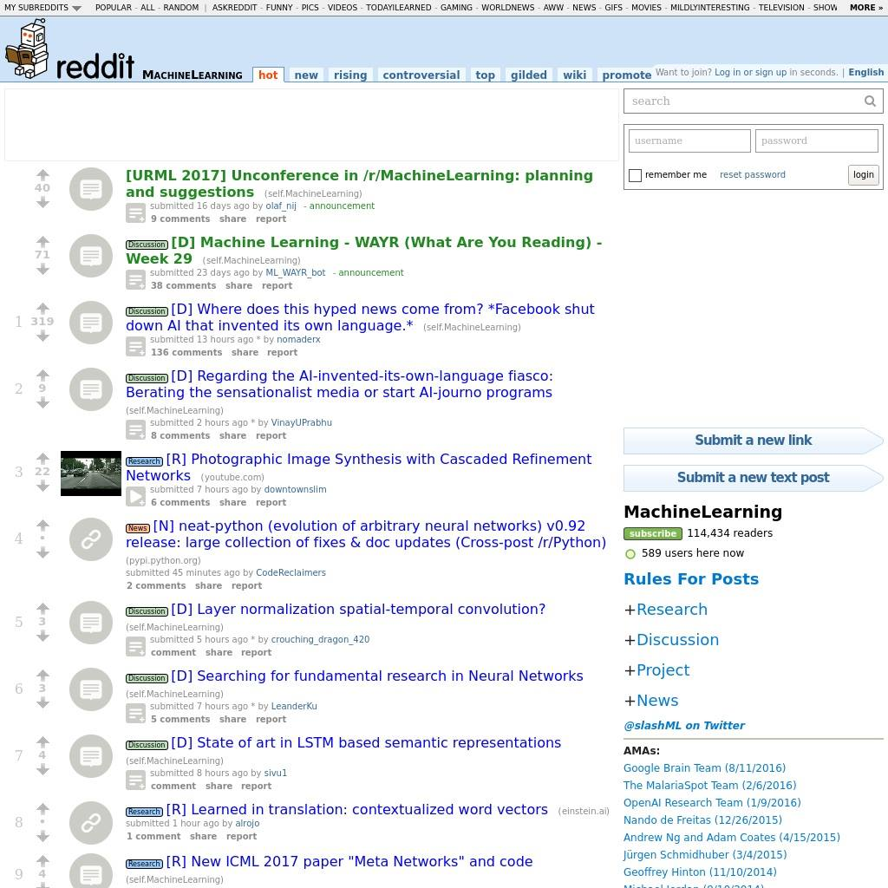
**이미지 캡션:** 이 화면은 레딧(Reddit)의 머신러닝(Machine Learning) 커뮤니티 페이지로, 다양한 주제의 게시물 목록과 관련 정보가 표시됩니다. 페이지 상단에는 레딧의 로고와 함께 인기, 랜덤, 최신 등 다양한 카테고리 링크가 보이며, 검색창과 로그인/회원가입 버튼이 있습니다. 메인 콘텐츠 영역에는 머신러닝 관련 게시물들이 시간순으로 나열되어 있으며, 각 게시물은 제목, 작성자, 제출 시간, 댓글 수, 추천/반대 수 등의 정보를 포함합니다. 게시물 제목들은 "[URML 2017] Unconference in /r/Machine Learning: planning and suggestions", "[D] Machine Learning - WAYR (What Are You Reading) - Week 29", "[D] Where does this hyped news come from? *Facebook shut down AI that invented its own language.*", "[R] Photographic Image Synthesis with Cascaded Refinement Networks", "[N] neat-python (evolution of arbitrary neural networks) v0.92 release: large collection of fixes & doc updates", "[D] Layer normalization spatial-temporal convolution?", "[D] Searching for fundamental research in Neural Networks", "[D] State of art in LSTM based semantic representations", "[R] Learned in translation: contextualized word vectors", "[R] New ICML 2017 paper "Meta Networks" and code" 등이며, 대부분 영어로 작성되어 있습니다. 게시물 옆에는 추천/반대 화살표와 댓글 수, 공유, 신고 등의 옵션이 있습니다. 오른쪽 사이드바에는 "MachineLearning" 커뮤니티 구독자 수, 현재 접속자 수, 게시물 규칙, 트위터 계정(@slashML) 정보, 그리고 과거 AMA(Ask Me Anything) 참여자 목록이 표시됩니다. 전반적으로 정보가 많고 기술적인 내용을 다루는 커뮤니티의 분위기를 띄고 있습니다.

> #오늘의레딧 https://www.reddit.com/r/MachineLearning/ 재미난 이야기들이 많습니다  1. 인공 지능 - 발명 된 자기 만의 대 실패에 대해서 : 선정 주의적 매체를 타거나 AI-journo 프로그램을 시작하십시오. 2. 케스케이드 정교화 네트워크를 이용한 사진 이미지 합성 3. 깔끔한 파이썬 (임의의 신경 네트워크의 진화) v0.92 릴리즈 : 수정 및 문서 업데이트의 대량 수집 (Cross-post https://www.reddit.com/r/Python) 4. 계층 정규화 시공간 컨벌루션? 5. 신경 회로망 연구 6. LSTM 기반 의미 론적 표현의 예술적 상태 7. 번역에서 배우기 : 문맥 화 된 단어 벡터 8. 새로운 ICML 2017 종이 "Meta Networks"및 코드 9. 선형 모델의주의 메커니즘. 10. OpenAI 작성자의 공격에 대한 간단한 Jpeg 방어 11. TensorFire : 빠른 브라우저 내 신경망 개발 12. 재구성 가능한 생성 적 adversarial 네트워크를 가진 감독되지 않은 시각적 속성 전송 13. Tensorflow 응답이 의미가 없습니다. 14. CV와 AI에서 얼마나 멀리 떨어져 있습니까? 15. Doc2vec 소개 블로그 포스트 16. Word2Vec의 비 NLP 응용 프로그램 17. 네트워크로 유행 : 디자인 옷에 신경 스타일 전송 18. Meta-SGD : 몇 가지 샷 학습을 위해 빨리 배우기 19. 오픈 소스 자동 / 반자동 오디오 마스터 링 / 프로세싱. 아이디어? 20. 영화에서의 행동 인식을위한 무작위 편집 네트워크  1. https://www.reddit.com/r/MachineLearning/comments/6qzc19/d_regarding_the_aiinventeditsownlanguage_fiasco/ 2. https://www.youtube.com/watch?v=0fhUJT21-bs&feature=youtu.be 3. https://pypi.python.org/pypi/neat-python/0.92 4. https://www.reddit.com/r/MachineLearning/comments/6qyaau/d_layer_normalization_spatialtemporal_convolution/ 5. https://www.reddit.com/r/MachineLearning/comments/6qxe5j/d_searching_for_fundamental_research_in_neural/ 6. https://www.reddit.com/r/MachineLearning/comments/6qwu7d/d_state_of_art_in_lstm_based_semantic/ 7. https://einstein.ai/research/learned-in-translation-contextualized-word-vectors 8. https://www.reddit.com/r/MachineLearning/comments/6qwjg9/r_new_icml_2017_paper_meta_networks_and_code/ 9. https://www.reddit.com/r/MachineLearning/comments/6qz2re/d_attention_mechanism_on_linear_models/ 10. https://www.reddit.com/r/MachineLearning/comments/6qqlar/r_a_simple_jpeg_defense_for_the_attack_from/ 11. https://tenso.rs/demos/fast-neural-style/ 12. https://arxiv.org/abs/1707.09798 13. https://www.reddit.com/r/MachineLearning/comments/6qyvvg/p_tensorflow_response_is_making_no_sense/ 14. https://www.reddit.com/r/MachineLearning/comments/6qvvwj/d_how_far_away_are_we_in_cv_and_ai/ 15. https://medium.com/towards-data-science/a-gentle-introduction-to-doc2vec-db3e8c0cce5e 16. https://medium.com/@kwykedu/a-non-nlp-application-of-word2vec-c637e35d3668 17. http://arxiv.org/abs/1707.09899 18. https://arxiv.org/abs/1707.09835 19. https://www.reddit.com/r/MachineLearning/comments/6qtzmd/project_open_source_autosemiauto_audio/ 20. http://www.erogol.com/random-dilation-networks-action-recognition-videos/

### 8월 4일 (금) 08:52 · 📷 사진 (1장)

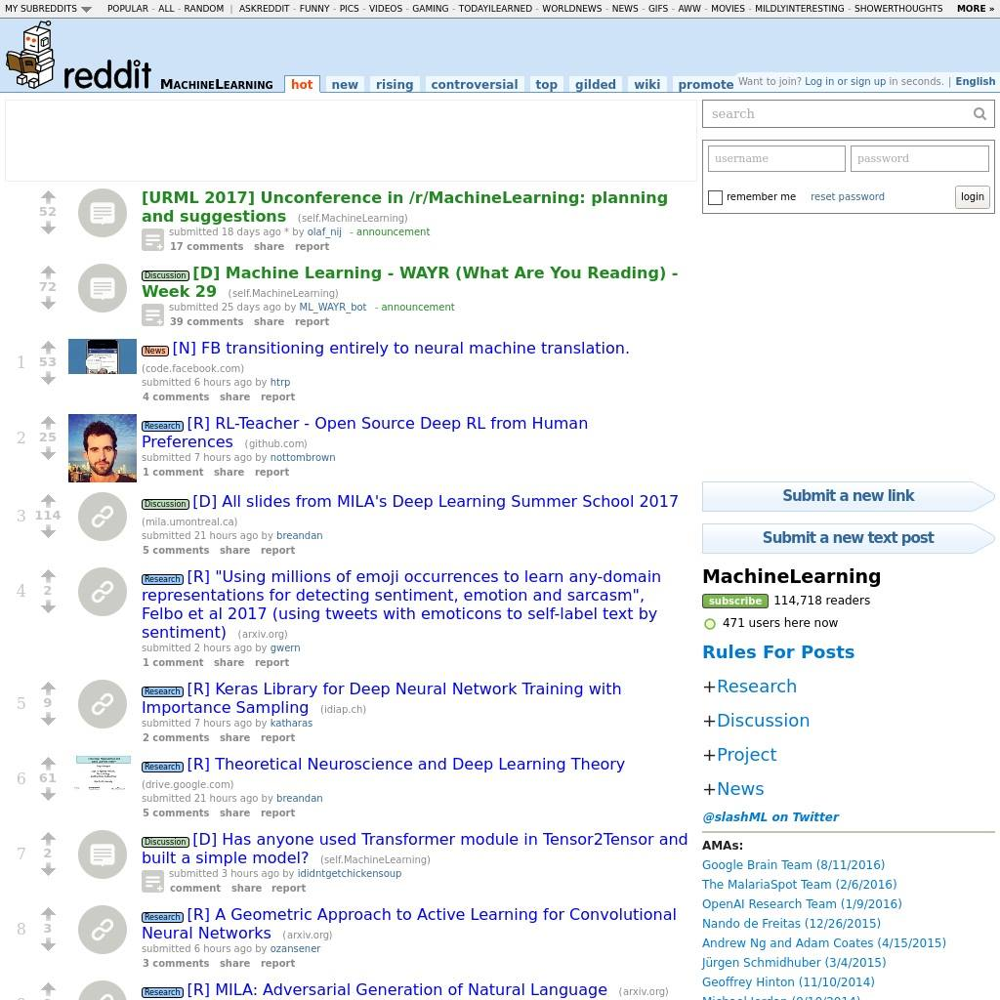
**이미지 캡션:** 이 이미지는 Reddit의 MachineLearning 서브레딧 페이지를 보여줍니다. 페이지 상단에는 Reddit 로고와 함께 "MachineLearning"이라는 제목이 있고, 그 아래에는 "hot", "new", "rising", "controversial", "top", "gilded", "wiki"와 같은 탭이 있습니다. 오른쪽 상단에는 로그인 폼이 있으며, 사용자 이름과 비밀번호를 입력하고 로그인할 수 있습니다. 페이지 중앙에는 여러 게시물 목록이 표시되며, 각 게시물은 제목, 작성자, 제출 시간, 댓글 수, 공유 및 보고 옵션을 포함합니다. 게시물들은 주로 머신러닝, 딥러닝, 신경망, 인공지능 등과 관련된 연구 논문, 발표, 뉴스 기사, 토론 등입니다. 예를 들어, "[URML 2017] Unconference in /r/MachineLearning: planning and suggestions", "[D] Machine Learning - WAYR (What Are You Reading) - Week 29", "[N] FB transitioning entirely to neural machine translation." 등이 보입니다. 오른쪽 사이드바에는 "MachineLearning" 서브레딧의 구독자 수와 현재 접속자 수가 표시되어 있으며, "Rules For Posts" 섹션에는 "+Research", "+Discussion", "+Project", "+News"와 같은 카테고리가 있습니다. 또한, "@slashML on Twitter" 링크와 "AMAS" 섹션에는 머신러닝 분야의 유명 인사들의 이름과 활동 날짜가 나열되어 있습니다. 전반적으로 이 페이지는 머신러닝 커뮤니티의 최신 정보와 토론을 공유하는 온라인 포럼의 모습을 보여줍니다.

> #오늘의레딧 https://www.reddit.com/r/MachineLearning/ 재미난 이야기들이 많습니다  1. RL-Teacher - 인간 환경 설정의 오픈 소스 Deep RL 2. MILA의 Deep Learning Summer School 2017 년 모든 슬라이드 3. "정서, 감정 및 풍자를 감지하기위한 도메인 표현을 배우기 위해 수백만 건의 이모티콘을 사용합니다."Felbo 외 2017 (정서로 텍스트 자체 라벨을 달기 위해 이모티콘으로 트윗을 사용함) 4. 중요도 샘플링을 이용한 딥 뉴럴 네트워크 교육을위한 Keras 라이브러리 5. 이론적 신경 과학 및 심층 학습 이론 6. Tensor2Tensor에서 Transformer 모듈을 사용하고 간단한 모델을 만든 사람이 있습니까? 7. Convolutional Neural Networks를위한 능동 학습을위한 기하학적 접근 8. MILA : 자연 언어의 적대적 생성 9. 손으로 그린 ​​이미지에서 그래픽 프로그램을 추론하는 법 배우기 10. Vectorflow 소개 : 스파 스 데이터를위한 경량 신경 네트워크 라이브러리 (Netflix) 11. DeepMind | 인공 지능과 신경 과학 : 선순환 12. Tensorflow로 소리를 인식하여 아파트 외부의 박쥐를 감지합니다. 13. 여러 소스의 전망에서 판타지 풋볼 퍼포먼스를 예측하기위한 규칙적인 리지 회귀 14. 미니 버그 메트로폴리스 - 헤이스팅스 15. 적대적인 예에 ​​대한 최신 견해? 16. 문자 메시지를위한 텍사스? 17. 메타 보강 학습을위한 좋은 벤치 마크 영역은 무엇입니까? 18. 기계 학습 뉴스 및 커뮤니티 웹 사이트 19. 소형 피드 - 포워드 네트워크를 이용한 자연 언어 처리 20. 차세대 딥 러닝 가속화를 위해 FPGA가 GPU를 이길 수 있습니까? • r / iotml  1. https://github.com/nottombrown/rl-teacher 2. https://mila.umontreal.ca/en/cours/deep-learning-summer-school-2017/slides/ 3. https://arxiv.org/abs/1708.00524 4. http://idiap.ch/~katharas/importance-sampling/ 5. https://drive.google.com/file/d/0B6NHiPcsmak1dkZMbzc2YWRuaGM/view 6. https://www.reddit.com/r/MachineLearning/comments/6rfamp/d_has_anyone_used_transformer_module_in/ 7. https://arxiv.org/abs/1708.00489 8. https://arxiv.org/abs/1705.10929 9. https://arxiv.org/abs/1707.09627 10. https://medium.com/@NetflixTechBlog/introducing-vectorflow-fe10d7f126b8 11. https://deepmind.com/blog/ai-and-neuroscience-virtuous-circle/ 12. https://medium.com/@rmeertens/detecting-bats-by-recognising-their-sound-with-tensorflow-cdd5e1c22b14 13. https://www.reddit.com/r/MachineLearning/comments/6rd4wn/p_regularized_ridge_regression_for_predicting/ 14. http://bair.berkeley.edu/blog/2017/08/02/minibatch-metropolis-hastings/ 15. https://www.reddit.com/r/MachineLearning/comments/6r7hg3/d_latest_views_on_adversarial_examples/ 16. https://www.reddit.com/r/MachineLearning/comments/6rdcif/d_texd_for_deeplearning/ 17. https://www.reddit.com/r/MachineLearning/comments/6r7ym7/d_good_benchmark_domains_for_meta_reinforcement/ 18. https://www.reddit.com/r/MachineLearning/comments/6r6ywe/d_machine_learning_news_community_website/ 19. https://arxiv.org/abs/1708.00214 20. https://www.reddit.comhttps://www.reddit.com/r/iotml/comments/6qzoha/nextplatform_can_fpgas_beat_gpus_in_accelerating/

### 8월 5일 (토) 08:52 · 📷 사진 (1장)

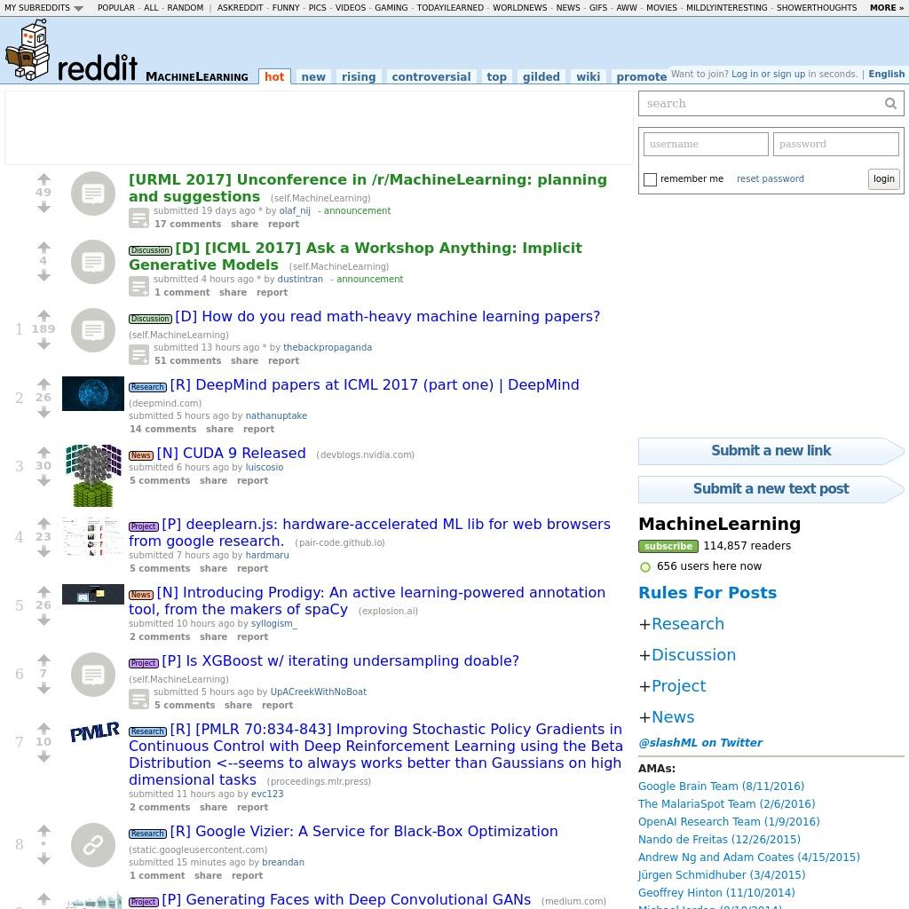
**이미지 캡션:** 이 이미지는 웹사이트 레딧의 머신러닝 관련 게시판을 보여줍니다. 화면 왼쪽에는 여러 게시물 목록이 있으며, 각 게시물은 제목, 작성자, 제출 시간, 댓글 수, 공유 수 등의 정보를 포함하고 있습니다. 게시물 제목은 "[URML 2017] Unconference in /r/MachineLearning: planning and suggestions", "[ICML 2017] Ask a Workshop Anything: Implicit Generative Models", "How do you read math-heavy machine learning papers?", "DeepMind papers at ICML 2017 (part one) | DeepMind", "CUDA 9 Released", "deeplearn.js: hardware-accelerated ML lib for web browsers from google research.", "Introducing Prodigy: An active learning-powered annotation tool, from the makers of spacy", "Is XGBoost w/ iterating undersampling doable?", "[PMLR 70:834-843] Improving Stochastic Policy Gradients in Continuous Control with Deep Reinforcement Learning using the Beta Distribution <--seems to always works better than Gaussians on high dimensional tasks", "Google Vizier: A Service for Black-Box Optimization", "Generating Faces with Deep Convolutional GANs" 등입니다. 각 게시물 옆에는 관련 썸네일 이미지나 아이콘이 작게 표시되어 있습니다. 화면 오른쪽 상단에는 로그인 및 회원가입을 위한 입력 필드와 버튼이 있으며, 그 아래에는 "Submit a new link"와 "Submit a new text post" 버튼이 있습니다. 더 아래에는 "MachineLearning" 서브레딧에 대한 정보가 표시되어 있으며, 구독자 수와 현재 접속자 수가 나타나 있습니다. 또한 "Rules For Posts" 섹션에는 "+Research", "+Discussion", "+Project", "+News"와 같은 카테고리가 나열되어 있습니다. 그 아래에는 "@slashML on Twitter"와 "AMAS" 섹션이 있으며, 여러 연구팀 및 개인의 이름과 날짜가 나열되어 있습니다. 전반적으로 이 이미지는 머신러닝 분야의 최신 연구, 도구, 토론 등을 공유하는 온라인 커뮤니티의 모습을 보여줍니다.

> #오늘의레딧 https://www.reddit.com/r/MachineLearning/ 오늘도 새소식이 많군요.  1. CUDA 9 출시 2. deeplearn.js : Google 연구에서 웹 브라우저를위한 하드웨어 가속 ML lib. 3. Prodigy 소개 : spaCy 제조업체의 능동적 학습 학습용 주석 도구 4. 언더 샘플링을 할 수있는 XGBoost가 있습니까? 5. Google Vizier : 블랙 박스 최적화를위한 서비스 6. 딥 컨볼 루션 GAN을 사용한 얼굴 생성 7. FB는 전적으로 신경 기계 번역으로 전환됩니다. 8. CNTK Hololens 에뮬레이터 + 9. Tensor2Tensor에서 Transformer 모듈을 사용하고 간단한 모델을 만든 사람이 있습니까? 10. RL-Teacher - 인간 환경 설정의 오픈 소스 Deep RL 11. "정서, 감정 및 풍자를 감지하기위한 도메인 표현을 배우기 위해 수백만 건의 이모티콘을 사용합니다."Felbo 외 2017 (정서로 텍스트 자체 라벨을 달기 위해 이모티콘으로 트윗을 사용함) 12. 중요도 샘플링을 이용한 딥 뉴럴 네트워크 교육을위한 Keras 라이브러리 13. 잔여 및 통계적 유의성에 대한 귀하의 테이블 데이터를보다 잘 전달하는 방법 14. Convolutional Neural Networks를위한 능동 학습을위한 기하학적 접근 15. MILA의 Deep Learning Summer School 2017 년 모든 슬라이드 16. 이론적 신경 과학 및 심층 학습 이론 17. 손으로 그린 ​​이미지에서 그래픽 프로그램을 추론하는 법 배우기 18. DeepMind | 인공 지능과 신경 과학 : 선순환 19. Vectorflow 소개 : 스파 스 데이터를위한 경량 신경 네트워크 라이브러리 (Netflix) 20. Tensorflow로 소리를 인식하여 아파트 외부의 박쥐를 감지합니다.  1. https://devblogs.nvidia.com/parallelforall/cuda-9-features-revealed/?ncid=so-ded-cd9rsct-19546&mkt_tok=eyJpIjoiWWpBeU9ETTBNbVF5WldSbCIsInQiOiJLWDBPaE52aVwvREpoa0R6SWFYc1ZsWDk4TnB6d0h2Mlg1Q0JhR1dlSW9FNk4wZHlkTEpyaWQwU1ZQQ3I5NU1Kc3ZUNVZPeXBQM3dSQ3VqOVMxV296NWZ2SlNGQ2hNK0lWZUNzaGxFUlptenpFWlo3NVY1NFwvZ1F0clhjbnNsdDVJIn0%3D 2. https://pair-code.github.io/deeplearnjs/ 3. https://explosion.ai/blog/prodigy-annotation-tool-active-learning 4. https://www.reddit.com/r/MachineLearning/comments/6rmaeh/p_is_xgboost_w_iterating_undersampling_doable/ 5. https://static.googleusercontent.com/media/research.google.com/en//pubs/archive/46180.pdf 6. https://medium.com/@dmonn/generating-faces-with-deep-convolutional-gans-c0dac44c8d49 7. https://code.facebook.com/posts/289921871474277/transitioning-entirely-to-neural-machine-translation/ 8. https://youtu.be/CgxheCFg1fA 9. https://www.reddit.com/r/MachineLearning/comments/6rfamp/d_has_anyone_used_transformer_module_in/ 10. https://github.com/nottombrown/rl-teacher 11. https://arxiv.org/abs/1708.00524 12. http://idiap.ch/~katharas/importance-sampling/ 13. https://www.displayr.com/the-magic-trick-that-highlights-significant-results-on-any-table/?utm_source=reddit&utm_medium=machine%20learning&utm_campaign=Trick%20that%20Highlights%20Results%20on%20Table 14. https://arxiv.org/abs/1708.00489 15. https://mila.umontreal.ca/en/cours/deep-learning-summer-school-2017/slides/ 16. https://drive.google.com/file/d/0B6NHiPcsmak1dkZMbzc2YWRuaGM/view 17. https://arxiv.org/abs/1707.09627 18. https://deepmind.com/blog/ai-and-neuroscience-virtuous-circle/ 19. https://medium.com/@NetflixTechBlog/introducing-vectorflow-fe10d7f126b8 20. https://medium.com/@rmeertens/detecting-bats-by-recognising-their-sound-with-tensorflow-cdd5e1c22b14

### 8월 6일 (일) 07:28 · 📷 사진 (2장)

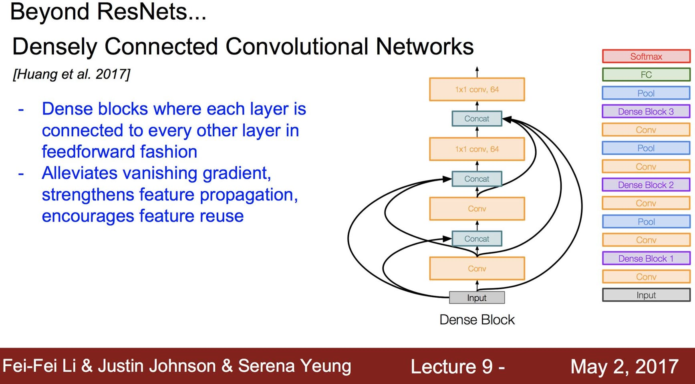
**이미지 캡션:** 이 이미지는 컴퓨터 비전 분야의 딥러닝 모델인 "Densely Connected Convolutional Networks"에 대한 강의 슬라이드입니다. 슬라이드의 왼쪽에는 "Beyond ResNets..."라는 제목과 함께 "Densely Connected Convolutional Networks"라는 부제가 있으며, 그 아래에 "[Huang et al. 2017]"이라는 출처가 표기되어 있습니다. 주요 내용은 점선으로 구분된 두 개의 불릿 포인트로 설명되어 있으며, 첫 번째는 "Dense blocks where each layer is connected to every other layer in feedforward fashion"으로, 각 레이어가 이전 모든 레이어와 피드포워드 방식으로 연결되는 조밀 연결 블록에 대한 설명입니다. 두 번째 불릿 포인트는 "Alleviates vanishing gradient, strengthens feature propagation, encourages feature reuse"로, 이러한 구조가 기울기 소실 문제를 완화하고, 특징 전파를 강화하며, 특징 재사용을 촉진한다는 장점을 설명합니다. 슬라이드의 오른쪽에는 이 조밀 연결 블록의 구조를 시각적으로 보여주는 다이어그램이 있습니다. 다이어그램은 입력(Input)부터 시작하여 여러 개의 컨볼루션(Conv) 및 풀링(Pool) 레이어, 그리고 컨캣(Concat) 레이어를 거쳐 최종적으로 소프트맥스(Softmax) 레이어까지 이어지는 과정을 보여주며, 각 레이어의 연결성을 화살표로 명확하게 나타내고 있습니다. 특히, 각 레이어의 출력이 이후의 모든 레이어의 입력으로 사용되는 조밀 연결의 특징이 강조되어 있습니다. 슬라이드의 하단에는 강의를 진행한 사람들의 이름인 "Fei-Fei Li & Justin Johnson & Serena Yeung"과 강의 번호 "Lecture 9" 및 날짜 "May 2, 2017"이 표시되어 있습니다. 전체적으로 흰색 배경에 검은색과 파란색 텍스트, 그리고 다이어그램의 다양한 색상 블록들이 사용되어 정보 전달에 효과적인 분위기를 연출하고 있습니다. 이 슬라이드는 딥러닝 모델의 아키텍처와 그 장점을 설명하는 교육 자료로 활용되고 있습니다.
 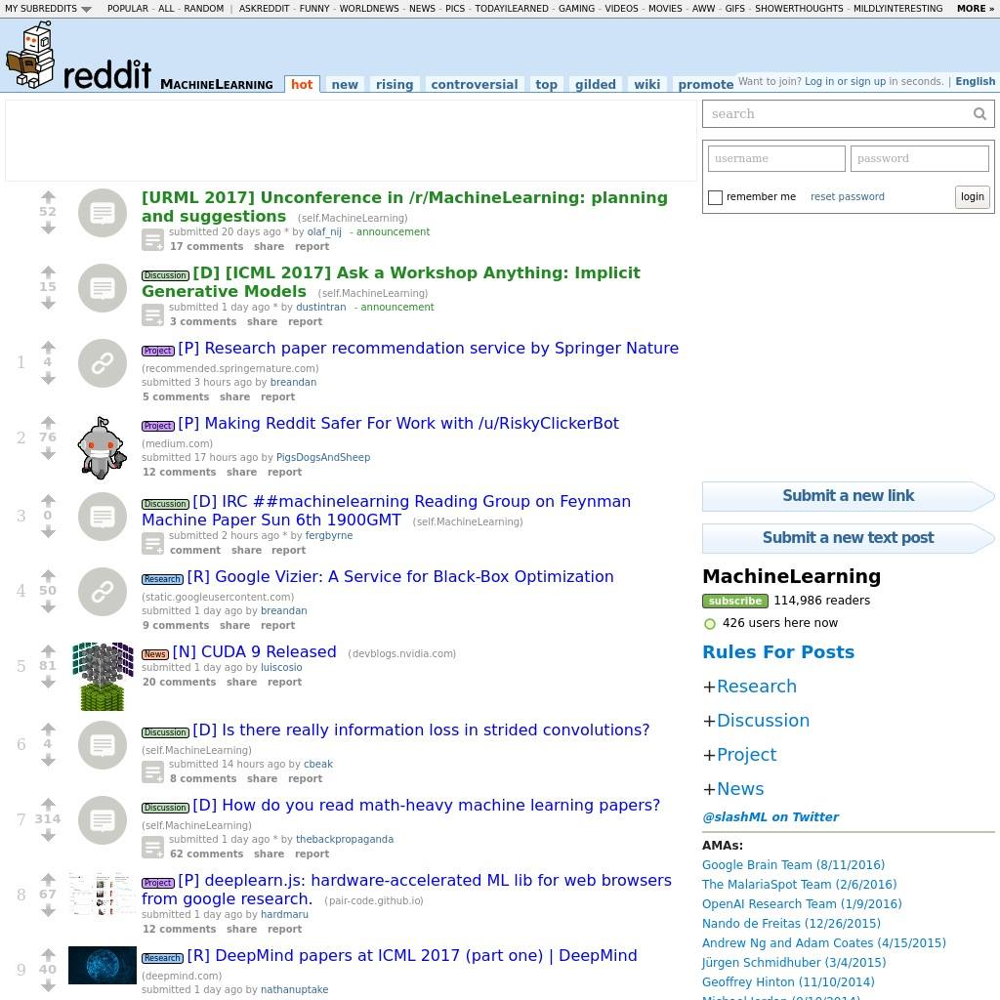
**이미지 캡션:** 이 이미지는 레딧의 머신러닝 관련 서브레딧 페이지를 보여줍니다. 페이지 상단에는 레딧 로고와 함께 "hot", "new", "rising", "controversial", "top", "gilded", "wiki"와 같은 탭이 있으며, 검색창과 로그인/가입 버튼이 있습니다. 메인 콘텐츠 영역에는 여러 게시물 목록이 표시됩니다. 각 게시물은 제목, 작성자 정보, 제출 시간, 댓글 수, 공유 버튼 등으로 구성되어 있습니다. 게시물 제목 옆에는 "[URML 2017]", "[D]", "[P]", "[N]", "[R]"과 같은 태그가 붙어 있어 게시물의 종류(발표, 토론, 프로젝트, 뉴스, 연구)를 나타냅니다. 게시물 목록에는 머신러닝 관련 컨퍼런스, 연구 논문, 프로젝트, 뉴스 등 다양한 주제가 포함되어 있습니다. 오른쪽 사이드바에는 "MachineLearning" 서브레딧의 구독자 수와 현재 접속자 수가 표시되어 있으며, "Rules For Posts" 섹션에는 "Research", "Discussion", "Project", "News"와 같은 하위 카테고리가 나열되어 있습니다. 또한, "AMAS" 섹션에는 과거에 진행되었던 AMA(Ask Me Anything) 세션 목록과 참여자 이름, 날짜가 표시되어 있습니다. 전반적으로 이 페이지는 머신러닝 커뮤니티의 최신 정보와 토론을 공유하는 온라인 플랫폼의 모습을 보여줍니다.

> DenseNet을 포함한 최신 CNN   넷트웍의 구조들을 상세하게 설명합니다. 아주 쉽게 그리고 많은 그림과 함께 잘 설명되어 있네요.  http://cs231n.stanford.edu/slides/2017/cs231n_2017_lecture9.pdf
> #오늘의레딧 https://www.reddit.com/r/MachineLearning/ 따끈한 소식들입니다.  1. IRC ## machinelearning Feynman Machine Paper의 독서 그룹 Sun 6th 1900GMT 2. Google Vizier : 블랙 박스 최적화를위한 서비스 3. CUDA 9 출시 4. strided convolutions에서 실제로 정보 손실이 있습니까? 5. 수학이 많은 기계 학습지는 어떻게 읽습니까? 6. deeplearn.js : Google 연구에서 웹 브라우저를위한 하드웨어 가속 ML lib. 7. ICML 2017에서 DeepMind 논문 (1 부) | 딥 마인드 8. wgan을 사용하여 분자와 같은 약물 생성 9. Prodigy 소개 : spaCy 제조업체의 능동적 학습 학습용 주석 도구 10. 언더 샘플링을 할 수있는 XGBoost가 있습니까? 11. Keras의 또 다른 Anime-GAN은 사용자 정의 데이터 세트를 사용합니다. 12. CNTK Hololens 에뮬레이터 + 13. FB는 전적으로 신경 기계 번역으로 전환됩니다. 14. 딥 컨볼 루션 GAN을 사용한 얼굴 생성 15. "정서, 감정 및 풍자를 감지하기위한 도메인 표현을 배우기 위해 수백만 건의 이모티콘을 사용합니다."Felbo 외 2017 (정서로 텍스트 자체 라벨을 달기 위해 이모티콘으로 트윗을 사용함) 16. Tensor2Tensor에서 Transformer 모듈을 사용하고 간단한 모델을 만든 사람이 있습니까? 17. RL-Teacher - 인간 환경 설정의 오픈 소스 Deep RL 18. 중요도 샘플링을 이용한 딥 뉴럴 네트워크 교육을위한 Keras 라이브러리 19. 잔여 및 통계적 유의성에 대한 귀하의 테이블 데이터를보다 잘 전달하는 방법 20. Convolutional Neural Networks를위한 능동 학습을위한 기하학적 접근  1. https://www.reddit.com/r/MachineLearning/comments/6ruao1/d_irc_machinelearning_reading_group_on_feynman/ 2. https://static.googleusercontent.com/media/research.google.com/en//pubs/archive/46180.pdf 3. https://devblogs.nvidia.com/parallelforall/cuda-9-features-revealed/?ncid=so-ded-cd9rsct-19546&mkt_tok=eyJpIjoiWWpBeU9ETTBNbVF5WldSbCIsInQiOiJLWDBPaE52aVwvREpoa0R6SWFYc1ZsWDk4TnB6d0h2Mlg1Q0JhR1dlSW9FNk4wZHlkTEpyaWQwU1ZQQ3I5NU1Kc3ZUNVZPeXBQM3dSQ3VqOVMxV296NWZ2SlNGQ2hNK0lWZUNzaGxFUlptenpFWlo3NVY1NFwvZ1F0clhjbnNsdDVJIn0%3D 4. https://www.reddit.com/r/MachineLearning/comments/6rquts/d_is_there_really_information_loss_in_strided/ 5. https://www.reddit.com/r/MachineLearning/comments/6rj9r4/d_how_do_you_read_mathheavy_machine_learning/ 6. https://pair-code.github.io/deeplearnjs/ 7. https://deepmind.com/blog/deepmind-papers-icml-2017-part-one/ 8. https://www.reddit.com/r/MachineLearning/comments/6rr12z/p_generating_drug_like_molecule_using_wgan/ 9. https://explosion.ai/blog/prodigy-annotation-tool-active-learning 10. https://www.reddit.com/r/MachineLearning/comments/6rmaeh/p_is_xgboost_w_iterating_undersampling_doable/ 11. https://github.com/pavitrakumar78/Anime-Face-GAN-Keras 12. https://youtu.be/CgxheCFg1fA 13. https://code.facebook.com/posts/289921871474277/transitioning-entirely-to-neural-machine-translation/ 14. https://medium.com/@dmonn/generating-faces-with-deep-convolutional-gans-c0dac44c8d49 15. https://arxiv.org/abs/1708.00524 16. https://www.reddit.com/r/MachineLearning/comments/6rfamp/d_has_anyone_used_transformer_module_in/ 17. https://github.com/nottombrown/rl-teacher 18. http://idiap.ch/~katharas/importance-sampling/ 19. https://www.displayr.com/the-magic-trick-that-highlights-significant-results-on-any-table/?utm_source=reddit&utm_medium=machine%20learning&utm_campaign=Trick%20that%20Highlights%20Results%20on%20Table 20. https://arxiv.org/abs/1708.00489

### 8월 7일 (월) 08:52 · 📷 사진 (1장)

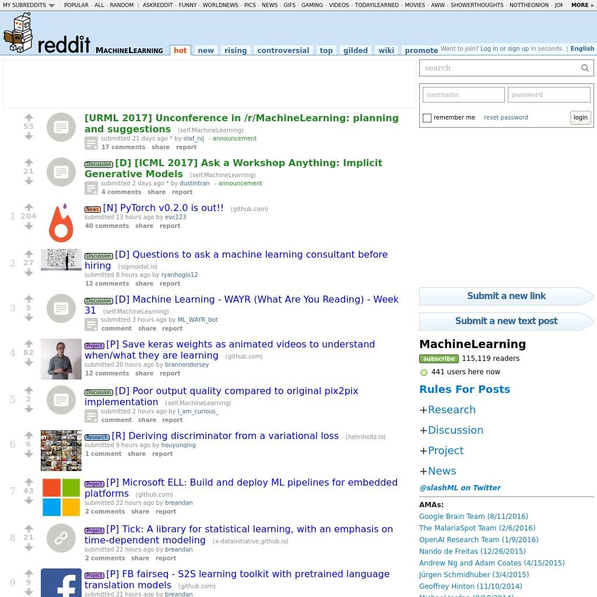
**이미지 캡션:** 레딧의 머신러닝 서브레딧 페이지로, 다양한 주제의 게시물 목록이 표시됩니다. 페이지 상단에는 레딧 로고와 함께 "MACHINE LEARNING"이라는 제목이 있고, 그 옆에는 "hot", "new", "rising", "controversial", "top", "gilded", "wiki"와 같은 탭이 있습니다. 오른쪽 상단에는 로그인 또는 회원가입을 할 수 있는 폼이 있습니다. 페이지 중앙에는 게시물 목록이 있으며, 각 게시물은 제목, 작성자, 제출 시간, 댓글 수, 공유 수 등의 정보를 포함합니다. 게시물 제목 옆에는 [URML 2017], [ICML 2017], [N] PyTorch v0.2.0, [D] Questions, [D] Machine Learning, [P] Save keras weights, [D] Poor output quality, [R] Deriving discriminator, [P] Microsoft ELL, [P] Tick, [P] FB fairseq와 같은 태그가 붙어 있습니다. 게시물 목록 아래에는 "MachineLearning" 커뮤니티 정보와 "Rules For Posts" 섹션이 있습니다. 오른쪽 사이드바에는 "AMAS" 섹션에 머신러닝 분야의 유명 인사들의 이름과 날짜가 나열되어 있습니다. 전반적으로 기술 관련 커뮤니티의 정보 공유 및 토론이 이루어지는 분위기입니다.

> #오늘의레딧 https://www.reddit.com/r/MachineLearning/ 따끈한 소식들입니다.  1. 기계 학습 - WAYR (당신은 무엇을 읽고 있습니까?) - 31 주차 2. 케라 웨이트를 애니메이션 비디오로 저장하여 그들이 언제 / 무엇을 배우고 있는지 이해합니다. 3. 원래 pix2pix 구현에 비해 출력 품질이 좋지 않음 4. 판별자를 변이에 의한 손실로부터 유도 5. Microsoft ELL : 임베디드 플랫폼 용 ML 파이프 라인 구축 및 배포 6. 진드기 : 시간에 따른 모델링에 중점을 둔 통계 학습용 라이브러리 7. FB fairseq - 미리 구성된 언어 번역 모델을 갖춘 S2S 학습 툴킷 8. Springer Nature의 연구 논문 추천 서비스 9. IRC ## machinelearning Feynman Machine Paper의 독서 그룹 Sun 6th 1900GMT 10. 기계 학습 마스터 연구 11. / u / RiskyClickerBot와 함께 작업 할 때 Reddit을 더 안전하게 만들기 12. Google Vizier : 블랙 박스 최적화를위한 서비스 13. wgan을 사용하여 분자와 같은 약물 생성 14. Keras의 또 다른 Anime-GAN은 사용자 정의 데이터 세트를 사용합니다. 15. CUDA 9 출시 16. strided convolutions에서 실제로 정보 손실이 있습니까? 17. 수학이 많은 기계 학습지는 어떻게 읽습니까? 18. deeplearn.js : Google 연구에서 웹 브라우저를위한 하드웨어 가속 ML lib. 19. ICML 2017에서 DeepMind 논문 (1 부) | 딥 마인드 20. Prodigy 소개 : spaCy 제조업체의 능동적 학습 학습용 주석 도구  1. https://www.reddit.com/r/MachineLearning/comments/6s0k1u/d_machine_learning_wayr_what_are_you_reading_week/ 2. https://github.com/brannondorsey/keras_weights_animator 3. https://www.reddit.com/r/MachineLearning/comments/6s10fu/d_poor_output_quality_compared_to_original/ 4. http://helmholtz.io/blog/symmetric_vae 5. https://github.com/Microsoft/ELL 6. https://x-datainitiative.github.io/tick/ 7. https://github.com/facebookresearch/fairseq 8. http://recommended.springernature.com 9. https://www.reddit.com/r/MachineLearning/comments/6ruao1/d_irc_machinelearning_reading_group_on_feynman/ 10. https://www.reddit.com/r/MachineLearning/comments/6rxoay/discussion_master_studies_in_machine_learning/ 11. https://medium.com/@sreenivasvrao/making-reddit-safer-for-work-with-u-riskyclickerbot-3bcb54fc1fe6 12. https://static.googleusercontent.com/media/research.google.com/en//pubs/archive/46180.pdf 13. https://www.reddit.com/r/MachineLearning/comments/6rr12z/p_generating_drug_like_molecule_using_wgan/ 14. https://github.com/pavitrakumar78/Anime-Face-GAN-Keras 15. https://devblogs.nvidia.com/parallelforall/cuda-9-features-revealed/?ncid=so-ded-cd9rsct-19546&mkt_tok=eyJpIjoiWWpBeU9ETTBNbVF5WldSbCIsInQiOiJLWDBPaE52aVwvREpoa0R6SWFYc1ZsWDk4TnB6d0h2Mlg1Q0JhR1dlSW9FNk4wZHlkTEpyaWQwU1ZQQ3I5NU1Kc3ZUNVZPeXBQM3dSQ3VqOVMxV296NWZ2SlNGQ2hNK0lWZUNzaGxFUlptenpFWlo3NVY1NFwvZ1F0clhjbnNsdDVJIn0%3D 16. https://www.reddit.com/r/MachineLearning/comments/6rquts/d_is_there_really_information_loss_in_strided/ 17. https://www.reddit.com/r/MachineLearning/comments/6rj9r4/d_how_do_you_read_mathheavy_machine_learning/ 18. https://pair-code.github.io/deeplearnjs/ 19. https://deepmind.com/blog/deepmind-papers-icml-2017-part-one/ 20. https://explosion.ai/blog/prodigy-annotation-tool-active-learning

### 8월 8일 (화) 08:52 · 📷 사진 (1장)

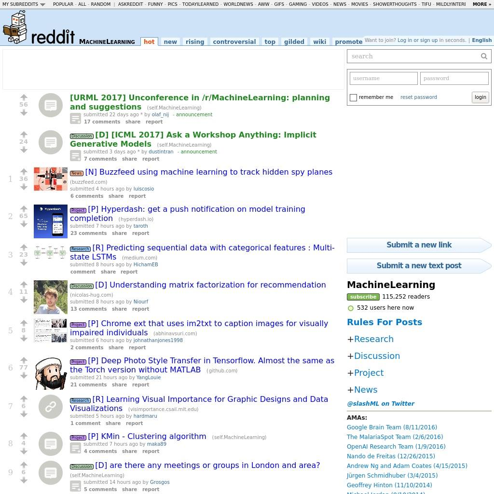
**이미지 캡션:** 이것은 Reddit의 Machine Learning 서브레딧 페이지로, 여러 게시물 목록이 표시됩니다. 페이지 상단에는 Reddit 로고와 함께 "Machine Learning"이라는 제목이 있고, 그 아래에는 "hot", "new", "rising", "controversial", "top", "gilded", "wiki"와 같은 탭이 있습니다. 오른쪽 상단에는 로그인 및 회원가입을 위한 입력 필드와 버튼이 있습니다. 메인 콘텐츠 영역에는 여러 게시물이 나열되어 있으며, 각 게시물은 제목, 작성자, 제출 시간, 댓글 수, 공유 링크 등을 포함합니다. 게시물 중에는 "[URML 2017] Unconference in /r/Machine Learning: planning and suggestions", "[ICML 2017] Ask a Workshop Anything: Implicit Generative Models", "Buzzfeed using machine learning to track hidden spy planes", "Hyperdash: get a push notification on model training completion", "Predicting sequential data with categorical features: Multi-state LSTMs", "Understanding matrix factorization for recommendation", "Chrome ext that uses im2txt to caption images for visually impaired individuals", "Deep Photo Style Transfer in Tensorflow. Almost the same as the Torch version without MATLAB", "Learning Visual Importance for Graphic Designs and Data Visualizations", "KMin - Clustering algorithm", "are there any meetings or groups in London and area?" 등이 있습니다. 각 게시물 옆에는 위아래 화살표가 있어 투표를 나타냅니다. 오른쪽 사이드바에는 "Machine Learning" 서브레딧에 대한 구독 정보, "Rules For Posts" 섹션, 그리고 "AMAS" 목록이 있습니다. 전반적으로 이 페이지는 머신러닝 관련 최신 정보와 토론을 공유하는 온라인 커뮤니티의 모습을 보여줍니다.

> #오늘의레딧 https://www.reddit.com/r/MachineLearning/ 래딧은 읽을 거리가 다양합니다.  1. 범주 형 기능으로 순차 데이터 예측 : 다중 상태 LSTM 2. 권장을위한 행렬 인수 분해 이해 3. 시각 장애인 용 이미지 캡션에 im2txt를 사용하는 Chrome ext 4. Tensorflow의 딥 사진 스타일 전송. MATLAB이없는 Torch 버전과 거의 동일합니다. 5. 그래픽 디자인 및 데이터 시각화에 대한 학습 중요성 6. 최소 - 클러스터링 알고리즘 7. 런던과 지역에 모임이나 모임이 있습니까? 8. 인간에 문의하기 전에 독성 - TayAndYou 9. PyTorch v0.2.0이 출시되었습니다 !! 10. ML을 민주화하면 데이터 과학자들이 일하는 데 얼마나 위험 할 수 있습니까? 11. 데이터 과학은 어떻게 기금을 받습니까? Charles Martin Q &amp; A 12. 버전 제어 기계 학습 및 심화 학습 작업 단계별 예제 - Numerai 모델 예측 13. pretrained char-rnn을 사용하여 텍스트를 쉽게 생성하는 Python 모듈 14. 기계 학습 - WAYR (당신은 무엇을 읽고 있습니까?) - 31 주차 15. 고용하기 전에 기계 학습 컨설턴트에게 질문하십시오. 16. 원래 pix2pix 구현에 비해 출력 품질이 좋지 않음 17. 판별자를 변이에 의한 손실로부터 유도 18. 케라 웨이트를 애니메이션 비디오로 저장하여 그들이 언제 / 무엇을 배우고 있는지 이해합니다. 19. Microsoft ELL : 임베디드 플랫폼 용 ML 파이프 라인 구축 및 배포 20. 진드기 : 시간에 따른 모델링에 중점을 둔 통계 학습용 라이브러리  1. https://medium.com/@kwykedu/multi-state-lstms-for-categorical-features-66cc974df1dc 2. http://nicolas-hug.com/blog/matrix_facto_1 3. http://abhinavsuri.com/aat 4. https://github.com/LouieYang/deep-photo-styletransfer-tf 5. http://visimportance.csail.mit.edu 6. https://www.reddit.com/r/MachineLearning/comments/6s682x/p_kmin_clustering_algorithm/ 7. https://www.reddit.com/r/MachineLearning/comments/6s4817/d_are_there_any_meetings_or_groups_in_london_and/ 8. https://smerity.com/articles/2016/tayandyou.html 9. https://github.com/pytorch/pytorch/releases/tag/v0.2.0 10. https://www.reddit.com/r/MachineLearning/comments/6s4fej/d_how_much_could_democratizing_ml_be_a_danger_for/ 11. http://theaccidentalengineer.com/data-science-engineering-fund-discovery/ 12. https://becominghuman.ai/how-to-version-control-your-machine-learning-task-ii-d37da60ef570 13. https://github.com/minimaxir/textgenrnn 14. https://www.reddit.com/r/MachineLearning/comments/6s0k1u/d_machine_learning_wayr_what_are_you_reading_week/ 15. https://sigmoidal.io/questions-to-ask-a-machine-learning-consultant-before-hiring/ 16. https://www.reddit.com/r/MachineLearning/comments/6s10fu/d_poor_output_quality_compared_to_original/ 17. http://helmholtz.io/blog/symmetric_vae 18. https://github.com/brannondorsey/keras_weights_animator 19. https://github.com/Microsoft/ELL 20. https://x-datainitiative.github.io/tick/

### 8월 9일 (수) 08:52 · 📷 사진 (1장)

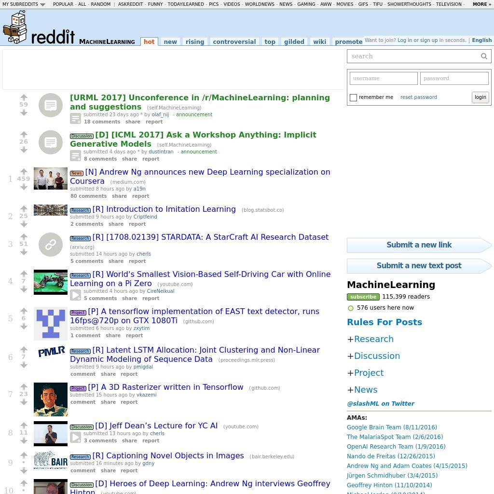
**이미지 캡션:** 이 이미지는 인기 있는 온라인 커뮤니티인 레딧의 머신러닝 서브레딧 페이지를 보여줍니다. 페이지 상단에는 레딧 로고와 함께 "MACHINE LEARNING"이라는 제목이 있고, 그 옆에는 "hot", "new", "rising", "controversial", "top", "gilded", "wiki"와 같은 다양한 카테고리 탭이 있습니다. 오른쪽 상단에는 로그인 및 회원가입을 위한 입력 필드와 버튼이 있습니다. 메인 콘텐츠 영역에는 여러 게시물 목록이 표시되며, 각 게시물은 제목, 작성자, 제출 시간, 댓글 수, 공유 버튼 등으로 구성되어 있습니다. 게시물 제목 앞에는 해당 게시물의 유형을 나타내는 태그(예: [URML 2017], [ICML 2017], [N], [R], [P], [D])가 붙어 있습니다. 일부 게시물에는 썸네일 이미지나 관련 링크가 포함되어 있습니다. 예를 들어, 3번 게시물은 Andrew Ng가 Coursera에서 딥러닝 전문 과정을 발표한다는 뉴스를 다루고 있으며, 4번 게시물은 온라인 자율 주행 자동차에 대한 연구를 소개합니다. 오른쪽 사이드바에는 "Submit a new link", "Submit a new text post" 버튼과 함께 서브레딧의 구독자 수, 현재 접속자 수, 게시 규칙, 그리고 트위터 계정(@slashML) 정보가 표시됩니다. 또한, "AMAS" 섹션에는 과거에 진행되었던 AMA(Ask Me Anything) 세션 목록과 해당 참여자들의 이름 및 날짜가 나열되어 있습니다. 전반적으로 이 페이지는 머신러닝 분야의 최신 정보와 토론을 공유하는 온라인 커뮤니티의 모습을 보여줍니다.

> #오늘의레딧 https://www.reddit.com/r/MachineLearning/ 따끈한 소식들입니다.  1. 파이 제로 (Pi Zero) 온라인 학습을 통해 세계에서 가장 작은 비전 기반자가 운전 차량 2. EAST 텍스트 검출기의 텐서 플로우 구현, GTX 1080Ti에서 720p @ 720p 실행 3. 잠재 LSTM 할당 : 시퀀스 데이터의 공동 클러스터링 및 비선형 동적 모델링 4. Tensorflow로 작성된 3D 래스터 라이저 5. Jeff Dean의 YC AI 강의 6. 이미지에 새로운 객체 캡션 삽입 7. 깊은 학습의 영웅 : Andrew Ng와 Geoffrey Hinton 인터뷰 8. Andrew Ng, 기계 학습에 대한 Andrej Karpathy 인터뷰 9. 숨겨진 스파이 비행기를 추적하는 기계 학습을 이용한 버즈 피드 10. 깊은 압축 학습을 통한 이미지 압축 - 해커의 정오 11. Hyperdash : 모델 교육 완료시 푸시 알림 받기 12. 데이터 과학자들의 사랑과 함께 7 월의 데이터에서 가장 훌륭한 기사 13. Tensorflow (주로) 서버 구성 14. 관리되지 않는 기계 학습을위한 새로운 기능, 열 또는 전체 데이터 세트를위한 데이터 세트 빌더 15. 텍스트 분석 및 NLP를위한 기계 학습 (r / deeplearning의 x-post) 16. 범주 형 기능으로 순차 데이터 예측 : 다중 상태 LSTM 17. 권장을위한 행렬 인수 분해 이해 18. Reupload. Tensorflow의 딥 사진 스타일 전송. (미리보기 이미지 QAQ는 더 이상 표시되지 않습니다.) 19. 시각 장애인 용 이미지 캡션에 im2txt를 사용하는 Chrome ext 20. IBM Research, 새로운 소프트웨어 기술로 기록적인 학습 성능 달성 - IBM 블로그 연구  1. https://www.youtube.com/watch?v=9GNbVkMb8Qw&feature=youtu.be 2. https://github.com/argman/EAST 3. http://proceedings.mlr.press/v70/zaheer17a.html 4. https://github.com/vahidk/tf.rasterizer 5. https://www.youtube.com/watch?v=HcStlHGpjN8 6. http://bair.berkeley.edu/blog/2017/08/08/novel-object-captioning/ 7. https://www.youtube.com/watch?v=-eyhCTvrEtE 8. https://www.youtube.com/watch?v=_au3yw46lcg 9. https://www.buzzfeed.com/peteraldhous/hidden-spy-planes 10. https://hackernoon.com/using-ai-to-super-compress-images-5a948cf09489 11. https://hyperdash.io 12. https://blog.sicara.com/07-2017-best-big-data-new-articles-this-month-acb58d4bb15d 13. https://www.reddit.com/r/MachineLearning/comments/6sbzgo/d_server_configuration_for_tensorflow_primarily/ 14. http://starmine.ai/datasets/ds01.html 15. https://www.reddit.com/r/MachineLearning/comments/6scsb6/d_machinelearning_for_text_analysis_and_nlp_xpost/ 16. https://medium.com/@kwykedu/multi-state-lstms-for-categorical-features-66cc974df1dc 17. http://nicolas-hug.com/blog/matrix_facto_1 18. https://github.com/LouieYang/deep-photo-styletransfer-tf 19. http://abhinavsuri.com/aat 20. https://www.ibm.com/blogs/research/2017/08/distributed-deep-learning/

### 8월 10일 (목) 08:52 · 📷 사진 (1장)

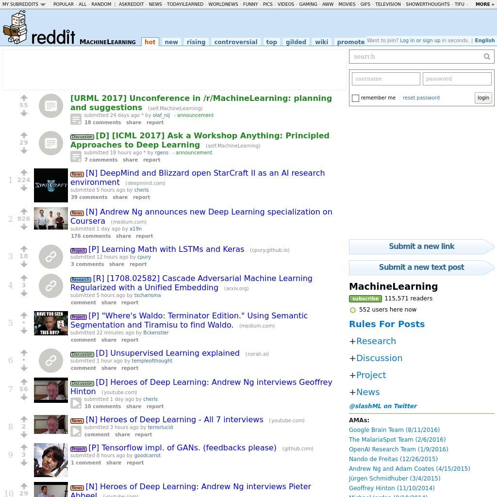
**이미지 캡션:** 이 이미지는 레딧(Reddit) 웹사이트의 머신러닝(Machine Learning) 서브레딧 페이지를 보여줍니다. 페이지 상단에는 레딧 로고와 함께 "Machine Learning"이라는 제목이 있고, 그 아래에는 "hot", "new", "rising", "controversial", "top", "gilded", "wiki", "promote"와 같은 탭들이 나열되어 있습니다. 오른쪽 상단에는 로그인 및 회원가입을 위한 입력 필드와 버튼이 있습니다. 페이지 중앙에는 다양한 머신러닝 관련 게시물 목록이 표시되며, 각 게시물은 제목, 출처, 작성자, 게시 시간, 댓글 수, 추천 수 등의 정보를 포함하고 있습니다. 예를 들어, "[URML 2017] Unconference in /r/Machine Learning: planning and suggestions"라는 제목의 게시물은 55개의 추천을 받았고 18개의 댓글이 달려 있습니다. 또한, "DeepMind and Blizzard open StarCraft II as an AI research environment"라는 게시물은 1,224개의 추천을 받았습니다. 오른쪽 사이드바에는 "Machine Learning" 서브레딧의 구독자 수와 현재 접속자 수가 표시되어 있으며, "Rules For Posts" 섹션 아래에는 "+Research", "+Discussion", "+Project", "+News"와 같은 카테고리가 있습니다. 그 아래에는 "@slashML on Twitter" 링크와 함께 "AMAS" (Ask Me Anything) 섹션이 있어, 과거에 진행되었던 AMA 세션 목록을 보여줍니다. 전반적으로 이 페이지는 머신러닝 커뮤니티의 최신 정보와 토론을 공유하는 온라인 포럼의 모습을 보여줍니다.

> #오늘의레딧 https://www.reddit.com/r/MachineLearning/ 재미난 이야기들이 많습니다  1. LSTM과 케라 수학 학습 2. "Waldo는 어디 있습니까 : Terminator Edition." Semantic Segmentation과 Tiramisu를 사용하여 Waldo를 찾습니다. 3. 감독없는 학습 설명 4. 깊은 학습의 영웅 : Andrew Ng와 Geoffrey Hinton 인터뷰 5. 깊은 학습의 영웅 - 7 개의 인터뷰 6. Tensorflow impl. GAN의 (피드백주세요) 7. 깊은 학습의 영웅 : Andrew Ng와 Pieter Abbeel 인터뷰 8. Windows 용의 알맞은 GPU 가속 ML 벤치 마크 9. Andrew Ng, 기계 학습에 대한 Andrej Karpathy 인터뷰 10. 파이 제로 (Pi Zero) 온라인 학습을 통해 세계에서 가장 작은 비전 기반자가 운전 차량 11. 이미지에 새로운 객체 캡션 삽입 12. 모방 학습 소개 13. SurfaceNet : 다 시점 입체 영상을위한 종단 간 3D 신경망 14. EAST 텍스트 검출기의 텐서 플로우 구현, GTX 1080Ti에서 720p @ 720p 실행 15. "다중 신경망을 이용한 인공 신경망 훈련 병렬 처리"(대규모 병렬 처리 : 시간에 따른 NN 훈련 풀기 / 모든 배치 단계를 반복적으로 근사하는 미니 배치) 16. 잠재 LSTM 할당 : 시퀀스 데이터의 공동 클러스터링 및 비선형 동적 모델링 17. 깊은 압축 학습을 통한 이미지 압축 - 해커의 정오 18. Tensorflow로 작성된 3D 래스터 라이저 19. Jeff Dean의 YC AI 강의 20. 숨겨진 스파이 비행기를 추적하는 기계 학습을 이용한 버즈 피드  1. http://cpury.github.io/learning-math/ 2. https://medium.com/@bradkenstler/wheres-waldo-terminator-edition-8b3bd0805741 3. https://www.norah.ai/blog 4. https://www.youtube.com/watch?v=-eyhCTvrEtE 5. https://www.youtube.com/playlist?list=PLfsVAYSMwsksjfpy8P2t_I52mugGeA5gR 6. https://github.com/sanghoon/tf-exercise-gan 7. https://www.youtube.com/watch?v=dmkPJpWCVcI 8. https://www.reddit.com/r/MachineLearning/comments/6skzgd/d_decent_gpuaccelerated_ml_benchmarks_for_windows/ 9. https://www.youtube.com/watch?v=_au3yw46lcg 10. https://www.youtube.com/watch?v=9GNbVkMb8Qw&feature=youtu.be 11. http://bair.berkeley.edu/blog/2017/08/08/novel-object-captioning/ 12. https://blog.statsbot.co/introduction-to-imitation-learning-32334c3b1e7a 13. https://arxiv.org/abs/1708.01749 14. https://github.com/argman/EAST 15. https://arxiv.org/abs/1708.02276 16. http://proceedings.mlr.press/v70/zaheer17a.html 17. https://hackernoon.com/using-ai-to-super-compress-images-5a948cf09489 18. https://github.com/vahidk/tf.rasterizer 19. https://www.youtube.com/watch?v=HcStlHGpjN8 20. https://www.buzzfeed.com/peteraldhous/hidden-spy-planes

### 8월 10일 (목) 09:29 · 생신 축하 드립니다.

생신 축하 드립니다.

### 8월 10일 (목) 09:29 · ↪ 생신 축하 드립니다.

*다른 프로필에 남긴 글*

생신 축하 드립니다.

### 8월 11일 (금) 08:52 · 📷 사진 (1장)

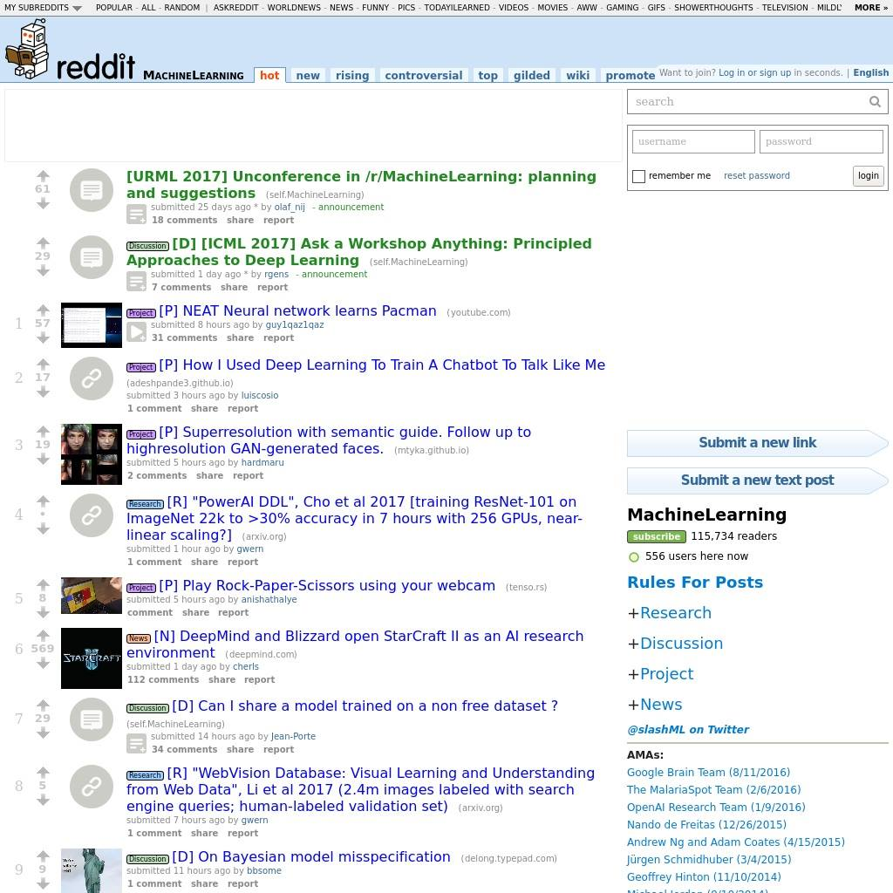
**이미지 캡션:** 이 이미지는 Reddit의 MachineLearning 서브레딧 페이지를 보여줍니다. 페이지 상단에는 Reddit 로고와 함께 "MachineLearning"이라는 제목이 있고, 그 아래에는 "hot", "new", "rising", "controversial", "top", "gilded", "wiki", "promote"와 같은 탭들이 나열되어 있습니다. 오른쪽 상단에는 로그인 및 회원가입을 위한 입력 필드와 버튼이 있습니다. 메인 콘텐츠 영역에는 여러 게시물 목록이 표시됩니다. 각 게시물은 제목, 제출자 정보, 제출 시간, 댓글 수, 공유 및 보고 옵션을 포함합니다. 게시물 제목 앞에는 "[URML 2017]", "[D]", "[P]", "[R]", "[N]"과 같은 태그가 붙어 있어 게시물의 유형을 나타냅니다. 예를 들어, "[P] NEAT Neural network learns Pacman"이라는 게시물은 유튜브 링크를 포함하고 있으며, "[N] DeepMind and Blizzard open StarCraft II as an AI research environment"라는 게시물은 StarCraft II 게임과 관련된 AI 연구에 대한 뉴스입니다. 오른쪽 사이드바에는 "Submit a new link", "Submit a new text post" 버튼과 함께 "MachineLearning" 서브레딧의 구독자 수, 현재 접속자 수, 게시 규칙, 그리고 "AMAS" 섹션이 있습니다. AMAS 섹션에는 과거에 진행되었던 AMA(Ask Me Anything) 세션의 참여자 이름과 날짜가 나열되어 있습니다. 전반적으로 이 페이지는 머신러닝 관련 최신 정보와 토론을 공유하는 온라인 커뮤니티의 모습을 보여줍니다.

> #오늘의레딧 https://www.reddit.com/r/MachineLearning/ 아침부터 다양한 소식이 많네요.  1. 의미 론적 가이드가있는 초 능률. 고해상도 GAN이 생성 한 얼굴을 추적하십시오. 2. 웹캠을 사용하여 바위 가위를 재생하십시오. 3. DeepMind와 블리자드는 스타 크래프트 II를 AI 연구 환경으로 엽니 다. 4. 비 공짜 데이터 세트에서 교육받은 모델을 공유 할 수 있습니까? 5. "WebVision Database : 웹 데이터로부터의 시각적 학습 및 이해", Li et al 2017 (검색 엔진 질의로 라벨링 된 2.4m 이미지, 인간 라벨링 검증 세트) 6. 베이지안 모형 부적합에 7. NLP 데이터에 대한 올바른 표현 찾기 8. CVPR 2017 오팔과 스포트라이트 비디오 9. 가우스 프로세스 회귀 튜토리얼 10. 인지 과학 / 신경 과학에 대해 더 자세히 배우는 방법? 11. 추천 C 라이브러리를 이용한 영화 추천 시스템 12. 상상하고 계획하는 에이전트 (DeepMind) 13. "Waldo는 어디 있습니까 : Terminator Edition." Semantic Segmentation과 Tiramisu를 사용하여 Waldo를 찾습니다. 14. 깊은 학습의 영웅 - 7 개의 인터뷰 15. LSTM과 케라 수학 학습 16. Andrew Ng, Coursera에 새로운 Deep Learning 전문화 발표 17. Windows 용의 알맞은 GPU 가속 ML 벤치 마크 18. 깊은 학습의 영웅 : Andrew Ng와 Geoffrey Hinton 인터뷰 19. 깊은 학습의 영웅 : Andrew Ng와 Pieter Abbeel 인터뷰 20. Andrew Ng, 기계 학습에 대한 Andrej Karpathy 인터뷰  1. http://mtyka.github.io/machine/learning/2017/08/09/highres-gan-faces-followup.html 2. https://tenso.rs/demos/rock-paper-scissors/ 3. https://deepmind.com/blog/deepmind-and-blizzard-open-starcraft-ii-ai-research-environment/ 4. https://www.reddit.com/r/MachineLearning/comments/6ss5mw/d_can_i_share_a_model_trained_on_a_non_free/ 5. https://arxiv.org/abs/1708.02862 6. http://delong.typepad.com/sdj/2009/03/cosma-shalizi-takes-me-to-probability-school-or-is-it-philosophy-school.html 7. https://tryolabs.com/blog/2017/08/10/finding-the-right-representation-for-your-nlp-data/ 8. https://www.youtube.com/channel/UC0n76gicaarsN_Y9YShWwhw/playlists 9. https://www.reddit.com/r/MachineLearning/comments/6suykc/p_gaussian_process_regression_tutorial/ 10. https://www.reddit.com/r/MachineLearning/comments/6sr8ce/d_how_to_learn_more_about_cognitive/ 11. https://www.reddit.com/r/MachineLearning/comments/6svk3f/d_movie_recommendation_system_using_recommender_c/ 12. https://deepmind.com/blog/agents-imagine-and-plan/ 13. https://medium.com/@bradkenstler/wheres-waldo-terminator-edition-8b3bd0805741 14. https://www.youtube.com/playlist?list=PLfsVAYSMwsksjfpy8P2t_I52mugGeA5gR 15. http://cpury.github.io/learning-math/ 16. https://medium.com/@andrewng/deeplearning-ai-announcing-new-deep-learning-courses-on-coursera-43af0a368116 17. https://www.reddit.com/r/MachineLearning/comments/6skzgd/d_decent_gpuaccelerated_ml_benchmarks_for_windows/ 18. https://www.youtube.com/watch?v=-eyhCTvrEtE 19. https://www.youtube.com/watch?v=dmkPJpWCVcI 20. https://www.youtube.com/watch?v=_au3yw46lcg

### 8월 12일 (토) 08:52 · 📷 사진 (1장)

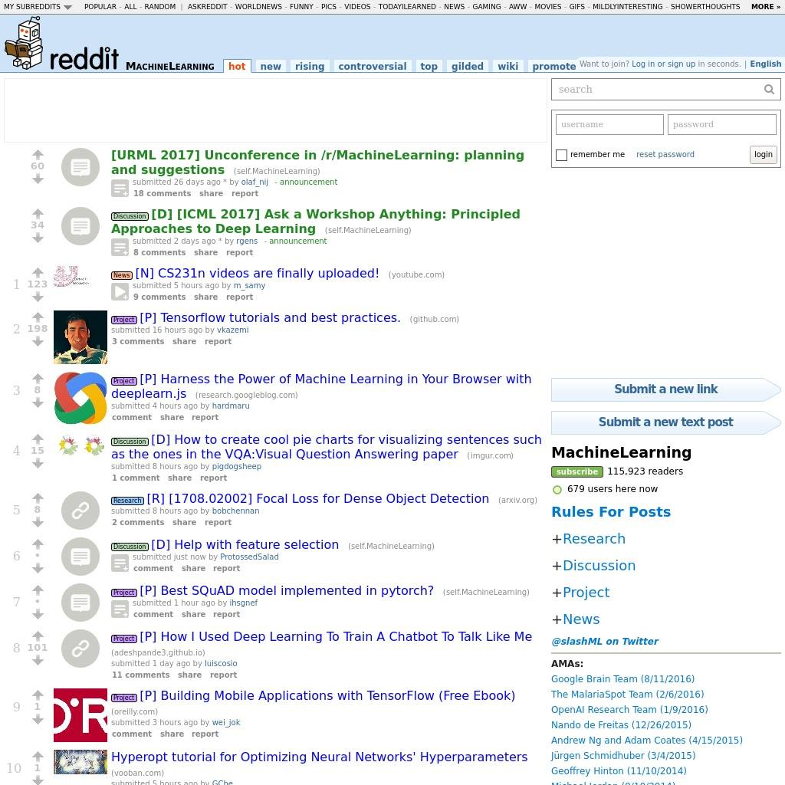
**이미지 캡션:** 이 이미지는 인기 있는 온라인 커뮤니티인 레딧의 머신러닝 서브레딧 페이지를 보여줍니다. 페이지 상단에는 레딧 로고와 함께 "MACHINE LEARNING"이라는 제목이 있고, 그 아래에는 "hot", "new", "rising", "controversial", "top", "gilded", "wiki", "promote"와 같은 다양한 탭이 있습니다. 오른쪽 상단에는 로그인 및 회원가입을 위한 입력 필드와 버튼이 있습니다. 메인 콘텐츠 영역에는 여러 게시물 목록이 있으며, 각 게시물은 제목, 제출자, 제출 시간, 댓글 수, 공유 수 등의 정보를 포함하고 있습니다. 게시물 제목들은 머신러닝 관련 주제들을 다루고 있으며, 일부는 링크를 포함하고 있습니다. 예를 들어, "[URML 2017] Unconference in /r/MachineLearning: planning and suggestions"라는 제목의 게시물은 26일 전에 제출되었고 18개의 댓글이 있습니다. 또한, "CS231n videos are finally uploaded!"라는 제목의 게시물은 5시간 전에 제출되었고 9개의 댓글이 있습니다. 페이지 오른쪽에는 "Submit a new link" 및 "Submit a new text post" 버튼과 함께 서브레딧의 구독자 수, 현재 접속자 수, 게시 규칙, 관련 트위터 계정, 그리고 과거 AMA(Ask Me Anything) 목록이 표시되어 있습니다. 전반적으로 이 페이지는 머신러닝 분야의 최신 정보와 토론을 공유하는 온라인 커뮤니티의 모습을 보여줍니다.

> #오늘의레딧 https://www.reddit.com/r/MachineLearning/ 따끈한 소식들입니다.  1. deeplearn.js를 사용하여 브라우저에서 기계 학습의 힘을 십분 활용하십시오 2. VQA : Visual Question Answering paper와 같은 문장을 시각화하기위한 멋진 원형 차트를 만드는 법 3. 기능 선택 도움말 4. 최고의 SQuad 모델은 Pytorch에서 구현 되었습니까? 5. 어떻게 내가 깊은 대화를 나누기 위해 Chatbot을 훈련시키는 데 사용 되는가? 6. TensorFlow (무료 전자 책)로 모바일 애플리케이션 구축 7. NLP 데이터에 대한 올바른 표현 찾기 8. 나는 터미널 창을 많이 보았다. 9. Supervisely 및 Tensorflow로 번호판 감지 10. NEAT 신경 네트워크 학습 팩맨 11. 의미 론적 가이드가있는 초 능률. 고해상도 GAN이 생성 한 얼굴을 추적하십시오. 12. Darpa가 통역 할 수있는 인공 지능으로 밀고 들어가기 13. CVPR 2017 오팔과 스포트라이트 비디오 14. 누구든지 종자 프로젝트를 배우는 좋은 오픈 소스 기계에 대해 알고 있습니까? 15. 웹캠을 사용하여 바위 가위를 재생하십시오. 16. 비 공짜 데이터 세트에서 교육받은 모델을 공유 할 수 있습니까? 17. DeepMind와 블리자드는 스타 크래프트 II를 AI 연구 환경으로 엽니 다. 18. "WebVision Database : 웹 데이터로부터의 시각적 학습 및 이해", Li et al 2017 (검색 엔진 질의로 라벨링 된 2.4m 이미지, 인간 라벨링 검증 세트) 19. 가우스 프로세스 회귀 튜토리얼 20. 베이지안 모형 부적합에  1. https://research.googleblog.com/2017/08/harness-power-of-machine-learning-in.html 2. http://imgur.com/oTU6CFH 3. https://www.reddit.com/r/MachineLearning/comments/6t4xj4/d_help_with_feature_selection/ 4. https://www.reddit.com/r/MachineLearning/comments/6t4s7k/p_best_squad_model_implemented_in_pytorch/ 5. https://adeshpande3.github.io/How-I-Used-Deep-Learning-to-Train-a-Chatbot-to-Talk-Like-Me 6. http://www.oreilly.com/data/free/building-mobile-applications-with-tensorflow.csp 7. https://tryolabs.com/blog/2017/08/10/finding-the-right-representation-for-your-nlp-data/ 8. https://www.reddit.com/r/MachineLearning/comments/6t04nt/d_i_find_myself_looking_at_the_terminal_window_a/ 9. https://medium.com/p/e84c74d4382c 10. https://www.youtube.com/watch?v=mBmj8n_u2IQ 11. http://mtyka.github.io/machine/learning/2017/08/09/highres-gan-faces-followup.html 12. https://blogs.wsj.com/cio/2017/08/10/inside-darpas-push-to-make-artificial-intelligence-explain-itself 13. https://www.youtube.com/channel/UC0n76gicaarsN_Y9YShWwhw/playlists 14. https://www.reddit.com/r/MachineLearning/comments/6sy4so/d_anyone_know_of_a_good_opensource_machine/ 15. https://tenso.rs/demos/rock-paper-scissors/ 16. https://www.reddit.com/r/MachineLearning/comments/6ss5mw/d_can_i_share_a_model_trained_on_a_non_free/ 17. https://deepmind.com/blog/deepmind-and-blizzard-open-starcraft-ii-ai-research-environment/ 18. https://arxiv.org/abs/1708.02862 19. https://www.reddit.com/r/MachineLearning/comments/6suykc/p_gaussian_process_regression_tutorial/ 20. http://delong.typepad.com/sdj/2009/03/cosma-shalizi-takes-me-to-probability-school-or-is-it-philosophy-school.html

### 8월 12일 (토) 10:36 · Happy birthday!

Happy birthday!

### 8월 12일 (토) 10:36 · ↪ Happy birthday!

*다른 프로필에 남긴 글*

Happy birthday!

### 8월 13일 (일) 08:53 · 📷 사진 (1장)

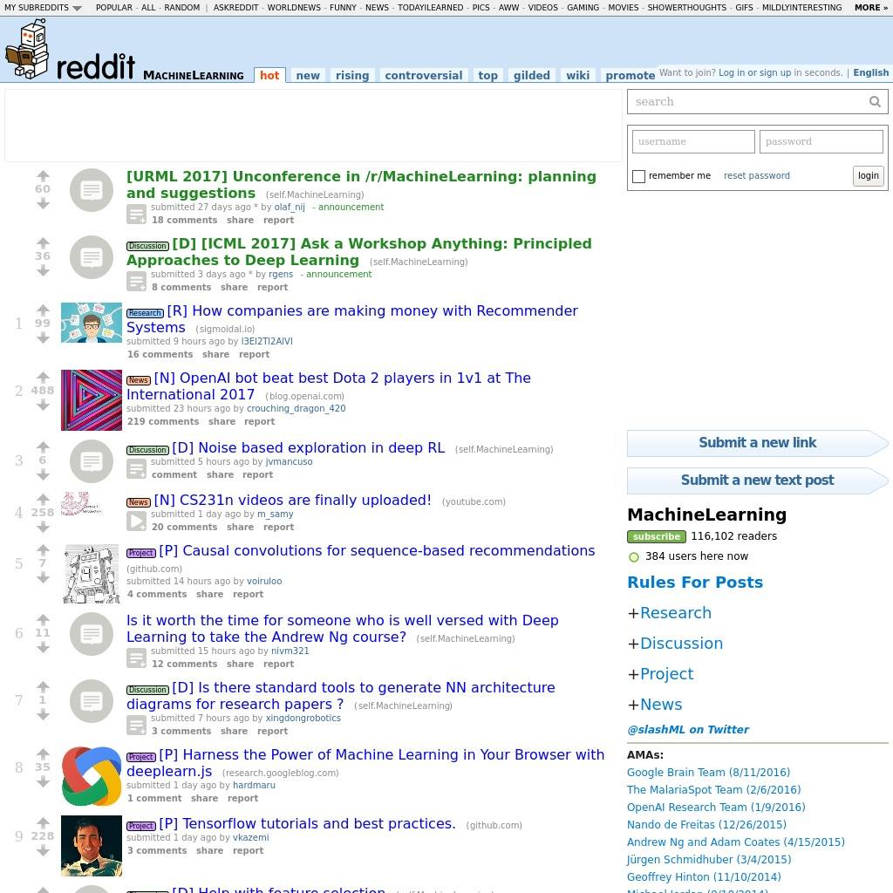
**이미지 캡션:** 이 이미지는 Reddit의 Machine Learning 서브레딧 페이지를 보여줍니다. 페이지 상단에는 Reddit 로고와 함께 "Machine Learning"이라는 제목이 있고, 그 옆에는 "hot", "new", "rising", "controversial", "top", "gilded", "wiki"와 같은 탭들이 있습니다. 오른쪽 상단에는 로그인 폼이 있으며, 사용자 이름과 비밀번호를 입력하고 로그인할 수 있는 버튼이 있습니다. 페이지 중앙에는 다양한 Machine Learning 관련 게시물 목록이 표시됩니다. 각 게시물은 제목, 작성자 정보, 댓글 수, 공유 수 등을 포함하고 있습니다. 게시물 제목 옆에는 해당 게시물의 유형을 나타내는 태그(예: [URML 2017], [ICML 2017], [R], [N], [D], [P])가 붙어 있습니다. 예를 들어, "[URML 2017] Unconference in /r/Machine Learning: planning and suggestions"라는 제목의 게시물은 27일 전에 올라왔고 18개의 댓글이 있습니다. 또한, "How companies are making money with Recommender Systems"라는 제목의 게시물은 9시간 전에 올라왔고 16개의 댓글이 있습니다. 페이지 오른쪽에는 "Submit a new link"와 "Submit a new text post" 버튼이 있고, "Machine Learning" 서브레딧의 구독자 수와 현재 접속자 수가 표시됩니다. 그 아래에는 "Rules For Posts" 섹션이 있으며, "+Research", "+Discussion", "+Project", "+News"와 같은 하위 섹션들이 있습니다. 마지막으로, "AMAS" 섹션에는 Machine Learning 분야의 유명 인사들의 AMA(Ask Me Anything) 날짜 목록이 나열되어 있습니다. 전반적으로 이 페이지는 Machine Learning 커뮤니티의 최신 정보와 토론을 공유하는 플랫폼의 모습을 보여줍니다.

> #오늘의레딧 https://www.reddit.com/r/MachineLearning/ 재미난 이야기들이 많습니다  1. Deep RL에서의 소음 기반 탐사 2. CS231n 비디오가 마침내 업로드됩니다! 3. 시퀀스 기반 권장 사항의 인과 관계 4. 연구 논문을위한 NN 아키텍처 다이어그램을 생성하기위한 표준 도구가 있습니까? 5. deeplearn.js를 사용하여 브라우저에서 기계 학습의 힘을 십분 활용하십시오 6. Tensorflow 자습서 및 모범 사례. 7. 기능 선택 도움말 8. VQA : Visual Question Answering paper와 같은 문장을 시각화하기위한 멋진 원형 차트를 만드는 법 9. TensorFlow (무료 전자 책)로 모바일 애플리케이션 구축 10. 최고의 SQuad 모델은 Pytorch에서 구현 되었습니까? 11. 어떻게 내가 깊은 대화를 나누기 위해 Chatbot을 훈련시키는 데 사용 되는가? 12. Supervisely 및 Tensorflow로 번호판 감지 13. 나는 터미널 창을 많이 보았다. 14. NLP 데이터에 대한 올바른 표현 찾기 15. NEAT 신경 네트워크 학습 팩맨 16. 의미 론적 가이드가있는 초 능률. 고해상도 GAN이 생성 한 얼굴을 추적하십시오. 17. Darpa가 통역 할 수있는 인공 지능으로 밀고 들어가기 18. CVPR 2017 오팔과 스포트라이트 비디오 19. 누구든지 종자 프로젝트를 배우는 좋은 오픈 소스 기계에 대해 알고 있습니까?  1. https://www.reddit.com/r/MachineLearning/comments/6t9w1w/d_noise_based_exploration_in_deep_rl/ 2. https://www.youtube.com/playlist?list=PL3FW7Lu3i5JvHM8ljYj-zLfQRF3EO8sYv 3. https://github.com/maciejkula/spotlight/blob/master/examples/movielens_sequence/readme.rst 4. https://www.reddit.com/r/MachineLearning/comments/6t9dx2/d_is_there_standard_tools_to_generate_nn/ 5. https://research.googleblog.com/2017/08/harness-power-of-machine-learning-in.html 6. https://github.com/vahidk/EffectiveTensorflow 7. https://www.reddit.com/r/MachineLearning/comments/6t4xj4/d_help_with_feature_selection/ 8. http://imgur.com/oTU6CFH 9. http://www.oreilly.com/data/free/building-mobile-applications-with-tensorflow.csp 10. https://www.reddit.com/r/MachineLearning/comments/6t4s7k/p_best_squad_model_implemented_in_pytorch/ 11. https://adeshpande3.github.io/How-I-Used-Deep-Learning-to-Train-a-Chatbot-to-Talk-Like-Me 12. https://medium.com/p/e84c74d4382c 13. https://www.reddit.com/r/MachineLearning/comments/6t04nt/d_i_find_myself_looking_at_the_terminal_window_a/ 14. https://tryolabs.com/blog/2017/08/10/finding-the-right-representation-for-your-nlp-data/ 15. https://www.youtube.com/watch?v=mBmj8n_u2IQ 16. http://mtyka.github.io/machine/learning/2017/08/09/highres-gan-faces-followup.html 17. https://blogs.wsj.com/cio/2017/08/10/inside-darpas-push-to-make-artificial-intelligence-explain-itself 18. https://www.youtube.com/channel/UC0n76gicaarsN_Y9YShWwhw/playlists 19. https://www.reddit.com/r/MachineLearning/comments/6sy4so/d_anyone_know_of_a_good_opensource_machine/

### 8월 14일 (월) 08:52 · 📷 사진 (1장)

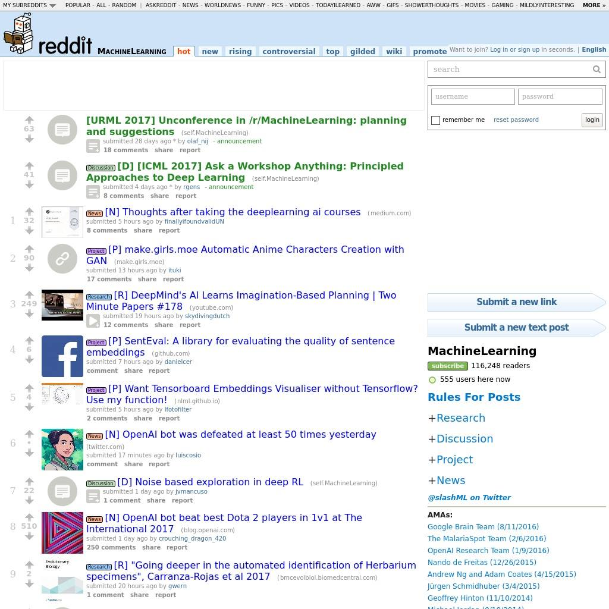
**이미지 캡션:** 이것은 레딧의 머신러닝 서브레딧 페이지로, 다양한 게시물 목록과 사이드바 정보가 표시됩니다. 페이지 상단에는 레딧 로고와 함께 "MACHINE LEARNING"이라는 제목이 보이며, 그 아래에는 "hot", "new", "rising", "controversial", "top", "gilded", "wiki", "promote"와 같은 탭이 있습니다. 로그인/가입 옵션과 검색창도 보입니다. 메인 콘텐츠 영역에는 여러 게시물이 나열되어 있으며, 각 게시물은 제목, 출처, 제출자, 댓글 수, 공유 링크 등을 포함합니다. 예를 들어, "[URML 2017] Unconference in /r/MachineLearning: planning and suggestions"라는 제목의 게시물은 28일 전에 제출되었고 18개의 댓글이 있습니다. 다른 게시물로는 "Ask a Workshop Anything: Principled Approaches to Deep Learning", "Thoughts after taking the deeplearning ai courses", "make.girls.moe Automatic Anime Characters Creation with GAN", "DeepMind's AI Learns Imagination-Based Planning", "SentEval: A library for evaluating the quality of sentence embeddings", "Want Tensorboard Embeddings Visualiser without Tensorflow?", "OpenAI bot was defeated at least 50 times yesterday", "Noise based exploration in deep RL", "OpenAI bot beat best Dota 2 players in 1v1 at The International 2017", 그리고 "Going deeper in the automated identification of Herbarium specimens" 등이 있습니다. 각 게시물 옆에는 업보트/다운보트 화살표와 게시물 유형을 나타내는 아이콘이 있습니다. 오른쪽 사이드바에는 "Submit a new link" 및 "Submit a new text post" 버튼이 있으며, "MachineLearning" 서브레딧에 대한 구독자 수와 현재 접속자 수가 표시됩니다. 또한 "Rules For Posts" 섹션에는 "+Research", "+Discussion", "+Project", "+News"와 같은 카테고리가 있으며, "@slashML on Twitter" 링크와 "AMAS" 섹션에는 과거 AMA(Ask Me Anything) 참여자 목록이 날짜와 함께 나열되어 있습니다. 전반적으로 이 페이지는 머신러닝 커뮤니티의 최신 정보와 토론을 제공하는 온라인 포럼의 모습을 보여줍니다.

> #오늘의레딧 https://www.reddit.com/r/MachineLearning/ 따끈한 소식들입니다.  1. DeepMind의 AI는 상상력 기반 계획을 습득합니다 (ko) | 2 분 논문 # 178 2. SentEval : 문장 embeddings의 품질을 평가하기위한 라이브러리 3. Tensorflow없이 Visualiser embeddings Visualiser를 원하십니까? 내 기능을 사용하십시오! 4. OpenAI 봇은 어제 50 번 이상 패배했습니다. 5. Deep RL에서의 소음 기반 탐사 6. OpenAI 봇, The International 2017에서 1 대 1로 최고의 Dota 2 명을 이겼다. 7. "식물 표본 상자 표본의 자동 식별에 더 깊이 들어가기", Carranza-Rojas et al 2017 8. 연구 논문을위한 NN 아키텍처 다이어그램을 생성하기위한 표준 도구가 있습니까? 9. CS231n 비디오가 마침내 업로드됩니다! 10. 시퀀스 기반 권장 사항의 인과 관계 11. deeplearn.js를 사용하여 브라우저에서 기계 학습의 힘을 십분 활용하십시오 12. Tensorflow 자습서 및 모범 사례. 13. 기능 선택 도움말 14. VQA : Visual Question Answering paper와 같은 문장을 시각화하기위한 멋진 원형 차트를 만드는 법 15. 최고의 SQuad 모델은 Pytorch에서 구현 되었습니까? 16. TensorFlow (무료 전자 책)로 모바일 애플리케이션 구축 17. 어떻게 내가 깊은 대화를 나누기 위해 Chatbot을 훈련시키는 데 사용 되는가? 18. 나는 터미널 창을 많이 보았다. 19. Supervisely 및 Tensorflow로 번호판 감지 20. NLP 데이터에 대한 올바른 표현 찾기  1. https://www.youtube.com/watch?v=xp-YOPcjkFw 2. https://github.com/facebookresearch/SentEval 3. https://nlml.github.io/tensorflow/using-tensorboard-embeddings-visualiser-with-numpy-arrays/ 4. https://twitter.com/riningear/status/896297256550252545 5. https://www.reddit.com/r/MachineLearning/comments/6t9w1w/d_noise_based_exploration_in_deep_rl/ 6. https://blog.openai.com/dota-2/ 7. https://bmcevolbiol.biomedcentral.com/articles/10.1186/s12862-017-1014-z 8. https://www.reddit.com/r/MachineLearning/comments/6t9dx2/d_is_there_standard_tools_to_generate_nn/ 9. https://www.youtube.com/playlist?list=PL3FW7Lu3i5JvHM8ljYj-zLfQRF3EO8sYv 10. https://github.com/maciejkula/spotlight/blob/master/examples/movielens_sequence/readme.rst 11. https://research.googleblog.com/2017/08/harness-power-of-machine-learning-in.html 12. https://github.com/vahidk/EffectiveTensorflow 13. https://www.reddit.com/r/MachineLearning/comments/6t4xj4/d_help_with_feature_selection/ 14. http://imgur.com/oTU6CFH 15. https://www.reddit.com/r/MachineLearning/comments/6t4s7k/p_best_squad_model_implemented_in_pytorch/ 16. http://www.oreilly.com/data/free/building-mobile-applications-with-tensorflow.csp 17. https://adeshpande3.github.io/How-I-Used-Deep-Learning-to-Train-a-Chatbot-to-Talk-Like-Me 18. https://www.reddit.com/r/MachineLearning/comments/6t04nt/d_i_find_myself_looking_at_the_terminal_window_a/ 19. https://medium.com/p/e84c74d4382c 20. https://tryolabs.com/blog/2017/08/10/finding-the-right-representation-for-your-nlp-data/

### 8월 15일 (화) 08:52 · 📷 사진 (1장)

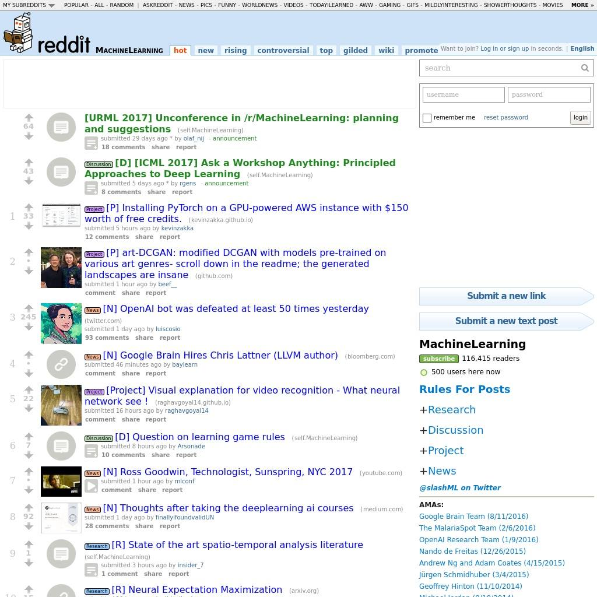
**이미지 캡션:** 이 이미지는 레딧의 머신러닝 서브레딧 페이지를 보여주며, 다양한 게시물 목록과 사이드바 정보가 포함되어 있습니다. 화면 중앙에는 여러 게시물이 나열되어 있으며, 각 게시물은 제목, 작성자, 제출 시간, 댓글 수, 공유 옵션 등으로 구성되어 있습니다. 게시물 제목들은 머신러닝 관련 주제를 다루고 있으며, "[URML 2017] Unconference in /r/MachineLearning: planning and suggestions", "[ICML 2017] Ask a Workshop Anything: Principled Approaches to Deep Learning", "[P] Installing PyTorch on a GPU-powered AWS instance with $150 worth of free credits", "[P] art-DCGAN: modified DCGAN with models pre-trained on various art genres- scroll down in the readme; the generated landscapes are insane", "[N] OpenAI bot was defeated at least 50 times yesterday", "[N] Google Brain Hires Chris Lattner (LLVM author)", "[Project] Visual explanation for video recognition - What neural network see!", "[D] Question on learning game rules", "[N] Ross Goodwin, Technologist, Sunspring, NYC 2017", "[N] Thoughts after taking the deeplearning ai courses", "[R] State of the art spatio-temporal analysis literature", "[R] Neural Expectation Maximization" 등이 보입니다. 각 게시물 옆에는 업보트/다운보트 화살표와 함께 숫자가 표시되어 있어 인기 정도를 나타냅니다. 왼쪽 상단에는 레딧 로고와 함께 "MACHINE LEARNING"이라는 서브레딧 이름이 보이고, 그 옆에는 "hot", "new", "rising", "controversial", "top", "gilded", "wiki", "promote"와 같은 탭들이 있습니다. 오른쪽 상단에는 로그인 및 회원가입을 위한 입력 필드와 버튼이 있습니다. 사이드바에는 "Submit a new link", "Submit a new text post" 버튼이 있고, "Machine Learning" 서브레딧에 대한 구독 정보와 현재 접속자 수가 표시되어 있습니다. 또한, "Rules For Posts" 섹션에는 "+Research", "+Discussion", "+Project", "+News"와 같은 카테고리가 나열되어 있으며, "@slashML on Twitter" 링크와 함께 머신러닝 분야의 저명한 연구자들의 이름과 활동 시기가 AMAS 섹션에 포함되어 있습니다. 전반적으로 기술 커뮤니티의 정보 공유 및 토론이 이루어지는 온라인 플랫폼의 모습을 보여줍니다.

> #오늘의레딧 https://www.reddit.com/r/MachineLearning/ 오늘도 새소식이 많군요.  1. OpenAI 봇은 어제 50 번 이상 패배했습니다. 2. 구글 뇌를 고용 크리스 래트너 (LLVM의 저자) 3. 비디오 인식에 대한 시각적 설명 - 어떤 신경 네트워크를 볼 수 있습니다! 4. 게임 규칙 학습에 관한 질문 5. Ross Goodwin, 기술자, Sunspring, NYC 2017 6. deeplearning ai 과정을 수강 한 후 생각 7. 최신 시공간 분석 문헌 8. 신경 기대 극대화 9. make.girls.moe GAN을 사용한 자동 애니메이션 캐릭터 생성 10. TensorFlow를 사용하여 개체 검색 응용 프로그램 만들기 11. Tensorflow없이 Visualiser embeddings Visualiser를 원하십니까? 내 기능을 사용하십시오! 12. DeepMind의 AI는 상상력 기반 계획을 습득합니다 (ko) | 2 분 논문 # 178 13. SentEval : 문장 embeddings의 품질을 평가하기위한 라이브러리 14. 머지 않아 더 많은 ML 모델 (K- 평균)의 VBA 구현 15. Deep RL에서의 소음 기반 탐사 16. OpenAI 봇, The International 2017에서 1 대 1로 최고의 Dota 2 명을 이겼다. 17. "식물 표본 상자 표본의 자동 식별에 더 깊이 들어가기", Carranza-Rojas et al 2017 18. 연구 논문을위한 NN 아키텍처 다이어그램을 생성하기위한 표준 도구가 있습니까? 19. CS231n 비디오가 마침내 업로드됩니다! 20. 시퀀스 기반 권장 사항의 인과 관계  1. https://twitter.com/riningear/status/896297256550252545 2. https://www.bloomberg.com/amp/news/articles/2017-08-14/google-hires-former-star-apple-engineer-for-its-ai-team 3. https://raghavgoyal14.github.io/blog/2017/08/13/temp-class-act-map 4. https://www.reddit.com/r/MachineLearning/comments/6tmmub/d_question_on_learning_game_rules/ 5. https://www.youtube.com/watch?v=0fiBn3YZo-c&t=44s 6. https://medium.com/@gedanken.thesis/thoughts-after-taking-the-deeplearning-ai-courses-8568f132153 7. https://www.reddit.com/r/MachineLearning/comments/6tomx8/r_state_of_the_art_spatiotemporal_analysis/ 8. https://arxiv.org/abs/1708.03498 9. http://make.girls.moe/ 10. https://cloud.google.com/solutions/creating-object-detection-application-tensorflow 11. https://nlml.github.io/tensorflow/using-tensorboard-embeddings-visualiser-with-numpy-arrays/ 12. https://www.youtube.com/watch?v=xp-YOPcjkFw 13. https://github.com/facebookresearch/SentEval 14. https://github.com/angusche5/ML 15. https://www.reddit.com/r/MachineLearning/comments/6t9w1w/d_noise_based_exploration_in_deep_rl/ 16. https://blog.openai.com/dota-2/ 17. https://bmcevolbiol.biomedcentral.com/articles/10.1186/s12862-017-1014-z 18. https://www.reddit.com/r/MachineLearning/comments/6t9dx2/d_is_there_standard_tools_to_generate_nn/ 19. https://www.youtube.com/playlist?list=PL3FW7Lu3i5JvHM8ljYj-zLfQRF3EO8sYv 20. https://github.com/maciejkula/spotlight/blob/master/examples/movielens_sequence/readme.rst

### 8월 16일 (수) 08:52 · 📷 사진 (1장)

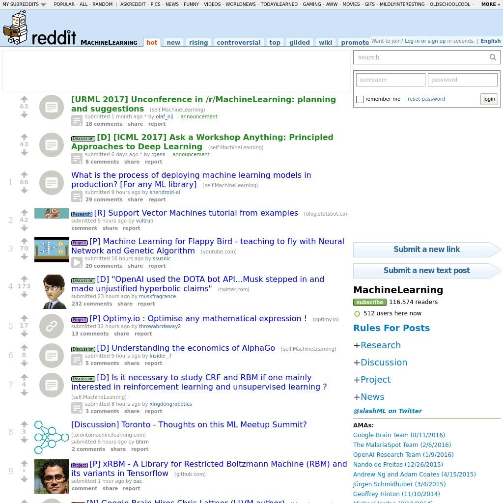
**이미지 캡션:** 이 이미지는 머신러닝 관련 커뮤니티인 레딧의 r/MachineLearning 서브레딧 페이지를 보여줍니다. 페이지 상단에는 레딧 로고와 함께 "MACHINE LEARNING"이라는 제목이 있고, 그 옆에는 "hot", "new", "rising", "controversial", "top", "gilded", "wiki", "promote"와 같은 탭들이 있습니다. 오른쪽 상단에는 로그인 및 회원가입을 위한 입력란과 버튼이 보입니다. 메인 콘텐츠 영역에는 다양한 머신러닝 관련 게시물 목록이 표시됩니다. 각 게시물은 제목, 작성자 정보, 댓글 수, 업보트/다운보트 수 등을 포함합니다. 게시물 제목들은 "[URML 2017] Unconference in /r/MachineLearning: planning and suggestions", "[D] [ICML 2017] Ask a Workshop Anything: Principled Approaches to Deep Learning", "What is the process of deploying machine learning models in production? [For any ML library]", "[R] Support Vector Machines tutorial from examples", "[P] Machine Learning for Flappy Bird - teaching to fly with Neural Network and Genetic Algorithm", "[D] "OpenAI used the DOTA bot API... Musk stepped in and made unjustified hyperbolic claims"", "[P] Optimy.io: Optimise any mathematical expression!", "[D] Understanding the economics of AlphaGo", "[D] Is it necessary to study CRF and RBM if one mainly interested in reinforcement learning and unsupervised learning?", "[Discussion] Toronto - Thoughts on this ML Meetup Summit?", "[P] XRBM - A Library for Restricted Boltzmann Machine (RBM) and its variants in Tensorflow" 등입니다. 게시물 옆에는 해당 게시물의 유형(Discussion, Research, Project 등)을 나타내는 태그와 함께 작성자, 제출 시간, 댓글 수, 공유 링크 등이 표시됩니다. 페이지 오른쪽 사이드바에는 "Submit a new link", "Submit a new text post" 버튼과 함께 "MachineLearning" 서브레딧의 구독자 수(116,574명)와 현재 접속자 수(512명)가 표시됩니다. 또한 "Rules For Posts" 섹션 아래에는 "+Research", "+Discussion", "+Project", "+News"와 같은 카테고리가 있으며, "@slashML on Twitter" 링크와 함께 과거 AMA(Ask Me Anything) 세션 목록이 표시됩니다. 전반적으로 기술 커뮤니티의 정보 공유 및 토론이 이루어지는 활발한 온라인 공간의 모습을 보여줍니다.

> #오늘의레딧 https://www.reddit.com/r/MachineLearning/ 래딧은 읽을 거리가 다양합니다.  1. "OpenAI는 DOTA 봇 API를 사용했습니다 ... 머스크는 밟아 부당한 쌍곡선 주장을했습니다" 2. Optimy.io : 수학 표현을 최적화하십시오! 3. AlphaGo의 경제 이해하기 4. 주로 강화 학습과 감독되지 않은 학습에 관심이 있다면 CRF와 RBM을 연구해야합니까? 5. xRBM - Tensorflow의 제한된 볼츠만 기계 (RBM) 및 그 변종을위한 라이브러리 6. 구글 뇌를 고용 크리스 래트너 (LLVM의 저자) 7. art-DCGAN : 다양한 예술 장르에서 사전 훈련 된 모델로 수정 된 DCGAN - 추가 정보에서 아래로 스크롤합니다. 생성 된 풍경은 정신 나간다. 8. $ 150 상당의 무료 크레딧으로 GPU 기반 AWS 인스턴스에 PyTorch 설치 9. 자동 인코딩이 생성되지 않는 이유는 무엇입니까? 10. 비 전통적인 배경에서 ML에있는 직업을위한 학교 선택 11. 생의학 원고를위한 빠른 영어 입력 방법 12. OpenAI 봇은 어제 50 번 이상 패배했습니다. 13. 최신 시공간 분석 문헌 14. 게임 규칙 학습에 관한 질문 15. 비디오 인식에 대한 시각적 설명 - 어떤 신경 네트워크를 볼 수 있습니다! 16. 신경 기대 극대화 17. deeplearning ai 과정을 수강 한 후 생각 18. make.girls.moe GAN을 사용한 자동 애니메이션 캐릭터 생성 19. Tensorflow없이 Visualiser embeddings Visualiser를 원하십니까? 내 기능을 사용하십시오! 20. DeepMind의 AI는 상상력 기반 계획을 습득합니다 (ko) | 2 분 논문 # 178  1. https://twitter.com/mark_riedl/status/897181792901398529 2. http://optimy.io 3. https://www.reddit.com/r/MachineLearning/comments/6tuk2n/d_understanding_the_economics_of_alphago/ 4. https://www.reddit.com/r/MachineLearning/comments/6tuyy1/d_is_it_necessary_to_study_crf_and_rbm_if_one/ 5. https://github.com/omimo/xRBM 6. https://www.bloomberg.com/amp/news/articles/2017-08-14/google-hires-former-star-apple-engineer-for-its-ai-team 7. https://github.com/robbiebarrat/art-DCGAN 8. https://kevinzakka.github.io/2017/08/13/aws-pytorch/#toc4 9. https://www.reddit.com/r/MachineLearning/comments/6tqumy/d_why_are_autoencoders_not_considered_as/ 10. https://www.reddit.com/r/MachineLearning/comments/6tsdnq/discussion_school_choices_for_career_in_ml_from/ 11. https://www.reddit.com/r/MachineLearning/comments/6trbr0/d_fast_english_input_method_for_biomedical/ 12. https://twitter.com/riningear/status/896297256550252545 13. https://www.reddit.com/r/MachineLearning/comments/6tomx8/r_state_of_the_art_spatiotemporal_analysis/ 14. https://www.reddit.com/r/MachineLearning/comments/6tmmub/d_question_on_learning_game_rules/ 15. https://raghavgoyal14.github.io/blog/2017/08/13/temp-class-act-map 16. https://arxiv.org/abs/1708.03498 17. https://medium.com/@gedanken.thesis/thoughts-after-taking-the-deeplearning-ai-courses-8568f132153 18. http://make.girls.moe/ 19. https://nlml.github.io/tensorflow/using-tensorboard-embeddings-visualiser-with-numpy-arrays/ 20. https://www.youtube.com/watch?v=xp-YOPcjkFw

### 8월 17일 (목) 08:52 · 📷 사진 (1장)

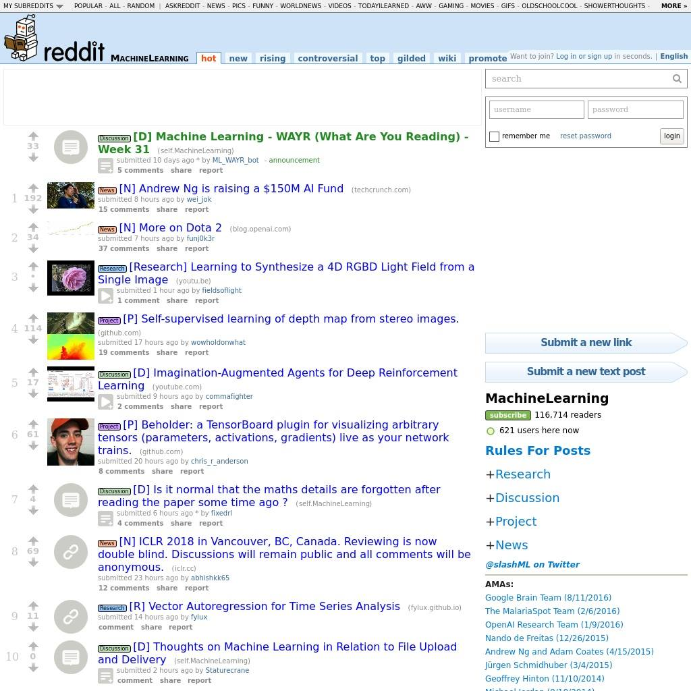
**이미지 캡션:** 이것은 레딧의 머신러닝 서브레딧 페이지로, 다양한 게시물 목록이 표시됩니다. 페이지 상단에는 레딧 로고와 함께 "MY SUBREDDITS"와 "POPULAR ALL RANDOM ASKREDDIT NEWS PICS FUNNY WORLDNEWS VIDEOS TODAYILEARNED AWW GAMING MOVIES GIFS OLDSCHOOLCOOL SHOWERTHOUGHTS"와 같은 메뉴가 있습니다. 그 아래에는 "reddit" 로고와 함께 "MACHINE LEARNING"이라는 제목이 있고, "hot new rising controversial top gilded wiki promote"와 같은 탭이 있습니다. 오른쪽에는 로그인 및 회원가입을 위한 입력란과 버튼이 있습니다. 메인 콘텐츠 영역에는 여러 게시물이 나열되어 있으며, 각 게시물은 제목, 작성자, 제출 시간, 댓글 수, 공유 및 보고 옵션을 포함합니다. 게시물에는 "Machine Learning - WAYR (What Are You Reading) - Week 31", "Andrew Ng is raising a $150M AI Fund", "More on Dota 2", "Learning to Synthesize a 4D RGBD Light Field from a Single Image", "Self-supervised learning of depth map from stereo images", "Imagination-Augmented Agents for Deep Reinforcement Learning", "Beholder: a TensorBoard plugin for visualizing arbitrary tensors", "Is it normal that the maths details are forgotten after reading the paper some time ago?", "ICLR 2018 in Vancouver, BC, Canada. Reviewing is now double blind.", "Vector Autoregression for Time Series Analysis", "Thoughts on Machine Learning in Relation to File Upload and Delivery"와 같은 제목이 있습니다. 각 게시물 옆에는 썸네일 이미지나 아이콘이 있습니다. 오른쪽 사이드바에는 "Submit a new link" 및 "Submit a new text post" 버튼과 함께 "MachineLearning" 서브레딧에 대한 정보가 있습니다. 구독자 수는 116,714명이며, 현재 621명의 사용자가 있습니다. 또한 "Rules For Posts" 섹션에는 "+Research", "+Discussion", "+Project", "+News"와 같은 항목이 있으며, "@slashML on Twitter" 링크도 있습니다. 하단에는 "AMAS" 섹션에 여러 팀 및 개인의 이름과 날짜가 나열되어 있습니다. 전반적으로 이 페이지는 머신러닝 커뮤니티의 최신 토론과 정보를 제공하는 온라인 포럼의 스크린샷입니다.

> #오늘의레딧 https://www.reddit.com/r/MachineLearning/ 래딧은 읽을 거리가 다양합니다.  1. Dota 2에 대한 자세한 정보 2. 단일 이미지에서 4D RGB RGB Light Field 합성 학습 3. 스테레오 이미지에서 깊이지도의 자체 감독 학습. 4. 심층 강화 학습을위한 상상력 강화 에이전트 5. Beholder : 임의의 텐서 (매개 변수, 활성화, 그라디언트)를 시각화하기위한 TensorBoard 플러그인이 네트워크 열차로 작동합니다. 6. 몇 시간 전에 종이를 읽은 후에 수학의 세부 사항을 잊어 버리는 것이 정상입니까? 7. ICLR 2018 in Vancouver, BC, Canada. 검토는 이제 이중 맹검 법입니다. 토론은 공개되며 모든 의견은 익명으로 처리됩니다. 8. 시계열 분석을위한 벡터 자동 변이 9. 파일 업로드 및 전달과 관련된 기계 학습에 대한 생각 10. 예정된 컨퍼런스 / 워크샵 및 마감일 11. 자기 조직화 예측 알고리즘 12. 더 이상 WAYR이 아니십니까? 13. 지속적인 제어를위한 벤치마킹 된 심층 강화 학습 과제의 재현성 14. Theano 사용자를위한 Tensoflow에 대한 부드러운 소개 15. 외부 변수를 이용한 단기 (초 단위) 시계열 분석을위한 최고의 모델링 기법? 16. 기계 학습을위한 듀얼 GPU PCIe 레인 병목 현상? 17. 예제로부터 지원 벡터 머신 튜토리얼 18. 미리 숙련 된 임베딩에서 일부 단어 추가 / 수정 (의도 인식 및 슬롯 채우기 용) 19. 계층 적 분류를위한 하나의 NN 분류기?  1. https://blog.openai.com/more-on-dota-2/ 2. https://youtu.be/yLCvWoQLnms 3. https://github.com/LouisFoucard/w-net 4. https://www.youtube.com/watch?v=agXIYMCICcc 5. https://github.com/chrisranderson/beholder/ 6. https://www.reddit.com/r/MachineLearning/comments/6u3ljo/d_is_it_normal_that_the_maths_details_are/ 7. http://www.iclr.cc/doku.php?id=ICLR2018:main 8. https://fylux.github.io/2017/08/09/VAR_Model_Time_Series/ 9. https://www.reddit.com/r/MachineLearning/comments/6u5age/d_thoughts_on_machine_learning_in_relation_to/ 10. https://www.reddit.com/r/MachineLearning/comments/6u0ops/d_upcoming_conferencesworkshops_and_deadlines/ 11. https://github.com/CarsonScott/Online-Relationship-Learning 12. https://www.reddit.com/r/MachineLearning/comments/6tywqy/d_no_more_wayr/ 13. http://arxiv.org/abs/1708.04133 14. https://tf-lenet.readthedocs.io 15. https://www.reddit.com/r/MachineLearning/comments/6u2irq/d_best_modeling_technique_for_shortterm_second_by/ 16. https://www.reddit.com/r/MachineLearning/comments/6tyyyt/d_dual_gpu_pcie_lane_bottleneck_for_machine/ 17. https://blog.statsbot.co/support-vector-machines-tutorial-c1618e635e93 18. https://www.reddit.com/r/MachineLearning/comments/6u1sk1/d_addingmodifying_some_words_in_pre_trained/ 19. https://www.reddit.com/r/MachineLearning/comments/6u1r2s/d_one_nn_classifier_for_hierarchical/

### 8월 18일 (금) 08:52 · 📷 사진 (1장)

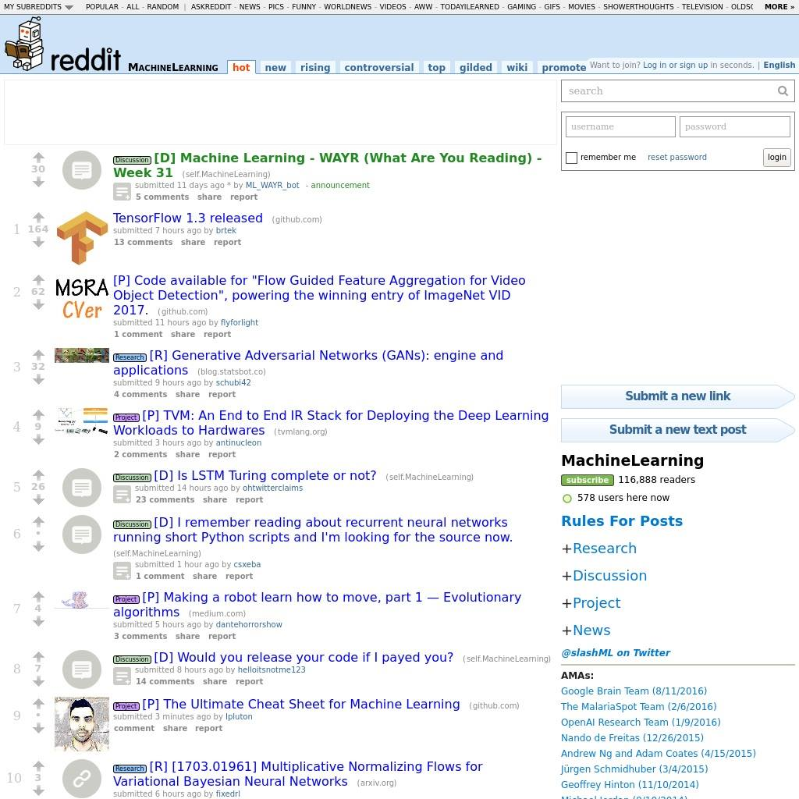
**이미지 캡션:** 이 이미지는 머신러닝 관련 주제를 다루는 레딧(Reddit) 커뮤니티의 웹페이지 스크린샷입니다. 페이지 상단에는 레딧 로고와 함께 "MACHINE LEARNING"이라는 제목이 보이며, 그 아래에는 "hot", "new", "rising", "controversial", "top", "gilded", "wiki"와 같은 탭들이 나열되어 있습니다. 오른쪽 상단에는 로그인 폼이 있으며, 사용자 이름과 비밀번호를 입력하고 로그인할 수 있는 필드가 있습니다. 페이지 중앙에는 다양한 머신러닝 관련 게시물들이 목록 형태로 표시되어 있습니다. 각 게시물은 제목, 작성자, 제출 시간, 댓글 수, 그리고 관련 링크(예: github.com, arxiv.org)를 포함하고 있습니다. 게시물 목록에는 "TensorFlow 1.3 released", "Code available for 'Flow Guided Feature Aggregation for Video Object Detection'", "Generative Adversarial Networks (GANs): engine and applications", "Is LSTM Turing complete or not?" 등 다양한 주제의 글들이 있습니다. 오른쪽 사이드바에는 "Machine Learning" 커뮤니티의 구독자 수와 현재 접속자 수가 표시되어 있으며, "Rules For Posts" 섹션 아래에는 "+Research", "+Discussion", "+Project", "+News"와 같은 하위 카테고리가 있습니다. 또한, "@slashML on Twitter"와 "AMAS" 섹션에는 머신러닝 분야의 유명 인사나 팀들의 이름과 관련 날짜가 나열되어 있습니다. 전반적으로 이 이미지는 머신러닝 커뮤니티의 정보 공유 및 토론이 활발하게 이루어지고 있음을 보여주는 온라인 포럼의 모습을 담고 있습니다.

> #오늘의레딧 https://www.reddit.com/r/MachineLearning/ 따끈한 소식들입니다.  1. TVM : 딥 학습 워크로드를 하드웨어에 배포하기위한 IR 스택 2. LSTM 튜링이 완료 되었습니까? 3. 짧은 파이썬 스크립트를 실행하는 반복적 인 신경 네트워크에 대해 읽은 것을 기억하며 지금 소스를 찾고 있습니다. 4. 로봇이 움직이는 법을 배우게 만들기, 파트 1 - 진화 알고리즘 5. 내가 돈을 주면 코드를 풀어 주겠습니까? 6. 기계 학습을위한 궁극적 인 치트 시트 7. Andrew Ng가 1 억 5 천만 달러짜리 AI 기금 모금 중입니다. 8. 지나친 이해 : 감독 학습에 부정확 한 밈 9. 내 측면 프로젝트에 대한 의견을 찾고 10. 단일 이미지에서 4D RGB RGB Light Field 합성 학습 11. 이 생성 기술은 소설인가? 12. 암호화 된 가중치가있는 로지스틱 회귀 분류기 사용의 간단한 예 13. Dota 2에 대한 자세한 정보 14. 스테레오 이미지에서 깊이지도의 자체 감독 학습. 15. 심층 강화 학습을위한 상상력 강화 에이전트 16. 몇 시간 전에 종이를 읽은 후에 수학의 세부 사항을 잊어 버리는 것이 정상입니까? 17. Beholder : 임의의 텐서 (매개 변수, 활성화, 그라디언트)를 시각화하기위한 TensorBoard 플러그인이 네트워크 열차로 작동합니다. 18. 튜토리얼 "Supervisely, Tensorflow 및 UNet을 통한 Cityscapes 교육 도로 장면 세분화": Cityscapes 데이터 세트에서 UNet 신경 네트워크를 학습하는 방법에 대한 단계별 가이드 19. ICLR 2018 in Vancouver, BC, Canada. 검토는 이제 이중 맹검 법입니다. 토론은 공개되며 모든 의견은 익명으로 처리됩니다. 20. 시계열 분석을위한 벡터 자동 변이  1. http://tvmlang.org/2017/08/17/tvm-release-announcement.html 2. https://www.reddit.com/r/MachineLearning/comments/6u8nvl/d_is_lstm_turing_complete_or_not/ 3. https://www.reddit.com/r/MachineLearning/comments/6udh17/d_i_remember_reading_about_recurrent_neural/ 4. https://medium.com/towards-data-science/making-a-robot-learn-how-to-move-part-1-evolutionary-algorithms-340f239c9cd2?source=linkShare-bf03de96d99e-1502992422 5. https://www.reddit.com/r/MachineLearning/comments/6uakm8/d_would_you_release_your_code_if_i_payed_you/ 6. https://github.com/dformoso/machine-learning-mindmap 7. https://techcrunch.com/2017/08/15/andrew-ng-is-raising-a-150m-ai-fund/amp/ 8. http://memosisland.blogspot.co.id/2017/08/understanding-overfitting-inaccurate.html 9. https://www.reddit.com/r/MachineLearning/comments/6ud9o5/p_looking_for_feedback_on_my_side_project/ 10. https://youtu.be/yLCvWoQLnms 11. https://www.reddit.com/r/MachineLearning/comments/6uani2/discussion_is_this_generative_technique_novel/ 12. https://blog.n1analytics.com/distributed-machine-learning-and-partially-homomorphic-encryption-2/ 13. https://blog.openai.com/more-on-dota-2/ 14. https://github.com/LouisFoucard/w-net 15. https://www.youtube.com/watch?v=agXIYMCICcc 16. https://www.reddit.com/r/MachineLearning/comments/6u3ljo/d_is_it_normal_that_the_maths_details_are/ 17. https://github.com/chrisranderson/beholder/ 18. https://medium.com/towards-data-science/training-road-scene-segmentation-on-cityscapes-with-supervisely-tensorflow-and-unet-1232314781a8 19. http://www.iclr.cc/doku.php?id=ICLR2018:main 20. https://fylux.github.io/2017/08/09/VAR_Model_Time_Series/

### 8월 18일 (금) 14:18 · Good to have Prof. Jin Hyung Lee in Kore…

Good to have Prof. Jin Hyung Lee in Korea. It's really fun to talk to her.

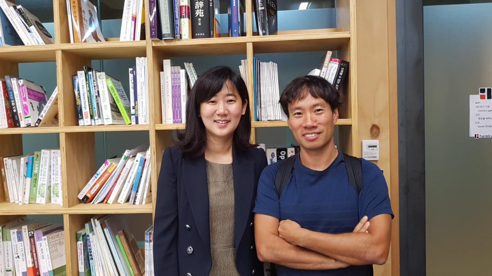
**이미지 캡션:** 이 사진에는 책이 가득한 책장 앞에 서 있는 성인 여성과 성인 남성이 담겨 있습니다. 여성은 30대 후반에서 40대 초반으로 보이며, 검은색 재킷과 회색 원피스를 입고 있습니다. 그녀는 부드러운 미소를 띠고 있으며, 카메라를 응시하고 있습니다. 남성은 30대 후반에서 40대 초반으로 보이며, 파란색 반팔 티셔츠와 검은색 백팩을 메고 있습니다. 그는 팔짱을 끼고 있으며, 카메라를 향해 미소를 짓고 있습니다. 배경에는 다양한 책이 꽂힌 나무 책장이 보이며, 일부 책에는 한국어로 된 제목이 있습니다. 책장 옆에는 흰색 바탕에 검은색 글씨가 있는 작은 표지판이 보입니다. 전체적으로 편안하고 친근한 분위기를 연출하고 있습니다.

### 8월 18일 (금) 15:00 · Happy birthday. We miss you a lot!!

Happy birthday. We miss you a lot!!

### 8월 18일 (금) 15:00 · ↪ Happy birthday. We miss you a lot!!

*다른 프로필에 남긴 글*

Happy birthday. We miss you a lot!!

### 8월 19일 (토) 08:52 · 📷 사진 (1장)

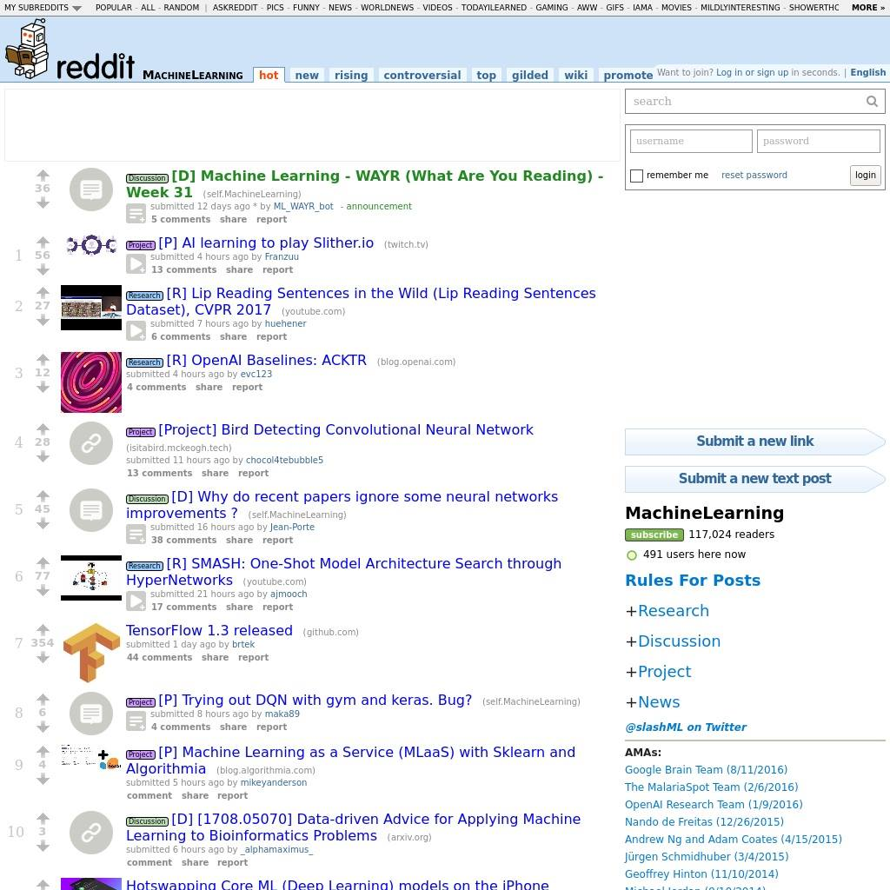
**이미지 캡션:** 이 이미지는 웹사이트 레딧의 머신러닝 서브레딧 페이지를 보여줍니다. 페이지 상단에는 레딧 로고와 함께 "MachineLearning"이라는 제목이 있고, 그 아래에는 "hot", "new", "rising", "controversial", "top", "gilded", "wiki"와 같은 탭이 있습니다. 오른쪽 상단에는 로그인 또는 회원가입을 위한 입력 필드와 버튼이 있습니다. 페이지 중앙에는 다양한 머신러닝 관련 게시물 목록이 표시되며, 각 게시물은 제목, 작성자, 제출 시간, 댓글 수, 공유 수 등의 정보를 포함합니다. 게시물들은 "Discussion", "Project", "Research"와 같은 태그로 분류되어 있습니다. 오른쪽 사이드바에는 "Submit a new link" 및 "Submit a new text post" 버튼과 함께 "MachineLearning" 서브레딧에 대한 구독 정보, 현재 접속자 수, 게시 규칙, 트위터 계정, 그리고 관련 연구팀 목록이 표시됩니다. 전반적으로 정보가 많고 기술적인 주제를 다루는 커뮤니티 페이지의 모습을 보여줍니다.

> #오늘의레딧 https://www.reddit.com/r/MachineLearning/ 오늘도 새소식이 많군요.  1. 와일드 (립 독해 문장 데이터 세트)에서 립 독해 문장, CVPR 2017 2. OpenAI베이스 라인 : ACKTR 3. 조류 감지 컨 버루 셔널 신경망 4. 왜 최근 논문은 신경 네트워크의 개선점을 무시합니까? 5. SMASH : Hyper-Network를 통한 원 샷 모델 아키텍처 검색 6. 체육관과 케라가있는 DQN을 시험해 보았습니다. 곤충? 7. Sklearn과 Algorithmia가있는 MLaaS (Machine Learning as a Service) 8. 기계 학습을위한 궁극적 인 치트 시트 9. 기계 학습의 상태 10. 인코더가 LSTM이 아닌 경우 seq2seq에서 LSTM 디코더 상태를 초기화하는 방법 11. 당신이 보상하는 것을주의하십시오. 12. TVM : 딥 학습 워크로드를 하드웨어에 배포하기위한 IR 스택 13. Generic Adversarial Networks (GANs) : 엔진 및 애플리케이션 14. 내 측면 프로젝트에 대한 의견을 찾고 15. 피드백을 찾고 고양이 유추를 사용하여 사회학 학생들에게 ML을 설명합니다. 16. 신경망은 바이너리에서 함수 유형 시그니처를 학습 할 수 있습니다. 17. 컨텍스트 제어 NLP 요약 18. 짧은 파이썬 스크립트를 실행하는 반복적 인 신경 네트워크에 대해 읽은 것을 기억하며 지금 소스를 찾고 있습니다. 19. 로봇이 움직이는 법을 배우게 만들기, 파트 1 - 진화 알고리즘 20. 내가 돈을 주면 코드를 풀어 주겠습니까?  1. https://www.youtube.com/watch?v=103CXDFhpcc 2. https://blog.openai.com/baselines-acktr-a2c/ 3. https://isitabird.mckeogh.tech 4. https://www.reddit.com/r/MachineLearning/comments/6ug9u4/d_why_do_recent_papers_ignore_some_neural/ 5. https://www.youtube.com/watch?v=79tmPL9AL48 6. https://www.reddit.com/r/MachineLearning/comments/6uijv6/p_trying_out_dqn_with_gym_and_keras_bug/ 7. https://blog.algorithmia.com/machine-learning-as-a-service-mlaas-with-sklearn-and-algorithmia/ 8. https://github.com/dformoso/machine-learning-mindmap 9. https://www.reddit.com/r/MachineLearning/comments/6ukelx/d_state_of_machine_learning/ 10. https://www.reddit.com/r/MachineLearning/comments/6uh6ih/d_how_to_initialize_the_lstm_decoder_state_in/ 11. http://bair.berkeley.edu/blog/2017/08/17/cooperatively-learning-human-values/ 12. http://tvmlang.org/2017/08/17/tvm-release-announcement.html 13. https://blog.statsbot.co/generative-adversarial-networks-gans-engine-and-applications-f96291965b47 14. https://www.reddit.com/r/MachineLearning/comments/6ud9o5/p_looking_for_feedback_on_my_side_project/ 15. https://www.reddit.com/r/MachineLearning/comments/6uf610/d_explaining_ml_to_sociology_students_using_a_cat/ 16. https://www.usenix.org/system/files/conference/usenixsecurity17/sec17-chua.pdf 17. http://starmine.ai/datasets/summarizer/machinelearning.html 18. https://www.reddit.com/r/MachineLearning/comments/6udh17/d_i_remember_reading_about_recurrent_neural/ 19. https://medium.com/towards-data-science/making-a-robot-learn-how-to-move-part-1-evolutionary-algorithms-340f239c9cd2?source=linkShare-bf03de96d99e-1502992422 20. https://www.reddit.com/r/MachineLearning/comments/6uakm8/d_would_you_release_your_code_if_i_payed_you/

### 8월 19일 (토) 10:45 · Best ride ever with Yeon Gyoung Gwack an…

Best ride ever with Yeon Gyoung Gwack and Lucy Park!

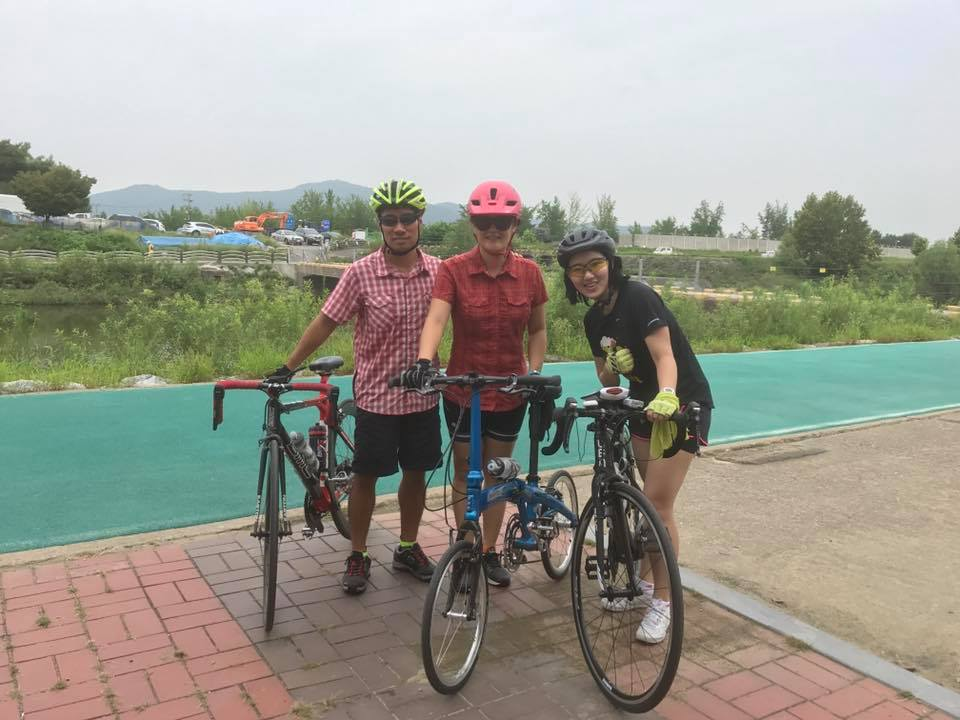
**이미지 캡션:** 세 명의 성인이 자전거를 타고 야외에서 포즈를 취하고 있다. 왼쪽에는 헬멧을 쓰고 체크무늬 셔츠와 검은색 반바지를 입은 성인 남성이 서 있다. 그는 검은색과 빨간색 자전거 옆에 서서 카메라를 응시하고 있다. 가운데에는 분홍색 헬멧을 쓰고 빨간색 셔츠와 검은색 반바지를 입은 성인 여성이 서 있다. 그녀는 파란색과 검은색 접이식 자전거 옆에 서서 카메라를 응시하고 있다. 오른쪽에는 검은색 헬멧과 선글라스를 쓰고 검은색 티셔츠와 검은색 반바지를 입은 성인 여성이 서 있다. 그녀는 노란색 장갑을 끼고 카메라를 향해 웃으며 검은색 자전거 옆에 서 있다. 세 사람 모두 자전거를 타기 좋은 날씨에 야외에서 즐거운 시간을 보내고 있는 것으로 보인다. 배경에는 강과 녹음이 우거진 나무들이 보이며, 하늘은 흐릿하다. 전반적으로 사진은 활동적이고 즐거운 분위기를 전달한다.

### 8월 20일 (일) 08:53 · 📷 사진 (2장)

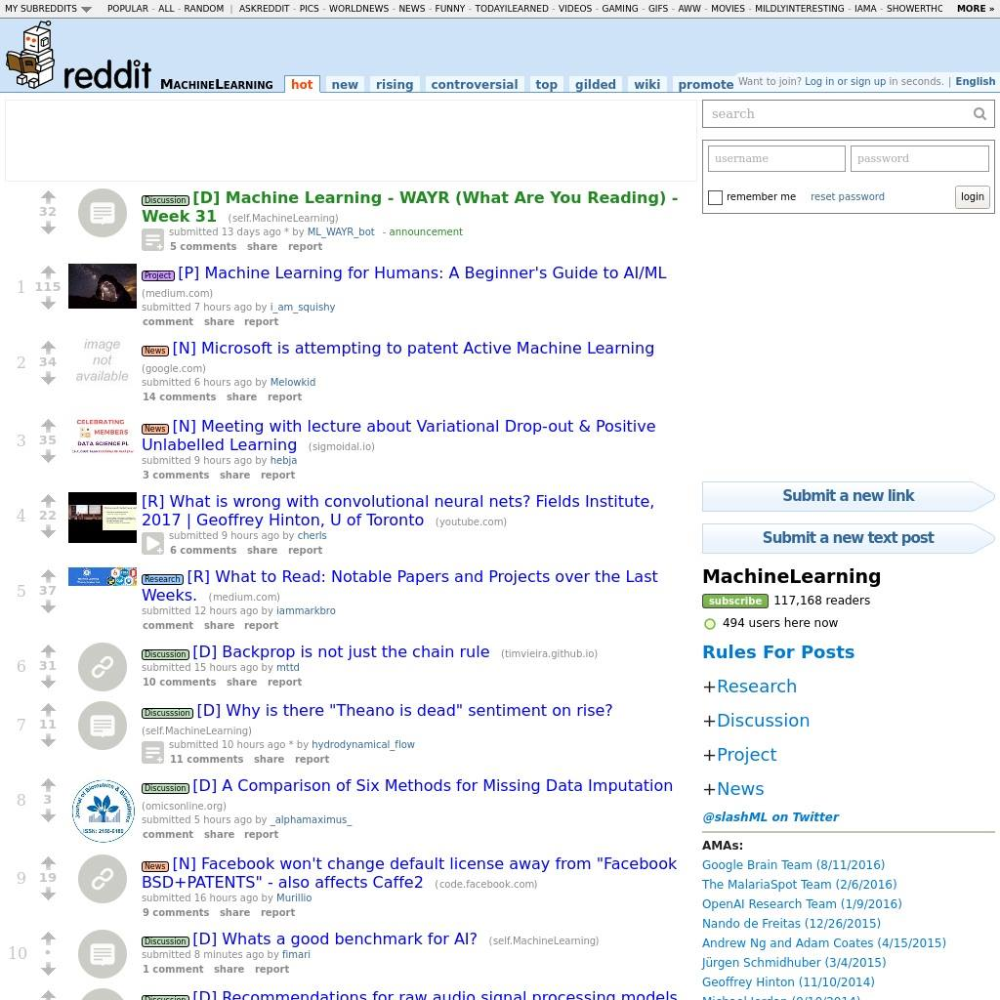
**이미지 캡션:** 이 이미지는 인기 있는 온라인 커뮤니티인 레딧의 머신러닝 관련 서브레딧 페이지를 보여줍니다. 페이지 상단에는 레딧 로고와 함께 "MY SUBREDDITS", "POPULAR", "ALL", "RANDOM" 등 다양한 탐색 메뉴가 있으며, 그 옆에는 "MACHINE LEARNING"이라는 서브레딧 이름과 함께 "hot", "new", "rising", "controversial", "top", "gilded", "wiki"와 같은 정렬 옵션이 있습니다. 오른쪽 상단에는 로그인 또는 회원가입을 유도하는 문구와 함께 검색창, 사용자 이름 및 비밀번호 입력란, 로그인 버튼이 있습니다. 페이지 중앙에는 다양한 머신러닝 관련 게시물 목록이 표시됩니다. 각 게시물은 제목, 출처, 작성자, 게시 시간, 댓글 수, 좋아요/싫어요 수 등의 정보를 포함하고 있습니다. 예를 들어, "[D] Machine Learning - WAYR (What Are You Reading) - Week 31"이라는 제목의 게시물은 5개의 댓글과 함께 13일 전에 게시되었음을 알 수 있습니다. 또한, "MachineLearning" 서브레딧의 구독자 수는 117,168명이며, 현재 494명의 사용자가 활동 중임을 나타내는 정보도 보입니다. 페이지 오른쪽에는 "Submit a new link", "Submit a new text post" 버튼과 함께 서브레딧의 규칙 및 관련 링크 목록이 제공됩니다. 하단에는 "AMAS" 섹션에 머신러닝 분야의 유명 인사들의 이름과 관련 날짜가 나열되어 있습니다. 전반적으로 이 페이지는 머신러닝에 관심 있는 사용자들이 최신 정보와 토론을 공유하고 참여할 수 있는 온라인 플랫폼의 모습을 보여줍니다.
 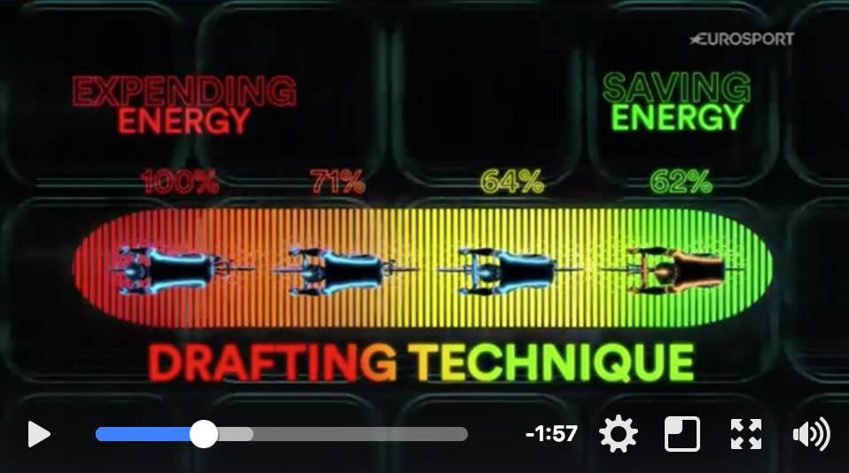
**이미지 캡션:** 이 화면은 레이싱 또는 스포츠 관련 영상의 일부로 보이며, 'EXPENDING ENERGY'와 'SAVING ENERGY'라는 텍스트가 각각 빨간색과 녹색으로 표시되어 에너지 소비와 절약을 나타냅니다. 그 아래에는 에너지 게이지처럼 보이는 그래픽이 있으며, 빨간색에서 노란색, 녹색으로 변하는 색상과 함께 네 개의 작은 레이싱 차량 이미지가 배치되어 있습니다. 각 차량 이미지 위에는 100%, 71%, 64%, 62%와 같은 에너지 수치가 표시되어 있으며, 이는 에너지 소비량이나 효율성을 나타내는 것으로 추정됩니다. 가장 아래에는 'DRAFTING TECHNIQUE'라는 문구가 큰 글씨로 표시되어 있어, 이 영상이 레이싱에서 드래프팅 기술을 활용한 에너지 관리 전략에 관한 것임을 시사합니다. 화면 하단에는 영상 재생 컨트롤 바와 함께 유로스포츠 로고가 작게 보입니다. 전반적으로 역동적이고 정보 전달에 초점을 맞춘 그래픽 디자인을 사용하고 있습니다.

> #오늘의레딧 https://www.reddit.com/r/MachineLearning/ 따끈한 소식들입니다.  1. Microsoft는 Active Machine Learning에 대한 특허를 취득하려고합니다. 2. Variational Drop-out 및 긍정적 인 Unlabelled Learning에 관한 강연 3. 읽을 거리 : 지난 주 주목할만한 논문과 프로젝트. 4. Backprop은 단순한 체인 규칙이 아닙니다. 5. 누락 된 데이터 제거에 대한 6 가지 방법 비교 6. Facebook은 기본 라이센스를 "Facebook BSD + PATENTS"에서 변경하지 않으며 Caffe2에도 영향을 미칩니다 7. 인공 지능을위한 좋은 벤치 마크는 무엇입니까? 8. 원시 오디오 신호 처리 모델에 대한 권장 사항 9. 이동 학습의 흥미로운 예는 무엇입니까? 10. 대부분의 시계열 라이브러리가 패널 / 텐서 데이터를 지원하지 않는 이유는 무엇입니까? 11. 개념상의 차이 - A2C &amp; PPO (강화 학습) 12. OpenAI베이스 라인 : ACKTR 13. PyTorch 또는 TensorFlow? 14. 와일드 (립 독해 문장 데이터 세트)에서 립 독해 문장, CVPR 2017 15. 분기 된 대 단일 레인 네트워크 아키텍처 16. 조류 감지 컨 버루 셔널 신경망 17. 왜 최근 논문은 신경 네트워크의 개선점을 무시합니까? 18. SMASH : Hyper-Network를 통한 원 샷 모델 아키텍처 검색 19. 체육관과 케라가있는 DQN을 시험해 보았습니다. 곤충?  1. https://www.google.com/patents/US20160162802 2. https://sigmoidal.io/deep-learning-event-1/ 3. https://medium.com/mlreview/machine-learning-weekly-review-6-f429f11a8ce9 4. http://timvieira.github.io/blog/post/2017/08/18/backprop-is-not-just-the-chain-rule/ 5. https://www.omicsonline.org/open-access/a-comparison-of-six-methods-for-missing-data-imputation-2155-6180-1000224.php?aid=54590 6. https://code.facebook.com/posts/112130496157735/explaining-react-s-license/ 7. https://www.reddit.com/r/MachineLearning/comments/6usayt/d_whats_a_good_benchmark_for_ai/ 8. https://www.reddit.com/r/MachineLearning/comments/6up1jr/d_recommendations_for_raw_audio_signal_processing/ 9. https://www.reddit.com/r/MachineLearning/comments/6urk4w/d_interesting_examples_of_transfer_learning/ 10. https://www.reddit.com/r/MachineLearning/comments/6up0c9/d_why_do_most_time_series_libraries_do_not/ 11. https://www.reddit.com/r/MachineLearning/comments/6unujm/d_conceptual_differences_a2c_ppo_reinforcement/ 12. https://blog.openai.com/baselines-acktr-a2c/ 13. https://awni.github.io/pytorch-tensorflow/ 14. https://www.youtube.com/watch?v=103CXDFhpcc 15. https://www.reddit.com/r/MachineLearning/comments/6unpz8/d_branched_vs_single_lane_network_architectures/ 16. https://isitabird.mckeogh.tech 17. https://www.reddit.com/r/MachineLearning/comments/6ug9u4/d_why_do_recent_papers_ignore_some_neural/ 18. https://www.youtube.com/watch?v=79tmPL9AL48 19. https://www.reddit.com/r/MachineLearning/comments/6uijv6/p_trying_out_dqn_with_gym_and_keras_bug/

### 8월 21일 (월) 08:52 · 📷 사진 (1장)

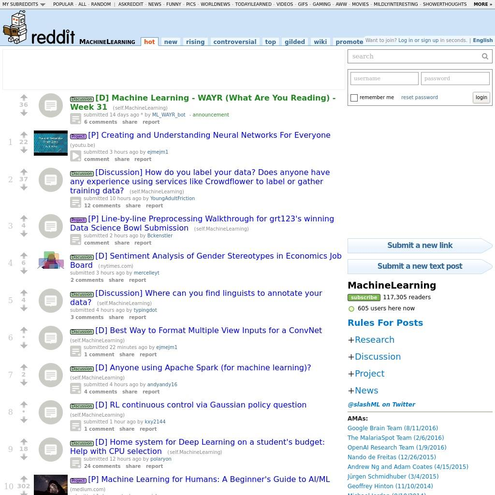
**이미지 캡션:** 이 이미지는 웹사이트 레딧의 머신러닝 커뮤니티 페이지를 보여줍니다. 페이지 상단에는 레딧 로고와 함께 "MACHINE LEARNING"이라는 제목이 있고, 그 아래에는 "hot", "new", "rising", "controversial", "top", "gilded", "wiki"와 같은 탭들이 있습니다. 오른쪽 상단에는 로그인 또는 회원가입을 할 수 있는 폼이 있으며, 검색창도 보입니다. 페이지 중앙에는 머신러닝 관련 게시물 목록이 나열되어 있으며, 각 게시물은 제목, 작성자, 작성 시간, 댓글 수, 공유 수 등의 정보를 포함하고 있습니다. 게시물들은 "Discussion" 또는 "Project"로 분류되어 있습니다. 예를 들어, 첫 번째 게시물은 "[D] Machine Learning - WAYR (What Are You Reading) - Week 31"이라는 제목의 토론 게시물이며, 두 번째 게시물은 "[P] Creating and Understanding Neural Networks For Everyone"이라는 제목의 프로젝트 게시물입니다. 페이지 오른쪽에는 "Submit a new link"와 "Submit a new text post" 버튼이 있고, "MachineLearning" 커뮤니티의 구독자 수와 현재 접속자 수가 표시되어 있습니다. 또한, 게시물 규칙과 트위터 계정, 그리고 머신러닝 분야의 유명 인사들의 이름과 활동 시기가 나열된 "AMAS" 섹션도 보입니다. 전반적으로 정보가 많고 전문적인 내용을 다루는 웹사이트의 모습입니다.

> #오늘의레딧 https://www.reddit.com/r/MachineLearning/ 오늘도 새소식이 많군요.  1. 어떻게 데이터에 라벨을 붙습니까? Crowdflower와 같은 서비스를 사용하여 교육 데이터를 분류하거나 수집하는 경험이있는 사람이 있습니까? 2. Grt123의 우승 데이터 과학 보울 제출을위한 라인 단위 전처리 연습 3. 경제위원회의 성 정역학에 대한 감성 분석 4. Gaussian 정책 질문을 통한 RL 연속 제어 5. 어디에서 언어 학자가 데이터에 주석을 달 수 있습니까? 6. ConvNet에 대한 다중보기 입력을 포맷하는 가장 좋은 방법 7. Apache Spark를 사용하는 사람 (기계 학습용)? 8. 학생 예산에 대한 심층 학습을위한 홈 시스템 : CPU 선택에 대한 도움말 9. 인간을위한 기계 학습 : AI / ML 초보자 안내서 10. 피마 인도 당뇨병 데이터 세트에 대한 의학 진단 논문에 따른 다중 층 퍼셉트론 층의 구현. 11. 텔레 그램을 통해 제어하기 위해 객체 인식, 언어 이해 및 챠트 봇을 모바일 로봇에 통합 12. Microsoft는 Active Machine Learning에 대한 특허를 취득하려고합니다. 13. 증류소에서 무슨 일이 있었던거야? 죽었 니? 14. 강화 학습을 통한 신경 최적화 도구 검색 (PDF) 15. 파이썬에서 구현 된 다 변수 imputation 및 행렬 완료 알고리즘 16. Lyrebird.ai에 오픈 소스 대안? 17. Variational Drop-out 및 긍정적 인 Unlabelled Learning에 관한 강연 18. 읽을 거리 : 지난 주 주목할만한 논문과 프로젝트. 19. 이동 학습의 흥미로운 예는 무엇입니까? 20. Backprop은 단순한 체인 규칙이 아닙니다.  1. https://www.reddit.com/r/MachineLearning/comments/6uvdor/discussion_how_do_you_label_your_data_does_anyone/ 2. https://www.reddit.com/r/MachineLearning/comments/6uyg5t/p_linebyline_preprocessing_walkthrough_for/ 3. https://www.nytimes.com/2017/08/18/upshot/evidence-of-a-toxic-environment-for-women-in-economics.html 4. https://www.reddit.com/r/MachineLearning/comments/6uynm1/d_rl_continuous_control_via_gaussian_policy/ 5. https://www.reddit.com/r/MachineLearning/comments/6uxne2/discussion_where_can_you_find_linguists_to/ 6. https://www.reddit.com/r/MachineLearning/comments/6uyuw6/d_best_way_to_format_multiple_view_inputs_for_a/ 7. https://www.reddit.com/r/MachineLearning/comments/6uxhz7/d_anyone_using_apache_spark_for_machine_learning/ 8. https://www.reddit.com/r/MachineLearning/comments/6uv55c/d_home_system_for_deep_learning_on_a_students/ 9. https://medium.com/machine-learning-for-humans/why-machine-learning-matters-6164faf1df12 10. https://www.reddit.com/r/MachineLearning/comments/6uw8iz/p_implementation_of_multilayer_perceptron_layer/ 11. https://medium.com/towards-data-science/what-ive-learned-from-studying-robotics-in-japan-for-two-weeks-bd252961853f?source=linkShare-bf03de96d99e-1503217959 12. https://www.google.com/patents/US20160162802 13. https://www.reddit.com/r/MachineLearning/comments/6usqhc/d_what_happened_with_distill_is_it_dead/ 14. http://proceedings.mlr.press/v70/bello17a/bello17a.pdf 15. https://github.com/hammerlab/fancyimpute 16. https://www.reddit.com/r/MachineLearning/comments/6utqkz/d_open_source_alternative_to_lyrebirdai/ 17. https://sigmoidal.io/deep-learning-event-1/ 18. https://medium.com/mlreview/machine-learning-weekly-review-6-f429f11a8ce9 19. https://www.reddit.com/r/MachineLearning/comments/6urk4w/d_interesting_examples_of_transfer_learning/ 20. http://timvieira.github.io/blog/post/2017/08/18/backprop-is-not-just-the-chain-rule/

### 8월 22일 (화) 07:38 · 📷 사진 (2장)

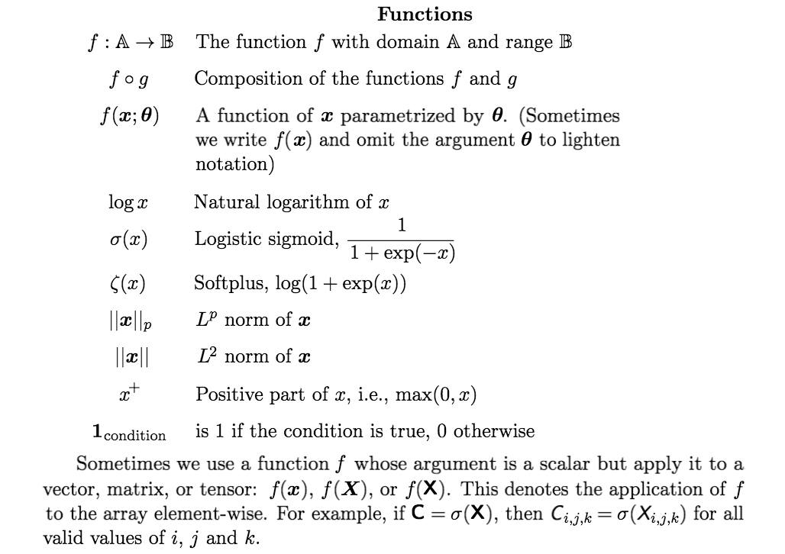
**이미지 캡션:** 이 이미지는 수학 함수에 대한 정의와 표기법을 설명하는 문서의 일부입니다. 텍스트는 흰색 배경에 검은색으로 인쇄되어 있으며, "Functions"라는 제목이 상단 중앙에 있습니다. 그 아래에는 여러 줄의 수학 기호와 해당 설명이 나열되어 있습니다. 각 항목은 왼쪽 열에 수학적 표기법이 있고 오른쪽 열에 해당 설명이 있는 형식입니다. 예를 들어, "f: A→B"는 "The function f with domain A and range B"로 설명되고, "log x"는 "Natural logarithm of x"로 설명됩니다. 또한 로지스틱 시그모이드 함수와 소프트플러스 함수와 같은 특정 함수에 대한 공식도 포함되어 있습니다. 마지막으로, 벡터, 행렬 또는 텐서에 함수를 적용하는 방법에 대한 추가 설명이 있습니다. 이 문서에는 사람이나 장소에 대한 정보는 포함되어 있지 않으며, 순수하게 학술적인 내용을 담고 있습니다.
 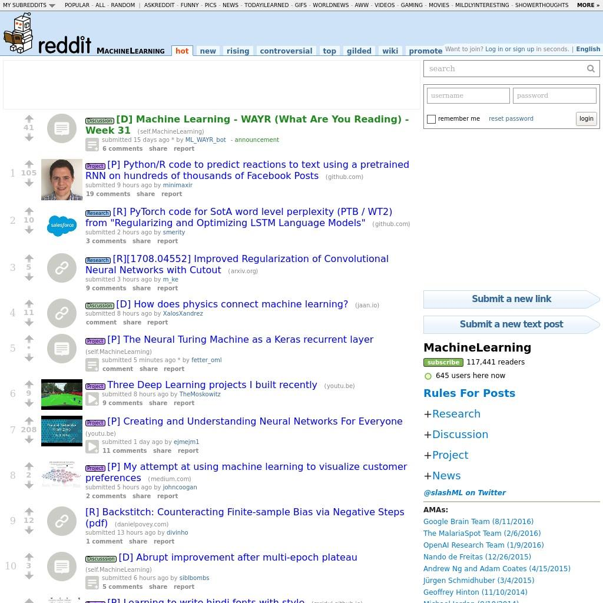
**이미지 캡션:** 이 이미지는 인기 있는 온라인 커뮤니티인 레딧의 머신러닝 서브레딧 페이지를 보여줍니다. 화면 왼쪽에는 다양한 게시물 목록이 있으며, 각 게시물은 제목, 작성자, 제출 시간, 댓글 수, 추천 수 등의 정보를 포함하고 있습니다. 게시물들은 주로 머신러닝 관련 연구, 프로젝트, 토론 주제를 다루고 있으며, 링크, 코드, 논문 등 다양한 형태의 콘텐츠를 포함하고 있습니다. 예를 들어, "머신러닝 - WAYR (What Are You Reading) - Week 31"이라는 제목의 게시물은 사용자들이 현재 읽고 있는 머신러닝 관련 자료를 공유하는 토론 게시물이며, "Python/R 코드로 페이스북 게시물의 반응을 예측하는 사전 훈련된 RNN"이라는 제목의 게시물은 코드 프로젝트를 소개하는 내용입니다. 화면 오른쪽에는 "새 링크 제출", "새 텍스트 게시물 제출" 버튼과 함께 서브레딧의 구독자 수, 현재 접속자 수, 게시 규칙, 트위터 계정 정보, 그리고 과거 AMA(Ask Me Anything) 세션 목록이 표시되어 있습니다. 전반적으로 머신러닝 분야의 최신 정보와 연구, 프로젝트를 공유하고 토론하는 활발한 온라인 커뮤니티의 모습을 보여줍니다.

> http://www.deeplearningbook.org/contents/notation.html  이것들만 잘 기억하고 있어도 논문에 나오는 수학의 50%는 먹고 들어가는 정말 많이 나오는 기호들입니다.
> #오늘의레딧 https://www.reddit.com/r/MachineLearning/ 래딧은 읽을 거리가 다양합니다.  1. "LSTM 언어 모델의 정규화 및 최적화"에서 SotA 워드 레벨 퍼펙시 텍스 (PTB / WT2)를위한 PyTorch 코드 2. 물리학은 기계 학습을 어떻게 연결합니까? 3. Keras 반복 층으로서 신경 튜링 기계 4. 모든 사람들을위한 신경망 생성 및 이해 5. 기계 학습을 사용하여 고객 환경 설정을 시각화하려는 시도 6. 힌디어 글꼴을 스타일로 작성하는 법 배우기 7. 인식 시스템 구축 방법 강의 (파트 1) : 모범 사례 8. GAN을 비 시각적 센서 스트림 (즉, 카메라가 아닌)에 대한 심층 강화 학습에 적용 할 수 있습니까? 9. 강의. 진화 : 바닐라 RNN에서 GRU &amp; LSTM으로 10. 게놈 기능 생성을위한 생성 적 적조 네트워크 11. 기능의 수가 다른 경우 어떻게해야합니까? 12. Grt123의 우승 데이터 과학 보울 제출을위한 라인 단위 전처리 연습 13. Microsoft 2017 대화식 음성 인식 시스템 14. 기계 학습 CS229 - 준비, 과거와 미래의 학생들을위한 질문, 스터디 그룹, SCPD 15. ML / AI 대학원 프로그램에서 학생들은 어떤 수업을 듣기를 기대합니까? 16. 어떻게 데이터에 라벨을 붙습니까? Crowdflower와 같은 서비스를 사용하여 교육 데이터를 분류하거나 수집하는 경험이있는 사람이 있습니까? 17. ConvNet에 대한 다중보기 입력을 포맷하는 가장 좋은 방법 18. 어디에서 언어 학자가 데이터에 주석을 달 수 있습니까?  1. https://github.com/salesforce/awd-lstm-lm 2. https://jaan.io/how-does-physics-connect-machine-learning/ 3. https://www.reddit.com/r/MachineLearning/comments/6v741b/p_the_neural_turing_machine_as_a_keras_recurrent/ 4. https://youtu.be/g5n4BVNdxK8?list=PL_49VD9KwQ_NFnA6egEPs4UiM6P3pp0hS 5. https://medium.com/p/using-machine-learning-to-visualize-customer-preferences-6a007cfb9b97 6. https://mridul.github.io/blog/learning-to-write-devanagari-hindi/ 7. https://medium.com/@deepsystems/lecture-on-how-to-build-a-recognition-system-part-1-best-practices-46208e1ae591 8. https://www.reddit.com/r/MachineLearning/comments/6v4tri/d_can_gans_be_applied_to_deep_reinforcement/ 9. https://medium.com/@deepsystems/lecture-evolution-from-vanilla-rnn-to-gru-lstms-58688f1da83a 10. https://www.reddit.com/r/MachineLearning/comments/6v5t43/d_generative_adversarial_network_to_create/ 11. https://www.reddit.com/r/MachineLearning/comments/6v1ief/d_what_to_do_when_the_number_of_features_vary/ 12. https://www.reddit.com/r/MachineLearning/comments/6uyg5t/p_linebyline_preprocessing_walkthrough_for/ 13. https://www.microsoft.com/en-us/research/wp-content/uploads/2017/08/ms_swbd17-2.pdf 14. https://www.reddit.com/r/MachineLearning/comments/6uzdgo/d_machine_learning_cs229_preparation_questions/ 15. https://www.reddit.com/r/MachineLearning/comments/6v0i3e/d_what_classes_do_mlai_grad_programs_expect/ 16. https://www.reddit.com/r/MachineLearning/comments/6uvdor/discussion_how_do_you_label_your_data_does_anyone/ 17. https://www.reddit.com/r/MachineLearning/comments/6uyuw6/d_best_way_to_format_multiple_view_inputs_for_a/ 18. https://www.reddit.com/r/MachineLearning/comments/6uxne2/discussion_where_can_you_find_linguists_to/

### 8월 23일 (수) 08:52 · 📷 사진 (1장)

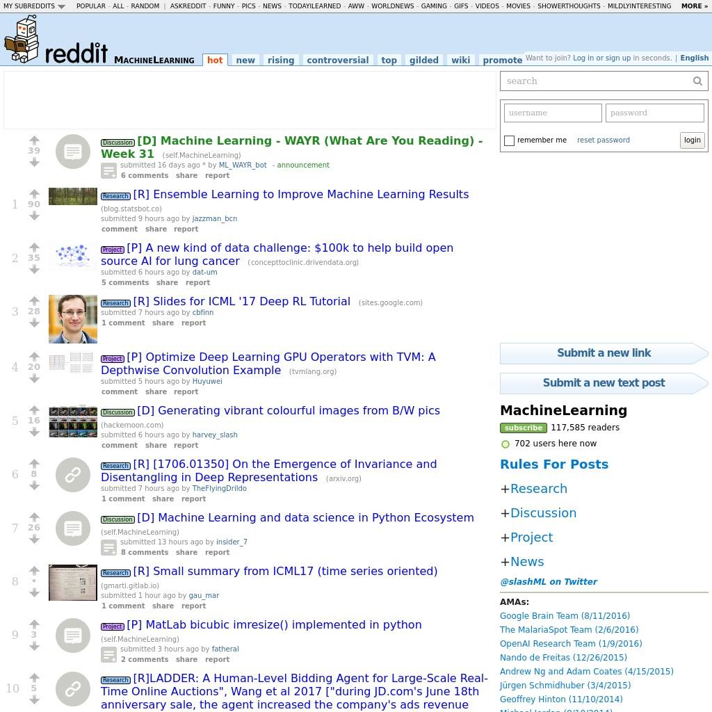
**이미지 캡션:** 이것은 레딧의 머신러닝 서브레딧 페이지로, 다양한 연구 및 토론 게시물이 나열되어 있습니다. 페이지 상단에는 레딧 로고와 함께 "MACHINE LEARNING"이라는 제목이 보이며, 그 아래에는 "hot", "new", "rising", "controversial", "top", "gilded", "wiki", "promote"와 같은 탭이 있습니다. 오른쪽 상단에는 로그인 및 회원가입을 위한 입력 필드와 버튼이 있습니다. 페이지 중앙에는 여러 게시물이 시간순으로 정렬되어 있으며, 각 게시물은 제목, 작성자, 제출 시간, 댓글 수, 공유 및 보고 옵션을 포함합니다. 게시물 제목 옆에는 "[D]" (Discussion) 또는 "[R]" (Research), "[P]" (Project)와 같은 태그가 붙어 있어 게시물의 유형을 나타냅니다. 예를 들어, 첫 번째 게시물은 "Machine Learning - WAYR (What Are You Reading) - Week 31"이라는 제목의 토론 게시물입니다. 두 번째 게시물은 "Ensemble Learning to Improve Machine Learning Results"라는 제목의 연구 게시물입니다. 페이지 오른쪽에는 "Submit a new link" 및 "Submit a new text post" 버튼이 있으며, 그 아래에는 "MachineLearning" 서브레딧의 구독자 수와 현재 접속자 수가 표시됩니다. 또한 "Rules For Posts" 섹션과 함께 "+Research", "+Discussion", "+Project", "+News"와 같은 하위 섹션이 나열되어 있습니다. 하단에는 "AMAS" 섹션이 있으며, 여러 연구팀과 개인의 이름 및 날짜가 나열되어 있습니다. 전반적으로 이 페이지는 머신러닝 커뮤니티의 최신 정보와 토론을 공유하는 플랫폼으로 보입니다.

> #오늘의레딧 https://www.reddit.com/r/MachineLearning/ 아침부터 다양한 소식이 많네요.  1. 새로운 종류의 데이터 과제 : 폐암에 대한 오픈 소스 AI를 구축하는 데 도움이되는 100,000 달러 2. ICML &#39;17 Deep RL 튜토리얼 슬라이드 3. TVM을 이용한 딥 학습 GPU 연산자 최적화 : 깊이 방향의 회선의 예 4. 흑백 사진에서 생생한 다채로운 이미지 생성 5. 파이썬 생태계에서의 기계 학습 및 데이터 과학 6. ICML17의 작은 요약 (시계열 지향) 7. Python에서 구현 된 MatLab bicubic imresize () 8. 깊은 NLP : 장시간의 의존성을 배울 때 바닐라 LSTM / GRU의 제한된 성능을 위해 어떤 종이를 인용합니까? 9. 로봇이 움직이는 법을 배우게 만들기, 제 2 부 - 실제 야생 세상에서 강화 학습 10. Irina Rish, 연구원, IBM Watson, NYC 2017 11. 심층 강화 학습에 대한 간략한 설문 조사 12. 상관 관계가 큰 주식을 찾기위한 클러스터링 (3000+ 주식의 Quandl 데이터 세트) 13. 수십만 개의 페이스 북 게시물에서 미리 훈련 된 RNN을 사용하여 텍스트에 대한 반응을 예측하는 Python / R 코드 14. NVIDIA Tesla V100 GPU 아키텍처 백서 15. Keras 반복 층으로서 신경 튜링 기계 16. Quantum Computing 학습을위한 리소스 목록 17. 애플의 핵심 ML 요약 및 안드로이드의 ML와 비교 18. "LSTM 언어 모델의 정규화 및 최적화"에서 SotA 워드 레벨 퍼펙시 텍스 (PTB / WT2)를위한 PyTorch 코드 19. 물리학은 기계 학습을 어떻게 연결합니까? 20. 동기식 및 비동기식 활성화가있는 신경망 표현력의 차이  1. https://concepttoclinic.drivendata.org/ 2. https://sites.google.com/view/icml17deeprl 3. http://tvmlang.org/2017/08/22/Optimize-Deep-Learning-GPU-Operators-with-TVM-A-Depthwise-Convolution-Example.html 4. https://hackernoon.com/colorising-black-white-photos-using-deep-learning-4da22a05f531 5. https://www.reddit.com/r/MachineLearning/comments/6v9yfo/d_machine_learning_and_data_science_in_python/ 6. https://gmarti.gitlab.io/ml/2017/08/11/ICML-2017-field-reports.html 7. https://www.reddit.com/r/MachineLearning/comments/6vdo51/p_matlab_bicubic_imresize_implemented_in_python/ 8. https://www.reddit.com/r/MachineLearning/comments/6vck8y/d_deep_nlp_which_paper_do_you_cite_for_limited/ 9. https://medium.com/towards-data-science/making-a-robot-learn-how-to-move-part-2-reinforcement-learning-in-the-real-wild-world-9427da7b9b21?source=linkShare-bf03de96d99e-1503434488 10. https://youtu.be/KIX_s6svY7U?list=PLrbAIdPI69PgsFl5TpIBZ75pnwMq2j-WR 11. https://arxiv.org/abs/1708.05866 12. https://gmarti.gitlab.io/ml/2017/07/24/US-Stocks-correlations.html 13. https://github.com/minimaxir/reactionrnn 14. https://images.nvidia.com/content/volta-architecture/pdf/Volta-Architecture-Whitepaper-v1.0.pdf 15. https://www.reddit.com/r/MachineLearning/comments/6v741b/p_the_neural_turing_machine_as_a_keras_recurrent/ 16. https://medium.com/@johncoogan/the-best-resources-for-learning-about-quantum-computing-4fcc9f3cbe56 17. http://loupventures.com/apples-core-ml-brings-ai-to-the-masses/ 18. https://github.com/salesforce/awd-lstm-lm 19. https://jaan.io/how-does-physics-connect-machine-learning/ 20. https://www.reddit.com/r/MachineLearning/comments/6v7o16/d_difference_in_expressiveness_of_neural_nets/

### 8월 24일 (목) 08:52 · 📷 사진 (1장)

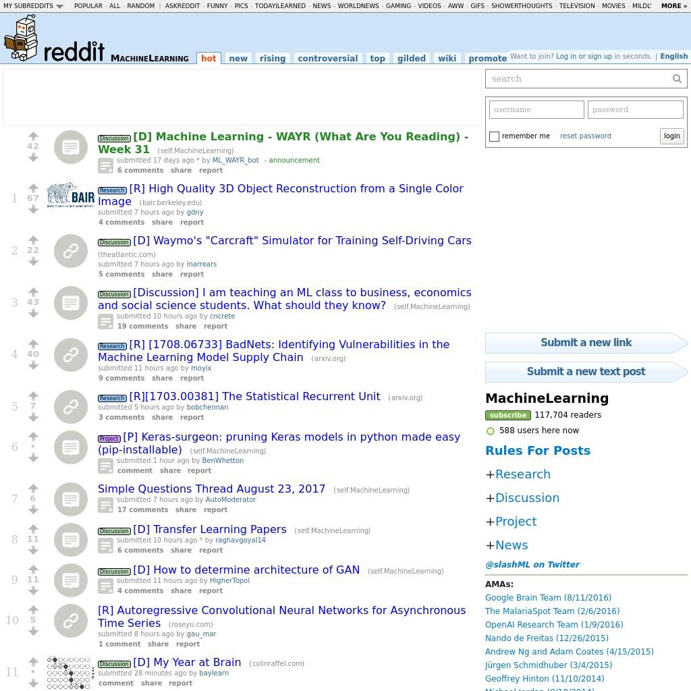
**이미지 캡션:** 이것은 레딧의 머신러닝 서브레딧 페이지로, 다양한 게시물 목록을 보여줍니다. 페이지 상단에는 레딧 로고와 함께 "MACHINE LEARNING"이라는 제목이 있고, 그 옆에는 "hot", "new", "rising", "controversial", "top", "gilded", "wiki"와 같은 탭이 있습니다. 오른쪽 상단에는 로그인 및 회원가입을 위한 입력란과 버튼이 있습니다. 메인 콘텐츠 영역에는 여러 게시물이 나열되어 있으며, 각 게시물은 제목, 출처, 작성자, 게시 시간, 댓글 수, 공유 수 등의 정보를 포함합니다. 예를 들어, 첫 번째 게시물은 "[D] Machine Learning - WAYR (What Are You Reading) - Week 31"이라는 제목으로, 17일 전에 게시되었고 6개의 댓글이 있습니다. 다른 게시물들도 연구, 토론, 프로젝트 등 다양한 주제를 다루고 있습니다. 페이지 오른쪽에는 "Submit a new link" 및 "Submit a new text post" 버튼이 있고, "MachineLearning" 서브레딧의 구독자 수와 현재 접속자 수가 표시됩니다. 또한 "Rules For Posts" 섹션과 "AMAS" 섹션에는 관련 정보가 나열되어 있습니다. 전반적으로 이 페이지는 머신러닝 커뮤니티의 최신 정보와 토론을 공유하는 온라인 포럼의 모습을 보여줍니다.

> #오늘의레딧 https://www.reddit.com/r/MachineLearning/ 따끈한 소식들입니다.  1. Waymo의자가 운전 차량 훈련 용 "Carcraft"시뮬레이터 2. 저는 비즈니스, 경제 및 사회 과학 학생들에게 ML 수업을 가르치고 있습니다. 그들이 무엇을 알아야할까요? 3. Keras-surgeon : python으로 Keras 모델을 잘라 내기 (pip-installable) 4. 전송 학습 논문 5. GAN 아키텍처 결정 방법 6. 두뇌의 해 7. 폐암 선별을위한 유전 적 심층 학습 8. Siri의 음성에 대한 심층 학습 : 하이브리드 장치 선택 합성을위한 장치 내 깊은 혼합 밀도 네트워크 9. 단어 "embeddings"은 예상치입니다. 10. 짧은 AI 필름 11. DL에 대한 ML 지식? 12. 새로운 종류의 데이터 과제 : 폐암에 대한 오픈 소스 AI를 구축하는 데 도움이되는 100,000 달러 13. Ensemble 학습을 통한 기계 학습 효과 향상 14. 가짜 리허설 : NLP를 잊어 버리는 데 치명적인 잊을 수없는 간단한 해결책 15. Autoencoder가 여전히 인기가 있지만 제한적인 Boltzmann Machine 및 Sparse Coding이 더 적은 이유는 무엇입니까? 16. ICML &#39;17 Deep RL 튜토리얼 슬라이드 17. TVM을 이용한 딥 학습 GPU 연산자 최적화 : 깊이 방향의 회선의 예 18. 흑백 사진에서 생생한 다채로운 이미지 생성  1. https://www.theatlantic.com/amp/article/537648/ 2. https://www.reddit.com/r/MachineLearning/comments/6vipkt/discussion_i_am_teaching_an_ml_class_to_business/ 3. https://www.reddit.com/r/MachineLearning/comments/6vmnp6/p_kerassurgeon_pruning_keras_models_in_python/ 4. https://www.reddit.com/r/MachineLearning/comments/6vikjx/d_transfer_learning_papers/ 5. https://www.reddit.com/r/MachineLearning/comments/6vi8nh/d_how_to_determine_architecture_of_gan/ 6. http://colinraffel.com/blog/my-year-at-brain.html 7. https://www.innovationdx.com/beta/ 8. https://machinelearning.apple.com/2017/08/06/siri-voices.html 9. https://www.reddit.com/r/MachineLearning/comments/6vhf8b/d_word_embeddings_are_projections/ 10. https://www.reddit.com/r/MachineLearning/comments/6vjbzz/p_short_ai_film/ 11. https://www.reddit.com/r/MachineLearning/comments/6vlj1u/d_ml_knowledge_for_dl/ 12. https://concepttoclinic.drivendata.org/ 13. https://blog.statsbot.co/ensemble-learning-d1dcd548e936 14. https://explosion.ai/blog/pseudo-rehearsal-catastrophic-forgetting 15. https://www.reddit.com/r/MachineLearning/comments/6vfd0d/d_why_autoencoder_still_popular_but_restricted/ 16. https://sites.google.com/view/icml17deeprl 17. http://tvmlang.org/2017/08/22/Optimize-Deep-Learning-GPU-Operators-with-TVM-A-Depthwise-Convolution-Example.html 18. https://hackernoon.com/colorising-black-white-photos-using-deep-learning-4da22a05f531

### 8월 25일 (금) 08:52 · 📷 사진 (1장)

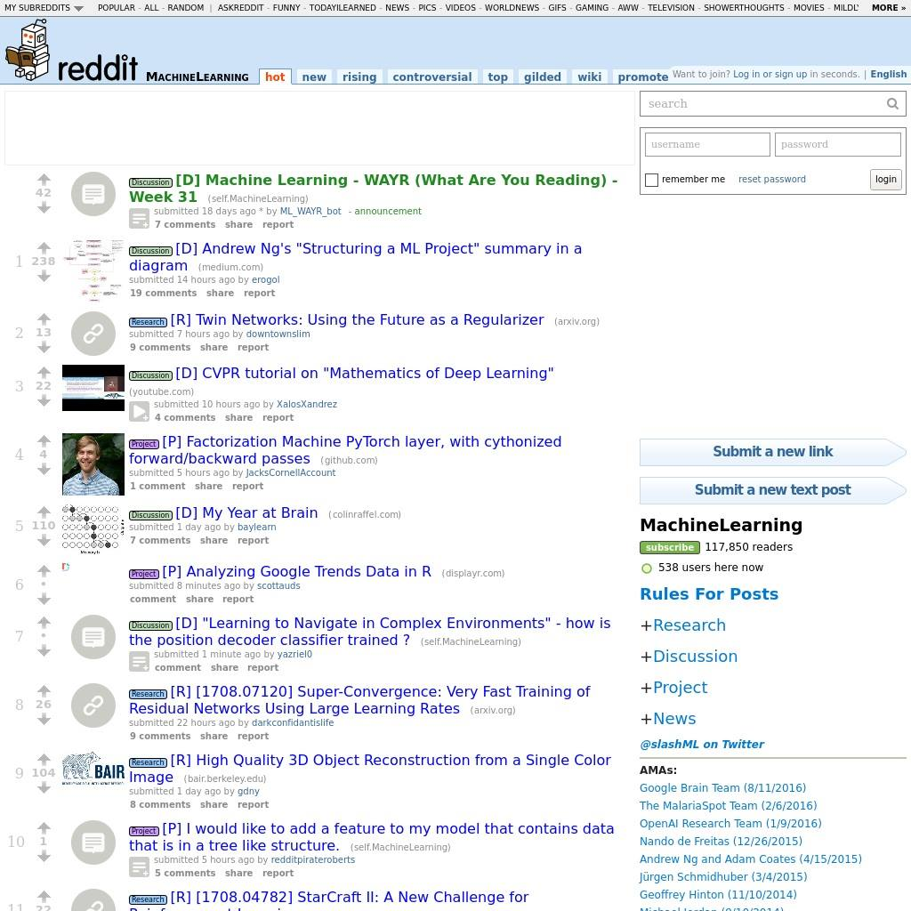
**이미지 캡션:** 이 이미지는 머신러닝 관련 주제를 다루는 레딧(Reddit)의 한 페이지를 보여줍니다. 페이지 상단에는 레딧 로고와 함께 "MACHINE LEARNING"이라는 제목이 있고, 그 아래에는 "hot", "new", "rising", "controversial", "top", "gilded", "wiki", "promote"와 같은 다양한 카테고리 링크가 나열되어 있습니다. 오른쪽 상단에는 로그인 및 회원가입을 위한 입력 필드와 버튼이 있습니다. 페이지 중앙에는 다양한 머신러닝 관련 게시물 목록이 표시되어 있으며, 각 게시물은 제목, 작성자, 제출 시간, 댓글 수, 공유 수 등의 정보를 포함하고 있습니다. 게시물들은 "Discussion", "Research", "Project"와 같은 태그로 분류되어 있습니다. 예를 들어, 첫 번째 게시물은 "Machine Learning - WAYR (What Are You Reading) - Week 31"이라는 제목으로, "self.MachineLearning"이라는 커뮤니티에서 제출되었으며, 7개의 댓글이 있습니다. 다른 게시물로는 앤드류 응(Andrew Ng)의 "Structuring a ML Project" 요약, "Twin Networks"에 대한 연구, 딥러닝 수학 튜토리얼, 파이토치(PyTorch)를 이용한 팩토라이제이션 머신 구현, 구글 트렌드 데이터 분석, 복잡한 환경 탐색에 대한 논의 등이 있습니다. 페이지 오른쪽에는 "Submit a new link" 및 "Submit a new text post" 버튼과 함께 "Machine Learning" 커뮤니티 정보가 표시되어 있으며, 구독자 수와 현재 접속자 수가 나타나 있습니다. 또한, "Rules For Posts" 섹션에는 "+Research", "+Discussion", "+Project", "+News"와 같은 하위 카테고리가 있습니다. 하단에는 "AMAS" 섹션에 머신러닝 분야의 유명 인사들의 이름과 관련 날짜가 나열되어 있습니다. 전반적으로 이 페이지는 머신러닝 커뮤니티의 최신 정보와 토론을 공유하는 온라인 포럼의 모습을 보여줍니다.

> #오늘의레딧 https://www.reddit.com/r/MachineLearning/ 재미난 이야기들이 많습니다  1. 트윈 네트워크 : 미래를 정규화로 사용 2. CVPR "깊은 학습의 수학"튜토리얼 3. Factorization Machine PyTorch 레이어, cythonized 순방향 / 역방향 통과 4. 두뇌의 해 5. R의 Google 트렌드 데이터 분석 6. "복잡한 환경에서의 학습 학습"- 위치 디코더 분류기는 어떻게 훈련됩니까? 7. 단일 컬러 이미지로 고품질의 3D 오브젝트 재구성 8. 구조와 같은 트리에있는 데이터가 포함 된 모델에 기능을 추가하고 싶습니다. 9. Keras-surgeon : python으로 Keras 모델을 잘라 내기 (pip-installable) 10. 다중 ANFIS 시스템을 구현하려고합니다. 최선의 접근법에 대한 지침이 필요합니다. 11. 폐암 선별을위한 유전 적 심층 학습 12. Waymo의자가 운전 차량 훈련 용 "Carcraft"시뮬레이터 13. 저는 비즈니스, 경제 및 사회 과학 학생들에게 ML 수업을 가르치고 있습니다. 그들이 무엇을 알아야할까요? 14. 빠른 반복을 이용한 ML 모델 앙코르 - 개별 ML 알고리즘의 예측 합성으로 재현 가능한 최종 예측 15. Siri의 음성에 대한 심층 학습 : 하이브리드 장치 선택 합성을위한 장치 내 깊은 혼합 밀도 네트워크 16. 전송 학습 논문 17. GAN 아키텍처 결정 방법  1. https://arxiv.org/abs/1708.06742 2. https://www.youtube.com/watch?v=Mdp9uC3gXUU 3. https://github.com/jmhessel/fmpytorch 4. http://colinraffel.com/blog/my-year-at-brain.html 5. https://www.displayr.com/extracting-google-trends-data-in-r/?utm_source=Reddit&utm_medium=Machine%20Learning&utm_campaign=google%20trends 6. https://www.reddit.com/r/MachineLearning/comments/6vur6n/d_learning_to_navigate_in_complex_environments/ 7. http://bair.berkeley.edu/blog/2017/08/23/high-quality-3d-obj-reconstruction/ 8. https://www.reddit.com/r/MachineLearning/comments/6vsd58/p_i_would_like_to_add_a_feature_to_my_model_that/ 9. https://www.reddit.com/r/MachineLearning/comments/6vmnp6/p_kerassurgeon_pruning_keras_models_in_python/ 10. https://www.reddit.com/r/MachineLearning/comments/6vrc6g/ptrying_to_implement_multiple_anfis_system_need/ 11. https://www.innovationdx.com/beta/ 12. https://www.theatlantic.com/amp/article/537648/ 13. https://www.reddit.com/r/MachineLearning/comments/6vipkt/discussion_i_am_teaching_an_ml_class_to_business/ 14. https://blog.dataversioncontrol.com/ml-model-ensembling-with-fast-iterations-91e8cad6a9b5 15. https://machinelearning.apple.com/2017/08/06/siri-voices.html 16. https://www.reddit.com/r/MachineLearning/comments/6vikjx/d_transfer_learning_papers/ 17. https://www.reddit.com/r/MachineLearning/comments/6vi8nh/d_how_to_determine_architecture_of_gan/

### 8월 26일 (토) 08:52 · 📷 사진 (1장)

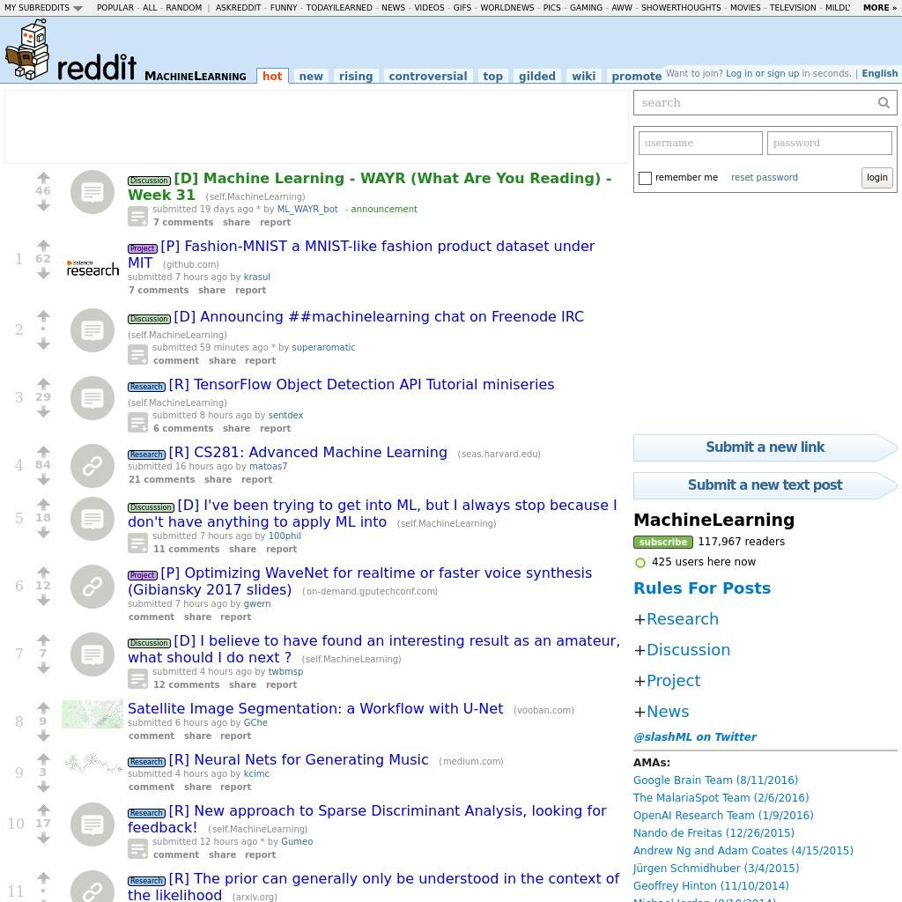
**이미지 캡션:** 이 이미지는 온라인 커뮤니티 레딧의 머신러닝 관련 서브레딧 페이지를 보여줍니다. 페이지 상단에는 레딧 로고와 함께 "MACHINE LEARNING"이라는 제목이 있고, 그 아래에는 "hot", "new", "rising", "controversial", "top", "gilded", "wiki"와 같은 탭들이 나열되어 있습니다. 오른쪽 상단에는 로그인 및 회원가입을 위한 입력 필드와 버튼이 보입니다. 페이지 중앙에는 다양한 머신러닝 관련 게시물들이 목록 형태로 표시되어 있으며, 각 게시물은 제목, 작성자, 제출 시간, 댓글 수, 공유 수 등의 정보를 포함하고 있습니다. 게시물들은 "Discussion", "Project", "Research"와 같은 태그로 분류되어 있습니다. 오른쪽 사이드바에는 "Submit a new link", "Submit a new text post" 버튼과 함께 서브레딧의 구독자 수, 현재 접속자 수, 게시 규칙, 트위터 계정, 그리고 "AMAS" 섹션에 나열된 유명 인사들의 목록이 표시되어 있습니다. 전반적으로 정보가 많고 전문적인 내용을 다루는 온라인 커뮤니티의 모습을 보여줍니다.

> #오늘의레딧 https://www.reddit.com/r/MachineLearning/ 래딧은 읽을 거리가 다양합니다.  1. Freenode IRC에서 ## machinelearning 채팅을 발표합니다. 2. TensorFlow 객체 감지 API 자습서 미니 시리즈 3. CS281 : 고급 기계 학습 4. 실시간 또는 빠른 음성 합성을 위해 WaveNet 최적화 (Gibiansky 2017 슬라이드) 5. 나는 아마추어로서 흥미로운 결과를 발견했다고 믿습니다. 다음에 무엇을해야합니까? 6. 음악 생성을위한 신경망 7. 피드백을 찾는 스파 스 판별 분석에 대한 새로운 접근 방식! 8. 사전은 일반적으로 우도의 맥락에서만 이해 될 수있다. 9. 중간 묘사에서 그러한 속성을 예측하는 우리의 능력에 불이익을줌으로써 속성에 대한 불변성을 장려하는 방법은? 10. 아키텍처 비교를 위해 교육 초기 단계의 유효성 검증 오류와 나중 단계의 유효성 검증 오류 사이에는 어떤 상관 관계가 있습니까? 11. 기계 학습 - 강의 12. 분할 된 (즉, 2 진화 된) 이미지 (xpost r / deeplearning)로부터 2D 또는 3D 오브젝트의 모양 분석을위한 접근법 13. 앤드류 응 (Andrew Ng)의 "ML 프로젝트 구조화"요약 다이어그램 14. 해왕성 - 기계 학습 실험실 (실험 추적 및 기록, 클라우드에서의 간편한 GPU 컴퓨팅) 15. Python 또는 R에서 기계 학습 과정을 수강해야합니까? 16. CVPR "깊은 학습의 수학"튜토리얼 17. 트윈 네트워크 : 미래를 정규화로 사용 18. Factorization Machine PyTorch 레이어, cythonized 순방향 / 역방향 통과 19. R의 Google 트렌드 데이터 분석 20. PercentDelta를 사용하여 비율적인 그라디언트 업데이트  1. https://www.reddit.com/r/MachineLearning/comments/6w1qtn/d_announcing_machinelearning_chat_on_freenode_irc/ 2. https://www.reddit.com/r/MachineLearning/comments/6vz3om/r_tensorflow_object_detection_api_tutorial/ 3. http://www.seas.harvard.edu/courses/cs281/ 4. http://on-demand.gputechconf.com/gtc/2017/presentation/s7544-andrew-gibiansky-efficient-inference-for-wavenet.pdf 5. https://www.reddit.com/r/MachineLearning/comments/6w0iii/d_i_believe_to_have_found_an_interesting_result/ 6. https://medium.com/@kcimc/neural-nets-for-generating-music-f46dffac21c0 7. https://www.reddit.com/r/MachineLearning/comments/6vxq85/r_new_approach_to_sparse_discriminant_analysis/ 8. https://arxiv.org/abs/1708.07487 9. https://www.reddit.com/r/MachineLearning/comments/6vxb35/d_ways_to_encourage_invariance_to_properties_by/ 10. https://www.reddit.com/r/MachineLearning/comments/6vxfwz/d_for_comparing_architectures_is_there_any/ 11. https://alliance.seas.upenn.edu/~cis520/dynamic/2017/wiki/index.php?n=Lectures.Lectures 12. https://www.reddit.comhttps://www.reddit.com/r/deeplearning/comments/6w0au5/approaches_for_analyzing_the_shape_of_2d_or_3d/ 13. https://medium.com/@erogol/designing-a-deep-learning-project-9b3698aef127 14. https://neptune.ml/ 15. https://www.reddit.com/r/MachineLearning/comments/6vv8vc/d_should_i_take_a_machine_learning_course_in/ 16. https://www.youtube.com/watch?v=Mdp9uC3gXUU 17. https://arxiv.org/abs/1708.06742 18. https://github.com/jmhessel/fmpytorch 19. https://www.displayr.com/extracting-google-trends-data-in-r/?utm_source=Reddit&utm_medium=Machine%20Learning&utm_campaign=google%20trends 20. https://arxiv.org/abs/1708.07227

### 8월 27일 (일) 08:52 · 📷 사진 (1장)

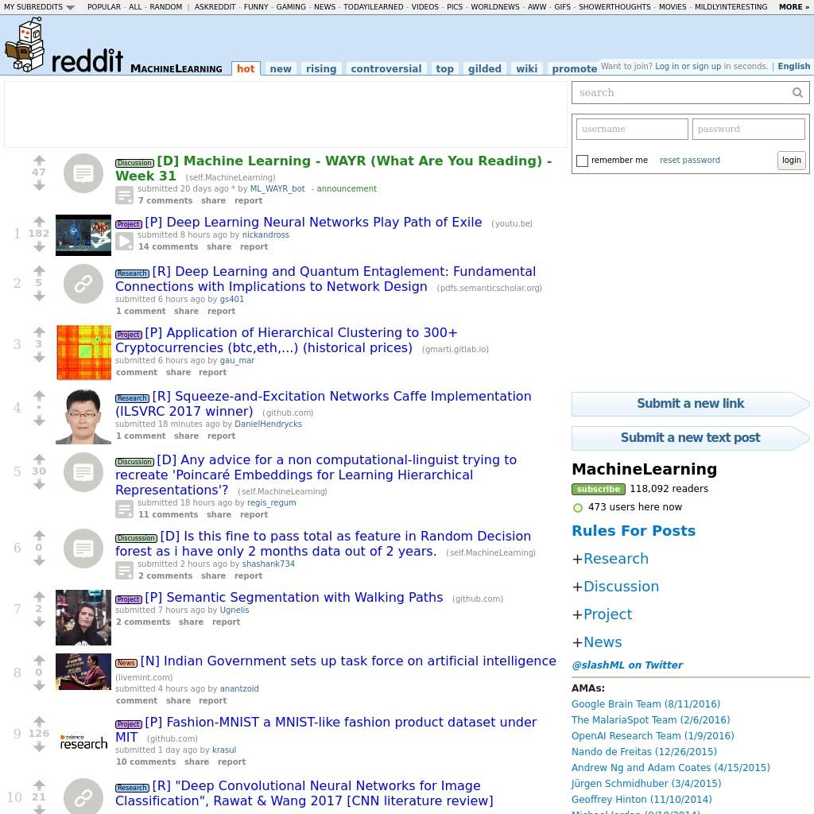
**이미지 캡션:** 이 이미지는 레딧의 머신러닝 서브레딧 페이지를 보여주며, 다양한 연구, 프로젝트, 토론 게시물들이 나열되어 있습니다. 페이지 상단에는 레딧 로고와 함께 "MACHINE LEARNING"이라는 제목이 보이고, 그 아래에는 "hot", "new", "rising", "controversial", "top", "gilded", "wiki"와 같은 탭들이 있습니다. 오른쪽 상단에는 로그인 및 회원가입을 위한 입력 필드와 버튼이 있습니다. 메인 콘텐츠 영역에는 여러 게시물들이 시간순으로 정렬되어 있으며, 각 게시물은 제목, 제출자, 제출 시간, 댓글 수, 공유 수 등의 정보를 포함하고 있습니다. 게시물 제목 옆에는 게시물의 종류를 나타내는 태그(예: [D] Discussion, [P] Project, [R] Research, [N] News)가 붙어 있습니다. 예를 들어, "Machine Learning - WAYR (What Are You Reading) - Week 31"이라는 토론 게시물, "Deep Learning Neural Networks Play Path of Exile"이라는 프로젝트 게시물, "Deep Learning and Quantum Entaglement: Fundamental Connections with Implications to Network Design"이라는 연구 게시물 등이 보입니다. 페이지 오른쪽 사이드바에는 "MachineLearning" 서브레딧의 구독자 수와 현재 접속자 수가 표시되어 있으며, 게시물 규칙과 트위터 계정(@slashML on Twitter) 정보, 그리고 과거 AMA(Ask Me Anything) 세션 목록이 나열되어 있습니다. 전반적으로 기술 및 연구 커뮤니티의 정보 공유 및 토론이 이루어지는 온라인 포럼의 모습을 보여줍니다.

> #오늘의레딧 https://www.reddit.com/r/MachineLearning/ 재미난 이야기들이 많습니다  1. 심층 학습 및 양자 우세 : 네트워크 설계에 대한 시사점과 기본 연결 2. 300+ Cryptocurrencies (btc, eth, ...)에 대한 계층 적 클러스터링의 적용 (과거 가격) 3. 짜내고 흥분 네트워크 Caffe 구현 (ILSVRC 2017 수상자) 4. &#39;Poincaré Embeddings for Hierarchical Representations&#39;를 재창조하려는 비 컴퓨터 언어학자를위한 조언? 5. 워킹 경로를 이용한 시맨틱 세분화 6. 인도 정부, 인공 지능에 대한 태스크 포스 설립 7. 패션 - MNIST MIT에서 MNIST와 같은 패션 제품 데이터 세트 8. 비 전통적 방법을 사용하여 매우 깊은 CNN 9. TensorFlow 객체 감지 API 자습서 미니 시리즈 10. 새로운 패션로드 및보기 -MNIST + Pytorch DataLoader 11. 신경망으로 미분 방정식 풀기 12. 사전은 일반적으로 우도의 맥락에서만 이해 될 수있다. 13. 실시간 또는 빠른 음성 합성을 위해 WaveNet 최적화 (Gibiansky 2017 슬라이드) 14. 음악 생성을위한 신경망 15. 나는 아마추어로서 흥미로운 결과를 발견했다고 믿습니다. 다음에 무엇을해야합니까? 16. CS281 : 고급 기계 학습 17. 피드백을 찾는 스파 스 판별 분석에 대한 새로운 접근 방식! 18. Freenode IRC에서 ## machinelearning 채팅을 발표합니다. 19. 중간 묘사에서 그러한 속성을 예측하는 우리의 능력에 불이익을줌으로써 속성에 대한 불변성을 장려하는 방법은?  1. https://pdfs.semanticscholar.org/c931/6491b8d991fabbf9b28c449d66df6a50f841.pdf 2. https://gmarti.gitlab.io/cryptocurrency/2017/08/25/download-cryptocoins-api-python.html 3. https://github.com/hujie-frank/SENet 4. https://www.reddit.com/r/MachineLearning/comments/6w3oq7/d_any_advice_for_a_non_computationallinguist/ 5. https://github.com/ugnelis/find-path 6. http://www.livemint.com/Politics/W37G5pZTUVhhwKEbz1KJqJ/Commerce-ministry-sets-up-task-force-on-artificial-intellige.html 7. https://github.com/zalandoresearch/fashion-mnist 8. https://www.reddit.com/r/MachineLearning/comments/6w5fyl/d_extremely_deep_cnn_using_a_nontraditional_method/ 9. https://www.reddit.com/r/MachineLearning/comments/6vz3om/r_tensorflow_object_detection_api_tutorial/ 10. https://nbviewer.jupyter.org/github/kevinzakka/blog-code/blob/master/new-mnist-experiment/Data%20Exploration.ipynb 11. https://www.reddit.com/r/MachineLearning/comments/6w2fzq/d_solving_differential_equations_with_neural_nets/ 12. https://arxiv.org/abs/1708.07487 13. http://on-demand.gputechconf.com/gtc/2017/presentation/s7544-andrew-gibiansky-efficient-inference-for-wavenet.pdf 14. https://medium.com/@kcimc/neural-nets-for-generating-music-f46dffac21c0 15. https://www.reddit.com/r/MachineLearning/comments/6w0iii/d_i_believe_to_have_found_an_interesting_result/ 16. http://www.seas.harvard.edu/courses/cs281/ 17. https://www.reddit.com/r/MachineLearning/comments/6vxq85/r_new_approach_to_sparse_discriminant_analysis/ 18. https://www.reddit.com/r/MachineLearning/comments/6w1qtn/d_announcing_machinelearning_chat_on_freenode_irc/ 19. https://www.reddit.com/r/MachineLearning/comments/6vxb35/d_ways_to_encourage_invariance_to_properties_by/

### 8월 28일 (월) 08:53 · 📷 사진 (1장)

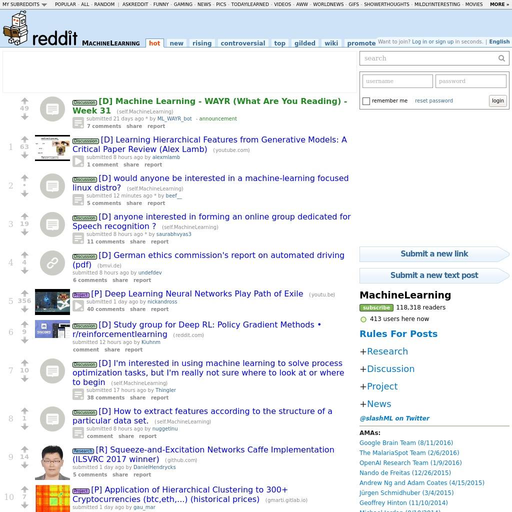
**이미지 캡션:** 이 이미지는 레딧의 머신러닝 서브레딧 페이지를 보여주며, 다양한 게시물 목록과 함께 오른쪽에는 서브레딧 정보 및 관련 링크가 표시되어 있습니다. 페이지 상단에는 레딧 로고와 함께 "MACHINE LEARNING"이라는 제목이 있고, 그 아래에는 "hot", "new", "rising", "controversial", "top", "gilded", "wiki"와 같은 탭들이 있습니다. 로그인 및 검색창도 보입니다. 메인 콘텐츠 영역에는 여러 게시물들이 나열되어 있으며, 각 게시물은 제목, 작성자, 제출 시간, 댓글 수, 공유 수 등의 정보를 포함하고 있습니다. 게시물 제목들은 주로 머신러닝, 딥러닝, 인공지능 관련 주제를 다루고 있으며, 일부는 링크, PDF, 유튜브 영상 등을 포함하고 있습니다. 오른쪽 사이드바에는 "MachineLearning" 서브레딧의 구독자 수, 현재 접속자 수, 게시물 규칙, 트위터 계정, 그리고 과거 AMA(Ask Me Anything) 세션 목록이 표시되어 있습니다. 전반적으로 기술 관련 커뮤니티의 정보 공유 및 토론이 이루어지는 온라인 플랫폼의 모습을 보여줍니다.

> #오늘의레딧 https://www.reddit.com/r/MachineLearning/ 재미난 이야기들이 많습니다  1. 음성 인식 전용 온라인 그룹을 만드는 데 관심이있는 사람은 누구입니까? 2. 독일 윤리위원회의 자동 운전 보고서 (pdf) 3. 깊은 학습 신경 회로망 망명의 길을 재생하십시오 4. Deep RL을위한 연구반 : 정책 기울기 방법 • r / reinforcementlearning 5. 프로세스 최적화 작업을 해결하기 위해 기계 학습을 사용하는 것에 관심이 있습니다. 그러나 어디에서보아야하는지, 어디에서 시작해야할지 모르겠습니다. 6. 특정 데이터 세트의 구조에 따라 피쳐를 추출하는 방법. 7. 짜내고 흥분 네트워크 Caffe 구현 (ILSVRC 2017 수상자) 8. 300+ Cryptocurrencies (btc, eth, ...)에 대한 계층 적 클러스터링의 적용 (과거 가격) 9. 심층 학습 및 양자 우세 : 네트워크 설계에 대한 시사점과 기본 연결 10. &#39;Poincaré Embeddings for Hierarchical Representations&#39;를 재창조하려는 비 컴퓨터 언어학자를위한 조언? 11. 워킹 경로를 이용한 시맨틱 세분화 12. 인도 정부, 인공 지능에 대한 태스크 포스 설립 13. 패션 - MNIST MIT에서 MNIST와 같은 패션 제품 데이터 세트 14. 비 전통적 방법을 사용하여 매우 깊은 CNN 15. TensorFlow 객체 감지 API 자습서 미니 시리즈 16. 새로운 패션로드 및보기 -MNIST + Pytorch DataLoader 17. 신경망으로 미분 방정식 풀기 18. 음악 생성을위한 신경망 19. 사전은 일반적으로 우도의 맥락에서만 이해 될 수있다.  1. https://www.reddit.com/r/MachineLearning/comments/6wcnog/d_anyone_interested_in_forming_an_online_group/ 2. https://www.bmvi.de/SharedDocs/EN/Documents/G/ethic-commission-report.pdf?__blob=publicationFile 3. https://youtu.be/UrrZOswJaow 4. https://www.reddit.comhttps://www.reddit.com/r/reinforcementlearning/comments/6w8kz1/d_study_group_for_deep_rl_policy_gradient_methods/ 5. https://www.reddit.com/r/MachineLearning/comments/6wassi/d_im_interested_in_using_machine_learning_to/ 6. https://www.reddit.com/r/MachineLearning/comments/6wcplq/d_how_to_extract_features_according_to_the/ 7. https://github.com/hujie-frank/SENet 8. https://gmarti.gitlab.io/cryptocurrency/2017/08/25/download-cryptocoins-api-python.html 9. https://pdfs.semanticscholar.org/c931/6491b8d991fabbf9b28c449d66df6a50f841.pdf 10. https://www.reddit.com/r/MachineLearning/comments/6w3oq7/d_any_advice_for_a_non_computationallinguist/ 11. https://github.com/ugnelis/find-path 12. http://www.livemint.com/Politics/W37G5pZTUVhhwKEbz1KJqJ/Commerce-ministry-sets-up-task-force-on-artificial-intellige.html 13. https://github.com/zalandoresearch/fashion-mnist 14. https://www.reddit.com/r/MachineLearning/comments/6w5fyl/d_extremely_deep_cnn_using_a_nontraditional_method/ 15. https://www.reddit.com/r/MachineLearning/comments/6vz3om/r_tensorflow_object_detection_api_tutorial/ 16. https://nbviewer.jupyter.org/github/kevinzakka/blog-code/blob/master/new-mnist-experiment/Data%20Exploration.ipynb 17. https://www.reddit.com/r/MachineLearning/comments/6w2fzq/d_solving_differential_equations_with_neural_nets/ 18. https://medium.com/@kcimc/neural-nets-for-generating-music-f46dffac21c0 19. https://arxiv.org/abs/1708.07487

### 8월 29일 (화) 11:06 · 📷 사진 (1장)

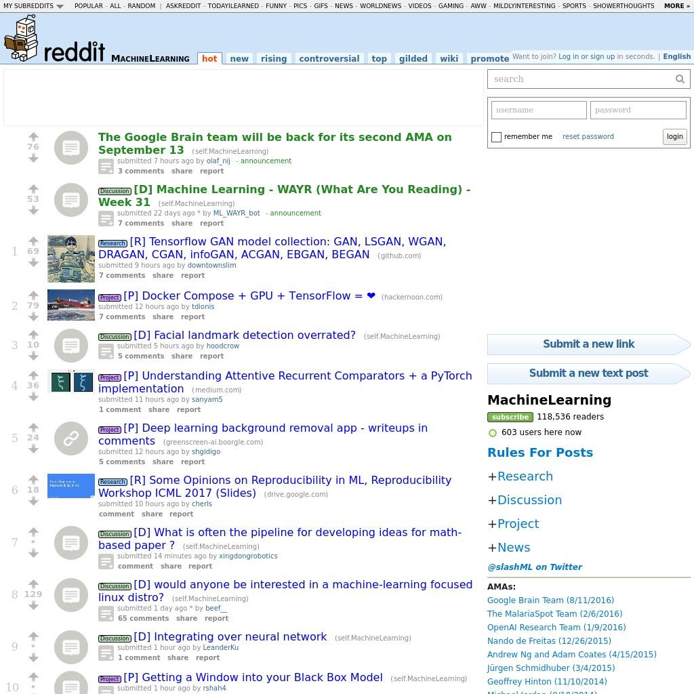
**이미지 캡션:** 이 이미지는 웹사이트 레딧의 머신러닝 커뮤니티 페이지를 보여줍니다. 페이지 상단에는 레딧 로고와 함께 "MACHINE LEARNING"이라는 제목이 있고, 그 아래에는 "hot", "new", "rising", "controversial", "top", "gilded", "wiki"와 같은 카테고리 탭이 있습니다. 오른쪽 상단에는 로그인 및 회원가입을 위한 입력 필드와 버튼이 있습니다. 메인 콘텐츠 영역에는 여러 게시물 목록이 표시되며, 각 게시물은 제목, 작성자, 제출 시간, 댓글 수, 공유 버튼 등으로 구성되어 있습니다. 게시물 제목 옆에는 "Discussion", "Project", "Research"와 같은 태그가 붙어 있어 게시물의 성격을 나타냅니다. 예를 들어, 첫 번째 게시물은 "The Google Brain team will be back for its second AMA on September 13"라는 제목으로, 머신러닝 관련 AMA(Ask Me Anything)에 대한 내용입니다. 다른 게시물들은 GAN 모델 컬렉션, 도커 컴포즈와 텐서플로우, 얼굴 랜드마크 감지, 딥러닝 배경 제거 앱, 머신러닝 재현성, 수학 기반 논문 아이디어, 머신러닝 리눅스 배포판, 신경망 통합, 블랙박스 모델 등에 대한 내용을 다루고 있습니다. 페이지 오른쪽에는 "Submit a new link", "Submit a new text post" 버튼과 함께 "MachineLearning" 커뮤니티 구독 정보, "Rules For Posts", 그리고 "AMAS" 목록이 표시되어 있습니다. 전반적으로 기술 및 연구 관련 정보를 공유하고 토론하는 온라인 커뮤니티의 모습을 보여주는 화면입니다.

> #오늘의레딧 https://www.reddit.com/r/MachineLearning/ 래딧은 읽을 거리가 다양합니다.  1. 도커 작성 + GPU + TensorFlow = ❤&lt;2ko&gt; 2. 얼굴 표식 탐지가 과대 평가 되었습니까? 3. 세심한 반복 비교기 이해하기 + PyTorch 구현 4. 심층 학습 배경 제거 앱 - 댓글에 글쓰기 5. ML, 재현성 워크숍 ICML 2017 (슬라이드)에서 재현성에 대한 몇 가지 의견 6. 수학 기반 종이 아이디어를 개발하기위한 파이프 라인은 무엇입니까? 7. 누구든지 기계 학습에 중점을 둔 리눅스 배포판에 관심이 있습니까? 8. 신경망을 통한 통합 9. 블랙 박스 모델로 창 가져 오기 10. 표준 convnet 아키텍처에서는 어떤 종류의 불변성이 자연스럽게 생깁니 까? 11. 포춘지 선정 500 대 기업에서 기계 학습 기능을 어떻게 생성합니까? 12. 철자 교정을위한 깊은 학습 사용. 13. 지원 벡터 머신 비용 매개 변수 자동 적용 14. "액션 - 조건부 비디오 예측 ..." 15. 파이썬 후에 배울 언어는 무엇입니까? 16. Pytorch-c ++ : pytorch에서 훈련 된 모델을 C ++로 사용하십시오. 17. 기계 학습을위한 2 학년 또는 3 학년 대학원 / 인공 지능 18. C ++에서 효율적인 그래프 임베딩 (DeepWalk) 19. "자동"Podcast 편집을위한 음성 인식 20. 영수증에서 데이터 가져 오기  1. https://hackernoon.com/docker-compose-gpu-tensorflow-%EF%B8%8F-a0e2011d36 2. https://www.reddit.com/r/MachineLearning/comments/6wmbg5/d_facial_landmark_detection_overrated/ 3. https://medium.com/@sanyamagarwal/understanding-attentive-recurrent-comparators-ea1b741da5c3 4. https://greenscreen-ai.boorgle.com/ 5. https://drive.google.com/file/d/0B8lLzpxgRHNQZ0paZWQ0cTcxMlNYYnc0TnpHekMxMjVBckVR/view 6. https://www.reddit.com/r/MachineLearning/comments/6wo20j/d_what_is_often_the_pipeline_for_developing_ideas/ 7. https://www.reddit.com/r/MachineLearning/comments/6wfgfz/d_would_anyone_be_interested_in_a_machinelearning/ 8. https://www.reddit.com/r/MachineLearning/comments/6wnq68/d_integrating_over_neural_network/ 9. https://www.reddit.com/r/MachineLearning/comments/6wnpb3/p_getting_a_window_into_your_black_box_model/ 10. https://www.reddit.com/r/MachineLearning/comments/6wid1k/d_what_kind_of_invariances_come_naturally_with/ 11. https://www.reddit.com/r/MachineLearning/comments/6wlb35/d_how_do_you_create_machine_learning_capabilities/ 12. https://www.reddit.com/r/MachineLearning/comments/6wl6jy/d_using_deep_learning_for_spell_correction/ 13. https://www.displayr.com/automatically-fitting-the-support-vector-machine-cost-parameter/ 14. https://www.reddit.com/r/MachineLearning/comments/6wkai2/d_actionconditional_video_prediction_any/ 15. https://www.reddit.com/r/MachineLearning/comments/6wjfgm/d_which_language_to_learn_after_python/ 16. https://github.com/warmspringwinds/pytorch-cpp 17. https://www.reddit.com/r/MachineLearning/comments/6wmc1x/d_2nd_or_3rd_tier_graduate_schools_for_machine/ 18. https://github.com/xgfs/deepwalk-c 19. https://www.reddit.com/r/MachineLearning/comments/6wkvsk/d_speech_recognition_to_auto_edit_podcast/ 20. https://www.reddit.com/r/MachineLearning/comments/6wkjia/d_pulling_data_from_receipts/

### 8월 30일 (수) 08:52 · 📷 사진 (1장)

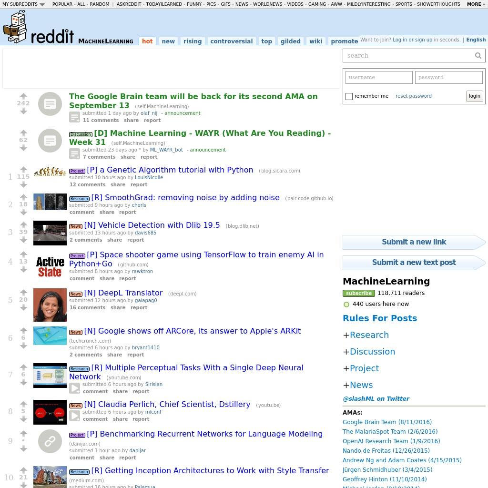
**이미지 캡션:** 이 이미지는 웹사이트 레딧의 머신러닝 서브레딧 페이지를 보여줍니다. 페이지 상단에는 레딧 로고와 함께 "MACHINE LEARNING"이라는 제목이 있고, 그 아래에는 "hot", "new", "rising", "controversial", "top", "gilded", "wiki"와 같은 다양한 탭이 있습니다. 오른쪽 상단에는 로그인 또는 회원가입을 위한 입력란과 버튼이 있습니다. 페이지 중앙에는 여러 게시물 목록이 있으며, 각 게시물은 제목, 작성자, 제출 시간, 댓글 수, 공유 및 보고 옵션을 포함합니다. 게시물 제목 옆에는 해당 게시물의 유형을 나타내는 태그(예: [P] for Project, [R] for Research, [N] for News, [D] for Discussion)가 있습니다. 또한 각 게시물에는 썸네일 이미지가 포함될 수 있습니다. 예를 들어, 5번째 게시물에는 한 여성의 사진이 있고, 10번째 게시물에는 건물 사진이 있습니다. 페이지 오른쪽에는 "Submit a new link" 및 "Submit a new text post" 버튼과 함께 "MachineLearning" 서브레딧의 구독자 수와 현재 접속자 수가 표시됩니다. 그 아래에는 "Rules For Posts" 섹션이 있으며, "Research", "Discussion", "Project", "News"와 같은 하위 섹션이 있습니다. 마지막으로 "AMAS" 섹션에는 과거 AMA(Ask Me Anything) 이벤트 목록이 날짜와 함께 표시됩니다. 전반적으로 이 페이지는 머신러닝 관련 정보를 공유하고 토론하는 온라인 커뮤니티의 모습을 보여줍니다.

> #오늘의레딧 https://www.reddit.com/r/MachineLearning/ 재미난 이야기들이 많습니다  1. SmoothGrad : 노이즈 추가로 노이즈 제거 2. Dlib 19.5로 차량 감지 3. TensorFlow를 사용하여 Python + Go에서 적 AI를 훈련시키는 우주 사수 게임 4. DeepL Translator 5. Google ARCore에 대한 답변, Apple의 ARKit에 대한 답변 6. 단일 신경 회로망을 이용한 다중 지각 작업 7. Claudia Perlich, 수석 과학자, Dstillery 8. 언어 모델링을위한 반복적 인 네트워크 벤치마킹 9. 스타일 전송 작업을위한 초기 아키텍처 얻기 10. 웹 브라우저의 PerformanceRNN 음악 생성 (deeplearn.js, Chrome 만 해당) 11. 비디오 게임 플레이를위한 딥 러닝 (Deep Learning)에 관한 설문 조사 (초안) 12. 저 신호 바이너리 분류를위한 딥 뉴럴 네트워크 13. 랜덤 포레스트 (Random Forest)에서 일어나는 일들 이해하기 14. Net2Net은 어떻게 되었습니까? 15. 큰 이미지를 여러 개의 작은 이미지로 서브 샘플링 할 수 있습니까? 16. Tensorflow GAN 모델 컬렉션 : GAN, LSGAN, WGAN, DRAGAN, CGAN, infogan, ACGAN, EBGAN, BEGAN 17. 도커 작성 + GPU + TensorFlow = ❤&lt;2ko&gt; 18. Kaldi, TensorFlow 통합 제공 19. TensorFlow 및 Librosa를 사용한 간단한 오디오 처리 예제 20. 수학 기반 종이 아이디어를 개발하기위한 파이프 라인은 무엇입니까?  1. https://pair-code.github.io/saliency/ 2. http://blog.dlib.net/2017/08/vehicle-detection-with-dlib-195_27.html 3. https://github.com/ActiveState/neuroblast 4. https://www.deepl.com/translator 5. https://techcrunch.com/2017/08/29/google-shows-off-arcore-its-answer-to-apples-arkit/ 6. https://www.youtube.com/watch?v=-5wAlxdxuQo 7. https://youtu.be/bd7vMLs71-Y 8. https://danijar.com/benchmarking-recurrent-networks-for-language-modeling 9. https://medium.com/mlreview/getting-inception-architectures-to-work-with-style-transfer-767d53475bf8 10. https://tambien.github.io/deeplearnjs/demos/performance_rnn/ 11. https://arxiv.org/pdf/1708.07902.pdf 12. https://www.reddit.com/r/MachineLearning/comments/6wqtp1/d_deep_neural_networks_for_low_signal_binary/ 13. https://github.com/MI2DataLab/randomForestExplainer 14. https://www.reddit.com/r/MachineLearning/comments/6wtww6/d_what_happened_to_net2net/ 15. https://www.reddit.com/r/MachineLearning/comments/6wt91z/d_is_it_possible_to_subsample_a_large_image_into/ 16. https://github.com/hwalsuklee/tensorflow-generative-model-collections 17. https://hackernoon.com/docker-compose-gpu-tensorflow-%EF%B8%8F-a0e2011d36 18. https://developers.googleblog.com/2017/08/kaldi-now-offers-tensorflow-integration.html 19. https://github.com/Kyubyong/tensorflow-exercises/blob/master/Audio_Processing.ipynb 20. https://www.reddit.com/r/MachineLearning/comments/6wo20j/d_what_is_often_the_pipeline_for_developing_ideas/
