# 2017년 9월

[← 2017년](README.md)

### 9월 1일 (금) 08:52 · 📷 사진 (1장)

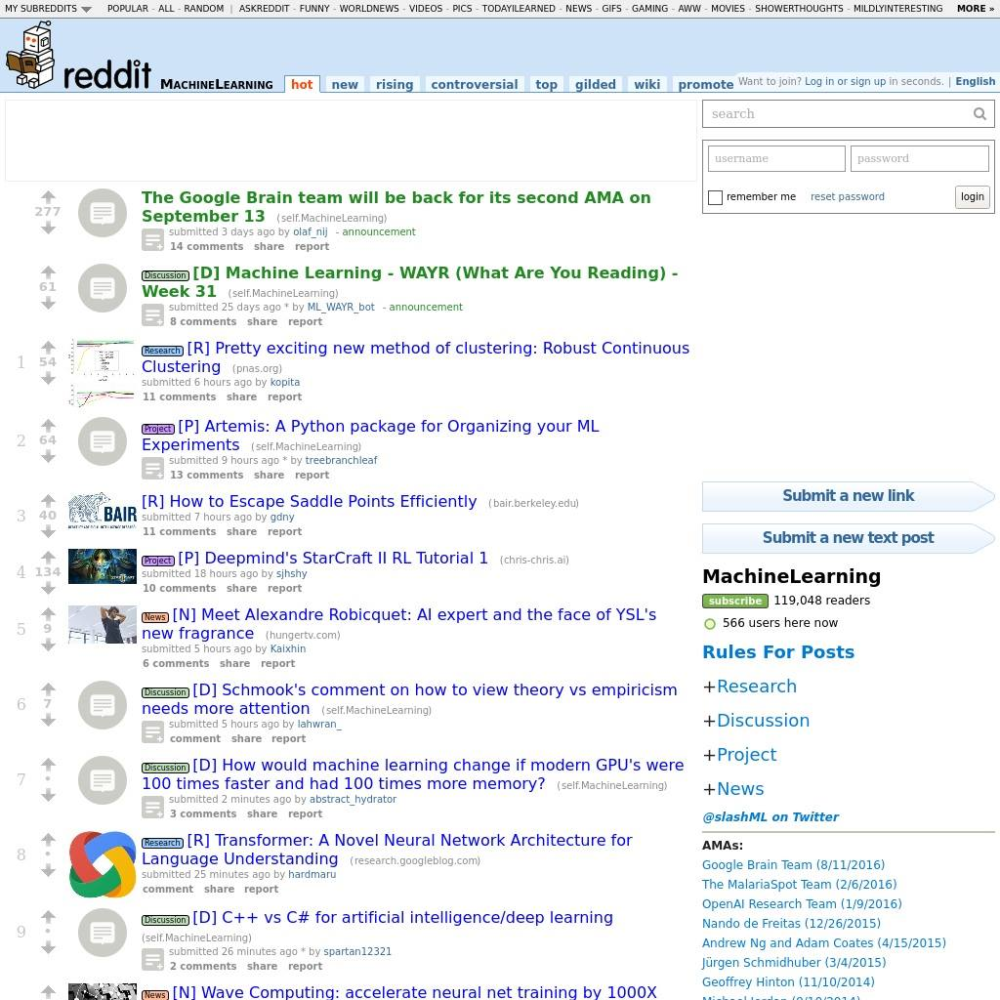
**이미지 캡션:** 이 이미지는 인기 있는 온라인 커뮤니티인 레딧의 머신러닝 관련 서브레딧 페이지를 보여줍니다. 페이지 상단에는 레딧 로고와 함께 "MACHINE LEARNING"이라는 제목이 크게 표시되어 있으며, 그 옆에는 "hot", "new", "rising", "controversial", "top", "gilded", "wiki"와 같은 다양한 정렬 옵션이 있습니다. 오른쪽 상단에는 로그인 또는 가입을 유도하는 문구와 함께 사용자 이름과 비밀번호 입력란, 로그인 버튼이 있습니다. 페이지 중앙에는 다양한 머신러닝 관련 게시물 목록이 표시되어 있으며, 각 게시물은 제목, 작성자, 제출 시간, 댓글 수, 공유 및 보고 옵션으로 구성되어 있습니다. 게시물 제목 옆에는 "[R]" (Research), "[P]" (Project), "[N]" (News), "[D]" (Discussion)과 같은 태그가 붙어 있어 게시물의 성격을 나타냅니다. 예를 들어, "The Google Brain team will be back for its second AMA on September 13"라는 제목의 게시물은 277개의 추천을 받았으며, "Discussion [D] Machine Learning - WAYR (What Are You Reading) - Week 31"이라는 게시물은 61개의 추천을 받았습니다. 또한, "MachineLearning" 서브레딧의 구독자 수와 현재 접속자 수가 표시되어 있으며, "Rules For Posts" 섹션에는 "+Research", "+Discussion", "+Project", "+News"와 같은 하위 카테고리가 있습니다. 페이지 오른쪽에는 "Submit a new link"와 "Submit a new text post" 버튼이 있어 사용자가 새로운 게시물을 올릴 수 있도록 합니다. 하단에는 "@slashML on Twitter" 링크와 함께 과거 AMA(Ask Me Anything) 세션 목록이 표시되어 있습니다. 전반적으로 이 페이지는 머신러닝 분야의 최신 정보와 토론을 공유하는 활발한 온라인 커뮤니티의 모습을 보여줍니다.게시물 목록이 표시되어 있으며, 각 게시물은 제목, 작성자, 제출 시간, 댓글 수, 공유 및 보고 옵션으로 구성되어 있습니다. 게시물 제목 옆에는 "[R]" (Research), "[P]" (Project), "[N]" (News), "[D]" (Discussion)과 같은 태그가 붙어 있어 게시물의 성격을 나타냅니다. 예를 들어, "The Google Brain team will be back for its second AMA on September 13"라는 제목의 게시물은 277개의 추천을 받았으며, "Discussion [D] Machine Learning - WAYR (What Are You Reading) - Week 31"이라는 게시물은 61개의 추천을 받았습니다. 또한, "MachineLearning" 서브레딧의 구독자 수와 현재 접속자 수가 표시되어 있으며, "Rules For Posts" 섹션에는 "+Research", "+Discussion", "+Project", "+News"와 같은 하위 카테고리가 있습니다. 페이지 오른쪽에는 "Submit a new link"와 "Submit a new text post" 버튼이 있어 사용자가 새로운 게시물을 올릴 수 있도록 합니다. 하단에는 "@slashML on Twitter" 링크와 함께 과거 AMA(Ask Me Anything) 세션 목록이 표시되어 있습니다. 전반적으로 이 페이지는 머신러닝 분야의 최신 정보와 토론을 공유하는 활발한 온라인 커뮤니티의 모습을 보여줍니다.

> #오늘의레딧 https://www.reddit.com/r/MachineLearning/ 래딧은 읽을 거리가 다양합니다.  1. Artemis : ML 실험 구성을위한 Python 패키지 2. Deepmind의 스타 크래프트 II RL 튜토리얼 1 3. Alexandre Robicquet을 만나보세요 : 인공 지능 전문가와 YSL의 새로운 향기의 얼굴 4. 경험에 대한 이론을 보는 방법에 대한 Schmook의 의견에 더 많은 관심이 필요하다. 5. 현대 GPU의 속도가 100 배 빨라지고 메모리가 100 배 더 많으면 컴퓨터 학습은 어떻게 변화할까요? 6. 변압기 : 언어 이해를위한 새로운 신경 회로망 7. 인공 지능 / 심층 학습을위한 C ++ 대 C # 8. 웨이브 컴퓨팅 : 신경 네트워크 학습을 GPU에서 1000 배, GoogleNet 420,000 이미지 / 초, 9. Hugo Larochelle 인터뷰 10. ML에 기본적인 지식을 가진 소프트웨어 엔지니어의 비율은 어느 정도입니까? 11. 통계 학습 학습 교재의 그림 7.2 - 편향 및 분산 12. Apache MXNet을 기반으로 한 10 개의 심층 학습 프로젝트 13. 과장의 절정 14. 7 가지 프레임 워크의 신경망 15. TensorFlow의 견적 도구, 실험 및 데이터 집합 API를 사용하는 방법에 대한 예 16. deepbootcamp.io의 깊은 RL 부팅 캠프는 어땠습니까? 17. uSDC (라스베리 파이 제로 마이크로 자동 운전 차량) 부품, 제작 지침 및 코드! 18. 물체 감지에서의 주요 딥 학습 랩? 19. 준비되지 않았다 : 나는 교수가되는 법에 대한 몇 가지 조언을 받았다. 20. AWS Lambda의 간단한 im2txt API  1. https://www.reddit.com/r/MachineLearning/comments/6x6tln/p_artemis_a_python_package_for_organizing_your_ml/ 2. http://chris-chris.ai/2017/08/30/pysc2-tutorial1/ 3. http://www.hungertv.com/feature/meet-alexandre-robicquet-artificial-intelligence-expert-and-ysls-new-fragrance-ambassador/ 4. https://www.reddit.com/r/MachineLearning/comments/6x8txa/d_schmooks_comment_on_how_to_view_theory_vs/ 5. https://www.reddit.com/r/MachineLearning/comments/6xaho2/d_how_would_machine_learning_change_if_modern/ 6. https://research.googleblog.com/2017/08/transformer-novel-neural-network.html 7. https://www.reddit.com/r/MachineLearning/comments/6xal67/d_c_vs_c_for_artificial_intelligencedeep_learning/ 8. https://www.nextplatform.com/2017/08/23/first-depth-view-wave-computings-dpu-architecture-systems/ 9. https://medium.com/mlreview/generalizing-from-few-examples-with-meta-learning-25dbcea94564 10. https://www.reddit.com/r/MachineLearning/comments/6x9shr/d_what_percentage_of_software_engineers_have_a/ 11. https://www.reddit.com/r/MachineLearning/comments/6x6zoe/d_figure_72_from_the_elements_of_statistical/ 12. https://medium.com/mlreview/10-deep-learning-projects-based-on-apache-mxnet-8231109f3f64 13. https://www.reddit.com/r/MachineLearning/comments/6x39hw/d_the_pinnacle_of_overhyping/ 14. https://github.com/ilkarman/DeepLearningFrameworks/ 15. https://medium.com/onfido-tech/higher-level-apis-in-tensorflow-67bfb602e6c0 16. https://www.reddit.com/r/MachineLearning/comments/6wznxm/d_how_was_the_deep_rl_boot_camp_from/ 17. https://github.com/ogmacorp/EOgmaDrive/tree/master/Configuration3 18. https://www.reddit.com/r/MachineLearning/comments/6wzo6s/d_main_deep_learning_breakthroughs_in_object/ 19. https://medium.com/mlreview/you-are-not-prepared-some-advice-ive-received-on-how-to-be-a-professor-85350cccabdb 20. https://github.com/abhisuri97/auto-alt-text-lambda-api

### 9월 2일 (토) 08:52 · 📷 사진 (1장)

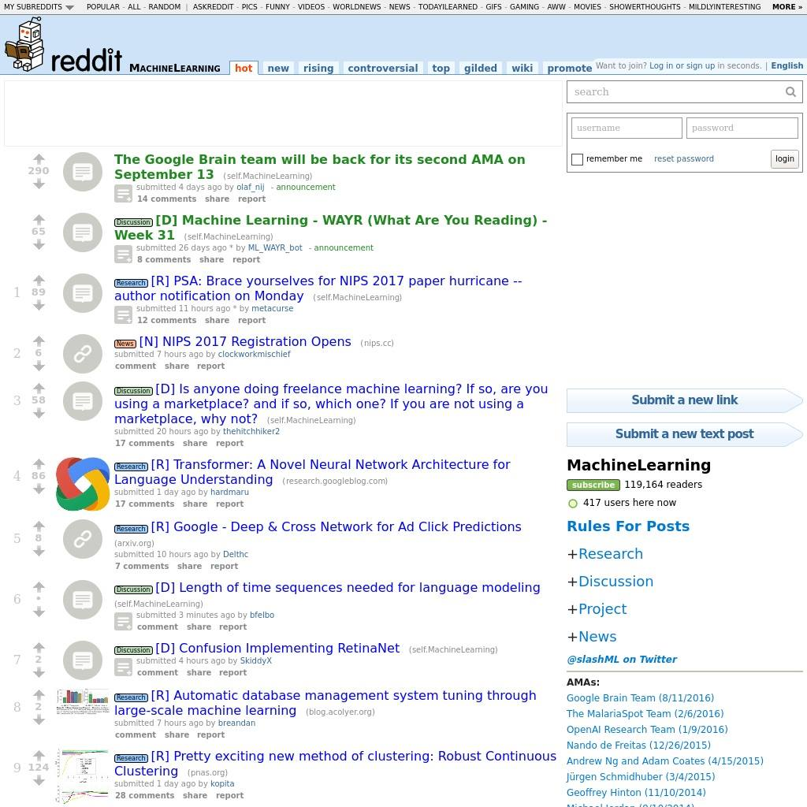
**이미지 캡션:** 이 이미지는 인기 있는 온라인 커뮤니티인 레딧의 머신러닝 서브레딧 페이지를 보여줍니다. 페이지 상단에는 레딧 로고와 함께 "MACHINE LEARNING"이라는 제목이 있고, 그 아래에는 "hot", "new", "rising", "controversial", "top", "gilded", "wiki"와 같은 다양한 탭이 있습니다. 오른쪽 상단에는 로그인 또는 회원가입을 할 수 있는 입력란과 버튼이 있습니다. 메인 콘텐츠 영역에는 머신러닝 관련 게시물 목록이 표시되며, 각 게시물은 제목, 작성자, 제출 시간, 댓글 수, 공유 버튼 등을 포함합니다. 게시물들은 "The Google Brain team will be back for its second AMA on September 13", "Machine Learning - WAYR (What Are You Reading) - Week 31", "PSA: Brace yourselves for NIPS 2017 paper hurricane -- author notification on Monday", "NIPS 2017 Registration Opens", "Is anyone doing freelance machine learning?", "Transformer: A Novel Neural Network Architecture for Language Understanding", "Google - Deep & Cross Network for Ad Click Predictions", "Length of time sequences needed for language modeling", "Confusion Implementing RetinaNet", "Automatic database management system tuning through large-scale machine learning", "Pretty exciting new method of clustering: Robust Continuous Clustering"와 같은 다양한 주제를 다루고 있습니다. 각 게시물 옆에는 추천 또는 비추천을 나타내는 화살표와 게시물의 종류를 나타내는 아이콘이 있습니다. 페이지 오른쪽에는 "Submit a new link", "Submit a new text post" 버튼과 함께 "MachineLearning" 서브레딧의 구독자 수, 현재 접속자 수, 게시 규칙, 트위터 계정, 그리고 과거 AMA(Ask Me Anything) 목록이 표시됩니다. 전반적으로 이 페이지는 머신러닝 분야의 최신 정보와 토론을 공유하는 온라인 커뮤니티의 모습을 보여줍니다. 댓글 수, 공유 버튼 등을 포함합니다. 게시물들은 "The Google Brain team will be back for its second AMA on September 13", "Machine Learning - WAYR (What Are You Reading) - Week 31", "PSA: Brace yourselves for NIPS 2017 paper hurricane -- author notification on Monday", "NIPS 2017 Registration Opens", "Is anyone doing freelance machine learning?", "Transformer: A Novel Neural Network Architecture for Language Understanding", "Google - Deep & Cross Network for Ad Click Predictions", "Length of time sequences needed for language modeling", "Confusion Implementing RetinaNet", "Automatic database management system tuning through large-scale machine learning", "Pretty exciting new method of clustering: Robust Continuous Clustering"와 같은 다양한 주제를 다루고 있습니다. 각 게시물 옆에는 추천 또는 비추천을 나타내는 화살표와 게시물의 종류를 나타내는 아이콘이 있습니다. 페이지 오른쪽에는 "Submit a new link", "Submit a new text post" 버튼과 함께 "MachineLearning" 서브레딧의 구독자 수, 현재 접속자 수, 게시 규칙, 트위터 계정, 그리고 과거 AMA(Ask Me Anything) 목록이 표시됩니다. 전반적으로 이 페이지는 머신러닝 분야의 최신 정보와 토론을 공유하는 온라인 커뮤니티의 모습을 보여줍니다.

> #오늘의레딧 https://www.reddit.com/r/MachineLearning/ 재미난 이야기들이 많습니다  1. NIPS 2017 등록 열기 2. 프리랜서 기계를 배우는 사람이 있습니까? 그렇다면 마켓 플레이스를 사용하고 있습니까? 그렇다면 어느 것이겠습니까? 마켓 플레이스를 사용하지 않는 이유는 무엇입니까? 3. 변압기 : 언어 이해를위한 새로운 신경 회로망 4. Google - 광고 클릭 예측에 대한 심층 및 교차 네트워크 5. 언어 모델링에 필요한 시간 길이 6. 레티 나 넷 구현 혼란 7. 대규모 기계 학습을 통한 자동 데이터베이스 관리 시스템 튜닝 8. 매우 흥미 진진한 새로운 클러스터링 방법 : 강력한 연속 클러스터링 9. 너 / 너는 무엇을 믿을 수 있니? 10. AlphaGo 논문에서 정책 네트워크 섹션의 강화 학습에 관한 질문. 11. 높은 정확성, 낮은 회수율을 원합니다. 12. DeepSchool.io; 깊은 학습, 학습 13. Artemis : ML 실험 구성을위한 Python 패키지 14. 워크샵 신청 - 2018 년 적용 기계 학습 15. Alexandre Robicquet을 만나보세요 : 인공 지능 전문가와 YSL의 새로운 향기의 얼굴 16. 경험에 대한 이론을 보는 방법에 대한 Schmook의 의견에 더 많은 관심이 필요하다. 17. Deepmind의 스타 크래프트 II RL 튜토리얼 1 18. 현대 GPU의 속도가 100 배 빨라지고 메모리가 100 배 더 많으면 컴퓨터 학습은 어떻게 변화할까요? 19. Hugo Larochelle 인터뷰 20. 인공 지능 / 심층 학습을위한 C ++ 대 C #  1. https://nips.cc/ 2. https://www.reddit.com/r/MachineLearning/comments/6xbxhd/d_is_anyone_doing_freelance_machine_learning_if/ 3. https://research.googleblog.com/2017/08/transformer-novel-neural-network.html 4. https://arxiv.org/pdf/1708.05123.pdf 5. https://www.reddit.com/r/MachineLearning/comments/6xi4tb/d_length_of_time_sequences_needed_for_language/ 6. https://www.reddit.com/r/MachineLearning/comments/6xgio4/d_confusion_implementing_retinanet/ 7. https://blog.acolyer.org/2017/08/11/automatic-database-management-system-tuning-through-large-scale-machine-learning/ 8. http://www.pnas.org/content/early/2017/08/28/1700770114.full 9. http://nypost.com/2017/08/31/robots-learned-how-to-write-fake-yelp-reviews-like-a-human/ 10. https://www.reddit.com/r/MachineLearning/comments/6xgjzf/d_question_about_reinforcement_learning_of_policy/ 11. https://www.reddit.com/r/MachineLearning/comments/6xevr7/d_looking_for_high_precision_low_recall/ 12. https://www.reddit.com/r/MachineLearning/comments/6xchxb/p_deepschoolio_deep_learning_learning/ 13. https://www.reddit.com/r/MachineLearning/comments/6x6tln/p_artemis_a_python_package_for_organizing_your_ml/ 14. https://www.appliedmldays.org/call_for_workshops 15. http://www.hungertv.com/feature/meet-alexandre-robicquet-artificial-intelligence-expert-and-ysls-new-fragrance-ambassador/ 16. https://www.reddit.com/r/MachineLearning/comments/6x8txa/d_schmooks_comment_on_how_to_view_theory_vs/ 17. http://chris-chris.ai/2017/08/30/pysc2-tutorial1/ 18. https://www.reddit.com/r/MachineLearning/comments/6xaho2/d_how_would_machine_learning_change_if_modern/ 19. https://medium.com/mlreview/generalizing-from-few-examples-with-meta-learning-25dbcea94564 20. https://www.reddit.com/r/MachineLearning/comments/6xal67/d_c_vs_c_for_artificial_intelligencedeep_learning/

### 9월 3일 (일) 08:52 · 📷 사진 (1장)

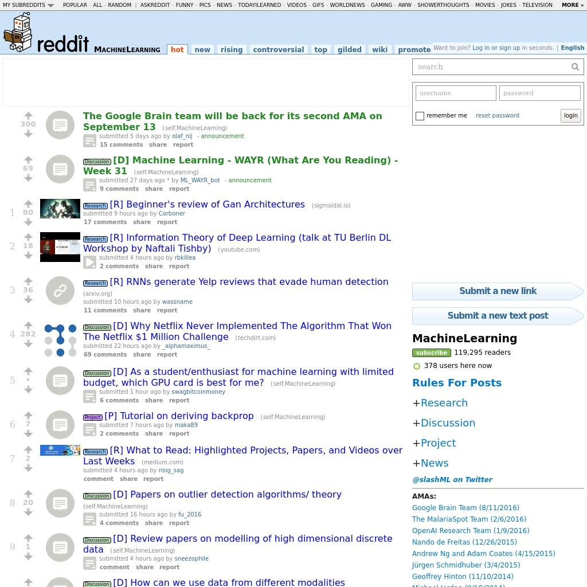
**이미지 캡션:** 이것은 웹사이트의 스크린샷으로, "MachineLearning"이라는 서브레딧의 게시물 목록을 보여줍니다. 화면 상단에는 Reddit 로고와 함께 "hot", "new", "rising", "controversial", "top", "gilded", "wiki"와 같은 탭이 있습니다. 오른쪽 상단에는 로그인 양식이 있으며, 사용자 이름과 비밀번호 필드, "remember me" 및 "reset password" 옵션, 그리고 로그인 버튼이 있습니다. 메인 콘텐츠 영역은 게시물 목록으로 구성되어 있으며, 각 게시물은 제목, 제출자, 제출 시간, 댓글 수, 그리고 관련 링크를 포함합니다. 게시물 제목은 머신러닝 관련 주제를 다루고 있으며, "The Google Brain team will be back for its second AMA on September 13", "[R] Beginner's review of Gan Architectures", "[D] Why Netflix Never Implemented The Algorithm That Won The Netflix $1 Million Challenge" 등이 있습니다. 오른쪽 사이드바에는 "Submit a new link", "Submit a new text post" 버튼과 함께 "MachineLearning" 서브레딧에 대한 정보가 표시됩니다. 구독자 수, 현재 접속자 수, 게시물 규칙, 그리고 과거 AMA 목록도 볼 수 있습니다. 전반적으로 이 화면은 머신러닝 커뮤니티의 온라인 토론 및 정보 공유 플랫폼을 보여줍니다.시물은 제목, 제출자, 제출 시간, 댓글 수, 그리고 관련 링크를 포함합니다. 게시물 제목은 머신러닝 관련 주제를 다루고 있으며, "The Google Brain team will be back for its second AMA on September 13", "[R] Beginner's review of Gan Architectures", "[D] Why Netflix Never Implemented The Algorithm That Won The Netflix $1 Million Challenge" 등이 있습니다. 오른쪽 사이드바에는 "Submit a new link", "Submit a new text post" 버튼과 함께 "MachineLearning" 서브레딧에 대한 정보가 표시됩니다. 구독자 수, 현재 접속자 수, 게시물 규칙, 그리고 과거 AMA 목록도 볼 수 있습니다. 전반적으로 이 화면은 머신러닝 커뮤니티의 온라인 토론 및 정보 공유 플랫폼을 보여줍니다.

> #오늘의레딧 https://www.reddit.com/r/MachineLearning/ 아침부터 다양한 소식이 많네요.  1. 깊은 학습의 정보 이론 (Naftali Tishby의 TU Berlin DL 워크숍에서의 토론) 2. RNN은 사람 탐지를 피하는 Yelp 리뷰를 생성합니다. 3. 왜 Netflix가 Netflix $ 1 백만 챌린지에서이긴 알고리즘을 구현하지 않았는가? 4. 제한된 예산으로 기계 학습을하는 학생 / 열광자인 GPU 카드가 가장 적합합니까? 5. Backprop 파생 자습서 6. 읽을 거리 : 지난 주간의 주요 프로젝트, 논문 및 비디오 7. 이상치 검출 알고리즘 / 이론에 관한 논문 8. 고차원 이산 데이터 모델링에 대한 논문 검토 9. NeuralNets Classifier를 구축하기 위해 다양한 양식 (텍스트 / 이미지)의 데이터를 어떻게 사용할 수 있습니까? 10. 적정 수준의 대학원 입학 기회가 있습니까? 11. 진화 알고리즘을 사용하여 다중 클래스 분류 자 ​​생성 12. PSA : NIPS 2017 종이 허리케인에 대비하라 - 월요일에 저자에게 통보 13. word2vec가있는 Dialectizer 14. NIPS 2017 등록 열기 15. 트럼프 짹짹 16. 언어 모델링에 필요한 시간 길이 17. Google - 광고 클릭 예측에 대한 심층 및 교차 네트워크 18. 레티 나 넷 구현 혼란 19. 프리랜서 기계를 배우는 사람이 있습니까? 그렇다면 마켓 플레이스를 사용하고 있습니까? 그렇다면 어느 것이겠습니까? 마켓 플레이스를 사용하지 않는 이유는 무엇입니까? 20. 변압기 : 언어 이해를위한 새로운 신경 회로망  1. https://www.youtube.com/watch?v=bLqJHjXihK8 2. https://arxiv.org/abs/1708.08151 3. https://www.techdirt.com/articles/20120409/03412518422/why-netflix-never-implemented-algorithm-that-won-netflix-1-million-challenge.shtml 4. https://www.reddit.com/r/MachineLearning/comments/6xpbns/d_as_a_studententhusiast_for_machine_learning/ 5. https://www.reddit.com/r/MachineLearning/comments/6xmp0k/p_tutorial_on_deriving_backprop/ 6. https://medium.com/@ml_review/machine-learning-weekly-review-7-93b9a7a7516c 7. https://www.reddit.com/r/MachineLearning/comments/6xkeei/d_papers_on_outlier_detection_algorithms_theory/ 8. https://www.reddit.com/r/MachineLearning/comments/6xoaen/d_review_papers_on_modelling_of_high_dimensional/ 9. https://www.reddit.com/r/MachineLearning/comments/6xl89y/d_how_can_we_use_data_from_different_modalities/ 10. https://www.reddit.com/r/MachineLearning/comments/6xmd4j/d_do_i_stand_a_chance_for_decent_graduate_school/ 11. https://www.reddit.com/r/MachineLearning/comments/6xl47q/dbuilding_a_multi_class_classifier_using/ 12. https://www.reddit.com/r/MachineLearning/comments/6xe6ns/r_psa_brace_yourselves_for_nips_2017_paper/ 13. https://www.reddit.com/r/MachineLearning/comments/6xih8c/d_dialectizer_with_word2vec/ 14. https://nips.cc/ 15. https://www.reddit.com/r/MachineLearning/comments/6xlr4y/p_trump_tweets/ 16. https://www.reddit.com/r/MachineLearning/comments/6xi4tb/d_length_of_time_sequences_needed_for_language/ 17. https://arxiv.org/pdf/1708.05123.pdf 18. https://www.reddit.com/r/MachineLearning/comments/6xgio4/d_confusion_implementing_retinanet/ 19. https://www.reddit.com/r/MachineLearning/comments/6xbxhd/d_is_anyone_doing_freelance_machine_learning_if/ 20. https://research.googleblog.com/2017/08/transformer-novel-neural-network.html

### 9월 4일 (월) 08:52 · 📷 사진 (2장)

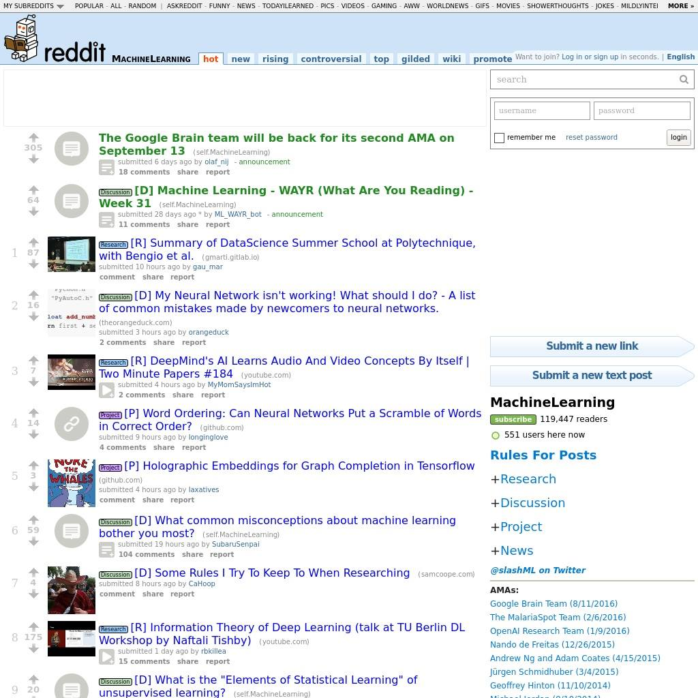
**이미지 캡션:** 이 이미지는 레딧의 머신러닝 서브레딧 페이지를 보여주며, 다양한 게시물 목록과 함께 오른쪽에는 관련 정보가 표시되어 있습니다. 페이지 상단에는 레딧 로고와 함께 "MACHINE LEARNING"이라는 제목이 있고, 그 아래에는 "hot", "new", "rising", "controversial", "top", "gilded", "wiki", "promote"와 같은 탭이 있습니다. 검색창과 로그인/회원가입 폼도 보입니다. 게시물 목록은 제목, 작성자, 제출 시간, 댓글 수, 공유 버튼 등으로 구성되어 있으며, 각 게시물은 연구, 토론, 프로젝트 등 카테고리로 분류되어 있습니다. 예를 들어, "The Google Brain team will be back for its second AMA on September 13"라는 제목의 게시물은 6일 전에 제출되었고 18개의 댓글이 있습니다. 오른쪽 사이드바에는 "Submit a new link", "Submit a new text post" 버튼과 함께 서브레딧 구독자 수, 현재 접속자 수, 게시 규칙, 트위터 계정, 그리고 과거 AMA 목록이 표시되어 있습니다. 전반적으로 정보가 많고 활발한 커뮤니티의 모습을 보여주는 페이지입니다., 각 게시물은 연구, 토론, 프로젝트 등 카테고리로 분류되어 있습니다. 예를 들어, "The Google Brain team will be back for its second AMA on September 13"라는 제목의 게시물은 6일 전에 제출되었고 18개의 댓글이 있습니다. 오른쪽 사이드바에는 "Submit a new link", "Submit a new text post" 버튼과 함께 서브레딧 구독자 수, 현재 접속자 수, 게시 규칙, 트위터 계정, 그리고 과거 AMA 목록이 표시되어 있습니다. 전반적으로 정보가 많고 활발한 커뮤니티의 모습을 보여주는 페이지입니다.
 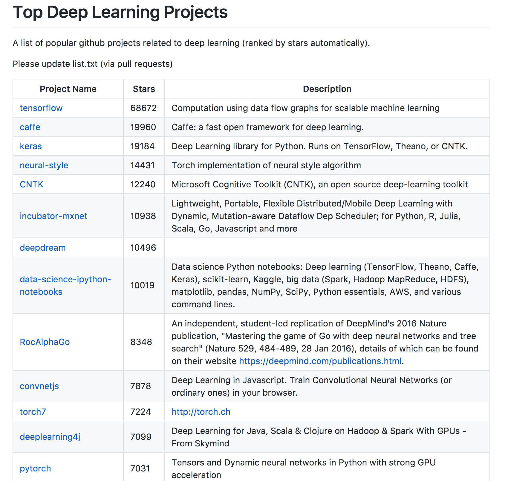
**이미지 캡션:** 이것은 "Top Deep Learning Projects"라는 제목의 웹페이지 스크린샷으로, 인기 있는 딥러닝 관련 GitHub 프로젝트 목록을 별 개수에 따라 자동으로 순위를 매겨 보여줍니다. 페이지 상단에는 프로젝트 이름, 별 개수, 그리고 각 프로젝트에 대한 간략한 설명이 포함된 표가 있습니다. 표에는 tensorflow, caffe, keras, neural-style, CNTK, incubator-mxnet, deepdream, data-science-ipython-notebooks, RocAlphaGo, convnetjs, torch7, deeplearning4j, pytorch와 같은 프로젝트들이 나열되어 있으며, 각 프로젝트의 별 개수와 설명이 상세하게 기재되어 있습니다. 예를 들어, tensorflow는 68672개의 별을 받았으며 "확장 가능한 머신러닝을 위한 데이터 흐름 그래프를 사용한 계산"이라는 설명이 붙어 있습니다. RocAlphaGo 프로젝트 설명에는 "DeepMind의 2016년 Nature 출판물 '바둑 게임을 딥 신경망과 트리 검색으로 마스터하기'의 독립적인 학생 주도 복제본"이라는 내용과 함께 웹사이트 링크가 포함되어 있습니다. 전반적으로 이 이미지는 딥러닝 분야의 주요 오픈 소스 프로젝트에 대한 정보를 제공하는 기술 관련 문서의 일부로 보입니다.Go, convnetjs, torch7, deeplearning4j, pytorch와 같은 프로젝트들이 나열되어 있으며, 각 프로젝트의 별 개수와 설명이 상세하게 기재되어 있습니다. 예를 들어, tensorflow는 68672개의 별을 받았으며 "확장 가능한 머신러닝을 위한 데이터 흐름 그래프를 사용한 계산"이라는 설명이 붙어 있습니다. RocAlphaGo 프로젝트 설명에는 "DeepMind의 2016년 Nature 출판물 '바둑 게임을 딥 신경망과 트리 검색으로 마스터하기'의 독립적인 학생 주도 복제본"이라는 내용과 함께 웹사이트 링크가 포함되어 있습니다. 전반적으로 이 이미지는 딥러닝 분야의 주요 오픈 소스 프로젝트에 대한 정보를 제공하는 기술 관련 문서의 일부로 보입니다.

> #오늘의레딧 https://www.reddit.com/r/MachineLearning/ 재미난 이야기들이 많습니다  1. 내 신경망이 작동하지 않습니다! 어떻게해야합니까? - 신참이 신경망에 끼친 공통적 인 실수의 목록. 2. DeepMind의 AI는 오디오 및 비디오 개념을 스스로 학습합니다 | 2 분 논문 # 184 3. 단어 순서 : 뉴럴 네트워크가 정확한 순서로 단어의 출격을 할 수 있습니까? 4. Tensorflow의 그래프 완성을위한 홀로그램 삽입 5. 기계 학습에 대한 일반적인 오해가 가장 귀찮은가요? 6. 조사 할 때 계속 지켜야 할 규칙들 7. 깊은 학습의 정보 이론 (Naftali Tishby의 TU Berlin DL 워크숍에서의 토론) 8. 자율 학습의 "통계 학습 요소"란 무엇입니까? 9. 왜 신경망은 좋은 함수 근사입니까? 10. Gan Architectures의 초보자 리뷰 11. RNN은 사람 탐지를 피하는 Yelp 리뷰를 생성합니다. 12. 제한된 예산으로 기계 학습을하는 학생 / 열광자인 GPU 카드가 가장 적합합니까? 13. 파이썬에서 제어 가능한 포즈 매개 변수를 사용하여 얼굴 / 객체 생성? 14. CUDA C ++ 코드 10 행의 신경망 15. 왜 Netflix가 Netflix $ 1 백만 챌린지에서이긴 알고리즘을 구현하지 않았는가? 16. Backprop 파생 자습서 17. 읽을 거리 : 지난 주간의 주요 프로젝트, 논문 및 비디오 18. 이상치 검출 알고리즘 / 이론에 관한 논문 19. 고차원 이산 데이터 모델링에 대한 논문 검토 20. 적정 수준의 대학원 입학 기회가 있습니까?  1. http://theorangeduck.com/page/neural-network-not-working 2. https://www.youtube.com/watch?v=mL3CzZcBJZU 3. https://github.com/Kyubyong/word_ordering 4. https://github.com/laxatives/TensorFlow-TransX 5. https://www.reddit.com/r/MachineLearning/comments/6xqty0/d_what_common_misconceptions_about_machine/ 6. http://www.samcoope.com/posts/machine_learning_research 7. https://www.youtube.com/watch?v=bLqJHjXihK8 8. https://www.reddit.com/r/MachineLearning/comments/6xrvax/d_what_is_the_elements_of_statistical_learning_of/ 9. https://www.reddit.com/r/MachineLearning/comments/6xwg53/d_why_are_neural_networks_good_function/ 10. https://sigmoidal.io/beginners-review-of-gan-architectures/ 11. https://arxiv.org/abs/1708.08151 12. https://www.reddit.com/r/MachineLearning/comments/6xpbns/d_as_a_studententhusiast_for_machine_learning/ 13. https://www.reddit.com/r/MachineLearning/comments/6xrlf3/d_faceobject_generation_with_controllable_pose/ 14. https://cognitivedemons.wordpress.com/2017/09/02/a-neural-network-in-10-lines-of-cuda-c-code/ 15. https://www.techdirt.com/articles/20120409/03412518422/why-netflix-never-implemented-algorithm-that-won-netflix-1-million-challenge.shtml 16. https://www.reddit.com/r/MachineLearning/comments/6xmp0k/p_tutorial_on_deriving_backprop/ 17. https://medium.com/@ml_review/machine-learning-weekly-review-7-93b9a7a7516c 18. https://www.reddit.com/r/MachineLearning/comments/6xkeei/d_papers_on_outlier_detection_algorithms_theory/ 19. https://www.reddit.com/r/MachineLearning/comments/6xoaen/d_review_papers_on_modelling_of_high_dimensional/ 20. https://www.reddit.com/r/MachineLearning/comments/6xmd4j/d_do_i_stand_a_chance_for_decent_graduate_school/
> [딥러닝 관련 프로젝트 *별* 전쟁]  https://github.com/hunkim/DeepLearningStars  자동으로 딥러닝 관련 github프로젝트를 받은 별로 리스트해주는데요, 아직 TensorFlow 의 열기는 장난이 아닌듯.  Keras 별 많이 올라왔고요. pyTorch는 아직 생각보다 별이 많지 않네요. (왜 그럴까요?)   여러분들이 좋아하시는 프로젝트 있으시면 반드시 *별*로 좋아요 표시 부탁드립니다.  예: https://github.com/hunkim/DeepLearningZeroToAll, https://github.com/hunkim/ReinforcementZeroToAll 등등 ^^

### 9월 5일 (화) 08:52 · 📷 사진 (1장)

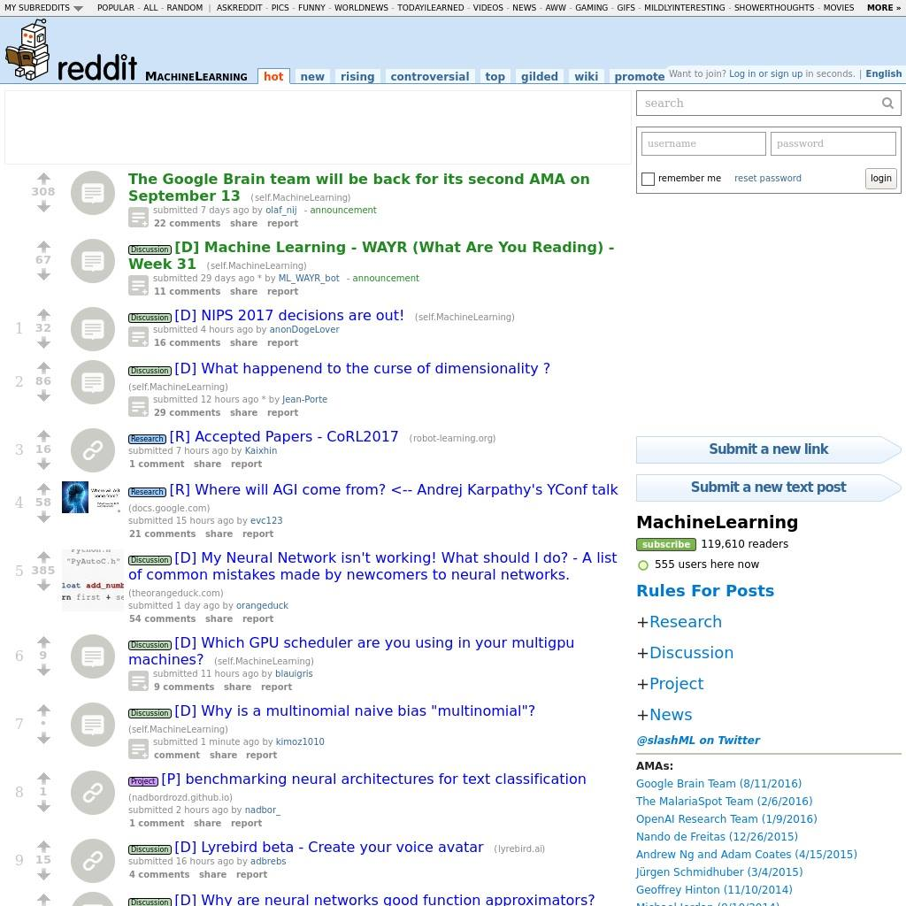
**이미지 캡션:** 이 이미지는 레딧의 머신러닝 커뮤니티 페이지를 보여줍니다. 페이지 상단에는 레딧 로고와 함께 "MACHINE LEARNING"이라는 제목이 있고, 그 아래에는 "hot", "new", "rising", "controversial", "top", "gilded", "wiki", "promote"와 같은 다양한 카테고리 링크가 있습니다. 오른쪽 상단에는 로그인 또는 회원가입을 할 수 있는 폼이 있습니다. 페이지 중앙에는 머신러닝 관련 게시물 목록이 나열되어 있으며, 각 게시물은 제목, 작성자, 제출 시간, 댓글 수, 공유 링크 등의 정보를 포함하고 있습니다. 게시물 제목으로는 "The Google Brain team will be back for its second AMA on September 13", "Machine Learning - WAYR (What Are You Reading) - Week 31", "NIPS 2017 decisions are out!", "What happenend to the curse of dimensionality ?", "Accepted Papers - CoRL2017", "Where will AGI come from? <-- Andrej Karpathy's YConf talk", "My Neural Network isn't working! What should I do? - A list of common mistakes made by newcomers to neural networks.", "Which GPU scheduler are you using in your multigpu machines?", "Why is a multinomial naive bias 'multinomial'?", "benchmarking neural architectures for text classification", "Lyrebird beta - Create your voice avatar", "Why are neural networks good function approximators?" 등이 보입니다. 페이지 오른쪽에는 "Submit a new link", "Submit a new text post" 버튼과 함께 "MachineLearning" 커뮤니티 구독자 수, 현재 접속자 수, 게시 규칙, 트위터 계정, 그리고 과거 AMA 목록이 표시되어 있습니다. 전반적으로 정보가 많고 기술적인 주제를 다루는 온라인 커뮤니티의 모습을 보여줍니다.수, 공유 링크 등의 정보를 포함하고 있습니다. 게시물 제목으로는 "The Google Brain team will be back for its second AMA on September 13", "Machine Learning - WAYR (What Are You Reading) - Week 31", "NIPS 2017 decisions are out!", "What happenend to the curse of dimensionality ?", "Accepted Papers - CoRL2017", "Where will AGI come from? <-- Andrej Karpathy's YConf talk", "My Neural Network isn't working! What should I do? - A list of common mistakes made by newcomers to neural networks.", "Which GPU scheduler are you using in your multigpu machines?", "Why is a multinomial naive bias 'multinomial'?", "benchmarking neural architectures for text classification", "Lyrebird beta - Create your voice avatar", "Why are neural networks good function approximators?" 등이 보입니다. 페이지 오른쪽에는 "Submit a new link", "Submit a new text post" 버튼과 함께 "MachineLearning" 커뮤니티 구독자 수, 현재 접속자 수, 게시 규칙, 트위터 계정, 그리고 과거 AMA 목록이 표시되어 있습니다. 전반적으로 정보가 많고 기술적인 주제를 다루는 온라인 커뮤니티의 모습을 보여줍니다.

> #오늘의레딧 https://www.reddit.com/r/MachineLearning/ 래딧은 읽을 거리가 다양합니다.  1. 차원의 저주는 어떻게 될까요? 2. 수락 한 논문 - CoRL2017 3. AGI는 어디에서 오는 것입니까? &lt;- Andrej Karpathy의 YConf 이야기 4. 내 신경망이 작동하지 않습니다! 어떻게해야합니까? - 신참이 신경망에 끼친 공통적 인 실수의 목록. 5. 멀티 GP 시스템에서 어떤 GPU 스케줄러를 사용하고 있습니까? 6. 왜 다항식 순진 편향이 "다항식"입니까? 7. 텍스트 분류를위한 벤치마킹 신경 아키텍처 8. Lyrebird 베타 - 음성 아바타 만들기 9. 왜 신경망은 좋은 함수 근사입니까? 10. 4D 데이터에서 개체 추적하기 학습 11. ML 지식없이 온라인 맞춤형 Core ML 모델을 교육하는 도구입니다. 12. 최근 강화 학습 연구 (PPO, 매개 변수 잡음, 가치 분배) 13. Bengio 외, Polytechnique의 DataScience Summer School 요약 14. 일반적인 벤치 마크에 대해 학습 된 옵션이있는 MCTS 15. 업계 경험 얻기 : STEM 학생 (대학원 및 학부생)을위한 파트 타임, 원격 견습 과정 16. 하이퍼 파라미터 공간을 자동으로 효율적으로 검색 17. 단어 순서 : 뉴럴 네트워크가 정확한 순서로 단어의 출격을 할 수 있습니까? 18. 조사 할 때 계속 지켜야 할 규칙들 19. DeepMind의 AI는 오디오 및 비디오 개념을 스스로 학습합니다 | 2 분 논문 # 184 20. Tensorflow의 그래프 완성을위한 홀로그램 삽입  1. https://www.reddit.com/r/MachineLearning/comments/6xzney/d_what_happenend_to_the_curse_of_dimensionality/ 2. http://www.robot-learning.org/accepted-papers 3. https://docs.google.com/presentation/d/119VW6ueBGLQXsw-jGMboGP2-WuOnyMAOYLgd44SL6xM/preview?slide=id.p 4. http://theorangeduck.com/page/neural-network-not-working 5. https://www.reddit.com/r/MachineLearning/comments/6xzv3h/d_which_gpu_scheduler_are_you_using_in_your/ 6. https://www.reddit.com/r/MachineLearning/comments/6y3xln/d_why_is_a_multinomial_naive_bias_multinomial/ 7. http://nadbordrozd.github.io/blog/2017/08/12/looking-for-the-text-top-model/ 8. https://lyrebird.ai/blog/lyrebird-is-back 9. https://www.reddit.com/r/MachineLearning/comments/6xwg53/d_why_are_neural_networks_good_function/ 10. https://summerofhpc.prace-ri.eu/learning-to-track-objects-in-4d-data/ 11. https://www.coreml.vize.ai/ 12. https://www.reddit.com/r/MachineLearning/comments/6xzw8c/d_on_the_combination_of_recent_reinforcement/ 13. https://gmarti.gitlab.io/ml/2017/09/02/ds3-datascience-polytechnique.html 14. https://www.reddit.com/r/MachineLearning/comments/6y0inj/d_mcts_with_learned_options_on_common_benchmarks/ 15. https://medium.com/@jeremie_sharpestminds/levelling-up-how-to-move-beyond-ai-nanodegrees-and-land-an-actual-job-in-machine-learning-6c5009d4e60 16. https://www.reddit.com/r/MachineLearning/comments/6xzivo/p_search_hyperparameters_space/ 17. https://github.com/Kyubyong/word_ordering 18. http://www.samcoope.com/posts/machine_learning_research 19. https://www.youtube.com/watch?v=mL3CzZcBJZU 20. https://github.com/laxatives/TensorFlow-TransX

### 9월 6일 (수) 08:52 · 📷 사진 (2장)

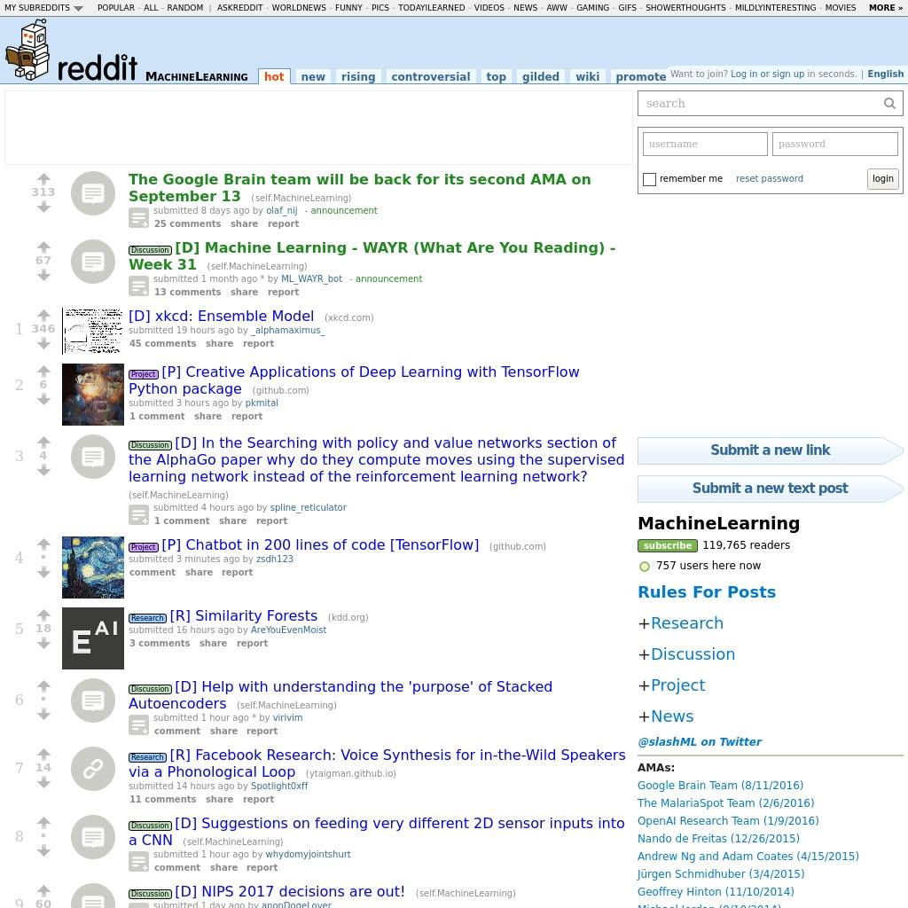
**이미지 캡션:** 이것은 웹사이트의 스크린샷으로, 머신러닝 관련 게시물 목록을 보여줍니다. 화면 중앙에는 "reddit" 로고와 함께 "MACHINE LEARNING"이라는 제목의 페이지가 표시됩니다. 페이지 상단에는 "hot", "new", "rising", "controversial", "top", "gilded", "wiki"와 같은 다양한 탭이 있습니다. 오른쪽 상단에는 로그인 양식이 있으며, 사용자 이름과 비밀번호 필드, "remember me" 체크박스, "reset password" 링크, "login" 버튼이 있습니다. 게시물 목록은 여러 항목으로 구성되어 있으며, 각 항목에는 제목, 제출자, 제출 시간, 댓글 수, 공유 링크가 포함되어 있습니다. 몇 가지 예는 다음과 같습니다. "The Google Brain team will be back for its second AMA on September 13", "[D] Machine Learning - WAYR (What Are You Reading) - Week 31", "[D] xkcd: Ensemble Model", "[P] Creative Applications of Deep Learning with TensorFlow Python package", "[D] In the Searching with policy and value networks section of the AlphaGo paper why do they compute moves using the supervised learning network instead of the reinforcement learning network?", "[P] Chatbot in 200 lines of code [TensorFlow]", "[R] Similarity Forests", "[D] Help with understanding the 'purpose' of Stacked Autoencoders", "[R] Facebook Research: Voice Synthesis for in-the-Wild Speakers via a Phonological Loop", "[D] Suggestions on feeding very different 2D sensor inputs into a CNN", "[D] NIPS 2017 decisions are out!". 각 게시물 옆에는 위아래 화살표가 있어 투표를 나타냅니다. 일부 게시물에는 썸네일 이미지도 포함되어 있습니다. 예를 들어, "Creative Applications of Deep Learning with TensorFlow Python package" 게시물에는 우주를 배경으로 한 그림이 있고, "Chatbot in 200 lines of code [TensorFlow]" 게시물에는 별이 빛나는 밤하늘 그림이 있습니다. 페이지 오른쪽에는 "MachineLearning" 커뮤니티에 대한 정보가 표시됩니다. 구독자 수는 119,765명이며, 현재 757명의 사용자가 활동 중입니다. 또한 "Rules For Posts" 섹션에는 "+Research", "+Discussion", "+Project", "+News"와 같은 하위 섹션이 있습니다. 그 아래에는 "@slashML on Twitter"라는 섹션과 "AMAS" 목록이 있으며, 여기에는 다양한 연구팀의 이름과 날짜가 나열되어 있습니다. 전반적으로 이 페이지는 머신러닝 커뮤니티의 최신 정보와 토론을 제공하는 온라인 포럼의 일부로 보입니다. 분위기는 정보 공유와 토론에 중점을 둔 학술적이고습니다. 게시물 목록은 여러 항목으로 구성되어 있으며, 각 항목에는 제목, 제출자, 제출 시간, 댓글 수, 공유 링크가 포함되어 있습니다. 몇 가지 예는 다음과 같습니다. "The Google Brain team will be back for its second AMA on September 13", "[D] Machine Learning - WAYR (What Are You Reading) - Week 31", "[D] xkcd: Ensemble Model", "[P] Creative Applications of Deep Learning with TensorFlow Python package", "[D] In the Searching with policy and value networks section of the AlphaGo paper why do they compute moves using the supervised learning network instead of the reinforcement learning network?", "[P] Chatbot in 200 lines of code [TensorFlow]", "[R] Similarity Forests", "[D] Help with understanding the 'purpose' of Stacked Autoencoders", "[R] Facebook Research: Voice Synthesis for in-the-Wild Speakers via a Phonological Loop", "[D] Suggestions on feeding very different 2D sensor inputs into a CNN", "[D] NIPS 2017 decisions are out!". 각 게시물 옆에는 위아래 화살표가 있어 투표를 나타냅니다. 일부 게시물에는 썸네일 이미지도 포함되어 있습니다. 예를 들어, "Creative Applications of Deep Learning with TensorFlow Python package" 게시물에는 우주를 배경으로 한 그림이 있고, "Chatbot in 200 lines of code [TensorFlow]" 게시물에는 별이 빛나는 밤하늘 그림이 있습니다. 페이지 오른쪽에는 "MachineLearning" 커뮤니티에 대한 정보가 표시됩니다. 구독자 수는 119,765명이며, 현재 757명의 사용자가 활동 중입니다. 또한 "Rules For Posts" 섹션에는 "+Research", "+Discussion", "+Project", "+News"와 같은 하위 섹션이 있습니다. 그 아래에는 "@slashML on Twitter"라는 섹션과 "AMAS" 목록이 있으며, 여기에는 다양한 연구팀의 이름과 날짜가 나열되어 있습니다. 전반적으로 이 페이지는 머신러닝 커뮤니티의 최신 정보와 토론을 제공하는 온라인 포럼의 일부로 보입니다. 분위기는 정보 공유와 토론에 중점을 둔 학술적이고
 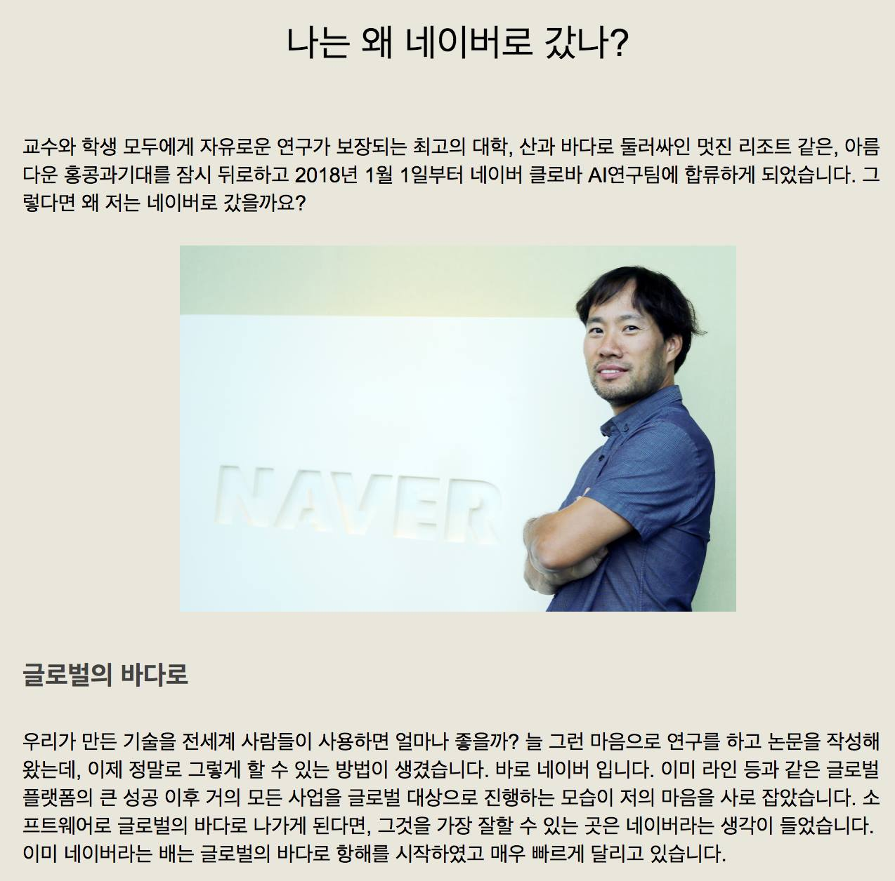
**이미지 캡션:** 사진에는 한국어로 된 텍스트와 함께 한 명의 성인 남성이 등장합니다. 남성은 30대 후반에서 40대 초반으로 보이며, 짧은 검은색 머리에 약간의 이마 주름이 있습니다. 그는 푸른색 계열의 체크무늬 셔츠를 입고 있으며, 카메라를 향해 부드러운 미소를 짓고 있습니다. 그의 표정은 편안하고 자신감 있어 보입니다. 남성은 실내에서 촬영되었으며, 배경에는 "NAVER"라는 로고가 흐릿하게 보입니다. 이 로고는 남성이 네이버 소속임을 암시합니다. 사진 위쪽에는 "나는 왜 네이버로 갔나?"라는 제목이 있고, 그 아래에는 남성이 네이버 클로바 AI 연구팀에 합류하게 된 배경을 설명하는 글이 있습니다. 사진 아래쪽에는 "글로벌의 바다로"라는 소제목과 함께, 네이버가 글로벌 시장을 향해 나아가는 모습에 대한 그의 생각을 담은 글이 이어집니다. 전체적으로 사진은 전문적이고 긍정적인 분위기를 풍기며, 네이버의 글로벌 비전에 대한 개인적인 경험과 생각을 전달하는 데 초점을 맞추고 있습니다.남성이 네이버 클로바 AI 연구팀에 합류하게 된 배경을 설명하는 글이 있습니다. 사진 아래쪽에는 "글로벌의 바다로"라는 소제목과 함께, 네이버가 글로벌 시장을 향해 나아가는 모습에 대한 그의 생각을 담은 글이 이어집니다. 전체적으로 사진은 전문적이고 긍정적인 분위기를 풍기며, 네이버의 글로벌 비전에 대한 개인적인 경험과 생각을 전달하는 데 초점을 맞추고 있습니다.

> #오늘의레딧 https://www.reddit.com/r/MachineLearning/ 아침부터 다양한 소식이 많네요.  1. AlphaGo 논문의 정책 및 가치 네트워크 검색 섹션에서 강화 학습 네트워크 대신 감독 학습 네트워크를 사용하여 이동을 계산하는 이유는 무엇입니까? 2. 유사성 포리스트 3. Stacked Autoencoders의 &#39;목적&#39;이해에 대한 도움말 4. 페이스 북 리서치 : 음운론 적 루프를 통한 와일드 스피커를위한 음성 합성 5. 매우 다른 2D 센서 입력을 CNN에 공급하는 것에 대한 제안 6. NIPS 2017 결정이 있습니다! 7. 대립 가능성 (log-likelihood)의 상한을 극대화하는 것이 합리적일까요? 로그 가능성 (log-likelihood)이 최대로 보장 될 것입니까? 8. sounderfeit : 컴퓨터 음악에 관한 브라질 심포지엄에서 오늘 발표 된 사운드 신디사이저를 "복제"하기 위해 적자 자동 녹음기 사용 9. 자동 문장 생성? (GAN 또는 기타 사용 ...) 10. 차원의 저주는 어떻게 될까요? 11. 이상치 탐지를위한 재구성 오류 평가 12. 수락 한 논문 - CoRL2017 13. 벡터 유사성 요약 (코사인보다 ...) 14. AGI는 어디에서 오는 것입니까? &lt;- Andrej Karpathy의 YConf 이야기 15. 텍스트 분류를위한 벤치마킹 신경 아키텍처 16. 내 신경망이 작동하지 않습니다! 어떻게해야합니까? - 신참이 신경망에 끼친 공통적 인 실수의 목록. 17. Tensorflow의 "ResNeXt", "DenseNet"의 간단한 구현 18. 기계 학습 워크샵에서의 ICML 재현성 (사진, 슬라이드, 패널 요약) 19. 멀티 GP 시스템에서 어떤 GPU 스케줄러를 사용하고 있습니까?  1. https://www.reddit.com/r/MachineLearning/comments/6ya759/d_in_the_searching_with_policy_and_value_networks/ 2. http://www.kdd.org/kdd2017/papers/view/similarity-forests 3. https://www.reddit.com/r/MachineLearning/comments/6ybg9v/d_help_with_understanding_the_purpose_of_stacked/ 4. https://ytaigman.github.io/loop/site/ 5. https://www.reddit.com/r/MachineLearning/comments/6ybd8a/d_suggestions_on_feeding_very_different_2d_sensor/ 6. https://www.reddit.com/r/MachineLearning/comments/6y2ooj/d_nips_2017_decisions_are_out/ 7. https://www.reddit.com/r/MachineLearning/comments/6y7vx7/d_is_it_reasonable_to_maximize_the_upper_bound_of/ 8. https://www.reddit.com/r/MachineLearning/comments/6y535z/p_sounderfeit_using_an_adversarial_autoencoder_to/ 9. https://www.reddit.com/r/MachineLearning/comments/6y66ga/d_automatic_sentence_generation_using_gan_or/ 10. https://www.reddit.com/r/MachineLearning/comments/6xzney/d_what_happenend_to_the_curse_of_dimensionality/ 11. https://www.reddit.com/r/MachineLearning/comments/6y6v65/d_evaluation_of_the_reconstruction_error_for/ 12. http://www.robot-learning.org/accepted-papers 13. https://www.reddit.com/r/MachineLearning/comments/6y50bo/d_summary_of_vector_similarity_better_than_cosine/ 14. https://docs.google.com/presentation/d/119VW6ueBGLQXsw-jGMboGP2-WuOnyMAOYLgd44SL6xM/preview?slide=id.p 15. http://nadbordrozd.github.io/blog/2017/08/12/looking-for-the-text-top-model/ 16. http://theorangeduck.com/page/neural-network-not-working 17. https://www.reddit.com/r/MachineLearning/comments/6y5s4t/p_simple_implementation_of_resnext_densenet_in/ 18. https://sites.google.com/view/icml-reproducibility-workshop/home 19. https://www.reddit.com/r/MachineLearning/comments/6xzv3h/d_which_gpu_scheduler_are_you_using_in_your/
> "나는 왜 네이버로 갔나?" http://www.se.or.kr/162  (*업데이트: 정말 많은 분들이 좋아요와 댓글주셨는데 너무 감사합니다. 저는 이것이 다 여러분들께 제가 받은 큰 빚이라 생각합니다. 응원의 빚, 격려의 빚. 제가 천천히라도 다 갚아 드릴 수 있도록, 커뮤니티와 여러분들에게 기여할수 있는 부분은 계속 찾아 진행하겠습니다. 다시한번 감사드립니다.)   제가 2018년 1월 부터 네이버 클로바 AI팀에 조인하게 되었습니다. 엄청난 리소스의 지원으로 많은 일을 할수 있게 되었습니다.    그곳에서 이전에 진행하던 딥코딩을 비롯한 더 많은 재미있고 신나는 프로젝트를 진행할 예정입니다.  오셔서 함께 TensorFlow 등으로 모델을 만들고 함께 연구하여 이분야 세계 최고가 되실 분들 대 환영입니다.  아울러 데이타도 공개하고 더 많이 오픈소스에도 참여하고 좋은 연구결과들도 더 많이 공유할수 있도록 기여하겠습니다.

### 9월 7일 (목) 08:52 · 📷 사진 (1장)

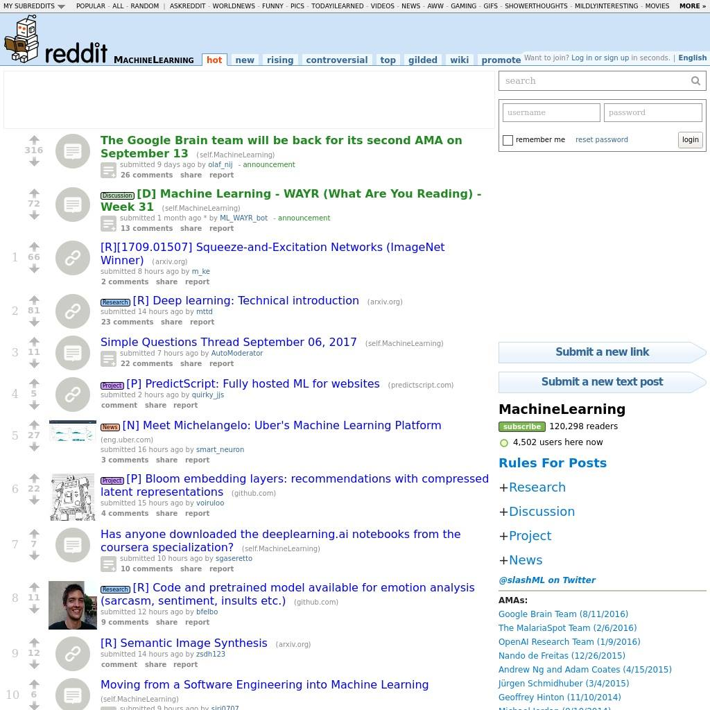
**이미지 캡션:** 이 이미지는 레딧의 머신러닝 서브레딧 페이지를 보여줍니다. 페이지 상단에는 레딧 로고와 함께 "MACHINE LEARNING"이라는 제목이 있고, 그 아래에는 "hot", "new", "rising", "controversial", "top", "gilded", "wiki"와 같은 탭들이 있습니다. 오른쪽 상단에는 로그인 및 회원가입을 위한 입력 필드와 버튼이 있습니다. 페이지 중앙에는 여러 게시물 목록이 표시되며, 각 게시물은 제목, 작성자, 제출 시간, 댓글 수 등의 정보를 포함합니다. 게시물 제목 옆에는 "[R]" (Research), "[P]" (Project), "[N]" (News)와 같은 태그가 붙어 있어 게시물의 종류를 나타냅니다. 또한, 각 게시물에는 업보트 및 다운보트 화살표가 있으며, 게시물 링크는 해당 웹사이트로 연결됩니다. 페이지 오른쪽에는 "Submit a new link" 및 "Submit a new text post" 버튼과 함께 "MachineLearning" 서브레딧의 구독자 수와 현재 접속자 수가 표시됩니다. 그 아래에는 "Rules For Posts" 섹션이 있고, "Research", "Discussion", "Project", "News"와 같은 카테고리가 나열되어 있습니다. 가장 아래에는 "@slashML on Twitter"와 "AMAS" 섹션이 있으며, 과거 AMA(Ask Me Anything) 세션 목록이 날짜와 함께 표시됩니다. 이미지의 왼쪽 하단에는 한 명의 성인 남성이 웃으며 카메라를 바라보고 있는 사진이 게시물 목록의 일부로 포함되어 있습니다. 이 남성은 짧은 머리에 캐주얼한 복장을 하고 있으며, 긍정적인 표정을 짓고 있습니다. 전반적으로 이 페이지는 머신러닝 관련 정보를 공유하고 토론하는 온라인 커뮤니티의 모습을 보여줍니다. "[R]" (Research), "[P]" (Project), "[N]" (News)와 같은 태그가 붙어 있어 게시물의 종류를 나타냅니다. 또한, 각 게시물에는 업보트 및 다운보트 화살표가 있으며, 게시물 링크는 해당 웹사이트로 연결됩니다. 페이지 오른쪽에는 "Submit a new link" 및 "Submit a new text post" 버튼과 함께 "MachineLearning" 서브레딧의 구독자 수와 현재 접속자 수가 표시됩니다. 그 아래에는 "Rules For Posts" 섹션이 있고, "Research", "Discussion", "Project", "News"와 같은 카테고리가 나열되어 있습니다. 가장 아래에는 "@slashML on Twitter"와 "AMAS" 섹션이 있으며, 과거 AMA(Ask Me Anything) 세션 목록이 날짜와 함께 표시됩니다. 이미지의 왼쪽 하단에는 한 명의 성인 남성이 웃으며 카메라를 바라보고 있는 사진이 게시물 목록의 일부로 포함되어 있습니다. 이 남성은 짧은 머리에 캐주얼한 복장을 하고 있으며, 긍정적인 표정을 짓고 있습니다. 전반적으로 이 페이지는 머신러닝 관련 정보를 공유하고 토론하는 온라인 커뮤니티의 모습을 보여줍니다.

> #오늘의레딧 https://www.reddit.com/r/MachineLearning/ 오늘도 새소식이 많군요.  1. PredictScript : 웹 사이트 용 ML 완전 호스팅 2. Uber &#39;s Machine Learning Platform : 미켈란젤로 만나보기 3. 블룸 임베딩 레이어 : 압축 된 잠정적 표현을 사용한 권장 사항 4. 감정 분석 (풍자, 정서, 모욕 등)을위한 코드 및 사전 훈련 된 모델 5. TensorFlow Python 패키지를 이용한 깊은 학습 창의적 응용 프로그램 6. 다중 무장 한 적기와 같은 보강 학습 알고리즘 선택 7. 데이터 세트 생성 도구에 대한 빠른 설문 조사 8. 멀티 뷰 스테레오 머신 학습 9. 매우 다른 2D 센서 입력을 CNN에 공급하는 것에 대한 제안 10. AlphaGo 논문의 정책 및 가치 네트워크 검색 섹션에서 강화 학습 네트워크 대신 감독 학습 네트워크를 사용하여 이동을 계산하는 이유는 무엇입니까? 11. Stacked Autoencoders의 &#39;목적&#39;이해에 대한 도움말 12. 유사성 포리스트 13. 페이스 북 리서치 : 음운론 적 루프를 통한 와일드 스피커를위한 음성 합성  1. https://predictscript.com 2. https://eng.uber.com/michelangelo/ 3. https://github.com/maciejkula/spotlight/tree/master/examples/bloom_embeddings 4. https://github.com/bfelbo/DeepMoji 5. http://github.com/pkmital/pycadl 6. https://www.reddit.com/r/MachineLearning/comments/6yg2pn/d_reinforcement_learning_algorithm_selection_as_a/ 7. https://www.reddit.com/r/MachineLearning/comments/6yg75h/d_quick_survey_about_a_dataset_generation_tool/ 8. http://bair.berkeley.edu/blog/2017/09/05/unified-3d/ 9. https://www.reddit.com/r/MachineLearning/comments/6ybd8a/d_suggestions_on_feeding_very_different_2d_sensor/ 10. https://www.reddit.com/r/MachineLearning/comments/6ya759/d_in_the_searching_with_policy_and_value_networks/ 11. https://www.reddit.com/r/MachineLearning/comments/6ybg9v/d_help_with_understanding_the_purpose_of_stacked/ 12. http://www.kdd.org/kdd2017/papers/view/similarity-forests 13. https://ytaigman.github.io/loop/site/

### 9월 8일 (금) 08:52 · 📷 사진 (1장)

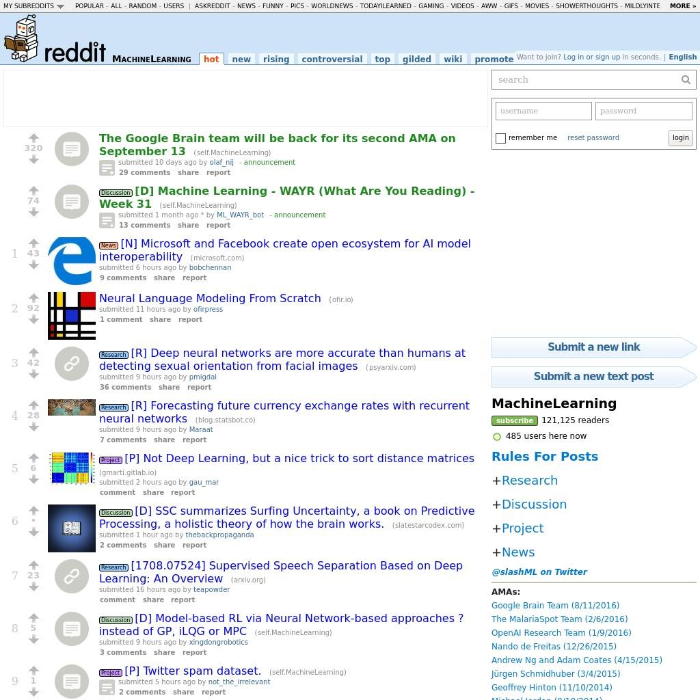
**이미지 캡션:** 이 이미지는 레딧(Reddit) 웹사이트의 머신러닝(Machine Learning) 서브레딧 페이지를 보여줍니다. 페이지 상단에는 레딧 로고와 함께 "MY SUBREDDITS", "POPULAR", "ALL", "RANDOM", "USERS", "ASKREDDIT", "NEWS", "FUNNY", "PICS", "WORLDNEWS", "TODAYILEARNED", "GAMING", "VIDEOS", "AWW", "GIFS", "MOVIES", "SHOWERTHOUGHTS", "MILDLYINTE", "MORE"와 같은 다양한 카테고리 링크가 있습니다. 그 아래에는 "reddit"라는 큰 글씨와 함께 "MACHINE LEARNING"이라는 서브레딧 이름이 보이며, "hot", "new", "rising", "controversial", "top", "gilded", "wiki", "promote"와 같은 추가적인 필터링 옵션이 있습니다. 오른쪽 상단에는 로그인 및 회원가입을 위한 "Want to join? Log in or sign up in seconds."라는 문구와 함께 영어(English) 언어 선택 옵션이 있습니다. 검색창에는 "search"라는 플레이스홀더 텍스트가 있고, 그 옆에는 사용자 이름과 비밀번호를 입력하는 필드, "remember me" 체크박스, "reset password" 링크, 그리고 "login" 버튼이 있습니다. 페이지 중앙에는 머신러닝 관련 게시물 목록이 나열되어 있으며, 각 게시물은 제목, 작성자 정보, 제출 시간, 댓글 수, 공유 및 신고 옵션을 포함합니다. 게시물 제목 앞에는 해당 게시물의 종류를 나타내는 태그(예: "Discussion", "News", "Research", "Project")가 있습니다. 예를 들어, 첫 번째 게시물은 "The Google Brain team will be back for its second AMA on September 13"라는 제목으로, 10일 전에 제출되었으며 29개의 댓글이 있습니다. 두 번째 게시물은 "[D] Machine Learning - WAYR (What Are You Reading) - Week 31"이라는 제목으로, 1개월 전에 제출되었으며 13개의 댓글이 있습니다. 세 번째 게시물은 "[N] Microsoft and Facebook create open ecosystem for AI model interoperability"라는 제목으로, 6시간 전에 제출되었으며 9개의 댓글이 있습니다. 네 번째 게시물은 "Neural Language Modeling From Scratch"라는 제목으로, 11시간 전에 제출되었으며 1개의 댓글이 있습니다. 다섯 번째 게시물은 "[R] Deep neural networks are more accurate than humans at detecting sexual orientation from facial images"라는 제목으로, 9시간 전에 제출되었으며 36개의 댓글이 있습니다. 여섯 번째 게시물은 "[R] Forecasting future currency exchange rates with recurrent neural networks"라는 제목으로, 9시간 전에 제출되었으며 7개의"와 같은 다양한 카테고리 링크가 있습니다. 그 아래에는 "reddit"라는 큰 글씨와 함께 "MACHINE LEARNING"이라는 서브레딧 이름이 보이며, "hot", "new", "rising", "controversial", "top", "gilded", "wiki", "promote"와 같은 추가적인 필터링 옵션이 있습니다. 오른쪽 상단에는 로그인 및 회원가입을 위한 "Want to join? Log in or sign up in seconds."라는 문구와 함께 영어(English) 언어 선택 옵션이 있습니다. 검색창에는 "search"라는 플레이스홀더 텍스트가 있고, 그 옆에는 사용자 이름과 비밀번호를 입력하는 필드, "remember me" 체크박스, "reset password" 링크, 그리고 "login" 버튼이 있습니다. 페이지 중앙에는 머신러닝 관련 게시물 목록이 나열되어 있으며, 각 게시물은 제목, 작성자 정보, 제출 시간, 댓글 수, 공유 및 신고 옵션을 포함합니다. 게시물 제목 앞에는 해당 게시물의 종류를 나타내는 태그(예: "Discussion", "News", "Research", "Project")가 있습니다. 예를 들어, 첫 번째 게시물은 "The Google Brain team will be back for its second AMA on September 13"라는 제목으로, 10일 전에 제출되었으며 29개의 댓글이 있습니다. 두 번째 게시물은 "[D] Machine Learning - WAYR (What Are You Reading) - Week 31"이라는 제목으로, 1개월 전에 제출되었으며 13개의 댓글이 있습니다. 세 번째 게시물은 "[N] Microsoft and Facebook create open ecosystem for AI model interoperability"라는 제목으로, 6시간 전에 제출되었으며 9개의 댓글이 있습니다. 네 번째 게시물은 "Neural Language Modeling From Scratch"라는 제목으로, 11시간 전에 제출되었으며 1개의 댓글이 있습니다. 다섯 번째 게시물은 "[R] Deep neural networks are more accurate than humans at detecting sexual orientation from facial images"라는 제목으로, 9시간 전에 제출되었으며 36개의 댓글이 있습니다. 여섯 번째 게시물은 "[R] Forecasting future currency exchange rates with recurrent neural networks"라는 제목으로, 9시간 전에 제출되었으며 7개의

> #오늘의레딧 https://www.reddit.com/r/MachineLearning/ 따끈한 소식들입니다.  1. 심 신경 네트워크는 얼굴 이미지에서 성적 지향을 검출 할 때 인간보다 정확합니다. 2. 반복적 인 신경망으로 미래 환율을 예측 3. 딥 학습이 아니라 거리 매트릭스를 정렬하는 좋은 트릭 4. SSC는 뇌가 어떻게 작동하는지에 대한 총체적 이론 인 Predictive Processing에 관한 책인 Surfing Uncertainty를 요약합니다. 5. 신경망 기반 접근법을 통한 모델 기반 RL? GP, iLQG 또는 MPC 대신 6. 트위터 스팸 데이터. 7. PredictScript : 웹 사이트 용 ML 완전 호스팅 8. 심층 학습 : 기술 소개 9. Uber &#39;s Machine Learning Platform : 미켈란젤로 만나보기 10. 블룸 임베딩 레이어 : 압축 된 잠정적 표현을 사용한 권장 사항 11. 감정 분석 (풍자, 정서, 모욕 등)을위한 코드 및 사전 훈련 된 모델 12. 다중 무장 한 적기와 같은 보강 학습 알고리즘 선택 13. TensorFlow Python 패키지를 이용한 깊은 학습 창의적 응용 프로그램 14. 데이터 세트 생성 도구에 대한 빠른 설문 조사  1. https://psyarxiv.com/hv28a/ 2. https://blog.statsbot.co/time-series-prediction-using-recurrent-neural-networks-lstms-807fa6ca7f 3. https://gmarti.gitlab.io/ml/2017/09/07/how-to-sort-distance-matrix.html 4. http://slatestarcodex.com/2017/09/05/book-review-surfing-uncertainty/ 5. https://www.reddit.com/r/MachineLearning/comments/6ynki3/d_modelbased_rl_via_neural_networkbased/ 6. https://www.reddit.com/r/MachineLearning/comments/6yp8th/p_twitter_spam_dataset/ 7. https://predictscript.com 8. https://arxiv.org/abs/1709.01412 9. https://eng.uber.com/michelangelo/ 10. https://github.com/maciejkula/spotlight/tree/master/examples/bloom_embeddings 11. https://github.com/bfelbo/DeepMoji 12. https://www.reddit.com/r/MachineLearning/comments/6yg2pn/d_reinforcement_learning_algorithm_selection_as_a/ 13. http://github.com/pkmital/pycadl 14. https://www.reddit.com/r/MachineLearning/comments/6yg75h/d_quick_survey_about_a_dataset_generation_tool/

### 9월 8일 (금) 22:42 · If you are interested in the HKUST MS/PH…

If you are interested in the HKUST MS/PHD program, please consider this Seoul Interview on Oct 14: http://www.se.or.kr/163 (Korean)

한국에 계시면서 홍콩과기대에 대학원에 관심이 있으시면 10월 14일 진행되는 서울인터뷰에 참여해보세요. AI계의 대가 Qiang학과장님, 대학원 디렉터 Yi 교수님이 직접 오셔서 여러분들을 만납니다. 인터뷰는 그냥 여러분들이 하셨던 공부와 앞으로의 비전 등에대한 간단한 질문이 될것입니다. 

Full support를 받으시면서 AI/ML 빅데이타등의 세계최고 교수님들과 같이 연구할수 있습니다. 지원은 10월 4일까지이며, 관련학과 학부졸업 (예정)이시면 누구나 지원 가능합니다.

10월 14일 인터뷰와 병행하여 다음의 교수님들의 강연이 진행될 예정입니다.
* Qiang Yang: Department Head, First Chinese AAAI Fellow worldwide, Founding EiC of IEEE Transactions on Big Data, Founding Head, Huawei Noah Ark Research Lab
* Yi Ke: Postgraduate Program Director, ACM SIGMOD Best Paper Award
* Sung Kim:  Postgraduate Program Associate Director, SIGSOFT Distinguished Paper Award 4 times winner

### 9월 9일 (토) 08:52 · 📷 사진 (1장)

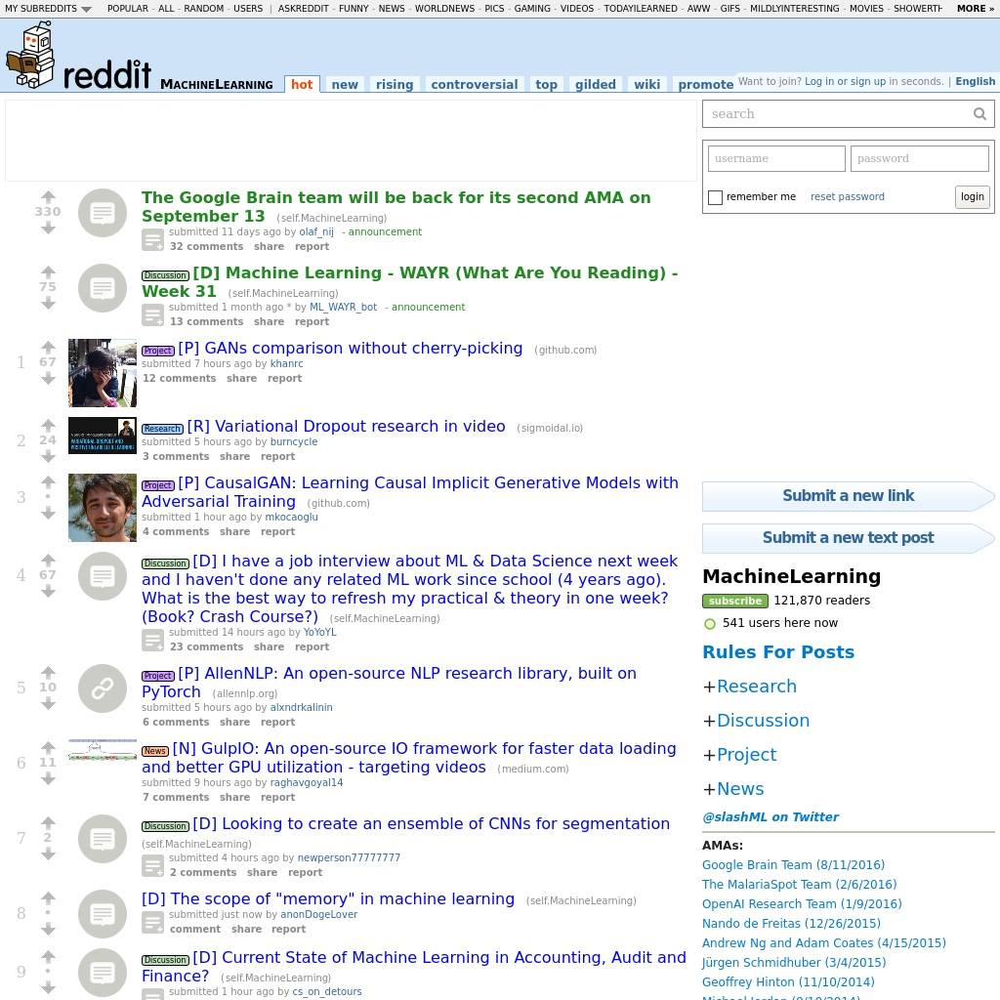
**이미지 캡션:** 이 이미지는 레딧의 머신러닝 관련 서브레딧 페이지를 보여줍니다. 화면 중앙에는 다양한 머신러닝 관련 게시물 목록이 표시되어 있으며, 각 게시물은 제목, 작성자, 제출 시간, 댓글 수, 공유 수 등의 정보를 포함하고 있습니다. 게시물 제목 옆에는 [P] (프로젝트), [R] (연구), [D] (토론), [N] (뉴스)와 같은 태그가 붙어 있어 게시물의 성격을 나타냅니다. 화면 오른쪽 상단에는 로그인 폼과 검색창이 있으며, 그 아래에는 "Submit a new link" 및 "Submit a new text post" 버튼이 있습니다. 페이지 하단에는 "MachineLearning" 서브레딧의 구독자 수와 현재 접속자 수가 표시되어 있으며, "Rules For Posts" 섹션에는 연구, 토론, 프로젝트, 뉴스 등 관련 주제가 나열되어 있습니다. 또한, "@slashML on Twitter" 링크와 과거 AMA(Ask Me Anything) 목록도 볼 수 있습니다. 전반적으로 기술 및 연구 커뮤니티의 정보 공유 및 토론이 이루어지는 온라인 플랫폼의 모습을 보여줍니다.st" 버튼이 있습니다. 페이지 하단에는 "MachineLearning" 서브레딧의 구독자 수와 현재 접속자 수가 표시되어 있으며, "Rules For Posts" 섹션에는 연구, 토론, 프로젝트, 뉴스 등 관련 주제가 나열되어 있습니다. 또한, "@slashML on Twitter" 링크와 과거 AMA(Ask Me Anything) 목록도 볼 수 있습니다. 전반적으로 기술 및 연구 커뮤니티의 정보 공유 및 토론이 이루어지는 온라인 플랫폼의 모습을 보여줍니다.

> #오늘의레딧 https://www.reddit.com/r/MachineLearning/ 래딧은 읽을 거리가 다양합니다.  1. 비디오의 변형 드롭 아웃 연구 2. CausalGAN : Adversarial Training을 사용한 암시 적 생성 모델의 인과 학습 3. 다음주에 ML &amp; Data Science에 대한 취업 면접을 봤는데 학교가 끝난 후 (4 년 전) 관련 ML 작업을하지 않았습니다. 일주일 내 실제 및 이론을 새로 고치는 가장 좋은 방법은 무엇입니까? (도서? 충돌 코스?) 4. AllenNLP : PyTorch를 기반으로하는 오픈 소스 NLP 연구 라이브러리 5. GulpIO : 빠른 데이터로드 및 GPU 활용 향상을위한 오픈 소스 IO 프레임 워크 - 동영상 타겟팅 6. 세분화를 위해 CNN 앙상블을 만들려고합니다. 7. 회계, 감사 및 재무 분야의 기계 학습 현황 8. 간단한 반 감독 학습 방법의 의사 라벨링 9. 인터뷰 시리즈를 시작합니다. 현장에서 누구와 인터뷰를하고 싶습니까? 학업 또는 비즈니스 10. 리워드 기능 검색 및 내재적 동기 제공 11. 컨볼 루션 신경 회로망은 스크래치 작업에서 훈련을 받았고 분류를 위해 스크램블 된 이미지를 사용 했습니까? 12. 딥 학습이 아니라 거리 매트릭스를 정렬하는 좋은 트릭 13. Microsoft와 Facebook, AI 모델 상호 운용성을위한 개방형 생태계 구축 14. Uber에서의 시계열 예측을위한 신경망의 공학적 불확실성 추정 15. 이중 생성 적 직선 네트워크의 합성 의료 영상 16. PyTorch에서 다른 데이터 배치에 대해 동일한 제거 마스크를 설정하는 방법은 무엇입니까? 17. 심 신경 네트워크는 얼굴 이미지에서 성적 지향을 검출 할 때 인간보다 정확합니다. 18. 반복적 인 신경망으로 미래 환율을 예측 19. 신경망 기반 접근법을 통한 모델 기반 RL? GP, iLQG 또는 MPC 대신 20. 트위터 스팸 데이터.  1. https://sigmoidal.io/meetsigmo-uncertainty-variational-dropout/ 2. https://github.com/mkocaoglu/CausalGAN 3. https://www.reddit.com/r/MachineLearning/comments/6ytiod/d_i_have_a_job_interview_about_ml_data_science/ 4. http://allennlp.org/ 5. https://medium.com/twentybn/introducing-gulpio-f97b07f1da58 6. https://www.reddit.com/r/MachineLearning/comments/6yx2k8/d_looking_to_create_an_ensemble_of_cnns_for/ 7. https://www.reddit.com/r/MachineLearning/comments/6yy6ia/d_current_state_of_machine_learning_in_accounting/ 8. https://datawhatnow.com/pseudo-labeling-semi-supervised-learning/ 9. https://www.reddit.com/r/MachineLearning/comments/6yv9em/d_starting_to_an_interview_series_who_do_you_want/ 10. https://www.reddit.com/r/MachineLearning/comments/6yu4nv/d_reward_function_search_and_intrinsic_motivation/ 11. https://www.reddit.com/r/MachineLearning/comments/6yxeqo/d_would_a_convolutional_neural_network_trained/ 12. https://gmarti.gitlab.io/ml/2017/09/07/how-to-sort-distance-matrix.html 13. https://www.microsoft.com/en-us/cognitive-toolkit/blog/2017/09/microsoft-facebook-create-open-ecosystem-ai-model-interoperability/ 14. https://eng.uber.com/neural-networks-uncertainty-estimation/ 15. https://arxiv.org/abs/1709.01872 16. https://www.reddit.com/r/MachineLearning/comments/6yvkx9/d_how_to_set_same_dropout_mask_for_different_data/ 17. https://psyarxiv.com/hv28a/ 18. https://blog.statsbot.co/time-series-prediction-using-recurrent-neural-networks-lstms-807fa6ca7f 19. https://www.reddit.com/r/MachineLearning/comments/6ynki3/d_modelbased_rl_via_neural_networkbased/ 20. https://www.reddit.com/r/MachineLearning/comments/6yp8th/p_twitter_spam_dataset/

### 9월 9일 (토) 10:08 · 생신 축하 드려요.

생신 축하 드려요.

### 9월 9일 (토) 10:08 · ↪ 생신 축하 드려요.

*다른 프로필에 남긴 글*

생신 축하 드려요.

### 9월 10일 (일) 08:52 · 📷 사진 (1장)

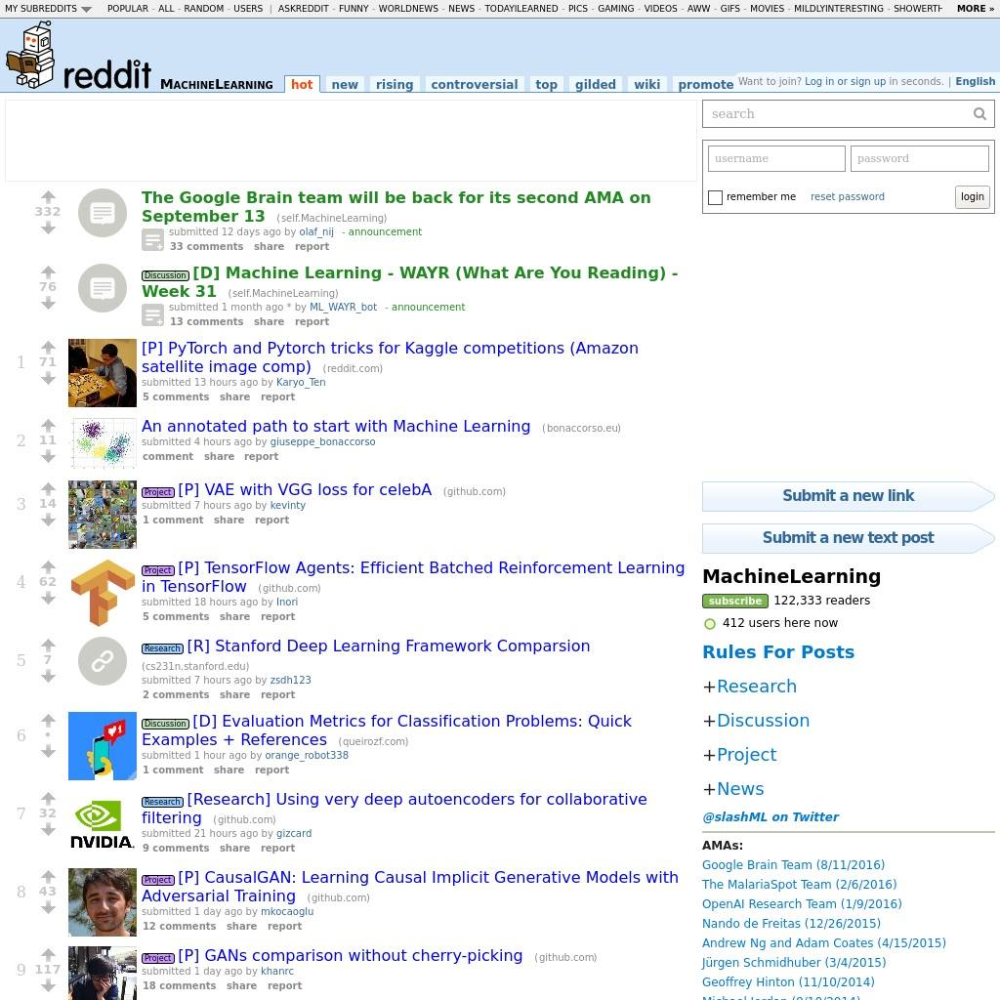
**이미지 캡션:** 이것은 레딧의 머신러닝 서브레딧 페이지로, 다양한 게시물과 관련 정보를 보여줍니다. 화면 왼쪽에는 게시물 목록이 있으며, 각 게시물은 제목, 작성자, 제출 시간, 댓글 수, 공유 및 보고 옵션을 포함합니다. 게시물에는 "The Google Brain team will be back for its second AMA on September 13", "[D] Machine Learning - WAYR (What Are You Reading) - Week 31", "[P] PyTorch and Pytorch tricks for Kaggle competitions (Amazon satellite image comp)" 등이 포함됩니다. 각 게시물 옆에는 위아래 화살표가 있어 투표를 나타냅니다. 화면 오른쪽에는 로그인 양식, "Submit a new link" 및 "Submit a new text post" 버튼, "Machine Learning" 서브레딧에 대한 구독 정보(122,333명의 구독자, 412명의 현재 사용자), "Rules For Posts" 섹션, 그리고 "AMAS" 목록이 있습니다. AMAS 목록에는 "Google Brain Team (8/11/2016)", "The MalariaSpot Team (2/6/2016)" 등이 포함됩니다. 전반적으로 이 페이지는 머신러닝 커뮤니티의 최신 토론과 정보를 제공하는 온라인 포럼의 스크린샷입니다.cks for Kaggle competitions (Amazon satellite image comp)" 등이 포함됩니다. 각 게시물 옆에는 위아래 화살표가 있어 투표를 나타냅니다. 화면 오른쪽에는 로그인 양식, "Submit a new link" 및 "Submit a new text post" 버튼, "Machine Learning" 서브레딧에 대한 구독 정보(122,333명의 구독자, 412명의 현재 사용자), "Rules For Posts" 섹션, 그리고 "AMAS" 목록이 있습니다. AMAS 목록에는 "Google Brain Team (8/11/2016)", "The MalariaSpot Team (2/6/2016)" 등이 포함됩니다. 전반적으로 이 페이지는 머신러닝 커뮤니티의 최신 토론과 정보를 제공하는 온라인 포럼의 스크린샷입니다.

> #오늘의레딧 https://www.reddit.com/r/MachineLearning/ 따끈한 소식들입니다.  1. TensorFlow 에이전트 : TensorFlow에서 효율적인 일괄 강화 학습 학습 2. 스탠포드 딥 학습 프레임 워크 비교 3. 분류 문제에 대한 평가 지표 : 빠른 예 + 참고 문헌 4. 매우 깊은 자동 인코딩을 사용하여 협업 필터링 5. CausalGAN : Adversarial Training을 사용한 암시 적 생성 모델의 인과 학습 6. 체리 따기가없는 GAN 비교 7. 수상 솔루션 개요 : Kaggle Instacart Competition 8. Reinfore 학습 도구 상자, trpo, a3c 알고리즘 연속 동작 공간 포함 9. 관련 Freenode IRC 채널의 모집 10. SketchParse : 프리 핸드 스케치 세분화를위한 멀티 태스크 딥 네트워크 (x-post-r / computervision) 11. 비디오의 변형 드롭 아웃 연구 12. AllenNLP : PyTorch를 기반으로하는 오픈 소스 NLP 연구 라이브러리 13. 적응 형 템플릿 모델 지능형 14. 다음주에 ML &amp; Data Science에 대한 취업 면접을 봤는데 학교가 끝난 후 (4 년 전) 관련 ML 작업을하지 않았습니다. 1 주일 내에 실용적이고 이론을 새롭게 할 수있는 가장 좋은 방법은 무엇입니까? (도서? 충돌 코스?) 15. GulpIO : 빠른 데이터로드 및 GPU 활용 향상을위한 오픈 소스 IO 프레임 워크 - 동영상 타겟팅 16. 컨볼 루션 신경 회로망은 스크래치 작업에서 훈련을 받았고 분류를 위해 스크램블 된 이미지를 사용 했습니까? 17. 깊은 학습이 농담으로 축소 되었습니까? 18. 인터뷰 시리즈를 시작합니다. 현장에서 누구와 인터뷰를하고 싶습니까? 학업 또는 비즈니스 19. 세분화를 위해 CNN 앙상블을 만들려고합니다. 20. 회계, 감사 및 재무 분야의 기계 학습 현황  1. https://github.com/tensorflow/agents 2. http://cs231n.stanford.edu/slides/2017/cs231n_2017_lecture8.pdf 3. http://queirozf.com/entries/evaluation-metrics-for-classification-quick-examples-references 4. https://github.com/NVIDIA/DeepRecommender 5. https://github.com/mkocaoglu/CausalGAN 6. https://github.com/khanrc/tf.gans-comparison 7. http://queirozf.com/entries/winning-solutions-overview-kaggle-instacart-competition 8. https://github.com/jjkke88/RL_toolbox 9. https://www.reddit.com/r/MachineLearning/comments/6z2aac/d_roundup_of_relevant_freenode_irc_channels/ 10. https://github.com/val-iisc/sketch-parse 11. https://sigmoidal.io/meetsigmo-uncertainty-variational-dropout/ 12. http://allennlp.org/ 13. https://signifiedorigins.wordpress.com/2017/09/08/a-template-driven-approach-to-high-level-pattern-recognition/ 14. https://www.reddit.com/r/MachineLearning/comments/6ytiod/d_i_have_a_job_interview_about_ml_data_science/ 15. https://medium.com/twentybn/introducing-gulpio-f97b07f1da58 16. https://www.reddit.com/r/MachineLearning/comments/6yxeqo/d_would_a_convolutional_neural_network_trained/ 17. https://www.reddit.com/r/MachineLearning/comments/6z18ew/d_has_deep_learning_been_reduced_to_a_joke/ 18. https://www.reddit.com/r/MachineLearning/comments/6yv9em/d_starting_to_an_interview_series_who_do_you_want/ 19. https://www.reddit.com/r/MachineLearning/comments/6yx2k8/d_looking_to_create_an_ensemble_of_cnns_for/ 20. https://www.reddit.com/r/MachineLearning/comments/6yy6ia/d_current_state_of_machine_learning_in_accounting/

### 9월 10일 (일) 08:59 · What were top search keywords in Korea i…

What were top search keywords in Korea in 1996?

1996년대 실검 순위에 오른 검색어들은 무엇일까요? 1996년으로 돌아가보시죠. ^^

http://h2.khan.co.kr/201604012335551

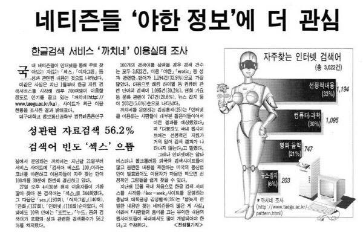
**이미지 캡션:** 이 사진은 한국어 신문 기사로, 네티즌들이 '야한 정보'에 더 관심을 보인다는 내용의 조사 결과를 담고 있습니다. 사진 중앙에는 로봇 형태의 일러스트가 서 있으며, 이 로봇은 여성의 신체 일부를 강조한 디자인으로, 손에는 꽃을 들고 있습니다. 로봇 옆에는 컴퓨터 본체, 모니터, 키보드가 함께 그려져 있어 인터넷 검색과 관련된 주제임을 시사합니다. 일러스트 오른쪽에는 막대그래프 형태의 정보가 표시되어 있는데, '선정적 내용'이 33%로 가장 높고, 그 뒤를 이어 '컴퓨터 과학' 30%, '영화 음악' 21%, '뉴스 잡지' 6% 순으로 나타나 있습니다. 이 정보는 총 3,622건의 검색어에 대한 분석 결과임을 보여줍니다. 기사 본문은 '네티즌들 ‘야한 정보'에 더 관심'이라는 제목으로 시작하며, '한글 검색 서비스 '까치네' 이용 실태 조사'라는 부제가 붙어 있습니다. 기사 내용은 대구대학교 정보통신공학부 컴퓨터응용연구팀이 운영하는 한글 검색 서비스 '까치네'의 이용 현황을 조사한 결과, 성 관련 검색어가 전체의 56.2%를 차지했다고 보도하고 있습니다. 가장 많이 검색된 단어로는 '섹스'가 344회로 으뜸이었으며, 그 외 'sex', '여자그림', '만화', '인터넷' 등이 뒤를 이었습니다. 기사에서는 이러한 결과에 대해 인터넷 이용자들이 대부분 젊은층이기 때문이라는 분석과 함께, 국내 사이트에는 선정적인 자료가 거의 없어 검색 결과가 나타나지 않는다는 운영자의 인터뷰도 포함하고 있습니다. 또한, 외국의 검색 사이트에서는 음란한 내용을 쉽게 찾을 수 있다는 점을 지적하며, 국내에서도 유익한 내용의 웹사이트 개발이 필요하다는 다른 인터뷰 내용도 담고 있습니다. 전반적으로 이 사진은 인터넷 검색 트렌드, 특히 성인 콘텐츠에 대한 네티즌들의 관심도를 보여주는 시사적인 내용을 다루고 있습니다.'뉴스 잡지' 6% 순으로 나타나 있습니다. 이 정보는 총 3,622건의 검색어에 대한 분석 결과임을 보여줍니다. 기사 본문은 '네티즌들 ‘야한 정보'에 더 관심'이라는 제목으로 시작하며, '한글 검색 서비스 '까치네' 이용 실태 조사'라는 부제가 붙어 있습니다. 기사 내용은 대구대학교 정보통신공학부 컴퓨터응용연구팀이 운영하는 한글 검색 서비스 '까치네'의 이용 현황을 조사한 결과, 성 관련 검색어가 전체의 56.2%를 차지했다고 보도하고 있습니다. 가장 많이 검색된 단어로는 '섹스'가 344회로 으뜸이었으며, 그 외 'sex', '여자그림', '만화', '인터넷' 등이 뒤를 이었습니다. 기사에서는 이러한 결과에 대해 인터넷 이용자들이 대부분 젊은층이기 때문이라는 분석과 함께, 국내 사이트에는 선정적인 자료가 거의 없어 검색 결과가 나타나지 않는다는 운영자의 인터뷰도 포함하고 있습니다. 또한, 외국의 검색 사이트에서는 음란한 내용을 쉽게 찾을 수 있다는 점을 지적하며, 국내에서도 유익한 내용의 웹사이트 개발이 필요하다는 다른 인터뷰 내용도 담고 있습니다. 전반적으로 이 사진은 인터넷 검색 트렌드, 특히 성인 콘텐츠에 대한 네티즌들의 관심도를 보여주는 시사적인 내용을 다루고 있습니다.

### 9월 11일 (월) 08:52 · 📷 사진 (1장)

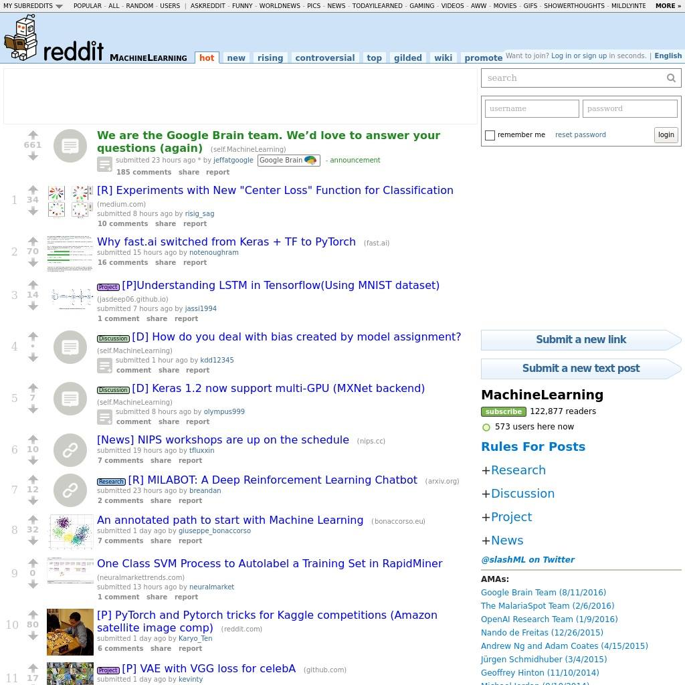
**이미지 캡션:** 이 이미지는 레딧(Reddit) 웹사이트의 머신러닝(Machine Learning) 서브레딧 페이지를 보여줍니다. 페이지 상단에는 레딧 로고와 함께 "MY SUBREDDITS", "POPULAR", "ALL", "RANDOM", "USERS", "ASKREDDIT", "FUNNY", "WORLDNEWS", "PICS", "NEWS", "TODAYILEARNED", "GAMING", "VIDEOS", "AWW", "MOVIES", "GIFS", "SHOWERTHOUGHTS", "MILDLYINTE", "MORE"와 같은 다양한 카테고리 링크가 나열되어 있습니다. 그 아래에는 "hot", "new", "rising", "controversial", "top", "gilded", "wiki"와 같은 서브레딧의 정렬 옵션이 보입니다. 오른쪽 상단에는 로그인 및 회원가입을 위한 입력 필드와 버튼이 있습니다. 메인 콘텐츠 영역에는 "We are the Google Brain team. We'd love to answer your questions (again)"이라는 제목의 게시물이 가장 위에 있으며, 그 아래로 다양한 머신러닝 관련 게시물들이 목록 형태로 나열되어 있습니다. 각 게시물은 제목, 출처 링크, 작성자, 제출 시간, 댓글 수, 공유 수 등의 정보를 포함하고 있습니다. 게시물 옆에는 추천/비추천을 나타내는 화살표와 댓글 수를 나타내는 아이콘이 있습니다. 오른쪽 사이드바에는 "Submit a new link", "Submit a new text post" 버튼과 함께 "Machine Learning" 서브레딧의 구독자 수, 현재 접속자 수, 그리고 "Rules For Posts"와 관련된 링크들이 표시되어 있습니다. 또한, "@slashML on Twitter" 링크와 "AMAS" 섹션에는 과거 AMA(Ask Me Anything) 세션에 참여했던 유명 인사들의 이름과 날짜가 나열되어 있습니다. 전반적으로 기술 및 연구 커뮤니티에서 활발하게 논의되는 머신러닝 관련 정보를 공유하고 소통하는 온라인 플랫폼의 모습을 보여줍니다."와 같은 다양한 카테고리 링크가 나열되어 있습니다. 그 아래에는 "hot", "new", "rising", "controversial", "top", "gilded", "wiki"와 같은 서브레딧의 정렬 옵션이 보입니다. 오른쪽 상단에는 로그인 및 회원가입을 위한 입력 필드와 버튼이 있습니다. 메인 콘텐츠 영역에는 "We are the Google Brain team. We'd love to answer your questions (again)"이라는 제목의 게시물이 가장 위에 있으며, 그 아래로 다양한 머신러닝 관련 게시물들이 목록 형태로 나열되어 있습니다. 각 게시물은 제목, 출처 링크, 작성자, 제출 시간, 댓글 수, 공유 수 등의 정보를 포함하고 있습니다. 게시물 옆에는 추천/비추천을 나타내는 화살표와 댓글 수를 나타내는 아이콘이 있습니다. 오른쪽 사이드바에는 "Submit a new link", "Submit a new text post" 버튼과 함께 "Machine Learning" 서브레딧의 구독자 수, 현재 접속자 수, 그리고 "Rules For Posts"와 관련된 링크들이 표시되어 있습니다. 또한, "@slashML on Twitter" 링크와 "AMAS" 섹션에는 과거 AMA(Ask Me Anything) 세션에 참여했던 유명 인사들의 이름과 날짜가 나열되어 있습니다. 전반적으로 기술 및 연구 커뮤니티에서 활발하게 논의되는 머신러닝 관련 정보를 공유하고 소통하는 온라인 플랫폼의 모습을 보여줍니다.

> #오늘의레딧 https://www.reddit.com/r/MachineLearning/ 래딧은 읽을 거리가 다양합니다.  1. Keras 1.2는 이제 다중 GPU (MXNet 백엔드)를 지원합니다. 2. MILABOT : 깊은 보강 학습 b봇 3. celebA에 대한 VGG 손실 VAE 4. 스탠포드 딥 학습 프레임 워크 비교 5. TensorFlow 에이전트 : TensorFlow에서 효율적인 일괄 강화 학습 학습 6. 분류 문제에 대한 평가 지표 : 빠른 예 + 참고 문헌 7. 매우 깊은 자동 인코딩을 사용하여 협업 필터링 8. CausalGAN : Adversarial Training을 사용한 암시 적 생성 모델의 인과 학습 9. 수상 솔루션 개요 : Kaggle Instacart Competition 10. 체리 따기가없는 GAN 비교 11. AGI와 ML에서 뉴스 레터 시작하기. 어떤 논문 (ICML / NIPS / 등)에 대해 자습서를 작성해야합니까? 12. Reinfore 학습 도구 상자, trpo, a3c 알고리즘 연속 동작 공간 포함 13. 관련 Freenode IRC 채널의 모집 14. SketchParse : 프리 핸드 스케치 세분화를위한 멀티 태스크 딥 네트워크 (x-post-r / computervision) 15. 비디오의 변형 드롭 아웃 연구 16. AllenNLP : PyTorch를 기반으로하는 오픈 소스 NLP 연구 라이브러리  1. https://www.reddit.com/r/MachineLearning/comments/6z8kry/d_keras_12_now_support_multigpu_mxnet_backend/ 2. https://arxiv.org/pdf/1709.02349.pdf 3. https://github.com/yzwxx/vae-celebA 4. http://cs231n.stanford.edu/slides/2017/cs231n_2017_lecture8.pdf 5. https://github.com/tensorflow/agents 6. http://queirozf.com/entries/evaluation-metrics-for-classification-quick-examples-references 7. https://github.com/NVIDIA/DeepRecommender 8. https://github.com/mkocaoglu/CausalGAN 9. http://queirozf.com/entries/winning-solutions-overview-kaggle-instacart-competition 10. https://github.com/khanrc/tf.gans-comparison 11. http://thestrongai.com/ 12. https://github.com/jjkke88/RL_toolbox 13. https://www.reddit.com/r/MachineLearning/comments/6z2aac/d_roundup_of_relevant_freenode_irc_channels/ 14. https://github.com/val-iisc/sketch-parse 15. https://sigmoidal.io/meetsigmo-uncertainty-variational-dropout/ 16. http://allennlp.org/

### 9월 11일 (월) 12:38 · totally thrilled to have 5,000 wonderful…

totally thrilled to have 5,000 wonderful Facebook friends like all of you! Thank you!!

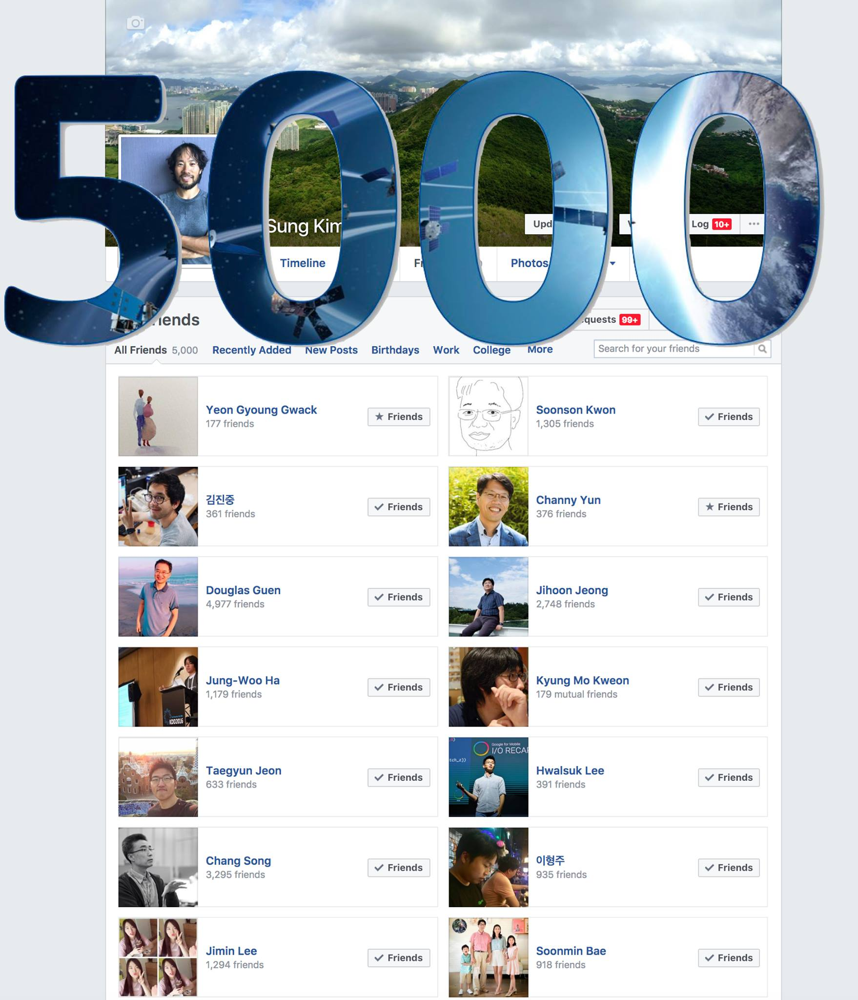
**이미지 캡션:** 이 사진은 페이스북 친구 목록 화면을 보여주며, 화면 상단에는 "5000"이라는 큰 숫자가 배경 이미지와 함께 합성되어 있습니다. 배경에는 산과 도시 풍경이 보이며, "Sung Kim"이라는 이름과 함께 타임라인, 사진 등의 메뉴가 있습니다. 화면 중앙에는 "All Friends 5,000"이라는 문구와 함께 여러 명의 친구 목록이 나타납니다. 각 친구는 프로필 사진, 이름, 친구 수, 그리고 친구인지 여부를 나타내는 버튼으로 구성되어 있습니다. 예를 들어, "Yeon Gyoung Gwack"은 177명의 친구를 가지고 있으며 "Friends" 버튼이 있습니다. 다른 친구들로는 "김진중", "Douglas Guen", "Jung-Woo Ha", "Taegyun Jeon", "Chang Song", "Jimin Lee", "Soonson Kwon", "Channy Yun", "Jihoon Jeong", "Kyung Mo Kweon", "Hwalsuk Lee", "이형주", "Soonmin Bae" 등이 있습니다. 전반적으로 친구 목록을 확인하고 관리하는 페이스북의 기능을 보여주는 화면이며, 5000명의 친구를 달성했음을 강조하는 듯한 분위기입니다.구를 가지고 있으며 "Friends" 버튼이 있습니다. 다른 친구들로는 "김진중", "Douglas Guen", "Jung-Woo Ha", "Taegyun Jeon", "Chang Song", "Jimin Lee", "Soonson Kwon", "Channy Yun", "Jihoon Jeong", "Kyung Mo Kweon", "Hwalsuk Lee", "이형주", "Soonmin Bae" 등이 있습니다. 전반적으로 친구 목록을 확인하고 관리하는 페이스북의 기능을 보여주는 화면이며, 5000명의 친구를 달성했음을 강조하는 듯한 분위기입니다.

### 9월 12일 (화) 08:52 · 📷 사진 (1장)

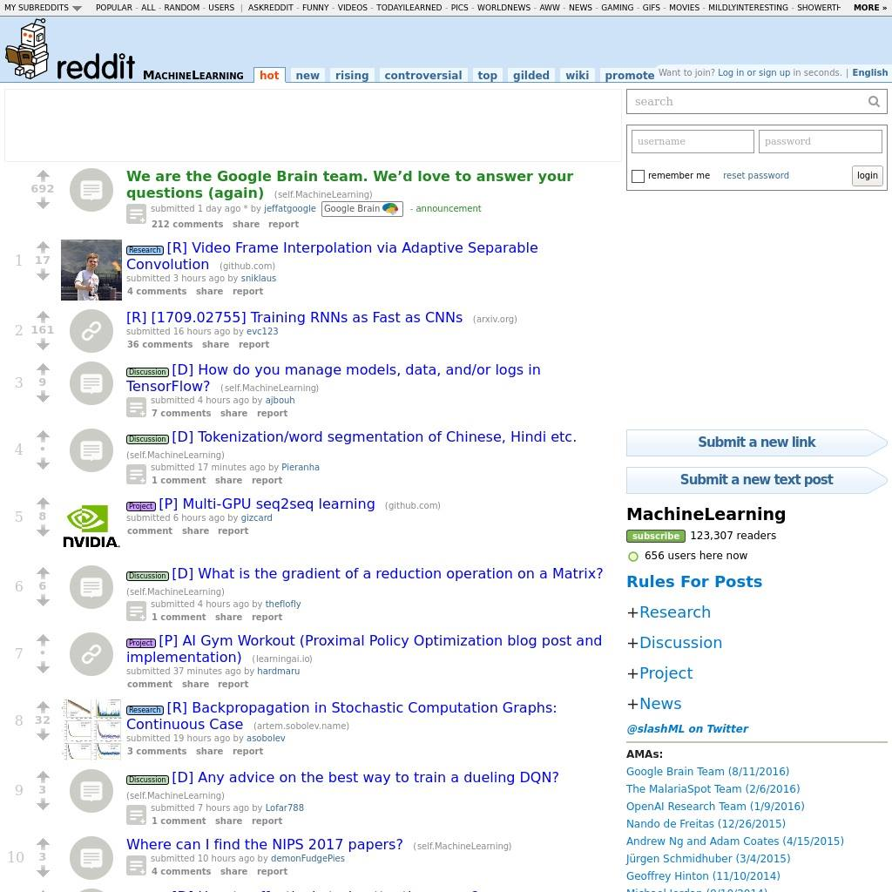
**이미지 캡션:** 이것은 레딧의 머신러닝 서브레딧 페이지로, 다양한 연구 및 토론 게시물이 나열되어 있습니다. 페이지 상단에는 레딧 로고와 함께 "MACHINE LEARNING"이라는 제목이 보이며, 그 아래에는 "hot", "new", "rising", "controversial", "top", "gilded", "wiki"와 같은 탭이 있습니다. 오른쪽 상단에는 로그인 및 회원가입을 위한 입력란과 버튼이 있습니다. 메인 콘텐츠 영역에는 "We are the Google Brain team. We'd love to answer your questions (again)"이라는 제목의 게시물이 가장 위에 있으며, 그 아래로 "Video Frame Interpolation via Adaptive Separable Convolution", "Training RNNs as Fast as CNNs", "How do you manage models, data, and/or logs in TensorFlow?", "Tokenization/word segmentation of Chinese, Hindi etc.", "Multi-GPU seq2seq learning", "What is the gradient of a reduction operation on a Matrix?", "AI Gym Workout (Proximal Policy Optimization blog post and implementation)", "Backpropagation in Stochastic Computation Graphs: Continuous Case", "Any advice on the best way to train a dueling DQN?", "Where can I find the NIPS 2017 papers?" 등의 게시물들이 시간순으로 나열되어 있습니다. 각 게시물은 제목, 출처, 제출 시간, 작성자, 댓글 수, 공유 수 등의 정보를 포함하고 있습니다. 오른쪽 사이드바에는 "Submit a new link", "Submit a new text post" 버튼과 함께 "MachineLearning" 서브레딧의 구독자 수, 현재 접속자 수, 게시 규칙, 트위터 계정, 그리고 과거 AMA(Ask Me Anything) 목록이 표시되어 있습니다. 전반적으로 기술 관련 커뮤니티의 정보 공유 및 토론이 활발하게 이루어지고 있는 분위기입니다.r your questions (again)"이라는 제목의 게시물이 가장 위에 있으며, 그 아래로 "Video Frame Interpolation via Adaptive Separable Convolution", "Training RNNs as Fast as CNNs", "How do you manage models, data, and/or logs in TensorFlow?", "Tokenization/word segmentation of Chinese, Hindi etc.", "Multi-GPU seq2seq learning", "What is the gradient of a reduction operation on a Matrix?", "AI Gym Workout (Proximal Policy Optimization blog post and implementation)", "Backpropagation in Stochastic Computation Graphs: Continuous Case", "Any advice on the best way to train a dueling DQN?", "Where can I find the NIPS 2017 papers?" 등의 게시물들이 시간순으로 나열되어 있습니다. 각 게시물은 제목, 출처, 제출 시간, 작성자, 댓글 수, 공유 수 등의 정보를 포함하고 있습니다. 오른쪽 사이드바에는 "Submit a new link", "Submit a new text post" 버튼과 함께 "MachineLearning" 서브레딧의 구독자 수, 현재 접속자 수, 게시 규칙, 트위터 계정, 그리고 과거 AMA(Ask Me Anything) 목록이 표시되어 있습니다. 전반적으로 기술 관련 커뮤니티의 정보 공유 및 토론이 활발하게 이루어지고 있는 분위기입니다.

> #오늘의레딧 https://www.reddit.com/r/MachineLearning/ 아침부터 다양한 소식이 많네요.  1. 중국어, 힌디어 등의 토큰 화 / 단어 분할 2. 다중 GPU seq2seq 학습 3. 매트릭스에서 감소 작업의 그라디언트는 무엇입니까? 4. 인공 지능 운동 (근심 정책 최적화 블로그 게시물 및 구현) 5. 확률 적 계산 그래프의 백 프로 퍼 게이트 : 연속 사례 6. 결투 DQN을 훈련시키는 가장 좋은 방법에 대한 조언이 있습니까? 7. 주의지도를 효과적으로 훈련시키는 방법? 8. Tensorflow에서의 LSTM 이해 (MNIST 데이터 세트 사용) 9. 크루즈 : 우리가 어떻게 최초의 진짜 자기 주행 차를 만들었습니까 (실제로) 10. 모델 할당으로 생성 된 바이어스를 어떻게 처리합니까? 11. Keras 1.2는 이제 다중 GPU (MXNet 백엔드)를 지원합니다.  1. https://www.reddit.com/r/MachineLearning/comments/6ziyht/d_tokenizationword_segmentation_of_chinese_hindi/ 2. https://github.com/NVIDIA/OpenSeq2Seq 3. https://www.reddit.com/r/MachineLearning/comments/6zho5z/d_what_is_the_gradient_of_a_reduction_operation/ 4. https://learningai.io/projects/2017/07/28/ai-gym-workout.html 5. http://artem.sobolev.name/posts/2017-09-10-stochastic-computation-graphs-continuous-case.html 6. https://www.reddit.com/r/MachineLearning/comments/6zggp8/d_any_advice_on_the_best_way_to_train_a_dueling/ 7. https://www.reddit.com/r/MachineLearning/comments/6zghw7/d_how_to_effectively_train_attention_maps/ 8. https://jasdeep06.github.io/posts/Understanding-LSTM-in-Tensorflow-MNIST/ 9. https://medium.com/kylevogt/how-we-built-the-first-real-self-driving-car-really-bd17b0dbda55 10. https://www.reddit.com/r/MachineLearning/comments/6zbban/d_how_do_you_deal_with_bias_created_by_model/ 11. https://www.reddit.com/r/MachineLearning/comments/6z8kry/d_keras_12_now_support_multigpu_mxnet_backend/

### 9월 13일 (수) 08:52 · 📷 사진 (1장)

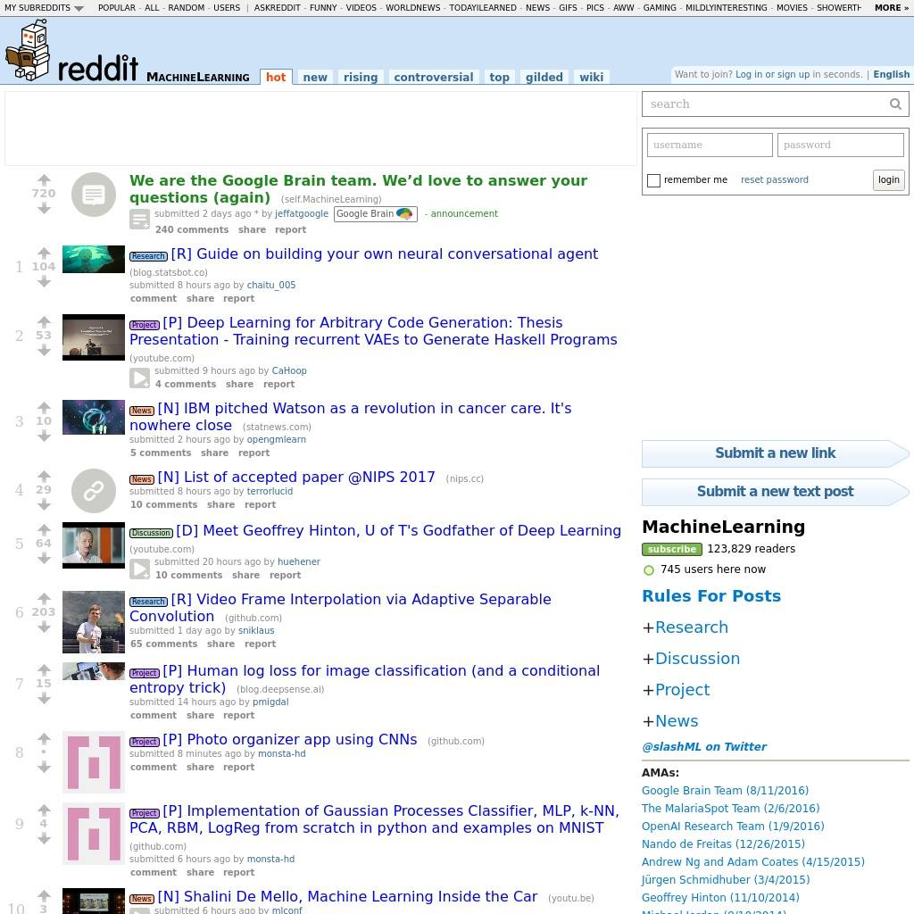
**이미지 캡션:** 이 이미지는 인기 있는 온라인 커뮤니티인 레딧의 머신러닝 서브레딧 페이지를 보여줍니다. 페이지 상단에는 레딧 로고와 함께 "MACHINE LEARNING"이라는 제목이 있고, 그 아래에는 "hot", "new", "rising", "controversial", "top", "gilded", "wiki"와 같은 다양한 정렬 옵션이 있습니다. 오른쪽 상단에는 로그인 또는 회원가입을 할 수 있는 창이 있으며, 검색창과 사용자 이름, 비밀번호 입력란이 있습니다. 페이지 중앙에는 여러 게시물 목록이 있으며, 각 게시물은 제목, 작성자, 제출 시간, 댓글 수, 공유 링크 등을 포함합니다. 게시물들은 주로 머신러닝, 인공지능, 딥러닝과 관련된 연구, 프로젝트, 뉴스 등을 다루고 있습니다. 예를 들어, "We are the Google Brain team. We'd love to answer your questions (again)"이라는 제목의 게시물은 구글 브레인 팀이 질문에 답변하는 내용이며, "Guide on building your own neural conversational agent"는 신경망 대화 에이전트 구축에 대한 연구입니다. 또한, "Deep Learning for Arbitrary Code Generation"은 딥러닝을 이용한 코드 생성 프로젝트를 소개하고, "IBM pitched Watson as a revolution in cancer care"는 IBM 왓슨에 대한 뉴스를 다룹니다. "Meet Geoffrey Hinton, U of T's Godfather of Deep Learning" 게시물에는 제프리 힌튼 교수의 사진이 포함되어 있습니다. 페이지 오른쪽에는 "MachineLearning" 서브레딧의 구독자 수와 함께 "Submit a new link", "Submit a new text post" 버튼이 있으며, "Rules For Posts"와 함께 연구, 토론, 프로젝트, 뉴스 등의 카테고리가 나열되어 있습니다. 하단에는 "AMAS" 섹션에 과거 AMA(Ask Me Anything) 세션에 참여했던 인물들의 목록이 날짜와 함께 표시되어 있습니다. 전반적으로 이 페이지는 머신러닝 분야의 최신 정보와 토론을 공유하는 활발한 온라인 커뮤니티의 모습을 보여줍니다.은 제목, 작성자, 제출 시간, 댓글 수, 공유 링크 등을 포함합니다. 게시물들은 주로 머신러닝, 인공지능, 딥러닝과 관련된 연구, 프로젝트, 뉴스 등을 다루고 있습니다. 예를 들어, "We are the Google Brain team. We'd love to answer your questions (again)"이라는 제목의 게시물은 구글 브레인 팀이 질문에 답변하는 내용이며, "Guide on building your own neural conversational agent"는 신경망 대화 에이전트 구축에 대한 연구입니다. 또한, "Deep Learning for Arbitrary Code Generation"은 딥러닝을 이용한 코드 생성 프로젝트를 소개하고, "IBM pitched Watson as a revolution in cancer care"는 IBM 왓슨에 대한 뉴스를 다룹니다. "Meet Geoffrey Hinton, U of T's Godfather of Deep Learning" 게시물에는 제프리 힌튼 교수의 사진이 포함되어 있습니다. 페이지 오른쪽에는 "MachineLearning" 서브레딧의 구독자 수와 함께 "Submit a new link", "Submit a new text post" 버튼이 있으며, "Rules For Posts"와 함께 연구, 토론, 프로젝트, 뉴스 등의 카테고리가 나열되어 있습니다. 하단에는 "AMAS" 섹션에 과거 AMA(Ask Me Anything) 세션에 참여했던 인물들의 목록이 날짜와 함께 표시되어 있습니다. 전반적으로 이 페이지는 머신러닝 분야의 최신 정보와 토론을 공유하는 활발한 온라인 커뮤니티의 모습을 보여줍니다.

> #오늘의레딧 https://www.reddit.com/r/MachineLearning/ 아침부터 다양한 소식이 많네요.  1. IBM은 암 치료의 혁명으로 Watson을 선정했습니다. 그것은 어디에도 없다. 2. 허용되는 용지 목록 @NIPS 2017 3. 제프리 힌튼 (T &#39;s Godfather of Deep Learning)을 만나십시오. 4. 적응 형 분리 회선을 통한 비디오 프레임 보간 5. 이미지 분류 (및 조건부 엔트로피 트릭)에 대한 사람 로그 손실 6. CNN을 사용한 사진 관리 프로그램 7. 가우시안 프로세스 분류 자, MLP, k-NN, PCA, RBM, LogReg 구현하기 (파이썬에서 처음부터) 8. Shalini De Mello, 차 안에서 학습하는 기계 9. 첫 번째 PyTorch 코드 - 구현 된 심어 의미 유사성 모델 10. 파이썬을 사용하여 Trump의 트윗에 대한 센티멘트 분석 11. 명명 된 개체 인식 및 학습 방법 12. 변장에 대한 모델 : 과학을 선별하는 방법이 무중단 모델 변경을 선적하는 방법 13. PyTorch를위한 아인슈타인 총합 대회 14. AI를 사용하여 신뢰할 수있는 Twitter 봇 구축 15. 인공 지능 운동 (근심 정책 최적화 블로그 게시물 및 구현) 16. TensorFlow에서 모델, 데이터 및 / 또는 로그를 어떻게 관리합니까? 17. 중국어, 힌디어 등의 토큰 화 / 단어 분할 18. 매트릭스에서 감소 작업의 그라디언트는 무엇입니까? 19. 다중 GPU seq2seq 학습 20. 주의지도를 효과적으로 훈련시키는 방법?  1. https://www.statnews.com/2017/09/05/watson-ibm-cancer/ 2. https://nips.cc/Conferences/2017/Schedule?showParentSession=8797 3. https://www.youtube.com/watch?v=zPqFbkdcvWQ 4. https://github.com/sniklaus/pytorch-sepconv 5. https://blog.deepsense.ai/human-log-loss-for-image-classification/ 6. https://github.com/monsta-hd/photo-organizer 7. https://github.com/monsta-hd/ml-mnist 8. https://youtu.be/EVymqG9mdJg 9. https://www.reddit.com/r/MachineLearning/comments/6zqkn5/p_first_pytorch_code_implemented/ 10. https://dev.to/rodolfoferro/sentiment-analysis-on-trumpss-tweets-using-python- 11. http://nlp.town/blog/ner-and-the-road-to-deep-learning/ 12. https://engineering.siftscience.com/models-disguise-sift-science-ships-non-disruptive-model-changes/ 13. https://gist.github.com/rockt/15ee013889d65342088e9260a377dc8f 14. http://www.mfstrategies.com/blog/2017/9/11/we-need-to-talk-about-kevin 15. https://learningai.io/projects/2017/07/28/ai-gym-workout.html 16. https://www.reddit.com/r/MachineLearning/comments/6zhqfj/d_how_do_you_manage_models_data_andor_logs_in/ 17. https://www.reddit.com/r/MachineLearning/comments/6ziyht/d_tokenizationword_segmentation_of_chinese_hindi/ 18. https://www.reddit.com/r/MachineLearning/comments/6zho5z/d_what_is_the_gradient_of_a_reduction_operation/ 19. https://github.com/NVIDIA/OpenSeq2Seq 20. https://www.reddit.com/r/MachineLearning/comments/6zghw7/d_how_to_effectively_train_attention_maps/

### 9월 14일 (목) 08:52 · 📷 사진 (1장)

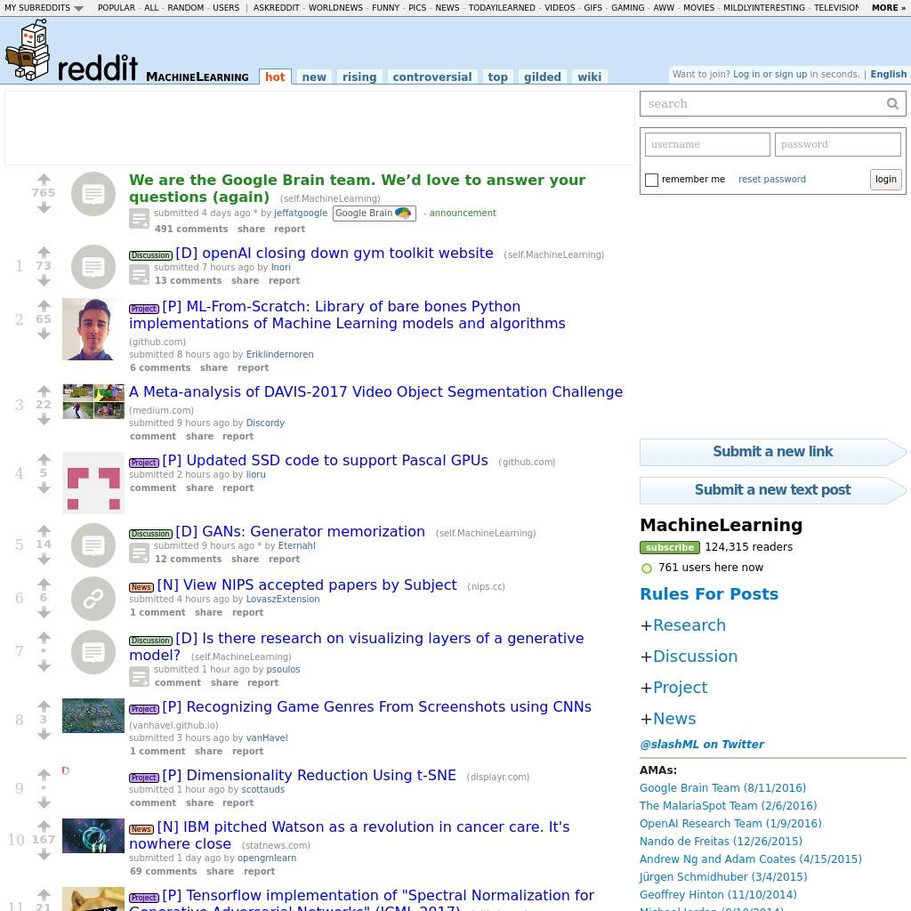
**이미지 캡션:** 이 이미지는 Reddit의 Machine Learning 서브레딧 페이지를 보여줍니다. 페이지 상단에는 Reddit 로고와 함께 "MACHINE LEARNING"이라는 제목이 있으며, 그 옆에는 "hot", "new", "rising", "controversial", "top", "gilded", "wiki"와 같은 탭이 있습니다. 오른쪽 상단에는 로그인 또는 회원가입을 할 수 있는 섹션과 검색창이 있습니다. 메인 콘텐츠 영역에는 여러 게시물 목록이 표시됩니다. 각 게시물은 제목, 작성자 정보, 댓글 수, 공유 수 등을 포함합니다. 게시물들은 다양한 주제를 다루고 있으며, "Google Brain 팀이 질문에 답합니다"라는 제목의 게시물이 가장 위에 있습니다. 이 게시물은 Google Brain 팀이 사용자들의 질문에 답하겠다는 내용이며, 491개의 댓글이 달려 있습니다. 다른 게시물로는 OpenAI의 짐 툴킷 웹사이트 폐쇄, 머신러닝 모델 구현을 위한 Python 라이브러리, 비디오 객체 분할 챌린지 메타 분석, Pascal GPU 지원을 위한 SSD 코드 업데이트, GANs 생성자 암기, NIPS 논문 요약, 생성 모델 시각화 연구, CNN을 이용한 게임 장르 인식, t-SNE를 이용한 차원 축소, IBM Watson의 암 치료 혁신 발표 등이 있습니다. 페이지 오른쪽에는 "Submit a new link"와 "Submit a new text post" 버튼이 있으며, "MachineLearning" 서브레딧의 구독자 수와 현재 접속자 수가 표시됩니다. 또한, "Rules For Posts" 섹션에는 "+Research", "+Discussion", "+Project", "+News"와 같은 카테고리가 있습니다. 하단에는 "AMAS" 섹션에 Google Brain 팀, MalariaSpot 팀, OpenAI Research 팀 등과 관련된 인물들의 이름과 날짜가 나열되어 있습니다. 전반적으로 이 페이지는 머신러닝 분야의 최신 정보와 토론을 공유하는 온라인 커뮤니티의 모습을 보여줍니다.유 수 등을 포함합니다. 게시물들은 다양한 주제를 다루고 있으며, "Google Brain 팀이 질문에 답합니다"라는 제목의 게시물이 가장 위에 있습니다. 이 게시물은 Google Brain 팀이 사용자들의 질문에 답하겠다는 내용이며, 491개의 댓글이 달려 있습니다. 다른 게시물로는 OpenAI의 짐 툴킷 웹사이트 폐쇄, 머신러닝 모델 구현을 위한 Python 라이브러리, 비디오 객체 분할 챌린지 메타 분석, Pascal GPU 지원을 위한 SSD 코드 업데이트, GANs 생성자 암기, NIPS 논문 요약, 생성 모델 시각화 연구, CNN을 이용한 게임 장르 인식, t-SNE를 이용한 차원 축소, IBM Watson의 암 치료 혁신 발표 등이 있습니다. 페이지 오른쪽에는 "Submit a new link"와 "Submit a new text post" 버튼이 있으며, "MachineLearning" 서브레딧의 구독자 수와 현재 접속자 수가 표시됩니다. 또한, "Rules For Posts" 섹션에는 "+Research", "+Discussion", "+Project", "+News"와 같은 카테고리가 있습니다. 하단에는 "AMAS" 섹션에 Google Brain 팀, MalariaSpot 팀, OpenAI Research 팀 등과 관련된 인물들의 이름과 날짜가 나열되어 있습니다. 전반적으로 이 페이지는 머신러닝 분야의 최신 정보와 토론을 공유하는 온라인 커뮤니티의 모습을 보여줍니다.

> #오늘의레딧 https://www.reddit.com/r/MachineLearning/ 재미난 이야기들이 많습니다  1. 파스칼 GPU를 지원하도록 업데이트 된 SSD 코드 2. GANs : 발전기 암기 3. NIPS에서 수락 한 논문보기 4. 생성 모델의 레이어 시각화에 대한 연구가 있습니까? 5. CNN을 사용한 스크린 샷에서 게임 장르 인식 6. t-SNE를 이용한 차원 성 감소 7. IBM은 암 치료의 혁명으로 Watson을 선정했습니다. 그것은 어디에도 없다. 8. "Generative Adversarial Networks를위한 스펙트럼 정규화"의 Tensorflow 구현 (ICML 2017) 9. AI는 2 분 미만의 비디오 게임 푸티지를 사용하여 게임 엔진을 재생성합니다. 10. zygmuntz / goodbooks-10k - 1 만 권, 6 백만 건 11. 나만의 신경 대화 에이전트 제작 가이드 12. 스키마 네트워크 : 직관적 인 물리의 생성 인과 모델로 제로 샷 전송 13. New Yorker의 전 만화 편집자 인 Bob Mankoff는 받아 들여지는 NIPS 논문의 저자입니다. 14. 임의 코드 생성을위한 심층 학습 : 논문 발표 - Haskell 프로그램을 생성하기위한 반복적 인 VAE 교육 15. TensorFlow SavedModels에서 동적으로 Python 클래스 생성하기 16. 자동 음성 인식에 관한 최신 기술은 무엇입니까? 17. EMNLP 2017의 세션 비디오 18. 허용되는 용지 목록 @NIPS 2017 19. Sankey 다이어그램을 사용한 의사 결정 트리 시각화 20. 가우시안 프로세스 분류 자, MLP, k-NN, PCA, RBM, LogReg 구현하기 (파이썬에서 처음부터)  1. https://github.com/ghostcow/caffe 2. https://www.reddit.com/r/MachineLearning/comments/6zuv72/d_gans_generator_memorization/ 3. https://nips.cc/Conferences/2017/Schedule?bySubject 4. https://www.reddit.com/r/MachineLearning/comments/6zy10r/d_is_there_research_on_visualizing_layers_of_a/ 5. https://vanhavel.github.io/2017/09/12/cnn-games.html 6. https://www.displayr.com/using-t-sne-to-visualize-data-before-prediction/ 7. https://www.statnews.com/2017/09/05/watson-ibm-cancer/ 8. https://github.com/minhnhat93/tf-SNDCGAN 9. https://www.eurekalert.org/pub_releases/2017-09/giot-aul091117.php 10. https://github.com/zygmuntz/goodbooks-10k 11. https://blog.statsbot.co/chatbots-machine-learning-e83698b1a91e 12. https://www.vicarious.com/img/icml2017-schemas.pdf 13. https://www.reddit.com/r/MachineLearning/comments/6zropp/d_bob_mankoff_former_cartoon_editor_of_the_new/ 14. https://www.youtube.com/watch?v=czalwzb5FHY&t=425s 15. https://github.com/ajbouh/tfi 16. https://www.reddit.com/r/MachineLearning/comments/6zu5nk/d_what_is_the_state_of_the_art_on_automatic/ 17. https://ku.cloud.panopto.eu/Panopto/Pages/Sessions/List.aspx 18. https://nips.cc/Conferences/2017/Schedule?showParentSession=8797 19. https://www.displayr.com/sankey-diagram/ 20. https://github.com/monsta-hd/ml-mnist

### 9월 15일 (금) 08:52 · 📷 사진 (1장)

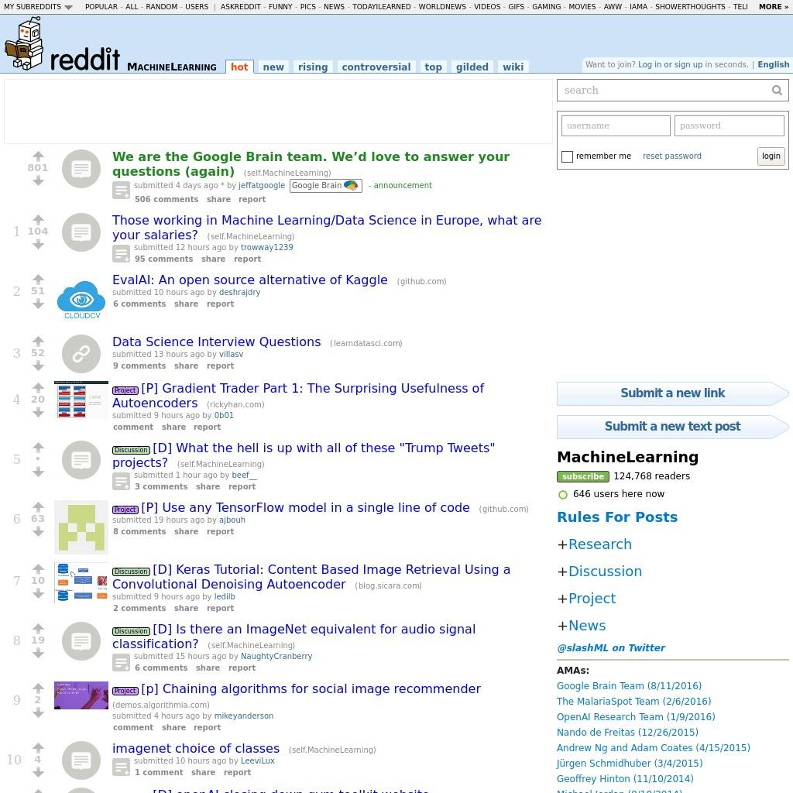
**이미지 캡션:** 이 이미지는 Reddit 웹사이트의 Machine Learning 서브레딧 페이지를 보여줍니다. 페이지 상단에는 Reddit 로고와 함께 "Machine Learning"이라는 제목이 있고, 그 옆에는 "hot", "new", "rising", "controversial", "top", "gilded", "wiki"와 같은 탭이 있습니다. 오른쪽 상단에는 로그인 또는 회원가입을 할 수 있는 창이 있으며, 검색창도 있습니다. 메인 콘텐츠 영역에는 여러 게시물 목록이 표시됩니다. 각 게시물은 제목, 작성자, 제출 시간, 댓글 수, 공유 수 등의 정보를 포함하고 있습니다. 게시물 제목으로는 "We are the Google Brain team. We'd love to answer your questions (again)", "Those working in Machine Learning/Data Science in Europe, what are your salaries?", "EvalAl: An open source alternative of Kaggle", "Data Science Interview Questions", "[P] Gradient Trader Part 1: The Surprising Usefulness of Autoencoders", "[D] What the hell is up with all of these "Trump Tweets" projects?", "[P] Use any TensorFlow model in a single line of code", "[D] Keras Tutorial: Content Based Image Retrieval Using a Convolutional Denoising Autoencoder", "[D] Is there an ImageNet equivalent for audio signal classification?", "[p] Chaining algorithms for social image recommender", "imagenet choice of classes" 등이 있습니다. 오른쪽 사이드바에는 "Submit a new link", "Submit a new text post" 버튼과 함께 "Machine Learning" 서브레딧의 구독자 수, 현재 접속자 수, 규칙 목록 등이 표시됩니다. 또한, "@slashML on Twitter" 링크와 "AMAS" 섹션에는 과거 AMA(Ask Me Anything) 세션 목록이 날짜와 함께 나열되어 있습니다. 전반적으로 기술 관련 커뮤니티의 정보 공유 및 토론이 이루어지는 온라인 포럼의 모습을 보여줍니다. 시간, 댓글 수, 공유 수 등의 정보를 포함하고 있습니다. 게시물 제목으로는 "We are the Google Brain team. We'd love to answer your questions (again)", "Those working in Machine Learning/Data Science in Europe, what are your salaries?", "EvalAl: An open source alternative of Kaggle", "Data Science Interview Questions", "[P] Gradient Trader Part 1: The Surprising Usefulness of Autoencoders", "[D] What the hell is up with all of these "Trump Tweets" projects?", "[P] Use any TensorFlow model in a single line of code", "[D] Keras Tutorial: Content Based Image Retrieval Using a Convolutional Denoising Autoencoder", "[D] Is there an ImageNet equivalent for audio signal classification?", "[p] Chaining algorithms for social image recommender", "imagenet choice of classes" 등이 있습니다. 오른쪽 사이드바에는 "Submit a new link", "Submit a new text post" 버튼과 함께 "Machine Learning" 서브레딧의 구독자 수, 현재 접속자 수, 규칙 목록 등이 표시됩니다. 또한, "@slashML on Twitter" 링크와 "AMAS" 섹션에는 과거 AMA(Ask Me Anything) 세션 목록이 날짜와 함께 나열되어 있습니다. 전반적으로 기술 관련 커뮤니티의 정보 공유 및 토론이 이루어지는 온라인 포럼의 모습을 보여줍니다.

> #오늘의레딧 https://www.reddit.com/r/MachineLearning/ 아침부터 다양한 소식이 많네요.  1. 한 줄의 코드에서 TensorFlow 모델 사용 2. Keras 튜토리얼 : 콘볼 루션 데노 이징 자동 인코딩 도구를 사용한 콘텐츠 기반 이미지 검색 3. 오디오 신호 분류에 해당하는 ImageNet이 있습니까? 4. openAI 체육관 툴킷 웹 사이트 폐쇄 5. 상용 3D Morphable 얼굴 모델 6. ML-From-Scratch : 베어 본 라이브러리 Python의 Machine Learning 모델 및 알고리즘 구현 7. zygmuntz / goodbooks-10k - 1 만 권, 6 백만 건 8. NIPS에서 수락 한 논문보기 9. CNN을 사용한 스크린 샷에서 게임 장르 인식 10. 생성 모델의 레이어 시각화에 대한 연구가 있습니까? 11. GANs : 발전기 암기 12. 파스칼 GPU를 지원하도록 업데이트 된 SSD 코드 13. t-SNE를 이용한 차원 성 감소 14. "Generative Adversarial Networks를위한 스펙트럼 정규화"의 Tensorflow 구현 (ICML 2017)  1. https://github.com/ajbouh/tfi 2. https://blog.sicara.com/keras-tutorial-content-based-image-retrieval-convolutional-denoising-autoencoder-dc91450cc511 3. https://www.reddit.com/r/MachineLearning/comments/700zj8/d_is_there_an_imagenet_equivalent_for_audio/ 4. https://www.reddit.com/r/MachineLearning/comments/6zvlm2/d_openai_closing_down_gym_toolkit_website/ 5. https://www.reddit.com/r/MachineLearning/comments/703sje/p_commercial_3d_morphable_face_models/ 6. https://github.com/eriklindernoren/ML-From-Scratch 7. https://github.com/zygmuntz/goodbooks-10k 8. https://nips.cc/Conferences/2017/Schedule?bySubject 9. https://vanhavel.github.io/2017/09/12/cnn-games.html 10. https://www.reddit.com/r/MachineLearning/comments/6zy10r/d_is_there_research_on_visualizing_layers_of_a/ 11. https://www.reddit.com/r/MachineLearning/comments/6zuv72/d_gans_generator_memorization/ 12. https://github.com/ghostcow/caffe 13. https://www.displayr.com/using-t-sne-to-visualize-data-before-prediction/ 14. https://github.com/minhnhat93/tf-SNDCGAN

### 9월 16일 (토) 08:54 · 📷 사진 (1장)

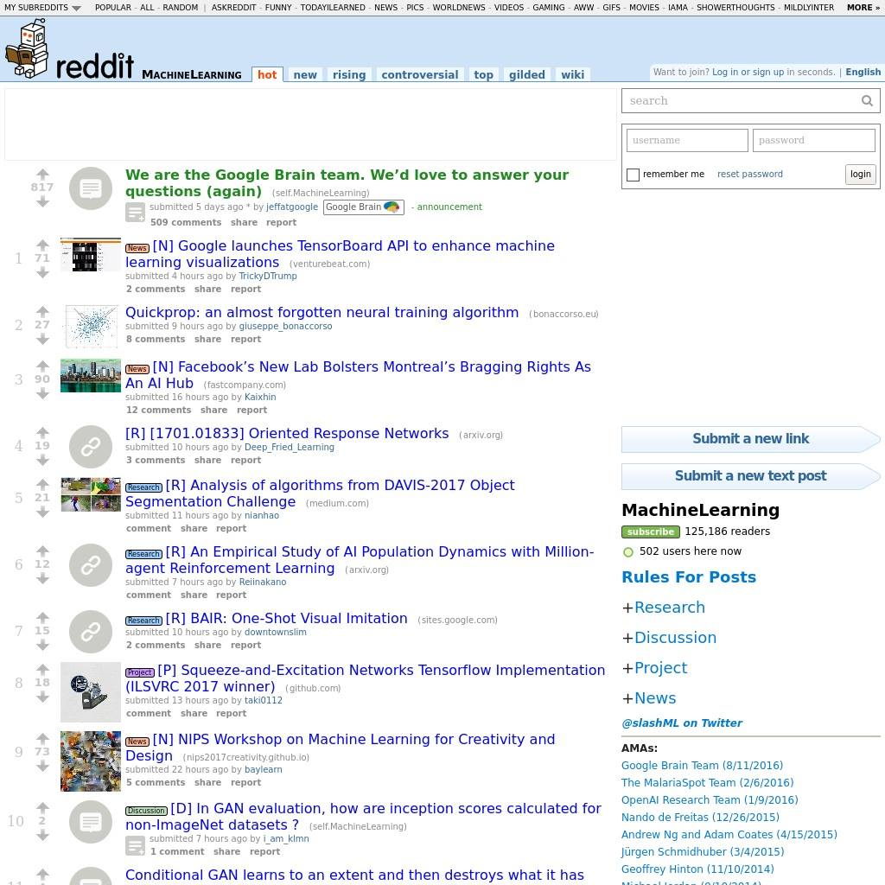
**이미지 캡션:** 이 이미지는 인기 있는 온라인 커뮤니티인 레딧의 머신러닝 서브레딧 페이지를 보여줍니다. 페이지 상단에는 레딧 로고와 함께 "MY SUBREDDITS", "POPULAR", "ALL", "RANDOM", "ASKREDDIT", "FUNNY", "TODAYILEARNED", "NEWS", "PICS", "WORLDNEWS", "VIDEOS", "GAMING", "AWW", "GIFS", "MOVIES", "IAMA", "SHOWERTHOUGHTS", "MILDLYINTER", "MORE"와 같은 다양한 카테고리 링크가 있습니다. 그 옆에는 "Want to join? Log in or sign up in seconds."라는 문구와 함께 로그인 및 회원가입을 유도하는 메시지가 영어로 표시되어 있습니다. 페이지 중앙에는 "reddit"이라는 큰 로고와 함께 "MACHINE LEARNING"이라는 서브레딧 이름이 강조되어 있으며, 그 아래에는 "hot", "new", "rising", "controversial", "top", "gilded", "wiki"와 같은 정렬 옵션이 있습니다. 검색창과 사용자 이름, 비밀번호 입력란, "remember me" 및 "reset password" 옵션, 그리고 로그인 버튼이 오른쪽에 배치되어 있습니다. 주요 콘텐츠 영역에는 여러 게시물 목록이 표시됩니다. 각 게시물은 제목, 출처, 작성자, 제출 시간, 댓글 수, 공유 수 등의 정보를 포함합니다. 첫 번째 게시물은 "We are the Google Brain team. We'd love to answer your questions (again)"이라는 제목으로, 구글 브레인 팀이 질문에 답하겠다는 내용이며, 509개의 댓글이 달려 있습니다. 다른 게시물들은 머신러닝 관련 뉴스, 연구 논문, 알고리즘 등에 대한 내용을 다루고 있으며, "Google launches TensorBoard API", "Quickprop: an almost forgotten neural training algorithm", "Facebook's New Lab Bolsters Montreal's Bragging Rights As An Al Hub", "Oriented Response Networks", "Analysis of algorithms from DAVIS-2017 Object Segmentation Challenge", "An Empirical Study of Al Population Dynamics with Million-agent Reinforcement Learning", "BAIR: One-Shot Visual Imitation", "Squeeze-and-Excitation Networks Tensorflow Implementation", "NIPS Workshop on Machine Learning for Creativity and Design", "In GAN evaluation, how are inception scores calculated for non-ImageNet datasets ?" 등의 제목을 가지고 있습니다. 오른쪽 사이드바에는 "Submit a new link"와 "Submit a new text post" 버튼이 있으며, "MachineLearning" 서브레딧에 대한 구독 정보와 현재 접속자 수(502 users here now)가 표시됩니다. 또한, "Rules For Posts" 섹션 아래에는 "+Research", "+Discussion", "+Project", "+News"와 같은링크가 있습니다. 그 옆에는 "Want to join? Log in or sign up in seconds."라는 문구와 함께 로그인 및 회원가입을 유도하는 메시지가 영어로 표시되어 있습니다. 페이지 중앙에는 "reddit"이라는 큰 로고와 함께 "MACHINE LEARNING"이라는 서브레딧 이름이 강조되어 있으며, 그 아래에는 "hot", "new", "rising", "controversial", "top", "gilded", "wiki"와 같은 정렬 옵션이 있습니다. 검색창과 사용자 이름, 비밀번호 입력란, "remember me" 및 "reset password" 옵션, 그리고 로그인 버튼이 오른쪽에 배치되어 있습니다. 주요 콘텐츠 영역에는 여러 게시물 목록이 표시됩니다. 각 게시물은 제목, 출처, 작성자, 제출 시간, 댓글 수, 공유 수 등의 정보를 포함합니다. 첫 번째 게시물은 "We are the Google Brain team. We'd love to answer your questions (again)"이라는 제목으로, 구글 브레인 팀이 질문에 답하겠다는 내용이며, 509개의 댓글이 달려 있습니다. 다른 게시물들은 머신러닝 관련 뉴스, 연구 논문, 알고리즘 등에 대한 내용을 다루고 있으며, "Google launches TensorBoard API", "Quickprop: an almost forgotten neural training algorithm", "Facebook's New Lab Bolsters Montreal's Bragging Rights As An Al Hub", "Oriented Response Networks", "Analysis of algorithms from DAVIS-2017 Object Segmentation Challenge", "An Empirical Study of Al Population Dynamics with Million-agent Reinforcement Learning", "BAIR: One-Shot Visual Imitation", "Squeeze-and-Excitation Networks Tensorflow Implementation", "NIPS Workshop on Machine Learning for Creativity and Design", "In GAN evaluation, how are inception scores calculated for non-ImageNet datasets ?" 등의 제목을 가지고 있습니다. 오른쪽 사이드바에는 "Submit a new link"와 "Submit a new text post" 버튼이 있으며, "MachineLearning" 서브레딧에 대한 구독 정보와 현재 접속자 수(502 users here now)가 표시됩니다. 또한, "Rules For Posts" 섹션 아래에는 "+Research", "+Discussion", "+Project", "+News"와 같은

> #오늘의레딧 https://www.reddit.com/r/MachineLearning/ 래딧은 읽을 거리가 다양합니다.  1. DAVIS-2017 객체 분할 과제의 알고리즘 분석 2. 백만 인력 강화 학습을 통한 인공 지능 인구 동태에 관한 경험적 연구 3. 배리 : 원샷 비주얼 모방 4. 압착 및 여자 네트워크 Tensorflow 구현 (ILSVRC 2017 수상자) 5. 창의력과 디자인을위한 기계 학습에 관한 NIPS 워크숍 6. GAN 평가에서 비 ImageNet 데이터 세트에 대해 계산 된 시작 점수는 어떻게됩니까? 7. 그라디언트 트레이더 1 부 : Autoencoders의 놀라운 유용성 8. Keras 튜토리얼 : 콘볼 루션 데노 이징 자동 인코딩 도구를 사용한 콘텐츠 기반 이미지 검색 9. 이 모든 "트럼프 짹짹"프로젝트가 도대체 ​​뭐라구? 10. 한 줄의 코드에서 TensorFlow 모델 사용 11. 오디오 신호 분류에 해당하는 ImageNet이 있습니까? 12. 내 배경에 주어진 수업 프로젝트 아이디어?  1. https://medium.com/mlreview/a-meta-analysis-of-davis-2017-video-object-segmentation-challenge-c438790b3b56 2. https://arxiv.org/abs/1709.04511 3. https://sites.google.com/view/one-shot-imitation 4. https://github.com/taki0112/SENet-Tensorflow 5. https://nips2017creativity.github.io 6. https://www.reddit.com/r/MachineLearning/comments/70b07q/d_in_gan_evaluation_how_are_inception_scores/ 7. http://rickyhan.com/jekyll/update/2017/09/14/autoencoders.html 8. https://blog.sicara.com/keras-tutorial-content-based-image-retrieval-convolutional-denoising-autoencoder-dc91450cc511 9. https://www.reddit.com/r/MachineLearning/comments/705kpt/d_what_the_hell_is_up_with_all_of_these_trump/ 10. https://github.com/ajbouh/tfi 11. https://www.reddit.com/r/MachineLearning/comments/700zj8/d_is_there_an_imagenet_equivalent_for_audio/ 12. https://www.reddit.com/r/MachineLearning/comments/706az7/d_ideas_for_a_class_project_given_my_background/

### 9월 16일 (토) 13:22 · Hong Kong/Shenzhen business trip with th…

Hong Kong/Shenzhen business trip with the HKUST Tesla! Our university's public sedans are all Tesla now!!

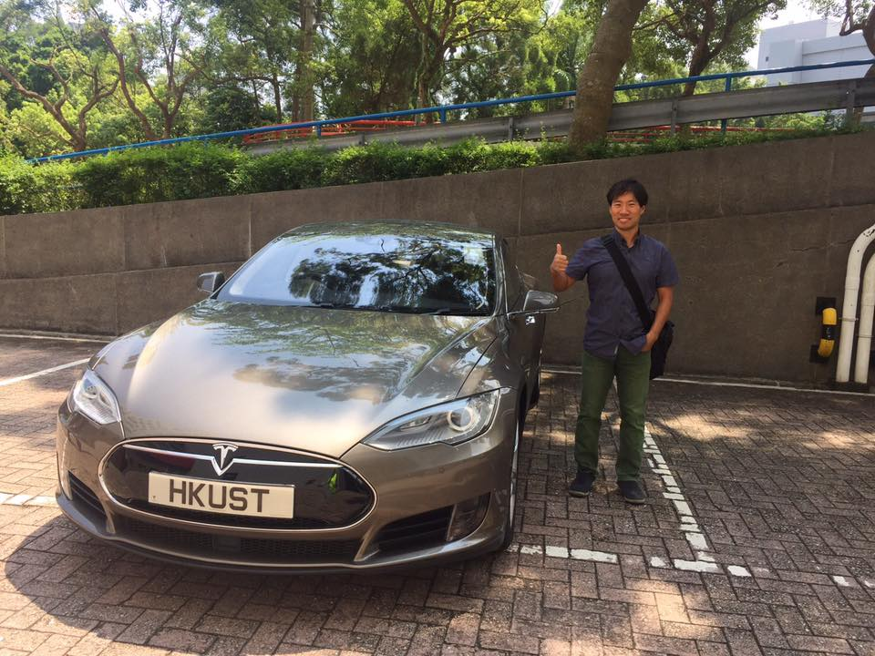
**이미지 캡션:** 한 명의 성인 남성이 회색 테슬라 차량 옆에 서서 엄지손가락을 치켜들고 있다. 남성은 30대 후반에서 40대 초반으로 보이며, 짧은 검은색 머리에 옅은 미소를 띠고 있다. 그는 남색 반팔 셔츠와 녹색 바지를 입고 있으며, 검은색 크로스백을 메고 있다. 차량의 번호판에는 "HKUST"라고 적혀 있다. 배경에는 콘크리트 벽과 울창한 나무들이 보이며, 햇볕이 비추는 야외 주차장으로 보인다. 전반적으로 긍정적이고 편안한 분위기이다.
 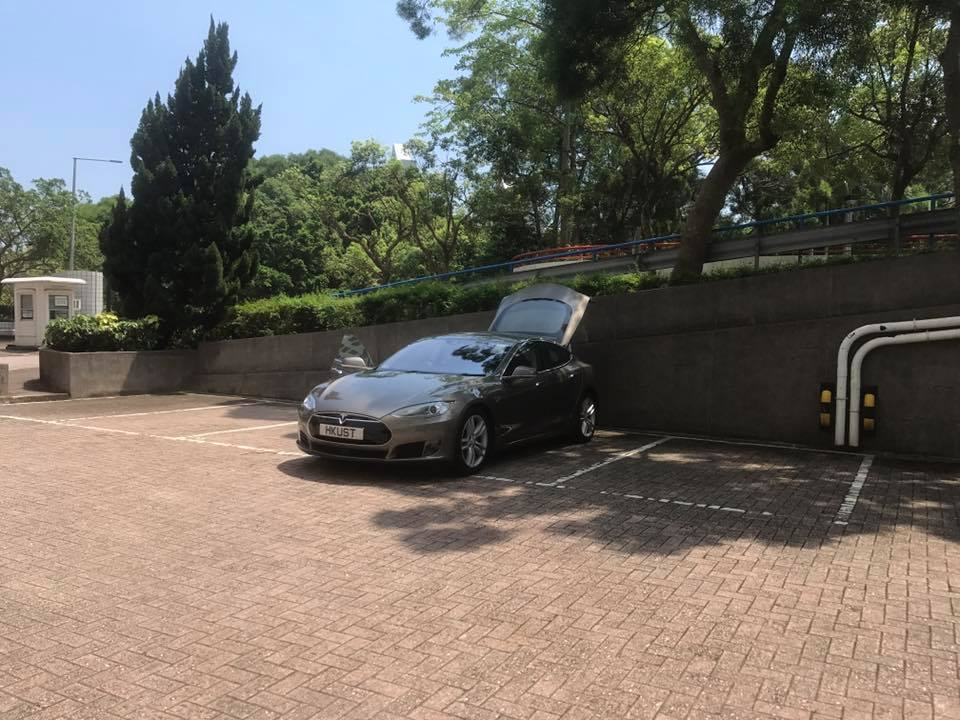
**이미지 캡션:** 주차장에는 회색 테슬라 모델 S 차량 한 대가 주차되어 있으며, 트렁크가 열려 있습니다. 차량 번호판에는 "HKUST"라고 쓰여 있습니다. 주변에는 울창한 나무와 숲이 우거져 있으며, 맑은 날씨에 햇빛이 비치고 있습니다. 주차장 바닥은 벽돌로 포장되어 있고, 흰색 주차선이 그려져 있습니다. 배경에는 콘크리트 벽과 파란색 난간이 보이며, 멀리 건물도 희미하게 보입니다. 주차장 한쪽에는 작은 흰색 건물과 키 큰 나무가 서 있습니다. 전체적으로 평화롭고 한적한 분위기입니다.
 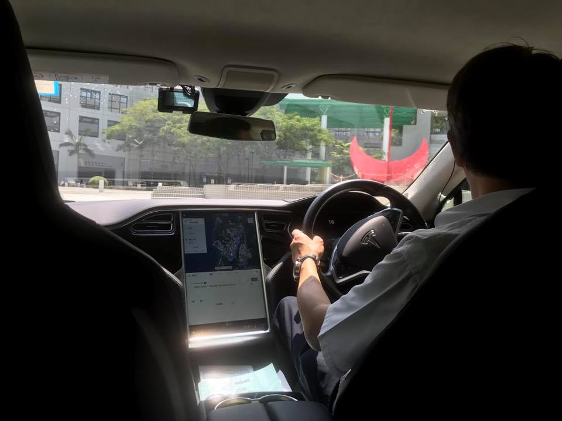
**이미지 캡션:** 차량 내부에서 촬영된 사진으로, 운전석에 앉은 성인 남성이 운전대를 잡고 있다. 남성은 흰색 셔츠에 회색 바지를 입고 있으며, 손목에는 시계를 착용하고 있다. 그의 표정은 보이지 않지만, 운전에 집중하고 있는 듯하다. 차량 내부는 현대적인 디자인으로, 대형 터치스크린이 중앙에 위치해 있으며, 내비게이션 화면이 켜져 있다. 차량 외부로는 건물과 나무, 그리고 빨간색 조형물이 보인다. 햇살이 강하게 내리쬐는 낮 시간으로 보이며, 전체적으로 밝고 맑은 날씨임을 알 수 있다. 차량 내부에는 블랙박스와 룸미러가 설치되어 있다.어 있다.

### 9월 17일 (일) 09:00 · 📷 사진 (1장)

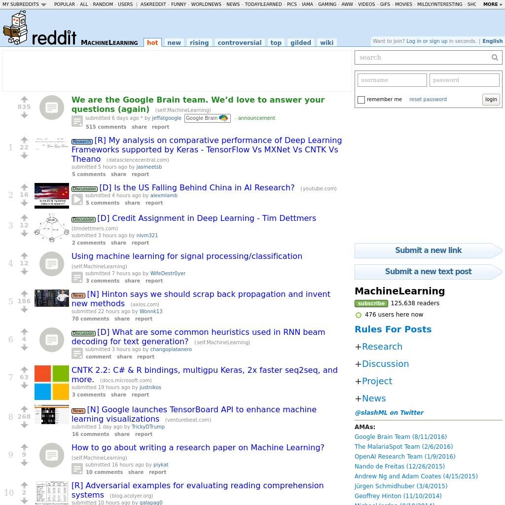
**이미지 캡션:** 이것은 레딧 웹사이트의 스크린샷으로, 머신러닝 관련 게시물 목록을 보여줍니다. 화면 중앙에는 "We are the Google Brain team. We'd love to answer your questions (again)"이라는 제목의 게시물이 있으며, 이는 구글 브레인 팀이 질문에 답하겠다는 내용입니다. 이 게시물은 6일 전에 올라왔고 515개의 댓글과 공유가 있습니다. 그 아래에는 딥러닝 프레임워크 성능 비교, 미국과 중국의 AI 연구 현황, 딥러닝 과제, 신호 처리 및 분류를 위한 머신러닝 사용, 제프리 힌튼의 역전파 및 새로운 방법론에 대한 발언, RNN 빔 디코딩의 일반적인 휴리스틱, CNTK 2.2, 구글의 TensorBoard API 출시, 머신러닝 연구 논문 작성 방법, 독해 시스템 평가를 위한 적대적 예제 등 다양한 주제의 게시물들이 나열되어 있습니다. 각 게시물에는 제목, 출처, 작성자, 게시 시간, 댓글 수, 공유 수 등의 정보가 포함되어 있습니다. 오른쪽에는 "MachineLearning" 서브레딧에 대한 정보가 표시되어 있으며, 125,638명의 구독자와 476명의 현재 사용자가 있음을 알 수 있습니다. 또한 "Rules For Posts" 섹션에는 연구, 토론, 프로젝트, 뉴스와 같은 카테고리가 나열되어 있으며, 트위터 계정(@slashML on Twitter)과 과거 AMA(Ask Me Anything) 목록도 보입니다. 전반적으로 이 화면은 머신러닝 커뮤니티의 최신 정보와 토론을 보여주는 온라인 포럼의 일부입니다.프리 힌튼의 역전파 및 새로운 방법론에 대한 발언, RNN 빔 디코딩의 일반적인 휴리스틱, CNTK 2.2, 구글의 TensorBoard API 출시, 머신러닝 연구 논문 작성 방법, 독해 시스템 평가를 위한 적대적 예제 등 다양한 주제의 게시물들이 나열되어 있습니다. 각 게시물에는 제목, 출처, 작성자, 게시 시간, 댓글 수, 공유 수 등의 정보가 포함되어 있습니다. 오른쪽에는 "MachineLearning" 서브레딧에 대한 정보가 표시되어 있으며, 125,638명의 구독자와 476명의 현재 사용자가 있음을 알 수 있습니다. 또한 "Rules For Posts" 섹션에는 연구, 토론, 프로젝트, 뉴스와 같은 카테고리가 나열되어 있으며, 트위터 계정(@slashML on Twitter)과 과거 AMA(Ask Me Anything) 목록도 보입니다. 전반적으로 이 화면은 머신러닝 커뮤니티의 최신 정보와 토론을 보여주는 온라인 포럼의 일부입니다.

> #오늘의레딧 https://www.reddit.com/r/MachineLearning/ 아침부터 다양한 소식이 많네요.

### 9월 18일 (월) 08:53 · 📷 사진 (2장)

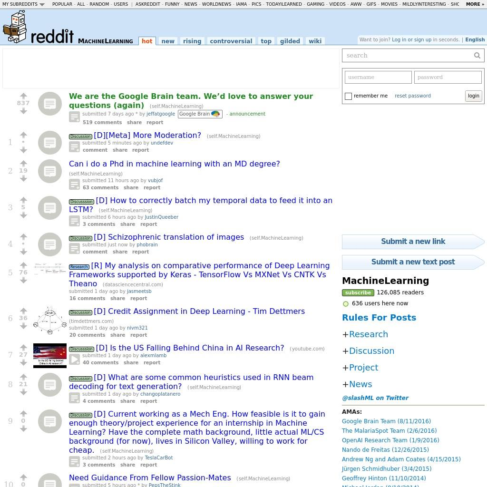
**이미지 캡션:** 이것은 레딧의 머신러닝 서브레딧 페이지 스크린샷으로, 다양한 게시물과 관련 정보를 보여줍니다. 화면 중앙에는 "We are the Google Brain team. We'd love to answer your questions (again)"이라는 제목의 게시물이 가장 눈에 띄며, 이는 구글 브레인 팀이 질문에 답하기 위해 참여한다는 내용입니다. 그 아래에는 "More Moderation?", "Can I do a Phd in machine learning with an MD degree?", "How to correctly batch my temporal data to feed it into an LSTM?", "Schizophrenic translation of images", "My analysis on comparative performance of Deep Learning Frameworks supported by Keras - TensorFlow Vs MXNet Vs CNTK Vs Theano", "Credit Assignment in Deep Learning - Tim Dettmers", "Is the US Falling Behind China in AI Research?", "What are some common heuristics used in RNN beam decoding for text generation?", "Current working as a Mech Eng. How feasible is it to gain enough theory/project experience for an internship in Machine Learning?" 등 다양한 주제의 토론 및 연구 게시물들이 나열되어 있습니다. 각 게시물은 작성자, 제출 시간, 댓글 수, 공유 수 등의 정보를 포함하고 있습니다. 오른쪽 상단에는 로그인 및 회원가입 옵션이 있으며, 검색창과 함께 사용자 이름 및 비밀번호 입력 필드가 있습니다. 오른쪽에는 "Submit a new link" 및 "Submit a new text post" 버튼이 있고, "MachineLearning" 서브레딧의 구독자 수와 현재 접속자 수가 표시되어 있습니다. 또한, "Rules For Posts" 섹션과 함께 "+Research", "+Discussion", "+Project", "+News"와 같은 카테고리가 있으며, 트위터 계정 "@slashML on Twitter"와 과거 AMA(Ask Me Anything) 세션 목록도 보입니다. 전반적으로 이 페이지는 머신러닝 커뮤니티 내에서 활발한 논의와 정보 공유가 이루어지고 있음을 보여주는 온라인 포럼의 모습을 담고 있습니다.correctly batch my temporal data to feed it into an LSTM?", "Schizophrenic translation of images", "My analysis on comparative performance of Deep Learning Frameworks supported by Keras - TensorFlow Vs MXNet Vs CNTK Vs Theano", "Credit Assignment in Deep Learning - Tim Dettmers", "Is the US Falling Behind China in AI Research?", "What are some common heuristics used in RNN beam decoding for text generation?", "Current working as a Mech Eng. How feasible is it to gain enough theory/project experience for an internship in Machine Learning?" 등 다양한 주제의 토론 및 연구 게시물들이 나열되어 있습니다. 각 게시물은 작성자, 제출 시간, 댓글 수, 공유 수 등의 정보를 포함하고 있습니다. 오른쪽 상단에는 로그인 및 회원가입 옵션이 있으며, 검색창과 함께 사용자 이름 및 비밀번호 입력 필드가 있습니다. 오른쪽에는 "Submit a new link" 및 "Submit a new text post" 버튼이 있고, "MachineLearning" 서브레딧의 구독자 수와 현재 접속자 수가 표시되어 있습니다. 또한, "Rules For Posts" 섹션과 함께 "+Research", "+Discussion", "+Project", "+News"와 같은 카테고리가 있으며, 트위터 계정 "@slashML on Twitter"와 과거 AMA(Ask Me Anything) 세션 목록도 보입니다. 전반적으로 이 페이지는 머신러닝 커뮤니티 내에서 활발한 논의와 정보 공유가 이루어지고 있음을 보여주는 온라인 포럼의 모습을 담고 있습니다.
 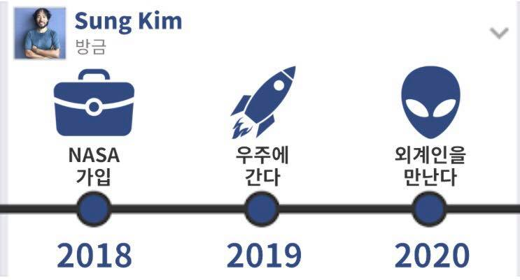
**이미지 캡션:** 사진에는 성인 남성인 Sung Kim의 프로필 사진과 그의 활동 타임라인이 표시되어 있습니다. Sung Kim은 옅은 파란색 티셔츠를 입고 팔짱을 낀 채 카메라를 응시하고 있으며, 그의 표정은 편안하고 자신감 있어 보입니다. 타임라인은 2018년부터 2020년까지 이어지며, 각 연도별 주요 활동을 아이콘과 텍스트로 나타냅니다. 2018년에는 파란색 서류 가방 아이콘과 함께 "NASA 가입"이라는 텍스트가 표시되어 있으며, 이는 그가 NASA에 합류했음을 의미합니다. 2019년에는 로켓 아이콘과 함께 "우주에 간다"는 텍스트가 있어 우주 탐사에 대한 그의 열망이나 관련 활동을 나타냅니다. 2020년에는 외계인 머리 아이콘과 함께 "외계인을 만난다"는 텍스트가 있어, 외계 생명체에 대한 관심이나 관련 경험을 암시합니다. 전체적으로 사진은 Sung Kim의 흥미로운 경력과 미래에 대한 기대를 보여주는 듯한 분위기를 자아냅니다.간다"는 텍스트가 있어 우주 탐사에 대한 그의 열망이나 관련 활동을 나타냅니다. 2020년에는 외계인 머리 아이콘과 함께 "외계인을 만난다"는 텍스트가 있어, 외계 생명체에 대한 관심이나 관련 경험을 암시합니다. 전체적으로 사진은 Sung Kim의 흥미로운 경력과 미래에 대한 기대를 보여주는 듯한 분위기를 자아냅니다.

> #오늘의레딧 https://www.reddit.com/r/MachineLearning/ 오늘도 새소식이 많군요.  1. 깊은 학습의 신용 할당 - Tim Dettmers 2. 텍스트 생성을 위해 RNN 빔 디코딩에서 사용되는 몇 가지 일반적인 발견 방법은 무엇입니까? 3. Mech Eng로 일하고있는 현재. 기계 학습에서 인턴십을위한 충분한 이론 / 프로젝트 경험을 얻는 것이 얼마나 타당합니까? 완전한 수학 배경, 거의 실제 ML / CS 배경 (현재는)이 실리콘 밸리에서 살며 싸게 일하려고합니다. 4. 통계 및 기계 학습의 교차점을 생각할 때 공통적으로 떠오르는 이미지는 무엇입니까? 5. 힌튼 (Hinton)은 전파를 폐기하고 새로운 방법을 발명해야한다고 말합니다. 6. Google, 기계 학습 시각화 향상을위한 TensorBoard API 출시 7. 시간에 의존하는 액세스 패턴을 가진 메모리가 증가한 RNN? 8. 페이스 북의 새로운 연구소, 몬트리올의 AI 허브로서의 자랑 권리 강화  1. http://timdettmers.com/2017/09/16/credit-assignment-deep-learning/ 2. https://www.reddit.com/r/MachineLearning/comments/70j9dg/d_what_are_some_common_heuristics_used_in_rnn/ 3. https://www.reddit.com/r/MachineLearning/comments/70q7sq/d_current_working_as_a_mech_eng_how_feasible_is/ 4. https://www.reddit.com/r/MachineLearning/comments/70m4e9/r_what_is_a_common_image_that_comes_to_mind_when/ 5. https://www.axios.com/ai-pioneer-advocates-starting-over-2485537027.html 6. https://venturebeat.com/2017/09/11/google-launches-tensorboard-api-to-enhance-machine-learning-visualizations/ 7. https://www.reddit.com/r/MachineLearning/comments/70g4l3/d_memoryaugmented_rnns_with_timedependent_access/ 8. https://www.fastcompany.com/40465968/facebooks-new-lab-bolsters-montreals-bragging-rights-as-an-ai-hub

### 9월 19일 (화) 08:52 · 📷 사진 (1장)

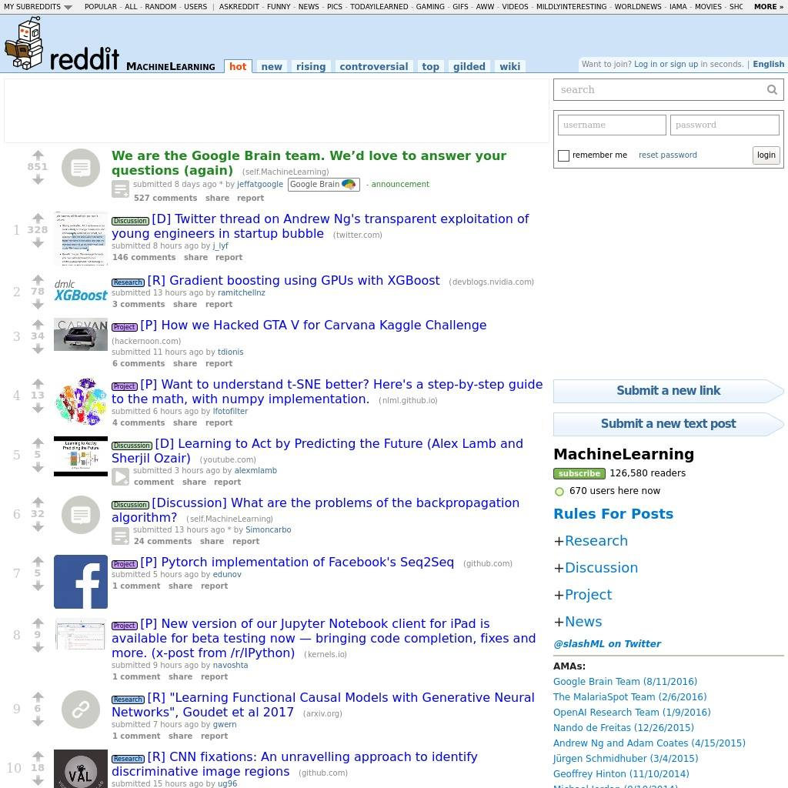
**이미지 캡션:** 이 이미지는 인기 있는 소셜 뉴스 웹사이트인 레딧의 머신러닝 서브레딧 페이지를 보여줍니다. 페이지 상단에는 레딧 로고와 함께 "hot", "new", "rising", "controversial", "top", "gilded", "wiki"와 같은 다양한 탭이 있습니다. 오른쪽 상단에는 로그인 또는 회원가입을 위한 입력란과 버튼이 있습니다. 메인 콘텐츠 영역에는 여러 게시물이 나열되어 있으며, 각 게시물은 제목, 작성자, 제출 시간, 댓글 수, 그리고 관련 링크를 포함합니다. 게시물들은 주로 머신러닝, 인공지능, 딥러닝과 관련된 주제를 다루고 있으며, "Google Brain 팀의 질문 답변", "Andrew Ng의 스타트업 거품 착취에 대한 트위터 스레드", "XGBoost를 사용한 GPU 가속 경사 증강", "Carvana Kaggle 챌린지를 위한 GTA V 해킹 방법", "t-SNE 이해하기", "미래 예측 학습", "역전파 알고리즘 문제", "Facebook의 Seq2Seq 구현", "iPad용 Jupyter 노트북 클라이언트", "생성 신경망을 위한 함수적 인과 모델 학습", "CNN 고정점" 등이 포함되어 있습니다. 각 게시물 옆에는 추천 및 비추천을 위한 화살표 아이콘이 있습니다. 페이지 오른쪽에는 "Machine Learning" 서브레딧의 구독자 수와 현재 접속자 수가 표시되어 있으며, 게시물 규칙과 "AMAS" 섹션도 있습니다. 전반적으로 이 페이지는 머신러닝 커뮤니티의 최신 정보와 토론을 공유하는 온라인 포럼의 모습을 보여줍니다.능, 딥러닝과 관련된 주제를 다루고 있으며, "Google Brain 팀의 질문 답변", "Andrew Ng의 스타트업 거품 착취에 대한 트위터 스레드", "XGBoost를 사용한 GPU 가속 경사 증강", "Carvana Kaggle 챌린지를 위한 GTA V 해킹 방법", "t-SNE 이해하기", "미래 예측 학습", "역전파 알고리즘 문제", "Facebook의 Seq2Seq 구현", "iPad용 Jupyter 노트북 클라이언트", "생성 신경망을 위한 함수적 인과 모델 학습", "CNN 고정점" 등이 포함되어 있습니다. 각 게시물 옆에는 추천 및 비추천을 위한 화살표 아이콘이 있습니다. 페이지 오른쪽에는 "Machine Learning" 서브레딧의 구독자 수와 현재 접속자 수가 표시되어 있으며, 게시물 규칙과 "AMAS" 섹션도 있습니다. 전반적으로 이 페이지는 머신러닝 커뮤니티의 최신 정보와 토론을 공유하는 온라인 포럼의 모습을 보여줍니다.

> #오늘의레딧 https://www.reddit.com/r/MachineLearning/ 재미난 이야기들이 많습니다  1. Carvana Kaggle Challenge에 대한 GTA V 해킹 방법 2. t-SNE를 더 잘 이해하고 싶습니까? numpy 구현을 사용하여 수학에 대한 단계별 가이드를 제공합니다. 3. backpropagation 알고리즘의 문제점은 무엇입니까? 4. 페이스 북의 Seq2Seq의 Pytorch 구현 5. iPad 용 Jupyter Notebook 클라이언트의 새로운 버전을 지금 베타 테스트에 사용할 수 있으며 코드 완성, 수정 등이 가능합니다. (x-post from https://www.reddit.com/r/IPython) 6. "생성 신경망을 이용한 기능적 인과 모형 학습", Goudet et al 2017 7. CNN fixations : 차별화 된 이미지 영역을 식별하는 방법 8. 동적 양자 클러스터링 9. 데이터 세트의 차이 발견 10. Indeed.com의 데이터 과학 / ML 직업 게시보다 단어 빈도 계산 11. 24 분 안에 ImageNet 교육 12. 이미지의 정신 분열증 번역 13. Kerra - TensorFlow 대 MXNet 대 CNTK 대 Theano의 지원을받는 Deep Learning Framework의 비교 성능에 대한 분석 14. 깊은 학습의 신용 할당 - Tim Dettmers 15. 텍스트 생성을 위해 RNN 빔 디코딩에서 사용되는 몇 가지 일반적인 발견 방법은 무엇입니까? 16. 힌튼 (Hinton)은 전파를 폐기하고 새로운 방법을 발명해야한다고 말합니다.  1. https://hackernoon.com/hacking-gta-v-for-carvana-kaggle-challenge-6d0b7fb4c781 2. https://nlml.github.io/in-raw-numpy/in-raw-numpy-t-sne/ 3. https://www.reddit.com/r/MachineLearning/comments/70tz1n/discussion_what_are_the_problems_of_the/ 4. https://github.com/facebookresearch/fairseq-py 5. https://kernels.io/kernels-v-1-0-3-beta/ 6. https://arxiv.org/abs/1709.05321 7. https://github.com/val-iisc/cnn-fixations 8. https://www.reddit.com/r/MachineLearning/comments/70z2gb/d_dynamic_quantum_clustering/ 9. https://www.reddit.com/r/MachineLearning/comments/70xdiu/d_discovering_differences_in_datasets/ 10. http://www.jungle-ml.com/2017/09/17/data-science-job-qualifications-via-web-scraping-indeed-com/ 11. https://arxiv.org/abs/1709.05011 12. https://www.reddit.com/r/MachineLearning/comments/70r4zc/d_schizophrenic_translation_of_images/ 13. http://www.datasciencecentral.com/profiles/blogs/search-for-the-fastest-deep-learning-framework-supported-by-keras 14. http://timdettmers.com/2017/09/16/credit-assignment-deep-learning/ 15. https://www.reddit.com/r/MachineLearning/comments/70j9dg/d_what_are_some_common_heuristics_used_in_rnn/ 16. https://www.axios.com/ai-pioneer-advocates-starting-over-2485537027.html

### 9월 20일 (수) 08:52 · 📷 사진 (2장)

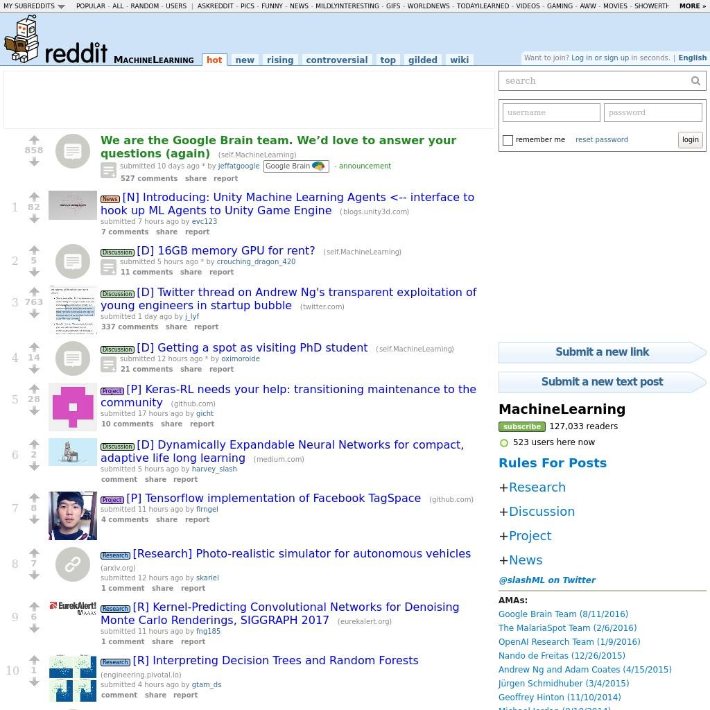
**이미지 캡션:** 이 이미지는 레딧(Reddit) 웹사이트의 머신러닝(MachineLearning) 서브레딧 페이지를 보여줍니다. 페이지 상단에는 레딧 로고와 함께 "hot", "new", "rising", "controversial", "top", "gilded", "wiki"와 같은 탭이 있으며, 오른쪽 상단에는 로그인 또는 가입을 유도하는 문구와 함께 검색창, 사용자 이름 및 비밀번호 입력란이 있습니다. 페이지 중앙에는 다양한 머신러닝 관련 게시물 목록이 표시됩니다. 각 게시물은 제목, 작성자, 제출 시간, 댓글 수, 공유 및 보고 옵션으로 구성되어 있습니다. 게시물 중에는 "We are the Google Brain team. We'd love to answer your questions (again)", "[N] Introducing: Unity Machine Learning Agents", "[D] 16GB memory GPU for rent?", "[D] Twitter thread on Andrew Ng's transparent exploitation of young engineers in startup bubble", "[D] Getting a spot as visiting PhD student", "[P] Keras-RL needs your help: transitioning maintenance to the community", "[D] Dynamically Expandable Neural Networks for compact, adaptive life long learning", "[P] Tensorflow implementation of Facebook TagSpace", "[Research] Photo-realistic simulator for autonomous vehicles", "[R] Kernel-Predicting Convolutional Networks for Denoising Monte Carlo Renderings, SIGGRAPH 2017", "[R] Interpreting Decision Trees and Random Forests"와 같은 제목들이 보입니다. 일부 게시물에는 썸네일 이미지나 관련 링크가 첨부되어 있습니다. 페이지 오른쪽에는 "Submit a new link", "Submit a new text post" 버튼과 함께 "MachineLearning" 서브레딧 구독 정보, "Rules For Posts", 그리고 "@slashML on Twitter" 링크가 있습니다. 또한, "AMAS" 섹션에는 Google Brain Team, The MalariaSpot Team, OpenAI Research Team, Nando de Freitas, Andrew Ng and Adam Coates, Jürgen Schmidhuber, Geoffrey Hinton, Michael Jordan 등 관련 인물 및 팀의 이름과 날짜가 나열되어 있습니다. 전반적으로, 이 페이지는 머신러닝 커뮤니티의 최신 정보와 토론을 공유하는 온라인 포럼의 모습을 보여줍니다.유 및 보고 옵션으로 구성되어 있습니다. 게시물 중에는 "We are the Google Brain team. We'd love to answer your questions (again)", "[N] Introducing: Unity Machine Learning Agents", "[D] 16GB memory GPU for rent?", "[D] Twitter thread on Andrew Ng's transparent exploitation of young engineers in startup bubble", "[D] Getting a spot as visiting PhD student", "[P] Keras-RL needs your help: transitioning maintenance to the community", "[D] Dynamically Expandable Neural Networks for compact, adaptive life long learning", "[P] Tensorflow implementation of Facebook TagSpace", "[Research] Photo-realistic simulator for autonomous vehicles", "[R] Kernel-Predicting Convolutional Networks for Denoising Monte Carlo Renderings, SIGGRAPH 2017", "[R] Interpreting Decision Trees and Random Forests"와 같은 제목들이 보입니다. 일부 게시물에는 썸네일 이미지나 관련 링크가 첨부되어 있습니다. 페이지 오른쪽에는 "Submit a new link", "Submit a new text post" 버튼과 함께 "MachineLearning" 서브레딧 구독 정보, "Rules For Posts", 그리고 "@slashML on Twitter" 링크가 있습니다. 또한, "AMAS" 섹션에는 Google Brain Team, The MalariaSpot Team, OpenAI Research Team, Nando de Freitas, Andrew Ng and Adam Coates, Jürgen Schmidhuber, Geoffrey Hinton, Michael Jordan 등 관련 인물 및 팀의 이름과 날짜가 나열되어 있습니다. 전반적으로, 이 페이지는 머신러닝 커뮤니티의 최신 정보와 토론을 공유하는 온라인 포럼의 모습을 보여줍니다.
 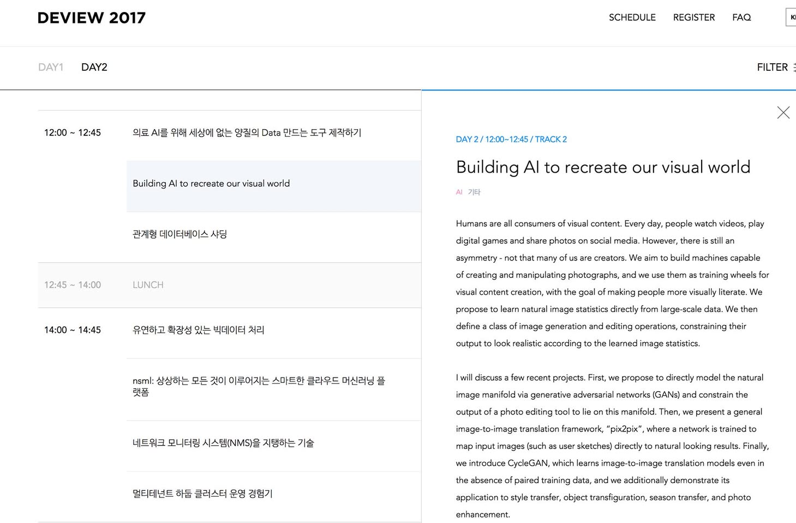
**이미지 캡션:** 이 사진은 DEVIEW 2017이라는 행사의 일정표와 세션 설명의 일부를 보여준다. 왼쪽에는 DAY1과 DAY2로 나뉜 일정표가 있으며, 각 시간대별로 세션 제목과 간단한 설명이 한국어로 기재되어 있다. 예를 들어, DAY1의 12:00~12:45 세션은 "의료 AI를 위해 세상에 없는 양질의 Data 만드는 도구 제작하기"라는 제목으로, "관계형 데이터베이스 샤딩"이라는 하위 세션이 있음을 알 수 있다. 12:45~14:00은 LUNCH 시간이다. 오른쪽에는 DAY 2의 12:00~12:45 세션인 "Building AI to recreate our visual world"에 대한 영문 설명이 상세하게 나와 있다. 이 세션은 AI와 관련된 내용으로, 인간이 시각 콘텐츠의 소비자이지만 창작자는 아니라는 비대칭성을 언급하며, 기계가 사진을 생성하고 조작할 수 있도록 하여 시각적 문해력을 높이는 것을 목표로 한다고 설명한다. 또한, GANs와 "pix2pix", CycleGAN과 같은 최신 프로젝트들을 소개하며 이미지 생성 및 편집 기술에 대해 논의할 것임을 시사한다. 전반적으로 기술 컨퍼런스의 일부를 보여주는 깔끔하고 정보 중심적인 분위기이다.lding AI to recreate our visual world"에 대한 영문 설명이 상세하게 나와 있다. 이 세션은 AI와 관련된 내용으로, 인간이 시각 콘텐츠의 소비자이지만 창작자는 아니라는 비대칭성을 언급하며, 기계가 사진을 생성하고 조작할 수 있도록 하여 시각적 문해력을 높이는 것을 목표로 한다고 설명한다. 또한, GANs와 "pix2pix", CycleGAN과 같은 최신 프로젝트들을 소개하며 이미지 생성 및 편집 기술에 대해 논의할 것임을 시사한다. 전반적으로 기술 컨퍼런스의 일부를 보여주는 깔끔하고 정보 중심적인 분위기이다.

> #오늘의레딧 https://www.reddit.com/r/MachineLearning/ 래딧은 읽을 거리가 다양합니다.  1. 앤드류 응 (Andrew Ng)의 트위터 스레드가 시작 거품에서 젊은 엔지니어의 투명한 착취 2. 박사 과정 학생을 방문하는 자리 확보 3. Keras-RL은 당신의 도움이 필요합니다. 4. 소형, 적응 형 평생 학습을위한 동적 확장형 신경망 5. 페이 스북 TagSpace의 Tensorflow 구현 6. 자율 주행 차량을위한 사실적인 시뮬레이터 7. 커널 - Denoising Monte Carlo 렌더링을위한 컨볼 루션 네트워크 예측, SIGGRAPH 2017 8. 의사 결정 트리 및 랜덤 포리스트 해석 9. 간단한 ConvNet을 사용하여 루빅스 큐브를 풀기 10. 캐나다의 기계 학습 / 데이터 과학. 11. t-SNE를 더 잘 이해하고 싶습니까? numpy 구현을 사용하여 수학에 대한 단계별 가이드를 제공합니다. 12. GPU와 XGBoost를 사용한 그라디언트 증폭 13. Carvana Kaggle Challenge에 대한 GTA V 해킹 방법 14. "생성 신경망을 이용한 기능적 인과 모형 학습", Goudet et al 2017 15. 페이스 북의 Seq2Seq의 Pytorch 구현 16. backpropagation 알고리즘의 문제점은 무엇입니까? 17. iPad 용 Jupyter Notebook 클라이언트의 새로운 버전을 지금 베타 테스트에 사용할 수 있으며 코드 완성, 수정 등이 가능합니다. (x-post from https://www.reddit.com/r/IPython) 18. 스마트 폰 센서 데이터를 이용한 Intelligent Pothole Detection 시스템 19. 임상 연구에서 분류 문제의 표본 크기 20. CNN fixations : 차별화 된 이미지 영역을 식별하는 방법  1. https://twitter.com/betaorbust/status/908890982136942592 2. https://www.reddit.com/r/MachineLearning/comments/7129uz/d_getting_a_spot_as_visiting_phd_student/ 3. https://github.com/matthiasplappert/keras-rl/issues/132 4. https://medium.com/@harshsayshi/dynamically-expandable-neural-networks-ce75ff2b69cf 5. https://github.com/flrngel/TagSpace-tensorflow 6. https://arxiv.org/pdf/1708.05869.pdf 7. https://www.eurekalert.org/pub_releases/2017-06/dr-drp063017.php 8. http://engineering.pivotal.io/post/interpreting-decision-trees-and-random-forests/ 9. https://www.reddit.com/r/MachineLearning/comments/7101tb/discussion_solving_a_rubiks_cube_using_a_simple/ 10. https://www.reddit.com/r/MachineLearning/comments/7141rv/discussionmachinelearningdatascience_in_canada/ 11. https://nlml.github.io/in-raw-numpy/in-raw-numpy-t-sne/ 12. https://devblogs.nvidia.com/parallelforall/gradient-boosting-decision-trees-xgboost-cuda/ 13. https://hackernoon.com/hacking-gta-v-for-carvana-kaggle-challenge-6d0b7fb4c781 14. https://arxiv.org/abs/1709.05321 15. https://github.com/facebookresearch/fairseq-py 16. https://www.reddit.com/r/MachineLearning/comments/70tz1n/discussion_what_are_the_problems_of_the/ 17. https://kernels.io/kernels-v-1-0-3-beta/ 18. https://medium.com/@percepsense/intelligent-pothole-detection-879ef635dd38 19. https://www.reddit.com/r/MachineLearning/comments/70zdv5/d_sample_size_for_a_classification_problem_in/ 20. https://github.com/val-iisc/cnn-fixations
> CycleGAN등으로 세상을 떠들석하게 했던 Berkeley AI Research (BAIR) Lab 의 Jun-Yan Zhu가 한국에 옵니다.  10월 17일 있는 데뷰에서 발표를 하기위해서인데요. 시간 되시는 분들은 꼭 오셔서 Jun-Yan과 즐거운 시간을 보내요.  다만 DEVIEW는 미리 등록해야한다고 하는데 소문에는 *광클*을 요구 한다고 합니다.  16일 행사 등록은 오늘 (9월 20일) 오후 3시 부터, 17일 행사는 내일 (9월 21일) 오후 3시 부터 한다고 하니 https://deview.kr/2017/register 에서 여러분에게 행운이 있기를!!  Jun-Yan뿐만 아니라 네이버랩스 유럽의 머신러닝 대가님들, 여러분들의 머신러닝 연구를 완전히 바꿀 Nako Sung님의 nsml, Jung-Woo Ha님의 음악 추천, Taehoon Kim님의 책읽어주는 딥러닝, 데브시스터즈팀의 Customer Service 자동응답, Clova Platform: 인공지능을 엮는 기술, 인공지능 추천 시스템, 뷰노의 의료관련 AI등 재미있고 신나는 AI/ML톡이 준비되어있습니다.

### 9월 21일 (목) 08:52 · 📷 사진 (1장)

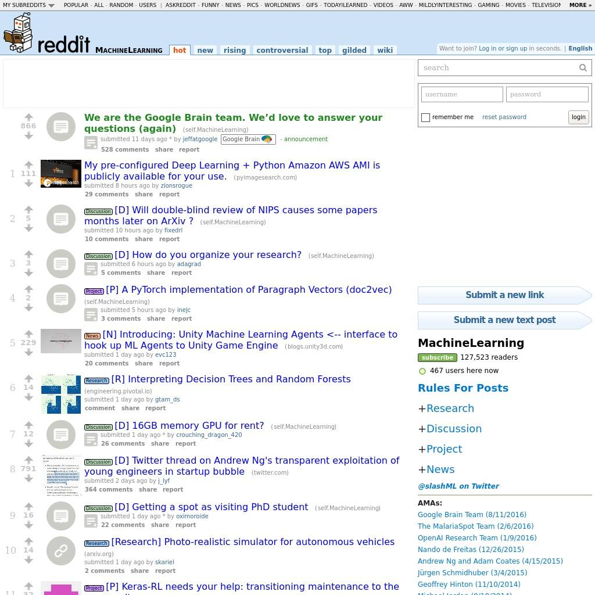
**이미지 캡션:** 이것은 Reddit의 Machine Learning 서브레딧 페이지로, 다양한 게시물 목록이 표시됩니다. 페이지 상단에는 Reddit 로고와 함께 "Machine Learning"이라는 제목이 있으며, 그 아래에는 "hot", "new", "rising", "controversial", "top", "gilded", "wiki"와 같은 탭이 있습니다. 오른쪽 상단에는 로그인 또는 가입을 위한 입력란과 버튼이 있습니다. 메인 콘텐츠 영역에는 여러 게시물이 나열되어 있으며, 각 게시물에는 제목, 작성자, 제출 시간, 댓글 수, 공유 수 등이 포함되어 있습니다. 예를 들어, 첫 번째 게시물은 "We are the Google Brain team. We'd love to answer your questions (again)"이라는 제목으로, Google Brain 팀이 작성했으며 866개의 추천을 받았습니다. 다른 게시물에는 "My pre-configured Deep Learning + Python Amazon AWS AMI is publicly available for your use.", "[D] Will double-blind review of NIPS causes some papers months later on ArXiv?", "[D] How do you organize your research?", "[P] A PyTorch implementation of Paragraph Vectors (doc2vec)", "[N] Introducing: Unity Machine Learning Agents <-- interface to hook up ML Agents to Unity Game Engine", "[R] Interpreting Decision Trees and Random Forests", "[D] 16GB memory GPU for rent?", "[D] Twitter thread on Andrew Ng's transparent exploitation of young engineers in startup bubble", "[Research] Photo-realistic simulator for autonomous vehicles", "[P] Keras-RL needs your help: transitioning maintenance to the" 등이 있습니다. 페이지 오른쪽에는 "Submit a new link" 및 "Submit a new text post" 버튼과 함께 "Machine Learning" 서브레딧에 대한 구독 정보, 구독자 수, 사용자 수, 규칙 등이 표시됩니다. 또한 "AMAS" 섹션에는 과거 AMA(Ask Me Anything) 세션 목록이 있습니다. 전반적으로 이 페이지는 머신러닝 커뮤니티의 최신 정보와 토론을 공유하는 온라인 포럼의 모습을 보여줍니다.간, 댓글 수, 공유 수 등이 포함되어 있습니다. 예를 들어, 첫 번째 게시물은 "We are the Google Brain team. We'd love to answer your questions (again)"이라는 제목으로, Google Brain 팀이 작성했으며 866개의 추천을 받았습니다. 다른 게시물에는 "My pre-configured Deep Learning + Python Amazon AWS AMI is publicly available for your use.", "[D] Will double-blind review of NIPS causes some papers months later on ArXiv?", "[D] How do you organize your research?", "[P] A PyTorch implementation of Paragraph Vectors (doc2vec)", "[N] Introducing: Unity Machine Learning Agents <-- interface to hook up ML Agents to Unity Game Engine", "[R] Interpreting Decision Trees and Random Forests", "[D] 16GB memory GPU for rent?", "[D] Twitter thread on Andrew Ng's transparent exploitation of young engineers in startup bubble", "[Research] Photo-realistic simulator for autonomous vehicles", "[P] Keras-RL needs your help: transitioning maintenance to the" 등이 있습니다. 페이지 오른쪽에는 "Submit a new link" 및 "Submit a new text post" 버튼과 함께 "Machine Learning" 서브레딧에 대한 구독 정보, 구독자 수, 사용자 수, 규칙 등이 표시됩니다. 또한 "AMAS" 섹션에는 과거 AMA(Ask Me Anything) 세션 목록이 있습니다. 전반적으로 이 페이지는 머신러닝 커뮤니티의 최신 정보와 토론을 공유하는 온라인 포럼의 모습을 보여줍니다.

> #오늘의레딧 https://www.reddit.com/r/MachineLearning/ 아침부터 다양한 소식이 많네요.  1. 문단 벡터 (doc2vec)의 PyTorch 구현 2. 소개 : Unity Machine Learning Agents &lt;- ML Agents를 Unity Game Engine에 연결시키는 인터페이스 3. 의사 결정 트리 및 랜덤 포리스트 해석 4. 가정용 16GB 메모리 GPU? 5. 앤드류 응 (Andrew Ng)의 트위터 스레드가 시작 거품에서 젊은 엔지니어의 투명한 착취 6. 박사 과정 학생을 방문하는 자리 확보 7. 자율 주행 차량을위한 사실적인 시뮬레이터 8. Keras-RL은 당신의 도움이 필요합니다. 9. 커널 - Denoising Monte Carlo 렌더링을위한 컨볼 루션 네트워크 예측, SIGGRAPH 2017 10. 페이 스북 TagSpace의 Tensorflow 구현 11. 소형, 적응 형 평생 학습을위한 동적 확장형 신경망 12. 간단한 ConvNet을 사용하여 루빅스 큐브를 풀기 13. t-SNE를 더 잘 이해하고 싶습니까? numpy 구현을 사용하여 수학에 대한 단계별 가이드를 제공합니다. 14. GPU와 XGBoost를 사용한 그라디언트 증폭 15. Carvana Kaggle Challenge에 대한 GTA V 해킹 방법 16. "생성 신경망을 이용한 기능적 인과 모형 학습", Goudet et al 2017 17. backpropagation 알고리즘의 문제점은 무엇입니까? 18. 페이스 북의 Seq2Seq의 Pytorch 구현 19. 스마트 폰 센서 데이터를 이용한 Intelligent Pothole Detection 시스템 20. iPad 용 Jupyter Notebook 클라이언트의 새로운 버전을 지금 베타 테스트에 사용할 수 있으며 코드 완성, 수정 등이 가능합니다. (x-post from https://www.reddit.com/r/IPython)  1. https://www.reddit.com/r/MachineLearning/comments/71d6sq/p_a_pytorch_implementation_of_paragraph_vectors/ 2. https://blogs.unity3d.com/2017/09/19/introducing-unity-machine-learning-agents/ 3. http://engineering.pivotal.io/post/interpreting-decision-trees-and-random-forests/ 4. https://www.reddit.com/r/MachineLearning/comments/714x3k/d_16gb_memory_gpu_for_rent/ 5. https://twitter.com/betaorbust/status/908890982136942592 6. https://www.reddit.com/r/MachineLearning/comments/7129uz/d_getting_a_spot_as_visiting_phd_student/ 7. https://arxiv.org/pdf/1708.05869.pdf 8. https://github.com/matthiasplappert/keras-rl/issues/132 9. https://www.eurekalert.org/pub_releases/2017-06/dr-drp063017.php 10. https://github.com/flrngel/TagSpace-tensorflow 11. https://medium.com/@harshsayshi/dynamically-expandable-neural-networks-ce75ff2b69cf 12. https://www.reddit.com/r/MachineLearning/comments/7101tb/discussion_solving_a_rubiks_cube_using_a_simple/ 13. https://nlml.github.io/in-raw-numpy/in-raw-numpy-t-sne/ 14. https://devblogs.nvidia.com/parallelforall/gradient-boosting-decision-trees-xgboost-cuda/ 15. https://hackernoon.com/hacking-gta-v-for-carvana-kaggle-challenge-6d0b7fb4c781 16. https://arxiv.org/abs/1709.05321 17. https://www.reddit.com/r/MachineLearning/comments/70tz1n/discussion_what_are_the_problems_of_the/ 18. https://github.com/facebookresearch/fairseq-py 19. https://medium.com/@percepsense/intelligent-pothole-detection-879ef635dd38 20. https://kernels.io/kernels-v-1-0-3-beta/

### 9월 22일 (금) 08:52 · 📷 사진 (1장)

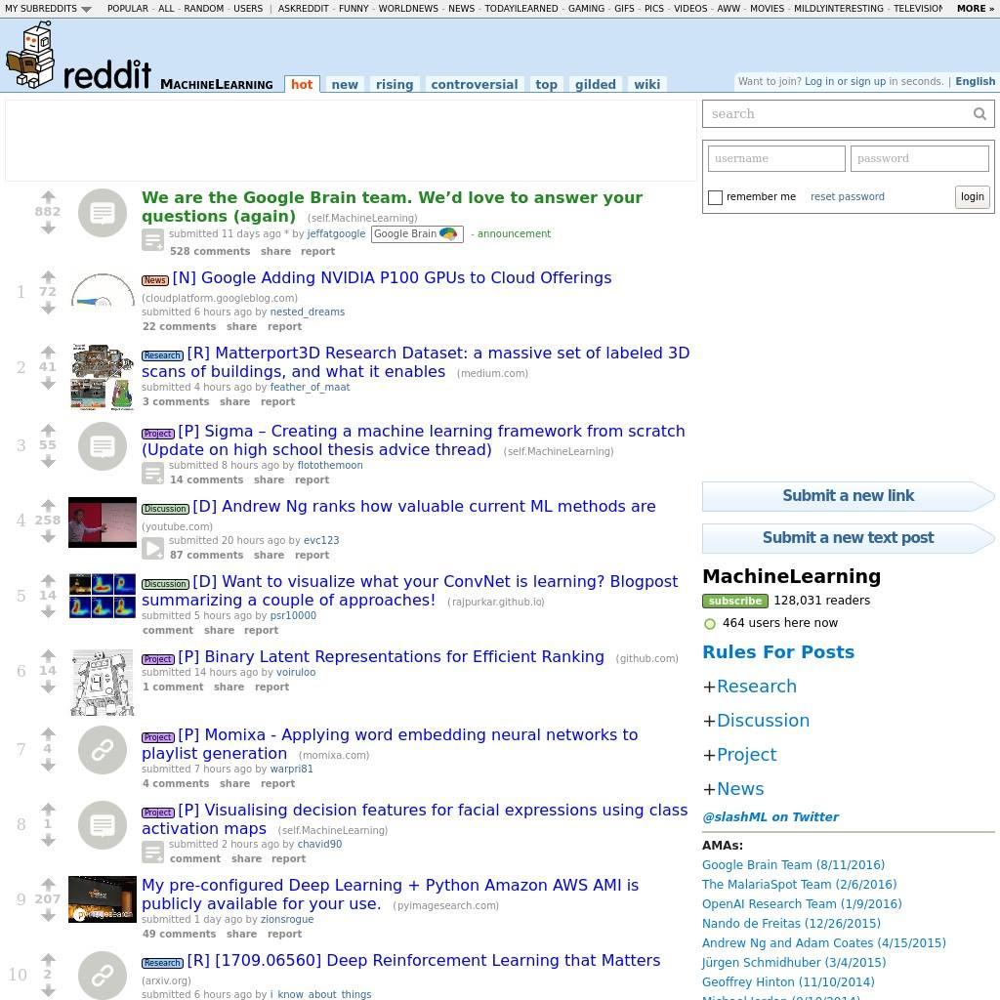
**이미지 캡션:** 이 이미지는 레딧(Reddit) 웹사이트의 머신러닝(Machine Learning) 서브레딧 페이지를 보여줍니다. 페이지 상단에는 레딧 로고와 함께 "MY SUBREDDITS" 메뉴, 인기 있는 서브레딧 목록, 그리고 검색창과 로그인/가입 옵션이 있습니다. 메인 콘텐츠 영역에는 여러 게시물 목록이 표시되며, 각 게시물은 제목, 제출자 정보, 댓글 수, 그리고 관련 링크나 썸네일 이미지를 포함합니다. 게시물들은 주로 머신러닝 관련 연구, 뉴스, 토론, 프로젝트 등을 다루고 있습니다. 예를 들어, "Google Brain 팀이 질문에 답합니다"라는 제목의 게시물은 구글 브레인 팀이 사용자들의 질문에 답변하겠다는 내용이며, "Google이 NVIDIA P100 GPU를 클라우드에 추가한다"는 뉴스 게시물도 있습니다. 또한, 3D 건물 스캔 데이터셋, 머신러닝 프레임워크, 앤드류 응(Andrew Ng)의 ML 방법론 순위, ConvNet 학습 시각화, 이진 잠재 표현, 단어 임베딩을 활용한 플레이리스트 생성, 얼굴 표정 인식, 딥러닝 및 파이썬 AWS AMI 공개, 딥 강화 학습에 대한 연구 등 다양한 주제의 게시물들이 나열되어 있습니다. 페이지 오른쪽에는 "MachineLearning" 서브레딧 정보와 함께 "Submit a new link", "Submit a new text post" 버튼이 있으며, "Rules For Posts" 섹션과 함께 "Research", "Discussion", "Project", "News" 등의 카테고리 링크가 제공됩니다. 또한, "@slashML on Twitter" 링크와 함께 "AMAS" 섹션에는 과거에 AMA(Ask Me Anything)를 진행했던 유명 인사나 팀들의 목록이 날짜와 함께 표시되어 있습니다. 전반적으로 이 페이지는 머신러닝 분야의 최신 정보와 커뮤니티 활동을 공유하는 온라인 포럼의 모습을 보여주며, 정보 탐색 및 참여를 위한 다양한 기능들을 제공하고 있습니다.Brain 팀이 질문에 답합니다"라는 제목의 게시물은 구글 브레인 팀이 사용자들의 질문에 답변하겠다는 내용이며, "Google이 NVIDIA P100 GPU를 클라우드에 추가한다"는 뉴스 게시물도 있습니다. 또한, 3D 건물 스캔 데이터셋, 머신러닝 프레임워크, 앤드류 응(Andrew Ng)의 ML 방법론 순위, ConvNet 학습 시각화, 이진 잠재 표현, 단어 임베딩을 활용한 플레이리스트 생성, 얼굴 표정 인식, 딥러닝 및 파이썬 AWS AMI 공개, 딥 강화 학습에 대한 연구 등 다양한 주제의 게시물들이 나열되어 있습니다. 페이지 오른쪽에는 "MachineLearning" 서브레딧 정보와 함께 "Submit a new link", "Submit a new text post" 버튼이 있으며, "Rules For Posts" 섹션과 함께 "Research", "Discussion", "Project", "News" 등의 카테고리 링크가 제공됩니다. 또한, "@slashML on Twitter" 링크와 함께 "AMAS" 섹션에는 과거에 AMA(Ask Me Anything)를 진행했던 유명 인사나 팀들의 목록이 날짜와 함께 표시되어 있습니다. 전반적으로 이 페이지는 머신러닝 분야의 최신 정보와 커뮤니티 활동을 공유하는 온라인 포럼의 모습을 보여주며, 정보 탐색 및 참여를 위한 다양한 기능들을 제공하고 있습니다.

> #오늘의레딧 https://www.reddit.com/r/MachineLearning/ 따끈한 소식들입니다.  1. Sigma - 처음부터 시스템 학습 프레임 워크 만들기 (고등학교 논문 조언 스레드 업데이트) 2. Andrew Ng는 현재 ML 방법이 얼마나 가치가 있는지 평가합니다. 3. ConvNet이 배우고있는 것을 시각화하고 싶습니까? 몇 가지 접근법을 요약 한 Blogpost! 4. 효율적인 랭킹을위한 이진 잠재 표현 5. Momixa - 단어를 삽입하는 신경망을 재생 목록 생성에 적용 6. 클래스 활성화 맵을 사용하여 표정에 대한 의사 결정 기능 시각화 7. "깊이있는 학습은 중요합니다" 8. CartPole Swing up 대 Gym Pendulum의 난이도 비교? 9. Pytorch + Tesnorboard : 크레용 대 tensorboard-pytorch 10. 알파 고 영화 11. 지진 피해 평가 도움에 관한 아이디어 12. 각서 Ergo 13. Scipy LBFGS-B는 minFunc보다 현저히 나쁩니다. 14. 사례 연구 : LinkedIn에 대한 상위 댓글 (인프라, ML 아키텍처) 15. 어떻게 연구를 구성합니까? 16. 문단 벡터 (doc2vec)의 PyTorch 구현 17. NIPS에 대한 이중 맹검은 ArXiv의 몇 개월 후에 몇 개의 논문을 제출합니까? 18. 소개 : Unity Machine Learning Agents &lt;- ML Agents를 Unity Game Engine에 연결시키는 인터페이스 19. 의사 결정 트리 및 랜덤 포리스트 해석 20. 가정용 16GB 메모리 GPU?  1. https://www.reddit.com/r/MachineLearning/comments/71ji5v/p_sigma_creating_a_machine_learning_framework/ 2. https://www.youtube.com/watch?v=NQK4ZY_gwKI 3. https://rajpurkar.github.io/mlx/visualizing-cnns/ 4. https://github.com/maciejkula/binge 5. https://momixa.com 6. https://www.reddit.com/r/MachineLearning/comments/71mdy4/p_visualising_decision_features_for_facial/ 7. https://arxiv.org/pdf/1709.06560.pdf 8. https://www.reddit.com/r/MachineLearning/comments/71keoe/d_difficulty_comparison_of_cartpole_swing_up_vs/ 9. https://www.reddit.com/r/MachineLearning/comments/71gyee/d_pytorch_tesnorboard_crayon_vs_tensorboardpytorch/ 10. https://www.alphagomovie.com/ 11. https://www.reddit.com/r/MachineLearning/comments/71i16c/d_idea_about_helping_with_earthquake_damage/ 12. http://www.ihes.fr/~gromov/PDF/ergo-cut-copyOct29.pdf 13. https://www.reddit.com/r/MachineLearning/comments/71gauw/d_scipy_lbfgsb_significantly_worse_than_minfunc/ 14. https://engineering.linkedin.com/blog/2017/09/serving-top-comments-in-professional-social-networks 15. https://www.reddit.com/r/MachineLearning/comments/71cini/d_how_do_you_organize_your_research/ 16. https://www.reddit.com/r/MachineLearning/comments/71d6sq/p_a_pytorch_implementation_of_paragraph_vectors/ 17. https://www.reddit.com/r/MachineLearning/comments/71b0h5/d_will_doubleblind_review_of_nips_causes_some/ 18. https://blogs.unity3d.com/2017/09/19/introducing-unity-machine-learning-agents/ 19. http://engineering.pivotal.io/post/interpreting-decision-trees-and-random-forests/ 20. https://www.reddit.com/r/MachineLearning/comments/714x3k/d_16gb_memory_gpu_for_rent/

### 9월 23일 (토) 08:52 · 📷 사진 (2장)

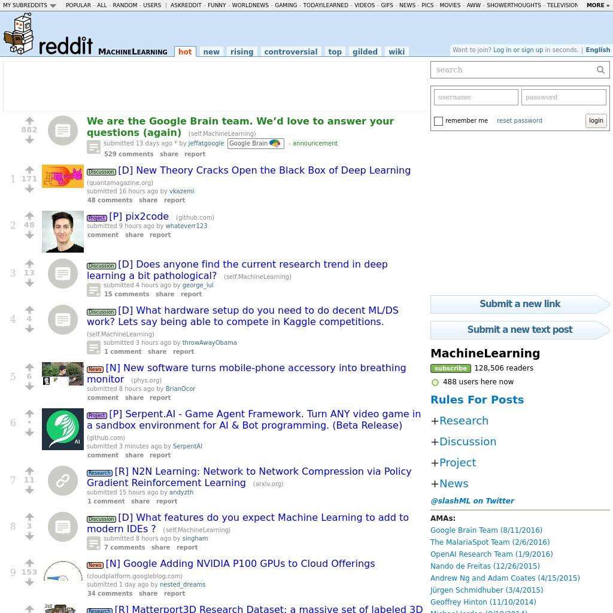
**이미지 캡션:** 이 이미지는 인기 있는 온라인 커뮤니티인 레딧의 머신러닝 서브레딧 페이지를 보여줍니다. 화면 중앙에는 다양한 게시물 목록이 있으며, 각 게시물은 제목, 작성자, 제출 시간, 댓글 수 등의 정보를 포함하고 있습니다. 게시물들은 주로 머신러닝 연구, 프로젝트, 뉴스, 토론 등과 관련된 내용입니다. 예를 들어, "Google Brain 팀이 질문에 답합니다"라는 제목의 게시물은 882개의 추천을 받았고, "딥러닝의 새로운 이론이 블랙박스를 열다"라는 제목의 게시물은 171개의 추천을 받았습니다. 오른쪽에는 "새 링크 제출" 및 "새 텍스트 게시물 제출" 버튼과 함께 서브레딧 구독 정보, 규칙, 그리고 과거 AMA(Ask Me Anything) 목록이 표시됩니다. 상단에는 레딧 로고와 함께 다양한 카테고리(hot, new, rising 등)를 선택할 수 있는 메뉴가 있으며, 검색창과 로그인/회원가입 옵션도 보입니다. 전반적으로 기술 및 연구 커뮤니티의 활발한 정보 교류를 보여주는 화면입니다.크 제출" 및 "새 텍스트 게시물 제출" 버튼과 함께 서브레딧 구독 정보, 규칙, 그리고 과거 AMA(Ask Me Anything) 목록이 표시됩니다. 상단에는 레딧 로고와 함께 다양한 카테고리(hot, new, rising 등)를 선택할 수 있는 메뉴가 있으며, 검색창과 로그인/회원가입 옵션도 보입니다. 전반적으로 기술 및 연구 커뮤니티의 활발한 정보 교류를 보여주는 화면입니다.
 
**이미지 캡션:** 이 사진은 런던의 교통 관련 문제에 대한 정보를 담고 있으며, 여러 개의 텍스트 배너가 겹쳐져 있습니다. 가장 상단에는 파란색 배경에 흰색 원형 로고와 함께 "Transport for London"이라는 글자가 쓰여 있습니다. 그 아래에는 빨간색 배경에 흰색 글씨로 "CONCERNS"라고 적힌 배너가 있습니다. 이 배너의 오른편에는 검은색 배경에 흰색 우버(Uber) 로고와 "UBER"라는 글자가 보입니다. 우버 로고 옆에는 두 개의 흰색 배너가 나란히 있으며, 위쪽 배너에는 "LACK OF BACKGROUND CHECKS FOR DRIVERS"라고 쓰여 있고, 아래쪽 배너에는 "HANDLED ALLEGATIONS OF SEXUAL ASSAULT"라고 쓰여 있습니다. 배경은 흐릿하게 처리된 녹색 나뭇잎과 건물 일부가 보이며, 전체적으로는 뉴스나 시사 프로그램의 한 장면처럼 보입니다. 사람이나 특정 인물은 보이지 않으며, 텍스트 정보가 중심이 되는 이미지입니다.D CHECKS FOR DRIVERS"라고 쓰여 있고, 아래쪽 배너에는 "HANDLED ALLEGATIONS OF SEXUAL ASSAULT"라고 쓰여 있습니다. 배경은 흐릿하게 처리된 녹색 나뭇잎과 건물 일부가 보이며, 전체적으로는 뉴스나 시사 프로그램의 한 장면처럼 보입니다. 사람이나 특정 인물은 보이지 않으며, 텍스트 정보가 중심이 되는 이미지입니다.

> #오늘의레딧 https://www.reddit.com/r/MachineLearning/ 아침부터 다양한 소식이 많네요.  1. 누구든지 깊은 병적 연구에서 현재의 연구 동향을 병리 적으로 발견합니까? 2. 괜찮은 ML / DS 작업을 수행하기 위해 어떤 하드웨어 설정이 필요합니까? Kaggle 대회에서 경쟁 할 수 있다고합니다. 3. 새로운 소프트웨어로 휴대 전화 액세서리가 호흡 모니터로 바뀝니다 4. Serpent.AI - 게임 에이전트 프레임 워크. AI 및 봇 프로그래밍을 위해 샌드 박스 환경에서 모든 비디오 게임을 실행하십시오. (베타 릴리스) 5. N2N 학습 : 정책 구배 강화 학습을 통한 네트워크 간 네트워크 압축 6. Machine Learning이 현대 IDE에 추가 ​​할 것으로 예상되는 기능은 무엇입니까? 7. Google, 클라우드 오퍼링에 NVIDIA P100 GPU 추가 8. Matterport3D Research Dataset : 건물의 3D 스캔 스캔 및이를 가능하게하는 대규모 세트 9. ML은 정치 캠페인에 어떻게 적용될 수 있습니까? 10. OptionGAN : Generative Adversarial Inverse Reinforcement Learning을 사용하여 공동 보상 정책 옵션 학습 11. Sigma - 처음부터 시스템 학습 프레임 워크 만들기 (고등학교 논문 조언 스레드 업데이트) 12. RNN에서 좌표 인코딩 13. ConvNet이 배우고있는 것을 시각화하고 싶습니까? 몇 가지 접근법을 요약 한 Blogpost! 14. 사전 정의 된 작업 작업을 기반으로 회사에서 미래의 작업량을 예측하기위한 아이디어 15. Class-Splitting Generative Adversarial Networks는 CIFAR-10 및 STL-10을 사용하여 최첨단 개념 점수를 향상시킵니다. 16. 종이 추천 시스템? 17. Andrew Ng는 현재 ML 방법이 얼마나 가치가 있는지 평가합니다. 18. Deepmind 또는 OpenAI에서 PyTorch를 사용할 수 있습니까? 19. 간단한 SVM 분류 REST API (Python 포함) 20. CIFAR10 / MNIST / Fashion-MNIST에서 이미지 검색을위한 심층 감시 해싱  1. https://www.reddit.com/r/MachineLearning/comments/71ssfr/d_does_anyone_find_the_current_research_trend_in/ 2. https://www.reddit.com/r/MachineLearning/comments/71tlby/d_what_hardware_setup_do_you_need_to_do_decent/ 3. https://phys.org/news/2017-09-software-mobile-phone-accessory.html 4. https://github.com/SerpentAI/SerpentAI 5. https://arxiv.org/abs/1709.06030v1 6. https://www.reddit.com/r/MachineLearning/comments/71rigz/d_what_features_do_you_expect_machine_learning_to/ 7. https://cloudplatform.googleblog.com/2017/09/introducing-faster-GPUs-for-Google-Compute-Engine.html 8. https://medium.com/@llebttam_45762/announcing-the-matterport3d-research-dataset-815cae932939 9. https://www.reddit.com/r/MachineLearning/comments/71te4e/d_how_can_ml_be_applied_to_political_campaigns/ 10. https://arxiv.org/abs/1709.06683 11. https://www.reddit.com/r/MachineLearning/comments/71ji5v/p_sigma_creating_a_machine_learning_framework/ 12. https://www.reddit.com/r/MachineLearning/comments/71rgib/d_encode_coordinates_in_rnn/ 13. https://rajpurkar.github.io/mlx/visualizing-cnns/ 14. https://www.reddit.com/r/MachineLearning/comments/71r8jb/d_idea_for_estimating_future_workload_at_a/ 15. https://arxiv.org/abs/1709.07359 16. https://www.reddit.com/r/MachineLearning/comments/71p9qg/d_paper_recommendation_system/ 17. https://www.youtube.com/watch?v=NQK4ZY_gwKI 18. https://www.reddit.com/r/MachineLearning/comments/71prec/d_can_someone_use_pytorch_if_they_work_in/ 19. https://github.com/mg52/svmapi 20. https://github.com/mingloo/DeepSupervisedHashing

### 9월 24일 (일) 08:52 · 📷 사진 (4장)

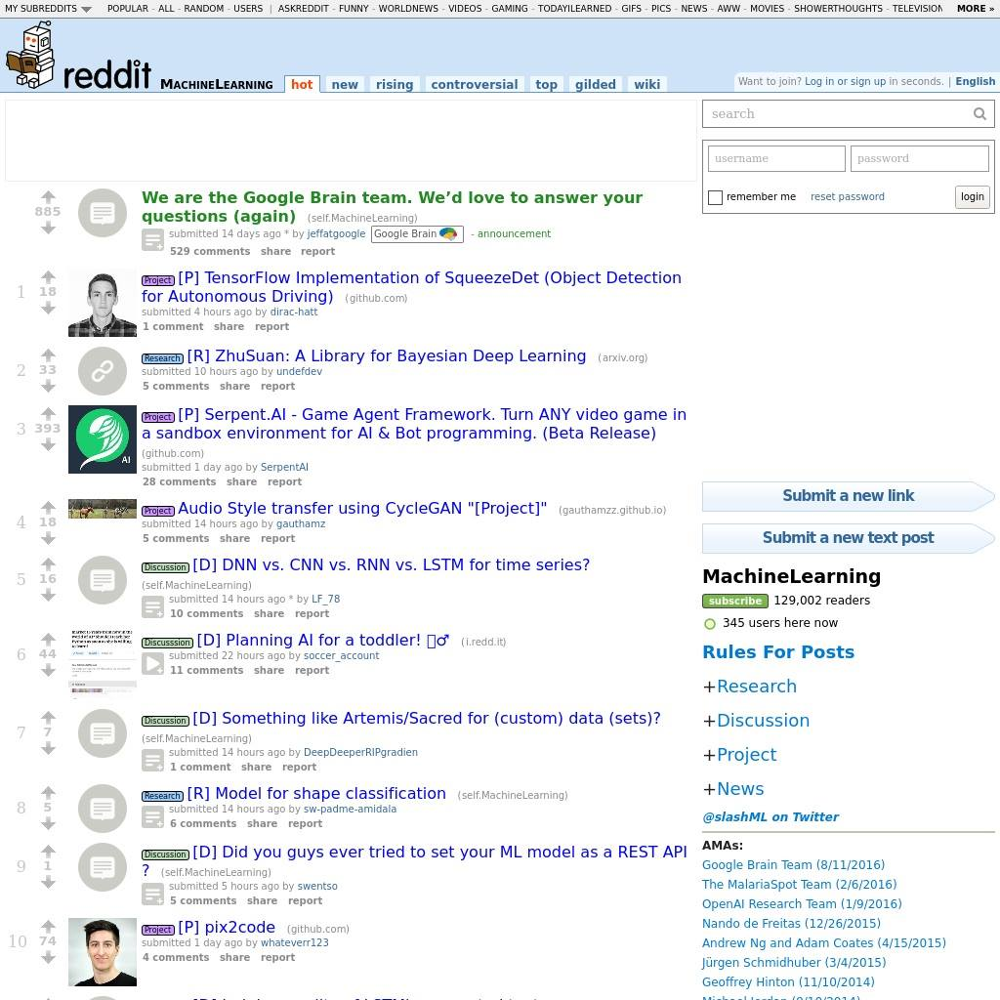
**이미지 캡션:** 이 이미지는 Reddit의 Machine Learning 서브레딧 페이지를 보여줍니다. 페이지 상단에는 Reddit 로고와 함께 "Machine Learning"이라는 제목이 있고, 그 아래에는 "hot", "new", "rising", "controversial", "top", "gilded", "wiki"와 같은 탭이 있습니다. 오른쪽 상단에는 로그인 또는 회원가입을 할 수 있는 창이 있습니다. 메인 콘텐츠 영역에는 여러 게시물 목록이 표시됩니다. 각 게시물은 제목, 작성자, 제출 시간, 댓글 수, 공유 수 등의 정보를 포함합니다. 게시물 중에는 "We are the Google Brain team. We'd love to answer your questions (again)"이라는 제목의 게시물이 눈에 띄며, 이는 Google Brain 팀이 질문에 답하겠다는 내용입니다. 다른 게시물들은 텐서플로우, 베이지안 딥러닝, 게임 에이전트 프레임워크, 오디오 스타일 변환, 시계열 분석, AI 교육, 데이터셋, 형상 분류, REST API, 픽셀 코딩 등 다양한 머신러닝 관련 주제를 다루고 있습니다. 페이지 오른쪽에는 "Submit a new link"와 "Submit a new text post" 버튼이 있으며, "Machine Learning" 서브레딧의 구독자 수와 현재 접속자 수가 표시됩니다. 또한 "Rules For Posts" 섹션과 "AMAS" 섹션에는 관련 연구, 토론, 프로젝트, 뉴스 정보 및 과거 AMA(Ask Me Anything) 목록이 나열되어 있습니다. 전반적으로 이 페이지는 머신러닝 커뮤니티의 최신 정보와 토론을 공유하는 온라인 포럼의 모습을 보여줍니다.수 등의 정보를 포함합니다. 게시물 중에는 "We are the Google Brain team. We'd love to answer your questions (again)"이라는 제목의 게시물이 눈에 띄며, 이는 Google Brain 팀이 질문에 답하겠다는 내용입니다. 다른 게시물들은 텐서플로우, 베이지안 딥러닝, 게임 에이전트 프레임워크, 오디오 스타일 변환, 시계열 분석, AI 교육, 데이터셋, 형상 분류, REST API, 픽셀 코딩 등 다양한 머신러닝 관련 주제를 다루고 있습니다. 페이지 오른쪽에는 "Submit a new link"와 "Submit a new text post" 버튼이 있으며, "Machine Learning" 서브레딧의 구독자 수와 현재 접속자 수가 표시됩니다. 또한 "Rules For Posts" 섹션과 "AMAS" 섹션에는 관련 연구, 토론, 프로젝트, 뉴스 정보 및 과거 AMA(Ask Me Anything) 목록이 나열되어 있습니다. 전반적으로 이 페이지는 머신러닝 커뮤니티의 최신 정보와 토론을 공유하는 온라인 포럼의 모습을 보여줍니다.
 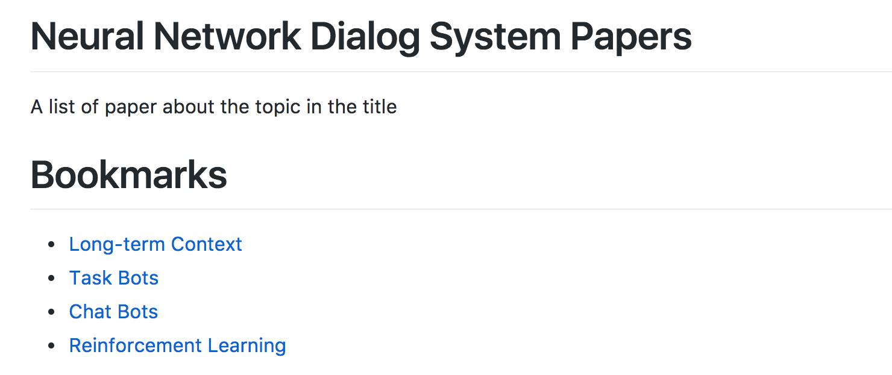
**이미지 캡션:** 이 이미지는 "Neural Network Dialog System Papers"라는 제목의 웹 페이지 또는 문서의 일부를 보여줍니다. 제목 아래에는 "A list of paper about the topic in the title"이라는 설명이 있습니다. 그 아래에는 "Bookmarks"라는 섹션이 있으며, 이 섹션에는 네 개의 항목이 글머리 기호 목록으로 나열되어 있습니다. 각 항목은 파란색으로 표시되어 링크임을 나타냅니다. 나열된 항목은 "Long-term Context", "Task Bots", "Chat Bots", "Reinforcement Learning"입니다. 이 이미지는 컴퓨터 과학, 특히 인공지능 및 자연어 처리 분야의 학술 자료를 정리한 목록을 보여주는 것으로 보입니다. 배경은 흰색이며, 텍스트는 검은색과 파란색으로 구성되어 있습니다. 이미지에는 사람이 등장하지 않으며, 특별한 사물이나 텍스트 외의 시각적 요소는 없습니다. 전반적으로 정보 제공적이고 깔끔한 분위기를 풍깁니다.t Bots", "Reinforcement Learning"입니다. 이 이미지는 컴퓨터 과학, 특히 인공지능 및 자연어 처리 분야의 학술 자료를 정리한 목록을 보여주는 것으로 보입니다. 배경은 흰색이며, 텍스트는 검은색과 파란색으로 구성되어 있습니다. 이미지에는 사람이 등장하지 않으며, 특별한 사물이나 텍스트 외의 시각적 요소는 없습니다. 전반적으로 정보 제공적이고 깔끔한 분위기를 풍깁니다.
 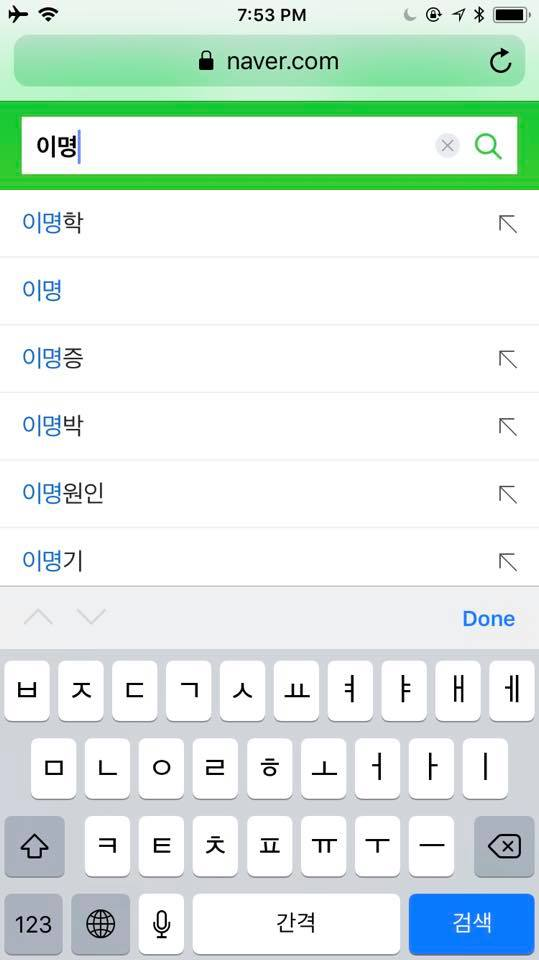
**이미지 캡션:** 이 사진은 스마트폰 화면을 캡처한 것으로, 네이버 웹사이트에서 검색창에 "이명"이라는 단어를 입력하고 있는 모습입니다. 화면 상단에는 7:53 PM이라는 시간과 함께 와이파이, 배터리 등의 상태 표시가 보이며, 녹색 배경의 주소창에는 "naver.com"이 표시되어 있습니다. 검색창에는 "이명"이라는 글자가 입력되어 있고, 그 아래로는 "이명학", "이명", "이명증", "이명박", "이명원인", "이명기"와 같이 "이명"과 관련된 추천 검색어들이 나열되어 있습니다. 화면 하단에는 한글 키보드가 나타나 있으며, "간격"과 "검색" 버튼이 보입니다. 전체적으로 사용자가 네이버에서 특정 정보를 검색하려는 상황을 보여줍니다., "간격"과 "검색" 버튼이 보입니다. 전체적으로 사용자가 네이버에서 특정 정보를 검색하려는 상황을 보여줍니다.
 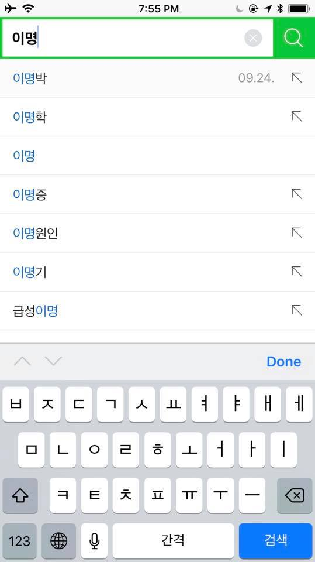
**이미지 캡션:** 이 사진은 스마트폰 화면을 보여주며, 사용자가 검색창에 "이명"이라고 입력하고 있는 모습입니다. 검색창은 녹색 테두리로 강조되어 있으며, 그 옆에는 검색 아이콘과 X 버튼이 있습니다. 입력된 "이명"이라는 단어 아래로는 "이명박", "이명학", "이명", "이명증", "이명원인", "이명기", "급성이명"과 같은 검색어 제안 목록이 나타나며, 각 항목 오른쪽에는 화살표 아이콘이 있습니다. 화면 상단에는 시간 정보 "7:55 PM"과 배터리, 와이파이 등의 상태 표시가 보입니다. 화면 하단에는 한국어 키보드가 나타나 있으며, "123", 지구본 아이콘, 마이크 아이콘, "간격", "검색" 버튼 등이 보입니다. 전반적으로 사용자가 스마트폰에서 특정 정보를 검색하려는 상황을 보여줍니다.나타나 있으며, "123", 지구본 아이콘, 마이크 아이콘, "간격", "검색" 버튼 등이 보입니다. 전반적으로 사용자가 스마트폰에서 특정 정보를 검색하려는 상황을 보여줍니다.

> #오늘의레딧 https://www.reddit.com/r/MachineLearning/ 따끈한 소식들입니다.  1. Serpent.AI - 게임 에이전트 프레임 워크. AI 및 봇 프로그래밍을 위해 샌드 박스 환경에서 모든 비디오 게임을 실행하십시오. (베타 릴리스) 2. DNN 대 CNN 대 RNN 대 LSTM 대 시계열? 3. Artemis / Sacred for (custom) 데이터 (세트)와 같은 것? 4. 형상 분류 모델 5. ML 모델을 REST API로 설정하려고 시도한 적이 있습니까? 6. pix2code 7. LSTM의 생성 된 텍스트의 품질 판단 8. 새로운 이론 균열은 깊은 학습의 블랙 박스를 엽니 다. 9. 누구든지 깊은 병적 연구에서 현재의 연구 동향을 병리 적으로 발견합니까? 10. 괜찮은 ML / DS 작업을 수행하기 위해 어떤 하드웨어 설정이 필요합니까? Kaggle 대회에서 경쟁 할 수 있다고합니다. 11. 새로운 소프트웨어로 휴대 전화 액세서리가 호흡 모니터로 바뀝니다 12. Machine Learning이 현대 IDE에 추가 ​​할 것으로 예상되는 기능은 무엇입니까? 13. N2N 학습 : 정책 구배 강화 학습을 통한 네트워크 간 네트워크 압축 14. Google, 클라우드 오퍼링에 NVIDIA P100 GPU 추가 15. Matterport3D Research Dataset : 건물의 3D 스캔 스캔 및이를 가능하게하는 대규모 세트 16. OptionGAN : Generative Adversarial Inverse Reinforcement Learning을 사용하여 공동 보상 정책 옵션 학습 17. 사전 정의 된 작업 작업을 기반으로 회사에서 미래의 작업량을 예측하기위한 아이디어 18. Sigma - 처음부터 시스템 학습 프레임 워크 만들기 (고등학교 논문 조언 스레드 업데이트) 19. ML은 정치 캠페인에 어떻게 적용될 수 있습니까? 20. ConvNet이 배우고있는 것을 시각화하고 싶습니까? 몇 가지 접근법을 요약 한 Blogpost!  1. https://github.com/SerpentAI/SerpentAI 2. https://www.reddit.com/r/MachineLearning/comments/71xbby/d_dnn_vs_cnn_vs_rnn_vs_lstm_for_time_series/ 3. https://www.reddit.com/r/MachineLearning/comments/71xbof/d_something_like_artemissacred_for_custom_data/ 4. https://www.reddit.com/r/MachineLearning/comments/71x8xs/r_model_for_shape_classification/ 5. https://www.reddit.com/r/MachineLearning/comments/71zonu/d_did_you_guys_ever_tried_to_set_your_ml_model_as/ 6. https://github.com/tonybeltramelli/pix2code 7. https://www.reddit.com/r/MachineLearning/comments/71wprg/d_judging_quality_of_lstms_generated_text/ 8. https://www.quantamagazine.org/new-theory-cracks-open-the-black-box-of-deep-learning-20170921/ 9. https://www.reddit.com/r/MachineLearning/comments/71ssfr/d_does_anyone_find_the_current_research_trend_in/ 10. https://www.reddit.com/r/MachineLearning/comments/71tlby/d_what_hardware_setup_do_you_need_to_do_decent/ 11. https://phys.org/news/2017-09-software-mobile-phone-accessory.html 12. https://www.reddit.com/r/MachineLearning/comments/71rigz/d_what_features_do_you_expect_machine_learning_to/ 13. https://arxiv.org/abs/1709.06030v1 14. https://cloudplatform.googleblog.com/2017/09/introducing-faster-GPUs-for-Google-Compute-Engine.html 15. https://medium.com/@llebttam_45762/announcing-the-matterport3d-research-dataset-815cae932939 16. https://arxiv.org/abs/1709.06683 17. https://www.reddit.com/r/MachineLearning/comments/71r8jb/d_idea_for_estimating_future_workload_at_a/ 18. https://www.reddit.com/r/MachineLearning/comments/71ji5v/p_sigma_creating_a_machine_learning_framework/ 19. https://www.reddit.com/r/MachineLearning/comments/71te4e/d_how_can_ml_be_applied_to_political_campaigns/ 20. https://rajpurkar.github.io/mlx/visualizing-cnns/
> 뉴럴넷을 이용한 대화 시스템도 그동안 많은 논문들이 나오고 좋은 아이디어들이 발표되었습니다. 언제 한번 다 읽어보고 trend를 한번 정리해보는 것도 재미있을듯 합니다.   https://github.com/snakeztc/NeuralDialogPapers  http://www.cs.cmu.edu/~tianchez/ 가 관리하는 리스트입니다.

### 9월 25일 (월) 08:52 · 📷 사진 (1장)

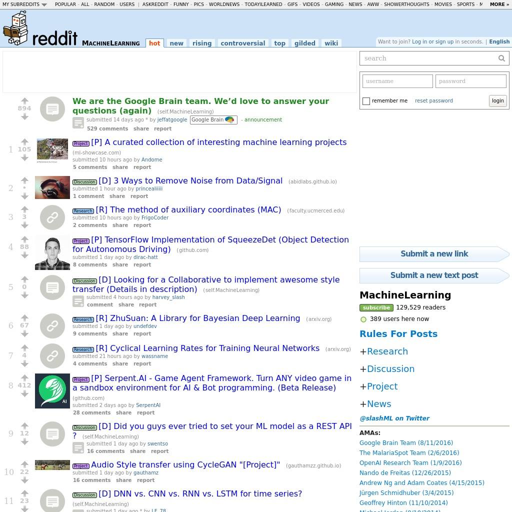
**이미지 캡션:** 이 이미지는 인기 있는 온라인 커뮤니티인 레딧의 머신러닝 서브레딧 페이지를 보여줍니다. 화면 상단에는 레딧 로고와 함께 "MACHINE LEARNING"이라는 제목이 보이며, 그 옆에는 "hot", "new", "rising", "controversial", "top", "gilded", "wiki"와 같은 카테고리 탭이 있습니다. 오른쪽 상단에는 로그인 또는 회원가입을 유도하는 문구와 함께 검색창, 사용자 이름 및 비밀번호 입력란이 있습니다. 메인 콘텐츠 영역에는 여러 게시물 목록이 표시되며, 각 게시물은 제목, 작성자, 제출 시간, 댓글 수, 추천 수 등의 정보를 포함합니다. 게시물들은 주로 머신러닝 관련 연구, 프로젝트, 토론 등이며, 일부는 외부 링크를 포함하고 있습니다. 예를 들어, "We are the Google Brain team. We'd love to answer your questions (again)"이라는 제목의 게시물은 구글 브레인 팀이 질문에 답하겠다는 내용이며, "A curated collection of interesting machine learning projects"라는 게시물은 흥미로운 머신러닝 프로젝트들을 모아놓은 것입니다. 또한, "TensorFlow Implementation of SqueezeDet (Object Detection for Autonomous Driving)"와 같은 프로젝트 게시물은 자율 주행을 위한 텐서플로우 구현에 관한 것입니다. 페이지 오른쪽에는 "Submit a new link" 및 "Submit a new text post" 버튼이 있고, "MachineLearning" 서브레딧의 구독자 수와 현재 접속자 수가 표시됩니다. 그 아래에는 "Rules For Posts"라는 제목과 함께 "Research", "Discussion", "Project", "News"와 같은 하위 카테고리가 나열되어 있으며, 트위터 계정(@slashML)과 과거 AMA(Ask Me Anything) 세션 목록도 보입니다. 전반적으로, 이 페이지는 머신러닝 분야의 최신 정보와 토론을 공유하는 온라인 커뮤니티의 모습을 보여줍니다.제목, 작성자, 제출 시간, 댓글 수, 추천 수 등의 정보를 포함합니다. 게시물들은 주로 머신러닝 관련 연구, 프로젝트, 토론 등이며, 일부는 외부 링크를 포함하고 있습니다. 예를 들어, "We are the Google Brain team. We'd love to answer your questions (again)"이라는 제목의 게시물은 구글 브레인 팀이 질문에 답하겠다는 내용이며, "A curated collection of interesting machine learning projects"라는 게시물은 흥미로운 머신러닝 프로젝트들을 모아놓은 것입니다. 또한, "TensorFlow Implementation of SqueezeDet (Object Detection for Autonomous Driving)"와 같은 프로젝트 게시물은 자율 주행을 위한 텐서플로우 구현에 관한 것입니다. 페이지 오른쪽에는 "Submit a new link" 및 "Submit a new text post" 버튼이 있고, "MachineLearning" 서브레딧의 구독자 수와 현재 접속자 수가 표시됩니다. 그 아래에는 "Rules For Posts"라는 제목과 함께 "Research", "Discussion", "Project", "News"와 같은 하위 카테고리가 나열되어 있으며, 트위터 계정(@slashML)과 과거 AMA(Ask Me Anything) 세션 목록도 보입니다. 전반적으로, 이 페이지는 머신러닝 분야의 최신 정보와 토론을 공유하는 온라인 커뮤니티의 모습을 보여줍니다.

> #오늘의레딧 https://www.reddit.com/r/MachineLearning/ 따끈한 소식들입니다.  1. 보조 좌표 (MAC) 2. SqueezeDet의 TensorFlow 구현 (자율 주행을위한 객체 감지) 3. 멋진 스타일 전송을 구현하기위한 공동 작업을 찾고 있습니다 (설명에서 자세히 설명). 4. ZhuSuan : 베이 즈식 깊은 학습을위한 도서관 5. 신경망 훈련을위한 주기적 학습 속도 6. Serpent.AI - 게임 에이전트 프레임 워크. AI 및 봇 프로그래밍을 위해 샌드 박스 환경에서 모든 비디오 게임을 실행하십시오. (베타 릴리스) 7. ML 모델을 REST API로 설정하려고 시도한 적이 있습니까? 8. DNN 대 CNN 대 RNN 대 LSTM 대 시계열? 9. 선형 신경망을 처음부터 만드는 몇 가지 질문. 10. Artemis / Sacred for (custom) 데이터 (세트)와 같은 것? 11. 형상 분류 모델 12. LSTM의 생성 된 텍스트의 품질 판단 13. pix2code 14. 새로운 이론 균열은 깊은 학습의 블랙 박스를 엽니 다. 15. 누구든지 깊은 병적 연구에서 현재의 연구 동향을 병리 적으로 발견합니까? 16. 괜찮은 ML / DS 작업을 수행하기 위해 어떤 하드웨어 설정이 필요합니까? Kaggle 대회에서 경쟁 할 수 있다고합니다. 17. 새로운 소프트웨어로 휴대 전화 액세서리가 호흡 모니터로 바뀝니다 18. Machine Learning이 현대 IDE에 추가 ​​할 것으로 예상되는 기능은 무엇입니까? 19. N2N 학습 : 정책 구배 강화 학습을 통한 네트워크 간 네트워크 압축 20. Google, 클라우드 오퍼링에 NVIDIA P100 GPU 추가  1. http://faculty.ucmerced.edu/mcarreira-perpinan/MAC 2. https://github.com/fregu856/2D_detection 3. https://www.reddit.com/r/MachineLearning/comments/7279un/d_looking_for_a_collaborative_to_implement/ 4. https://arxiv.org/abs/1709.05870v1 5. https://arxiv.org/abs/1506.01186 6. https://github.com/SerpentAI/SerpentAI 7. https://www.reddit.com/r/MachineLearning/comments/71zonu/d_did_you_guys_ever_tried_to_set_your_ml_model_as/ 8. https://www.reddit.com/r/MachineLearning/comments/71xbby/d_dnn_vs_cnn_vs_rnn_vs_lstm_for_time_series/ 9. https://www.reddit.com/r/MachineLearning/comments/7231jj/p_a_few_questions_on_building_a_linear_neural/ 10. https://www.reddit.com/r/MachineLearning/comments/71xbof/d_something_like_artemissacred_for_custom_data/ 11. https://www.reddit.com/r/MachineLearning/comments/71x8xs/r_model_for_shape_classification/ 12. https://www.reddit.com/r/MachineLearning/comments/71wprg/d_judging_quality_of_lstms_generated_text/ 13. https://github.com/tonybeltramelli/pix2code 14. https://www.quantamagazine.org/new-theory-cracks-open-the-black-box-of-deep-learning-20170921/ 15. https://www.reddit.com/r/MachineLearning/comments/71ssfr/d_does_anyone_find_the_current_research_trend_in/ 16. https://www.reddit.com/r/MachineLearning/comments/71tlby/d_what_hardware_setup_do_you_need_to_do_decent/ 17. https://phys.org/news/2017-09-software-mobile-phone-accessory.html 18. https://www.reddit.com/r/MachineLearning/comments/71rigz/d_what_features_do_you_expect_machine_learning_to/ 19. https://arxiv.org/abs/1709.06030v1 20. https://cloudplatform.googleblog.com/2017/09/introducing-faster-GPUs-for-Google-Compute-Engine.html

### 9월 26일 (화) 08:52 · 📷 사진 (2장)

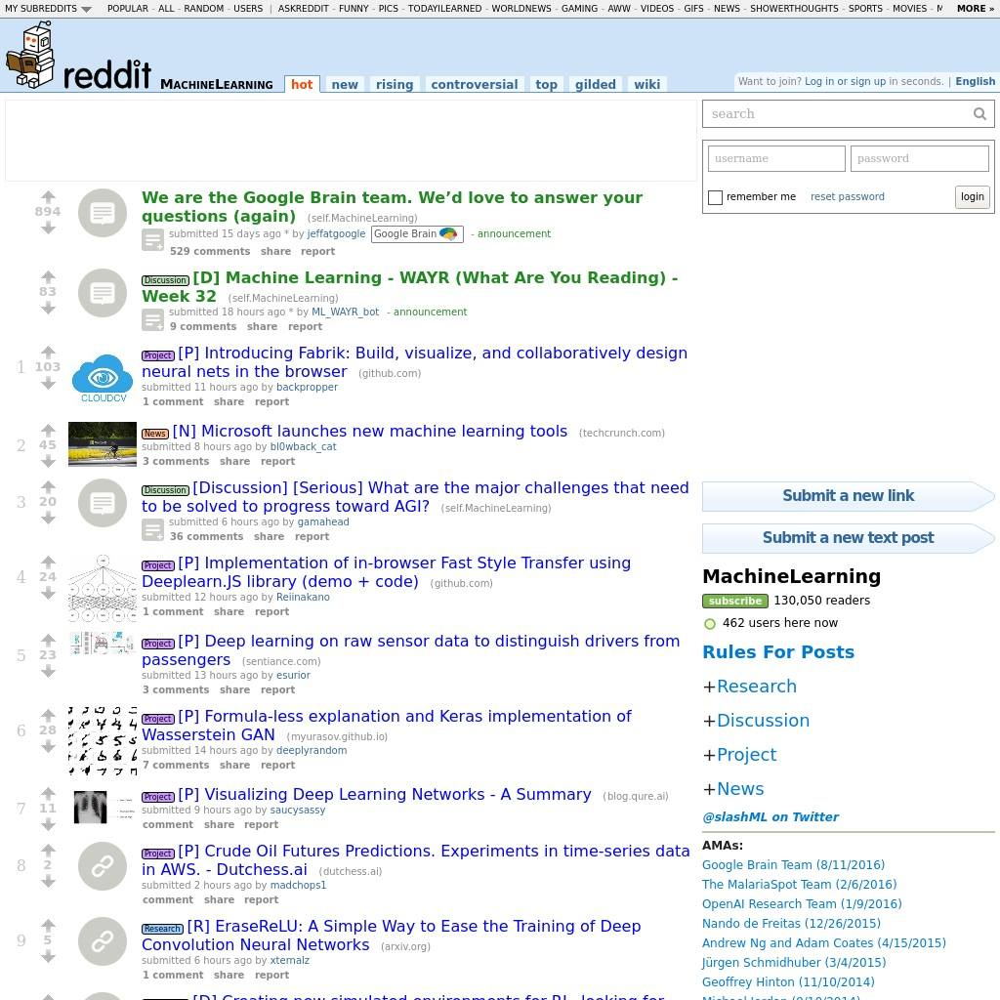
**이미지 캡션:** 이 이미지는 레딧의 머신러닝 서브레딧 페이지를 보여줍니다. 페이지 상단에는 레딧 로고와 함께 "MACHINE LEARNING"이라는 제목이 있고, 그 아래에는 "hot", "new", "rising", "controversial", "top", "gilded", "wiki"와 같은 카테고리 링크가 있습니다. 오른쪽 상단에는 로그인 또는 회원가입을 할 수 있는 창이 있습니다. 페이지 중앙에는 여러 개의 게시물 목록이 있으며, 각 게시물은 제목, 작성자, 제출 시간, 댓글 수, 공유 수 등의 정보를 포함하고 있습니다. 게시물들은 머신러닝 관련 주제를 다루고 있으며, "Google Brain 팀과의 질문 답변", "머신러닝 관련 추천 도서", "브라우저에서 신경망을 구축, 시각화, 협업하는 방법", "마이크로소프트의 새로운 머신러닝 도구 출시", "인공 일반 지능(AGI)의 주요 과제", "브라우저 기반 스타일 트랜스퍼 구현", "센서 데이터를 이용한 운전자 구별", "Wasserstein GAN 설명 및 구현", "딥러닝 네트워크 시각화 요약", "AWS에서의 원유 선물 예측 실험", "딥 컨볼루션 신경망 학습 완화 방법" 등 다양한 내용을 포함하고 있습니다. 각 게시물 옆에는 추천/반대 투표를 할 수 있는 화살표와 게시물 종류를 나타내는 아이콘이 있습니다. 페이지 오른쪽에는 "Submit a new link" 및 "Submit a new text post" 버튼과 함께 서브레딧 구독자 수, 현재 접속자 수, 게시 규칙, 트위터 계정, 그리고 과거 AMA(Ask Me Anything) 목록이 표시되어 있습니다. 전반적으로 정보가 많고 기술적인 내용을 다루는 온라인 커뮤니티 페이지의 모습입니다.니다. 게시물들은 머신러닝 관련 주제를 다루고 있으며, "Google Brain 팀과의 질문 답변", "머신러닝 관련 추천 도서", "브라우저에서 신경망을 구축, 시각화, 협업하는 방법", "마이크로소프트의 새로운 머신러닝 도구 출시", "인공 일반 지능(AGI)의 주요 과제", "브라우저 기반 스타일 트랜스퍼 구현", "센서 데이터를 이용한 운전자 구별", "Wasserstein GAN 설명 및 구현", "딥러닝 네트워크 시각화 요약", "AWS에서의 원유 선물 예측 실험", "딥 컨볼루션 신경망 학습 완화 방법" 등 다양한 내용을 포함하고 있습니다. 각 게시물 옆에는 추천/반대 투표를 할 수 있는 화살표와 게시물 종류를 나타내는 아이콘이 있습니다. 페이지 오른쪽에는 "Submit a new link" 및 "Submit a new text post" 버튼과 함께 서브레딧 구독자 수, 현재 접속자 수, 게시 규칙, 트위터 계정, 그리고 과거 AMA(Ask Me Anything) 목록이 표시되어 있습니다. 전반적으로 정보가 많고 기술적인 내용을 다루는 온라인 커뮤니티 페이지의 모습입니다.
 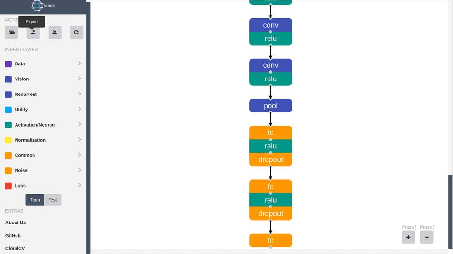
**이미지 캡션:** 이 이미지는 딥러닝 모델 아키텍처를 시각적으로 구성하는 웹 기반 도구의 스크린샷입니다. 왼쪽에는 "fabrik"이라는 로고와 함께 "Action" 및 "Export" 버튼이 있는 회색 사이드바가 있습니다. 사이드바에는 "INSERT LAYER" 섹션이 있으며, "Data", "Vision", "Recurrent", "Utility", "Activation/Neuron", "Normalization", "Common", "Noise", "Loss"와 같은 다양한 레이어 유형을 추가할 수 있는 옵션이 나열되어 있습니다. 각 레이어 유형 옆에는 확장 옵션을 나타내는 화살표가 있습니다. "INSERT LAYER" 섹션 아래에는 "Train" 및 "Test" 버튼이 있으며, 그 아래에는 "EXTRAS" 섹션에 "About Us", "GitHub", "CloudCV"와 같은 추가 정보 링크가 있습니다. 오른쪽에는 딥러닝 모델의 구조를 나타내는 일련의 블록이 세로로 쌓여 있습니다. 각 블록은 특정 레이어를 나타내며, "conv" (컨볼루션), "relu" (ReLU 활성화 함수), "pool" (풀링), "fc" (완전 연결), "dropout" (드롭아웃)과 같은 텍스트로 레이어 유형을 표시합니다. 블록들은 화살표로 연결되어 데이터 흐름의 방향을 나타냅니다. 전체적으로 이 화면은 사용자가 딥러닝 모델의 레이어를 직관적으로 설계하고 구성할 수 있도록 돕는 도구임을 보여줍니다.습니다. 각 레이어 유형 옆에는 확장 옵션을 나타내는 화살표가 있습니다. "INSERT LAYER" 섹션 아래에는 "Train" 및 "Test" 버튼이 있으며, 그 아래에는 "EXTRAS" 섹션에 "About Us", "GitHub", "CloudCV"와 같은 추가 정보 링크가 있습니다. 오른쪽에는 딥러닝 모델의 구조를 나타내는 일련의 블록이 세로로 쌓여 있습니다. 각 블록은 특정 레이어를 나타내며, "conv" (컨볼루션), "relu" (ReLU 활성화 함수), "pool" (풀링), "fc" (완전 연결), "dropout" (드롭아웃)과 같은 텍스트로 레이어 유형을 표시합니다. 블록들은 화살표로 연결되어 데이터 흐름의 방향을 나타냅니다. 전체적으로 이 화면은 사용자가 딥러닝 모델의 레이어를 직관적으로 설계하고 구성할 수 있도록 돕는 도구임을 보여줍니다.

> #오늘의레딧 https://www.reddit.com/r/MachineLearning/ 아침부터 다양한 소식이 많네요.  1. Microsoft, 새로운 기계 학습 도구 출시 2. Deeplearn.JS 라이브러리 (데모 + 코드)를 사용한 브라우저 내 고속 스타일 전송 구현 3. 운전자와 승객을 구별하기위한 원시 센서 데이터에 대한 심층적 인 학습 4. Wasserstein GAN의 포뮬러리스 설명 및 Keras 구현 5. 시각적 인 학습 네트워크 - 요약 6. 원유 선물 예측. AWS의 시계열 데이터를 실험합니다. - Dutchess.ai 7. EraseReLU : 딥 컨볼 루션 신경 회로망 훈련을 쉽게하는 간단한 방법 8. RL에 대한 새로운 시뮬레이션 환경 생성, 피드백 찾기 9. svmloader : 스파 스 CSR 매트릭스에서 데이터 세트를로드하는 빠른 파이썬 모듈 10. 모델 압축 대 처음부터 교육 11. NIPS 학생 자원 봉사 신청 12. Azure Machine Learning의 새로운 기능에 대해 자세히 알아보십시오. 13. 실시간 이미지 압축 14. Tensorflow의 모방 학습 (openAI 체육관 호퍼) 15. Tishby의 &#39;정보를 통해 심 신경 회로망의 블랙 박스 열기&#39;가 NIPS로부터 거부되었습니다! 16. 시뮬레이션 및 도메인 적응을 사용하여 딥 로봇 파지의 효율성 향상 17. 흥미로운 기계 학습 프로젝트의 선별 된 컬렉션 18. 이미지 기반 CNN 회귀 - 조언 찾음 19. 데이터 / 신호에서 잡음을 제거하는 3 가지 방법 20. 보조 좌표 (MAC)  1. https://techcrunch.com/2017/09/25/microsoft-launches-new-machine-learning-tools/ 2. https://github.com/reiinakano/fast-style-transfer-deeplearnjs/ 3. http://www.sentiance.com/2017/09/25/deep-learning-on-passenger-and-driver-behavior-analysis-using-sensor-data/ 4. https://myurasov.github.io/2017/09/24/wasserstein-gan-keras.html?r 5. http://blog.qure.ai/notes/visualizing_deep_learning 6. http://dutchess.ai 7. https://arxiv.org/abs/1709.07634 8. https://www.reddit.com/r/MachineLearning/comments/72fhsc/d_creating_new_simulated_environments_for_rl/ 9. https://github.com/yoch/svmloader 10. https://www.reddit.com/r/MachineLearning/comments/72cs23/d_model_compression_vs_training_from_scratch/ 11. https://www.reddit.com/r/MachineLearning/comments/72fvc7/d_nips_student_volunteer_application/ 12. https://azure.microsoft.com/en-us/blog/diving-deep-into-what-s-new-with-azure-machine-learning/ 13. https://www.reddit.com/r/MachineLearning/comments/72f043/d_realtime_image_compression/ 14. http://hameddaily.blogspot.de/2017/09/imitation-learning-in-tensorflow-hopper.html 15. https://www.reddit.com/r/MachineLearning/comments/72eau7/d_tishbys_opening_the_black_box_of_deep_neural/ 16. https://arxiv.org/abs/1709.07857 17. https://ml-showcase.com/ 18. https://www.reddit.com/r/MachineLearning/comments/72cufk/d_imagebased_cnn_regression_advice_sought/ 19. https://abidlabs.github.io/removing-noise-from-signal/ 20. http://faculty.ucmerced.edu/mcarreira-perpinan/MAC
> 재미있는 프로젝트가 나왔네요. https://github.com/Cloud-CV/Fabrik.  그냥 블락을 드래그 앤 드롭하고 연결하여 모델을 만들어 실행시킬수 있습니다. 아직 사용해보지는 않았는데 해보신분들의 후기를 기다립니다. Caffe, Keras, and TensorFlow가 지원된다고 합니다.

### 9월 27일 (수) 08:52 · 📷 사진 (1장)

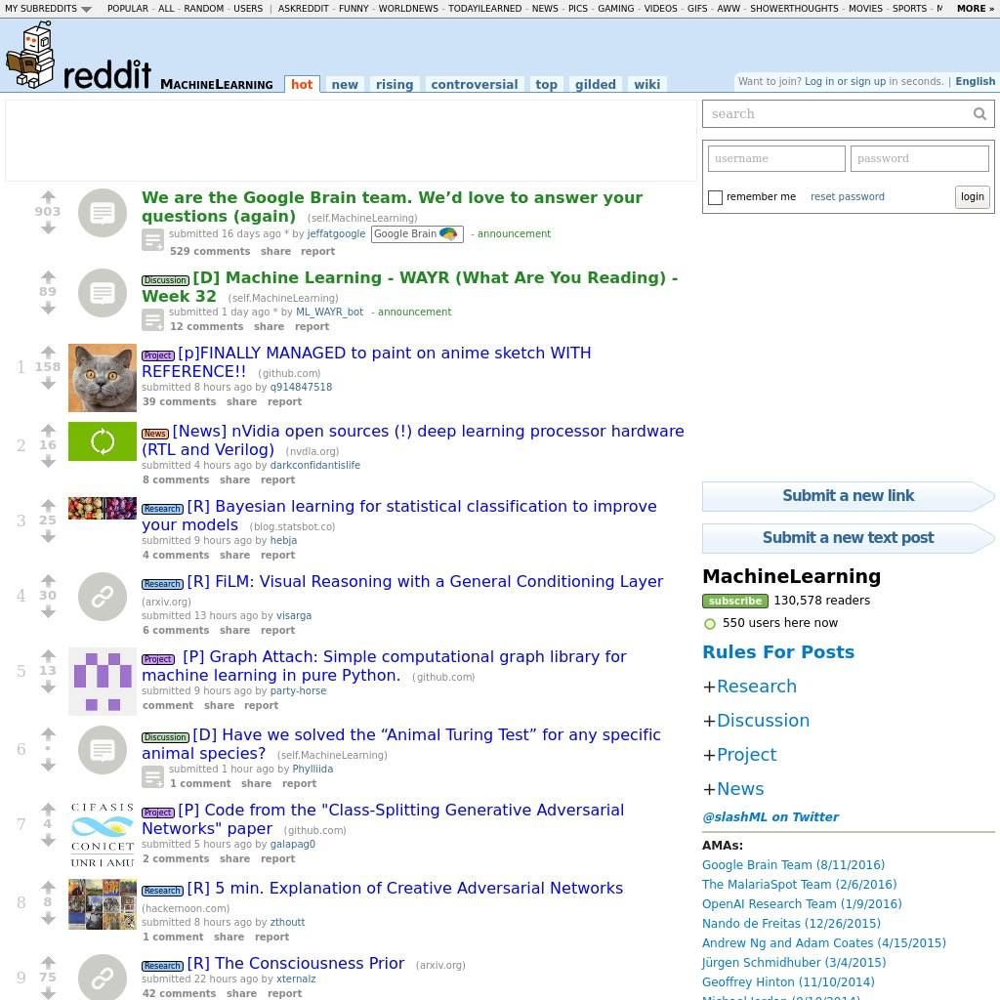
**이미지 캡션:** 이 이미지는 레딧(Reddit) 웹사이트의 머신러닝(Machine Learning) 서브레딧 페이지를 보여줍니다. 페이지 상단에는 레딧 로고와 함께 "hot", "new", "rising", "controversial", "top", "gilded", "wiki"와 같은 탭이 있으며, 검색창과 로그인/가입 폼이 보입니다. 메인 콘텐츠 영역에는 여러 게시물 목록이 표시됩니다. 각 게시물은 제목, 작성자, 제출 시간, 댓글 수, 공유 수 등의 정보를 포함하고 있으며, 일부 게시물은 이미지나 링크를 포함하고 있습니다. 예를 들어, "We are the Google Brain team. We'd love to answer your questions (again)"이라는 제목의 게시물은 구글 브레인 팀이 질문에 답하겠다는 내용이며, 고양이 사진이 포함된 "FINALLY MANAGED to paint on anime sketch WITH REFERENCE!!"라는 게시물도 있습니다. 오른쪽 사이드바에는 "Submit a new link", "Submit a new text post" 버튼과 함께 서브레딧 구독자 수, 현재 접속자 수, 게시물 규칙, 트위터 계정, 그리고 "AMAS" 섹션에 나열된 주요 인물들의 이름과 날짜 정보가 있습니다. 전체적으로 정보가 많고 다양한 주제의 게시물들이 나열되어 있어, 머신러닝 분야의 최신 정보와 토론이 활발하게 이루어지는 커뮤니티의 모습을 보여줍니다.다. 예를 들어, "We are the Google Brain team. We'd love to answer your questions (again)"이라는 제목의 게시물은 구글 브레인 팀이 질문에 답하겠다는 내용이며, 고양이 사진이 포함된 "FINALLY MANAGED to paint on anime sketch WITH REFERENCE!!"라는 게시물도 있습니다. 오른쪽 사이드바에는 "Submit a new link", "Submit a new text post" 버튼과 함께 서브레딧 구독자 수, 현재 접속자 수, 게시물 규칙, 트위터 계정, 그리고 "AMAS" 섹션에 나열된 주요 인물들의 이름과 날짜 정보가 있습니다. 전체적으로 정보가 많고 다양한 주제의 게시물들이 나열되어 있어, 머신러닝 분야의 최신 정보와 토론이 활발하게 이루어지는 커뮤니티의 모습을 보여줍니다.

> #오늘의레딧 https://www.reddit.com/r/MachineLearning/ 래딧은 읽을 거리가 다양합니다.  1. 모델을 개선하기위한 통계적 분류를위한 베이지안 학습 2. FILM : 일반 컨디셔닝 레이어로 시각 추론하기 3. 특정 동물 종에 대한 "동물 튜링 테스트"를 해결 했습니까? 4. "Class-Splitting Generative Adversarial Networks"논문의 코드 5. 5 분. 크리 에이 티브 adversarial 네트워크의 설명 6. 이전의 의식 7. User2Vec? 소비하는 문서를 기반으로 사용자를 나타내는 8. 세미 감독으로 InfoGAN 안내 9. 심화 학습의 작동 방식과 뇌의 네트워크에서 뉴런이 어떻게 작동하는지의 차이점은 무엇입니까? 10. 클러스터링 금융 시간 시리즈 - 리뷰 11. ML 프로젝트에서 파이썬과 R 코드를 조율하는 모범 사례 12. TensorFlow의 ShuffleNet 구현 13. 큰 코드와 자연 스러움을위한 기계 학습 설문 조사 14. 적극적인 학습을위한 똑똑한 선생 15. Fabrik 소개 : 브라우저에서 신경망을 구축, 시각화 및 공동으로 디자인 16. 나무 딸기 파이 3 (이상 속도&gt; 10fps)에서 실시간 개체 감지 및 현지화 옵션 17. Microsoft, 새로운 기계 학습 도구 출시 18. 세 가지 다른 생물학적 근거가있는 신경 모델의 시각화  1. https://blog.statsbot.co/bayesian-learning-for-statistical-classification-f2362d620428 2. https://arxiv.org/abs/1709.07871 3. https://www.reddit.com/r/MachineLearning/comments/72o1p5/d_have_we_solved_the_animal_turing_test_for_any/ 4. https://github.com/CIFASIS/splitting_gan 5. https://hackernoon.com/what-are-creative-adversarial-networks-cans-bb81d09aa235 6. https://arxiv.org/abs/1709.08568 7. https://www.reddit.com/r/MachineLearning/comments/72jypd/d_user2vec_representing_a_user_based_on_the_docs/ 8. https://arxiv.org/abs/1707.04487 9. https://www.reddit.com/r/MachineLearning/comments/72nt5a/d_what_are_some_differences_between_how_deep/ 10. https://arxiv.org/pdf/1703.00485.pdf 11. https://blog.dataversioncontrol.com/best-practices-of-orchestrating-python-and-r-code-in-ml-projects-f28f3a879484 12. https://github.com/MG2033/ShuffleNet 13. https://arxiv.org/abs/1709.06182 14. https://www.reddit.com/r/MachineLearning/comments/72k5jq/d_smart_teacher_for_active_learning/ 15. https://github.com/Cloud-CV/Fabrik 16. https://www.reddit.com/r/MachineLearning/comments/72l1gy/doptions_for_real_time_object_detection_and/ 17. https://techcrunch.com/2017/09/25/microsoft-launches-new-machine-learning-tools/ 18. http://experiments.adversarial.network/biological-neurons

### 9월 28일 (목) 08:52 · 📷 사진 (1장)

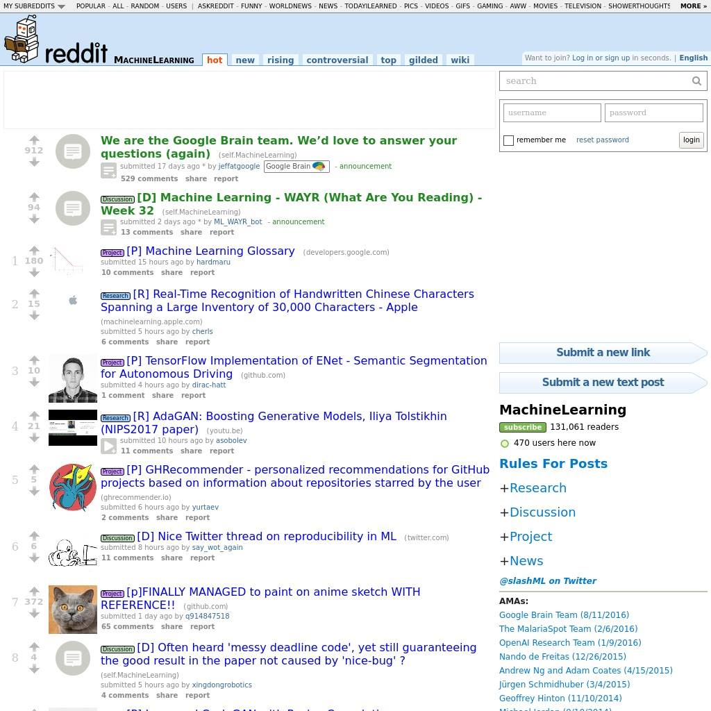
**이미지 캡션:** 이 이미지는 레딧(Reddit) 웹사이트의 머신러닝(Machine Learning) 서브레딧 페이지를 보여줍니다. 페이지 상단에는 레딧 로고와 함께 "hot", "new", "rising", "controversial", "top", "gilded", "wiki"와 같은 메뉴가 있습니다. 오른쪽 상단에는 로그인 또는 회원가입을 할 수 있는 창이 있으며, 검색창도 보입니다. 페이지 중앙에는 여러 게시물 목록이 나열되어 있으며, 각 게시물은 제목, 작성자, 제출 시간, 댓글 수, 공유 수 등의 정보를 포함하고 있습니다. 게시물 제목 앞에는 "Discussion", "Project", "Research"와 같은 태그가 붙어 있습니다. 예를 들어, 첫 번째 게시물은 "We are the Google Brain team. We'd love to answer your questions (again)"이라는 제목으로, 구글 브레인 팀이 질문에 답하겠다는 내용입니다. 다른 게시물들은 머신러닝 관련 논문, 프로젝트, 토론 등 다양한 주제를 다루고 있습니다. 페이지 오른쪽에는 "Machine Learning" 서브레딧의 구독자 수와 현재 접속자 수가 표시되어 있으며, 게시물 규칙과 트위터 계정 정보도 있습니다. 또한, "AMAS" 섹션에는 과거에 진행되었던 AMA(Ask Me Anything) 세션 목록이 날짜와 함께 나열되어 있습니다. 전반적으로 기술 관련 커뮤니티의 정보 공유 및 토론이 이루어지는 웹사이트의 모습을 보여줍니다.습니다. 게시물 제목 앞에는 "Discussion", "Project", "Research"와 같은 태그가 붙어 있습니다. 예를 들어, 첫 번째 게시물은 "We are the Google Brain team. We'd love to answer your questions (again)"이라는 제목으로, 구글 브레인 팀이 질문에 답하겠다는 내용입니다. 다른 게시물들은 머신러닝 관련 논문, 프로젝트, 토론 등 다양한 주제를 다루고 있습니다. 페이지 오른쪽에는 "Machine Learning" 서브레딧의 구독자 수와 현재 접속자 수가 표시되어 있으며, 게시물 규칙과 트위터 계정 정보도 있습니다. 또한, "AMAS" 섹션에는 과거에 진행되었던 AMA(Ask Me Anything) 세션 목록이 날짜와 함께 나열되어 있습니다. 전반적으로 기술 관련 커뮤니티의 정보 공유 및 토론이 이루어지는 웹사이트의 모습을 보여줍니다.

> #오늘의레딧 https://www.reddit.com/r/MachineLearning/ 래딧은 읽을 거리가 다양합니다.  1. 3 만 자의 큰 재고를 지닌 손으로 쓴 중국어 문자의 실시간 인식 - Apple 2. ENOT의 TensorFlow 구현 - 자율 주행을위한 시맨틱 세분화 3. AdaGAN : 생성 모델 강조, Iliya Tolstikhin (NIPS2017 용지) 4. GHRecommender - 사용자가 별표 한 저장소에 대한 정보를 기반으로하는 GitHub 프로젝트에 대한 개인화 된 권장 사항 5. ML의 재현성에 좋은 트위터 스레드 6. 종종 &#39;지저분한 마감 코드&#39;라는 말을 듣지 만 &#39;좋은 버그&#39;로 인한 것이 아니라면 좋은 결과를 보장 할 수 있습니까? 7. Resize-Convolution을 통한 향상된 CycleGAN 8. ML의 데이터 전송 속도는 얼마나 관련이 있습니까? 9. Tensorflow의 비디오 픽셀 네트워크 10. RL로 디버그 : 정책 네트워크는 더 크고 더 큰 무효 동작을 생성하는 경향이 있습니까? 11. 포리 스트 별 AutoEncoder 12. ICLR은 어떤 것입니까? 13. 유럽에서 가장 흥미로운 ML / DL / 데이터 컨퍼런스는 무엇입니까? (학업이 아닌 비즈니스에서의 응용 프로그램에 관해서) 14. nVidia 오픈 소스 (!) 딥 학습 프로세서 하드웨어 (RTL 및 Verilog) 15. 세심한주의를 기울인 이미지 분류 자, 강화 학습 16. 특정 동물 종에 대한 "동물 튜링 테스트"를 해결 했습니까? 17. "Class-Splitting Generative Adversarial Networks"논문의 코드 18. 휴대 전화 용 Muon 트리거 19. 심화 학습의 작동 방식과 뇌의 네트워크에서 뉴런이 어떻게 작동하는지의 차이점은 무엇입니까? 20. FILM : 일반 컨디셔닝 레이어로 시각 추론하기  1. https://machinelearning.apple.com/2017/09/12/handwriting.html 2. https://github.com/fregu856/segmentation 3. https://youtu.be/9VtPt33MKK0 4. https://ghrecommender.io 5. https://twitter.com/nsaphra/status/912973595038683136 6. https://www.reddit.com/r/MachineLearning/comments/72ud9s/d_often_heard_messy_deadline_code_yet_still/ 7. https://github.com/luoxier/CycleGAN_Tensorlayer 8. https://www.reddit.com/r/MachineLearning/comments/72sep4/d_how_relevant_is_data_transfer_speed_in_ml/ 9. https://www.reddit.com/r/MachineLearning/comments/72q6dy/p_video_pixel_networks_in_tensorflow/ 10. https://www.reddit.com/r/MachineLearning/comments/72ts98/d_debug_with_rl_policy_network_tends_to_generate/ 11. https://arxiv.org/abs/1709.09018 12. https://www.reddit.com/r/MachineLearning/comments/72uvnv/d_whats_iclr_like/ 13. https://www.reddit.com/r/MachineLearning/comments/72romz/d_what_are_most_interesting_mldldata_conferences/ 14. http://nvdla.org 15. https://www.reddit.com/r/MachineLearning/comments/72om64/d_image_classifier_with_hard_attention/ 16. https://www.reddit.com/r/MachineLearning/comments/72o1p5/d_have_we_solved_the_animal_turing_test_for_any/ 17. https://github.com/CIFASIS/splitting_gan 18. https://arxiv.org/abs/1709.08605v1 19. https://www.reddit.com/r/MachineLearning/comments/72nt5a/d_what_are_some_differences_between_how_deep/ 20. https://arxiv.org/abs/1709.07871

### 9월 28일 (목) 10:57 · 생일 축하 드립니다. 세상에서 제일 행복한 하루 되세요.

생일 축하 드립니다. 세상에서 제일 행복한 하루 되세요.

### 9월 28일 (목) 10:57 · ↪ 생일 축하 드립니다. 세상에서 제일 행복한 하루 되세요.

*다른 프로필에 남긴 글*

생일 축하 드립니다. 세상에서 제일 행복한 하루 되세요.

### 9월 28일 (목) 10:58 · 생신 축하 드립니다. 아직 일본이시죠?

생신 축하 드립니다. 아직 일본이시죠?

### 9월 28일 (목) 10:58 · ↪ 생신 축하 드립니다. 아직 일본이시죠?

*다른 프로필에 남긴 글*

생신 축하 드립니다. 아직 일본이시죠?

### 9월 29일 (금) 08:52 · 📷 사진 (1장)

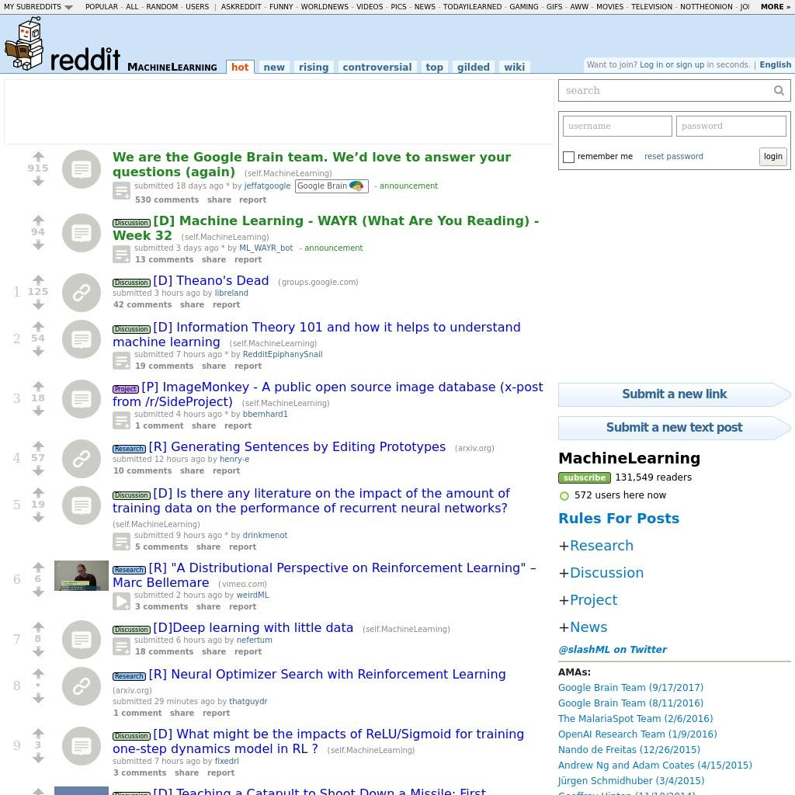
**이미지 캡션:** 이 이미지는 레딧의 머신러닝 서브레딧 페이지를 보여주며, 다양한 게시물 목록과 사이드바 정보를 담고 있습니다. 페이지 상단에는 레딧 로고와 함께 "MACHINE LEARNING"이라는 제목이 보이고, 그 아래로 "hot", "new", "rising", "controversial", "top", "gilded", "wiki"와 같은 카테고리 탭이 나열되어 있습니다. 오른쪽 상단에는 로그인 또는 회원가입을 유도하는 문구와 함께 검색창, 사용자 이름 및 비밀번호 입력란이 있습니다. 메인 콘텐츠 영역에는 여러 개의 게시물이 시간순으로 정렬되어 있으며, 각 게시물은 제목, 작성자, 제출 시간, 댓글 수, 그리고 관련 링크나 이미지 썸네일을 포함하고 있습니다. 예를 들어, 가장 상단에는 "We are the Google Brain team. We'd love to answer your questions (again)"이라는 제목의 게시물이 있으며, 915개의 추천을 받고 530개의 댓글이 달렸습니다. 다른 게시물들은 "Machine Learning - WAYR (What Are You Reading) - Week 32", "Theano's Dead", "Information Theory 101 and how it helps to understand machine learning", "ImageMonkey - A public open source image database", "Generating Sentences by Editing Prototypes", "Is there any literature on the impact of the amount of training data on the performance of recurrent neural networks?", "A Distributional Perspective on Reinforcement Learning", "Deep learning with little data", "Neural Optimizer Search with Reinforcement Learning", 그리고 "What might be the impacts of ReLU/Sigmoid for training one-step dynamics model in RL?" 등의 제목을 가지고 있습니다. 일부 게시물에는 썸네일 이미지나 링크가 포함되어 있으며, 특히 "A Distributional Perspective on Reinforcement Learning" 게시물에는 사람 얼굴이 담긴 썸네일 이미지가 보입니다. 페이지 오른쪽 사이드바에는 "Submit a new link" 및 "Submit a new text post" 버튼이 있고, "MachineLearning" 서브레딧의 구독자 수(131,549명)와 현재 접속자 수(572명)가 표시되어 있습니다. 또한, "Rules For Posts" 섹션 아래에는 "+Research", "+Discussion", "+Project", "+News"와 같은 하위 카테고리가 있으며, "@slashML on Twitter" 링크와 함께 과거 AMA(Ask Me Anything) 세션 참여자 목록이 연대순으로 나열되어 있습니다. 전반적으로 이 페이지는 머신러닝 관련 정보를 공유하고 토론하는 온라인 커뮤니티의 모습을 보여주며, 정보 탐색과 참여를 위한 다양한 기능을 제공하고 있습니다. 게시물이 시간순으로 정렬되어 있으며, 각 게시물은 제목, 작성자, 제출 시간, 댓글 수, 그리고 관련 링크나 이미지 썸네일을 포함하고 있습니다. 예를 들어, 가장 상단에는 "We are the Google Brain team. We'd love to answer your questions (again)"이라는 제목의 게시물이 있으며, 915개의 추천을 받고 530개의 댓글이 달렸습니다. 다른 게시물들은 "Machine Learning - WAYR (What Are You Reading) - Week 32", "Theano's Dead", "Information Theory 101 and how it helps to understand machine learning", "ImageMonkey - A public open source image database", "Generating Sentences by Editing Prototypes", "Is there any literature on the impact of the amount of training data on the performance of recurrent neural networks?", "A Distributional Perspective on Reinforcement Learning", "Deep learning with little data", "Neural Optimizer Search with Reinforcement Learning", 그리고 "What might be the impacts of ReLU/Sigmoid for training one-step dynamics model in RL?" 등의 제목을 가지고 있습니다. 일부 게시물에는 썸네일 이미지나 링크가 포함되어 있으며, 특히 "A Distributional Perspective on Reinforcement Learning" 게시물에는 사람 얼굴이 담긴 썸네일 이미지가 보입니다. 페이지 오른쪽 사이드바에는 "Submit a new link" 및 "Submit a new text post" 버튼이 있고, "MachineLearning" 서브레딧의 구독자 수(131,549명)와 현재 접속자 수(572명)가 표시되어 있습니다. 또한, "Rules For Posts" 섹션 아래에는 "+Research", "+Discussion", "+Project", "+News"와 같은 하위 카테고리가 있으며, "@slashML on Twitter" 링크와 함께 과거 AMA(Ask Me Anything) 세션 참여자 목록이 연대순으로 나열되어 있습니다. 전반적으로 이 페이지는 머신러닝 관련 정보를 공유하고 토론하는 온라인 커뮤니티의 모습을 보여주며, 정보 탐색과 참여를 위한 다양한 기능을 제공하고 있습니다.

> #오늘의레딧 https://www.reddit.com/r/MachineLearning/ 오늘도 새소식이 많군요.  1. 정보 이론 101 및 기계 학습을 이해하는 방법 2. ImageMonkey - 공개 오픈 소스 이미지 데이터베이스 (x-post : https://www.reddit.com/r/SideProject) 3. 프로토 타입 편집으로 문장 생성 4. 재발 성 신경망의 수행에 훈련 데이터의 양이 미치는 영향에 관한 문헌이 있습니까? 5. "강화 학습에 대한 배포 관점"- Marc Bellemare 6. 적은 데이터로 깊은 학습 7. 강화 학습을 통한 신경 최적화 도구 검색 8. RL에서 one-step dynamics 모델을 훈련하기위한 ReLU / Sigmoid의 영향은 무엇입니까? 9. 투석기를 가르치고 미사일을 쏴라 : 유니티의 강화 학습 SDK를 사용한 첫인상 10. 만약 당신이 기계 학습을 위해 그들과 면담을했다면 어떤 기술을 후보자에게 보이고 싶습니까? 11. TF-Slim 대 TF-Keras 대 DeepMind Sonnet 연구 목적으로 사용 하시겠습니까? 12. 3 만 자의 큰 재고를 지닌 손으로 쓴 중국어 문자의 실시간 인식 - Apple 13. 시간차 : KnightCap 체스 엔진의 TD-Leaf 알고리즘의 불일치? 14. 포인터 네트워크의 적절한 구현? 15. facebook / google / apple은 사람들의 이미지를 다른 정체성으로 어떻게 만드나요? 16. 프로그래머블 에이전트의 Tensorflow 구현 17. TensorForce로 강화 학습 (PPO)을 구현하는 간단하고 기본적인 Python 스크립트? 18. 기계 학습 용어 19. ENOT의 TensorFlow 구현 - 자율 주행을위한 시맨틱 세분화 20. 오픈 소스 수면 단계 분류 자 ​​- 파이썬  1. https://www.reddit.com/r/MachineLearning/comments/7312ow/d_information_theory_101_and_how_it_helps_to/ 2. https://www.reddit.com/r/MachineLearning/comments/731zwb/p_imagemonkey_a_public_open_source_image_database/ 3. https://arxiv.org/abs/1709.08878 4. https://www.reddit.com/r/MachineLearning/comments/730icq/d_is_there_any_literature_on_the_impact_of_the/ 5. https://vimeo.com/235922311 6. https://www.reddit.com/r/MachineLearning/comments/731lgk/ddeep_learning_with_little_data/ 7. https://arxiv.org/abs/1709.07417 8. https://www.reddit.com/r/MachineLearning/comments/7310nw/d_what_might_be_the_impacts_of_relusigmoid_for/ 9. http://adamashwal.com/catapult 10. https://www.reddit.com/r/MachineLearning/comments/733thd/d_what_skills_would_you_like_to_see_in_a/ 11. https://www.reddit.com/r/MachineLearning/comments/732nrt/d_tfslim_vs_tfkeras_vs_deepmind_sonnet_for/ 12. https://machinelearning.apple.com/2017/09/12/handwriting.html 13. https://www.reddit.com/r/MachineLearning/comments/732bin/d_temporal_difference_inconsistency_in_tdleaf/ 14. https://www.reddit.com/r/MachineLearning/comments/730xjh/d_decent_implementation_of_pointer_network/ 15. https://www.reddit.com/r/MachineLearning/comments/730owz/d_how_does_facebookgoogleapple_do_cluster_images/ 16. https://github.com/jaesik817/programmable-agents_tensorflow 17. https://www.reddit.com/r/MachineLearning/comments/7304ml/d_simple_and_basic_python_script_implementing/ 18. https://developers.google.com/machine-learning/glossary/ 19. https://github.com/fregu856/segmentation 20. https://github.com/skjerns/AutoSleepScorer

### 9월 30일 (토) 08:52 · 📷 사진 (1장)

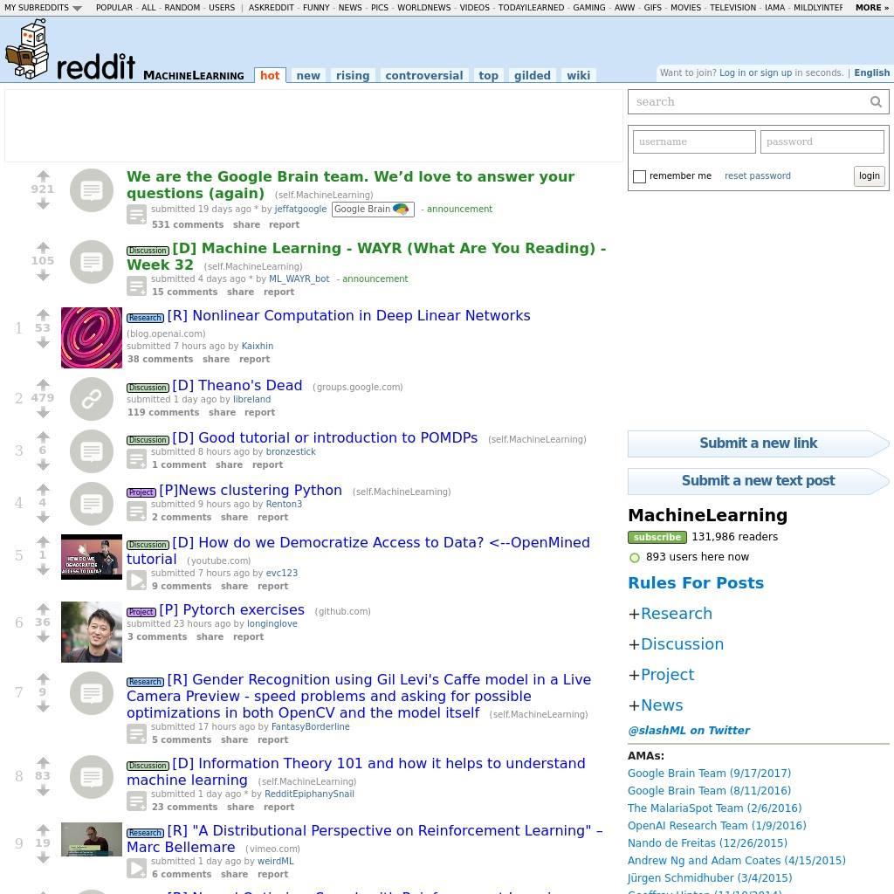
**이미지 캡션:** 이것은 레딧의 머신러닝 서브레딧 페이지로, 다양한 게시물 목록과 관련 정보를 보여줍니다. 페이지 상단에는 레딧 로고와 함께 "MACHINE LEARNING"이라는 제목이 보이며, 그 옆에는 "hot", "new", "rising", "controversial", "top", "gilded", "wiki"와 같은 탭이 있습니다. 오른쪽 상단에는 로그인 또는 가입을 위한 입력란과 버튼이 있습니다. 메인 콘텐츠 영역에는 여러 게시물이 나열되어 있으며, 각 게시물은 제목, 작성자, 제출 시간, 댓글 수, 그리고 관련 링크나 설명을 포함합니다. 예를 들어, "We are the Google Brain team. We'd love to answer your questions (again)"이라는 제목의 게시물은 921개의 추천을 받았으며, "Discussion [D] Machine Learning - WAYR (What Are You Reading) - Week 32"라는 게시물은 105개의 추천을 받았습니다. 게시물 목록 아래에는 "Submit a new link"와 "Submit a new text post" 버튼이 있습니다. 페이지 오른쪽에는 "MachineLearning" 서브레딧의 구독자 수와 현재 접속자 수가 표시되어 있으며, "Rules For Posts" 섹션에는 "+Research", "+Discussion", "+Project", "+News"와 같은 하위 섹션이 있습니다. 또한, "@slashML on Twitter" 링크와 과거 AMAs(Ask Me Anything) 목록도 보입니다. 전반적으로 이 페이지는 머신러닝 커뮤니티의 최신 정보와 토론을 공유하는 온라인 포럼의 모습을 보여줍니다. 링크나 설명을 포함합니다. 예를 들어, "We are the Google Brain team. We'd love to answer your questions (again)"이라는 제목의 게시물은 921개의 추천을 받았으며, "Discussion [D] Machine Learning - WAYR (What Are You Reading) - Week 32"라는 게시물은 105개의 추천을 받았습니다. 게시물 목록 아래에는 "Submit a new link"와 "Submit a new text post" 버튼이 있습니다. 페이지 오른쪽에는 "MachineLearning" 서브레딧의 구독자 수와 현재 접속자 수가 표시되어 있으며, "Rules For Posts" 섹션에는 "+Research", "+Discussion", "+Project", "+News"와 같은 하위 섹션이 있습니다. 또한, "@slashML on Twitter" 링크와 과거 AMAs(Ask Me Anything) 목록도 보입니다. 전반적으로 이 페이지는 머신러닝 커뮤니티의 최신 정보와 토론을 공유하는 온라인 포럼의 모습을 보여줍니다.

> #오늘의레딧 https://www.reddit.com/r/MachineLearning/ 오늘도 새소식이 많군요.  1. 테아 노의 죽은 자 2. 좋은 입문서 또는 POMDP 소개 3. 뉴스 클러스터링 Python 4. 어떻게 우리는 데이터에 대한 접근을 민주화합니까? &lt;- OpenMined 튜토리얼 5. 피터 치 연습 6. 라이브 카메라 미리보기에서 Gil Levi의 Caffe 모델을 사용한 성인지 - OpenCV와 모델 자체에서 가능한 빠른 속도로 문제를 찾고 최적화 할 수 있는지 묻습니다. 7. 정보 이론 101 및 기계 학습을 이해하는 방법 8. "강화 학습에 대한 배포 관점"- Marc Bellemare 9. 강화 학습을 통한 신경 최적화 도구 검색 10. ImageMonkey - 공개 오픈 소스 이미지 데이터베이스 (x-post : https://www.reddit.com/r/SideProject) 11. 실시간 인공 지능은 더 이상 신화가 아닙니다. 12. 프로토 타입 편집으로 문장 생성 13. 재발 성 신경망의 수행에 훈련 데이터의 양이 미치는 영향에 관한 문헌이 있습니까? 14. 만약 당신이 기계 학습을 위해 그들과 면담을했다면 어떤 기술을 후보자에게 보이고 싶습니까? 15. 600 개의 이미지와 40/20 에포크로 훈련 된 네트워크를 통한 종이 출판? 또는 뭔가... 16. 중간 난이도 ML 프로젝트를 찾고 있습니다 ... 17. 적은 데이터로 깊은 학습 18. 투석기를 가르치고 미사일을 쏴라 : 유니티의 강화 학습 SDK를 사용한 첫인상 19. RL에서 one-step dynamics 모델을 훈련하기위한 ReLU / Sigmoid의 영향은 무엇입니까? 20. 3 만 자의 큰 재고를 지닌 손으로 쓴 중국어 문자의 실시간 인식 - Apple  1. https://groups.google.com/forum/#!topic/theano-users/7Poq8BZutbY 2. https://www.reddit.com/r/MachineLearning/comments/738jtp/d_good_tutorial_or_introduction_to_pomdps/ 3. https://www.reddit.com/r/MachineLearning/comments/7382tx/pnews_clustering_python/ 4. https://www.youtube.com/watch?v=HAC6sqq7_-U 5. https://github.com/Kyubyong/pytorch_exercises 6. https://www.reddit.com/r/MachineLearning/comments/73645t/r_gender_recognition_using_gil_levis_caffe_model/ 7. https://www.reddit.com/r/MachineLearning/comments/7312ow/d_information_theory_101_and_how_it_helps_to/ 8. https://vimeo.com/235922311 9. https://arxiv.org/abs/1709.07417 10. https://www.reddit.com/r/MachineLearning/comments/731zwb/p_imagemonkey_a_public_open_source_image_database/ 11. https://medium.com/@DineshVadhia/realtime-ai-is-no-longer-a-myth-9d43dc55342f 12. https://arxiv.org/abs/1709.08878 13. https://www.reddit.com/r/MachineLearning/comments/730icq/d_is_there_any_literature_on_the_impact_of_the/ 14. https://www.reddit.com/r/MachineLearning/comments/733thd/d_what_skills_would_you_like_to_see_in_a/ 15. http://papers.cumincad.org/data/works/att/ecaade2017_009.pdf 16. https://www.reddit.com/r/MachineLearning/comments/735oex/dlooking_for_a_medium_difficulty_ml_project/ 17. https://www.reddit.com/r/MachineLearning/comments/731lgk/ddeep_learning_with_little_data/ 18. http://adamashwal.com/catapult 19. https://www.reddit.com/r/MachineLearning/comments/7310nw/d_what_might_be_the_impacts_of_relusigmoid_for/ 20. https://machinelearning.apple.com/2017/09/12/handwriting.html
