# 2017년 10월

[← 2017년](README.md)

### 10월 1일 (일) 08:52 · 📷 사진 (1장)

> #오늘의레딧 https://www.reddit.com/r/MachineLearning/ 래딧은 읽을 거리가 다양합니다.  1. 사이버네틱스 : 연구원 및 회사 2. PTB perplexity의 감소는 zilch를 의미합니까? 3. polymath 프로젝트와 같은 &#39;아이디어 은행&#39;웹 사이트를 갖는 것이 유용할까요? 사람들은 아이디어를 게시하고 온라인으로 프로젝트 / 논문을 공동 작업 할 수 있습니다. 4. 데이터 과학 워크 플로 5. 시끄러운 레이블 및 레이블 다듬기 6. 공간 / 지리 데이터에 CNN 적용 7. 딥 선형 네트워크의 비선형 계산 8. Sequence to Sequence Tensorflow 자습서 (번역) 9. 테아 노의 죽은 자 10. 좋은 입문서 또는 POMDP 소개 11. 뉴스 클러스터링 Python 12. 피터 치 연습 13. 라이브 카메라 미리보기에서 Gil Levi의 Caffe 모델을 사용한 성인지 - OpenCV와 모델 자체에서 가능한 빠른 속도로 문제를 찾고 최적화 할 수 있는지 묻습니다. 14. 정보 이론 101 및 기계 학습을 이해하는 방법 15. 어떻게 우리는 데이터에 대한 접근을 민주화합니까? &lt;- OpenMined 튜토리얼 16. "강화 학습에 대한 배포 관점"- Marc Bellemare 17. 강화 학습을 통한 신경 최적화 도구 검색 18. ImageMonkey - 공개 오픈 소스 이미지 데이터베이스 (x-post : https://www.reddit.com/r/SideProject) 19. 중간 난이도 ML 프로젝트를 찾고 있습니다 ... 20. 만약 당신이 기계 학습을 위해 그들과 면담을했다면 어떤 기술을 후보자에게 보이고 싶습니까?  1. https://www.reddit.com/r/MachineLearning/comments/73gw36/d_cybernetics_researchers_and_companys/ 2. https://www.reddit.com/r/MachineLearning/comments/73hvio/d_the_decrease_in_ptb_perplexity_means_zilch/ 3. https://www.reddit.com/r/MachineLearning/comments/73ej3r/d_will_it_be_useful_to_have_an_idea_bank_website/ 4. https://medium.com/@shanif/our-data-science-workflow-b974f30a124d 5. https://github.com/Kyubyong/label_smoothing 6. https://www.reddit.com/r/MachineLearning/comments/73g8lh/d_applying_cnns_to_spatialgeographic_data/ 7. https://blog.openai.com/nonlinear-computation-in-linear-networks/ 8. https://github.com/sachinruk/deepschool.io/blob/master/Lesson%2019%20-%20Seq2Seq%20-%20Date%20translator%20-%20Solutions.ipynb 9. https://groups.google.com/forum/#!topic/theano-users/7Poq8BZutbY 10. https://www.reddit.com/r/MachineLearning/comments/738jtp/d_good_tutorial_or_introduction_to_pomdps/ 11. https://www.reddit.com/r/MachineLearning/comments/7382tx/pnews_clustering_python/ 12. https://github.com/Kyubyong/pytorch_exercises 13. https://www.reddit.com/r/MachineLearning/comments/73645t/r_gender_recognition_using_gil_levis_caffe_model/ 14. https://www.reddit.com/r/MachineLearning/comments/7312ow/d_information_theory_101_and_how_it_helps_to/ 15. https://www.youtube.com/watch?v=HAC6sqq7_-U 16. https://vimeo.com/235922311 17. https://arxiv.org/abs/1709.07417 18. https://www.reddit.com/r/MachineLearning/comments/731zwb/p_imagemonkey_a_public_open_source_image_database/ 19. https://www.reddit.com/r/MachineLearning/comments/735oex/dlooking_for_a_medium_difficulty_ml_project/ 20. https://www.reddit.com/r/MachineLearning/comments/733thd/d_what_skills_would_you_like_to_see_in_a/

### 10월 2일 (월) 08:52 · 📷 사진 (1장)

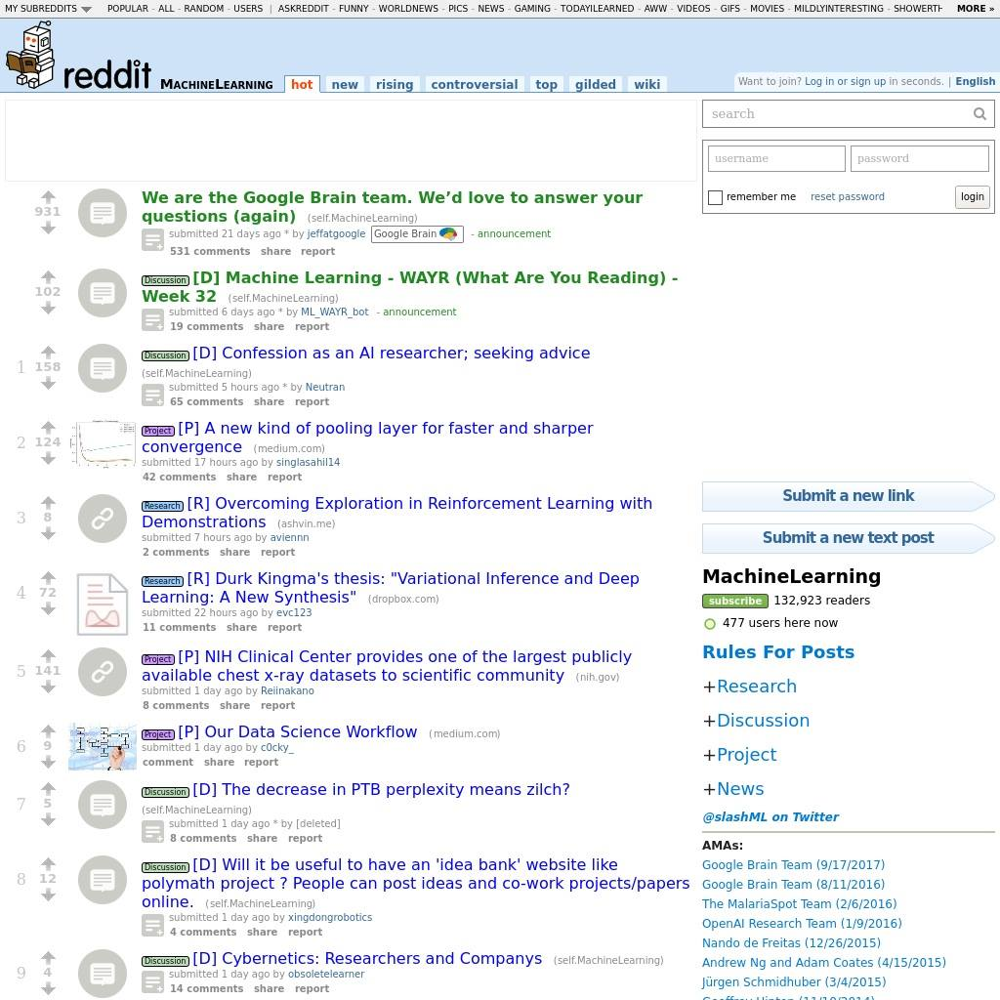

> #오늘의레딧 https://www.reddit.com/r/MachineLearning/ 아침부터 다양한 소식이 많네요.  1. 더 빠르고 선명한 수렴을위한 새로운 종류의 풀링 레이어 2. 데모 강화 학습 학습 탐구 극복 3. Durk Kingma의 논문 : "변이 추론과 깊은 학습 : 새로운 합성" 4. NIH Clinical Center는 공개적으로 이용 가능한 가장 큰 가슴 엑스레이 데이터 세트 중 하나를 과학계에 제공합니다 5. 데이터 과학 워크 플로 6. PTB perplexity의 감소는 zilch를 의미합니까? 7. polymath 프로젝트와 같은 &#39;아이디어 은행&#39;웹 사이트를 갖는 것이 유용할까요? 사람들은 아이디어를 게시하고 온라인으로 프로젝트 / 논문을 공동 작업 할 수 있습니다. 8. 사이버네틱스 : 연구원 및 회사 9. 시끄러운 레이블 및 레이블 다듬기 10. 공간 / 지리 데이터에 CNN 적용 11. 성격 분석을위한 좋은 출처? 12. Sequence to Sequence Tensorflow 자습서 (번역) 13. 딥 선형 네트워크의 비선형 계산 14. 테아 노의 죽은 자 15. 좋은 입문서 또는 POMDP 소개 16. 뉴스 클러스터링 Python 17. 피터 치 연습 18. 라이브 카메라 미리보기에서 Gil Levi의 Caffe 모델을 사용한 성인지 - OpenCV와 모델 자체에서 가능한 빠른 속도로 문제를 찾고 최적화 할 수 있는지 묻습니다. 19. 정보 이론 101 및 기계 학습을 이해하는 방법 20. 어떻게 우리는 데이터에 대한 접근을 민주화합니까? &lt;- OpenMined 튜토리얼  1. https://medium.com/@singlasahil14/a-new-kind-of-pooling-layer-for-faster-and-sharper-convergence-1043c756a221 2. http://ashvin.me/demoddpg-website/ 3. https://www.dropbox.com/s/v6ua3d9yt44vgb3/cover_and_thesis.pdf?dl=0 4. https://www.nih.gov/news-events/news-releases/nih-clinical-center-provides-one-largest-publicly-available-chest-x-ray-datasets-scientific-community 5. https://medium.com/@shanif/our-data-science-workflow-b974f30a124d 6. https://www.reddit.com/r/MachineLearning/comments/73hvio/d_the_decrease_in_ptb_perplexity_means_zilch/ 7. https://www.reddit.com/r/MachineLearning/comments/73ej3r/d_will_it_be_useful_to_have_an_idea_bank_website/ 8. https://www.reddit.com/r/MachineLearning/comments/73gw36/d_cybernetics_researchers_and_companys/ 9. https://github.com/Kyubyong/label_smoothing 10. https://www.reddit.com/r/MachineLearning/comments/73g8lh/d_applying_cnns_to_spatialgeographic_data/ 11. https://www.reddit.com/r/MachineLearning/comments/73iyqz/d_good_sources_for_personality_analysis/ 12. https://github.com/sachinruk/deepschool.io/blob/master/Lesson%2019%20-%20Seq2Seq%20-%20Date%20translator%20-%20Solutions.ipynb 13. https://blog.openai.com/nonlinear-computation-in-linear-networks/ 14. https://groups.google.com/forum/#!topic/theano-users/7Poq8BZutbY 15. https://www.reddit.com/r/MachineLearning/comments/738jtp/d_good_tutorial_or_introduction_to_pomdps/ 16. https://www.reddit.com/r/MachineLearning/comments/7382tx/pnews_clustering_python/ 17. https://github.com/Kyubyong/pytorch_exercises 18. https://www.reddit.com/r/MachineLearning/comments/73645t/r_gender_recognition_using_gil_levis_caffe_model/ 19. https://www.reddit.com/r/MachineLearning/comments/7312ow/d_information_theory_101_and_how_it_helps_to/ 20. https://www.youtube.com/watch?v=HAC6sqq7_-U

### 10월 3일 (화) 08:52 · 📷 사진 (1장)

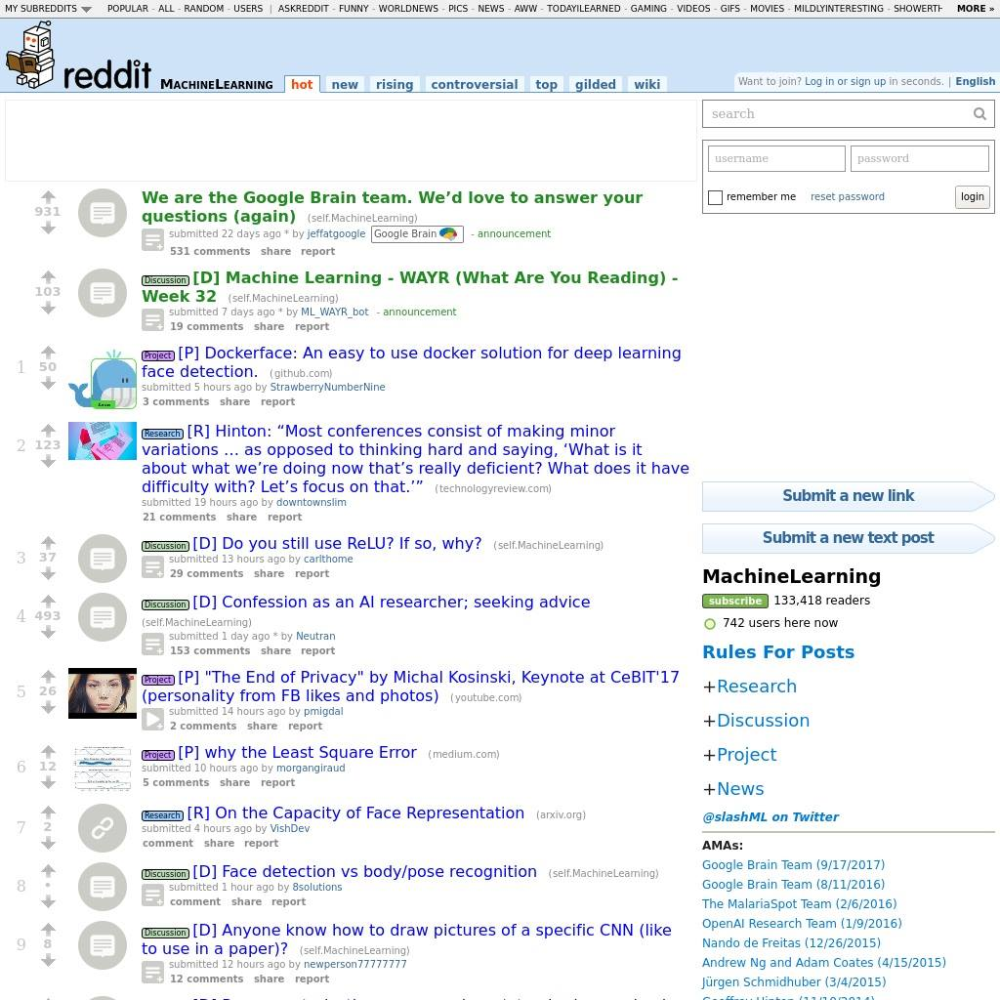

> #오늘의레딧 https://www.reddit.com/r/MachineLearning/ 재미난 이야기들이 많습니다  1. Hinton : "대부분의 회의는 사소한 변형을 만드는 것으로 구성되어 있습니다 ... 열심히 말하고 &#39;우리가 지금하고있는 일이 정말로 부족한가? 그것은 무엇으로 어려움을 겪고 있습니까? 그것에 집중하겠습니다. &#39; " 2. 아직도 ReLU를 사용하고 있습니까? 그렇다면 왜? 3. 인공 지능 연구원으로서의 고백; 조언 구하기 4. CeBIT&#39;17에서 기조 연설을 한 Michal Kosinski의 "개인 정보 보호의 끝"(FB 좋아하는 사진과 사진의 성격) 5. 최소 제곱 오차 6. 얼굴 표현 능력 7. 얼굴 검출 대 몸 / 자세 인식 8. 누구든지 특정 CNN의 그림을 그리는 법을 알고 있습니다 (종이로 사용하는 것과 같은)? 9. Reparameterization : mean + sigma * 표준 정규 잡음, 잡음은 N (0, 1) 또는 N (0, I), 즉 모든 차원 또는 개별 차원에 대한 각 잡음? 10. R의 의사 결정 트리를 사용하는 2x 이미지 해상도 11. Google AI Residency 2018 발표 12. char-rnn은 ​​Tensorflow 1.3 버전으로 구현됩니다. 더 높은 API (Estimator, Experiment, Dataset) 13. 건물 옵션 재개 14. 미국 ML에서 박사 학위 신청에 관한 질문 15. 인터뷰를하기 위해 고생하고 있습니다. 누군가 내 이력서를 볼 수 있습니까? 16. 신속한 NN 구현, 교훈 17. Sklearn과 함께 블로그에 대한 유사한 게시물을 계산하는 중 18. 더 빠르고 선명한 수렴을위한 새로운 종류의 풀링 레이어 19. 재귀 순차 계산 그래프를 역행시키는 법? 20. 데모 강화 학습 학습 탐구 극복  1. https://www.technologyreview.com/s/608911/is-ai-riding-a-one-trick-pony/ 2. https://www.reddit.com/r/MachineLearning/comments/73rtd7/d_do_you_still_use_relu_if_so_why/ 3. https://www.reddit.com/r/MachineLearning/comments/73n9pm/d_confession_as_an_ai_researcher_seeking_advice/ 4. https://www.youtube.com/watch?v=DYhAM34Hhzc 5. https://medium.com/@morgangiraud/ml-notes-why-the-least-square-error-bf27fdd9a721 6. https://arxiv.org/abs/1709.10433 7. https://www.reddit.com/r/MachineLearning/comments/73wcfm/d_face_detection_vs_bodypose_recognition/ 8. https://www.reddit.com/r/MachineLearning/comments/73s0rd/d_anyone_know_how_to_draw_pictures_of_a_specific/ 9. https://www.reddit.com/r/MachineLearning/comments/73sa8k/d_reparameterization_mean_sigmastandard_normal/ 10. https://github.com/Adamishere/2xImageResolution 11. https://research.google.com/teams/brain/residency/ 12. https://github.com/DongjunLee/char-rnn-tensorflow 13. https://www.reddit.com/r/MachineLearning/comments/73vexo/d_resume_building_options/ 14. https://www.reddit.com/r/MachineLearning/comments/73sovg/d_questions_about_applying_for_a_phd_in_ml_in_the/ 15. https://www.reddit.com/r/MachineLearning/comments/73thjg/d_struggling_to_even_get_interviews_can_someone/ 16. https://www.tooploox.com/blog/deep-neural-networks-in-swift-lessons-learned 17. https://github.com/elbaulp/hugo_similar_posts/ 18. https://medium.com/@singlasahil14/a-new-kind-of-pooling-layer-for-faster-and-sharper-convergence-1043c756a221 19. https://www.reddit.com/r/MachineLearning/comments/73ppr8/d_how_to_backprop_this_recursive_sequential/ 20. http://ashvin.me/demoddpg-website/

### 10월 4일 (수) 08:52 · 📷 사진 (2장)

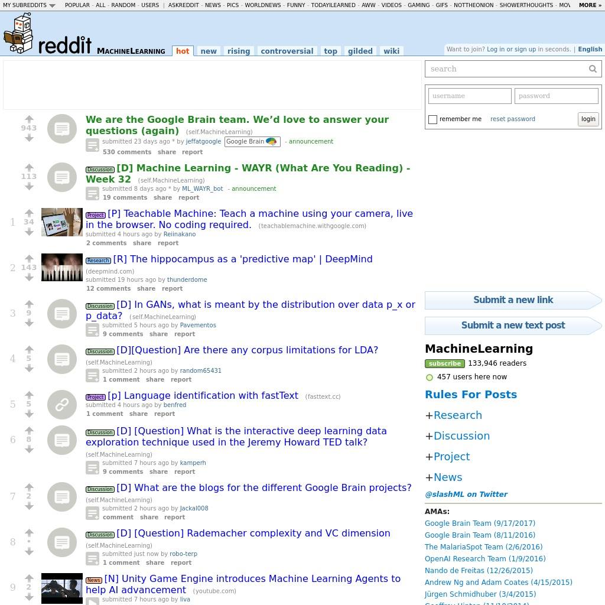 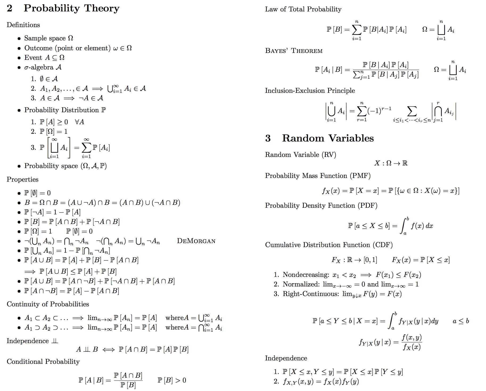

> #오늘의레딧 https://www.reddit.com/r/MachineLearning/ 오늘도 새소식이 많군요.  1. 해마는 &#39;예측지도&#39;| 딥 마인드 2. GAN에서 데이터 p_x 또는 p_data에 대한 분배는 무엇을 의미합니까? 3. 다른 Google Brain 프로젝트의 블로그는 무엇입니까? 4. Unity Game Engine, 인공 지능 향상을위한 기계 학습 에이전트 소개 5. Dockerface : 심도있는 학습 얼굴 탐지를위한 사용하기 쉬운 도커 솔루션. 6. 히스토그램에 대한 교육을받은 사람이 있습니까? 7. 진단 chatbots에 대한 SOTA? 8. Google AI Residency 2018 발표 9. Tianqi Chen, 컴퓨터 과학 박사 과정 학생, MLconf 시애틀 2017에서 워싱턴 대학 10. R의 의사 결정 트리를 사용하는 2x 이미지 해상도 11. 깊은 학습을 통한 게놈 조상 추론 12. Hinton : "대부분의 회의는 사소한 변형을 만드는 것으로 구성되어 있습니다 ... 열심히 말하고 &#39;우리가 지금하고있는 일이 정말로 부족한가? 그것은 무엇으로 어려움을 겪고 있습니까? 그것에 집중하겠습니다. &#39; " 13. 아직도 ReLU를 사용하고 있습니까? 그렇다면 왜? 14. 얼굴 표현 능력 15. 완전 컨볼 루션 신경망을 이용한 시맨틱 분할 16. CeBIT&#39;17에서 기조 연설을 한 Michal Kosinski의 "개인 정보 보호의 끝"(FB 좋아하는 사진과 사진의 성격) 17. 얼굴 검출 대 몸 / 자세 인식 18. 인공 지능 연구원으로서의 고백; 조언 구하기 19. 건물 옵션 재개  1. https://deepmind.com/blog/hippocampus-predictive-map/ 2. https://www.reddit.com/r/MachineLearning/comments/742h4w/d_in_gans_what_is_meant_by_the_distribution_over/ 3. https://www.reddit.com/r/MachineLearning/comments/743flp/d_what_are_the_blogs_for_the_different_google/ 4. https://www.youtube.com/watch?v=tmoz3ojbTn0 5. https://github.com/natanielruiz/dockerface 6. https://www.reddit.com/r/MachineLearning/comments/73yuk4/d_has_anyone_trained_on_histograms/ 7. https://www.reddit.com/r/MachineLearning/comments/73yy07/d_sota_for_diagnostic_chatbots/ 8. https://research.google.com/teams/brain/residency/ 9. https://youtu.be/XBQzhjiaqhA 10. https://github.com/Adamishere/2xImageResolution 11. https://cloud.google.com/blog/big-data/2017/09/genomic-ancestry-inference-with-deep-learning 12. https://www.technologyreview.com/s/608911/is-ai-riding-a-one-trick-pony/ 13. https://www.reddit.com/r/MachineLearning/comments/73rtd7/d_do_you_still_use_relu_if_so_why/ 14. https://arxiv.org/abs/1709.10433 15. https://github.com/upul/Semantic_Segmentation 16. https://www.youtube.com/watch?v=DYhAM34Hhzc 17. https://www.reddit.com/r/MachineLearning/comments/73wcfm/d_face_detection_vs_bodypose_recognition/ 18. https://www.reddit.com/r/MachineLearning/comments/73n9pm/d_confession_as_an_ai_researcher_seeking_advice/ 19. https://www.reddit.com/r/MachineLearning/comments/73vexo/d_resume_building_options/
> 우리가 알고 싶어 하는 확률통계를 31장의 슬라이드로 쿡 해버립니다. AKA 쿡북!   Kwang-Sung Jun님의 제보로 새로운 URL 알려 드립니다. 감사합니다.   https://github.com/mavam/stat-cookbook/releases/download/0.2.4/stat-cookbook.pdf (http://statistics.zone/)  그림도 있고 꼼꼼이 잘 정리되어 있습니다.

### 10월 4일 (수) 09:25 · Wish you and your family a happy Mid-Aut…

Wish you and your family a happy Mid-Autumn Festival!
즐거운 추석 한가위 보내세요!
祝你和你的家人中秋快乐!

🎬 동영상 1개 (생략)

### 10월 5일 (목) 08:44 · 📷 사진 (3장)

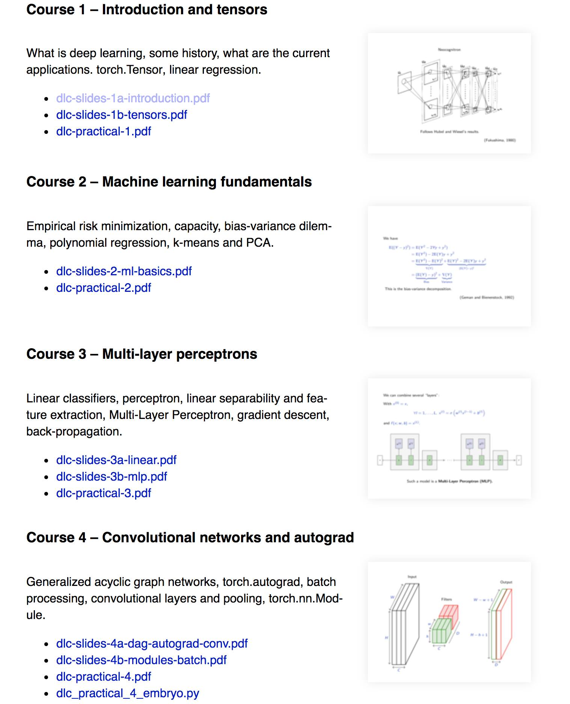 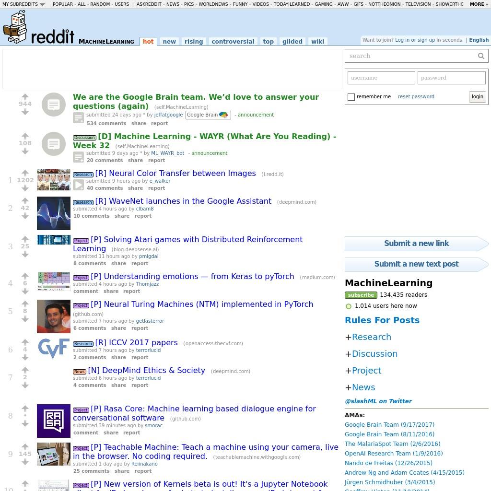 

> 유럽의 최강 EPFL도 딥러닝 강의 자료를 공개했습니다. 슬라이드는 유럽풍으로 조금 딱딱하다 할수 있지만, 수업에서 예시로 보여주는 코드는 PyTorch로 되어 있어 공부하기 좋습니다.   https://fleuret.org/dlc/  (정말 공부할 좋은 자료는 차고도 넘칩니다.)
> #오늘의레딧 https://www.reddit.com/r/MachineLearning/ 오늘도 새소식이 많군요.  1. WaveNet이 Google 길잡이에서 실행됩니다. 2. 분산 강화 학습을 사용하여 Atari 게임을 해결합니다. 3. 감정 이해 - Keras에서 pyTorch에 이르기까지 4. PyTorch에서 구현 된 신경 튜링 기계 (NTM) 5. ICCV 2017 논문 6. DeepMind 윤리 및 사회 7. Rasa Core : 대화식 소프트웨어를위한 기계 학습 기반 대화 엔진 8. 가르 칠 수있는 컴퓨터 : 카메라를 사용하여 브라우저에있는 컴퓨터를 가르칩니다. 코딩은 필요하지 않습니다. 9. 커널 베타의 새로운 버전이 출시되었습니다! iPad 용 Jupyter Notebook 클라이언트입니다. iPad에 베타 버전으로 등록하십시오. (x-post from https://www.reddit.com/r/IPython) 10. 단일 클래스 문제에 대한 전역 평균 풀링 11. 웹 서비스 예측 QOS - 기계 학습 기반 솔루션에 적합한 후보입니까? 12. RL의 성능은 피드 포워드 NN의 아키텍처에 민감합니까? 13. MSR-VTT (MSR Video to Text)의 웹 사이트는 어떻게됩니까? 14. tensorflow를위한 keras와 같은 교육 유틸리티가 있습니까? 15. 핀볼 16. 정부 양식의 필기 인식 17. GAN에서 데이터 p_x 또는 p_data에 대한 분배는 무엇을 의미합니까? 18. 해마는 &#39;예측지도&#39;| 딥 마인드 19. Unity Game Engine, 인공 지능 향상을위한 기계 학습 에이전트 소개 20. NLP를 사용하여 부정적인 모델 또는 긍정적 인 모델로 트위터에 주석을 붙일 수 있습니까?  1. https://deepmind.com/blog/wavenet-launches-google-assistant/ 2. https://blog.deepsense.ai/solving-atari-games-with-distributed-reinforcement-learning/ 3. https://medium.com/huggingface/understanding-emotions-from-keras-to-pytorch-3ccb61d5a983 4. https://github.com/loudinthecloud/pytorch-ntm 5. http://openaccess.thecvf.com/ICCV2017.py 6. https://deepmind.com/applied/deepmind-ethics-society/ 7. https://github.com/RasaHQ/rasa_core 8. https://teachablemachine.withgoogle.com/ 9. https://kernels.io/kernels-v-1-0-4-beta/ 10. https://www.reddit.com/r/MachineLearning/comments/749bvm/d_global_average_pooling_for_a_single_class/ 11. https://www.reddit.com/r/MachineLearning/comments/74aabq/d_prediction_of_web_service_qos_good_candidate/ 12. https://www.reddit.com/r/MachineLearning/comments/748l34/d_is_the_performance_of_rl_sensitive_to/ 13. https://www.reddit.com/r/MachineLearning/comments/7497ot/d_what_happen_to_website_of_msrvtt_msr_video_to/ 14. https://www.reddit.com/r/MachineLearning/comments/746r5a/d_are_there_keraslike_training_utilities_for/ 15. https://www.reddit.com/r/MachineLearning/comments/744lb8/p_pinball/ 16. https://www.reddit.com/r/MachineLearning/comments/745wiu/d_recognizing_handwriting_on_government_forms/ 17. https://www.reddit.com/r/MachineLearning/comments/742h4w/d_in_gans_what_is_meant_by_the_distribution_over/ 18. https://deepmind.com/blog/hippocampus-predictive-map/ 19. https://www.youtube.com/watch?v=tmoz3ojbTn0 20. https://www.reddit.com/r/MachineLearning/comments/747gtm/d_can_i_train_a_model_with_nlp_to_label_twitter/
> PyTorchZeroToAll 시작합니다. 이번학기 홍콩과기대 학부 스터디 그룹에서 사용할 슬라이드와 간단 코드 예제 (3~4일 코스) 계획 중입니다. (*반응*이 좋으면 동영상으로 제작예정.)  코드: https://github.com/hunkim/PyTorchZeroToAll 슬라이드: bit.ly/PyTorchZeroAll  우리 그룹 멤버들은 이미 이전에 다 알고 계시는 내용인데요. Linear 모델로 기본적인 넷트웍, loss, backprop, gradient descent를 설명하고 이후에는 그냥 component 만 추가하고 loss만 바꾸면 동작할수 있는 일반적인 모델을 만들수 있는 백그라운드를 제공하는 것이 목적입니다.  이 글을 올린 이유는 여러분들의 도움을 받기 위한 것입니다. 슬라이드 보시고 커멘트 주시면 정말 감사. 그리고 저도 PyTorch는 이번주부터 공부 시작해서 어색한 부분이 많을듯 합니다. 많은 도움 부탁드립니다.   cf., http://bit.ly/TF_HKUST (TF 유사 강좌)도 병행해서 진행중이니 학생들이 TF와 PyTorch를 어떻게 사용하는지 살펴볼수 있을듯 합니다.

### 10월 6일 (금) 08:52 · 📷 사진 (1장)

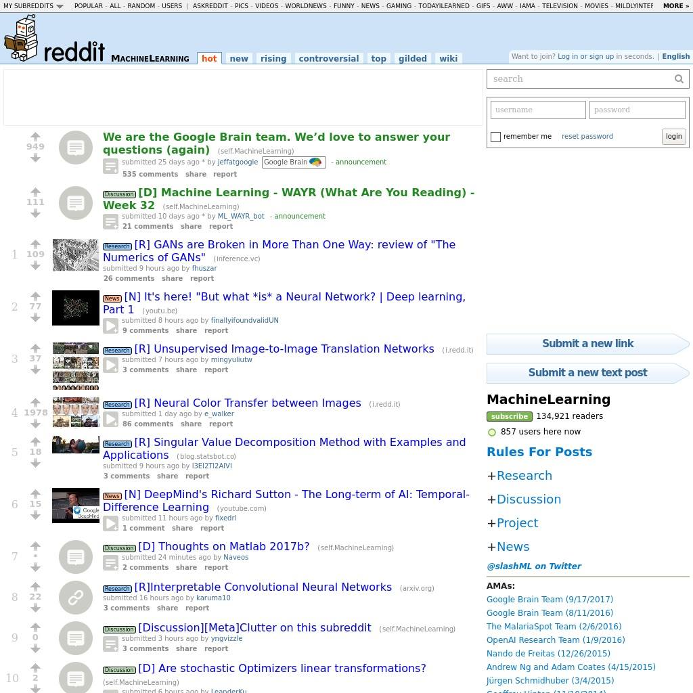

> #오늘의레딧 https://www.reddit.com/r/MachineLearning/ 래딧은 읽을 거리가 다양합니다.  1. 여기 있어요! "하지만 신경망은 무엇입니까?"- 심화 학습, 1 부 2. 감독되지 않은 이미지 - 이미지 번역 네트워크 3. 이미지 간 신경 전달 4. 예제 및 응용 프로그램을 사용한 단일 값 분해 방법 5. DeepMind의 Richard Sutton - AI의 장기 : 시간차 학습 6. Matlab 2017b에 대한 생각? 7. 해석 가능한 컨볼 루션 뉴럴 네트워크 8. 확률 적 최적화 기가 선형 변환입니까? 9. 좋은 컨퍼런스 목록과 마감일? 10. WaveNet이 Google 길잡이에서 실행됩니다. 11. 왜 batchnorm은 매개 변수를 가지고 있습니까? 12. 이 입문서와 함께 작은 벡터 튜토리얼을 통해 단어 벡터화에 대해 배웁니다. 13. MLP 또는 RBF로 정책을 매개 변수화하기위한 영향 / 차이점은 무엇입니까? 14. 데이터 과학과 소프트웨어 엔지니어링 사이에서 어떻게 GAP을 채우고 있습니까? 15. GPU 또는 CPU 용 Tensorflow를 설치해야합니까? 16. 정밀도 및 회상 : 개요 17. 지형 공간 데이터 신경망 18. Rasa Core : 대화식 소프트웨어를위한 기계 학습 기반 대화 엔진 19. 감정 이해 - Keras에서 pyTorch에 이르기까지 20. PyTorch에서 구현 된 신경 튜링 기계 (NTM)  1. https://youtu.be/aircAruvnKk 2. https://www.reddit.com/r/MachineLearning/comments/74h0y7/r_unsupervised_imagetoimage_translation_networks/ 3. https://www.reddit.com/r/MachineLearning/comments/748cco/r_neural_color_transfer_between_images/ 4. https://blog.statsbot.co/singular-value-decomposition-tutorial-52c695315254 5. https://www.youtube.com/watch?v=EeMCEQa85tw 6. https://www.reddit.com/r/MachineLearning/comments/74jsz4/d_thoughts_on_matlab_2017b/ 7. https://arxiv.org/abs/1710.00935 8. https://www.reddit.com/r/MachineLearning/comments/74h900/d_are_stochastic_optimizers_linear_transformations/ 9. https://www.reddit.com/r/MachineLearning/comments/74feia/d_a_good_list_of_conferences_and_their_deadlines/ 10. https://deepmind.com/blog/wavenet-launches-google-assistant/ 11. https://www.reddit.com/r/MachineLearning/comments/74hyi9/r_why_does_batchnorm_have_any_parameters_at_all/ 12. http://www.theodo.fr/blog/2017/09/day-words-became-vectors/ 13. https://www.reddit.com/r/MachineLearning/comments/74h8rf/d_any_impactdifference_to_parameterize_the_policy/ 14. https://www.reddit.com/r/MachineLearning/comments/74hr6x/d_how_filling_the_gaps_between_data_science_and/ 15. https://www.reddit.com/r/MachineLearning/comments/74fkrr/d_should_i_install_tensorflow_for_gpu_or_cpu/ 16. https://bbabenko.github.io/prs/ 17. https://www.reddit.com/r/MachineLearning/comments/74eb1h/d_geospatial_data_neural_networks/ 18. https://github.com/RasaHQ/rasa_core 19. https://medium.com/huggingface/understanding-emotions-from-keras-to-pytorch-3ccb61d5a983 20. https://github.com/loudinthecloud/pytorch-ntm

### 10월 7일 (토) 08:52 · 📷 사진 (1장)

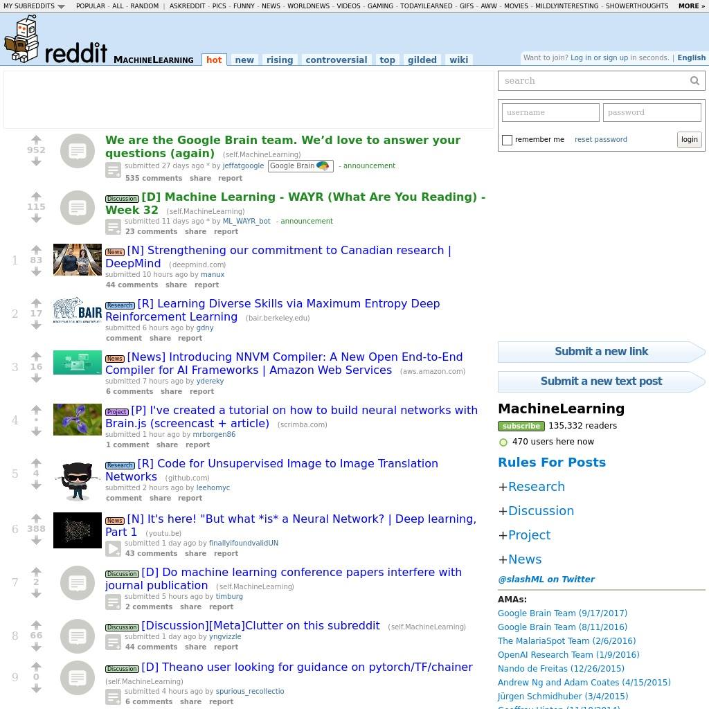

> #오늘의레딧 https://www.reddit.com/r/MachineLearning/ 오늘도 새소식이 많군요.  1. 최대 엔트로피 깊이 강화 학습을 통한 다양한 기술 학습 2. NNVM 컴파일러 소개 : AI 프레임 워크 용 새로운 개방형 엔드 - 투 - 엔드 컴파일러 | Amazon Web Services 3. Brain.js (스크린 캐스트 + 기사)로 신경 네트워크를 만드는 방법에 대한 자습서를 만들었습니다. 4. 이미지 번역 네트워크에 대한 감독되지 않은 이미지 코드 5. 여기 있어요! "하지만 신경망은 무엇입니까?"- 심화 학습, 1 부 6. 기계 학습 회의 논문이 저널 간행물을 방해합니까? 7. Theano 사용자가 pytorch / TF / chainer에 대한 지침을 찾고 있습니다. 8. GAN은 하나 이상의 길에서 파산되었습니다 : "GAN의 수치" 9. 시각적 질문 응답 알고리즘 분석 10. 감독되지 않은 이미지 - 이미지 번역 네트워크 11. 뇌파 병리 현상의 해독 및 시각화를위한 컨벌루션 신경망을 이용한 심층 학습 12. Theano 사용자를 위해 Chainer를 사용하는 방법 13. 성능 RNN이있는 브라우저의 실시간 음악 생성 14. CNN의 각 레이어에 대해 가중치를 생성하는 RNN을 만드는 방법은 무엇입니까? 15. DeepMind의 Richard Sutton - AI의 장기 : 시간차 학습 16. 이미지 간 신경 전달 17. 예제 및 응용 프로그램을 사용한 단일 값 분해 방법 18. 해석 가능한 컨볼 루션 뉴럴 네트워크 19. Facebook 동영상 반응 데이터의 논문 / 응용 프로그램 찾기 20. 좋은 컨퍼런스 목록과 마감일?  1. http://bair.berkeley.edu/blog/2017/10/06/soft-q-learning/ 2. https://aws.amazon.com/blogs/ai/introducing-nnvm-compiler-a-new-open-end-to-end-compiler-for-ai-frameworks/ 3. https://scrimba.com/c/c36zkcb 4. https://github.com/leehomyc/Img2Img-Translation-Networks 5. https://youtu.be/aircAruvnKk 6. https://www.reddit.com/r/MachineLearning/comments/74pc79/d_do_machine_learning_conference_papers_interfere/ 7. https://www.reddit.com/r/MachineLearning/comments/74pmzr/d_theano_user_looking_for_guidance_on/ 8. http://www.inference.vc/my-notes-on-the-numerics-of-gans/ 9. http://www.kushalkafle.com/projects/tdiuc.html 10. https://www.reddit.com/r/MachineLearning/comments/74h0y7/r_unsupervised_imagetoimage_translation_networks/ 11. https://arxiv.org/abs/1708.08012 12. https://chainer.org/general/2017/10/06/chainer-for-theano-users.html 13. https://magenta.tensorflow.org/performance-rnn-browser 14. https://www.reddit.com/r/MachineLearning/comments/74mc8g/d_how_to_make_a_rnn_to_generate_weights_for_each/ 15. https://www.youtube.com/watch?v=EeMCEQa85tw 16. https://www.reddit.com/r/MachineLearning/comments/748cco/r_neural_color_transfer_between_images/ 17. https://blog.statsbot.co/singular-value-decomposition-tutorial-52c695315254 18. https://arxiv.org/abs/1710.00935 19. https://www.reddit.com/r/MachineLearning/comments/74ka9n/d_looking_for_papersapplications_of_facebook/ 20. https://www.reddit.com/r/MachineLearning/comments/74feia/d_a_good_list_of_conferences_and_their_deadlines/

### 10월 8일 (일) 08:52 · 📷 사진 (6장)

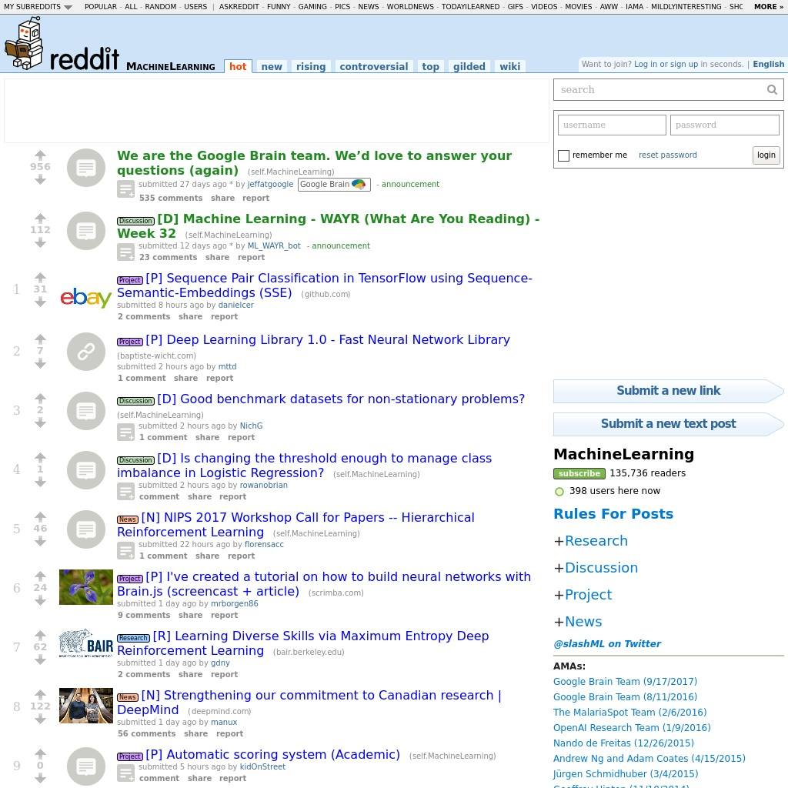 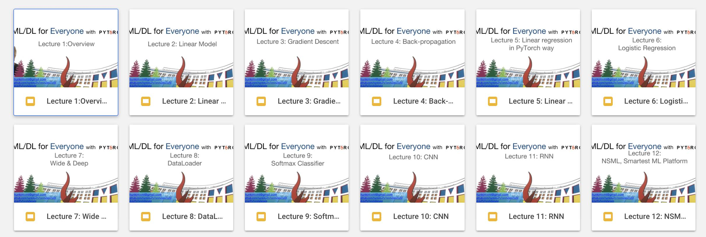 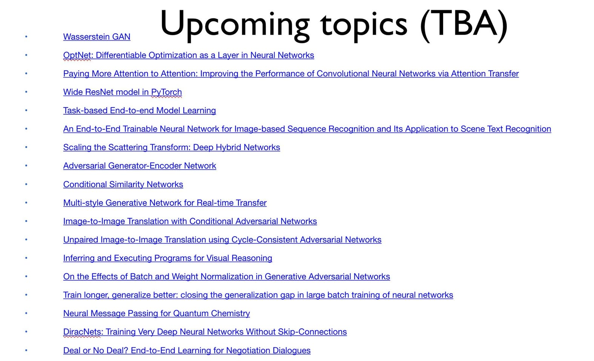 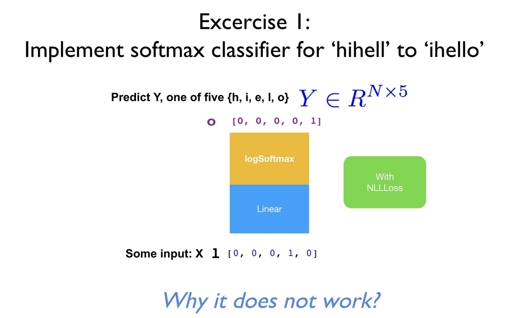 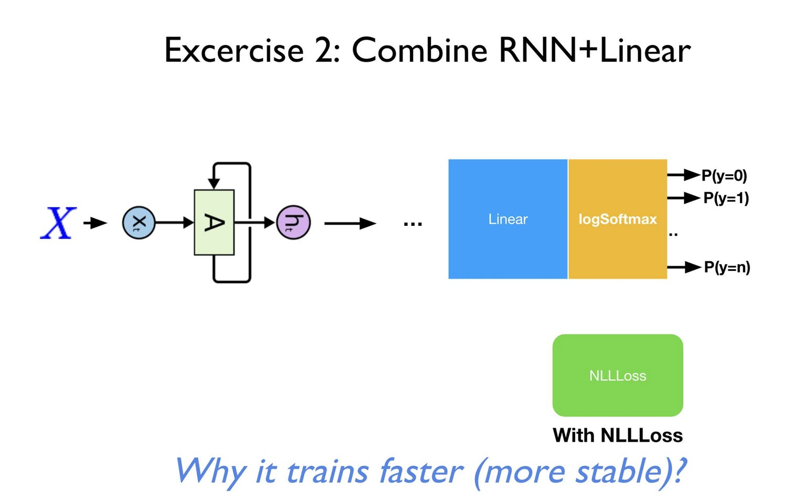 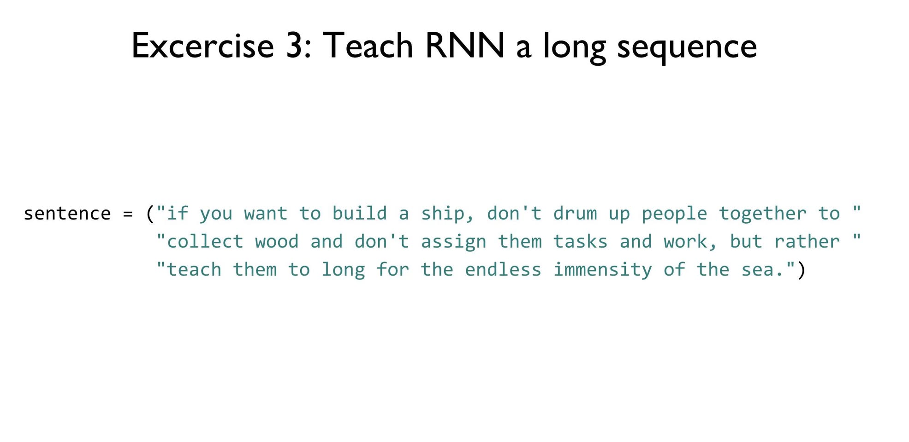

> #오늘의레딧 https://www.reddit.com/r/MachineLearning/ 재미난 이야기들이 많습니다  1. 깊은 학습 라이브러리 1.0 - 빠른 신경 네트워크 라이브러리 2. 비 고정 문제에 대한 좋은 벤치 마크 데이터 세트? 3. 로지스틱 회귀 분석에서 클래스 불균형을 관리하기에 충분한 임계 값을 변경하고 있습니까? 4. NIPS 2017 워크숍 논문 요청 - 계층 적 강화 학습 5. Brain.js (스크린 캐스트 + 기사)로 신경 네트워크를 만드는 방법에 대한 자습서를 만들었습니다. 6. 최대 엔트로피 깊이 강화 학습을 통한 다양한 기술 학습 7. 캐나다 연구에 대한 우리의 헌신 강화 | 딥 마인드 8. 자동 채점 시스템 (아카데믹) 9. NNVM 컴파일러 소개 : AI 프레임 워크 용 새로운 개방형 엔드 - 투 - 엔드 컴파일러 | Amazon Web Services 10. 시각적 질문 응답 알고리즘 분석 11. 여기 있어요! "하지만 신경망은 무엇입니까?"- 심화 학습, 1 부 12. 이미지 번역 네트워크에 대한 감독되지 않은 이미지 코드 13. 뇌파 병리 현상의 해독 및 시각화를위한 컨벌루션 신경망을 이용한 심층 학습 14. Theano 사용자가 pytorch / TF / chainer에 대한 지침을 찾고 있습니다. 15. GAN은 하나 이상의 길에서 파산되었습니다 : "GAN의 수치" 16. 기계 학습 회의 논문이 저널 간행물을 방해합니까? 17. 감독되지 않은 이미지 - 이미지 번역 네트워크 18. 처음 학습을 시작했을 때. 너를 붙잡고있는 것 같은 기분이 들었어? 19. 성능 RNN이있는 브라우저의 실시간 음악 생성 20. Theano 사용자를 위해 Chainer를 사용하는 방법  1. https://baptiste-wicht.com/posts/2017/10/deep-learning-library-10-fast-neural-network-library.html 2. https://www.reddit.com/r/MachineLearning/comments/74xefc/d_good_benchmark_datasets_for_nonstationary/ 3. https://www.reddit.com/r/MachineLearning/comments/74xjf8/d_is_changing_the_threshold_enough_to_manage/ 4. https://www.reddit.com/r/MachineLearning/comments/74rs8a/n_nips_2017_workshop_call_for_papers_hierarchical/ 5. https://scrimba.com/c/c36zkcb 6. http://bair.berkeley.edu/blog/2017/10/06/soft-q-learning/ 7. https://deepmind.com/blog/strengthening-our-commitment-canadian-research/ 8. https://www.reddit.com/r/MachineLearning/comments/74wb5o/p_automatic_scoring_system_academic/ 9. https://aws.amazon.com/blogs/ai/introducing-nnvm-compiler-a-new-open-end-to-end-compiler-for-ai-frameworks/ 10. http://www.kushalkafle.com/projects/tdiuc.html 11. https://youtu.be/aircAruvnKk 12. https://github.com/leehomyc/Img2Img-Translation-Networks 13. https://arxiv.org/abs/1708.08012 14. https://www.reddit.com/r/MachineLearning/comments/74pmzr/d_theano_user_looking_for_guidance_on/ 15. http://www.inference.vc/my-notes-on-the-numerics-of-gans/ 16. https://www.reddit.com/r/MachineLearning/comments/74pc79/d_do_machine_learning_conference_papers_interfere/ 17. https://www.reddit.com/r/MachineLearning/comments/74h0y7/r_unsupervised_imagetoimage_translation_networks/ 18. https://medium.com/@cdossman/becoming-a-machine-learning-engineer-step-1-adjusting-your-mind-set-57469a169c31 19. https://magenta.tensorflow.org/performance-rnn-browser 20. https://chainer.org/general/2017/10/06/chainer-for-theano-users.html
> 기본적인 딥러닝 (PyTorch편) 슬라이드 10강까지 update되었습니다. (11강 RNN, 12강 NSML TBA.) 커멘트와 질문을 쉽게 올리실수 있도록 구글 드라이브에 모두 올려두었습니다.  http://bit.ly/PyTorchZeroAll     #모두를위한딥러닝 수업과 겹치는 내용도 많지만 보다 간략하게, 그리고 다른 방식으로 개념을 설명하는 경우도 있습니다. CNN같은 경우 Toy Inception 모델을 구현해보기도 합니다.  PyTorch의 장점중 하나가 DataLoader인데 정말 쉽게 나만의 DataLoader를 10줄 이내로 구현 가능합니다. (8강 참조)  TF도 최근 DataLoader부분을 업데이트 했던데 서로 비교해보시면 좋을듯 합니다.  보시다가 어색한것이나 질문 있으시면 바로 커멘트로 직접 달아 주시면 됩니다. 이름을 남겨주시면 슬라이드  credit에 넣도록 하겠습니다. 감사합니다.

### 10월 9일 (월) 08:52 · 📷 사진 (4장)

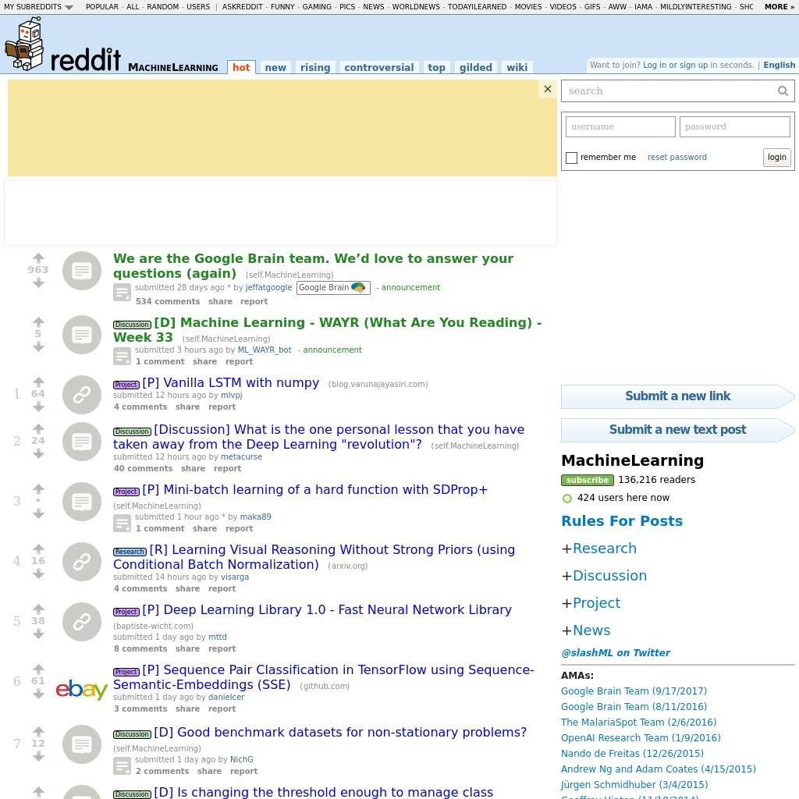 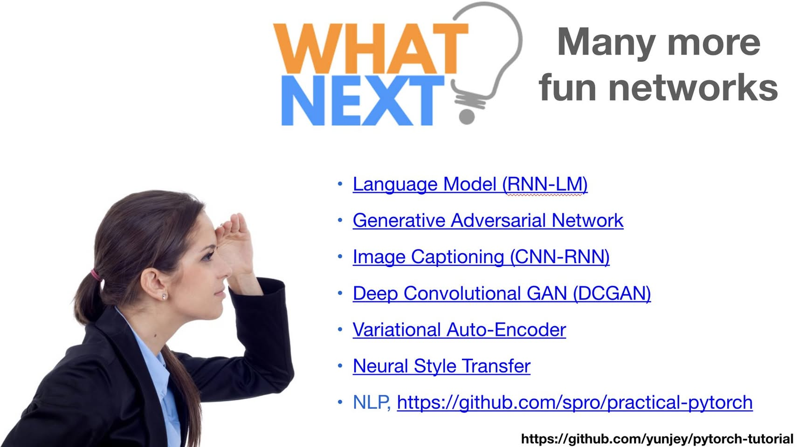 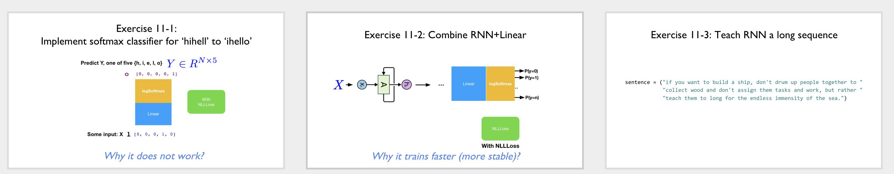 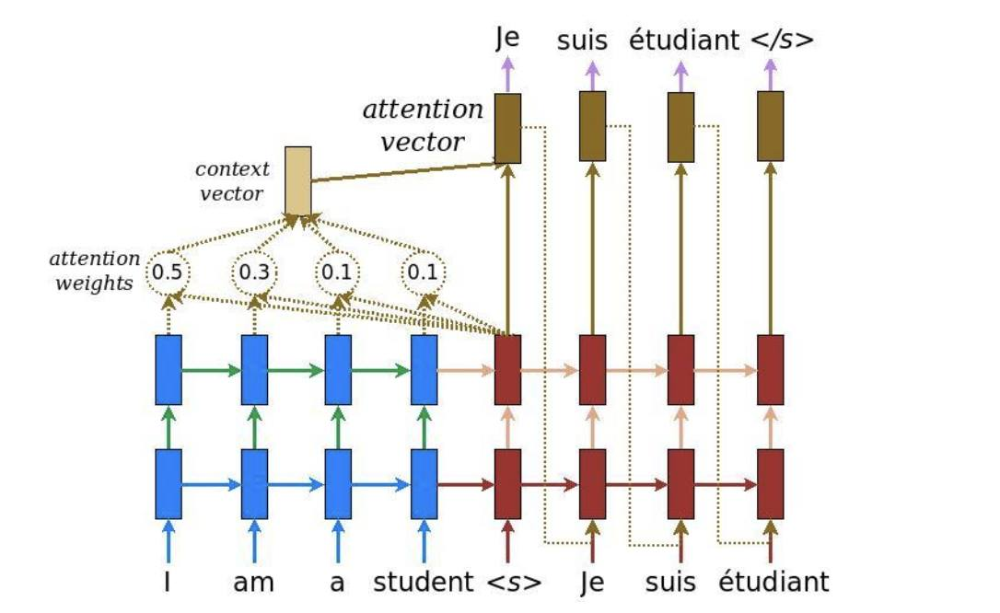

> #오늘의레딧 https://www.reddit.com/r/MachineLearning/ 재미난 이야기들이 많습니다  1. 깊은 학습 "혁명"에서 벗어난 개인 교훈은 무엇입니까? 2. SDProp +로 하드 기능의 미니 배치 학습 3. 강력한 조건없이 비주얼 추론하기 (조건부 일괄 정규화 사용) 4. 깊은 학습 라이브러리 1.0 - 빠른 신경 네트워크 라이브러리 5. Sequence-Semantic-Embeddings (SSE)를 사용한 TensorFlow의 시퀀스 쌍 분류 6. 비 고정 문제에 대한 좋은 벤치 마크 데이터 세트? 7. 로지스틱 회귀 분석에서 클래스 불균형을 관리하기에 충분한 임계 값을 변경하고 있습니까? 8. NIPS 2017 워크숍 논문 요청 - 계층 적 강화 학습 9. Brain.js (스크린 캐스트 + 기사)로 신경 네트워크를 만드는 방법에 대한 자습서를 만들었습니다. 10. 최대 엔트로피 깊이 강화 학습을 통한 다양한 기술 학습 11. 캐나다 연구에 대한 우리의 헌신 강화 | 딥 마인드 12. NNVM 컴파일러 소개 : AI 프레임 워크 용 새로운 개방형 엔드 - 투 - 엔드 컴파일러 | Amazon Web Services 13. 자동 채점 시스템 (아카데믹) 14. 시각적 질문 응답 알고리즘 분석 15. 여기 있어요! "하지만 신경망은 무엇입니까?"- 심화 학습, 1 부 16. 이미지 번역 네트워크에 대한 감독되지 않은 이미지 코드 17. 뇌파 병리 현상의 해독 및 시각화를위한 컨벌루션 신경망을 이용한 심층 학습 18. Theano 사용자가 pytorch / TF / chainer에 대한 지침을 찾고 있습니다. 19. GAN은 하나 이상의 길에서 파산되었습니다 : "GAN의 수치" 20. 기계 학습 회의 논문이 저널 간행물을 방해합니까?  1. https://www.reddit.com/r/MachineLearning/comments/75185r/discussion_what_is_the_one_personal_lesson_that/ 2. https://www.reddit.com/r/MachineLearning/comments/754tl1/p_minibatch_learning_of_a_hard_function_with/ 3. https://arxiv.org/abs/1707.03017 4. https://baptiste-wicht.com/posts/2017/10/deep-learning-library-10-fast-neural-network-library.html 5. https://github.com/eBay/Sequence-Semantic-Embedding 6. https://www.reddit.com/r/MachineLearning/comments/74xefc/d_good_benchmark_datasets_for_nonstationary/ 7. https://www.reddit.com/r/MachineLearning/comments/74xjf8/d_is_changing_the_threshold_enough_to_manage/ 8. https://www.reddit.com/r/MachineLearning/comments/74rs8a/n_nips_2017_workshop_call_for_papers_hierarchical/ 9. https://scrimba.com/c/c36zkcb 10. http://bair.berkeley.edu/blog/2017/10/06/soft-q-learning/ 11. https://deepmind.com/blog/strengthening-our-commitment-canadian-research/ 12. https://aws.amazon.com/blogs/ai/introducing-nnvm-compiler-a-new-open-end-to-end-compiler-for-ai-frameworks/ 13. https://www.reddit.com/r/MachineLearning/comments/74wb5o/p_automatic_scoring_system_academic/ 14. http://www.kushalkafle.com/projects/tdiuc.html 15. https://youtu.be/aircAruvnKk 16. https://github.com/leehomyc/Img2Img-Translation-Networks 17. https://arxiv.org/abs/1708.08012 18. https://www.reddit.com/r/MachineLearning/comments/74pmzr/d_theano_user_looking_for_guidance_on/ 19. http://www.inference.vc/my-notes-on-the-numerics-of-gans/ 20. https://www.reddit.com/r/MachineLearning/comments/74pc79/d_do_machine_learning_conference_papers_interfere/
> Good RNN exercise problems? I almost finished slides for lecture tomorrow. bit.ly/PyTorchZeroAll.  The last topic is RNN, and I added some exercises. Do you know some more fun and challenging (yet simple) ones? Thanks in advance.
> TF에 있었던 seq2seq 튜토리얼을 찾아 보니 github로 옮겨져 있네요.   멋진 그림과 설명, 역시 TF입니다! https://github.com/tensorflow/nmt

### 10월 10일 (화) 08:52 · 📷 사진 (1장)

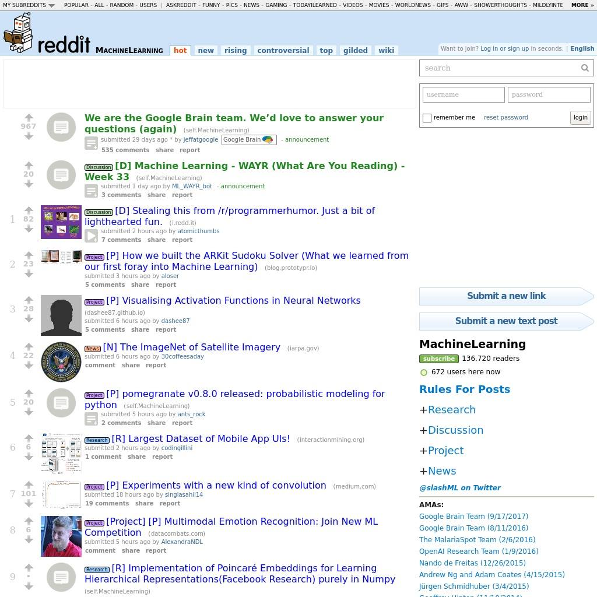

> #오늘의레딧 https://www.reddit.com/r/MachineLearning/ 아침부터 다양한 소식이 많네요.  1. 우리가 ARKit Sudoku Solver를 어떻게 만들었습니까? (우리가 기계 학습에 처음 진출했을 때 배웠던 것) 2. 신경망에서 활성화 함수 시각화 3. 위성 이미지의 이미지 넷 4. 석류 v0.8.0 발표 : 파이썬에 대한 확률 론적 모델링 5. 모바일 앱 UI의 가장 큰 데이터 세트! 6. 새로운 종류의 회선을 사용한 실험 7. 순전히 Numpy에서 계층 적 표현 (Facebook 연구)을 배우기위한 Poincaré Embedding의 구현 8. Caffe2 &amp; ONNX를 사용하여 AWS Lambda에서 PyTorch 모델 제공 9. Tensorflow sucks 10. Keras로 깊은 학습 - YouTube 재생 목록 11. 인간 의사의 끝 (제 8 부) - 의료 AI에 대한 몇 가지 과제를 강조하는 두 개의 논문을 탐구해라. 12. 나는 기계 학습의 기본을 다루는 35 MC 질문 퀴즈를 만들었습니다 :) 13. 언어 모델링을위한 표준화 된 센터 손실 14. Cardiotoxicity 예측 : 몇 가지 서류에서 메모 15. 협력 적 독자 행동에 기반한 뉴스 추천 엔진 16. 무지개 : 심층 강화 학습의 개선 된 결합 17. 확장 된 재순환 신경망 18. 바닐라 LSTM with numpy 19. 지속적인 제어 정책을 위해 샘플링이 중요한 이유는 무엇입니까? 출력 수단 만 작동하지 않지만 평균 및 표준 편차가 훨씬 잘 작동합니까? 20. 깊은 학습 "혁명"에서 벗어난 개인 교훈은 무엇입니까?  1. https://blog.prototypr.io/behind-the-magic-how-we-built-the-arkit-sudoku-solver-e586e5b685b0 2. https://dashee87.github.io/data%20science/deep%20learning/visualising-activation-functions-in-neural-networks/ 3. https://www.iarpa.gov/challenges/fmow.html 4. https://www.reddit.com/r/MachineLearning/comments/75ax1f/p_pomegranate_v080_released_probabilistic/ 5. http://interactionmining.org/rico 6. https://medium.com/towards-data-science/experiments-with-a-new-kind-of-convolution-dfe603262e4c 7. https://www.reddit.com/r/MachineLearning/comments/75cq4q/r_implementation_of_poincaré_embeddings_for/ 8. https://medium.com/@michaelulin/serving-pytorch-models-on-aws-lambda-with-caffe2-onnx-7b096806cfac 9. http://nicodjimenez.github.io/2017/10/08/tensorflow.html 10. https://www.reddit.com/r/MachineLearning/comments/75cm2q/p_deep_learning_with_keras_youtube_playlist/ 11. https://lukeoakdenrayner.wordpress.com/2017/10/09/the-end-of-human-doctors-the-bleeding-edge-of-medical-ai-research-part-3/ 12. http://www.jungle-ml.com/quizml/ml-mega-quiz/ 13. https://medium.com/towards-data-science/normalized-center-loss-for-language-modeling-5cd7b40d67e1 14. https://rajpurkar.github.io/mlx/chemo-cardiotoxicity/ 15. https://blog.insightdatascience.com/news4u-recommend-stories-based-on-collaborative-reader-behavior-9b049b6724c4 16. https://arxiv.org/pdf/1710.02298.pdf 17. https://arxiv.org/abs/1710.02224?utm_source=dlvr.it&utm_medium=twitter 18. http://blog.varunajayasiri.com/numpy_lstm.html 19. https://www.reddit.com/r/MachineLearning/comments/755tt1/d_why_sampling_is_crucial_for_continuous_control/ 20. https://www.reddit.com/r/MachineLearning/comments/75185r/discussion_what_is_the_one_personal_lesson_that/

### 10월 11일 (수) 08:52 · 📷 사진 (2장)

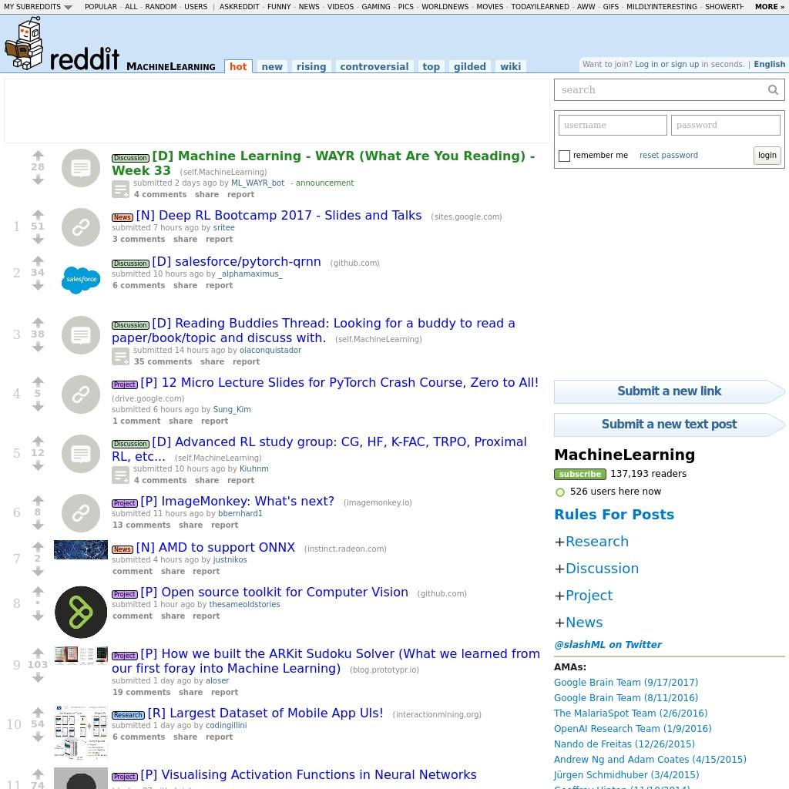 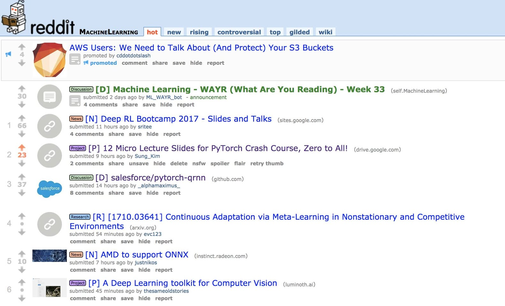

> #오늘의레딧 https://www.reddit.com/r/MachineLearning/ 오늘도 새소식이 많군요.  1. salesforce / pytorch-qrnn 2. Reading Buddies 실 : 종이 / 책 / 주제를 읽고 토론 할 친구를 찾습니다. 3. PyTorch Crash Course를위한 12 개의 Micro Lecture 슬라이드, 모두 0! 4. 고급 RL 연구 그룹 : CG, HF, K-FAC, TRPO, 근위 RL 등 5. ImageMonkey : 다음은 무엇입니까? 6. AMD, ONNX 지원 7. 컴퓨터 비전을위한 오픈 소스 툴킷 8. 우리가 ARKit Sudoku Solver를 어떻게 만들었습니까? (우리가 기계 학습에 처음 진출했을 때 배웠던 것) 9. 모바일 앱 UI의 가장 큰 데이터 세트! 10. 신경망에서 활성화 함수 시각화 11. 위성 이미지의 이미지 넷 12. 석류 v0.8.0 발표 : 파이썬에 대한 확률 론적 모델링 13. 순전히 Numpy에서 계층 적 표현 (Facebook 연구)을 배우기위한 Poincaré Embedding의 구현 14. 스타일 전송을위한 다양한 손실 구성 실험 15. 프로덕션 환경에서 PMML을 사용 해본 경험이있는 사람들은 ML 모델 배포에 대한이 접근 방식의 장단점은 무엇입니까? 16. 나이 추측 모델을 만드는 것이 선형 회귀 또는 분류 문제 여야하며, 여전히 발생 가능하지 않은 접근법입니까? 17. PyTorch 대 TensorFlow : 1 개월 요약 18. 새로운 종류의 회선을 사용한 실험 19. Caffe2 &amp; ONNX를 사용하여 AWS Lambda에서 PyTorch 모델 제공 20. Tensorflow sucks  1. https://github.com/salesforce/pytorch-qrnn 2. https://www.reddit.com/r/MachineLearning/comments/75ftuo/d_reading_buddies_thread_looking_for_a_buddy_to/ 3. https://drive.google.com/drive/folders/0B41Zbb4c8HVyUndGdGdJSXd5d3M 4. https://www.reddit.com/r/MachineLearning/comments/75gtr3/d_advanced_rl_study_group_cg_hf_kfac_trpo/ 5. https://imagemonkey.io/blog/general/2017/10/06/ImageMonkey-Introduction.html 6. https://instinct.radeon.com/en/onnx-amd-continues-to-support-open-source-platforms/ 7. https://github.com/tryolabs/luminoth 8. https://blog.prototypr.io/behind-the-magic-how-we-built-the-arkit-sudoku-solver-e586e5b685b0 9. http://interactionmining.org/rico 10. https://dashee87.github.io/data%20science/deep%20learning/visualising-activation-functions-in-neural-networks/ 11. https://www.iarpa.gov/challenges/fmow.html 12. https://www.reddit.com/r/MachineLearning/comments/75ax1f/p_pomegranate_v080_released_probabilistic/ 13. https://www.reddit.com/r/MachineLearning/comments/75cq4q/r_implementation_of_poincaré_embeddings_for/ 14. https://medium.com/towards-data-science/experiments-on-different-loss-configurations-for-style-transfer-7e3147eda55e 15. https://www.reddit.com/r/MachineLearning/comments/75hh6x/d_those_who_have_experience_using_pmml_in/ 16. https://www.reddit.com/r/MachineLearning/comments/75g5m4/d_if_i_were_to_make_an_age_guessing_model_should/ 17. https://medium.com/towards-data-science/pytorch-vs-tensorflow-1-month-summary-35d138590f9 18. https://medium.com/towards-data-science/experiments-with-a-new-kind-of-convolution-dfe603262e4c 19. https://medium.com/@michaelulin/serving-pytorch-models-on-aws-lambda-with-caffe2-onnx-7b096806cfac 20. http://nicodjimenez.github.io/2017/10/08/tensorflow.html
> 여러분들의 커멘트 도움으로 만들고 있는 슬라이드 관련 링크가 레딧에서 상위권입니다 (현재 2위).  https://www.reddit.com/r/MachineLearning/  많은 조언과 커멘트로 슬라이드 안정되고 반응이 좋을 경우 다음주부터 온라인 강의 만들어 볼께요. 여러가지 조언과 comments 감사합니다.

### 10월 12일 (목) 08:52 · 📷 사진 (2장)

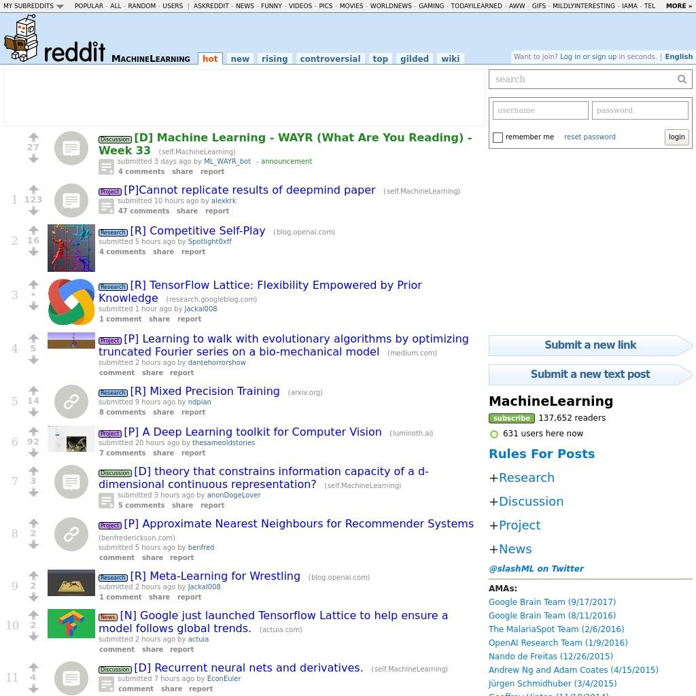 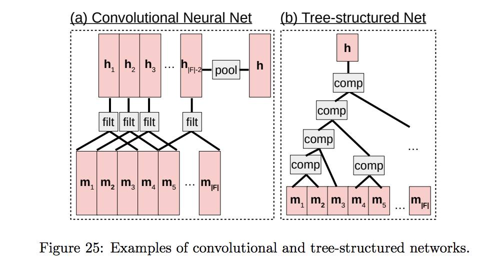

> #오늘의레딧 https://www.reddit.com/r/MachineLearning/ 따끈한 소식들입니다.  1. 경쟁적인 자기 놀이 2. TensorFlow Lattice : 사전 지식으로 인한 유연성 3. 생체 역학 모델에서 절단 된 푸리에 급수를 최적화하여 진화 알고리즘으로 학습하는 방법 학습 4. 혼합 된 정밀 교육 5. 컴퓨터 비전을위한 심층 학습 툴킷 6. d 차원 연속 표현의 정보 용량을 제약하는 이론? 7. 권장 시스템에 대한 가장 가까운 이웃 8. 레슬링을위한 메타 - 러닝 9. Google은 Tensorflow Lattice를 출시하여 모델이 세계적인 추세를 따를 수 있도록했습니다. 10. 재발하는 신경망 및 파생물. 11. 텍스트 요약 - Google Brain의 "TextSum"을 개선 할 수 있습니까? 12. Apache MXNet을 사용한 심렬 매트릭스 분해 13. Deep RL Bootcamp 2017 - 슬라이드 및 토크 14. PyTorch Crash Course를위한 12 개의 Micro Lecture 슬라이드, 모두 0! 15. 연령 추정을 위해 PCA 고유 벡터를 사용하거나 SVM을 사용한 분류 알고리즘 16. AMD, ONNX 지원 17. salesforce / pytorch-qrnn 18. ALI와 같은 추론을 수행하는 업데이트 된 GAN (예 : Cramer GAN)이 있습니까? 19. Windows 호스트에서 심층적 인 학습 (GPU 통과)을 위해 Linux VM을 사용하는 것은 여전히 ​​불가능합니까? 20. Reading Buddies 실 : 종이 / 책 / 주제를 읽고 토론 할 친구를 찾습니다.  1. https://blog.openai.com/competitive-self-play/ 2. https://research.googleblog.com/2017/10/tensorflow-lattice-flexibility.html?utm_source=feedburner&utm_medium=feed&utm_campaign=Feed:+blogspot/gJZg+\(Official+Google+Research+Blog\) 3. https://medium.com/@normandipalo/learning-to-walk-with-evolutionary-algorithms-applied-to-a-bio-mechanical-model-1ccc094537ce 4. https://arxiv.org/pdf/1710.03740.pdf 5. https://luminoth.ai 6. https://www.reddit.com/r/MachineLearning/comments/75s09s/d_theory_that_constrains_information_capacity_of/ 7. http://benfrederickson.com/approximate-nearest-neighbours-for-recommender-systems/ 8. https://blog.openai.com/meta-learning-for-wrestling/ 9. https://www.actuia.com/actualite/tensorflow-lattice-nouvel-outil-permettant-de-sassurer-modele-suive-tendances-globales/ 10. https://www.reddit.com/r/MachineLearning/comments/75q9nr/d_recurrent_neural_nets_and_derivatives/ 11. https://www.reddit.com/r/MachineLearning/comments/75t4ky/d_text_summarization_can_google_brains_textsum_be/ 12. https://www.oreilly.com/ideas/deep-matrix-factorization-using-apache-mxnet 13. https://sites.google.com/view/deep-rl-bootcamp/lectures 14. https://drive.google.com/drive/folders/0B41Zbb4c8HVyUndGdGdJSXd5d3M 15. https://www.reddit.com/r/MachineLearning/comments/75ocgv/d_regarding_using_pca_eigenvectors_for_age/ 16. https://instinct.radeon.com/en/onnx-amd-continues-to-support-open-source-platforms/ 17. https://github.com/salesforce/pytorch-qrnn 18. https://www.reddit.com/r/MachineLearning/comments/75lgrz/d_are_there_any_updated_gans_like_cramer_gan_that/ 19. https://www.reddit.com/r/MachineLearning/comments/75mg4q/d_is_it_still_impossible_to_have_a_linux_vm_for/ 20. https://www.reddit.com/r/MachineLearning/comments/75ftuo/d_reading_buddies_thread_looking_for_a_buddy_to/
> 저희 학교에서 진행중인 마지막 강의인  seq2seq모델의 수업을 위해 자료를 찾던중 발견한, Neural Machine Translation and Sequence-to-sequence Models: A Tutorial: https://arxiv.org/abs/1703.01619  CMU교수님이 쓰신 tutorial인데 거의 교과서 같은 분위기 입니다. n-gram부터 간단한 language model, rnn, seq2seq, beam search, attention, cnn, tree관련 등 모든것을 다루고 있습니다.  65페이지라는 것이 단점이지만 매우 그림도 많고 코드도 많아서 보기 좋습니다.

### 10월 13일 (금) 00:37 · 📷 사진 (2장)

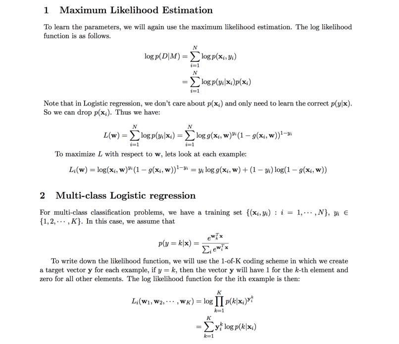 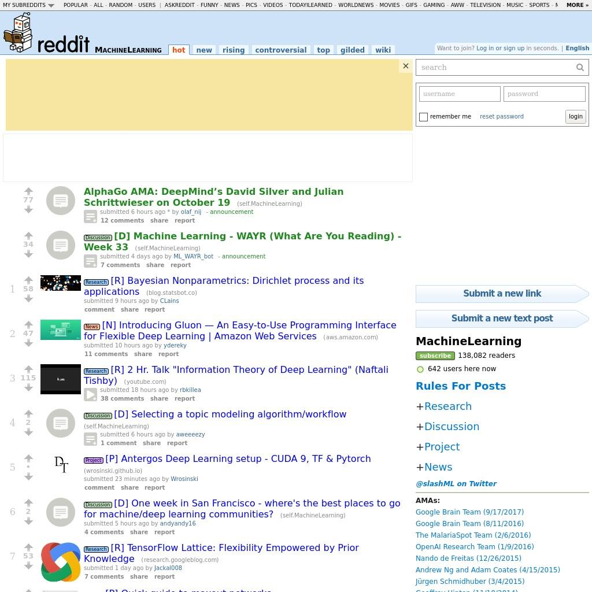

> 뉴럴넷 loss의 기본이 되는 logistic과 softmax의 로스가 왜 그렇게 생긴 것인지 한장으로 설명해주네요. 깔끔하고 아름답기까지 합니다.  원본: http://web.engr.oregonstate.edu/~xfern/classes/cs534/notes/logistic-regression-note.pdf  이 글과 같이 보셔도 좋습니다. http://willwolf.io/2017/05/18/minimizing_the_negative_log_likelihood_in_english/
> #오늘의레딧 https://www.reddit.com/r/MachineLearning/ 오늘도 새소식이 많군요.  1. Gluon 소개 - 유연한 심층 학습을위한 사용하기 쉬운 프로그래밍 인터페이스 | Amazon Web Services 2. 2 시간 "깊은 학습의 정보 이론"(Naftali Tishby) 3. 주제 모델링 알고리즘 / 워크 플로우 선택 4. Antergos 딥 학습 설정 - CUDA 9, TF &amp; Pytorch 5. 샌프란시스코에서의 1 주 - 기계 / 심층 학습 공동체를위한 최고의 장소는 어디입니까? 6. TensorFlow Lattice : 사전 지식으로 인한 유연성 7. maxout 네트워크에 대한 빠른 가이드 8. 깊은 학습을위한 효율적인 방법 및 하드웨어 9. 딥 마인드 결과를 복제 할 수 없음 10. 표준 탐지기는 (현재) 물리적 인 적대적 정지 표지로 속지 않습니다 11. 생체 역학 모델에서 절단 된 푸리에 급수를 최적화하여 진화 알고리즘으로 학습하는 방법 학습 12. 메타 분석은 암시 적 및 명시 적 학습을위한 다른 신경 상관 관계를 제안합니다. 13. 소리없는 자율 신경 네트워크? 14. 경쟁적인 자기 놀이 15. Apache MXNet을 사용한 심렬 매트릭스 분해 16. 혼합 된 정밀 교육 17. 권장 시스템에 대한 가장 가까운 이웃 18. d 차원 연속 표현의 정보 용량을 제약하는 이론? 19. 레슬링을위한 메타 - 러닝 20. NIPS 2017에 AI 작업장에 검은 색  1. https://aws.amazon.com/blogs/ai/introducing-gluon-an-easy-to-use-programming-interface-for-flexible-deep-learning/ 2. https://www.youtube.com/watch?v=RKvS958AqGY 3. https://www.reddit.com/r/MachineLearning/comments/75ym7y/d_selecting_a_topic_modeling_algorithmworkflow/ 4. https://wrosinski.github.io/antergos-guide/ 5. https://www.reddit.com/r/MachineLearning/comments/75yrue/d_one_week_in_san_francisco_wheres_the_best/ 6. https://research.googleblog.com/2017/10/tensorflow-lattice-flexibility.html?utm_source=feedburner&utm_medium=feed&utm_campaign=Feed:+blogspot/gJZg+\(Official+Google+Research+Blog\) 7. https://alaurans.com/quick-guide-to-maxout-networks/ 8. https://purl.stanford.edu/qf934gh3708 9. https://www.reddit.com/r/MachineLearning/comments/75p1cj/pcannot_replicate_results_of_deepmind_paper/ 10. https://arxiv.org/abs/1710.03337 11. https://medium.com/@normandipalo/learning-to-walk-with-evolutionary-algorithms-applied-to-a-bio-mechanical-model-1ccc094537ce 12. http://www.cell.com/neuron/comments/S0896-6273\(17\)30901-7 13. https://www.reddit.com/r/MachineLearning/comments/75zpak/d_sota_unsupervised_neural_nets/ 14. https://blog.openai.com/competitive-self-play/ 15. https://www.oreilly.com/ideas/deep-matrix-factorization-using-apache-mxnet 16. https://arxiv.org/pdf/1710.03740.pdf 17. http://benfrederickson.com/approximate-nearest-neighbours-for-recommender-systems/ 18. https://www.reddit.com/r/MachineLearning/comments/75s09s/d_theory_that_constrains_information_capacity_of/ 19. https://blog.openai.com/meta-learning-for-wrestling/ 20. https://www.reddit.com/r/MachineLearning/comments/75xglw/dblack_in_ai_workshop_at_nips_2017/

### 10월 14일 (토) 08:52 · 📷 사진 (1장)

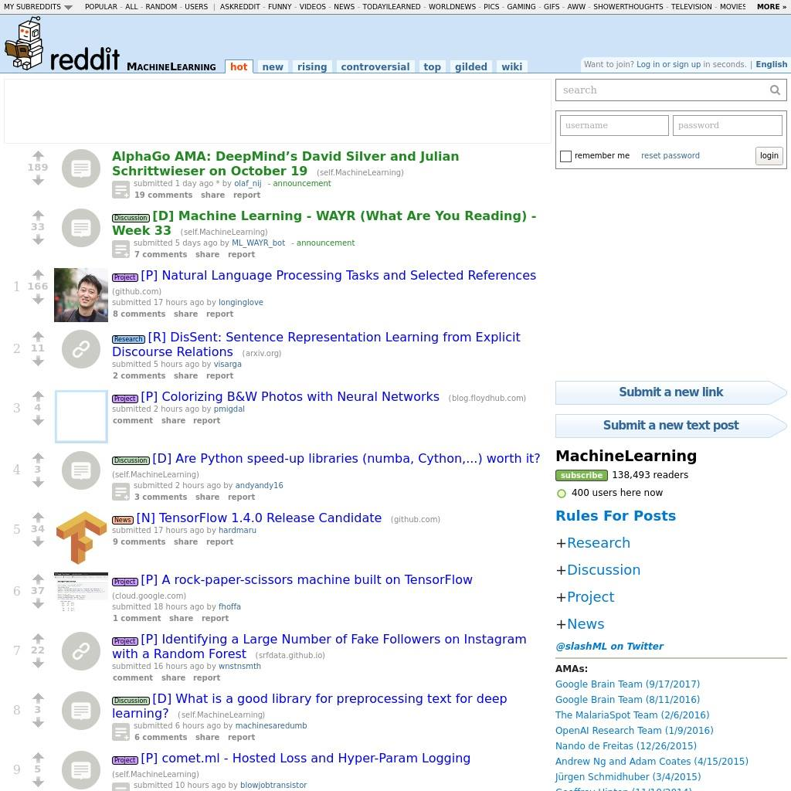

> #오늘의레딧 https://www.reddit.com/r/MachineLearning/ 따끈한 소식들입니다.  1. DisSent : 명시 적 담화 관계에서 배우는 문장 표현 2. 신경망으로 흑백 사진 색칠하기 3. 파이썬 속도 향상 라이브러리 (numba, Cython, ...)가 가치가 있습니까? 4. TensorFlow 1.4.0 출시 후보 5. TensorFlow를 기반으로하는 가위 - 가위 기계 6. 랜덤 포레스트가있는 Instagram에서 많은 수의 가짜 추종자 식별 7. 깊은 학습을 위해 텍스트를 사전 처리하기위한 훌륭한 라이브러리는 무엇입니까? 8. comet.ml - Hosted Loss 및 Hyper-Param Logging 9. Bayesian Nonparametrics : Dirichlet 프로세스와 그 응용 10. JupyterLab + 실시간 협업 | PyData Seattle 2017 11. Gluon 소개 - 유연한 심층 학습을위한 사용하기 쉬운 프로그래밍 인터페이스 | Amazon Web Services 12. Antergos 딥 학습 설정 - CUDA 9, TF &amp; Pytorch 13. 2 시간 "깊은 학습의 정보 이론"(Naftali Tishby) 14. 길쌈 신경망 (Convolutional Neural Network)의 계층 유형 및 최상의 연결 방법 15. 샌프란시스코에서의 1 주 - 기계 / 심층 학습 공동체를위한 최고의 장소는 어디입니까? 16. TensorFlow Lattice : 사전 지식으로 인한 유연성 17. 메타 분석은 암시 적 및 명시 적 학습을위한 다른 신경 상관 관계를 제안합니다. 18. maxout 네트워크에 대한 빠른 가이드 19. 깊은 학습을위한 효율적인 방법 및 하드웨어 20. 딥 마인드 결과를 복제 할 수 없음  1. https://arxiv.org/abs/1710.04334 2. https://blog.floydhub.com/colorizing-b&w-photos-with-neural-networks/ 3. https://www.reddit.com/r/MachineLearning/comments/767tb3/d_are_python_speedup_libraries_numba_cython_worth/ 4. https://github.com/tensorflow/tensorflow/releases/tag/v1.4.0-rc0 5. https://cloud.google.com/blog/big-data/2017/10/my-summer-project-a-rock-paper-scissors-machine-built-on-tensorflow 6. https://srfdata.github.io/2017-10-instagram-influencers 7. https://www.reddit.com/r/MachineLearning/comments/7669fb/d_what_is_a_good_library_for_preprocessing_text/ 8. https://www.reddit.com/r/MachineLearning/comments/764o79/p_cometml_hosted_loss_and_hyperparam_logging/ 9. https://blog.statsbot.co/bayesian-nonparametrics-9f2ce7074b97 10. https://channel9.msdn.com/Events/PyData/Seattle2017/BRK11 11. https://aws.amazon.com/blogs/ai/introducing-gluon-an-easy-to-use-programming-interface-for-flexible-deep-learning/ 12. https://wrosinski.github.io/antergos-guide/ 13. https://www.youtube.com/watch?v=RKvS958AqGY 14. https://www.reddit.com/r/MachineLearning/comments/76340f/d_about_the_types_of_layers_for_a_convolutional/ 15. https://www.reddit.com/r/MachineLearning/comments/75yrue/d_one_week_in_san_francisco_wheres_the_best/ 16. https://research.googleblog.com/2017/10/tensorflow-lattice-flexibility.html?utm_source=feedburner&utm_medium=feed&utm_campaign=Feed:+blogspot/gJZg+\(Official+Google+Research+Blog\) 17. http://www.cell.com/neuron/comments/S0896-6273\(17\)30901-7 18. https://alaurans.com/quick-guide-to-maxout-networks/ 19. https://purl.stanford.edu/qf934gh3708 20. https://www.reddit.com/r/MachineLearning/comments/75p1cj/pcannot_replicate_results_of_deepmind_paper/

### 10월 15일 (일) 08:52 · 📷 사진 (1장)

> #오늘의레딧 https://www.reddit.com/r/MachineLearning/ 아침부터 다양한 소식이 많네요.  1. (New RL Baseline?) 무지개 : 심층 강화 학습의 개선 된 결합 2. 기계 학습에서의 확률 론적 과정과 확률 론적 모델에 관한 미니 워크샵 3. AWS 스팟 인스턴스 실행을위한 CLI 도구 4. 차이점 OpenAI :베이스 라인 대 rllab 대 우주 스타터 - 에이전트? 5. 신경망으로 흑백 사진 색칠하기 6. 계단식 딥 분류기를 사용한 에너지 효율적인 상각 된 추론 7. 로컬 주피터 노트북은 원격 GPU 카드를 연결합니까? 8. 파이썬 속도 향상 라이브러리 (numba, Cython, ...)가 가치가 있습니까? 9. 자연 언어 처리 작업 및 선택된 참조 10. DisSent : 명시 적 담화 관계에서 배우는 문장 표현 11. TensorFlow 1.4.0 출시 후보 12. TensorFlow를 기반으로하는 가위 - 가위 기계 13. 랜덤 포레스트가있는 Instagram에서 많은 수의 가짜 추종자 식별 14. 조건부 연관 논리 메모리 15. comet.ml - Hosted Loss 및 Hyper-Param Logging 16. JupyterLab + 실시간 협업 | PyData Seattle 2017 17. Bayesian Nonparametrics : Dirichlet 프로세스와 그 응용 18. Gluon 소개 - 유연한 심층 학습을위한 사용하기 쉬운 프로그래밍 인터페이스 | Amazon Web Services 19. Antergos 딥 학습 설정 - CUDA 9, TF &amp; Pytorch 20. 2 시간 "깊은 학습의 정보 이론"(Naftali Tishby)  1. https://arxiv.org/abs/1710.02298 2. https://cs.hse.ru/en/big-data/bayeslab/announcements/208831540.html 3. https://github.com/samuelreh/spotr 4. https://www.reddit.com/r/MachineLearning/comments/76cppt/d_difference_openai_baselines_vs_rllab_vs/ 5. https://blog.floydhub.com/colorizing-b&w-photos-with-neural-networks/ 6. https://arxiv.org/abs/1710.03368 7. https://www.reddit.com/r/MachineLearning/comments/76da01/d_local_jupyter_notebook_connects_remote_gpu_card/ 8. https://www.reddit.com/r/MachineLearning/comments/767tb3/d_are_python_speedup_libraries_numba_cython_worth/ 9. https://github.com/Kyubyong/nlp_tasks 10. https://arxiv.org/abs/1710.04334 11. https://github.com/tensorflow/tensorflow/releases/tag/v1.4.0-rc0 12. https://cloud.google.com/blog/big-data/2017/10/my-summer-project-a-rock-paper-scissors-machine-built-on-tensorflow 13. https://srfdata.github.io/2017-10-instagram-influencers 14. https://github.com/CarsonScott/CALM 15. https://www.reddit.com/r/MachineLearning/comments/764o79/p_cometml_hosted_loss_and_hyperparam_logging/ 16. https://channel9.msdn.com/Events/PyData/Seattle2017/BRK11 17. https://blog.statsbot.co/bayesian-nonparametrics-9f2ce7074b97 18. https://aws.amazon.com/blogs/ai/introducing-gluon-an-easy-to-use-programming-interface-for-flexible-deep-learning/ 19. https://wrosinski.github.io/antergos-guide/ 20. https://www.youtube.com/watch?v=RKvS958AqGY

### 10월 15일 (일) 20:55 · Truly amazing! He is a real Ironman!!

Truly amazing! He is a real Ironman!!

### 10월 16일 (월) 08:53 · 📷 사진 (1장)

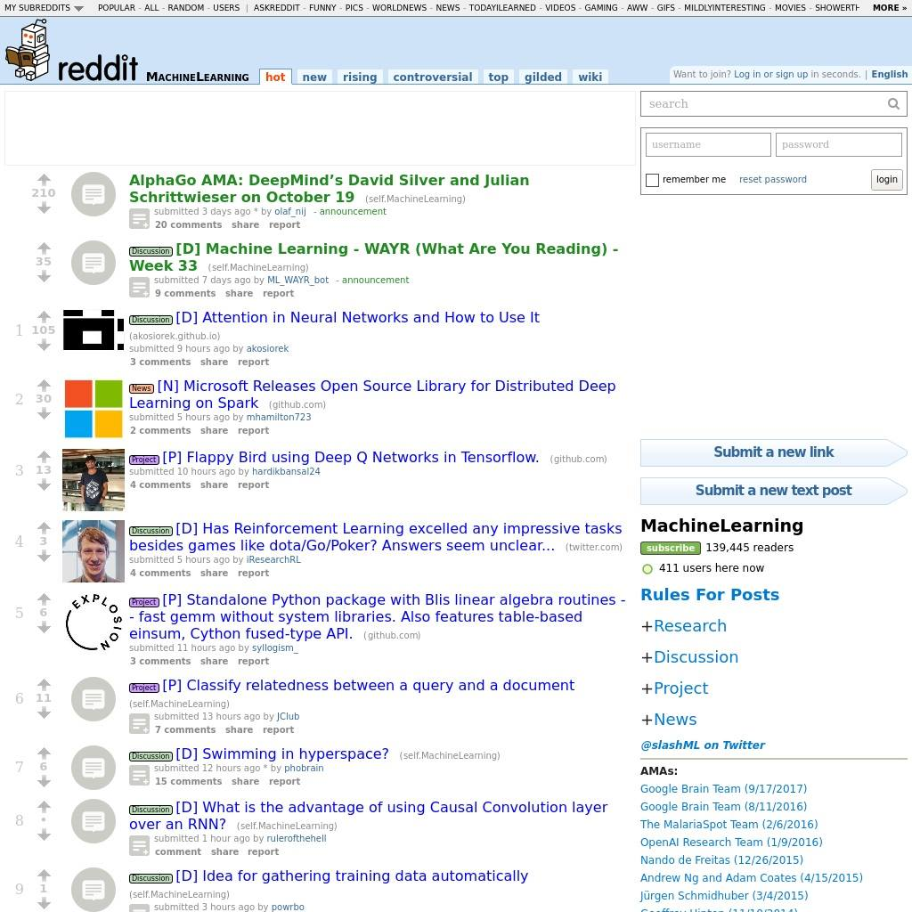

> #오늘의레딧 https://www.reddit.com/r/MachineLearning/ 래딧은 읽을 거리가 다양합니다.  1. Microsoft, Spark에서 분산 딥 학습을위한 오픈 소스 라이브러리 출시 2. Tensorflow의 Deep Q Networks를 사용하는 Flappy Bird. 3. 강화 학습은 dota / Go / Poker와 같은 게임 이외의 인상적인 작업을 능가 했습니까? 답변이 명확하지 않은 것 같습니다 ... 4. Blis 선형 대수 루틴이있는 독립 실행 형 Python 패키지 - 시스템 라이브러리가없는 빠른 gemm. 또한 테이블 기반 einsum, Cython 융합 형 API를 제공합니다. 5. 쿼리와 문서 간의 관련성 분류 6. 초 공간에서 수영? 7. RNN에 인과 관계 컨볼 루션 레이어를 사용하면 어떤 이점이 있습니까? 8. 자동으로 교육 자료를 수집하기위한 아이디어 9. 또 다른 NN API (이번에는 C ++에서이 작은 속도 향상을 위해 템플릿을 사용했습니다!) 10. 기록 된 비디오 - 깊은 학습 : 이론, 알고리즘 및 응용, 베를린, 2017 년 6 월 11. 연금술사는 Priors를 가지고 있었다 : 감독되지 않은 학습 신호 12. DDPG 이외에도 지속적인 제어를위한 DQN 기반? 13. 기계 학습에서의 확률 론적 과정과 확률 론적 모델에 관한 미니 워크샵 14. (New RL Baseline?) 무지개 : 심층 강화 학습의 개선 된 결합 15. AWS 스팟 인스턴스 실행을위한 CLI 도구 16. Multiclass 분류 질문. 17. 차이점 OpenAI :베이스 라인 대 rllab 대 우주 스타터 - 에이전트? 18. CIFAR에 좋은 VAE 19. 신경망으로 흑백 사진 색칠하기 20. 계단식 딥 분류기를 사용한 에너지 효율적인 상각 된 추론  1. https://github.com/Azure/mmlspark/releases/tag/v0.9 2. https://github.com/hardikbansal/Qlearning/tree/master/Flappy 3. https://twitter.com/jackclarkSF/status/919584404472602624 4. https://github.com/explosion/cython-blis 5. https://www.reddit.com/r/MachineLearning/comments/76i73z/p_classify_relatedness_between_a_query_and_a/ 6. https://www.reddit.com/r/MachineLearning/comments/76ici9/d_swimming_in_hyperspace/ 7. https://www.reddit.com/r/MachineLearning/comments/76mbym/d_what_is_the_advantage_of_using_causal/ 8. https://www.reddit.com/r/MachineLearning/comments/76ll25/d_idea_for_gathering_training_data_automatically/ 9. https://github.com/liammcinroy/MetaTemplateNeuralNet 10. https://www.youtube.com/playlist?list=PLJOzdkh8T5kqCNV_v1w2tapvtJDZYiohW 11. http://helmholtz.io/blog/learning_signal 12. https://www.reddit.com/r/MachineLearning/comments/76ipv6/d_dqnbased_for_continuous_control_in_addition_to/ 13. https://cs.hse.ru/en/big-data/bayeslab/announcements/208831540.html 14. https://arxiv.org/abs/1710.02298 15. https://github.com/samuelreh/spotr 16. https://www.reddit.com/r/MachineLearning/comments/76j5qs/p_multiclass_classification_question/ 17. https://www.reddit.com/r/MachineLearning/comments/76cppt/d_difference_openai_baselines_vs_rllab_vs/ 18. https://www.reddit.com/r/MachineLearning/comments/76haex/d_good_vae_for_cifar/ 19. https://blog.floydhub.com/colorizing-b&w-photos-with-neural-networks/ 20. https://arxiv.org/abs/1710.03368

### 10월 17일 (화) 08:52 · 📷 사진 (1장)

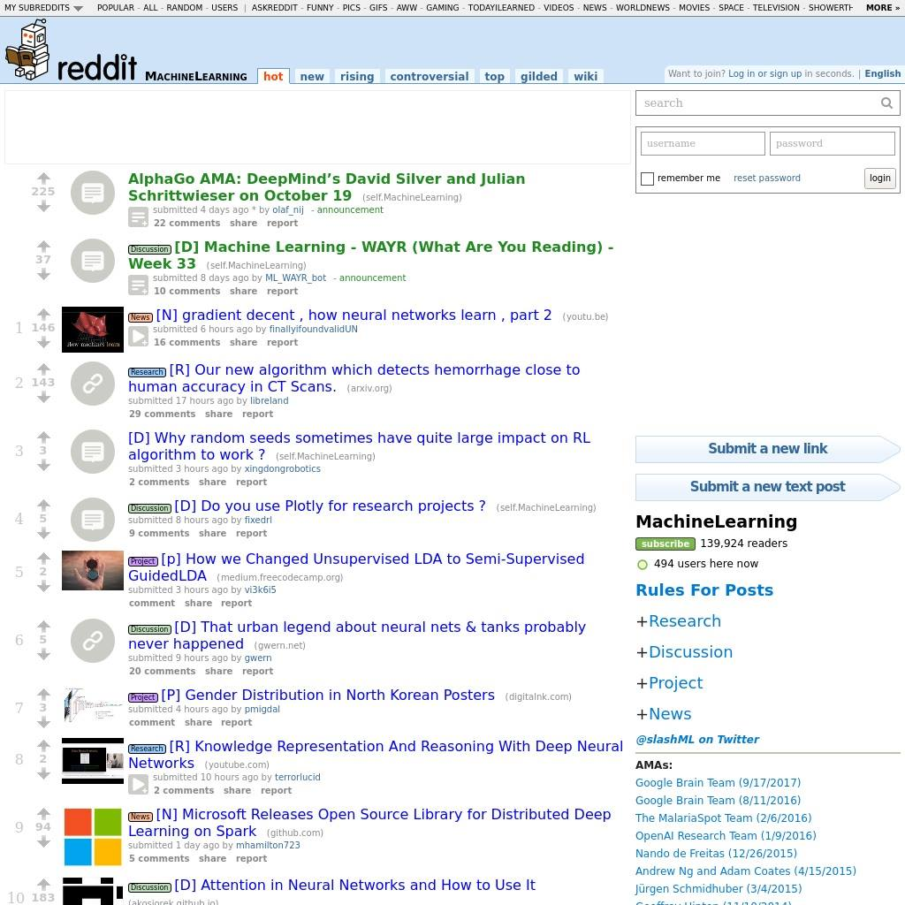

> #오늘의레딧 https://www.reddit.com/r/MachineLearning/ 오늘도 새소식이 많군요.  1. CT 스캔에서 인간의 정확도에 가까운 출혈을 감지하는 새로운 알고리즘 2. 연구 프로젝트에 Plotly를 사용합니까? 3. 신경망과 탱크에 관한 그 도시 전설은 결코 일어난 적이 없다. 4. 북한 포스터의 성별 분포 5. 딥 뉴럴 네트워크를 통한 지식 표현 및 추론 6. Microsoft, Spark에서 분산 딥 학습을위한 오픈 소스 라이브러리 출시 7. 신경망의주의와 사용 방법 8. 잔여 연결은 반복적 인 추론을 권장한다. 9. 스파 스 데이터에 대한 자체 구성 맵의 효율적 구현 10. 학습 / 교육에 적합한 단일 레이어 ANN입니까? (예 : 입력 레이어를 곧바로 출력, 숨겨진 레이어 없음) 11. 베이지안 하이퍼 네트워크 12. RNN에 인과 관계 컨볼 루션 레이어를 사용하면 어떤 이점이 있습니까? 13. 감정 분석 데이터 세트가 아니라 양수 또는 음수가 아닌 여러 수준 제공 14. 인종적 다양성과 많은 정체성을 가진 얼굴 데이터 세트 15. 강화 학습은 dota / Go / Poker와 같은 게임 이외의 인상적인 작업을 능가 했습니까? 답변이 명확하지 않은 것 같습니다 ... 16. Tensorflow의 Deep Q Networks를 사용하는 Flappy Bird. 17. Blis 선형 대수 루틴이있는 독립 실행 형 Python 패키지 - 시스템 라이브러리가없는 빠른 gemm. 또한 테이블 기반 einsum, Cython 융합 형 API를 제공합니다. 18. 초 공간에서 수영? 19. 쿼리와 문서 간의 관련성 분류 20. 자동으로 교육 자료를 수집하기위한 아이디어  1. https://arxiv.org/abs/1710.04934v1 2. https://www.reddit.com/r/MachineLearning/comments/76r0h1/d_do_you_use_plotly_for_research_projects/ 3. https://www.gwern.net/Tanks 4. http://digitalnk.com/blog/2017/09/30/gender-distribution-in-north-korean-posters/ 5. https://www.youtube.com/watch?v=lc68_d_DnYs 6. https://github.com/Azure/mmlspark/releases/tag/v0.9 7. http://akosiorek.github.io/ml/2017/10/14/visual-attention.html 8. https://arxiv.org/abs/1710.04773 9. https://github.com/yoch/sparse-som 10. https://www.reddit.com/r/MachineLearning/comments/76rcar/d_are_single_layer_anns_appropriate_for/ 11. https://arxiv.org/abs/1710.04759 12. https://www.reddit.com/r/MachineLearning/comments/76mbym/d_what_is_the_advantage_of_using_causal/ 13. https://www.reddit.com/r/MachineLearning/comments/76ppxy/d_sentiment_analysis_dataset_but_providing/ 14. https://www.reddit.com/r/MachineLearning/comments/76oz20/d_face_dataset_with_ethnic_diversity_and_many/ 15. https://twitter.com/jackclarkSF/status/919584404472602624 16. https://github.com/hardikbansal/Qlearning/tree/master/Flappy 17. https://github.com/explosion/cython-blis 18. https://www.reddit.com/r/MachineLearning/comments/76ici9/d_swimming_in_hyperspace/ 19. https://www.reddit.com/r/MachineLearning/comments/76i73z/p_classify_relatedness_between_a_query_and_a/ 20. https://www.reddit.com/r/MachineLearning/comments/76ll25/d_idea_for_gathering_training_data_automatically/

### 10월 18일 (수) 08:53 · 📷 사진 (1장)

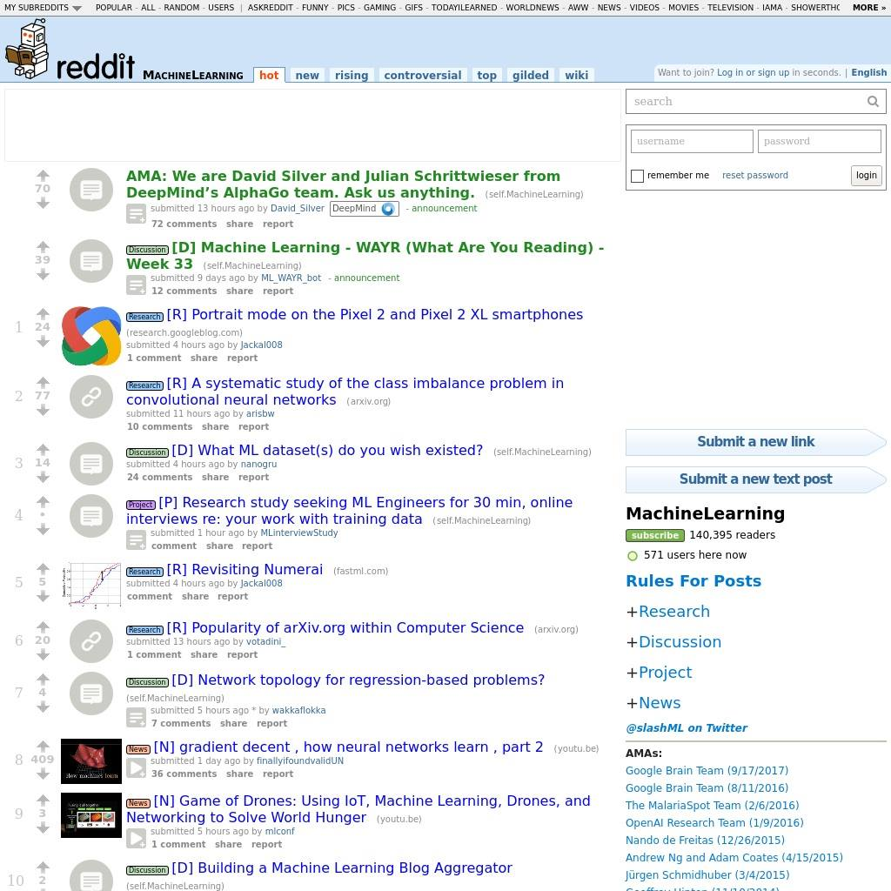

> #오늘의레딧 https://www.reddit.com/r/MachineLearning/ 따끈한 소식들입니다.  1. 길쌈 신경망의 클래스 불균형 문제에 대한 체계적인 연구 2. 어떤 ML 데이터 집합이 존재하기를 원합니까? 3. 30 분 동안 ML 엔지니어를 찾고있는 조사 연구, 온라인 인터뷰 : 재 훈련 데이터 작업 4. Numerai 재 방문 5. 컴퓨터 과학 내의 arXiv.org 인기 6. 회귀 기반 문제의 네트워크 토폴로지? 7. 그라디언트 알맞은, 신경 네트워크가 배우는 방법, 파트 2 8. Drones의 게임 : 세계 기아 문제를 해결하기 위해 IoT, 기계 학습, 무인 항공기 및 네트워킹 사용 9. 블로그 어 그리 게이터 학습 기계 제작 10. 게시물의 제목을 기준으로 하위 회선 Upvotes의 수를 예측하는 데 도움이 필요합니다. 11. 딥 학습의 일반화 12. 영국에서 일하는 방법 - 방법? 13. 인텔 ® Nervana ™ 신경망 프로세서 (NNP) AI 실리콘 수정 - Intel Nervana 14. Generative adverarial imitation learning의 Tensorflow 구현 15. CT 스캔에서 인간의 정확도에 가까운 출혈을 감지하는 새로운 알고리즘 16. 북한 포스터의 성별 분포 17. 신경망과 탱크에 관한 그 도시 전설은 결코 일어난 적이 없다. 18. 연구 프로젝트에 Plotly를 사용합니까? 19. 딥 뉴럴 네트워크를 통한 지식 표현 및 추론 20. Microsoft, Spark에서 분산 딥 학습을위한 오픈 소스 라이브러리 출시  1. https://arxiv.org/abs/1710.05381 2. https://www.reddit.com/r/MachineLearning/comments/770pt1/d_what_ml_datasets_do_you_wish_existed/ 3. https://www.reddit.com/r/MachineLearning/comments/771z3e/p_research_study_seeking_ml_engineers_for_30_min/ 4. http://fastml.com/revisiting-numerai/ 5. https://arxiv.org/abs/1710.05225 6. https://www.reddit.com/r/MachineLearning/comments/770gtx/d_network_topology_for_regressionbased_problems/ 7. https://youtu.be/IHZwWFHWa-w 8. https://youtu.be/R204q7AZlm8 9. https://www.reddit.com/r/MachineLearning/comments/7717gs/d_building_a_machine_learning_blog_aggregator/ 10. https://www.reddit.com/r/MachineLearning/comments/772hik/d_i_need_help_predicting_the_number_of_subreddit/ 11. https://arxiv.org/pdf/1710.05468.pdf 12. https://www.reddit.com/r/MachineLearning/comments/76zm9u/discussion_finding_work_in_the_uk_how_to/ 13. https://www.intelnervana.com/intel-nervana-neural-network-processors-nnp-redefine-ai-silicon/ 14. https://www.reddit.com/r/MachineLearning/comments/76zsd0/project_tensorflow_implementation_of_generative/ 15. https://arxiv.org/abs/1710.04934v1 16. http://digitalnk.com/blog/2017/09/30/gender-distribution-in-north-korean-posters/ 17. https://www.gwern.net/Tanks 18. https://www.reddit.com/r/MachineLearning/comments/76r0h1/d_do_you_use_plotly_for_research_projects/ 19. https://www.youtube.com/watch?v=lc68_d_DnYs 20. https://github.com/Azure/mmlspark/releases/tag/v0.9

### 10월 19일 (목) 08:52 · 📷 사진 (1장)

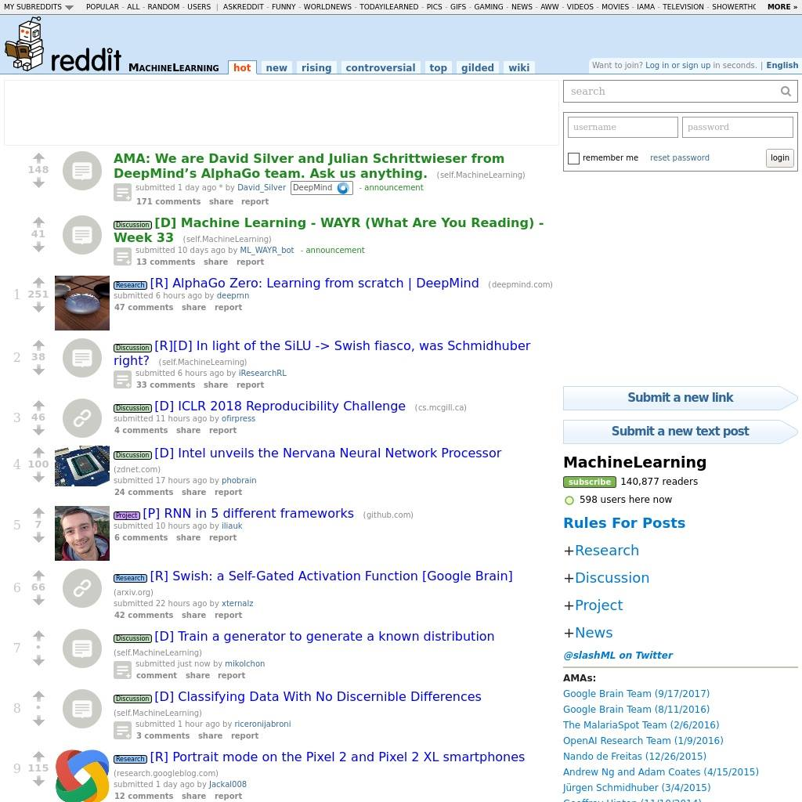

> #오늘의레딧 https://www.reddit.com/r/MachineLearning/ 아침부터 다양한 소식이 많네요.  1. ICLR 2018 재현성 도전 2. 인텔, Nervana 신경망 프로세서 발표 3. 5 가지 프레임 워크의 RNN 4. 알려진 분포를 생성하는 생성기 훈련 5. 식별 할 수없는 차이점없이 데이터 분류 6. Pixel 2 및 Pixel 2 XL 스마트 폰의 세로 모드 7. 변동 권한 부여를 통한 감독되지 않은 실시간 제어 8. "SOTA 결과 : 자동차 애플리케이션의 합성 데이터 생성" 9. 어떤 ML 데이터 집합이 존재하기를 원합니까? 10. 길쌈 신경망의 클래스 불균형 문제에 대한 체계적인 연구 11. 30 분 동안 ML 엔지니어를 찾고있는 조사 연구, 온라인 인터뷰 : 재 훈련 데이터 작업 12. Chancey : AI를 통한 대학 입학 예측 13. 회선은 선형지도입니까? 14. Numerai 재 방문 15. 블로그 어 그리 게이터 학습 기계 제작 16. 컴퓨터 과학 내의 arXiv.org 인기 17. 회귀 기반 문제의 네트워크 토폴로지? 18. 그라디언트 알맞은, 신경 네트워크가 배우는 방법, 파트 2 19. 영국에서 일하는 방법 - 방법? 20. 딥 학습의 일반화  1. http://www.cs.mcgill.ca/~jpineau/ICLR2018-ReproducibilityChallenge.html 2. http://www.zdnet.com/article/intel-unveils-the-nervana-neural-network-processor/ 3. https://github.com/ilkarman/DeepLearningFrameworks/#rnn-gru-on-imdb---natural-language-processing-sentiment-analysis 4. https://www.reddit.com/r/MachineLearning/comments/77ae24/d_train_a_generator_to_generate_a_known/ 5. https://www.reddit.com/r/MachineLearning/comments/77a3vl/d_classifying_data_with_no_discernible_differences/ 6. https://research.googleblog.com/2017/10/portrait-mode-on-pixel-2-and-pixel-2-xl.html?utm_source=feedburner&utm_medium=feed&utm_campaign=Feed:+blogspot/gJZg+\(Official+Google+Research+Blog\) 7. https://arxiv.org/abs/1710.05101 8. https://arxiv.org/abs/1710.06270 9. https://www.reddit.com/r/MachineLearning/comments/770pt1/d_what_ml_datasets_do_you_wish_existed/ 10. https://arxiv.org/abs/1710.05381 11. https://www.reddit.com/r/MachineLearning/comments/771z3e/p_research_study_seeking_ml_engineers_for_30_min/ 12. https://medium.com/@prianshshah/predicting-college-acceptance-with-ai-6d8abd702385 13. https://www.reddit.com/r/MachineLearning/comments/7782nd/d_are_convolutions_linear_maps/ 14. http://fastml.com/revisiting-numerai/ 15. https://www.reddit.com/r/MachineLearning/comments/7717gs/d_building_a_machine_learning_blog_aggregator/ 16. https://arxiv.org/abs/1710.05225 17. https://www.reddit.com/r/MachineLearning/comments/770gtx/d_network_topology_for_regressionbased_problems/ 18. https://youtu.be/IHZwWFHWa-w 19. https://www.reddit.com/r/MachineLearning/comments/76zm9u/discussion_finding_work_in_the_uk_how_to/ 20. https://arxiv.org/pdf/1710.05468.pdf

### 10월 20일 (금) 08:53 · 📷 사진 (2장)

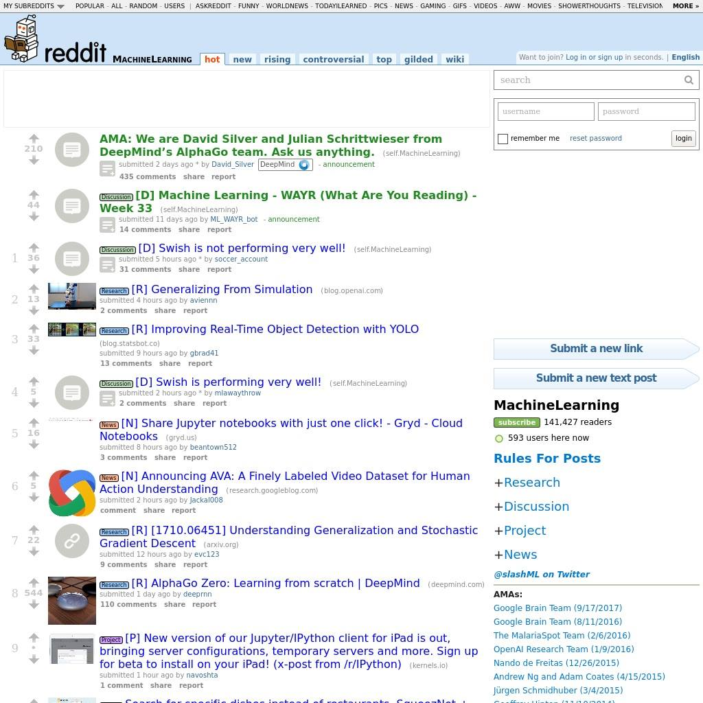 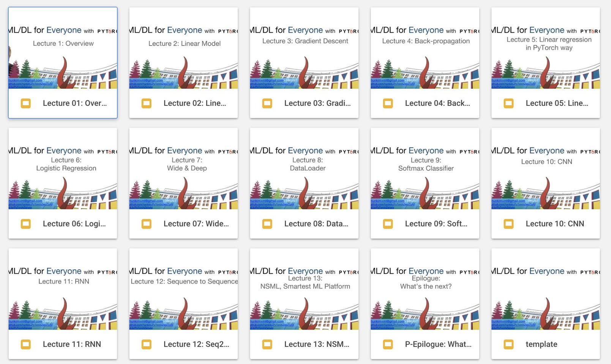

> #오늘의레딧 https://www.reddit.com/r/MachineLearning/ 오늘도 새소식이 많군요.  1. YOLO로 실시간 물체 감지 개선 2. 스와시는 아주 잘하고 있습니다! 3. 한 번의 클릭으로 Jupyter 노트북을 공유하십시오! - Gryd - 클라우드 노트 4. AVA 발표 : 인간 행동 이해를위한 미세한 라벨링 된 비디오 데이터 세트 5. AlphaGo Zero : 처음부터 배우기 | 딥 마인드 6. iPad 용 Jupyter / IPython 클라이언트의 새 버전이 출시되어 서버 구성, 임시 서버 등을 제공합니다. 베타 버전에 가입하여 iPad에 설치하십시오! (x-post from https://www.reddit.com/r/IPython) 7. CNN에서 레이어 구성에 대한 일반 가이드를받을 수 있습니까? 8. UAE, 인공 지능 최초의 장관 임명 9. 가장 정확한 2017 얼굴 탐지 lib (Java가 호출 할 수 있음)? 10. 로지스틱 회귀에서 &#39;균형 잡힌&#39;클래스 가중치가 클래스 재조정의 필요성을 제거합니까? 11. Arxiv가 Openreview를 만나 Reddit을 만납니 까? 12. 신속한 그리기 - 모바일 신경망을 사용하여 인간이 만든 기념일 로고 추측 13. ICLR 2018 재현성 도전 14. Andrew Ng는 정신 건강에 기여합니다. 15. 식별 할 수없는 차이점없이 데이터 분류 16. 인텔, Nervana 신경망 프로세서 발표 17. 변동 권한 부여를 통한 감독되지 않은 실시간 제어 18. 알려진 분포를 생성하는 생성기 훈련 19. 5 가지 프레임 워크의 RNN  1. https://blog.statsbot.co/real-time-object-detection-yolo-cd348527b9b7 2. https://www.reddit.com/r/MachineLearning/comments/77hjfj/d_swish_is_performing_very_well/ 3. https://gryd.us/one-click-jupyter-notebook-sharing/ 4. https://research.googleblog.com/2017/10/announcing-ava-finely-labeled-video.html?utm_source=feedburner&utm_medium=feed&utm_campaign=Feed:+blogspot/gJZg+\(Official+Google+Research+Blog\) 5. https://deepmind.com/blog/alphago-zero-learning-scratch/ 6. https://kernels.io/juno-v-1-0-5-beta/ 7. https://www.reddit.com/r/MachineLearning/comments/77dnnf/d_can_i_get_a_general_guide_on_organizing_layers/ 8. http://www.arabianbusiness.com/politics-economics/381648-uae-appoints-first-minister-for-artificial-intelligence 9. https://www.reddit.com/r/MachineLearning/comments/77hzns/d_most_accurate_2017_face_detection_lib_that_java/ 10. https://www.reddit.com/r/MachineLearning/comments/77hcl0/d_does_balanced_class_weight_in_logistic/ 11. https://www.reddit.com/r/MachineLearning/comments/77gcai/d_arxiv_meets_openreview_meets_reddit/ 12. https://www.reddit.com/r/MachineLearning/comments/77cjns/p_rapid_draw_using_a_mobile_neural_network_to/ 13. http://www.cs.mcgill.ca/~jpineau/ICLR2018-ReproducibilityChallenge.html 14. https://medium.com/@andrewng/woebot-ai-for-mental-health-d0e8632b82ba 15. https://www.reddit.com/r/MachineLearning/comments/77a3vl/d_classifying_data_with_no_discernible_differences/ 16. http://www.zdnet.com/article/intel-unveils-the-nervana-neural-network-processor/ 17. https://arxiv.org/abs/1710.05101 18. https://www.reddit.com/r/MachineLearning/comments/77ae24/d_train_a_generator_to_generate_a_known/ 19. https://github.com/ilkarman/DeepLearningFrameworks/#rnn-gru-on-imdb---natural-language-processing-sentiment-analysis
> PyTorchZeroToAll 강의 다음주 부터 시작합니다. #모두를위한딥러닝 과 비슷한 내용이지만 , 이번 강의는:  1. 좀더 직관적이고 Python적인 PyTorch로 강의 하여 더 쉽게 딥러닝 접근 가 2. 이론과 실습을 분리하지 않고 함께 진행하고 3. 지난번 부족했던 RNN부분을 seq2seq까지 확장하고 4. 다양한 연습문제들을 준비하여 재미를 더했습니다.  강의에 앞서 슬라이드 http://bit.ly/PyTorchZeroAll 와 코드: https://github.com/hunkim/PyTorchZeroToAll 를 먼저 공개합니다. 슬라이드나 코드에 대한 의견 주시면 강의에 반영하겠습니다. 감사합니다.

### 10월 21일 (토) 08:52 · 📷 사진 (1장)

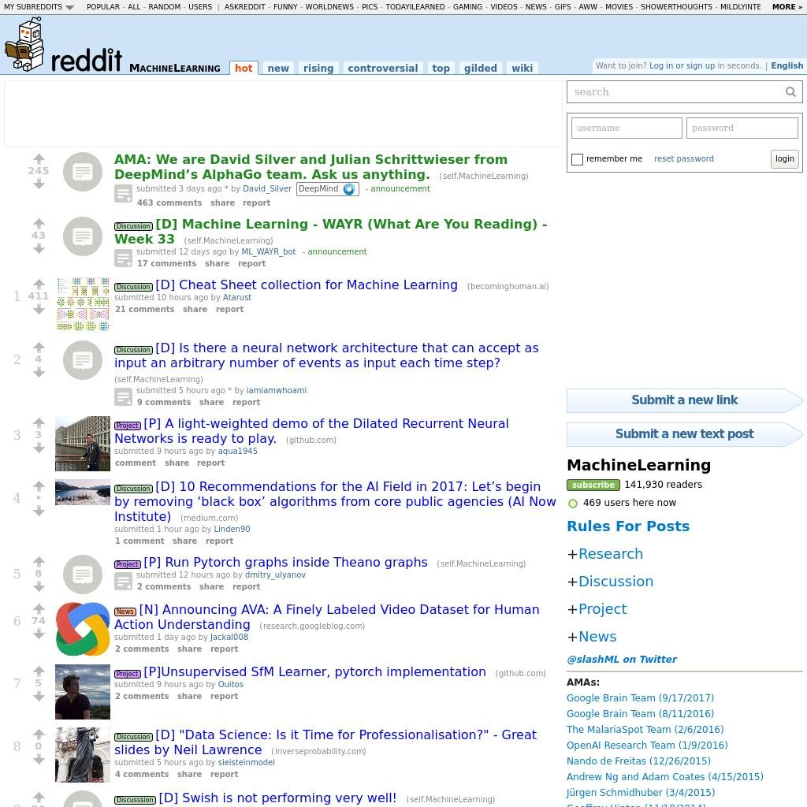

> #오늘의레딧 https://www.reddit.com/r/MachineLearning/ 재미난 이야기들이 많습니다  1. 각 시간 단계마다 입력으로 임의의 수의 이벤트를 입력 할 수있는 신경망 아키텍처가 있습니까? 2. Dilated Recurrent Neural Networks의 경량 데모는 재생 준비가되어 있습니다. 3. 2017 년 AI 분야에 대한 권장 사항 : 핵심 공공 기관 (AI Now Institute)에서 &#39;블랙 박스&#39;알고리즘을 제거하고, 4. Theano 그래프에서 Pytorch 그래프 실행 5. AVA 발표 : 인간 행동 이해를위한 미세한 라벨링 된 비디오 데이터 세트 6. 감독되지 않은 SfM 학습자, Pytorch 구현 7. "데이터 과학 : 전문화의 시간인가?" - Neil Lawrence의 멋진 슬라이드 8. Ableton Groove / Swing 파일에 대한 기계 학습 도움말. 9. 데이터 과학자들이 9 월에 출간 한 ML 기사 10. 신경망 놀이터 : 다른 설정을 시도하고 네트워크가 어떻게 전개되는지보십시오. WebGL 가능 브라우저가 필요합니다. 11. 훈련 도중 사용 된 단계 크기와 정밀도 추정의 감소 사이의 관계. 12. 시뮬레이션으로 일반화하기 13. YOLO로 실시간 물체 감지 개선 14. iPad 용 Jupyter / IPython 클라이언트의 새 버전이 출시되어 서버 구성, 임시 서버 등을 제공합니다. 베타 버전에 가입하여 iPad에 설치하십시오! (x-post from https://www.reddit.com/r/IPython) 15. 한 번의 클릭으로 Jupyter 노트북을 공유하십시오! - Gryd - 클라우드 노트 16. AlphaGo Zero : 처음부터 배우기 | 딥 마인드 17. CNN에서 레이어 구성에 대한 일반 가이드를받을 수 있습니까? 18. ML 이야기 쓰기 봇 시작에 필요한 도움말 ... 19. UAE, 인공 지능 최초의 장관 임명 20. 스와시는 아주 잘하고 있습니다!  1. https://www.reddit.com/r/MachineLearning/comments/77nhdb/d_is_there_a_neural_network_architecture_that_can/ 2. https://github.com/code-terminator/DilatedRNN 3. https://medium.com/@AINowInstitute/the-10-top-recommendations-for-the-ai-field-in-2017-b3253624a7 4. https://www.reddit.com/r/MachineLearning/comments/77litt/p_run_pytorch_graphs_inside_theano_graphs/ 5. https://research.googleblog.com/2017/10/announcing-ava-finely-labeled-video.html?utm_source=feedburner&utm_medium=feed&utm_campaign=Feed:+blogspot/gJZg+\(Official+Google+Research+Blog\) 6. https://github.com/ClementPinard/SfmLearner-Pytorch 7. http://inverseprobability.com/talks/slides/2017-10-13-data-science-time-for-professionalisation.slides.html 8. https://www.reddit.com/r/MachineLearning/comments/77nfb1/p_help_with_machine_learning_on_ableton/ 9. https://medium.com/sicara/09-2017-best-ai-new-articles-this-month-df0f2088543d 10. http://ann.miabellaai.net/ 11. https://www.reddit.com/r/MachineLearning/comments/77lrql/d_relation_between_step_size_used_during_training/ 12. https://blog.openai.com/generalizing-from-simulation/ 13. https://blog.statsbot.co/real-time-object-detection-yolo-cd348527b9b7 14. https://kernels.io/juno-v-1-0-5-beta/ 15. https://gryd.us/one-click-jupyter-notebook-sharing/ 16. https://deepmind.com/blog/alphago-zero-learning-scratch/ 17. https://www.reddit.com/r/MachineLearning/comments/77dnnf/d_can_i_get_a_general_guide_on_organizing_layers/ 18. https://www.reddit.com/r/MachineLearning/comments/77k8i9/project_help_needed_to_start_ml_story_writing_bot/ 19. http://www.arabianbusiness.com/politics-economics/381648-uae-appoints-first-minister-for-artificial-intelligence 20. https://www.reddit.com/r/MachineLearning/comments/77hjfj/d_swish_is_performing_very_well/

### 10월 22일 (일) 08:52 · 📷 사진 (1장)

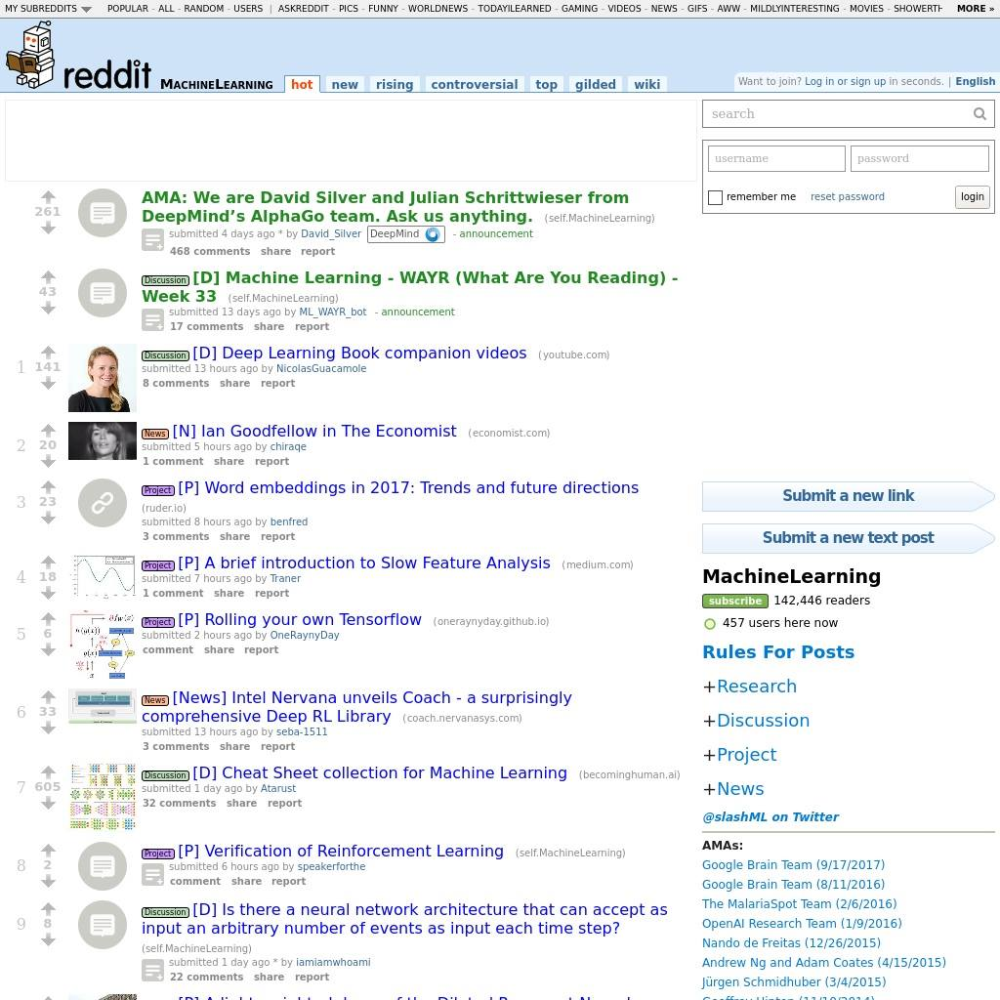

> #오늘의레딧 https://www.reddit.com/r/MachineLearning/ 재미난 이야기들이 많습니다  1. 이안 굿 펠로우 (The Ian Goodfellow) 2. 2017 년 단어 삽입 : 동향 및 향후 방향 3. 느린 피쳐 분석에 대한 간략한 소개 4. 자신 만의 Tensorflow 롤링 5. Intel Nervana, 코치 발표 - 놀라 울 정도로 포괄적 인 Deep RL 라이브러리 6. 기계 학습을위한 컨닝 페이퍼 모음 7. 강화 학습의 검증 8. 각 시간 단계마다 입력으로 임의의 수의 이벤트를 입력 할 수있는 신경망 아키텍처가 있습니까? 9. Dilated Recurrent Neural Networks의 경량 데모는 재생 준비가되어 있습니다. 10. 웹 뉴스를 사용하여 대학원생 과학 프로젝트, 주가 예측 11. Theano 그래프에서 Pytorch 그래프 실행 12. AVA 발표 : 인간 행동 이해를위한 미세한 라벨링 된 비디오 데이터 세트 13. 감독되지 않은 SfM 학습자, Pytorch 구현 14. 훈련 도중 사용 된 단계 크기와 정밀도 추정의 감소 사이의 관계. 15. Ableton Groove / Swing 파일에 대한 기계 학습 도움말. 16. 신경망 놀이터 : 다른 설정을 시도하고 네트워크가 어떻게 전개되는지보십시오. WebGL 가능 브라우저가 필요합니다. 17. 시뮬레이션으로 일반화하기 18. 데이터 과학자들이 9 월에 출간 한 ML 기사 19. YOLO로 실시간 물체 감지 개선 20. "데이터 과학 : 전문화의 시간인가?" - Neil Lawrence의 멋진 슬라이드  1. https://www.economist.com/news/science-and-technology/21724370-generating-convincing-audio-and-video-fake-events-fake-news-you-aint-seen 2. http://ruder.io/word-embeddings-2017/index.html 3. https://medium.com/@hlynurd/a-brief-introduction-to-slow-feature-analysis-18c901bc2a58 4. https://oneraynyday.github.io/ml/2017/10/20/Tensorflow-C++/ 5. http://coach.nervanasys.com/ 6. https://becominghuman.ai/cheat-sheets-for-ai-neural-networks-machine-learning-deep-learning-big-data-678c51b4b463 7. https://www.reddit.com/r/MachineLearning/comments/77uuov/p_verification_of_reinforcement_learning/ 8. https://www.reddit.com/r/MachineLearning/comments/77nhdb/d_is_there_a_neural_network_architecture_that_can/ 9. https://github.com/code-terminator/DilatedRNN 10. https://www.reddit.com/r/MachineLearning/comments/77qo74/d_undergrad_computer_science_project_forecasting/ 11. https://www.reddit.com/r/MachineLearning/comments/77litt/p_run_pytorch_graphs_inside_theano_graphs/ 12. https://research.googleblog.com/2017/10/announcing-ava-finely-labeled-video.html?utm_source=feedburner&utm_medium=feed&utm_campaign=Feed:+blogspot/gJZg+\(Official+Google+Research+Blog\) 13. https://github.com/ClementPinard/SfmLearner-Pytorch 14. https://www.reddit.com/r/MachineLearning/comments/77lrql/d_relation_between_step_size_used_during_training/ 15. https://www.reddit.com/r/MachineLearning/comments/77nfb1/p_help_with_machine_learning_on_ableton/ 16. http://ann.miabellaai.net/ 17. https://blog.openai.com/generalizing-from-simulation/ 18. https://medium.com/sicara/09-2017-best-ai-new-articles-this-month-df0f2088543d 19. https://blog.statsbot.co/real-time-object-detection-yolo-cd348527b9b7 20. http://inverseprobability.com/talks/slides/2017-10-13-data-science-time-for-professionalisation.slides.html

### 10월 23일 (월) 08:52 · 📷 사진 (1장)

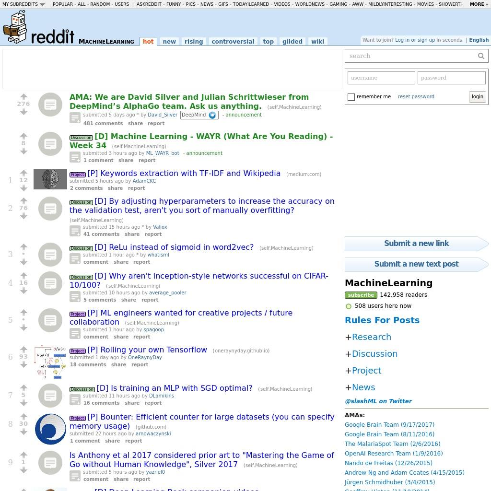

> #오늘의레딧 https://www.reddit.com/r/MachineLearning/ 오늘도 새소식이 많군요.  1. 하이퍼 패러미터를 조정하여 유효성 검사의 정확성을 높이십시오. 수동으로 오버 피팅하지 않습니까? 2. word2vec에서 Sigmoid 대신 ReLu? 3. CIFAR-10 / 100에서 Inception 스타일 네트워크가 성공하지 못하는 이유는 무엇입니까? 4. ML 엔지니어는 창조적 인 프로젝트 / 미래의 협력을 원했습니다. 5. 자신 만의 Tensorflow 롤링 6. Bounter : 대규모 데이터 세트를위한 효율적인 카운터 (메모리 사용을 지정할 수 있음) 7. Deep Learning Book 컴패니언 동영상 8. 이안 굿 펠로우 (The Ian Goodfellow) 9. 2017 년 단어 삽입 : 동향 및 향후 방향 10. Intel Nervana, 코치 발표 - 놀라 울 정도로 포괄적 인 Deep RL 라이브러리 11. 기계 학습을위한 컨닝 페이퍼 모음 12. 강화 학습의 검증 13. 각 시간 단계마다 입력으로 임의의 수의 이벤트를 입력 할 수있는 신경망 아키텍처가 있습니까? 14. 웹 뉴스를 사용하여 대학원생 과학 프로젝트, 주가 예측 15. Dilated Recurrent Neural Networks의 경량 데모는 재생 준비가되어 있습니다. 16. Theano 그래프에서 Pytorch 그래프 실행 17. 감독되지 않은 SfM 학습자, Pytorch 구현 18. AVA 발표 : 인간 행동 이해를위한 미세한 라벨링 된 비디오 데이터 세트 19. 훈련 도중 사용 된 단계 크기와 정밀도 추정의 감소 사이의 관계. 20. Ableton Groove / Swing 파일에 대한 기계 학습 도움말.  1. https://www.reddit.com/r/MachineLearning/comments/77z0rj/d_by_adjusting_hyperparameters_to_increase_the/ 2. https://www.reddit.com/r/MachineLearning/comments/783ajq/d_relu_instead_of_sigmoid_in_word2vec/ 3. https://www.reddit.com/r/MachineLearning/comments/7806n6/d_why_arent_inceptionstyle_networks_successful_on/ 4. https://www.reddit.com/r/MachineLearning/comments/783j6z/p_ml_engineers_wanted_for_creative_projects/ 5. https://oneraynyday.github.io/ml/2017/10/20/Tensorflow-C++/ 6. https://github.com/RaRe-Technologies/bounter 7. https://youtube.com/channel/UCF9O8Vj-FEbRDA5DcDGz-Pg/videos 8. https://www.economist.com/news/science-and-technology/21724370-generating-convincing-audio-and-video-fake-events-fake-news-you-aint-seen 9. http://ruder.io/word-embeddings-2017/index.html 10. http://coach.nervanasys.com/ 11. https://becominghuman.ai/cheat-sheets-for-ai-neural-networks-machine-learning-deep-learning-big-data-678c51b4b463 12. https://www.reddit.com/r/MachineLearning/comments/77uuov/p_verification_of_reinforcement_learning/ 13. https://www.reddit.com/r/MachineLearning/comments/77nhdb/d_is_there_a_neural_network_architecture_that_can/ 14. https://www.reddit.com/r/MachineLearning/comments/77qo74/d_undergrad_computer_science_project_forecasting/ 15. https://github.com/code-terminator/DilatedRNN 16. https://www.reddit.com/r/MachineLearning/comments/77litt/p_run_pytorch_graphs_inside_theano_graphs/ 17. https://github.com/ClementPinard/SfmLearner-Pytorch 18. https://research.googleblog.com/2017/10/announcing-ava-finely-labeled-video.html?utm_source=feedburner&utm_medium=feed&utm_campaign=Feed:+blogspot/gJZg+\(Official+Google+Research+Blog\) 19. https://www.reddit.com/r/MachineLearning/comments/77lrql/d_relation_between_step_size_used_during_training/ 20. https://www.reddit.com/r/MachineLearning/comments/77nfb1/p_help_with_machine_learning_on_ableton/

### 10월 24일 (화) 08:52 · 📷 사진 (2장)

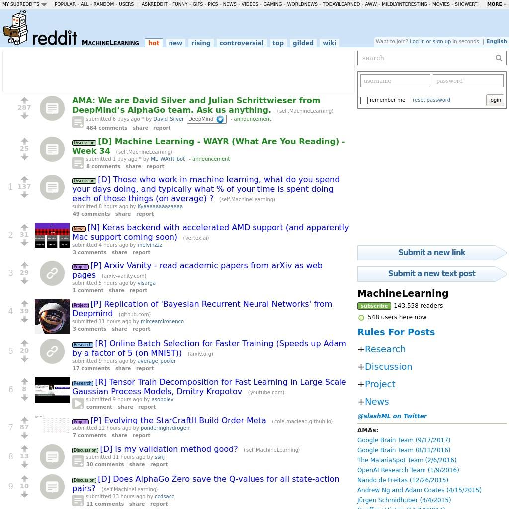 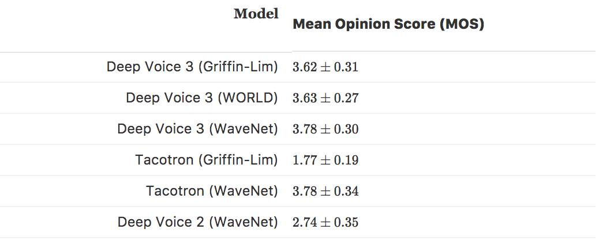

> #오늘의레딧 https://www.reddit.com/r/MachineLearning/ 따끈한 소식들입니다.  1. 가속화 된 AMD 지원 기능을 갖춘 Keras 백엔드 (곧 지원 예정) 2. Arxiv 허영심 - arXiv의 학술 논문을 웹 페이지로 읽음 3. Deepmind에서 &#39;Bayesian Recurrent Neural Networks&#39;복제 4. 보다 빠른 교육을위한 온라인 배치 선택 (MNIST에서 5 배로 아담 속도 향상) 5. 대규모 가우스 프로세스 모델에서의 빠른 학습을위한 Tensor 열 분해, Dmitry Kropotov 6. StarCraftII Build Order Meta 진화 7. AlphaGo Zero는 모든 state-action 쌍에 대한 Q-value를 저장합니까? 8. AWS : 자율 차량 제작 2 부 9. 지난 10 년 동안 Machine Learning 알고리즘에 주요 혁신이 있었습니까? 아니면 대부분의 개선 사항은 대부분 더 많은 데이터와 강력한 컴퓨팅에 대한 것이 었습니까? 10. PyTorch에서 KFAC로 더 깊은 네트워크 최적화. - 야로 슬라브 Bulatov - Medium 11. 기계 학습을 통한 패션 이미지 인식 12. 프로덕션 환경에서 모델의 성능을 어떻게 추적합니까? 13. 현재 공개적으로 사용 가능한 최신 상태를 달성하는 코드가 있습니까? 14. TF-IDF 및 Wikipedia를 이용한 키워드 추출 15. 하이퍼 패러미터를 조정하여 유효성 검사의 정확성을 높이십시오. 수동으로 오버 피팅하지 않습니까? 16. word2vec에서 Sigmoid 대신 ReLu? 17. 고성능 예측 API를 구축하는 데 필요한 리소스는 무엇입니까? 18. CIFAR-10 / 100에서 Inception 스타일 네트워크가 성공하지 못하는 이유는 무엇입니까? 19. 추론을 위해 인공 지능을 조사하기 시작하고 싶습니다. 어디서부터 시작해야합니까? 20. 자신 만의 Tensorflow 롤링  1. http://vertex.ai/blog/ 2. https://www.arxiv-vanity.com/ 3. https://github.com/mirceamironenco/BayesianRecurrentNN 4. https://arxiv.org/abs/1511.06343 5. https://www.youtube.com/watch?v=CrSFne4h3Pk 6. http://cole-maclean.github.io/blog/Evolving%20the%20StarCraftII%20Build%20Order%20Meta/ 7. https://www.reddit.com/r/MachineLearning/comments/786ovr/d_does_alphago_zero_save_the_qvalues_for_all/ 8. https://aws.amazon.com/blogs/ai/build-an-autonomous-vehicle-part-2-driving-your-vehicle/ 9. https://www.reddit.com/r/MachineLearning/comments/786stb/d_has_there_been_any_major_breakthroughs_in/ 10. https://medium.com/@yaroslavvb/optimizing-deeper-networks-with-kfac-in-pytorch-4004adcba1b0 11. http://www.primaryobjects.com/2017/10/23/image-recognition-for-fashion-with-machine-learning/ 12. https://www.reddit.com/r/MachineLearning/comments/785w71/d_how_do_you_track_your_models_performance_in/ 13. https://www.reddit.com/r/MachineLearning/comments/78amkx/d_is_there_code_that_achieves_current/ 14. https://medium.com/@adam.chin/the-fastest-way-to-identify-keywords-in-news-articles-tfidf-with-wikipedia-python-version-baf874d7eb16?source=linkShare-f092460bca5c-1508696512 15. https://www.reddit.com/r/MachineLearning/comments/77z0rj/d_by_adjusting_hyperparameters_to_increase_the/ 16. https://www.reddit.com/r/MachineLearning/comments/783ajq/d_relu_instead_of_sigmoid_in_word2vec/ 17. https://www.reddit.com/r/MachineLearning/comments/7859xc/d_resources_on_building_highperformance/ 18. https://www.reddit.com/r/MachineLearning/comments/7806n6/d_why_arent_inceptionstyle_networks_successful_on/ 19. https://www.reddit.com/r/MachineLearning/comments/7849ms/d_would_like_to_start_looking_into_ai_for/ 20. https://oneraynyday.github.io/ml/2017/10/20/Tensorflow-C++/
> https://www.arxiv-vanity.com/papers/1710.07654v1/ Taehoon Kim께서 구현해주신 TTS많은 인기를 끌었는데요, 딥 보이스 3이 나왔습니다. MOS 거의 4점이면 훌륭하네요.  이전 모델에 비해서 훨씬 자연스럽다고 합니다. 태훈님의 구현을 기다려 보면 되겠지요?

### 10월 25일 (수) 07:56 · 📷 사진 (10장)

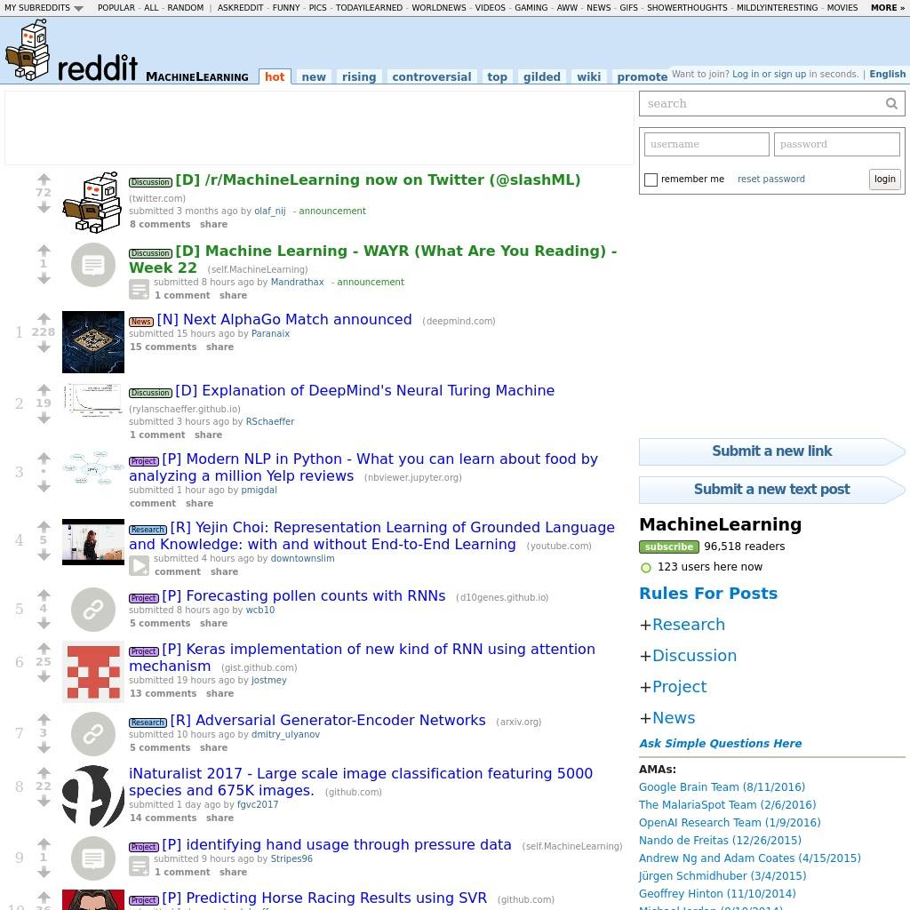      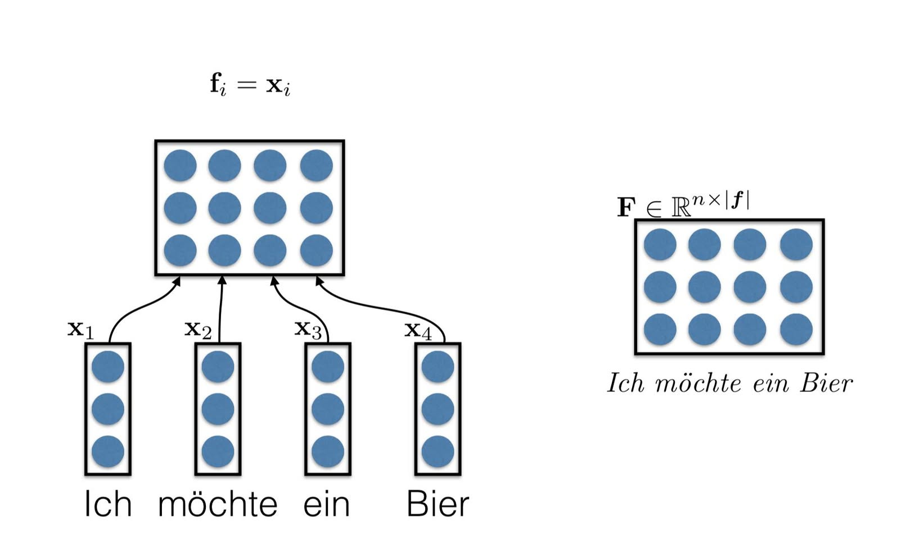 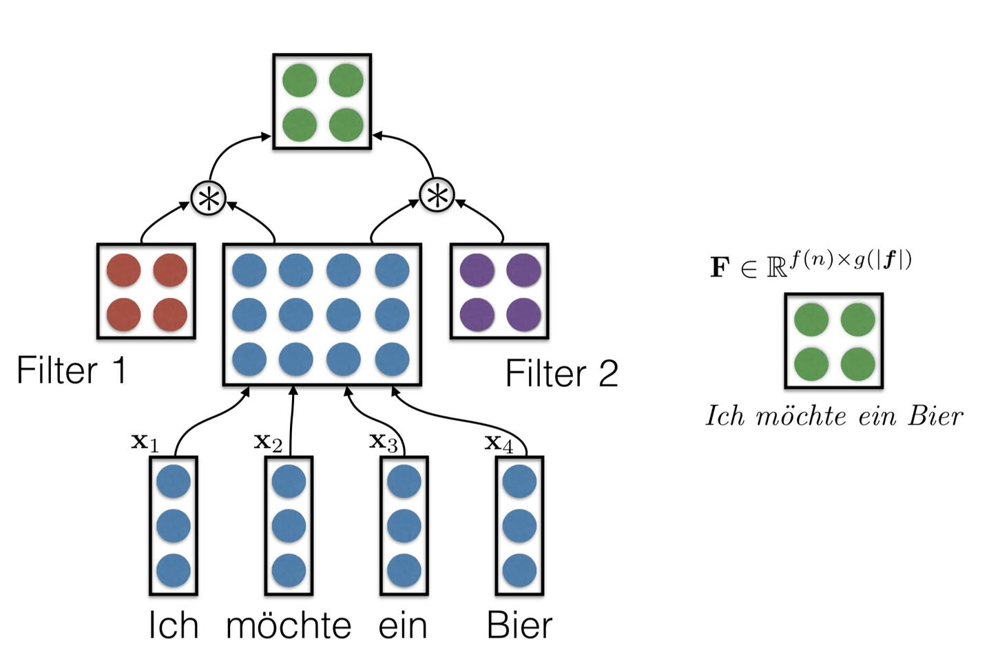 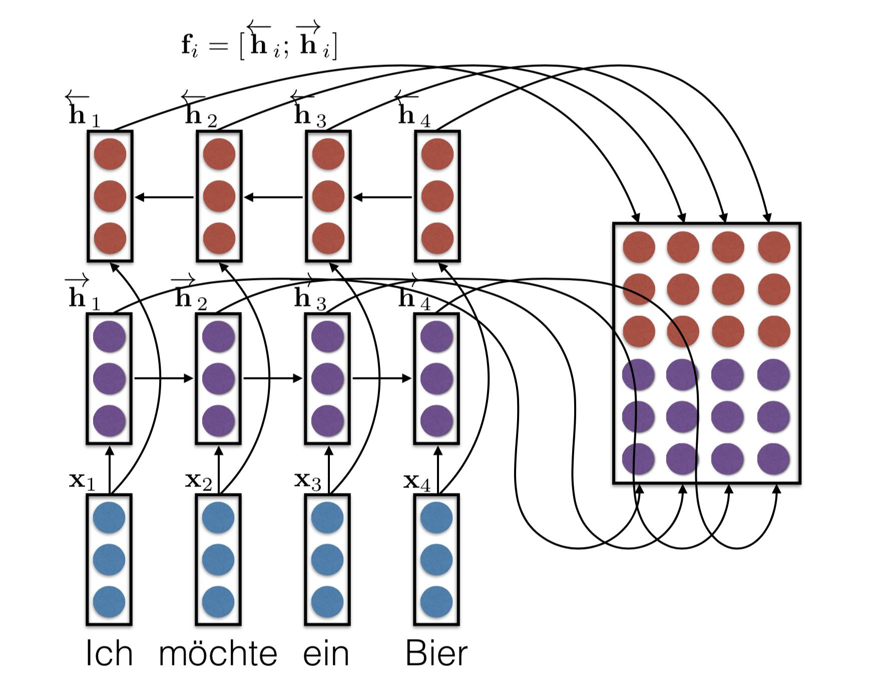 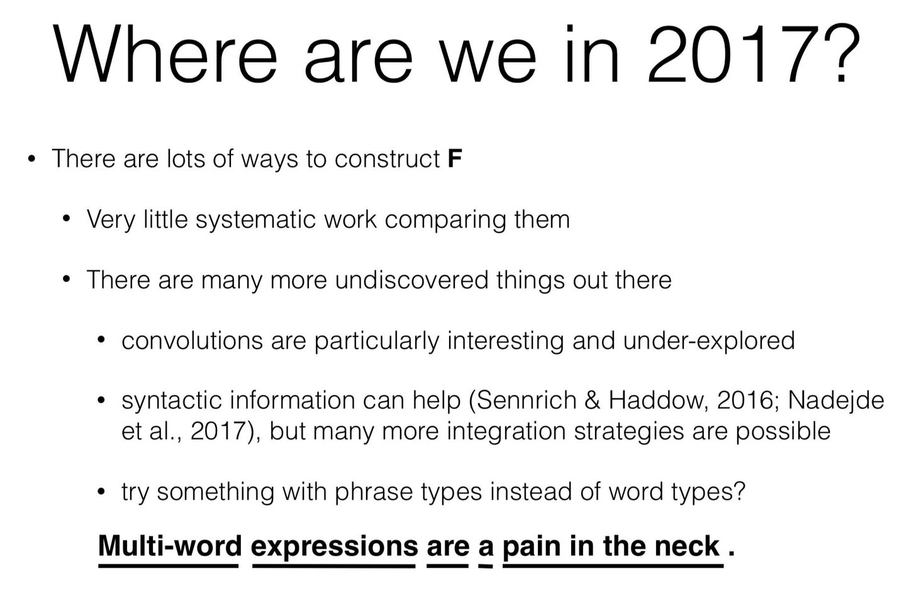

> #오늘의레딧 https://www.reddit.com/r/MachineLearning/ 아침부터 다양한 소식이 많네요.  1. StackGAN-v2 2. 딥 보이스 3 : 2000- 스피커 신경 텍스트 - 음성 3. CppCon 2017 : Peter Goldsborough "C ++로 깊은 학습을하는 여행" 4. ASYNC : 기계 학습 및 게임 | 온라인 대화, 라이브 상영 / 라이브, 10 월 25-27 일 5. 반복 할인 단위 6. 기계 학습 조사 - 데이터 과학 도구 및 기술 2017 7. 고 스파 스 바이너리 데이터 용 자동 인코딩 장치 8. 가속화 된 AMD 지원 기능을 갖춘 Keras 백엔드 (곧 지원 예정) 9. 딥 커널 GP 구현 10. 기계 학습에서 일하는 사람들, 일을하는 데 소비하는 시간은 무엇이며, 일반적으로 시간의 몇 %는 평균적으로 그러한 일을하는 데 소비됩니까? 11. Arxiv 허영심 - arXiv의 학술 논문을 웹 페이지로 읽음 12. 나만이있어. 13. Deepmind에서 &#39;Bayesian Recurrent Neural Networks&#39;복제 14. 보다 빠른 교육을위한 온라인 배치 선택 (MNIST에서 5 배로 아담 속도 향상) 15. 대규모 가우스 프로세스 모델에서의 빠른 학습을위한 Tensor 열 분해, Dmitry Kropotov 16. AWS : 자율 차량 제작 2 부 17. StarCraftII Build Order Meta 진화 18. TF 백엔드가있는 Keras에서의 GPU로드 문제. 19. 지난 10 년 동안 Machine Learning 알고리즘에 주요 혁신이 있었습니까? 아니면 대부분의 개선 사항은 대부분 더 많은 데이터와 강력한 컴퓨팅에 대한 것이 었습니까? 20. AlphaGo Zero는 모든 state-action 쌍에 대한 Q-value를 저장합니까?  1. https://github.com/hanzhanggit/StackGAN-v2 2. https://arxiv.org/abs/1710.07654v1 3. https://www.youtube.com/watch?v=Lo1rXJdAJ7w 4. https://www.reddit.com/r/MachineLearning/comments/78gwdn/n_async_machine_learning_games_online_talks/ 5. https://arxiv.org/pdf/1705.08480.pdf 6. https://docs.google.com/forms/d/e/1FAIpQLSdWgsOfkMUNddrnvhIj3_JL715jFAEI9fwIKUfbaDG5iWLBkA/viewform 7. https://www.reddit.com/r/MachineLearning/comments/78j4jk/d_autoencoders_for_highly_sparse_binary_data/ 8. http://vertex.ai/blog/ 9. https://github.com/maka89/Deep-Kernel-GP 10. https://www.reddit.com/r/MachineLearning/comments/78807s/d_those_who_work_in_machine_learning_what_do_you/ 11. https://www.arxiv-vanity.com/ 12. https://www.nytimes.com/2017/10/22/technology/artificial-intelligence-experts-salaries.html?_r=1 13. https://github.com/mirceamironenco/BayesianRecurrentNN 14. https://arxiv.org/abs/1511.06343 15. https://www.youtube.com/watch?v=CrSFne4h3Pk 16. https://aws.amazon.com/blogs/ai/build-an-autonomous-vehicle-part-2-driving-your-vehicle/ 17. http://cole-maclean.github.io/blog/Evolving%20the%20StarCraftII%20Build%20Order%20Meta/ 18. https://www.reddit.com/r/MachineLearning/comments/78cdr3/d_gpu_load_problem_on_keras_with_tf_backend/ 19. https://www.reddit.com/r/MachineLearning/comments/786stb/d_has_there_been_any_major_breakthroughs_in/ 20. https://www.reddit.com/r/MachineLearning/comments/786ovr/d_does_alphago_zero_save_the_qvalues_for_all/
> #오늘의레딧 https://www.reddit.com/r/MachineLearning/ 재미난 이야기들이 많습니다  1. 기계 학습 - WAYR (당신은 무엇을 읽고 있습니까?) - 주 34 2. Pretrained.ml - 데모가 포함 된 심층 학습 모델 3. StackGAN-v2 4. 딥 보이스 3 : 2000- 스피커 신경 텍스트 - 음성 5. CppCon 2017 : Peter Goldsborough "C ++로 깊은 학습을하는 여행" 6. ASYNC : 기계 학습 및 게임 | 온라인 대화, 라이브 상영 / 라이브, 10 월 25-27 일 7. 반복 할인 단위 8. 기계 학습 조사 - 데이터 과학 도구 및 기술 2017 9. 고 스파 스 바이너리 데이터 용 자동 인코딩 장치 10. 가속화 된 AMD 지원 기능을 갖춘 Keras 백엔드 (곧 지원 예정) 11. 딥 커널 GP 구현 12. 기계 학습에서 일하는 사람들, 일을하는 데 소비하는 시간은 무엇이며, 일반적으로 시간의 몇 %는 평균적으로 그러한 일을하는 데 소비됩니까? 13. Arxiv 허영심 - arXiv의 학술 논문을 웹 페이지로 읽음 14. 나만이있어. 15. Deepmind에서 &#39;Bayesian Recurrent Neural Networks&#39;복제 16. 보다 빠른 교육을위한 온라인 배치 선택 (MNIST에서 5 배로 아담 속도 향상) 17. 대규모 가우스 프로세스 모델에서의 빠른 학습을위한 Tensor 열 분해, Dmitry Kropotov 18. AWS : 자율 차량 제작 2 부 19. StarCraftII Build Order Meta 진화 20. TF 백엔드가있는 Keras에서의 GPU로드 문제.  1. https://www.reddit.com/r/MachineLearning/comments/782js9/d_machine_learning_wayr_what_are_you_reading_week/ 2. http://pretrained.ml/ 3. https://github.com/hanzhanggit/StackGAN-v2 4. https://arxiv.org/abs/1710.07654v1 5. https://www.youtube.com/watch?v=Lo1rXJdAJ7w 6. https://www.reddit.com/r/MachineLearning/comments/78gwdn/n_async_machine_learning_games_online_talks/ 7. https://arxiv.org/pdf/1705.08480.pdf 8. https://docs.google.com/forms/d/e/1FAIpQLSdWgsOfkMUNddrnvhIj3_JL715jFAEI9fwIKUfbaDG5iWLBkA/viewform 9. https://www.reddit.com/r/MachineLearning/comments/78j4jk/d_autoencoders_for_highly_sparse_binary_data/ 10. http://vertex.ai/blog/ 11. https://github.com/maka89/Deep-Kernel-GP 12. https://www.reddit.com/r/MachineLearning/comments/78807s/d_those_who_work_in_machine_learning_what_do_you/ 13. https://www.arxiv-vanity.com/ 14. https://www.nytimes.com/2017/10/22/technology/artificial-intelligence-experts-salaries.html?_r=1 15. https://github.com/mirceamironenco/BayesianRecurrentNN 16. https://arxiv.org/abs/1511.06343 17. https://www.youtube.com/watch?v=CrSFne4h3Pk 18. https://aws.amazon.com/blogs/ai/build-an-autonomous-vehicle-part-2-driving-your-vehicle/ 19. http://cole-maclean.github.io/blog/Evolving%20the%20StarCraftII%20Build%20Order%20Meta/ 20. https://www.reddit.com/r/MachineLearning/comments/78cdr3/d_gpu_load_problem_on_keras_with_tf_backend/
> #오늘의레딧 https://www.reddit.com/r/MachineLearning/ 따끈한 소식들입니다.  1. 기계 학습-WAYR(뭘 읽는 것 있나)-둘째 34다. 2. Pretrained.ml- 깊은 학습 시연과 모델이다. 3. StackGAN-v2 4. 딥 음성 3:2000-Speaker 텍스트 음성 변환. 5. CppCon 2017년:피터 Goldsborough“ 깊은 학습의 C++는 투어”. 6. ASYNC:기계 학습&게임 | 온라인 회담, 라이브 w/ 채팅, 10월 2527을 막았다. 7. 순환 할인 단위 8. 기계 학습 조사-데이터 과학 도구&기술 2017년. 9. 매우 희박한 이진 데이터에 Autoencoders. 10. 가속 AMD지원( 있고, 명백히 맥 지원 곧)과 Keras-end. 11. 딥 커널 GP를 구현 12. 사람들은 기계에 공부를 하는 중, 너는 네일 하면서 일반적으로 하는 일이 시간%(평균)각 없는 일을 하다 보냅니까? 13. Arxiv에 베너티-웹 페이지라고 arXiv로부터 학구적인 신문을 읽다. 14. 그곳에는 오직 하나 나를 좋아한 것. 15. 'Bayesian 순환 신경 네트워크의 Deepmind의 Replication. 16. 온라인 배치 선정을 더 빨리 훈련원(5(의 요인에 의하여 MNIST에 아담을 Speeds)). 17. 텐서 열차 분해 빠른 학습에 관한 스케일과 가우시안 연구, 드미트리 Kropotov에. 18. AWS:는 자율 차량 Part2를 건설한다. 19. 그 StarCraftII 빌드 오더 메타 Evolving. 20. Keras에 TF-end와 GPU에 부하 문제이다.  1. https://www.reddit.com/r/MachineLearning/comments/782js9/d_machine_learning_wayr_what_are_you_reading_week/ 2. http://pretrained.ml/ 3. https://github.com/hanzhanggit/StackGAN-v2 4. https://arxiv.org/abs/1710.07654v1 5. https://www.youtube.com/watch?v=Lo1rXJdAJ7w 6. https://www.reddit.com/r/MachineLearning/comments/78gwdn/n_async_machine_learning_games_online_talks/ 7. https://arxiv.org/pdf/1705.08480.pdf 8. https://docs.google.com/forms/d/e/1FAIpQLSdWgsOfkMUNddrnvhIj3_JL715jFAEI9fwIKUfbaDG5iWLBkA/viewform 9. https://www.reddit.com/r/MachineLearning/comments/78j4jk/d_autoencoders_for_highly_sparse_binary_data/ 10. http://vertex.ai/blog/ 11. https://github.com/maka89/Deep-Kernel-GP 12. https://www.reddit.com/r/MachineLearning/comments/78807s/d_those_who_work_in_machine_learning_what_do_you/ 13. https://www.arxiv-vanity.com/ 14. https://www.nytimes.com/2017/10/22/technology/artificial-intelligence-experts-salaries.html?_r=1 15. https://github.com/mirceamironenco/BayesianRecurrentNN 16. https://arxiv.org/abs/1511.06343 17. https://www.youtube.com/watch?v=CrSFne4h3Pk 18. https://aws.amazon.com/blogs/ai/build-an-autonomous-vehicle-part-2-driving-your-vehicle/ 19. http://cole-maclean.github.io/blog/Evolving%20the%20StarCraftII%20Build%20Order%20Meta/ 20. https://www.reddit.com/r/MachineLearning/comments/78cdr3/d_gpu_load_problem_on_keras_with_tf_backend/
> #오늘의레딧 https://www.reddit.com/r/MachineLearning/ 따끈한 소식들입니다.  6:1. 기계 학습-WAYR(뭘 읽는 것 있나)-둘째 34다. 4:2. Pretrained.ml- 깊은 학습 시연과 모델이다. 4:3. StackGAN-v2 4:4. 딥 음성 3:2000-Speaker 텍스트 음성 변환. 8:5. CppCon 2017년:피터 Goldsborough“ 깊은 학습의 C++는 투어”. 4:6. ASYNC:기계 학습&게임 | 온라인 회담, 라이브 w/ 채팅, 10월 2527을 막았다. 4:7. 순환 할인 단위 4:8. 기계 학습 조사-데이터 과학 도구&기술 2017년. 1:9. 매우 희박한 이진 데이터에 Autoencoders. 4:10. 가속 AMD지원( 있고, 명백히 맥 지원 곧)과 Keras-end. 4:11. 딥 커널 GP를 구현 4:12. 사람들은 기계에 공부를 하는 중, 너는 네일 하면서 일반적으로 하는 일이 시간%(평균)각 없는 일을 하다 보냅니까? 4:13. Arxiv에 베너티-웹 페이지라고 arXiv로부터 학구적인 신문을 읽다. 8:14. 그곳에는 오직 하나 나를 좋아한 것. 4:15. 'Bayesian 순환 신경 네트워크의 Deepmind의 Replication. 4:16. 온라인 배치 선정을 더 빨리 훈련원(5(의 요인에 의하여 MNIST에 아담을 Speeds)). 4:17. 텐서 열차 분해 빠른 학습에 관한 스케일과 가우시안 연구, 드미트리 Kropotov에. 4:18. AWS:는 자율 차량 Part2를 건설한다. 4:19. 그 StarCraftII 빌드 오더 메타 Evolving. 8:20. Keras에 TF-end와 GPU에 부하 문제이다.  1. https://www.reddit.com/r/MachineLearning/comments/782js9/d_machine_learning_wayr_what_are_you_reading_week/ 2. http://pretrained.ml/ 3. https://github.com/hanzhanggit/StackGAN-v2 4. https://arxiv.org/abs/1710.07654v1 5. https://www.youtube.com/watch?v=Lo1rXJdAJ7w 6. https://www.reddit.com/r/MachineLearning/comments/78gwdn/n_async_machine_learning_games_online_talks/ 7. https://arxiv.org/pdf/1705.08480.pdf 8. https://docs.google.com/forms/d/e/1FAIpQLSdWgsOfkMUNddrnvhIj3_JL715jFAEI9fwIKUfbaDG5iWLBkA/viewform 9. https://www.reddit.com/r/MachineLearning/comments/78j4jk/d_autoencoders_for_highly_sparse_binary_data/ 10. http://vertex.ai/blog/ 11. https://github.com/maka89/Deep-Kernel-GP 12. https://www.reddit.com/r/MachineLearning/comments/78807s/d_those_who_work_in_machine_learning_what_do_you/ 13. https://www.arxiv-vanity.com/ 14. https://www.nytimes.com/2017/10/22/technology/artificial-intelligence-experts-salaries.html?_r=1 15. https://github.com/mirceamironenco/BayesianRecurrentNN 16. https://arxiv.org/abs/1511.06343 17. https://www.youtube.com/watch?v=CrSFne4h3Pk 18. https://aws.amazon.com/blogs/ai/build-an-autonomous-vehicle-part-2-driving-your-vehicle/ 19. http://cole-maclean.github.io/blog/Evolving%20the%20StarCraftII%20Build%20Order%20Meta/ 20. https://www.reddit.com/r/MachineLearning/comments/78cdr3/d_gpu_load_problem_on_keras_with_tf_backend/
> #오늘의레딧 https://www.reddit.com/r/MachineLearning/ 래딧은 읽을 거리가 다양합니다.  1. Pretrained.ml- 깊은 학습 시연과 모델이다. 2. StackGAN-v2 3. 딥 음성 3:2000-Speaker 텍스트 음성 변환. 4. CppCon 2017년:피터 Goldsborough“ 깊은 학습의 C++는 투어”. 5. ASYNC:기계 학습&게임 | 온라인 회담, 라이브 w/ 채팅, 10월 2527을 막았다. 6. 순환 할인 단위 7. 기계 학습 조사-데이터 과학 도구&기술 2017년. 8. 매우 희박한 이진 데이터에 Autoencoders. 9. 가속 AMD지원( 있고, 명백히 맥 지원 곧)과 Keras-end. 10. 딥 커널 GP를 구현 11. 사람들은 기계에 공부를 하는 중, 너는 네일 하면서 일반적으로 하는 일이 시간%(평균)각 없는 일을 하다 보냅니까? 12. Arxiv에 베너티-웹 페이지라고 arXiv로부터 학구적인 신문을 읽다. 13. 그곳에는 오직 하나 나를 좋아한 것. 14. 'Bayesian 순환 신경 네트워크의 Deepmind의 Replication. 15. 온라인 배치 선정을 더 빨리 훈련원(5(의 요인에 의하여 MNIST에 아담을 Speeds)). 16. 텐서 열차 분해 빠른 학습에 관한 스케일과 가우시안 연구, 드미트리 Kropotov에. 17. AWS:는 자율 차량 Part2를 건설한다. 18. 그 StarCraftII 빌드 오더 메타 Evolving. 19. Keras에 TF-end와 GPU에 부하 문제이다. 20. 기계 학습 알고리즘이 지난 10년 간이라도 있나 중요한 돌파구들이? 아니면 대부분 더 많은 데이터와 강력한 컴퓨팅는 것에 대한 변화들은 대부분?  1. http://pretrained.ml/ 2. https://github.com/hanzhanggit/StackGAN-v2 3. https://arxiv.org/abs/1710.07654v1 4. https://www.youtube.com/watch?v=Lo1rXJdAJ7w 5. https://www.reddit.com/r/MachineLearning/comments/78gwdn/n_async_machine_learning_games_online_talks/ 6. https://arxiv.org/pdf/1705.08480.pdf 7. https://docs.google.com/forms/d/e/1FAIpQLSdWgsOfkMUNddrnvhIj3_JL715jFAEI9fwIKUfbaDG5iWLBkA/viewform 8. https://www.reddit.com/r/MachineLearning/comments/78j4jk/d_autoencoders_for_highly_sparse_binary_data/ 9. http://vertex.ai/blog/ 10. https://github.com/maka89/Deep-Kernel-GP 11. https://www.reddit.com/r/MachineLearning/comments/78807s/d_those_who_work_in_machine_learning_what_do_you/ 12. https://www.arxiv-vanity.com/ 13. https://www.nytimes.com/2017/10/22/technology/artificial-intelligence-experts-salaries.html?_r=1 14. https://github.com/mirceamironenco/BayesianRecurrentNN 15. https://arxiv.org/abs/1511.06343 16. https://www.youtube.com/watch?v=CrSFne4h3Pk 17. https://aws.amazon.com/blogs/ai/build-an-autonomous-vehicle-part-2-driving-your-vehicle/ 18. http://cole-maclean.github.io/blog/Evolving%20the%20StarCraftII%20Build%20Order%20Meta/ 19. https://www.reddit.com/r/MachineLearning/comments/78cdr3/d_gpu_load_problem_on_keras_with_tf_backend/ 20. https://www.reddit.com/r/MachineLearning/comments/786stb/d_has_there_been_any_major_breakthroughs_in/
> #오늘의레딧 https://www.reddit.com/r/MachineLearning/ 따끈한 소식들입니다.  1. Pretrained.ml- 깊은 학습 시연과 모델이다. 2. StackGAN-v2 3. 딥 음성 3:2000-Speaker 텍스트 음성 변환. 4. CppCon 2017년:피터 Goldsborough“ 깊은 학습의 C++는 투어”. 5. ASYNC:기계 학습&게임 | 온라인 회담, 라이브 w/ 채팅, 10월 2527을 막았다. 6. 순환 할인 단위 7. 기계 학습 조사-데이터 과학 도구&기술 2017년. 8. 매우 희박한 이진 데이터에 Autoencoders. 9. 가속 AMD지원( 있고, 명백히 맥 지원 곧)과 Keras-end. 10. 딥 커널 GP를 구현 11. 사람들은 기계에 공부를 하는 중, 너는 네일 하면서 일반적으로 하는 일이 시간%(평균)각 없는 일을 하다 보냅니까? 12. Arxiv에 베너티-웹 페이지라고 arXiv로부터 학구적인 신문을 읽다. 13. 그곳에는 오직 하나 나를 좋아한 것. 14. 'Bayesian 순환 신경 네트워크의 Deepmind의 Replication. 15. 온라인 배치 선정을 더 빨리 훈련원(5(의 요인에 의하여 MNIST에 아담을 Speeds)). 16. 텐서 열차 분해 빠른 학습에 관한 스케일과 가우시안 연구, 드미트리 Kropotov에. 17. AWS:는 자율 차량 Part2를 건설한다. 18. 그 StarCraftII 빌드 오더 메타 Evolving. 19. Keras에 TF-end와 GPU에 부하 문제이다. 20. 기계 학습 알고리즘이 지난 10년 간이라도 있나 중요한 돌파구들이? 아니면 대부분 더 많은 데이터와 강력한 컴퓨팅는 것에 대한 변화들은 대부분?  1. http://pretrained.ml/ 2. https://github.com/hanzhanggit/StackGAN-v2 3. https://arxiv.org/abs/1710.07654v1 4. https://www.youtube.com/watch?v=Lo1rXJdAJ7w 5. https://www.reddit.com/r/MachineLearning/comments/78gwdn/n_async_machine_learning_games_online_talks/ 6. https://arxiv.org/pdf/1705.08480.pdf 7. https://docs.google.com/forms/d/e/1FAIpQLSdWgsOfkMUNddrnvhIj3_JL715jFAEI9fwIKUfbaDG5iWLBkA/viewform 8. https://www.reddit.com/r/MachineLearning/comments/78j4jk/d_autoencoders_for_highly_sparse_binary_data/ 9. http://vertex.ai/blog/ 10. https://github.com/maka89/Deep-Kernel-GP 11. https://www.reddit.com/r/MachineLearning/comments/78807s/d_those_who_work_in_machine_learning_what_do_you/ 12. https://www.arxiv-vanity.com/ 13. https://www.nytimes.com/2017/10/22/technology/artificial-intelligence-experts-salaries.html?_r=1 14. https://github.com/mirceamironenco/BayesianRecurrentNN 15. https://arxiv.org/abs/1511.06343 16. https://www.youtube.com/watch?v=CrSFne4h3Pk 17. https://aws.amazon.com/blogs/ai/build-an-autonomous-vehicle-part-2-driving-your-vehicle/ 18. http://cole-maclean.github.io/blog/Evolving%20the%20StarCraftII%20Build%20Order%20Meta/ 19. https://www.reddit.com/r/MachineLearning/comments/78cdr3/d_gpu_load_problem_on_keras_with_tf_backend/ 20. https://www.reddit.com/r/MachineLearning/comments/786stb/d_has_there_been_any_major_breakthroughs_in/

### 10월 26일 (목) 08:52 · 📷 사진 (1장)

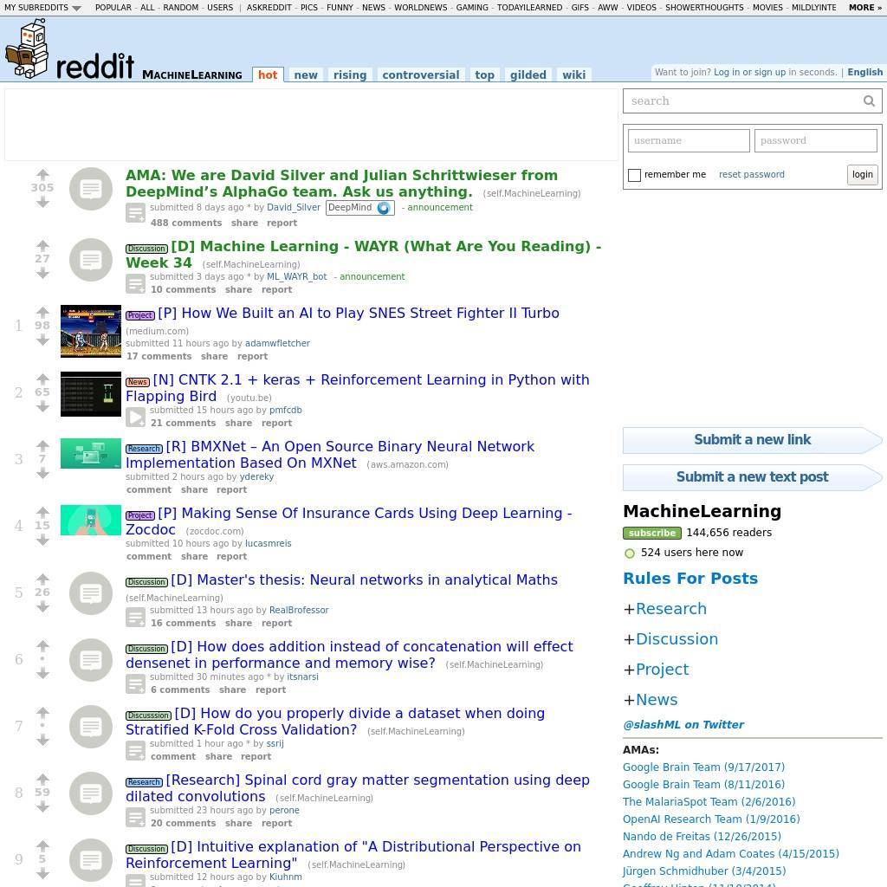

> #오늘의레딧 https://www.reddit.com/r/MachineLearning/ 머신러닝 공부는 정말 재미있죠?아침부터 다양한 소식이 많네요.  1. 우리는 어떻게 SNES 스트리트 파이터 2터보 놀기 위해 인공 지능을 지었다. 2. CNTK 2.1+keras+ 강화 학습 Python으로 휘날리며라는 조류. 3. BMXNet MXNet에 의한 오픈 소스 혼합한 신경망 도입 –. 4. 보험 카드를 이용한 딥 학습-Zocdoc 바로 그림을 만드는 것. 5. 석사 논문:분석 Maths에 신경망은. 6. 어떻게 적은 연쇄 대신 추가 성능과 메모리 뜻에서는 densenet시켰는가? 7. 척수 회백질의 세분화 깊은 기민하게 얽히고 설킨를 사용하여. 8. "한 구조 형성 관점 강화 학습에"의 직감적인 설명. 9. CppCon 2017년:피터 Goldsborough“ 깊은 학습의 C++는 투어”. 10. StackGAN-v2 11. Pretrained.ml- 깊은 학습 시연과 모델이다. 12. 딥 음성 3:2000-Speaker 텍스트 음성 변환. 13. 매우 희박한 이진 데이터에 Autoencoders. 14. ASYNC:기계 학습&게임 | 온라인 회담, 라이브 w/ 채팅, 10월 2527을 막았다. 15. 딥 커널 GP를 구현 16. 기계 학습 조사-데이터 과학 도구&기술 2017년. 17. 순환 할인 단위 18. AI/ML과 Blockchain 기술의 결합. 19. 가속 AMD지원( 있고, 명백히 맥 지원 곧)과 Keras-end. 20. Arxiv에 베너티-웹 페이지라고 arXiv로부터 학구적인 신문을 읽다.  1. https://medium.com/gyroscopesoftware/how-we-built-an-ai-to-play-street-fighter-ii-can-you-beat-it-9542ba43f02b 2. https://youtu.be/GS_l308-56E 3. https://aws.amazon.com/blogs/ai/research-spotlight-bmxnet-an-open-source-binary-neural-network-implementation-based-on-mxnet/ 4. https://www.zocdoc.com/about/blog/tech/making-sense-of-insurance-cards-using-deep-learning/ 5. https://www.reddit.com/r/MachineLearning/comments/78mqzv/d_masters_thesis_neural_networks_in_analytical/ 6. https://www.reddit.com/r/MachineLearning/comments/78rejv/d_how_does_addition_instead_of_concatenation_will/ 7. https://www.reddit.com/r/MachineLearning/comments/78jwag/research_spinal_cord_gray_matter_segmentation/ 8. https://www.reddit.com/r/MachineLearning/comments/78n3tg/d_intuitive_explanation_of_a_distributional/ 9. https://www.youtube.com/watch?v=Lo1rXJdAJ7w 10. https://github.com/hanzhanggit/StackGAN-v2 11. http://pretrained.ml/ 12. https://arxiv.org/abs/1710.07654v1 13. https://www.reddit.com/r/MachineLearning/comments/78j4jk/d_autoencoders_for_highly_sparse_binary_data/ 14. https://www.reddit.com/r/MachineLearning/comments/78gwdn/n_async_machine_learning_games_online_talks/ 15. https://github.com/maka89/Deep-Kernel-GP 16. https://docs.google.com/forms/d/e/1FAIpQLSdWgsOfkMUNddrnvhIj3_JL715jFAEI9fwIKUfbaDG5iWLBkA/viewform 17. https://arxiv.org/pdf/1705.08480.pdf 18. https://www.reddit.com/r/MachineLearning/comments/78mhg2/r_combination_of_aiml_and_blockchain_technologies/ 19. http://vertex.ai/blog/ 20. https://www.arxiv-vanity.com/

### 10월 27일 (금) 08:52 · 📷 사진 (1장)

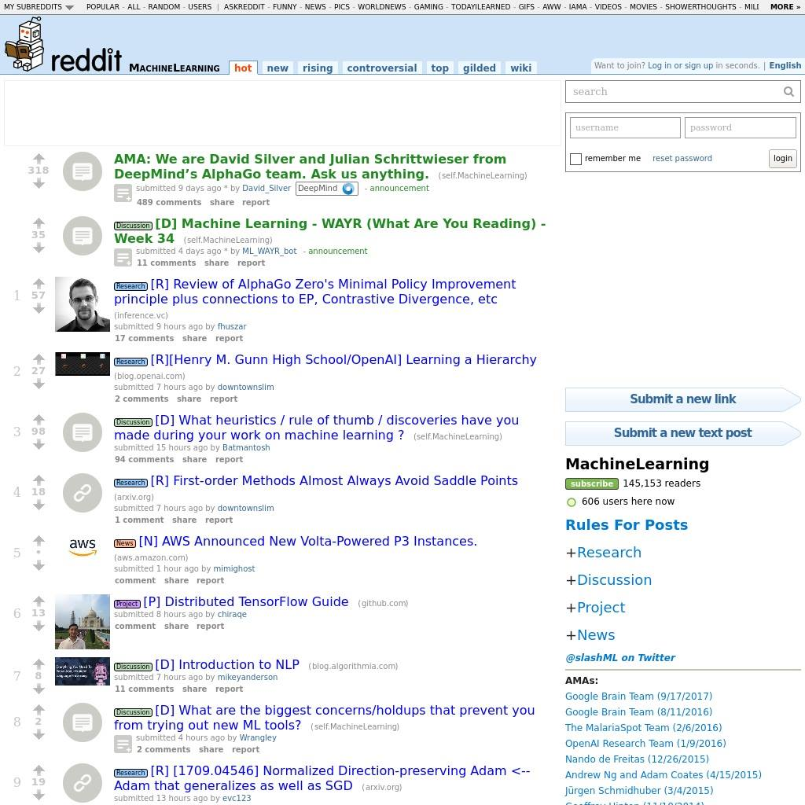

> #오늘의레딧 https://www.reddit.com/r/MachineLearning/ 정말 읽을 거리가 많네요.  1. 리뷰 AlphaGo 제로의 최소의 정책 개선 원칙의 플러스 EP에 대한 연결, Contrastive 격차 등 2. 엄지 손가락/발견의 발견적 학습 법/규칙은 기계 학습에서 당신의 작품 중에 만들었니? 3. First-order하려면 코트 샘플 및 팁을 거의 대부분 새들 문제점을 방지합니다. 4. AWS는 Volta-Powered P3Instances 현실. 5. TensorFlow 가이드 분산 6. 도달에 대한 입문서 7. 무엇 새로운 보란 듯이 도구들이 노력을 하는 것을 막는 큰 concerns/holdups니? 8. 내ovr 2진 선형 분급기의 s-자 형 출력 두 극단 전인 끝들로 붕괴해서 가능한가요? 9. legends의 챔피언인 리그로는. 10. Graphcore 예비"IPU"Benchmarks-주장 2배 NVIDIAV100에 ~100x. 11. 지연 피드백을 가진 문맥상의 도적들. 12. End-to-End 최적 음성 부호화 깊은 신경망을 이용한. 13. 메타를 배우는 것은 공유 Hierarchies 14. 이베이는 사진을 사용하여 쇼핑할 수 있도록 시각적 검색 도구를 설립한다. 15. 우리는 어떻게 SNES 스트리트 파이터 2터보 놀기 위해 인공 지능을 지었다. 16. 프로젝트 ML공동 작품상 17. BMXNet MXNet에 의한 오픈 소스 혼합한 신경망 도입 –. 18. 천재 IQ인공 지능 기술과 론 Glozman, 워털루 대학을 중퇴했다. 19. 기계 학습 연구소 지진 Predicts. 20. CNTK 2.1+keras+ 강화 학습 Python으로 휘날리며라는 조류.  1. http://www.inference.vc/alphago-zero-policy-improvement-and-vector-fields/ 2. https://www.reddit.com/r/MachineLearning/comments/78u5k6/d_what_heuristics_rule_of_thumb_discoveries_have/ 3. https://arxiv.org/abs/1710.07406 4. https://aws.amazon.com/about-aws/whats-new/2017/10/introducing-amazon-ec2-p3-instances/ 5. https://github.com/tmulc18/Distributed-TensorFlow-Guide 6. https://blog.algorithmia.com/introduction-natural-language-processing-nlp/ 7. https://www.reddit.com/r/MachineLearning/comments/78xukp/d_what_are_the_biggest_concernsholdups_that/ 8. https://www.reddit.com/r/MachineLearning/comments/78x366/p_is_it_possible_to_make_the_sigmoid_output_of_my/ 9. https://github.com/vonum/lol-category 10. https://www.graphcore.ai/posts/preliminary-ipu-benchmarks-providing-previously-unseen-performance-for-a-range-of-machine-learning-applications 11. https://www.reddit.com/r/MachineLearning/comments/78uo1w/d_contextual_bandits_with_delayed_feedback/ 12. https://arxiv.org/abs/1710.09064 13. https://s3-us-west-2.amazonaws.com/openai-assets/MLSH/mlsh_paper.pdf 14. https://techcrunch.com/2017/10/26/ebay-launches-visual-search-tools-that-let-you-shop-using-photos-from-your-phone-or-web/ 15. https://medium.com/gyroscopesoftware/how-we-built-an-ai-to-play-street-fighter-ii-can-you-beat-it-9542ba43f02b 16. https://www.reddit.com/r/MachineLearning/comments/78vsb7/p_project_for_ml_collaboration/ 17. https://aws.amazon.com/blogs/ai/research-spotlight-bmxnet-an-open-source-binary-neural-network-implementation-based-on-mxnet/ 18. http://www.cjnews.com/other-communities/russian/knote-founder-set-revolutionizing-artificial-intelligence 19. http://onlinelibrary.wiley.com/doi/10.1002/2017GL074677/full 20. https://youtu.be/GS_l308-56E

### 10월 28일 (토) 08:52 · 📷 사진 (1장)

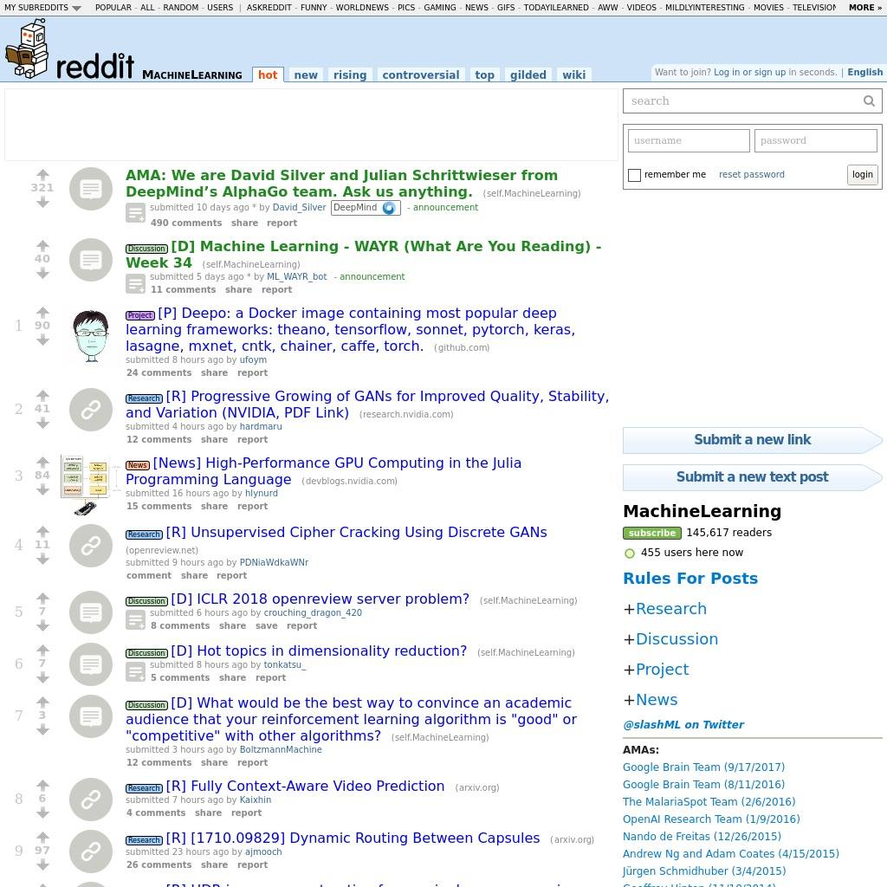

> #오늘의레딧 https://www.reddit.com/r/MachineLearning/ 따끈한 소식들입니다.  1. Deepo:Docker 이미지 가장 인기 있는 심도 있는 학습 체제입니다. theano, tensorflow, 소네트, pytorch, keras, 라자냐, mxnet, cntk, chainer, caffe, 토치가 있다. 2. 진보 변화 GANs의 품질, 안정성, 변화(NVIDIA, PDF링크). 3. 고성능 GPU컴퓨팅은 줄리아 프로그래밍 언어에서. 4. Unsupervised 암호화 균열을 이용한 이산 GANs. 5. ICLR 2018년 openreview 서버 문제? 6. 차원수 감소에 더운 주제? 7. 어떤 방법이 제일 좋는 당신의 강화 학습 알고리즘 또는"경쟁" 다른 알고리즘으로" 좋은"은 학력 청중 설득하는 것? 8. 완전하게 할 상황 인식 비디오 예측 9. 는 단일 피폭 깊은 CNNs를 사용하는 HDR이미지 재건. 10. 베이스의 불확실성 추정 Batch규준화 깊은 학술 대회. 11. Differentiable 컴퓨터, Pytorch의 한 구현입니다. 12. 그 모델 건물이 용이해 사전 구조로 일반, 피질, 그리고 CAPCHA<-Vicarious의 생성 모델이다. 13. AWS는 Volta-Powered P3Instances 현실. 14. Genomics 데이터마다 7개월마다 두배로 증가. 15. 리뷰 AlphaGo 제로의 최소의 정책 개선 원칙의 플러스 EP에 대한 연결, Contrastive 격차 등 16. 가장 좋은 길은 짧은 시계열 데이터에서 이상 징후를 감지하는 것이다? 17. First-order하려면 코트 샘플 및 팁을 거의 대부분 새들 문제점을 방지합니다. 18. 엄지 손가락/발견의 발견적 학습 법/규칙은 기계 학습에서 당신의 작품 중에 만들었니? 19. 프로젝트 아이디어와 theorycrafting-최고의 가을 탐지 돌아가네... 20. TensorFlow 가이드 분산  1. https://github.com/ufoym/deepo 2. http://research.nvidia.com/sites/default/files/pubs/2017-10_Progressive-Growing-of//karras2017gan-paper.pdf 3. https://devblogs.nvidia.com/parallelforall/gpu-computing-julia-programming-language/ 4. https://openreview.net/forum?id=BkeqO7x0- 5. https://www.reddit.com/r/MachineLearning/comments/794gbr/d_iclr_2018_openreview_server_problem/ 6. https://www.reddit.com/r/MachineLearning/comments/793xun/d_hot_topics_in_dimensionality_reduction/ 7. https://www.reddit.com/r/MachineLearning/comments/795yx9/d_what_would_be_the_best_way_to_convince_an/ 8. https://arxiv.org/abs/1710.08518 9. https://arxiv.org/abs/1710.07480v1 10. https://openreview.net/pdf/f60b4479d5d674e04b8c58f3bee9f5ffd3feb227.pdf 11. https://www.reddit.com/r/MachineLearning/comments/7915zf/p_an_implementation_of_differentiable_neural/ 12. https://www.vicarious.com/2017/10/26/common-sense-cortex-and-captcha/ 13. https://aws.amazon.com/about-aws/whats-new/2017/10/introducing-amazon-ec2-p3-instances/ 14. https://www.reddit.com/r/MachineLearning/comments/791ddm/d_genomics_data_doubling_every_7_months/ 15. http://www.inference.vc/alphago-zero-policy-improvement-and-vector-fields/ 16. https://www.reddit.com/r/MachineLearning/comments/78zx0w/d_what_is_the_best_way_to_detect_anomalies_in/ 17. https://arxiv.org/abs/1710.07406 18. https://www.reddit.com/r/MachineLearning/comments/78u5k6/d_what_heuristics_rule_of_thumb_discoveries_have/ 19. https://www.reddit.com/r/MachineLearning/comments/7926ao/d_project_idea_and_theorycrafting_spinning_top/ 20. https://github.com/tmulc18/Distributed-TensorFlow-Guide

### 10월 29일 (일) 08:52 · 📷 사진 (1장)

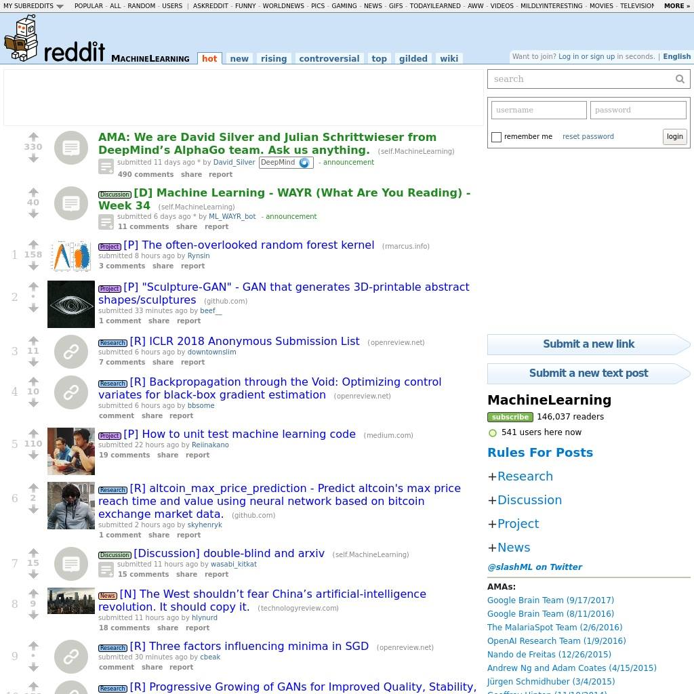

> #오늘의레딧 https://www.reddit.com/r/MachineLearning/ 따끈한 소식들입니다.  1. 그often-overlooked 무작위 숲 핵심이다 2. "Sculpture-GAN"-GAN는3D-printable 추상 shapes/sculptures를 생성합니다. 3. ICLR 2018년 익명의 제출용 목록. 4. 보이드를 지나 당신네 세상을 통해 Backpropagation:정비 구배 견적을 위한 제어 variates 최적화. 5. 시험 성적은 어떻게 기계 학습 코드 unit. 6. Altcoin_max_price_prediction-altcoin 최대 가격 시간과 값 신경 네트워크 비트 코인. 온라인 가상 화폐 교환 시장 데이터의 기반 위에서 사용에 도달하라. 7. 그리고 arxiv 이중 맹검의 8. 서방은 중국의 artificial-intelligence 혁명을 두려워하지 않아야 한다. 그것을 복사해야 합니다. 9. 3요인 SGD에 최저치에 영향을 미치는 10. 진보 변화 GANs의 품질, 안정성, 변화(NVIDIA, PDF링크). 11. 추계학적 계수 Graphs:이산 Relaxations. 12. 진보적인 GANs의 같은 성장하는 중이란 무엇입니까 텍스트 세대 상대? 13. Deepo:Docker 이미지 가장 인기 있는 심도 있는 학습 체제입니다. theano, tensorflow, 소네트, pytorch, keras, 라자냐, mxnet, cntk, chainer, caffe, 토치가 있다. 14. Sobolev GAN 15. Dissertation 주제 제안 16. 매트릭스 캡슐은 전자파 라우팅과. 17. 베이스의 불확실성 추정 Batch규준화 깊은 학술 대회. 18. 고성능 GPU컴퓨팅은 줄리아 프로그래밍 언어에서. 19. 차원수 감소에 더운 주제? 20. Unsupervised 암호화 균열을 이용한 이산 GANs.  1. https://rmarcus.info/blog/2017/10/04/rfk.html 2. https://github.com/robbiebarrat/Sculpture-GAN 3. https://openreview.net/group?id=ICLR.cc/2018/Conference 4. https://openreview.net/forum?id=SyzKd1bCW&noteId=SyzKd1bCW 5. https://medium.com/@keeper6928/how-to-unit-test-machine-learning-code-57cf6fd81765 6. https://github.com/SkyHenryk/altcoin_max_price_prediction 7. https://www.reddit.com/r/MachineLearning/comments/799kew/discussion_doubleblind_and_arxiv/ 8. https://www.technologyreview.com/s/609038/chinas-ai-awakening/?set= 9. https://openreview.net/forum?id=rJma2bZCW 10. http://research.nvidia.com/sites/default/files/pubs/2017-10_Progressive-Growing-of//karras2017gan-paper.pdf 11. http://artem.sobolev.name/posts/2017-10-28-stochastic-computation-graphs-discrete-relaxations.html 12. https://www.reddit.com/r/MachineLearning/comments/79c1co/d_what_would_be_a_text_generation_counterpart_of/ 13. https://github.com/ufoym/deepo 14. https://openreview.net/forum?id=SJA7xfb0b&noteId=SJA7xfb0b 15. https://www.reddit.com/r/MachineLearning/comments/79a0vq/d_dissertation_topic_suggestions/ 16. https://openreview.net/pdf?id=HJWLfGWRb 17. https://openreview.net/pdf/f60b4479d5d674e04b8c58f3bee9f5ffd3feb227.pdf 18. https://devblogs.nvidia.com/parallelforall/gpu-computing-julia-programming-language/ 19. https://www.reddit.com/r/MachineLearning/comments/793xun/d_hot_topics_in_dimensionality_reduction/ 20. https://openreview.net/forum?id=BkeqO7x0-

### 10월 30일 (월) 08:52 · 📷 사진 (1장)

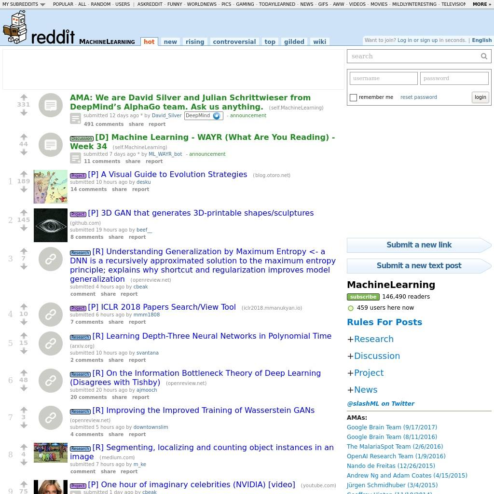

> #오늘의레딧 https://www.reddit.com/r/MachineLearning/ 오늘도 새소식이 많군요.  1. 한 시각 가이드 진화 전략. 2. 3DGAN는3D-printable shapes/sculptures를 생성합니다. 3. 왜 바로 가기와 조절 모델 일반화를 향상시킨 이해 일반화하는 최대 엔트로피에 의한 최대 엔트로피 원리에 <-나프탈렌은 재귀적으로 반복한 해결 방안 설명한다. 4. ICLR 2018년 페이퍼 Search/View 도구. 5. 학습 Depth-Three 신경망을 이용한 다항식 시간에. 6. 정보 병목 이론 딥을 배우는 것은(Tishby과 Disagrees). 7. 개선 훈련 Wasserstein GANs의 개선. 8. , 국산화와 이미지에서 개체 인스턴스 수를 세고 세분화. 9. 그often-overlooked 무작위 숲 핵심이다 10. 포매 실험 GloVe 11. 언제 심슨 가족의 황금깄니? 12. Word2vec-"어느 더운"된 입력 벡터에 추가 데이터를 더하여 결정한다. 13. Selu 활성화 연구 분석-는 통계적 메서드를 사용하는 방법? 14. Subgraphs:A 깊은 학습 IDE. 15. 더 빨리 달려 디스커버리 신경 건축스러운 길을 위한 대형 모델에서 검색. 16. ICLR 2018년 익명의 제출용 목록. 17. 추계학적 계수 Graphs:이산 Relaxations. 18. 보이드를 지나 당신네 세상을 통해 Backpropagation:정비 구배 견적을 위한 제어 variates 최적화. 19. 3요인 SGD에 최저치에 영향을 미치는 20. 시험 성적은 어떻게 기계 학습 코드 unit.  1. http://blog.otoro.net/2017/10/29/visual-evolution-strategies 2. https://github.com/robbiebarrat/Sculpture-GAN 3. https://openreview.net/forum?id=r1kj4ACp- 4. http://iclr2018.mmanukyan.io/ 5. https://arxiv.org/abs/1709.06010 6. https://openreview.net/forum?id=ry_WPG-A-&noteId=ry_WPG-A- 7. https://openreview.net/forum?id=SJx9GQb0-&noteId=SJx9GQb0- 8. https://medium.com/@culurciello/segmenting-localizing-and-counting-object-instances-in-an-image-878805fef7fc 9. https://rmarcus.info/blog/2017/10/04/rfk.html 10. https://github.com/brannondorsey/GloVe-experiments 11. http://www.nathancunn.com/2017-10-26-simpsons-decline/ 12. https://www.reddit.com/r/MachineLearning/comments/79h470/d_word2vec_adding_additional_data_to_one_hot/ 13. https://www.reddit.com/r/MachineLearning/comments/79g2bs/p_analysis_of_selu_activation_which_statistical/ 14. https://subgraphs.com 15. https://openreview.net/forum?id=ByQZjx-0-&noteId=ByQZjx-0- 16. https://openreview.net/group?id=ICLR.cc/2018/Conference 17. http://artem.sobolev.name/posts/2017-10-28-stochastic-computation-graphs-discrete-relaxations.html 18. https://openreview.net/forum?id=SyzKd1bCW&noteId=SyzKd1bCW 19. https://openreview.net/forum?id=rJma2bZCW 20. https://medium.com/@keeper6928/how-to-unit-test-machine-learning-code-57cf6fd81765

### 10월 31일 (화) 08:52 · 📷 사진 (1장)

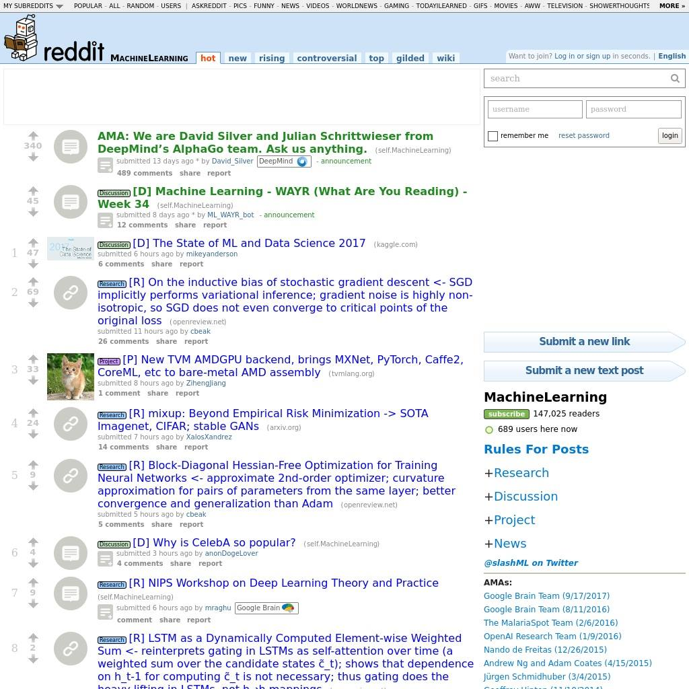

> #오늘의레딧 https://www.reddit.com/r/MachineLearning/ 재미난 이야기들이 많습니다.  1. 주 맥스 및 데이터 과학 2017년의. 2. 확률적 경사 하강 <-SGD 암시적으로;경도 소음 고도로 불균등은, 변분 추론을 수행합니다의 귀납적 편견에서 SGD 심지어의 임계점에 모이지 않는다.원래 손실 3. 새로운 미사일 경유 추적 법 AMDGPU-end, 몇 백년bare-metal AMD어셈블리에 MXNet, PyTorch, Caffe2, CoreML, 가져다 준다. 4. Mixup:비욘드 실증적 위험 Minimization-> 신호 정보 운용 지시 권한 Imagenet, CIFAR, 안정적인 GANs. 5. Block-Diagonal Hessian-Free 최적화 훈련 신경망을 이용한에 <-대략적인 2nd-order optimizer;이와 같은 계층에서 매개 변수의 쌍들을 위하여 곡률, 더 나은 융합과.아담보다 일반화 6. 왜 CelebA 그렇게 인기가 있을까요? 7. 해군 정보 처리 시스템 워크숍 딥 학습 이론과 실제에. 8. LSTM를 사용하면 동적 계산 Element-wise 가중 합계 <-reinterprets LSTMs에 시간(그 후보자에 대한 가중 합 주 c̃_t)에 self-attention로 게이트로 h_t-1에 의존을 보여 준다.c̃_t을 계산하므로 게이팅 LSTMs에 무거운 물체를 아니라h→h 매핑할 필요는 없지 않다. 9. P2P분산 학습(도입) 10. 딥을 배우는 것은 매시브 라벨 소음 <에-90%MNIST 때도 데이터 세트가 각각의 깨끗한 라벨을 위해 100개의 시끄럽고 라벨 함께 섞여 희석된 상태에서는 정확성+에서의 왕성한 있다. 11. 반복되는 관심+배치 정상화)쾌속 컨버전스 부패와 신경망? 12. Decoupled 신경 Interfaces PyTorch에 죽은 단순한 도서관이다. 13. 무엇 PixelRNN/Wavenet에 softmax을 사용하여 뒤의 직감이 있습니다. 14. 도움말 Keras GAN 문제와 15. 검색 ICLR 2018년(PDF텍스트 내에). 16. ANon-Expert의 가이드 이미지 분할. 17. 한 시각 가이드 진화 전략. 18. biologically-motivated 심도 있는 학습 알고리즘과 구조의 확장성 <-목표 소품들이 평가 잘 이용하지 않는다. 19. 심플 MNIST Autoencoder TensorFlow에. 20. 나타나는 생성 Adversarial 네트웍스:개요  1. https://www.kaggle.com/surveys/2017 2. https://openreview.net/forum?id=HyWrIgW0W 3. http://www.tvmlang.org/2017/10/30/Bringing-AMDGPUs-to-TVM-Stack-and-NNVM-Compiler-with-ROCm.html 4. https://arxiv.org/abs/1710.09412v1 5. https://openreview.net/forum?id=SJ19eUg0- 6. https://www.reddit.com/r/MachineLearning/comments/79qj57/d_why_is_celeba_so_popular/ 7. https://www.reddit.com/r/MachineLearning/comments/79p6jw/r_nips_workshop_on_deep_learning_theory_and/ 8. https://openreview.net/forum?id=HJOQ7MgAW 9. https://github.com/loudinthecloud/dpwa 10. https://openreview.net/forum?id=B1p461b0W 11. https://github.com/indiejoseph/tf-rda-cell?jo 12. https://github.com/koz4k/dni-pytorch 13. https://www.reddit.com/r/MachineLearning/comments/79mdd8/d_whats_the_intuition_behind_using_softmax_in/ 14. https://stackoverflow.com/questions/47009451/keras-creating-a-gan 15. http://search.iclr2018.smerity.com/ 16. https://medium.com/@hanrelan/a-non-experts-guide-to-image-segmentation-using-deep-neural-nets-dda5022f6282 17. http://blog.otoro.net/2017/10/29/visual-evolution-strategies 18. https://openreview.net/forum?id=B1O3OgbRW 19. https://gertjanvandenburg.com/blog/autoencoder/ 20. https://arxiv.org/abs/1710.07035
