# 2017년 11월

[← 2017년](README.md)

### 11월 1일 (수) 08:52 · 📷 사진 (2장)

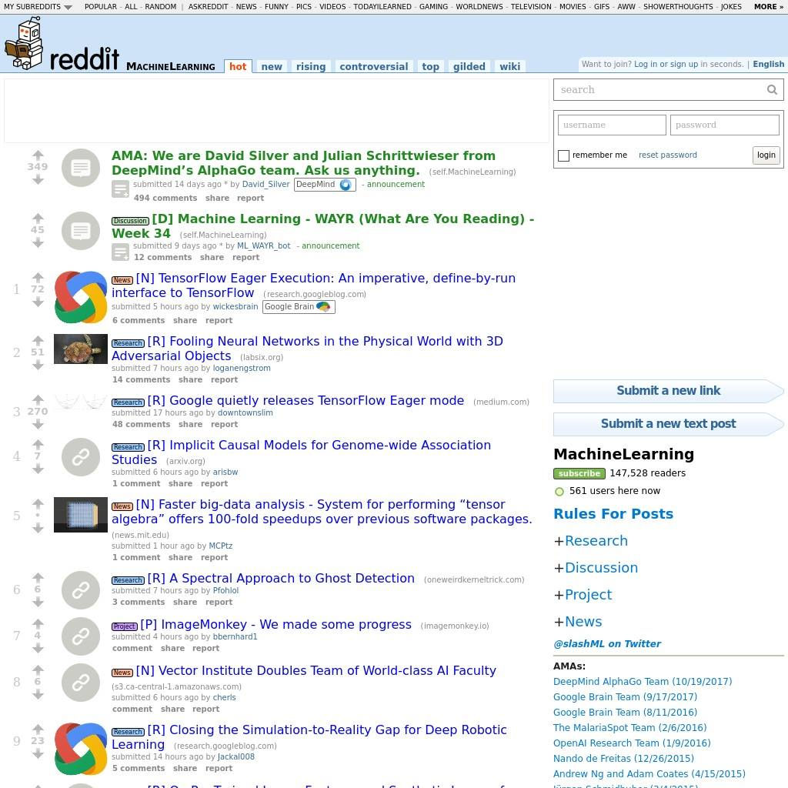
**이미지 캡션:** 이 이미지는 인기 있는 온라인 커뮤니티인 레딧의 머신러닝 서브레딧 페이지를 보여줍니다. 페이지 상단에는 레딧 로고와 함께 "MACHINE LEARNING"이라는 제목이 있고, 그 옆에는 "hot", "new", "rising", "controversial", "top", "gilded", "wiki"와 같은 다양한 카테고리 링크가 있습니다. 오른쪽 상단에는 로그인 또는 회원가입을 할 수 있는 폼이 있습니다. 메인 콘텐츠 영역에는 여러 게시물 목록이 표시되며, 각 게시물은 제목, 작성자, 제출 시간, 댓글 수 등의 정보를 포함하고 있습니다. 게시물 제목 앞에는 "[D]" (Discussion), "[N]" (News), "[R]" (Research), "[P]" (Project)와 같은 태그가 붙어 있어 게시물의 종류를 나타냅니다. 예를 들어, 첫 번째 게시물은 "AMA: We are David Silver and Julian Schrittwieser from DeepMind's AlphaGo team. Ask us anything."이라는 제목으로, 14일 전에 제출되었고 494개의 댓글이 달려 있습니다. 게시물 목록 아래에는 "Submit a new link"와 "Submit a new text post" 버튼이 있습니다. 오른쪽 사이드바에는 "MachineLearning" 서브레딧의 구독자 수와 현재 접속자 수가 표시되어 있으며, "Rules For Posts" 섹션에는 "+Research", "+Discussion", "+Project", "+News"와 같은 하위 카테고리가 나열되어 있습니다. 또한 "@slashML on Twitter" 링크와 과거 AMA(Ask Me Anything) 목록도 볼 수 있습니다. 전반적으로 이 페이지는 머신러닝 분야의 최신 정보와 토론을 공유하는 온라인 커뮤니티의 모습을 보여줍니다.등의 정보를 포함하고 있습니다. 게시물 제목 앞에는 "[D]" (Discussion), "[N]" (News), "[R]" (Research), "[P]" (Project)와 같은 태그가 붙어 있어 게시물의 종류를 나타냅니다. 예를 들어, 첫 번째 게시물은 "AMA: We are David Silver and Julian Schrittwieser from DeepMind's AlphaGo team. Ask us anything."이라는 제목으로, 14일 전에 제출되었고 494개의 댓글이 달려 있습니다. 게시물 목록 아래에는 "Submit a new link"와 "Submit a new text post" 버튼이 있습니다. 오른쪽 사이드바에는 "MachineLearning" 서브레딧의 구독자 수와 현재 접속자 수가 표시되어 있으며, "Rules For Posts" 섹션에는 "+Research", "+Discussion", "+Project", "+News"와 같은 하위 카테고리가 나열되어 있습니다. 또한 "@slashML on Twitter" 링크와 과거 AMA(Ask Me Anything) 목록도 볼 수 있습니다. 전반적으로 이 페이지는 머신러닝 분야의 최신 정보와 토론을 공유하는 온라인 커뮤니티의 모습을 보여줍니다.
 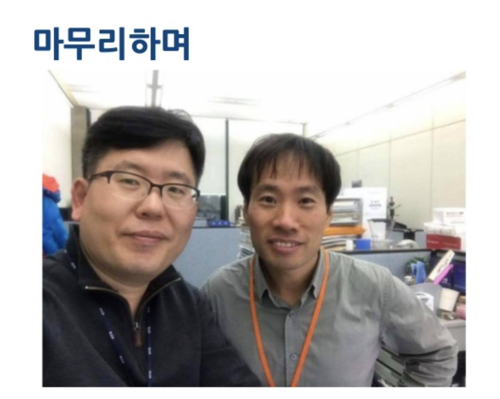
**이미지 캡션:** 사진에는 두 명의 성인 남성이 등장하며, 왼쪽 남성은 40대 후반에서 50대 초반으로 보이며 검은색 안경을 착용하고 검은색 집업 재킷을 입고 있습니다. 오른쪽 남성은 30대 후반에서 40대 초반으로 보이며 회색 셔츠를 입고 있습니다. 두 사람 모두 카메라를 향해 미소를 짓고 있으며, 왼쪽 남성은 카메라를 들고 셀카를 찍는 듯한 모습입니다. 배경은 사무실 환경으로 보이며, 책상 위에는 서류, 컴퓨터 모니터, 사무용품 등이 놓여 있습니다. 사진 상단에는 "마무리하며"라는 한국어 문구가 파란색으로 쓰여 있습니다. 전체적으로 편안하고 친근한 분위기를 나타냅니다.전체적으로 편안하고 친근한 분위기를 나타냅니다.

> #오늘의레딧 https://www.reddit.com/r/MachineLearning/ 오늘도 새소식이 많군요.  1. TensorFlow 몹시 흥분 사형 집행:TensorFlow에 대한 명령,define-by-run 인터페이스입니다. 2. Fooling 신경망을 이용한 물리적 세계에서 3DAdversarial는 데로. 3. 구글 조용히 TensorFlow 몹시 흥분 모드 해제합니다. 4. Implicit인과 모델 Genome-wide 협회 연구. 5. 더 빨리big-data 분석-시스템“대수 텐서”을 수행하기 위해 이전의 소프트웨어 패키지에보다 100배 speedups을 제공한다. 6. 한 유령에 유령 검출. 7. ImageMonkey-우리는 약간의 진보를 이루었다. 8. 벡터원 복식 경기 팀은 이미 세계 최고 수준 AI과학부의. 9. 딥 Robotic 학습에 대한 Simulation-to-Reality 갭 닫는 거요 10. Pre-Trained 이미지 기능과 합성 이미지 딥 학습고 있습니다. 11. 렘 수면 GAN과 GAI. 12. 이산 Weights지방 Reparameterization 트릭을 사용하여 배우기. 13. LSTM의 분산 학습 14. 신경 건축 검색 보강 학습. 15. Allowing 엔지니어링 Discriminator의 숨겨진 미국을 보러 WGAN을 개선하는 것. 16. 활성화 기능을 탐색함으로써 17. -표시를 우고 Sklearn과 함께에 게시한 관련이 있다. 18. 주 맥스 및 데이터 과학 2017년의. 19. (explorative RNN 조직)히든 Memories 순환 신경망을 이용한 것을 이해하는 것. 20. Bottery-회화제prototyping 플랫폼이다.  1. https://research.googleblog.com/2017/10/eager-execution-imperative-define-by.html 2. http://www.labsix.org/physical-objects-that-fool-neural-nets/ 3. https://medium.com/@yaroslavvb/tensorflow-meets-pytorch-with-eager-mode-714cce161e6c 4. https://arxiv.org/abs/1710.10742 5. https://news.mit.edu/2017/faster-big-data-analysis-tensor-algebra-1031 6. http://oneweirdkerneltrick.com/spectral.pdf 7. https://imagemonkey.io/blog/general/2017/10/28/ImageMonkey-v0.2.html 8. https://s3.ca-central-1.amazonaws.com/vectorinstitute.ai/resources/News_Release-Vector_Institute-20171031.pdf 9. http://research.googleblog.com/2017/10/closing-simulation-to-reality-gap-for.html?utm_source=feedburner&utm_medium=feed&utm_campaign=Feed%3A+blogspot%2FgJZg+%28Official+Google+Research+Blog%29 10. https://arxiv.org/abs/1710.10710 11. https://www.reddit.com/r/MachineLearning/comments/79ugaf/d_rem_sleep_gan_and_gai/ 12. https://arxiv.org/abs/1710.07739 13. https://www.reddit.com/r/MachineLearning/comments/79vyxp/d_distributed_learning_of_lstm/ 14. https://openreview.net/forum?id=r1Ue8Hcxg&noteId=r1Ue8Hcxg 15. https://www.reddit.com/r/MachineLearning/comments/79wo6w/r_improving_wgan_by_allowing_generator_to_see/ 16. https://arxiv.org/abs/1710.05941v2 17. https://elbauldelprogramador.com/en/related-posts-hugo-sklearn/ 18. https://www.kaggle.com/surveys/2017 19. https://arxiv.org/abs/1710.10777 20. https://github.com/google/bottery

### 11월 2일 (목) 07:10 · 📷 사진 (2장)

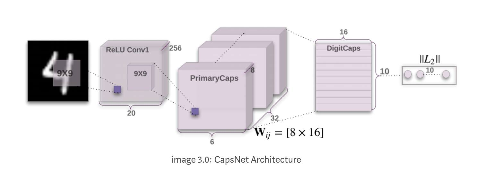
**이미지 캡션:** 이 이미지는 딥러닝 모델인 CapsNet의 아키텍처를 시각적으로 보여주는 다이어그램입니다. 왼쪽에는 숫자 '4'가 흐릿하게 표시된 흑백 이미지가 있고, 그 위에 '9X9'라고 표시된 투명한 사각형이 겹쳐져 있습니다. 이 이미지는 'ReLU Conv1'이라는 레이어로 전달되며, 이 레이어의 크기는 20x20이고 출력 채널은 256개입니다. 'ReLU Conv1' 다음에는 'PrimaryCaps'라는 레이어가 있으며, 이 레이어는 6개의 채널을 가지고 있습니다. 'PrimaryCaps' 다음에는 'DigitCaps'라는 레이어가 있는데, 이 레이어는 16개의 채널을 가지고 있으며 10개의 캡슐로 구성되어 있습니다. 마지막으로, 'DigitCaps'의 출력은 L2 노름 연산을 거쳐 10개의 원으로 표현되는 최종 결과로 이어집니다. 이 다이어그램은 이미지 인식 작업에서 CapsNet이 어떻게 작동하는지를 단계별로 설명하고 있으며, 각 레이어의 크기와 주요 구성 요소를 명확하게 보여줍니다. 이미지 하단에는 "image 3.0: CapsNet Architecture"라는 텍스트가 있어 이 다이어그램이 CapsNet 아키텍처의 특정 버전을 나타냄을 알 수 있습니다. 전반적으로, 이 이미지는 기술적인 내용을 전달하기 위한 명확하고 구조화된 시각 자료입니다.s'라는 레이어가 있는데, 이 레이어는 16개의 채널을 가지고 있으며 10개의 캡슐로 구성되어 있습니다. 마지막으로, 'DigitCaps'의 출력은 L2 노름 연산을 거쳐 10개의 원으로 표현되는 최종 결과로 이어집니다. 이 다이어그램은 이미지 인식 작업에서 CapsNet이 어떻게 작동하는지를 단계별로 설명하고 있으며, 각 레이어의 크기와 주요 구성 요소를 명확하게 보여줍니다. 이미지 하단에는 "image 3.0: CapsNet Architecture"라는 텍스트가 있어 이 다이어그램이 CapsNet 아키텍처의 특정 버전을 나타냄을 알 수 있습니다. 전반적으로, 이 이미지는 기술적인 내용을 전달하기 위한 명확하고 구조화된 시각 자료입니다.
 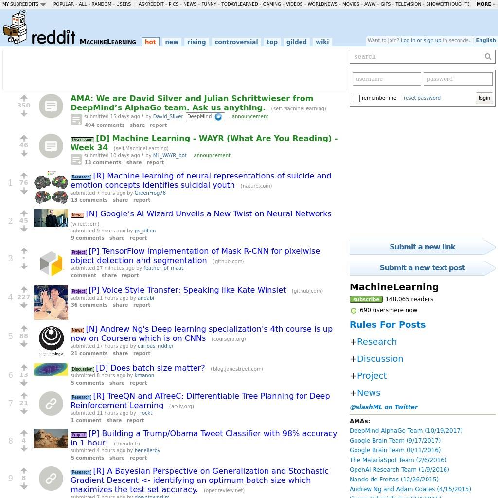
**이미지 캡션:** 이것은 Reddit의 Machine Learning 서브레딧 페이지로, 다양한 인공지능 및 머신러닝 관련 게시물 목록을 보여줍니다. 페이지 상단에는 Reddit 로고와 함께 "MACHINE LEARNING"이라는 제목이 있고, 그 아래에는 "hot", "new", "rising", "controversial", "top", "gilded", "wiki"와 같은 탭이 있습니다. 오른쪽 상단에는 로그인 또는 가입을 위한 입력 필드와 버튼이 있습니다. 페이지 중앙에는 게시물 목록이 있으며, 각 게시물은 제목, 제출자, 제출 시간, 댓글 수, 그리고 관련 링크나 이미지를 포함하고 있습니다. 예를 들어, 첫 번째 게시물은 "AMA: We are David Silver and Julian Schrittwieser from DeepMind's AlphaGo team. Ask us anything."이라는 제목으로, David Silver와 Julian Schrittwieser가 DeepMind의 AlphaGo 팀 소속임을 알 수 있습니다. 다른 게시물들은 머신러닝 연구, 새로운 기술, 딥러닝 강좌, 그리고 특정 프로젝트에 대한 내용을 다루고 있습니다. 페이지 오른쪽에는 "Submit a new link" 및 "Submit a new text post" 버튼과 함께 Machine Learning 서브레딧의 구독자 수와 현재 접속자 수가 표시되어 있습니다. 또한, 게시물 규칙과 트위터 계정, 그리고 과거 AMA(Ask Me Anything) 목록도 볼 수 있습니다. 전반적으로 이 페이지는 머신러닝 커뮤니티의 최신 정보와 토론을 공유하는 온라인 플랫폼의 모습을 보여줍니다.자, 제출 시간, 댓글 수, 그리고 관련 링크나 이미지를 포함하고 있습니다. 예를 들어, 첫 번째 게시물은 "AMA: We are David Silver and Julian Schrittwieser from DeepMind's AlphaGo team. Ask us anything."이라는 제목으로, David Silver와 Julian Schrittwieser가 DeepMind의 AlphaGo 팀 소속임을 알 수 있습니다. 다른 게시물들은 머신러닝 연구, 새로운 기술, 딥러닝 강좌, 그리고 특정 프로젝트에 대한 내용을 다루고 있습니다. 페이지 오른쪽에는 "Submit a new link" 및 "Submit a new text post" 버튼과 함께 Machine Learning 서브레딧의 구독자 수와 현재 접속자 수가 표시되어 있습니다. 또한, 게시물 규칙과 트위터 계정, 그리고 과거 AMA(Ask Me Anything) 목록도 볼 수 있습니다. 전반적으로 이 페이지는 머신러닝 커뮤니티의 최신 정보와 토론을 공유하는 온라인 플랫폼의 모습을 보여줍니다.

> [업데이트: 예상대로 세계가 흥분한듯. 자료들이 쏟아져 나오고 있어 추가드립디다.]   Nako Sung님이 아침부터 흥분해서 소개해주신 Capsule Network! 네트웍에 레이어를 추가 하는 대신 nested 하게 넷트웍을 쌓는 아이디어 입니다. 이 새로운 구조가 CNN을 밀어낼수 있을까요?   일단 이게 뭔지 알아보시려면:  1. 비디오: https://youtu.be/VKoLGnq15RM?t=13m59s 2. 개념 설명및 코드 설명: https://hackernoon.com/what-is-a-capsnet-or-capsule-network-2bfbe48769cc 3. 잡지글: https://www.wired.com/story/googles-ai-wizard-unveils-a-new-twist-on-neural-networks/ 4. 관련논문일듯한: a. Jinwon Lee 알려주신 https://arxiv.org/abs/1710.09829                              b. https://openreview.net/pdf?id=HJWLfGWRb 5. 구현으로 보이는: https://github.com/nishnik/CapsNet-PyTorch, https://github.com/naturomics/CapsNet-Tensorflow 6. 손건환님 알려주신 "이번 논문이 나오기전 관련된 자료네요" http://cseweb.ucsd.edu/~gary/cs200/s12/Hinton.pdf  등등입니다. 조만간 Nako Sung님이 아마 자세한 설명 슬라이드 and/or 비디오등을 내지 않을까 미리 감사해봅니다.
> #오늘의레딧 https://www.reddit.com/r/MachineLearning/ 재미난 이야기들이 많습니다.  1. 자살하고 감정 개념의 신경 표현 방법의 기계 학습 자살 청소년을 식별합니다. 2. 구글의 AI마법사 새로운 트위스트 신경망을 이용한에 Unveils. 3. 마스크 R-CNN의pixelwise 물체 탐지 및 세분화에 TensorFlow 구현입니다. 4. 음성 OnStyle전송:케이트 윈슬렛 같은 전데요. 5. AndrewNg의 딥 학습 전문화의 제4코스 지금 Coursera는 CNNs에 있고 있다. 6. 배치 크기 중요한가? 7. TreeQN과 ATreeC:Differentiable 나무 계획 딥 강화 학습. 8. 1시간 동안 98%정확도가 Trump/Obama 트윗 Classifier을 짓는 것! 9. 한 베이스의 투시도 일반화에 추계학적 구배 디센트 <-테스트를 정확도 설정되어 극대화하는 최적의 배치 크기를 식별하는입니다. 10. 그냥 AndrewNg의 스탠포드 코스를 마쳤다. 있나 또 다른 theory/math 무거운 리소스 여기(너무 실용적인 의하면 프로그래밍 언어 무거운 아무것도 찾고 있지 않) 다녔습니다. 11. TensorFlow 몹시 흥분 사형 집행:TensorFlow에 대한 명령,define-by-run 인터페이스입니다. 12. 딥을 배우는 것은 혼합 Convex-Combinatorial 최적화 문제로. 13. 어떻게 물체의 방향을 감지하도록 해? 14. CycleGAN-like 알고리즘의 신청에 관한 아이디어 15. 구글 colab Jupyter에 TF몹시 흥분 예제 코드가 노트북-TF몹시 흥분으로 바로 당신의 브라우저에서 놀고 할 수 있다. 16. Fooling 신경망을 이용한 물리적 세계에서 3DAdversarial는 데로. 17. 회전부 계층은 풀링 전 같은 층, 또는 그것을 하지 않아 입력의 치수를 감소시키나요? 18. Neuromation:분산 합성 데이터 플랫폼 딥 학습 응용을 위하다. 19. 더 빨리big-data 분석-시스템“대수 텐서”을 수행하기 위해 이전의 소프트웨어 패키지에보다 100배 speedups을 제공한다. 20. 구글 조용히 TensorFlow 몹시 흥분 모드 해제합니다.  1. https://www.nature.com/articles/s41562-017-0234-y 2. https://www.wired.com/story/googles-ai-wizard-unveils-a-new-twist-on-neural-networks/ 3. https://github.com/matterport/Mask_RCNN 4. https://github.com/andabi/deep-voice-conversion 5. https://www.coursera.org/learn/convolutional-neural-networks 6. https://blog.janestreet.com/does-batch-size-matter/ 7. https://arxiv.org/abs/1710.11417 8. https://www.theodo.fr/blog/2017/11/building-trumpobama-tweet-classifier-98-accuracy-1-hour/ 9. https://openreview.net/forum?id=BJij4yg0Z&noteId=BJij4yg0Z 10. https://www.reddit.com/r/MachineLearning/comments/7a71ti/d_just_finished_andrew_ngs_stanford_course_is/ 11. https://research.googleblog.com/2017/10/eager-execution-imperative-define-by.html 12. https://arxiv.org/abs/1710.11573 13. https://www.reddit.com/r/MachineLearning/comments/7a6a29/d_how_to_detect_orientation_of_objects/ 14. https://www.reddit.com/r/MachineLearning/comments/7a2mii/d_ideas_about_application_of_cycleganlike/ 15. https://colab.research.google.com/notebook#fileId=0B7I8C_4vGdF6REhrdHkycWRyMTg 16. http://www.labsix.org/physical-objects-that-fool-neural-nets/ 17. https://www.reddit.com/r/MachineLearning/comments/7a2vvw/d_does_a_convolution_layer_decrease_the_inputs/ 18. https://neuromation.io/ 19. https://news.mit.edu/2017/faster-big-data-analysis-tensor-algebra-1031 20. https://medium.com/@yaroslavvb/tensorflow-meets-pytorch-with-eager-mode-714cce161e6c

### 11월 3일 (금) 08:52 · 📷 사진 (1장)

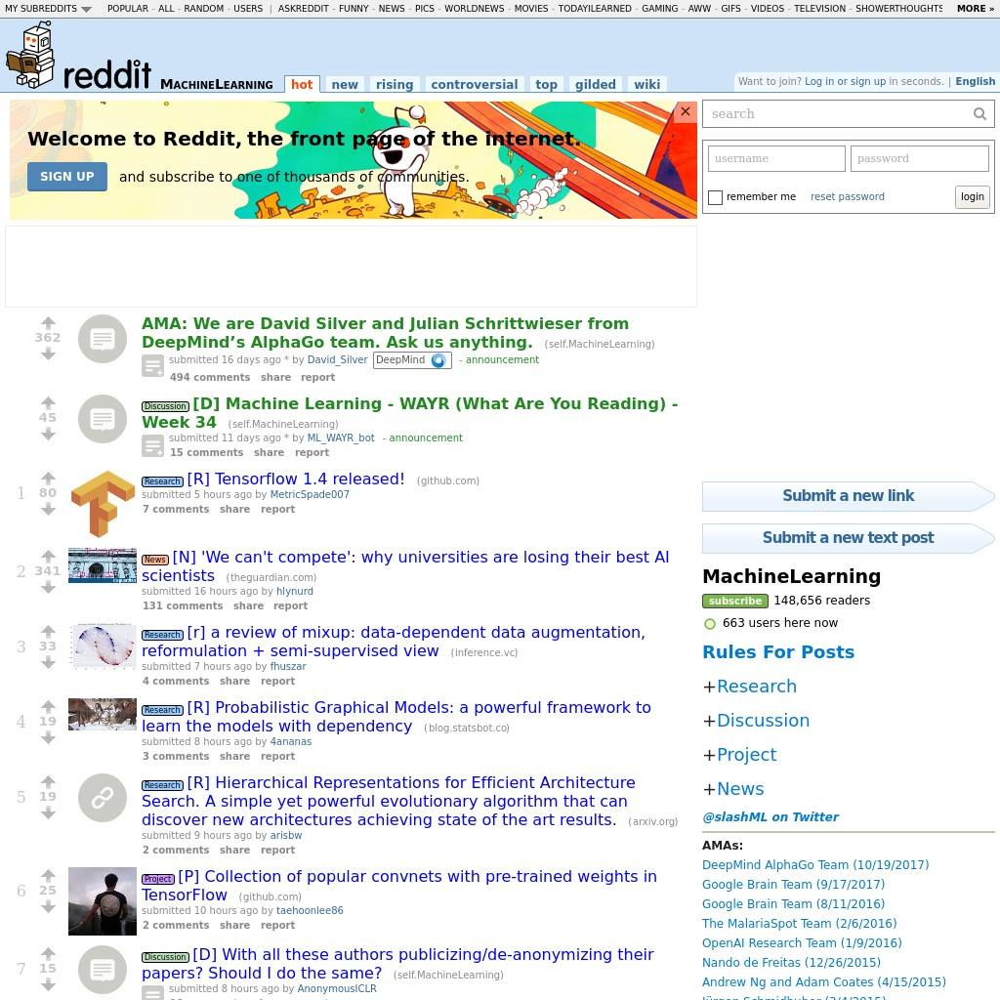
**이미지 캡션:** 이 이미지는 인기 있는 온라인 커뮤니티인 레딧의 머신러닝 서브레딧 페이지를 보여줍니다. 화면 중앙에는 "Welcome to Reddit, the front page of the internet."이라는 환영 메시지가 있으며, 그 아래에는 "SIGN UP" 버튼과 함께 커뮤니티에 가입하라는 안내가 있습니다. 페이지 왼쪽에는 여러 게시물 목록이 표시되어 있으며, 각 게시물은 제목, 작성자, 게시 시간, 댓글 수 등의 정보를 포함하고 있습니다. 게시물들은 머신러닝 관련 주제를 다루고 있으며, "AMA: We are David Silver and Julian Schrittwieser from DeepMind's AlphaGo team. Ask us anything.", "[D] Machine Learning - WAYR (What Are You Reading) - Week 34", "[R] Tensorflow 1.4 released!" 등이 보입니다. 페이지 오른쪽에는 로그인 폼과 함께 "Submit a new link" 및 "Submit a new text post" 버튼이 있으며, "MachineLearning" 서브레딧의 구독자 수와 현재 접속자 수가 표시되어 있습니다. 또한, "Rules For Posts" 섹션 아래에는 "Research", "Discussion", "Project", "News"와 같은 카테고리가 나열되어 있고, 트위터 계정(@slashML on Twitter)과 과거 AMA(Ask Me Anything) 목록도 확인할 수 있습니다. 전반적으로 정보가 풍부하고 활발한 온라인 커뮤니티의 모습을 보여주는 화면입니다. David Silver and Julian Schrittwieser from DeepMind's AlphaGo team. Ask us anything.", "[D] Machine Learning - WAYR (What Are You Reading) - Week 34", "[R] Tensorflow 1.4 released!" 등이 보입니다. 페이지 오른쪽에는 로그인 폼과 함께 "Submit a new link" 및 "Submit a new text post" 버튼이 있으며, "MachineLearning" 서브레딧의 구독자 수와 현재 접속자 수가 표시되어 있습니다. 또한, "Rules For Posts" 섹션 아래에는 "Research", "Discussion", "Project", "News"와 같은 카테고리가 나열되어 있고, 트위터 계정(@slashML on Twitter)과 과거 AMA(Ask Me Anything) 목록도 확인할 수 있습니다. 전반적으로 정보가 풍부하고 활발한 온라인 커뮤니티의 모습을 보여주는 화면입니다.

> #오늘의레딧 https://www.reddit.com/r/MachineLearning/ 정말 읽을 거리가 많네요.  1. Tensorflow 1.4출시! 2. '우리는 ':왜 대학들이 최고의 AI과학자들을 잃고 있다 경쟁할 수 없습니다. 3. 확률적 그래픽 모델:강력한 체제 의존하는 모델들을 배우기를 원한다. 4. 계층적 Representations 효율적 건축 사용에 대한. 새로운 아키텍처들은 예술 결과의 상태를 발견할 수 있는 단순한 아직 강력한 진화적 알고리즘입니다. 5. TensorFlow에pre-trained 무게로 인기 있는 convnets의 수집. 6. 모든 이 저자들이 그들의 종이 publicizing/de-anonymizing와 함께? 나는 같은 해야 할까요? 7. 우리는 사이트 피드백에 대한 이미지 데이터 집합-요청을 개최할를 지었다. 8. AutoML 대규모 화상 분류하고, 물체가 발견을 위해. 9. 딥 신경망을 이용한 가우시안 방식으로. 10. Wasserstein GAN의 Minimalistic TensorFlow 구현입니다. 11. 무엇 최고 MLscientist/engineer의 차이는 중간 규모인가요? 무엇이 정확한 특성은? 12. GAN 비 이미지 데이터로 13. 누군가가 선형 분급기의 훈련 데이터로 GAN을 사용하여 노력했는가? 14. 마스크 R-CNN의pixelwise 물체 탐지 및 세분화에 TensorFlow 구현입니다. 15. TypedFlow:TensorFlow에higher-order 타이핑해 작성됐다와 deep-learning을 위한 고급 도서관이다. X-posthttps://www.reddit.com/r/Haskell 16. 뉴Tensorflow-based 나무 도서관 Boosted. 17. 어떻게 NNs 사전에 보이지 않는 기대를 수렴하여 주시겠습니까? 18. 최근 Innovations TensorFlow 봉사에. 19. 블로그:GANs의 목적 기능에 어떤 생각. 20. 독립적인 단어 차원 포매  1. https://github.com/tensorflow/tensorflow/releases/tag/v1.4.0 2. https://www.theguardian.com/science/2017/nov/01/cant-compete-universities-losing-best-ai-scientists 3. https://blog.statsbot.co/probabilistic-graphical-models-tutorial-and-solutions-e4f1d72af189 4. https://arxiv.org/abs/1711.00436 5. https://github.com/taehoonlee/tensornets 6. https://www.reddit.com/r/MachineLearning/comments/7ac6zd/d_with_all_these_authors_publicizingdeanonymizing/ 7. https://www.reddit.com/r/MachineLearning/comments/7ada08/d_we_built_a_site_to_host_image_datasets_request/ 8. https://research.googleblog.com/2017/11/automl-for-large-scale-image.html?utm_source=feedburner&utm_medium=feed&utm_campaign=Feed:+blogspot/gJZg+\(Official+Google+Research+Blog\) 9. https://arxiv.org/abs/1711.00165 10. https://github.com/adler-j/minimal_wgan 11. https://www.reddit.com/r/MachineLearning/comments/7abv83/d_whats_the_difference_between_a_top_ml/ 12. https://www.reddit.com/r/MachineLearning/comments/7ac6xx/d_gan_with_non_image_data/ 13. https://www.reddit.com/r/MachineLearning/comments/7ac9kt/d_has_anyone_tried_using_gan_as_training_data_of/ 14. https://github.com/matterport/Mask_RCNN 15. https://github.com/GU-CLASP/TypedFlow 16. https://arxiv.org/abs/1710.11547 17. https://www.reddit.com/r/MachineLearning/comments/7ac7ak/d_how_to_get_nns_to_converge_to_the_prior_for/ 18. https://research.googleblog.com/2017/11/latest-innovations-in-tensorflow-serving.html?utm_source=feedburner&utm_medium=feed&utm_campaign=Feed%3A+blogspot%2FgJZg+%28Official+Google+Research+Blog%29 19. https://levans.fr/thoughts-objective-gan.html 20. https://www.reddit.com/r/MachineLearning/comments/7ac0uo/d_independent_word_embedding_dimensions/

### 11월 4일 (토) 08:52 · 📷 사진 (1장)

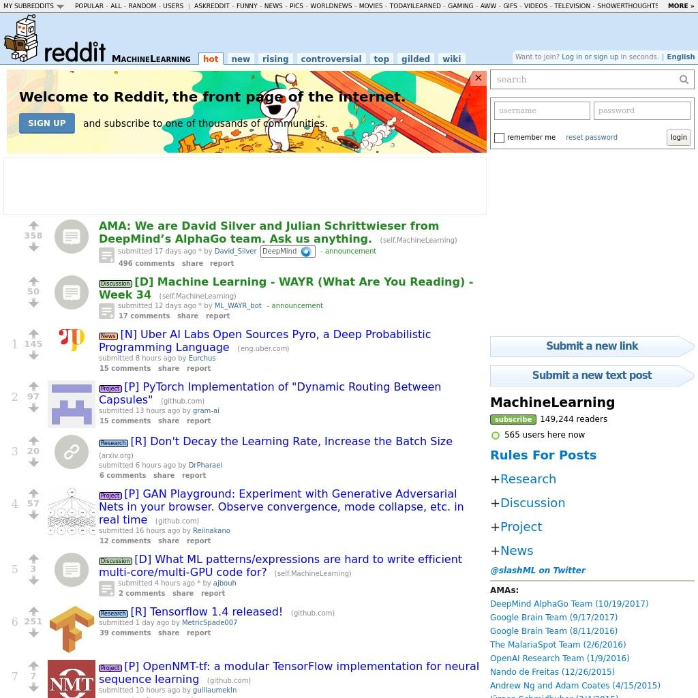
**이미지 캡션:** 이 이미지는 레딧(Reddit) 웹사이트의 머신러닝(Machine Learning) 서브레딧 페이지를 보여줍니다. 페이지 상단에는 레딧 로고와 함께 "MY SUBREDDITS", "POPULAR", "ALL", "RANDOM", "USERS", "ASKREDDIT", "FUNNY", "NEWS", "PICS", "WORLDNEWS", "MOVIES", "TODAYILEARNED", "GAMING", "AWW", "GIFS", "VIDEOS", "TELEVISION", "SHOWERTHOUGHTS" 등의 메뉴가 나열되어 있습니다. 그 아래에는 "MACHINE LEARNING"이라는 제목과 함께 "hot", "new", "rising", "controversial", "top", "gilded", "wiki"와 같은 탭이 있습니다. 페이지 중앙에는 "Welcome to Reddit, the front page of the internet."이라는 환영 문구와 함께 "SIGN UP" 버튼이 보입니다. 메인 콘텐츠 영역에는 여러 게시물 목록이 표시되어 있으며, 각 게시물은 제목, 작성자, 제출 시간, 댓글 수, 공유 버튼 등을 포함합니다. 예를 들어, "AMA: We are David Silver and Julian Schrittwieser from DeepMind's AlphaGo team. Ask us anything."이라는 제목의 게시물은 17일 전에 David_Silver에 의해 제출되었고 496개의 댓글이 있습니다. 다른 게시물로는 "Machine Learning - WAYR (What Are You Reading) - Week 34", "Uber AI Labs Open Sources Pyro, a Deep Probabilistic Programming Language", "PyTorch Implementation of 'Dynamic Routing Between Capsules'", "Don't Decay the Learning Rate, Increase the Batch Size", "GAN Playground: Experiment with Generative Adversarial Nets in your browser. Observe convergence, mode collapse, etc. in real time", "What ML patterns/expressions are hard to write efficient multi-core/multi-GPU code for?", "Tensorflow 1.4 released!", "OpenNMT-tf: a modular TensorFlow implementation for neural sequence learning" 등이 있습니다. 오른쪽 사이드바에는 "Want to join? Log in or sign up in seconds."라는 로그인/가입 안내와 함께 검색창, 사용자 이름 및 비밀번호 입력란, 로그인 버튼이 있습니다. 그 아래에는 "MachineLearning" 서브레딧의 구독자 수(149,244명)와 현재 접속자 수(565명)가 표시되어 있습니다. 또한 "Rules For Posts"와 함께 "+Research", "+Discussion", "+Project", "+News"와 같은 메뉴가 있으며, "@slashML on Twitter" 링크와 "AMAS" 목록도 보입니다. 전체적으로 이 페이지는 머신러닝 관련 정보를 공유하고 토론하는 온라인 커뮤니티의 모습을 보여주며, 기술적인 주제에 대한 게시물들이 주를 이루고 있습니다. 나열되어 있습니다. 그 아래에는 "MACHINE LEARNING"이라는 제목과 함께 "hot", "new", "rising", "controversial", "top", "gilded", "wiki"와 같은 탭이 있습니다. 페이지 중앙에는 "Welcome to Reddit, the front page of the internet."이라는 환영 문구와 함께 "SIGN UP" 버튼이 보입니다. 메인 콘텐츠 영역에는 여러 게시물 목록이 표시되어 있으며, 각 게시물은 제목, 작성자, 제출 시간, 댓글 수, 공유 버튼 등을 포함합니다. 예를 들어, "AMA: We are David Silver and Julian Schrittwieser from DeepMind's AlphaGo team. Ask us anything."이라는 제목의 게시물은 17일 전에 David_Silver에 의해 제출되었고 496개의 댓글이 있습니다. 다른 게시물로는 "Machine Learning - WAYR (What Are You Reading) - Week 34", "Uber AI Labs Open Sources Pyro, a Deep Probabilistic Programming Language", "PyTorch Implementation of 'Dynamic Routing Between Capsules'", "Don't Decay the Learning Rate, Increase the Batch Size", "GAN Playground: Experiment with Generative Adversarial Nets in your browser. Observe convergence, mode collapse, etc. in real time", "What ML patterns/expressions are hard to write efficient multi-core/multi-GPU code for?", "Tensorflow 1.4 released!", "OpenNMT-tf: a modular TensorFlow implementation for neural sequence learning" 등이 있습니다. 오른쪽 사이드바에는 "Want to join? Log in or sign up in seconds."라는 로그인/가입 안내와 함께 검색창, 사용자 이름 및 비밀번호 입력란, 로그인 버튼이 있습니다. 그 아래에는 "MachineLearning" 서브레딧의 구독자 수(149,244명)와 현재 접속자 수(565명)가 표시되어 있습니다. 또한 "Rules For Posts"와 함께 "+Research", "+Discussion", "+Project", "+News"와 같은 메뉴가 있으며, "@slashML on Twitter" 링크와 "AMAS" 목록도 보입니다. 전체적으로 이 페이지는 머신러닝 관련 정보를 공유하고 토론하는 온라인 커뮤니티의 모습을 보여주며, 기술적인 주제에 대한 게시물들이 주를 이루고 있습니다.

> #오늘의레딧 https://www.reddit.com/r/MachineLearning/ 오늘도 새소식이 많군요.  1. 우버 AI연구소 오픈원 Pyro, 깊은 확률적 프로그래밍 언어. 2. PyTorch 도입"동적 라우팅의 캡슐". 3. , BatchSize을 늘려라 학습율 Decay지 마세요. 4. GAN 놀이터: 나타나는 생성 Adversarial 네트라 브라우저에서 실험을 하다. 실시간으로Observe 통합 모드 붕괴 등. 5. 무엇 맥스 patterns/expressions을 위한 효율적인multi-core/multi-GPU 코드를 쓸 힘들다? 6. Tensorflow 1.4출시! 7. OpenNMT-tf:신경 순서 공부를 위해 모듈형 TensorFlow 구현입니다. 8. Pyro:PyTorch-Based 딥 피피엘 9. 포스터-응용 기계 학습의 날 2018년을 요구하다 10. 어떻게 캡슐 네트워크의 적대적인 예로 견실성에 대해. 11. 보다 더 많은 유전자 알고리즘에 대해 학습에서 연구에 스타터 프로젝트 권고안을 찾아 관심 있어. 12. GANs 대화 세대를 위한:돌파구를 근처에, 아니면 그저 과장? 13. 레인보우:딥 강화 학습 종이 구글 DeepMind에 의해의 개선을 결합하는 일 14. 서버 ML:i7 8700 vsi7프로세서 8700k, 1080Ti1080Tiwaterforce 대. 15. 비 이미지 데이터의 예로서 정체성 이 IDGANs을 사용하여 새로운 조건 샘플을 생성하는 데 자동 추출. 16. '우리는 ':왜 대학들이 최고의 AI과학자들을 잃고 있다 경쟁할 수 없습니다. 17. AutoML 대규모 화상 분류하고, 물체가 발견을 위해. 18. 🔥 최근 깊은 학습 OCRKeras과 Supervisely 15분 후에. 19. 시각적 데이터에 대해 자연 언어 대화를 향하여 시각적 이성과 대화:. 20. 우리는 사이트 피드백에 대한 이미지 데이터 집합-요청을 개최할를 지었다.  1. https://eng.uber.com/pyro/ 2. https://github.com/gram-ai/capsule-networks 3. https://arxiv.org/abs/1711.00489 4. https://github.com/reiinakano/gan-playground 5. https://www.reddit.com/r/MachineLearning/comments/7alpvn/d_what_ml_patternsexpressions_are_hard_to_write/ 6. https://github.com/tensorflow/tensorflow/releases/tag/v1.4.0 7. https://github.com/OpenNMT/OpenNMT-tf 8. http://pyro.ai/ 9. https://www.appliedmldays.org/call_for_posters 10. https://github.com/jaesik817/adv_attack_capsnet 11. https://www.reddit.com/r/MachineLearning/comments/7akleo/d_interested_in_learning_more_about_genetic/ 12. https://www.reddit.com/r/MachineLearning/comments/7aka4i/d_gans_for_dialogue_generation_near_a/ 13. https://www.reddit.comhttps://www.reddit.com/r/compsci/comments/7aefhz/rainbow_combining_improvements_in_deep/?st=j9kasg1h&sh=edb6a96c 14. https://www.reddit.com/r/MachineLearning/comments/7ai7sn/d_server_for_ml_i7_8700_vs_i7_8700k_and_1080_ti/ 15. https://www.reddit.com/r/MachineLearning/comments/7aitth/d_extracting_an_identity_of_nonimage_data_to/ 16. https://www.theguardian.com/science/2017/nov/01/cant-compete-universities-losing-best-ai-scientists 17. https://research.googleblog.com/2017/11/automl-for-large-scale-image.html?utm_source=feedburner&utm_medium=feed&utm_campaign=Feed:+blogspot/gJZg+\(Official+Google+Research+Blog\) 18. https://hackernoon.com/latest-deep-learning-ocr-with-keras-and-supervisely-in-15-minutes-34aecd630ed8 19. https://research.fb.com/visual-reasoning-and-dialog-towards-natural-language-conversations-about-visual-data/ 20. https://www.reddit.com/r/MachineLearning/comments/7ada08/d_we_built_a_site_to_host_image_datasets_request/

### 11월 5일 (일) 08:52 · 📷 사진 (1장)

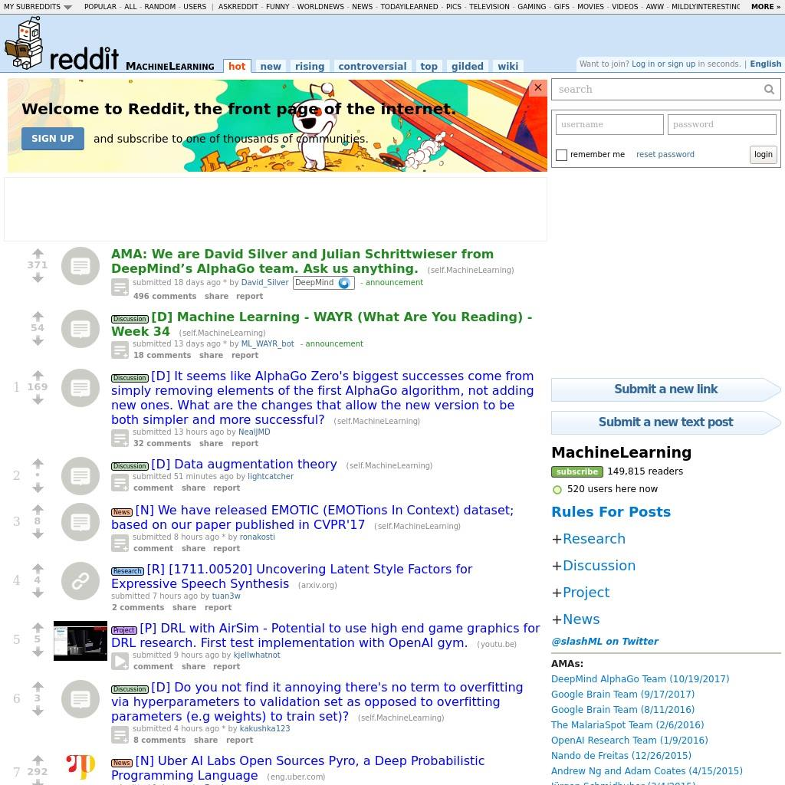
**이미지 캡션:** 이것은 레딧의 머신러닝 서브레딧 페이지로, 인터넷의 첫 페이지라는 문구와 함께 환영 메시지가 표시됩니다. 페이지 상단에는 다양한 카테고리(hot, new, rising, controversial, top, gilded, wiki)가 있으며, 검색창과 로그인/가입 옵션이 있습니다. 페이지 중앙에는 머신러닝 관련 게시물 목록이 있으며, 각 게시물은 제목, 작성자, 제출 시간, 댓글 수, 공유 및 보고 옵션을 포함합니다. 게시물에는 AMA(무엇이든 물어보세요), 토론, 뉴스, 연구, 프로젝트 등 다양한 유형이 있습니다. 오른쪽에는 머신러닝 서브레딧의 구독자 수와 현재 접속자 수가 표시되며, 게시물 규칙과 트위터 계정, 과거 AMA 목록도 확인할 수 있습니다. 전반적으로 정보가 풍부하고 활발한 커뮤니티임을 보여줍니다.니다. 오른쪽에는 머신러닝 서브레딧의 구독자 수와 현재 접속자 수가 표시되며, 게시물 규칙과 트위터 계정, 과거 AMA 목록도 확인할 수 있습니다. 전반적으로 정보가 풍부하고 활발한 커뮤니티임을 보여줍니다.

> #오늘의레딧 https://www.reddit.com/r/MachineLearning/ 래딧은 읽을 거리가 다양합니다.  1. 같은 AlphaGo 제로의 가장 큰 성공 단순히고 새로운 것들을 추가하지는 않을 첫번째 AlphaGo 알고리즘의 요소를 제거하지 오는 것 같다. 무엇이 새로운 버전 둘 다고, 더 성공적인 더 간단할 수 있도록 하는 변화들은? 2. 데이터 확대 이론 3. 우리는, 우리의 종이 CVPR'17에 공지한 바에 의하EMOTIC(컨텍스트에서 EMOTions)의 데이터 발표했다. 4. DRL AirSim-Potential DRL 연구를 위해 높은 게임 그래픽을 이용하는 것이다 OpenAI 체육관과의 첫 시험의 구현입니다. 5. 당신처럼 overfitting 매개 변수에 반대하는 것이 규정이 없습니다 overfitting에 hyperparameters을 통해 유효성 검사에 짜증 나는 설정을 훈련시키기(e.g 무게))다고 생각하지 않니? 6. 우버 AI연구소 오픈원 Pyro, 깊은 확률적 프로그래밍 언어. 7. alphago 0실행에 대해서 Detail 질문입니다. 8. Meta-Learning과 Universality:딥 Representations고 기울기 하강 어떤 학습 알고리즘 Approximate 수 있다. 9. Keras 2.0.9-수소:M:SETA시계 추가했으며, 매우 빠르게 LSTM/GRU. 10. Chainer 도입"동적 라우팅의 캡슐". 11. self-attention처럼 풀링을 교체하나 Capsules 또 다른 방법일 뿐? 12. , BatchSize을 늘려라 학습율 Decay지 마세요. 13. PyTorch 도입"동적 라우팅의 캡슐". 14. 무엇 맥스 patterns/expressions을 위한 효율적인multi-core/multi-GPU 코드를 쓸 힘들다? 15. GAN 놀이터: 나타나는 생성 Adversarial 네트라 브라우저에서 실험을 하다. 실시간으로Observe 통합 모드 붕괴 등. 16. OpenNMT-tf:신경 순서 공부를 위해 모듈형 TensorFlow 구현입니다. 17. Pyro:PyTorch-Based 딥 피피엘 18. Tensorflow 1.4출시! 19. 어떻게 캡슐 네트워크의 적대적인 예로 견실성에 대해. 20. 포스터-응용 기계 학습의 날 2018년을 요구하다  1. https://www.reddit.com/r/MachineLearning/comments/7apvr4/d_it_seems_like_alphago_zeros_biggest_successes/ 2. https://www.reddit.com/r/MachineLearning/comments/7attqd/d_data_augmentation_theory/ 3. https://www.reddit.com/r/MachineLearning/comments/7arb93/n_we_have_released_emotic_emotions_in_context/ 4. https://youtu.be/ZE5hPHqJC64 5. https://www.reddit.com/r/MachineLearning/comments/7asu1o/d_do_you_not_find_it_annoying_theres_no_term_to/ 6. https://eng.uber.com/pyro/ 7. https://www.reddit.com/r/MachineLearning/comments/7at9d0/d_detail_question_about_alphago_zero/ 8. https://arxiv.org/abs/1710.11622 9. https://www.reddit.com/r/MachineLearning/comments/7aog93/news_keras_209_hms_eta_clock_added_and_very_fast/ 10. https://github.com/soskek/dynamic_routing_between_capsules 11. https://www.reddit.com/r/MachineLearning/comments/7aof1j/d_is_capsules_just_another_way_of_replacing/ 12. https://arxiv.org/abs/1711.00489 13. https://github.com/gram-ai/capsule-networks 14. https://www.reddit.com/r/MachineLearning/comments/7alpvn/d_what_ml_patternsexpressions_are_hard_to_write/ 15. https://github.com/reiinakano/gan-playground 16. https://github.com/OpenNMT/OpenNMT-tf 17. http://pyro.ai/ 18. https://github.com/tensorflow/tensorflow/releases/tag/v1.4.0 19. https://github.com/jaesik817/adv_attack_capsnet 20. https://www.appliedmldays.org/call_for_posters

### 11월 6일 (월) 08:52 · 📷 사진 (2장)

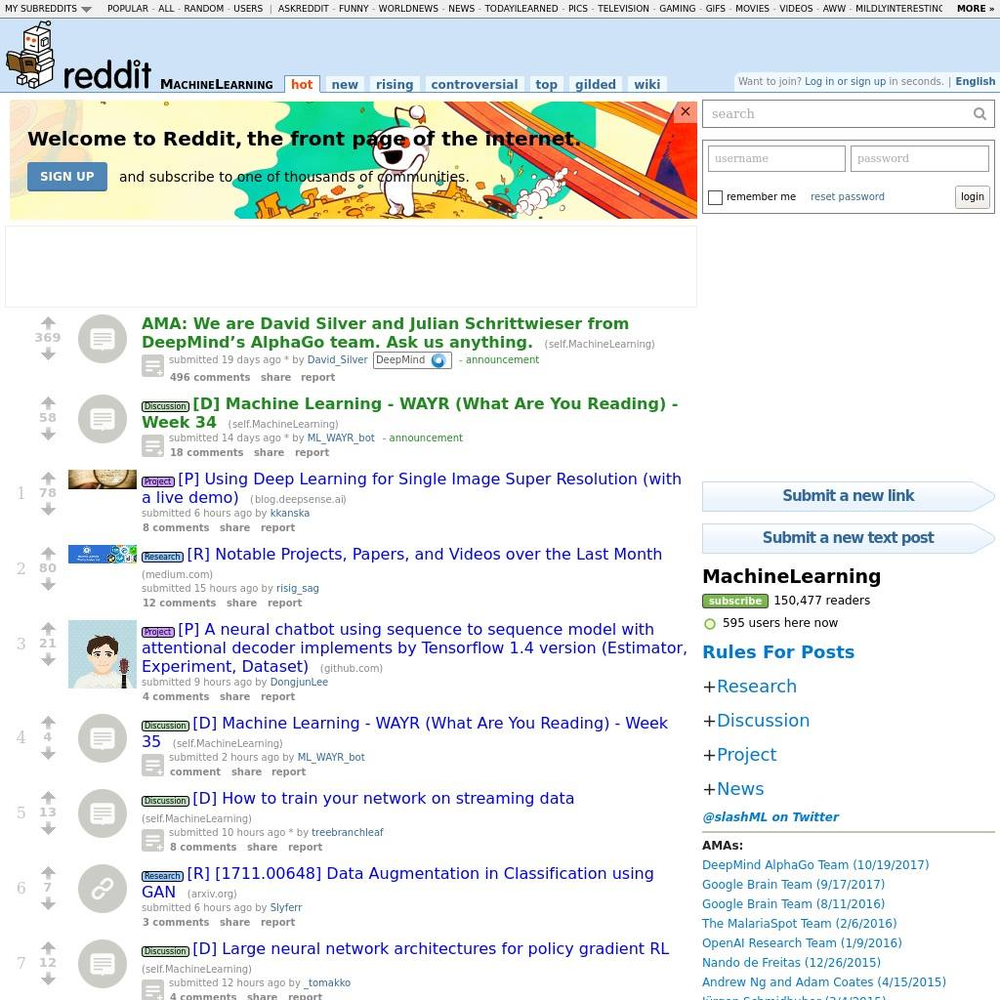
**이미지 캡션:** 이 이미지는 레딧의 머신러닝 서브레딧의 메인 페이지를 보여주며, 상단에는 레딧 로고와 함께 "MACHINE LEARNING"이라는 제목과 "hot", "new", "rising", "controversial", "top", "gilded", "wiki"와 같은 탭이 있다. 환영 메시지와 함께 "SIGN UP" 버튼이 보이고, 오른쪽 상단에는 로그인 폼이 있다. 메인 콘텐츠 영역에는 여러 게시물들이 나열되어 있으며, 각 게시물은 제목, 작성자, 제출 시간, 댓글 수, 공유 버튼 등을 포함한다. 첫 번째 게시물은 딥마인드의 알파고 팀과의 AMA(Ask Me Anything)에 대한 내용이고, 다른 게시물들은 머신러닝 관련 토론, 프로젝트, 연구 논문 등을 다루고 있다. 오른쪽 사이드바에는 "Submit a new link", "Submit a new text post" 버튼과 함께 "MachineLearning" 서브레딧 정보, "Rules For Posts", 그리고 "AMAS" 목록이 표시되어 있다. 전반적으로 기술 관련 커뮤니티의 정보 공유 및 토론이 이루어지는 웹사이트의 모습을 보여준다. 딥마인드의 알파고 팀과의 AMA(Ask Me Anything)에 대한 내용이고, 다른 게시물들은 머신러닝 관련 토론, 프로젝트, 연구 논문 등을 다루고 있다. 오른쪽 사이드바에는 "Submit a new link", "Submit a new text post" 버튼과 함께 "MachineLearning" 서브레딧 정보, "Rules For Posts", 그리고 "AMAS" 목록이 표시되어 있다. 전반적으로 기술 관련 커뮤니티의 정보 공유 및 토론이 이루어지는 웹사이트의 모습을 보여준다.
 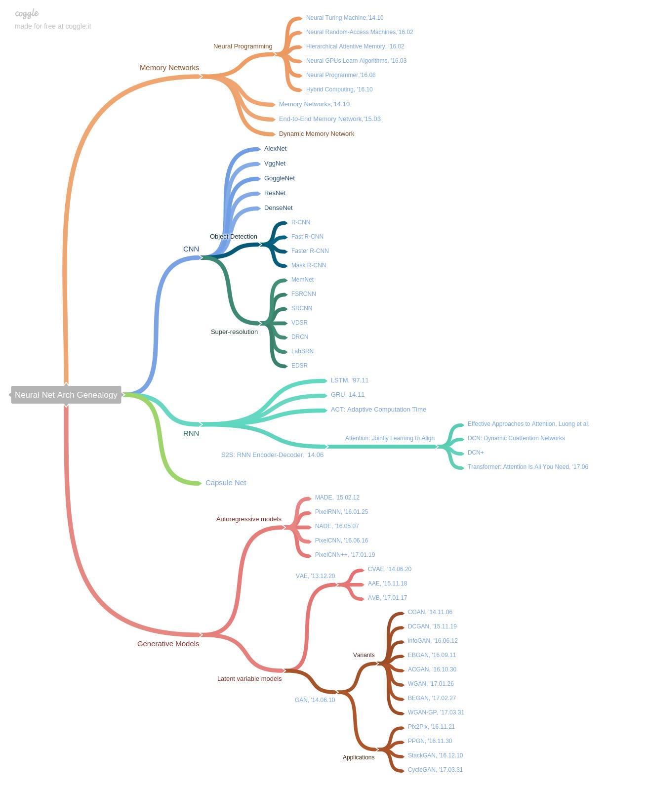
**이미지 캡션:** 이 이미지는 "Neural Net Arch Genealogy"라는 제목의 마인드 맵으로, 다양한 신경망 아키텍처의 계보를 시각적으로 보여줍니다. 중앙에는 "Neural Net Arch Genealogy"라는 큰 노드가 있고, 여기서 여러 주요 가지가 뻗어 나옵니다. 주요 가지로는 "Memory Networks", "CNN", "RNN", "Capsule Net", "Generative Models" 등이 있습니다. 각 주요 가지는 다시 하위 가지로 나뉘어 특정 신경망 모델이나 기술의 이름과 연도(출시 연도로 추정)가 표시됩니다. 예를 들어, "CNN" 가지는 "Object Detection"과 "Super-resolution"으로 나뉘고, "Object Detection" 아래에는 "AlexNet", "VggNet", "GoggleNet", "ResNet", "DenseNet" 등이 있으며, "Super-resolution" 아래에는 "MemNet", "FSRCNN", "SRCNN", "VDSR", "DRCN", "LabSRN", "EDSR" 등이 있습니다. "RNN" 가지에는 "LSTM", "GRU", "ACT: Adaptive Computation Time", "Attention: Jointly Learning to Align", "S2S: RNN Encoder-Decoder", "Effective Approaches to Attention, Luong et al.", "DCN: Dynamic Coattention Networks", "DCN+", "Transformer: Attention is All You Need" 등이 포함됩니다. "Generative Models"는 "Autoregressive models", "Latent variable models"로 나뉘며, "Latent variable models"는 다시 "Variants"와 "Applications"로 세분화됩니다. "Variants"에는 "CGAN", "DCGAN", "InfoGAN", "EBGAN", "ACGAN", "WGAN", "BEGAN", "WGAN-GP" 등이 있고, "Applications"에는 "Pix2Pix", "PPGN", "StackGAN", "CycleGAN" 등이 있습니다. 이미지의 배경은 흰색이며, 각 노드와 가지는 다양한 색상으로 구분되어 있어 시각적인 명확성을 높입니다. 전체적으로 복잡한 신경망 아키텍처의 관계와 발전 과정을 한눈에 파악할 수 있도록 구성된 정보성 그래픽입니다.추정)가 표시됩니다. 예를 들어, "CNN" 가지는 "Object Detection"과 "Super-resolution"으로 나뉘고, "Object Detection" 아래에는 "AlexNet", "VggNet", "GoggleNet", "ResNet", "DenseNet" 등이 있으며, "Super-resolution" 아래에는 "MemNet", "FSRCNN", "SRCNN", "VDSR", "DRCN", "LabSRN", "EDSR" 등이 있습니다. "RNN" 가지에는 "LSTM", "GRU", "ACT: Adaptive Computation Time", "Attention: Jointly Learning to Align", "S2S: RNN Encoder-Decoder", "Effective Approaches to Attention, Luong et al.", "DCN: Dynamic Coattention Networks", "DCN+", "Transformer: Attention is All You Need" 등이 포함됩니다. "Generative Models"는 "Autoregressive models", "Latent variable models"로 나뉘며, "Latent variable models"는 다시 "Variants"와 "Applications"로 세분화됩니다. "Variants"에는 "CGAN", "DCGAN", "InfoGAN", "EBGAN", "ACGAN", "WGAN", "BEGAN", "WGAN-GP" 등이 있고, "Applications"에는 "Pix2Pix", "PPGN", "StackGAN", "CycleGAN" 등이 있습니다. 이미지의 배경은 흰색이며, 각 노드와 가지는 다양한 색상으로 구분되어 있어 시각적인 명확성을 높입니다. 전체적으로 복잡한 신경망 아키텍처의 관계와 발전 과정을 한눈에 파악할 수 있도록 구성된 정보성 그래픽입니다.

> #오늘의레딧 https://www.reddit.com/r/MachineLearning/ 오늘도 새소식이 많군요.  1. 싱글 이미지 슈퍼 해상도(라이브 데모 버전으로)에 딥 학습이 사용됩니다. 2. 마지막 시기에 주목할 만한 사업, 종이, 및 비디오. 3. A신경 chatbot 시퀀스 모델에 Tensorflow 1.4버전(Estimator, 실험, Dataset)에 의해 주의 디코더 진창으로를 통하여. 4. 기계 학습-WAYR(뭘 읽는 것 있나)-주간 35. 5. 어떻게 스트리밍 데이터에 네트워크 훈련시키기. 6. 정책 경도 RL용 대형 신경 네트워크 아키텍처들. 7. PyTorch 도입"라디오 전체 변압기 네트워크". 8. 데이터 확대 이론 9. 때 아담 또는 RMSProp를 사용하여 학습 관석 생성률에 기울기와 스케일링이 있나요? 10. 유전자 정책 최적화 11. 같은 AlphaGo 제로의 가장 큰 성공 단순히고 새로운 것들을 추가하지는 않을 첫번째 AlphaGo 알고리즘의 요소를 제거하지 오는 것 같다. 무엇이 새로운 버전 둘 다고, 더 성공적인 더 간단할 수 있도록 하는 변화들은? 12. 당신처럼 overfitting 매개 변수에 반대하는 것이 규정이 없습니다 overfitting에 hyperparameters을 통해 유효성 검사에 짜증 나는 설정을 훈련시키기(e.g 무게))다고 생각하지 않니? 13. 우리는, 우리의 종이 CVPR'17에 공지한 바에 의하EMOTIC(컨텍스트에서 EMOTions)의 데이터 발표했다. 14. alphago 0실행에 대해서 Detail 질문입니다. 15. DRL AirSim-Potential DRL 연구를 위해 높은 게임 그래픽을 이용하는 것이다 OpenAI 체육관과의 첫 시험의 구현입니다. 16. 딥을 배우는 것은 혁신 단지 Brute 포스 때문에 있나요? 17. 식물 이미지 인식 안드로이드에 mxnet/qt/qml를 구현하다. 18. 우버 AI연구소 오픈원 Pyro, 깊은 확률적 프로그래밍 언어. 19. Keras 2.0.9-수소:M:SETA시계 추가했으며, 매우 빠르게 LSTM/GRU. 20. Chainer 도입"동적 라우팅의 캡슐".  1. https://blog.deepsense.ai/using-deep-learning-for-single-image-super-resolution/ 2. https://medium.com/mlreview/machine-learning-weekly-review-8-ccfe1354f1f3 3. https://github.com/DongjunLee/conversation-tensorflow 4. https://www.reddit.com/r/MachineLearning/comments/7b0av0/d_machine_learning_wayr_what_are_you_reading_week/ 5. https://www.reddit.com/r/MachineLearning/comments/7axg9w/d_how_to_train_your_network_on_streaming_data/ 6. https://www.reddit.com/r/MachineLearning/comments/7ax0zy/d_large_neural_network_architectures_for_policy/ 7. https://github.com/gram-ai/radio-transformer-networks 8. https://www.reddit.com/r/MachineLearning/comments/7attqd/d_data_augmentation_theory/ 9. https://www.reddit.com/r/MachineLearning/comments/7az1y8/d_is_scaling_the_gradient_equivalent_to_scaling/ 10. https://openreview.net/forum?id=ByOnmlWC-&noteId=ByOnmlWC- 11. https://www.reddit.com/r/MachineLearning/comments/7apvr4/d_it_seems_like_alphago_zeros_biggest_successes/ 12. https://www.reddit.com/r/MachineLearning/comments/7asu1o/d_do_you_not_find_it_annoying_theres_no_term_to/ 13. https://www.reddit.com/r/MachineLearning/comments/7arb93/n_we_have_released_emotic_emotions_in_context/ 14. https://www.reddit.com/r/MachineLearning/comments/7at9d0/d_detail_question_about_alphago_zero/ 15. https://youtu.be/ZE5hPHqJC64 16. https://medium.com/intuitionmachine/the-brute-force-method-of-deep-learning-innovation-58b497323ae5 17. https://www.reddit.com/r/MachineLearning/comments/7aubm2/p_plant_image_recognition_implemented_with/ 18. https://eng.uber.com/pyro/ 19. https://www.reddit.com/r/MachineLearning/comments/7aog93/news_keras_209_hms_eta_clock_added_and_very_fast/ 20. https://github.com/soskek/dynamic_routing_between_capsules
> Hwalsuk Lee님 Lucy Park님과 같이 막 시작한 프로젝트 입니다. 이름하여 "딥러닝 architecture genealogy!" 이름은 거창하지만 이제 막 시작하여 아무것도 없고요. 그래서 회원님들의 도움이 절실한데요.   여러분들 보시기에 이건 정말 중요한 구조, 꼭 알아야 하는 것이 있다면 바로 pull request나 이슈, 여기 댓글 부탁드립니다. 아름다운 나무가 나올것으로 기대합니다.   Project page: https://github.com/hunkim/deep_architecture_genealogy  Mind map (논문 클릭가능) https://coggle.it/diagram/Wf5mYoJbsgABUF9P

### 11월 7일 (화) 08:52 · 📷 사진 (1장)

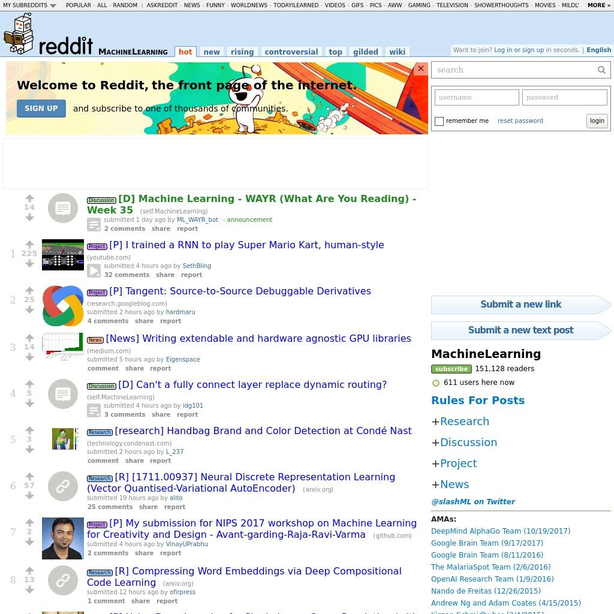
**이미지 캡션:** 이 이미지는 레딧(Reddit) 웹사이트의 '머신러닝(Machine Learning)' 커뮤니티 페이지를 보여줍니다. 페이지 상단에는 레딧 로고와 함께 'MACHINE LEARNING'이라는 제목이 있고, 그 아래에는 'hot', 'new', 'rising', 'controversial', 'top', 'gilded', 'wiki'와 같은 탭들이 나열되어 있습니다. 메인 영역에는 "Welcome to Reddit, the front page of the internet."이라는 환영 문구와 함께 가입 및 구독을 유도하는 버튼이 있습니다. 오른쪽 상단에는 로그인 및 회원가입을 위한 입력창과 버튼이 보입니다. 페이지 중앙에는 다양한 머신러닝 관련 게시물들이 목록 형태로 나열되어 있습니다. 각 게시물은 제목, 작성자, 제출 시간, 댓글 수, 공유, 보고 등의 정보와 함께 위아래 화살표로 표시된 추천 수를 포함하고 있습니다. 게시물들은 'Discussion', 'Project', 'News', 'Research'와 같은 카테고리로 분류되어 있으며, 일부 게시물에는 관련 링크(youtube.com, research.googleblog.com, medium.com, arxiv.org, github.com 등)가 첨부되어 있습니다. 오른쪽 사이드바에는 'Submit a new link'와 'Submit a new text post' 버튼이 있으며, 'MachineLearning' 커뮤니티의 구독자 수(151,128명)와 현재 접속자 수(611명)가 표시되어 있습니다. 또한, 커뮤니티 규칙('Rules For Posts')과 함께 '+Research', '+Discussion', '+Project', '+News'와 같은 하위 카테고리 링크가 있습니다. 하단에는 '@slashML on Twitter' 링크와 'AMAS' 섹션이 있어, 과거 AMA(Ask Me Anything) 세션에 참여했던 팀이나 인물들의 목록과 날짜가 나열되어 있습니다. 전반적으로 정보가 풍부하고 전문적인 내용을 다루는 커뮤니티 페이지의 분위기를 띠고 있습니다.VIDEOS," "GIFS," "PICS," "AWW," "GAMING," "TELEVISION," "SHOWERTHOUGHTS," "MOVIES," "MILDL," and "MORE." Below that, a banner reads "Welcome to Reddit, the front page of the internet." and a "SIGN UP" button. The main content area displays a list of posts in the MachineLearning subreddit, each with a title, author, submission time, and number of comments. Some posts have associated images or links. To the right, there are options to "Submit a new link" and "Submit a new text post," followed by information about the "MachineLearning" subreddit, including subscriber count and active users. Further down on the right are "Rules For Posts" with categories like "+Research," "+Discussion," "+Project," and "+News," and a Twitter handle "@slashML on Twitter." At the bottom right, there's a section for "AMAS" (Ask Me Anything) with a list of past AMA sessions and their dates. The overall atmosphere is informative and community-oriented, typical of an online forum dedicated to a specific topic.

> #오늘의레딧 https://www.reddit.com/r/MachineLearning/ 오늘도 새소식이 많군요.  1. 나는 슈퍼 마리오 카트,human-style를 RNN 훈련시켰다. 2. 접선:Source-to-Source Debuggable 상품 3. 및 하드웨어 늘일 수 있는 불가지론자가 GPU에 도서관 편지를 쓰는 것. 4. 아닌 완전히 연결 레이어 동적 라우팅을 대체할 수 있을까요? 5. 기계 학습에 창의성과 건축 디자인-Avant-garding-Raja-Ravi-Varma에 해군 정보 처리 시스템 2017년 워크숍을 위해 나의 제안. 6. 딥 구성 코드를 배우는 것은을 통해 워드 Embeddings 압축하여. 7. 싱글 이미지 슈퍼 해상도(라이브 데모 버전으로)에 딥 학습이 사용됩니다. 8. 아이리스-배치할 수 있는 기계 학습 공책을 분석했다. 9. 많은 관련이 없는 라벨도 ML모델의 많은 것을 요구하고 형태로는? 10. A신경 chatbot 시퀀스 모델에 Tensorflow 1.4버전(Estimator, 실험, Dataset)에 의해 주의 디코더 진창으로를 통하여. 11. 마지막 시기에 주목할 만한 사업, 종이, 및 비디오. 12. 어떻게 스트리밍 데이터에 네트워크 훈련시키기. 13. 정책 경도 RL용 대형 신경 네트워크 아키텍처들. 14. PyTorch 도입"라디오 전체 변압기 네트워크". 15. 유전자 정책 최적화 16. 데이터 확대 이론 17. 같은 AlphaGo 제로의 가장 큰 성공 단순히고 새로운 것들을 추가하지는 않을 첫번째 AlphaGo 알고리즘의 요소를 제거하지 오는 것 같다. 무엇이 새로운 버전 둘 다고, 더 성공적인 더 간단할 수 있도록 하는 변화들은? 18. 당신처럼 overfitting 매개 변수에 반대하는 것이 규정이 없습니다 overfitting에 hyperparameters을 통해 유효성 검사에 짜증 나는 설정을 훈련시키기(e.g 무게))다고 생각하지 않니? 19. 우리는, 우리의 종이 CVPR'17에 공지한 바에 의하EMOTIC(컨텍스트에서 EMOTions)의 데이터 발표했다. 20. alphago 0실행에 대해서 Detail 질문입니다.  1. https://www.youtube.com/watch?v=Ipi40cb_RsI 2. https://research.googleblog.com/2017/11/tangent-source-to-source-debuggable.html 3. https://medium.com/@sdanisch/writing-extendable-and-hardware-agnostic-gpu-libraries-b21c145a8dad 4. https://www.reddit.com/r/MachineLearning/comments/7b7ltp/d_cant_a_fully_connect_layer_replace_dynamic/ 5. https://github.com/vinayprabhu/Avant-garding-Raja-Ravi-Varma/blob/master/Avant%2Bgarding%2BRaja%2BRavi%2BVarma_final.ipynb 6. https://arxiv.org/abs/1711.01068 7. https://blog.deepsense.ai/using-deep-learning-for-single-image-super-resolution/ 8. https://iris.sh 9. https://www.reddit.com/r/MachineLearning/comments/7b2eoi/d_classifying_forms_with_many_unrelated_labels/ 10. https://github.com/DongjunLee/conversation-tensorflow 11. https://medium.com/mlreview/machine-learning-weekly-review-8-ccfe1354f1f3 12. https://www.reddit.com/r/MachineLearning/comments/7axg9w/d_how_to_train_your_network_on_streaming_data/ 13. https://www.reddit.com/r/MachineLearning/comments/7ax0zy/d_large_neural_network_architectures_for_policy/ 14. https://github.com/gram-ai/radio-transformer-networks 15. https://openreview.net/forum?id=ByOnmlWC-&noteId=ByOnmlWC- 16. https://www.reddit.com/r/MachineLearning/comments/7attqd/d_data_augmentation_theory/ 17. https://www.reddit.com/r/MachineLearning/comments/7apvr4/d_it_seems_like_alphago_zeros_biggest_successes/ 18. https://www.reddit.com/r/MachineLearning/comments/7asu1o/d_do_you_not_find_it_annoying_theres_no_term_to/ 19. https://www.reddit.com/r/MachineLearning/comments/7arb93/n_we_have_released_emotic_emotions_in_context/ 20. https://www.reddit.com/r/MachineLearning/comments/7at9d0/d_detail_question_about_alphago_zero/

### 11월 8일 (수) 08:52 · 📷 사진 (4장)

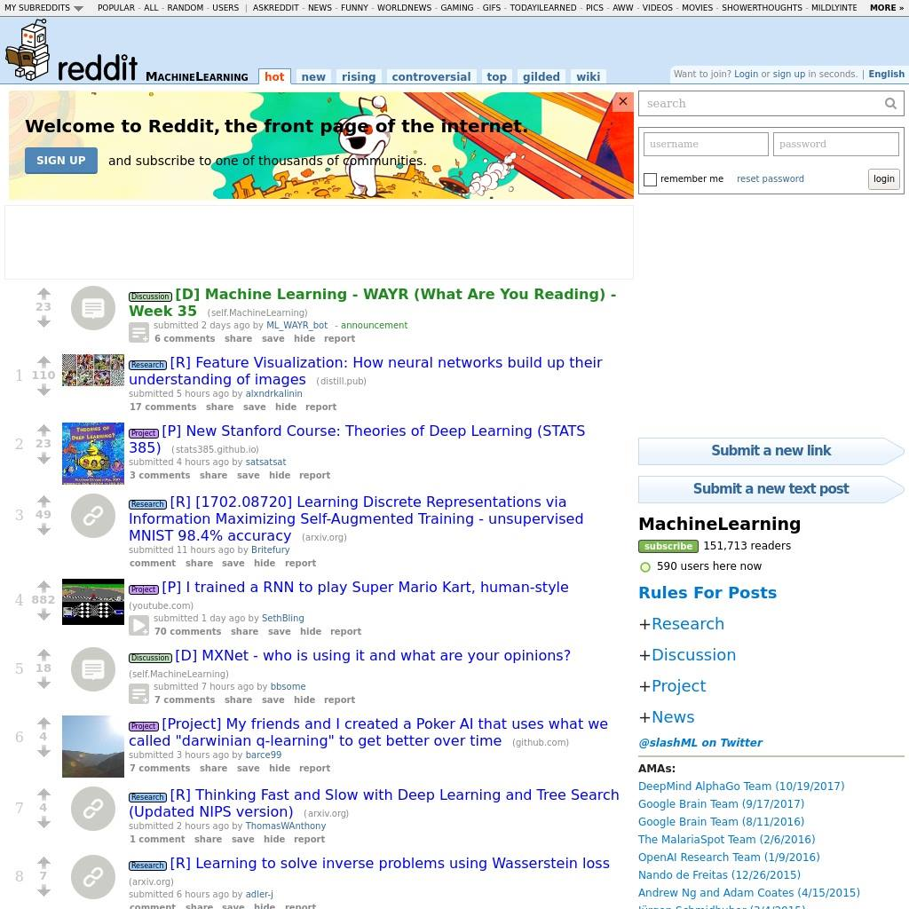
**이미지 캡션:** 이 이미지는 인기 있는 소셜 뉴스 웹사이트인 레딧의 메인 페이지를 보여주며, 특히 머신러닝 커뮤니티의 프론트 페이지입니다. 페이지 상단에는 레딧 로고와 함께 "MACHINE LEARNING"이라는 제목이 있고, 그 아래에는 "hot", "new", "rising", "controversial", "top", "gilded", "wiki"와 같은 다양한 탭이 있습니다. 메인 콘텐츠 영역에는 "Welcome to Reddit, the front page of the internet."이라는 환영 메시지가 있으며, 사용자가 가입하거나 커뮤니티에 구독할 수 있도록 안내하는 버튼이 있습니다. 오른쪽 상단에는 로그인 및 검색 기능이 있습니다. 페이지의 주요 부분은 머신러닝 관련 게시물 목록으로 채워져 있으며, 각 게시물에는 제목, 작성자, 제출 시간, 댓글 수, 그리고 공유, 저장, 숨기기, 신고와 같은 옵션이 포함되어 있습니다. 게시물들은 "Discussion", "Research", "Project"와 같은 태그로 분류되어 있으며, 일부는 외부 링크를 포함하고 있습니다. 예를 들어, "Feature Visualization: How neural networks build up their understanding of images"라는 연구 게시물은 외부 링크를 제공하고 있으며, "I trained a RNN to play Super Mario Kart, human-style"이라는 프로젝트 게시물은 유튜브 링크를 포함하고 있습니다. 페이지 오른쪽에는 "MachineLearning" 커뮤니티의 구독자 수와 현재 접속자 수가 표시되어 있으며, "Rules For Posts" 섹션에는 "Research", "Discussion", "Project", "News"와 같은 카테고리가 나열되어 있습니다. 또한, "@slashML on Twitter" 링크와 과거 "AMA" (Ask Me Anything) 세션 목록도 볼 수 있습니다. 전체적으로 이 페이지는 머신러닝 분야의 최신 정보와 토론을 공유하는 활발한 온라인 커뮤니티의 모습을 보여줍니다. 사용자가 가입하거나 커뮤니티에 구독할 수 있도록 안내하는 버튼이 있습니다. 오른쪽 상단에는 로그인 및 검색 기능이 있습니다. 페이지의 주요 부분은 머신러닝 관련 게시물 목록으로 채워져 있으며, 각 게시물에는 제목, 작성자, 제출 시간, 댓글 수, 그리고 공유, 저장, 숨기기, 신고와 같은 옵션이 포함되어 있습니다. 게시물들은 "Discussion", "Research", "Project"와 같은 태그로 분류되어 있으며, 일부는 외부 링크를 포함하고 있습니다. 예를 들어, "Feature Visualization: How neural networks build up their understanding of images"라는 연구 게시물은 외부 링크를 제공하고 있으며, "I trained a RNN to play Super Mario Kart, human-style"이라는 프로젝트 게시물은 유튜브 링크를 포함하고 있습니다. 페이지 오른쪽에는 "MachineLearning" 커뮤니티의 구독자 수와 현재 접속자 수가 표시되어 있으며, "Rules For Posts" 섹션에는 "Research", "Discussion", "Project", "News"와 같은 카테고리가 나열되어 있습니다. 또한, "@slashML on Twitter" 링크와 과거 "AMA" (Ask Me Anything) 세션 목록도 볼 수 있습니다. 전체적으로 이 페이지는 머신러닝 분야의 최신 정보와 토론을 공유하는 활발한 온라인 커뮤니티의 모습을 보여줍니다.
 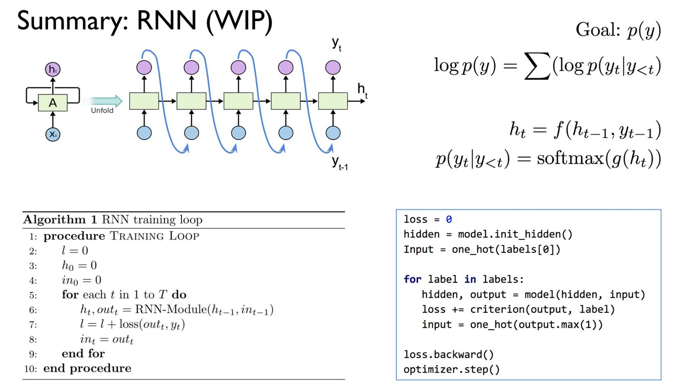
**이미지 캡션:** 이 이미지는 순환 신경망(RNN)에 대한 요약으로, RNN의 구조, 수학적 공식, 그리고 훈련 루프를 보여줍니다. 상단에는 "Summary: RNN (WIP)"라는 제목이 있고, 왼쪽에는 RNN의 순환 구조를 펼쳐서 시간 단계별로 표현한 다이어그램이 있습니다. 이 다이어그램은 입력(xt), 은닉 상태(ht), 출력(yt)을 나타내는 노드와 이를 연결하는 화살표로 구성되어 있으며, "Unfold"라는 텍스트로 펼쳐지는 과정을 설명합니다. 오른쪽 상단에는 RNN의 목표인 p(y)와 관련된 수학 공식들이 나열되어 있습니다. 하단에는 "Algorithm 1 RNN training loop"라는 제목과 함께 RNN 훈련 루프의 절차를 나타내는 의사 코드가 왼쪽 세로로 길게 작성되어 있으며, 오른쪽에는 파이썬 코드로 작성된 훈련 루프의 일부가 박스 안에 표시되어 있습니다. 전체적으로 흰색 배경에 파란색과 보라색, 녹색이 사용되어 정보 전달에 집중하고 있으며, 학술적이거나 기술적인 내용을 다루는 발표 자료 또는 문서의 일부로 보입니다.있습니다. 하단에는 "Algorithm 1 RNN training loop"라는 제목과 함께 RNN 훈련 루프의 절차를 나타내는 의사 코드가 왼쪽 세로로 길게 작성되어 있으며, 오른쪽에는 파이썬 코드로 작성된 훈련 루프의 일부가 박스 안에 표시되어 있습니다. 전체적으로 흰색 배경에 파란색과 보라색, 녹색이 사용되어 정보 전달에 집중하고 있으며, 학술적이거나 기술적인 내용을 다루는 발표 자료 또는 문서의 일부로 보입니다.
 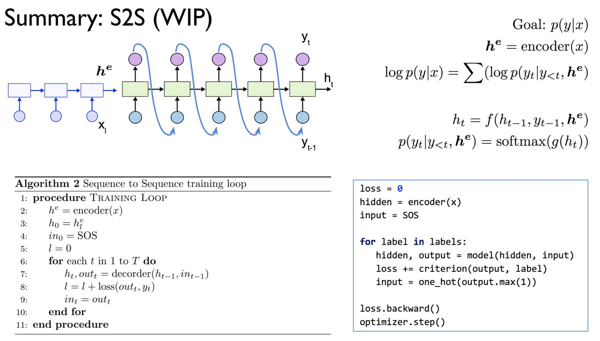
**이미지 캡션:** 이 이미지는 시퀀스-투-시퀀스(Sequence-to-Sequence, S2S) 모델의 학습 과정을 설명하는 슬라이드입니다. 왼쪽 상단에는 "Summary: S2S (WIP)"라는 제목이 있고, 그 아래에는 인코더와 디코더로 구성된 순환 신경망(RNN)의 구조를 시각적으로 표현한 다이어그램이 있습니다. 다이어그램은 입력 시퀀스 $x_i$를 받아 인코더를 거쳐 은닉 상태 $h^e$를 생성하고, 이 은닉 상태와 이전 시점의 출력 $y_{t-1}$을 바탕으로 현재 시점의 은닉 상태 $h_t$와 출력 $y_t$를 생성하는 디코더의 과정을 보여줍니다. 파란색 사각형은 입력 또는 은닉 상태를, 보라색 원은 출력 또는 이전 시점의 은닉 상태를 나타내며, 화살표는 정보의 흐름을 나타냅니다. 오른쪽 상단에는 S2S 모델의 목표인 조건부 확률 $p(y|x)$와 관련 수식들이 제시되어 있습니다. 그 아래에는 "Algorithm 2 Sequence to Sequence training loop"라는 제목과 함께 S2S 모델의 학습 알고리즘이 파이썬 유사 코드로 상세하게 설명되어 있습니다. 또한, 우측 하단에는 학습 루프의 일부를 나타내는 또 다른 코드 블록이 있습니다. 전체적으로 흰색 배경에 파란색, 녹색, 보라색, 주황색 등 다양한 색상의 텍스트와 도형이 사용되어 정보 전달력을 높이고 있습니다. 이 이미지는 딥러닝 분야의 연구 또는 교육 자료로 활용될 것으로 보입니다.하는 디코더의 과정을 보여줍니다. 파란색 사각형은 입력 또는 은닉 상태를, 보라색 원은 출력 또는 이전 시점의 은닉 상태를 나타내며, 화살표는 정보의 흐름을 나타냅니다. 오른쪽 상단에는 S2S 모델의 목표인 조건부 확률 $p(y|x)$와 관련 수식들이 제시되어 있습니다. 그 아래에는 "Algorithm 2 Sequence to Sequence training loop"라는 제목과 함께 S2S 모델의 학습 알고리즘이 파이썬 유사 코드로 상세하게 설명되어 있습니다. 또한, 우측 하단에는 학습 루프의 일부를 나타내는 또 다른 코드 블록이 있습니다. 전체적으로 흰색 배경에 파란색, 녹색, 보라색, 주황색 등 다양한 색상의 텍스트와 도형이 사용되어 정보 전달력을 높이고 있습니다. 이 이미지는 딥러닝 분야의 연구 또는 교육 자료로 활용될 것으로 보입니다.
 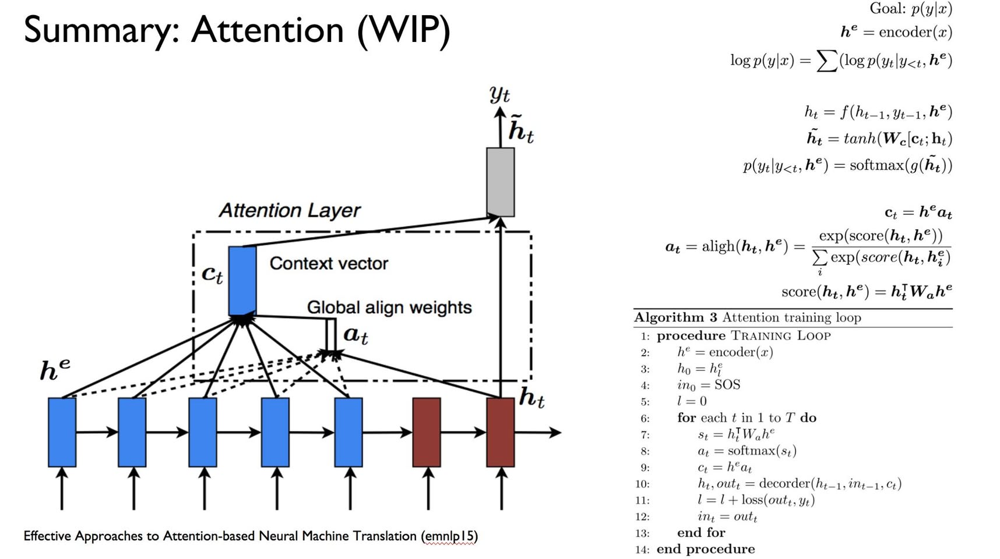
**이미지 캡션:** 이 이미지는 신경망의 어텐션 메커니즘을 설명하는 다이어그램과 수식, 알고리즘을 포함하고 있습니다. 다이어그램은 왼쪽에서 오른쪽으로 진행되는 여러 개의 파란색 사각형으로 표현된 인코더의 은닉 상태(h^e)와 오른쪽 상단의 회색 사각형으로 표현된 디코더의 은닉 상태(h_t)를 보여줍니다. 어텐션 레이어는 인코더의 은닉 상태와 디코더의 은닉 상태를 입력받아 컨텍스트 벡터(c_t)와 글로벌 정렬 가중치(a_t)를 계산하는 과정을 나타냅니다. 오른쪽에는 어텐션 메커니즘과 관련된 여러 수식이 나열되어 있으며, 그 아래에는 어텐션 학습 루프를 설명하는 알고리즘 3이 제시되어 있습니다. 이미지 하단에는 "Effective Approaches to Attention-based Neural Machine Translation (emnlp15)"라는 텍스트가 있어, 이 자료가 신경망 기계 번역 분야의 어텐션 기반 접근 방식에 대한 논문이나 발표 자료의 일부임을 알 수 있습니다. 전반적으로 학술적인 내용으로, 복잡한 기술적 개념을 시각적으로 설명하고 있습니다.는 어텐션 학습 루프를 설명하는 알고리즘 3이 제시되어 있습니다. 이미지 하단에는 "Effective Approaches to Attention-based Neural Machine Translation (emnlp15)"라는 텍스트가 있어, 이 자료가 신경망 기계 번역 분야의 어텐션 기반 접근 방식에 대한 논문이나 발표 자료의 일부임을 알 수 있습니다. 전반적으로 학술적인 내용으로, 복잡한 기술적 개념을 시각적으로 설명하고 있습니다.

> #오늘의레딧 https://www.reddit.com/r/MachineLearning/ 재미난 이야기들이 많습니다.  1. Feature시각화: 어떻게로는 신경 네트워크 영상에 대한 그들의 이해 쉽게 만들죠. 2. 뉴 스탠포드 코스:딥을 배우는 것은(STATS 385)이론. 3. 나는 슈퍼 마리오 카트,human-style를 RNN 훈련시켰다. 4. MXNet-는 사람과 여러분의 의견은 이용하는 걸까요? 5. 내 친구들과 나는 우리가"q-learningdarwinian"더 나은 시간을 극복하는 것을 사용하는 포커 AI을 만들었다. 6. 생각하는 것은 빠르고 슬로우 딥 학습과 나무 검색(업데이트 해군 정보 처리 시스템 버전). 7. 역 문제 Wasserstein 손실을 사용해 푸는 것을 배우는 것은. 8. 는 브라우저에서 없는 JS이고 서버를 찾을 수 없는 함께 기차 모델 초대형 트럭 소개:신경 그물 9. 정보 이론 10. 누가 CVPR 2017년은 비욘드 ILSVRC 워크샵에 참가했다 아무도 없나요? 11. Fully-Parallel 텍스트 세대 신경 기계 번역. 12. 1눈에 CPU에 달 착륙선을 해결하는 Q를 배우는 것은 에이전트를 실행했다. 13. 어떻게 우리가 데이터를 통해에서 다른 우리 모두가 배운"최적선"에서 다른x-value에서 y-value를 예측하기 위해서 라인의 한 지점을 정확히 지적한 라인에 맞는 회귀 모델입니다.6th-grade 수학? 14. 피터르 Abbeel과 다른 사람들 OpenAI 로봇 창업 시작하기 위해 떠난다. 15. 접선:Source-to-Source Debuggable 상품 16. 이 단위의 고밀도 막에 있는 번호와 등급 산출물Logits 막에 있는 번호 사이의 어떤 관계가 있는 것? 17. 있나 조건부 GAN 더 전통적인 GAN보다? 18. https://www.reddit.com/r/MachineLearning.에 물리학자 19. 경찰 Dropout Zołna, Arpit, Suhubdy&Yoshua Bengio. 20. 왜 그렇게 많은 숨겨진 층을 가진" 깊은 신경 조직"과 그들 중 가장 좋은 일을 하고 있다는 것을 모르니? 나에게 재해를 만드는 조리법처럼 들린다.  1. https://distill.pub/2017/feature-visualization/ 2. https://stats385.github.io/ 3. https://www.youtube.com/watch?v=Ipi40cb_RsI 4. https://www.reddit.com/r/MachineLearning/comments/7be4y2/d_mxnet_who_is_using_it_and_what_are_your_opinions/ 5. https://github.com/arjunrathreya/PokerAI-master 6. https://arxiv.org/pdf/1705.08439 7. https://arxiv.org/abs/1710.10898 8. http://blog.aylien.com/juggernaut-neural-networks-in-a-web-browser/ 9. https://www.reddit.com/r/MachineLearning/comments/7be5m0/d_information_theory/ 10. https://www.reddit.com/r/MachineLearning/comments/7bft4v/d_anyone_here_who_attended_the_beyond_ilsvrc/ 11. https://einstein.ai/research/non-autoregressive-neural-machine-translation 12. https://www.youtube.com/watch?v=p0rGjAgykOU 13. https://www.reddit.com/r/MachineLearning/comments/7beu3q/d_how_is_a_regression_model_where_we_fit_a_line/ 14. https://www.nytimes.com/2017/11/06/technology/artificial-intelligence-start-up.html 15. https://research.googleblog.com/2017/11/tangent-source-to-source-debuggable.html 16. https://www.reddit.com/r/MachineLearning/comments/7bc8de/d_is_there_a_connection_between_the_number_of/ 17. https://www.reddit.com/r/MachineLearning/comments/7bckyu/d_is_conditional_gan_better_than_traditional_gan/ 18. https://www.reddit.com/r/MachineLearning/comments/7baydc/d_physicist_in_rmachinelearning/ 19. https://arxiv.org/pdf/1711.00066.pdf 20. https://www.reddit.com/r/MachineLearning/comments/7bfsbg/d_why_is_a_deep_neural_network_with_so_many/

### 11월 9일 (목) 08:52 · 📷 사진 (1장)

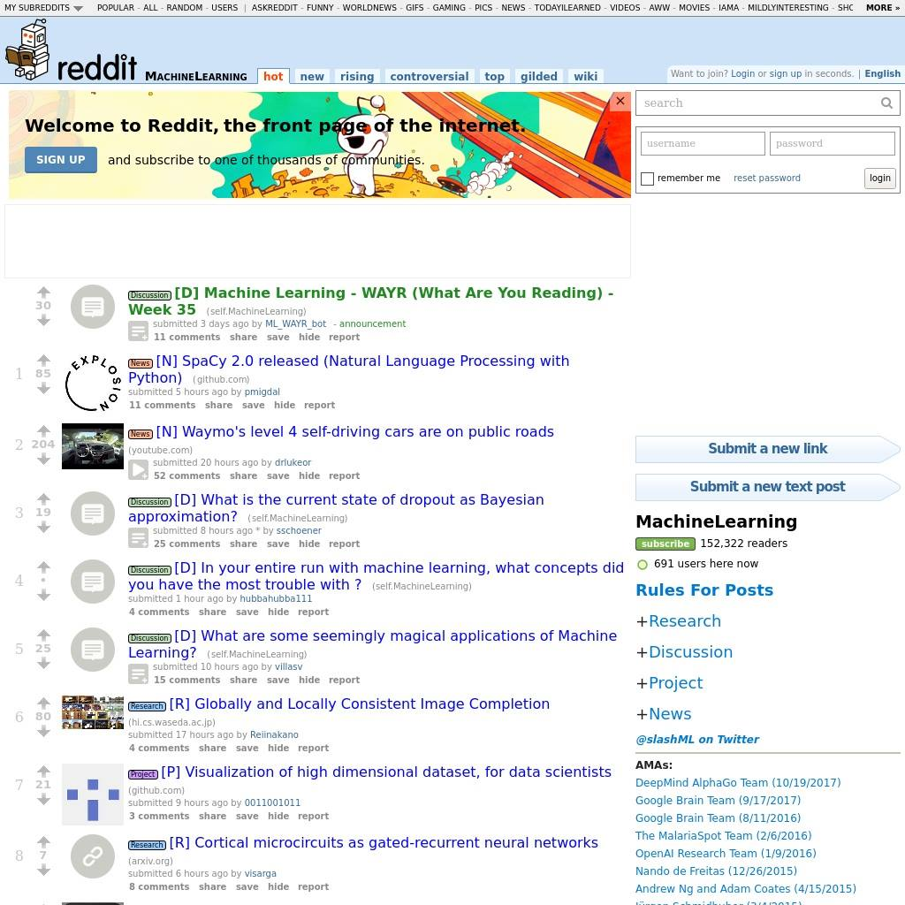
**이미지 캡션:** 이 이미지는 레딧(Reddit) 웹사이트의 머신러닝(Machine Learning) 서브레딧의 메인 페이지를 보여줍니다. 화면 중앙에는 "Welcome to Reddit, the front page of the internet."이라는 환영 문구가 있고, 그 아래에 "SIGN UP" 버튼이 있습니다. 오른쪽 상단에는 로그인 및 회원가입을 위한 입력 필드와 버튼이 있습니다. 메인 콘텐츠 영역에는 여러 게시물 목록이 표시되며, 각 게시물은 제목, 작성자, 제출 시간, 댓글 수, 공유, 저장, 숨기기, 신고 옵션 등을 포함합니다. 게시물들은 주로 머신러닝 관련 주제를 다루고 있으며, "Discussion", "News", "Project", "Research"와 같은 태그가 붙어 있습니다. 예를 들어, "[D] Machine Learning - WAYR (What Are You Reading) - Week 35"라는 제목의 게시물은 3일 전에 제출되었고 11개의 댓글이 있습니다. 또한, "SpaCy 2.0 released"라는 뉴스 게시물과 "Waymo's level 4 self-driving cars"에 대한 뉴스 게시물도 보입니다. 오른쪽 사이드바에는 "MachineLearning" 서브레딧 정보, 구독자 수, 규칙, 관련 링크 및 AMA(Ask Me Anything) 목록이 표시됩니다. 전반적으로 기술 및 커뮤니티 중심의 온라인 포럼 페이지의 모습입니다.등을 포함합니다. 게시물들은 주로 머신러닝 관련 주제를 다루고 있으며, "Discussion", "News", "Project", "Research"와 같은 태그가 붙어 있습니다. 예를 들어, "[D] Machine Learning - WAYR (What Are You Reading) - Week 35"라는 제목의 게시물은 3일 전에 제출되었고 11개의 댓글이 있습니다. 또한, "SpaCy 2.0 released"라는 뉴스 게시물과 "Waymo's level 4 self-driving cars"에 대한 뉴스 게시물도 보입니다. 오른쪽 사이드바에는 "MachineLearning" 서브레딧 정보, 구독자 수, 규칙, 관련 링크 및 AMA(Ask Me Anything) 목록이 표시됩니다. 전반적으로 기술 및 커뮤니티 중심의 온라인 포럼 페이지의 모습입니다.

> #오늘의레딧 https://www.reddit.com/r/MachineLearning/ 머신러닝 공부는 정말 재미있죠?아침부터 다양한 소식이 많네요.  1. SpaCy 2.0(자연어 정보 처리 파이선으로)을 발표했다. 2. Waymo의 수준 4스스로 운전하는 차를 공공 도로에 있다. 3. 무엇 중퇴자의 베이즈 근사로 현재 상태는 어떤가? 4. 전체에서 기계 학습으로 운영되면서, 대부분의 어려움을 겪고 있어 개념들이 뭘 해요? 5. 어떤 기계 학습의 일부처럼 보이는 마법의 응용 프로그램은? 6. 세계적으로 그리고 Locally Consistent 이미지 완공. 7. 높은 치수의 데이터의 데이터 과학자들을 위한 가시화. 8. gated-recurrent로는 신경 네트워크로Cortical 만든다. 9. 원격 및 프로파일 시험 딥을 배우는 것은 크로스 컴필레이션 휴대폰에 미사일 경유 추적 법 원격 프로시저 호출. 10. Feature시각화: 어떻게로는 신경 네트워크 영상에 대한 그들의 이해 쉽게 만들죠. 11. 내 친구들과 나는 우리가"q-learningdarwinian"더 나은 시간을 극복하는 것을 사용하는 포커 AI을 만들었다. 12. 알파 세분화된 인식(코드)을 풀링. 13. ICLR 2018년 지원자를 인용하는 것이 좋아? 14. 뉴 스탠포드 코스:딥을 배우는 것은(STATS 385)이론. 15. Unsupervised 머신 번역 된 corpora을 사용하여 박람회에 의해서만(하나의 언어를 사용하는 corpora에서 두개의 다른 언어로 문장을 쓰면, 32.8까지, 심지어 a를 사용하지 않고 BLEU 점수 보고한다훈련 시간에 단일 병렬 문장이다.). 16. 누군가가 오류 측정 이 종이에 보도된 설명할 수 있습니까? 17. AWSCollaborates 에모리 대학교와 함께Cloud-Based 도달 연구 플랫폼을 이용한 아파치 MXNet 개발을 위하다. 18. 가장 좋아하는 기계 팟 캐스트 에피소드를 배우는 거죠? 19. 생각하는 것은 빠르고 슬로우 딥 학습과 나무 검색(업데이트 해군 정보 처리 시스템 버전). 20. TensorFlow는 실시간으로 image-captioning는다 안드로이드 앱 기반을 두고 있다.  1. https://github.com/explosion/spaCy/releases/tag/v2.0.0 2. https://www.youtube.com/watch?v=aaOB-ErYq6Y 3. https://www.reddit.com/r/MachineLearning/comments/7bm4b2/d_what_is_the_current_state_of_dropout_as/ 4. https://www.reddit.com/r/MachineLearning/comments/7bosyc/d_in_your_entire_run_with_machine_learning_what/ 5. https://www.reddit.com/r/MachineLearning/comments/7bl70a/d_what_are_some_seemingly_magical_applications_of/ 6. http://hi.cs.waseda.ac.jp/~iizuka/projects/completion/en/ 7. https://github.com/0011001011/Vizuka 8. https://arxiv.org/abs/1711.02448 9. http://tvmlang.org/2017/11/08/android-rpc-introduction.html 10. https://distill.pub/2017/feature-visualization/ 11. https://github.com/arjunrathreya/PokerAI-with-GUI 12. https://github.com/cvjena/alpha_pooling 13. https://www.reddit.com/r/MachineLearning/comments/7bou1e/d_ok_to_cite_iclr_2018_submissions/ 14. https://stats385.github.io/ 15. https://arxiv.org/pdf/1711.00043.pdf 16. https://www.reddit.com/r/MachineLearning/comments/7bly4n/d_can_someone_explain_the_error_metric_reported/ 17. https://aws.amazon.com/blogs/ai/aws-collaborates-with-emory-university-to-develop-cloud-based-nlp-research-platform-using-apache-mxnet/ 18. https://www.reddit.com/r/MachineLearning/comments/7bhjqb/d_what_are_your_favorite_machine_learning_podcast/ 19. https://arxiv.org/pdf/1705.08439 20. https://www.reddit.com/r/MachineLearning/comments/7bitvg/p_tensorflow_based_android_app_which_does/

### 11월 10일 (금) 08:52 · 📷 사진 (1장)

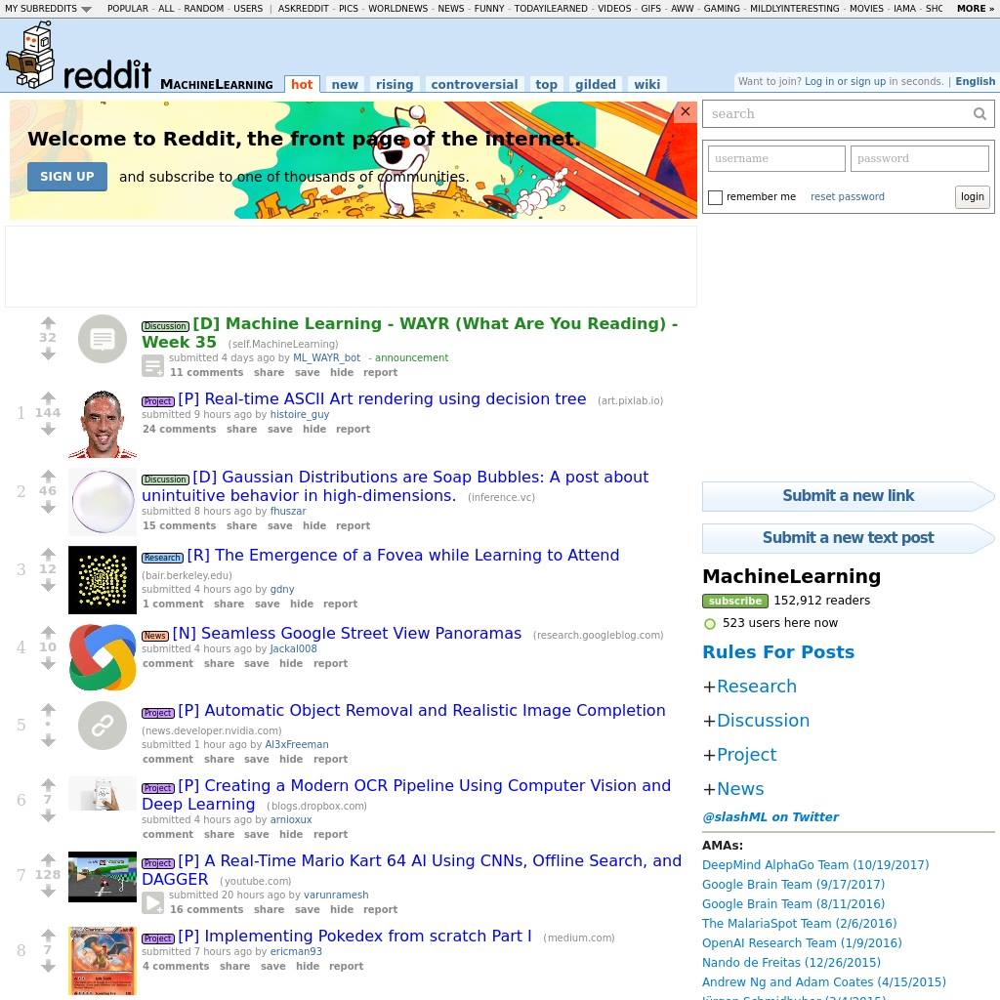
**이미지 캡션:** 이 이미지는 레딧(Reddit) 웹사이트의 머신러닝(Machine Learning) 커뮤니티 페이지를 보여줍니다. 페이지 상단에는 레딧 로고와 함께 "MACHINE LEARNING"이라는 제목이 있고, 그 아래에는 "hot", "new", "rising", "controversial", "top", "gilded", "wiki"와 같은 탭들이 있습니다. 메인 콘텐츠 영역에는 "Welcome to Reddit, the front page of the internet."이라는 환영 문구가 있고, 그 아래에 "SIGN UP" 버튼과 커뮤니티 구독 안내가 있습니다. 페이지 중앙에는 여러 게시물 목록이 표시되어 있으며, 각 게시물은 제목, 작성자, 제출 시간, 댓글 수, 그리고 관련 링크나 썸네일 이미지를 포함하고 있습니다. 게시물들은 "Discussion", "Project", "Research", "News"와 같은 카테고리로 분류되어 있습니다. 예를 들어, 첫 번째 게시물은 "[D] Machine Learning - WAYR (What Are You Reading) - Week 35"이며, 두 번째 게시물은 "[P] Real-time ASCII Art rendering using decision tree"로, 해당 게시물의 썸네일에는 한 성인 남성이 웃고 있는 사진이 작게 보입니다. 오른쪽 사이드바에는 "Submit a new link", "Submit a new text post" 버튼과 함께 "MachineLearning" 커뮤니티의 구독자 수, 현재 접속자 수, 그리고 게시물 규칙에 대한 링크들이 나열되어 있습니다. 또한, "@slashML on Twitter"와 "AMAS" 섹션에는 과거 AMA(Ask Me Anything) 세션에 참여했던 팀들의 목록과 날짜가 표시되어 있습니다. 전반적으로, 이 페이지는 머신러닝 관련 정보를 공유하고 토론하는 온라인 커뮤니티의 모습을 보여주며, 정보 탐색 및 참여를 유도하는 인터페이스를 가지고 있습니다.GN UP" 버튼과 커뮤니티 구독 안내가 있습니다. 페이지 중앙에는 여러 게시물 목록이 표시되어 있으며, 각 게시물은 제목, 작성자, 제출 시간, 댓글 수, 그리고 관련 링크나 썸네일 이미지를 포함하고 있습니다. 게시물들은 "Discussion", "Project", "Research", "News"와 같은 카테고리로 분류되어 있습니다. 예를 들어, 첫 번째 게시물은 "[D] Machine Learning - WAYR (What Are You Reading) - Week 35"이며, 두 번째 게시물은 "[P] Real-time ASCII Art rendering using decision tree"로, 해당 게시물의 썸네일에는 한 성인 남성이 웃고 있는 사진이 작게 보입니다. 오른쪽 사이드바에는 "Submit a new link", "Submit a new text post" 버튼과 함께 "MachineLearning" 커뮤니티의 구독자 수, 현재 접속자 수, 그리고 게시물 규칙에 대한 링크들이 나열되어 있습니다. 또한, "@slashML on Twitter"와 "AMAS" 섹션에는 과거 AMA(Ask Me Anything) 세션에 참여했던 팀들의 목록과 날짜가 표시되어 있습니다. 전반적으로, 이 페이지는 머신러닝 관련 정보를 공유하고 토론하는 온라인 커뮤니티의 모습을 보여주며, 정보 탐색 및 참여를 유도하는 인터페이스를 가지고 있습니다.

> #오늘의레딧 https://www.reddit.com/r/MachineLearning/ 따끈한 소식들입니다.  1. 실시간 아스키 아트 결정 트리를 사용하여 렌더링. 2. 가우스 분포다 요한 멜히오르 비르슈 작:high-dimensions에 이해 행동에 대해 올라온 글. 3. 한 Fovea의 출현는 동안에 참석하는 것을 배우는 것은. 4. Seamless 구글 스트리트 뷰 Panoramas. 5. 자동 Object제거와 현실적인 이미지 완공. 6. 는 현대의 광학 문자 판독기 파이프 라인을 이용한 컴퓨터 비전과 딥 학습을 창조한다. 7. 한 실시간 마리오 카트 64AI을 이용한 CNNs, 오프라인 검색, 그리고 DAGGER. 8. 처음 1부.에서 Pokedex 구현 9. TensorForce 0.3:RL에End-to-end 계산 그래프. 10. SpaCy 2.0(자연어 정보 처리 파이선으로)을 발표했다. 11.  때 노드를 가치와 무게 매트릭스 주어진 치수의 신경 조직을 음모할 구상 기능 matplotlib을 사용하여 만든. 12. 모든 기계 학습 문제를 예술 결과의 상태를 모으는 것. 13. 연속 데이터에서 해석할 수 있는 시각적 모델 배우는 것은는 혼란스러운 기호가 있습니다. 14. 구배 추정, Variational 추정과 표본 효율. 15. H2Os Driverless에 대한 의견은 AI? 16. 간단한, 정상적인 개체의 쌍과 해당 개체의 defective/deformed 버전의 이미지 데이터 집합을 찾습니다. 17. 어떻게 값 거리에 알려진 값에서 어떠한 방법은"컴퓨터의 애칭."에 기반을 두고 추정 이진 선형 분급기는? 18. 한"이케아에 도전하다"에 대한 생각들이. 19. 무엇 중퇴자의 베이즈 근사로 현재 상태는 어떤가? 20. 는 주 다른 문제 세트의 예술 연구 결과 추적한 better-compiled 자원 있나요?  1. https://art.pixlab.io/ 2. http://www.inference.vc/high-dimensional-gaussian-distributions-are-soap-bubble/ 3. http://bair.berkeley.edu/blog/2017/11/09/learn-to-attend-fovea/ 4. https://research.googleblog.com/2017/11/seamless-google-street-view-panoramas.html?utm_source=feedburner&utm_medium=feed&utm_campaign=Feed:+blogspot/gJZg+\(Official+Google+Research+Blog\) 5. https://news.developer.nvidia.com/automatic-object-removal-and-realistic-image-completion/ 6. https://blogs.dropbox.com/tech/2017/04/creating-a-modern-ocr-pipeline-using-computer-vision-and-deep-learning/ 7. https://www.youtube.com/watch?v=Eo07BAsyQ24 8. https://medium.com/@ericfeldman93/implementing-pokedex-from-scratch-part-i-3e91ea0b0d2b 9. https://reinforce.io/blog/end-to-end-computation-graphs-for-reinforcement-learning/?1 10. https://github.com/explosion/spaCy/releases/tag/v2.0.0 11. https://www.youtube.com/watch?v=fQ376G-Ek1E 12. https://www.reddit.com/r/MachineLearning/comments/7bqpdi/d_collecting_state_of_the_art_result_for_all/ 13. https://www.researchgate.net/publication/320891282_Discovering_More_Precise_Process_Models_from_Event_Logs_by_Filtering_Out_Chaotic_Activities 14. https://www.reddit.com/r/MachineLearning/comments/7buiz9/d_gradient_estimation_variational_inference_and/ 15. https://www.reddit.com/r/MachineLearning/comments/7bw4ck/d_opinions_on_h2os_driverless_ai/ 16. https://www.reddit.com/r/MachineLearning/comments/7buzvt/d_looking_for_an_image_dataset_of_pairs_of_simple/ 17. https://www.reddit.com/r/MachineLearning/comments/7bwt2b/d_how_is_a_binary_classifier_that_guesses_values/ 18. https://www.reddit.com/r/MachineLearning/comments/7btivf/d_thoughts_about_an_ikea_challenge/ 19. https://www.reddit.com/r/MachineLearning/comments/7bm4b2/d_what_is_the_current_state_of_dropout_as/ 20. https://www.reddit.com/r/MachineLearning/comments/7bpxbq/d_is_there_any_bettercompiled_resource_that_keeps/

### 11월 11일 (토) 08:53 · 📷 사진 (1장)

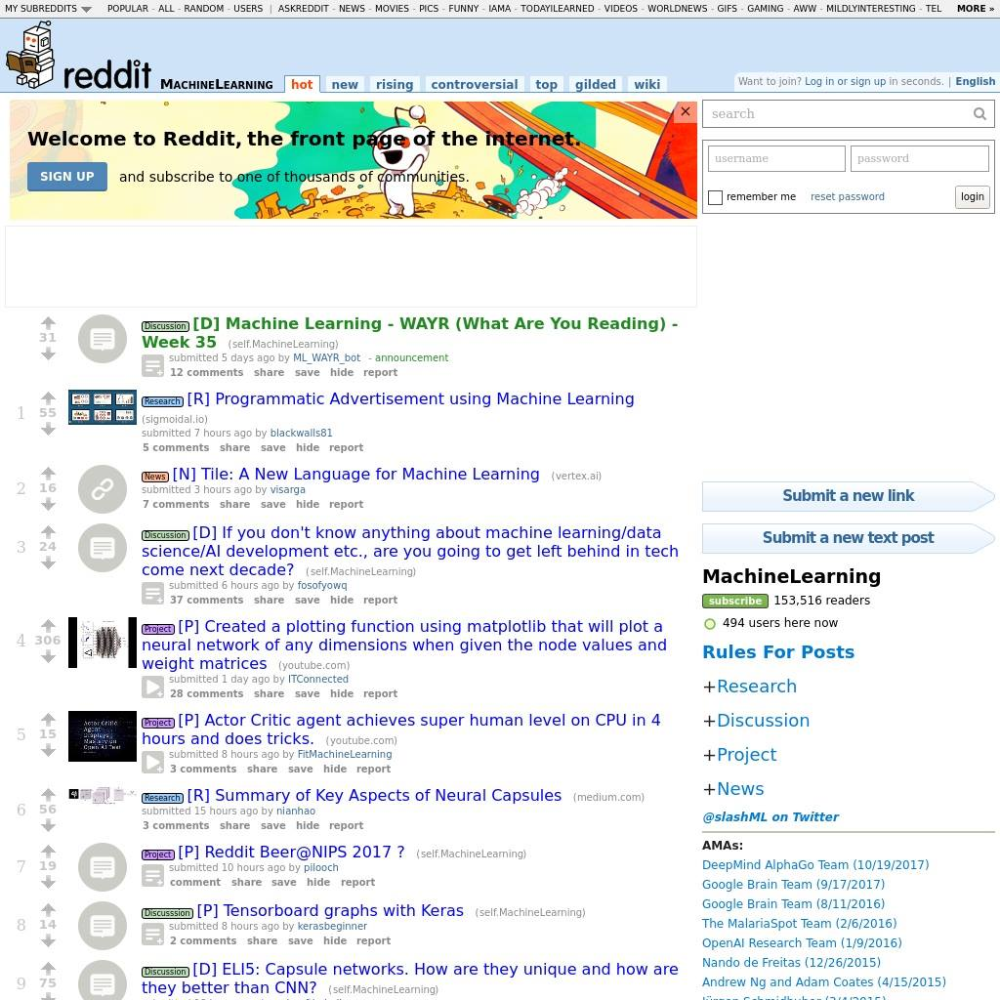
**이미지 캡션:** 이 이미지는 레딧의 머신러닝 커뮤니티 페이지를 보여줍니다. 페이지 상단에는 레딧 로고와 함께 "MACHINE LEARNING"이라는 제목이 있고, 그 아래에는 "hot", "new", "rising", "controversial", "top", "gilded", "wiki"와 같은 탭들이 있습니다. 메인 콘텐츠 영역에는 "Welcome to Reddit, the front page of the internet."이라는 환영 메시지와 함께 커뮤니티 가입을 유도하는 "SIGN UP" 버튼이 있습니다. 오른쪽 상단에는 로그인 폼이 있으며, 사용자 이름과 비밀번호를 입력하고 로그인할 수 있습니다. 페이지 중앙에는 머신러닝 관련 게시물 목록이 표시되어 있으며, 각 게시물은 제목, 작성자, 댓글 수, 좋아요/싫어요 수 등의 정보를 포함합니다. 게시물들은 "Discussion", "Research", "News", "Project"와 같은 카테고리로 분류되어 있습니다. 오른쪽 사이드바에는 "Submit a new link", "Submit a new text post" 버튼과 함께 커뮤니티 구독 정보, 규칙, 그리고 "AMAS" 섹션이 있습니다. "AMAS" 섹션에는 과거에 진행되었던 머신러닝 관련 유명 인사들의 AMA(Ask Me Anything) 목록이 날짜와 함께 나열되어 있습니다. 전반적으로 정보가 많고 다양한 주제의 게시물들이 나열되어 있어 활발한 커뮤니티의 분위기를 느낄 수 있습니다.에는 로그인 폼이 있으며, 사용자 이름과 비밀번호를 입력하고 로그인할 수 있습니다. 페이지 중앙에는 머신러닝 관련 게시물 목록이 표시되어 있으며, 각 게시물은 제목, 작성자, 댓글 수, 좋아요/싫어요 수 등의 정보를 포함합니다. 게시물들은 "Discussion", "Research", "News", "Project"와 같은 카테고리로 분류되어 있습니다. 오른쪽 사이드바에는 "Submit a new link", "Submit a new text post" 버튼과 함께 커뮤니티 구독 정보, 규칙, 그리고 "AMAS" 섹션이 있습니다. "AMAS" 섹션에는 과거에 진행되었던 머신러닝 관련 유명 인사들의 AMA(Ask Me Anything) 목록이 날짜와 함께 나열되어 있습니다. 전반적으로 정보가 많고 다양한 주제의 게시물들이 나열되어 있어 활발한 커뮤니티의 분위기를 느낄 수 있습니다.

> #오늘의레딧 https://www.reddit.com/r/MachineLearning/ 오늘도 새소식이 많군요.  1. Programmatic 광고 기계 학습을 사용하여. 2. 타일:기계 학습에 새로운 언어. 3. 만약 당신이science/AI 개발 등, learning/data 기계에 대해서 아무것도 몰라 당신 기술에 남아 도착할 거예요 다음 10년 올 수 있니? 4.  때 노드를 가치와 무게 매트릭스 주어진 치수의 신경 조직을 음모할 구상 기능 matplotlib을 사용하여 만든. 5. 배우 비평가 에이전트와 묘기를 부린다. CPU에 4시간 정도에 슈퍼 인간의 수준을 수행한다. 6. 키 측면을 캡슐의 요약. 7. Reddit맥주는 해군 정보 처리 시스템 2017년 @? 8. ELI5:캡슐 네트워크. 어떻게 그리고 그들이 어떻게 CNN보다 낫다 고유한 것인가? 9. 딥을 배우는 것은 실시간 중력 파동 분석 레이저 간섭계 중력파 관측소 데이터를 이용. 10. 무엇이 용어'라고 Convolutional 신경망의 컨텍스트에 말하'agnostic나요? 11. Adversarially 연합에 객체 지역화 작업을 위해 교차로 최적화. 12. 현재 저평가돼 있어 무엇을 느끼나/기계 학습 분야에서 인정을 받지? 13. 실시간 아스키 아트 결정 트리를 사용하여 렌더링. 14. BGANs:베이즈의 나타나는 생성 Adversarial 네트웍스입니다. 15. 자동 Object제거와 현실적인 이미지 완공. 16. 한 Fovea의 출현는 동안에 참석하는 것을 배우는 것은. 17. cs-224n(스탠포드 대학교:도달 딥 학습)에 다양한 딥 도달 모델의 Pytorch 구현입니다. 18. 가우스 분포다 요한 멜히오르 비르슈 작:high-dimensions에 이해 행동에 대해 올라온 글. 19. 업 AI연구 Slurping 후, 페이스북한 제안 공유. 20. 는 현대의 광학 문자 판독기 파이프 라인을 이용한 컴퓨터 비전과 딥 학습을 창조한다.  1. https://sigmoidal.io/ai-for-advertising/ 2. http://vertex.ai/blog/tile-a-new-language-for-machine-learning# 3. https://www.reddit.com/r/MachineLearning/comments/7c27dj/d_if_you_dont_know_anything_about_machine/ 4. https://www.youtube.com/watch?v=fQ376G-Ek1E 5. https://www.youtube.com/watch?v=z9R5hDT6vUQ 6. https://medium.com/mlreview/deep-neural-network-capsules-137be2877d44 7. https://www.reddit.com/r/MachineLearning/comments/7c1416/p_reddit_beernips_2017/ 8. https://www.reddit.com/r/MachineLearning/comments/7bz5x9/d_eli5_capsule_networks_how_are_they_unique_and/ 9. https://arxiv.org/abs/1711.03121 10. https://www.reddit.com/r/MachineLearning/comments/7bzrrd/d_what_does_the_term_agnostic_in_the_context_of_a/ 11. https://arxiv.org/abs/1710.07735 12. https://www.reddit.com/r/MachineLearning/comments/7bz7lj/d_what_do_you_feel_is_currently_undervalued/ 13. https://art.pixlab.io/ 14. https://github.com/andrewgordonwilson/bayesgan/ 15. https://news.developer.nvidia.com/automatic-object-removal-and-realistic-image-completion/ 16. http://bair.berkeley.edu/blog/2017/11/09/learn-to-attend-fovea/ 17. https://github.com/DSKSD/DeepNLP-models-Pytorch 18. http://www.inference.vc/high-dimensional-gaussian-distributions-are-soap-bubble/ 19. https://www.wired.com/story/after-slurping-up-ai-researchers-facebook-offers-to-share/ 20. https://blogs.dropbox.com/tech/2017/04/creating-a-modern-ocr-pipeline-using-computer-vision-and-deep-learning/

### 11월 12일 (일) 08:52 · 📷 사진 (2장)

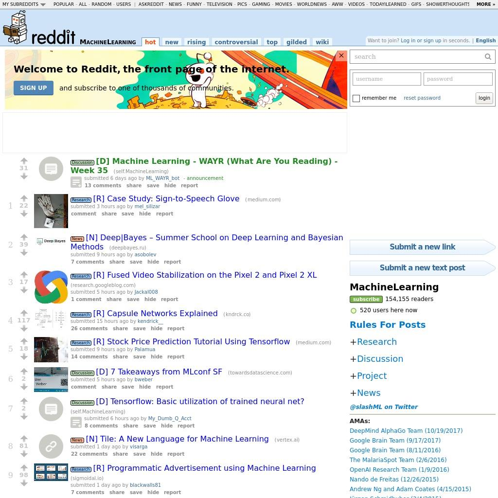
**이미지 캡션:** 이것은 레딧의 머신러닝 서브레딧의 스크린샷으로, 웹사이트의 메인 페이지를 보여줍니다. 화면 상단에는 레딧 로고와 함께 "머신러닝"이라는 제목이 있고, 그 아래에는 "인터넷의 첫 페이지에 오신 것을 환영합니다"라는 문구가 있습니다. 페이지 중앙에는 다양한 게시물 목록이 있으며, 각 게시물은 제목, 작성자, 댓글 수, 그리고 게시물에 대한 추가 정보(예: 연구, 토론, 뉴스)를 포함합니다. 게시물 옆에는 위아래 화살표가 있어 투표를 나타냅니다. 오른쪽에는 로그인 및 가입 양식, "새 링크 제출" 및 "새 텍스트 게시물 제출" 버튼, 그리고 "머신러닝" 서브레딧에 대한 정보(구독자 수, 현재 사용자 수)가 있습니다. 또한, 서브레딧 규칙과 트위터 계정, 그리고 과거 AMA(Ask Me Anything) 목록도 보입니다. 전반적으로 이 페이지는 머신러닝 커뮤니티의 활동과 정보를 보여주는 웹사이트의 인터페이스를 나타냅니다.게시물 제출" 버튼, 그리고 "머신러닝" 서브레딧에 대한 정보(구독자 수, 현재 사용자 수)가 있습니다. 또한, 서브레딧 규칙과 트위터 계정, 그리고 과거 AMA(Ask Me Anything) 목록도 보입니다. 전반적으로 이 페이지는 머신러닝 커뮤니티의 활동과 정보를 보여주는 웹사이트의 인터페이스를 나타냅니다.
 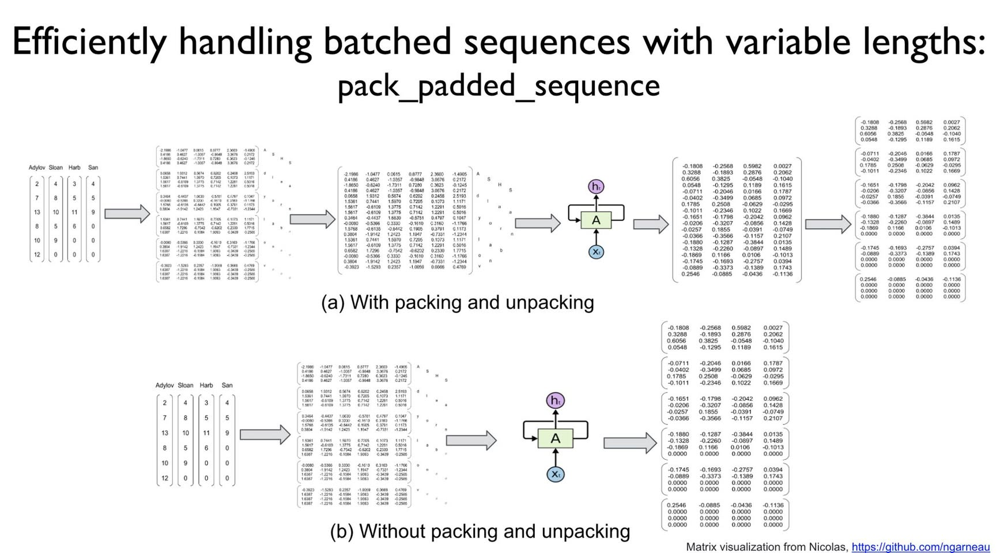
**이미지 캡션:** 이 이미지는 가변 길이의 배치 시퀀스를 효율적으로 처리하는 방법을 보여주는 다이어그램으로, "Efficiently handling batched sequences with variable lengths: pack_padded_sequence"라는 제목이 있습니다. 상단에는 (a) With packing and unpacking이라는 제목과 함께 세 단계의 과정이 화살표로 연결되어 있습니다. 첫 번째 단계는 "Adylov Sloan Harb San"이라는 레이블이 붙은 행렬로, 숫자 데이터가 포함되어 있습니다. 이 행렬은 중간의 복잡한 숫자 행렬로 변환되고, 이어서 순환 신경망(RNN)과 유사한 구조의 블록(레이블 A, h, x)으로 전달됩니다. 마지막으로, 이 블록은 또 다른 숫자 행렬로 변환됩니다. 하단에는 (b) Without packing and unpacking이라는 제목과 함께 유사한 과정이 표시되지만, 중간의 복잡한 숫자 행렬이 생략되고 첫 번째 행렬이 바로 RNN 유사 블록으로 전달되는 차이가 있습니다. 각 단계의 행렬에는 다양한 양수 및 음수 값이 포함되어 있으며, 일부는 0으로 채워져 있습니다. 이미지 하단에는 "Matrix visualization from Nicolas, https://github.com/ngarneau"라는 출처 정보가 있습니다. 전반적으로, 이 이미지는 데이터 처리의 효율성을 높이기 위한 패킹 및 언패킹 기법의 적용을 시각적으로 설명하고 있습니다. 이 행렬은 중간의 복잡한 숫자 행렬로 변환되고, 이어서 순환 신경망(RNN)과 유사한 구조의 블록(레이블 A, h, x)으로 전달됩니다. 마지막으로, 이 블록은 또 다른 숫자 행렬로 변환됩니다. 하단에는 (b) Without packing and unpacking이라는 제목과 함께 유사한 과정이 표시되지만, 중간의 복잡한 숫자 행렬이 생략되고 첫 번째 행렬이 바로 RNN 유사 블록으로 전달되는 차이가 있습니다. 각 단계의 행렬에는 다양한 양수 및 음수 값이 포함되어 있으며, 일부는 0으로 채워져 있습니다. 이미지 하단에는 "Matrix visualization from Nicolas, https://github.com/ngarneau"라는 출처 정보가 있습니다. 전반적으로, 이 이미지는 데이터 처리의 효율성을 높이기 위한 패킹 및 언패킹 기법의 적용을 시각적으로 설명하고 있습니다.

> #오늘의레딧 https://www.reddit.com/r/MachineLearning/ 정말 읽을 거리가 많네요.  1. 사례 연구:Sign-to-Speech 글러브 2. Deep|Bayes – 여름 학교 깊은 학습과 베이스의 콘텐츠에. 3. 비디오 안정은 화소 2에 화소 2XLFused. 4. 캡슐 네트워크이라고 설명했습니다 5. 주가 예측 Tutorial을 이용한 Tensorflow. 6. MLconf SF에서 7Takeaways. 7. Tensorflow:훈련된 신경 그물의 기본 활용? 8. 타일:기계 학습에 새로운 언어. 9. Programmatic 광고 기계 학습을 사용하여. 10. 있어서의 한국명 분류 항목 11. 만약 당신이science/AI 개발 등, learning/data 기계에 대해서 아무것도 몰라 당신 기술에 남아 도착할 거예요 다음 10년 올 수 있니? 12. Groq 8TOPS/W @ 2018년에 400TOP프로세서라고 주장한다. 13. 배우 비평가 에이전트와 묘기를 부린다. CPU에 4시간 정도에 슈퍼 인간의 수준을 수행한다. 14. 어떻게 분리 kernel(둘 다와 depthwise 공간)의 활용이 네트워크의 동력에 영향을 주나요? 15. 키 측면을 캡슐의 요약. 16.  때 노드를 가치와 무게 매트릭스 주어진 치수의 신경 조직을 음모할 구상 기능 matplotlib을 사용하여 만든. 17. CIFAR-10에State-of-the-art 분류 결과의 데이터? 18. Reddit맥주는 해군 정보 처리 시스템 2017년 @? 19. ELI5:캡슐 네트워크. 어떻게 그리고 그들이 어떻게 CNN보다 낫다 고유한 것인가? 20. 딥을 배우는 것은 실시간 중력 파동 분석 레이저 간섭계 중력파 관측소 데이터를 이용.  1. https://medium.com/mlreview/case-study-sign-to-speech-converter-facilitated-wireless-communication-358b3914d398 2. http://deepbayes.ru/ 3. https://research.googleblog.com/2017/11/fused-video-stabilization-on-pixel-2.html?utm_source=feedburner&utm_medium=feed&utm_campaign=Feed:+blogspot/gJZg+\(Official+Google+Research+Blog\) 4. https://kndrck.co/posts/capsule_networks_explained/ 5. https://medium.com/mlreview/a-simple-deep-learning-model-for-stock-price-prediction-using-tensorflow-30505541d877 6. https://towardsdatascience.com/7-takeaways-from-mlconf-sf-1b2703db5ecb 7. https://www.reddit.com/r/MachineLearning/comments/7c9nnq/d_tensorflow_basic_utilization_of_trained_neural/ 8. http://vertex.ai/blog/tile-a-new-language-for-machine-learning# 9. https://sigmoidal.io/ai-for-advertising/ 10. https://www.reddit.com/r/MachineLearning/comments/7c857i/d_classifying_items_in_text/ 11. https://www.reddit.com/r/MachineLearning/comments/7c27dj/d_if_you_dont_know_anything_about_machine/ 12. http://groq.com/ 13. https://www.youtube.com/watch?v=z9R5hDT6vUQ 14. https://www.reddit.com/r/MachineLearning/comments/7c6dy0/d_how_is_the_use_of_separable_kernelboth_spatial/ 15. https://medium.com/mlreview/deep-neural-network-capsules-137be2877d44 16. https://www.youtube.com/watch?v=fQ376G-Ek1E 17. https://www.reddit.com/r/MachineLearning/comments/7c59xz/d_stateoftheart_classification_results_on_cifar10/ 18. https://www.reddit.com/r/MachineLearning/comments/7c1416/p_reddit_beernips_2017/ 19. https://www.reddit.com/r/MachineLearning/comments/7bz5x9/d_eli5_capsule_networks_how_are_they_unique_and/ 20. https://arxiv.org/abs/1711.03121
> [RNN Slides] 의견 부탁드립니다.  지난번 #모두를위한딥러닝 RNN부분 많이 약해서 이번 강의에는 RNN강화를 위해 3강이나 준비중입니다. 보시고 의견주시면 다음주 녹음전에 수정 반영하겠습니다. 미리 감사 드립니다.  RNN1: https://docs.google.com/presentation/d/17VUX7YXhMkJrqO5gNGh6EE5gzBpY-BF9IrfVKcFIb3A/ RNN2:  https://docs.google.com/presentation/d/18JvZ5n49tt3-8nhBappz6aaraZMazF06v2YuQxGVKEQ

### 11월 13일 (월) 08:34 · 📷 사진 (3장)

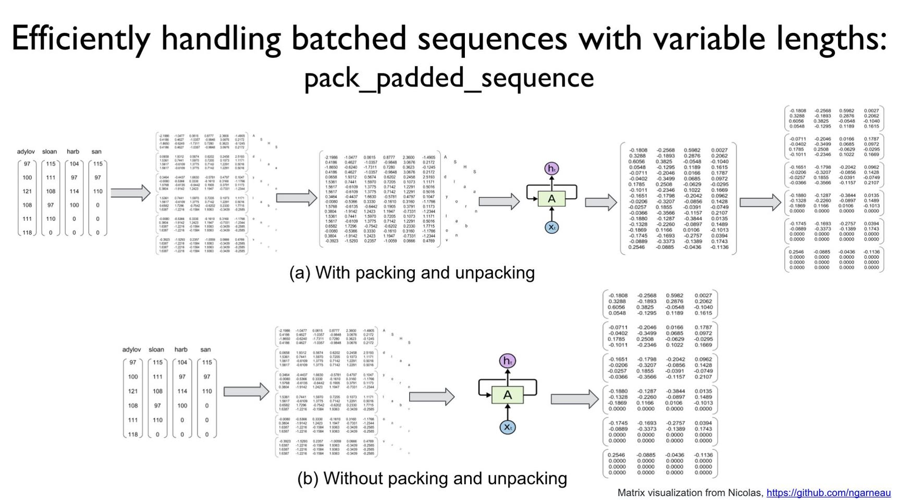
**이미지 캡션:** 이 이미지는 "Efficiently handling batched sequences with variable lengths: pack_padded_sequence"라는 제목의 논문 또는 프레젠테이션의 일부로 보이며, 두 가지 다른 접근 방식을 시각적으로 비교하고 있습니다. 상단에는 논문의 제목이 흰색 바탕에 검은색 글씨로 크게 쓰여 있습니다. 그 아래에는 두 개의 주요 다이어그램이 나란히 배치되어 있으며, 각각 "(a) With packing and unpacking"과 "(b) Without packing and unpacking"이라는 레이블이 붙어 있습니다. 다이어그램 (a)와 (b)는 유사한 구조를 가지고 있으며, 데이터 처리 과정을 단계별로 보여줍니다. 각 다이어그램은 여러 개의 사각형과 화살표로 구성되어 있습니다. 첫 번째 사각형은 "adylov", "sloan", "harb", "san"이라는 레이블이 붙은 열을 포함하는 표 형태의 데이터를 나타냅니다. 이 표 안에는 다양한 숫자들이 채워져 있으며, 일부 셀에는 0이 표시되어 있습니다. 이 표는 가변 길이 시퀀스를 나타내는 것으로 보입니다. 표 바로 옆에는 여러 개의 작은 숫자들이 행렬 형태로 나열되어 있으며, 이는 패킹 또는 언패킹 과정을 거친 데이터를 시각화한 것으로 추정됩니다. 이 행렬 데이터는 복잡한 숫자들로 구성되어 있습니다. 그 다음에는 화살표를 통해 전달된 데이터가 "A"라는 레이블이 붙은 사각형으로 들어가는 것을 보여줍니다. 이 사각형은 "h"와 "x"라는 레이블이 붙은 원형 노드와 연결되어 있으며, 이는 순환 신경망(RNN) 또는 유사한 신경망 구조의 일부를 나타내는 것으로 보입니다. "h"는 은닉 상태(hidden state)를, "x"는 입력(input)을 나타낼 가능성이 높습니다. 이 "A" 사각형은 다시 화살표를 통해 다음 단계로 데이터를 전달합니다. 마지막으로, "A" 사각형에서 나온 데이터는 또 다른 행렬 형태로 시각화됩니다. 이 행렬 역시 복잡한 숫자들로 구성되어 있으며, 일부는 0으로 채워져 있습니다. 전반적으로, 이 이미지는 가변 길이 시퀀스를 효율적으로 처리하기 위한 "pack_padded_sequence"라는 기법을 설명하며, 패킹 및 언패킹을 사용하는 경우와 사용하지 않는 경우의 데이터 처리 흐름을 비교하는 데 중점을 두고 있습니다. 이미지 하단에는 "Matrix visualization from Nicolas, https://github.com/ngarneau"라는 출처 정보가 명시되어 있습니다. 이미지에는 사람이 등장하지 않으며, 배경은 흰색입니다. 전체적인 분위기는 학술적이고 기술적인 정보를 전달하는 데 초점을 맞추고 있습니다.and unpacking"이라는 레이블이 붙어 있습니다. 다이어그램 (a)와 (b)는 유사한 구조를 가지고 있으며, 데이터 처리 과정을 단계별로 보여줍니다. 각 다이어그램은 여러 개의 사각형과 화살표로 구성되어 있습니다. 첫 번째 사각형은 "adylov", "sloan", "harb", "san"이라는 레이블이 붙은 열을 포함하는 표 형태의 데이터를 나타냅니다. 이 표 안에는 다양한 숫자들이 채워져 있으며, 일부 셀에는 0이 표시되어 있습니다. 이 표는 가변 길이 시퀀스를 나타내는 것으로 보입니다. 표 바로 옆에는 여러 개의 작은 숫자들이 행렬 형태로 나열되어 있으며, 이는 패킹 또는 언패킹 과정을 거친 데이터를 시각화한 것으로 추정됩니다. 이 행렬 데이터는 복잡한 숫자들로 구성되어 있습니다. 그 다음에는 화살표를 통해 전달된 데이터가 "A"라는 레이블이 붙은 사각형으로 들어가는 것을 보여줍니다. 이 사각형은 "h"와 "x"라는 레이블이 붙은 원형 노드와 연결되어 있으며, 이는 순환 신경망(RNN) 또는 유사한 신경망 구조의 일부를 나타내는 것으로 보입니다. "h"는 은닉 상태(hidden state)를, "x"는 입력(input)을 나타낼 가능성이 높습니다. 이 "A" 사각형은 다시 화살표를 통해 다음 단계로 데이터를 전달합니다. 마지막으로, "A" 사각형에서 나온 데이터는 또 다른 행렬 형태로 시각화됩니다. 이 행렬 역시 복잡한 숫자들로 구성되어 있으며, 일부는 0으로 채워져 있습니다. 전반적으로, 이 이미지는 가변 길이 시퀀스를 효율적으로 처리하기 위한 "pack_padded_sequence"라는 기법을 설명하며, 패킹 및 언패킹을 사용하는 경우와 사용하지 않는 경우의 데이터 처리 흐름을 비교하는 데 중점을 두고 있습니다. 이미지 하단에는 "Matrix visualization from Nicolas, https://github.com/ngarneau"라는 출처 정보가 명시되어 있습니다. 이미지에는 사람이 등장하지 않으며, 배경은 흰색입니다. 전체적인 분위기는 학술적이고 기술적인 정보를 전달하는 데 초점을 맞추고 있습니다.
 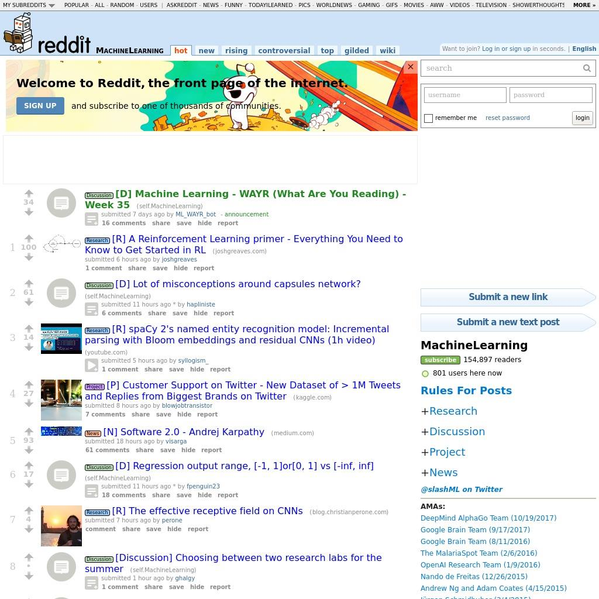
**이미지 캡션:** 이 이미지는 레딧(Reddit) 웹사이트의 머신러닝(MachineLearning) 서브레딧 페이지를 보여줍니다. 페이지 상단에는 레딧 로고와 함께 "Welcome to Reddit, the front page of the internet."이라는 환영 문구가 있습니다. 로그인 및 회원가입을 위한 입력란과 버튼이 오른쪽에 보입니다. 페이지 중앙에는 다양한 주제의 게시물 목록이 나열되어 있으며, 각 게시물은 제목, 작성자, 제출 시간, 댓글 수 등의 정보를 포함하고 있습니다. 예를 들어, "[D] Machine Learning - WAYR (What Are You Reading) - Week 35"라는 제목의 게시물은 7일 전에 제출되었으며 16개의 댓글이 달려 있습니다. 또한, "[R] A Reinforcement Learning primer - Everything You Need to Know to Get Started in RL"이라는 제목의 게시물은 6시간 전에 제출되었고 1개의 댓글이 있습니다. 페이지 오른쪽에는 "MachineLearning" 서브레딧의 구독자 수와 "Rules For Posts", "+Research", "+Discussion", "+Project", "+News"와 같은 메뉴가 있습니다. 하단에는 "AMAS" 섹션에 여러 연구팀의 이름과 날짜가 나열되어 있습니다. 전반적으로 정보가 풍부하고 기술적인 내용을 다루는 커뮤니티 페이지의 분위기를 띠고 있습니다.Learning - WAYR (What Are You Reading) - Week 35"라는 제목의 게시물은 7일 전에 제출되었으며 16개의 댓글이 달려 있습니다. 또한, "[R] A Reinforcement Learning primer - Everything You Need to Know to Get Started in RL"이라는 제목의 게시물은 6시간 전에 제출되었고 1개의 댓글이 있습니다. 페이지 오른쪽에는 "MachineLearning" 서브레딧의 구독자 수와 "Rules For Posts", "+Research", "+Discussion", "+Project", "+News"와 같은 메뉴가 있습니다. 하단에는 "AMAS" 섹션에 여러 연구팀의 이름과 날짜가 나열되어 있습니다. 전반적으로 정보가 풍부하고 기술적인 내용을 다루는 커뮤니티 페이지의 분위기를 띠고 있습니다.
 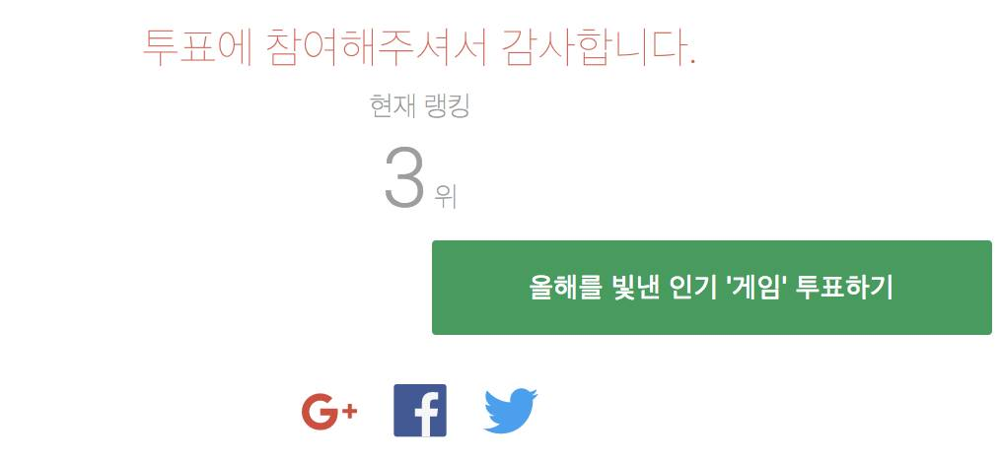
**이미지 캡션:** 이 이미지는 투표 참여에 대한 감사 메시지와 현재 랭킹 정보를 보여줍니다. 상단에는 "투표에 참여해주셔서 감사합니다."라는 텍스트가 붉은색으로 표시되어 있습니다. 그 아래에는 "현재 랭킹"이라는 문구가 회색으로 나타나고, 그 바로 아래에는 숫자로 "3"이 크게 표시되고 그 옆에 "위"라는 글자가 작게 표시되어 현재 3위임을 알 수 있습니다. 이어서 녹색 버튼에는 "올해를 빛낸 인기 '게임' 투표하기"라는 문구가 흰색으로 쓰여 있어, 사용자가 투표에 참여할 수 있는 기능을 제공합니다. 이미지 하단에는 소셜 미디어 공유를 위한 아이콘들이 나열되어 있는데, 왼쪽부터 Google+, Facebook, Twitter 아이콘이 보입니다. 전체적으로 깔끔하고 정보 전달에 집중된 디자인이며, 긍정적이고 참여를 독려하는 분위기입니다.어 공유를 위한 아이콘들이 나열되어 있는데, 왼쪽부터 Google+, Facebook, Twitter 아이콘이 보입니다. 전체적으로 깔끔하고 정보 전달에 집중된 디자인이며, 긍정적이고 참여를 독려하는 분위기입니다.

> [PyTorch RNN Slides]  RNN with matrix visualization? Here we are:  RNN1: https://docs.google.com/presentation/d/17VUX7YXhMkJrqO5gNGh6EE5gzBpY-BF9IrfVKcFIb3A/ RNN2:  https://docs.google.com/presentation/d/18JvZ5n49tt3-8nhBappz6aaraZMazF06v2YuQxGVKEQ  Feel free to give us comments on the slides.
> #오늘의레딧 https://www.reddit.com/r/MachineLearning/ 오늘도 새소식이 많군요.  1. A보강 학습 입문서-RL에 시작될 알아야 할 모든 것. 2. 오해들을 캡슐을 통신망 주변 많이? 3. SpaCy 2의 명명된 실체 인식 모델:블룸 embeddings 잔류 CNNs(1h 비디오)과 증분 구문 분석. 4. 고객 지원 트위터에-뉴 Dataset 1M트위터와 Replies 탑 브랜드에서 트위터에 >. 5. 소프트웨어 2.0-Andrej Karpathy 6. CNNs에 효과적인 수용야. 7. 여름에 두 연구실 사이에서 선택하는 것. 8. 돈 얼마나 계산에 얼만큼 돈을 씁니까? 9. 사례 연구:Sign-to-Speech 글러브 10. 이해 깊은 학습:정보 보틀넥 톱 연결을 엽니다. 11. 비디오 맥스를 사용할 때 공포증을 유발하게 검출? 12. Deep|Bayes – 여름 학교 깊은 학습과 베이스의 콘텐츠에. 13. NER에 Crowd-sourcing 14. 비디오 안정은 화소 2에 화소 2XLFused. 15. Tensorflow에 페이더 네트워크 구현입니다. 16. 캡슐 네트워크이라고 설명했습니다 17. Multi-Scale적 응집 Dilated Convolutions. 18. 주가 예측 Tutorial을 이용한 Tensorflow. 19. MLconf SF에서 7Takeaways. 20. 타일:기계 학습에 새로운 언어.  1. https://joshgreaves.com/reinforcement-learning/introduction-to-reinforcement-learning/ 2. https://www.reddit.com/r/MachineLearning/comments/7cf7ba/d_lot_of_misconceptions_around_capsules_network/ 3. https://www.youtube.com/watch?v=sqDHBH9IjRU 4. https://www.kaggle.com/soaxelbrooke/customer-support-on-twitter 5. https://medium.com/@karpathy/software-2-0-a64152b37c35 6. http://blog.christianperone.com/2017/11/the-effective-receptive-field-on-cnns 7. https://www.reddit.com/r/MachineLearning/comments/7ciqp5/discussion_choosing_between_two_research_labs_for/ 8. https://www.reddit.com/r/MachineLearning/comments/7chpe8/d_how_much_money_do_you_spend_on_computations/ 9. https://medium.com/mlreview/case-study-sign-to-speech-converter-facilitated-wireless-communication-358b3914d398 10. https://weberna.github.io/jekyll/update/2017/11/08/Information-Bottleneck-Part1.html 11. https://www.reddit.com/r/MachineLearning/comments/7ce8oz/d_detecting_phobia_triggers_in_video_using_ml/ 12. http://deepbayes.ru/ 13. https://www.reddit.com/r/MachineLearning/comments/7ceyx0/p_crowdsourcing_for_ner/ 14. https://research.googleblog.com/2017/11/fused-video-stabilization-on-pixel-2.html?utm_source=feedburner&utm_medium=feed&utm_campaign=Feed:+blogspot/gJZg+\(Official+Google+Research+Blog\) 15. https://github.com/hardikbansal/Fader-Networks-Tensorflow/ 16. https://kndrck.co/posts/capsule_networks_explained/ 17. https://www.reddit.com/r/MachineLearning/comments/7cc5wg/d_multiscale_context_aggregation_by_dilated/ 18. https://medium.com/mlreview/a-simple-deep-learning-model-for-stock-price-prediction-using-tensorflow-30505541d877 19. https://towardsdatascience.com/7-takeaways-from-mlconf-sf-1b2703db5ecb 20. http://vertex.ai/blog/tile-a-new-language-for-machine-learning#

### 11월 14일 (화) 08:06 · After 2 years of joining HKUST, I was bl…

📍 西貢

After 2 years of joining HKUST, I was blessed to work with so many talented students and visitors. I miss you all.

6 Years Ago

Nov 14, 2011 3:47:52 pm

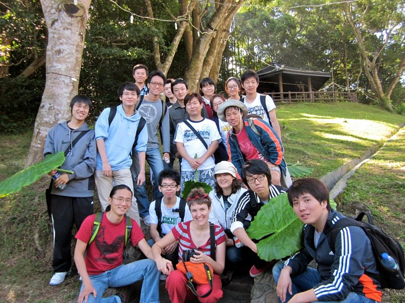
**이미지 캡션:** 따뜻한 햇살 아래, 푸른 나무와 잔디가 어우러진 야외에서 젊은 남녀 그룹이 기념 사진을 찍고 있다. 대부분 20대 초중반으로 보이는 이들은 편안한 캐주얼 복장을 하고 있으며, 밝고 즐거운 표정으로 카메라를 응시하거나 서로에게 시선을 주고 있다. 일부는 큰 나뭇잎을 들고 있거나, 배낭을 메고 있어 야외 활동 중임을 짐작게 한다. 배경에는 작은 정자와 울창한 숲이 보이며, 나뭇가지에는 조명 장식이 달려 있어 저녁 시간의 운치를 더한다. 전반적으로 화기애애하고 활기찬 분위기 속에서 즐거운 추억을 만들고 있는 모습이다.hem are smiling or looking at the camera, appearing relaxed and happy. One person in the front is holding a large green leaf. The background consists of a lush green hillside with trees and a small traditional-looking building with a dark roof and wooden railings situated on top of the hill. The overall atmosphere is cheerful and suggests a group outing or excursion in a natural setting.
 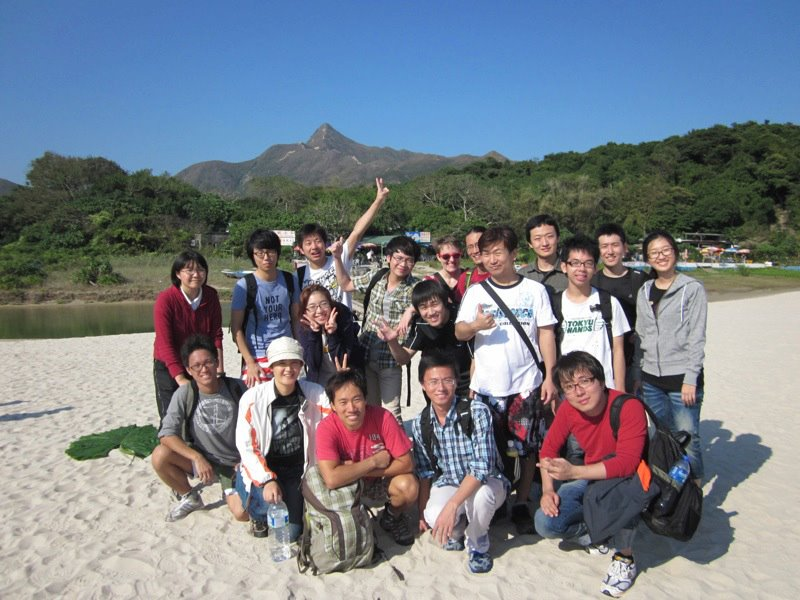
**이미지 캡션:** 화창한 날씨에 야외에서 찍은 단체 사진으로, 젊은 남녀 여러 명이 모래사장에 서서 포즈를 취하고 있습니다. 대부분 20대 초중반으로 보이는 이들은 편안한 캐주얼 복장을 하고 있으며, 밝고 즐거운 표정으로 카메라를 응시하고 있습니다. 일부는 손으로 브이(V)자를 그리거나 엄지손가락을 치켜세우는 등 활기찬 모습을 보입니다. 배경으로는 잔잔한 물가와 푸른 나무로 뒤덮인 산, 그리고 맑고 푸른 하늘이 펼쳐져 있어 평화롭고 자연 친화적인 분위기를 자아냅니다. 몇몇 사람들은 배낭을 메고 있어 여행이나 야외 활동 중인 것으로 보입니다. 사진 속에는 'TOKYO HANDS'라는 글자가 적힌 티셔츠가 보입니다. others are crouching or kneeling in the foreground. The individuals are dressed casually in t-shirts, hoodies, and jeans, suitable for an outdoor activity. One person in the back is making a peace sign with their fingers. The background features a body of water on the left, a lush green hillside with trees, and a prominent, rugged mountain peak in the distance. There are also some small buildings and structures visible on the right side of the background, suggesting a coastal village or resort area. Several backpacks are visible, indicating they might be on a trip or hike. One person is wearing a blue t-shirt with the text "NOT YOUR HERO" and another is wearing a white t-shirt with "TOKYU HANDS" printed on it. The overall atmosphere is cheerful and relaxed, suggesting a fun outing with friends or colleagues.
 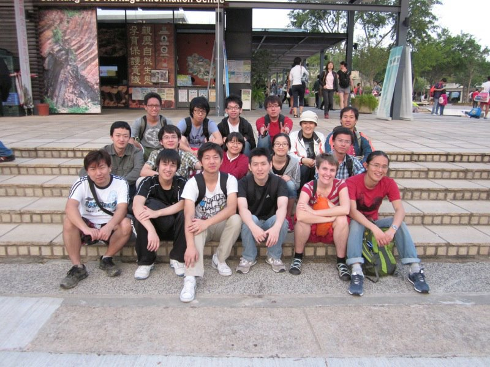
**이미지 캡션:** 이 사진은 10대 후반에서 20대 초반으로 보이는 젊은 성인 남녀 15명이 야외 계단에 앉아 단체 사진을 찍는 모습을 담고 있습니다. 대부분의 남성들은 캐주얼한 복장으로 티셔츠와 바지를 입고 있으며, 일부는 백팩을 메고 있습니다. 여성 한 명은 흰색 모자를 쓰고 있으며, 다른 여성은 빨간색 줄무늬 상의와 주황색 가방을 들고 있습니다. 모두 밝고 편안한 표정을 짓고 있으며, 일부는 카메라를 향해 미소 짓고 있습니다. 배경에는 "親歷自然生態 孕育保護意識"라는 한자 문구가 적힌 건물 입구가 보이며, 이는 자연 생태를 직접 경험하고 보호 의식을 함양한다는 의미로 해석됩니다. 건물 앞에는 자연 풍경 사진이 걸려 있고, 주변에는 나무와 야외 시설물이 보입니다. 전체적으로 화창한 날씨 속에서 즐거운 시간을 보내고 있는 듯한 분위기입니다.를 직접 경험하고 보호 의식을 함양한다는 의미로 해석됩니다. 건물 앞에는 자연 풍경 사진이 걸려 있고, 주변에는 나무와 야외 시설물이 보입니다. 전체적으로 화창한 날씨 속에서 즐거운 시간을 보내고 있는 듯한 분위기입니다.

> Before hiking!
> In the middle of hiking at the beach!
> After hiking! Looks good!

### 11월 14일 (화) 08:52 · 📷 사진 (2장)

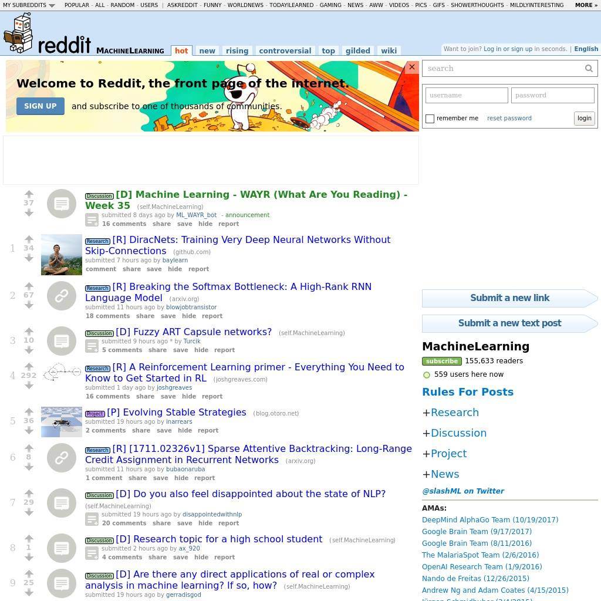
**이미지 캡션:** 이것은 레딧의 머신러닝 서브레딧 페이지로, 다양한 연구 및 토론 게시물이 나열되어 있습니다. 페이지 상단에는 레딧 로고와 함께 "MACHINE LEARNING"이라는 제목이 보이며, 그 옆에는 "hot", "new", "rising", "controversial", "top", "gilded", "wiki"와 같은 탭이 있습니다. 메인 콘텐츠 영역에는 "Welcome to Reddit, the front page of the internet."이라는 환영 메시지와 함께 "SIGN UP" 버튼이 있습니다. 그 아래에는 여러 게시물 목록이 있으며, 각 게시물은 제목, 출처, 작성자, 제출 시간, 댓글 수, 공유, 저장, 숨기기, 신고 옵션을 포함합니다. 게시물들은 "[D] Machine Learning - WAYR (What Are You Reading) - Week 35", "[R] DiracNets: Training Very Deep Neural Networks Without Skip-Connections", "[R] Breaking the Softmax Bottleneck: A High-Rank RNN Language Model" 등과 같은 제목을 가지고 있습니다. 오른쪽 사이드바에는 "Submit a new link" 및 "Submit a new text post" 버튼과 함께 "MachineLearning" 서브레딧의 구독자 수와 현재 접속자 수가 표시되어 있습니다. 또한 "Rules For Posts" 섹션과 함께 "+Research", "+Discussion", "+Project", "+News"와 같은 카테고리가 있으며, "@slashML on Twitter" 링크와 "AMAS" 섹션에는 다양한 연구팀 및 인물 목록이 나열되어 있습니다. 전반적으로 이 페이지는 머신러닝 커뮤니티의 최신 정보와 토론을 제공하는 온라인 포럼의 모습을 보여줍니다.아래에는 여러 게시물 목록이 있으며, 각 게시물은 제목, 출처, 작성자, 제출 시간, 댓글 수, 공유, 저장, 숨기기, 신고 옵션을 포함합니다. 게시물들은 "[D] Machine Learning - WAYR (What Are You Reading) - Week 35", "[R] DiracNets: Training Very Deep Neural Networks Without Skip-Connections", "[R] Breaking the Softmax Bottleneck: A High-Rank RNN Language Model" 등과 같은 제목을 가지고 있습니다. 오른쪽 사이드바에는 "Submit a new link" 및 "Submit a new text post" 버튼과 함께 "MachineLearning" 서브레딧의 구독자 수와 현재 접속자 수가 표시되어 있습니다. 또한 "Rules For Posts" 섹션과 함께 "+Research", "+Discussion", "+Project", "+News"와 같은 카테고리가 있으며, "@slashML on Twitter" 링크와 "AMAS" 섹션에는 다양한 연구팀 및 인물 목록이 나열되어 있습니다. 전반적으로 이 페이지는 머신러닝 커뮤니티의 최신 정보와 토론을 제공하는 온라인 포럼의 모습을 보여줍니다.
 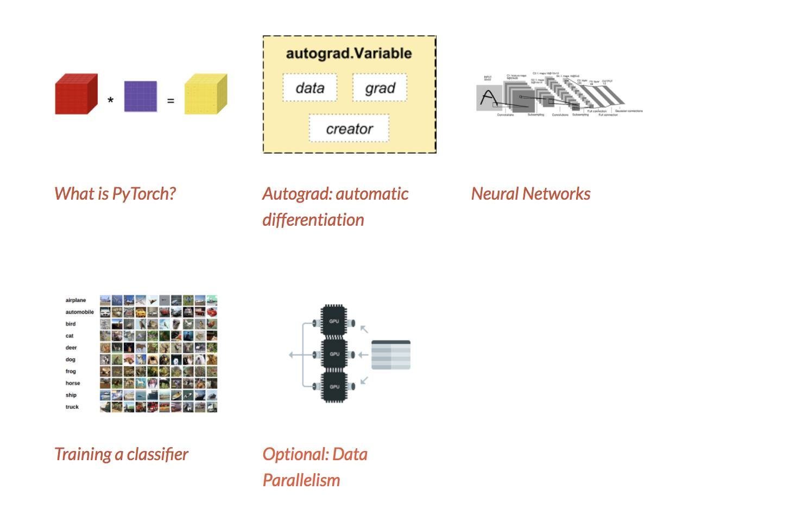
**이미지 캡션:** 이 이미지는 딥러닝 관련 개념들을 시각적으로 설명하는 슬라이드 또는 프레젠테이션의 일부로 보이며, 사람이나 특정 인물은 등장하지 않습니다. 왼쪽 상단에는 빨간색, 보라색, 노란색의 큐브가 곱셈과 등호 기호와 함께 배치되어 있으며, 그 아래에는 "What is PyTorch?"라는 텍스트가 있습니다. 중앙 상단에는 "autograd.Variable"이라는 제목의 노란색 상자가 있고, 그 안에 "data", "grad", "creator"라는 텍스트가 각각의 작은 상자에 담겨 있습니다. 이 상자 아래에는 "Autograd: automatic differentiation"이라는 텍스트가 있습니다. 오른쪽 상단에는 신경망의 구조를 보여주는 다이어그램이 있으며, "Neural Networks"라는 텍스트가 그 아래에 있습니다. 왼쪽 하단에는 "airplane", "automobile", "bird", "cat", "deer", "dog", "frog", "horse", "ship", "truck"과 같은 레이블과 함께 다양한 이미지들이 격자 형태로 배열되어 있고, 그 아래에는 "Training a classifier"라는 텍스트가 있습니다. 오른쪽 하단에는 세 개의 GPU 아이콘이 중앙의 데이터베이스 아이콘과 연결된 모습이 그려져 있으며, "Optional: Data Parallelism"이라는 텍스트가 그 아래에 있습니다. 전반적으로 흰색 배경에 텍스트와 아이콘들이 배치되어 있으며, 딥러닝의 기본 개념들을 간결하게 전달하는 정보성 콘텐츠의 분위기입니다.ograd: automatic differentiation"이라는 텍스트가 있습니다. 오른쪽 상단에는 신경망의 구조를 보여주는 다이어그램이 있으며, "Neural Networks"라는 텍스트가 그 아래에 있습니다. 왼쪽 하단에는 "airplane", "automobile", "bird", "cat", "deer", "dog", "frog", "horse", "ship", "truck"과 같은 레이블과 함께 다양한 이미지들이 격자 형태로 배열되어 있고, 그 아래에는 "Training a classifier"라는 텍스트가 있습니다. 오른쪽 하단에는 세 개의 GPU 아이콘이 중앙의 데이터베이스 아이콘과 연결된 모습이 그려져 있으며, "Optional: Data Parallelism"이라는 텍스트가 그 아래에 있습니다. 전반적으로 흰색 배경에 텍스트와 아이콘들이 배치되어 있으며, 딥러닝의 기본 개념들을 간결하게 전달하는 정보성 콘텐츠의 분위기입니다.

> #오늘의레딧 https://www.reddit.com/r/MachineLearning/ 머신러닝 공부는 정말 재미있죠?아침부터 다양한 소식이 많네요.  1. DiracNets:훈련 매우 깊은 신경망을 이용한 Skip-Connections 없이. 2. 는 소프트 맥스 병목을 깨트리는 것:AHigh-Rank RNN 언어 모델이다. 3. 퍼지 CAD에 의해 캡슐 네트워크? 4. A보강 학습 입문서-RL에 시작될 알아야 할 모든 것. 5. Evolving 안정적인 전략 6. 너도 도달의 상태에 대해 실망하게 느끼시나요? 7. 는 고등 학생들을 위해 연구 주제이다. 8. 또는 복잡한 실물 분석의 기계 학습에서 어떠한 직접적인 응용 프로그램 있나요? 만약 그렇다면, 어떻게? 9. 컴퓨터 비전:어떤 알고리즘 약간 변형된 개체...개체와 어떤 부분이 있는지 확인하려면 소프트웨어를 검색합니다. 10. 혼합형 출력 기능을 잃은. 11. SpaCy 2의 명명된 실체 인식 모델:블룸 embeddings 잔류 CNNs(1h 비디오)과 증분 구문 분석. 12. 오해들을 캡슐을 통신망 주변 많이? 13. 고객 지원 트위터에-뉴 Dataset 1M트위터와 Replies 탑 브랜드에서 트위터에 >. 14. 어떻게 당신의 말로 기계 학습 분야 설명할 것인가? 15. CNNs에 효과적인 수용야. 16. 소프트웨어 2.0-Andrej Karpathy 17. 여름에 두 연구실 사이에서 선택하는 것. 18. 깊은 학습은 먹기 소프트웨어. 19. 어떻게 실생활을 개선하기에 관한 질문. 20. 사례 연구:Sign-to-Speech 글러브  1. https://github.com/szagoruyko/diracnets/blob/master/README.md 2. https://arxiv.org/abs/1711.03953 3. https://www.reddit.com/r/MachineLearning/comments/7cngwi/d_fuzzy_art_capsule_networks/ 4. https://joshgreaves.com/reinforcement-learning/introduction-to-reinforcement-learning/ 5. http://blog.otoro.net/2017/11/12/evolving-stable-strategies/ 6. https://www.reddit.com/r/MachineLearning/comments/7ckejw/d_do_you_also_feel_disappointed_about_the_state/ 7. https://www.reddit.com/r/MachineLearning/comments/7cq9o9/d_research_topic_for_a_high_school_student/ 8. https://www.reddit.com/r/MachineLearning/comments/7ckdjd/d_are_there_any_direct_applications_of_real_or/ 9. https://www.reddit.com/r/MachineLearning/comments/7cptqi/dcomputer_visionany_algorithms_to_detect_slightly/ 10. https://www.reddit.com/r/MachineLearning/comments/7cmbww/d_loss_function_of_mixed_type_output/ 11. https://www.youtube.com/watch?v=sqDHBH9IjRU 12. https://www.reddit.com/r/MachineLearning/comments/7cf7ba/d_lot_of_misconceptions_around_capsules_network/ 13. https://www.kaggle.com/soaxelbrooke/customer-support-on-twitter 14. https://www.reddit.com/r/MachineLearning/comments/7cm8l4/d_how_would_you_describe_the_field_of_machine/ 15. http://blog.christianperone.com/2017/11/the-effective-receptive-field-on-cnns 16. https://medium.com/@karpathy/software-2-0-a64152b37c35 17. https://www.reddit.com/r/MachineLearning/comments/7ciqp5/discussion_choosing_between_two_research_labs_for/ 18. https://petewarden.com/2017/11/13/deep-learning-is-eating-software/amp/ 19. https://www.reddit.com/r/MachineLearning/comments/7clslr/d_a_question_about_how_to_improve_rl/ 20. https://medium.com/mlreview/case-study-sign-to-speech-converter-facilitated-wireless-communication-358b3914d398
> [PyTorch 공식 Tutorial 작가등극!]  그동안 여러분들에게 배우고, Nako Sung, Jung-Woo Ha님에게 물어 물어 익힌 Data Parallelism 소개글이 PyTorch공식 Tutorial에 merge 되었습니다. 그것도 가장 많은 사람들이 보는 Blitz 에 추가! 많이 봐주세요.   http://pytorch.org/tutorials/beginner/blitz/data_parallel_tutorial.html#sphx-glr-beginner-blitz-data-parallel-tutorial-py  (Blitz는 여기: http://pytorch.org/tutorials/beginner/deep_learning_60min_blitz.html)

### 11월 15일 (수) 08:52 · 📷 사진 (1장)

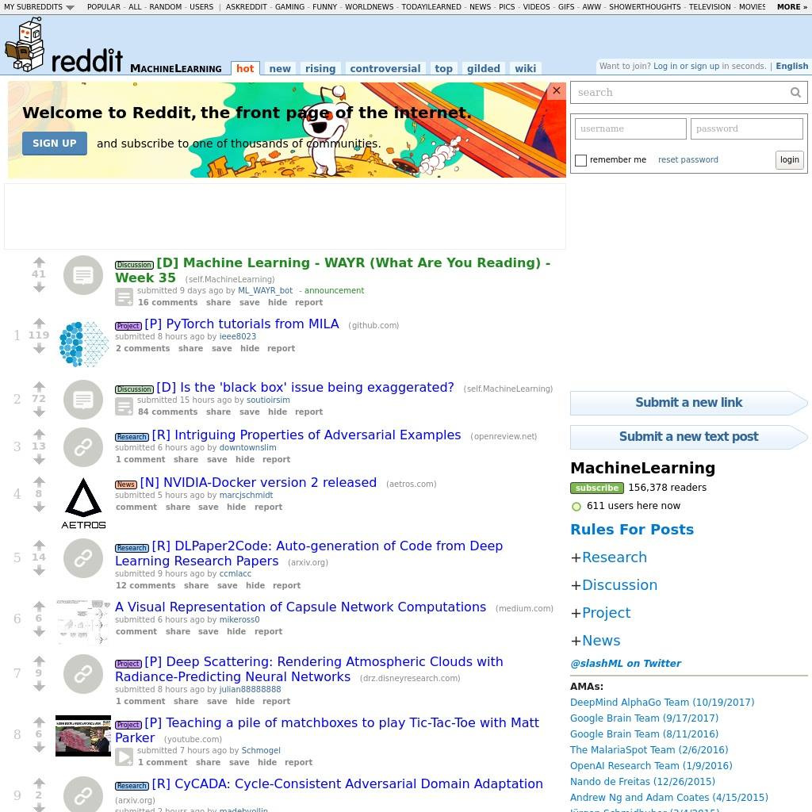
**이미지 캡션:** 이 이미지는 레딧의 머신러닝 커뮤니티 페이지를 보여줍니다. 페이지 상단에는 레딧 로고와 함께 "MACHINE LEARNING"이라는 제목이 있고, 그 아래에는 "hot", "new", "rising", "controversial", "top", "gilded", "wiki"와 같은 탭이 있습니다. 메인 콘텐츠 영역에는 "Welcome to Reddit, the front page of the internet."이라는 환영 메시지와 함께 "SIGN UP" 버튼이 보입니다. 페이지 오른쪽에는 로그인 폼이 있으며, 사용자 이름과 비밀번호를 입력하고 로그인할 수 있습니다. 그 아래에는 "Submit a new link"와 "Submit a new text post" 버튼이 있습니다. "MachineLearning" 커뮤니티 정보에는 구독자 수와 현재 접속자 수가 표시되어 있습니다. 또한, 게시물 규칙과 트위터 계정, 그리고 과거 AMA(Ask Me Anything) 목록이 나열되어 있습니다. 메인 콘텐츠 영역의 대부분은 머신러닝 관련 게시물 목록으로 채워져 있으며, 각 게시물은 제목, 작성자, 제출 시간, 댓글 수 등의 정보를 포함하고 있습니다. 게시물 제목 앞에는 [D](Discussion), [P](Project), [R](Research), [N](News)와 같은 태그가 붙어 있어 게시물의 유형을 나타냅니다. 각 게시물 옆에는 업보트 및 다운보트 화살표와 함께 댓글, 공유, 저장, 신고 옵션이 있습니다. 전반적으로 이 페이지는 머신러닝 분야의 최신 정보와 토론을 공유하는 온라인 커뮤니티의 모습을 보여줍니다. 사용자 이름과 비밀번호를 입력하고 로그인할 수 있습니다. 그 아래에는 "Submit a new link"와 "Submit a new text post" 버튼이 있습니다. "MachineLearning" 커뮤니티 정보에는 구독자 수와 현재 접속자 수가 표시되어 있습니다. 또한, 게시물 규칙과 트위터 계정, 그리고 과거 AMA(Ask Me Anything) 목록이 나열되어 있습니다. 메인 콘텐츠 영역의 대부분은 머신러닝 관련 게시물 목록으로 채워져 있으며, 각 게시물은 제목, 작성자, 제출 시간, 댓글 수 등의 정보를 포함하고 있습니다. 게시물 제목 앞에는 [D](Discussion), [P](Project), [R](Research), [N](News)와 같은 태그가 붙어 있어 게시물의 유형을 나타냅니다. 각 게시물 옆에는 업보트 및 다운보트 화살표와 함께 댓글, 공유, 저장, 신고 옵션이 있습니다. 전반적으로 이 페이지는 머신러닝 분야의 최신 정보와 토론을 공유하는 온라인 커뮤니티의 모습을 보여줍니다.

> #오늘의레딧 https://www.reddit.com/r/MachineLearning/ 정말 읽을 거리가 많네요.  1. MILA에서 PyTorch 지침 2. 그'black 상자의 문제 과장되어 있는 중이야? 3. Adversarial 사례의 흥미로운 특성. 4. NVIDIA-Docker 버전 2가 출시되 5. DLPaper2Code:Auto-generation 코드의 딥 학습 연구 논문에서. 6. 딥 발생하는 비산:Rendering 대기 청운교 Radiance-Predicting 신경망을 이용한. 7. 성냥갑 더미 매트 파커와 함께 Tic-Tac-Toe 하는 것을 가르쳐. 8. CyCADA:Cycle-Consistent Adversarial 번 적응. 9. 어떻게 기둥은 Neocortex의 세계-Numenta/HTM의 구조를 배우는 것은 사용의 이론. 10. 회의는 로봇에 개울물들은 2017년 배우기. 11. 최대 수영장의 Replacements 12. MNIST-Sequence:손으로 쓴 숫자 MNIST을 이용하여 시퀀스에 데이터 집합을 일으키다. 13. 무엇인가 미국 로튼 토마토 영화 리뷰들을 미술의(2진 분류)dataset? 14. 수업의 다른 숫자로 두 classifiers 비교해 봅시다. 15. 사이클 발전 전력 계량기 없이. 16. DiracNets:훈련 매우 깊은 신경망을 이용한 Skip-Connections 없이. 17. Amortized 최적화의 개관 18. 사용 Keras Pre-Trained 모델 Tensorflow. 19. 어떻게 많은 이미지들은 충분히 나타나는 생성 Adversarial 네트워크의 훈련 세트를? 20. 는 소프트 맥스 병목을 깨트리는 것:AHigh-Rank RNN 언어 모델이다.  1. https://github.com/mila-udem/welcome_tutorials/tree/master/pytorch 2. https://www.reddit.com/r/MachineLearning/comments/7cua8j/d_is_the_black_box_issue_being_exaggerated/ 3. https://openreview.net/forum?id=rk6H0ZbRb 4. https://aetros.com/blog/Machine%20Learning/14-11-2017-nvidia-docker2-released 5. https://arxiv.org/abs/1711.03543v1 6. http://www.drz.disneyresearch.com/~jnovak/publications/DeepScattering/ 7. https://www.youtube.com/watch?v=R9c-_neaxeU 8. https://arxiv.org/pdf/1711.03213v1.pdf 9. https://www.frontiersin.org/articles/10.3389/fncir.2017.00081/full 10. https://www.youtube.com/watch?v=xfyK03MEZ9Q 11. https://www.reddit.com/r/MachineLearning/comments/7cxcgs/d_replacements_of_max_pool/ 12. https://github.com/ankitaggarwal011/MNIST-Sequence 13. https://www.reddit.com/r/MachineLearning/comments/7cyi6n/d_what_is_the_state_of_the_art_for_rotten/ 14. https://www.reddit.com/r/MachineLearning/comments/7cu6q4/d_comparing_two_classifiers_with_different/ 15. https://cyclo-analytics.com/2017/11/13/predicting-power-without-a-power-meter/ 16. https://github.com/szagoruyko/diracnets/blob/master/README.md 17. http://ruishu.io/2017/11/07/amortized-optimization/ 18. http://zachmoshe.com/2017/11/11/use-keras-models-with-tf.html 19. https://www.reddit.com/r/MachineLearning/comments/7csulf/d_how_many_images_is_enough_for_the_training_set/ 20. https://arxiv.org/abs/1711.03953

### 11월 16일 (목) 08:52 · 📷 사진 (1장)

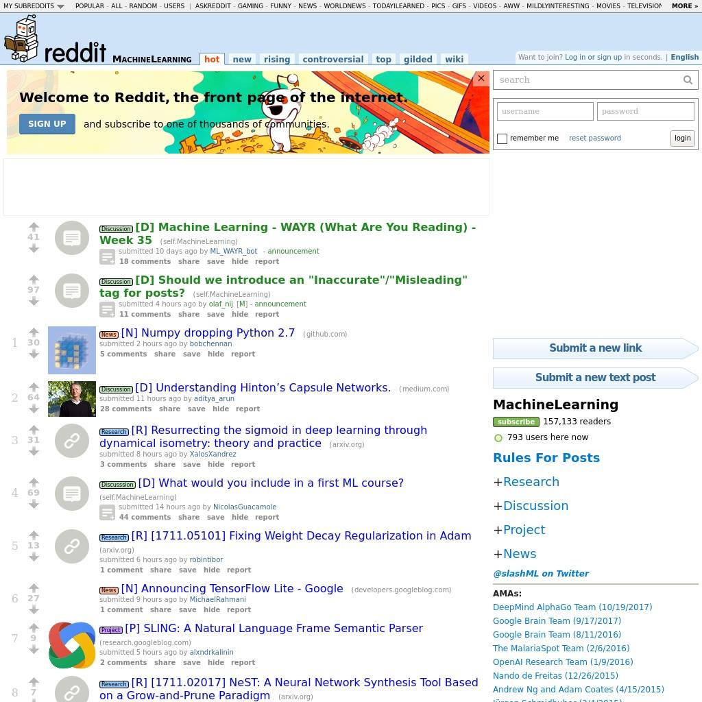
**이미지 캡션:** 이 이미지는 레딧(Reddit) 웹사이트의 머신러닝(Machine Learning) 서브레딧 페이지를 보여줍니다. 페이지 상단에는 레딧 로고와 함께 "MACHINE LEARNING"이라는 제목이 있고, 그 옆에는 "hot", "new", "rising", "controversial", "top", "gilded", "wiki"와 같은 탭들이 있습니다. 중앙에는 "Welcome to Reddit, the front page of the internet."이라는 환영 문구와 함께 커뮤니티 구독을 유도하는 그래픽이 있습니다. 페이지 오른쪽 상단에는 로그인 또는 회원가입을 위한 입력 필드와 버튼이 보입니다. 메인 콘텐츠 영역에는 여러 게시물 목록이 표시되어 있으며, 각 게시물은 제목, 작성자, 제출 시간, 댓글 수, 공유, 저장, 숨기기, 신고 등의 옵션을 포함하고 있습니다. 게시물들은 주로 머신러닝 관련 주제를 다루고 있으며, "Discussion", "News", "Research", "Project"와 같은 태그가 붙어 있습니다. 예를 들어, "[D] Machine Learning - WAYR (What Are You Reading) - Week 35"라는 제목의 게시물은 10일 전에 제출되었고 18개의 댓글이 있습니다. 또한, "NumPy dropping Python 2.7"이라는 뉴스 게시물은 2시간 전에 제출되었고 5개의 댓글이 있습니다. 페이지 오른쪽에는 "Submit a new link"와 "Submit a new text post" 버튼이 있고, "MachineLearning" 서브레딧의 구독자 수와 현재 접속자 수가 표시되어 있습니다. 그 아래에는 "Rules For Posts"라는 제목과 함께 "+Research", "+Discussion", "+Project", "+News"와 같은 링크들이 있으며, 트위터 계정(@slashML on Twitter)과 "AMAS" 섹션에는 과거 AMA(Ask Me Anything) 세션에 참여했던 인물들의 목록이 날짜와 함께 나열되어 있습니다. 전반적으로 기술 관련 커뮤니티의 정보 공유 및 토론이 이루어지는 온라인 플랫폼의 모습을 보여줍니다. 있습니다. 페이지 오른쪽 상단에는 로그인 또는 회원가입을 위한 입력 필드와 버튼이 보입니다. 메인 콘텐츠 영역에는 여러 게시물 목록이 표시되어 있으며, 각 게시물은 제목, 작성자, 제출 시간, 댓글 수, 공유, 저장, 숨기기, 신고 등의 옵션을 포함하고 있습니다. 게시물들은 주로 머신러닝 관련 주제를 다루고 있으며, "Discussion", "News", "Research", "Project"와 같은 태그가 붙어 있습니다. 예를 들어, "[D] Machine Learning - WAYR (What Are You Reading) - Week 35"라는 제목의 게시물은 10일 전에 제출되었고 18개의 댓글이 있습니다. 또한, "NumPy dropping Python 2.7"이라는 뉴스 게시물은 2시간 전에 제출되었고 5개의 댓글이 있습니다. 페이지 오른쪽에는 "Submit a new link"와 "Submit a new text post" 버튼이 있고, "MachineLearning" 서브레딧의 구독자 수와 현재 접속자 수가 표시되어 있습니다. 그 아래에는 "Rules For Posts"라는 제목과 함께 "+Research", "+Discussion", "+Project", "+News"와 같은 링크들이 있으며, 트위터 계정(@slashML on Twitter)과 "AMAS" 섹션에는 과거 AMA(Ask Me Anything) 세션에 참여했던 인물들의 목록이 날짜와 함께 나열되어 있습니다. 전반적으로 기술 관련 커뮤니티의 정보 공유 및 토론이 이루어지는 온라인 플랫폼의 모습을 보여줍니다.

> #오늘의레딧 https://www.reddit.com/r/MachineLearning/ 따끈한 소식들입니다.  1. 우리는 게시물에 대한"Inaccurate""Misleading"태그 소개해 줄까? 2. Numpy에 파이선 2.7이 떨어져서 고민 3. 힌톤의 캡슐 네트웍스에 대한 이해. 4. 깊은 배우는 데 역학적 균등을 통해 S자 Resurrecting:이론과 실제. 5. TensorFlow 라이트-구글 발표 6. :자연 언어 프레임 시맨틱 Parser SLING. 7. AI을 어떻게 자율적 무기 나쁜 갈 수 있다. 8.  수문 자료 확충 나타나는 생성 Adversarial 네트웍스입니다. 9. Anytime신경망:Versatile과 계산 및 정확도 사이에. 10. Interpretable 신뢰할 수 있는 모델을 향하여 11. 어디서 어떤 게 AI형태 industry(특히 창업)하는 우리의 정보 가나요? 12. MILA에서 PyTorch 지침 13. 32x32 너무 입력 영상의 시대 인식 CNNtraining/evaluating/inferring에 비해 작습니다? 14. 시험 추천 알고리즘 Python으로 서프라이즈(인터뷰). 15. 데이터 프리즘:데이터 과학, 맥스, AI과 분석에 대해 주간 뉴스 레터. 16. On-Device 대화형 모델링 TensorFlow 라이트. 17. LSTM 자동 데이터 품질 관리를 위한. 18. NVIDIA-Docker 버전 2가 출시되  1. https://www.reddit.com/r/MachineLearning/comments/7d6dkw/d_should_we_introduce_an_inaccuratemisleading_tag/ 2. https://github.com/numpy/numpy/blob/master/doc/neps/dropping-python2.7-proposal.rst 3. https://medium.com/@pechyonkin/understanding-hintons-capsule-networks-part-i-intuition-b4b559d1159b 4. https://arxiv.org/abs/1711.04735 5. https://developers.googleblog.com/2017/11/announcing-tensorflow-lite.html 6. https://research.googleblog.com/2017/11/sling-natural-language-frame-semantic.html 7. https://www.youtube.com/watch?v=9CO6M2HsoIA 8. https://www.reddit.com/r/MachineLearning/comments/7d528r/r_data_augmentation_generative_adversarial/ 9. https://arxiv.org/abs/1708.06832 10. https://blog.kjamistan.com/towards-interpretable-reliable-models/ 11. https://www.reddit.com/r/MachineLearning/comments/7d5htz/d_where_do_you_get_our_info_of_whats_happening/ 12. https://github.com/mila-udem/welcome_tutorials/tree/master/pytorch 13. https://www.reddit.com/r/MachineLearning/comments/7d35u7/d_is_32x32_too_small_of_an_input_image_for/ 14. https://www.podcastinit.com/surprise-with-nicolas-hug-episode-135/ 15. http://dataprism.co/ 16. http://research.googleblog.com/2017/11/on-device-conversational-modeling-with.html?utm_source=feedburner&utm_medium=feed&utm_campaign=Feed%3A+blogspot%2FgJZg+%28Official+Google+Research+Blog%29 17. https://www.reddit.com/r/MachineLearning/comments/7d5joq/d_lstm_for_automated_data_quality_control/ 18. https://aetros.com/blog/Machine%20Learning/14-11-2017-nvidia-docker2-released

### 11월 17일 (금) 08:52 · 📷 사진 (1장)

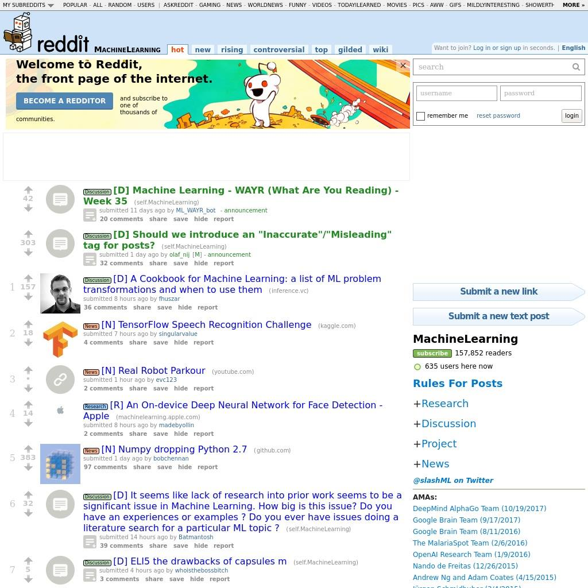
**이미지 캡션:** 이 이미지는 웹사이트 레딧의 머신러닝 서브레딧 페이지를 보여줍니다. 페이지 상단에는 레딧 로고와 함께 "Welcome to Reddit, the front page of the internet."이라는 문구가 있고, 그 옆에는 귀여운 레딧 봇 캐릭터가 그려져 있습니다. 페이지 중앙에는 다양한 게시물 목록이 표시되어 있으며, 각 게시물은 제목, 작성자, 제출 시간, 댓글 수 등의 정보를 포함하고 있습니다. 게시물 제목은 주로 머신러닝 관련 주제를 다루고 있으며, "[D]"는 토론, "[News]"는 뉴스, "[Research]"는 연구를 나타냅니다. 페이지 오른쪽에는 "Submit a new link"와 "Submit a new text post" 버튼이 있고, "MachineLearning" 서브레딧의 구독자 수와 현재 접속자 수가 표시되어 있습니다. 또한, 서브레딧 규칙과 트위터 계정, 그리고 과거 AMA(Ask Me Anything) 목록도 볼 수 있습니다. 전반적으로 정보가 많고 깔끔하게 정리된 웹 페이지의 모습입니다.Research]"는 연구를 나타냅니다. 페이지 오른쪽에는 "Submit a new link"와 "Submit a new text post" 버튼이 있고, "MachineLearning" 서브레딧의 구독자 수와 현재 접속자 수가 표시되어 있습니다. 또한, 서브레딧 규칙과 트위터 계정, 그리고 과거 AMA(Ask Me Anything) 목록도 볼 수 있습니다. 전반적으로 정보가 많고 깔끔하게 정리된 웹 페이지의 모습입니다.

> #오늘의레딧 https://www.reddit.com/r/MachineLearning/ 오늘도 새소식이 많군요.  1. 우리는 게시물에 대한"Inaccurate""Misleading"태그 소개해 줄까? 2. 한 요리 책 기계 학습:맥스 문제 변형의 목록과 할 때 그들을 이용하는 것이다 3. TensorFlow 음성 인식 챌린지 4. 리얼 로봇 파르쿠르 5. 한 On-device 깊은 신경망을 이용한 얼굴 검출-애플을 위해. 6. Numpy에 파이선 2.7이 떨어져서 고민 7. 같은 이전의 작업에 대한 연구의 부족 기계 학습에서 중요한 문제처럼 보이는 것은 같다. 얼마나 크니 이 문제? 너는 경험이나 사례가 있습니까? 당신은 문제 특정한 보란 듯이 주제에 대하여 문헌 검색을 하고 있나요? 8. 수만개의 캡슐 ELI5하는 문제점이 이용해 9. Variational Bi-LSTMs 10. 온도계 인코딩:어느 핫 웨이 레지스트 Adversarial를 throw하려면. 11. ONNX 지원 아파치 MXNet | 아마존 웹 서비스용을 알려 드립니다. 12. 그리고 작업 흐름에 도움이 필요한 텍스트에 대해 일을 무감독 분류 공연은. 13. "gated-recurrent로는 신경 네트워크로Cortical 만드"의 구현. 14. 대단해 시맨틱 분할:코드+ 다른 자원들로 표시를 하다 15. 그들은 그들의 요구에 맞게 조정할 수 있로는 신경 네트워크 공급이 무엇 있는 도전? 16. 이후 완전히 연결되어 계층은 보편적인 approximator는 하나의 계층에 복잡한 네트워크를 압축하는 것이 가능할 *theoretically* 수 있을까? 17. AI계층 18. Deepmind의 스타 크래프트 IIRLTutorial2:관측. 19. 스케일러블 기계 학습 시스템 개발:학습 자원. 20. ResNet 질문  1. https://www.reddit.com/r/MachineLearning/comments/7d6dkw/d_should_we_introduce_an_inaccuratemisleading_tag/ 2. http://www.inference.vc/design-patterns/ 3. https://www.kaggle.com/c/tensorflow-speech-recognition-challenge 4. https://www.youtube.com/watch?v=fRj34o4hN4I 5. https://machinelearning.apple.com/2017/11/16/face-detection.html 6. https://github.com/numpy/numpy/blob/master/doc/neps/dropping-python2.7-proposal.rst 7. https://www.reddit.com/r/MachineLearning/comments/7dba64/d_it_seems_like_lack_of_research_into_prior_work/ 8. https://www.reddit.com/r/MachineLearning/comments/7deq2z/d_eli5_the_drawbacks_of_capsules_m/ 9. https://arxiv.org/abs/1711.05717 10. https://openreview.net/forum?id=S18Su--CW&noteId=S18Su--CW 11. https://aws.amazon.com/blogs/ai/announcing-onnx-support-for-apache-mxnet/ 12. https://www.reddit.com/r/MachineLearning/comments/7ddbeg/d_performing_unsupervised_classification_for_work/ 13. https://www.reddit.com/r/MachineLearning/comments/7de4wi/p_implementation_of_cortical_microcircuits_as/ 14. https://github.com/mrgloom/awesome-semantic-segmentation 15. https://www.reddit.com/r/MachineLearning/comments/7dfj9r/d_what_are_the_challenges_in_providing_users_with/ 16. https://www.reddit.com/r/MachineLearning/comments/7dff36/d_since_a_fully_connected_layer_forms_a_universal/ 17. https://www.youtube.com/watch?v=4zHa-qzN5u8 18. http://chris-chris.ai/2017/11/06/pysc2-tutorial2/ 19. https://www.reddit.com/r/MachineLearning/comments/7db8th/d_scalable_machine_learning_system_development/ 20. https://www.reddit.com/r/MachineLearning/comments/7debuu/r_resnet_question/

### 11월 18일 (토) 08:52 · 📷 사진 (1장)

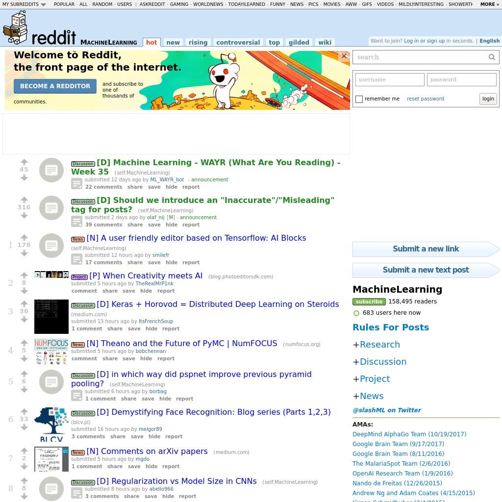
**이미지 캡션:** 이것은 레딧의 머신러닝 서브레딧 페이지로, 다양한 게시물 목록과 함께 페이지 상단에는 레딧 로고와 환영 메시지, 그리고 로그인 및 검색 기능이 있습니다. 페이지 중앙에는 "머신러닝"이라는 제목의 서브레딧에 대한 설명과 구독자 수, 현재 접속자 수가 표시되어 있으며, 게시물 작성 규칙에 대한 링크도 있습니다. 게시물 목록에는 각 게시물의 제목, 작성자, 제출 시간, 댓글 수 등이 표시되어 있으며, 각 게시물 옆에는 추천 및 비추천을 할 수 있는 화살표가 있습니다. 게시물들은 "머신러닝", "뉴스", "프로젝트" 등 다양한 카테고리로 분류되어 있습니다. 페이지 오른쪽 하단에는 "AMAS" 섹션이 있으며, 여기에는 과거에 진행되었던 AMA(Ask Me Anything) 세션 목록이 날짜와 함께 표시되어 있습니다. 전반적으로 정보가 많고 깔끔하게 정리된 웹사이트 화면입니다. 등 다양한 카테고리로 분류되어 있습니다. 페이지 오른쪽 하단에는 "AMAS" 섹션이 있으며, 여기에는 과거에 진행되었던 AMA(Ask Me Anything) 세션 목록이 날짜와 함께 표시되어 있습니다. 전반적으로 정보가 많고 깔끔하게 정리된 웹사이트 화면입니다.

> #오늘의레딧 https://www.reddit.com/r/MachineLearning/ 오늘도 새소식이 많군요.  1. 우리는 게시물에 대한"Inaccurate""Misleading"태그 소개해 줄까? 2. 사용자 우호적인 편집자 Tensorflow에 의거한 AI블록. 3. 언제 창조성 AI를 만나 4. Keras+Horovod)분산 딥을 배우는 것은 압도 당하고에. 5. 테아노와 미래 PyMC의 | NumFOCUS. 6. 어느 길에서 pspnet 이전 피라미드 풀링을 향상시켰나요? 7. Demystifying 얼굴 인식:블로그 시리즈(일부 1,2,3). 8. arXiv지에 대한 평 9. 조절 vs모델 크기 CNNs에. 10. 한 요리 책 기계 학습:맥스 문제 변형의 목록과 할 때 그들을 이용하는 것이다 11. XGAN:Image-to-Image 번역 다대다 Mappings에Unsupervised. 12. TensorFlow(비디오)로 물체 탐지 툴킷을 만들으며. 13. 역사 Pageview 자료를 이용한 웹 사이트 콘텐츠 최적화. 14. 리얼 로봇 파르쿠르 15. 나는 모든 문제의 초기 하중으로 하위 문제의 최적의 지점을 사용할 수 있나요? 16. Tsh-GPU지원 Docker를 바탕으로 심도 있는 학습 조개. 17. 무슨 보고 출판된 결과 복제하고 있는 것인가요? 18. 거미 종들의 춤은 짝 짓기 로봇 학습에 이상한 걸음 걸이가 인 닮아 있다. 19. NIPS 2017년 Pre-Proceedings 20. 딥을 배우는 것은 아니 부호화  1. https://www.reddit.com/r/MachineLearning/comments/7d6dkw/d_should_we_introduce_an_inaccuratemisleading_tag/ 2. https://www.reddit.com/r/MachineLearning/comments/7dk945/n_a_user_friendly_editor_based_on_tensorflow_ai/ 3. https://blog.photoeditorsdk.com/when-creativity-meets-a-i-f48ee9a3612d 4. https://medium.com/searchink-eng/keras-horovod-distributed-deep-learning-on-steroids-94666e16673d 5. https://www.numfocus.org/blog/theano-and-the-future-of-pymc/ 6. https://www.reddit.com/r/MachineLearning/comments/7dmdup/d_in_which_way_did_pspnet_improve_previous/ 7. http://blcv.pl/static/tag/face-recogition/ 8. https://medium.com/@fermatslibrary/comments-on-arxiv-papers-20d2b048cf92 9. https://www.reddit.com/r/MachineLearning/comments/7dlixq/d_regularization_vs_model_size_in_cnns/ 10. http://www.inference.vc/design-patterns/ 11. https://arxiv.org/abs/1711.05139 12. https://www.youtube.com/watch?v=CAYn6A1zsrw 13. https://www.reddit.com/r/MachineLearning/comments/7do5zq/d_optimizing_website_content_based_on_historical/ 14. https://www.youtube.com/watch?v=fRj34o4hN4I 15. https://www.reddit.com/r/MachineLearning/comments/7dluo8/d_can_i_use_subproblems_optimal_point_as_initial/ 16. https://www.reddit.com/r/MachineLearning/comments/7dkdl4/p_tsh_deep_learning_shell_with_gpu_support_based/ 17. https://www.reddit.com/r/MachineLearning/comments/7dicyk/d_is_there_any_repository_for_replicating/ 18. https://www.facebook.com/scifrimacroscope/videos/161703411097069/ 19. https://papers.nips.cc/book/advances-in-neural-information-processing-systems-30-2017 20. https://www.reddit.com/r/MachineLearning/comments/7dn779/d_deep_learning_no_coding/

### 11월 19일 (일) 08:52 · 📷 사진 (1장)

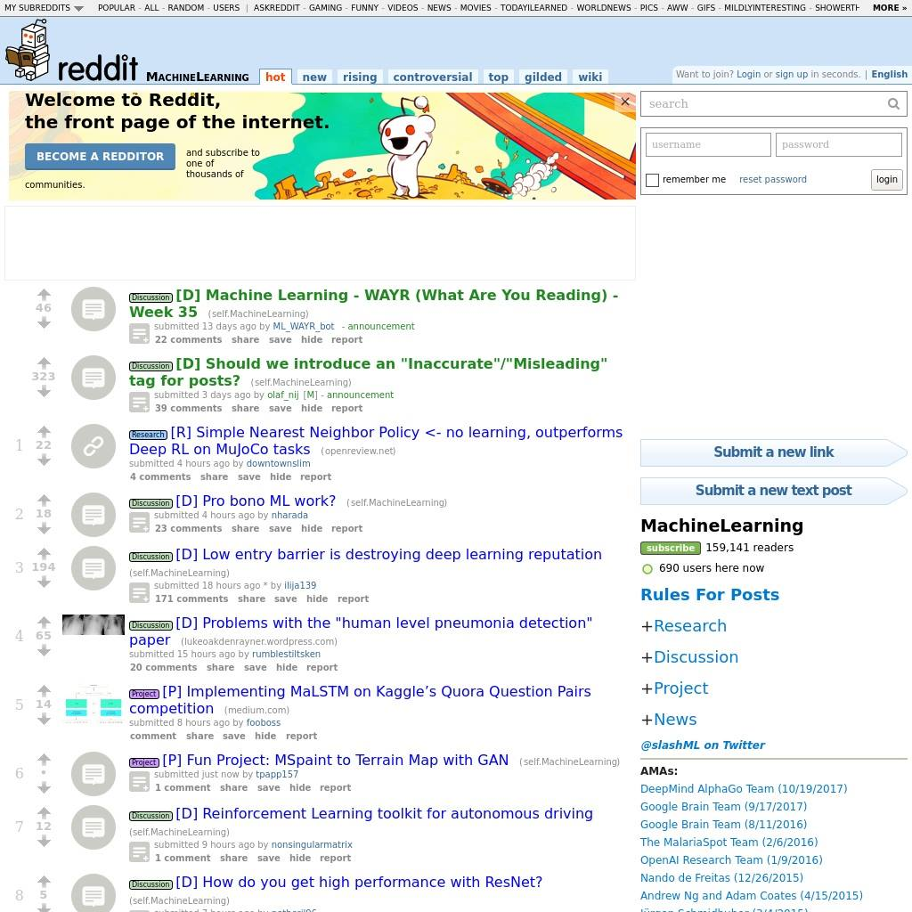
**이미지 캡션:** 이것은 웹사이트 레딧의 머신러닝 서브레딧 페이지로, 다양한 게시물 목록이 표시됩니다. 페이지 상단에는 레딧 로고와 함께 "Welcome to Reddit, the front page of the internet."이라는 문구가 있고, 그 옆에는 머신러닝 관련 탭들이 있습니다. 로그인 및 검색 창도 보입니다. 메인 콘텐츠 영역에는 여러 게시물들이 시간순으로 나열되어 있으며, 각 게시물은 제목, 작성자, 제출 시간, 댓글 수 등의 정보를 포함합니다. 게시물들은 주로 "Discussion", "Research", "Project"와 같은 태그로 분류되어 있습니다. 오른쪽 사이드바에는 "Submit a new link", "Submit a new text post" 버튼과 함께 "Machine Learning" 서브레딧의 구독자 수, 현재 접속자 수, 게시 규칙, 트위터 계정, 그리고 과거 AMA(Ask Me Anything) 목록이 표시됩니다. 전반적으로 정보가 많고 기술적인 주제를 다루는 커뮤니티 페이지의 분위기입니다."Project"와 같은 태그로 분류되어 있습니다. 오른쪽 사이드바에는 "Submit a new link", "Submit a new text post" 버튼과 함께 "Machine Learning" 서브레딧의 구독자 수, 현재 접속자 수, 게시 규칙, 트위터 계정, 그리고 과거 AMA(Ask Me Anything) 목록이 표시됩니다. 전반적으로 정보가 많고 기술적인 주제를 다루는 커뮤니티 페이지의 분위기입니다.

> #오늘의레딧 https://www.reddit.com/r/MachineLearning/ 재미난 이야기들이 많습니다.  1. 우리는 게시물에 대한"Inaccurate""Misleading"태그 소개해 줄까? 2. 심플 Nearest 이웃 정책 <- 없어 배움, MuJoCo 업무에 딥 RL를 압도한다. 3. Probono맥스? 4. 낮은 진입 장벽이 심도 있는 학습 명성을 망친다. 5. 그"사람 정도의 폐렴 탐지"종이에 문제가 생기죠 6. Kaggle의 Quora질문 Pairs 경쟁에 MaLSTM 구현. 7. 재미 있는 프로젝트 MSpaint Terrain 지도 GAN과. 8. 자율적 주행에 대한 강화 학습 툴킷이다. 9. 어떻게 ResNet 높은 성능을 얻니? 10. 현재 AI학생: 내릴까요? 11. 현재'에 지금/요즘 뭐 'stuck니? 12. 사용자 우호적인 편집자 Tensorflow에 의거한 AI블록. 13. 단지 한 vs다중 submodels? 14. 누군가 이곳은 에든버러 대학이나 암스테르담 대학교 기계 학습 마스터가 듣는 수업에 참석했나요? 15. 골조 보간법 Multi-Scale 깊은 손실 기능과 나타나는 생성 Adversarial 네트웍스. 16. 저차원 Autoencoder(Keras) 17. 테아노와 미래 PyMC의 | NumFOCUS. 18. XGAN:Image-to-Image 번역 다대다 Mappings에Unsupervised. 19. Keras+Horovod)분산 딥을 배우는 것은 압도 당하고에. 20. 언제 창조성 AI를 만나  1. https://www.reddit.com/r/MachineLearning/comments/7d6dkw/d_should_we_introduce_an_inaccuratemisleading_tag/ 2. https://openreview.net/forum?id=ByL48G-AW 3. https://www.reddit.com/r/MachineLearning/comments/7dv1d0/d_pro_bono_ml_work/ 4. https://www.reddit.com/r/MachineLearning/comments/7dqtby/d_low_entry_barrier_is_destroying_deep_learning/ 5. https://lukeoakdenrayner.wordpress.com/2017/11/18/quick-thoughts-on-chestxray14-performance-claims-and-clinical-tasks/ 6. https://medium.com/mlreview/implementing-malstm-on-kaggles-quora-question-pairs-competition-8b31b0b16a07 7. https://www.reddit.com/r/MachineLearning/comments/7dwj1q/p_fun_project_mspaint_to_terrain_map_with_gan/ 8. https://www.reddit.com/r/MachineLearning/comments/7dt259/d_reinforcement_learning_toolkit_for_autonomous/ 9. https://www.reddit.com/r/MachineLearning/comments/7dtrfl/d_how_do_you_get_high_performance_with_resnet/ 10. https://www.reddit.com/r/MachineLearning/comments/7dvmc0/d_current_ai_student_should_i_drop_out/ 11. https://www.reddit.com/r/MachineLearning/comments/7dsg4s/d_what_are_you_currently_stuck_on_right_now_these/ 12. https://www.reddit.com/r/MachineLearning/comments/7dk945/n_a_user_friendly_editor_based_on_tensorflow_ai/ 13. https://www.reddit.com/r/MachineLearning/comments/7dsj9l/d_when_to_build_multiple_submodels_vs_just_one/ 14. https://www.reddit.com/r/MachineLearning/comments/7dr6q2/d_has_anyone_here_attended_either_university_of/ 15. https://arxiv.org/abs/1711.06045v1 16. https://www.reddit.com/r/MachineLearning/comments/7dqvm2/p_low_dimensional_autoencoder_keras/ 17. https://www.numfocus.org/blog/theano-and-the-future-of-pymc/ 18. https://arxiv.org/abs/1711.05139 19. https://medium.com/searchink-eng/keras-horovod-distributed-deep-learning-on-steroids-94666e16673d 20. https://blog.photoeditorsdk.com/when-creativity-meets-a-i-f48ee9a3612d

### 11월 20일 (월) 08:52 · 📷 사진 (1장)

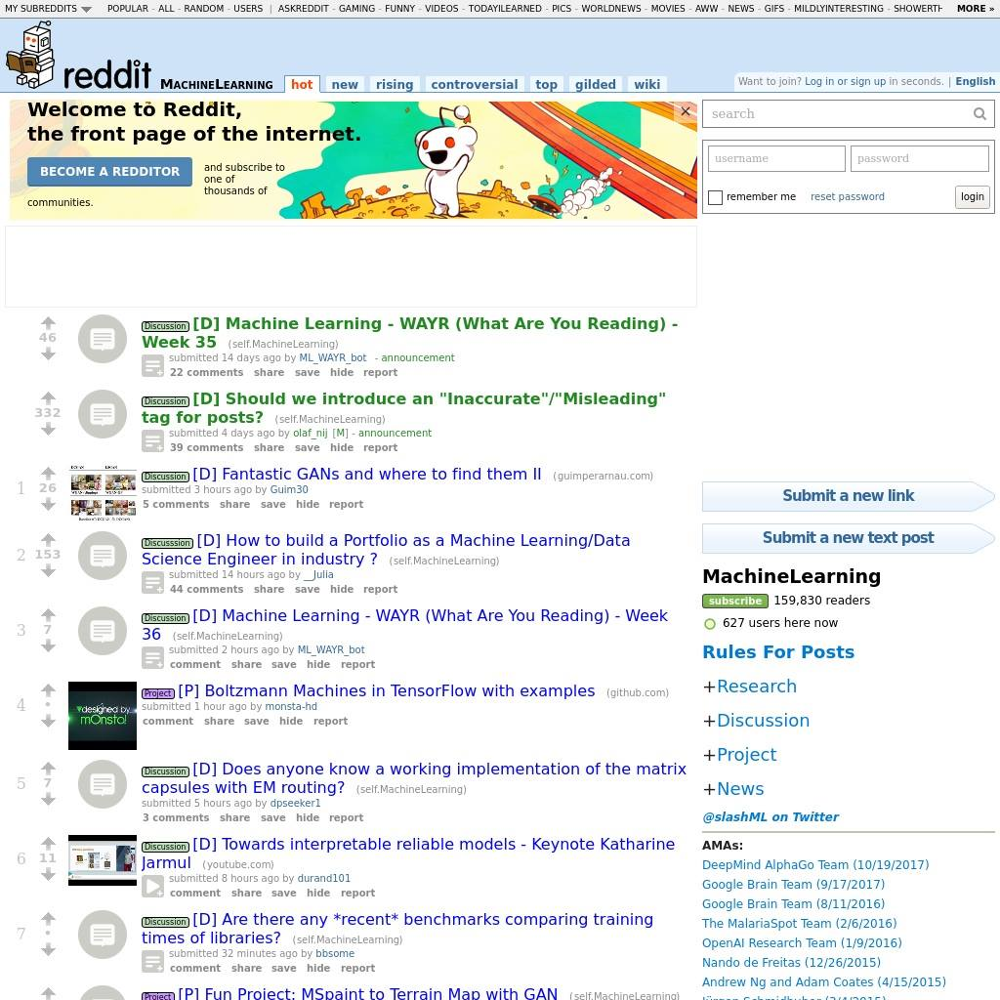
**이미지 캡션:** 이 이미지는 레딧(Reddit) 웹사이트의 머신러닝(Machine Learning) 서브레딧 페이지를 보여줍니다. 페이지 상단에는 레딧 로고와 함께 "Welcome to Reddit, the front page of the internet."이라는 환영 문구가 있고, 그 옆에는 귀여운 캐릭터와 함께 인터넷의 다양한 주제를 나타내는 그림이 있습니다. 페이지 중앙에는 로그인 및 회원가입을 위한 입력란과 버튼이 보입니다. 메인 콘텐츠 영역에는 머신러닝 관련 게시물 목록이 나열되어 있으며, 각 게시물은 제목, 작성자, 제출 시간, 댓글 수 등의 정보를 포함하고 있습니다. 게시물 제목들은 "[D] Machine Learning - WAYR (What Are You Reading)", "[D] Should we introduce an "Inaccurate" / "Misleading" tag for posts?", "[D] Fantastic GANs and where to find them II", "[D] How to build a Portfolio as a Machine Learning/Data Science Engineer in industry?", "[P] Boltzmann Machines in TensorFlow with examples", "[D] Does anyone know a working implementation of the matrix capsules with EM routing?", "[D] Towards interpretable reliable models - Keynote Katharine Jarmul", "[D] Are there any *recent* benchmarks comparing training times of libraries?", "[P] Fun Project: MSpaint to Terrain Map with GAN" 등 다양합니다. 각 게시물 옆에는 투표를 위한 위아래 화살표와 댓글, 공유, 저장, 신고 등의 옵션이 있습니다. 페이지 오른쪽에는 "MachineLearning" 서브레딧 구독자 수와 함께 "Rules For Posts", "+Research", "+Discussion", "+Project", "+News" 등의 메뉴가 있으며, 하단에는 "AMAS" 섹션에 다양한 연구팀 및 개인의 이름과 날짜가 나열되어 있습니다. 전반적으로 정보가 풍부하고 활발한 온라인 커뮤니티의 모습을 보여주는 화면입니다., 제출 시간, 댓글 수 등의 정보를 포함하고 있습니다. 게시물 제목들은 "[D] Machine Learning - WAYR (What Are You Reading)", "[D] Should we introduce an "Inaccurate" / "Misleading" tag for posts?", "[D] Fantastic GANs and where to find them II", "[D] How to build a Portfolio as a Machine Learning/Data Science Engineer in industry?", "[P] Boltzmann Machines in TensorFlow with examples", "[D] Does anyone know a working implementation of the matrix capsules with EM routing?", "[D] Towards interpretable reliable models - Keynote Katharine Jarmul", "[D] Are there any *recent* benchmarks comparing training times of libraries?", "[P] Fun Project: MSpaint to Terrain Map with GAN" 등 다양합니다. 각 게시물 옆에는 투표를 위한 위아래 화살표와 댓글, 공유, 저장, 신고 등의 옵션이 있습니다. 페이지 오른쪽에는 "MachineLearning" 서브레딧 구독자 수와 함께 "Rules For Posts", "+Research", "+Discussion", "+Project", "+News" 등의 메뉴가 있으며, 하단에는 "AMAS" 섹션에 다양한 연구팀 및 개인의 이름과 날짜가 나열되어 있습니다. 전반적으로 정보가 풍부하고 활발한 온라인 커뮤니티의 모습을 보여주는 화면입니다.

> #오늘의레딧 https://www.reddit.com/r/MachineLearning/ 머신러닝 공부는 정말 재미있죠?아침부터 다양한 소식이 많네요.  1. 우리는 게시물에 대한"Inaccurate""Misleading"태그 소개해 줄까? 2. 판타스틱 GANs고 2세를 찾으려고 합니다. 3. 기계 학습-WAYR(뭘 읽는 것 있나)-주간이 36. 4. 볼츠만 머신 TensorFlow에 예를 들어. 5. 누군가 전자파 라우팅과 매트릭스를 캡슐의 노동 구현을 아는가? 6. 해석할 수 있는 믿을 만한 모델을 향하여-키노트 캐서린 Jarmul. 7. 어떤 *recent* 벤치 마크 도서관의 훈련번 비교하는 거야? 8. 재미 있는 프로젝트 MSpaint Terrain 지도 GAN과. 9. 심플 Nearest 이웃 정책 <- 없어 배움, MuJoCo 업무에 딥 RL를 압도한다. 10. 문서 용어 시각화-해군 정보 처리 시스템 2017년 포스터 타이틀을 사용하는 것이다. 11. Cryptocurrency 실적 자료(50최고). 12. Probono맥스? 13. 낮은 진입 장벽이 심도 있는 학습 명성을 망친다. 14. Kaggle의 Quora질문 Pairs 경쟁에 MaLSTM 구현. 15. 그"사람 정도의 폐렴 탐지"종이에 문제가 생기죠 16. 현재 AI학생: 내릴까요? 17. 어떻게 ResNet 높은 성능을 얻니? 18. 자율적 주행에 대한 강화 학습 툴킷이다. 19. 현재'에 지금/요즘 뭐 'stuck니? 20. 단지 한 vs다중 submodels?  1. https://www.reddit.com/r/MachineLearning/comments/7d6dkw/d_should_we_introduce_an_inaccuratemisleading_tag/ 2. http://guimperarnau.com/blog/2017/11/Fantastic-GANs-and-where-to-find-them-II 3. https://www.reddit.com/r/MachineLearning/comments/7e3fx6/d_machine_learning_wayr_what_are_you_reading_week/ 4. https://github.com/monsta-hd/boltzmann-machines 5. https://www.reddit.com/r/MachineLearning/comments/7e2axs/d_does_anyone_know_a_working_implementation_of/ 6. https://www.youtube.com/watch?v=B3PtcF-6Dtc 7. https://www.reddit.com/r/MachineLearning/comments/7e44ml/d_are_there_any_recent_benchmarks_comparing/ 8. https://www.reddit.com/r/MachineLearning/comments/7dwj1q/p_fun_project_mspaint_to_terrain_map_with_gan/ 9. https://openreview.net/forum?id=ByL48G-AW 10. http://shubhanshu.com/document-term-weighing/ 11. https://www.kaggle.com/jackml/cryptocurrency-historical-data 12. https://www.reddit.com/r/MachineLearning/comments/7dv1d0/d_pro_bono_ml_work/ 13. https://www.reddit.com/r/MachineLearning/comments/7dqtby/d_low_entry_barrier_is_destroying_deep_learning/ 14. https://medium.com/mlreview/implementing-malstm-on-kaggles-quora-question-pairs-competition-8b31b0b16a07 15. https://lukeoakdenrayner.wordpress.com/2017/11/18/quick-thoughts-on-chestxray14-performance-claims-and-clinical-tasks/ 16. https://www.reddit.com/r/MachineLearning/comments/7dvmc0/d_current_ai_student_should_i_drop_out/ 17. https://www.reddit.com/r/MachineLearning/comments/7dtrfl/d_how_do_you_get_high_performance_with_resnet/ 18. https://www.reddit.com/r/MachineLearning/comments/7dt259/d_reinforcement_learning_toolkit_for_autonomous/ 19. https://www.reddit.com/r/MachineLearning/comments/7dsg4s/d_what_are_you_currently_stuck_on_right_now_these/ 20. https://www.reddit.com/r/MachineLearning/comments/7dsj9l/d_when_to_build_multiple_submodels_vs_just_one/

### 11월 21일 (화) 08:52 · 📷 사진 (1장)

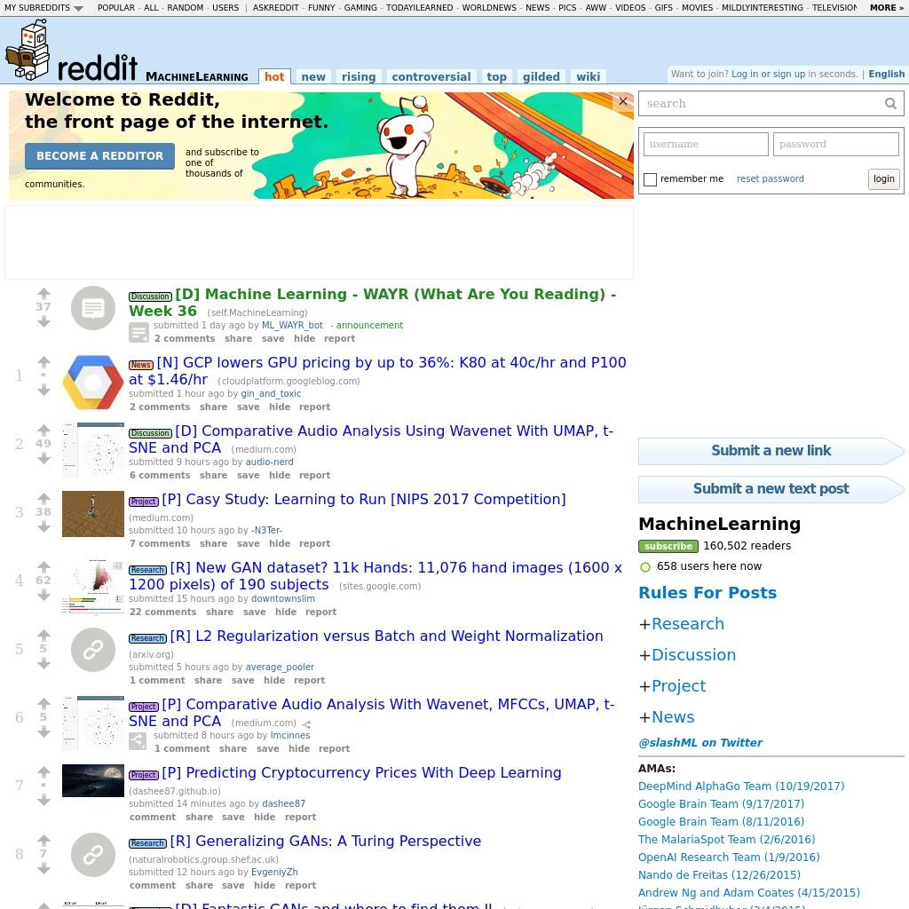
**이미지 캡션:** 이 이미지는 레딧 웹사이트의 머신러닝 서브레딧 페이지를 보여줍니다. 페이지 상단에는 레딧 로고와 함께 "Welcome to Reddit, the front page of the internet."이라는 문구가 있고, 그 아래에는 "BECOME A REDDITOR" 버튼과 함께 수만 명의 커뮤니티에 가입하라는 메시지가 있습니다. 메인 콘텐츠 영역에는 여러 게시물 목록이 표시되며, 각 게시물은 제목, 제출자, 제출 시간, 댓글 수, 좋아요/싫어요 표시 등으로 구성되어 있습니다. 게시물 제목에는 "[D] Machine Learning - WAYR (What Are You Reading)", "[N] GCP lowers GPU pricing by up to 36%", "[D] Comparative Audio Analysis Using Wavenet With UMAP, t-SNE and PCA", "[P] Casy Study: Learning to Run [NIPS 2017 Competition]", "[R] New GAN dataset? 11k Hands: 11,076 hand images (1600 x 1200 pixels) of 190 subjects", "[R] L2 Regularization versus Batch and Weight Normalization", "[P] Comparative Audio Analysis With Wavenet, MFCCs, UMAP, t-SNE and PCA", "[P] Predicting Cryptocurrency Prices With Deep Learning", "[R] Generalizing GANs: A Turing Perspective" 등이 포함되어 있습니다. 오른쪽 사이드바에는 "MachineLearning" 서브레딧의 구독자 수와 "Rules For Posts" 섹션이 있으며, 그 아래에는 "+Research", "+Discussion", "+Project", "+News"와 같은 카테고리가 나열되어 있습니다. 또한 "@slashML on Twitter" 링크와 "AMAS" 섹션에는 여러 연구팀 및 개인의 이름과 날짜가 포함되어 있습니다. 페이지 상단에는 검색창과 로그인/가입 옵션도 보입니다. 전반적으로 기술 및 연구 관련 토론이 활발하게 이루어지는 온라인 커뮤니티의 모습을 보여줍니다.ne Learning - WAYR (What Are You Reading)", "[N] GCP lowers GPU pricing by up to 36%", "[D] Comparative Audio Analysis Using Wavenet With UMAP, t-SNE and PCA", "[P] Casy Study: Learning to Run [NIPS 2017 Competition]", "[R] New GAN dataset? 11k Hands: 11,076 hand images (1600 x 1200 pixels) of 190 subjects", "[R] L2 Regularization versus Batch and Weight Normalization", "[P] Comparative Audio Analysis With Wavenet, MFCCs, UMAP, t-SNE and PCA", "[P] Predicting Cryptocurrency Prices With Deep Learning", "[R] Generalizing GANs: A Turing Perspective" 등이 포함되어 있습니다. 오른쪽 사이드바에는 "MachineLearning" 서브레딧의 구독자 수와 "Rules For Posts" 섹션이 있으며, 그 아래에는 "+Research", "+Discussion", "+Project", "+News"와 같은 카테고리가 나열되어 있습니다. 또한 "@slashML on Twitter" 링크와 "AMAS" 섹션에는 여러 연구팀 및 개인의 이름과 날짜가 포함되어 있습니다. 페이지 상단에는 검색창과 로그인/가입 옵션도 보입니다. 전반적으로 기술 및 연구 관련 토론이 활발하게 이루어지는 온라인 커뮤니티의 모습을 보여줍니다.

> #오늘의레딧 https://www.reddit.com/r/MachineLearning/ 따끈한 소식들입니다.  1. 최대 36%가스 원심 분리 공장을 낮추는데 GPU에 가격:K80 40c/hr에 P100달러 1.46/hr에. 2. 비교 오디오 분석을 이용한 Wavenet UMAP을 가지고 있기 때문에 PCAt-SNE. 3. 뉴 GAN의 데이터? 11k 손:11,076 손 사진 190개 과목 중(1600x1200픽셀). 4. L2조절 대 배치와 무게 정규화. 5. 비교 오디오 분석-StreamWavenet, MFCCs, UMAP,t-SNE, PCA. 6. 딥 학습으로 Cryptocurrency 물가가 예측. 7. Generalizing GANs:튜링 투시도. 8. 판타스틱 GANs고 2세를 찾으려고 합니다. 9. 기계 학습에 Expressivity, Trainability고 일반화. 10. 조언을 내 전공 우수년 계획을 찾습니다. pokemon 빨간 색 하는 알고리즘 학습 기계를 사용하다. 11.  강화 학습:센스 12. GANs에 over-/underfitting 평가 13. 잠복이 성 전환 14. 볼츠만 머신 TensorFlow에 예를 들어. 15. 기계 학습 기업 소프트웨어의 최고의 애플리케이션? 16. 거긴 강화 학습의 에이전트를 같은 주에서 에피소드 시작하지 않은 문제들에 대해 어떤 문헌이 있나요? 17. 해석할 수 있는 믿을 만한 모델을 향하여-키노트 캐서린 Jarmul. 18. 어떤 책이 더 낫다고 생각하니? 19. 재미 있는 프로젝트 MSpaint Terrain 지도 GAN과. 20. 어떤 *recent* 벤치 마크 도서관의 훈련번 비교하는 거야?  1. https://cloudplatform.googleblog.com/2017/11/new-lower-prices-for-GPUs-and-preemptible-Local-SSDs.html 2. https://medium.com/@LeonFedden/comparative-audio-analysis-with-wavenet-mfccs-umap-t-sne-and-pca-cb8237bfce2f 3. https://sites.google.com/view/11khands 4. https://arxiv.org/abs/1706.05350 5. https://medium.com/@LeonFedden/comparative-audio-analysis-with-wavenet-mfccs-umap-t-sne-and-pca-cb8237bfce2f 6. https://dashee87.github.io/deep%20learning/python/predicting-cryptocurrency-prices-with-deep-learning/ 7. http://naturalrobotics.group.shef.ac.uk/publications/2017-nips-gross.pdf 8. http://guimperarnau.com/blog/2017/11/Fantastic-GANs-and-where-to-find-them-II 9. http://blog.evjang.com/2017/11/exp-train-gen.html 10. https://www.reddit.com/r/MachineLearning/comments/7ecfqf/p_looking_for_advice_for_my_honours_year_project/ 11. https://medium.com/@dmonn/reinforcement-learning-the-quirks-44b0e315fed2 12. https://www.reddit.com/r/MachineLearning/comments/7e6pav/d_assessing_overunderfitting_in_gans/ 13. https://www.reddit.com/r/MachineLearning/comments/7ebuut/d_latent_sex_change/ 14. https://github.com/monsta-hd/boltzmann-machines 15. https://www.reddit.com/r/MachineLearning/comments/7eadj4/d_best_applications_of_machine_learning_in/ 16. https://www.reddit.com/r/MachineLearning/comments/7e7u3u/d_is_there_any_literature_in_reinforcement/ 17. https://www.youtube.com/watch?v=B3PtcF-6Dtc 18. https://www.reddit.com/r/MachineLearning/comments/7e791w/d_which_book_do_you_think_is_better/ 19. https://www.reddit.com/r/MachineLearning/comments/7dwj1q/p_fun_project_mspaint_to_terrain_map_with_gan/ 20. https://www.reddit.com/r/MachineLearning/comments/7e44ml/d_are_there_any_recent_benchmarks_comparing/

### 11월 22일 (수) 08:52 · 📷 사진 (1장)

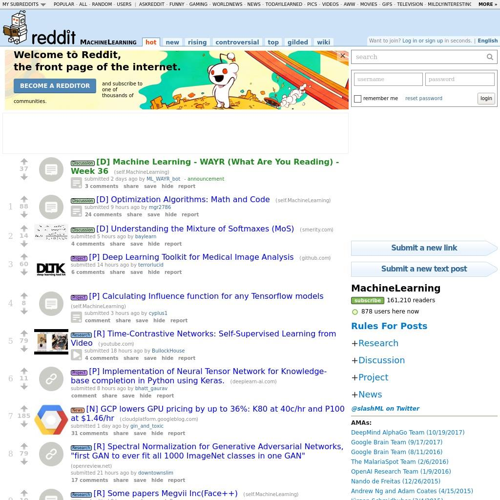
**이미지 캡션:** 이 이미지는 인기 있는 온라인 커뮤니티인 레딧의 머신러닝 서브레딧 페이지를 보여줍니다. 화면 상단에는 레딧 로고와 함께 "Welcome to Reddit, the front page of the internet."이라는 문구가 있고, 그 옆에는 레딧의 마스코트인 스너(Snoo)가 그려진 일러스트가 있습니다. 페이지 중앙에는 "BECOME A REDDITOR" 버튼과 함께 커뮤니티 가입을 유도하는 문구가 있습니다. 메인 콘텐츠 영역에는 다양한 머신러닝 관련 게시물 목록이 표시되어 있으며, 각 게시물은 제목, 작성자, 제출 시간, 댓글 수 등의 정보를 포함하고 있습니다. 게시물 제목 앞에는 [D] (Discussion), [P] (Project), [R] (Research), [N] (News)와 같은 태그가 붙어 있어 게시물의 성격을 나타냅니다. 오른쪽 사이드바에는 "Submit a new link", "Submit a new text post" 버튼과 함께 "MachineLearning" 서브레딧의 구독자 수와 "Rules For Posts" 목록이 있습니다. 또한, "AMAS" 섹션에는 과거에 진행되었던 AMA(Ask Me Anything) 목록이 날짜와 함께 나열되어 있습니다. 전반적으로 정보가 풍부하고 기술적인 주제를 다루는 커뮤니티의 분위기를 보여줍니다.성자, 제출 시간, 댓글 수 등의 정보를 포함하고 있습니다. 게시물 제목 앞에는 [D] (Discussion), [P] (Project), [R] (Research), [N] (News)와 같은 태그가 붙어 있어 게시물의 성격을 나타냅니다. 오른쪽 사이드바에는 "Submit a new link", "Submit a new text post" 버튼과 함께 "MachineLearning" 서브레딧의 구독자 수와 "Rules For Posts" 목록이 있습니다. 또한, "AMAS" 섹션에는 과거에 진행되었던 AMA(Ask Me Anything) 목록이 날짜와 함께 나열되어 있습니다. 전반적으로 정보가 풍부하고 기술적인 주제를 다루는 커뮤니티의 분위기를 보여줍니다.

> #오늘의레딧 https://www.reddit.com/r/MachineLearning/ 재미난 이야기들이 많습니다.  1. 최적화 알고리즘:수학과 코드. 2. Softmaxes(MoS)의 배합을 이해하는 것. 3. 딥을 배우는 것은 툴킷 의료 이미지 분석을 위해. 4. 어떤 Tensorflow 모델의 미치는 영향 기능이다. 5. Time-Contrastive 네트웍스:Self-Supervised를 배우는 것은 비디오에서. 6. 신경 텐서 네트워크의 Python으로 Knowledge-base 완료 Keras을 사용하여의 도입. 7. 최대 36%가스 원심 분리 공장을 낮추는데 GPU에 가격:K80 40c/hr에 P100달러 1.46/hr에. 8. 스펙트럼 정규화 나타나는 생성 Adversarial망,"첫번째 GAN 한 GAN의 모든 1000ImageNet 수업에 맞는". 9. 몇몇 신문 Megvii Inc(Face++) 10. DeepSpeech2 건축의 공중 감시 레이더에 대한 PaddlePaddle 구현입니다. 11. 려면 Frontalize 또는:A연구 페이스 Pre-Processing의 기법 및 인식에 그들의 미치는 영향 Frontalize기 위해 아니다. 12. 엔비디아의 iOS앱 머그 잔 인생에 3D애니메이션 당신 사진을 가져오다. 13. 아이패드 위한 우리의 Jupyter/IPython 클라이언트 현재 파이썬, 고로 NumPy, Matplotlib과 SciPy에 입문 공책은 당신이 아무 예비 구성 없이 달린다. 은 베타 버전 너의 아이패드에 출마할 등록시켜 주세요! https://www.reddit.com/r/IPython)에서(x-post 14. 캔 AI는 똑같은 것을 설명하는 법? 15. 딥 학습으로 Cryptocurrency 물가가 예측. 16. 구글 개발자 블로그:도입 TensorFlow Feature기둥. 17. 비교 오디오 분석을 이용한 Wavenet UMAP을 가지고 있기 때문에 PCAt-SNE. 18. L2조절 대 배치와 무게 정규화. 19. 기계 학습에 Expressivity, Trainability고 일반화. 20. 무인 자동차 시험에 대한 좋은 시뮬레이터이다  1. https://www.reddit.com/r/MachineLearning/comments/7ehxky/d_optimization_algorithms_math_and_code/ 2. http://smerity.com/articles/2017/mixture_of_softmaxes.html 3. https://github.com/DLTK/DLTK 4. https://www.reddit.com/r/MachineLearning/comments/7ekxkh/p_calculating_influence_function_for_any/ 5. https://www.youtube.com/watch?v=b1UTUQpxPSY 6. http://deeplearn-ai.com/2017/11/21/neural-tensor-network-exploring-relations-among-text-entities/ 7. https://cloudplatform.googleblog.com/2017/11/new-lower-prices-for-GPUs-and-preemptible-Local-SSDs.html 8. https://openreview.net/forum?id=B1QRgziT- 9. https://www.reddit.com/r/MachineLearning/comments/7ei7fj/r_some_papers_megvii_incface/ 10. https://github.com/PaddlePaddle/DeepSpeech 11. https://arxiv.org/abs/1610.04823 12. https://news.developer.nvidia.com/ai-app-brings-your-photos-to-life-with-3d-animation/ 13. https://juno.sh/juno-v-1-0-6-beta/ 14. https://www.nytimes.com/2017/11/21/magazine/can-ai-be-taught-to-explain-itself.html?emc=eta1 15. https://dashee87.github.io/deep%20learning/python/predicting-cryptocurrency-prices-with-deep-learning/ 16. https://developers.googleblog.com/2017/11/introducing-tensorflow-feature-columns.html?m=1 17. https://medium.com/@LeonFedden/comparative-audio-analysis-with-wavenet-mfccs-umap-t-sne-and-pca-cb8237bfce2f 18. https://arxiv.org/abs/1706.05350 19. http://blog.evjang.com/2017/11/exp-train-gen.html 20. https://www.reddit.com/r/MachineLearning/comments/7eeqvo/r_a_good_simulator_for_selfdriving_car_testing/

### 11월 23일 (목) 08:53 · 📷 사진 (1장)

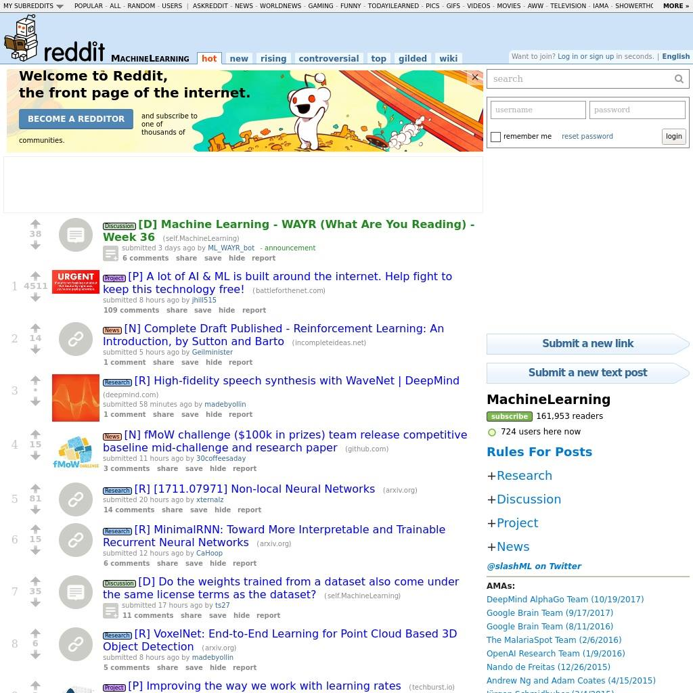
**이미지 캡션:** 이 이미지는 레딧(Reddit) 웹사이트의 머신러닝(Machine Learning) 서브레딧 페이지를 보여줍니다. 페이지 상단에는 레딧 로고와 함께 "Welcome to Reddit, the front page of the internet."이라는 문구가 있고, 그 아래에는 "BECOME A REDDITOR" 버튼과 커뮤니티에 대한 설명이 있습니다. 오른쪽 상단에는 로그인 및 회원가입을 위한 검색창과 입력 필드가 있습니다. 메인 콘텐츠 영역에는 여러 게시물 목록이 표시되며, 각 게시물은 제목, 작성자, 시간, 댓글 수 등의 정보를 포함하고 있습니다. 게시물들은 주로 인공지능, 머신러닝, 딥러닝 관련 주제를 다루고 있으며, "URGENT" 태그가 붙은 게시물은 긴급한 내용을 알리고 있습니다. 오른쪽 사이드바에는 "Submit a new link" 및 "Submit a new text post" 버튼과 함께 "Machine Learning" 서브레딧의 구독자 수, 현재 접속자 수, 그리고 게시물 규칙에 대한 링크가 있습니다. 또한, "@slashML on Twitter" 링크와 함께 "AMAS" 섹션에는 머신러닝 분야의 유명 인사 및 팀 목록이 날짜와 함께 나열되어 있습니다. 전반적으로 기술 관련 커뮤니티의 정보 공유 및 토론이 이루어지는 웹사이트의 모습을 보여줍니다. 댓글 수 등의 정보를 포함하고 있습니다. 게시물들은 주로 인공지능, 머신러닝, 딥러닝 관련 주제를 다루고 있으며, "URGENT" 태그가 붙은 게시물은 긴급한 내용을 알리고 있습니다. 오른쪽 사이드바에는 "Submit a new link" 및 "Submit a new text post" 버튼과 함께 "Machine Learning" 서브레딧의 구독자 수, 현재 접속자 수, 그리고 게시물 규칙에 대한 링크가 있습니다. 또한, "@slashML on Twitter" 링크와 함께 "AMAS" 섹션에는 머신러닝 분야의 유명 인사 및 팀 목록이 날짜와 함께 나열되어 있습니다. 전반적으로 기술 관련 커뮤니티의 정보 공유 및 토론이 이루어지는 웹사이트의 모습을 보여줍니다.

> #오늘의레딧 https://www.reddit.com/r/MachineLearning/ 래딧은 읽을 거리가 다양합니다.  1. AI&맥스의 많은 인터넷을 중심으로 전개된다. 싸움 이 기술 무료로 제공하기 위해서 도와 주세요! 2. Complete초안 서튼과 Barto에 의한 강화 학습:도입, 출판 되었다. 3. WaveNet | DeepMind과High-fidelity 음성 합성. 4. FMoW 도전(달러 100k한 이 상에)팀 경쟁 기준 mid-challenge과 연구 논문을 풀어 놓습니다. 5. MinimalRNN:모어, Trainable 순환 신경망을 이용한Interpretable 무렵에. 6. 역기를 데이터에서 훈련도 데이터 집합과 동일한 사용 조건 밑에 들나요? 7. VoxelNet:End-to-End를 배우는 것은 포인트 클라우드Based 3D객체 탐색을 위하다. 8. 우리가 배우고 금리와 함께 일하는 방법을 개선하는 것. 9. CNTK 2.2+이무기에서FasterRCNN 훈련+Grocery의 데이터. 10. 누구나 치료하는 배우'Building 기계들과 'Deepmind부터 약 2주 전에 출판 된 생각하기에 PDF을 연계시킬? 11. 화가들이 또는 그리고 산업에 가총각들 끝내 보세요. 12. 이 비평가의 Wasserstein GANs의 행동에 대해서요. 13. 만약 나선형의. neuralnet은 2패턴의 각 지점에서 융합하는 경향이 있서 어떻게 저것은 경쟁 2선수 게임 더 많은 고양이가 하려는 노력으로 조율될 수 있다면, 강아지처럼과 고양이 얼굴에 직면하고 있다.과 개를 좋아합니까? 14. DNNDK-딥 신경망 개발 키트 DeePhi에서. 15. 지식 집중:싱글 CNN에 100K단위 객체 Classifiers를 배우는 것은. 16. 누군가가 Split-brain autoencoder 시험해 본 적이 있나요? 17. 최적화 알고리즘:수학과 코드. 18. 엔비디아의 iOS앱 머그 잔 인생에 3D애니메이션 당신 사진을 가져오다. 19. 올해의 암염 AI프로그램 도전 맥스에 키트를 가지고 시작했다. 20. Softmaxes(MoS)의 배합을 이해하는 것.  1. https://www.battleforthenet.com/ 2. http://incompleteideas.net/sutton/book/bookdraft2017nov5.pdf 3. https://deepmind.com/blog/high-fidelity-speech-synthesis-wavenet/ 4. https://github.com/fmow 5. https://arxiv.org/abs/1711.06788v1 6. https://www.reddit.com/r/MachineLearning/comments/7eor11/d_do_the_weights_trained_from_a_dataset_also_come/ 7. https://arxiv.org/abs/1711.06396 8. https://techburst.io/improving-the-way-we-work-with-learning-rate-5e99554f163b 9. https://youtu.be/YH9Ls_r5wMI 10. https://www.reddit.com/r/MachineLearning/comments/7eotpo/d_anyone_care_to_link_the_pdf_for_building/ 11. https://www.reddit.com/r/MachineLearning/comments/7etvv8/d_continue_with_masters_or_finish_bachelors_and/ 12. https://www.reddit.com/r/MachineLearning/comments/7ev0t5/d_about_the_behavior_of_the_critic_in_wasserstein/ 13. https://www.reddit.com/r/MachineLearning/comments/7eucp7/d_if_a_convolutional_neuralnet_tends_to_converge/ 14. http://www.deephi.com/dnndk.html 15. https://arxiv.org/abs/1711.07607 16. https://www.reddit.com/r/MachineLearning/comments/7enevu/d_has_anyone_tried_out_the_splitbrain_autoencoder/ 17. https://www.reddit.com/r/MachineLearning/comments/7ehxky/d_optimization_algorithms_math_and_code/ 18. https://news.developer.nvidia.com/ai-app-brings-your-photos-to-life-with-3d-animation/ 19. https://halite.io/learn-programming-challenge/downloads-and-starter-kits/ml-starter-bot 20. http://smerity.com/articles/2017/mixture_of_softmaxes.html

### 11월 24일 (금) 08:53 · 📷 사진 (2장)

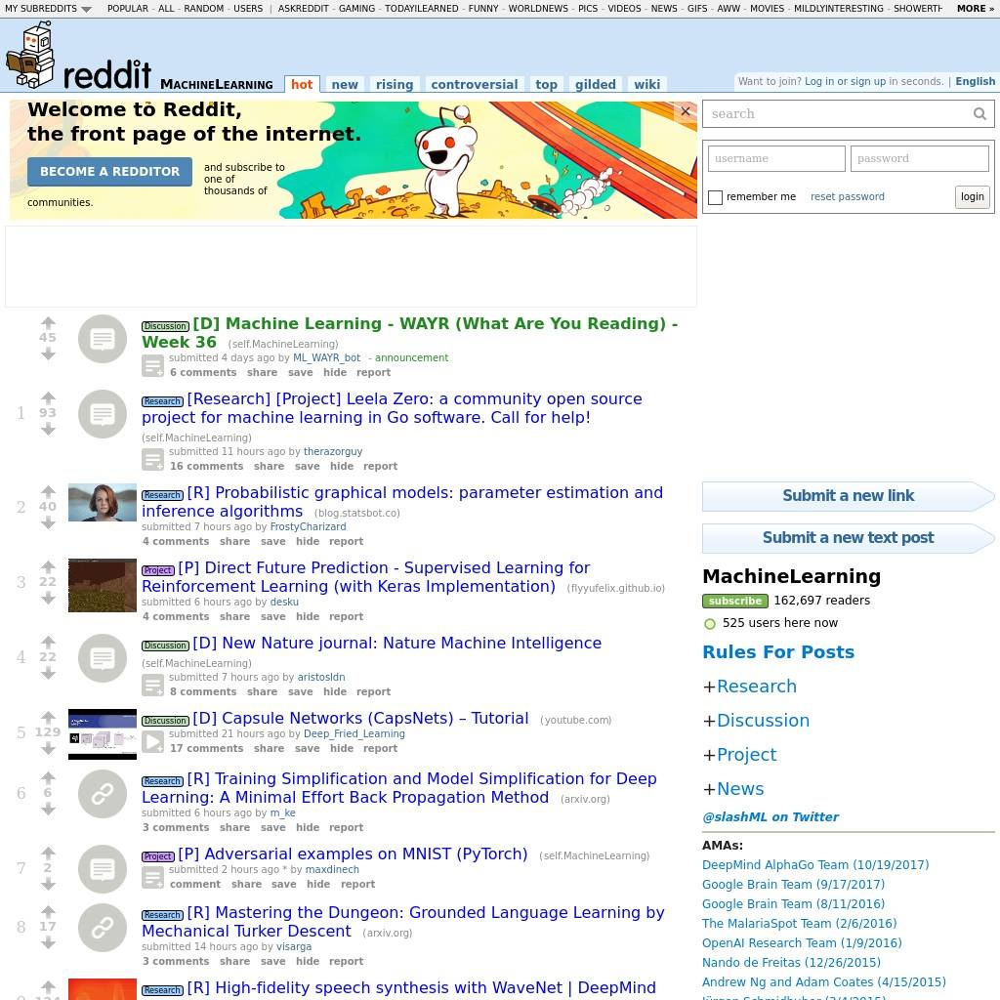
**이미지 캡션:** 이 이미지는 웹사이트 레딧의 머신러닝 커뮤니티 페이지를 보여줍니다. 페이지 상단에는 레딧 로고와 함께 "Welcome to Reddit, the front page of the internet."이라는 문구가 있고, "BECOME A REDDITOR" 버튼과 함께 커뮤니티 가입을 유도하는 문구가 있습니다. 메인 콘텐츠 영역에는 다양한 머신러닝 관련 게시물 목록이 표시됩니다. 각 게시물은 제목, 작성자, 제출 시간, 댓글 수, 공유, 저장, 숨기기, 신고 등의 옵션을 포함합니다. 게시물 제목 앞에는 [D] (Discussion), [Research], [Project]와 같은 태그가 붙어 있어 게시물의 성격을 나타냅니다. 예를 들어, "Discussion [D] Machine Learning - WAYR (What Are You Reading) - Week 36"은 머신러닝 관련 토론 게시물이며, "Research [R] Probabilistic graphical models: parameter estimation and inference algorithms"는 연구 관련 게시물입니다. 또한, 일부 게시물에는 관련 이미지나 링크가 첨부되어 있습니다. 페이지 오른쪽에는 "Submit a new link"와 "Submit a new text post" 버튼이 있으며, "MachineLearning" 커뮤니티의 구독자 수와 현재 접속자 수가 표시됩니다. 그 아래에는 "Rules For Posts" 섹션이 있어 연구, 토론, 프로젝트, 뉴스 등의 카테고리가 나열되어 있습니다. 마지막으로 "AMAS" 섹션에는 과거에 진행되었던 AMA(Ask Me Anything) 세션 목록이 날짜와 함께 표시됩니다. 전반적으로 이 페이지는 머신러닝 분야의 최신 정보와 토론을 공유하는 온라인 커뮤니티의 모습을 보여줍니다.iscussion), [Research], [Project]와 같은 태그가 붙어 있어 게시물의 성격을 나타냅니다. 예를 들어, "Discussion [D] Machine Learning - WAYR (What Are You Reading) - Week 36"은 머신러닝 관련 토론 게시물이며, "Research [R] Probabilistic graphical models: parameter estimation and inference algorithms"는 연구 관련 게시물입니다. 또한, 일부 게시물에는 관련 이미지나 링크가 첨부되어 있습니다. 페이지 오른쪽에는 "Submit a new link"와 "Submit a new text post" 버튼이 있으며, "MachineLearning" 커뮤니티의 구독자 수와 현재 접속자 수가 표시됩니다. 그 아래에는 "Rules For Posts" 섹션이 있어 연구, 토론, 프로젝트, 뉴스 등의 카테고리가 나열되어 있습니다. 마지막으로 "AMAS" 섹션에는 과거에 진행되었던 AMA(Ask Me Anything) 세션 목록이 날짜와 함께 표시됩니다. 전반적으로 이 페이지는 머신러닝 분야의 최신 정보와 토론을 공유하는 온라인 커뮤니티의 모습을 보여줍니다.
 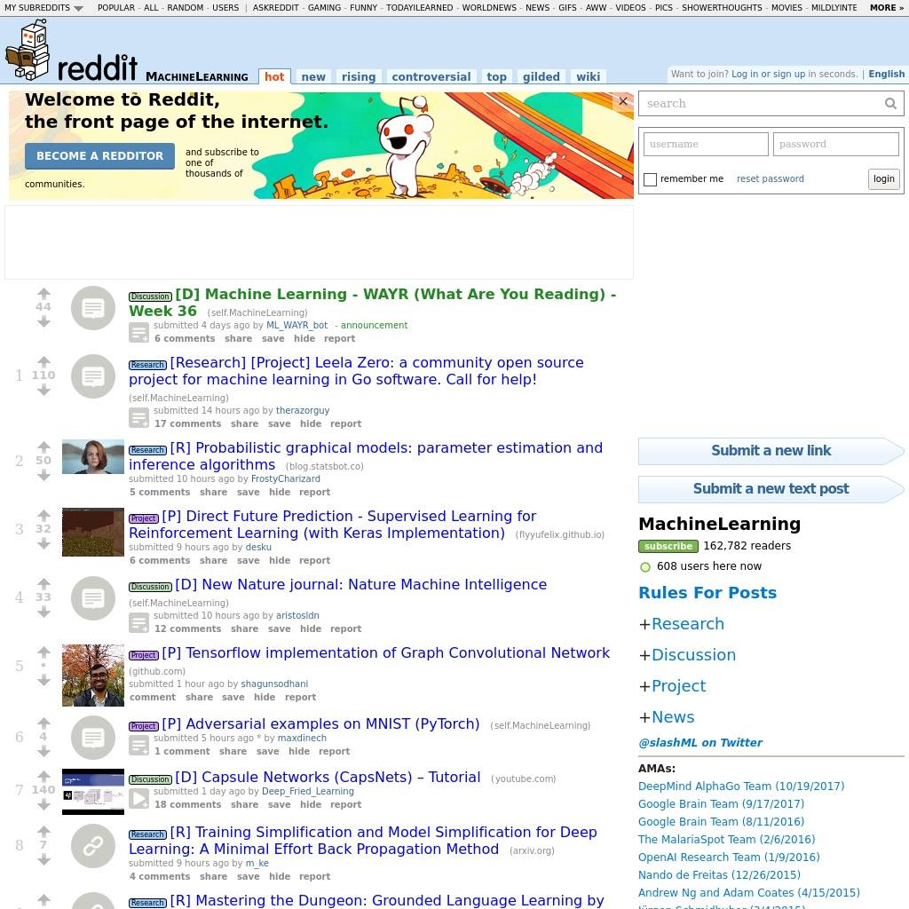
**이미지 캡션:** 이 이미지는 레딧의 머신러닝 서브레딧 페이지를 보여줍니다. 페이지 상단에는 레딧 로고와 함께 "Welcome to Reddit, the front page of the internet."이라는 문구가 있고, 그 옆에는 레딧의 마스코트인 스너(Snoo)가 그려진 삽화가 있습니다. 페이지 중앙에는 로그인 및 회원가입을 할 수 있는 폼이 있으며, 검색창과 사용자 이름, 비밀번호 입력란이 있습니다. 메인 콘텐츠 영역에는 다양한 머신러닝 관련 게시물 목록이 표시됩니다. 각 게시물은 제목, 작성자, 제출 시간, 댓글 수, 좋아요/싫어요 수 등의 정보를 포함하고 있습니다. 게시물 제목 앞에는 [D] (Discussion), [Research], [Project]와 같은 태그가 붙어 있어 게시물의 성격을 나타냅니다. 오른쪽 사이드바에는 "MachineLearning" 서브레딧의 구독자 수와 현재 접속자 수가 표시되어 있으며, 게시물 작성 규칙과 관련된 링크, 트위터 계정, 그리고 과거 AMA(Ask Me Anything) 세션 목록이 나열되어 있습니다. 전반적으로 기술 관련 커뮤니티의 정보 공유 및 토론이 이루어지는 웹사이트의 모습을 보여주는 스크린샷입니다., 좋아요/싫어요 수 등의 정보를 포함하고 있습니다. 게시물 제목 앞에는 [D] (Discussion), [Research], [Project]와 같은 태그가 붙어 있어 게시물의 성격을 나타냅니다. 오른쪽 사이드바에는 "MachineLearning" 서브레딧의 구독자 수와 현재 접속자 수가 표시되어 있으며, 게시물 작성 규칙과 관련된 링크, 트위터 계정, 그리고 과거 AMA(Ask Me Anything) 세션 목록이 나열되어 있습니다. 전반적으로 기술 관련 커뮤니티의 정보 공유 및 토론이 이루어지는 웹사이트의 모습을 보여주는 스크린샷입니다.

> #오늘의레딧 https://www.reddit.com/r/MachineLearning/ 정말 읽을 거리가 많네요.  1. 확률 그래픽 모델:매개 변수 추정과 추론 알고리즘이 있습니다. 2. 직접 미래 예측-Supervised를 배우는 것은 강화 학습(Keras 도입과 함께). 3. 뉴 자연 일기:자연 기계 정보. 4. 캡슐 네트웍스(CapsNets)– 자습서 5. 훈련 필수적인 요소와 모델 간소화 깊은 학습을 최소의 Effort 뒤로 전파 법. 6. MNIST(PyTorch)에Adversarial 예이다. 7. 는 던전 익히는 것이:Grounded어를 배울 수 있는 역학적 Turker 하강에 의해. 8. WaveNet | DeepMind과High-fidelity 음성 합성. 9. 개인 깊은 학습 기계에 구성 요소 선택하는 것. 10. Shift:제로 부동 소수 점 연산, 제로 매개 변수 대체 공간 Convolutions. 11. 딥 런(NIPS'17 oral) 12. 시상 Gated 순환 모듈 <-RNNs을 라우팅 모듈, 껑충, 휙휙 뛰며 피드백 계층적 연결 같은 것들을 배운다가 뇌의 시상에 활용했습니다. 13. AANN:Auto-Encoder으로 동점 중량과 구조화된 표현 시 복근 activations. 14. 어떻게 더 많은 샘플을 생성하는 데? 15. 그 preprints은 CIAI 해군 정보 처리 시스템 2017년 워크샵에 수용한 Subset. 16. Complete초안 서튼과 Barto에 의한 강화 학습:도입, 출판 되었다. 17. 이 비평가의 Wasserstein GANs의 행동에 대해서요. 18. 우리가 배우고 금리와 함께 일하는 방법을 개선하는 것. 19. FMoW 도전(달러 100k한 이 상에)팀 경쟁 기준 mid-challenge과 연구 논문을 풀어 놓습니다. 20. 가족들에 야생(FIW)데이터에서 링크.  1. https://blog.statsbot.co/probabilistic-graphical-models-tutorial-d855ba0107d1 2. https://flyyufelix.github.io/2017/11/17/direct-future-prediction.html 3. https://www.reddit.com/r/MachineLearning/comments/7f0pkw/d_new_nature_journal_nature_machine_intelligence/ 4. https://www.youtube.com/watch?v=pPN8d0E3900 5. https://arxiv.org/abs/1711.06528 6. https://www.reddit.com/r/MachineLearning/comments/7f2tj5/p_adversarial_examples_on_mnist_pytorch/ 7. https://arxiv.org/abs/1711.07950 8. https://deepmind.com/blog/high-fidelity-speech-synthesis-wavenet/ 9. https://medium.com/mlreview/choosing-components-for-personal-deep-learning-machine-56bae813e34a 10. https://arxiv.org/abs/1711.08141 11. https://arxiv.org/abs/1703.06114 12. http://papers.nips.cc/paper/7249-thalamus-gated-recurrent-modules.pdf 13. https://medium.com/mlreview/aann-absolute-artificial-neural-network-ae8f1a65fa67 14. https://www.reddit.com/r/MachineLearning/comments/7f04ss/d_how_to_generate_more_samples/ 15. https://sites.google.com/view/ciai2017/preprints 16. http://incompleteideas.net/sutton/book/bookdraft2017nov5.pdf 17. https://www.reddit.com/r/MachineLearning/comments/7ev0t5/d_about_the_behavior_of_the_critic_in_wasserstein/ 18. https://techburst.io/improving-the-way-we-work-with-learning-rate-5e99554f163b 19. https://github.com/fmow 20. https://www.reddit.com/r/MachineLearning/comments/7ex03l/d_links_to_families_in_the_wild_fiw_data/
> #오늘의레딧 https://www.reddit.com/r/MachineLearning/ 머신러닝 공부는 정말 재미있죠?아침부터 다양한 소식이 많네요.  1. 확률론적 그래픽 모델:매개 변수 추정 및 추론 알고리즘 2. 직접적인 미래 예측-보강 학습을 위한 감독 학습(Keras구축) 3. 새로운 자연 매체:자연 기계 지능 4. 제4회 CDMA국제 학술 대회 5. ITS에 대한 광고 사례(PyTorch) 6. 캡슐 네트워크(CapsNet)HDTV자습서 7. 심층 학습을 위한 교육 단순화 및 모델 간소화:최소 노력 후방 보급 방법 8. 던전의 마스터:기계식 턴커 하강에 의한 언어 습득 9. WaveNetRDeepMind와의 고밀도 음성 합성 10. 탈라미드 게이트 레이트 모듈-계층, 도약대 및 피드백 연결과 같은 것을 학습하는 포유류의 시상 하부에서 영감을 받은 RNN의 라우팅 모듈<라우팅 모듈> 11. 개인 딥 학습 시스템의 구성 요소 선택 12. 교대:공간 변환에 대한 제로 플립, 제로 파라미터 대체 13. 깊은 집합(NIPSUS17구두) 14. AAD:구조화된 표현에 대한 타이드 웨이트와 복근 활성화를 가진 자동 인코딩 15. 더 많은 샘플을 생성하는 방법은 무엇입니까? 16. CIAINIPS2017워크샵에 수용된 전치사의 하위 집합 17. SubscribePublishingLearningLearning:Sutton과 Barto에 의한 소개 18. WassersteinGAN의 비평가의 행동에 관한 연구 19. 학습 속도를 높이는 방법 개선 20. 도전 과제(상금 100만달러)팀이 경쟁력 있는 미드 레인지 미드 레인지 및 연구 논문 발표  1. https://blog.statsbot.co/probabilistic-graphical-models-tutorial-d855ba0107d1 2. https://flyyufelix.github.io/2017/11/17/direct-future-prediction.html 3. https://www.reddit.com/r/MachineLearning/comments/7f0pkw/d_new_nature_journal_nature_machine_intelligence/ 4. https://github.com/shagunsodhani/pregel 5. https://www.reddit.com/r/MachineLearning/comments/7f2tj5/p_adversarial_examples_on_mnist_pytorch/ 6. https://www.youtube.com/watch?v=pPN8d0E3900 7. https://arxiv.org/abs/1711.06528 8. https://arxiv.org/abs/1711.07950 9. https://deepmind.com/blog/high-fidelity-speech-synthesis-wavenet/ 10. http://papers.nips.cc/paper/7249-thalamus-gated-recurrent-modules.pdf 11. https://medium.com/mlreview/choosing-components-for-personal-deep-learning-machine-56bae813e34a 12. https://arxiv.org/abs/1711.08141 13. https://arxiv.org/abs/1703.06114 14. https://medium.com/mlreview/aann-absolute-artificial-neural-network-ae8f1a65fa67 15. https://www.reddit.com/r/MachineLearning/comments/7f04ss/d_how_to_generate_more_samples/ 16. https://sites.google.com/view/ciai2017/preprints 17. http://incompleteideas.net/sutton/book/bookdraft2017nov5.pdf 18. https://www.reddit.com/r/MachineLearning/comments/7ev0t5/d_about_the_behavior_of_the_critic_in_wasserstein/ 19. https://techburst.io/improving-the-way-we-work-with-learning-rate-5e99554f163b 20. https://github.com/fmow

### 11월 25일 (토) 09:01 · 📷 사진 (1장)

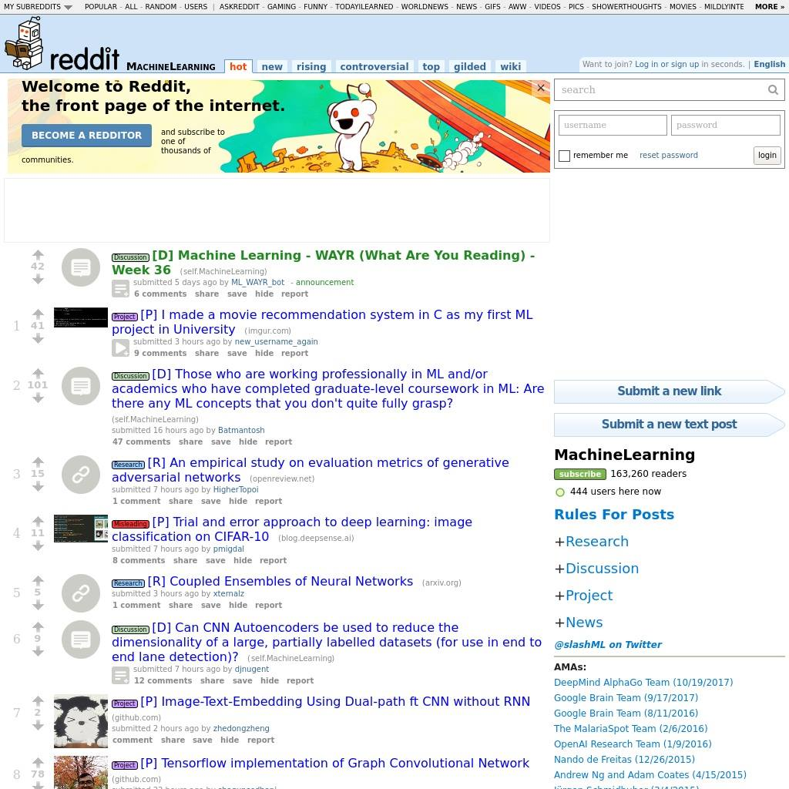
**이미지 캡션:** 이 이미지는 인기 있는 온라인 커뮤니티인 레딧의 머신러닝 서브레딧 페이지를 보여줍니다. 페이지 상단에는 레딧 로고와 함께 "Welcome to Reddit, the front page of the internet."이라는 문구가 있으며, 그 옆에는 레딧의 마스코트인 스누(Snoo) 캐릭터가 그려져 있습니다. 페이지 중앙에는 "BECOME A REDDITOR" 버튼과 함께 커뮤니티 가입을 유도하는 문구가 있습니다. 메인 콘텐츠 영역에는 다양한 머신러닝 관련 게시물들이 나열되어 있으며, 각 게시물은 제목, 작성자, 댓글 수, 좋아요/싫어요 수 등의 정보를 포함하고 있습니다. 게시물 제목 앞에는 [D] (Discussion), [P] (Project), [R] (Research)와 같은 태그가 붙어 있어 게시물의 성격을 나타냅니다. 오른쪽 사이드바에는 "MachineLearning" 서브레딧의 구독자 수와 현재 접속자 수가 표시되어 있으며, "Rules For Posts" 섹션과 함께 관련 주제에 대한 링크들이 제공됩니다. 또한, "AMAS" 섹션에는 머신러닝 분야의 유명 인사나 팀에 대한 정보가 나열되어 있습니다. 전반적으로 정보가 풍부하고 활발한 온라인 커뮤니티의 모습을 보여주는 화면입니다., 댓글 수, 좋아요/싫어요 수 등의 정보를 포함하고 있습니다. 게시물 제목 앞에는 [D] (Discussion), [P] (Project), [R] (Research)와 같은 태그가 붙어 있어 게시물의 성격을 나타냅니다. 오른쪽 사이드바에는 "MachineLearning" 서브레딧의 구독자 수와 현재 접속자 수가 표시되어 있으며, "Rules For Posts" 섹션과 함께 관련 주제에 대한 링크들이 제공됩니다. 또한, "AMAS" 섹션에는 머신러닝 분야의 유명 인사나 팀에 대한 정보가 나열되어 있습니다. 전반적으로 정보가 풍부하고 활발한 온라인 커뮤니티의 모습을 보여주는 화면입니다.

> #오늘의레딧 https://www.reddit.com/r/MachineLearning/ 래딧은 읽을 거리가 다양합니다.

### 11월 26일 (일) 09:01 · 📷 사진 (2장)

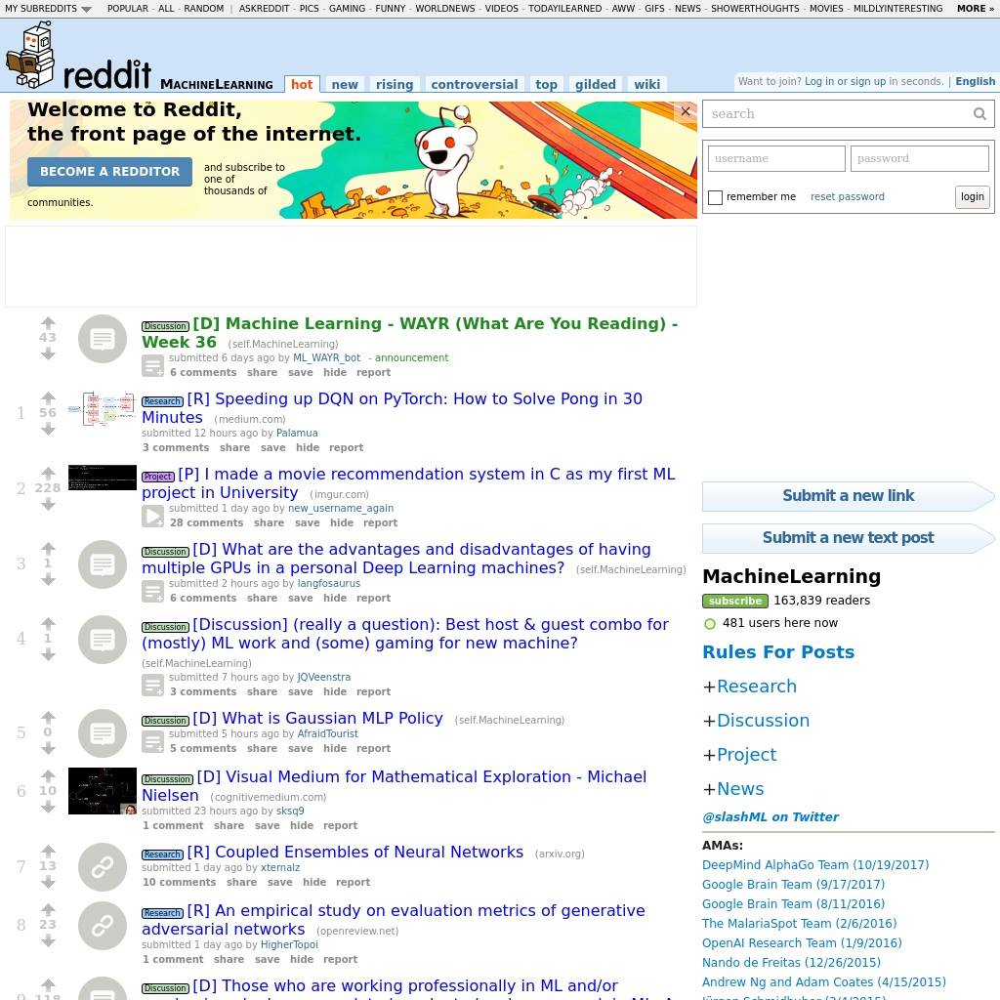
**이미지 캡션:** 이 이미지는 인기 있는 소셜 뉴스 웹사이트인 레딧의 머신러닝 서브레딧 페이지를 보여줍니다. 화면 상단에는 레딧 로고와 함께 "Welcome to Reddit, the front page of the internet."이라는 문구가 있고, 그 옆에는 레딧의 마스코트인 스누가 그려져 있습니다. 페이지 중앙에는 "BECOME A REDDITOR" 버튼과 함께 커뮤니티에 가입하라는 안내 문구가 있습니다. 메인 콘텐츠 영역에는 여러 게시물 목록이 표시되며, 각 게시물은 제목, 작성자, 제출 시간, 댓글 수 등의 정보를 포함하고 있습니다. 게시물 제목은 주로 머신러닝 관련 주제를 다루고 있으며, "[D]"는 토론, "[R]"은 연구, "[P]"는 프로젝트를 나타냅니다. 오른쪽 사이드바에는 "Submit a new link" 및 "Submit a new text post" 버튼과 함께 "MachineLearning" 서브레딧의 구독자 수와 현재 접속자 수가 표시되어 있습니다. 또한, 서브레딧의 규칙과 관련 링크, 그리고 과거 AMA(Ask Me Anything) 목록이 나열되어 있습니다. 전반적으로 정보가 많고 전문적인 느낌을 주는 웹사이트 화면입니다. 포함하고 있습니다. 게시물 제목은 주로 머신러닝 관련 주제를 다루고 있으며, "[D]"는 토론, "[R]"은 연구, "[P]"는 프로젝트를 나타냅니다. 오른쪽 사이드바에는 "Submit a new link" 및 "Submit a new text post" 버튼과 함께 "MachineLearning" 서브레딧의 구독자 수와 현재 접속자 수가 표시되어 있습니다. 또한, 서브레딧의 규칙과 관련 링크, 그리고 과거 AMA(Ask Me Anything) 목록이 나열되어 있습니다. 전반적으로 정보가 많고 전문적인 느낌을 주는 웹사이트 화면입니다.
 
**이미지 캡션:** 이 화면은 카카오헤어샵 앱 다운로드 프로모션을 안내하는 모바일 화면이다. 상단에는 페이스북 로고와 함께 8:04 PM이라는 시간이 표시되어 있고, 뒤로 가기 버튼과 'kakaohairshop'이라는 앱 이름, 그리고 닫기 버튼이 보인다. 메인 화면에는 노란색 가위 모양 아이콘과 함께 "지금, 카카오헤어샵 앱을 다운받으세요!"라는 문구가 강조되어 있다. 그 아래에는 "첫 예약 누구냐 1마위 하이!"라는 문구가 보이며, 팝업 창에는 "앗! 이미 다운받았어요. 기간 만료 전에 꼭 사용하세요~!"라는 메시지와 함께 '확인' 버튼이 있다. 팝업 창 아래에는 노란색 타원형 버튼으로 "쿠폰 받기"라고 쓰여 있다. 화면 하단에는 "앱 다운하면 무조건 3천원!"이라는 문구와 함께 "금액 제한 없는 모~든 메뉴 예약할 때!"라는 설명이 있고, 녹색 배경에 "삼천원 쿠폰 3,000"이라는 글씨와 함께 카카오헤어샵 로고가 보인다. 전체적으로 프로모션 안내와 쿠폰 제공을 통해 앱 다운로드를 유도하는 홍보성 화면으로, 긍정적이고 혜택을 강조하는 분위기이다.'확인' 버튼이 있다. 팝업 창 아래에는 노란색 타원형 버튼으로 "쿠폰 받기"라고 쓰여 있다. 화면 하단에는 "앱 다운하면 무조건 3천원!"이라는 문구와 함께 "금액 제한 없는 모~든 메뉴 예약할 때!"라는 설명이 있고, 녹색 배경에 "삼천원 쿠폰 3,000"이라는 글씨와 함께 카카오헤어샵 로고가 보인다. 전체적으로 프로모션 안내와 쿠폰 제공을 통해 앱 다운로드를 유도하는 홍보성 화면으로, 긍정적이고 혜택을 강조하는 분위기이다.

> #오늘의레딧 https://www.reddit.com/r/MachineLearning/ 오늘도 새소식이 많군요.

### 11월 27일 (월) 07:49 · 📷 사진 (2장)

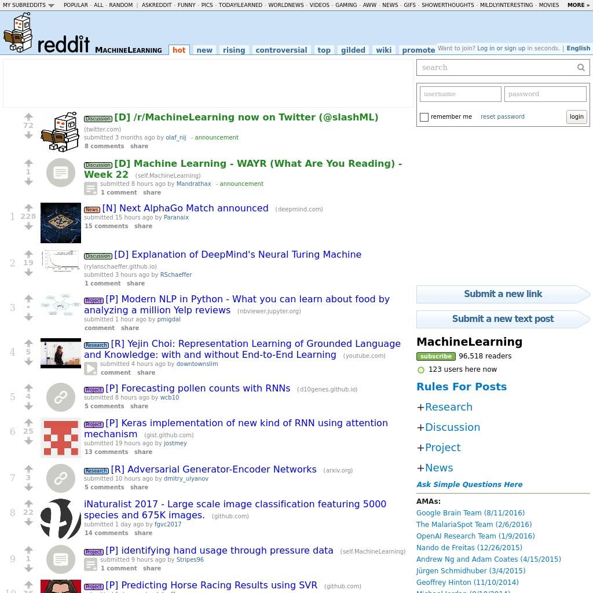
**이미지 캡션:** 이것은 레딧의 머신러닝 서브레딧 페이지로, 다양한 주제의 게시물 목록이 표시됩니다. 페이지 상단에는 레딧 로고와 함께 "MACHINE LEARNING"이라는 제목이 있고, 그 아래에는 "hot", "new", "rising", "controversial", "top", "gilded", "wiki"와 같은 탭이 있습니다. 오른쪽 상단에는 검색창과 로그인/가입 옵션이 있습니다. 게시물 목록은 제목, 작성자, 게시 시간, 댓글 수, 공유 옵션 등으로 구성되어 있으며, 각 게시물에는 관련 아이콘이나 썸네일 이미지가 함께 표시됩니다. 예를 들어, 첫 번째 게시물은 트위터 링크를 포함하고 있으며, 두 번째 게시물은 "Machine Learning - WAYR (What Are You Reading) - Week 22"라는 제목으로, 머신러닝 관련 자료를 공유하는 내용입니다. 세 번째 게시물은 "Next AlphaGo Match announced"라는 뉴스이며, 딥마인드 관련 내용입니다. 네 번째 게시물은 "Explanation of DeepMind's Neural Turing Machine"에 대한 토론입니다. 다섯 번째 게시물은 파이썬을 이용한 자연어 처리와 옐프 리뷰 분석에 관한 프로젝트입니다. 여섯 번째 게시물은 "Representation Learning of Grounded Language and Knowledge"에 대한 연구이며, 유튜브 링크를 포함합니다. 일곱 번째 게시물은 RNN을 이용한 꽃가루 예측 프로젝트입니다. 여덟 번째 게시물은 Keras를 사용한 RNN 주의 메커니즘 구현 프로젝트입니다. 아홉 번째 게시물은 생성자-인코더 네트워크에 대한 연구입니다. 열 번째 게시물은 5000종 이상의 이미지를 분류하는 iNaturalist 2017 프로젝트입니다. 열한 번째 게시물은 압력 데이터를 이용한 손 사용 식별 프로젝트입니다. 열두 번째 게시물은 SVR을 이용한 경마 결과 예측 프로젝트입니다. 페이지 오른쪽에는 "Submit a new link" 및 "Submit a new text post" 버튼이 있고, "Machine Learning" 서브레딧의 구독자 수와 현재 접속자 수가 표시됩니다. 또한 "Rules For Posts" 섹션에는 "Research", "Discussion", "Project", "News"와 같은 카테고리가 있으며, "Ask Simple Questions Here" 섹션에는 머신러닝 분야의 유명 인사들의 이름과 관련 날짜가 나열되어 있습니다. 전반적으로 이 페이지는 머신러닝 커뮤니티의 최신 정보와 토론을 공유하는 플랫폼으로 보입니다. 함께 표시됩니다. 예를 들어, 첫 번째 게시물은 트위터 링크를 포함하고 있으며, 두 번째 게시물은 "Machine Learning - WAYR (What Are You Reading) - Week 22"라는 제목으로, 머신러닝 관련 자료를 공유하는 내용입니다. 세 번째 게시물은 "Next AlphaGo Match announced"라는 뉴스이며, 딥마인드 관련 내용입니다. 네 번째 게시물은 "Explanation of DeepMind's Neural Turing Machine"에 대한 토론입니다. 다섯 번째 게시물은 파이썬을 이용한 자연어 처리와 옐프 리뷰 분석에 관한 프로젝트입니다. 여섯 번째 게시물은 "Representation Learning of Grounded Language and Knowledge"에 대한 연구이며, 유튜브 링크를 포함합니다. 일곱 번째 게시물은 RNN을 이용한 꽃가루 예측 프로젝트입니다. 여덟 번째 게시물은 Keras를 사용한 RNN 주의 메커니즘 구현 프로젝트입니다. 아홉 번째 게시물은 생성자-인코더 네트워크에 대한 연구입니다. 열 번째 게시물은 5000종 이상의 이미지를 분류하는 iNaturalist 2017 프로젝트입니다. 열한 번째 게시물은 압력 데이터를 이용한 손 사용 식별 프로젝트입니다. 열두 번째 게시물은 SVR을 이용한 경마 결과 예측 프로젝트입니다. 페이지 오른쪽에는 "Submit a new link" 및 "Submit a new text post" 버튼이 있고, "Machine Learning" 서브레딧의 구독자 수와 현재 접속자 수가 표시됩니다. 또한 "Rules For Posts" 섹션에는 "Research", "Discussion", "Project", "News"와 같은 카테고리가 있으며, "Ask Simple Questions Here" 섹션에는 머신러닝 분야의 유명 인사들의 이름과 관련 날짜가 나열되어 있습니다. 전반적으로 이 페이지는 머신러닝 커뮤니티의 최신 정보와 토론을 공유하는 플랫폼으로 보입니다.
 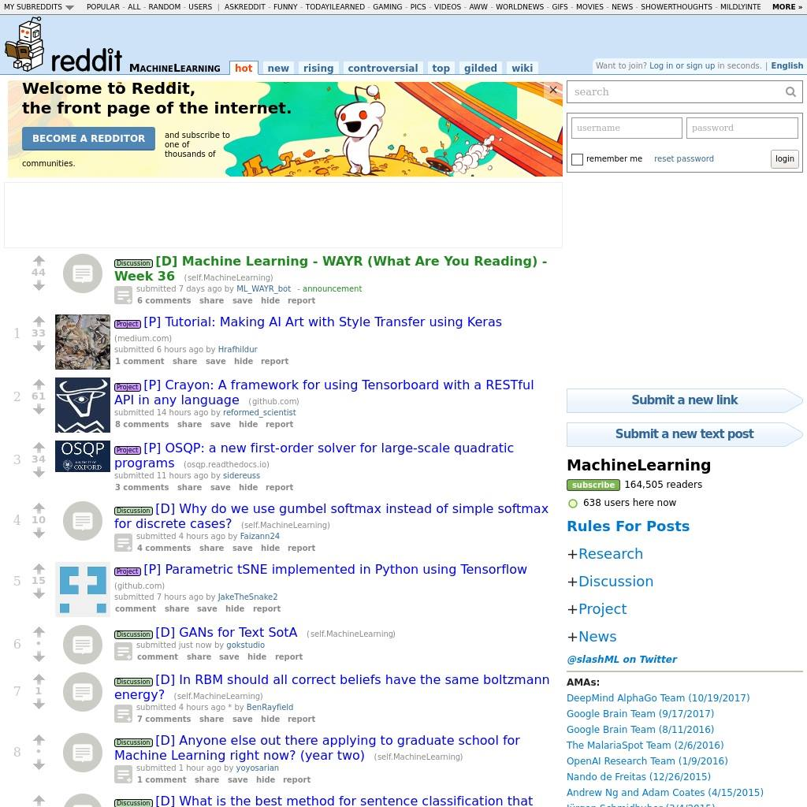
**이미지 캡션:** 이 이미지는 레딧(Reddit) 웹사이트의 머신러닝(Machine Learning) 서브레딧 페이지를 보여줍니다. 페이지 상단에는 레딧 로고와 함께 "Welcome to Reddit, the front page of the internet."이라는 문구가 있고, 그 아래에는 "BECOME A REDDITOR" 버튼과 함께 커뮤니티에 대한 간략한 설명이 있습니다. 오른쪽 상단에는 로그인 및 회원가입을 위한 입력 필드와 버튼이 보입니다. 메인 콘텐츠 영역에는 다양한 주제의 게시물 목록이 표시되며, 각 게시물은 제목, 작성자, 제출 시간, 댓글 수 등의 정보를 포함하고 있습니다. 게시물들은 주로 머신러닝 관련 주제이며, "Discussion" 또는 "Project"와 같은 태그가 붙어 있습니다. 페이지 오른쪽에는 "Submit a new link" 및 "Submit a new text post" 버튼과 함께 서브레딧의 구독자 수, 현재 접속자 수, 게시 규칙, 트위터 계정 정보, 그리고 "AMAS" 섹션에 나열된 관련 인물 및 팀 정보가 표시됩니다. 전체적으로 정보가 많고 다양한 게시물들이 나열되어 있어 활발한 온라인 커뮤니티의 모습을 보여줍니다.목, 작성자, 제출 시간, 댓글 수 등의 정보를 포함하고 있습니다. 게시물들은 주로 머신러닝 관련 주제이며, "Discussion" 또는 "Project"와 같은 태그가 붙어 있습니다. 페이지 오른쪽에는 "Submit a new link" 및 "Submit a new text post" 버튼과 함께 서브레딧의 구독자 수, 현재 접속자 수, 게시 규칙, 트위터 계정 정보, 그리고 "AMAS" 섹션에 나열된 관련 인물 및 팀 정보가 표시됩니다. 전체적으로 정보가 많고 다양한 게시물들이 나열되어 있어 활발한 온라인 커뮤니티의 모습을 보여줍니다.

> #오늘의레딧 https://www.reddit.com/r/MachineLearning/ 머신러닝 공부는 정말 재미있죠?아침부터 다양한 소식이 많네요.  1. 자습서:케라스를 이용한 인공 지능형 인공 호흡기 제작 2. Crayon:Tensorboard를 어떠한 언어로도 사용할 수 있는 Tensorboard를 사용하는 프레임워크 3. OSX:대규모의 2차 프로그램을 위한 새로운 첫 주문형 해결사 4. 왜 우리는 단순한 소프트 케이스 대신에 간단한 소프트 맥스를 사용하는 것일까요? 5. Tensorflow를 사용하여 Parametric에서 Python으로 구현된 파라메트릭 6. RBM에서 모든 정확한 믿음은 동일한 볼트만 에너지를 가지고 있어야 하는가? 7. 지금 당장 기계 학습 대학원에 지원해 주시는 분 계신가요? 2년차 8. 짧은 텍스트로 가득 찬 문장 분류의 가장 좋은 방법은 무엇인가? 나는 LSTM과 CNN의 꼭대기에 관심을 기울였고, 나는 성공하지 못 했다. 9. VAE의 후방 붕괴는 어떻게 발생하는가? 10. 사이클 전원 예측 II:물리적 특성 엔지니어링 11. PyTorch에서 DQN UPup:30분 만에 Pong을 해결하는 방법 12. 개인 딥 학습기에 여러대의 GPU를 보유하는 것의 장점과 단점은 무엇입니까? 13. CNN방송 14. 나는 대학교에서 첫 ML프로젝트로서 C학점으로 영화 추천을 했다. 15. 가우스 MLP정책이란 무엇입니까? 16. (a) 새로운 머신을 위한 최고의 호스트 및 게스트 콤보(대부분의 경우)를 위한 최상의 호스트 및 게스트 콤보? 17. 신경망을 이용한 조립 접합부의 결합 18. 발전소 차원 네트워크의 평가 지표에 관한 실증적 연구 19. ML및/또는 학업 수준을 이수한 ML및/또는 학업 수준을 이수한 전문가들 중에서 전문가 수준으로 업무를 수행하고 계신 분들은 전혀 이해하지 못하시는 분들이 계신가요? 20. Sophon8x160-텐서 연산자를 위한 2세대 맞춤형 ASIC  1. https://medium.com/mlreview/making-ai-art-with-style-transfer-using-keras-8bb5fa44b216 2. https://github.com/torrvision/crayon 3. https://osqp.readthedocs.io 4. https://www.reddit.com/r/MachineLearning/comments/7fowm7/d_why_do_we_use_gumbel_softmax_instead_of_simple/ 5. https://github.com/jsilter/parametric_tsne 6. https://www.reddit.com/r/MachineLearning/comments/7fp3gc/d_in_rbm_should_all_correct_beliefs_have_the_same/ 7. https://www.reddit.com/r/MachineLearning/comments/7fqhc5/d_anyone_else_out_there_applying_to_graduate/ 8. https://www.reddit.com/r/MachineLearning/comments/7fkmln/d_what_is_the_best_method_for_sentence/ 9. https://www.reddit.com/r/MachineLearning/comments/7fkdtm/d_how_does_posterior_collapse_in_vaes_happen/ 10. https://cyclo-analytics.com/2017/11/25/cycling-power-predictions-ii-physics-inspired-feature-engineering/ 11. https://medium.com/mlreview/speeding-up-dqn-on-pytorch-solving-pong-in-30-minutes-81a1bd2dff55 12. https://www.reddit.com/r/MachineLearning/comments/7fi5o4/d_what_are_the_advantages_and_disadvantages_of/ 13. http://chris-chris.ai/2017/11/26/conv-in-numpy/ 14. https://imgur.com/a/dk3IY 15. https://www.reddit.com/r/MachineLearning/comments/7fgzfl/d_what_is_gaussian_mlp_policy/ 16. https://www.reddit.com/r/MachineLearning/comments/7fg0bl/discussion_really_a_question_best_host_guest/ 17. https://arxiv.org/abs/1709.06053 18. https://openreview.net/forum?id=Sy1f0e-R- 19. https://www.reddit.com/r/MachineLearning/comments/7f5pyt/d_those_who_are_working_professionally_in_ml/ 20. https://www.sophon.ai/product/sc1.html
> #오늘의레딧 https://www.reddit.com/r/MachineLearning/ 정말 읽을 거리가 많네요.  1. 자습서:케라스를 이용한 인공 지능형 인공 호흡기 제작 2. Crayon:Tensorboard를 어떠한 언어로도 사용할 수 있는 Tensorboard를 사용하는 프레임워크 3. OSX:대규모의 2차 프로그램을 위한 새로운 첫 주문형 해결사 4. 왜 우리는 단순한 소프트 케이스 대신에 간단한 소프트 맥스를 사용하는 것일까요? 5. Tensorflow를 사용하여 Parametric에서 Python으로 구현된 파라메트릭 6. 텍스트 소호에 대한 GAN 7. RBM에서 모든 정확한 믿음은 동일한 볼트만 에너지를 가지고 있어야 하는가? 8. 지금 당장 기계 학습 대학원에 지원해 주시는 분 계신가요? 2년차 9. 짧은 텍스트로 가득 찬 문장 분류의 가장 좋은 방법은 무엇인가? 나는 LSTM과 CNN의 꼭대기에 관심을 기울였고, 나는 성공하지 못 했다. 10. VAE의 후방 붕괴는 어떻게 발생하는가? 11. 사이클 전원 예측 II:물리적 특성 엔지니어링 12. PyTorch에서 DQN UPup:30분 만에 Pong을 해결하는 방법 13. 개인 딥 학습기에 여러대의 GPU를 보유하는 것의 장점과 단점은 무엇입니까? 14. CNN방송 15. 나는 대학교에서 첫 ML프로젝트로서 C학점으로 영화 추천을 했다. 16. 가우스 MLP정책이란 무엇입니까? 17. (a) 새로운 머신을 위한 최고의 호스트 및 게스트 콤보(대부분의 경우)를 위한 최상의 호스트 및 게스트 콤보? 18. 신경망을 이용한 조립 접합부의 결합 19. 발전소 차원 네트워크의 평가 지표에 관한 실증적 연구 20. ML및/또는 학업 수준을 이수한 ML및/또는 학업 수준을 이수한 전문가들 중에서 전문가 수준으로 업무를 수행하고 계신 분들은 전혀 이해하지 못하시는 분들이 계신가요?  1. https://medium.com/mlreview/making-ai-art-with-style-transfer-using-keras-8bb5fa44b216 2. https://github.com/torrvision/crayon 3. https://osqp.readthedocs.io 4. https://www.reddit.com/r/MachineLearning/comments/7fowm7/d_why_do_we_use_gumbel_softmax_instead_of_simple/ 5. https://github.com/jsilter/parametric_tsne 6. https://www.reddit.com/r/MachineLearning/comments/7fqsp4/d_gans_for_text_sota/ 7. https://www.reddit.com/r/MachineLearning/comments/7fp3gc/d_in_rbm_should_all_correct_beliefs_have_the_same/ 8. https://www.reddit.com/r/MachineLearning/comments/7fqhc5/d_anyone_else_out_there_applying_to_graduate/ 9. https://www.reddit.com/r/MachineLearning/comments/7fkmln/d_what_is_the_best_method_for_sentence/ 10. https://www.reddit.com/r/MachineLearning/comments/7fkdtm/d_how_does_posterior_collapse_in_vaes_happen/ 11. https://cyclo-analytics.com/2017/11/25/cycling-power-predictions-ii-physics-inspired-feature-engineering/ 12. https://medium.com/mlreview/speeding-up-dqn-on-pytorch-solving-pong-in-30-minutes-81a1bd2dff55 13. https://www.reddit.com/r/MachineLearning/comments/7fi5o4/d_what_are_the_advantages_and_disadvantages_of/ 14. http://chris-chris.ai/2017/11/26/conv-in-numpy/ 15. https://imgur.com/a/dk3IY 16. https://www.reddit.com/r/MachineLearning/comments/7fgzfl/d_what_is_gaussian_mlp_policy/ 17. https://www.reddit.com/r/MachineLearning/comments/7fg0bl/discussion_really_a_question_best_host_guest/ 18. https://arxiv.org/abs/1709.06053 19. https://openreview.net/forum?id=Sy1f0e-R- 20. https://www.reddit.com/r/MachineLearning/comments/7f5pyt/d_those_who_are_working_professionally_in_ml/

### 11월 28일 (화) 04:12 · Check out our Star intern, Yunjey Choi's…

Check out our Star intern, Yunjey Choi's recent work, StarGAN: Multi-Domain Image-to-Image Translation. The results are amazing and super exciting. Good job, Yunjey!

https://www.reddit.com/r/MachineLearning/comments/7fro3g/r_stargan_unified_generative_adversarial_networks/

### 11월 28일 (화) 08:52 · 📷 사진 (1장)

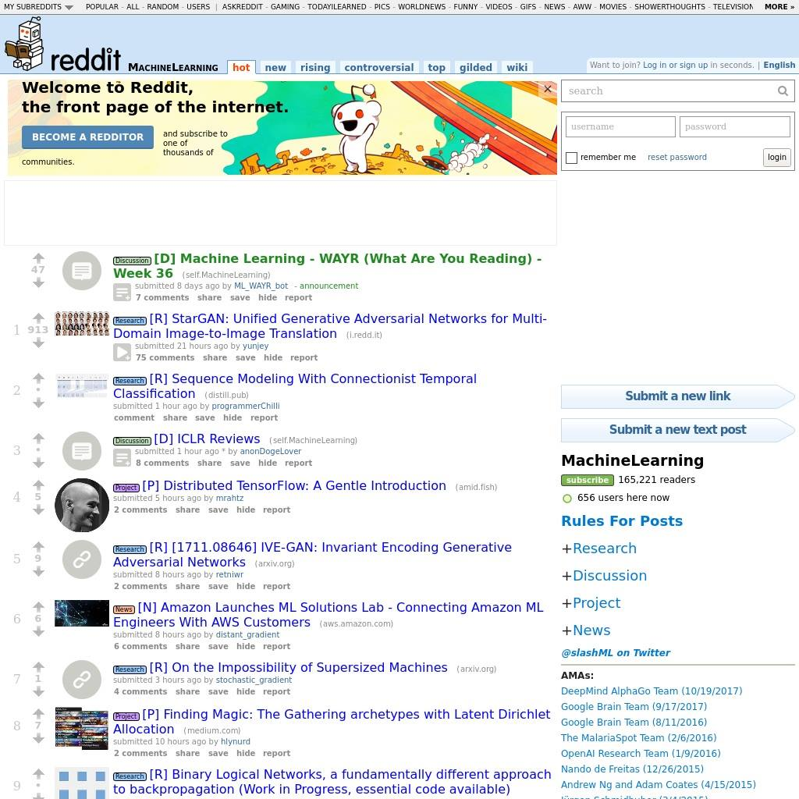
**이미지 캡션:** 화면 중앙에는 "Welcome to Reddit, the front page of the internet."이라는 문구가 있고, 그 아래에 "BECOME A REDDITOR" 버튼과 함께 레딧에 대한 간략한 설명이 있다. 오른쪽 상단에는 로그인 창이 있으며, 검색창, 사용자 이름, 비밀번호 입력란이 보인다. 메인 콘텐츠 영역에는 "MACHINE LEARNING"이라는 제목의 서브레딧 게시물 목록이 나열되어 있으며, 각 게시물은 제목, 작성자, 제출 시간, 댓글 수 등의 정보를 포함하고 있다. 게시물 제목들은 "WAYR (What Are You Reading)", "StarGAN: Unified Generative Adversarial Networks for Multi-Domain Image-to-Image Translation", "Sequence Modeling With Connectionist Temporal Classification" 등 머신러닝 관련 주제를 다루고 있다. 오른쪽 사이드바에는 "Submit a new link", "Submit a new text post" 버튼과 함께 "Machine Learning" 서브레딧의 구독자 수, 현재 접속자 수, 게시 규칙 등이 표시되어 있다. 또한, "AMAS" 섹션에는 머신러닝 분야의 유명 인사들의 이름과 관련 날짜가 나열되어 있다. 전반적으로 기술 관련 커뮤니티 웹사이트의 메인 페이지를 보여주는 화면이다."WAYR (What Are You Reading)", "StarGAN: Unified Generative Adversarial Networks for Multi-Domain Image-to-Image Translation", "Sequence Modeling With Connectionist Temporal Classification" 등 머신러닝 관련 주제를 다루고 있다. 오른쪽 사이드바에는 "Submit a new link", "Submit a new text post" 버튼과 함께 "Machine Learning" 서브레딧의 구독자 수, 현재 접속자 수, 게시 규칙 등이 표시되어 있다. 또한, "AMAS" 섹션에는 머신러닝 분야의 유명 인사들의 이름과 관련 날짜가 나열되어 있다. 전반적으로 기술 관련 커뮤니티 웹사이트의 메인 페이지를 보여주는 화면이다.

> #오늘의레딧 https://www.reddit.com/r/MachineLearning/ 따끈한 소식들입니다.  1. IMT-20003GPP-계층 2-대-도메인 이미지 변환을 위한 통합 범용 네트워크 2. 연결 시간 단축을 통한 시퀀스 모델링 3. ICL검토 4. 분산 텐서: 부드러운 소개 5. Amazon고객을 AWS고객과 연결하는 Brocade솔루션 랩을 시작합니다. 6. 예상되는 시스템의 사용 불가능 7. 마법사를 찾는 중:LatentDirichlet할당이 있는 수집본 8. IMT20003GPP-기본적으로 서로 다른 방식의 BACKpropagation에 대한 기본적인 접근 방식(진행 중인 작업, 필수 코드 사용 가능) 9. 강력한 의사 결정 경계를 위한 다분산 가우스 소음? 10. 자습서:케라스를 이용한 인공 지능형 인공 호흡기 제작 11. 객체 감지를 위한 많은 데이터 자동화 API 12. 온라인 학습에 공개적으로 이용 가능한 코스 개요 13. 다중 시퀀스 예측(LSTM) 14. 텐서 플로우/TensorLayer에서의 변형 가능성 평가 15. 정보 폭발의 불가능성 16. 1줄의 코드를 사용하여 VOC데이터 셋을 다운로드 및 전처리할 수 있습니다. 17. 내장된 기기에 대한 심층 학습 18. 음성의 오디오와 "중요한 "섹션을 표시한 데이터 세트 19. Tensorflow를 사용하여 Parametric에서 Python으로 구현된 파라메트릭 20. 왜 우리는 단순한 소프트 케이스 대신에 간단한 소프트 맥스를 사용하는 것일까요?  1. https://www.reddit.com/r/MachineLearning/comments/7fro3g/r_stargan_unified_generative_adversarial_networks/ 2. https://distill.pub/2017/ctc/ 3. https://www.reddit.com/r/MachineLearning/comments/7fz3dv/d_iclr_reviews/ 4. http://amid.fish/distributed-tensorflow-a-gentle-introduction 5. https://aws.amazon.com/blogs/ai/introducing-the-amazon-ml-solutions-lab 6. https://arxiv.org/abs/1703.10987 7. https://medium.com/@hlynurd/finding-magic-the-gathering-archetypes-with-latent-dirichlet-allocation-729112d324a6 8. https://github.com/MengXiangShengHuo/BinaryLogicalNetworks 9. https://www.reddit.com/r/MachineLearning/comments/7fyks7/d_multiplicative_gaussian_noise_for_robust/ 10. https://medium.com/mlreview/making-ai-art-with-style-transfer-using-keras-8bb5fa44b216 11. http://tensorlayer.readthedocs.io/en/latest/modules/prepro.html#object-detection 12. https://www.reddit.com/r/MachineLearning/comments/7fvnbr/d_what_are_the_openly_available_coursesvideos_on/ 13. https://www.reddit.com/r/MachineLearning/comments/7frxls/d_multiple_sequence_prediction_lstm/ 14. http://tensorlayer.readthedocs.io/en/latest/modules/layers.html#d-deformable-conv 15. https://medium.com/@francois.chollet/the-impossibility-of-intelligence-explosion-5be4a9eda6ec 16. http://tensorlayer.readthedocs.io/en/latest/modules/files.html#voc-2007-2012 17. https://www.reddit.com/r/MachineLearning/comments/7fuaz6/d_deep_learning_on_embedded_devices/ 18. https://www.reddit.com/r/MachineLearning/comments/7fu8qg/r_dataset_with_audio_of_voice_and_labeled/ 19. https://github.com/jsilter/parametric_tsne 20. https://www.reddit.com/r/MachineLearning/comments/7fowm7/d_why_do_we_use_gumbel_softmax_instead_of_simple/

### 11월 29일 (수) 08:52 · 📷 사진 (1장)

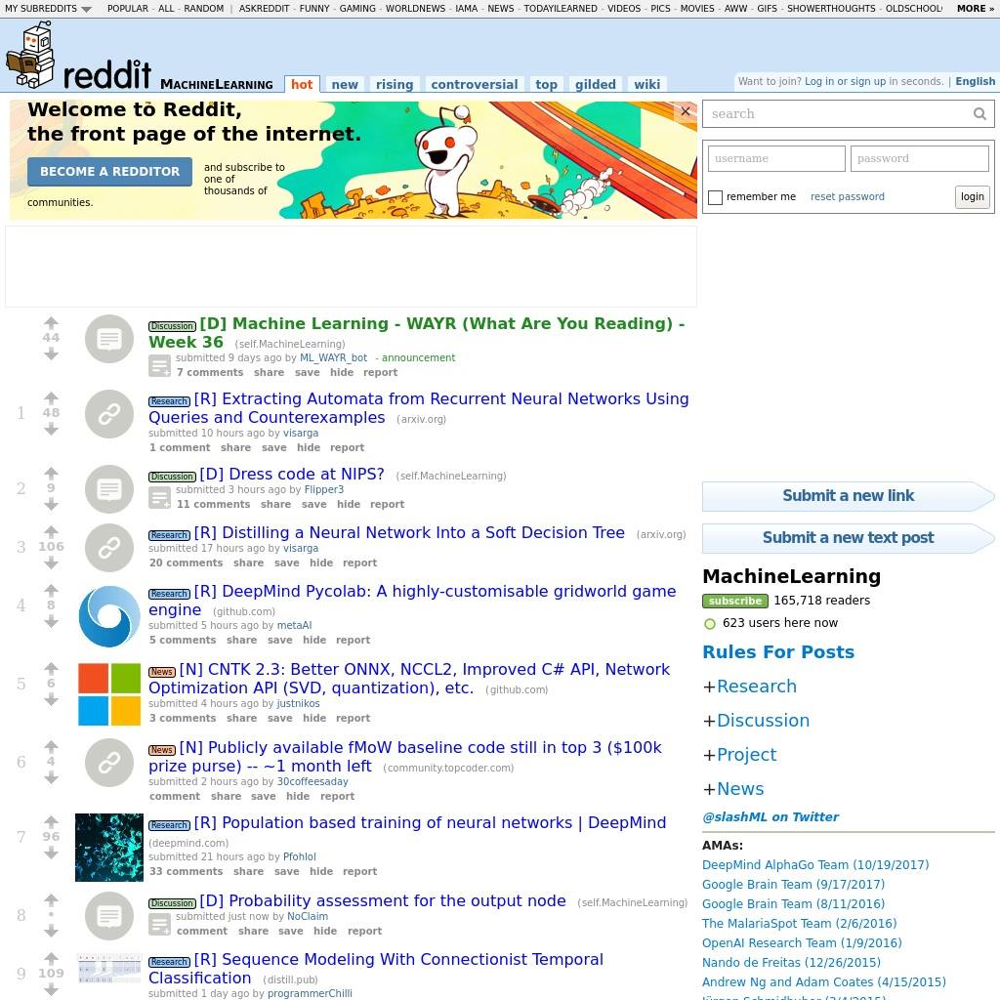
**이미지 캡션:** 이 이미지는 레딧(Reddit) 웹사이트의 머신러닝(Machine Learning) 서브레딧 페이지를 보여줍니다. 페이지 상단에는 레딧 로고와 함께 "Welcome to Reddit, the front page of the internet."이라는 문구가 있고, 그 옆에는 레딧의 마스코트인 스너키(Snoo)가 그려진 일러스트가 있습니다. 페이지 중앙에는 "BECOME A REDDITOR" 버튼과 함께 커뮤니티에 가입하라는 안내 문구가 있습니다. 오른쪽 상단에는 로그인 및 회원가입을 위한 입력 필드와 버튼이 있습니다. 메인 콘텐츠 영역에는 다양한 머신러닝 관련 게시물 목록이 표시됩니다. 각 게시물은 제목, 출처, 작성자, 게시 시간, 댓글 수 등의 정보를 포함하고 있습니다. 예를 들어, "Machine Learning - WAYR (What Are You Reading) - Week 36"이라는 제목의 게시물은 9일 전에 작성되었으며 7개의 댓글이 있습니다. 다른 게시물로는 "Extracting Automata from Recurrent Neural Networks Using Queries and Counterexamples", "Dress code at NIPS?", "Distilling a Neural Network Into a Soft Decision Tree", "DeepMind Pycolab: A highly-customisable gridworld game engine", "CNTK 2.3: Better ONNX, NCCL2, Improved C# API, Network Optimization API (SVD, quantization), etc.", "Publicly available fMoW baseline code still in top 3 ($100k prize purse)", "Population based training of neural networks | DeepMind", "Probability assessment for the output node", "Sequence Modeling With Connectionist Temporal Classification" 등이 있습니다. 페이지 오른쪽에는 "Submit a new link" 및 "Submit a new text post" 버튼과 함께 "Machine Learning" 서브레딧의 구독자 수와 현재 접속자 수가 표시되어 있습니다. 또한, 게시물 규칙과 트위터 계정(@slashML on Twitter) 정보, 그리고 과거 AMA(Ask Me Anything) 세션 목록이 나열되어 있습니다. 전반적으로 기술 및 학술 커뮤니티의 정보 공유 및 토론이 이루어지는 온라인 포럼의 모습을 보여줍니다.습니다. 메인 콘텐츠 영역에는 다양한 머신러닝 관련 게시물 목록이 표시됩니다. 각 게시물은 제목, 출처, 작성자, 게시 시간, 댓글 수 등의 정보를 포함하고 있습니다. 예를 들어, "Machine Learning - WAYR (What Are You Reading) - Week 36"이라는 제목의 게시물은 9일 전에 작성되었으며 7개의 댓글이 있습니다. 다른 게시물로는 "Extracting Automata from Recurrent Neural Networks Using Queries and Counterexamples", "Dress code at NIPS?", "Distilling a Neural Network Into a Soft Decision Tree", "DeepMind Pycolab: A highly-customisable gridworld game engine", "CNTK 2.3: Better ONNX, NCCL2, Improved C# API, Network Optimization API (SVD, quantization), etc.", "Publicly available fMoW baseline code still in top 3 ($100k prize purse)", "Population based training of neural networks | DeepMind", "Probability assessment for the output node", "Sequence Modeling With Connectionist Temporal Classification" 등이 있습니다. 페이지 오른쪽에는 "Submit a new link" 및 "Submit a new text post" 버튼과 함께 "Machine Learning" 서브레딧의 구독자 수와 현재 접속자 수가 표시되어 있습니다. 또한, 게시물 규칙과 트위터 계정(@slashML on Twitter) 정보, 그리고 과거 AMA(Ask Me Anything) 세션 목록이 나열되어 있습니다. 전반적으로 기술 및 학술 커뮤니티의 정보 공유 및 토론이 이루어지는 온라인 포럼의 모습을 보여줍니다.

> #오늘의레딧 https://www.reddit.com/r/MachineLearning/ 재미난 이야기들이 많습니다.  1. Recurrent와 Counterexamples를 이용한 재재한 신경망의 추출 2. NIPS의 복장 규정? 3. 신경망을 부드러운 의사 결정 트리로 활용 4. DeepMindPycolab:고도로 맞춤형 그리드 게임 엔진 5. CNRS2.3:향상된 ONQR, NCCLE2, 개선된 C#API, 네트워크 최적화 API(SVD, Quantization)등 6. 공개적으로 사용 가능한 3K기준 코드는 여전히 상위 3달러(100만달러)입니다--1개월 남음 7. 신경 회로망에 대한 인구 조사 8. 출력 노드의 확률 평가 9. 연결 시간 단축을 통한 시퀀스 모델링 10. CondenseNet:할인 그룹을 이용한 효율적인 밀도 11. AIocks: 새로운 릴리스, 비디오 튜토리얼 및 문서! 기계 학습을 위한 WYSIWYG 편집기! 12. 전용 PC구축에 대한 조언을 구합니다. 13. Palearn에 대한 시각화를 통한 Parfit4 초대형 매개 변수 최적화 14. 혼합형 고밀도 집적 회로 15. 단순 환경에서 AI안전 문제 지정 16. ML시스템의 장점 17. IMT-20003GPP-계층 2-대-도메인 이미지 변환을 위한 통합 범용 네트워크 18. ICL검토 19. GAN책을 쓸 공동체를 찾아라 20. 분산 텐서: 부드러운 소개  1. https://arxiv.org/abs/1711.09576 2. https://www.reddit.com/r/MachineLearning/comments/7g7255/d_dress_code_at_nips/ 3. https://arxiv.org/abs/1711.09784 4. https://github.com/deepmind/pycolab 5. https://github.com/Microsoft/CNTK/releases/tag/v2.3 6. https://community.topcoder.com/longcontest/?module=ViewStandings&rd=16996 7. https://deepmind.com/blog/population-based-training-neural-networks/?source=techstories.org 8. https://www.reddit.com/r/MachineLearning/comments/7g8oy4/d_probability_assessment_for_the_output_node/ 9. https://distill.pub/2017/ctc/ 10. https://arxiv.org/abs/1711.09224 11. https://mrnothing.github.io/AI-Blocks/index.html 12. https://www.reddit.com/r/MachineLearning/comments/7g7smz/d_seeking_advice_on_dedicated_pc_build/ 13. https://medium.com/mlreview/parfit-hyper-parameter-optimization-77253e7e175e 14. http://mikedusenberry.com/mixture-density-networks 15. https://deepmind.com/blog/specifying-ai-safety-problems/ 16. https://www.reddit.com/r/MachineLearning/comments/7g757b/d_prejudices_in_ml_systems/ 17. https://www.reddit.com/r/MachineLearning/comments/7fro3g/r_stargan_unified_generative_adversarial_networks/ 18. https://www.reddit.com/r/MachineLearning/comments/7fz3dv/d_iclr_reviews/ 19. https://www.reddit.com/r/MachineLearning/comments/7g3m47/p_looking_for_a_coauthor_to_write_a_gan_book/ 20. http://amid.fish/distributed-tensorflow-a-gentle-introduction

### 11월 30일 (목) 08:52 · 📷 사진 (1장)

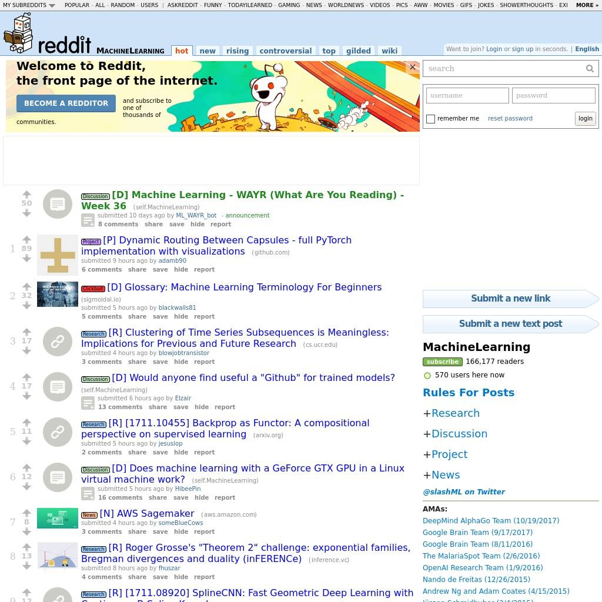
**이미지 캡션:** 이 이미지는 웹사이트 레딧의 머신러닝 서브레딧 페이지를 보여줍니다. 페이지 상단에는 레딧 로고와 함께 "Welcome to Reddit, the front page of the internet."이라는 문구가 있고, 로그인 및 회원가입 창이 오른쪽에 있습니다. 메인 콘텐츠 영역에는 여러 개의 게시물 목록이 표시되며, 각 게시물은 제목, 작성자, 제출 시간, 댓글 수, 그리고 관련 링크나 텍스트를 포함합니다. 게시물들은 주로 머신러닝 관련 주제를 다루고 있으며, "Machine Learning - WAYR (What Are You Reading)", "Dynamic Routing Between Capsules", "Glossary: Machine Learning Terminology For Beginners", "Clustering of Time Series Subsequences is Meaningless", "Would anyone find useful a "Github" for trained models?", "Backprop as Functor: A compositional perspective on supervised learning", "Does machine learning with a GeForce GTX GPU in a Linux virtual machine work?", "AWS Sagemaker", "Roger Grosse's "Theorem 2" challenge: exponential families, Bregman divergences and duality", 그리고 "SplineCNN: Fast Geometric Deep Learning" 등이 있습니다. 오른쪽 사이드바에는 "Submit a new link" 및 "Submit a new text post" 버튼과 함께 "MachineLearning" 서브레딧의 구독자 수, 현재 접속자 수, 그리고 "Rules For Posts"와 "AMAS" 목록이 표시됩니다. 전체적으로 정보가 많고 기술적인 내용을 다루는 온라인 커뮤니티의 분위기를 띄고 있습니다.hat Are You Reading)", "Dynamic Routing Between Capsules", "Glossary: Machine Learning Terminology For Beginners", "Clustering of Time Series Subsequences is Meaningless", "Would anyone find useful a "Github" for trained models?", "Backprop as Functor: A compositional perspective on supervised learning", "Does machine learning with a GeForce GTX GPU in a Linux virtual machine work?", "AWS Sagemaker", "Roger Grosse's "Theorem 2" challenge: exponential families, Bregman divergences and duality", 그리고 "SplineCNN: Fast Geometric Deep Learning" 등이 있습니다. 오른쪽 사이드바에는 "Submit a new link" 및 "Submit a new text post" 버튼과 함께 "MachineLearning" 서브레딧의 구독자 수, 현재 접속자 수, 그리고 "Rules For Posts"와 "AMAS" 목록이 표시됩니다. 전체적으로 정보가 많고 기술적인 내용을 다루는 온라인 커뮤니티의 분위기를 띄고 있습니다.

> #오늘의레딧 https://www.reddit.com/r/MachineLearning/ 재미난 이야기들이 많습니다.  1. 캡슐화를 통한 동적 라우팅-시각화를 통한 완전한 PyTorch구현 2. 시계열의 군집 구성은 의미 없는 의미이다:이전과 미래 연구에 대한 시사점 3. 숙련된 모델을 위해"GitHub"를 유용하게 쓸 만한 사람이 있을까? 4. Linux가상 시스템에서 GeForceGTXGPU를 사용하여 시스템을 학습합니까? 5. AWSSagemaker 6. 로저 그로스의 "Theorem2"도전 과제:기하 급수적인 가족, Bregman, 그리고 이중성(Insuressive) 7. Mozilla오픈 소스 음성 인식 모델 및 음성 데이터 세트의 초기 출시 공지 8. 보강 학습 개요-교육 과정 9. 자연 언어 처리를 위한 데이터 압축에 의한 데이터 압축, 데이터 압축 및 재발 방지 10. 모든 항목을 세분화하는 방법 학습 11. nvim에서 JutPter노트북으로 코드 전송 12. SVCC를 이용한 심층 신경망 해석 13. NIPS의 복장 규정? 14. Palearn에 대한 시각화를 통한 Parfit4 초대형 매개 변수 최적화 15. DeepMindPycolab:고도로 맞춤형 그리드 게임 엔진 16. 확률 지도 출력을 위한 최적의 손실 함수 17. Recurrent와 Counterexamples를 이용한 재재한 신경망의 추출 18. AIocks: 새로운 릴리스, 비디오 튜토리얼 및 문서! 기계 학습을 위한 WYSIWYG 편집기! 19. CNRS2.3:향상된 ONQR, NCCLE2, 개선된 C#API, 네트워크 최적화 API(SVD, Quantization)등 20. 출력 노드의 확률 평가  1. https://github.com/adambielski/CapsNet-pytorch 2. http://www.cs.ucr.edu/~eamonn/meaningless.pdf 3. https://www.reddit.com/r/MachineLearning/comments/7gevmi/d_would_anyone_find_useful_a_github_for_trained/ 4. https://www.reddit.com/r/MachineLearning/comments/7gfejs/d_does_machine_learning_with_a_geforce_gtx_gpu_in/ 5. https://aws.amazon.com/blogs/aws/sagemaker/ 6. http://www.inference.vc/grosses-challenge/ 7. https://blog.mozilla.org/blog/2017/11/29/announcing-the-initial-release-of-mozillas-open-source-speech-recognition-model-and-voice-dataset/ 8. http://adgefficiency.com/glance-reinforcement-learning/ 9. https://arxiv.org/pdf/1705.00697.pdf 10. https://arxiv.org/abs/1711.10370 11. https://github.com/qwfy/vim-senter 12. https://research.googleblog.com/2017/11/interpreting-deep-neural-networks-with.html 13. https://www.reddit.com/r/MachineLearning/comments/7g7255/d_dress_code_at_nips/ 14. https://medium.com/mlreview/parfit-hyper-parameter-optimization-77253e7e175e 15. https://github.com/deepmind/pycolab 16. https://www.reddit.com/r/MachineLearning/comments/7ga87e/d_best_loss_function_for_probability_map_output/ 17. https://arxiv.org/abs/1711.09576 18. https://mrnothing.github.io/AI-Blocks/index.html 19. https://github.com/Microsoft/CNTK/releases/tag/v2.3 20. https://www.reddit.com/r/MachineLearning/comments/7g8oy4/d_probability_assessment_for_the_output_node/
