# 2017년 12월

[← 2017년](README.md)

### 12월 1일 (금) 00:28 · 📷 사진 (3장)

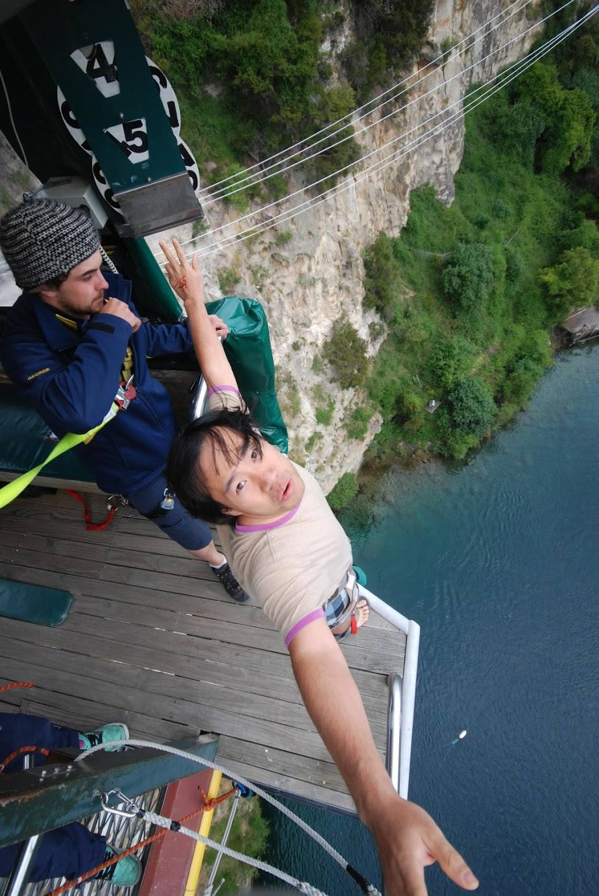 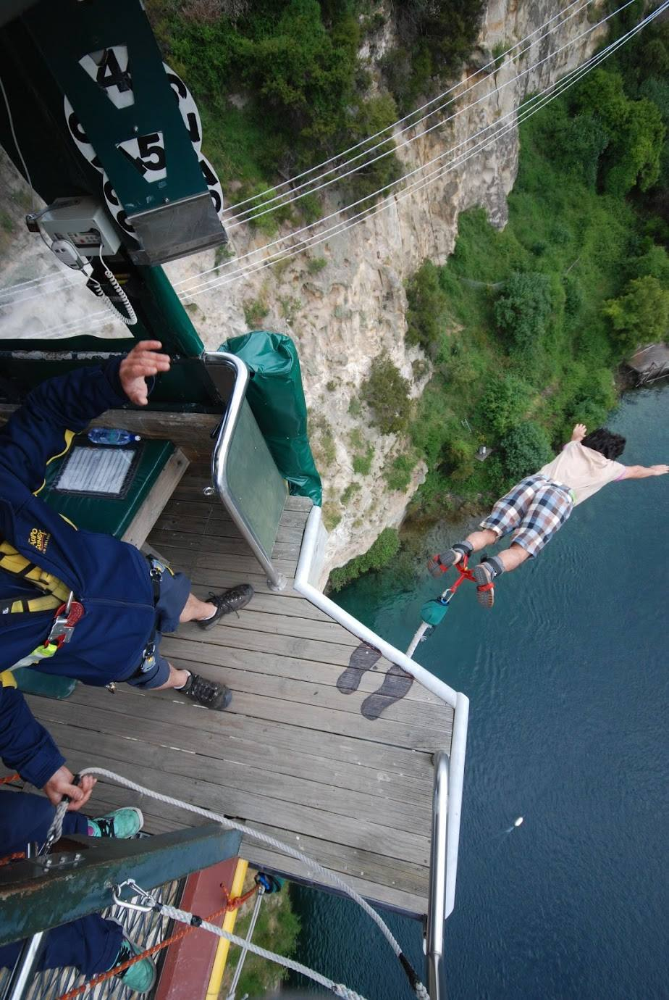 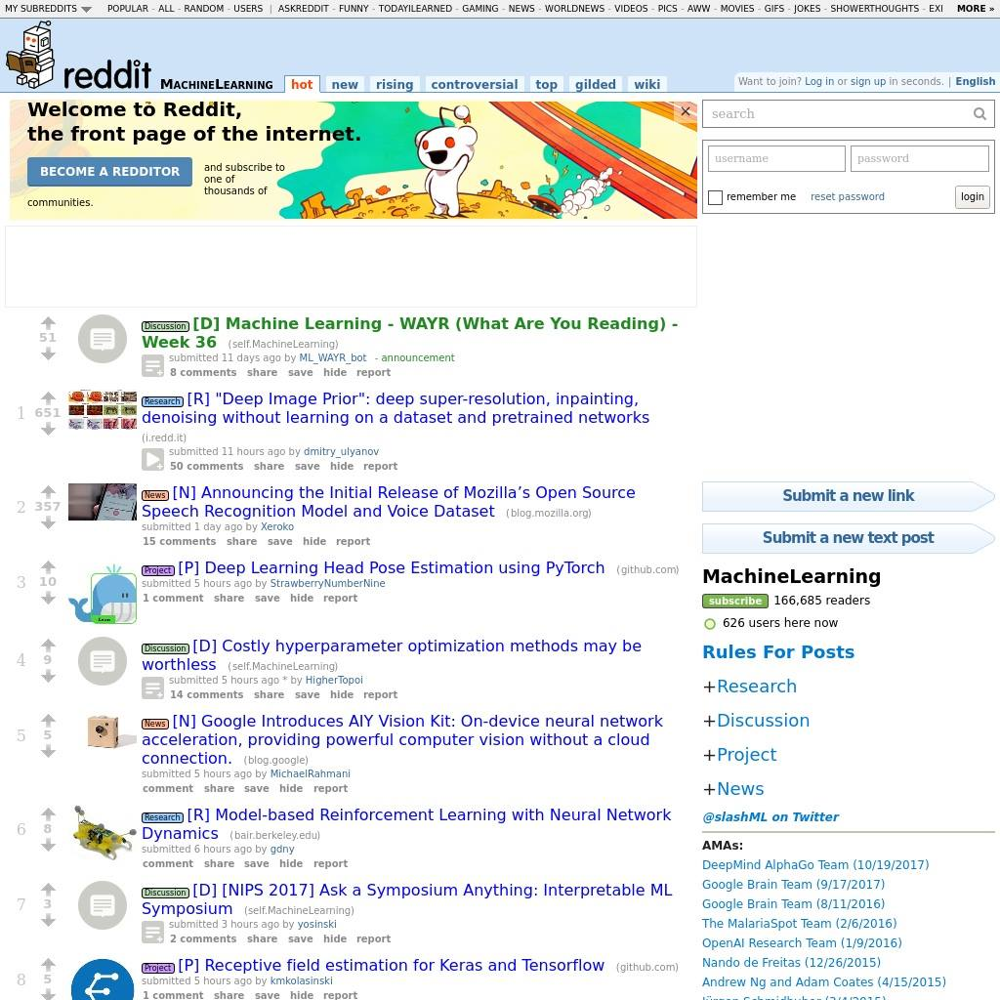

> #오늘의레딧 https://www.reddit.com/r/MachineLearning/ 정말 읽을 거리가 많네요.  1. "심층적인 이미지 사전":데이터 셋 및 사전 검증된 네트워크에 대해 학습하지 않고도 완전한 해상도를 제공하고 통합할 수 있습니다. 2. Mozilla오픈 소스 음성 인식 모델 및 음성 데이터 세트의 초기 출시 공지 3. 깊은 학습 헤드를 이용한 국소 학습 평가 4. 비용이 많이 드는 하이퍼 바이저 최적화 방법은 가치가 없는 것일 수 있습니다. 5. GoogleExi비전 키트:모든 기기에 신경을 쓸 수 있는 AV비전 인터페이스:클라우드 연결 없이 강력한 컴퓨터 비전을 제공합니다. 6. 신경망을 이용한 모델 기반 보강 학습 7. Keras및 Tensorflow에 대한 수용 가능한 현장 추정 8. Tensorflow를 이용한 CapsNets를 이용한 CapsNets구축 방법 9. 신경 텍스트 생성:실제 가이드(Seq2Seq 모델 모범 사례) 10. 책: 깊은 학식과 바둑의 게임 11. ICLR리뷰는 다음 주초에 예상된다. 12. 유전자 알고리즘에 미치는 돌연변이의 영향 13. 제 첫번째 블로그 포스트:"퍼스트 오더 방식의 거의 모든 것을 피할 수 있는 방법" 14. 통신 네트워크(CommNet)<커뮤니케이션 네트워크(Commeyt)의 경우 커뮤니케이션 채널을 통해 여러 에이전트가 협업 환경에서 협업할 수 있습니다. 15. 스탠포드 DAWN 깊은 학습 벤치 마크(DAW/BENCCH) 16. Home:가정용 멀티 모드 환경 17. IMT-20003GPP-이동을 지원하는 AWS람다 18. 스탠포드 인공 지능 지수가 떠오르는 분야 19. 완구를 시각 장애인들에게 시각화하는 것 20. GANPHTOCH구현을 통한 영상 합성에 대한 텍스트  1. https://www.reddit.com/r/MachineLearning/comments/7gls3j/r_deep_image_prior_deep_superresolution/ 2. https://blog.mozilla.org/blog/2017/11/29/announcing-the-initial-release-of-mozillas-open-source-speech-recognition-model-and-voice-dataset/ 3. https://github.com/natanielruiz/deep-head-pose 4. https://www.reddit.com/r/MachineLearning/comments/7goako/d_costly_hyperparameter_optimization_methods_may/ 5. https://blog.google/topics/machine-learning/introducing-aiy-vision-kit-make-devices-see/ 6. http://bair.berkeley.edu/blog/2017/11/30/model-based-rl/ 7. https://github.com/fornaxai/receptivefield 8. https://youtu.be/2Kawrd5szHE 9. https://arxiv.org/abs/1711.09534 10. https://www.manning.com/books/deep-learning-and-the-game-of-go 11. https://www.reddit.com/r/MachineLearning/comments/7gni3y/n_iclr_reviews_are_to_be_expected_early_next_week/ 12. https://blog.sicara.com/optimization-mutation-genetic-algorithm-40247f8ccb8 13. http://noahgolmant.com/avoiding-saddle-points.html 14. https://github.com/rickyhan/CommNet 15. http://dawn.cs.stanford.edu/benchmark/index.html 16. https://home-platform.github.io/ 17. https://twitter.com/AWSreInvent/status/936301451566972930 18. https://news.stanford.edu/2017/11/30/artificial-intelligence-index-tracks-emerging-field/ 19. https://github.com/wassname/viz_torch_optim 20. https://github.com/aelnouby/Text-to-Image-Synthesis

### 12월 2일 (토) 08:52 · 📷 사진 (1장)

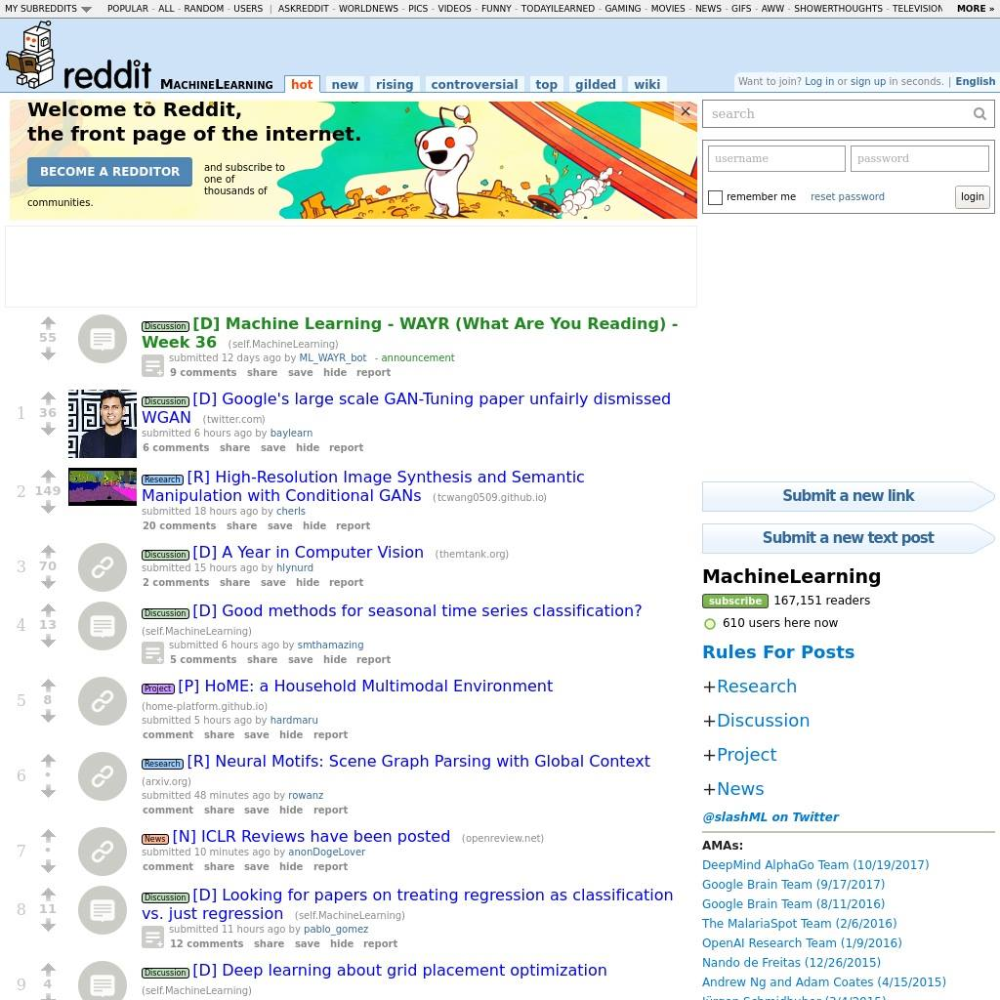

> #오늘의레딧 https://www.reddit.com/r/MachineLearning/ 재미난 이야기들이 많습니다.  1. 구글의 방대한 규모의 뉴스 헤드 라인이 부정 행위를 부당하게 처리한 것 2. 조건부 GAN을 이용한 고해상도 이미지 합성 및 시맨틱 마멀레이션 3. 컴퓨터 비전의 해 4. 계절별 시계열 분류를 위한 좋은 방법? 5. Home:가정용 멀티 모드 환경 6. 신경망:글로벌 컨텍스트를 이용한 장면 그래프 구문 분석 7. ICLRReview가 게시되었습니다. 8. 퇴행성 치료에 대한 논문을 찾는 것과 단지 퇴보만을 위한 서류 찾기 9. 그리드 배치 최적화에 대한 심층 학습 10. 매립형 질문 응답-접지된 질문, 엔드 투 엔드 보강 학습 에이전트 및 평가 프로토콜의 평가 프로토콜 11. "심층적인 이미지 사전":데이터 셋 및 사전 검증된 네트워크에 대해 학습하지 않고도 완전한 해상도를 제공하고 통합할 수 있습니다. 12. 형상 추출을 위한 영상의 경계 상자에 대한 주의 사항 13. 사토 바틀쉽 밥티스트 챌린지 14. Windfall데이터의 ML스택 15. AOMMET:시각적 인식을 위한 DeepNAD네트워크 16. Google, Amazon, Inc. 의 AICPML컨설팅 서비스를 제공하고 있습니다. 17. 객체 감지를 위한 관계 네트워크(완전 엔드 투 엔드 객체 검출기) 18. 인턴십을 위한 사후 관리를 지원하는 ML연구소 19. 가속 경사 강하는 경사로 하강보다 빠른 속도로 가속화됩니다. 20. GoogleExi비전 키트:모든 기기에 신경을 쓸 수 있는 AV비전 인터페이스:클라우드 연결 없이 강력한 컴퓨터 비전을 제공합니다.  1. https://twitter.com/soumithchintala/status/936120282896617472 2. https://tcwang0509.github.io/pix2pixHD/ 3. http://www.themtank.org/a-year-in-computer-vision 4. https://www.reddit.com/r/MachineLearning/comments/7gwetx/d_good_methods_for_seasonal_time_series/ 5. https://home-platform.github.io 6. https://arxiv.org/abs/1711.06640v1 7. https://openreview.net/submissions?id=ICLR.cc/2018 8. https://www.reddit.com/r/MachineLearning/comments/7gun87/d_looking_for_papers_on_treating_regression_as/ 9. https://www.reddit.com/r/MachineLearning/comments/7gwett/d_deep_learning_about_grid_placement_optimization/ 10. http://embodiedqa.org/ 11. https://www.reddit.com/r/MachineLearning/comments/7gls3j/r_deep_image_prior_deep_superresolution/ 12. https://www.reddit.com/r/MachineLearning/comments/7gwgpn/d_attention_mechanisms_on_bounding_box_in_images/ 13. https://www.aigaming.com/Help?url=msc 14. https://medium.com/@bgweber/the-data-science-stack-at-windfall-data-e1e6bc3c4c8f 15. https://arxiv.org/abs/1711.05847v1 16. https://www.wired.com/story/google-amazon-find-not-everyone-is-ready-for-ai/?mbid=social_twitter_onsiteshare 17. https://arxiv.org/abs/1711.11575 18. https://www.reddit.com/r/MachineLearning/comments/7grtm3/d_ml_labs_that_hire_postundergraduates_for/ 19. https://arxiv.org/abs/1711.10456v1 20. https://blog.google/topics/machine-learning/introducing-aiy-vision-kit-make-devices-see/

### 12월 3일 (일) 08:52 · 📷 사진 (1장)

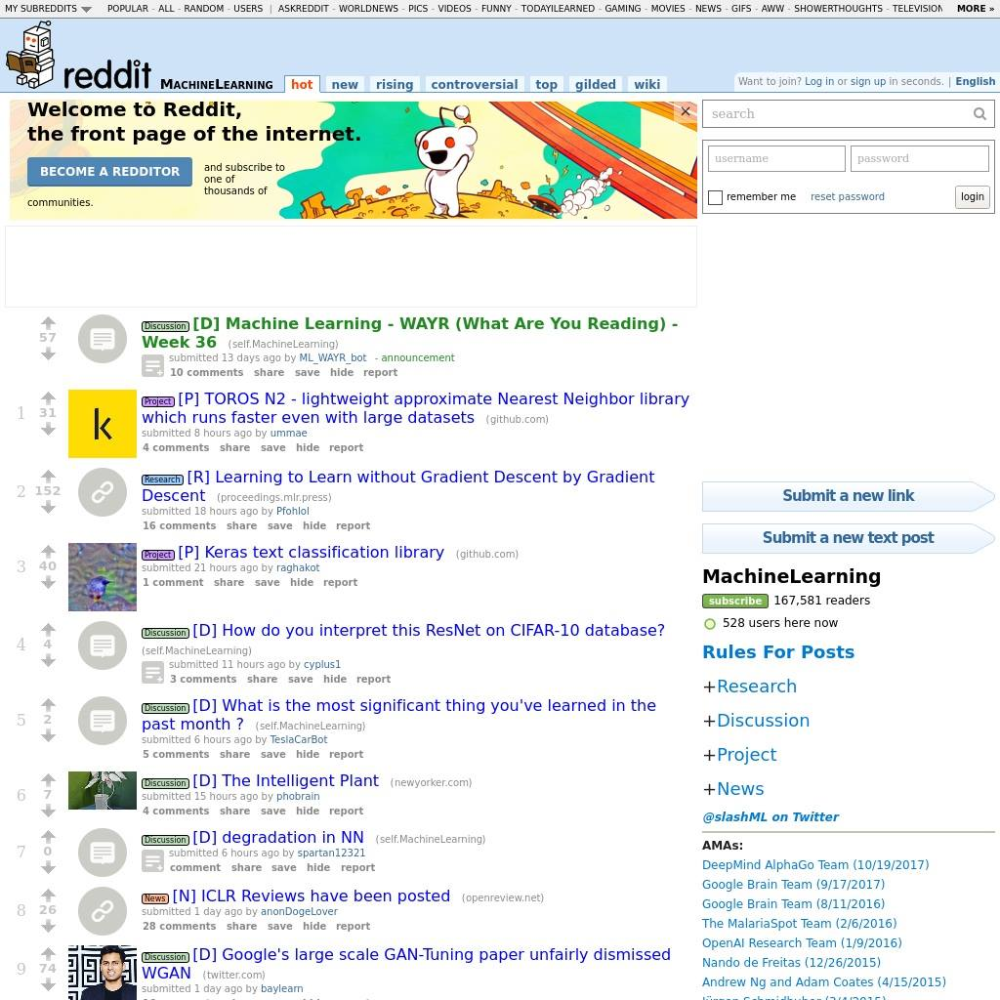

> #오늘의레딧 https://www.reddit.com/r/MachineLearning/ 래딧은 읽을 거리가 다양합니다.  1. ToroSN2-대규모 데이터 셋에서도 보다 빠르게 실행되는 경량 니어 라인 라이브러리 2. 구배 강하에 의한 구배 강하 없이 학습 방법 학습 3. 케라스 텍스트 분류 라이브러리 4. 이 ReFS-10데이터베이스에서 이 ReFS를 어떻게 해석하시겠습니까? 5. 지난 달에 배운 것 중에서 가장 중요한 것은 무엇입니까? 6. 인텔리전트 플랜트 7. NNI열화 8. ICLRReview가 게시되었습니다. 9. 구글의 방대한 규모의 뉴스 헤드 라인이 부정 행위를 부당하게 처리한 것 10. Home:가정용 멀티 모드 환경 11. 컴퓨터 비전의 해 12. 조건부 GAN을 이용한 고해상도 이미지 합성 및 시맨틱 마멀레이션 13. Google, Amazon, Inc. 의 AICPML컨설팅 서비스를 제공하고 있습니다. 14. 계절별 시계열 분류를 위한 좋은 방법? 15. 퇴행성 치료에 대한 논문을 찾는 것과 단지 퇴보만을 위한 서류 찾기 16. 신경망:글로벌 컨텍스트를 이용한 장면 그래프 구문 분석 17. 그리드 배치 최적화에 대한 심층 학습 18. 매립형 질문 응답-접지된 질문, 엔드 투 엔드 보강 학습 에이전트 및 평가 프로토콜의 평가 프로토콜 19. "심층적인 이미지 사전":데이터 셋 및 사전 검증된 네트워크에 대해 학습하지 않고도 완전한 해상도를 제공하고 통합할 수 있습니다. 20. 형상 추출을 위한 영상의 경계 상자에 대한 주의 사항  1. https://github.com/kakao/n2 2. http://proceedings.mlr.press/v70/chen17e/chen17e.pdf 3. https://github.com/raghakot/keras-text 4. https://www.reddit.com/r/MachineLearning/comments/7h2g7v/d_how_do_you_interpret_this_resnet_on_cifar10/ 5. https://www.reddit.com/r/MachineLearning/comments/7h3r1v/d_what_is_the_most_significant_thing_youve/ 6. https://www.newyorker.com/magazine/2013/12/23/the-intelligent-plant 7. https://www.reddit.com/r/MachineLearning/comments/7h407h/d_degradation_in_nn/ 8. https://openreview.net/submissions?id=ICLR.cc/2018 9. https://twitter.com/soumithchintala/status/936120282896617472 10. https://home-platform.github.io 11. http://www.themtank.org/a-year-in-computer-vision 12. https://tcwang0509.github.io/pix2pixHD/ 13. https://www.wired.com/story/google-amazon-find-not-everyone-is-ready-for-ai/?mbid=social_twitter_onsiteshare 14. https://www.reddit.com/r/MachineLearning/comments/7gwetx/d_good_methods_for_seasonal_time_series/ 15. https://www.reddit.com/r/MachineLearning/comments/7gun87/d_looking_for_papers_on_treating_regression_as/ 16. https://arxiv.org/abs/1711.06640v1 17. https://www.reddit.com/r/MachineLearning/comments/7gwett/d_deep_learning_about_grid_placement_optimization/ 18. http://embodiedqa.org/ 19. https://www.reddit.com/r/MachineLearning/comments/7gls3j/r_deep_image_prior_deep_superresolution/ 20. https://www.reddit.com/r/MachineLearning/comments/7gwgpn/d_attention_mechanisms_on_bounding_box_in_images/

### 12월 5일 (화) 00:21 · Good morning and running at Long Beach! …

Good morning and running at Long Beach! It’s really beautiful.

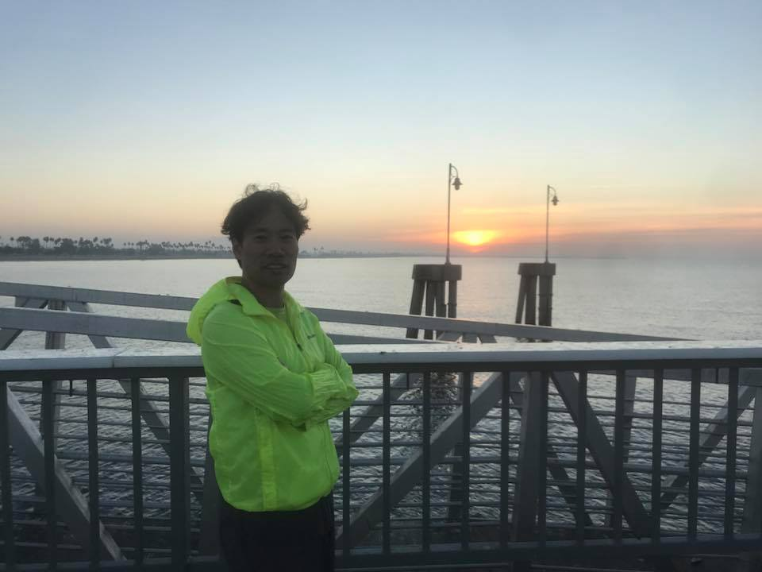 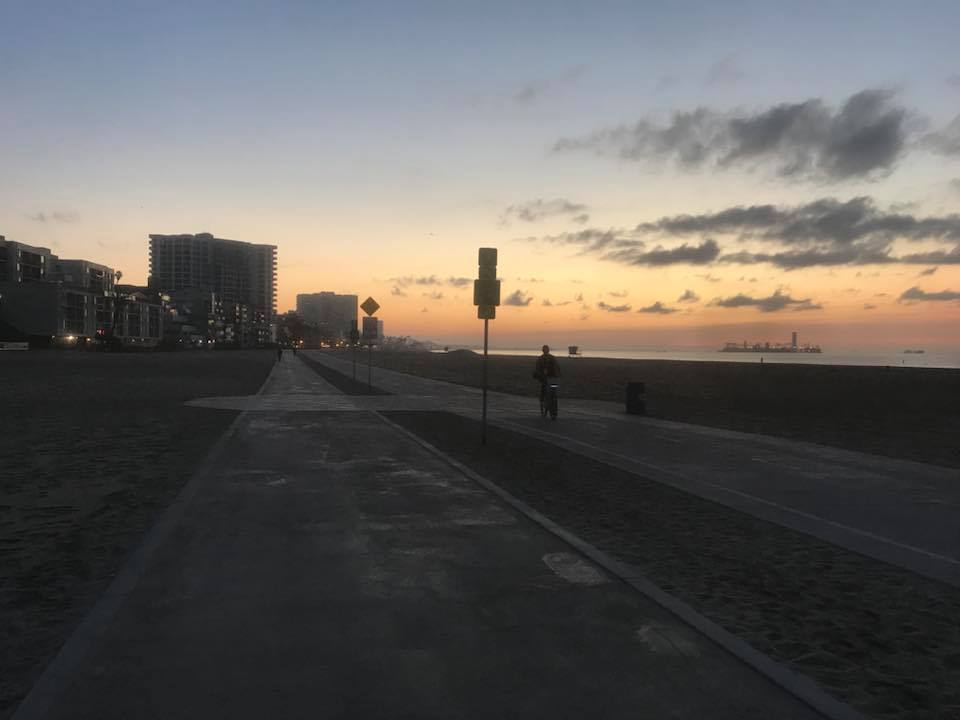 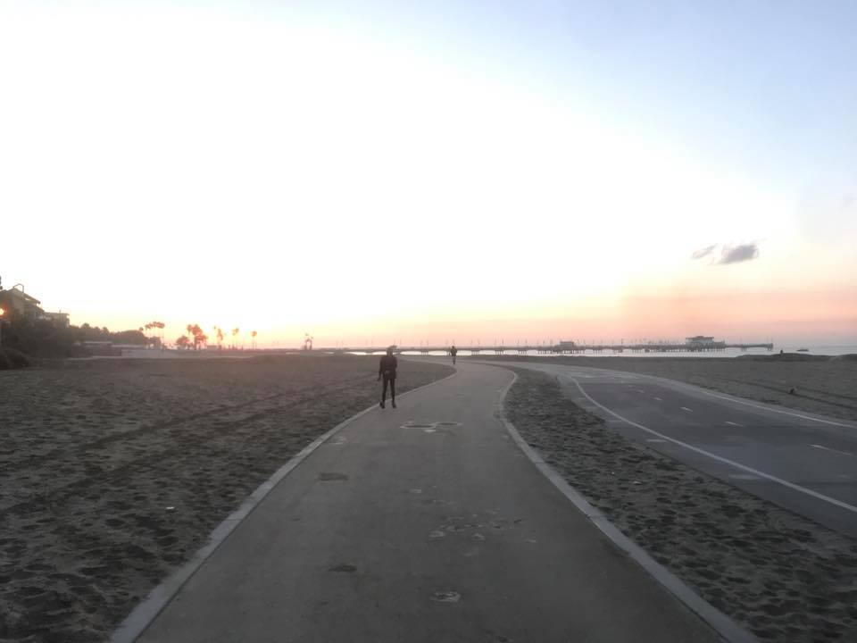 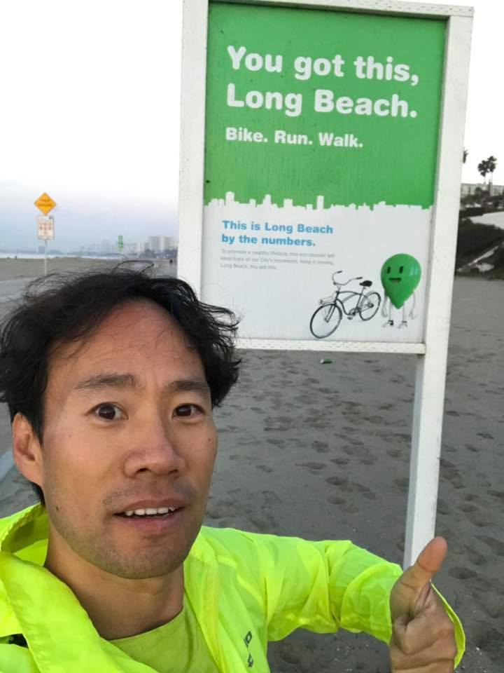  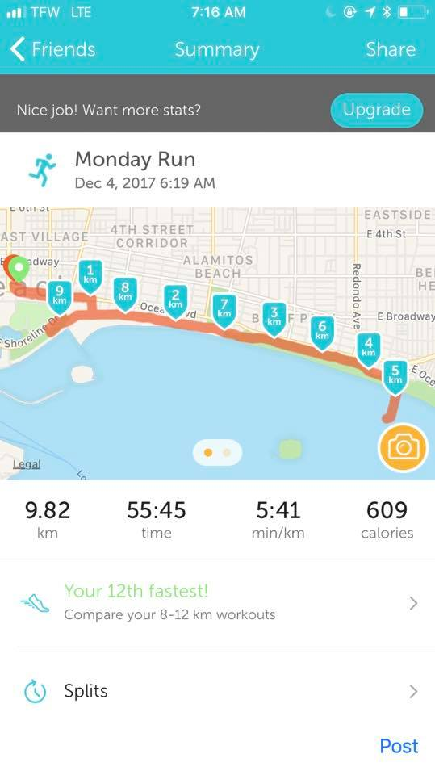

### 12월 6일 (수) 08:52 · 📷 사진 (1장)

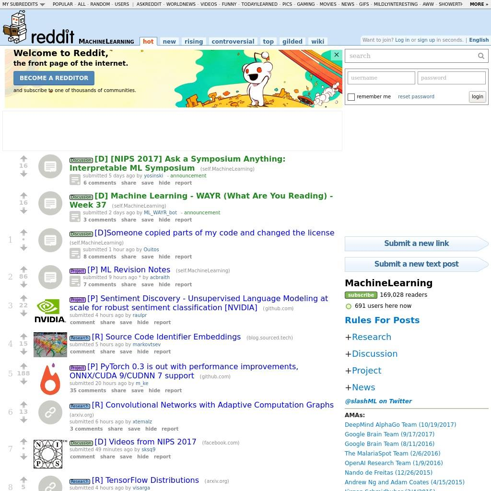

> #오늘의레딧 https://www.reddit.com/r/MachineLearning/ 재미난 이야기들이 많습니다.  1. 누군가가 내 코드를 복사해서 허가를 바꿨어요 2. ML개정 노트 3. 소스 코드 식별자 엠베딘 4. PyTorch0.3은 성능 향상과 더불어 ONOK/ CUCUFIN9지원 7회 지원 5. 적응형 계산 그래프를 이용한 직교 이방성 네트워크 6. NIPS2017의 비디오 7. 텐서 플로 디스트리뷰션 8. 모바일 센서 데이터로부터의 대규모 전송 모드 분류 9. 인공 지능을 이용하여 인간 지능 증진 10. 우다시티 자기 주도 자동차 나노 모델에 대한 조언을 구하기 11. 조시 윌스, 데이타 공학 단장 12. 포유류 뇌에서 대뇌 피질은 격자 모양을 사용하여 공간 정보를 인코딩하는 격자 세포를 포함한다. RNN이 속도와 방향에서 위치를 예측하도록 훈련된 경우, 그러한 그리드 셀과 같은 신경 세포가 자동으로 발현된다. 13. PyTorch4Text-커널 기반 활성화 기능의 구현/흐름 구현 14. 페이스북 AI연구 개발 프로그램 15. 크라우드 소싱:대폭적인 학습을 위한 새로운 방법을 모색하는 새로운 방법 16. DeepVariant:정밀한 신경망을 이용한 초정밀 Genomes 17. 하드웨어의 미래는 어떻습니까? 언제쯤 우리는 TPU를 살 수 있을까요? 18. 똑똑한 쿠키의 소질 19. Scattertext2.14:텍스트 분류에 대한 대화형 가시성 시각화 20. ACMASPLOSE18에서 파레토 효율적인 딥 학습(속도, 정확도, 비용)에 대한 첫번째 공개 토너먼트  1. https://www.reddit.com/r/MachineLearning/comments/7htg5f/dsomeone_copied_parts_of_my_code_and_changed_the/ 2. https://www.reddit.com/r/MachineLearning/comments/7hpryx/p_ml_revision_notes/ 3. https://blog.sourced.tech/post/id2vec/ 4. https://github.com/pytorch/pytorch/releases/tag/v0.3.0 5. https://arxiv.org/abs/1711.11503 6. https://www.facebook.com/pg/nipsfoundation/videos/ 7. https://arxiv.org/abs/1711.10604 8. http://www.sentiance.com/2017/12/04/large-scale-transport-mode-classification-from-mobile-sensor-data/ 9. https://distill.pub/2017/aia/ 10. https://www.reddit.com/r/MachineLearning/comments/7hscfd/d_seeking_advice_on_udacitys_selfdriving_car/ 11. https://youtu.be/qNAw7mUgx34 12. https://openreview.net/forum?id=B17JTOe0- 13. https://github.com/ispamm/kernel-activation-functions 14. https://research.fb.com/programs/facebook-ai-research-residency-program 15. https://medium.com/twentybn/crowd-acting-how-to-grow-large-scale-video-datasets-for-deep-learning-ba15b40d7a80 16. https://research.googleblog.com/2017/12/deepvariant-highly-accurate-genomes.html?utm_source=feedburner&utm_medium=feed&utm_campaign=Feed:+blogspot/gJZg+\(Official+Google+Research+Blog\) 17. https://www.reddit.com/r/MachineLearning/comments/7hosa9/d_whats_the_future_for_hardware_when_will_we_be/ 18. https://blog.google/topics/research/makings-smart-cookie/ 19. https://github.com/JasonKessler/scattertext/blob/master/README.md#visualizing-scikit-learn-text-classification-weights 20. http://cknowledge.org/request

### 12월 7일 (목) 08:52 · 📷 사진 (1장)

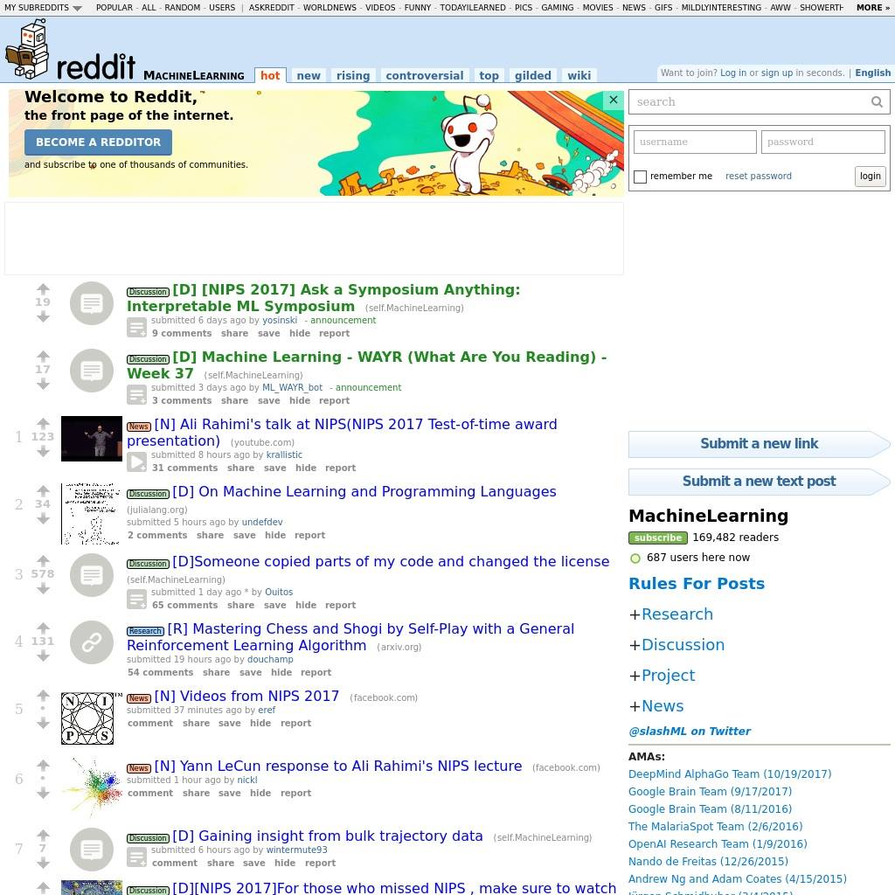

> #오늘의레딧 https://www.reddit.com/r/MachineLearning/ 머신러닝 공부는 정말 재미있죠?아침부터 다양한 소식이 많네요.  1. 알리 라히미(NIPS)에서의 연설(NIPS2017년 시상식 수여) 2. 시스템 학습 및 프로그래밍 언어 3. 누군가가 내 코드를 복사해서 허가를 바꿨어요 4. 일반적인 강화 학습 알고리즘을 이용하여 자가 학습을 통해 체스와 쇼지를 제작합니다. 5. NIPS2017의 비디오 6. 얀 레코미의 NIPS강의 답변 7. 대량 탄도 데이터로부터 통찰력 확보 8. 대부 신청 제출 제출 9. 영상 데이터베이스 클리닝을 위한 반임정 툴 10. 2017년 심도 깊은 학습 하이라이트 최적화 11. 제프리 M. 시스킨트는 자동화 기능의 편의성과 성능 사이의 긴장감을 해소합니다. 12. SDL과 Deeplearn을 포함한 자바 스크립트의 신경망 13. ML개정 노트 14. 인텔이 NIPS이벤트에서 Nervana칩을 출시했습니다(FloRida콘서트). 15. NIPS2017의 비디오 16. 해석 가능하고 윤리적인 자기 주도형 자동차 17. 소스 코드 식별자 엠베딘 18. PyTorch0.3은 성능 향상과 더불어 ONOK/ CUCUFIN9지원 7회 지원 19. 적응형 계산 그래프를 이용한 직교 이방성 네트워크 20. 텐서 플로 디스트리뷰션  1. https://www.youtube.com/watch?time_continue=2&v=Qi1Yry33TQE 2. https://julialang.org/blog/2017/12/ml&pl 3. https://www.reddit.com/r/MachineLearning/comments/7htg5f/dsomeone_copied_parts_of_my_code_and_changed_the/ 4. https://arxiv.org/abs/1712.01815 5. https://www.facebook.com/nipsfoundation/ 6. https://www.facebook.com/yann.lecun/posts/10154938130592143 7. https://www.reddit.com/r/MachineLearning/comments/7hzb3b/d_gaining_insight_from_bulk_trajectory_data/ 8. https://blend.com/predicting-submission/ 9. https://github.com/GuillaumeErhard/ImageSetCleaner 10. http://ruder.io/deep-learning-optimization-2017/index.html 11. https://youtu.be/YRoruJRmuLc 12. https://github.com/javascript-machine-learning/color-accessibility-neural-network-deeplearnjs 13. https://www.reddit.com/r/MachineLearning/comments/7hpryx/p_ml_revision_notes/ 14. https://www.reddit.com/r/MachineLearning/comments/7hwtc5/n_intel_just_launched_the_new_nervana_chip_at/ 15. https://www.facebook.com/pg/nipsfoundation/videos/ 16. https://medium.com/@expanding.the.horizon.blog/ethical-self-driving-cars-28abbaa9c7d3 17. https://blog.sourced.tech/post/id2vec/ 18. https://github.com/pytorch/pytorch/releases/tag/v0.3.0 19. https://arxiv.org/abs/1711.11503 20. https://arxiv.org/abs/1711.10604

### 12월 8일 (금) 08:52 · 📷 사진 (1장)

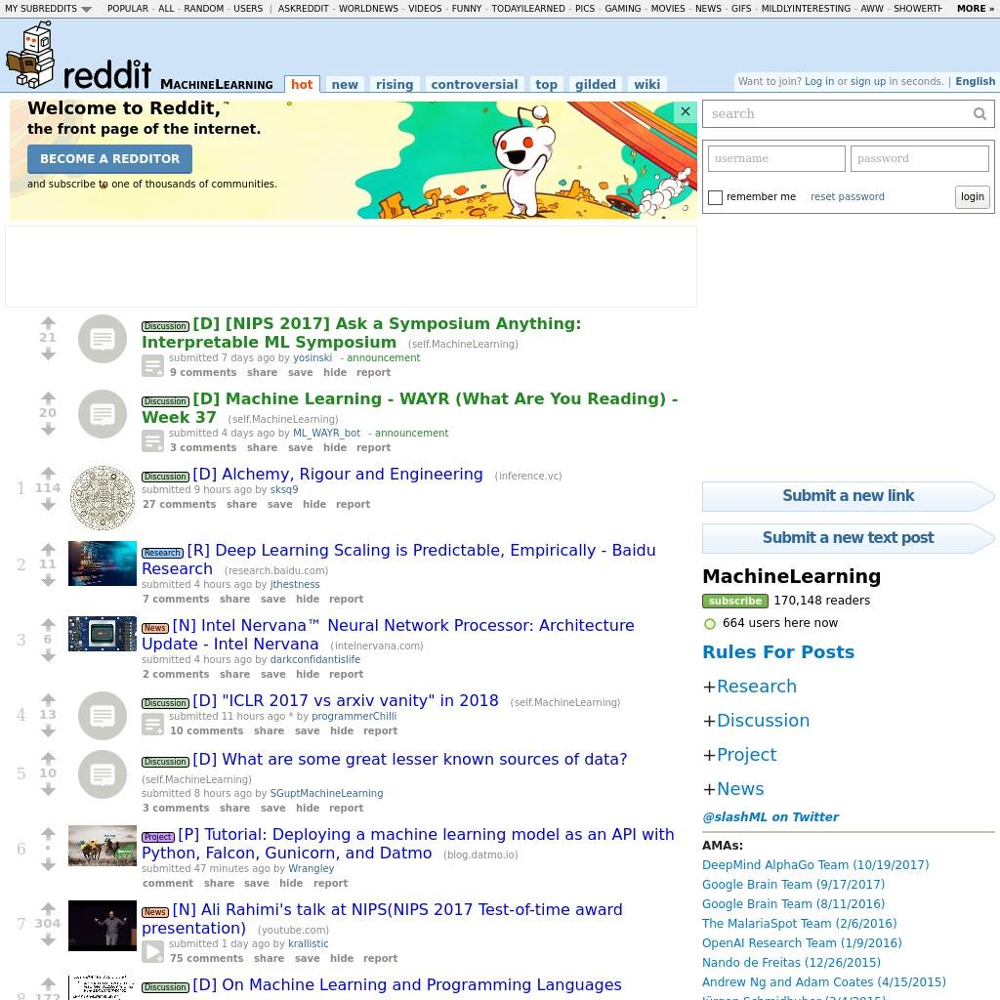

> #오늘의레딧 https://www.reddit.com/r/MachineLearning/ 정말 읽을 거리가 많네요.  1. 연금술 2. 심층 학습 스케일링은 예측 가능한 수준이며, 따라서 BaidouResearch는 매우 적합합니다. 3. IntelNervana™신경 네트워크 프로세서:아키텍처 업데이트-IntelNervana 4. 2018년"ICLR2017vs.arctionandarxive" 5. 알려지지 않은 데이터 소스의 일부는 무엇입니까? 6. 자습서:Python, Falcon, Gunicorn, Datmo등의 API로 기계 학습 모델 구축 7. 알리 라히미(NIPS)에서의 연설(NIPS2017년 시상식 수여) 8. 시스템 학습 및 프로그래밍 언어 9. 얀 레코미의 NIPS강의 답변 10. 오디오 파일 레이블링을 위한 바닐라 웹 앱 11. 시스템 학습 및 프로그래밍 언어 12. 관대한 모험적 성격 13. S자 모양의 함수를 사용하는 것처럼 곡선 테두리에 대한 평탄한 경계에 대한 평탄한 경계를 사용하는 것처럼 보입니다. 매우 곡선적인 경계의 경우, S자형 또는 다른 곡선 활성화 함수가 Req보다 더 효율적일 수 있는가? 14. 멀티-RF시스템 시험 15. 게이트형 선형 네트워크를 통한 온라인 학습 16. 안전하고 확장 가능한 셀프 서비스 차량의 공식 모델:Mobileye와 Intel의 안전한 핸들링 안전 생각해 볼까요? 17. Recursivefeature기능은 어떻게 작동합니까? 18. ML에서 일하는 사람들과의 인터뷰를 추구합니다. 19. CUBLasS:CUDAC++의 고속 선형 대수학 20. 서류를 다운로드하고, 메타 분석을 수행하고, 결과를 공유하는 것이 합법적인가?  1. http://www.inference.vc/my-thoughts-on-alchemy/ 2. http://research.baidu.com/deep-learning-scaling-predictable-empirically/ 3. https://www.intelnervana.com/intel-nervana-neural-network-processor-architecture-update/ 4. https://www.reddit.com/r/MachineLearning/comments/7i5xe7/d_iclr_2017_vs_arxiv_vanity_in_2018/ 5. https://www.reddit.com/r/MachineLearning/comments/7i6r4b/d_what_are_some_great_lesser_known_sources_of_data/ 6. https://blog.datmo.io/deploying-a-machine-learning-model-as-an-api-with-datmo-falcon-gunicorn-and-python-1e422fa5fa49 7. https://www.youtube.com/watch?time_continue=2&v=Qi1Yry33TQE 8. https://julialang.org/blog/2017/12/ml&pl 9. https://www.facebook.com/yann.lecun/posts/10154938130592143 10. https://github.com/tmulc18/AudioLabeler 11. https://www.reddit.com/r/MachineLearning/comments/7i52n7/d_on_machine_learning_and_programming_languages/ 12. https://arxiv.org/abs/1712.02328 13. https://youtu.be/Keqep_PKrY8?t=48m24s 14. https://www.reddit.com/r/MachineLearning/comments/7i8lyp/discussion_testing_on_a_multigpu_system/ 15. https://arxiv.org/abs/1712.01897 16. https://arxiv.org/pdf/1708.06374.pdf 17. https://www.reddit.com/r/MachineLearning/comments/7i7sox/d_how_does_recursive_feature_elimination_work/ 18. https://www.reddit.com/r/MachineLearning/comments/7i7r9k/r_seeking_interviews_with_people_working_in_ml/ 19. https://devblogs.nvidia.com/parallelforall/cutlass-linear-algebra-cuda/ 20. https://www.reddit.com/r/MachineLearning/comments/7i6o0s/d_is_it_legal_to_download_arxiv_papers_do_a/

### 12월 9일 (토) 08:52 · 📷 사진 (1장)

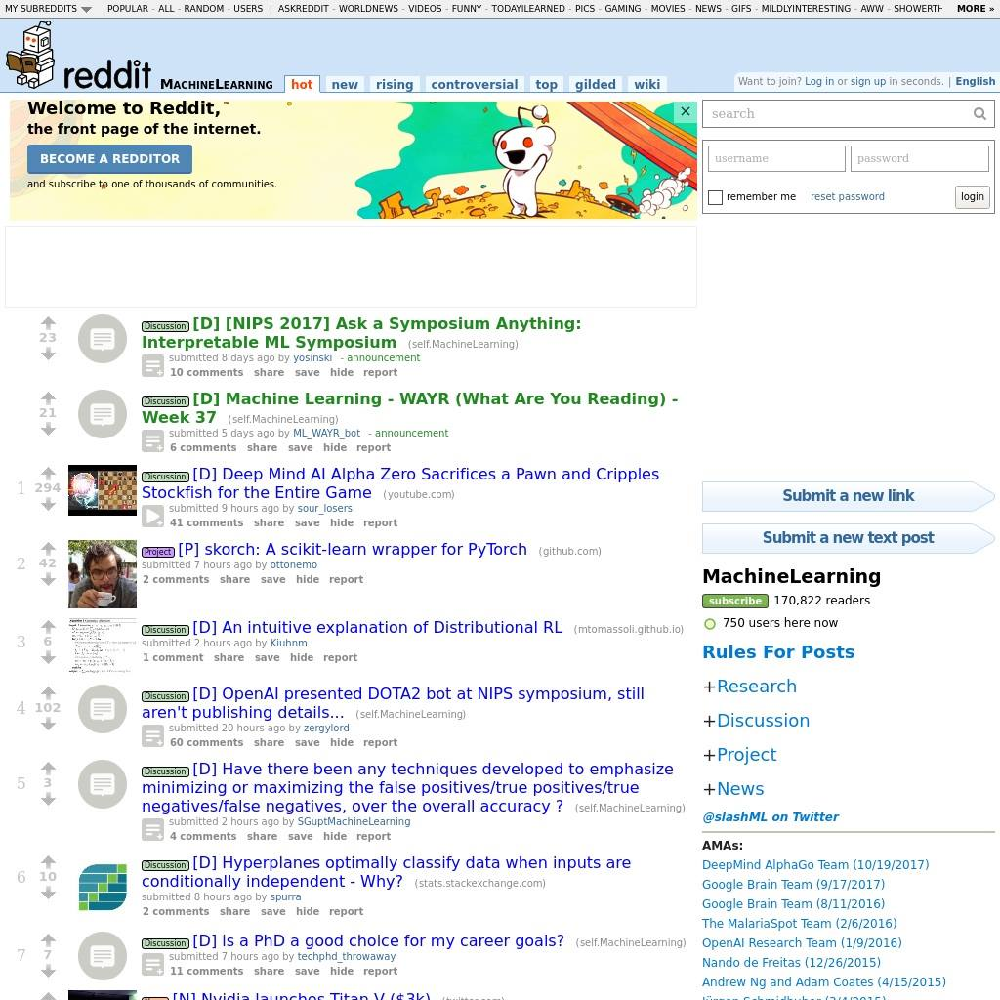

> #오늘의레딧 https://www.reddit.com/r/MachineLearning/ 래딧은 읽을 거리가 다양합니다.  1. 정신과 의사들의 마음 속 깊은 곳에 있는 신종 플루 바이러스는 멸종 위기에 처해 있다. 2. 스코르치:투르크쉬를 위한 스키쉬 리어스 래퍼 3. 분배적 RL에 대한 직관적인 설명 4. OpenAI가 NIPS심포지엄에서 DOTAMS를 제출했지만 아직 상세한 내용은 아닙니다... 5. 전체 정확도에 걸쳐 부정적인 위치를 최소화하거나 최대화 하기 위해 허위 위치를 최소화하거나 극대화하기 위해 개발된 기술이 개발되었는가? 6. 하이퍼스 레드는 입력이 독립적으로 독립적으로 이루어질 때 데이터를 최적으로 분류합니다. 이유는 무엇입니까? 7. 박사님이 제 직업 목표에 대해 좋은 선택이세요? 8. 엔비디아는 TitanV를 출시합니다(3달러). 9. 로봇 공학을 위한 깊은 학식-피터 아베벨 10. MAGEL:인공 지능형 지능형 지능형 학습 시스템 구축 11. Tensorflow세션을 C로 내보내시겠습니까? 12. 다음 단계에 따라 자동화된 시스템 학습을 통해 자동화된 아이콘 디자인을 구현할 수 있습니까? 13. DeepLearning(PyDataTalk)로 Gesture인식 시스템 구축(PyDataTalk) 14. ElonMusk는 테슬라가 맞춤형 AI칩을 개발하고 있다고 말했다. 15. 나와 함께 환상적인 축구 팀을 만들기 위해 협력해 보세요. 16. 미국 이외의 기계 학습 산업 17. 연금술 18. 권장 시스템 프로젝트를 위한 데이터 세트를 찾는 데 도움이 필요합니다. 19. 확대-축소 이미지 인식을 위한 점진적인 신경 회로망 20. 가장 성공적인 웹 페이지 분할 접근 방식 또는 알고리즘은 무엇입니까?  1. https://www.youtube.com/watch?v=7-MborNxYWE 2. https://github.com/dnouri/skorch 3. https://mtomassoli.github.io/2017/12/08/distributional_rl/ 4. https://www.reddit.com/r/MachineLearning/comments/7ibziu/d_openai_presented_dota2_bot_at_nips_symposium/ 5. https://www.reddit.com/r/MachineLearning/comments/7ii2db/d_have_there_been_any_techniques_developed_to/ 6. https://stats.stackexchange.com/questions/317615/hyperplanes-optimally-classify-data-when-inputs-are-conditionally-independent 7. https://www.reddit.com/r/MachineLearning/comments/7ify46/d_is_a_phd_a_good_choice_for_my_career_goals/ 8. https://twitter.com/ntenenz/status/938969549050806272 9. https://www.facebook.com/nipsfoundation/videos/1554594181298482/ 10. https://github.com/geek-ai/MAgent 11. https://www.reddit.com/r/MachineLearning/comments/7iizq4/p_export_a_tensorflow_session_to_c/ 12. https://medium.com/@moses.soh/towards-automatic-icon-design-using-machine-learning-423cbe6710fe 13. https://medium.com/twentybn/building-a-gesture-recognition-system-using-deep-learning-video-d24f13053a1 14. https://www.theverge.com/2017/12/8/16750560/tesla-custom-ai-chips-hardware 15. https://github.com/zackthoutt/nfl-player-stats 16. https://www.reddit.com/r/MachineLearning/comments/7ih0u1/d_machine_learning_industries_outside_the_us/ 17. http://www.inference.vc/my-thoughts-on-alchemy/ 18. https://www.reddit.com/r/MachineLearning/comments/7if664/p_i_need_help_with_finding_a_dataset_for_a/ 19. https://arxiv.org/abs/1711.09280 20. https://www.reddit.com/r/MachineLearning/comments/7igi2q/discussion_what_is_the_best_most_successful_web/

### 12월 10일 (일) 04:00 · It makes my day with Jin Hyung Lee and @…

It makes my day with Jin Hyung Lee and @Bengio.

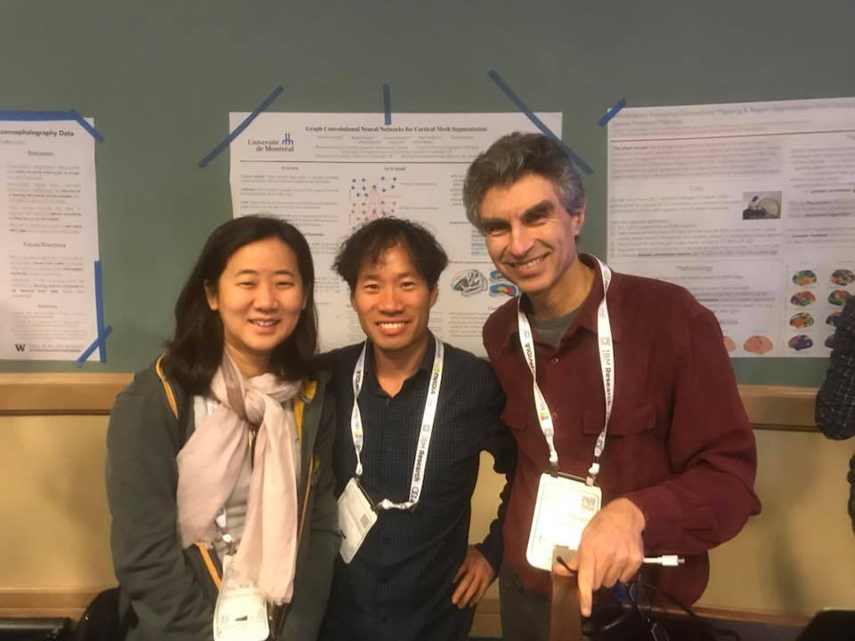

### 12월 10일 (일) 04:08 · 📷 사진 (2장)

 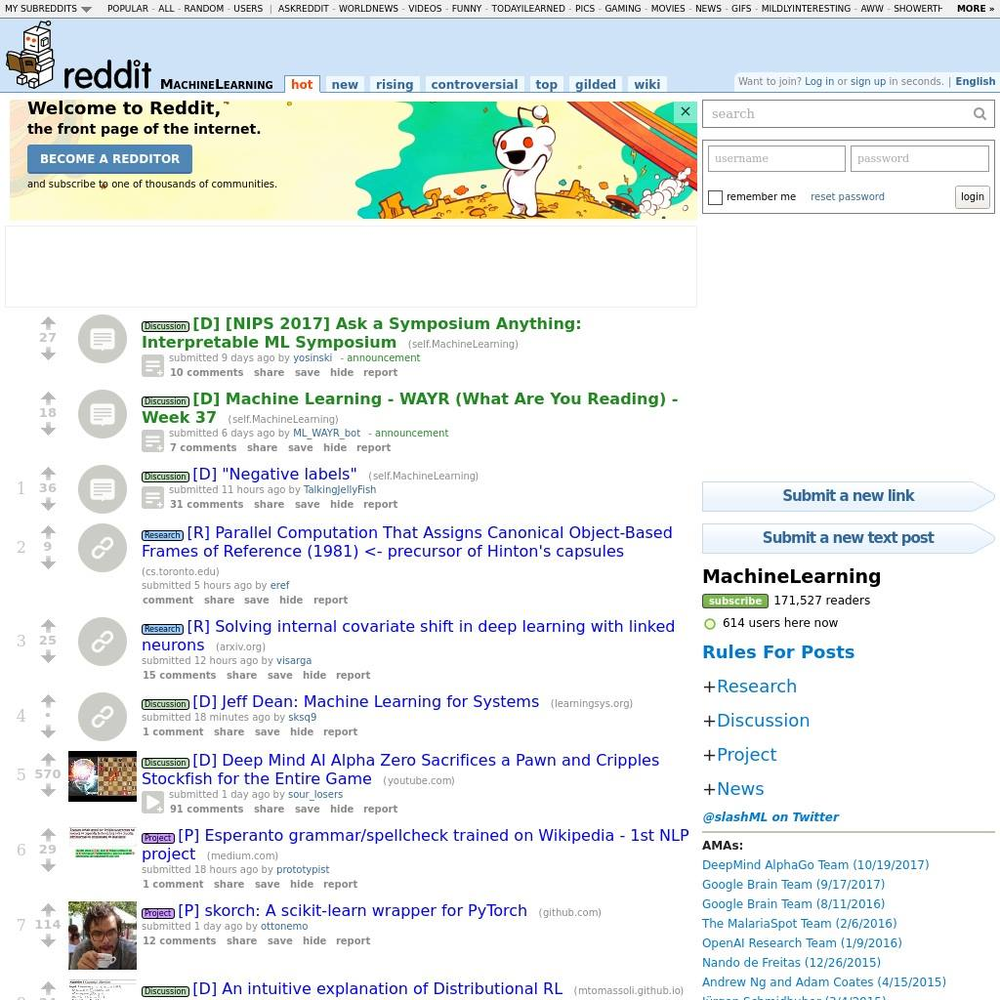

> 닙스 2017 사진 한장 요약 입니다.   최고의 뉴로 사이언티스트인 스탠포드 Jin Hyung Lee 교수님과 설명이 필요없는 Bengio 교수님을 만났습니다!
> #오늘의레딧 https://www.reddit.com/r/MachineLearning/ 재미난 이야기들이 많습니다.  1. 네거티브 레이블 2. 1981년도 추계 종합 학술 발표회 논문 초록 집 vol.26 3. 연결된 뉴런을 통한 깊은 학습에서의 내부 공변환 변화 해결 4. JeffDean:시스템을 위한 기계 학습 5. 정신과 의사들의 마음 속 깊은 곳에 있는 신종 플루 바이러스는 멸종 위기에 처해 있다. 6. 위키 피디아에서 개발된 에스페란토 문법 학자-첫번째 NLP프로젝트 7. 스코르치:투르크쉬를 위한 스키쉬 리어스 래퍼 8. 분배적 RL에 대한 직관적인 설명 9. 전체 정확도에 걸쳐 부정적인 위치를 최소화하거나 최대화 하기 위해 허위 위치를 최소화하거나 극대화하기 위해 개발된 기술이 개발되었는가? 10. 박사님이 제 직업 목표에 대해 좋은 선택이세요? 11. MAGEL:인공 지능형 지능형 지능형 학습 시스템 구축 12. Tensorflow세션을 C로 내보내시겠습니까? 13. 최적화된 부울 방식을 이용한 최적의 DNN프리미티브 선택 14. 운영 체제 및 기계 학습 연구의 교차점에서 가장 좋은 문서는 무엇입니까? 15. 하이퍼스 레드는 입력이 독립적으로 독립적으로 이루어질 때 데이터를 최적으로 분류합니다. 이유는 무엇입니까? 16. OpenAI가 NIPS심포지엄에서 DOTAMS를 제출했지만 아직 상세한 내용은 아닙니다... 17. 다음 단계에 따라 자동화된 시스템 학습을 통해 자동화된 아이콘 디자인을 구현할 수 있습니까? 18. 로봇 공학을 위한 깊은 학식-피터 아베벨 19. 엔비디아는 TitanV를 출시합니다(3달러). 20. 가장 성공적인 웹 페이지 분할 접근 방식 또는 알고리즘은 무엇입니까?  1. https://www.reddit.com/r/MachineLearning/comments/7imfc4/d_negative_labels/ 2. http://www.cs.toronto.edu/~fritz/absps/object-based81.pdf 3. https://arxiv.org/abs/1712.02609 4. http://learningsys.org/nips17/assets/slides/dean-nips17.pdf 5. https://www.youtube.com/watch?v=7-MborNxYWE 6. https://medium.com/@mapmeld/esperanto-nlp-part-3-correcting-grammar-6d34f93bded1 7. https://github.com/dnouri/skorch 8. https://mtomassoli.github.io/2017/12/08/distributional_rl/ 9. https://www.reddit.com/r/MachineLearning/comments/7ii2db/d_have_there_been_any_techniques_developed_to/ 10. https://www.reddit.com/r/MachineLearning/comments/7ify46/d_is_a_phd_a_good_choice_for_my_career_goals/ 11. https://github.com/geek-ai/MAgent 12. https://www.reddit.com/r/MachineLearning/comments/7iizq4/p_export_a_tensorflow_session_to_c/ 13. https://www.scss.tcd.ie/~andersan/pubs/cgo-2018.html 14. https://www.reddit.com/r/MachineLearning/comments/7ikxct/d_what_are_the_best_papers_at_the_intersection_of/ 15. https://stats.stackexchange.com/questions/317615/hyperplanes-optimally-classify-data-when-inputs-are-conditionally-independent 16. https://www.reddit.com/r/MachineLearning/comments/7ibziu/d_openai_presented_dota2_bot_at_nips_symposium/ 17. https://medium.com/@moses.soh/towards-automatic-icon-design-using-machine-learning-423cbe6710fe 18. https://www.facebook.com/nipsfoundation/videos/1554594181298482/ 19. https://twitter.com/ntenenz/status/938969549050806272 20. https://www.reddit.com/r/MachineLearning/comments/7igi2q/discussion_what_is_the_best_most_successful_web/

### 12월 11일 (월) 08:52 · 📷 사진 (1장)

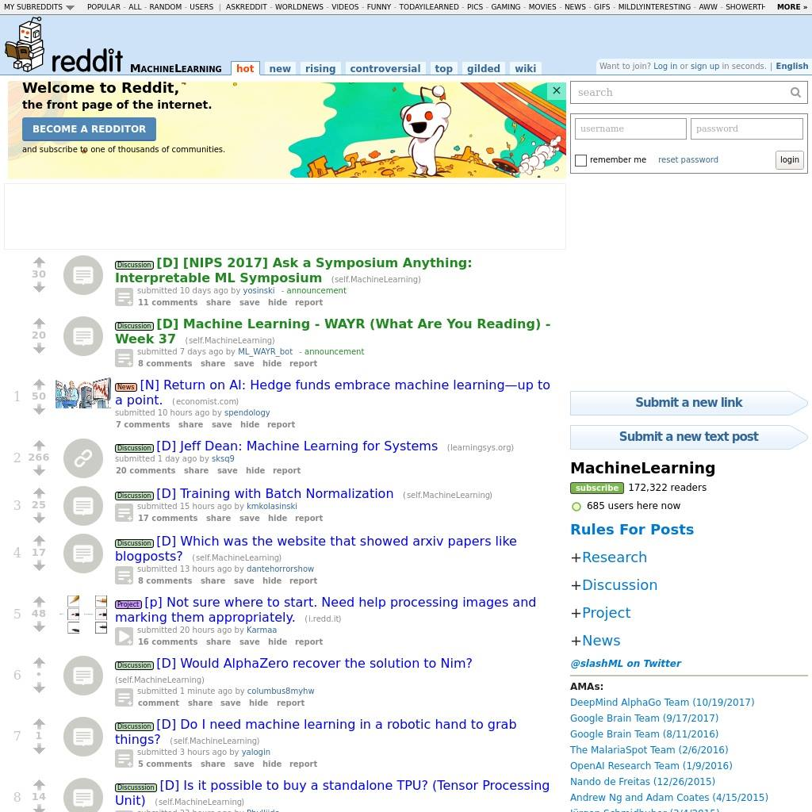

> #오늘의레딧 https://www.reddit.com/r/MachineLearning/ 오늘도 새소식이 많군요.  1. AI로 돌아가자 헤지 펀드는 기계 학습을 전면 중단한다. 2. JeffDean:시스템을 위한 기계 학습 3. 배치 정상화 교육 4. 블로그 포스트와 같은 서류들을 보여 준 웹 사이트는 어디였나요? 5. 알프로에로가 해결책을 님께 되찾을까요? 6. 로봇 손에서 기계를 배워서 물건을 집어 들어야 하나요? 7. 우리가 찾고 있던 봇들이 아니라 8. 1981년도 추계 종합 학술 발표회 논문 초록 집 vol.26 9. 네거티브 레이블 10. 집계된 데이터의 배포를 학습하는 방법은 무엇입니까? 11. 연결된 뉴런을 통한 깊은 학습에서의 내부 공변환 변화 해결 12. 정신과 의사들의 마음 속 깊은 곳에 있는 신종 플루 바이러스는 멸종 위기에 처해 있다. 13. 위키 피디아에서 개발된 에스페란토 문법 학자-첫번째 NLP프로젝트 14. CSLVot:기계 학습에 기초한 Aimbot, Dota2가 다시 옵니다. 15. 스코르치:투르크쉬를 위한 스키쉬 리어스 래퍼 16. 분배적 RL에 대한 직관적인 설명 17. 구글의 AI는 4시간 만에 스스로 체스를 가르치고, 그 다음엔 설득력 있는 투쟁을 한다. 18. 운영 체제 및 기계 학습 연구의 교차점에서 가장 좋은 문서는 무엇입니까? 19. 전체 정확도에 걸쳐 부정적인 위치를 최소화하거나 최대화 하기 위해 허위 위치를 최소화하거나 극대화하기 위해 개발된 기술이 개발되었는가? 20. 박사님이 제 직업 목표에 대해 좋은 선택이세요?  1. https://www.economist.com/news/finance-and-economics/21732147-investing-more-artificial-intelligence-need-not-mean-less-human 2. http://learningsys.org/nips17/assets/slides/dean-nips17.pdf 3. https://www.reddit.com/r/MachineLearning/comments/7issby/d_training_with_batch_normalization/ 4. https://www.reddit.com/r/MachineLearning/comments/7it7k3/d_which_was_the_website_that_showed_arxiv_papers/ 5. https://www.reddit.com/r/MachineLearning/comments/7ixtrk/d_would_alphazero_recover_the_solution_to_nim/ 6. https://www.reddit.com/r/MachineLearning/comments/7iwarq/d_do_i_need_machine_learning_in_a_robotic_hand_to/ 7. https://mobile.nytimes.com/2017/11/01/magazine/not-the-bots-we-were-looking-for.html?referer= 8. http://www.cs.toronto.edu/~fritz/absps/object-based81.pdf 9. https://www.reddit.com/r/MachineLearning/comments/7imfc4/d_negative_labels/ 10. https://www.reddit.com/r/MachineLearning/comments/7isy6x/d_how_to_learn_distribution_of_aggregated_data/ 11. https://arxiv.org/abs/1712.02609 12. https://www.youtube.com/watch?v=7-MborNxYWE 13. https://medium.com/@mapmeld/esperanto-nlp-part-3-correcting-grammar-6d34f93bded1 14. https://www.youtube.com/watch?v=w88RIcTuGZQ 15. https://github.com/dnouri/skorch 16. https://mtomassoli.github.io/2017/12/08/distributional_rl/ 17. http://trove42.com/google-ai-teaches-itself-chess-defeats-stockfish/ 18. https://www.reddit.com/r/MachineLearning/comments/7ikxct/d_what_are_the_best_papers_at_the_intersection_of/ 19. https://www.reddit.com/r/MachineLearning/comments/7ii2db/d_have_there_been_any_techniques_developed_to/ 20. https://www.reddit.com/r/MachineLearning/comments/7ify46/d_is_a_phd_a_good_choice_for_my_career_goals/

### 12월 12일 (화) 08:52 · 📷 사진 (1장)

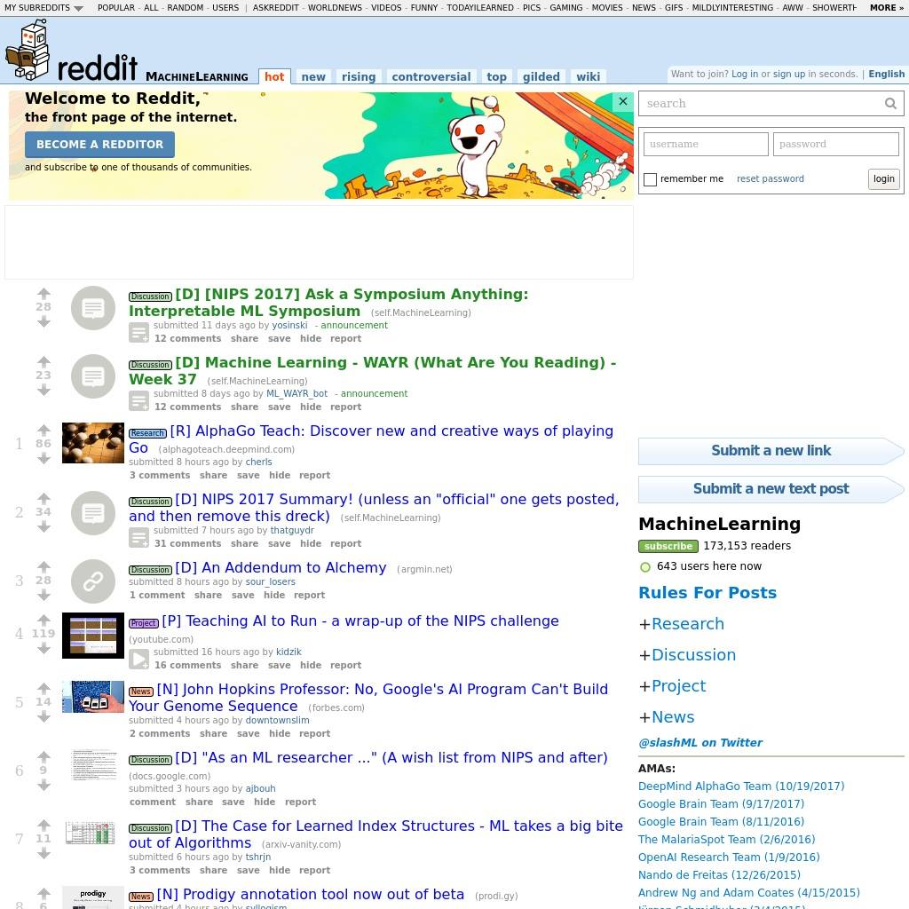

> #오늘의레딧 https://www.reddit.com/r/MachineLearning/ 재미난 이야기들이 많습니다.  1. 알파고 교수:바둑 놀이의 새로운 창조적인 방법 모색 2. NIPS2017요약! ("공식"이 게시되어 있지 않은 한, 이 작업을 취소합니다.) 3. 연금술사 4. AI를 예방하기 위한 시도-NIPS과제의 마무리 5. 존 홉킨스 교수:아니요, 구글의 AI프로그램은 당신의 게놈을 만들 수 없습니다. 6. "ML연구원으로서..."(NIPS와 그 이후의 희망 목록) 7. 마모된 인덱스 구조의 사례-ML은 알고리즘을 크게 잠식한다. 8. ProdightoutofProductionout툴 9. 소비자 예측 모델(NLP, 성격 통찰력 등)이 공개적으로 이용 가능한 정보 측면에서 다른 유형의 다른 ML영역에 비해 떨어져 있는가? 10. 자동화된 이미지 캡처 애플리케이션 구축 11. 어떻게 하면 구글 G. 브래들리가 구글 G.BrardCLove3년 전에 PageRank를 개발한 지 3년이 된다. 12. TuriCreak및 CoreMLr2를 포함한 핫 스폿이 아닌 빌딩 13. 부가 가치 정보를 이용한 광고 교육을 통한 긴 텍스트 생성 14. 로그 손실(크로스 바)기능 외에 loss-entryfust기능을 사용한 적이 없습니까? 15. 마이크스 페이퍼의 파코르크 구현 16. 열린 우리당 주최로 열린 스폰서쉽 파티에서 열린 행사와 연설회에서 발생한 사건과 연설문과 연설문을 인용한 적이 있다. 17. 파스칼-VOC감지 평가 코드에 의문 사항이 있음 18. AI로 돌아가자 헤지 펀드는 기계 학습을 전면 중단한다. 19. 마케팅 분야의 새로운 학습 응용 프로그램-무료 PDF 20. JeffDean:시스템을 위한 기계 학습  1. https://alphagoteach.deepmind.com/ 2. https://www.reddit.com/r/MachineLearning/comments/7j2v74/d_nips_2017_summary_unless_an_official_one_gets/ 3. http://www.argmin.net/2017/12/11/alchemy-addendum/ 4. https://www.youtube.com/watch?v=rhNxt0VccsE 5. https://www.forbes.com/sites/stevensalzberg/2017/12/11/no-googles-new-ai-cant-build-your-genome-sequence/#1e566f565774 6. https://docs.google.com/document/d/1ptz9HbYOZGbgXL2MnFSk2w38tMw1uaQBKf3UpN6Q-5o/edit 7. https://www.arxiv-vanity.com/papers/1712.01208v1/ 8. https://prodi.gy 9. https://www.reddit.com/r/MachineLearning/comments/7j63m4/d_why_have_consumer_prediction_models_nlp/ 10. https://daniel.lasiman.com/post/image-captioning/ 11. http://bradlove.org/blog/cogsci-page-rank 12. https://heartbeat.fritz.ai/building-not-hotdog-with-turi-create-and-core-ml-in-an-afternoon-a87fd1967d10 13. https://arxiv.org/abs/1709.08624 14. https://www.reddit.com/r/MachineLearning/comments/7j5lrq/d_has_anyone_used_a_losscost_function_outside_of/ 15. https://github.com/leehomyc/mixup_pytorch 16. https://twitter.com/haldaume3/status/939910697911066624 17. https://www.reddit.com/r/MachineLearning/comments/7j2p74/d_doubt_in_pascalvoc_detection_evaluation_code/ 18. https://www.economist.com/news/finance-and-economics/21732147-investing-more-artificial-intelligence-need-not-mean-less-human 19. https://algorithmicweb.wordpress.com/ 20. http://learningsys.org/nips17/assets/slides/dean-nips17.pdf

### 12월 13일 (수) 07:27 · 📷 사진 (2장)

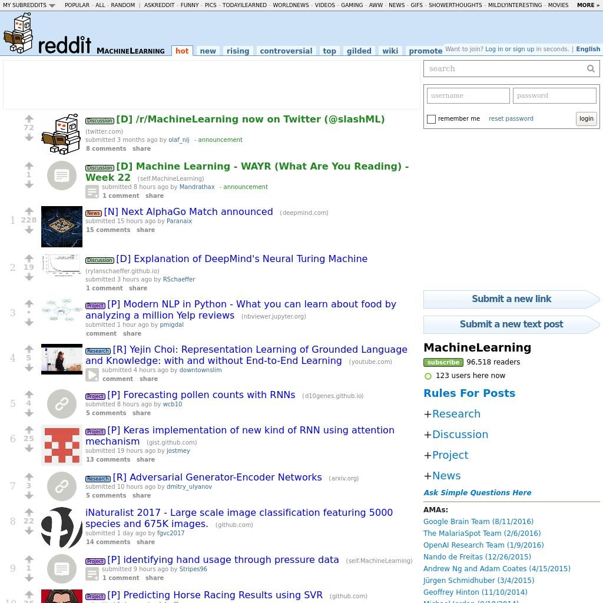 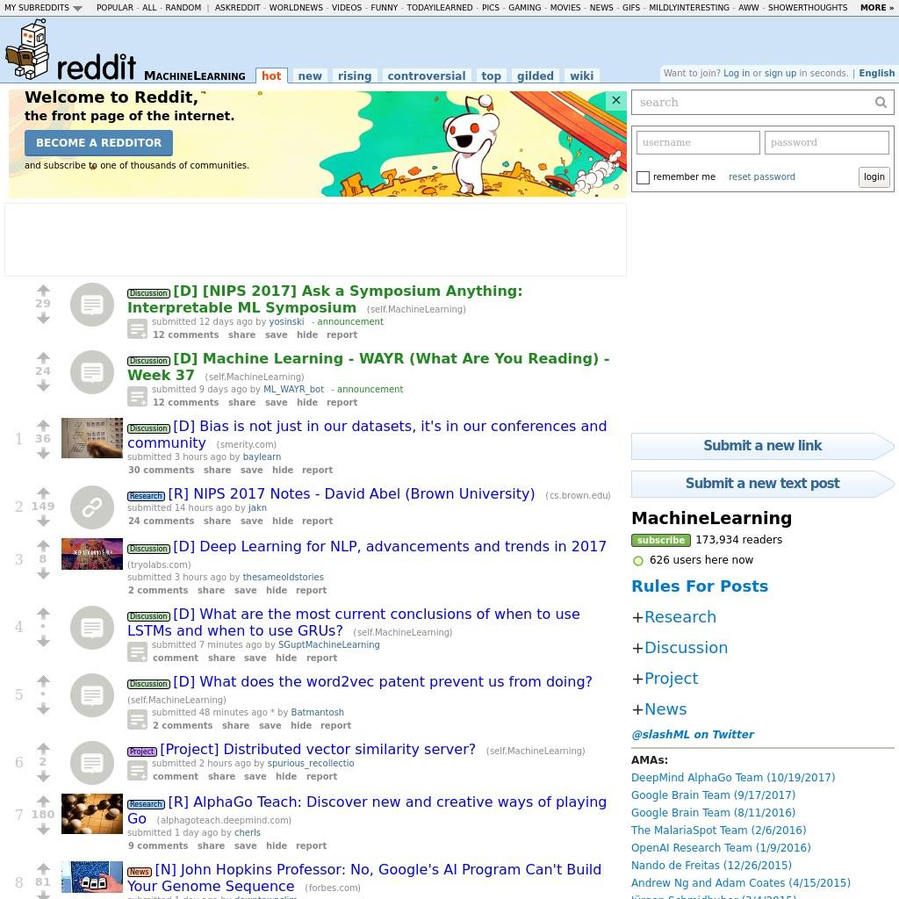

> #오늘의레딧 https://www.reddit.com/r/MachineLearning/ 래딧은 읽을 거리가 다양합니다.  1. Cannot translate 2. Cannot translate 3. Cannot translate 4. Cannot translate 5. Cannot translate 6. Cannot translate 7. Cannot translate 8. Cannot translate 9. Cannot translate 10. Cannot translate 11. Cannot translate 12. Cannot translate 13. Cannot translate 14. Cannot translate 15. Cannot translate 16. Cannot translate 17. Cannot translate 18. Cannot translate 19. Cannot translate 20. Cannot translate  1. http://smerity.com/articles/2017/bias_not_just_in_datasets.html 2. https://cs.brown.edu/%7Edabel/blog/posts/misc/nips_2017.pdf 3. https://tryolabs.com/blog/2017/12/12/deep-learning-for-nlp-advancements-and-trends-in-2017/ 4. https://www.reddit.com/r/MachineLearning/comments/7je5bl/project_distributed_vector_similarity_server/ 5. https://www.reddit.com/r/MachineLearning/comments/7jdijw/d_loading_a_keras_model_popping_the_last_two/ 6. https://arxiv.org/abs/1712.03390 7. https://alphagoteach.deepmind.com/ 8. https://www.forbes.com/sites/stevensalzberg/2017/12/11/no-googles-new-ai-cant-build-your-genome-sequence/#1e566f565774 9. https://github.com/tadejmagajna/HereIsWally 10. https://prodi.gy 11. https://www.reddit.com/r/MachineLearning/comments/7j2v74/d_nips_2017_summary_unless_an_official_one_gets/ 12. https://www.arxiv-vanity.com/papers/1712.01208v1/ 13. https://docs.google.com/document/d/1ptz9HbYOZGbgXL2MnFSk2w38tMw1uaQBKf3UpN6Q-5o/edit 14. http://www.argmin.net/2017/12/11/alchemy-addendum/ 15. https://www.youtube.com/watch?v=rhNxt0VccsE 16. https://www.reddit.com/r/MachineLearning/comments/7j63m4/d_why_have_consumer_prediction_models_nlp/ 17. https://www.youtube.com/watch?v=Xw_dezXuyEk&list=PLkckAr4uGhNXslm6V3VEFXbE3kzUEygUI&index=3 18. https://daniel.lasiman.com/post/image-captioning/ 19. https://www.reddit.com/r/MachineLearning/comments/7j7um7/d_services_that_convert_speech_to_text_with_the/ 20. http://bradlove.org/blog/cogsci-page-rank
> #오늘의레딧 https://www.reddit.com/r/MachineLearning/ 래딧은 읽을 거리가 다양합니다.  1. 편견은 단지 우리의 데이터 세트에서만 이루어지는 것이 아니라, 우리의 컨퍼런스와 커뮤니티에 있습니다. 2. NIPS2017노트-데이비드 아벨(브라운 대학) 3. 2017년의 NLP, 향상된 발전 및 추세에 대한 심층적인 학습 4. LSTMs를 사용할 때와 GRU를 사용할 때의 가장 최근의 결론은 무엇입니까? 5. 노동력/특허권 침해는 우리가 무엇을 하지 못하게 하는가? 6. 분산 벡터 유사 서버? 7. 알파고 교수:바둑 놀이의 새로운 창조적인 방법 모색 8. 존 홉킨스 교수:아니요, 구글의 AI프로그램은 당신의 게놈을 만들 수 없습니다. 9. 투고 논문:부가 가치 분포를 모델링 하기 위한 일반적인 접근 방법 10. 신경망을 이용한 월리를 찾는 방법 11. 케라스 모델을 로드하고 마지막 두개의 레이어를 꺼낸 후 다시 저장하시겠습니까? 12. ProdightoutofProductionout툴 13. NIPS2017요약! ("공식"이 게시되어 있지 않은 한, 이 작업을 취소합니다.) 14. 마모된 인덱스 구조의 사례-ML은 알고리즘을 크게 잠식한다. 15. "ML연구원으로서..."(NIPS와 그 이후의 희망 목록) 16. 연금술사 17. AI를 예방하기 위한 시도-NIPS과제의 마무리 18. 소비자 예측 모델(NLP, 성격 통찰력 등)이 공개적으로 이용 가능한 정보 측면에서 다른 유형의 다른 ML영역에 비해 떨어져 있는가? 19. GRASS:형태 구조를 위한 귀납적 귀납용 자동 제어기(SIGGRAPH) 20. 자동화된 이미지 캡처 애플리케이션 구축  1. http://smerity.com/articles/2017/bias_not_just_in_datasets.html 2. https://cs.brown.edu/%7Edabel/blog/posts/misc/nips_2017.pdf 3. https://tryolabs.com/blog/2017/12/12/deep-learning-for-nlp-advancements-and-trends-in-2017/ 4. https://www.reddit.com/r/MachineLearning/comments/7jexmf/d_what_are_the_most_current_conclusions_of_when/ 5. https://www.reddit.com/r/MachineLearning/comments/7jej8u/d_what_does_the_word2vec_patent_prevent_us_from/ 6. https://www.reddit.com/r/MachineLearning/comments/7je5bl/project_distributed_vector_similarity_server/ 7. https://alphagoteach.deepmind.com/ 8. https://www.forbes.com/sites/stevensalzberg/2017/12/11/no-googles-new-ai-cant-build-your-genome-sequence/#1e566f565774 9. https://arxiv.org/abs/1712.03390 10. https://github.com/tadejmagajna/HereIsWally 11. https://www.reddit.com/r/MachineLearning/comments/7jdijw/d_loading_a_keras_model_popping_the_last_two/ 12. https://prodi.gy 13. https://www.reddit.com/r/MachineLearning/comments/7j2v74/d_nips_2017_summary_unless_an_official_one_gets/ 14. https://www.arxiv-vanity.com/papers/1712.01208v1/ 15. https://docs.google.com/document/d/1ptz9HbYOZGbgXL2MnFSk2w38tMw1uaQBKf3UpN6Q-5o/edit 16. http://www.argmin.net/2017/12/11/alchemy-addendum/ 17. https://www.youtube.com/watch?v=rhNxt0VccsE 18. https://www.reddit.com/r/MachineLearning/comments/7j63m4/d_why_have_consumer_prediction_models_nlp/ 19. https://www.youtube.com/watch?v=Xw_dezXuyEk&list=PLkckAr4uGhNXslm6V3VEFXbE3kzUEygUI&index=3 20. https://daniel.lasiman.com/post/image-captioning/

### 12월 14일 (목) 08:52 · 📷 사진 (1장)

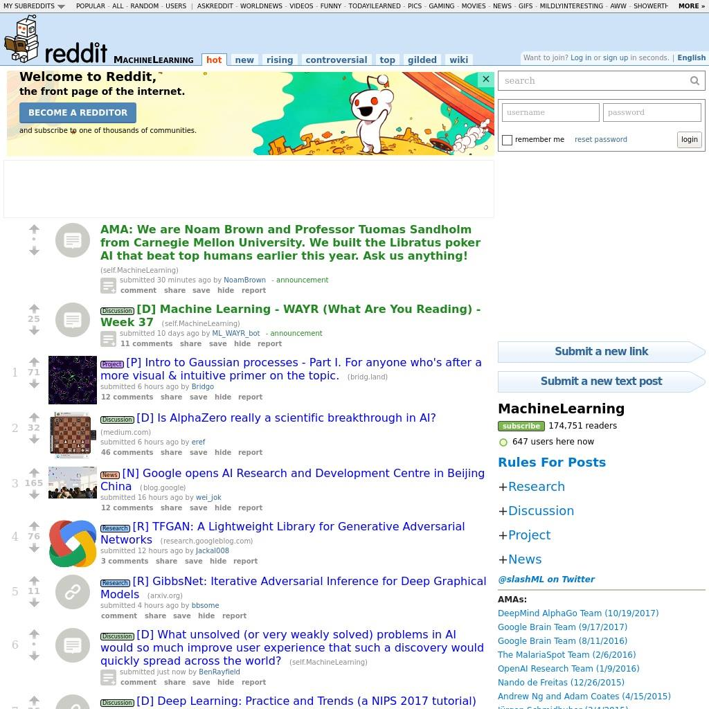

> #오늘의레딧 https://www.reddit.com/r/MachineLearning/ 래딧은 읽을 거리가 다양합니다.  1. 가우스 프로세스에 대한 소개-파트 I. 이 주제에 대한 보다 시각적이고 직관적인 입문서를 본분께 감사 드립니다. 2. 알파페로가 AI에 대한 과학적인 돌파구인가요? 3. 구글은 중국 베이징에 있는 AI연구 개발 센터를 열고 있다. 4. IMT20003GPP- 셀 수 없는 부가 서비스를 위한 경량 도서관 5. GibbsNet:반복적인 도식 모델에 대한 반복적인 조사 6. 이러한 발견되지 않은(또는 매우 약한)문제들은 사용자들의 경험이 세계 전역에 빠르게 확산될 수 있는 사용자 경험을 향상시킬 것인가? 7. 심층 학습:실습 및 추세(NIPS2017자습서) 8. 캡슐 네트워크 제한. 그들의 한계와 단점은 무엇인가? 그들을 위한 새로운 응용 프로그램? 그리고 어떻게 여전히 적대적인 공격에 실패하는가? (캅스 넷) 9. 애플리케이션 문서 및 해당 장소 10. 신경 회로망이 자신감이라고 예측할 수 있을까요? 11. 접지 truth를 생성하는 데 도움이 되는 소프트웨어 권장 사항 수 천개의 이미지에 대한 데이터 수집 12. Litudio클라우드에서 RStudio를 사용하여 R에 병렬 컴퓨팅을 설정하는 방법 13. 왜 기계 학습 커뮤니티는 CUDA에만 의존하며 OpenCL이 아닌 CUDA에만 의존합니까? 14. Keras는 Github에 있는 Kerams-team네임 스페이스 아래에 있습니다. 15. LSTMs를 사용할 때와 GRU를 사용할 때의 가장 최근의 결론은 무엇입니까? 16. 2017년의 NLP, 향상된 발전 및 추세에 대한 심층적인 학습 17. GAN을 이해하기 힘든 어려움 18. 자습서 세션:그래프와 마니포드의 기하학적 깊이 학습 19. ReewrkhogicalSummit대화 상자:일반 상식 비디오 이해 20. NIPS2017노트-데이비드 아벨(브라운 대학)  1. http://bridg.land/posts/gaussian-processes-1 2. https://medium.com/@josecamachocollados/is-alphazero-really-a-scientific-breakthrough-in-ai-bf66ae1c84f2 3. https://www.blog.google/topics/google-asia/google-ai-china-center/ 4. https://research.googleblog.com/2017/12/tfgan-lightweight-library-for.html?utm_source=feedburner&utm_medium=feed&utm_campaign=Feed:+blogspot/gJZg+\(Official+Google+Research+Blog\) 5. https://arxiv.org/abs/1712.04120 6. https://www.reddit.com/r/MachineLearning/comments/7jn8wk/d_what_unsolved_or_very_weakly_solved_problems_in/ 7. https://docs.google.com/presentation/d/e/2PACX-1vQMZsWfjjLLz_wi8iaMxHKawuTkdqeA3Gw00wy5dBHLhAkuLEvhB7k-4LcO5RQEVFzZXfS6ByABaRr4/pub?slide=id.g2b178fe261_0_994 8. https://www.reddit.com/r/MachineLearning/comments/7jhg12/d_capsule_networks_limits_what_are_their/ 9. https://www.reddit.com/r/MachineLearning/comments/7jkzpr/d_application_papers_and_their_venues/ 10. https://www.reddit.com/r/MachineLearning/comments/7jhxth/d_can_a_neural_network_predict_its_own_confidence/ 11. https://www.reddit.com/r/MachineLearning/comments/7jly45/d_software_recommendations_to_help_create_ground/ 12. https://blog.sicara.com/speedup-r-rstudio-parallel-cloud-performance-aws-96d25c1b13e2 13. https://www.reddit.com/r/MachineLearning/comments/7jlod2/d_why_is_the_machine_learning_community_solely/ 14. https://github.com/keras-team/keras 15. https://www.reddit.com/r/MachineLearning/comments/7jexmf/d_what_are_the_most_current_conclusions_of_when/ 16. https://tryolabs.com/blog/2017/12/12/deep-learning-for-nlp-advancements-and-trends-in-2017/ 17. https://www.reddit.com/r/MachineLearning/comments/7jkgl6/d_having_a_hard_time_trying_to_understand_gan/ 18. https://www.youtube.com/watch?v=LvmjbXZyoP0 19. https://medium.com/twentybn/common-sense-video-understanding-at-twentybn-video-aa0301146c35 20. https://cs.brown.edu/%7Edabel/blog/posts/misc/nips_2017.pdf

### 12월 15일 (금) 08:52 · 📷 사진 (1장)

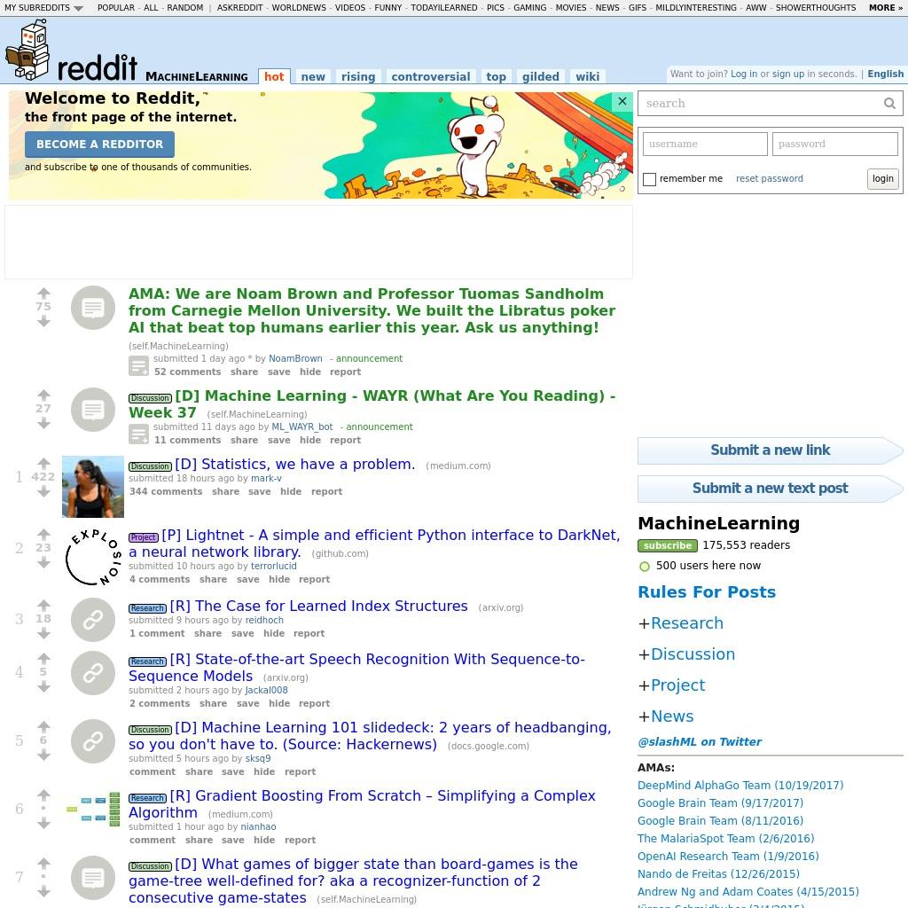

> #오늘의레딧 https://www.reddit.com/r/MachineLearning/ 오늘도 새소식이 많군요.  1. 통계 자료에 따르면, 우리는 문제가 있습니다. 2. Lightnet-신경계 네트워크 라이브러리에 대한 간단하고 효율적인 Python인터페이스입니다. 3. 대금 상환 지수 구조에 관한 사례 4. Sequent-to-Sequence모델을 통한 최첨단 음성 인식 5. 기계 학습 101슬라이드:2년간의 헤드 밴드:여러분은 그럴 필요가 없습니다. (출처:해커) 6. 복잡한 알고리즘을 단순화하는 도식화된 구배 7. 게임 게임보다 더 성대한 게임은 게임에서 무엇을 의미하는가? 2개의 연속된 게임을 인식하는 것으로 인식된다. 8. 가우스 프로세스에 대한 소개-파트 I. 이 주제에 대한 보다 시각적이고 직관적인 입문서를 본분께 감사 드립니다. 9. 이것을 위키에 추가할 수 있을까요? 좋은 학습 자원인 (course.fast.ai)을 위한 깊은 학습 자료인 것 같습니다. 10. IBMSpectrumConductorDeepLearningImpaction버전 1.1에 대한 무료 체험 11. 닌텐도 슈퍼 스매시 브라더스 MeleeMelee:"언터처블"에이전트 12. 깊은 CNN의 출력 편차는 훈련 중에 사라진다. 13. 빠르고 세련된 디자인과 시각화를 통해 구분할 수 있습니다. 14. 알파페로가 AI에 대한 과학적인 돌파구인가요? 15. 분산 텐서에서 자동 노드 배치(여러 장치에 그래프 노드 할당)기능 16. GibbsNet:반복적인 도식 모델에 대한 반복적인 조사 17. 이 노래의 어느 부분이 신경 네트워크(또는 다른 ML알고리즘)에 의해 생성되는가? 18. IMT20003GPP- 셀 수 없는 부가 서비스를 위한 경량 도서관 19. 구글은 중국 베이징에 있는 AI연구 개발 센터를 열고 있다. 20. 실제 세계에서 지적인 광고들의 예  1. https://medium.com/@kristianlum/statistics-we-have-a-problem-304638dc5de5 2. https://github.com/explosion/lightnet 3. http://arxiv.org/abs/1712.01208 4. https://arxiv.org/abs/1712.01769 5. https://docs.google.com/presentation/d/1kSuQyW5DTnkVaZEjGYCkfOxvzCqGEFzWBy4e9Uedd9k/preview?imm_mid=0f9b7e&cmp=em-data-na-na-newsltr_20171213&slide=id.g183f28bdc3_0_90 6. https://medium.com/mlreview/gradient-boosting-from-scratch-1e317ae4587d 7. https://www.reddit.com/r/MachineLearning/comments/7jvqlo/d_what_games_of_bigger_state_than_boardgames_is/ 8. http://bridg.land/posts/gaussian-processes-1 9. http://course.fast.ai/ 10. https://www.reddit.com/r/MachineLearning/comments/7jtxsk/n_announcing_free_trials_for_ibm_spectrum/ 11. https://arxiv.org/abs/1712.03280 12. https://www.reddit.com/r/MachineLearning/comments/7jt0wj/d_output_variance_of_a_deep_cnn_vanishes_during/ 13. http://www.jacobsilterra.com/2017/12/11/classifying-and-clustering-with-fasttext/ 14. https://medium.com/@josecamachocollados/is-alphazero-really-a-scientific-breakthrough-in-ai-bf66ae1c84f2 15. https://www.reddit.com/r/MachineLearning/comments/7jruts/d_automatic_node_placement_allocating_graph_nodes/ 16. https://arxiv.org/abs/1712.04120 17. https://www.reddit.com/r/MachineLearning/comments/7jr97b/discussion_which_part_of_this_song_is_generated/ 18. https://research.googleblog.com/2017/12/tfgan-lightweight-library-for.html?utm_source=feedburner&utm_medium=feed&utm_campaign=Feed:+blogspot/gJZg+\(Official+Google+Research+Blog\) 19. https://www.blog.google/topics/google-asia/google-ai-china-center/ 20. https://www.reddit.com/r/MachineLearning/comments/7jqjjo/d_tackling_adversarial_examples_in_real_world/

### 12월 16일 (토) 08:52 · 📷 사진 (1장)

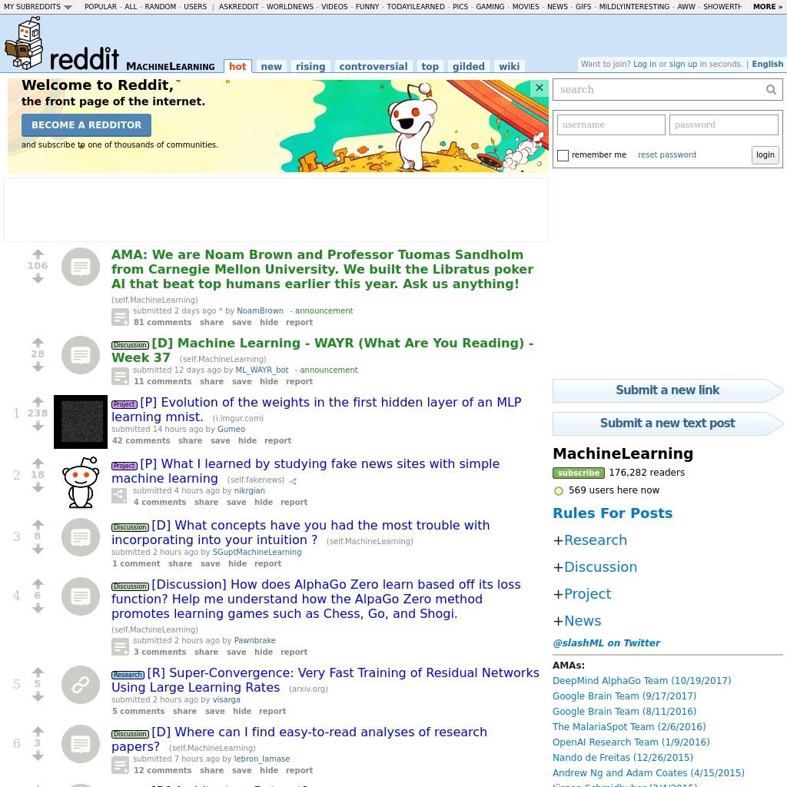

> #오늘의레딧 https://www.reddit.com/r/MachineLearning/ 오늘도 새소식이 많군요.  1. 소수 언어학적 학습자의 첫번째 숨겨진 계층에서 체중의 진화. 2. 간단한 기계 학습을 통해 가짜 뉴스 사이트를 학습함으로써 배운 것 3. 여러분의 직관력을 통합시키는 데 가장 큰 어려움은 무엇이었습니까? 4. 알파고 제로는 어떻게 상실 기능을 기초로 하는가? AlpanZero메서드가 체스, Go, Shogy와 같은 학습 게임을 촉진하는 방법을 이해하도록 도와 주십시오. 5. 슈퍼 컨버전:대규모 학습율을 이용한 잔류 네트워크의 신속한 전송 6. 연구 논문에 대한 읽기 쉬운 분석을 어디서 찾을 수 있을까요? 7. 건축 Dataset? 8. Sequent-to-Sequence모델을 통한 최첨단 음성 인식 9. 기계 학습 101슬라이드:2년간의 헤드 밴드:여러분은 그럴 필요가 없습니다. (출처:해커) 10. 통계 자료에 따르면, 우리는 문제가 있습니다. 11. Excel및 기계 학습으로 예산 관리 12. 가중 손실에 대한 체중 척도 13. 복잡한 알고리즘을 단순화하는 도식화된 구배 14. Lightnet-신경계 네트워크 라이브러리에 대한 간단하고 효율적인 Python인터페이스입니다. 15. 대금 상환 지수 구조에 관한 사례 16. 닌텐도 슈퍼 스매시 브라더스 MeleeMelee:"언터처블"에이전트 17. E.Crise는 최근 https://www.reddit.com/r/ml에서 논의된 토론과 관련된 SamAltman의 블로그를 운영하고 있습니다. 18. IBMSpectrumConductorDeepLearningImpaction버전 1.1에 대한 무료 체험 19. 이것을 위키에 추가할 수 있을까요? 좋은 학습 자원인 (course.fast.ai)을 위한 깊은 학습 자료인 것 같습니다. 20. 가우스 프로세스에 대한 소개-파트 I. 이 주제에 대한 보다 시각적이고 직관적인 입문서를 본분께 감사 드립니다.  1. https://i.imgur.com/V3l01mn.gifv 2. https://www.reddit.comhttps://www.reddit.com/r/fakenews/comments/7k1kmw/what_i_learned_by_studying_fake_news_sites_with/ 3. https://www.reddit.com/r/MachineLearning/comments/7k2r0j/d_what_concepts_have_you_had_the_most_trouble/ 4. https://www.reddit.com/r/MachineLearning/comments/7k2of3/discussion_how_does_alphago_zero_learn_based_off/ 5. https://arxiv.org/abs/1708.07120v2 6. https://www.reddit.com/r/MachineLearning/comments/7k0r1p/d_where_can_i_find_easytoread_analyses_of/ 7. https://www.reddit.com/r/MachineLearning/comments/7k2udd/d_architecture_dataset/ 8. https://arxiv.org/abs/1712.01769 9. https://docs.google.com/presentation/d/1kSuQyW5DTnkVaZEjGYCkfOxvzCqGEFzWBy4e9Uedd9k/preview?imm_mid=0f9b7e&cmp=em-data-na-na-newsltr_20171213&slide=id.g183f28bdc3_0_90 10. https://medium.com/@kristianlum/statistics-we-have-a-problem-304638dc5de5 11. https://www.pinchofintelligence.com/managing-budget-excel-machine-learning/ 12. https://www.reddit.com/r/MachineLearning/comments/7jy3w1/d_scale_of_weights_for_weighted_loss/ 13. https://medium.com/mlreview/gradient-boosting-from-scratch-1e317ae4587d 14. https://github.com/explosion/lightnet 15. http://arxiv.org/abs/1712.01208 16. https://arxiv.org/abs/1712.03280 17. http://blog.samaltman.com/e-pur-si-muove 18. https://www.reddit.com/r/MachineLearning/comments/7jtxsk/n_announcing_free_trials_for_ibm_spectrum/ 19. http://course.fast.ai/ 20. http://bridg.land/posts/gaussian-processes-1

### 12월 17일 (일) 08:52 · 📷 사진 (1장)

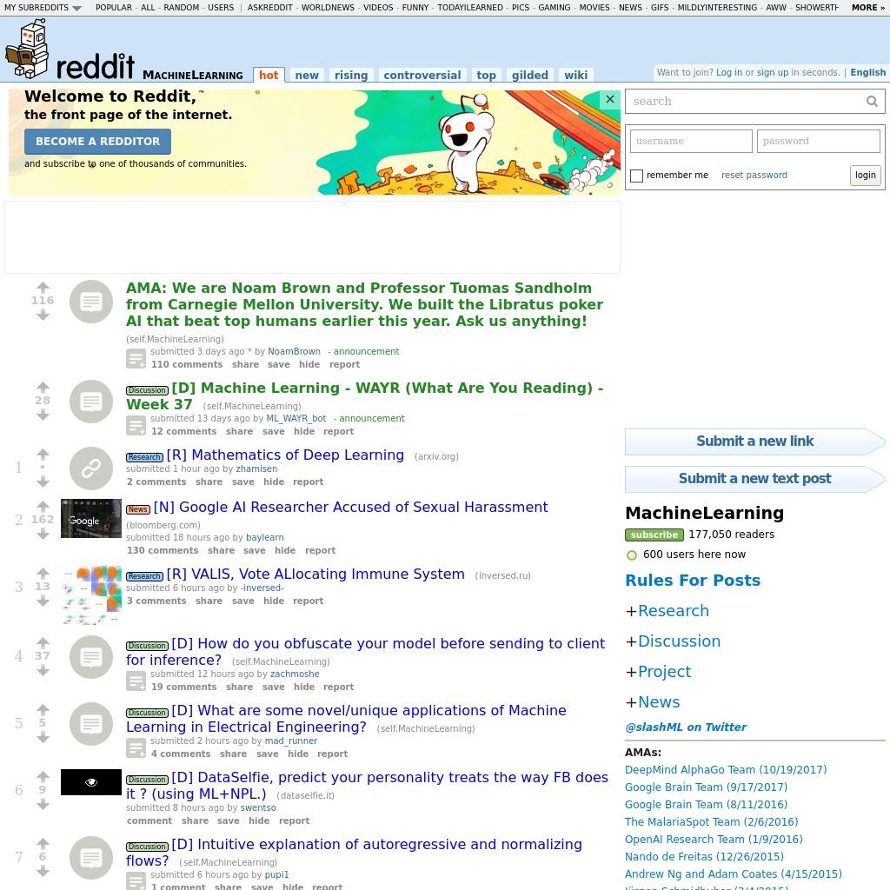

> #오늘의레딧 https://www.reddit.com/r/MachineLearning/ 재미난 이야기들이 많습니다.  1. 딥 오브 딥 학습 2. 구글 AI연구원이 성희롱을 예방하다 3. VALIS, 투표권 할당 시스템 4. 고객에게 추론을 보내기 전에 모델을 어떻게 분산시킵니까? 5. 전기 공학 분야에서 기계 학습의 일부가 아닌 것은 무엇입니까? 6. DataSelfie씨, 당신의 성격이 FBE방식으로 처리되는 것을 예측할 수 있습니까? (MLL을 사용합니다.) 7. 자동 재생에 대한 직관적인 설명과 흐름에 대한 설명? 8. 상업용으로 사용할 수 있는 거리 뷰를 사용하여 데이터 세트 생성 9. MentorNet:손상된 레이블에 대한 매우 심층적인 신경 전달 네트워크 조정 10. Aleku/imgaug-경계 상자와 키패드를 지원하는 광범위한 이미지 증강 라이브러리 11. 간단한 기계 학습을 통해 가짜 뉴스 사이트를 학습함으로써 배운 것 12. 소수 언어학적 학습자의 첫번째 숨겨진 계층에서 체중의 진화. 13. 여러분의 직관력을 통합시키는 데 가장 큰 어려움은 무엇이었습니까? 14. 슈퍼 컨버전:대규모 학습율을 이용한 잔류 네트워크의 신속한 전송 15. 알파고 제로는 어떻게 상실 기능을 기초로 하는가? AlpanZero메서드가 체스, Go, Shogy와 같은 학습 게임을 촉진하는 방법을 이해하도록 도와 주십시오. 16. 안녕하십니까?0과 00강의 예측 17. 사운드 투 더 와일드:야생 비디오 사운드를 위한 자연 음향 생성 18. 연구 논문에 대한 읽기 쉬운 분석을 어디서 찾을 수 있을까요? 19. 건축 Dataset? 20. Sequent-to-Sequence모델을 통한 최첨단 음성 인식  1. https://arxiv.org/abs/1712.04741 2. https://www.bloomberg.com/news/articles/2017-12-16/google-researcher-accused-of-sexual-harassment-roiling-ai-field 3. http://inversed.ru/AIS.htm 4. https://www.reddit.com/r/MachineLearning/comments/7k6int/d_how_do_you_obfuscate_your_model_before_sending/ 5. https://www.reddit.com/r/MachineLearning/comments/7k9n6t/d_what_are_some_novelunique_applications_of/ 6. http://dataselfie.it 7. https://www.reddit.com/r/MachineLearning/comments/7k86x6/d_intuitive_explanation_of_autoregressive_and/ 8. https://www.reddit.com/r/MachineLearning/comments/7k9y54/d_generating_dataset_using_street_view_images_for/ 9. https://arxiv.org/abs/1712.05055 10. https://github.com/aleju/imgaug 11. https://www.reddit.comhttps://www.reddit.com/r/fakenews/comments/7k1kmw/what_i_learned_by_studying_fake_news_sites_with/ 12. https://i.imgur.com/V3l01mn.gifv 13. https://www.reddit.com/r/MachineLearning/comments/7k2r0j/d_what_concepts_have_you_had_the_most_trouble/ 14. https://arxiv.org/abs/1708.07120v2 15. https://www.reddit.com/r/MachineLearning/comments/7k2of3/discussion_how_does_alphago_zero_learn_based_off/ 16. https://www.reddit.com/r/MachineLearning/comments/7k6nhk/d_yolo_and_yolo9000_class_predictions/ 17. https://arxiv.org/abs/1712.01393v1 18. https://www.reddit.com/r/MachineLearning/comments/7k0r1p/d_where_can_i_find_easytoread_analyses_of/ 19. https://www.reddit.com/r/MachineLearning/comments/7k2udd/d_architecture_dataset/ 20. https://arxiv.org/abs/1712.01769

### 12월 18일 (월) 07:24 · 📷 사진 (2장)

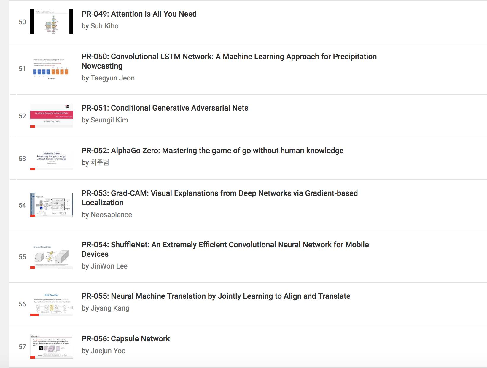 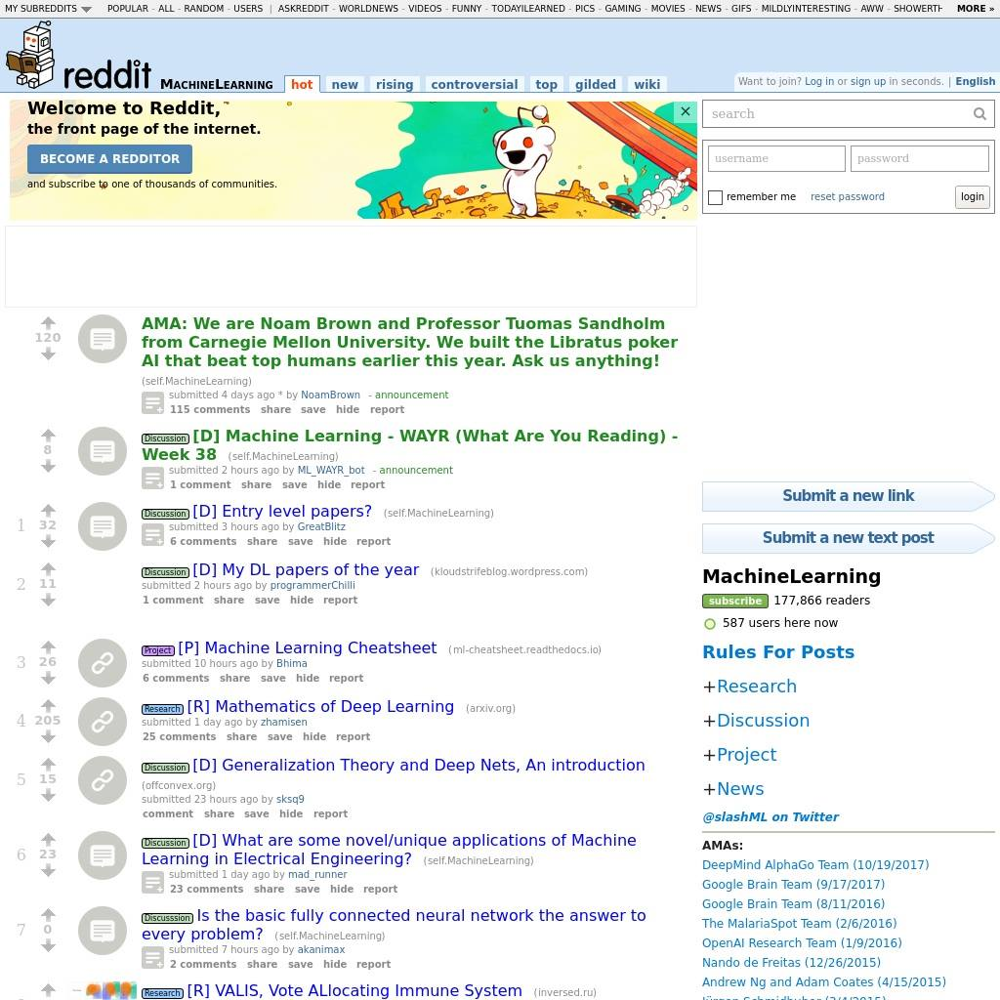

> PR12 멤버들 정말 수고가 많으십니다. 요즈음 재미있고 화제가 되고 있는 거의 모든 논문을 설명해 주고 계시고 그것도 귀에 쏙쏙들어오는 우리나라 말로 해주셔서 정말 감사합니다.  Transformer, Alphago Zero, ShuffleNet, CapsNet, 모두 모두 다 있습니다.  https://www.youtube.com/playlist?list=PLlMkM4tgfjnJhhd4wn5aj8fVTYJwIpWkS&disable_polymer=true  많이 들어 주시고 PR12멤버들 많이 응원부탁드립니다.
> #오늘의레딧 https://www.reddit.com/r/MachineLearning/ 래딧은 읽을 거리가 다양합니다.  1. 엔트리 레벨 신문이요? 2. 올해의 내 DL보고서 3. CheachineLearningCheacher 4. 딥 오브 딥 학습 5. 일반화 이론과 깊은 통찰력, 소개 6. 전기 공학 분야에서 기계 학습의 일부가 아닌 것은 무엇입니까? 7. VALIS, 투표권 할당 시스템 8. 구글 AI연구원이 성희롱을 예방하다 9. 자동 재생에 대한 직관적인 설명과 흐름에 대한 설명? 10. 상업용으로 사용할 수 있는 거리 뷰를 사용하여 데이터 세트 생성 11. 고객에게 추론을 보내기 전에 모델을 어떻게 분산시킵니까? 12. DataSelfie씨, 당신의 성격이 FBE방식으로 처리되는 것을 예측할 수 있습니까? (MLL을 사용합니다.) 13. MentorNet:손상된 레이블에 대한 매우 심층적인 신경 전달 네트워크 조정 14. 신경 회로망이 자동적으로 기계 코드로 변환될 수 있을까? 15. Aleku/imgaug-경계 상자와 키패드를 지원하는 광범위한 이미지 증강 라이브러리 16. 수도쿠 퍼즐을 풀 수 있는 AI(교육 데이터가 필요 없음) 17. 간단한 기계 학습을 통해 가짜 뉴스 사이트를 학습함으로써 배운 것 18. 구글 맵의 기초 그래프는 어디에 있는가? 19. 여러분의 직관력을 통합시키는 데 가장 큰 어려움은 무엇이었습니까? 20. 소수 언어학적 학습자의 첫번째 숨겨진 계층에서 체중의 진화.  1. https://www.reddit.com/r/MachineLearning/comments/7kfxz5/d_entry_level_papers/ 2. https://kloudstrifeblog.wordpress.com/2017/12/15/my-papers-of-the-year/ 3. https://ml-cheatsheet.readthedocs.io/en/latest/index.html 4. https://arxiv.org/abs/1712.04741 5. http://www.offconvex.org/2017/12/08/generalization1/ 6. https://www.reddit.com/r/MachineLearning/comments/7k9n6t/d_what_are_some_novelunique_applications_of/ 7. http://inversed.ru/AIS.htm 8. https://www.bloomberg.com/news/articles/2017-12-16/google-researcher-accused-of-sexual-harassment-roiling-ai-field 9. https://www.reddit.com/r/MachineLearning/comments/7k86x6/d_intuitive_explanation_of_autoregressive_and/ 10. https://www.reddit.com/r/MachineLearning/comments/7k9y54/d_generating_dataset_using_street_view_images_for/ 11. https://www.reddit.com/r/MachineLearning/comments/7k6int/d_how_do_you_obfuscate_your_model_before_sending/ 12. http://dataselfie.it 13. https://arxiv.org/abs/1712.05055 14. https://www.reddit.com/r/MachineLearning/comments/7kcbi9/d_can_neural_networks_be_automatically_translated/ 15. https://github.com/aleju/imgaug 16. https://github.com/zackthoutt/sudoku-ai 17. https://www.reddit.comhttps://www.reddit.com/r/fakenews/comments/7k1kmw/what_i_learned_by_studying_fake_news_sites_with/ 18. https://www.reddit.com/r/MachineLearning/comments/7kbvtf/d_where_is_the_underlying_graph_of_google_maps/ 19. https://www.reddit.com/r/MachineLearning/comments/7k2r0j/d_what_concepts_have_you_had_the_most_trouble/ 20. https://i.imgur.com/V3l01mn.gifv

### 12월 18일 (월) 10:03 · Wonderful snow run with Yeon Gyoung Gwac…

Wonderful snow run with Yeon Gyoung Gwack!

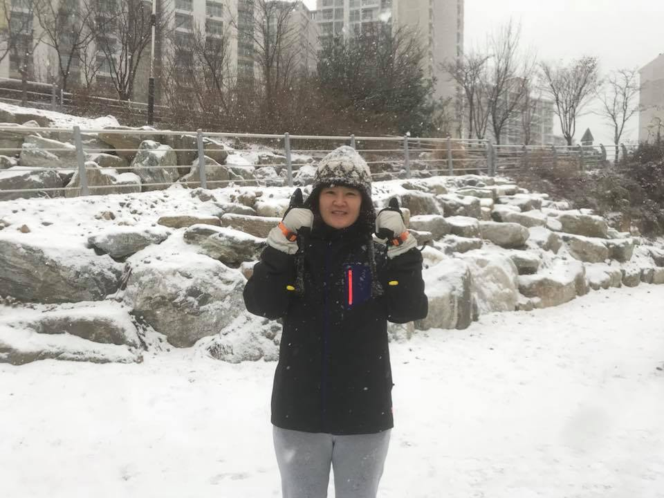 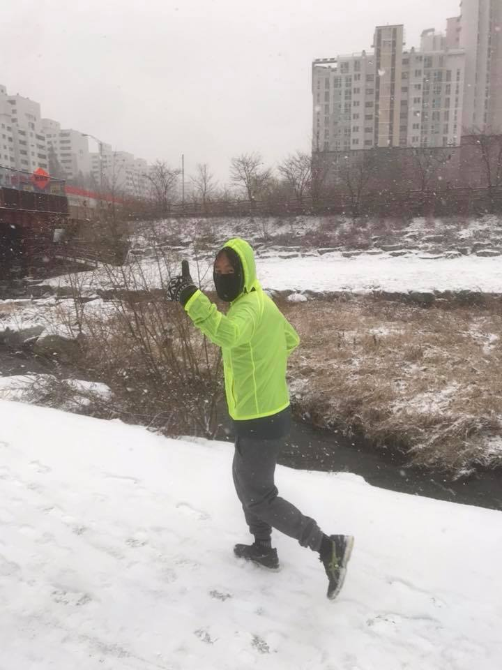 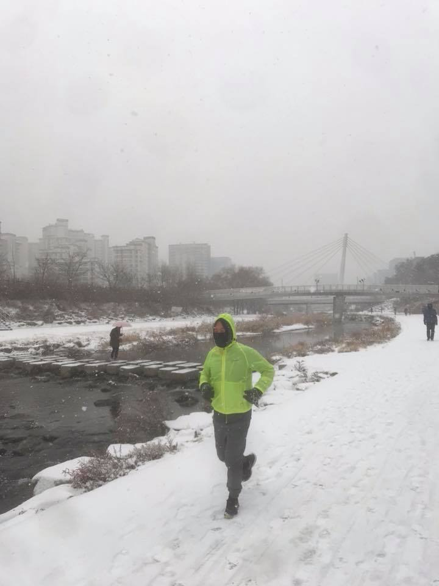

### 12월 19일 (화) 08:52 · 📷 사진 (1장)

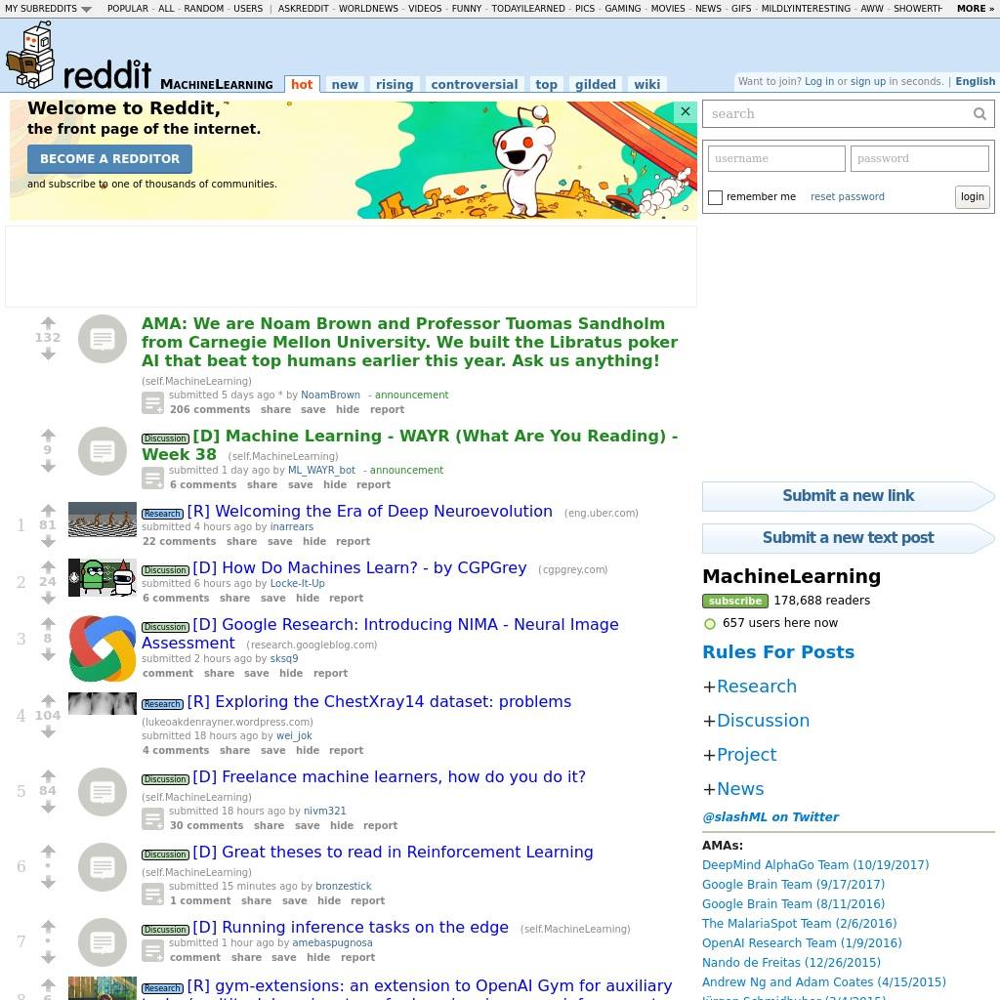

> #오늘의레딧 https://www.reddit.com/r/MachineLearning/ 재미난 이야기들이 많습니다.  1. [시론] 깊은 신경전의 시대를 연다. 2. 기계는 어떻게 학습하는가? -CGPG에 의해 3. GoogleResearch:NIMA-EasyImagingAssessment(신경 이미지 평가) 4. ChestXraral64데이터 셋 탐색:문제 해결 5. 프리랜서 기계 학습자 여러분, 어떻게 하시겠습니까? 6. 보강 학습을 통해 읽을 수 있는 훌륭한 책 7. 에지에서 추론 태스크 실행 8. AOextension:보조 업무에 대한 Open니Gym으로의 확장(멀티 태스킹 학습, 전달 학습, 역전파 학습 등) 9. Chainer화학:생물학과 화학에서의 깊은 학식을 위한 도서관 10. 스파이 웨어 디퍼렌셜 신경 컨트롤 시스템에 대한 코드 검토를 기꺼이 수행할 의향이 있는 사람은 누구입니까? 11. NIPS는 "부적절한 행동에 대한 성명서"를 게시하고 다양한 의장과 포괄 강좌를 임명할 것이다. 12. 모든 MLDatasets를 포맷하는 파이썬 라이브러리를 만듭니다. 13. 올해의 내 DL보고서 14. 엔트리 레벨 신문이요? 15. 어떤 종류의 기계 학습 솔루션을 채택해야 합니까? 16. 종업원 이동 자료를 기반으로 한 기계 학습 17. 태스크 기반 대화 상자 또는 데이터 세트를 찾는 중 18. NIPS에서의 농담 19. 오버페트 20. -제 동료는 기계 학습에 유투브 채널을 만들었습니다. 아마도 오늘 보시는 것 중 가장 좋은 것은 아마도 오늘 보시는 것과 같습니다.  1. https://eng.uber.com/deep-neuroevolution/ 2. http://www.cgpgrey.com/blog/how-do-machines-learn 3. https://research.googleblog.com/2017/12/introducing-nima-neural-image-assessment.html 4. https://lukeoakdenrayner.wordpress.com/2017/12/18/the-chestxray14-dataset-problems/ 5. https://www.reddit.com/r/MachineLearning/comments/7kja1n/d_freelance_machine_learners_how_do_you_do_it/ 6. https://www.reddit.com/r/MachineLearning/comments/7koxm2/d_great_theses_to_read_in_reinforcement_learning/ 7. https://www.reddit.com/r/MachineLearning/comments/7komix/d_running_inference_tasks_on_the_edge/ 8. https://github.com/Breakend/gym-extensions 9. https://preferredresearch.jp/2017/12/18/chainer-chemistry-beta-release/ 10. https://www.reddit.com/r/MachineLearning/comments/7kk0s3/d_someone_willing_to_do_code_review_of_sparse/ 11. https://nips.cc 12. https://www.reddit.com/r/MachineLearning/comments/7kiajj/d_planing_a_python_library_that_hostsformats_all/ 13. https://kloudstrifeblog.wordpress.com/2017/12/15/my-papers-of-the-year/ 14. https://www.reddit.com/r/MachineLearning/comments/7kfxz5/d_entry_level_papers/ 15. https://www.reddit.com/r/MachineLearning/comments/7kkn5c/d_what_sort_of_machine_learning_solution_should_i/ 16. https://www.reddit.com/r/MachineLearning/comments/7kjnjl/p_machine_learning_based_of_employee_movement_data/ 17. https://www.reddit.com/r/MachineLearning/comments/7kitmq/d_looking_for_taskbased_conversational_tasks_or/ 18. https://www.reddit.com/r/MachineLearning/comments/7kkzqv/d_the_joke_at_nips/ 19. https://www.reddit.com/r/MachineLearning/comments/7kkd1y/d_overfeat_and_yolo/ 20. https://www.youtube.com/watch?v=MgowR4pq3e8

### 12월 20일 (수) 08:52 · 📷 사진 (1장)

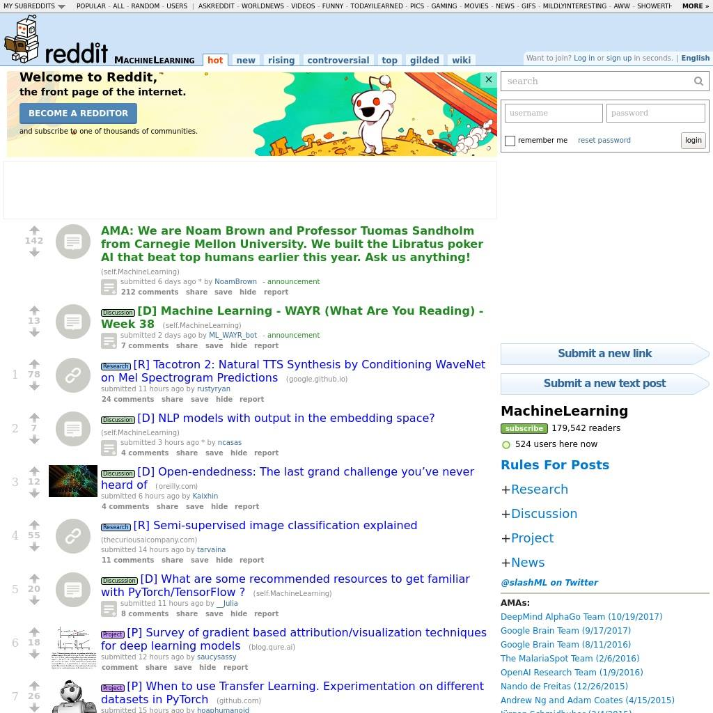

> #오늘의레딧 https://www.reddit.com/r/MachineLearning/ 따끈한 소식들입니다.  1. Tacotron2:AlectrumWaveNet에 의한 천연 TTS합성에 의한 천연 TTS합성 2. NLP모델을 포함한 NLP모델? 3. 허심탄회함:당신이 결코 들어 본 적이 없는 최후의 도전 4. 반자동 이미지 분류가 설명됨 5. 심층 학습 모델을 위한 구배 기반 주거 환경 평가 기법 개발에 관한 연구 6. 전송 학습을 사용할 때. PyTorch에서 서로 다른 데이터 셋에 대한 실험 7. [시론] 깊은 신경전의 시대를 연다. 8. 기계는 어떻게 학습하는가? -CGPG에 의해 9. 보강 학습을 통해 읽을 수 있는 훌륭한 책 10. GoogleResearch:NIMA-EasyImagingAssessment(신경 이미지 평가) 11. 최고의 휴일 ML종이라니? 12. 새로운 기능이 모델을 개선하는데 효과적인지 여부를 결정하는 방법은 무엇인가? 13. 우리는 주제를 위해 GatysImage스타일 트랜스퍼 케이스를 출시했습니다! 결과를 평가하는 데 도움이 됩니다!! 14. 에지에서 추론 태스크 실행 15. AOextension:보조 업무에 대한 Open니Gym으로의 확장(멀티 태스킹 학습, 전달 학습, 역전파 학습 등) 16. ChestXraral64데이터 셋 탐색:문제 해결 17. 프리랜서 기계 학습자 여러분, 어떻게 하시겠습니까? 18. 데이터 증가율 향상 19. 당신이 상상하지 못하는 이미지 대 이미지 변환 네트워크에 대한 생각은 어떤가요? 이러한 프로젝트에 대한 교육 자료는 어떻게 얻을 수 있습니까? 20. 마스터 알고리듬  1. https://google.github.io/tacotron/publications/tacotron2/ 2. https://www.reddit.com/r/MachineLearning/comments/7kvv68/d_nlp_models_with_output_in_the_embedding_space/ 3. https://www.oreilly.com/ideas/open-endedness-the-last-grand-challenge-youve-never-heard-of 4. https://thecuriousaicompany.com/mean-teacher/ 5. http://blog.qure.ai/notes/deep-learning-visualization-gradient-based-methods 6. https://github.com/miguelgfierro/sciblog_support/blob/master/A_Gentle_Introduction_to_Transfer_Learning/Intro_Transfer_Learning.ipynb 7. https://eng.uber.com/deep-neuroevolution/ 8. http://www.cgpgrey.com/blog/how-do-machines-learn 9. https://www.reddit.com/r/MachineLearning/comments/7koxm2/d_great_theses_to_read_in_reinforcement_learning/ 10. https://research.googleblog.com/2017/12/introducing-nima-neural-image-assessment.html 11. https://www.reddit.com/r/MachineLearning/comments/7kqoh0/d_best_holiday_ml_paper/ 12. https://www.reddit.com/r/MachineLearning/comments/7kqldj/dhow_to_decide_whether_a_new_feature_is_effective/ 13. https://www.reddit.com/r/MachineLearning/comments/7kqb48/project_we_extented_gatys_image_style_transfer_to/ 14. https://www.reddit.com/r/MachineLearning/comments/7komix/d_running_inference_tasks_on_the_edge/ 15. https://github.com/Breakend/gym-extensions 16. https://lukeoakdenrayner.wordpress.com/2017/12/18/the-chestxray14-dataset-problems/ 17. https://www.reddit.com/r/MachineLearning/comments/7kja1n/d_freelance_machine_learners_how_do_you_do_it/ 18. https://github.com/zhunzhong07/Random-Erasing 19. https://www.reddit.com/r/MachineLearning/comments/7kpdsj/d_what_are_your_thoughts_on_unsupervised/ 20. https://www.reddit.com/r/MachineLearning/comments/7kqj8q/d_the_master_algorithm/

### 12월 21일 (목) 08:03 · Purchased all Friends 10 Seasons. I am g…

Purchased all Friends 10 Seasons. I am going to laugh a lot this holiday season.

### 12월 21일 (목) 08:52 · 📷 사진 (2장)

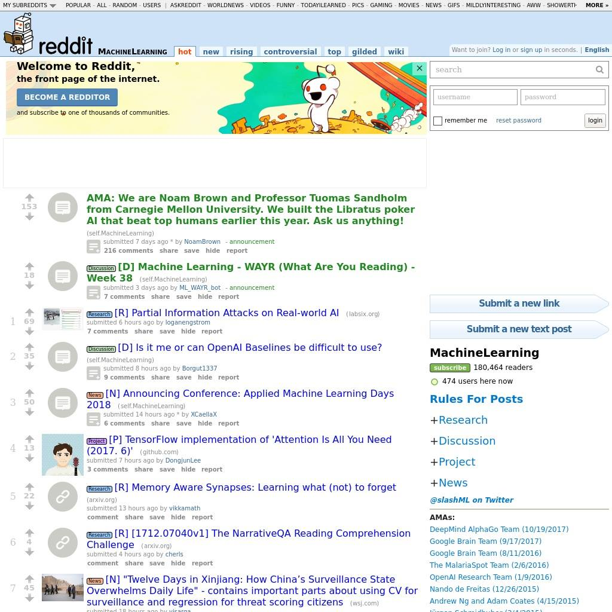 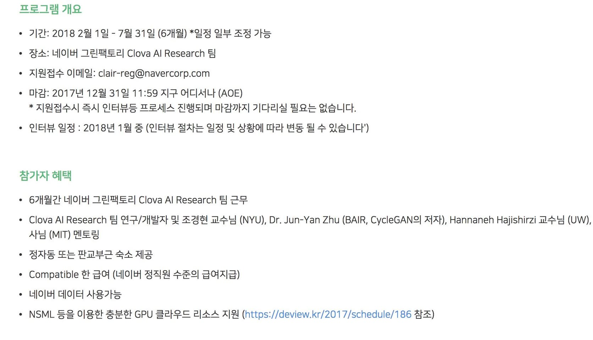

> #오늘의레딧 https://www.reddit.com/r/MachineLearning/ 오늘도 새소식이 많군요.  1. 리얼 월드 AI에 대한 부분 정보 2. 나는 아닌가요? 아니면 OpenAI기준선이 사용하기 어려운가요? 3. 발표회:2018년 1월 20일에 열리는 기계 학습 4. TensorFlow의 '관심사'구현(2017년 10월) '6)' 5. 기억할 수 있는 것을 배우는 능력: 잊지 말아야 할 것을 배우는 것 6. "신장에서의 12일":중국의 보안 감시 상태가 어떻게 일상 생활을 영위하는지에 대한 중요한 부분을 포함하고 있습니다. 7. PassGan:암호화를 위한 깊은 학습 접근법(코드 구현) 8. GoogleCloud의 실시간 예측:시장 피드 캡처부터 ML예측까지 9. 데이터 과학자 역할을 수행하면서 학습한 네가지 교훈 10. 식품 첨가물 소각로 설계 기술 개발 11. -기계 학습 직업 12. 몇주 전에 나는 영화 추천제를 시행하기 위한 글을 작성했다. 나는 지금 GitHub에 프로젝트를 공유해 왔다. 13. 기계 학습을 시작한 사업가들은 어떤 사업가였겠습니까? 14. 당신의 개인적인 선호도는 어떤가요?비전 페이퍼에 대한 깊은 통찰력을 가지고 있습니까? 15. RBM은 도트 제품에 의한 training데이터 외에 어떤 유용한 것을 학습합니까? 16. 포르탈과 불가능한 바둑 경기 17. 가짜 비디오를 감지하는 ML알고리즘을 알아보거나 알고 계신가요? 주제에 대한 다큐멘터리를 만드는 것! 18. 나는 검색 엔진 결과를 검색하기 위해 깊은 학습 모델을 훈련시키고 있다. 문제, PRA, 그리고 제안들은 환영합니다! 19. 압ol레스-베네스 이너스를 위한 철근-뼈 텐서 20. 미래의 유망한 기계 학습 기법은 가까운 미래에 매우 보편적으로 사용될 것입니다(예를 들어 UniversityEffectivityFoldesityEfficiencyEfficiencyEfficiency).  1. http://www.labsix.org/partial-information-adversarial-examples/ 2. https://www.reddit.com/r/MachineLearning/comments/7l23y8/d_is_it_me_or_can_openai_baselines_be_difficult/ 3. https://www.reddit.com/r/MachineLearning/comments/7l0a8b/n_announcing_conference_applied_machine_learning/ 4. https://github.com/DongjunLee/transformer-tensorflow 5. https://arxiv.org/abs/1711.09601 6. https://www.wsj.com/articles/twelve-days-in-xinjiang-how-chinas-surveillance-state-overwhelms-daily-life-1513700355 7. https://github.com/brannondorsey/PassGAN 8. https://cloud.google.com/blog/big-data/2017/12/real-time-forecasts-in-the-cloud-from-market-feed-capture-to-ml-predictions 9. https://medium.com/@joaomarcosgris/four-lessons-learned-while-hunting-for-a-data-scientist-role-3e1bf05b5440 10. https://medium.com/@jctestud/food-ingredient-reverse-engineering-through-gradient-descent-2a8d3880dd81 11. http://www.machine-learning-careers.com 12. https://github.com/shubham-bhatnagar/Movie-Recommendation-System 13. https://www.reddit.com/r/MachineLearning/comments/7l1oyi/d_any_entrepreneurs_here_who_started_a_business/ 14. https://www.reddit.com/r/MachineLearning/comments/7l4qw4/d_what_are_your_personal_favourite_cnn_deep/ 15. https://www.reddit.com/r/MachineLearning/comments/7l4ejw/d_what_useful_thing_do_rbms_learn_other_than/ 16. https://www.reddit.com/r/MachineLearning/comments/7l47fa/d_chess_with_portals_and_impossible_go/ 17. https://www.reddit.com/r/MachineLearning/comments/7l240q/d_anyone_working_on_or_aware_of_ml_algorithms/ 18. https://github.com/JoaoLages/TREC_WebTrack 19. https://www.reddit.com/r/MachineLearning/comments/7kxsbp/p_aboleth_a_barebones_tensorflow_framework_for/ 20. https://www.reddit.com/r/MachineLearning/comments/7kz170/d_what_upandcoming_machine_learning_techniques_do/
> [우리 함께해요!]  더 많은 분들과 함께 즐거운 TF/딥러닝 연구개발을 위해 마련한 네이버 레지던시 프로그램 (2018년 상반기) 지원마감이 이제 10여일 남았습니다. 저희들과 함께 하셔서 6개월 올인으로 멋지고 재미있는거 같이 많이 연구하고 만들어봐요.  https://clova.ai/ko/research/careers.html#residency  지원은 clair-reg@navercorp.com 로 간단하게 이메일 주시면 됩니다.

### 12월 22일 (금) 08:52 · 📷 사진 (2장)

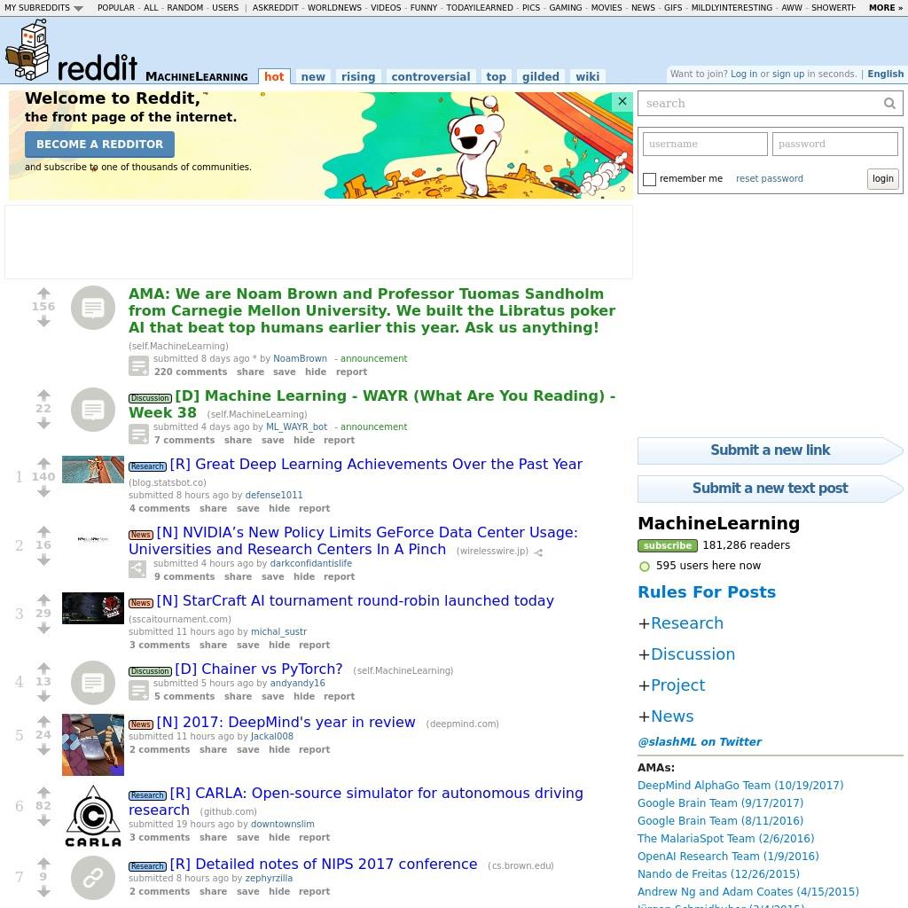 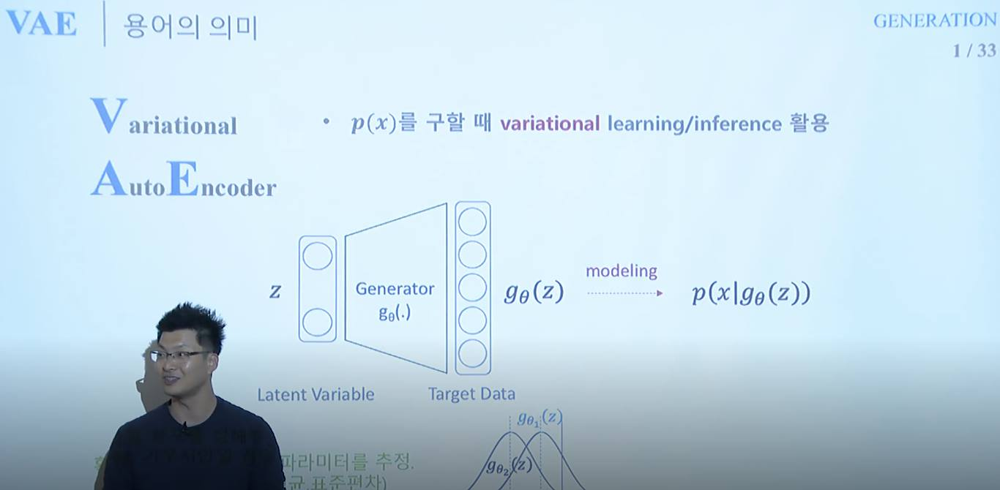

> #오늘의레딧 https://www.reddit.com/r/MachineLearning/ 재미난 이야기들이 많습니다.  1. 지난 해에 걸쳐 배운 깊은 학문 성취 2. NVIDIA의 새로운 정책 한계 제일처 데이터 센터 활용 사례:대학 및 연구소 3. 오늘 출시된 스타 크래프트 월드 챔피언십 라운드가 시작되었다. 4. 차이너 vsPyTorch? 5. 2017년:DeepMind의 검토 년도 6. CAL:자율 주행 연구를 위한 개방형 시뮬레이터 7. NIPS2017회의 상세 내역 8. Combogen:이미지 영역 변환을 위한 무제한 확장성 9. CrronosGroupReleaseNetworkExchange를 위한 NNEF1.0표준 10. 다이넷 2.0.2 릴리스 11. 비디오 게임을 하는 사람들을 위한 인신 공격 12. 현대의 깊은 학문의 이론:그것이 왜 그렇게 효과가 있는가? 13. 스레일러를 사용하여 동일한 데이터()와 점수()를 모두 사용하여 정확한 데이터를 주고받을 수 있습니다(약 55). 이게 정상인가요 아니면 제가 무언가 잘못하고 있는 건가요? 14. 데이터 세트를 학습하는 시스템 내의 민감한 데이터에 대한 고려 사항 15. 강화 학습 에이전트를 위한 역 방향 커리큘럼 생성 16. 극한의 데이터 불균형을 고려한 교육 환경 적응성 평가 기법 개발/ 제3회 CDMA국제 학술 대회 17. 분산 시계열 데이터 예측에 관한 질문 18. 리얼 월드 AI에 대한 부분 정보 19. 데모 웹 사이트-176피부 질환 진단 20. k-server, 파트 2:지속 시간 미러 하강  1. https://blog.statsbot.co/deep-learning-achievements-4c563e034257 2. https://wirelesswire.jp/2017/12/62708/ 3. http://sscaitournament.com/index.php 4. https://www.reddit.com/r/MachineLearning/comments/7lb5n1/d_chainer_vs_pytorch/ 5. https://deepmind.com/blog/2017-deepminds-year-review/ 6. https://github.com/carla-simulator/carla 7. https://cs.brown.edu/~dabel/blog/posts/misc/nips_2017.pdf 8. https://www.reddit.com/r/MachineLearning/comments/7la3ux/r_combogan_unrestrained_scalability_for_image/ 9. https://www.khronos.org/news/press/khronos-group-releases-nnef-1.0-standard-for-neural-network-exchange 10. https://github.com/clab/dynet/releases/tag/2.0.2 11. https://openreview.net/forum?id=Hk91SGWR- 12. https://medium.com/mlreview/modern-theory-of-deep-learning-why-does-it-works-so-well-9ee1f7fb2808 13. https://www.reddit.com/r/MachineLearning/comments/7ldbyp/d_using_sklearn_giving_same_data_to_both_fit_and/ 14. https://cloud.google.com/solutions/sensitive-data-and-ml-datasets 15. http://bair.berkeley.edu/blog/2017/12/20/reverse-curriculum/ 16. https://github.com/taki0112/CASED-Tensorflow 17. https://www.reddit.com/r/MachineLearning/comments/7lbvo5/d_question_regarding_discreteseries_data/ 18. http://www.labsix.org/partial-information-adversarial-examples/ 19. https://www.reddit.com/r/MachineLearning/comments/7l7nzj/p_demo_website_for_the_diagnosis_of_176_skin/ 20. https://blogs.princeton.edu/imabandit/2017/12/20/k-server-part-2-continuous-time-mirror-descent/
> [함께 해요 2번째, 27개의 강의 영상!] #모두를위한딥러닝 수업을 만들때와 같은 심정으로 재미있는 것을 더 많은 사람들과 나누고 싶어서 네이버에 계시는 Jung-Woo Ha, Nako Sung, Hwalsuk Lee, Lucy Park, 이동현님등 많은 분과 함께하여 많은 분들을 초대하였고, 그분들의 동의를 얻어 강의를 공개하고 있습니다. 아래 27개의 정말 멋지고 재미있는 강의들입니다. (실제로는 50 편이상이나 지금 편집중이거나 사내만 공개만 가능한것들이 많아서 아쉽습니다.)  내년에도 더 많은 분들을 모셔서 더 많은 재미난 이야기들을 함께 나누도록 하겠습니다. 본인의 지식을 나누고 싶으신 분들은 강의제목과 요약, 그리고 본인의 간단한 약력을 hunkim+talk@gmail.com로 주시면 됩니다. (다만 저희의 세미나실 스케줄등으로 메일 주시는 모든 분들을 모시지 못할수 있음을 미리 양해 부탁드립니다.)   ---  1. 뽀로로QA와 심층 임베딩 메모리망, 김경민, 서울대 박사과정, http://tv.naver.com/v/2231323  2. Multimodal Sequential Learning for Video QA, 김은솔, 서울대 박사과정, http://tv.naver.com/v/2218642  3. Finding connections among images using CycleGAN, 박태성, UC Berkeley 박사과정, http://tv.naver.com/v/2203900  4. Learning to reason by reading text and answering questions, 서민준, Washington Univ. 박사과정, http://tv.naver.com/v/2083653  5. 조음 Goodness-Of-Pronunciation 자질을 이용한 영어 학습자의 조음 오류 진단, 류혁수, 서울대 박사과정, http://tv.naver.com/v/2152689  6. 1시간만에 GAN(Generative Adversarial Network) 완전 정복하기, 최윤제, 고려대 석사과정, http://tv.naver.com/v/1947034  7. Introduction of Deep Reinforcement Learning, 곽동현, (서울대 박사과정, Now Naver),  http://tv.naver.com/v/2024376  8. Deep Learning, Where are you going?, 조경현, NYU 교수, http://tv.naver.com/v/1967400  9. Deepmind StarCraft II AI, 송호연(Kakao), http://tv.naver.com/v/2451300  10. 블록과 함께하는 케라스와 태양에서 세포까지 활용사, 김태영(인스페이스 CTO), http://tv.naver.com/v/2440383  11. 2017 R-Biz Challange 터틀봇3 오토레이스, 길기종(동아대학교 석사과정), http://tv.naver.com/v/2404922  12. Speeding Up Distributed Machine Learning Using Codes, 이강욱 (KAIST 박사 후 연구원), http://tv.naver.com/v/2389070  13. Recommender system for education, 서창호 (KAIST 교수), http://tv.naver.com/v/2345343  14. 기계학습을 이용하여 정적 분석기의 안전성을 선별적으로 조절하는 방법, 허기홍 (서울대 박사과정), http://tv.naver.com/v/2345246  15. 사람 뽑는 기계 만들기, 송호원(OnboardIQ), http://tv.naver.com/v/2343656  16. The Personal Home Service Robot that Won the RoboCup@Home League, 이범진(서울대 박사과정), http://tv.naver.com/v/2317076  17. 그림 그리는 AI, 이활석 (Naver Clova), http://tv.naver.com/v/2417457  18. Learning to Perceive the 3D World, 최봉수(Stanford University 박사 과정) http://tv.naver.com/v/2316860  19. Variational Autoencoded Regression of Visual Data with Generative Advers, 유영준 (서울대 박사 후 연구원, Now Naver),  http://tv.naver.com/v/2290853  20. Learning where and how to look for weakly-supervised visual recognition, 이용재 (Yong Jae Lee, UC Davis),  http://tv.naver.com/v/2261079  21. Contour-Constrained Superpixels for Image and Video Processing, 이세호(고려대 박사과정), http://tv.naver.com/v/2260981  22. Online video object segmentation via convolutional trident network, 장원동 (고려대 박사과정),  http://tv.naver.com/v/2257232  23. Video Object Segmentation in Videos, 고영준 (고려대 박사과정), http://tv.naver.com/v/2237808  24. Step-by-step approach to question answering, 민세원 (서울대 학부 4학년), http://tv.naver.com/v/2152722  25. 알아두면 쓸 데있는 신기한 강화학습, 김태훈 (데브시스터즈),  http://tv.naver.com/v/2051482  26.  RLCode와 A3C 쉽고 깊게 이해하기, 이웅원(RLCode 리더),  http://tv.naver.com/v/2022271  27. Deepmind StarCraft II AI, 송호연(Kakao, now Naver), http://tv.naver.com/v/2451300

### 12월 23일 (토) 08:52 · 📷 사진 (1장)

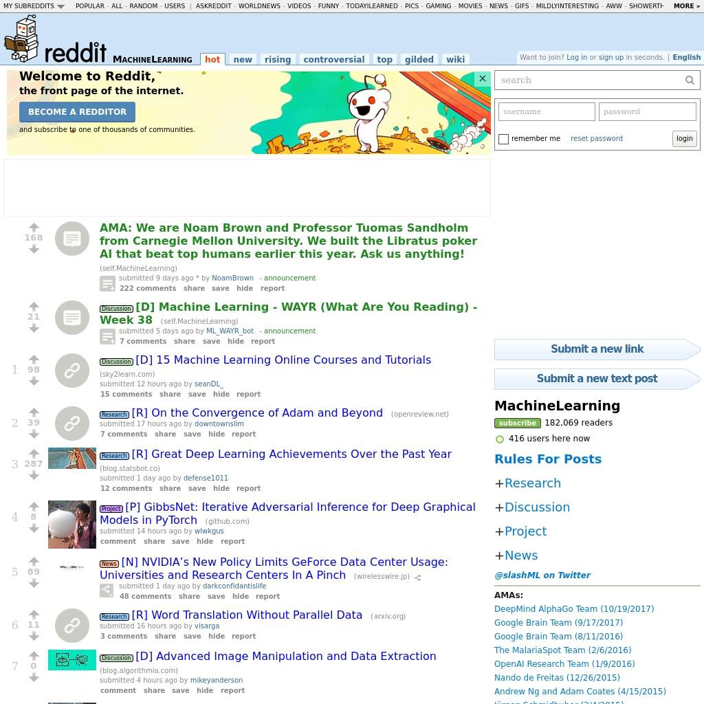

> #오늘의레딧 https://www.reddit.com/r/MachineLearning/ 재미난 이야기들이 많습니다.  1. 15기계 학습 온라인 코스 및 튜토리얼 2. 아담과 비욘드의 융합에 관하여 3. 지난 해에 걸쳐 배운 깊은 학식 성취 4. GibbsNet:Iterrch의 깊은 그래픽 모델에 대한 반복적인 광고 5. NVIDIA의 새로운 정책 한계 제어지 데이터 센터 사용량:대학 및 연구소 내의 연구소 6. 병렬 데이터가 없는 워드 번역 7. 고급 이미지 조작 및 데이터 추출 8. 성희롱 혐의로 기소된 구글의 연구원들은 '브레이드 시스템'은 '브레이드 시스템'을 말한다. 9. 레이어에 대한 연구가 계층에 배치된 경우에도 Req/kg에 대한 연구가 계속 진행되고 있음을 확인하고 있는가? 10. MUSE:다중 언어 실패 및 감독된 엠버링 11. 2018년에 개최되는 14개의 AI와 기계 학습 컨퍼런스 12. 채굴을 위한 깊은 배움 학습 하드웨어 사용 13. 가장 생산적인 개발 IDE와 플러그 인 콤보를 위한 가장 생산적인 개발은 무엇이라고 생각하십니까? 14. 다양한 알고리즘을 통해 데이터를 올바르게 형성하고 처리하는 방법을 이해하는 가장 좋은 방법은 무엇입니까? 15. 차이너 vsPyTorch? 16. 오늘 출시된 스타 크래프트 월드 챔피언십 라운드가 시작되었다. 17. Combogen:이미지 영역 변환을 위한 무제한 확장성 18. 다이넷 2.0.2 릴리스 19. 2017년:DeepMind의 검토 년도 20. NIPS2017회의 상세 내역  1. https://sky2learn.com/machine-learning-online-courses-and-tutorials.html 2. https://openreview.net/forum?id=ryQu7f-RZ 3. https://blog.statsbot.co/deep-learning-achievements-4c563e034257 4. https://github.com/wlwkgus/GibbsNet 5. https://wirelesswire.jp/2017/12/62708/ 6. https://arxiv.org/abs/1710.04087 7. https://blog.algorithmia.com/advanced-image-manipulation-and-data-extraction/ 8. https://www.theguardian.com/technology/2017/dec/22/google-ai-researcher-sexual-harassment-female-data-scientists 9. https://www.reddit.com/r/MachineLearning/comments/7leg0v/d_has_there_been_any_studies_on_of_relu_still/ 10. https://github.com/facebookresearch/MUSE 11. https://www.hpe.com/us/en/insights/articles/the-top-14-ai-and-machine-learning-conferences-to-attend-in-2018-1712.html 12. https://medium.com/mlreview/using-your-idle-deep-learning-hardware-for-mining-c1b9887491fa 13. https://www.reddit.com/r/MachineLearning/comments/7lhxfu/d_what_do_you_guys_think_is_the_most_productive/ 14. https://www.reddit.com/r/MachineLearning/comments/7li2fn/d_whats_the_best_way_to_gain_an_understanding_of/ 15. https://www.reddit.com/r/MachineLearning/comments/7lb5n1/d_chainer_vs_pytorch/ 16. http://sscaitournament.com/index.php 17. https://www.reddit.com/r/MachineLearning/comments/7la3ux/r_combogan_unrestrained_scalability_for_image/ 18. https://github.com/clab/dynet/releases/tag/2.0.2 19. https://deepmind.com/blog/2017-deepminds-year-review/ 20. https://cs.brown.edu/~dabel/blog/posts/misc/nips_2017.pdf

### 12월 24일 (일) 08:52 · 📷 사진 (1장)

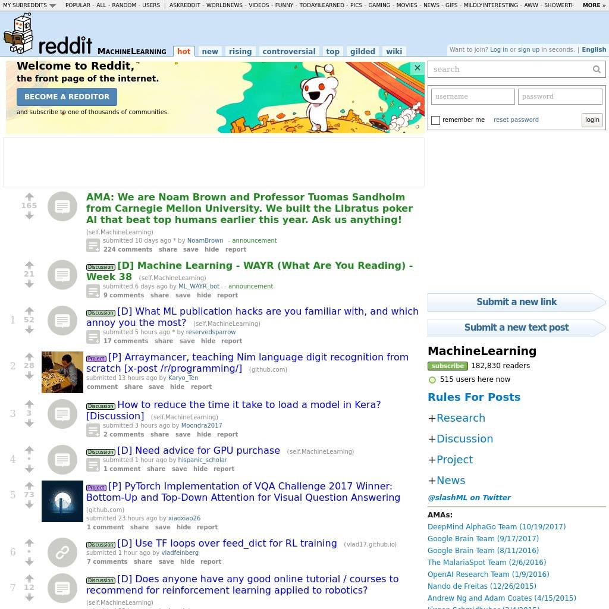

> #오늘의레딧 https://www.reddit.com/r/MachineLearning/ 래딧은 읽을 거리가 다양합니다.  1. 당신은 어떤 맥스 출판사들을 가장 잘 알고 있습니까?그리고 당신을 가장 짜증 나게 하는 것은 무엇인가요? 2. GPU구매에 대한 조언 필요 3. VBA당면 과제에 대한 벤치마킹 시행:상향식 질문 응답을 위한 상향식 및 Top-Down주의 4. TRIG루프를 사용하여 PDI교육을 위해 피드 루프를 사용합니다. 5. 훌륭한 온라인 자습서/강좌를 수강할 수 있는 사람이 있습니까? 6. 15기계 학습 온라인 코스 및 튜토리얼 7. 성희롱 혐의로 기소된 구글의 연구원들은 '브레이드 시스템'은 '브레이드 시스템'을 말한다. 8. 아담과 비욘드의 융합에 관하여 9. 이 SVM이 예측 단계에서 53초를 소요하는 것이 합리적입니까? 10. 고급 이미지 조작 및 데이터 추출 11. GibbsNet:Iterrch의 깊은 그래픽 모델에 대한 반복적인 광고 12. 가장 생산적인 개발 IDE와 플러그 인 콤보를 위한 가장 생산적인 개발은 무엇이라고 생각하십니까? 13. 지난 해에 걸쳐 배운 깊은 학문 성취 14. 병렬 데이터가 없는 워드 번역 15. NVIDIA의 새로운 정책 한계 제일처 데이터 센터 활용 사례:대학 및 연구소 16. 레이어에 대한 연구가 계층에 배치된 경우에도 Req/kg에 대한 연구가 계속 진행되고 있음을 확인하고 있는가? 17. MUSE:다중 언어 실패 및 감독된 엠버링 18. 2018년에 개최되는 14개의 AI와 기계 학습 컨퍼런스 19. 채굴을 위한 깊은 배움 학습 하드웨어 사용 20. 다양한 알고리즘을 통해 데이터를 올바르게 형성하고 처리하는 방법을 이해하는 가장 좋은 방법은 무엇입니까?  1. https://www.reddit.com/r/MachineLearning/comments/7lq58j/d_what_ml_publication_hacks_are_you_familiar_with/ 2. https://www.reddit.com/r/MachineLearning/comments/7lrbec/d_need_advice_for_gpu_purchase/ 3. https://github.com/hengyuan-hu/bottom-up-attention-vqa 4. https://vlad17.github.io/2017/12/23/beating-tf-api-in-vram.html 5. https://www.reddit.com/r/MachineLearning/comments/7lljqc/d_does_anyone_have_any_good_online_tutorial/ 6. https://sky2learn.com/machine-learning-online-courses-and-tutorials.html 7. https://www.theguardian.com/technology/2017/dec/22/google-ai-researcher-sexual-harassment-female-data-scientists 8. https://openreview.net/forum?id=ryQu7f-RZ 9. https://www.reddit.com/r/MachineLearning/comments/7llf2m/d_is_it_reasonable_for_this_svm_to_take_53/ 10. https://blog.algorithmia.com/advanced-image-manipulation-and-data-extraction/ 11. https://github.com/wlwkgus/GibbsNet 12. https://www.reddit.com/r/MachineLearning/comments/7lhxfu/d_what_do_you_guys_think_is_the_most_productive/ 13. https://blog.statsbot.co/deep-learning-achievements-4c563e034257 14. https://arxiv.org/abs/1710.04087 15. https://wirelesswire.jp/2017/12/62708/ 16. https://www.reddit.com/r/MachineLearning/comments/7leg0v/d_has_there_been_any_studies_on_of_relu_still/ 17. https://github.com/facebookresearch/MUSE 18. https://www.hpe.com/us/en/insights/articles/the-top-14-ai-and-machine-learning-conferences-to-attend-in-2018-1712.html 19. https://medium.com/mlreview/using-your-idle-deep-learning-hardware-for-mining-c1b9887491fa 20. https://www.reddit.com/r/MachineLearning/comments/7li2fn/d_whats_the_best_way_to_gain_an_understanding_of/

### 12월 25일 (월) 08:52 · 📷 사진 (1장)

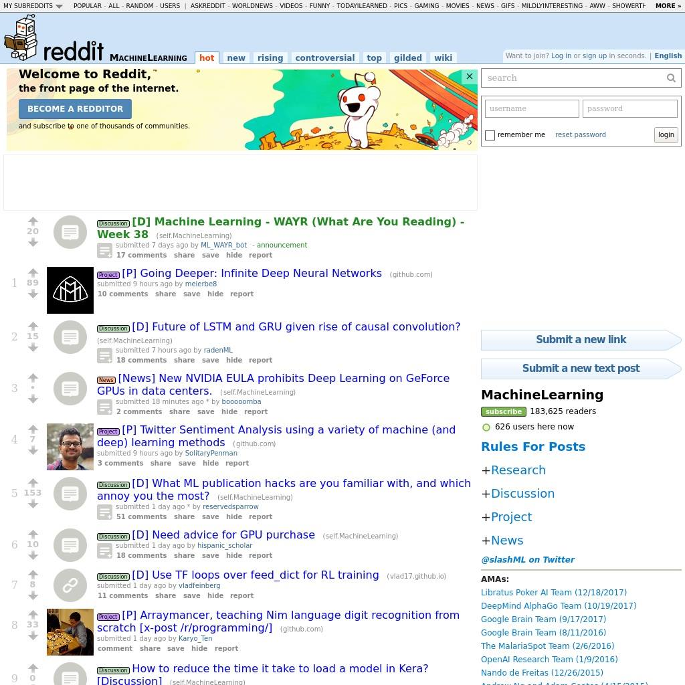

> #오늘의레딧 https://www.reddit.com/r/MachineLearning/ 정말 읽을 거리가 많네요.  1. 더욱 심층적인 접근:무한 심도의 신경계 네트워크 2. 원인 변환을 유발하는 LSTM및 GRU의 미래? 3. 새로운 NVIDIAEULA는 데이터 센터에서 GeForceGPU에 대한 딥 학습을 금지합니다. 4. 다양한 기계(및 깊은)학습 방법을 이용한 트위터 감성 분석 5. 당신은 어떤 맥스 출판사들을 가장 잘 알고 있습니까?그리고 당신을 가장 짜증 나게 하는 것은 무엇인가요? 6. GPU구매에 대한 조언 필요 7. TRIG루프를 사용하여 PDI교육을 위해 피드 루프를 사용합니다. 8. VBA당면 과제에 대한 벤치마킹 시행:상향식 질문 응답을 위한 상향식 및 Top-Down주의 9. 훌륭한 온라인 자습서/강좌를 수강할 수 있는 사람이 있습니까? 10. 15기계 학습 온라인 코스 및 튜토리얼 11. 성희롱 혐의로 기소된 구글의 연구원들은 '브레이드 시스템'은 '브레이드 시스템'을 말한다. 12. 아담과 비욘드의 융합에 관하여 13. 가장 생산적인 개발 IDE와 플러그 인 콤보를 위한 가장 생산적인 개발은 무엇이라고 생각하십니까? 14. 이 SVM이 예측 단계에서 53초를 소요하는 것이 합리적입니까? 15. GibbsNet:Iterrch의 깊은 그래픽 모델에 대한 반복적인 광고 16. 지난 해에 걸쳐 배운 깊은 학문 성취 17. 병렬 데이터가 없는 워드 번역 18. NVIDIA의 새로운 정책 한계 제일처 데이터 센터 활용 사례:대학 및 연구소 19. 레이어에 대한 연구가 계층에 배치된 경우에도 Req/kg에 대한 연구가 계속 진행되고 있음을 확인하고 있는가? 20. 고급 이미지 조작 및 데이터 추출  1. https://github.com/kutoga/going_deeper 2. https://www.reddit.com/r/MachineLearning/comments/7lvqay/d_future_of_lstm_and_gru_given_rise_of_causal/ 3. https://www.reddit.com/r/MachineLearning/comments/7ly5gi/news_new_nvidia_eula_prohibits_deep_learning_on/ 4. https://github.com/abdulfatir/twitter-sentiment-analysis 5. https://www.reddit.com/r/MachineLearning/comments/7lq58j/d_what_ml_publication_hacks_are_you_familiar_with/ 6. https://www.reddit.com/r/MachineLearning/comments/7lrbec/d_need_advice_for_gpu_purchase/ 7. https://vlad17.github.io/2017/12/23/beating-tf-api-in-vram.html 8. https://github.com/hengyuan-hu/bottom-up-attention-vqa 9. https://www.reddit.com/r/MachineLearning/comments/7lljqc/d_does_anyone_have_any_good_online_tutorial/ 10. https://sky2learn.com/machine-learning-online-courses-and-tutorials.html 11. https://www.theguardian.com/technology/2017/dec/22/google-ai-researcher-sexual-harassment-female-data-scientists 12. https://openreview.net/forum?id=ryQu7f-RZ 13. https://www.reddit.com/r/MachineLearning/comments/7lhxfu/d_what_do_you_guys_think_is_the_most_productive/ 14. https://www.reddit.com/r/MachineLearning/comments/7llf2m/d_is_it_reasonable_for_this_svm_to_take_53/ 15. https://github.com/wlwkgus/GibbsNet 16. https://blog.statsbot.co/deep-learning-achievements-4c563e034257 17. https://arxiv.org/abs/1710.04087 18. https://wirelesswire.jp/2017/12/62708/ 19. https://www.reddit.com/r/MachineLearning/comments/7leg0v/d_has_there_been_any_studies_on_of_relu_still/ 20. https://blog.algorithmia.com/advanced-image-manipulation-and-data-extraction/

### 12월 26일 (화) 08:52 · 📷 사진 (4장)

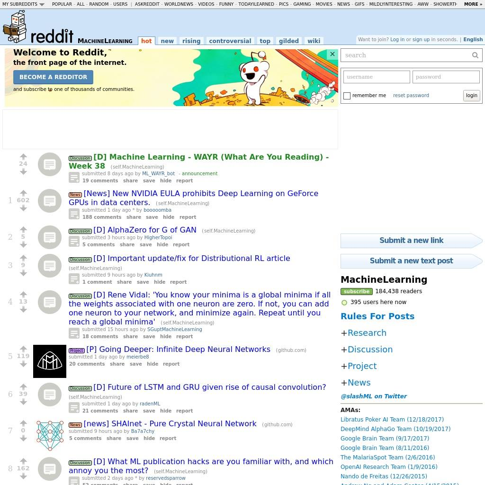 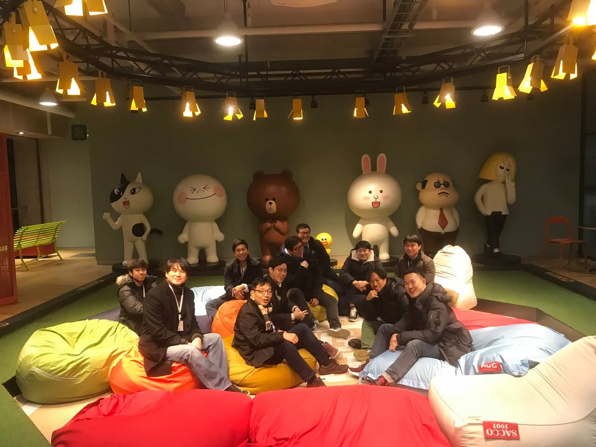 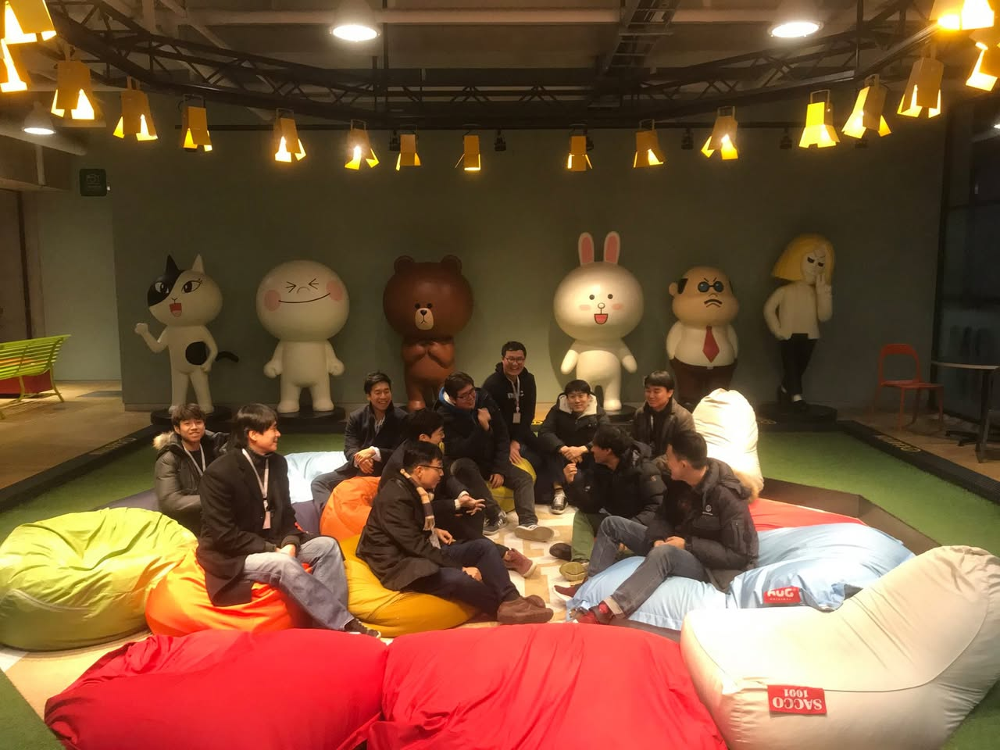 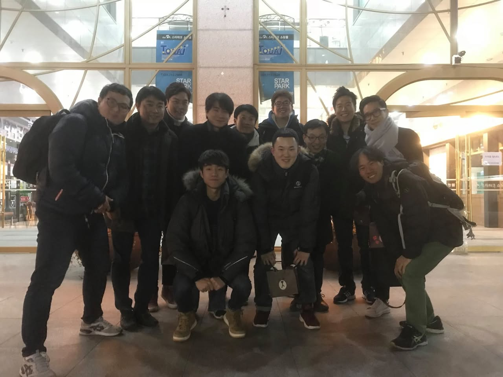

> #오늘의레딧 https://www.reddit.com/r/MachineLearning/ 오늘도 새소식이 많군요.  1. 새로운 NVIDIAEULA는 데이터 센터에서 GeForceGPU에 대한 딥 학습을 금지합니다. 2. G.G.G.G.G.N.G. 3. 중요한 지적 RL을 위한 중요 업데이트/수정 사항 4. 르네 비달:'당신은 하나의 뉴런이 하나의 뉴런과 연관된 모든 무게가 없다면, 당신의 미니 홈피는 세계적인 미니 균임을 알고 있습니다. 그렇지 않으면 네트워크에 하나의 뉴런을 추가하고 다시 최소화할 수 있습니다. 전 세계적인 미니 드라마에 도달할 때까지 반복하세요. 5. 더욱 심층적인 접근:무한 심도의 신경계 네트워크 6. 원인 변환을 유발하는 LSTM및 GRU의 미래? 7. 당신은 어떤 맥스 출판사들을 가장 잘 알고 있습니까?그리고 당신을 가장 짜증 나게 하는 것은 무엇인가요? 8. 다양한 기계(및 깊은)학습 방법을 이용한 트위터 감성 분석 9. GPU구매에 대한 조언 필요 10. TRIG루프를 사용하여 PDI교육을 위해 피드 루프를 사용합니다. 11. VBA당면 과제에 대한 벤치마킹 시행:상향식 질문 응답을 위한 상향식 및 Top-Down주의 12. 훌륭한 온라인 자습서/강좌를 수강할 수 있는 사람이 있습니까? 13. 15기계 학습 온라인 코스 및 튜토리얼 14. 성희롱 혐의로 기소된 구글의 연구원들은 '브레이드 시스템'은 '브레이드 시스템'을 말한다. 15. 아담과 비욘드의 융합에 관하여 16. 가장 생산적인 개발 IDE와 플러그 인 콤보를 위한 가장 생산적인 개발은 무엇이라고 생각하십니까? 17. GibbsNet:Iterrch의 깊은 그래픽 모델에 대한 반복적인 광고 18. 지난 해에 걸쳐 배운 깊은 학문 성취 19. 병렬 데이터가 없는 워드 번역 20. NVIDIA의 새로운 정책 한계 제일처 데이터 센터 활용 사례:대학 및 연구소  1. https://www.reddit.com/r/MachineLearning/comments/7ly5gi/news_new_nvidia_eula_prohibits_deep_learning_on/ 2. https://www.reddit.com/r/MachineLearning/comments/7m3hjh/d_alphazero_for_g_of_gan/ 3. https://www.reddit.com/r/MachineLearning/comments/7m1c5a/d_important_updatefix_for_distributional_rl/ 4. https://www.reddit.com/r/MachineLearning/comments/7m07ps/d_rene_vidal_you_know_your_minima_is_a_global/ 5. https://github.com/kutoga/going_deeper 6. https://www.reddit.com/r/MachineLearning/comments/7lvqay/d_future_of_lstm_and_gru_given_rise_of_causal/ 7. https://www.reddit.com/r/MachineLearning/comments/7lq58j/d_what_ml_publication_hacks_are_you_familiar_with/ 8. https://github.com/abdulfatir/twitter-sentiment-analysis 9. https://www.reddit.com/r/MachineLearning/comments/7lrbec/d_need_advice_for_gpu_purchase/ 10. https://vlad17.github.io/2017/12/23/beating-tf-api-in-vram.html 11. https://github.com/hengyuan-hu/bottom-up-attention-vqa 12. https://www.reddit.com/r/MachineLearning/comments/7lljqc/d_does_anyone_have_any_good_online_tutorial/ 13. https://sky2learn.com/machine-learning-online-courses-and-tutorials.html 14. https://www.theguardian.com/technology/2017/dec/22/google-ai-researcher-sexual-harassment-female-data-scientists 15. https://openreview.net/forum?id=ryQu7f-RZ 16. https://www.reddit.com/r/MachineLearning/comments/7lhxfu/d_what_do_you_guys_think_is_the_most_productive/ 17. https://github.com/wlwkgus/GibbsNet 18. https://blog.statsbot.co/deep-learning-achievements-4c563e034257 19. https://arxiv.org/abs/1710.04087 20. https://wirelesswire.jp/2017/12/62708/

### 12월 27일 (수) 08:52 · 📷 사진 (2장)

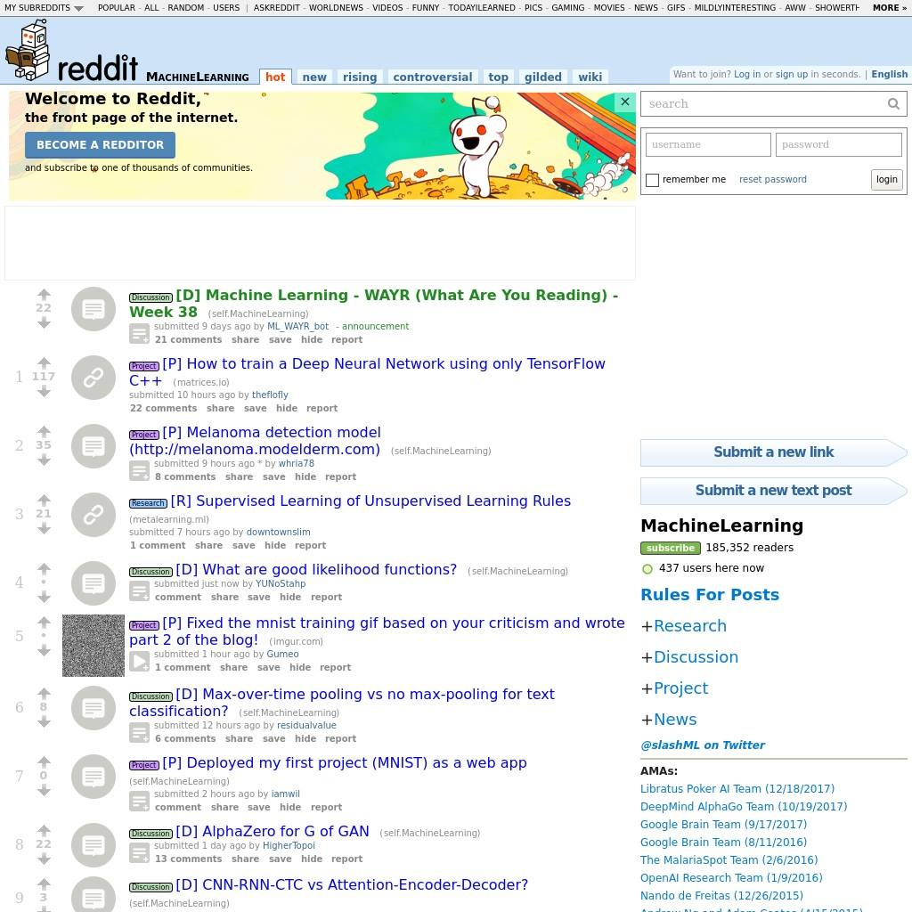 

> #오늘의레딧 https://www.reddit.com/r/MachineLearning/ 오늘도 새소식이 많군요.  1. TensorflowC++만을 사용하여 깊은 신경 회로를 훈련시키는 방법 2. 멜라노마 검출 모델(http://melanoma.modelderm.com) 3. 극복되지 않은 학습 규칙에 대한 감독된 학습 4. 가능성이 높은 기능은 무엇입니까? 5. 당신의 비평에 기초한 맞춤법 훈련을 고쳐 주고 블로그의 한 부분을 써라! 6. 맥스-오버 타임 풀링-텍스트 분류를 위한 max-pool을 포함하지 않습니까? 7. 최초의 프로젝트(MNIST)를 웹 앱으로 구축 8. G.G.G.G.G.N.G. 9. CNN-AEN-CCvs-Decoder-Decoder-Decoder? 10. 새로운 NVIDIAEULA는 데이터 센터에서 GeForceGPU에 대한 딥 학습을 금지합니다. 11. 중요한 지적 RL을 위한 중요 업데이트/수정 사항 12. 단순한 기계 학습이 Bitcoin가격을 예측할 수 없는 이유 13. 르네 비달:'당신은 하나의 뉴런이 하나의 뉴런과 연관된 모든 무게가 없다면, 당신의 미니 홈피는 세계적인 미니 균임을 알고 있습니다. 그렇지 않으면 네트워크에 하나의 뉴런을 추가하고 다시 최소화할 수 있습니다. 전 세계적인 미니 드라마에 도달할 때까지 반복하세요. 14. 더욱 심층적인 접근:무한 심도의 신경계 네트워크 15. 원인 변환을 유발하는 LSTM및 GRU의 미래? 16. 다양한 기계(및 깊은)학습 방법을 이용한 트위터 감성 분석 17. 당신은 어떤 맥스 출판사들을 가장 잘 알고 있습니까?그리고 당신을 가장 짜증 나게 하는 것은 무엇인가요? 18. GPU구매에 대한 조언 필요 19. TRIG루프를 사용하여 PDI교육을 위해 피드 루프를 사용합니다. 20. VBA당면 과제에 대한 벤치마킹 시행:상향식 질문 응답을 위한 상향식 및 Top-Down주의  1. https://matrices.io/training-a-deep-neural-network-using-only-tensorflow-c/ 2. https://www.reddit.com/r/MachineLearning/comments/7m7xp8/p_melanoma_detection_model/ 3. http://metalearning.ml/papers/metalearn17_metz.pdf 4. https://www.reddit.com/r/MachineLearning/comments/7maz39/d_what_are_good_likelihood_functions/ 5. https://imgur.com/a/wIytV#9QSnoc9 6. https://www.reddit.com/r/MachineLearning/comments/7m772v/d_maxovertime_pooling_vs_no_maxpooling_for_text/ 7. https://www.reddit.com/r/MachineLearning/comments/7maapa/p_deployed_my_first_project_mnist_as_a_web_app/ 8. https://www.reddit.com/r/MachineLearning/comments/7m3hjh/d_alphazero_for_g_of_gan/ 9. https://www.reddit.com/r/MachineLearning/comments/7m6lp4/d_cnnrnnctc_vs_attentionencoderdecoder/ 10. https://www.reddit.com/r/MachineLearning/comments/7ly5gi/news_new_nvidia_eula_prohibits_deep_learning_on/ 11. https://www.reddit.com/r/MachineLearning/comments/7m1c5a/d_important_updatefix_for_distributional_rl/ 12. http://www.erogol.com/cannot-predict-bitcoin-price-vanilla-machine-learning/ 13. https://www.reddit.com/r/MachineLearning/comments/7m07ps/d_rene_vidal_you_know_your_minima_is_a_global/ 14. https://github.com/kutoga/going_deeper 15. https://www.reddit.com/r/MachineLearning/comments/7lvqay/d_future_of_lstm_and_gru_given_rise_of_causal/ 16. https://github.com/abdulfatir/twitter-sentiment-analysis 17. https://www.reddit.com/r/MachineLearning/comments/7lq58j/d_what_ml_publication_hacks_are_you_familiar_with/ 18. https://www.reddit.com/r/MachineLearning/comments/7lrbec/d_need_advice_for_gpu_purchase/ 19. https://vlad17.github.io/2017/12/23/beating-tf-api-in-vram.html 20. https://github.com/hengyuan-hu/bottom-up-attention-vqa

### 12월 28일 (목) 08:52 · 📷 사진 (1장)

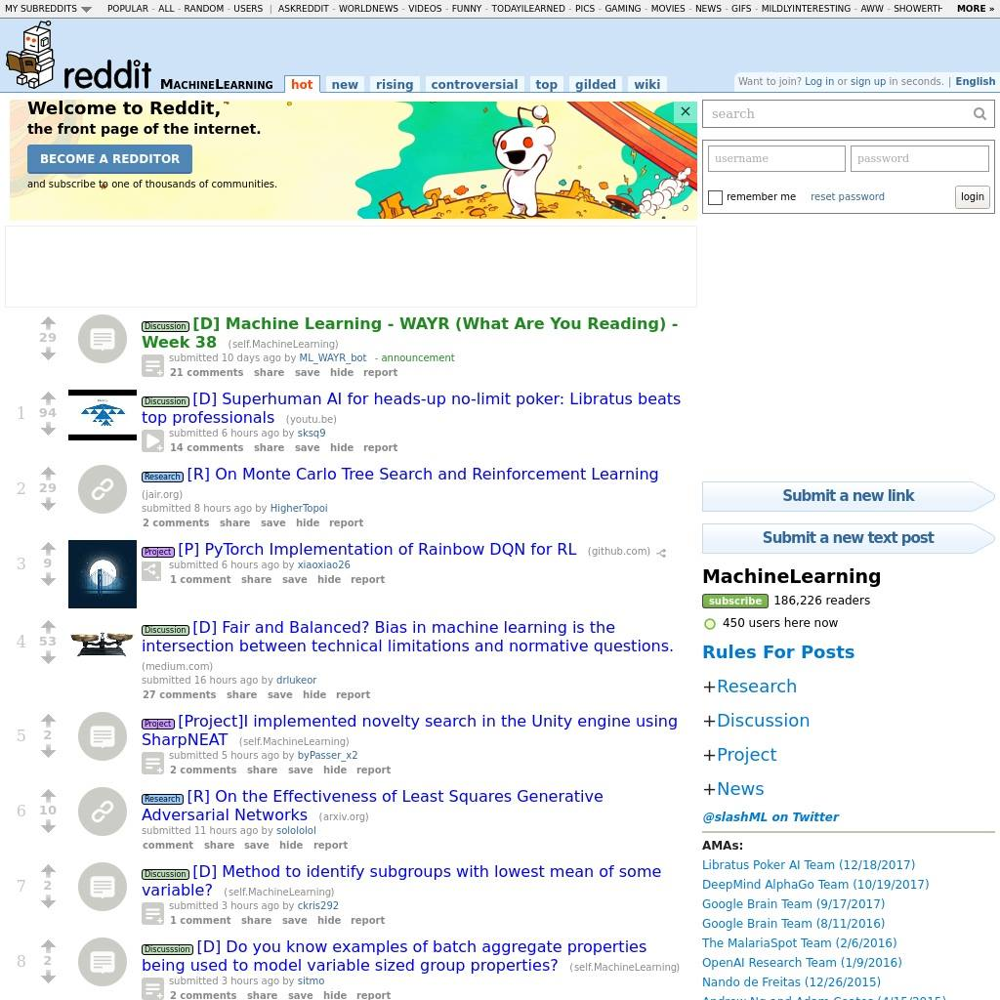

> #오늘의레딧 https://www.reddit.com/r/MachineLearning/ 재미난 이야기들이 많습니다.  1. 머리 위로 올라가지 않는 다람쥐를 위한 SuperhumanAI:Libratus는 최고의 전문가들을 능가한다. 2. 몬테카를로 트리 검색 및 보강 학습 3. PyTorch에 대한 RamorchDQN구현 4. 공평하고 균형 잡힌 방법으로요? 기계 학습의 편향은 기술적 한계와 규범적 질문 사이의 교차점이다. 5. ShartLeat를 사용하여 Unity엔진에서 새로운 검색 기능을 구현했습니다. 6. 제4회 CDMA국제 학술 대회 7. 하위 그룹을 식별할 수 있는 방법은 무엇인가? 8. 퀼봇:세련된 패러 그래프 9. 고밀도 영상 예측의 진전 10. 2017년 4대 기계 학습 동향 11. 2018년에 배울 가치가 있는 기계 학습 석사 학위를 받으려면 시간과 돈이 필요한가요? 12. 객체, 관계, 물리학에 대한 학습을 위한 상호 작용 네트워크의 구현 13. 이 값_cucuracy및 value_loss차트가 약간 이상하게 보입니까? 14. 시스템 학습을 위한 우수한 서버 공급 업체 15. TensorflowC++만을 사용하여 깊은 신경 회로를 훈련시키는 방법 16. ACN-GAN을 이용한 차별화된 유통 17. 멜라노마 검출 모델(http://melanoma.modelderm.com) 18. 당신의 비평에 기초한 맞춤법 훈련을 고쳐 주고 블로그의 한 부분을 써라! 19. 극복되지 않은 학습 규칙에 대한 감독된 학습 20. 가능성이 높은 기능은 무엇입니까?  1. https://youtu.be/2dX0lwaQRX0 2. https://www.jair.org/media/5507/live-5507-10333-jair.pdf 3. https://github.com/hengyuan-hu/rainbow 4. https://medium.com/@cody.marie.wild/fair-and-balanced-thoughts-on-bias-in-probabilistic-modeling-2ffdbd8a880f 5. https://www.reddit.com/r/MachineLearning/comments/7mgwz7/projecti_implemented_novelty_search_in_the_unity/ 6. https://arxiv.org/abs/1712.06391 7. https://www.reddit.com/r/MachineLearning/comments/7mhhef/d_method_to_identify_subgroups_with_lowest_mean/ 8. http://www.quillbot.com 9. https://www.reddit.com/r/MachineLearning/comments/7mdku8/d_advances_in_dense_image_prediction/ 10. https://medium.com/@Zelros/4-machine-learning-trends-that-made-2017-14ccf7178a4a 11. https://www.reddit.com/r/MachineLearning/comments/7mepak/d_is_the_time_and_money_it_takes_to_get_a_masters/ 12. https://github.com/higgsfield/interaction_network_pytorch 13. https://www.reddit.com/r/MachineLearning/comments/7mhe0u/p_do_these_val_accuracy_and_val_loss_charts_look/ 14. https://www.reddit.com/r/MachineLearning/comments/7mdg9v/d_good_server_vendor_for_machine_learning/ 15. https://matrices.io/training-a-deep-neural-network-using-only-tensorflow-c/ 16. http://ruishu.io/2017/12/26/acgan/ 17. https://www.reddit.com/r/MachineLearning/comments/7m7xp8/p_melanoma_detection_model/ 18. https://imgur.com/a/wIytV#9QSnoc9 19. http://metalearning.ml/papers/metalearn17_metz.pdf 20. https://www.reddit.com/r/MachineLearning/comments/7maz39/d_what_are_good_likelihood_functions/

### 12월 28일 (목) 11:19 · Knit hat (handmade by Yeon Gyoung Gwack)…

Knit hat (handmade by Yeon Gyoung Gwack) is very cute and useful for running, working and everything!

 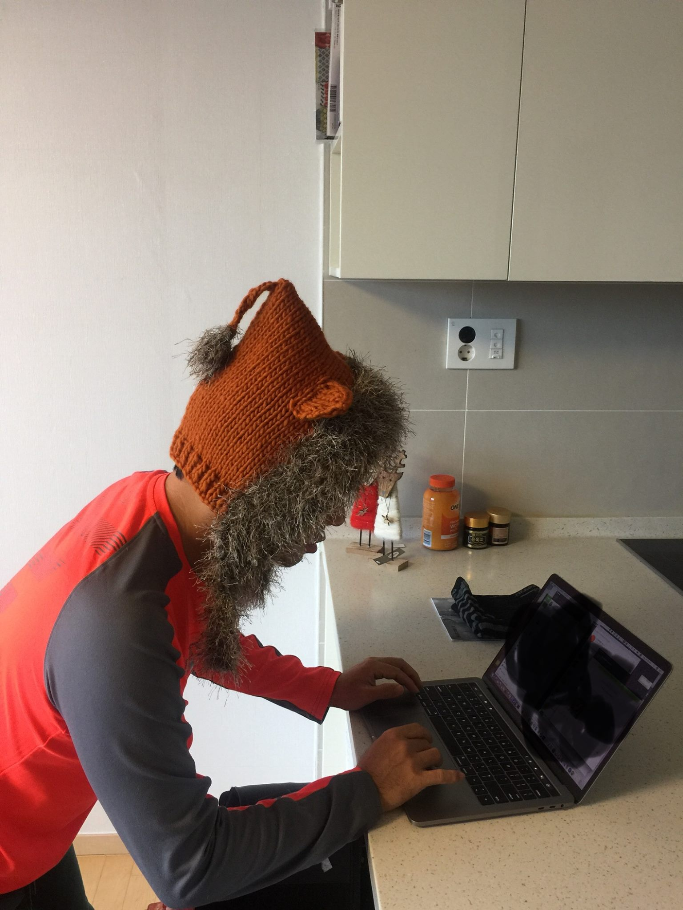

### 12월 29일 (금) 08:52 · 📷 사진 (1장)

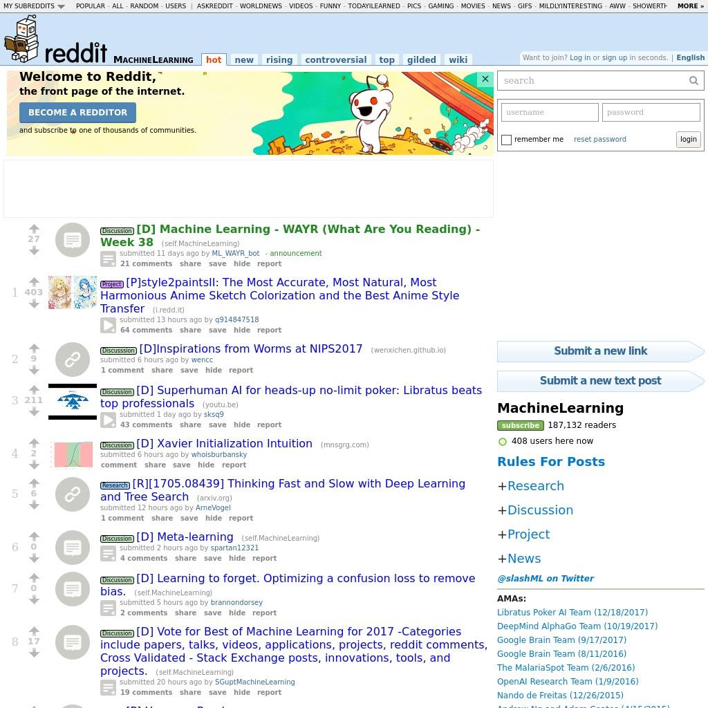

> #오늘의레딧 https://www.reddit.com/r/MachineLearning/ 따끈한 소식들입니다.  1. 스타일 2.3.2.2:가장 정확하고, 가장 자연스러운, 가장 정확한 고조파 스케치 채색 및 최상의 애니메이션 스타일 전달 2. 머리 위로 올라가지 않는 다람쥐를 위한 SuperhumanAI:Libratus는 최고의 전문가들을 능가한다. 3. 사비에르 이니셔티브 4. 메타 학습 5. 잊어 버리는 법을 배워라. 편향을 제거하기 위한 혼동 손실을 최적화한다. 6. 2017년에 최고의 머신 학습을 위한 BestPractice에는 문서, 컨퍼런스, 비디오, 애플리케이션, 프로젝트, reddit, 교차 검증, 혁신, 툴, 프로젝트, 프로젝트, 프로젝트 등이 포함됩니다. 7. 언카니 로드. 미국 노스 캐롤라이나 주 서리 카운티에 있는 자치구이다. 8. 조건부 GAN의 발전기는 임의의 소음을 입력하는가? 아니면 그냥 조절만 하는 건가요? 9. 몬테카를로 트리 검색 및 보강 학습 10. PyTorch에 대한 RamorchDQN구현 11. 객체, 관계, 물리학에 대한 학습을 위한 상호 작용 네트워크의 구현 12. 공평하고 균형 잡힌 방법으로요? 기계 학습의 편향은 기술적 한계와 규범적 질문 사이의 교차점이다. 13. 제4회 CDMA국제 학술 대회 14. ShartLeat를 사용하여 Unity엔진에서 새로운 검색 기능을 구현했습니다. 15. 2018년에 배울 가치가 있는 기계 학습 석사 학위를 받으려면 시간과 돈이 필요한가요? 16. 퀼봇:세련된 패러 그래프 17. 고밀도 영상 예측의 진전 18. 하위 그룹을 식별할 수 있는 방법은 무엇인가? 19. 이 값_cucuracy및 value_loss차트가 약간 이상하게 보입니까? 20. 시스템 학습을 위한 우수한 서버 공급 업체  1. https://www.reddit.com/r/MachineLearning/comments/7mlwf4/pstyle2paintsii_the_most_accurate_most_natural/ 2. https://youtu.be/2dX0lwaQRX0 3. https://www.mnsgrg.com/2017/12/21/xavier-initialization/ 4. https://www.reddit.com/r/MachineLearning/comments/7mpebw/d_metalearning/ 5. https://www.reddit.com/r/MachineLearning/comments/7mohi3/d_learning_to_forget_optimizing_a_confusion_loss/ 6. https://www.reddit.com/r/MachineLearning/comments/7mjxl4/d_vote_for_best_of_machine_learning_for_2017/ 7. http://uncannyroad.com/ 8. https://www.reddit.com/r/MachineLearning/comments/7mnn17/discussiondoes_the_generator_of_the_conditional/ 9. https://www.jair.org/media/5507/live-5507-10333-jair.pdf 10. https://github.com/hengyuan-hu/rainbow 11. https://github.com/higgsfield/interaction_network_pytorch 12. https://medium.com/@cody.marie.wild/fair-and-balanced-thoughts-on-bias-in-probabilistic-modeling-2ffdbd8a880f 13. https://arxiv.org/abs/1712.06391 14. https://www.reddit.com/r/MachineLearning/comments/7mgwz7/projecti_implemented_novelty_search_in_the_unity/ 15. https://www.reddit.com/r/MachineLearning/comments/7mepak/d_is_the_time_and_money_it_takes_to_get_a_masters/ 16. http://www.quillbot.com 17. https://www.reddit.com/r/MachineLearning/comments/7mdku8/d_advances_in_dense_image_prediction/ 18. https://www.reddit.com/r/MachineLearning/comments/7mhhef/d_method_to_identify_subgroups_with_lowest_mean/ 19. https://www.reddit.com/r/MachineLearning/comments/7mhe0u/p_do_these_val_accuracy_and_val_loss_charts_look/ 20. https://www.reddit.com/r/MachineLearning/comments/7mdg9v/d_good_server_vendor_for_machine_learning/

### 12월 29일 (금) 08:59 · Wow. 10 years! I am really lucky to be a…

Wow. 10 years! I am really lucky to be a friend with you, Thomas Zimmermann!!

Sung and Thomas are celebrating 10 years of friendship on Facebook!

🎬 동영상 1개 (생략)

### 12월 30일 (토) 08:52 · 📷 사진 (1장)

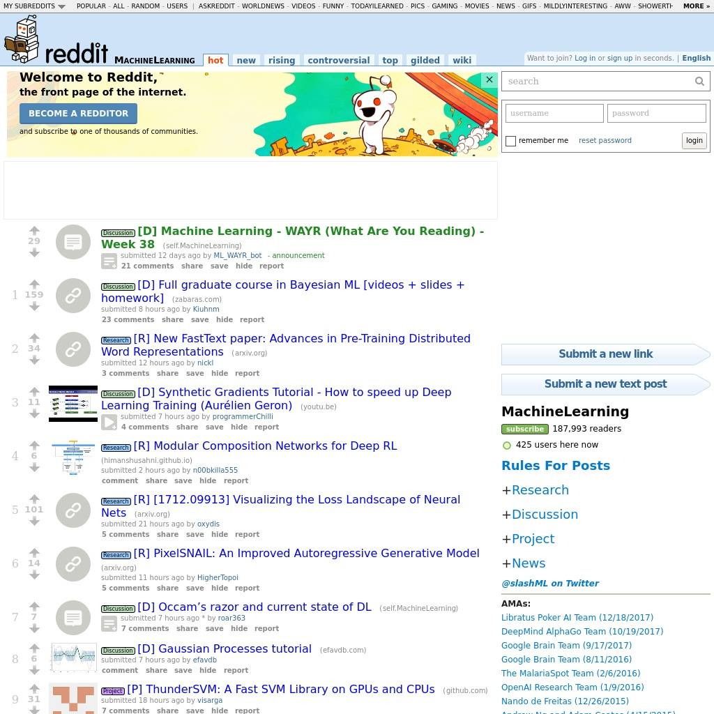

> #오늘의레딧 https://www.reddit.com/r/MachineLearning/ 오늘도 새소식이 많군요.  1. 새로운 현장/텍스트 문서:사전 처리된 분산 워드 라인의 진보 2. 종합 학술 발표회- 깊은 학습 훈련을 신속하게 진행하는 방법 3. 딥 RL을 위한 모듈형 구성 네트워크 4. PixelSNAL:개선된 AutogressiveGenerative모델 5. 오캄의 면도날과 현재의 DL의 상태 6. 가우스 프로세스 튜토리얼 7. ThunderSVM:GPU및 CPU의 고속 SVM라이브러리 8. 디하인징 페이스 인식 IV:페이스 알리멘트 9. 모범 사례 학습:심층 학습 눈 가리개(#347 i) 10. 스타일 2.3.2.2:가장 정확하고, 가장 자연스러운, 가장 정확한 고조파 스케치 채색 및 최상의 애니메이션 스타일 전달 11. 메타 학습 12. 사비에르 이니셔티브 13. 잊어 버리는 법을 배워라. 편향을 제거하기 위한 혼동 손실을 최적화한다. 14. 머리 위로 올라가지 않는 다람쥐를 위한 SuperhumanAI:Libratus는 최고의 전문가들을 능가한다. 15. 2017년에 최고의 머신 학습을 위한 BestPractice에는 문서, 컨퍼런스, 비디오, 애플리케이션, 프로젝트, reddit, 교차 검증, 혁신, 툴, 프로젝트, 프로젝트, 프로젝트 등이 포함됩니다. 16. 언카니 로드. 미국 노스 캐롤라이나 주 서리 카운티에 있는 자치구이다. 17. 조건부 GAN의 발전기는 임의의 소음을 입력하는가? 아니면 그냥 조절만 하는 건가요? 18. 몬테카를로 트리 검색 및 보강 학습  1. https://arxiv.org/abs/1712.09405 2. https://youtu.be/1z_Gv98-mkQ 3. https://himanshusahni.github.io/2017/12/26/reusability-in-ai.html 4. https://arxiv.org/abs/1712.09763 5. https://www.reddit.com/r/MachineLearning/comments/7muxgk/d_occams_razor_and_current_state_of_dl/ 6. http://efavdb.com/gaussian-processes/ 7. https://github.com/zeyiwen/thundersvm 8. http://blcv.pl/static//2017/12/28/demystifying-face-recognition-iii-face-preprocessing/ 9. https://blog.kjamistan.com/adversarial-learning-for-good-my-talk-at-34c3-on-deep-learning-blindspots/ 10. https://www.reddit.com/r/MachineLearning/comments/7mlwf4/pstyle2paintsii_the_most_accurate_most_natural/ 11. https://www.reddit.com/r/MachineLearning/comments/7mpebw/d_metalearning/ 12. https://www.mnsgrg.com/2017/12/21/xavier-initialization/ 13. https://www.reddit.com/r/MachineLearning/comments/7mohi3/d_learning_to_forget_optimizing_a_confusion_loss/ 14. https://youtu.be/2dX0lwaQRX0 15. https://www.reddit.com/r/MachineLearning/comments/7mjxl4/d_vote_for_best_of_machine_learning_for_2017/ 16. http://uncannyroad.com/ 17. https://www.reddit.com/r/MachineLearning/comments/7mnn17/discussiondoes_the_generator_of_the_conditional/ 18. https://www.jair.org/media/5507/live-5507-10333-jair.pdf

### 12월 31일 (일) 08:52 · 📷 사진 (1장)

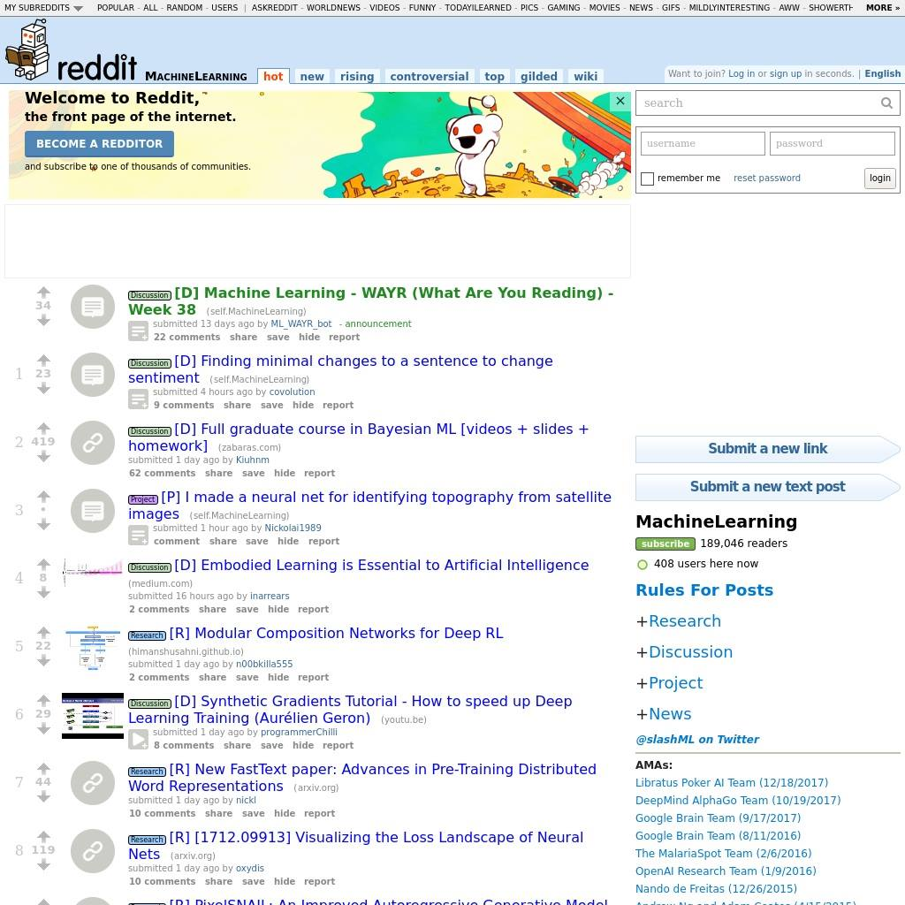

> #오늘의레딧 https://www.reddit.com/r/MachineLearning/ 따끈한 소식들입니다.  1. 감정을 바꾸기 위해 문장의 변화를 최소화하는 것 2. 나는 인공 위성의 시야를 식별하기 위한 신경망을 만들었다. 3. 체화된 학습은 인공 지능에 필수적이다. 4. 딥 RL을 위한 모듈형 구성 네트워크 5. 종합 학술 발표회- 깊은 학습 훈련을 신속하게 진행하는 방법 6. 새로운 현장/텍스트 문서:사전 처리된 분산 워드 라인의 진보 7. PixelSNAL:개선된 AutogressiveGenerative모델 8. 가우스 프로세스 튜토리얼 9. 자체 라벨을 생성하는 신경 네트워크 모델 10. ThunderSVM:GPU및 CPU의 고속 SVM라이브러리 11. 오캄의 면도날과 현재의 DL의 상태 12. 스타일 2.3.2.2:가장 정확하고, 가장 자연스러운, 가장 정확한 고조파 스케치 채색 및 최상의 애니메이션 스타일 전달 13. 모범 사례 학습:심층 학습 눈 가리개(#347 i) 14. 디하인징 페이스 인식 IV:페이스 알리멘트 15. 사비에르 이니셔티브 16. 메타 학습 17. 잊어 버리는 법을 배워라. 편향을 제거하기 위한 혼동 손실을 최적화한다. 18. 머리 위로 올라가지 않는 다람쥐를 위한 SuperhumanAI:Libratus는 최고의 전문가들을 능가한다.  1. https://www.reddit.com/r/MachineLearning/comments/7n3l76/d_finding_minimal_changes_to_a_sentence_to_change/ 2. https://www.reddit.com/r/MachineLearning/comments/7n4j3x/p_i_made_a_neural_net_for_identifying_topography/ 3. https://medium.com/intuitionmachine/embodied-learning-is-essential-to-artificial-intelligence-ad1e27425972 4. https://himanshusahni.github.io/2017/12/26/reusability-in-ai.html 5. https://youtu.be/1z_Gv98-mkQ 6. https://arxiv.org/abs/1712.09405 7. https://arxiv.org/abs/1712.09763 8. http://efavdb.com/gaussian-processes/ 9. https://www.reddit.com/r/MachineLearning/comments/7myvwk/d_neural_network_model_that_creates_its_own_labels/ 10. https://github.com/zeyiwen/thundersvm 11. https://www.reddit.com/r/MachineLearning/comments/7muxgk/d_occams_razor_and_current_state_of_dl/ 12. https://www.reddit.com/r/MachineLearning/comments/7mlwf4/pstyle2paintsii_the_most_accurate_most_natural/ 13. https://blog.kjamistan.com/adversarial-learning-for-good-my-talk-at-34c3-on-deep-learning-blindspots/ 14. http://blcv.pl/static//2017/12/28/demystifying-face-recognition-iii-face-preprocessing/ 15. https://www.mnsgrg.com/2017/12/21/xavier-initialization/ 16. https://www.reddit.com/r/MachineLearning/comments/7mpebw/d_metalearning/ 17. https://www.reddit.com/r/MachineLearning/comments/7mohi3/d_learning_to_forget_optimizing_a_confusion_loss/ 18. https://youtu.be/2dX0lwaQRX0
