# 2018년 1월

[← 2018년](README.md)

### 1월 1일 (월) 07:14 · is getting ready for his first *Seoul* M…

is getting ready for his first *Seoul* Marathon with Yeon Gyoung Gwack, Soonson Kwon, and 김광섭. 

Wishing you ALL a Happy, Healthy & Prosperous New Year 2018!

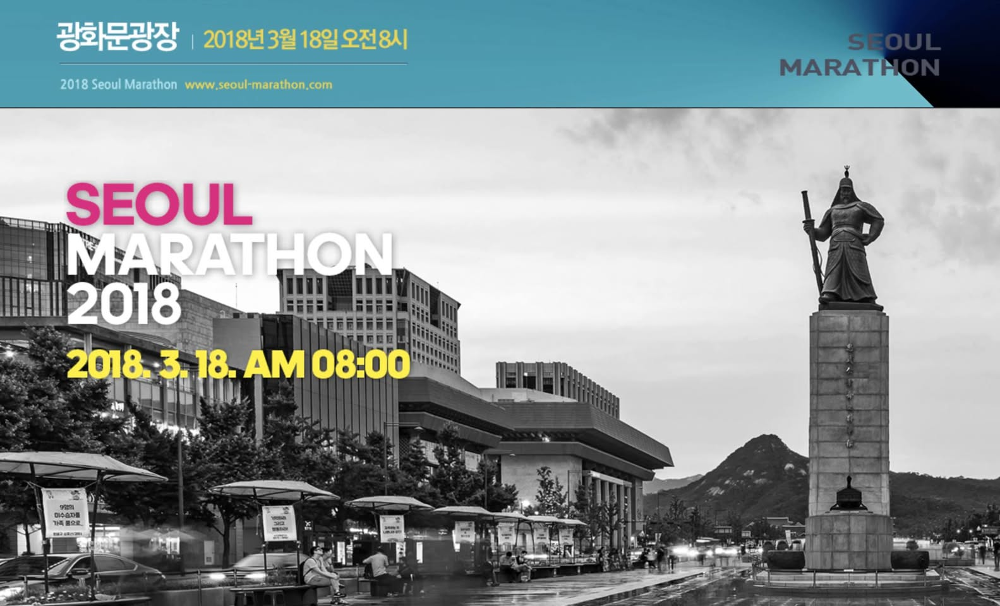
**이미지 캡션:** 광화문광장에서 열리는 2018 서울 마라톤 행사 안내 이미지로, 상단에는 "광화문광장 | 2018년 3월 18일 오전 8시"라는 행사 정보와 함께 "2018 Seoul Marathon www.seoul-marathon.com"이라는 문구가 파란색 배경에 표시되어 있습니다. 이미지 중앙에는 "SEOUL MARATHON 2018"이라는 문구가 핑크색과 흰색으로 크게 쓰여 있고, 그 아래에는 노란색으로 "2018. 3. 18. AM 08:00"이라는 행사 날짜와 시간이 명확하게 기재되어 있습니다. 배경에는 현대적인 건물들과 함께 이순신 장군 동상이 우뚝 서 있으며, 동상 앞에는 물웅덩이가 있어 비가 온 후의 풍경을 연상시킵니다. 일부 사람들은 벤치에 앉아 있거나 이동 중이며, 행사장 주변에는 안내 부스들이 설치되어 있습니다. 전체적으로 행사의 시작을 알리는 공지사항의 분위기를 띠고 있습니다. 건물들과 함께 이순신 장군 동상이 우뚝 서 있으며, 동상 앞에는 물웅덩이가 있어 비가 온 후의 풍경을 연상시킵니다. 일부 사람들은 벤치에 앉아 있거나 이동 중이며, 행사장 주변에는 안내 부스들이 설치되어 있습니다. 전체적으로 행사의 시작을 알리는 공지사항의 분위기를 띠고 있습니다.

### 1월 1일 (월) 08:52 · 📷 사진 (1장)

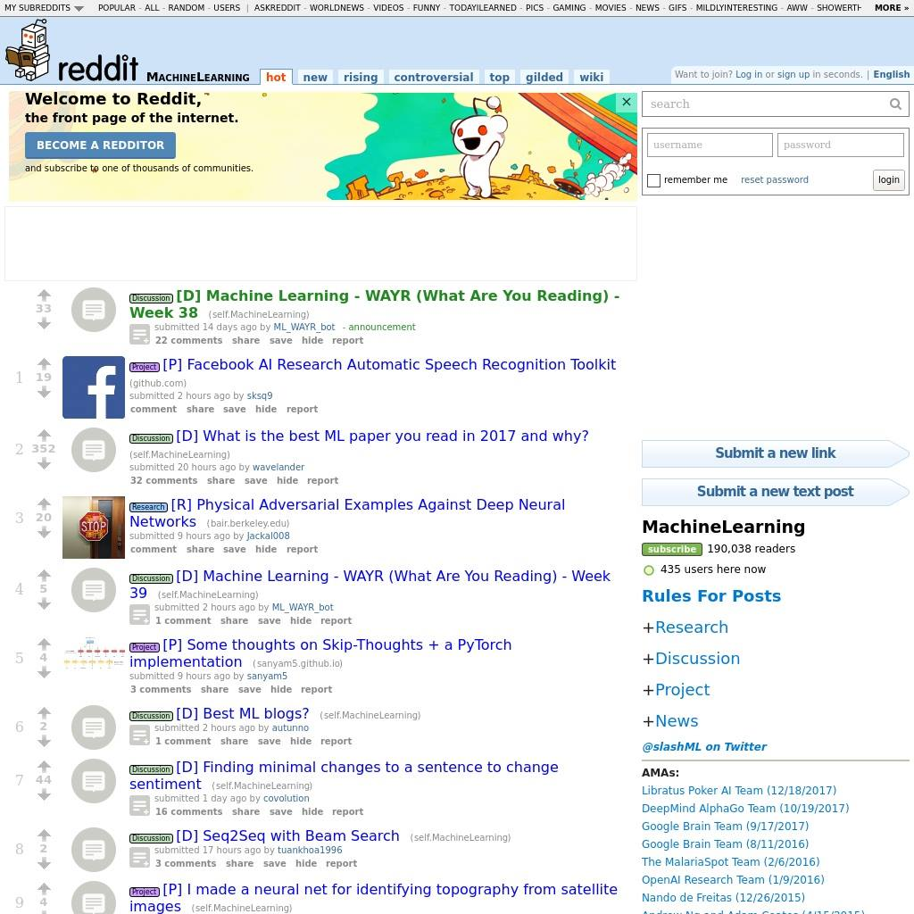
**이미지 캡션:** 이 이미지는 레딧(Reddit) 웹사이트의 '머신러닝(Machine Learning)' 커뮤니티 페이지를 보여줍니다. 페이지 상단에는 레딧의 로고와 함께 'hot', 'new', 'rising', 'controversial', 'top', 'gilded', 'wiki'와 같은 메뉴가 보입니다. 메인 영역에는 "Welcome to Reddit, the front page of the internet."이라는 문구와 함께 레딧의 마스코트인 스누(Snoo) 캐릭터가 그려진 이미지가 있습니다. 그 아래에는 "BECOME A REDDITOR" 버튼이 있으며, 사용자 이름과 비밀번호를 입력하는 로그인 창도 보입니다. 페이지의 왼쪽에는 다양한 게시물 목록이 나열되어 있으며, 각 게시물은 제목, 작성자, 댓글 수, 좋아요/싫어요 수 등의 정보를 포함하고 있습니다. 게시물 제목으로는 "[D] Machine Learning - WAYR (What Are You Reading) - Week 38", "[P] Facebook AI Research Automatic Speech Recognition Toolkit", "[D] What is the best ML paper you read in 2017 and why?" 등이 보입니다. 오른쪽에는 "Submit a new link", "Submit a new text post" 버튼과 함께 'MachineLearning' 커뮤니티의 구독자 수와 현재 접속자 수가 표시되어 있습니다. 또한, 게시물 규칙과 트위터 계정(@slashML on Twitter), 그리고 관련 프로젝트 목록(AMAS)도 확인할 수 있습니다. 전반적으로 기술 관련 커뮤니티의 정보 공유 및 소통이 이루어지는 웹사이트의 모습을 보여주는 화면입니다.s like comments and shares. On the right side, there are options to submit new links or text posts, along with subreddit information, rules, and a list of "AMAS" (Ask Me Anything) sessions. The overall atmosphere is informative and community-focused, typical of an online forum dedicated to a specific topic.

> #오늘의레딧 https://www.reddit.com/r/MachineLearning/ 래딧은 읽을 거리가 다양합니다.  1. 페이스북 AI연구 자동 음성 인식 툴킷 2. 2017년에 읽은 최고의 문서와 그 이유는 무엇입니까? 3. 심층적인 신경 회로망에 대한 물리적 광고 사례 4. 기계 학습-WAYR(Whatisyouread)-주당 39회 5. Skipought+PyTorch구현에 대한 약간의 생각 6. 최고의 블로그 블로그? 7. 감정을 바꾸기 위해 문장의 변화를 최소화하는 것 8. Seq2 Sequent를 사용한 SeqSeqSeq 9. 나는 인공 위성의 시야를 식별하기 위한 신경망을 만들었다. 10. 체화된 학습은 인공 지능에 필수적이다. 11. 딥 RL을 위한 모듈형 구성 네트워크 12. 종합 학술 발표회- 깊은 학습 훈련을 신속하게 진행하는 방법 13. 새로운 현장/텍스트 문서:사전 처리된 분산 워드 라인의 진보 14. 가우스 프로세스 튜토리얼 15. PixelSNAL:개선된 AutogressiveGenerative모델 16. ThunderSVM:GPU및 CPU의 고속 SVM라이브러리 17. 자체 라벨을 생성하는 신경 네트워크 모델 18. 오캄의 면도날과 현재의 DL의 상태 19. 스타일 2.3.2.2:가장 정확하고, 가장 자연스러운, 가장 정확한 고조파 스케치 채색 및 최상의 애니메이션 스타일 전달 20. 모범 사례 학습:심층 학습 눈 가리개(#347 i)  1. https://github.com/facebookresearch/wav2letter 2. https://www.reddit.com/r/MachineLearning/comments/7n69h0/d_what_is_the_best_ml_paper_you_read_in_2017_and/ 3. http://bair.berkeley.edu/blog/2017/12/30/yolo-attack/ 4. https://www.reddit.com/r/MachineLearning/comments/7nayri/d_machine_learning_wayr_what_are_you_reading_week/ 5. http://sanyam5.github.io/my-thoughts-on-skip-thoughts/ 6. https://www.reddit.com/r/MachineLearning/comments/7nb62j/d_best_ml_blogs/ 7. https://www.reddit.com/r/MachineLearning/comments/7n3l76/d_finding_minimal_changes_to_a_sentence_to_change/ 8. https://www.reddit.com/r/MachineLearning/comments/7n6zra/d_seq2seq_with_beam_search/ 9. https://www.reddit.com/r/MachineLearning/comments/7n4j3x/p_i_made_a_neural_net_for_identifying_topography/ 10. https://medium.com/intuitionmachine/embodied-learning-is-essential-to-artificial-intelligence-ad1e27425972 11. https://himanshusahni.github.io/2017/12/26/reusability-in-ai.html 12. https://youtu.be/1z_Gv98-mkQ 13. https://arxiv.org/abs/1712.09405 14. http://efavdb.com/gaussian-processes/ 15. https://arxiv.org/abs/1712.09763 16. https://github.com/zeyiwen/thundersvm 17. https://www.reddit.com/r/MachineLearning/comments/7myvwk/d_neural_network_model_that_creates_its_own_labels/ 18. https://www.reddit.com/r/MachineLearning/comments/7muxgk/d_occams_razor_and_current_state_of_dl/ 19. https://www.reddit.com/r/MachineLearning/comments/7mlwf4/pstyle2paintsii_the_most_accurate_most_natural/ 20. https://blog.kjamistan.com/adversarial-learning-for-good-my-talk-at-34c3-on-deep-learning-blindspots/

### 1월 2일 (화) 08:52 · 📷 사진 (1장)

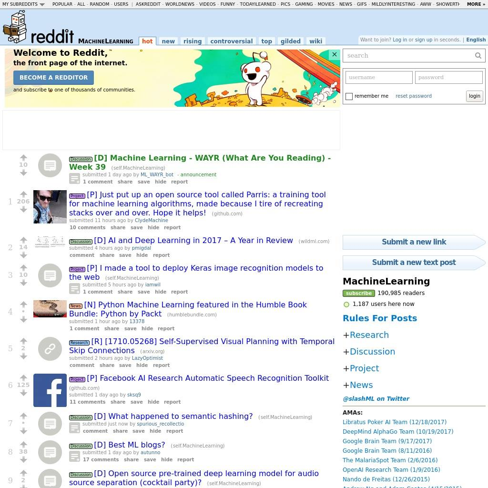
**이미지 캡션:** 이 이미지는 레딧(Reddit) 웹사이트의 머신러닝(Machine Learning) 서브레딧 페이지를 보여줍니다. 페이지 상단에는 레딧 로고와 함께 "Welcome to Reddit, the front page of the internet."이라는 문구가 있고, 그 아래에는 "BECOME A REDDITOR" 버튼이 있습니다. 메인 콘텐츠 영역에는 다양한 머신러닝 관련 게시물 목록이 표시됩니다. 각 게시물은 제목, 작성자, 제출 시간, 댓글 수 등의 정보를 포함하고 있으며, "Discussion", "Project", "News", "Research"와 같은 태그가 붙어 있습니다. 게시물 목록 오른쪽에는 "Submit a new link"와 "Submit a new text post" 버튼이 있으며, "MachineLearning" 서브레딧의 구독자 수와 현재 접속자 수가 표시됩니다. 또한, "Rules For Posts" 섹션에는 "+Research", "+Discussion", "+Project", "+News"와 같은 하위 카테고리가 나열되어 있고, "@slashML on Twitter" 링크와 과거 AMA(Ask Me Anything) 세션 목록이 보입니다. 배경은 흰색이며, 일부 게시물에는 썸네일 이미지나 아이콘이 포함되어 있습니다. 전반적으로 정보가 많고 기술적인 주제를 다루는 커뮤니티 페이지의 분위기입니다.ect", "News", "Research"와 같은 태그가 붙어 있습니다. 게시물 목록 오른쪽에는 "Submit a new link"와 "Submit a new text post" 버튼이 있으며, "MachineLearning" 서브레딧의 구독자 수와 현재 접속자 수가 표시됩니다. 또한, "Rules For Posts" 섹션에는 "+Research", "+Discussion", "+Project", "+News"와 같은 하위 카테고리가 나열되어 있고, "@slashML on Twitter" 링크와 과거 AMA(Ask Me Anything) 세션 목록이 보입니다. 배경은 흰색이며, 일부 게시물에는 썸네일 이미지나 아이콘이 포함되어 있습니다. 전반적으로 정보가 많고 기술적인 주제를 다루는 커뮤니티 페이지의 분위기입니다.

> #오늘의레딧 https://www.reddit.com/r/MachineLearning/ 따끈한 소식들입니다.  1. 그냥 파란 색을 재생하기 위해 만들어진 기계 학습 알고리즘을 만들어 보세요. 도움이 되기를 바랍니다! 2. 2013년 하반기의 AI및 DeepLearning리뷰 3. Keras이미지 인식 모델을 웹에 구축하기 위한 도구를 만들었습니다. 4. Humble에 의한 PambleBook에 특징 지어진 파이썬 기계 학습:PacktByPackt 5. 페이스북 AI연구 자동 음성 인식 툴킷 6. 의미론적인 해킹은 어떻게 되었는가? 7. 최고의 블로그 블로그? 8. 오디오 소스 분리(칵테일 파티)를 위한 오픈 소스 사전 학습 모델이 오픈 소스로 제공됩니까? 9. 2017년에 읽은 최고의 문서와 그 이유는 무엇입니까? 10. 심층적인 신경 회로망에 대한 물리적 광고 사례 11. Skipought+PyTorch구현에 대한 약간의 생각 12. Tensorflow및 Keras를 이용한 암호화 가격 예측 13. 감정을 바꾸기 위해 문장의 변화를 최소화하는 것 14. Seq2 Sequent를 사용한 SeqSeqSeq 15. 나는 인공 위성의 시야를 식별하기 위한 신경망을 만들었다. 16. 체화된 학습은 인공 지능에 필수적이다. 17. 딥 RL을 위한 모듈형 구성 네트워크 18. 종합 학술 발표회- 깊은 학습 훈련을 신속하게 진행하는 방법 19. 새로운 현장/텍스트 문서:사전 처리된 분산 워드 라인의 발전 20. 가우스 프로세스 튜토리얼  1. https://github.com/jgreenemi/Parris 2. http://www.wildml.com/2017/12/ai-and-deep-learning-in-2017-a-year-in-review/ 3. https://www.reddit.com/r/MachineLearning/comments/7ngl1d/p_i_made_a_tool_to_deploy_keras_image_recognition/ 4. https://www.humblebundle.com/books/python-by-packt-book-bundle?partner=indiekings 5. https://github.com/facebookresearch/wav2letter 6. https://www.reddit.com/r/MachineLearning/comments/7nid9f/d_what_happened_to_semantic_hashing/ 7. https://www.reddit.com/r/MachineLearning/comments/7nb62j/d_best_ml_blogs/ 8. https://www.reddit.com/r/MachineLearning/comments/7neui9/d_open_source_pretrained_deep_learning_model_for/ 9. https://www.reddit.com/r/MachineLearning/comments/7n69h0/d_what_is_the_best_ml_paper_you_read_in_2017_and/ 10. http://bair.berkeley.edu/blog/2017/12/30/yolo-attack/ 11. http://sanyam5.github.io/my-thoughts-on-skip-thoughts/ 12. https://medium.com/@huangkh19951228/predicting-cryptocurrency-price-with-tensorflow-and-keras-e1674b0dc58a 13. https://www.reddit.com/r/MachineLearning/comments/7n3l76/d_finding_minimal_changes_to_a_sentence_to_change/ 14. https://www.reddit.com/r/MachineLearning/comments/7n6zra/d_seq2seq_with_beam_search/ 15. https://www.reddit.com/r/MachineLearning/comments/7n4j3x/p_i_made_a_neural_net_for_identifying_topography/ 16. https://medium.com/intuitionmachine/embodied-learning-is-essential-to-artificial-intelligence-ad1e27425972 17. https://himanshusahni.github.io/2017/12/26/reusability-in-ai.html 18. https://youtu.be/1z_Gv98-mkQ 19. https://arxiv.org/abs/1712.09405 20. http://efavdb.com/gaussian-processes/

### 1월 3일 (수) 08:52 · 📷 사진 (1장)

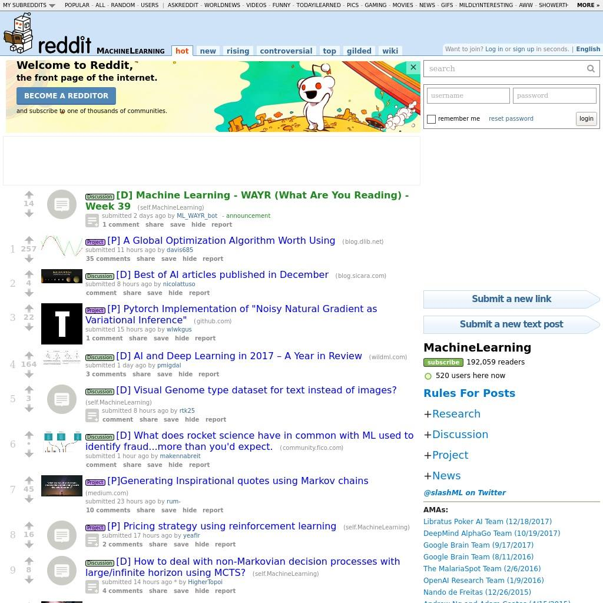
**이미지 캡션:** 이 이미지는 레딧(Reddit) 웹사이트의 머신러닝(Machine Learning) 서브레딧 페이지를 보여줍니다. 페이지 상단에는 레딧 로고와 함께 "Welcome to Reddit, the front page of the internet."이라는 문구가 있고, 그 아래에는 "BECOME A REDDITOR" 버튼이 있습니다. 페이지 중앙에는 검색창과 로그인/회원가입 폼이 보입니다. 메인 콘텐츠 영역에는 머신러닝 관련 게시물 목록이 표시되어 있으며, 각 게시물은 제목, 작성자, 제출 시간, 댓글 수, 좋아요/싫어요 수 등의 정보를 포함하고 있습니다. 게시물들은 "Discussion" 또는 "Project"로 분류되어 있으며, 링크가 첨부된 경우 해당 링크의 도메인도 함께 표시됩니다. 오른쪽 사이드바에는 "Submit a new link" 및 "Submit a new text post" 버튼과 함께 서브레딧의 구독자 수, 관련 규칙, 최신 소식, 그리고 과거 AMA(Ask Me Anything) 목록이 나열되어 있습니다. 전반적으로 기술 관련 커뮤니티의 정보 공유 및 토론이 이루어지는 웹사이트의 모습을 담고 있으며, 차분하고 정보 중심적인 분위기입니다.싫어요 수 등의 정보를 포함하고 있습니다. 게시물들은 "Discussion" 또는 "Project"로 분류되어 있으며, 링크가 첨부된 경우 해당 링크의 도메인도 함께 표시됩니다. 오른쪽 사이드바에는 "Submit a new link" 및 "Submit a new text post" 버튼과 함께 서브레딧의 구독자 수, 관련 규칙, 최신 소식, 그리고 과거 AMA(Ask Me Anything) 목록이 나열되어 있습니다. 전반적으로 기술 관련 커뮤니티의 정보 공유 및 토론이 이루어지는 웹사이트의 모습을 담고 있으며, 차분하고 정보 중심적인 분위기입니다.

> #오늘의레딧 https://www.reddit.com/r/MachineLearning/ 정말 읽을 거리가 많네요.  1. 글로벌 최적화 알고리즘을 사용하여 2. 12월에 출판된 AI기사 3. "비유동성 자연 채광 촉진제"의 도입 4. 2013년 하반기의 AI및 DeepLearning리뷰 5. 영상 대신 텍스트에 대한 시각적 게놈 유형 데이터 세트? 6. 로켓 과학은 당신이 예상한 것보다 훨씬 더 빨리 어떤 것을 알아내곤 했던 것과 같은 것이다. 7. 마르코프 연쇄를 이용한 영감 인용문 생성 8. 보강 학습을 이용한 가격 책정 전략 9. MCTS를 사용하여 비/정규 결정 과정을 거치지 않고 비/공인 의사 결정 프로세스를 처리하는 방법은 무엇입니까? 10. 그냥 파란 색을 재생하기 위해 만들어진 기계 학습 알고리즘을 만들어 보세요. 도움이 되기를 바랍니다! 11. 의미론적인 해킹은 어떻게 되었는가? 12. 당신은 2018년에 무엇을 가장 고대하고 있습니까? 13. Humble에 의한 PambleBook에 특징 지어진 파이썬 기계 학습:PacktByPackt 14. Keras이미지 인식 모델을 웹에 구축하기 위한 도구를 만들었습니다. 15. 새해 복 많이 받으세요. GRC(경사로 하강)는 ML알고리즘을 훈련시키는 가장 강력한 기술입니다. 하지만 왜 그냥 단순히 경사로를 따라 걷는 것일까요? 16. 페이스북 AI연구 자동 음성 인식 툴킷 17. 오디오 소스 분리(칵테일 파티)를 위한 오픈 소스 사전 학습 모델이 오픈 소스로 제공됩니까? 18. 최고의 블로그 블로그? 19. 2017년에 읽은 최고의 문서와 그 이유는 무엇입니까? 20. 심층적인 신경 회로망에 대한 물리적 광고 사례  1. http://blog.dlib.net/2017/12/a-global-optimization-algorithm-worth.html 2. https://blog.sicara.com/12-2017-best-ai-new-articles-this-month-fc80634faf84 3. https://github.com/wlwkgus/NoisyNaturalGradient 4. http://www.wildml.com/2017/12/ai-and-deep-learning-in-2017-a-year-in-review/ 5. https://www.reddit.com/r/MachineLearning/comments/7nmwd7/d_visual_genome_type_dataset_for_text_instead_of/ 6. https://community.fico.com/community/fico-analytic-tools/blog/2017/12/08/transaction-profiles-streaming-analytics-mini-models 7. https://medium.com/@ramtinalami/how-i-generated-inspirational-quotes-with-less-than-20-lines-of-code-38273623c905 8. https://www.reddit.com/r/MachineLearning/comments/7nki5k/p_pricing_strategy_using_reinforcement_learning/ 9. https://www.reddit.com/r/MachineLearning/comments/7nlh2a/d_how_to_deal_with_nonmarkovian_decision/ 10. https://github.com/jgreenemi/Parris 11. https://www.reddit.com/r/MachineLearning/comments/7nid9f/d_what_happened_to_semantic_hashing/ 12. https://www.reddit.com/r/MachineLearning/comments/7njhjo/d_what_are_you_most_looking_forward_to_in_2018/ 13. https://www.humblebundle.com/books/python-by-packt-book-bundle?partner=indiekings 14. https://www.reddit.com/r/MachineLearning/comments/7ngl1d/p_i_made_a_tool_to_deploy_keras_image_recognition/ 15. https://www.youtube.com/watch?v=OV7c6S32IDU 16. https://github.com/facebookresearch/wav2letter 17. https://www.reddit.com/r/MachineLearning/comments/7neui9/d_open_source_pretrained_deep_learning_model_for/ 18. https://www.reddit.com/r/MachineLearning/comments/7nb62j/d_best_ml_blogs/ 19. https://www.reddit.com/r/MachineLearning/comments/7n69h0/d_what_is_the_best_ml_paper_you_read_in_2017_and/ 20. http://bair.berkeley.edu/blog/2017/12/30/yolo-attack/

### 1월 4일 (목) 08:52 · 📷 사진 (1장)

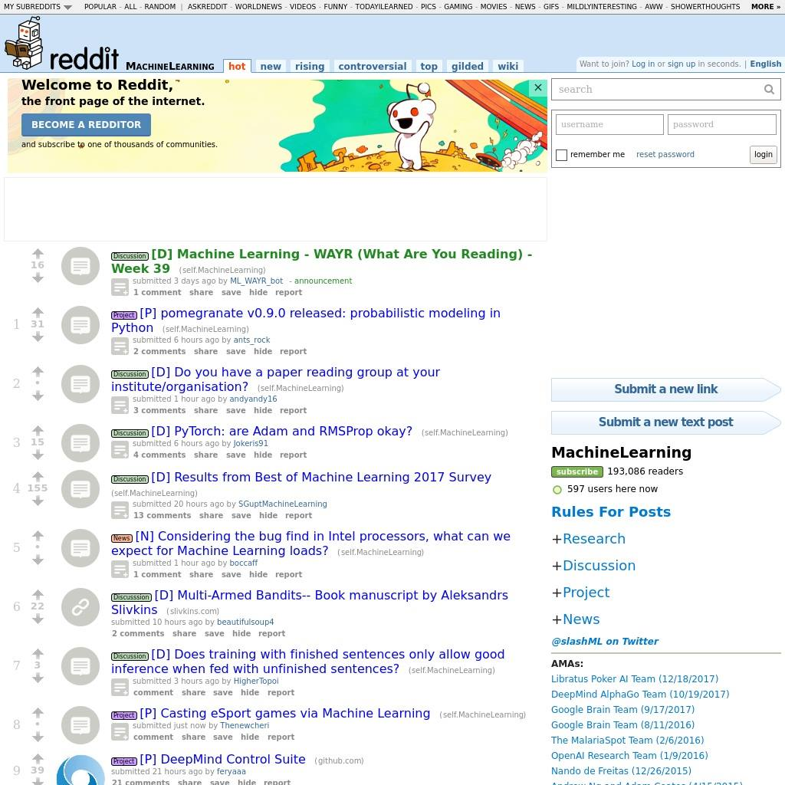
**이미지 캡션:** 이 이미지는 레딧(Reddit) 웹사이트의 머신러닝(MachineLearning) 커뮤니티 페이지를 보여줍니다. 페이지 상단에는 레딧 로고와 함께 "Welcome to Reddit, the front page of the internet."이라는 환영 문구가 있고, 그 옆에는 귀여운 레딧의 마스코트인 스누(Snoo) 캐릭터가 그려진 삽화가 있습니다. 페이지 중앙에는 다양한 주제의 게시물 목록이 나열되어 있으며, 각 게시물은 제목, 작성자, 제출 시간, 댓글 수, 좋아요/싫어요 수 등의 정보를 포함하고 있습니다. 게시물 제목들은 "[D] Machine Learning - WAYR (What Are You Reading)", "[P] pomegranate v0.9.0 released: probabilistic modeling in Python", "[D] Do you have a paper reading group at your institute/organisation?", "[D] PyTorch: are Adam and RMSProp okay?", "[D] Results from Best of Machine Learning 2017 Survey", "[N] Considering the bug find in Intel processors, what can we expect for Machine Learning loads?", "[D] Multi-Armed Bandits-- Book manuscript by Aleksandrs Slivkins", "[D] Does training with finished sentences only allow good inference when fed with unfinished sentences?", "[P] Casting eSport games via Machine Learning", "[P] DeepMind Control Suite" 등 머신러닝 관련 주제를 다루고 있습니다. 오른쪽 사이드바에는 "Want to join? Log in or sign up in seconds."라는 로그인/가입 안내와 함께 사용자 이름, 비밀번호 입력란이 있으며, "MachineLearning" 커뮤니티 구독 정보와 "Rules For Posts", "AMAS" 등의 섹션이 보입니다. 전체적으로 정보가 풍부하고 다양한 토론이 이루어지고 있는 온라인 커뮤니티의 모습을 보여주는 화면입니다.. 게시물 제목들은 "[D] Machine Learning - WAYR (What Are You Reading)", "[P] pomegranate v0.9.0 released: probabilistic modeling in Python", "[D] Do you have a paper reading group at your institute/organisation?", "[D] PyTorch: are Adam and RMSProp okay?", "[D] Results from Best of Machine Learning 2017 Survey", "[N] Considering the bug find in Intel processors, what can we expect for Machine Learning loads?", "[D] Multi-Armed Bandits-- Book manuscript by Aleksandrs Slivkins", "[D] Does training with finished sentences only allow good inference when fed with unfinished sentences?", "[P] Casting eSport games via Machine Learning", "[P] DeepMind Control Suite" 등 머신러닝 관련 주제를 다루고 있습니다. 오른쪽 사이드바에는 "Want to join? Log in or sign up in seconds."라는 로그인/가입 안내와 함께 사용자 이름, 비밀번호 입력란이 있으며, "MachineLearning" 커뮤니티 구독 정보와 "Rules For Posts", "AMAS" 등의 섹션이 보입니다. 전체적으로 정보가 풍부하고 다양한 토론이 이루어지고 있는 온라인 커뮤니티의 모습을 보여주는 화면입니다.

> #오늘의레딧 https://www.reddit.com/r/MachineLearning/ 머신러닝 공부는 정말 재미있죠?아침부터 다양한 소식이 많네요.  1. P24.0 릴리스:Python에서의 확률론적 모델링 2. 당신은 당신의 흥미로운 질문에 종이 읽기 그룹을 가지고 있습니까? 3. 파이크:아담과 RMSProp은 괜찮아요? 4. BestMachine학습 BestMachine설문 조사 결과 5. Intel프로세서에서 발견되는 버그를 고려할 때, 기계 학습 부하에 대해 예상할 수 있는 것은 무엇입니까? 6. 완성된 문장들을 사용한 훈련은 끝나지 않은 문장들을 먹을 때만 좋은 추론을 허락하는가? 7. 기계 학습을 통해 eSport게임 내보내기 8. 디프 미드 컨트롤 스위트 9. 보드 게임에서 실마리를 제공하기 위해 단어 벡터 마법사를 사용합니다. 10. 글로벌 최적화 알고리즘을 사용하여 11. 화장품을 위한 심층 학습(데이터는 여왕임) 12. 통계 분급기의 "Null공간"? 13. 특집 기사:언어학적 특징을 고려한 헝가리어 위키 백과의 품질 특성 결정 14. 12월에 출판된 AI기사 15. 영상 대신 텍스트에 대한 시각적 게놈 유형 데이터 세트? 16. "비유동성 자연 채광 촉진제"의 도입 17. 2013년 하반기의 AI및 DeepLearning리뷰 18. 보강 학습을 이용한 가격 책정 전략 19. 마르코프 연쇄를 이용한 영감 인용문 생성 20. MCTS를 사용하여 비/정규 결정 과정을 거치지 않고 비/공인 의사 결정 프로세스를 처리하는 방법은 무엇입니까?  1. https://www.reddit.com/r/MachineLearning/comments/7nw5nx/p_pomegranate_v090_released_probabilistic/ 2. https://www.reddit.com/r/MachineLearning/comments/7ny3s8/d_do_you_have_a_paper_reading_group_at_your/ 3. https://www.reddit.com/r/MachineLearning/comments/7nw67c/d_pytorch_are_adam_and_rmsprop_okay/ 4. https://www.reddit.com/r/MachineLearning/comments/7nrzhn/d_results_from_best_of_machine_learning_2017/ 5. https://www.reddit.com/r/MachineLearning/comments/7ny7kx/n_considering_the_bug_find_in_intel_processors/ 6. https://www.reddit.com/r/MachineLearning/comments/7nx9ov/d_does_training_with_finished_sentences_only/ 7. https://www.reddit.com/r/MachineLearning/comments/7nyn58/p_casting_esport_games_via_machine_learning/ 8. https://github.com/deepmind/dm_control 9. https://jamesmullenbach.github.io/2018/01/02/codenames-fun.html 10. http://blog.dlib.net/2017/12/a-global-optimization-algorithm-worth.html 11. https://medium.com/mathematical-beauty/deep-learning-for-cosmetics-2d1b427bbfa2 12. https://www.reddit.com/r/MachineLearning/comments/7nt2sw/d_null_space_of_a_statistical_classifier/ 13. https://www.preprints.org/manuscript/201801.0017/v1 14. https://blog.sicara.com/12-2017-best-ai-new-articles-this-month-fc80634faf84 15. https://www.reddit.com/r/MachineLearning/comments/7nmwd7/d_visual_genome_type_dataset_for_text_instead_of/ 16. https://github.com/wlwkgus/NoisyNaturalGradient 17. http://www.wildml.com/2017/12/ai-and-deep-learning-in-2017-a-year-in-review/ 18. https://www.reddit.com/r/MachineLearning/comments/7nki5k/p_pricing_strategy_using_reinforcement_learning/ 19. https://medium.com/@ramtinalami/how-i-generated-inspirational-quotes-with-less-than-20-lines-of-code-38273623c905 20. https://www.reddit.com/r/MachineLearning/comments/7nlh2a/d_how_to_deal_with_nonmarkovian_decision/

### 1월 5일 (금) 08:53 · 📷 사진 (1장)

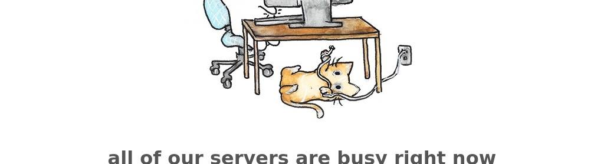
**이미지 캡션:** 그림에는 책상 아래에 엎드려 있는 황갈색 고양이가 보이며, 고양이의 몸은 컴퓨터 전원 코드에 얽혀 있습니다. 고양이의 눈은 동그랗게 뜨여 있고, 혀는 약간 나와 있어 당황하거나 놀란 듯한 표정입니다. 책상 위에는 컴퓨터 모니터가 놓여 있고, 책상 다리에는 전원 코드가 연결되어 있습니다. 책상 옆에는 바퀴 달린 의자가 놓여 있으며, 의자의 등받이는 하늘색입니다. 전체적으로 흰색 배경에 단순한 그림체로 그려져 있으며, 그림 하단에는 "all of our servers are busy right now"라는 문구가 보입니다. 이 그림은 컴퓨터 시스템의 문제나 지연을 유머러스하게 표현하고 있습니다. 보입니다. 이 그림은 컴퓨터 시스템의 문제나 지연을 유머러스하게 표현하고 있습니다.

> #오늘의레딧 https://www.reddit.com/r/MachineLearning/ 래딧은 읽을 거리가 다양합니다.  1. TensorFlow1.5.0 릴리즈 후보자 2. 깊은 내부 학습을 이용한 1712.06087"Zeron-Shot"슈퍼 리소스 구현 3. <<신경 회로의 보정에 관한<<의 느낌은 매우 좋습니다. 그 문제에 대해서 어떻게 생각해요? 누가 시도해 봤어요? 4. 메이즈 크기:맞춤형으로 제작 가능한 맞춤형 체육관 환경 조성 5. 텐서/플로(Wensorflow)에서 MobileNet의 명확하고 쉬운 구현(가중치 포함) 6. 탁월한 맞춤형 플랫폼을 개선하기 위한 맞춤형 플랫폼 7. 픽셀 레벨의 비전 작업을 위한 백본 네트워크 선택. 8. 단일 언어로만 구성된 무임금 기계 변환 장치 9. 사전 정보 및 기계 학습을 이용한 A4B시험의 변동 저감 10. P24.0 릴리스:Python에서의 확률론적 모델링 11. 당신은 당신의 흥미로운 질문에 종이 읽기 그룹을 가지고 있습니까? 12. Intel프로세서에서 발견되는 버그를 고려할 때, 기계 학습 부하에 대해 예상할 수 있는 것은 무엇입니까? 13. 파놉티컬 세그멘테이션 14. 파이크:아담과 RMSProp은 괜찮아요? 15. BestMachine학습 BestMachine설문 조사 결과 16. 완성된 문장들을 사용한 훈련은 끝나지 않은 문장들을 먹을 때만 좋은 추론을 허락하는가? 17. 화장품을 위한 심층 학습(데이터는 여왕임) 18. 디프 미드 컨트롤 스위트 19. 보드 게임에서 실마리를 제공하기 위해 단어 벡터 마법사를 사용합니다. 20. 글로벌 최적화 알고리즘을 사용하여  1. https://github.com/tensorflow/tensorflow/releases/tag/v1.5.0-rc0 2. https://github.com/jacobgil/pytorch-zssr 3. https://arxiv.org/pdf/1706.04599.pdf 4. https://github.com/zuoxingdong/gym-maze 5. https://github.com/MG2033/MobileNet/ 6. https://www.aigaming.com/?utm_source=TH99&utm_medium=cpc&utm_campaign=codebotsforbitcoin%26r%3DTH99 7. https://www.reddit.com/r/MachineLearning/comments/7o6zzx/discussion_choosing_backbone_networks_for/ 8. https://medium.com/@harshsayshi/machine-translation-without-the-data-21846fecc4c0 9. http://www.degeneratestate.org/posts/2018/Jan/04/reducing-the-variance-of-ab-test-using-prior-information/ 10. https://www.reddit.com/r/MachineLearning/comments/7nw5nx/p_pomegranate_v090_released_probabilistic/ 11. https://www.reddit.com/r/MachineLearning/comments/7ny3s8/d_do_you_have_a_paper_reading_group_at_your/ 12. https://www.reddit.com/r/MachineLearning/comments/7ny7kx/n_considering_the_bug_find_in_intel_processors/ 13. https://arxiv.org/abs/1801.00868 14. https://www.reddit.com/r/MachineLearning/comments/7nw67c/d_pytorch_are_adam_and_rmsprop_okay/ 15. https://www.reddit.com/r/MachineLearning/comments/7nrzhn/d_results_from_best_of_machine_learning_2017/ 16. https://www.reddit.com/r/MachineLearning/comments/7nx9ov/d_does_training_with_finished_sentences_only/ 17. https://medium.com/mathematical-beauty/deep-learning-for-cosmetics-2d1b427bbfa2 18. https://github.com/deepmind/dm_control 19. https://jamesmullenbach.github.io/2018/01/02/codenames-fun.html 20. http://blog.dlib.net/2017/12/a-global-optimization-algorithm-worth.html

### 1월 6일 (토) 08:52 · 📷 사진 (1장)

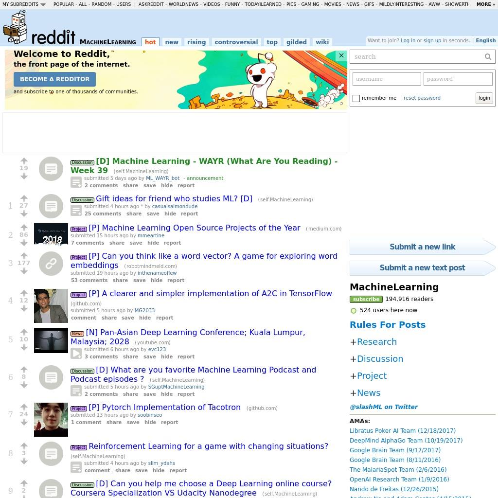
**이미지 캡션:** 이것은 레딧의 머신러닝 서브레딧 페이지로, 상단에는 레딧 로고와 함께 "Welcome to Reddit, the front page of the internet."이라는 문구가 있고, 그 아래에는 "BECOME A REDDITOR" 버튼이 있습니다. 페이지 중앙에는 검색창과 로그인/회원가입 폼이 있으며, 왼쪽에는 다양한 머신러닝 관련 게시물 목록이 표시됩니다. 각 게시물은 제목, 작성자, 제출 시간, 댓글 수, 그리고 관련 링크나 이미지 등을 포함하고 있습니다. 예를 들어, "Discussion [D] Machine Learning - WAYR (What Are You Reading) - Week 39"이라는 제목의 게시물은 5일 전에 제출되었고, "Project [P] Machine Learning Open Source Projects of the Year"는 15시간 전에 제출되었습니다. 게시물 목록 아래에는 "Submit a new link"와 "Submit a new text post" 버튼이 있고, 오른쪽에는 "MachineLearning" 서브레딧의 구독자 수와 현재 접속자 수가 표시되며, "Rules For Posts" 섹션에는 "+Research", "+Discussion", "+Project", "+News"와 같은 카테고리가 나열되어 있습니다. 또한, "@slashML on Twitter" 링크와 "AMAS" 섹션에는 과거 AMA(Ask Me Anything) 세션 목록이 날짜와 함께 표시되어 있습니다. 전반적으로 기술 관련 커뮤니티의 정보 공유 및 토론이 이루어지는 웹사이트의 모습입니다.hine Learning - WAYR (What Are You Reading) - Week 39"이라는 제목의 게시물은 5일 전에 제출되었고, "Project [P] Machine Learning Open Source Projects of the Year"는 15시간 전에 제출되었습니다. 게시물 목록 아래에는 "Submit a new link"와 "Submit a new text post" 버튼이 있고, 오른쪽에는 "MachineLearning" 서브레딧의 구독자 수와 현재 접속자 수가 표시되며, "Rules For Posts" 섹션에는 "+Research", "+Discussion", "+Project", "+News"와 같은 카테고리가 나열되어 있습니다. 또한, "@slashML on Twitter" 링크와 "AMAS" 섹션에는 과거 AMA(Ask Me Anything) 세션 목록이 날짜와 함께 표시되어 있습니다. 전반적으로 기술 관련 커뮤니티의 정보 공유 및 토론이 이루어지는 웹사이트의 모습입니다.

> #오늘의레딧 https://www.reddit.com/r/MachineLearning/ 정말 읽을 거리가 많네요.  1. 올해의 오픈 소스 오픈 소스 프로젝트 2. 여러분은 단어 벡터처럼 생각할 수 있나요? 인신 공격을 탐구하는 게임 3. 텐서 플로우 시 A2C의 명확하고 단순한 구현 4. 범 아시아 심층 학습 컨퍼런스, 말레이시아 쿠알라룸푸르, 2028 5. 당신이 가장 좋아하는 PodcastPodcastandPodcast에피소드는 무엇입니까? 6. 타코트론의 광전 변환 7. 당신은 나에게 깊은 학습 온라인 코스를 선택하는 것을 도와 줄 수 있습니까? 미국의 여류 작가ㆍ소설가. 8. AI에 대한 시스템 과제를 보여 주는 버클리 뷰 9. 깊은 내부 학습을 이용한 1712.06087"Zeron-Shot"슈퍼 리소스 구현 10. 선급금 모델링에 대한 도움말-모델 선택에 대한 조언(ChurnVTSurvival) 11. TensorFlow1.5.0 릴리즈 후보자 12. 깊은 학습이 벽을 강타했나요? 13. 텐서/플로(Wensorflow)에서 MobileNet의 명확하고 쉬운 구현(가중치 포함) 14. 배치 기준-공평치 차이 추정 15. <<신경 회로의 보정에 관한<<의 느낌은 매우 좋습니다. 그 문제에 대해서 어떻게 생각해요? 누가 시도해 봤어요? 16. 픽셀 레벨의 비전 작업을 위한 백본 네트워크 선택. 17. 메이즈 크기:맞춤형으로 제작 가능한 맞춤형 체육관 환경 조성 18. 단일 언어로만 구성된 무임금 기계 변환 장치 19. 기계 학습 예제 7선형 회귀 20. 사전 정보 및 기계 학습을 이용한 A4B시험의 변동 저감  1. https://medium.com/@Mybridge/30-amazing-machine-learning-projects-for-the-past-year-v-2018-b853b8621ac7 2. http://robotmindmeld.com 3. https://github.com/MG2033/A2C 4. https://www.youtube.com/watch?v=gA-NDZb29I4 5. https://www.reddit.com/r/MachineLearning/comments/7ocqfm/d_what_are_you_favorite_machine_learning_podcast/ 6. https://github.com/soobinseo/Tacotron-pytorch 7. https://www.reddit.com/r/MachineLearning/comments/7odp4t/d_can_you_help_me_choose_a_deep_learning_online/ 8. https://www2.eecs.berkeley.edu/Pubs/TechRpts/2017/EECS-2017-159.pdf 9. https://github.com/jacobgil/pytorch-zssr 10. https://www.reddit.com/r/MachineLearning/comments/7objlv/d_help_with_prepayment_modelling_advice_on_model/ 11. https://github.com/tensorflow/tensorflow/releases/tag/v1.5.0-rc0 12. https://medium.com/intuitionmachine/has-deep-learning-hit-a-wall-ec6a7cc82cb3 13. https://github.com/MG2033/MobileNet/ 14. https://www.reddit.com/r/MachineLearning/comments/7o8ml0/d_batch_norm_unbiased_variance_estimate/ 15. https://arxiv.org/pdf/1706.04599.pdf 16. https://www.reddit.com/r/MachineLearning/comments/7o6zzx/discussion_choosing_backbone_networks_for/ 17. https://github.com/zuoxingdong/gym-maze 18. https://medium.com/@harshsayshi/machine-translation-without-the-data-21846fecc4c0 19. http://devarea.com/python-machine-learning-example-linear-regression 20. http://www.degeneratestate.org/posts/2018/Jan/04/reducing-the-variance-of-ab-test-using-prior-information/

### 1월 7일 (일) 08:52 · 📷 사진 (1장)

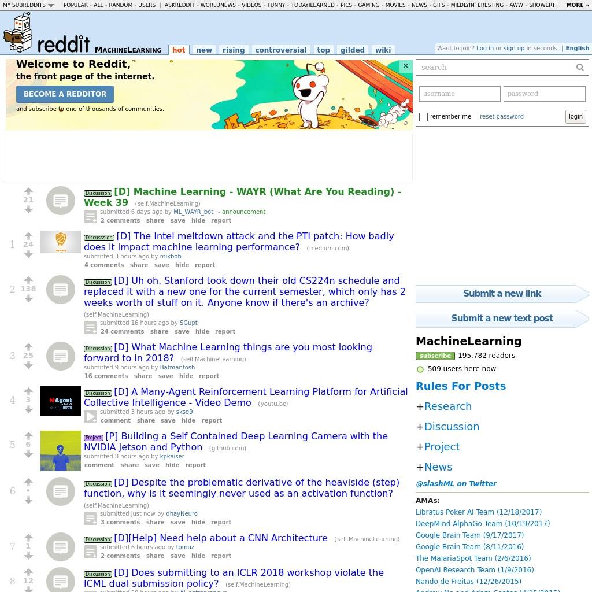
**이미지 캡션:** 이 이미지는 레딧의 머신러닝 서브레딧 페이지를 보여주며, 상단에는 레딧 로고와 함께 "Welcome to Reddit, the front page of the internet."이라는 문구가 있고, 그 아래에는 "BECOME A REDDITOR" 버튼이 있다. 페이지 중앙에는 다양한 머신러닝 관련 게시물들이 나열되어 있으며, 각 게시물은 제목, 작성자, 제출 시간, 댓글 수 등의 정보를 포함하고 있다. 게시물 제목으로는 "[D] Machine Learning - WAYR (What Are You Reading) - Week 39", "[D] The Intel meltdown attack and the PTI patch: How badly does it impact machine learning performance?", "[D] Uh oh. Stanford took down their old CS224n schedule and replaced it with a new one for the current semester, which only has 2 weeks worth of stuff on it. Anyone know if there's an archive?", "[D] What Machine Learning things are you most looking forward to in 2018?", "[D] A Many-Agent Reinforcement Learning Platform for Artificial Collective Intelligence - Video Demo", "[P] Building a Self Contained Deep Learning Camera with the NVIDIA Jetson and Python", "[D] Despite the problematic derivative of the heaviside (step) function, why is it seemingly never used as an activation function?", "[D][Help] Need help about a CNN Architecture", "[D] Does submitting to an ICLR 2018 workshop violate the ICML dual submission policy?" 등이 보인다. 오른쪽에는 "Submit a new link" 및 "Submit a new text post" 버튼과 함께 "MachineLearning" 서브레딧 정보가 표시되어 있으며, 구독자 수와 현재 접속자 수가 나타나 있다. 또한, "Rules For Posts" 섹션에는 "+Research", "+Discussion", "+Project", "+News"와 같은 카테고리가 있으며, 트위터 계정 "@slashML on Twitter"와 "AMAS" 목록도 보인다. 전반적으로 기술 관련 커뮤니티의 정보 공유 및 토론이 이루어지는 온라인 포럼의 분위기를 띤다.) - Week 39", "[D] The Intel meltdown attack and the PTI patch: How badly does it impact machine learning performance?", "[D] Uh oh. Stanford took down their old CS224n schedule and replaced it with a new one for the current semester, which only has 2 weeks worth of stuff on it. Anyone know if there's an archive?", "[D] What Machine Learning things are you most looking forward to in 2018?", "[D] A Many-Agent Reinforcement Learning Platform for Artificial Collective Intelligence - Video Demo", "[P] Building a Self Contained Deep Learning Camera with the NVIDIA Jetson and Python", "[D] Despite the problematic derivative of the heaviside (step) function, why is it seemingly never used as an activation function?", "[D][Help] Need help about a CNN Architecture", "[D] Does submitting to an ICLR 2018 workshop violate the ICML dual submission policy?" 등이 보인다. 오른쪽에는 "Submit a new link" 및 "Submit a new text post" 버튼과 함께 "MachineLearning" 서브레딧 정보가 표시되어 있으며, 구독자 수와 현재 접속자 수가 나타나 있다. 또한, "Rules For Posts" 섹션에는 "+Research", "+Discussion", "+Project", "+News"와 같은 카테고리가 있으며, 트위터 계정 "@slashML on Twitter"와 "AMAS" 목록도 보인다. 전반적으로 기술 관련 커뮤니티의 정보 공유 및 토론이 이루어지는 온라인 포럼의 분위기를 띤다.

> #오늘의레딧 https://www.reddit.com/r/MachineLearning/ 정말 읽을 거리가 많네요.  1. 어.. 스탠포드 대학교는 그들의 예전 CSC26쿼터를 해체했고, 이번 학기에 새 학기를 위한 새로운 것으로 대체했는데, 그것은 단지 2주 만에 충분했다. 혹시 기록 보관소가 있는지 아시는 분 계세요? 2. 2018년에 가장 기대하는 것은 어떤 기계 학습인가요? 3. 인공 지능형 지능형 비디오를 위한 인공 지능 강화 학습 시스템 4. NVIDIAJetson과 Python을 사용한 딥 학습 카메라 구축 5. 문제가 되는 유전 인자의 도함수가 있음에도 불구하고, 왜 그것은 작동 기능으로 사용되지 않는 것처럼 보이는가? 6. ICLR2018워크샵에 제출하면 ICML이중 제출 정책이 위반됩니까? 7. 마지막 학기의 마지막 학기에 기계 학습을 이용하는 소프트웨어 공학 강좌를 추천해 주시겠어요? 8. FacebookAIResearchResidencyProgramQ-확인 이메일 확인? 9. 텐서 플로우 시 A2C의 명확하고 단순한 구현 10. 스포츠/예측-기계 학습에 기초한 스포츠 예측 11. 범 아시아 심층 학습 컨퍼런스, 말레이시아 쿠알라룸푸르, 2028 12. 타코트론 주의 구조에 관한 혼란 13. 올해의 오픈 소스 오픈 소스 프로젝트 14. 당신이 가장 좋아하는 PodcastPodcastandPodcast에피소드는 무엇입니까? 15. 여러분은 단어 벡터처럼 생각할 수 있나요? 인신 공격을 탐구하는 게임 16. Tensorflow및 Keras를 이용한 암호화 가격 예측 17. 타코트론의 광전 변환 18. 새로운 OSC문자 다중 방송 시스템 Termail컴퓨터 학습 서버 19. AI에 대한 시스템 과제를 보여 주는 버클리 뷰 20. 당신은 나에게 깊은 학습 온라인 코스를 선택하는 것을 도와 줄 수 있습니까? 미국의 여류 작가ㆍ소설가.  1. https://www.reddit.com/r/MachineLearning/comments/7ohumt/d_uh_oh_stanford_took_down_their_old_cs224n/ 2. https://www.reddit.com/r/MachineLearning/comments/7oj92y/d_what_machine_learning_things_are_you_most/ 3. https://youtu.be/HCSm0kVolqI 4. https://github.com/burningion/rich-mans-deep-learning-camera 5. https://www.reddit.com/r/MachineLearning/comments/7oms3j/d_despite_the_problematic_derivative_of_the/ 6. https://www.reddit.com/r/MachineLearning/comments/7ogmip/d_does_submitting_to_an_iclr_2018_workshop/ 7. https://www.reddit.com/r/MachineLearning/comments/7ohfdr/p_can_you_suggest_a_software_engineering_course/ 8. https://www.reddit.com/r/MachineLearning/comments/7oj5mj/d_facebook_ai_research_residency_program/ 9. https://github.com/MG2033/A2C 10. https://www.sport-predictor.com 11. https://www.youtube.com/watch?v=gA-NDZb29I4 12. https://www.reddit.com/r/MachineLearning/comments/7oijuv/d_confusion_regarding_tacotron_attention/ 13. https://medium.com/@Mybridge/30-amazing-machine-learning-projects-for-the-past-year-v-2018-b853b8621ac7 14. https://www.reddit.com/r/MachineLearning/comments/7ocqfm/d_what_are_you_favorite_machine_learning_podcast/ 15. http://robotmindmeld.com 16. https://blog.goodaudience.com/predicting-cryptocurrency-price-with-tensorflow-and-keras-e1674b0dc58a 17. https://github.com/soobinseo/Tacotron-pytorch 18. https://www.reddit.com/r/MachineLearning/comments/7og3yb/p_new_oss_graphql_textemail_machine_learning/ 19. https://www2.eecs.berkeley.edu/Pubs/TechRpts/2017/EECS-2017-159.pdf 20. https://www.reddit.com/r/MachineLearning/comments/7odp4t/d_can_you_help_me_choose_a_deep_learning_online/

### 1월 8일 (월) 08:52 · 📷 사진 (1장)

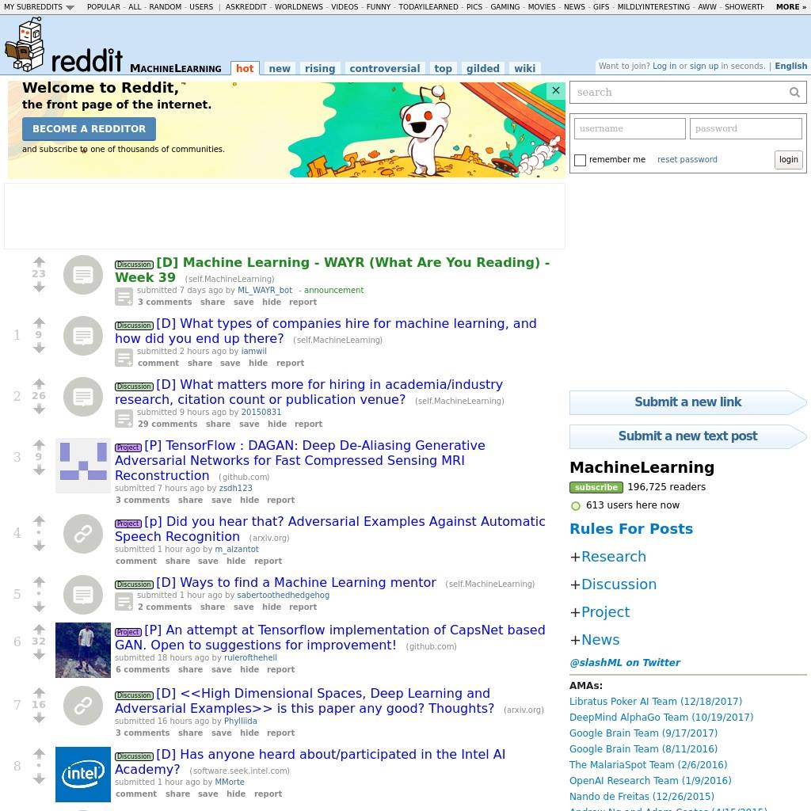
**이미지 캡션:** 이 이미지는 레딧의 머신러닝 커뮤니티 페이지를 보여줍니다. 페이지 상단에는 레딧 로고와 함께 "Welcome to Reddit, the front page of the internet."이라는 문구가 있고, 그 아래에는 "BECOME A REDDITOR" 버튼이 있습니다. 메인 콘텐츠 영역에는 여러 게시물 목록이 표시되며, 각 게시물은 제목, 작성자, 제출 시간, 댓글 수 등의 정보를 포함합니다. 게시물 제목들은 머신러닝 관련 주제들을 다루고 있으며, "[D]"는 토론 게시물, "[P]"는 프로젝트 게시물을 나타냅니다. 예를 들어, "Machine Learning - WAYR (What Are You Reading) - Week 39", "What types of companies hire for machine learning, and how did you end up there?", "TensorFlow: DAGAN: Deep De-Aliasing Generative Adversarial Networks for Fast Compressed Sensing MRI Reconstruction" 등이 보입니다. 오른쪽 사이드바에는 "MachineLearning" 커뮤니티의 구독자 수와 현재 접속자 수가 표시되어 있으며, "Rules For Posts"와 함께 "Research", "Discussion", "Project", "News"와 같은 카테고리가 나열되어 있습니다. 또한, "@slashML on Twitter"와 "AMAS" 섹션에는 관련 트위터 계정과 과거 AMA(Ask Me Anything) 목록이 포함되어 있습니다. 전반적으로, 이 페이지는 머신러닝 분야에 관심 있는 사용자들이 최신 정보와 토론을 공유하는 온라인 커뮤니티의 모습을 보여줍니다.나타냅니다. 예를 들어, "Machine Learning - WAYR (What Are You Reading) - Week 39", "What types of companies hire for machine learning, and how did you end up there?", "TensorFlow: DAGAN: Deep De-Aliasing Generative Adversarial Networks for Fast Compressed Sensing MRI Reconstruction" 등이 보입니다. 오른쪽 사이드바에는 "MachineLearning" 커뮤니티의 구독자 수와 현재 접속자 수가 표시되어 있으며, "Rules For Posts"와 함께 "Research", "Discussion", "Project", "News"와 같은 카테고리가 나열되어 있습니다. 또한, "@slashML on Twitter"와 "AMAS" 섹션에는 관련 트위터 계정과 과거 AMA(Ask Me Anything) 목록이 포함되어 있습니다. 전반적으로, 이 페이지는 머신러닝 분야에 관심 있는 사용자들이 최신 정보와 토론을 공유하는 온라인 커뮤니티의 모습을 보여줍니다.

> #오늘의레딧 https://www.reddit.com/r/MachineLearning/ 오늘도 새소식이 많군요.  1. 어떤 종류의 회사들이 기계 학습을 위해 고용되었고, 당신은 어떻게 그곳에 가게 되었나요? 2. 산학 협동 연구, 표창장, 출판장 등을 채용하기 위해서는 무엇이 더 중요한가? 3. Tensorflow:DAGAN: 빠른 압축성 인식 MRI를 위한 딥 어니어싱을 위한 딥 어드벤쳐 어드벤쳐 4. 기계 학습 멘토를 찾는 방법 5. CapsNet기반 GAN의 Tensorflow구현 시도 개선 제안에 대한 의견 개진! 6. << 높은 차원의 공간, 깊은 학습 및 광고 사례>>가 이 문서에 어떤 도움이 됩니까? 생각해 볼까요? 7. IntelAI아카데미에서 실격된 사람이 있었습니까? 8. 유럽 대학의 기계 학습 마스터 또는 리서치 9. TPU에서 TensorflowResearchCloudAward에 액세스 한 사람이 있습니까? 10. LinearRegression개체를 적용하는 스레일러 lib에서 점수()를 혼동합니다. 11. 문제가 되는 유전 인자의 도함수가 있음에도 불구하고, 왜 그것은 작동 기능으로 사용되지 않는 것처럼 보이는가? 12. 어.. 스탠포드 대학교는 그들의 예전 CSC26쿼터를 해체했고, 이번 학기에 새 학기를 위한 새로운 것으로 대체했는데, 그것은 단지 2주 만에 충분했다. 혹시 기록 보관소가 있는지 아시는 분 계세요? 13. 2018년에 가장 기대하는 것은 어떤 기계 학습인가요? 14. 인공 지능형 지능형 비디오를 위한 인공 지능 강화 학습 시스템 15. 구글의 거주지 상주 마감일? 16. NVIDIAJetson과 Python을 사용한 딥 학습 카메라 구축 17. ICLR2018워크샵에 제출하면 ICML이중 제출 정책이 위반됩니까? 18. 마지막 학기의 마지막 학기에 기계 학습을 이용하는 소프트웨어 공학 강좌를 추천해 주시겠어요? 19. FacebookAIResearchResidencyProgramQ-확인 이메일 확인? 20. 텐서 플로우 시 A2C의 명확하고 단순한 구현  1. https://www.reddit.com/r/MachineLearning/comments/7otkwz/d_what_types_of_companies_hire_for_machine/ 2. https://www.reddit.com/r/MachineLearning/comments/7oqr3j/d_what_matters_more_for_hiring_in/ 3. https://github.com/nebulaV/DAGAN 4. https://www.reddit.com/r/MachineLearning/comments/7otnqn/d_ways_to_find_a_machine_learning_mentor/ 5. https://github.com/vlraik/CapsNet-GAN-Tensorflow 6. https://arxiv.org/abs/1801.00634 7. https://software.seek.intel.com/ai-student-form 8. https://www.reddit.com/r/MachineLearning/comments/7oqras/d_machine_learning_masters_or_research/ 9. https://www.reddit.com/r/MachineLearning/comments/7oodrm/d_has_anyone_gained_access_to_the_tensorflow/ 10. https://www.reddit.com/r/MachineLearning/comments/7os7s5/d_confused_about_score_from_sklearn_lib_applying/ 11. https://www.reddit.com/r/MachineLearning/comments/7oms3j/d_despite_the_problematic_derivative_of_the/ 12. https://www.reddit.com/r/MachineLearning/comments/7ohumt/d_uh_oh_stanford_took_down_their_old_cs224n/ 13. https://www.reddit.com/r/MachineLearning/comments/7oj92y/d_what_machine_learning_things_are_you_most/ 14. https://youtu.be/HCSm0kVolqI 15. https://www.reddit.com/r/MachineLearning/comments/7oozj9/d_google_ai_residency_deadline/ 16. https://github.com/burningion/rich-mans-deep-learning-camera 17. https://www.reddit.com/r/MachineLearning/comments/7ogmip/d_does_submitting_to_an_iclr_2018_workshop/ 18. https://www.reddit.com/r/MachineLearning/comments/7ohfdr/p_can_you_suggest_a_software_engineering_course/ 19. https://www.reddit.com/r/MachineLearning/comments/7oj5mj/d_facebook_ai_research_residency_program/ 20. https://github.com/MG2033/A2C

### 1월 9일 (화) 08:52 · 📷 사진 (1장)

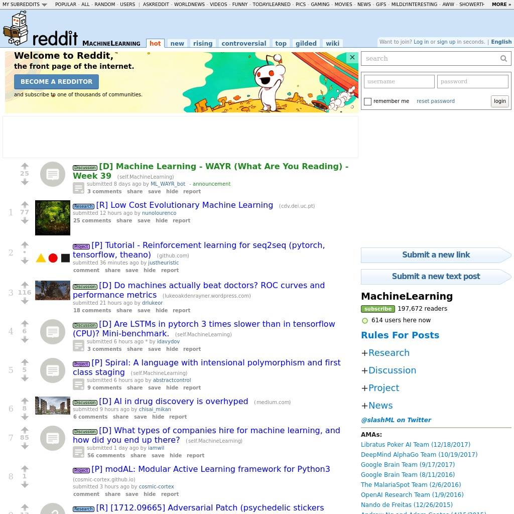
**이미지 캡션:** 이 이미지는 인기 있는 온라인 커뮤니티인 레딧의 머신러닝 서브레딧 페이지를 보여줍니다. 페이지 상단에는 레딧 로고와 함께 "Welcome to Reddit, the front page of the internet."이라는 문구가 있고, 그 아래에는 "BECOME A REDDITOR" 버튼이 있습니다. 메인 콘텐츠 영역에는 여러 게시물 목록이 표시되며, 각 게시물은 제목, 작성자, 댓글 수, 업로드 시간 등의 정보를 포함하고 있습니다. 게시물 제목들은 머신러닝, 인공지능, 파이썬 등 다양한 주제를 다루고 있으며, 일부는 연구 논문이나 튜토리얼 링크를 포함하고 있습니다. 오른쪽 사이드바에는 "MachineLearning" 서브레딧의 구독자 수와 현재 접속자 수가 표시되어 있으며, "Rules For Posts" 섹션과 "AMAS" (Ask Me Anything) 목록이 있습니다. 전반적으로 정보가 많고 기술적인 주제를 다루는 커뮤니티의 분위기를 나타냅니다., 일부는 연구 논문이나 튜토리얼 링크를 포함하고 있습니다. 오른쪽 사이드바에는 "MachineLearning" 서브레딧의 구독자 수와 현재 접속자 수가 표시되어 있으며, "Rules For Posts" 섹션과 "AMAS" (Ask Me Anything) 목록이 있습니다. 전반적으로 정보가 많고 기술적인 주제를 다루는 커뮤니티의 분위기를 나타냅니다.

> #오늘의레딧 https://www.reddit.com/r/MachineLearning/ 정말 읽을 거리가 많네요.  1. 저비용 진화 기계 학습 2. 자습서-seq/sec(발열량, tensorflow, theano)에 대한 보강 학습 3. 기계들이 실제로 의사들을 이길까요? ROC곡선 및 성능 메트릭 4. LSTMs가 tensorflow(tensorflow)보다 3배 느립니까? 미니 벤치 마크 5. Spiral(나선형):상호 간의 다각형 및 첫번째 클래스 스테이징이 포함된 언어 6. 약물 발견의 AI가 과다 섭취되었다. 7. 어떤 종류의 회사들이 기계 학습을 위해 고용되었고, 당신은 어떻게 그곳에 가게 되었나요? 8. ModAL:Python3에 대한 모듈식 학습 프레임워크 9. 페이스북은 워싱턴 대학교와 제휴하여 새로운 ARQVR연구 센터를 만들었다. 10. 비숍-패턴 인식 및 기계 학습 전자 알고리즘 도출 11. NIPS:팀 황과 잭 클라크의 정책 필드 노트-NIPS의 일부 부분에 대한 훌륭한 요약 12. Deepyand-DeepMind의 작업 부하를 입증하기 위해 DeepMind의 작품을 시연하고 45배 더 빠른 교육 시간을 제공하는 DensmindWorkshop 13. 산학 협동 연구, 표창장, 출판장 등을 채용하기 위해서는 무엇이 더 중요한가? 14. Tensorflow:DAGAN: 빠른 압축성 인식 MRI를 위한 딥 어니어싱을 위한 딥 어드벤쳐 어드벤쳐 15. IntelAI아카데미에서 실격된 사람이 있었습니까? 16. CapsNet기반 GAN의 Tensorflow구현 시도 개선 제안에 대한 의견 개진! 17. << 높은 차원의 공간, 깊은 학습 및 광고 사례>>가 이 문서에 어떤 도움이 됩니까? 생각해 볼까요? 18. 유럽 대학의 기계 학습 마스터 또는 리서치 19. 기계 학습 멘토를 찾는 방법 20. TPU에서 TensorflowResearchCloudAward에 액세스 한 사람이 있습니까?  1. https://cdv.dei.uc.pt/denser/ 2. https://github.com/yandexdataschool/Practical_RL/tree/master/week8_scst#materials 3. https://lukeoakdenrayner.wordpress.com/2017/12/06/do-machines-actually-beat-doctors-roc-curves-and-performance-metrics/ 4. https://www.reddit.com/r/MachineLearning/comments/7p057n/d_are_lstms_in_pytorch_3_times_slower_than_in/ 5. https://www.reddit.com/r/MachineLearning/comments/7ozv02/p_spiral_a_language_with_intensional_polymorphism/ 6. https://medium.com/the-ai-lab/artificial-intelligence-in-drug-discovery-is-overhyped-examples-from-astrazeneca-harvard-315d69a7f863 7. https://www.reddit.com/r/MachineLearning/comments/7otkwz/d_what_types_of_companies_hire_for_machine/ 8. https://cosmic-cortex.github.io/modAL/ 9. https://research.fb.com/facebook-partners-with-the-university-of-washington-to-create-new-ar-vr-research-center/ 10. https://www.reddit.com/r/MachineLearning/comments/7oziv1/d_bishop_pattern_recognition_and_machine_learning/ 11. https://medium.com/@timhwang/nips-2017-policy-field-notes-55176da092d1 12. https://globenewswire.com/news-release/2017/09/19/1124763/0/en/Bonsai-Sets-State-of-the-Art-Reinforcement-Learning-Benchmark-for-Programming-Industrial-Control-Systems.html 13. https://www.reddit.com/r/MachineLearning/comments/7oqr3j/d_what_matters_more_for_hiring_in/ 14. https://github.com/nebulaV/DAGAN 15. https://software.seek.intel.com/ai-student-form 16. https://github.com/vlraik/CapsNet-GAN-Tensorflow 17. https://arxiv.org/abs/1801.00634 18. https://www.reddit.com/r/MachineLearning/comments/7oqras/d_machine_learning_masters_or_research/ 19. https://www.reddit.com/r/MachineLearning/comments/7otnqn/d_ways_to_find_a_machine_learning_mentor/ 20. https://www.reddit.com/r/MachineLearning/comments/7oodrm/d_has_anyone_gained_access_to_the_tensorflow/

### 1월 10일 (수) 07:26 · 📷 사진 (2장)

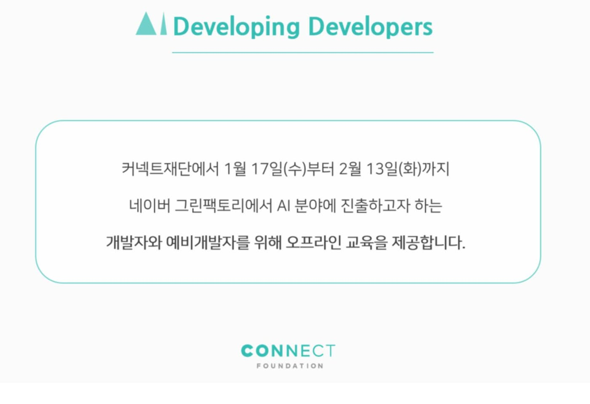
**이미지 캡션:** 이 이미지는 "Developing Developers"라는 제목과 함께 "CONNECT FOUNDATION" 로고를 보여줍니다. 중앙에는 둥근 모서리가 있는 흰색 상자 안에 한국어로 된 텍스트가 있습니다. 이 텍스트는 커넥트재단에서 1월 17일(수)부터 2월 13일(화)까지 네이버 그린팩토리에서 AI 분야에 진출하고자 하는 개발자와 예비 개발자를 위해 오프라인 교육을 제공한다는 내용을 담고 있습니다. 이미지는 전반적으로 깔끔하고 정보 전달에 초점을 맞춘 디자인입니다. 사람, 장소, 사물, 보이는 텍스트 외에는 특별한 정보가 없습니다. 특별한 정보가 없습니다.
 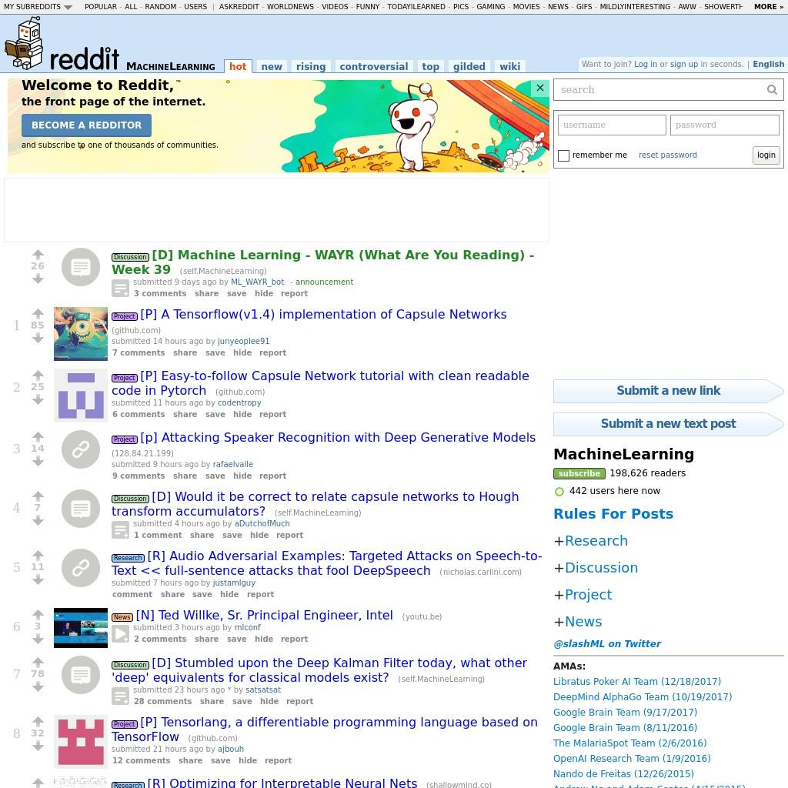
**이미지 캡션:** 이 이미지는 레딧의 머신러닝 서브레딧 페이지를 보여줍니다. 페이지 상단에는 레딧 로고와 함께 "Welcome to Reddit, the front page of the internet."이라는 문구가 있고, 그 옆에는 귀여운 캐릭터가 그려진 일러스트가 있습니다. 로그인 및 회원가입을 위한 입력창과 버튼도 보입니다. 메인 콘텐츠 영역에는 다양한 머신러닝 관련 게시물들이 나열되어 있으며, 각 게시물은 제목, 작성자, 시간, 댓글 수, 좋아요/싫어요 표시 등을 포함하고 있습니다. 게시물들은 주로 "Discussion", "Project", "Research", "News"와 같은 카테고리로 분류되어 있습니다. 오른쪽 사이드바에는 "MachineLearning" 서브레딧의 구독자 수와 현재 접속자 수가 표시되어 있으며, 게시물 규칙과 트위터 계정 정보, 그리고 과거 AMA(Ask Me Anything) 목록이 나열되어 있습니다. 전체적으로 정보가 많고 다양한 주제의 게시물들이 활발하게 공유되고 있는 온라인 커뮤니티의 모습을 보여줍니다.n", "Project", "Research", "News"와 같은 카테고리로 분류되어 있습니다. 오른쪽 사이드바에는 "MachineLearning" 서브레딧의 구독자 수와 현재 접속자 수가 표시되어 있으며, 게시물 규칙과 트위터 계정 정보, 그리고 과거 AMA(Ask Me Anything) 목록이 나열되어 있습니다. 전체적으로 정보가 많고 다양한 주제의 게시물들이 활발하게 공유되고 있는 온라인 커뮤니티의 모습을 보여줍니다.

> [네이버 개발자와 함께 듣는 머신러닝, 딥러닝 명강의!]👨🏻‍💻👩🏻‍💻  머신러닝, 딥러닝에 차근 차근 이번 겨울에 함께 마스터 해봐요.    파이썬을 능숙하게 다루고, 기본적인 수학 실력을 쌓고... 네이버 커넥트 재단에서 머신러닝과 딥러닝의 이론을 탄탄하게 채워 나갈수 있는 3과목의 강좌를 준비했습니다. (No show방지를 위해 과목당 3만원의 신청비만 받습니다.)  머신러닝, 딥러닝 분야에 진출하고자 하는 개발자와 예비개발자를 위해 최고의 명강의를 네이버 그린팩토리에서 진행합니다.   * 인공지능을 위한 선형대수: 1월 17일(수), 1월 18일(목), 1월 24일(수), 1월 25일(목), 1월 26일(금) 18:30 ~ 21:30 (1회 3시간 * 5회,  총 15시간), 주재걸 교수 (고려대학교 컴퓨터공학과)  * 머신러닝/딥러닝을 위한 Python: 1월 29일(월), 1월 30일(화), 2월 5일(월), 2월 6일(화), 2월 12일(월), 2월 13일(화), 18:30 ~ 21:00 (1회 2시간 30분 *6회, 총 15시간), 최성철 교수 (가천대학교 산업공학과)  * Bayesian Deep Learning, 1월 31일(수), 2월 1일(목), 2월 7일(수), 2월 8일(목), 2월 9일(금), 18:30 ~ 21:30 (1회 3시간, 5회, 총 15시간), 최성준 박사 (서울대학교)  그 첫 번째 강의를 지금 신청하세요!  머신러닝, 딥러닝 개발을 위해 필요한 선형대수 지식을 빠르게 부팅 합니다. 수학적 개념들이 프로그래밍에 어떻게 필요한 것인지 파악하고 수식을 python 코드로 구현해 봅니다.   🌱일정 : 1/17, 1/18, 1/24, 1/25, 1/26 (18:30 ~ 21:30) 🌱장소 : 네이버 그린팩토리 커넥트홀 🌱신청인원 : 100명 (선착순) 🌱교수자 : 주재걸 교수 (고려대 컴퓨터공학과) 🌱신청 방법 : https://goo.gl/d3uaJM
> #오늘의레딧 https://www.reddit.com/r/MachineLearning/ 머신러닝 공부는 정말 재미있죠?아침부터 다양한 소식이 많네요.  1. 캡슐형 네트워크 구축에 관한 연구 2. PITORCH에서 읽을 수 있는 읽기 쉬운 코드를 포함하는 간편한 캡슐형 캡슐 3. 캡슐 네트워크를 거칠게 변환하는 게이지와 연결하는 것이 올바를까요? 4. 오디오 광고 사례:스피드-텍스트에 대한 공격 대상 공격-완전한 증거 공격에 대한 공격적인 공격 5. 선임 수석 엔지니어 테드 윌크스 6. 오늘날 DeepCalman필터를 고집하며, 고전적인 모델에 대한 다른 ' 깊은 '등가물들은 무엇인가? 7. Tensorflow를 기반으로 하는 분산 프로그래밍 언어인 Tensorlang 8. 해석 가능한 신경 세포의 최적화 9. 자습서-seq/sec(발열량, tensorflow, theano)에 대한 보강 학습 10. NIPS워크샵 요약을 충족하는 의료 이미징 11. 심층 분석:심층 학습을 통해 측면 채널 특권을 습득합니다. 12. 얼굴 인식: 실시간 마스크 개발 13. 저비용 진화 기계 학습 14. 얀 레커슨은 소피아 AI를 "완전한 불독"과 "포텍 킨 AI"로 묘사하고 있다. 15. 데이터, 코드, 구성, 가중치 및 결과에 대한 모든 버전 제어 도구 권장 사항 16. 기계들이 실제로 의사들을 이길까요? ROC곡선 및 성능 메트릭 17. Spiral(나선형):상호 간의 다각형 및 첫번째 클래스 스테이징이 포함된 언어 18. LSTMs가 tensorflow(tensorflow)보다 3배 느립니까? 미니 벤치 마크 19. ModAL:Python3에 대한 모듈식 학습 프레임워크 20. 약물 발견의 AI가 과다 섭취되었다.  1. https://github.com/JunYeopLee/capsule-networks 2. https://github.com/higgsfield/Capsule-Network-Tutorial 3. https://www.reddit.com/r/MachineLearning/comments/7p9a2j/d_would_it_be_correct_to_relate_capsule_networks/ 4. https://nicholas.carlini.com/code/audio_adversarial_examples 5. https://youtu.be/RmKLoo7e9_g?t=1s 6. https://www.reddit.com/r/MachineLearning/comments/7p2xns/d_stumbled_upon_the_deep_kalman_filter_today_what/ 7. https://github.com/tensorlang/tensorlang 8. http://www.shallowmind.co/jekyll/pixyll/2017/12/30/tree-regularization/ 9. https://github.com/yandexdataschool/Practical_RL/tree/master/week8_scst#materials 10. https://towardsdatascience.com/medical-imaging-meets-nips-a-summary-43bf1b0d0c62 11. https://github.com/asm/deep_spectre 12. https://medium.com/@mrshakirov/face-recognition-realtime-masks-development-9d3a399b4c3 13. https://cdv.dei.uc.pt/denser/ 14. http://www.businessinsider.com/facebook-ai-yann-lecun-sophia-robot-bullshit-2018-1 15. https://www.reddit.com/r/MachineLearning/comments/7p46ld/d_any_version_control_tool_recommendations_for/ 16. https://lukeoakdenrayner.wordpress.com/2017/12/06/do-machines-actually-beat-doctors-roc-curves-and-performance-metrics/ 17. https://www.reddit.com/r/MachineLearning/comments/7ozv02/p_spiral_a_language_with_intensional_polymorphism/ 18. https://www.reddit.com/r/MachineLearning/comments/7p057n/d_are_lstms_in_pytorch_3_times_slower_than_in/ 19. https://cosmic-cortex.github.io/modAL/ 20. https://medium.com/the-ai-lab/artificial-intelligence-in-drug-discovery-is-overhyped-examples-from-astrazeneca-harvard-315d69a7f863

### 1월 11일 (목) 08:52 · 📷 사진 (1장)

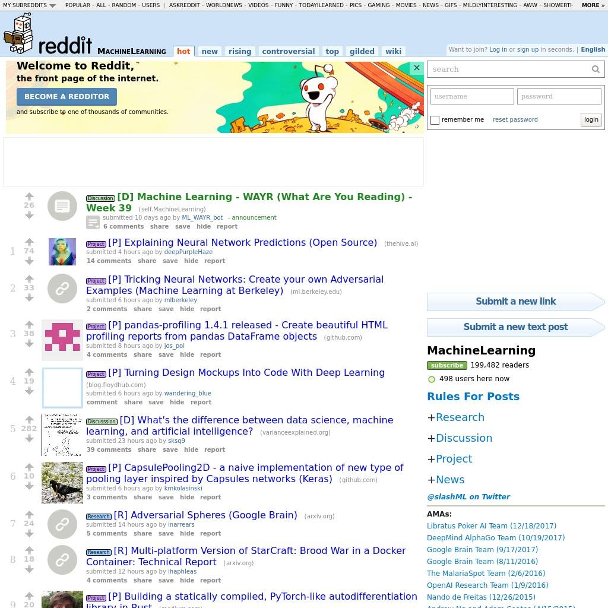
**이미지 캡션:** 이 이미지는 레딧(Reddit) 웹사이트의 머신러닝(Machine Learning) 서브레딧 페이지를 보여줍니다. 페이지 상단에는 레딧 로고와 함께 "Welcome to Reddit, the front page of the internet."이라는 환영 문구가 있고, 그 아래에 "BECOME A REDDITOR" 버튼이 있습니다. 메인 콘텐츠 영역에는 여러 게시물 목록이 표시되며, 각 게시물은 제목, 작성자, 제출 시간, 댓글 수, 공유, 저장, 숨기기, 신고 등의 옵션을 포함합니다. 게시물들은 주로 머신러닝 관련 주제를 다루고 있으며, "Project" 또는 "Discussion"으로 분류되어 있습니다. 예를 들어, "[P] Explaining Neural Network Predictions (Open Source)"라는 제목의 게시물은 4시간 전에 제출되었고 14개의 댓글이 달려 있습니다. 오른쪽 사이드바에는 "Submit a new link" 및 "Submit a new text post" 버튼과 함께 "MachineLearning" 서브레딧의 구독자 수와 현재 접속자 수가 표시됩니다. 또한, "Rules For Posts" 섹션 아래에는 "+Research", "+Discussion", "+Project", "+News"와 같은 카테고리가 있으며, 트위터 계정(@slashML on Twitter)과 "AMAS" 목록도 보입니다. 전반적으로 기술 관련 커뮤니티의 정보 공유 및 토론이 이루어지는 온라인 플랫폼의 모습을 담고 있습니다. 관련 주제를 다루고 있으며, "Project" 또는 "Discussion"으로 분류되어 있습니다. 예를 들어, "[P] Explaining Neural Network Predictions (Open Source)"라는 제목의 게시물은 4시간 전에 제출되었고 14개의 댓글이 달려 있습니다. 오른쪽 사이드바에는 "Submit a new link" 및 "Submit a new text post" 버튼과 함께 "MachineLearning" 서브레딧의 구독자 수와 현재 접속자 수가 표시됩니다. 또한, "Rules For Posts" 섹션 아래에는 "+Research", "+Discussion", "+Project", "+News"와 같은 카테고리가 있으며, 트위터 계정(@slashML on Twitter)과 "AMAS" 목록도 보입니다. 전반적으로 기술 관련 커뮤니티의 정보 공유 및 토론이 이루어지는 온라인 플랫폼의 모습을 담고 있습니다.

> #오늘의레딧 https://www.reddit.com/r/MachineLearning/ 오늘도 새소식이 많군요.  1. 신경망 예측(개방 소스)설명 2. TrickerTrick네트워크:자신만의 광고 사례 생성(버클리에서의 기계 학습) 3. 판매품 1.4.1 출시-판따 프라임 개체로부터 아름다운 HTML프로파일링 보고서 작성 4. 심층 학습을 통한 디자인 Mockups로의 설계 전환 5. 캡슐/캡슐-캡슐 네트워크에 의해 영감을 받은 새로운 유형의 풀링 계층의 순진한 구현 6. 어버어스 스페어스(GoogleBraire) 7. 다중 플랫폼 스타 크래프트:DockerContainer의 브루드 전쟁:기술 보고서 8. 동적으로 컴파일된 피처링(Liferchaft)과 유사한 autodifferention라이브러리 제작 9. 회사 내에서 경쟁을 조직하기 위해 수업 시간에 카페에 대한 대안이 있나요? 10. 모범 사례를 참고하십시오. 11. Lavan:국부적이고 육안으로 보이는 소음 12. 레이:AI를 위한 분산 시스템 13. 적대 행위에 대비한 계급 차별 철폐에 관한 법률적 근거 14. 디프 미드 컨트롤 스위트 15. 현실적이고 풍부한 3D환경을 갖춘 일반 가정용 에이전트 16. "강화도를 이용한 훈련은 고정 깊이 BPTT의 한계를 극복한다." 17. 페이스북에서의 응용 프로그램 학습:데이터 센터 인프라 관점 18. 질문:CapsuleNet을 실행하는 데 캡슐/네트를 사용하지 않는 이유가 있습니다. 19. 저는 Nguyen의 NNDL강좌를 수강했고, 아직도 신경 네트워크에 대한 데이터를 어떻게 얻을지, 어떻게 조직화하는지 또는 무엇을 조직할 것인지에 대해서는 모릅니다. 20. Tensorflow4ScSci-키트의 버섯 분류 법  1. https://thehive.ai/blog/inside-a-neural-networks-mind 2. https://ml.berkeley.edu/blog/2018/01/10/adversarial-examples/ 3. https://github.com/pandas-profiling/pandas-profiling 4. https://blog.floydhub.com/turning-design-mockups-into-code-with-deep-learning/ 5. https://github.com/kmkolasinski/deep-learning-notes/tree/master/keras-capsule-pooling 6. https://arxiv.org/abs/1801.02774 7. https://arxiv.org/abs/1801.02193 8. https://medium.com/@maciejkula/building-an-autodifferentiation-library-9ccf32c7a658 9. https://www.reddit.com/r/MachineLearning/comments/7pit2f/d_alternative_to_kaggle_in_class_to_organize/ 10. https://www.reddit.com/r/MachineLearning/comments/7pjlkq/d_note_taking_best_practices/ 11. https://arxiv.org/abs/1801.02608 12. http://bair.berkeley.edu/blog/2018/01/09/ray/ 13. https://arxiv.org/abs/1705.08475 14. https://arxiv.org/abs/1801.00690v1 15. https://arxiv.org/abs/1801.02209 16. https://www.reddit.com/r/MachineLearning/comments/7pdbsm/d_training_using_reinforce_overcomes_limits_of/ 17. https://research.fb.com/publications/applied-machine-learning-at-facebook-a-datacenter-infrastructure-perspective/ 18. https://www.reddit.com/r/MachineLearning/comments/7pbxnv/d_question_is_there_a_reason_why_capsulenet_would/ 19. https://www.reddit.com/r/MachineLearning/comments/7pei5x/d_i_took_ngs_nndl_course_and_still_dont_know_the/ 20. https://www.reddit.com/r/MachineLearning/comments/7pgp8m/pmushroom_classification_in_tensorflowscikit_learn/

### 1월 12일 (금) 08:52 · 📷 사진 (1장)

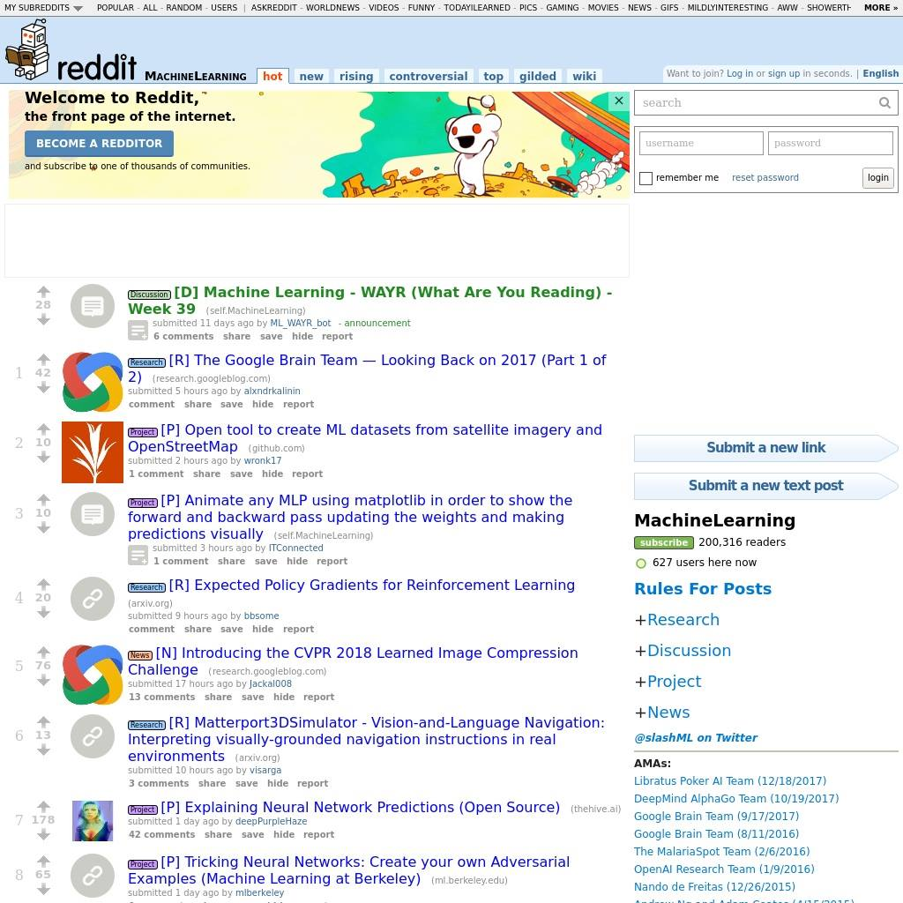
**이미지 캡션:** 이것은 레딧의 머신러닝 서브레딧 페이지로, 다양한 게시물 목록과 관련 정보가 표시됩니다. 페이지 상단에는 레딧 로고와 함께 "Welcome to Reddit, the front page of the internet."이라는 문구가 있고, 그 아래에는 "BECOME A REDDITOR" 버튼이 있습니다. 메인 콘텐츠 영역에는 여러 머신러닝 관련 게시물들이 시간순으로 나열되어 있으며, 각 게시물은 제목, 작성자, 제출 시간, 댓글 수, 그리고 좋아요/싫어요 투표 수를 보여줍니다. 게시물 제목 옆에는 [D] (Discussion), [R] (Research), [P] (Project), [N] (News)와 같은 태그가 붙어 있어 게시물의 성격을 나타냅니다. 예를 들어, "Machine Learning - WAYR (What Are You Reading) - Week 39"은 토론 게시물이고, "The Google Brain Team - Looking Back on 2017 (Part 1 of 2)"는 연구 게시물입니다. 오른쪽 사이드바에는 "Submit a new link"와 "Submit a new text post" 버튼이 있고, "MachineLearning" 서브레딧의 구독자 수와 현재 접속자 수가 표시됩니다. 또한, 서브레딧 규칙과 트위터 계정, 그리고 과거 AMA(Ask Me Anything) 목록도 볼 수 있습니다. 전반적으로 기술 및 연구 커뮤니티의 활발한 정보 교류를 보여주는 분위기입니다.scussion), [R] (Research), [P] (Project), [N] (News)와 같은 태그가 붙어 있어 게시물의 성격을 나타냅니다. 예를 들어, "Machine Learning - WAYR (What Are You Reading) - Week 39"은 토론 게시물이고, "The Google Brain Team - Looking Back on 2017 (Part 1 of 2)"는 연구 게시물입니다. 오른쪽 사이드바에는 "Submit a new link"와 "Submit a new text post" 버튼이 있고, "MachineLearning" 서브레딧의 구독자 수와 현재 접속자 수가 표시됩니다. 또한, 서브레딧 규칙과 트위터 계정, 그리고 과거 AMA(Ask Me Anything) 목록도 볼 수 있습니다. 전반적으로 기술 및 연구 커뮤니티의 활발한 정보 교류를 보여주는 분위기입니다.

> #오늘의레딧 https://www.reddit.com/r/MachineLearning/ 따끈한 소식들입니다.  1. 구글 브레인 팀이 2017년을 되돌아 보고 있다( 제1장) 2. 위성 이미지 및 OpenStreetMap에서 ML데이터 셋을 생성하는 툴 열기 3. 전방/후방을 사용하여 체중을 업데이트하고 시각화를 시각적으로 표시하기 위해 맵/로프를 사용하여 다중 경로를 애니메이션으로 필터링 합니다. 4. 강화 학습을 위한 예상되는 정책 구배 5. CVPR2018년도 추계 학술 발표 대회 기조 연설 6. Matterport3D Simulator-Vision-and-range내비게이션:실제 환경에서 시각적으로 탐색되는 내비게이션 지침 해석 7. 신경망 예측(개방 소스)설명 8. TrickerTrick네트워크:자신만의 광고 사례 생성(버클리에서의 기계 학습) 9. 판매품 1.4.1 출시-판따 프라임 개체로부터 아름다운 HTML프로파일링 보고서 작성 10. 심층 학습을 통한 디자인 Mockups로의 설계 전환 11. 모범 사례를 참고하십시오. 12. 캡슐/캡슐-캡슐 네트워크에 의해 영감을 받은 새로운 유형의 풀링 계층의 순진한 구현 13. 적대 행위에 대비한 계급 차별 철폐에 관한 법률적 근거 14. 기계 학습 네트워크가 어떤 지점에서 멈추고 동일한 출력을 안정적으로 생산할 수 있도록 할 수 있는가? 15. 회사 내에서 경쟁을 조직하기 위해 수업 시간에 카페에 대한 대안이 있나요? 16. 어버어스 스페어스(GoogleBraire) 17. 동적으로 컴파일된 피처링(Liferchaft)과 유사한 autodifferention라이브러리 제작 18. 다중 플랫폼 스타 크래프트:DockerContainer의 브루드 전쟁:기술 보고서 19. Lavan:국부적이고 육안으로 보이는 소음 20. 레이:AI를 위한 분산 시스템  1. https://research.googleblog.com/2018/01/the-google-brain-team-looking-back-on.html 2. https://github.com/developmentseed/label-maker#label-maker 3. https://www.reddit.com/r/MachineLearning/comments/7pr0l9/p_animate_any_mlp_using_matplotlib_in_order_to/ 4. https://arxiv.org/abs/1801.03326 5. https://research.googleblog.com/2018/01/introducing-cvpr-2018-learned-image.html?utm_source=feedburner&utm_medium=feed&utm_campaign=Feed:+blogspot/gJZg+\(Official+Google+Research+Blog\) 6. https://arxiv.org/abs/1711.07280 7. https://thehive.ai/blog/inside-a-neural-networks-mind 8. https://ml.berkeley.edu/blog/2018/01/10/adversarial-examples/ 9. https://github.com/pandas-profiling/pandas-profiling 10. https://blog.floydhub.com/turning-design-mockups-into-code-with-deep-learning/ 11. https://www.reddit.com/r/MachineLearning/comments/7pjlkq/d_note_taking_best_practices/ 12. https://github.com/kmkolasinski/deep-learning-notes/tree/master/keras-capsule-pooling 13. https://arxiv.org/abs/1705.08475 14. https://www.reddit.com/r/MachineLearning/comments/7plqdb/d_can_a_machine_learning_network_be_constructed/ 15. https://www.reddit.com/r/MachineLearning/comments/7pit2f/d_alternative_to_kaggle_in_class_to_organize/ 16. https://arxiv.org/abs/1801.02774 17. https://medium.com/@maciejkula/building-an-autodifferentiation-library-9ccf32c7a658 18. https://arxiv.org/abs/1801.02193 19. https://arxiv.org/abs/1801.02608 20. http://bair.berkeley.edu/blog/2018/01/09/ray/

### 1월 12일 (금) 09:36 · is ready to fly to Jeju and Mt. Hallasan…

is ready to fly to Jeju and Mt. Hallasan this weekend! If you are around, see you there! It’s going to be really beautiful.

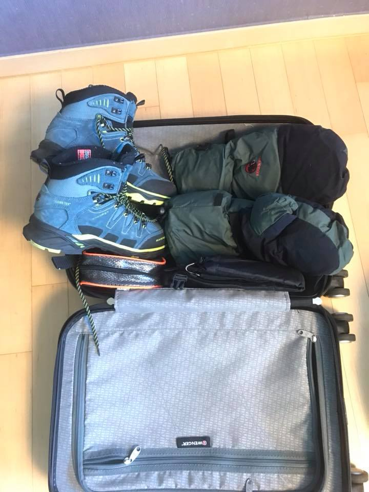
**이미지 캡션:** 열린 여행 가방 안에 파란색 등산화 두 켤레와 녹색 및 검은색 의류가 가지런히 놓여 있습니다. 등산화는 발목까지 올라오는 디자인으로 끈은 형광 연두색이며, 고어텍스 로고가 보입니다. 의류는 접혀 있으며, 일부에는 'Mammut' 로고가 희미하게 보입니다. 가방 안쪽 면에는 'WENGER' 로고가 새겨진 지퍼 포켓이 있습니다. 배경은 나무 바닥과 벽으로 이루어져 있으며, 전체적으로 여행 준비를 하는 듯한 분위기입니다.

### 1월 13일 (토) 08:52 · 📷 사진 (1장)

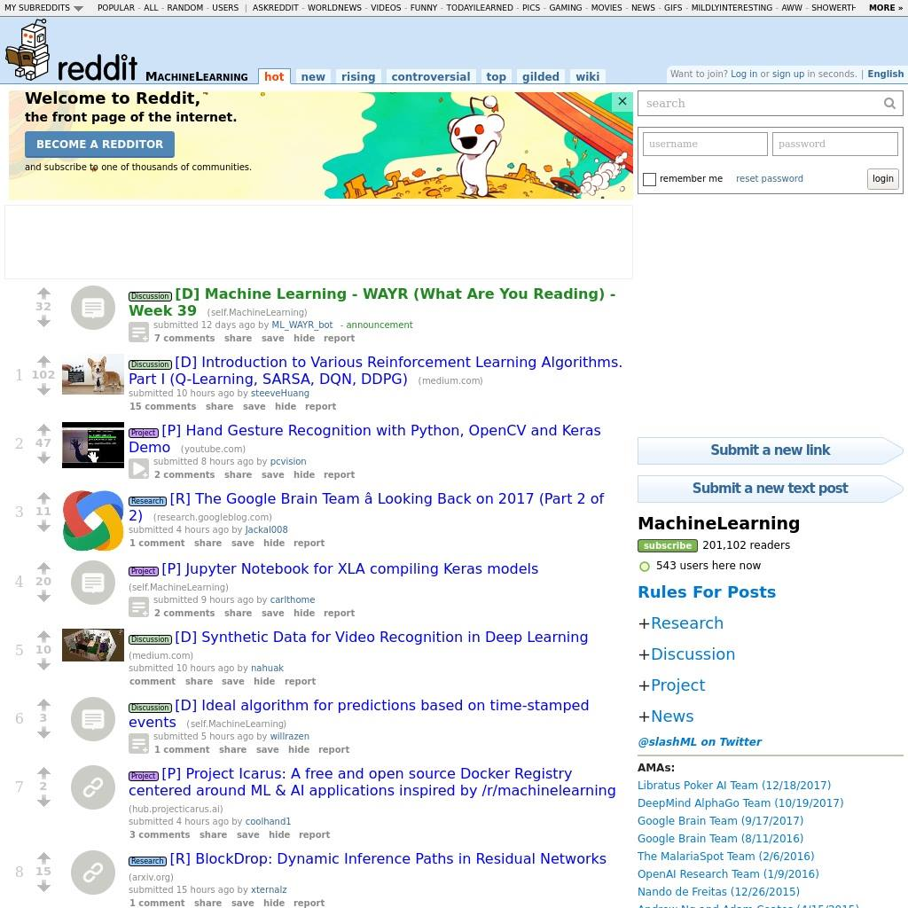
**이미지 캡션:** 이 이미지는 웹사이트 레딧의 머신러닝 서브레딧 페이지를 보여줍니다. 화면 중앙에는 "Welcome to Reddit, the front page of the internet."이라는 문구가 있고, 그 아래에 "BECOME A REDDITOR" 버튼이 있습니다. 페이지 상단에는 레딧 로고와 함께 "hot", "new", "rising", "controversial", "top", "gilded", "wiki"와 같은 탭이 있습니다. 오른쪽 상단에는 로그인 폼이 있으며, 사용자 이름과 비밀번호를 입력하고 로그인할 수 있습니다. 메인 콘텐츠 영역에는 여러 개의 게시물 목록이 표시되며, 각 게시물은 제목, 작성자, 제출 시간, 댓글 수 등의 정보를 포함합니다. 게시물들은 주로 머신러닝, 인공지능, 프로그래밍과 관련된 주제를 다루고 있습니다. 예를 들어, "[D] Machine Learning - WAYR (What Are You Reading) - Week 39", "[D] Introduction to Various Reinforcement Learning Algorithms. Part I (Q-Learning, SARSA, DQN, DDPG)", "[P] Hand Gesture Recognition with Python, OpenCV and Keras Demo" 등이 있습니다. 오른쪽 사이드바에는 "MachineLearning" 서브레딧의 구독자 수와 현재 접속자 수가 표시되어 있으며, "Rules For Posts" 섹션에는 "+Research", "+Discussion", "+Project", "+News"와 같은 카테고리가 있습니다. 또한, "@slashML on Twitter" 링크와 "AMAS" 섹션에는 다양한 인공지능 관련 팀들의 정보가 나열되어 있습니다. 전반적으로 기술 관련 커뮤니티의 정보 공유 및 토론이 이루어지는 웹 페이지의 모습을 보여줍니다. 수 있습니다. 메인 콘텐츠 영역에는 여러 개의 게시물 목록이 표시되며, 각 게시물은 제목, 작성자, 제출 시간, 댓글 수 등의 정보를 포함합니다. 게시물들은 주로 머신러닝, 인공지능, 프로그래밍과 관련된 주제를 다루고 있습니다. 예를 들어, "[D] Machine Learning - WAYR (What Are You Reading) - Week 39", "[D] Introduction to Various Reinforcement Learning Algorithms. Part I (Q-Learning, SARSA, DQN, DDPG)", "[P] Hand Gesture Recognition with Python, OpenCV and Keras Demo" 등이 있습니다. 오른쪽 사이드바에는 "MachineLearning" 서브레딧의 구독자 수와 현재 접속자 수가 표시되어 있으며, "Rules For Posts" 섹션에는 "+Research", "+Discussion", "+Project", "+News"와 같은 카테고리가 있습니다. 또한, "@slashML on Twitter" 링크와 "AMAS" 섹션에는 다양한 인공지능 관련 팀들의 정보가 나열되어 있습니다. 전반적으로 기술 관련 커뮤니티의 정보 공유 및 토론이 이루어지는 웹 페이지의 모습을 보여줍니다.

> #오늘의레딧 https://www.reddit.com/r/MachineLearning/ 따끈한 소식들입니다.  1. 다양한 강화 학습 학습 알고리즘을 소개합니다. 제1부(Q - ni ng, SARSA, DQN, DDPG) 2. Python, OpenCV및 Keras데모를 통한 핸드 제스처 인식 3. 2017년 구글을 돌아보는 구글 브레인 팀(2부 2) 4. XLA모델을 컴파일하기 위한 CMA노트북용 노트북 5. 심층 학습에서 비디오 인식을 위한 Synthetic데이터 6. 시간 스탬프 이벤트를 기반으로 한 예측에 대한 이상적인 알고리즘 7. 프로젝트 Icarus:무료 오픈 소스 Dockercenters:https://www.reddit.com/r/machinelearning에서 영감을 받은 무료 오픈 소스 Dockercenters 8. 블록 그룹:잔류 네트워크 내의 동적 추론 경로 9. 구글 브레인 팀이 2017년을 되돌아 보고 있다( 제1장) 10. 심층 학습 신경망을 이용한 기존 모델 제작 11. TV시리즈의 성공을 예측하려는 시도 12. 위성 이미지 및 OpenStreetMap에서 ML데이터 셋을 생성하는 툴 열기 13. 비관 주의적 학습 방식 14. Humble에 의한 PambleBook에 특징 지어진 파이썬 기계 학습:PacktByPackt 15. 전방/후방을 사용하여 체중을 업데이트하고 시각화를 시각적으로 표시하기 위해 맵/로프를 사용하여 다중 경로를 애니메이션으로 필터링 합니다. 16. 올림피언은 알파 테스터를 찾고 있으며, 경쟁사의 지능형 R&D를 위한 플랫폼을 찾고 있습니다. 17. '신경 망이 어떻게 학습되는가'- 제2부:페이스북의 새로운 유튜브 채널 공격! 18. 강화 학습을 위한 예상되는 정책 구배 19. GAN은 비현실적인 배경을 출력한다. 20. CVPR2018년도 추계 학술 발표 대회 기조 연설  1. https://medium.com/@huangkh19951228/introduction-to-various-reinforcement-learning-algorithms-i-q-learning-sarsa-dqn-ddpg-72a5e0cb6287 2. https://www.youtube.com/watch?v=IJV11OGTNT8 3. https://research.googleblog.com/2018/01/the-google-brain-team-looking-back-on_12.html?utm_source=feedburner&utm_medium=feed&utm_campaign=Feed:+blogspot/gJZg+\(Official+Google+Research+Blog\) 4. https://www.reddit.com/r/MachineLearning/comments/7pwprh/p_jupyter_notebook_for_xla_compiling_keras_models/ 5. https://medium.com/twentybn/using-synthetic-data-for-deep-learning-video-recognition-49be108a9346 6. https://www.reddit.com/r/MachineLearning/comments/7pyhi0/d_ideal_algorithm_for_predictions_based_on/ 7. https://hub.projecticarus.ai/ 8. https://arxiv.org/abs/1711.08393 9. https://research.googleblog.com/2018/01/the-google-brain-team-looking-back-on.html 10. https://hergott.github.io/deep-learning-model-augmentation/ 11. https://www.reddit.com/r/MachineLearning/comments/7pvosg/d_trying_to_predict_tv_series_success/ 12. https://github.com/developmentseed/label-maker#label-maker 13. https://www.reddit.com/r/MachineLearning/comments/7pxthf/d_unsupervisedassupervised_learning/ 14. https://www.humblebundle.com/books/python-by-packt-book-bundle?partner=indiekings 15. https://www.reddit.com/r/MachineLearning/comments/7pr0l9/p_animate_any_mlp_using_matplotlib_in_order_to/ 16. https://www.reddit.com/r/MachineLearning/comments/7pxkw8/p_olympian_is_looking_for_alpha_testers_platform/ 17. https://youtu.be/4rFOkpI0Lcg 18. https://arxiv.org/abs/1801.03326 19. https://www.reddit.com/r/MachineLearning/comments/7pv4zi/d_gan_output_unrealistic_background/ 20. https://research.googleblog.com/2018/01/introducing-cvpr-2018-learned-image.html?utm_source=feedburner&utm_medium=feed&utm_campaign=Feed:+blogspot/gJZg+\(Official+Google+Research+Blog\)

### 1월 14일 (일) 08:52 · 📷 사진 (1장)

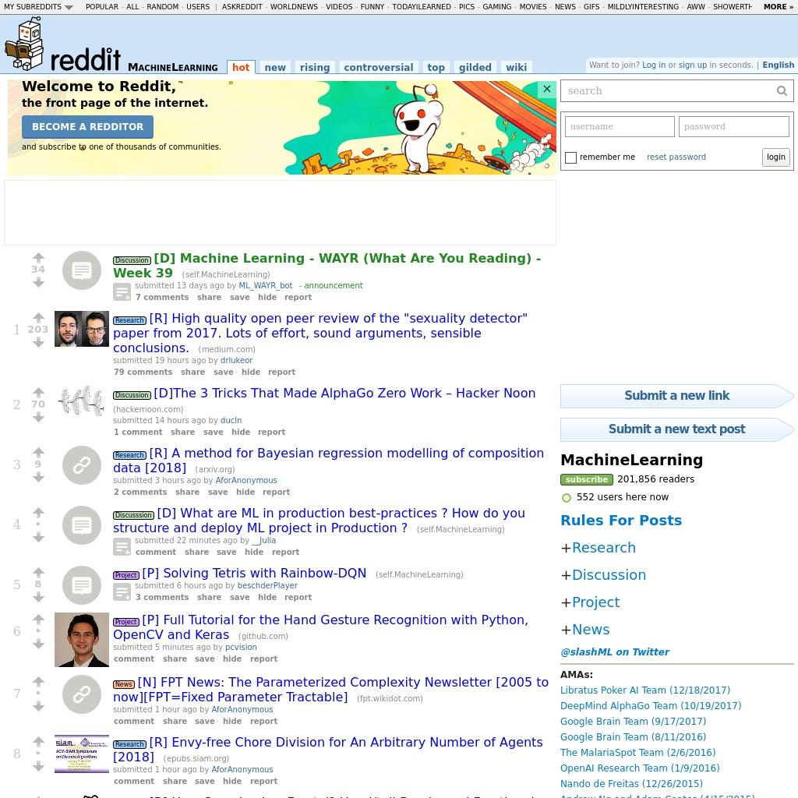
**이미지 캡션:** 이 이미지는 웹사이트 레딧의 머신러닝 커뮤니티 페이지를 보여줍니다. 페이지 상단에는 레딧 로고와 함께 "Welcome to Reddit, the front page of the internet."이라는 문구가 있고, 그 아래에는 "BECOME A REDDITOR" 버튼이 있습니다. 오른쪽 상단에는 로그인 및 회원가입을 위한 입력창과 버튼이 있습니다. 메인 콘텐츠 영역에는 다양한 게시물 목록이 표시되며, 각 게시물은 제목, 작성자, 제출 시간, 댓글 수 등의 정보를 포함합니다. 게시물들은 주로 머신러닝 관련 주제를 다루고 있으며, "Discussion", "Research", "Project", "News"와 같은 태그가 붙어 있습니다. 페이지 오른쪽 사이드바에는 "MachineLearning" 커뮤니티의 구독자 수와 현재 접속자 수가 표시되어 있으며, 게시물 규칙과 관련 링크들이 나열되어 있습니다. 또한, "AMAS" 섹션에는 과거에 진행되었던 AMA(Ask Me Anything) 목록이 날짜와 함께 표시되어 있습니다. 전반적으로 정보가 많고 전문적인 느낌을 주는 웹 페이지입니다.제를 다루고 있으며, "Discussion", "Research", "Project", "News"와 같은 태그가 붙어 있습니다. 페이지 오른쪽 사이드바에는 "MachineLearning" 커뮤니티의 구독자 수와 현재 접속자 수가 표시되어 있으며, 게시물 규칙과 관련 링크들이 나열되어 있습니다. 또한, "AMAS" 섹션에는 과거에 진행되었던 AMA(Ask Me Anything) 목록이 날짜와 함께 표시되어 있습니다. 전반적으로 정보가 많고 전문적인 느낌을 주는 웹 페이지입니다.

> #오늘의레딧 https://www.reddit.com/r/MachineLearning/ 따끈한 소식들입니다.  1. 2017년부터 "성 검출기"백서에 대한 고품질의 공개 안전 점검. 많은 노력, 건전한 논쟁, 합리적인 결론. 2. 알파고 제로 제로 작업을 수행한 3개의 트릭 3. Rainbow-NOW와 함께 MMS로 이동 4. Python, OpenCV및 Keras를 사용한 핸드 제스처 인식 튜토리얼 5. Python, OpenCV및 Keras데모를 통한 핸드 제스처 인식 6. 다양한 강화 학습 학습 알고리즘을 소개합니다. 제1부(Q - ni ng, SARSA, DQN, DDPG) 7. 2017년 구글을 돌아보는 구글 브레인 팀(2부 2) 8. 충분한 교육 자료를 제공하는 카메라 씬(scene)외에 복셀을 예측하는 것이 가능합니까? 9. Readabaillly-기계 학습에 의해 선택된 프로젝트 리드로 매일 받은 편지함에 배달됨 10. XLA모델을 컴파일하기 위한 CMA노트북용 노트북 11. 심층 학습에서 비디오 인식을 위한 Synthetic데이터 12. 심층 학습 신경망을 이용한 기존 모델 제작 13. 시간 스탬프 이벤트를 기반으로 한 예측에 대한 이상적인 알고리즘 14. 블록 그룹:잔류 네트워크 내의 동적 추론 경로 15. ScratchLSTM부터 Numpie까지. 손실이 감소하고 있지만, 어떻게 샘플을 채취해야 할지 모르겠어요. 또한 나는 그것이 실제로 작동하는지 확인하고 싶다. 16. 구글 브레인 팀이 2017년을 되돌아 보고 있다( 제1장) 17. TV시리즈의 성공을 예측하려는 시도 18. 프로젝트 Icarus:무료 오픈 소스 Dockercenters:https://www.reddit.com/r/machinelearning에서 영감을 받은 무료 오픈 소스 Dockercenters 19. 위성 이미지 및 OpenStreetMap에서 ML데이터 셋을 생성하는 툴 열기  1. https://medium.com/@blaisea/do-algorithms-reveal-sexual-orientation-or-just-expose-our-stereotypes-d998fafdf477 2. https://hackernoon.com/the-3-tricks-that-made-alphago-zero-work-f3d47b6686ef 3. https://www.reddit.com/r/MachineLearning/comments/7q5ka5/p_solving_tetris_with_rainbowdqn/ 4. https://github.com/jrobchin/Computer-Vision-Basics-with-Python-Keras-and-OpenCV 5. https://www.youtube.com/watch?v=IJV11OGTNT8 6. https://medium.com/@huangkh19951228/introduction-to-various-reinforcement-learning-algorithms-i-q-learning-sarsa-dqn-ddpg-72a5e0cb6287 7. https://research.googleblog.com/2018/01/the-google-brain-team-looking-back-on_12.html?utm_source=feedburner&utm_medium=feed&utm_campaign=Feed:+blogspot/gJZg+\(Official+Google+Research+Blog\) 8. https://www.reddit.com/r/MachineLearning/comments/7q2q6i/d_would_it_be_possible_to_predict_the_contents_a/ 9. https://www.leads-daily.com 10. https://www.reddit.com/r/MachineLearning/comments/7pwprh/p_jupyter_notebook_for_xla_compiling_keras_models/ 11. https://medium.com/twentybn/using-synthetic-data-for-deep-learning-video-recognition-49be108a9346 12. https://hergott.github.io/deep-learning-model-augmentation/ 13. https://www.reddit.com/r/MachineLearning/comments/7pyhi0/d_ideal_algorithm_for_predictions_based_on/ 14. https://arxiv.org/abs/1711.08393 15. https://www.reddit.com/r/MachineLearning/comments/7q1kjf/p_from_scratch_lstm_with_numpy_loss_is_decreasing/ 16. https://research.googleblog.com/2018/01/the-google-brain-team-looking-back-on.html 17. https://www.reddit.com/r/MachineLearning/comments/7pvosg/d_trying_to_predict_tv_series_success/ 18. https://hub.projecticarus.ai/ 19. https://github.com/developmentseed/label-maker#label-maker

### 1월 15일 (월) 08:52 · 📷 사진 (1장)

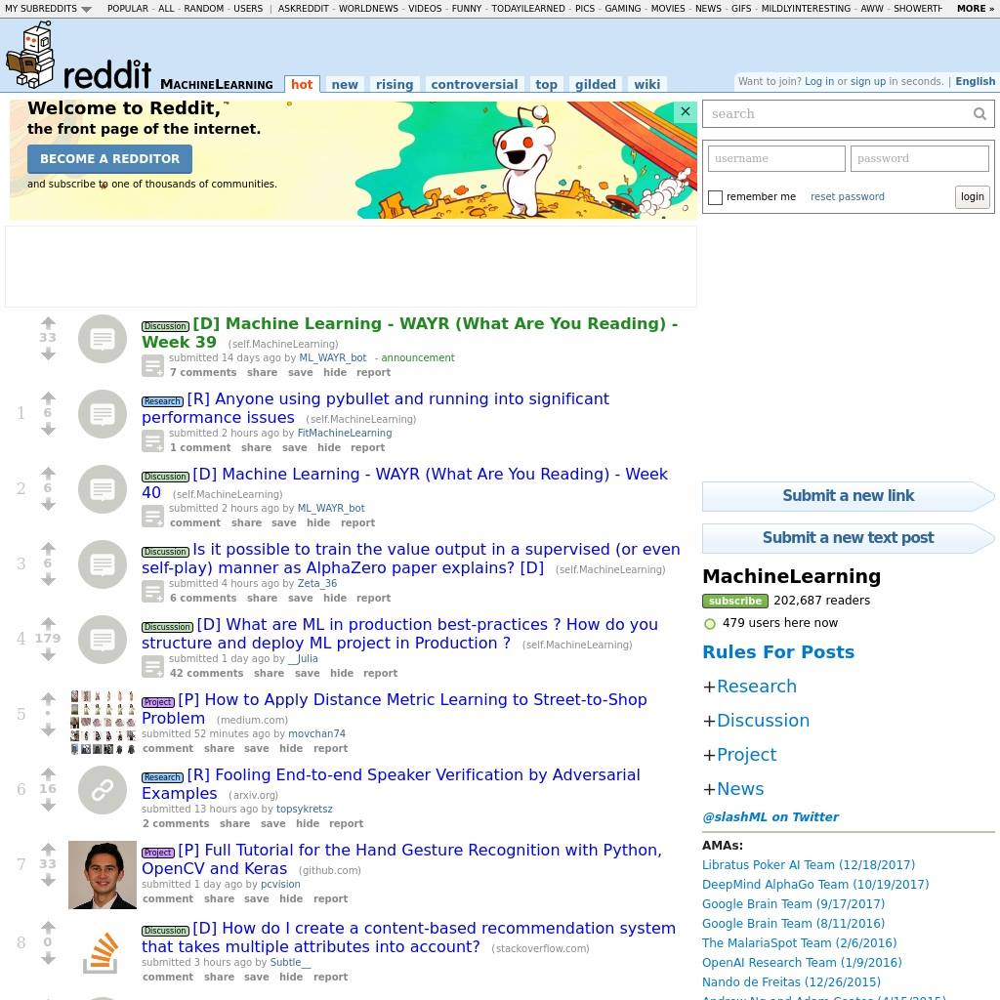
**이미지 캡션:** 이 이미지는 레딧(Reddit) 웹사이트의 머신러닝(Machine Learning) 서브레딧 페이지를 보여줍니다. 페이지 상단에는 레딧 로고와 함께 "Welcome to Reddit, the front page of the internet."이라는 문구가 있고, 그 아래에는 "BECOME A REDDITOR" 버튼이 있습니다. 메인 콘텐츠 영역에는 여러 게시물 목록이 표시되며, 각 게시물은 제목, 작성자, 댓글 수, 업/다운 투표 수 등의 정보를 포함합니다. 게시물들은 주로 머신러닝 관련 주제를 다루고 있으며, "WAYR (What Are You Reading)" 시리즈, 성능 문제, 알파제로(AlphaZero) 논문, 프로덕션에서의 머신러닝, 거리 기반 학습, 스피커 검증, 손 제스처 인식, 콘텐츠 기반 추천 시스템 등에 대한 내용이 있습니다. 오른쪽 사이드바에는 "Submit a new link" 및 "Submit a new text post" 버튼, 서브레딧 구독자 수, 게시 규칙, 트위터 계정, 그리고 "AMAS" 섹션이 있습니다. AMAS 섹션에는 다양한 인공지능 관련 팀들의 이름과 날짜가 나열되어 있습니다. 전반적으로 기술 관련 커뮤니티의 정보 공유 및 토론이 이루어지는 웹사이트의 모습을 보여줍니다., "WAYR (What Are You Reading)" 시리즈, 성능 문제, 알파제로(AlphaZero) 논문, 프로덕션에서의 머신러닝, 거리 기반 학습, 스피커 검증, 손 제스처 인식, 콘텐츠 기반 추천 시스템 등에 대한 내용이 있습니다. 오른쪽 사이드바에는 "Submit a new link" 및 "Submit a new text post" 버튼, 서브레딧 구독자 수, 게시 규칙, 트위터 계정, 그리고 "AMAS" 섹션이 있습니다. AMAS 섹션에는 다양한 인공지능 관련 팀들의 이름과 날짜가 나열되어 있습니다. 전반적으로 기술 관련 커뮤니티의 정보 공유 및 토론이 이루어지는 웹사이트의 모습을 보여줍니다.

> #오늘의레딧 https://www.reddit.com/r/MachineLearning/ 래딧은 읽을 거리가 다양합니다.  1. 피부어를 사용하고 중요한 성능 문제로 실행하는 사람 2. 기계 학습-WAYR( 읽기-쓰기)-주당 40회 3. 가로 방향 정지 문제에 대한 거리 메트릭 학습 방법 4. 고객 사례에 의한 엔드 투 엔드 스피커 검증 5. Python, OpenCV및 Keras를 사용한 핸드 제스처 인식 튜토리얼 6. 여러 속성을 고려하는 콘텐츠 기반 권장 사항을 생성하려면 어떻게 해야 합니까? 7. 각각의 신경계 계층의 중요성을 측정하기 위해서? 8. 2017년부터 "성 검출기"백서에 대한 고품질의 공개 안전 점검. 많은 노력, 건전한 논쟁, 합리적인 결론. 9. 알파고 제로 제로 작업을 수행한 3개의 트릭 10. Rainbow-NOW와 함께 MMS로 이동 11. 내 첫번째 라이너/수신기 코드에 대한 피드백이 필요합니다. 확인하세요! 12. Python, OpenCV및 Keras데모를 통한 핸드 제스처 인식 13. 다양한 강화 학습 학습 알고리즘을 소개합니다. 제1부(Q - ni ng, SARSA, DQN, DDPG) 14. 2017년 구글을 돌아보는 구글 브레인 팀(2부 2) 15. 충분한 교육 자료를 제공하는 카메라 씬(scene)외에 복셀을 예측하는 것이 가능합니까? 16. XLA모델을 컴파일하기 위한 CMA노트북용 노트북 17. 심층 학습에서 비디오 인식을 위한 Synthetic데이터  1. https://www.reddit.com/r/MachineLearning/comments/7qejye/r_anyone_using_pybullet_and_running_into/ 2. https://www.reddit.com/r/MachineLearning/comments/7qel9p/d_machine_learning_wayr_what_are_you_reading_week/ 3. https://medium.com/@movchan74/how-to-apply-distance-metric-learning-for-street-to-shop-problem-d21247723d2a 4. https://arxiv.org/abs/1801.03339 5. https://github.com/jrobchin/Computer-Vision-Basics-with-Python-Keras-and-OpenCV 6. https://stackoverflow.com/questions/48245809/how-to-build-a-content-based-recommender-system-that-uses-multiple-attributes 7. https://www.reddit.com/r/MachineLearning/comments/7q8a4f/r_anyway_to_measure_the_importance_of_each_neural/ 8. https://medium.com/@blaisea/do-algorithms-reveal-sexual-orientation-or-just-expose-our-stereotypes-d998fafdf477 9. https://hackernoon.com/the-3-tricks-that-made-alphago-zero-work-f3d47b6686ef 10. https://www.reddit.com/r/MachineLearning/comments/7q5ka5/p_solving_tetris_with_rainbowdqn/ 11. https://www.reddit.com/r/MachineLearning/comments/7qcac6/d_need_some_feedback_on_my_first_linearregression/ 12. https://www.youtube.com/watch?v=IJV11OGTNT8 13. https://medium.com/@huangkh19951228/introduction-to-various-reinforcement-learning-algorithms-i-q-learning-sarsa-dqn-ddpg-72a5e0cb6287 14. https://research.googleblog.com/2018/01/the-google-brain-team-looking-back-on_12.html?utm_source=feedburner&utm_medium=feed&utm_campaign=Feed:+blogspot/gJZg+\(Official+Google+Research+Blog\) 15. https://www.reddit.com/r/MachineLearning/comments/7q2q6i/d_would_it_be_possible_to_predict_the_contents_a/ 16. https://www.reddit.com/r/MachineLearning/comments/7pwprh/p_jupyter_notebook_for_xla_compiling_keras_models/ 17. https://medium.com/twentybn/using-synthetic-data-for-deep-learning-video-recognition-49be108a9346

### 1월 16일 (화) 08:52 · 📷 사진 (1장)

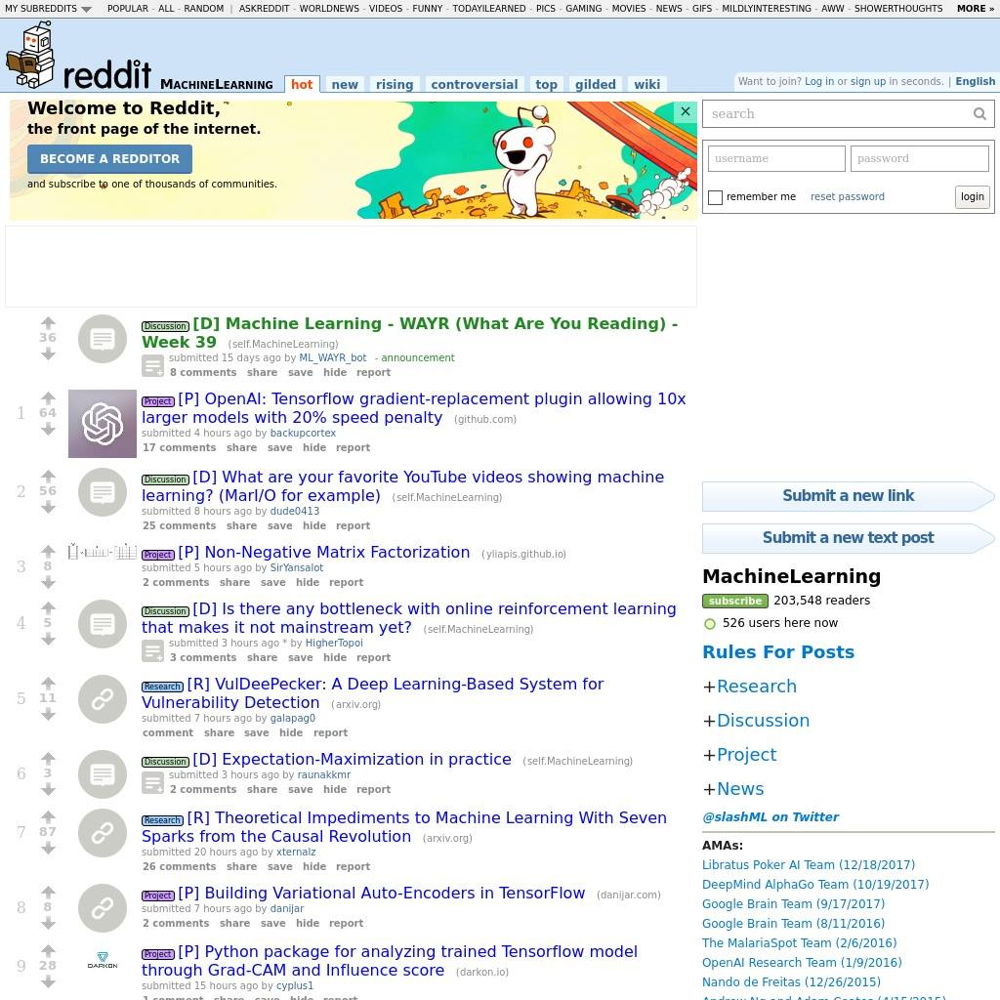
**이미지 캡션:** 레딧의 머신러닝 서브레딧 페이지로, 상단에는 레딧 로고와 함께 'hot', 'new', 'rising', 'controversial', 'top', 'gilded', 'wiki'와 같은 탭이 있고, 오른쪽 상단에는 로그인 및 회원가입 창이 보인다. 페이지 중앙에는 "Welcome to Reddit, the front page of the internet."이라는 문구와 함께 레딧의 마스코트 캐릭터가 그려진 이미지가 있고, 그 아래에는 "BECOME A REDDITOR" 버튼이 있다. 메인 콘텐츠 영역에는 머신러닝 관련 게시물 목록이 시간순으로 나열되어 있으며, 각 게시물은 제목, 작성자, 댓글 수, 추천/반대 수 등의 정보를 포함하고 있다. 게시물들은 'Discussion', 'Project', 'Research' 등의 태그로 분류되어 있다. 오른쪽 사이드바에는 'Submit a new link'와 'Submit a new text post' 버튼이 있고, 'MachineLearning' 서브레딧의 구독자 수와 현재 접속자 수가 표시되어 있으며, 게시물 규칙과 트위터 계정, 과거 AMA 목록이 나열되어 있다. 전반적으로 기술 관련 커뮤니티의 정보 공유 및 토론이 이루어지는 웹사이트의 모습이다.러닝 관련 게시물 목록이 시간순으로 나열되어 있으며, 각 게시물은 제목, 작성자, 댓글 수, 추천/반대 수 등의 정보를 포함하고 있다. 게시물들은 'Discussion', 'Project', 'Research' 등의 태그로 분류되어 있다. 오른쪽 사이드바에는 'Submit a new link'와 'Submit a new text post' 버튼이 있고, 'MachineLearning' 서브레딧의 구독자 수와 현재 접속자 수가 표시되어 있으며, 게시물 규칙과 트위터 계정, 과거 AMA 목록이 나열되어 있다. 전반적으로 기술 관련 커뮤니티의 정보 공유 및 토론이 이루어지는 웹사이트의 모습이다.

> #오늘의레딧 https://www.reddit.com/r/MachineLearning/ 따끈한 소식들입니다.  1. OpenAI:10배 빠른 속도로 10배 더 큰 모델로 10배 더 큰 용량의 10배 더 큰 모델 교체 플러그 인 2. 컴퓨터 학습을 보여 주는 가장 좋아하는 YouTube동영상은 무엇입니까? (예:예를 들어, MaxMO) 3. 비가격 매트릭스 팩터리지 4. 온라인 강화 학습이 아직 대세를 이루지 못한 것에 대해 애로 사항이 있습니까? 5. 취약성-취약성 감지를 위한 깊은 Learning기반 시스템 6. 실행 중인 기대-최대화 7. 7대 혁명에서 7개의 스파크스 가족을 대상으로 한 기계 학습에 대한 이론적 함의 8. 텐서 플로트의 가변형 자동 제어기 9. Grade-CAM및 영향력 점수를 통해 훈련된 Tensorflow모델을 분석하기 위한 Python패키지 10. 마이크로 소프트와 Alibaba는 읽기 이해력 데이터 세트에서 인간의 성과를 거두었습니다. 11. 여러분이 인공 지능을 기를 수 있는 가장 멋진 게임은 무엇일까요? 12. 직관적인 RL:아반토리아-액토리아(A2C) 13. 다음 중 쓰나미가 발생한 후에 수중 음파 탐지기를 이용한 수중 무인 잠수정? 14. 가로 방향 정지 문제에 대한 거리 메트릭 학습 방법 15. 기계 학습-WAYR( 읽기-쓰기)-주당 40회 16. 질문:자기 조직화된 DNA를 다루는 모든 서류는? 17. 다양한 데이터 셋에서 캡슐 네트워크 테스트 18. 잘못된 답의 예를 들면 회귀 19. 제가 생각해 보고 싶은 것이 뭔가요?여러분들은 어떻게 생각하십니까? 20. 피부어를 사용하고 중요한 성능 문제로 실행하는 사람  1. https://github.com/openai/gradient-checkpointing 2. https://www.reddit.com/r/MachineLearning/comments/7qkd1i/d_what_are_your_favorite_youtube_videos_showing/ 3. https://yliapis.github.io/Non-Negative-Matrix-Factorization/ 4. https://www.reddit.com/r/MachineLearning/comments/7qmo9q/d_is_there_any_bottleneck_with_online/ 5. https://arxiv.org/abs/1801.01681 6. https://www.reddit.com/r/MachineLearning/comments/7qmjpu/d_expectationmaximization_in_practice/ 7. https://arxiv.org/abs/1801.04016 8. https://danijar.com/building-variational-auto-encoders-in-tensorflow/ 9. http://darkon.io 10. https://www.bloomberg.com/news/articles/2018-01-15/alibaba-s-ai-outgunned-humans-in-key-stanford-reading-test 11. https://www.reddit.com/r/MachineLearning/comments/7qm92d/d_what_are_the_coolest_games_that_you_can_build/ 12. https://medium.com/@rudygilman/intuitive-rl-intro-to-advantage-actor-critic-a2c-4ff545978752 13. https://www.reddit.com/r/MachineLearning/comments/7qne7n/project_underwater_drone_maneuvering_in_a/ 14. https://medium.com/@movchan74/how-to-apply-distance-metric-learning-for-street-to-shop-problem-d21247723d2a 15. https://www.reddit.com/r/MachineLearning/comments/7qel9p/d_machine_learning_wayr_what_are_you_reading_week/ 16. https://www.reddit.com/r/MachineLearning/comments/7ql1ha/d_question_any_papers_dealing_with_selforganizing/ 17. https://github.com/shinseung428/CapsNet_Tensorflow 18. https://www.reddit.com/r/MachineLearning/comments/7qghmr/d_regression_with_examples_of_wrong_answers/ 19. https://gratenewseveryone.wordpress.com/2017/12/10/do-ais-dream-of-pwning-ff-leagues/ 20. https://www.reddit.com/r/MachineLearning/comments/7qejye/r_anyone_using_pybullet_and_running_into/

### 1월 17일 (수) 08:52 · 📷 사진 (1장)

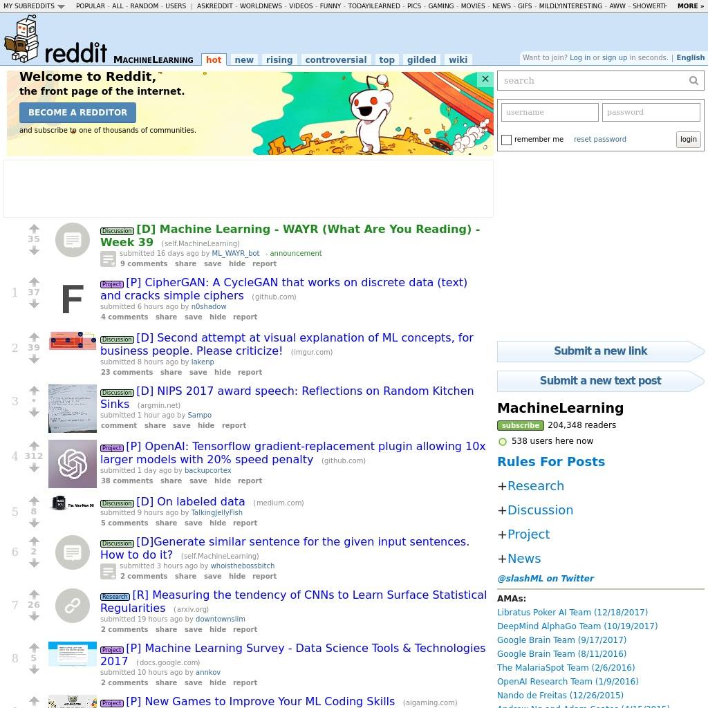
**이미지 캡션:** 이 이미지는 웹사이트 레딧의 머신러닝 커뮤니티 페이지를 보여줍니다. 페이지 상단에는 레딧 로고와 함께 "Welcome to Reddit, the front page of the internet."이라는 문구가 있고, 그 옆에는 귀여운 캐릭터가 그려진 일러스트가 있습니다. 로그인 및 회원가입을 위한 입력창과 버튼도 보입니다. 페이지 중앙에는 머신러닝 관련 게시물 목록이 시간순으로 나열되어 있으며, 각 게시물은 제목, 작성자, 댓글 수, 좋아요/싫어요 수 등의 정보를 포함하고 있습니다. 게시물 제목 앞에는 [D] (Discussion), [P] (Project), [R] (Research)와 같은 태그가 붙어 있어 게시물의 성격을 나타냅니다. 페이지 오른쪽에는 "Submit a new link"와 "Submit a new text post" 버튼이 있고, "MachineLearning" 커뮤니티의 구독자 수와 현재 접속자 수가 표시되어 있습니다. 또한, "Rules For Posts" 섹션 아래에는 "+Research", "+Discussion", "+Project", "+News"와 같은 하위 메뉴가 있으며, "@slashML on Twitter" 링크와 함께 "AMAS" 섹션에는 머신러닝 관련 인물 및 팀 목록이 날짜와 함께 나열되어 있습니다. 전반적으로 정보가 많고 다양한 게시물들이 활발하게 올라오는 기술 관련 커뮤니티의 모습을 보여줍니다. (Discussion), [P] (Project), [R] (Research)와 같은 태그가 붙어 있어 게시물의 성격을 나타냅니다. 페이지 오른쪽에는 "Submit a new link"와 "Submit a new text post" 버튼이 있고, "MachineLearning" 커뮤니티의 구독자 수와 현재 접속자 수가 표시되어 있습니다. 또한, "Rules For Posts" 섹션 아래에는 "+Research", "+Discussion", "+Project", "+News"와 같은 하위 메뉴가 있으며, "@slashML on Twitter" 링크와 함께 "AMAS" 섹션에는 머신러닝 관련 인물 및 팀 목록이 날짜와 함께 나열되어 있습니다. 전반적으로 정보가 많고 다양한 게시물들이 활발하게 올라오는 기술 관련 커뮤니티의 모습을 보여줍니다.

> #오늘의레딧 https://www.reddit.com/r/MachineLearning/ 머신러닝 공부는 정말 재미있죠?아침부터 다양한 소식이 많네요.  1. 시퍼맨:별개의 데이터(텍스트)및 균열 단순 코드에서 작동하는 싸이클릭AN 2. 비즈니스 인력을 위한 ML개념에 대한 시각적인 설명 두번째 시도입니다. 제발 비판해 주세요! 3. NIPS2017수상:무작위 키친 침상에 대한 성찰 4. OpenAI:10배 빠른 속도로 10배 더 큰 모델로 10배 더 큰 용량의 10배 더 큰 모델 교체 플러그 인 5. 레이블 표시된 데이터 6. 주어진 입력 문장에 대해 유사한 문장을 생성한다. 어떻게 해야 할까요? 7. 표면적 통계 규제를 위한 CNN경향 측정 8. 기계 학습 설문 조사-데이터 과학 툴 및 기술 2017 9. ML코딩 기술을 향상시키기 위한 새로운 게임 10. 이미지 데이타 세트의 캡밋? 11. 단순한 테스트 사례에서 보강 학습을 이해하는 데 도움이 됩니다. 12. 다변수 섹시섹 모델 13. 업계 최고 수준의 머신 학습 인턴십? 14. 컴퓨터 학습을 보여 주는 가장 좋아하는 YouTube동영상은 무엇입니까? (예:예를 들어, MaxMO) 15. 온라인 강화 학습이 아직 대세를 이루지 못한 것에 대해 애로 사항이 있습니까? 16. 반복 연산 및 잔류 연결부를 사용한 신호 감쇠 17. 시계열 데이터 세트에 허용되는 분류 알고리즘은 무엇인가? 18. 비가격 매트릭스 팩터리지 19. 실행 중인 기대-최대화 20. 텐서 플로트의 가변형 자동 제어기  1. https://github.com/for-ai/CipherGAN 2. https://imgur.com/tMus5PT 3. http://www.argmin.net/2017/12/05/kitchen-sinks/ 4. https://github.com/openai/gradient-checkpointing 5. https://medium.com/@TalPerry/on-labeled-data-85fbaf1bdf89 6. https://www.reddit.com/r/MachineLearning/comments/7qunss/dgenerate_similar_sentence_for_the_given_input/ 7. https://arxiv.org/abs/1711.11561 8. https://docs.google.com/forms/d/e/1FAIpQLSdWgsOfkMUNddrnvhIj3_JL715jFAEI9fwIKUfbaDG5iWLBkA/viewform 9. https://www.aigaming.com/?utm_source=TH99&utm_medium=banner%2C%20email&utm_campaign=minihack2%26r%3DTH99 10. https://www.reddit.com/r/MachineLearning/comments/7qqpb0/d_capsnet_on_image_dataset/ 11. https://www.reddit.com/r/MachineLearning/comments/7qrsyd/dhelp_in_understanding_reinforcement_learning/ 12. https://www.reddit.com/r/MachineLearning/comments/7qtnoj/d_multivariate_seq2seq_model/ 13. https://www.reddit.com/r/MachineLearning/comments/7qte7j/d_undergraduate_machine_learning_internships/ 14. https://www.reddit.com/r/MachineLearning/comments/7qkd1i/d_what_are_your_favorite_youtube_videos_showing/ 15. https://www.reddit.com/r/MachineLearning/comments/7qmo9q/d_is_there_any_bottleneck_with_online/ 16. https://www.reddit.com/r/MachineLearning/comments/7qrj5l/p_signal_denoising_using_iterative_computation/ 17. https://www.reddit.com/r/MachineLearning/comments/7qovkg/d_what_classification_algorithms_allow_for/ 18. https://yliapis.github.io/Non-Negative-Matrix-Factorization/ 19. https://www.reddit.com/r/MachineLearning/comments/7qmjpu/d_expectationmaximization_in_practice/ 20. https://danijar.com/building-variational-auto-encoders-in-tensorflow/

### 1월 18일 (목) 08:52 · 📷 사진 (1장)

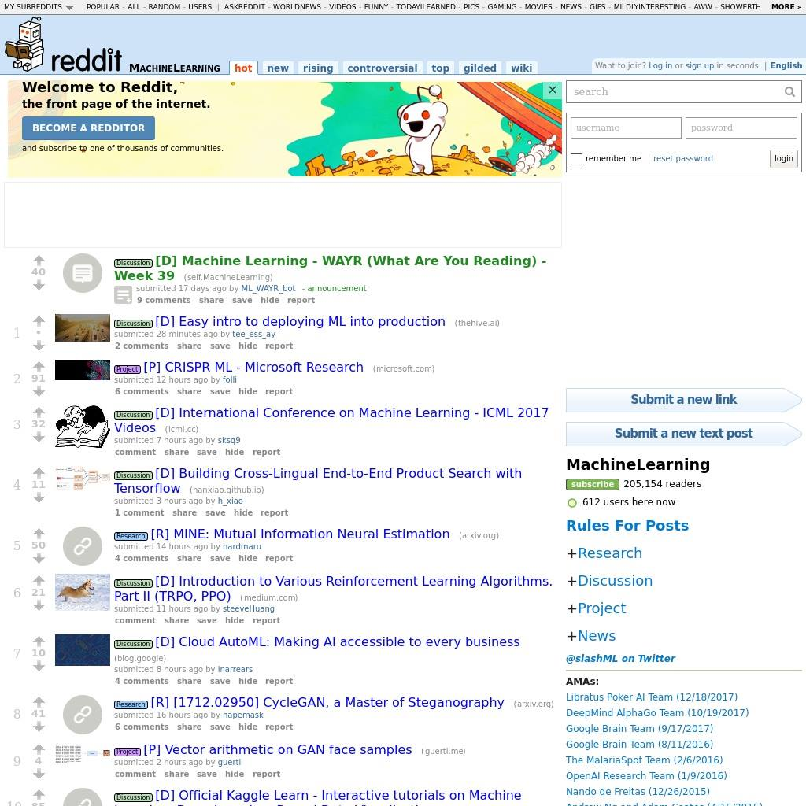
**이미지 캡션:** 이 이미지는 웹사이트 레딧의 머신러닝 커뮤니티 페이지를 보여줍니다. 페이지 상단에는 레딧 로고와 함께 "Welcome to Reddit, the front page of the internet."이라는 문구가 있고, 그 아래에는 "BECOME A REDDITOR" 버튼이 있습니다. 메인 콘텐츠 영역에는 다양한 머신러닝 관련 게시물 목록이 표시되며, 각 게시물은 제목, 작성자, 제출 시간, 댓글 수 등의 정보를 포함하고 있습니다. 게시물 제목 옆에는 "Discussion", "Project", "Research"와 같은 태그가 붙어 있습니다. 오른쪽 사이드바에는 "MachineLearning" 커뮤니티의 구독자 수와 "Rules For Posts" 섹션이 있으며, 그 아래에는 "AMAS" 목록이 있습니다. 전반적으로 정보가 많고 기술적인 주제를 다루는 커뮤니티의 분위기를 나타냅니다."와 같은 태그가 붙어 있습니다. 오른쪽 사이드바에는 "MachineLearning" 커뮤니티의 구독자 수와 "Rules For Posts" 섹션이 있으며, 그 아래에는 "AMAS" 목록이 있습니다. 전반적으로 정보가 많고 기술적인 주제를 다루는 커뮤니티의 분위기를 나타냅니다.

> #오늘의레딧 https://www.reddit.com/r/MachineLearning/ 오늘도 새소식이 많군요.  1. 제품을 프로덕션에 도입하기 위한 손쉬운 도입 2. CRISEML-MicrosoftResearch 3. 국제 학술 대회 논문집-ICIP2017동영상 4. Tensorflow를 이용한 최종 사용자 환경 엔드 투 엔드 제품 검색 5. MINE:상호 첩보 반응 평가 6. 다양한 강화 학습 학습 알고리즘을 소개합니다. 파트 II(TRO, PPO) 7. 클라우드 자동화:모든 비즈니스에 액세스 할 수 있는 지능형 클라우드 구축 8. GAN페이스 샘플에 대한 벡터 산술 연산 9. 공식적인 Kaggle학습-머신 학습, DeepLearning, R및 DataVisualization에 대한 대화형 튜토리얼. 10. DeepNeuroevolution의 구현:유전자 알고리즘은 RL을 위한 트레이닝 심층 탐구를 위한 경쟁력 대안이다(Uber) 11. TVM을 사용한 ARMGPU의 모바일 심층 학습 최적화 12. CIFARCNN이 높은 정확도와 최소의 파라미터를 가진 CIFAR 13. MIT6.5.6:자동차 운전을 위한 깊은 학습 14. NIPS2017수상:무작위 키친 침상에 대한 성찰 15. -조건부 DCGAN 16. 차량 경로 최적화 문제 17. 시퍼맨:별개의 데이터(텍스트)및 균열 단순 코드에서 작동하는 싸이클릭AN 18. 비즈니스 인력을 위한 ML개념에 대한 시각적인 설명 두번째 시도입니다. 제발 비판해 주세요! 19. ML코딩 기술을 향상시키기 위한 새로운 게임 20. OpenAI:10배 빠른 속도로 10배 더 큰 모델로 10배 더 큰 용량의 10배 더 큰 모델 교체 플러그 인  1. https://thehive.ai/blog/simple-ml-serving 2. https://www.microsoft.com/en-us/research/project/crispr/ 3. https://icml.cc/Conferences/2017/Videos 4. https://hanxiao.github.io/2018/01/10/Build-Cross-Lingual-End-to-End-Product-Search-using-Tensorflow/ 5. https://arxiv.org/abs/1801.04062 6. https://medium.com/@huangkh19951228/introduction-to-various-reinforcement-learning-algorithms-part-ii-trpo-ppo-87f2c5919bb9 7. https://www.blog.google/topics/google-cloud/cloud-automl-making-ai-accessible-every-business/ 8. http://guertl.me/post/169821762680/vector-arithmetic 9. https://www.kaggle.com/learn/overview 10. https://github.com/uber-common/deep-neuroevolution/blob/master/README.md 11. http://tvmlang.org/2018/01/16/opt-mali-gpu.html 12. https://www.reddit.com/r/MachineLearning/comments/7r4y0x/d_cifar_cnn_with_high_accuracy_and_smallest_of/ 13. https://cars.mit.edu/ 14. http://www.argmin.net/2017/12/05/kitchen-sinks/ 15. https://www.reddit.com/r/MachineLearning/comments/7r0n8p/p_conditional_dcgan/ 16. https://www.reddit.com/r/MachineLearning/comments/7qzu4h/d_vehicle_route_optimization_problem/ 17. https://github.com/for-ai/CipherGAN 18. https://imgur.com/tMus5PT 19. https://www.aigaming.com/?utm_source=TH99&utm_medium=banner%2C%20email&utm_campaign=minihack2%26r%3DTH99 20. https://github.com/openai/gradient-checkpointing

### 1월 21일 (일) 08:52 · 📷 사진 (1장)

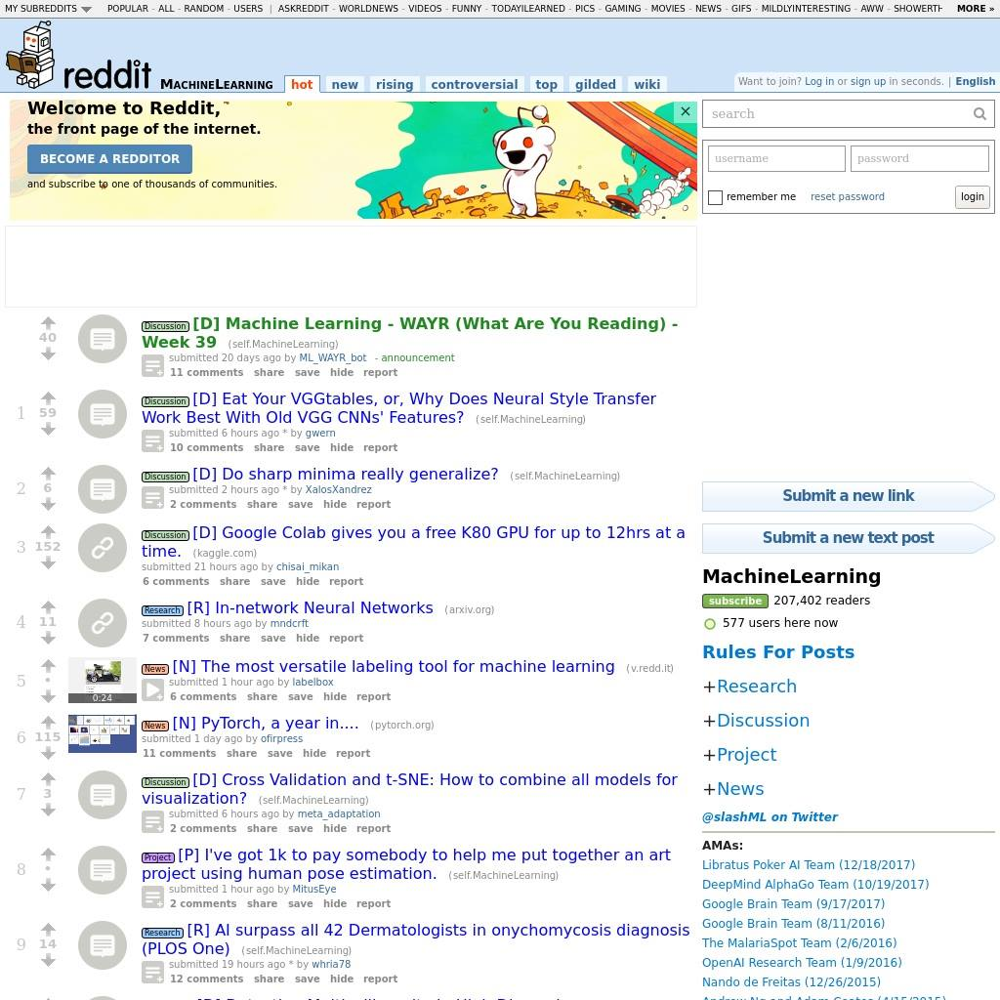
**이미지 캡션:** 이 이미지는 웹사이트 레딧의 머신러닝 커뮤니티 페이지를 보여줍니다. 페이지 상단에는 레딧 로고와 함께 "Welcome to Reddit, the front page of the internet."이라는 문구가 있고, 그 아래에는 "BECOME A REDDITOR" 버튼이 있습니다. 오른쪽 상단에는 로그인 또는 회원가입을 할 수 있는 입력란과 버튼이 있습니다. 메인 콘텐츠 영역에는 다양한 주제의 게시물 목록이 표시되며, 각 게시물은 제목, 작성자, 제출 시간, 댓글 수, 좋아요/싫어요 수 등의 정보를 포함하고 있습니다. 게시물들은 주로 머신러닝 관련 토론, 연구, 뉴스 등을 다루고 있습니다. 예를 들어, "[D] Machine Learning - WAYR (What Are You Reading) - Week 39"이라는 제목의 게시물은 "ML_WAYR_bot"이 20일 전에 제출했으며 11개의 댓글이 있습니다. 또한, "[N] The most versatile labeling tool for machine learning"이라는 제목의 게시물은 "labelbox"가 1시간 전에 제출했으며 46개의 댓글이 있습니다. 페이지 오른쪽에는 "MachineLearning" 커뮤니티의 구독자 수와 현재 접속자 수가 표시되어 있으며, 커뮤니티 규칙과 과거 AMA(Ask Me Anything) 목록도 볼 수 있습니다. 전반적으로 정보가 많고 다양한 주제의 게시물들이 나열되어 있어 머신러닝 분야의 최신 정보와 토론을 접할 수 있는 커뮤니티 페이지임을 알 수 있습니다.있습니다. 게시물들은 주로 머신러닝 관련 토론, 연구, 뉴스 등을 다루고 있습니다. 예를 들어, "[D] Machine Learning - WAYR (What Are You Reading) - Week 39"이라는 제목의 게시물은 "ML_WAYR_bot"이 20일 전에 제출했으며 11개의 댓글이 있습니다. 또한, "[N] The most versatile labeling tool for machine learning"이라는 제목의 게시물은 "labelbox"가 1시간 전에 제출했으며 46개의 댓글이 있습니다. 페이지 오른쪽에는 "MachineLearning" 커뮤니티의 구독자 수와 현재 접속자 수가 표시되어 있으며, 커뮤니티 규칙과 과거 AMA(Ask Me Anything) 목록도 볼 수 있습니다. 전반적으로 정보가 많고 다양한 주제의 게시물들이 나열되어 있어 머신러닝 분야의 최신 정보와 토론을 접할 수 있는 커뮤니티 페이지임을 알 수 있습니다.

> #오늘의레딧 https://www.reddit.com/r/MachineLearning/ 재미난 이야기들이 많습니다.  1. VGabable을 먹거나, 왜 신경계 전달이 오래 된 VGNCNN의 특징을 가지고 최선을 다하는가? 2. 예리한 미니아는 정말 일반화되나요? 3. GoogleColab은 한번에 최대 12시간 동안 무료로 X20GPU를 제공합니다. 4. 네트워크용 망 접속 회로망 5. 기계 학습을 위한 가장 다기능적인 라벨 도구 6. 1년 안에... 7. 교차 검증 및 T-FVE:시각화를 위한 모든 모델을 결합하는 방법은 무엇입니까? 8. 저는 1명의 사람들에게 인간의 포즈를 이용하여 예술 작품을 만드는 것을 도와 줄 수 있도록 도와 줄 사람이 1명 있습니다. 9. 조류 독감 예방 접종(FIOSOne)에서 42명의 사망자를 모두 능가합니다(PLOSOne). 10. RL에 있는 가변적인 4배/s동작 공간 처리 11. 텍스트 문단에 적합한 적절한 선택 12. 이제 제가 맥스의 기초를 배웠으니, 그걸 사용할 수 없을 것 같아요. 13. 텍스트 분류를 위한 유료 언어 모형 14. 퀼브봇:미술관의 상태. 의미적 의미를 유지하면서 문장을 입력한다. 15. R-Net이해:마이크로 소프트의 '초인적인 ' 읽기 AI 16. 풍경화에 대한 GAN사가 제작한 이미지 17. RNN에 있는 RNN기반 캐릭터 모델을 시도합니다. 18. 욕설 사용법 19. 바이두 연구소는 세계 3대 지능 과학자들을 기리기 위해 발표한 바 있다. 20. 잘못된 연구 논문을 피하려면 어떻게 해야 할까요? 함께 일기장을 만들자!  1. https://www.reddit.com/r/MachineLearning/comments/7rrrk3/d_eat_your_vggtables_or_why_does_neural_style/ 2. https://www.reddit.com/r/MachineLearning/comments/7rt1w6/d_do_sharp_minima_really_generalize/ 3. https://www.kaggle.com/getting-started/47096#post271139 4. http://arxiv.org/abs/1801.05731 5. https://www.reddit.com/r/MachineLearning/comments/7rtoml/n_the_most_versatile_labeling_tool_for_machine/ 6. http://pytorch.org/2018/01/19/a-year-in.html 7. https://www.reddit.com/r/MachineLearning/comments/7rrk2y/d_cross_validation_and_tsne_how_to_combine_all/ 8. https://www.reddit.com/r/MachineLearning/comments/7rtof6/p_ive_got_1k_to_pay_somebody_to_help_me_put/ 9. https://www.reddit.com/r/MachineLearning/comments/7ro23p/r_ai_surpass_all_42_dermatologists_in/ 10. https://www.reddit.com/r/MachineLearning/comments/7rln1p/d_dealing_with_variableconditional_action_space/ 11. https://www.reddit.com/r/MachineLearning/comments/7rlbmb/d_choosing_an_appropriate_gif_for_a_text_paragraph/ 12. https://www.reddit.com/r/MachineLearning/comments/7rn8pj/discussion_now_that_i_have_learned_the_basics_of/ 13. https://arxiv.org/abs/1801.06146 14. https://quillbot.com 15. https://medium.com/@srjoglekar246/understanding-r-net-microsofts-superhuman-reading-ai-23ff7ededd96 16. https://www.reddit.com/r/MachineLearning/comments/7reuu1/p_images_generated_by_gan_trained_on_landscape/ 17. https://www.reddit.com/r/MachineLearning/comments/7rig68/p_trying_rnn_based_character_models_on_persian/ 18. https://www.reddit.com/r/MachineLearning/comments/7rm4l5/d_uses_of_word_embeddings/ 19. http://research.baidu.com/baidu-research-announces-hiring-three-world-renowned-ai-scientists/ 20. https://www.crinetic.com

### 1월 22일 (월) 08:52 · 📷 사진 (1장)

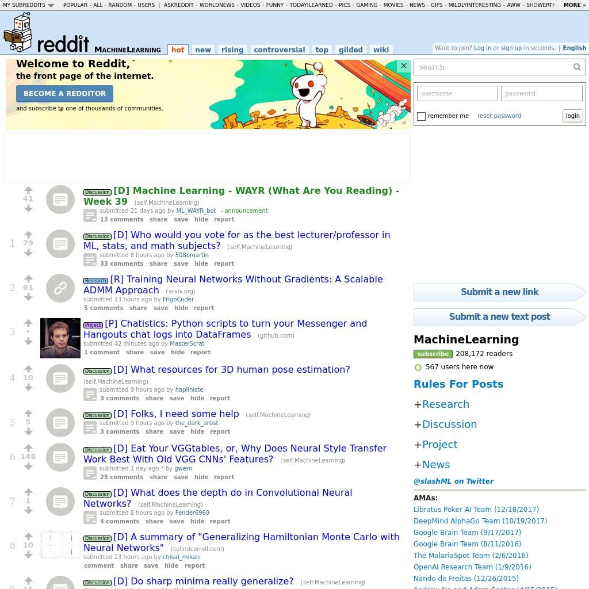
**이미지 캡션:** 이 이미지는 인기 있는 온라인 커뮤니티인 레딧(Reddit)의 머신러닝(Machine Learning) 서브레딧 페이지를 보여줍니다. 화면 중앙에는 "Welcome to Reddit, the front page of the internet."이라는 문구와 함께 레딧의 마스코트인 스너(Snoo)가 그려진 이미지가 있습니다. 왼쪽에는 다양한 주제의 게시물 목록이 나열되어 있으며, 각 게시물은 제목, 작성자, 댓글 수, 좋아요 수 등의 정보를 포함하고 있습니다. 예를 들어, "[D] Machine Learning - WAYR (What Are You Reading) - Week 39"이라는 제목의 게시물은 13개의 댓글이 달려 있습니다. 오른쪽에는 "Submit a new link"와 "Submit a new text post" 버튼이 있으며, 그 아래에는 "Machine Learning" 서브레딧의 구독자 수와 현재 접속자 수가 표시되어 있습니다. 또한, "Rules For Posts" 섹션에는 연구, 토론, 프로젝트, 뉴스 등의 카테고리가 나열되어 있고, "@slashML on Twitter" 링크와 함께 과거 AMA(Ask Me Anything) 세션 목록도 볼 수 있습니다. 전반적으로 기술 및 학술적인 주제에 관심 있는 사용자들이 정보를 공유하고 토론하는 온라인 커뮤니티의 모습을 보여주는 화면입니다. character. The main content area features a list of recent posts in the Machine Learning subreddit. Each post includes a title, a link to the original source or discussion, the author, submission time, and the number of comments. Some posts also have small thumbnail images or icons indicating the type of content (discussion, research, project). On the right side of the screen, there's a login form, a "Submit a new link" and "Submit a new text post" button, and information about the Machine Learning subreddit, including the number of subscribers and active users. Further down on the right, there are links to "Rules For Posts" and a Twitter feed, followed by a list of "AMAS" (Ask Me Anything) sessions. The overall atmosphere is that of a typical online forum dedicated to a specific technical topic.

> #오늘의레딧 https://www.reddit.com/r/MachineLearning/ 래딧은 읽을 거리가 다양합니다.  1. 당신은 ML, 통계, 수학 과목에서 최고의 강사 겸 리더로서 누구를 뽑으시겠습니까? 2. 점진적인 확장을 위한 교육용 신경망 프로토콜:확장 가능한 ADDI접근 방식 3. Chatistics:Messenger(메신저)및 해커톤 채팅 로그를 DataFrames로 변환하기 위한 Python스크립트 4. 3D인력 추정치를 위한 리소스는 무엇입니까? 5. 여러분, 도움이 필요해요 6. VGabable을 먹거나, 왜 신경계 전달이 오래 된 VGNCNN의 특징을 가지고 최선을 다하는가? 7. 대체 신경 회로망의 깊이는 어떻게 되는가? 8. 신경망을 이용한 " 일반화된 해밀턴 MontralionMontralionMoneration"요약 9. 예리한 미니아는 정말 일반화되나요? 10. 초심자-무엇을 찾아야 하는가 11. 네트워크용 망 접속 회로망 12. GoogleColab은 한번에 최대 12시간 동안 무료로 X20GPU를 제공합니다. 13. 1년 안에... 14. 교차 검증 및 T-FVE:시각화를 위한 모든 모델을 결합하는 방법은 무엇입니까? 15. 저는 1명의 사람들에게 인간의 포즈를 이용하여 예술 작품을 만드는 것을 도와 줄 수 있도록 도와 줄 사람이 1명 있습니다. 16. 기계 학습을 위한 가장 다기능적인 라벨 도구 17. 조류 독감 예방 접종(FIOSOne)에서 42명의 사망자를 모두 능가합니다(PLOSOne). 18. RL에 있는 가변적인 4배/s동작 공간 처리 19. 텍스트 문단에 적합한 적절한 선택 20. R-Net이해:마이크로 소프트의 '초인적인 ' 읽기 AI  1. https://www.reddit.com/r/MachineLearning/comments/7ry6i1/d_who_would_you_vote_for_as_the_best/ 2. https://arxiv.org/abs/1605.02026 3. https://github.com/MasterScrat/Chatistics 4. https://www.reddit.com/r/MachineLearning/comments/7rxuzd/d_what_resources_for_3d_human_pose_estimation/ 5. https://www.reddit.com/r/MachineLearning/comments/7rxz9a/d_folks_i_need_some_help/ 6. https://www.reddit.com/r/MachineLearning/comments/7rrrk3/d_eat_your_vggtables_or_why_does_neural_style/ 7. https://www.reddit.com/r/MachineLearning/comments/7ry37z/d_what_does_the_depth_do_in_convolutional_neural/ 8. https://colindcarroll.com/2018/01/20/a-summary-of-generalizing-hamiltonian-monte-carlo-with-neural-networks/ 9. https://www.reddit.com/r/MachineLearning/comments/7rt1w6/d_do_sharp_minima_really_generalize/ 10. https://www.reddit.com/r/MachineLearning/comments/7ryt0e/p_beginner_what_to_look_for/ 11. http://arxiv.org/abs/1801.05731 12. https://www.kaggle.com/getting-started/47096#post271139 13. http://pytorch.org/2018/01/19/a-year-in.html 14. https://www.reddit.com/r/MachineLearning/comments/7rrk2y/d_cross_validation_and_tsne_how_to_combine_all/ 15. https://www.reddit.com/r/MachineLearning/comments/7rtof6/p_ive_got_1k_to_pay_somebody_to_help_me_put/ 16. https://www.reddit.com/r/MachineLearning/comments/7rtoml/n_the_most_versatile_labeling_tool_for_machine/ 17. https://www.reddit.com/r/MachineLearning/comments/7ro23p/r_ai_surpass_all_42_dermatologists_in/ 18. https://www.reddit.com/r/MachineLearning/comments/7rln1p/d_dealing_with_variableconditional_action_space/ 19. https://www.reddit.com/r/MachineLearning/comments/7rlbmb/d_choosing_an_appropriate_gif_for_a_text_paragraph/ 20. https://medium.com/@srjoglekar246/understanding-r-net-microsofts-superhuman-reading-ai-23ff7ededd96

### 1월 23일 (화) 08:52 · 📷 사진 (1장)

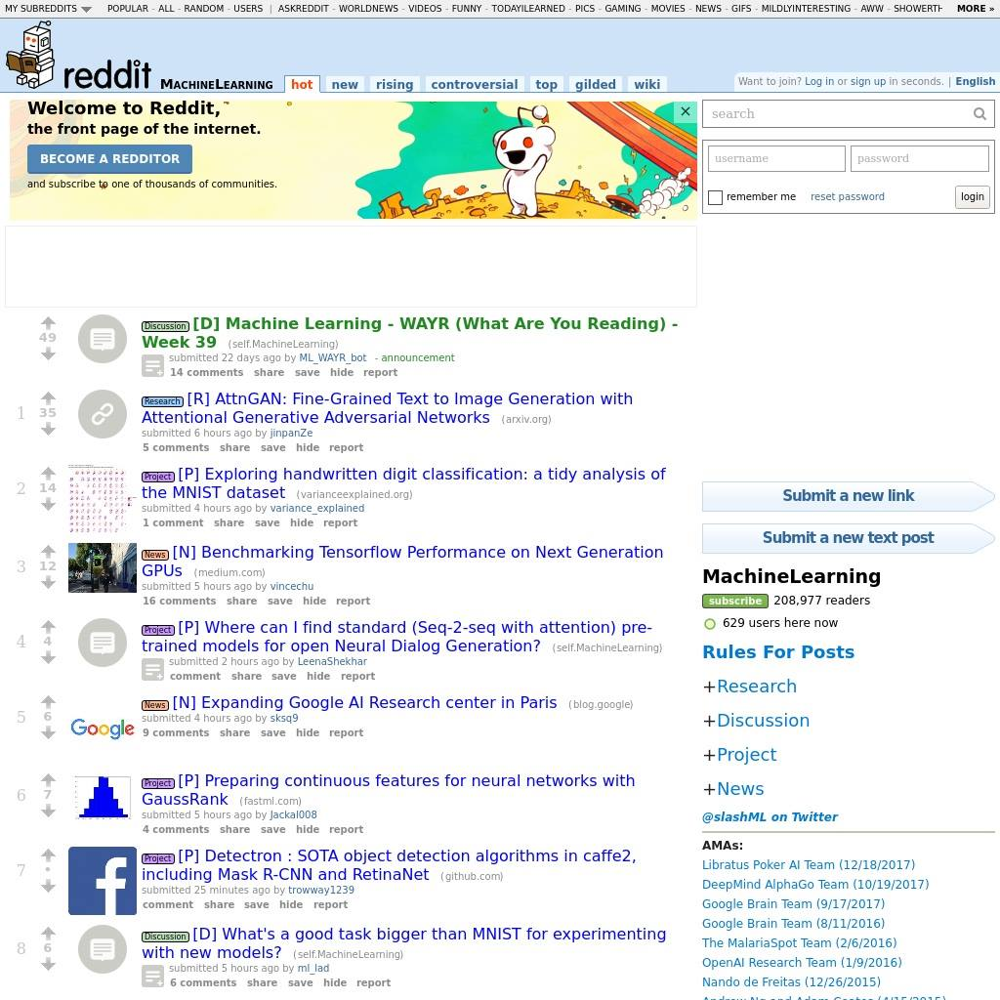
**이미지 캡션:** 이 이미지는 레딧(Reddit) 웹사이트의 머신러닝(Machine Learning) 서브레딧 페이지를 보여줍니다. 페이지 상단에는 레딧 로고와 함께 "Welcome to Reddit, the front page of the internet."이라는 환영 문구가 있고, 그 옆에는 귀여운 캐릭터가 그려진 일러스트가 있습니다. 로그인 및 회원가입을 위한 입력란과 버튼도 보입니다. 메인 콘텐츠 영역에는 여러 게시물 목록이 있으며, 각 게시물은 제목, 작성자, 제출 시간, 댓글 수, 좋아요/싫어요 수 등의 정보를 포함하고 있습니다. 게시물 제목 앞에는 [D] (Discussion), [R] (Research), [P] (Project), [N] (News)와 같은 태그가 붙어 있어 게시물의 성격을 나타냅니다. 예를 들어, "Machine Learning - WAYR (What Are You Reading) - Week 39"이라는 제목의 게시물은 토론(Discussion) 게시물이며, "AttnGAN: Fine-Grained Text to Image Generation with Attentional Generative Adversarial Networks"라는 제목의 게시물은 연구(Research) 게시물입니다. 또한, "Benchmarking Tensorflow Performance on Next Generation GPUs"라는 뉴스 게시물에는 GPU 이미지도 함께 표시되어 있습니다. 페이지 오른쪽에는 "Submit a new link" 및 "Submit a new text post" 버튼과 함께 "MachineLearning" 서브레딧의 구독자 수와 현재 접속자 수가 표시되어 있습니다. 그 아래에는 게시물 규칙과 트위터 계정, 그리고 과거 AMA(Ask Me Anything) 목록이 나열되어 있습니다. 전반적으로 정보가 많고 다양한 주제의 게시물들이 나열되어 있어 활발한 커뮤니티의 모습을 보여줍니다.하고 있습니다. 게시물 제목 앞에는 [D] (Discussion), [R] (Research), [P] (Project), [N] (News)와 같은 태그가 붙어 있어 게시물의 성격을 나타냅니다. 예를 들어, "Machine Learning - WAYR (What Are You Reading) - Week 39"이라는 제목의 게시물은 토론(Discussion) 게시물이며, "AttnGAN: Fine-Grained Text to Image Generation with Attentional Generative Adversarial Networks"라는 제목의 게시물은 연구(Research) 게시물입니다. 또한, "Benchmarking Tensorflow Performance on Next Generation GPUs"라는 뉴스 게시물에는 GPU 이미지도 함께 표시되어 있습니다. 페이지 오른쪽에는 "Submit a new link" 및 "Submit a new text post" 버튼과 함께 "MachineLearning" 서브레딧의 구독자 수와 현재 접속자 수가 표시되어 있습니다. 그 아래에는 게시물 규칙과 트위터 계정, 그리고 과거 AMA(Ask Me Anything) 목록이 나열되어 있습니다. 전반적으로 정보가 많고 다양한 주제의 게시물들이 나열되어 있어 활발한 커뮤니티의 모습을 보여줍니다.

> #오늘의레딧 https://www.reddit.com/r/MachineLearning/ 재미난 이야기들이 많습니다.  1. Attngan:AttentionalgeneralAdversorialNetworks를 사용한 이미지 생성에 대한 미세한 이미지 생성 텍스트 2. 손으로 쓴 숫자 분류 법:MNIST데이터 세트에 대한 깔끔한 분석 3. BenchmarkingTensorflow성능 향상 차세대 GPUs 4. 개방형 신경 대화 상자 생성을 위한 사전 훈련 모델 사전(Sequent-2-sec)을 어디서 찾을 수 있습니까? 5. 파리에 있는 구글 AI연구 센터 확대 6. 가우스 뱅크를 이용한 신경 네트워크의 지속적인 기능 발휘 7. Detectron:마스크 R-WW와 RetinaNet, RetinaNet을 포함한 caff2의 SOTA객체 감지 알고리즘 8. 새로운 모델을 실험하는 것을 위해 MNIST보다 더 큰 역할을 하는 것은 무엇입니까? 9. Chatistics:Messenger(메신저)및 해커톤 채팅 로그를 DataFrames로 변환하기 위한 Python스크립트 10. 여러개의 이미지(불완전한)이미지를 결합하여"완벽한 "최종 이미지를 얻을 수 있습니까? 11. 분류를 위한 여러개의 영상이 한개씩 생성됨 12. 인코더 네트워크 출력 색상 문제 13. A3T:AdversaryAugustrialAdvertaryAdversary교육 14. 텍스트 감성 분류 등급 15. 젠바 아카데미 파이썬 미니 학위를 기계 학습에 데려간 사람이 있나요? 그거 어땠어? 16. CondionalDCGAN이미지 17. 당신은 ML, 통계, 수학 과목에서 최고의 강사 겸 리더로서 누구를 뽑으시겠습니까? 18. "Piggwik:마스크를 배움으로써 단일, 고정 네트워크에 여러가지 태스크를 추가합니다. Mallya&LazeNoc2018 19. AndrejKarpathy는 중간에 새로운 블로그를 가지고 있다. 20. 점진적인 확장을 위한 교육용 신경망 프로토콜:확장 가능한 ADDI접근 방식  1. https://arxiv.org/abs/1711.10485 2. http://varianceexplained.orghttps://www.reddit.com/r/digit-eda/ 3. https://medium.com/initialized-capital/benchmarking-tensorflow-performance-on-next-generation-gpus-e68c8dd3d0d4 4. https://www.reddit.com/r/MachineLearning/comments/7s97f9/p_where_can_i_find_standard_seq2seq_with/ 5. https://www.blog.google/topics/google-europe/making-frances-digital-potential-work-everyone/ 6. http://fastml.com/preparing-continuous-features-for-neural-networks-with-rankgauss/ 7. https://github.com/facebookresearch/Detectron 8. https://www.reddit.com/r/MachineLearning/comments/7s7il4/d_whats_a_good_task_bigger_than_mnist_for/ 9. https://github.com/MasterScrat/Chatistics 10. https://www.reddit.com/r/MachineLearning/comments/7s6qz2/d_combining_multiple_imperfect_images_to_get/ 11. https://www.reddit.com/r/MachineLearning/comments/7s52x0/d_multiple_images_per_example_for_classification/ 12. https://www.reddit.com/r/MachineLearning/comments/7s9uni/d_encoderdecoder_network_output_color_issue/ 13. https://arxiv.org/abs/1801.04055 14. http://nbviewer.jupyter.org/github/darkonhub/darkon-examples/blob/master/gradcam/GradcamDemoSequence.ipynb 15. https://www.reddit.com/r/MachineLearning/comments/7s8s7k/d_has_anyone_taken_the_zenva_academy_python_mini/ 16. https://www.reddit.com/r/MachineLearning/comments/7s8qz6/p_condional_dcgan_images/ 17. https://www.reddit.com/r/MachineLearning/comments/7ry6i1/d_who_would_you_vote_for_as_the_best/ 18. https://arxiv.org/abs/1801.06519 19. http://karpathy.github.io/2018/01/20/medium/ 20. https://arxiv.org/abs/1605.02026

### 1월 24일 (수) 08:52 · 📷 사진 (1장)

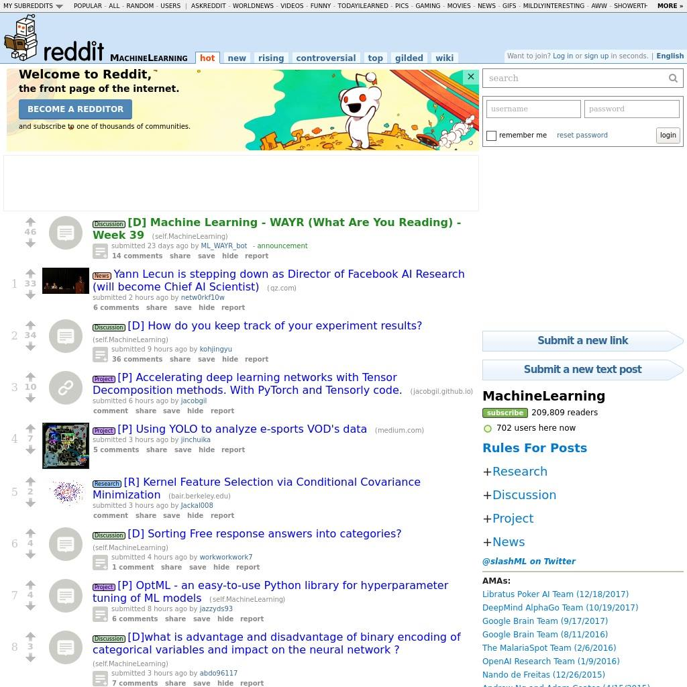
**이미지 캡션:** 이 이미지는 Reddit 웹사이트의 Machine Learning 서브레딧 페이지를 보여줍니다. 페이지 상단에는 Reddit 로고와 함께 "Welcome to Reddit, the front page of the internet."이라는 문구가 있고, 그 옆에는 귀여운 캐릭터가 그려진 일러스트가 있습니다. 로그인 및 검색 창이 오른쪽에 배치되어 있습니다. 페이지 중앙에는 여러 게시물 목록이 나열되어 있으며, 각 게시물은 제목, 작성자, 제출 시간, 댓글 수 등의 정보를 포함하고 있습니다. 게시물들은 주로 머신러닝 관련 주제를 다루고 있으며, "Discussion", "News", "Project", "Research"와 같은 태그가 붙어 있습니다. 예를 들어, "Yann Lecun is stepping down as Director of Facebook AI Research"라는 뉴스 게시물과 "How do you keep track of your experiment results?"라는 토론 게시물이 보입니다. 페이지 오른쪽에는 "Submit a new link", "Submit a new text post" 버튼과 함께 "MachineLearning" 서브레딧의 구독자 수와 현재 접속자 수가 표시되어 있습니다. 또한, "Rules For Posts" 섹션에는 "+Research", "+Discussion", "+Project", "+News"와 같은 하위 메뉴가 있으며, "@slashML on Twitter" 링크와 "AMAS" 섹션에는 과거 AMA(Ask Me Anything) 세션 목록이 나열되어 있습니다. 전반적으로 머신러닝 커뮤니티의 정보 공유 및 토론이 이루어지는 온라인 공간의 모습을 보여줍니다.러닝 관련 주제를 다루고 있으며, "Discussion", "News", "Project", "Research"와 같은 태그가 붙어 있습니다. 예를 들어, "Yann Lecun is stepping down as Director of Facebook AI Research"라는 뉴스 게시물과 "How do you keep track of your experiment results?"라는 토론 게시물이 보입니다. 페이지 오른쪽에는 "Submit a new link", "Submit a new text post" 버튼과 함께 "MachineLearning" 서브레딧의 구독자 수와 현재 접속자 수가 표시되어 있습니다. 또한, "Rules For Posts" 섹션에는 "+Research", "+Discussion", "+Project", "+News"와 같은 하위 메뉴가 있으며, "@slashML on Twitter" 링크와 "AMAS" 섹션에는 과거 AMA(Ask Me Anything) 세션 목록이 나열되어 있습니다. 전반적으로 머신러닝 커뮤니티의 정보 공유 및 토론이 이루어지는 온라인 공간의 모습을 보여줍니다.

> #오늘의레딧 https://www.reddit.com/r/MachineLearning/ 래딧은 읽을 거리가 다양합니다.  1. 당신은 어떻게 당신의 실험 결과를 추적합니까? 2. TensorDecomposition방법으로 깊은 학습 네트워크를 가속화합니다. 토토르흐와 텐토리 코드로 말이죠 3. e-스포츠 VOD의 데이터 분석을 위해 YOLO사용 4. 조건부 공변화를 통한 커널 특성 선정 5. 자유 응답 답변을 카테고리별로 분류하시겠습니까? 6. JPEG모델의 하이퍼 프로세서 튜닝을 위한 사용하기 쉬운 Python라이브러리 7. 범주형 변수와 신경 네트워크에 대한 이중 변수의 바이너리 인코딩의 장점과 단점은 무엇인가? 8. 더 많은 데이터를 통해 DL모델 진행 상황이 계속 개선되고 있음을 논의하는 문서를 찾고 있습니다. 9. Detectron:마스크 R-WW와 RetinaNet, RetinaNet을 포함한 caff2의 SOTA객체 감지 알고리즘 10. 비치체적 지식을 습득하고 구조화되지 않은 데이터를 사용하는 베이지즈 배움 11. 무질서한 쉐도우 불균형에 대한 질문 12. 확률론적 환경에서의 희소 네트워크 구축을 위한 제2회 CDMA국제 학술 대회 13. 미터 법 학습 네트워크에 대한 표준 벤치 마크 기준 14. 파리에 있는 구글 AI연구 센터 확대 15. 심층 학습을 위한 광고 데이터를 생성하는 기법 16. 손으로 쓴 숫자 분류 법:MNIST데이터 세트에 대한 깔끔한 분석 17. Attngan:AttentionalgeneralAdversorialNetworks를 사용한 이미지 생성에 대한 미세한 이미지 생성 텍스트 18. 캡슐 네트워크에서 디코더 네트워크의 용도는 무엇입니까? 19. BenchmarkingTensorflow성능 향상 차세대 GPUs 20. 워드/웹 사이트:fastText에 기반한+290언어의 워드 벡터 시각화  1. https://www.reddit.com/r/MachineLearning/comments/7seoet/d_how_do_you_keep_track_of_your_experiment_results/ 2. https://jacobgil.github.io/deeplearning/tensor-decompositions-deep-learning 3. https://medium.com/@farzatv/deepleague-leveraging-computer-vision-and-deep-learning-on-the-league-of-legends-mini-map-giving-d275fd17c4e0 4. http://bair.berkeley.edu/blog/2018/01/23/kernels/ 5. https://www.reddit.com/r/MachineLearning/comments/7sgnc3/d_sorting_free_response_answers_into_categories/ 6. https://www.reddit.com/r/MachineLearning/comments/7sf16c/p_optml_an_easytouse_python_library_for/ 7. https://www.reddit.com/r/MachineLearning/comments/7shb5f/dwhat_is_advantage_and_disadvantage_of_binary/ 8. https://www.reddit.com/r/MachineLearning/comments/7sisuw/d_looking_for_paper_discussing_that_dl_model/ 9. https://github.com/facebookresearch/Detectron 10. https://community.fico.com/community/articles/blog/2018/01/23/collaborative-behavioral-profiling 11. https://www.reddit.com/r/MachineLearning/comments/7sgphc/d_question_about_nebulous_chernoff_inequalities/ 12. https://www.reddit.com/r/MachineLearning/comments/7sevme/d_secondorder_eg_newton_methods_for_sparse/ 13. https://www.reddit.com/r/MachineLearning/comments/7sdfci/d_standard_benchmarks_for_metric_learningsiamese/ 14. https://www.blog.google/topics/google-europe/making-frances-digital-potential-work-everyone/ 15. https://medium.com/@harshsayshi/4-ways-to-easily-fool-your-deep-neural-net-dca49463bd0 16. http://varianceexplained.orghttps://www.reddit.com/r/digit-eda/ 17. https://arxiv.org/abs/1711.10485 18. https://www.reddit.com/r/MachineLearning/comments/7scqi1/d_what_is_the_use_of_decoder_network_in_capsule/ 19. https://medium.com/initialized-capital/benchmarking-tensorflow-performance-on-next-generation-gpus-e68c8dd3d0d4 20. http://ling.kakaobrain.com/

### 1월 25일 (목) 08:52 · 📷 사진 (1장)

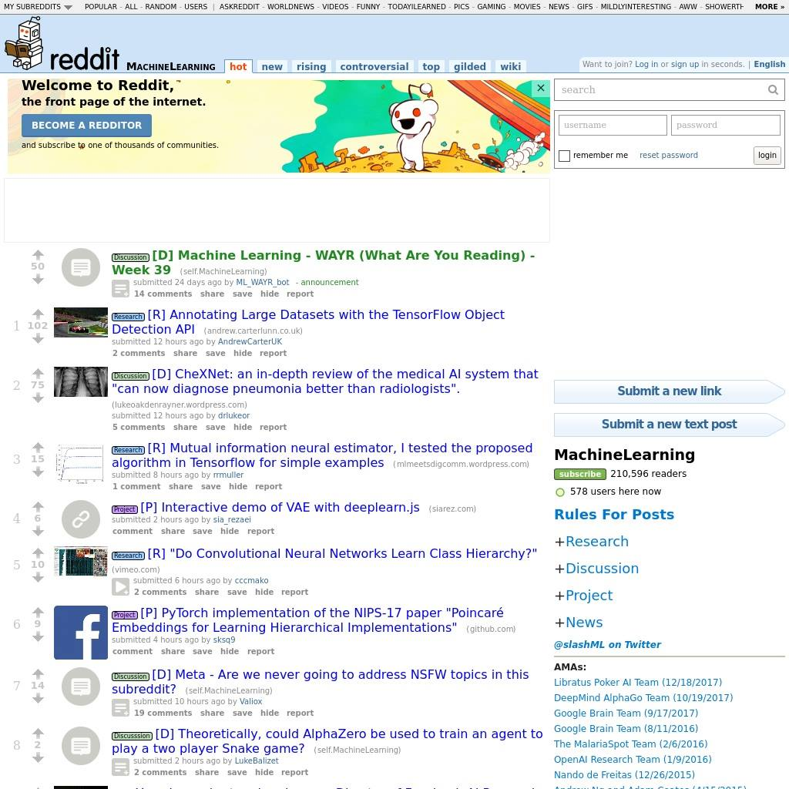
**이미지 캡션:** 이 이미지는 레딧(Reddit)의 머신러닝(Machine Learning) 서브레딧 페이지를 보여줍니다. 페이지 상단에는 레딧 로고와 함께 "Welcome to Reddit, the front page of the internet."이라는 문구가 있고, 그 옆에는 귀여운 캐릭터가 그려진 일러스트가 있습니다. 페이지 중앙에는 로그인 및 회원가입을 위한 입력창과 버튼이 보입니다. 메인 콘텐츠 영역에는 머신러닝 관련 게시물 목록이 시간순으로 나열되어 있으며, 각 게시물은 제목, 작성자, 제출 시간, 댓글 수 등의 정보를 포함하고 있습니다. 게시물 제목 앞에는 [D] (Discussion), [R] (Research), [P] (Project)와 같은 태그가 붙어 있어 게시물의 성격을 나타냅니다. 페이지 오른쪽에는 "Submit a new link" 및 "Submit a new text post" 버튼과 함께 서브레딧 구독 정보, 규칙, 그리고 과거 AMA(Ask Me Anything) 목록이 표시되어 있습니다. 전반적으로 기술 관련 커뮤니티의 정보 공유 및 토론이 이루어지는 웹사이트의 모습을 보여주는 이미지입니다.정보를 포함하고 있습니다. 게시물 제목 앞에는 [D] (Discussion), [R] (Research), [P] (Project)와 같은 태그가 붙어 있어 게시물의 성격을 나타냅니다. 페이지 오른쪽에는 "Submit a new link" 및 "Submit a new text post" 버튼과 함께 서브레딧 구독 정보, 규칙, 그리고 과거 AMA(Ask Me Anything) 목록이 표시되어 있습니다. 전반적으로 기술 관련 커뮤니티의 정보 공유 및 토론이 이루어지는 웹사이트의 모습을 보여주는 이미지입니다.

> #오늘의레딧 https://www.reddit.com/r/MachineLearning/ 머신러닝 공부는 정말 재미있죠?아침부터 다양한 소식이 많네요.  1. TensorFlow객체 감지 API를 사용한 대규모 데이터 셋 분석 2. ChoSNet:의학적 인공 지능 시스템에 대한 심도 있는 리뷰로서, 방사선 전문의들이 방사선 전문의들보다 더 낫게 진단할 수 있다. 3. 상호 작용 신경우, 간단한 예시를 위해 Tensorflow에서 제안된 알고리즘을 테스트했습니다. 4. deeplearn을 사용한 VAE의 대화형 데모 5. "ConvolutionalNeuralNetworks에서 계층 계층 계층을 학습합니까?" 6. PyTorch-17논문집"FoincareEmbeddingforLearningEmployingforLearningagailable" 7. 메타 데이터에 대한 NSFW항목을 절대로 다루지 않을 예정입니까? 8. 다양한 유형의 유화를 생성하는 GAN(중량+사진 포함) 9. 전화 문의:기계 학습 및 프로그래밍 언어에 대한 ACMSIGPLAN워크숍 10. 벡터 드로잉을 위한 재실 자 망 망상망 11. 위키 백과의 품질 평가에 대한 기계 학습 12. 작은 데이터 체제를 위한 벤치 마크와 알고리즘? 13. AMTSradOptimizer의 단순 텐서 구현 14. 당신은 어떻게 당신의 실험 결과를 추적합니까? 15. e-스포츠 VOD의 데이터 분석을 위해 YOLO사용 16. 클러스터 분석을 사용하는 사람이 없는 이유는 무엇입니까? 17. TensorDecomposition방법으로 깊은 학습 네트워크를 가속화합니다. 토토르흐와 텐토리 코드로 말이죠 18. 기계 학습은 의료 전문가를 대신하는 것이지만, 여러분이 생각하는 방법은 아닙니다. 19. 비치체적 지식을 습득하고 구조화되지 않은 데이터를 사용하는 베이지즈 배움 20. 조건부 공변화를 통한 커널 특성 선정  1. http://andrew.carterlunn.co.uk/programming/2018/01/24/annotating-large-datasets-with-tensorflow-object-detection-api.html 2. https://lukeoakdenrayner.wordpress.com/2018/01/24/chexnet-an-in-depth-review/ 3. https://mlmeetsdigcomm.wordpress.com/2018/01/24/mutual-information-estimation-from-samples-via-optimization/ 4. http://www.siarez.com/projects/variational-autoencoder 5. https://vimeo.com/228263798 6. https://github.com/facebookresearch/poincare-embeddings 7. https://www.reddit.com/r/MachineLearning/comments/7sn4p6/d_meta_are_we_never_going_to_address_nsfw_topics/ 8. https://github.com/robbiebarrat/art-DCGAN/blob/master/README.md 9. https://pldi18.sigplan.org/track/mapl-2018-papers 10. https://www.tensorflow.org/versions/master/tutorials/recurrent_quickdraw 11. https://medium.com/wikipedia-quality/automatic-assessment-of-the-quality-of-wikipedia-articles-in-different-languages-b38bd732c46f 12. https://www.reddit.com/r/MachineLearning/comments/7slbhf/d_benchmarks_and_algorithms_for_smalldata_regime/ 13. https://github.com/taki0112/AMSGrad-Tensorflow 14. https://www.reddit.com/r/MachineLearning/comments/7seoet/d_how_do_you_keep_track_of_your_experiment_results/ 15. https://medium.com/@farzatv/deepleague-leveraging-computer-vision-and-deep-learning-on-the-league-of-legends-mini-map-giving-d275fd17c4e0 16. https://www.reddit.com/r/MachineLearning/comments/7sm2rz/d_why_is_nobody_using_cluster_analysis/ 17. https://jacobgil.github.io/deeplearning/tensor-decompositions-deep-learning 18. https://blog.stoamigo.com/machine-learning-medical-profession/ 19. https://community.fico.com/community/articles/blog/2018/01/23/collaborative-behavioral-profiling 20. http://bair.berkeley.edu/blog/2018/01/23/kernels/

### 1월 26일 (금) 08:52 · 📷 사진 (1장)

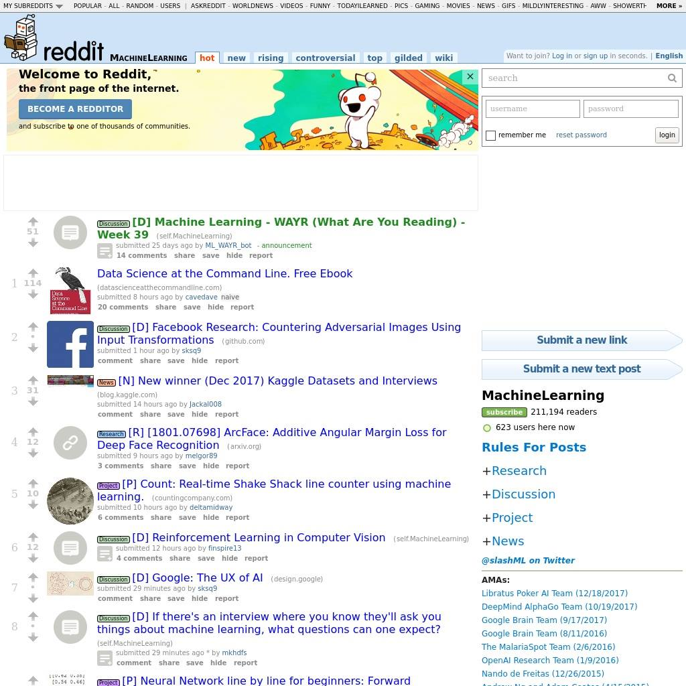
**이미지 캡션:** 이 이미지는 레딧(Reddit) 웹사이트의 머신러닝(Machine Learning) 서브레딧 페이지를 보여줍니다. 페이지 상단에는 레딧 로고와 함께 "hot", "new", "rising", "controversial", "top", "gilded", "wiki"와 같은 메뉴가 보이며, 오른쪽 상단에는 로그인 또는 회원가입을 할 수 있는 창이 있습니다. 메인 콘텐츠 영역에는 "Welcome to Reddit, the front page of the internet."이라는 환영 메시지와 함께 레딧의 마스코트인 "Snoo" 캐릭터가 그려진 이미지가 있습니다. 그 아래에는 "BECOME A REDDITOR" 버튼이 있습니다. 페이지의 주요 부분은 머신러닝 관련 게시물 목록으로 구성되어 있으며, 각 게시물은 제목, 출처, 작성자, 작성 시간, 댓글 수 등의 정보를 포함하고 있습니다. 예를 들어, "[D] Machine Learning - WAYR (What Are You Reading) - Week 39"이라는 제목의 게시물은 25일 전에 작성되었고 14개의 댓글이 달려 있습니다. 또한 "Data Science at the Command Line. Free Ebook"이라는 제목의 게시물은 8시간 전에 작성되었고 20개의 댓글이 있습니다. 페이지 오른쪽에는 "Submit a new link"와 "Submit a new text post" 버튼이 있으며, "MachineLearning" 서브레딧의 구독자 수와 현재 접속자 수가 표시되어 있습니다. 그 아래에는 "Rules For Posts" 섹션이 있고, "+Research", "+Discussion", "+Project", "+News"와 같은 하위 메뉴가 있습니다. 마지막으로 "@slashML on Twitter"라는 트위터 계정 정보와 함께 과거 AMA(Ask Me Anything) 세션 목록이 나열되어 있습니다. 전반적으로 이 페이지는 머신러닝 커뮤니티의 최신 정보와 토론을 공유하는 온라인 포럼의 모습을 보여줍니다. "Snoo" 캐릭터가 그려진 이미지가 있습니다. 그 아래에는 "BECOME A REDDITOR" 버튼이 있습니다. 페이지의 주요 부분은 머신러닝 관련 게시물 목록으로 구성되어 있으며, 각 게시물은 제목, 출처, 작성자, 작성 시간, 댓글 수 등의 정보를 포함하고 있습니다. 예를 들어, "[D] Machine Learning - WAYR (What Are You Reading) - Week 39"이라는 제목의 게시물은 25일 전에 작성되었고 14개의 댓글이 달려 있습니다. 또한 "Data Science at the Command Line. Free Ebook"이라는 제목의 게시물은 8시간 전에 작성되었고 20개의 댓글이 있습니다. 페이지 오른쪽에는 "Submit a new link"와 "Submit a new text post" 버튼이 있으며, "MachineLearning" 서브레딧의 구독자 수와 현재 접속자 수가 표시되어 있습니다. 그 아래에는 "Rules For Posts" 섹션이 있고, "+Research", "+Discussion", "+Project", "+News"와 같은 하위 메뉴가 있습니다. 마지막으로 "@slashML on Twitter"라는 트위터 계정 정보와 함께 과거 AMA(Ask Me Anything) 세션 목록이 나열되어 있습니다. 전반적으로 이 페이지는 머신러닝 커뮤니티의 최신 정보와 토론을 공유하는 온라인 포럼의 모습을 보여줍니다.

> #오늘의레딧 https://www.reddit.com/r/MachineLearning/ 따끈한 소식들입니다.  1. FacebookResearch:입력 전환을 이용한 광고 영상의 수렴 2. 새로운 수상자(2017년 12월 2017)및 인터뷰 3. 카운트:기계 학습을 사용하여 ShakeShackLine카운터를 실시간으로 계산합니다. 4. 컴퓨터 비전 강화 학습 5. 구글:AI의 퇴치 6. 만약 여러분이 그들이 기계 학습에 대해 물어볼 것을 알고 있는 것을 알고 있다면, 어떤 질문이 있을 수 있을까요? 7. 신경망을 이용한 신경 회로 라인:전방 전파 8. DemisHassabis, DeepMind-첫번째 원칙부터 배움-인공 지능 국가 정보 9. PyTorch-17논문집"FoincareEmbeddingforLearningEmployingforLearningagailable" 10. 다양한 유형의 유화를 생성하는 GAN(중량+사진 포함) 11. "ConvolutionalNeuralNetworks에서 계층 계층 계층을 학습합니까?" 12. TensorFlow객체 감지 API를 사용한 대규모 데이터 셋 분석 13. ChoSNet:의학적 인공 지능 시스템에 대한 심도 있는 리뷰로서, 방사선 전문의들이 방사선 전문의들보다 더 낫게 진단할 수 있다. 14. 상호 작용 신경우, 간단한 예시를 위해 텐서 플로우(Tensorflow)의 제안된 알고리즘을 테스트했다. 15. deeplearn을 사용한 VAE의 대화형 데모 16. 더 나은 학습을 위해 피드백이 필요합니다. 제발 도와 주세요! 17. 메타 데이터에 대한 NSFW항목을 절대로 다루지 않을 예정입니까? 18. 2016년에 제안된 컬러 네트워크 구축을 위한 Tensorflow구현 19. 전화 문의:기계 학습 및 프로그래밍 언어에 대한 ACMSIGPLAN워크숍  1. https://github.com/facebookresearch/adversarial_image_defenses 2. http://blog.kaggle.com/2018/01/24/october-kaggle-dataset-publishing-awards-winners-interview-2/ 3. http://www.countingcompany.com/ 4. https://www.reddit.com/r/MachineLearning/comments/7sv9zu/d_reinforcement_learning_in_computer_vision/ 5. https://design.google/library/ux-ai/ 6. https://www.reddit.com/r/MachineLearning/comments/7t0bc2/d_if_theres_an_interview_where_you_know_theyll/ 7. http://codeouts.com/build-a-neural-network-3-forward-propagation/ 8. https://youtu.be/DXNqYSNvnjA 9. https://github.com/facebookresearch/poincare-embeddings 10. https://github.com/robbiebarrat/art-DCGAN/blob/master/README.md 11. https://vimeo.com/228263798 12. http://andrew.carterlunn.co.uk/programming/2018/01/24/annotating-large-datasets-with-tensorflow-object-detection-api.html 13. https://lukeoakdenrayner.wordpress.com/2018/01/24/chexnet-an-in-depth-review/ 14. https://mlmeetsdigcomm.wordpress.com/2018/01/24/mutual-information-estimation-from-samples-via-optimization/ 15. http://www.siarez.com/projects/variational-autoencoder 16. https://www.reddit.com/r/MachineLearning/comments/7swal0/d_need_feedback_to_learn_better_please_help/ 17. https://www.reddit.com/r/MachineLearning/comments/7sn4p6/d_meta_are_we_never_going_to_address_nsfw_topics/ 18. https://www.reddit.com/r/MachineLearning/comments/7ss8e1/d_tensorflow_implementation_of_let_there_be_color/ 19. https://pldi18.sigplan.org/track/mapl-2018-papers

### 1월 27일 (토) 08:52 · 📷 사진 (1장)

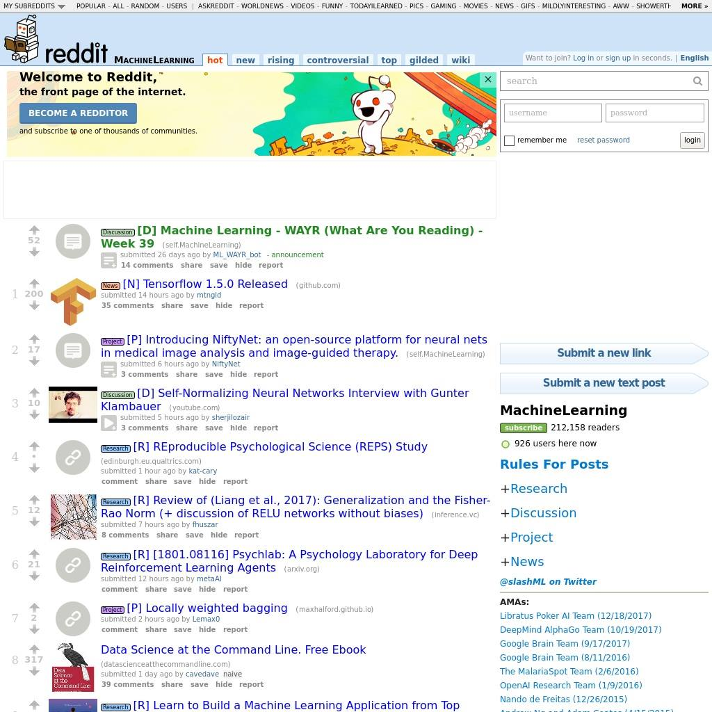
**이미지 캡션:** 이 이미지는 인기 있는 소셜 뉴스 웹사이트인 레딧의 머신러닝 커뮤니티 페이지를 보여줍니다. 페이지 상단에는 레딧 로고와 함께 "MachineLearning"이라는 제목이 있고, 그 아래에는 "hot", "new", "rising", "controversial", "top", "gilded", "wiki"와 같은 다양한 탭이 있습니다. 환영 메시지와 함께 레딧의 슬로건인 "Welcome to Reddit, the front page of the internet."이 보이며, "BECOME A REDDITOR" 버튼이 있습니다. 페이지 중앙에는 다양한 주제의 게시물 목록이 표시되며, 각 게시물은 제목, 출처, 작성 시간, 댓글 수 등의 정보를 포함하고 있습니다. 예를 들어, "[D] Machine Learning - WAYR (What Are You Reading) - Week 39"이라는 제목의 게시물은 26일 전에 게시되었고 14개의 댓글이 달려 있습니다. "[N] Tensorflow 1.5.0 Released"라는 제목의 게시물은 14시간 전에 게시되었고 35개의 댓글이 있습니다. 또한, "Submit a new link"와 "Submit a new text post" 버튼이 있어 사용자들이 새로운 콘텐츠를 공유할 수 있습니다. 오른쪽 사이드바에는 "MachineLearning" 커뮤니티의 구독자 수와 현재 접속자 수가 표시되며, "Rules For Posts" 섹션에는 "+Research", "+Discussion", "+Project", "+News"와 같은 하위 섹션이 있습니다. 그 아래에는 "@slashML on Twitter" 링크와 "AMAS" 섹션이 있는데, 여기에는 과거에 진행되었던 AMA(Ask Me Anything) 목록이 날짜와 함께 나열되어 있습니다. 전반적으로 이 페이지는 머신러닝 관련 정보를 공유하고 토론하는 커뮤니티의 모습을 보여줍니다.버튼이 있습니다. 페이지 중앙에는 다양한 주제의 게시물 목록이 표시되며, 각 게시물은 제목, 출처, 작성 시간, 댓글 수 등의 정보를 포함하고 있습니다. 예를 들어, "[D] Machine Learning - WAYR (What Are You Reading) - Week 39"이라는 제목의 게시물은 26일 전에 게시되었고 14개의 댓글이 달려 있습니다. "[N] Tensorflow 1.5.0 Released"라는 제목의 게시물은 14시간 전에 게시되었고 35개의 댓글이 있습니다. 또한, "Submit a new link"와 "Submit a new text post" 버튼이 있어 사용자들이 새로운 콘텐츠를 공유할 수 있습니다. 오른쪽 사이드바에는 "MachineLearning" 커뮤니티의 구독자 수와 현재 접속자 수가 표시되며, "Rules For Posts" 섹션에는 "+Research", "+Discussion", "+Project", "+News"와 같은 하위 섹션이 있습니다. 그 아래에는 "@slashML on Twitter" 링크와 "AMAS" 섹션이 있는데, 여기에는 과거에 진행되었던 AMA(Ask Me Anything) 목록이 날짜와 함께 나열되어 있습니다. 전반적으로 이 페이지는 머신러닝 관련 정보를 공유하고 토론하는 커뮤니티의 모습을 보여줍니다.

> #오늘의레딧 https://www.reddit.com/r/MachineLearning/ 정말 읽을 거리가 많네요.  1. Tensorflow1.5.0 릴리즈 2. 의학 이미지 분석과 이미지 유도 요법에서 신경 망을 위한 오픈 소스 플랫폼인 NiftyNet을 소개합니다. 3. 자동화 신경 회로망과의 인터뷰 4. 신뢰성 있는 심리학(REPS)연구 5. (Liangetal., 2017):일반화 및 Fisher-RaoLeoNorm(바이어스 없는 네트워크 네트워크의 리뷰) 6. 국부적으로 균형 잡힌 배치 7. 상위 기사에서 기계 학습 애플리케이션 구축 방법 알아보기 8. 구글:AI의 퇴치 9. 영업 사원 문제를 해결하기 위해 자체 서명된 맵 사용 10. Psychlab:심층적인 강화 학습 에이전트를 위한 심리학 연구소 11. e-메일에서의 인턴십 기회 12. 치수 감소를 위한 종이 제안 13. 알 수 없는 클래스 감지 14. 퍼셉트론 학습 알고리즘의 편향을 조정하는 것이 얼마나 중요한가? 15. 단백질 접힘 평가를 위한 심층적인 볼록형 네트워크 16. 인공 지능은 2개 국어로 되어 있다:왜 우리가 비금속성 데이터를 사용하여 기계 번역 시스템을 훈련시켜야 하는가? 17. 전자 건강 기록에 대한 확장 가능하고 정확한 심층 학습(Google) 18. 마이크로 소프트:자율적 음주 운전 19. (FAIR)마스크 R-WW2G를 사용하여 전신 AR을 지원할 수 있음 20. 처음부터 끝까지 얼굴에 윤곽이 드러나는 것을 만들어 내는 대강의 아이디어를 제공해 주세요.  1. https://github.com/tensorflow/tensorflow/releases/tag/v1.5.0 2. https://www.reddit.com/r/MachineLearning/comments/7t5wfv/p_introducing_niftynet_an_opensource_platform_for/ 3. https://www.youtube.com/watch?v=gH-KWepKSNs 4. https://edinburgh.eu.qualtrics.com/jfe/form/SV_50aSGBaSfQOplbf 5. http://www.inference.vc/generalization-and-the-fisher-rao-norm-2/ 6. https://maxhalford.github.io/blog/locally-weighted-bagging/ 7. https://medium.com/@Mybridge/learn-to-build-a-machine-learning-application-from-top-articles-of-2017-cdd5638453fc 8. https://design.google/library/ux-ai/ 9. https://diego.codes/post/som-tsp/ 10. https://arxiv.org/pdf/1801.08116.pdf 11. https://www.reddit.com/r/MachineLearning/comments/7t7jat/ninternship_opportunities_at_etsy/ 12. https://www.reddit.com/r/MachineLearning/comments/7t5i9f/d_paper_suggestions_for_dimensionality_reduction/ 13. https://www.reddit.com/r/MachineLearning/comments/7t3xei/d_detecting_unknown_classes/ 14. https://www.reddit.com/r/MachineLearning/comments/7t6cc7/d_how_important_is_it_to_adjust_the_bias_in_a/ 15. https://www.reddit.com/r/MachineLearning/comments/7t1qn8/researchdeep_convolutional_networks_for_quality/ 16. https://mipt.ru/english/news/ai_goes_bilingual_why_we_need_a_machine_translation_hackathon 17. https://arxiv.org/abs/1801.07860 18. https://github.com/Microsoft/AutonomousDrivingCookbook 19. https://research.fb.com/enabling-full-body-ar-with-mask-r-cnn2go/ 20. https://www.reddit.com/r/MachineLearning/comments/7t428z/d_provide_me_a_rough_idea_to_create_facial/

### 1월 28일 (일) 08:52 · 📷 사진 (1장)

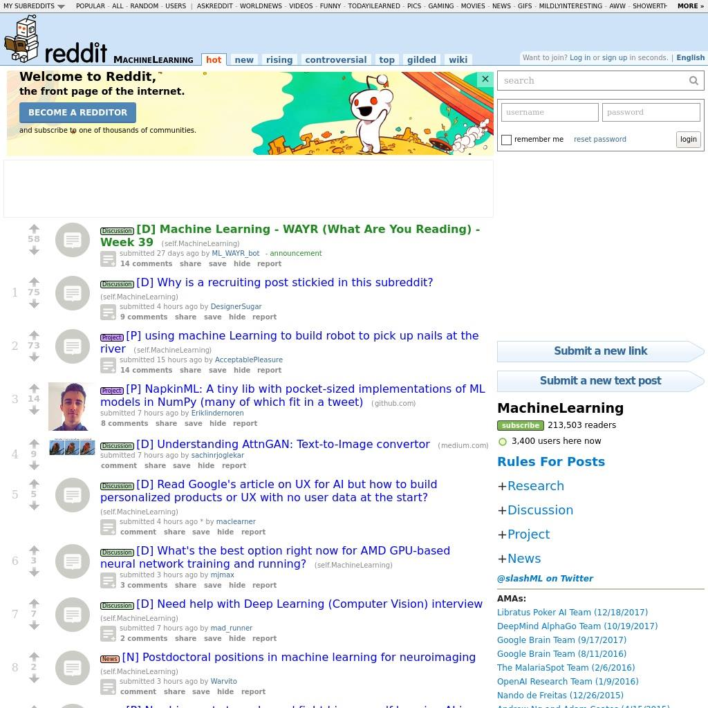
**이미지 캡션:** 이 이미지는 인기 있는 소셜 뉴스 웹사이트인 레딧의 머신러닝 커뮤니티 페이지를 보여줍니다. 페이지 상단에는 레딧 로고와 함께 "hot", "new", "rising", "controversial", "top", "gilded", "wiki"와 같은 다양한 탭이 있으며, 그 옆에는 검색창과 로그인/가입 옵션이 있습니다. 메인 콘텐츠 영역에는 "Welcome to Reddit, the front page of the internet."이라는 환영 메시지와 함께 레딧에 가입하라는 버튼이 있습니다. 페이지의 대부분은 머신러닝 관련 게시물 목록으로 채워져 있으며, 각 게시물은 제목, 작성자, 제출 시간, 댓글 수 등의 정보를 포함하고 있습니다. 게시물 제목에는 "Machine Learning - WAYR (What Are You Reading)", "Why is a recruiting post stickied in this subreddit?", "using machine Learning to build robot to pick up nails at the river", "NapkinML: A tiny lib with pocket-sized implementations of ML models in NumPy", "Understanding AttnGAN: Text-to-Image convertor", "Read Google's article on UX for AI but how to build personalized products or UX with no user data at the start?", "What's the best option right now for AMD GPU-based neural network training and running?", "Need help with Deep Learning (Computer Vision) interview", "Postdoctoral positions in machine learning for neuroimaging" 등이 있습니다. 각 게시물 옆에는 투표를 위한 위쪽 화살표와 아래쪽 화살표가 있으며, 게시물 제목 아래에는 작성자 정보와 함께 "comment", "share", "save", "hide", "report"와 같은 옵션이 있습니다. 페이지 오른쪽에는 "Submit a new link" 및 "Submit a new text post" 버튼과 함께 "MachineLearning" 커뮤니티의 구독자 수와 현재 접속자 수가 표시되어 있습니다. 또한, "Rules For Posts" 섹션에는 "+Research", "+Discussion", "+Project", "+News"와 같은 카테고리가 나열되어 있으며, "@slashML on Twitter" 링크와 "AMAS" 섹션에는 과거 AMA(Ask Me Anything) 세션 목록이 날짜와 함께 표시되어 있습니다. 전반적으로 이 페이지는 머신러닝 분야에 관심 있는 사용자들이 최신 정보와 토론을 공유하고 참여할 수 있는 온라인 커뮤니티의 모습을 보여줍니다. 머신러닝 관련 게시물 목록으로 채워져 있으며, 각 게시물은 제목, 작성자, 제출 시간, 댓글 수 등의 정보를 포함하고 있습니다. 게시물 제목에는 "Machine Learning - WAYR (What Are You Reading)", "Why is a recruiting post stickied in this subreddit?", "using machine Learning to build robot to pick up nails at the river", "NapkinML: A tiny lib with pocket-sized implementations of ML models in NumPy", "Understanding AttnGAN: Text-to-Image convertor", "Read Google's article on UX for AI but how to build personalized products or UX with no user data at the start?", "What's the best option right now for AMD GPU-based neural network training and running?", "Need help with Deep Learning (Computer Vision) interview", "Postdoctoral positions in machine learning for neuroimaging" 등이 있습니다. 각 게시물 옆에는 투표를 위한 위쪽 화살표와 아래쪽 화살표가 있으며, 게시물 제목 아래에는 작성자 정보와 함께 "comment", "share", "save", "hide", "report"와 같은 옵션이 있습니다. 페이지 오른쪽에는 "Submit a new link" 및 "Submit a new text post" 버튼과 함께 "MachineLearning" 커뮤니티의 구독자 수와 현재 접속자 수가 표시되어 있습니다. 또한, "Rules For Posts" 섹션에는 "+Research", "+Discussion", "+Project", "+News"와 같은 카테고리가 나열되어 있으며, "@slashML on Twitter" 링크와 "AMAS" 섹션에는 과거 AMA(Ask Me Anything) 세션 목록이 날짜와 함께 표시되어 있습니다. 전반적으로 이 페이지는 머신러닝 분야에 관심 있는 사용자들이 최신 정보와 토론을 공유하고 참여할 수 있는 온라인 커뮤니티의 모습을 보여줍니다.

> #오늘의레딧 https://www.reddit.com/r/MachineLearning/ 오늘도 새소식이 많군요.  1. 왜 신병 모집 공고가 이 돼지지에 실린 걸까요? 2. 강에서 못을 줍는 로봇을 만들기 위해 기계 학습을 이용한다. 3. NabkinID:NumPey에 있는 포켓 크기의 작은 크기의 포켓 크기 구현(Twitter에 적합한 다수의 경우) 4. Atmos/CAN이해:텍스트 간 변환기 5. 구글의 UX에 대한 구글의 기사를 읽어 보되, 사용자 데이터가 없는 사용자의 개인적인 제품 또는 UX를 어떻게 구축할 것인가? 6. AMDGPAN기반의 신경 네트워크 교육 및 실행에 대한 최상의 옵션은 무엇입니까? 7. 딥 학습(컴퓨터 비전)인터뷰에 도움이 필요합니다. 8. 신경망 학습을 위한 기계의 사후 위치 9. 뉴비는 스팀 게임에서 자신만의 학습용 인공 지능을 만들고 싸우고 싶어 한다. 10. 정보화 시대의 위키 피디아 기사의 품질 평가를 위한 응용 프로그램 논리적 회귀 11. Tensorflow1.5.0 릴리즈 12. 페이스북의 감기는 일찍 일어남 13. 의학 이미지 분석과 이미지 유도 요법에서 신경 망을 위한 오픈 소스 플랫폼인 NiftyNet을 소개합니다. 14. 자동화 신경 회로망과의 인터뷰 15. 신뢰성 있는 심리학(REPS)연구 16. 국부적으로 균형 잡힌 배치 17. (Liangetal., 2017):일반화 및 Fisher-RaroNorm(바이어스 없음)(편견 없이 RELU네트워크에 대한 토론) 18. Psychlab:심층적인 강화 학습 에이전트를 위한 심리학 연구소 19. 치수 감소를 위한 종이 제안 20. 논쟁을 해결하도록 도와 주세요. 기계 학습이 고고학자들에게 유용하다는 것을 증명할 수 있을까?  1. https://www.reddit.com/r/MachineLearning/comments/7tf1mh/d_why_is_a_recruiting_post_stickied_in_this/ 2. https://www.reddit.com/r/MachineLearning/comments/7tbgso/p_using_machine_learning_to_build_robot_to_pick/ 3. https://github.com/eriklindernoren/NapkinML 4. https://medium.com/@srjoglekar246/understanding-attngan-text-to-image-convertor-a79f415a4e89 5. https://www.reddit.com/r/MachineLearning/comments/7tez34/d_read_googles_article_on_ux_for_ai_but_how_to/ 6. https://www.reddit.com/r/MachineLearning/comments/7tf4da/d_whats_the_best_option_right_now_for_amd/ 7. https://www.reddit.com/r/MachineLearning/comments/7tdcdf/d_need_help_with_deep_learning_computer_vision/ 8. https://www.reddit.com/r/MachineLearning/comments/7tf9a1/n_postdoctoral_positions_in_machine_learning_for/ 9. https://www.reddit.com/r/MachineLearning/comments/7tgdee/p_newbie_wants_to_make_and_fight_his_own_self/ 10. http://en.lewoniewski.info/2018/application-logistic-regression-in-assessing-the-quality-of-information-wikipedia-articles-case/ 11. https://github.com/tensorflow/tensorflow/releases/tag/v1.5.0 12. https://www.reddit.com/r/MachineLearning/comments/7t9y9f/discussion_facebook_ai_residency_closed_early/ 13. https://www.reddit.com/r/MachineLearning/comments/7t5wfv/p_introducing_niftynet_an_opensource_platform_for/ 14. https://www.youtube.com/watch?v=gH-KWepKSNs 15. https://edinburgh.eu.qualtrics.com/jfe/form/SV_50aSGBaSfQOplbf 16. https://maxhalford.github.io/blog/locally-weighted-bagging/ 17. http://www.inference.vc/generalization-and-the-fisher-rao-norm-2/ 18. https://arxiv.org/pdf/1801.08116.pdf 19. https://www.reddit.com/r/MachineLearning/comments/7t5i9f/d_paper_suggestions_for_dimensionality_reduction/ 20. https://www.reddit.com/r/MachineLearning/comments/7tbnw0/d_help_me_settle_an_argument_would_machine/

### 1월 29일 (월) 08:52 · 📷 사진 (1장)

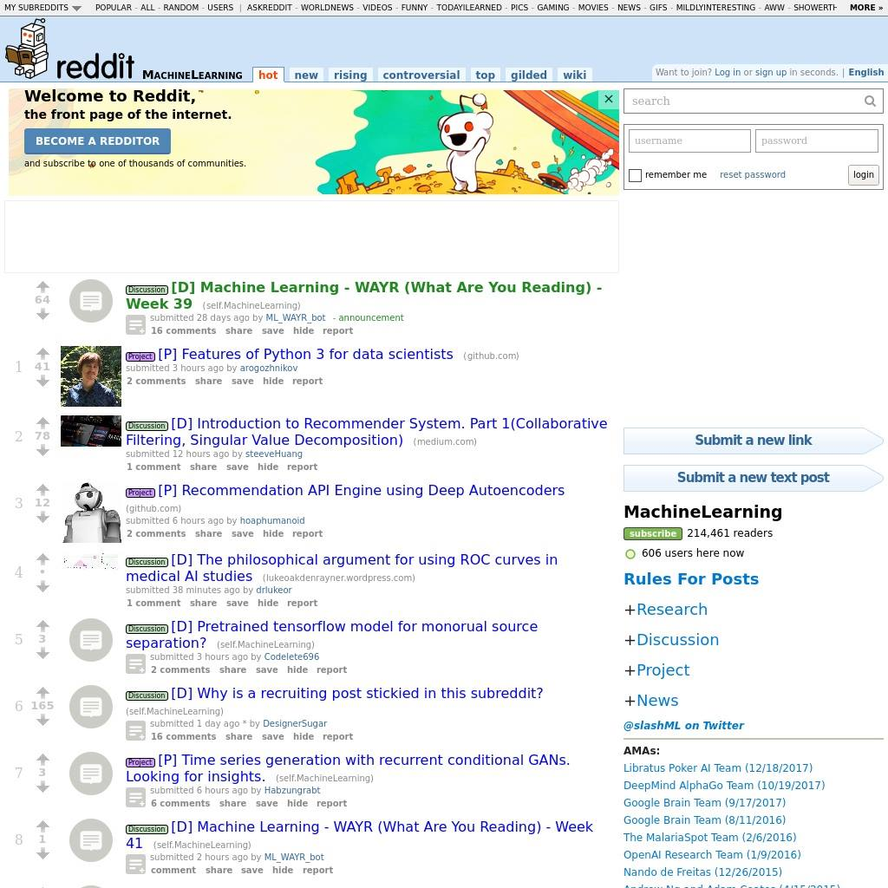
**이미지 캡션:** 이 이미지는 레딧의 머신러닝 서브레딧 페이지를 보여줍니다. 페이지 상단에는 레딧 로고와 함께 "Welcome to Reddit, the front page of the internet."이라는 문구가 있고, 그 옆에는 레딧의 마스코트인 스너(Snoo)가 그려진 일러스트가 있습니다. 로그인 및 회원가입을 위한 입력창과 버튼도 보입니다. 메인 콘텐츠 영역에는 다양한 머신러닝 관련 게시물 목록이 표시됩니다. 각 게시물은 제목, 작성자, 제출 시간, 댓글 수, 그리고 공유, 저장, 숨기기, 신고 등의 옵션을 포함합니다. 게시물 목록에는 "Machine Learning - WAYR (What Are You Reading) - Week 39", "Features of Python 3 for data scientists", "Introduction to Recommender System. Part 1", "Recommendation API Engine using Deep Autoencoders", "The philosophical argument for using ROC curves in medical AI studies", "Pretrained tensorflow model for monorual source separation?", "Why is a recruiting post stickied in this subreddit?", "Time series generation with recurrent conditional GANs. Looking for insights.", 그리고 "Machine Learning - WAYR (What Are You Reading) - Week 41"과 같은 제목들이 보입니다. 각 게시물 옆에는 해당 게시물의 주제를 나타내는 아이콘(토론 또는 프로젝트)과 함께 업보트/다운보트 수, 댓글 수가 표시됩니다. 페이지 오른쪽에는 "MachineLearning" 서브레딧의 구독자 수와 현재 접속자 수가 표시되며, "Rules For Posts" 섹션과 함께 연구, 토론, 프로젝트, 뉴스 등의 카테고리가 나열되어 있습니다. 또한, "@slashML on Twitter" 링크와 과거 AMA(Ask Me Anything) 목록도 보입니다. 전반적으로 기술 커뮤니티의 정보 공유 및 토론이 이루어지는 웹사이트의 모습을 담고 있으며, 차분하고 정보 중심적인 분위기입니다.다. 게시물 목록에는 "Machine Learning - WAYR (What Are You Reading) - Week 39", "Features of Python 3 for data scientists", "Introduction to Recommender System. Part 1", "Recommendation API Engine using Deep Autoencoders", "The philosophical argument for using ROC curves in medical AI studies", "Pretrained tensorflow model for monorual source separation?", "Why is a recruiting post stickied in this subreddit?", "Time series generation with recurrent conditional GANs. Looking for insights.", 그리고 "Machine Learning - WAYR (What Are You Reading) - Week 41"과 같은 제목들이 보입니다. 각 게시물 옆에는 해당 게시물의 주제를 나타내는 아이콘(토론 또는 프로젝트)과 함께 업보트/다운보트 수, 댓글 수가 표시됩니다. 페이지 오른쪽에는 "MachineLearning" 서브레딧의 구독자 수와 현재 접속자 수가 표시되며, "Rules For Posts" 섹션과 함께 연구, 토론, 프로젝트, 뉴스 등의 카테고리가 나열되어 있습니다. 또한, "@slashML on Twitter" 링크와 과거 AMA(Ask Me Anything) 목록도 보입니다. 전반적으로 기술 커뮤니티의 정보 공유 및 토론이 이루어지는 웹사이트의 모습을 담고 있으며, 차분하고 정보 중심적인 분위기입니다.

> #오늘의레딧 https://www.reddit.com/r/MachineLearning/ 래딧은 읽을 거리가 다양합니다.  1. 데이터 과학자들을 위한 파이썬 3의 특징 2. Recommender시스템 소개. 파트 1(협업 필터링, SingularValueDecomposition) 3. DeepAutoencoder를 이용한 권장 API엔진 4. 의학적 인공 지능 연구에서 ROC곡선을 이용한 철학적 논쟁 5. 단일 광원 분리를 위한 협착 텐서 모델? 6. 왜 신병 모집 공고가 이 돼지지에 실린 걸까요? 7. 반복 조건 GAN을 포함한 시계열 생성 시간. 통찰력을 찾고 있습니다. 8. 기계 학습-WAYR(Whatisyouread)-Week41 9. AAAI및 IJCAI컨퍼런스 10. DNN-Optimize를 위한 최적화된 활성화된 BatchClorum 11. 다양한 형태의 선형 학습자:3차원 형상의 계층적 적층 모델 12. 1999년도 추계 종합 학술 발표회 논문 초록 집 vol.26 13. DC-TTS의 구현:또 다른 텍스트-속도 모델 14. NabkinID:NumPey에 있는 포켓 크기의 포켓 크기의 작은 구현(Twitter에 맞는 다수의 경우) 15. 병렬로 제작된 여러 선형 회귀 모델 16. 잠재적 연구 아이디어:지역 CNN의 재무 시간 분석 17. AMDGPAN기반의 신경 네트워크 교육 및 실행에 대한 최상의 옵션은 무엇입니까? 18. Atmos/CAN이해:텍스트 간 변환기 19. 강에서 못을 줍는 로봇을 만들기 위해 기계 학습을 이용한다. 20. 신경망 학습을 위한 기계의 사후 위치  1. https://github.com/arogozhnikov/python3_with_pleasure 2. https://medium.com/@huangkh19951228/introduction-to-recommender-system-part-1-collaborative-filtering-singular-value-decomposition-44c9659c5e75 3. https://github.com/miguelgfierro/sciblog_support/blob/master/Intro_to_Recommendation_Systems/Intro_Recommender.ipynb 4. https://lukeoakdenrayner.wordpress.com/2018/01/07/the-philosophical-argument-for-using-roc-curves/ 5. https://www.reddit.com/r/MachineLearning/comments/7tmvox/d_pretrained_tensorflow_model_for_monorual_source/ 6. https://www.reddit.com/r/MachineLearning/comments/7tf1mh/d_why_is_a_recruiting_post_stickied_in_this/ 7. https://www.reddit.com/r/MachineLearning/comments/7tlfxc/p_time_series_generation_with_recurrent/ 8. https://www.reddit.com/r/MachineLearning/comments/7tn2ax/d_machine_learning_wayr_what_are_you_reading_week/ 9. https://www.reddit.com/r/MachineLearning/comments/7tk3v2/d_aaai_and_ijcai_conferences/ 10. https://arxiv.org/abs/1712.02616 11. http://shikun.io/papers/vsl.html 12. http://warmspringwinds.github.io/pytorch/rnns/2018/01/27/learning-to-generate-lyrics-and-music-with-recurrent-neural-networks/#lyrics_dataset 13. https://github.com/Kyubyong/dc_tts 14. https://github.com/eriklindernoren/NapkinML 15. https://github.com/dgwozdz/OLS 16. https://www.reddit.com/r/MachineLearning/comments/7tl7yw/d_potential_research_idea_regional_cnn_for/ 17. https://www.reddit.com/r/MachineLearning/comments/7tf4da/d_whats_the_best_option_right_now_for_amd/ 18. https://medium.com/@srjoglekar246/understanding-attngan-text-to-image-convertor-a79f415a4e89 19. https://www.reddit.com/r/MachineLearning/comments/7tbgso/p_using_machine_learning_to_build_robot_to_pick/ 20. https://www.reddit.com/r/MachineLearning/comments/7tf9a1/n_postdoctoral_positions_in_machine_learning_for/

### 1월 30일 (화) 08:52 · 📷 사진 (1장)

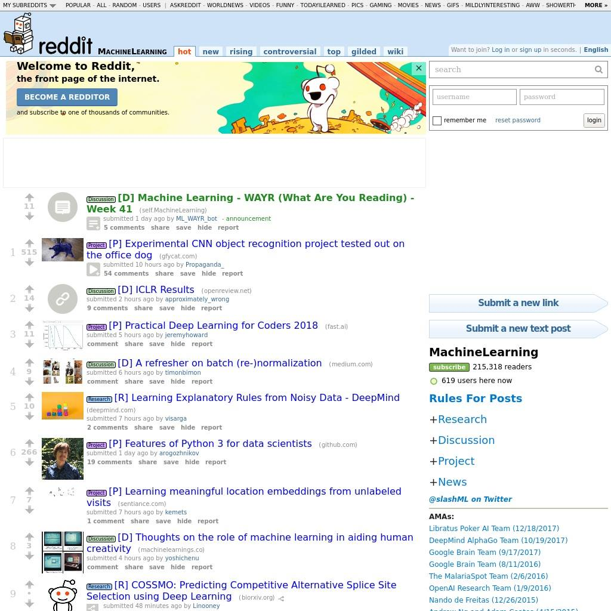
**이미지 캡션:** 이 이미지는 인기 있는 소셜 뉴스 웹사이트인 레딧의 머신러닝 서브레딧 페이지를 보여줍니다. 페이지 상단에는 레딧 로고와 함께 "Welcome to Reddit, the front page of the internet."이라는 문구가 있고, 그 옆에는 귀여운 캐릭터가 그려져 있습니다. 페이지 중앙에는 다양한 머신러닝 관련 게시물 목록이 표시되어 있으며, 각 게시물은 제목, 작성자, 제출 시간, 댓글 수 등의 정보를 포함하고 있습니다. 게시물 유형은 토론, 프로젝트, 연구 등으로 나뉘며, 관련 링크나 이미지가 첨부되어 있습니다. 오른쪽 사이드바에는 "MachineLearning" 서브레딧의 구독자 수와 현재 접속자 수가 표시되어 있으며, 게시물 작성 규칙과 최근 진행된 AMA(Ask Me Anything) 목록도 확인할 수 있습니다. 전반적으로 정보가 풍부하고 깔끔하게 정리된 웹사이트의 모습을 보여줍니다.부되어 있습니다. 오른쪽 사이드바에는 "MachineLearning" 서브레딧의 구독자 수와 현재 접속자 수가 표시되어 있으며, 게시물 작성 규칙과 최근 진행된 AMA(Ask Me Anything) 목록도 확인할 수 있습니다. 전반적으로 정보가 풍부하고 깔끔하게 정리된 웹사이트의 모습을 보여줍니다.

> #오늘의레딧 https://www.reddit.com/r/MachineLearning/ 오늘도 새소식이 많군요.  1. 실험실 개를 대상으로 한 실험적인 JLR개체 인식 프로젝트 2. ICL결과 3. 2018년 CODER에 대한 실무 심화 4. 배치(-)정규화에 대한 재교육 5. NoisyData의 설명서를 학습하는 방법-DeepMind 6. 데이터 과학자들을 위한 파이썬 3의 특징 7. 라벨 없는 방문으로부터 의미 있는 장소 엠베스팅 학습 8. 인간의 창조성을 돕는 기계의 역할에 대한 생각 9. COSSMO:딥 학습을 이용한 경쟁력 대체 Spling사이트 선정 10. 계층형 텍스트 시스템을 위한 시맨틱 레이아웃의 상관 관계 11. 에이전트를 RL에서 평가할 때 여러번 학습을 실행해야 합니까? 12. 범용 광고 제작을 위한 일반화된 데이터 지향적 목표(UAP) 13. E-swish: 새로운 활성화 기능 14. 과학 저술을 위한 휴리스틱 기법(기계 학습 측면) 15. 몇가지 조언을 구하는 CS배경을 가진 기술 컨설턴트 16. 저는 제가 연구할 수 있는 이 도구를 연구용 도구 상자에 만들었습니다. 여러분은 유용할 것입니다. 17. 설명을 통한 최적화:투명성이라는 명목 하에 인공 지능을 인공적으로 만들지 말라. 18. 교육 워크 플로우 중에 어떤 도구를 사용합니까? 19. 의학적 인공 지능 연구에서 ROC곡선을 이용한 철학적 논쟁 20. 양성 및 악성 종양을 분류하기 위해 유방 암 데이터에 대한 로그인/복원을 실시했습니다!  1. https://gfycat.com/AbandonedAcrobaticDuck 2. https://openreview.net/group?id=ICLR.cc/2018/Conference 3. http://www.fast.ai/2018/01/26/v2-launch/ 4. https://medium.com/luminovo/a-refresher-on-batch-re-normalization-5e0a1e902960 5. https://deepmind.com/blog/learning-explanatory-rules-noisy-data/ 6. https://github.com/arogozhnikov/python3_with_pleasure 7. http://www.sentiance.com/2018/01/29/learning-meaningful-location-embeddings-from-unlabeled-visits/ 8. https://machinelearnings.co/machines-for-creative-enablement-not-human-replacement-da40f875a976 9. https://www.biorxiv.org/content/early/2018/01/29/255257 10. https://arxiv.org/abs/1801.05091 11. https://www.reddit.com/r/MachineLearning/comments/7tqwa7/d_do_you_need_to_run_learning_multiple_times_when/ 12. https://arxiv.org/abs/1801.08092 13. https://arxiv.org/abs/1801.07145 14. http://approximatelycorrect.com/2018/01/29/heuristics-technical-scientific-writing-machine-learning-perspective/ 15. https://www.reddit.com/r/MachineLearning/comments/7tuerb/d_technology_consultant_with_a_cs_background/ 16. https://github.com/dmarnerides/pydlt 17. https://medium.com/berkman-klein-center/optimization-over-explanation-41ecb135763d 18. https://www.reddit.com/r/MachineLearning/comments/7tu07a/d_what_tools_do_you_use_during_your_training/ 19. https://lukeoakdenrayner.wordpress.com/2018/01/07/the-philosophical-argument-for-using-roc-curves/ 20. https://www.reddit.com/r/MachineLearning/comments/7tsp5f/d_ran_logisticregression_on_breast_cancer_data_to/

### 1월 31일 (수) 08:52 · 📷 사진 (1장)

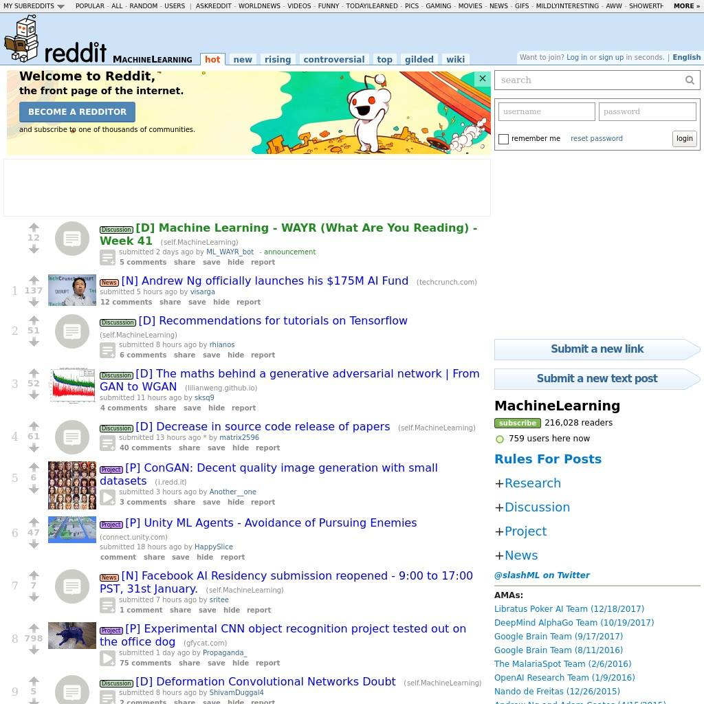
**이미지 캡션:** 이것은 레딧 웹사이트의 스크린샷으로, "MachineLearning" 서브레딧의 메인 페이지를 보여줍니다. 화면 중앙에는 "Welcome to Reddit, the front page of the internet."이라는 문구와 함께 레딧의 마스코트인 스너(Snoo)가 그려진 일러스트가 있습니다. 일러스트는 다채로운 색상으로 그려져 있으며, 스너는 팔을 벌리고 환영하는 듯한 포즈를 취하고 있습니다. 페이지 상단에는 다양한 카테고리(hot, new, rising, controversial, top, gilded, wiki)가 있으며, 검색창과 로그인/가입 폼이 보입니다. 메인 콘텐츠 영역에는 "MachineLearning" 서브레딧의 게시물 목록이 표시됩니다. 각 게시물은 제목, 작성자, 제출 시간, 댓글 수 등의 정보를 포함하고 있습니다. 게시물 제목은 주로 머신러닝 관련 주제를 다루고 있으며, "[D]"는 토론, "[N]"은 뉴스, "[P]"는 프로젝트를 나타냅니다. 오른쪽 사이드바에는 "MachineLearning" 서브레딧의 구독자 수, 현재 접속자 수, 게시물 규칙, 트위터 계정, 그리고 과거 AMA(Ask Me Anything) 목록이 표시됩니다. 전반적으로 깔끔하고 정보가 잘 정리된 웹사이트 화면입니다., wiki)가 있으며, 검색창과 로그인/가입 폼이 보입니다. 메인 콘텐츠 영역에는 "MachineLearning" 서브레딧의 게시물 목록이 표시됩니다. 각 게시물은 제목, 작성자, 제출 시간, 댓글 수 등의 정보를 포함하고 있습니다. 게시물 제목은 주로 머신러닝 관련 주제를 다루고 있으며, "[D]"는 토론, "[N]"은 뉴스, "[P]"는 프로젝트를 나타냅니다. 오른쪽 사이드바에는 "MachineLearning" 서브레딧의 구독자 수, 현재 접속자 수, 게시물 규칙, 트위터 계정, 그리고 과거 AMA(Ask Me Anything) 목록이 표시됩니다. 전반적으로 깔끔하고 정보가 잘 정리된 웹사이트 화면입니다.

> #오늘의레딧 https://www.reddit.com/r/MachineLearning/ 래딧은 읽을 거리가 다양합니다.  1. AndrewNg는 공식적으로 1,700만달러의 AI기금을 공개적으로 내놓았다. 2. 창조적인 부사적 네트워크의 뒤에 있는 수학적인 부분은 GAN에서 WGAN으로 통한다. 3. 문서의 소스 코드 릴리스의 감소 4. ConAAN: 작은 데이터 셋을 가진 양질의 고품질 이미지 생성 5. UnityML에이전트-적을 강제 추방하는 것을 방지합니다. 6. 1월 31일부터 31일까지 페이스북의 Residencyresidencyresidencyreservedreservedreservedreservedreadings. 7. 실험실 개를 대상으로 한 실험적인 JLR개체 인식 프로젝트 8. 변형성 경련 네트워크 의심 9. 마이크로 소프트 AI레지던스 10. 케라스의 적분 구배를 이용한 깊은 모델 설명 11. Tensorflow+Browser데모 데모 데모로 영상에서 이미지를 숨깁니다. (NIPS) 12. 교육 데이터 없이 텍스트 분류 모델 구축 13. 대규모 멀티 테넌시(Multi-tenancy)학습을 통한 범용 분산 콘텐츠 재생성 학습 14. FAIML2013결과를 기다리시는 분 계신가요? 15. AI펀드를 발표하다 16. MASK:Goodfellow등에 의한 BetterTEXT. {n2}주변 환경에 조건이 놓여진 텍스트를 채워 넣는 조건부 조건 GAN을 선 보였습니다. 최대 가능한 훈련 모델에 비해 보다 현실적인 조건과 조건 없는 텍스트 샘플을 생산한다. 17. 어떻게 하면 영상을 신경 회로에 넣을 수 있는 숫자의 벡터로 바꿀 수 있을까요? 어떻게 해야 할지 모르겠어요 18. IV:RNN(LSTM)에 대한 합성 경사도의 텐서 플로우 구현 19. ICL결과 20. 일반적으로 모델의 목적(또는 비용)함수를 나타내는 J(\θ)는 어떠한 맥락에서라도 Jacobian매트릭스와 관련이 있습니까?  1. https://techcrunch.com/2018/01/30/andrew-ng-officially-launches-his-175m-ai-fund/ 2. https://lilianweng.github.io/lil-log/2017/08/20/from-GAN-to-WGAN.html 3. https://www.reddit.com/r/MachineLearning/comments/7tzyuw/d_decrease_in_source_code_release_of_papers/ 4. https://www.reddit.com/r/MachineLearning/comments/7u3srq/p_congan_decent_quality_image_generation_with/ 5. https://connect.unity.com/p/hide-escape-avoidance-of-pursuing-enemies 6. https://www.reddit.com/r/MachineLearning/comments/7u208s/n_facebook_ai_residency_submission_reopened_900/ 7. https://gfycat.com/AbandonedAcrobaticDuck 8. https://www.reddit.com/r/MachineLearning/comments/7u1s1g/d_deformation_convolutional_networks_doubt/ 9. https://www.microsoft.com/en-us/research/opportunity/microsoft-ai-residency-cambridge/ 10. https://github.com/hiranumn/IntegratedGradients 11. https://github.com/harveyslash/Deep-Steganography 12. https://www.reddit.com/r/MachineLearning/comments/7u4x15/p_build_a_text_classification_model_without_any/ 13. https://openreview.net/forum?id=B18WgG-CZ 14. https://www.reddit.com/r/MachineLearning/comments/7u2rd7/d_anybody_else_waiting_on_faim18ws_results/ 15. https://medium.com/@andrewng/announcing-the-ai-fund-building-transformative-ai-companies-55c008663072 16. https://arxiv.org/pdf/1801.07736.pdf 17. https://www.reddit.com/r/MachineLearning/comments/7u44yn/d_how_do_you_even_turn_an_image_into_a_vector_of/ 18. https://github.com/hannw/sgrnn 19. https://openreview.net/group?id=ICLR.cc/2018/Conference 20. https://www.reddit.com/r/MachineLearning/comments/7u0mu6/d_does_jtheta_which_usually_denotes_an/
