# 2018년 2월

[← 2018년](README.md)

### 2월 1일 (목) 08:52 · 📷 사진 (1장)

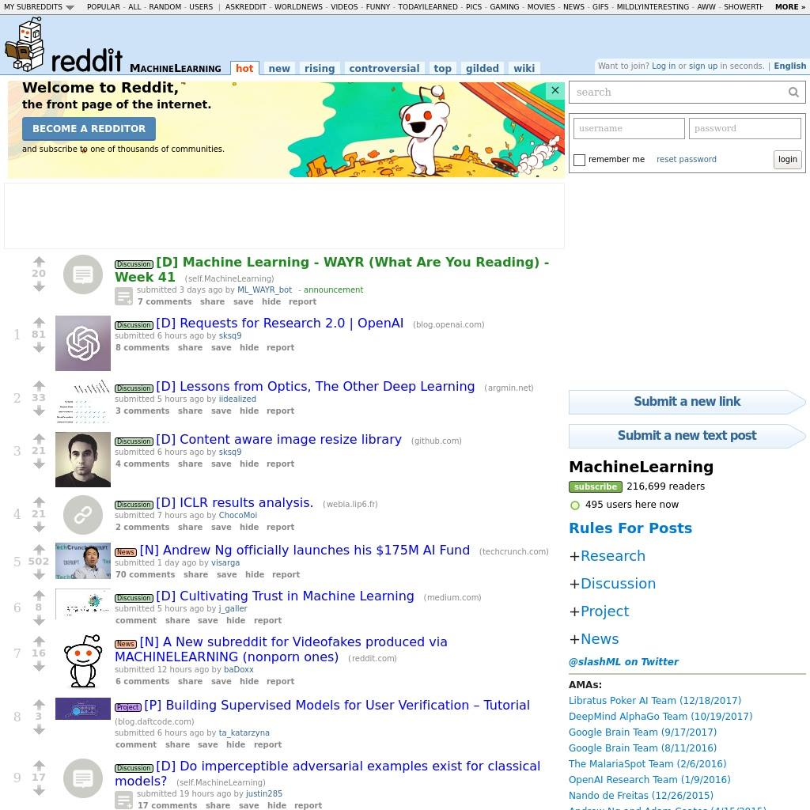
**이미지 캡션:** 이 이미지는 레딧(Reddit) 웹사이트의 머신러닝(Machine Learning) 서브레딧 페이지를 보여줍니다. 페이지 상단에는 레딧 로고와 함께 "Welcome to Reddit, the front page of the internet."이라는 문구가 있고, 그 옆에는 레딧의 마스코트인 스너키(Snoo)가 그려진 일러스트가 있습니다. 페이지 중앙에는 로그인 및 회원가입을 위한 입력란과 버튼이 보입니다. 메인 콘텐츠 영역에는 머신러닝 관련 게시물 목록이 나열되어 있으며, 각 게시물은 제목, 작성자, 작성 시간, 댓글 수 등의 정보를 포함하고 있습니다. 게시물 중에는 "Machine Learning - WAYR (What Are You Reading) - Week 41", "Requests for Research 2.0 | OpenAI", "Lessons from Optics, The Other Deep Learning", "Content aware image resize library", "ICLR results analysis", "Andrew Ng officially launches his $175M AI Fund", "Cultivating Trust in Machine Learning", "A New subreddit for Videofakes produced via MACHINELEARNING (nonporn ones)", "Building Supervised Models for User Verification - Tutorial", "Do imperceptible adversarial examples exist for classical models?" 등이 있습니다. 오른쪽 사이드바에는 "Submit a new link", "Submit a new text post" 버튼과 함께 "MachineLearning" 서브레딧의 구독자 수, 현재 접속자 수, 그리고 "Rules For Posts", "+Research", "+Discussion", "+Project", "+News" 등의 메뉴가 있습니다. 또한, "@slashML on Twitter" 링크와 과거 AMA(Ask Me Anything) 목록도 보입니다. 전반적으로 기술 관련 커뮤니티의 정보 공유 및 토론이 이루어지는 웹 페이지의 모습을 담고 있습니다.간, 댓글 수 등의 정보를 포함하고 있습니다. 게시물 중에는 "Machine Learning - WAYR (What Are You Reading) - Week 41", "Requests for Research 2.0 | OpenAI", "Lessons from Optics, The Other Deep Learning", "Content aware image resize library", "ICLR results analysis", "Andrew Ng officially launches his $175M AI Fund", "Cultivating Trust in Machine Learning", "A New subreddit for Videofakes produced via MACHINELEARNING (nonporn ones)", "Building Supervised Models for User Verification - Tutorial", "Do imperceptible adversarial examples exist for classical models?" 등이 있습니다. 오른쪽 사이드바에는 "Submit a new link", "Submit a new text post" 버튼과 함께 "MachineLearning" 서브레딧의 구독자 수, 현재 접속자 수, 그리고 "Rules For Posts", "+Research", "+Discussion", "+Project", "+News" 등의 메뉴가 있습니다. 또한, "@slashML on Twitter" 링크와 과거 AMA(Ask Me Anything) 목록도 보입니다. 전반적으로 기술 관련 커뮤니티의 정보 공유 및 토론이 이루어지는 웹 페이지의 모습을 담고 있습니다.

> #오늘의레딧 https://www.reddit.com/r/MachineLearning/ 오늘도 새소식이 많군요.  1. 리서치 2.0OpenejonOpendi 2. 광학, 기타 딥 학습의 교훈 3. 컨텐츠 인식 이미지 크기 조정 라이브러리 4. ICLR결과 분석. 5. AndrewNg는 공식적으로 1,700만달러의 AI기금을 공개적으로 내놓았다. 6. 기계 학습에 대한 신뢰할 수 있는 신뢰 7. 제조/구매를 통해 생성된 비디 오월에 대한 새로운 하위 어드레스(비공품) 8. 사용자 인증 검증을 위한 초대형 모델 구축 9. 클래식 모델에 대해 이해할 수 없는 광고 사례가 존재합니까? 10. "신경망을 기반으로 하는 시스템 변환, ICLR2018", 오픈 소스, MSR에서 열리는 오픈 소스 11. ConAAN: 작은 데이터 셋을 가진 양질의 고품질 이미지 생성 12. 이 간단한 큐브를 연습하려면 몇개의 이미지가 필요할까요? 13. 인공 지능의 인공 지능에 관한 연구 14. 창조적인 부사적 네트워크의 뒤에 있는 수학적인 부분은 GAN에서 WGAN으로 통한다. 15. 교육 데이터 없이 텍스트 분류 모델 구축 16. 문서의 소스 코드 릴리스의 감소 17. 해커들을 위한 DeepBusinessSupplingLearningLearning(1부)를 이용한 DP-Learning(파트 1)을 해결합니다. 18. 1월 31일부터 31일까지 페이스북의 Residencyresidencyresidencyreservedreservedreservedreservedreadings. 19. 케라스의 적분 구배를 이용한 깊은 모델 설명 20. 마이크로 소프트 AI레지던스  1. https://blog.openai.com/requests-for-research-2/ 2. http://www.argmin.net/2018/01/25/optics/ 3. https://github.com/esimov/caire 4. http://webia.lip6.fr/~pajot/dataviz.html 5. https://techcrunch.com/2018/01/30/andrew-ng-officially-launches-his-175m-ai-fund/ 6. https://medium.com/1plusx/how-to-cultivate-trust-in-machine-learning-411a54107d51 7. https://www.reddit.comhttps://www.reddit.com/r/videofakes/ 8. https://blog.daftcode.com/building-supervised-models-for-user-verification-part-2-of-the-tutorial-1ba807029f74 9. https://www.reddit.com/r/MachineLearning/comments/7u72ou/d_do_imperceptible_adversarial_examples_exist_for/ 10. https://github.com/posenhuang/NPMT 11. https://www.reddit.com/r/MachineLearning/comments/7u3srq/p_congan_decent_quality_image_generation_with/ 12. https://www.reddit.com/r/MachineLearning/comments/7uc7pt/d_how_many_images_would_i_need_to_train_this/ 13. http://research.baidu.com/baidu-research-showcased-2018-association-advancement-artificial-intelligence-conference/ 14. https://lilianweng.github.io/lil-log/2017/08/20/from-GAN-to-WGAN.html 15. https://www.reddit.com/r/MachineLearning/comments/7u4x15/p_build_a_text_classification_model_without_any/ 16. https://www.reddit.com/r/MachineLearning/comments/7tzyuw/d_decrease_in_source_code_release_of_papers/ 17. https://medium.com/@curiousily/solving-an-mdp-with-q-learning-from-scratch-deep-reinforcement-learning-for-hackers-part-1-45d1d360c120 18. https://www.reddit.com/r/MachineLearning/comments/7u208s/n_facebook_ai_residency_submission_reopened_900/ 19. https://github.com/hiranumn/IntegratedGradients 20. https://www.microsoft.com/en-us/research/opportunity/microsoft-ai-residency-cambridge/

### 2월 2일 (금) 08:52 · 📷 사진 (1장)

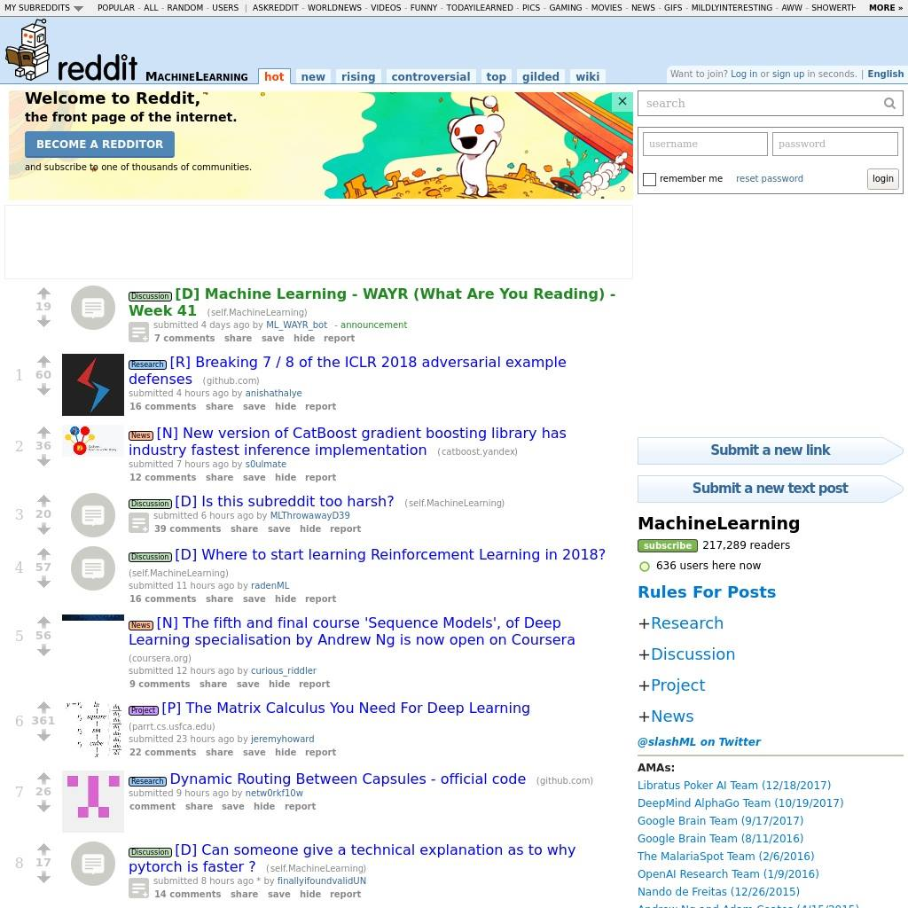
**이미지 캡션:** 이 이미지는 레딧(Reddit) 웹사이트의 머신러닝(Machine Learning) 서브레딧 페이지를 보여줍니다. 페이지 상단에는 레딧 로고와 함께 "Welcome to Reddit, the front page of the internet."이라는 환영 메시지가 있습니다. 그 아래에는 "BECOME A REDDITOR" 버튼이 있고, 오른쪽 상단에는 로그인 및 회원가입을 위한 입력 필드와 버튼이 있습니다. 페이지 중앙에는 여러 개의 게시물 목록이 표시되며, 각 게시물은 제목, 작성자, 제출 시간, 댓글 수 등의 정보를 포함하고 있습니다. 게시물들은 주로 머신러닝 관련 주제를 다루고 있으며, "[D] Machine Learning - WAYR (What Are You Reading) - Week 41", "[R] Breaking 7/8 of the ICLR 2018 adversarial example defenses", "[N] New version of CatBoost gradient boosting library has industry fastest inference implementation", "[D] Is this subreddit too harsh?", "[D] Where to start learning Reinforcement Learning in 2018?", "[N] The fifth and final course 'Sequence Models', of Deep Learning specialisation by Andrew Ng is now open on Coursera", "[P] The Matrix Calculus You Need For Deep Learning", "[Research] Dynamic Routing Between Capsules - official code", "[D] Can someone give a technical explanation as to why pytorch is faster?" 등의 제목을 가지고 있습니다. 오른쪽 사이드바에는 "Submit a new link" 및 "Submit a new text post" 버튼과 함께 "Machine Learning" 서브레딧의 구독자 수와 현재 접속자 수가 표시되어 있습니다. 또한, "Rules For Posts" 섹션에는 "+Research", "+Discussion", "+Project", "+News"와 같은 카테고리가 나열되어 있으며, "@slashML on Twitter" 링크와 과거 AMA(Ask Me Anything) 목록도 보입니다. 전반적으로 기술 및 학술 커뮤니티의 정보 공유 및 토론이 이루어지는 온라인 포럼의 모습을 보여줍니다.의 정보를 포함하고 있습니다. 게시물들은 주로 머신러닝 관련 주제를 다루고 있으며, "[D] Machine Learning - WAYR (What Are You Reading) - Week 41", "[R] Breaking 7/8 of the ICLR 2018 adversarial example defenses", "[N] New version of CatBoost gradient boosting library has industry fastest inference implementation", "[D] Is this subreddit too harsh?", "[D] Where to start learning Reinforcement Learning in 2018?", "[N] The fifth and final course 'Sequence Models', of Deep Learning specialisation by Andrew Ng is now open on Coursera", "[P] The Matrix Calculus You Need For Deep Learning", "[Research] Dynamic Routing Between Capsules - official code", "[D] Can someone give a technical explanation as to why pytorch is faster?" 등의 제목을 가지고 있습니다. 오른쪽 사이드바에는 "Submit a new link" 및 "Submit a new text post" 버튼과 함께 "Machine Learning" 서브레딧의 구독자 수와 현재 접속자 수가 표시되어 있습니다. 또한, "Rules For Posts" 섹션에는 "+Research", "+Discussion", "+Project", "+News"와 같은 카테고리가 나열되어 있으며, "@slashML on Twitter" 링크와 과거 AMA(Ask Me Anything) 목록도 보입니다. 전반적으로 기술 및 학술 커뮤니티의 정보 공유 및 토론이 이루어지는 온라인 포럼의 모습을 보여줍니다.

> #오늘의레딧 https://www.reddit.com/r/MachineLearning/ 오늘도 새소식이 많군요.  1. ICLR2018년 7월 13일 목요일 오전 7시 30분 이전 2. 새로운 버전의 CarBoostgradientLibrary가 업계에서 가장 빠른 추론 구현을 보유하고 있습니다. 3. 이건 너무 가혹한 건가요? 4. 2018년에 강화 학습을 시작하기 시작하는 곳은 어디인가? 5. 앤드류 Ng에 의한 DeepLearningSpecialization의 다섯번째이자 최종 코스인 시퀀스 모델'시퀀스 모델'이 지금 개설되어 있습니다. 6. 깊은 깨달음을 얻기 위해 당신이 필요로 하는 미적분학 7. 누군가가 왜 피토치가 더 빠른지에 대해 기술적인 설명을 할 수 있는가? 8. CERNDDeepMind의 근사적 추론과 깊은 발전 모델 9. Aubernetes및 RiseLises와 함께 AWS의 심층 학습 클러스터 자동화 10. 예측 확률이 원하는 분포에 적합하도록 권장하는 방법? 11. 당신이 실제로 일할 수 있다고 생각하는 기계 학습에 대한 논란의 여지가 있는 접근법은 무엇인가? 12. AmbientGAN:손실 측정의 일반적인 모델 13. 주노 주피터 노트북 클라이언트는 현재 AppStore에서 살고 있습니다! (ex:https://www.reddit.com/r/IPython)에서 인쇄됨. 14. 리서치 2.0OpenejonOpendi 15. 안 돼요. 사회 간접 자본과 관련된 관련성에 대한 자원 조달 요구 사항이 필요함 16. Labelbox.io: 1월 제품 업데이트 17. 광학, 기타 딥 학습의 교훈 18. 2018년 AcceptedAcceptedDocument 19. 픽셀 처짐-단순한 변환 기반 방위 20. 깊은 잔류 신경망을 이용한 고속 도로 밀폐 공간의 성능 평가에 관한 연구  1. https://github.com/anishathalye/obfuscated-gradients 2. https://catboost.yandex/news#version_0_6 3. https://www.reddit.com/r/MachineLearning/comments/7ukfr3/d_is_this_subreddit_too_harsh/ 4. https://www.reddit.com/r/MachineLearning/comments/7ui8jv/d_where_to_start_learning_reinforcement_learning/ 5. https://www.coursera.org/learn/nlp-sequence-models 6. http://parrt.cs.usfca.edu/doc/matrix-calculus/index.html 7. https://www.reddit.com/r/MachineLearning/comments/7ujc6y/d_can_someone_give_a_technical_explanation_as_to/ 8. https://cds.cern.ch/record/2302480 9. https://blog.riseml.com/autoscaling-deep-learning-clusters-with-riseml-cfff730f3363 10. https://www.reddit.com/r/MachineLearning/comments/7ulwzk/d_how_to_encourage_prediction_probabilities_to/ 11. https://www.reddit.com/r/MachineLearning/comments/7uhndi/d_what_are_some_controversial_approaches_to/ 12. https://github.com/shinseung428/ambientGAN_TF 13. https://www.reddit.com/r/MachineLearning/comments/7um49h/p_juno_jupyter_notebook_client_is_now_live_on/ 14. https://blog.openai.com/requests-for-research-2/ 15. https://www.reddit.com/r/MachineLearning/comments/7uklr8/d_nn_accelerator_need_resourceslinksarticles/ 16. https://january-pjlzzppcfi.now.sh/ 17. http://www.argmin.net/2018/01/25/optics/ 18. http://www.aistats.org/accepted.html 19. https://iamaaditya.github.io/2018/02/demo-for-pixel-deflection/ 20. https://www.reddit.com/r/MachineLearning/comments/7uhymw/r_analysis_of_spatiotemporal_representations_for/

### 2월 3일 (토) 08:52 · 📷 사진 (1장)

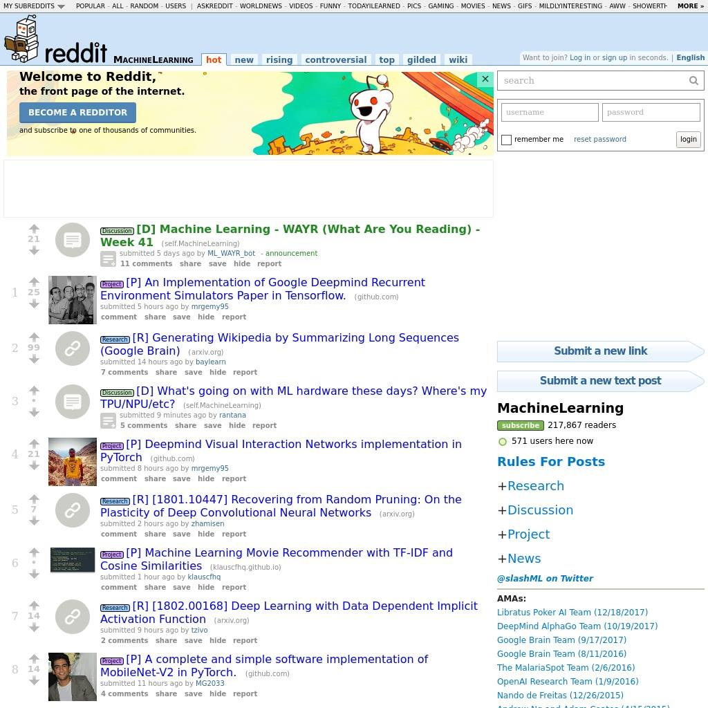
**이미지 캡션:** 이 이미지는 레딧(Reddit) 웹사이트의 머신러닝(Machine Learning) 서브레딧 페이지를 보여줍니다. 페이지 상단에는 레딧 로고와 함께 "Welcome to Reddit, the front page of the internet."이라는 환영 문구가 있고, 그 옆에는 귀여운 캐릭터가 그려진 일러스트가 있습니다. 로그인 및 회원가입을 위한 입력창과 버튼도 보입니다. 페이지 중앙에는 머신러닝 관련 게시물 목록이 나열되어 있으며, 각 게시물은 제목, 작성자, 제출 시간, 댓글 수 등의 정보를 포함하고 있습니다. 게시물 제목 앞에는 토론(Discussion), 프로젝트(Project), 연구(Research) 등 게시물의 유형을 나타내는 태그가 붙어 있습니다. 오른쪽 사이드바에는 "MachineLearning" 서브레딧의 구독자 수와 "Rules For Posts", "AMAS"와 같은 추가 정보가 있습니다. 전반적으로 기술 관련 커뮤니티의 정보 공유 및 토론이 이루어지는 웹사이트의 모습을 보여주는 화면입니다.습니다. 게시물 제목 앞에는 토론(Discussion), 프로젝트(Project), 연구(Research) 등 게시물의 유형을 나타내는 태그가 붙어 있습니다. 오른쪽 사이드바에는 "MachineLearning" 서브레딧의 구독자 수와 "Rules For Posts", "AMAS"와 같은 추가 정보가 있습니다. 전반적으로 기술 관련 커뮤니티의 정보 공유 및 토론이 이루어지는 웹사이트의 모습을 보여주는 화면입니다.

> #오늘의레딧 https://www.reddit.com/r/MachineLearning/ 따끈한 소식들입니다.  1. Tensorflow에 있어서 구글 DeepmindReculator의 제지 환경 시뮬레이션 2. 긴 여정을 요약한 위키 피디아를 만들어 내는 것 3. 요즘 맥스 하드웨어로는 어떤 일이 벌어지고 있나요? TPU/ U c et /  Where 's ?                   my      TP        U            NP                 . 4. 시각적 상호 작용 네트워크 구축 5. T-IDF및 Cosine유사성을 지닌 MachineLearningFilm권장 사항 6. PyTorch-2에서 MobileNet-2의 완전하고 간단한 소프트웨어 구현. 7. Conv . implement의 문제점들 1DNNI. 웨이 넷. 미국 웨스트 버지니아 주 맥도웰 카운티에 있는 자치구이다. 8. ICLR2018년 7월 13일 목요일 오전 7시 30분 이전 9. 어떤 종류의 비주얼 데이터 세트(예:Pset8)에서 훈련된 RBM중량을 다운로드할 수 있는가? 10. 라이브 컴퓨터 비전 11. 새로운 버전의 CarBoostgradientLibrary가 업계에서 가장 빠른 추론 구현을 보유하고 있습니다. 12. 생물 물리학적 모델은 몇몇 생물학적 뉴런들이 놀랍게도 지각한 것처럼 행동할 수 있다는 것을 암시한다. 13. 이건 너무 가혹한 건가요? 14. 벡터 영상이 있는 하이퍼 바이저 15. 이미지에서 "이미지"로 이미지 인식 16. 2018년에 강화 학습을 시작하기 시작하는 곳은 어디인가? 17. 앤드류 Ng에 의한 DeepLearningSpecialization의 다섯번째이자 최종 코스인 시퀀스 모델'시퀀스 모델'이 지금 개설되어 있습니다. 18. Aubernetes및 RiseLises와 함께 AWS의 심층 학습 클러스터 자동화 19. 깊은 깨달음을 얻기 위해 당신이 필요로 하는 미적분학 20. CERNDDeepMind의 근사적 추론과 깊은 발전 모델  1. https://github.com/KokoMind/Recurrent-Environment-Simulators 2. https://arxiv.org/abs/1801.10198 3. https://www.reddit.com/r/MachineLearning/comments/7uv8mj/d_whats_going_on_with_ml_hardware_these_days/ 4. https://github.com/Mrgemy95/visual-interaction-networks-pytorch 5. https://klauscfhq.github.io/moviebox/ 6. https://github.com/MG2033/MobileNet-V2 7. https://www.reddit.com/r/MachineLearning/comments/7utwyy/d_issues_with_implement_conv_1d_nn_ala_wavenet/ 8. https://github.com/anishathalye/obfuscated-gradients 9. https://www.reddit.com/r/MachineLearning/comments/7uuogh/d_where_to_download_rbm_weights_trained_on_any/ 10. http://livecv.dinusv.com/index.html 11. https://catboost.yandex/news#version_0_6 12. http://rdcu.be/FDUo 13. https://www.reddit.com/r/MachineLearning/comments/7ukfr3/d_is_this_subreddit_too_harsh/ 14. https://www.reddit.com/r/MachineLearning/comments/7urean/d_hypergan_with_vector_images/ 15. https://www.reddit.com/r/MachineLearning/comments/7ur637/d_image_recognition_with_images_from_brain/ 16. https://www.reddit.com/r/MachineLearning/comments/7ui8jv/d_where_to_start_learning_reinforcement_learning/ 17. https://www.coursera.org/learn/nlp-sequence-models 18. https://blog.riseml.com/autoscaling-deep-learning-clusters-with-riseml-cfff730f3363 19. http://parrt.cs.usfca.edu/doc/matrix-calculus/index.html 20. https://cds.cern.ch/record/2302480

### 2월 4일 (일) 08:52 · 📷 사진 (1장)

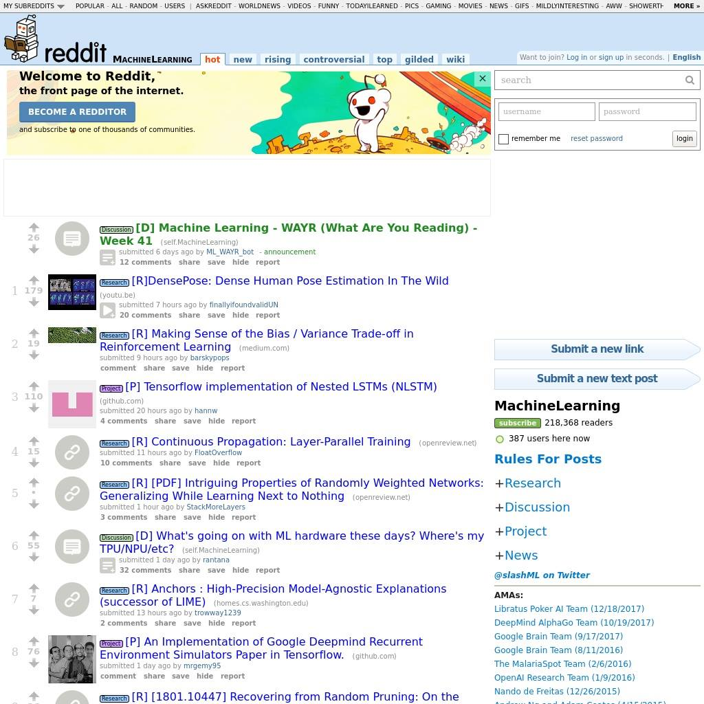
**이미지 캡션:** 이 이미지는 레딧(Reddit) 웹사이트의 머신러닝(Machine Learning) 서브레딧 페이지를 보여줍니다. 페이지 상단에는 레딧 로고와 함께 "Welcome to Reddit, the front page of the internet."이라는 환영 문구가 있고, 그 아래에는 "BECOME A REDDITOR" 버튼이 있습니다. 메인 콘텐츠 영역에는 여러 개의 게시물 목록이 표시되며, 각 게시물은 제목, 작성자, 제출 시간, 댓글 수 등의 정보를 포함하고 있습니다. 게시물 제목 앞에는 [D] (Discussion), [R] (Research), [P] (Project)와 같은 태그가 붙어 있어 게시물의 성격을 나타냅니다. 예를 들어, "Machine Learning - WAYR (What Are You Reading) - Week 41"이라는 게시물은 토론 주제이며, "DensePose: Dense Human Pose Estimation In The Wild"라는 게시물은 연구 관련 내용입니다. 페이지 오른쪽에는 로그인/가입 폼과 함께 "MachineLearning" 서브레딧의 구독자 수, 현재 접속자 수, 그리고 게시물 작성 규칙에 대한 링크가 있습니다. 또한, "AMAS" 섹션에는 과거에 진행되었던 관련 분야의 AMA(Ask Me Anything) 목록이 날짜와 함께 나열되어 있습니다. 전반적으로 기술 관련 커뮤니티의 정보 공유 및 토론이 이루어지는 온라인 플랫폼의 모습을 담고 있습니다.sion), [R] (Research), [P] (Project)와 같은 태그가 붙어 있어 게시물의 성격을 나타냅니다. 예를 들어, "Machine Learning - WAYR (What Are You Reading) - Week 41"이라는 게시물은 토론 주제이며, "DensePose: Dense Human Pose Estimation In The Wild"라는 게시물은 연구 관련 내용입니다. 페이지 오른쪽에는 로그인/가입 폼과 함께 "MachineLearning" 서브레딧의 구독자 수, 현재 접속자 수, 그리고 게시물 작성 규칙에 대한 링크가 있습니다. 또한, "AMAS" 섹션에는 과거에 진행되었던 관련 분야의 AMA(Ask Me Anything) 목록이 날짜와 함께 나열되어 있습니다. 전반적으로 기술 관련 커뮤니티의 정보 공유 및 토론이 이루어지는 온라인 플랫폼의 모습을 담고 있습니다.

> #오늘의레딧 https://www.reddit.com/r/MachineLearning/ 재미난 이야기들이 많습니다.  1. DensePose:밀집한 인류의 대략적인 평가 2. 강화 학습의 편견/변형률 파악 3. NestedLSTMs(NLSTM)의 Tensorflow구현(NLSTM) 4. 지속적인 전파:계층-병렬 교육 5. 요즘 맥스 하드웨어로는 어떤 일이 벌어지고 있나요? TPU/ U c et /  Where 's ?                   my      TP        U            NP                 . 6. 앵커:고 정밀 모델-정밀도 확대(LIME) 7. Tensorflow에 있어서 구글 DeepmindReculator의 제지 환경 시뮬레이션 8. 심층적으로 분리할 수 있는 몇가지 세부 정보를 이해하는 데 어려움이 있음(Xception) 9. 긴 여정을 요약한 위키 피디아를 만들어 내는 것 10. 시각적 상호 작용 네트워크 구축 11. 신경 회로망과 같은 판별 모델을 사용하여 광고 샘플을 방어할 수 없습니다. 12. T-IDF및 Cosine유사성을 지닌 MachineLearningFilm권장 사항 13. PyTorch-2에서 MobileNet-2의 완전하고 간단한 소프트웨어 구현. 14. Conv . implement의 문제점들 1DNNI. 웨이 넷. 미국 웨스트 버지니아 주 맥도웰 카운티에 있는 자치구이다. 15. ICLR2018년 7월 13일 목요일 오전 7시 30분 이전 16. 어떤 종류의 비주얼 데이터 세트(예:Pset8)에서 훈련된 RBM중량을 다운로드할 수 있는가? 17. 라이브 컴퓨터 비전 18. 새로운 버전의 CarBoostgradientLibrary가 업계에서 가장 빠른 추론 구현을 보유하고 있습니다. 19. 이건 너무 가혹한 건가요? 20. 생물 물리학적 모델은 몇몇 생물학적 뉴런들이 놀랍게도 지각한 것처럼 행동할 수 있다는 것을 암시한다.  1. https://youtu.be/Dhkd_bAwwMc 2. https://medium.com/mlreview/making-sense-of-the-bias-variance-trade-off-in-deep-reinforcement-learning-79cf1e83d565 3. https://github.com/hannw/nlstm 4. https://openreview.net/pdf?id=BJyy3a0Ez 5. https://www.reddit.com/r/MachineLearning/comments/7uv8mj/d_whats_going_on_with_ml_hardware_these_days/ 6. https://homes.cs.washington.edu/~marcotcr/aaai18.pdf 7. https://github.com/KokoMind/Recurrent-Environment-Simulators 8. https://www.reddit.com/r/MachineLearning/comments/7uw1p9/discussion_having_trouble_understanding_some/ 9. https://arxiv.org/abs/1801.10198 10. https://github.com/Mrgemy95/visual-interaction-networks-pytorch 11. https://www.reddit.com/r/MachineLearning/comments/7uxdul/d_we_cant_defend_adversarial_samples_using/ 12. https://klauscfhq.github.io/moviebox/ 13. https://github.com/MG2033/MobileNet-V2 14. https://www.reddit.com/r/MachineLearning/comments/7utwyy/d_issues_with_implement_conv_1d_nn_ala_wavenet/ 15. https://github.com/anishathalye/obfuscated-gradients 16. https://www.reddit.com/r/MachineLearning/comments/7uuogh/d_where_to_download_rbm_weights_trained_on_any/ 17. http://livecv.dinusv.com/index.html 18. https://catboost.yandex/news#version_0_6 19. https://www.reddit.com/r/MachineLearning/comments/7ukfr3/d_is_this_subreddit_too_harsh/ 20. http://rdcu.be/FDUo

### 2월 5일 (월) 08:52 · 📷 사진 (1장)

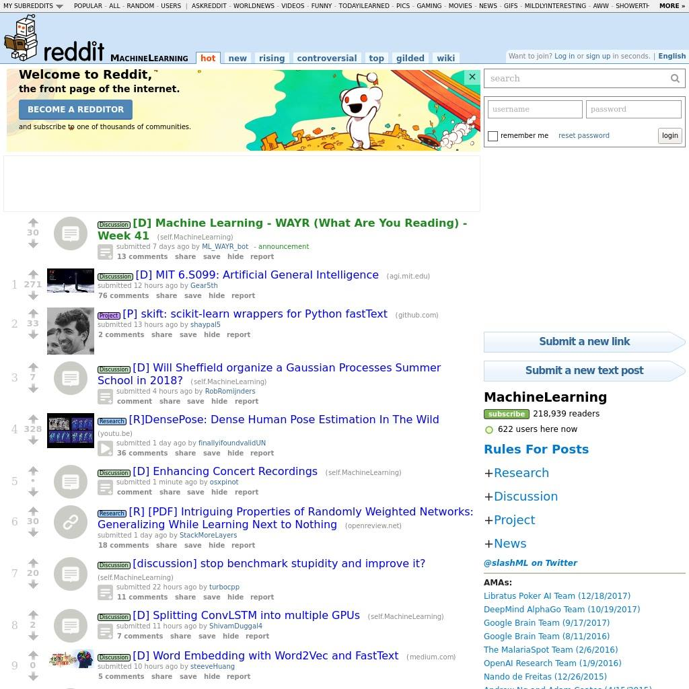
**이미지 캡션:** 이 이미지는 인기 있는 온라인 커뮤니티인 레딧(Reddit)의 '머신러닝(MachineLearning)' 서브레딧 페이지를 보여줍니다. 화면 상단에는 레딧 로고와 함께 'hot', 'new', 'rising', 'controversial', 'top', 'gilded', 'wiki'와 같은 메뉴가 보이며, 오른쪽 상단에는 로그인 또는 회원가입을 할 수 있는 창이 있습니다. 메인 콘텐츠 영역에는 'Welcome to Reddit, the front page of the internet.'이라는 환영 문구와 함께 레딧에 가입하라는 안내가 있습니다. 그 아래로는 '머신러닝' 서브레딧의 최신 게시물 목록이 나열되어 있습니다. 각 게시물은 제목, 작성자, 제출 시간, 댓글 수 등의 정보를 포함하고 있으며, 'Discussion', 'Project', 'Research'와 같은 태그가 붙어 있습니다. 예를 들어, 첫 번째 게시물은 '[D] Machine Learning - WAYR (What Are You Reading) - Week 41'이라는 제목으로, 7일 전에 제출되었고 13개의 댓글이 있습니다. 게시물 목록 오른쪽에는 'Submit a new link'와 'Submit a new text post' 버튼이 있으며, 'MachineLearning' 서브레딧의 구독자 수와 현재 접속자 수가 표시되어 있습니다. 또한, 게시물 작성 규칙과 트위터 계정(@slashML) 정보, 그리고 과거 'Ask Me Anything(AMA)' 세션 목록도 보입니다. 전반적으로 기술 관련 정보를 공유하고 토론하는 온라인 커뮤니티의 모습을 보여주는 화면입니다.t area lists recent posts from the MachineLearning subreddit, each with a title, author, submission time, and number of comments. The posts cover topics like machine learning discussions, artificial intelligence, Python libraries, and research papers. On the right side of the screen, there are buttons to submit new links or text posts, followed by information about the MachineLearning subreddit, including the number of subscribers and active users, and a list of rules for posting. Below the rules, there's a Twitter handle and a list of "AMAs" (Ask Me Anything) with links to various AI research teams and their dates. The overall atmosphere is informative and community-oriented, typical of an online forum dedicated to a specific topic.

> #오늘의레딧 https://www.reddit.com/r/MachineLearning/ 정말 읽을 거리가 많네요.  1. 스키트:파이썬 패스트릭스용 스키스트 리어스 래퍼 2. 쉐필드는 2018년에 가우스 프로세스 섬머 스쿨을 설립할 예정인가? 3. DensePose:밀집한 인류의 대략적인 평가 4. 콘서트 레코딩 강화 5. ConvlingConveyTM다중 GPU장치 6. 워드 패드 및 FastText와 함께 단어 삽입 7. 강화 학습의 편견/변형률 파악 8. NestedLSTMs(NLSTM)의 Tensorflow구현(NLSTM) 9. 지속적인 전파:계층-병렬 교육 10. 앵커:고 정밀 모델-정밀도 확대(LIME) 11. 요즘 맥스 하드웨어로는 어떤 일이 벌어지고 있나요? TPU/ U c et /  Where 's ?                   my      TP        U            NP                 . 12. Tensorflow에 있어서 구글 DeepmindReculator의 제지 환경 시뮬레이션 13. 심층적으로 분리할 수 있는 몇가지 세부 정보를 이해하는 데 어려움이 있음(Xception) 14. 긴 여정을 요약한 위키 피디아를 만들어 내는 것 15. 하버드 대학의 과학자들은 그들이 의식의 육체적 근원을 정확히 지적했다고 생각한다. 16. 시각적 상호 작용 네트워크 구축 17. T-IDF및 Cosine유사성을 지닌 MachineLearningFilm권장 사항 18. PyTorch-2에서 MobileNet-2의 완전하고 간단한 소프트웨어 구현. 19. Conv . implement의 문제점들 1DNNI. 웨이 넷. 미국 웨스트 버지니아 주 맥도웰 카운티에 있는 자치구이다.  1. https://github.com/shaypal5/skift 2. https://www.reddit.com/r/MachineLearning/comments/7v8wxn/d_will_sheffield_organize_a_gaussian_processes/ 3. https://youtu.be/Dhkd_bAwwMc 4. https://www.reddit.com/r/MachineLearning/comments/7val9e/d_enhancing_concert_recordings/ 5. https://www.reddit.com/r/MachineLearning/comments/7v6g6g/d_splitting_convlstm_into_multiple_gpus/ 6. https://medium.com/@huangkh19951228/word-embedding-with-word2vec-and-fasttext-a209c1d3e12c 7. https://medium.com/mlreview/making-sense-of-the-bias-variance-trade-off-in-deep-reinforcement-learning-79cf1e83d565 8. https://github.com/hannw/nlstm 9. https://openreview.net/pdf?id=BJyy3a0Ez 10. https://homes.cs.washington.edu/~marcotcr/aaai18.pdf 11. https://www.reddit.com/r/MachineLearning/comments/7uv8mj/d_whats_going_on_with_ml_hardware_these_days/ 12. https://github.com/KokoMind/Recurrent-Environment-Simulators 13. https://www.reddit.com/r/MachineLearning/comments/7uw1p9/discussion_having_trouble_understanding_some/ 14. https://arxiv.org/abs/1801.10198 15. http://www.sciencealert.com/harvard-scientists-think-they-ve-pinpointed-the-neural-source-of-consciousness 16. https://github.com/Mrgemy95/visual-interaction-networks-pytorch 17. https://klauscfhq.github.io/moviebox/ 18. https://github.com/MG2033/MobileNet-V2 19. https://www.reddit.com/r/MachineLearning/comments/7utwyy/d_issues_with_implement_conv_1d_nn_ala_wavenet/

### 2월 5일 (월) 16:20 · Totally blessed to have wonderful friend…

Totally blessed to have wonderful friends like you all!

🎬 동영상 1개 (생략)

### 2월 6일 (화) 08:52 · 📷 사진 (1장)

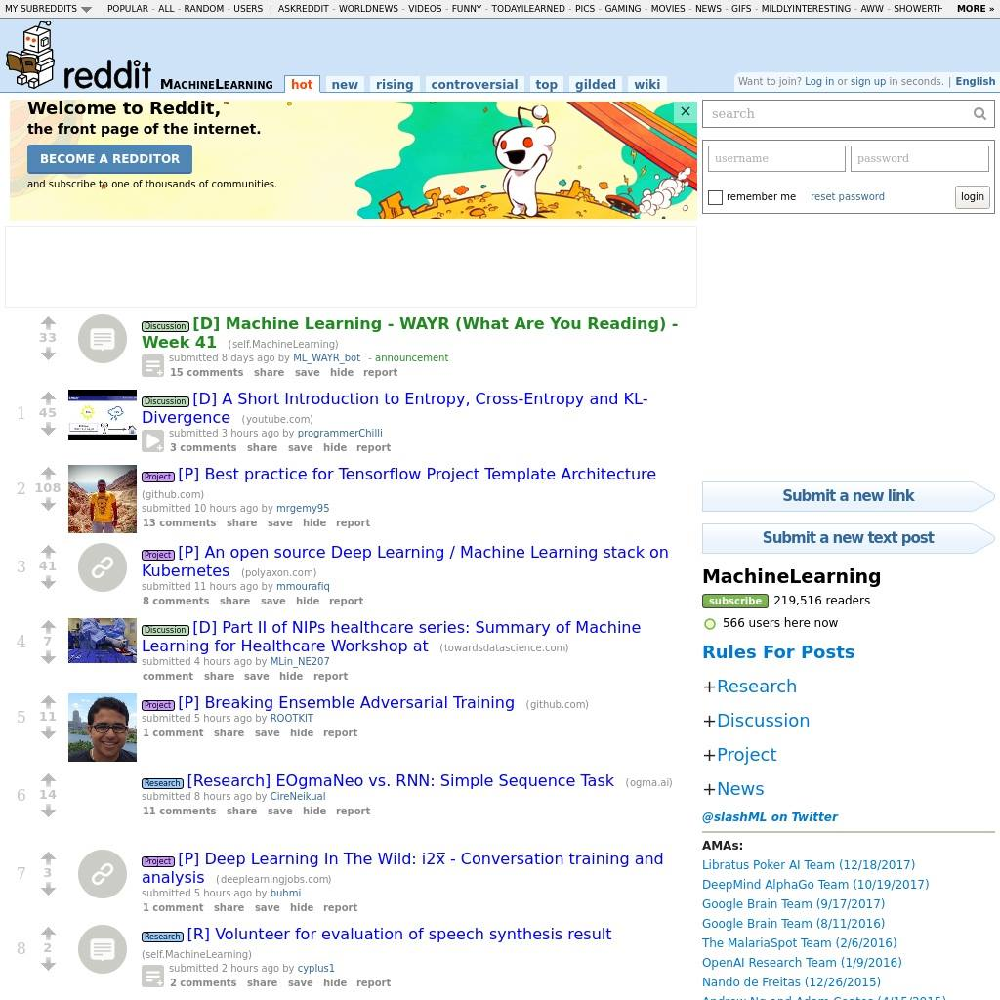
**이미지 캡션:** 이 이미지는 레딧 웹사이트의 머신러닝 서브레딧 페이지를 보여줍니다. 페이지 상단에는 레딧 로고와 함께 "Welcome to Reddit, the front page of the internet."이라는 문구가 있고, 그 아래에는 "BECOME A REDDITOR" 버튼이 있습니다. 메인 콘텐츠 영역에는 여러 게시물 목록이 표시되며, 각 게시물은 제목, 작성자, 제출 시간, 댓글 수 등의 정보를 포함합니다. 게시물들은 주로 머신러닝, 딥러닝, 인공지능 관련 주제를 다루고 있으며, 링크, 토론, 프로젝트, 연구 등 다양한 유형의 콘텐츠가 있습니다. 오른쪽 사이드바에는 "Submit a new link" 및 "Submit a new text post" 버튼과 함께 "MachineLearning" 서브레딧의 구독자 수, 현재 접속자 수, 게시 규칙, 트위터 계정 정보, 그리고 과거 AMA(Ask Me Anything) 목록이 표시됩니다. 전반적으로 정보가 많고 기술적인 내용을 다루는 커뮤니티 페이지의 분위기를 띠고 있습니다.등 다양한 유형의 콘텐츠가 있습니다. 오른쪽 사이드바에는 "Submit a new link" 및 "Submit a new text post" 버튼과 함께 "MachineLearning" 서브레딧의 구독자 수, 현재 접속자 수, 게시 규칙, 트위터 계정 정보, 그리고 과거 AMA(Ask Me Anything) 목록이 표시됩니다. 전반적으로 정보가 많고 기술적인 내용을 다루는 커뮤니티 페이지의 분위기를 띠고 있습니다.

> #오늘의레딧 https://www.reddit.com/r/MachineLearning/ 머신러닝 공부는 정말 재미있죠?아침부터 다양한 소식이 많네요.  1. 엔트로피, 크로스-엔트로피, KL-디베르지에 대한 간략 소개 2. Tensorflow프로젝트 템플릿 아키텍처 모범 사례 3. Kubernetes의 오픈 소스 DeepLearning/Machine학습 스택 4. 제2회 CDMA국제 학술 대회 5. 어버젼스 엔버리 어스 트레이닝 6. EOxxaNeo대 RNN:단순 시퀀스 태스크 7. 심층 학습 학습:i2x 8x-대화형 교육 및 분석 8. 음성 합성 결과 평가 지원 9. TensorFlow1.6.0 릴리즈! 10. 객체 감지-자동 레이블 표시 11. 교차 언어 변환 12. 유도 학습의 귀납적 편견? 13. 만약 회의가 필요한 소스 코드가 필요하다면 커뮤니티가 더 많이 이득이 될까요? 14. 어떻게 하면 저의 학문적 배경을 바탕으로 가능한 한 빨리 X1을 배울 수 있을까요? 15. 쉐필드는 2018년에 가우스 프로세스 섬머 스쿨을 설립할 예정인가? 16. 직급 분포 17. 스키트:파이썬 패스트릭스용 스키스트 리어스 래퍼 18. 이러한 모든 회사들과 채용자들은 지난 5년간 실제로"빅 데이터"와 "수년 간의 경험"이 있었을 때"빅 데이터"와 "심층적인 경험"을 가진 사람들이 필요하다고 말한다. 19. DensePose:밀집한 인류의 대략적인 평가 20. 콘서트 레코딩 강화  1. https://www.youtube.com/watch?v=ErfnhcEV1O8 2. https://github.com/Mrgemy95/Tensorflow-Project-Templete 3. https://polyaxon.com/ 4. https://towardsdatascience.com/machine-learning-for-healthcare-at-nips-c96127bbbae 5. https://github.com/andrewilyas/ens-adv-train-attack#circumventing-ensemble-adversarial-training 6. https://ogma.ai/2018/02/eogmaneo-vs-rnn-simple-sequence-task/ 7. https://www.deeplearningjobs.com/blog/dlitw-i2x 8. https://www.reddit.com/r/MachineLearning/comments/7vhjir/r_volunteer_for_evaluation_of_speech_synthesis/ 9. https://github.com/tensorflow/tensorflow/releases/tag/v1.6.0-rc0 10. https://www.reddit.com/r/MachineLearning/comments/7vgy4e/d_object_detection_auto_labelling/ 11. https://github.com/Kyubyong/cross_vc 12. https://www.reddit.com/r/MachineLearning/comments/7vf0ho/d_inductive_bias_of_reinforcement_learning/ 13. https://www.reddit.com/r/MachineLearning/comments/7vbhm7/d_would_the_community_gain_more_if_conference/ 14. https://www.reddit.com/r/MachineLearning/comments/7vdbxc/d_how_can_i_make_a_machine_learning_msphd/ 15. https://www.reddit.com/r/MachineLearning/comments/7v8wxn/d_will_sheffield_organize_a_gaussian_processes/ 16. https://stats.stackexchange.com/questions/326851/modelling-races 17. https://github.com/shaypal5/skift 18. https://www.reddit.com/r/MachineLearning/comments/7vd0ds/d_why_do_all_these_companies_and_recruiters_say/ 19. https://youtu.be/Dhkd_bAwwMc 20. https://www.reddit.com/r/MachineLearning/comments/7val9e/d_enhancing_concert_recordings/

### 2월 7일 (수) 08:52 · 📷 사진 (1장)

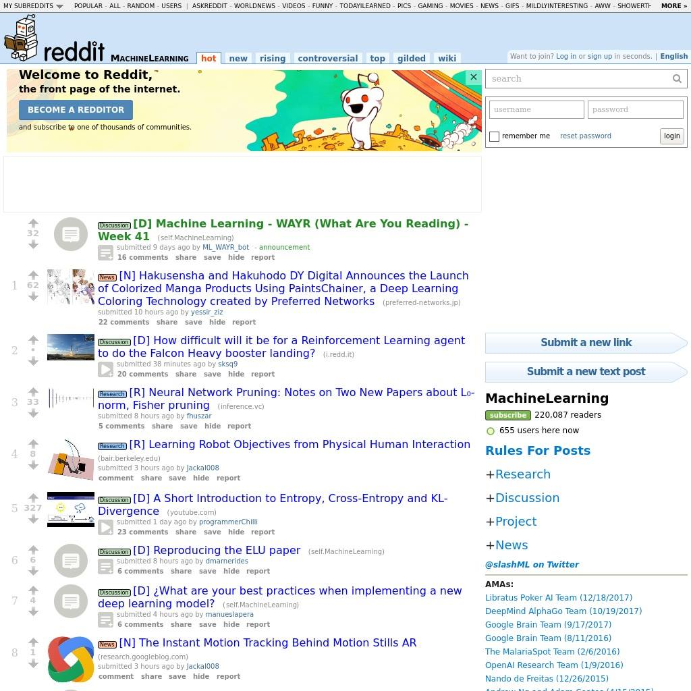
**이미지 캡션:** 이것은 레딧의 머신러닝 서브레딧 페이지로, 다양한 게시물 목록과 관련 정보가 표시됩니다. 페이지 상단에는 레딧 로고와 함께 "Welcome to Reddit, the front page of the internet."이라는 문구가 있고, 그 아래에는 "BECOME A REDDITOR" 버튼이 있습니다. 오른쪽 상단에는 로그인 및 회원가입을 위한 입력란과 버튼이 있습니다. 메인 콘텐츠 영역에는 "Machine Learning" 서브레딧의 최신 게시물들이 나열되어 있으며, 각 게시물은 제목, 작성자, 제출 시간, 댓글 수 등의 정보를 포함합니다. 게시물 유형은 "Discussion", "News", "Research" 등으로 구분됩니다. 페이지 오른쪽에는 "Submit a new link" 및 "Submit a new text post" 버튼이 있고, "Machine Learning" 서브레딧의 구독자 수와 현재 접속자 수가 표시됩니다. 또한, 게시물 규칙 목록과 트위터 계정, 그리고 "AMAS" 섹션에는 과거에 진행되었던 관련 분야의 전문가 인터뷰 목록이 나열되어 있습니다. 전반적으로 기술 관련 커뮤니티의 정보 공유 및 소통이 이루어지는 웹사이트의 한 페이지를 보여줍니다. 댓글 수 등의 정보를 포함합니다. 게시물 유형은 "Discussion", "News", "Research" 등으로 구분됩니다. 페이지 오른쪽에는 "Submit a new link" 및 "Submit a new text post" 버튼이 있고, "Machine Learning" 서브레딧의 구독자 수와 현재 접속자 수가 표시됩니다. 또한, 게시물 규칙 목록과 트위터 계정, 그리고 "AMAS" 섹션에는 과거에 진행되었던 관련 분야의 전문가 인터뷰 목록이 나열되어 있습니다. 전반적으로 기술 관련 커뮤니티의 정보 공유 및 소통이 이루어지는 웹사이트의 한 페이지를 보여줍니다.

> #오늘의레딧 https://www.reddit.com/r/MachineLearning/ 따끈한 소식들입니다.  1. Hakusensha 와 HakuhodoDYD디지털화를 통해 기본적인 네트워크에 의해 만들어진 깊은 학습 컬로링 기술인 PaintsChainer를 사용하여 채색된 MangaManga제품 출시 2. 강화 학습 요원이 Falcon헤비 듀티 부스터 착륙을 하는 것은 얼마나 어려운가? 3. 신경 네트워크 프라운싱:2개의 뉴 레프트 노트에 관한 고찰 4. 물리적 인간 상호 작용의 로봇 목표 학습 5. 엔트로피, 크로스-엔트로피, KL-디베르지에 대한 간략 소개 6. ELU용지 다시 채우기 7. 새로운 심층 학습 모델을 구현할 때 모범 사례는 무엇입니까? 8. 모션 스테이프 모션 스테이지를 이용한 지능형 동작 추적 9. 6.5.1 심층 학습 교육을 위한 심층 소개 소개 10. IMPALA:중요한 가중 회계사 아키텍처를 갖춘 확장 가능한 분산형 분산형 구축 11. 우수 관리 기준 피트니스 전망 분석(전산 재정 블로그) 12. 도메인-적응 메타 라이닝 13. Serpent.AI 2018.1.0 릴리스-베타 버전, 크로스 플랫폼 게임 재생 및 기타 추가 기능 14. 영상 클래시어스 아키텍처 검색을 위한 재분열 진화 15. TensorFlow1.6.0 릴리즈! 16. Tensorflow프로젝트 템플릿 아키텍처 모범 사례 17. AI의 가장 좋은 점:이번 달 기사 게재(2018년 1월) 18. 이 AI신생아는 빛을 이용하여 정보를 처리하기 위해 10M만 달러를 모금했다. 19. 기계 학습 정보 이론 20. 제2회 CDMA국제 학술 대회  1. https://www.preferred-networks.jp/en/news/pr20180206 2. https://www.reddit.com/r/MachineLearning/comments/7vr55s/d_how_difficult_will_it_be_for_a_reinforcement/ 3. http://www.inference.vc/pruning-neural-networks-two-recent-papers/ 4. http://bair.berkeley.edu/blog/2018/02/06/phri/ 5. https://www.youtube.com/watch?v=ErfnhcEV1O8 6. https://www.reddit.com/r/MachineLearning/comments/7vnwpl/d_reproducing_the_elu_paper/ 7. https://www.reddit.com/r/MachineLearning/comments/7vptld/d_what_are_your_best_practices_when_implementing/ 8. https://research.googleblog.com/2018/02/the-instant-motion-tracking-behind.html?utm_source=feedburner&utm_medium=feed&utm_campaign=Feed:+blogspot/gJZg+\(Official+Google+Research+Blog\) 9. http://introtodeeplearning.com/ 10. https://arxiv.org/abs/1802.01561 11. http://www.turingfinance.com/fitness-landscape-analysis-for-computational-finance/ 12. https://sites.google.com/view/daml 13. http://blog.serpent.ai/serpent-ai-2018-1-0-released/ 14. https://arxiv.org/abs/1802.01548 15. https://github.com/tensorflow/tensorflow/releases/tag/v1.6.0-rc0 16. https://github.com/Mrgemy95/Tensorflow-Project-Templete 17. https://blog.sicara.com/01-2018-best-ai-new-articles-this-month-2381e20eb7af 18. https://www.builtinboston.com/2018/02/02/lightelligence-raises-10m-process-information-using-light 19. https://www.reddit.com/r/MachineLearning/comments/7vmk5a/d_information_theory_for_machine_learning/ 20. https://towardsdatascience.com/machine-learning-for-healthcare-at-nips-c96127bbbae

### 2월 8일 (목) 08:52 · 📷 사진 (1장)

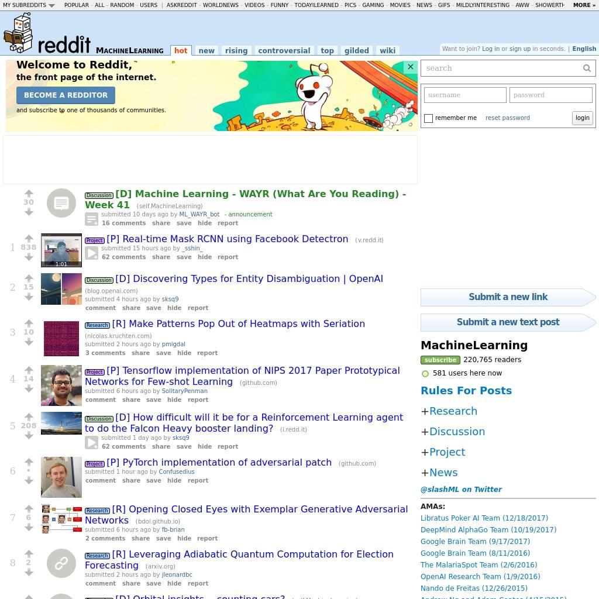
**이미지 캡션:** 이 화면은 레딧(Reddit) 웹사이트의 머신러닝(Machine Learning) 서브레딧 페이지로, 다양한 주제의 게시물 목록과 관련 정보가 표시됩니다. 화면 상단에는 레딧의 로고와 함께 "Welcome to Reddit, the front page of the internet."이라는 환영 문구가 있고, 그 아래에 "BECOME A REDDITOR" 버튼이 있습니다. 오른쪽 상단에는 로그인 및 회원가입을 위한 입력 필드와 버튼이 있습니다. 메인 콘텐츠 영역에는 여러 게시물들이 시간순으로 나열되어 있으며, 각 게시물은 제목, 작성자, 댓글 수, 업로드 시간 등의 정보를 포함합니다. 예를 들어, "[D] Machine Learning - WAYR (What Are You Reading) - Week 41"이라는 제목의 게시물은 10일 전에 올라왔으며 16개의 댓글이 있습니다. 또한, "[P] Real-time Mask RCNN using Facebook Detectron"이라는 프로젝트 게시물은 1시간 전에 올라왔고 62개의 댓글이 있습니다. 화면 오른쪽에는 "Machine Learning" 서브레딧의 구독자 수와 현재 접속자 수가 표시되며, "Rules For Posts" 섹션에는 "+Research", "+Discussion", "+Project", "+News"와 같은 카테고리가 있습니다. 하단에는 "@slashML on Twitter"와 "AMAS" 섹션이 있어 관련 트위터 계정과 과거 AMA(Ask Me Anything) 목록을 보여줍니다. 전반적으로 기술 및 연구 관련 정보를 공유하고 토론하는 커뮤니티의 모습을 보여주는 화면입니다.각 게시물은 제목, 작성자, 댓글 수, 업로드 시간 등의 정보를 포함합니다. 예를 들어, "[D] Machine Learning - WAYR (What Are You Reading) - Week 41"이라는 제목의 게시물은 10일 전에 올라왔으며 16개의 댓글이 있습니다. 또한, "[P] Real-time Mask RCNN using Facebook Detectron"이라는 프로젝트 게시물은 1시간 전에 올라왔고 62개의 댓글이 있습니다. 화면 오른쪽에는 "Machine Learning" 서브레딧의 구독자 수와 현재 접속자 수가 표시되며, "Rules For Posts" 섹션에는 "+Research", "+Discussion", "+Project", "+News"와 같은 카테고리가 있습니다. 하단에는 "@slashML on Twitter"와 "AMAS" 섹션이 있어 관련 트위터 계정과 과거 AMA(Ask Me Anything) 목록을 보여줍니다. 전반적으로 기술 및 연구 관련 정보를 공유하고 토론하는 커뮤니티의 모습을 보여주는 화면입니다.

> #오늘의레딧 https://www.reddit.com/r/MachineLearning/ 머신러닝 공부는 정말 재미있죠?아침부터 다양한 소식이 많네요.  1. FacebookDetectron을 이용한 실시간 마스크 RCD 2. 객체 장애 해결을 위한 객체 유형 탐색 3. 히트 곡을 이용하여 히트 곡을 만들어 내는 방법 4. 제4회 CDMA국제 학술 대회 5. 강화 학습 요원이 Falcon헤비 듀티 부스터 착륙을 하는 것은 얼마나 어려운가? 6. 파르토르 패치 패치의 실행 7. 개방형 차세대 집적 회로를 이용한 폐쇄형 눈 감자 8. 선거 예측을 위한 양자 계산 법 활용 9. 궤도에 오르는 것은 자동차를 세는 것일까요? 10. 현재의 미술 상황은 무엇인가? 11. 우다시티의 신공항 신공항 설계 도서 편집장 JakeLussier 12. 바셀린 GAN을 이용한 시각 특성 귀인 기법 13. 6.5.1 심층 학습 교육을 위한 심층 소개 소개 14. Hakusensha 와 HakuhodoDYD디지털화를 통해 기본적인 네트워크에 의해 만들어진 깊은 학습 컬로링 기술인 PaintsChainer를 사용하여 채색된 MangaManga제품 출시 15. 신경 네트워크 프라운싱:2개의 뉴 레프트 노트에 관한 고찰 16. 물리적 인간 상호 작용의 로봇 목표 학습 17. eventbrite와 meetup외에도, 당신의 영역에서 기계 학습 이벤트를 찾아볼 수 있는 다른 방법이 있습니까? 18. 새로운 심층 학습 모델을 구현할 때 모범 사례는 무엇입니까? 19. ELU용지 다시 채우기 20. 엔트로피, 크로스-엔트로피, KL-디베르지에 대한 간략 소개  1. https://www.reddit.com/r/MachineLearning/comments/7vuqvc/p_realtime_mask_rcnn_using_facebook_detectron/ 2. https://blog.openai.com/discovering-types-for-entity-disambiguation/ 3. http://nicolas.kruchten.com/content/2018/02/seriation/ 4. https://github.com/abdulfatir/prototypical-networks-tensorflow 5. https://www.reddit.com/r/MachineLearning/comments/7vr55s/d_how_difficult_will_it_be_for_a_reinforcement/ 6. https://github.com/jhayes14/adversarial-patch/ 7. https://bdol.github.io/exemplar_gans/#Authors 8. https://arxiv.org/abs/1802.00069 9. https://www.reddit.com/r/MachineLearning/comments/7w08is/d_orbital_insights_counting_cars/ 10. https://www.reddit.com/r/MachineLearning/comments/7vzfpx/d_what_is_the_current_state_of_art_in_face/ 11. https://syncedreview.com/2018/02/07/program-lead-jake-lussier-on-udacitys-new-flying-car-nanodegree/ 12. https://github.com/orobix/Visual-Feature-Attribution-Using-Wasserstein-GANs-Pytorch 13. http://introtodeeplearning.com/ 14. https://www.preferred-networks.jp/en/news/pr20180206 15. http://www.inference.vc/pruning-neural-networks-two-recent-papers/ 16. http://bair.berkeley.edu/blog/2018/02/06/phri/ 17. https://www.reddit.com/r/MachineLearning/comments/7vuwgg/d_besides_eventbrite_and_meetupcom_are_there_any/ 18. https://www.reddit.com/r/MachineLearning/comments/7vptld/d_what_are_your_best_practices_when_implementing/ 19. https://www.reddit.com/r/MachineLearning/comments/7vnwpl/d_reproducing_the_elu_paper/ 20. https://www.youtube.com/watch?v=ErfnhcEV1O8

### 2월 9일 (금) 08:52 · 📷 사진 (1장)

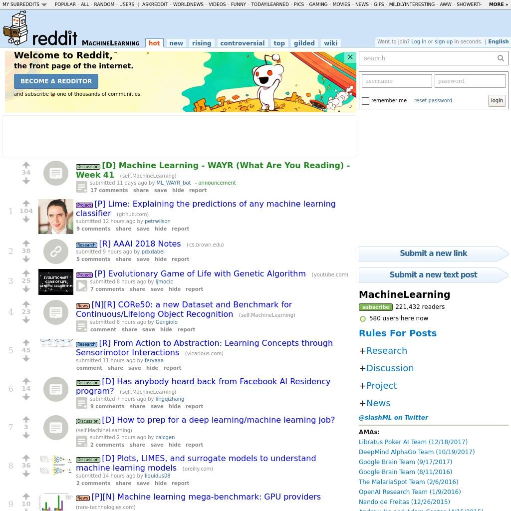
**이미지 캡션:** 이것은 Reddit의 Machine Learning 서브레딧 페이지로, 다양한 게시물 목록이 표시됩니다. 페이지 상단에는 Reddit 로고와 함께 "Welcome to Reddit, the front page of the internet."이라는 환영 메시지가 있습니다. 그 아래에는 "BECOME A REDDITOR" 버튼이 있습니다. 메인 콘텐츠 영역에는 여러 게시물이 나열되어 있으며, 각 게시물에는 제목, 작성자, 제출 시간, 댓글 수, 그리고 공유, 저장, 숨기기, 신고와 같은 옵션이 있습니다. 게시물 제목은 "[D] Machine Learning - WAYR (What Are You Reading) - Week 41", "[P] Lime: Explaining the predictions of any machine learning classifier", "[R] AAAI 2018 Notes", "[P] Evolutionary Game of Life with Genetic Algorithm", "[N][R] CORe50: a new Dataset and Benchmark for Continuous/Lifelong Object Recognition", "[R] From Action to Abstraction: Learning Concepts through Sensorimotor Interactions", "[D] Has anybody heard back from Facebook AI Residency program?", "[D] How to prep for a deep learning/machine learning job?", "[D] Plots, LIMES, and surrogate models to understand machine learning models", "[P][N] Machine learning mega-benchmark: GPU providers" 등입니다. 각 게시물 옆에는 투표를 나타내는 위아래 화살표와 함께 숫자가 표시되어 있습니다. 오른쪽 사이드바에는 로그인 및 회원가입 양식, "Submit a new link" 및 "Submit a new text post" 버튼, "Machine Learning" 서브레딧 정보 (구독자 수, 현재 사용자 수), "Rules For Posts" 섹션, 그리고 "@slashML on Twitter" 및 "AMAS" 목록이 있습니다. 전반적으로 이 페이지는 기계 학습에 관심 있는 사용자들이 최신 정보와 토론을 공유하는 온라인 커뮤니티의 모습을 보여줍니다.제목은 "[D] Machine Learning - WAYR (What Are You Reading) - Week 41", "[P] Lime: Explaining the predictions of any machine learning classifier", "[R] AAAI 2018 Notes", "[P] Evolutionary Game of Life with Genetic Algorithm", "[N][R] CORe50: a new Dataset and Benchmark for Continuous/Lifelong Object Recognition", "[R] From Action to Abstraction: Learning Concepts through Sensorimotor Interactions", "[D] Has anybody heard back from Facebook AI Residency program?", "[D] How to prep for a deep learning/machine learning job?", "[D] Plots, LIMES, and surrogate models to understand machine learning models", "[P][N] Machine learning mega-benchmark: GPU providers" 등입니다. 각 게시물 옆에는 투표를 나타내는 위아래 화살표와 함께 숫자가 표시되어 있습니다. 오른쪽 사이드바에는 로그인 및 회원가입 양식, "Submit a new link" 및 "Submit a new text post" 버튼, "Machine Learning" 서브레딧 정보 (구독자 수, 현재 사용자 수), "Rules For Posts" 섹션, 그리고 "@slashML on Twitter" 및 "AMAS" 목록이 있습니다. 전반적으로 이 페이지는 기계 학습에 관심 있는 사용자들이 최신 정보와 토론을 공유하는 온라인 커뮤니티의 모습을 보여줍니다.

> #오늘의레딧 https://www.reddit.com/r/MachineLearning/ 정말 읽을 거리가 많네요.  1. 라임:기계 학습 분석기의 예측에 대해 설명합니다. 2. 나스닥 2018년 채권 3. 유전자 알고리즘을 이용한 진화의 진화 4. 행동부터 추상화:감각 운동 통합을 통한 학습 개념 5. 페이스북의 ResidencyResidency프로그램에서 돌아온 사람이 있습니까? 6. 완전한 학습/학습 학습을 위한 준비 작업을 준비하는 방법은 무엇입니까? 7. 기계 학습 모델을 이해하기 위한 플롯, LIRBS및 대체 모델 8. 객체 지향 딥 학습(MIT) 9. 보강 학습의 표본 복잡성에 관한 백서 10. 3D시스템 학습을 위한 학습 리소스 저장소 11. 페트니카 여름 학원 기계 학습 세미나 12. 나는 사용자들이 그들의 시간 시리즈 데이터를 청소하고 기계 학습을 위해 준비할 수 있도록 도와 주기 위해 pyillshiff패키지를 만들었다. 13. 다중 효용기 및 단일 u-4u에 대한 영상 변환기의 "NIPSBA20 Spot, 영상 변환 네트워크로의 전송"구현 14. FacebookDetectron을 이용한 실시간 마스크 RCD 15. 의사 결정 기반의 공격적인 공격:블랙 박스 머신 학습 모델에 대한 신뢰성 있는 공격 16. 히트 곡을 이용하여 히트 곡을 만들어 내는 방법 17. 시그니처 검증에 필요한 SOTA는 무엇입니까? 18. 객체 장애 해결을 위한 객체 유형 탐색 19. 새로운 프로젝트를 시작하는 것-(유급!)가정 교사를 모집하라! 몇개의 1kHz키패드 호출,$50/hr(협상 가능) 자세한 내용은 을 참조하십시오. 20. 피드백 활성화 극대화를 통한 동적 라우팅  1. https://github.com/marcotcr/lime 2. https://cs.brown.edu/people/dabel/blog/posts/misc/aaai_2018.pdf 3. https://www.youtube.com/watch?v=c79ISZLGLAU 4. https://www.vicarious.com/2018/02/07/learning-concepts-through-sensorimotor-interactions/ 5. https://www.reddit.com/r/MachineLearning/comments/7w5unr/d_has_anybody_heard_back_from_facebook_ai/ 6. https://www.reddit.com/r/MachineLearning/comments/7w8e0j/d_how_to_prep_for_a_deep_learningmachine_learning/ 7. https://www.oreilly.com/ideas/ideas-on-interpreting-machine-learning 8. https://cbmm.mit.edu/publications/object-oriented-deep-learning 9. https://www.reddit.com/r/MachineLearning/comments/7w7z6n/d_papers_on_the_sample_complexity_of/ 10. https://github.com/timzhang642/3D-Machine-Learning 11. https://www.reddit.com/r/MachineLearning/comments/7w45w3/n_petnica_summer_institute_machine_learning/ 12. https://www.reddit.com/r/MachineLearning/comments/7w6l2k/p_i_created_a_python_pip_package_to_help_users/ 13. https://github.com/taki0112/UNIT-Tensorflow 14. https://www.reddit.com/r/MachineLearning/comments/7vuqvc/p_realtime_mask_rcnn_using_facebook_detectron/ 15. https://arxiv.org/abs/1712.04248 16. http://nicolas.kruchten.com/content/2018/02/seriation/ 17. https://www.reddit.com/r/MachineLearning/comments/7w4wzb/d_what_is_the_sota_in_signature_verification/ 18. https://blog.openai.com/discovering-types-for-entity-disambiguation/ 19. https://www.reddit.com/r/MachineLearning/comments/7w5qu7/p_starting_new_project_looking_for_paid_tutor_a/ 20. https://www.reddit.com/r/MachineLearning/comments/7w3uh5/d_dynamic_routing_by_feedback_activation/

### 2월 10일 (토) 08:52 · 📷 사진 (1장)

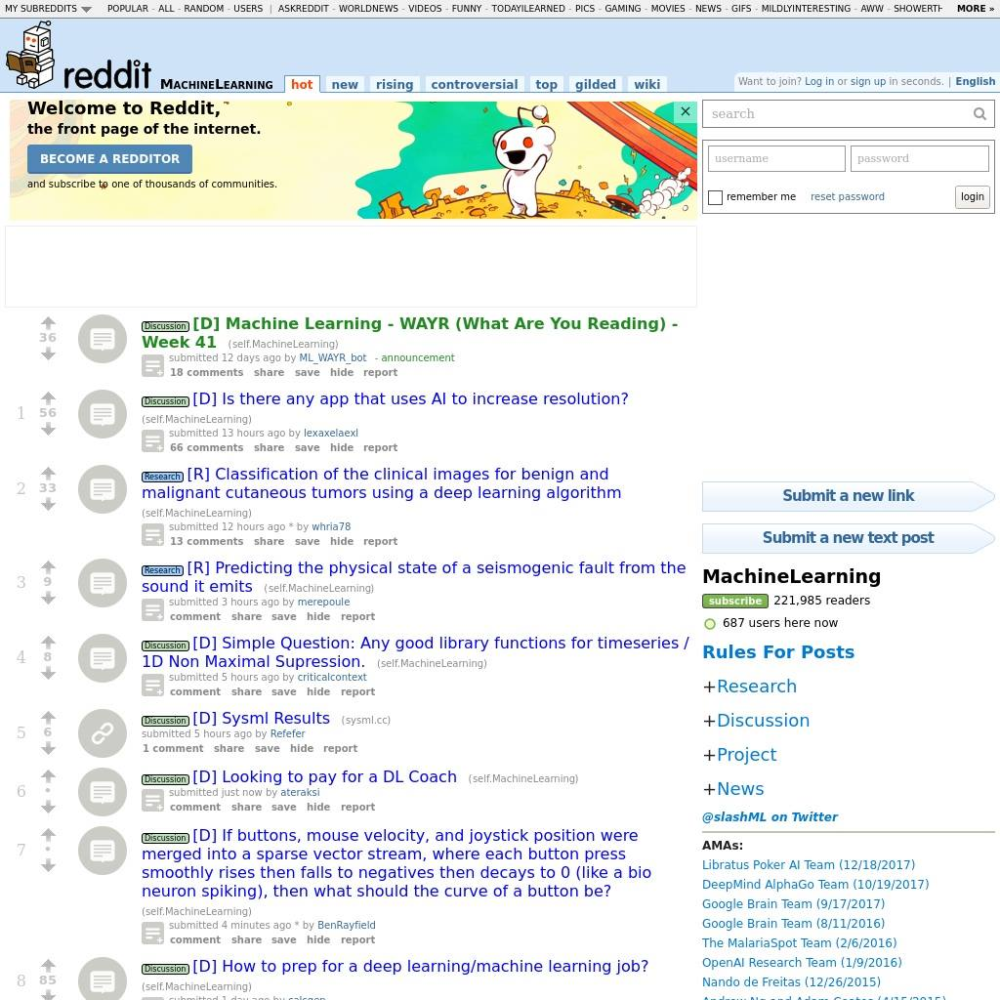
**이미지 캡션:** 이 이미지는 레딧(Reddit) 웹사이트의 머신러닝(Machine Learning) 서브레딧 페이지를 보여줍니다. 페이지 상단에는 레딧 로고와 함께 "Welcome to Reddit, the front page of the internet."이라는 환영 문구가 있고, 그 옆에는 귀여운 캐릭터가 그려진 일러스트가 있습니다. 로그인 및 회원가입을 위한 입력창과 버튼도 보입니다. 메인 콘텐츠 영역에는 머신러닝 관련 토론 및 연구 게시물 목록이 나열되어 있으며, 각 게시물은 제목, 작성자, 댓글 수, 시간 등의 정보와 함께 표시됩니다. 예를 들어, "[D] Machine Learning - WAYR (What Are You Reading) - Week 41"이라는 제목의 게시물은 18개의 댓글이 달려 있고, "[R] Classification of the clinical images for benign and malignant cutaneous tumors using a deep learning algorithm"이라는 연구 게시물은 13개의 댓글이 있습니다. 페이지 오른쪽에는 "Submit a new link"와 "Submit a new text post" 버튼이 있으며, "MachineLearning" 서브레딧의 구독자 수와 현재 접속자 수가 표시됩니다. 또한, 게시물 규칙과 트위터 계정 정보, 그리고 "AMAS" 섹션에는 과거 머신러닝 관련 팀들의 목록이 날짜와 함께 나열되어 있습니다. 전반적으로 정보가 많고 다양한 주제의 게시물들이 활발하게 논의되고 있는 커뮤니티의 모습을 보여줍니다.와 함께 표시됩니다. 예를 들어, "[D] Machine Learning - WAYR (What Are You Reading) - Week 41"이라는 제목의 게시물은 18개의 댓글이 달려 있고, "[R] Classification of the clinical images for benign and malignant cutaneous tumors using a deep learning algorithm"이라는 연구 게시물은 13개의 댓글이 있습니다. 페이지 오른쪽에는 "Submit a new link"와 "Submit a new text post" 버튼이 있으며, "MachineLearning" 서브레딧의 구독자 수와 현재 접속자 수가 표시됩니다. 또한, 게시물 규칙과 트위터 계정 정보, 그리고 "AMAS" 섹션에는 과거 머신러닝 관련 팀들의 목록이 날짜와 함께 나열되어 있습니다. 전반적으로 정보가 많고 다양한 주제의 게시물들이 활발하게 논의되고 있는 커뮤니티의 모습을 보여줍니다.

> #오늘의레딧 https://www.reddit.com/r/MachineLearning/ 재미난 이야기들이 많습니다.  1. 해상도를 높이기 위해 AI를 사용하는 앱이 있습니까? 2. 깊은 학습 알고리즘을 이용한 양성 및 악성 종양 종양의 임상 이미지의 분류 3. 발생하는 소음에서 발생하는 지진 발생의 물리적 상태 예측 4. 간단한 질문:모든 유용한 라이브러리 기능을 사용할 수 있습니다. 5. 시스믹 결과 6. DL코치에게 지불할 돈을 찾고 있어 7. 버튼, 마우스 속도 및 조이 스틱 위치가 스파스 벡터 스트림으로 병합된 경우 버튼을 누르면 버튼이 부드럽게 상승한 다음, 버튼을 눌러 0(바이오 사이어 스프링킹)으로 떨어집니다. 8. 완전한 학습/학습 학습을 위한 준비 작업을 준비하는 방법은 무엇입니까? 9. 깊은 학습 과제: 바람직하지 않은 직업을 제안해야 하나요 아니면 즉시 취업을 해야 하나요 아니면 더 나은 것을 시도해야 할까요? 10. 모델 기반 N-MC상호 작용을 위한 무반응기 상호 작용 11. 라임:기계 학습 분석기의 예측에 대해 설명합니다. 12. 나스닥 2018년 채권 13. 유전자 알고리즘을 이용한 진화의 진화 14. 행동부터 추상화:감각 운동 통합을 통한 학습 개념 15. 페이스북의 ResidencyResidency프로그램에서 돌아온 사람이 있습니까? 16. 기계 학습 모델을 이해하기 위한 플롯, LIRBS및 대체 모델 17. 의사 결정 기반의 공격적인 공격:블랙 박스 머신 학습 모델에 대한 신뢰성 있는 공격 18. 객체 지향 딥 학습(MIT) 19. 보강 학습의 표본 복잡성에 관한 백서 20. 나는 사용자들이 그들의 시간 시리즈 데이터를 청소하고 기계 학습을 위해 준비할 수 있도록 도와 주기 위해 pyillshiff패키지를 만들었다.  1. https://www.reddit.com/r/MachineLearning/comments/7wchqe/d_is_there_any_app_that_uses_ai_to_increase/ 2. https://www.reddit.com/r/MachineLearning/comments/7wctse/r_classification_of_the_clinical_images_for/ 3. https://www.reddit.com/r/MachineLearning/comments/7wfufv/r_predicting_the_physical_state_of_a_seismogenic/ 4. https://www.reddit.com/r/MachineLearning/comments/7wfi0m/d_simple_question_any_good_library_functions_for/ 5. http://www.sysml.cc/#posters 6. https://www.reddit.com/r/MachineLearning/comments/7whjre/d_looking_to_pay_for_a_dl_coach/ 7. https://www.reddit.com/r/MachineLearning/comments/7whhyy/d_if_buttons_mouse_velocity_and_joystick_position/ 8. https://www.reddit.com/r/MachineLearning/comments/7w8e0j/d_how_to_prep_for_a_deep_learningmachine_learning/ 9. https://www.reddit.com/r/MachineLearning/comments/7wfg3d/d_deep_learning_jobs_should_i_take_an_undesirable/ 10. https://www.reddit.com/r/MachineLearning/comments/7wc1td/d_replacing_selfplay_of_alphazero_with/ 11. https://github.com/marcotcr/lime 12. https://cs.brown.edu/people/dabel/blog/posts/misc/aaai_2018.pdf 13. https://www.youtube.com/watch?v=c79ISZLGLAU 14. https://www.vicarious.com/2018/02/07/learning-concepts-through-sensorimotor-interactions/ 15. https://www.reddit.com/r/MachineLearning/comments/7w5unr/d_has_anybody_heard_back_from_facebook_ai/ 16. https://www.oreilly.com/ideas/ideas-on-interpreting-machine-learning 17. https://arxiv.org/abs/1712.04248 18. https://cbmm.mit.edu/publications/object-oriented-deep-learning 19. https://www.reddit.com/r/MachineLearning/comments/7w7z6n/d_papers_on_the_sample_complexity_of/ 20. https://www.reddit.com/r/MachineLearning/comments/7w6l2k/p_i_created_a_python_pip_package_to_help_users/

### 2월 11일 (일) 08:52 · 📷 사진 (1장)

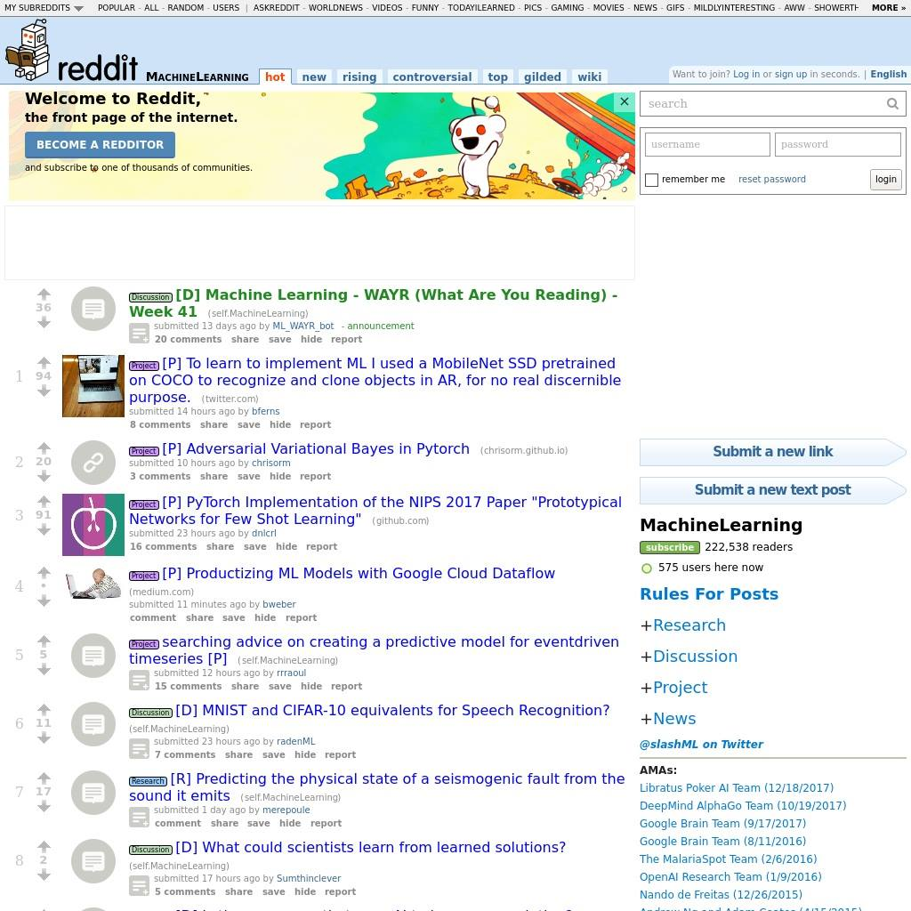
**이미지 캡션:** 이 이미지는 레딧(Reddit) 웹사이트의 머신러닝(Machine Learning) 서브레딧 페이지를 보여줍니다. 페이지 상단에는 레딧 로고와 함께 "hot", "new", "rising", "controversial", "top", "gilded", "wiki"와 같은 메뉴가 보이며, 오른쪽 상단에는 로그인 또는 회원가입을 할 수 있는 입력창과 버튼이 있습니다. 페이지 중앙에는 "Welcome to Reddit, the front page of the internet."이라는 문구와 함께 레딧의 마스코트인 스누(Snoo) 캐릭터가 그려진 이미지가 있습니다. 그 아래에는 "BECOME A REDDITOR" 버튼이 있습니다. 메인 콘텐츠 영역에는 머신러닝 관련 게시물 목록이 표시되어 있으며, 각 게시물은 제목, 작성자, 제출 시간, 댓글 수 등의 정보를 포함하고 있습니다. 게시물 제목 앞에는 "[D]" (Discussion), "[P]" (Project), "[R]" (Research)와 같은 태그가 붙어 있어 게시물의 종류를 나타냅니다. 예를 들어, "Machine Learning - WAYR (What Are You Reading) - Week 41"이라는 제목의 게시물은 토론(Discussion) 게시물이며, "To learn to implement ML I used a MobileNet SSD pretrained on COCO to recognize and clone objects in AR, for no real discernible purpose."라는 제목의 게시물은 프로젝트(Project) 게시물입니다. 페이지 오른쪽에는 "Submit a new link", "Submit a new text post" 버튼과 함께 "MachineLearning" 서브레딧의 구독자 수, 현재 접속자 수, 게시 규칙, 트위터 계정 정보, 그리고 과거 AMA(Ask Me Anything) 목록이 표시되어 있습니다. 전반적으로 기술 관련 커뮤니티의 정보 공유 및 토론이 이루어지는 웹사이트의 모습을 담고 있습니다.스누(Snoo) 캐릭터가 그려진 이미지가 있습니다. 그 아래에는 "BECOME A REDDITOR" 버튼이 있습니다. 메인 콘텐츠 영역에는 머신러닝 관련 게시물 목록이 표시되어 있으며, 각 게시물은 제목, 작성자, 제출 시간, 댓글 수 등의 정보를 포함하고 있습니다. 게시물 제목 앞에는 "[D]" (Discussion), "[P]" (Project), "[R]" (Research)와 같은 태그가 붙어 있어 게시물의 종류를 나타냅니다. 예를 들어, "Machine Learning - WAYR (What Are You Reading) - Week 41"이라는 제목의 게시물은 토론(Discussion) 게시물이며, "To learn to implement ML I used a MobileNet SSD pretrained on COCO to recognize and clone objects in AR, for no real discernible purpose."라는 제목의 게시물은 프로젝트(Project) 게시물입니다. 페이지 오른쪽에는 "Submit a new link", "Submit a new text post" 버튼과 함께 "MachineLearning" 서브레딧의 구독자 수, 현재 접속자 수, 게시 규칙, 트위터 계정 정보, 그리고 과거 AMA(Ask Me Anything) 목록이 표시되어 있습니다. 전반적으로 기술 관련 커뮤니티의 정보 공유 및 토론이 이루어지는 웹사이트의 모습을 담고 있습니다.

> #오늘의레딧 https://www.reddit.com/r/MachineLearning/ 머신러닝 공부는 정말 재미있죠?아침부터 다양한 소식이 많네요.  1. ML을 구현하는 방법을 배우기 위해 COCO에서 사전 검증된 목적의 물체를 인식하고 복제하기 위해 COCO에서 사전 검증된 MobileNetSSD를 사용했습니다. 2. 피토르쉬의 모험적 품종 바위층 3. 제2회 CDMA국제 학술 대회 4. GoogleCloudDataflow로 ML모델 제작 5. 음성 인식을 위한 MNIST및 VRML-10가지 동등한 사항은 무엇입니까? 6. 발생하는 소음에서 발생하는 지진 발생의 물리적 상태 예측 7. 과학자들은 학습된 해결책으로부터 무엇을 배울 수 있는가? 8. 해상도를 높이기 위해 AI를 사용하는 앱이 있습니까? 9. 깊은 학습 알고리즘을 이용한 양성 및 악성 종양 종양의 임상 이미지의 분류 10. 의료 QA 11. 시스믹 결과 12. 간단한 질문:모든 유용한 라이브러리 기능을 사용할 수 있습니다. 13. ML박사를 통해 가족, 최상위 연봉을 받을 필요가 있는가? 14. 버튼, 마우스 속도 및 조이 스틱 위치가 스파스 벡터 스트림으로 병합된 경우 버튼을 누르면 버튼이 부드럽게 상승한 다음, 버튼을 눌러 0(바이오 사이어 스프링킹)으로 떨어집니다. 15. 완전한 학습/학습 학습을 위한 준비 작업을 준비하는 방법은 무엇입니까? 16. 모델 기반 N-MC상호 작용을 위한 무반응기 상호 작용 17. 라임:기계 학습 분석기의 예측에 대해 설명합니다. 18. 깊은 학습 과제: 바람직하지 않은 직업을 제안해야 하나요 아니면 즉시 취업을 해야 하나요 아니면 더 나은 것을 시도해야 할까요? 19. 나스닥 2018년 채권 20. 유전자 알고리즘을 이용한 진화의 진화  1. https://twitter.com/ben_ferns/status/961930799900540928 2. https://chrisorm.github.io/AVB-pyt.html 3. https://github.com/orobix/Prototypical-Networks-for-Few-shot-Learning-PyTorch 4. https://medium.com/@bgweber/productizing-ml-models-with-dataflow-99a224ce9f19 5. https://www.reddit.com/r/MachineLearning/comments/7wi1go/d_mnist_and_cifar10_equivalents_for_speech/ 6. https://www.reddit.com/r/MachineLearning/comments/7wfufv/r_predicting_the_physical_state_of_a_seismogenic/ 7. https://www.reddit.com/r/MachineLearning/comments/7wju9f/d_what_could_scientists_learn_from_learned/ 8. https://www.reddit.com/r/MachineLearning/comments/7wchqe/d_is_there_any_app_that_uses_ai_to_increase/ 9. https://www.reddit.com/r/MachineLearning/comments/7wctse/r_classification_of_the_clinical_images_for/ 10. https://www.reddit.com/r/MachineLearning/comments/7wl18i/dmedical_qa/ 11. http://www.sysml.cc/#posters 12. https://www.reddit.com/r/MachineLearning/comments/7wfi0m/d_simple_question_any_good_library_functions_for/ 13. https://www.reddit.com/r/MachineLearning/comments/7wic8n/d_need_to_support_family_toppaying_jobs_with_ml/ 14. https://www.reddit.com/r/MachineLearning/comments/7whhyy/d_if_buttons_mouse_velocity_and_joystick_position/ 15. https://www.reddit.com/r/MachineLearning/comments/7w8e0j/d_how_to_prep_for_a_deep_learningmachine_learning/ 16. https://www.reddit.com/r/MachineLearning/comments/7wc1td/d_replacing_selfplay_of_alphazero_with/ 17. https://github.com/marcotcr/lime 18. https://www.reddit.com/r/MachineLearning/comments/7wfg3d/d_deep_learning_jobs_should_i_take_an_undesirable/ 19. https://cs.brown.edu/people/dabel/blog/posts/misc/aaai_2018.pdf 20. https://www.youtube.com/watch?v=c79ISZLGLAU

### 2월 12일 (월) 08:52 · 📷 사진 (1장)

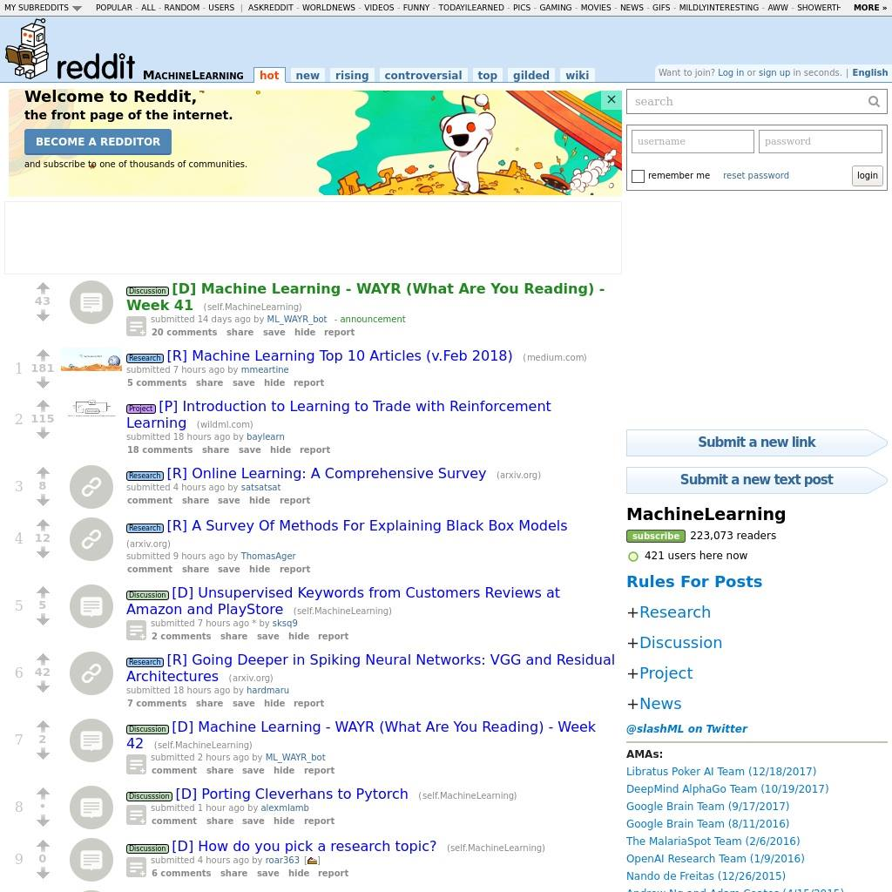
**이미지 캡션:** 이 이미지는 레딧의 머신러닝 커뮤니티 페이지를 보여줍니다. 페이지 상단에는 레딧 로고와 함께 "Welcome to Reddit, the front page of the internet."이라는 문구가 있고, 그 아래에는 "BECOME A REDDITOR" 버튼이 있습니다. 페이지 중앙에는 여러 게시물 목록이 있으며, 각 게시물은 제목, 작성자, 제출 시간, 댓글 수 등의 정보를 포함하고 있습니다. 게시물 제목은 주로 머신러닝 관련 연구, 토론, 질문 등이며, 일부는 외부 웹사이트 링크를 포함하고 있습니다. 오른쪽 사이드바에는 "Submit a new link" 및 "Submit a new text post" 버튼과 함께 "MachineLearning" 커뮤니티 정보, "Rules For Posts", 그리고 "AMAS" 목록이 표시되어 있습니다. 전반적으로 정보가 많고 다양한 주제의 게시물들이 나열되어 있어 활발한 커뮤니티 활동을 엿볼 수 있습니다.른쪽 사이드바에는 "Submit a new link" 및 "Submit a new text post" 버튼과 함께 "MachineLearning" 커뮤니티 정보, "Rules For Posts", 그리고 "AMAS" 목록이 표시되어 있습니다. 전반적으로 정보가 많고 다양한 주제의 게시물들이 나열되어 있어 활발한 커뮤니티 활동을 엿볼 수 있습니다.

> #오늘의레딧 https://www.reddit.com/r/MachineLearning/ 오늘도 새소식이 많군요.  1. 기계 학습 상위 10개 기사(v.Feb.Feb) 2. 강화 학습과의 무역 학습 소개 3. 온라인 학습:포괄적인 설문 조사 4. 블랙 박스 모델에 대한 방법론 고찰 5. Amazon및 PlayStore의 고객 후기 리뷰에서 제공되는 탁월한 키워드 6. IMT20003GPP-고속 자세 망 접속 부가 서비스:VGG및 잔류 아키텍처 7. 기계 학습-WAYR( 읽기-쓰기)-주간 42 8. 당신은 어떻게 연구 주제를 선택합니까? 9. 나는 MLS/PISA연구소에 지원하는 것을 좋아하지만, 보통의 요구 사항 중 하나는 최상위 MLS/EIA컨퍼런스에 게재되는 것이다. 이 요건은 얼마나 심각한가? 저와 같은 사람이 있을 가능성이 있나요? 10. 광고를 위한 컴퓨터 학습 작업에 컴퓨터 비전 프로젝트 적응 11. ML을 구현하는 방법을 배우기 위해 COCO에서 사전 검증된 목적의 물체를 인식하고 복제하기 위해 COCO에서 사전 검증된 MobileNetSSD를 사용했습니다. 12. " 쌓아 놓은 "네트워크에 무슨 일이 있나요? 예를 들어, 새로운 작업을 수행할 수 있도록 교육을 받은 전체 네트워크를 사용하여 학습을 수행합니다. 13. 피토르쉬의 모험적 품종 바위층 14. 제2회 CDMA국제 학술 대회 15. 음성 인식을 위한 MNIST및 VRML-10가지 동등한 사항은 무엇입니까? 16. 발생하는 소음에서 발생하는 지진 발생의 물리적 상태 예측 17. 과학자들은 학습된 해결책으로부터 무엇을 배울 수 있는가? 18. 완전히 훈련된 RevertainmentRevertainment를 취한다. 활성화 기능을 최대(0, x)로 교체합니다. 아직도 괜찮아요? 19. 해상도를 높이기 위해 AI를 사용하는 앱이 있습니까? 20. 깊은 학습 알고리즘을 이용한 양성 및 악성 종양 종양의 임상 이미지의 분류  1. https://medium.com/@Mybridge/machine-learning-top-10-articles-for-the-past-month-v-feb-2018-b7aabba5aba4 2. http://www.wildml.com/2018/02/introduction-to-learning-to-trade-with-reinforcement-learning/ 3. https://arxiv.org/abs/1802.02871 4. https://arxiv.org/abs/1802.01933 5. https://www.reddit.com/r/MachineLearning/comments/7wtu9n/d_unsupervised_keywords_from_customers_reviews_at/ 6. https://arxiv.org/abs/1802.02627 7. https://www.reddit.com/r/MachineLearning/comments/7wvjfk/d_machine_learning_wayr_what_are_you_reading_week/ 8. https://www.reddit.com/r/MachineLearning/comments/7wunka/d_how_do_you_pick_a_research_topic/ 9. https://www.reddit.com/r/MachineLearning/comments/7wu5fg/d_i_like_to_apply_for_mlai_research_positions_but/ 10. https://www.reddit.com/r/MachineLearning/comments/7wq6az/d_adapting_computer_vision_projects_to_machine/ 11. https://twitter.com/ben_ferns/status/961930799900540928 12. https://www.reddit.com/r/MachineLearning/comments/7wpd7n/discussion_is_there_any_work_in_stacking_networks/ 13. https://chrisorm.github.io/AVB-pyt.html 14. https://github.com/orobix/Prototypical-Networks-for-Few-shot-Learning-PyTorch 15. https://www.reddit.com/r/MachineLearning/comments/7wi1go/d_mnist_and_cifar10_equivalents_for_speech/ 16. https://www.reddit.com/r/MachineLearning/comments/7wfufv/r_predicting_the_physical_state_of_a_seismogenic/ 17. https://www.reddit.com/r/MachineLearning/comments/7wju9f/d_what_could_scientists_learn_from_learned/ 18. https://www.reddit.com/r/MachineLearning/comments/7wpax5/d_take_a_fully_trained_relu_net_replace_the/ 19. https://www.reddit.com/r/MachineLearning/comments/7wchqe/d_is_there_any_app_that_uses_ai_to_increase/ 20. https://www.reddit.com/r/MachineLearning/comments/7wctse/r_classification_of_the_clinical_images_for/

### 2월 13일 (화) 06:10 · 📷 사진 (2장)

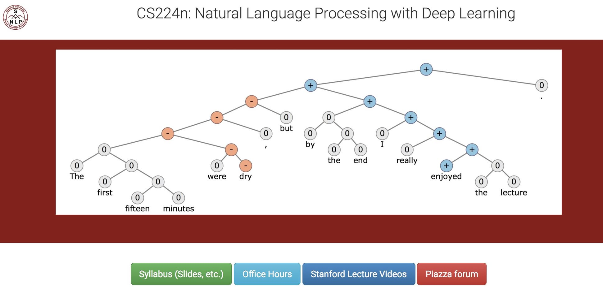
**이미지 캡션:** 이 이미지는 'CS224n: Natural Language Processing with Deep Learning'이라는 제목의 강의 자료 슬라이드로 보입니다. 슬라이드 상단에는 스탠포드 대학교 NLP 로고가 있으며, 중앙에는 문장의 구문 구조와 감성 분석 결과를 시각화한 트리 다이어그램이 있습니다. 트리에는 'The first fifteen minutes were dry but by the end I really enjoyed the lecture'라는 문장이 포함되어 있으며, 각 단어와 구문 노드에는 0, +, -와 같은 값이 표시되어 있습니다. 이는 긍정, 부정, 중립적인 감성을 나타내는 것으로 추정됩니다. 슬라이드 하단에는 'Syllabus (Slides, etc.)', 'Office Hours', 'Stanford Lecture Videos', 'Piazza forum'과 같은 네 개의 버튼이 있어 관련 정보에 접근할 수 있음을 보여줍니다. 전체적으로 학술적인 분위기를 풍깁니다.nodes contain a "0" indicating neutral sentiment, while others are colored orange with a "-" sign, signifying negative sentiment, or blue with a "+" sign, indicating positive sentiment. The sentence being parsed appears to be "The first fifteen minutes were dry, but by the end I really enjoyed the lecture." The Stanford NLP logo is visible in the top left corner. Below the main content, there are four buttons: "Syllabus (Slides, etc.)", "Office Hours", "Stanford Lecture Videos", and "Piazza forum". The overall atmosphere is academic and informative, typical of a university lecture slide. There are no people visible in the image.
 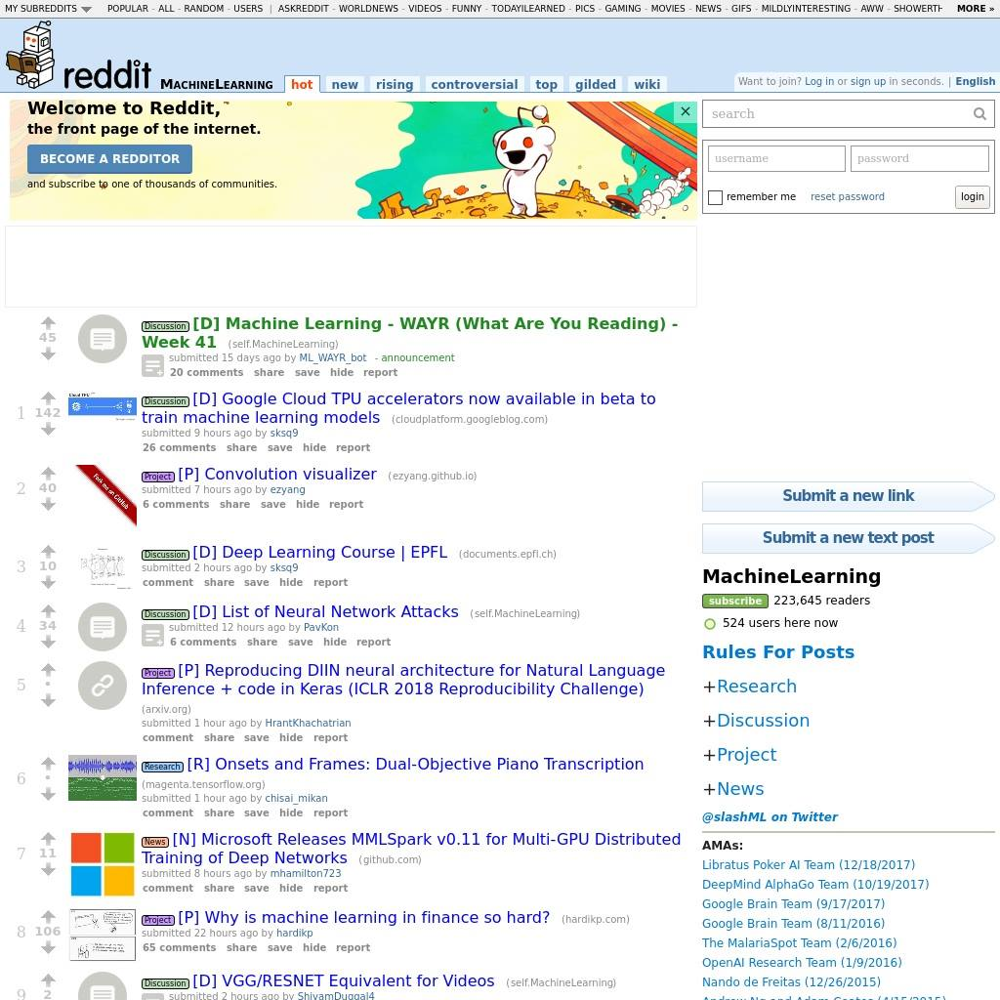
**이미지 캡션:** 이 이미지는 웹사이트 레딧의 머신러닝 서브레딧 페이지를 보여줍니다. 페이지 상단에는 레딧 로고와 함께 "Welcome to Reddit, the front page of the internet."이라는 문구가 있고, 그 아래에는 "BECOME A REDDITOR" 버튼이 있습니다. 메인 콘텐츠 영역에는 여러 개의 게시물 목록이 표시되며, 각 게시물은 제목, 작성자, 제출 시간, 댓글 수, 공유, 저장, 숨기기, 보고 옵션을 포함합니다. 게시물들은 머신러닝, 딥러닝, 인공지능 관련 주제를 다루고 있으며, "[D] Machine Learning - WAYR (What Are You Reading) - Week 41", "[D] Google Cloud TPU accelerators now available in beta to train machine learning models", "[P] Convolution visualizer", "[D] Deep Learning Course | EPFL", "[D] List of Neural Network Attacks", "[P] Reproducing DIIN neural architecture for Natural Language Inference + code in Keras (ICLR 2018 Reproducibility Challenge)", "[R] Onsets and Frames: Dual-Objective Piano Transcription", "[N] Microsoft Releases MMLSpark v0.11 for Multi-GPU Distributed Training of Deep Networks", "[P] Why is machine learning in finance so hard?", "[D] VGG/RESNET Equivalent for Videos"와 같은 제목들이 보입니다. 오른쪽 사이드바에는 "Submit a new link" 및 "Submit a new text post" 버튼, "MachineLearning" 서브레딧 정보 (구독자 수, 현재 접속자 수), 게시 규칙, 그리고 트위터 계정(@slashML) 및 AMAs 목록이 있습니다. 전반적으로 기술 관련 커뮤니티의 정보 공유 및 토론이 이루어지는 온라인 플랫폼의 모습을 담고 있습니다.] Machine Learning - WAYR (What Are You Reading) - Week 41", "[D] Google Cloud TPU accelerators now available in beta to train machine learning models", "[P] Convolution visualizer", "[D] Deep Learning Course | EPFL", "[D] List of Neural Network Attacks", "[P] Reproducing DIIN neural architecture for Natural Language Inference + code in Keras (ICLR 2018 Reproducibility Challenge)", "[R] Onsets and Frames: Dual-Objective Piano Transcription", "[N] Microsoft Releases MMLSpark v0.11 for Multi-GPU Distributed Training of Deep Networks", "[P] Why is machine learning in finance so hard?", "[D] VGG/RESNET Equivalent for Videos"와 같은 제목들이 보입니다. 오른쪽 사이드바에는 "Submit a new link" 및 "Submit a new text post" 버튼, "MachineLearning" 서브레딧 정보 (구독자 수, 현재 접속자 수), 게시 규칙, 그리고 트위터 계정(@slashML) 및 AMAs 목록이 있습니다. 전반적으로 기술 관련 커뮤니티의 정보 공유 및 토론이 이루어지는 온라인 플랫폼의 모습을 담고 있습니다.

> Stanford Deep NLP 2018년 버전 슬라이드들이 올라오고 있습니다. 이번 설 연휴동안 몰아보기 좋을듯 합니다. NLP쪽도 작년 재미있는 발전들이 많아, 최신 기술들을 다루는 수업 후반부 많이 기대 됩니다.  http://web.stanford.edu/class/cs224n/syllabus.html  (참고로 컴퓨터 비전 Stanford 강의는 Spring 2018로 4월부터 개강하는듯 합니다. NLP끝내고 비전으로 넘어가면 될듯 하네요.)
> #오늘의레딧 https://www.reddit.com/r/MachineLearning/ 재미난 이야기들이 많습니다.  1. 이제 GoogleCloudTPU가속기를 사용하여 기계 학습 모델을 교육할 수 있습니다. 2. 대화형 시각화 장치 3. 심층 학습 과정 | EP FL                                            Deep     Learning                                          Course. 4. 신경망 공격 목록 5. KerasResponseReferenceRepublicationforKerasRepublicReferenceRepublicationforReneralResponseReferency 6. OnsetsandFrame:듀얼 객체 피아노 트랜스크립션 7. IMT20003GPP-MS-TS다중 접속 교육을 위한 마이크로 소프트 릴리스 MMLSpark 8. 왜 기계가 금융에서 그렇게 열심히 공부하는 걸까요? 9. VGG비디오에 적합한 표준 10. 안녕하세요, MachMaching입니다! 우리(워털루 대학 연구원)는 다학계 STEM팀이 전문성을 평가하는 방법에 대해 배우는 데 도움이 필요하다. 11. 기계 학습 상위 10개 기사(v.Feb.Feb) 12. GitHub-텐토플루 플로트 13. Tensorflow외에도"단순한 SuperforeInstruction"의 Tensorflow를 구현한 TensorFlow구축(CVPR2017). 14. 마음과 기계에 대한 도전적인 이미지들 15. 추적 데이터에 기반한 전술적 축구 장면 파악-접근법? 16. GAN및 자연어 관련 프로젝트 17. 2000년도 한국 경영 과학회 추계 학술 대회-세계 초일류를 향한 전자 정부 및 e-biz전략 18. ML및 BusinessProcess관리:어떤 종류의 애플리케이션을 보십니까? 19. 신경 과학 시간 영상 시리즈에 대한 기계 학습의 응용 20. 온라인 학습:포괄적인 설문 조사  1. https://cloudplatform.googleblog.com/2018/02/Cloud-TPU-machine-learning-accelerators-now-available-in-beta.html 2. https://ezyang.github.io/convolution-visualizer/index.html 3. https://documents.epfl.ch/users/f/fl/fleuret/www/dlc/ 4. https://www.reddit.com/r/MachineLearning/comments/7wzup3/d_list_of_neural_network_attacks/ 5. https://arxiv.org/abs/1802.03198 6. https://magenta.tensorflow.org/onsets-frames 7. https://github.com/Azure/mmlspark/releases/tag/v0.11 8. https://www.hardikp.com/2018/02/11/why-is-machine-learning-in-finance-so-hard/ 9. https://www.reddit.com/r/MachineLearning/comments/7x43yc/d_vggresnet_equivalent_for_videos/ 10. https://www.reddit.com/r/MachineLearning/comments/7x1m7a/p_hi_rmachinelearning_we_university_of_waterloo/ 11. https://medium.com/@Mybridge/machine-learning-top-10-articles-for-the-past-month-v-feb-2018-b7aabba5aba4 12. https://github.com/tensorflow/tpu 13. https://www.reddit.com/r/MachineLearning/comments/7x492y/p_tensorflow_implementation_of_simple_does_it/ 14. https://www.reddit.com/r/MachineLearning/comments/7x0vlj/research_challenging_images_for_minds_and_machines/ 15. https://www.reddit.com/r/MachineLearning/comments/7x038g/p_identify_tactical_soccer_scenes_based_on/ 16. https://www.reddit.com/r/MachineLearning/comments/7wz0xg/dproject_involving_gans_and_natural_language/ 17. https://arxiv.org/abs/1802.03268 18. https://www.reddit.com/r/MachineLearning/comments/7x1mmr/d_ml_and_business_process_management_what_kinds/ 19. https://www.reddit.com/r/MachineLearning/comments/7wzgio/d_application_of_machine_learning_to_neuroscience/ 20. https://arxiv.org/abs/1802.02871

### 2월 14일 (수) 08:52 · 📷 사진 (4장)

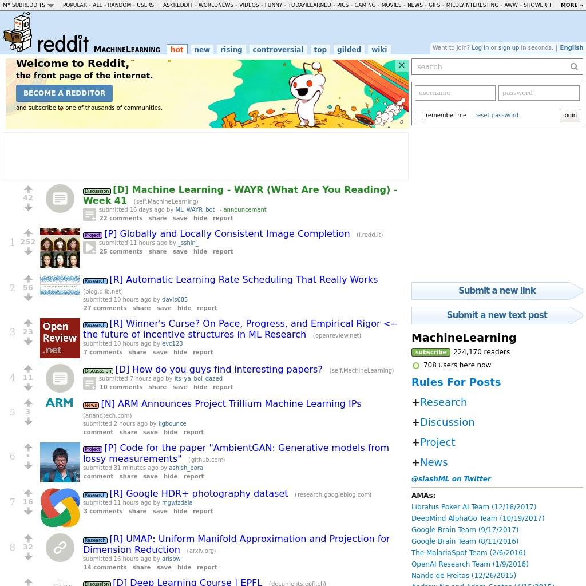
**이미지 캡션:** 이것은 레딧 웹사이트의 스크린샷으로, 머신러닝 관련 서브레딧의 메인 페이지를 보여줍니다. 화면 왼쪽 상단에는 "MY SUBREDDITS", "POPULAR", "ALL", "RANDOM", "USERS", "ASKREDDIT", "WORLDNEWS", "VIDEOS", "FUNNY", "TODAYILEARNED", "PICS", "GAMING", "MOVIES", "NEWS", "GIFS", "MILDLYINTERESTING", "AWW", "SHOWERTHOUGHTS", "MORE"와 같은 다양한 메뉴 옵션이 있습니다. 그 아래에는 레딧 로고와 "Welcome to Reddit, the front page of the internet."이라는 문구가 있습니다. 또한 "BECOME A REDDITOR" 버튼과 "and subscribe to one of thousands of communities."라는 설명이 있습니다. 메인 콘텐츠 영역에는 여러 게시물이 나열되어 있으며, 각 게시물에는 제목, 출처, 작성자, 게시 시간, 댓글 수, 그리고 "share", "save", "hide", "report"와 같은 옵션이 포함되어 있습니다. 게시물들은 "Discussion", "Project", "Research", "News"와 같은 태그로 분류되어 있습니다. 예를 들어, 첫 번째 게시물은 "[D] Machine Learning - WAYR (What Are You Reading) - Week 41"이라는 제목을 가지고 있으며, 16일 전에 게시되었습니다. 두 번째 게시물은 "[P] Globally and Locally Consistent Image Completion"이라는 제목으로, 11시간 전에 게시되었습니다. 세 번째 게시물은 "[R] Automatic Learning Rate Scheduling That Really Works"이며, 10시간 전에 게시되었습니다. 네 번째 게시물은 "[R] Winner's Curse? On Pace, Progress, and Empirical Rigor <-- the future of incentive structures in ML Research"이며, 10시간 전에 게시되었습니다. 다섯 번째 게시물은 "[D] How do you guys find interesting papers?"이며, 7시간 전에 게시되었습니다. 여섯 번째 게시물은 "[N] ARM Announces Project Trillium Machine Learning IPs"이며, 2시간 전에 게시되었습니다. 일곱 번째 게시물은 "[P] Code for the paper "AmbientGAN: Generative models from lossy measurements""이며, 31분 전에 게시되었습니다. 여덟 번째 게시물은 "[R] Google HDR+ photography dataset"이며, 11시간 전에 게시되었습니다. 아홉 번째 게시물은 "[R] UMAP: Uniform Manifold Approximation and Projection for Dimension Reduction"이며, 16시간 전에 게시되었습니다. 화면 오른쪽에는 "Want to join? Log in or sign up in seconds. | English"라는 문구와 함께 로그인 폼이 있습니다. 로그인 폼 아래에는 "search" 입력란과 검색 버튼이 있습니다. 그 아래에는 "Submit a new link"와이 있습니다. 그 아래에는 레딧 로고와 "Welcome to Reddit, the front page of the internet."이라는 문구가 있습니다. 또한 "BECOME A REDDITOR" 버튼과 "and subscribe to one of thousands of communities."라는 설명이 있습니다. 메인 콘텐츠 영역에는 여러 게시물이 나열되어 있으며, 각 게시물에는 제목, 출처, 작성자, 게시 시간, 댓글 수, 그리고 "share", "save", "hide", "report"와 같은 옵션이 포함되어 있습니다. 게시물들은 "Discussion", "Project", "Research", "News"와 같은 태그로 분류되어 있습니다. 예를 들어, 첫 번째 게시물은 "[D] Machine Learning - WAYR (What Are You Reading) - Week 41"이라는 제목을 가지고 있으며, 16일 전에 게시되었습니다. 두 번째 게시물은 "[P] Globally and Locally Consistent Image Completion"이라는 제목으로, 11시간 전에 게시되었습니다. 세 번째 게시물은 "[R] Automatic Learning Rate Scheduling That Really Works"이며, 10시간 전에 게시되었습니다. 네 번째 게시물은 "[R] Winner's Curse? On Pace, Progress, and Empirical Rigor <-- the future of incentive structures in ML Research"이며, 10시간 전에 게시되었습니다. 다섯 번째 게시물은 "[D] How do you guys find interesting papers?"이며, 7시간 전에 게시되었습니다. 여섯 번째 게시물은 "[N] ARM Announces Project Trillium Machine Learning IPs"이며, 2시간 전에 게시되었습니다. 일곱 번째 게시물은 "[P] Code for the paper "AmbientGAN: Generative models from lossy measurements""이며, 31분 전에 게시되었습니다. 여덟 번째 게시물은 "[R] Google HDR+ photography dataset"이며, 11시간 전에 게시되었습니다. 아홉 번째 게시물은 "[R] UMAP: Uniform Manifold Approximation and Projection for Dimension Reduction"이며, 16시간 전에 게시되었습니다. 화면 오른쪽에는 "Want to join? Log in or sign up in seconds. | English"라는 문구와 함께 로그인 폼이 있습니다. 로그인 폼 아래에는 "search" 입력란과 검색 버튼이 있습니다. 그 아래에는 "Submit a new link"와
 
**이미지 캡션:** 한 성인 남성이 카페로 보이는 장소에서 흰색 노트북을 사용하고 있다. 남성은 20대 후반에서 30대 초반으로 보이며, 검은색 머리카락에 둥근 안경을 쓰고 있다. 회색 후드티를 입고 있으며, 오른손으로 턱을 괴고 노트북 화면을 응시하고 있다. 노트북 화면에는 다른 남성이 영상 통화로 나타나 있으며, 이 남성 역시 안경을 쓰고 있다. 테이블 위에는 아이스 음료가 담긴 플라스틱 컵도 놓여 있다. 벽에는 빨간색 글씨로 "Jelz"라고 쓰인 간판이 보인다. 전반적으로 차분하고 집중하는 분위기이다.
 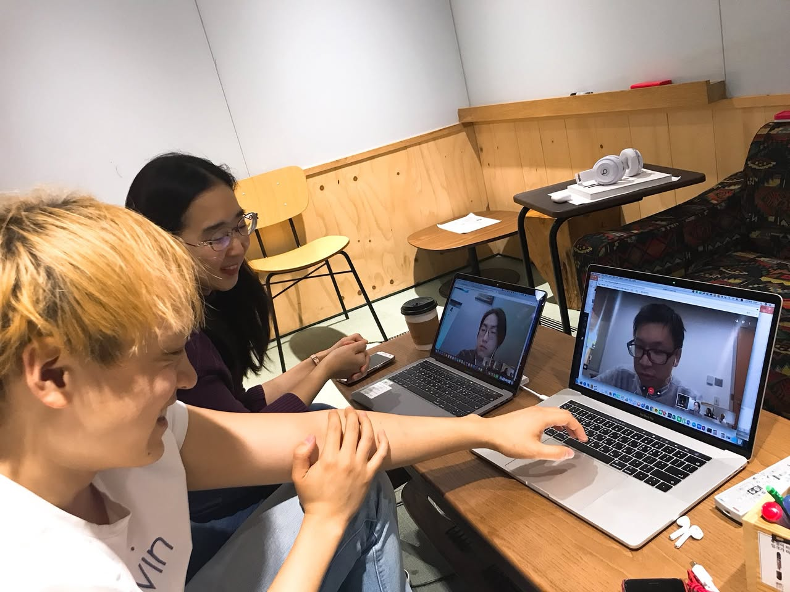
**이미지 캡션:** 따뜻한 조명이 비추는 실내 공간에서 세 명의 젊은 성인이 노트북으로 화상 회의를 하고 있다. 화면 왼쪽에 있는 노트북에는 안경을 쓴 젊은 남성이 보이고, 오른쪽에 있는 노트북에는 안경을 쓴 또 다른 젊은 남성이 보인다. 두 노트북 모두 화면 하단에 여러 개의 작은 창이 열려 있어 다른 참가자들이 참여하고 있음을 시사한다. 앞쪽에는 금발 머리를 한 젊은 여성이 보라색 상의를 입고 있으며, 그녀의 옆에는 검은 머리에 안경을 쓴 젊은 여성이 같은 보라색 상의를 입고 있다. 두 여성 모두 노트북 화면을 바라보며 미소를 짓고 있으며, 금발 머리의 여성은 오른손으로 노트북 키보드를 조작하고 있다. 테이블 위에는 커피 컵, 무선 이어폰, 그리고 몇 가지 작은 물건들이 놓여 있다. 배경에는 나무 벽과 의자가 보이며, 편안하고 캐주얼한 분위기를 자아낸다.를 짓고 있으며, 금발 머리의 여성은 오른손으로 노트북 키보드를 조작하고 있다. 테이블 위에는 커피 컵, 무선 이어폰, 그리고 몇 가지 작은 물건들이 놓여 있다. 배경에는 나무 벽과 의자가 보이며, 편안하고 캐주얼한 분위기를 자아낸다.
 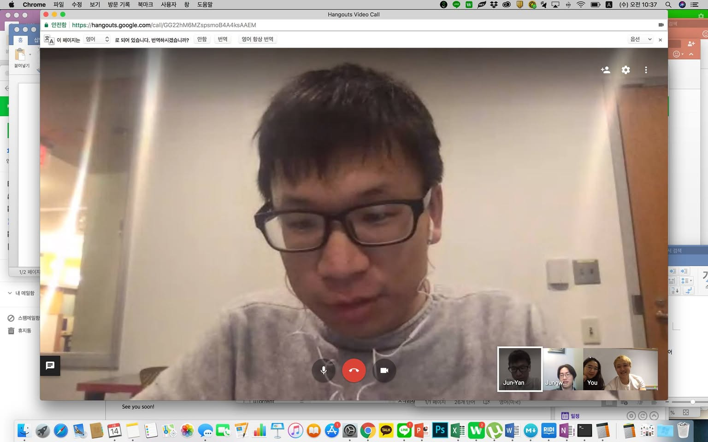
**이미지 캡션:** 화면 중앙에는 안경을 쓴 성인 남성이 회색 후드티를 입고 화상 통화에 참여하고 있다. 그는 흰색 이어폰을 착용하고 있으며, 표정은 약간 상기되어 있고 입을 살짝 벌리고 있어 대화 중인 것으로 보인다. 배경은 흰색 벽으로, 오른쪽에는 문이 있고 왼쪽에는 흐릿하게 책장으로 보이는 것이 있다. 화면 하단에는 다른 참여자들의 작은 영상 창이 보이며, 그중 한 명의 이름은 'Jun-Yan'으로 표시되어 있다. 전체적으로 편안한 분위기에서 진행되는 온라인 회의 또는 대화 장면으로 보인다.

> #오늘의레딧 https://www.reddit.com/r/MachineLearning/ 래딧은 읽을 거리가 다양합니다.  1. 전 세계적으로 일관된 이미지 완성 이미지 완성 2. 자동 학습 속도 향상 효과가 뛰어난 자동 학습 스케줄 3. 승자의 저주? 진도, 진행률 및 경험적인 리모나반트<MLResearch의 향후 인센티브 구조 4. ARM에서 프로젝트 TrilliumMachineLearningIP를 발표합니다. 5. 종이"AmbientGAN:관대한 측정의 일반화 모델" 6. GoogleHDR+사진 데이터 세트 7. UMAP:치수 감소에 대한 균일한 매니폴드 근사 반응 및 투영 8. 심층 학습 과정 | EP FL                                            Deep     Learning                                          Course. 9. 예측 가능한 값을 측정하기 위해 0과 1/2(멀티 캐스트 분급기)을 측정하기 위해 0과 1(멀티 그레이드 분급기)을 사용하여 확률을 0과 1로 나눕니다. 10. 선생님이 강요하지 않고 연설을 하는 데 어려움을 겪다. 11. 대략적인 Neighborhood벤치 마크 12. 보강 학습에 대한 질문 13. SGD스케줄에 따라 대규모 데이터 셋을 어떻게 완벽히 활용할 수 있습니까? 14. 웨스터스 타인 거리 도핑 사건 15. 전송 효율을 위한 ML 16. 이제 GoogleCloudTPU가속기를 사용하여 기계 학습 모델을 교육할 수 있습니다. 17. 2차원 신경망 기법을 이용한 그래프 분류 18. 대화형 시각화 장치 19. OnsetsandFrame:듀얼 객체 피아노 트랜스크립션 20. KerasResponseReferenceRepublicationforKerasRepublicReferenceRepublicationforReneralResponseReferency  1. https://www.reddit.com/r/MachineLearning/comments/7x8ve2/p_globally_and_locally_consistent_image_completion/ 2. http://blog.dlib.net/2018/02/automatic-learning-rate-scheduling-that.html 3. https://openreview.net/forum?id=rJWF0Fywf 4. https://www.anandtech.com/show/12427/arm-announces-trillium-machine-learning-ip 5. https://github.com/AshishBora/ambient-gan 6. https://research.googleblog.com/2018/02/introducing-hdr-burst-photography.html 7. https://arxiv.org/abs/1802.03426 8. https://documents.epfl.ch/users/f/fl/fleuret/www/dlc/ 9. https://www.reddit.com/r/MachineLearning/comments/7xceel/d_training_a_binary_classifier_xgbclassifier/ 10. https://www.reddit.com/r/MachineLearning/comments/7xdov5/d_trouble_with_generating_speech_without_teacher/ 11. https://www.reddit.com/r/MachineLearning/comments/7xdiud/r_approximate_nearest_neighbors_benchmark/ 12. https://www.reddit.com/r/MachineLearning/comments/7xddpw/d_question_about_reinforcement_learning/ 13. https://www.reddit.com/r/MachineLearning/comments/7xd5cn/d_how_do_you_fully_exploit_large_dataset_during/ 14. https://www.reddit.com/r/MachineLearning/comments/7x9q1n/d_wasserstein_distance_doubts/ 15. https://www.reddit.com/r/MachineLearning/comments/7xc1r5/r_ml_for_transport_efficiency/ 16. https://cloudplatform.googleblog.com/2018/02/Cloud-TPU-machine-learning-accelerators-now-available-in-beta.html 17. https://arxiv.org/abs/1708.02218 18. https://ezyang.github.io/convolution-visualizer/index.html 19. https://magenta.tensorflow.org/onsets-frames 20. https://arxiv.org/abs/1802.03198

### 2월 15일 (목) 08:52 · 📷 사진 (1장)

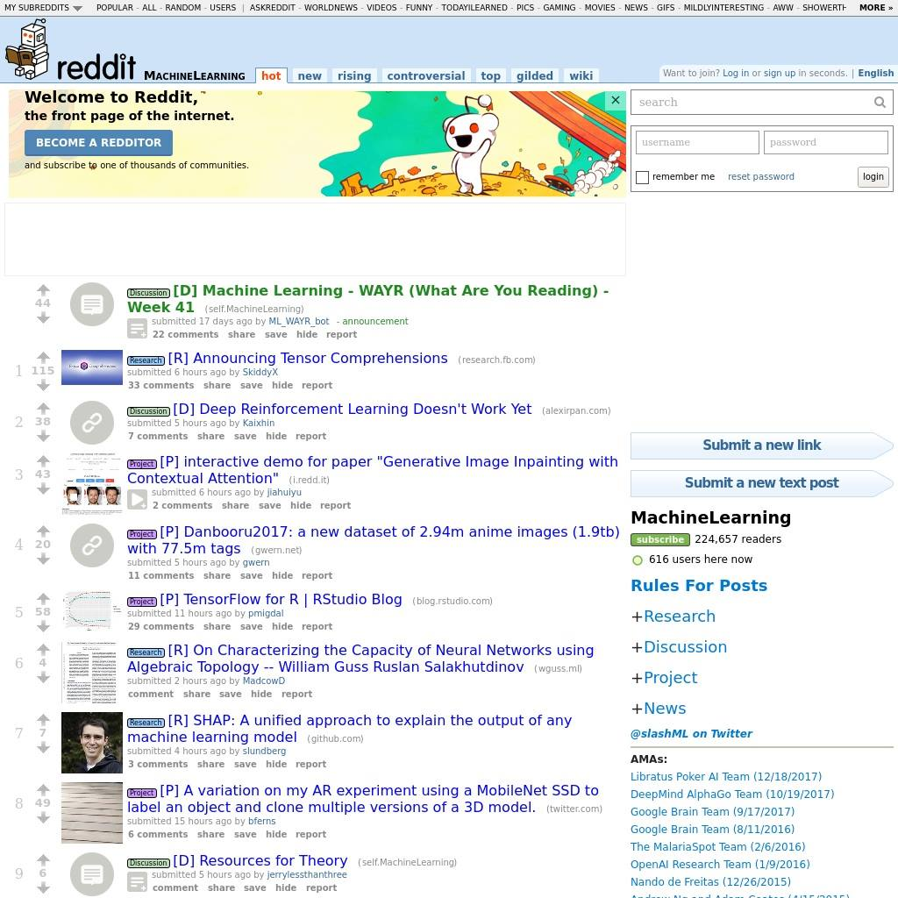
**이미지 캡션:** 이것은 레딧의 머신러닝 서브레딧 페이지로, 다양한 연구, 프로젝트, 토론 게시물이 나열되어 있습니다. 페이지 상단에는 레딧 로고와 함께 "Welcome to Reddit, the front page of the internet."이라는 문구가 보이며, 로그인 또는 회원가입을 할 수 있는 폼이 있습니다. 메인 콘텐츠 영역에는 여러 게시물이 시간순으로 정렬되어 있으며, 각 게시물은 제목, 작성자, 제출 시간, 댓글 수, 그리고 관련 링크나 썸네일 이미지를 포함하고 있습니다. 예를 들어, "[D] Machine Learning - WAYR (What Are You Reading) - Week 41"이라는 토론 게시물, "[R] Announcing Tensor Comprehensions"이라는 연구 게시물, "[P] interactive demo for paper "Generative Image Inpainting with Contextual Attention""이라는 프로젝트 게시물 등이 있습니다. 오른쪽 사이드바에는 "MachineLearning" 서브레딧의 구독자 수와 현재 접속자 수가 표시되어 있으며, 게시물 규칙과 함께 "AMAS" 섹션에는 과거 AMA(Ask Me Anything) 세션 목록이 나열되어 있습니다. 전반적으로 정보가 풍부하고 기술적인 주제에 초점을 맞춘 커뮤니티 페이지의 모습입니다.earning - WAYR (What Are You Reading) - Week 41"이라는 토론 게시물, "[R] Announcing Tensor Comprehensions"이라는 연구 게시물, "[P] interactive demo for paper "Generative Image Inpainting with Contextual Attention""이라는 프로젝트 게시물 등이 있습니다. 오른쪽 사이드바에는 "MachineLearning" 서브레딧의 구독자 수와 현재 접속자 수가 표시되어 있으며, 게시물 규칙과 함께 "AMAS" 섹션에는 과거 AMA(Ask Me Anything) 세션 목록이 나열되어 있습니다. 전반적으로 정보가 풍부하고 기술적인 주제에 초점을 맞춘 커뮤니티 페이지의 모습입니다.

> #오늘의레딧 https://www.reddit.com/r/MachineLearning/ 정말 읽을 거리가 많네요.  1. 발표자들이 발표한 성명 2. 깊은 강화 학습은 아직 효과가 없다. 3. "일반적인 관심사"를 통한 종이"세대 이미지 삽입"대화형 데모 4. Danboorurus:2.946 cm의 새 데이터 세트(1.19 b)의 새로운 데이터 세트(1.19 b) 5. R.R.R.R.R. 블로그 6. 대수학적 위상을 이용한 신경망의 특성 분석 7. SHAP:모든 기계 학습 모델의 출력을 설명하는 유니파이드 접근법 8. MobileNetSSD를 사용하여 객체에 레이블을 지정하고 여러 버전의 3D모델을 복제하는 데 사용되는 내 AR실험의 변화. 9. 이론을 위한 자원 10. 기계 학습 제품의 성공적인 채택을 위한 10가지 팁 11. VAE별도의 레이블을 사용한 문서 찾기/쓰기 디지털화 12. Systoliccncelerator시뮬레이터 시뮬레이터(SCALESics) 13. 팔레스트 발사기, 2대 AI프로세스 14. 전 세계적으로 일관된 이미지 완성 이미지 완성 15. 심층 방어-효율적인 멀티 태스킹 딥 16. 런던 박사 네트워크 AI심포지엄-심층 학습 개발 도서관 튜토리얼 지침서 17. UKP의 RL에 대한 호기심 18. 종이"AmbientGAN:관대한 측정의 일반화 모델" 19. 다양한 언어의 위키 피디아 기사의 품질과 중요성 20. SGD(SGDRAM)의 SGD(SGD):DataBreachThreat에서 제공하는 프라이빗 머신 학습  1. https://research.fb.com/announcing-tensor-comprehensions/ 2. https://www.alexirpan.com/2018/02/14/rl-hard.html 3. https://www.reddit.com/r/MachineLearning/comments/7xjnv5/p_interactive_demo_for_paper_generative_image/ 4. https://www.gwern.net/Danbooru2017 5. https://blog.rstudio.com/2018/02/06/tensorflow-for-r/ 6. http://wguss.ml/dev/nht/empirical/ 7. http://github.com/slundberg/shap 8. https://twitter.com/ben_ferns/status/963680203045294081 9. https://www.reddit.com/r/MachineLearning/comments/7xk6gj/d_resources_for_theory/ 10. https://www.efma.com/article/detail/28915 11. https://www.reddit.com/r/MachineLearning/comments/7xlmk2/d_finding_a_paper_with_vae_separate/ 12. https://github.com/ARM-software/SCALE-Sim 13. https://syncedreview.com/2018/02/13/arm-launches-project-trillium-two-ai-processors/ 14. https://www.reddit.com/r/MachineLearning/comments/7x8ve2/p_globally_and_locally_consistent_image_completion/ 15. http://www.fields.utoronto.ca/video-archive/static/2018/01/2509-18003/mergedvideo.ogv 16. https://github.com/tensorlayer/home/blob/master/slides/TensorLayer_London_PhD_Network_20180212.pdf 17. https://www.reddit.com/r/MachineLearning/comments/7xgxu7/d_curious_about_rl_for_nlp/ 18. https://github.com/AshishBora/ambient-gan 19. https://www.researchgate.net/publication/308887798_Quality_and_Importance_of_Wikipedia_Articles_in_Different_Languages 20. https://www.reddit.com/r/MachineLearning/comments/7xfzux/r_sgd_on_random_mixtures_sgdrm_private_machine/

### 2월 16일 (금) 08:52 · 📷 사진 (1장)

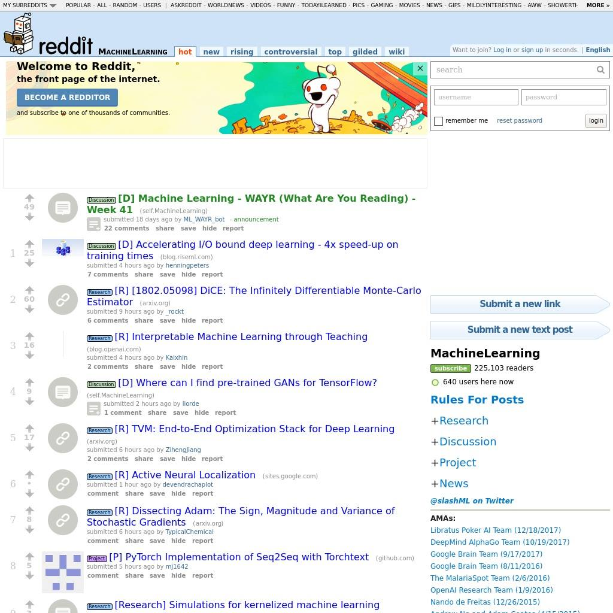
**이미지 캡션:** 이것은 레딧 웹사이트의 스크린샷으로, 머신러닝 서브레딧의 메인 페이지를 보여줍니다. 화면 왼쪽 상단에는 "MY SUBREDDITS", "POPULAR", "ALL", "RANDOM", "USERS", "ASKREDDIT", "WORLDNEWS", "VIDEOS", "FUNNY", "TODAYILEARNED", "PICS", "GAMING", "MOVIES", "NEWS", "GIFS", "MILDLYINTERESTING", "AWW", "SHOWERTHOUGHTS", "MORE"와 같은 다양한 링크가 있는 상단 메뉴 바가 있습니다. 그 아래에는 "Want to join? Log in or sign up in seconds. | English"라는 텍스트와 함께 로그인 및 회원가입을 위한 입력 필드와 버튼이 있습니다. 메인 콘텐츠 영역에는 "Welcome to Reddit, the front page of the internet."이라는 환영 메시지와 함께 레딧 로고와 귀여운 캐릭터가 그려진 이미지가 있습니다. 그 아래에는 "BECOME A REDDITOR"라는 버튼이 있습니다. 메인 콘텐츠의 대부분은 머신러닝 관련 게시물 목록으로 채워져 있으며, 각 게시물에는 제목, 제출자, 제출 시간, 댓글 수, 좋아요/싫어요 투표 수 등이 표시됩니다. 게시물 제목은 파란색으로 되어 있으며, 일부는 "[D]" 또는 "[R]"과 같은 태그로 시작하여 각각 토론 또는 연구를 나타냅니다. 오른쪽에는 "Submit a new link" 및 "Submit a new text post" 버튼과 함께 "MachineLearning" 서브레딧에 대한 정보가 표시됩니다. 이 정보에는 "subscribe" 버튼, "225,103 readers", "640 users here now"라는 텍스트가 포함되어 있습니다. 그 아래에는 "Rules For Posts"라는 제목과 함께 "+Research", "+Discussion", "+Project", "+News"와 같은 링크가 있습니다. 가장 오른쪽에는 "@slashML on Twitter"라는 텍스트와 함께 "AMAS" 섹션이 있으며, 다양한 AI 팀과의 과거 AMA(Ask Me Anything) 목록이 날짜와 함께 표시됩니다. 전반적으로 이 페이지는 머신러닝 커뮤니티의 활동을 보여주는 정보가 풍부한 인터페이스입니다.단 메뉴 바가 있습니다. 그 아래에는 "Want to join? Log in or sign up in seconds. | English"라는 텍스트와 함께 로그인 및 회원가입을 위한 입력 필드와 버튼이 있습니다. 메인 콘텐츠 영역에는 "Welcome to Reddit, the front page of the internet."이라는 환영 메시지와 함께 레딧 로고와 귀여운 캐릭터가 그려진 이미지가 있습니다. 그 아래에는 "BECOME A REDDITOR"라는 버튼이 있습니다. 메인 콘텐츠의 대부분은 머신러닝 관련 게시물 목록으로 채워져 있으며, 각 게시물에는 제목, 제출자, 제출 시간, 댓글 수, 좋아요/싫어요 투표 수 등이 표시됩니다. 게시물 제목은 파란색으로 되어 있으며, 일부는 "[D]" 또는 "[R]"과 같은 태그로 시작하여 각각 토론 또는 연구를 나타냅니다. 오른쪽에는 "Submit a new link" 및 "Submit a new text post" 버튼과 함께 "MachineLearning" 서브레딧에 대한 정보가 표시됩니다. 이 정보에는 "subscribe" 버튼, "225,103 readers", "640 users here now"라는 텍스트가 포함되어 있습니다. 그 아래에는 "Rules For Posts"라는 제목과 함께 "+Research", "+Discussion", "+Project", "+News"와 같은 링크가 있습니다. 가장 오른쪽에는 "@slashML on Twitter"라는 텍스트와 함께 "AMAS" 섹션이 있으며, 다양한 AI 팀과의 과거 AMA(Ask Me Anything) 목록이 날짜와 함께 표시됩니다. 전반적으로 이 페이지는 머신러닝 커뮤니티의 활동을 보여주는 정보가 풍부한 인터페이스입니다.

> #오늘의레딧 https://www.reddit.com/r/MachineLearning/ 재미난 이야기들이 많습니다.  1. I/O집약적인 학습 가속화 가속화-교육 시간에 4배 증가 2. 이해 관계를 통한 해석 가능한 기계 학습 3. TensorFlow의 사전 할당된 GAN을 어디서 찾을 수 있습니까? 4. TVM:심층 학습을 위한 엔드 투 엔드 최적화 스택 5. 능동 신경 국부화 6. 아담의 이혼:확률적 구배의 부호, 부호, 변주곡 7. Torchtt와 Torchtt와의 SeToSeq구현 8. 커널 된 기계 학습에 대한 시뮬레이션 9. CNN+RL질문 확대 10. Deeplearn.p0.5.0 릴리스로 릴리스 된 deeplearn0.5.0 릴리즈(지금 PyTorch:PRESet과 같음) 11. 나는 실존 인물을 훈련시키려고 노력 중이다. 어느 쪽이 추론할 수 있는 CRF또는 CEERDINGPerceptron에 비해 더 빠른가? 같은 기능을 사용하여 성능에 영향을 미치는 요소가 많이 있습니까? 12. 환경에 대한 표의 표시를 학습하여 효율적인 모델 기반 RL도출 13. 발표자들이 발표한 성명 14. 내가 예전에 했던 일에 대해 내가 예전에 했던 일에 대해 얼마나 상세하게 말해야 할까? 15. 온라인에서 모델 교육을 실시하는 모습을 지켜보십시오. 16. 기계 학습에서의 현대화/변형 대수의 적용 17. 깊은 강화 학습은 아직 효과가 없다. 18. 2018년 기계 학습/DeepLearning컨퍼런스 19. 데이터 학습을 위한 지능형 웹 애플리케이션을 소개합니다. 20. "일반적인 관심사"를 통한 종이"세대 이미지 삽입"대화형 데모  1. https://blog.riseml.com/accelerating-io-bound-deep-learning-e0e3f095fd0 2. https://blog.openai.com/interpretable-machine-learning-through-teaching/ 3. https://www.reddit.com/r/MachineLearning/comments/7xtmi0/d_where_can_i_find_pretrained_gans_for_tensorflow/ 4. https://arxiv.org/abs/1802.04799 5. https://sites.google.com/view/active-neural-localization 6. https://arxiv.org/abs/1705.07774 7. https://github.com/Mjkim88/Pytorch-Torchtext-Seq2Seq 8. https://www.reddit.com/r/MachineLearning/comments/7xtowr/research_simulations_for_kernelized_machine/ 9. https://www.reddit.com/r/MachineLearning/comments/7xrrbp/d_extending_cnn_rl_questions/ 10. https://github.com/PAIR-code/deeplearnjs/releases/tag/v0.5.0 11. https://www.reddit.com/r/MachineLearning/comments/7xu19p/projecti_am_trying_to_train_entity_tagger_which/ 12. https://arxiv.org/abs/1802.04325 13. https://research.fb.com/announcing-tensor-comprehensions/ 14. https://www.reddit.com/r/MachineLearning/comments/7xukyq/d_how_much_detail_am_i_supposed_to_say_about_what/ 15. https://learning-rates.com 16. https://www.reddit.com/r/MachineLearning/comments/7xpgxr/d_applications_of_modernabstract_algebra_in/ 17. https://www.alexirpan.com/2018/02/14/rl-hard.html 18. https://tryolabs.com/blog/machine-learning-deep-learning-conferences/?HN= 19. https://blog.datalore.io/introducing-datalore/ 20. https://www.reddit.com/r/MachineLearning/comments/7xjnv5/p_interactive_demo_for_paper_generative_image/

### 2월 17일 (토) 08:52 · 📷 사진 (1장)

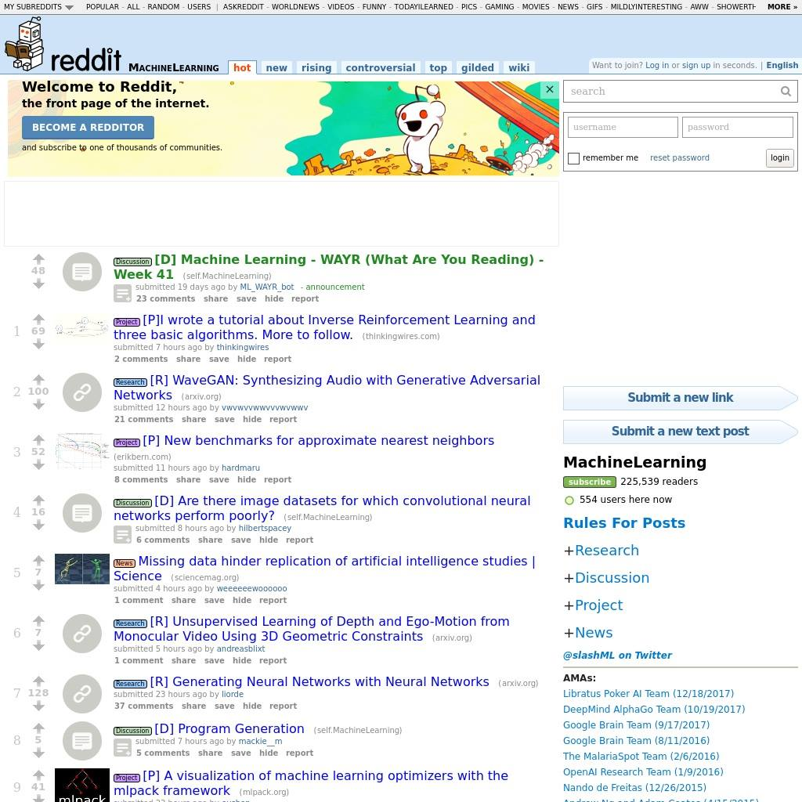
**이미지 캡션:** 이것은 레딧(Reddit) 웹사이트의 머신러닝(Machine Learning) 서브레딧 페이지 스크린샷으로, 다양한 게시물 목록과 오른쪽 사이드바 정보가 보인다. 페이지 상단에는 레딧 로고와 함께 "Welcome to Reddit, the front page of the internet."이라는 환영 메시지가 있고, 그 아래에는 "BECOME A REDDITOR" 버튼이 있다. 메인 콘텐츠 영역에는 여러 게시물이 시간순으로 나열되어 있으며, 각 게시물은 제목, 작성자, 제출 시간, 댓글 수 등의 정보를 포함한다. 게시물 제목들은 주로 "Machine Learning - WAYR (What Are You Reading)", "Inverse Reinforcement Learning", "WaveGAN: Synthesizing Audio with Generative Adversarial Networks", "New benchmarks for approximate nearest neighbors", "image datasets for which convolutional neural networks perform poorly?", "Missing data hinder replication of artificial intelligence studies", "Unsupervised Learning of Depth and Ego-Motion from Monocular Video Using 3D Geometric Constraints", "Generating Neural Networks with Neural Networks", "Program Generation", "A visualization of machine learning optimizers with the mlpack framework" 등 머신러닝 관련 주제를 다루고 있다. 오른쪽 사이드바에는 "MachineLearning" 서브레딧 구독 정보와 함께 "Rules For Posts" 섹션이 있으며, 하위 섹션으로 "+Research", "+Discussion", "+Project", "+News"가 나열되어 있다. 또한, "@slashML on Twitter" 링크와 "AMAS" 섹션에는 과거 AMA(Ask Me Anything) 세션 목록이 날짜와 함께 표시되어 있다. 페이지 상단에는 검색창과 로그인/회원가입 폼도 보인다. 전반적으로 기술 및 연구 커뮤니티의 정보 공유 및 토론이 이루어지는 온라인 플랫폼의 모습을 보여준다.다. 게시물 제목들은 주로 "Machine Learning - WAYR (What Are You Reading)", "Inverse Reinforcement Learning", "WaveGAN: Synthesizing Audio with Generative Adversarial Networks", "New benchmarks for approximate nearest neighbors", "image datasets for which convolutional neural networks perform poorly?", "Missing data hinder replication of artificial intelligence studies", "Unsupervised Learning of Depth and Ego-Motion from Monocular Video Using 3D Geometric Constraints", "Generating Neural Networks with Neural Networks", "Program Generation", "A visualization of machine learning optimizers with the mlpack framework" 등 머신러닝 관련 주제를 다루고 있다. 오른쪽 사이드바에는 "MachineLearning" 서브레딧 구독 정보와 함께 "Rules For Posts" 섹션이 있으며, 하위 섹션으로 "+Research", "+Discussion", "+Project", "+News"가 나열되어 있다. 또한, "@slashML on Twitter" 링크와 "AMAS" 섹션에는 과거 AMA(Ask Me Anything) 세션 목록이 날짜와 함께 표시되어 있다. 페이지 상단에는 검색창과 로그인/회원가입 폼도 보인다. 전반적으로 기술 및 연구 커뮤니티의 정보 공유 및 토론이 이루어지는 온라인 플랫폼의 모습을 보여준다.

> #오늘의레딧 https://www.reddit.com/r/MachineLearning/ 래딧은 읽을 거리가 다양합니다.  1. 나는 인버스 강화 학습과 세가지 기본적인 알고리즘에 대한 튜토리얼을 썼다. 더 많은 후속 조치를 취해야 합니다. 2. Wavegan:일반적으로 범용 네트워크를 통한 오디오화 3. 가까운 인접 지역에 대한 새로운 벤치 마크 4. 변환된 신경 네트워크가 제대로 작동하지 않는 이미지 데이터 세트가 있습니까? 5. 3차원 기하학적 제약 조건을 이용한 모 슬라이어 비디오의 초고속도 학습 6. 신경망을 이용한 신경망 제어기 개발 7. 프로그램 생성 8. mlpack 프레임워크를 사용한 머신 학습 최적화 9. Deeplearn.p0.5.0 릴리스로 릴리스 된 deeplearn0.5.0 릴리즈(지금 PyTorch:PRESet과 같음) 10. 페이스북 AI연구실에서 돌아온 사람들은 누구든 들어 봤나요? 11. 다양한 시스템 학습(예:NNMtotimetoPGM, PGMtoPGM등)을 통해 모든 것을 배울 수 있는 소규모 데이터 셋을 선택하고자 한다면 무엇을 선택하시겠습니까? 12. Recommender시스템 소개. 제2부(신경망 채택) 13. I/O집약적인 학습 가속화 가속화-교육 시간에 4배 증가 14. 이해 관계를 통한 해석 가능한 기계 학습 15. styllK2-네트워크 교육 중 하나 또는 두개의 네트워크가 교육되어 있습니까? 16. 이 웹 기반의 웹 블로그 인텔리전스, 기술 및 허구 17. TensorFlow의 사전 할당된 GAN을 어디서 찾을 수 있습니까? 18. TVM:심층 학습을 위한 엔드 투 엔드 최적화 스택 19. 능동 신경 국부화 20. 아담의 이혼:확률적 구배의 부호, 부호, 변주곡  1. https://thinkingwires.com/posts/2018-02-13-irl-tutorial-1.html 2. https://arxiv.org/abs/1802.04208 3. https://erikbern.com/2018/02/15/new-benchmarks-for-approximate-nearest-neighbors.html 4. https://www.reddit.com/r/MachineLearning/comments/7xzhje/d_are_there_image_datasets_for_which/ 5. https://arxiv.org/abs/1802.05522 6. http://arxiv.org/abs/1801.01952 7. https://www.reddit.com/r/MachineLearning/comments/7xzosy/d_program_generation/ 8. http://www.mlpack.org/docs/mlpack-git/doxygen/optimizertutorial.html 9. https://github.com/PAIR-code/deeplearnjs/releases/tag/v0.5.0 10. https://www.reddit.com/r/MachineLearning/comments/7xxng0/d_anyone_hear_back_from_facebook_ai_research_fair/ 11. https://www.reddit.com/r/MachineLearning/comments/7y0btr/d_if_you_were_going_to_learn_a_huge_breadth_of/ 12. https://medium.com/@huangkh19951228/introduction-to-recommender-system-part-2-adoption-of-neural-network-831972c4cbf7 13. https://blog.riseml.com/accelerating-io-bound-deep-learning-e0e3f095fd0 14. https://blog.openai.com/interpretable-machine-learning-through-teaching/ 15. https://www.reddit.com/r/MachineLearning/comments/7xww5z/d_style2vec_is_one_network_trained_or_two_network/ 16. https://hackernoon.com/this-tangled-web-intelligence-technology-and-fiction-43e261d03bb3 17. https://www.reddit.com/r/MachineLearning/comments/7xtmi0/d_where_can_i_find_pretrained_gans_for_tensorflow/ 18. https://arxiv.org/abs/1802.04799 19. https://sites.google.com/view/active-neural-localization 20. https://arxiv.org/abs/1705.07774

### 2월 18일 (일) 08:52 · 📷 사진 (1장)

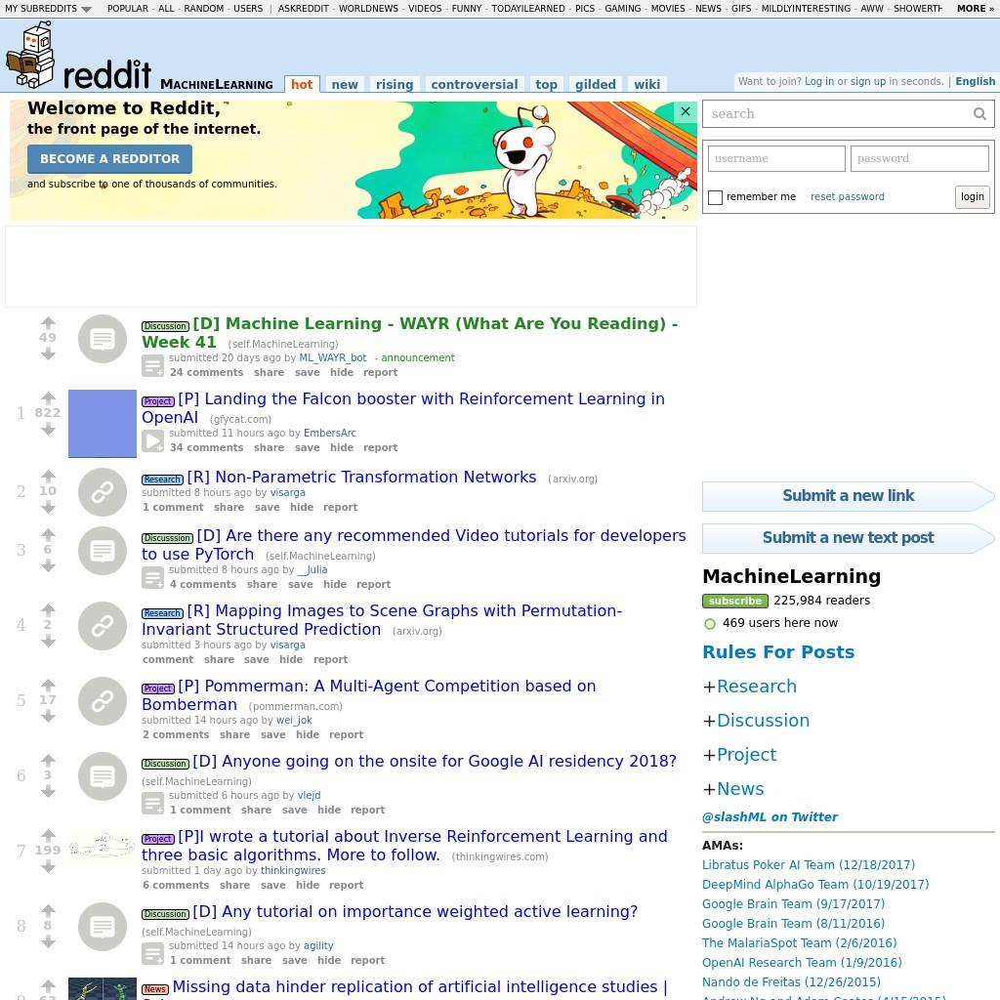
**이미지 캡션:** 이 이미지는 인기 있는 소셜 뉴스 웹사이트인 레딧의 머신러닝 서브레딧 페이지를 보여줍니다. 페이지 상단에는 레딧 로고와 함께 "hot", "new", "rising", "controversial", "top", "gilded", "wiki"와 같은 다양한 탭이 있습니다. 중앙에는 "Welcome to Reddit, the front page of the internet."이라는 문구와 함께 레딧의 마스코트인 스너(Snoo)가 그려진 일러스트가 있습니다. 로그인 및 회원가입을 위한 입력 필드와 버튼도 보입니다. 메인 콘텐츠 영역에는 머신러닝 관련 게시물 목록이 표시되며, 각 게시물은 제목, 작성자, 제출 시간, 댓글 수, 좋아요/싫어요 수 등의 정보를 포함합니다. 게시물 제목은 "[D] Machine Learning - WAYR (What Are You Reading) - Week 41", "[P] Landing the Falcon booster with Reinforcement Learning in OpenAI", "[R] Non-Parametric Transformation Networks" 등 다양합니다. 오른쪽 사이드바에는 "Submit a new link", "Submit a new text post" 버튼과 함께 "MachineLearning" 서브레딧 구독 정보, "Rules For Posts", 그리고 "AMAS" 목록이 있습니다. 전반적으로 기술 및 학술 커뮤니티의 활발한 토론과 정보 공유가 이루어지는 온라인 포럼의 모습을 보여줍니다. 메인 콘텐츠 영역에는 머신러닝 관련 게시물 목록이 표시되며, 각 게시물은 제목, 작성자, 제출 시간, 댓글 수, 좋아요/싫어요 수 등의 정보를 포함합니다. 게시물 제목은 "[D] Machine Learning - WAYR (What Are You Reading) - Week 41", "[P] Landing the Falcon booster with Reinforcement Learning in OpenAI", "[R] Non-Parametric Transformation Networks" 등 다양합니다. 오른쪽 사이드바에는 "Submit a new link", "Submit a new text post" 버튼과 함께 "MachineLearning" 서브레딧 구독 정보, "Rules For Posts", 그리고 "AMAS" 목록이 있습니다. 전반적으로 기술 및 학술 커뮤니티의 활발한 토론과 정보 공유가 이루어지는 온라인 포럼의 모습을 보여줍니다.

> #오늘의레딧 https://www.reddit.com/r/MachineLearning/ 따끈한 소식들입니다.  1. Open니에서 보강 학습을 통해 팰콘 부스터를 착륙시킨다. 2. 비 메모리 반도체 변환 회로 3. 영구적인 투시 진단을 사용하여 장면 그래프에 이미지를 매핑 합니다. 4. 폼머맨:Bomberman을 기반으로 한 멀티 테넌트 대회 5. 2018년 구글 인디언지 현장에 온 거라면 누구나 갈 수 있을까요? 6. 나는 인버스 강화 학습과 세가지 기본적인 알고리즘에 대한 튜토리얼을 썼다. 더 많은 후속 조치를 취해야 합니다. 7. 가중된 능동적 학습 학습에 관한 자습서는 무엇입니까? 8. ConvolutionLSTM계층 스택 9. Wavegan:일반적으로 범용 네트워크를 통한 오디오화 10. 가까운 인접 지역에 대한 새로운 벤치 마크 11. 변환된 신경 네트워크가 제대로 작동하지 않는 이미지 데이터 세트가 있습니까? 12. 3차원 기하학적 제약 조건을 이용한 모 슬라이어 비디오의 초고속도 학습 13. 프로그램 생성 14. 신경망을 이용한 신경망 제어기 개발 15. 페이스북 AI연구실에서 돌아온 사람들은 누구든 들어 봤나요? 16. mlpack 프레임워크를 사용한 머신 학습 최적화 17. Recommender시스템 소개. 제2부(신경망 채택) 18. Deeplearn.p0.5.0 릴리스로 릴리스 된 deeplearn0.5.0 릴리즈(지금 PyTorch:PRESet과 같음) 19. 다양한 시스템 학습(예:NNMtotimetoPGM, PGMtoPGM등)을 통해 모든 것을 배울 수 있는 소규모 데이터 셋을 선택하고자 한다면 무엇을 선택하시겠습니까? 20. I/O집약적인 학습 가속화 가속화-교육 시간에 4배 증가  1. https://gfycat.com/CoarseEmbellishedIsopod 2. https://arxiv.org/abs/1801.04520 3. https://arxiv.org/abs/1802.05451 4. https://www.pommerman.com 5. https://www.reddit.com/r/MachineLearning/comments/7y7x1o/d_anyone_going_on_the_onsite_for_google_ai/ 6. https://thinkingwires.com/posts/2018-02-13-irl-tutorial-1.html 7. https://www.reddit.com/r/MachineLearning/comments/7y5pnv/d_any_tutorial_on_importance_weighted_active/ 8. https://www.reddit.com/r/MachineLearning/comments/7y66f3/d_stack_of_convolution_lstm_layers/ 9. https://arxiv.org/abs/1802.04208 10. https://erikbern.com/2018/02/15/new-benchmarks-for-approximate-nearest-neighbors.html 11. https://www.reddit.com/r/MachineLearning/comments/7xzhje/d_are_there_image_datasets_for_which/ 12. https://arxiv.org/abs/1802.05522 13. https://www.reddit.com/r/MachineLearning/comments/7xzosy/d_program_generation/ 14. http://arxiv.org/abs/1801.01952 15. https://www.reddit.com/r/MachineLearning/comments/7xxng0/d_anyone_hear_back_from_facebook_ai_research_fair/ 16. http://www.mlpack.org/docs/mlpack-git/doxygen/optimizertutorial.html 17. https://medium.com/@huangkh19951228/introduction-to-recommender-system-part-2-adoption-of-neural-network-831972c4cbf7 18. https://github.com/PAIR-code/deeplearnjs/releases/tag/v0.5.0 19. https://www.reddit.com/r/MachineLearning/comments/7y0btr/d_if_you_were_going_to_learn_a_huge_breadth_of/ 20. https://blog.riseml.com/accelerating-io-bound-deep-learning-e0e3f095fd0

### 2월 19일 (월) 08:52 · 📷 사진 (1장)

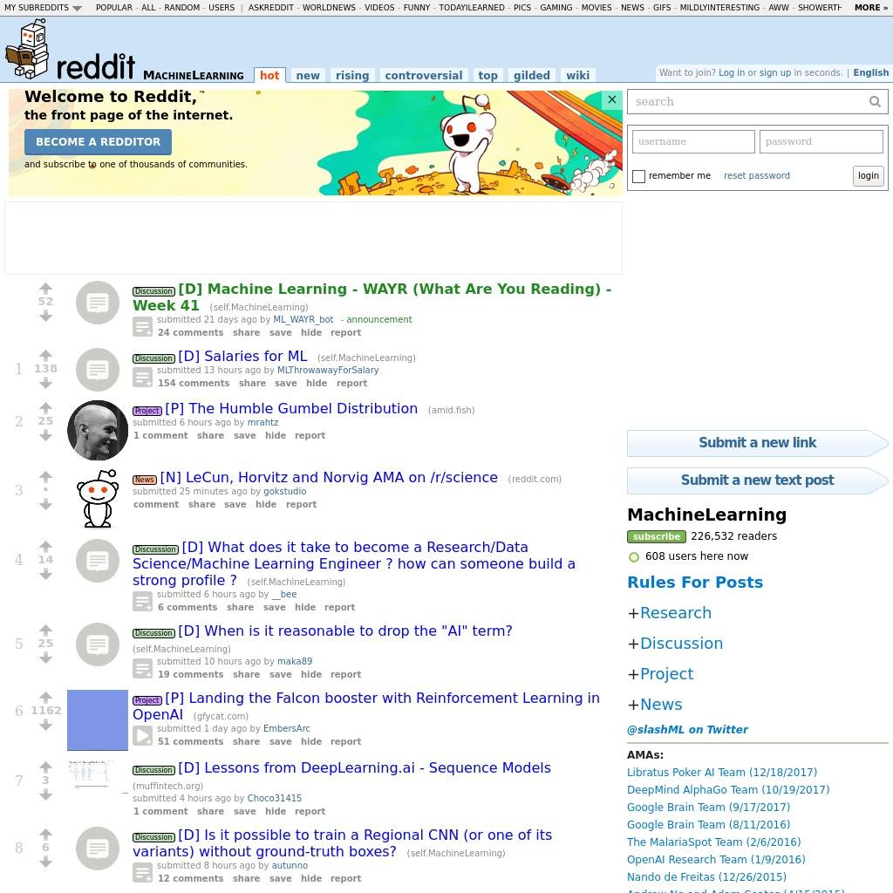
**이미지 캡션:** 이 이미지는 레딧(Reddit) 웹사이트의 '머신러닝(MachineLearning)' 커뮤니티 페이지를 보여줍니다. 페이지 상단에는 레딧 로고와 함께 'Welcome to Reddit, the front page of the internet.'이라는 환영 문구가 있고, 그 옆에는 귀여운 캐릭터와 함께 'hot', 'new', 'rising', 'controversial', 'top', 'gilded', 'wiki'와 같은 메뉴들이 보입니다. 로그인 창에는 사용자 이름과 비밀번호를 입력하는 칸이 있으며, 'remember me'와 'reset password' 옵션도 있습니다. 페이지 중앙에는 다양한 주제의 게시물 목록이 나열되어 있으며, 각 게시물은 제목, 작성자, 댓글 수, 추천 수 등의 정보를 포함하고 있습니다. 예를 들어, '[D] Machine Learning - WAYR (What Are You Reading) - Week 41'이라는 제목의 게시물은 21일 전에 올라왔고 24개의 댓글이 달려 있습니다. 또한, 'Submit a new link'와 'Submit a new text post' 버튼이 있어 사용자들이 새로운 게시물을 올릴 수 있도록 합니다. 페이지 오른쪽에는 'MachineLearning' 커뮤니티의 구독자 수와 현재 접속자 수가 표시되어 있으며, 'Rules For Posts' 섹션에는 'Research', 'Discussion', 'Project', 'News'와 같은 하위 카테고리가 있습니다. 하단에는 트위터 계정(@slashML on Twitter)과 AMAs(Ask Me Anything) 목록이 보입니다. 전체적으로 기술 관련 커뮤니티의 활발한 정보 교류가 이루어지는 듯한 분위기입니다.content area displays a list of recent posts in the Machine Learning subreddit, each with a title, author, submission time, and number of comments. Some of the post titles include "[D] Machine Learning - WAYR (What Are You Reading) - Week 41," "[D] Salaries for ML," "[P] The Humble Gumbel Distribution," "[N] LeCun, Horvitz and Norvig AMA on /r/science," and "[D] What does it take to become a Research/Data Science/Machine Learning Engineer?". On the right side of the screen, there's a search bar, login fields, and a section for the "MachineLearning" subreddit, showing it has 226,532 readers and 608 users currently online. Below this, there are links to "Rules For Posts" and a list of past AMAs (Ask Me Anything) related to AI and machine learning. The overall atmosphere is informative and community-oriented, typical of an online forum dedicated to a specific topic.

> #오늘의레딧 https://www.reddit.com/r/MachineLearning/ 따끈한 소식들입니다.  1. ML을 위한 급여 2. 험블 검블 분포 3. https://www.reddit.com/r/science에서 Lecun, Horvitz및 NorvigAMA 4. "AI"라는 용어를 떨어뜨리는 것은 타당한가? 5. Open니에서 보강 학습을 통해 팰콘 부스터를 착륙시킨다. 6. DeepLearning.ai의 교훈-시퀀스 모델 7. 지상파 박스 없이도 지역 CNN(또는 그 변종 중 하나)을 훈련시킬 수 있을까요? 8. Soumith/ Goodfellow에서 "동일한 GAN생성"에 대한 업데이트가 있었습니까? 9. 진화된 정책 구배 10. 어떻게 기계 학습자들이 팀에서 일하는가? 11. 어떻게 이 문제를 해결할 수 있을까요? 12. 미국 통계 학회는 통계 메이저(2016년)에 대한 최초의 조사를 발표했다. 13. 데모를 보면서 저는 붉은 악마들이 어떻게 신경 회로가 작동하는지를 비전문가들에게 설명하기 위해 작은 붉은 악마들을 사용하는 것을 보았습니다. 14. Baseline/ Be nc ar ks hm different /  Da application ta  se   ts   and   domains architectures          for                     Ba     ne se              li s -. 15. 모조 학습을 수행할 때 회복 중인 복구+모조 데이터의 용어는 무엇입니까? 16. 계층 불균형에 따른 순차 학습 문제를 위한 배치 크기 감소 17. 보조 손실이 있는 RNN의 장기 종속성 학습 18. 제로 패딩이 정규화 출력에 영향을 미치는가? 19. "매니폴드 접선 분류기"(Rifaietal., 2008)에서 가설을 충족하는 합성 데이터 세트가 있는가? 20. "인공 지능은 현실 세계로 옮겨 간다. 에릭 호비츠, 피터 노빅, 얀센, 헨리 카우츠, 그리고 헨리 카우츠와 같은 패널 토론회가 열린다.  1. https://www.reddit.com/r/MachineLearning/comments/7yde11/d_salaries_for_ml/ 2. http://amid.fish/humble-gumbel 3. https://www.reddit.comhttps://www.reddit.com/r/science/comments/7yegux/aaas_ama_hi_were_researchers_from_google/?utm_source=reddit-android 4. https://www.reddit.com/r/MachineLearning/comments/7yeb0x/d_when_is_it_reasonable_to_drop_the_ai_term/ 5. https://gfycat.com/CoarseEmbellishedIsopod 6. https://muffintech.org/blog/id/9/ 7. https://www.reddit.com/r/MachineLearning/comments/7yeysh/d_is_it_possible_to_train_a_regional_cnn_or_one/ 8. https://www.reddit.com/r/MachineLearning/comments/7ybmyx/d_have_there_been_any_updates_on_the_are_gans/ 9. https://arxiv.org/abs/1802.04821v1 10. https://www.reddit.com/r/MachineLearning/comments/7yayy7/d_how_do_machine_learning_researchers_work_in/ 11. https://www.reddit.com/r/MachineLearning/comments/7yge0t/d_how_to_tackle_this_problem/ 12. http://magazine.amstat.org/blog/2017/11/01/2016-bachelors-survey/ 13. https://www.reddit.comhttps://www.reddit.com/r/learnmachinelearning/comments/7xymqf/tip_of_my_tongue_a_demo_i_once_saw_that_used/ 14. https://www.reddit.com/r/MachineLearning/comments/7yd2m5/d_baselinesbenchmarksdatasets_for_different/ 15. https://www.reddit.com/r/MachineLearning/comments/7yfjm1/d_what_is_the_term_for_intermixing_recovery/ 16. https://www.reddit.com/r/MachineLearning/comments/7ydi9y/d_lower_batch_size_for_sequential_learning/ 17. https://openreview.net/forum?id=Hy9xDwyPM 18. https://www.reddit.com/r/MachineLearning/comments/7yco19/d_does_zero_padding_affect_normalization_output/ 19. https://www.reddit.com/r/MachineLearning/comments/7yb1ob/d_are_there_synthetic_data_sets_which_satisfy_the/ 20. https://livestream.com/accounts/7021958/events/8049147/videos/170373944

### 2월 20일 (화) 08:52 · 📷 사진 (1장)

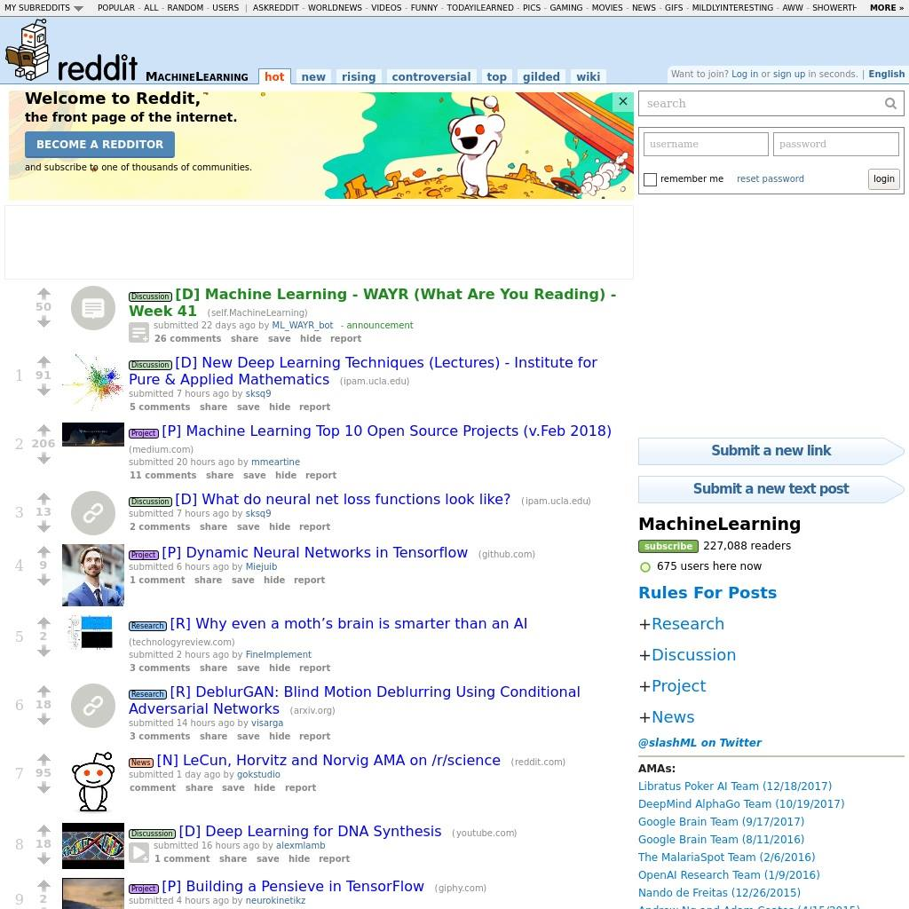
**이미지 캡션:** 이 이미지는 레딧(Reddit) 웹사이트의 머신러닝(Machine Learning) 서브레딧 페이지를 보여줍니다. 페이지 상단에는 레딧 로고와 함께 "Welcome to Reddit, the front page of the internet."이라는 문구가 있고, 그 옆에는 귀여운 레딧 봇 캐릭터가 그려져 있습니다. 로그인 및 회원가입을 위한 입력창과 버튼도 보입니다. 페이지 중앙에는 다양한 게시물 목록이 나열되어 있으며, 각 게시물은 제목, 작성자, 시간, 댓글 수 등의 정보를 포함하고 있습니다. 게시물들은 주로 머신러닝, 딥러닝, 인공지능 관련 주제를 다루고 있으며, 링크, 토론, 프로젝트, 연구 등 다양한 유형의 콘텐츠를 포함합니다. 오른쪽 사이드바에는 "MachineLearning" 서브레딧의 구독자 수와 현재 접속자 수가 표시되어 있으며, 게시물 규칙과 트위터 계정 정보, 그리고 과거 AMA(Ask Me Anything) 목록이 나열되어 있습니다. 전반적으로 기술 관련 커뮤니티의 정보 공유 및 토론이 이루어지는 웹사이트의 모습을 보여줍니다.주로 머신러닝, 딥러닝, 인공지능 관련 주제를 다루고 있으며, 링크, 토론, 프로젝트, 연구 등 다양한 유형의 콘텐츠를 포함합니다. 오른쪽 사이드바에는 "MachineLearning" 서브레딧의 구독자 수와 현재 접속자 수가 표시되어 있으며, 게시물 규칙과 트위터 계정 정보, 그리고 과거 AMA(Ask Me Anything) 목록이 나열되어 있습니다. 전반적으로 기술 관련 커뮤니티의 정보 공유 및 토론이 이루어지는 웹사이트의 모습을 보여줍니다.

> #오늘의레딧 https://www.reddit.com/r/MachineLearning/ 머신러닝 공부는 정말 재미있죠?아침부터 다양한 소식이 많네요.  1. 새로운 심층 학습 기법(강의실)-순수 및 적용 수학 연구소 2. 상위 10대 오픈 소스 프로젝트(v.Feb2018) 3. 신경 순 손실 기능은 어떻게 생겼을까요? 4. Tensorflow의 동적 신경망 5. 왜 나방의 뇌는 인공 지능보다 더 똑똑한가요? 6. Deblurgan:조건부 주소 변환기를 이용한 블라인드 동작 교란 7. https://www.reddit.com/r/science에서 Lecun, Horvitz및 NorvigAMA 8. 텐서 플로우 시 펜시브 빌딩 9. DeepPILCO를 재생하지 못 했습니다. (WLNDynamic모델이 장착된 PILCO) 10. GPS를 이용해 뱀을 잡는 법을 배우는 CNN 11. PyTorch와 함께 사전 정의된 CNN을 미세 조정하기 위한 라이브러리 12. 험블 검블 분포 13. 비동기 신호를 통한 가티스 스타일 전달 방법, 어떻게? 14. ML을 위한 급여 15. DatasetAPI를 사용하여 텍스트를 Tensorflow로 변환 16. 제프리 힌튼에 관한 특집 기사 17. -인공 지능을 얻기 위해서는 룰을 배워야 합니다-'엠'을 깨는 방법은 18. "AI"라는 용어를 떨어뜨리는 것은 타당한가? 19. 진화된 정책 구배 20. DeepLearning.ai의 교훈-시퀀스 모델  1. http://www.ipam.ucla.edu/programs/workshops/new-deep-learning-techniques/?tab=schedule 2. https://medium.com/@Mybridge/machine-learning-top-10-open-source-projects-v-feb-2018-d1d39062bd20 3. http://www.ipam.ucla.edu/abstract/?tid=14548&pcode=DLT2018 4. https://github.com/Miej/Dynamic_Neural_Manifold 5. https://www.technologyreview.com/s/610278/why-even-a-moths-brain-is-smarter-than-an-ai/ 6. https://arxiv.org/abs/1711.07064 7. https://www.reddit.comhttps://www.reddit.com/r/science/comments/7yegux/aaas_ama_hi_were_researchers_from_google/?utm_source=reddit-android 8. https://giphy.com/gifs/2A2fTuNwjNuri5s22d 9. https://www.reddit.com/r/MachineLearning/comments/7ylq04/p_failure_of_reproducing_deeppilco_pilco_with_bnn/ 10. https://streamable.com/sbjnv 11. https://github.com/creafz/pytorch-cnn-finetune 12. http://amid.fish/humble-gumbel 13. https://www.reddit.com/r/MachineLearning/comments/7yn40k/d_gatys_style_transfer_with_asynchronous_signals/ 14. https://www.reddit.com/r/MachineLearning/comments/7yde11/d_salaries_for_ml/ 15. https://medium.com/@TalPerry/getting-text-into-tensorflow-with-the-dataset-api-ffb832c8bec6 16. https://torontolife.com/tech/ai-superstars-google-facebook-apple-studied-guy/ 17. https://www.scientificamerican.com/article/for-ai-to-get-creative-it-must-learn-the-rules-mdash-then-how-to-break-lsquo-em/ 18. https://www.reddit.com/r/MachineLearning/comments/7yeb0x/d_when_is_it_reasonable_to_drop_the_ai_term/ 19. https://arxiv.org/abs/1802.04821v1 20. https://muffintech.org/blog/id/9/

### 2월 21일 (수) 08:52 · 📷 사진 (1장)

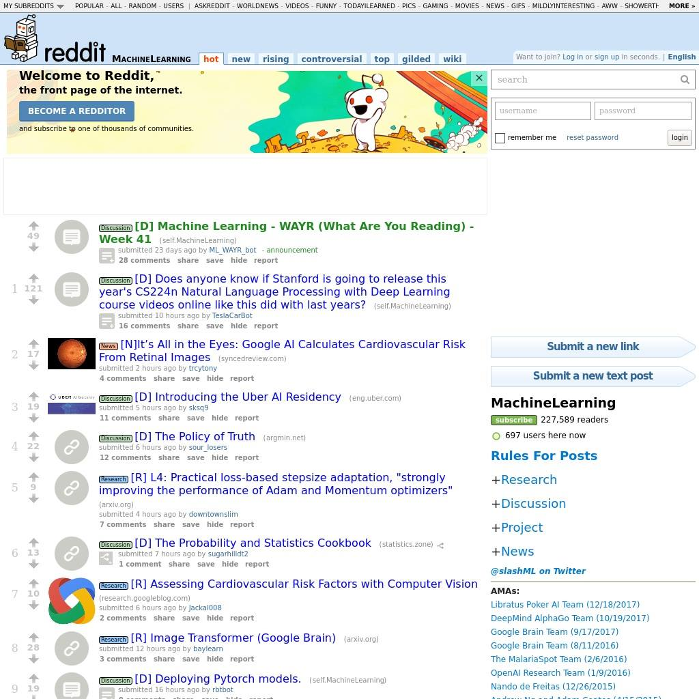
**이미지 캡션:** 이것은 레딧 웹사이트의 스크린샷으로, 머신러닝 서브레딧의 메인 페이지를 보여줍니다. 화면 상단에는 레딧 로고와 함께 "Welcome to Reddit, the front page of the internet."이라는 문구가 있고, 그 아래에 "BECOME A REDDITOR" 버튼이 있습니다. 오른쪽 상단에는 로그인 및 회원가입을 위한 입력란과 버튼이 있습니다. 메인 콘텐츠 영역에는 다양한 게시물 목록이 표시되며, 각 게시물은 제목, 작성자, 댓글 수, 게시 시간 등의 정보를 포함합니다. 게시물 제목 옆에는 [D] (Discussion), [N] (News), [R] (Research)와 같은 태그가 붙어 있어 게시물의 유형을 나타냅니다. 예를 들어, "Machine Learning - WAYR (What Are You Reading) - Week 41"이라는 제목의 게시물은 토론 게시물이며, "It's All in the Eyes: Google AI Calculates Cardiovascular Risk From Retinal Images"라는 제목의 게시물은 뉴스 게시물입니다. 오른쪽 사이드바에는 "Submit a new link" 및 "Submit a new text post" 버튼과 함께 "Machine Learning" 서브레딧의 구독자 수와 현재 접속자 수가 표시됩니다. 또한, "Rules For Posts" 섹션에는 "+Research", "+Discussion", "+Project", "+News"와 같은 카테고리가 있으며, "@slashML on Twitter" 링크와 과거 AMA(Ask Me Anything) 목록도 보입니다. 전반적으로, 이 화면은 기술 및 연구 관련 커뮤니티인 머신러닝 서브레딧의 활동적인 모습을 보여줍니다.[D] (Discussion), [N] (News), [R] (Research)와 같은 태그가 붙어 있어 게시물의 유형을 나타냅니다. 예를 들어, "Machine Learning - WAYR (What Are You Reading) - Week 41"이라는 제목의 게시물은 토론 게시물이며, "It's All in the Eyes: Google AI Calculates Cardiovascular Risk From Retinal Images"라는 제목의 게시물은 뉴스 게시물입니다. 오른쪽 사이드바에는 "Submit a new link" 및 "Submit a new text post" 버튼과 함께 "Machine Learning" 서브레딧의 구독자 수와 현재 접속자 수가 표시됩니다. 또한, "Rules For Posts" 섹션에는 "+Research", "+Discussion", "+Project", "+News"와 같은 카테고리가 있으며, "@slashML on Twitter" 링크와 과거 AMA(Ask Me Anything) 목록도 보입니다. 전반적으로, 이 화면은 기술 및 연구 관련 커뮤니티인 머신러닝 서브레딧의 활동적인 모습을 보여줍니다.

> #오늘의레딧 https://www.reddit.com/r/MachineLearning/ 머신러닝 공부는 정말 재미있죠?아침부터 다양한 소식이 많네요.  1. 지난 해에 스탠포드 대학교가 이번 해에 온라인 학습 과정에서 딥 학습 과정 비디오 처리 과정을 비디오로 공개할 것인지 알고 계십니까? 2. 눈에 띄는 것:구글 AI는 망막상에서 심혈관 위험을 계산한다. 3. 우버 AI연구소 소개 4. 진리의 정책 5. L4:실제적인 손실 기반의 맞춤형 적응 방식으로 "AdamandMomentumOptimizers"의 성능을 강력하게 개선합니다. 6. 확률과 통계 교과서 7. 컴퓨터 비전을 통한 심혈관 위험 요인 평가 8. 이미지 변압기(GoogleBrain) 9. 피톤시 모델을 구축하는 중입니다. 10. 새로운 심층 학습 기법(강의실)-순수 및 적용 수학 연구소 11. 이전 계층에 적용되는 변형 가능한 변환과 이전 계층에 적용되는 변형 가능한 변환 12. 복합 LSTMP-WWN모델을 이용한 트위터 감성 분석 13. 왜 나방의 뇌는 인공 지능보다 더 똑똑한가요? 14. 4차 방정식을 통한 메타 학습 15. 신경 순 손실 기능은 어떻게 생겼을까요? 16. Tensorflow의 동적 신경망 17. 상위 10대 오픈 소스 프로젝트(v.Feb2018) 18. 텐서 플로우 시 펜시브 빌딩 19. Deblurgan:조건부 주소 변환기를 이용한 블라인드 동작 교란 20. DeepPILCO를 재생하지 못 했습니다. (WLNDynamic모델이 장착된 PILCO)  1. https://www.reddit.com/r/MachineLearning/comments/7yvn2w/d_does_anyone_know_if_stanford_is_going_to/ 2. https://syncedreview.com/2018/02/20/its-all-in-the-eyes-google-ai-calculates-cardiovascular-risk-from-retinal-images/ 3. https://eng.uber.com/uber-ai-residency/ 4. http://www.argmin.net/2018/02/20/reinforce/ 5. https://arxiv.org/abs/1802.05074 6. http://statistics.zone/ 7. https://research.googleblog.com/2018/02/assessing-cardiovascular-risk-factors.html?utm_source=feedburner&utm_medium=feed&utm_campaign=Feed:+blogspot/gJZg+\(Official+Google+Research+Blog\) 8. https://arxiv.org/abs/1802.05751 9. https://www.reddit.com/r/MachineLearning/comments/7ytxz4/d_deploying_pytorch_models/ 10. http://www.ipam.ucla.edu/programs/workshops/new-deep-learning-techniques/?tab=schedule 11. https://www.reddit.com/r/MachineLearning/comments/7yvub2/ddeformable_convolutions_applied_to_last_layers/ 12. http://konukoii.com/blog/2018/02/19/twitter-sentiment-analysis-using-combined-lstm-cnn-models/ 13. https://www.technologyreview.com/s/610278/why-even-a-moths-brain-is-smarter-than-an-ai/ 14. http://noahgolmant.com/maml.html 15. http://www.ipam.ucla.edu/abstract/?tid=14548&pcode=DLT2018 16. https://github.com/Miej/Dynamic_Neural_Manifold 17. https://medium.com/@Mybridge/machine-learning-top-10-open-source-projects-v-feb-2018-d1d39062bd20 18. https://giphy.com/gifs/2A2fTuNwjNuri5s22d 19. https://arxiv.org/abs/1711.07064 20. https://www.reddit.com/r/MachineLearning/comments/7ylq04/p_failure_of_reproducing_deeppilco_pilco_with_bnn/

### 2월 22일 (목) 08:52 · 📷 사진 (1장)

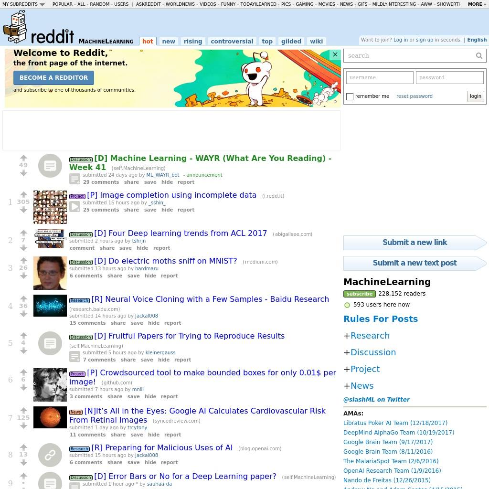
**이미지 캡션:** 이 이미지는 레딧(Reddit) 웹사이트의 머신러닝(Machine Learning) 서브레딧 페이지를 보여줍니다. 페이지 상단에는 레딧 로고와 함께 "Welcome to Reddit, the front page of the internet."이라는 환영 문구가 있고, 그 아래에는 "BECOME A REDDITOR" 버튼이 있습니다. 페이지 중앙에는 다양한 게시물 목록이 나열되어 있으며, 각 게시물은 제목, 작성자, 제출 시간, 댓글 수 등의 정보를 포함하고 있습니다. 게시물 제목으로는 "[D] Machine Learning - WAYR (What Are You Reading) - Week 41", "[P] Image completion using incomplete data", "[D] Four Deep learning trends from ACL 2017", "[D] Do electric moths sniff on MNIST?", "[R] Neural Voice Cloning with a Few Samples - Baidu Research", "[D] Fruitful Papers for Trying to Reproduce Results", "[P] Crowdsourced tool to make bounded boxes for only 0.01$ per image!", "[N] It's All in the Eyes: Google AI Calculates Cardiovascular Risk From Retinal Images", "[R] Preparing for Malicious Uses of AI", "[D] Error Bars or No for a Deep Learning paper?" 등이 보입니다. 각 게시물 옆에는 추천/반대 투표를 나타내는 숫자가 있으며, 게시물 제목 아래에는 작성자 정보와 함께 "comment", "share", "save", "hide", "report"와 같은 옵션들이 있습니다. 오른쪽 사이드바에는 "Want to join? Log in or sign up in seconds."라는 로그인/가입 안내와 함께 검색창, 사용자 이름 및 비밀번호 입력란이 있습니다. 또한 "Submit a new link"와 "Submit a new text post" 버튼이 있으며, "MachineLearning" 서브레딧의 구독자 수와 현재 접속자 수가 표시되어 있습니다. 그 아래에는 "Rules For Posts"라는 제목으로 "+Research", "+Discussion", "+Project", "+News"와 같은 카테고리가 나열되어 있습니다. 페이지 하단에는 "AMAS"라는 제목으로 여러 팀 이름과 날짜가 목록으로 표시되어 있습니다. 전반적으로 정보가 많고 다양한 주제의 게시물들이 나열된 기술 관련 커뮤니티 페이지의 모습입니다.Learning - WAYR (What Are You Reading) - Week 41", "[P] Image completion using incomplete data", "[D] Four Deep learning trends from ACL 2017", "[D] Do electric moths sniff on MNIST?", "[R] Neural Voice Cloning with a Few Samples - Baidu Research", "[D] Fruitful Papers for Trying to Reproduce Results", "[P] Crowdsourced tool to make bounded boxes for only 0.01$ per image!", "[N] It's All in the Eyes: Google AI Calculates Cardiovascular Risk From Retinal Images", "[R] Preparing for Malicious Uses of AI", "[D] Error Bars or No for a Deep Learning paper?" 등이 보입니다. 각 게시물 옆에는 추천/반대 투표를 나타내는 숫자가 있으며, 게시물 제목 아래에는 작성자 정보와 함께 "comment", "share", "save", "hide", "report"와 같은 옵션들이 있습니다. 오른쪽 사이드바에는 "Want to join? Log in or sign up in seconds."라는 로그인/가입 안내와 함께 검색창, 사용자 이름 및 비밀번호 입력란이 있습니다. 또한 "Submit a new link"와 "Submit a new text post" 버튼이 있으며, "MachineLearning" 서브레딧의 구독자 수와 현재 접속자 수가 표시되어 있습니다. 그 아래에는 "Rules For Posts"라는 제목으로 "+Research", "+Discussion", "+Project", "+News"와 같은 카테고리가 나열되어 있습니다. 페이지 하단에는 "AMAS"라는 제목으로 여러 팀 이름과 날짜가 목록으로 표시되어 있습니다. 전반적으로 정보가 많고 다양한 주제의 게시물들이 나열된 기술 관련 커뮤니티 페이지의 모습입니다.

> #오늘의레딧 https://www.reddit.com/r/MachineLearning/ 오늘도 새소식이 많군요.  1. 불완전한 데이터를 사용하여 영상 완료 2. 2017년 4분기의 4가지 심층 학습 동향 3. 전동차가 MNIST에 킁킁거리며 냄새를 맡는가? 4. 신경망을 이용한 신경 재생 실험 5. 결과를 재현하기 위한 훌륭한 논문 6. С ro wd so d ce tool to    bounded make image boxes per 0.01  only for $                           ur                         !. 7. 눈에 띄는 것:구글 AI는 망막상에서 심혈관 위험을 계산한다. 8. 악의적인 AI이용 준비 9. 깊은 학습 학습지에 오류가 있나요? 10. CMU의 언어 기술 프로그램에 대한 생각? 11. 기술 회사들은 AI가 직장을 파괴하지 않는 척 하는 것을 중단해야 한다. 12. TensorflowFizzieReduxRedux 13. 오펜지컬 지지자들 14. PyTorch를 이용한 도시 이름 지정 15. 교육 손실 곡선이 위로 이동합니다. 16. 지난 해에 스탠포드 대학교가 이번 해에 온라인 학습 과정에서 딥 학습 과정 비디오 처리 과정을 비디오로 공개할 것인지 알고 계십니까? 17. 우버 AI연구소 소개 18. EntityEmberting을 통해 구조화된 데이터를 위한 심층적인 학습 방법 사용 19. @ LA / Ud eM  Ap pl ic an ts -    updates your comment with Please   !                               MI                     . 20. 2018년 가을의 지능형 프로그램 목록  1. https://www.reddit.com/r/MachineLearning/comments/7z3vvb/p_image_completion_using_incomplete_data/ 2. http://www.abigailsee.com/2017/08/30/four-deep-learning-trends-from-acl-2017-part-1.html 3. https://medium.com/@christian.szegedy/do-electric-moths-sniff-on-mnist-18e78180db7e 4. http://research.baidu.com/neural-voice-cloning-samples/ 5. https://www.reddit.com/r/MachineLearning/comments/7z7uok/d_fruitful_papers_for_trying_to_reproduce_results/ 6. https://github.com/mnill/People-vision-example 7. https://syncedreview.com/2018/02/20/its-all-in-the-eyes-google-ai-calculates-cardiovascular-risk-from-retinal-images/ 8. https://blog.openai.com/preparing-for-malicious-uses-of-ai/ 9. https://www.reddit.com/r/MachineLearning/comments/7z9j2a/d_error_bars_or_no_for_a_deep_learning_paper/ 10. https://www.reddit.com/r/MachineLearning/comments/7z8zi0/d_thoughts_on_cmus_master_of_language/ 11. https://www.technologyreview.com/s/610298/tech-companies-should-stop-pretending-ai-wont-destroy-jobs/ 12. http://rickyhan.com/jekyll/update/2018/02/16/tensorflow-fizzbuzz-revisited.html 13. https://blog.openai.com/openai-supporters/ 14. http://jsideas.net/python/2018/02/19/cityFinder.html 15. https://www.reddit.com/r/MachineLearning/comments/7z897y/d_training_loss_curve_moves_up/ 16. https://www.reddit.com/r/MachineLearning/comments/7yvn2w/d_does_anyone_know_if_stanford_is_going_to/ 17. https://eng.uber.com/uber-ai-residency/ 18. https://medium.com/@r.ruizendaal/deep-learning-structured-data-8d6a278f3088 19. https://www.reddit.comhttps://www.reddit.com/r/gradadmissions/comments/7z5nzj/milaudem_applicants_please_comment_with_your/ 20. https://twitter.com/hardmaru/status/966147857328697344

### 2월 23일 (금) 08:52 · 📷 사진 (1장)

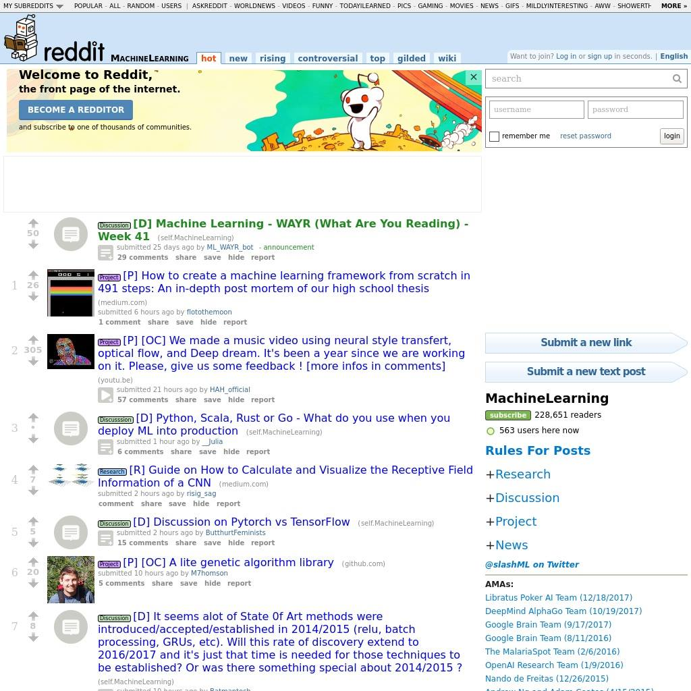
**이미지 캡션:** 이 이미지는 웹사이트 레딧의 머신러닝 커뮤니티 페이지를 보여줍니다. 페이지 상단에는 레딧 로고와 함께 "머신러닝"이라는 제목이 있고, 그 아래에는 "환영합니다 레딧"이라는 문구와 함께 인터넷의 첫 페이지라는 설명이 있습니다. 페이지 중앙에는 검색창과 로그인/회원가입 폼이 있으며, 그 옆에는 귀여운 캐릭터가 그려진 일러스트가 있습니다. 메인 콘텐츠 영역에는 머신러닝 관련 게시물 목록이 시간순으로 나열되어 있으며, 각 게시물은 제목, 작성자, 댓글 수, 좋아요/싫어요 수 등의 정보를 포함하고 있습니다. 게시물 유형은 토론, 프로젝트, 연구 등으로 분류되어 있습니다. 오른쪽 사이드바에는 "새 링크 제출", "새 텍스트 게시물 제출" 버튼과 함께 머신러닝 커뮤니티의 구독자 수, 현재 접속자 수, 게시 규칙, 트위터 계정 정보, 그리고 관련 AMA(Ask Me Anything) 목록이 표시되어 있습니다. 전반적으로 정보가 많고 깔끔하게 정리된 웹 페이지의 모습입니다.형은 토론, 프로젝트, 연구 등으로 분류되어 있습니다. 오른쪽 사이드바에는 "새 링크 제출", "새 텍스트 게시물 제출" 버튼과 함께 머신러닝 커뮤니티의 구독자 수, 현재 접속자 수, 게시 규칙, 트위터 계정 정보, 그리고 관련 AMA(Ask Me Anything) 목록이 표시되어 있습니다. 전반적으로 정보가 많고 깔끔하게 정리된 웹 페이지의 모습입니다.

> #오늘의레딧 https://www.reddit.com/r/MachineLearning/ 재미난 이야기들이 많습니다.  1. 처음부터 끝까지 기계 학습 프레임워크를 만들어 내는 방법:고등 학교 논문의 깊은 사후 전망 2. CNN의 ReceptiveField정보를 계산하고 시각화하는 방법에 대한 가이드 라인 3. PytorchvsTensorflow토론회 4. 2014년 8월 14일에 주조 공장에서 소개된 것으로 추정됩니다. 2014년 8월 26일(Relu, 일괄 처리, GRU등) 이러한 발견 속도는 2016/2016년까지 확장될 것이며 이러한 기술이 수립되는 데 필요한 시간은 언제입니까? 아니면 2014/2015년에 특별한 무언가가 있었나요? 5. 영상 분석을 위한 혼합 척도 변환형 신경 회로망 6. BaiduAI는 당신의 목소리를 몇초 만에 복제할 수 있다. 7. 연습용 도구로서 SharpestMinds를 사용하는 경험이 있으신 분은 누구입니까? 8. GoogleScholar에 의해 ICLR제출이 언제 색인화 될 것인가? 9. 지속적인 재인증 학습 과제를 해결하기 위해 어떤 접근법이 적합한가? 10. NEETENESBotBotter(SethBlingbySethBling) 11. 불완전한 데이터를 사용하여 영상 완료 12. 2017년 4분기의 4가지 심층 학습 동향 13. 비렌스 네트워크 VS베이지안 회귀 14. 연구/반복 방법론 15. 결과를 재현하기 위한 훌륭한 논문 16. 2000년도 한국 경영 과학회 추계 학술 대회-세계 초일류를 향한 전자 정부 및 e-biz전략 17. 신경망을 이용한 신경 재생 실험 18. 전동차가 MNIST에 킁킁거리며 냄새를 맡는가? 19. CMU의 언어 기술 프로그램에 대한 생각? 20. 나의 ML//ANP추천 시스템에 대한 피드백 부탁 드립니다.  1. https://medium.com/@florian.caesar/how-to-create-a-machine-learning-framework-from-scratch-in-491-steps-93428369a4eb 2. https://medium.com/mlreview/a-guide-to-receptive-field-arithmetic-for-convolutional-neural-networks-e0f514068807 3. https://www.reddit.com/r/MachineLearning/comments/7ziagd/d_discussion_on_pytorch_vs_tensorflow/ 4. https://www.reddit.com/r/MachineLearning/comments/7zeqqq/d_it_seems_alot_of_state_0f_art_methods_were/ 5. https://www.reddit.com/r/MachineLearning/comments/7zdtug/r_a_mixedscale_dense_convolutional_neural_network/ 6. https://syncedreview.com/2018/02/21/baidu-ai-can-clone-your-voice-in-seconds/ 7. https://www.sharpestminds.com/ 8. https://www.reddit.com/r/MachineLearning/comments/7zh7xg/discussion_when_will_iclr_submissions_be_indexed/ 9. https://www.reddit.com/r/MachineLearning/comments/7zgug5/d_which_approach_is_suitable_for_solving/ 10. https://www.youtube.com/watch?v=vw4wwB4f_zI&t=66s 11. https://www.reddit.com/r/MachineLearning/comments/7z3vvb/p_image_completion_using_incomplete_data/ 12. http://www.abigailsee.com/2017/08/30/four-deep-learning-trends-from-acl-2017-part-1.html 13. https://www.reddit.com/r/MachineLearning/comments/7zchb9/dinference_network_vs_bayesian_regression/ 14. https://www.reddit.com/r/MachineLearning/comments/7zel3c/d_research_iteration_methodology/ 15. https://www.reddit.com/r/MachineLearning/comments/7z7uok/d_fruitful_papers_for_trying_to_reproduce_results/ 16. https://arxiv.org/abs/1801.06345 17. http://research.baidu.com/neural-voice-cloning-samples/ 18. https://medium.com/@christian.szegedy/do-electric-moths-sniff-on-mnist-18e78180db7e 19. https://www.reddit.com/r/MachineLearning/comments/7z8zi0/d_thoughts_on_cmus_master_of_language/ 20. https://www.reddit.com/r/MachineLearning/comments/7zbhkl/p_please_give_me_feedback_on_my_mlnlp/

### 2월 24일 (토) 08:52 · 📷 사진 (1장)

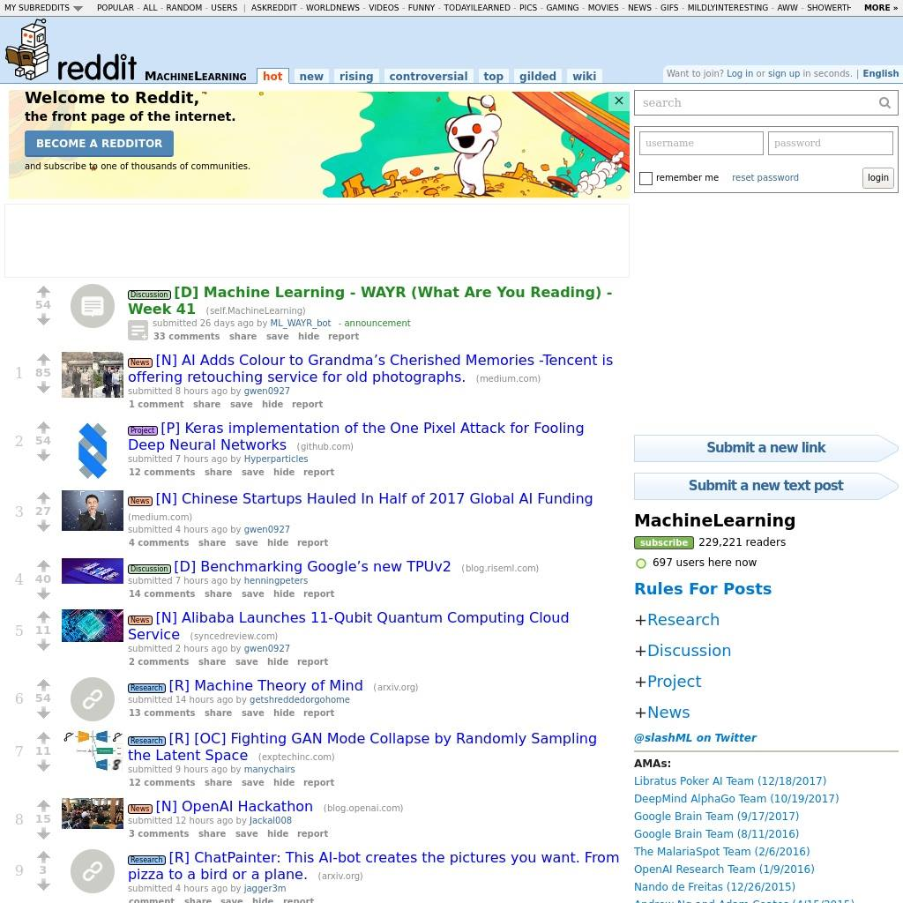
**이미지 캡션:** 이 화면은 웹사이트 레딧의 머신러닝(Machine Learning) 서브레딧 페이지로, 다양한 인공지능 관련 게시물들이 나열되어 있습니다. 페이지 상단에는 레딧 로고와 함께 "Welcome to Reddit, the front page of the internet."이라는 문구가 보이며, 로그인 및 회원가입을 유도하는 창이 있습니다. 메인 콘텐츠 영역에는 여러 게시물들이 시간순 또는 인기순으로 정렬되어 있으며, 각 게시물은 제목, 작성자, 댓글 수, 게시 시간 등의 정보를 포함하고 있습니다. 예를 들어, "AI Adds Colour to Grandma's Cherished Memories"라는 제목의 뉴스 게시물은 텐센트가 사진 보정 서비스를 제공한다는 내용이며, "Keras implementation of the One Pixel Attack for Fooling Deep Neural Networks"라는 제목의 프로젝트 게시물은 깃허브 링크를 포함하고 있습니다. 페이지 오른쪽에는 "Machine Learning" 서브레딧의 구독자 수와 "Rules For Posts" 섹션이 있으며, "Research", "Discussion", "Project", "News" 등의 카테고리 링크와 트위터 계정, 그리고 과거 AMA(Ask Me Anything) 목록이 표시되어 있습니다. 전반적으로 기술 및 연구 커뮤니티의 활발한 정보 교류를 보여주는 분위기입니다.I Adds Colour to Grandma's Cherished Memories"라는 제목의 뉴스 게시물은 텐센트가 사진 보정 서비스를 제공한다는 내용이며, "Keras implementation of the One Pixel Attack for Fooling Deep Neural Networks"라는 제목의 프로젝트 게시물은 깃허브 링크를 포함하고 있습니다. 페이지 오른쪽에는 "Machine Learning" 서브레딧의 구독자 수와 "Rules For Posts" 섹션이 있으며, "Research", "Discussion", "Project", "News" 등의 카테고리 링크와 트위터 계정, 그리고 과거 AMA(Ask Me Anything) 목록이 표시되어 있습니다. 전반적으로 기술 및 연구 커뮤니티의 활발한 정보 교류를 보여주는 분위기입니다.

> #오늘의레딧 https://www.reddit.com/r/MachineLearning/ 정말 읽을 거리가 많네요.  1. 인공 지능은 할머니의 구운 추억에 색을 더해 주고 있다. 테컨트는 오래 된 사진들을 위해 재교육 서비스를 제공하고 있다. 2. 제4회 CDMA국제 학술 대회 3. 2017년 글로벌 AI기금의 절반에 육박하는 중국 스타들 4. 벤치 마크 구글의 새로운 TP2 5. Alibaba씨 11-bitQuantumComputingComputingCloudService 6. 머신 머신 이론 7. 오펜하이크 하카톤 8. ChatPainter:이 AIT는 원하는 사진을 생성합니다. 피자부터 새나 비행기로요. 9. 처음부터 끝까지 기계 학습 프레임워크를 만들어 내는 방법:고등 학교 논문의 깊은 사후 전망 10. 왜 국제 기구 대신에 OpenAI를 설립하는 것입니까?(예:ML및 AI) 11. Aurora:최소 DeepLearning도서관 12. 다른 사람들을 돕기 위해 기계 학습을 어떻게 사용하고 계세요? 13. 논문 제출 후 논문 초안 갱신 현황 14. 신경 망 최적화 이론 15. Rigelihood-free모델을 이용한 모델 제작 16. 다양성은 여러분이 필요로 하는 모든 것입니다:보상 기능이 없는 학습 기술 17. 조지아 공대(기계 학습 분야)와 스탠포드(인공 지능 대학 졸업 증명서) 18. 내 MMORPG탐지 시스템을 훈련시키기 위한 제안이 필요하다. 19. 인공 지능은 할머니가 빌린 기억들에 색을 더해 줍니다 20. PytorchvsTensorflow토론회  1. https://medium.com/@Synced/ai-adds-colour-to-grandmas-cherished-memories-46d639d47f94 2. https://github.com/Hyperparticle/one-pixel-attack-keras 3. https://medium.com/@Synced/chinese-startups-hauled-in-half-of-2017-global-ai-funding-49bd97ef3746 4. https://blog.riseml.com/benchmarking-googles-new-tpuv2-121c03b71384 5. https://syncedreview.com/2018/02/23/alibaba-launches-11-qubit-quantum-computing-cloud-service/ 6. https://arxiv.org/abs/1802.07740 7. https://blog.openai.com/hackathon/ 8. https://arxiv.org/abs/1802.08216 9. https://medium.com/@florian.caesar/how-to-create-a-machine-learning-framework-from-scratch-in-491-steps-93428369a4eb 10. https://www.reddit.com/r/MachineLearning/comments/7zmhfq/d_why_create_openai_as_a_company_instead_of_an/ 11. https://github.com/upul/Aurora 12. https://www.reddit.com/r/MachineLearning/comments/7zrlbi/d_how_are_you_using_machine_learning_to_help/ 13. https://www.reddit.com/r/MachineLearning/comments/7zrj3u/d_updating_an_article_new_citation_of_paper/ 14. https://www.reddit.com/r/MachineLearning/comments/7zqyj7/d_theory_behind_optimization_of_neural_nets/ 15. https://www.reddit.com/r/MachineLearning/comments/7zqj7y/d_relation_of_likelihoodfree_models_with_gans/ 16. https://arxiv.org/abs/1802.06070v1 17. https://www.reddit.com/r/MachineLearning/comments/7zpk1w/d_georgia_tech_oms_cs_specialization_in_machine/ 18. https://www.reddit.com/r/MachineLearning/comments/7znm6l/p_need_suggestions_to_train_my_mmorpg_bot/ 19. https://syncedreview.com/2018/02/22/ai-adds-colour-to-grandmas-cherished-memories/ 20. https://www.reddit.com/r/MachineLearning/comments/7ziagd/d_discussion_on_pytorch_vs_tensorflow/

### 2월 25일 (일) 08:52 · 📷 사진 (1장)

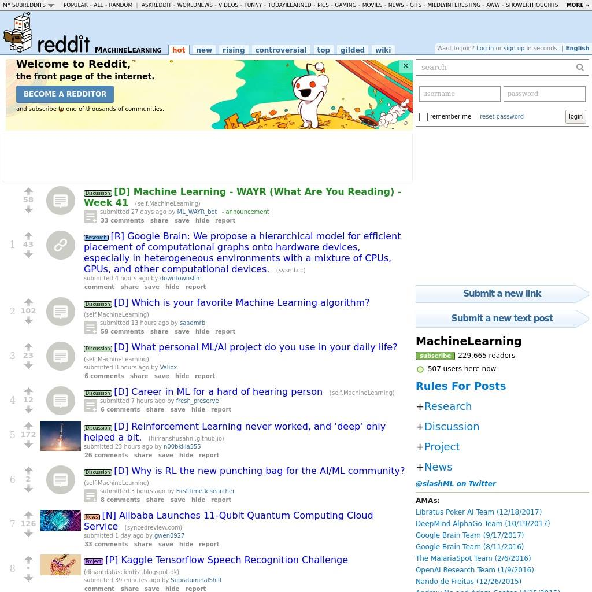
**이미지 캡션:** 이것은 레딧 웹사이트의 스크린샷으로, "MachineLearning" 서브레딧의 메인 페이지를 보여줍니다. 페이지 상단에는 레딧 로고와 함께 "hot", "new", "rising", "controversial", "top", "gilded", "wiki"와 같은 탭이 있습니다. 중앙에는 "Welcome to Reddit, the front page of the internet."이라는 환영 메시지와 함께 레딧의 마스코트인 스누(Snoo) 캐릭터가 그려진 이미지가 있습니다. 오른쪽 상단에는 로그인 및 회원가입을 위한 입력 필드와 버튼이 있습니다. 페이지의 주요 부분은 "MachineLearning" 서브레딧의 게시물 목록으로 구성되어 있으며, 각 게시물은 제목, 작성자, 댓글 수, 게시 시간 등의 정보를 포함하고 있습니다. 게시물들은 "Discussion", "Research", "News", "Project"와 같은 태그로 분류되어 있습니다. 오른쪽 사이드바에는 "MachineLearning" 서브레딧에 대한 구독 정보, 현재 접속자 수, 게시 규칙, 관련 링크 및 "AMAS" 목록이 표시되어 있습니다. 전반적으로 이 페이지는 머신러닝 관련 정보를 공유하고 토론하는 온라인 커뮤니티의 모습을 보여줍니다.을 위한 입력 필드와 버튼이 있습니다. 페이지의 주요 부분은 "MachineLearning" 서브레딧의 게시물 목록으로 구성되어 있으며, 각 게시물은 제목, 작성자, 댓글 수, 게시 시간 등의 정보를 포함하고 있습니다. 게시물들은 "Discussion", "Research", "News", "Project"와 같은 태그로 분류되어 있습니다. 오른쪽 사이드바에는 "MachineLearning" 서브레딧에 대한 구독 정보, 현재 접속자 수, 게시 규칙, 관련 링크 및 "AMAS" 목록이 표시되어 있습니다. 전반적으로 이 페이지는 머신러닝 관련 정보를 공유하고 토론하는 온라인 커뮤니티의 모습을 보여줍니다.

> #오늘의레딧 https://www.reddit.com/r/MachineLearning/ 따끈한 소식들입니다.  1. GoogleBrain:우리는 특히 CPU, GPU및 기타 계산기의 혼합물이 혼합된 이기종 환경에서 컴퓨터 그래픽 그래프를 효율적으로 배치할 수 있는 계층적 모델을 제안합니다. 2. 가장 좋아하는 기계 학습 알고리즘은 무엇입니까? 3. 당신의 일상 생활에서 어떤 개인적인 ML/AI 프로젝트를 사용하십니까? 4. 열심히 듣는 사람을 위한 ML의 경력 5. 강화 학습은 결코 효과가 없었고,' 깊은 '은 조금밖에 도움이 되지 않았다. 6. 왜 RL은 AICPML커뮤니티를 위한 새로운 샌드 백인가? 7. Alibaba씨 11-bitQuantumComputingComputingCloudService 8. 카글 텐스의 음성 인식 과제 9. SPECK커널에 대한 질문 10. 인공 지능은 할머니의 구운 추억에 색을 더해 주고 있다. 테컨트는 오래 된 사진들을 위해 재교육 서비스를 제공하고 있다. 11. 2017년 글로벌 AI기금의 절반에 육박하는 중국 스타들 12. 제4회 CDMA국제 학술 대회 13. LightOnCloud:클라우드 기반 Xen데스크탑을 위한 경량 기반 기술 14. 벤치 마크 구글의 새로운 TP2 15. 연구원으로서 탐구하고자 하는 깊은 학문 분야의 연구 분야는 무엇인가? 16. 머신 머신 이론 17. 일반적인 의사 결정 불일치를 기반으로 하는 일반화된 광고 사례 18. 오펜하이크 하카톤 19. 예측에 사용할 수 없는 훈련 중에 기능을 사용할 수 있는 방법이 있는가? 20. Aurora:최소 DeepLearning도서관  1. http://www.sysml.cc/doc/150.pdf 2. https://www.reddit.com/r/MachineLearning/comments/7zvnli/d_which_is_your_favorite_machine_learning/ 3. https://www.reddit.com/r/MachineLearning/comments/7zx73p/d_what_personal_mlai_project_do_you_use_in_your/ 4. https://www.reddit.com/r/MachineLearning/comments/7zxob4/d_career_in_ml_for_a_hard_of_hearing_person/ 5. https://himanshusahni.github.io/2018/02/23/reinforcement-learning-never-worked.html 6. https://www.reddit.com/r/MachineLearning/comments/7zyuat/d_why_is_rl_the_new_punching_bag_for_the_aiml/ 7. https://syncedreview.com/2018/02/23/alibaba-launches-11-qubit-quantum-computing-cloud-service/ 8. https://dinantdatascientist.blogspot.dk/2018/02/kaggle-tensorflow-speech-recognition.html 9. https://www.reddit.com/r/MachineLearning/comments/7zzexu/d_question_about_sptk_kernel/ 10. https://medium.com/@Synced/ai-adds-colour-to-grandmas-cherished-memories-46d639d47f94 11. https://medium.com/@Synced/chinese-startups-hauled-in-half-of-2017-global-ai-funding-49bd97ef3746 12. https://github.com/Hyperparticle/one-pixel-attack-keras 13. http://www.lighton.io/press-releases 14. https://blog.riseml.com/benchmarking-googles-new-tpuv2-121c03b71384 15. https://www.reddit.com/r/MachineLearning/comments/7zv2jn/rwhat_area_of_research_in_deep_learning_you_want/ 16. https://arxiv.org/abs/1802.07740 17. https://arxiv.org/abs/1802.07770 18. https://blog.openai.com/hackathon/ 19. https://www.reddit.com/r/MachineLearning/comments/7zvhjs/d_are_there_methods_to_use_features_during/ 20. https://github.com/upul/Aurora

### 2월 26일 (월) 08:52 · 📷 사진 (2장)

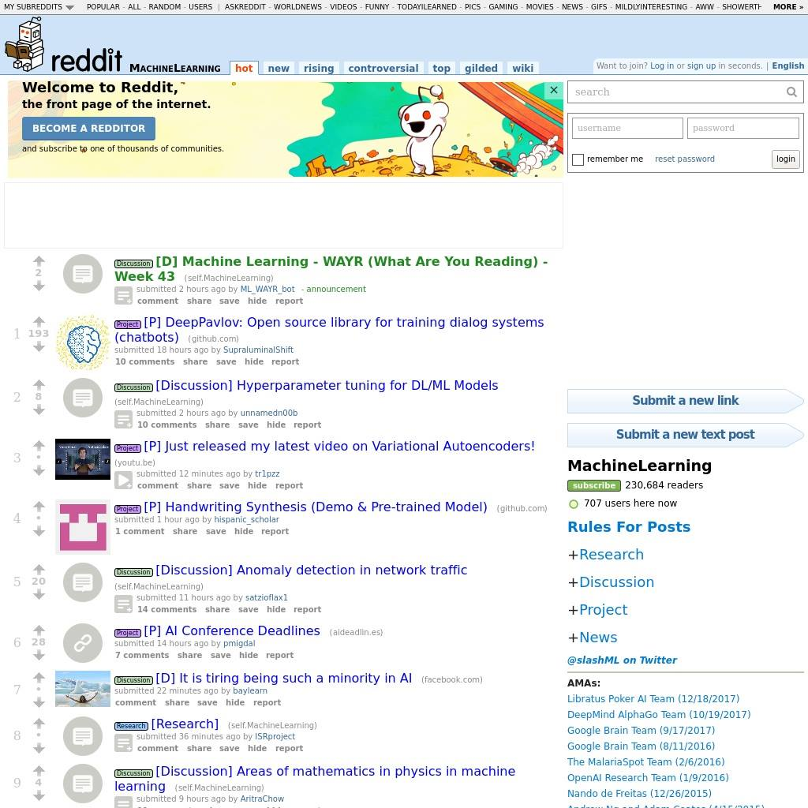
**이미지 캡션:** 이 이미지는 레딧(Reddit) 웹사이트의 '머신러닝(Machine Learning)' 커뮤니티 페이지를 보여줍니다. 페이지 상단에는 레딧 로고와 함께 '머신러닝' 커뮤니티의 최신 인기 글 목록이 나열되어 있습니다. 각 글은 제목, 작성자, 제출 시간, 댓글 수 등의 정보를 포함하고 있으며, '토론(Discussion)' 또는 '프로젝트(Project)'와 같은 유형으로 분류되어 있습니다. 예를 들어, "머신러닝 - 이번 주 무엇을 읽고 있나요?"라는 제목의 토론 글과 "딥페블로브: 챗봇 학습을 위한 오픈 소스 라이브러리"라는 제목의 프로젝트 글이 보입니다. 페이지 오른쪽에는 '새 링크 제출' 및 '새 텍스트 게시물 제출' 버튼과 함께 '머신러닝' 커뮤니티 구독 정보, 현재 접속자 수, 게시 규칙, 그리고 트위터 계정(@slashML) 및 과거 AMA(Ask Me Anything) 목록이 표시되어 있습니다. 전반적으로 기술 관련 커뮤니티의 정보 공유 및 소통이 이루어지는 온라인 공간의 모습을 담고 있습니다.chine learning, including discussions on reading materials, open-source libraries, hyperparameter tuning, variational autoencoders, handwriting synthesis, anomaly detection, AI conference deadlines, and the representation of minorities in AI. There are also sections for submitting new links or text posts, subreddit statistics showing 230,684 subscribers and 707 users currently online, and a list of rules for posting. On the right side, there's a "Want to join?" section with login fields and a "Welcome to Reddit" banner featuring a cartoon character. The overall atmosphere is informative and community-oriented, typical of an online forum dedicated to a specific technical field.
 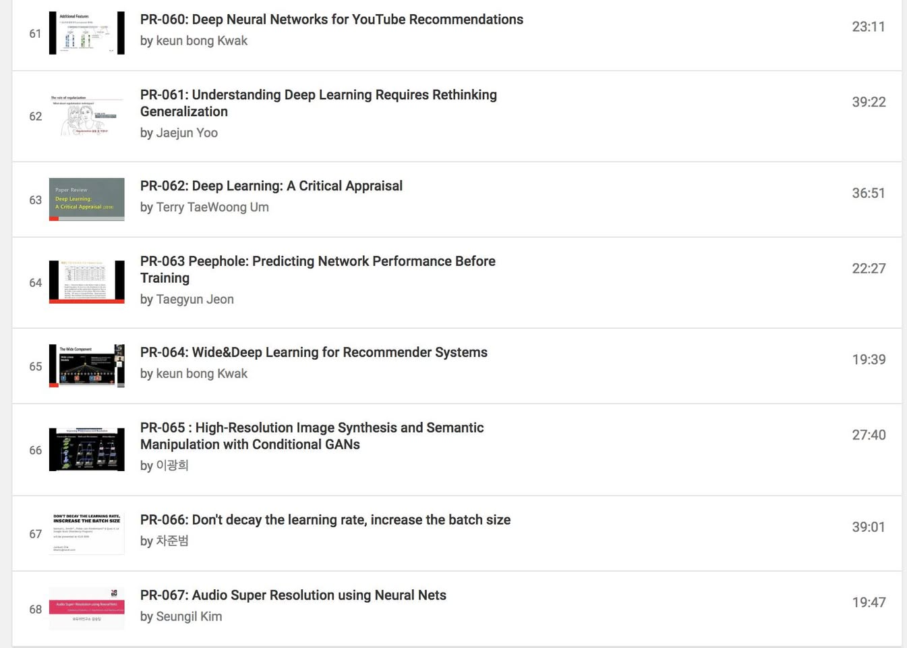
**이미지 캡션:** 이 이미지는 여러 개의 연구 발표(PR) 목록을 보여주는 스크린샷으로, 각 항목에는 발표 번호, 제목, 발표자 이름, 그리고 발표 시간이 포함되어 있습니다. 발표 번호는 61번부터 68번까지 순서대로 나열되어 있으며, 각 발표는 썸네일 이미지와 함께 표시됩니다. 예를 들어, 61번 발표는 "PR-060: Deep Neural Networks for YouTube Recommendations"이며, 발표자는 "keun bong Kwak"이고 발표 시간은 23분 11초입니다. 62번 발표는 "PR-061: Understanding Deep Learning Requires Rethinking Generalization"이며, 발표자는 "Jaejun Yoo"이고 발표 시간은 39분 22초입니다. 63번 발표는 "PR-062: Deep Learning: A Critical Appraisal"이며, 발표자는 "Terry TaeWoong Um"이고 발표 시간은 36분 51초입니다. 64번 발표는 "PR-063 Peephole: Predicting Network Performance Before Training"이며, 발표자는 "Taegyun Jeon"이고 발표 시간은 22분 27초입니다. 65번 발표는 "PR-064: Wide&Deep Learning for Recommender Systems"이며, 발표자는 "keun bong Kwak"이고 발표 시간은 19분 39초입니다. 66번 발표는 "PR-065: High-Resolution Image Synthesis and Semantic Manipulation with Conditional GANs"이며, 발표자는 "이광희"이고 발표 시간은 27분 40초입니다. 67번 발표는 "PR-066: Don't decay the learning rate, increase the batch size"이며, 발표자는 "차준범"이고 발표 시간은 39분 01초입니다. 마지막으로 68번 발표는 "PR-067: Audio Super Resolution using Neural Nets"이며, 발표자는 "Seungil Kim"이고 발표 시간은 19분 47초입니다. 전반적으로 이 이미지는 딥러닝 및 관련 분야의 연구 발표 목록을 보여주는 깔끔하고 정보 전달이 명확한 인터페이스를 특징으로 합니다.erstanding Deep Learning Requires Rethinking Generalization"이며, 발표자는 "Jaejun Yoo"이고 발표 시간은 39분 22초입니다. 63번 발표는 "PR-062: Deep Learning: A Critical Appraisal"이며, 발표자는 "Terry TaeWoong Um"이고 발표 시간은 36분 51초입니다. 64번 발표는 "PR-063 Peephole: Predicting Network Performance Before Training"이며, 발표자는 "Taegyun Jeon"이고 발표 시간은 22분 27초입니다. 65번 발표는 "PR-064: Wide&Deep Learning for Recommender Systems"이며, 발표자는 "keun bong Kwak"이고 발표 시간은 19분 39초입니다. 66번 발표는 "PR-065: High-Resolution Image Synthesis and Semantic Manipulation with Conditional GANs"이며, 발표자는 "이광희"이고 발표 시간은 27분 40초입니다. 67번 발표는 "PR-066: Don't decay the learning rate, increase the batch size"이며, 발표자는 "차준범"이고 발표 시간은 39분 01초입니다. 마지막으로 68번 발표는 "PR-067: Audio Super Resolution using Neural Nets"이며, 발표자는 "Seungil Kim"이고 발표 시간은 19분 47초입니다. 전반적으로 이 이미지는 딥러닝 및 관련 분야의 연구 발표 목록을 보여주는 깔끔하고 정보 전달이 명확한 인터페이스를 특징으로 합니다.

> #오늘의레딧 https://www.reddit.com/r/MachineLearning/ 머신러닝 공부는 정말 재미있죠?아침부터 다양한 소식이 많네요.  1. DeepPavlov:교육 대화 상자를 위한 오픈 소스 라이브러리 열기 2. DL/ML 모델을 위한 하이퍼 프레임 튜닝 3. 방금 Varicent에서 최신 비디오를 공개했습니다! 4. 필기 도구(데모 및 사전 훈련 모델) 5. 네트워크 트래픽에서의 변칙 감지 6. AI학회 7. 그것은 인공 지능에서 그런 소수파가 되는 것이 피곤하다. 8. Cannot translate 9. 기계 학습 분야 물리학 분야 10. GoogleBrain:우리는 특히 CPU, GPU및 기타 계산기의 혼합물이 혼합된 이기종 환경에서 컴퓨터 그래픽 그래프를 효율적으로 배치할 수 있는 계층적 모델을 제안합니다. 11. 스킵-그램 9지프+유니폼=벡터 첨가성(2017년) 12. 인공 지능을 이용한 인공 지능 13. 카글 텐스의 음성 인식 과제 14. 개인적으로 어떻게 이 분야에 간섭하지 않습니까? 15. CNN이 보고 있는 곳이 어디죠? -그래드 CAM 16. 누군가가 깊은 이미지 유추를 위해 온라인 서비스를 만들 수 있을까요? 17. Fabrik:드래그 앤 드롭 인터페이스를 통해 DNN을 구축, 시각화 및 교육할 수 있는 온라인 협업 플랫폼(CaffeXpTF/KeGas) 18. 신경 네트워크 AuthorshipAttribution:RNN을 통해 미국 대통령의 연설문을 확인할 수 있음 19. 가장 좋아하는 기계 학습 알고리즘은 무엇입니까? 20. 당신의 일상 생활에서 어떤 개인적인 ML/AI 프로젝트를 사용하십니까?  1. https://github.com/deepmipt/DeepPavlov 2. https://www.reddit.com/r/MachineLearning/comments/807fcw/discussion_hyperparameter_tuning_for_dlml_models/ 3. https://youtu.be/9zKuYvjFFS8 4. https://github.com/sjvasquez/handwriting-synthesis 5. https://www.reddit.com/r/MachineLearning/comments/803x5p/discussion_anomaly_detection_in_network_traffic/ 6. https://aideadlin.es/ 7. https://www.facebook.com/anima.anandkumar/posts/10104716304619535 8. https://www.reddit.com/r/MachineLearning/comments/8082iz/research/ 9. https://www.reddit.com/r/MachineLearning/comments/804srx/discussion_areas_of_mathematics_in_physics_in/ 10. http://www.sysml.cc/doc/150.pdf 11. http://www.aclweb.org/anthology/P/P17/P17-1007.pdf 12. https://maliciousaireport.com/ 13. https://dinantdatascientist.blogspot.dk/2018/02/kaggle-tensorflow-speech-recognition.html 14. https://www.reddit.com/r/MachineLearning/comments/806fk5/d_how_do_you_personally_stay_grounded_in_this/ 15. http://www.hackevolve.com/where-cnn-is-looking-grad-cam/ 16. https://www.reddit.com/r/MachineLearning/comments/805tnd/d_can_someone_make_an_online_service_for_deep/ 17. https://github.com/Cloud-CV/Fabrik/blob/master/README.md 18. https://hergott.github.io/helping-neural-networks-identify-presidential-speeches/ 19. https://www.reddit.com/r/MachineLearning/comments/7zvnli/d_which_is_your_favorite_machine_learning/ 20. https://www.reddit.com/r/MachineLearning/comments/7zx73p/d_what_personal_mlai_project_do_you_use_in_your/
> [PR12 논문 읽기 모임은 멋지게 계속되고 있습니!]  https://www.youtube.com/playlist?list=PLlMkM4tgfjnJhhd4wn5aj8fVTYJwIpWkS&disable_polymer=true  벌써 67개나 되고 재미있는 논문들이 정말 많이 추가 되었습니다. 20분 들으시면 논문 하나와 관련 개념이 쏙쏙 이해 됩니다.  PR12 준비하시고, 녹화하셔서 올려주시는 분들 정말 감사드립니다. 많은 응원 부탁드립니다.

### 2월 27일 (화) 08:52 · 📷 사진 (1장)

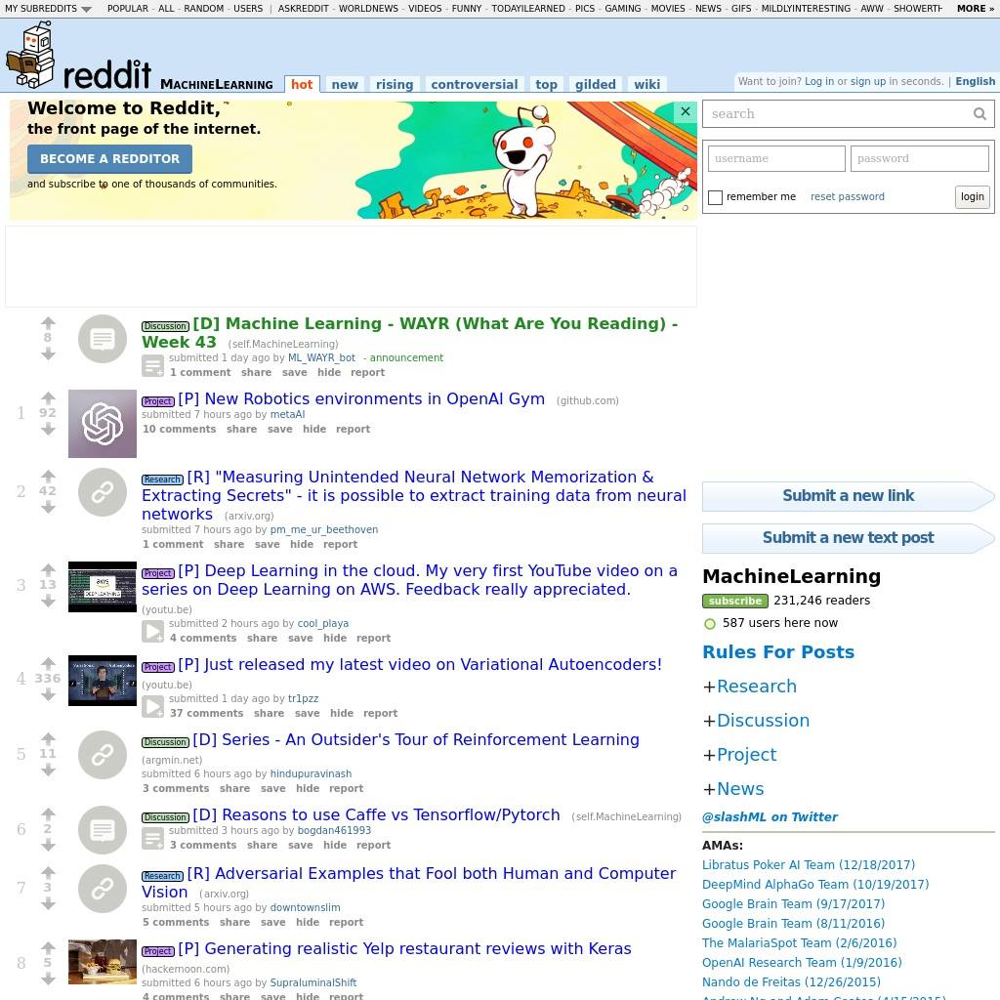
**이미지 캡션:** 이 이미지는 인기 있는 온라인 커뮤니티인 레딧의 머신러닝 서브레딧 페이지를 보여줍니다. 페이지 상단에는 레딧 로고와 함께 "Welcome to Reddit, the front page of the internet."이라는 문구가 있고, 그 옆에는 레딧의 마스코트인 스누(Snoo) 캐릭터가 그려져 있습니다. 페이지 중앙에는 로그인 및 회원가입을 위한 입력란과 버튼이 보입니다. 메인 콘텐츠 영역에는 머신러닝 관련 게시물 목록이 표시되어 있으며, 각 게시물은 제목, 작성자, 제출 시간, 댓글 수, 좋아요/싫어요 수 등의 정보를 포함하고 있습니다. 게시물 제목 앞에는 [D] (Discussion), [P] (Project), [R] (Research)와 같은 태그가 붙어 있어 게시물의 성격을 나타냅니다. 예를 들어, "Machine Learning - WAYR (What Are You Reading) - Week 43"이라는 제목의 게시물은 토론 게시물이며, "New Robotics environments in OpenAI Gym"은 프로젝트 게시물입니다. 페이지 오른쪽에는 "MachineLearning" 서브레딧의 구독자 수와 현재 접속자 수가 표시되어 있으며, 게시물 작성 규칙과 관련된 링크, 그리고 트위터 계정 정보, 과거 AMA(Ask Me Anything) 목록 등이 있습니다. 전반적으로 정보가 풍부하고 다양한 머신러닝 관련 콘텐츠를 탐색할 수 있는 페이지의 모습을 보여줍니다. 등의 정보를 포함하고 있습니다. 게시물 제목 앞에는 [D] (Discussion), [P] (Project), [R] (Research)와 같은 태그가 붙어 있어 게시물의 성격을 나타냅니다. 예를 들어, "Machine Learning - WAYR (What Are You Reading) - Week 43"이라는 제목의 게시물은 토론 게시물이며, "New Robotics environments in OpenAI Gym"은 프로젝트 게시물입니다. 페이지 오른쪽에는 "MachineLearning" 서브레딧의 구독자 수와 현재 접속자 수가 표시되어 있으며, 게시물 작성 규칙과 관련된 링크, 그리고 트위터 계정 정보, 과거 AMA(Ask Me Anything) 목록 등이 있습니다. 전반적으로 정보가 풍부하고 다양한 머신러닝 관련 콘텐츠를 탐색할 수 있는 페이지의 모습을 보여줍니다.

> #오늘의레딧 https://www.reddit.com/r/MachineLearning/ 머신러닝 공부는 정말 재미있죠?아침부터 다양한 소식이 많네요.  1. Open니Kyam의 새로운 로봇 환경 2. "의도되지 않은 신경 네트워크 메모리 측정 및 추출"-신경 회로에서 훈련 데이터 추출 가능 3. 클라우드에서의 심층 학습. 저의 첫번째 유투브 영상은 AWS의 DeepLearning시리즈에 관한 것입니다. 피드백은 정말 감사합니다. 4. 방금 Varicent에서 최신 비디오를 공개했습니다! 5. 시리즈-아웃 사이드 트레이닝을 위한 순회 학습 6. 카페 vsTensorflow/ Pyr to rc h   use to Reasons    e                                                  Ca  vs ff    fl  Te ns or ow. 7. 인간과 컴퓨터 모두의 관점에서 볼 수 있는 모험적인 예 8. 케라스와 함께 하는 현실적인 식당 리뷰를 생방송으로 만들고 있습니다. 9. "엔지니어를 위한 기계 학습에 대한 간략한 소개"-기계 학습의 주요 이론적 개념론 10. 효율적인 신경 전달 기능 11. 테크업 스토리 12. 철저한 학습으로 인한 당면 과제 해결 13. 1999년도 추계 종합 학술 발표회 논문집 상 14. 마이크로 소프트 Azure클라우드에서 더 빠른 R-CBO(Fast-WW)-단계별 구성 가이드 15. ELM이 정상 방정식과 동일합니까? 16. 자동차 개조 모델을 위한 캡스망 구축 17. 필기 도구(데모 및 사전 훈련 모델) 18. Unicorn:일반적인 오프라인 에이전트를 통한 지속적인 학습 19. GAN을 활용한 방대한 양의 서류를 살펴본 사람이라면 누구나 이 곳이 중요한 장소임을 깨닫게 될 수 밖에 없습니다. 나는 이 지역에 있는 지저분한 물을 가지고 있는데, 어떤 신문들이 가장 중요한가? 가장 흥미로운 것은 무엇인가? 20. 비노동 통신망을 훈련시키기 위한 소음 발생 기법  1. https://github.com/openai/gym/tree/master/gym/envs/robotics 2. https://arxiv.org/abs/1802.08232 3. https://youtu.be/gOFdwAlJj8M 4. https://youtu.be/9zKuYvjFFS8 5. http://www.argmin.net/2018/02/26/outsider-rl/ 6. https://www.reddit.com/r/MachineLearning/comments/80fouq/d_reasons_to_use_caffe_vs_tensorflowpytorch/ 7. https://arxiv.org/abs/1802.08195 8. https://hackernoon.com/how-to-generate-realistic-yelp-restaurant-reviews-with-keras-c1167c05e86d 9. https://arxiv.org/abs/1709.02840 10. https://arxiv.org/abs/1802.08435 11. https://blog.evjang.com/2018/02/teacup-story.html 12. https://k10v.github.io/2018/02/25/Solving-Bongard-problems-with-deep-learning/ 13. https://arxiv.org/abs/1802.08665 14. https://medium.com/@udayp/caffe-faster-r-cnn-on-microsoft-azure-cloud-part2-567ecdff6be0 15. https://www.reddit.com/r/MachineLearning/comments/80fdek/discussionare_elms_the_same_as_the_normal_equation/ 16. https://www.reddit.com/r/MachineLearning/comments/80eiz3/p_implementing_a_capsnet_for_car_makemodel/ 17. https://github.com/sjvasquez/handwriting-synthesis 18. https://arxiv.org/abs/1802.08294 19. https://deephunt.in/the-gan-zoo-79597dc8c347 20. https://www.reddit.com/r/MachineLearning/comments/80c8oj/d_techniques_for_generating_noise_to_train/

### 2월 28일 (수) 08:52 · 📷 사진 (1장)

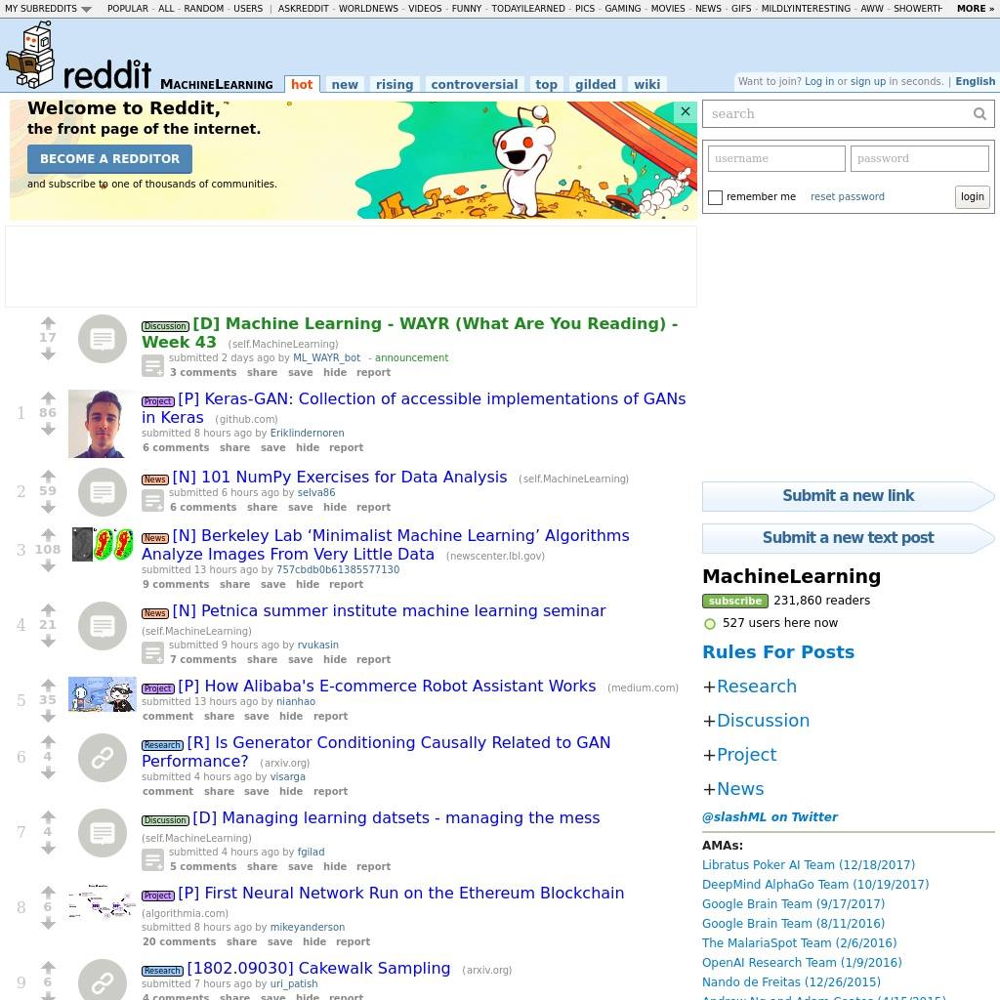
**이미지 캡션:** 이 이미지는 레딧의 머신러닝 서브레딧 페이지를 보여줍니다. 페이지 상단에는 레딧 로고와 함께 "Welcome to Reddit, the front page of the internet."이라는 문구가 있고, 그 아래에는 "BECOME A REDDITOR" 버튼이 있습니다. 메인 콘텐츠 영역에는 다양한 머신러닝 관련 게시물 목록이 표시됩니다. 각 게시물은 제목, 작성자, 제출 시간, 댓글 수 등의 정보를 포함하고 있습니다. 예를 들어, "[D] Machine Learning - WAYR (What Are You Reading) - Week 43"라는 제목의 게시물은 2일 전에 제출되었고 3개의 댓글이 있습니다. 다른 게시물로는 "[P] Keras-GAN: Collection of accessible implementations of GANs in Keras", "[N] 101 NumPy Exercises for Data Analysis", "[N] Berkeley Lab 'Minimalist Machine Learning' Algorithms Analyze Images From Very Little Data", "[N] Petnica summer institute machine learning seminar", "[P] How Alibaba's E-commerce Robot Assistant Works", "[R] Is Generator Conditioning Causally Related to GAN Performance?", "[D] Managing learning datsets - managing the mess", "[P] First Neural Network Run on the Ethereum Blockchain", "[1802.09030] Cakewalk Sampling" 등이 있습니다. 오른쪽 사이드바에는 "MachineLearning" 서브레딧의 구독자 수와 현재 접속자 수가 표시되며, "Rules For Posts" 섹션과 "AMAS" 목록이 있습니다. 전반적으로 기술 및 학술 커뮤니티의 정보 공유 및 토론이 이루어지는 온라인 플랫폼의 모습을 보여줍니다. Reading) - Week 43"라는 제목의 게시물은 2일 전에 제출되었고 3개의 댓글이 있습니다. 다른 게시물로는 "[P] Keras-GAN: Collection of accessible implementations of GANs in Keras", "[N] 101 NumPy Exercises for Data Analysis", "[N] Berkeley Lab 'Minimalist Machine Learning' Algorithms Analyze Images From Very Little Data", "[N] Petnica summer institute machine learning seminar", "[P] How Alibaba's E-commerce Robot Assistant Works", "[R] Is Generator Conditioning Causally Related to GAN Performance?", "[D] Managing learning datsets - managing the mess", "[P] First Neural Network Run on the Ethereum Blockchain", "[1802.09030] Cakewalk Sampling" 등이 있습니다. 오른쪽 사이드바에는 "MachineLearning" 서브레딧의 구독자 수와 현재 접속자 수가 표시되며, "Rules For Posts" 섹션과 "AMAS" 목록이 있습니다. 전반적으로 기술 및 학술 커뮤니티의 정보 공유 및 토론이 이루어지는 온라인 플랫폼의 모습을 보여줍니다.

> #오늘의레딧 https://www.reddit.com/r/MachineLearning/ 오늘도 새소식이 많군요.  1. Keras-Keras:Keras에서 GAN의 접근 가능한 구현 2. 101데이터 분석을 위한 101번째 실습 3. 버클리 연구소'Mini-ManimastMachineLearning'알고리즘을 통한 데이터 분석 이미지 분석 4. 페트니카 여름 학원 기계 학습 세미나 5. 알리바바의 전자 상거래 로봇 어시스턴트 6. 발전기 콘덕턴스가 GAN성능과 관련이 있습니까? 7. 학습 과제 관리-엉망인 상태 관리 8. EthereumBlockahain에 의한 최초의 신경망 규명 9. 모든 것을 위한 하나의 빅 넷(Schmidber) 10. 클라우드에서의 심층 학습. 저의 첫번째 유투브 영상은 AWS의 DeepLearning시리즈에 관한 것입니다. 피드백은 정말 감사합니다. 11. 누가 언어와 비전을 결합한 연구진들의 연구진들은 누구인가? 12. 제로-샷 질문 작성을 위한 제로-샷 질문 생성 및 엔티티 유형 분류 13. ChoTNet:흉부 엑스 레이에서 질병을 탐지하고 국지화하는 깊은 학습 모델 14. Open니Kyam의 새로운 로봇 환경 15. MSB보상을 포함한 ML모델을 교육하기 위한 경쟁 16. "의도되지 않은 신경 네트워크 메모리 측정 및 추출"-신경 회로에서 훈련 데이터 추출 가능 17. 카페 vsTensorflow/ Pyr to rc h   use to Reasons    e                                                  Ca  vs ff    fl  Te ns or ow. 18. 시리즈-아웃 사이드 트레이닝을 위한 순회 학습 19. 방금 Varicent에서 최신 비디오를 공개했습니다! 20. 1999년도 추계 종합 학술 발표회 논문집 상  1. https://github.com/eriklindernoren/Keras-GAN 2. https://www.reddit.com/r/MachineLearning/comments/80nrgy/n_101_numpy_exercises_for_data_analysis/ 3. http://newscenter.lbl.gov/2018/02/21/new-berkeley-lab-algorithms-create-minimalist-machine-learning-that-analyzes-images-from-very-little-information/ 4. https://www.reddit.com/r/MachineLearning/comments/80mbqt/n_petnica_summer_institute_machine_learning/ 5. https://medium.com/mlreview/behind-the-chat-how-e-commerce-bot-alime-works-1b352391172a 6. https://arxiv.org/abs/1802.08768 7. https://www.reddit.com/r/MachineLearning/comments/80oynr/d_managing_learning_datsets_managing_the_mess/ 8. https://algorithmia.com/research/ml-models-on-blockchain 9. https://arxiv.org/abs/1802.08864 10. https://youtu.be/gOFdwAlJj8M 11. https://www.reddit.com/r/MachineLearning/comments/80o9rl/d_who_are_some_researchers_in_multimodal_deep/ 12. https://arxiv.org/abs/1802.06842 13. https://github.com/brucechou1983/CheXNet-Keras 14. https://github.com/openai/gym/tree/master/gym/envs/robotics 15. https://github.com/algorithmiaio/danku/tree/master/competition 16. https://arxiv.org/abs/1802.08232 17. https://www.reddit.com/r/MachineLearning/comments/80fouq/d_reasons_to_use_caffe_vs_tensorflowpytorch/ 18. http://www.argmin.net/2018/02/26/outsider-rl/ 19. https://youtu.be/9zKuYvjFFS8 20. https://arxiv.org/abs/1802.08665
