# 2018년 3월

[← 2018년](README.md)

### 3월 1일 (목) 08:52 · 📷 사진 (1장)

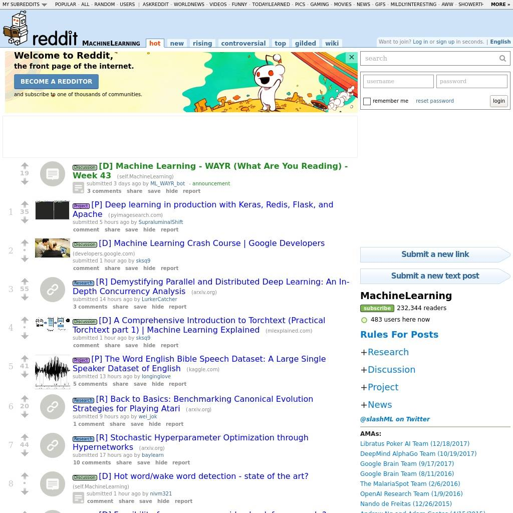

> #오늘의레딧 https://www.reddit.com/r/MachineLearning/ 오늘도 새소식이 많군요.  1. Keras, Redis, Flask, Apache와 함께 생산에 대한 심층적인 학습 2. 기계 학습 크래시 과정 b구글 개발자 3. 병렬 및 분산 딥 학습을 통한 심층 학습:심층 방어 분석 4. Torchtext(실제 TorchtextPart1)에 대한 포괄적인 소개(TorchtextTorchttpart1) 5. 영어 영문학 연설문:대형 영어 화자 다대셋 6. BacktoBasics:Atari를 활용한 혁신적인 혁신 전략 벤치마킹 7. Hypernetworks를 통한 확률적 하이퍼 암페어 파라미터 최적화 8. HotAddwalkkewalkke-arts라는 단어는 예술의 상태인가요? 9. 연구용 오픈 소스 아이디어 은행의 타당성? 10. 이미지 분류 및 검색을 위한 방향 통계 기반 깊은 메트릭 학습 11. 스파스 데이터와 GBT회귀은 휘발성 출력을 생성합니다. 12. 101데이터 분석을 위한 101번째 실습 13. CondionalDCGAN이미지 14. 2013년 2월 2일 업데이트를 위한 데이터 레이블링 플랫폼 15. Keras-Keras:Keras에서 GAN의 접근 가능한 구현 16. defistificationV인식 V:DataAugmentation(최근에 소개된 기술)을 사용하여 데이터 자동화(최근에 소개됨) 17. 버클리 연구소'Mini-ManimastMachineLearning'알고리즘을 통한 데이터 분석 이미지 분석 18. 발전기 콘덕턴스가 GAN성능과 관련이 있습니까? 19. 학습 과제 관리-엉망인 상태 관리 20. 페트니카 여름 학원 기계 학습 세미나  1. https://www.pyimagesearch.com/2018/02/05/deep-learning-production-keras-redis-flask-apache/ 2. https://developers.google.com/machine-learning/crash-course/ 3. https://arxiv.org/abs/1802.09941 4. http://mlexplained.com/2018/02/08/a-comprehensive-tutorial-to-torchtext/ 5. https://www.kaggle.com/bryanpark/the-world-english-bible-speech-dataset 6. https://arxiv.org/abs/1802.08842v1 7. https://arxiv.org/abs/1802.09419 8. https://www.reddit.com/r/MachineLearning/comments/8104yc/d_hot_wordwake_word_detection_state_of_the_art/ 9. https://www.reddit.com/r/MachineLearning/comments/80vzeo/d_feasibility_for_a_opensource_idea_bank_for/ 10. https://arxiv.org/abs/1802.09662 11. https://www.reddit.com/r/MachineLearning/comments/80vlnd/d_sparse_data_and_gbt_regression_producing/ 12. https://www.reddit.com/r/MachineLearning/comments/80nrgy/n_101_numpy_exercises_for_data_analysis/ 13. https://www.reddit.com/r/MachineLearning/comments/80ygiu/p_condional_dcgan_images/ 14. https://february-wlayjxdpco.now.sh/ 15. https://github.com/eriklindernoren/Keras-GAN 16. http://blcv.pl/static//2018/02/27/demystifying-face-recognition-v-data-augmentation/ 17. http://newscenter.lbl.gov/2018/02/21/new-berkeley-lab-algorithms-create-minimalist-machine-learning-that-analyzes-images-from-very-little-information/ 18. https://arxiv.org/abs/1802.08768 19. https://www.reddit.com/r/MachineLearning/comments/80oynr/d_managing_learning_datsets_managing_the_mess/ 20. https://www.reddit.com/r/MachineLearning/comments/80mbqt/n_petnica_summer_institute_machine_learning/

### 3월 2일 (금) 08:52 · 📷 사진 (1장)

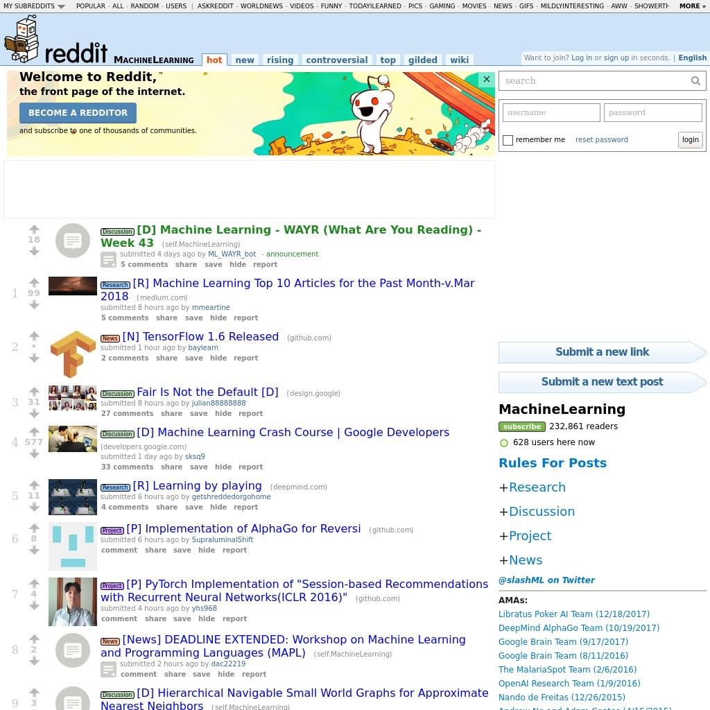

> #오늘의레딧 https://www.reddit.com/r/MachineLearning/ 머신러닝 공부는 정말 재미있죠?아침부터 다양한 소식이 많네요.  1. 2011년 3월 27일에 열리는 2011년 5월 31일 월요일까지 열리는 기계 학습 2. TensorFlow1.6릴리스 3. 기계 학습 크래시 과정 b구글 개발자 4. 배움으로써 배움 5. 르베르조를 위한 알파고의 구현 6. 제2회 CDMA국제 학술 대회 7. DEADLINEEXTENDED:기계 학습 및 프로그래밍 언어(MAPL) 8. 편재형 거주자를 위한 위계적 환경 친화적 소형 세계 그래프 9. 손실 지표, 모드 연결 및 신속한 DNA결합 10. 기계 학습과 신경 네트워크를 위한 학술지? 11. 요점:오버 헤드 이미지 데이터 세트 및 챌린지 12. 시각적 질문 답변 가이드:데이터 세트, 접근 및 평가 13. Keras, Redis, Flask, Apache와 함께 생산에 대한 심층적인 학습 14. 이벤트 기반 데이터를 처리하기 위한 최상의 모델/기술 15. 학술 기사:보강 학습에서의 능동적 의존성 16. TrufflePig:자연어 처리 및 기계 학습을 기반으로 양질의 콘텐츠 찾기 17. 애니메이션 및 대화형 시각화를 최적화 매개 변수로 사용(주석 설명) 18. Torchtext(실제 TorchtextPart1)에 대한 포괄적인 소개(TorchtextTorchttpart1) 19. 프랑스-이탈리아의 EC제도 구현 20. 특정한 문제를 해결하는 데 있어서 한가지 방법이 다른 방법보다 더 낫다는 것을 어떻게 확신할 수 있는가?  1. https://medium.com/@Mybridge/machine-learning-top-10-articles-for-the-past-month-v-mar-2018-a3473d6da21f 2. https://github.com/tensorflow/tensorflow/releases/tag/v1.6.0 3. https://developers.google.com/machine-learning/crash-course/ 4. https://deepmind.com/blog/learning-playing/ 5. https://github.com/mokemokechicken/reversi-alpha-zero 6. https://github.com/yhs-968/pyGRU4REC 7. https://www.reddit.com/r/MachineLearning/comments/818tad/news_deadline_extended_workshop_on_machine/ 8. https://www.reddit.com/r/MachineLearning/comments/816olz/d_hierarchical_navigable_small_world_graphs_for/ 9. https://arxiv.org/abs/1802.10026 10. https://www.reddit.com/r/MachineLearning/comments/8199x5/d_academic_journals_for_machine_learning_and/ 11. http://xviewdataset.org/ 12. https://tryolabs.com/blog/2018/03/01/guide-to-visual-question-answering-datasets-approaches-and-evaluation/ 13. https://www.pyimagesearch.com/2018/02/05/deep-learning-production-keras-redis-flask-apache/ 14. https://www.reddit.com/r/MachineLearning/comments/814qu1/project_best_modelstechniques_for_working_with/ 15. https://arxiv.org/abs/1802.10031 16. https://utopian.io/utopian-io/@smcaterpillar/trufflepig-a-bot-based-on-natural-language-processing-and-machine-learning-to-support-content-curators-and-minnows 17. https://www.reddit.com/r/MachineLearning/comments/814lb3/p_using_animated_and_interactive_visualisation_to/ 18. http://mlexplained.com/2018/02/08/a-comprehensive-tutorial-to-torchtext/ 19. https://www.reddit.com/r/MachineLearning/comments/811v57/p_pytorch_implementation_of_deepimageanalogy/ 20. https://www.reddit.com/r/MachineLearning/comments/811cmr/d_how_to_confidently_show_that_one_method_is/

### 3월 3일 (토) 08:52 · 📷 사진 (1장)

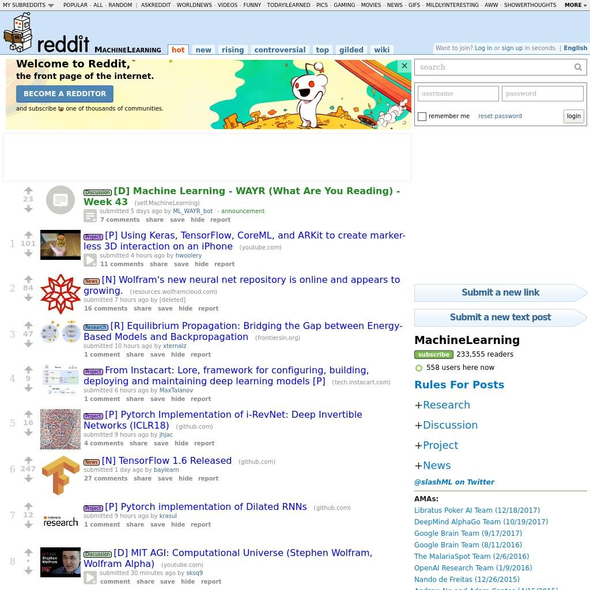

> #오늘의레딧 https://www.reddit.com/r/MachineLearning/ 오늘도 새소식이 많군요.  1. Keras, TensorFlow, CoreMate및 ARKE을 사용하여 iPhone에서 마스크가 없는 3D상호 작용을 생성합니다. 2. 볼프람의 새로운 신경망 저장소는 온라인에 접속하여 성장하는 것처럼 보인다. 3. 평형 분포:에너지 기반 모델과 백 프래그래이션 사이의 간극 해소 4. I-re-revertableInternation:DeepInvertableNetworks(ICTR18) 5. TensorFlow1.6릴리스 6. PHN(dilatedRNAV)의 피토치 이행 7. MITAGI:계산적 우주(StephenWolfwal, Wolfral알파) 8. OpenMinedtotheOpenMined-커뮤니티와 함께 3개월간 지속 9. RealTime( 실시간)트리거 워드와 Keras(Keras)를 사용하여 10. 피오르치와 피토크 11. 2002년도 추계 종합 학술 발표회 논문 초록 집 vol.26 12. D그래프에서 에지를 최적화하기 위한 기법? 노드 간에 연결되어 있는 노드 간의 연결을 최적화하는 방법을 알아보고 싶지만, 해결하고자 하는 문제를 설명할 수 있는 올바른 단어는 모르겠습니다. 13. 2011년 3월 27일에 열리는 2011년 5월 31일 월요일까지 열리는 기계 학습 14. 제4회 CDMA국제 학술 대회 15. PolonicExchange를 위한 오픈 엔드 O-LearningCryptorityTraderandPortfolityOptimizerforPolonicOptimizer 16. 문장 공간(대화형 데모) 17. 배움으로써 배움 18. 손실 지표, 모드 연결 및 신속한 DNA결합 19. 르베르조를 위한 알파고의 구현 20. 기계 학습 크래시 과정 b구글 개발자  1. https://www.youtube.com/watch?v=c_h6UBq0u70&feature=youtu.be 2. http://resources.wolframcloud.com/NeuralNetRepository 3. https://www.frontiersin.org/articles/10.3389/fncom.2017.00024/full 4. https://github.com/jhjacobsen/pytorch-i-revnet 5. https://github.com/tensorflow/tensorflow/releases/tag/v1.6.0 6. https://github.com/zalandoresearch/pt-dilate-rnn 7. https://www.youtube.com/watch?v=P7kX7BuHSFI 8. https://medium.com/@morgangiraud/contributing-to-openmined-ba264dfef924 9. https://medium.com/@chengweizhang2012/how-to-do-real-time-trigger-word-detection-with-keras-b8a56ab106b7 10. https://adoni.github.io/2017/11/08/word2vec-pytorch/ 11. https://www.kaggle.com/c/inaturalist-2018 12. https://www.reddit.com/r/MachineLearning/comments/81fkrz/discussion_techniques_for_optimizing_edges_in_a/ 13. https://medium.com/@Mybridge/machine-learning-top-10-articles-for-the-past-month-v-mar-2018-a3473d6da21f 14. https://github.com/DeNA/SRCNNKit 15. https://github.com/bshaw19/Crypto_Trader 16. https://www.robinsloan.com/voyages-in-sentence-space/ 17. https://deepmind.com/blog/learning-playing/ 18. https://arxiv.org/abs/1802.10026 19. https://github.com/mokemokechicken/reversi-alpha-zero 20. https://developers.google.com/machine-learning/crash-course/

### 3월 4일 (일) 08:52 · 📷 사진 (1장)

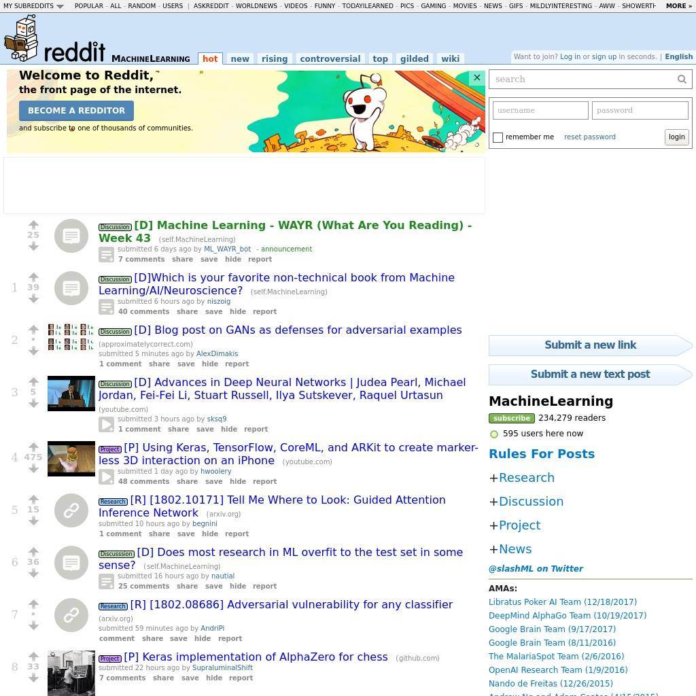

> #오늘의레딧 https://www.reddit.com/r/MachineLearning/ 머신러닝 공부는 정말 재미있죠?아침부터 다양한 소식이 많네요.  1. 당신이 가장 좋아하는 비기술적인 책은 무엇입니까? 2. 수취인 사례에 대한 국방부의 블로그 게시물 3. 깊은 신경 회로망의 발달, 마이클 조던, 페이페이 리, 스튜어트 러셀, 일리야 수츠베르, 라켈 우르크슨, 라쿠르손 4. Keras, TensorFlow, CoreMate및 ARKE을 사용하여 iPhone에서 마스크가 없는 3D상호 작용을 생성합니다. 5. 알파베로의 체스를 위한 케랄라 이행 6. 볼프람의 새로운 신경망 저장소는 온라인에 접속하여 성장하는 것처럼 보인다. 7. MITAGI:계산적 우주(StephenWolfwal, Wolfral알파) 8. 평형 분포:에너지 기반 모델과 백 프래그래이션 사이의 간극 해소 9. VAE가능성 함수 질문 10. I-re-revertableInternation:DeepInvertableNetworks(ICTR18) 11. PHN(dilatedRNAV)의 피토치 이행 12. TensorFlow1.6릴리스 13. MIT와 SenseTime은 인공 지능 연구를 진전시키기 위한 노력을 발표했다. 14. 피오르치와 피토크 15. 2002년도 추계 종합 학술 발표회 논문 초록 집 vol.26 16. RealTime( 실시간)트리거 워드와 Keras(Keras)를 사용하여 17. OpenMinedtotheOpenMined-커뮤니티와 함께 3개월간 지속 18. D그래프에서 에지를 최적화하기 위한 기법? 노드 간에 연결되어 있는 노드 간의 연결을 최적화하는 방법을 알아보고 싶지만, 해결하고자 하는 문제를 설명할 수 있는 올바른 단어는 모르겠습니다. 19. 2011년 3월 27일에 열리는 2011년 5월 31일 월요일까지 열리는 기계 학습 20. 제4회 CDMA국제 학술 대회  1. https://www.reddit.com/r/MachineLearning/comments/81rel3/dwhich_is_your_favorite_nontechnical_book_from/ 2. http://approximatelycorrect.com/2018/03/02/defending-adversarial-examples-using-gans/ 3. https://www.youtube.com/attribution_link?a=w6Q_AfZbZYw&u=%2Fwatch%3Fv%3DmFYM9j8bGtg%26feature%3Dshare 4. https://www.youtube.com/watch?v=c_h6UBq0u70&feature=youtu.be 5. https://github.com/Zeta36/chess-alpha-zero 6. http://resources.wolframcloud.com/NeuralNetRepository 7. https://www.youtube.com/watch?v=P7kX7BuHSFI 8. https://www.frontiersin.org/articles/10.3389/fncom.2017.00024/full 9. https://www.reddit.com/r/MachineLearning/comments/81pgm6/d_vae_likelihood_function_question/ 10. https://github.com/jhjacobsen/pytorch-i-revnet 11. https://github.com/zalandoresearch/pt-dilate-rnn 12. https://github.com/tensorflow/tensorflow/releases/tag/v1.6.0 13. http://news.mit.edu/2018/mit-sensetime-announce-effort-advance-artificial-intelligence-research-0228 14. https://adoni.github.io/2017/11/08/word2vec-pytorch/ 15. https://www.kaggle.com/c/inaturalist-2018 16. https://medium.com/@chengweizhang2012/how-to-do-real-time-trigger-word-detection-with-keras-b8a56ab106b7 17. https://medium.com/@morgangiraud/contributing-to-openmined-ba264dfef924 18. https://www.reddit.com/r/MachineLearning/comments/81fkrz/discussion_techniques_for_optimizing_edges_in_a/ 19. https://medium.com/@Mybridge/machine-learning-top-10-articles-for-the-past-month-v-mar-2018-a3473d6da21f 20. https://github.com/DeNA/SRCNNKit

### 3월 5일 (월) 08:52 · 📷 사진 (1장)

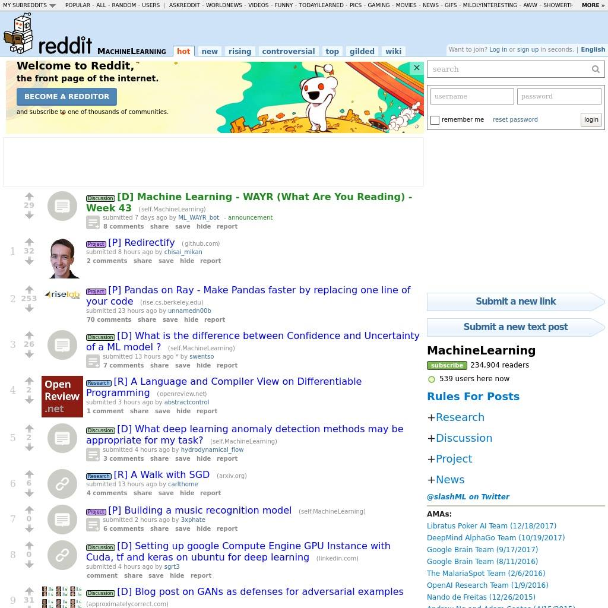

> #오늘의레딧 https://www.reddit.com/r/MachineLearning/ 머신러닝 공부는 정말 재미있죠?아침부터 다양한 소식이 많네요.  1. 리디 리디 2. 레이 앳 레이-코드를 한줄로 교체하여 팬더 곰을 더 빨리 만들어 보세요. 3. ML모델의 신뢰도와 불확실성 사이의 차이점은 무엇입니까? 4. 차별화 프로그래밍에 관한 언어 및 컴파일러 뷰 5. 내 직무에 적합한 학습 이상 징후 탐지 방법은 무엇입니까? 6. SGD를 이용한 산책로 7. 음악 인식 모델 구축 8. 심층 학습을 위한 Google, TF및 Kears와 함께 GoogleComputeEngineGPU인스턴스 설정 9. 수취인 사례에 대한 국방부의 블로그 게시물 10. 당신이 가장 좋아하는 비기술적인 책은 무엇입니까? 11. OpenAi's WEQ의 수치 예측 문제로 즐거운 시간을 보냈습니다. 다른 우울증에 빠진 장난감 문제라도 있나요? 12. 깊은 신경 회로망의 발달, 마이클 조던, 페이페이 리, 스튜어트 러셀, 일리야 수츠베르, 라켈 우르크슨, 라쿠르손 13. 트리 기반 앙상블 모델의 구성 요소/유틸리티를 어떻게 측정합니까? 14. 손을 찾습니다. Keras에서 가변 영상 크기를 가진 이미지 분류 모델을 장착합니다. 15. 마이크로 소프트 MMD:Caffe9/F4키를 Caffe4K로 변환합니다. 16. Dneunarquitecture회귀 모델 17. 데이터 세트가 너무 희박해서 모델이 처리할 수 없습니까? 18. DNN및 Knowledge표현 19. Keras, TensorFlow, CoreMate및 ARKE을 사용하여 iPhone에서 마스크가 없는 3D상호 작용을 생성합니다. 20. 알파베로의 체스를 위한 케랄라 이행  1. https://github.com/imurray/redirectify 2. https://rise.cs.berkeley.edu/blog/pandas-on-ray/ 3. https://www.reddit.com/r/MachineLearning/comments/81wrgi/d_what_is_the_difference_between_confidence_and/ 4. https://openreview.net/forum?id=SJxJtYkPG 5. https://www.reddit.com/r/MachineLearning/comments/81zyld/d_what_deep_learning_anomaly_detection_methods/ 6. https://arxiv.org/abs/1802.08770 7. https://www.reddit.com/r/MachineLearning/comments/8208av/p_building_a_music_recognition_model/ 8. https://www.linkedin.com/pulse/setting-up-google-compute-engine-gpu-instance-cuda-tf-samrat-saha/ 9. http://approximatelycorrect.com/2018/03/02/defending-adversarial-examples-using-gans/ 10. https://www.reddit.com/r/MachineLearning/comments/81rel3/dwhich_is_your_favorite_nontechnical_book_from/ 11. https://www.reddit.com/r/MachineLearning/comments/81uvmp/d_had_fun_with_openais_lstm_parity_prediction/ 12. https://www.youtube.com/attribution_link?a=w6Q_AfZbZYw&u=%2Fwatch%3Fv%3DmFYM9j8bGtg%26feature%3Dshare 13. https://www.reddit.com/r/MachineLearning/comments/81wqws/d_how_do_you_measure_confidenceuncertainty_in/ 14. https://www.reddit.com/r/MachineLearning/comments/81xwte/d_looking_for_a_hand_fitting_an_image/ 15. https://github.com/Microsoft/MMdnn 16. https://www.reddit.com/r/MachineLearning/comments/81xtkj/d_dnn_arquitecturesfor_regression_models/ 17. https://www.reddit.com/r/MachineLearning/comments/81wgbs/d_dataset_too_sparse_could_any_model_handle_it/ 18. https://www.reddit.com/r/MachineLearning/comments/81vtj8/d_dnns_and_knowledge_representation/ 19. https://www.youtube.com/watch?v=c_h6UBq0u70&feature=youtu.be 20. https://github.com/Zeta36/chess-alpha-zero

### 3월 6일 (화) 08:52 · 📷 사진 (1장)

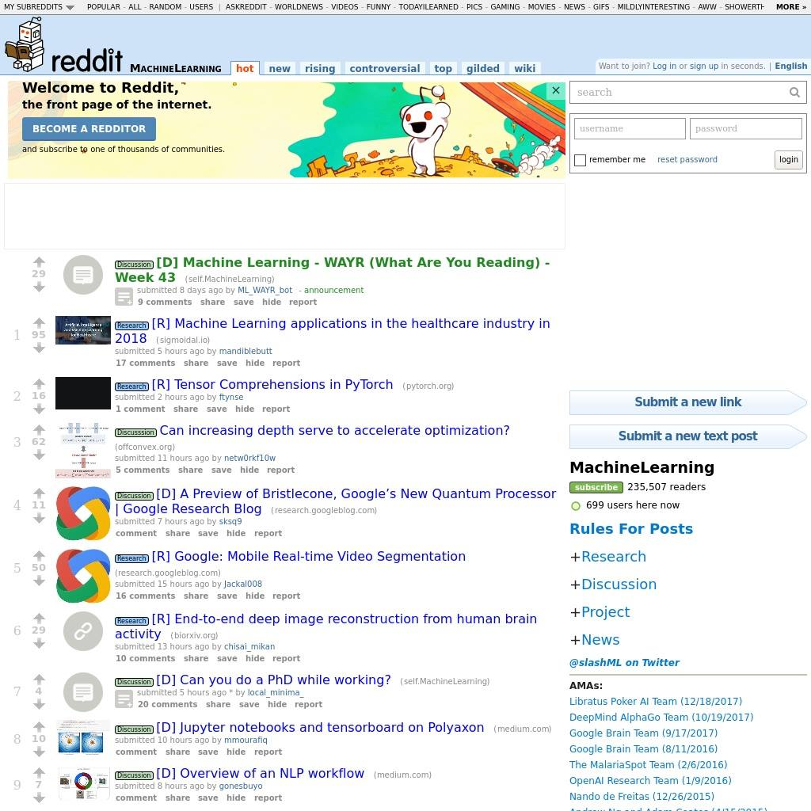

> #오늘의레딧 https://www.reddit.com/r/MachineLearning/ 재미난 이야기들이 많습니다.  1. 2018년 의료 업계의 기계 학습 애플리케이션 2. 투르크스의 테오 캄프스 압축 3. 브리스토콘센의 프리뷰, 구글의 새로운 Quantum프로세서 구글 리서치 블로그 4. 구글:모바일 실시간 비디오 분할 5. 인간의 뇌 활동을 통한 철저한 이미지 재구성 6. 일하면서 박사 학위를 받을 수 있나요? 7. 유피터 수첩 8. NLP워크 플로우 개요 9. 에디슨-소형 자기 주행 차량(테슬라 복사) 10. 깊은 영상 재구성:시각적 이미지(상상적 이미지) 11. 아파치 MXNet1.1.0 릴리즈 12. 투르크스의 테오 캄프스 압축 13. 2월에 출판된 최고의 AI기사 14. 깊은 RL에서 스칼라 보상을 사용하고 확률적인 정책을 학습하는 데 있어 예술의 상태는 어떠한가? 15. 멀티-모드 Multi-다음계 멀티 태스킹 교육 16. 리디 리디 17. 심도 깊은 학습 의욕 18. 분할 평가 메트릭에 대한 질문 19. 수동 분할의 정확도 20. 내 직무에 적합한 학습 이상 징후 탐지 방법은 무엇입니까?  1. https://sigmoidal.io/artificial-intelligence-and-machine-learning-for-healthcare/ 2. http://pytorch.org/2018/03/05/tensor-comprehensions.html 3. https://research.googleblog.com/2018/03/a-preview-of-bristlecone-googles-new.html 4. https://research.googleblog.com/2018/03/mobile-real-time-video-segmentation.html?utm_source=feedburner&utm_medium=feed&utm_campaign=Feed%3A+blogspot%2FgJZg+%28Official+Google+Research+Blog%29 5. https://www.biorxiv.org/content/early/2018/02/27/272518 6. https://www.reddit.com/r/MachineLearning/comments/827sa6/d_can_you_do_a_phd_while_working/ 7. https://medium.com/polyaxon/jupyter-notebooks-and-tensorboard-on-polyaxon-f4b9ce973575 8. https://medium.com/@gon.esbuyo/get-started-with-nlp-part-ii-overview-of-an-nlp-workflow-7ba1f5948b24 9. https://www.reddit.com/r/MachineLearning/comments/822y0o/p_edison_a_small_scale_self_driving_car_copying/ 10. https://twitter.com/ykamit/status/948807195205840896 11. https://blogs.apache.org/mxnet/entry/1-1-0-release-makes 12. http://pytorch.org/2018/03/05/tensor-comprehensions.html 13. https://blog.sicara.com/02-2018-best-ai-new-articles-this-month-2de3ff2d534b 14. https://www.reddit.com/r/MachineLearning/comments/825fsr/d_what_is_the_state_of_the_art_in_using_scalar/ 15. https://arxiv.org/abs/1709.05581 16. https://github.com/imurray/redirectify 17. https://github.com/omarsar/deep_learning_notations 18. https://www.reddit.com/r/MachineLearning/comments/822nup/d_question_about_segmentation_evaluation_metrics/ 19. https://www.reddit.com/r/MachineLearning/comments/824efv/d_accuracy_of_manual_segmentation/ 20. https://www.reddit.com/r/MachineLearning/comments/81zyld/d_what_deep_learning_anomaly_detection_methods/

### 3월 7일 (수) 08:52 · 📷 사진 (1장)

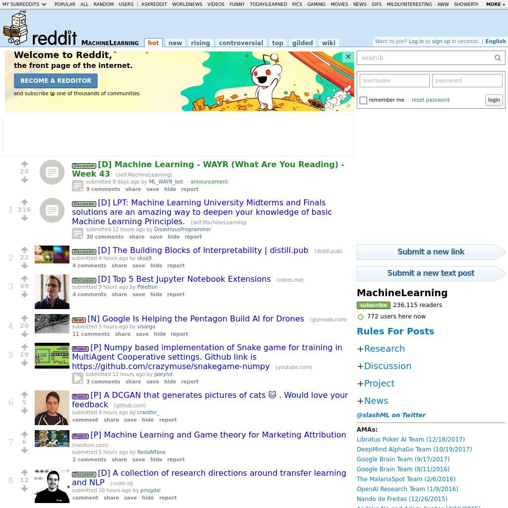

> #오늘의레딧 https://www.reddit.com/r/MachineLearning/ 정말 읽을 거리가 많네요.  1. LPT:기계 학습 대학교 미드 레인지 및 결승 솔루션은 기본적인 학습 원리에 대한 지식을 심화시키는 놀라운 방법입니다. 2. IMT-20003GPP-해석 가능성 f2 3. 상위 5개의 점퍼 노트북 확장 4. 구글은 미 국방부가 국방부를 위해 인공 지능을 구축할 수 있도록 돕고 있다. 5. MultyComprent환경에서의 훈련을 위한 뱀피 게임의 이행을 위한 Numpy기반의 구현. GitHub링크는 https://github.com/crazymuse/snakegame-numpy이다. 6. 고양이 그림을 그리는 DCGAN입니다. 귀하의 피드백이 마음에 드십니까? 7. 마케팅 전략을 위한 기계 학습 및 게임 이론 8. 이동 학습 및 NLP에 대한 연구 방향의 수집 9. 합성된 데이터 지향적인 데이터를 위한 syntax-DirectionalAutoencoder 10. 간단한 TensorflowDatasetAPI자습서/판독치를 위한 자습서 11. 미혼 여성에게 적합한 매력적인 문제를 찾고 있습니다. 12. GoogleColab을 이용한 스타일 전달 방식-Colaboratory 13. 얀 레쿤과 크리스토퍼 매닝은 딥 학습과 네이트 프리셔스를 논의했다. 14. 2018년 의료 업계의 기계 학습 애플리케이션 15. 신경 회로망의 상호 작용을 위한 기반 시설과 도구의 집합 16. 고무쿠를 위한 알페르토로의 이행(Tensorflow, Pytorch, Theano) 17. PyToune:PyTorch를 위한 Kerams-RikeDeepLearning프레임워크 18. 시각적 질문 답변 가이드:데이터 세트, 접근법 및 평가-Tryolabs블로그 19. 범주화 라이브러리를 사용하여 시스템 학습에서 노이즈 발생 시 데이터를 처리하는 방법 20. 빅 데이터(18+)에 대한 Capstone코스 평가  1. https://www.reddit.com/r/MachineLearning/comments/82ed9v/d_lpt_machine_learning_university_midterms_and/ 2. https://distill.pub/2018/building-blocks/ 3. https://ndres.me/post/best-jupyter-notebook-extensions/ 4. https://gizmodo.com/google-is-helping-the-pentagon-build-ai-for-drones-1823464533 5. https://www.youtube.com/watch?v=KIdhZTv-uo8 6. https://github.com/simoninithomas/CatDCGAN 7. https://medium.com/data-from-the-trenches/marketing-attribution-e7fa7ae9e919 8. http://ruder.io/requests-for-research/ 9. https://mlatgt.blog/2018/02/08/syntax-directed-variational-autoencoder-for-structured-data/ 10. https://github.com/taki0112/Tensorflow-DatasetAPI 11. https://www.reddit.com/r/MachineLearning/comments/82fvvc/p_looking_for_interesting_problems_conntected/ 12. https://github.com/vinayakpahalwan7/Alia-Bhatt-style-transfer/blob/master/setup_first_alia_styletransfer.ipynb 13. https://www.youtube.com/watch?v=fKk9KhGRBdI 14. https://sigmoidal.io/artificial-intelligence-and-machine-learning-for-healthcare/ 15. https://github.com/tensorflow/lucid 16. https://github.com/junxiaosong/AlphaZero_Gomoku 17. http://pytoune.org 18. https://tryolabs.com/blog/2018/03/01/guide-to-visual-question-answering-datasets-approaches-and-evaluation/ 19. https://community.fico.com/community/articles/blog/2018/03/06/tackle-challenges-of-noisy-data-with-binning-libraries 20. http://ucf.qualtrics.com/jfe/form/SV_4MwnQBkSa7OeXyt

### 3월 8일 (목) 08:53 · 📷 사진 (1장)

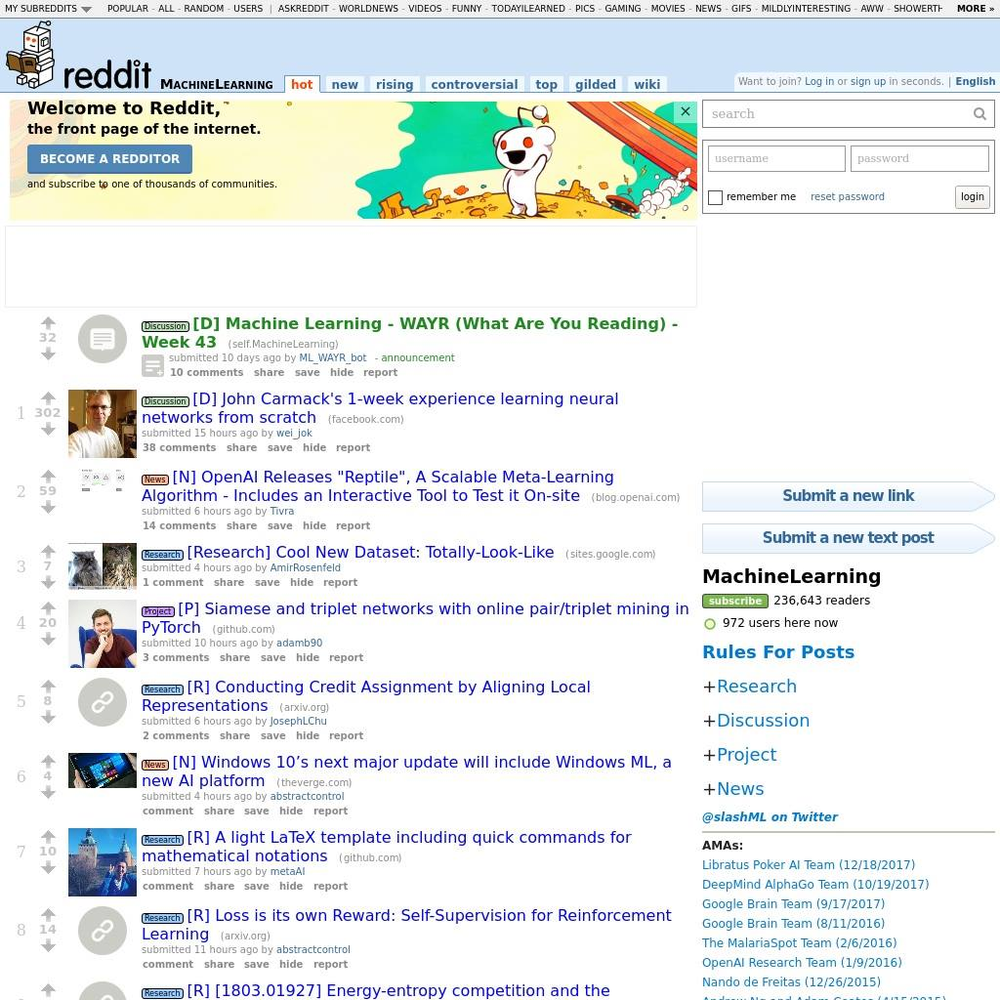

> #오늘의레딧 https://www.reddit.com/r/MachineLearning/ 래딧은 읽을 거리가 다양합니다.  1. 존 카맥의 1주간의 경험을 통해 신경 회로를 얻는 경험 2. Openej(Respile)"Reptile", 확장 가능한 메타 데이터 학습 알고리즘-현장 테스트를 위한 대화형 툴 포함 3. 멋진 새 데이터 세트:토탈리-토크 링크 4. 온라인 패어드 트립 제트를 이용한 샴 및 삼중 삼중항 네트워크 5. 지역별 재정비 촉진을 통한 신용 배분 6. Windows10(윈도우 10)다음 주요 업데이트는 새로운 AI플랫폼인 WindowsML을 포함합니다. 7. 수학적 표기법에 대한 빠른 명령을 포함한 경량 텍스타치 템플릿 8. 손실은 자체 보상입니다:자체적으로 보강 학습을 위한 자체 평가 9. ConventionGuape를 통한 ConvoluationNealNetwork과의 상호 작용을 통한 객체 인식 개선 10. 내장 NLU용 오픈 소스 라이브러리인 SnipsNLU 11. 매우 적은 양의 문서를 문서화하고 텍스트를 텍스트 방법으로 찾습니다. 12. 텍스트 데이터에 대한 다중 경로 교육에 사용할 수 있는 벤치 마크가 있습니까? 13. LPT:기계 학습 대학교 미드 레인지 및 결승 솔루션은 기본적인 학습 원리에 대한 지식을 심화시키는 놀라운 방법입니다. 14. Cannot translate 15. TensorFlowImageMet-SOTA재생(MobileDrt,...) 16. 기계 학습 공학과의 직업 전망? 17. 무인 자동차를 위한 기계 학습 및 구조 18. 요약 및 웹 클리핑 RESTAPI 19. 구글은 미 국방부가 국방부를 위해 인공 지능을 구축할 수 있도록 돕고 있다. 20. CVPR2018년 자료를 볼 수 있는 곳은 어디인가?  1. https://www.facebook.com/permalink.php?story_fbid=2110408722526967&id=100006735798590 2. https://blog.openai.com/reptile/ 3. https://sites.google.com/view/totally-looks-like-dataset 4. https://github.com/adambielski/siamese-triplet 5. https://arxiv.org/abs/1803.01834v1 6. https://www.theverge.com/2018/3/7/17089860/microsoft-windows-ml-windows-10-ai-platform 7. https://github.com/zuoxingdong/Notes-RL/tree/master/template 8. https://arxiv.org/abs/1612.07307 9. https://arxiv.org/abs/1803.01967 10. https://medium.com/snips-ai/an-introduction-to-snips-nlu-the-open-source-library-behind-snips-embedded-voice-platform-b12b1a60a41a 11. https://www.reddit.com/r/MachineLearning/comments/82p93l/d_looking_for_papers_on_very_longinfinite_video/ 12. https://www.reddit.com/r/MachineLearning/comments/82q7al/d_is_there_any_benchmarks_available_for_multigpu/ 13. https://www.reddit.com/r/MachineLearning/comments/82ed9v/d_lpt_machine_learning_university_midterms_and/ 14. https://distill.pub/2018/building-blocks/ 15. https://github.com/balancap/tf-imagenet 16. https://www.reddit.com/r/MachineLearning/comments/82syo8/d_job_outlook_for_machine_learning_engineering/ 17. https://markusrw.github.io/articles/tldr-on-ml-and-structure-for-robotics/ 18. http://www.summarizebot.com/summarization_business.html 19. https://gizmodo.com/google-is-helping-the-pentagon-build-ai-for-drones-1823464533 20. https://www.reddit.com/r/MachineLearning/comments/82nn06/d_where_can_we_see_cvpr_2018_accepted_papers/

### 3월 9일 (금) 08:52 · 📷 사진 (1장)

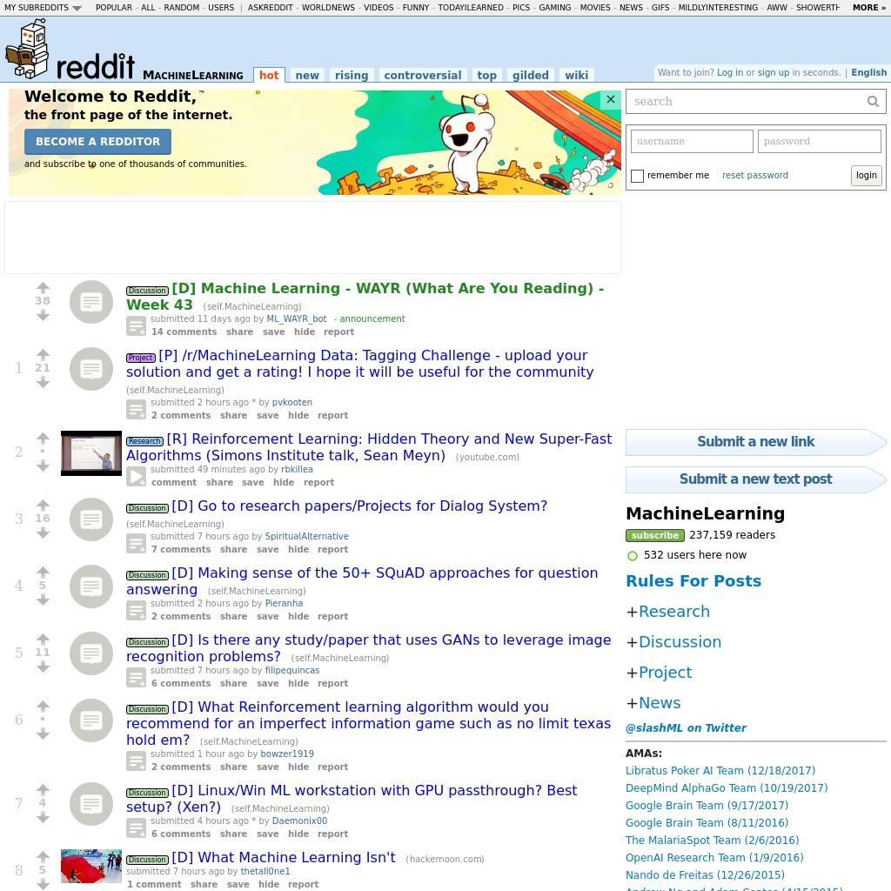

> #오늘의레딧 https://www.reddit.com/r/MachineLearning/ 재미난 이야기들이 많습니다.  1. https://www.reddit.com/r/MachineLearning 데이터:TaggingChallenge-솔루션을 업로드하고 등급을 지정하십시오! 나는 그것이 지역 사회에 유용하기를 희망한다. 2. 강화 학습: 숨겨진 이론과 새로운 슈퍼 컴퓨터 알고리즘(시모먼트 인스티튜트 토크, 션 메린) 3. 대화 상자를 방문하여 대화 상자 시스템에 대한 정보를 확인하십시오. 4. 질문 답변에 대한 50개 이상의 SQuAD 접근 방식 이해 5. 이미지 인식 문제를 활용하기 위해 GAN을 사용하는 Study/xfer가 있습니까? 6. 텍사스 주 홀드 오프와 같은 불완전한 정보 게임을 위해 어떤 보완 학습 알고리즘을 추천하시겠습니까? 7. Linux/Win(GPU)패스 스루를 사용하는 Linux/Mac워크 스테이션 최고의 셋팅? (젠?) 8. 어떤 기계 학습이 그렇지 않은가? 9. Openej(Respile)"Reptile", 확장 가능한 메타 데이터 학습 알고리즘-현장 테스트를 위한 대화형 툴 포함 10. 병합 및 선택:인자의 계층 구조 추출(+설명 시각화) 11. 신경망 기법을 이용한 미국 3대 대통령의 조합 사례 12. SNAIL은 왜 메탈라네르 건축일까? 13. 멋진 새 데이터 세트:토탈리-토크 링크 14. 존 카맥의 1주간의 경험을 통해 신경 회로를 얻는 경험 15. DCGAN의 이상한 결과들 16. ConventionGuape를 통한 ConvoluationNeural네트워크와의 상호 작용을 통한 객체 인식 개선 방안 17. Windows10(윈도우 10)다음 주요 업데이트는 새로운 AI플랫폼인 WindowsML을 포함합니다. 18. 지역별 재정비 촉진을 통한 신용 배분 19. 온라인 패어드 트립 제트를 이용한 샴 및 삼중 삼중항 네트워크 20. 수학적 표기법에 대한 빠른 명령을 포함한 경량 텍스타치 템플릿  1. https://www.reddit.com/r/MachineLearning/comments/830x9v/p_rmachinelearning_data_tagging_challenge_upload/ 2. https://www.youtube.com/watch?v=dhEF5pfYmvc 3. https://www.reddit.com/r/MachineLearning/comments/82ymmx/d_go_to_research_papersprojects_for_dialog_system/ 4. https://www.reddit.com/r/MachineLearning/comments/831736/d_making_sense_of_the_50_squad_approaches_for/ 5. https://www.reddit.com/r/MachineLearning/comments/82yu9f/d_is_there_any_studypaper_that_uses_gans_to/ 6. https://www.reddit.com/r/MachineLearning/comments/831cp6/d_what_reinforcement_learning_algorithm_would_you/ 7. https://www.reddit.com/r/MachineLearning/comments/8307jz/d_linuxwin_ml_workstation_with_gpu_passthrough/ 8. https://hackernoon.com/what-machine-learning-isnt-d70f8a48d1ce 9. https://blog.openai.com/reptile/ 10. https://github.com/MI2DataLab/factorMerger 11. https://hergott.github.io/attention-mechanism-in-authorship-attribution/ 12. https://www.reddit.com/r/MachineLearning/comments/830g5n/d_why_is_snail_a_metalearner_architecture/ 13. https://sites.google.com/view/totally-looks-like-dataset 14. https://www.facebook.com/permalink.php?story_fbid=2110408722526967&id=100006735798590 15. https://www.reddit.com/r/MachineLearning/comments/82xag7/d_dcgan_celeba_strange_results/ 16. https://arxiv.org/abs/1803.01967 17. https://www.theverge.com/2018/3/7/17089860/microsoft-windows-ml-windows-10-ai-platform 18. https://arxiv.org/abs/1803.01834v1 19. https://github.com/adambielski/siamese-triplet 20. https://github.com/zuoxingdong/Notes-RL/tree/master/template

### 3월 10일 (토) 08:52 · 📷 사진 (1장)

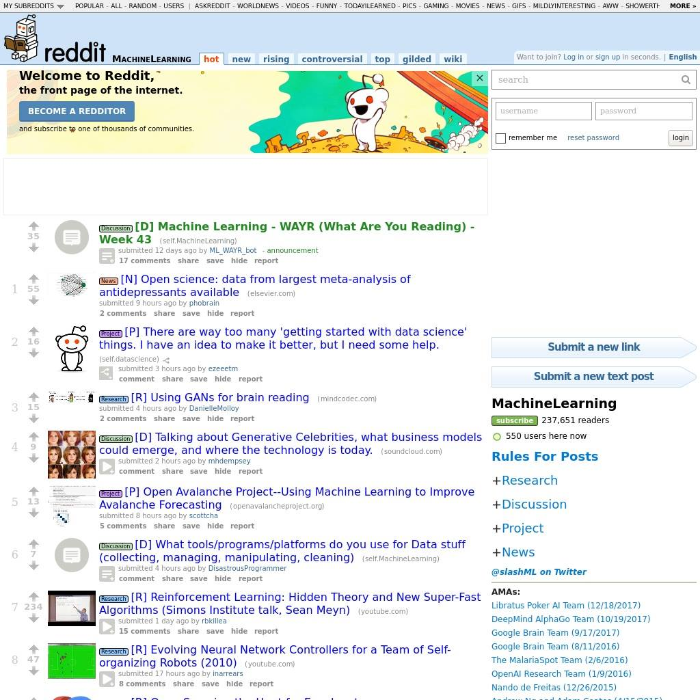

> #오늘의레딧 https://www.reddit.com/r/MachineLearning/ 재미난 이야기들이 많습니다.  1. 개방형 과학:치료 가능한 항우울제의 최대 메타 분석 2. '데이터 과학을 시작하는 것'이 너무 많다. 나는 그것을 더 잘할 생각이 있지만, 나는 약간의 도움이 필요하다. 3. 뇌 판독 값을 얻기 위한 GAN사용 4. 일반적인 연예인들에 대해 이야기하고, 어떤 사업 모델이 등장할 수 있는지, 그리고 기술이 오늘날 어디에 있는지에 대해 이야기하고 있습니다. 5. AvalancheProjecche-AbalancheforAbalancheforAbalanche예측 개선 6. 데이터 항목에 어떤 도구를 사용합니까(수집, 관리, 처리, 세척) 7. 강화 학습: 숨겨진 이론과 새로운 슈퍼 컴퓨터 알고리즘(시모먼트 인스티튜트 토크, 션 메린) 8. 자기 공명 로봇(2010)을 위한 신경망 제어기의 진화 9. 익스플로네이트 포 더 익스플로네이트 더 익스플레이션 10. 3D영상에서 3D재구성 시 현재의 기술 현황은 무엇입니까? 11. 내가 발견한 분산된 기계 학습 용지의 내용에 대한 질문 12. RiseLid는 현재 Horovod와의 심층 학습을 지원합니다. 13. RetinaNet객체 검색의 Keras구현 14. ExpandNet:고밀도 범위의 동적 범위 확장을 위한 고속 확장형 신경망 제어기의 VHDL모델링 FPGA구현 15. GPR-그것은 추론할 수 있습니까? 16. GPR 제가 엑스퍼라머를 쉽게 추산할 수 있을까요? 17. https://www.reddit.com/r/MachineLearning 데이터:TaggingChallenge-솔루션을 업로드하고 등급을 지정하십시오! 나는 그것이 지역 사회에 유용하기를 희망한다. 18. 동적 가중 지수 19. 분산된 MX네트, 선형화될 수 있을까요? 20. 키라스에서 발견되지 않은 최대 절전 모드  1. https://www.elsevier.com/connect/open-science-data-from-largest-meta-analysis-of-antidepressants-available?sf183762435=1 2. https://www.reddit.comhttps://www.reddit.com/r/datascience/comments/838tlf/there_are_way_too_many_getting_started_with_data/ 3. https://www.mindcodec.com/using-gans-brain-reading/ 4. https://soundcloud.com/v0concepts/ai-generative-celebrities 5. https://openavalancheproject.org 6. https://www.reddit.com/r/MachineLearning/comments/8394xs/d_what_toolsprogramsplatforms_do_you_use_for_data/ 7. https://www.youtube.com/watch?v=dhEF5pfYmvc 8. https://www.youtube.com/watch?v=cP035M_w82s 9. https://research.googleblog.com/2018/03/open-sourcing-hunt-for-exoplanets.html?utm_source=feedburner&utm_medium=feed&utm_campaign=Feed:+blogspot/gJZg+\(Official+Google+Research+Blog\) 10. https://www.reddit.com/r/MachineLearning/comments/83bbth/r_whats_the_current_state_of_art_in_3d/ 11. https://www.reddit.com/r/MachineLearning/comments/838k06/d_question_on_contents_of_a_distributed_machine/ 12. https://blog.riseml.com/riseml-supports-distributed-deep-learning-with-horovod-and-tensorflow-40ac770d0009 13. https://github.com/fizyr/keras-retinanet 14. https://arxiv.org/abs/1803.02266 15. https://www.reddit.com/r/MachineLearning/comments/838f0r/d_gpr_can_it_extrapolate/ 16. https://www.reddit.com/r/MachineLearning/comments/838c9p/d_gpr_can_i_estimate_the_hyperparameters_easily/ 17. https://www.reddit.com/r/MachineLearning/comments/830x9v/p_rmachinelearning_data_tagging_challenge_upload/ 18. https://www.reddit.com/r/MachineLearning/comments/835l5c/r_dynamically_weighted_ensembles/ 19. https://blog.kovalevskyi.com/distributed-mxnet-can-it-be-scaled-linearly-7a1ad7c28474 20. https://www.reddit.com/r/MachineLearning/comments/833siz/dunsupervised_lstm_in_keras/

### 3월 10일 (토) 20:30 · Fun 12KM run to meet David Ha. Of course…

📍 Shinjuku Toyko.

Fun 12KM run to meet David Ha. Of course, meeting and talking with him was super great. I guess we will meet more often from July!

  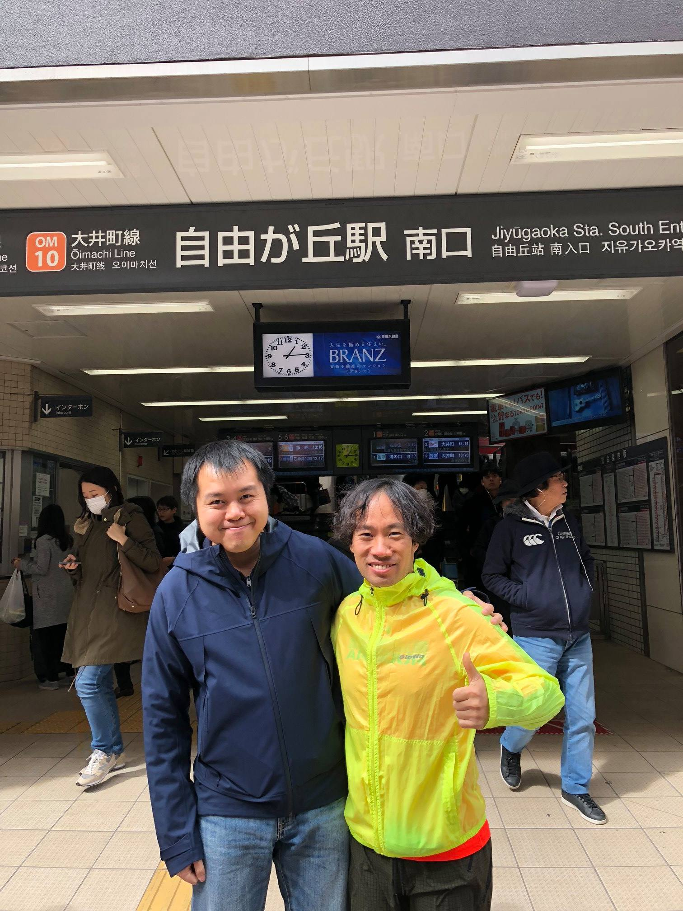 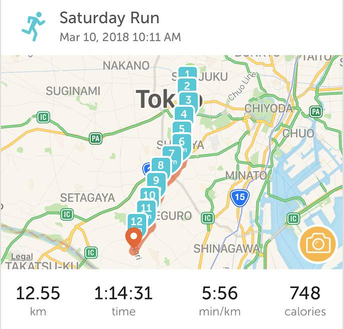

### 3월 11일 (일) 08:52 · 📷 사진 (1장)

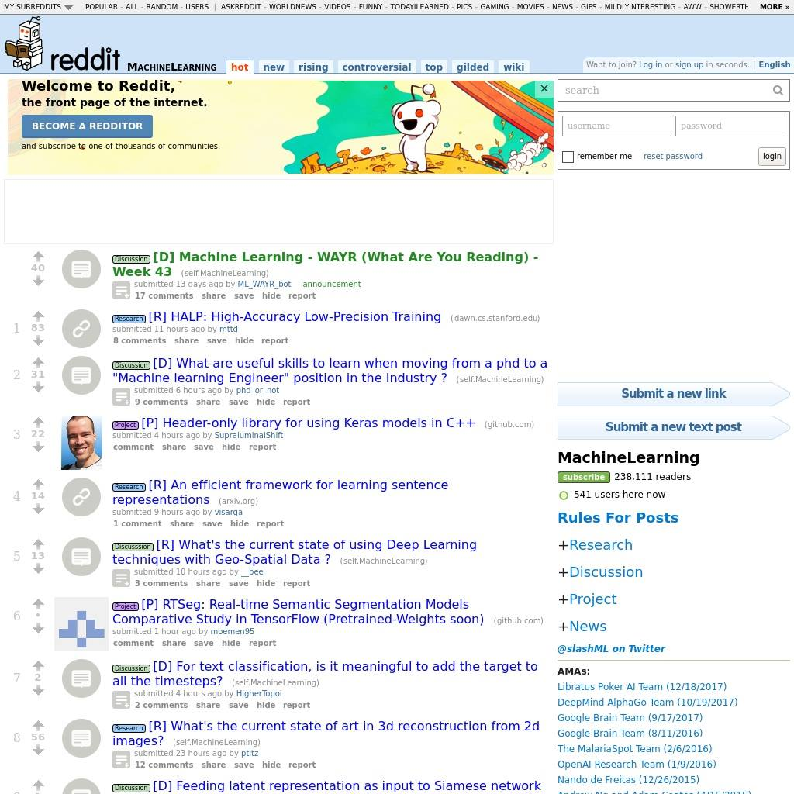

> #오늘의레딧 https://www.reddit.com/r/MachineLearning/ 래딧은 읽을 거리가 다양합니다.  1. HALP:고고도 정밀도 교육 2. 산업에서 "기계 학습 엔지니어"위치로 이동할 때 습득할 수 있는 유용한 기술은 무엇입니까? 3. C++에서 Keras모델을 사용한 헤더 전용 라이브러리 4. 문장을 표현하기 위한 효율적인 프레임워크 5. RTSEG: 실시간 SematicSegmentModel비교 연구 6. 텍스트 분류를 위해 모든 시간대에 목표물을 추가하는 것이 의미하는 바는 무엇인가? 7. 3D영상에서 3D재구성 시 현재의 기술 현황은 무엇입니까? 8. IMT20003GPP-Tal네트워크에의 잠재적인 표현으로서 잠재적인 표현 9. 이미지 대 이미지 기법이 최근에 제대로 증명되었는지 이해하고 있습니까? 10. 가상화 네트워크의 시각화 및 이해 11. '데이터 과학을 시작하는 것'이 너무 많다. 나는 그것을 더 잘할 생각이 있지만, 나는 약간의 도움이 필요하다. 12. 작은 영상에서 사전 훈련된 모델 13. 심층 학습을 위한 사전 구축된 데스크 톱 14. 제4회 CDMA국제 학술 대회 15. 일반적인 연예인들에 대해 이야기하고, 어떤 사업 모델이 등장할 수 있는지, 그리고 기술이 오늘날 어디에 있는지에 대해 이야기하고 있습니다. 16. BicycleGAN의 이분법적 구현:멀티 모드 이미지 변환 17. 신경 네트워크 입력 계층에서 응답하는 상태 18. 뇌 판독 값을 얻기 위한 GAN사용 19. 개방형 과학:치료 가능한 항우울제의 최대 메타 분석 20. 딥 테일러 분해  1. http://dawn.cs.stanford.edu/2018/03/09/low-precision/ 2. https://www.reddit.com/r/MachineLearning/comments/83gf2o/d_what_are_useful_skills_to_learn_when_moving/ 3. https://github.com/Dobiasd/frugally-deep 4. https://arxiv.org/abs/1803.02893 5. https://github.com/MSiam/TFSegmentation 6. https://www.reddit.com/r/MachineLearning/comments/83h7fd/d_for_text_classification_is_it_meaningful_to_add/ 7. https://www.reddit.com/r/MachineLearning/comments/83bbth/r_whats_the_current_state_of_art_in_3d/ 8. https://www.reddit.com/r/MachineLearning/comments/83hy1d/d_feeding_latent_representation_as_input_to/ 9. https://www.reddit.com/r/MachineLearning/comments/83efhf/d_have_i_understood_the_imagetoimage_techniques/ 10. https://www.reddit.com/r/MachineLearning/comments/83hjvu/dvisualizing_and_understanding_convolutional/ 11. https://www.reddit.comhttps://www.reddit.com/r/datascience/comments/838tlf/there_are_way_too_many_getting_started_with_data/ 12. https://www.reddit.com/r/MachineLearning/comments/83eqyq/p_pretrained_model_on_small_image/ 13. https://www.reddit.com/r/MachineLearning/comments/83ex2p/d_prebuilt_desktop_for_deep_learning/ 14. http://earthquakepredictor.net/ 15. https://soundcloud.com/v0concepts/ai-generative-celebrities 16. https://github.com/eveningglow/BicycleGAN-pytorch 17. https://www.reddit.com/r/MachineLearning/comments/83g35p/p_representing_states_in_a_neural_network_input/ 18. https://www.mindcodec.com/using-gans-brain-reading/ 19. https://www.elsevier.com/connect/open-science-data-from-largest-meta-analysis-of-antidepressants-available?sf183762435=1 20. https://github.com/atulshanbhag/Deep-Taylor-Decomposition

### 3월 12일 (월) 08:52 · 📷 사진 (1장)

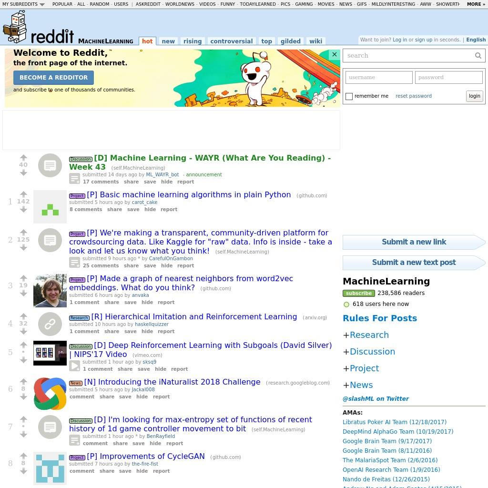

> #오늘의레딧 https://www.reddit.com/r/MachineLearning/ 머신러닝 공부는 정말 재미있죠?아침부터 다양한 소식이 많네요.  1. 플레인 파이썬의 기본 기계 학습 알고리즘 2. 우리는 크라우드 소싱 된 데이터를 크라우드 소싱 할 수 있는 투명한 커뮤니티 기반 플랫폼을 구축하고 있습니다. "raggle"데이터를 얻을 수 있습니다. 정보는 안에 있습니다. 여러분이 어떻게 생각하는지 우리에게 알려 주세요! 3. 가장 가까운 이웃들의 도표를 만들었다. 당신은 어떻게 생각하나요? 4. 계층적 모방 및 강화 학습 5. Subgoals(DavidSilver)를 통한 심층적 강화 학습(DavidSilver)17비디오 6. 혁신적인 2018년 도전 과제 소개 7. 나는 최근에 게임 컨트롤러 이동의 움직임에 대한 최근의 기록들의 max-entry기능을 찾고 있다. 8. CYCLEGEAN의 개량 9. Capsnets와의 깊은 강화 학습, Converts(Convents)와의 실질적인 차이점? 10. Sigmoid가 Sigmoid뒤에 있는 것은 Sigulod 인가? 11. 얼마나 자주 스폰서들이 사용하는 Kaggle모델을 이기는가? 12. 다른 그룹들과 경쟁할 수 있는 Kaggle이외의 사이트들? 13. 일종의 뇌를 가진 일종의 버섯:폴 스테츠는 대략 22살부터 시작됩니다.-대략 22살짜리 뇌와 같은 생물체들과 같은 버섯에 대해서 말이죠. 14. ReveredRevernedNetwork-forwardNetwork네트워크는 백엔드에서 학습합니다. 왜요? 15. 지역별 재정비 촉진을 통한 신용 배분 16. 4일 개봉한 미스테리한 재회는 4일 오전 4시 반(AndrewNg, RichardSocher, AndrewayKarpathy등)에서 나온 것으로 보인다. 이게 어디 출신인지 아시는 분 계신가요? 17. (라)RL2forStarCraftIIMinigames(PySCl2를 통해) 18. 중학교 2학년 학생들을 대상으로 한 공부법 19. 산업에서 "기계 학습 엔지니어"위치로 이동할 때 습득할 수 있는 유용한 기술은 무엇입니까? 20. UnityML에이전트-핀볼 게임  1. https://github.com/zotroneneis/machine_learning_basics 2. https://www.reddit.com/r/MachineLearning/comments/83mpk5/p_were_making_a_transparent_communitydriven/ 3. https://github.com/anvaka/word2vec-graph 4. https://arxiv.org/abs/1803.00590 5. https://vimeo.com/249557775 6. https://research.googleblog.com/2018/03/introducing-inaturalist-2018-challenge.html?utm_source=feedburner&utm_medium=feed&utm_campaign=Feed:+blogspot/gJZg+\(Official+Google+Research+Blog\) 7. https://www.reddit.com/r/MachineLearning/comments/83q6t1/d_im_looking_for_maxentropy_set_of_functions_of/ 8. https://github.com/eveningglow/semi-supervised-CycleGAN 9. https://www.reddit.com/r/MachineLearning/comments/83ndr5/d_deep_reinforcement_learning_with_capsnets_real/ 10. https://www.reddit.com/r/MachineLearning/comments/83qat8/d_is_relu_after_sigmoid_bad/ 11. https://www.reddit.com/r/MachineLearning/comments/83q6o9/d_how_often_are_winning_kaggle_models_used_by/ 12. https://www.reddit.com/r/MachineLearning/comments/83ju64/d_other_sites_besides_kaggle_where_you_can/ 13. https://www.linktv.org/shows/bioneers/episodes/paul-stamets-how-mushrooms-can-save-bees-our-food-supply 14. https://www.reddit.com/r/MachineLearning/comments/83o29f/d_relu_activated_feedforward_network_learns_from/ 15. https://arxiv.org/abs/1803.01834 16. https://www.youtube.com/playlist?list=PLBAGcD3siRDiarrcYh2Tky5CbrLmf-2F6 17. https://www.reddit.com/r/MachineLearning/comments/83lays/p_drl_agent_for_starcraft_ii_minigames_via_pysc2/ 18. https://www.reddit.com/r/MachineLearning/comments/83pkrc/p_doddlemodel_immutable_machine_learning_in_scala/ 19. https://www.reddit.com/r/MachineLearning/comments/83gf2o/d_what_are_useful_skills_to_learn_when_moving/ 20. https://www.youtube.com/watch?v=DBAkWK8P5SM

### 3월 13일 (화) 08:52 · 📷 사진 (1장)

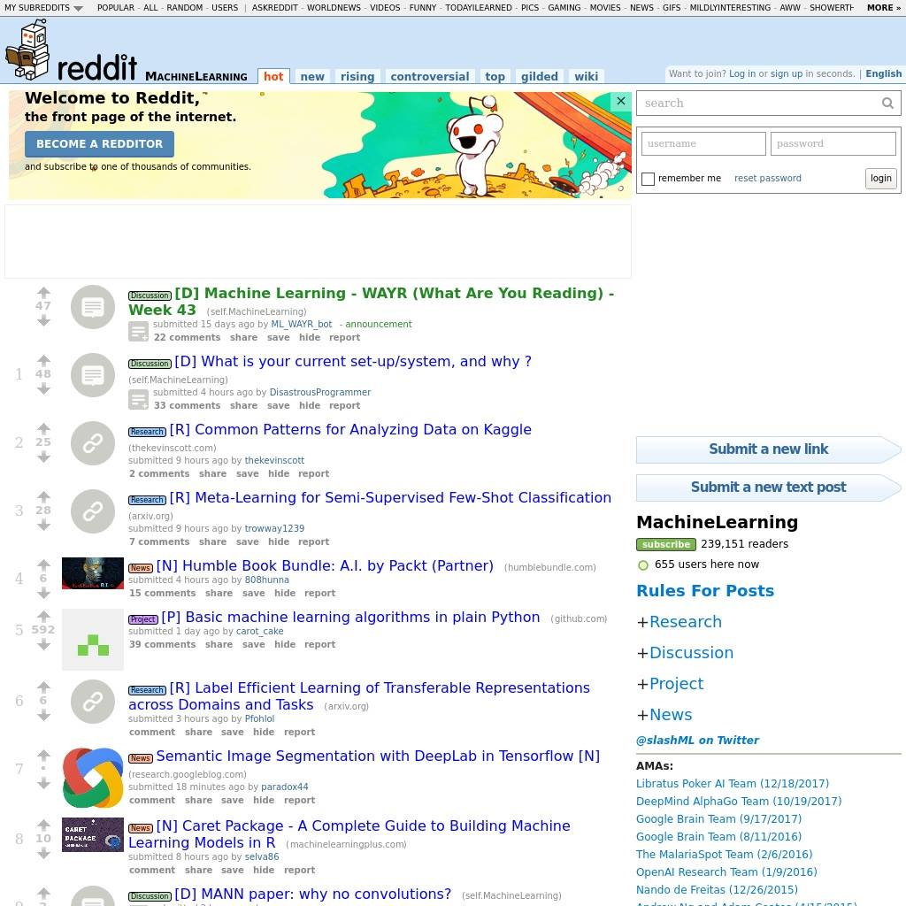

> #오늘의레딧 https://www.reddit.com/r/MachineLearning/ 머신러닝 공부는 정말 재미있죠?아침부터 다양한 소식이 많네요.  1. 현재 귀사의 최신 동향은 무엇입니까?이유는 무엇입니까? 2. Kaggle의 데이터 분석을 위한 공통적인 패턴 3. 준특성 특급 분류 법 4. mb le 책자 번들:Packt(파트너)에 의한 A.I. 5. 플레인 파이썬의 기본 기계 학습 알고리즘 6. 도메인 및 태스크 전반에 걸친 전송 가능한 재생성에 대한 효율적인 학습 7. CaretPackage-R의 BuildingMachine학습 모델에 대한 완벽한 가이드 8. 왜 그래요?왜 컨버터블이 없나요? 9. 메타 학습 태스크로서의 시각적 질문 응답 10. 연예인들이 얼마나 비슷한지 알아내기 위한 기계 학습 모델? 11. 너 혼자서 깊은 학식을 배우는 것 12. Subgoals(DavidSilver)를 통한 심층적 강화 학습(DavidSilver)17비디오 13. 우리는 크라우드 소싱 된 데이터를 크라우드 소싱 할 수 있는 투명한 커뮤니티 기반 플랫폼을 구축하고 있습니다. "raggle"데이터를 얻을 수 있습니다. 정보는 안에 있습니다. 여러분이 어떻게 생각하는지 우리에게 알려 주세요! 14. 재사용 가능한 소프트웨어/하드웨어 공동 디자인에 관한 제1회 ACMRequest워크샵의 프로그램이 발표됩니다. 15. 가장 가까운 이웃들의 도표를 만들었다. 당신은 어떻게 생각하나요? 16. "비체 계적인 "클러스터링을 통해 재즈 트랙을 산산이 부수는 행위 17. 얼마나 자주 스폰서들이 사용하는 Kaggle모델을 이기는가? 18. 혁신적인 2018년 도전 과제 소개 19. 어떻게 하면 자동화기의 결과를 해독할 수 있을까요? 20. 계층적 모방 및 강화 학습  1. https://www.reddit.com/r/MachineLearning/comments/83xwu2/d_what_is_your_current_setupsystem_and_why/ 2. https://thekevinscott.com/common-patterns-for-analyzing-data/ 3. https://arxiv.org/abs/1803.00676 4. https://www.humblebundle.com/books/artificial-intelligence-books?partner=indiekings&charity=110093 5. https://github.com/zotroneneis/machine_learning_basics 6. https://arxiv.org/abs/1712.00123 7. https://www.machinelearningplus.com/caret-package/ 8. https://www.reddit.com/r/MachineLearning/comments/83yiyk/d_mann_paper_why_no_convolutions/ 9. https://arxiv.org/abs/1711.08105 10. https://www.reddit.com/r/MachineLearning/comments/83ysgr/d_machine_learning_model_to_detect_how_similar/ 11. https://www.reddit.com/r/MachineLearning/comments/83v8za/d_learning_deep_learning_on_your_own/ 12. https://vimeo.com/249557775 13. https://www.reddit.com/r/MachineLearning/comments/83mpk5/p_were_making_a_transparent_communitydriven/ 14. http://cKnowledge.org/request-cfp-asplos2018.html#program 15. https://github.com/anvaka/word2vec-graph 16. https://www.edwardshu.com/ml/music/2018/03/07/2018-Breaking-Jazz-Tracks-into-Beats-with-Unsupervised-Clustering.html 17. https://www.reddit.com/r/MachineLearning/comments/83q6o9/d_how_often_are_winning_kaggle_models_used_by/ 18. https://research.googleblog.com/2018/03/introducing-inaturalist-2018-challenge.html?utm_source=feedburner&utm_medium=feed&utm_campaign=Feed:+blogspot/gJZg+\(Official+Google+Research+Blog\) 19. https://www.reddit.com/r/MachineLearning/comments/83touu/d_how_could_one_decode_the_result_of_an/ 20. https://arxiv.org/abs/1803.00590

### 3월 14일 (수) 08:52 · 📷 사진 (1장)

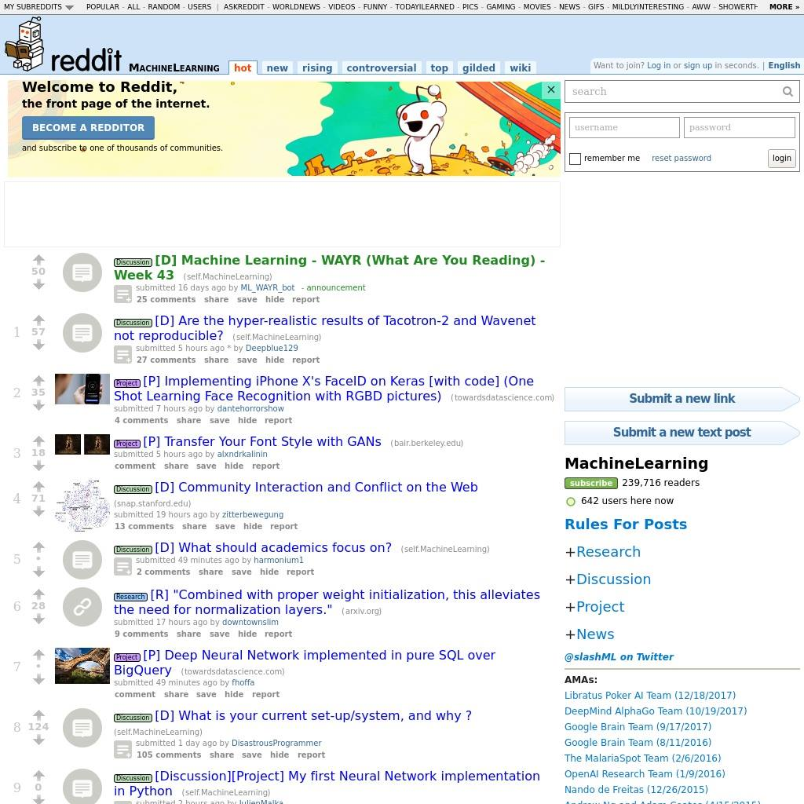

> #오늘의레딧 https://www.reddit.com/r/MachineLearning/ 오늘도 새소식이 많군요.  1. 타코트론-2및 웨이 네트너의 과다한 결과가 재현되지 않았는가? 2. 글꼴 스타일을 GAN으로 전송 3. 웹 기반 커뮤니티 상호 작용 및 충돌 4. 학자들은 무엇에 초점을 맞추어야 하는가? 5. " 적절한 무게 초기화와 결합하여, 이는 정규화 계층의 필요성을 완화시킨다." 6. BigQuery에서 순수한 SQL을 통해 구현된 심층적인 신경망 7. 현재 귀사의 최신 동향은 무엇입니까?이유는 무엇입니까? 8. 하나의 도메인에 하나의 이미지만 포함된 스타일 전송(사이클/CAN/Disconn)? 9. "MagnetLoss"의 도입:페이스북 AI연구에서 적응적인 밀도를 가진 메트릭 학습을 통한 미터 법 학습 10. DeepLearningModel을 TVM과 함께 WebRL에 복사 11. 점수 매기기 대 ML모델 비교 12. 고속(으)-RCW:대상이 뭐죠? 13. Tensorflow에서 DeepLab을 사용한 의미론적 이미지 분할 14. GoogleColab은 ML리서치를 위한 i10GPU를 무료로 사용할 수 있게 해 줍니다. 15. Kaggle의 데이터 분석을 위한 공통적인 패턴 16. Weakly supervised learning oflinear boundary 17. QooRating:SNOICO식별 시스템 18. 준특성 특급 분류 법 19. 도메인 및 태스크 전반에 걸친 전송 가능한 재생성에 대한 효율적인 학습 20. 플레인 파이썬의 기본 기계 학습 알고리즘  1. https://www.reddit.com/r/MachineLearning/comments/845uji/d_are_the_hyperrealistic_results_of_tacotron2_and/ 2. http://bair.berkeley.edu/blog/2018/03/13/mcgan/ 3. https://snap.stanford.edu/conflict/ 4. https://www.reddit.com/r/MachineLearning/comments/8487nk/d_what_should_academics_focus_on/ 5. https://arxiv.org/abs/1709.04054 6. https://towardsdatascience.com/deep-neural-network-implemented-in-pure-sql-over-bigquery-f3ed245814d3 7. https://www.reddit.com/r/MachineLearning/comments/83xwu2/d_what_is_your_current_setupsystem_and_why/ 8. https://www.reddit.com/r/MachineLearning/comments/847oxc/discussion_style_transfer_cyclegan_discogan_with/ 9. https://github.com/vithursant/MagnetLoss-PyTorch 10. http://www.tvmlang.org/2018/03/12/webgl.html 11. https://www.reddit.com/r/MachineLearning/comments/842xh9/d_scoring_system_vs_ml_model/ 12. https://www.reddit.com/r/MachineLearning/comments/844e92/d_fasterrcnn_whats_the_target/ 13. https://research.googleblog.com/2018/03/semantic-image-segmentation-with.html 14. https://hackernoon.com/train-your-machine-learning-models-on-googles-gpus-for-free-forever-a41bd309d6ad 15. https://thekevinscott.com/common-patterns-for-analyzing-data/ 16. https://github.com/4d55397500/learning-scraps/tree/master/mitr 17. https://arxiv.org/abs/1803.03670 18. https://arxiv.org/abs/1803.00676 19. https://arxiv.org/abs/1712.00123 20. https://github.com/zotroneneis/machine_learning_basics

### 3월 15일 (목) 08:52 · 📷 사진 (1장)

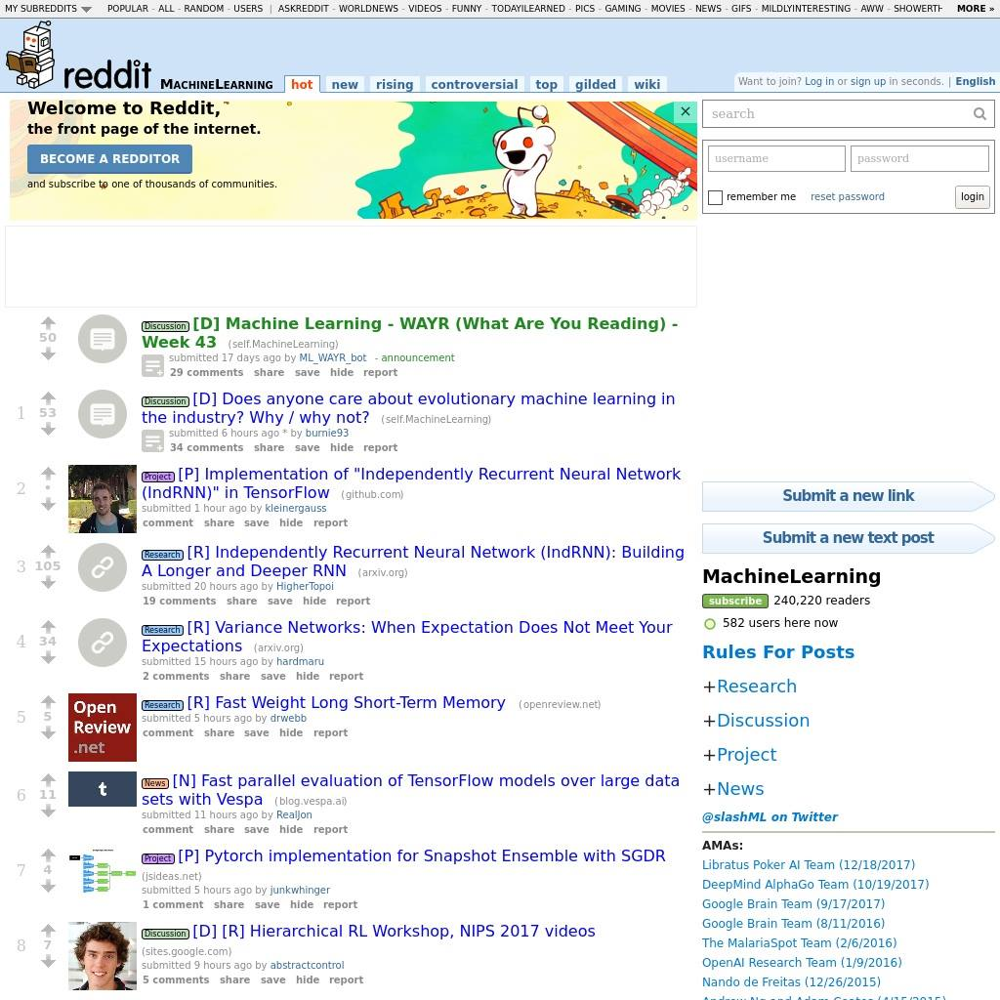

> #오늘의레딧 https://www.reddit.com/r/MachineLearning/ 재미난 이야기들이 많습니다.  1. 그 산업에서 진화 기계 학습에 대해 신경 쓰는 사람이 있나요? 왜/왜/왜? 2. 텐서/플로의 "독립형 신경망"구현 3. 독립적인 신경 회로망(IndependentreturnNetwork):보다 길고 심층적인 RNN 4. VarianceNetworks:예상치 못한 기대를 충족하지 못하는 경우 5. 빠른 중량 단기 단기 메모리 6. Vespa를 사용한 대형 데이터 세트에 대한 TensorFlow모델의 신속한 병렬 평가 7. 스냅 샷 기반의 스냅 샷 앙상블 구축을 위한 Python구현 8. 케라스 / Theano를 사용하여 컨텍스트 분류를 위한 네트워크를 사용하시겠습니까? 9. BigQuery에서 순수한 SQL을 통해 구현된 심층적인 신경망 10. RefineNet및 심층 매립형 클러스터링을 위한 TensorFlow구현 11. 학자들은 무엇에 초점을 맞추어야 하는가? 12. 타코트론-2및 웨이 네트너의 과다한 결과가 재현되지 않았는가? 13. 중력 검출을 위한 심층 학습 14. 글꼴 스타일을 GAN으로 전송 15. 이미지 컨텐츠 인식 이행(일명 Inpainting, 이미지 완성) 16. GoogleColab은 ML리서치를 위한 i10GPU를 무료로 사용할 수 있게 해 줍니다. 17. 고 틀링의 플러그 앤 플레이 머신 학습 모델 18. 웹 기반 커뮤니티 상호 작용 및 충돌 19. "MagnetLoss"의 도입:페이스북 AI연구에서 적응적인 밀도를 가진 메트릭 학습을 통한 미터 법 학습 20. " 적절한 무게 초기화와 결합하여, 이는 정규화 계층의 필요성을 완화시킨다."  1. https://www.reddit.com/r/MachineLearning/comments/84eoys/d_does_anyone_care_about_evolutionary_machine/ 2. https://github.com/batzner/indrnn 3. https://arxiv.org/abs/1803.04831 4. https://arxiv.org/abs/1803.03764 5. https://openreview.net/forum?id=BJI1eDyvz 6. http://blog.vespa.ai/post/171861434281/introducing-tensorflow-support 7. http://jsideas.net/python/2018/03/14/snapshot_ensemble.html 8. https://www.reddit.com/r/MachineLearning/comments/84e10m/d_using_kerastheano_deep_networks_for_contextual/ 9. https://towardsdatascience.com/deep-neural-network-implemented-in-pure-sql-over-bigquery-f3ed245814d3 10. https://blog.key.me/machine-learning-models-released/ 11. https://www.reddit.com/r/MachineLearning/comments/8487nk/d_what_should_academics_focus_on/ 12. https://www.reddit.com/r/MachineLearning/comments/845uji/d_are_the_hyperrealistic_results_of_tacotron2_and/ 13. http://blog.wolfram.com/2018/03/14/user-research-deep-learning-for-gravitational-wave-detection-with-the-wolfram-language/ 14. http://bair.berkeley.edu/blog/2018/03/13/mcgan/ 15. https://github.com/zavolokas/Inpainting 16. https://hackernoon.com/train-your-machine-learning-models-on-googles-gpus-for-free-forever-a41bd309d6ad 17. https://dev.to/michaeljtaylor0/plug--play-machine-learning-models-in-golang--fc0 18. https://snap.stanford.edu/conflict/ 19. https://github.com/vithursant/MagnetLoss-PyTorch 20. https://arxiv.org/abs/1709.04054

### 3월 16일 (금) 08:52 · 📷 사진 (1장)

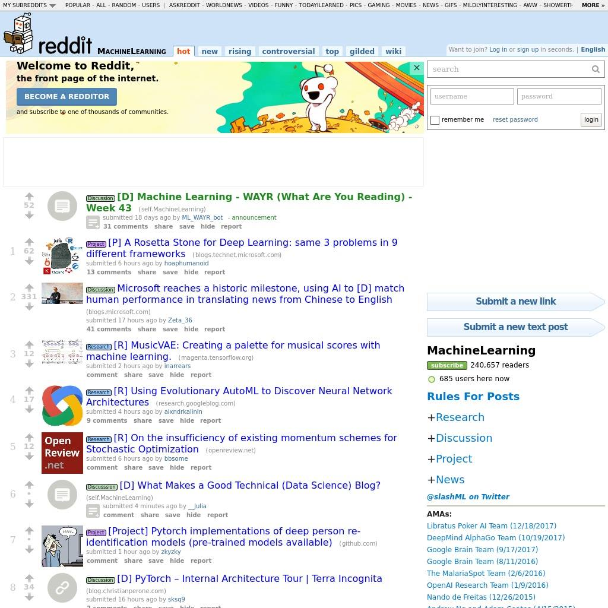

> #오늘의레딧 https://www.reddit.com/r/MachineLearning/ 머신러닝 공부는 정말 재미있죠?아침부터 다양한 소식이 많네요.  1. DeepLearningforDeepLearning:9개의 다른 프레임워크에서 동일한 3가지 문제 2. 뮤직 V:기계 학습을 통한 음악 점수를 위한 팔레트 만들기. 3. 진화론적 네트워크 아키텍처를 활용하여 신경 네트워크 아키텍처 활용 4. 확률론적 최적화를 위한 기존 추진력 부재의 부재에 관한 연구 5. 깊은 사람의 재증류 모델(사전 훈련 모델)의 이행(사전 훈련 모델) 6. 화이트 와인 7. 케라스에 있는 structuredstructuredstructured계층을 학습합니까? 8. 향후 몇년간 기계 학습과 신경 네트워크가 비즈니스 성장에 어떤 영향을 미칠까요? 9. 텐서/플로의 "독립형 신경망"구현 10. 기계 학습을 통해 새로운 소리를 내면서 음악을 만드는 것 11. 건강 관리를 위한 기계 학습에 관한 상위 저널 12. 정책 구배 업데이트 13. 구글 오픈 소스 이미지 인식 AI모델, VR오디오 도구 14. 평균 체중을 산출하는 것이 더 현명하고 일반화된 일반화를 이끕니다. 15. 실시간 운전자 익사 감지(수면 감지) 16. 점진적으로 폭발하는 경우-딥 네트워크는 얕은 곳에 있음-ResNet설명 17. Flipout:Minibacks에 대한 효율적인 의사 결정력 강화 18. 환경계의 망상 세포 비율 산정을 위한 Convolutional신경망 이용 19. 그 산업에서 진화 기계 학습에 대해 신경 쓰는 사람이 있나요? 왜/왜/왜? 20. 온라인 지하드 공포증의 자동 탐지  1. https://blogs.technet.microsoft.com/machinelearning/2018/03/14/comparing-deep-learning-frameworks-a-rosetta-stone-approach/ 2. https://magenta.tensorflow.org/music-vae 3. https://research.googleblog.com/2018/03/using-evolutionary-automl-to-discover.html 4. https://openreview.net/forum?id=rJTutzbA- 5. https://github.com/KaiyangZhou/deep-person-reid 6. http://blog.christianperone.com/2018/03/pytorch-internal-architecture-tour/ 7. https://www.reddit.com/r/MachineLearning/comments/84q9q0/d_learning_structuredconstrained_layers_in_keras/ 8. https://www.reddit.com/r/MachineLearning/comments/84pxe4/d_how_will_machine_learning_and_neural_networks/ 9. https://github.com/batzner/indrnn 10. https://www.blog.google/topics/machine-learning/making-music-using-new-sounds-generated-machine-learning/ 11. https://www.reddit.com/r/MachineLearning/comments/84m23o/d_top_journals_on_machine_learning_for_healthcare/ 12. http://www.argmin.net/2018/03/13/pg-saga/ 13. https://www.androidpolice.com/2018/03/15/google-open-sources-image-recognition-ai-model-vr-audio-tools/ 14. https://arxiv.org/abs/1803.05407 15. http://emaraic.com/blog/realtime-sleep-detection 16. https://openreview.net/forum?id=HkpYwMZRb 17. https://arxiv.org/abs/1803.04386 18. https://arxiv.org/abs/1803.04873 19. https://www.reddit.com/r/MachineLearning/comments/84eoys/d_does_anyone_care_about_evolutionary_machine/ 20. https://arxiv.org/abs/1803.04596

### 3월 17일 (토) 08:52 · 📷 사진 (1장)

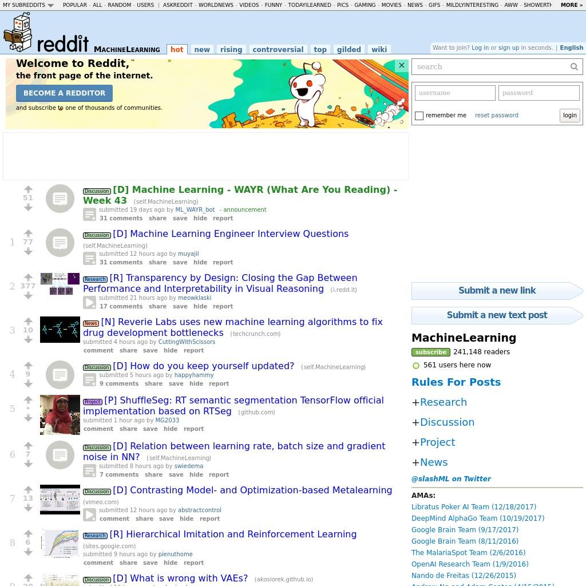

> #오늘의레딧 https://www.reddit.com/r/MachineLearning/ 머신러닝 공부는 정말 재미있죠?아침부터 다양한 소식이 많네요.  1. 인터뷰 질문 기술 엔지니어 2. 디자인의 투명성:시각적 추론에서의 성능과 상호 간의 격차 해소 3. ReverieLabs는 새로운 기계 학습 알고리즘을 사용하여 의약품 개발 병목 현상을 해결합니다. 4. 당신은 어떻게 당신 자신을 갱신합니까? 5. ShuffleSeg:RT의미 세분화 텐서에 기반한 공식 구현 개요 6. NNI에서의 학습 속도, 배치 크기 및 구배 소음과의 상관 관계 7. 구축 모델 및 최적화 기반 메타 데이터 8. 계층적 모방 및 강화 학습 9. VAES가 잘못된 이유는 무엇입니까? 10. 아무도 우버의 파이로 루와 함께 일할 기회가 있었나요? 11. DeepLearningforDeepLearning:9개의 다른 프레임워크에서 동일한 3가지 문제 12. FlipOut(FlipOut)은 어떠한 방식으로 현지의 Reparametation기법(LRT)을 사용합니까? 13. 뮤직 V:기계 학습을 통한 음악 점수를 위한 팔레트 만들기. 14. TensorFlow설문 조사에 따르면 TensorFlow는 가장 사랑 받는 프레임워크입니다. 15. 초심자가 다루어야 하는 10가지 가장 중요한 기본적인 데이터 과학적인 문제들의 목록은 무엇입니까? 16. Flipout:Minibacks에 대한 효율적인 의사 결정력 강화 17. 단어를 수식하는 데 사용할 수 있도록 설정하거나 삭제하려면 18. 진화론적 네트워크 아키텍처를 활용하여 신경 네트워크 아키텍처 활용 19. 확률론적 최적화를 위한 기존 추진력 부재의 부재에 관한 연구 20. 기계 학습은 암을 분류한다.  1. https://www.reddit.com/r/MachineLearning/comments/84uqia/d_machine_learning_engineer_interview_questions/ 2. https://www.reddit.com/r/MachineLearning/comments/84ry9f/r_transparency_by_design_closing_the_gap_between/ 3. https://techcrunch.com/2018/03/16/reverie-labs-uses-new-machine-learning-algorithms-to-fix-drug-development-bottlenecks/ 4. https://www.reddit.com/r/MachineLearning/comments/84xjya/d_how_do_you_keep_yourself_updated/ 5. https://github.com/MSiam/TFSegmentation/blob/master/README.md 6. https://www.reddit.com/r/MachineLearning/comments/84waz4/d_relation_between_learning_rate_batch_size_and/ 7. https://vimeo.com/250423463 8. https://sites.google.com/view/hierarchical-il-rl 9. http://akosiorek.github.io/ml/2018/03/14/what_is_wrong_with_vaes.html 10. https://www.reddit.com/r/MachineLearning/comments/84ud1o/d_anyone_had_a_chance_to_work_with_ubers_pyro_yet/ 11. https://blogs.technet.microsoft.com/machinelearning/2018/03/14/comparing-deep-learning-frameworks-a-rosetta-stone-approach/ 12. https://www.reddit.com/r/MachineLearning/comments/84u6ci/r_how_is_flipout_any_different_the_local/ 13. https://magenta.tensorflow.org/music-vae 14. https://www.reddit.com/r/MachineLearning/comments/84vuue/d_tensorflow_is_the_most_loved_framework/ 15. https://www.reddit.comhttps://www.reddit.com/r/datascience/comments/84xcbl/what_is_your_personal_list_of_the_10_most/ 16. https://arxiv.org/abs/1803.04386v1 17. https://www.reddit.com/r/MachineLearning/comments/84r7ws/d_to_fine_tune_word_embeddings_or_not/ 18. https://research.googleblog.com/2018/03/using-evolutionary-automl-to-discover.html 19. https://openreview.net/forum?id=rJTutzbA- 20. https://www.nature.com/articles/d41586-018-02881-7

### 3월 17일 (토) 10:27 · It's going to be really fun!

It's going to be really fun!

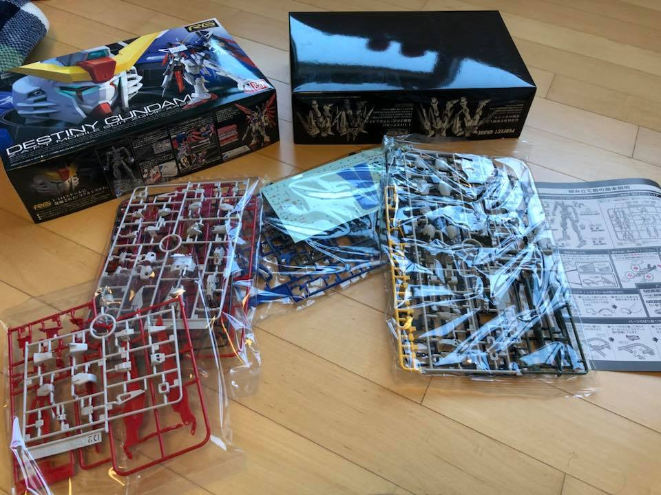

### 3월 17일 (토) 20:36 · New 2018 cycle goal (thanks to Hyunsop K…

New 2018 cycle goal (thanks to Hyunsop Kim)!

Daegu 200K, Pusan 400K, Pusan 600K, and Daegu 300K to register Korea 1200K.

"Randonneurs are long-distance unsupported endurance cyclists who cover distances between 200km and 1200km and beyond."
http://www.korearandonneurs.kr/

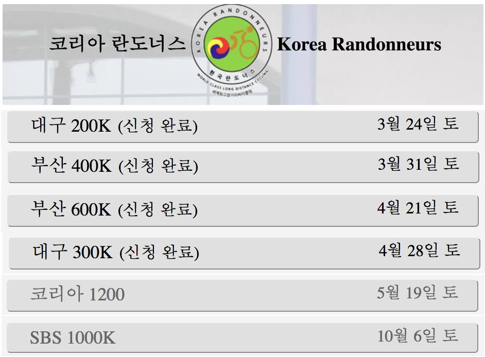

### 3월 18일 (일) 08:52 · 📷 사진 (1장)

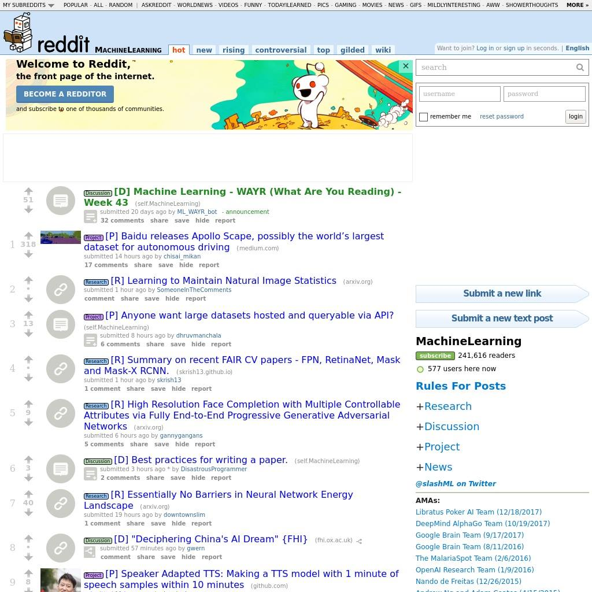

> #오늘의레딧 https://www.reddit.com/r/MachineLearning/ 정말 읽을 거리가 많네요.  1. Baidu는 아마도 세계에서 가장 큰 규모의 데이터 세트인 아폴로 Scape를 출시할 것이다. 2. 자연 영상 통계 유지 관리 배우기 3. API를 통해 대규모 데이터 셋을 호스팅하고 쿼리 할 수 있는 사람이 누구입니까? 4. 최근 FAIRCV문서-FPN, RetinaNet, 마스크 및 마스크-XRCW에 대한 요약 5. 완전한 엔드 투 엔드 세대 범용 네트워크를 통한 다중 제어 가능한 특성을 가진 고해상도 표면 보정 6. 종이 쓰기에 대한 모범 사례. 7. 기본적으로 신경 네트워크 에너지 분야의 장벽은 없다. 8. "중국의 AI를 해독하는 것"{FHI} 9. SpeakeradaptedTTS:10분 이내에 1분 분량의 음성 샘플로 TTS모델 만들기 10. ML을 학습하고 지침을 찾습니다. 11. VINE:NeuroeBolution을 위한 오픈 소스 인터랙티브 데이터 시각화 도구(Uber) 12. 소프트 맥스 대신에 가우스 분급기가 있는 CNN 13. 인터뷰 질문 기술 엔지니어 14. ShuffleSeg:RT의미 세분화 텐서에 기반한 공식 구현 개요 15. 당신은 어떻게 당신 자신을 갱신합니까? 16. http://Booking.com의 실생활에서 발생하는 기계 학습 과제 17. 디자인의 투명성:시각적 추론에서의 성능과 상호 간의 격차 해소 18. NNI에서의 학습 속도, 배치 크기 및 구배 소음과의 상관 관계 19. 구축 모델 및 최적화 기반 메타 데이터 20. 계층적 모방 및 강화 학습  1. https://medium.com/@Synced/baidu-apollo-releases-massive-self-driving-dataset-teams-up-with-berkeley-deepdrive-5e785ab4053b 2. https://arxiv.org/abs/1803.04626 3. https://www.reddit.com/r/MachineLearning/comments/8546io/p_anyone_want_large_datasets_hosted_and_queryable/ 4. https://skrish13.github.io/articles/2018-03/fair-cv-saga 5. https://arxiv.org/pdf/1801.07632.pdf 6. https://www.reddit.com/r/MachineLearning/comments/8566li/d_best_practices_for_writing_a_paper/ 7. https://arxiv.org/abs/1803.00885 8. https://www.fhi.ox.ac.uk/wp-content/uploads/Deciphering_Chinas_AI-Dream.pdf 9. https://github.com/Kyubyong/speaker_adapted_tts 10. https://www.reddit.com/r/MachineLearning/comments/856p12/d_learning_ml_looking_for_guidance/ 11. https://eng.uber.com/vine/ 12. https://www.reddit.com/r/MachineLearning/comments/855jn8/d_cnn_with_gaussian_classifier_instead_of_softmax/ 13. https://www.reddit.com/r/MachineLearning/comments/84uqia/d_machine_learning_engineer_interview_questions/ 14. https://github.com/MSiam/TFSegmentation/blob/master/README.md 15. https://www.reddit.com/r/MachineLearning/comments/84xjya/d_how_do_you_keep_yourself_updated/ 16. https://www.youtube.com/watch?v=wZnTOOU3K1Y 17. https://www.reddit.com/r/MachineLearning/comments/84ry9f/r_transparency_by_design_closing_the_gap_between/ 18. https://www.reddit.com/r/MachineLearning/comments/84waz4/d_relation_between_learning_rate_batch_size_and/ 19. https://vimeo.com/250423463 20. https://sites.google.com/view/hierarchical-il-rl

### 3월 18일 (일) 17:37 · successfully finished his first Seoul ma…

successfully finished his first Seoul marathon with wonderful runners including Soonson Kwon and 김광섭. It was really fun!!

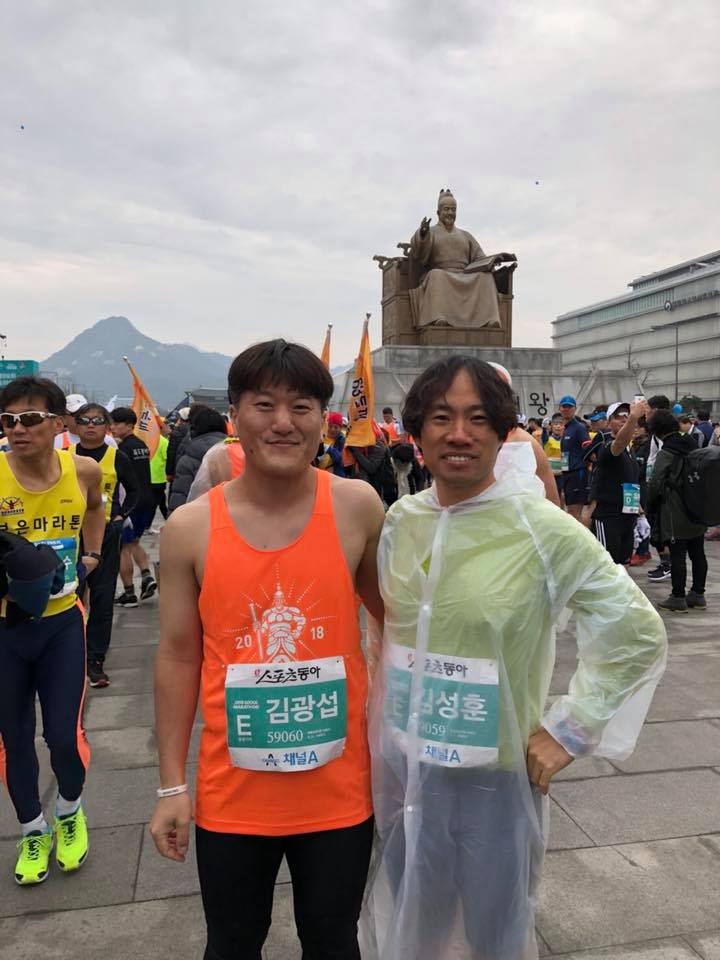 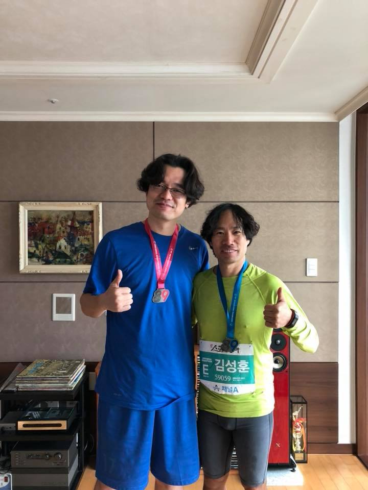 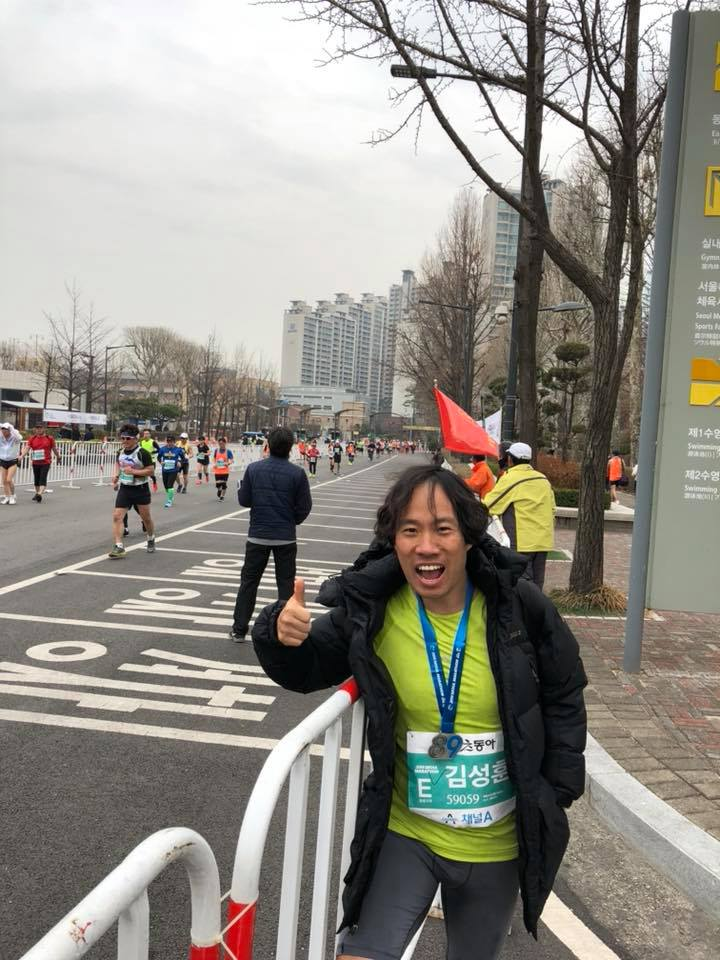 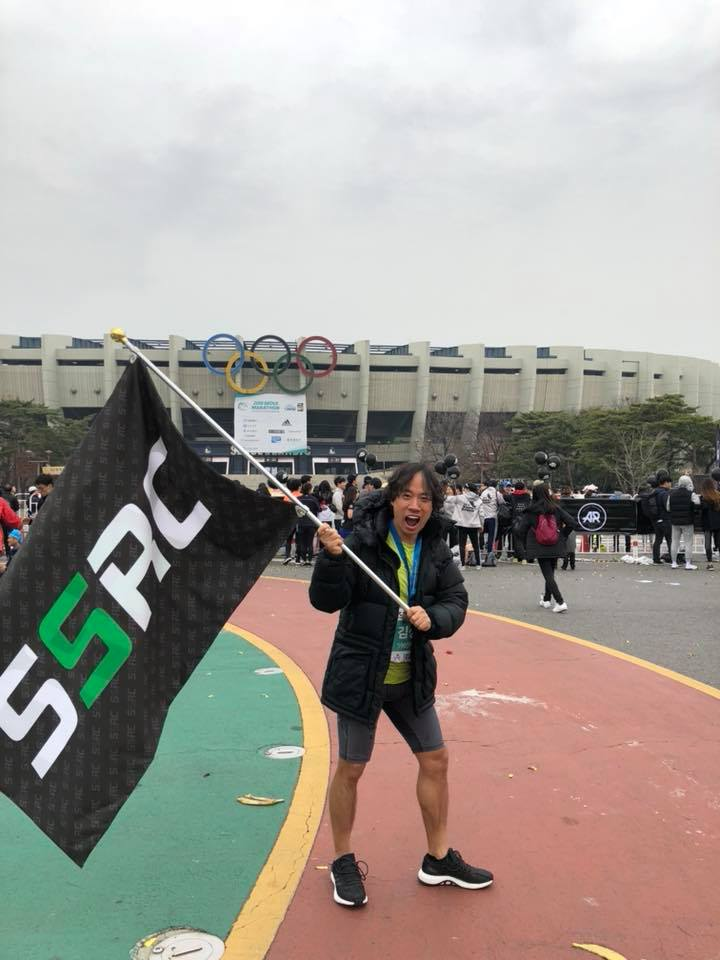  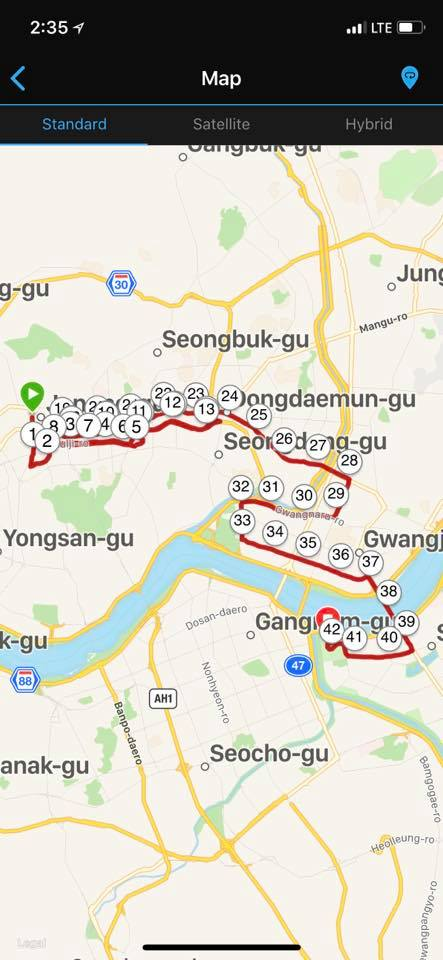 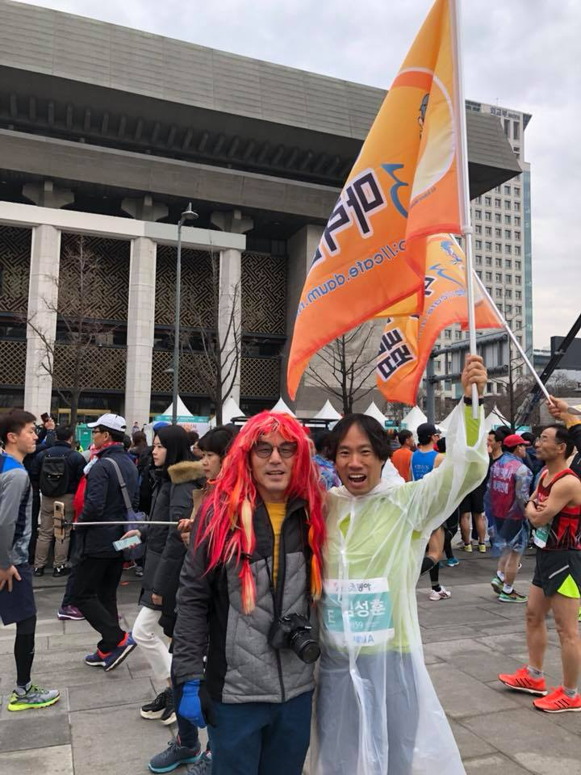

### 3월 19일 (월) 08:52 · 📷 사진 (1장)

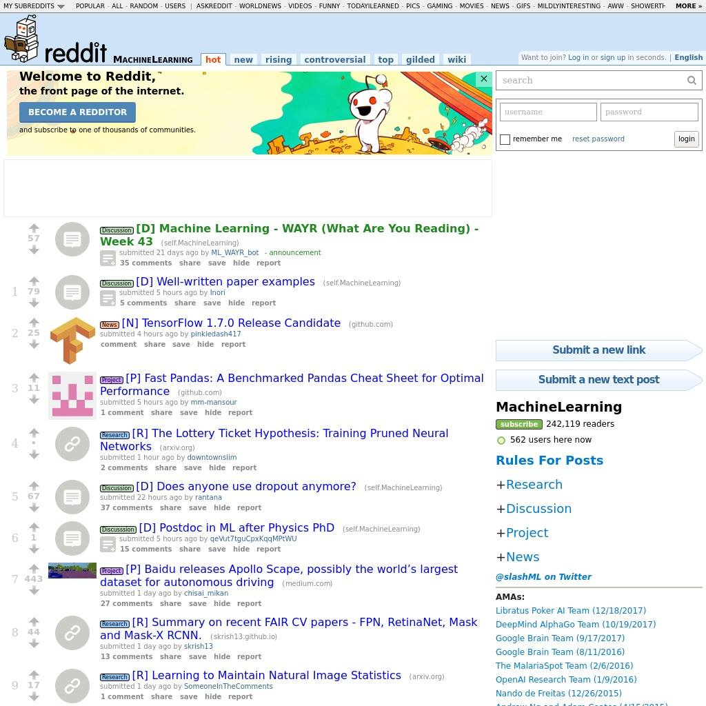

> #오늘의레딧 https://www.reddit.com/r/MachineLearning/ 따끈한 소식들입니다.  1. 읽기 가능한 종이 예제 2. TensorFlow1.7.0 릴리즈 후보자 3. 빠른 판코트: 뛰어난 성능을 제공하는 벤치 마크 판 판 4. 복권 당첨금 가설:훈련 예정 신경망 5. 더 이상 드롭 다운을 사용하는 사람이 없습니까? 6. Baidu는 아마도 세계에서 가장 큰 규모의 데이터 세트인 아폴로 Scape를 출시할 것이다. 7. 최근 FAIRCV문서-FPN, RetinaNet, 마스크 및 마스크-XRCW에 대한 요약 8. 자연 영상 통계 유지 관리 배우기 9. AI의 전염, 디지털 위조, 신뢰의 종료:우리가 어떻게 고칠 수 있는가? 10. "중국의 AI를 해독하는 것"{FHI} 11. API를 통해 대규모 데이터 셋을 호스팅하고 쿼리 할 수 있는 사람이 누구입니까? 12. CNN을 이용한 주변 지역과의 격차가 최소화된 픽셀 위치 13. 완전한 엔드 투 엔드 세대 범용 네트워크를 통한 다중 제어 가능한 특성을 가진 고해상도 표면 보정 14. 종이 쓰기에 대한 모범 사례. 15. 기본적으로 신경 네트워크 에너지 분야의 장벽은 없다. 16. 소프트 맥스 대신에 가우스 분급기가 있는 CNN 17. SpeakeradaptedTTS:10분 이내에 1분 분량의 음성 샘플로 TTS모델 만들기 18. VINE:NeuroeBolution을 위한 오픈 소스 인터랙티브 데이터 시각화 도구(Uber) 19. 우리는 어떻게 기계 학습에 도덕성을 도입할까요? 20. http://Booking.com의 실생활에서 발생하는 기계 학습 과제  1. https://www.reddit.com/r/MachineLearning/comments/85cwiu/d_wellwritten_paper_examples/ 2. https://github.com/tensorflow/tensorflow/releases/tag/v1.7.0-rc0 3. https://github.com/mm-mansour/Fast-Pandas 4. https://arxiv.org/abs/1803.03635 5. https://www.reddit.com/r/MachineLearning/comments/858c88/d_does_anyone_use_dropout_anymore/ 6. https://medium.com/@Synced/baidu-apollo-releases-massive-self-driving-dataset-teams-up-with-berkeley-deepdrive-5e785ab4053b 7. https://skrish13.github.io/articles/2018-03/fair-cv-saga 8. https://arxiv.org/abs/1803.04626 9. http://giorgiop.github.io/posts/2018/03/17/AI-and-digital-forgery/ 10. https://www.fhi.ox.ac.uk/wp-content/uploads/Deciphering_Chinas_AI-Dream.pdf 11. https://www.reddit.com/r/MachineLearning/comments/8546io/p_anyone_want_large_datasets_hosted_and_queryable/ 12. https://www.reddit.com/r/MachineLearning/comments/859pbr/d_pixel_location_with_least_variance_with_its/ 13. https://arxiv.org/pdf/1801.07632.pdf 14. https://www.reddit.com/r/MachineLearning/comments/8566li/d_best_practices_for_writing_a_paper/ 15. https://arxiv.org/abs/1803.00885 16. https://www.reddit.com/r/MachineLearning/comments/855jn8/d_cnn_with_gaussian_classifier_instead_of_softmax/ 17. https://github.com/Kyubyong/speaker_adapted_tts 18. https://eng.uber.com/vine/ 19. https://jgreenemi.com/morality-in-ai/ 20. https://www.youtube.com/watch?v=wZnTOOU3K1Y

### 3월 20일 (화) 08:52 · 📷 사진 (1장)

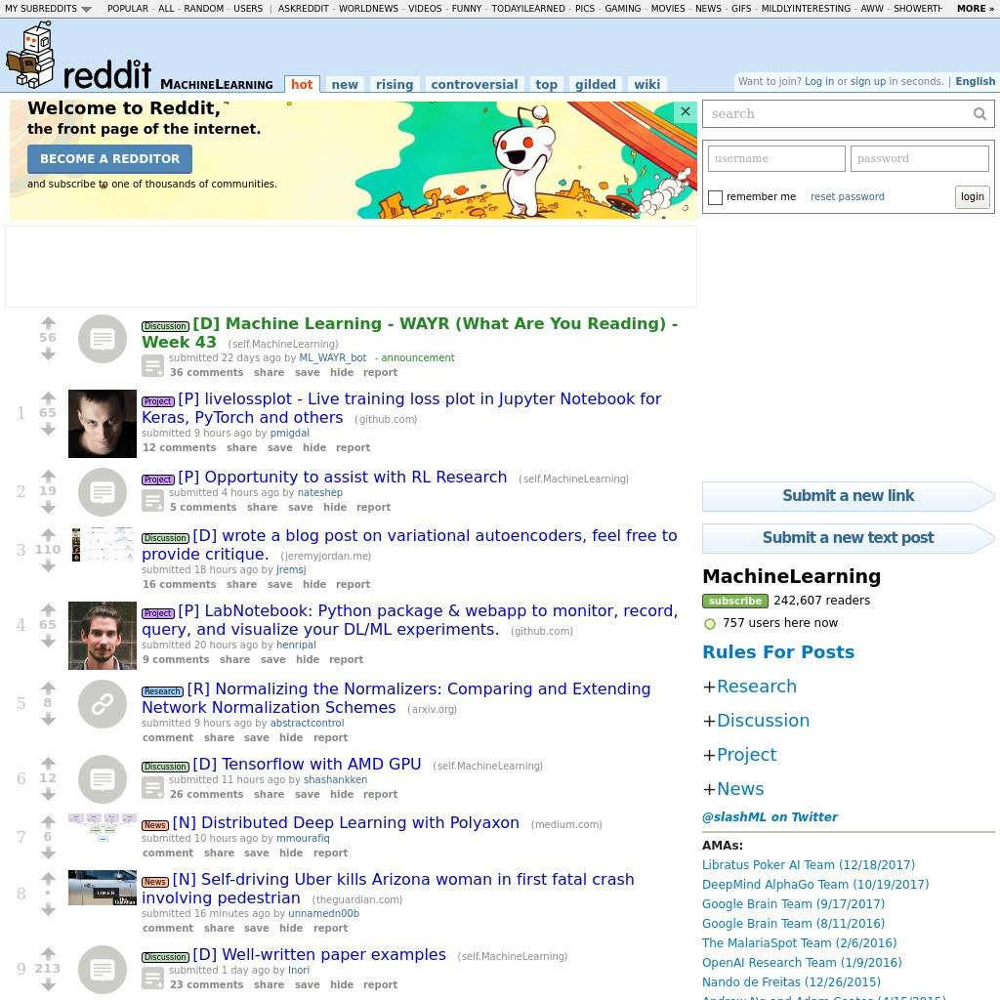

> #오늘의레딧 https://www.reddit.com/r/MachineLearning/ 정말 읽을 거리가 많네요.  1. Liveloplace-Keras, PyTorch, 그리고 다른 사람들을 위한 Juveter노트북에서의 라이브 교육 손실 개요 2. RL리서치를 지원할 수 있는 기회 3. 비평가들의 블로그 게시물에 블로그 게시 글을 써서 비평을 무료로 제공했다. 4. Lanootebook:DL/ML 실험을 모니터링, 기록, 쿼리 및 시각화하기 위한 PythonPackage&Webap. 5. 정규화 표준화:NetworkNormalizationSchemes비교 및 확장 6. AMDGPU를 사용한 텐서 7. 다원적 딥 학습(Polyson) 8. 자신감 넘치는 추락 사고를 당한 최초의 치명적인 추락 사고로 애리조나 주(州)에서 벌어진 자신의 익사 방지를 위해 9. 읽기 가능한 종이 예제 10. ACISTGAN에 있어서 바닐라 GAN의 습윤 모드 11. CNN가속기에서 일시적으로 여분의 중복을 사용하는 우리의 새로운 논문(https://www.reddit.com/r/computervision)의 x-post) 12. "개인 정보 보호"또는 기타 정보 검색 지표에 대한 모든 문서 권장 사항 13. TensorFlow1.7.0 릴리즈 후보자 14. 빠른 판코트: 뛰어난 성능을 제공하는 벤치 마크 판 판 15. ORB_SLAME2의 윈도우 바이너리를 컴파일할 수 있습니까? 16. PG-GAN은 자동 암호기와 비슷합니까? 17. 복권 당첨금 가설:훈련 예정 신경망 18. 동적 시스템 학습 19. 당신은 어떻게 당신의 하이퍼 마켓 검색에 대해 어떻게 생각하십니까? 20. DeepLearningIndaba-응용 프로그램이 지금 열려 있습니다!  1. https://github.com/stared/livelossplot 2. https://www.reddit.com/r/MachineLearning/comments/85lyjp/p_opportunity_to_assist_with_rl_research/ 3. https://www.jeremyjordan.me/variational-autoencoders/ 4. https://github.com/henripal/labnotebook 5. https://arxiv.org/abs/1611.04520 6. https://www.reddit.com/r/MachineLearning/comments/85iwyj/d_tensorflow_with_amd_gpu/ 7. https://medium.com/polyaxon/distributed-deep-learning-with-polyaxon-6d9f1288e4b8 8. https://www.theguardian.com/technology/2018/mar/19/uber-self-driving-car-kills-woman-arizona-tempe 9. https://www.reddit.com/r/MachineLearning/comments/85cwiu/d_wellwritten_paper_examples/ 10. https://youtu.be/ktxhiKhWoEE 11. https://www.reddit.comhttps://www.reddit.com/r/computervision/comments/85lt4i/our_new_paper_on_exploiting_temporal_redundancy/ 12. https://www.reddit.com/r/MachineLearning/comments/85m7pt/d_any_paper_recommendations_on_human/ 13. https://github.com/tensorflow/tensorflow/releases/tag/v1.7.0-rc0 14. https://github.com/mm-mansour/Fast-Pandas 15. https://www.reddit.com/r/MachineLearning/comments/85l6b9/d_could_anyone_compile_a_windows_binary_of_orb/ 16. https://www.reddit.com/r/MachineLearning/comments/85hg7l/d_pggans_are_kinda_like_auto_encoders/ 17. https://arxiv.org/abs/1803.03635 18. https://www.reddit.com/r/MachineLearning/comments/85h442/p_dynamic_machine_learning/ 19. https://www.reddit.com/r/MachineLearning/comments/85j49d/d_how_do_you_go_about_your_hyperparameter_search/ 20. http://www.deeplearningindaba.com/

### 3월 21일 (수) 08:52 · 📷 사진 (1장)

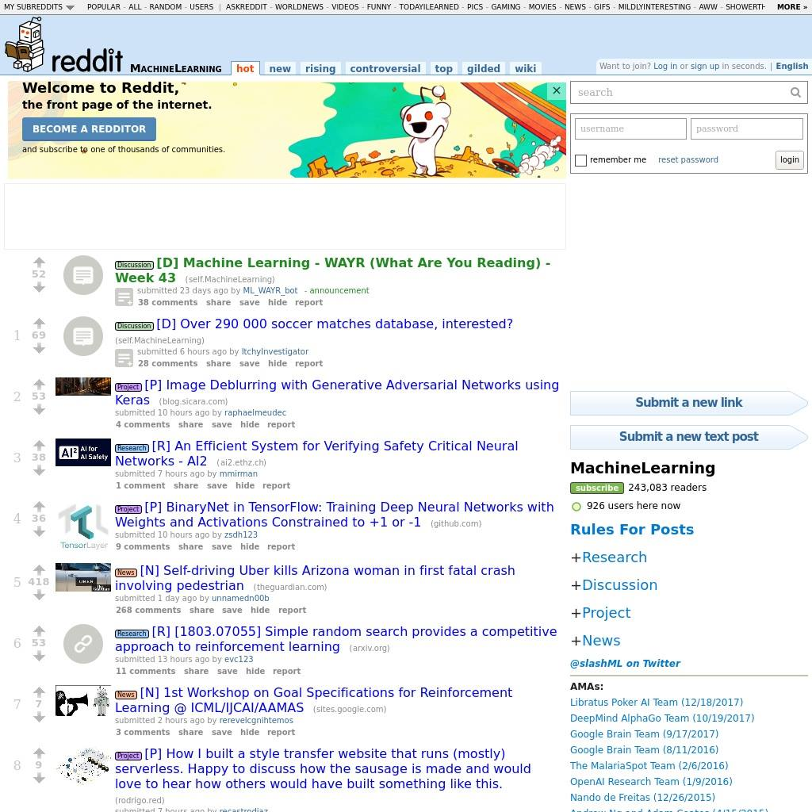

> #오늘의레딧 https://www.reddit.com/r/MachineLearning/ 따끈한 소식들입니다.  1. 2,000,000 개가 넘는 축구 경기가 관심을 가지고 있습니까? 2. 케라스를 이용한 일반 가정용 네트워크 상의 이미지 교란 3. 안전 중요도 부품 검증을 위한 효율적인 시스템 구축 방안-AID 4. TensorFlow의 BinaryNet:+1또는-1으로 구성된 중량 및 활성화된 신경 통신망을 갖춘 교육 심층 네트워크 5. 자신감 넘치는 추락 사고를 당한 최초의 치명적인 추락 사고로 애리조나 주(州)에서 벌어진 자신의 익사 방지를 위해 6. 제4회 CDMA국제 학술 대회 7. (주로)서버가 없는 방식으로 운영되는 스타일 전환 웹 사이트를 구축했습니다. 소시지가 어떻게 만들어졌는지에 대해 토론하고, 다른 사람들이 어떻게 이런 것을 만들었는지를 듣고 싶어 할 것이다. 8. 2018년의 가장 우수한 품질의 학습 기회를 제공하는 BestPractice 9. 예를 들어, 예를 들어, 당신이 예시한 예를 들어 보면 어떻게 될까요? 10. 아마도 지난 몇달간의 탐색 작업을 살펴야 할 때가 되었나 봐요. 11. MachineLearningReproductivity위기 극복 12. 파이썬:제 이미지를 마이클 닐슨의 MNIST클라이져에게 먹여 주세요. 13. 다양한 향상된 라이브러리를 비교할 수 있습니다. 14. 베이스를 연주할 수 있는 베이스 라인과 통조림 캔 통조림 캔을 가진 통조림 제조기:언어와 단어의 한계를 가진 언어 15. 라인 아티스트:합성 계획을 그리는 다양한 스타일 스케치 16. 내가 검색하고 선택할 수 있는 단서 17. 알레그램을 통해 텍스트를 쉽게 배울 수 있는 텍스트 18. NNI스왑 19. 확장 가능한 시스템 학습 교육을 위해 AmazonSagemaker사용 20. Copyright기반 네트워크를 이용한 추상적 변전소 제어 방안 연구  1. https://www.reddit.com/r/MachineLearning/comments/85uexk/d_over_290_000_soccer_matches_database_interested/ 2. https://blog.sicara.com/keras-generative-adversarial-networks-image-deblurring-45e3ab6977b5 3. http://ai2.ethz.ch/ 4. https://github.com/tensorlayer/tensorlayer/blob/master/example/tutorial_binarynet_mnist_cnn.py 5. https://www.theguardian.com/technology/2018/mar/19/uber-self-driving-car-kills-woman-arizona-tempe 6. https://sites.google.com/view/goalsrl/home 7. https://rodrigo.red/blog/style-transfer-sass/ 8. https://www.reddit.com/r/MachineLearning/comments/85s9i8/d_best_deep_learningml_summer_schools_of_2018/ 9. https://www.reddit.com/r/MachineLearning/comments/85w2v5/d_what_happens_when_you_retrain_including/ 10. https://sites.google.com/view/erl-2018/ 11. https://petewarden.com/2018/03/19/the-machine-learning-reproducibility-crisis/ 12. https://www.reddit.comhttps://www.reddit.com/r/learnprogramming/comments/85upos/python_feeding_my_own_image_into_michael_nielsens/ 13. https://towardsdatascience.com/catboost-vs-light-gbm-vs-xgboost-5f93620723db 14. https://www.faction.xyz/canning-the-canner-fun-with-homonyms-and-word-vectors/ 15. https://arxiv.org/abs/1803.06647 16. http://www.argmin.net/2018/03/20/mujocoloco/ 17. http://deborahmesquita.com/2018-03-19/deep-learning-for-text-made-easy-with-allennlp-62bc79d41f31 18. https://www.reddit.com/r/MachineLearning/comments/85u9hw/d_nn_face_swap/ 19. https://blog.filestack.com/news/amazon-sagemaker-scaled-machine-learning-training/ 20. https://arxiv.org/pdf/1803.07038.pdf

### 3월 22일 (목) 08:52 · 📷 사진 (1장)

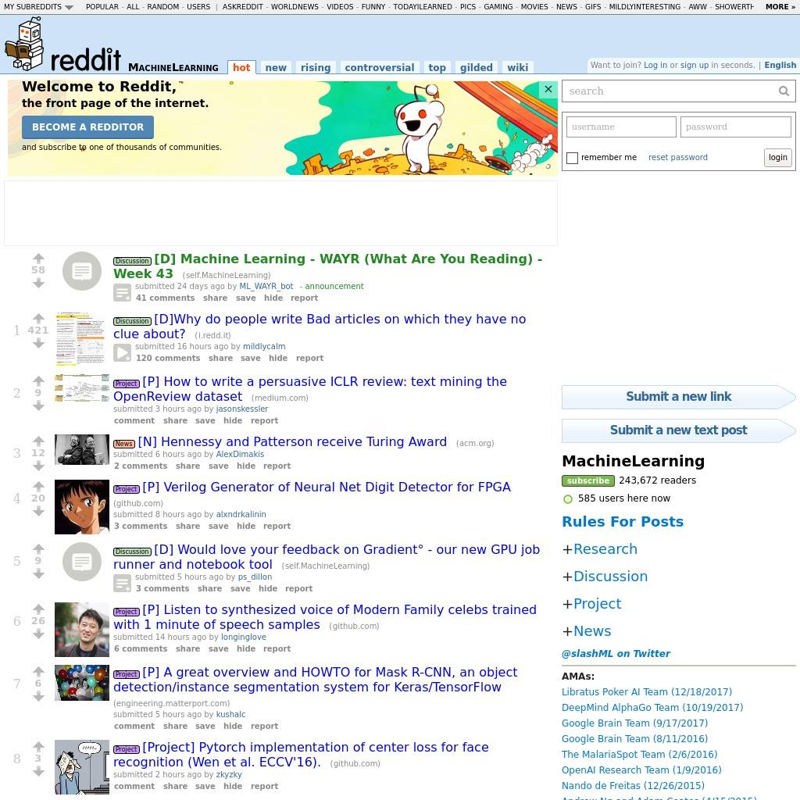

> #오늘의레딧 https://www.reddit.com/r/MachineLearning/ 따끈한 소식들입니다.  1. 왜 사람들은 그들이 전혀 모르는 나쁜 기사를 쓰는가? 2. 설득력 있는 ICLR리뷰를 작성하는 방법:OpenReview데이터 셋을 마이닝 하는 방법 3. Hennessy와 패터슨은 상을 받는다. 4. 신경망을 위한 신경망 분석기 5. 새로운 GPU작업 로드 및 노트북 도구에 대한 귀하의 의견에 대한 피드백을 받으실 수 있습니다. 6. 1분간의 음성 샘플로 단련된 현대 가족 샐러리 맨들의 합성음 청취 7. KerasR4텐서에 대한 객체 감지 시스템의 망측한 개요 및 마스크 R-WCN 8. 얼굴 인식을 위한 센터 손실의 이행(원 외 연구진, ECP). 9. 여러분은 MSAzure머신 학습 스튜디오에 대해 어떻게 생각하십니까? 브라우저 기반의 x86환경입니다. 10. 어렵지만 해결할 수 있는 문제를 나타내는 작은 데이터 셋을 알고 계십니까? 11. RL에 대한 파라미터 공간의 무작위 검색 12. KRX의 미래는? 13. 어리석은 질문이긴 하지만 기계 학습과 추론의 차이점은 무엇입니까? 14. 2,000,000 개가 넘는 축구 경기가 관심을 가지고 있습니까? 15. 스카이 케어와 미용 산업에 사용되는 AI 16. 신경 회로망 17. 레스토랑 추천 시스템을 위한 기계 학습 18. 케라스를 이용한 일반 가정용 네트워크 상의 이미지 교란 19. 주문 사항:세트 순서 시퀀스 순서 20. 안전 중요도 부품 검증을 위한 효율적인 시스템 구축 방안-AID  1. https://www.reddit.com/r/MachineLearning/comments/860311/dwhy_do_people_write_bad_articles_on_which_they/ 2. https://medium.com/@jasonskessler/how-to-write-a-persuasive-iclr-review-visualizing-the-iclr-2018-review-data-set-a035bf89a946 3. https://www.acm.org/media-center/2018/march/turing-award-2017 4. https://github.com/ZFTurbo/Verilog-Generator-of-Neural-Net-Digit-Detector-for-FPGA 5. https://www.reddit.com/r/MachineLearning/comments/8648jz/d_would_love_your_feedback_on_gradient_our_new/ 6. https://github.com/Kyubyong/speaker_adapted_tts 7. https://engineering.matterport.com/splash-of-color-instance-segmentation-with-mask-r-cnn-and-tensorflow-7c761e238b46 8. https://github.com/KaiyangZhou/pytorch-center-loss 9. https://azure.microsoft.com/en-us/services/machine-learning-studio/ 10. https://www.reddit.com/r/MachineLearning/comments/863j4z/d_do_you_know_any_small_dataset_that_represents_a/ 11. https://www.reddit.com/r/MachineLearning/comments/863tbr/d_about_random_search_in_parameter_space_for_rl/ 12. https://www.reddit.com/r/MachineLearning/comments/860l9s/discussion_what_is_the_future_of_scala_in_ml/ 13. https://www.reddit.com/r/MachineLearning/comments/860wke/discussion_potentially_a_dumb_question_but_what/ 14. https://www.reddit.com/r/MachineLearning/comments/85uexk/d_over_290_000_soccer_matches_database_interested/ 15. https://medium.com/@StoAmigo/the-ai-based-startup-that-knows-your-skin-better-than-you-do-43e132ee04cd 16. https://arxiv.org/abs/1803.05859 17. https://www.reddit.com/r/MachineLearning/comments/863fio/p_machine_learning_for_restaurant_recommendation/ 18. https://blog.sicara.com/keras-generative-adversarial-networks-image-deblurring-45e3ab6977b5 19. https://www.reddit.com/r/MachineLearning/comments/85yjzo/d_order_matters_sequence_to_sequence_for_sets/ 20. http://ai2.ethz.ch/

### 3월 23일 (금) 08:52 · 📷 사진 (1장)

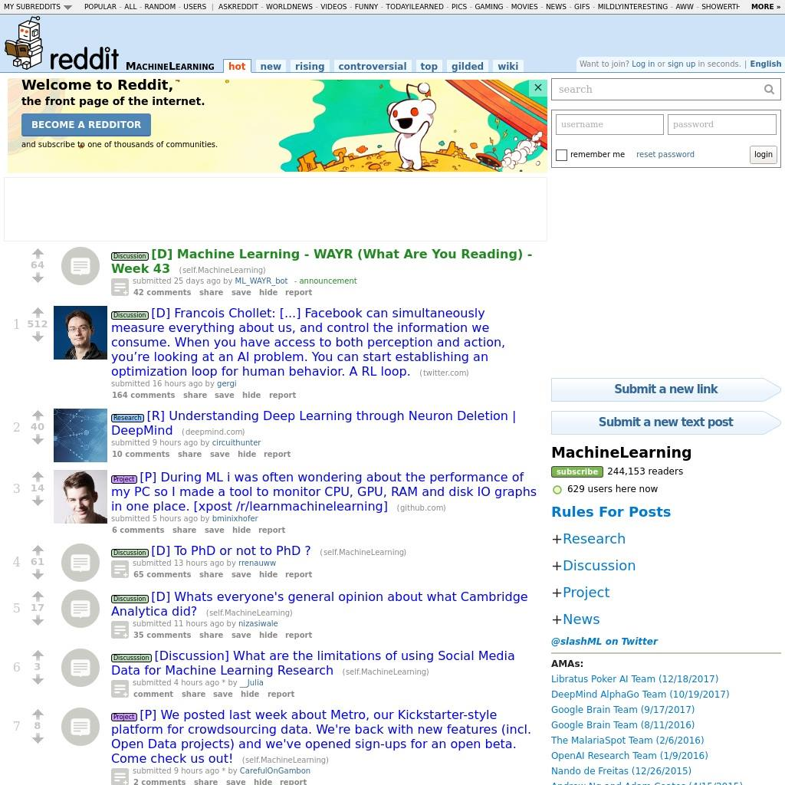

> #오늘의레딧 https://www.reddit.com/r/MachineLearning/ 따끈한 소식들입니다.  1. NeuronDeleteDeepMind를 통해 심층 학습 이해 2. 박사 학위를 소지하고 박사 학위를 소지하고 계신가요? 3. 캠브릿지 Analytica가 무엇을 했는지에 대한 일반적인 의견은 무엇입니까? 4. 우리는 지난 주에 크라우드 소싱 데이터를 크라우드 소싱 하는 우리의 킥 보드 스타일 플랫폼에 대해 글을 올렸습니다. 새로운 기능(포함 포함)으로 돌아왔습니다. 오픈 데이터 프로젝트를 열고 오픈 베타 버전을 오픈했습니다. 이리 와 봐! 5. 철근 콘크리트 구조물 설계를 위한 저가형 윤리 조정 방안 연구 6. 슈퍼 파워 마우스-F(크롬 확장)-페이지 내 텍스트에 작용하는 자연 언어 질문 응답 시스템 7. NLP에서 일하는 사람들은 언어학에 대한 현재 연구가 당신의 작품에 영향을 미치는가? 8. Facebook은 오픈 소스 데이터 셋에서 GoogleTacotronMOS점수를 복제할 수 없습니다. 9. 라이브러리를 처리하기 위해 라이브러리를 순차적으로 설정하고, 사전 처리를 진행하고, 전처리 파이프를 빌드 합니다. 10. 분석/분석을 위한 프로젝트 제안 11. 어떤 종류의 연구는 대학에서 할 수 있지만 산업계에서는 할 수 없다. GoogleBrainDeDeepMind/ FAIR? 12. 왜 사람들은 그들이 전혀 모르는 나쁜 기사를 쓰는가? 13. DVC0.9.1 튜토리얼-ML프로젝트를 구성하고 협업하는 모범 사례 14. 비나리에이트보다 낫다구? Tensorflow-Tensorflow의 Tenary-Net, Tenary 15. 여러분들은 fast.ai 컴퓨터에 대해 어떻게 생각하십니까?계산 선형 대수학 과정? 16. 설득력 있는 ICLR리뷰를 작성하는 방법:OpenReview데이터 셋을 마이닝 하는 방법 17. Hennessy와 패터슨은 상을 받는다. 18. 이벤트 예측을 위한 LSTM 19. KerasR4텐서에 대한 객체 감지 시스템의 망측한 개요 및 마스크 R-WCN 20. 신경망을 위한 신경망 분석기  1. https://deepmind.com/blog/understanding-deep-learning-through-neuron-deletion/ 2. https://www.reddit.com/r/MachineLearning/comments/86ab1g/d_to_phd_or_not_to_phd/ 3. https://www.reddit.com/r/MachineLearning/comments/86b6hv/d_whats_everyones_general_opinion_about_what/ 4. https://www.reddit.com/r/MachineLearning/comments/86btln/p_we_posted_last_week_about_metro_our/ 5. https://www.reddit.com/r/MachineLearning/comments/86e5di/r_a_lowcost_ethics_shaping_approach_for_designing/ 6. https://chrome.google.com/webstore/detail/cape-super-powered-ctrl-f/ndpjhckhhfpcloemggoacecenhajokml 7. https://www.reddit.com/r/MachineLearning/comments/86b1l3/d_people_who_work_in_nlp_does_current_research_in/ 8. https://www.reddit.com/r/MachineLearning/comments/867y9m/d_facebook_unable_to_replicate_google_tacotron/ 9. https://www.reddit.com/r/MachineLearning/comments/86aq3r/project_seqtools_a_library_to_process/ 10. https://www.reddit.com/r/MachineLearning/comments/86e371/d_project_suggestions_to_reproduceanalyze/ 11. https://www.reddit.com/r/MachineLearning/comments/869887/d_what_kind_of_research_can_you_do_at_a/ 12. https://www.reddit.com/r/MachineLearning/comments/860311/dwhy_do_people_write_bad_articles_on_which_they/ 13. https://blog.dataversioncontrol.com/data-version-control-tutorial-9146715eda46 14. https://github.com/tensorlayer/tensorlayer/issues/416 15. https://www.reddit.com/r/MachineLearning/comments/8693wj/d_what_do_you_guys_think_about_fastai/ 16. https://medium.com/@jasonskessler/how-to-write-a-persuasive-iclr-review-visualizing-the-iclr-2018-review-data-set-a035bf89a946 17. https://www.acm.org/media-center/2018/march/turing-award-2017 18. https://www.reddit.com/r/MachineLearning/comments/86as64/d_lstm_for_predicting_events/ 19. https://engineering.matterport.com/splash-of-color-instance-segmentation-with-mask-r-cnn-and-tensorflow-7c761e238b46 20. https://github.com/ZFTurbo/Verilog-Generator-of-Neural-Net-Digit-Detector-for-FPGA

### 3월 24일 (토) 08:52 · 📷 사진 (1장)

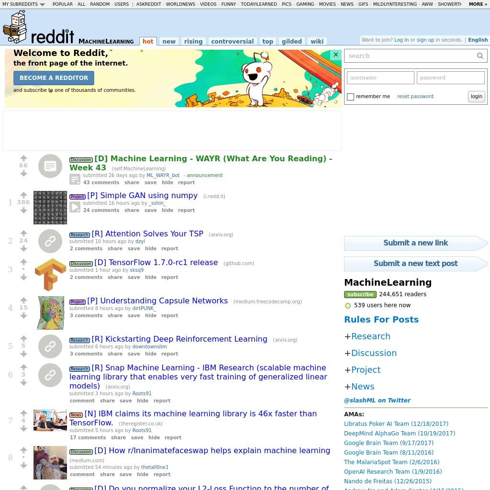

> #오늘의레딧 https://www.reddit.com/r/MachineLearning/ 따끈한 소식들입니다.  1. 심플한 게임을 이용한 간편한 게임 2. TSP를 완화하는 주의 사항 3. 텐서 플로우 1.7.0-1릴리스 4. 캡슐 네트워크 이해 5. 철저한 강화 학습 학습 6. 손쉬운 머신 학습-IBMResearch(확장 가능한 기계 학습 라이브러리를 통해 일반화된 선형 모델을 신속하게 교육할 수 있는 확장 가능한 머신 학습 라이브러리) 7. IBM은 Tensorflow가 TensorFlow보다 46배 더 빠르다고 주장합니다. 8. 시스템 학습/태스크를 통해 기계 학습을 설명하는 방법 9. L2-Loss함수를 형상 수(샘플 수뿐 아니라 샘플 수)로 지정합니까? 10. 3D시리즈 로봇 설계, 빌딩 설계, 프로그래밍에 관한 3부작 시리즈. 11. 응답 공간에 대한 사전 지식을 설명할 수 있는 다중 클래스 모델이 있습니까? 12. RBM을 학습할 수 있는 데이터 셋 기능은 무엇입니까? 13. DALEX와 관련된 모델 이해:설명식 학습 학습 설명 14. Verse:유사성 측정법에 의한 다용도 그래프 15. SQuAD에 대한 QA데이터 세트를 선택하시겠습니까? 16. GroupNormalization| IRIR 17. NeuronDeleteDeepMind를 통해 심층 학습 이해 18. WAYW(당신은 무엇을 하고 있는가?) 19. 웨이브 네트와 같은 AR모델이 RNN에 있는 것 같습니까? 20. 박사 학위를 소지하고 박사 학위를 소지하고 계신가요?  1. https://www.reddit.com/r/MachineLearning/comments/86ipxh/p_simple_gan_using_numpy/ 2. https://arxiv.org/abs/1803.08475 3. https://github.com/tensorflow/tensorflow/releases/tag/v1.7.0-rc1 4. https://medium.freecodecamp.org/understanding-capsule-networks-ais-alluring-new-architecture-bdb228173ddc 5. https://arxiv.org/abs/1803.03835 6. https://arxiv.org/pdf/1803.06333.pdf 7. https://www.theregister.co.uk/2018/03/21/ibm_machine_learning_models_trained_fast/ 8. https://medium.com/datadriveninvestor/how-a-funny-subreddit-helps-explain-machine-learning-265aef3e8776 9. https://www.reddit.com/r/MachineLearning/comments/86k8as/d_do_you_normalize_your_l2loss_function_to_the/ 10. https://www.youtube.com/watch?v=0D5lcNIEa24&list=PLExOi9hN5cfq6mhxKmAWI_VoXqXs343vD 11. https://www.reddit.com/r/MachineLearning/comments/86li48/d_are_there_multiclass_models_that_can_account/ 12. https://www.reddit.com/r/MachineLearning/comments/86nwh2/d_what_kind_of_datasetgenerator_functions_can_an/ 13. https://github.com/pbiecek/DALEX 14. https://arxiv.org/abs/1803.04742 15. https://www.reddit.com/r/MachineLearning/comments/86mlzi/r_qa_dataset_alternatives_to_squad/ 16. https://arxiv.org/abs/1803.08494 17. https://deepmind.com/blog/understanding-deep-learning-through-neuron-deletion/ 18. https://www.reddit.com/r/MachineLearning/comments/86hlf6/d_wayw_what_are_you_writing/ 19. https://www.reddit.com/r/MachineLearning/comments/86jhgw/d_is_there_something_that_is_to_ar_models_like/ 20. https://www.reddit.com/r/MachineLearning/comments/86ab1g/d_to_phd_or_not_to_phd/

### 3월 25일 (일) 08:52 · 📷 사진 (1장)

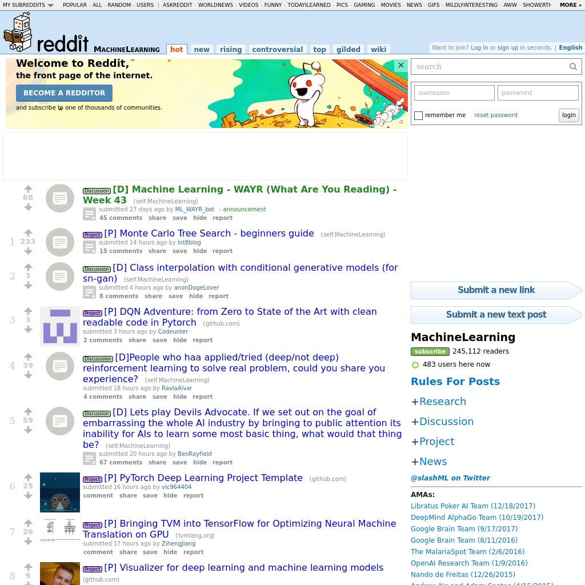

> #오늘의레딧 https://www.reddit.com/r/MachineLearning/ 오늘도 새소식이 많군요.  1. 몬테카를로 나무 검색-초보자를 위한 가이드 2. 조건부 생성 모델에 의한 클래스 삽입(snim-gan) 3. DQN어드벤처:제로에서 본 아트 레터의 깨끗한 읽기 가능한 코드 4. Devils(Devils)를 재생할 수 있습니다. 만약 우리가 AI가 가장 기본적인 것을 배울 수 없다는 것을 대중들에게 일깨워 줌으로써 전체 AI산업을 난처하게 만든다는 목표를 세운다면, 무엇이 그렇게 될까요? 5. PyTorchDeepLearning프로젝트 템플릿 6. GPU를 GPU에 최적화하기 위해 TVM을 TensorFlow로 변환 7. 심층 학습 및 기계 학습 모델의 시각화 8. 샘플 메모리가 있는 최적화된 옵티마이저? 9. 오늘은 하루 일과가 어떻게 되십니까? ML//헬스 리서치 타입 정보를 찾고 있습니다. 10. ML라이브러리의 경우, 일반적인 가용성이 있는 gene커널을 쓸 가치가 있는가? 11. 상주 프로그램의 대안? 12. 구배의 일반성을 점검하기 위한 이 방법론을 비판한다. 13. 심플한 게임을 이용한 간편한 게임 14. 텐서 플로우 1.7.0-1릴리스 15. 파이프 라인 파이프 라인은 쉬운 오류로부터 의사들을 격리시킬 수 있는가? 16. 언어 모델링을 위한 LSTMs 17. 어떻게 라이브 사진을 발견할 수 있을까요? 18. 손쉬운 머신 학습-IBMResearch(확장 가능한 기계 학습 라이브러리를 통해 일반화된 선형 모델을 신속하게 교육할 수 있는 확장 가능한 머신 학습 라이브러리) 19. IBM은 Tensorflow가 TensorFlow보다 46배 더 빠르다고 주장합니다. 20. 캡슐 네트워크 이해  1. https://www.reddit.com/r/MachineLearning/comments/86s1rl/p_monte_carlo_tree_search_beginners_guide/ 2. https://www.reddit.com/r/MachineLearning/comments/86v8fx/d_class_interpolation_with_conditional_generative/ 3. https://github.com/higgsfield/RL-Adventure 4. https://www.reddit.com/r/MachineLearning/comments/86qfft/d_lets_play_devils_advocate_if_we_set_out_on_the/ 5. https://github.com/victoresque/pytorch-template 6. http://www.tvmlang.org/2018/03/23/nmt-transformer-optimize.html 7. https://github.com/lutzroeder/Netron 8. https://www.reddit.com/r/MachineLearning/comments/86s9no/d_optimizer_with_sample_memory/ 9. https://www.reddit.com/r/MachineLearning/comments/86vaau/d_whats_your_day_to_day_job_like_looking_for/ 10. https://www.reddit.com/r/MachineLearning/comments/86s7qp/d_for_a_ml_library_would_writing_a_generic/ 11. https://www.reddit.com/r/MachineLearning/comments/86r9oo/d_alternatives_for_residency_programs/ 12. https://www.reddit.com/r/MachineLearning/comments/86t0pa/d_critique_this_method_for_checking_the/ 13. https://www.reddit.com/r/MachineLearning/comments/86ipxh/p_simple_gan_using_numpy/ 14. https://github.com/tensorflow/tensorflow/releases/tag/v1.7.0-rc1 15. https://medium.com/@iliakarmanov/can-train-test-split-help-standard-econometrics-9d3aeb54630a 16. https://www.reddit.com/r/MachineLearning/comments/86rged/d_lstms_for_language_modelling/ 17. https://www.reddit.com/r/MachineLearning/comments/86sdk0/dhow_can_we_detect_live_photos/ 18. https://arxiv.org/pdf/1803.06333.pdf 19. https://www.theregister.co.uk/2018/03/21/ibm_machine_learning_models_trained_fast/ 20. https://medium.freecodecamp.org/understanding-capsule-networks-ais-alluring-new-architecture-bdb228173ddc

### 3월 26일 (월) 08:52 · 📷 사진 (1장)

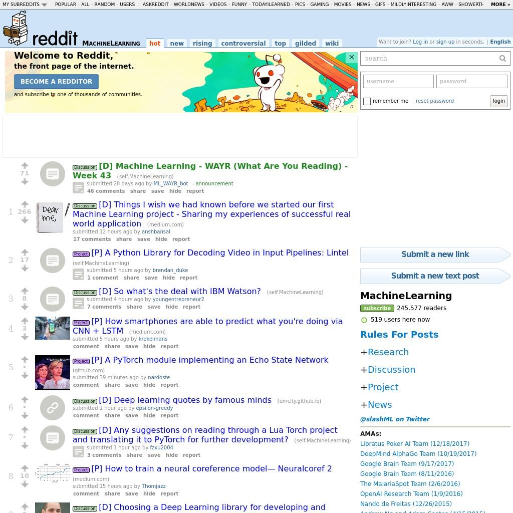

> #오늘의레딧 https://www.reddit.com/r/MachineLearning/ 머신러닝 공부는 정말 재미있죠?아침부터 다양한 소식이 많네요.  1. 우리가 최초의 기계 학습 프로젝트를 시작하기 전에 알고 싶었던 것들-성공적인 실제 세계 응용 분야의 경험을 공유하는 것 2. 입력 파이프에 있는 비디오 녹화용 파이썬 라이브러리:lintel 3. 그럼 IBM왓슨과의 거래는 어때요? 4. 스마트 폰이 CNN+LSTM을 통해 무엇을 하고 있는지 예측할 수 있는 방법 5. 에코 시스템을 구현하는 PyTorch모듈 6. 유명한 사람들의 깊은 학습 인용구 7. 루아나 토치 프로젝트를 통해 읽을 수 있는 제안서를 읽고 더 많은 개발을 위해 PyTorch로 번역해 주시겠습니까? 8. ✨ How to train aneural coreference model — Neuralcoref 2 9. 애플리케이션을 개발하고 배포하기 위한 심층 학습 라이브러리 선택 10. 몬테카를로 나무 검색-초보자를 위한 가이드 11. DQN어드벤처:제로에서 본 아트 레터의 깨끗한 읽기 가능한 코드 12. 조건부 생성 모델에 의한 클래스 삽입(snim-gan) 13. 심층 학습 및 기계 학습 모델의 시각화 14. PyTorchDeepLearning프로젝트 템플릿 15. Devils(Devils)를 재생할 수 있습니다. 만약 우리가 AI가 가장 기본적인 것을 배울 수 없다는 것을 대중들에게 일깨워 줌으로써 전체 AI산업을 난처하게 만든다는 목표를 세운다면, 무엇이 그렇게 될까요? 16. GPU를 GPU에 최적화하기 위해 TVM을 TensorFlow로 변환 17. ML라이브러리의 경우, 일반적인 가용성이 있는 gene커널을 쓸 가치가 있는가? 18. 상주 프로그램의 대안? 19. 샘플 메모리가 있는 최적화된 옵티마이저? 20. 오늘은 하루 일과가 어떻게 되십니까? ML//헬스 리서치 타입 정보를 찾고 있습니다.  1. https://medium.com/infinity-aka-aseem/things-we-wish-we-had-known-before-we-started-our-first-machine-learning-project-336d1d6f2184 2. https://www.reddit.com/r/MachineLearning/comments/872lz6/p_a_python_library_for_decoding_video_in_input/ 3. https://www.reddit.com/r/MachineLearning/comments/872x47/d_so_whats_the_deal_with_ibm_watson/ 4. https://medium.com/@davidjohansmolders/predicting-physical-activity-based-on-smartphone-sensor-data-using-cnn-lstm-9182dd13b6bc 5. https://github.com/stefanonardo/pytorch-esn/ 6. http://emcity.github.io/quotes 7. https://www.reddit.com/r/MachineLearning/comments/8744wb/d_any_suggestions_on_reading_through_a_lua_torch/ 8. https://medium.com/huggingface/how-to-train-a-neural-coreference-model-neuralcoref-2-7bb30c1abdfe 9. http://engineering.curalate.com/2018/03/23/DL-lib-for-app-dev-and-prod.html 10. https://www.reddit.com/r/MachineLearning/comments/86s1rl/p_monte_carlo_tree_search_beginners_guide/ 11. https://github.com/higgsfield/RL-Adventure 12. https://www.reddit.com/r/MachineLearning/comments/86v8fx/d_class_interpolation_with_conditional_generative/ 13. https://github.com/lutzroeder/Netron 14. https://github.com/victoresque/pytorch-template 15. https://www.reddit.com/r/MachineLearning/comments/86qfft/d_lets_play_devils_advocate_if_we_set_out_on_the/ 16. http://www.tvmlang.org/2018/03/23/nmt-transformer-optimize.html 17. https://www.reddit.com/r/MachineLearning/comments/86s7qp/d_for_a_ml_library_would_writing_a_generic/ 18. https://www.reddit.com/r/MachineLearning/comments/86r9oo/d_alternatives_for_residency_programs/ 19. https://www.reddit.com/r/MachineLearning/comments/86s9no/d_optimizer_with_sample_memory/ 20. https://www.reddit.com/r/MachineLearning/comments/86vaau/d_whats_your_day_to_day_job_like_looking_for/

### 3월 27일 (화) 08:52 · 📷 사진 (1장)

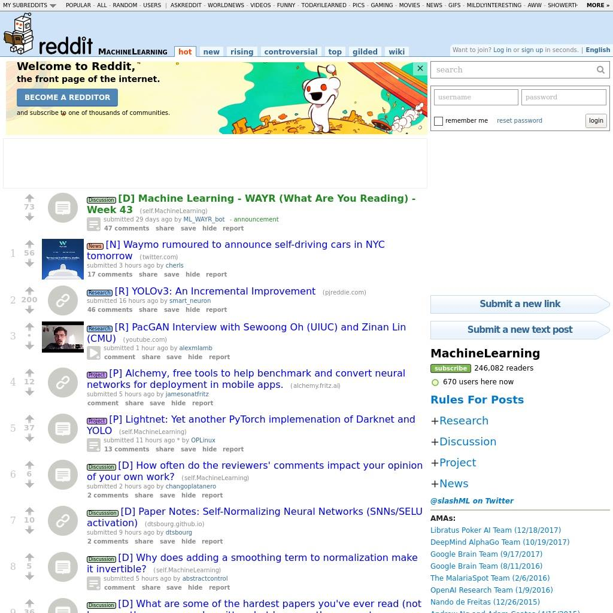

> #오늘의레딧 https://www.reddit.com/r/MachineLearning/ 래딧은 읽을 거리가 다양합니다.  1. Waymo는 내일 뉴욕에서 자기 주도의 자동차 운전을 발표하려 했다. 2. J0:점진적인 향상 효과 3. 씨그 아(UIUC) 와 Zinan린(CMU)과의 팩맨 인터뷰 4. 벤치마킹, 벤치 마크를 지원하는 자유로운 도구를 사용하여 모바일 앱에서 구현할 수 있도록 신경 회로를 변환할 수 있습니다. 5. Lightnet:Darknet과 YoLO의 또 다른 PyTorchimplement 6. 비평가들의 논평이 당신의 작품에 대한 당신의 의견에 얼마나 자주 영향을 줍니까? 7. 정규화 기간을 추가하는 이유는 무엇입니까? 8. 여러분이 읽었던 가장 어려운 논문들 중 몇가지는 무엇인가요?비록 그들이 형편없이 쓰여 있기 때문이지요, 그러나 그 개념들은 복잡했나요? 9. SuperPoint:자기 주관적 관심 지점 감지 및 설명 10. 몇가지 실질적인 질문 11. 자습서:21공정성 정의와 그들의 정치 12. 깊은 정량 반응 13. 우수한 발표자 14. 심층 학습의 설명 방법 15. 우리가 최초의 기계 학습 프로젝트를 시작하기 전에 알고 싶었던 것들-성공적인 실제 세계 응용 분야의 경험을 공유하는 것 16. LSTM계층의 숨겨진 단위 수는 무엇입니까? 17. 이것이 기계 학습의 문제인가요? 18. 입력 파이프에 있는 비디오 녹화용 파이썬 라이브러리:lintel 19. 세겐:샘플형 유전자 진화론적 네트워크 모델 20. 에코 시스템을 구현하는 PyTorch모듈  1. https://twitter.com/johnkrafcik/status/978328638482460672 2. https://pjreddie.com/media/files/papers/YOLOv3.pdf 3. https://www.youtube.com/watch?v=MqdhDdD4-Z0 4. https://alchemy.fritz.ai 5. https://www.reddit.com/r/MachineLearning/comments/878gk6/p_lightnet_yet_another_pytorch_implemenation_of/ 6. https://www.reddit.com/r/MachineLearning/comments/87cvij/d_how_often_do_the_reviewers_comments_impact_your/ 7. https://www.reddit.com/r/MachineLearning/comments/87b3qz/d_why_does_adding_a_smoothing_term_to/ 8. https://www.reddit.com/r/MachineLearning/comments/876j6s/d_what_are_some_of_the_hardest_papers_youve_ever/ 9. https://arxiv.org/abs/1712.07629 10. https://www.reddit.com/r/MachineLearning/comments/87c21z/d_a_few_practical_questions/ 11. https://www.youtube.com/watch?v=jIXIuYdnyyk 12. https://medium.com/@sachin.abeywardana/deep-quantile-regression-c85481548b5a 13. https://www.reddit.com/r/MachineLearning/comments/87d91p/d_good_presenters/ 14. https://arxiv.org/abs/1803.07517 15. https://medium.com/infinity-aka-aseem/things-we-wish-we-had-known-before-we-started-our-first-machine-learning-project-336d1d6f2184 16. https://www.reddit.com/r/MachineLearning/comments/87djn7/d_what_is_meant_by_number_of_hidden_units_in_an/ 17. https://www.reddit.com/r/MachineLearning/comments/877w3b/d_is_this_a_problem_for_machine_learning/ 18. https://www.reddit.com/r/MachineLearning/comments/872lz6/p_a_python_library_for_decoding_video_in_input/ 19. https://arxiv.org/abs/1803.08631 20. https://github.com/stefanonardo/pytorch-esn/

### 3월 28일 (수) 08:52 · 📷 사진 (1장)

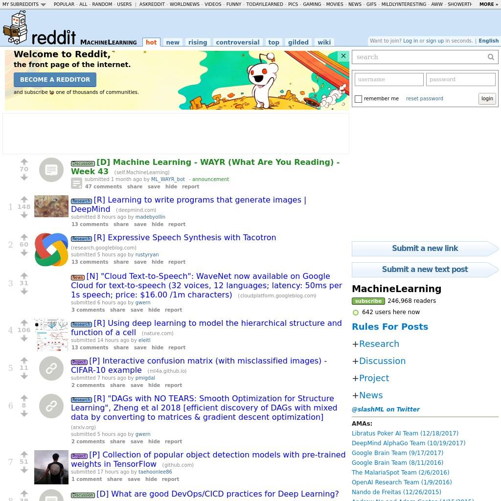

> #오늘의레딧 https://www.reddit.com/r/MachineLearning/ 재미난 이야기들이 많습니다.  1. 이미지를 생성하는 프로그램을 작성하는 방법(예:DeepMindDeepMind) 2. 타코트론을 이용한 표현형 음성 합성 기법 3. "CloudTexts-Speet-speet":ve은(는)이제 구글 클라우드에서 사용할 수 있습니다(32개의 음성, 12개 언어, 지연 시간:1초당 50ms, 가격:$16.00-1). 4. 심층 학습을 이용하여 세포의 계층 구조와 기능을 모델링 합니다. 5. 대화형 혼란 매트릭스(잘못 작성된 영상)-CI FA R-10예제 6. TensorFlow에서 사전 훈련된 중량을 가진 인기 있는 물체 탐지 모형 모음 7. 딥 학습을 위한 멋진 DevOps//CICD 관행은 무엇입니까? 8. 최대 80개의 복제물을 복제하는 개별 복제 도구를 구축하는 방법론적 데이터 세트 9. ICLRwebsitte는? 10. 보고서 검토 기준서 제5부: 11. 교육 과학 기술부의 대응적 대응 방안 12. GoogleTPM2와 함께 활용 13. Gense-in-a-CompleteGuide를 이용한 Passing-a의 토픽 모델링 14. 구글 오토닉스 비전:라면부터 브랜드 상품까지 15. HackyfU수상자:AI개인 트레이너 및 Workout-FormandHardwareWebcam 16. 쇼핑을 좋아하는 남성들:CorpustelConstructionConstruction을 이용한 성별 편견 증폭 17. J0:점진적인 향상 효과 18. 벤치마킹, 벤치 마크를 지원하는 자유로운 도구를 사용하여 모바일 앱에서 구현할 수 있도록 신경 회로를 변환할 수 있습니다. 19. DeepPavlov에 의한 ConversationalIntervale2(컨베어 2) 20. 비평가들의 논평이 당신의 작품에 대한 당신의 의견에 얼마나 자주 영향을 줍니까?  1. https://deepmind.com/blog/learning-to-generate-images/ 2. https://research.googleblog.com/2018/03/expressive-speech-synthesis-with.html 3. https://cloudplatform.googleblog.com/2018/03/introducing-Cloud-Text-to-Speech-powered-by-Deepmind-WaveNet-technology.html 4. https://www.nature.com/articles/nmeth.4627 5. https://ml4a.github.io/demos/confusion_cifar_convnet/ 6. https://github.com/taehoonlee/tensornets/releases/tag/0.3.1 7. https://www.reddit.com/r/MachineLearning/comments/87g70v/d_what_are_good_devopscicd_practices_for_deep/ 8. https://www.reddit.com/r/MachineLearning/comments/87m7wo/d_methodology_for_building_a_classifier_tool_for/ 9. https://www.reddit.com/r/MachineLearning/comments/87n5tu/d_iclr_webstite_down/ 10. http://colinraffel.com/blog/reviewing-criteria.html 11. https://arxiv.org/abs/1803.07200v2 12. https://medium.com/@HelloPaperspace/hands-on-with-the-google-tpuv2-9feb0c5ea952 13. https://www.machinelearningplus.com/nlp/topic-modeling-gensim-python/ 14. https://cloud.google.com/blog/big-data/2018/03/automl-vision-in-action-from-ramen-to-branded-goods 15. https://github.com/jrobchin/phormatics 16. https://arxiv.org/abs/1707.09457 17. https://pjreddie.com/media/files/papers/YOLOv3.pdf 18. https://alchemy.fritz.ai 19. http://convai.io/ 20. https://www.reddit.com/r/MachineLearning/comments/87cvij/d_how_often_do_the_reviewers_comments_impact_your/

### 3월 29일 (목) 08:52 · 📷 사진 (1장)

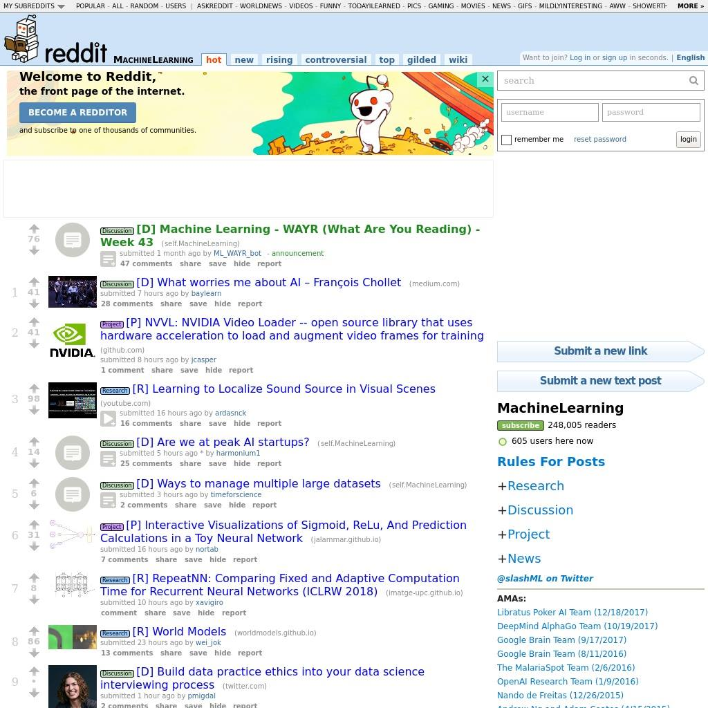

> #오늘의레딧 https://www.reddit.com/r/MachineLearning/ 따끈한 소식들입니다.  1. 나를 걱정하게 하는 것은 무엇인가? 2. NVUVL:NVIDIAVideoLoader--하드웨어 가속을 사용하여 교육용 비디오 프레임을 로드하고 증강할 수 있는 오픈 소스 라이브러리 3. 시각적 장면에서 사운드 소스를 로컬화하는 방법 학습 4. 우리는 정점에 달하는 신생 기업인가요? 5. 여러 대규모 데이터 셋을 관리하는 방법 6. Sigmoid신경망을 이용한 Sigmoid시각화의 인터랙티브 시각화 7. Repeate:Recurrent신경망과 RecurrentComputationTime의 비교 및 적응 시간 비교 8. 월드 모델 9. 데이터 과학 인터뷰 프로세스에 대한 데이터 실무 윤리 실천 10. 샌 프란시스코의 https://www.reddit.com/r/machinelearning에서 GTC회의를 하고 싶어 하는 사람은 누구든지 만나 보고 싶어 합니다! 11. 이미지를 생성하는 프로그램을 작성하는 방법(예:DeepMindDeepMind) 12. 타코트론을 이용한 표현형 음성 합성 기법 13. "CloudTexts-Speet-speet":ve은(는)이제 구글 클라우드에서 사용할 수 있습니다(32개의 음성, 12개 언어, 지연 시간:1초당 50ms, 가격:$16.00-1). 14. 당신은 깊은 학식이 필요한가요? 15. ICLR회의는 어떻게 진행되는가? 16. DL시스템 구축:RAM속도에 대한 질문 17. 심층 학습을 이용하여 세포의 계층 구조와 기능을 모델링 합니다. 18. Gense-in-a-CompleteGuide를 이용한 Passing-a의 토픽 모델링 19. 대화형 혼란 매트릭스(잘못 작성된 영상)-CI FA R-10예제 20. TensorFlow에서 사전 훈련된 중량을 가진 인기 있는 물체 탐지 모형 모음  1. https://medium.com/@francois.chollet/what-worries-me-about-ai-ed9df072b704 2. https://github.com/NVIDIA/nvvl 3. https://www.youtube.com/watch?v=UyairkbzR_Y 4. https://www.reddit.com/r/MachineLearning/comments/87u4hq/d_are_we_at_peak_ai_startups/ 5. https://www.reddit.com/r/MachineLearning/comments/87veqs/d_ways_to_manage_multiple_large_datasets/ 6. https://jalammar.github.io/feedforward-neural-networks-visual-interactive/ 7. https://imatge-upc.github.io/danifojo-2018-repeatrnn/ 8. https://worldmodels.github.io 9. https://twitter.com/hmason/status/979044820802031616 10. https://www.reddit.com/r/MachineLearning/comments/87tr1w/d_anyone_from_rmachinelearning_in_san_jose_for/ 11. https://deepmind.com/blog/learning-to-generate-images/ 12. https://research.googleblog.com/2018/03/expressive-speech-synthesis-with.html 13. https://cloudplatform.googleblog.com/2018/03/introducing-Cloud-Text-to-Speech-powered-by-Deepmind-WaveNet-technology.html 14. https://blog.chewxy.com/2018/03/27/do-you-need-deep-learning/ 15. https://www.reddit.com/r/MachineLearning/comments/87qa6h/d_how_does_iclr_conference_work/ 16. https://www.reddit.com/r/MachineLearning/comments/87s7fo/d_building_a_dl_machine_question_about_ram_speed/ 17. https://www.nature.com/articles/nmeth.4627 18. https://www.machinelearningplus.com/nlp/topic-modeling-gensim-python/ 19. https://ml4a.github.io/demos/confusion_cifar_convnet/ 20. https://github.com/taehoonlee/tensornets/releases/tag/0.3.1

### 3월 30일 (금) 08:53 · 📷 사진 (1장)

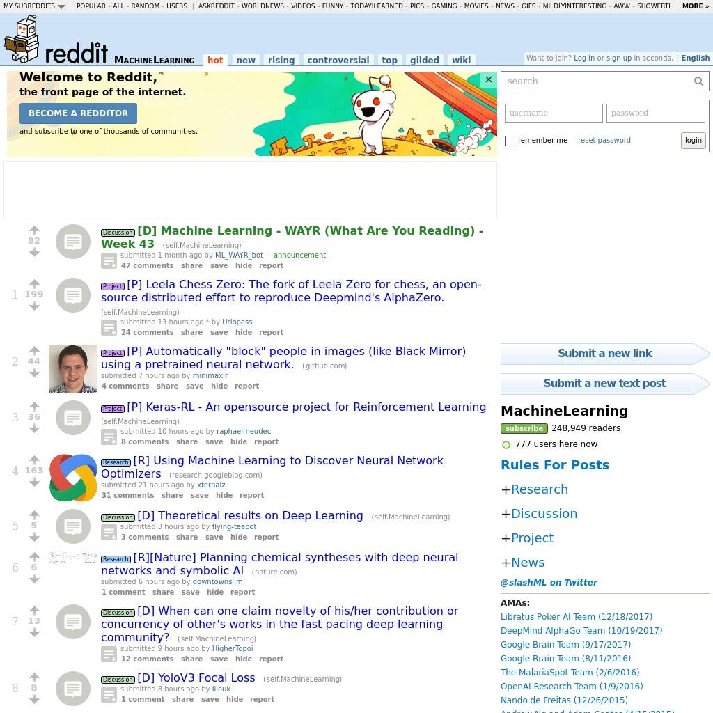

> #오늘의레딧 https://www.reddit.com/r/MachineLearning/ 재미난 이야기들이 많습니다.  1. 레엘라 체스 제로:레엘라 제로의 레엘라 제로의 포크로, 데페드의 알페르케를 재현하기 위한 오픈 소스의 분산된 노력. 2. 사전 지정된 신경 네트워크를 사용하여 영상(예: 검은 색 미러)을 자동으로 "차단" 합니다. 3. Keras-철근 학습을 위한 개방형 프로젝트 4. 시스템 학습을 통해 신경 네트워크 최적화 관리 5. 심층 학습에 대한 이론적 결과 6. 빠른 속도의 학습 커뮤니티에서 다른 사람들의 작품에 대한 그의 공헌이나 동시에 다른 작품들의 동시성을 주장할 수 있는가? 7. 욜로크 초점 손실 8. Tensorflow1.7.0 릴리스 되었습니다. 9. 비디오에서 1회용 학습 알고리즘 평가 10. 얼굴 표정에 내재된 내적 팽창성에 관한 연구 11. 그러나 Java를 학습하기 위한 Java의 또 다른 Deepararing프레임워크 12. matchbox-개별 사례의 수준에 맞춰 PyTorch코드를 작성한 다음, 소형 배너로 효율적으로 실행합니다. 13. 상상력 증강된 에이전트: 읽기 쉬운 읽기 전용 코드를 갖춘 단계별 튜토리얼 14. 고도로 설계된 에이전트에서 예상치 못한 예측 메모리 15. 센서 데이터에 대한 시스템 학습 16. 나를 걱정하게 하는 것은 무엇인가? 17. 프라토포시아 이론에 근거한 새로운 기술의 시연 18. IEEEKOREA학생 논문 경시 대회 19. NVUVL:NVIDIAVideoLoader--하드웨어 가속을 사용하여 교육용 비디오 프레임을 로드하고 증강할 수 있는 오픈 소스 라이브러리 20. 1GHz미만의 비용 대비 성능  1. https://www.reddit.com/r/MachineLearning/comments/88035j/p_leela_chess_zero_the_fork_of_leela_zero_for/ 2. https://github.com/minimaxir/person-blocker 3. https://www.reddit.com/r/MachineLearning/comments/8810qw/p_kerasrl_an_opensource_project_for_reinforcement/ 4. https://research.googleblog.com/2018/03/using-machine-learning-to-discover.html 5. https://www.reddit.com/r/MachineLearning/comments/884e6e/d_theoretical_results_on_deep_learning/ 6. https://www.reddit.com/r/MachineLearning/comments/881h19/d_when_can_one_claim_novelty_of_hisher/ 7. https://www.reddit.com/r/MachineLearning/comments/8829ai/d_yolov3_focal_loss/ 8. https://github.com/tensorflow/tensorflow/releases/tag/v1.7.0 9. https://www.reddit.com/r/MachineLearning/comments/882nv8/r_evaluating_oneshot_learning_algorithms_in_videos/ 10. https://arxiv.org/abs/1803.09672 11. https://www.reddit.com/r/MachineLearning/comments/881eps/p_yet_another_deeplearning_framework_on_java_for/ 12. https://github.com/salesforce/matchbox 13. https://github.com/higgsfield/Imagination-Augmented-Agents 14. https://arxiv.org/abs/1803.10760 15. https://www.reddit.com/r/MachineLearning/comments/8832yp/d_machine_learning_for_sensor_data/ 16. https://medium.com/@francois.chollet/what-worries-me-about-ai-ed9df072b704 17. https://robotsgomental.com/ 18. https://www.reddit.com/r/MachineLearning/comments/882akf/projectwasserstein_deep_convolutional_neural/ 19. https://github.com/NVIDIA/nvvl 20. https://www.reddit.com/r/MachineLearning/comments/881iay/d_fastrcnn_vs_rpn_for_1class/

### 3월 30일 (금) 12:37 · So wonderful to meet many talented peopl…

So wonderful to meet many talented people at Naver AI colloquium 2018, http://naveraiconf.naver.com/.

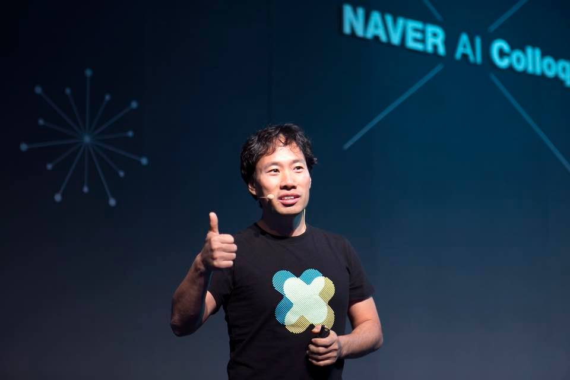 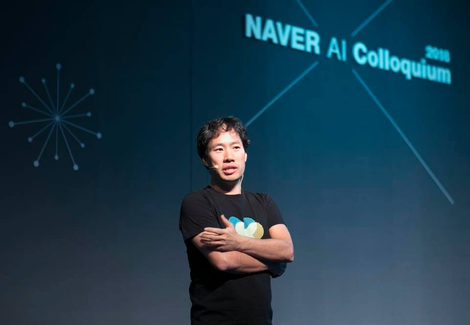 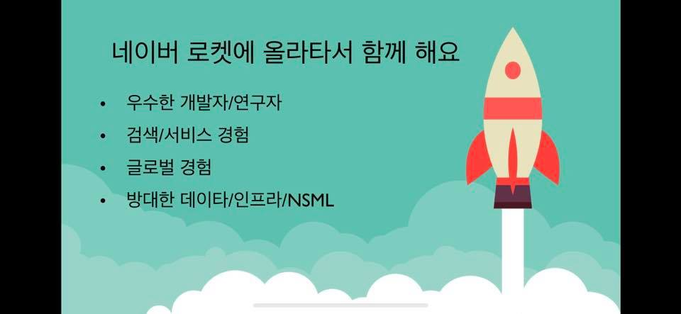

### 3월 31일 (토) 08:53 · 📷 사진 (1장)

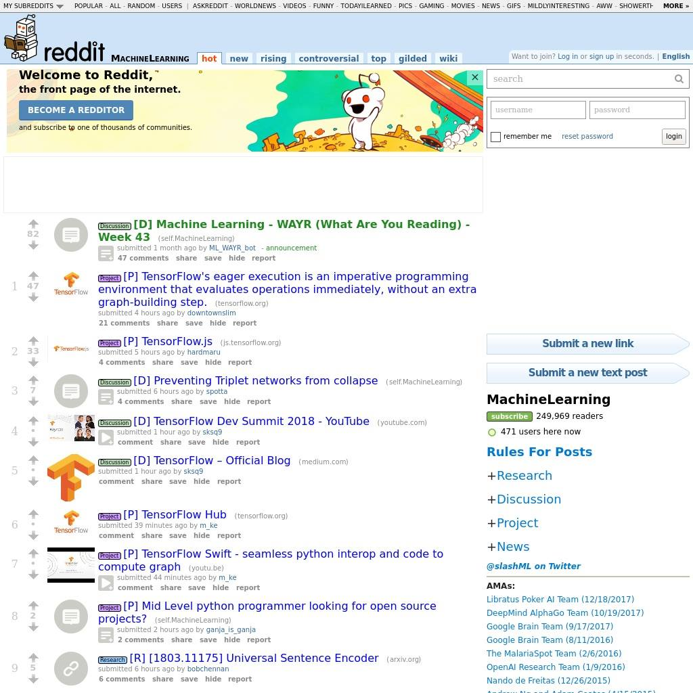

> #오늘의레딧 https://www.reddit.com/r/MachineLearning/ 따끈한 소식들입니다.  1. TensorFlow의 열렬한 실행은 추가적인 그래픽 구축 단계 없이 즉각적으로 운영을 평가하는 필수적인 프로그램입니다. 2. 텐서 플로우 3. 3중 네트워크 망의 붕괴 방지 4. TensorFlowDev서밋-YouTube 5. 텐소프 블로 공식 블로그 6. 텐서 플로 허브 7. TensorFlowSwift-완벽한 비단뱀과 코드를 컴퓨팅 그래프에 매핑 8. MidLevelPurpose프로그래머가 오픈 소스 프로젝트를 찾고 계십니까? 9. TensorFlowHub도입:TensorFlow에서 재사용 가능한 시스템 학습 모듈을 위한 라이브러리 10. 사전 지정된 신경 네트워크를 사용하여 영상(예: 검은 색 미러)을 자동으로 "차단" 합니다. 11. 중국 시의 데이터 세트에 도움이 필요합니다! 12. 원하는 출력을 위해 무질서하게 관련된 입력의 최적 조합을 찾습니다. 13. 심층 학습에 대한 이론적 결과 14. 레엘라 체스 제로:레엘라 제로의 레엘라 제로의 포크로, 데페드의 알페르케를 재현하기 위한 오픈 소스의 분산된 노력. 15. Keras-철근 학습을 위한 개방형 프로젝트 16. 특집 기사:BITS필라니에 있는 신경 회로망을 위한 교실 내의 전자 장치 17. 개체 감지 z.let크기가 충분합니까? 18. 빠른 속도의 학습 커뮤니티에서 다른 사람들의 작품에 대한 그의 공헌이나 동시에 다른 작품들의 동시성을 주장할 수 있는가? 19. 시스템 학습을 통해 신경 네트워크 최적화 관리 20. 욜로크 초점 손실  1. https://www.tensorflow.org/programmers_guide/eager 2. https://js.tensorflow.org/faq/ 3. https://www.reddit.com/r/MachineLearning/comments/88by8i/d_preventing_triplet_networks_from_collapse/ 4. https://www.youtube.com/playlist?list=PLQY2H8rRoyvxjVx3zfw4vA4cvlKogyLNN 5. https://medium.com/tensorflow 6. https://www.tensorflow.org/hub/ 7. https://youtu.be/gplTc2F5Wvk?t=3h20m4s 8. https://www.reddit.com/r/MachineLearning/comments/88dv49/p_mid_level_python_programmer_looking_for_open/ 9. https://medium.com/tensorflow/introducing-tensorflow-hub-a-library-for-reusable-machine-learning-modules-in-tensorflow-cdee41fa18f9 10. https://github.com/minimaxir/person-blocker 11. https://www.reddit.com/r/MachineLearning/comments/88cfcj/discussion_need_help_with_chinese_poetry_dataset/ 12. https://www.reddit.com/r/MachineLearning/comments/88c433/d_finding_optimal_combination_of_chaotically/ 13. https://www.reddit.com/r/MachineLearning/comments/884e6e/d_theoretical_results_on_deep_learning/ 14. https://www.reddit.com/r/MachineLearning/comments/88035j/p_leela_chess_zero_the_fork_of_leela_zero_for/ 15. https://www.reddit.com/r/MachineLearning/comments/8810qw/p_kerasrl_an_opensource_project_for_reinforcement/ 16. https://agrawalamey.github.io/lessons-from-conducting-machine-learning-course-with-jupyter-notebooks/ 17. https://www.reddit.com/r/MachineLearning/comments/8868wr/d_object_detectionhow_much_map_is_enough/ 18. https://www.reddit.com/r/MachineLearning/comments/881h19/d_when_can_one_claim_novelty_of_hisher/ 19. https://research.googleblog.com/2018/03/using-machine-learning-to-discover.html 20. https://www.reddit.com/r/MachineLearning/comments/8829ai/d_yolov3_focal_loss/
