# 2018년 4월

[← 2018년](README.md)

### 4월 1일 (일) 08:53 · 📷 사진 (1장)

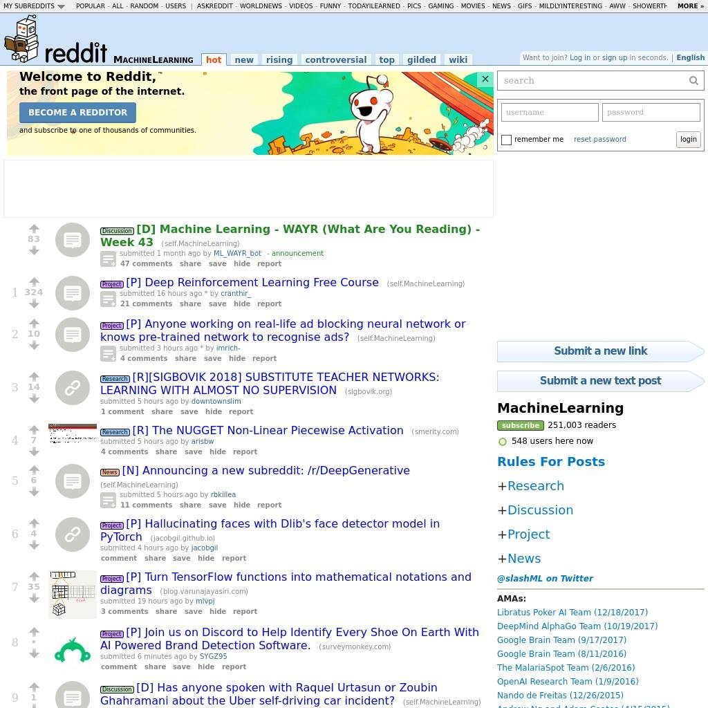

> #오늘의레딧 https://www.reddit.com/r/MachineLearning/ 재미난 이야기들이 많습니다.  1. 심층 학습 학습 무료 코스 2. 실시간 광고 차단 신경 네트워크에서 일하는 사람들이나 사전 훈련된 네트워크를 알고 있는 사람들은 광고를 인식할 수 있나요? 3. NUGGETNon-Linear항목별 활성화 4. 새로운 주소를 알려 드리겠습니다:https://www.reddit.com/r/DeepGenerative 5. PyTorch의 얼굴 검지기 모델을 이용한 얼굴 표정 형성 6. 텐서 플로우 기능을 수학적 표기법과 도해로 변환한다. 7. Discovery의 파워 브랜드 감지 소프트웨어를 이용하여 모든 신발의 신을 식별하는 데 도움이 되는 DiscordonDiscovers를 만나 보시기 바랍니다. 8. 우베르 우르타센이나 주빈 가라마니와 대화해 본 적이 있나요? 9. TensorFlow의 열렬한 실행은 추가적인 그래픽 구축 단계 없이 즉각적으로 운영을 평가하는 필수적인 프로그램입니다. 10. Scaledality스탠포드 대학교 2018-YouTube 11. 텐서 플로 허브 12. 텐서 플로우 13. 신경 네트워크 라이브러리에 대한 백엔드 제안 14. 라이브 게임 중에 NCAA최종 4명을 예측하기 위한 구글 클라우드 AI 15. TensorFlowSwift-완벽한 비단뱀과 코드를 컴퓨팅 그래프에 매핑 16. WM텍스트- 빠른 텍스트 처리 라이브러리를 통해 심층 학습 모델(Keras, tensorflow)을 위한 데이터 세트를 준비합니다. 17. TensorFlowHub도입:TensorFlow에서 재사용 가능한 시스템 학습 모듈을 위한 라이브러리 18. 3중 네트워크 망의 붕괴 방지 19. MidLevelPurpose프로그래머가 오픈 소스 프로젝트를 찾고 계십니까? 20. 사전 지정된 신경 네트워크를 사용하여 영상(예: 검은 색 미러)을 자동으로 "차단" 합니다.  1. https://www.reddit.com/r/MachineLearning/comments/88h0g4/p_deep_reinforcement_learning_free_course/ 2. https://www.reddit.com/r/MachineLearning/comments/88l32o/p_anyone_working_on_reallife_ad_blocking_neural/ 3. http://smerity.com/arxiv.org/abs/1804.404/1804.404.html 4. https://www.reddit.com/r/MachineLearning/comments/88ki78/n_announcing_a_new_subreddit_rdeepgenerative/ 5. https://jacobgil.github.io/deeplearning/hallucinating_faces_dlib_pytorch 6. http://blog.varunajayasiri.com/ml/tf_for_beginners.html 7. https://www.surveymonkey.comhttps://www.reddit.com/r/8FB8F9H 8. https://www.reddit.com/r/MachineLearning/comments/88jwau/d_has_anyone_spoken_with_raquel_urtasun_or_zoubin/ 9. https://www.tensorflow.org/programmers_guide/eager 10. https://www.youtube.com/playlist?list=PLxebUzBtXdb2eQYVeTMzFD9mk4rztQgYq 11. https://www.tensorflow.org/hub/ 12. https://js.tensorflow.org/faq/ 13. https://www.reddit.com/r/MachineLearning/comments/88joxn/d_backend_suggestion_for_a_neural_network_library/ 14. https://cloud.google.com/blog/big-data/2018/03/architecting-live-ncaa-predictions-from-archives-to-insights 15. https://youtu.be/gplTc2F5Wvk?t=3h20m4s 16. https://github.com/GauravBh1010tt/DL-text 17. https://medium.com/tensorflow/introducing-tensorflow-hub-a-library-for-reusable-machine-learning-modules-in-tensorflow-cdee41fa18f9 18. https://www.reddit.com/r/MachineLearning/comments/88by8i/d_preventing_triplet_networks_from_collapse/ 19. https://www.reddit.com/r/MachineLearning/comments/88dv49/p_mid_level_python_programmer_looking_for_open/ 20. https://github.com/minimaxir/person-blocker

### 4월 2일 (월) 08:53 · 📷 사진 (1장)

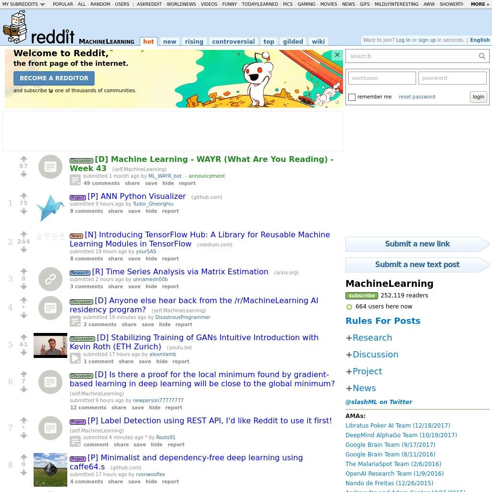

> #오늘의레딧 https://www.reddit.com/r/MachineLearning/ 정말 읽을 거리가 많네요.  1. ANN파이오스 비술화 라이저 2. TensorFlowHub도입:TensorFlow에서 재사용 가능한 시스템 학습 모듈을 위한 라이브러리 3. 매트릭스 추정을 통한 시계열 해석 4. 다른 누군가가 'AI'레지던트 프로그램에서 연락을 받은 적이 있나요? 5. 심층 학습에 기초한 학습 기반 학습에 의해 발견된 로컬 최소값이 글로벌 최소값에 근접할 수 있습니까? 6. RESTAPI를 사용하여 라벨 검색을 하고 싶습니다. 먼저 Reddit을 사용하도록 하겠습니다! 7. 종아리/4를 사용한 무한 확장자 및 독립형 심층 학습 8. 심층 학습 학습 무료 코스 9. 실시간 광고 차단 신경 네트워크에서 일하는 사람들이나 사전 훈련된 네트워크를 알고 있는 사람들은 광고를 인식할 수 있나요? 10. NUGGETNon-Linear항목별 활성화 11. 운명의 장난을 위해 Dataset이라는 이름을 붙였나요? 12. 새로운 주소를 알려 드리겠습니다:https://www.reddit.com/r/DeepGenerative 13. 아담의 최적화에 대한 명확화 14. 기계 학습 과정 15. PyTorch의 얼굴 검지기 모델을 이용한 얼굴 표정 형성 16. GAN을 사용하여 선택 캡션을 선택하시겠습니까? 17. NVIDIA가 거짓말을 하고 있습니까? 18. 기계 학습 소개 19. 텐서 플로우 기능을 수학적 표기법과 도해로 변환한다. 20. 우베르 우르타센이나 주빈 가라마니와 대화해 본 적이 있나요?  1. https://github.com/Prodicode/ann-visualizer 2. https://medium.com/tensorflow/introducing-tensorflow-hub-a-library-for-reusable-machine-learning-modules-in-tensorflow-cdee41fa18f9 3. https://arxiv.org/abs/1802.09064 4. https://www.reddit.com/r/MachineLearning/comments/88uv5o/d_anyone_else_hear_back_from_the_rmachinelearning/ 5. https://www.reddit.com/r/MachineLearning/comments/88r8yk/d_is_there_a_proof_for_the_local_minimum_found_by/ 6. https://www.reddit.com/r/MachineLearning/comments/88uxxb/p_label_detection_using_rest_api_id_like_reddit/ 7. https://github.com/dfouhey/caffe64 8. https://www.reddit.com/r/MachineLearning/comments/88h0g4/p_deep_reinforcement_learning_free_course/ 9. https://www.reddit.com/r/MachineLearning/comments/88l32o/p_anyone_working_on_reallife_ad_blocking_neural/ 10. http://smerity.com/arxiv.org/abs/1804.404/1804.404.html 11. https://www.reddit.com/r/MachineLearning/comments/88t5yj/d_ist_there_a_dataset_for_beautifulugly/ 12. https://www.reddit.com/r/MachineLearning/comments/88ki78/n_announcing_a_new_subreddit_rdeepgenerative/ 13. https://www.reddit.com/r/MachineLearning/comments/88ol1h/d_clarification_on_adam_optimization/ 14. http://ciml.info 15. https://jacobgil.github.io/deeplearning/hallucinating_faces_dlib_pytorch 16. https://www.reddit.com/r/MachineLearning/comments/88pbn7/d_image_captioning_using_gans/ 17. https://www.reddit.com/r/MachineLearning/comments/88q8p3/d_is_nvidia_lying/ 18. http://www.cs.huji.ac.il/%7Eshais/IML2014.html 19. http://blog.varunajayasiri.com/ml/tf_for_beginners.html 20. https://www.reddit.com/r/MachineLearning/comments/88jwau/d_has_anyone_spoken_with_raquel_urtasun_or_zoubin/

### 4월 3일 (화) 08:54 · 📷 사진 (1장)

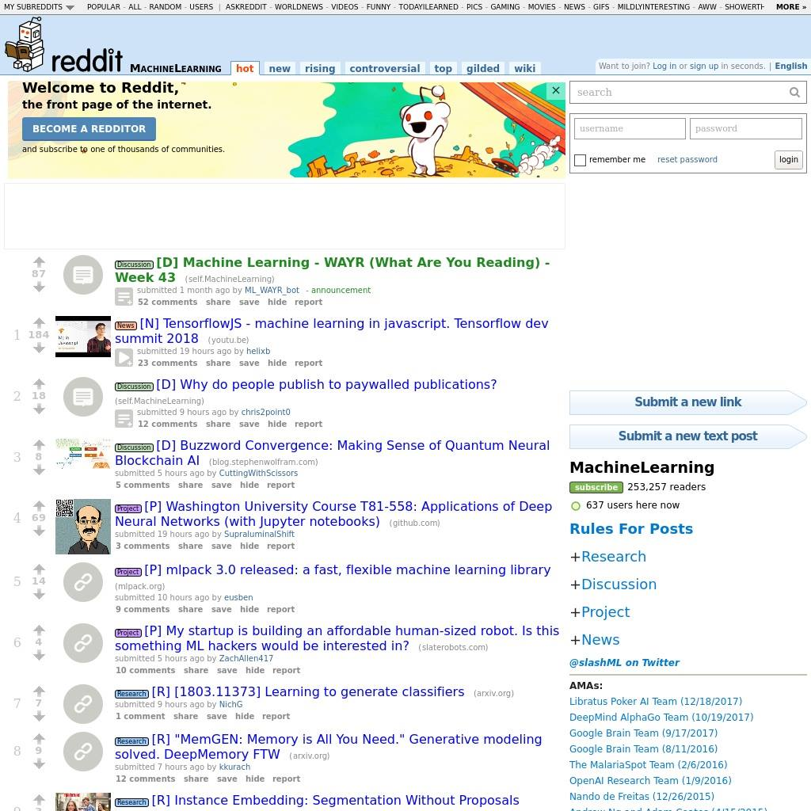

> #오늘의레딧 https://www.reddit.com/r/MachineLearning/ 정말 읽을 거리가 많네요.  1. TensorflowJS-Javascript에서 기계 학습. Tensorflow개발/개발 정상 회담 개최 2. 왜 사람들은 팔린 출판물에 게시하는가? 3. BuzzwordConverger:QuantumEarriveBlock의 의식을 분별하는 것 4. 워싱턴 대학교 과정 T1-558: 깊은 신경 회로망의 응용 5. ml 팩 3.0출시: 빠르고 유연한 기계 학습 라이브러리 6. 저의 스타트 업은 저렴한 크기의 인간용 로봇을 만드는 것입니다. 이것이 바로 해커들이 관심을 가질 만한 것일까요? 7. "메그겐:메모리는 여러분 모두에게 필요한 것입니다."세대 모델링이 해결되었습니다. 딥메모리 FTW 8. 인스턴스 예시:제안 없는 세분화 9. 매트릭스 추정을 통한 시계열 해석 10. 다른 누군가가 'AI'레지던트 프로그램에서 연락을 받은 적이 있나요? 11. 왜곡된 데이터 세트와 예측 모델을 분석하기 위한 접근 방식의 샘플링 기법 12. 데이터 분석을 위한 시스템 학습 플랫폼 13. ANN파이오스 비술화 라이저 14. 모멘텀과 아크루드를 결합한 것인가? 15. 위성 이미지 의미론적 분할에 관한 질문 16. 의료 분야에서의 아웃 소싱을 위한 개요 해석 17. 이 NNL아키텍처가 DRL에 비해 큽니까? 18. 강좌 수가 정해져 있지 않은 Conveyts를 훈련시키기 위한 올바른 전략은 무엇입니까? 19. RESTAPI를 사용하여 라벨 검색을 하고 싶습니다. 먼저 Reddit을 사용하도록 하겠습니다! 20. 스트로크 제어 가능한 빠른 스타일 전송(코드 및 용지에 대한 데이터 및 데이터 수집:0102.07101)  1. https://youtu.be/YB-kfeNIPCE 2. https://www.reddit.com/r/MachineLearning/comments/88zuk5/d_why_do_people_publish_to_paywalled_publications/ 3. http://blog.stephenwolfram.com/2018/04/buzzword-convergence-making-sense-of-quantum-neural-blockchain-ai/#more-16147 4. https://github.com/jeffheaton/t81_558_deep_learning 5. http://www.mlpack.org/gsocblog/mlpack-3-released.html 6. https://slaterobots.com/tr1 7. https://arxiv.org/abs/1803.11203 8. https://medium.com/@barvinograd1/instance-embedding-instance-segmentation-without-proposals-31946a7c53e1 9. https://arxiv.org/abs/1802.09064 10. https://www.reddit.com/r/MachineLearning/comments/88uv5o/d_anyone_else_hear_back_from_the_rmachinelearning/ 11. https://www.reddit.com/r/MachineLearning/comments/891rw3/d_sampling_techniques_for_a_skewed_data_set_and/ 12. https://towardsdatascience.com/machine-learning-platform-for-data-analysis-b7603dc3049 13. https://github.com/Prodicode/ann-visualizer 14. https://www.reddit.com/r/MachineLearning/comments/890i4n/d_combining_momentum_and_adagrad/ 15. https://www.reddit.com/r/MachineLearning/comments/88wqjp/d_question_regarding_satellite_image_semantic/ 16. https://www.reddit.com/r/MachineLearning/comments/88wsxb/r_interpretation_of_plots_for_outlier_detection/ 17. https://www.reddit.com/r/MachineLearning/comments/88y3mp/d_is_this_nn_architecture_big_for_drl/ 18. https://www.reddit.com/r/MachineLearning/comments/88xxpk/d_what_is_the_correct_strategy_for_training/ 19. https://www.reddit.com/r/MachineLearning/comments/88uxxb/p_label_detection_using_rest_api_id_like_reddit/ 20. https://github.com/LouieYang/stroke-controllable-fast-style-transfer

### 4월 4일 (수) 08:55 · 📷 사진 (1장)

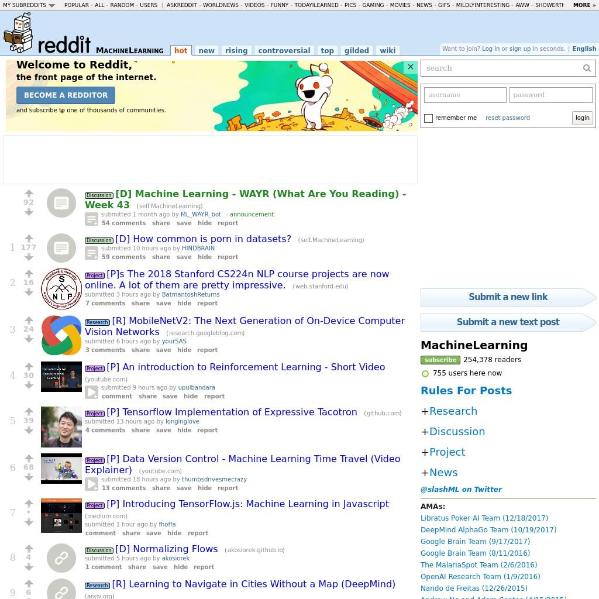

> #오늘의레딧 https://www.reddit.com/r/MachineLearning/ 재미난 이야기들이 많습니다.  1. 데이터 셋에서 포르노는 얼마나 흔한가? 2. 2018년 스탠퍼드 대학 CSPNLPNLP코스 프로젝트가 온라인으로 진행되고 있습니다. 그들 중 많은 사람들이 꽤 인상적이다. 3. MobileNetV2:차세대 컴퓨터 비전 컴퓨터 비전 네트워크 4. IMT20003GPP-보강 학습에의 소개- 짧은 비디오 5. 표현식 타이트론의 텐서 플로우 구현 6. 데이터 버전 제어-기계 학습 시간 여행(비디오 설명서) 7. TensorFlows소개:Javascript의 기계 학습 8. 정규화 흐름 9. 지도 없이 도시를 탐색하는 방법(DeepMind) 10. VAE에 대한 최신 모범 사례 11. Grapana를 사용하는 단일 시스템 또는 클러스터에 대한 GPU모니터링 도구 12. -Python에서 얼굴 인식 13. Tensorflow에서 3중 삼중 손실 및 온라인 Triplet채광 14. Keras및 TensorFlow의 다섯가지 비디오 분류 방법 15. 당신이 생각하기에 XX의 직업을 도울 수 있는 유용한 기성복이 무엇이라고 생각하십니까? 16. 애플의 A.I.I.I. 17. 마이크로 소프트사 18. 데이터 셋 분할 전후의 기능화 19. ML운영 환경 선택 20. 완전히 연결된 계층이 있는 깊은 네트워크에 대한 모범 사례  1. https://www.reddit.com/r/MachineLearning/comments/89dfg7/d_how_common_is_porn_in_datasets/ 2. http://web.stanford.edu/class/cs224n/reports.html 3. https://research.googleblog.com/2018/04/mobilenetv2-next-generation-of-on.html 4. https://www.youtube.com/watch?v=JgvyzIkgxF0&feature=em-uploademail 5. https://github.com/Kyubyong/expressive_tacotron 6. https://www.youtube.com/watch?v=4h6I9_xeYA4 7. https://medium.com/tensorflow/introducing-tensorflow-js-machine-learning-in-javascript-bf3eab376db 8. http://akosiorek.github.io/ml/2018/04/03/norm_flows.html 9. https://arxiv.org/abs/1804.00168 10. https://www.reddit.com/r/MachineLearning/comments/89f17m/d_current_best_practices_for_vaes/ 11. https://github.com/msalvaris/gpu_monitor 12. https://www.reddit.com/r/MachineLearning/comments/89ddag/d_face_recognition_in_python/ 13. https://omoindrot.github.io/triplet-loss 14. https://blog.coast.ai/five-video-classification-methods-implemented-in-keras-and-tensorflow-99cad29cc0b5 15. https://www.reddit.com/r/MachineLearning/comments/89j81s/d_what_you_think_are_useful_readtouse_solutions/ 16. https://www.nytimes.com/2018/04/03/business/apple-hires-googles-ai-chief.html 17. https://academy.microsoft.com/en-us/professional-program/tracks/artificial-intelligence/ 18. https://www.reddit.com/r/MachineLearning/comments/89ik21/d_featurization_before_or_after_dataset_splitting/ 19. https://www.reddit.com/r/MachineLearning/comments/89chaw/d_choosing_a_ml_production_environment/ 20. https://www.reddit.com/r/MachineLearning/comments/89fnzk/d_best_practices_for_deep_networks_with_fully/

### 4월 5일 (목) 09:26 · 📷 사진 (1장)

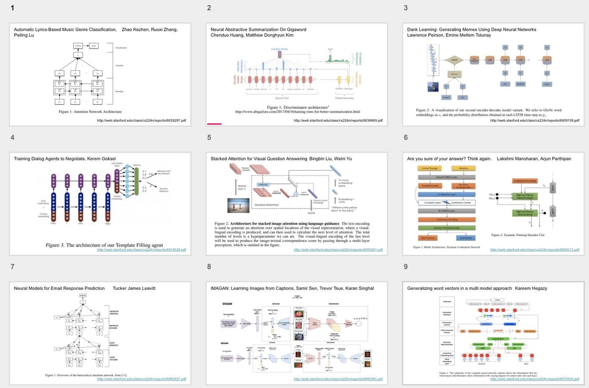

> 최근 스텐포드 DeepNLP (CS224n) 수업의 final project들이 공개 되었는데 한번 skim하면서 대략 넷트웍 구조만 모아 보았습니다. (일단 Custom Projects 완료. 나머지는 곧 추가 합니다.)  Attention은 무조건 사용하고 있고 사실 비슷비슷해서 대략 구조만 보면 뭐하는지 보실수 있습니다.  https://docs.google.com/presentation/d/1yg6fAW52GdyVaMm2ZvSGF3o2anR7RcXu-fAzeD7Uqts/edit#slide=id.p

### 4월 12일 (목) 10:46 · heading to the HKUST-NAVER AI day with o…

heading to the HKUST-NAVER AI day with our Executive Director Inho Kang, Jung-Woo Ha, Nako Sung, and Hanna Ryu. So exciting!!

http://www.cse.ust.hk/BDI/BD&AIDAY/big_data_ai_day_2018.html

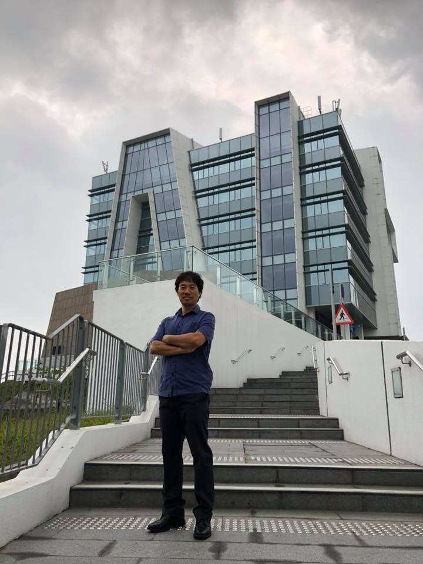 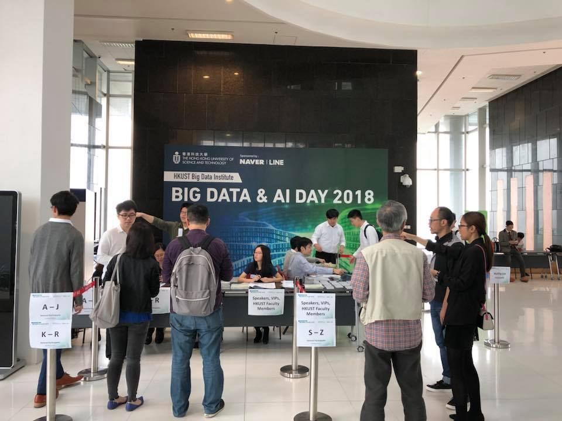 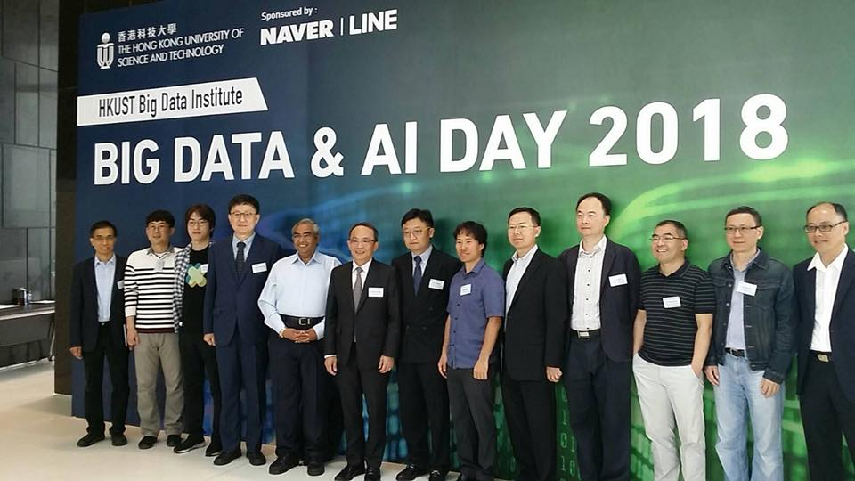 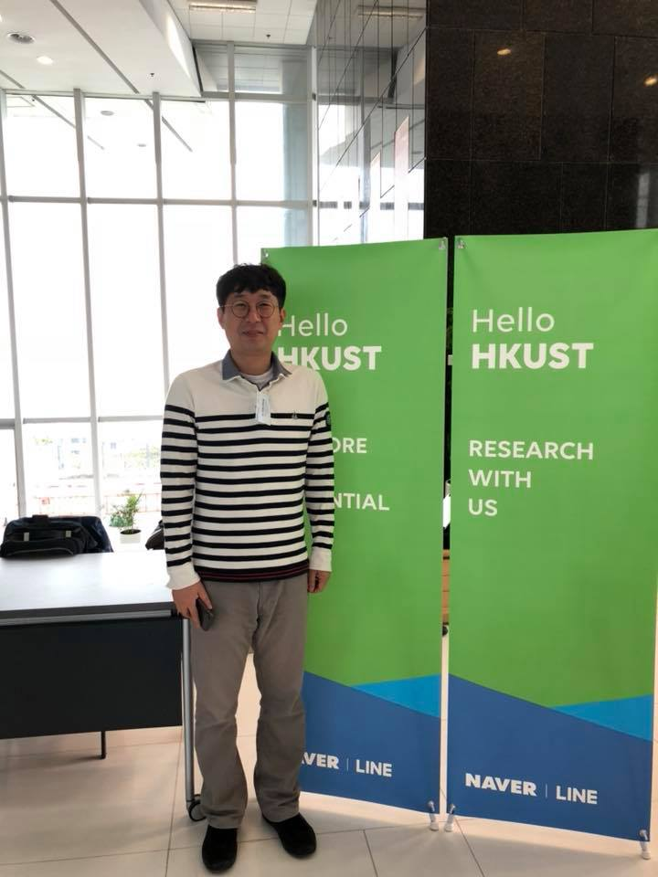 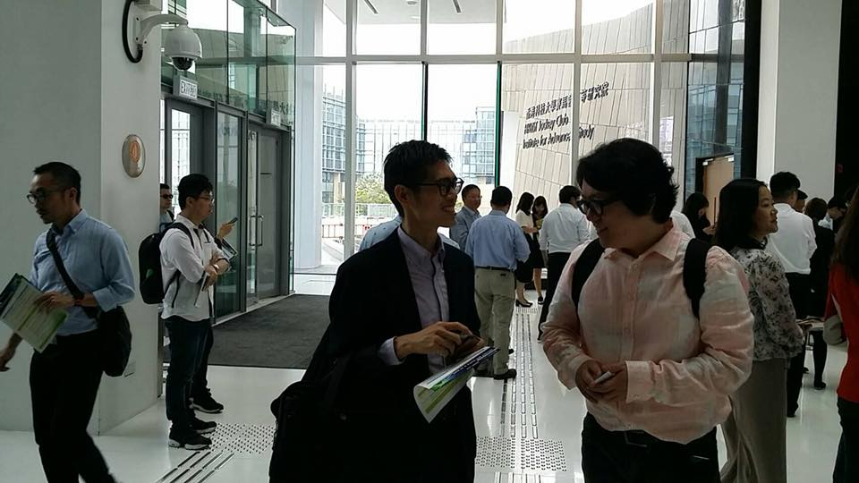 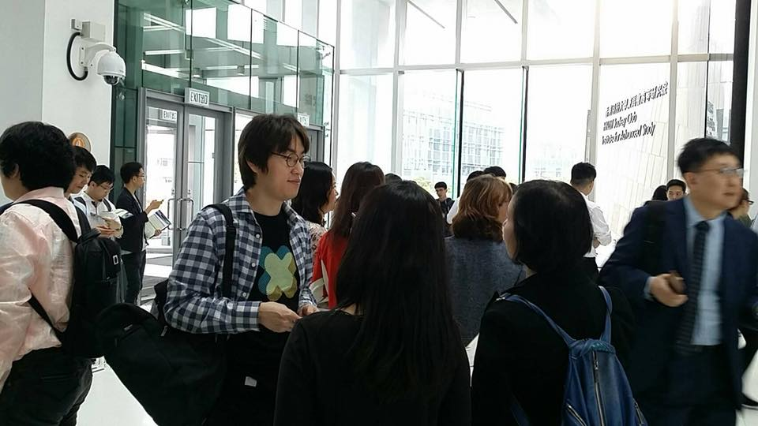

### 4월 13일 (금) 12:44 · We will have a joint AI lab with Naver/L…

We will have a joint AI lab with Naver/Line. If you are interested in, feel free to contact us. We can have fun AI projects with Naver/Line with dataset, infra, and mentoring support.

### 4월 14일 (토) 20:24 · Wonderful shopping experience in Hong Ko…

Wonderful shopping experience in Hong Kong!

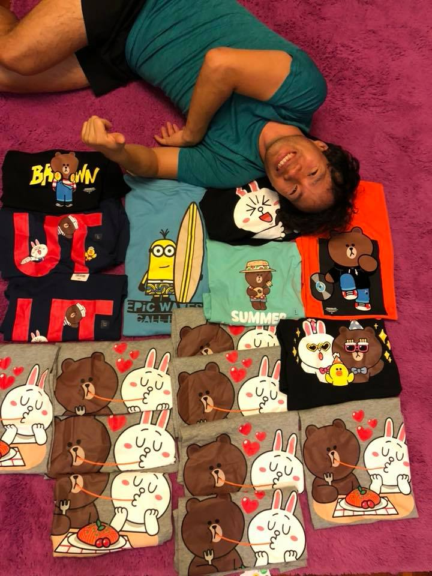  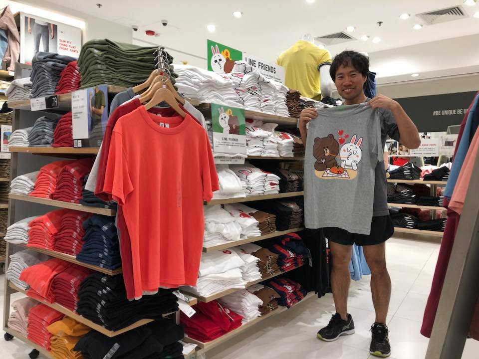 

### 4월 15일 (일) 21:05 · 📷 앨범: Profile pictures (1장)

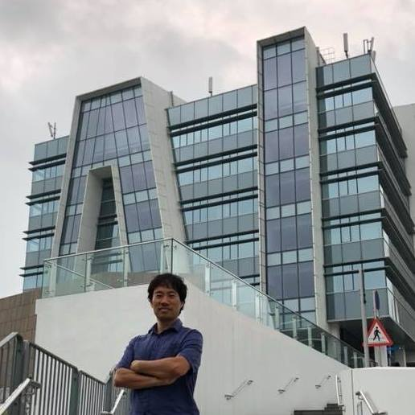

### 4월 20일 (금) 14:23 · Wonderful to meet Line CTO and Naver Sea…

Wonderful to meet Line CTO and Naver Search Leader at 2018 dev week global workshop.

 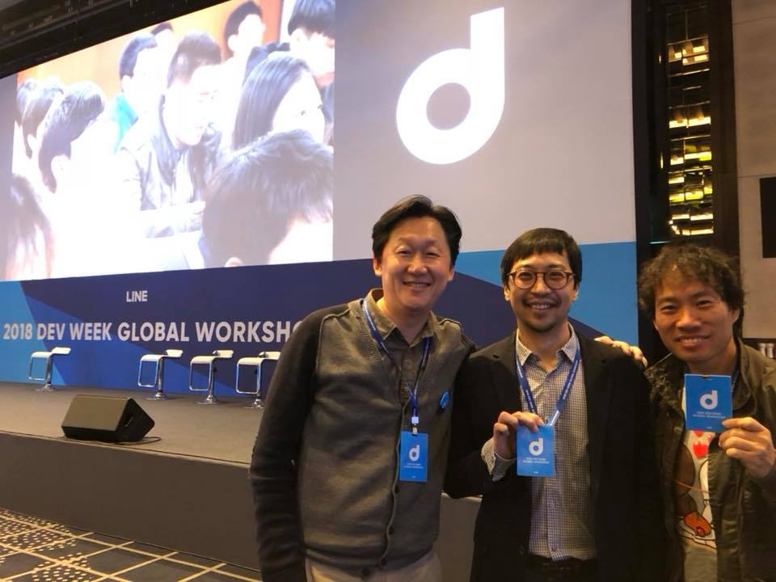 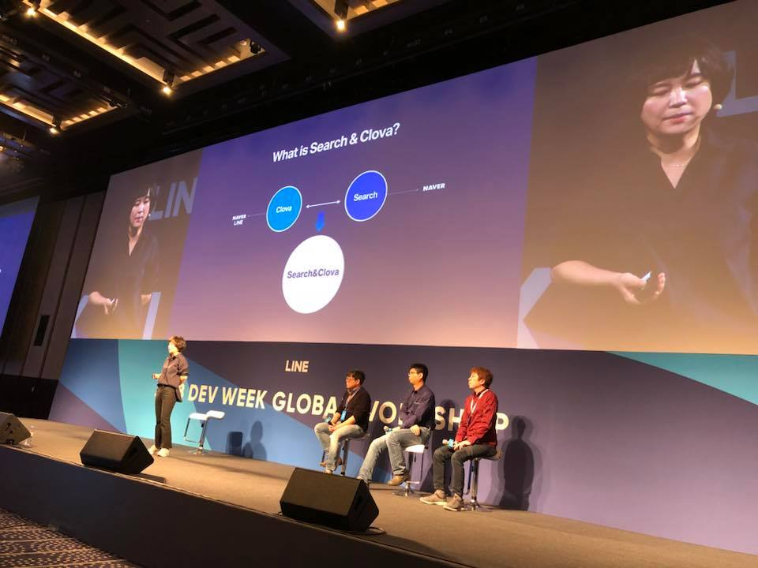 

### 4월 20일 (금) 19:55 · is planning to ride 600KM in 40 hours to…

is planning to ride 600KM in 40 hours tomorrow. It starts from Busan, stops by Mt. Jirisan, and finally comes back to Busan. It might be painful for the endless uphills (600m, 650m, and 500m), but should be really really fun.

http://www.korearandonneurs.kr/info-b600.htm

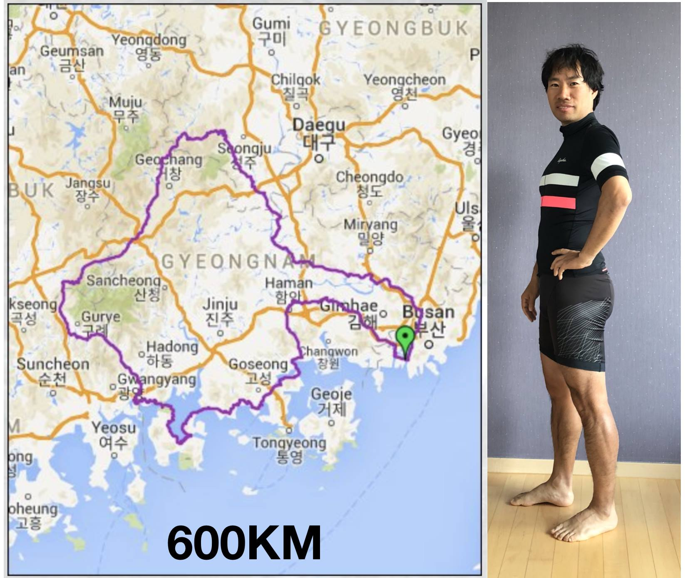 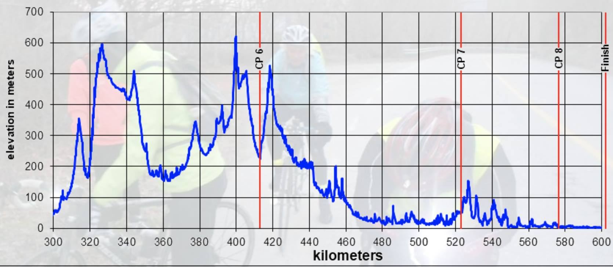

### 4월 27일 (금) 16:02 · So happy to see this. Look forward to de…

📍 Seoul, Korea

So happy to see this. Look forward to denuclearization.

### 4월 29일 (일) 16:06 · 📷 사진 (1장)

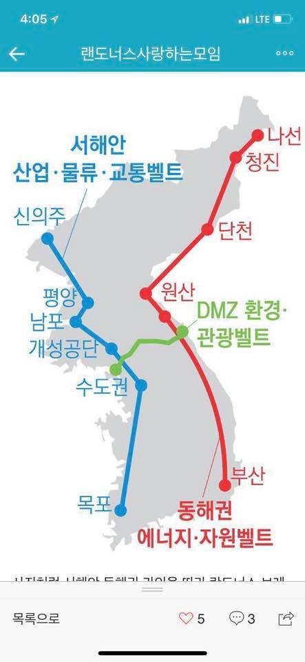

### 4월 30일 (월) 12:49 · Hot fashion items for this Summer! All h…

Hot fashion items for this Summer! All handmade by Yeon Gyoung Gwack. Amazing!

   
