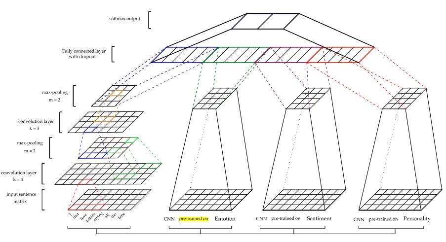
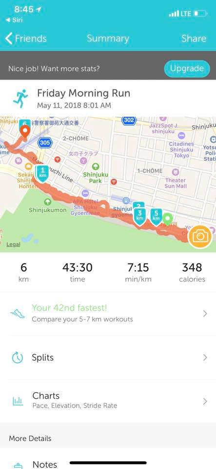
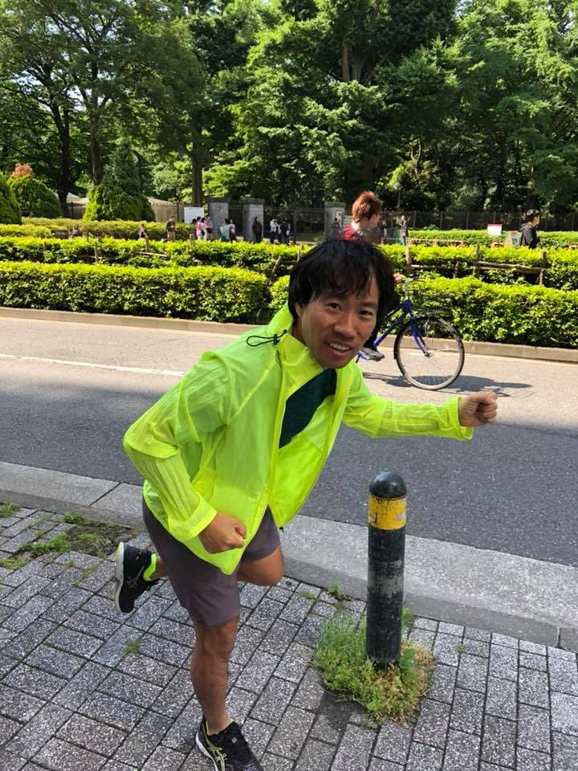
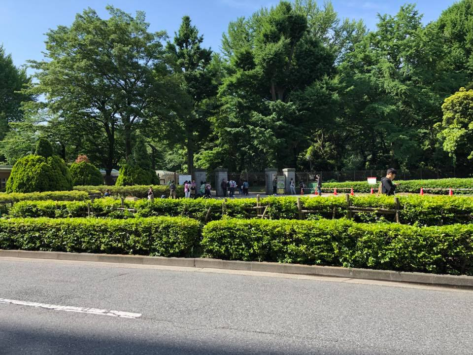
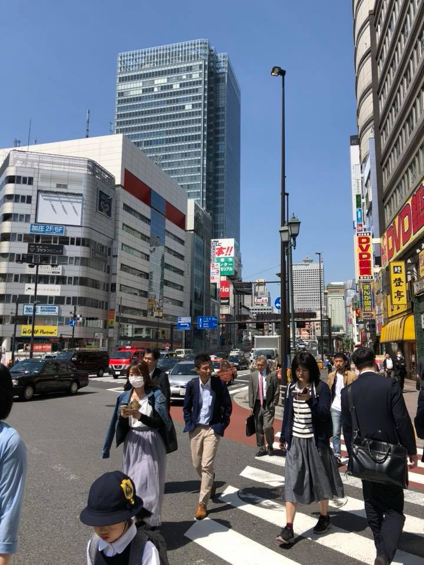

# 2018년 5월

[← 2018년](README.md)

### 5월 1일 (화) 06:08 · 📷 사진 (1장)

> #오늘의레딧 https://www.reddit.com/r/MachineLearning/ 오늘도 새소식이 많군요. 풍자를 검출하고 뉴스추천에 관한 소식도 살펴 보세요.  1. 딥 컨볼 루션 뉴럴 네트워크를 통한 풍자 검출 2. Einsum은 당신이 필요로하는 모든 것입니다 - Einstein Summation in Deep Learning 3. 실험주기를 어떻게 구성합니까? 4. 기계 학습, 딥 학습 및 데이터 과학의 원격 작업 전용 작업반 5. 조건부 DCGAN celebA 6. SynapticJS 및 ConvNetJS를 사용한 깊은 Q-Learning 소개 - Connect 4 AI 빌드 7. Gensim Survey 2018 | 희귀 한 기술 8. ICLR 2018의 Google 간행물 9. 추천 시스템을 사용하여 뉴스 보도에서 선택 편향을 모델링합니다. 10. 스크래치 텐서 라이브러리 (x-post https://www.reddit.com/r/neuralnetworks)에 대한 내 신경 net API에 대한 피드백 11. 튜토리얼 : NetworkX 및 python-louvain을 사용하여 Facebook 친구 네트워크 계획 12. ML에서 신경 네트워크 (및 RL)를 고려하지 않는 현재의 "뜨거운"연구는 무엇입니까? 13. 심도있는 자동 부호화 가우시안 혼합 모델의 Pytorch 구현 14. 반복적 인 신경망이 칼만 필터와 유사한 기능을 수행 할 수 있습니까? 15. ELBO 파생 변수의 의미와 차원? 16. ICLR 2018 실시간 스트림 17. PyTorch로 QANet 구현 18. "t-SNE이 단일 세포 데이터에 적용됩니까?"라는 특허가 필요합니까? 19. 다양한 이미지 데이터 세트의 모델 성능 비교 20. PyTorch 0.4.0, Google Brain Tokyo, QuickNLP, 다국어 NLU, PeerRead 데이터 세트, PyTorch GAN, ML 개방성, SGD 지구, Alzheimer 탐지 용 DL ...  1. https://medium.com/@ibelmopan/detecting-sarcasm-with-deep-convolutional-neural-networks-4a0657f79e80 2. https://rockt.github.com/2018/04/30/einsum 3. https://www.reddit.com/r/MachineLearning/comments/8fzn4y/d_how_do_you_structure_your_experimentation_cycles/ 4. https://remoteml.com/ 5. https://www.reddit.com/r/MachineLearning/comments/8g2irj/d_conditional_dcgan_celeba/ 6. https://blog.sicara.com/deep-q-learning-javascript-synaptic-convnet-connect-4-4dbdcd563d55 7. https://rare-technologies.com/gensim-survey-2018/ 8. https://research.googleblog.com/2018/04/google-at-iclr-2018.html 9. https://dtsbourg.github.io/thoughts/posts/selection-bias-oped 10. https://www.reddit.com/r/MachineLearning/comments/8fya5z/p_feedback_on_my_neural_net_api_for_my/ 11. https://ndres.me/post/friend-graph-tutorial/ 12. https://www.reddit.com/r/MachineLearning/comments/8g1jm9/d_whats_the_current_hot_research_in_ml_not/ 13. https://www.reddit.com/r/MachineLearning/comments/8g1cwb/p_pytorch_implementation_of_deep_autoencoding/ 14. https://www.reddit.com/r/MachineLearning/comments/8ft9zr/d_can_recurrent_neural_networks_perform_similar/ 15. https://www.reddit.com/r/MachineLearning/comments/8g17o2/d_meaning_and_dimension_of_variables_in_elbo/ 16. https://www.facebook.com/pg/iclr.cc/videos/ 17. https://www.reddit.com/r/MachineLearning/comments/8fwg0b/p_implementation_of_qanet_with_pytorch/ 18. https://patents.google.com/patent/US20140336942 19. https://www.reddit.com/r/MachineLearning/comments/8fy3oc/d_comparing_model_performance_on_different_image/ 20. https://medium.com/@ibelmopan/pytorch-0-4-0-aa48ec243d7

### 5월 7일 (월) 18:36 · Happy birthday!!

Happy birthday!!

### 5월 7일 (월) 18:36 · ↪ Happy birthday!!

*다른 프로필에 남긴 글*

Happy birthday!!

### 5월 11일 (금) 09:30 · Beautiful Shinjuku city run!

📍 LINE株式会社

Beautiful Shinjuku city run!

   
