# 2018년 6월

[← 2018년](README.md)

### 6월 7일 (목) 17:05 · 📷 사진 (1장)

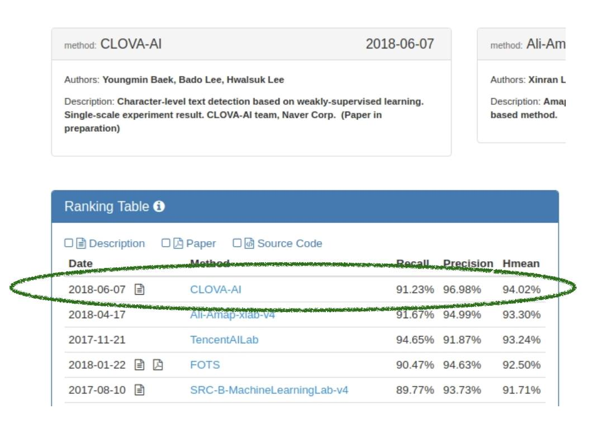
**이미지 캡션:** 이 이미지는 컴퓨터 비전 및 자연어 처리 분야의 연구 결과를 보여주는 스크린샷으로, 두 개의 주요 섹션으로 나눌 수 있습니다. 상단 섹션에는 두 가지 방법론에 대한 정보가 요약되어 있습니다. 왼쪽에는 "CLOVA-AI"라는 방법론이 2018년 6월 7일에 발표되었으며, 저자는 Youngmin Baek, Bado Lee, Hwalsuk Lee이고, 설명은 "약한 지도 학습 기반의 문자 수준 텍스트 탐지. 단일 스케일 실험 결과. CLOVA-AI 팀, 네이버 코퍼레이션 (준비 중인 논문)"이라고 되어 있습니다. 오른쪽에는 "Ali-Am"이라는 방법론이 있으며, 저자는 Xinran L이고, 설명은 "Amaj 기반 방법론"이라고 되어 있습니다. 하단 섹션은 "Ranking Table"이라는 제목의 표로, 다양한 방법론의 성능을 날짜, 방법론 이름, 재현율(Recall), 정밀도(Precision), Hmean 지표별로 비교하고 있습니다. 표에는 Description, Paper, Source Code를 나타내는 아이콘도 포함되어 있습니다. 녹색으로 강조된 부분은 2018년 6월 7일에 발표된 CLOVA-AI 방법론의 성능 지표인 재현율 91.23%, 정밀도 96.98%, Hmean 94.02%를 보여줍니다. 그 아래 줄에는 2018년 4월 17일에 발표된 Ali-Amap-xiab-v4 방법론의 성능 지표가 표시되어 있습니다. 이 이미지는 연구 발표 및 성능 비교를 위한 정보성 콘텐츠로, 전문적이고 기술적인 분위기를 띠고 있습니다.오른쪽에는 "Ali-Am"이라는 방법론이 있으며, 저자는 Xinran L이고, 설명은 "Amaj 기반 방법론"이라고 되어 있습니다. 하단 섹션은 "Ranking Table"이라는 제목의 표로, 다양한 방법론의 성능을 날짜, 방법론 이름, 재현율(Recall), 정밀도(Precision), Hmean 지표별로 비교하고 있습니다. 표에는 Description, Paper, Source Code를 나타내는 아이콘도 포함되어 있습니다. 녹색으로 강조된 부분은 2018년 6월 7일에 발표된 CLOVA-AI 방법론의 성능 지표인 재현율 91.23%, 정밀도 96.98%, Hmean 94.02%를 보여줍니다. 그 아래 줄에는 2018년 4월 17일에 발표된 Ali-Amap-xiab-v4 방법론의 성능 지표가 표시되어 있습니다. 이 이미지는 연구 발표 및 성능 비교를 위한 정보성 콘텐츠로, 전문적이고 기술적인 분위기를 띠고 있습니다.

> 제가 일하고 있는 Clova AI팀의 멋진 업데이터가 있어서 소개 드립니다. Hwalsuk Lee 님의 Clova AI Vision, OCR팀이 detection task 에서 세계기록을 갱신했습니다. http://rrc.cvc.uab.es/?ch=2&com=evaluation&task=1   기존의 방법과는 달리 글자별로 찾은 다음에 합치는 방식의 재미있는 아이디어로 이분야 최강자이던 중국 알리바바, 텐센트를 꺽고 세계 최고가 되었습니다. 그리고 공개된 기술 중 최고 수치인 92.50%보다 (CVPR2018 논문) 무려 1.5%정도 높은 점수를 냈습니다.   OCR은 detection, 이미지 처리, 언어모델로 딥러닝 모델들의 총아라고 할수 있고 매우 재미있는 활용이 가능한 분야입니다. 이 분야에 저희는 세계 최고를 달리고 있으며, 이제 2등과의 격차를 더 벌리기 위해 함께 하실 분들은 hwalsuk.lee@navercorp.com 으로 연락 주시면 됩니다.

### 6월 8일 (금) 08:39 · Voting done after jogging, and Yeon Gyou…

📍 Seongnam

Voting done after jogging, and Yeon Gyoung Gwack is so happy.

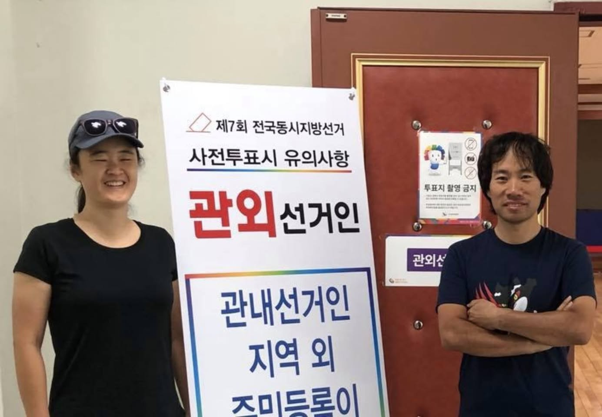
**이미지 캡션:** 사진에는 성인 여성 한 명과 성인 남성 한 명이 서 있다. 여성은 20대 후반에서 30대 초반으로 보이며, 파란색 야구모자와 선글라스를 착용하고 검은색 반팔 티셔츠를 입고 있다. 그녀는 활짝 웃으며 카메라를 향해 서 있다. 남성은 30대 중반으로 보이며, 검은색 반팔 티셔츠를 입고 팔짱을 낀 채 카메라를 향해 미소를 짓고 있다. 두 사람 뒤에는 "제7회 전국동시지방선거 사전투표시 유의사항"이라고 적힌 큰 현수막이 걸려 있으며, 현수막에는 "관외선거인"과 "관내선거인 지역 외 주민등록이"라는 글자가 쓰여 있다. 현수막 옆 벽에는 "투표지 촬영 금지"라는 문구가 적힌 작은 안내문이 붙어 있다. 배경은 실내이며, 벽은 연한 베이지색이고 문은 갈색이다. 전반적으로 투표소에서 선거 홍보물을 배경으로 찍은 사진으로 보인다. 현수막 옆 벽에는 "투표지 촬영 금지"라는 문구가 적힌 작은 안내문이 붙어 있다. 배경은 실내이며, 벽은 연한 베이지색이고 문은 갈색이다. 전반적으로 투표소에서 선거 홍보물을 배경으로 찍은 사진으로 보인다.

### 6월 12일 (화) 10:05 · Amazing moment! Peace!!

Amazing moment! Peace!!

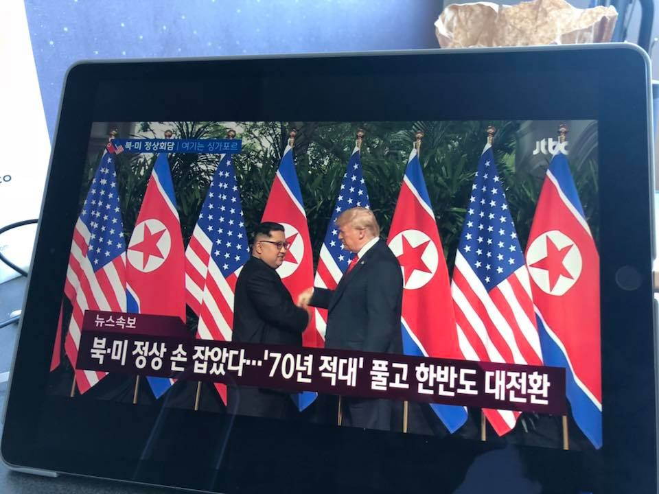
**이미지 캡션:** 태블릿 PC 화면에는 북한과 미국 국기가 나란히 걸려 있고, 김정은으로 보이는 성인 남성과 도널드 트럼프로 보이는 성인 남성이 악수하는 모습이 담긴 뉴스 화면이 보인다. 김정은은 검은색 양복을 입고 있으며, 트럼프는 파란색 양복에 흰색 셔츠와 빨간색 넥타이를 착용하고 있다. 두 사람 모두 진지한 표정으로 악수를 하고 있으며, 배경에는 푸른 나무들이 보인다. 화면 하단에는 "뉴스속보 북·미 정상 손 잡았다…'70년 적대' 풀고 한반도 대전환"이라는 한국어 자막이 표시되어 있다. 전반적으로 역사적인 순간을 포착한 뉴스 보도 화면으로, 긴장 완화와 평화에 대한 기대를 나타내는 분위기이다. 뉴스 보도 화면으로, 긴장 완화와 평화에 대한 기대를 나타내는 분위기이다.
 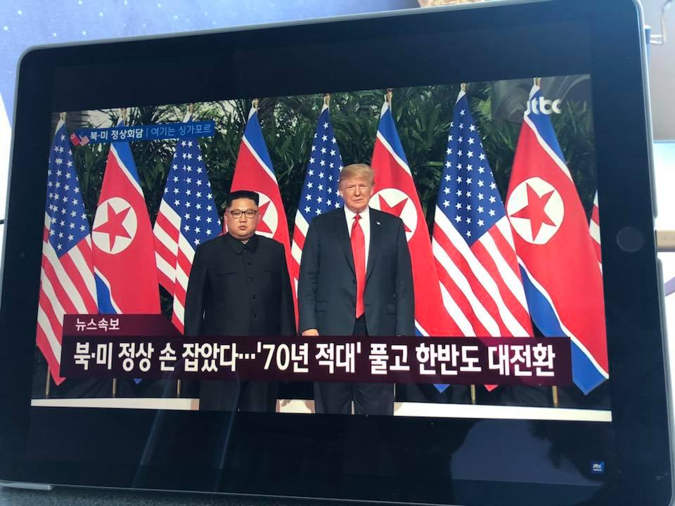
**이미지 캡션:** 태블릿 PC 화면에 북한과 미국의 국기가 나란히 걸린 배경 앞에서 두 명의 남성이 서 있는 모습이 담겨 있으며, 왼쪽에는 검은색 인민복을 입은 성인 남성이 안경을 쓰고 무표정한 표정으로 정면을 응시하고 있고, 오른쪽에는 파란색 정장에 빨간색 넥타이를 맨 백인 성인 남성이 역시 정면을 바라보고 있다. 화면 하단에는 '뉴스속보'라는 글자와 함께 '북·미 정상 손 잡았다…'70년 적대' 풀고 한반도 대전환'이라는 한국어 자막이 표시되어 있어 북미 정상회담 관련 뉴스를 보도하는 장면임을 알 수 있다. 전반적으로 진지하고 중요한 사건을 다루는 뉴스 보도의 분위기를 띤다.하고 중요한 사건을 다루는 뉴스 보도의 분위기를 띤다.

### 6월 16일 (토) 18:09 · 📷 사진 (1장)

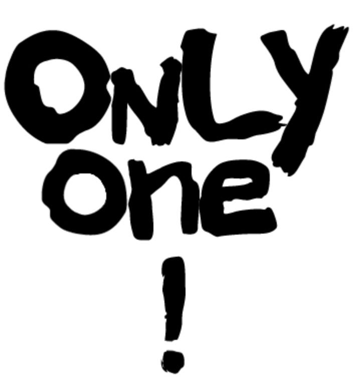
**이미지 캡션:** 이 이미지는 흰색 배경에 검은색 붓글씨로 쓰여진 "ONLY one !"이라는 문구를 보여줍니다. "ONLY"는 위쪽에, "one"은 그 아래에, 그리고 느낌표 "!"는 "one" 아래에 있습니다. 글씨체는 거칠고 불규칙하며, 마치 붓으로 빠르게 쓴 듯한 느낌을 줍니다. 사람, 장소, 사물은 보이지 않으며, 텍스트만으로 구성된 그래픽입니다. 분위기는 강렬하고 단호하며, "오직 하나뿐"이라는 메시지를 강조하는 듯합니다.

> 머신러닝/딥러닝이 아름답다는 것을 보여주는 하나를 꼽으라면 여러분들은 무엇을 꼽으시겠습니까? 아주 재미난 질문입니다.  이 댓글에는 (대략)  * GAN/InfoGAN/Wasserstein GAN/StarGAN * A Unifying Review of Linear Gaussian Models * A Neural Algorithm of Artistic Style  * Rapid Object Detection using a Boosted Cascade of Simple Features * Word2Vec * Wavenet/Parallel WaveNet * Active One-shot Learning * YOLO * Show, Attend, and Tell * RN * End to End Learning for Self-Driving Cars  등인데 여러분들은 어떠세요? 우리도 댓글 100개 기대해봅니다. ^^  https://www.reddit.com/r/MachineLearning/comments/8kbmyn/d_if_you_had_to_show_one_paper_to_someone_to_show/

### 6월 18일 (월) 12:07 · 지난 6월초 커넥트재단의 초청으로 그린팩토리에서 양일간 NLP의 지존이신…

지난 6월초 커넥트재단의 초청으로 그린팩토리에서 양일간 NLP의 지존이신 Kyunghyun Cho 교수님의 강좌가 있었는데요. 많은 분들이 신청하였지만 자리가 한정되어 모두 모시지 못했습니다. 비디오 강의는 커넥트재단 (http://www.edwith.org/) 에서 7월중 공유할 예정인데요.

그때까지 기다리시기 힘드시거나 예습하실 분들은 슬라이드 먼 참고 하세요.

https://drive.google.com/file/d/1JUpXPchZVXe0wkAiYLKf8ySXcGRpnU7M/view

이번 여름 NLP는 잡고 갑니다!

### 6월 19일 (화) 09:52 · 📷 사진 (1장)

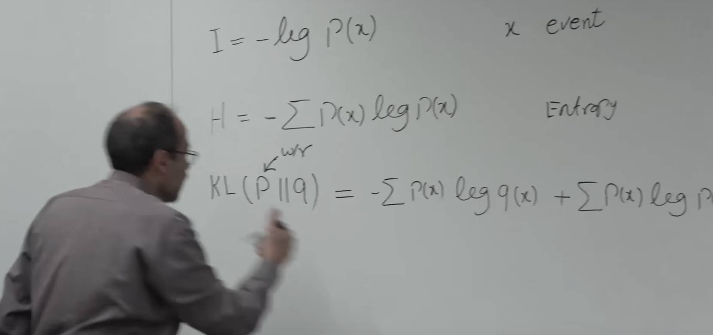
**이미지 캡션:** 이 사진은 흰색 칠판 앞에서 강의를 하고 있는 성인 남성을 보여줍니다. 남성은 40대 후반에서 50대 초반으로 보이며, 머리카락이 약간 벗겨졌고 안경을 쓰고 있습니다. 그는 회색 셔츠를 입고 있으며, 칠판에 쓰여진 수학 공식을 가리키고 있습니다. 칠판에는 정보 이론과 관련된 공식들이 적혀 있는데, 'I = -log P(x)', 'H = - Σ P(x) log P(x)', 그리고 'KL(P||q) = - Σ P(x) log q(x) + Σ P(x) log P(x)'와 같은 수식이 보입니다. 또한 'x event'와 'Entropy'라는 단어도 쓰여 있습니다. 남성의 표정은 집중하고 있으며, 강의에 열중하는 모습입니다. 배경은 강의실의 일부로 보이며, 칠판 외에는 특별한 사물은 보이지 않습니다. 전반적으로 학술적인 분위기를 풍기는 장면입니다.'와 'Entropy'라는 단어도 쓰여 있습니다. 남성의 표정은 집중하고 있으며, 강의에 열중하는 모습입니다. 배경은 강의실의 일부로 보이며, 칠판 외에는 특별한 사물은 보이지 않습니다. 전반적으로 학술적인 분위기를 풍기는 장면입니다.

> I, information, H, entropy, KL divergence 를 매우 직감적으로 설명해주는 장면. 기본 건셉을 설명한후, VAE에 대해 설명해주십니다. 이분야 최고 강의가 아닐까 생각합니다.  https://www.youtube.com/watch?v=uaaqyVS9-rM  아래 어떤분이 남긴 커멘트에 완전 공감합니다.  Anil Kumar "By far the best on VAE. I'm really impressed by the clarity with which prof is teaching. Thanks for Uploading."

### 6월 27일 (수) 22:57 · We are ready to win! Thomas Zimmermann a…

We are ready to win! Thomas Zimmermann are you ready?

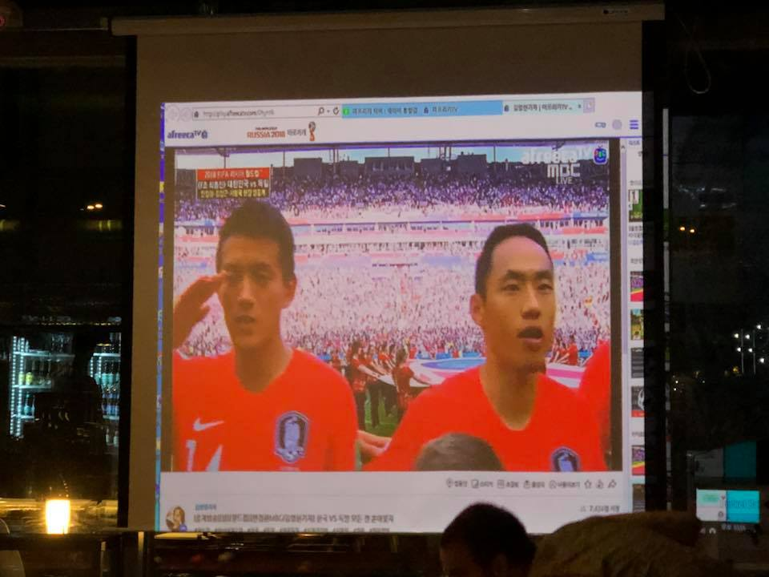
**이미지 캡션:** 이 사진은 프로젝터 화면에 비친 축구 경기 중계 화면을 담고 있으며, 화면에는 두 명의 성인 남성 축구 선수와 경기장 풍경이 보인다. 왼쪽 선수는 20대 후반에서 30대 초반으로 보이며, 짧은 검은색 머리에 옅은 미소를 띠고 있으며, 오른손으로 경례하는 듯한 포즈를 취하고 있다. 붉은색 축구 유니폼을 입고 있으며, 유니폼에는 태극 문양과 숫자 14가 새겨져 있다. 오른쪽 선수는 30대 초반에서 중반으로 보이며, 짧은 검은색 머리에 입을 살짝 벌리고 무언가를 말하려는 듯한 표정이다. 역시 붉은색 축구 유니폼을 입고 있으며, 유니폼에는 태극 문양이 보인다. 배경에는 수많은 관중으로 가득 찬 축구 경기장이 펼쳐져 있으며, 경기장에는 붉은색과 흰색 옷을 입은 사람들이 보인다. 화면 상단에는 "afreecatv", "RUSSIA 2018 FIFA 월드컵", "MBC LIVE" 등의 텍스트가 보이며, 경기 정보로 보이는 "2018 FIFA 월드컵 대한민국 vs 독일"이라는 텍스트도 확인할 수 있다. 사진의 전반적인 분위기는 스포츠 경기를 관람하며 응원하는 듯한 활기찬 느낌을 준다. 화면이 비치는 장소는 어두운 실내로 보이며, 프로젝터 화면 외에는 어렴풋이 보이는 테이블과 의자, 그리고 어두운 배경이 보인다.입고 있으며, 유니폼에는 태극 문양이 보인다. 배경에는 수많은 관중으로 가득 찬 축구 경기장이 펼쳐져 있으며, 경기장에는 붉은색과 흰색 옷을 입은 사람들이 보인다. 화면 상단에는 "afreecatv", "RUSSIA 2018 FIFA 월드컵", "MBC LIVE" 등의 텍스트가 보이며, 경기 정보로 보이는 "2018 FIFA 월드컵 대한민국 vs 독일"이라는 텍스트도 확인할 수 있다. 사진의 전반적인 분위기는 스포츠 경기를 관람하며 응원하는 듯한 활기찬 느낌을 준다. 화면이 비치는 장소는 어두운 실내로 보이며, 프로젝터 화면 외에는 어렴풋이 보이는 테이블과 의자, 그리고 어두운 배경이 보인다.
 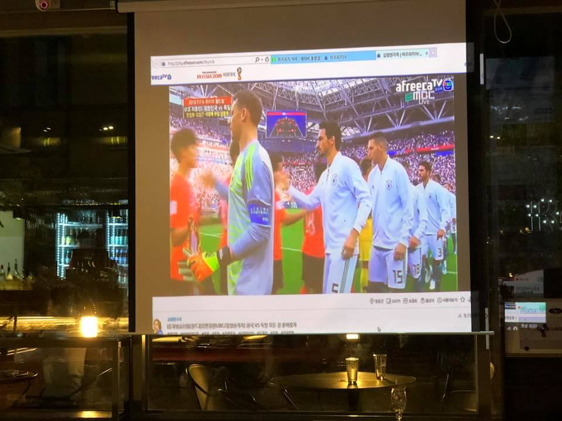
**이미지 캡션:** 이 사진은 축구 경기 중계 화면을 프로젝터로 비추고 있는 실내 공간을 보여준다. 화면에는 두 명의 축구 선수들이 서로 마주보고 악수하는 모습이 담겨 있으며, 한 선수는 주황색 유니폼을, 다른 선수는 흰색 유니폼을 입고 있다. 흰색 유니폼을 입은 선수들은 독일 대표팀으로 보이며, 등번호 15번과 18번이 보인다. 화면 상단에는 afreecaTV와 MBC LIVE 로고가 보이며, 러시아 2018 월드컵 중계임을 알 수 있다. 화면 하단에는 경기 결과와 관련된 텍스트가 한국어로 표시되어 있다. 배경에는 관중석으로 보이는 붉은색 좌석들이 보이며, 경기장의 모습이 생생하게 전달된다. 사진의 전반적인 분위기는 축구 경기를 시청하며 응원하는 듯한 역동적인 느낌을 준다. 프로젝터가 비추는 화면 외에는 어두운 실내 공간이 보이며, 테이블 위에는 두 개의 맥주잔이 놓여 있어 편안한 분위기에서 경기를 관람하고 있음을 짐작게 한다.보이는 붉은색 좌석들이 보이며, 경기장의 모습이 생생하게 전달된다. 사진의 전반적인 분위기는 축구 경기를 시청하며 응원하는 듯한 역동적인 느낌을 준다. 프로젝터가 비추는 화면 외에는 어두운 실내 공간이 보이며, 테이블 위에는 두 개의 맥주잔이 놓여 있어 편안한 분위기에서 경기를 관람하고 있음을 짐작게 한다.

### 6월 28일 (목) 01:02 · Won!!

Won!!

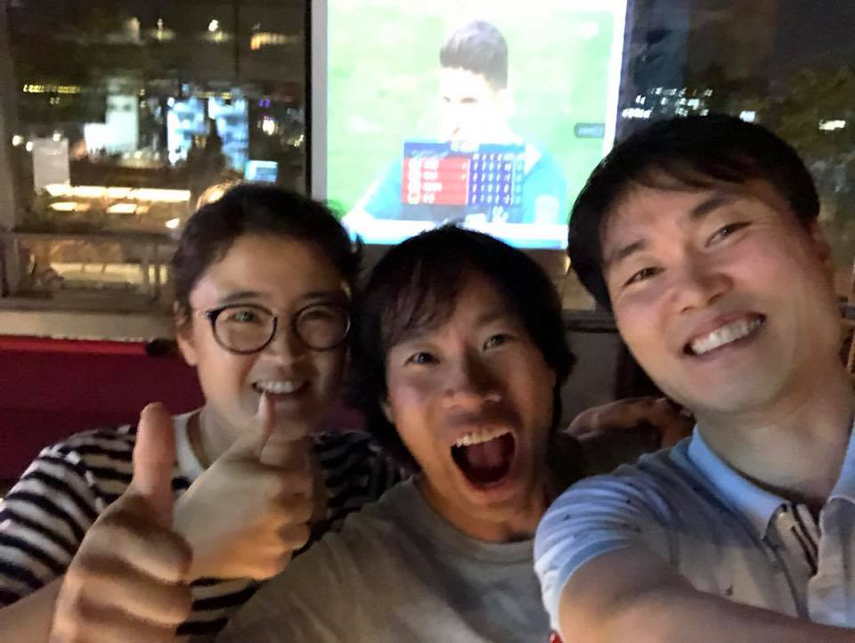
**이미지 캡션:** 사진에는 세 명의 젊은 성인 남녀가 등장하며, 모두 밝고 즐거운 표정을 짓고 있다. 왼쪽 여성은 검은색 테 안경을 쓰고 있으며, 흰색과 검은색 줄무늬 티셔츠를 입고 엄지손가락을 치켜들고 있다. 가운데 남성은 회색 티셔츠를 입고 입을 크게 벌린 채 환하게 웃고 있으며, 오른쪽 남성은 밝은 회색 폴로셔츠를 입고 카메라를 향해 활짝 웃고 있다. 배경에는 큰 스크린이 보이며, 스크린에는 축구 선수로 보이는 인물이 비춰지고 있다. 스크린 뒤로는 밤에 불이 켜진 도시의 풍경이 희미하게 보인다. 또한, 왼쪽에는 당구대가 일부 보이는 것으로 보아 실내 또는 야외 바와 같은 장소로 추정된다. 전반적으로 친구들과 함께 즐거운 시간을 보내고 있는 듯한 활기찬 분위기이다.일부 보이는 것으로 보아 실내 또는 야외 바와 같은 장소로 추정된다. 전반적으로 친구들과 함께 즐거운 시간을 보내고 있는 듯한 활기찬 분위기이다.
 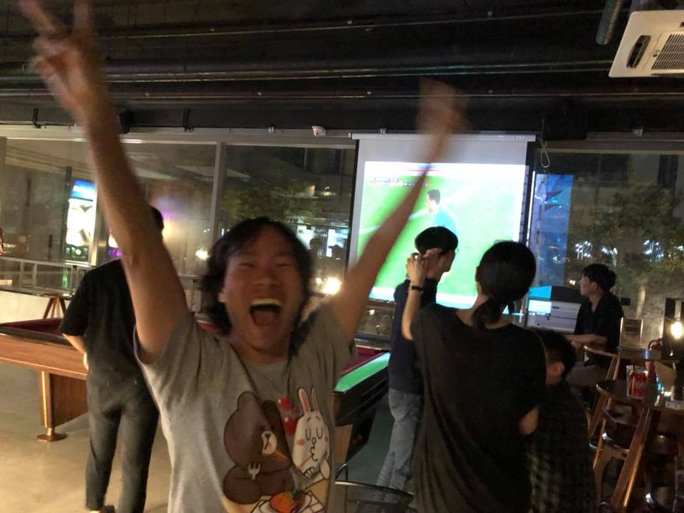
**이미지 캡션:** 이 사진은 실내에서 여러 사람이 함께 축구 경기를 관람하며 즐거워하는 모습을 담고 있습니다. 전경에는 한 성인 남성이 두 팔을 번쩍 들고 환호하며 V자 포즈를 취하고 있습니다. 그는 30대 정도로 보이며, 검은색 머리카락에 활짝 웃는 표정을 짓고 있습니다. 회색 반팔 티셔츠에는 갈색 곰과 토끼 캐릭터가 그려져 있습니다. 배경에는 스크린에 축구 경기가 상영되고 있으며, 여러 사람들이 경기를 시청하고 있습니다. 스크린 앞에는 두 명의 사람이 서서 경기를 보고 있고, 그 뒤로도 몇몇 사람들이 테이블에 앉아 있습니다. 장소는 바 또는 펍으로 추정되며, 당구대와 테이블, 의자 등이 보입니다. 전반적으로 활기차고 즐거운 분위기입니다.. 장소는 바 또는 펍으로 추정되며, 당구대와 테이블, 의자 등이 보입니다. 전반적으로 활기차고 즐거운 분위기입니다.
 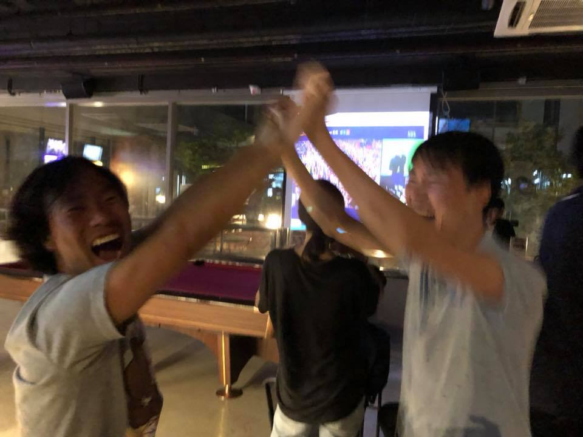
**이미지 캡션:** 사진에는 두 명의 성인 남성이 하이파이브를 하며 환호하고 있다. 왼쪽 남성은 20대 초중반으로 보이며, 검은색 짧은 머리에 밝은 회색 반팔 티셔츠를 입고 있다. 입을 크게 벌리고 환하게 웃으며 매우 기뻐하는 표정이다. 오른쪽 남성 역시 20대 초중반으로 추정되며, 검은색 짧은 머리에 하늘색 반팔 티셔츠를 입고 있다. 그의 얼굴은 약간 흐릿하지만, 역시 기쁨에 찬 표정으로 왼쪽 남성과 함께 하이파이브를 하고 있다. 배경에는 당구대가 보라색 천으로 덮여 있고, 그 뒤로는 스크린에 무언가 영상이 상영되고 있다. 실내 조명과 창밖의 어두운 풍경으로 보아 저녁 시간대이며, 술집이나 당구장 같은 여가 시설로 추정된다. 전반적으로 매우 즐겁고 흥겨운 분위기이다.내 조명과 창밖의 어두운 풍경으로 보아 저녁 시간대이며, 술집이나 당구장 같은 여가 시설로 추정된다. 전반적으로 매우 즐겁고 흥겨운 분위기이다.
