# 2018년 7월

[← 2018년](README.md)

### 7월 10일 (화) 23:02 · 📷 사진 (1장)

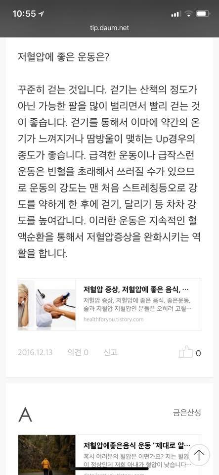
**이미지 캡션:** 화면 상단에는 시간 10:55와 와이파이, 배터리 잔량이 표시되어 있고, 웹사이트 주소 tip.daum.net이 보인다. 그 아래에는 "저혈압에 좋은 운동은?"이라는 제목과 함께 저혈압에 좋은 운동으로 꾸준히 걷기를 추천하는 내용이 담긴 글이 있다. 걷기는 산책 정도가 아닌 팔을 많이 벌리며 빨리 걷는 것이 좋고, 이마에 온기가 느껴지거나 땀이 맺힐 정도의 강도가 적당하다고 설명한다. 급격하거나 급작스러운 운동은 빈혈을 유발할 수 있으므로, 처음에는 스트레칭 등으로 강도를 약하게 시작하여 점차 걷기, 달리기 등으로 강도를 높여가는 것이 좋다고 한다. 이러한 운동은 혈액순환을 도와 저혈압 증상을 완화하는 데 도움이 된다고 한다. 글 아래에는 "저혈압 증상, 저혈압에 좋은 음식,..."이라는 제목의 관련 콘텐츠 미리보기와 함께 healthforyou.tistory.com이라는 출처가 표시되어 있다. 그 아래에는 날짜 2016.12.13, 의견 0, 신고, 그리고 좋아요 표시와 함께 0이라는 숫자가 보인다. 화면 하단에는 큰 글씨로 'A'가 있고, 그 옆에는 '금은산성'이라는 글자가 있다. 그 아래에는 "저혈압에좋은음식 운동 "제대로 알..."이라는 제목의 또 다른 콘텐츠 미리보기가 있으며, "혹시 여러분의 혈압은 어떤가요? 저는 혈압이 정상인데 저희 아내가 혈압이 낮습니다..."라는 내용이 일부 보인다. 오른쪽 하단에는 위쪽을 가리키는 화살표 아이콘이 있다.등으로 강도를 높여가는 것이 좋다고 한다. 이러한 운동은 혈액순환을 도와 저혈압 증상을 완화하는 데 도움이 된다고 한다. 글 아래에는 "저혈압 증상, 저혈압에 좋은 음식,..."이라는 제목의 관련 콘텐츠 미리보기와 함께 healthforyou.tistory.com이라는 출처가 표시되어 있다. 그 아래에는 날짜 2016.12.13, 의견 0, 신고, 그리고 좋아요 표시와 함께 0이라는 숫자가 보인다. 화면 하단에는 큰 글씨로 'A'가 있고, 그 옆에는 '금은산성'이라는 글자가 있다. 그 아래에는 "저혈압에좋은음식 운동 "제대로 알..."이라는 제목의 또 다른 콘텐츠 미리보기가 있으며, "혹시 여러분의 혈압은 어떤가요? 저는 혈압이 정상인데 저희 아내가 혈압이 낮습니다..."라는 내용이 일부 보인다. 오른쪽 하단에는 위쪽을 가리키는 화살표 아이콘이 있다.

### 7월 14일 (토) 07:41 · 📷 사진 (1장)

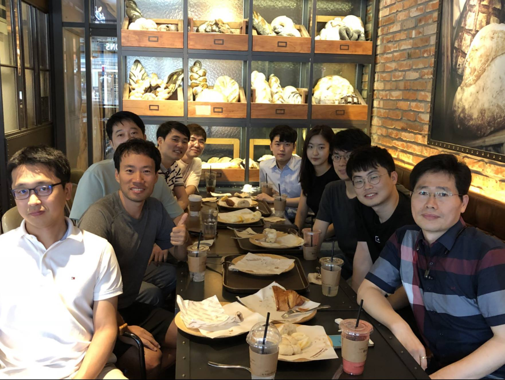
**이미지 캡션:** 이 사진은 빵집으로 보이는 장소에서 여러 명이 함께 찍은 단체 사진입니다. 사진에는 총 9명의 사람이 보이며, 대부분 성인 남성이며 한 명의 성인 여성이 있습니다. 앞줄 왼쪽부터 성인 남성 한 명은 흰색 폴로 셔츠를 입고 안경을 착용했으며, 미소를 짓고 있습니다. 그 옆에는 회색 반팔 티셔츠를 입은 성인 남성이 엄지척 포즈를 취하며 환하게 웃고 있습니다. 그 뒤로는 여러 명의 성인 남성과 한 명의 성인 여성이 앉아 있으며, 모두 편안한 복장을 하고 있습니다. 배경에는 빵이 진열된 선반과 벽돌 벽이 보이며, 테이블 위에는 빵, 음료, 접시 등이 놓여 있어 식사 중이거나 디저트를 즐기는 상황으로 보입니다. 전반적으로 밝고 편안한 분위기입니다.이블 위에는 빵, 음료, 접시 등이 놓여 있어 식사 중이거나 디저트를 즐기는 상황으로 보입니다. 전반적으로 밝고 편안한 분위기입니다.

> [간담회: 딥러닝관련 개발/연구직군 취업을 위해 무엇을 준비해야 할까?]  4줄요약: 이런 간담회 한번 해볼까요? 장소 어디 할까요? 패널로 참여하실분 자원 받습니다. 100개 댓글 가능할까요?  길고 재미있는 버전: 판교의 아침 (https://onoffmix.com/event/141495) 2번째 모임을 하다 보니 많은 분들의 화두가 딥러닝/AI개발/연구 직군을 위해 어떤 준비를 해야 하고 어떤 자격을 보고 뽑느냐 하는 것입니다. 이번 2번째 모임 (아래 사진)을 보면 특히 Jae Boum Kim (전 카카오 ai 팀장), Kyubyong Park (카카오 브레인) 등이 참여해서 그런지 매우 좋은 질문, 그리고 좋은 답변이 나왔습니다.  그래서 이런 질문을 가진 분들이 많으실듯 하니 김재범, Kyubyong Park, Soonson Kwon, Hwalsuk Lee님 같은 이분야 리더들을 모시고 간담회 (한시간 정도) + 쇼설 치맥/피자파티 정도 해보면 어떨까 하는데 멤버님들 의견은 어떠세요?  장소는 어디가 좋을지? 패널로 참여하실 분들은 자원해주세요.  댓글 100개면 고민없이 바로 고고하고요. 그 이하면 고민해보겠습니다.  선 100댓글, 노 고민! 부탁드립니다.

### 7월 14일 (토) 16:27 · Best wateremelon ever after swimming!

📍 제주도 곽지해수욕장

Best wateremelon ever after swimming!

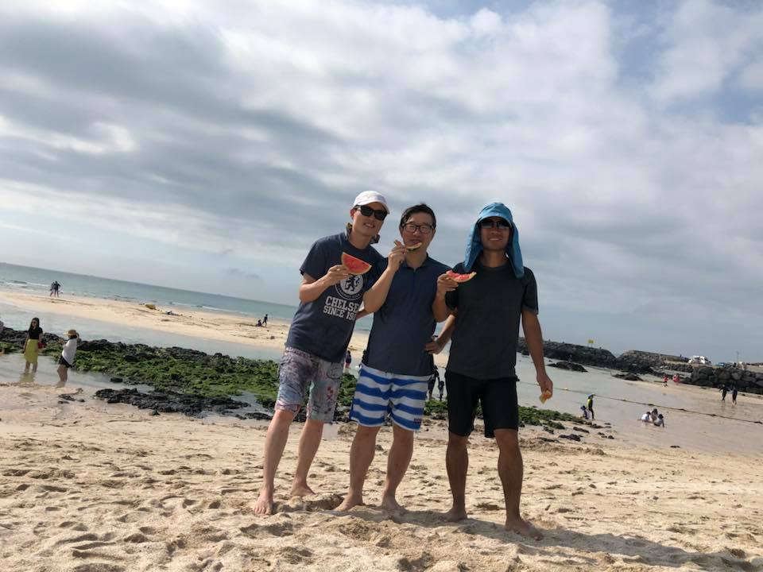
**이미지 캡션:** 세 명의 성인 남성이 해변에서 수박 조각을 먹고 있다. 왼쪽 남성은 흰색 모자와 선글라스를 착용하고 있으며, "CHELSEA SINCE 1905"라고 적힌 남색 티셔츠와 무늬가 있는 반바지를 입고 있다. 가운데 남성은 안경을 쓰고 파란색 셔츠와 줄무늬 반바지를 입고 있다. 오른쪽 남성은 파란색 모자를 쓰고 검은색 티셔츠와 검은색 반바지를 입고 있다. 세 사람 모두 편안하고 즐거운 표정으로 수박을 먹고 있다. 배경에는 맑은 하늘과 구름, 그리고 잔잔한 바다가 보인다. 해변에는 다른 사람들이 산책하거나 물놀이를 즐기고 있으며, 멀리 바위와 건물이 보인다. 전반적으로 화창한 날씨에 즐거운 휴가를 보내는 듯한 분위기이다.즐기고 있으며, 멀리 바위와 건물이 보인다. 전반적으로 화창한 날씨에 즐거운 휴가를 보내는 듯한 분위기이다.

### 7월 20일 (금) 06:53 · 📷 사진 (1장)

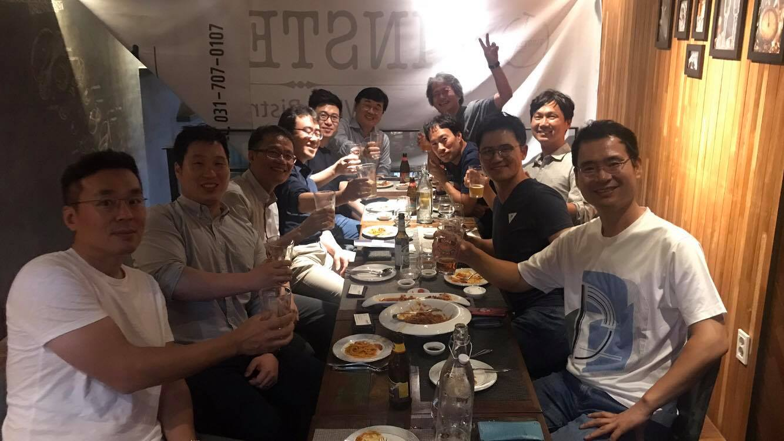
**이미지 캡션:** 이 사진은 식당에서 여러 명의 성인 남성들이 테이블에 둘러앉아 식사하며 건배하는 모습을 담고 있습니다. 사진 왼쪽부터 차례대로, 안경을 쓴 30대 후반에서 40대 초반으로 보이는 성인 남성이 흰색 반팔 티셔츠를 입고 카메라를 보며 미소 짓고 있습니다. 그 옆에는 30대 후반에서 40대 초반으로 보이는 성인 남성이 회색 셔츠를 입고 잔을 들고 있습니다. 그 뒤로는 40대에서 50대로 보이는 성인 남성들이 여러 명 있으며, 일부는 잔을 들고 건배를 하거나 웃고 있습니다. 가장 오른쪽에는 40대 후반에서 50대 초반으로 보이는 성인 남성이 흰색 반팔 티셔츠에 청바지를 입고 카메라를 향해 웃고 있으며, 그의 뒤로는 나무 벽과 액자들이 보입니다. 테이블 위에는 파스타, 샐러드 등 여러 음식과 맥주병, 물병, 잔 등이 놓여 있습니다. 배경에는 "TASTE"라는 글자가 희미하게 보이고, 전화번호 "031-707-0107"이 적힌 현수막 같은 것이 걸려 있습니다. 전체적으로 즐겁고 화기애애한 분위기입니다.반으로 보이는 성인 남성이 흰색 반팔 티셔츠에 청바지를 입고 카메라를 향해 웃고 있으며, 그의 뒤로는 나무 벽과 액자들이 보입니다. 테이블 위에는 파스타, 샐러드 등 여러 음식과 맥주병, 물병, 잔 등이 놓여 있습니다. 배경에는 "TASTE"라는 글자가 희미하게 보이고, 전화번호 "031-707-0107"이 적힌 현수막 같은 것이 걸려 있습니다. 전체적으로 즐겁고 화기애애한 분위기입니다.

> #30년후자율자동차어떻게? 부제1: #100만원누가내나요?, 부제2: #30년후파티오세요   TF-KR전문가들에게 급 자문 구합니다. ^^ 어제 워크앤올 오픈 2차 모임에서 이찬진님이 매우 흥미로운 질문을 던졌습니다.   "언제쯤 자율주행차가 상용화될까?" 즉 "언제쯤 사람들이 자동차 운전면허를 딸 필요가 없는 세상이 될까?: 10% 이하 사람들만 자동차 운전면허 소유하는 세상"  전 30년 이내라고 답을 했고 이찬진님은 더 많은 시간이 필요하다는 쪽이였습니다. 이 흥미로운 질문을 기억하고 그 결과를 기념하기 위해 100만원을 걸고 30년후에 모여 그 돈으로 파티를 하기로 했습니다. 문제는 이 "파티비를 누가 내느냐" 입니다.   전 여기 많은 TF-KR멤버들과 인공지능/딥러닝 기술을 믿는 쪽으로 베팅을 했습니다. 여러가지 사회적인 합의가 필요하겠지만 기술은 이미 다가와 있고 30년후면 기술은 차고 넘칠것이라 믿기 때문입니다. 30년후면 차가 날아 다닐수도 있을것 같고 아마 날아다니는 차는 인공지능만 운전이 허가될수도 있습니다. ^^  그래서 저는 큰돈이긴 하지만 30년후면 10% 미만의 사람이 운전면허를 소유하고 실제 운전을 할것이라는데 베팅하였습니다. 이 문제가 실제 운전이 아니라 운전면허 소유로 기준을 잡으면서 인간의 심리와 사회적 합의등과 연관된 복잡하고 재미있는 문제로 발전하였는데요.  여러분들은 어디에 베팅하시겠습니까?   1. 30년후면 10% 미만의 사람들이 자동차 운전면허를 가지고 있을 것이다. 2. 30년후라도 10%이상의 사람들이 자동차 운전면허를 가지고 있을 것이다.  아래 댓글로 본인이 선택한 번호와 이유 남겨주시면 제가 10분을 선발하여 30년후 파티에 초대하겠습니다.  (전 30년후 걸어서 파티 갈수 있도록 열심히 운동부터 ^^)

### 7월 25일 (수) 21:01 · 📷 사진 (13장)

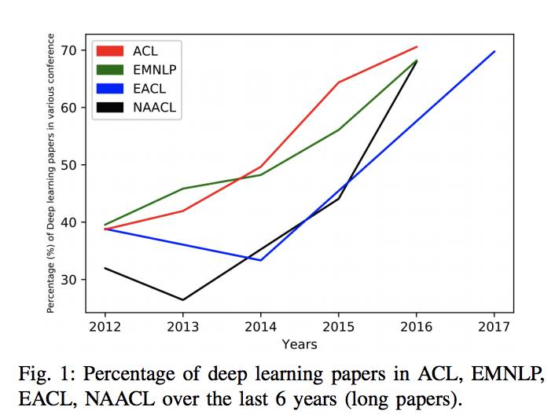
**이미지 캡션:** 이것은 2012년부터 2017년까지 ACL, EMNLP, EACL, NAACL이라는 네 개의 학회에서 발표된 딥러닝 논문의 비율을 보여주는 선 그래프입니다. x축은 연도를 나타내고 y축은 백분율을 나타냅니다. 각 선은 특정 학회를 나타내며, 빨간색 선은 ACL, 녹색 선은 EMNLP, 파란색 선은 EACL, 검은색 선은 NAACL을 나타냅니다. 그래프는 딥러닝 논문의 비율이 시간이 지남에 따라 전반적으로 증가하는 추세를 보여주며, 특히 ACL과 EMNLP에서 두드러집니다. EACL과 NAACL은 상대적으로 낮은 비율을 보이지만, 2015년 이후 증가하는 추세를 보입니다. 그래프에는 사람이 없으며, 배경은 흰색입니다. 텍스트는 그래프의 제목과 축 레이블, 범례로 구성되어 있습니다. 전반적인 분위기는 학술적이고 정보 전달적입니다.은 비율을 보이지만, 2015년 이후 증가하는 추세를 보입니다. 그래프에는 사람이 없으며, 배경은 흰색입니다. 텍스트는 그래프의 제목과 축 레이블, 범례로 구성되어 있습니다. 전반적인 분위기는 학술적이고 정보 전달적입니다.
 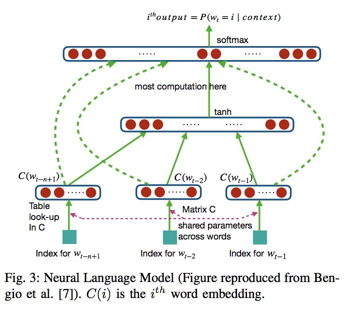
**이미지 캡션:** 이 이미지는 신경망 언어 모델의 구조를 보여주는 다이어그램으로, 특정 단어의 확률을 예측하는 과정을 시각화하고 있습니다. 다이어그램에는 사람이나 장소, 사물은 보이지 않으며, 오직 수식과 기호, 화살표로 구성된 추상적인 정보만 담겨 있습니다. 텍스트로는 "ithoutput = P(wt = i | context)", "softmax", "most computation here", "tanh", "C(wt-n+1)", "C(wt-2)", "C(wt-1)", "Table look-up In C", "Matrix C shared parameters across words", "Index for wt-n+1", "Index for wt-2", "Index for wt-1", 그리고 "Fig. 3: Neural Language Model (Figure reproduced from Bengio et al. [7]). C(i) is the ith word embedding."이라는 문구가 보입니다. 전체적으로 학술적인 내용을 담고 있으며, 복잡한 계산 과정을 도식화하여 설명하는 차분하고 분석적인 분위기를 풍깁니다. shared parameters across words", "Index for wt-n+1", "Index for wt-2", "Index for wt-1", 그리고 "Fig. 3: Neural Language Model (Figure reproduced from Bengio et al. [7]). C(i) is the ith word embedding."이라는 문구가 보입니다. 전체적으로 학술적인 내용을 담고 있으며, 복잡한 계산 과정을 도식화하여 설명하는 차분하고 분석적인 분위기를 풍깁니다.
 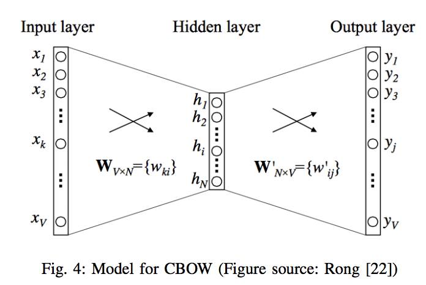
**이미지 캡션:** 이 이미지는 CBOW(Continuous Bag-of-Words) 모델의 구조를 보여주는 도식으로, 입력층, 은닉층, 출력층으로 구성되어 있습니다. 각 층은 여러 개의 노드로 표현되며, 노드 사이의 선은 연결을 나타냅니다. 입력층에는 $x_1, x_2, x_3, \dots, x_k, \dots, x_V$와 같이 V개의 입력이 있고, 은닉층에는 $h_1, h_2, \dots, h_i, \dots, h_N$와 같이 N개의 뉴런이 있습니다. 출력층에는 $y_1, y_2, y_3, \dots, y_j, \dots, y_V$와 같이 V개의 출력이 있습니다. 입력층과 은닉층 사이에는 $W_{V \times N} = \{w_{ki}\}$라는 가중치 행렬이 있고, 은닉층과 출력층 사이에는 $W'_{N \times V} = \{w'_{ij}\}$라는 가중치 행렬이 있습니다. 두 개의 교차된 화살표는 각 층 간의 연결 및 가중치 적용을 시각적으로 나타냅니다. 이미지 하단에는 "Fig. 4: Model for CBOW (Figure source: Rong [22])"라는 캡션이 있어 이 그림이 Rong의 연구 [22]에서 발췌한 CBOW 모델임을 명시하고 있습니다. 전반적으로 이 이미지는 딥러닝, 특히 자연어 처리 분야의 신경망 모델 구조를 설명하는 학술적인 자료입니다.y_V$와 같이 V개의 출력이 있습니다. 입력층과 은닉층 사이에는 $W_{V \times N} = \{w_{ki}\}$라는 가중치 행렬이 있고, 은닉층과 출력층 사이에는 $W'_{N \times V} = \{w'_{ij}\}$라는 가중치 행렬이 있습니다. 두 개의 교차된 화살표는 각 층 간의 연결 및 가중치 적용을 시각적으로 나타냅니다. 이미지 하단에는 "Fig. 4: Model for CBOW (Figure source: Rong [22])"라는 캡션이 있어 이 그림이 Rong의 연구 [22]에서 발췌한 CBOW 모델임을 명시하고 있습니다. 전반적으로 이 이미지는 딥러닝, 특히 자연어 처리 분야의 신경망 모델 구조를 설명하는 학술적인 자료입니다.
 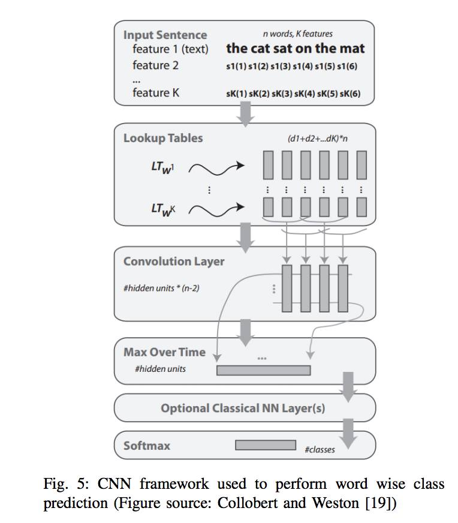
**이미지 캡션:** 이 이미지는 딥러닝 모델의 구조를 시각적으로 표현한 것으로, 특정 문장에서 각 단어의 클래스를 예측하는 데 사용되는 CNN(합성곱 신경망) 프레임워크를 보여줍니다. 이미지에는 사람이나 장소가 등장하지 않으며, 오직 텍스트와 도식으로 구성되어 있습니다. 상단에는 "Input Sentence"라는 레이블과 함께 예시 문장 "the cat sat on the mat"이 표시되어 있으며, 각 단어에 대한 K개의 특징(feature)이 나열되어 있습니다. 그 아래 "Lookup Tables" 섹션에서는 각 특징이 벡터로 변환되는 과정을 나타내며, 이는 "Convolution Layer"로 전달됩니다. 이 레이어는 문장의 지역적 패턴을 학습하며, 이후 "Max Over Time" 레이어에서 시간 축에 걸쳐 최대값을 추출합니다. 선택적으로 "Optional Classical NN Layer(s)"를 거쳐 최종적으로 "Softmax" 레이어에서 각 단어의 클래스 확률을 출력합니다. 이미지 하단에는 "Fig. 5: CNN framework used to perform word wise class prediction (Figure source: Collobert and Weston [19])"라는 캡션이 있어, 이 그림이 Collobert와 Weston의 연구에서 발췌되었으며 단어별 클래스 예측을 위한 CNN 프레임워크임을 명시하고 있습니다. 전체적인 분위기는 학술적이고 정보 전달에 초점을 맞추고 있습니다.로 변환되는 과정을 나타내며, 이는 "Convolution Layer"로 전달됩니다. 이 레이어는 문장의 지역적 패턴을 학습하며, 이후 "Max Over Time" 레이어에서 시간 축에 걸쳐 최대값을 추출합니다. 선택적으로 "Optional Classical NN Layer(s)"를 거쳐 최종적으로 "Softmax" 레이어에서 각 단어의 클래스 확률을 출력합니다. 이미지 하단에는 "Fig. 5: CNN framework used to perform word wise class prediction (Figure source: Collobert and Weston [19])"라는 캡션이 있어, 이 그림이 Collobert와 Weston의 연구에서 발췌되었으며 단어별 클래스 예측을 위한 CNN 프레임워크임을 명시하고 있습니다. 전체적인 분위기는 학술적이고 정보 전달에 초점을 맞추고 있습니다.
 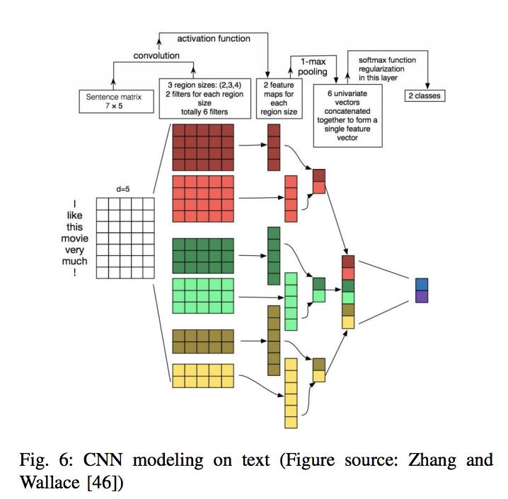
**이미지 캡션:** 이 이미지는 텍스트에 대한 CNN 모델링을 설명하는 다이어그램입니다. 다이어그램에는 텍스트의 각 단어에 대한 임베딩을 나타내는 7x5 행렬인 "Sentence matrix"가 표시됩니다. 이 행렬은 "convolution" 레이어를 통과하여 3가지 다른 영역 크기(2, 3, 4)와 각 영역 크기에 대한 2개의 필터를 사용하여 6개의 특징 맵을 생성합니다. 그런 다음 이러한 특징 맵은 "1-max pooling" 레이어를 통과하여 각 특징 맵에서 가장 큰 값을 추출합니다. 마지막으로 이러한 풀링된 특징은 "concatenated together to form a single feature vector"로 결합된 다음 "softmax function regularization in this layer"를 통과하여 최종적으로 "2 classes"로 분류됩니다. 다이어그램에는 "activation function"이라는 레이블도 포함되어 있으며, 이는 CNN의 각 레이어에 적용되는 활성화 함수를 나타냅니다. 전반적으로 이 다이어그램은 텍스트 분류를 위한 CNN의 작동 방식을 시각적으로 표현합니다.ncatenated together to form a single feature vector"로 결합된 다음 "softmax function regularization in this layer"를 통과하여 최종적으로 "2 classes"로 분류됩니다. 다이어그램에는 "activation function"이라는 레이블도 포함되어 있으며, 이는 CNN의 각 레이어에 적용되는 활성화 함수를 나타냅니다. 전반적으로 이 다이어그램은 텍스트 분류를 위한 CNN의 작동 방식을 시각적으로 표현합니다.
 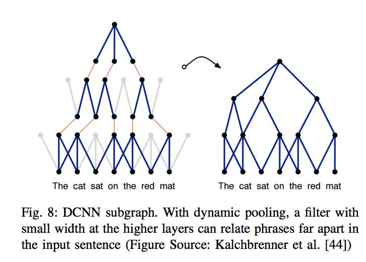
**이미지 캡션:** 이 이미지는 딥 컨볼루션 신경망(DCNN)의 서브그래프를 보여주는 두 개의 다이어그램으로 구성되어 있으며, 동적 풀링의 개념을 설명합니다. 왼쪽 다이어그램은 더 넓은 구조를 가지며, 여러 층에 걸쳐 점들이 연결되어 있고 일부 연결은 빨간색으로 강조되어 있습니다. 이 다이어그램 아래에는 "The cat sat on the red mat"라는 문장이 표시되어 있습니다. 오른쪽 다이어그램은 왼쪽 다이어그램보다 더 좁은 구조를 가지며, 역시 점들과 파란색 선으로 연결되어 있습니다. 이 다이어그램 아래에도 동일한 문장이 표시되어 있습니다. 두 다이어그램 사이에는 곡선 화살표가 있어 왼쪽에서 오른쪽으로의 변화를 나타냅니다. 이미지 하단에는 "Fig. 8: DCNN subgraph. With dynamic pooling, a filter with small width at the higher layers can relate phrases far apart in the input sentence (Figure Source: Kalchbrenner et al. [44])"라는 캡션이 있습니다. 이 캡션은 동적 풀링을 사용하면 높은 레이어의 필터가 입력 문장에서 멀리 떨어진 구문들을 연관시킬 수 있음을 설명하며, 출처를 명시하고 있습니다. 전반적으로 이 이미지는 텍스트 분석을 위한 딥러닝 모델의 구조와 기능을 시각적으로 설명하는 학술적인 자료입니다.이 표시되어 있습니다. 두 다이어그램 사이에는 곡선 화살표가 있어 왼쪽에서 오른쪽으로의 변화를 나타냅니다. 이미지 하단에는 "Fig. 8: DCNN subgraph. With dynamic pooling, a filter with small width at the higher layers can relate phrases far apart in the input sentence (Figure Source: Kalchbrenner et al. [44])"라는 캡션이 있습니다. 이 캡션은 동적 풀링을 사용하면 높은 레이어의 필터가 입력 문장에서 멀리 떨어진 구문들을 연관시킬 수 있음을 설명하며, 출처를 명시하고 있습니다. 전반적으로 이 이미지는 텍스트 분석을 위한 딥러닝 모델의 구조와 기능을 시각적으로 설명하는 학술적인 자료입니다.
 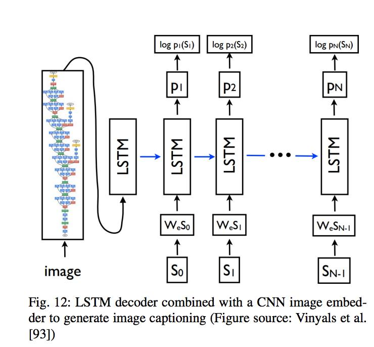
**이미지 캡션:** 이 그림은 이미지 캡셔닝을 생성하기 위해 CNN 이미지 임베더와 결합된 LSTM 디코더의 구조를 보여주는 도식입니다. 왼쪽에는 복잡한 신경망 구조를 가진 CNN 모델이 있고, 그 아래에는 "image"라는 레이블이 붙어 있습니다. 이 CNN 모델의 출력은 LSTM 디코더의 첫 번째 레이어로 입력됩니다. LSTM 디코더는 여러 개의 LSTM 셀이 순차적으로 연결된 형태로, 각 셀은 이전 셀의 출력을 입력으로 받아 다음 셀로 전달합니다. 각 LSTM 셀에는 이전 시점의 단어 임베딩(WeS₀, WeS₁, ..., WeSN-₁)과 해당 시점의 단어(S₀, S₁, ..., SN-₁)가 입력으로 주어집니다. 각 LSTM 셀의 출력은 예측된 단어의 확률 분포(p₁, p₂, ..., pN)를 나타내며, 이는 최종적으로 로그 확률(log p₁(S₁), log p₂(S₂), ..., log pN(SN))로 변환됩니다. 그림의 하단에는 "Fig. 12: LSTM decoder combined with a CNN image embedder to generate image captioning (Figure source: Vinyals et al. [93])"라는 캡션이 있습니다. 이 그림은 인공지능이 이미지를 이해하고 그에 대한 설명을 생성하는 과정을 시각적으로 나타내고 있습니다.WeSN-₁)과 해당 시점의 단어(S₀, S₁, ..., SN-₁)가 입력으로 주어집니다. 각 LSTM 셀의 출력은 예측된 단어의 확률 분포(p₁, p₂, ..., pN)를 나타내며, 이는 최종적으로 로그 확률(log p₁(S₁), log p₂(S₂), ..., log pN(SN))로 변환됩니다. 그림의 하단에는 "Fig. 12: LSTM decoder combined with a CNN image embedder to generate image captioning (Figure source: Vinyals et al. [93])"라는 캡션이 있습니다. 이 그림은 인공지능이 이미지를 이해하고 그에 대한 설명을 생성하는 과정을 시각적으로 나타내고 있습니다.
 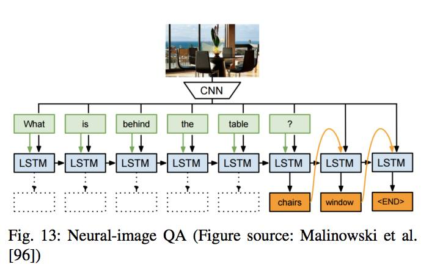
**이미지 캡션:** 이 그림은 신경망을 이용한 이미지 질의응답 시스템의 구조를 보여주는 도식으로, 상단에는 테이블과 의자가 놓인 실내 공간의 사진이 있고, 그 아래에는 CNN(Convolutional Neural Network) 모듈이 있다. CNN 모듈은 사진을 분석하여 특징을 추출하고, 이 특징은 여러 개의 LSTM(Long Short-Term Memory) 모듈로 전달된다. LSTM 모듈들은 "What", "is", "behind", "the", "table", "?"와 같은 질문 단어들과 순차적으로 연결되어 있으며, 각 단어는 해당 LSTM 모듈에 입력된다. 또한, LSTM 모듈들은 서로 연결되어 이전 단계의 정보를 활용하며, 최종적으로 "chairs", "window", "<END>"와 같은 답변 단어들을 생성한다. 그림 하단에는 "Fig. 13: Neural-image QA (Figure source: Malinowski et al. [96])"라는 캡션이 있어, 이 그림이 Malinowski 등의 연구에서 가져온 신경망 기반 이미지 질의응답에 대한 13번째 그림임을 나타낸다. 전체적으로 기술적인 내용을 설명하는 학술적인 분위기를 띤다.단어는 해당 LSTM 모듈에 입력된다. 또한, LSTM 모듈들은 서로 연결되어 이전 단계의 정보를 활용하며, 최종적으로 "chairs", "window", "<END>"와 같은 답변 단어들을 생성한다. 그림 하단에는 "Fig. 13: Neural-image QA (Figure source: Malinowski et al. [96])"라는 캡션이 있어, 이 그림이 Malinowski 등의 연구에서 가져온 신경망 기반 이미지 질의응답에 대한 13번째 그림임을 나타낸다. 전체적으로 기술적인 내용을 설명하는 학술적인 분위기를 띤다.
 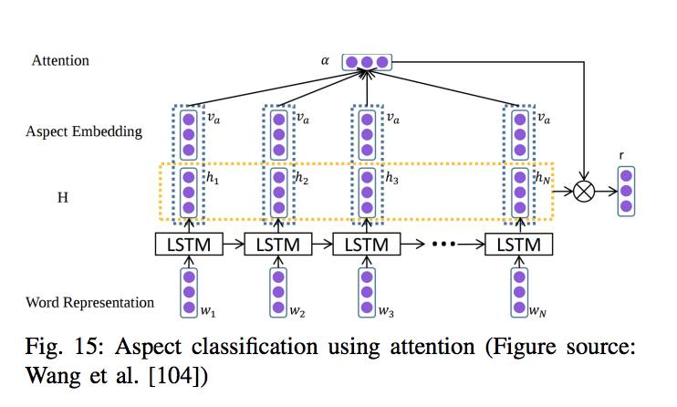
**이미지 캡션:** 이 이미지는 "Fig. 15: Aspect classification using attention (Figure source: Wang et al. [104])"라는 제목의 그림으로, 텍스트 분류를 위한 어텐션 메커니즘을 시각적으로 표현하고 있습니다. 그림에는 사람이나 실제 장소는 나타나지 않으며, 대신 인공지능 모델의 구조를 나타내는 다이어그램입니다. 다이어그램은 "Word Representation", "LSTM", "H", "Aspect Embedding", "Attention" 등의 레이블과 함께 여러 개의 노드(보라색 점으로 표시)와 연결선으로 구성되어 있습니다. 각 노드는 벡터를 나타내며, LSTM은 순환 신경망의 한 종류로 시퀀스 데이터를 처리하는 데 사용됩니다. 어텐션 메커니즘은 입력 시퀀스의 특정 부분에 더 집중하도록 모델을 돕는 역할을 합니다. 그림의 하단에는 "Wang et al. [104]"라는 출처가 명시되어 있습니다. 전반적으로, 이 이미지는 학술적인 내용을 담고 있으며, 복잡한 알고리즘의 작동 방식을 설명하는 데 사용되는 기술적인 다이어그램입니다. 개의 노드(보라색 점으로 표시)와 연결선으로 구성되어 있습니다. 각 노드는 벡터를 나타내며, LSTM은 순환 신경망의 한 종류로 시퀀스 데이터를 처리하는 데 사용됩니다. 어텐션 메커니즘은 입력 시퀀스의 특정 부분에 더 집중하도록 모델을 돕는 역할을 합니다. 그림의 하단에는 "Wang et al. [104]"라는 출처가 명시되어 있습니다. 전반적으로, 이 이미지는 학술적인 내용을 담고 있으며, 복잡한 알고리즘의 작동 방식을 설명하는 데 사용되는 기술적인 다이어그램입니다.
 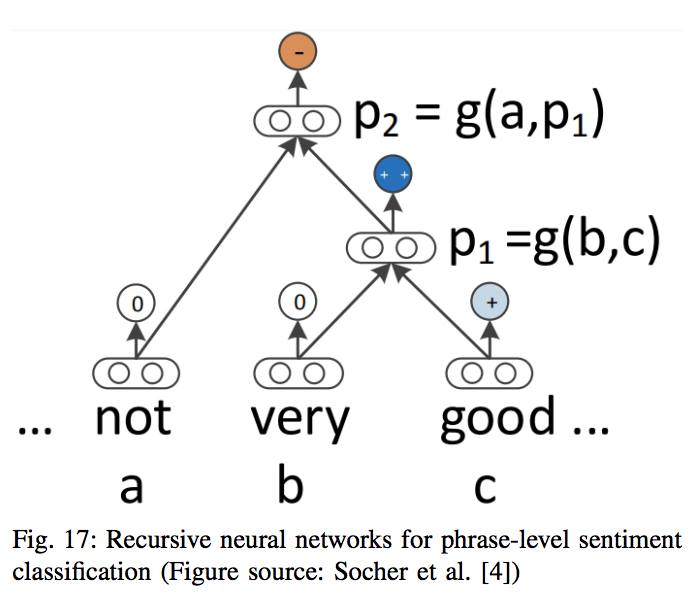
**이미지 캡션:** 이 이미지는 재귀 신경망을 이용한 구문 수준 감성 분류를 설명하는 도식입니다. 사람이나 장소는 보이지 않으며, 오직 텍스트와 신경망 구조를 나타내는 기호들만 있습니다. 텍스트로는 "not", "very", "good"이 보이며, 각 단어 아래에는 a, b, c라는 문자가 표시되어 있습니다. 신경망은 여러 개의 노드(원형으로 표현)와 연결선으로 구성되어 있으며, 각 노드에는 숫자가 표시되어 있습니다. 특히, "not"과 "very" 노드에는 0이, "good" 노드에는 '+' 기호가 표시된 작은 원이 연결되어 있습니다. 또한, "very"와 "good"을 합쳐서 p1이라는 변수를 만들고, 여기에 "not"을 합쳐서 p2라는 변수를 만드는 과정을 수식으로 보여주고 있습니다. 최종적으로 p2는 음수(-) 기호가 표시된 노드로 연결되어 부정적인 감성을 나타내는 것으로 보입니다. 전체적으로 복잡한 계산 과정을 시각적으로 표현한 것으로, 학술적인 분위기를 풍깁니다. 이미지 하단에는 "Fig. 17: Recursive neural networks for phrase-level sentiment classification (Figure source: Socher et al. [4])"라는 캡션이 있어 이 도식의 제목과 출처를 알 수 있습니다.있습니다. 또한, "very"와 "good"을 합쳐서 p1이라는 변수를 만들고, 여기에 "not"을 합쳐서 p2라는 변수를 만드는 과정을 수식으로 보여주고 있습니다. 최종적으로 p2는 음수(-) 기호가 표시된 노드로 연결되어 부정적인 감성을 나타내는 것으로 보입니다. 전체적으로 복잡한 계산 과정을 시각적으로 표현한 것으로, 학술적인 분위기를 풍깁니다. 이미지 하단에는 "Fig. 17: Recursive neural networks for phrase-level sentiment classification (Figure source: Socher et al. [4])"라는 캡션이 있어 이 도식의 제목과 출처를 알 수 있습니다.
 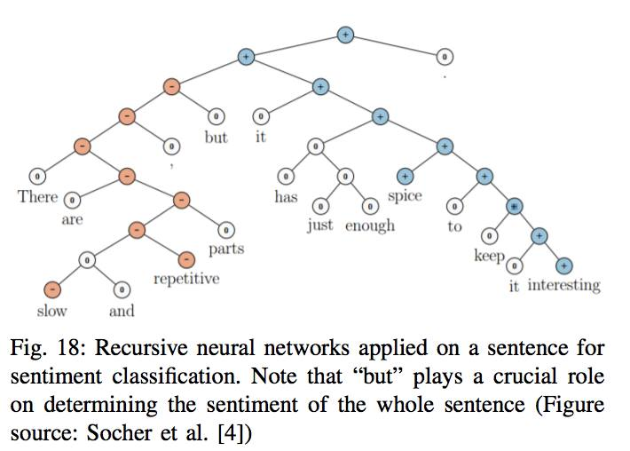
**이미지 캡션:** 이 이미지는 재귀 신경망을 사용하여 문장의 감성을 분류하는 과정을 보여주는 도표입니다. 도표는 트리 구조로 되어 있으며, 각 노드는 단어나 구문의 감성 값을 나타냅니다. 빨간색 원은 부정적인 감성, 파란색 원은 긍정적인 감성, 흰색 원은 중립적인 감성을 의미합니다. "but"이라는 단어가 전체 문장의 감성을 결정하는 데 중요한 역할을 한다는 점을 강조하고 있습니다. 도표 하단에는 "Fig. 18: Recursive neural networks applied on a sentence for sentiment classification. Note that "but" plays a crucial role on determining the sentiment of the whole sentence (Figure source: Socher et al. [4])"라는 캡션이 있습니다. 이 캡션은 그림의 제목과 설명, 출처를 포함하고 있습니다. 이 이미지에는 사람이 등장하지 않으며, 특정 장소나 사물도 묘사되어 있지 않습니다. 텍스트는 주로 영어로 되어 있으며, 감성 분석이라는 기술적인 주제를 다루고 있습니다. 전반적으로 학술적인 논문이나 발표 자료에서 사용될 법한 정보 전달 중심의 분위기입니다.lassification. Note that "but" plays a crucial role on determining the sentiment of the whole sentence (Figure source: Socher et al. [4])"라는 캡션이 있습니다. 이 캡션은 그림의 제목과 설명, 출처를 포함하고 있습니다. 이 이미지에는 사람이 등장하지 않으며, 특정 장소나 사물도 묘사되어 있지 않습니다. 텍스트는 주로 영어로 되어 있으며, 감성 분석이라는 기술적인 주제를 다루고 있습니다. 전반적으로 학술적인 논문이나 발표 자료에서 사용될 법한 정보 전달 중심의 분위기입니다.
 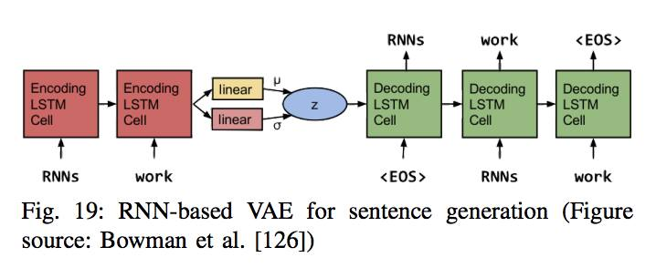
**이미지 캡션:** 이 이미지는 문장 생성을 위한 RNN 기반 VAE(Variational Autoencoder)의 구조를 보여주는 다이어그램입니다. 사람, 장소, 사물 등은 보이지 않으며, 오직 텍스트와 기호로 구성된 도식적인 표현만 있습니다. 다이어그램은 크게 인코더 부분과 디코더 부분으로 나뉩니다. 인코더 부분은 두 개의 "Encoding LSTM Cell"로 구성되어 있으며, 입력으로 "RNNs"와 "work"를 받습니다. 이 인코더 셀들은 선형 변환을 거쳐 평균(μ)과 표준편차(σ)를 계산하고, 이를 통해 잠재 변수 z를 생성합니다. 디코더 부분은 세 개의 "Decoding LSTM Cell"로 구성되어 있으며, 잠재 변수 z와 함께 "<EOS>", "RNNs", "work"와 같은 입력을 받아 문장을 생성하는 과정을 나타냅니다. 각 디코더 셀은 순차적으로 작동하며, 최종적으로 "<EOS>" (End Of Sentence) 토큰을 출력합니다. 이미지 하단에는 "Fig. 19: RNN-based VAE for sentence generation (Figure source: Bowman et al. [126])"라는 캡션이 있어, 이 다이어그램이 Bowman 등의 연구에서 인용된 그림 19번이며 RNN 기반 VAE를 이용한 문장 생성에 관한 것임을 명시하고 있습니다. 전반적으로 학술적인 논문이나 발표 자료에서 사용될 법한, 정보 전달에 초점을 맞춘 차분하고 분석적인 분위기입니다.를 생성합니다. 디코더 부분은 세 개의 "Decoding LSTM Cell"로 구성되어 있으며, 잠재 변수 z와 함께 "<EOS>", "RNNs", "work"와 같은 입력을 받아 문장을 생성하는 과정을 나타냅니다. 각 디코더 셀은 순차적으로 작동하며, 최종적으로 "<EOS>" (End Of Sentence) 토큰을 출력합니다. 이미지 하단에는 "Fig. 19: RNN-based VAE for sentence generation (Figure source: Bowman et al. [126])"라는 캡션이 있어, 이 다이어그램이 Bowman 등의 연구에서 인용된 그림 19번이며 RNN 기반 VAE를 이용한 문장 생성에 관한 것임을 명시하고 있습니다. 전반적으로 학술적인 논문이나 발표 자료에서 사용될 법한, 정보 전달에 초점을 맞춘 차분하고 분석적인 분위기입니다.
 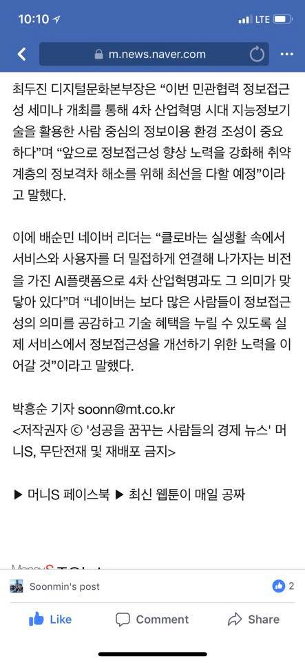
**이미지 캡션:** 이 이미지는 스마트폰 화면의 일부를 캡처한 것으로, 네이버 뉴스 기사 페이지를 보여주고 있습니다. 화면 상단에는 시간(10:10)과 LTE 통신 상태, 그리고 뒤로 가기 버튼과 메뉴 버튼이 보입니다. 중앙에는 웹 브라우저 주소창에 "m.news.naver.com"이 표시되어 있습니다. 기사 내용은 디지털 문화 본부장과 네이버 리더의 발언을 인용하며, 4차 산업혁명 시대의 정보 접근성 향상과 기술 혜택 누림에 대한 중요성을 강조하고 있습니다. 기사 하단에는 기자 이름(박흥순)과 이메일 주소, 저작권 정보, 그리고 머니S 페이스북과 최신 웹툰 관련 내용이 있습니다. 가장 하단에는 "Soonmin's post"라는 문구와 함께 '좋아요', '댓글', '공유' 버튼이 보이며, 댓글 수는 2개로 표시되어 있습니다. 전반적으로 정보통신 기술과 사회적 포용에 대한 뉴스 기사를 다루는 분위기입니다.고 머니S 페이스북과 최신 웹툰 관련 내용이 있습니다. 가장 하단에는 "Soonmin's post"라는 문구와 함께 '좋아요', '댓글', '공유' 버튼이 보이며, 댓글 수는 2개로 표시되어 있습니다. 전반적으로 정보통신 기술과 사회적 포용에 대한 뉴스 기사를 다루는 분위기입니다.

### 7월 28일 (토) 08:28 · 📷 사진 (1장)

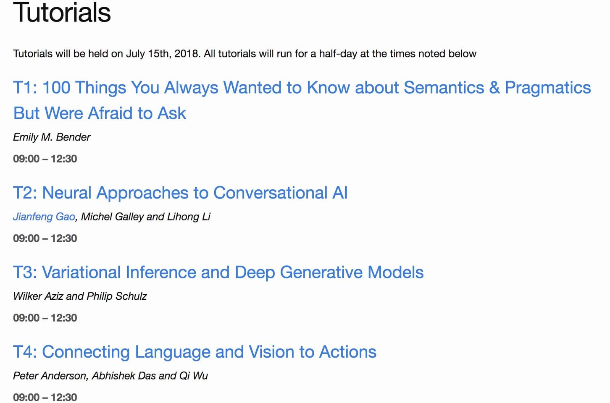
**이미지 캡션:** 이 이미지는 "Tutorials"라는 제목 아래 2018년 7월 15일에 열리는 튜토리얼 목록을 보여주는 웹 페이지의 스크린샷입니다. 각 튜토리얼은 T1부터 T4까지 번호가 매겨져 있으며, 제목, 발표자 이름, 그리고 09:00부터 12:30까지의 시간대가 명시되어 있습니다. 튜토리얼 제목은 "100 Things You Always Wanted to Know about Semantics & Pragmatics But Were Afraid to Ask", "Neural Approaches to Conversational AI", "Variational Inference and Deep Generative Models", "Connecting Language and Vision to Actions"입니다. 발표자 이름으로는 Emily M. Bender, Jianfeng Gao, Michel Galley, Lihong Li, Wilker Aziz, Philip Schulz, Peter Anderson, Abhishek Das, Qi Wu가 언급되어 있습니다. 배경은 흰색이며, 텍스트는 검은색과 파란색으로 표시되어 있습니다. 이미지에는 사람이 등장하지 않으며, 특정 장소나 사물도 보이지 않습니다. 전반적으로 정보 전달에 초점을 맞춘 깔끔하고 간결한 디자인의 웹 페이지입니다.ional AI", "Variational Inference and Deep Generative Models", "Connecting Language and Vision to Actions"입니다. 발표자 이름으로는 Emily M. Bender, Jianfeng Gao, Michel Galley, Lihong Li, Wilker Aziz, Philip Schulz, Peter Anderson, Abhishek Das, Qi Wu가 언급되어 있습니다. 배경은 흰색이며, 텍스트는 검은색과 파란색으로 표시되어 있습니다. 이미지에는 사람이 등장하지 않으며, 특정 장소나 사물도 보이지 않습니다. 전반적으로 정보 전달에 초점을 맞춘 깔끔하고 간결한 디자인의 웹 페이지입니다.

> 이번 ACL에서 발표한 재미있는 튜토리얼입니다. 저는 시멘틱 파싱과 대화 AI에 관심이 많은데 여러분들은 어떠세요? https://acl2018.org/tutorials/  보시고 후기도 댓글로 많이 올려주세요.

### 7월 31일 (화) 09:24 · Perhaps, it would be the hottest day of …

Perhaps, it would be the hottest day of the year, but Sung is still runing. It was so good!

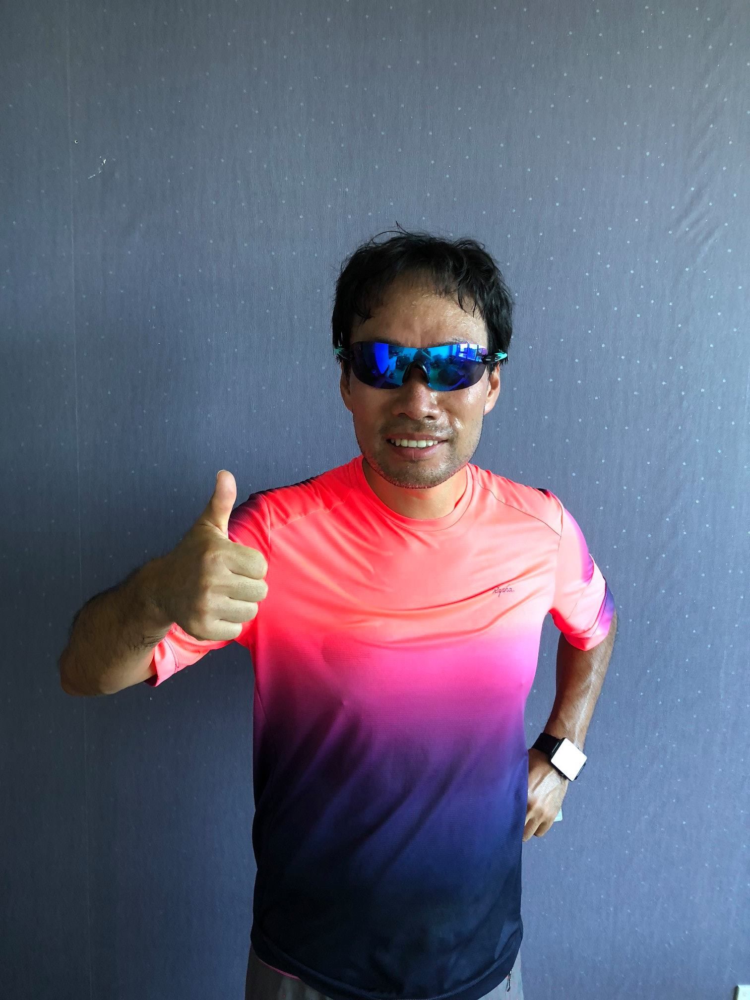
**이미지 캡션:** 사진에는 스포츠 선글라스를 끼고 형광색과 보라색이 그라데이션 된 운동복 상의를 입은 성인 남성이 엄지손가락을 치켜들고 있다. 남성은 30대 후반에서 40대 초반으로 보이며, 머리카락은 짧고 검은색이며 약간 땀에 젖어 있다. 얼굴에는 땀방울이 맺혀 있고, 입가에는 미소를 띠고 있다. 선글라스는 푸른색 렌즈로 반사되어 주변 풍경이 비친다. 상의에는 작은 로고가 보이며, 왼쪽 손목에는 사각형 모양의 스마트 워치를 착용하고 있다. 배경은 짙은 회색의 벽으로, 작은 점들이 불규칙하게 찍혀 있어 독특한 질감을 보여준다. 전체적으로 운동 후의 만족감과 자신감을 나타내는 긍정적인 분위기이다. 전체적으로 운동 후의 만족감과 자신감을 나타내는 긍정적인 분위기이다.
 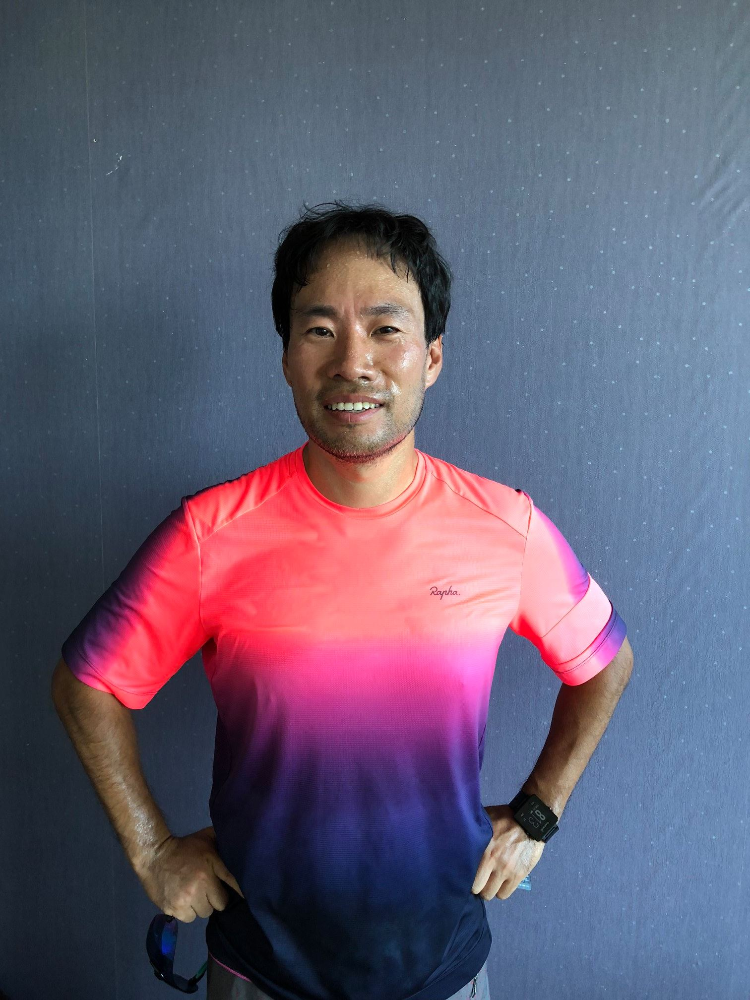
**이미지 캡션:** 한 명의 성인 남성이 회색 배경 앞에서 서 있으며, 그는 30대 후반에서 40대 초반으로 보입니다. 짧은 검은색 머리카락은 약간 젖어 있고, 얼굴에는 땀방울이 맺혀 있습니다. 그는 밝은 미소를 띠고 있으며, 눈은 약간 감겨 있습니다. 남성은 밝은 형광 핑크색에서 보라색으로 이어지는 그라데이션이 있는 반팔 스포츠 티셔츠를 입고 있으며, 티셔츠 왼쪽 가슴 부분에는 "Rapha"라는 로고가 작게 새겨져 있습니다. 그의 손은 허리에 얹혀 있으며, 왼쪽 손에는 선글라스가 걸려 있습니다. 오른쪽 손목에는 검은색 디지털 시계가 착용되어 있습니다. 배경은 옅은 회색의 벽으로, 표면에는 작은 흰색 점들이 불규칙하게 분포되어 있습니다. 전체적으로 운동 후의 활기찬 모습과 편안한 분위기를 보여줍니다.시계가 착용되어 있습니다. 배경은 옅은 회색의 벽으로, 표면에는 작은 흰색 점들이 불규칙하게 분포되어 있습니다. 전체적으로 운동 후의 활기찬 모습과 편안한 분위기를 보여줍니다.
 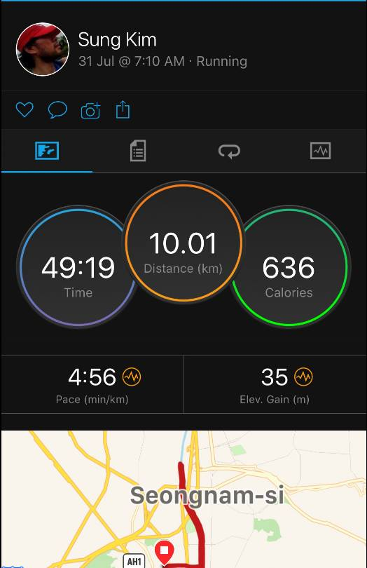
**이미지 캡션:** 이 사진은 성인 남성인 Sung Kim 씨의 달리기 기록을 보여주는 화면 캡처입니다. 그는 31일 오전 7시 10분에 달리기를 시작했으며, 총 49분 19초 동안 10.01km를 달려 636 칼로리를 소모했습니다. 평균 페이스는 4분 56초/km이며, 고도 상승은 35m입니다. 화면 상단에는 Sung Kim 씨의 프로필 사진과 이름, 그리고 달리기 활동 정보가 표시되어 있습니다. 프로필 사진 속 남성은 빨간색 모자를 쓰고 있으며, 얼굴은 측면으로 보여 약간의 수염이 있습니다. 그의 표정은 명확하게 보이지 않지만, 활동적인 모습으로 보입니다. 하단에는 달리기 경로를 보여주는 지도가 나타나며, "Seongnam-si"라는 텍스트가 지도 위에 표시되어 있어 달리기 장소가 성남시임을 알 수 있습니다. 전반적으로 운동 기록 앱의 화면으로, 활동적인 분위기를 나타냅니다.만, 활동적인 모습으로 보입니다. 하단에는 달리기 경로를 보여주는 지도가 나타나며, "Seongnam-si"라는 텍스트가 지도 위에 표시되어 있어 달리기 장소가 성남시임을 알 수 있습니다. 전반적으로 운동 기록 앱의 화면으로, 활동적인 분위기를 나타냅니다.
