# 2018년 8월

[← 2018년](README.md)

### 8월 4일 (토) 20:29 · 📷 사진 (1장)

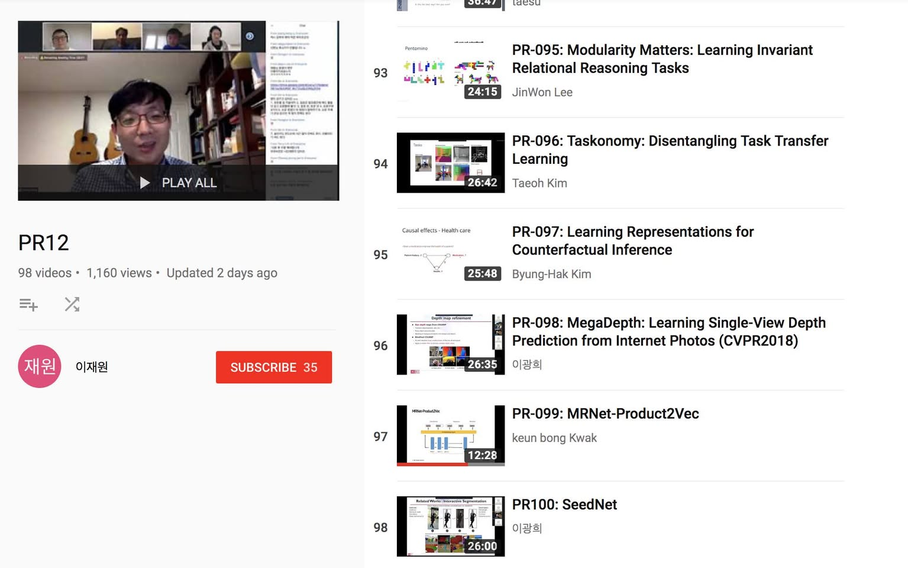
**이미지 캡션:** 화면 왼쪽에는 한 성인 남성이 카메라를 보며 이야기하고 있는 모습이 담긴 유튜브 영상 썸네일이 있다. 남성은 안경을 쓰고 격자무늬 재킷을 입고 있으며, 배경에는 책장과 기타가 보인다. 영상 제목은 "PR12"이며, 98개의 영상이 있고 1,160회의 조회수를 기록했으며 2일 전에 업데이트되었다. 남성의 이름은 "이재원"으로 표시되어 있으며, 구독자 수는 35명이다. 화면 오른쪽에는 "PR12" 채널의 다른 영상 목록이 보인다. 각 영상은 번호, 썸네일 이미지, 제목, 발표자 이름, 재생 시간으로 구성되어 있다. 예를 들어, 93번 영상은 "PR-095: Modularity Matters: Learning Invariant Relational Reasoning Tasks"이며 JinWon Lee가 발표했고 재생 시간은 24분 15초이다. 94번 영상은 "PR-096: Taskonomy: Disentangling Task Transfer Learning"이며 Taeoh Kim이 발표했고 재생 시간은 26분 42초이다. 95번 영상은 "PR-097: Learning Representations for Counterfactual Inference"이며 Byung-Hak Kim이 발표했고 재생 시간은 25분 48초이다. 96번 영상은 "PR-098: MegaDepth: Learning Single-View Depth Prediction from Internet Photos (CVPR2018)"이며 이광희가 발표했고 재생 시간은 26분 35초이다. 97번 영상은 "PR-099: MRNet-Product2Vec"이며 keun bong Kwak이 발표했고 재생 시간은 12분 28초이다. 98번 영상은 "PR100: SeedNet"이며 이광희가 발표했고 재생 시간은 26분 00초이다. 전반적으로 이 화면은 학술 발표 영상이 모여 있는 유튜브 채널의 일부를 보여주고 있으며, 진지하고 학구적인 분위기를 풍긴다.. 예를 들어, 93번 영상은 "PR-095: Modularity Matters: Learning Invariant Relational Reasoning Tasks"이며 JinWon Lee가 발표했고 재생 시간은 24분 15초이다. 94번 영상은 "PR-096: Taskonomy: Disentangling Task Transfer Learning"이며 Taeoh Kim이 발표했고 재생 시간은 26분 42초이다. 95번 영상은 "PR-097: Learning Representations for Counterfactual Inference"이며 Byung-Hak Kim이 발표했고 재생 시간은 25분 48초이다. 96번 영상은 "PR-098: MegaDepth: Learning Single-View Depth Prediction from Internet Photos (CVPR2018)"이며 이광희가 발표했고 재생 시간은 26분 35초이다. 97번 영상은 "PR-099: MRNet-Product2Vec"이며 keun bong Kwak이 발표했고 재생 시간은 12분 28초이다. 98번 영상은 "PR100: SeedNet"이며 이광희가 발표했고 재생 시간은 26분 00초이다. 전반적으로 이 화면은 학술 발표 영상이 모여 있는 유튜브 채널의 일부를 보여주고 있으며, 진지하고 학구적인 분위기를 풍긴다.

> [100개의 논문설명 한글 비디오!]  저희 TF-KR그룹 소모임인 #PR12에서 그동안 모여서 발표하고 영상으로 공개한 논문이 100개가 되었습니다. 정말 각 멤버들 수고 많으셨습니다.  https://www.youtube.com/playlist?list=PLWKf9beHi3Tg50UoyTe6rIm20sVQOH1br 여기 100개만 보셔도 정말 딥러닝 전문가가 되실수 있는 멋진 논문들이 많습니다. (리스트 모아주신 재원님 감사)  앞으로 또 200개, 300개 논문 발표를 해주실 2기 #PR12멤버들도 절찬 모집중이니 많은 응모 부탁드립니다. 무엇보다도 참여하시면 최고의 전문가가 되실 것입니다.  멤버모집: https://www.facebook.com/groups/TensorFlowKR/permalink/714868458854215/

### 8월 6일 (월) 04:11 · 📷 사진 (1장)

**이미지 캡션:** 이것은 아마존 웹사이트의 스크린샷으로, "Valley of Genius: The Uncensored History of Silicon Valley"라는 책의 정보 페이지를 보여줍니다. 책 표지는 노란색 배경에 실리콘 밸리의 도시 풍경이 그려져 있으며, "VALLEY OF GENIUS"와 "The Uncensored History of Silicon Valley"라는 제목이 파란색 글씨로 쓰여 있습니다. 책의 저자는 Adam Fisher로, 그의 이름이 책 표지 하단과 페이지 상단에 명시되어 있습니다. 페이지 상단에는 아마존 로고, 검색 아이콘, 계정 아이콘, 장바구니 아이콘이 있습니다. 그 아래에는 "EXPLORE GLOBAL FLAVORS"라는 문구와 함께 다양한 식재료 사진이 보입니다. 책 정보 아래에는 "This title is not currently available for purchase"라는 문구가 있으며, "Add to List" 버튼과 이메일, 페이스북, 공유 아이콘이 있습니다. 별점은 4.5개로 표시되어 있으며, 38개의 리뷰가 있음을 나타냅니다. 전반적으로 책의 정보를 확인하고 구매를 고려하는 상황을 보여주는 화면입니다.상단에는 아마존 로고, 검색 아이콘, 계정 아이콘, 장바구니 아이콘이 있습니다. 그 아래에는 "EXPLORE GLOBAL FLAVORS"라는 문구와 함께 다양한 식재료 사진이 보입니다. 책 정보 아래에는 "This title is not currently available for purchase"라는 문구가 있으며, "Add to List" 버튼과 이메일, 페이스북, 공유 아이콘이 있습니다. 별점은 4.5개로 표시되어 있으며, 38개의 리뷰가 있음을 나타냅니다. 전반적으로 책의 정보를 확인하고 구매를 고려하는 상황을 보여주는 화면입니다.

### 8월 7일 (화) 08:59 · Good morning from Hong Kong Clear Water …

Good morning from Hong Kong Clear Water Beach. I wish I could be here every morning.

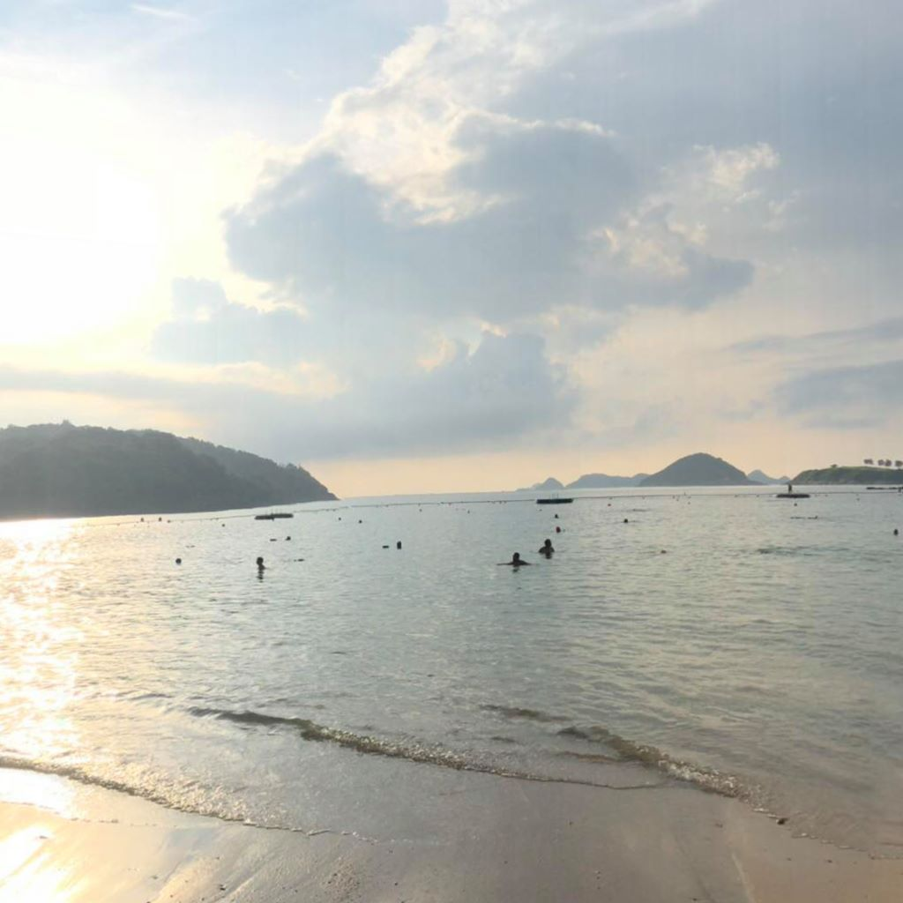
**이미지 캡션:** 해변의 잔잔한 바다에서 몇몇 사람들이 수영을 즐기고 있으며, 멀리 보이는 산과 구름 낀 하늘이 평화로운 분위기를 자아낸다. 해변은 모래로 이루어져 있고, 바다에는 부표들이 떠 있어 수영 구역을 표시하는 것으로 보인다. 햇빛이 구름 사이로 비치며 바다 표면에 반짝이는 빛을 드리우고 있다.

### 8월 11일 (토) 21:41 · Wish me luck! I have started a 100-days …

Wish me luck! I have started a 100-days 10KM run challenge. It's simple: wake up, drink water, and run 10 KM for 100 days. I'll record and observe my body changes over the challenge. I  finished 28 days and just need 72 more.

100일간 10KM를 달리는 챌린지 응원해주세요. 매우 간단한 챌린지 입니다: 100일간 일어나서 물마시고 달리기만 하면 되는. 이제 28일을 했고 남은것은 단 72일! 매일 매일 몸의 변화를 기록하여 챌린지를 마치는날 멋진 비디오를 만들예정이니 기대해주세요. 근처 계신분들은 동반달리기도 환영합니다!

Co-runner: 김재범 (7th and 9th day)

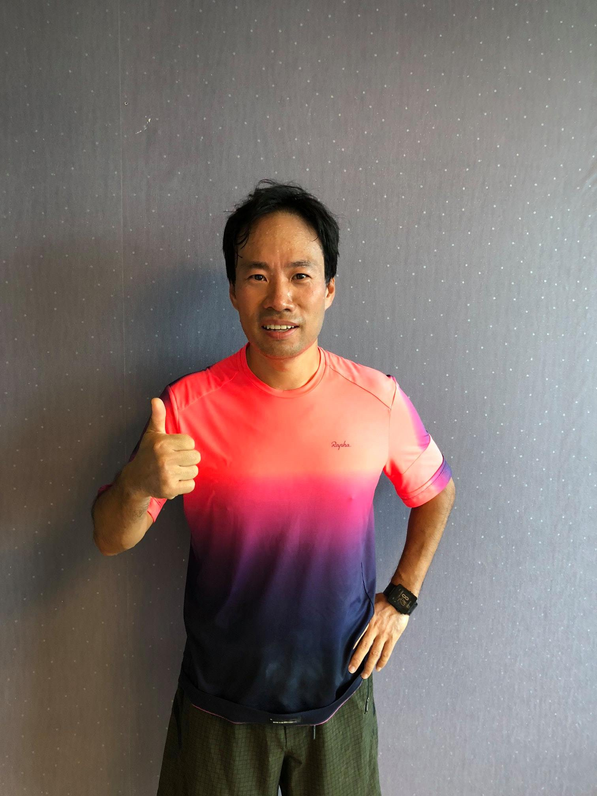
**이미지 캡션:** 사진에는 성인 남성이 서 있으며, 40대 초중반으로 보입니다. 그는 검은색 짧은 머리에 약간의 땀을 흘리고 있으며, 얼굴에는 미소를 띠고 있습니다. 그는 밝은 형광 분홍색에서 보라색, 그리고 짙은 남색으로 이어지는 그라데이션 색상의 반팔 스포츠 티셔츠를 입고 있으며, 티셔츠 왼쪽 가슴 부분에는 "Rapha"라는 로고가 보입니다. 하의로는 올리브색의 짧은 스포츠 반바지를 입고 있으며, 반바지 허리 부분에 검은색 밴드가 있습니다. 그의 왼쪽 손은 엄지손가락을 치켜세우고 있으며, 오른쪽 손은 허리에 얹고 있습니다. 손목에는 검은색 디지털 시계를 착용하고 있습니다. 배경은 회색 벽으로, 작은 흰색 점들이 불규칙하게 찍혀 있어 마치 별이 뿌려진 듯한 느낌을 줍니다. 전체적으로 활동적이고 긍정적인 분위기를 풍기는 사진입니다. 손목에는 검은색 디지털 시계를 착용하고 있습니다. 배경은 회색 벽으로, 작은 흰색 점들이 불규칙하게 찍혀 있어 마치 별이 뿌려진 듯한 느낌을 줍니다. 전체적으로 활동적이고 긍정적인 분위기를 풍기는 사진입니다.
 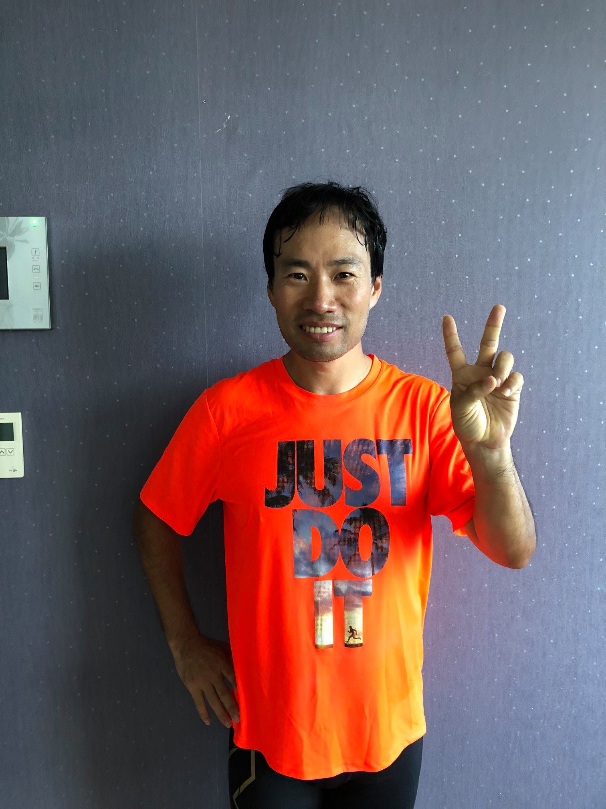
**이미지 캡션:** 한 명의 성인 남성이 밝은 주황색 반팔 티셔츠를 입고 벽을 배경으로 서 있습니다. 남성은 30대 후반에서 40대 초반으로 보이며, 짧은 검은색 머리카락은 땀에 젖어 있습니다. 그는 카메라를 향해 미소를 짓고 있으며, 오른손으로는 평화 표시를 하고 있습니다. 티셔츠에는 "JUST DO IT"이라는 문구가 큰 글씨로 새겨져 있으며, 글자 안에는 야자수와 서핑하는 사람의 이미지가 포함되어 있습니다. 남성은 검은색 운동복 하의를 입고 있으며, 왼쪽 허리에 손을 얹고 있습니다. 배경은 연보라색 벽지로, 작은 흰색 점들이 패턴처럼 찍혀 있습니다. 벽 왼쪽에는 흰색 인터폰 패널이 부착되어 있습니다. 전반적으로 활기차고 긍정적인 분위기를 풍기는 사진입니다.이 패턴처럼 찍혀 있습니다. 벽 왼쪽에는 흰색 인터폰 패널이 부착되어 있습니다. 전반적으로 활기차고 긍정적인 분위기를 풍기는 사진입니다.
 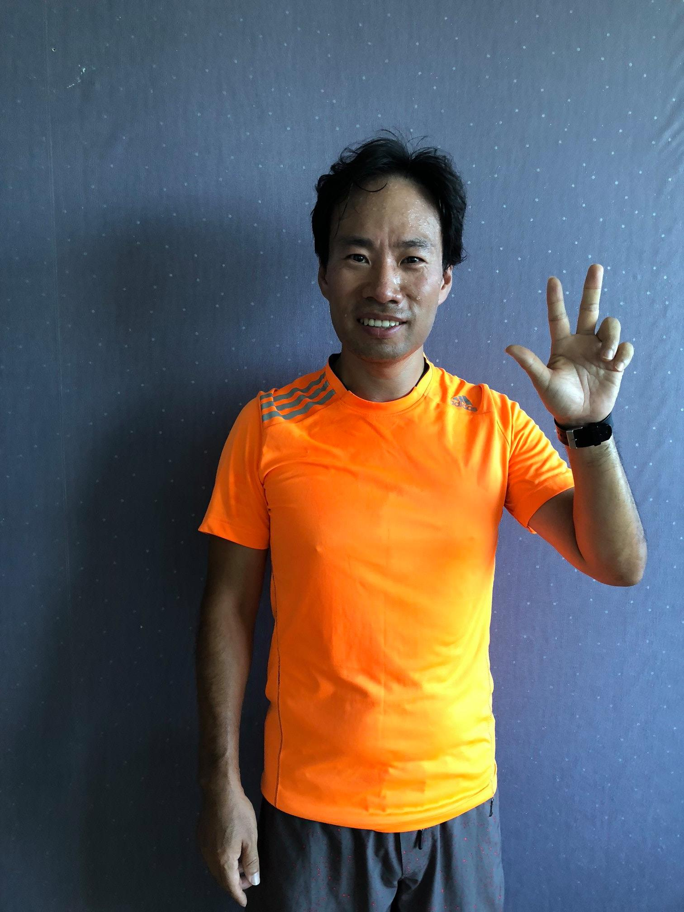
**이미지 캡션:** 한 명의 성인 남성이 밝은 주황색 반팔 티셔츠와 회색 반바지를 입고 카메라를 향해 서 있다. 남성은 40대 정도로 보이며, 검은색 머리카락은 약간 곱슬거리고 얼굴에는 땀이 약간 맺혀 있다. 그는 활짝 웃으며 오른손 검지와 중지, 약지를 펴서 숫자 3을 나타내고 있다. 티셔츠 어깨 부분에는 은색 줄무늬가 있고, 소매에는 작은 로고가 보인다. 남성은 검은색 손목시계를 착용하고 있다. 배경은 짙은 파란색 벽으로, 작은 흰색 점들이 흩뿌려져 있다. 전체적으로 운동 후의 활기찬 분위기를 풍긴다.
 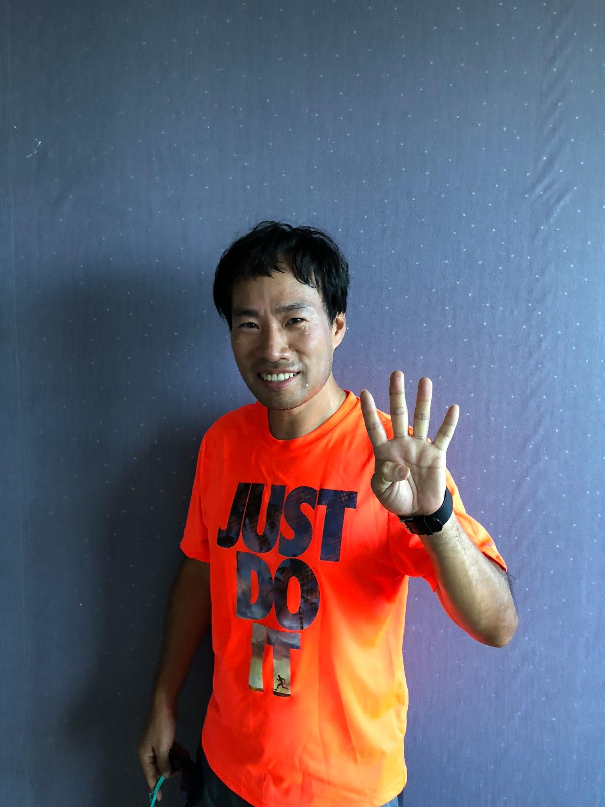
**이미지 캡션:** 한 명의 성인 남성이 밝은 주황색 나이키 티셔츠를 입고 카메라를 향해 웃으며 네 손가락을 펼쳐 보이고 있다. 티셔츠에는 검은색으로 "JUST DO IT"이라고 쓰여 있으며, "DO" 글자 안에는 달리는 사람의 실루엣이 보인다. 남성은 검은색 시계를 차고 있으며, 배경은 회색 벽으로 되어 있다. 전체적으로 밝고 긍정적인 분위기이다.
 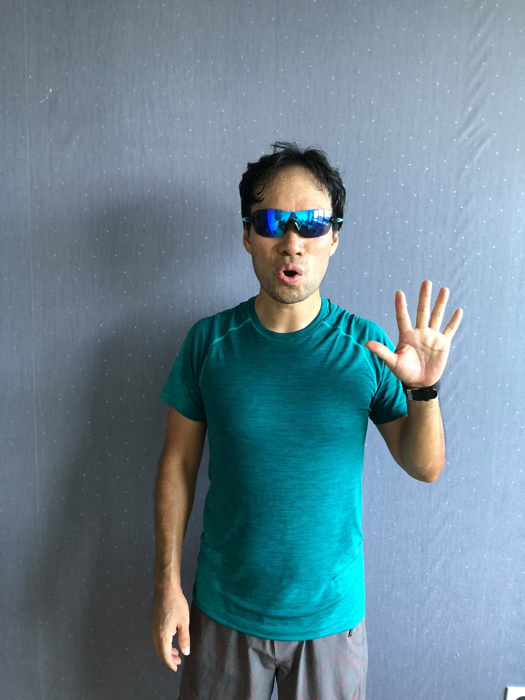
**이미지 캡션:** 한 명의 성인 남성이 푸른색 스포츠 선글라스를 끼고 짙은 청록색 반팔 티셔츠와 회색 반바지를 입고 있다. 남성은 30대 후반에서 40대 초반으로 보이며, 머리카락은 짧고 검은색이며 이마에 땀이 약간 맺혀 있다. 그의 입은 약간 벌어져 있고, 눈썹은 약간 올라가 있어 놀라거나 흥분한 듯한 표정을 짓고 있다. 오른손을 들어 손가락 다섯 개를 펼쳐 보이고 있으며, 손목에는 검은색 스포츠 시계를 착용하고 있다. 배경은 옅은 회색 벽으로, 작은 흰색 점들이 불규칙하게 찍혀 있어 약간의 질감이 느껴진다. 전체적으로 야외 활동 후의 모습처럼 보이며, 활기차고 역동적인 분위기를 풍긴다. 활동 후의 모습처럼 보이며, 활기차고 역동적인 분위기를 풍긴다.
 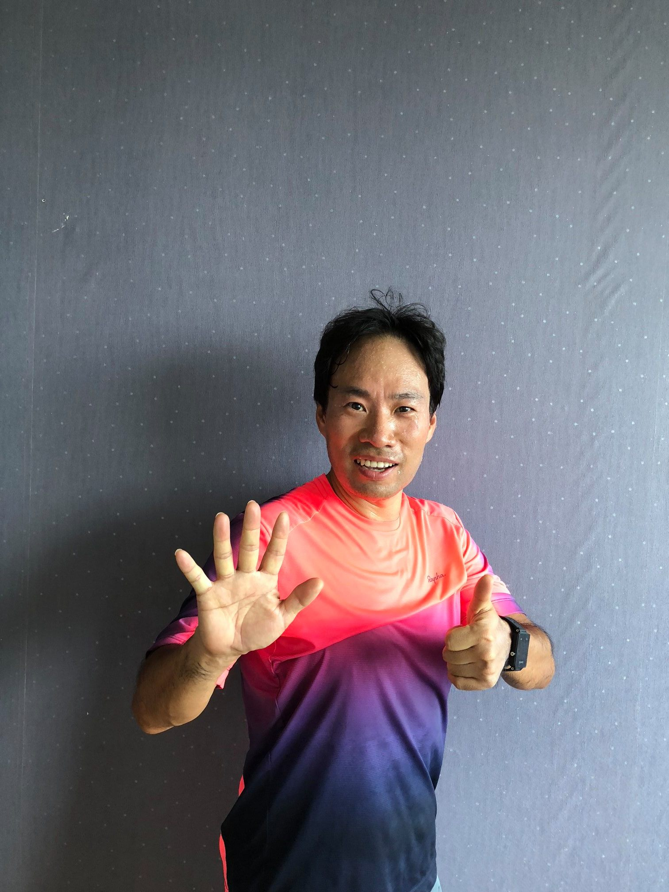
**이미지 캡션:** 한 명의 성인 남성이 회색 배경 앞에서 서 있으며, 남성은 40대 정도로 보이고 짧은 검은 머리에 옅은 미소를 띠고 있습니다. 그는 밝은 색상의 스포츠 티셔츠를 입고 있으며, 티셔츠는 어깨 부분은 주황색에서 시작하여 아래로 갈수록 분홍색, 보라색, 남색으로 그라데이션되는 디자인입니다. 티셔츠에는 "rapha"라는 로고가 작게 새겨져 있습니다. 남성은 왼손을 앞으로 뻗어 손바닥을 보이게 하고 있으며, 오른손으로는 엄지손가락을 치켜들고 있습니다. 그의 손목에는 검은색 스마트워치가 착용되어 있습니다. 배경은 옅은 회색으로, 작은 흰색 점들이 불규칙하게 찍혀 있어 마치 벽지나 천처럼 보입니다. 전체적으로 밝고 긍정적인 분위기를 연출하고 있습니다.회색으로, 작은 흰색 점들이 불규칙하게 찍혀 있어 마치 벽지나 천처럼 보입니다. 전체적으로 밝고 긍정적인 분위기를 연출하고 있습니다.
 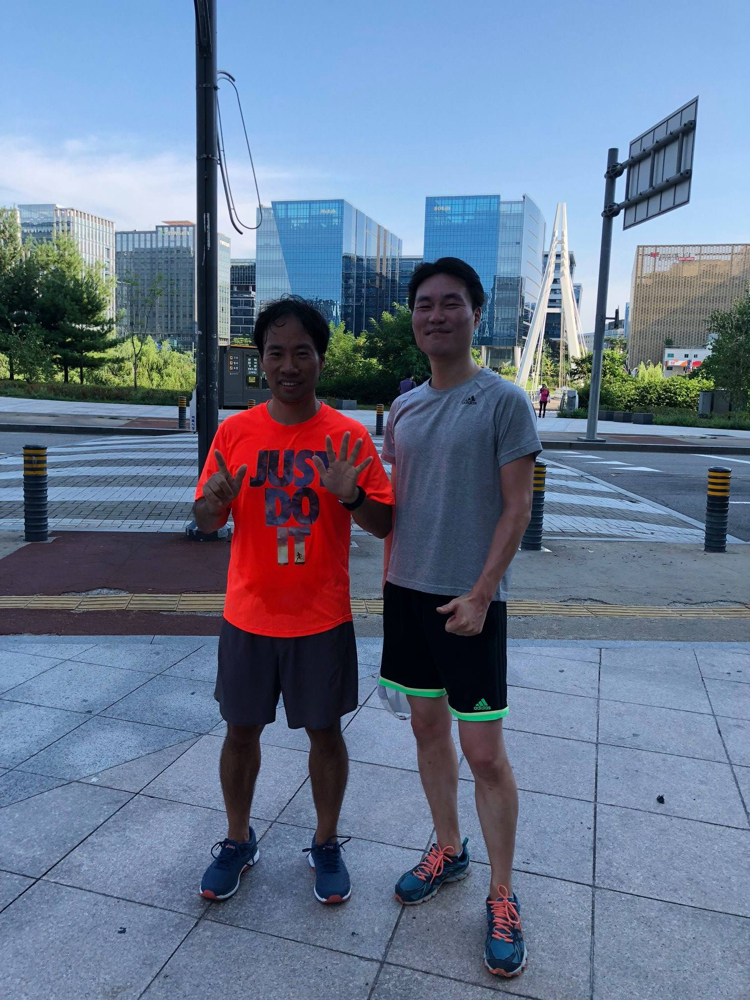
**이미지 캡션:** 두 명의 성인 남성이 야외에서 함께 서서 사진을 찍고 있다. 왼쪽 남성은 40대 후반에서 50대 초반으로 보이며, 주황색 반팔 티셔츠에 회색 반바지를 입고 파란색 운동화를 신고 있다. 티셔츠에는 "JUST DO IT"이라는 문구가 보라색으로 쓰여 있다. 그는 카메라를 향해 손바닥을 펴 보이며 웃고 있다. 오른쪽 남성은 30대 후반에서 40대 초반으로 보이며, 회색 반팔 티셔츠에 검은색 반바지를 입고 파란색과 주황색이 섞인 운동화를 신고 있다. 그의 티셔츠에는 아디다스 로고가 보인다. 그는 카메라를 향해 미소를 짓고 있다. 두 사람 모두 운동복 차림으로 보아 운동을 하러 나왔거나 운동을 마친 후인 것으로 보인다. 배경에는 현대적인 유리 건물들이 늘어서 있고, 푸른 하늘과 나무들이 보인다. 도로에는 횡단보도와 신호등, 가로등이 보이며, 도시적인 분위기를 자아낸다. 전반적으로 밝고 긍정적인 분위기의 사진이다. 짓고 있다. 두 사람 모두 운동복 차림으로 보아 운동을 하러 나왔거나 운동을 마친 후인 것으로 보인다. 배경에는 현대적인 유리 건물들이 늘어서 있고, 푸른 하늘과 나무들이 보인다. 도로에는 횡단보도와 신호등, 가로등이 보이며, 도시적인 분위기를 자아낸다. 전반적으로 밝고 긍정적인 분위기의 사진이다.
 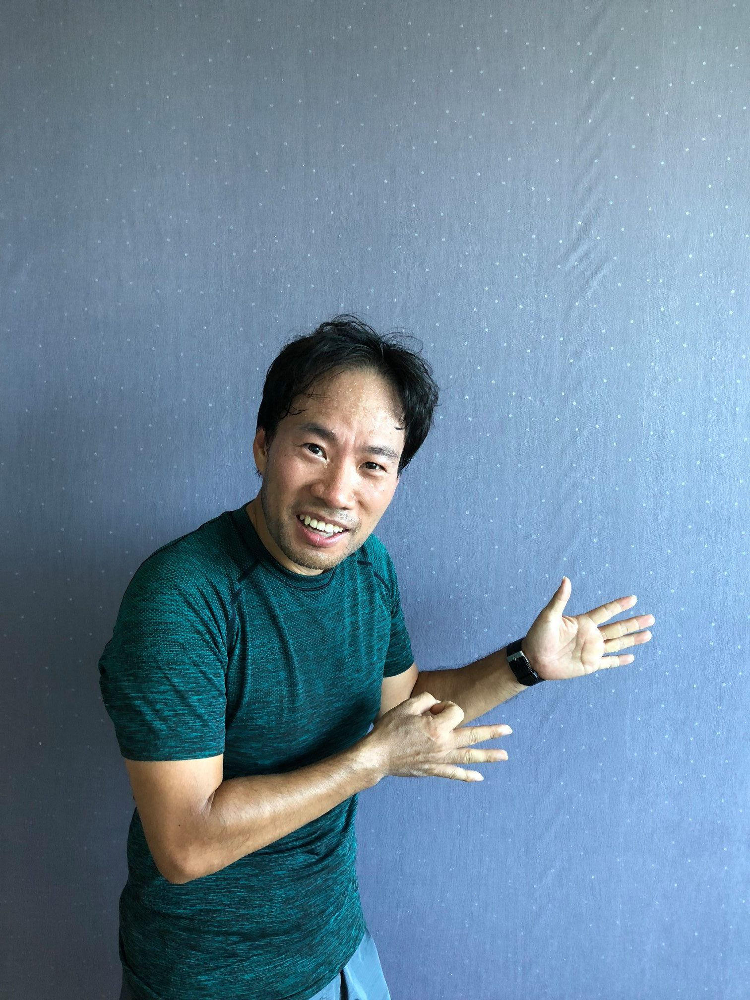
**이미지 캡션:** 이 사진에는 30대 후반에서 40대 초반으로 보이는 성인 남성이 푸른색 배경 앞에서 포즈를 취하고 있다. 남성은 짧은 검은색 머리에 약간 땀에 젖은 듯한 모습이며, 짙은 녹색의 짧은 소매 운동복 상의와 회색 반바지를 입고 있다. 얼굴에는 미소를 띠고 있으며, 오른쪽 팔을 들어 손가락으로 무언가를 가리키는 듯한 제스처를 하고 있고, 왼쪽 팔은 구부려 손을 턱 근처에 가져다 대고 있다. 손목에는 검은색 시계가 착용되어 있다. 배경은 연한 푸른색 바탕에 작은 흰색 점들이 흩뿌려져 있는 패턴으로, 특별한 장소나 사물은 보이지 않는다. 전체적으로 밝고 긍정적인 분위기를 연출하고 있으며, 남성은 활기차고 자신감 있는 표정으로 카메라를 응시하고 있다.은 보이지 않는다. 전체적으로 밝고 긍정적인 분위기를 연출하고 있으며, 남성은 활기차고 자신감 있는 표정으로 카메라를 응시하고 있다.
 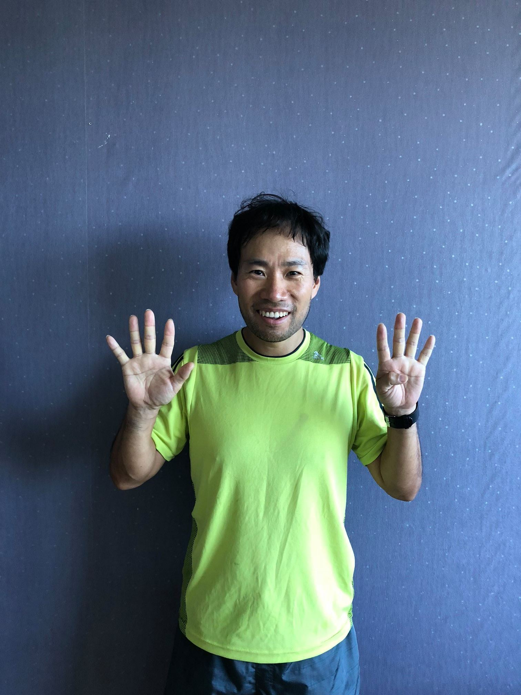
**이미지 캡션:** 사진에는 밝은 형광 녹색 반팔 티셔츠와 회색 반바지를 입은 성인 남성이 등장한다. 남성은 30대 후반에서 40대 초반으로 보이며, 짧고 약간 헝클어진 검은색 머리카락을 가지고 있다. 그는 활짝 웃으며 치아를 드러내고 있으며, 눈은 약간 가늘게 뜨고 있다. 남성은 양손을 앞으로 들어 올리고 있으며, 각 손의 손가락을 펴서 숫자를 세는 듯한 포즈를 취하고 있다. 왼쪽 손은 손바닥이 카메라를 향하고 있고, 오른쪽 손은 손등이 카메라를 향하고 있다. 그의 오른쪽 손목에는 검은색 시계가 착용되어 있다. 배경은 푸른색 계열의 벽으로, 표면에는 작은 흰색 점들이 불규칙하게 분포되어 있어 마치 별이 빛나는 밤하늘이나 물방울이 맺힌 듯한 느낌을 준다. 전체적으로 밝고 긍정적인 분위기를 풍기며, 남성은 편안하고 자신감 있는 모습이다.계열의 벽으로, 표면에는 작은 흰색 점들이 불규칙하게 분포되어 있어 마치 별이 빛나는 밤하늘이나 물방울이 맺힌 듯한 느낌을 준다. 전체적으로 밝고 긍정적인 분위기를 풍기며, 남성은 편안하고 자신감 있는 모습이다.
 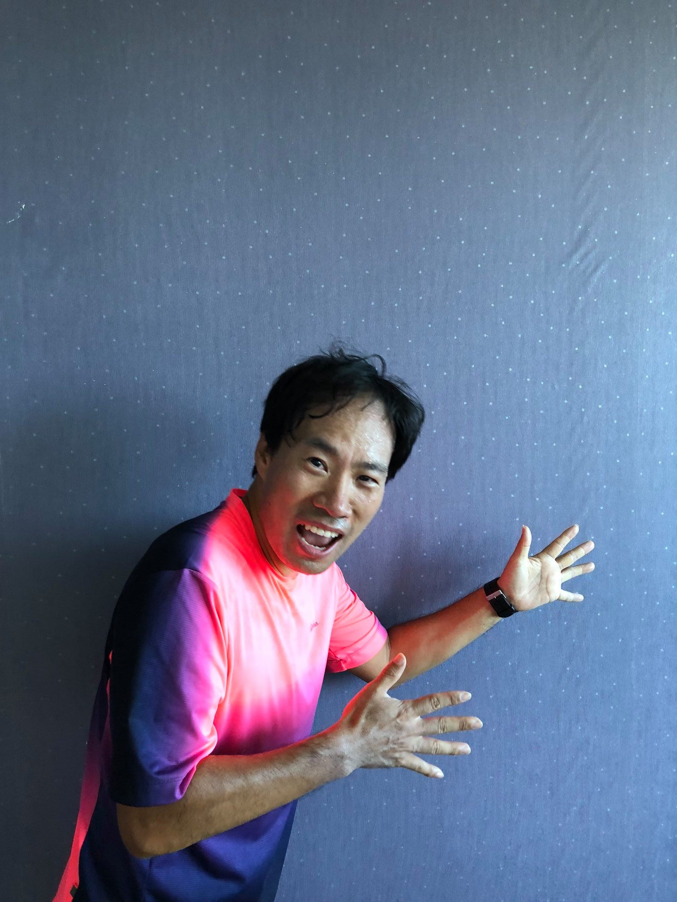
**이미지 캡션:** 사진에는 성인 남성이 등장하며, 대략 30대에서 40대로 보이는 외모를 가지고 있습니다. 그는 검은색 머리카락을 가지고 있으며, 밝은 형광 분홍색과 보라색이 그라데이션으로 섞인 스포츠 티셔츠를 입고 있습니다. 티셔츠에는 작은 로고가 보입니다. 남성은 왼쪽을 향해 몸을 틀고 있으며, 얼굴은 카메라를 향하고 있습니다. 그의 표정은 매우 활기차고 즐거워 보이며, 입을 벌리고 웃고 있습니다. 오른손은 앞으로 뻗어 손가락을 펼치고 있고, 왼손도 비슷한 자세로 뻗어 있어 무언가를 가리키거나 설명하는 듯한 행동을 하고 있습니다. 손목에는 검은색 시계가 착용되어 있습니다. 배경은 푸른색 계열의 벽으로, 작은 흰색 점들이 촘촘하게 찍혀 있어 독특한 질감을 형성하고 있습니다. 전체적으로 밝고 긍정적인 분위기를 연출하며, 마치 무대 위에서 관객에게 무언가를 보여주거나 함께 즐기는 듯한 상황을 연상시킵니다.습니다. 손목에는 검은색 시계가 착용되어 있습니다. 배경은 푸른색 계열의 벽으로, 작은 흰색 점들이 촘촘하게 찍혀 있어 독특한 질감을 형성하고 있습니다. 전체적으로 밝고 긍정적인 분위기를 연출하며, 마치 무대 위에서 관객에게 무언가를 보여주거나 함께 즐기는 듯한 상황을 연상시킵니다.
 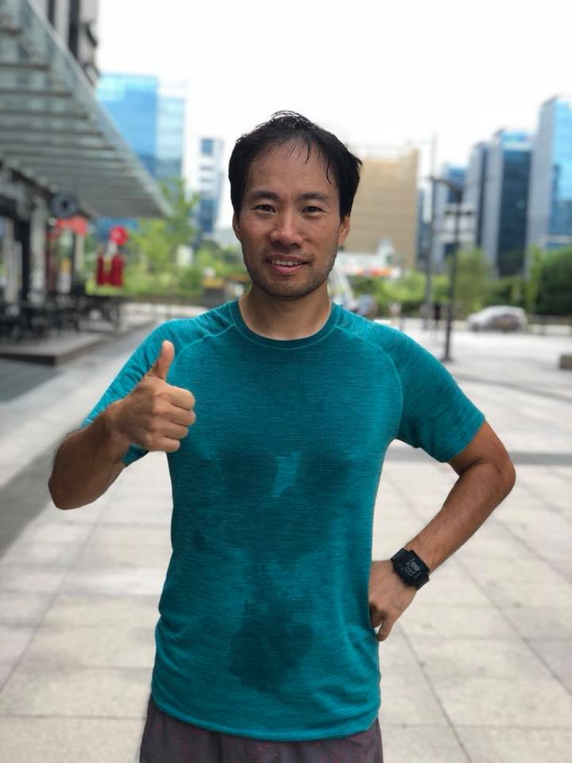
**이미지 캡션:** 이 사진은 30대 후반에서 40대 초반으로 보이는 성인 남성이 야외에서 엄지손가락을 치켜세우며 긍정적인 표정을 짓고 있는 모습을 담고 있습니다. 남성은 땀에 흠뻑 젖은 청록색 반팔 운동복을 입고 있으며, 왼쪽 손목에는 검은색 스포츠 시계를 착용하고 있습니다. 배경에는 현대적인 건물들이 늘어선 도시 거리 풍경이 흐릿하게 보이며, 이는 남성이 운동 후 도심에서 휴식을 취하고 있음을 시사합니다. 전반적으로 활기차고 건강한 분위기를 풍깁니다.
 
**이미지 캡션:** 사진에는 땀에 젖은 머리카락을 가진 성인 남성이 보이며, 그는 30대 후반에서 40대 초반으로 추정된다. 그는 짙은 녹색 반팔 티셔츠와 검은색 운동복 하의를 입고 있으며, 손목에는 검은색 시계가 착용되어 있다. 남성은 입을 크게 벌리고 활짝 웃으며, 오른손으로는 브이(V)자를 그리고 있다. 그의 표정은 매우 즐겁고 활기차 보인다. 배경은 옅은 보라색 벽으로, 작은 흰색 점들이 불규칙하게 뿌려져 있어 마치 별이 빛나는 밤하늘을 연상시킨다. 조명은 밝고 부드러우며, 남성의 얼굴에 그림자가 드리워져 입체감을 더한다. 전반적으로 사진은 운동 후의 만족감과 즐거움을 표현하는 듯한 긍정적이고 활기찬 분위기를 자아낸다.. 전반적으로 사진은 운동 후의 만족감과 즐거움을 표현하는 듯한 긍정적이고 활기찬 분위기를 자아낸다.
 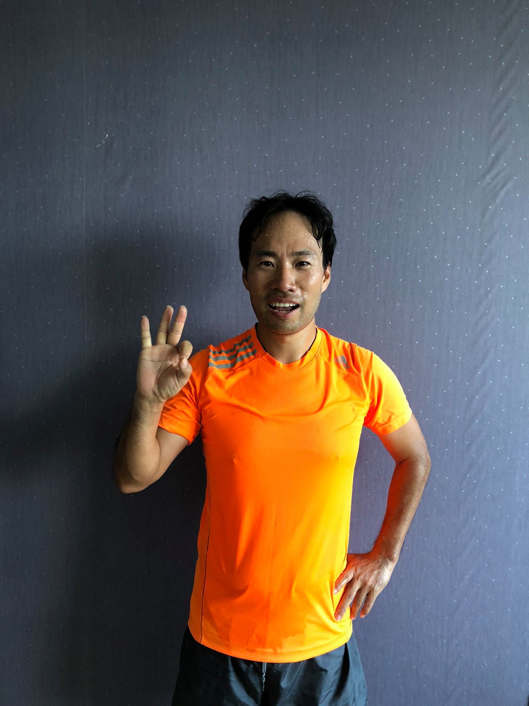
**이미지 캡션:** 한 명의 성인 남성이 밝은 주황색 운동복 상의와 검은색 반바지를 입고 서 있다. 남성은 30대 후반에서 40대 초반으로 보이며, 짧은 검은색 머리카락에 땀을 흘리고 있다. 그의 표정은 밝고 긍정적이며, 입을 살짝 벌리고 웃고 있다. 오른손으로는 손가락 세 개를 펴서 '3'을 나타내는 듯한 제스처를 취하고 있으며, 왼손은 허리에 얹고 있다. 배경은 짙은 회색의 벽으로, 잔잔한 물방울 무늬가 있어 밋밋하지 않다. 전체적으로 운동 후의 활기찬 모습이나 긍정적인 에너지를 전달하는 분위기이다.
 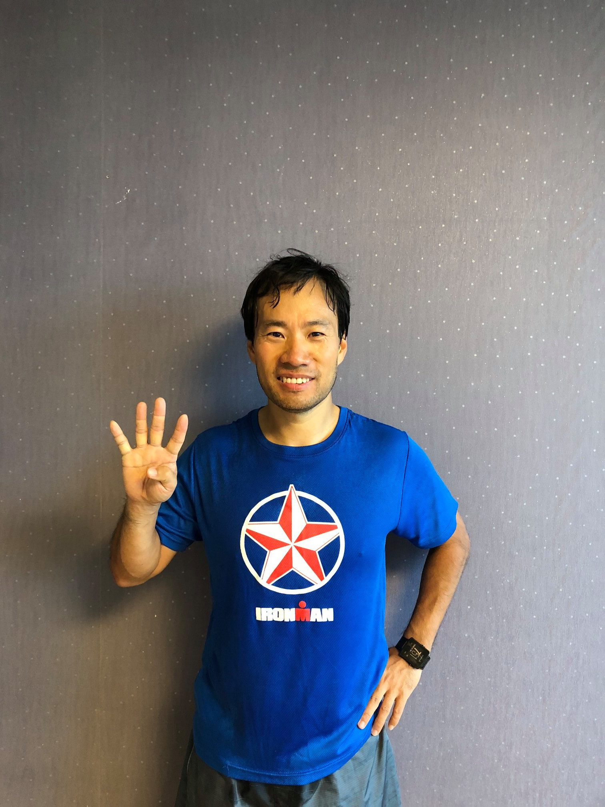
**이미지 캡션:** 한 명의 성인 남성이 회색 벽을 배경으로 서 있다. 남성은 30대 후반에서 40대 초반으로 보이며, 짧은 검은색 머리에 약간의 수염이 있다. 그는 밝은 파란색 티셔츠를 입고 있으며, 티셔츠 앞면에는 흰색 테두리의 빨간색 별과 그 아래에 "IRONMAN"이라고 쓰여진 로고가 있다. 남성은 왼쪽 손을 들어 네 손가락을 펴고 있으며, 오른쪽 손은 허리에 얹고 있다. 그의 표정은 미소를 띠고 있으며, 편안하고 자신감 있는 모습이다. 배경은 옅은 회색으로, 작은 흰색 점들이 불규칙하게 찍혀 있어 약간의 질감이 느껴진다. 남성은 스포츠 활동을 즐기는 사람으로 보이며, 전반적으로 건강하고 활동적인 분위기를 풍긴다.. 남성은 스포츠 활동을 즐기는 사람으로 보이며, 전반적으로 건강하고 활동적인 분위기를 풍긴다.
 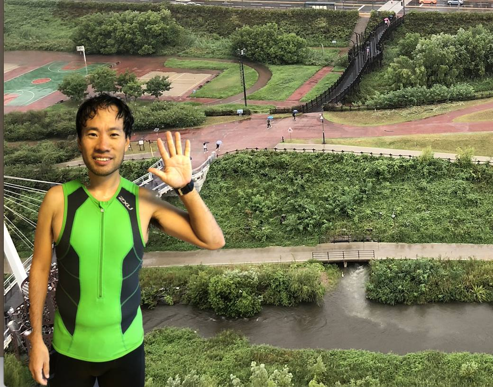
**이미지 캡션:** 한 명의 성인 남성이 밝은 녹색과 검은색이 배합된 민소매 스포츠 조끼를 입고 있으며, 조끼에는 'ZXU'라는 로고가 보인다. 그는 오른손을 들어 손바닥을 보이게 하며 인사하는 듯한 포즈를 취하고 있다. 남성은 짧은 검은색 머리카락에 약간 젖은 듯한 모습이며, 옅은 미소를 띠고 있다. 배경은 야외 공원으로, 옅은 비가 내리는 듯한 흐린 날씨이다. 녹색의 우거진 풀과 나무들이 보이며, 강과 작은 다리, 그리고 산책로가 보인다. 멀리에는 농구 코트와 테니스 코트로 보이는 운동 시설과 함께 굽이치는 다리가 보인다. 전반적으로 운동 후의 모습이나 운동을 하러 가는 길에 찍은 사진으로 보이며, 자연 속에서 활동적인 분위기를 풍긴다.전반적으로 운동 후의 모습이나 운동을 하러 가는 길에 찍은 사진으로 보이며, 자연 속에서 활동적인 분위기를 풍긴다.
 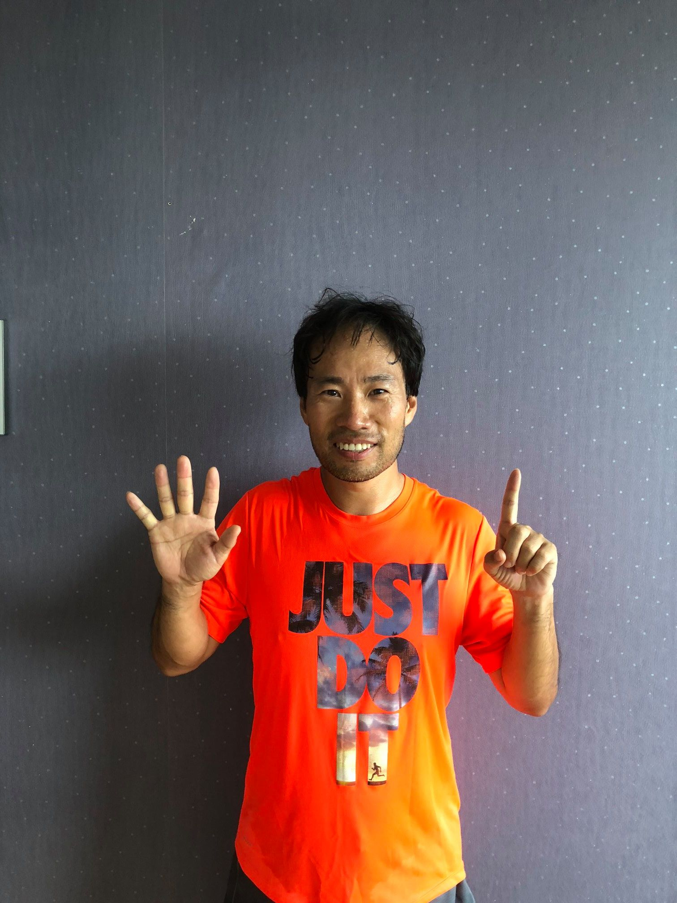
**이미지 캡션:** 한 명의 성인 남성이 밝은 주황색 티셔츠를 입고 벽을 배경으로 서 있습니다. 남성은 30대 후반에서 40대 초반으로 보이며, 짧은 검은색 머리카락에 약간 헝클어진 모습입니다. 얼굴에는 미소가 번지고 있으며, 눈은 카메라를 향하고 있습니다. 남성은 왼손으로는 손가락 다섯 개를 펴서 숫자를 나타내고 있고, 오른손으로는 검지 손가락을 펴서 숫자를 나타내고 있습니다. 티셔츠에는 "JUST DO IT"이라는 문구가 큰 글씨로 새겨져 있으며, 문구 안에는 야자수와 달리는 사람의 이미지가 포함되어 있습니다. 배경은 어두운 회색 벽으로, 작은 흰색 점들이 불규칙하게 찍혀 있습니다. 전체적으로 밝고 긍정적인 분위기를 연출하고 있습니다. 회색 벽으로, 작은 흰색 점들이 불규칙하게 찍혀 있습니다. 전체적으로 밝고 긍정적인 분위기를 연출하고 있습니다.
 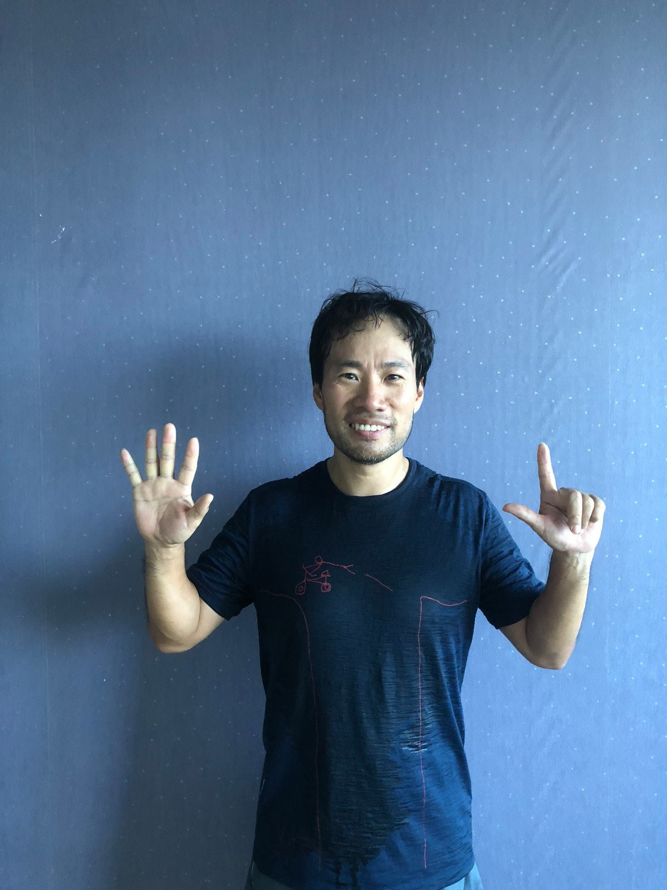
**이미지 캡션:** 푸른색 배경 앞에서 한 성인 남성이 서 있다. 남성은 30대 후반에서 40대 초반으로 보이며, 짧은 검은색 머리카락과 옅은 수염을 가지고 있다. 그는 활짝 웃으며 카메라를 응시하고 있으며, 왼쪽 손은 다섯 손가락을 모두 펴서 들고 있고, 오른쪽 손은 검지와 중지를 펴서 'L'자 모양을 만들고 있다. 남성은 어두운 색의 반팔 티셔츠를 입고 있는데, 티셔츠 앞면에는 빨간색 선으로 그려진 자전거 타는 사람의 그림과 함께 산악 지형을 형상화한 듯한 디자인이 있다. 배경은 푸른색 벽으로, 작은 흰색 점들이 흩뿌려져 있어 마치 별이 빛나는 밤하늘이나 잔잔한 물결을 연상시킨다. 전체적으로 밝고 긍정적인 분위기를 풍긴다.어 마치 별이 빛나는 밤하늘이나 잔잔한 물결을 연상시킨다. 전체적으로 밝고 긍정적인 분위기를 풍긴다.
 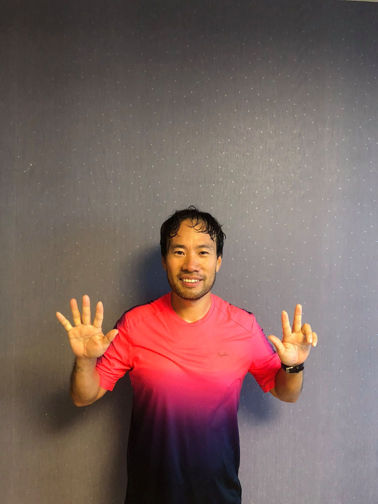
**이미지 캡션:** 한 명의 성인 남성이 회색 벽을 배경으로 서 있다. 남성은 30대 후반에서 40대 초반으로 보이며, 짧은 검은 머리에 땀에 젖은 듯한 모습이다. 그는 밝은 핑크색에서 어두운 보라색으로 그러데이션되는 짧은 소매의 운동복 상의를 입고 있으며, 상의 왼쪽 가슴 부분에 작게 "Rapha"라는 로고가 보인다. 남성은 환하게 웃으며 카메라를 응시하고 있고, 왼손으로는 다섯 손가락을 모두 펴서 보여주고 있으며, 오른손으로는 검지와 중지를 펴서 숫자 2를 나타내고 있다. 그의 손목에는 검은색 시계가 착용되어 있다. 배경은 옅은 회색 바탕에 작은 흰색 점들이 흩뿌려져 있어 마치 별이 빛나는 밤하늘을 연상시킨다. 전체적으로 밝고 긍정적인 분위기를 자아낸다.옅은 회색 바탕에 작은 흰색 점들이 흩뿌려져 있어 마치 별이 빛나는 밤하늘을 연상시킨다. 전체적으로 밝고 긍정적인 분위기를 자아낸다.
 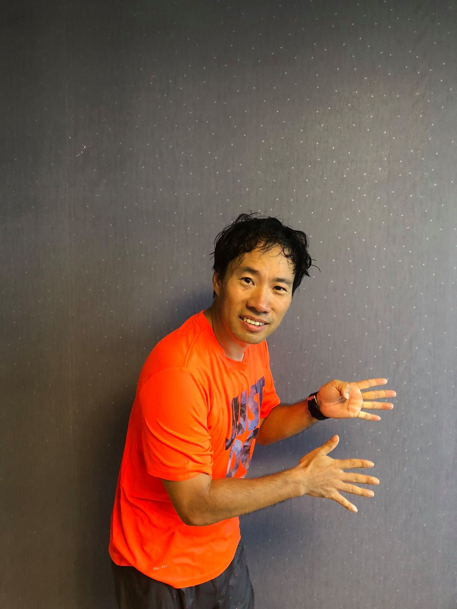
**이미지 캡션:** 한 명의 성인 남성이 밝은 주황색 반팔 티셔츠와 검은색 반바지를 입고 서 있습니다. 남성은 30대 후반에서 40대 초반으로 보이며, 짧고 젖은 검은색 머리카락을 가지고 있습니다. 그는 카메라를 향해 약간 몸을 틀고 있으며, 얼굴에는 미소를 띠고 있습니다. 그의 오른손은 위로 향하고 있고, 왼손은 아래로 향하고 있으며, 두 손 모두 손가락을 쫙 펼치고 있습니다. 남성은 검은색 시계를 차고 있습니다. 배경은 어두운 회색 벽으로, 작은 흰색 점들이 불규칙하게 뿌려져 있습니다. 티셔츠에는 보라색과 검은색으로 "JUST DO IT"이라는 문구가 희미하게 보입니다. 전반적으로 활기차고 긍정적인 분위기를 연출하고 있습니다.T DO IT"이라는 문구가 희미하게 보입니다. 전반적으로 활기차고 긍정적인 분위기를 연출하고 있습니다.
 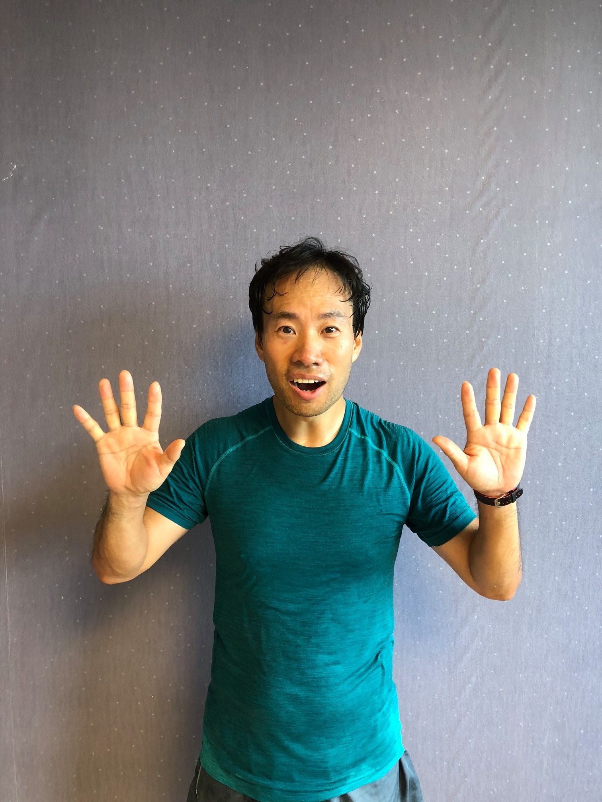
**이미지 캡션:** 한 명의 성인 남성이 회색 배경 앞에서 두 손을 앞으로 뻗고 손바닥을 보여주며 서 있다. 남성은 30대 후반에서 40대 초반으로 보이며, 짧고 헝클어진 검은 머리카락을 가지고 있다. 그는 짙은 청록색 반팔 티셔츠와 회색 반바지를 입고 있으며, 왼쪽 손목에는 검은색 시계가 착용되어 있다. 남성은 입을 벌리고 눈을 크게 뜨고 있으며, 놀라거나 흥분한 듯한 표정을 짓고 있다. 그의 두 손은 활짝 펴져 있고 손가락은 모두 펼쳐져 있어 무언가를 강조하거나 숫자를 세는 듯한 제스처를 취하고 있다. 배경은 옅은 회색이며, 작은 흰색 점들이 불규칙하게 흩뿌려져 있어 마치 별이 빛나는 밤하늘이나 눈이 내리는 듯한 느낌을 준다. 전체적으로 밝고 활기찬 분위기이며, 남성의 표정과 제스처는 긍정적이고 에너지가 넘치는 상황을 암시한다. 작은 흰색 점들이 불규칙하게 흩뿌려져 있어 마치 별이 빛나는 밤하늘이나 눈이 내리는 듯한 느낌을 준다. 전체적으로 밝고 활기찬 분위기이며, 남성의 표정과 제스처는 긍정적이고 에너지가 넘치는 상황을 암시한다.
 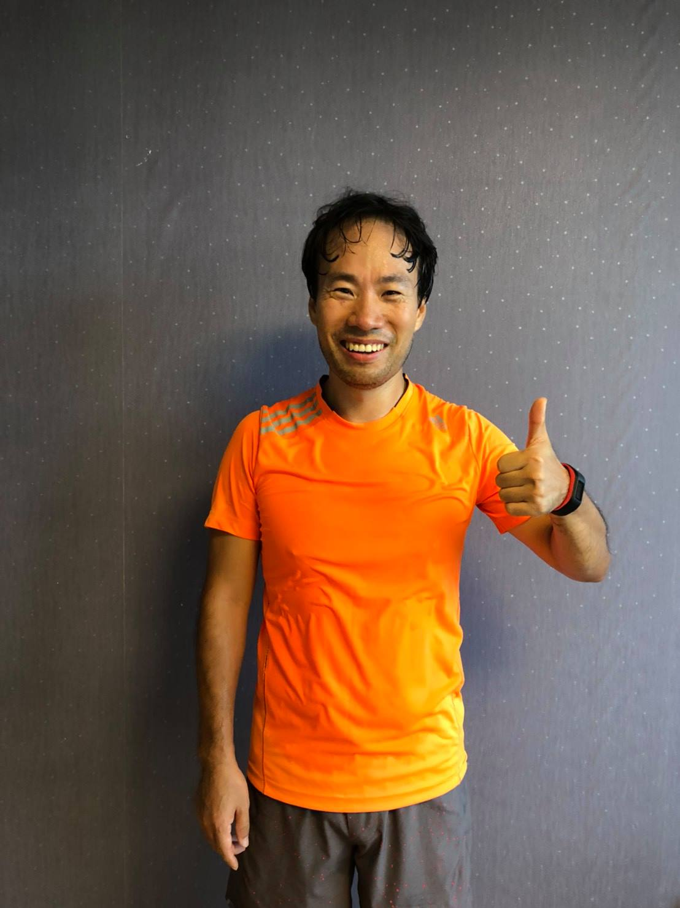
**이미지 캡션:** 사진에는 30대 후반에서 40대 초반으로 보이는 성인 남성이 밝은 주황색 반팔 운동복 상의와 회색 반바지를 입고 서 있다. 남성은 머리카락이 땀에 젖어 있고, 얼굴에는 땀방울이 맺혀 있어 운동을 마친 직후인 것으로 보인다. 활짝 웃으며 엄지손가락을 치켜세우고 있어 긍정적이고 만족스러운 표정을 짓고 있다. 그의 오른쪽 손목에는 검은색과 빨간색 밴드가 있는 스마트 워치가 착용되어 있다. 배경은 회색 벽으로, 은은한 흰색 점들이 불규칙하게 찍혀 있어 단조롭지 않은 질감을 보여준다. 전체적으로 건강하고 활기찬 분위기를 풍기는 사진이다.를 풍기는 사진이다.
 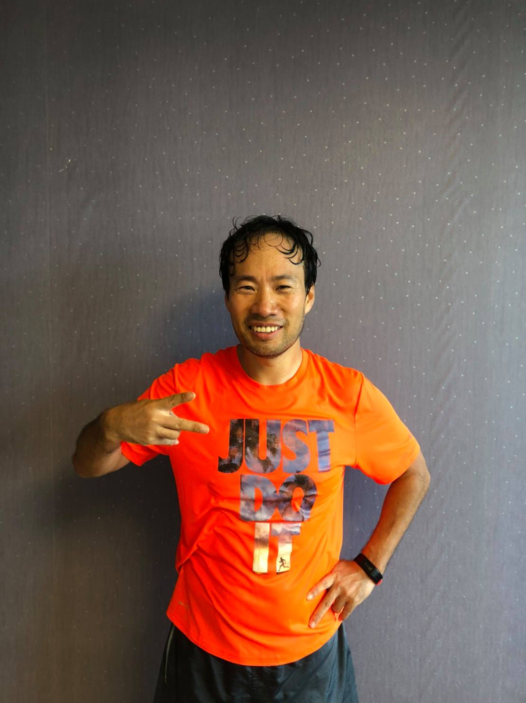
**이미지 캡션:** 한 명의 성인 남성이 밝은 주황색 나이키 티셔츠와 검은색 반바지를 입고 회색 점박이 배경 앞에 서 있다. 남성은 30대 후반에서 40대 초반으로 보이며, 머리카락은 땀에 젖어 있고 얼굴에는 옅은 미소를 띠고 있다. 그는 왼쪽 손으로 브이(V) 모양을 만들고 있으며, 오른쪽 손은 허리에 얹고 있다. 티셔츠에는 "JUST DO IT"이라는 문구가 큰 글씨로 새겨져 있으며, 글자 안에는 야자수와 해변 풍경, 그리고 달리는 사람의 실루엣이 보인다. 남성의 왼쪽 손목에는 검은색 스포츠 밴드가 착용되어 있다. 전체적으로 운동 후의 활기찬 분위기를 느낄 수 있다. 운동 후의 활기찬 분위기를 느낄 수 있다.
 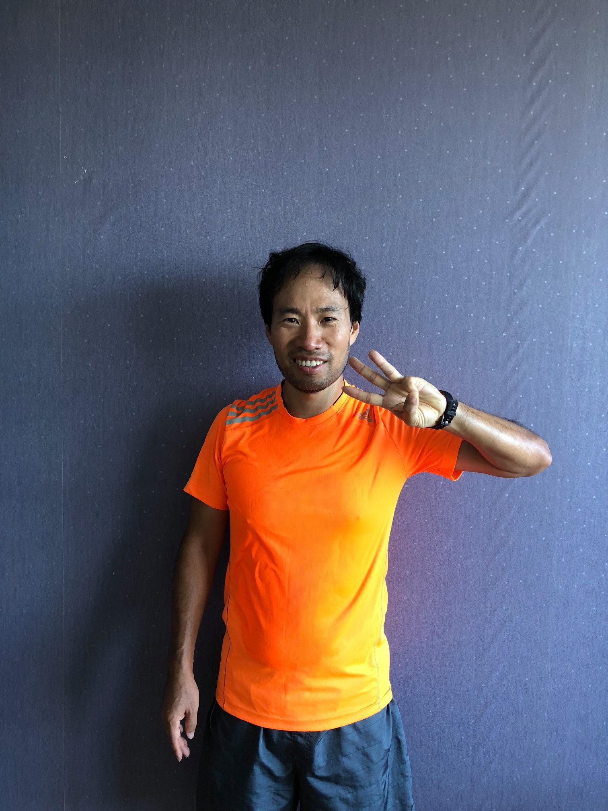
**이미지 캡션:** 한 명의 성인 남성이 밝은 주황색 반팔 티셔츠와 회색 반바지를 입고 서 있으며, 티셔츠에는 어깨 부분에 회색 줄무늬가 있고, 남성은 오른손을 들어 검지와 중지를 펴서 숫자 3을 나타내고 있으며, 그의 얼굴에는 미소가 있고, 배경은 보라색 벽으로 작은 흰색 점들이 불규칙하게 찍혀 있으며, 남성은 스포츠 활동을 한 듯 땀에 젖은 모습이고, 전체적으로 활동적이고 긍정적인 분위기를 풍긴다.
 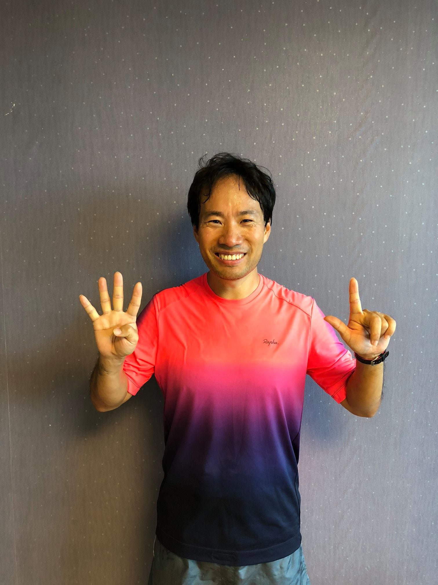
**이미지 캡션:** 한 명의 성인 남성이 밝게 웃으며 카메라를 바라보고 있다. 그는 30대 후반에서 40대 초반으로 보이며, 짧은 검은 머리에 약간 그을린 피부를 가지고 있다. 남성은 네온 핑크에서 보라색, 검은색으로 이어지는 그라데이션 색상의 반팔 스포츠 티셔츠를 입고 있으며, 티셔츠 왼쪽 가슴 부분에는 'Rapha'라는 로고가 작게 새겨져 있다. 하의로는 회색 계열의 운동복 반바지를 착용하고 있다. 그의 왼쪽 손은 네 손가락을 펴서 숫자 4를 나타내고 있고, 오른쪽 손은 검지와 중지를 펴서 숫자 1을 나타내고 있다. 배경은 옅은 회색 벽으로, 작은 흰색 점들이 불규칙하게 찍혀 있어 마치 별이 뿌려진 듯한 느낌을 준다. 전체적으로 밝고 긍정적인 분위기이며, 남성은 운동 후 또는 운동을 준비하는 듯한 모습이다.옅은 회색 벽으로, 작은 흰색 점들이 불규칙하게 찍혀 있어 마치 별이 뿌려진 듯한 느낌을 준다. 전체적으로 밝고 긍정적인 분위기이며, 남성은 운동 후 또는 운동을 준비하는 듯한 모습이다.
 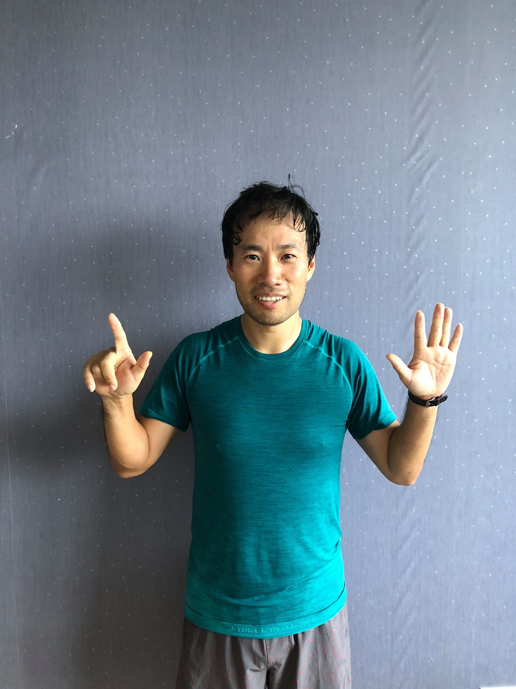
**이미지 캡션:** 이 사진은 회색 배경 앞에 서 있는 성인 남성을 보여줍니다. 남성은 30대 후반에서 40대 초반으로 보이며, 짧은 검은색 머리카락은 약간 젖어 있습니다. 그는 짙은 청록색 반팔 티셔츠와 회색 반바지를 입고 있습니다. 티셔츠는 땀에 젖은 듯 몸에 달라붙어 있으며, 반바지 밑단에는 "TIME TO GET DIRTY"라는 문구가 희미하게 보입니다. 남성은 카메라를 향해 미소를 짓고 있으며, 왼쪽 손으로는 검지와 중지를 펴서 숫자 2를 나타내고 있고, 오른쪽 손으로는 손바닥을 펴서 숫자 5를 나타내고 있습니다. 그의 표정은 밝고 긍정적이며, 전반적인 분위기는 캐주얼하고 활동적인 느낌을 줍니다. 배경은 옅은 회색 바탕에 작은 흰색 점들이 흩뿌려져 있어 심플하면서도 약간의 질감을 더합니다. 표정은 밝고 긍정적이며, 전반적인 분위기는 캐주얼하고 활동적인 느낌을 줍니다. 배경은 옅은 회색 바탕에 작은 흰색 점들이 흩뿌려져 있어 심플하면서도 약간의 질감을 더합니다.
 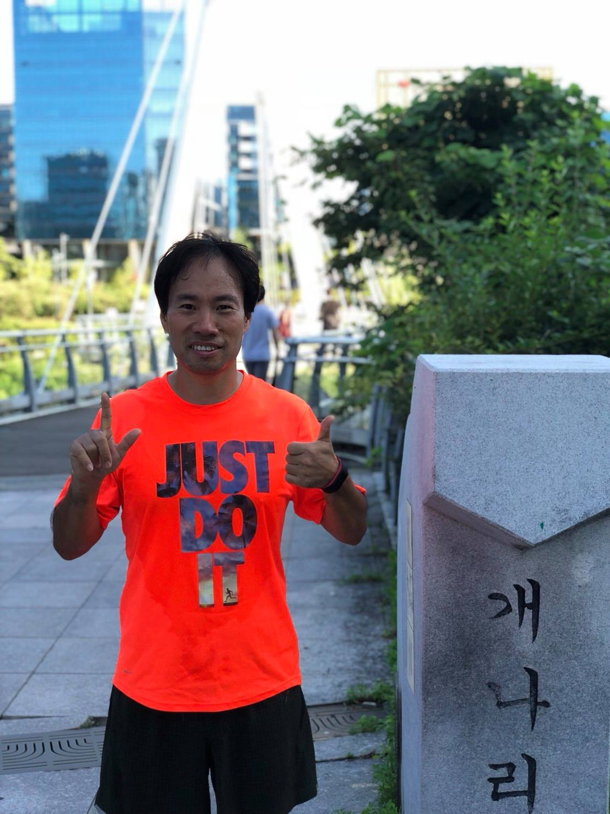
**이미지 캡션:** 밝은 주황색 나이키 티셔츠를 입고 검은색 반바지를 착용한 성인 남성이 다리를 건너고 있으며, 그의 티셔츠에는 "JUST DO IT"이라는 문구가 보입니다. 남성은 오른손으로 엄지척을 하고 왼손으로는 숫자 1을 가리키며 미소를 짓고 있습니다. 배경에는 현대적인 유리 건물과 푸른 나무가 보이며, 오른쪽에는 "개나리"라고 쓰여진 비석이 있습니다. 전반적으로 활동적이고 긍정적인 분위기를 풍깁니다.
 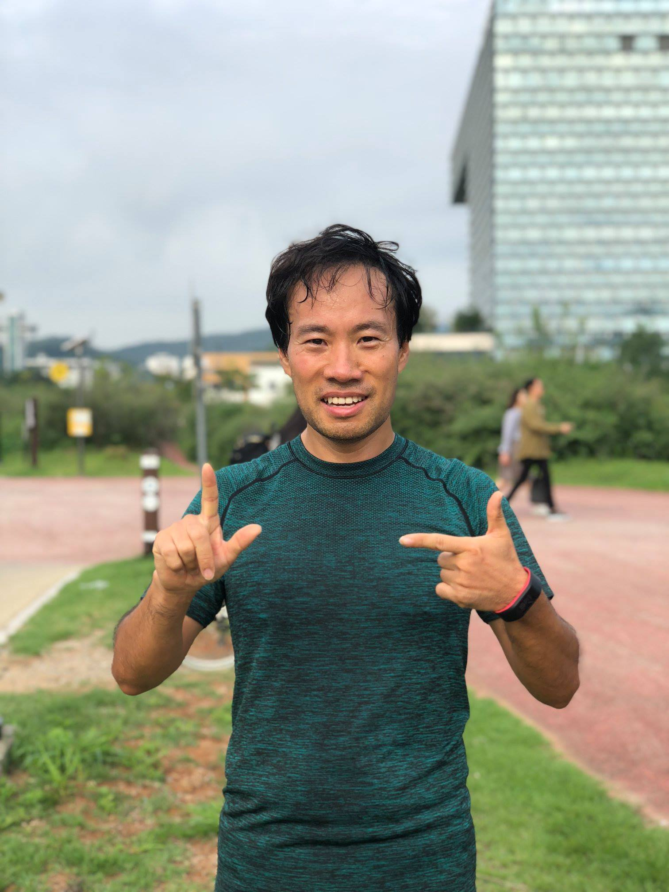
**이미지 캡션:** 이 사진은 야외 공원에서 운동복 차림의 성인 남성이 포즈를 취하고 있는 모습을 담고 있습니다. 남성은 30대 후반에서 40대 초반으로 보이며, 짧은 검은색 머리카락은 땀에 젖어 이마에 붙어 있습니다. 그는 짙은 녹색과 검은색이 섞인 기능성 티셔츠를 입고 있으며, 왼쪽 손으로는 숫자 2를 나타내는 듯한 모양을 하고 있고, 오른쪽 손으로는 자신을 가리키고 있습니다. 그의 얼굴에는 활짝 웃는 표정이 역력하며, 건강하고 활동적인 분위기를 풍깁니다. 배경에는 붉은색 트랙과 푸른 잔디밭이 보이고, 멀리 현대적인 디자인의 높은 건물이 흐릿하게 보입니다. 또한, 두 명의 다른 사람들이 배경에서 운동을 하거나 걷고 있는 모습도 희미하게 보입니다. 전반적으로 화창한 날씨 속에서 운동을 즐기는 긍정적이고 활기찬 분위기의 사진입니다. 높은 건물이 흐릿하게 보입니다. 또한, 두 명의 다른 사람들이 배경에서 운동을 하거나 걷고 있는 모습도 희미하게 보입니다. 전반적으로 화창한 날씨 속에서 운동을 즐기는 긍정적이고 활기찬 분위기의 사진입니다.
 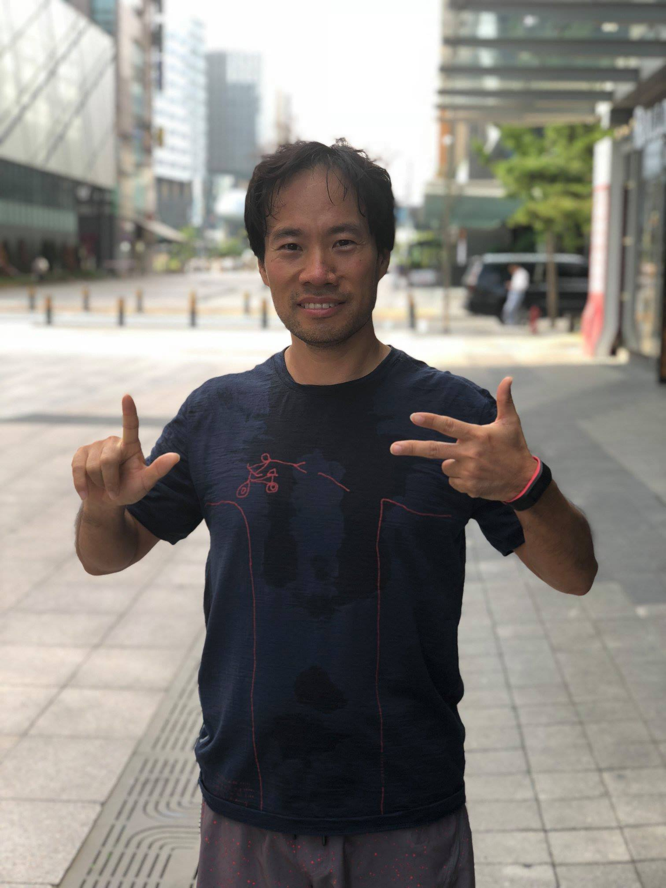
**이미지 캡션:** 이 사진은 도시 거리에서 찍은 것으로, 30대 후반에서 40대 초반으로 보이는 성인 남성이 카메라를 향해 웃으며 포즈를 취하고 있다. 남성은 짧은 머리에 검은색 반팔 티셔츠를 입고 있으며, 티셔츠에는 자전거 타는 사람을 형상화한 그림과 함께 땀에 젖은 흔적이 보인다. 하의로는 짙은 색상의 반바지를 입고 있다. 남성은 왼손으로는 검지와 중지를 펴서 숫자 2를 만들고 있고, 오른손으로는 검지와 중지를 펴서 숫자 2를 만들고 있다. 그의 표정은 밝고 긍정적이며, 활동 후 약간 지친 듯한 모습도 엿보인다. 배경에는 현대적인 건물들이 늘어서 있고, 거리에는 보도블록과 가로등이 보인다. 흐릿하게 보이는 차량과 건물들은 도시의 일상적인 풍경을 보여준다. 전반적으로 활기차고 건강한 분위기를 나타내는 사진이다.현대적인 건물들이 늘어서 있고, 거리에는 보도블록과 가로등이 보인다. 흐릿하게 보이는 차량과 건물들은 도시의 일상적인 풍경을 보여준다. 전반적으로 활기차고 건강한 분위기를 나타내는 사진이다.
 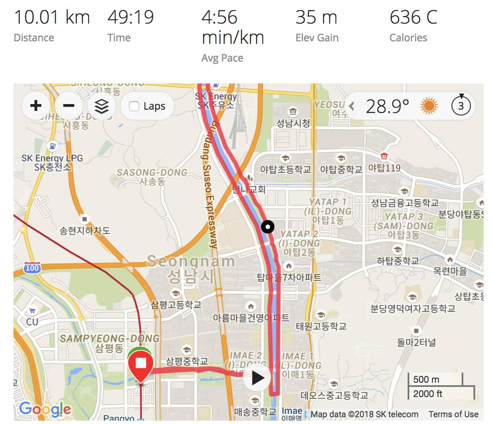
**이미지 캡션:** 이 이미지는 운동 기록을 보여주는 화면으로, 상단에는 10.01km의 거리를 49분 19초 동안 4:56분/km의 평균 페이스로 달렸으며, 35m의 고도 상승과 636 칼로리를 소모했음을 나타내는 텍스트가 표시되어 있습니다. 화면 중앙에는 운동 경로가 표시된 지도와 함께 현재 위치, 온도, 그리고 운동 중인 사람을 나타내는 아이콘이 보입니다. 지도는 한국의 성남시 지역을 보여주며, 분당-수서 고속도로를 따라 운동 경로가 표시되어 있습니다. 경로 상에는 여러 학교, 아파트 단지, 주유소, 지하차도, 터널 등의 지명이 한국어로 표기되어 있습니다. 지도에는 현재 위치를 나타내는 빨간색 마커와 함께 운동 경로를 따라 이동하는 파란색 선이 표시되어 있으며, 운동 중인 사람을 나타내는 검은색 점과 원형 아이콘이 보입니다. 온도계 아이콘 옆에는 28.9°C라는 온도가 표시되어 있으며, 오른쪽 상단에는 숫자 3이 적힌 동그란 아이콘이 있습니다. 화면 하단에는 구글 지도 정보와 저작권 정보가 표시되어 있습니다. 전반적으로 활동적인 운동 기록을 보여주는 화면으로, 날씨와 운동 경로를 상세하게 확인할 수 있습니다.지명이 한국어로 표기되어 있습니다. 지도에는 현재 위치를 나타내는 빨간색 마커와 함께 운동 경로를 따라 이동하는 파란색 선이 표시되어 있으며, 운동 중인 사람을 나타내는 검은색 점과 원형 아이콘이 보입니다. 온도계 아이콘 옆에는 28.9°C라는 온도가 표시되어 있으며, 오른쪽 상단에는 숫자 3이 적힌 동그란 아이콘이 있습니다. 화면 하단에는 구글 지도 정보와 저작권 정보가 표시되어 있습니다. 전반적으로 활동적인 운동 기록을 보여주는 화면으로, 날씨와 운동 경로를 상세하게 확인할 수 있습니다.

> 7th day running with 김재범

🎬 동영상 1개 (생략)

### 8월 12일 (일) 08:16 · She is so lovely!

She is so lovely!

Sung and Yeon's first tagged photo together on Facebook

🎬 동영상 1개 (생략)

### 8월 14일 (화) 09:44 · 📷 사진 (3장)

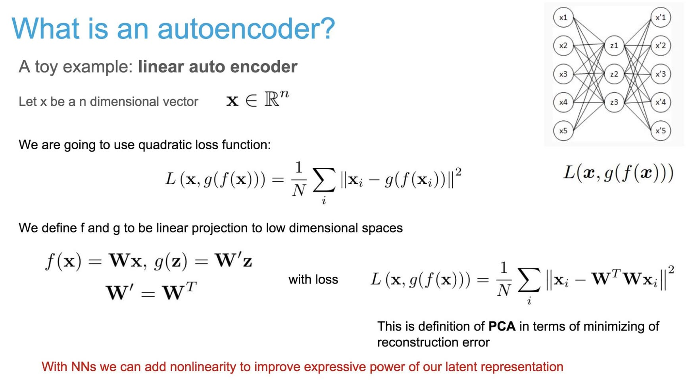
**이미지 캡션:** 이 이미지는 "오토인코더란 무엇인가?"라는 제목의 슬라이드로, 선형 오토인코더의 간단한 예시를 설명하고 있습니다. 슬라이드는 흰색 배경에 파란색과 검은색 텍스트로 구성되어 있으며, 수학 공식과 신경망 구조를 시각적으로 보여주는 다이어그램이 포함되어 있습니다. 왼쪽에는 "What is an autoencoder?", "A toy example: linear auto encoder", "Let x be a n dimensional vector x ∈ Rn", "We are going to use quadratic loss function:", "f(x) = Wx, g(z) = W'z", "W' = WT", "with loss", "With NNs we can add nonlinearity to improve expressive power of our latent representation"와 같은 텍스트가 있습니다. 중앙에는 손실 함수와 관련된 수학 공식들이 나열되어 있습니다. 오른쪽 상단에는 입력층(x1부터 x5까지), 은닉층(z1부터 z3까지), 출력층(x'1부터 x'5까지)으로 구성된 신경망의 구조를 보여주는 다이어그램이 있습니다. 이 다이어그램은 각 층의 노드들이 서로 연결되어 있음을 나타냅니다. 오른쪽 하단에는 "L(x, g(f(x)))"라는 수식과 함께 "This is definition of PCA in terms of minimizing of reconstruction error"라는 설명 텍스트가 있습니다. 전반적으로, 이 이미지는 오토인코더의 기본 개념과 선형 오토인코더의 수학적 정의 및 신경망 구조를 설명하는 교육적인 자료로 보입니다. loss function:", "f(x) = Wx, g(z) = W'z", "W' = WT", "with loss", "With NNs we can add nonlinearity to improve expressive power of our latent representation"와 같은 텍스트가 있습니다. 중앙에는 손실 함수와 관련된 수학 공식들이 나열되어 있습니다. 오른쪽 상단에는 입력층(x1부터 x5까지), 은닉층(z1부터 z3까지), 출력층(x'1부터 x'5까지)으로 구성된 신경망의 구조를 보여주는 다이어그램이 있습니다. 이 다이어그램은 각 층의 노드들이 서로 연결되어 있음을 나타냅니다. 오른쪽 하단에는 "L(x, g(f(x)))"라는 수식과 함께 "This is definition of PCA in terms of minimizing of reconstruction error"라는 설명 텍스트가 있습니다. 전반적으로, 이 이미지는 오토인코더의 기본 개념과 선형 오토인코더의 수학적 정의 및 신경망 구조를 설명하는 교육적인 자료로 보입니다.
 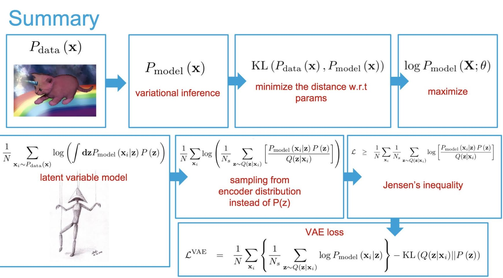
**이미지 캡션:** 이 이미지는 머신러닝의 Variational Autoencoder (VAE) 모델에 대한 요약을 보여주는 다이어그램입니다. 상단 좌측에는 무지개 위에 유니콘 뿔이 달린 분홍색 고양이 그림이 있고, 그 옆에는 "Pdata(x)"라는 수식이 적혀 있습니다. 이 그림은 데이터 분포를 시각적으로 표현한 것으로 보입니다. 오른쪽으로 화살표가 이어지며 "Pmodel(x)"와 "variational inference"라는 텍스트가 나타나고, 다시 "KL(Pdata(x), Pmodel(x))"와 "minimize the distance w.r.t params"라는 텍스트가 이어집니다. 마지막으로 "log Pmodel(X; θ)"와 "maximize"라는 텍스트가 나타나며, 이는 모델의 파라미터를 최적화하는 과정을 나타냅니다. 하단에는 "latent variable model"이라는 텍스트와 함께 줄에 매달린 인형 그림이 있고, 이어서 복잡한 수식들이 여러 단계로 나열되어 있습니다. 각 수식 옆에는 "sampling from encoder distribution instead of P(z)"와 "Jensen's inequality"라는 설명이 붙어 있습니다. 가장 하단에는 "VAE loss"라는 제목과 함께 VAE의 손실 함수를 나타내는 최종 수식이 제시되어 있습니다. 전체적으로 파란색 테두리의 상자들과 화살표를 사용하여 VAE 모델의 수학적 구성 요소와 최적화 과정을 단계별로 설명하고 있습니다.istance w.r.t params"라는 텍스트가 이어집니다. 마지막으로 "log Pmodel(X; θ)"와 "maximize"라는 텍스트가 나타나며, 이는 모델의 파라미터를 최적화하는 과정을 나타냅니다. 하단에는 "latent variable model"이라는 텍스트와 함께 줄에 매달린 인형 그림이 있고, 이어서 복잡한 수식들이 여러 단계로 나열되어 있습니다. 각 수식 옆에는 "sampling from encoder distribution instead of P(z)"와 "Jensen's inequality"라는 설명이 붙어 있습니다. 가장 하단에는 "VAE loss"라는 제목과 함께 VAE의 손실 함수를 나타내는 최종 수식이 제시되어 있습니다. 전체적으로 파란색 테두리의 상자들과 화살표를 사용하여 VAE 모델의 수학적 구성 요소와 최적화 과정을 단계별로 설명하고 있습니다.
 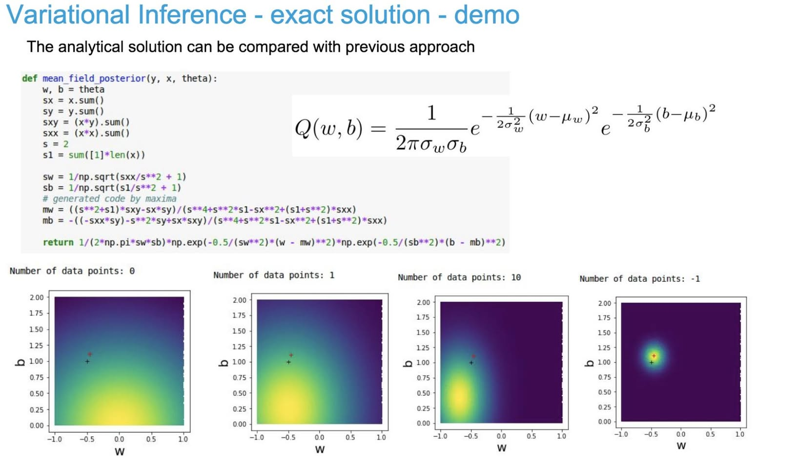
**이미지 캡션:** 이 이미지는 "Variational Inference - exact solution - demo"라는 제목의 슬라이드로, 변분 추론의 정확한 해법을 시연하고 있습니다. 상단에는 "The analytical solution can be compared with previous approach"라는 문구가 있습니다. 중앙에는 파이썬 코드가 정의되어 있으며, `mean_field_posterior` 함수는 변수 `w`와 `b`에 대한 사후 확률 분포를 계산하는 것으로 보입니다. 이 함수는 여러 통계량(`sx`, `sy`, `sxy`, `sxx`, `s`, `s1`)을 계산하고, 이를 바탕으로 `sw`, `sb`, `mw`, `mb`를 계산한 후, 최종적으로 정규 분포의 확률 밀도 함수 형태의 값을 반환합니다. 코드 옆에는 수식 $Q(w,b) = \frac{1}{2\pi\sigma_w\sigma_b} e^{-\frac{1}{2\sigma_w^2}(w-\mu_w)^2 - \frac{1}{2\sigma_b^2}(b-\mu_b)^2}$이 표시되어 있어, 이 함수가 이변량 정규 분포를 나타냄을 알 수 있습니다. 하단에는 네 개의 2D 히트맵 플롯이 나란히 배치되어 있으며, 각 플롯의 제목은 "Number of data points: 0", "Number of data points: 1", "Number of data points: 10", "Number of data points: -1"입니다. 각 플롯은 `w`를 x축으로, `b`를 y축으로 하는 2차원 공간에서의 확률 분포를 색상으로 표현하고 있으며, 가장 높은 확률 밀도를 가진 지점은 밝은 색으로, 낮은 확률 밀도를 가진 지점은 어두운 색으로 표시됩니다. 각 플롯에는 빨간색 십자 모양과 검은색 십자 모양의 마커가 표시되어 있습니다. 전반적으로 이 이미지는 변분 추론 기법을 사용하여 모델의 매개변수 분포를 추정하는 과정을 시각적으로 보여주는 학술적이거나 기술적인 발표 자료의 일부로 보입니다.sy`, `sxy`, `sxx`, `s`, `s1`)을 계산하고, 이를 바탕으로 `sw`, `sb`, `mw`, `mb`를 계산한 후, 최종적으로 정규 분포의 확률 밀도 함수 형태의 값을 반환합니다. 코드 옆에는 수식 $Q(w,b) = \frac{1}{2\pi\sigma_w\sigma_b} e^{-\frac{1}{2\sigma_w^2}(w-\mu_w)^2 - \frac{1}{2\sigma_b^2}(b-\mu_b)^2}$이 표시되어 있어, 이 함수가 이변량 정규 분포를 나타냄을 알 수 있습니다. 하단에는 네 개의 2D 히트맵 플롯이 나란히 배치되어 있으며, 각 플롯의 제목은 "Number of data points: 0", "Number of data points: 1", "Number of data points: 10", "Number of data points: -1"입니다. 각 플롯은 `w`를 x축으로, `b`를 y축으로 하는 2차원 공간에서의 확률 분포를 색상으로 표현하고 있으며, 가장 높은 확률 밀도를 가진 지점은 밝은 색으로, 낮은 확률 밀도를 가진 지점은 어두운 색으로 표시됩니다. 각 플롯에는 빨간색 십자 모양과 검은색 십자 모양의 마커가 표시되어 있습니다. 전반적으로 이 이미지는 변분 추론 기법을 사용하여 모델의 매개변수 분포를 추정하는 과정을 시각적으로 보여주는 학술적이거나 기술적인 발표 자료의 일부로 보입니다.

### 8월 15일 (수) 14:38 · 📷 사진 (1장)

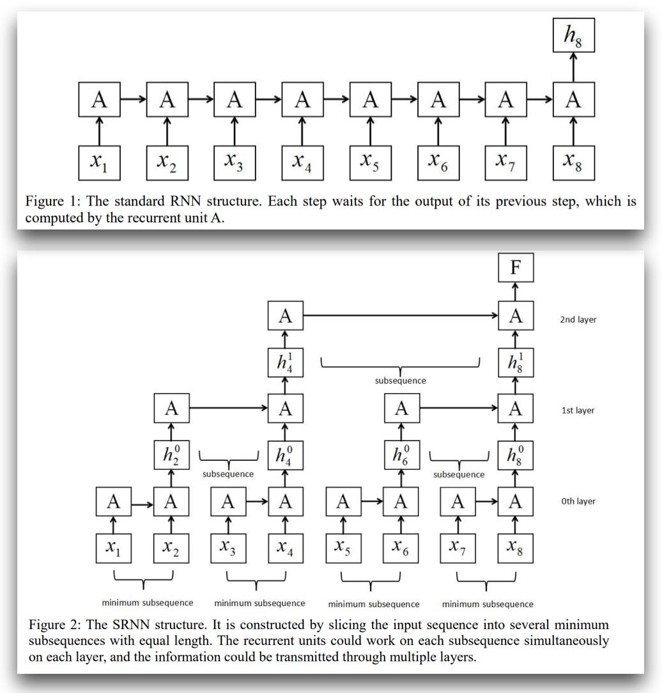
**이미지 캡션:** 이 이미지는 두 개의 다이어그램을 포함하고 있으며, 각각은 순환 신경망(RNN)의 구조를 설명합니다. 상단 다이어그램은 표준 RNN 구조를 보여주며, 각 단계는 이전 단계의 출력을 기다립니다. 하단 다이어그램은 SRNN(Sliced Recurrent Neural Network) 구조를 보여주며, 입력 시퀀스를 여러 개의 최소 부분 시퀀스로 나누어 각 레이어에서 동시에 처리하고 여러 레이어를 통해 정보를 전달할 수 있음을 나타냅니다. 두 다이어그램 모두 흰색 배경에 검은색 선과 텍스트로 구성되어 있으며, 수학적 모델을 시각적으로 표현하고 있습니다. 모델을 시각적으로 표현하고 있습니다.

> #100배빠른RNN. 그동안 고질적인 속도 문제를 가지고 있는 RNN의 성능을 100배나 빠르게 해준다고 합니다.  결과를 보면 성능은 비슷하면서 GRU보다는 100배 빠른. Wavenet같은 dilated casual convolutional neural network 보다는 그래도 시간이 많이 필요하고요.  빠른 RNN필요하신분들 참고하세요. https://arxiv.org/pdf/1807.02291.pdf

### 8월 16일 (목) 09:58 · Where am I? (Thanks to Nako Sung.)

Where am I? (Thanks to Nako Sung.)

"1. Arrogant leaders reject feedback and get worse.
2. Insecure leaders avoid feedback and stagnate.
3. Confident leaders accept feedback and improve in areas of obvious weakness.
4. Curious leaders proactively seek feedback and improve in every area.

### 8월 19일 (일) 09:56 · 📷 사진 (2장)

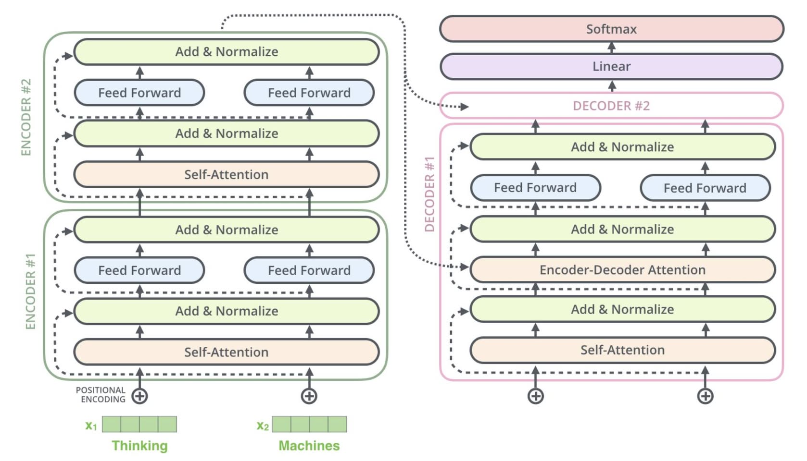
**이미지 캡션:** 이 이미지는 트랜스포머 모델의 아키텍처를 시각적으로 표현한 다이어그램으로, 두 개의 인코더 스택과 두 개의 디코더 스택으로 구성되어 있습니다. 각 스택은 여러 개의 레이어로 이루어져 있으며, 각 레이어는 셀프 어텐션, 피드 포워드 신경망, 그리고 덧셈 및 정규화와 같은 구성 요소로 이루어져 있습니다. 인코더 스택은 입력 시퀀스를 처리하여 컨텍스트 벡터를 생성하고, 디코더 스택은 이 컨텍스트 벡터와 이전 출력을 사용하여 새로운 시퀀스를 생성합니다. 다이어그램 하단에는 입력 시퀀스에 대한 위치 정보를 추가하는 포지셔널 인코딩이 표시되어 있으며, "Thinking"과 "Machines"라는 레이블은 각각의 입력 시퀀스를 나타냅니다. 전체적으로 이 다이어그램은 자연어 처리 분야에서 널리 사용되는 트랜스포머 모델의 복잡한 내부 구조를 명확하게 보여줍니다.지셔널 인코딩이 표시되어 있으며, "Thinking"과 "Machines"라는 레이블은 각각의 입력 시퀀스를 나타냅니다. 전체적으로 이 다이어그램은 자연어 처리 분야에서 널리 사용되는 트랜스포머 모델의 복잡한 내부 구조를 명확하게 보여줍니다.
 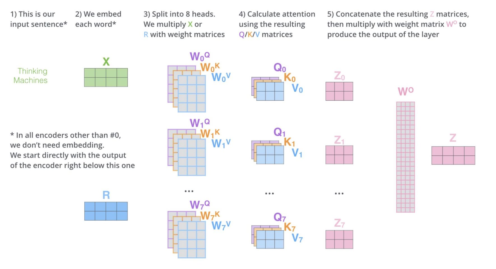
**이미지 캡션:** 이 이미지는 텍스트를 처리하는 인공지능 모델의 한 부분인 트랜스포머(Transformer)의 셀프 어텐션(Self-Attention) 메커니즘을 시각적으로 설명하고 있습니다. 이미지에는 텍스트 설명과 함께 여러 개의 행렬들이 다이어그램 형태로 표현되어 있습니다. 상단에는 1번부터 5번까지 단계별 설명이 영어로 적혀 있으며, "Thinking Machines"라는 문구와 함께 입력 문장의 임베딩을 나타내는 녹색 행렬 X가 있습니다. 이어서 가중치 행렬 W0, W1, W7과 각각의 Q, K, V 행렬들이 8개의 헤드로 분할되는 과정을 보여줍니다. 각 헤드에서 계산된 Q, K, V 행렬들은 어텐션 계산을 통해 Z0, Z1, Z7과 같은 결과 행렬로 이어집니다. 마지막으로 이 결과 행렬들이 결합(concatenate)되고 가중치 행렬 W0와 곱해져 최종 출력 Z를 생성하는 과정을 나타냅니다. 이미지 하단에는 "In all encoders other than #0, we don't need embedding. We start directly with the output of the encoder right below this one"이라는 추가 설명과 함께 또 다른 입력 행렬 R이 표시되어 있습니다. 전체적으로 복잡한 신경망 연산 과정을 간결하고 직관적으로 이해할 수 있도록 구성된 다이어그램입니다.헤드로 분할되는 과정을 보여줍니다. 각 헤드에서 계산된 Q, K, V 행렬들은 어텐션 계산을 통해 Z0, Z1, Z7과 같은 결과 행렬로 이어집니다. 마지막으로 이 결과 행렬들이 결합(concatenate)되고 가중치 행렬 W0와 곱해져 최종 출력 Z를 생성하는 과정을 나타냅니다. 이미지 하단에는 "In all encoders other than #0, we don't need embedding. We start directly with the output of the encoder right below this one"이라는 추가 설명과 함께 또 다른 입력 행렬 R이 표시되어 있습니다. 전체적으로 복잡한 신경망 연산 과정을 간결하고 직관적으로 이해할 수 있도록 구성된 다이어그램입니다.

### 8월 20일 (월) 17:20 · 📷 사진 (2장)

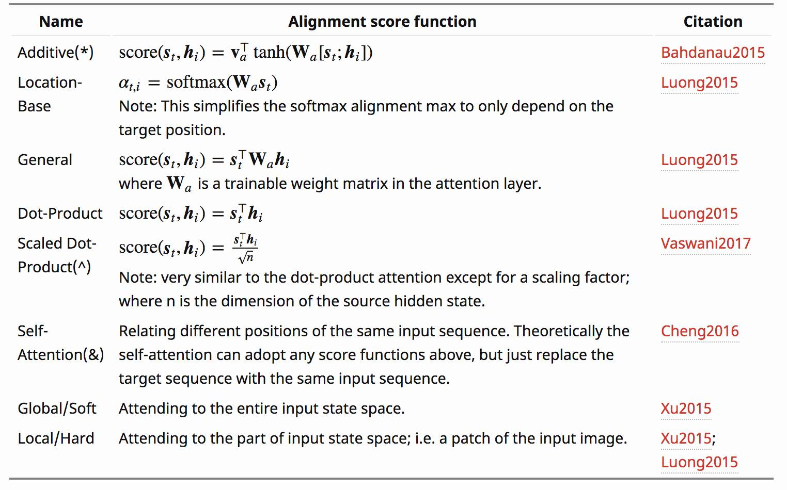
**이미지 캡션:** 이 이미지는 텍스트 기반의 표로, "Name", "Alignment score function", "Citation"이라는 세 개의 열로 구성되어 있습니다. 각 행은 어텐션 메커니즘에서 사용되는 다양한 정렬 점수 함수를 설명합니다. 첫 번째 열인 "Name"에는 Additive, Location-Base, General, Dot-Product, Scaled Dot-Product, Self-Attention, Global/Soft, Local/Hard와 같은 함수 이름이 나열되어 있습니다. 두 번째 열인 "Alignment score function"에는 각 함수에 대한 수학적 공식과 간단한 설명이 포함되어 있습니다. 예를 들어, Additive 함수는 score(st, h₁) = vT tanh(Wa[st; hi])로 정의되며, Location-Base 함수는 αt,i = softmax(Wa st)로 정의되고, Dot-Product 함수는 score(st, hi) = sT hi로 정의됩니다. 세 번째 열인 "Citation"에는 각 함수와 관련된 연구 논문의 출처가 명시되어 있으며, Bahdanau2015, Luong2015, Vaswani2017, Cheng2016, Xu2015와 같은 연도별 인용 정보가 포함되어 있습니다. 이 표는 딥러닝, 특히 자연어 처리 분야에서 어텐션 메커니즘의 다양한 구현 방식을 이해하는 데 유용한 정보를 제공합니다.ignment score function"에는 각 함수에 대한 수학적 공식과 간단한 설명이 포함되어 있습니다. 예를 들어, Additive 함수는 score(st, h₁) = vT tanh(Wa[st; hi])로 정의되며, Location-Base 함수는 αt,i = softmax(Wa st)로 정의되고, Dot-Product 함수는 score(st, hi) = sT hi로 정의됩니다. 세 번째 열인 "Citation"에는 각 함수와 관련된 연구 논문의 출처가 명시되어 있으며, Bahdanau2015, Luong2015, Vaswani2017, Cheng2016, Xu2015와 같은 연도별 인용 정보가 포함되어 있습니다. 이 표는 딥러닝, 특히 자연어 처리 분야에서 어텐션 메커니즘의 다양한 구현 방식을 이해하는 데 유용한 정보를 제공합니다.
 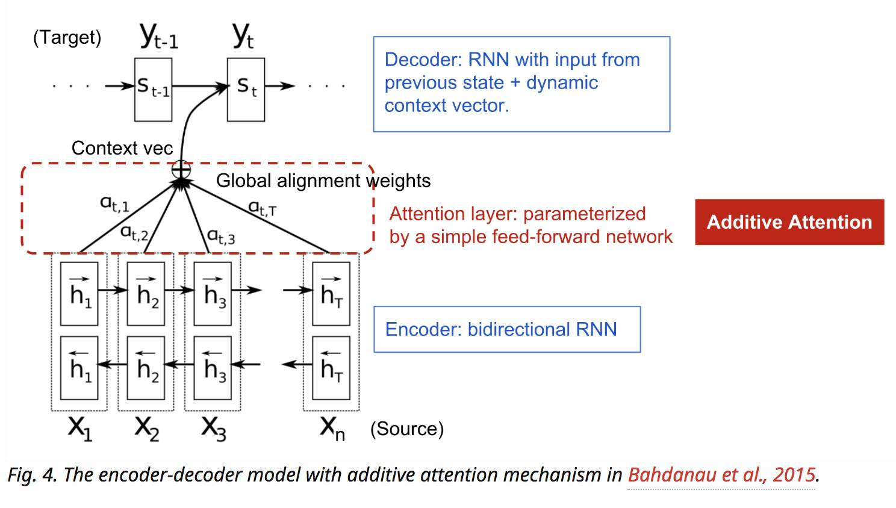
**이미지 캡션:** 이 이미지는 텍스트를 번역하거나 생성하는 데 사용되는 신경망 모델인 인코더-디코더 모델을 설명하는 다이어그램입니다. 다이어그램에는 "타겟"이라고 표시된 디코더 부분과 "소스"라고 표시된 인코더 부분이 있습니다. 인코더는 입력 시퀀스 X1부터 Xn까지의 정보를 처리하는 양방향 RNN으로 구성됩니다. 각 입력은 h1부터 hT까지의 은닉 상태로 표현됩니다. 디코더는 이전 상태 St-1과 동적 컨텍스트 벡터를 입력으로 받는 RNN으로, 현재 상태 St를 생성합니다. 컨텍스트 벡터는 어텐션 메커니즘을 통해 계산되며, 이는 인코더의 모든 은닉 상태에 대한 가중치 합입니다. 이 가중치는 어텐션 레이어에서 계산되며, 이 레이어는 간단한 피드포워드 신경망으로 구현됩니다. 다이어그램에는 "글로벌 정렬 가중치"와 "어텐션 레이어: 간단한 피드포워드 신경망으로 매개변수화됨"이라는 레이블이 붙어 있으며, 이는 어텐션 메커니즘의 작동 방식을 강조합니다. 또한 "디코더: 이전 상태 + 동적 컨텍스트 벡터의 입력이 있는 RNN" 및 "인코더: 양방향 RNN"이라는 설명 상자가 있습니다. 우측 상단에는 "가산 어텐션"이라는 제목의 빨간색 상자가 있습니다. 이미지 하단에는 "그림 4. Bahdanau et al., 2015의 가산 어텐션 메커니즘을 갖춘 인코더-디코더 모델"이라는 캡션이 있습니다. 이 다이어그램은 텍스트 시퀀스에서 중요한 부분에 집중하여 모델이 더 나은 출력을 생성하도록 돕는 어텐션 메커니즘의 역할을 보여줍니다.이는 인코더의 모든 은닉 상태에 대한 가중치 합입니다. 이 가중치는 어텐션 레이어에서 계산되며, 이 레이어는 간단한 피드포워드 신경망으로 구현됩니다. 다이어그램에는 "글로벌 정렬 가중치"와 "어텐션 레이어: 간단한 피드포워드 신경망으로 매개변수화됨"이라는 레이블이 붙어 있으며, 이는 어텐션 메커니즘의 작동 방식을 강조합니다. 또한 "디코더: 이전 상태 + 동적 컨텍스트 벡터의 입력이 있는 RNN" 및 "인코더: 양방향 RNN"이라는 설명 상자가 있습니다. 우측 상단에는 "가산 어텐션"이라는 제목의 빨간색 상자가 있습니다. 이미지 하단에는 "그림 4. Bahdanau et al., 2015의 가산 어텐션 메커니즘을 갖춘 인코더-디코더 모델"이라는 캡션이 있습니다. 이 다이어그램은 텍스트 시퀀스에서 중요한 부분에 집중하여 모델이 더 나은 출력을 생성하도록 돕는 어텐션 메커니즘의 역할을 보여줍니다.

### 8월 21일 (화) 06:28 · 📷 사진 (3장)

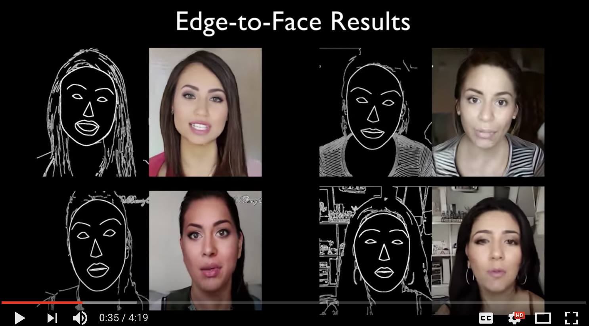
**이미지 캡션:** 이 화면은 검은색 배경에 "Edge-to-Face Results"라는 제목이 상단에 표시되며, 총 4개의 영상 또는 이미지 창이 2x2 형태로 배열되어 있습니다. 왼쪽 상단과 왼쪽 하단에는 흰색 선으로만 표현된 여성의 얼굴 윤곽선이 그려져 있으며, 머리카락과 눈, 코, 입이 단순하게 묘사되어 있습니다. 오른쪽 상단과 오른쪽 하단에는 실제 여성들의 얼굴이 담긴 영상 클립이 재생되고 있습니다. 오른쪽 상단의 여성은 20대 후반에서 30대 초반으로 보이며, 옅은 화장을 하고 줄무늬 티셔츠를 입고 카메라를 응시하며 말하고 있습니다. 오른쪽 하단의 여성 역시 20대 후반에서 30대 초반으로 보이며, 짙은 화장을 하고 링 귀걸이를 착용했으며, 배경에는 화장품 등으로 보이는 물건들이 진열된 선반이 희미하게 보입니다. 이 영상은 엣지 검출 기술을 이용해 얼굴 윤곽선을 추출하는 과정을 보여주는 것으로 추정됩니다. 화면 하단에는 유튜브 영상 재생 컨트롤 바가 보이며, 현재 재생 시간은 0:35이고 전체 길이는 4:19입니다.말하고 있습니다. 오른쪽 하단의 여성 역시 20대 후반에서 30대 초반으로 보이며, 짙은 화장을 하고 링 귀걸이를 착용했으며, 배경에는 화장품 등으로 보이는 물건들이 진열된 선반이 희미하게 보입니다. 이 영상은 엣지 검출 기술을 이용해 얼굴 윤곽선을 추출하는 과정을 보여주는 것으로 추정됩니다. 화면 하단에는 유튜브 영상 재생 컨트롤 바가 보이며, 현재 재생 시간은 0:35이고 전체 길이는 4:19입니다.
 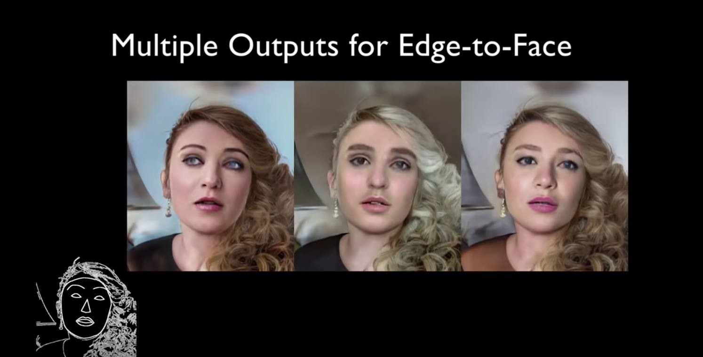
**이미지 캡션:** 검은색 배경 위에 "Multiple Outputs for Edge-to-Face"라는 흰색 텍스트가 표시되어 있으며, 그 아래에는 세 개의 얼굴 이미지가 나란히 배치되어 있습니다. 세 이미지 모두 같은 성인 여성이며, 대략 20대 후반에서 30대 초반으로 보입니다. 모두 금발 곱슬머리를 하고 있으며, 왼쪽 두 이미지에서는 검은색 상의를, 오른쪽 이미지에서는 갈색 상의를 입고 있습니다. 세 이미지 모두 눈을 약간 크게 뜨고 입을 살짝 벌린 채 놀라거나 당황한 듯한 표정을 짓고 있습니다. 왼쪽 이미지에서는 눈동자가 흰색으로 처리되어 있어 초점이 맞지 않은 듯한 느낌을 줍니다. 중간 이미지에서는 눈썹이 짙고 눈동자가 갈색이며, 오른쪽 이미지에서는 눈썹이 더 옅고 눈동자가 파란색에 가깝습니다. 배경은 흐릿하게 처리되어 있어 특정 장소를 식별하기 어렵지만, 실내로 추정됩니다. 왼쪽 하단에는 흰색 선으로 그려진 여성의 얼굴 윤곽 그림이 있습니다. 전체적으로 인공지능 또는 컴퓨터 그래픽 기술을 활용한 얼굴 생성 또는 변환 결과물을 보여주는 듯한 분위기입니다.가 흰색으로 처리되어 있어 초점이 맞지 않은 듯한 느낌을 줍니다. 중간 이미지에서는 눈썹이 짙고 눈동자가 갈색이며, 오른쪽 이미지에서는 눈썹이 더 옅고 눈동자가 파란색에 가깝습니다. 배경은 흐릿하게 처리되어 있어 특정 장소를 식별하기 어렵지만, 실내로 추정됩니다. 왼쪽 하단에는 흰색 선으로 그려진 여성의 얼굴 윤곽 그림이 있습니다. 전체적으로 인공지능 또는 컴퓨터 그래픽 기술을 활용한 얼굴 생성 또는 변환 결과물을 보여주는 듯한 분위기입니다.
 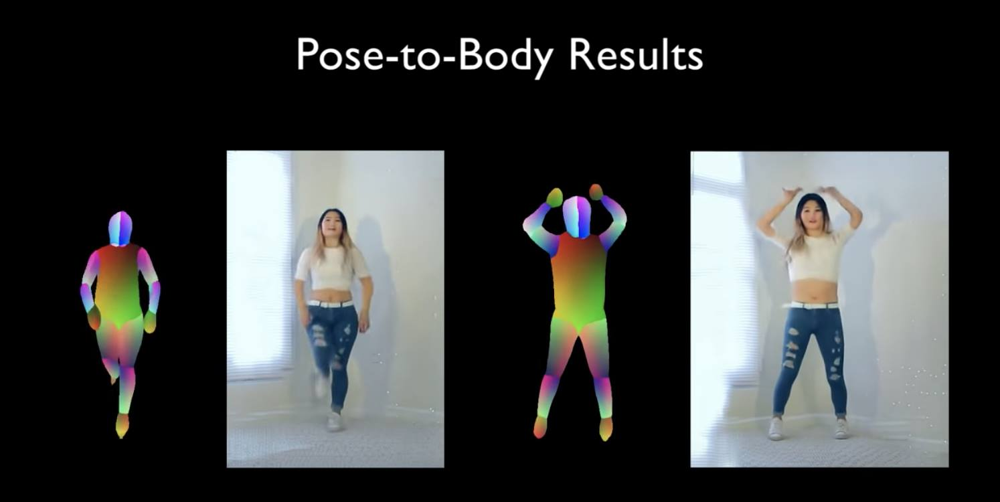
**이미지 캡션:** 검은색 배경 위에 "Pose-to-Body Results"라는 흰색 글자가 중앙 상단에 표시되어 있으며, 그 아래에는 두 개의 열로 나뉘어 네 개의 이미지가 배치되어 있습니다. 왼쪽 열에는 각각 움직이는 듯한 자세의 컬러풀한 3D 인체 모델과 함께, 흰색 크롭탑과 찢어진 청바지를 입고 흰색 운동화를 신은 젊은 아시아 여성의 모습이 담겨 있습니다. 여성은 벽을 등지고 서서 한쪽 다리를 앞으로 내밀고 다른 쪽 다리는 뒤로 뻗은 채 춤을 추는 듯한 포즈를 취하고 있으며, 표정은 밝고 활기차 보입니다. 오른쪽 열에도 마찬가지로 컬러풀한 3D 인체 모델과 함께, 같은 여성이 이번에는 두 팔을 머리 위로 올리고 춤을 추는 듯한 포즈를 취하고 있습니다. 이 여성 역시 흰색 크롭탑과 찢어진 청바지, 흰색 운동화를 착용하고 있으며, 표정은 즐거워 보입니다. 두 이미지 모두 배경에는 창문과 커튼이 보이며, 오른쪽 이미지에서는 바닥에 작은 입자들이 떠다니는 듯한 효과가 있습니다. 전반적으로 이 이미지는 춤이나 움직임을 분석하는 기술을 보여주는 것으로 보이며, 밝고 역동적인 분위기를 연출합니다. 마찬가지로 컬러풀한 3D 인체 모델과 함께, 같은 여성이 이번에는 두 팔을 머리 위로 올리고 춤을 추는 듯한 포즈를 취하고 있습니다. 이 여성 역시 흰색 크롭탑과 찢어진 청바지, 흰색 운동화를 착용하고 있으며, 표정은 즐거워 보입니다. 두 이미지 모두 배경에는 창문과 커튼이 보이며, 오른쪽 이미지에서는 바닥에 작은 입자들이 떠다니는 듯한 효과가 있습니다. 전반적으로 이 이미지는 춤이나 움직임을 분석하는 기술을 보여주는 것으로 보이며, 밝고 역동적인 분위기를 연출합니다.

### 8월 24일 (금) 06:30 · 📷 사진 (2장)

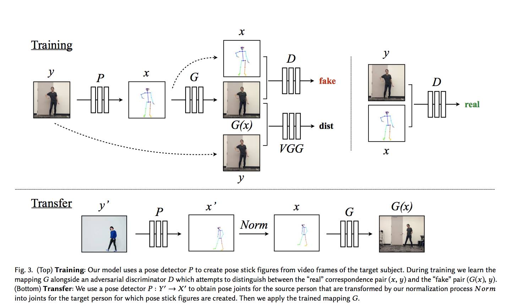
**이미지 캡션:** 이 이미지는 훈련 및 전이 두 가지 주요 단계로 구성된 딥러닝 모델의 작동 방식을 설명하는 도식입니다. 상단 훈련 섹션에서는 성인 남성이 어두운 색상의 상의와 바지를 입고 서 있는 모습이 담긴 비디오 프레임(y)이 포즈 감지기 P를 통과하여 스틱 피규어(x)로 변환됩니다. 이 스틱 피규어는 생성자 G를 통해 다시 사람의 이미지(G(x))로 변환되며, 이 이미지는 실제 사람의 이미지(y)와 함께 판별자 D에 입력되어 "가짜" 또는 "실제"로 분류됩니다. 또한, VGG 네트워크는 생성된 이미지와 실제 이미지 간의 거리(dist)를 측정하는 데 사용됩니다. 하단 전이 섹션에서는 다른 사람(y')의 비디오 프레임이 포즈 감지기 P를 통과하여 스틱 피규어(x')로 변환되고, 이 스틱 피규어는 정규화 과정(Norm)을 거쳐 대상 사람의 스틱 피규어(x)로 변환된 후, 훈련된 생성자 G를 통해 최종 이미지(G(x))로 생성됩니다. 전반적으로 이 도식은 비디오에서 사람의 포즈를 감지하고 이를 다른 사람의 포즈로 변환하는 딥러닝 모델의 과정을 시각적으로 보여줍니다. 거리(dist)를 측정하는 데 사용됩니다. 하단 전이 섹션에서는 다른 사람(y')의 비디오 프레임이 포즈 감지기 P를 통과하여 스틱 피규어(x')로 변환되고, 이 스틱 피규어는 정규화 과정(Norm)을 거쳐 대상 사람의 스틱 피규어(x)로 변환된 후, 훈련된 생성자 G를 통해 최종 이미지(G(x))로 생성됩니다. 전반적으로 이 도식은 비디오에서 사람의 포즈를 감지하고 이를 다른 사람의 포즈로 변환하는 딥러닝 모델의 과정을 시각적으로 보여줍니다.
 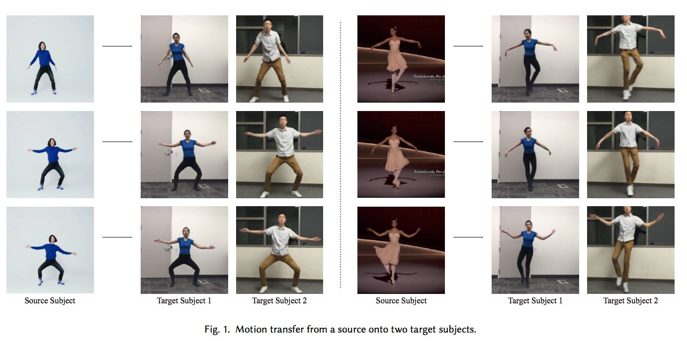
**이미지 캡션:** 이 이미지는 모션 전이 기술을 시각적으로 보여주는 그림으로, 여러 행으로 구성되어 있으며 각 행은 특정 동작을 다른 대상에게 적용하는 과정을 나타냅니다. 첫 번째 행의 왼쪽에는 파란색 상의와 검은색 바지를 입은 젊은 여성으로 보이는 사람이 흰색 배경에서 팔을 벌리고 서 있는 모습이 보입니다. 이 동작은 오른쪽의 실내 공간에서 파란색 상의와 검은색 바지를 입은 또 다른 젊은 여성인 "Target Subject 1"에게 적용됩니다. 그 옆에는 갈색 바지와 흰색 셔츠를 입은 젊은 남성인 "Target Subject 2"가 같은 동작을 하고 있습니다. 두 번째 행은 첫 번째 행과 유사하게, 흰색 배경의 젊은 여성(Source Subject)이 팔을 옆으로 벌리고 있는 동작을 "Target Subject 1"과 "Target Subject 2"에게 적용하는 것을 보여줍니다. 세 번째 행은 첫 번째 열에서 동일한 동작을 반복하고 있으며, 네 번째 행은 첫 번째 열에서 동일한 동작을 반복하고 있습니다. 그림의 오른쪽 부분에는 발레리나로 보이는 사람이 분홍색 드레스를 입고 춤을 추고 있는 모습이 두 번 나타나며, 이 동작은 "Target Subject 1"과 "Target Subject 2"에게 적용됩니다. "Target Subject 1"은 파란색 상의와 검은색 바지를 입고 있으며, "Target Subject 2"는 흰색 셔츠와 갈색 바지를 입고 있습니다. 각 행에는 동작이 적용되는 방향을 나타내는 화살표가 있습니다. 이미지 하단에는 "Fig. 1. Motion transfer from a source onto two target subjects."라는 캡션이 있습니다. 전반적으로 이미지는 연구 또는 기술 시연의 일부로 보이며, 동작을 한 사람에게서 다른 사람에게 복제하는 과정을 명확하게 보여줍니다. 2"가 같은 동작을 하고 있습니다. 두 번째 행은 첫 번째 행과 유사하게, 흰색 배경의 젊은 여성(Source Subject)이 팔을 옆으로 벌리고 있는 동작을 "Target Subject 1"과 "Target Subject 2"에게 적용하는 것을 보여줍니다. 세 번째 행은 첫 번째 열에서 동일한 동작을 반복하고 있으며, 네 번째 행은 첫 번째 열에서 동일한 동작을 반복하고 있습니다. 그림의 오른쪽 부분에는 발레리나로 보이는 사람이 분홍색 드레스를 입고 춤을 추고 있는 모습이 두 번 나타나며, 이 동작은 "Target Subject 1"과 "Target Subject 2"에게 적용됩니다. "Target Subject 1"은 파란색 상의와 검은색 바지를 입고 있으며, "Target Subject 2"는 흰색 셔츠와 갈색 바지를 입고 있습니다. 각 행에는 동작이 적용되는 방향을 나타내는 화살표가 있습니다. 이미지 하단에는 "Fig. 1. Motion transfer from a source onto two target subjects."라는 캡션이 있습니다. 전반적으로 이미지는 연구 또는 기술 시연의 일부로 보이며, 동작을 한 사람에게서 다른 사람에게 복제하는 과정을 명확하게 보여줍니다.

### 8월 25일 (토) 12:03 · 📷 사진 (16장)

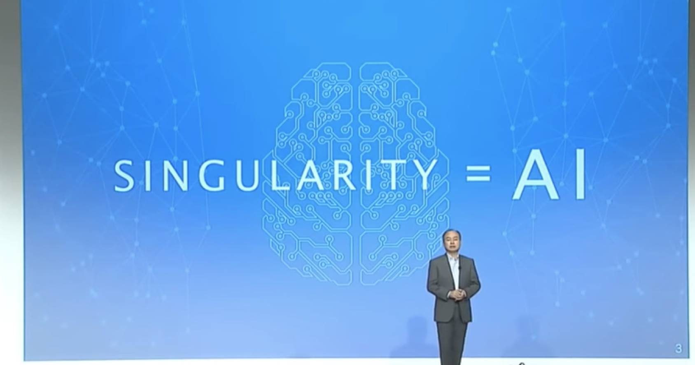
**이미지 캡션:** 푸른색 배경의 무대에서 한 명의 성인 남성이 서서 발표하고 있다. 남성은 50대 정도로 보이며, 검은색 정장 재킷에 흰색 셔츠를 입고 있다. 그는 약간 미소를 띠고 있으며, 두 손을 앞으로 모으고 서 있다. 배경에는 "SINGULARITY = AI"라는 글자와 함께 추상적인 뇌 모양의 그래픽이 그려져 있다. 뇌 모양은 회로 기판처럼 복잡한 선으로 이루어져 있으며, 이는 인공지능을 상징하는 것으로 보인다. 배경 전체에 걸쳐 점과 선으로 이루어진 네트워크 패턴이 희미하게 나타나 있어, 기술적이고 미래지향적인 분위기를 연출한다. 무대 하단에는 작은 숫자 "3"이 보인다. 전체적으로 기술 컨퍼런스나 강연의 한 장면으로 추정되며, 인공지능의 발전과 특이점(Singularity)의 관계에 대한 주제를 다루고 있을 것으로 보인다.기를 연출한다. 무대 하단에는 작은 숫자 "3"이 보인다. 전체적으로 기술 컨퍼런스나 강연의 한 장면으로 추정되며, 인공지능의 발전과 특이점(Singularity)의 관계에 대한 주제를 다루고 있을 것으로 보인다.
 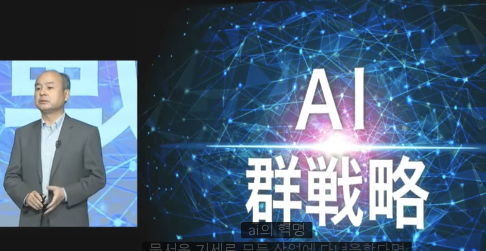
**이미지 캡션:** 화면 왼쪽에는 회색 정장을 입은 50대 동양인 남성이 서서 발표하고 있으며, 그의 뒤로는 파란색 배경에 기하학적인 패턴과 빛나는 점들이 연결된 추상적인 그래픽이 펼쳐져 있습니다. 화면 오른쪽에는 "AI"라는 큰 글자와 함께 한자 "群戦略"이 흰색으로 크게 쓰여 있고, 그 아래에는 "ai의 혁명"이라는 문구가 보입니다. 전체적으로 인공지능, 전략, 혁명 등을 주제로 하는 발표나 강연의 한 장면으로 보이며, 미래지향적이고 기술적인 분위기를 풍깁니다.
 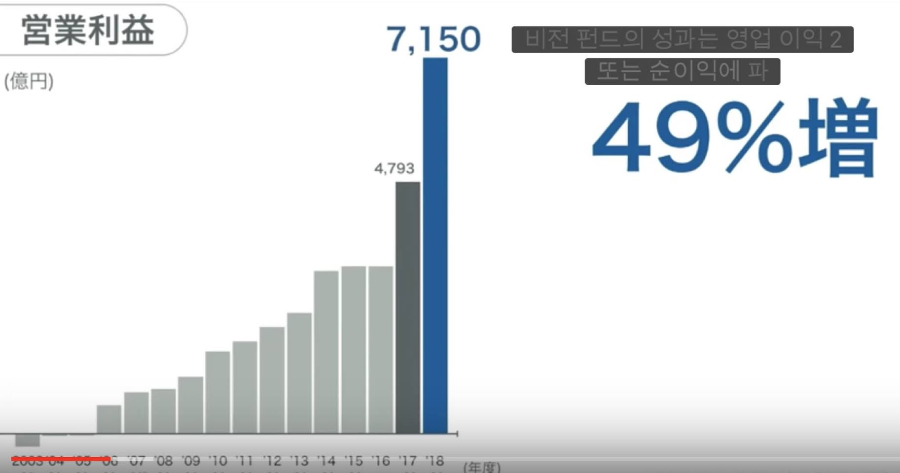
**이미지 캡션:** 이 이미지는 일본어로 된 그래프와 텍스트를 포함하고 있으며, 비즈니스 성과를 나타내는 것으로 보입니다. 왼쪽 상단에는 "영업이익"이라는 제목이 타원형 안에 표시되어 있고, 그 아래에는 단위로 "(억엔)"이라고 적혀 있습니다. 그래프는 막대 형태로 되어 있으며, 여러 해에 걸친 영업이익의 추세를 보여줍니다. 가장 최근 연도(18년으로 추정)의 막대는 파란색으로 표시되어 있으며, 그 높이는 7,150을 나타냅니다. 이전 연도들의 막대는 회색으로 표시되어 있으며, 4,793이라는 수치가 4,793년도의 막대 위에 표시되어 있습니다. 그래프의 가로축에는 연도가 표시되어 있으며, 2003년부터 2018년까지의 숫자가 보입니다. 오른쪽에는 "비전 펀드의 성과는 영업이익 2 또는 순이익에 파 49% 증가"라는 텍스트가 파란색으로 크게 표시되어 있습니다. 이 텍스트는 비전 펀드의 성과가 영업이익 또는 순이익에서 49% 증가했음을 시사합니다. 전반적으로 이 이미지는 비즈니스 성과, 특히 영업이익의 증가를 강조하는 발표 자료나 보고서의 일부로 보입니다.표시되어 있습니다. 그래프의 가로축에는 연도가 표시되어 있으며, 2003년부터 2018년까지의 숫자가 보입니다. 오른쪽에는 "비전 펀드의 성과는 영업이익 2 또는 순이익에 파 49% 증가"라는 텍스트가 파란색으로 크게 표시되어 있습니다. 이 텍스트는 비전 펀드의 성과가 영업이익 또는 순이익에서 49% 증가했음을 시사합니다. 전반적으로 이 이미지는 비즈니스 성과, 특히 영업이익의 증가를 강조하는 발표 자료나 보고서의 일부로 보입니다.
 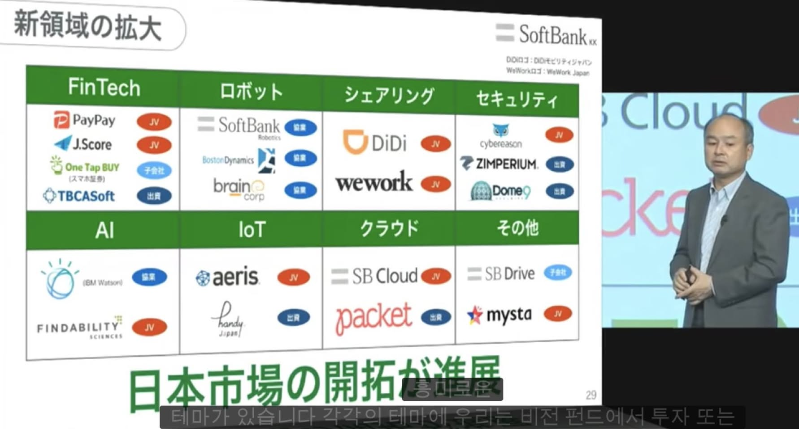
**이미지 캡션:** 화면 왼쪽에는 일본어로 '신 영역의 확대'라고 쓰여진 제목과 함께 다양한 사업 분야별 파트너사 로고가 포함된 표가 보입니다. 표는 FinTech, 로봇, 셰어링, 보안, AI, IoT, 클라우드, 기타의 8개 카테고리로 나뉘어 있으며, 각 카테고리에는 PayPay, SoftBank Robotics, DiDi, cybereason, IBM Watson, aeris, SB Cloud, SB Drive 등 다양한 기업들의 로고가 나열되어 있습니다. 표 하단에는 '일본 시장의 개척이 진행'이라는 문구가 녹색으로 크게 쓰여 있습니다. 화면 오른쪽에는 회색 정장 재킷과 파란색 셔츠를 입은 성인 남성이 서서 발표하고 있는 모습이 보입니다. 남성은 약 50대 후반에서 60대 초반으로 보이며, 짧은 검은색 머리에 약간의 흰머리가 섞여 있습니다. 그는 약간 굳은 표정으로 정면을 응시하고 있으며, 양손을 앞으로 모으고 있습니다. 배경에는 'Cloud'와 'cke'라는 단어가 크게 쓰여 있는 흰색 배경의 스크린이 보입니다. 전체적으로 비즈니스 발표회 또는 컨퍼런스의 한 장면으로 보이며, 진지하고 전문적인 분위기입니다. 쓰여 있습니다. 화면 오른쪽에는 회색 정장 재킷과 파란색 셔츠를 입은 성인 남성이 서서 발표하고 있는 모습이 보입니다. 남성은 약 50대 후반에서 60대 초반으로 보이며, 짧은 검은색 머리에 약간의 흰머리가 섞여 있습니다. 그는 약간 굳은 표정으로 정면을 응시하고 있으며, 양손을 앞으로 모으고 있습니다. 배경에는 'Cloud'와 'cke'라는 단어가 크게 쓰여 있는 흰색 배경의 스크린이 보입니다. 전체적으로 비즈니스 발표회 또는 컨퍼런스의 한 장면으로 보이며, 진지하고 전문적인 분위기입니다.
 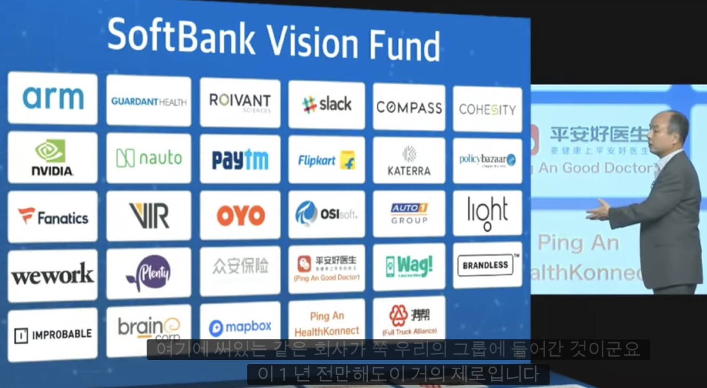
**이미지 캡션:** 화면에는 SoftBank Vision Fund라는 제목과 함께 여러 회사 로고가 격자 형태로 나열되어 있으며, 그 옆에는 한 명의 성인 남성이 서서 발표하고 있다. 남성은 검은색 정장을 입고 있으며, 오른손을 펴서 무언가를 가리키는 듯한 제스처를 취하고 있다. 그의 표정은 진지해 보이며, 배경에는 중국어로 '平安好医生(Ping An Good Doctor)'이라고 쓰인 큰 글씨와 영문 'An Good Doctor'가 보인다. 남성 옆에는 'Ping An HealthKonnect'라는 글씨도 보인다. 격자 형태로 나열된 회사 로고에는 ARM, NVIDIA, Fanatics, Wework, Improbable, Guardant Health, Nauto, Brain Corp, Roivant, Paytm, Flipkart, OYO, VIR, Plenty, 众安保险, 平安好医生, Mapbox, Slack, Compass, Cohesity, Katerra, Policybazaar, OSIsoft, Auto 1 Group, Light, Brandless, Full Truck Alliance 등 다양한 기업의 로고가 포함되어 있다. 화면 하단에는 한국어 자막으로 "여기에 써있는 같은 회사가 쭉 우리의 그룹에 들어간 것이군요 이 1년 전만해도 이 거의 제로입니다"라고 표시되어 있다. 전반적으로 투자 발표 또는 사업 현황 설명회와 같은 분위기이다. 나열된 회사 로고에는 ARM, NVIDIA, Fanatics, Wework, Improbable, Guardant Health, Nauto, Brain Corp, Roivant, Paytm, Flipkart, OYO, VIR, Plenty, 众安保险, 平安好医生, Mapbox, Slack, Compass, Cohesity, Katerra, Policybazaar, OSIsoft, Auto 1 Group, Light, Brandless, Full Truck Alliance 등 다양한 기업의 로고가 포함되어 있다. 화면 하단에는 한국어 자막으로 "여기에 써있는 같은 회사가 쭉 우리의 그룹에 들어간 것이군요 이 1년 전만해도 이 거의 제로입니다"라고 표시되어 있다. 전반적으로 투자 발표 또는 사업 현황 설명회와 같은 분위기이다.
 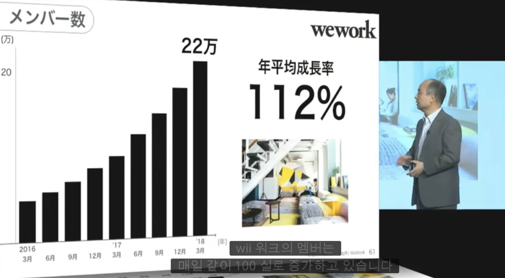
**이미지 캡션:** 화면 왼쪽에는 '멤버 수'라는 제목과 함께 2016년부터 2018년까지 멤버 수가 증가하는 추세를 보여주는 막대그래프가 있다. 그래프의 세로축은 만 단위이며 20까지 표시되어 있고, 가로축은 연도와 월을 나타낸다. 가장 높은 막대는 22만 명을 나타낸다. 그래프 오른쪽에는 'wework' 로고와 함께 '연평균 성장률 112%'라는 문구가 크게 쓰여 있고, 그 아래에는 현대적인 인테리어의 사무 공간 사진이 보인다. 사진 속에는 노란색과 검은색이 조화된 독특한 디자인의 가구와 계단이 보인다. 화면 오른쪽에는 회색 정장을 입은 성인 남성이 발표하고 있는 모습이 보인다. 그는 오른손을 들어 무언가를 설명하는 듯한 제스처를 취하고 있으며, 그의 뒤로는 밝은 배경에 또 다른 사무 공간 사진이 보인다. 화면 하단에는 'wii 워크의 멤버는 매일 같이 100실로 증가하고 있습니다.'라는 한국어 자막이 보인다. 전반적으로 회사의 성장세를 발표하는 프레젠테이션의 한 장면으로 보이며, 밝고 긍정적인 분위기이다. 정장을 입은 성인 남성이 발표하고 있는 모습이 보인다. 그는 오른손을 들어 무언가를 설명하는 듯한 제스처를 취하고 있으며, 그의 뒤로는 밝은 배경에 또 다른 사무 공간 사진이 보인다. 화면 하단에는 'wii 워크의 멤버는 매일 같이 100실로 증가하고 있습니다.'라는 한국어 자막이 보인다. 전반적으로 회사의 성장세를 발표하는 프레젠테이션의 한 장면으로 보이며, 밝고 긍정적인 분위기이다.
 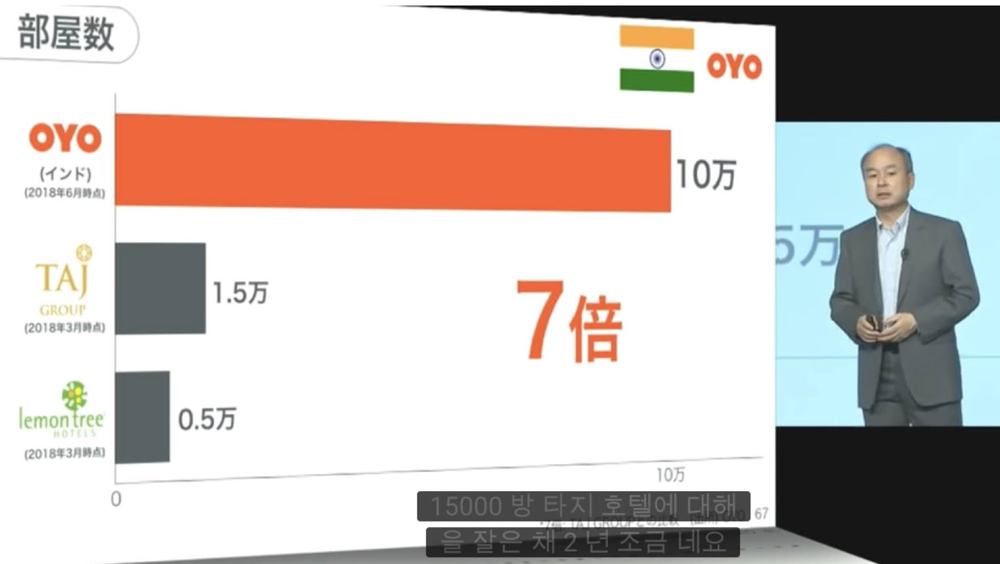
**이미지 캡션:** 화면 오른쪽에는 회색 정장을 입은 중년 남성이 서서 발표하고 있으며, 화면 왼쪽에는 일본어로 된 막대그래프가 있다. 그래프는 '객실 수'를 나타내며, OYO, TAJ GROUP, lemon tree HOTELS의 2018년 3월 또는 6월 기준 객실 수를 비교하고 있다. OYO는 인도 국기와 함께 표시되어 있으며, 2018년 6월 기준으로 10만 객실을 보유하고 있고, 이는 TAJ GROUP(1.5만 객실)과 lemon tree HOTELS(0.5만 객실)보다 훨씬 많은 수치이며, TAJ GROUP의 7배에 달한다. 그래프 하단에는 "15000 방 타지 호텔에 대해 67"이라는 텍스트와 함께 "을 잘은 채 2년 조금 네요"라는 자막이 보인다. 전반적으로 호텔 산업의 성장세를 보여주는 발표 자료의 한 장면으로 보인다.달한다. 그래프 하단에는 "15000 방 타지 호텔에 대해 67"이라는 텍스트와 함께 "을 잘은 채 2년 조금 네요"라는 자막이 보인다. 전반적으로 호텔 산업의 성장세를 보여주는 발표 자료의 한 장면으로 보인다.
 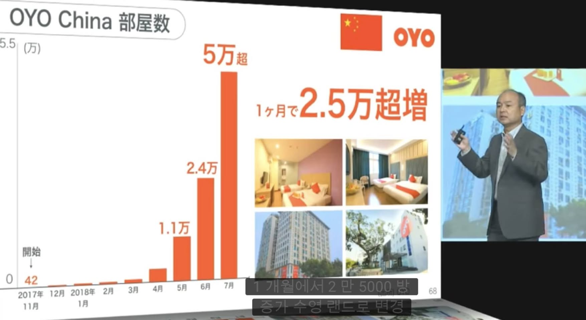
**이미지 캡션:** 화면 왼쪽에는 OYO China의 객실 수 증가 추이를 보여주는 그래프가 있다. 그래프는 2017년 11월부터 시작하여 2018년 7월까지의 데이터를 보여주며, 2018년 6월에는 2.4만, 7월에는 5만 객실을 초과하는 급격한 증가세를 나타낸다. 그래프 옆에는 1개월 동안 2.5만 객실이 증가했다는 내용과 함께 OYO 호텔 객실 사진들이 작게 배치되어 있다. 화면 오른쪽에는 회색 정장을 입은 성인 남성이 발표를 하고 있으며, 손에는 발표용 리모컨을 들고 있다. 그의 뒤로는 OYO 로고와 중국 국기가 보이는 배경 화면이 펼쳐져 있다. 전체적으로 비즈니스 발표 상황으로 보이며, OYO의 중국 시장에서의 빠른 성장을 강조하는 분위기이다.배경 화면이 펼쳐져 있다. 전체적으로 비즈니스 발표 상황으로 보이며, OYO의 중국 시장에서의 빠른 성장을 강조하는 분위기이다.
 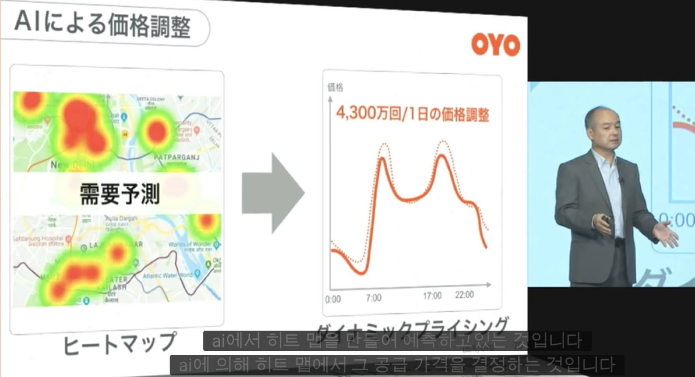
**이미지 캡션:** 발표자는 중년의 아시아 남성으로, 회색 정장을 입고 흰색 셔츠를 착용하고 있습니다. 그는 발표 슬라이드를 배경으로 서서 오른손을 들어 설명하고 있으며, 표정은 진지합니다. 슬라이드에는 일본어로 "AI에 의한 가격 조정"이라고 쓰여 있으며, 왼쪽에는 뉴델리 지역의 히트맵과 "수요 예측"이라는 텍스트가 있습니다. 오른쪽에는 시간대별 가격 변동을 나타내는 그래프가 있으며, "4,300만 회/1일의 가격 조정"이라는 문구가 보입니다. 슬라이드 하단에는 한국어로 "ai에서 히트 맵을 만들어 예측하고 있는 것입니다"와 "ai에 의해 히트 맵에서 그 공급 가격을 결정하는 것입니다"라는 설명이 있습니다. 전반적으로 기술을 활용한 가격 책정 전략에 대한 발표 상황을 보여줍니다."ai에 의해 히트 맵에서 그 공급 가격을 결정하는 것입니다"라는 설명이 있습니다. 전반적으로 기술을 활용한 가격 책정 전략에 대한 발표 상황을 보여줍니다.
 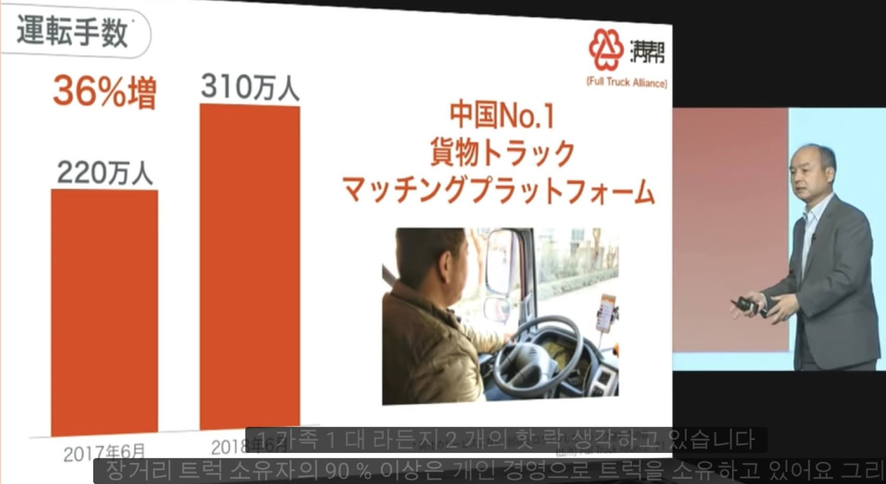
**이미지 캡션:** 화면 왼쪽에는 일본어로 '운전자 수'라고 적힌 그래프가 보이며, 2017년 6월 220만 명에서 2018년 310만 명으로 36% 증가했음을 나타낸다. 그래프 옆에는 중국 No.1 화물 트럭 매칭 플랫폼이라는 문구와 함께 Full Truck Alliance 로고가 있다. 화면 중앙에는 트럭 운전석에서 운전자가 핸들을 잡고 있는 모습이 보인다. 화면 오른쪽에는 회색 정장을 입은 성인 남성이 발표를 하고 있으며, 손에는 검은색 물건을 들고 있다. 하단에는 '가족 1대라든지 2개의 핫락 생각하고 있습니다'와 '장거리 트럭 소유자의 90% 이상은 개인 경영으로 트럭을 소유하고 있어요'라는 한국어 자막이 보인다. 전반적으로 사업 발표 또는 프레젠테이션의 한 장면으로 보인다.리 트럭 소유자의 90% 이상은 개인 경영으로 트럭을 소유하고 있어요'라는 한국어 자막이 보인다. 전반적으로 사업 발표 또는 프레젠테이션의 한 장면으로 보인다.
 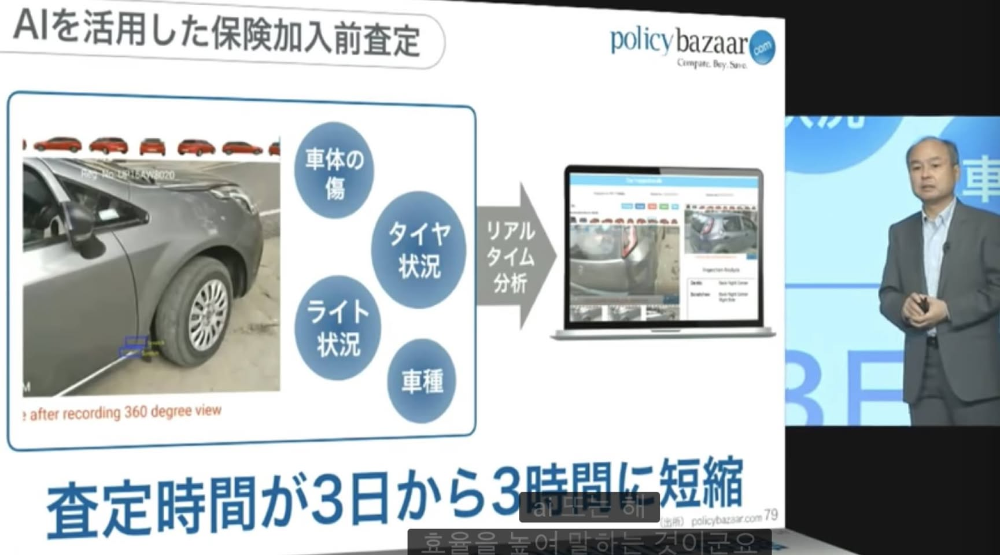
**이미지 캡션:** 이 사진은 AI를 활용한 보험 가입 전 차량 검사 과정을 보여주는 발표 장면으로, 왼쪽에는 회색 차량의 측면 사진과 함께 차량의 손상, 타이어 상태, 라이트 상태, 차종을 분석하는 일본어 텍스트가 원형으로 배치되어 있고, 중앙에는 분석 결과를 보여주는 노트북 화면과 함께 '실시간 분석'이라는 텍스트가 화살표로 연결되어 있다. 노트북 화면에는 차량의 손상 부위를 보여주는 여러 개의 작은 이미지들이 표시되어 있다. 오른쪽에는 회색 정장을 입은 성인 남성이 발표를 하고 있으며, 배경에는 파란색과 흰색의 로고와 텍스트가 보인다. 사진 하단에는 "査定時間が3日から3時間に短縮"이라는 일본어 문구와 함께 "효율을 높여 말하는 것이군요"라는 한국어 자막이 보인다. 전반적으로 기술 발표의 한 장면을 담고 있으며, AI 기술을 활용하여 차량 검사 과정을 효율화하는 내용을 전달하고 있다.트가 보인다. 사진 하단에는 "査定時間が3日から3時間に短縮"이라는 일본어 문구와 함께 "효율을 높여 말하는 것이군요"라는 한국어 자막이 보인다. 전반적으로 기술 발표의 한 장면을 담고 있으며, AI 기술을 활용하여 차량 검사 과정을 효율화하는 내용을 전달하고 있다.
 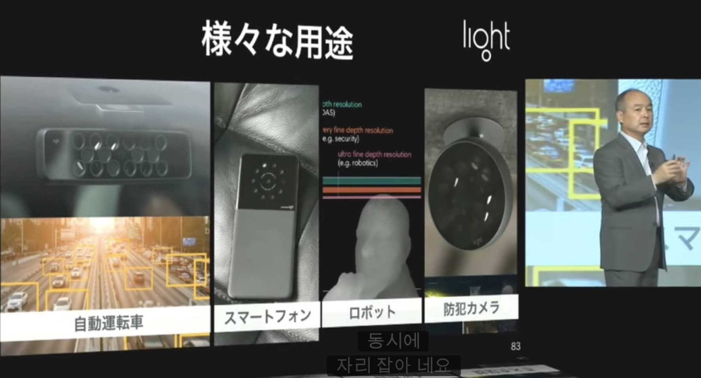
**이미지 캡션:** 화면 중앙에는 일본어로 '다양한 용도'라고 쓰여 있으며, 그 옆에는 'light'라는 로고가 보인다. 화면 왼쪽부터 여러 개의 이미지가 나열되어 있는데, 첫 번째 이미지는 자동차 내부 천장에 부착된 여러 렌즈가 달린 장치와 그 아래에 고속도로 위를 달리는 자동차들에 노란색 박스가 쳐져 있는 모습으로 '자동 운전차'라고 쓰여 있다. 두 번째 이미지는 검은색 스마트폰처럼 생긴 장치로, '스마트폰'이라고 쓰여 있다. 세 번째 이미지는 검은색 배경에 깊이 해상도에 대한 설명과 함께 사람의 얼굴을 3D로 표현한 이미지로, '로봇'이라고 쓰여 있다. 네 번째 이미지는 천장에 부착된 원형의 장치로, '방범 카메라'라고 쓰여 있다. 화면 오른쪽에는 회색 정장을 입은 중년 남성이 서서 손짓하며 발표하고 있으며, 배경에는 자동차들이 있는 도로 이미지가 보인다. 화면 하단에는 '동시에'라는 한국어 문구가 보인다. 전반적으로 다양한 분야에서 활용될 수 있는 첨단 기술 제품들을 소개하는 발표 장면으로 보인다.로, '로봇'이라고 쓰여 있다. 네 번째 이미지는 천장에 부착된 원형의 장치로, '방범 카메라'라고 쓰여 있다. 화면 오른쪽에는 회색 정장을 입은 중년 남성이 서서 손짓하며 발표하고 있으며, 배경에는 자동차들이 있는 도로 이미지가 보인다. 화면 하단에는 '동시에'라는 한국어 문구가 보인다. 전반적으로 다양한 분야에서 활용될 수 있는 첨단 기술 제품들을 소개하는 발표 장면으로 보인다.
 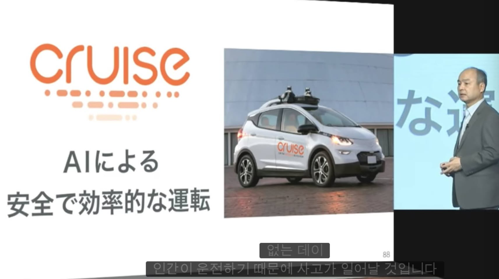
**이미지 캡션:** 화면 왼쪽에는 주황색 글씨로 'cruise'라고 쓰여진 로고와 함께 'AI에 의한 안전하고 효율적인 운전'이라는 일본어 문구가 보입니다. 가운데에는 자율주행 차량인 크루즈 차량의 사진이 있고, 오른쪽에는 회색 정장을 입은 성인 남성이 파란색 배경을 앞에 두고 서서 발표하고 있습니다. 남성은 50대 정도로 보이며, 차분한 표정으로 손을 모으고 있습니다. 화면 하단에는 '없는 데이'라는 검은색 배경의 자막과 함께 '인간이 운전하기 때문에 사고가 일어날 것입니다'라는 한국어 자막이 보입니다. 전체적으로 기술 발표회나 강연의 한 장면으로 보이며, 자율주행 기술의 안전성과 효율성을 강조하는 분위기입니다.나 강연의 한 장면으로 보이며, 자율주행 기술의 안전성과 효율성을 강조하는 분위기입니다.
 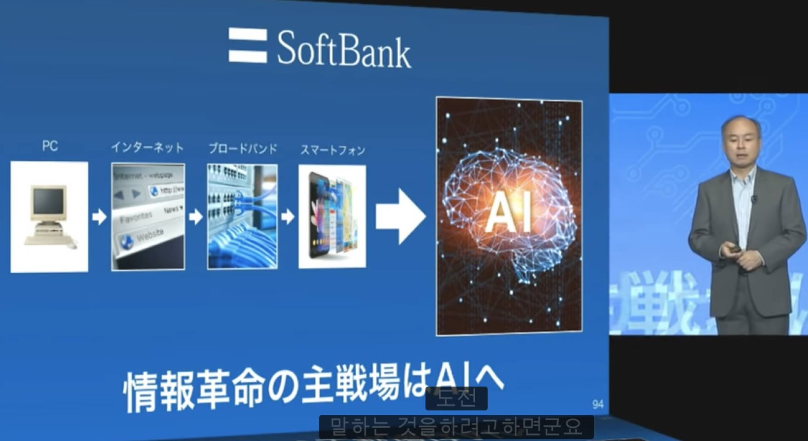
**이미지 캡션:** 이 사진은 SoftBank 로고가 있는 파란색 배경의 프레젠테이션 슬라이드를 보여줍니다. 슬라이드에는 PC, 인터넷, 브로드밴드, 스마트폰의 이미지가 순서대로 나열되어 있으며, 마지막으로 AI를 상징하는 빛나는 뇌 이미지가 있습니다. 이 이미지들은 기술 발전의 흐름을 나타내는 것으로 보입니다. 슬라이드 하단에는 "정보 혁명의 주전장은 AI로"라는 일본어 문구가 적혀 있습니다. 오른쪽에는 회색 정장을 입은 중년 남성이 서서 발표하고 있으며, 그의 표정은 진지합니다. 그는 오른손에 무언가를 들고 있습니다. 배경에는 회로 기판 모양의 패턴이 희미하게 보입니다. 전반적으로 기술 발전과 AI의 중요성을 강조하는 발표 상황을 담고 있습니다.는 회로 기판 모양의 패턴이 희미하게 보입니다. 전반적으로 기술 발전과 AI의 중요성을 강조하는 발표 상황을 담고 있습니다.
 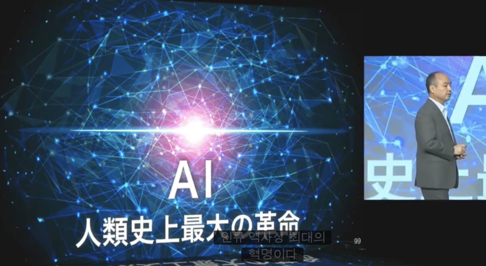
**이미지 캡션:** 화면 왼쪽에는 파란색과 보라색 빛이 어우러진 복잡한 네트워크 그래픽이 배경으로 펼쳐져 있으며, 중앙에는 'AI'라는 글자와 함께 "인류 역사상 최대의 혁명이다"라는 한국어 자막이 보입니다. 화면 오른쪽에는 회색 정장을 입은 중년 남성이 서서 강연을 하고 있으며, 그의 뒤편에는 일본어로 보이는 '史'라는 글자가 크게 쓰여 있습니다. 남성은 차분한 표정으로 청중을 바라보고 있으며, 손에는 무언가를 들고 있는 것으로 보입니다. 전체적으로 기술과 혁신에 대한 주제를 다루는 강연이나 발표회 장면으로 추정됩니다.
 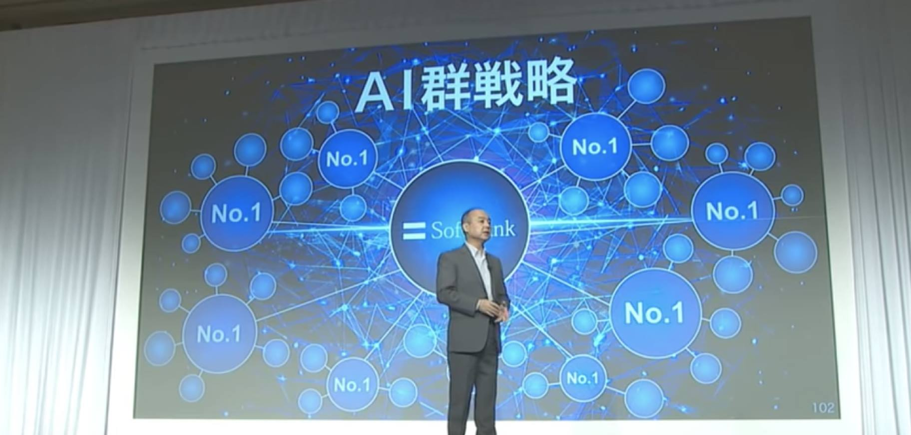
**이미지 캡션:** 발표회장으로 보이는 장소에서 한 명의 성인 남성이 회색 정장을 입고 연단에 서서 스크린을 향해 이야기하고 있다. 남성은 50대 정도로 보이며, 짧은 머리에 옅은 미소를 띠고 있다. 스크린에는 "AI群戦略"이라는 일본어 문구와 함께 파란색 원형 노드들이 연결된 복잡한 네트워크 그래픽이 표시되어 있으며, 각 노드에는 "No.1"이라는 문구가 적혀 있다. 중앙에는 "SoftBank" 로고가 보인다. 전체적으로 기술 발표회 또는 사업 전략 발표회와 같은 진지하고 전문적인 분위기이다.

### 8월 28일 (화) 14:36 · It's simply amazing to receive the ICSME…

It's simply amazing to receive the ICSME 2018 Most Influential Paper Award thanks to my wonderful friends,  Nicolas Bettenburg, Rahul and Thomas Zimmermann. They are really great, and I miss them a lot!

---
[ICSME 2018 Most Influential Paper Award]

Dear Nicolas, Rahul, Tom and Kim,

it is our great pleasure to announce that your paper "Duplicate bug reports considered harmful... really" presented at ICSM 2008 has been chosen for the Most Influential Paper Award at ICSME 2018, to be held in one month in Madrid.

Congratulations!

https://www.slideshare.net/nicbet/duplicate-bug-reports-considered-harmful-really-presentation

**이미지 캡션:** 이 이미지는 발표 슬라이드의 일부로, 상단에는 주황색 배경에 흰색 글씨로 "Duplicate Bug Reports Considered Harmful ... Really?!"라는 제목이 크게 쓰여 있습니다. 제목 아래에는 네 명의 사람 이름과 소속 기관이 나열되어 있습니다. 왼쪽부터 Nicolas Bettenburg (Saarland University, Queen's University), Rahul Premraj (Saarland University, Vrije Uni. Amsterdam), Tom Zimmermann (University of Calgary, Microsoft Research), Sunghun Kim (MIT CSAIL, Hong Kong University)입니다. 이들은 모두 성인 남성으로 보이며, 각자의 이름과 소속이 명확하게 표시되어 있어 학술 발표나 연구 관련 행사임을 짐작할 수 있습니다. 배경은 흰색이며, 별도의 장식이나 이미지는 없습니다. 전체적으로 정보 전달에 초점을 맞춘 깔끔하고 전문적인 분위기입니다.ermann (University of Calgary, Microsoft Research), Sunghun Kim (MIT CSAIL, Hong Kong University)입니다. 이들은 모두 성인 남성으로 보이며, 각자의 이름과 소속이 명확하게 표시되어 있어 학술 발표나 연구 관련 행사임을 짐작할 수 있습니다. 배경은 흰색이며, 별도의 장식이나 이미지는 없습니다. 전체적으로 정보 전달에 초점을 맞춘 깔끔하고 전문적인 분위기입니다.
 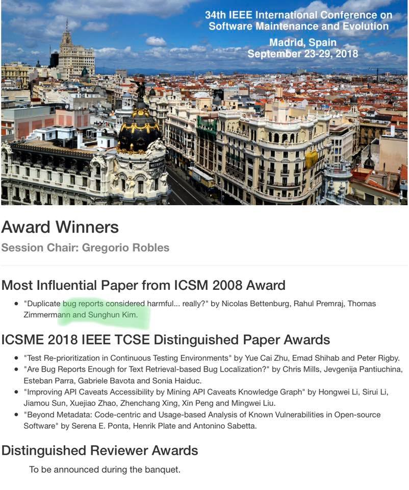
**이미지 캡션:** 이 사진은 34회 IEEE 소프트웨어 유지보수 및 진화 국제 컨퍼런스의 수상자 목록을 보여줍니다. 상단에는 마드리드, 스페인에서 2018년 9월 23일부터 29일까지 열린 컨퍼런스의 풍경 사진이 배경으로 깔려 있으며, 파란 하늘과 구름, 그리고 마드리드의 상징적인 건물들이 보입니다. 사진 아래에는 "Award Winners"라는 제목과 함께 세션 의장으로 "Gregorio Robles"라는 이름이 명시되어 있습니다. 이어서 "Most Influential Paper from ICSM 2008 Award" 섹션에는 니콜라스 베텐버그, 라훌 프렘라즈, 토마스 짐머만, 선훈 김이 공동 저술한 논문이 언급되어 있습니다. 그 아래 "ICSME 2018 IEEE TCSE Distinguished Paper Awards" 섹션에는 네 편의 논문이 나열되어 있으며, 각 논문의 저자 이름들이 함께 기재되어 있습니다. 마지막으로 "Distinguished Reviewer Awards" 섹션에는 "To be announced during the banquet."이라는 문구가 있어, 해당 시상식은 만찬 중에 발표될 예정임을 알 수 있습니다. 전체적으로 학술 컨퍼런스의 공식적인 정보를 전달하는 차분하고 정보 중심적인 분위기입니다.에는 니콜라스 베텐버그, 라훌 프렘라즈, 토마스 짐머만, 선훈 김이 공동 저술한 논문이 언급되어 있습니다. 그 아래 "ICSME 2018 IEEE TCSE Distinguished Paper Awards" 섹션에는 네 편의 논문이 나열되어 있으며, 각 논문의 저자 이름들이 함께 기재되어 있습니다. 마지막으로 "Distinguished Reviewer Awards" 섹션에는 "To be announced during the banquet."이라는 문구가 있어, 해당 시상식은 만찬 중에 발표될 예정임을 알 수 있습니다. 전체적으로 학술 컨퍼런스의 공식적인 정보를 전달하는 차분하고 정보 중심적인 분위기입니다.

### 8월 28일 (화) 20:06 · 📷 사진 (1장)

**이미지 캡션:** 이 사진은 회색 배경에 흰색 테두리가 있는 직사각형 버튼을 보여줍니다. 버튼 중앙에는 "본 모임은 54분후에 신청이 시작됩니다."라는 한국어 텍스트가 회색과 파란색으로 표시되어 있습니다. 버튼 오른쪽에는 하트 모양 아이콘과 숫자 60이 회색으로 표시되어 있어 좋아요 수를 나타내는 것으로 보입니다. 이 화면은 온라인 모임이나 이벤트의 신청 시작 시간을 알리는 알림 또는 정보 표시로 보이며, 54분 후에 신청이 시작될 예정임을 나타냅니다.

### 8월 29일 (수) 09:43 · 20% of the 100-day 10K run challenge is …

20% of the 100-day 10K run challenge is done thanks to your support. Wish me luck to finish the whole challenge -- just 80 more days.

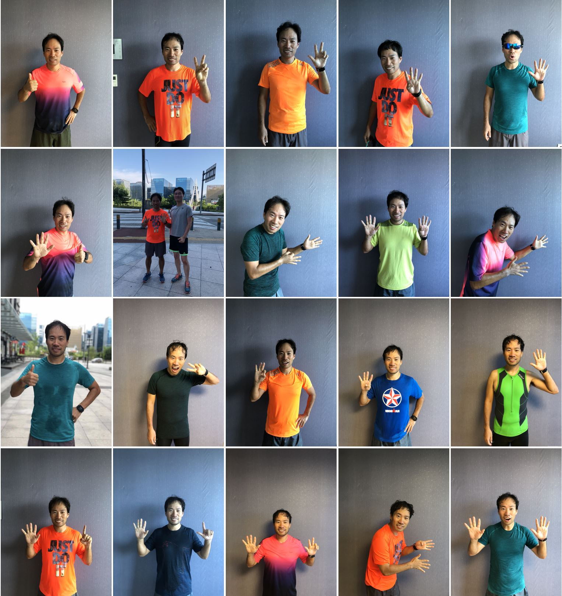
**이미지 캡션:** 이 사진은 15개의 작은 사진으로 구성된 콜라주로, 모두 같은 성인 남성이 다양한 복장과 포즈로 등장한다. 남성은 30대 후반에서 40대 초반으로 보이며, 짧은 검은 머리에 옅은 미소를 띠고 있다. 대부분의 사진에서 그는 운동복을 입고 있으며, 티셔츠와 반바지, 또는 민소매 조끼를 착용하고 있다. 몇몇 사진에서는 손가락으로 숫자를 세거나 V자를 그리며 포즈를 취하고 있다. 배경은 주로 회색 벽으로, 일부 사진에서는 야외 풍경이나 건물 내부가 보인다. 사진의 분위기는 전반적으로 밝고 긍정적이며, 남성의 활기찬 모습을 담고 있다.모습을 담고 있다.
