# 2018년 12월

[← 2018년](README.md)

### 12월 6일 (목) 13:56 · siggraph == fun!

siggraph == fun!

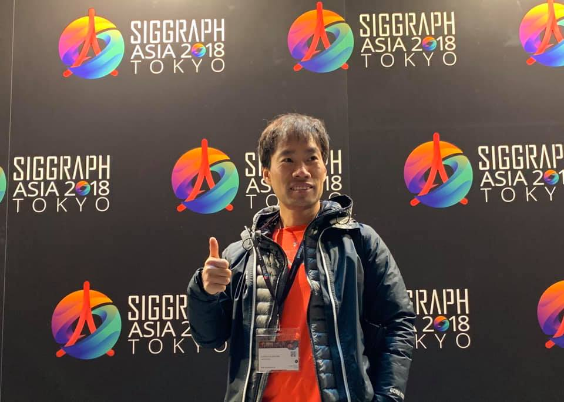
**이미지 캡션:** 한 명의 성인 남성이 검은색 패딩 점퍼 안에 주황색 티셔츠를 입고 엄지손가락을 치켜세우며 카메라를 향해 웃고 있다. 남성은 30대 후반에서 40대 초반으로 보이며, 짧은 검은색 머리카락을 가지고 있다. 점퍼에는 여러 개의 지퍼와 후드가 달려 있으며, 목 부분에는 행사 이름이 적힌 목걸이 형태의 출입증을 착용하고 있다. 배경은 검은색 벽면으로, 반복적으로 "SIGGRAPH ASIA 2018 TOKYO"라는 문구와 함께 다채로운 색상의 로고가 인쇄되어 있다. 로고는 원형 안에 추상적인 형태의 건물이 그려져 있으며, 전체적으로 행사의 홍보 부스나 포토존으로 보이는 장소이다. 사진은 밝고 긍정적인 분위기를 나타낸다., 전체적으로 행사의 홍보 부스나 포토존으로 보이는 장소이다. 사진은 밝고 긍정적인 분위기를 나타낸다.

### 12월 9일 (일) 08:17 · cool

cool

Sung's most liked photo on Facebook of 2010

🎬 동영상 1개 (생략)

### 12월 9일 (일) 12:18 · Favorite place in Ginza. Redbean bread s…

Favorite place in Ginza. Redbean bread so good. 

긴자 단팥빵 짱!

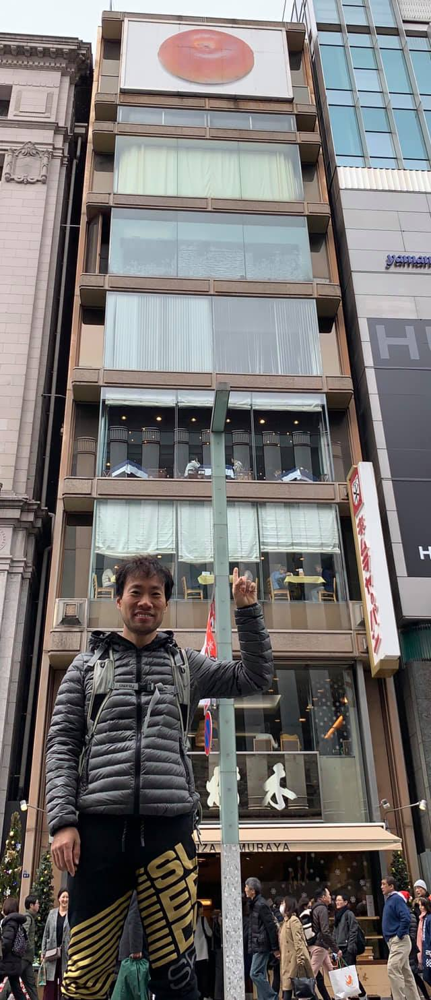
**이미지 캡션:** 한 명의 성인 남성이 회색 패딩 점퍼와 검은색 바지를 입고 카메라를 향해 웃으며 오른손 검지를 위로 가리키고 있다. 남성은 도심의 여러 층으로 이루어진 건물 앞에 서 있으며, 건물에는 큰 원형 광고판과 함께 여러 층의 창문이 보인다. 창문 안쪽으로는 테이블과 의자가 놓여 있어 식당이나 카페로 추정된다. 건물에는 일본어로 된 간판이 여러 개 보이며, "YAMANA"와 "H"라는 영문 로고도 보인다. 배경에는 다른 건물들과 거리 풍경, 그리고 몇몇 사람들이 지나가는 모습이 보인다. 전반적으로 도시의 번화한 거리에서 찍은 사진으로 보인다.서 찍은 사진으로 보인다.

### 12월 9일 (일) 13:31 · merry christmas

merry christmas

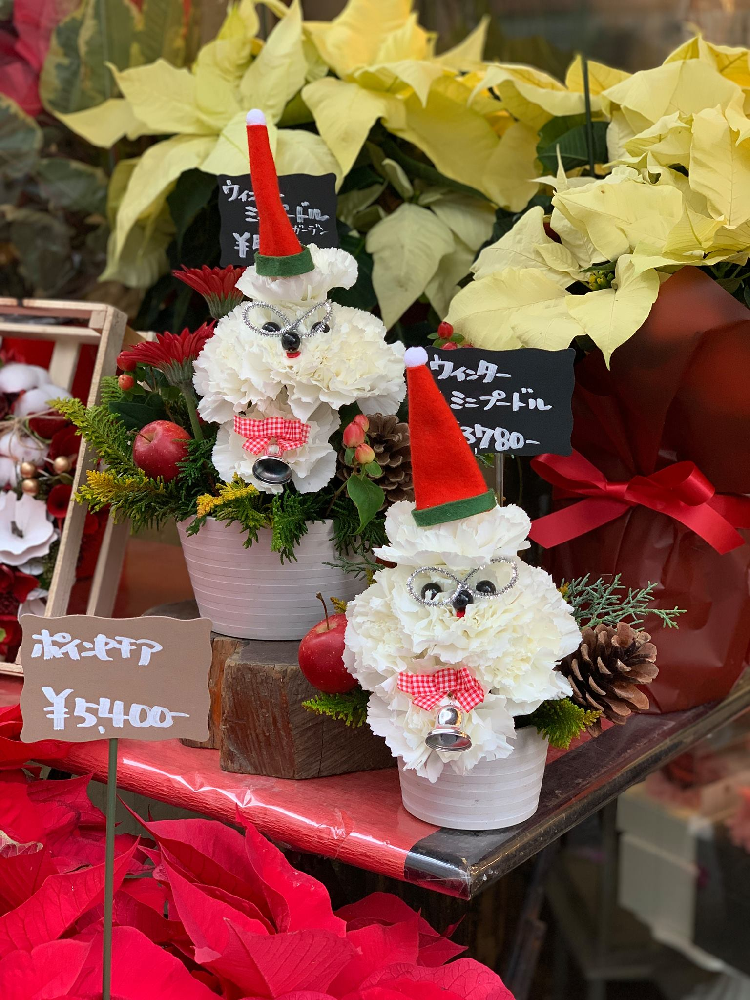
**이미지 캡션:** 두 개의 귀여운 흰색 꽃으로 만들어진 산타 장식이 중앙에 있으며, 각각 빨간색 산타 모자와 체크무늬 리본, 작은 방울을 달고 있습니다. 꽃 장식은 흰색 화분에 담겨 있으며, 주변에는 노란색과 빨간색 포인세티아가 풍성하게 피어 있어 크리스마스 분위기를 물씬 풍깁니다. 왼쪽에는 "ポインセチア ¥5,400"이라고 적힌 가격표가 보이고, 오른쪽에는 "ウィンターミニプードル 3780-"라고 적힌 가격표가 있습니다. 전체적으로 따뜻하고 축제적인 분위기를 자아냅니다.

### 12월 10일 (월) 12:18 · 📷 사진 (1장)

**이미지 캡션:** 한 성인 남성이 회색 패딩 점퍼와 검은색 바지를 입고 카메라를 향해 웃으며 오른손 검지를 위로 가리키고 있다. 남성은 30대 후반에서 40대 초반으로 보이며, 짧은 검은색 머리에 옅은 미소를 띠고 있다. 배경에는 여러 층으로 이루어진 건물이 있으며, 건물 상단에는 커다란 원형 광고판이 있고, 중간층에는 창문 너머로 식당 내부가 보인다. 건물 측면에는 일본어로 된 간판이 세로로 걸려 있으며, "YAMAHA"와 "H"라는 글자가 보이는 다른 건물도 있다. 거리에는 몇몇 사람들이 지나다니고 있으며, 크리스마스 장식으로 보이는 트리도 보인다. 전체적으로 도시의 거리 풍경을 담고 있으며, 남성은 즐거운 표정으로 어딘가를 가리키고 있다.으로 보이는 트리도 보인다. 전체적으로 도시의 거리 풍경을 담고 있으며, 남성은 즐거운 표정으로 어딘가를 가리키고 있다.

> Favorite place in Ginza. Redbean bread so good.   긴자 단팥빵 짱!

### 12월 13일 (목) 05:05 · wonderful 2018!

wonderful 2018!

🎬 동영상 1개 (생략)

### 12월 14일 (금) 22:58 · 📷 사진 (12장)

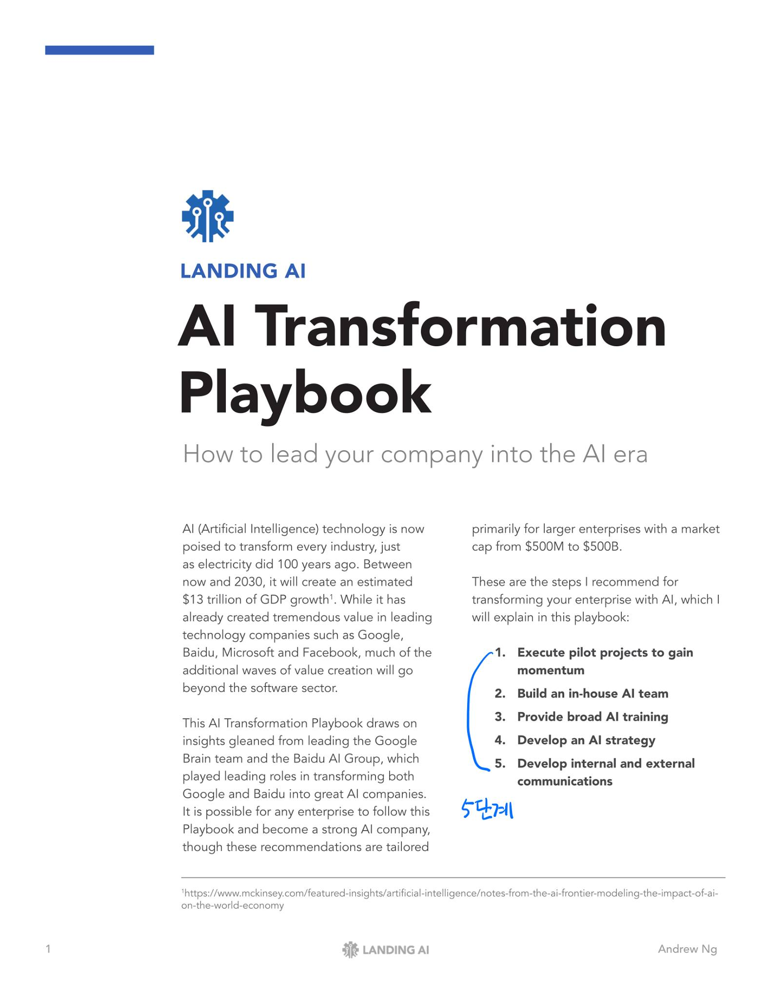
**이미지 캡션:** 이 이미지는 "LANDING AI"라는 로고와 함께 "AI Transformation Playbook: How to lead your company into the AI era"라는 제목이 크게 쓰여 있는 문서의 일부입니다. 왼쪽에는 인공지능 기술의 중요성과 잠재력에 대한 설명이 있으며, 오른쪽에는 AI 전환을 위한 5단계 실행 계획이 나열되어 있습니다. 텍스트는 흰색 배경에 검은색과 회색 글씨로 작성되었으며, 파란색 밑줄과 괄호가 강조를 위해 사용되었습니다. 문서의 하단에는 출처 링크와 "LANDING AI" 로고, 그리고 "Andrew Ng"라는 이름이 보입니다. 전체적으로 전문적이고 정보 전달에 초점을 맞춘 분위기입니다." 로고, 그리고 "Andrew Ng"라는 이름이 보입니다. 전체적으로 전문적이고 정보 전달에 초점을 맞춘 분위기입니다.
 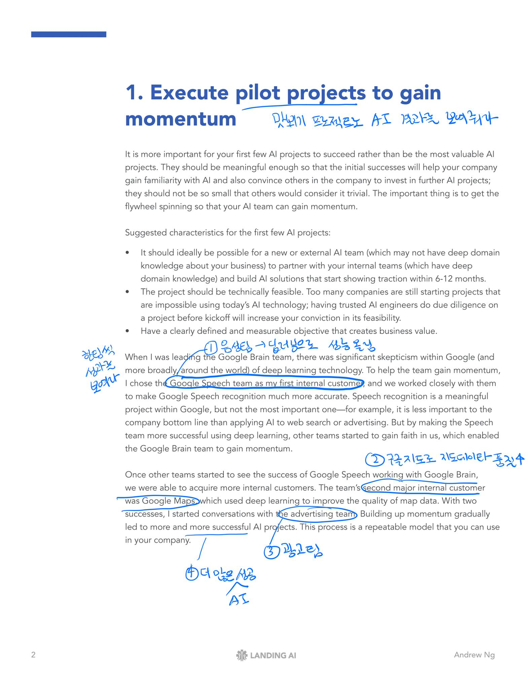
**이미지 캡션:** 이 사진은 흰색 배경에 인쇄된 문서의 일부로, 왼쪽 하단에는 페이지 번호 '2'가 있고 오른쪽 하단에는 'LANDING AI' 로고와 'Andrew Ng'라는 이름이 있습니다. 문서의 상단에는 파란색으로 "1. Execute pilot projects to gain momentum"이라는 제목이 있고, 그 아래에는 한국어로 "맛뵈기 프로젝트로 AI 결과를 보여줘라"라는 필기체가 있습니다. 본문은 영어로 작성되었으며, AI 프로젝트의 성공적인 실행에 대한 조언을 담고 있습니다. 본문 중간에는 한국어로 된 필기체 메모들이 여러 개 있습니다. 왼쪽에는 "한팀씩 성과를 보여라"라는 메모가 있고, 본문 내용과 관련된 것으로 보이는 "① 음성팀 → 딥러닝으로 성능 올림"이라는 메모가 있습니다. 또한, "② 구글지도로 지도데이터 품질수"라는 메모와 "③ 광고팀", "④ 더 많은 성공 AI"라는 메모도 보입니다. 전반적으로 AI 프로젝트의 중요성과 성공 전략에 대한 내용을 담고 있는 문서의 일부로 보입니다. 메모들이 여러 개 있습니다. 왼쪽에는 "한팀씩 성과를 보여라"라는 메모가 있고, 본문 내용과 관련된 것으로 보이는 "① 음성팀 → 딥러닝으로 성능 올림"이라는 메모가 있습니다. 또한, "② 구글지도로 지도데이터 품질수"라는 메모와 "③ 광고팀", "④ 더 많은 성공 AI"라는 메모도 보입니다. 전반적으로 AI 프로젝트의 중요성과 성공 전략에 대한 내용을 담고 있는 문서의 일부로 보입니다.
 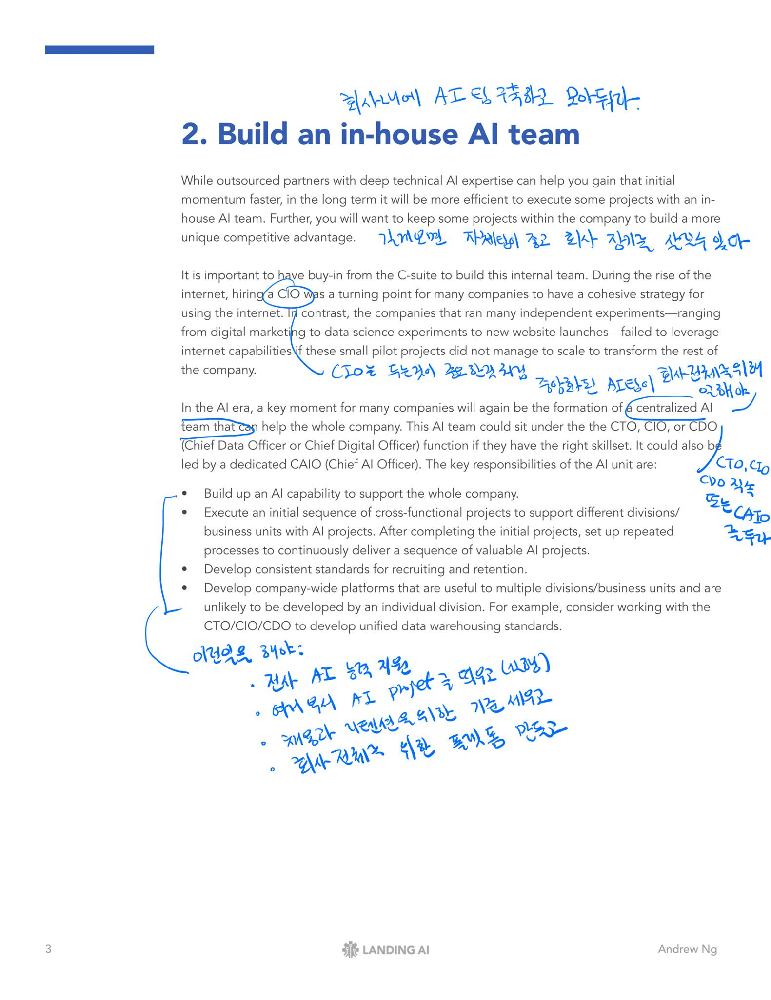
**이미지 캡션:** 이 사진은 "2. Build an in-house AI team"이라는 제목의 문서 페이지로, AI 팀을 회사 내부에 구축하는 것에 대한 내용을 담고 있습니다. 페이지 상단에는 파란색 밑줄과 함께 "회사 내에 AI 팀 구축하고 모아둬라."라는 손글씨 메모가 있습니다. 본문은 영어로 작성되어 있으며, 아웃소싱 파트너를 통해 초기 AI 모멘텀을 얻는 것보다 장기적으로는 사내 AI 팀을 구축하는 것이 더 효율적이라는 점을 강조합니다. 또한, C-suite의 동의가 중요하며, 인터넷 시대에 CIO의 역할이 중요했던 것처럼 AI 시대에는 중앙 집중화된 AI 팀이 회사의 핵심 역할을 할 것이라고 설명합니다. AI 팀의 주요 책임으로는 전사 AI 역량 지원, 여러 부서의 AI 프로젝트 실행, 채용 및 유지 관리를 위한 표준 수립, 그리고 회사 전체에 유용한 플랫폼 개발 등이 있습니다. 페이지 하단에는 "이런 일을 해야:"라는 제목으로 이러한 책임들을 요약한 한국어 손글씨 메모가 있습니다. 페이지 오른쪽 하단에는 "Andrew Ng"라는 이름이 보이며, 페이지 하단 중앙에는 "LANDING AI"라는 로고가 있습니다. 전반적으로 전문적인 문서의 일부로 보이며, AI 전략 수립에 대한 조언을 담고 있습니다.것처럼 AI 시대에는 중앙 집중화된 AI 팀이 회사의 핵심 역할을 할 것이라고 설명합니다. AI 팀의 주요 책임으로는 전사 AI 역량 지원, 여러 부서의 AI 프로젝트 실행, 채용 및 유지 관리를 위한 표준 수립, 그리고 회사 전체에 유용한 플랫폼 개발 등이 있습니다. 페이지 하단에는 "이런 일을 해야:"라는 제목으로 이러한 책임들을 요약한 한국어 손글씨 메모가 있습니다. 페이지 오른쪽 하단에는 "Andrew Ng"라는 이름이 보이며, 페이지 하단 중앙에는 "LANDING AI"라는 로고가 있습니다. 전반적으로 전문적인 문서의 일부로 보이며, AI 전략 수립에 대한 조언을 담고 있습니다.
 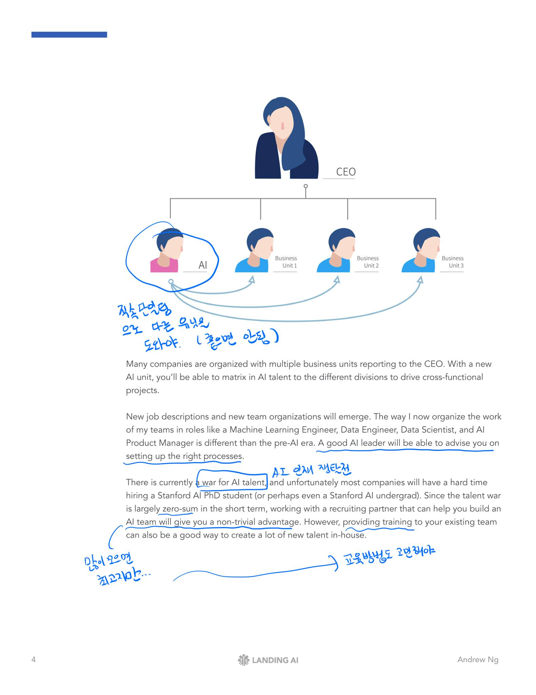
**이미지 캡션:** 이 이미지는 조직 구조를 보여주는 다이어그램과 함께 AI 인재 확보에 대한 텍스트 설명을 담고 있습니다. 다이어그램에는 CEO와 그 아래에 여러 비즈니스 유닛이 연결되어 있으며, 그중 하나는 AI 팀으로 표시되어 있습니다. AI 팀은 파란색 원으로 둘러싸여 있으며, "직속 단일팀으로 다른 유닛을 도와야. (흩으면 안됨)"이라는 한국어 메모가 손글씨로 적혀 있습니다. 또한, AI 인재 확보의 어려움과 관련된 "AI 인재 쟁탈전"이라는 또 다른 한국어 메모와 "많이 모으면 최고지만..."이라는 메모가 있습니다. 텍스트 설명은 AI 시대에 새로운 직무 설명과 팀 구성이 등장할 것이며, AI 인재 확보 경쟁이 치열하다는 내용을 담고 있습니다. "교육방법도 고민해야"라는 한국어 메모는 AI 인재를 내부적으로 양성하는 것의 중요성을 시사합니다. 전반적으로 이 이미지는 AI 팀의 조직 구조와 AI 인재 확보 전략에 대한 논의를 시각적으로 표현하고 있습니다.텍스트 설명은 AI 시대에 새로운 직무 설명과 팀 구성이 등장할 것이며, AI 인재 확보 경쟁이 치열하다는 내용을 담고 있습니다. "교육방법도 고민해야"라는 한국어 메모는 AI 인재를 내부적으로 양성하는 것의 중요성을 시사합니다. 전반적으로 이 이미지는 AI 팀의 조직 구조와 AI 인재 확보 전략에 대한 논의를 시각적으로 표현하고 있습니다.
 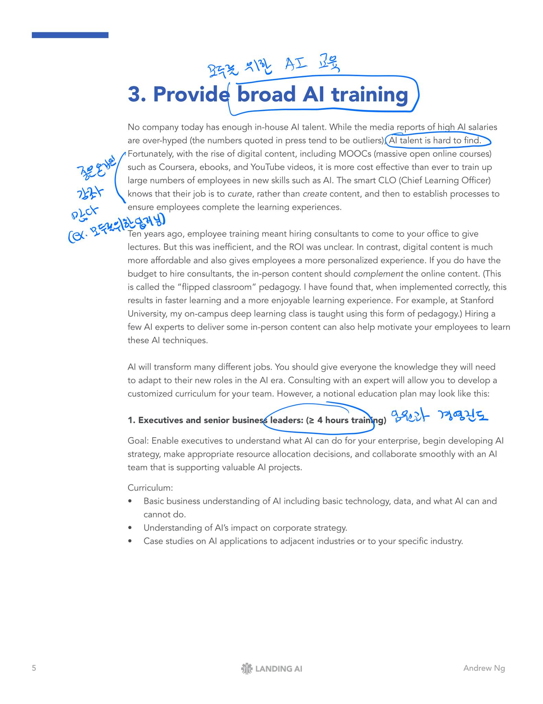
**이미지 캡션:** 이 사진은 AI 교육에 대한 내용을 담고 있으며, 제목은 "3. Provide broad AI training"으로 되어 있습니다. 좌측 상단에는 "모두를 위한 AI 교육"이라는 문구가 파란색 펜으로 쓰여 있고, 그 아래에는 "좋은 온라인 강좌 많다"라는 메모와 함께 "(ex. 모두를 위한 강의님)"이라는 추가적인 메모가 있습니다. 본문 내용은 기업 내 AI 인재 부족 문제와 이를 해결하기 위한 교육의 중요성을 강조하며, 온라인 콘텐츠와 오프라인 강의를 결합한 "플립드 클래스룸" 방식의 교육 효과를 설명합니다. 또한, AI가 다양한 직무를 변화시킬 것이므로 모든 직원이 새로운 역할에 적응할 수 있도록 교육해야 한다고 말합니다. 구체적인 교육 계획의 예시로 "1. Executives and senior business leaders: (≥ 4 hours training)"를 제시하며, 이 교육의 목표는 경영진이 AI의 가능성을 이해하고 전략을 수립하며 AI 프로젝트를 지원하는 팀과 협력하는 것이라고 설명합니다. 교육 과정으로는 AI의 기본 비즈니스 이해, 기업 전략에 미치는 영향, 관련 산업의 AI 적용 사례 연구 등이 포함됩니다. 사진 하단에는 "LANDING AI" 로고와 페이지 번호 "5", 그리고 "Andrew Ng"라는 이름이 보입니다. 전반적으로 교육 자료의 한 페이지로 보이며, 정보 전달에 초점을 맞춘 진지하고 전문적인 분위기입니다.. 또한, AI가 다양한 직무를 변화시킬 것이므로 모든 직원이 새로운 역할에 적응할 수 있도록 교육해야 한다고 말합니다. 구체적인 교육 계획의 예시로 "1. Executives and senior business leaders: (≥ 4 hours training)"를 제시하며, 이 교육의 목표는 경영진이 AI의 가능성을 이해하고 전략을 수립하며 AI 프로젝트를 지원하는 팀과 협력하는 것이라고 설명합니다. 교육 과정으로는 AI의 기본 비즈니스 이해, 기업 전략에 미치는 영향, 관련 산업의 AI 적용 사례 연구 등이 포함됩니다. 사진 하단에는 "LANDING AI" 로고와 페이지 번호 "5", 그리고 "Andrew Ng"라는 이름이 보입니다. 전반적으로 교육 자료의 한 페이지로 보이며, 정보 전달에 초점을 맞춘 진지하고 전문적인 분위기입니다.
 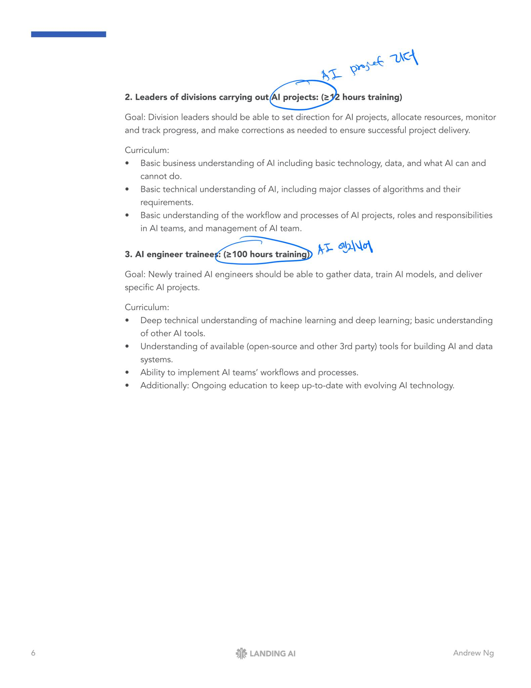
**이미지 캡션:** 이 이미지는 문서의 일부로, 두 개의 항목에 대한 설명이 포함되어 있습니다. 첫 번째 항목은 "AI 프로젝트를 수행하는 부서 리더"에 대한 것으로, 최소 12시간의 교육이 필요하며, AI 프로젝트의 방향 설정, 자원 할당, 진행 상황 모니터링 및 추적, 성공적인 프로젝트 완수를 위한 수정 사항을 만드는 능력이 목표입니다. 교육 과정에는 AI의 기본 비즈니스 이해, 기본 기술 이해, 워크플로우 및 프로세스 이해가 포함됩니다. 두 번째 항목은 "AI 엔지니어 수습생"에 대한 것으로, 최소 100시간의 교육이 필요하며, 데이터 수집, AI 모델 훈련, 특정 AI 프로젝트 제공 능력이 목표입니다. 교육 과정에는 머신러닝 및 딥러닝에 대한 심층적인 기술 이해, AI 도구에 대한 기본 이해, AI 및 데이터 시스템 구축을 위한 도구 이해, AI 팀의 워크플로우 및 프로세스 구현 능력이 포함됩니다. 또한, 진화하는 AI 기술에 대한 최신 정보를 유지하기 위한 지속적인 교육이 강조됩니다. 문서의 하단에는 "LANDING AI"라는 로고와 "Andrew Ng"라는 이름이 보입니다. 이미지 상단에는 "AI project 리더"라는 손글씨 메모가 있습니다.하며, 데이터 수집, AI 모델 훈련, 특정 AI 프로젝트 제공 능력이 목표입니다. 교육 과정에는 머신러닝 및 딥러닝에 대한 심층적인 기술 이해, AI 도구에 대한 기본 이해, AI 및 데이터 시스템 구축을 위한 도구 이해, AI 팀의 워크플로우 및 프로세스 구현 능력이 포함됩니다. 또한, 진화하는 AI 기술에 대한 최신 정보를 유지하기 위한 지속적인 교육이 강조됩니다. 문서의 하단에는 "LANDING AI"라는 로고와 "Andrew Ng"라는 이름이 보입니다. 이미지 상단에는 "AI project 리더"라는 손글씨 메모가 있습니다.
 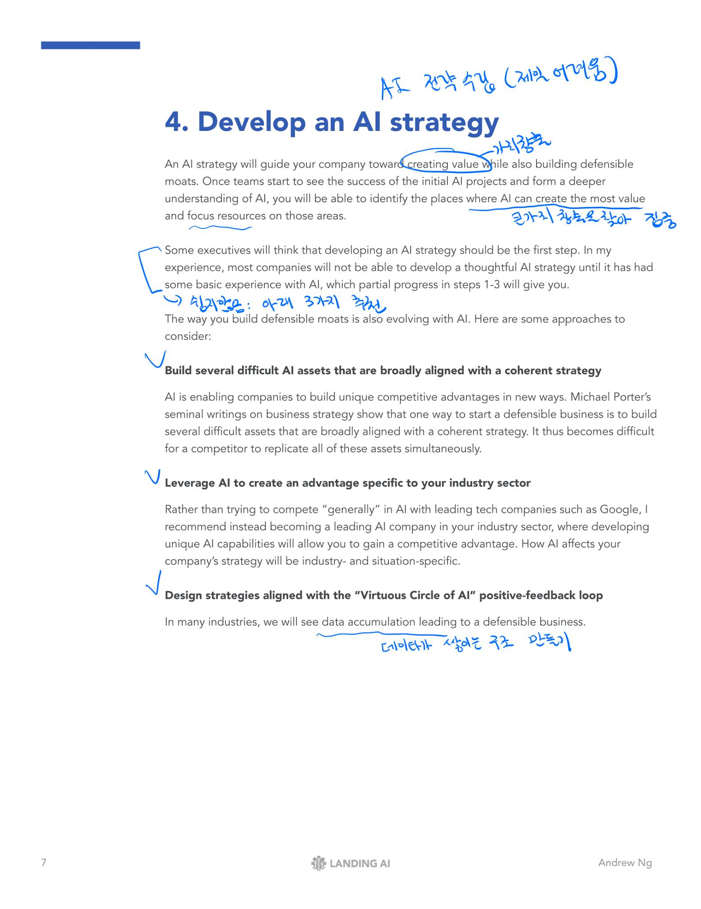
**이미지 캡션:** 이 사진은 AI 전략 개발에 대한 내용을 담고 있으며, 파란색과 흰색을 주로 사용하여 깔끔하고 전문적인 느낌을 준다. 사진 상단에는 "AI 전략 수립 (제일 어려움)"이라는 손글씨 메모가 파란색 펜으로 적혀 있어, AI 전략 수립의 어려움을 강조하고 있다. 중앙에는 "4. Develop an AI strategy"라는 제목이 파란색으로 크게 쓰여 있고, 그 아래에는 AI 전략의 중요성과 개발 방법에 대한 설명이 영어로 되어 있다. 설명 부분에는 "가치 창출", "큰 가치 창출을 찾아 집중", "쉽지 않음: 아래 3가지 추천", "데이터가 쌓이는 구조 만들기"와 같은 한국어 손글씨 메모가 군데군데 삽입되어 있어, 내용을 보충하거나 강조하는 역할을 한다. 또한, 각 소제목 앞에는 체크 표시가 되어 있어 중요한 항목임을 나타낸다. 사진 하단에는 "LANDING AI"라는 로고와 "Andrew Ng"라는 이름이 작게 표기되어 있어, 이 자료의 출처를 알 수 있다. 전반적으로 학술적이면서도 실용적인 정보를 제공하는 문서의 일부로 보인다.래 3가지 추천", "데이터가 쌓이는 구조 만들기"와 같은 한국어 손글씨 메모가 군데군데 삽입되어 있어, 내용을 보충하거나 강조하는 역할을 한다. 또한, 각 소제목 앞에는 체크 표시가 되어 있어 중요한 항목임을 나타낸다. 사진 하단에는 "LANDING AI"라는 로고와 "Andrew Ng"라는 이름이 작게 표기되어 있어, 이 자료의 출처를 알 수 있다. 전반적으로 학술적이면서도 실용적인 정보를 제공하는 문서의 일부로 보인다.
 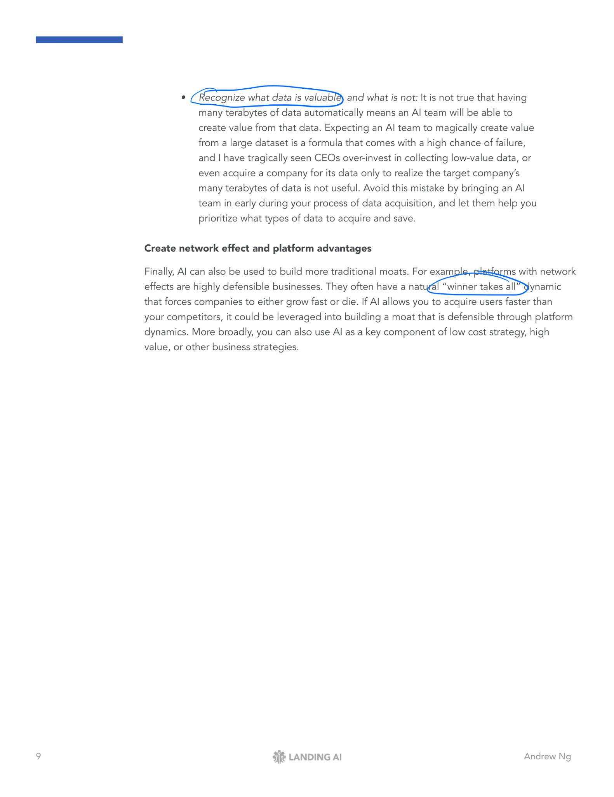
**이미지 캡션:** 이 사진은 문서의 일부로, 흰색 배경에 검은색 텍스트가 표시되어 있습니다. 상단에는 파란색 밑줄이 있는 파란색 선이 있습니다. 텍스트는 두 개의 주요 섹션으로 나뉩니다. 첫 번째 섹션은 글머리 기호로 시작하며 "Recognize what data is valuable"이라는 문구가 파란색으로 강조 표시되어 있습니다. 이 섹션은 데이터의 가치와 AI 팀이 데이터에서 가치를 창출하는 방법에 대해 설명합니다. 두 번째 섹션의 제목은 "Create network effect and platform advantages"이며, AI를 사용하여 경쟁 우위를 구축하는 방법에 대해 설명합니다. 사진 하단에는 페이지 번호 9와 "LANDING AI"라는 로고, 그리고 "Andrew Ng"라는 이름이 있습니다. 전반적으로 이 문서는 비즈니스 전략, 특히 AI와 데이터의 역할에 대한 정보를 제공하는 것으로 보입니다."이며, AI를 사용하여 경쟁 우위를 구축하는 방법에 대해 설명합니다. 사진 하단에는 페이지 번호 9와 "LANDING AI"라는 로고, 그리고 "Andrew Ng"라는 이름이 있습니다. 전반적으로 이 문서는 비즈니스 전략, 특히 AI와 데이터의 역할에 대한 정보를 제공하는 것으로 보입니다.
 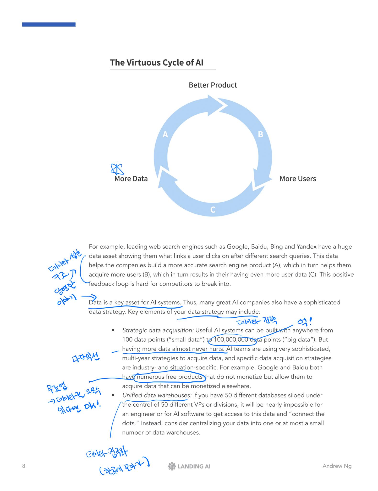
**이미지 캡션:** 이 이미지는 "The Virtuous Cycle of AI"라는 제목의 슬라이드 또는 문서의 일부로, 인공지능 시스템의 선순환 구조를 설명하고 있습니다. 중앙에는 'A', 'B', 'C'로 표시된 화살표가 원형으로 연결된 다이어그램이 있으며, 'More Data'에서 시작하여 'Better Product'로, 그리고 'More Users'로 이어지는 과정을 시각적으로 보여줍니다. 다이어그램 주변에는 텍스트 설명이 있으며, 특히 'More Data'와 'Better Product' 사이에는 "A", 'Better Product'와 'More Users' 사이에는 "B", 'More Users'와 'More Data' 사이에는 "C"라는 라벨이 붙어 있습니다. 이미지 하단에는 이 다이어그램을 설명하는 텍스트 본문이 있습니다. 이 텍스트는 Google, Baidu, Bing, Yandex와 같은 검색 엔진을 예로 들어, 사용자 클릭 데이터를 통해 검색 엔진 제품을 개선하고, 이는 더 많은 사용자를 유치하며, 결과적으로 더 많은 데이터를 확보하는 선순환 구조를 설명합니다. 또한, 인공지능 시스템에서 데이터가 핵심 자산임을 강조하며, 데이터 전략의 주요 요소로 'Strategic data acquisition'(전략적 데이터 확보)과 'Unified data warehouses'(통합 데이터 웨어하우스)를 제시합니다. 이미지에는 여러 사람이 손으로 쓴 메모가 포함되어 있습니다. - "데이터 쌓는", "구조", "당연한 이야기"라는 메모는 다이어그램의 'More Data'와 'Better Product' 사이의 관계를 설명하는 텍스트에 붙어 있습니다. - "다다익선"이라는 메모는 'Strategic data acquisition' 섹션의 텍스트에 붙어 있습니다. - "무료 앱 → 데이터로 모을 수 있다면 이!"라는 메모는 'Strategic data acquisition' 섹션의 예시 부분에 붙어 있습니다. - "데이터 집주화 (한곳에 모아가)"라는 메모는 'Unified data warehouses' 섹션의 텍스트에 붙어 있습니다. - "데이터 전략 억!"이라는 메모는 'data strategy'라는 텍스트 위에 쓰여 있습니다. 이 외에도 "LANDING AI" 로고와 "Andrew Ng"라는 이름이 하단에 보입니다. 전반적으로, 이 이미지는 인공지능 분야의 데이터 중심 전략과 그 중요성을 설명하는 교육적이거나 정보 전달 목적의 자료로 보입니다.r Product'와 'More Users' 사이에는 "B", 'More Users'와 'More Data' 사이에는 "C"라는 라벨이 붙어 있습니다. 이미지 하단에는 이 다이어그램을 설명하는 텍스트 본문이 있습니다. 이 텍스트는 Google, Baidu, Bing, Yandex와 같은 검색 엔진을 예로 들어, 사용자 클릭 데이터를 통해 검색 엔진 제품을 개선하고, 이는 더 많은 사용자를 유치하며, 결과적으로 더 많은 데이터를 확보하는 선순환 구조를 설명합니다. 또한, 인공지능 시스템에서 데이터가 핵심 자산임을 강조하며, 데이터 전략의 주요 요소로 'Strategic data acquisition'(전략적 데이터 확보)과 'Unified data warehouses'(통합 데이터 웨어하우스)를 제시합니다. 이미지에는 여러 사람이 손으로 쓴 메모가 포함되어 있습니다. - "데이터 쌓는", "구조", "당연한 이야기"라는 메모는 다이어그램의 'More Data'와 'Better Product' 사이의 관계를 설명하는 텍스트에 붙어 있습니다. - "다다익선"이라는 메모는 'Strategic data acquisition' 섹션의 텍스트에 붙어 있습니다. - "무료 앱 → 데이터로 모을 수 있다면 이!"라는 메모는 'Strategic data acquisition' 섹션의 예시 부분에 붙어 있습니다. - "데이터 집주화 (한곳에 모아가)"라는 메모는 'Unified data warehouses' 섹션의 텍스트에 붙어 있습니다. - "데이터 전략 억!"이라는 메모는 'data strategy'라는 텍스트 위에 쓰여 있습니다. 이 외에도 "LANDING AI" 로고와 "Andrew Ng"라는 이름이 하단에 보입니다. 전반적으로, 이 이미지는 인공지능 분야의 데이터 중심 전략과 그 중요성을 설명하는 교육적이거나 정보 전달 목적의 자료로 보입니다.
 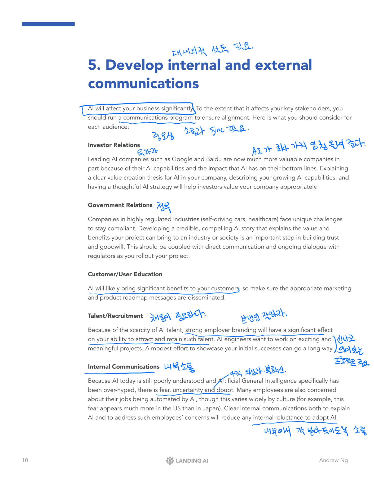
**이미지 캡션:** 이 이미지는 "5. Develop internal and external communications"라는 제목의 문서 페이지로, 인공지능(AI)이 비즈니스에 미치는 영향과 이에 따른 내부 및 외부 커뮤니케이션 전략의 중요성을 설명하고 있습니다. 페이지 상단에는 파란색 펜으로 "대내외적 설득 필요."라고 쓰여 있으며, 각 섹션별로 투자자 관계, 정부 관계, 고객/사용자 교육, 인재 채용, 내부 소통에 대한 내용이 나열되어 있습니다. 각 섹션에는 파란색 펜으로 추가적인 메모가 작성되어 있습니다. 예를 들어, 투자자 관계 섹션에는 "중요성 소통과 Sync 필요."와 "AI가 로사 가지 엄청 올려 준다."라고 쓰여 있고, 인재 채용 섹션에는 "채용이 중요하다."와 "브랜딩 잘하자."라고 쓰여 있습니다. 내부 소통 섹션에는 "아직 의심과 불확신."과 "내부에서 잘 받아들이도록 소름"이라는 메모가 있습니다. 페이지 하단에는 "LANDING AI" 로고와 "Andrew Ng"라는 이름이 보입니다. 전반적으로, 이 문서는 AI 기술 도입에 따른 이해관계자들과의 효과적인 소통 방안을 제시하는 내용을 담고 있으며, 펜으로 작성된 메모들은 내용을 강조하거나 추가적인 의견을 덧붙이는 역할을 하고 있습니다.자 관계 섹션에는 "중요성 소통과 Sync 필요."와 "AI가 로사 가지 엄청 올려 준다."라고 쓰여 있고, 인재 채용 섹션에는 "채용이 중요하다."와 "브랜딩 잘하자."라고 쓰여 있습니다. 내부 소통 섹션에는 "아직 의심과 불확신."과 "내부에서 잘 받아들이도록 소름"이라는 메모가 있습니다. 페이지 하단에는 "LANDING AI" 로고와 "Andrew Ng"라는 이름이 보입니다. 전반적으로, 이 문서는 AI 기술 도입에 따른 이해관계자들과의 효과적인 소통 방안을 제시하는 내용을 담고 있으며, 펜으로 작성된 메모들은 내용을 강조하거나 추가적인 의견을 덧붙이는 역할을 하고 있습니다.
 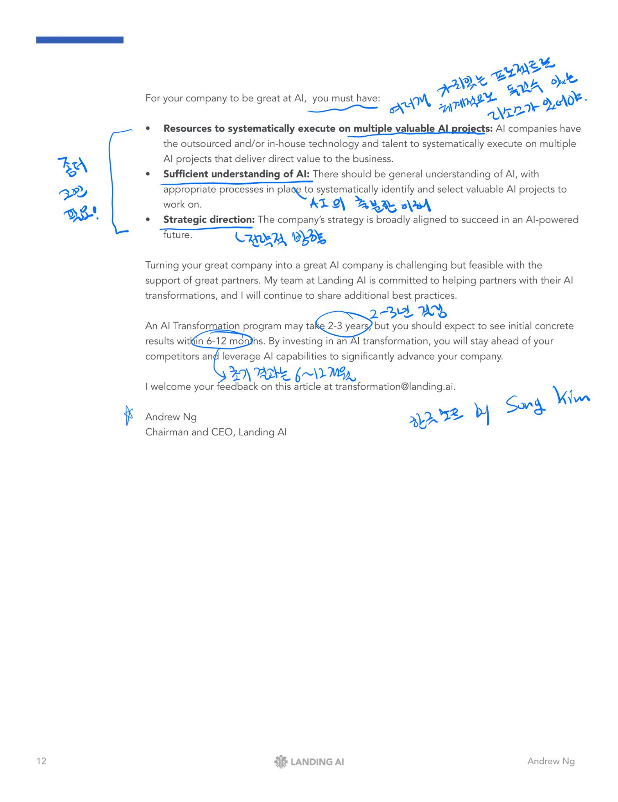
**이미지 캡션:** 이 사진은 AI 기술을 활용하여 기업을 성장시키기 위한 전략에 대한 문서의 일부로, 한국어로 된 필기 메모가 추가되어 있습니다. 문서의 주요 내용은 AI 프로젝트를 성공적으로 수행하기 위한 세 가지 필수 요소, 즉 다수의 가치 있는 AI 프로젝트를 체계적으로 실행할 수 있는 자원, AI에 대한 충분한 이해, 그리고 AI 기반 미래에 성공하기 위한 전략적 방향입니다. 또한, AI 전환 프로그램은 2~3년이 소요될 수 있지만 6~12개월 내에 초기 가시적인 성과를 기대할 수 있다고 언급하고 있습니다. 사진에는 두 개의 필기 메모가 포함되어 있습니다. 왼쪽에는 "좀더 고민 필요!"라는 문구가 파란색 펜으로 쓰여 있으며, 이는 문서 내용에 대한 추가적인 고민이 필요함을 나타냅니다. 오른쪽 상단에는 "여러 개 가리키는 프로젝트를 체계적으로 돌릴 수 있는 리소스가 있어야."라는 문구가 파란색 펜으로 쓰여 있으며, 이는 AI 프로젝트 실행을 위한 자원의 중요성을 강조하는 내용입니다. 또한, "AI의 충분한 이해"와 "전략적 방향"이라는 단어 위에도 밑줄이 그어져 있습니다. 문서 하단에는 "2-3년 걸림"과 "초기 결과는 6~12개월"이라는 메모가 추가되어 있으며, 이는 AI 전환 프로그램의 예상 소요 시간과 초기 성과 시점을 나타냅니다. 마지막으로, "한글 노트 by Sung kim"이라는 문구가 파란색 펜으로 쓰여 있어 이 메모가 Sung Kim이라는 사람에 의해 작성되었음을 알 수 있습니다. 문서의 발신자는 Andrew Ng로, Landing AI의 회장 겸 CEO이며, 이메일 주소 transformation@landing.ai를 통해 피드백을 받고자 합니다. 문서 하단에는 "LANDING AI"라는 로고와 함께 페이지 번호 "12"가 표시되어 있습니다. 전반적으로 이 사진은 AI 전략에 대한 정보와 함께 개인적인 메모가 추가된 문서의 일부를 보여줍니다. 개의 필기 메모가 포함되어 있습니다. 왼쪽에는 "좀더 고민 필요!"라는 문구가 파란색 펜으로 쓰여 있으며, 이는 문서 내용에 대한 추가적인 고민이 필요함을 나타냅니다. 오른쪽 상단에는 "여러 개 가리키는 프로젝트를 체계적으로 돌릴 수 있는 리소스가 있어야."라는 문구가 파란색 펜으로 쓰여 있으며, 이는 AI 프로젝트 실행을 위한 자원의 중요성을 강조하는 내용입니다. 또한, "AI의 충분한 이해"와 "전략적 방향"이라는 단어 위에도 밑줄이 그어져 있습니다. 문서 하단에는 "2-3년 걸림"과 "초기 결과는 6~12개월"이라는 메모가 추가되어 있으며, 이는 AI 전환 프로그램의 예상 소요 시간과 초기 성과 시점을 나타냅니다. 마지막으로, "한글 노트 by Sung kim"이라는 문구가 파란색 펜으로 쓰여 있어 이 메모가 Sung Kim이라는 사람에 의해 작성되었음을 알 수 있습니다. 문서의 발신자는 Andrew Ng로, Landing AI의 회장 겸 CEO이며, 이메일 주소 transformation@landing.ai를 통해 피드백을 받고자 합니다. 문서 하단에는 "LANDING AI"라는 로고와 함께 페이지 번호 "12"가 표시되어 있습니다. 전반적으로 이 사진은 AI 전략에 대한 정보와 함께 개인적인 메모가 추가된 문서의 일부를 보여줍니다.
 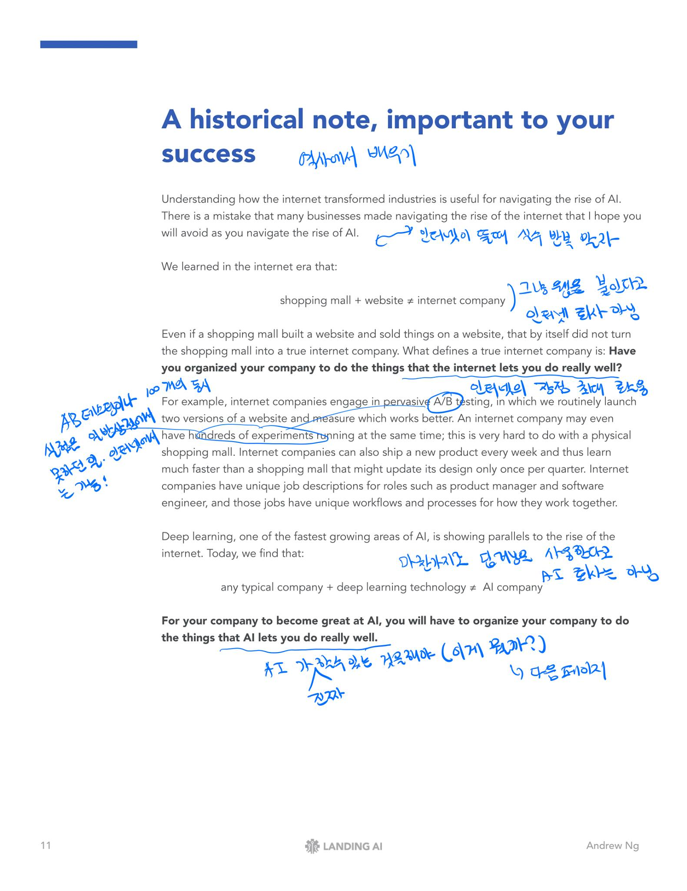
**이미지 캡션:** 이 사진은 A4 용지 크기의 문서로, 흰색 배경에 검은색 글씨와 파란색 제목, 그리고 여러 색깔의 손글씨 메모가 포함되어 있습니다. 문서의 제목은 "A historical note, important to your success"이며, 그 아래에 한국어로 "역사에서 배우기"라고 쓰여 있습니다. 본문은 인터넷의 발전과 인공지능(AI)의 부상에 대한 내용을 다루고 있으며, 여러 단락으로 나뉘어 있습니다. 사람: 문서에는 특정 인물이 등장하지 않지만, 손글씨 메모를 통해 여러 사람이 이 문서를 읽고 의견을 남긴 것으로 보입니다. 메모를 쓴 사람들은 성인으로 추정되며, 긍정적이고 적극적인 태도로 내용을 이해하고 자신의 생각을 표현하고 있습니다. 장소/배경: 문서가 인쇄된 배경은 흰색이며, 특별한 장소나 배경은 묘사되지 않습니다. 사물: 문서 자체와 손글씨 메모에 사용된 펜이 주요 사물입니다. 문서 하단에는 "LANDING AI"라는 로고와 "Andrew Ng"라는 이름이 보입니다. 보이는 텍스트: - 제목: "A historical note, important to your success" - 한국어 부제: "역사에서 배우기" - 본문: 인터넷의 발전과 AI의 부상에 대한 영어 텍스트 - 손글씨 메모 (한국어): - "인터넷이 뜰때 실수 반복 말라" - ") 그냥 웹을 붙인다고 인터넷 회사 아님" - "AB 테스팅이나 100개의 동시 실험은 일반상점에서 못하던 이.. 이러네에서 는 가능!" - "인터넷의 장점 최대 활용" - "마찬가지로 딥러닝을 사용한다고 AI 회사는 아님" - "AI 가할수 있는 것을 해야 (이게 뭘까?)" - "진짜" - "↳ 다음 페이지" - 페이지 번호: "11" - 로고: "LANDING AI" - 이름: "Andrew Ng" 분위기/상황: 문서는 정보 전달과 교육적인 목적을 가지고 있으며, 손글씨 메모는 내용을 보충하고 개인적인 의견을 덧붙이는 방식으로 작성되었습니다. 전반적으로 진지하면서도 학습적인 분위기를 띠고 있으며, 독자가 내용을 깊이 이해하고 자신의 상황에 적용하도록 유도하는 것으로 보입니다.으로 보입니다. 메모를 쓴 사람들은 성인으로 추정되며, 긍정적이고 적극적인 태도로 내용을 이해하고 자신의 생각을 표현하고 있습니다. 장소/배경: 문서가 인쇄된 배경은 흰색이며, 특별한 장소나 배경은 묘사되지 않습니다. 사물: 문서 자체와 손글씨 메모에 사용된 펜이 주요 사물입니다. 문서 하단에는 "LANDING AI"라는 로고와 "Andrew Ng"라는 이름이 보입니다. 보이는 텍스트: - 제목: "A historical note, important to your success" - 한국어 부제: "역사에서 배우기" - 본문: 인터넷의 발전과 AI의 부상에 대한 영어 텍스트 - 손글씨 메모 (한국어): - "인터넷이 뜰때 실수 반복 말라" - ") 그냥 웹을 붙인다고 인터넷 회사 아님" - "AB 테스팅이나 100개의 동시 실험은 일반상점에서 못하던 이.. 이러네에서 는 가능!" - "인터넷의 장점 최대 활용" - "마찬가지로 딥러닝을 사용한다고 AI 회사는 아님" - "AI 가할수 있는 것을 해야 (이게 뭘까?)" - "진짜" - "↳ 다음 페이지" - 페이지 번호: "11" - 로고: "LANDING AI" - 이름: "Andrew Ng" 분위기/상황: 문서는 정보 전달과 교육적인 목적을 가지고 있으며, 손글씨 메모는 내용을 보충하고 개인적인 의견을 덧붙이는 방식으로 작성되었습니다. 전반적으로 진지하면서도 학습적인 분위기를 띠고 있으며, 독자가 내용을 깊이 이해하고 자신의 상황에 적용하도록 유도하는 것으로 보입니다.

### 12월 19일 (수) 08:19 · 📷 사진 (4장)

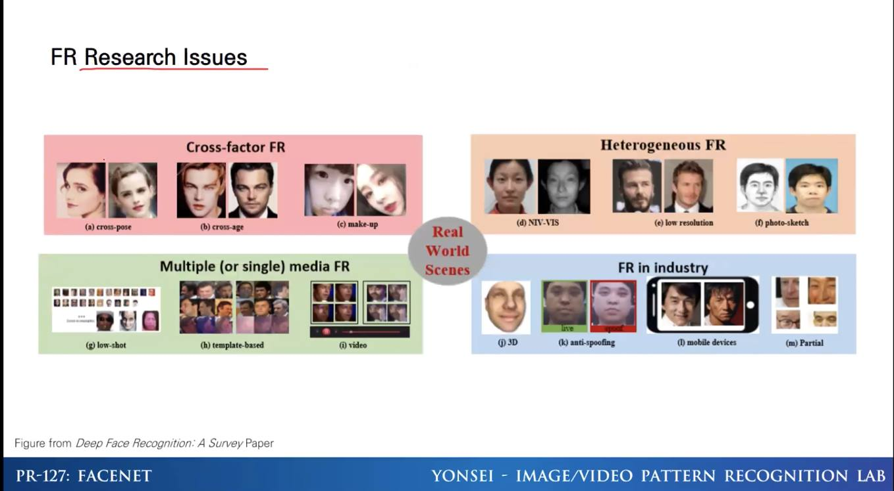
**이미지 캡션:** 이 슬라이드는 얼굴 인식(FR) 연구의 다양한 이슈들을 보여주고 있으며, 각 이슈는 여러 개의 작은 이미지와 텍스트로 설명되어 있습니다. 상단 좌측에는 "Cross-factor FR"이라는 제목 아래, (a) cross-pose, (b) cross-age, (c) make-up, (d) NIV-VIS의 네 가지 하위 주제를 보여주는 이미지들이 있습니다. (a)에서는 같은 여성의 다른 각도에서 찍은 사진 두 장이, (b)에서는 젊은 남성과 나이 든 남성의 사진 두 장이, (c)에서는 화장 전후의 여성 사진 두 장이, (d)에서는 일반적인 얼굴과 저조도 환경에서 촬영된 얼굴 사진 두 장이 제시됩니다. 상단 우측에는 "Heterogeneous FR"이라는 제목 아래, (e) low resolution과 (f) photo-sketch의 두 가지 하위 주제를 보여주는 이미지들이 있습니다. (e)에서는 같은 남성의 고해상도 사진과 저해상도 사진 두 장이, (f)에서는 실사 사진과 스케치 사진 두 장이 비교됩니다. 중앙에는 "Real World Scenes"라는 텍스트가 원형으로 배치되어 있습니다. 하단에는 "Multiple (or single) media FR"이라는 제목 아래, (g) low-shot, (h) template-based, (i) video의 세 가지 하위 주제를 보여주는 이미지들이 있습니다. (g)에서는 적은 수의 샘플 이미지와 함께 인식 대상이 되는 여러 얼굴 사진들이, (h)에서는 템플릿 기반의 얼굴 인식 방식을 보여주는 듯한 이미지들이, (i)에서는 비디오 스트림에서 추출된 여러 얼굴 이미지들이 제시됩니다. 하단 우측에는 "FR in industry"라는 제목 아래, (j) 3D, (k) anti-spoofing, (l) mobile devices, (m) Partial의 네 가지 하위 주제를 보여주는 이미지들이 있습니다. (j)에서는 3D 얼굴 모델이, (k)에서는 실제 얼굴과 가짜 얼굴(예: 사진)을 구별하는 듯한 이미지들이, (l)에서는 스마트폰 화면에 표시되는 얼굴 인식 결과가, (m)에서는 얼굴의 일부만 보이는 상황에서의 인식 결과를 보여주는 듯한 이미지들이 제시됩니다. 슬라이드 하단에는 "Figure from Deep Face Recognition: A Survey Paper"라는 출처 정보와 "PR-127: FACENET", 그리고 "YONSEI - IMAGE/VIDEO PATTERN RECOGNITION LAB"이라는 기관 정보가 표시되어 있습니다. 전반적으로 흰색 배경에 각 섹션별로 다른 색상의 테두리가 사용되었으며, 연구 주제를 시각적으로 명확하게 전달하는 프레젠테이션 슬라이드입니다.장이, (d)에서는 일반적인 얼굴과 저조도 환경에서 촬영된 얼굴 사진 두 장이 제시됩니다. 상단 우측에는 "Heterogeneous FR"이라는 제목 아래, (e) low resolution과 (f) photo-sketch의 두 가지 하위 주제를 보여주는 이미지들이 있습니다. (e)에서는 같은 남성의 고해상도 사진과 저해상도 사진 두 장이, (f)에서는 실사 사진과 스케치 사진 두 장이 비교됩니다. 중앙에는 "Real World Scenes"라는 텍스트가 원형으로 배치되어 있습니다. 하단에는 "Multiple (or single) media FR"이라는 제목 아래, (g) low-shot, (h) template-based, (i) video의 세 가지 하위 주제를 보여주는 이미지들이 있습니다. (g)에서는 적은 수의 샘플 이미지와 함께 인식 대상이 되는 여러 얼굴 사진들이, (h)에서는 템플릿 기반의 얼굴 인식 방식을 보여주는 듯한 이미지들이, (i)에서는 비디오 스트림에서 추출된 여러 얼굴 이미지들이 제시됩니다. 하단 우측에는 "FR in industry"라는 제목 아래, (j) 3D, (k) anti-spoofing, (l) mobile devices, (m) Partial의 네 가지 하위 주제를 보여주는 이미지들이 있습니다. (j)에서는 3D 얼굴 모델이, (k)에서는 실제 얼굴과 가짜 얼굴(예: 사진)을 구별하는 듯한 이미지들이, (l)에서는 스마트폰 화면에 표시되는 얼굴 인식 결과가, (m)에서는 얼굴의 일부만 보이는 상황에서의 인식 결과를 보여주는 듯한 이미지들이 제시됩니다. 슬라이드 하단에는 "Figure from Deep Face Recognition: A Survey Paper"라는 출처 정보와 "PR-127: FACENET", 그리고 "YONSEI - IMAGE/VIDEO PATTERN RECOGNITION LAB"이라는 기관 정보가 표시되어 있습니다. 전반적으로 흰색 배경에 각 섹션별로 다른 색상의 테두리가 사용되었으며, 연구 주제를 시각적으로 명확하게 전달하는 프레젠테이션 슬라이드입니다.
 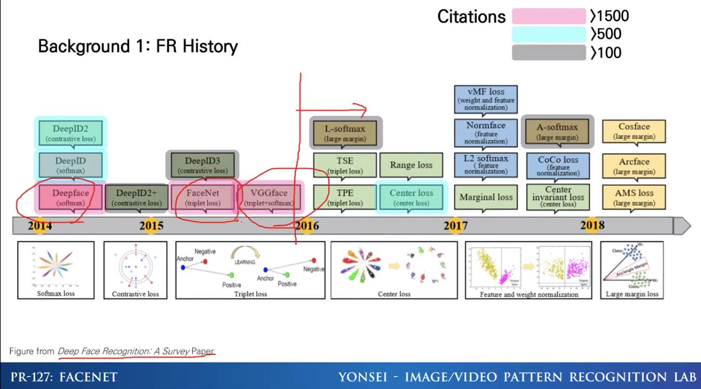
**이미지 캡션:** 이 이미지는 얼굴 인식(FR) 기술의 역사적 발전 과정을 연대순으로 보여주는 다이어그램으로, 2014년부터 2018년까지 주요 연구 및 방법론을 시각적으로 정리하고 있습니다. 상단에는 "Citations"라는 제목과 함께 인용 횟수에 따른 막대그래프가 있으며, >1500, >500, >100으로 구분되어 있습니다. 중앙의 메인 다이어그램은 타임라인 형태로 구성되어 있으며, 각 연도별로 다양한 얼굴 인식 방법론들이 박스 형태로 나열되어 있습니다. 예를 들어 2014년에는 DeepID2, DeepID, Deepface가, 2015년에는 DeepID3, DeepID2+, FaceNet이, 2016년에는 VGGface, L-softmax, TSE, TPE, Range loss, Center loss가, 2017년에는 vMF loss, Normface, L2 softmax, Marginal loss, A-softmax, CoCo loss, Center invariant loss가, 2018년에는 Cosface, Arcface, AMS loss가 각각의 특징(손실 함수 등)과 함께 표시되어 있습니다. 각 방법론 박스에는 색상 코드가 적용되어 있으며, 이는 인용 횟수와 연관된 것으로 보입니다. 타임라인 아래에는 각 방법론의 핵심 개념을 설명하는 작은 이미지들이 배치되어 있습니다. 예를 들어 Softmax loss, Contrastive loss, Triplet loss, Center loss, Feature and weight normalization, Large margin loss 등의 개념을 시각적으로 보여주는 그림들이 있습니다. 이미지 하단에는 "Figure from Deep Face Recognition: A Survey Paper"라는 출처 표기와 함께 "PR-127: FACENET" 및 "YONSEI - IMAGE/VIDEO PATTERN RECOGNITION LAB"이라는 텍스트가 표시되어 있어, 이 자료가 연세대학교 이미지/비디오 패턴 인식 연구실에서 발행한 얼굴 인식 관련 논문 또는 발표 자료의 일부임을 알 수 있습니다. 전반적으로 학술적인 내용을 담고 있으며, 정보 전달에 초점을 맞춘 깔끔하고 구조적인 디자인을 가지고 있습니다.ace가, 2015년에는 DeepID3, DeepID2+, FaceNet이, 2016년에는 VGGface, L-softmax, TSE, TPE, Range loss, Center loss가, 2017년에는 vMF loss, Normface, L2 softmax, Marginal loss, A-softmax, CoCo loss, Center invariant loss가, 2018년에는 Cosface, Arcface, AMS loss가 각각의 특징(손실 함수 등)과 함께 표시되어 있습니다. 각 방법론 박스에는 색상 코드가 적용되어 있으며, 이는 인용 횟수와 연관된 것으로 보입니다. 타임라인 아래에는 각 방법론의 핵심 개념을 설명하는 작은 이미지들이 배치되어 있습니다. 예를 들어 Softmax loss, Contrastive loss, Triplet loss, Center loss, Feature and weight normalization, Large margin loss 등의 개념을 시각적으로 보여주는 그림들이 있습니다. 이미지 하단에는 "Figure from Deep Face Recognition: A Survey Paper"라는 출처 표기와 함께 "PR-127: FACENET" 및 "YONSEI - IMAGE/VIDEO PATTERN RECOGNITION LAB"이라는 텍스트가 표시되어 있어, 이 자료가 연세대학교 이미지/비디오 패턴 인식 연구실에서 발행한 얼굴 인식 관련 논문 또는 발표 자료의 일부임을 알 수 있습니다. 전반적으로 학술적인 내용을 담고 있으며, 정보 전달에 초점을 맞춘 깔끔하고 구조적인 디자인을 가지고 있습니다.
 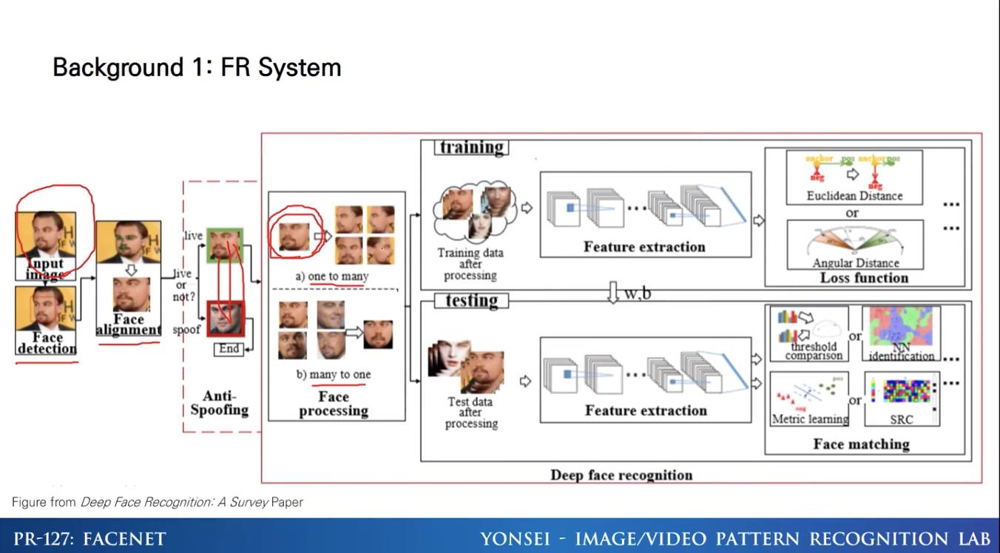
**이미지 캡션:** 이 이미지는 얼굴 인식(FR) 시스템의 배경을 설명하는 다이어그램으로, 크게 '훈련'과 '테스트' 두 가지 주요 단계로 나뉩니다. 왼쪽에는 입력 이미지에서 얼굴을 감지하고 정렬하는 전처리 과정이 표시되어 있으며, '입력 이미지' 상자에는 레오나르도 디카프리오의 얼굴 사진이 두 개 있고, '얼굴 감지' 상자에도 동일한 사진이 있습니다. '얼굴 정렬' 상자에는 여러 각도의 얼굴 사진이 포함되어 있습니다. 'Anti-Spoofing' 섹션에서는 입력된 얼굴이 실제인지 위조인지 판별하는 과정을 보여주며, 'live'와 'spoof'라는 두 가지 경로로 나뉩니다. '훈련' 단계에서는 여러 사람의 얼굴 사진으로 구성된 '훈련 데이터'를 사용하여 '특징 추출'을 수행하고, 추출된 특징을 바탕으로 '유클리드 거리' 또는 '각도 거리'를 계산하는 '손실 함수'를 적용합니다. '테스트' 단계에서는 '테스트 데이터'를 사용하여 동일하게 '특징 추출'을 수행한 후, '임계값 비교', 'NN 식별', '메트릭 학습' 또는 'SRC'와 같은 방법을 통해 '얼굴 매칭'을 수행합니다. 다이어그램 전체적으로는 기술적인 내용을 전달하기 위한 차트이며, 차분한 분위기입니다. 하단에는 "Figure from Deep Face Recognition: A Survey Paper"와 "PR-127: FACENET YONSEI - IMAGE/VIDEO PATTERN RECOGNITION LAB"이라는 텍스트가 포함되어 있습니다.와 'spoof'라는 두 가지 경로로 나뉩니다. '훈련' 단계에서는 여러 사람의 얼굴 사진으로 구성된 '훈련 데이터'를 사용하여 '특징 추출'을 수행하고, 추출된 특징을 바탕으로 '유클리드 거리' 또는 '각도 거리'를 계산하는 '손실 함수'를 적용합니다. '테스트' 단계에서는 '테스트 데이터'를 사용하여 동일하게 '특징 추출'을 수행한 후, '임계값 비교', 'NN 식별', '메트릭 학습' 또는 'SRC'와 같은 방법을 통해 '얼굴 매칭'을 수행합니다. 다이어그램 전체적으로는 기술적인 내용을 전달하기 위한 차트이며, 차분한 분위기입니다. 하단에는 "Figure from Deep Face Recognition: A Survey Paper"와 "PR-127: FACENET YONSEI - IMAGE/VIDEO PATTERN RECOGNITION LAB"이라는 텍스트가 포함되어 있습니다.
 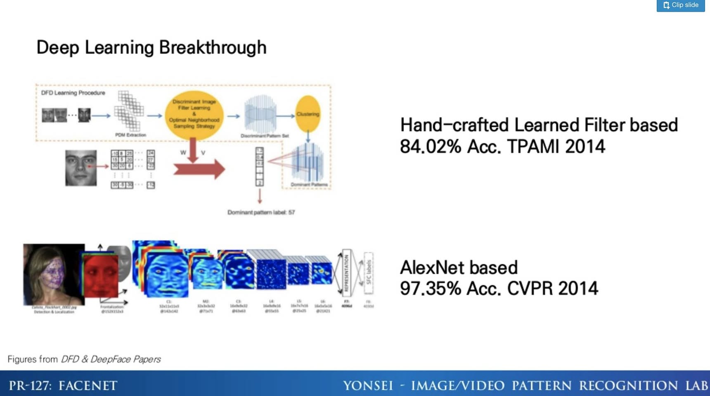
**이미지 캡션:** 이 슬라이드는 딥러닝의 획기적인 발전을 보여주며, 두 가지 주요 접근 방식을 비교합니다. 상단에는 "DFD Learning Procedure"라는 제목의 다이어그램이 있으며, 이는 얼굴 이미지에서 특징을 추출하고 분석하는 과정을 시각적으로 설명합니다. 이 과정은 PDM 추출, Discriminant Image Filter Learning, Optimal Neighborhood Sampling Strategy, Clustering, Dominant Pattern Set, Dominant Patterns, 그리고 Dominant pattern label: 57로 구성됩니다. 이와 함께 "Hand-crafted Learned Filter based 84.02% Acc. TPAMI 2014"라는 텍스트가 있어, 수작업으로 설계된 필터 기반 접근 방식의 성능을 나타냅니다. 하단에는 여러 개의 얼굴 이미지와 열 지도 형태의 이미지들이 나열되어 있으며, 이는 "AlexNet based 97.35% Acc. CVPR 2014"라는 텍스트와 함께 AlexNet 기반 접근 방식의 더 높은 성능을 보여줍니다. 하단에는 "Figures from DFD & DeepFace Papers"라는 설명과 함께 "PR-127: FACENET"이라는 텍스트가 보이며, 가장 하단에는 "YONSEI - IMAGE/VIDEO PATTERN RECOGNITION LAB"이라는 기관명이 표시되어 있습니다. 전반적으로, 이 슬라이드는 얼굴 인식 분야에서 딥러닝 기술의 발전을 보여주는 학술 발표 자료의 일부로 보입니다. Dominant pattern label: 57로 구성됩니다. 이와 함께 "Hand-crafted Learned Filter based 84.02% Acc. TPAMI 2014"라는 텍스트가 있어, 수작업으로 설계된 필터 기반 접근 방식의 성능을 나타냅니다. 하단에는 여러 개의 얼굴 이미지와 열 지도 형태의 이미지들이 나열되어 있으며, 이는 "AlexNet based 97.35% Acc. CVPR 2014"라는 텍스트와 함께 AlexNet 기반 접근 방식의 더 높은 성능을 보여줍니다. 하단에는 "Figures from DFD & DeepFace Papers"라는 설명과 함께 "PR-127: FACENET"이라는 텍스트가 보이며, 가장 하단에는 "YONSEI - IMAGE/VIDEO PATTERN RECOGNITION LAB"이라는 기관명이 표시되어 있습니다. 전반적으로, 이 슬라이드는 얼굴 인식 분야에서 딥러닝 기술의 발전을 보여주는 학술 발표 자료의 일부로 보입니다.

### 12월 31일 (월) 15:30 · run/bike to 2019 sky at the HKUST gym.

run/bike to 2019 sky at the HKUST gym. 

Happy New Year to you all!

**이미지 캡션:** 창밖으로 바다가 보이는 실내 헬스장에서 한 성인 남성이 트레드밀 위에서 달리고 있다. 남성은 30대 후반에서 40대 초반으로 보이며, 검은색 머리카락을 짧게 잘랐고, 푸른색 긴팔 티셔츠를 입고 있다. 티셔츠 뒷면에는 금문교와 함께 "JULY 4, 2014 FULL MARATHON"이라는 문구가 새겨져 있어 샌프란시스코 마라톤 참가 기념 티셔츠로 추정된다. 남성은 운동에 집중한 듯 표정은 보이지 않지만, 손잡이를 잡고 힘차게 발을 움직이는 모습에서 운동에 몰입하고 있음을 알 수 있다. 배경에는 넓은 창을 통해 푸른 바다와 섬, 그리고 흐린 하늘이 보인다. 창문 위쪽으로는 흰색 루버 천장과 함께 CCTV 카메라가 설치되어 있으며, 창밖 멀리 운동장 트랙으로 보이는 시설도 희미하게 보인다. 전반적으로 쾌적한 환경에서 운동을 즐기는 듯한 분위기이다.푸른 바다와 섬, 그리고 흐린 하늘이 보인다. 창문 위쪽으로는 흰색 루버 천장과 함께 CCTV 카메라가 설치되어 있으며, 창밖 멀리 운동장 트랙으로 보이는 시설도 희미하게 보인다. 전반적으로 쾌적한 환경에서 운동을 즐기는 듯한 분위기이다.
 
**이미지 캡션:** 창밖으로 바다가 보이는 실내 헬스장에서 한 성인 남성이 트레드밀 위에서 운동하고 있다. 남성은 30대 후반에서 40대 초반으로 보이며, 짧은 검은색 머리에 옆모습을 하고 있다. 그는 파란색 긴팔 상의와 회색 반바지를 입고 있으며, 무표정으로 트레드밀 위를 걷고 있다. 트레드밀에는 화면이 있고, 손잡이에는 탁구채처럼 보이는 물건이 놓여 있다. 헬스장 천장에는 조명과 CCTV가 설치되어 있으며, 창밖으로는 바다와 멀리 보이는 산, 그리고 공사 중인 건물과 운동장으로 보이는 시설이 보인다. 전체적으로 차분하고 일상적인 분위기이다.적인 분위기이다.
 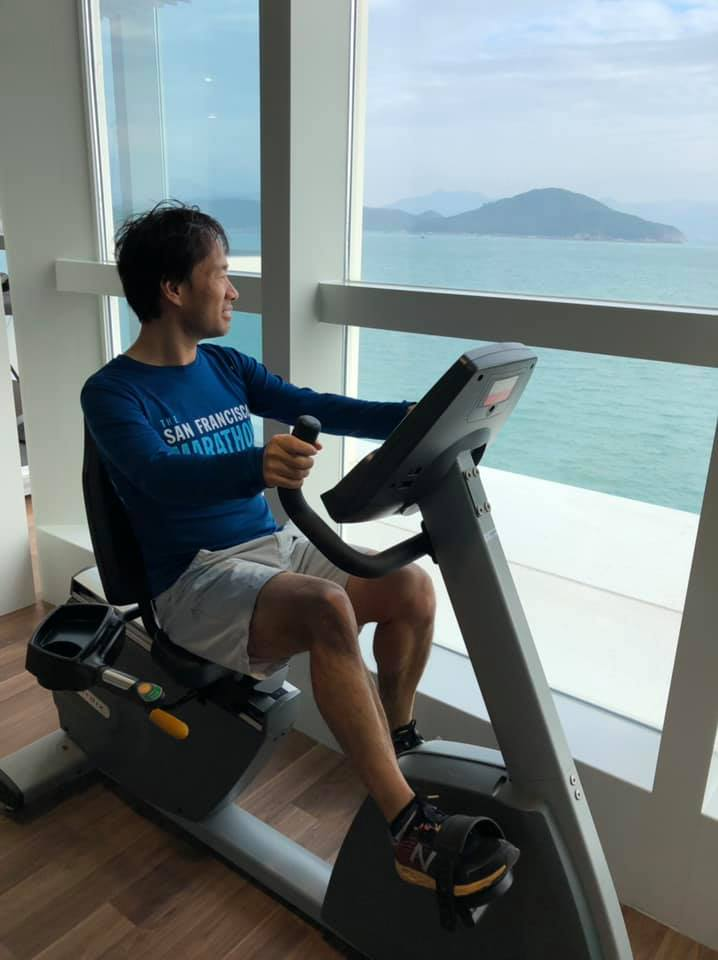
**이미지 캡션:** 한 성인 남성이 실내 자전거를 타며 창밖 바다 풍경을 바라보고 있다. 남성은 40대 정도로 보이며, 검은색 긴팔 티셔츠와 회색 반바지를 입고 있다. 티셔츠에는 "SAN FRANCISCO MARATHON"이라는 문구가 파란색으로 쓰여 있다. 그는 편안한 표정으로 자전거 핸들을 잡고 있으며, 발에는 검은색 운동화가 신겨져 있다. 배경에는 넓은 창문이 있고, 창밖으로는 푸른 바다와 섬들이 보인다. 실내 자전거는 회색과 검은색으로 되어 있으며, 바닥은 나무 재질이다. 전체적으로 여유롭고 평화로운 분위기를 자아낸다.
