# 2019년 1월

[← 2019년](README.md)

### 1월 1일 (화) 15:30 · 📷 사진 (4장)

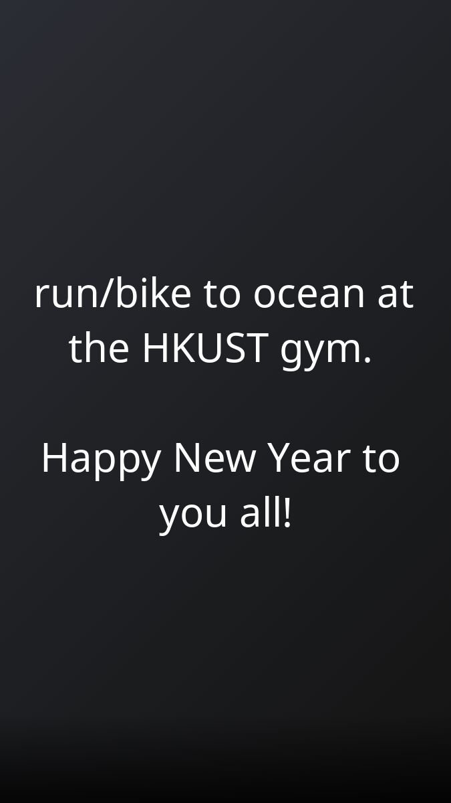
**이미지 캡션:** 이 사진은 어두운 배경에 흰색 텍스트가 표시된 이미지로, 사람이나 장소, 사물은 보이지 않습니다. 텍스트는 두 부분으로 나뉘어 있으며, 첫 번째 부분에는 "run/bike to ocean at the HKUST gym."이라고 쓰여 있고, 두 번째 부분에는 "Happy New Year to you all!"이라고 쓰여 있습니다. 이 텍스트는 운동과 새해 인사를 나타내는 것으로 보이며, 전반적으로 간결하고 직접적인 분위기를 풍깁니다.
 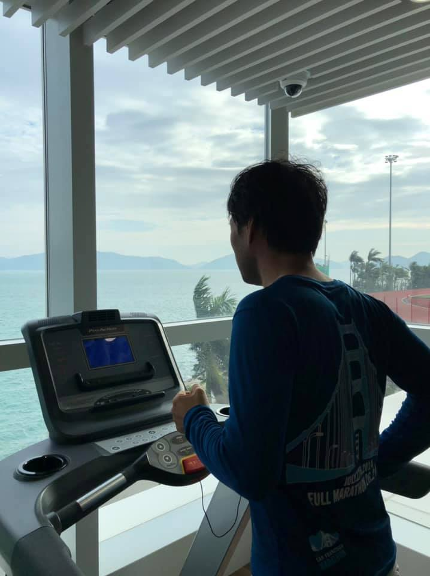
**이미지 캡션:** 창가에 있는 러닝머신 위에서 운동 중인 성인 남성이 보인다. 남성은 30대 후반에서 40대 초반으로 보이며, 검은색 긴팔 운동복을 입고 있다. 운동복 등에는 금문교와 함께 "JULY 2014 FULL MARATHON"이라는 문구가 희미하게 보인다. 남성은 러닝머신을 바라보며 달리고 있으며, 표정은 보이지 않는다. 배경으로는 넓은 창을 통해 푸른 바다와 산, 그리고 흐린 하늘이 보인다. 창밖에는 야자수와 운동장으로 보이는 시설도 일부 보인다. 실내 천장에는 흰색 루버와 함께 CCTV 카메라가 설치되어 있다. 전체적으로 건강을 챙기며 운동하는 평화로운 분위기이다.체적으로 건강을 챙기며 운동하는 평화로운 분위기이다.
 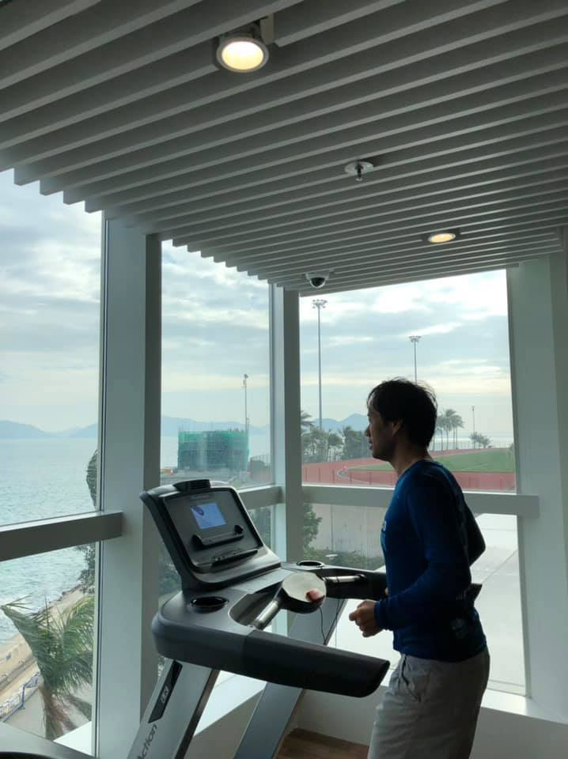
**이미지 캡션:** 창밖으로 바다가 보이는 실내 헬스장에서 한 성인 남성이 트레드밀 위에서 운동하고 있다. 남성은 30대 후반에서 40대 초반으로 보이며, 짧은 검은색 머리에 옆모습을 하고 있다. 그는 파란색 긴팔 상의와 회색 반바지를 입고 있으며, 표정은 운동에 집중하고 있는 듯하다. 트레드밀은 검은색과 회색으로 되어 있으며, 화면에는 운동 정보가 표시되고 있다. 창밖으로는 잔잔한 바다와 멀리 보이는 산, 그리고 공사 중인 건물과 운동장이 보인다. 천장에는 조명과 CCTV가 설치되어 있으며, 전체적으로 깔끔하고 현대적인 분위기이다.이다.
 
**이미지 캡션:** 한 성인 남성이 실내 자전거를 타며 창밖을 바라보고 있다. 남성은 40대 정도로 보이며, 검은색 긴팔 티셔츠와 회색 반바지를 입고 있다. 티셔츠에는 "THE SAN FRANCISCO MARATHON"이라는 문구가 파란색으로 적혀 있다. 그는 운동화와 양말을 신고 있으며, 표정은 편안하고 여유로워 보인다. 남성은 자전거의 핸들을 잡고 있으며, 페달을 밟고 있는 것으로 보인다. 배경에는 넓은 창문이 있고, 창밖으로는 푸른 바다와 섬들이 보인다. 하늘은 구름이 약간 낀 맑은 날씨를 나타낸다. 실내 자전거는 회색과 검은색으로 되어 있으며, 물병 홀더가 보인다. 바닥은 나무 재질로 되어 있다. 전체적으로 건강하고 평화로운 분위기를 자아낸다.검은색으로 되어 있으며, 물병 홀더가 보인다. 바닥은 나무 재질로 되어 있다. 전체적으로 건강하고 평화로운 분위기를 자아낸다.

### 1월 5일 (토) 17:53 · 📷 사진 (3장)

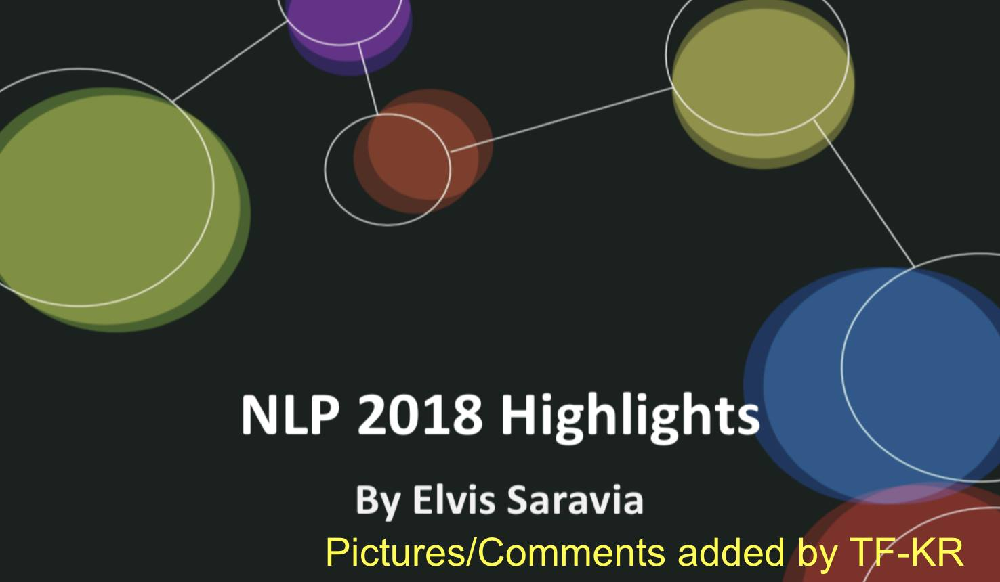
**이미지 캡션:** 이 이미지는 검은색 배경에 여러 개의 색깔 있는 원들이 연결된 추상적인 그래픽 디자인을 보여줍니다. 왼쪽 상단에는 녹색 원이 있고, 그 옆에는 보라색 원이 있으며, 오른쪽 위에는 올리브색 원이 있습니다. 중앙에는 붉은색 원이 있고, 오른쪽 아래에는 파란색 원이 있습니다. 이 원들은 흰색 선으로 연결되어 있어 마치 네트워크나 관계를 시각화한 것처럼 보입니다. 이미지 하단에는 흰색 글자로 "NLP 2018 Highlights"라고 쓰여 있고, 그 아래에는 "By Elvis Saravia"라고 적혀 있습니다. 가장 아래에는 노란색 글자로 "Pictures/Comments added by TF-KR"이라고 쓰여 있습니다. 이 이미지는 발표 자료의 표지나 요약 슬라이드로 보이며, NLP(자연어 처리) 분야의 2018년 주요 내용을 다루고 있음을 알 수 있습니다. 사람에 대한 정보는 없으며, 전체적으로 깔끔하고 현대적인 분위기를 풍깁니다. 아래에는 노란색 글자로 "Pictures/Comments added by TF-KR"이라고 쓰여 있습니다. 이 이미지는 발표 자료의 표지나 요약 슬라이드로 보이며, NLP(자연어 처리) 분야의 2018년 주요 내용을 다루고 있음을 알 수 있습니다. 사람에 대한 정보는 없으며, 전체적으로 깔끔하고 현대적인 분위기를 풍깁니다.
 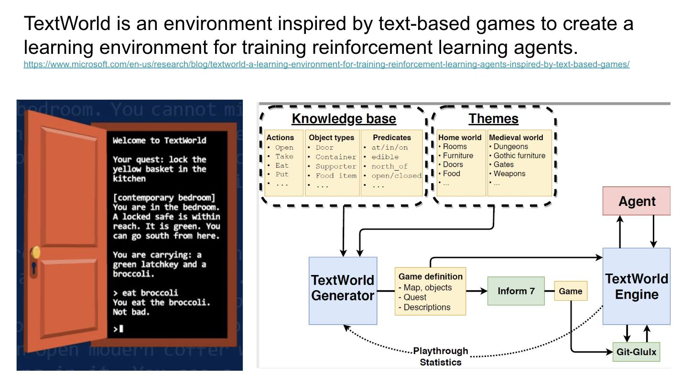
**이미지 캡션:** 이 이미지는 텍스트 기반 게임에서 영감을 받아 강화 학습 에이전트 훈련을 위한 학습 환경을 만드는 "TextWorld"라는 시스템을 설명합니다. 왼쪽에는 게임의 한 장면이 묘사되어 있는데, 붉은색 문이 열려 있고 그 안에는 "Welcome to TextWorld"라는 제목과 함께 플레이어의 퀘스트, 현재 위치, 소지품, 그리고 방금 수행한 행동("eat broccoli")과 그 결과("You eat the broccoli. Not bad.")가 텍스트로 표시됩니다. 오른쪽에는 TextWorld 시스템의 구조를 보여주는 다이어그램이 있습니다. 이 다이어그램은 "Knowledge base"와 "Themes"라는 두 가지 주요 구성 요소와 "TextWorld Generator", "Inform 7", "TextWorld Engine", "Agent", "Git-Glulx" 등의 모듈 간의 상호 작용을 보여줍니다. "Knowledge base"는 게임에서 사용되는 행동, 객체 유형, 술어 등을 포함하고, "Themes"는 "Home world"와 "Medieval world"와 같은 다양한 게임 테마를 제시합니다. 전체적으로 이 이미지는 TextWorld가 어떻게 텍스트 기반 게임 환경을 생성하고, 플레이어의 행동을 이해하며, 강화 학습 에이전트가 학습할 수 있도록 지원하는지를 시각적으로 보여줍니다. "Welcome to TextWorld," presents a quest to "lock the yellow basket in the kitchen," describes the current location as a bedroom with a locked green safe and the ability to go south, and lists carried items as a green latchkey and a broccoli. It also shows a brief interaction where the player eats the broccoli. The right side of the image details the TextWorld system's components: a "Knowledge base" with "Actions," "Object types," and "Predicates," and "Themes" categorized into "Home world" and "Medieval world." Arrows connect these to a "TextWorld Generator," which takes "Game definition" (Map, objects, Quest, Descriptions) and produces a "Game" via "Inform 7." The "TextWorld Engine" interacts with an "Agent" and outputs to "Git-Glulx," while also receiving "Playthrough Statistics." The overall atmosphere is informative and technical, presenting a structured approach to creating and interacting with text-based game environments.
 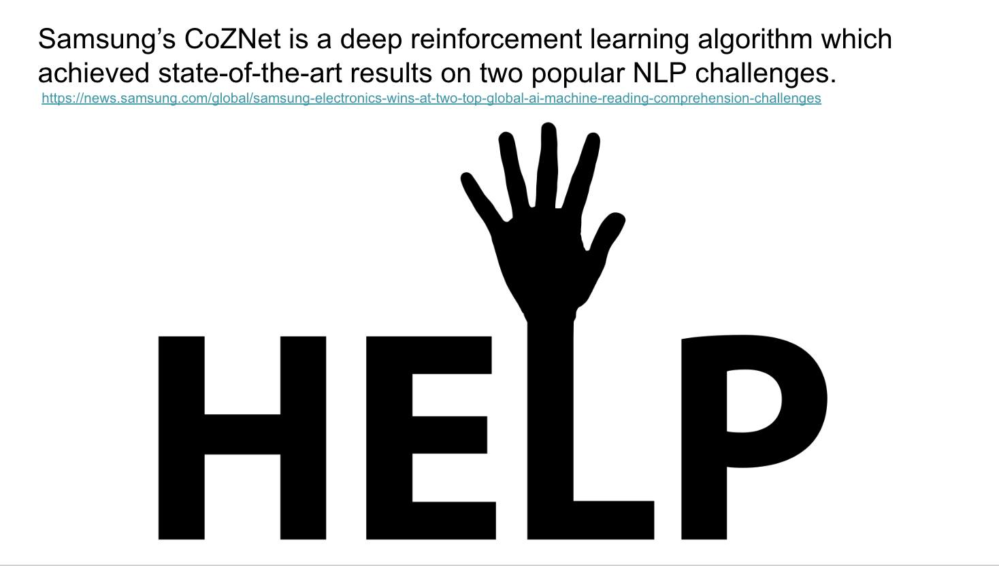
**이미지 캡션:** 흰색 배경에 검은색 글씨와 손 그림이 있습니다. 상단에는 "Samsung's CoZNet is a deep reinforcement learning algorithm which achieved state-of-the-art results on two popular NLP challenges."라는 문장과 함께 관련 웹사이트 주소가 적혀 있습니다. 그 아래에는 검은색으로 굵게 쓰인 "HELP"라는 글자가 있고, 'L'과 'P' 사이에는 검은색 손 그림이 위로 뻗어 있는 모습이 보입니다. 손은 다섯 손가락을 모두 펴고 있으며, 마치 도움을 요청하는 듯한 제스처를 취하고 있습니다. 전체적으로는 기술적인 내용을 전달하면서도 시각적으로는 도움을 요청하는 듯한 강렬한 메시지를 전달하는 분위기입니다. is written in large, bold, black capital letters. The hand's silhouette is positioned such that it appears to be part of the letter "H" or reaching out from behind it, emphasizing the word "HELP". The overall atmosphere is stark and direct, with the visual elements strongly conveying a message of needing assistance or support, possibly in the context of the AI technology mentioned. There are no discernible people, specific locations, or other objects beyond the text and the hand silhouette.

### 1월 6일 (일) 12:37 · 📷 사진 (2장)

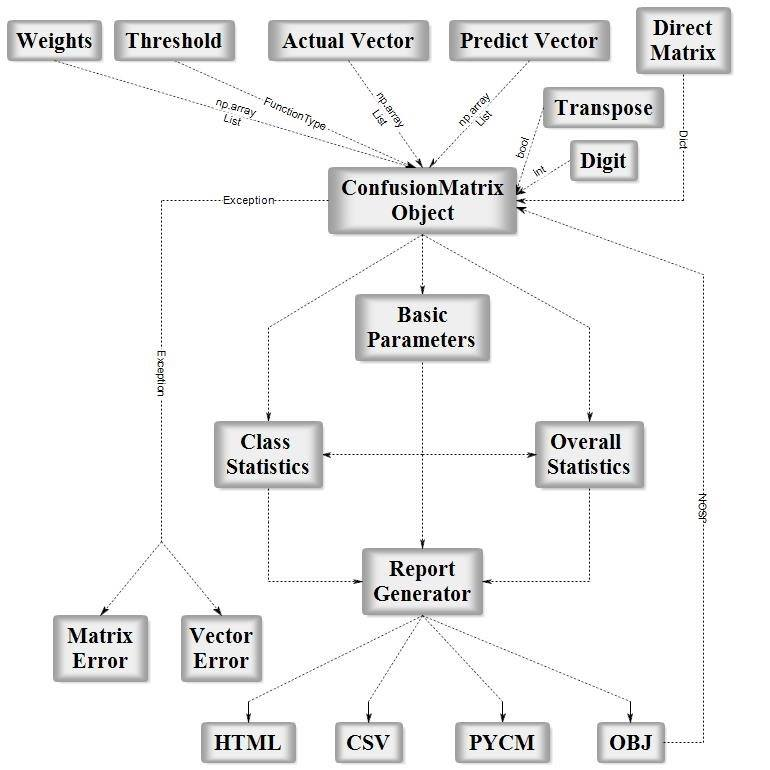
**이미지 캡션:** 이 이미지는 혼동 행렬 객체와 관련된 다양한 구성 요소와 그 관계를 보여주는 플로우차트입니다. 상단에는 "Weights", "Threshold", "Actual Vector", "Predict Vector", "Direct Matrix"와 같은 입력 요소들이 있으며, 이들은 "ConfusionMatrix Object"로 연결됩니다. "ConfusionMatrix Object"는 "Basic Parameters", "Class Statistics", "Overall Statistics"와 같은 핵심 구성 요소와 연결되며, "Transpose", "Digit"와 같은 추가 기능도 포함합니다. "ConfusionMatrix Object"는 "Exception"이라는 예외 처리 메커니즘과도 연결됩니다. "Basic Parameters", "Class Statistics", "Overall Statistics"는 "Report Generator"로 정보를 전달하며, "Report Generator"는 "Matrix Error", "Vector Error"와 같은 오류 처리와 함께 "HTML", "CSV", "PYCM", "OBJ"와 같은 다양한 출력 형식을 생성합니다. 전체적으로 이 다이어그램은 혼동 행렬을 생성하고 분석하는 과정의 논리적 흐름과 데이터 처리 단계를 시각적으로 나타냅니다. 연결되며, "Transpose", "Digit"와 같은 추가 기능도 포함합니다. "ConfusionMatrix Object"는 "Exception"이라는 예외 처리 메커니즘과도 연결됩니다. "Basic Parameters", "Class Statistics", "Overall Statistics"는 "Report Generator"로 정보를 전달하며, "Report Generator"는 "Matrix Error", "Vector Error"와 같은 오류 처리와 함께 "HTML", "CSV", "PYCM", "OBJ"와 같은 다양한 출력 형식을 생성합니다. 전체적으로 이 다이어그램은 혼동 행렬을 생성하고 분석하는 과정의 논리적 흐름과 데이터 처리 단계를 시각적으로 나타냅니다.
 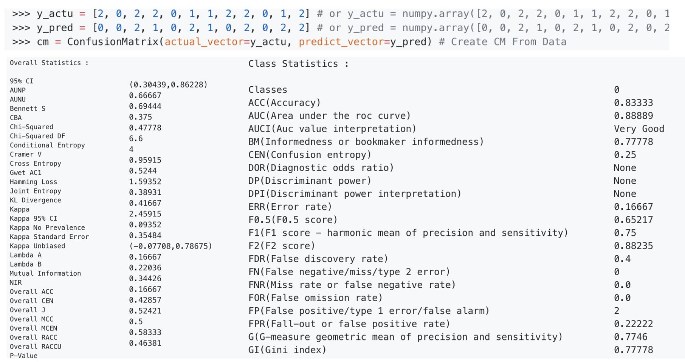
**이미지 캡션:** 이 이미지는 컴퓨터 화면에 표시된 파이썬 코드와 통계 분석 결과를 보여줍니다. 화면에는 두 개의 변수 `y_actu`와 `y_pred`에 할당된 숫자 리스트가 보이며, 이는 실제 값과 예측 값을 나타내는 것으로 추정됩니다. 이어서 `ConfusionMatrix` 함수를 사용하여 혼동 행렬을 생성하는 코드가 표시됩니다. 그 아래에는 "Overall Statistics"와 "Class Statistics"라는 제목과 함께 다양한 통계 지표와 그 값이 나열되어 있습니다. 예를 들어, "ACC (Accuracy)"는 0.83333, "AUC (Area under the roc curve)"는 0.88889, "ERR (Error rate)"는 0.16667 등으로 표시되어 있습니다. 또한 "AUCI (Auc value interpretation)"는 "Very Good"으로, "DOR (Diagnostic odds ratio)"는 "None"으로 표시되는 등 일부 지표는 텍스트로 결과가 나타나 있습니다. 전반적으로 이 화면은 머신러닝 모델의 성능을 평가하기 위한 혼동 행렬 분석 결과를 보여주는 것으로 보이며, 배경은 일반적인 컴퓨터 화면의 모습입니다. 0.83333, "AUC (Area under the roc curve)"는 0.88889, "ERR (Error rate)"는 0.16667 등으로 표시되어 있습니다. 또한 "AUCI (Auc value interpretation)"는 "Very Good"으로, "DOR (Diagnostic odds ratio)"는 "None"으로 표시되는 등 일부 지표는 텍스트로 결과가 나타나 있습니다. 전반적으로 이 화면은 머신러닝 모델의 성능을 평가하기 위한 혼동 행렬 분석 결과를 보여주는 것으로 보이며, 배경은 일반적인 컴퓨터 화면의 모습입니다.

### 1월 9일 (수) 08:44 · 📷 사진 (3장)

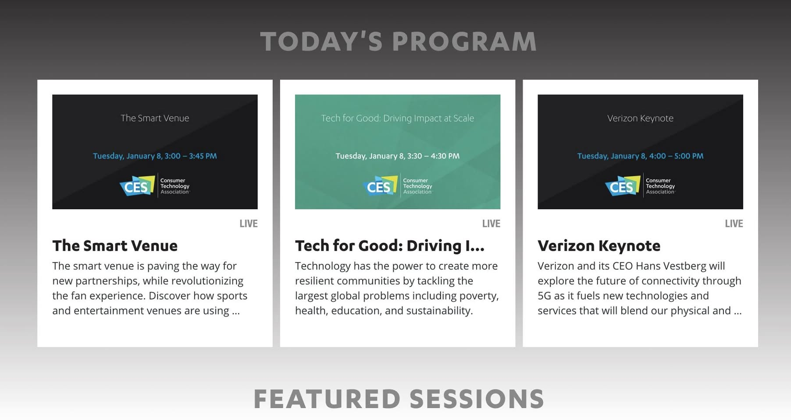
**이미지 캡션:** 이 이미지는 CES 행사의 "오늘의 프로그램"을 보여주는 웹페이지의 일부로, 세 개의 주요 세션이 나란히 표시되어 있습니다. 각 세션은 제목, 시간, 로고, 그리고 간략한 설명으로 구성되어 있습니다. 왼쪽 세션은 "The Smart Venue"로, 스마트 경기장이 새로운 파트너십을 구축하고 팬 경험을 혁신하는 방법을 다룹니다. 가운데 세션은 "Tech for Good: Driving Impact at Scale"로, 기술이 빈곤, 건강, 교육, 지속 가능성과 같은 전 지구적 문제를 해결하여 회복력 있는 커뮤니티를 만드는 힘을 강조합니다. 오른쪽 세션은 "Verizon Keynote"로, Verizon과 CEO Hans Vestberg가 5G를 통해 연결성의 미래를 탐구하고 물리적 세계와 디지털 세계를 융합하는 기술 및 서비스를 논의할 예정입니다. 각 세션 카드 상단에는 "LIVE"라는 표시가 있으며, 하단에는 "FEATURED SESSIONS"라는 제목이 있습니다. 전체적으로 이 이미지는 기술 컨퍼런스의 주요 발표 및 토론 내용을 안내하는 정보성 콘텐츠입니다.티를 만드는 힘을 강조합니다. 오른쪽 세션은 "Verizon Keynote"로, Verizon과 CEO Hans Vestberg가 5G를 통해 연결성의 미래를 탐구하고 물리적 세계와 디지털 세계를 융합하는 기술 및 서비스를 논의할 예정입니다. 각 세션 카드 상단에는 "LIVE"라는 표시가 있으며, 하단에는 "FEATURED SESSIONS"라는 제목이 있습니다. 전체적으로 이 이미지는 기술 컨퍼런스의 주요 발표 및 토론 내용을 안내하는 정보성 콘텐츠입니다.
 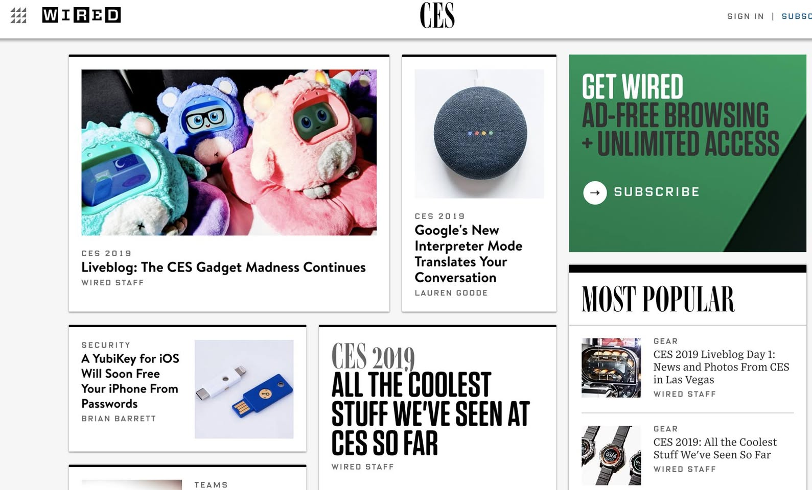
**이미지 캡션:** 화면 상단에는 "WIRED"와 "CES" 로고가 보이며, 그 아래에는 여러 기사 썸네일과 광고 배너가 배치되어 있다. 왼쪽 상단에는 파란색, 보라색, 분홍색의 귀여운 동물 모양 인형 세 개가 나란히 놓여 있는 사진이 있고, 그 아래 "CES 2019 Liveblog: The CES Gadget Madness Continues"라는 제목의 기사가 있다. 그 옆에는 회색의 동그란 스마트 스피커 사진과 함께 "CES 2019 Google's New Interpreter Mode Translates Your Conversation"이라는 제목의 기사가 보인다. 오른쪽에는 "GET WIRED AD-FREE BROWSING + UNLIMITED ACCESS SUBSCRIBE"라는 녹색 광고 배너가 있다. 그 아래에는 "MOST POPULAR"라는 제목과 함께 두 개의 인기 기사 목록이 있다. 첫 번째 인기 기사에는 CES 2019 라스베이거스 현장의 뉴스 및 사진에 대한 내용이 담겨 있고, 두 번째 인기 기사에는 CES 2019에서 본 가장 멋진 제품들에 대한 내용이 있다. 왼쪽 하단에는 흰색과 파란색의 USB 형태 보안 키 사진과 함께 "SECURITY A YubiKey for iOS Will Soon Free Your iPhone From Passwords"라는 제목의 기사가 있다. 전반적으로 IT 기술 박람회인 CES와 관련된 최신 기사 및 정보를 제공하는 웹사이트의 모습이다.ersation"이라는 제목의 기사가 보인다. 오른쪽에는 "GET WIRED AD-FREE BROWSING + UNLIMITED ACCESS SUBSCRIBE"라는 녹색 광고 배너가 있다. 그 아래에는 "MOST POPULAR"라는 제목과 함께 두 개의 인기 기사 목록이 있다. 첫 번째 인기 기사에는 CES 2019 라스베이거스 현장의 뉴스 및 사진에 대한 내용이 담겨 있고, 두 번째 인기 기사에는 CES 2019에서 본 가장 멋진 제품들에 대한 내용이 있다. 왼쪽 하단에는 흰색과 파란색의 USB 형태 보안 키 사진과 함께 "SECURITY A YubiKey for iOS Will Soon Free Your iPhone From Passwords"라는 제목의 기사가 있다. 전반적으로 IT 기술 박람회인 CES와 관련된 최신 기사 및 정보를 제공하는 웹사이트의 모습이다.
 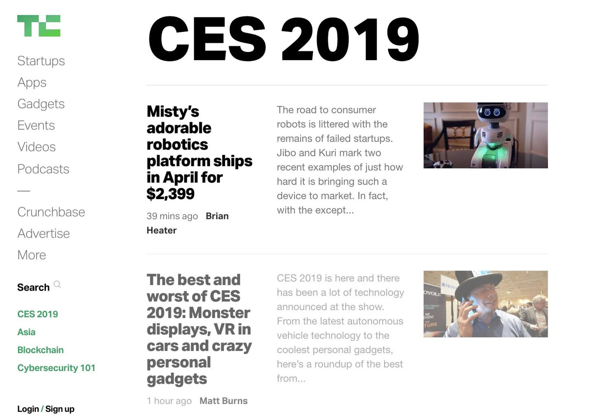
**이미지 캡션:** 화면 왼쪽에는 TechCrunch 웹사이트의 탐색 메뉴가 있으며, "Startups", "Apps", "Gadgets", "Events", "Videos", "Podcasts", "Crunchbase", "Advertise", "More" 등의 항목이 나열되어 있습니다. 그 아래에는 "Search" 기능과 함께 "CES 2019", "Asia", "Blockchain", "Cybersecurity 101" 등의 검색 카테고리가 보입니다. 화면 중앙 상단에는 "CES 2019"라는 큰 제목이 있으며, 그 아래에는 "Misty's adorable robotics platform ships in April for $2,399"이라는 기사 제목과 함께 39분 전 작성된 Brian Heater의 기사가 있습니다. 이 기사 옆에는 로봇의 이미지가 있고, 그 아래에는 "The best and worst of CES 2019: Monster displays, VR in cars and crazy personal gadgets"라는 또 다른 기사 제목과 함께 1시간 전 작성된 Matt Burns의 기사가 있습니다. 이 기사 옆에는 중절모를 쓰고 휴대폰으로 통화하는 한 성인 남성의 사진이 있습니다. 전반적으로 이 화면은 CES 2019와 관련된 기술 뉴스 기사들을 보여주는 웹페이지의 일부로 보이며, 최신 기술 동향과 제품에 대한 정보를 제공하고 있습니다.는 "Misty's adorable robotics platform ships in April for $2,399"이라는 기사 제목과 함께 39분 전 작성된 Brian Heater의 기사가 있습니다. 이 기사 옆에는 로봇의 이미지가 있고, 그 아래에는 "The best and worst of CES 2019: Monster displays, VR in cars and crazy personal gadgets"라는 또 다른 기사 제목과 함께 1시간 전 작성된 Matt Burns의 기사가 있습니다. 이 기사 옆에는 중절모를 쓰고 휴대폰으로 통화하는 한 성인 남성의 사진이 있습니다. 전반적으로 이 화면은 CES 2019와 관련된 기술 뉴스 기사들을 보여주는 웹페이지의 일부로 보이며, 최신 기술 동향과 제품에 대한 정보를 제공하고 있습니다.

### 1월 9일 (수) 12:00 · best coffee ever with the HK limited 201…

best coffee ever with the HK limited 2019 happy new year pig mug cup!

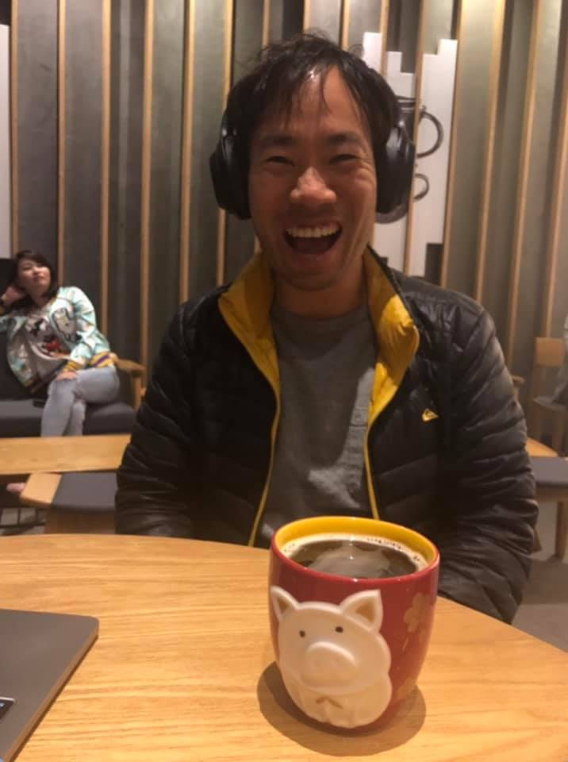
**이미지 캡션:** 사진에는 헤드폰을 끼고 활짝 웃고 있는 성인 남성이 클로즈업되어 있으며, 그는 검은색 패딩 점퍼 안에 노란색 안감이 있는 회색 티셔츠를 입고 있습니다. 그의 앞에는 나무 테이블 위에 돼지 얼굴 모양의 빨간색 머그잔에 담긴 커피가 놓여 있습니다. 배경에는 세로 줄무늬 벽과 소파에 앉아 있는 여성 한 명이 보입니다. 전체적으로 편안하고 즐거운 분위기입니다.
 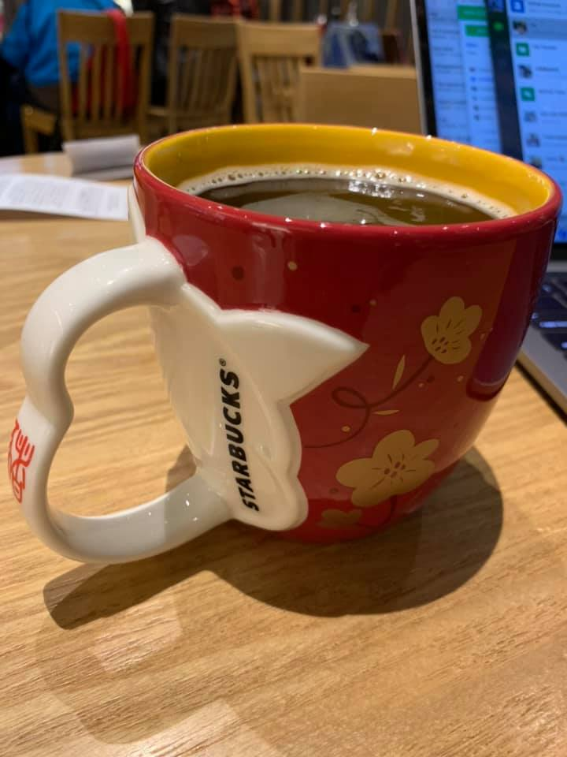
**이미지 캡션:** 따뜻한 커피가 담긴 빨간색 스타벅스 머그잔이 나무 테이블 위에 놓여 있습니다. 머그잔은 노란색 테두리를 가지고 있으며, 흰색 손잡이에는 스타벅스 로고와 함께 꽃무늬 장식이 있습니다. 배경에는 흐릿하게 보이는 여러 개의 나무 의자와 테이블, 그리고 노트북이 보입니다. 전체적으로 카페나 사무실 같은 실내 공간으로 보이며, 편안하고 일상적인 분위기를 자아냅니다.
 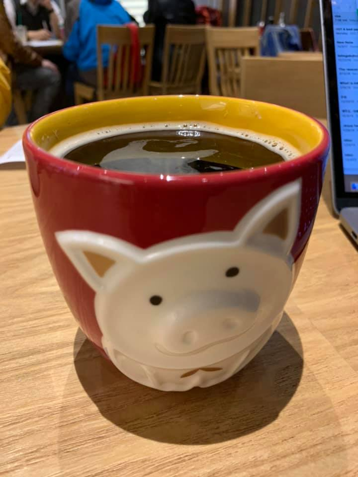
**이미지 캡션:** 따뜻한 커피가 담긴 귀여운 돼지 모양 머그잔이 나무 테이블 위에 놓여 있습니다. 머그잔은 빨간색이며 노란색 테두리가 있고, 돼지의 얼굴이 흰색으로 그려져 있습니다. 돼지의 눈은 검은색 점으로, 코는 두 개의 작은 점으로 표현되어 있으며, 입은 미소를 짓는 듯한 곡선으로 그려져 있습니다. 머그잔 뒤쪽으로는 흐릿하게 사람들이 앉아 있는 카페나 식당의 모습이 보입니다. 테이블에는 노트북도 놓여 있어, 누군가 작업을 하고 있거나 휴식을 취하고 있는 상황으로 보입니다. 전반적으로 편안하고 일상적인 분위기를 풍깁니다.

### 1월 19일 (토) 14:02 · is so happy to visit the Line HQ in Toky…

is so happy to visit the Line HQ in Tokyo, Japan. Love to meet so many cool people there.

**이미지 캡션:** 건물 외벽에 부착된 여러 기업의 간판 앞에서 한 성인 남성이 엄지손가락을 치켜세우며 활짝 웃고 있다. 남성은 30대 후반에서 40대 초반으로 보이며, 검은색 숏컷 헤어스타일에 회색 패딩 조끼와 검은색 바지를 입고 있으며, 회색 백팩을 메고 있다. 그의 뒤로는 'LINE', 'W. マイナビ', 'EPSON'이라고 적힌 대형 간판들이 세로로 나열되어 있으며, 'マイナビ' 간판에는 '12층', '24~27층', 'マイナビルーム', 'マイナビオフィス', 'マイナビウエディングサロン' 등의 정보가 함께 표기되어 있다. 그 아래에는 'MUFG', 'TOKYO STAR BANK', 'IYO BANK', 'SMBC日興証券'이라고 적힌 작은 간판들이 보인다. 'MUFG' 간판에는 '三菱UFJモルガン・スタンレー証券'과 '新宿支店 9F'라고 쓰여 있고, 'TOKYO STAR BANK' 간판에는 '東京スター銀行', '新宿支店 11F', 'ATMコーナー5F'라고 적혀 있다. 'IYO BANK' 간판에는 '伊予銀行', '新宿支店 13F'라고 표기되어 있으며, 'SMBC日興証券' 간판에는 '新宿支店 8F'라고 쓰여 있다. 배경은 현대적인 건물 외벽으로, 전반적으로 밝고 긍정적인 분위기이다.그 아래에는 'MUFG', 'TOKYO STAR BANK', 'IYO BANK', 'SMBC日興証券'이라고 적힌 작은 간판들이 보인다. 'MUFG' 간판에는 '三菱UFJモルガン・スタンレー証券'과 '新宿支店 9F'라고 쓰여 있고, 'TOKYO STAR BANK' 간판에는 '東京スター銀行', '新宿支店 11F', 'ATMコーナー5F'라고 적혀 있다. 'IYO BANK' 간판에는 '伊予銀行', '新宿支店 13F'라고 표기되어 있으며, 'SMBC日興証券' 간판에는 '新宿支店 8F'라고 쓰여 있다. 배경은 현대적인 건물 외벽으로, 전반적으로 밝고 긍정적인 분위기이다.

### 1월 20일 (일) 14:02 · 📷 사진 (1장)

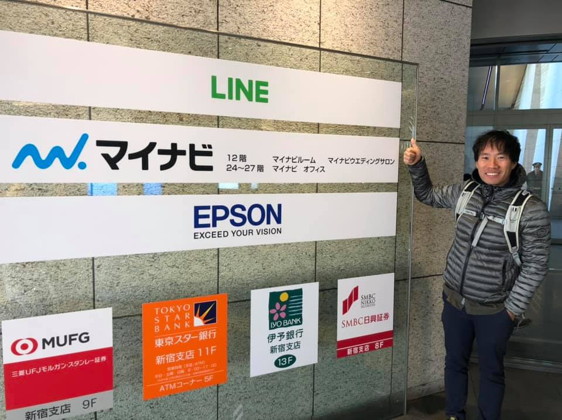
**이미지 캡션:** 한 명의 성인 남성이 회색 패딩 점퍼와 남색 바지를 입고 오른손 엄지를 치켜들며 카메라를 향해 활짝 웃고 있다. 그는 등에는 회색 배낭을 메고 있으며, 배경에는 여러 기업의 로고와 안내 문구가 적힌 흰색 간판들이 세로로 나열되어 있다. 간판에는 'LINE', 'マイナビ' (마이나비), 'EPSON' (엡손) 등의 회사 이름과 함께 층수 및 사무실 정보가 일본어로 표기되어 있다. 또한, 'MUFG' (미쓰비시 UFJ 모건 스탠리 증권), 'TOKYO STAR BANK' (도쿄 스타 은행), 'IYO BANK' (이요 은행), 'SMBC NIKKO' (SMBC 닛코 증권) 등의 금융 기관 로고와 지점 정보도 보인다. 이 남성은 건물 로비나 복도에 서 있는 것으로 보이며, 배경의 간판들은 이 건물이 여러 회사의 사무실이 입주한 빌딩임을 나타낸다. 전체적으로 밝고 긍정적인 분위기이다.(이요 은행), 'SMBC NIKKO' (SMBC 닛코 증권) 등의 금융 기관 로고와 지점 정보도 보인다. 이 남성은 건물 로비나 복도에 서 있는 것으로 보이며, 배경의 간판들은 이 건물이 여러 회사의 사무실이 입주한 빌딩임을 나타낸다. 전체적으로 밝고 긍정적인 분위기이다.

> is so happy to visit the Line HQ in Tokyo, Japan. Love to meet so many cool people there.

### 1월 22일 (화) 09:26 · What a beautiful 10K-run at Yoyogi Park …

What a beautiful 10K-run at Yoyogi Park via Takeshita Street (Harajuku) and LINE HQ, Japan!

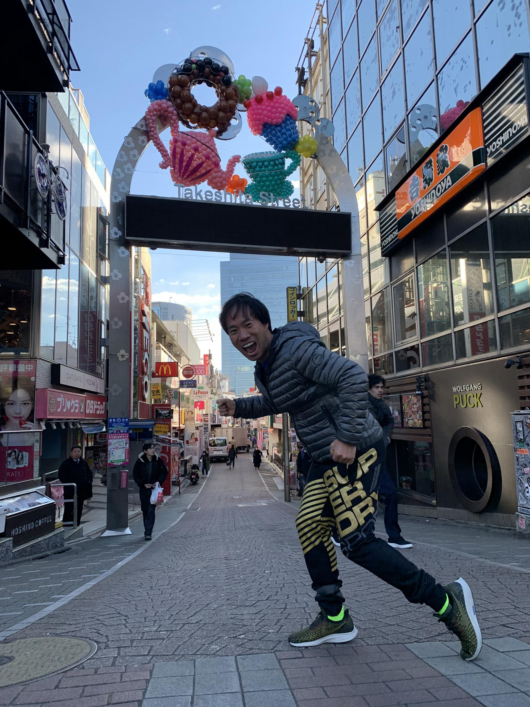
**이미지 캡션:** 일본 도쿄 하라주쿠의 다케시타 거리에서 한 성인 남성이 활기찬 표정으로 카메라를 향해 주먹을 뻗으며 점프하는 듯한 포즈를 취하고 있다. 그는 회색 패딩 점퍼와 검은색 바탕에 금색 줄무늬와 "SUPERDRY"라는 글자가 새겨진 트레이닝 바지를 입고 있으며, 형광 녹색 디테일이 있는 운동화를 신고 있다. 배경에는 알록달록한 풍선으로 장식된 아치형 간판이 보이며, 그 위에는 "Takeshita Street"라고 적혀 있다. 거리 양옆으로는 다양한 상점들이 늘어서 있으며, 유리 건물에는 "YOSHINOYA"와 "WOLFGANG PUCK" 등의 간판이 보인다. 거리에는 다른 행인들도 보이지만, 사진의 초점은 역동적인 포즈를 취하고 있는 남성에게 맞춰져 있다. 전체적으로 밝고 활기찬 분위기를 연출하고 있다.LFGANG PUCK" 등의 간판이 보인다. 거리에는 다른 행인들도 보이지만, 사진의 초점은 역동적인 포즈를 취하고 있는 남성에게 맞춰져 있다. 전체적으로 밝고 활기찬 분위기를 연출하고 있다.
 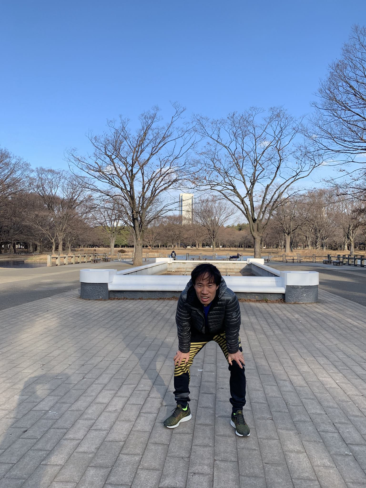
**이미지 캡션:** 한 명의 성인 남성이 공원 바닥에 서서 무릎을 굽히고 손을 무릎에 얹고 있다. 그는 검은색 패딩 점퍼와 노란색 줄무늬가 있는 검은색 바지를 입고 있으며, 녹색 운동화를 신고 있다. 남성은 입을 벌리고 혀를 살짝 내밀며 카메라를 응시하고 있으며, 그의 표정은 장난스럽거나 힘들어 보인다. 배경에는 앙상한 나뭇가지가 있는 나무들과 멀리 하얀색 건물이 보이며, 맑고 푸른 하늘이 펼쳐져 있다. 공원 바닥은 회색 타일로 포장되어 있으며, 햇빛에 의해 남성의 그림자가 길게 드리워져 있다. 전반적으로 야외 활동이나 운동 후 잠시 휴식을 취하는 듯한 분위기이다. 잠시 휴식을 취하는 듯한 분위기이다.
 
**이미지 캡션:** 이 사진은 "Sung Kim"이라는 사용자가 오전 8시 11분에 "Morning Run"이라는 제목으로 기록한 달리기 활동을 보여주는 스크린샷입니다. 화면 상단에는 사용자의 프로필 사진과 이름, 활동 시간, 그리고 활동 제목이 표시되어 있습니다. 그 아래에는 달리기 거리인 "10.0 km"와 페이스인 "5:38 /km"가 나타나 있습니다. 메인 화면에는 도쿄의 신주쿠, 요요기 공원, 하라주쿠 등의 지역을 포함하는 지도가 표시되어 있으며, 파란색 선으로 달리기 경로가 표시되어 있습니다. 지도에는 "Nishi-shinjuku", "Gucci", "MODE GAKUEN COCOON TOWER", "TOKYO METROPOLITAN GOVERNMENT OFFICE", "JR Tokyo General Hospital", "YOYOGI", "MEIJI JINGU", "Yoyogi Park", "Harajuku", "Sendagaya" 등 다양한 장소와 건물 이름이 한국어와 영어로 표기되어 있습니다. 또한, 지도에는 도로, 철도, 공원 등이 표시되어 있어 실제 도쿄의 지형을 상세하게 보여줍니다. 전반적으로 이 사진은 사용자의 운동 기록을 시각적으로 보여주는 앱 화면으로, 활동 내용과 경로를 명확하게 확인할 수 있습니다.hinjuku", "Gucci", "MODE GAKUEN COCOON TOWER", "TOKYO METROPOLITAN GOVERNMENT OFFICE", "JR Tokyo General Hospital", "YOYOGI", "MEIJI JINGU", "Yoyogi Park", "Harajuku", "Sendagaya" 등 다양한 장소와 건물 이름이 한국어와 영어로 표기되어 있습니다. 또한, 지도에는 도로, 철도, 공원 등이 표시되어 있어 실제 도쿄의 지형을 상세하게 보여줍니다. 전반적으로 이 사진은 사용자의 운동 기록을 시각적으로 보여주는 앱 화면으로, 활동 내용과 경로를 명확하게 확인할 수 있습니다.

### 1월 23일 (수) 09:26 · 📷 사진 (4장)

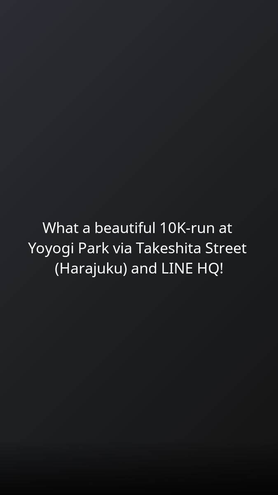
**이미지 캡션:** 이 사진은 어두운 배경에 흰색 텍스트가 표시되어 있습니다. 텍스트는 "What a beautiful 10K-run at Yoyogi Park via Takeshita Street (Harajuku) and LINE HQ!"라고 적혀 있습니다. 이 텍스트는 요요기 공원, 다케시타 거리(하라주쿠), 그리고 LINE 본사를 통과하는 10km 달리기 경험에 대한 감상을 표현하고 있습니다. 사진 자체에는 사람, 장소, 사물, 보이는 텍스트 외의 구체적인 시각적 정보는 포함되어 있지 않으며, 텍스트를 통해 긍정적이고 활기찬 분위기를 짐작할 수 있습니다.기찬 분위기를 짐작할 수 있습니다.
 
**이미지 캡션:** 한 명의 성인 남성이 활기찬 표정으로 카메라를 향해 주먹을 뻗으며 역동적인 포즈를 취하고 있다. 그는 짙은 회색 패딩 점퍼와 검은색 바탕에 금색 줄무늬와 "SUPER DRY"라고 쓰인 독특한 디자인의 바지를 입고 있으며, 형광 녹색 디테일이 있는 운동화를 신고 있다. 남성은 도쿄 하라주쿠의 다케시타 거리로 보이는 번화한 거리에서 사진 촬영 중이며, 배경에는 독특한 풍선 장식이 달린 아치형 간판에 "Takeshita Street"라고 쓰여 있고, 양옆으로는 유리 외벽의 건물들이 늘어서 있으며 다양한 상점 간판들이 보인다. 거리에는 다른 행인들도 보이며, 전반적으로 활기차고 즐거운 분위기를 자아낸다.이 보인다. 거리에는 다른 행인들도 보이며, 전반적으로 활기차고 즐거운 분위기를 자아낸다.
 
**이미지 캡션:** 한 명의 성인 남성이 공원 바닥에 서서 무릎을 굽히고 손을 무릎에 얹고 있다. 그는 검은색 패딩 점퍼와 노란색 줄무늬가 있는 검은색 바지를 입고 있으며, 녹색 운동화를 신고 있다. 남성은 입을 벌리고 혀를 살짝 내밀고 있으며, 눈을 크게 뜨고 카메라를 바라보고 있다. 배경에는 앙상한 나뭇가지가 있는 나무들과 멀리 하얀색 건물이 보인다. 공원 바닥은 회색 타일로 포장되어 있으며, 햇빛이 비쳐 남자의 그림자가 길게 늘어져 있다. 전반적으로 맑고 푸른 하늘 아래 야외 활동을 즐기는 듯한 분위기이다.
 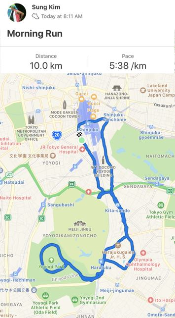
**이미지 캡션:** 이 사진은 Sung Kim이라는 사용자가 오늘 오전 8시 11분에 완료한 "Morning Run" 활동을 보여주는 스크린샷입니다. 화면 상단에는 사용자의 프로필 사진과 이름, 활동 시간, 그리고 활동 제목인 "Morning Run"이 표시되어 있습니다. 그 아래에는 이번 달리기의 총 거리인 10.0km와 평균 페이스인 5:38/km가 나타나 있습니다. 화면 하단에는 도쿄 신주쿠 지역의 지도가 표시되어 있으며, 파란색 선으로 표시된 달리기 경로가 상세하게 기록되어 있습니다. 지도에는 신주쿠역, 도쿄 도청, 모드 학원 코쿤 타워, 하라주쿠, 메이지 신궁, 요요기 공원 등 주요 지점들이 표시되어 있어, 사용자가 이 지역을 중심으로 달렸음을 알 수 있습니다. 지도 상에는 "Nishi-shinjuku", "Shinjuku", "Harajuku", "Yoyogi Park", "Meiji Jingu"와 같은 지명과 함께 "Gucci", "JR Tokyo General Hospital", "Tokyo Gym Athletic Field"와 같은 건물 및 시설 이름도 보입니다. 전반적으로 활동적인 아침 운동 기록을 보여주는 깔끔하고 정보가 잘 정리된 화면입니다. 학원 코쿤 타워, 하라주쿠, 메이지 신궁, 요요기 공원 등 주요 지점들이 표시되어 있어, 사용자가 이 지역을 중심으로 달렸음을 알 수 있습니다. 지도 상에는 "Nishi-shinjuku", "Shinjuku", "Harajuku", "Yoyogi Park", "Meiji Jingu"와 같은 지명과 함께 "Gucci", "JR Tokyo General Hospital", "Tokyo Gym Athletic Field"와 같은 건물 및 시설 이름도 보입니다. 전반적으로 활동적인 아침 운동 기록을 보여주는 깔끔하고 정보가 잘 정리된 화면입니다.

### 1월 24일 (목) 21:15 · 📷 사진 (1장)

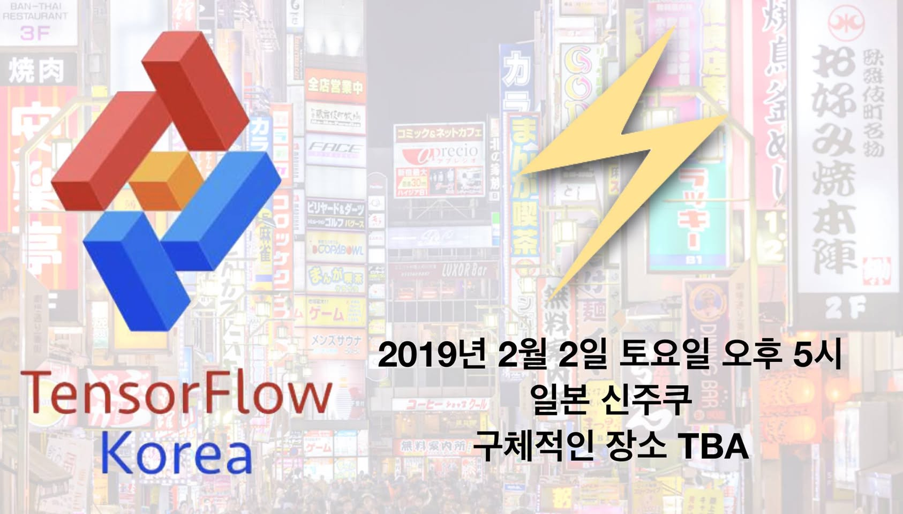
**이미지 캡션:** 이 이미지는 일본 신주쿠의 밤거리를 배경으로 하고 있으며, 네온사인 간판들이 빼곡하게 늘어서 있어 활기찬 도시의 분위기를 자아냅니다. 이미지 중앙에는 빨간색, 주황색, 파란색의 3차원 블록으로 이루어진 TensorFlow 로고가 크게 자리 잡고 있으며, 그 아래에는 "TensorFlow Korea"라는 문구가 붉은색과 파란색으로 쓰여 있습니다. 또한, 노란색 번개 모양의 그래픽이 오른쪽 상단에 배치되어 있습니다. 이미지 하단에는 "2019년 2월 2일 토요일 오후 5시", "일본 신주쿠", "구체적인 장소 TBA"라는 텍스트가 한국어로 적혀 있어, 이 행사가 2019년 2월 2일 토요일 오후 5시에 일본 신주쿠에서 열릴 예정이며 장소는 추후 공지될 것임을 알리고 있습니다. 배경의 일본어 간판들은 다양한 상점과 서비스를 나타내며, 전반적으로 도시의 번잡함과 이벤트 정보를 효과적으로 전달하는 디자인입니다.BA"라는 텍스트가 한국어로 적혀 있어, 이 행사가 2019년 2월 2일 토요일 오후 5시에 일본 신주쿠에서 열릴 예정이며 장소는 추후 공지될 것임을 알리고 있습니다. 배경의 일본어 간판들은 다양한 상점과 서비스를 나타내며, 전반적으로 도시의 번잡함과 이벤트 정보를 효과적으로 전달하는 디자인입니다.

> #TFKR일본번개0202 세계로 뻗어가는 TF-KR! 지난 실리콘 벨리 번개에 이어 이번은 일본 도쿄 신주쿠로 갑니다. 마침 Soonson Kwon님과 제가 일본에 2월 2일 같이 있어서 신주쿠 근처에 계시면서 딥러닝과 TF에 관심이 있는 분들 계시면 모두 번개에 초대 합니다.   라인 기술을 총괄 하시는 박의빈 CTO님도 오신다는 첩보가.   (오시는 모든 분들에게 멋진 TF 티셔츠 선물이 있다는 첩보가 있습니다.)  * 장소: koshitsukurafutobi-rutaka (https://tabelog.com/kr/tokyo/A1304/A130401/13224404/) * 예약코드: W2NH4LXNUV (입장시 보여주시면 안내하신답니다.) * 일시: 2월 2일 (토요일) 오후 5시~7시 * 참가비: 본인 식사비, 학생은 무료 * 참가 대상: 이글을 보시는 누구나  * 참가 신청자: Ryan Ryu, Sung Kim, Soonkwon Kim, Takatoshi Nao, Cheol Hee Yoo, Dabae Kim, Kim Kijun, 안성하, 김진오, Dong-Hyun Hwang, 박진수, SeonMin Kim, Jihye Lee, Jinjae Lee +1, Seohyeon Jeong, Jaeha Choi, 金祐寛, JoonYoung Yoon, 오재호, Jin Ma, Yung-Cheol Byun, Jongmoon Choi, Donggyu Park, Hyojin Bae, Hyungcheol Kim, Bumnyeong Kim, Seung Kwak, Jinwoong Kim, 이의빈 (테깅실수/미스 미리 양해 구합니다. 댓글로 알려주세요.)  그럼 도쿄에서 TF-KR 한번 멋지게 모여 봅시다! 신청하지 않으신 분들도 번개이니 그냥 오시면 됩니다.

### 1월 25일 (금) 20:51 · so wanderful to visit Prof. Yukyung Choi…

so wanderful to visit Prof. Yukyung Choi at Sejong University. All the best to her!

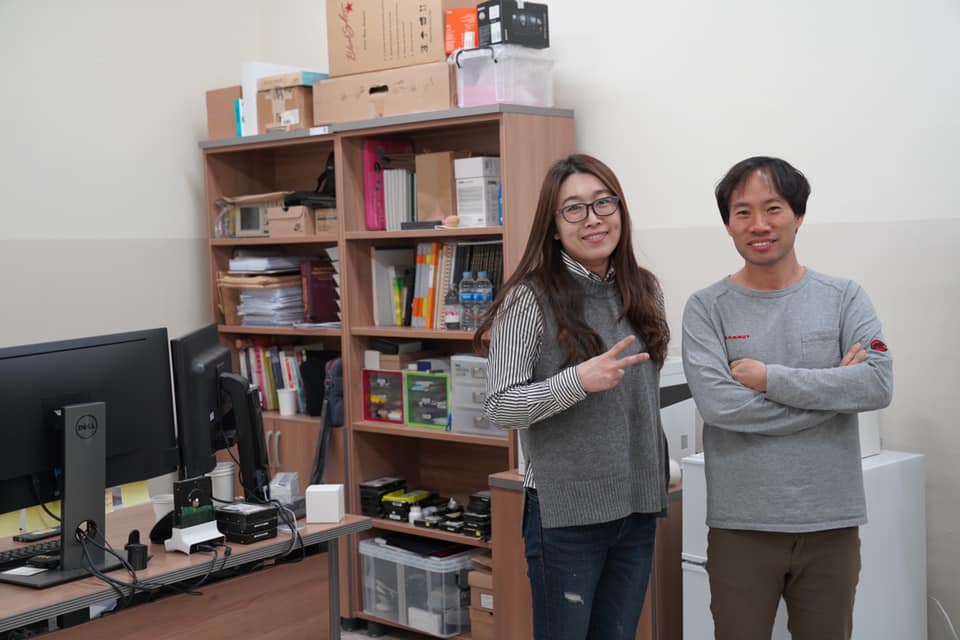
**이미지 캡션:** 사진에는 사무실 환경에서 두 사람이 서 있는 모습이 담겨 있습니다. 왼쪽에는 안경을 쓰고 회색 조끼와 줄무늬 셔츠, 청바지를 입은 성인 여성이 있습니다. 그녀는 미소를 지으며 손으로 브이(V) 표시를 하고 있습니다. 오른쪽에는 회색 긴팔 티셔츠와 갈색 바지를 입은 성인 남성이 팔짱을 끼고 서 있습니다. 그의 표정은 밝습니다. 배경에는 책장과 책상, 컴퓨터 모니터, 그리고 다양한 물건들이 보입니다. 책장에는 책, 서류철, 상자 등이 가지런히 정리되어 있으며, 책상 위에는 컴퓨터 장비와 서류들이 놓여 있습니다. 전체적으로 편안하고 일상적인 사무실 분위기를 보여줍니다.전체적으로 편안하고 일상적인 사무실 분위기를 보여줍니다.
 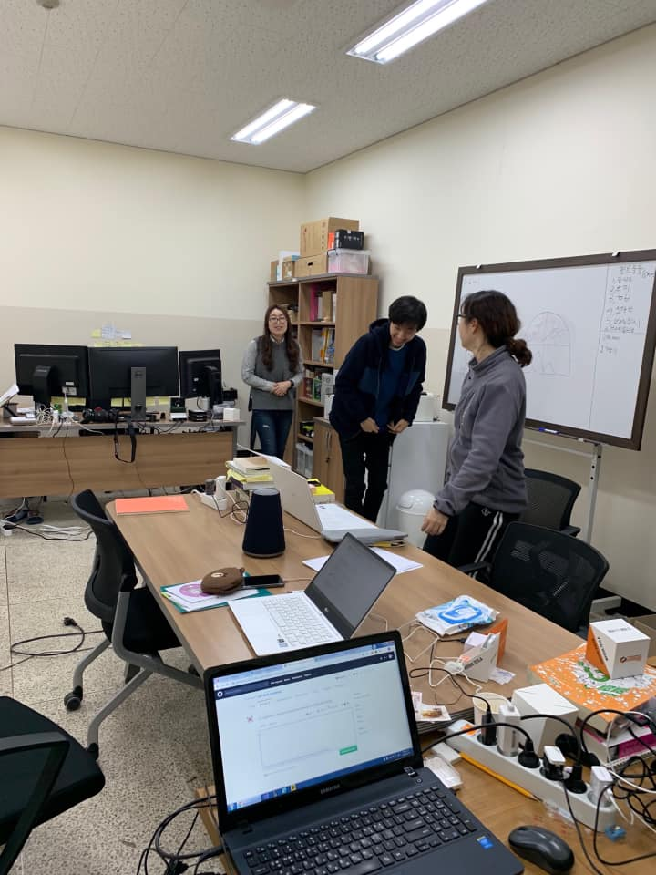
**이미지 캡션:** 사무실로 보이는 공간에서 세 명의 사람이 대화를 나누고 있다. 왼쪽에는 성인 여성이 회색 조끼와 청바지를 입고 서 있으며, 중간에는 젊은 성인 남성이 파란색과 검은색이 섞인 재킷을 입고 허리를 숙인 채 웃고 있다. 오른쪽에는 안경을 쓴 성인 여성이 회색 후드티와 검은색 바지를 입고 서서 다른 사람과 대화하고 있다. 배경에는 책장, 여러 대의 컴퓨터 모니터, 회의용 테이블, 그리고 흰색 칠판이 보인다. 칠판에는 한국어로 된 글씨와 그림이 그려져 있다. 테이블 위에는 노트북, 스피커, 서류, 그리고 전선들이 어지럽게 놓여 있다. 전체적으로 편안하고 일상적인 사무실 분위기이다.럽게 놓여 있다. 전체적으로 편안하고 일상적인 사무실 분위기이다.

### 1월 26일 (토) 20:51 · 📷 사진 (3장)

**이미지 캡션:** 이 사진에는 사람이나 장소, 사물이 보이지 않으며, 어두운 배경에 흰색 텍스트만 표시되어 있습니다. 텍스트는 "so wanderful to visit Prof. Yukyung Choi at Sejong University. All the best to her!"라고 쓰여 있으며, 이는 세종대학교의 최유경 교수님을 방문한 것에 대한 긍정적인 감정을 표현하는 것으로 보입니다. 전체적으로 차분하고 간결한 분위기입니다.
 
**이미지 캡션:** 사진에는 사무실 환경에서 두 사람이 포즈를 취하고 있다. 왼쪽에는 안경을 쓰고 회색 조끼와 줄무늬 셔츠를 입은 젊은 여성이 있으며, 브이(V)자를 만들고 있다. 오른쪽에는 회색 긴팔 티셔츠와 갈색 바지를 입은 성인 남성이 팔짱을 끼고 서 있다. 배경에는 책장과 책상, 컴퓨터 모니터, 그리고 다양한 사무용품과 상자들이 보인다. 전체적으로 밝고 캐주얼한 분위기이며, 두 사람은 편안하고 긍정적인 표정을 짓고 있다.
 
**이미지 캡션:** 사무실에서 세 명의 성인이 서서 대화하고 있으며, 한 명의 성인 남성은 허리를 숙이고 있고, 다른 두 명의 성인 여성은 서서 남성을 바라보고 있습니다. 남성은 20대 후반에서 30대 초반으로 보이며, 어두운 색상의 후드티와 청바지를 입고 있습니다. 한 여성은 30대 후반에서 40대 초반으로 보이며, 회색 조끼와 청바지를 입고 있습니다. 다른 여성은 30대 초반으로 보이며, 회색 후드티와 검은색 바지를 입고 있습니다. 사무실에는 책상, 의자, 컴퓨터 모니터, 노트북, 화이트보드, 책장 등이 보입니다. 화이트보드에는 그림과 한국어로 된 글씨가 쓰여 있습니다. 전반적으로 업무 환경으로 보이며, 직원들이 회의를 하거나 업무에 대해 논의하는 듯한 분위기입니다.에는 그림과 한국어로 된 글씨가 쓰여 있습니다. 전반적으로 업무 환경으로 보이며, 직원들이 회의를 하거나 업무에 대해 논의하는 듯한 분위기입니다.

### 1월 30일 (수) 08:37 · 감축 드립니다.

감축 드립니다.

### 1월 30일 (수) 08:37 · ↪ 감축 드립니다.

*다른 프로필에 남긴 글*

감축 드립니다.
