# 2019년 2월

[← 2019년](README.md)

### 2월 2일 (토) 16:50 · 📷 사진 (1장)

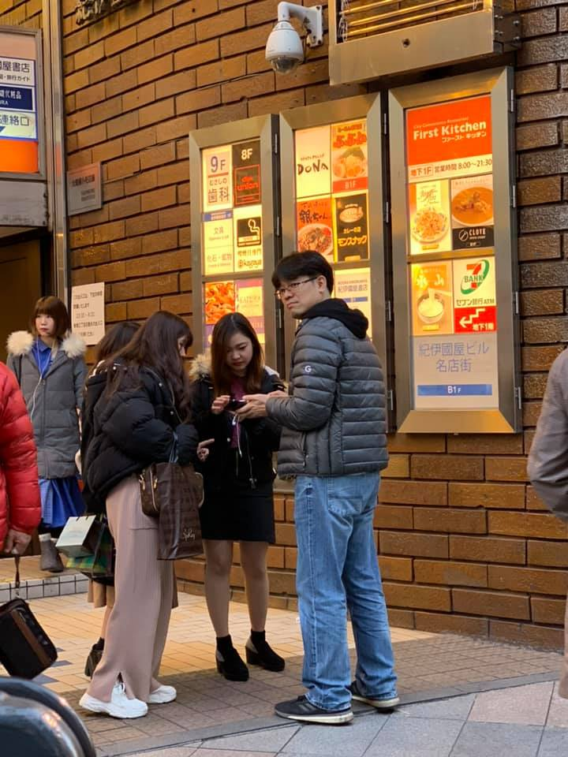
**이미지 캡션:** 한 성인 남성이 회색 패딩 점퍼와 청바지를 입고 카메라를 바라보고 있으며, 그의 옆에는 두 명의 성인 여성이 서 있다. 한 여성은 검은색 패딩 점퍼와 분홍색 바지를 입고 있으며, 다른 여성은 검은색 짧은 치마와 검은색 재킷을 입고 있다. 이들은 일본어로 된 간판이 있는 건물 앞에 서 있으며, 간판에는 "First Kitchen"이라는 글자와 함께 음식 사진들이 보인다. 건물 벽은 벽돌로 되어 있고, CCTV가 설치되어 있다. 전반적으로 도시의 거리 풍경이며, 사람들이 무언가를 기다리거나 대화하는 듯한 분위기이다.다.

### 2월 6일 (수) 21:15 · Good to have lunch with wonderful people…

Good to have lunch with wonderful people, David Ha (Google) and Shinichiro Isago (LINE) in Japan! See you soon again.

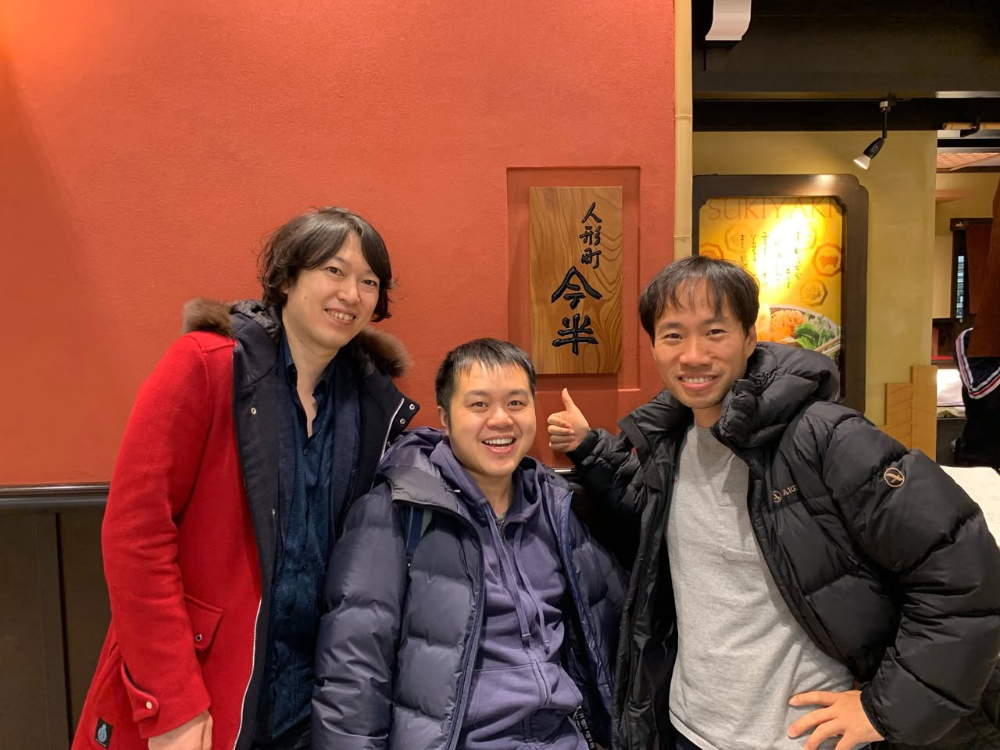
**이미지 캡션:** 세 명의 성인 남성이 실내에서 사진을 찍고 있다. 왼쪽 남성은 30대 후반에서 40대 초반으로 보이며, 검은색 머리카락에 옅은 미소를 띠고 있다. 그는 붉은색 코트 안에 남색 셔츠를 입고 있으며, 코트의 후드에는 갈색 털이 달려 있다. 가운데 남성은 30대 초반으로 보이며, 짧은 검은 머리에 활짝 웃고 있다. 그는 남색 패딩 점퍼 안에 후드티를 입고 있다. 오른쪽 남성은 30대 후반에서 40대 초반으로 보이며, 짧은 검은 머리에 환한 미소를 짓고 엄지손가락을 치켜세우고 있다. 그는 검은색 패딩 점퍼 안에 회색 티셔츠를 입고 있다. 배경에는 붉은색 벽과 나무 간판이 보이며, 간판에는 한자로 "人形町今半"이라고 쓰여 있다. 오른쪽에는 "SUKIYAKI"라고 쓰인 노란색 배경의 간판도 보인다. 전체적으로 따뜻하고 친근한 분위기이며, 식당에서 즐거운 시간을 보내고 있는 것으로 보인다. 티셔츠를 입고 있다. 배경에는 붉은색 벽과 나무 간판이 보이며, 간판에는 한자로 "人形町今半"이라고 쓰여 있다. 오른쪽에는 "SUKIYAKI"라고 쓰인 노란색 배경의 간판도 보인다. 전체적으로 따뜻하고 친근한 분위기이며, 식당에서 즐거운 시간을 보내고 있는 것으로 보인다.

### 2월 7일 (목) 13:03 · Wonderful beach run with surfers and in …

Wonderful beach run with surfers and in front of the Mt. Fuji. Amazing course!

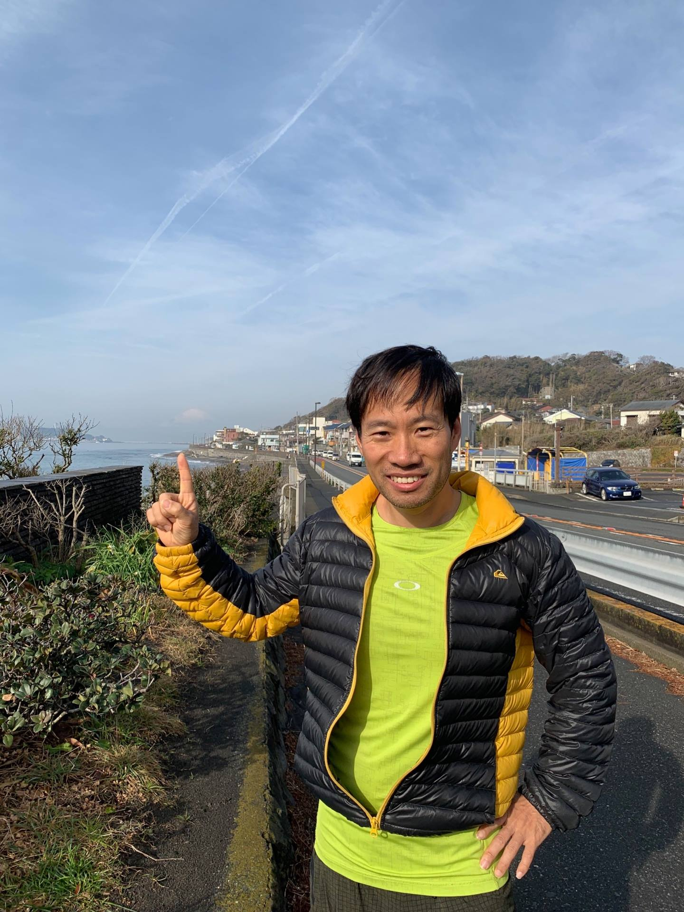
**이미지 캡션:** 한 명의 성인 남성이 밝은 형광 연두색 반팔 티셔츠 위에 검은색과 노란색 패딩 점퍼를 입고 카메라를 향해 웃으며 서 있다. 남성은 오른손 검지를 위로 치켜들고 있으며, 왼손은 허리에 얹고 있다. 남성의 머리는 짧고 검은색이며, 얼굴에는 미소가 가득하다. 배경으로는 맑고 푸른 하늘에 구름과 비행운이 보이며, 해안 도로와 그 너머로 보이는 마을, 그리고 바다가 펼쳐져 있다. 도로에는 몇 대의 차량이 지나가고 있으며, 주변에는 푸른 덤불과 나무들이 보인다. 전반적으로 야외 활동이나 여행 중 찍은 듯한 밝고 활기찬 분위기이다.분위기이다.
 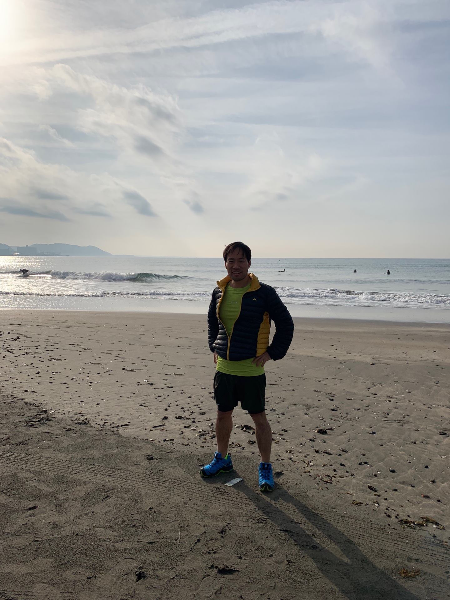
**이미지 캡션:** 한 명의 성인 남성이 해변에 서서 카메라를 향해 미소를 짓고 있다. 남성은 30대 후반에서 40대 초반으로 보이며, 짧은 검은 머리에 옅은 갈색 피부를 가지고 있다. 그는 밝은 연두색 티셔츠 위에 네이비색과 노란색이 섞인 경량 패딩 조끼를 입고 있으며, 검은색 반바지와 파란색 운동화를 신고 있다. 양손을 허리에 얹고 자신감 있는 자세를 취하고 있으며, 표정은 편안하고 즐거워 보인다. 배경에는 잔잔한 파도가 치는 바다가 펼쳐져 있고, 멀리 해안선과 산이 보인다. 하늘은 구름이 옅게 드리워져 있으며, 햇빛이 비추고 있어 전체적으로 밝고 화창한 분위기이다. 해변의 모래사장에는 타이어 자국과 작은 조개껍질들이 흩어져 있다.고 있어 전체적으로 밝고 화창한 분위기이다. 해변의 모래사장에는 타이어 자국과 작은 조개껍질들이 흩어져 있다.
 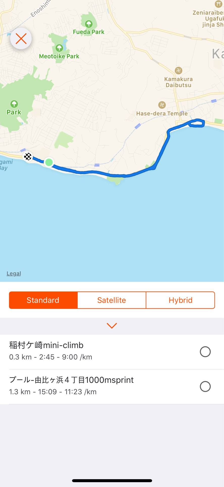
**이미지 캡션:** 이 화면은 지도 앱의 일부로, 파란색 선으로 표시된 운동 경로가 해안선을 따라 그려져 있으며, 'Enoshima', 'Fueda Park', 'Meotoike Park', 'Park', 'Kamakura Daibutsu', 'Hase-dera Temple' 등의 지명이 표시되어 있습니다. 화면 하단에는 'Standard', 'Satellite', 'Hybrid' 세 가지 지도 보기 옵션이 있으며, 그 아래에는 '稲村ケ崎mini-climb' (0.3km, 2:45 - 9:00/km)와 'プール-由比ヶ浜4丁目1000msprint' (1.3km, 15:09 - 11:23/km)라는 두 개의 운동 기록이 나열되어 있고, 각 기록 옆에는 선택을 위한 동그란 버튼이 있습니다. 화면 좌측 상단에는 빨간색 X 표시가 있어 이전 화면으로 돌아가거나 현재 기능을 취소하는 용도로 보입니다. 전반적으로 운동 기록을 확인하고 지도에서 경로를 살펴보는 상황을 보여줍니다.00msprint' (1.3km, 15:09 - 11:23/km)라는 두 개의 운동 기록이 나열되어 있고, 각 기록 옆에는 선택을 위한 동그란 버튼이 있습니다. 화면 좌측 상단에는 빨간색 X 표시가 있어 이전 화면으로 돌아가거나 현재 기능을 취소하는 용도로 보입니다. 전반적으로 운동 기록을 확인하고 지도에서 경로를 살펴보는 상황을 보여줍니다.

### 2월 7일 (목) 21:15 · 📷 사진 (1장)

**이미지 캡션:** 세 명의 성인 남성이 실내에서 사진을 찍고 있다. 왼쪽 남성은 30대 후반에서 40대 초반으로 보이며, 검은색 머리카락에 짙은 남색 셔츠 위에 붉은색 코트를 입고 있다. 코트에는 모피가 달린 후드가 달려 있다. 그는 카메라를 보며 환하게 웃고 있다. 가운데 남성은 30대 초반으로 보이며, 짧은 검은색 머리카락에 짙은 남색 패딩 점퍼를 입고 있다. 그는 카메라를 보며 미소를 짓고 있다. 오른쪽 남성은 30대 후반에서 40대 초반으로 보이며, 짧은 검은색 머리카락에 회색 티셔츠 위에 검은색 패딩 점퍼를 입고 있다. 그는 카메라를 보며 엄지손가락을 치켜들고 웃고 있다. 배경에는 붉은색 벽과 나무 간판이 보이며, 간판에는 한자로 "人形町今半"이라고 쓰여 있다. 오른쪽에는 "SUKIYAKI"라고 쓰인 노란색 배경의 간판도 보인다. 전반적으로 따뜻하고 즐거운 분위기이다.. 그는 카메라를 보며 엄지손가락을 치켜들고 웃고 있다. 배경에는 붉은색 벽과 나무 간판이 보이며, 간판에는 한자로 "人形町今半"이라고 쓰여 있다. 오른쪽에는 "SUKIYAKI"라고 쓰인 노란색 배경의 간판도 보인다. 전반적으로 따뜻하고 즐거운 분위기이다.

> Good to have lunch with wonderful people, David Ha (Google) and Shinichiro Isago (LINE) in Japan! See you soon again.

### 2월 8일 (금) 13:04 · 📷 사진 (4장)

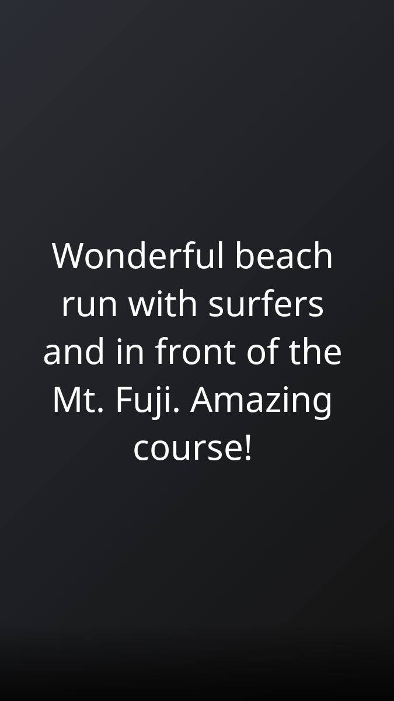
**이미지 캡션:** 이 사진은 어두운 배경에 흰색 텍스트가 표시되어 있습니다. 텍스트는 "Wonderful beach run with surfers and in front of the Mt. Fuji. Amazing course!"라고 쓰여 있으며, 이는 후지산 앞에서 서퍼들과 함께 멋진 해변 달리기를 했다는 내용입니다. 사진에는 사람이 직접적으로 보이지는 않지만, 텍스트를 통해 해변, 서핑, 후지산이라는 장소와 활동을 유추할 수 있습니다. 전반적으로 긍정적이고 감탄하는 분위기를 나타냅니다.
 
**이미지 캡션:** 한 명의 성인 남성이 밝은 햇살 아래 해안 도로 옆에서 포즈를 취하고 있다. 남성은 30대 후반에서 40대 초반으로 보이며, 짧은 검은색 머리카락과 웃는 표정을 짓고 있다. 그는 노란색과 검은색이 조합된 경량 패딩 재킷을 입고 있으며, 재킷 안에는 밝은 형광 녹색의 기능성 티셔츠를 착용하고 있다. 티셔츠에는 흰색 로고가 보인다. 그의 오른쪽 손은 위로 뻗어 검지를 세우고 있으며, 왼쪽 손은 허리에 얹고 있다. 배경에는 푸른 바다가 펼쳐져 있고, 해안선을 따라 마을과 도로가 보인다. 도로에는 몇 대의 차량이 지나가고 있으며, 하늘에는 구름과 비행운이 희미하게 보인다. 전반적으로 맑고 활동적인 분위기를 연출하는 사진이다.나가고 있으며, 하늘에는 구름과 비행운이 희미하게 보인다. 전반적으로 맑고 활동적인 분위기를 연출하는 사진이다.
 
**이미지 캡션:** 한 명의 성인 남성이 해변에 서서 카메라를 바라보고 있으며, 그는 30대 후반에서 40대 초반으로 보이며 짧은 검은 머리에 옅은 미소를 띠고 있습니다. 그는 밝은 녹색 티셔츠 위에 네이비와 노란색이 섞인 경량 패딩 조끼를 입고 있으며, 검은색 반바지와 파란색 운동화를 신고 있습니다. 그의 두 손은 허리에 얹고 있으며, 발밑에는 타이어 자국과 모래가 보입니다. 배경에는 잔잔한 파도가 치는 바다가 펼쳐져 있고, 수평선 너머로 희미하게 산과 도시의 모습이 보입니다. 하늘에는 구름이 옅게 드리워져 있으며, 전체적으로 맑고 시원한 날씨임을 알 수 있습니다. 몇몇 서퍼로 보이는 사람들이 바다에 떠 있는 모습도 희미하게 보입니다. 사진은 낮에 촬영되었으며, 전체적인 분위기는 여유롭고 활동적인 느낌을 줍니다. 맑고 시원한 날씨임을 알 수 있습니다. 몇몇 서퍼로 보이는 사람들이 바다에 떠 있는 모습도 희미하게 보입니다. 사진은 낮에 촬영되었으며, 전체적인 분위기는 여유롭고 활동적인 느낌을 줍니다.
 
**이미지 캡션:** 이 화면은 지도 앱의 일부로, 파란색 선으로 표시된 운동 경로가 해안선을 따라 그려져 있습니다. 지도에는 Enoshima, Fueda Park, Meotoike Park, Kamakura Daibutsu, Hase-dera Temple과 같은 지명들이 표시되어 있으며, 바다와 육지가 구분되어 있습니다. 화면 하단에는 운동 기록 목록이 나타나는데, 첫 번째 기록은 "稲村ケ崎mini-climb"으로 0.3km를 2분 45초 동안 이동했으며, 페이스는 9:00/km입니다. 두 번째 기록은 "プール-由比ヶ浜4丁目1000msprint"으로 1.3km를 15분 09초 동안 이동했으며, 페이스는 11:23/km입니다. 각 기록 옆에는 선택을 위한 원형 버튼이 있습니다. 화면 상단에는 "Standard", "Satellite", "Hybrid"라는 지도 보기 옵션이 있으며, 현재 "Standard"가 선택되어 주황색으로 강조되어 있습니다. 또한, 화면 왼쪽 상단에는 붉은색 X 표시가 있어 이전 화면으로 돌아가거나 현재 화면을 닫는 기능을 나타내는 것으로 보입니다. 전반적으로 운동 기록을 확인하고 지도에서 경로를 보는 데 사용되는 인터페이스로 보이며, 날씨가 맑고 활동하기 좋은 날로 추정됩니다.00msprint"으로 1.3km를 15분 09초 동안 이동했으며, 페이스는 11:23/km입니다. 각 기록 옆에는 선택을 위한 원형 버튼이 있습니다. 화면 상단에는 "Standard", "Satellite", "Hybrid"라는 지도 보기 옵션이 있으며, 현재 "Standard"가 선택되어 주황색으로 강조되어 있습니다. 또한, 화면 왼쪽 상단에는 붉은색 X 표시가 있어 이전 화면으로 돌아가거나 현재 화면을 닫는 기능을 나타내는 것으로 보입니다. 전반적으로 운동 기록을 확인하고 지도에서 경로를 보는 데 사용되는 인터페이스로 보이며, 날씨가 맑고 활동하기 좋은 날로 추정됩니다.

### 2월 14일 (목) 20:34 · Beautiful flower at work! It makes a won…

Beautiful flower at work! It makes a wonderful day! (Flower decoration by Yeon Gyoung Gwack, and this photo by Jung-Woo Ha.)

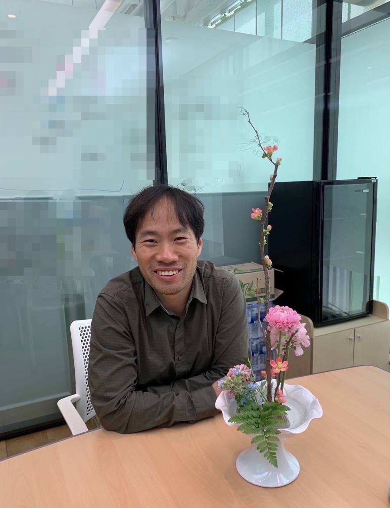
**이미지 캡션:** 사진 속에는 30대 후반에서 40대 초반으로 보이는 성인 남성이 밝게 웃으며 카메라를 응시하고 있다. 그는 짧은 검은색 머리에 갈색 계열의 셔츠를 입고 있으며, 편안하고 자연스러운 표정을 짓고 있다. 남성은 사무실로 보이는 공간에 앉아 있으며, 배경에는 유리 칸막이와 함께 흐릿하게 처리된 사무실 내부가 보인다. 테이블 위에는 하얀색 화병에 담긴 분홍색과 파란색 계열의 꽃꽂이가 놓여 있어 공간에 화사함을 더하고 있다. 전반적으로 따뜻하고 긍정적인 분위기를 자아내는 사진이다.

### 2월 15일 (금) 20:34 · 📷 사진 (1장)

**이미지 캡션:** 한 성인 남성이 사무실로 보이는 장소에서 테이블에 앉아 카메라를 바라보며 활짝 웃고 있다. 남성은 40대 정도로 보이며, 짧은 검은색 머리에 약간의 이마 주름이 있다. 그는 짙은 녹색의 긴팔 셔츠를 입고 있으며, 셔츠는 단추가 잠겨 있고 칼라가 세워져 있다. 남성은 테이블에 팔을 올리고 편안한 자세를 취하고 있으며, 그의 표정은 매우 밝고 긍정적이다. 테이블 위에는 하얀색 꽃병에 분홍색과 연보라색의 꽃들, 그리고 푸른색의 작은 꽃과 녹색 잎이 어우러진 꽃꽂이가 놓여 있다. 배경에는 유리 칸막이로 나뉜 사무 공간이 보이며, 칸막이에는 모자이크 처리된 이미지가 보인다. 오른쪽에는 검은색 냉장고와 수납장이 있으며, 전체적으로 깔끔하고 현대적인 사무실 분위기를 연출한다.간이 보이며, 칸막이에는 모자이크 처리된 이미지가 보인다. 오른쪽에는 검은색 냉장고와 수납장이 있으며, 전체적으로 깔끔하고 현대적인 사무실 분위기를 연출한다.

> Beautiful flower at work! It makes a wonderful day! (Flower decoration by Yeon Gyoung Gwack.)

### 2월 23일 (토) 13:01 · Finally, ran the Chiyoda (the Imperial P…

Finally, ran the Chiyoda (the Imperial Palace) loop, 7KM. Just beautiful running course!

**이미지 캡션:** 한 명의 성인 남성이 밝은 햇살 아래 야외에서 회색 자갈이 깔린 넓은 공간에 놓인 둥근 돌 위에 앉아 포즈를 취하고 있다. 남성은 30대 후반에서 40대 초반으로 보이며, 검은색 짧은 머리에 옅은 미소를 띠고 있다. 그는 형광 연두색과 주황색이 섞인 스포츠 재킷을 입고 있으며, 그 안에는 주황색 티셔츠가 보인다. 하의로는 회색 반바지를 입고 있으며, 발에는 파란색 운동화와 형광 녹색 양말을 신고 있다. 그의 왼쪽 팔은 구부려 턱을 괴고 있고, 오른쪽 팔은 무릎 위에 올려놓고 있다. 배경에는 울창한 나무들이 늘어서 있고, 멀리에는 전통적인 건축 양식의 건물들이 보인다. 하늘은 맑고 푸르며, 햇빛이 강하게 내리쬐고 있어 따뜻하고 활동적인 분위기를 자아낸다. 남성은 편안하고 여유로운 모습으로 사진을 찍고 있으며, 마치 운동 후 휴식을 취하는 듯한 모습이다.어서 있고, 멀리에는 전통적인 건축 양식의 건물들이 보인다. 하늘은 맑고 푸르며, 햇빛이 강하게 내리쬐고 있어 따뜻하고 활동적인 분위기를 자아낸다. 남성은 편안하고 여유로운 모습으로 사진을 찍고 있으며, 마치 운동 후 휴식을 취하는 듯한 모습이다.
 
**이미지 캡션:** 한 명의 성인 남성이 밝은 형광 연두색 방풍 재킷 안에 주황색 티셔츠를 입고 회색 반바지를 입고 팔짱을 끼고 카메라를 향해 서 있다. 그는 옅은 갈색 피부와 검은 머리카락을 가지고 있으며, 그의 얼굴에는 미소가 번지고 있다. 남자는 맑고 푸른 하늘 아래 넓은 도로 옆 보도에 서 있다. 배경에는 거대한 갈색 도리이와 일본 국기가 펄럭이는 긴 하얀 깃대가 보인다. 도리이 뒤로는 울타리와 함께 나무들이 늘어서 있고, 그 뒤로는 건물들이 보인다. 남자의 왼쪽에는 녹색 전화 부스가 서 있다. 전반적으로 사진은 맑고 화창한 날씨에 야외 활동을 즐기는 듯한 긍정적이고 활기찬 분위기를 자아낸다.창한 날씨에 야외 활동을 즐기는 듯한 긍정적이고 활기찬 분위기를 자아낸다.
 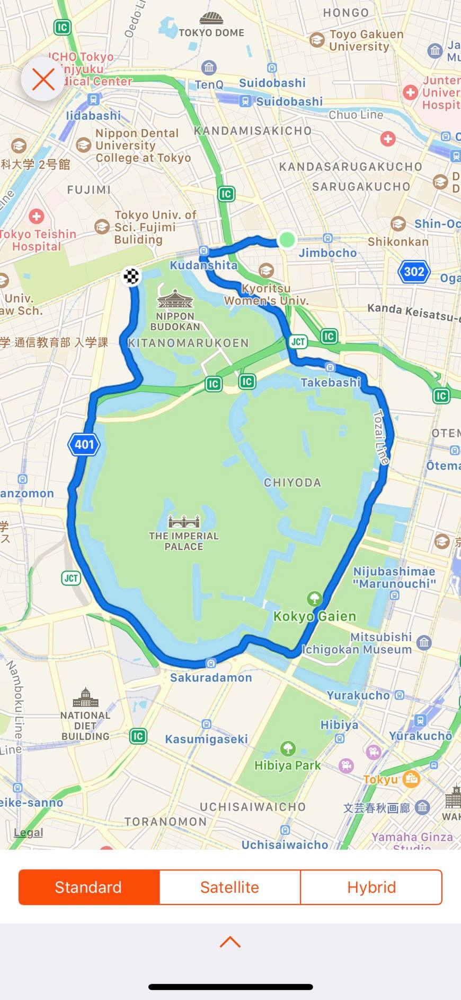
**이미지 캡션:** 이것은 일본 도쿄의 지도 앱 화면으로, 파란색 선으로 표시된 경로가 나타나 있습니다. 경로는 도쿄돔 근처에서 시작하여, 닛폰 부도칸, 황궁, 히비야 공원 등을 지나며 도쿄 시내를 순환하는 것으로 보입니다. 지도에는 다양한 건물, 도로, 공원, 지하철 노선 등이 표시되어 있으며, '도쿄 의과대학', '국립 국회 도서관', '황궁', '히비야 공원' 등 주요 지명들이 한글과 일본어로 표기되어 있습니다. 화면 하단에는 'Standard', 'Satellite', 'Hybrid'라는 지도 보기 옵션이 있으며, 현재 'Standard' 모드가 선택되어 있습니다. 지도 상단 좌측에는 빨간색 X 표시와 함께 'CHO Tokyo njyuku Medical Center'라는 텍스트가 있어, 해당 지역에 대한 정보나 경고 메시지가 표시된 것으로 추정됩니다. 전반적으로 도쿄의 중심부를 보여주는 지도 화면으로, 길찾기나 지역 정보 탐색에 활용될 수 있는 모습입니다.'Standard' 모드가 선택되어 있습니다. 지도 상단 좌측에는 빨간색 X 표시와 함께 'CHO Tokyo njyuku Medical Center'라는 텍스트가 있어, 해당 지역에 대한 정보나 경고 메시지가 표시된 것으로 추정됩니다. 전반적으로 도쿄의 중심부를 보여주는 지도 화면으로, 길찾기나 지역 정보 탐색에 활용될 수 있는 모습입니다.

### 2월 23일 (토) 19:29 · If you are working on your CV, please co…

If you are working on your CV, please consider this template. It will certainly increase the visibility of your CV. :-)

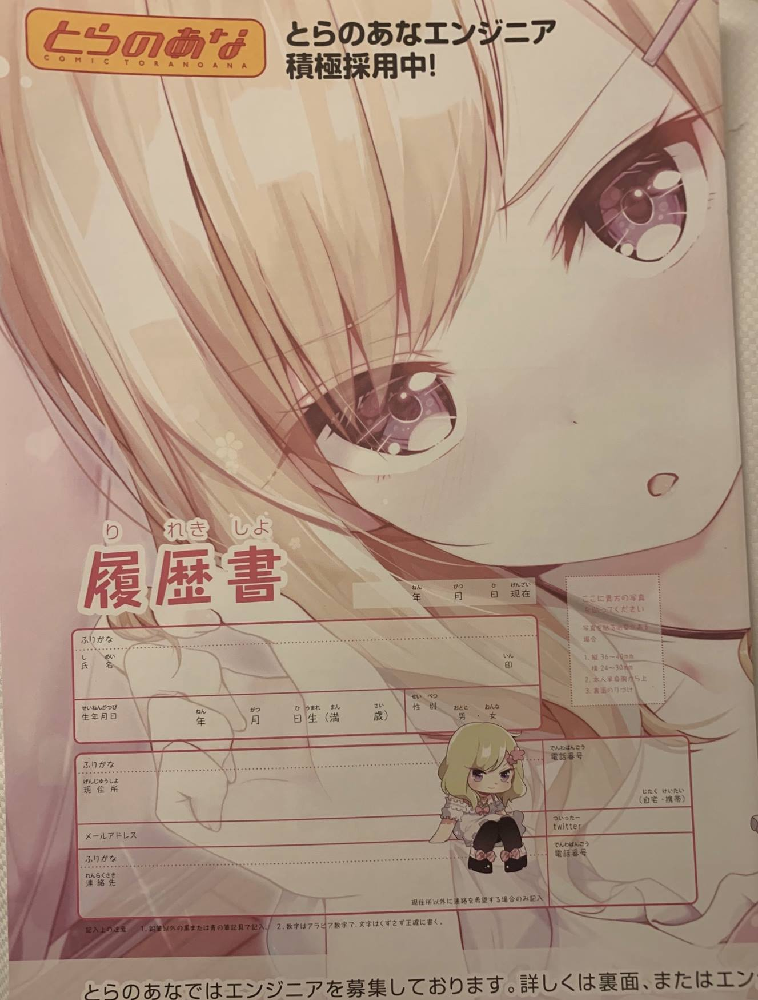
**이미지 캡션:** 이 사진은 일본의 만화 및 애니메이션 관련 상품 판매점인 '토라노아나'의 엔지니어 채용 공고로 보이는 문서의 일부입니다. 문서의 상단에는 '토라노아나 엔지니어 적극 채용 중!'이라는 문구가 쓰여 있으며, 배경에는 금발의 여성 캐릭터 일러스트가 크게 그려져 있습니다. 이 여성 캐릭터는 눈이 크고 보라색 눈동자를 가지고 있으며, 부드러운 금발 머리카락이 얼굴을 감싸고 있습니다. 복장은 명확하게 보이지 않지만, 어깨 부분에 프릴 장식이 있는 것으로 추정됩니다. 문서의 하단에는 '이력서'라는 제목과 함께 이름, 생년월일, 주소, 이메일 주소, 전화번호 등을 기입하는 칸이 마련되어 있습니다. 또한, 작은 여성 캐릭터 일러스트가 이력서 칸 옆에 귀엽게 그려져 있으며, 이 캐릭터는 금발 머리에 분홍색 리본을 달고 흰색 원피스를 입고 있습니다. 문서의 전반적인 분위기는 채용 공고임에도 불구하고 일러스트 덕분에 밝고 친근한 느낌을 줍니다.월일, 주소, 이메일 주소, 전화번호 등을 기입하는 칸이 마련되어 있습니다. 또한, 작은 여성 캐릭터 일러스트가 이력서 칸 옆에 귀엽게 그려져 있으며, 이 캐릭터는 금발 머리에 분홍색 리본을 달고 흰색 원피스를 입고 있습니다. 문서의 전반적인 분위기는 채용 공고임에도 불구하고 일러스트 덕분에 밝고 친근한 느낌을 줍니다.
 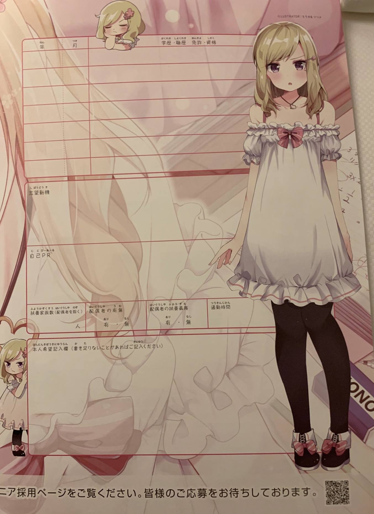
**이미지 캡션:** 이 사진은 일본어로 된 지원서 양식으로, 분홍색과 흰색이 주를 이루는 부드러운 파스텔톤 배경에 귀여운 애니메이션 스타일의 여성 캐릭터 두 명이 그려져 있습니다. 오른쪽에 있는 여성은 흰색의 프릴 달린 짧은 드레스를 입고 검은색 스타킹과 분홍색 리본이 달린 검은색 신발을 신고 있으며, 약간 놀란 듯한 표정으로 정면을 응시하고 있습니다. 왼쪽에 있는 여성 캐릭터는 더 작고, 분홍색 꽃 장식이 달린 금발 머리에 흰색 드레스를 입고 있으며, 졸린 듯한 표정으로 앉아 있습니다. 지원서 양식에는 '연', '월', '학력·직력·면허·자격', '희망 동기', '자기 PR', '부양 가족 수(배우자 제외)', '배우자 유무', '배우자 부양 의무', '통근 시간' 등의 항목이 일본어로 기재되어 있으며, 칸마다 '유', '무' 등의 선택지가 있습니다. 하단에는 "본인 희망 기입란 (기입할 내용이 더 있으면 기입해 주세요)"이라는 문구와 함께 "채용 페이지를 확인해 주세요. 여러분의 지원을 기다리고 있습니다."라는 문구가 보입니다. 전체적으로 밝고 긍정적인 분위기이며, 젊은 지원자를 대상으로 하는 채용 공고나 지원서로 보입니다.·직력·면허·자격', '희망 동기', '자기 PR', '부양 가족 수(배우자 제외)', '배우자 유무', '배우자 부양 의무', '통근 시간' 등의 항목이 일본어로 기재되어 있으며, 칸마다 '유', '무' 등의 선택지가 있습니다. 하단에는 "본인 희망 기입란 (기입할 내용이 더 있으면 기입해 주세요)"이라는 문구와 함께 "채용 페이지를 확인해 주세요. 여러분의 지원을 기다리고 있습니다."라는 문구가 보입니다. 전체적으로 밝고 긍정적인 분위기이며, 젊은 지원자를 대상으로 하는 채용 공고나 지원서로 보입니다.

### 2월 24일 (일) 13:01 · 📷 사진 (7장)

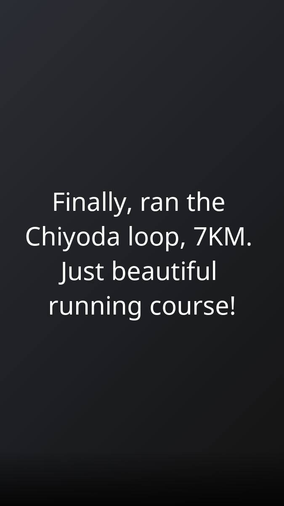
**이미지 캡션:** 이 사진은 어두운 배경에 흰색 텍스트가 표시되어 있습니다. 텍스트는 "Finally, ran the Chiyoda loop, 7KM. Just beautiful running course!"라고 쓰여 있습니다. 이 텍스트는 누군가가 도쿄의 치요다 지역을 7km 달렸으며, 그 코스가 매우 아름다웠다는 경험을 공유하는 것으로 보입니다. 사진에는 사람이 등장하지 않으며, 장소나 사물에 대한 시각적인 정보는 제공되지 않습니다. 텍스트만으로 보아 달리기 경험에 대한 긍정적인 감정을 나타내는 분위기입니다.
 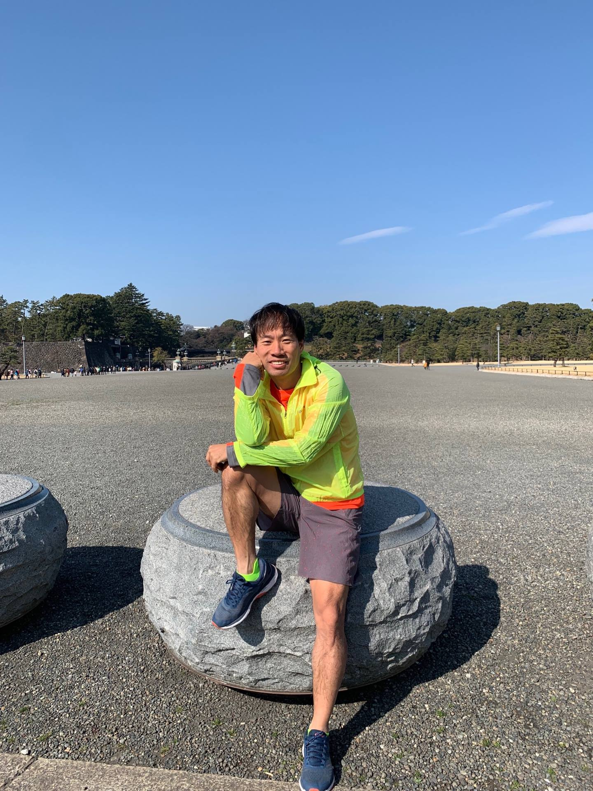
**이미지 캡션:** 맑고 푸른 하늘 아래, 한 성인 남성이 회색 자갈이 깔린 넓은 광장에 놓인 둥근 돌 위에 앉아 있다. 남성은 30대 후반에서 40대 초반으로 보이며, 짧은 검은 머리에 옅은 미소를 띠고 있다. 그는 형광 연두색과 주황색이 섞인 바람막이 재킷을 입고 있으며, 그 안에는 주황색 티셔츠가 보인다. 하의로는 무늬가 있는 회색 반바지를 착용했고, 발에는 파란색 운동화와 형광 초록색 양말을 신고 있다. 그의 왼쪽 팔은 턱에 기대어 있고, 오른쪽 팔은 무릎 위에 편안하게 올려져 있다. 배경에는 울창한 나무들이 늘어서 있고, 멀리 보이는 건물들은 역사적인 건축 양식을 띠고 있으며, 몇몇 사람들이 거닐고 있다. 광장에는 남성이 앉아 있는 돌 외에도 비슷한 모양의 다른 돌들이 놓여 있다. 전체적으로 화창한 날씨 속에서 여유롭고 활동적인 분위기를 자아낸다., 멀리 보이는 건물들은 역사적인 건축 양식을 띠고 있으며, 몇몇 사람들이 거닐고 있다. 광장에는 남성이 앉아 있는 돌 외에도 비슷한 모양의 다른 돌들이 놓여 있다. 전체적으로 화창한 날씨 속에서 여유롭고 활동적인 분위기를 자아낸다.
 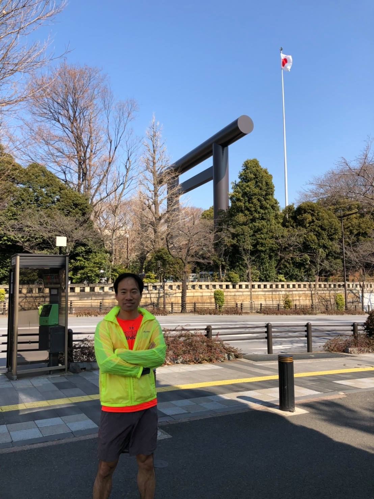
**이미지 캡션:** 한 명의 성인 남성이 밝은 형광 연두색 방풍 재킷 안에 주황색 운동복 상의를 입고 회색 반바지를 착용한 채 팔짱을 끼고 서 있다. 그는 야외에서 사진을 찍고 있으며, 배경에는 일본 국기가 게양된 높은 기둥과 거대한 갈색 도리이가 보인다. 주변에는 나무와 울타리가 있으며, 길가에는 전화 부스와 검은색 기둥이 보인다. 남성은 약간의 미소를 띠고 있으며, 전체적으로 맑고 화창한 날씨를 나타낸다.
 
**이미지 캡션:** 이 이미지는 도쿄의 지도 앱 화면을 보여주며, 파란색 선으로 표시된 경로가 도쿄 중심부를 따라 그려져 있습니다. 경로 시작점은 지도 왼쪽 상단에 있으며, 'CHO Tokyo'와 'Shinjuku'라는 텍스트가 보입니다. 경로를 따라가면 'Nippon Dental University', 'Tokyo Univ. of Sci. Fujimi Building', 'Kudanshita', 'Nippon Budokan', 'Kitanomarukoen' 등의 장소가 표시됩니다. 특히 지도 중앙에는 'The Imperial Palace'가 크게 표시되어 있으며, 경로가 그 주변을 둘러싸고 있습니다. 경로의 일부는 'Tozai Line'이라는 텍스트와 함께 표시되어 있습니다. 지도 하단에는 'Standard', 'Satellite', 'Hybrid'라는 세 가지 지도 보기 옵션이 보이며, 현재 'Standard' 옵션이 선택되어 있습니다. 전반적으로 도쿄의 주요 명소와 도로망을 보여주는 지도 화면으로, 특정 경로를 따라 이동하는 계획이나 기록을 보여주는 것으로 보입니다.Palace'가 크게 표시되어 있으며, 경로가 그 주변을 둘러싸고 있습니다. 경로의 일부는 'Tozai Line'이라는 텍스트와 함께 표시되어 있습니다. 지도 하단에는 'Standard', 'Satellite', 'Hybrid'라는 세 가지 지도 보기 옵션이 보이며, 현재 'Standard' 옵션이 선택되어 있습니다. 전반적으로 도쿄의 주요 명소와 도로망을 보여주는 지도 화면으로, 특정 경로를 따라 이동하는 계획이나 기록을 보여주는 것으로 보입니다.
 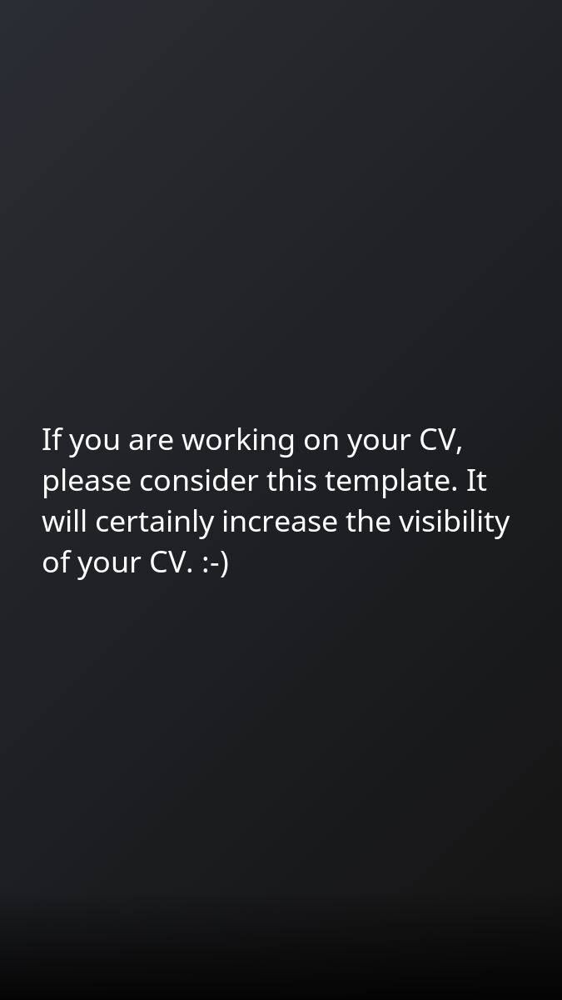
**이미지 캡션:** 이 사진에는 사람이 등장하지 않으며, 어두운 회색 배경에 흰색 텍스트가 표시되어 있습니다. 텍스트는 "If you are working on your CV, please consider this template. It will certainly increase the visibility of your CV. :-)"라고 쓰여 있으며, 이는 이력서(CV)를 작성 중인 사람에게 템플릿 사용을 고려해 보라는 제안과 함께 템플릿이 이력서의 가시성을 높여줄 것이라는 내용입니다. 마지막에 웃는 이모티콘이 있어 친근하고 긍정적인 분위기를 더합니다. 전반적으로 깔끔하고 정보 전달에 초점을 맞춘 디자인입니다.긍정적인 분위기를 더합니다. 전반적으로 깔끔하고 정보 전달에 초점을 맞춘 디자인입니다.
 
**이미지 캡션:** 이 사진은 일본의 만화 및 애니메이션 관련 상품 판매점인 '토라노아나'의 엔지니어 채용 공고로 보이는 서류의 일부입니다. 사진의 상단에는 '토라노아나' 로고와 함께 '토라노아나 엔지니어 적극 채용 중!'이라는 문구가 적혀 있습니다. 중앙에는 금발의 긴 머리를 가진 여성 캐릭터가 클로즈업되어 있으며, 눈동자는 보라색으로 반짝이고 있습니다. 이 캐릭터는 애니메이션 스타일로 그려져 있으며, 부드러운 색감과 섬세한 묘사가 돋보입니다. 사진의 하단에는 '이력서'라는 제목과 함께 이름, 생년월일, 주소, 이메일 주소, 연락처 등을 기입하는 칸이 보입니다. 또한, 작은 사이즈의 금발 여성 캐릭터 일러스트가 이력서 칸 옆에 배치되어 있습니다. 이 캐릭터는 분홍색 리본과 프릴이 달린 드레스를 입고 있으며, 귀여운 표정을 짓고 있습니다. 사진의 가장 하단에는 '토라노아나에서는 엔지니어를 모집하고 있습니다. 자세한 내용은 뒷면 또는 엔'이라는 문구가 있어 채용 공고임을 다시 한번 확인할 수 있습니다. 전반적으로 밝고 긍정적인 분위기를 풍기며, 애니메이션 팬층을 대상으로 한 채용임을 짐작할 수 있습니다.연락처 등을 기입하는 칸이 보입니다. 또한, 작은 사이즈의 금발 여성 캐릭터 일러스트가 이력서 칸 옆에 배치되어 있습니다. 이 캐릭터는 분홍색 리본과 프릴이 달린 드레스를 입고 있으며, 귀여운 표정을 짓고 있습니다. 사진의 가장 하단에는 '토라노아나에서는 엔지니어를 모집하고 있습니다. 자세한 내용은 뒷면 또는 엔'이라는 문구가 있어 채용 공고임을 다시 한번 확인할 수 있습니다. 전반적으로 밝고 긍정적인 분위기를 풍기며, 애니메이션 팬층을 대상으로 한 채용임을 짐작할 수 있습니다.
 
**이미지 캡션:** 이 사진은 일본어로 된 지원서의 일부로, 분홍색과 흰색 톤의 부드러운 배경에 두 명의 애니메이션 스타일 소녀 캐릭터가 그려져 있습니다. 왼쪽에는 금발에 분홍색 꽃 장식을 한 작은 소녀가 졸린 듯한 표정으로 앉아 있고, 오른쪽에는 긴 금발 머리에 분홍색 리본이 달린 하얀색 프릴 드레스를 입은 소녀가 서 있습니다. 이 소녀는 옅은 보라색 눈을 가지고 있으며, 약간 놀란 듯한 표정을 짓고 있습니다. 드레스는 오프숄더 디자인이며, 발에는 검은색 구두를 신고 있습니다. 사진의 하단에는 "채용 페이지를 확인해 주세요. 여러분의 많은 지원을 기다리고 있습니다."라는 문구와 함께 QR 코드가 있습니다. 지원서의 일부에는 "지원 동기", "자기 PR", "부양 가족 수", "배우자 유무", "배우자 부양 의무", "통근 시간" 등의 일본어 텍스트가 보입니다. 전체적으로 귀엽고 부드러운 분위기를 풍기며, 채용 공고와 관련된 자료임을 알 수 있습니다.여러분의 많은 지원을 기다리고 있습니다."라는 문구와 함께 QR 코드가 있습니다. 지원서의 일부에는 "지원 동기", "자기 PR", "부양 가족 수", "배우자 유무", "배우자 부양 의무", "통근 시간" 등의 일본어 텍스트가 보입니다. 전체적으로 귀엽고 부드러운 분위기를 풍기며, 채용 공고와 관련된 자료임을 알 수 있습니다.
