# 2019년 5월

[← 2019년](README.md)

### 5월 5일 (일) 09:34 · Heading to ICLR @ New Orleans! See you t…

Heading to ICLR @ New Orleans! See you there!!

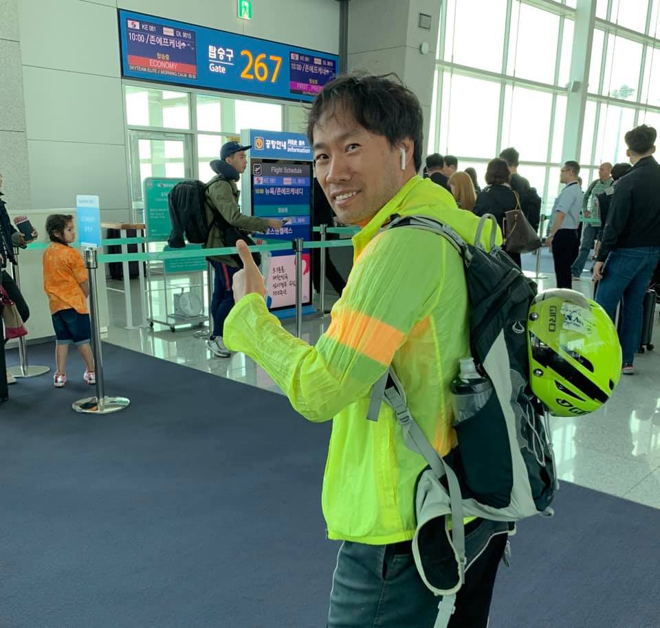
**이미지 캡션:** 공항 탑승구 앞에서 한 성인 남성이 밝은 형광 연두색 재킷과 회색 배낭을 메고 카메라를 향해 엄지손가락을 치켜들고 있다. 남성은 30대 후반에서 40대 초반으로 보이며, 짧은 검은 머리에 흰색 이어폰을 끼고 있다. 그의 표정은 활기차고 긍정적이다. 배낭에는 밝은 형광 연두색 헬멧이 달려 있으며, 물병도 보인다. 배경에는 다른 승객들이 줄을 서 있고, 전광판에는 '탑승구 267'과 항공편 정보가 표시되어 있다. 또한, 파란색과 흰색으로 된 안내 표지판들이 보인다. 전반적으로 여행을 떠나는 설렘과 기대감이 느껴지는 분위기이다.

### 5월 5일 (일) 10:17 · 📷 사진 (1장)

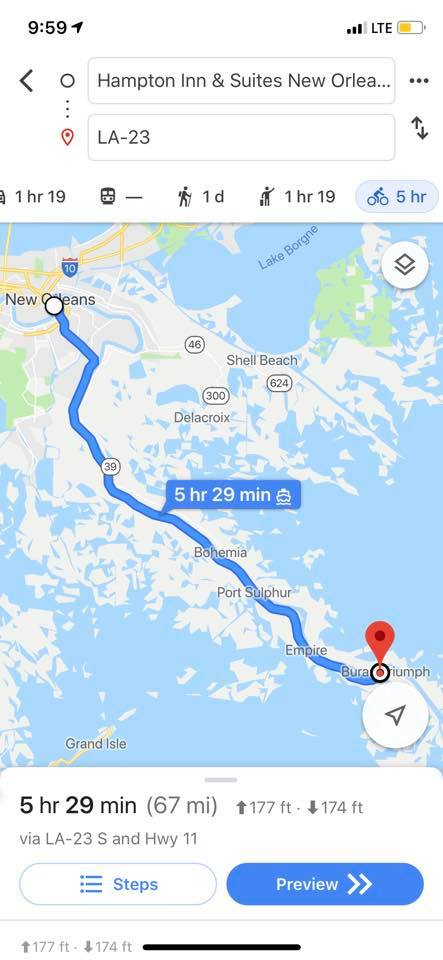
**이미지 캡션:** 이것은 휴대폰 화면을 캡처한 것으로, 구글 지도 앱에서 뉴올리언스에서 시작하여 LA-23번 도로를 따라 남쪽으로 향하는 경로를 보여줍니다. 경로는 67마일(약 108km)이며, 5시간 29분이 소요될 것으로 예상됩니다. 지도에는 셸 비치, 델라크루아, 보헤미아, 포트 설퍼, 엠파이어, 버라 트라이엄프와 같은 지역 이름이 표시되어 있으며, 최종 목적지는 지도에 빨간색 핀으로 표시되어 있습니다. 화면 상단에는 "Hampton Inn & Suites New Orleans"라는 텍스트가 보이며, 이는 목적지 또는 경유지 중 하나일 수 있습니다. 또한, 현재 시간은 오전 9시 59분이며 LTE 신호가 잡혀 있습니다. 화면 하단에는 "Steps"와 "Preview" 버튼이 보입니다. 전반적으로 여행 계획 또는 길찾기 상황을 보여주는 이미지입니다.

### 5월 6일 (월) 09:34 · 📷 사진 (1장)

**이미지 캡션:** 공항 탑승구 앞에서 한 성인 남성이 밝은 형광 연두색 바람막이 점퍼와 회색 배낭을 메고 카메라를 보며 엄지손가락을 치켜들고 있다. 남성은 30대 후반에서 40대 초반으로 보이며, 짧은 검은색 머리에 흰색 무선 이어폰을 착용하고 있다. 그의 표정은 밝고 활기차 보인다. 배낭 옆에는 노란색 헬멧이 달려 있다. 배경에는 탑승구 번호 267이 적힌 전광판과 다른 승객들이 보이며, 이는 공항의 탑승 구역임을 알 수 있다. 전광판에는 '탑승구 267', '10:00/존에프케네디' 등의 정보가 한국어로 표시되어 있다. 또한, '공항안내 Information'이라는 문구와 함께 비행 스케줄 정보가 담긴 안내판도 보인다. 전반적으로 여행을 떠나기 전 설레는 분위기를 느낄 수 있다.

> Heading to ICLR @ New Orleans! See you there!!

### 5월 6일 (월) 21:17 · Good morning New Orleans, Hello Mississi…

Good morning New Orleans, Hello Mississippi River! A fun sunrise run!!

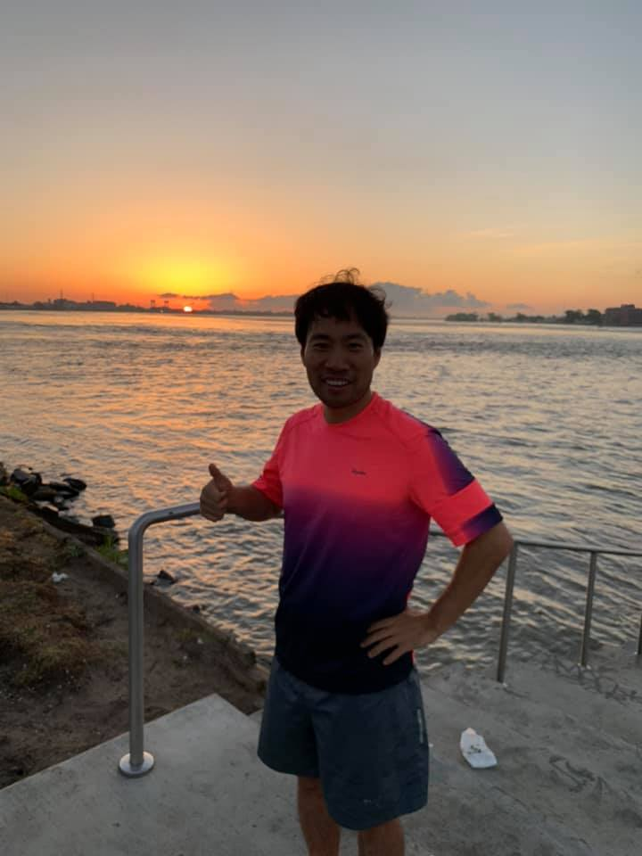
**이미지 캡션:** 한 명의 성인 남성이 석양을 배경으로 서 있습니다. 남성은 30대 후반에서 40대 초반으로 보이며, 짧은 검은색 머리에 웃는 표정을 짓고 있습니다. 그는 핑크색과 보라색이 그라데이션 된 반팔 운동복 상의와 회색 반바지를 입고 있습니다. 오른손으로는 엄지척을 하고 있고, 왼손은 허리에 얹고 있습니다. 배경에는 잔잔한 바다가 보이고, 수평선 너머로 해가 지고 있어 하늘이 주황색과 분홍색으로 물들어 있습니다. 바닷가에는 계단과 난간이 보이며, 난간 옆에는 흰색 물체가 놓여 있습니다. 전체적으로 평화롭고 활동적인 분위기를 자아냅니다.
 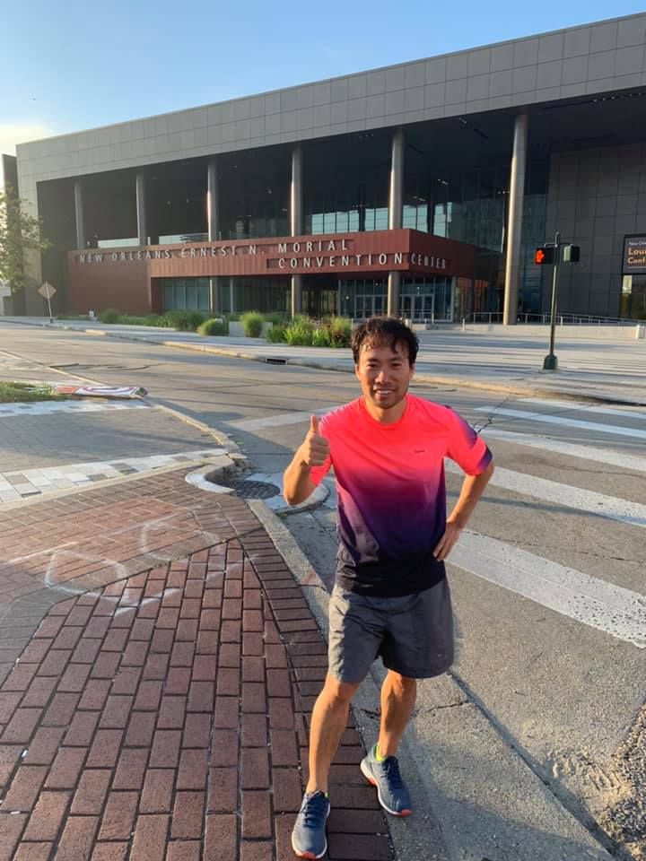
**이미지 캡션:** 한 명의 성인 남성이 뉴올리언스 어니스트 N. 모리얼 컨벤션 센터 앞에서 엄지손가락을 치켜들고 있다. 남성은 20대 후반에서 30대 초반으로 보이며, 짧은 검은 머리에 옅은 갈색 피부를 가지고 있다. 그는 붉은색에서 보라색으로 그러데이션되는 반팔 운동복 상의와 회색 반바지, 파란색 운동화를 착용하고 있다. 그의 표정은 밝고 긍정적이며, 한 손은 허리에 얹고 다른 한 손으로는 엄지손가락을 보여주고 있다. 배경에는 거대한 컨벤션 센터 건물이 보이며, 건물에는 "NEW ORLEANS ERNEST N. MORIAL CONVENTION CENTER"라는 글자가 쓰여 있다. 주변에는 도로와 보도블록이 있으며, 횡단보도와 신호등도 보인다. 전체적으로 맑은 날씨에 야외에서 활동적인 모습을 담은 사진으로, 긍정적이고 활기찬 분위기를 풍긴다.
 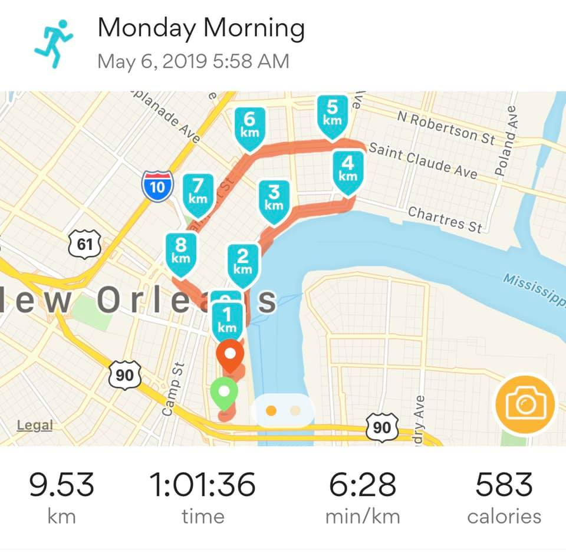
**이미지 캡션:** 이것은 월요일 아침 5시 58분에 찍힌 운동 기록 화면으로, 2019년 5월 6일로 표시되어 있습니다. 화면 상단에는 달리는 사람 아이콘과 함께 "Monday Morning"이라는 제목과 날짜 및 시간이 보입니다. 중앙에는 뉴올리언스 지역의 지도가 표시되어 있으며, 강(미시시피 강으로 추정)을 따라 오렌지색으로 표시된 운동 경로와 함께 1km부터 8km까지의 구간별 기록이 파란색 핀으로 나타나 있습니다. 지도에는 "New Orleans", "Chartres St", "Saint Claude Ave", "N Robertson St", "Poland Ave", "Camp St", "Dry Ave" 등의 도로명과 "61", "10", "90"과 같은 고속도로 번호가 보입니다. 화면 하단에는 총 운동 거리 9.53km, 총 시간 1시간 1분 36초, 평균 페이스 6분 28초/km, 소모 칼로리 583kcal가 표시되어 있습니다. 오른쪽 하단에는 카메라 아이콘이 있어 운동 중 사진을 촬영했음을 암시합니다. 전반적으로 운동 기록 앱의 화면으로 보이며, 아침 일찍 뉴올리언스 지역에서 조깅이나 달리기를 한 기록을 보여줍니다.

### 5월 6일 (월) 23:03 · #iclr2019

#iclr2019

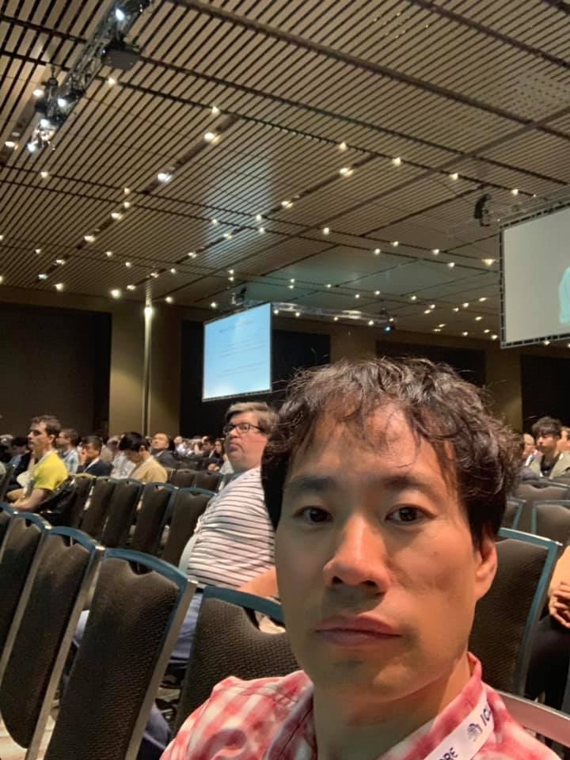
**이미지 캡션:** 사진에는 한국인 성인 남성이 셀카를 찍고 있으며, 그는 30대 후반에서 40대 초반으로 보이며 짧은 검은 머리에 옅은 피부를 가지고 있습니다. 그는 붉은색과 흰색 체크무늬 셔츠를 입고 있으며, 표정은 무표정하지만 약간의 미소를 띠고 있습니다. 배경에는 많은 사람들이 앉아 있는 대규모 강당이 보이며, 천장에는 조명과 격자 무늬 디자인이 있습니다. 강당에는 두 개의 큰 스크린이 있으며, 하나는 흰색이고 다른 하나는 파란색 텍스트가 표시되어 있습니다. 사람들은 회의나 프레젠테이션에 참석한 것으로 보이며, 전반적인 분위기는 공식적이고 전문적입니다. 사진의 오른쪽 하단에는 "BEIC"라는 글자가 희미하게 보입니다.
 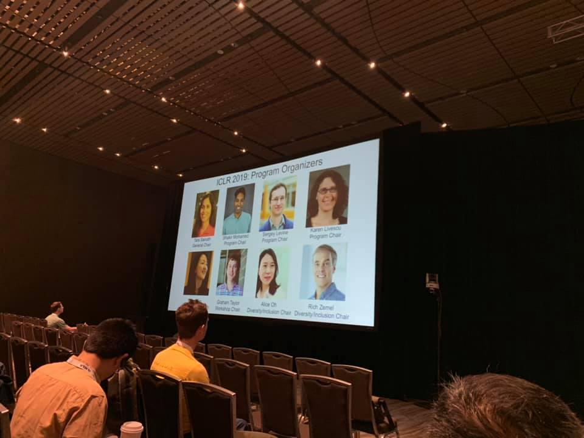
**이미지 캡션:** 이 사진은 ICLR 2019 컨퍼런스의 프로그램 주최자들을 소개하는 슬라이드가 상영되고 있는 강연장 내부를 보여줍니다. 슬라이드에는 6명의 사람들의 사진과 이름, 직책이 나열되어 있습니다. 왼쪽 상단부터 시계 방향으로, 첫 번째 사진에는 붉은색 상의를 입은 여성, 두 번째 사진에는 파란색 셔츠를 입은 남성, 세 번째 사진에는 안경을 쓴 남성이 보입니다. 이들은 모두 프로그램 주최자 또는 프로그램 의장으로 소개되어 있습니다. 아래 줄에는 갈색 상의를 입은 여성, 체크무늬 셔츠를 입은 남성, 그리고 마지막으로 검은색 상의를 입은 여성이 보이며, 이들 역시 워크숍 의장 또는 다양성 및 포용성 의장으로 소개되어 있습니다. 강연장에는 여러 줄의 좌석이 있으며, 일부 좌석에는 사람들이 앉아 있습니다. 앞쪽 좌석에는 노란색 셔츠를 입은 남성과 갈색 셔츠를 입은 남성이 보이며, 이들은 슬라이드를 바라보고 있습니다. 뒤쪽 좌석에도 몇몇 사람들이 앉아 있으며, 일부는 슬라이드를 보고 있거나 다른 방향을 보고 있습니다. 강연장 천장은 조명이 설치된 격자무늬 디자인이며, 벽은 어두운 색입니다. 전반적으로 학술 행사나 컨퍼런스의 분위기를 띠고 있습니다.
 
**이미지 캡션:** 이 사진은 ICLR 2019 스폰서 목록을 보여주는 대형 스크린을 촬영한 것으로, 다양한 기술 기업들의 로고와 이름이 줄지어 표시되어 있습니다. 사진에는 사람이 보이지 않으며, 배경은 어두운 천장과 조명으로 인해 스크린에 초점이 맞춰져 있습니다. 스크린에는 GRAPHCORE, Microsoft, Salesforce, Facebook, Google, DeepMind, OpenAI, NAVER LINE, IBM Research, Qualcomm AI research, Scale, Lambda, nnaisense, Preferred Networks, TWO SIGMA, Uber, ELEMENTAI, amazon.com, DE Shaw & Co, Capital One, King Abdullah University of Science and Technology, ByteDance, BOREALIS AI, [XTX] MARKETS, Jane Street, Intel AI, HRT hudson river trading, Expedia 등 다수의 기업 로고와 이름이 각기 다른 색상과 글꼴로 나타나 있습니다. 각 기업 로고는 해당 기업의 브랜드를 나타내며, 스폰서 목록은 여러 줄로 나뉘어 배치되어 있습니다. 전반적으로 이 사진은 ICLR 2019 컨퍼런스의 후원사들을 소개하는 공식적인 발표 자료의 일부로 보이며, 기술 및 인공지능 분야의 주요 기업들이 후원했음을 알 수 있습니다.

### 5월 7일 (화) 06:30 · 📷 사진 (46장)

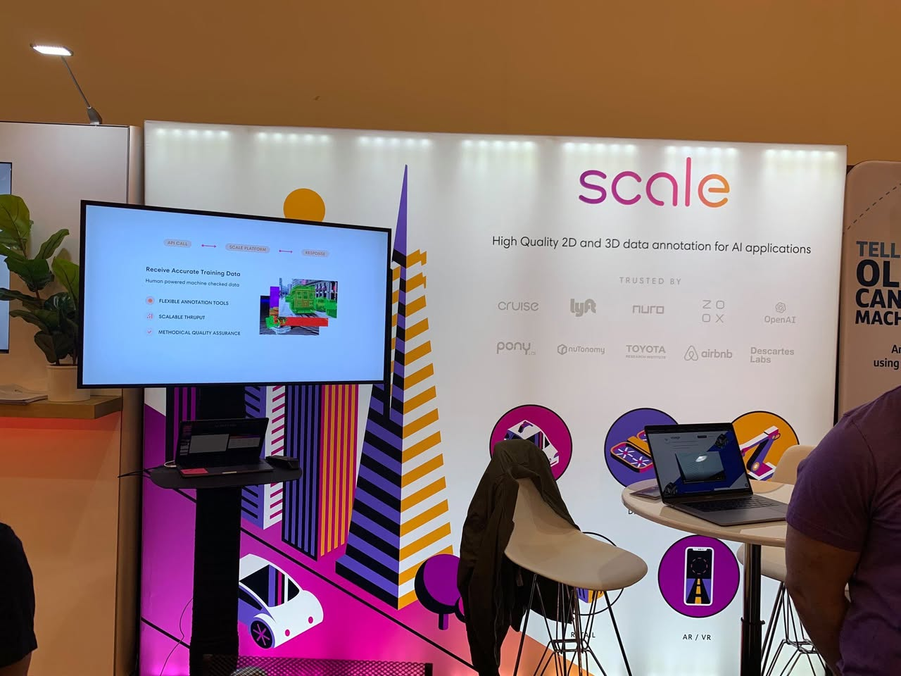
**이미지 캡션:** 이 사진은 Scale이라는 회사의 부스를 보여주며, AI 애플리케이션을 위한 고품질 2D 및 3D 데이터 주석 서비스를 홍보하고 있습니다. 부스 중앙에는 Scale 로고와 함께 "High Quality 2D and 3D data annotation for AI applications"라는 문구가 적힌 대형 조명 패널이 있습니다. 그 아래에는 Cruise, Lyft, Nuro, Zoox, OpenAI, Pony.ai, nuTonomy, Toyota, Airbnb, Descartes Labs 등 Scale의 주요 고객사 로고들이 나열되어 있습니다. 부스 왼쪽에는 대형 TV 화면이 설치되어 있으며, 화면에는 "Receive Accurate Training Data"라는 제목과 함께 API 호출, Scale 플랫폼, 응답의 과정을 보여주는 다이어그램, 그리고 유연한 주석 도구, 확장 가능한 처리량, 체계적인 품질 보증이라는 서비스 특징들이 나열되어 있습니다. TV 화면 아래에는 노트북이 놓여 있으며, 부스 오른쪽에는 테이블과 의자가 배치되어 있고, 테이블 위에는 또 다른 노트북과 AR/VR 관련 이미지가 담긴 스마트폰이 놓여 있습니다. 배경에는 추상적인 도시 풍경과 함께 Scale의 로고 색상과 유사한 보라색, 주황색, 노란색, 흰색의 기하학적인 패턴이 그려져 있습니다. 부스에는 몇몇 사람들이 보이지만, 그들의 얼굴은 명확하게 보이지 않아 성인 남성 또는 성인 여성으로만 묘사할 수 있습니다. 전반적으로 깔끔하고 현대적인 디자인으로, 기술 박람회나 컨퍼런스의 부스임을 알 수 있습니다.
 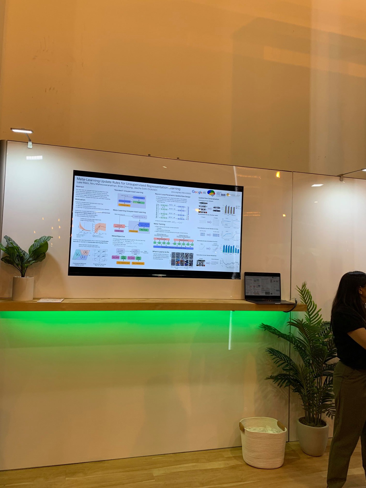
**이미지 캡션:** 한 성인 여성이 검은색 상의와 녹색 바지를 입고 서 있으며, 그녀는 오른쪽으로 몸을 돌리고 있습니다. 그녀는 밝은 조명이 켜진 흰색 벽 앞에 서 있고, 벽에는 "Meta-Learning Update Rules for Unsupervised Representation Learning"이라는 제목의 프레젠테이션이 표시된 대형 화면이 있습니다. 화면에는 복잡한 다이어그램, 그래프 및 텍스트가 포함되어 있으며, "Google AI" 로고도 보입니다. 화면 아래에는 녹색 조명이 켜진 선반이 있고, 그 위에는 화분에 심은 식물과 노트북이 놓여 있습니다. 바닥에는 흰색 바구니가 있습니다. 전체적인 분위기는 현대적이고 기술적인 느낌을 줍니다.
 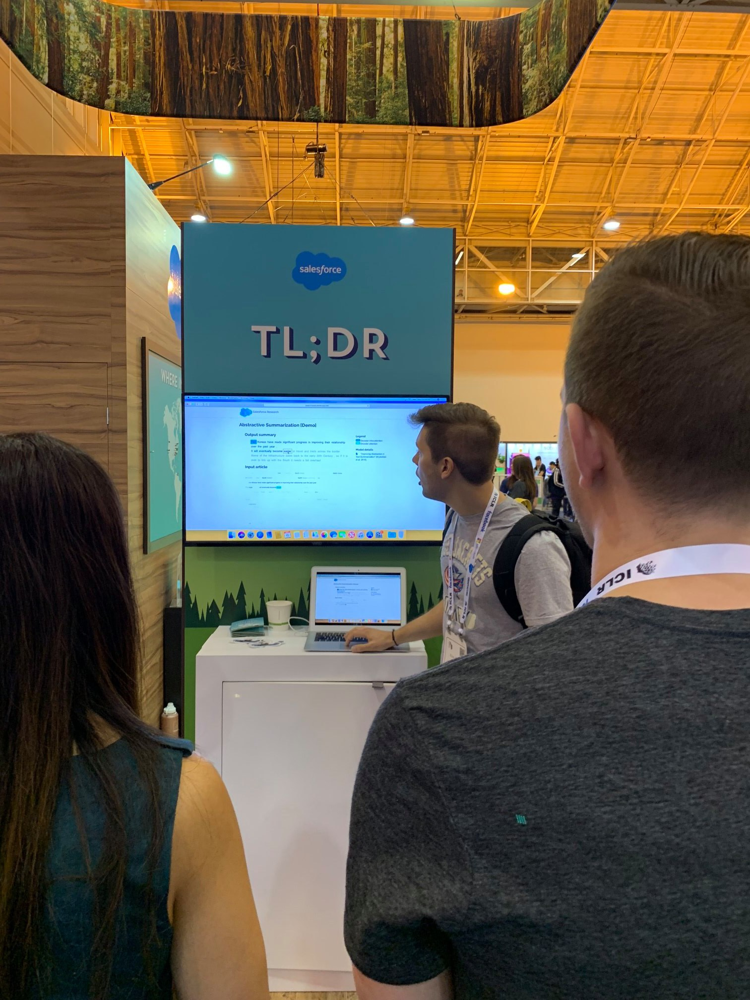
**이미지 캡션:** A young adult male with short, styled brown hair and a light complexion is standing at a white podium, gesturing towards a laptop screen. He is wearing a grey t-shirt with a backpack slung over one shoulder and a lanyard around his neck. In front of him, a large screen displays the Salesforce logo and the text "TL;DR" in large, bold letters, with a detailed interface below it showing "Abstractive Summarization [Demo]" and "input article" and "output summary" sections. To the left of the podium, a young adult female with long, dark brown hair is visible from the back, wearing a dark teal sleeveless top. To the right, the back of another adult male is visible, wearing a dark grey t-shirt with a white lanyard that has "ICLR" printed on it. The background features a large, curved banner depicting a forest of tall trees, and the ceiling of a convention hall with exposed yellow beams and lighting fixtures. The overall atmosphere appears to be a tech conference or exhibition booth, with a focus on a demonstration of an AI summarization tool.
 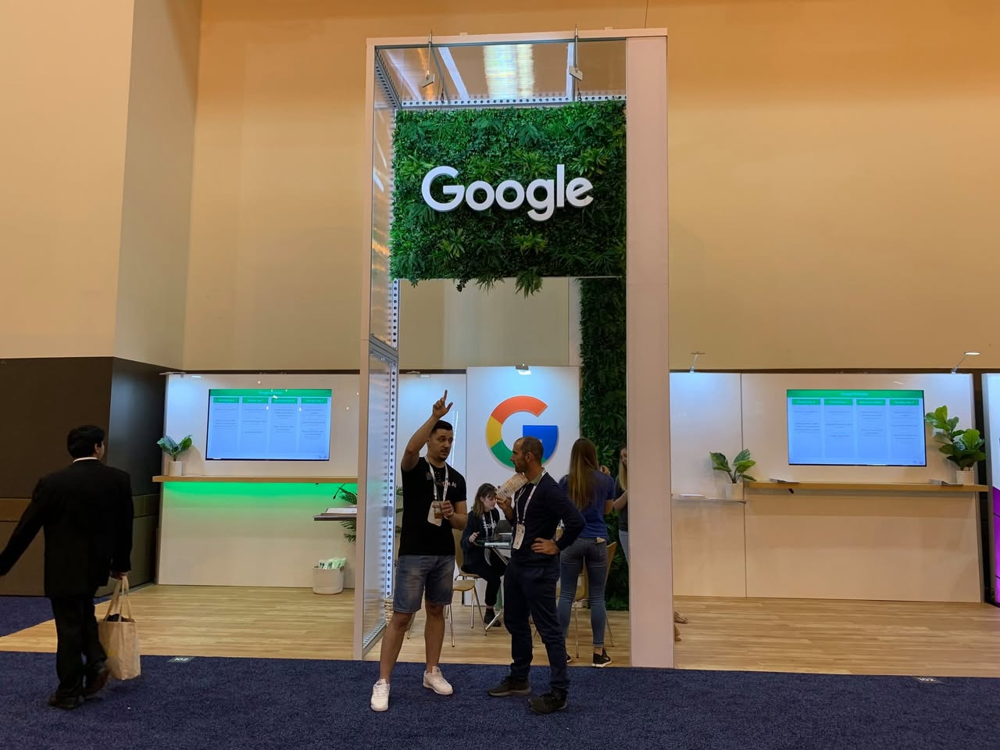
**이미지 캡션:** 행사장에 설치된 구글 부스에서 두 명의 성인 남성이 대화를 나누고 있으며, 한 명은 검은색 반팔 티셔츠와 청바지 반바지, 흰색 운동화를 착용하고 손가락으로 무언가를 가리키고 있고, 다른 한 명은 어두운 색 상의와 바지를 입고 서 있습니다. 부스 뒤편에는 녹색 식물 벽과 함께 커다란 흰색 "Google" 로고가 보이며, 그 아래에는 구글의 상징인 다채로운 G 로고가 있습니다. 부스 양옆으로는 녹색 조명이 켜진 테이블 위에 각각 두 개의 모니터가 설치되어 있으며, 모니터에는 표 형식의 정보가 표시되어 있습니다. 부스 주변에는 몇 명의 다른 사람들이 서 있거나 지나가고 있으며, 전반적으로 행사장이나 컨퍼런스의 분위기를 띠고 있습니다.
 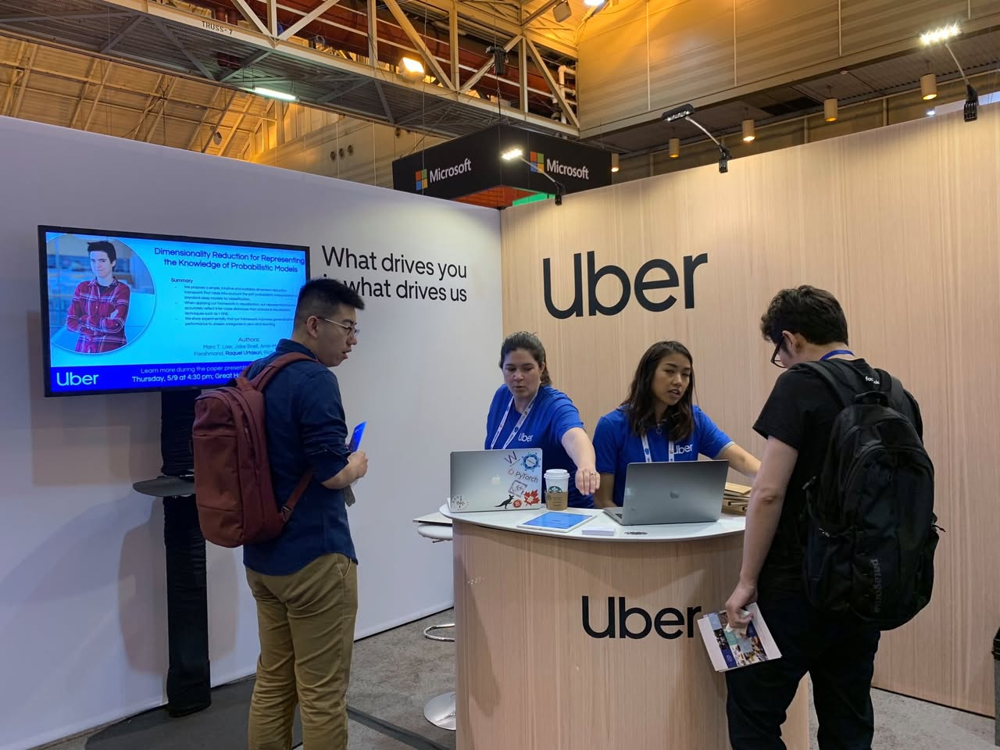
**이미지 캡션:** A young adult Asian male with glasses and a maroon backpack stands at an Uber booth, holding a blue pamphlet and looking towards a screen displaying information about "Dimensionality Reduction for Representing the Knowledge of Probabilistic Models." To his right, two young adult women in blue Uber t-shirts are working behind a counter, one of whom is speaking to another young adult male with a black backpack who is facing away from the camera. The booth has a large "Uber" logo on a wood-paneled wall, and a "Microsoft" logo is visible in the background. The overall atmosphere appears to be that of a conference or trade show, with a professional and informative setting.
 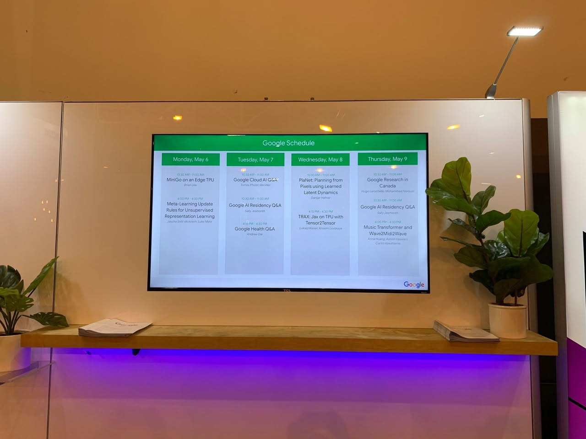
**이미지 캡션:** 이 사진은 구글 행사 일정을 보여주는 대형 스크린을 중심으로 촬영되었습니다. 스크린에는 5월 6일부터 9일까지의 구글 행사 일정이 요일별로 나열되어 있으며, 각 일정에는 시간, 행사 제목, 발표자 이름이 포함되어 있습니다. 예를 들어, 5월 6일 월요일에는 "MiniGo on an Edge TPU"와 "Meta-Learning Update Rules for Unsupervised Representation Learning" 행사가 있습니다. 스크린 아래에는 나무 화분 두 개가 놓여 있고, 스크린 뒤쪽 벽면에는 조명이 설치되어 있습니다. 전체적으로 깔끔하고 현대적인 분위기를 자아내며, 기술 관련 행사장이나 전시 부스의 일부로 보입니다.
 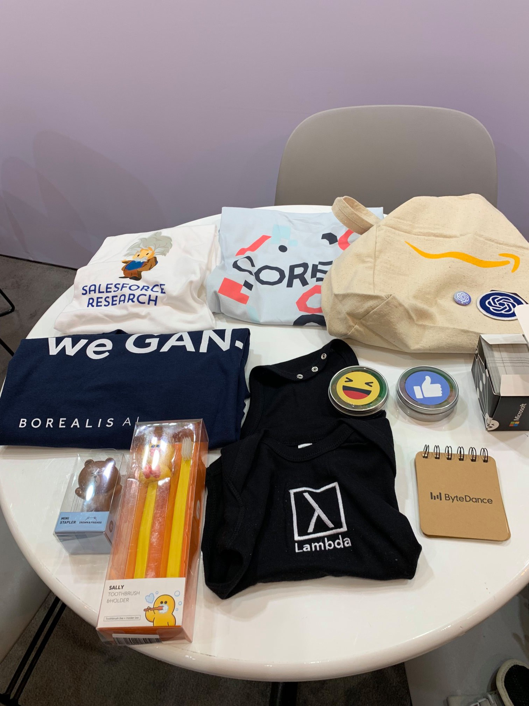
**이미지 캡션:** 흰색 티셔츠에는 Salesforce Research라고 적혀 있고, 파란색 티셔츠에는 "We GAN."이라고 적혀 있으며, 검은색 아기 옷에는 Lambda라는 글자와 함께 람다 기호가 새겨져 있습니다. 또한, 베이지색 토트백에는 아마존 로고와 함께 파란색과 흰색의 원형 뱃지가 달려 있습니다. 테이블 위에는 곰돌이 모양의 스테이플러, 노란색과 주황색 칫솔 세트, 웃는 얼굴과 엄지척 이모티콘이 그려진 원형 틴케이스, 그리고 ByteDance라고 적힌 작은 노트가 놓여 있습니다. 배경에는 회색 의자와 연보라색 벽이 보이며, 전반적으로 IT 관련 행사나 프로모션에서 제공되는 기념품들을 모아놓은 듯한 분위기입니다.
 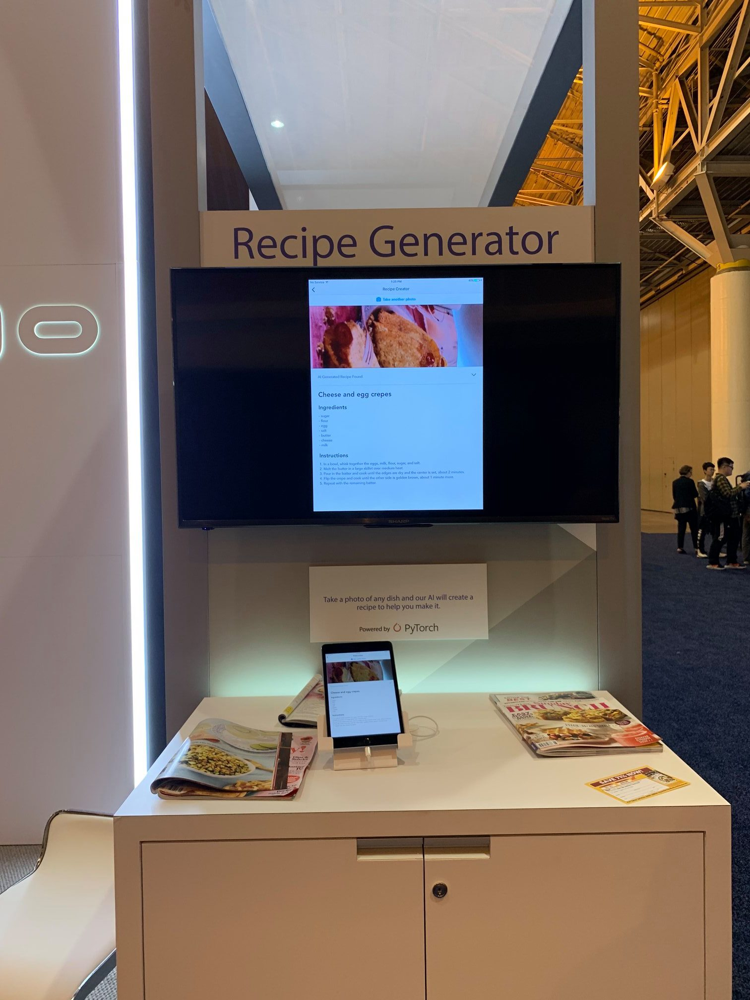
**이미지 캡션:** 이 사진은 "Recipe Generator"라고 적힌 간판이 걸린 전시 부스를 보여줍니다. 중앙에는 큰 TV 화면이 있고, 그 아래에는 태블릿 PC와 잡지가 놓여 있습니다. TV 화면에는 "Cheese and egg crepes"라는 제목의 레시피가 표시되어 있으며, 재료와 조리 방법이 나열되어 있습니다. 태블릿 PC 화면에도 같은 레시피가 보입니다. 부스에는 "Take a photo of any dish and our AI will create a recipe to help you make it."라는 문구가 적혀 있어, 이 시스템이 음식 사진을 찍으면 AI가 레시피를 생성해주는 기능을 제공함을 알 수 있습니다. 배경에는 여러 사람이 서 있고, 전시장 내부의 조명이 밝게 비추고 있습니다. 전반적으로 기술 시연 또는 홍보 행사장의 분위기를 띠고 있습니다.
 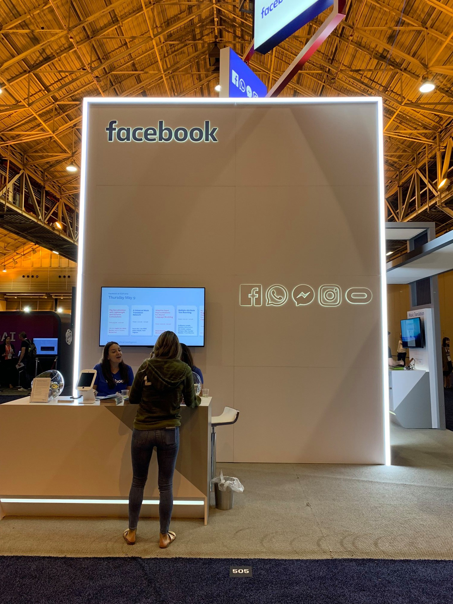
**이미지 캡션:** 이 사진은 페이스북 부스에서 열린 행사 또는 전시회의 모습이다. 중앙에는 "facebook"이라는 로고가 크게 박힌 하얀색 부스가 있고, 그 위쪽으로는 페이스북, 왓츠앱, 메신저, 인스타그램, 링크드인 등 페이스북 계열의 소셜 미디어 아이콘들이 나열되어 있다. 부스 앞쪽에는 두 명의 여성이 서 있는데, 한 명은 부스 안쪽에서 안내 데스크 역할을 하고 있고, 다른 한 명은 부스 앞에 서서 안내를 받고 있는 것으로 보인다. 안내 데스크 직원은 파란색 상의를 입고 있으며, 방문객은 카키색 후드티와 청바지를 입고 있다. 부스에는 "Thursday May 9"라고 적힌 날짜와 함께 여러 정보가 담긴 화면이 보이고, 방문객은 화면을 바라보고 있다. 배경에는 높은 천장과 조명 시설이 보이며, 이는 실내 대규모 행사장의 모습임을 짐작하게 한다. 전반적으로 깔끔하고 현대적인 분위기의 페이스북 홍보 부스임을 알 수 있다.
 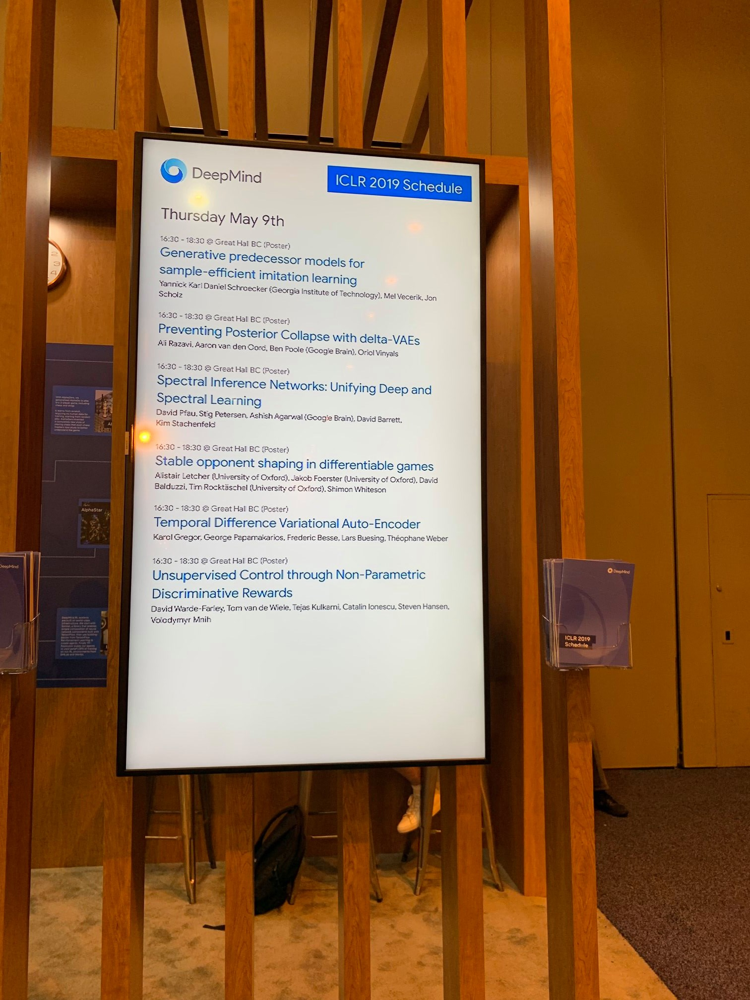
**이미지 캡션:** 이 사진은 ICLR 2019 학회 일정표를 보여주는 디지털 스크린을 중심으로 촬영되었습니다. 스크린에는 DeepMind 로고와 함께 "ICLR 2019 Schedule"이라는 제목이 표시되어 있으며, 5월 9일 목요일의 오후 4시 30분부터 6시 30분까지 진행되는 포스터 세션 일정이 시간대별로 나열되어 있습니다. 각 세션은 제목, 발표자 이름, 소속 기관이 상세하게 기재되어 있습니다. 배경은 나무 재질의 기둥과 벽으로 이루어져 있으며, 스크린 왼쪽에는 알파스타(AlphaStar) 관련 포스터가, 오른쪽에는 ICLR 2019 학회 일정표가 담긴 작은 브로슈어가 비치된 거치대가 보입니다. 스크린 아래에는 의자와 검은색 백팩이 놓여 있어 학회 참석자들이 잠시 쉬거나 소지품을 보관하는 공간임을 짐작할 수 있습니다. 전반적으로 차분하고 전문적인 학회 분위기를 나타냅니다.
 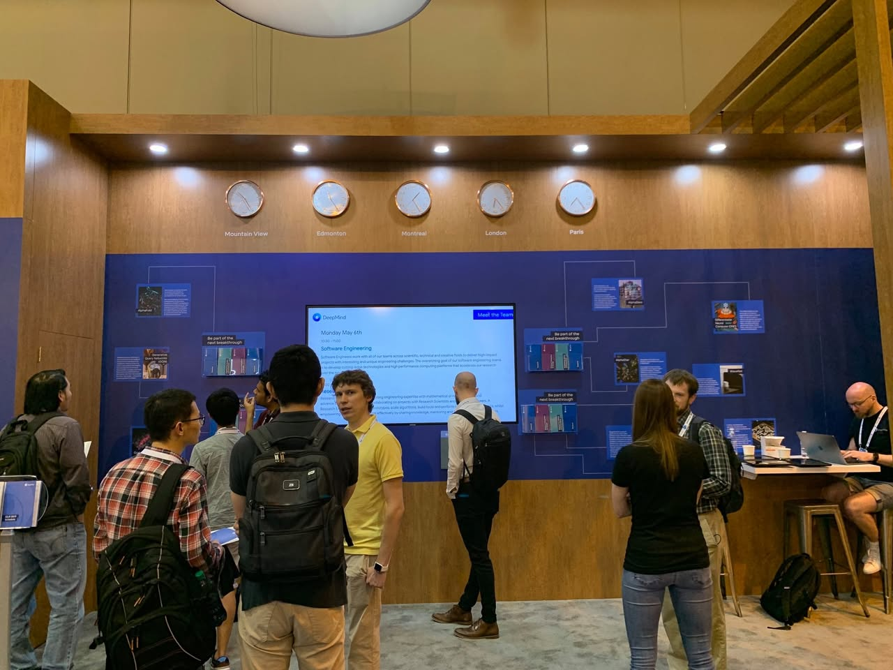
**이미지 캡션:** 이 사진은 컨퍼런스나 박람회의 부스를 보여주며, 여러 명의 사람들이 다양한 활동을 하고 있습니다. 중앙에는 파란색 배경의 벽이 있고, 그 위에는 여러 도시의 시계가 걸려 있습니다. 왼쪽부터 Mountain View, Edmonton, Montreal, London, Paris라고 표시되어 있습니다. 벽에는 "DeepMind"라는 로고와 함께 "Monday May 6th"라는 날짜와 "Software Engineering"이라는 제목이 적힌 스크린이 보입니다. 스크린에는 소프트웨어 엔지니어링에 대한 설명이 쓰여 있으며, "Meet the Team"이라는 버튼도 있습니다. 벽에는 여러 개의 작은 이미지와 텍스트 상자가 연결되어 있으며, "Be part of the next breakthrough"라는 문구가 반복적으로 보입니다. 사람들은 주로 젊은 성인 남성들로 보이며, 캐주얼한 복장을 하고 있습니다. 몇몇은 백팩을 메고 있으며, 서로 대화하거나 스크린을 보고 있습니다. 왼쪽에는 회색 셔츠를 입은 남성이 서 있고, 그 옆에는 체크무늬 셔츠와 백팩을 멘 남성이 있습니다. 중앙에는 노란색 티셔츠를 입은 남성이 다른 사람들과 이야기하고 있으며, 그의 뒤로는 검은색 백팩을 멘 남성이 보입니다. 오른쪽에는 검은색 티셔츠와 청바지를 입은 여성과 체크무늬 셔츠를 입은 남성이 대화하고 있습니다. 가장 오른쪽에는 흰색 티셔츠와 반바지를 입은 남성이 노트북을 사용하고 있습니다. 배경은 현대적인 컨퍼런스 부스처럼 꾸며져 있으며, 나무 재질의 천장과 조명이 보입니다. 전반적으로 활기차고 정보 교류가 이루어지는 분위기입니다.
 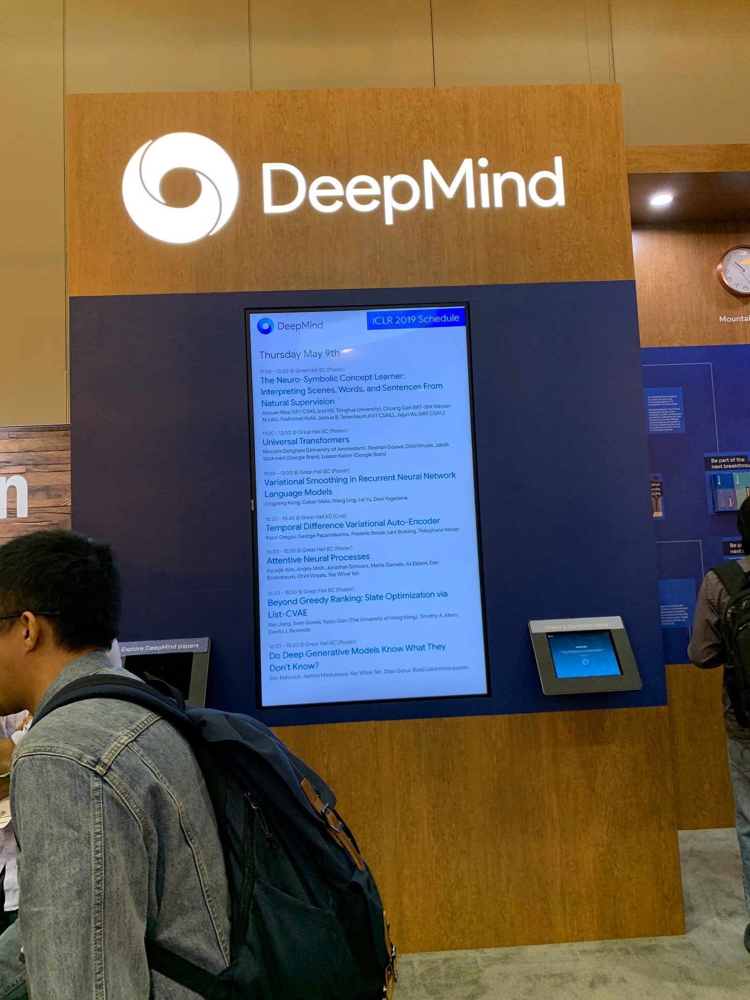
**이미지 캡션:** A young adult male with glasses and a denim jacket is walking past a DeepMind booth at a conference. He has a dark backpack on his shoulders. The booth features the DeepMind logo and a digital display showing the ICLR 2019 schedule for Thursday, May 9th, with various session titles and presenter names. The background is a warm, wooden-toned wall with some blue panels and a clock. The overall atmosphere is professional and academic, suggesting a technology or AI-related event.
 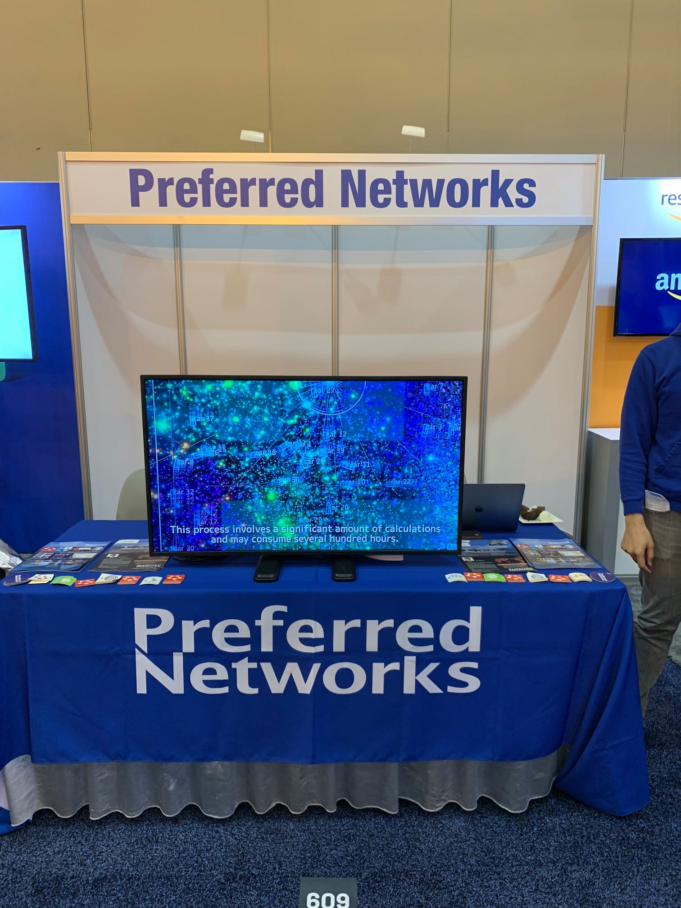
**이미지 캡션:** 전시회 부스에서 Preferred Networks라는 회사의 로고가 크게 보이는 파란색 천으로 덮인 테이블이 있고, 테이블 위에는 대형 모니터가 설치되어 있다. 모니터 화면에는 복잡한 네트워크 또는 데이터 시각화 이미지가 파란색과 녹색 계열로 표시되어 있으며, "This process involves a significant amount of calculations and may consume several hundred hours."라는 문구가 하단에 영어로 적혀 있다. 테이블 위에는 여러 종류의 브로슈어와 작은 카드들이 놓여 있으며, 모니터 옆에는 노트북이 보인다. 부스 배경에는 Preferred Networks라는 글자가 파란색으로 쓰여진 간판이 걸려 있다. 오른쪽에는 다른 부스의 일부가 보이는데, Amazon이라는 로고가 있는 화면과 파란색 상의를 입은 성인 남성이 서 있는 모습이 일부 보인다. 전체적으로 기술 관련 전시회나 컨퍼런스의 한 장면으로 보이며, 차분하고 전문적인 분위기이다.
 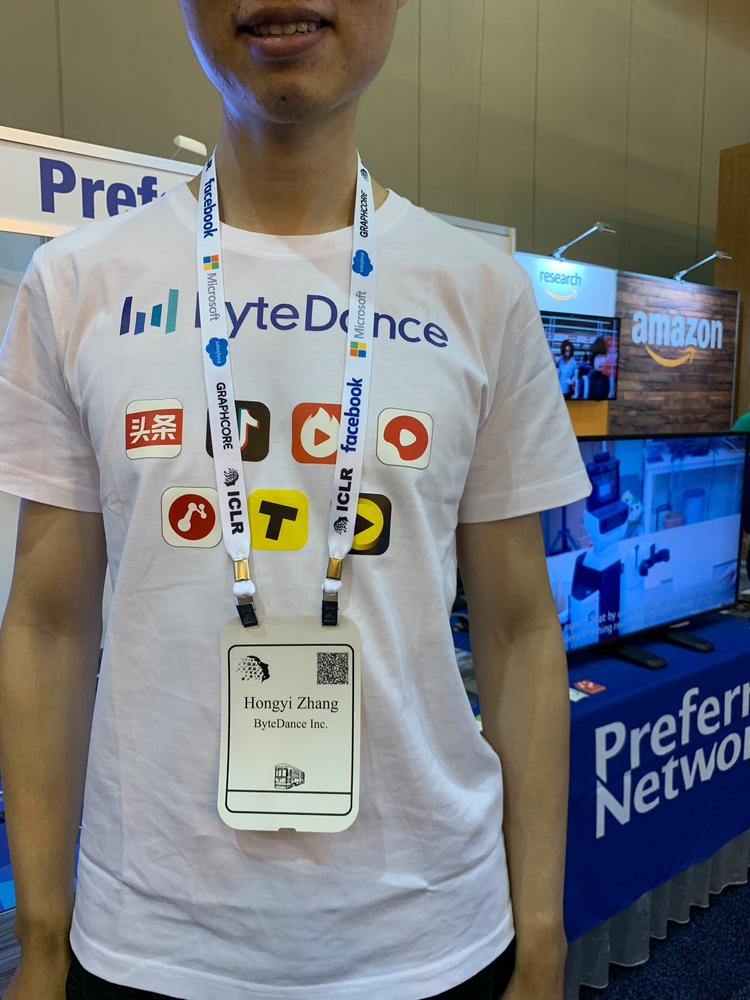
**이미지 캡션:** 이 사진은 행사장으로 보이는 곳에서 흰색 반팔 티셔츠를 입고 목에 명찰을 걸고 있는 성인 남성을 보여줍니다. 남성은 20대 후반에서 30대 초반으로 보이며, 짧은 검은 머리에 약간의 미소를 띠고 있습니다. 티셔츠에는 "ByteDance"라는 로고와 함께 여러 소셜 미디어 및 기술 회사의 아이콘이 그려져 있으며, 목에 걸린 명찰에는 "Hongyi Zhang ByteDance Inc."라는 이름과 회사명이 적혀 있습니다. 배경에는 "Prefer"와 "Network"라는 글자가 쓰인 파란색 천막과 "research" 및 "amazon"이라는 로고가 보이는 부스가 있습니다. 전반적으로 기술 컨퍼런스나 박람회와 같은 행사의 분위기를 풍깁니다.
 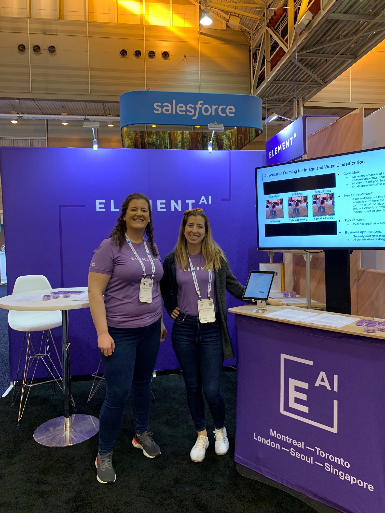
**이미지 캡션:** 두 명의 성인 여성이 보라색 티셔츠와 청바지를 입고 서 있으며, 티셔츠에는 "ELEMENT AI"라는 로고가 새겨져 있고 목에는 명찰을 달고 있습니다. 왼쪽 여성은 곱슬머리에 미소를 짓고 있고, 오른쪽 여성은 금발 머리에 미소를 짓고 있습니다. 그들은 "ELEMENT AI"라는 로고가 있는 보라색 부스 앞에 서 있으며, 부스에는 "Adversarial Framing for Image and Video Classification"이라는 제목의 프레젠테이션이 표시된 화면이 있습니다. 배경에는 "Salesforce"라는 로고가 보이며, 이는 컨퍼런스 또는 전시회와 같은 행사임을 시사합니다. 전체적인 분위기는 전문적이고 긍정적입니다.
 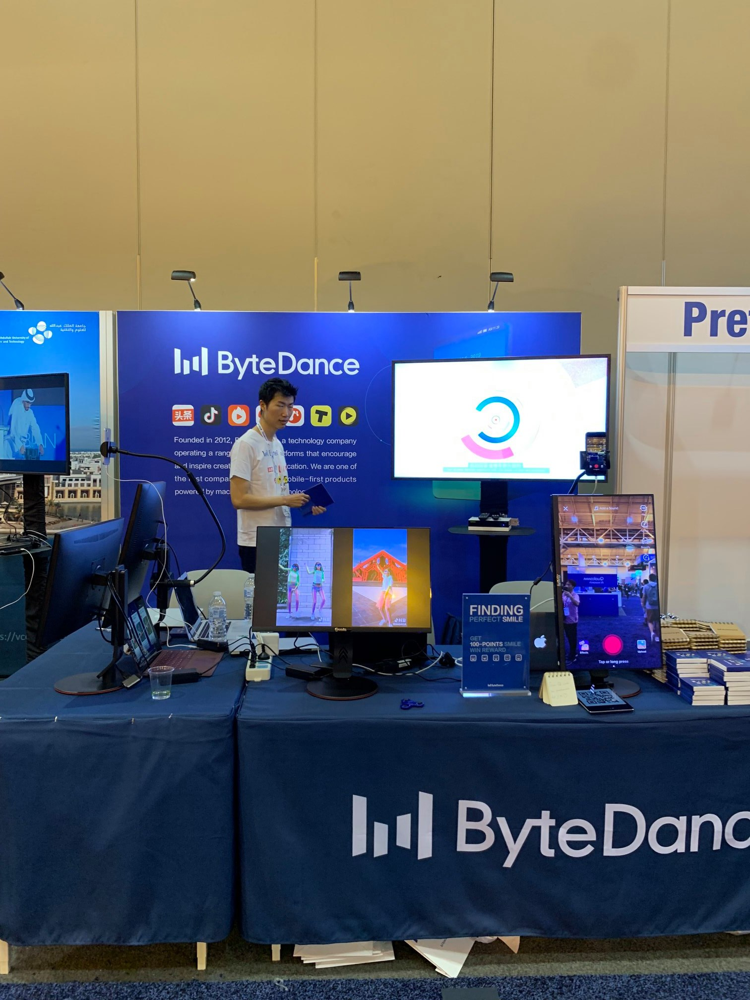
**이미지 캡션:** 행사 부스에서 한 명의 성인 남성이 서서 발표하고 있으며, 그는 흰색 티셔츠에 검은색 바지를 입고 있으며, 그의 얼굴에는 미소가 번지고 있습니다. 그의 뒤에는 파란색 배경에 "ByteDance"라는 로고와 함께 여러 아이콘이 표시된 대형 스크린이 있습니다. 스크린에는 회사의 기술과 제품에 대한 정보가 담겨 있는 것으로 보입니다. 남성의 앞에는 두 개의 테이블이 놓여 있으며, 테이블 위에는 컴퓨터 모니터, 노트북, 스마트폰, 그리고 여러 권의 책이 놓여 있습니다. 테이블보에는 "ByteDance" 로고가 크게 새겨져 있습니다. 부스 전체적으로는 기술 박람회나 컨퍼런스의 분위기를 풍기며, 깔끔하고 현대적인 느낌을 줍니다.
 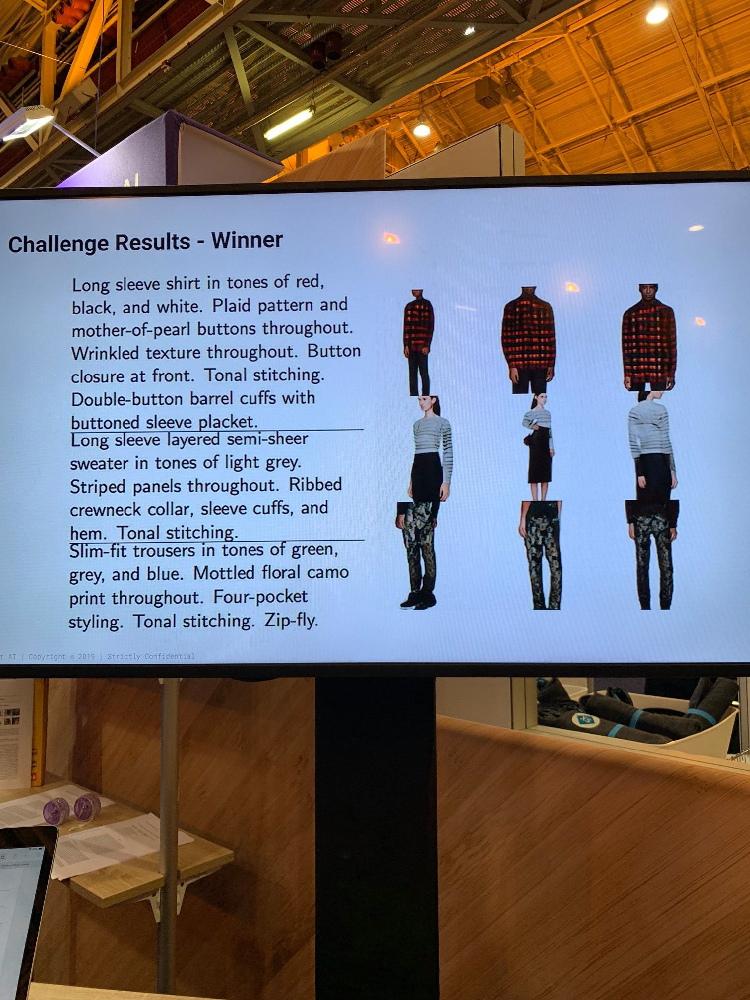
**이미지 캡션:** A presentation screen displays "Challenge Results - Winner" at the top, followed by a detailed description of a winning outfit. The outfit consists of a long-sleeved red, black, and white plaid shirt with a wrinkled texture, mother-of-pearl buttons, and double-button barrel cuffs. Below the shirt description, a long-sleeved, layered, semi-sheer sweater in light grey with striped panels, a ribbed crewneck collar, sleeve cuffs, and hem is described. Finally, slim-fit trousers in green, grey, and blue with a mottled floral camouflage print, four-pocket styling, and a zip-fly are detailed. To the right of the text, there are six headless mannequins displaying variations of the described clothing: three mannequins show the plaid shirt with trousers, and three mannequins show the grey sweater with trousers. The background of the presentation screen is a light blue, and the overall setting appears to be an indoor event or exhibition space with visible ceiling structures and lighting. Below the screen, a wooden counter is visible, with some papers and small purple objects on a shelf.
 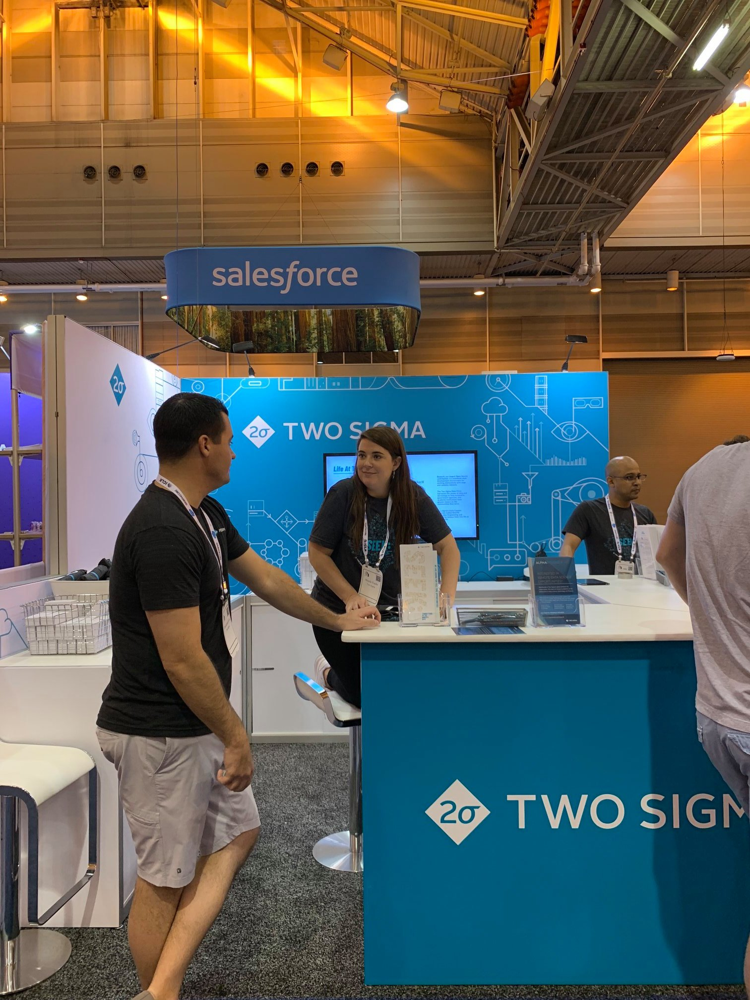
**이미지 캡션:** 이 사진은 컨퍼런스 또는 박람회 부스에서 촬영된 것으로 보이며, 여러 사람이 상호작용하고 있습니다. 중앙에는 성인 여성이 파란색 티셔츠를 입고 흰색 바 의자에 앉아 있으며, 그녀는 미소를 짓고 있으며 무언가를 설명하는 듯한 표정입니다. 그녀 앞에는 파란색 카운터가 있고, 카운터에는 "2σ TWO SIGMA"라는 로고와 함께 "Life At"이라는 문구가 보입니다. 카운터 위에는 노트북과 서류가 놓여 있습니다. 왼쪽에는 성인 남성이 검은색 티셔츠와 회색 반바지를 입고 서 있으며, 그는 여성과 대화하는 듯한 자세를 취하고 있습니다. 그의 티셔츠에는 ID 카드가 걸려 있습니다. 오른쪽에는 또 다른 성인 남성이 검은색 티셔츠를 입고 카운터 뒤에 서 있으며, 그는 화면을 보고 있는 듯합니다. 배경에는 "salesforce"라고 적힌 파란색 현수막이 걸려 있고, 그 위로는 컨퍼런스장의 높은 천장과 조명이 보입니다. 전반적으로 활기차고 정보 교류가 이루어지는 행사 분위기입니다.
 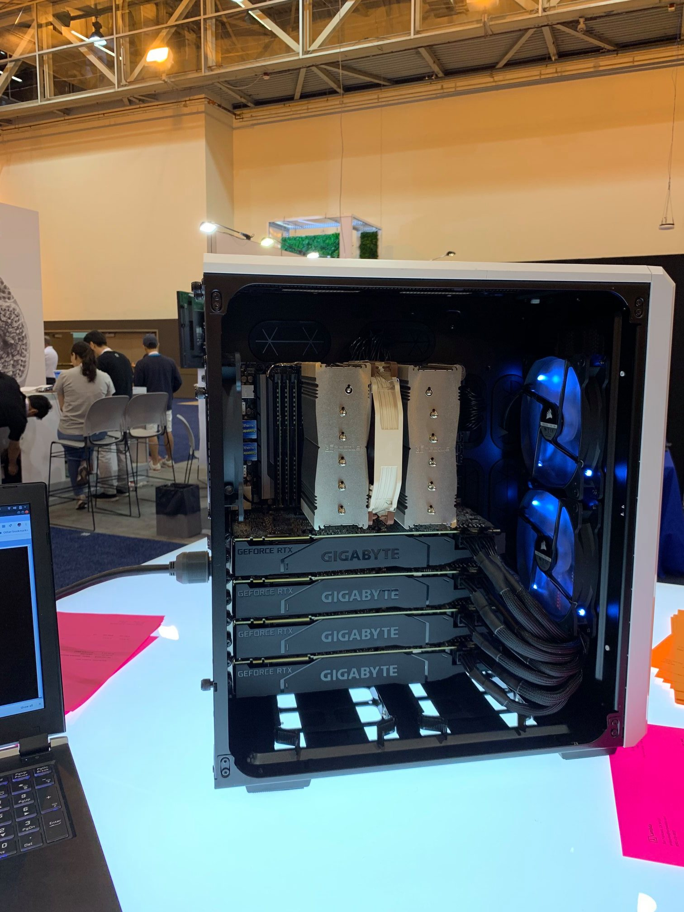
**이미지 캡션:** 전시회장으로 보이는 장소에서 흰색 컴퓨터 케이스가 열려 있는 모습이 보인다. 케이스 안에는 4개의 GIGABYTE GEFORCE RTX 그래픽 카드가 장착되어 있으며, 쿨링팬에서는 파란색 불빛이 나온다. 컴퓨터 옆에는 노트북이 놓여 있고, 배경에는 여러 사람이 서서 무언가를 보고 있다. 전반적으로 첨단 기술이나 컴퓨터 관련 전시회 분위기를 띤다.
 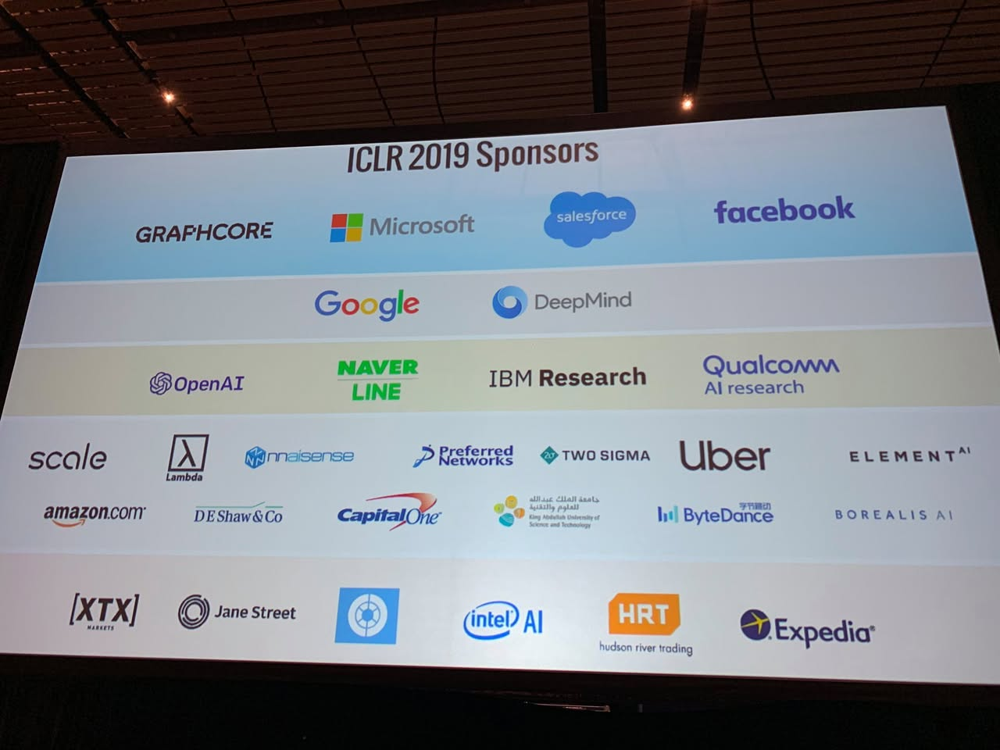
**이미지 캡션:** 이 사진은 ICLR 2019 스폰서 목록을 보여주는 대형 스크린의 모습입니다. 스크린에는 다양한 기업 로고와 이름이 여러 줄에 걸쳐 나열되어 있으며, 각 줄은 스폰서의 등급이나 종류를 나타내는 것으로 보입니다. 상단에는 "ICLR 2019 Sponsors"라는 제목이 흰색 글씨로 쓰여 있습니다. 첫 번째 줄에는 GRAPHCORE, Microsoft, salesforce, facebook 로고와 이름이 보입니다. 두 번째 줄에는 Google, DeepMind 로고와 이름이 있습니다. 세 번째 줄에는 OpenAI, NAVER LINE, IBM Research, Qualcomm AI research 로고와 이름이 나열되어 있습니다. 네 번째 줄에는 scale, Lambda, nnaisense, Preferred Networks, TWO SIGMA, Uber, ELEMENTAI 로고와 이름이 보입니다. 다섯 번째 줄에는 amazon.com, DE Shaw & Co, Capital One, King Abdullah University of Science and Technology (아랍어와 영어로 표기), ByteDance, BOREALIS AI 로고와 이름이 있습니다. 마지막 줄에는 [XTX] MARKETS, Jane Street, Intel AI, HRT hudson river trading, Expedia 로고와 이름이 보입니다. 배경은 어두운 실내이며, 스크린은 밝게 빛나고 있습니다. 스크린에는 어떤 사람도 보이지 않으며, 텍스트와 로고만 존재합니다. 전체적인 분위기는 기술 컨퍼런스의 공식적인 행사임을 나타냅니다.
 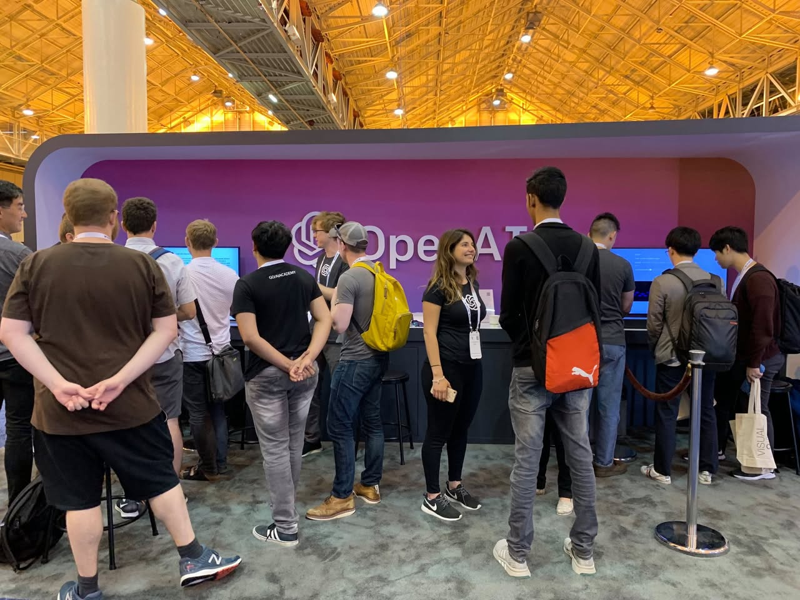
**이미지 캡션:** 이 사진은 OpenAI 부스에서 열린 행사 또는 컨퍼런스의 모습으로, 여러 명의 성인 남성과 한 명의 성인 여성이 보인다. 여성은 검은색 티셔츠와 검은색 바지를 입고 있으며, 휴대폰을 들고 미소를 짓고 있다. 그녀는 부스 직원으로 보인다. 남성들은 대부분 20대에서 30대로 추정되며, 캐주얼한 복장 차림이다. 일부는 백팩을 메고 있으며, 여러 명이 부스 뒤의 스크린을 보고 있다. 스크린에는 OpenAI 로고와 함께 텍스트가 표시되어 있다. 배경에는 컨퍼런스장의 높은 천장과 조명이 보이며, 부스 앞에는 줄을 서거나 대기하는 사람들의 모습도 보인다. 전반적으로 기술 관련 행사에서 볼 수 있는 활기찬 분위기이다.
 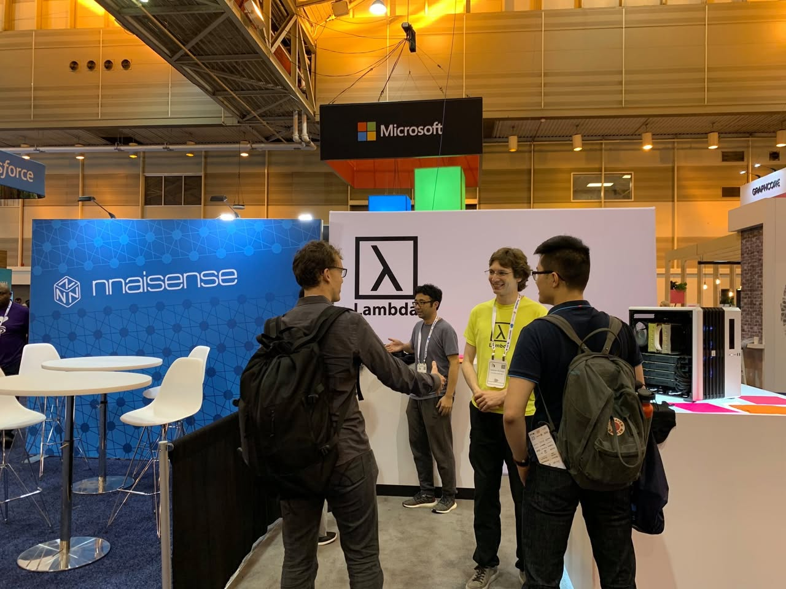
**이미지 캡션:** 전시회장으로 보이는 장소에서 여러 사람이 대화를 나누고 있다. 왼쪽에는 파란색 배경에 흰색 글씨로 "nnnaisense"라고 쓰인 부스가 보이고, 그 앞에 흰색 테이블과 의자들이 놓여 있다. 중앙에는 검은색 바탕에 흰색 람다(λ) 기호와 "Lambda"라고 쓰인 부스가 있으며, 이 부스 앞에 노란색 티셔츠를 입은 젊은 남성과 검은색 티셔츠를 입은 젊은 남성이 서서 대화하고 있다. 노란색 티셔츠를 입은 남성은 안경을 쓰고 있으며, 검은색 티셔츠를 입은 남성은 안경을 쓰지 않았다. 이들 뒤편에는 검은색 백팩을 메고 회색 옷을 입은 성인 남성이 서서 이들을 바라보고 있으며, 그의 뒤로는 흰색과 검은색이 조화된 컴퓨터 케이스가 전시된 부스가 보인다. 오른쪽 상단에는 "Microsoft"라고 쓰인 간판이 걸려 있고, 그 옆에는 "GRAPHICORE"라고 쓰인 간판도 보인다. 전반적으로 기술 관련 전시회나 컨퍼런스의 분위기를 띤다.
 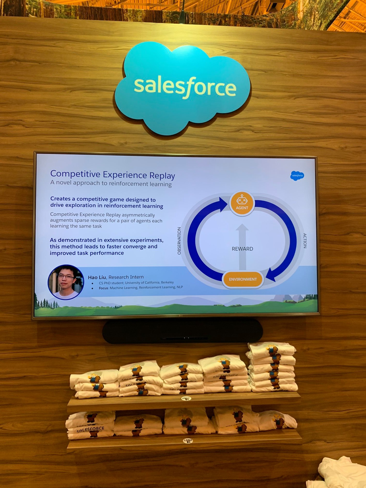
**이미지 캡션:** 이 사진은 Salesforce 로고가 있는 나무 벽을 배경으로 한 디스플레이를 보여줍니다. 화면에는 "Competitive Experience Replay"라는 제목의 프레젠테이션이 표시되며, 강화 학습에 대한 새로운 접근 방식을 설명합니다. 화면 왼쪽에는 연구 인턴인 Hao Liu의 사진과 그의 학력 및 연구 초점이 나와 있습니다. 화면 오른쪽에는 에이전트, 환경, 관찰, 행동, 보상 간의 상호 작용을 보여주는 순환 다이어그램이 있습니다. 디스플레이 아래에는 Salesforce 로고와 곰돌이 캐릭터가 그려진 흰색 티셔츠가 두 단의 선반에 쌓여 있습니다. 전반적인 분위기는 기술적이고 교육적인 행사 또는 전시회와 같은 느낌을 줍니다.
 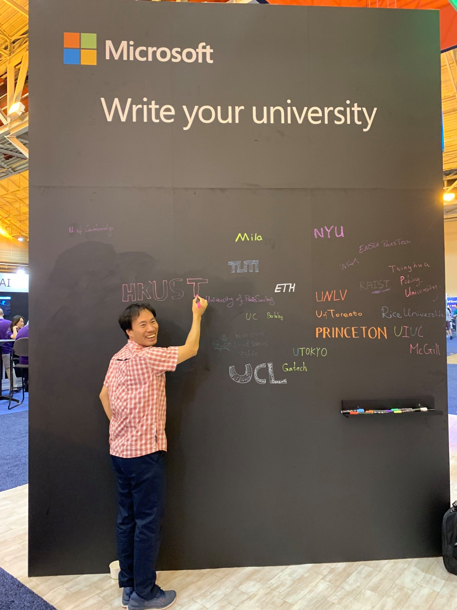
**이미지 캡션:** A middle-aged Asian man with short black hair is standing on the left side of a large black wall with the Microsoft logo and the text "Write your university" at the top. He is wearing a red and white checkered short-sleeved shirt and dark blue pants, with blue athletic shoes. He is smiling and looking towards the viewer while holding a pink marker in his right hand, poised to write on the wall. The wall is covered with names of universities and institutions written in various colors and fonts, including "U of Cambridge," "Mila," "NYU," "TUM," "HKUST," "ETH," "UC Berkeley," "UTokyo," "UCL," "Gatech," "UNLV," "KAIST," "Princeton," "UIUC," "McGill," and others. A small shelf with markers is attached to the wall on the right side. The background appears to be an indoor event or exhibition hall with bright lighting and other booths visible in the distance. The overall atmosphere is interactive and engaging, suggesting a promotional event or a collaborative activity.
 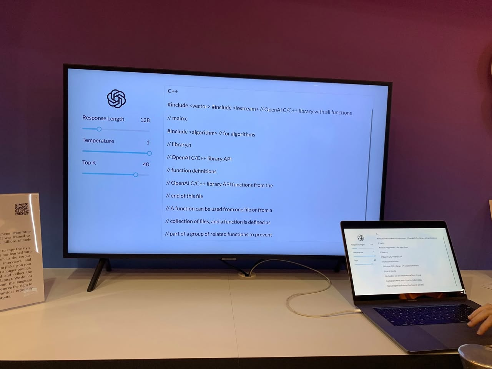
**이미지 캡션:** 한 성인 남성이 노트북을 사용하고 있으며, 노트북 화면에는 C++ 코드가 표시되어 있습니다. 노트북 옆에는 큰 TV 화면이 있고, TV 화면에도 동일한 C++ 코드와 함께 OpenAI 로고 및 몇 가지 설정 옵션(Response Length, Temperature, Top K)이 보입니다. TV 화면 왼쪽에는 텍스트가 적힌 안내문이 놓여 있습니다. 이 모든 것은 실내의 테이블 위에 놓여 있으며, 배경은 보라색 벽으로 보입니다. 전반적으로 기술 시연 또는 전시회와 같은 분위기입니다.
 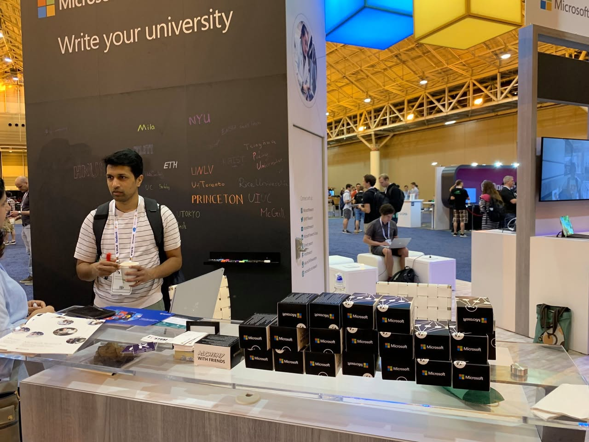
**이미지 캡션:** 이 사진은 마이크로소프트 부스에서 열린 행사로 보인다. 중앙에는 30대 후반에서 40대 초반으로 보이는 성인 남성이 흰색 티셔츠와 검은색 백팩을 메고 서 있다. 그는 오른손에 컵을 들고 있고, 왼손에는 빨간색 펜을 쥐고 있으며, 무표정하게 카메라를 응시하고 있다. 그의 뒤편 검은색 벽에는 "Write your university"라는 문구와 함께 여러 대학 이름들이 분필로 적혀 있다. 벽에는 "Mila", "NYU", "ETH", "UNLV", "UC Berkeley", "UToronto", "PRINCETON", "UIUC", "UTokyo", "McGill" 등의 대학 이름이 보인다. 부스 앞쪽에는 마이크로소프트 로고가 새겨진 검은색 상자들이 쌓여 있고, 그 옆에는 "ALCHEMY WITH FRIENDS"라고 적힌 작은 상자도 보인다. 배경에는 다른 부스들과 사람들이 보이며, 행사장 특유의 밝고 넓은 조명이 비추고 있다. 전반적으로 기술 박람회나 컨퍼런스의 한 장면으로, 대학생들을 대상으로 한 마이크로소프트의 홍보 활동이 이루어지고 있는 것으로 추정된다.
 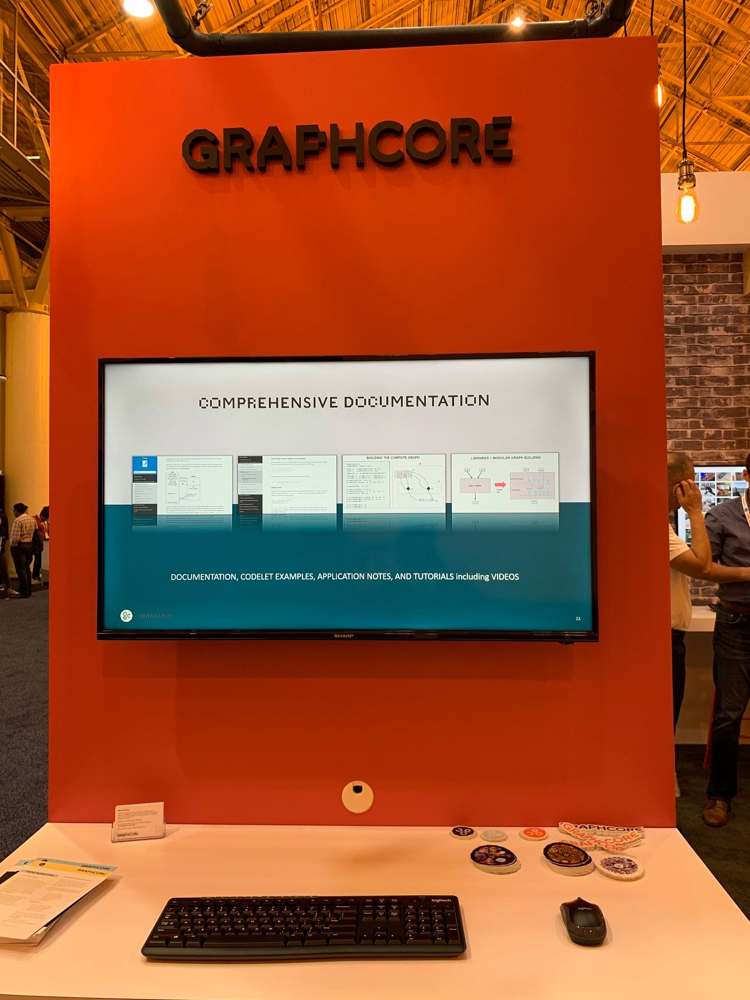
**이미지 캡션:** 이 사진은 오렌지색 벽면에 검은색 글씨로 "GRAPHCORE"라고 쓰여 있고, 그 아래에 "COMPREHENSIVE DOCUMENTATION"이라는 문구가 적힌 대형 모니터가 설치된 부스를 보여줍니다. 모니터 화면에는 여러 개의 작은 창들이 나열되어 있으며, 각 창에는 코드, 다이어그램, 텍스트 등이 포함되어 있습니다. 화면 하단에는 "DOCUMENTATION, CODELET EXAMPLES, APPLICATION NOTES, AND TUTORIALS including VIDEOS"라는 설명이 있습니다. 부스 앞쪽에는 흰색 테이블이 놓여 있으며, 테이블 위에는 검은색 키보드와 마우스, 그리고 여러 개의 스티커와 서류가 보입니다. 테이블 오른쪽에는 두 명의 성인 남성이 서 있는데, 한 명은 파란색 셔츠와 청바지를 입고 있고, 다른 한 명은 검은색 상의와 청바지를 입고 있습니다. 배경에는 다른 부스들과 사람들이 보이며, 전반적으로 기술 관련 전시회나 컨퍼런스의 분위기를 띄고 있습니다.
 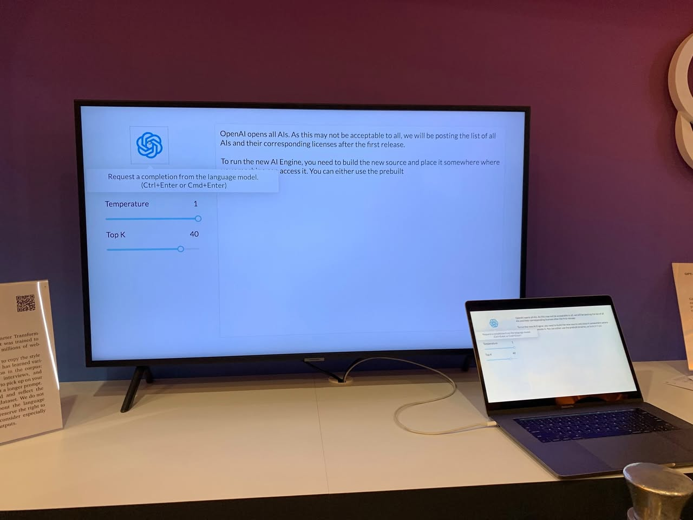
**이미지 캡션:** 이 사진은 OpenAI의 인공지능 모델을 시연하는 전시 공간을 보여준다. 전면에는 흰색 테이블 위에 놓인 대형 TV와 노트북이 있다. TV 화면에는 OpenAI 로고와 함께 "OpenAI는 모든 AI를 공개합니다. 이는 모든 사람에게 받아들여지지 않을 수 있으므로, 첫 출시 후 모든 AI와 해당 라이선스 목록을 게시할 것입니다."라는 문구가 표시되어 있다. 또한 "새로운 AI 엔진을 실행하려면 새 소스를 빌드하고 액세스할 수 있는 곳에 배치해야 합니다. 미리 빌드된 것을 사용하거나 직접 빌드할 수 있습니다."라는 안내와 함께 "언어 모델로부터 완료 요청 (Ctrl+Enter 또는 Cmd+Enter)"이라는 문구가 보인다. 그 아래에는 'Temperature'와 'Top K'라는 두 개의 슬라이더 조절기가 있으며, 각각 1과 40으로 설정되어 있다. 노트북 화면에도 TV와 유사한 인터페이스가 표시되어 있으며, 케이블로 TV와 연결되어 있다. 배경에는 보라색 벽과 함께 숫자 '8' 모양의 조형물이 희미하게 보인다. 왼쪽에는 QR 코드가 있는 작은 안내판이 놓여 있으며, 안내판에는 OpenAI 모델의 학습 데이터와 관련된 설명이 일부 보인다. 전체적으로 기술 시연이나 전시회의 한 장면으로 보이며, 차분하고 정보 전달에 초점을 맞춘 분위기이다.
 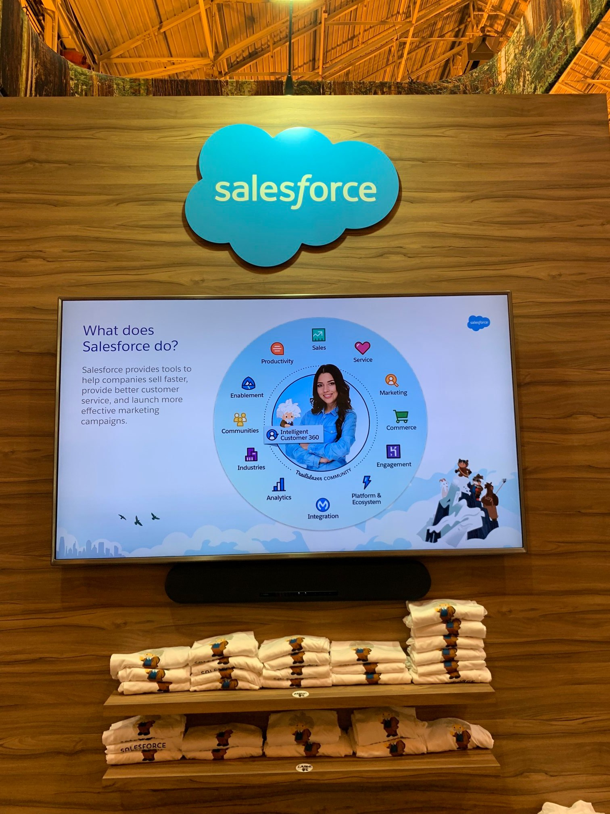
**이미지 캡션:** 이 사진은 Salesforce의 부스를 보여주며, 나무 질감의 벽에 파란색 구름 모양의 Salesforce 로고가 걸려 있고 그 아래에 큰 화면이 설치되어 있습니다. 화면에는 "What does Salesforce do?"라는 제목과 함께 Salesforce의 기능들을 설명하는 그래픽이 표시되어 있으며, 중앙에는 푸른색 재킷을 입은 젊은 여성 사진이 있습니다. 화면 하단에는 검은색 사운드바가 놓여 있고, 그 아래 나무 선반에는 Salesforce 로고와 곰돌이 캐릭터가 그려진 흰색 티셔츠 여러 장이 가지런히 쌓여 있습니다. 배경 상단에는 황토색 지붕 구조물과 식물들이 보입니다. 전반적으로 깔끔하고 현대적인 분위기이며, Salesforce의 서비스와 제품을 홍보하는 행사장의 모습으로 보입니다.
 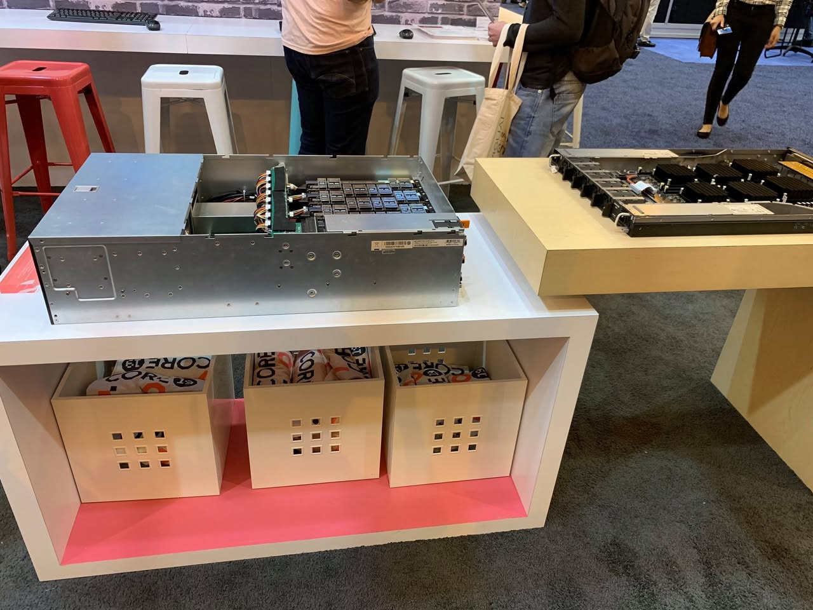
**이미지 캡션:** 이 사진은 기술 전시회 또는 컨퍼런스의 한 장면을 보여주며, 흰색 선반 위에는 열린 서버 케이스와 그 아래에는 수납함이 놓여 있습니다. 선반 왼쪽에는 은색 금속으로 된 서버 케이스가 놓여 있으며, 내부에는 여러 개의 검은색 부품과 케이블이 복잡하게 연결되어 있습니다. 케이스 앞쪽에는 작은 라벨이 붙어 있습니다. 선반 오른쪽에는 베이지색 테이블이 놓여 있으며, 그 위에는 또 다른 서버 부품이 올려져 있습니다. 이 부품은 여러 개의 검은색 방열판이 장착된 모습입니다. 선반 아래에는 세 개의 흰색 수납함이 있으며, 각 수납함의 앞면에는 정사각형 모양의 구멍이 9개씩 뚫려 있습니다. 수납함 안에는 "CORE"라는 글자가 반복적으로 인쇄된 흰색과 주황색의 천 조각들이 들어 있습니다. 배경에는 빨간색과 흰색의 높은 의자들이 보이고, 멀리 복도를 따라 사람들이 지나다니는 모습도 희미하게 보입니다. 전체적으로 깔끔하고 현대적인 분위기이며, 기술 제품을 전시하고 홍보하는 행사임을 짐작할 수 있습니다.
 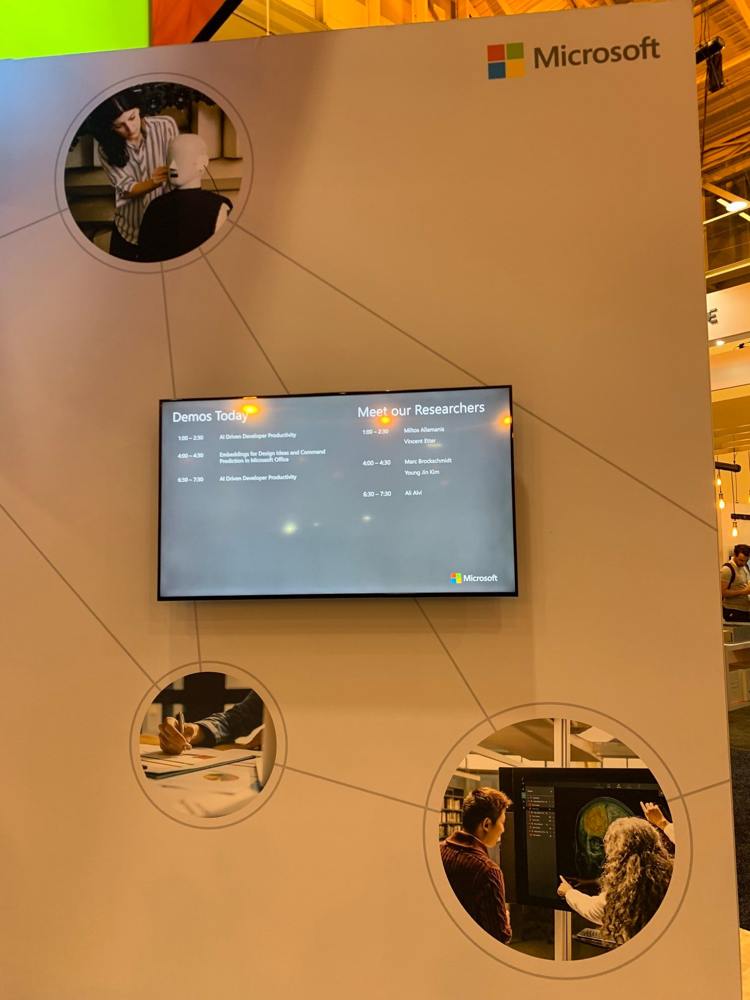
**이미지 캡션:** 이 사진은 마이크로소프트 부스에서 촬영된 것으로 보이며, 흰색 벽면에 마이크로소프트 로고와 함께 여러 개의 원형 이미지와 대형 스크린이 배치되어 있습니다. 스크린에는 "Demos Today"와 "Meet our Researchers"라는 제목 아래 시간대별 데모 및 연구원 소개가 나열되어 있으며, "AI Driven Developer Productivity"와 같은 주제들이 보입니다. 스크린 상단에는 마이크로소프트 로고가 선명하게 보입니다. 왼쪽 상단의 원형 이미지에는 흰색 셔츠를 입은 젊은 여성이 마네킹의 머리에 무언가를 만지고 있는 모습이 담겨 있습니다. 왼쪽 하단의 원형 이미지에는 책상에 앉아 서류에 펜으로 무언가를 적고 있는 사람의 손이 클로즈업되어 있습니다. 오른쪽 하단의 원형 이미지에는 두 사람이 컴퓨터 화면을 함께 보고 있으며, 화면에는 뇌 영상으로 보이는 이미지가 표시되어 있습니다. 전반적으로 기술 컨퍼런스나 전시회의 분위기를 띠고 있으며, 마이크로소프트의 연구 및 개발 성과를 소개하는 듯한 인상을 줍니다.
 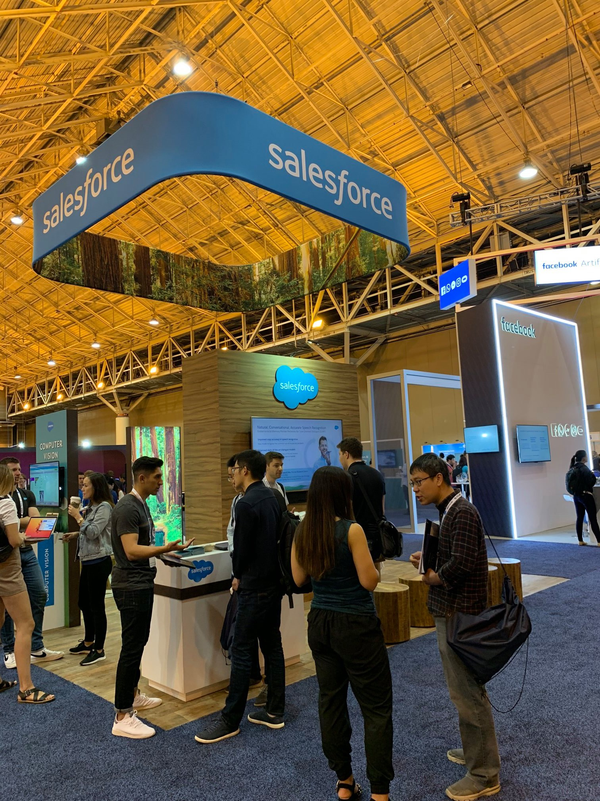
**이미지 캡션:** 이 사진은 컨퍼런스 또는 전시회 현장을 담고 있으며, 여러 사람들이 부스 앞에서 대화하거나 정보를 얻고 있습니다. 중앙에는 Salesforce 로고가 크게 걸려 있고, 그 아래에는 Salesforce 부스가 보입니다. 부스에는 나무 질감의 벽과 함께 여러 개의 스크린이 설치되어 있으며, 한 스크린에는 "Natural Conversation: Accurate Speech Recognition"이라는 문구가 표시되어 있습니다. 여러 명의 성인 남성과 여성이 부스 주변에 서서 대화를 나누거나 태블릿 PC를 보고 있습니다. 복장은 캐주얼하며, 일부는 백팩을 메고 있습니다. 배경에는 다른 기업들의 부스도 보이며, Facebook 로고도 눈에 띕니다. 전체적으로 활기찬 분위기이며, 기술 관련 행사인 것으로 추정됩니다.
 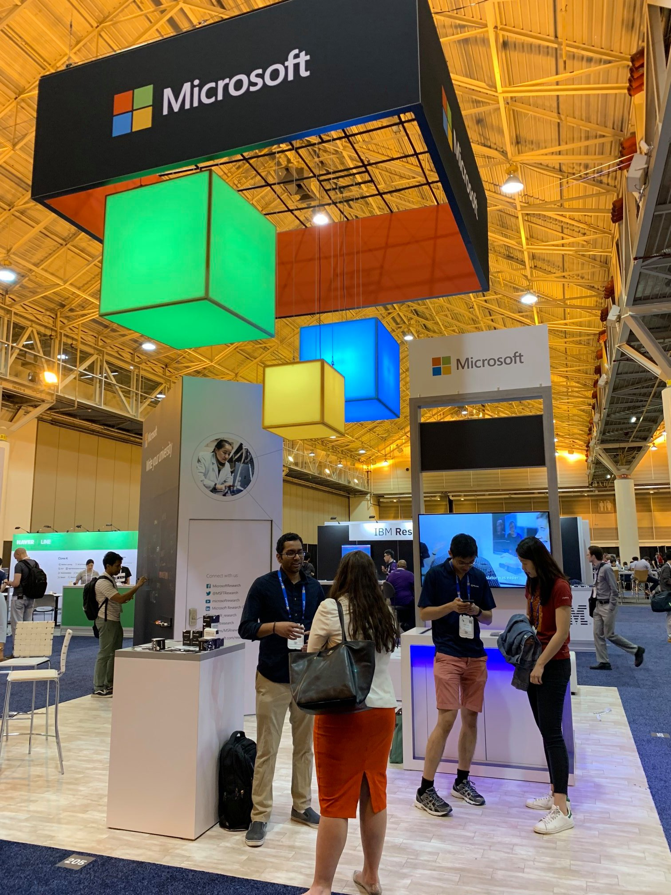
**이미지 캡션:** 이 사진은 마이크로소프트 부스가 있는 실내 컨퍼런스 또는 전시회 현장을 보여줍니다. 중앙에는 마이크로소프트 로고가 새겨진 검은색 현수막 간판이 걸려 있고, 그 아래로 녹색, 파란색, 노란색의 거대한 큐브 모양 조명이 매달려 있습니다. 여러 명의 사람들이 부스 주변에서 대화하거나 휴대폰을 보고 있습니다. 한쪽에는 마이크로소프트 부스가 보이며, 흰색 벽에는 "Connect with us"라는 문구와 함께 소셜 미디어 아이콘 및 계정 정보가 표시되어 있습니다. 부스 앞에는 두 명의 성인 남성과 한 명의 성인 여성이 서서 대화하고 있으며, 다른 성인 남성 한 명은 휴대폰을 보고 있습니다. 배경에는 IBM Research 부스도 보이며, 여러 명의 사람들이 분주하게 움직이고 있습니다. 전체적으로 활기찬 컨퍼런스 분위기를 느낄 수 있습니다.
 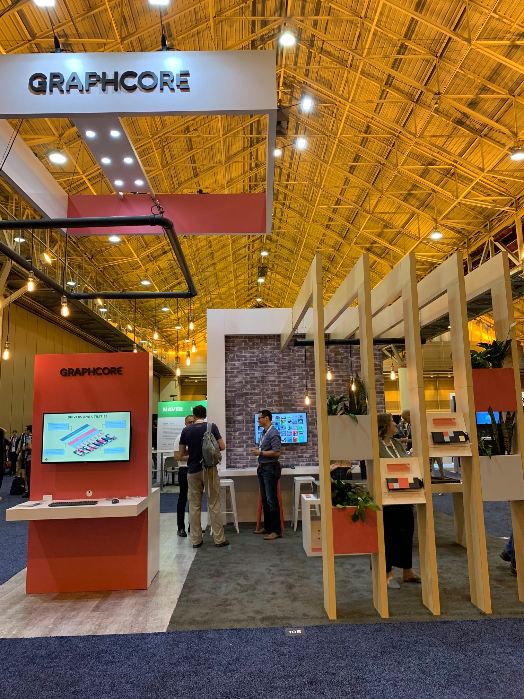
**이미지 캡션:** 이 사진은 컨퍼런스나 전시회의 부스 풍경을 담고 있으며, "GRAPHCORE"라는 이름의 회사가 눈에 띈다. 중앙에는 성인 남성 두 명이 서 있는데, 한 명은 회색 백팩을 메고 베이지색 바지와 흰색 티셔츠를 입고 있으며, 다른 한 명은 파란색 셔츠와 청바지를 입고 있다. 이들은 부스에 전시된 내용을 보고 있거나 대화 중인 것으로 보인다. 왼쪽에는 "GRAPHCORE"라고 적힌 빨간색 부스가 있고, 그 위에 설치된 모니터에는 "DRIVERS AND UTILITIES"라는 제목과 함께 복잡한 다이어그램이 표시되어 있다. 부스 앞에는 키보드와 마우스가 놓여 있다. 오른쪽에는 나무 구조물로 이루어진 또 다른 부스가 있으며, 이곳에도 식물과 제품들이 전시되어 있다. 배경에는 높은 천장과 노란색 철골 구조물이 보이며, 여러 개의 조명이 설치되어 있어 행사의 활기찬 분위기를 더한다. 전반적으로 기술 관련 전시회의 한 장면으로, 여러 부스가 밀집해 있고 사람들이 오가는 모습이 보인다.
 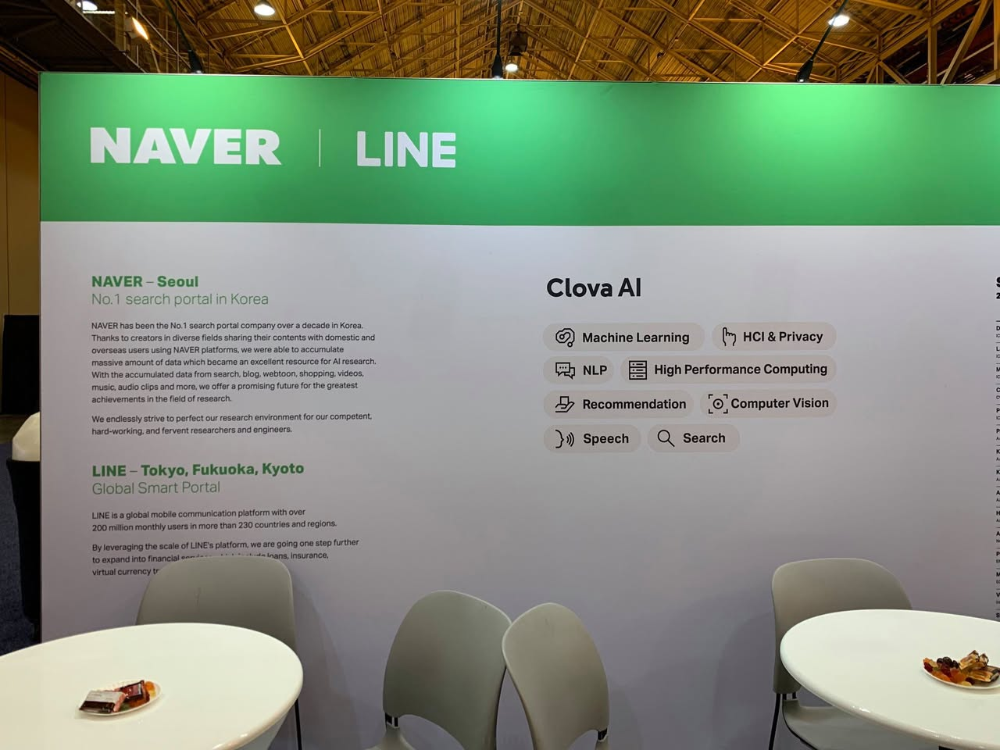
**이미지 캡션:** 이 사진은 네이버와 라인, 그리고 클로바 AI를 홍보하는 전시 부스를 보여줍니다. 중앙에는 녹색 배경에 흰색 글씨로 "NAVER | LINE" 로고가 크게 쓰여 있으며, 그 아래에는 "NAVER - Seoul No.1 search portal in Korea"라는 문구와 함께 네이버에 대한 설명이 한국어로 적혀 있습니다. 또한, "LINE - Tokyo, Fukuoka, Kyoto Global Smart Portal"이라는 문구와 함께 라인에 대한 설명도 있습니다. 오른쪽에는 "Clova AI"라는 제목 아래 머신러닝, HCI & Privacy, NLP, High Performance Computing, Recommendation, Computer Vision, Speech, Search 등 클로바 AI의 주요 기능들을 아이콘과 함께 나열하고 있습니다. 배경에는 흰색 벽과 천장의 조명이 보이며, 전면에는 흰색 원형 테이블 두 개와 의자 두 개가 놓여 있고, 테이블 위에는 간식으로 보이는 음식들이 담겨 있습니다. 전체적으로 깔끔하고 현대적인 분위기이며, IT 기술과 서비스를 홍보하는 전시회 또는 행사장의 모습으로 보입니다.
 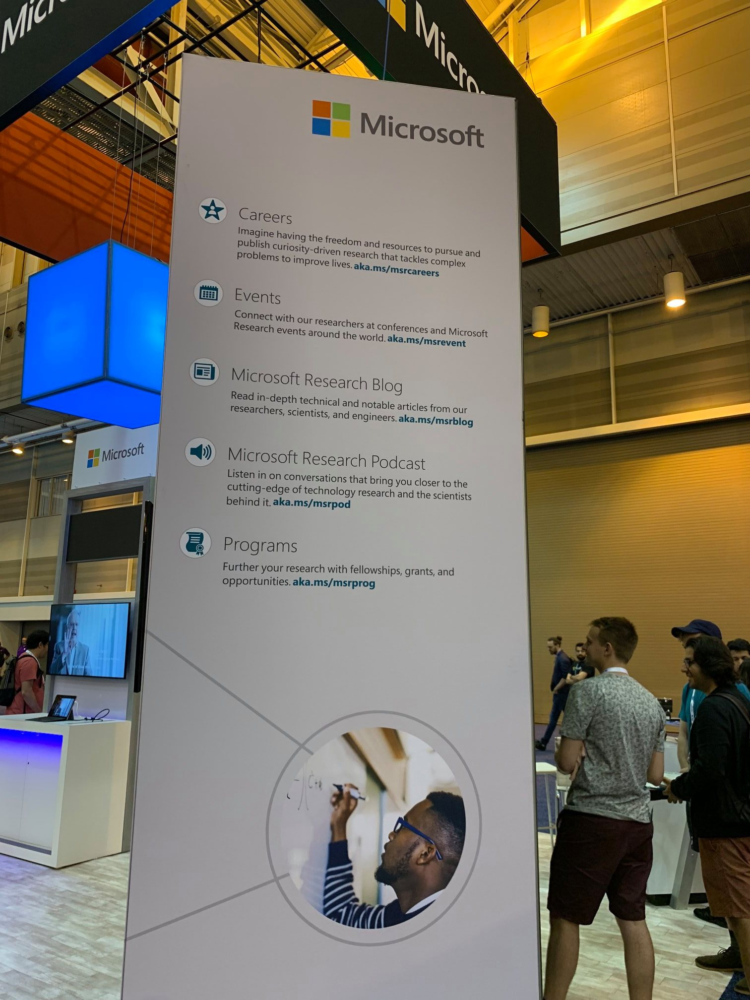
**이미지 캡션:** 이 사진은 마이크로소프트 부스를 보여주며, 부스에는 마이크로소프트의 다양한 프로그램과 정보를 담은 대형 현수막이 걸려 있습니다. 현수막에는 "Careers", "Events", "Microsoft Research Blog", "Microsoft Research Podcast", "Programs"라는 제목과 함께 각 프로그램에 대한 설명과 관련 웹사이트 주소가 적혀 있습니다. 현수막 왼쪽에는 파란색 조명이 켜진 큐브 형태의 조형물이 매달려 있고, 오른쪽에는 몇 명의 사람들이 서서 대화를 나누고 있습니다. 이 사람들은 성인 남성으로 보이며, 캐주얼한 복장을 하고 있습니다. 배경에는 다른 부스들과 행사장의 천장이 보이며, 전반적으로 행사장의 활기찬 분위기를 느낄 수 있습니다. 현수막 하단에는 마이크로소프트 리서치에 참여하는 연구원의 모습이 원형 이미지로 삽입되어 있습니다.
 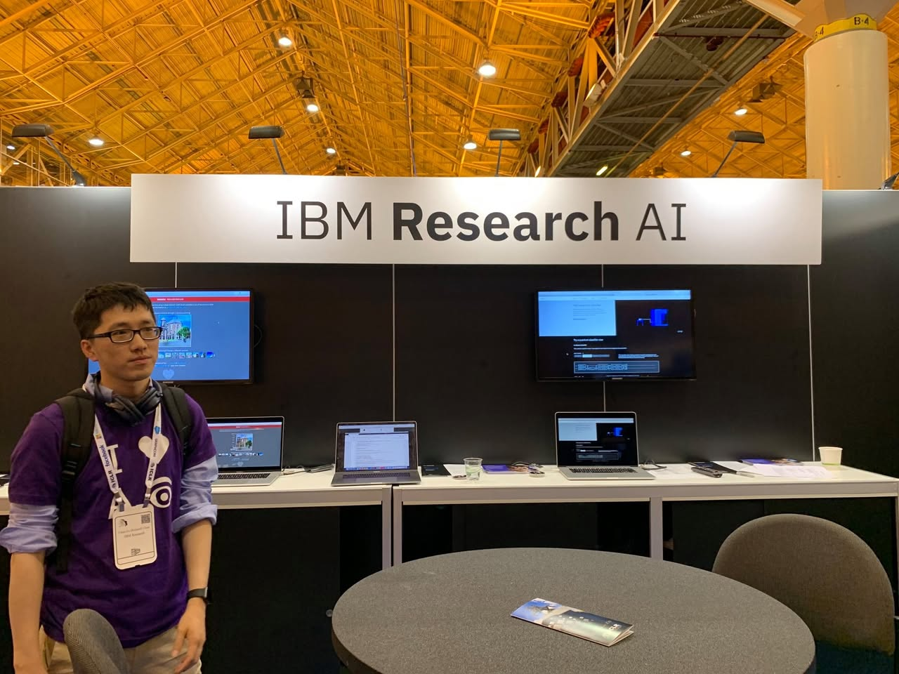
**이미지 캡션:** 한 명의 성인 남성이 보라색 티셔츠와 회색 셔츠를 겹쳐 입고 안경을 쓰고 있으며, 목에는 헤드폰을 걸고 가방을 메고 있다. 그는 IBM Research AI 부스 앞에 서 있으며, 뒤에는 검은색 벽과 함께 여러 대의 노트북과 모니터가 전시되어 있다. 모니터에는 IBM Research AI 로고와 함께 다양한 정보가 표시되고 있다. 천장은 노란색으로 되어 있으며, 조명이 설치되어 있다. 전반적으로 기술 박람회나 컨퍼런스의 분위기를 띤다.
 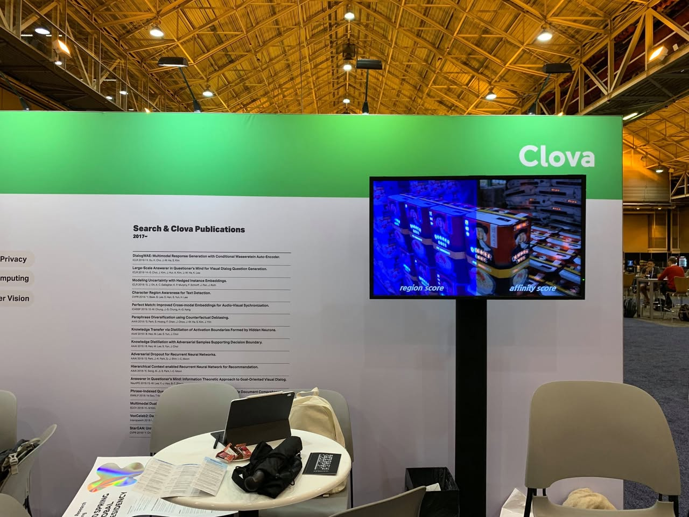
**이미지 캡션:** 행사장의 한 부스에서 촬영된 사진으로, 녹색 배경에 흰색 글씨로 'Clova'라고 쓰여 있고 그 아래에 'Search & Clova Publications 2017-'라는 제목과 함께 여러 논문 목록이 나열되어 있다. 부스 중앙에는 검은색 스탠드에 설치된 대형 모니터가 있는데, 모니터 화면에는 여러 개의 상품 진열대 이미지가 보이며 화면 하단에는 'region score'와 'affinity score'라는 텍스트가 표시되어 있다. 모니터 오른쪽 뒤편에는 몇몇 사람들이 테이블에 앉아 대화하는 모습이 희미하게 보인다. 부스 앞쪽에는 흰색 원형 테이블이 놓여 있고, 테이블 위에는 노트북, 태블릿, 서류, 검은색 카메라 등이 놓여 있다. 테이블 옆에는 의자가 놓여 있으며, 전반적으로 학술 행사나 기술 전시회의 한 장면으로 보인다.
 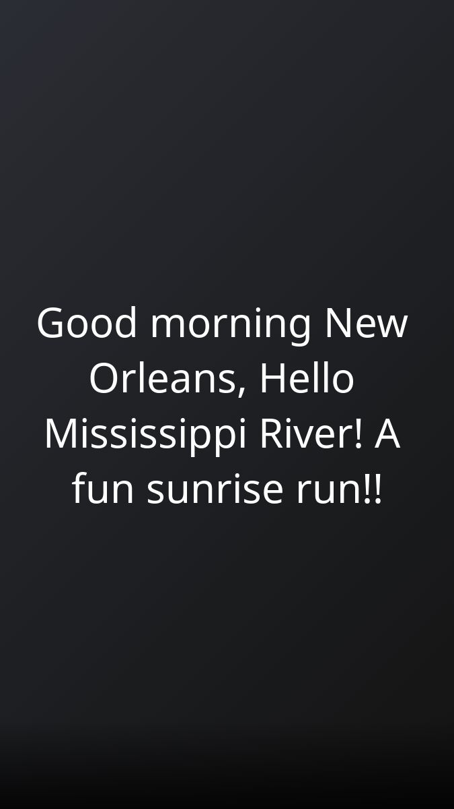
**이미지 캡션:** 이 사진은 어두운 배경에 흰색 텍스트가 표시되어 있습니다. 텍스트는 "Good morning New Orleans, Hello Mississippi River! A fun sunrise run!!"이라고 쓰여 있으며, 이는 뉴올리언스의 미시시피 강에서 즐거운 일출 달리기를 하고 있다는 메시지를 전달합니다. 사진에는 사람이 등장하지 않으며, 장소나 사물에 대한 구체적인 묘사도 없습니다. 텍스트만으로 보아 아침 일찍 야외에서 활동적인 시간을 보내고 있는 긍정적이고 활기찬 분위기를 느낄 수 있습니다.
 
**이미지 캡션:** 해 질 녘, 한 성인 남성이 바다를 배경으로 엄지척을 하며 포즈를 취하고 있다. 남성은 30대 후반에서 40대 초반으로 보이며, 짧은 검은 머리에 옅은 미소를 띠고 있다. 그는 핑크색과 보라색이 그라데이션 된 반팔 스포츠 티셔츠와 회색 반바지를 입고 있다. 티셔츠에는 작은 로고가 보인다. 남성은 오른손으로 엄지척을 하고 있고, 왼손은 허리에 얹고 있다. 배경으로는 잔잔한 바다가 펼쳐져 있고, 수평선 너머로 해가 지고 있어 주황색과 분홍색으로 물든 하늘이 아름답다. 멀리 희미하게 건물들이 보이며, 바닷가에는 돌과 콘크리트 계단, 그리고 금속 난간이 있다. 전체적으로 평화롭고 활기찬 분위기이다.
 
**이미지 캡션:** 한 명의 성인 남성이 뉴올리언스 어니스트 N. 모리얼 컨벤션 센터 앞에서 엄지손가락을 치켜들고 있다. 남성은 20대 후반에서 30대 초반으로 보이며, 짧은 검은 머리에 옅은 피부를 가지고 있다. 그는 붉은색, 보라색, 검은색으로 그러데이션된 반팔 운동복 상의와 회색 반바지, 파란색 운동화를 착용하고 있다. 그의 표정은 밝고 긍정적이며, 한 손은 허리에 얹고 다른 손으로는 엄지손가락을 들어 올리고 있다. 배경에는 거대한 컨벤션 센터 건물이 보이며, 건물에는 "NEW ORLEANS ERNEST N. MORIAL CONVENTION CENTER"라는 글자가 쓰여 있다. 또한, 도로와 인도, 신호등이 보이며, 아침 햇살이 비추고 있어 활기찬 분위기를 자아낸다.
 
**이미지 캡션:** 이 화면은 월요일 아침 운동 기록을 보여주는 스마트폰 앱 화면으로, 2019년 5월 6일 오전 5시 58분에 시작된 운동임을 알 수 있습니다. 화면 상단에는 달리는 사람 모양의 아이콘과 함께 "Monday Morning"이라는 제목과 날짜 및 시간이 표시되어 있습니다. 중앙에는 뉴올리언스 지역의 지도가 나타나 있으며, 파란색 강(미시시피 강으로 추정)과 도로망이 그려져 있습니다. 주황색으로 표시된 선은 운동 경로를 나타내며, 경로 상에는 1km부터 8km까지 구간별 이동 거리를 나타내는 파란색 핀들이 표시되어 있습니다. 또한, "New Orleans"라는 글자가 크게 보이며, "I-10", "I-61", "I-90"과 같은 고속도로 표지판과 "Planade Ave", "Saint Claude Ave", "Chartres St", "Camp St", "Dry Ave" 등의 도로 이름이 보입니다. 화면 하단에는 운동 결과 요약 정보가 표시되어 있는데, 총 이동 거리는 9.53km, 운동 시간은 1시간 1분 36초, 평균 페이스는 6분 28초/km, 소모 칼로리는 583kcal입니다. 화면 오른쪽 하단에는 카메라 아이콘이 있어 운동 중 사진을 촬영했음을 암시합니다. 전반적으로 이 화면은 사용자가 아침 조깅을 성공적으로 마쳤음을 보여주는 기록 화면이며, 운동 경로와 상세 데이터를 한눈에 파악할 수 있습니다.
 
**이미지 캡션:** 이 사진은 ICLR 2019 스폰서 목록을 보여주는 대형 스크린의 모습으로, 스크린에는 다양한 기업 로고와 이름이 줄지어 표시되어 있습니다. 사진에는 사람이 직접적으로 보이지는 않지만, 스크린이 설치된 장소는 어두운 조명과 천장의 격자무늬 구조로 보아 컨퍼런스나 강연장 내부로 추정됩니다. 스크린에는 GRAPHCORE, Microsoft, Salesforce, Facebook, Google, DeepMind, OpenAI, NAVER LINE, IBM Research, Qualcomm AI research, Scale, Lambda, nnaisense, Preferred Networks, Two Sigma, Uber, Element AI, Amazon.com, DE Shaw & Co, Capital One, King Abdullah University of Science and Technology, ByteDance, Borealis AI, [XTX] Markets, Jane Street, Intel AI, HRT hudson river trading, Expedia 등 다수의 유명 IT 및 기술 기업들의 로고와 이름이 명확하게 보입니다. 전반적으로 전문적이고 기술적인 행사의 분위기를 띠고 있으며, 스폰서들의 로고를 통해 ICLR 2019가 상당한 규모와 영향력을 가진 행사였음을 짐작할 수 있습니다.
 
**이미지 캡션:** 이 사진은 ICLR 2019 컨퍼런스의 프로그램 기획자들을 소개하는 대형 스크린이 보이는 강당의 모습입니다. 스크린에는 6명의 사람들의 사진과 이름, 직책이 표시되어 있으며, 각 사진 아래에는 "Program Chair" 또는 "Diversity Inclusion Chair"와 같은 직책이 기재되어 있습니다. 스크린 왼쪽에는 3명의 여성과 3명의 남성이 배치되어 있으며, 이들의 대략적인 나이대는 20대 후반에서 40대 사이로 보입니다. 복장은 대부분 캐주얼한 셔츠나 블라우스 차림이며, 표정은 대체로 밝고 긍정적입니다. 강당에는 여러 줄의 좌석이 있으며, 일부 좌석에는 참석자들이 앉아 스크린을 바라보고 있습니다. 앞쪽 좌석에는 갈색 셔츠를 입은 성인 남성과 노란색 셔츠를 입은 성인 남성이 앉아 있으며, 이들은 스크린을 향해 고개를 돌리고 있습니다. 배경은 어두운 색의 천으로 마감된 벽과 천장으로 구성되어 있으며, 천장에는 조명들이 설치되어 있습니다. 전체적으로 학술 행사나 컨퍼런스의 한 장면을 담고 있으며, 차분하고 집중된 분위기입니다.
 
**이미지 캡션:** 사진에는 성인 남성이 셀카를 찍고 있으며, 배경에는 많은 사람들이 좌석에 앉아 있는 모습이 담겨 있습니다. 남성은 30대 후반에서 40대 초반으로 보이며, 짧은 검은색 머리에 무표정입니다. 붉은색과 흰색 체크무늬 셔츠를 입고 있으며, 목에는 "BEIC"라고 적힌 흰색 목걸이를 걸고 있습니다. 장소는 대규모 강연장이나 회의장으로 보이며, 천장에는 조명과 음향 장치가 설치되어 있습니다. 여러 개의 스크린이 보이며, 일부 스크린에는 텍스트가 표시되어 있습니다. 좌석은 검은색이며, 앞쪽 좌석에는 다른 참석자들이 앉아 있습니다. 전반적으로 차분하고 공식적인 분위기입니다.
 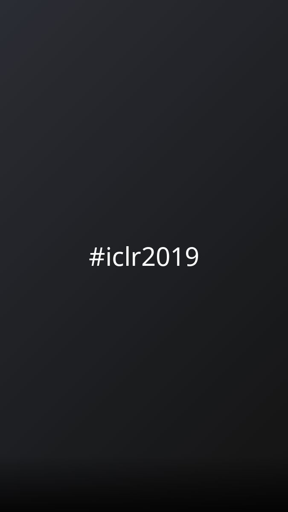
**이미지 캡션:** 이 사진은 어두운 회색 배경에 흰색 글자로 "#iclr2019"라는 텍스트가 중앙에 표시되어 있습니다. 사람, 장소, 사물은 보이지 않으며, 텍스트 외에는 특별한 정보가 없습니다. 분위기는 단순하고 정보 전달에 초점을 맞춘 듯합니다.

> Good morning New Orleans, Hello Mississippi River! A fun sunrise run!!
> #iclr2019

### 5월 7일 (화) 18:14 · Happy birthday! I miss you a lot!!

Happy birthday! I miss you a lot!!

### 5월 7일 (화) 18:14 · ↪ Happy birthday! I miss you a lot!!

*다른 프로필에 남긴 글*

Happy birthday! I miss you a lot!!

### 5월 8일 (수) 03:51 · 📷 사진 (3장)

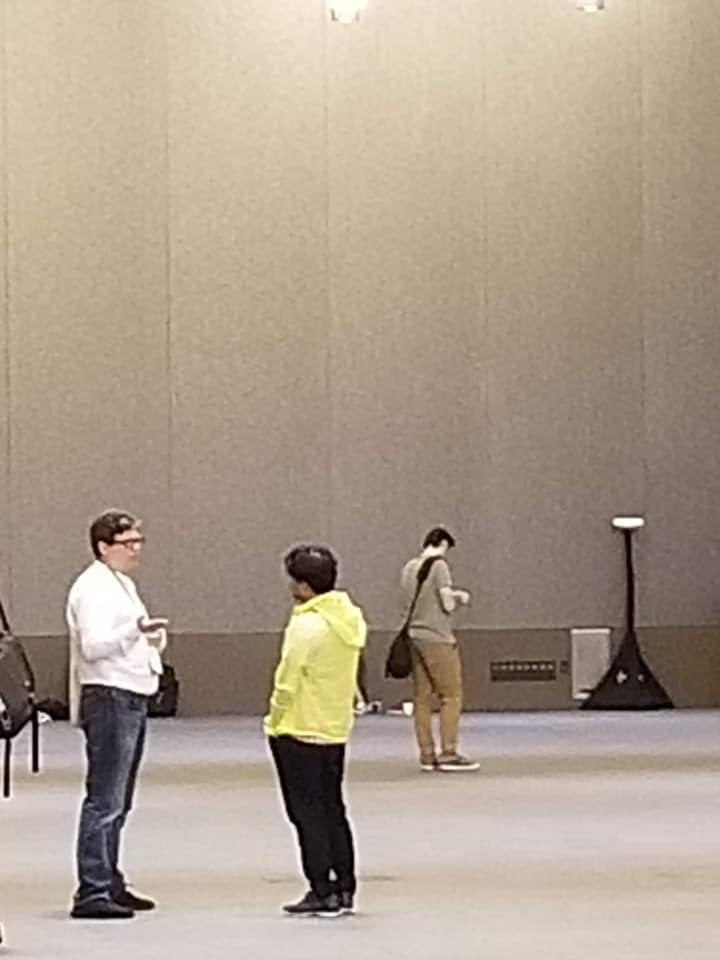
**이미지 캡션:** 넓은 실내 공간에서 세 명의 성인 남성이 각기 다른 방향을 바라보며 서 있다. 왼쪽의 남성은 흰색 셔츠와 청바지를 입고 안경을 착용했으며, 오른손으로 무언가를 가리키며 이야기하는 듯한 모습이다. 가운데 남성은 노란색 후드티와 검은색 바지를 입고 있으며, 왼쪽을 향해 서서 정면을 응시하고 있다. 오른쪽 남성은 회색 티셔츠와 갈색 바지를 입고 있으며, 어깨에 가방을 메고 스마트폰을 보고 있는 듯하다. 배경에는 회색 벽과 바닥이 보이며, 벽에는 조명과 환풍구로 보이는 장치들이 설치되어 있다. 전체적으로 차분하고 일상적인 분위기이며, 컨퍼런스나 행사장의 로비와 같은 장소로 추정된다.
 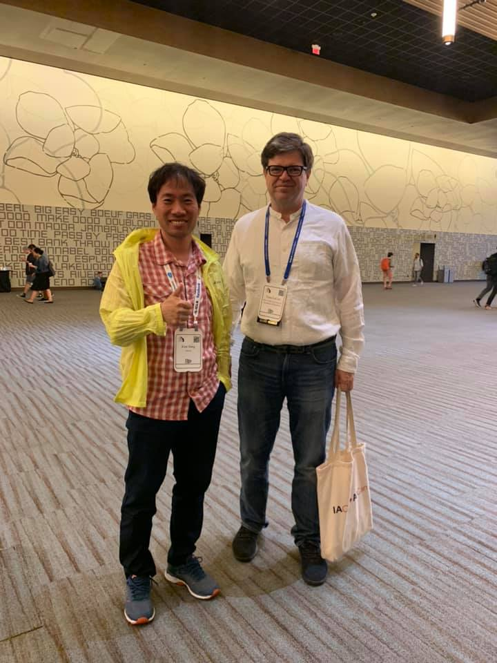
**이미지 캡션:** 두 명의 남성이 실내 공간에서 포즈를 취하고 있으며, 한 명은 노란색 방수 재킷 안에 빨간색과 흰색 체크무늬 셔츠를 입고 있고, 다른 한 명은 흰색 셔츠와 청바지를 입고 있습니다. 두 사람 모두 목에 인식표를 걸고 있으며, 흰색 셔츠를 입은 남성은 천으로 된 토트백을 들고 있습니다. 배경에는 추상적인 꽃 그림이 그려진 벽이 있고, 바닥은 카펫으로 덮여 있습니다. 전반적으로 행사장이나 컨퍼런스 장소처럼 보이는 캐주얼한 분위기입니다.
 
**이미지 캡션:** 이 이미지는 구글 AI 임팩트 챌린지 수상자들을 소개하는 웹페이지의 일부를 보여줍니다. 상단에는 구글 로고와 함께 "GOOGLE.ORG"라는 문구가 보이며, 그 아래에는 "Here are the grantees of the Google AI Impact Challenge"라는 제목이 있습니다. 제목 아래에는 세 개의 사진이 나란히 배치되어 있습니다. 왼쪽 사진에는 두 명의 성인 남성이 오토바이 앞에서 대화하고 있으며, 배경에는 시장으로 보이는 활기찬 모습이 담겨 있습니다. 가운데 사진에는 한 명의 성인 여성과 한 명의 성인 남성이 방송국 스튜디오로 보이는 곳에서 카메라를 바라보고 있습니다. 오른쪽 사진에는 두 명의 성인 남성이 실험실 가운을 입고 현미경과 태블릿을 보며 연구에 집중하고 있는 모습입니다. 사진 아래에는 "Jacquelline Fuller, President, Google.org"와 "Jeff Dean, Google Senior Fellow and SVP, Google AI"라는 이름과 직책이 기재되어 있으며, "Published May 7, 2019"라는 발행일 정보와 함께 트위터, 페이스북, 링크드인, 이메일 공유 아이콘이 보입니다. 전체적으로 정보 전달과 관련된 진지하고 전문적인 분위기를 풍깁니다.

> 구글 AI임펙트 챌린지 수상 리스트인데요 nlp등으로 자살 가능성을 예측하고 엠블란스동선을 미리 예측하는등 의미있는 프로젝트들이 많네요.   #모두를위한딥러닝 으로 모두가 행복한 세상에 기여하면 좋겠습니다.   https://www.blog.google/outreach-initiatives/google-org/ai-impact-challenge-grantees/

### 5월 10일 (금) 00:00 · 📷 사진 (10장)

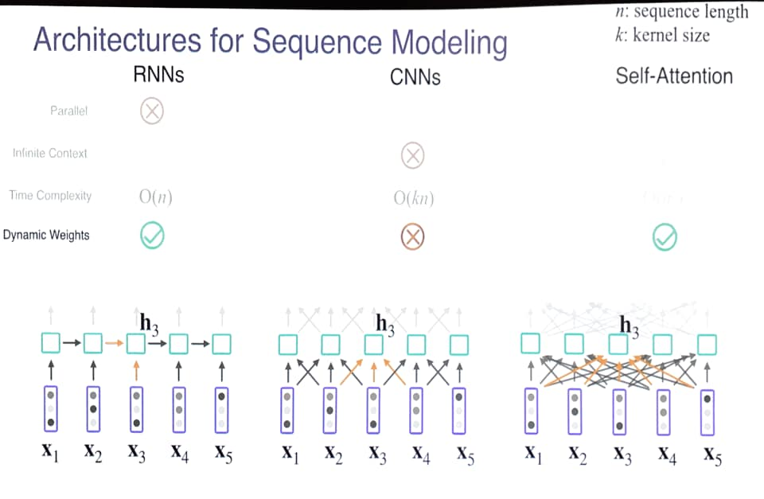
**이미지 캡션:** 이 이미지는 순차 모델링 아키텍처를 비교하는 다이어그램으로, RNN, CNN, Self-Attention 세 가지 유형을 보여줍니다. 각 아키텍처는 병렬 처리, 무한 컨텍스트, 시간 복잡성, 동적 가중치와 같은 특성에 따라 평가됩니다. RNN은 순차적으로 처리되며, CNN은 커널 크기(k)와 시퀀스 길이(n)에 따라 시간 복잡성이 O(kn)입니다. Self-Attention은 시퀀스 길이(n)에 따라 시간 복잡성이 O(n)이며, 동적 가중치를 가집니다. 다이어그램 하단에는 각 아키텍처의 작동 방식을 시각적으로 표현한 그래프가 있습니다. RNN은 이전 단계의 출력을 다음 단계로 전달하는 순차적인 흐름을 보여주고, CNN은 입력 시퀀스의 일부를 묶어 처리하는 방식을, Self-Attention은 입력 시퀀스의 모든 요소 간의 관계를 고려하는 방식을 나타냅니다.
 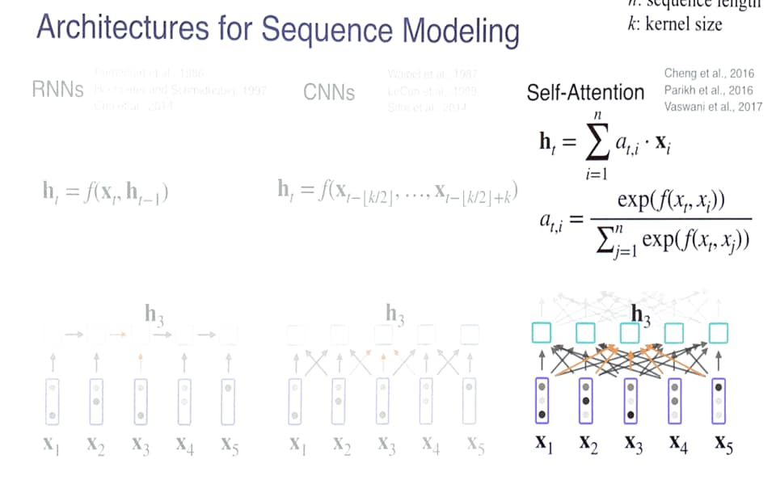
**이미지 캡션:** 이 이미지는 순차 모델링 아키텍처에 대한 프레젠테이션 슬라이드로, RNN, CNN, Self-Attention 세 가지 주요 모델 유형을 설명합니다. 슬라이드 상단에는 "Architectures for Sequence Modeling"이라는 제목이 파란색으로 표시되어 있습니다. 각 모델 유형 아래에는 해당 모델의 수학적 표현식과 시각적 다이어그램이 있습니다. RNN 섹션에는 "RNNs"라는 레이블과 함께 이전 은닉 상태와 현재 입력을 기반으로 현재 은닉 상태를 계산하는 수식 $h_t = f(x_t, h_{t-1})$이 표시되어 있으며, 이를 나타내는 순차적인 블록 다이어그램이 있습니다. CNN 섹션에는 "CNNs"라는 레이블과 함께 커널 크기 $k$를 고려하여 현재 입력 주변의 컨텍스트를 사용하는 수식 $h_t = f(x_{t-[k/2]}, \dots, x_{t-[k/2]+k})$이 표시되어 있으며, 이 역시 순차적인 블록 다이어그램으로 표현됩니다. Self-Attention 섹션에는 "Self-Attention"이라는 레이블과 함께 어텐션 가중치 $a_{t,i}$를 사용하여 입력 시퀀스의 모든 요소에 대한 가중치 합으로 현재 은닉 상태를 계산하는 수식 $h_t = \sum_{i=1}^{n} a_{t,i} \cdot x_i$와 어텐션 가중치를 계산하는 수식 $a_{t,i} = \frac{\exp(f(x_t, x_i))}{\sum_{j=1}^{n} \exp(f(x_t, x_j))}$이 표시되어 있으며, 이를 나타내는 블록 다이어그램은 입력 요소 간의 상호 작용을 보여줍니다. 각 모델 유형 옆에는 관련 연구 논문들의 저자 및 연도가 옅은 회색으로 표시되어 있습니다. 슬라이드 전체적으로 흰색 배경에 파란색, 회색, 주황색, 청록색이 사용되어 정보 전달에 집중하고 있습니다.
 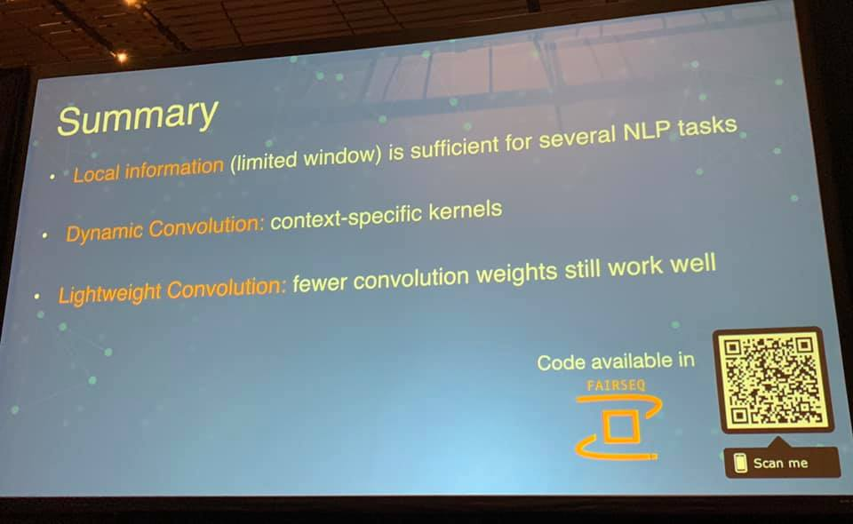
**이미지 캡션:** 이 사진은 발표 슬라이드의 일부로, "Summary"라는 제목 아래 자연어 처리(NLP) 작업에 대한 세 가지 요점을 나열하고 있습니다. 첫 번째 요점은 "Local information (limited window) is sufficient for several NLP tasks"이며, 두 번째 요점은 "Dynamic Convolution: context-specific kernels"입니다. 세 번째 요점은 "Lightweight Convolution: fewer convolution weights still work well"입니다. 슬라이드 오른쪽 하단에는 "Code available in FAIRSEQ"라는 문구와 함께 FAIRSEQ라는 텍스트가 적힌 로고, 그리고 QR 코드가 있습니다. QR 코드 아래에는 "Scan me"라고 적힌 버튼이 있습니다. 슬라이드 배경은 파란색이며, 녹색 점들이 점점이 찍혀 있어 추상적인 느낌을 줍니다. 사진에는 사람이 보이지 않으며, 장소는 발표회장이나 강의실로 추정됩니다. 전체적으로 정보 전달에 초점을 맞춘 차분하고 전문적인 분위기입니다.
 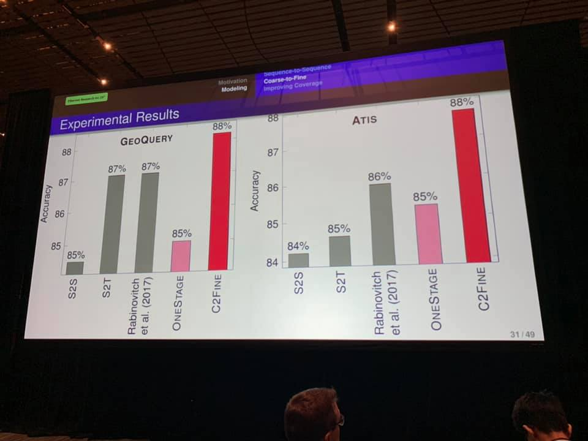
**이미지 캡션:** 이 사진은 발표회장에서 촬영된 것으로 보이며, 화면에는 두 개의 막대 그래프가 표시되어 있습니다. 왼쪽 그래프는 "GEOQUERY"라는 제목으로, 여러 방법론의 정확도(Accuracy)를 비교하고 있습니다. S2S, S2T, Rabinovich et al. (2017), ONESTAGE, C2FINE 순서로 막대가 나타나며, 각각 85%, 87%, 87%, 85%, 88%의 정확도를 보입니다. 오른쪽 그래프는 "ATIS"라는 제목으로, 마찬가지로 여러 방법론의 정확도를 비교합니다. S2S, S2T, Rabinovich et al. (2017), ONESTAGE, C2FINE 순서로 막대가 나타나며, 각각 85%, 86%, 85%, 85%, 88%의 정확도를 보입니다. 그래프 위쪽에는 "Motivation Modeling"과 "Sequence-to-Sequence Coarse-to-Fine Improving Coverage"라는 텍스트가 보입니다. 화면 하단에는 발표 슬라이드 번호로 보이는 "31/49"가 오른쪽 하단에 표시되어 있습니다. 사진 하단에는 발표를 듣고 있는 것으로 보이는 여러 사람들의 머리가 일부 보입니다. 전반적으로 학술 발표 또는 기술 발표회의 한 장면을 담고 있으며, 데이터 분석 결과를 시각적으로 보여주는 분위기입니다.
 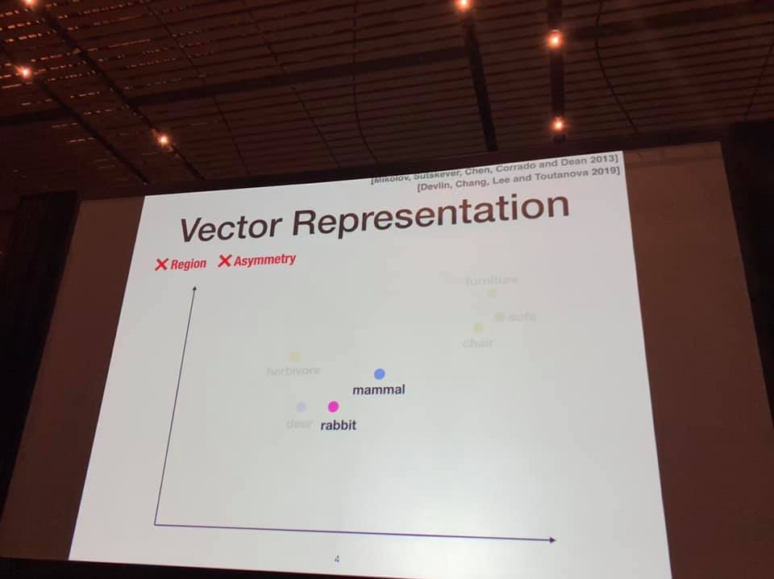
**이미지 캡션:** 이 사진은 강연이나 발표회에서 사용되는 슬라이드를 촬영한 것으로 보이며, "Vector Representation"이라는 제목이 크게 적혀 있습니다. 슬라이드에는 두 개의 축으로 이루어진 그래프가 있고, 여러 단어들이 점으로 표시되어 있습니다. "Region"과 "Asymmetry"라는 단어가 빨간색 X 표시와 함께 왼쪽에 나타나 있으며, 그래프의 축을 나타내는 것으로 추정됩니다. 그래프 상에는 "herbivore", "mammal", "deer", "rabbit", "furniture", "sofa", "chair"와 같은 단어들이 점으로 표시되어 있으며, 각 단어는 다른 색상의 점으로 구분되어 있습니다. 슬라이드 상단에는 두 개의 연구 논문 인용 정보가 작게 표시되어 있습니다. 전체적으로 학술적인 발표 분위기를 띠고 있으며, 발표자는 보이지 않습니다.
 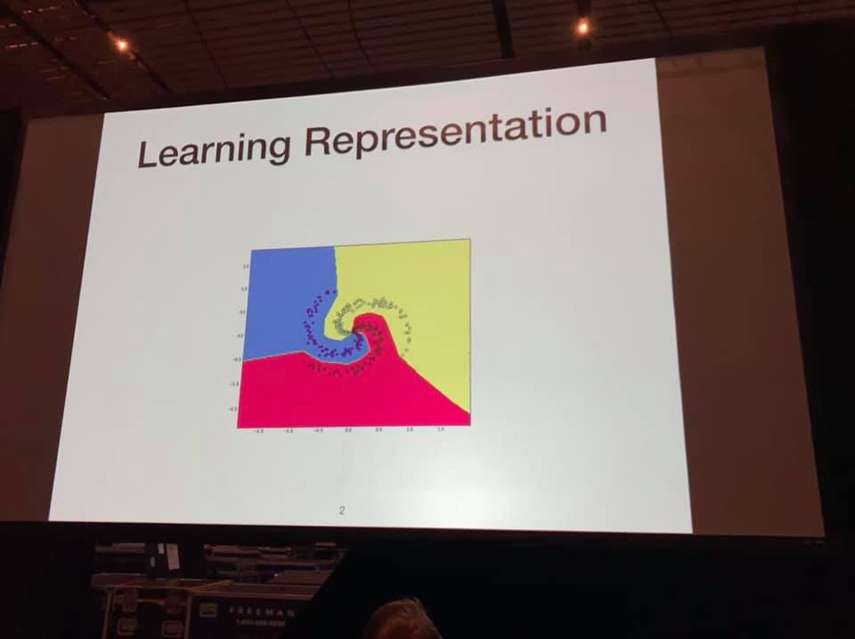
**이미지 캡션:** 이 사진은 강연이나 발표회에서 사용되는 대형 스크린을 촬영한 것으로 보이며, 스크린에는 "Learning Representation"이라는 제목과 함께 복잡한 그래프가 표시되어 있습니다. 그래프는 파란색, 노란색, 빨간색으로 구분된 세 개의 영역으로 나뉘어 있으며, 이 영역 안에는 나선형으로 흩뿌려진 점들이 분포하고 있습니다. 점들은 주로 나선형의 중심부와 가장자리에 집중되어 있으며, 그래프의 축에는 숫자들이 표시되어 있어 데이터의 분포를 나타내는 것으로 추정됩니다. 스크린 하단에는 페이지 번호 "2"가 작게 표시되어 있습니다. 사진의 하단에는 관객으로 보이는 사람들의 머리 일부와 무대 장치로 보이는 검은색 장비들이 희미하게 보입니다. 전반적으로 학술적이거나 기술적인 발표 상황을 담고 있으며, 차분하고 집중된 분위기입니다.
 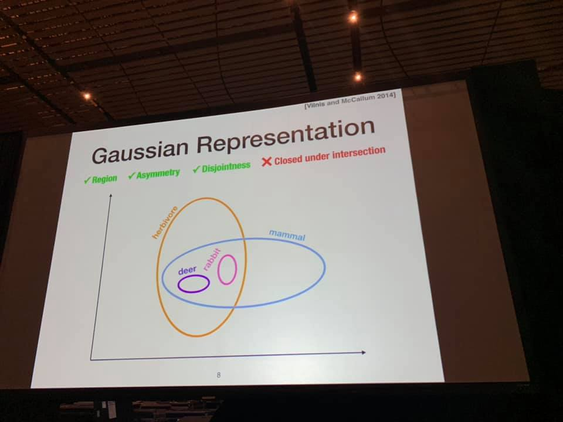
**이미지 캡션:** 이 사진은 강연이나 발표회에서 사용되는 슬라이드를 촬영한 것으로, "Gaussian Representation"이라는 제목 아래 가우시안 분포를 이용한 데이터 표현 방식에 대한 내용을 담고 있습니다. 슬라이드 상단에는 "[Vilnis and McCallum 2014]"라는 출처 표기가 있으며, "Gaussian Representation"이라는 제목 아래 네 가지 속성 중 세 가지(Region, Asymmetry, Disjointness)는 녹색 체크 표시와 함께 긍정적으로, 나머지 하나(Closed under intersection)는 빨간색 엑스 표시와 함께 부정적으로 표시되어 있습니다. 슬라이드 중앙에는 두 개의 축으로 이루어진 그래프가 있으며, 이 그래프 위에는 세 개의 타원과 두 개의 작은 원이 그려져 있습니다. 각 도형에는 "herbivore", "mammal", "deer", "rabbit"과 같은 라벨이 붙어 있어, 이들이 가우시안 분포로 표현된 데이터의 범주를 나타내는 것으로 보입니다. 예를 들어, 주황색 타원은 "herbivore"를, 파란색 타원은 "mammal"을 나타내며, 그 안에 보라색 원은 "deer"를, 분홍색 원은 "rabbit"을 나타냅니다. "deer"와 "rabbit"은 각각 "herbivore"와 "mammal" 범주 내에 포함되거나 일부 겹치는 형태로 표현되어 있습니다. 슬라이드 하단에는 "8"이라는 숫자가 작게 표시되어 있어 슬라이드 번호일 가능성이 있습니다. 배경은 어두운 강연장으로 보이며, 천장의 조명과 스크린의 일부가 보입니다. 사진에는 사람이 직접적으로 보이지는 않지만, 슬라이드를 발표하는 발표자와 이를 청취하는 청중이 있을 것으로 추정됩니다. 전반적으로 학술적인 발표 상황을 보여주는 차분하고 정보 전달에 집중된 분위기입니다.
 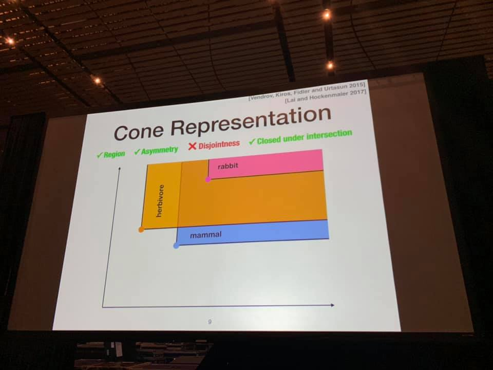
**이미지 캡션:** 이 사진은 발표회장에서 강연자가 "Cone Representation"이라는 주제로 발표하는 장면을 담고 있습니다. 화면에는 그래프와 함께 여러 텍스트가 표시되어 있습니다. 사람으로는 발표를 듣고 있는 청중으로 보이는 여러 명의 성인 남녀가 희미하게 보이지만, 구체적인 외모나 표정, 행동은 파악하기 어렵습니다. 장소는 어두운 조명과 천장의 구조물로 보아 강연장이나 컨퍼런스 홀의 일부로 추정됩니다. 화면에는 "Cone Representation"이라는 제목과 함께 "Region", "Asymmetry", "Disjointness", "Closed under intersection"이라는 키워드가 표시되어 있으며, 그래프는 "herbivore"와 "mammal"이라는 라벨이 붙은 영역으로 나뉘어 있고, "rabbit"이라는 라벨도 보입니다. 또한, [Vendrov, Kiros, Fidler and Urtasun 2015] 및 [Lai and Hockenmaler 2017]와 같은 참고 문헌 정보도 포함되어 있습니다. 전반적으로 학술적인 발표 상황을 보여주는 분위기입니다.
 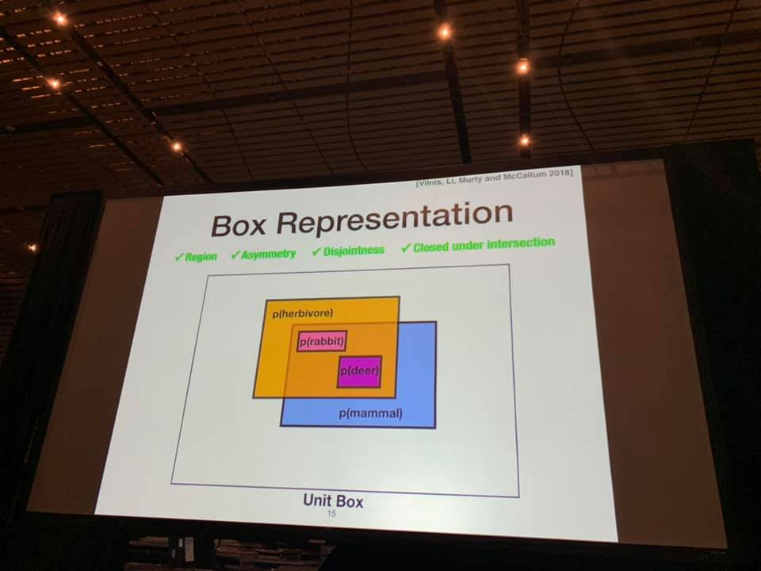
**이미지 캡션:** 이 사진은 발표회장에서 스크린에 띄워진 슬라이드를 촬영한 것으로, "Box Representation"이라는 제목 아래 여러 개의 사각형으로 이루어진 다이어그램이 제시되어 있습니다. 슬라이드 상단에는 "[Vilnis, Li, Murty and McCallum 2018]"이라는 출처 정보가 있으며, 그 아래에는 "Box Representation"이라는 제목과 함께 "Region", "Asymmetry", "Disjointness", "Closed under intersection"이라는 네 가지 속성이 녹색 체크 표시와 함께 나열되어 있습니다. 다이어그램은 여러 개의 중첩된 사각형으로 구성되어 있으며, 각 사각형에는 "p(herbivore)", "p(rabbit)", "p(deer)", "p(mammal)"이라는 라벨이 붙어 있습니다. 가장 큰 사각형은 "p(mammal)"을 나타내며, 그 안에 "p(herbivore)"가 있고, "p(herbivore)" 안에는 "p(rabbit)"이 있으며, "p(rabbit)"과 "p(herbivore)"의 일부 영역과 겹치는 부분에는 "p(deer)"가 표시되어 있습니다. 슬라이드 하단에는 "Unit Box"라는 문구와 함께 숫자 "15"가 작게 표시되어 있습니다. 발표회장 천장에는 조명이 여러 개 달려 있고, 스크린 주변은 어두운 배경으로 처리되어 있습니다. 슬라이드는 발표자가 청중에게 어떤 개념을 설명하기 위해 사용하고 있는 것으로 보이며, 다이어그램은 확률 분포나 집합 간의 관계를 시각적으로 표현하는 것으로 추정됩니다.
 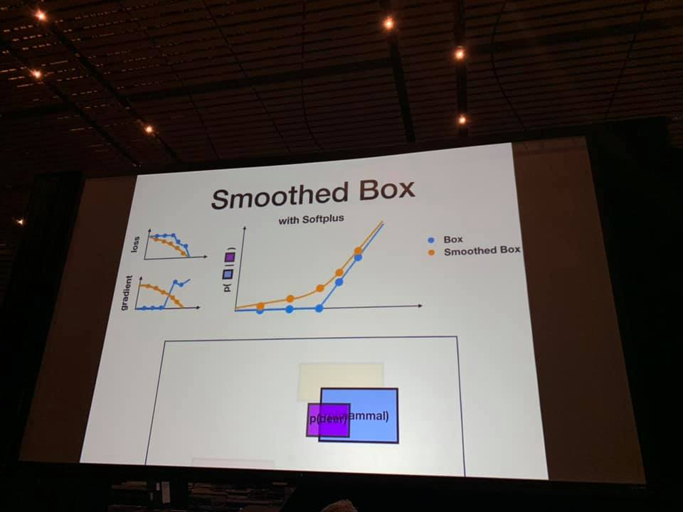
**이미지 캡션:** 이 사진은 발표 슬라이드를 촬영한 것으로, "Smoothed Box with Softplus"라는 제목이 화면 중앙 상단에 크게 표시되어 있습니다. 슬라이드에는 여러 개의 그래프와 다이어그램이 포함되어 있습니다. 왼쪽에는 두 개의 작은 그래프가 나란히 있는데, 위쪽 그래프는 'loss'를 나타내며 파란색과 주황색 점선으로 이루어진 두 개의 곡선이 그려져 있고, 아래쪽 그래프는 'gradient'를 나타내며 역시 파란색과 주황색 점선으로 이루어진 두 개의 곡선이 그려져 있습니다. 오른쪽에는 더 큰 그래프가 있는데, x축은 'p(deer)'로 추정되며, y축은 명확하게 표시되어 있지 않지만 그래프의 형태를 볼 때 'loss' 또는 다른 측정값일 가능성이 높습니다. 이 그래프에는 파란색 점과 주황색 점으로 이루어진 두 개의 곡선이 그려져 있으며, 'Box'와 'Smoothed Box'라는 범례가 오른쪽 상단에 표시되어 있습니다. 그래프 아래에는 보라색 테두리의 직사각형 안에 "p(deer) ammal)"이라는 텍스트가 적혀 있고, 그 주변에 연한 색의 직사각형들이 배치되어 있어 어떤 개념이나 데이터를 시각적으로 표현하는 것으로 보입니다. 슬라이드는 흰색 배경에 검은색과 파란색, 주황색, 보라색 등의 색상이 사용되었습니다. 사진의 하단에는 발표장으로 보이는 어두운 공간의 일부와 좌석의 일부가 희미하게 보이며, 천장에는 조명들이 달려 있습니다. 전체적으로 학술 발표 또는 기술 세미나의 한 장면으로 보이며, 딥러닝 또는 관련 분야의 연구 내용을 다루고 있을 가능성이 높습니다.

### 5월 11일 (토) 10:10 · A wonderful ride to the very end of the …

A wonderful ride to the very end of the Mississippi River! Beautiful, but watch out alligators. ^^

**이미지 캡션:** 한 명의 성인 남성이 헬멧을 쓰고 자전거 옆에 서서 엄지손가락을 치켜세우고 있다. 남성은 형광색과 보라색이 섞인 짧은 소매의 운동복 상의와 검은색 반바지, 검은색 샌들을 신고 있다. 그는 밝은 녹색 헬멧과 고글을 착용하고 있으며, 얼굴에는 미소를 띠고 있다. 그의 옆에는 빨간색과 은색의 접이식 자전거가 세워져 있다. 배경에는 주황색 벽돌 건물과 "Changes 'one Season At A Time'"이라는 문구가 쓰여 있다. 건물 앞에는 파란색 피크닉 테이블과 의자가 놓여 있으며, 출입문 옆에는 메뉴판으로 보이는 검은색 칠판이 있다. 전체적으로 야외에서 자전거를 타는 활동적인 분위기를 나타낸다.
 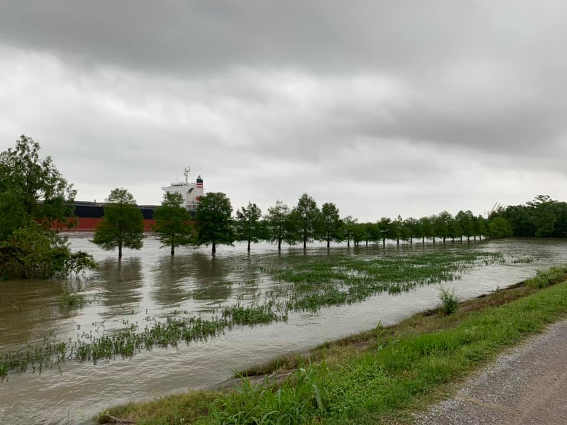
**이미지 캡션:** 흐린 하늘 아래, 홍수로 물에 잠긴 넓은 강가 풍경이 펼쳐져 있습니다. 강물은 탁한 갈색을 띠고 있으며, 물 위로는 키가 작은 풀들이 듬성듬성 자라나 있습니다. 강가에는 일렬로 늘어선 나무들이 물에 잠긴 채 서 있고, 그 뒤로는 붉은색과 검은색 선박이 거대한 모습으로 떠 있습니다. 선박의 상부 구조물에는 하얀색 페인트가 칠해져 있고, 굴뚝에는 붉은색과 검은색 띠가 둘러져 있습니다. 멀리 보이는 강 건너편에는 울창한 숲이 우거져 있습니다. 사진의 오른쪽 하단에는 흙길과 함께 푸른 잔디가 보입니다. 전반적으로 침수된 자연 환경과 거대한 선박이 어우러져 다소 웅장하면서도 침울한 분위기를 자아냅니다.
 
**이미지 캡션:** 흐린 날씨에 강둑을 따라 뻗은 자갈길이 보인다. 길은 잔디밭으로 둘러싸여 있으며, 왼쪽에는 울창한 나무들이 늘어선 강이 흐르고 있다. 강물은 탁한 갈색을 띠고 있으며, 나무들은 물에 잠긴 듯 보인다. 길의 오른쪽에는 넓은 잔디밭이 펼쳐져 있고, 멀리 나무와 텐트 몇 개가 보인다. 사진에는 사람이 보이지 않으며, 텍스트도 없다. 전반적으로 평화롭고 고요한 분위기를 자아낸다.
 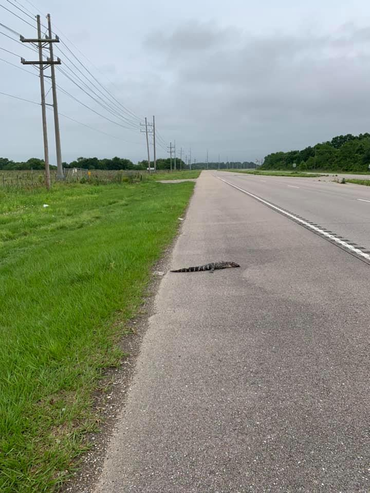
**이미지 캡션:** 이 사진은 맑은 날씨에 넓은 도로 옆에서 찍혔으며, 도로 위에는 얼룩무늬가 있는 큰 도마뱀이 길게 누워 있다. 도마뱀은 회색빛의 몸통과 검은색 줄무늬를 가지고 있으며, 머리는 도로의 중앙선을 향하고 있다. 도로의 왼쪽에는 푸른 잔디밭이 펼쳐져 있고, 잔디밭에는 전봇대와 전선들이 늘어서 있다. 멀리 보이는 풍경은 나무와 숲으로 이루어져 있으며, 하늘은 구름이 약간 끼어 있다. 도로에는 차선이 명확하게 표시되어 있으며, 차량 통행이 뜸한 듯 보인다. 전반적으로 한적하고 자연적인 분위기를 풍기는 사진이다.
 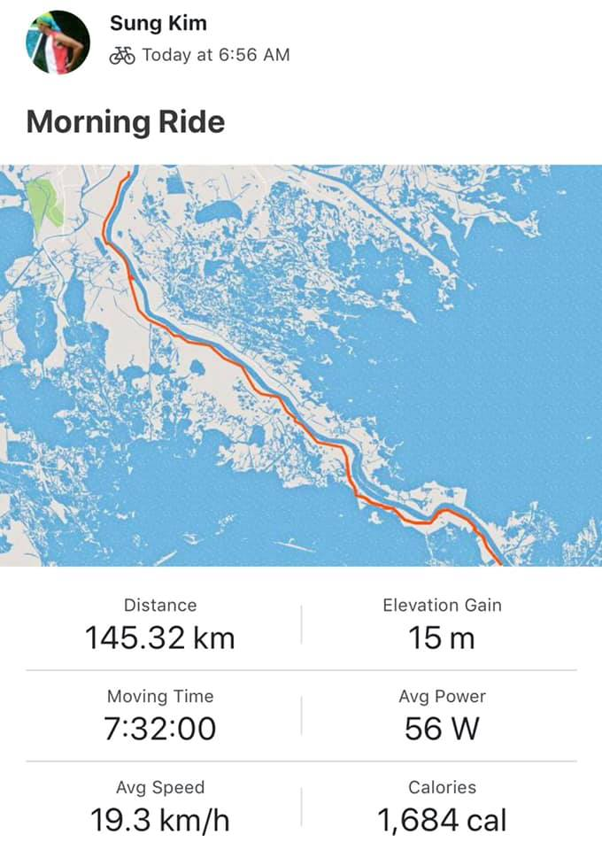
**이미지 캡션:** 이 사진은 'Sung Kim'이라는 사용자가 오늘 아침 6시 56분에 완료한 'Morning Ride'라는 제목의 자전거 라이딩 기록을 보여줍니다. 사진 상단에는 사용자의 프로필 사진과 이름, 그리고 라이딩 제목이 있습니다. 프로필 사진에는 녹색 모자와 빨간색 상의를 입고 있는 사람의 모습이 보입니다. 중앙에는 실제 라이딩 경로를 나타내는 지도 이미지가 있으며, 주황색 선으로 표시된 경로가 강줄기를 따라 이어져 있습니다. 지도 아래에는 라이딩 기록 통계가 표시되어 있습니다. 총 이동 거리는 145.32km이며, 실제 이동 시간은 7시간 32분입니다. 평균 속도는 시속 19.3km이고, 총 고도 상승량은 15미터입니다. 평균 파워는 56와트이며, 소모 칼로리는 1,684 칼로리입니다. 전반적으로 활동적인 라이프스타일을 보여주는 기록으로, 장거리 라이딩을 성공적으로 마친 상황을 나타냅니다.
 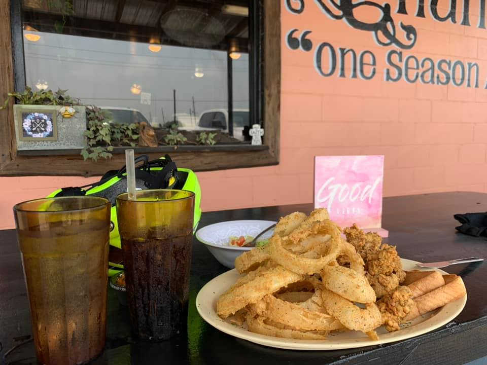
**이미지 캡션:** 이 사진은 야외 테이블에 놓인 음식과 음료를 보여줍니다. 테이블 위에는 두 개의 갈색 유리잔이 있는데, 하나는 음료로 거의 가득 차 있고 다른 하나는 절반 정도 차 있습니다. 두 잔 모두 빨대가 꽂혀 있습니다. 그 뒤에는 밝은 형광 녹색과 검은색의 가방이 놓여 있습니다. 테이블 중앙에는 접시가 놓여 있는데, 접시 위에는 튀긴 양파링, 튀긴 치킨 조각, 그리고 토스트 두 조각이 담겨 있습니다. 접시 옆에는 작은 흰색 그릇이 있는데, 그 안에는 샐러드나 소스가 담겨 있는 것으로 보입니다. 배경에는 분홍색 벽돌 건물 외벽이 보이며, "One Season"이라는 글자가 검은색으로 쓰여 있습니다. 건물 창문 안쪽으로는 식당 내부의 조명과 식물이 보입니다. 또한, 분홍색 배경에 "Good Vibes"라고 쓰인 작은 입간판이 음식 접시 뒤에 서 있습니다. 전체적으로 캐주얼한 식당에서 식사를 즐기는 듯한 분위기입니다.

### 5월 11일 (토) 23:51 · 📷 사진 (1장)

**이미지 캡션:** 이것은 아마존 킨들 구매 확인 페이지를 보여주는 스크린샷으로, 성인 남성이 스마트폰으로 보고 있으며, 화면에는 "좋은 소식입니다! 구매하신 상품에 대해 1.50달러를 절약하셨습니다."라는 메시지가 표시됩니다. 또한 "Architects of Intelligence: The truth about AI..."라는 책이 킨들 라이브러리에 추가되었으며 iPad 2에 자동으로 다운로드될 것이라는 내용이 보입니다. 페이지 하단에는 "저자를 팔로우하세요" 섹션이 있으며, 마틴 포드라는 저자의 이름이 보입니다. 전반적으로 구매가 완료되었음을 알리는 긍정적이고 정보 제공적인 분위기입니다.

### 5월 12일 (일) 10:10 · 📷 사진 (7장)

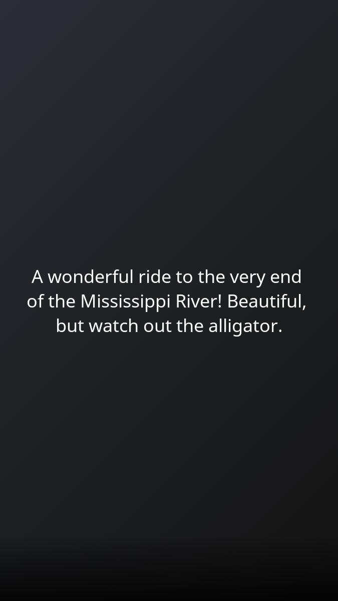
**이미지 캡션:** 이 사진은 어두운 회색 배경에 흰색 텍스트가 표시됩니다. 텍스트는 "A wonderful ride to the very end of the Mississippi River! Beautiful, but watch out the alligator."라고 쓰여 있습니다. 이 텍스트는 미시시피 강 끝까지 멋진 여행을 묘사하며, 아름답지만 악어 조심하라는 경고를 포함하고 있습니다. 사진에는 사람, 장소, 사물, 보이는 텍스트 외의 다른 시각적 요소는 없습니다. 텍스트의 내용으로 보아 야외 활동이나 여행과 관련된 상황으로 추정됩니다.
 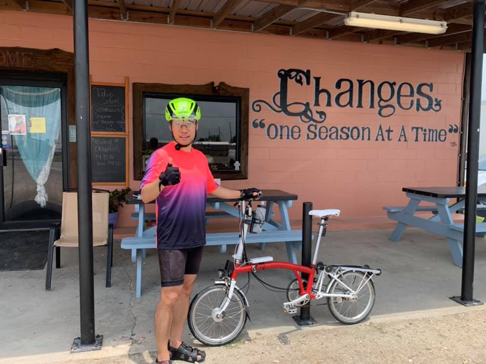
**이미지 캡션:** 한 명의 성인 남성이 헬멧을 쓰고 자전거 옆에 서서 엄지손가락을 치켜들고 있다. 남성은 밝은 형광 녹색 헬멧, 고글, 분홍색과 보라색 그라데이션이 있는 짧은 소매 저지, 검은색 반바지, 검은색 샌들을 착용하고 있다. 그는 붉은색과 은색 접이식 자전거 옆에 서 있으며, 자전거에는 물병이 달려 있다. 배경에는 주황색 벽돌 건물과 "Changes 'One Season At A Time'"이라는 문구가 쓰여 있다. 건물 앞에는 파란색 피크닉 테이블과 의자가 놓여 있다. 건물 입구에는 "Today's Special"이라고 적힌 칠판 메뉴가 보인다. 전체적으로 야외에서 자전거를 타는 활동적인 분위기를 연출한다.
 
**이미지 캡션:** 흐린 하늘 아래, 물에 잠긴 넓은 들판에 줄지어 서 있는 나무들이 보이며, 멀리 거대한 선박이 강을 따라 항해하고 있습니다. 흙빛의 물은 들판을 뒤덮고 있으며, 물 위에는 푸른 풀들이 듬성듬성 자라나 있습니다. 오른쪽에는 흙길과 풀이 우거진 제방이 보입니다. 나무들은 물에 잠긴 채 굳건히 서 있고, 선박은 붉은색과 검은색의 선체, 하얀색 상부 구조물을 가지고 있으며 굴뚝에는 붉은색 띠가 둘러져 있습니다. 전체적으로 자연재해로 인한 침수 상황을 보여주는 듯한 분위기이며, 인물은 보이지 않습니다.
 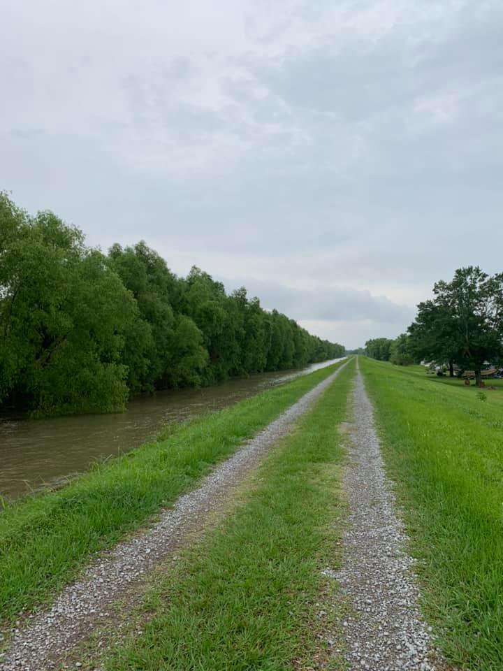
**이미지 캡션:** 흐린 날씨에 강둑을 따라 뻗은 자갈길이 보인다. 길의 왼쪽에는 짙은 녹색의 나무들이 빽빽하게 늘어서 있고, 그 너머로는 흙빛의 강물이 흐르고 있다. 강물은 잔잔하지만 수위가 높아 강둑에 거의 닿을 듯하다. 길의 오른쪽은 푸른 잔디밭으로 덮여 있으며, 멀리 나무 몇 그루와 함께 텐트 몇 동이 보인다. 전체적으로 평화롭고 한적한 자연 풍경을 담고 있으며, 인물은 보이지 않는다.
 
**이미지 캡션:** 이 사진은 맑은 날씨에 뻥 뚫린 도로 옆에서 찍혔으며, 도로에는 얼룩무늬 도마뱀이 길을 건너고 있습니다. 사진의 왼쪽에는 푸른 잔디밭과 전봇대가 늘어서 있고, 오른쪽에는 숲이 우거진 언덕이 보입니다. 하늘은 구름 한 점 없이 맑고 푸르며, 도로에는 흰색 차선이 그려져 있습니다. 도마뱀은 도로 중앙에 누워 있으며, 그 모습은 마치 길을 잃은 듯 보입니다. 전체적으로 평화롭고 고요한 분위기를 자아내지만, 도로 위에 있는 도마뱀의 모습은 예상치 못한 상황을 연출하며 시선을 사로잡습니다.
 
**이미지 캡션:** 사진에는 "Sung Kim"이라는 이름의 사용자가 오늘 오전 6시 56분에 "Morning Ride"라는 제목으로 자전거 타기 활동을 기록한 화면이 보입니다. 화면 상단에는 사용자의 프로필 사진으로 보이는 작은 원형 이미지가 있으며, 녹색과 노란색 모자를 쓰고 붉은색 상의를 입은 사람의 모습이 일부 보입니다. 이 활동은 145.32km의 거리를 7시간 32분 동안 이동했으며, 평균 속도는 시속 19.3km였습니다. 또한, 15m의 고도 상승이 있었고, 평균 파워는 56W, 소모 칼로리는 1,684kcal로 기록되었습니다. 배경에는 강과 주변 지역의 지도가 표시되어 있으며, 주황색 선으로 자전거 경로가 표시되어 있습니다. 전반적으로 활동적인 라이프스타일을 보여주는 기록 화면입니다.
 
**이미지 캡션:** 이 사진은 야외 식당 테이블에 놓인 음식과 음료를 보여줍니다. 테이블 위에는 두 잔의 갈색 음료가 있으며, 한 잔에는 빨대가 꽂혀 있습니다. 그 옆에는 튀김 음식과 양파링, 그리고 빵 조각이 담긴 접시가 있습니다. 접시 뒤쪽에는 분홍색 배경에 "Good Vibes"라고 쓰인 작은 입간판이 보입니다. 배경에는 식당 건물의 창문이 있고, 창문 안쪽으로는 식물과 장식품, 그리고 창밖으로는 흐릿한 풍경이 보입니다. 전체적으로 캐주얼하고 편안한 분위기입니다.

### 5월 13일 (월) 00:54 · Amazing Paris City Run with wonderful fr…

Amazing Paris City Run with wonderful friends, Seokjoo Han and Taek Young Kang. It is more sightseeing than running, and I saw most of Paris during this run. Really Amazing!!

https://www.sortiraparis.com/interests/sport/articles/156956-run-my-city-2019-in-paris/

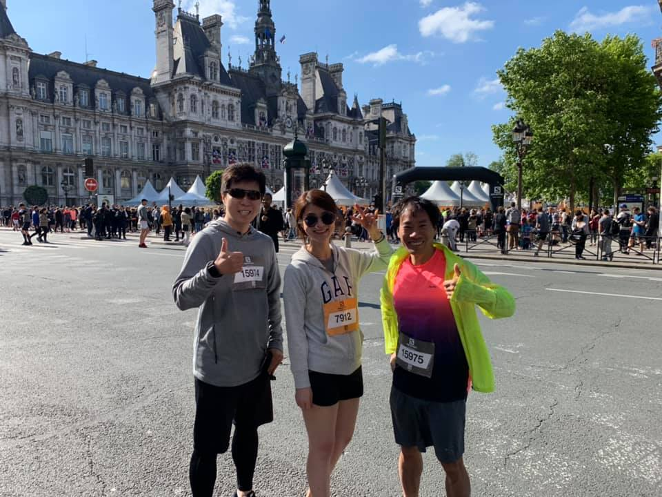
**이미지 캡션:** 세 명의 성인 남녀가 파리의 시청 건물 앞에서 사진을 찍고 있으며, 배경에는 많은 사람들이 모여 있고 레이스 출발/도착 아치가 보인다. 왼쪽 남성은 30대 후반에서 40대 초반으로 보이며, 회색 후드티와 검은색 반바지, 검은색 타이츠를 입고 선글라스를 착용하고 엄지손가락을 치켜들고 있다. 그의 가슴에는 '15914'라는 번호가 부착되어 있다. 가운데 여성은 30대 초반으로 보이며, 회색 후드티와 검은색 반바지를 입고 있으며, 밝게 웃고 있다. 그녀의 가슴에는 '7912'라는 번호가 보인다. 오른쪽 남성은 30대 후반에서 40대 초반으로 보이며, 형광 연두색 바람막이 안에 핑크색과 보라색이 그라데이션 된 티셔츠를 입고, 회색 반바지를 착용하고 있다. 그는 엄지손가락을 치켜들고 있으며, 가슴에는 '15975'라는 번호가 부착되어 있다. 세 사람 모두 레이스 참가자인 것으로 보이며, 즐겁고 활기찬 분위기이다. 배경의 건물은 프랑스 파리의 시청 건물으로 보이며, 맑은 날씨에 야외 행사 또는 마라톤 대회가 열리고 있는 상황이다.
 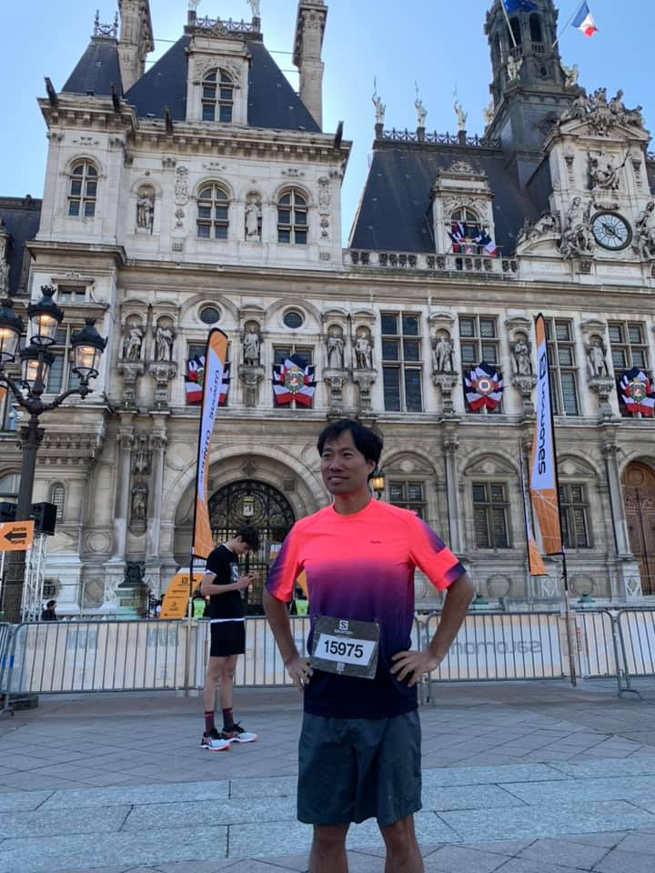
**이미지 캡션:** 이 사진은 파리의 시청 건물 앞에서 열린 마라톤 대회에 참가한 성인 남성을 보여줍니다. 남성은 30대 후반에서 40대 초반으로 보이며, 짧은 머리에 부드러운 미소를 짓고 있습니다. 그는 네이비 색상의 반바지와 네온 핑크에서 보라색으로 그러데이션되는 반팔 티셔츠를 입고 있으며, 가슴에는 15975라는 번호가 적힌 레이스 번호표를 달고 있습니다. 두 손을 허리에 얹고 자신감 있는 자세를 취하고 있습니다. 배경에는 웅장한 파리 시청 건물이 보이며, 건물에는 프랑스 국기가 걸려 있고 여러 개의 조각상과 장식이 있습니다. 건물 앞에는 마라톤 경주를 알리는 오렌지색 배너와 금속 울타리가 설치되어 있습니다. 남성 뒤쪽에는 다른 참가자로 보이는 젊은 남성이 스마트폰을 보고 있습니다. 전체적으로 화창한 날씨에 활기찬 분위기 속에서 열리는 스포츠 행사의 모습을 담고 있습니다.
 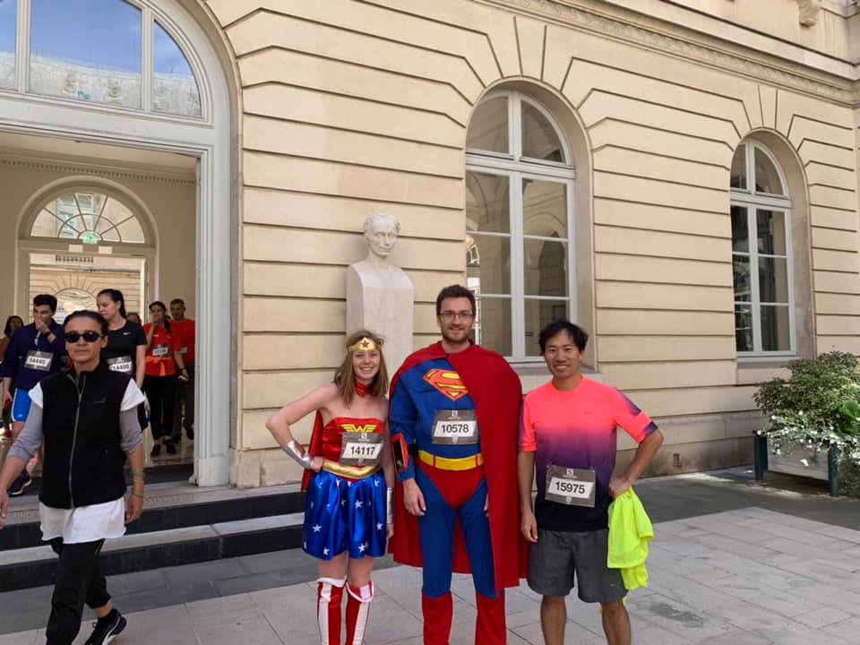
**이미지 캡션:** 건물 앞에 서 있는 세 명의 참가자가 보이며, 이들은 모두 경주에 참가한 것으로 보인다. 왼쪽에는 검은색 조끼와 흰색 상의를 입고 선글라스를 낀 성인 여성이 서 있고, 그녀의 뒤로는 여러 명의 다른 참가자들이 건물 안으로 들어가고 있다. 중앙에는 슈퍼맨 복장을 한 성인 남성이 빨간 망토를 두르고 파란색과 빨간색 의상을 입고 있으며, 가슴에는 10578번이라는 번호표를 달고 있다. 그의 옆에는 분홍색과 보라색 그라데이션 티셔츠와 회색 반바지를 입은 성인 남성이 노란색 수건을 들고 서 있고, 그의 번호표는 15975번이다. 슈퍼맨 복장을 한 여성도 원더우먼 복장을 하고 있으며, 가슴에는 14117번이라는 번호표를 달고 있다. 이들은 모두 밝은 표정으로 카메라를 바라보고 있으며, 배경에는 고전적인 건축 양식의 건물이 보이고, 건물 앞에는 조각상과 화분이 놓여 있다. 전체적으로 활기차고 즐거운 분위기의 행사임을 알 수 있다.
 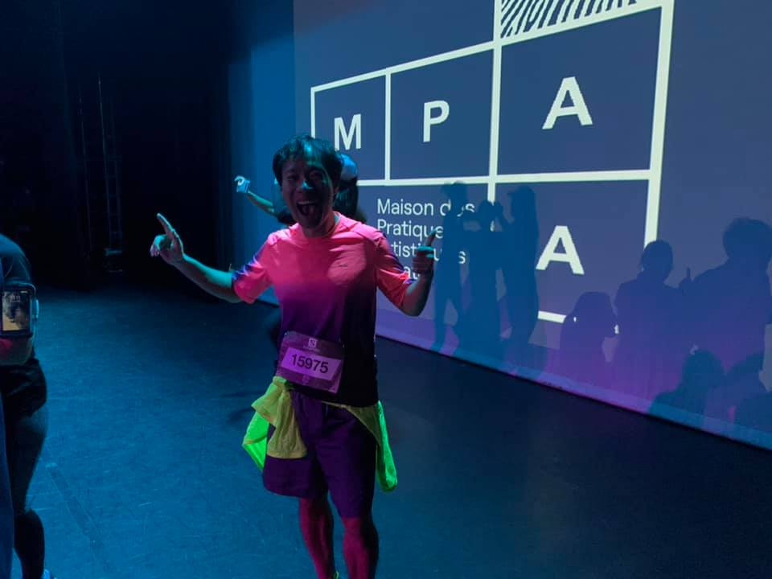
**이미지 캡션:** 이 사진은 무대 위에서 밝은 형광색 티셔츠와 보라색 반바지를 입고 있는 성인 남성을 보여줍니다. 남성은 옅은 분홍색에서 짙은 분홍색으로 그러데이션된 짧은 소매 티셔츠를 입고 있으며, 허리에는 형광 노란색과 초록색 천을 두르고 있습니다. 그의 가슴에는 '15975'라고 적힌 번호표가 달려 있습니다. 남성은 활짝 웃으며 오른손 검지를 위로 향하고 있고, 왼손은 옆으로 뻗어 있습니다. 그의 표정은 매우 즐겁고 활기찬 모습입니다. 배경에는 파란색과 보라색 조명이 비추고 있으며, 벽에는 'MPA'라는 글자와 함께 'Maison des Pratiques Artistiques'라는 문구가 흰색으로 크게 쓰여 있습니다. 여러 사람들의 실루엣이 배경에 보이며, 마치 행사나 공연의 일부인 것처럼 보입니다. 전반적으로 축제나 스포츠 이벤트의 한 장면처럼 활기차고 긍정적인 분위기입니다.
 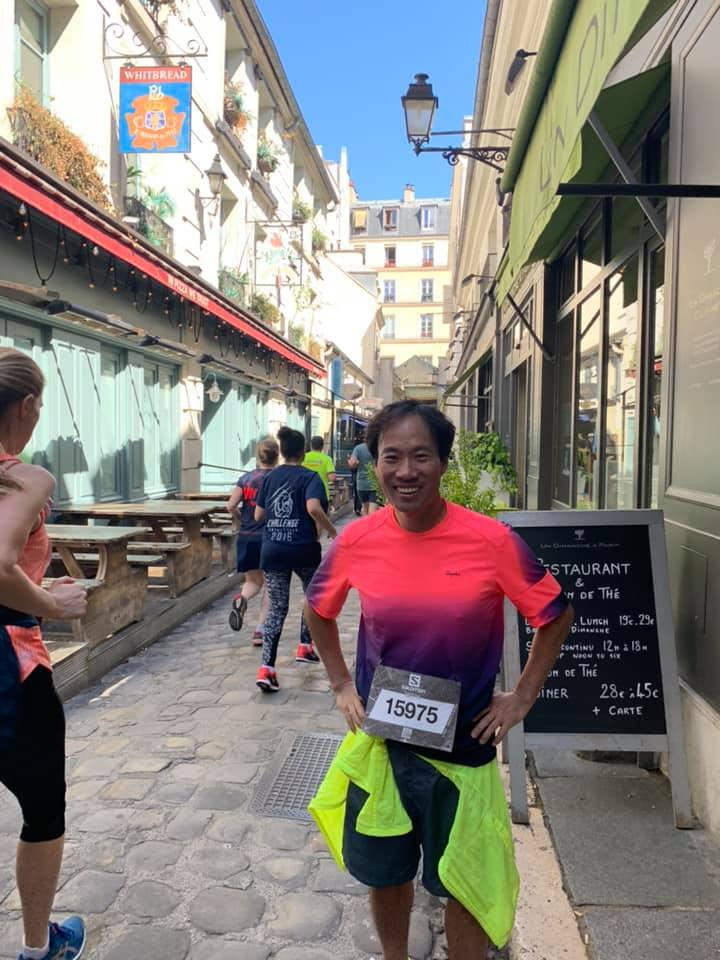
**이미지 캡션:** A middle-aged Asian man with short black hair and a wide smile is standing in the foreground of a narrow cobblestone street lined with buildings and outdoor seating. He is wearing a brightly colored t-shirt that transitions from pink to purple, black running shorts, and a neon yellow running jacket tied around his waist. A race bib with the number 15975 is pinned to his shirt. Behind him, several other runners are visible in the distance, and on the right side of the image, a blackboard menu for a restaurant is displayed. The buildings on either side of the street have awnings and windows, and there are signs hanging from them, including one that says "WHITBREAD." The overall atmosphere is that of a sunny day, possibly during a race or a lively outdoor event.
 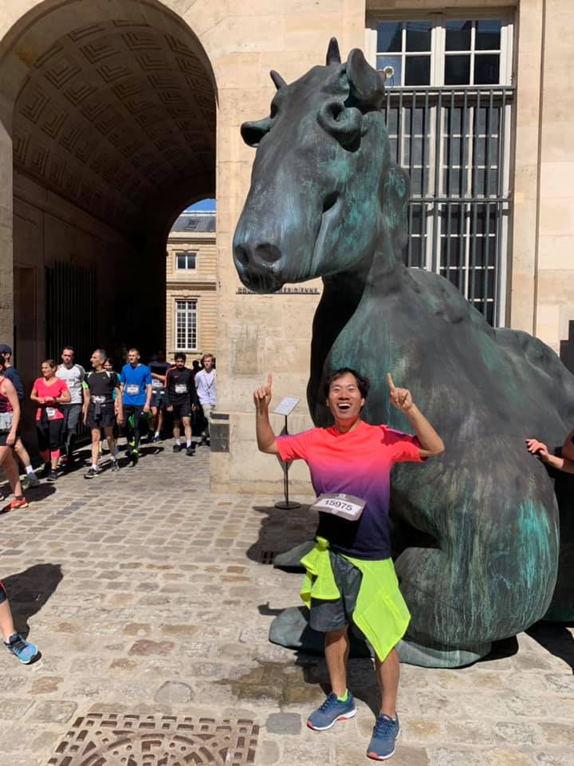
**이미지 캡션:** 한 명의 성인 남성이 밝은 햇살 아래 야외에서 조각상 옆에 서서 카메라를 향해 활짝 웃고 있으며, 두 손가락으로 위를 가리키고 있다. 그는 붉은색과 보라색이 그라데이션된 반팔 티셔츠와 회색 반바지, 형광 연두색 조끼를 입고 있으며, 가슴에는 '15975'라고 적힌 번호표를 달고 있다. 그의 발에는 파란색과 주황색이 섞인 운동화가 신겨져 있다. 배경에는 웅장한 아치형 통로와 고풍스러운 건물, 그리고 다른 참가자들이 달리기 경주를 준비하는 듯한 모습이 보인다. 조각상은 청동으로 만들어진 듯한 거대한 동물의 형상이며, 그 뒤로는 창살이 있는 창문이 있는 건물이 보인다. 바닥은 돌로 포장되어 있으며, 맨홀 뚜껑도 보인다. 전반적으로 활기차고 즐거운 분위기이며, 달리기 경주 행사 중인 것으로 보인다.
 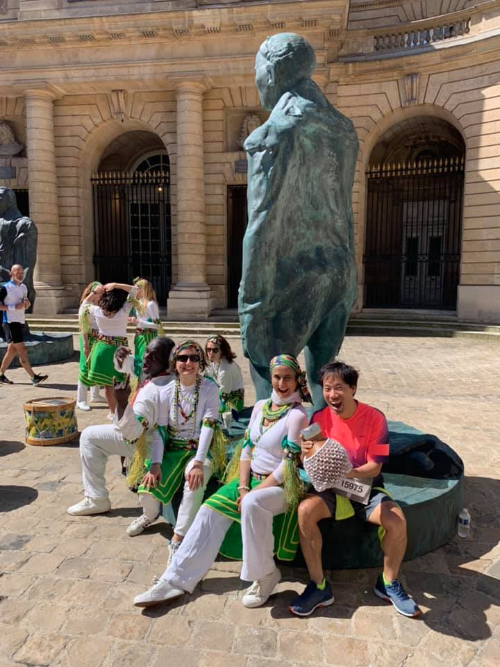
**이미지 캡션:** 이 사진은 야외 광장에서 촬영되었으며, 배경에는 웅장한 석조 건물과 여러 개의 동상이 보인다. 전경에는 다섯 명의 사람들이 앉아 있거나 서 있으며, 그중 네 명은 전통 의상으로 보이는 녹색과 흰색의 복장을 하고 있다. 이들은 머리에 스카프를 두르고 화려한 목걸이를 착용하고 있으며, 밝고 즐거운 표정을 짓고 있다. 특히 가운데 앉아 있는 여성은 선글라스를 끼고 환하게 웃고 있다. 그 옆에 앉아 있는 남성은 핑크색 티셔츠와 검은색 반바지를 입고 있으며, 손에는 경주 번호표 15975가 달린 물건을 들고 있다. 그는 매우 신나 보이는 표정으로 입을 크게 벌리고 웃고 있다. 다른 사람들도 즐거운 분위기 속에서 포즈를 취하고 있다. 사진 왼쪽에는 북처럼 보이는 악기가 놓여 있고, 오른쪽에는 물병이 보인다. 전반적으로 축제나 이벤트의 일부인 듯한 활기차고 유쾌한 분위기를 느낄 수 있다.
 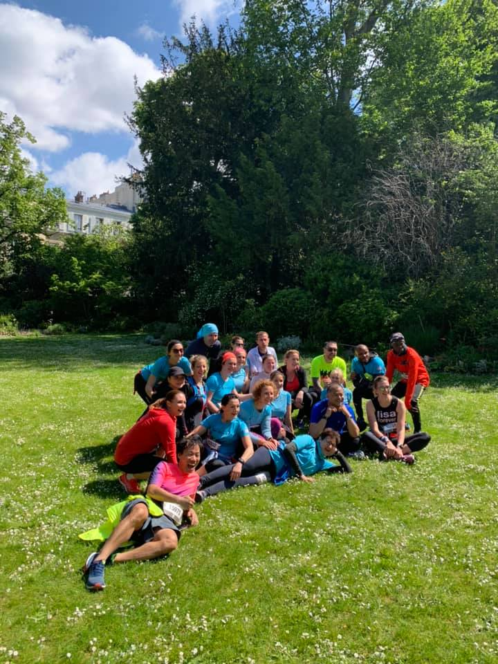
**이미지 캡션:** 이 사진은 잔디밭에 앉아 있는 다양한 연령대의 성인 남녀 그룹을 보여줍니다. 대부분의 사람들은 밝은 색상의 운동복을 입고 있으며, 일부는 달리기 대회에 참가한 듯한 모습입니다. 사진의 왼쪽 하단에는 한 남성이 핑크색 상의와 회색 반바지를 입고 잔디밭에 누워 있으며, 그의 상의에는 "15970"이라는 숫자가 적힌 번호표가 달려 있습니다. 그의 옆에는 형광 노란색 조끼가 놓여 있습니다. 그룹의 대부분은 웃거나 카메라를 향해 포즈를 취하고 있으며, 전반적으로 즐겁고 활기찬 분위기입니다. 배경에는 울창한 녹색 나무와 푸른 하늘, 그리고 구름이 보이며, 멀리 건물도 희미하게 보입니다. 한 여성의 상의에는 "lisa forever"라는 문구가 보입니다.
 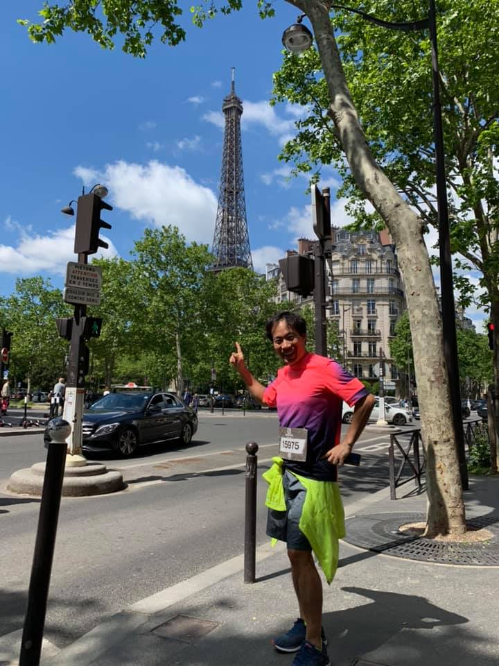
**이미지 캡션:** 에펠탑을 배경으로 한 성인 남성이 밝은 표정으로 서 있다. 남성은 30대 후반에서 40대 초반으로 보이며, 핑크색과 보라색이 섞인 짧은 소매 운동복 상의와 회색 반바지를 입고 있다. 허리에는 형광 연두색 바람막이를 묶고 있으며, 파란색 운동화를 신고 있다. 가슴에는 '15975'라고 적힌 번호표를 달고 있어 마라톤 참가자임을 알 수 있다. 남성은 오른손 검지를 위로 향하게 들고 있으며, 활기찬 모습이다. 배경에는 파리의 상징인 에펠탑이 우뚝 서 있고, 맑고 푸른 하늘에는 흰 구름이 떠 있다. 주변에는 푸른 나무들과 파리 시내의 건물들이 보이며, 도로에는 검은색 택시와 다른 차량들이 지나가고 있다. 신호등과 가로등도 보이며, 보도블록에는 나무 그림자가 드리워져 있다. 전반적으로 화창한 날씨 속에서 마라톤을 즐기는 듯한 긍정적이고 활기찬 분위기이다.
 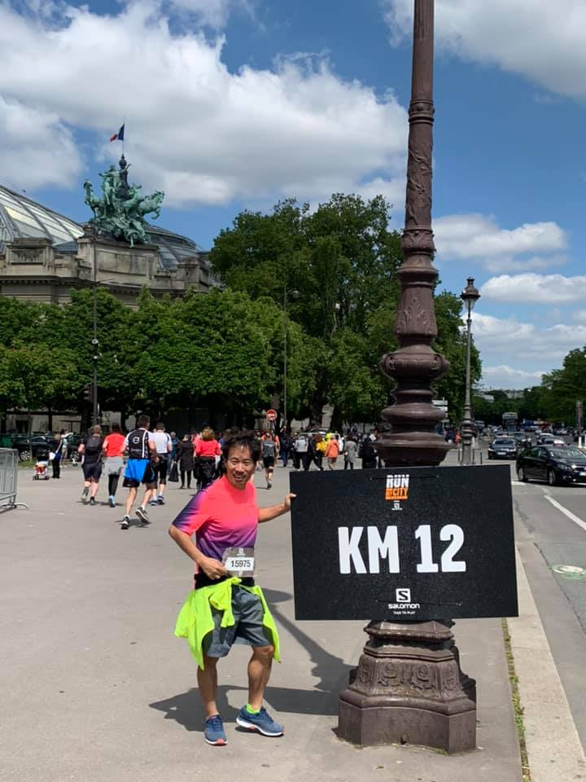
**이미지 캡션:** 한 명의 성인 남성이 밝은 햇살 아래 야외에서 마라톤 코스 표지판 옆에 서 있다. 남성은 40대 후반에서 50대 초반으로 보이며, 짧은 검은 머리에 웃는 표정을 짓고 있다. 그는 분홍색과 보라색이 섞인 짧은 소매 티셔츠와 회색 반바지, 형광 연두색 조끼를 입고 있으며, 파란색 운동화를 신고 있다. 그의 가슴에는 '15975'라고 적힌 마라톤 번호표가 달려 있다. 남성은 오른손으로 검은색 표지판을 잡고 있고, 표지판에는 'RUN IN THE CITY'라는 문구와 함께 'KM 12'라는 글자가 크게 쓰여 있으며, 하단에는 살로몬(Salomon) 로고가 보인다. 배경에는 파리의 유명한 건축물인 그랑 팔레(Grand Palais)로 추정되는 웅장한 건물이 보이고, 그 위에는 프랑스 국기가 펄럭이고 있다. 건물 주변으로는 울창한 나무들이 늘어서 있으며, 도로에는 차량들이 지나가고 있고, 다른 참가자들이 마라톤을 하고 있는 모습도 보인다. 전반적으로 화창한 날씨 속에서 열리는 마라톤 대회의 활기찬 분위기를 느낄 수 있다.
 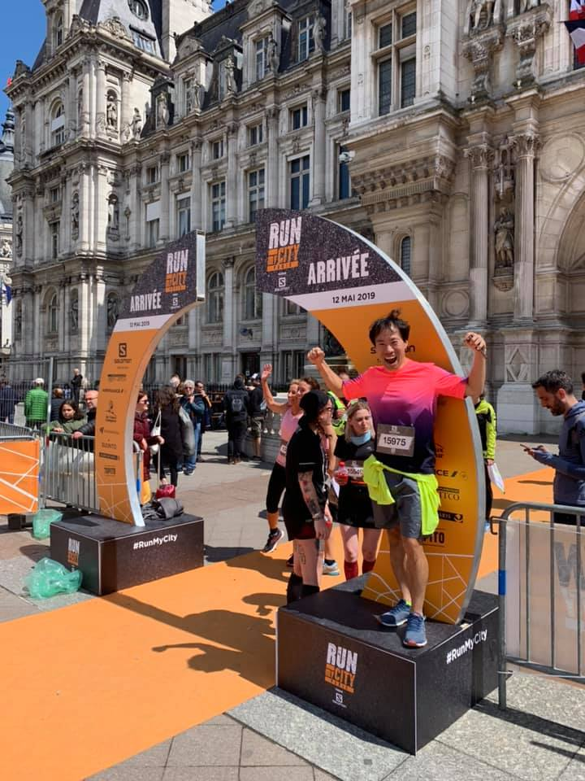
**이미지 캡션:** 이 사진은 파리의 시청 건물 앞에서 열린 마라톤 대회 결승선 근처에서 찍혔으며, 한 성인 남성이 환호하며 두 팔을 번쩍 들고 있다. 그는 핑크색과 보라색이 섞인 상의와 형광 연두색 허리띠, 회색 반바지, 파란색 운동화를 착용하고 있으며, 배번 15975를 달고 있다. 그의 표정은 매우 기쁘고 흥분되어 있으며, 마치 경주를 마친 승리자처럼 보인다. 주변에는 다른 참가자들과 관중들이 보이며, 그들 역시 축하하는 분위기이다. 배경에는 웅장한 파리 시청 건물이 보이고, 결승선을 알리는 아치형 구조물에는 "RUN MY CITY"와 "ARRIVÉE"(프랑스어로 도착)라는 문구가 적혀 있으며, 2019년 5월 12일이라는 날짜도 명시되어 있다. 전체적으로 활기차고 축제 같은 분위기이며, 성공적으로 경주를 마친 기쁨이 느껴진다.
 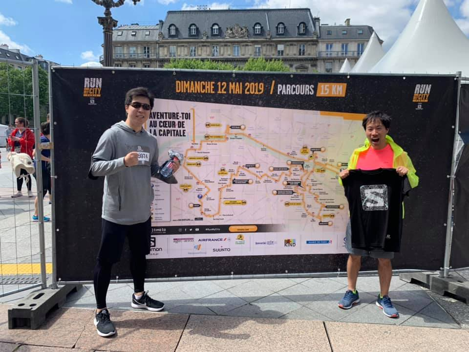
**이미지 캡션:** 두 명의 성인 남성이 달리기 대회 기념 현수막 앞에서 포즈를 취하고 있다. 왼쪽 남성은 30대 초반으로 추정되며, 회색 후드티와 검은색 타이츠, 검은색 운동화를 신고 있다. 그는 선글라스를 착용하고 있으며, 가슴에는 5974라는 번호표를 달고 있다. 손에는 물병과 기념품으로 보이는 것을 들고 있다. 오른쪽 남성은 20대 후반으로 추정되며, 형광 노란색 재킷 안에 분홍색 티셔츠를 입고 회색 반바지와 파란색 운동화를 신고 있다. 그는 활짝 웃으며 검은색 티셔츠를 펼쳐 보이고 있다. 배경에는 파리의 건물과 텐트가 보이며, "RUN BY CITY"라는 로고와 함께 "DIMANCHE 12 MAI 2019 / PARCOURS 15 KM"이라는 문구가 적힌 현수막이 걸려 있다. 현수막에는 프랑스어로 "AVENTURE-TOI AU CŒUR DE LA CAPITALE"이라는 문구와 함께 15km 코스 지도가 그려져 있으며, 여러 스폰서 로고들이 보인다. 전체적으로 활기차고 축제 분위기가 느껴진다.
 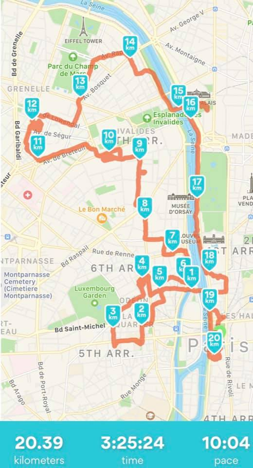
**이미지 캡션:** 이것은 파리의 지도 위에 오렌지색 선으로 표시된 운동 경로를 보여주는 스크린샷입니다. 지도에는 에펠탑, 샹 드 마르스 공원, 앵발리드, 오르세 미술관, 룩셈부르크 정원 등 유명한 랜드마크와 함께 다양한 거리와 지역 이름이 표시되어 있습니다. 경로에는 1km부터 20km까지의 이정표가 표시되어 있으며, 이는 운동 중 경과한 거리를 나타냅니다. 화면 하단에는 총 운동 거리 20.39km, 총 운동 시간 3시간 25분 24초, 평균 페이스 10분 04초가 표시되어 있습니다. 이 이미지는 운동 추적 앱의 화면을 캡처한 것으로 보이며, 파리의 주요 명소를 지나가는 긴 거리 운동 또는 달리기 경로를 보여줍니다.

🎬 동영상 2개 (생략)

### 5월 14일 (화) 17:54 · A wonderful Palace of Versailles ride. R…

A wonderful Palace of Versailles ride. Riding in Paris is Amazing!!

**이미지 캡션:** 밝은 햇살 아래, 한 성인 남성이 형광 연두색 재킷과 보라색, 분홍색이 섞인 티셔츠를 입고 헬멧을 쓴 채 자전거 옆에 서 있다. 그는 오른손을 들어 환하게 웃으며 카메라를 향해 손짓하고 있으며, 그의 자전거에는 여행용 가방이 매달려 있다. 배경에는 화려한 금색 장식이 돋보이는 거대한 철문과 그 뒤로 웅장한 궁전 건물이 보인다. 철문 안쪽에는 하얀색 천막이 설치되어 있고, 여러 명의 사람들이 줄을 서서 기다리고 있다. 바닥은 돌로 포장되어 있으며, 길게 드리워진 그림자가 이국적인 분위기를 더한다.
 
**이미지 캡션:** 맑은 날 파리의 센 강변을 자전거를 타고 있는 성인 남성이 밝은 형광색 재킷과 헬멧을 착용하고 카메라를 향해 미소를 짓고 있습니다. 남성은 30대에서 40대로 보이며, 헬멧에는 'GIRO'라는 로고가 보입니다. 그는 검은색 바지와 장갑을 착용하고 있으며, 한 손은 허리에 얹고 있습니다. 배경에는 센 강과 강변을 따라 늘어선 건물들이 보이며, 멀리 에펠탑과 다른 도시의 랜드마크들이 희미하게 보입니다. 강 위에는 작은 배가 떠 있고, 하늘에는 비행운이 길게 늘어져 있습니다. 전체적으로 화창하고 활동적인 분위기를 자아냅니다.
 
**이미지 캡션:** 해 질 녘 파리의 센 강변 풍경으로, 에펠탑이 석양을 배경으로 웅장하게 서 있고 강 위에는 여러 척의 배들이 떠 있다. 강변에는 나무가 우거져 있고, 도로에는 차량 몇 대가 지나가고 있다. 하늘에는 구름과 비행운이 희미하게 보이며, 전체적으로 평화롭고 아름다운 분위기를 자아낸다.
 
**이미지 캡션:** 이 사진은 "Sung Kim"이라는 사용자가 오늘 아침 6시 43분에 기록한 "Morning Ride"라는 제목의 사이클링 기록을 보여줍니다. 사진 상단에는 사용자의 프로필 사진과 이름, 그리고 활동 시간이 표시되어 있습니다. 중앙에는 파리 시내와 그 주변 지역의 지도가 나타나 있으며, 주황색 선으로 사이클링 경로가 표시되어 있습니다. 경로 상에는 "Boulogne-Billancourt", "Paris", "Montrouge", "Clamart", "Vélizy-Villacoublay"와 같은 지명들이 보입니다. 지도 아래에는 이번 라이딩의 상세 기록이 표시되어 있는데, 총 거리는 41.91km, 이동 시간은 2시간 17분 33초, 평균 속도는 시속 18.3km, 고도 상승은 465m, 평균 파워는 93W, 소모 칼로리는 855kcal입니다. 전반적으로 활동적인 아침 운동 기록을 보여주는 깔끔하고 정보 전달이 명확한 화면입니다.

### 5월 15일 (수) 00:29 · 📷 사진 (6장)

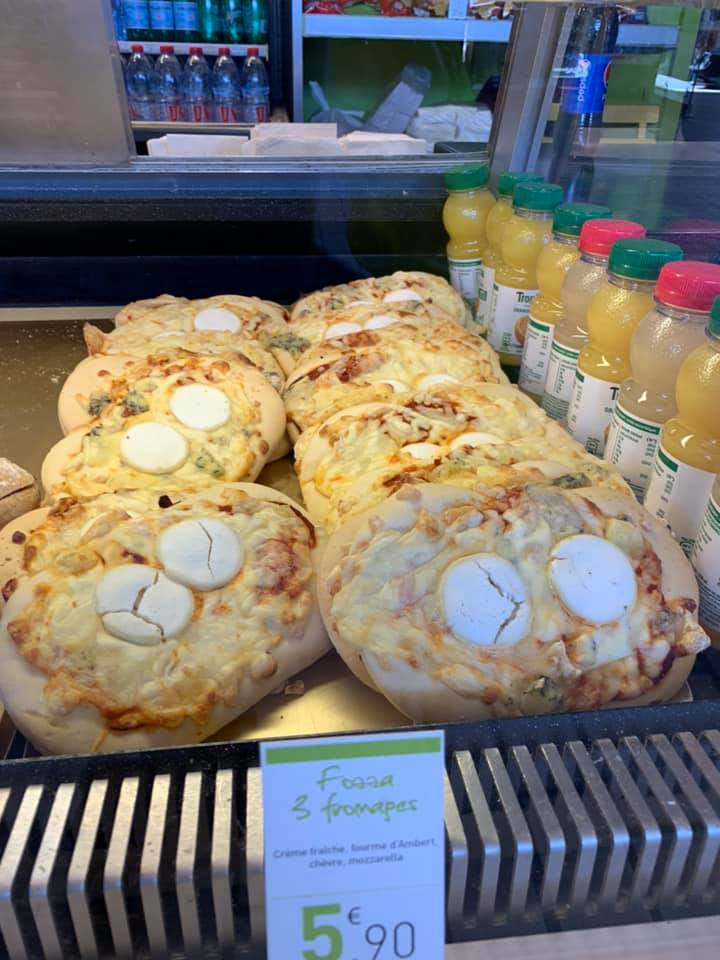
**이미지 캡션:** 진열대에 놓인 여러 개의 치즈 피자가 보인다. 피자는 둥근 모양이며, 빵 위에 녹은 치즈와 하얀색의 둥근 치즈 조각들이 얹혀 있다. 피자 옆에는 여러 병의 주스 음료가 진열되어 있다. 배경에는 냉장고와 선반이 보이며, 냉장고 안에는 물병들이 채워져 있다. 피자 앞쪽에는 "Forza 3 fromages"라고 적힌 가격표가 있으며, 가격은 5.90유로로 표시되어 있다. 전체적으로 음식점이나 마트의 진열대 풍경으로, 먹음직스러운 피자와 음료들이 진열되어 있어 구매를 유도하는 분위기이다.
 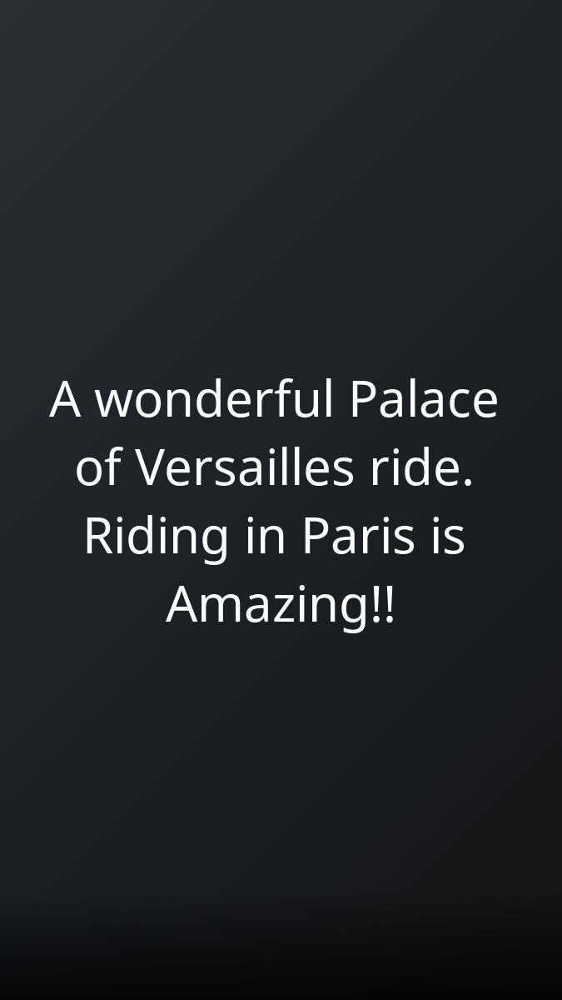
**이미지 캡션:** 이 사진은 어두운 배경에 흰색 글씨로 된 텍스트만 포함하고 있으며, 사람이나 장소, 사물은 보이지 않습니다. 텍스트는 "A wonderful Palace of Versailles ride. Riding in Paris is Amazing!!"라고 쓰여 있어, 베르사유 궁전에서의 멋진 라이딩 경험과 파리에서의 라이딩이 매우 놀랍다는 내용을 전달하고 있습니다. 전반적으로 텍스트 중심의 간결한 디자인으로, 긍정적이고 즐거운 분위기를 나타냅니다.
 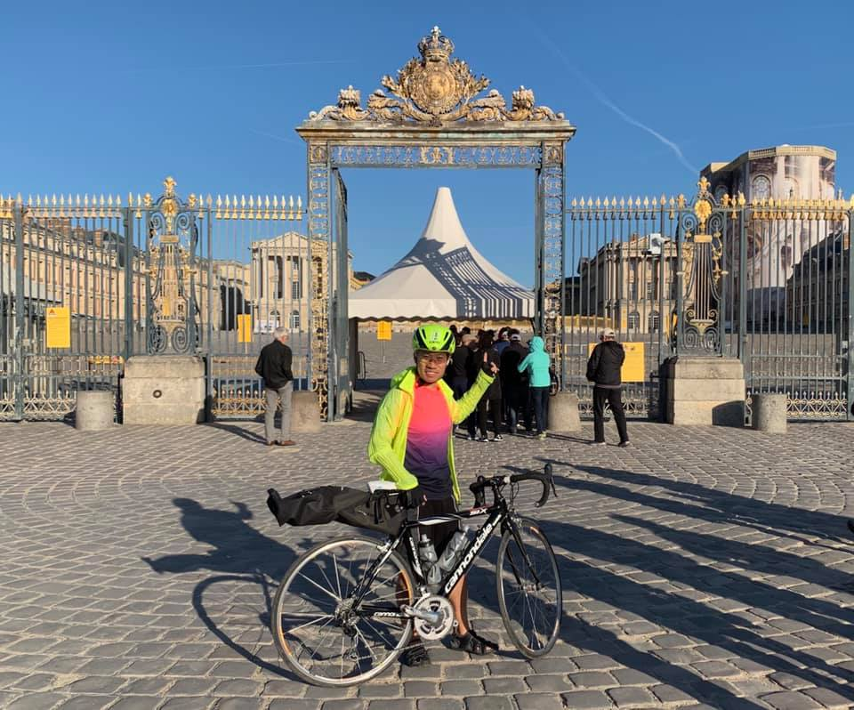
**이미지 캡션:** 밝은 햇살 아래, 한 성인 남성이 자전거와 함께 웅장한 금색 철문 앞에 서 있다. 남성은 20대 후반에서 30대 초반으로 보이며, 밝은 형광 연두색 재킷과 보라색, 분홍색이 섞인 티셔츠를 입고 있다. 머리에는 형광 연두색 헬멧을 쓰고 있으며, 얼굴에는 환한 미소를 띠고 있다. 그는 자전거 핸들을 잡고 카메라를 향해 손가락으로 가리키며 활기찬 모습을 보여주고 있다. 자전거에는 검은색 가방이 달려 있으며, 'Cannondale'이라는 글자가 보인다. 배경에는 화려한 금색 장식이 돋보이는 거대한 철문과 그 너머로 보이는 웅장한 궁전 건물이 자리하고 있다. 철문 안쪽에는 하얀색 천막이 설치되어 있고, 여러 명의 사람들이 줄을 서서 기다리는 모습도 보인다. 바닥은 고풍스러운 돌 블록으로 포장되어 있으며, 길게 늘어진 그림자가 이국적인 분위기를 더한다. 전반적으로 맑고 화창한 날씨 속에서 여행이나 관광을 즐기는 듯한 즐겁고 활기찬 분위기이다.
 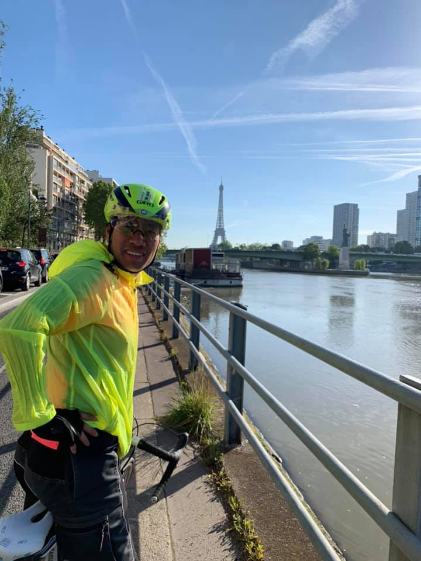
**이미지 캡션:** 푸른 하늘 아래 에펠탑이 보이는 파리의 센 강변에서 자전거를 타는 성인 남성이 밝은 형광 연두색 방수 재킷과 검은색 바지를 입고 헬멧을 쓰고 있다. 남성은 카메라를 향해 미소를 지으며 한 손을 허리에 얹고 다른 손은 자전거 핸들바에 얹고 있다. 배경에는 센 강, 다리, 건물, 그리고 멀리 에펠탑이 보인다. 햇살이 비추는 맑은 날씨로, 자전거 타기에 좋은 분위기이다.
 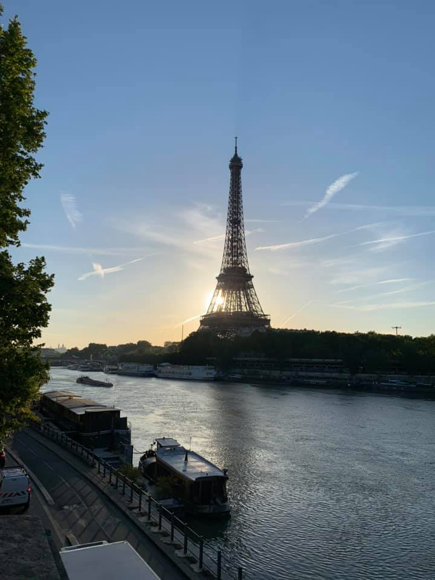
**이미지 캡션:** 해 질 녘 파리의 센 강변 풍경으로, 에펠탑이 석양을 배경으로 웅장하게 서 있고 강 위에는 여러 척의 배들이 떠 있다. 강변에는 나무가 우거져 있고, 도로에는 차량 몇 대가 보이며, 배들은 강가에 정박해 있다. 하늘에는 구름과 비행운이 희미하게 보이며, 전체적으로 평화롭고 아름다운 분위기를 자아낸다.
 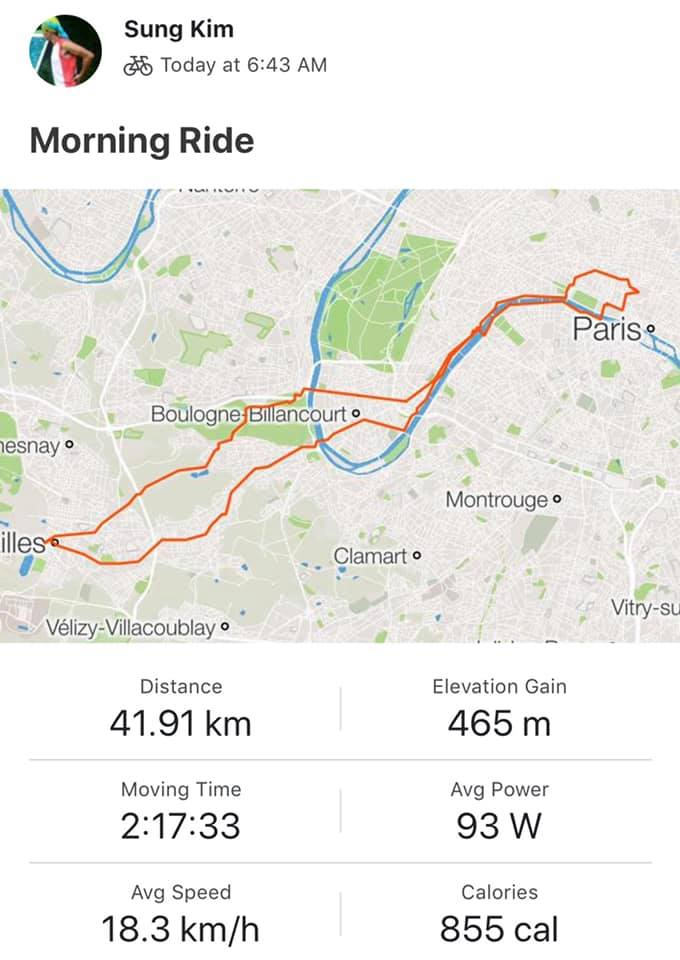
**이미지 캡션:** 이 사진은 "Sung Kim"이라는 사용자가 오전 6시 43분에 "Morning Ride"라는 제목으로 기록한 자전거 라이딩 정보를 보여줍니다. 화면 상단에는 사용자의 프로필 사진과 이름, 그리고 라이딩 시간 정보가 있습니다. 중앙에는 파리 시내와 주변 지역의 지도가 표시되어 있으며, 오렌지색 선으로 자전거 라이딩 경로가 표시되어 있습니다. 경로에는 파리, 불로뉴-빌랑쿠르, 클라마트, 몽루즈, 벨리제-비야쿠블레 등 여러 지명이 보입니다. 지도 아래에는 라이딩 기록 요약 정보가 표시되어 있습니다. 총 거리는 41.91km, 이동 시간은 2시간 17분 33초, 평균 속도는 시속 18.3km입니다. 또한, 고도 상승은 465m, 평균 파워는 93W, 소모 칼로리는 855kcal로 기록되어 있습니다. 전반적으로 활동적인 라이딩을 기록한 화면 캡처 이미지입니다.

### 5월 15일 (수) 01:12 · 📷 앨범: Profile pictures (1장)

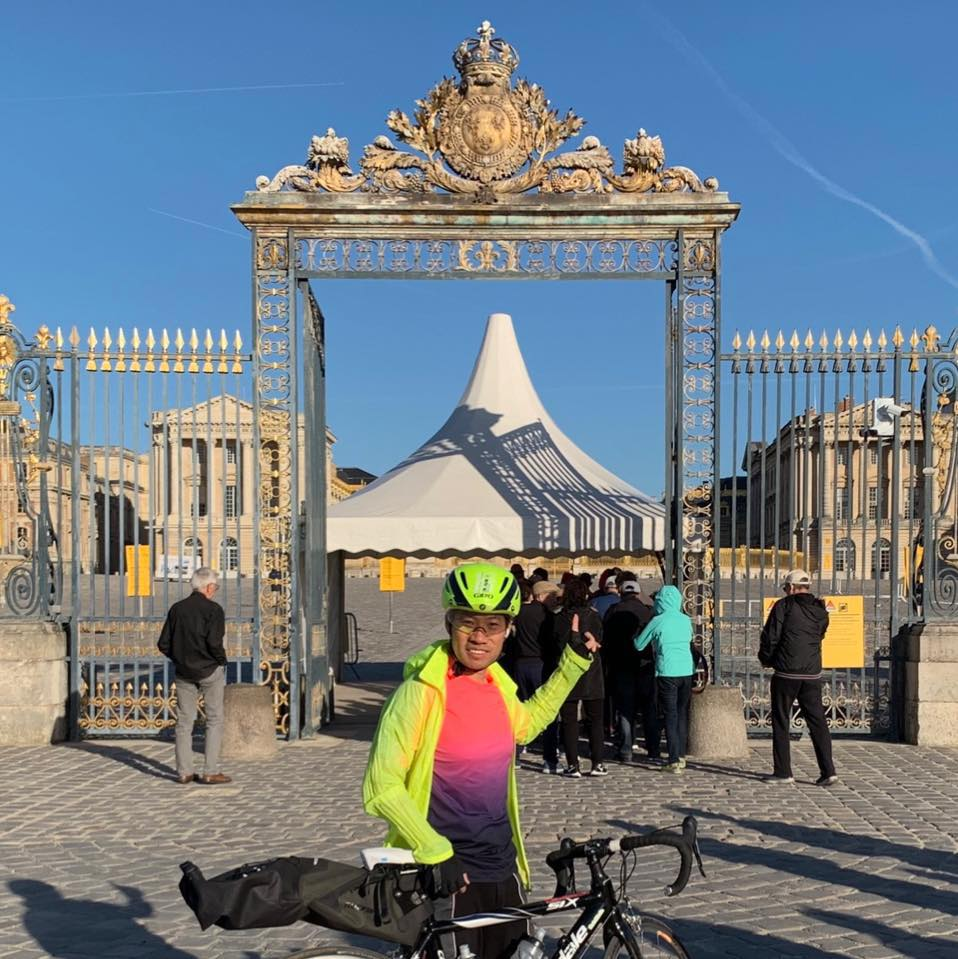
**이미지 캡션:** 한 명의 성인 남성이 밝은 햇살 아래 자전거 옆에 서서 카메라를 향해 손을 흔들고 있다. 그는 형광 연두색 재킷과 분홍색과 보라색이 섞인 티셔츠를 입고 있으며, 머리에는 연두색 헬멧을 쓰고 있다. 그의 표정은 밝고 활기차 보인다. 배경에는 웅장한 금색 장식이 있는 철문과 그 뒤로 보이는 베르사유 궁전의 일부가 보인다. 문 안쪽에는 하얀색 천막이 설치되어 있고, 여러 명의 사람들이 줄을 서서 기다리는 모습도 보인다. 땅은 돌로 포장되어 있으며, 맑고 푸른 하늘에는 희미한 구름 자국이 보인다. 전반적으로 화창하고 관광객으로 보이는 사람들이 많은 활기찬 분위기이다.

### 5월 16일 (목) 09:39 · My bucket list item added. #1 climbing b…

My bucket list item added. #1 climbing by bike in the world: 68km riding with 4191m up! Crazy!!

Anyone wants to join us?

https://www.climbbybike.com/climbmobile.asp?Col=Mauna-Kea&qryMountainID=8349

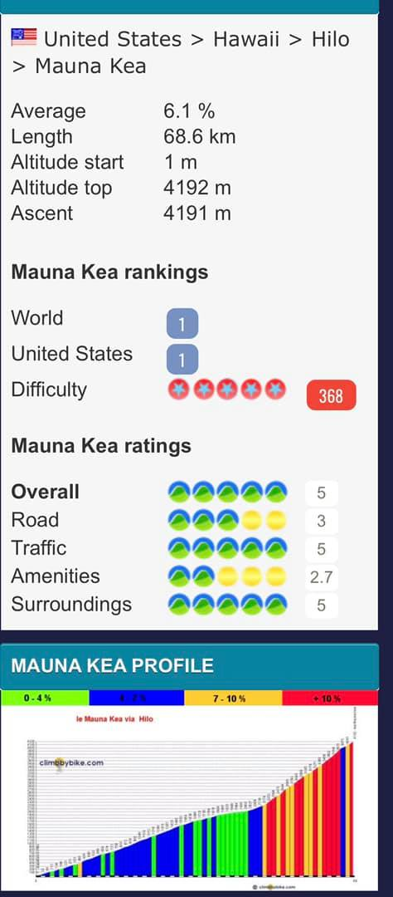
**이미지 캡션:** 이 이미지는 하와이 힐로에 위치한 마우나 케아 산의 사이클링 프로필 정보를 보여주는 웹페이지의 일부입니다. 상단에는 미국 국기와 함께 "United States > Hawaii > Hilo > Mauna Kea"라는 텍스트가 표시되어 있습니다. 그 아래에는 마우나 케아의 평균 경사도(6.1%), 길이(68.6km), 시작 고도(1m), 최고 고도(4192m), 상승고도(4191m) 등의 통계 정보가 나열되어 있습니다. "Mauna Kea rankings" 섹션에서는 세계 및 미국 내 순위가 각각 1위임을 보여주며, 난이도는 별 5개 중 4개로 표시되어 있고 총 368개의 평가가 있음을 나타냅니다. "Mauna Kea ratings" 섹션에서는 전반적인 평가, 도로 상태, 교통량, 편의시설, 주변 환경에 대한 점수가 각각 5점 만점에 5점, 3점, 5점, 2.7점, 5점으로 표시되어 있습니다. 가장 하단에는 "MAUNA KEA PROFILE"이라는 제목과 함께 경사도 구간별(0-4%, 4-7%, 7-10%, +10%) 색상 막대와 함께 "le Mauna Kea via Hilo"라는 경로 정보, 그리고 climbbybike.com이라는 웹사이트 로고와 함께 고도 변화를 나타내는 그래프가 보입니다. 그래프는 x축을 따라 거리가 증가함에 따라 y축의 고도가 꾸준히 상승하는 것을 보여주며, 다양한 색상의 막대는 각 구간의 경사도를 나타냅니다. 전반적으로 정보 전달에 초점을 맞춘 깔끔하고 분석적인 분위기의 화면입니다.

### 5월 16일 (목) 18:31 · A wonderful morning ride to Chamrousse, …

📍 Chamrousse 1750

A wonderful morning ride to Chamrousse, 60km with 1600km up thanks to Florent Perronnin and Seokjoo Han. The view was absolutely amazing!

**이미지 캡션:** 한 성인 남성이 밝은 형광 녹색 재킷과 회색 반바지를 입고 헬멧을 쓴 채 도로 표지판 옆에 서서 엄지손가락을 치켜세우며 웃고 있다. 표지판에는 "CHAMROUSS 1750"이라고 적혀 있으며, 그 위에는 "D 111"이라고 표시된 작은 표지판이 있다. 남성의 옆에는 물통이 달린 검은색 로드 자전거가 세워져 있다. 배경에는 울창한 침엽수림과 맑은 하늘이 보인다. 전반적으로 등반을 마친 후의 성취감과 즐거움을 나타내는 분위기이다.
 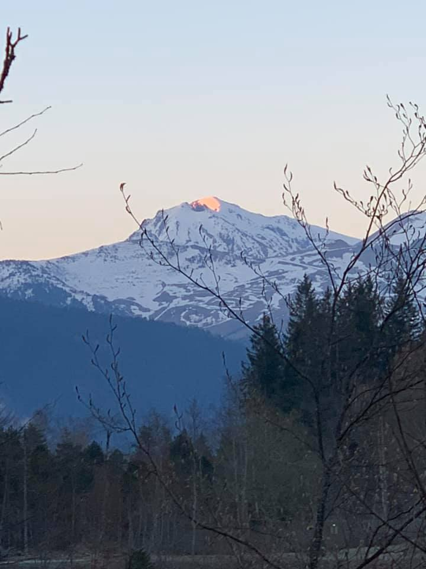
**이미지 캡션:** 이 사진은 눈 덮인 산봉우리가 황금빛으로 빛나는 아름다운 풍경을 담고 있습니다. 사진 중앙에는 눈으로 뒤덮인 거대한 산이 자리하고 있으며, 그 정상 부분은 석양 또는 일출의 빛을 받아 밝게 빛나고 있습니다. 산의 경사면에는 눈이 쌓여 있으며, 일부 지역은 그림자로 인해 어둡게 보입니다. 산 아래쪽으로는 울창한 숲이 펼쳐져 있는데, 나무들은 대부분 잎이 없는 겨울의 모습이며, 일부는 침엽수림으로 보입니다. 사진의 전경에는 나뭇가지들이 앙상하게 늘어서 있어 겨울의 쓸쓸함과 함께 자연의 아름다움을 더하고 있습니다. 하늘은 맑고 푸른색을 띠고 있으며, 산봉우리에 비친 빛과 어우러져 평화롭고 고요한 분위기를 자아냅니다. 사진에는 사람이 등장하지 않으며, 텍스트도 보이지 않습니다. 전반적으로 자연의 웅장함과 빛의 아름다움을 느낄 수 있는 풍경 사진입니다.
 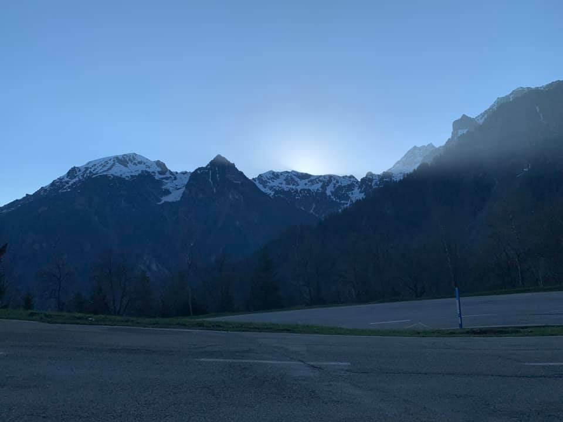
**이미지 캡션:** 이 사진은 해가 뜨기 직전의 산악 풍경을 담고 있으며, 푸른 하늘과 눈 덮인 산봉우리, 그리고 어두운 산비탈이 조화를 이룹니다. 사진의 전경에는 아스팔트 도로가 보이며, 도로 가장자리에는 잔디와 나무들이 희미하게 보입니다. 도로 중앙에는 파란색 표지판이 서 있습니다. 배경에는 짙은 푸른색의 산들이 겹쳐져 있으며, 산봉우리에는 하얀 눈이 쌓여 있습니다. 산봉우리 사이로는 태양이 떠오르면서 빛줄기가 퍼져나가고 있으며, 일부 산비탈은 안개나 구름에 가려져 신비로운 분위기를 자아냅니다. 전체적으로 차분하고 고요한 새벽의 산악 풍경을 보여줍니다. 사람이나 구체적인 사물은 보이지 않으며, 텍스트도 없습니다.
 
**이미지 캡션:** 이 이미지는 사이클링 활동 기록을 보여주는 화면 캡처로, 지도 위에 오렌지색으로 표시된 경로와 함께 거리, 이동 시간, 평균 속도, 평균 파워, 칼로리 소모량, 그리고 고도 변화 그래프가 포함되어 있습니다. 지도에는 프랑스 그르노블(Grenoble)과 에쉬롤(Échirolles) 지역의 지형이 나타나 있으며, 오렌지색 선은 약 63.22km의 사이클링 경로를 나타냅니다. 이동 시간은 4시간 7분 39초, 평균 속도는 시속 15.3km, 평균 파워는 115W, 칼로리 소모량은 1,901kcal로 기록되어 있습니다. 특히, "Elevation Gain"이라는 항목은 총 1,689m의 고도 상승을 의미하며, 이는 그래프로도 시각화되어 있습니다. 그래프는 x축에 거리(km), y축에 고도(m)를 표시하며, 사이클링 중 고도가 점진적으로 상승했다가 하강하는 모습을 보여줍니다. 전반적으로 활동적인 야외 스포츠, 특히 사이클링의 성과를 요약하고 분석하는 데 사용되는 데이터 화면입니다.

### 5월 17일 (금) 18:31 · 📷 사진 (5장)

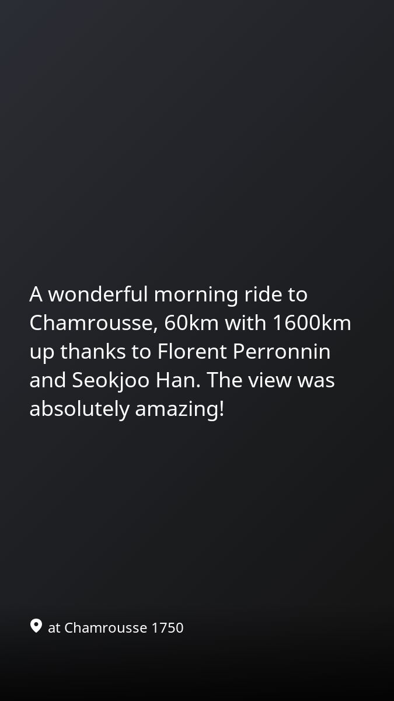
**이미지 캡션:** 이 사진은 어두운 배경에 흰색 텍스트가 표시된 화면을 보여줍니다. 텍스트는 "A wonderful morning ride to Chamrousse, 60km with 1600km up thanks to Florent Perronnin and Seokjoo Han. The view was absolutely amazing!"이라고 쓰여 있으며, 이는 플로랑 페로니네와 석주 한 덕분에 1600m 고도 상승을 포함한 60km의 샹루즈(Chamrousse)까지의 멋진 아침 라이딩 경험을 묘사합니다. 또한, 화면 하단에는 위치 정보로 보이는 "at Chamrousse 1750"이라는 텍스트와 함께 위치 마커 아이콘이 있습니다. 사진에는 사람이 직접적으로 보이지 않으며, 텍스트를 통해 라이딩과 관련된 긍정적인 경험과 아름다운 풍경에 대한 감상이 전달됩니다. 전반적으로 활동적인 경험과 그로 인한 만족감을 나타내는 분위기입니다.
 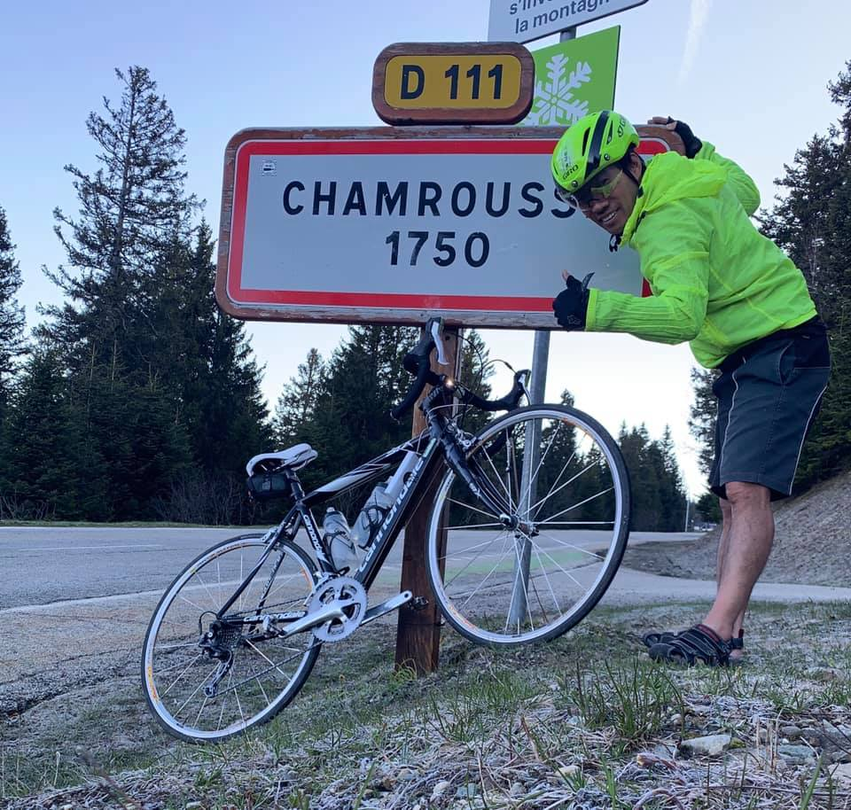
**이미지 캡션:** 한 성인 남성이 밝은 형광 녹색 재킷과 회색 반바지를 입고 헬멧을 쓴 채 자전거 옆에 서서 엄지손가락을 치켜세우며 웃고 있다. 남성은 30대 후반에서 40대 초반으로 보이며, 헬멧 아래로 짧은 검은 머리가 보인다. 그는 옅은 색의 선글라스를 끼고 있으며, 표정은 즐겁고 만족스러워 보인다. 그의 오른쪽 손은 헬멧을 살짝 누르고 있고, 왼쪽 손은 엄지손가락을 치켜세우고 있다. 그의 발에는 샌들이 신겨져 있다. 그의 옆에는 검은색 로드 자전거가 세워져 있으며, 자전거에는 물통 두 개가 달려 있다. 배경에는 "CHAMROUSS 1750"이라고 적힌 표지판이 보이며, 그 위에는 "D 111"이라고 적힌 작은 표지판도 있다. 표지판 뒤로는 울창한 침엽수림이 펼쳐져 있고, 하늘은 맑고 푸르다. 땅에는 약간의 서리가 내려앉아 있는 것으로 보이며, 전체적으로 시원한 산악 지역의 풍경을 담고 있다. 이 사진은 자전거 여행을 성공적으로 마친 후의 성취감과 즐거움을 표현하는 듯한 분위기를 자아낸다.
 
**이미지 캡션:** 이 사진은 눈 덮인 산봉우리가 석양에 물들어 황금빛으로 빛나는 아름다운 풍경을 담고 있습니다. 산은 웅장하고 거대하며, 정상 부분은 눈으로 뒤덮여 있고 그 아래로는 푸른 산맥이 펼쳐져 있습니다. 산 앞쪽에는 앙상한 나뭇가지들이 드리워져 있고, 그 뒤로는 울창한 침엽수림이 어두운 그림자를 드리우고 있습니다. 하늘은 옅은 푸른색에서 분홍색으로 물들어 석양의 아름다움을 더하고 있습니다. 사진에는 사람이 보이지 않으며, 자연의 웅장함과 고요함이 느껴지는 평화로운 분위기입니다.
 
**이미지 캡션:** 이 사진은 해가 뜨기 직전의 고요한 산악 풍경을 담고 있습니다. 사진의 전경에는 어두운 아스팔트 도로가 보이며, 도로 위에는 희미한 차선이 그려져 있습니다. 도로 옆으로는 잔디밭이 펼쳐져 있고, 그 뒤로는 앙상한 나뭇가지들이 빽빽하게 늘어선 숲이 보입니다. 숲 너머로는 웅장한 산맥이 펼쳐져 있는데, 산봉우리들은 눈으로 덮여 있어 하얗게 빛나고 있습니다. 산맥의 일부는 옅은 안개에 싸여 신비로운 분위기를 자아냅니다. 하늘은 맑고 푸른색이며, 산봉우리 뒤로 떠오르는 태양의 빛이 은은하게 퍼져나가고 있습니다. 사진에는 사람이 보이지 않으며, 텍스트도 없습니다. 전체적으로 차분하고 평화로운 새벽의 산악 풍경을 보여주는 사진입니다.
 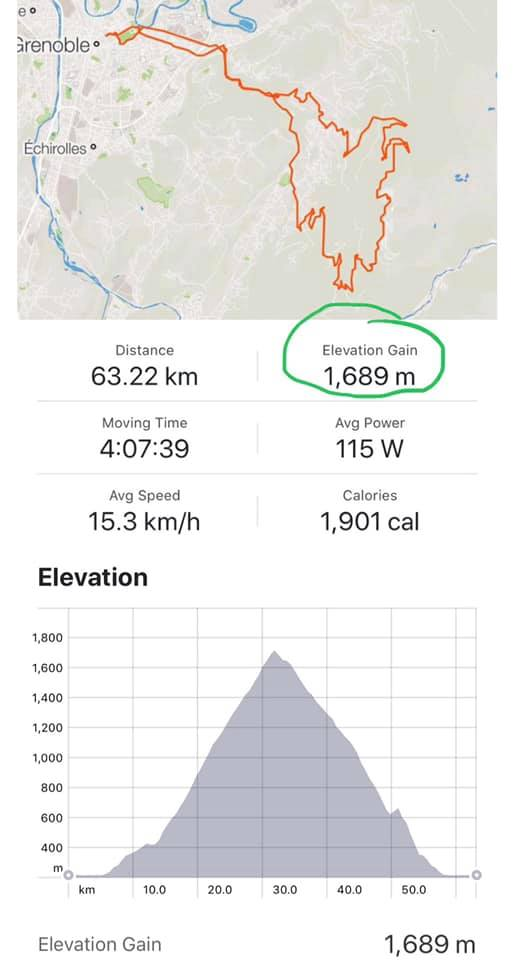
**이미지 캡션:** 이 이미지는 사이클링 활동 기록을 보여주는 화면 캡처입니다. 상단에는 프랑스 그르노블 지역의 지도가 표시되어 있으며, 주황색 선으로 사이클링 경로가 표시되어 있습니다. 경로 주변에는 에쉬롤(Échirolles)이라는 도시 이름도 보입니다. 지도 아래에는 활동 통계가 요약되어 있는데, 총 이동 거리는 63.22km, 이동 시간은 4시간 7분 39초, 평균 속도는 시속 15.3km, 평균 파워는 115W, 소모 칼로리는 1,901kcal입니다. 특히, 총 고도 상승량은 1,689m로 표시되어 있으며, 이는 녹색 원으로 강조되어 있습니다. 화면 하단에는 고도 변화를 나타내는 그래프가 그려져 있으며, x축은 거리(km), y축은 고도(m)를 나타냅니다. 그래프는 시작 지점에서부터 점진적으로 고도가 상승했다가 하강하는 형태를 보여주며, 최고 지점은 약 1,700m 이상임을 알 수 있습니다. 전반적으로 이 화면은 사이클리스트가 상당한 고도 상승을 포함하는 장거리 라이딩을 마쳤음을 보여주는 기록입니다.

> A wonderful morning ride to Chamrousse, 60km with 1600km up thanks to Florent Perronnin and Seokjoo Han. The view was absolutely amazing!

### 5월 18일 (토) 16:31 · very happy to be back to Paris (with won…

very happy to be back to Paris (with wonderful food) after a long bike and train ride.

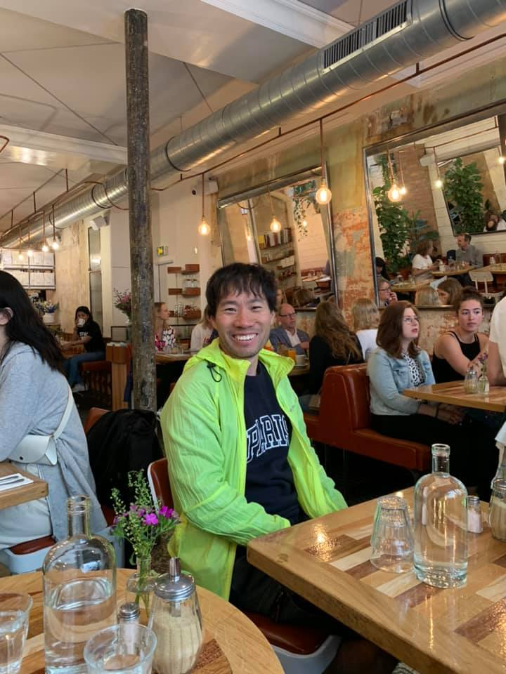
**이미지 캡션:** 사진에는 밝은 형광 연두색 방수 재킷을 입고 어두운 색 티셔츠를 입은 성인 남성이 보인다. 남성은 30대 초중반으로 보이며, 짧은 검은 머리에 밝게 웃고 있다. 그는 식당 테이블에 앉아 있으며, 테이블 위에는 물병, 유리잔, 설탕통, 작은 꽃병이 놓여 있다. 배경에는 다른 손님들이 앉아 있는 모습과 거울, 식물, 조명 등이 보인다. 식당은 현대적이고 캐주얼한 분위기이며, 벽돌과 금속 파이프가 노출된 인테리어가 특징이다. 남성의 티셔츠에는 "PARI"라는 글자가 흰색으로 쓰여 있다. 전반적으로 편안하고 즐거운 식사 분위기를 나타낸다.
 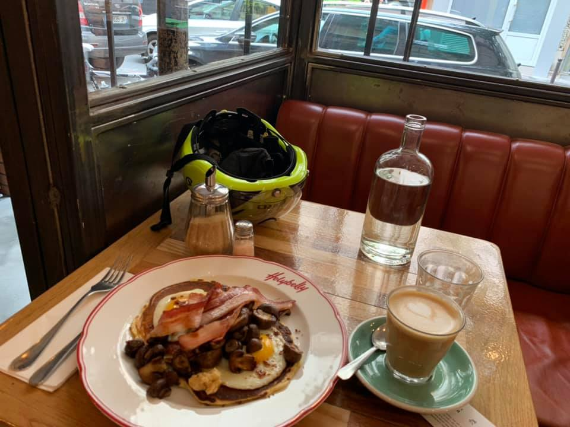
**이미지 캡션:** 테이블 위에는 팬케이크, 베이컨, 계란, 버섯이 올라간 푸짐한 브런치가 놓여 있고, 옆에는 커피와 물이 담긴 병, 유리잔이 있습니다. 테이블 위에는 자전거 헬멧과 소금, 후추 통도 보입니다. 배경에는 붉은색 가죽 소파와 창밖으로 보이는 거리 풍경이 있습니다. 창밖으로는 자동차와 건물들이 보이며, 전체적으로 캐주얼한 카페의 분위기를 연출합니다.

### 5월 18일 (토) 17:38 · 📷 사진 (2장)

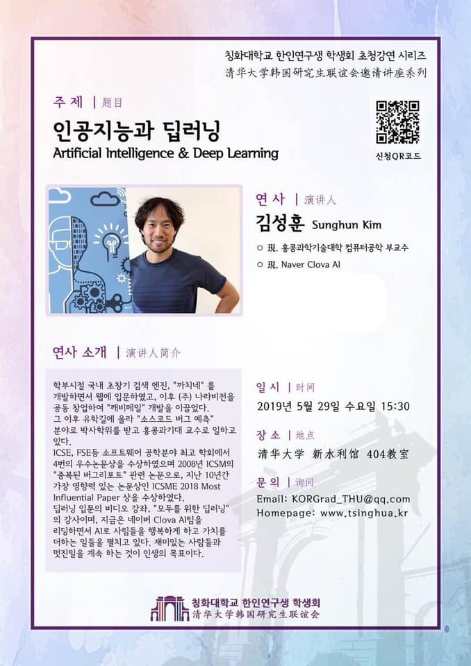
**이미지 캡션:** 이 포스터는 칭화대학교 한인연구생 학생회 초청강연 시리즈의 일환으로, "인공지능과 딥러닝"이라는 주제로 열리는 강연을 알리고 있습니다. 강연자는 김성훈 Sunghun Kim으로, 현재 홍콩과학기술대학 컴퓨터공학 부교수이며 네이버 Clova AI팀을 리딩하고 있습니다. 포스터에는 강연자의 사진과 함께 그의 학력 및 경력이 상세히 소개되어 있습니다. 학부 시절 국내 초창기 검색 엔진 개발에 참여하고 나라비전을 공동 창업하여 "깨비메일"을 개발한 경험, 유학 후 "소스코드 버그 예측" 분야로 박사 학위를 취득하고 홍콩과기대 교수로 재직 중인 이력, 그리고 ICSE, FSE 등 소프트웨어 공학 분야 최고 학회에서 다수의 우수 논문상을 수상하고 "중복된 버그리포트" 관련 논문으로 ICSME 2018 Most Influential Paper 상을 수상한 업적 등이 언급되어 있습니다. 또한, 딥러닝 강좌 "모두를 위한 딥러닝"의 강사로서 AI를 통해 사람들을 행복하게 하고 가치를 더하는 일을 하고 있으며, 재미있는 사람들과 멋진 일을 계속하는 것을 인생의 목표로 삼고 있다는 그의 철학이 담겨 있습니다. 강연은 2019년 5월 29일 수요일 15시 30분에 청화대학교 신수리관 404호에서 진행되며, 신청 QR 코드와 문의 이메일, 홈페이지 주소도 함께 안내되어 있습니다. 포스터의 배경은 연보라색과 흰색이 조화롭게 사용되었으며, 인공지능을 상징하는 듯한 그래픽 요소와 QR 코드가 디자인에 포함되어 있습니다. 전체적으로 전문적이고 정보 전달에 충실한 분위기를 풍깁니다.
 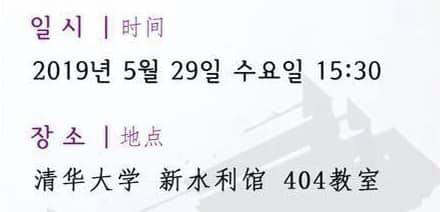
**이미지 캡션:** 이 사진은 한국어와 중국어로 된 텍스트 정보를 담고 있으며, 연한 보라색과 검은색 글씨로 쓰여 있습니다. 상단에는 "일시 | 时间"이라는 제목이 있고, 그 아래에는 "2019년 5월 29일 수요일 15:30"이라는 날짜와 시간이 명시되어 있습니다. 이어서 "장소 | 地点"이라는 제목과 함께 "清华大学 新水利馆 404教室"라는 중국어 텍스트가 나타나는데, 이는 칭화대학교 신수리관 404호 강의실을 의미합니다. 배경에는 흐릿하게 건물 그림자가 비쳐 있어, 강의실이나 회의실과 같은 실내 공간임을 암시합니다. 사진에는 사람이 등장하지 않으며, 전체적으로 정보 전달을 목적으로 하는 공지나 안내문의 일부로 보입니다.

> 매우 오래간만에 중국에서 세미나를 하게 되었습니다. 근처에 계신 분들은 뵙겠습니다.   포스트는 칭화대 학생회에서 만들어 주신 것인데 정말 멋지네요!

### 5월 25일 (토) 21:12 · best fireworks ever!

📍 해운대해수욕장 - Haeundae Beach

best fireworks ever!

🎬 동영상 1개 (생략)

### 5월 26일 (일) 14:15 · Wonderful Haeundae beach sand run and qu…

Wonderful Haeundae beach sand run and quick swimming. It was so good to be here.

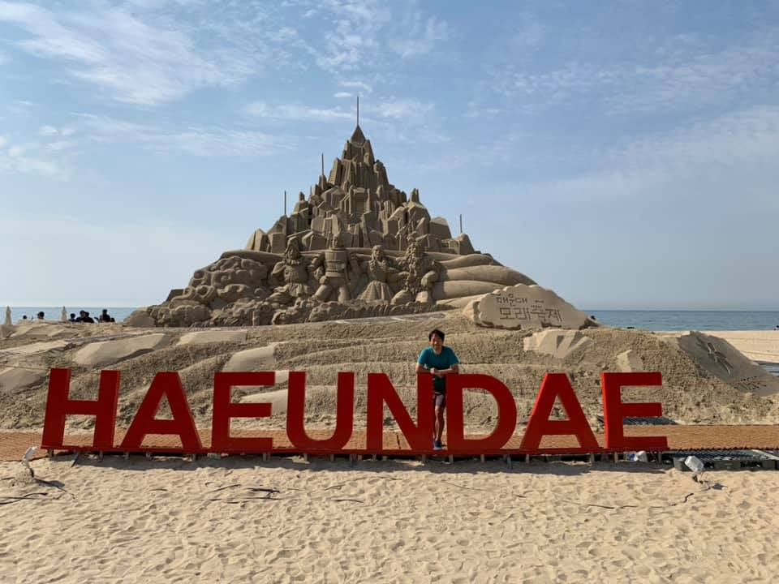
**이미지 캡션:** 푸른색 티셔츠와 반바지를 입은 성인 남성이 해운대 해변에 설치된 거대한 모래 조각 앞에 서서 포즈를 취하고 있다. 남성은 40대 정도로 보이며, 표정은 밝고 여유로워 보인다. 그의 뒤로는 웅장한 성 모양의 모래 조각이 펼쳐져 있으며, 조각에는 여러 인물 형상이 묘사되어 있다. 모래 조각 앞에는 붉은색의 'HAEUNDAE'라는 글자가 크게 새겨져 있어 이곳이 해운대임을 알 수 있다. 배경에는 푸른 하늘과 바다가 보이며, 멀리 몇몇 사람들이 해변을 거닐고 있다. 전반적으로 화창한 날씨 속에서 모래 축제를 즐기는 듯한 활기찬 분위기이다.
 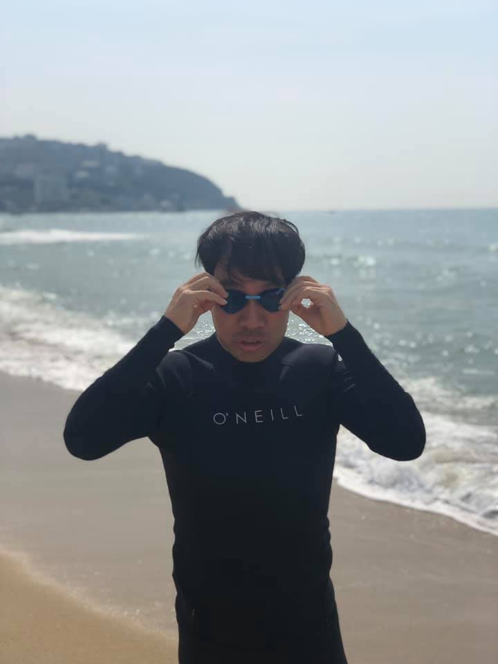
**이미지 캡션:** 해변에서 수영복을 입고 선글라스를 조절하는 성인 남성이 서 있습니다. 남성은 검은색 긴팔 수영복을 입고 있으며, 수영복 가슴 부분에는 흰색으로 "O'NEILL"이라는 로고가 새겨져 있습니다. 남성은 옅은 갈색 머리카락을 가지고 있으며, 파란색 테두리의 선글라스를 쓰고 있습니다. 그의 표정은 약간 찡그린 듯 보이며, 양손으로 선글라스를 잡고 있습니다. 배경에는 잔잔한 바다가 펼쳐져 있고, 멀리 언덕에 건물들이 보입니다. 하늘은 맑고 푸르며, 해변의 모래는 옅은 갈색입니다. 전반적으로 화창한 날씨에 해변에서 활동을 준비하는 듯한 분위기입니다.
 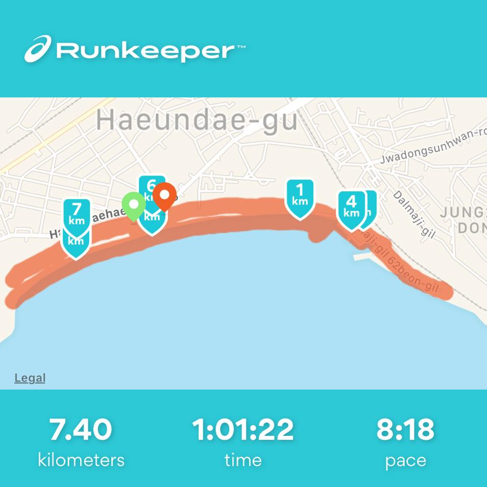
**이미지 캡션:** 이것은 Runkeeper 앱에서 생성된 운동 기록 화면으로, 성인 남성이 해운대구 지역에서 7.40km를 1시간 1분 22초 동안 8분 18초의 페이스로 달린 기록을 보여줍니다. 화면 상단에는 지도 위에 주황색으로 표시된 달리기 경로가 있으며, 경로 상에는 1km, 4km, 6km, 7km 지점을 나타내는 마커들이 표시되어 있습니다. 지도에는 "Haeundae-gu", "Jwadongsunhwan-ro", "Dalmaji-gil", "aji-gil 62beon-gil" 등의 지명이 보입니다. 화면 하단에는 총 거리, 총 시간, 평균 페이스가 숫자로 명확하게 표시되어 있습니다. 전반적으로 운동 기록을 확인하고 공유하기 위한 깔끔하고 정보 전달에 집중된 디자인입니다.

### 5월 29일 (수) 05:59 · 📷 사진 (3장)

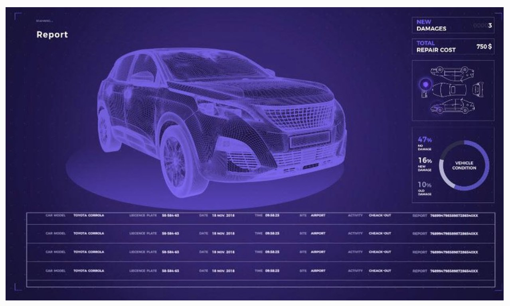
**이미지 캡션:** 이 이미지는 차량 점검 보고서를 보여주는 디지털 인터페이스입니다. 중앙에는 보라색 와이어프레임으로 표현된 SUV 차량의 3D 모델이 있으며, 차량의 전반적인 형태와 구조를 보여줍니다. 오른쪽 상단에는 "NEW DAMAGES"와 "TOTAL REPAIR COST"라는 제목과 함께 각각 00003, 750$라는 정보가 표시되어 있습니다. 그 아래에는 차량의 여러 각도에서 찍은 듯한 도식화된 이미지가 있고, 그 옆에는 "VEHICLE CONDITION"이라는 원형 그래프가 있습니다. 이 그래프는 47%의 "NO DAMAGE", 16%의 "NEW DAMAGE", 10%의 "OLD DAMAGE"로 차량 상태를 나타냅니다. 화면 하단에는 여러 행으로 구성된 표가 있으며, 각 행에는 "CAR MODEL (TOYOTA CORROLA)", "LIECENCE PLATE (58-584-63)", "DATE (18 NOV 2018)", "TIME (09:58:25)", "SITE (AIRPORT)", "ACTIVITY (CHEACK-OUT)", "REPORT (긴 숫자와 문자열)" 정보가 반복적으로 나열되어 있습니다. 전체적으로 파란색과 보라색 톤의 배경에 깔끔하고 현대적인 디자인으로, 차량 점검 및 관리 시스템의 일부로 보입니다. 사람이나 특정 인물은 보이지 않으며, 기술적이고 정보 중심적인 분위기입니다.
 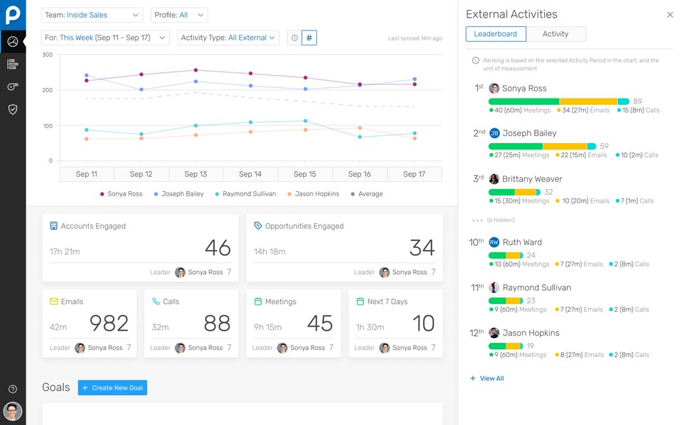
**이미지 캡션:** 이 화면은 영업 팀의 외부 활동을 보여주는 대시보드로, 왼쪽 상단에는 "Team: Inside Sales"와 "Profile: All"이라는 드롭다운 메뉴가 있으며, "For: This Week (Sep 11 - Sep 17)" 기간 동안의 활동을 보여주고 있습니다. 중앙에는 시간 경과에 따른 각 팀원의 활동량을 나타내는 선 그래프가 있으며, 보라색은 Sonya Ross, 파란색은 Joseph Bailey, 하늘색은 Raymond Sullivan, 주황색은 Jason Hopkins, 회색은 평균을 나타냅니다. 그래프 아래에는 "Accounts Engaged"와 "Opportunities Engaged"라는 두 개의 카드에 각각 46과 34라는 수치가 표시되어 있으며, 각 카드에는 리더로 Sonya Ross가 7이라는 수치와 함께 표시되어 있습니다. 그 아래에는 "Emails", "Calls", "Meetings", "Next 7 Days"라는 네 개의 카드가 있으며, 각각 982, 88, 45, 10이라는 수치가 표시되어 있고, 이 역시 Sonya Ross가 리더로 7이라는 수치와 함께 표시되어 있습니다. 화면 오른쪽에는 "External Activities"라는 제목과 함께 "Leaderboard"와 "Activity" 탭이 있으며, "Leaderboard" 탭이 선택되어 있습니다. 리더보드에는 1위 Sonya Ross, 2위 Joseph Bailey, 3위 Brittany Weaver 등 순위별로 팀원들의 이름과 함께 회의, 이메일, 통화 횟수가 막대그래프와 수치로 표시되어 있습니다. 화면 하단에는 "Goals"라는 제목과 함께 "+ Create New Goal" 버튼이 있습니다. 전반적으로 깔끔하고 전문적인 디자인이며, 영업 성과를 시각적으로 파악하기 쉽게 구성되어 있습니다.
 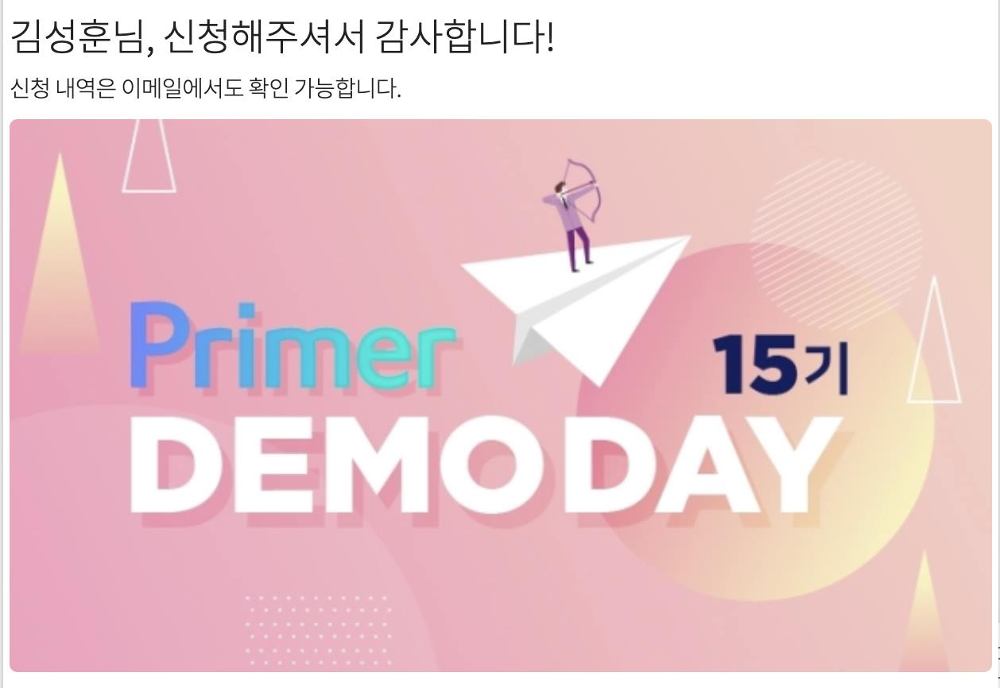
**이미지 캡션:** 화면 상단에는 "김성훈님, 신청해주셔서 감사합니다! 신청 내역은 이메일에서도 확인 가능합니다."라는 문구가 한국어로 적혀 있습니다. 그 아래에는 분홍색과 노란색이 섞인 배경에 그래픽 디자인이 있습니다. 중앙에는 "Primer"라는 단어가 파란색과 하늘색으로, 그 아래에는 "DEMODAY"라는 단어가 흰색으로 크게 쓰여 있습니다. 오른쪽에는 "15기"라는 글자가 진한 파란색으로 쓰여 있습니다. 이미지의 오른쪽 상단에는 종이비행기를 타고 활을 쏘는 모습의 작은 실루엣이 있습니다. 전체적으로 밝고 긍정적인 분위기이며, 어떤 행사나 발표회에 대한 안내 또는 감사 메시지로 보입니다.
