# 2019년 7월

[← 2019년](README.md)

### 7월 1일 (월) 08:15 · Amazing to see #AMBIDEX at the Naver lob…

Amazing to see #AMBIDEX at the Naver lobby. Please stop by Naver and check this out if you are around. Wonderful, Sangok Seok!

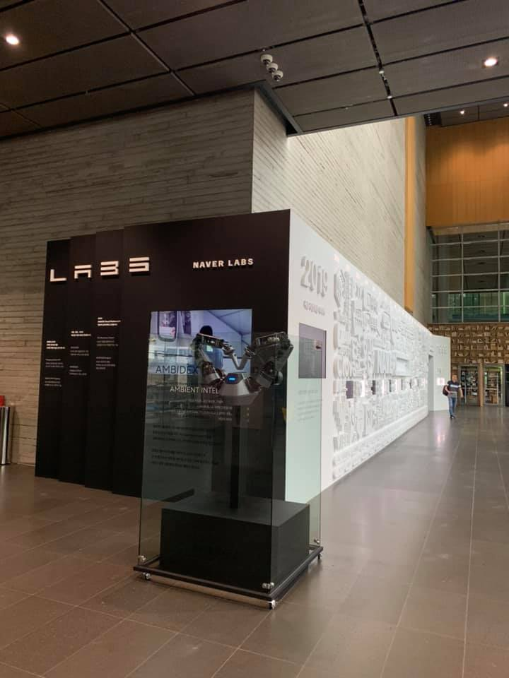
**이미지 캡션:** 이 사진은 현대적인 건물 내부의 넓은 로비 공간을 보여주며, 왼쪽에는 검은색 패널로 된 전시물이 있고 오른쪽에는 흰색 벽에 다양한 텍스트와 이미지가 새겨진 긴 전시물이 이어집니다. 검은색 전시물에는 "LABS"라는 로고와 "NAVER LABS"라는 문구가 보이며, 유리 진열장 안에는 로봇 팔과 "AMBIDEX" 및 "AMBIENT INTEL"이라는 글자가 새겨진 전시물이 있습니다. 흰색 벽에는 "2019"라는 숫자를 중심으로 빼곡하게 다양한 단어와 그림들이 새겨져 있어 연대기적인 정보나 기술 발전을 보여주는 듯합니다. 멀리 복도 끝에는 한 명의 성인 남성이 걸어가고 있으며, 전체적으로 깔끔하고 현대적인 분위기를 연출하고 있습니다.

### 7월 6일 (토) 09:42 · Soonson Kwon is so happy with his new Ga…

Soonson Kwon is so happy with his new Garmin running vivosport. He will be running a marathon soon. Please cheer him up!

**이미지 캡션:** 두 명의 성인 남성이 카페로 보이는 실내 공간에 앉아 있다. 왼쪽 남성은 30대 후반에서 40대 초반으로 추정되며, 검은색 선글라스를 착용하고 옅은 청록색 반팔 티셔츠를 입고 있다. 그는 카메라를 향해 엄지손가락을 치켜세우며 환하게 웃고 있다. 오른쪽 남성은 30대 초반에서 30대 후반으로 추정되며, 안경을 쓰고 파란색 반팔 티셔츠를 입고 있다. 그는 손에 'GARMIN'이라고 적힌 작은 상자를 들고 카메라를 보며 미소를 짓고 있다. 배경에는 벽돌 벽과 빵 이미지가 그려진 간판, 그리고 테이블과 의자들이 보인다. 전반적으로 밝고 편안한 분위기이다.

### 7월 6일 (토) 13:54 · honer to meet Prof Kyunghyun Cho @LINE. …

honer to meet Prof Kyunghyun Cho @LINE. He will be a LINE user soon!

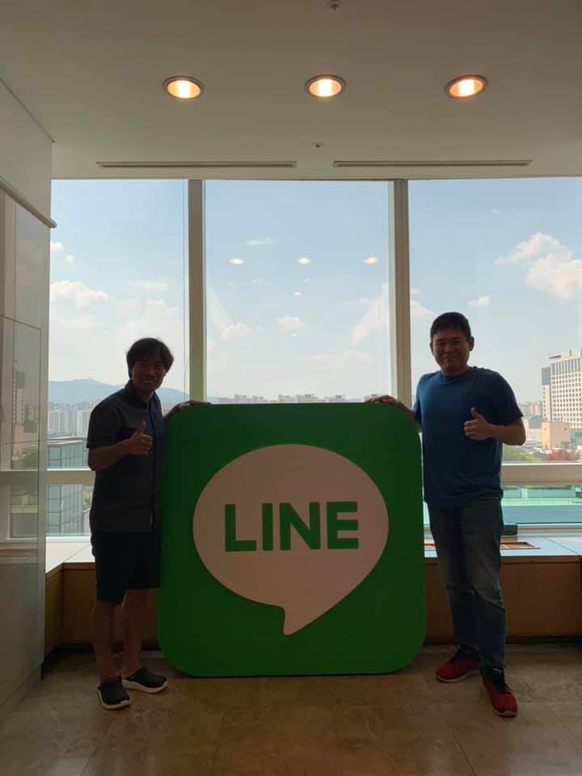
**이미지 캡션:** 두 명의 성인 남성이 LINE 로고가 새겨진 대형 입간판 옆에 서 있다. 왼쪽 남성은 40대 후반에서 50대 초반으로 보이며, 회색 반팔 셔츠와 검은색 반바지, 검은색 운동화를 신고 있다. 그는 입간판을 향해 엄지손가락을 치켜들고 있으며, 얼굴에는 미소를 띠고 있다. 오른쪽 남성은 30대 후반에서 40대 초반으로 보이며, 파란색 반팔 티셔츠와 청바지, 빨간색 운동화를 신고 있다. 그 역시 입간판을 향해 엄지손가락을 치켜들고 있으며, 얼굴에는 미소를 띠고 있다. 배경에는 통창으로 보이는 큰 창문이 있고, 창밖으로는 도시 풍경과 푸른 하늘, 구름이 보인다. 실내에는 천장에 조명 몇 개가 보이고, 창가에는 갈색 테이블이 놓여 있다. 전체적으로 밝고 긍정적인 분위기이며, LINE의 홍보 또는 기념 행사 중인 것으로 보인다.

### 7월 7일 (일) 06:50 · 📷 사진 (2장)

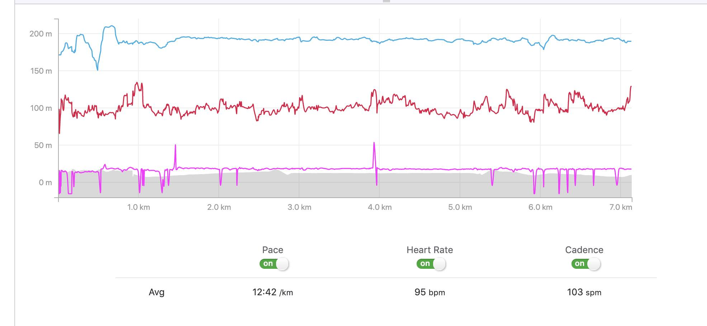
**이미지 캡션:** 이 화면은 달리기 기록을 보여주는 그래프와 통계 정보입니다. 그래프는 고도, 심박수, 케이던스 세 가지 데이터를 시간 경과에 따라 나타냅니다. 파란색 선은 고도를 나타내며, 약 150m에서 220m 사이를 오르내립니다. 빨간색 선은 심박수를 나타내며, 약 90bpm에서 140bpm 사이를 유지합니다. 보라색 선은 케이던스를 나타내며, 약 0spm에서 60spm 사이를 오르내립니다. 그래프 하단에는 'Pace', 'Heart Rate', 'Cadence'라는 제목과 함께 각 항목의 평균값이 표시됩니다. 평균 페이스는 12:42/km, 평균 심박수는 95bpm, 평균 케이던스는 103spm입니다. 'Pace', 'Heart Rate', 'Cadence' 옆에는 'on'이라고 표시된 토글 버튼이 있어 해당 데이터가 활성화되었음을 나타냅니다. 이 화면은 운동 중인 사람의 신체 데이터를 기록하고 분석하는 데 사용되는 것으로 보입니다.
 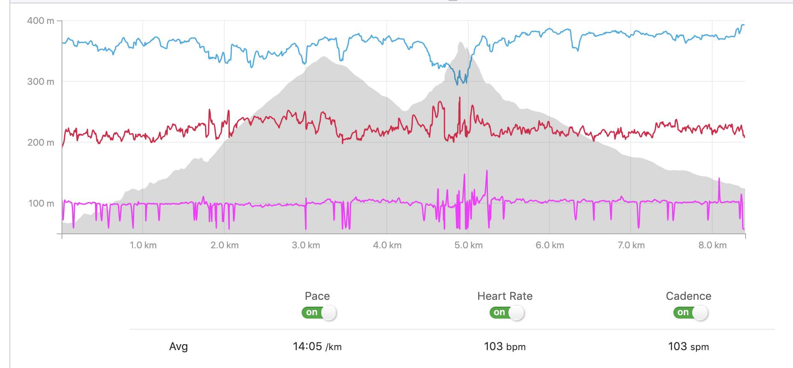
**이미지 캡션:** 이 이미지는 달리기 또는 사이클링과 같은 운동 기록을 보여주는 그래프입니다. 그래프는 수평 축에 거리(km)를, 수직 축에 고도(m)를 표시합니다. 세 개의 선 그래프가 있는데, 파란색 선은 고도 변화를, 빨간색 선은 심박수를, 보라색 선은 케이던스(분당 발걸음 수 또는 페달 회전 수)를 나타냅니다. 회색 음영은 코스의 지형을 나타내며, 언덕이 있는 구간을 보여줍니다. 그래프 하단에는 "Pace", "Heart Rate", "Cadence"라는 레이블과 함께 각 지표의 평균값이 표시되어 있습니다. 평균 페이스는 14:05/km, 평균 심박수는 103 bpm, 평균 케이던스는 103 spm입니다. 이 데이터는 운동 중인 사람의 신체 상태와 운동 강도를 나타냅니다. 사람에 대한 정보는 직접적으로 나타나 있지 않지만, 이 데이터는 운동선수의 성과 분석에 사용될 수 있습니다. 배경은 명확하지 않지만, 운동 기록을 보여주는 디지털 인터페이스의 일부로 보입니다.

### 7월 7일 (일) 21:43 · Amazing talk about energy harvesting and…

Amazing talk about energy harvesting and its mega impact by Miso Kim. I am so proud of her.

🔗 <https://m.youtube.com/watch?feature=youtu.be&v=L7q1zGEsgp0>

### 7월 13일 (토) 11:07 · Chun Cheon 100km riding next week! Feel …

Chun Cheon 100km riding next week! Feel free to join us on July 20, if you are around. 

#720720춘천자전거번개 DoHyun Jung님과 함께 무더위를 확 날려버릴 춘천 자전거 번개에 여러분들 초대 합니다. 잠실에서 춘천까지 100키로 자전거길 구간이며 본인 체력에 따라 춘천 맛 점심후 편도만 하고 경춘선으로 복귀, 또는 200키로 왕복입니다. 춘천 맛점심은 제가 쏩니다. 

7월 20일 토요일 오전 7시 20분 CU한강잠실2호점 서울특별시 송파구 잠실동 http://naver.me/GSZbUqCp 에서 출발합니다. 

누구나 오시면 됩니다만 참여권장 조건을 자전거 평속 22키로 (즉 한시간 22키로 가실수 있는) 가능으로 붙여 봅니다. 헬멧 필수!

아직 우리에겐 일주일이 남아 있으니 연습하셔서 모두 뵙겠습니다.

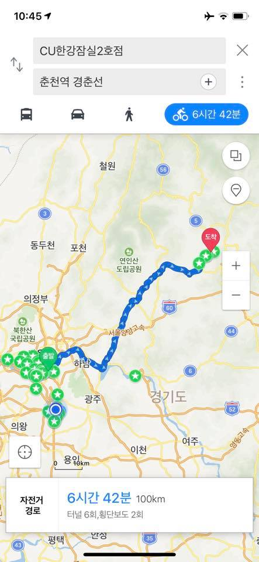
**이미지 캡션:** 이 화면은 스마트폰 지도 앱의 일부로, 출발지와 목적지를 설정하고 경로를 탐색하는 중임을 보여준다. 상단에는 현재 시간 10시 45분과 배터리 상태, Wi-Fi 신호 등이 표시되어 있다. 출발지는 'CU한강잠실2호점'으로 설정되어 있으며, 목적지는 '춘천역 경춘선'으로 보인다. 화면 중앙에는 서울 근교의 지도가 펼쳐져 있으며, 파란색 선으로 표시된 자전거 경로가 나타난다. 경로 상에는 '출발' 표시와 함께 녹색 별 모양의 여러 지점들이 표시되어 있으며, '도착' 표시와 함께 몇 개의 녹색 원형 지점들이 표시되어 있다. 지도에는 '철원', '동두천', '포천', '의정부', '하남', '광주', '이천', '여주', '평택', '안성' 등의 도시 이름과 '북한산 국립공원', '연인산 도립공원' 등의 장소 이름이 한국어로 표기되어 있다. 또한 '서울양양고속', '영동고속'과 같은 고속도로 이름과 도로 번호(3, 5, 6, 35, 43, 44, 52, 56, 60)도 보인다. 화면 하단에는 '자전거 경로'라는 제목과 함께 총 이동 시간 '6시간 42분', 총 거리 '100km', 그리고 '터널 6회, 횡단보도 2회'라는 경로 정보가 요약되어 있다. 전반적으로 자전거를 이용하여 장거리 이동을 계획하고 있는 상황을 보여주는 화면이다.
 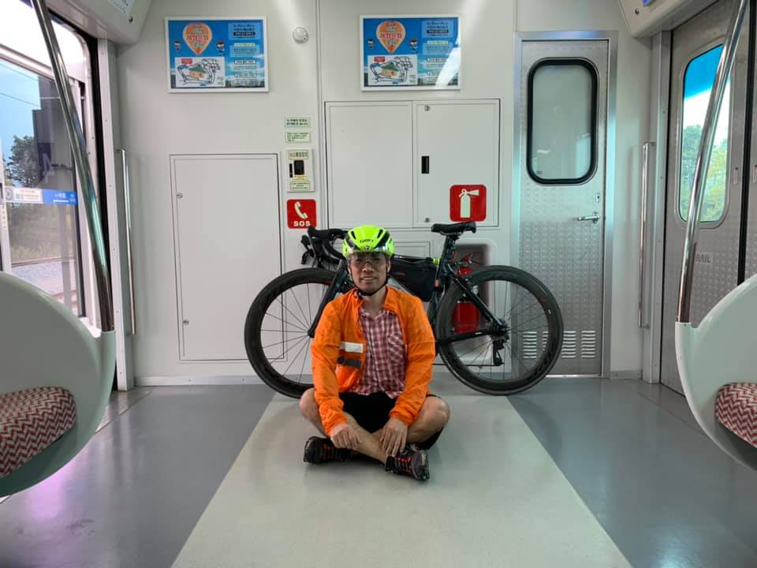
**이미지 캡션:** 한 명의 성인 남성이 기차 안에서 자전거와 함께 앉아 있다. 남성은 30대 초중반으로 보이며, 노란색 헬멧을 쓰고 주황색 바람막이와 체크무늬 셔츠, 검은색 반바지를 입고 있다. 그는 무릎을 꿇고 앉아 있으며, 얼굴에는 미소를 띠고 있다. 남성 뒤에는 검은색 자전거가 세워져 있고, 자전거에는 검은색 가방이 달려 있다. 기차 내부는 흰색 벽과 회색 바닥으로 되어 있으며, 창문 밖으로는 녹색 풍경이 보인다. 벽에는 두 개의 포스터와 소화기, SOS 표시가 붙어 있다. 전반적으로 여행 중인 사람의 편안하고 즐거운 분위기를 나타낸다.

### 7월 13일 (토) 12:18 · 📷 사진 (2장)

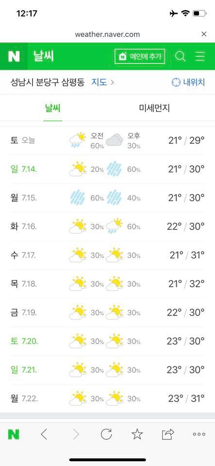
**이미지 캡션:** 이것은 스마트폰 화면으로, 네이버 날씨 웹사이트를 보여주고 있습니다. 화면 상단에는 12시 17분이라는 시간이 표시되어 있고, 웹사이트 주소인 weather.naver.com과 닫기 버튼이 보입니다. 녹색 배경의 네이버 날씨 로고와 함께 "메인에 추가" 버튼, 검색 아이콘, 메뉴 아이콘이 있습니다. 그 아래에는 "성남시 분당구 삼평동"이라는 지역명과 "지도" 링크, 그리고 "내 위치" 아이콘이 있습니다. 화면 중앙에는 "날씨"와 "미세먼지" 두 개의 탭이 있으며, "날씨" 탭이 선택되어 있습니다. 날씨 정보는 날짜별로 오전과 오후의 날씨 아이콘, 강수 확률, 그리고 최저/최고 기온으로 구성되어 있습니다. 예를 들어, 오늘 토요일은 오전에는 구름과 비 아이콘에 60%의 강수 확률, 오후에는 구름 아이콘에 30%의 강수 확률이며 기온은 21도에서 29도입니다. 이후 7월 14일부터 7월 22일까지의 날씨 예보가 요일별로 표시되어 있으며, 대부분 맑거나 구름 조금인 날씨에 30% 내외의 강수 확률을 보이고 있습니다. 화면 하단에는 네이버 앱 아이콘과 뒤로가기, 새로고침, 즐겨찾기, 공유, 더보기 등의 메뉴 아이콘이 보입니다. 전반적으로 맑고 더운 여름 날씨를 나타내는 정보가 표시되고 있습니다.
 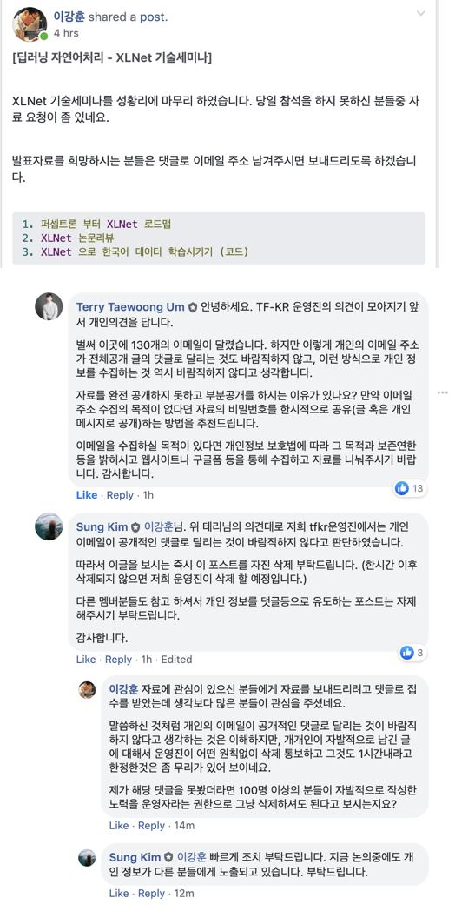
**이미지 캡션:** 이 사진은 딥러닝 자연어 처리 기술 세미나에 대한 게시글과 그에 대한 댓글들을 보여줍니다. 게시글 작성자는 세미나가 성황리에 마무리되었으며, 참석하지 못한 사람들을 위해 발표 자료를 요청하면 이메일로 보내주겠다고 합니다. 발표 자료 목록에는 퍼셉트론부터 XLNet 로드맵, XLNet 논문 리뷰, 그리고 XLNet을 이용한 한국어 데이터 학습시키기(코드)가 포함되어 있습니다. 이후 Terry Taewoong Um이라는 사용자가 댓글을 달아, 개인 이메일 주소가 공개적인 댓글로 수집되는 것이 바람직하지 않으며, 자료 공개 시에는 개인정보 보호법에 따라 목적과 보존 연한을 명시하고 웹사이트나 구글 폼을 통해 수집할 것을 제안합니다. 이에 대해 Sung Kim이라는 사용자는 Terry Taewoong Um의 의견에 동의하며, 이강훈에게 해당 게시글을 즉시 자진 삭제할 것을 요청하고, 그렇지 않으면 운영진이 삭제할 것이라고 알립니다. 또한 다른 멤버들에게도 개인 정보 노출을 유도하는 게시글을 자제해달라고 당부합니다. 이강훈은 다시 댓글을 달아, 자료에 관심 있는 사람들에게 보내주려고 댓글로 접수를 받았는데 생각보다 많은 사람들이 관심을 보여주었다고 설명합니다. 개인 이메일이 공개 댓글로 달리는 것이 바람직하지 않다는 점은 이해하지만, 운영진이 명확한 원칙 없이 1시간 내 삭제를 통보하는 것은 무리가 있다고 지적하며, 만약 자신이 댓글을 보지 못했다면 100명 이상의 자발적인 노력을 운영진의 권한으로 삭제해도 되는지에 대해 질문합니다. 마지막으로 Sung Kim은 이강훈에게 빠르게 조치를 취해달라고 다시 한번 요청하며, 논의 중에도 개인 정보가 노출되고 있다고 강조합니다. 전반적으로 이 게시글은 기술 세미나 후 자료 공유 과정에서 발생한 개인 정보 보호 및 게시글 관리 방식에 대한 논쟁을 보여주고 있습니다.

> #개인정보보호 저는 오늘 TF-KR 멤버가 올려주신 글을 저희 운영진의 뜻을 모아 삭제하였습니다. 저는 기본적으로 커뮤니티는 모두에게 열려있고 스스로 좋은 방향으로 갈수 있다는 믿음으로 운영하고 있습니다. 이에 간혹 이슈의 소지가 있는 글들도 운영진은 직접 개입하지 않고 해당 글에 댓글로 저희 입장을 밝히고 수정을 권유를 하는등 간접적으로 참여를 해왔습니다.  이강훈 님께서 자료 공유를 위한 좋은 취지로 올려주신 글이지만, 이 글은 개인 이메일을 댓글이라는 공개된 공간에 적도록 유도하였고, 이 개인 정보는 모든 분들에게 열려있어서 본인이 이 데이터를 받는 목적 이외 다른 분들도 이 이메일을 사용할수 있어 개인정보 침해의 우려가 있었습니다.  따라서 운영진들은 이 안에 대해 긴급논의를 했으며 이 글은 빠르게 삭제등의 조치가 되어 더이상 개인 이메일이 노출을 막아야 한다는 결정을 하였습니다.  다만 이강훈님께서 올려주신 글이라 직접 삭제해주심이 좋을듯 하여 삭제를 권유 드렸고, 한시간을 기다렸고 또 본인이 그 공지를 보셨음에도 불구하고 10여분 이상 아무 조치를 취하지 않아 제가 운영자 권한으로 삭제하였습니다.  경과 과정의 일부는 아래 스크린 켑춰를 통해 참고하시면 됩니다. 어찌되었던 회원의 글과 댓들이 있는 글을 삭제하는 결정을 내려서 안타깝게 생각합니다.   다만 앞으로도 개인정보를 침해하거나 정보 유출을 유도하는 글들은 자제해주시기 부탁드리며 빠른 2차 피해방지를 위해 같은 유형의 글일 경우 사전 공지없이 삭제될수 있음을 미리 안내드립니다. (삭제후 경과는 공유드리겠습니다.)  관련하여 멤버들의 의견이 있으시면 알려주세요.

### 7월 14일 (일) 07:57 · 📷 사진 (2장)

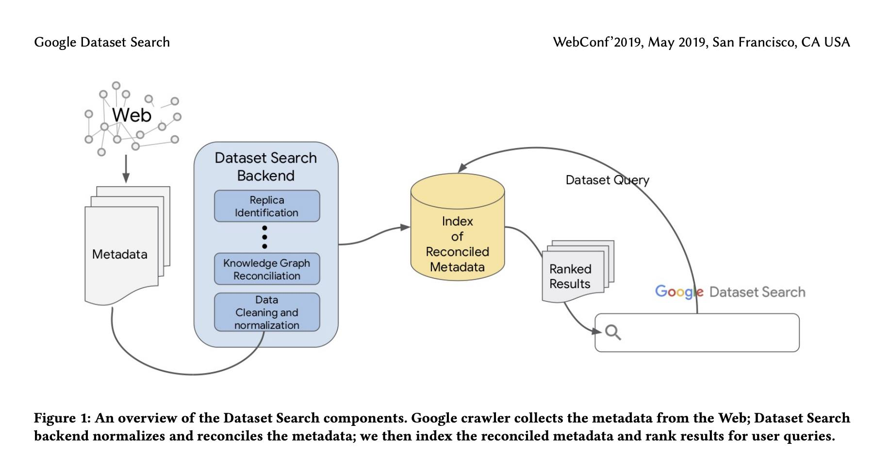
**이미지 캡션:** 이 이미지는 Google Dataset Search의 구성 요소를 개략적으로 보여주는 다이어그램입니다. 사람, 장소, 사물, 텍스트, 분위기 등은 보이지 않습니다. 배경은 흰색이며, 텍스트와 다이어그램 요소만 포함하고 있습니다. 다이어그램은 웹에서 메타데이터를 수집하고, 데이터셋 검색 백엔드에서 메타데이터를 정규화 및 조정하며, 조정된 메타데이터를 인덱싱하고 사용자 쿼리에 대한 결과를 순위화하는 과정을 설명합니다. "Google Dataset Search", "Web", "Metadata", "Dataset Search Backend", "Replica Identification", "Knowledge Graph Reconciliation", "Data Cleaning and normalization", "Index of Reconciled Metadata", "Dataset Query", "Ranked Results", "Google Dataset Search", "Q"와 같은 텍스트가 보입니다. 또한 "WebConf'2019, May 2019, San Francisco, CA USA"라는 텍스트도 상단에 표시되어 있습니다. 전반적인 분위기는 정보 전달적이고 기술적인 다이어그램입니다.
 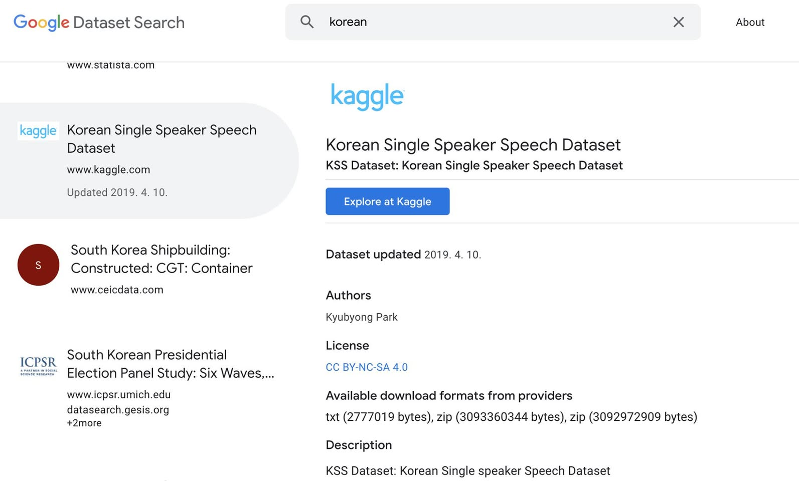
**이미지 캡션:** 이 이미지는 구글 데이터셋 검색 결과 페이지를 보여줍니다. 화면 상단에는 "Google Dataset Search"라는 로고와 함께 검색창이 있으며, 검색창에는 "korean"이라는 단어가 입력되어 있습니다. 검색창 오른쪽에는 검색을 취소하는 X 버튼과 "About" 링크가 있습니다. 페이지 중앙에는 "kaggle" 로고와 함께 "Korean Single Speaker Speech Dataset"이라는 제목의 데이터셋 정보가 표시되어 있으며, 해당 데이터셋은 www.kaggle.com에서 찾을 수 있고 2019년 4월 10일에 업데이트되었습니다. 이 데이터셋에 대한 자세한 정보로 "KSS Dataset: Korean Single Speaker Speech Dataset"이라는 설명과 "Explore at Kaggle" 버튼이 있습니다. 그 아래에는 "Dataset updated 2019. 4. 10.", "Authors Kyubyong Park", "License CC BY-NC-SA 4.0", "Available download formats from providers txt (2777019 bytes), zip (3093360344 bytes), zip (3092972909 bytes)", 그리고 "Description KSS Dataset: Korean Single speaker Speech Dataset"이라는 정보가 나열되어 있습니다. 페이지 왼쪽에는 다른 데이터셋 검색 결과들도 일부 보이며, "www.statista.com", "South Korea Shipbuilding: Constructed: CGT: Container" (www.ceicdata.com), 그리고 "South Korean Presidential Election Panel Study: Six Waves,..." (www.icpsr.umich.edu, datasearch.gesis.org) 등의 정보가 포함되어 있습니다. 전체적으로 기술적인 데이터셋을 검색하는 상황을 보여주는 화면 캡처입니다.

### 7월 19일 (금) 20:16 · 📷 사진 (1장)

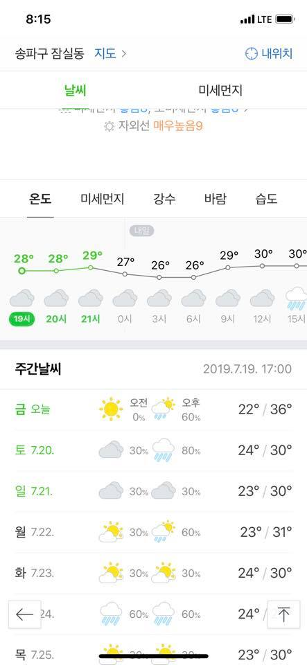
**이미지 캡션:** 이것은 휴대폰 화면의 스크린샷으로, 날씨 앱의 현재 날씨와 주간 날씨 예보를 보여줍니다. 화면 상단에는 시간 8:15와 LTE 신호 강도가 표시되어 있습니다. 그 아래에는 "송파구 잠실동"이라는 위치 정보와 함께 "지도" 및 "내 위치" 버튼이 보입니다. 메인 섹션은 "날씨"로, 현재 날씨 상태와 함께 "미세먼지" 정보가 표시됩니다. "자외선 매우 높음 9"라는 문구가 눈에 띕니다. 그 아래에는 시간별 온도 그래프가 있으며, 19시부터 15시까지의 온도가 28도에서 30도 사이로 표시됩니다. 그래프 아래에는 시간별 날씨 아이콘이 있는데, 맑음, 구름, 비 등 다양한 날씨를 나타냅니다. "주간 날씨" 섹션에서는 금요일부터 목요일까지의 날씨 예보가 제공됩니다. 각 요일별로 오전과 오후의 날씨 아이콘, 강수 확률, 그리고 최저 및 최고 기온이 표시됩니다. 예를 들어, 금요일 오늘은 오전에는 맑고 강수 확률 0%이며, 오후에는 구름이 많고 강수 확률 60%에 최고 기온 36도입니다. 토요일은 구름이 많고 비가 올 확률이 높으며, 일요일은 구름이 많지만 비 올 확률은 낮습니다. 월요일과 화요일은 맑은 날씨와 구름이 섞인 날씨가 번갈아 나타나며, 수요일은 비가 올 확률이 높습니다. 목요일은 맑은 날씨가 예상됩니다. 전반적으로 여름철의 더운 날씨와 함께 간헐적인 비 소식이 있음을 알 수 있습니다.

### 7월 20일 (토) 12:28 · 📷 사진 (2장)

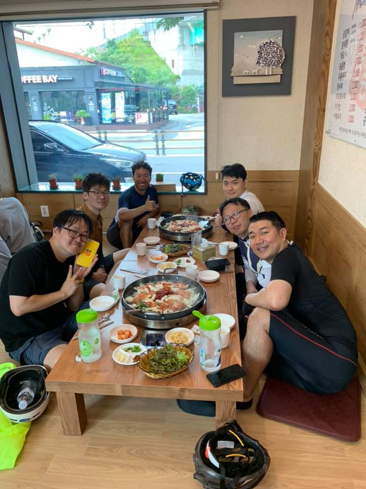
**이미지 캡션:** 여섯 명의 성인 남성이 나무 테이블에 둘러앉아 식사를 하고 있으며, 테이블 위에는 김이 나는 냄비 요리와 여러 반찬, 음료수 병이 놓여 있습니다. 한 남성은 노란색 스마트폰을 들고 카메라를 향해 웃고 있고, 다른 남성들은 편안한 표정으로 식사를 즐기거나 대화를 나누고 있습니다. 배경에는 창문 너머로 'COFFEE BAY' 간판이 보이는 건물과 녹색 언덕이 보이며, 실내에는 메뉴판과 그림이 걸려 있습니다. 테이블 주변 바닥에는 헬멧과 노란색 재킷이 놓여 있어 이들이 자전거를 타고 온 것으로 추정됩니다. 전반적으로 편안하고 즐거운 식사 분위기입니다.
 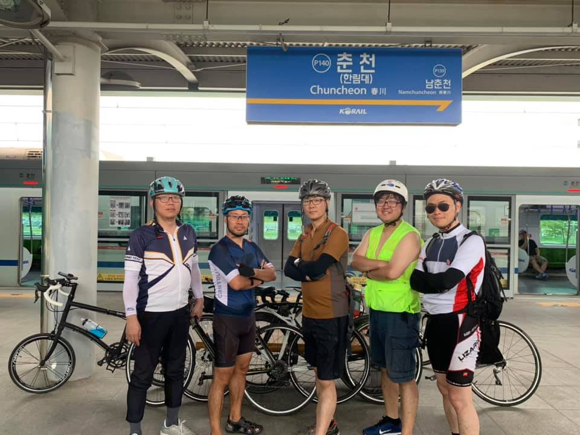
**이미지 캡션:** 다섯 명의 성인 남성이 자전거와 함께 기차역 플랫폼에 서 있습니다. 왼쪽부터 첫 번째 남성은 회색 헬멧을 쓰고 있으며, 흰색, 파란색, 검은색이 섞인 사이클링 저지와 검은색 바지를 입고 있습니다. 두 번째 남성은 파란색 헬멧을 쓰고 있으며, 파란색과 흰색이 섞인 사이클링 저지와 검은색 반바지를 입고 있습니다. 세 번째 남성은 흰색 헬멧을 쓰고 있으며, 밝은 녹색 조끼와 파란색 반바지를 입고 있습니다. 네 번째 남성은 검은색 헬멧을 쓰고 있으며, 흰색, 빨간색, 검은색이 섞인 사이클링 저지와 검은색 반바지를 입고 있습니다. 다섯 번째 남성은 검은색 헬멧을 쓰고 있으며, 흰색, 빨간색, 검은색이 섞인 사이클링 저지와 검은색 반바지를 입고 있습니다. 모든 남성은 헬멧을 착용하고 있으며, 일부는 팔짱을 끼고 있습니다. 그들 뒤로는 기차가 정차해 있으며, 플랫폼에는 "춘천 (한림대) Chuncheon 春川 남춘천 Namchuncheon"이라고 적힌 파란색 표지판이 보입니다. 전반적으로 활기차고 활동적인 분위기입니다.

### 7월 21일 (일) 08:11 · 📷 사진 (2장)

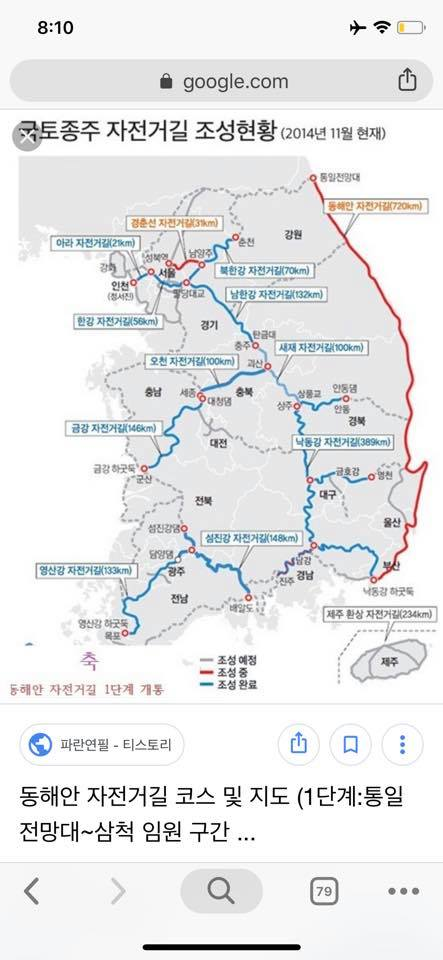
**이미지 캡션:** 이 사진은 한국의 국토종주 자전거길 조성 현황을 보여주는 지도로, 2014년 11월 현재 기준으로 작성되었습니다. 지도에는 주요 자전거길의 이름과 길이가 표시되어 있으며, 동해안 자전거길, 남한강 자전거길, 금강 자전거길, 영산강 자전거길, 새재 자전거길, 낙동강 자전거길, 제주 환상 자전거길 등이 포함되어 있습니다. 각 자전거길은 파란색 선으로 표시되어 있으며, 일부 구간은 붉은색 또는 짙은 파란색으로 구분되어 조성 예정, 조성 중, 조성 완료 상태를 나타냅니다. 지도 상단에는 "국토종주 자전거길 조성현황 (2014년 11월 현재)"이라는 제목이 있고, 하단에는 "동해안 자전거길 1단계 개통"이라는 문구와 함께 "동해안 자전거길 코스 및 지도 (1단계: 통일전망대~삼척 임원 구간)"라는 검색 결과 제목이 보입니다. 사진은 스마트폰 화면을 캡처한 것으로 보이며, 웹 브라우저의 주소창에는 "google.com"이 표시되어 있습니다. 전반적으로 정보 전달을 목적으로 하는 지도 이미지이며, 특별한 인물이나 사물은 부각되지 않습니다.
 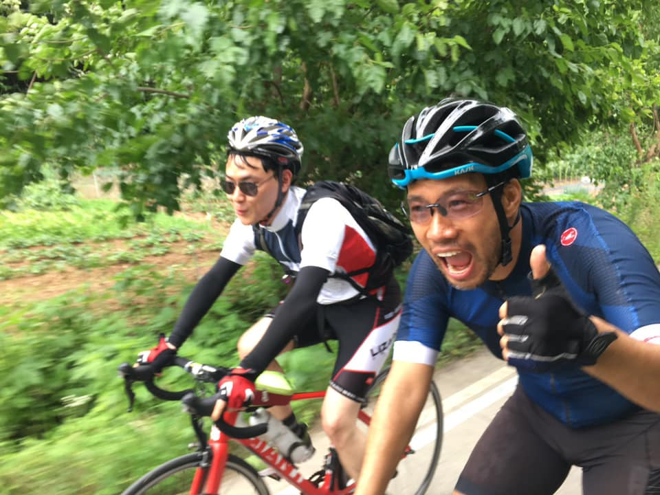
**이미지 캡션:** 두 명의 성인 남성이 자전거를 타고 있다. 앞쪽에 있는 남성은 30대 후반에서 40대 초반으로 보이며, 파란색과 검은색이 섞인 헬멧과 파란색 사이클링 저지, 검은색 반바지를 착용하고 있다. 그는 안경을 쓰고 있으며, 입을 크게 벌리고 환호하는 듯한 표정을 짓고 있고 엄지손가락을 치켜세우고 있다. 뒤쪽에 있는 남성은 30대 초반으로 보이며, 흰색과 파란색이 섞인 헬멧과 흰색 상의, 검은색 하의를 착용하고 선글라스를 끼고 있다. 두 사람 모두 사이클링 장갑을 착용하고 있으며, 배경에는 울창한 녹색 나무와 숲이 보인다. 전반적으로 활동적이고 즐거운 분위기이며, 두 사람이 함께 자전거 라이딩을 즐기고 있는 모습이다.

### 7월 25일 (목) 22:51 · 📷 사진 (1장)

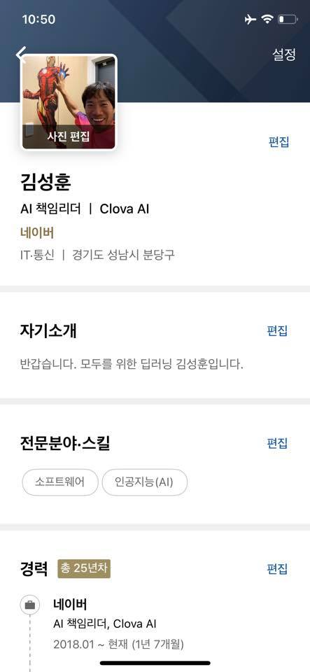
**이미지 캡션:** 화면 상단에는 10시 50분이라는 시간과 와이파이, 배터리 아이콘이 보이며, 오른쪽에는 설정 버튼이 있다. 그 아래에는 아이언맨 피규어와 함께 웃고 있는 성인 남성의 사진이 있고, 사진 아래에는 '사진 편집'이라는 글자가 있다. 사진 아래로는 '김성훈'이라는 이름과 함께 'AI 책임리더 | Clova AI', '네이버', 'IT·통신 | 경기도 성남시 분당구'라는 정보가 나열되어 있다. '자기소개' 섹션에는 '반갑습니다. 모두를 위한 딥러닝 김성훈입니다.'라는 문구가 있으며, '전문분야·스킬' 섹션에는 '소프트웨어'와 '인공지능(AI)'이라는 태그가 보인다. 마지막으로 '경력' 섹션에는 '총 25년차'라는 문구와 함께 '네이버', 'AI 책임리더, Clova AI', '2018.01 ~ 현재 (1년 7개월)'이라는 경력 정보가 상세하게 기재되어 있다. 각 섹션마다 '편집'이라는 버튼이 있어 정보를 수정할 수 있음을 나타낸다. 전반적으로 개인 프로필 화면으로 보이며, IT 업계 종사자의 정보가 담겨 있다.

### 7월 28일 (일) 07:40 · 📷 사진 (1장)

**이미지 캡션:** 이 이미지는 유튜브 채널의 한 페이지를 보여주며, "Kaggle Reading Group | Kaggle"이라는 제목의 재생 목록을 표시하고 있습니다. 화면 왼쪽에는 채널의 로고와 "Kaggle Livecoding with Rachael!"이라는 문구가 있으며, 그 아래에는 "PLAY ALL" 버튼이 있습니다. 재생 목록 정보에는 31개의 동영상이 있으며, 8,352회의 조회수를 기록했고 3일 전에 업데이트되었다는 내용이 있습니다. 또한, "Join Kaggle Data Scientists as we read through and take notes on NLP (Natural Language Processing) papers!"라는 설명과 함께 라이브 채팅에 참여하여 질문할 수 있다는 안내가 있습니다. "Kaggle" 로고와 함께 "SUBSCRIBE 27K" 버튼이 보입니다. 화면 오른쪽에는 재생 목록의 동영상 목록이 나열되어 있으며, 각 동영상은 썸네일 이미지, 제목, 길이, 그리고 "Kaggle"이라는 출처 정보를 포함하고 있습니다. 동영상 제목들은 "Kaggle Reading Group: Bidirectional Encoder Representations from Transformers (aka BERT) | Kaggle", "Kaggle Reading Group: Attention is all You Need (Pt. 3) | Kaggle", "Kaggle Reading Group: Attention is all You Need (Pt. 2) | Kaggle", "Kaggle Reading Group: Attention is All You Need | Kaggle" 등 자연어 처리(NLP) 관련 논문을 다루는 것으로 보입니다. 화면 하단에는 현재 보고 있는 동영상의 제목인 "Kaggle Reading Group: Attention is All You Need | Kag"과 함께 "Kaggle Reading Group | Kaggle • 27/31"이라는 표시가 있어, 이 동영상이 재생 목록의 27번째임을 알 수 있습니다. 또한, 이 동영상의 썸네일로 보이는 웹페이지 화면이 부분적으로 겹쳐져 있는데, 해당 웹페이지에는 "Recurrent models typically factor..."로 시작하는 논문의 텍스트가 보입니다. 전반적으로 기술 관련 온라인 커뮤니티의 학습 콘텐츠를 제공하는 분위기입니다.

> 저희 그룹에도 자랑스러운 PR12그룹 (온라인 논문리딩) 이 있는데요. 시즌 1: [https://www.youtube.com/playlist?list=PLWKf9beHi3Tg50UoyTe6rIm20sVQOH1br](https://www.youtube.com/playlist?list=PLWKf9beHi3Tg50UoyTe6rIm20sVQOH1br)  [시즌 2: https://www.youtube.com/playlist?list=PLWKf9beHi3TgstcIn8K6dI_85_ppAxzB8](https://www.youtube.com/playlist?list=PLWKf9beHi3TgstcIn8K6dI_85_ppAxzB8&fbclid=IwAR2XIDLFfKxyWKK3nSwl3ETum7kPLl4g1vA5-imEfGwyvbEKEyb8GOHhkHg)  Kaggle에서도 비슷한 그룹이 생긴것 같습니다. http://bit.ly/KaggleReadingGroup  저희들것과 좀 다른것은 Rachael 한분이 논문을 거의 line by line으로 읽으면서 설명을 해줍니다. 그리고 한시간 정도로 시간이 깁니다.   그런데 그냥 정말 논문을 같이 읽는듯한 느낌이 나고요. 이분의 발음이 정말좋아서 영어공부에도 엄청도움이 될듯합니다. 저도 당분간 여기 리스트를 다 들어 볼것 같습니다.

### 7월 30일 (화) 07:45 · 📷 사진 (1장)

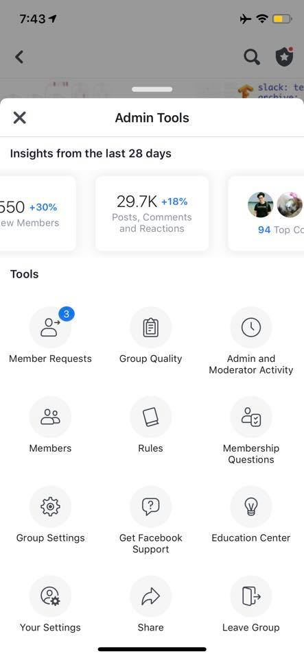
**이미지 캡션:** 이 화면은 페이스북 그룹의 관리자 도구 페이지를 보여줍니다. 상단에는 "Admin Tools"라는 제목과 함께 "X" 버튼이 있어 이 화면을 닫을 수 있습니다. 그 아래에는 지난 28일간의 통계가 표시되며, "550 +30% New Members" (신규 회원 550명, 30% 증가), "29.7K +18% Posts, Comments and Reactions" (게시물, 댓글, 반응 29.7K개, 18% 증가), 그리고 "94 Top Contributors" (상위 기여자 94명)가 보입니다. 더 아래에는 "Tools"라는 제목과 함께 다양한 관리 도구 아이콘과 텍스트가 나열되어 있습니다. 여기에는 "Member Requests" (회원 요청, 파란색 숫자 3 표시), "Group Quality" (그룹 품질), "Admin and Moderator Activity" (관리자 및 중재자 활동), "Members" (회원), "Rules" (규칙), "Membership Questions" (회원 가입 질문), "Group Settings" (그룹 설정), "Get Facebook Support" (페이스북 지원 받기), "Education Center" (교육 센터), "Your Settings" (내 설정), "Share" (공유), "Leave Group" (그룹 나가기) 등이 포함됩니다. 화면 하단에는 검은색 가로줄이 있어 스크롤이 가능함을 나타냅니다. 전반적으로 깔끔하고 기능적인 인터페이스를 가지고 있으며, 그룹 관리자가 그룹의 성과를 확인하고 다양한 설정을 관리할 수 있도록 돕는 정보를 제공합니다.

### 7월 31일 (수) 20:45 · 📷 사진 (1장)

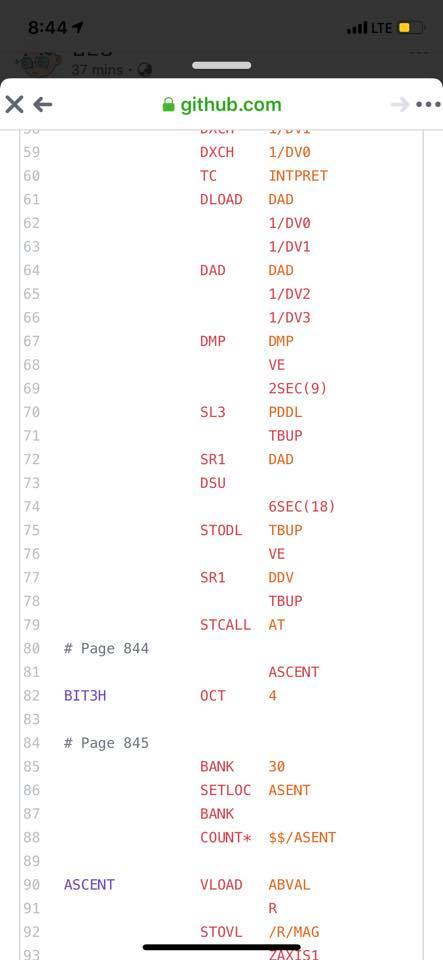
**이미지 캡션:** 이 이미지는 스마트폰 화면을 캡처한 것으로, 웹 브라우저에서 GitHub 웹사이트를 보고 있는 모습입니다. 화면 상단에는 시간 정보(8:44)와 배터리 잔량(LTE 표시)이 보이며, 웹 브라우저의 주소창에는 "github.com"이 표시되어 있습니다. 화면 중앙에는 코드 또는 명령어 목록이 나타나 있으며, 각 줄마다 번호와 함께 텍스트가 나열되어 있습니다. 텍스트는 주로 대문자로 이루어져 있으며, 일부는 빨간색으로 강조되어 있습니다. 예를 들어, "DXCH", "TC", "DLOAD", "DAD", "DMP", "SL3", "SR1", "DSU", "STODL", "SR1", "STCALL", "BIT3H", "OCT", "BANK", "SETLOC", "COUNT*", "ASCENT", "VLOAD", "STOVL" 등의 단어들이 보입니다. 또한, 숫자와 기호들도 함께 나타나 있습니다. 이 목록은 프로그래밍 코드, 어셈블리 언어 또는 특정 시스템의 명령어 집합으로 보입니다. 배경은 특별히 보이지 않으며, 화면 자체에 집중되어 있습니다. 전체적으로 기술적인 내용을 다루는 화면으로, 전문적인 정보를 탐색하거나 확인하는 상황으로 추정됩니다.
