# 2019년 8월

[← 2019년](README.md)

### 8월 10일 (토) 21:00 · #MaunaKeyPractice #1 done. Gapyeong five…

#MaunaKeyPractice #1 done. Gapyeong five hills, 200km and 3000m up! 

Very hot weather so valley swimming was a bonus.

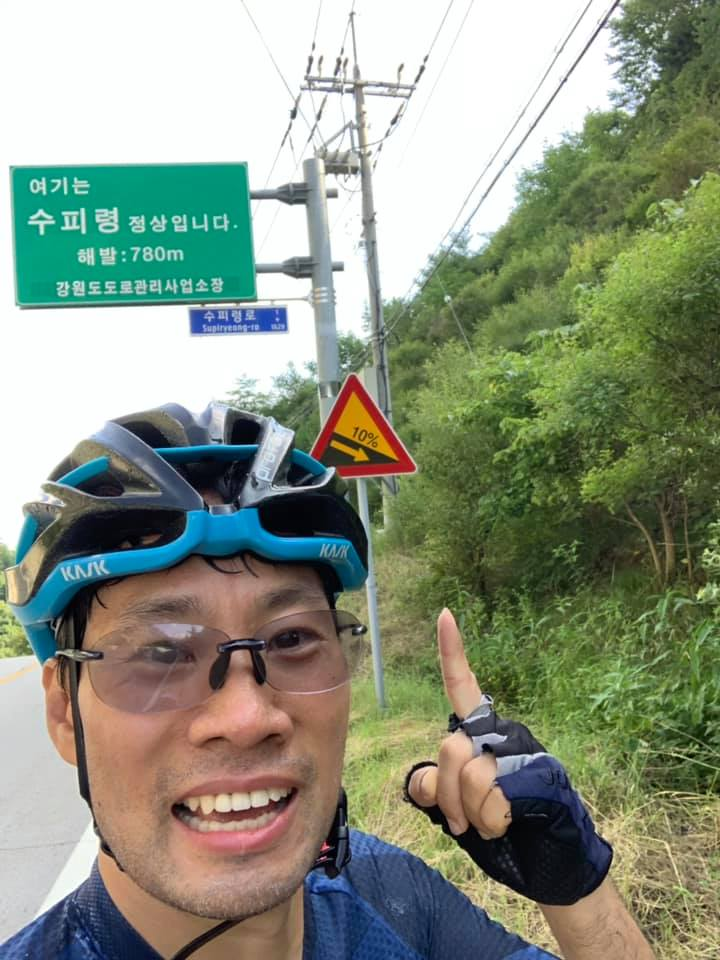
**이미지 캡션:** 이 사진은 한 성인 남성이 자전거를 타다가 잠시 멈춰서 찍은 셀카로 보인다. 남성은 40대 후반에서 50대 초반으로 추정되며, 짧은 머리에 안경을 착용하고 있다. 얼굴에는 땀방울이 맺혀 있고, 밝게 웃으며 카메라를 응시하고 있다. 그는 파란색과 검은색이 섞인 자전거 의류와 헬멧, 장갑을 착용하고 있어 자전거 라이딩 중임을 알 수 있다. 남성은 오른손 검지를 위로 향하게 들고 있으며, 이는 어떤 것을 가리키거나 강조하는 듯한 제스처로 보인다. 배경에는 초록색 표지판이 보이며, "여기는 수피령 정상입니다. 해발: 780m 강원도도로관리사업소장"이라고 적혀 있다. 또한, "수피령로 Supiryeong-ro"라고 쓰인 작은 표지판과 함께 노란색 삼각형 안에 10%라고 쓰인 경사도 표지판도 보인다. 주변은 울창한 나무와 풀로 뒤덮인 산악 지형이며, 전봇대와 전선이 하늘을 가로지르고 있다. 전체적으로 맑은 날씨에 야외 활동을 즐기는 긍정적이고 활기찬 분위기를 느낄 수 있다. 780m 강원도도로관리사업소장"이라고 적혀 있다. 또한, "수피령로 Supiryeong-ro"라고 쓰인 작은 표지판과 함께 노란색 삼각형 안에 10%라고 쓰인 경사도 표지판도 보인다. 주변은 울창한 나무와 풀로 뒤덮인 산악 지형이며, 전봇대와 전선이 하늘을 가로지르고 있다. 전체적으로 맑은 날씨에 야외 활동을 즐기는 긍정적이고 활기찬 분위기를 느낄 수 있다.
 
**이미지 캡션:** 한 성인 남성이 얕은 계곡물에 누워 환하게 웃으며 엄지손가락을 치켜들고 있다. 그는 파란색과 검은색이 섞인 사이클링 복장과 파란색 고글을 착용하고 있으며, 머리에는 파란색 헬멧을 쓰고 있다. 남성의 얼굴은 물에 젖어 있으며, 입을 크게 벌리고 즐거워하는 표정을 짓고 있다. 그의 몸은 물살에 의해 움직이고 있으며, 주변에는 바위와 작은 식물들이 보인다. 물은 맑고 시원해 보이며, 햇빛이 비쳐 반짝인다. 전체적으로 활동적이고 즐거운 분위기를 연출한다.
 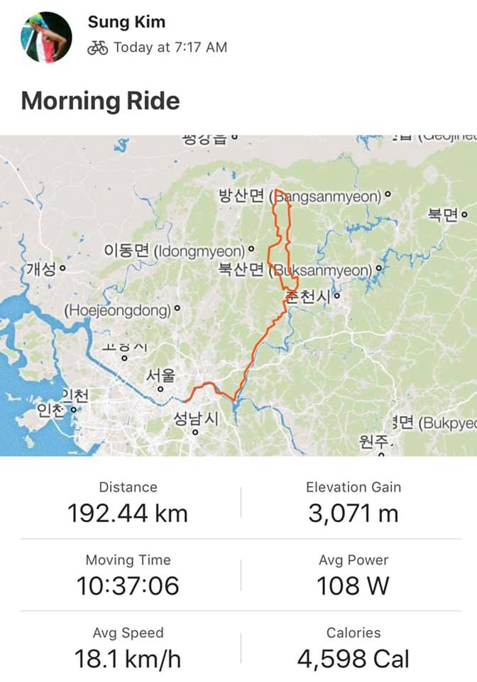
**이미지 캡션:** 사진에는 "Sung Kim"이라는 이름의 사용자가 오늘 오전 7시 17분에 "Morning Ride"라는 제목으로 자전거 타기 기록을 공유하는 모습이 담겨 있습니다. 화면 상단에는 사용자의 프로필 사진이 있는데, 녹색 헬멧을 쓰고 빨간색과 흰색 옷을 입은 성인 남성이 자전거를 타고 있는 모습입니다. 지도에는 주황색 선으로 표시된 자전거 경로가 보이며, 이 경로는 서울, 인천, 성남시, 춘천시 등 여러 도시와 지역을 지나갑니다. 지도 아래에는 자전거 타기 기록에 대한 상세 정보가 표시되어 있습니다. 총 거리는 192.44km, 이동 시간은 10시간 37분 6초, 평균 속도는 18.1km/h입니다. 또한, 고도 상승은 3,071m, 평균 파워는 108W, 소모 칼로리는 4,598 Cal로 기록되어 있습니다. 전체적으로 활동적인 라이프스타일을 보여주는 기록이며, 장거리 자전거 라이딩을 마친 후의 성취감을 나타내는 듯한 분위기입니다.192.44km, 이동 시간은 10시간 37분 6초, 평균 속도는 18.1km/h입니다. 또한, 고도 상승은 3,071m, 평균 파워는 108W, 소모 칼로리는 4,598 Cal로 기록되어 있습니다. 전체적으로 활동적인 라이프스타일을 보여주는 기록이며, 장거리 자전거 라이딩을 마친 후의 성취감을 나타내는 듯한 분위기입니다.
 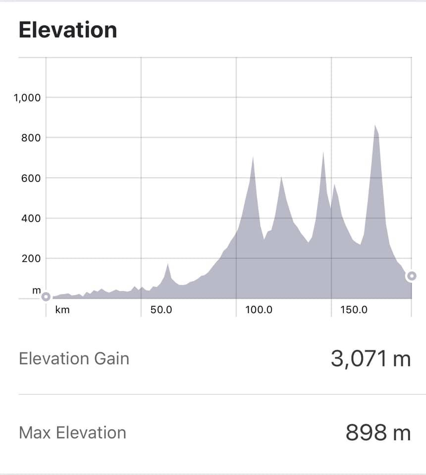
**이미지 캡션:** 이 사진은 고도 그래프를 보여줍니다. 제목은 "Elevation"이며, 세로축은 미터(m) 단위의 고도를 나타내고 0부터 1,000까지 표시됩니다. 가로축은 킬로미터(km) 단위의 거리를 나타내며 0부터 150.0까지 표시됩니다. 그래프는 회색 음영으로 표시된 산악 지형의 고도 변화를 나타내며, 여러 개의 봉우리와 계곡이 있습니다. 그래프 하단에는 "Elevation Gain"이라는 텍스트와 함께 3,071m라는 수치가 표시되어 있으며, 이는 총 상승 고도를 의미합니다. 그 아래에는 "Max Elevation"이라는 텍스트와 함께 898m라는 수치가 표시되어 있으며, 이는 최고 도달 고도를 의미합니다. 사진에는 사람이 등장하지 않으며, 배경은 흰색 바탕에 회색 격자선과 그래프로 구성되어 있습니다. 전반적으로 운동 기록이나 경로 분석과 관련된 정보를 담고 있는 차트의 모습입니다."이라는 텍스트와 함께 898m라는 수치가 표시되어 있으며, 이는 최고 도달 고도를 의미합니다. 사진에는 사람이 등장하지 않으며, 배경은 흰색 바탕에 회색 격자선과 그래프로 구성되어 있습니다. 전반적으로 운동 기록이나 경로 분석과 관련된 정보를 담고 있는 차트의 모습입니다.

### 8월 11일 (일) 06:40 · 📷 사진 (2장)

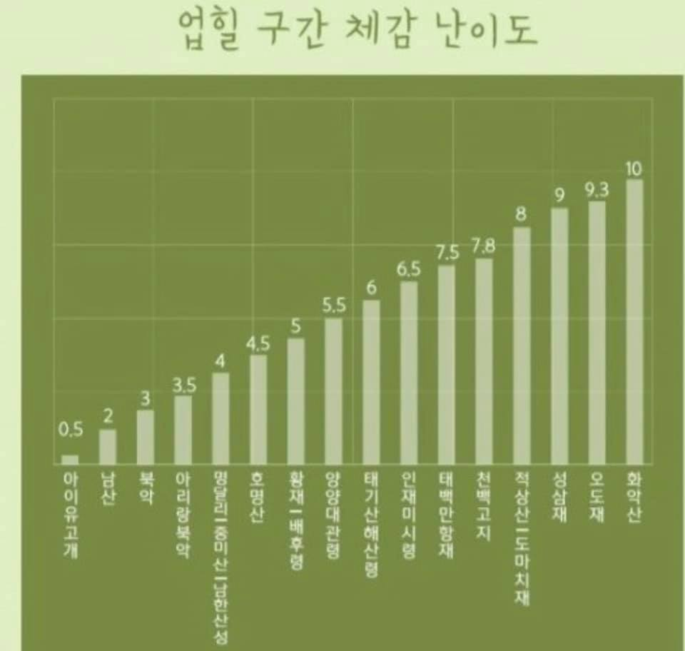
**이미지 캡션:** 이 이미지는 한국어로 "업힐 구간 체감 난이도"라는 제목의 막대 그래프를 보여줍니다. 그래프는 여러 산악 구간의 체감 난이도를 나타내며, 각 막대는 특정 구간을 나타내고 높이는 해당 구간의 난이도를 나타냅니다. 막대 아래에는 "아이유고개", "남산", "북악", "아리랑북악", "명달리-중미산-남한산성", "호명산", "황재-배후령", "양양대관령", "태기산해산령", "인재미시령", "태백만항재", "천백고지", "적상산-도마치재", "성삼재", "오도재", "화악산"과 같은 구간 이름이 한국어로 표시되어 있습니다. 막대 위에는 0.5부터 10까지의 숫자가 표시되어 난이도 수준을 나타냅니다. 예를 들어, "아이유고개"는 0.5의 난이도를, "화악산"은 10의 난이도를 가집니다. 그래프는 녹색 배경에 흰색 막대로 구성되어 있으며, 전체적으로 정보 전달에 초점을 맞춘 깔끔한 디자인입니다. 이미지에는 사람이 등장하지 않으며, 배경은 그래프가 그려진 평면입니다. 보이는 텍스트는 그래프의 제목과 축 레이블, 그리고 각 막대의 값입니다. 전반적인 분위기는 정보 전달에 집중된 분석적인 느낌을 줍니다.있습니다. 막대 위에는 0.5부터 10까지의 숫자가 표시되어 난이도 수준을 나타냅니다. 예를 들어, "아이유고개"는 0.5의 난이도를, "화악산"은 10의 난이도를 가집니다. 그래프는 녹색 배경에 흰색 막대로 구성되어 있으며, 전체적으로 정보 전달에 초점을 맞춘 깔끔한 디자인입니다. 이미지에는 사람이 등장하지 않으며, 배경은 그래프가 그려진 평면입니다. 보이는 텍스트는 그래프의 제목과 축 레이블, 그리고 각 막대의 값입니다. 전반적인 분위기는 정보 전달에 집중된 분석적인 느낌을 줍니다.
 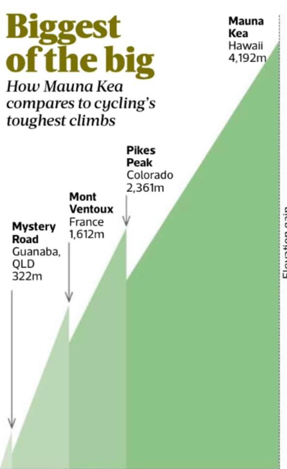
**이미지 캡션:** 이 이미지는 "Biggest of the big"이라는 제목과 함께 마우나 케아 산이 사이클링의 가장 힘든 오르막과 어떻게 비교되는지를 보여주는 그래프입니다. 그래프는 다양한 산의 높이를 비교하며, 가장 높은 곳에는 하와이의 마우나 케아(4,192m)가 표시되어 있습니다. 그 다음으로는 콜로라도의 파이크스 피크(2,361m), 프랑스의 몽 뷜랑(1,612m), 그리고 호주 퀸즐랜드의 미스터리 로드 구아나바(322m)가 차례로 나타납니다. 그래프는 녹색 계열의 색상으로 산의 높이를 시각적으로 표현하고 있으며, 오른쪽에는 "Elevation gain"이라는 글자가 세로로 쓰여 있습니다. 이 이미지는 산악 지형의 높이 차이를 비교하는 정보 전달 목적의 그래픽입니다.오른쪽에는 "Elevation gain"이라는 글자가 세로로 쓰여 있습니다. 이 이미지는 산악 지형의 높이 차이를 비교하는 정보 전달 목적의 그래픽입니다.

### 8월 12일 (월) 09:50 · 생신 축하드립니다

생신 축하드립니다

### 8월 12일 (월) 09:50 · ↪ 생신 축하드립니다

*다른 프로필에 남긴 글*

생신 축하드립니다

### 8월 12일 (월) 09:50 · Happy birthday

Happy birthday

### 8월 12일 (월) 09:50 · ↪ Happy birthday

*다른 프로필에 남긴 글*

Happy birthday

### 8월 12일 (월) 09:51 · 교수님 생신 축하드립니다

교수님 생신 축하드립니다

### 8월 12일 (월) 09:51 · ↪ 교수님 생신 축하드립니다

*다른 프로필에 남긴 글*

교수님 생신 축하드립니다

### 8월 13일 (화) 17:34 · Arrived safely to the Hong Kong Airport.…

Arrived safely to the Hong Kong Airport. When I saw the young people gathered here, I could see the students I was teaching at HKUST. I pray that all this will be done safely.

홍콩 공항 안전하게 도착했습니다. 여기 모인 젊은분들을 보니 제가 가르치는 학생들의 모습이 보여 안쓰럽고 눈물이 나와 힘들게 공항을 빠져나왔습니다. 모두 안전하게 이번 사태가 잘 마무리 되고 모두의 자랑인 홍콩이 되길 기도합니다.

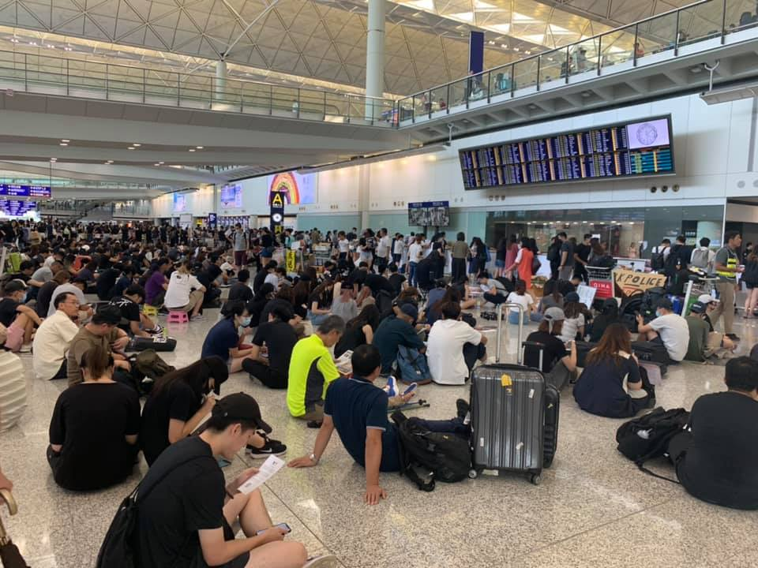
**이미지 캡션:** 이 사진은 공항의 넓은 실내 공간에서 수많은 사람들이 바닥에 앉아 있는 모습을 담고 있습니다. 대부분의 사람들은 젊은 성인 남녀로 보이며, 캐주얼한 복장을 하고 있습니다. 일부는 휴대폰을 보거나 서류를 읽고 있고, 다른 일부는 서로 대화하거나 휴식을 취하고 있습니다. 전반적으로 차분하지만 다소 긴장된 분위기가 느껴집니다. 배경에는 대형 전광판이 여러 개 보이며, 항공편 정보를 표시하고 있습니다. 또한, "K POLICE"라고 적힌 팻말이 눈에 띄는데, 이는 경찰의 존재를 암시하거나 시위와 관련된 상황일 가능성을 시사합니다. 공항의 천장은 높은 아치형 구조로 되어 있으며, 조명이 밝게 켜져 있습니다. 여러 개의 여행 가방과 배낭이 사람들과 함께 놓여 있어, 이들이 여행 중이거나 특정 목적지로 이동하려는 상황임을 알 수 있습니다.을 시사합니다. 공항의 천장은 높은 아치형 구조로 되어 있으며, 조명이 밝게 켜져 있습니다. 여러 개의 여행 가방과 배낭이 사람들과 함께 놓여 있어, 이들이 여행 중이거나 특정 목적지로 이동하려는 상황임을 알 수 있습니다.
 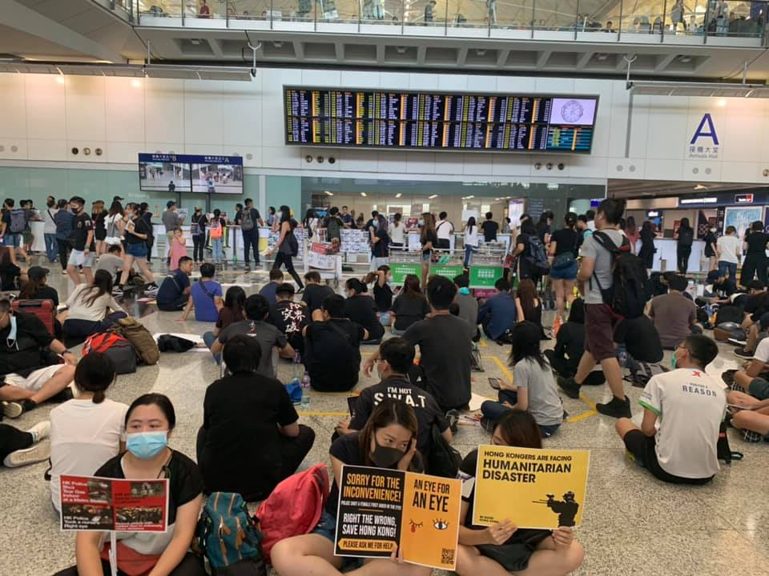
**이미지 캡션:** 이 사진은 홍콩 국제공항으로 보이는 넓고 현대적인 실내 공간에서 시위가 벌어지고 있는 모습을 담고 있습니다. 수십 명의 사람들이 바닥에 앉아 있으며, 대부분 젊은 성인 남녀로 보입니다. 일부는 마스크를 착용하고 있으며, 검은색 옷을 입은 사람들이 많습니다. 사람들은 각자 다양한 표정과 자세를 취하고 있으며, 일부는 휴대폰을 보고 있고, 다른 일부는 앉아서 휴식을 취하고 있습니다. 여러 사람이 손에 시위 문구가 적힌 피켓을 들고 있는데, "SORRY FOR THE INCONVENIENCE", "AN EYE FOR AN EYE", "HONG KONGERS ARE FACING HUMANITARIAN DISASTER" 등의 문구가 보입니다. 배경에는 대형 전광판에 항공편 정보가 표시되어 있고, "A"라고 표시된 안내 표지판도 보입니다. 전반적으로 차분하지만 단호한 분위기가 느껴지며, 공항의 넓은 공간과 많은 사람들이 모여 있는 모습은 시위의 규모를 짐작하게 합니다.R AN EYE", "HONG KONGERS ARE FACING HUMANITARIAN DISASTER" 등의 문구가 보입니다. 배경에는 대형 전광판에 항공편 정보가 표시되어 있고, "A"라고 표시된 안내 표지판도 보입니다. 전반적으로 차분하지만 단호한 분위기가 느껴지며, 공항의 넓은 공간과 많은 사람들이 모여 있는 모습은 시위의 규모를 짐작하게 합니다.

🎬 동영상 1개 (생략)

### 8월 15일 (목) 12:35 · 📷 사진 (1장)

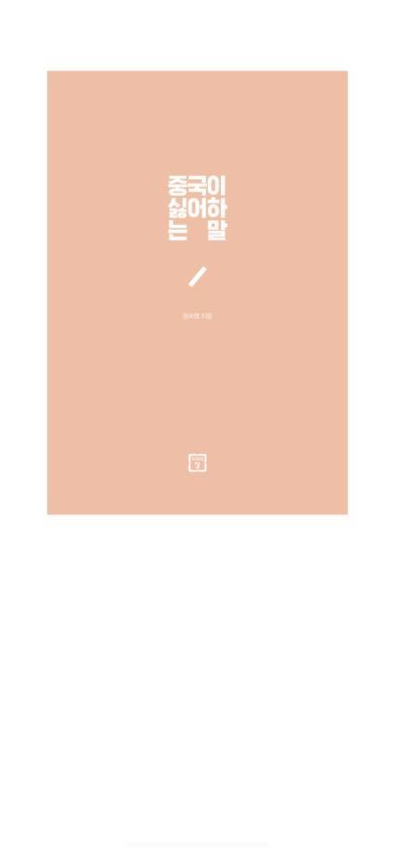
**이미지 캡션:** 이 사진은 옅은 복숭아색 배경에 흰색 글씨로 된 책 표지 또는 포스터의 일부를 보여줍니다. 중앙에는 "중국이 싫어하는 말"이라는 문구가 세로로 쓰여 있으며, 그 아래에는 짧은 흰색 선과 "정연 지음"이라는 글씨가 있습니다. 가장 아래에는 작은 사각형 안에 톱니바퀴 모양의 아이콘이 있습니다. 사진에는 사람이 등장하지 않으며, 배경은 단색으로 단순합니다. 전체적으로 깔끔하고 현대적인 느낌을 줍니다.

### 8월 16일 (금) 11:39 · 📷 사진 (4장)

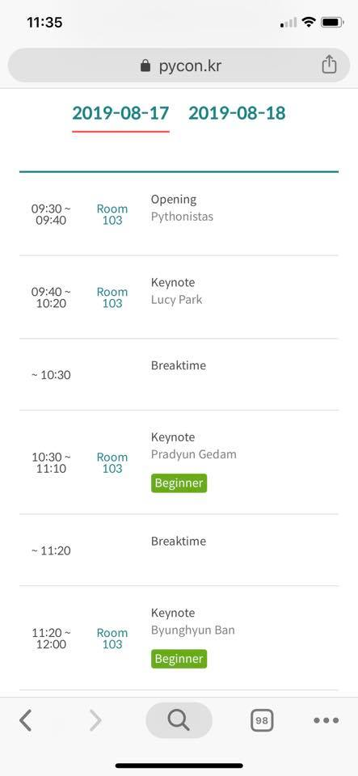
**이미지 캡션:** 이 이미지는 스마트폰 화면을 캡처한 것으로, 웹 브라우저에서 'pycon.kr'이라는 웹사이트를 보고 있는 모습입니다. 화면 상단에는 현재 시간 '11:35'와 웹사이트 주소 'pycon.kr'이 보이며, 자물쇠 아이콘과 공유 아이콘도 함께 표시되어 있습니다. 그 아래에는 '2019-08-17'과 '2019-08-18'이라는 날짜가 나란히 표시되어 있으며, '2019-08-17' 아래에는 빨간색 밑줄이 그어져 있어 해당 날짜가 선택되었음을 알 수 있습니다. 이 웹사이트는 파이썬 개발자 컨퍼런스인 '파이콘 코리아'의 일정표로 보이며, 시간대별로 진행되는 세션 정보가 나열되어 있습니다. 오전 9시 30분부터 10시 40분까지는 'Opening Pythonistas' 세션이 'Room 103'에서 진행되고, 9시 40분부터 10시 20분까지는 'Keynote Lucy Park' 세션이 같은 장소에서 열립니다. 10시 30분까지는 'Breaktime'으로 쉬는 시간이며, 10시 30분부터 11시 10분까지는 'Keynote Pradyun Gedam' 세션이 'Room 103'에서 진행되고 'Beginner'라는 태그가 붙어 있습니다. 11시 20분까지는 다시 'Breaktime'이고, 11시 20분부터 12시까지는 'Keynote Byunghyun Ban' 세션이 'Room 103'에서 'Beginner' 태그와 함께 진행됩니다. 화면 하단에는 웹 브라우저의 탐색 바가 보이며, 뒤로 가기, 앞으로 가기, 검색 아이콘, 그리고 숫자 '98'이 표시된 아이콘이 있습니다. 전체적으로 깔끔하고 정보 전달에 집중된 디자인이며, 컨퍼런스 일정에 대한 정보를 제공하는 차분한 분위기입니다. 09:40, there is an "Opening" session by "Pythonistas" in Room 103. Following this, from 09:40 to 10:20, a "Keynote" by "Lucy Park" is scheduled in Room 103. A "Breaktime" is listed until 10:30. From 10:30 to 11:10, another "Keynote" by "Pradyun Gedam" is scheduled in Room 103, with a "Beginner" tag. Another "Breaktime" is scheduled until 11:20. Finally, from 11:20 to 12:00, a "Keynote" by "Byunghyun Ban" is listed in Room 103, also tagged as "Beginner". The browser's address bar shows "pycon.kr" and the current time is 11:35. The bottom navigation bar includes back and forward arrows, a search icon, and a number 98, likely indicating the number of open tabs or notifications. The overall atmosphere is informative and organized, typical of a conference schedule.
 
**이미지 캡션:** 사진에는 "Lucy Park"이라는 이름과 함께 원형 프로필 사진이 있습니다. 사진 속 인물은 젊은 성인 여성으로, 검은색 단발머리에 연두색 상의를 입고 있습니다. 그녀는 눈을 살짝 내리깔고 부드럽게 미소 짓고 있으며, 손에는 무언가를 들고 집중하는 듯한 모습입니다. 배경은 흐릿하지만 실내의 카페나 식당 같은 장소로 보이며, 약간의 녹색 식물 장식이 보입니다. 사진 아래에는 Lucy Park에 대한 소개 글이 한국어로 작성되어 있으며, 그녀가 머신러닝 엔지니어로서 데이터로 지식의 장벽을 낮추는 것을 목표로 하고 있으며, Python을 활용한 프로젝트 참여 경험, 서울대학교 데이터 마이닝 박사 학위 취득, NAVER에서의 근무 경험, 그리고 기계 번역, 다국어 텍스트 마이닝, 기계 학습 알고리즘 평가 등에 대한 연구 관심사를 가지고 있음을 설명하고 있습니다. 전반적으로 전문적이고 긍정적인 분위기를 풍깁니다.고 있으며, Python을 활용한 프로젝트 참여 경험, 서울대학교 데이터 마이닝 박사 학위 취득, NAVER에서의 근무 경험, 그리고 기계 번역, 다국어 텍스트 마이닝, 기계 학습 알고리즘 평가 등에 대한 연구 관심사를 가지고 있음을 설명하고 있습니다. 전반적으로 전문적이고 긍정적인 분위기를 풍깁니다.
 
**이미지 캡션:** 이 사진은 "Lucy Park"이라는 이름의 젊은 아시아 여성의 프로필 사진과 그녀의 경력에 대한 텍스트 설명을 담고 있습니다. 여성은 20대 후반에서 30대 초반으로 보이며, 검은색 단발머리에 옅은 녹색 상의를 입고 있습니다. 그녀는 밝게 웃으며 무언가를 손에 들고 집중하는 듯한 표정을 짓고 있으며, 배경은 흐릿하게 처리되어 실내의 카페나 식당 같은 장소로 추정됩니다. 텍스트는 그녀가 머신러닝 엔지니어이며, 데이터로 지식의 장벽을 낮추는 것을 목표로 하고 있다고 설명합니다. 또한 파이썬을 이용한 프로젝트 참여 경험과 서울대학교에서 데이터 마이닝 박사 학위를 취득한 사실, 그리고 네이버에서 머신러닝 번역을 연구하고 있다는 내용이 포함되어 있습니다. 전반적으로 전문적이고 긍정적인 분위기를 전달합니다.여 경험과 서울대학교에서 데이터 마이닝 박사 학위를 취득한 사실, 그리고 네이버에서 머신러닝 번역을 연구하고 있다는 내용이 포함되어 있습니다. 전반적으로 전문적이고 긍정적인 분위기를 전달합니다.
 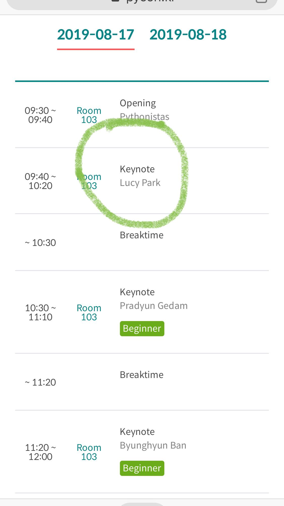
**이미지 캡션:** 이 화면은 2019년 8월 17일과 2019년 8월 18일의 행사 일정을 보여주는 모바일 앱 화면으로, 각 시간대별로 진행되는 세션 정보가 표시되어 있습니다. 오전 9시 30분부터 9시 40분까지는 'Room 103'에서 'Opening Pythonistas' 세션이 진행되며, 이 부분이 녹색 원으로 강조되어 있습니다. 오전 9시 40분부터 10시 20분까지는 같은 장소에서 'Keynote Lucy Park' 세션이 예정되어 있습니다. 오전 10시 30분에는 'Breaktime'이 있습니다. 오전 10시 30분부터 11시 10분까지는 'Room 103'에서 'Keynote Pradyun Gedam' 세션이 진행되며, 'Beginner'라는 태그가 붙어 있습니다. 오전 11시 20분에는 다시 'Breaktime'이 있습니다. 마지막으로 오전 11시 20분부터 12시까지는 'Room 103'에서 'Keynote Byunghyun Ban' 세션이 진행되며, 이 역시 'Beginner' 태그가 있습니다. 전반적으로 깔끔하고 정보 전달에 집중된 디자인이며, 행사 참여자들이 일정을 쉽게 파악할 수 있도록 구성되어 있습니다.분부터 11시 10분까지는 'Room 103'에서 'Keynote Pradyun Gedam' 세션이 진행되며, 'Beginner'라는 태그가 붙어 있습니다. 오전 11시 20분에는 다시 'Breaktime'이 있습니다. 마지막으로 오전 11시 20분부터 12시까지는 'Room 103'에서 'Keynote Byunghyun Ban' 세션이 진행되며, 이 역시 'Beginner' 태그가 있습니다. 전반적으로 깔끔하고 정보 전달에 집중된 디자인이며, 행사 참여자들이 일정을 쉽게 파악할 수 있도록 구성되어 있습니다.

### 8월 17일 (토) 09:32 · 📷 사진 (1장)

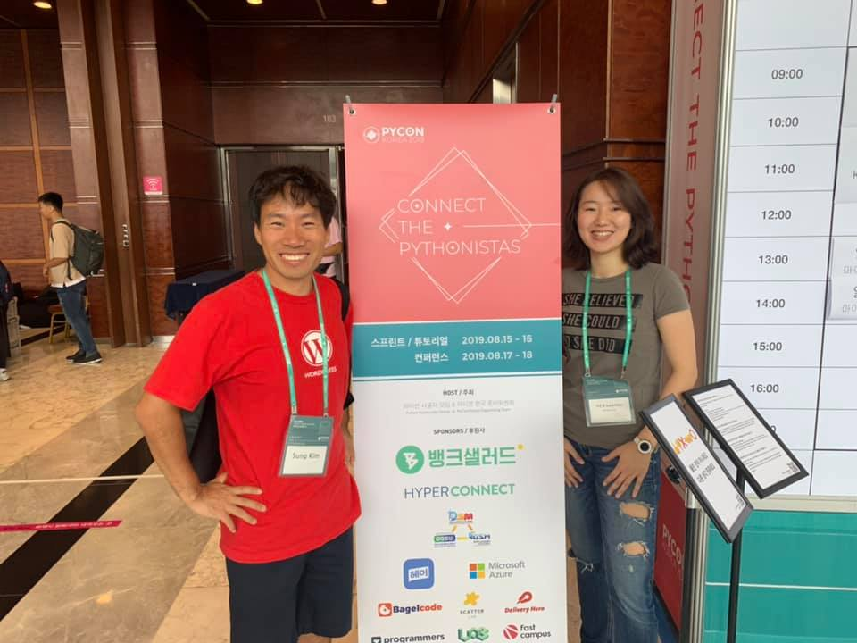
**이미지 캡션:** 두 명의 성인 남녀가 파이콘 행사 배너 앞에서 포즈를 취하고 있다. 왼쪽 남성은 30대 후반에서 40대 초반으로 보이며, 짧은 검은 머리에 환한 미소를 짓고 있다. 그는 빨간색 티셔츠와 남색 반바지를 입고 있으며, 목에는 워드프레스 로고가 새겨진 목걸이와 "Jung Kim"이라고 적힌 명찰을 걸고 있다. 오른쪽 여성은 20대 후반에서 30대 초반으로 보이며, 짧은 갈색 머리에 미소를 짓고 있다. 그녀는 회색 티셔츠와 찢어진 청바지를 입고 있으며, 티셔츠에는 "SHE BELIEVE SHE COULD SHE DID"라는 문구가 적혀 있다. 그녀 역시 목걸이와 명찰을 착용하고 있다. 배경에는 "CONNECT THE PYTHONISTAS"라고 적힌 분홍색 배너와 함께 행사 일정표가 보인다. 배너에는 "PYCON" 로고와 함께 "스프린트/튜토리얼 2019.08.15-16", "컨퍼런스 2019.08.17-18"이라는 문구가 한국어로 적혀 있다. 또한 "뱅크샐러드", "HYPERCONNECT", "Microsoft Azure" 등 여러 스폰서 로고가 보인다. 행사장 내부로 보이는 배경에는 갈색 벽과 조명이 있으며, 다른 참가자들이 지나가는 모습도 희미하게 보인다. 전반적으로 활기차고 긍정적인 분위기이다.D"라는 문구가 적혀 있다. 그녀 역시 목걸이와 명찰을 착용하고 있다. 배경에는 "CONNECT THE PYTHONISTAS"라고 적힌 분홍색 배너와 함께 행사 일정표가 보인다. 배너에는 "PYCON" 로고와 함께 "스프린트/튜토리얼 2019.08.15-16", "컨퍼런스 2019.08.17-18"이라는 문구가 한국어로 적혀 있다. 또한 "뱅크샐러드", "HYPERCONNECT", "Microsoft Azure" 등 여러 스폰서 로고가 보인다. 행사장 내부로 보이는 배경에는 갈색 벽과 조명이 있으며, 다른 참가자들이 지나가는 모습도 희미하게 보인다. 전반적으로 활기차고 긍정적인 분위기이다.

### 8월 17일 (토) 19:50 · This is so true!

This is so true!

### 8월 18일 (일) 10:21 · Wonderful uphill ride to Skyway Bukak vi…

Wonderful uphill ride to Skyway Bukak via the N Seoul Tower. It a short but amazing course!!

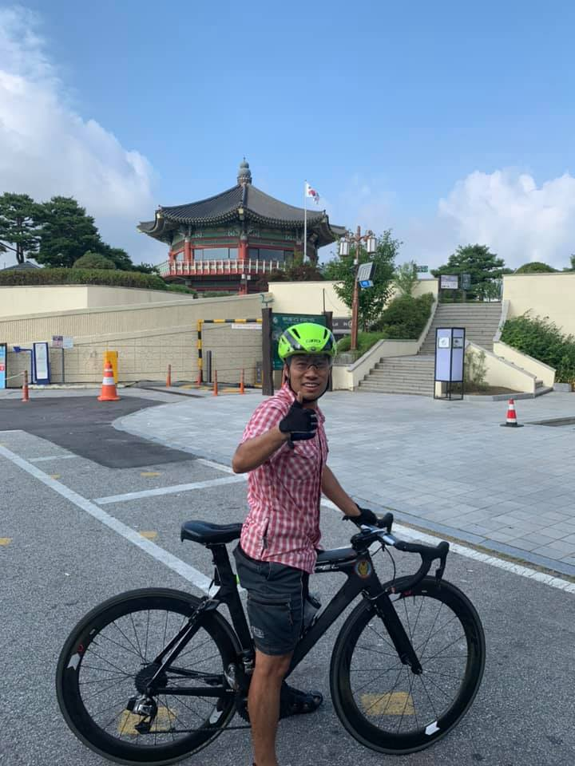
**이미지 캡션:** 한 성인 남성이 검은색 로드 자전거 옆에 서서 카메라를 향해 엄지손가락을 치켜들고 있다. 그는 밝은 녹색 헬멧을 쓰고 있으며, 붉은색과 흰색 체크무늬 셔츠와 회색 반바지를 입고 있다. 남성은 옅은 미소를 짓고 있으며, 그의 표정은 활기차고 긍정적이다. 배경에는 한국 전통 양식의 팔각형 정자가 보이며, 그 뒤로는 푸른 하늘과 구름이 펼쳐져 있다. 정자 주변에는 계단과 난간, 그리고 몇 그루의 나무가 보인다. 전반적으로 화창한 날씨에 야외 활동을 즐기는 듯한 밝고 건강한 분위기이다.
 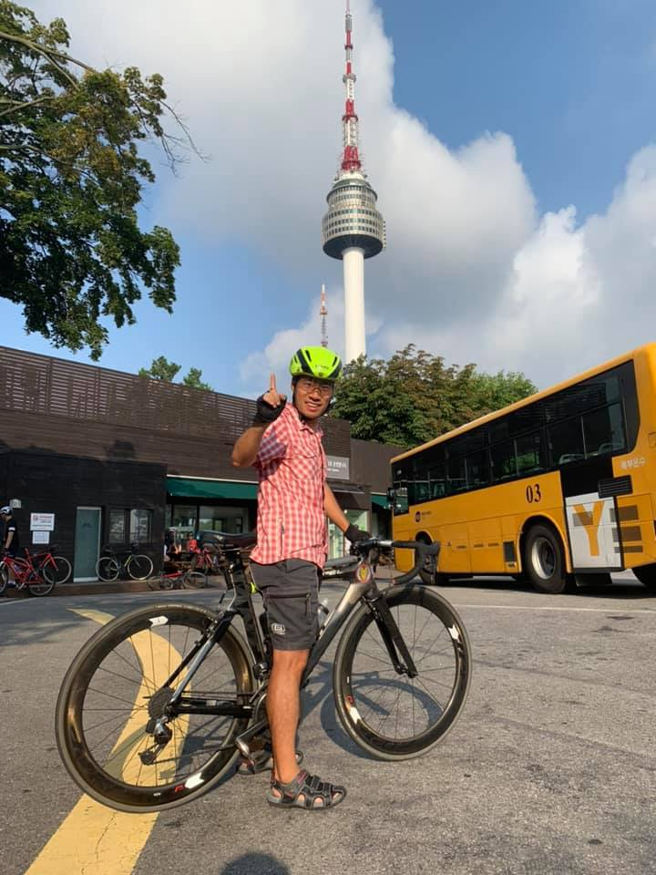
**이미지 캡션:** 한 성인 남성이 헬멧을 쓰고 자전거 옆에 서서 엄지손가락을 치켜세우며 포즈를 취하고 있다. 남성은 30대 후반에서 40대 초반으로 보이며, 체크무늬 셔츠와 반바지, 샌들을 착용하고 있다. 그의 뒤로는 서울의 상징인 남산타워가 보이고, 노란색 버스가 지나가고 있다. 배경에는 나무와 건물들이 보이며, 전체적으로 맑은 날씨에 야외 활동을 즐기는 듯한 분위기이다.
 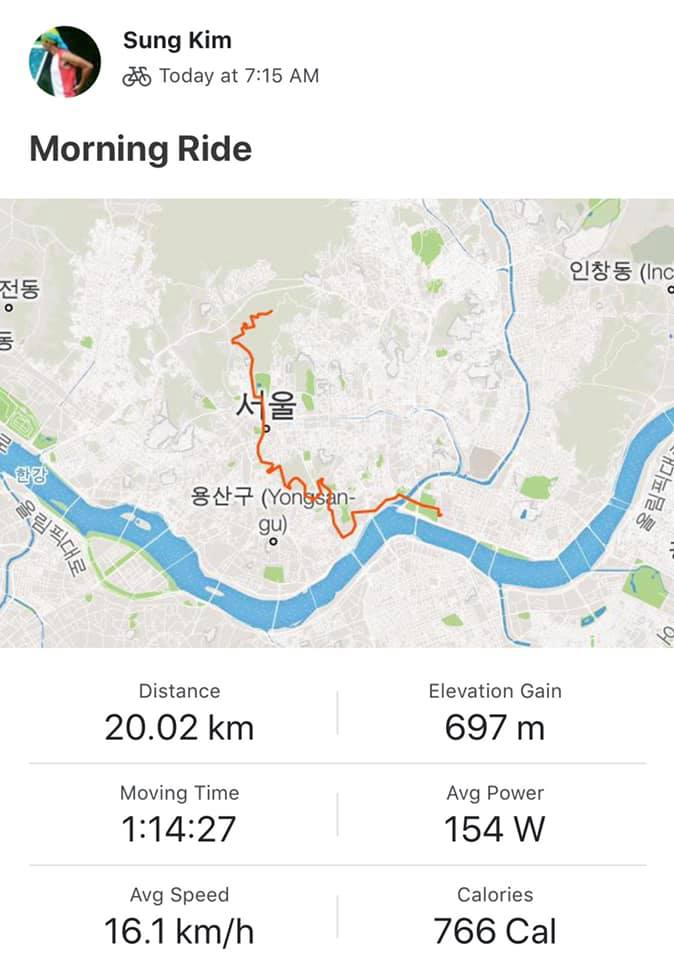
**이미지 캡션:** 이 사진은 "Sung Kim"이라는 이름의 사용자가 오늘 오전 7시 15분에 "Morning Ride"라는 제목으로 자전거를 탄 기록을 보여줍니다. 사진 상단에는 사용자의 프로필 사진과 이름, 그리고 자전거 아이콘과 함께 활동 시간이 표시되어 있습니다. 중앙에는 서울의 지도가 나타나 있으며, 주황색 선으로 표시된 자전거 경로가 한강을 따라 용산구 일대를 지나가는 것을 볼 수 있습니다. 지도에는 "서울", "용산구 (Yongsan-gu)", "한강", "올림픽대로", "인창동" 등의 지명이 한국어로 표기되어 있습니다. 하단에는 이번 라이딩의 상세 정보가 표시되어 있는데, 총 거리는 20.02km, 이동 시간은 1시간 14분 27초, 평균 속도는 16.1km/h, 고도 상승량은 697m, 평균 파워는 154W, 소모 칼로리는 766Cal입니다. 전반적으로 활동적인 아침 운동 기록을 보여주는 화면입니다.습니다. 하단에는 이번 라이딩의 상세 정보가 표시되어 있는데, 총 거리는 20.02km, 이동 시간은 1시간 14분 27초, 평균 속도는 16.1km/h, 고도 상승량은 697m, 평균 파워는 154W, 소모 칼로리는 766Cal입니다. 전반적으로 활동적인 아침 운동 기록을 보여주는 화면입니다.

### 8월 20일 (화) 14:08 · New windbreaker with many many Redbirds!…

New windbreaker with many many Redbirds! This will be my favorite jacket for running and hiking this Fall/Winter.

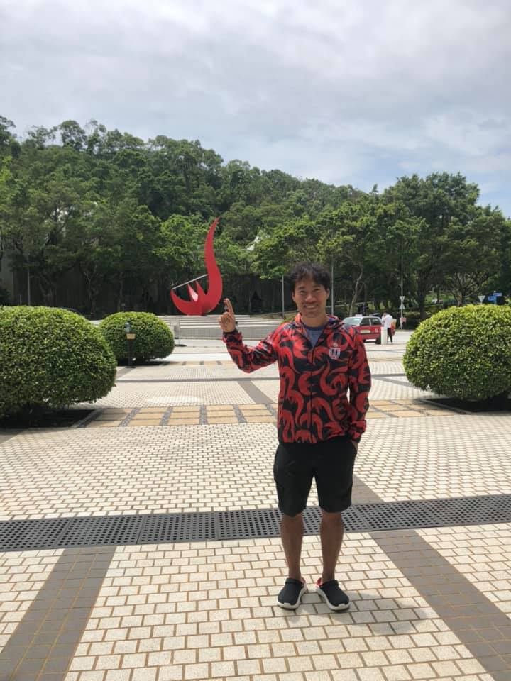
**이미지 캡션:** 사진에는 성인 남성이 야외 공간에 서 있으며, 그는 40대 초중반으로 보입니다. 검은색 머리카락은 약간 곱슬거리고, 얼굴에는 미소가 번지고 있습니다. 그는 빨간색과 검은색 패턴의 집업 재킷과 검은색 반바지, 검은색 슬리퍼를 신고 있습니다. 재킷에는 흰색 로고가 달려 있습니다. 남성은 오른손을 들어 검지 손가락으로 무언가를 가리키고 있으며, 왼손은 바지 주머니에 넣고 있습니다. 배경에는 둥글게 다듬어진 녹색 관목 두 그루가 있고, 그 뒤로는 숲이 우거진 언덕이 보입니다. 언덕 앞에는 붉은색 추상 조형물이 서 있습니다. 바닥은 격자무늬 타일로 포장되어 있으며, 일부에는 금속 격자도 보입니다. 멀리에는 흰색 지붕의 건물과 주차된 빨간색 자동차, 그리고 몇몇 사람들이 보입니다. 하늘은 구름이 낀 맑은 날씨를 나타냅니다. 전반적으로 밝고 활동적인 분위기의 사진입니다.습니다. 바닥은 격자무늬 타일로 포장되어 있으며, 일부에는 금속 격자도 보입니다. 멀리에는 흰색 지붕의 건물과 주차된 빨간색 자동차, 그리고 몇몇 사람들이 보입니다. 하늘은 구름이 낀 맑은 날씨를 나타냅니다. 전반적으로 밝고 활동적인 분위기의 사진입니다.

### 8월 26일 (월) 09:21 · 📷 사진 (1장)

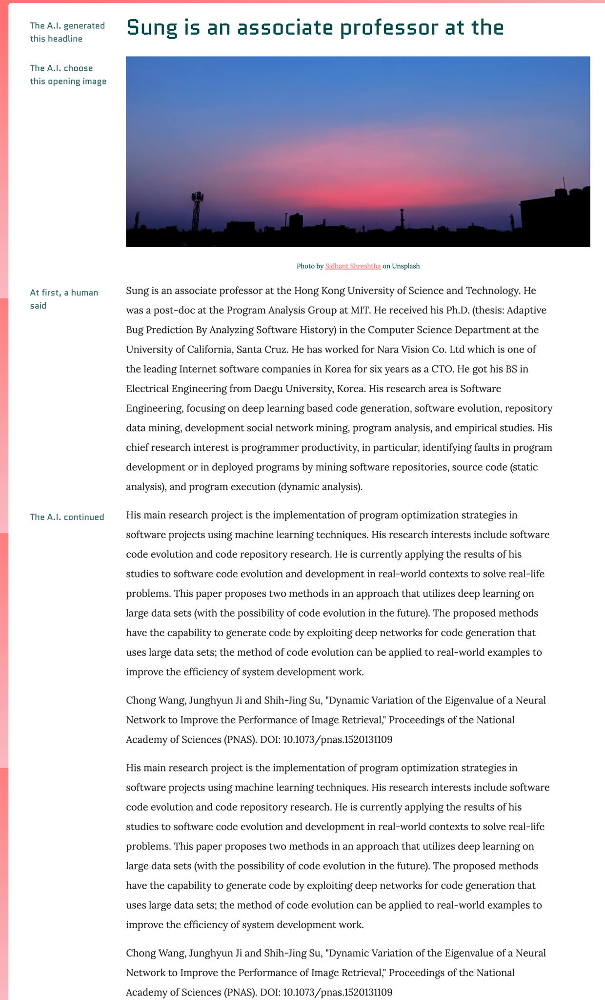
**이미지 캡션:** 이 사진은 한국어로 된 텍스트와 함께 제공되며, 한 명의 성인 남성인 "성" 교수에 대한 정보를 담고 있습니다. 사진은 석양을 배경으로 한 도시의 실루엣을 보여주며, 텍스트는 그의 학력, 경력, 연구 분야 및 주요 연구 프로젝트에 대해 자세히 설명합니다. 그는 홍콩 과학기술대학교의 부교수이며, MIT에서 박사후 연구원으로 활동했습니다. 그의 연구는 소프트웨어 공학, 딥러닝 기반 코드 생성, 소프트웨어 진화, 저장소 데이터 마이닝, 프로그램 분석 등에 초점을 맞추고 있으며, 특히 프로그래머 생산성 향상과 소프트웨어 저장소 분석을 통한 오류 식별에 관심을 두고 있습니다. 또한, 그는 기계 학습 기술을 활용한 프로그램 최적화 전략 구현에 대한 연구를 수행하고 있으며, 이 연구는 코드 진화와 저장소 연구를 포함합니다. 이와 관련하여, 그는 "Dynamic Variation of the Eigenvalue of a Neural Network to Improve the Performance of Image Retrieval"이라는 논문을 공동 저술했습니다. 전반적으로 이 사진과 텍스트는 학술적이고 전문적인 분위기를 전달하며, 한 연구자의 경력과 연구 성과를 소개하는 데 중점을 두고 있습니다.웨어 저장소 분석을 통한 오류 식별에 관심을 두고 있습니다. 또한, 그는 기계 학습 기술을 활용한 프로그램 최적화 전략 구현에 대한 연구를 수행하고 있으며, 이 연구는 코드 진화와 저장소 연구를 포함합니다. 이와 관련하여, 그는 "Dynamic Variation of the Eigenvalue of a Neural Network to Improve the Performance of Image Retrieval"이라는 논문을 공동 저술했습니다. 전반적으로 이 사진과 텍스트는 학술적이고 전문적인 분위기를 전달하며, 한 연구자의 경력과 연구 성과를 소개하는 데 중점을 두고 있습니다.

> 이제 구글 이메일의 자동완성을 넘어 몇줄만 넣어주면 나머지 스토리를 완성해주는 Story.ai, [https://storyai.botsociety.io](https://storyai.botsociety.io/) 아래는 제 Bio의 일부를 넣은 것인데 나머지 부분을 그럴듯하게 채워줍니다.  ​  그리고 제가 쓴 문장을 더 멋진 표현으로 고쳐주는 [https://quillbot.com](https://quillbot.com/), 윈도우즈용 자동완성 plug-in, [https://www.lightkey.io/](https://www.lightkey.io/) 등 AI의 자동 글쓰기 시대가 열리고 있는것 같습니다. 모두 TF등을 사용한 딥러닝 기술이 그 바탕이 되고 있고 2019-2020년은 NLP에 대단한 발전이 오는 한해가 될것 같아 많이 기대가 됩니다.

### 8월 28일 (수) 20:24 · Amazing long rainbow after heavy rain!

Amazing long rainbow after heavy rain!

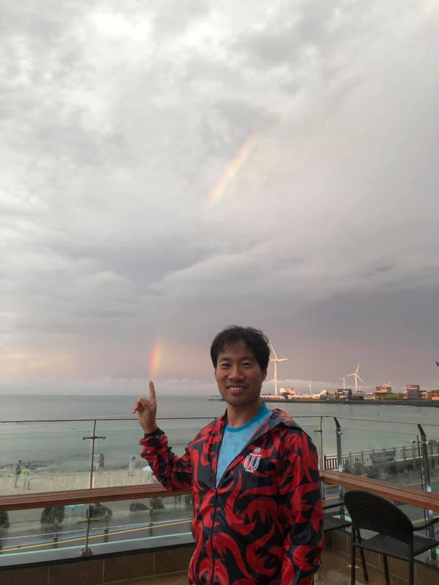
**이미지 캡션:** 흐린 하늘 아래 바다를 배경으로 한 성인 남성이 무지개를 손가락으로 가리키고 있다. 남성은 40대 초반으로 보이며, 검은색 머리카락에 옅은 미소를 띠고 있다. 빨간색과 검은색의 추상적인 무늬가 있는 바람막이 점퍼 안에 파란색 티셔츠를 입고 있다. 그는 야외 테라스에 서 있으며, 앞쪽에는 나무 테이블과 의자가 놓여 있다. 배경에는 바다와 함께 풍력 발전기 몇 개와 건물들이 보인다. 전체적으로 흐린 날씨 속에서 무지개가 나타나 신비롭고 희망적인 분위기를 자아낸다.

### 8월 31일 (토) 09:23 · #gangnamartrun  artist help wanted!

#gangnamartrun  artist help wanted!

그동안 달리면서 몇번 생각해본 것인데요. 역시 아이디어는 물론 이미 실행하신 분이 있네요. 대단!!
https://www.facebook.com/341163402640457/posts/2801416026615170?sfns=mo

샌프란시스코에서 그림 달리기를 하는 것인데요. 우린 이보다 더 아름답고 멋진 (그리고 길복잡한) 강남이 있어서 더 아름다운 그림이 나올듯 합니다. 

다만 예술 감각이 있으신 분의 길 그림 (대략 10km코스) 필요한데 혹시 저랑 같이 작업해서 강남 100 코수 아트 달리기 collaboration해보실 분이 있을까요?

지도 그림만 그려주셔도 좋고 같이 달리셔도 좋습니다.

혹시 같이  #강남아트런 달리실 분도 한두분 있으시면 좋겠습니다. 

요약 #강남아트런 프로젝트 같이 하실
* artist 1-2분 모집: 아래 댓글에 강남 아트런 간략 아이디어, 스케치 일부 같이 올려주세요. 
* runner 1-2분: 함께 달리시면서 주위 사진도 찍고 글 같에 쓰실분. 아래 댓글로 본인 달리기 사진 하나 올려주세요. 

이렇게 만들어진 강남 아트런 코스는 CC라이센스등으로 모든 runner를 위해 공개할 예정입니다. 정말 아름다운 강남을 널리 알려보도록 하겠습니다. 

많은 참여와 또 주위분들에게 공유등으로 알려주시면 감사하겠습니다.

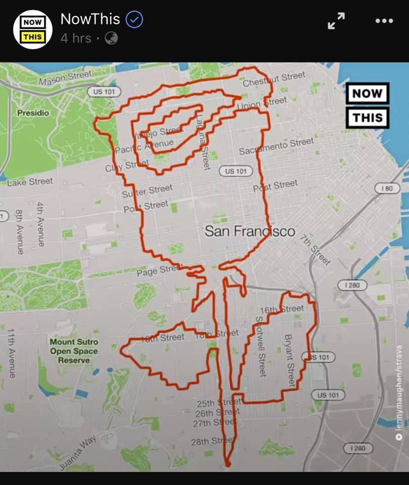
**이미지 캡션:** 이 사진은 샌프란시스코 시내 지도를 보여주며, 빨간색 선으로 그려진 복잡한 경로가 특징입니다. 이 경로는 마치 장미꽃 모양과 비슷하게 그려져 있으며, 샌프란시스코의 여러 거리 이름을 따라 이어집니다. 지도에는 Presidio, Mount Sutro Open Space Reserve와 같은 지명과 US 101, I-280과 같은 도로 번호가 표시되어 있습니다. 사진 상단에는 "NOWThis"라는 로고와 함께 "4 hrs"라는 시간이 표시되어 있어, 이 이미지가 소셜 미디어 게시물임을 알 수 있습니다. 전체적으로 활동적인 사람의 흔적을 보여주는 듯한 분위기이며, 샌프란시스코의 지형과 도로망을 활용한 창의적인 활동을 묘사하고 있습니다. 활동적인 사람의 흔적을 보여주는 듯한 분위기이며, 샌프란시스코의 지형과 도로망을 활용한 창의적인 활동을 묘사하고 있습니다.
 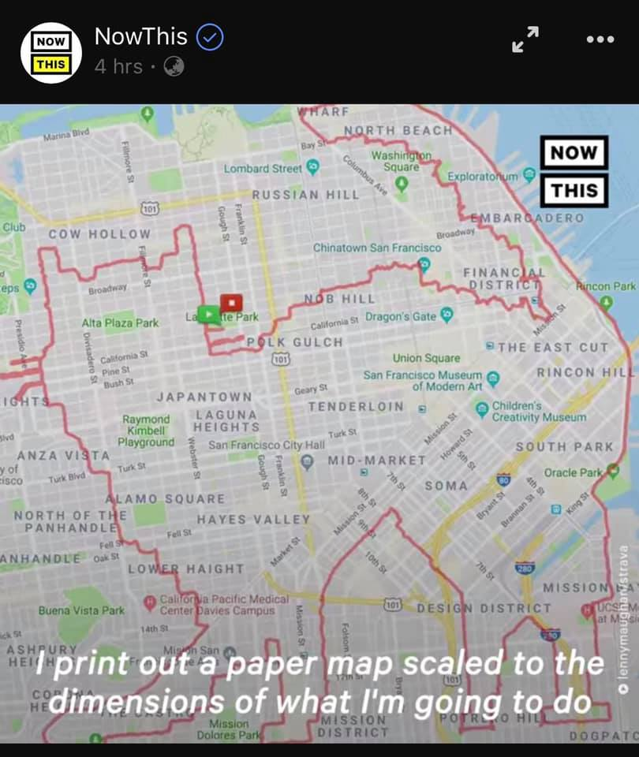
**이미지 캡션:** 이 사진은 샌프란시스코 시내의 지도를 보여주며, 빨간색 선으로 표시된 특정 경로가 그려져 있습니다. 지도에는 롬바드 스트리트, 러시아 힐, 차이나타운, 노브 힐, 폴크 걸치, 재팬타운, 텐더로인, 미드마켓, 소마, 미션 디스트릭트 등 다양한 지역 이름이 표시되어 있습니다. 또한, 엠바카데로, 금융 지구, 동부 해안, 사우스 파크와 같은 지역도 보입니다. 지도 상단에는 "NOW THIS"라는 로고와 함께 "NowThis"라는 이름과 게시 시간이 표시되어 있습니다. 사진 하단에는 "I print out a paper map scaled to the dimensions of what I'm going to do"라는 텍스트가 흰색으로 겹쳐져 있습니다. 이 텍스트는 사진의 내용과 관련하여, 누군가가 계획한 활동이나 여정을 위해 지도를 준비했음을 암시합니다. 전반적으로, 이 사진은 샌프란시스코의 지리적 정보를 담고 있으며, 특정 경로를 따라 진행될 활동에 대한 계획을 시각적으로 보여줍니다.er map scaled to the dimensions of what I'm going to do"라는 텍스트가 흰색으로 겹쳐져 있습니다. 이 텍스트는 사진의 내용과 관련하여, 누군가가 계획한 활동이나 여정을 위해 지도를 준비했음을 암시합니다. 전반적으로, 이 사진은 샌프란시스코의 지리적 정보를 담고 있으며, 특정 경로를 따라 진행될 활동에 대한 계획을 시각적으로 보여줍니다.
 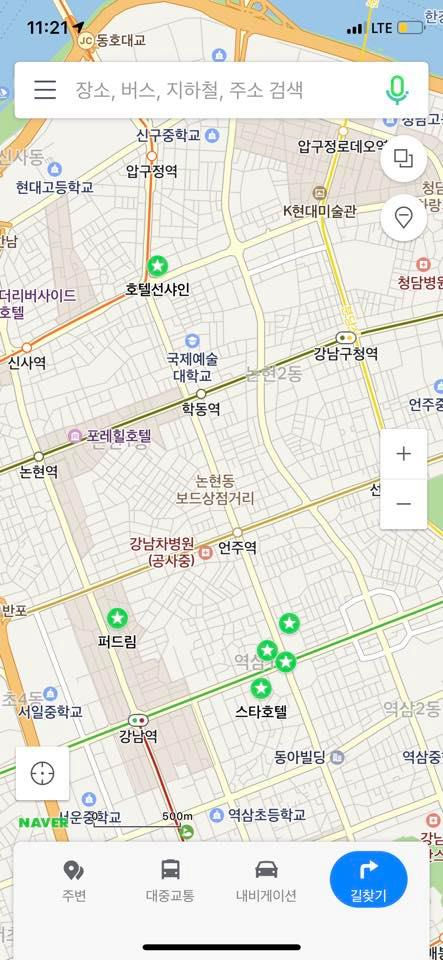
**이미지 캡션:** 이 화면은 스마트폰 지도 애플리케이션의 일부로, 현재 위치를 중심으로 서울 강남 지역의 도로망과 주요 장소들이 표시되어 있습니다. 화면 상단에는 시간 정보 11:21과 LTE 통신 상태, 그리고 "동호대교"라는 지명이 보입니다. 검색창에는 "장소, 버스, 지하철, 주소 검색"이라는 문구가 입력되어 있으며, 마이크 아이콘도 함께 표시되어 음성 검색 기능을 암시합니다. 지도에는 여러 지하철역(신구중학교, 압구정역, 신사역, 학동역, 논현역, 언주역, 강남역, 역삼초등학교 등)과 학교(현대고등학교, 국제예술대학교, 서일중학교, 역삼초등학교, 운중학교), 병원(청담병원, 강남차병원), 호텔(더리버사이드 호텔, 호텔선샤인, 포레힐호텔, 스타호텔) 등이 아이콘과 함께 표시되어 있습니다. 또한, "K현대미술관", "동아빌딩", "논현동 보드상점거리"와 같은 특정 장소 이름도 보입니다. 지도 상에는 현재 위치를 나타내는 아이콘은 보이지 않지만, 여러 장소에 녹색 별 모양의 아이콘이 표시되어 있어 특정 관심 장소나 검색 결과일 가능성이 있습니다. 화면 하단에는 "주변", "대중교통", "내비게이션", "길찾기" 버튼이 있으며, 현재 "길찾기" 버튼이 파란색으로 강조되어 있습니다. 전반적으로 길찾기 또는 장소 검색을 위한 지도 인터페이스의 모습입니다. 서일중학교, 역삼초등학교, 운중학교), 병원(청담병원, 강남차병원), 호텔(더리버사이드 호텔, 호텔선샤인, 포레힐호텔, 스타호텔) 등이 아이콘과 함께 표시되어 있습니다. 또한, "K현대미술관", "동아빌딩", "논현동 보드상점거리"와 같은 특정 장소 이름도 보입니다. 지도 상에는 현재 위치를 나타내는 아이콘은 보이지 않지만, 여러 장소에 녹색 별 모양의 아이콘이 표시되어 있어 특정 관심 장소나 검색 결과일 가능성이 있습니다. 화면 하단에는 "주변", "대중교통", "내비게이션", "길찾기" 버튼이 있으며, 현재 "길찾기" 버튼이 파란색으로 강조되어 있습니다. 전반적으로 길찾기 또는 장소 검색을 위한 지도 인터페이스의 모습입니다.
