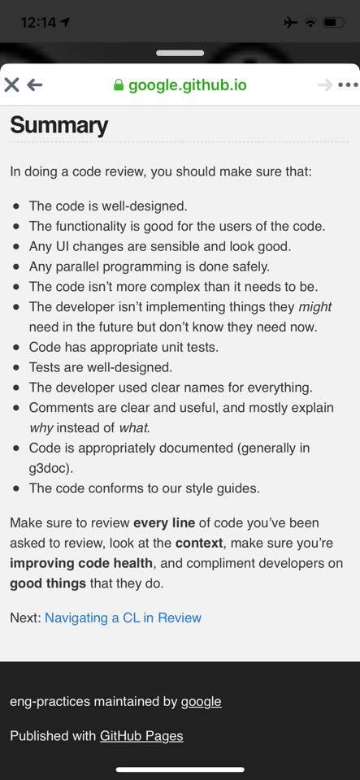
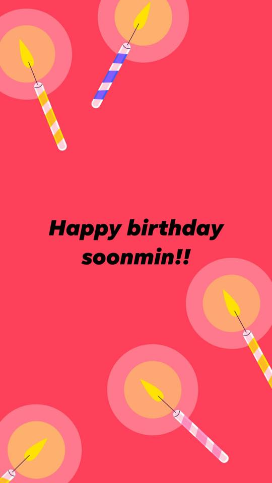
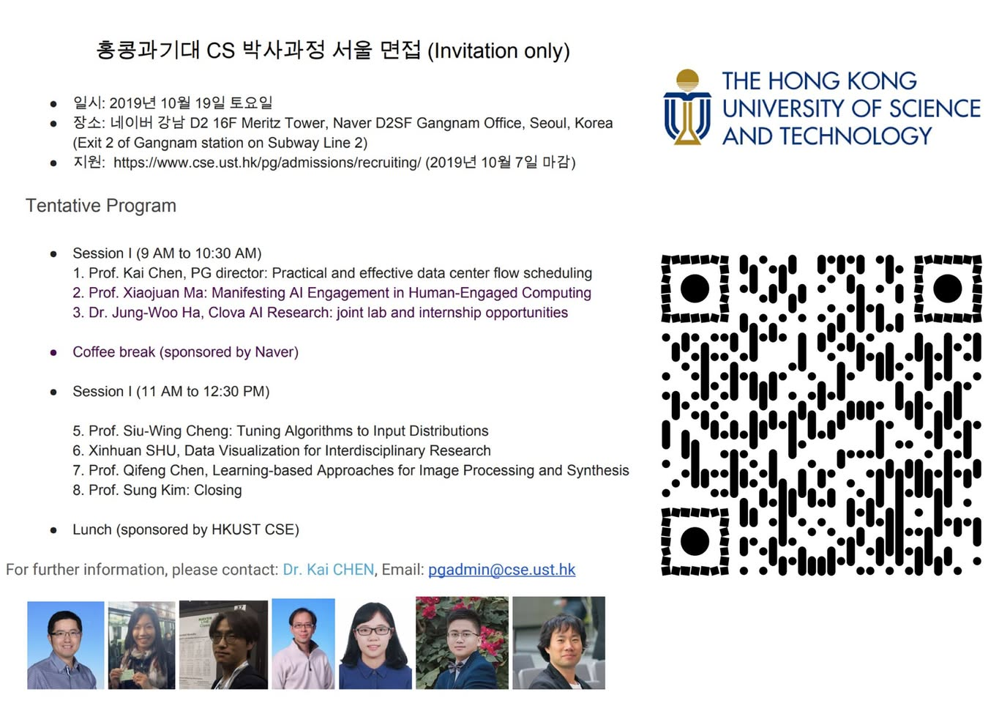
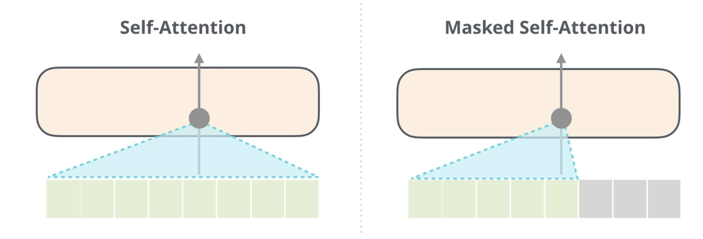
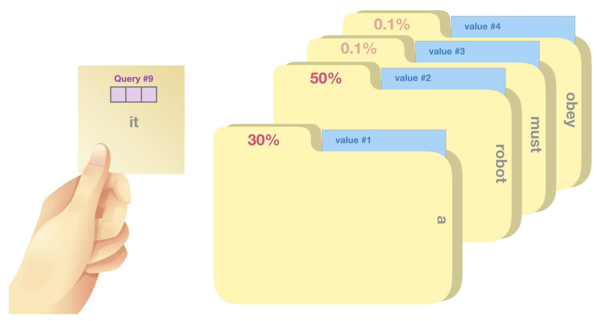
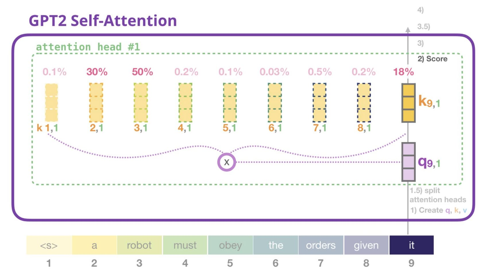
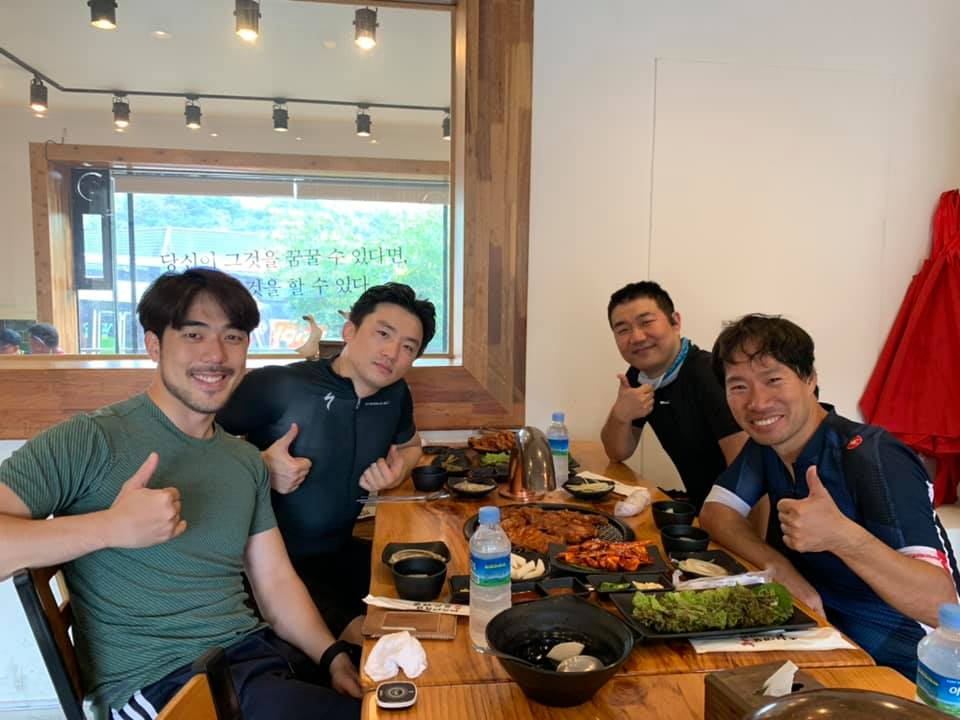
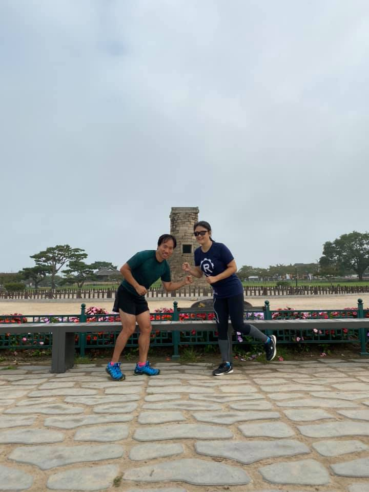
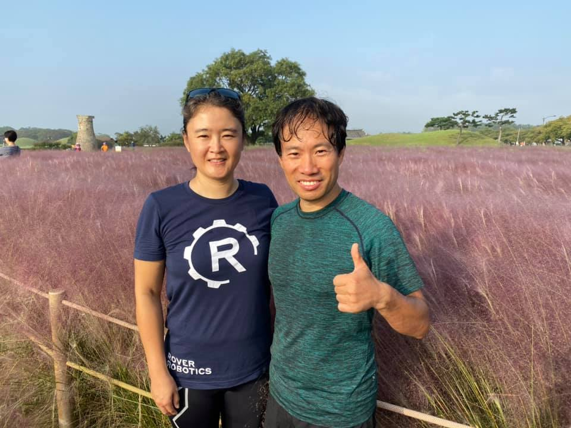
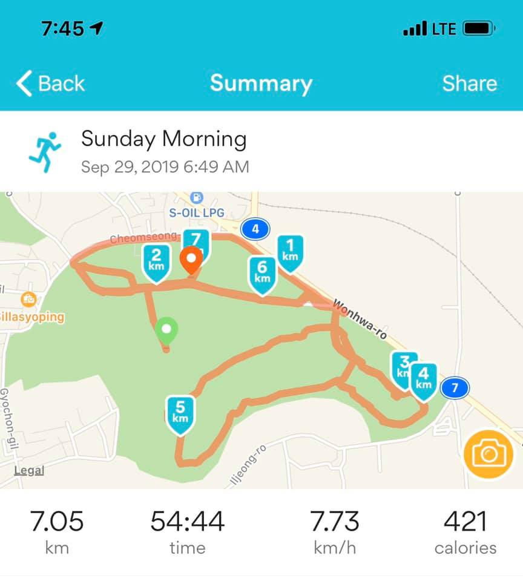

# 2019년 9월

[← 2019년](README.md)

### 9월 6일 (금) 12:16 · 📷 사진 (1장)

**이미지 캡션:** 이것은 모바일 기기에서 웹 페이지의 스크린샷으로, "Summary"라는 제목의 글이 표시됩니다. 글은 코드 검토 시 확인해야 할 사항들을 글머리 기호 목록으로 나열하고 있으며, 코드 설계, 기능성, UI 변경, 병렬 프로그래밍, 코드 복잡성, 미래 필요성 예측, 단위 테스트, 테스트 설계, 변수명, 주석, 문서화, 스타일 가이드 준수 등을 포함합니다. 또한 코드 검토 시 모든 줄을 확인하고, 맥락을 고려하며, 코드 건강 개선에 집중하고, 개발자의 좋은 점을 칭찬하라고 조언합니다. 마지막으로 다음 섹션으로 "Navigating a CL in Review"가 있음을 알립니다. 페이지 하단에는 "eng-practices maintained by google" 및 "Published with GitHub Pages"라는 텍스트가 있습니다. 이 페이지는 프로그래밍 관련 정보를 제공하는 것으로 보이며, 특별히 사람이나 장소, 사물이 묘사되어 있지는 않습니다. 전반적으로 정보 전달에 초점을 맞춘 차분하고 전문적인 분위기입니다.avigating a CL in Review"가 있음을 알립니다. 페이지 하단에는 "eng-practices maintained by google" 및 "Published with GitHub Pages"라는 텍스트가 있습니다. 이 페이지는 프로그래밍 관련 정보를 제공하는 것으로 보이며, 특별히 사람이나 장소, 사물이 묘사되어 있지는 않습니다. 전반적으로 정보 전달에 초점을 맞춘 차분하고 전문적인 분위기입니다.

### 9월 10일 (화) 10:12 · 📷 사진 (1장)

**이미지 캡션:** 이 이미지는 붉은색 배경에 여러 개의 생일 초가 그려져 있으며, 중앙에는 "Happy birthday soonmin!!"이라는 문구가 검은색 글씨로 쓰여 있습니다. 사람에 대한 정보는 없으며, 배경은 단순한 붉은색입니다. 사물로는 불꽃이 타오르는 생일 초들이 있으며, 각 초는 노란색, 주황색, 분홍색으로 이루어진 동그란 빛을 내고 있습니다. 초의 몸통 부분은 줄무늬 패턴으로, 노란색과 흰색, 파란색과 흰색, 분홍색과 흰색의 조합으로 디자인되었습니다. 보이는 텍스트는 "Happy birthday soonmin!!"이며, 이는 생일을 축하하는 메시지입니다. 전반적인 분위기는 밝고 축제적인 느낌을 줍니다.!"이며, 이는 생일을 축하하는 메시지입니다. 전반적인 분위기는 밝고 축제적인 느낌을 줍니다.

### 9월 13일 (금) 07:57 · 📷 사진 (1장)

**이미지 캡션:** 이 이미지는 홍콩과기대 CS 박사과정 서울 면접 안내문으로, 2019년 10월 19일 토요일 네이버 강남 D2 16F Meritz Tower에서 진행되며, 지원 마감일은 2019년 10월 7일입니다. 안내문에는 오전 9시부터 10시 30분까지 진행되는 세션 I, 네이버가 후원하는 커피 브레이크, 오전 11시부터 12시 30분까지 진행되는 세션 I, 그리고 HKUST CSE가 후원하는 점심 식사 등 구체적인 프로그램 일정이 명시되어 있습니다. 또한, 문의사항은 Dr. Kai CHEN에게 연락하거나 pgadmin@cse.ust.hk 이메일로 문의할 수 있습니다. 이미지 오른쪽에는 홍콩과기대의 로고와 QR 코드가 있으며, 하단에는 면접에 참여하는 것으로 보이는 6명의 사람들의 사진이 나열되어 있습니다. 이들은 모두 성인 남성 또는 여성으로 보이며, 각자 다른 복장을 하고 있으며, 일부는 미소를 짓고 있습니다. 전체적으로 정보 전달을 목적으로 하는 공식적인 안내문 분위기입니다.@cse.ust.hk 이메일로 문의할 수 있습니다. 이미지 오른쪽에는 홍콩과기대의 로고와 QR 코드가 있으며, 하단에는 면접에 참여하는 것으로 보이는 6명의 사람들의 사진이 나열되어 있습니다. 이들은 모두 성인 남성 또는 여성으로 보이며, 각자 다른 복장을 하고 있으며, 일부는 미소를 짓고 있습니다. 전체적으로 정보 전달을 목적으로 하는 공식적인 안내문 분위기입니다.

> ## **홍콩과기대 Computer Science 박사과정 (2020 Fall) 서울 인터뷰+ 네이버 공동 연구소 소개**  **#TFKRPHD TF-KR 멤버들에게 홍콩과기대 CS 서울 인터뷰 소식 전해 드립니다. **  최적화된 연구 환경에서 세계 석학들의 지도를 받으며 탁월한 동료 대학원생들과 함께 학위 과정을 할 수 있는 홍콩과기대에서 꿈을 이뤄보세요! 여러가지 CS전 분야에서 세계적인 연구를 하고 있으며, 특히 AI 연구 분야에는 Transfer Learning과 Federated Learning의 대가이시고 지금은 WeBank의 CAIO로 일하고 계시는 Yang교수님을 비롯하여 10여분의 세계적 석학 레벨의 교수님들이 계십니다. [https://www.cse.ust.hk/admin/people/faculty/?a=AI](https://www.cse.ust.hk/admin/people/faculty/?a=AI). 여러분이 하고 싶은 연구에 대해 학위 기간 동안 학비와 생활비 전액을 지원받으면서 공부하고, 3~4년 후에는 해당하는 분야를 세상에서 제일 잘하는 멋진 *박사*님이 될 수 있는 기회가 있습니다.  오는 2019년 10월 19일, Full support를 받는 홍콩 정부 박사 장학생과 홍콩과기대 CS 박사 입학 장학생을 선발하는 서울 면접 (개인별 약 20분) 행사가 미니 웍샵과 함께 진행됩니다. 7명의 홍콩과기대 교수와 조교들이 한국을 방문하여 면접을 진행하며 중간 중간 본인의 연구 주제와 더불어 대학원생들이 진행하고 있는 연구 및 홍콩과기대의 생생한 캠퍼스 생활에 대해 이야기 해주실 예정입니다.  추가로 네이버-홍콩과기대 프로그램을 통한 홍콩과기대 인턴 (연구조교)이나 네이버 인턴 기회와 연구들을 네이버 Clova AI Research의 하정우 리더님이 설명해 주십니다.  이 행사는 홍콩과기대 대학원에 지원한 분들을 대상으로 초대드리는 방식으로 진행됩니다. 초대를 받기 위해서는 [https://www.cse.ust.hk/pg/admissions/recruiting/](https://www.cse.ust.hk/pg/admissions/recruiting/) 를 참고하셔서 박사 과정에 지원해주시면 됩니다. 10월 7일까지 지원해주시면, 선정되신 분들에 한하여 10월 14일 이전에 초대 이메일을 개인별로 보내드릴 예정입니다. (개인별 인터뷰 행사이므로 지원하시는 분을 모두 초대하여 모실수 없음을 미리 양해와 이해 부탁드립니다.)  학부를 졸업하시고 (혹은 졸업 예정이시거나) 멋진 연구에 관심이 있다면 망설이지 마시고 선지원, 후고민 입니다. 참고로 홍콩과기대 박사 지원을 위해서는 석사 학위나 GRE가 필요하지 않으며 TOEFL 등 영어시험도 입학이 허가된 이후 (2020년 9월) 입학하기전까지 추가 제출이 가능합니다.  추가 질문은 [Kai CHEN](https://www.cse.ust.hk/~kaichen/) 교수, [pgadmin@cse.ust.hk](mailto:pgadmin@cse.ust.hk) 에게 메일 주시면 됩니다.

### 9월 18일 (수) 23:33 · 📷 사진 (3장)

**이미지 캡션:** 이 이미지는 딥러닝 모델의 두 가지 메커니즘인 "Self-Attention"과 "Masked Self-Attention"을 시각적으로 비교 설명합니다. 왼쪽에는 "Self-Attention"이라는 제목과 함께, 옅은 주황색의 긴 직사각형 상자 아래에 여러 개의 연두색 사각형이 나열되어 있습니다. 상자 안의 회색 점에서는 위쪽으로 화살표가 뻗어 있으며, 이 점을 중심으로 연두색 사각형 영역을 덮는 파란색 삼각형이 그려져 있습니다. 이 삼각형은 연두색 사각형 전체를 포함하고 있어, Self-Attention이 입력 시퀀스의 모든 요소에 주의를 기울임을 나타냅니다. 오른쪽에는 "Masked Self-Attention"이라는 제목과 함께 유사한 구조가 제시됩니다. 다만, 여기서는 연두색 사각형의 일부가 회색으로 표시되어 있으며, 파란색 삼각형은 연두색 사각형의 일부만 포함하고 있습니다. 이는 Masked Self-Attention이 현재 요소 이전의 요소들에만 주의를 기울이고, 이후 요소들은 가린다는 것을 시각적으로 보여줍니다. 전체적으로 흰색 배경에 단순한 도형과 텍스트를 사용하여 개념을 명확하게 전달하고 있으며, 기술적인 내용을 설명하는 다이어그램의 분위기를 띱니다.력 시퀀스의 모든 요소에 주의를 기울임을 나타냅니다. 오른쪽에는 "Masked Self-Attention"이라는 제목과 함께 유사한 구조가 제시됩니다. 다만, 여기서는 연두색 사각형의 일부가 회색으로 표시되어 있으며, 파란색 삼각형은 연두색 사각형의 일부만 포함하고 있습니다. 이는 Masked Self-Attention이 현재 요소 이전의 요소들에만 주의를 기울이고, 이후 요소들은 가린다는 것을 시각적으로 보여줍니다. 전체적으로 흰색 배경에 단순한 도형과 텍스트를 사용하여 개념을 명확하게 전달하고 있으며, 기술적인 내용을 설명하는 다이어그램의 분위기를 띱니다.
 
**이미지 캡션:** 한 성인 남성의 손이 연한 노란색 메모지를 들고 있으며, 메모지에는 "Query #9"이라는 글자와 세 개의 빈 칸이 그려져 있고 그 아래에는 "it"이라는 단어가 적혀 있습니다. 메모지 오른쪽에는 여러 개의 연한 노란색 폴더가 겹쳐져 있으며, 각 폴더에는 다양한 정보가 표시되어 있습니다. 가장 앞쪽 폴더에는 "30%"라는 숫자와 "value #1"이라는 텍스트가 파란색으로 표시되어 있고, 그 뒤로 보이는 폴더에는 각각 "50%", "0.1%", "0.1%"라는 숫자가 빨간색으로 표시되어 있으며, 각각 "value #2", "value #3", "value #4"라는 텍스트가 파란색으로 표시되어 있습니다. 또한, 폴더의 가장자리에는 세로로 "robot", "must", "obey"라는 단어가 회색으로 쓰여 있고, 가장 뒤쪽 폴더에는 "a"라는 글자가 보입니다. 전체적으로 검색 또는 정보 검색 시스템의 작동 방식을 시각적으로 표현한 듯한 분위기입니다.lue #2", "value #3", "value #4"라는 텍스트가 파란색으로 표시되어 있습니다. 또한, 폴더의 가장자리에는 세로로 "robot", "must", "obey"라는 단어가 회색으로 쓰여 있고, 가장 뒤쪽 폴더에는 "a"라는 글자가 보입니다. 전체적으로 검색 또는 정보 검색 시스템의 작동 방식을 시각적으로 표현한 듯한 분위기입니다.
 
**이미지 캡션:** 이 이미지는 GPT-2의 셀프 어텐션 메커니즘을 시각적으로 설명하는 다이어그램으로, 특정 어텐션 헤드(#1)의 작동 방식을 보여준다. 배경은 흰색이며, 보라색 테두리 안에는 녹색 점선으로 둘러싸인 어텐션 헤드 #1의 내부 계산 과정이 묘사되어 있다. 어텐션 헤드 #1 내부에는 여러 개의 노란색 막대 그래프가 나란히 배열되어 있으며, 각 막대 위에는 0.1%, 30%, 50% 등 백분율 값이 표시되어 있다. 이 막대들은 각각 'k 1,1', '2,1', '3,1' 등으로 레이블링되어 있으며, 이는 입력 시퀀스의 각 토큰에 대한 키(key) 벡터를 나타내는 것으로 보인다. 이 키 벡터들 위로는 보라색 점선이 곡선을 그리며 이어지고, 중간에 보라색 원 안에 'X' 표시가 되어 있어 어떤 연산이 수행됨을 암시한다. 오른쪽에는 'k9,1'이라는 노란색 막대와 'q9,1'이라는 보라색 막대가 세로로 나열되어 있으며, 이들은 각각 다른 토큰의 키 벡터와 쿼리(query) 벡터를 나타내는 것으로 추정된다. 'k9,1' 위에는 '18%'라는 값이 표시되어 있고, 'q9,1' 아래에는 '1.5) split attention heads'와 '1) Create q, k, v'라는 텍스트가 있어, 어텐션 헤드의 분할 및 쿼리, 키, 값 벡터 생성 과정을 설명하고 있다. 이미지 하단에는 입력 문장 '<S> a robot must obey the orders given it'가 각 단어별로 색상이 구분된 상자 안에 표시되어 있으며, 각 상자 아래에는 1부터 9까지의 숫자가 있어 토큰의 인덱스를 나타낸다. 전체적으로 복잡한 인공지능 모델의 내부 작동 방식을 이해하기 쉽게 도식화한 정보 전달 목적의 이미지이다. 각 토큰에 대한 키(key) 벡터를 나타내는 것으로 보인다. 이 키 벡터들 위로는 보라색 점선이 곡선을 그리며 이어지고, 중간에 보라색 원 안에 'X' 표시가 되어 있어 어떤 연산이 수행됨을 암시한다. 오른쪽에는 'k9,1'이라는 노란색 막대와 'q9,1'이라는 보라색 막대가 세로로 나열되어 있으며, 이들은 각각 다른 토큰의 키 벡터와 쿼리(query) 벡터를 나타내는 것으로 추정된다. 'k9,1' 위에는 '18%'라는 값이 표시되어 있고, 'q9,1' 아래에는 '1.5) split attention heads'와 '1) Create q, k, v'라는 텍스트가 있어, 어텐션 헤드의 분할 및 쿼리, 키, 값 벡터 생성 과정을 설명하고 있다. 이미지 하단에는 입력 문장 '<S> a robot must obey the orders given it'가 각 단어별로 색상이 구분된 상자 안에 표시되어 있으며, 각 상자 아래에는 1부터 9까지의 숫자가 있어 토큰의 인덱스를 나타낸다. 전체적으로 복잡한 인공지능 모델의 내부 작동 방식을 이해하기 쉽게 도식화한 정보 전달 목적의 이미지이다.

### 9월 21일 (토) 16:31 · 📷 사진 (1장)

**이미지 캡션:** 네 명의 성인 남성이 식당에서 함께 식사하며 사진을 찍고 있습니다. 왼쪽 첫 번째 남성은 30대 초중반으로 보이며, 짧은 검은색 머리에 턱수염이 있고, 녹색 줄무늬 티셔츠와 검은색 반바지를 입고 있습니다. 그는 엄지손가락을 치켜세우며 환하게 웃고 있습니다. 두 번째 남성은 30대 초반으로 보이며, 짧은 검은색 머리에 검은색 스포츠 의류를 입고 있습니다. 그는 엄지손가락을 치켜세우고 카메라를 바라보고 있습니다. 세 번째 남성은 40대 초반으로 보이며, 짧은 검은색 머리에 검은색 티셔츠와 파란색 목걸이를 하고 있습니다. 그는 엄지손가락을 치켜세우며 미소 짓고 있습니다. 네 번째 남성은 40대 초반으로 보이며, 짧은 검은색 머리에 파란색과 흰색이 섞인 스포츠 의류를 입고 있습니다. 그는 엄지손가락을 치켜세우며 활짝 웃고 있습니다. 테이블 위에는 다양한 한국 음식이 놓여 있으며, 쌈 채소, 고기, 김치 등이 보입니다. 배경에는 창문이 있고, 창밖으로는 나무와 건물이 보입니다. 창문 위에는 "당신이 그것을 꿈꿀 수 있다면, 그것을 할 수 있다."라는 한국어 문구가 적혀 있습니다. 전체적으로 즐겁고 편안한 분위기입니다.습니다. 그는 엄지손가락을 치켜세우며 미소 짓고 있습니다. 네 번째 남성은 40대 초반으로 보이며, 짧은 검은색 머리에 파란색과 흰색이 섞인 스포츠 의류를 입고 있습니다. 그는 엄지손가락을 치켜세우며 활짝 웃고 있습니다. 테이블 위에는 다양한 한국 음식이 놓여 있으며, 쌈 채소, 고기, 김치 등이 보입니다. 배경에는 창문이 있고, 창밖으로는 나무와 건물이 보입니다. 창문 위에는 "당신이 그것을 꿈꿀 수 있다면, 그것을 할 수 있다."라는 한국어 문구가 적혀 있습니다. 전체적으로 즐겁고 편안한 분위기입니다.

### 9월 29일 (일) 08:35 · Wonderful Cheomseongdae (Ancient astrono…

Wonderful Cheomseongdae (Ancient astronomical observatory) run with Yeon Gyoung Gwack!

**이미지 캡션:** 흐린 날씨에 야외에서 두 명의 성인이 포즈를 취하고 있다. 왼쪽에는 30대 후반에서 40대 초반으로 보이는 성인 남성이 녹색 반팔 티셔츠와 검은색 반바지, 파란색 운동화를 신고 있다. 그는 오른쪽으로 몸을 틀고 왼손을 앞으로 내밀고 있으며, 얼굴에는 미소를 띠고 있다. 오른쪽에는 30대 후반에서 40대 초반으로 보이는 성인 여성이 남색 반팔 티셔츠와 검은색 레깅스, 검은색 운동화를 신고 있다. 그녀는 남성을 향해 몸을 틀고 오른손을 앞으로 내밀고 있으며, 얼굴에는 미소를 띠고 있다. 두 사람 모두 활동적인 복장을 하고 있어 운동이나 야외 활동 중인 것으로 보인다. 배경에는 돌로 된 탑과 울타리, 벤치가 보이며, 멀리 나무와 건물들이 희미하게 보인다. 전반적으로 밝고 활기찬 분위기이다.장을 하고 있어 운동이나 야외 활동 중인 것으로 보인다. 배경에는 돌로 된 탑과 울타리, 벤치가 보이며, 멀리 나무와 건물들이 희미하게 보인다. 전반적으로 밝고 활기찬 분위기이다.
 
**이미지 캡션:** 푸른 하늘 아래, 한 성인 여성은 네이비색 티셔츠를 입고 카메라를 향해 미소 짓고 있으며, 티셔츠에는 흰색 로고가 새겨져 있고 그 아래에는 "ROVER ROBOTICS"라는 글자가 희미하게 보인다. 그녀의 머리 위에는 선글라스가 걸려 있다. 그녀 옆에는 한 성인 남성이 녹색 스포츠 티셔츠를 입고 엄지손가락을 치켜세우며 활짝 웃고 있다. 두 사람 모두 옅은 분홍색 억새가 가득한 들판에 서 있으며, 배경에는 고즈넉한 옛 건축물과 푸른 언덕, 그리고 나무들이 보인다. 들판에는 옅은 갈색의 나무 울타리가 쳐져 있다. 전반적으로 화창하고 평화로운 분위기이다. 전반적으로 화창하고 평화로운 분위기이다.
 
**이미지 캡션:** 한 명의 성인 남성이 옅은 분홍색 억새가 가득한 들판을 배경으로 카메라를 향해 미소 짓고 있다. 남성은 30대 후반에서 40대 초반으로 보이며, 짧고 젖은 검은 머리카락을 가지고 있다. 그는 짙은 청록색의 운동복 상의를 입고 있으며, 상의에는 작은 점들이 반복되는 패턴이 있다. 남성은 몸을 약간 앞으로 숙이고 있으며, 그의 표정은 편안하고 행복해 보인다. 배경에는 옅은 분홍색의 억새가 넓게 펼쳐져 있고, 멀리 흐릿하게 나무와 건물이 보인다. 하늘은 옅은 황갈색으로, 전체적으로 부드럽고 따뜻한 분위기를 자아낸다. 억새의 부드러운 질감과 남성의 건강한 모습이 어우러져 자연 속에서의 여유로운 순간을 담고 있다.. 억새의 부드러운 질감과 남성의 건강한 모습이 어우러져 자연 속에서의 여유로운 순간을 담고 있다.
 
**이미지 캡션:** 이 화면은 일요일 아침에 달리기 기록을 보여주는 요약 화면입니다. 화면 상단에는 시간 7:45와 LTE 신호가 표시되어 있고, 뒤로 가기, 요약, 공유 버튼이 있습니다. 'Sunday Morning'이라는 제목 아래에는 2019년 9월 29일 오전 6시 49분에 달리기 시작했음을 알리는 정보가 있습니다. 화면 중앙에는 달리기 경로를 보여주는 지도가 표시되어 있으며, 경로 상에는 1km, 2km, 3km, 4km, 5km, 6km, 7km 지점들이 표시되어 있습니다. 또한 'S-OIL LPG', 'Cheomseong', 'Wonhwa-ro', 'Iljeong-ro', 'Gyochon-gil', 'Legal' 등의 지명과 'Cillasyoping'이라는 장소 이름이 보입니다. 화면 하단에는 총 거리 7.05km, 소요 시간 54분 44초, 평균 속도 7.73km/h, 소모 칼로리 421kcal가 표시되어 있습니다. 지도에는 녹색으로 표시된 공원 같은 지역과 도로가 보이며, 달리기 경로는 주황색 선으로 표시되어 있습니다. 화면 오른쪽 하단에는 카메라 모양의 아이콘이 있습니다. 이 화면은 사용자가 자신의 운동 기록을 확인하고 공유할 수 있도록 설계되었습니다.ong', 'Wonhwa-ro', 'Iljeong-ro', 'Gyochon-gil', 'Legal' 등의 지명과 'Cillasyoping'이라는 장소 이름이 보입니다. 화면 하단에는 총 거리 7.05km, 소요 시간 54분 44초, 평균 속도 7.73km/h, 소모 칼로리 421kcal가 표시되어 있습니다. 지도에는 녹색으로 표시된 공원 같은 지역과 도로가 보이며, 달리기 경로는 주황색 선으로 표시되어 있습니다. 화면 오른쪽 하단에는 카메라 모양의 아이콘이 있습니다. 이 화면은 사용자가 자신의 운동 기록을 확인하고 공유할 수 있도록 설계되었습니다.
