# 2019년 10월

[← 2019년](README.md)

### 10월 1일 (화) 09:53 · 📷 앨범: Profile pictures (1장)

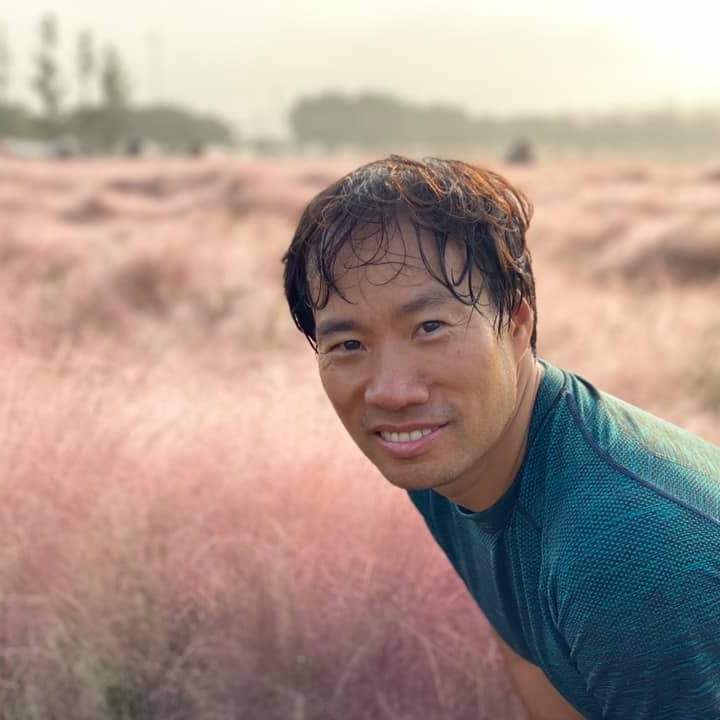
**이미지 캡션:** 한 성인 남성이 옅은 분홍색 억새가 가득한 들판을 배경으로 카메라를 향해 미소 짓고 있다. 남성은 30대 후반에서 40대 초반으로 보이며, 짧고 젖은 검은 머리카락을 가지고 있다. 그는 짙은 녹색의 스포츠 의류를 입고 있으며, 목 부분에 옅은 파란색의 배색이 보인다. 그의 얼굴에는 땀방울이 맺혀 있고, 눈은 부드럽게 웃고 있으며 입은 살짝 벌어져 치아가 보인다. 배경은 흐릿하게 처리되어 있지만, 분홍색 억새가 넓게 펼쳐져 있고 멀리 나무와 흐릿한 하늘이 보인다. 전체적으로 따뜻하고 평화로운 분위기를 자아낸다.

### 10월 16일 (수) 15:22 · Crossing waves and riding waves!

Crossing waves and riding waves!

🎬 동영상 2개 (생략)

### 10월 19일 (토) 13:37 · Wonderful to meet so many telanted stude…

Wonderful to meet so many telanted students at The Hong Kong University of Science and Technology - HKUST CSE Seoul interview.

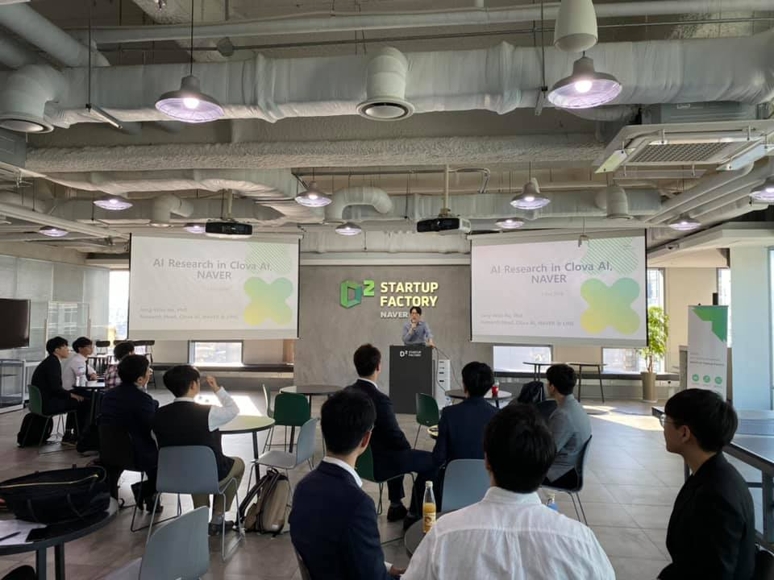
**이미지 캡션:** 이 사진은 현대적인 회의실에서 열리는 발표 장면을 담고 있으며, 천장에는 조명과 환풍 시설이 노출되어 있습니다. 중앙에는 두 개의 대형 스크린이 설치되어 있고, 왼쪽 스크린에는 "AI Research in Clova AI, NAVER"라는 제목과 함께 발표자 이름 및 소속이 영어로 표시되어 있습니다. 오른쪽 스크린에도 동일한 제목이 보입니다. 스크린 앞쪽에는 검은색 연단이 놓여 있고, 연단 위에는 한 명의 성인 남성이 서서 발표를 진행하고 있습니다. 그는 파란색 셔츠를 입고 있으며, 손짓을 하며 열정적으로 설명하는 듯한 표정입니다. 청중석에는 약 10명 이상의 성인 남성들이 의자에 앉아 발표를 경청하고 있으며, 대부분 정장을 입고 있습니다. 일부 청중은 노트북이나 서류를 보고 있으며, 전반적으로 진지하고 집중하는 분위기입니다. 배경에는 "D2 STARTUP FACTORY NAVER"라는 로고가 보이는 벽과 함께 창문이 있어 밝은 자연광이 들어오고 있습니다. 회의실 내부에는 여러 개의 테이블과 의자가 배치되어 있으며, 일부 테이블 위에는 노트북, 가방, 음료수 병 등이 놓여 있습니다. 전체적으로 기술 관련 발표회 또는 세미나의 모습으로 보이며, 차분하면서도 활기찬 분위기를 느낄 수 있습니다.명하는 듯한 표정입니다. 청중석에는 약 10명 이상의 성인 남성들이 의자에 앉아 발표를 경청하고 있으며, 대부분 정장을 입고 있습니다. 일부 청중은 노트북이나 서류를 보고 있으며, 전반적으로 진지하고 집중하는 분위기입니다. 배경에는 "D2 STARTUP FACTORY NAVER"라는 로고가 보이는 벽과 함께 창문이 있어 밝은 자연광이 들어오고 있습니다. 회의실 내부에는 여러 개의 테이블과 의자가 배치되어 있으며, 일부 테이블 위에는 노트북, 가방, 음료수 병 등이 놓여 있습니다. 전체적으로 기술 관련 발표회 또는 세미나의 모습으로 보이며, 차분하면서도 활기찬 분위기를 느낄 수 있습니다.
 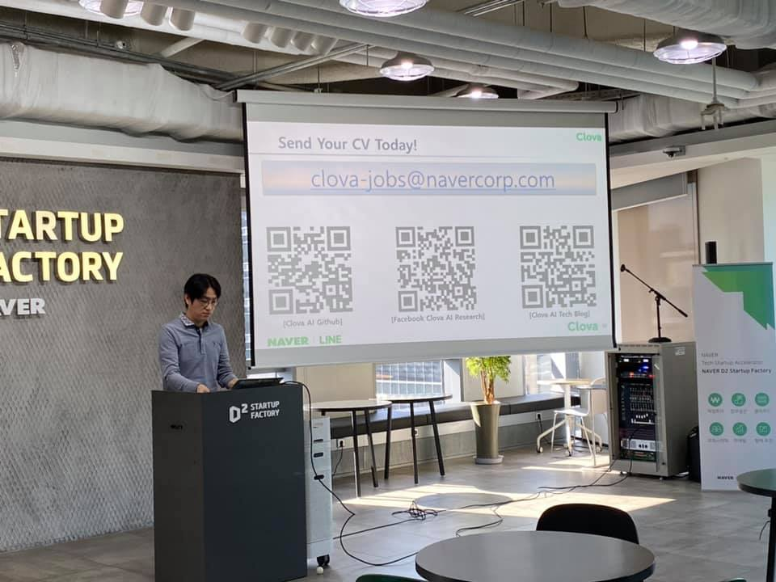
**이미지 캡션:** 한 명의 성인 남성이 회색 폴로 셔츠를 입고 연단 뒤에 서서 노트북을 조작하고 있으며, 그의 앞에는 "D2 STARTUP FACTORY"라고 적힌 검은색 연단이 있다. 배경에는 "STARTUP FACTORY"라는 글자가 쓰인 벽과 프로젝터 스크린이 보이는데, 스크린에는 "Send Your CV Today!"라는 문구와 함께 "clova-jobs@navercorp.com"이라는 이메일 주소, 그리고 세 개의 QR 코드가 표시되어 있다. 각 QR 코드 아래에는 "[Clova AI Github]", "[Facebook Clova AI Research]", "[Clova AI Tech Blog]"와 같은 설명이 적혀 있다. 스크린 오른쪽에는 마이크 스탠드와 서버 랙이 있고, 그 옆에는 녹색과 흰색이 조합된 배너가 세워져 있으며, 배너에는 "NAVER D2 Startup Factory"라는 문구가 보인다. 실내 조명이 켜져 있고, 테이블과 의자들이 놓여 있어 발표 또는 회의가 진행 중인 장소로 보인다. 전체적으로 기술 발표회 또는 채용 설명회와 같은 분위기이다.ok Clova AI Research]", "[Clova AI Tech Blog]"와 같은 설명이 적혀 있다. 스크린 오른쪽에는 마이크 스탠드와 서버 랙이 있고, 그 옆에는 녹색과 흰색이 조합된 배너가 세워져 있으며, 배너에는 "NAVER D2 Startup Factory"라는 문구가 보인다. 실내 조명이 켜져 있고, 테이블과 의자들이 놓여 있어 발표 또는 회의가 진행 중인 장소로 보인다. 전체적으로 기술 발표회 또는 채용 설명회와 같은 분위기이다.
 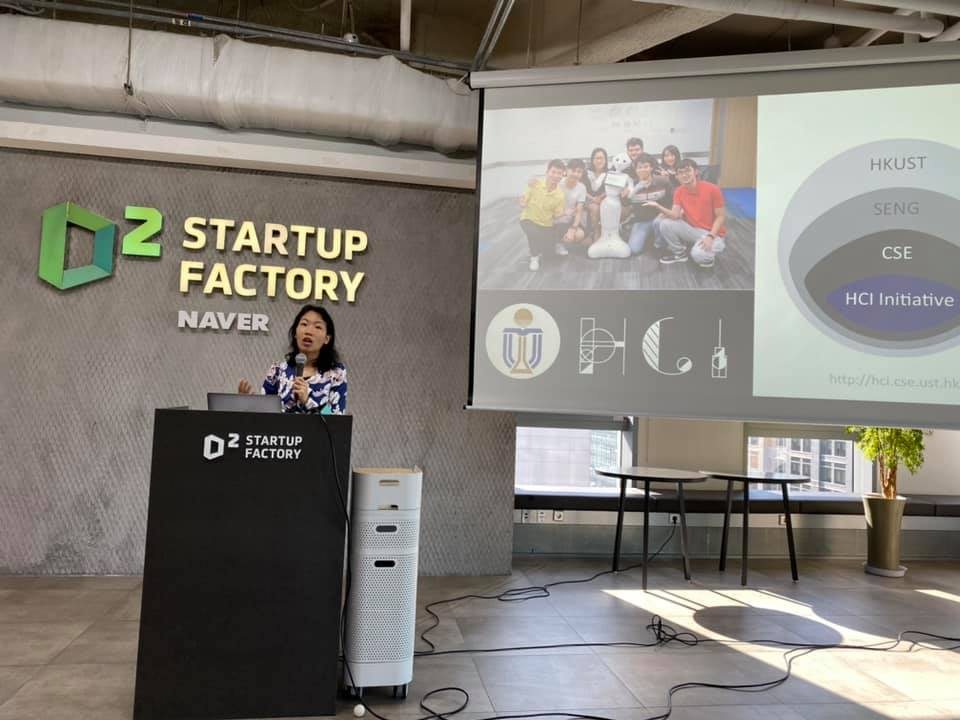
**이미지 캡션:** 한 명의 성인 여성이 연단 뒤에서 마이크를 잡고 발표하고 있으며, 그녀는 파란색과 흰색 패턴의 셔츠를 입고 있으며, 그녀의 표정은 열정적이고 활기차 보입니다. 그녀 앞에는 검은색 연단이 있고, 연단에는 "D2 STARTUP FACTORY" 로고가 새겨져 있습니다. 연단 옆에는 하얀색 공기청정기가 놓여 있습니다. 배경 벽에는 "D2 STARTUP FACTORY"와 "NAVER"라는 글자가 큰 글씨로 쓰여 있습니다. 벽에는 빔 프로젝터 화면이 걸려 있는데, 화면에는 여러 명의 젊은 사람들이 로봇과 함께 찍은 사진과 함께 HKUST, SENG, CSE, HCI Initiative라는 글자가 포함된 원형 다이어그램이 표시되어 있습니다. 화면 하단에는 "http://hci.cse.ust.hk"라는 웹사이트 주소가 보입니다. 장소는 현대적인 회의실 또는 강연장으로 보이며, 바닥에는 전선들이 깔려 있고, 창밖으로는 도시 풍경이 보입니다. 전반적으로 기술 발표 또는 스타트업 관련 행사의 분위기를 나타냅니다.과 함께 HKUST, SENG, CSE, HCI Initiative라는 글자가 포함된 원형 다이어그램이 표시되어 있습니다. 화면 하단에는 "http://hci.cse.ust.hk"라는 웹사이트 주소가 보입니다. 장소는 현대적인 회의실 또는 강연장으로 보이며, 바닥에는 전선들이 깔려 있고, 창밖으로는 도시 풍경이 보입니다. 전반적으로 기술 발표 또는 스타트업 관련 행사의 분위기를 나타냅니다.
 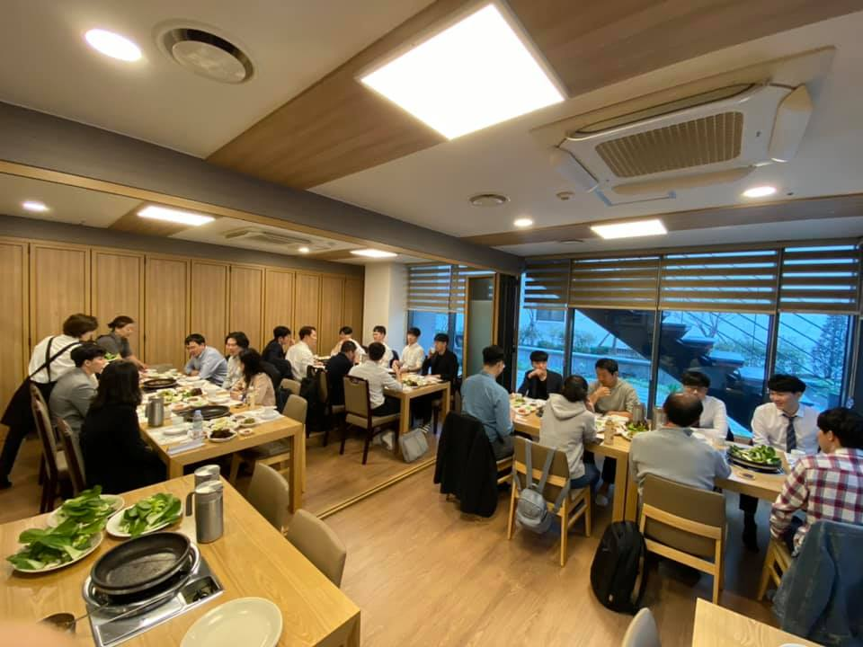
**이미지 캡션:** 이 사진은 여러 명의 사람들이 식당에서 함께 식사하고 있는 모습을 담고 있습니다. 사진 중앙에는 긴 테이블이 놓여 있고, 그 주위로 약 20명 정도의 사람들이 앉아 있습니다. 대부분의 사람들은 성인 남성이며, 일부 성인 여성도 보입니다. 사람들은 캐주얼한 복장을 하고 있으며, 셔츠, 티셔츠, 바지 등을 착용하고 있습니다. 대부분의 사람들은 편안하고 즐거운 표정으로 대화를 나누거나 음식을 먹고 있습니다. 일부 사람들은 음식을 집거나 잔을 들고 있으며, 활발한 분위기를 느끼게 합니다. 장소는 현대적인 인테리어의 식당으로 보입니다. 벽면은 나무 패널로 마감되어 있으며, 천장에는 조명이 설치되어 있습니다. 큰 창문이 있어 외부 풍경을 볼 수 있으며, 블라인드가 쳐져 있습니다. 테이블 위에는 다양한 음식과 음료가 놓여 있으며, 식기류와 냅킨 등도 보입니다. 특히 테이블 중앙에는 불판이 놓여 있어 고기를 구워 먹는 식당임을 짐작할 수 있습니다. 전반적으로 따뜻하고 편안한 분위기이며, 사람들이 함께 모여 즐거운 시간을 보내고 있는 모습입니다.식당으로 보입니다. 벽면은 나무 패널로 마감되어 있으며, 천장에는 조명이 설치되어 있습니다. 큰 창문이 있어 외부 풍경을 볼 수 있으며, 블라인드가 쳐져 있습니다. 테이블 위에는 다양한 음식과 음료가 놓여 있으며, 식기류와 냅킨 등도 보입니다. 특히 테이블 중앙에는 불판이 놓여 있어 고기를 구워 먹는 식당임을 짐작할 수 있습니다. 전반적으로 따뜻하고 편안한 분위기이며, 사람들이 함께 모여 즐거운 시간을 보내고 있는 모습입니다.
 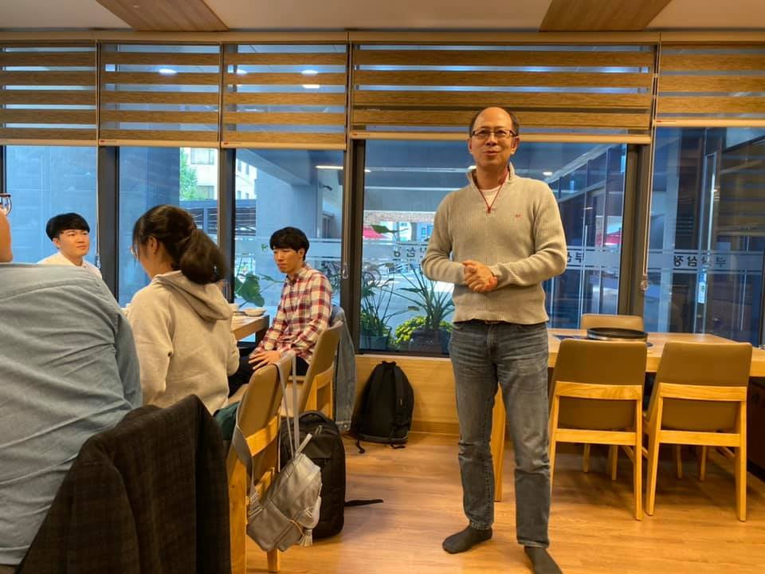
**이미지 캡션:** 한 성인 남성이 회색 스웨터와 청바지를 입고 서 있으며, 그의 손은 앞에 모아져 있고 얼굴에는 미소가 있습니다. 그는 안경을 쓰고 있으며, 머리카락은 짧고 짙은 색입니다. 배경에는 창문이 있고, 창문 밖으로는 건물과 식물이 보입니다. 창문에는 한국어로 된 간판이 보입니다. 실내에는 나무 테이블과 의자가 있으며, 몇몇 젊은 사람들이 앉아 있습니다. 한 젊은 남성은 체크무늬 셔츠를 입고 있고, 다른 젊은 여성은 후드티를 입고 있습니다. 또 다른 젊은 남성은 파란색 셔츠를 입고 있습니다. 분위기는 편안하고 캐주얼하며, 사람들이 모여 대화를 나누거나 식사를 하는 듯한 모습입니다.며, 사람들이 모여 대화를 나누거나 식사를 하는 듯한 모습입니다.

### 10월 19일 (토) 16:30 · is a photo model at travel festival 2019…

is a photo model at travel festival 2019, Coex.

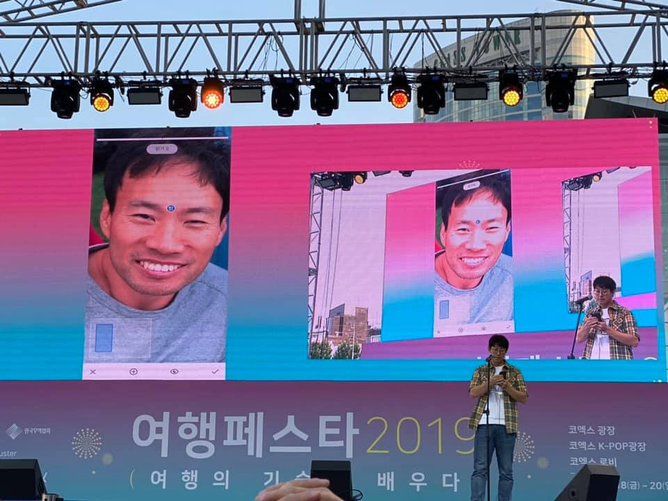
**이미지 캡션:** 이 사진은 야외 무대에서 열리는 행사로 보인다. 무대 위에는 대형 스크린이 설치되어 있고, 스크린에는 두 개의 영상이 재생되고 있다. 왼쪽 스크린에는 한 성인 남성의 얼굴 클로즈업 영상이 나오고 있는데, 그는 40대 초반으로 보이며 짧은 검은 머리에 옅은 미소를 띠고 있다. 회색 티셔츠를 입고 있으며, 얼굴 중앙에 파란색 점이 찍혀 있다. 오른쪽 스크린에는 같은 성인 남성이 스마트폰을 들고 있는 모습이 보인다. 이 남성은 30대 초반으로 추정되며, 체크무늬 셔츠와 청바지를 입고 있으며, 스마트폰을 보며 미소 짓고 있다. 스크린 아래 무대에는 한 젊은 성인 남성이 마이크 앞에 서서 스마트폰을 조작하고 있다. 그는 20대 후반으로 보이며, 체크무늬 셔츠와 청바지를 입고 있다. 배경에는 현대적인 고층 건물들이 보이며, 하늘에는 조명 장치들이 설치되어 있다. 스크린에는 "여행페스타 2019"라는 문구와 함께 "코엑스 광장", "코엑스 K-POP광장", "코엑스 로비" 등의 장소 정보가 한국어로 표시되어 있다. 전체적으로 밝고 활기찬 분위기이며, 행사의 홍보 또는 참여를 유도하는 듯한 모습이다.짓고 있다. 스크린 아래 무대에는 한 젊은 성인 남성이 마이크 앞에 서서 스마트폰을 조작하고 있다. 그는 20대 후반으로 보이며, 체크무늬 셔츠와 청바지를 입고 있다. 배경에는 현대적인 고층 건물들이 보이며, 하늘에는 조명 장치들이 설치되어 있다. 스크린에는 "여행페스타 2019"라는 문구와 함께 "코엑스 광장", "코엑스 K-POP광장", "코엑스 로비" 등의 장소 정보가 한국어로 표시되어 있다. 전체적으로 밝고 활기찬 분위기이며, 행사의 홍보 또는 참여를 유도하는 듯한 모습이다.

### 10월 19일 (토) 23:02 · 생일축하드립니다. 택영님과 같이 일하게 된것은 정말 큰 행운입니다. 그래…

생일축하드립니다. 택영님과 같이 일하게 된것은 정말 큰 행운입니다. 그래서 생일이 너무 감사하고 또 축하 드립니다.

### 10월 19일 (토) 23:02 · ↪ 생일축하드립니다. 택영님과 같이 일하게 된것은 정말 큰 행운입니다. 그래…

*다른 프로필에 남긴 글*

생일축하드립니다. 택영님과 같이 일하게 된것은 정말 큰 행운입니다. 그래서 생일이 너무 감사하고 또 축하 드립니다.

### 10월 20일 (일) 15:40 · #tfkr3rdmeetup wonderful to be around wi…

#tfkr3rdmeetup wonderful to be around with amazing TF KR members. Say hi if you are around.

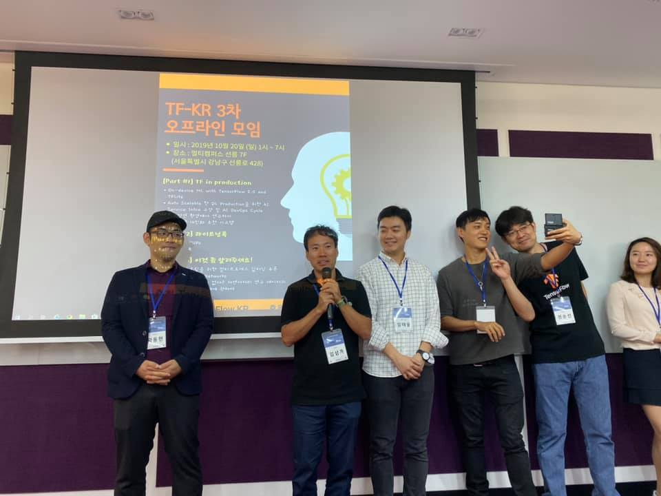
**이미지 캡션:** 다섯 명의 성인 남성과 한 명의 성인 여성이 실내에서 사진을 찍고 있다. 사진 왼쪽에는 검은색 재킷과 모자를 쓴 남성이 서 있고, 그의 얼굴에는 빛이 반사되고 있다. 그는 목에 파란색 목걸이를 하고 있으며, 명찰을 달고 있다. 그의 앞에는 빔 프로젝터 스크린이 있고, 스크린에는 "TF-KR 3차 오프라인 모임"이라는 제목과 함께 행사 정보가 한국어로 적혀 있다. 스크린에는 또한 사람의 얼굴 실루엣과 톱니바퀴 모양의 아이콘이 그려져 있다. 스크린 앞에는 보라색 천이 걸려 있다. 사진 중앙에는 검은색 티셔츠를 입은 남성이 마이크를 들고 있고, 그의 옆에는 체크무늬 셔츠를 입은 남성이 서 있다. 그 옆에는 회색 티셔츠를 입은 남성이 브이(V)자를 그리며 셀카를 찍고 있고, 그의 옆에는 검은색 티셔츠를 입은 남성이 스마트폰으로 셀카를 찍고 있다. 가장 오른쪽에는 연한 색 블라우스를 입은 여성이 서 있다. 전체적으로 행사의 한 장면을 담은 듯한 분위기이며, 참석자들이 즐겁게 참여하고 있는 모습이다.은 남성이 마이크를 들고 있고, 그의 옆에는 체크무늬 셔츠를 입은 남성이 서 있다. 그 옆에는 회색 티셔츠를 입은 남성이 브이(V)자를 그리며 셀카를 찍고 있고, 그의 옆에는 검은색 티셔츠를 입은 남성이 스마트폰으로 셀카를 찍고 있다. 가장 오른쪽에는 연한 색 블라우스를 입은 여성이 서 있다. 전체적으로 행사의 한 장면을 담은 듯한 분위기이며, 참석자들이 즐겁게 참여하고 있는 모습이다.
 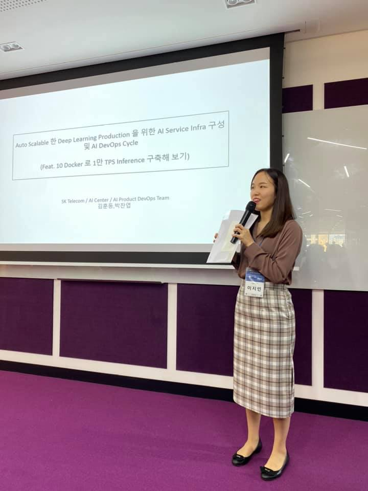
**이미지 캡션:** 한 젊은 여성 발표자가 마이크를 들고 연단에 서서 발표하고 있다. 그녀는 갈색 블라우스와 체크무늬 치마를 입고 있으며, 목에는 '이지민'이라고 적힌 이름표를 달고 있다. 그녀는 미소를 띠고 있으며, 발표 자료를 들고 있다. 배경에는 'Auto Scalable 한 Deep Learning Production 을 위한 AI Service Infra 구성 및 AI DevOps Cycle (Feat. 10 Docker 로 1만 TPS Inference 구축해 보기)'이라고 적힌 큰 스크린이 보인다. 스크린 아래에는 'SK Telecom / AI Center / AI Product DevOps Team 김훈동, 박잔업'이라고 적혀 있다. 장소는 회의실이나 강연장으로 보이며, 보라색 카펫과 벽면 장식이 특징이다. 전체적으로 전문적이고 학술적인 분위기이다.'SK Telecom / AI Center / AI Product DevOps Team 김훈동, 박잔업'이라고 적혀 있다. 장소는 회의실이나 강연장으로 보이며, 보라색 카펫과 벽면 장식이 특징이다. 전체적으로 전문적이고 학술적인 분위기이다.
 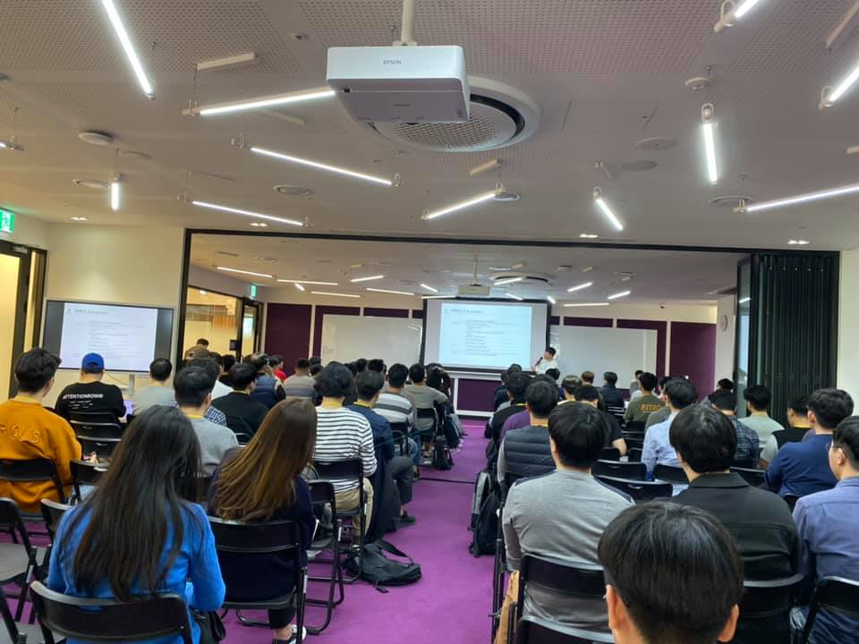
**이미지 캡션:** 이 사진은 강의실에서 열리는 발표 또는 강의 장면을 담고 있으며, 다수의 성인 남성과 소수의 성인 여성들이 참석하여 발표자를 바라보고 있다. 발표자는 화면 앞에 서서 발표를 진행 중이며, 참석자들은 대부분 20대에서 40대로 보이는 젊은 성인 남성들이며, 캐주얼한 복장을 하고 있다. 일부 여성 참석자들도 보이며, 이들 역시 캐주얼한 복장이다. 참석자들은 대부분 집중하는 표정으로 발표를 경청하고 있으며, 일부는 필기를 하거나 휴대폰을 보고 있다. 강의실은 현대적인 시설을 갖추고 있으며, 천장에는 프로젝터와 조명이 설치되어 있고, 벽에는 대형 스크린과 화이트보드가 보인다. 바닥은 보라색 카펫으로 덮여 있으며, 전체적으로 차분하고 집중된 분위기이다.이 설치되어 있고, 벽에는 대형 스크린과 화이트보드가 보인다. 바닥은 보라색 카펫으로 덮여 있으며, 전체적으로 차분하고 집중된 분위기이다.

### 10월 24일 (목) 09:05 · 생신 축하 드립니다!

생신 축하 드립니다!

### 10월 24일 (목) 09:05 · ↪ 생신 축하 드립니다!

*다른 프로필에 남긴 글*

생신 축하 드립니다!

### 10월 24일 (목) 09:07 · 생일 축하드립니다.

생일 축하드립니다.

### 10월 24일 (목) 09:07 · ↪ 생일 축하드립니다.

*다른 프로필에 남긴 글*

생일 축하드립니다.

### 10월 24일 (목) 09:54 · 📷 사진 (1장)

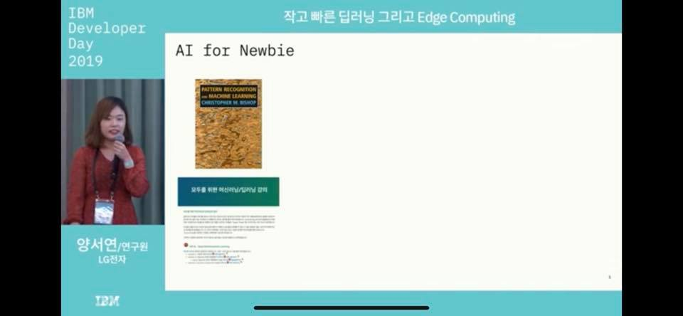
**이미지 캡션:** 이 사진은 IBM Developer Day 2019 행사에서 촬영된 것으로 보이며, 발표자로 보이는 한 명의 성인 여성이 마이크를 들고 이야기하고 있습니다. 이 여성은 20대 후반에서 30대 초반으로 보이며, 붉은색 계열의 옷을 입고 있으며 목에는 ID 카드를 걸고 있습니다. 그녀는 차분하고 집중하는 표정으로 청중을 향해 이야기하고 있습니다. 배경에는 "AI for Newbie"라는 제목과 함께 "Pattern Recognition and Machine Learning"이라는 책 표지가 보이며, 그 아래에는 한국어로 된 텍스트가 있습니다. 또한, 발표자의 이름과 소속이 "양서연/연구원 LG전자"로 표시되어 있습니다. 전체적으로 기술 컨퍼런스의 발표 장면으로, 지식 공유와 관련된 진지하고 전문적인 분위기입니다.한국어로 된 텍스트가 있습니다. 또한, 발표자의 이름과 소속이 "양서연/연구원 LG전자"로 표시되어 있습니다. 전체적으로 기술 컨퍼런스의 발표 장면으로, 지식 공유와 관련된 진지하고 전문적인 분위기입니다.

### 10월 25일 (금) 13:14 · 📷 사진 (2장)

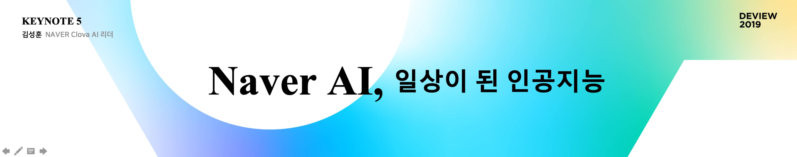
**이미지 캡션:** 이 사진은 발표 슬라이드로 보이며, 왼쪽 상단에는 "KEYNOTE 5"와 "김성훈 NAVER Clova AI 리더"라는 텍스트가 있다. 중앙에는 "Naver AI, 일상이 된 인공지능"이라는 큰 제목이 검은색 글씨로 쓰여 있으며, 배경은 파란색과 녹색이 섞인 그라데이션으로 처리되어 있다. 오른쪽 상단에는 "DEVIEW 2019"라는 텍스트가 노란색과 녹색 그라데이션 배경 위에 있다. 사진에는 사람이 등장하지 않으며, 전반적으로 깔끔하고 현대적인 디자인으로 기술 컨퍼런스의 분위기를 나타낸다.
 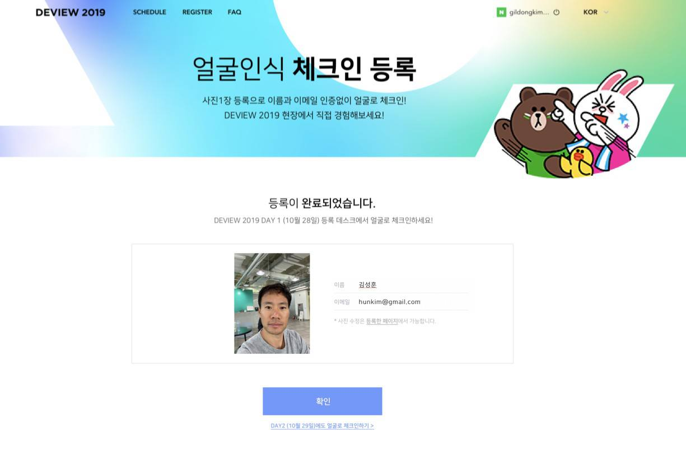
**이미지 캡션:** 화면 상단에는 DEVIEW 2019, SCHEDULE, REGISTER, FAQ와 같은 메뉴가 보이며, 오른쪽 상단에는 길동김이라는 이름과 한국어 설정이 표시되어 있습니다. 중앙에는 "얼굴인식 체크인 등록"이라는 제목과 함께 "사진 1장 등록으로 이름과 이메일 인증 없이 얼굴로 체크인! DEVIEW 2019 현장에서 직접 경험해보세요!"라는 설명이 있습니다. 그 아래에는 귀여운 브라운과 코니 캐릭터가 그려져 있습니다. "등록이 완료되었습니다."라는 메시지와 함께 "DEVIEW 2019 DAY 1 (10월 28일) 등록 데스크에서 얼굴로 체크인하세요!"라는 안내가 있습니다. 그 아래에는 등록된 사람의 사진과 함께 이름은 김성훈, 이메일은 hunkim@gmail.com이라고 표시되어 있으며, 사진 수정은 등록한 페이지에서 가능하다는 안내가 있습니다. 마지막으로 "확인" 버튼과 "DAY2 (10월 29일)에도 얼굴로 체크인하기"라는 링크가 보입니다. 전체적으로 행사가 성공적으로 등록되었음을 알리는 긍정적이고 안내적인 분위기입니다.일) 등록 데스크에서 얼굴로 체크인하세요!"라는 안내가 있습니다. 그 아래에는 등록된 사람의 사진과 함께 이름은 김성훈, 이메일은 hunkim@gmail.com이라고 표시되어 있으며, 사진 수정은 등록한 페이지에서 가능하다는 안내가 있습니다. 마지막으로 "확인" 버튼과 "DAY2 (10월 29일)에도 얼굴로 체크인하기"라는 링크가 보입니다. 전체적으로 행사가 성공적으로 등록되었음을 알리는 긍정적이고 안내적인 분위기입니다.

### 10월 29일 (화) 19:58 · Please stop by the Naver booth @ICCV2019…

Please stop by the Naver booth @ICCV2019 and meet many people and fun demos from Clova AI.

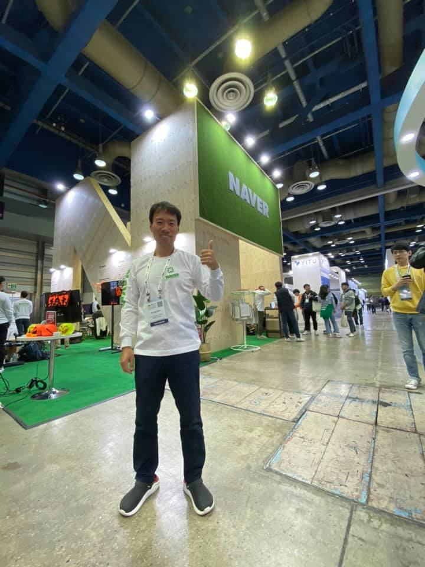
**이미지 캡션:** 한 명의 성인 남성이 행사장으로 보이는 넓은 실내 공간에서 엄지손가락을 치켜세우며 카메라를 향해 웃고 있다. 그는 30대 후반에서 40대 초반으로 보이며, 짧은 검은색 머리에 흰색 긴팔 티셔츠와 검은색 바지를 입고 있다. 티셔츠에는 "NAVER" 로고와 함께 흰색 목걸이형 출입증이 걸려 있다. 그의 발에는 검은색과 흰색이 섞인 운동화가 신겨져 있다. 배경에는 "NAVER"라고 크게 쓰인 녹색 인조잔디로 덮인 부스가 보이며, 그 옆으로 나무 재질의 구조물과 조명이 설치되어 있다. 또한, 다른 부스들과 사람들이 지나다니는 모습, 그리고 천장에 달린 조명과 환풍기 등이 보인다. 전반적으로 행사장이나 컨퍼런스 같은 활기찬 분위기이다.지나다니는 모습, 그리고 천장에 달린 조명과 환풍기 등이 보인다. 전반적으로 행사장이나 컨퍼런스 같은 활기찬 분위기이다.
