# 2019년 11월

[← 2019년](README.md)

### 11월 3일 (일) 19:20 · Welcome to Naver Night @Hong Kong!

Welcome to Naver Night @Hong Kong!

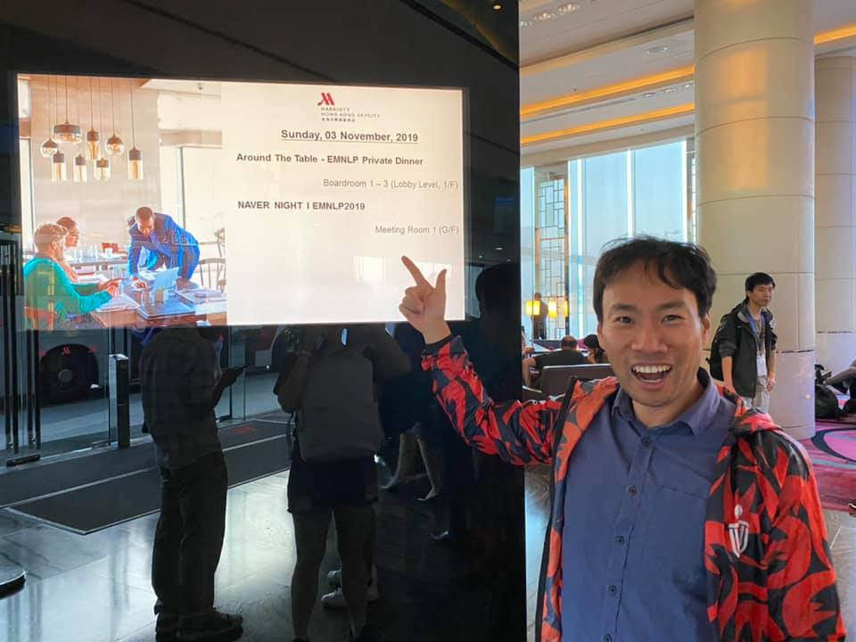
**이미지 캡션:** 한 명의 성인 남성이 밝게 웃으며 카메라를 바라보고 있으며, 그의 왼쪽에는 마리오트 호텔 로고와 함께 "Sunday, 03 November, 2019", "Around The Table - EMNLP Private Dinner", "Boardroom 1-3 (Lobby Level, 1/F)", "NAVER NIGHT I EMNLP2019", "Meeting Room 1 (G/F)"라고 적힌 대형 스크린이 보인다. 남성은 파란색 셔츠 위에 빨간색과 검은색 패턴의 재킷을 입고 있으며, 그의 오른손은 스크린을 향해 뻗어 있다. 배경에는 다른 사람들이 앉아 있거나 서 있는 모습이 보이며, 넓은 로비 공간과 기둥, 창문이 보인다. 스크린에는 회의 참석자들이 테이블에 앉아 노트북을 보고 있는 삽화가 그려져 있다. 전반적으로 컨퍼런스나 행사 관련 모임의 분위기를 띤다. 뻗어 있다. 배경에는 다른 사람들이 앉아 있거나 서 있는 모습이 보이며, 넓은 로비 공간과 기둥, 창문이 보인다. 스크린에는 회의 참석자들이 테이블에 앉아 노트북을 보고 있는 삽화가 그려져 있다. 전반적으로 컨퍼런스나 행사 관련 모임의 분위기를 띤다.
 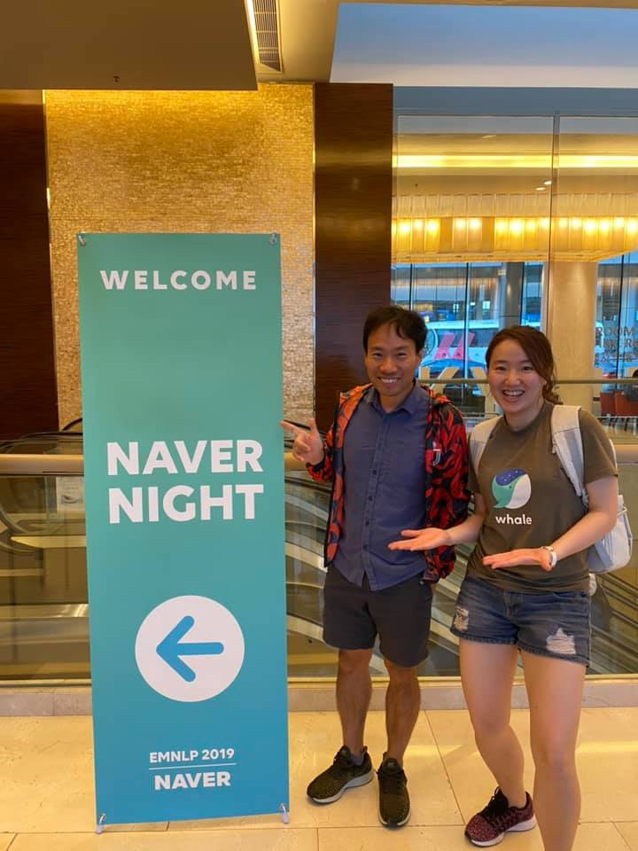
**이미지 캡션:** 한 명의 성인 남성과 한 명의 성인 여성이 네이버 나이트 행사 안내 배너 옆에서 포즈를 취하고 있다. 남성은 30대 후반에서 40대 초반으로 보이며, 짧은 검은 머리에 푸른색 셔츠와 빨간색, 검은색, 흰색이 섞인 화려한 패턴의 겉옷, 회색 반바지, 검은색 운동화를 착용하고 있다. 그는 배너를 향해 손짓하며 환한 미소를 짓고 있다. 여성은 20대 후반에서 30대 초반으로 보이며, 검은색 머리를 묶고 갈색 티셔츠와 찢어진 청바지 반바지, 검붉은색 운동화를 착용하고 있다. 그녀의 티셔츠에는 고래 그림과 함께 'whale'이라는 글자가 새겨져 있다. 여성은 배너를 향해 손을 뻗으며 미소를 짓고 있으며, 등에는 흰색 백팩을 메고 있다. 배너에는 'WELCOME', 'NAVER NIGHT', 파란색 화살표, 'EMNLP 2019', 'NAVER'라고 적혀 있다. 배경은 현대적인 실내 공간으로, 금색 타일 벽과 반짝이는 조명이 보인다. 전반적으로 행사에 대한 기대감과 즐거움을 나타내는 밝고 긍정적인 분위기이다.ale'이라는 글자가 새겨져 있다. 여성은 배너를 향해 손을 뻗으며 미소를 짓고 있으며, 등에는 흰색 백팩을 메고 있다. 배너에는 'WELCOME', 'NAVER NIGHT', 파란색 화살표, 'EMNLP 2019', 'NAVER'라고 적혀 있다. 배경은 현대적인 실내 공간으로, 금색 타일 벽과 반짝이는 조명이 보인다. 전반적으로 행사에 대한 기대감과 즐거움을 나타내는 밝고 긍정적인 분위기이다.
 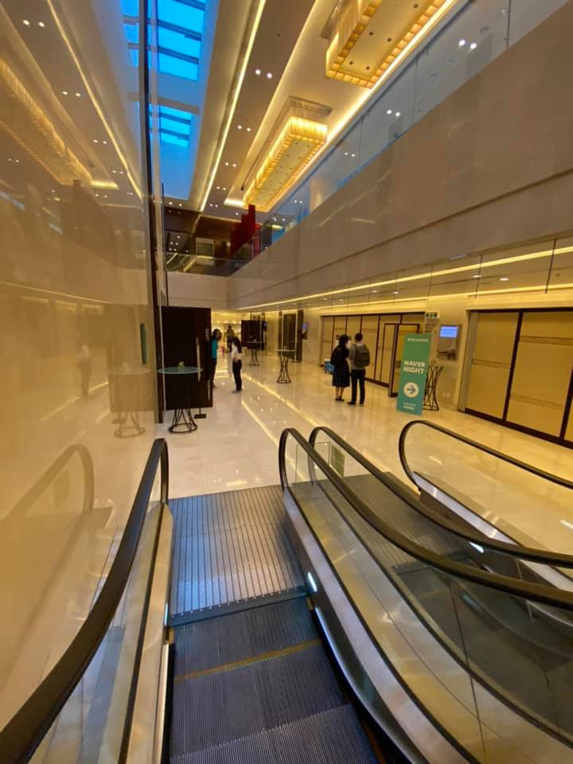
**이미지 캡션:** 넓고 현대적인 실내 공간으로, 천장에는 여러 개의 조명이 설치되어 있고, 한쪽 벽면에는 통유리로 된 창문이 있어 자연광이 들어온다. 바닥은 광택이 나는 대리석 재질이며, 에스컬레이터 두 대가 나란히 설치되어 있다. 여러 명의 사람들이 보이며, 한쪽에는 "WELCOME"이라고 적힌 녹색 안내 표지판이 서 있다. 표지판에는 "NAVER NIGHT"이라는 문구가 함께 쓰여 있어, 네이버 관련 행사가 진행 중임을 짐작할 수 있다. 전반적으로 깔끔하고 세련된 분위기이며, 행사장이나 호텔 로비와 같은 장소로 보인다.
 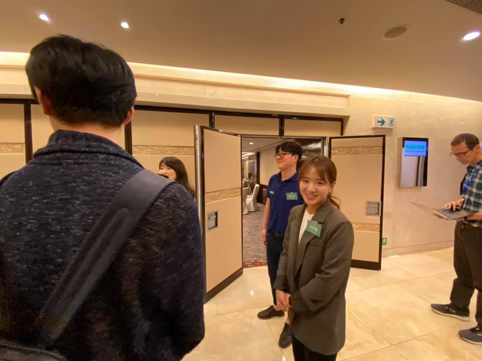
**이미지 캡션:** 사진에는 여러 사람이 실내 공간에 서 있습니다. 전경에는 어두운 색상의 스웨터를 입고 검은색 백팩을 멘 성인 남성이 등지고 서 있습니다. 그 뒤로, 문이 열린 복도에서 세 명의 사람이 보입니다. 왼쪽에는 안경을 쓴 젊은 성인 남성이 파란색 폴로 셔츠를 입고 서 있고, 그 옆에는 밝은 갈색 재킷을 입고 녹색 명찰을 단 젊은 성인 여성이 카메라를 향해 미소를 짓고 있습니다. 그 뒤에는 체크무늬 셔츠를 입고 안경을 쓴 성인 남성이 노트북을 들고 서 있습니다. 배경에는 "NAVER"라고 쓰인 파란색 간판이 보이며, 이는 회의나 행사가 진행 중인 장소임을 시사합니다. 전체적으로 밝고 캐주얼한 분위기이며, 참석자들이 서로 교류하거나 행사에 참여하는 모습으로 보입니다.이는 회의나 행사가 진행 중인 장소임을 시사합니다. 전체적으로 밝고 캐주얼한 분위기이며, 참석자들이 서로 교류하거나 행사에 참여하는 모습으로 보입니다.
 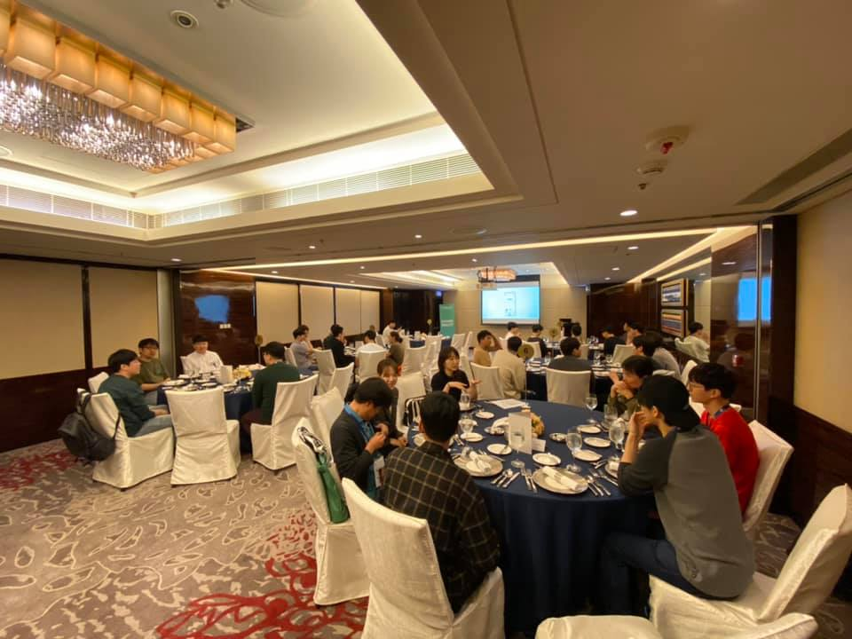
**이미지 캡션:** 이 사진은 실내 연회장에서 열리는 행사 장면을 담고 있으며, 여러 명의 성인 남녀가 테이블에 둘러앉아 식사를 하거나 대화를 나누고 있습니다. 대부분의 참석자는 20대에서 30대로 보이는 젊은 성인들이며, 캐주얼한 복장을 하고 있습니다. 일부는 앞쪽 스크린을 바라보고 있으며, 스크린에는 발표 내용으로 보이는 텍스트와 이미지가 표시되고 있습니다. 장소는 고급스러운 분위기의 연회장으로, 천장에는 화려한 샹들리에가 달려 있고 벽에는 액자가 걸려 있습니다. 테이블 위에는 식기류와 음료가 놓여 있으며, 참석자들은 편안하고 자연스러운 표정으로 행사에 참여하고 있습니다. 전반적으로 차분하고 집중된 분위기 속에서 네트워킹이나 발표가 이루어지고 있는 것으로 보입니다.고 자연스러운 표정으로 행사에 참여하고 있습니다. 전반적으로 차분하고 집중된 분위기 속에서 네트워킹이나 발표가 이루어지고 있는 것으로 보입니다.
 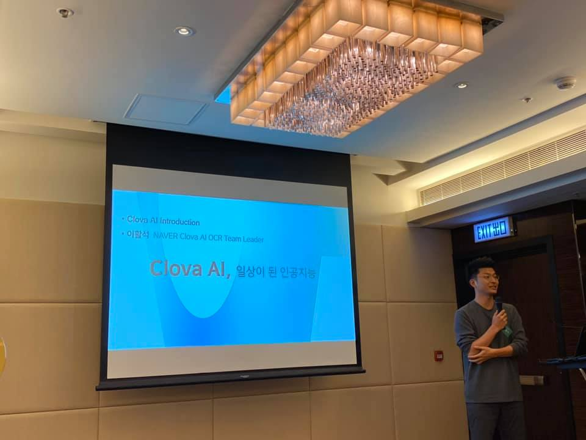
**이미지 캡션:** 한 성인 남성이 마이크를 들고 강연을 하고 있으며, 그의 뒤에는 "Clova AI Introduction"이라는 제목과 함께 "이함석 NAVER Clova AI OCR Team Leader"라고 적힌 슬라이드가 띄워진 대형 스크린이 보인다. 스크린에는 "Clova AI, 일상이 된 인공지능"이라는 문구도 한국어로 쓰여 있다. 남성은 회색 긴팔 상의와 어두운 색 바지를 입고 있으며, 편안하고 자신감 있는 표정으로 청중을 향해 이야기하고 있다. 배경에는 고급스러운 샹들리에 조명과 "EXIT" 표시등이 보이며, 이는 회의실이나 강연장과 같은 실내 공간임을 시사한다. 전체적으로 전문적이고 정보 전달적인 분위기이다.는 회의실이나 강연장과 같은 실내 공간임을 시사한다. 전체적으로 전문적이고 정보 전달적인 분위기이다.
 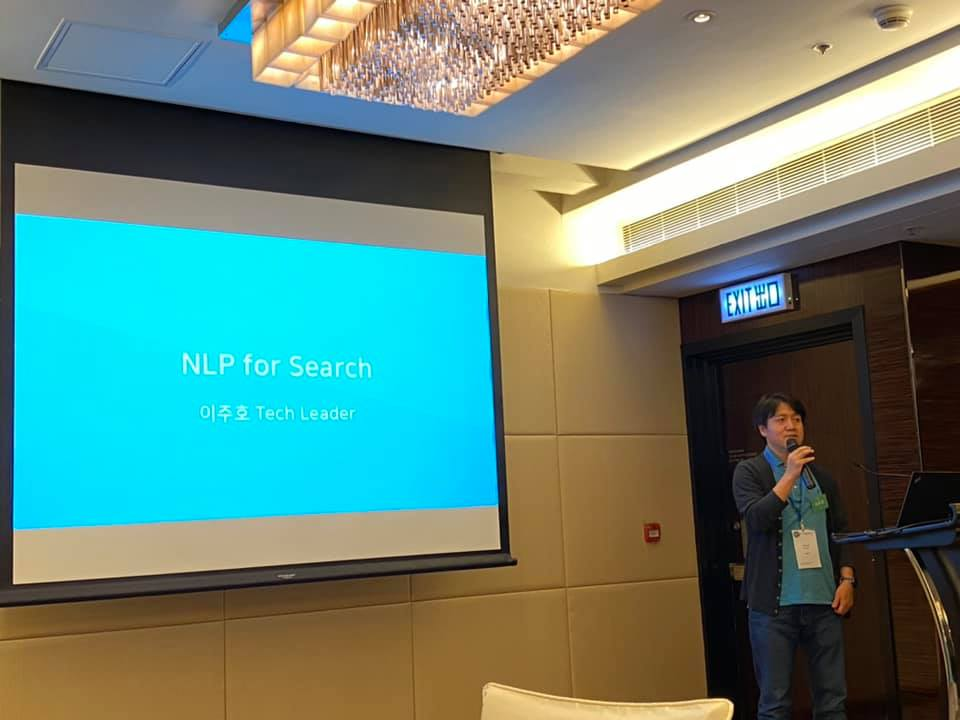
**이미지 캡션:** 이 사진은 발표회 또는 강연 중인 한 성인 남성을 보여줍니다. 그는 30대 후반에서 40대 초반으로 보이며, 짧은 검은 머리에 약간 통통한 체격입니다. 파란색 티셔츠 위에 검은색 카디건을 입고 청바지를 착용했으며, 목에는 녹색과 흰색이 섞인 이름표를 걸고 있습니다. 그는 마이크를 들고 연설 중이며, 표정은 차분하고 집중하는 듯 보입니다. 배경에는 대형 스크린이 있고, 스크린에는 "NLP for Search"라는 제목과 함께 한국어로 "이주호 Tech Leader"라고 적혀 있습니다. 스크린은 밝은 파란색으로 채워져 있습니다. 오른쪽에는 출구 표시등이 있는 문과 연설대를 사이에 두고 노트북이 놓여 있습니다. 천장에는 화려한 샹들리에 조명이 달려 있어 고급스러운 분위기를 더합니다. 전체적으로 전문적인 발표 상황을 나타내는 분위기입니다.채워져 있습니다. 오른쪽에는 출구 표시등이 있는 문과 연설대를 사이에 두고 노트북이 놓여 있습니다. 천장에는 화려한 샹들리에 조명이 달려 있어 고급스러운 분위기를 더합니다. 전체적으로 전문적인 발표 상황을 나타내는 분위기입니다.
 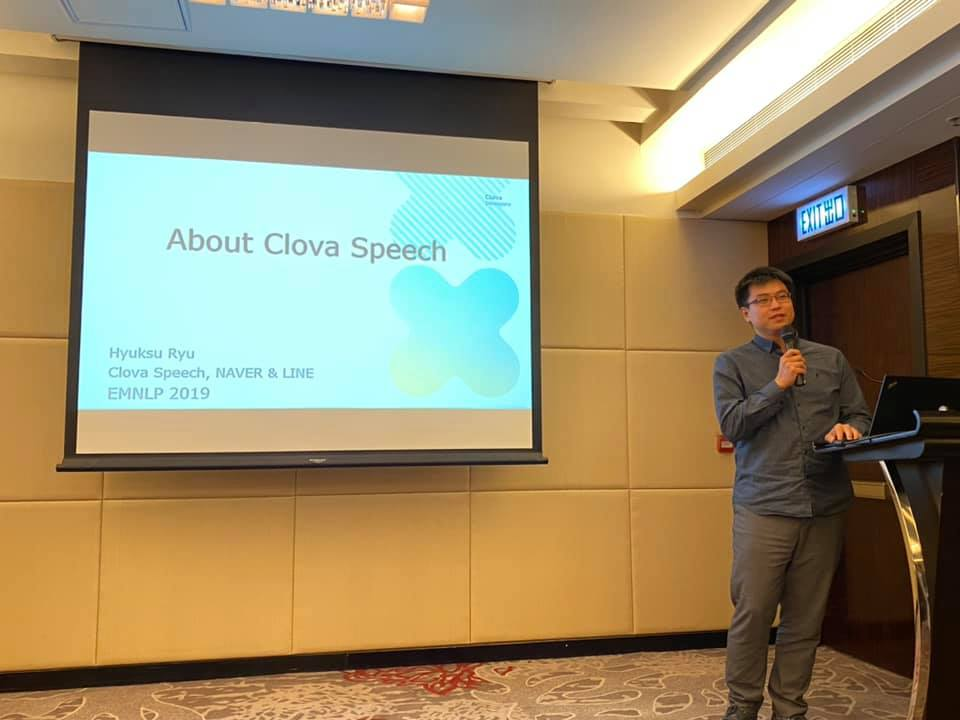
**이미지 캡션:** 이 사진은 발표회 또는 컨퍼런스의 한 장면을 담고 있으며, 성인 남성이 마이크를 들고 발표하고 있다. 남성은 30대 후반에서 40대 초반으로 보이며, 검은색 안경을 착용하고 있다. 회색 셔츠와 회색 바지를 입고 있으며, 차분하고 집중하는 표정으로 마이크를 쥔 채 노트북을 바라보고 있다. 배경에는 발표 슬라이드가 띄워진 스크린이 있고, "About Clova Speech"라는 제목과 함께 발표자의 이름인 "Hyuksu Ryu"와 소속 "Clova Speech, NAVER & LINE EMNLP 2019"가 적혀 있다. 스크린에는 파란색과 녹색 계열의 추상적인 그래픽이 보인다. 장소는 실내 강연장으로 보이며, 벽면은 베이지색 패널로 마감되어 있고, 천장에는 조명이 설치되어 있다. 오른쪽 벽에는 "EXIT"라고 적힌 비상구 표지판이 보인다. 전체적으로 차분하고 전문적인 분위기이며, 기술 발표회 또는 학술 대회와 같은 행사의 일부로 보인다. 있다. 스크린에는 파란색과 녹색 계열의 추상적인 그래픽이 보인다. 장소는 실내 강연장으로 보이며, 벽면은 베이지색 패널로 마감되어 있고, 천장에는 조명이 설치되어 있다. 오른쪽 벽에는 "EXIT"라고 적힌 비상구 표지판이 보인다. 전체적으로 차분하고 전문적인 분위기이며, 기술 발표회 또는 학술 대회와 같은 행사의 일부로 보인다.
 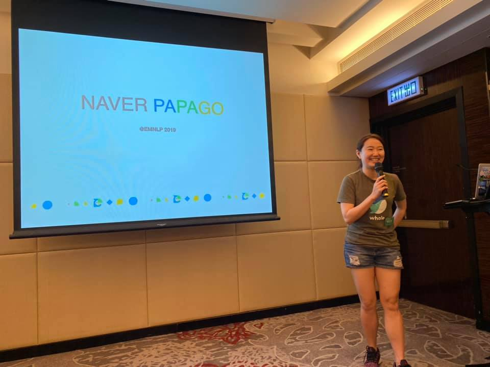
**이미지 캡션:** 한 명의 성인 여성이 마이크를 들고 발표하고 있으며, 그녀는 20대 후반에서 30대 초반으로 보이며 짧은 갈색 머리에 웃는 표정을 짓고 있다. 그녀는 올리브색 티셔츠와 데님 반바지를 입고 있으며, 티셔츠에는 고래 그림과 함께 "whale"이라는 글자가 쓰여 있다. 그녀는 무대 중앙에 서 있고, 배경에는 "NAVER PAPAGO"라고 쓰인 큰 스크린이 보인다. 스크린에는 "EMNLP 2019"라는 글자도 작게 표시되어 있다. 스크린 왼쪽에는 파란색, 노란색, 초록색 점과 함께 귀여운 캐릭터들이 나열되어 있다. 무대 오른쪽에는 출구 표시가 있는 문과 노트북이 놓인 스탠드가 보인다. 전체적으로 발표회 또는 컨퍼런스의 한 장면으로 보이며, 밝고 긍정적인 분위기이다.무대 오른쪽에는 출구 표시가 있는 문과 노트북이 놓인 스탠드가 보인다. 전체적으로 발표회 또는 컨퍼런스의 한 장면으로 보이며, 밝고 긍정적인 분위기이다.
 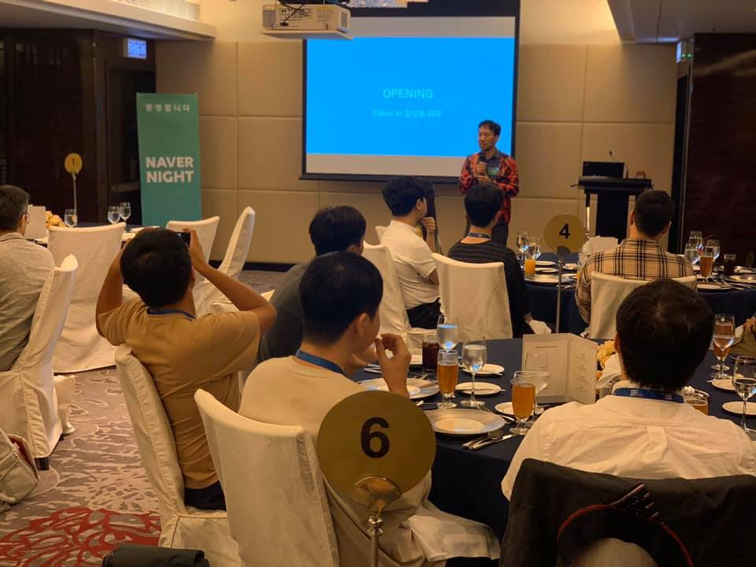
**이미지 캡션:** 이 사진은 실내에서 열리는 행사 장면을 담고 있으며, 무대에는 파란색 배경에 흰색 글씨로 "OPENING"이라고 적힌 스크린이 있고, 그 앞에 한 명의 성인 남성이 서서 발표하고 있다. 발표자는 40대 정도로 보이며, 빨간색과 검은색이 섞인 체크무늬 셔츠를 입고 마이크를 들고 있다. 청중은 대부분 20대에서 30대로 보이는 성인 남성들이며, 흰색 또는 검은색 옷을 입고 테이블에 앉아 발표를 경청하거나 휴대폰으로 촬영하고 있다. 테이블 위에는 물잔, 음료잔, 접시 등이 놓여 있다. 배경에는 "환영합니다"와 "NAVER NIGHT"라고 적힌 녹색 현수막이 걸려 있고, 행사장의 분위기는 차분하면서도 집중하는 모습이다.AVER NIGHT"라고 적힌 녹색 현수막이 걸려 있고, 행사장의 분위기는 차분하면서도 집중하는 모습이다.
 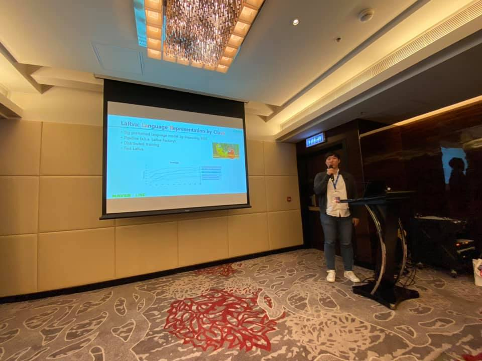
**이미지 캡션:** 한 성인 남성이 마이크를 들고 강연을 하고 있으며, 그의 앞에는 연단과 노트북이 놓여 있다. 남성은 흰색 셔츠에 검은색 카디건, 청바지를 입고 있으며 흰색 운동화를 신고 있다. 그의 목에는 파란색과 흰색 목걸이가 걸려 있다. 배경에는 빔 프로젝터 스크린이 있고, 스크린에는 "LaRva: Language Representation by Clo"라는 제목과 함께 그래프와 텍스트가 표시되어 있다. 스크린 하단에는 "NAVER LINE"이라는 로고가 보인다. 천장에는 화려한 샹들리에가 달려 있고, 벽은 베이지색 패널로 마감되어 있으며, 바닥에는 붉은색과 회색 패턴의 카펫이 깔려 있다. 전체적으로 회의실이나 강연장으로 보이는 장소이며, 발표자는 차분하고 집중하는 표정으로 강연에 임하고 있다.로 마감되어 있으며, 바닥에는 붉은색과 회색 패턴의 카펫이 깔려 있다. 전체적으로 회의실이나 강연장으로 보이는 장소이며, 발표자는 차분하고 집중하는 표정으로 강연에 임하고 있다.

### 11월 4일 (월) 12:12 · Wonderful trail running with Yeon Gyoung…

Wonderful trail running with Yeon Gyoung Gwack and lots of seeds!

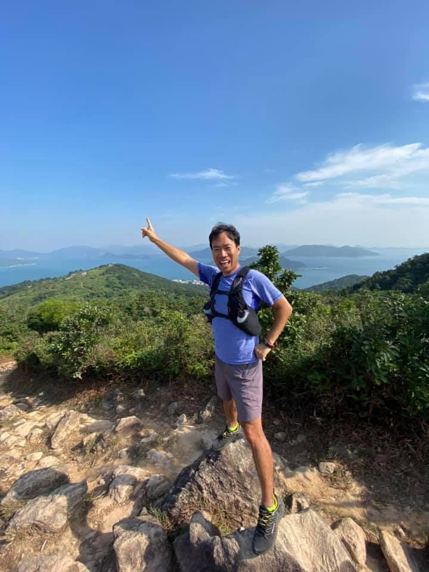
**이미지 캡션:** 푸른 하늘 아래 산 정상에서 한 성인 남성이 밝게 웃으며 오른손을 위로 뻗어 가리키고 있다. 그는 30대 후반에서 40대 초반으로 보이며, 짧은 검은 머리에 건강한 피부색을 가지고 있다. 남성은 파란색 반팔 티셔츠와 회색 반바지를 입고 있으며, 등에는 검은색 조끼 형태의 배낭을 메고 있다. 발에는 검은색과 노란색이 섞인 트레일 러닝화를 신고 있다. 그의 표정은 매우 즐겁고 활기차 보이며, 한쪽 손은 허리에 얹고 다른 한 손은 하늘을 향해 뻗고 있어 성취감이나 흥분을 표현하는 듯하다. 배경으로는 푸른 바다와 섬들이 펼쳐져 있고, 산에는 울창한 녹색 식물들이 자라고 있다. 바위와 흙으로 이루어진 등산로가 보이며, 전체적으로 맑고 화창한 날씨 속에서 야외 활동을 즐기는 긍정적인 분위기를 자아낸다.들이 펼쳐져 있고, 산에는 울창한 녹색 식물들이 자라고 있다. 바위와 흙으로 이루어진 등산로가 보이며, 전체적으로 맑고 화창한 날씨 속에서 야외 활동을 즐기는 긍정적인 분위기를 자아낸다.
 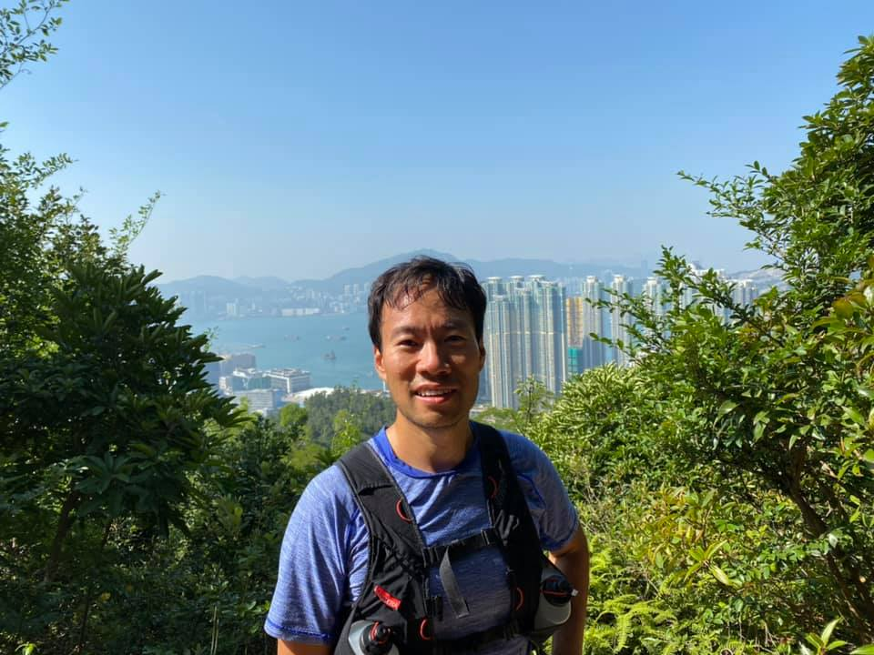
**이미지 캡션:** 푸른 하늘 아래, 한 성인 남성이 등산복을 입고 카메라를 향해 미소 짓고 있다. 그는 30대 후반에서 40대 초반으로 보이며, 짧은 검은 머리에 건강해 보이는 피부를 가지고 있다. 남성은 파란색 반팔 티셔츠 위에 검은색 조끼를 착용하고 있으며, 조끼에는 물통 두 개가 달려 있다. 배경으로는 울창한 녹색 식물과 함께 멀리 도시의 풍경이 펼쳐져 있다. 고층 빌딩들이 빽빽하게 들어서 있고, 그 너머로는 바다와 산이 보인다. 햇살이 밝게 비추는 화창한 날씨로, 야외 활동을 즐기기에 좋은 환경이다. 남성의 표정은 편안하고 행복해 보이며, 등산이나 트레킹과 같은 활동을 즐기는 모습이다.하고 행복해 보이며, 등산이나 트레킹과 같은 활동을 즐기는 모습이다.
 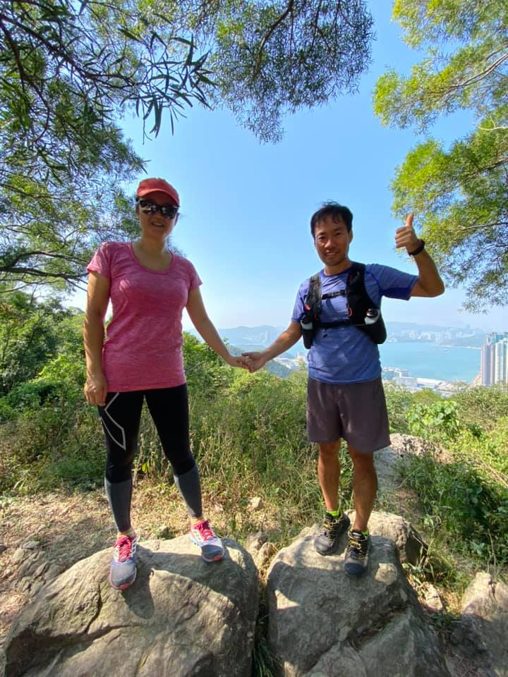
**이미지 캡션:** 푸른 하늘 아래, 두 명의 성인이 산 정상에서 손을 잡고 서 있다. 왼쪽의 성인 여성은 30대 후반에서 40대 초반으로 보이며, 분홍색 반팔 티셔츠와 검은색 레깅스를 착용하고 있으며, 주황색 모자와 선글라스를 쓰고 있다. 그녀는 밝게 웃으며 카메라를 응시하고 있다. 오른쪽의 성인 남성은 30대 후반에서 40대 초반으로 보이며, 파란색 반팔 티셔츠와 회색 반바지를 착용하고 있으며, 등에는 조끼 형태의 배낭을 메고 있다. 그는 엄지손가락을 치켜세우며 활짝 웃고 있다. 두 사람 모두 등산화 차림이며, 발밑에는 큰 바위가 있다. 배경으로는 푸른 나무와 숲이 우거져 있으며, 멀리 도시의 풍경과 바다가 보인다. 전체적으로 맑고 화창한 날씨 속에서 등산을 즐기는 즐겁고 활기찬 분위기이다.바위가 있다. 배경으로는 푸른 나무와 숲이 우거져 있으며, 멀리 도시의 풍경과 바다가 보인다. 전체적으로 맑고 화창한 날씨 속에서 등산을 즐기는 즐겁고 활기찬 분위기이다.
 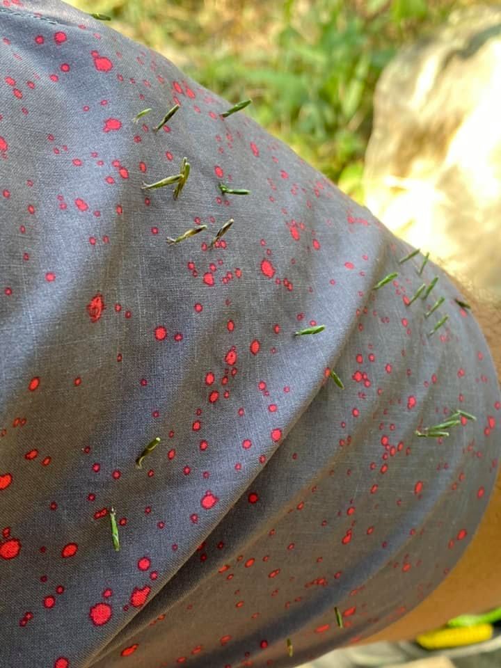
**이미지 캡션:** 이 사진은 어두운 회색 반바지에 붉은색 물방울 무늬가 있고, 반바지 표면에 여러 개의 작은 녹색 나뭇가지가 붙어 있는 모습을 클로즈업하여 보여줍니다. 사진의 오른쪽 상단에는 흐릿하게 나무와 햇빛이 비치는 배경이 보이며, 이는 야외 활동 중임을 암시합니다. 나뭇가지들은 반바지에 꽂혀 있는 것처럼 보이며, 이는 아마도 숲이나 풀밭을 걸어 다니다가 붙은 것으로 추정됩니다. 사람의 신체 일부인 팔이나 다리로 추정되는 부분이 사진의 오른쪽 가장자리에 살짝 보입니다. 전반적으로 자연 속에서 활동한 후 옷에 붙은 나뭇가지들을 보여주는 다소 유머러스하거나 일상적인 상황을 담고 있습니다.들을 보여주는 다소 유머러스하거나 일상적인 상황을 담고 있습니다.

### 11월 4일 (월) 17:45 · Hwalsuk Lee's HKUST CSE departmental sem…

Hwalsuk Lee's HKUST CSE departmental seminar was very well received. Lots of students and questions!

https://www.cse.ust.hk/pg/seminars/F19/lee.html

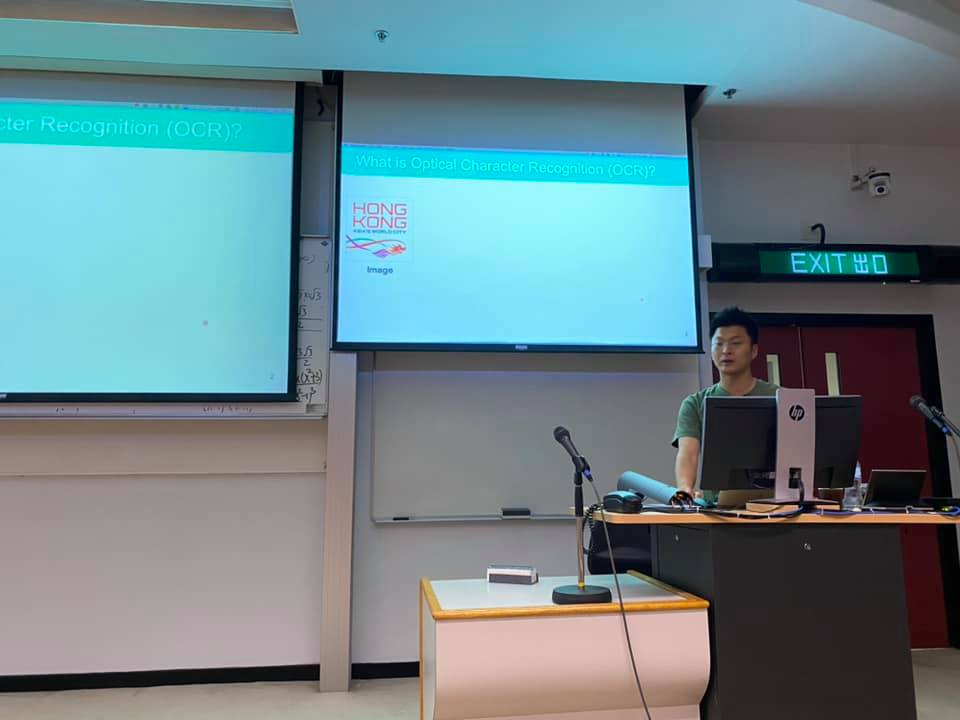
**이미지 캡션:** 이 사진은 강의실에서 진행되는 발표를 담고 있으며, 발표자는 20대 후반에서 30대 초반으로 보이는 성인 남성입니다. 그는 녹색 반팔 티셔츠를 입고 있으며, 차분하고 집중하는 표정으로 컴퓨터 화면을 바라보고 있습니다. 발표자는 스탠딩 마이크 앞에 서서 발표를 진행하고 있으며, 그의 앞에는 컴퓨터 모니터, 키보드, 마우스, 그리고 몇 가지 서류가 놓여 있습니다. 배경에는 두 개의 대형 스크린이 설치되어 있으며, 왼쪽 스크린에는 "cter Recognition (OCR)?"이라는 텍스트가, 오른쪽 스크린에는 "What is Optical Character Recognition (OCR)?"이라는 질문과 함께 홍콩의 로고 및 "Image"라는 단어가 표시되어 있습니다. 또한, 강의실 천장에는 "EXIT 出口"라고 적힌 녹색 조명이 켜져 있고, 벽에는 CCTV 카메라가 설치되어 있습니다. 전체적으로 학술적인 분위기의 발표가 진행되고 있음을 알 수 있습니다.hat is Optical Character Recognition (OCR)?"이라는 질문과 함께 홍콩의 로고 및 "Image"라는 단어가 표시되어 있습니다. 또한, 강의실 천장에는 "EXIT 出口"라고 적힌 녹색 조명이 켜져 있고, 벽에는 CCTV 카메라가 설치되어 있습니다. 전체적으로 학술적인 분위기의 발표가 진행되고 있음을 알 수 있습니다.
 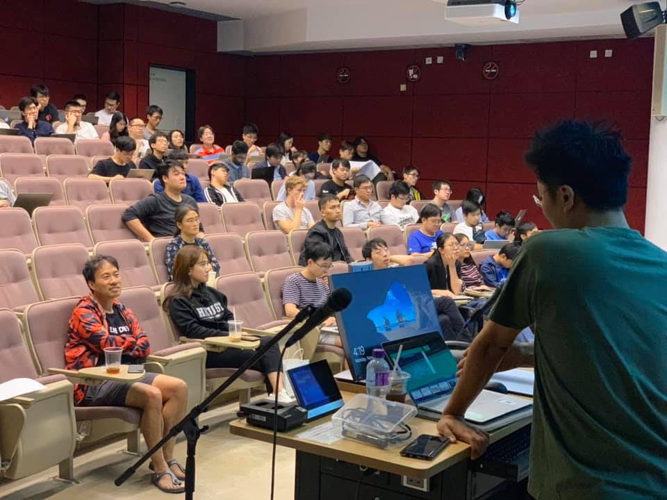
**이미지 캡션:** 이 사진은 강의실에서 열리는 강연이나 발표 장면을 담고 있으며, 많은 사람들이 좌석에 앉아 강연자를 바라보고 있다. 사진의 전경에는 녹색 티셔츠를 입은 젊은 성인 남성이 서서 노트북과 모니터를 조작하고 있으며, 그의 뒤로는 붉은색 벽면과 프로젝터가 보인다. 좌석에는 다양한 연령대의 남녀 학생들이 앉아 있으며, 일부는 노트북을 사용하거나 필기를 하고 있다. 사진 왼쪽 하단에는 마이크와 함께 테이블 위에 놓인 노트북, 휴대폰, 음료수 컵 등이 보인다. 전반적으로 학구적이고 집중된 분위기이며, 강연자는 학생들에게 무언가를 설명하고 있는 것으로 보인다.무언가를 설명하고 있는 것으로 보인다.
 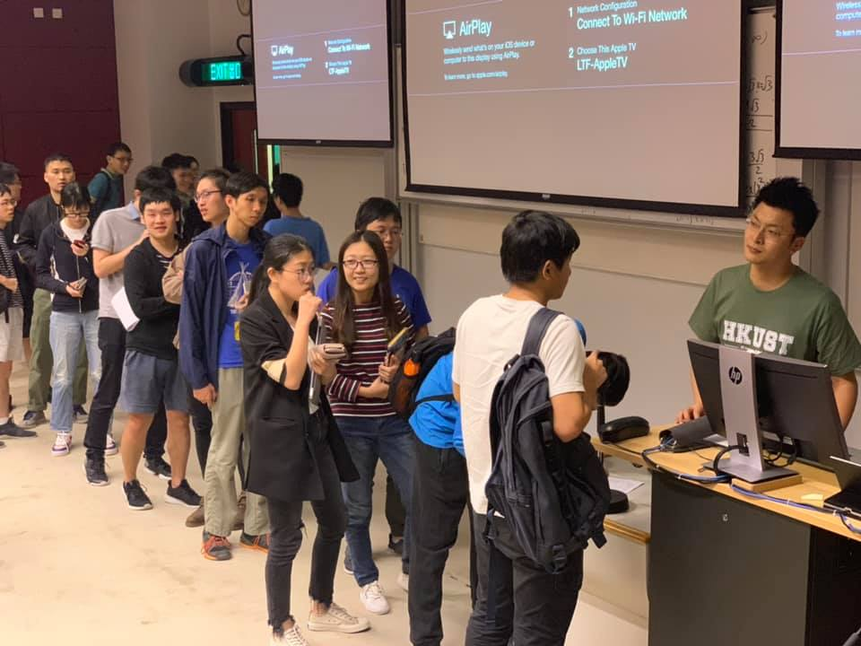
**이미지 캡션:** 강의실로 보이는 장소에서 사람들이 줄을 서서 기다리고 있다. 대부분 젊은 남성들이며, 캐주얼한 복장을 하고 있다. 일부는 스마트폰을 보고 있고, 일부는 앞사람과 대화하거나 화면을 보고 있다. 앞쪽에는 강단으로 보이는 곳에 컴퓨터와 모니터가 놓여 있고, 녹색 티셔츠를 입은 남성이 모니터를 보며 서 있다. 벽에는 'EXIT'라고 쓰인 녹색 표지판이 보인다. 화면에는 'AirPlay'와 네트워크 설정에 대한 안내 문구가 영어로 적혀 있다. 전반적으로 강의나 발표를 기다리는 듯한 차분하고 정돈된 분위기이다.st have neutral or slightly curious expressions, and many are looking towards the front of the room or at their phones. The background features a large projection screen displaying instructions for "AirPlay" and network configuration, suggesting a technical or educational presentation. There is also a desk with a computer monitor and a person, an adult male wearing a green t-shirt with "HKUST" printed on it, who appears to be interacting with someone at the front of the line. The overall atmosphere is one of anticipation and learning, with a sense of order as people wait their turn. An "EXIT" sign is visible on the wall.
 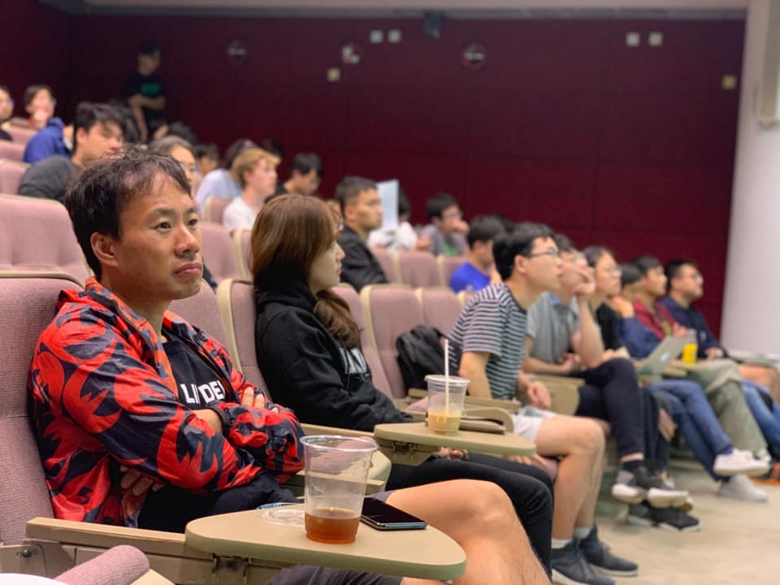
**이미지 캡션:** 이 사진은 강의실이나 강당으로 보이는 장소에서 여러 사람이 강연을 듣고 있는 모습을 담고 있습니다. 전경에는 검은색과 빨간색 패턴의 겉옷을 입은 성인 남성이 팔짱을 끼고 정면을 응시하고 있으며, 그의 옆에는 검은색 후드티를 입은 성인 여성이 같은 방향을 바라보고 있습니다. 두 사람 앞에는 테이블이 놓여 있으며, 남성 앞에는 플라스틱 컵에 담긴 음료와 휴대폰이 보입니다. 배경에는 다양한 연령대의 사람들이 좌석에 앉아 있으며, 일부는 노트북을 사용하거나 휴대폰을 보고 있습니다. 좌석은 붉은색이며, 벽면 역시 붉은색으로 통일되어 있습니다. 전반적으로 차분하고 집중하는 분위기이며, 교육 또는 강연이 진행 중인 상황으로 보입니다.색으로 통일되어 있습니다. 전반적으로 차분하고 집중하는 분위기이며, 교육 또는 강연이 진행 중인 상황으로 보입니다.

### 11월 5일 (화) 09:49 · 📷 사진 (1장)

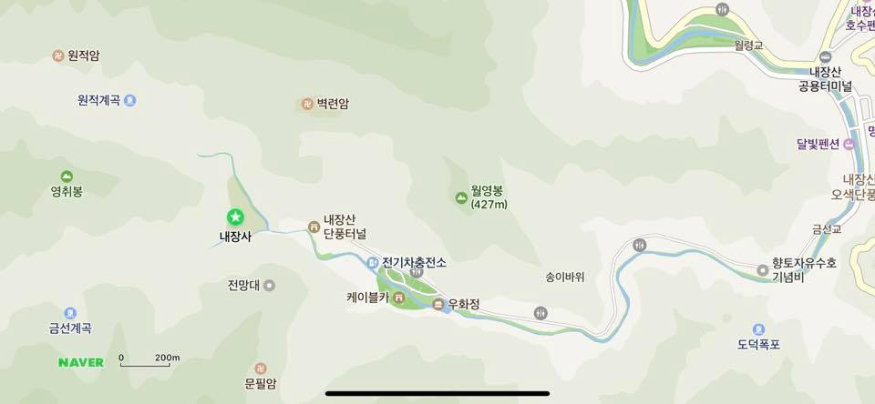
**이미지 캡션:** 이 이미지는 한국의 산악 지역을 보여주는 지도이며, 여러 명소와 지형지물이 표시되어 있습니다. 지도에는 원적암, 원적계곡, 벽련암, 영취봉, 내장사, 내장산 단풍터널, 전기차 충전소, 월영봉(427m), 케이블카, 우화정, 송이바위, 전망대, 금선계곡, 문필암, 월령교, 내장산 공용터미널, 달빛펜션, 내장산 오색단풍, 금선교, 향토자유수호 기념비, 도덕폭포 등이 표시되어 있습니다. 또한, 200m 축척과 네이버 로고가 보입니다. 전반적으로 자연 경관이 아름다운 산악 지역의 관광 정보를 담고 있는 지도입니다.

### 11월 6일 (수) 11:42 · Welcem to EMNLP2019 in Hong Kong! So exc…

Welcem to EMNLP2019 in Hong Kong! So exciting!!

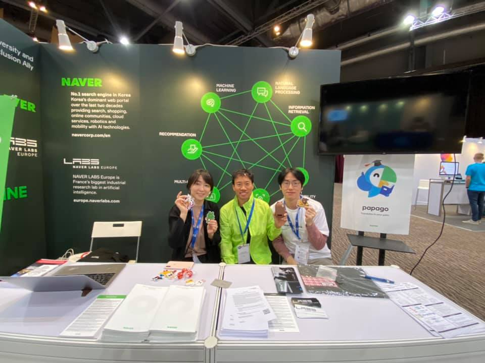
**이미지 캡션:** 이 사진은 컨퍼런스 또는 전시회 부스에서 촬영된 것으로 보이며, 네이버와 네이버 랩스 유럽을 홍보하고 있습니다. 부스 중앙에는 젊은 성인 남성 두 명과 젊은 성인 여성 한 명이 서 있습니다. 여성은 검은색 재킷을 입고 있으며, 두 남성은 밝은 형광색 재킷과 흰색 티셔츠를 입고 있습니다. 세 사람 모두 웃는 표정으로 카메라를 바라보고 있으며, 여성은 손에 작은 기념품을 들고 있고, 남성 중 한 명은 휴대폰을 들고 있습니다. 배경에는 네이버의 서비스와 기술을 설명하는 녹색 그래픽과 텍스트가 있으며, "NAVER", "MACHINE LEARNING", "NATURAL LANGUAGE PROCESSING", "INFORMATION RETRIEVAL", "RECOMMENDATION" 등의 단어가 보입니다. 또한, "NAVER LABS Europe"에 대한 설명도 있습니다. 부스 오른쪽에는 파파고(Papago) 로고가 있는 대형 스크린이 설치되어 있으며, 그 옆에는 다른 부스에서 일하는 것으로 보이는 사람들이 보입니다. 테이블 위에는 노트북, 서류, 홍보물 등이 놓여 있어 전반적으로 활기차고 정보 전달적인 분위기를 풍깁니다., "MACHINE LEARNING", "NATURAL LANGUAGE PROCESSING", "INFORMATION RETRIEVAL", "RECOMMENDATION" 등의 단어가 보입니다. 또한, "NAVER LABS Europe"에 대한 설명도 있습니다. 부스 오른쪽에는 파파고(Papago) 로고가 있는 대형 스크린이 설치되어 있으며, 그 옆에는 다른 부스에서 일하는 것으로 보이는 사람들이 보입니다. 테이블 위에는 노트북, 서류, 홍보물 등이 놓여 있어 전반적으로 활기차고 정보 전달적인 분위기를 풍깁니다.
 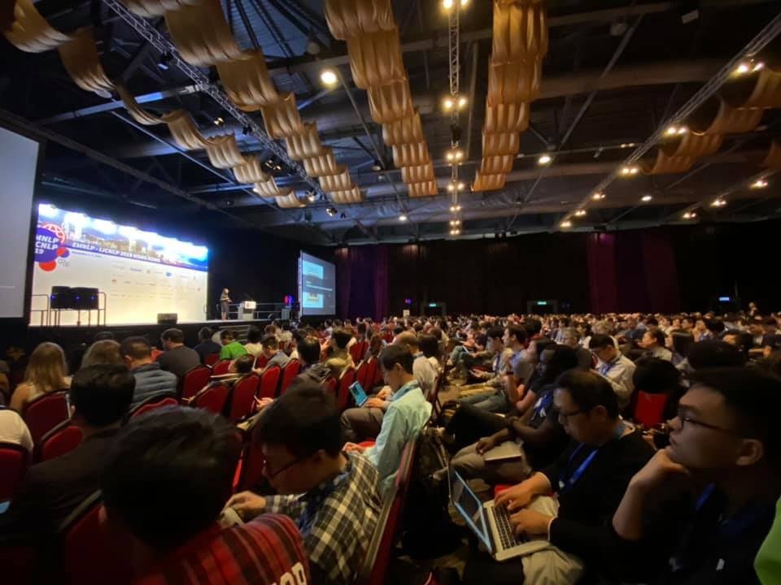
**이미지 캡션:** 넓은 강당에서 수많은 사람들이 좌석에 앉아 강연을 듣고 있으며, 무대 위에는 두 개의 큰 스크린이 설치되어 있고 한쪽 스크린에는 'EMNLP CNLP 19'라는 글자가 보이며, 다른 쪽 스크린에는 발표자가 서서 강연을 하고 있다. 청중들은 대부분 성인 남성이며, 다양한 연령대의 사람들이 캐주얼한 복장을 하고 있으며, 일부는 노트북을 사용하거나 휴대폰을 보고 있다. 전반적으로 학술대회나 컨퍼런스 같은 행사가 진행되는 것으로 보이며, 차분하고 집중하는 분위기이다.
 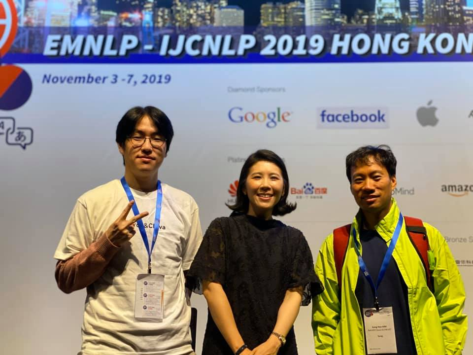
**이미지 캡션:** 세 명의 사람이 EMNLP-IJCNLP 2019 홍콩 컨퍼런스 배경 앞에서 포즈를 취하고 있다. 왼쪽에는 안경을 쓰고 흰색 티셔츠와 분홍색 긴팔 셔츠를 입은 젊은 성인 남성이 브이 포즈를 취하고 있다. 가운데에는 검은색 레이스 드레스를 입고 미소를 짓고 있는 젊은 성인 여성이 서 있다. 오른쪽에는 노란색 재킷과 빨간색 백팩을 메고 파란색 목걸이를 한 성인 남성이 서 있다. 배경에는 "EMNLP-IJCNLP 2019 HONG KONG"이라는 글자와 함께 Google, Facebook, Apple, Amazon과 같은 스폰서 로고가 보인다. 전체적으로 컨퍼런스 분위기를 나타내는 활기찬 모습이다. 같은 스폰서 로고가 보인다. 전체적으로 컨퍼런스 분위기를 나타내는 활기찬 모습이다.
 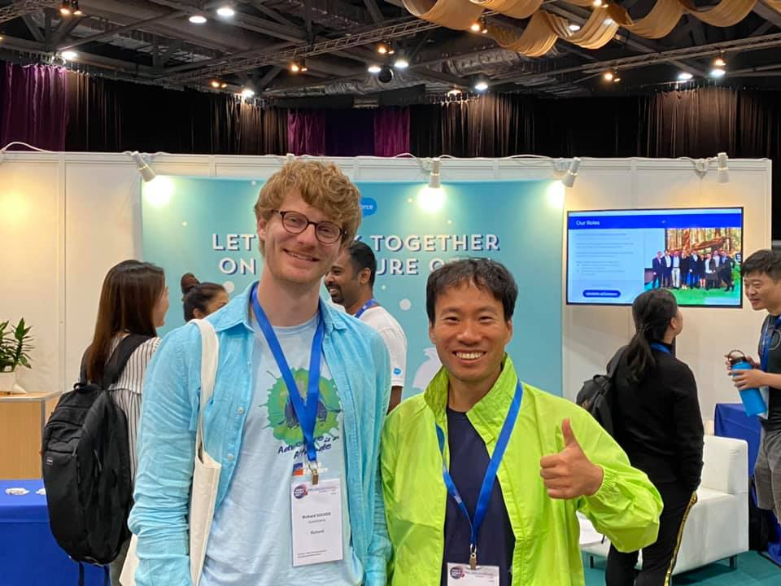
**이미지 캡션:** 두 명의 성인 남성이 전면에 서 있고, 배경에는 컨퍼런스 또는 전시회 부스가 있습니다. 왼쪽 남성은 금발 머리에 안경을 쓰고 있으며, 밝은 파란색 셔츠와 파란색 목걸이를 착용하고 있습니다. 그의 셔츠에는 녹색 로고가 있고, 목걸이에는 명찰이 달려 있습니다. 그는 카메라를 향해 미소를 짓고 있습니다. 오른쪽 남성은 검은 머리에 밝은 형광 녹색 재킷과 파란색 목걸이를 착용하고 있습니다. 그는 엄지손가락을 치켜세우며 카메라를 향해 활짝 웃고 있습니다. 그의 목걸이에도 명찰이 달려 있습니다. 배경에는 "LET'S WORK TOGETHER"라는 문구가 적힌 파란색 배경의 부스가 보이며, 그 옆에는 "Our Roles"라는 제목의 화면이 있습니다. 화면에는 여러 사람이 찍힌 사진과 텍스트가 표시되어 있습니다. 부스 뒤쪽에는 다른 사람들이 보이며, 일부는 대화를 나누고 있습니다. 전체적으로 활기차고 긍정적인 분위기입니다.ORK TOGETHER"라는 문구가 적힌 파란색 배경의 부스가 보이며, 그 옆에는 "Our Roles"라는 제목의 화면이 있습니다. 화면에는 여러 사람이 찍힌 사진과 텍스트가 표시되어 있습니다. 부스 뒤쪽에는 다른 사람들이 보이며, 일부는 대화를 나누고 있습니다. 전체적으로 활기차고 긍정적인 분위기입니다.
 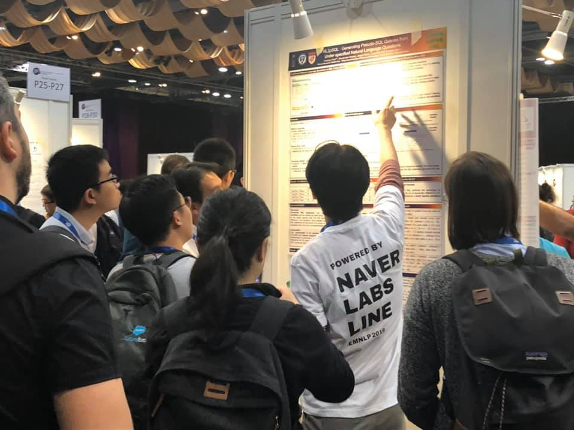
**이미지 캡션:** 이 사진은 학회 또는 컨퍼런스에서 포스터 발표를 보고 있는 여러 사람들을 보여준다. 중앙에는 흰색 티셔츠를 입은 젊은 성인 남성이 포스터의 특정 부분을 손가락으로 가리키며 설명하고 있으며, 그의 티셔츠 뒷면에는 "POWERED BY NAVER LABS LINE EMNLP 2019"라고 쓰여 있다. 그의 앞에는 검은색 백팩을 멘 젊은 성인 여성이 포스터를 보고 있고, 그 주변에는 안경을 쓴 젊은 성인 남성들과 다른 여러 사람들이 포스터를 관심 있게 살펴보고 있다. 배경에는 학회 부스에서 흔히 볼 수 있는 조명과 천장 구조물이 보이며, 포스터에는 "SQL, Generating Pseudo-SQL Queries from Under-Specified Natural Language Questions"라는 제목이 보인다. 전반적으로 학술적인 분위기 속에서 연구 발표를 공유하고 토론하는 모습이다. 천장 구조물이 보이며, 포스터에는 "SQL, Generating Pseudo-SQL Queries from Under-Specified Natural Language Questions"라는 제목이 보인다. 전반적으로 학술적인 분위기 속에서 연구 발표를 공유하고 토론하는 모습이다.

### 11월 8일 (금) 14:39 · Deeply saddened by this. My prayers and …

Deeply saddened by this. My prayers and condolences to our beloved student, CHOW Tsz Lok and his family.

🔗 <https://www.scmp.com/news/hong-kong/politics/article/3036833/hong-kong-student-who-suffered-severe-brain-injury-after>

### 11월 13일 (수) 14:49 · 📷 앨범: Profile pictures (1장)

**이미지 캡션:** 검은색 원형 배경에 빨간색 금지 표시가 있고, 그 안에 흰색 글씨로 "Violence"라고 쓰여 있습니다. 이는 폭력을 금지한다는 의미를 나타내는 상징적인 이미지입니다.

### 11월 13일 (수) 15:04 · 📷 사진 (1장)

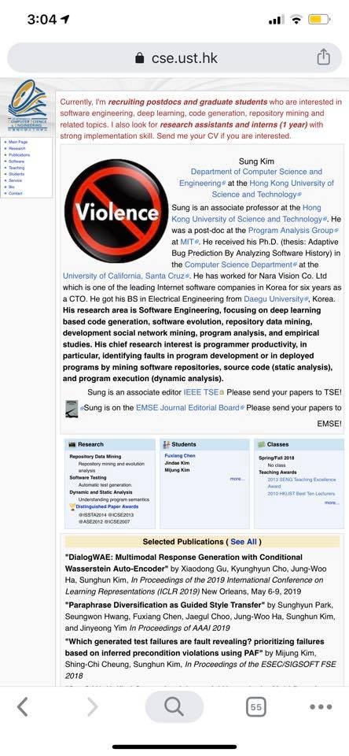
**이미지 캡션:** 이 이미지는 홍콩 과학기술대학교 컴퓨터 과학 및 공학과의 웹사이트 일부를 보여주며, 성김 교수의 프로필과 연구 분야, 출판물 목록을 담고 있습니다. 화면 상단에는 웹사이트 주소인 "cse.ust.hk"가 보이고, 왼쪽에는 학교 로고와 함께 "Main Page", "Research", "Publications", "Software", "Teaching", "Students", "Service", "Contact" 등의 메뉴가 나열되어 있습니다. 중앙에는 "Violence"라는 단어가 빨간색 금지 표시 안에 있는 이미지가 있고, 그 아래에는 성김 교수의 학력, 경력, 연구 분야에 대한 설명이 한국어로 작성되어 있습니다. 연구 분야는 소프트웨어 공학, 딥러닝, 코드 생성, 리포지토리 마이닝, 프로그램 분석 등이며, 특히 프로그래머 생산성 향상과 관련된 연구에 집중하고 있음을 알 수 있습니다. 또한, 성김 교수가 IEEE TSE의 편집자이며 EMSE 저널 편집 위원회 위원임을 나타내는 정보도 포함되어 있습니다. 하단에는 "Research", "Students", "Classes", "Selected Publications" 섹션이 있으며, 각 섹션에는 관련 정보와 함께 "more..." 링크가 있습니다. "Selected Publications" 섹션에는 "DialogWAE: Multimodal Response Generation with Conditional Wasserstein Auto-Encoder"를 포함한 세 개의 논문 제목과 저자, 발표 장소 및 연도가 나열되어 있습니다. 전반적으로 학술적인 분위기를 풍기는 웹페이지의 일부입니다. 이미지가 있고, 그 아래에는 성김 교수의 학력, 경력, 연구 분야에 대한 설명이 한국어로 작성되어 있습니다. 연구 분야는 소프트웨어 공학, 딥러닝, 코드 생성, 리포지토리 마이닝, 프로그램 분석 등이며, 특히 프로그래머 생산성 향상과 관련된 연구에 집중하고 있음을 알 수 있습니다. 또한, 성김 교수가 IEEE TSE의 편집자이며 EMSE 저널 편집 위원회 위원임을 나타내는 정보도 포함되어 있습니다. 하단에는 "Research", "Students", "Classes", "Selected Publications" 섹션이 있으며, 각 섹션에는 관련 정보와 함께 "more..." 링크가 있습니다. "Selected Publications" 섹션에는 "DialogWAE: Multimodal Response Generation with Conditional Wasserstein Auto-Encoder"를 포함한 세 개의 논문 제목과 저자, 발표 장소 및 연도가 나열되어 있습니다. 전반적으로 학술적인 분위기를 풍기는 웹페이지의 일부입니다.

### 11월 16일 (토) 06:18 · I couldn't agree more: "Law enforcement …

I couldn't agree more: "Law enforcement exists to protect the people and government exists to serve the people. When the police no longer protect citizens and the government no longer does what is best for its people, the people lose their trust in the government."

Please pray for Hong Kong and students.

🔗 <https://aagag.com/issue/?idx=570996>

### 11월 20일 (수) 09:31 · 📷 앨범: Profile pictures (1장)

**이미지 캡션:** 이 사진은 야외 활동 중인 성인 남성을 담고 있으며, 그는 30대 후반에서 40대 초반으로 보인다. 짧은 검은색 머리카락에 짙은 눈썹, 맑고 웃는 표정을 짓고 있으며, 건강하고 활기찬 인상을 준다. 그는 밝은 연두색 티셔츠 위에 검은색 조끼형 재킷을 입고 있으며, 재킷에는 물통 두 개가 달려 있고 브랜드 로고 'inov'가 보인다. 배경은 가을 산의 풍경으로, 갈색과 주황색으로 물든 나뭇잎과 마른 풀들이 보이며, 멀리 산 능선과 흐릿한 하늘이 펼쳐져 있다. 햇살이 비추는 듯한 밝은 분위기이며, 등산이나 트레일 러닝과 같은 야외 활동을 즐기는 모습으로 보인다. 러닝과 같은 야외 활동을 즐기는 모습으로 보인다.

### 11월 27일 (수) 11:41 · Wonderful to meet our provost today. Whe…

Wonderful to meet our provost today. When I was on the job market, he convinced me to join HKUST, saying, "I will do everything I can support you to make a best researcher in your field."

I also hope I could say the same thing to many people.

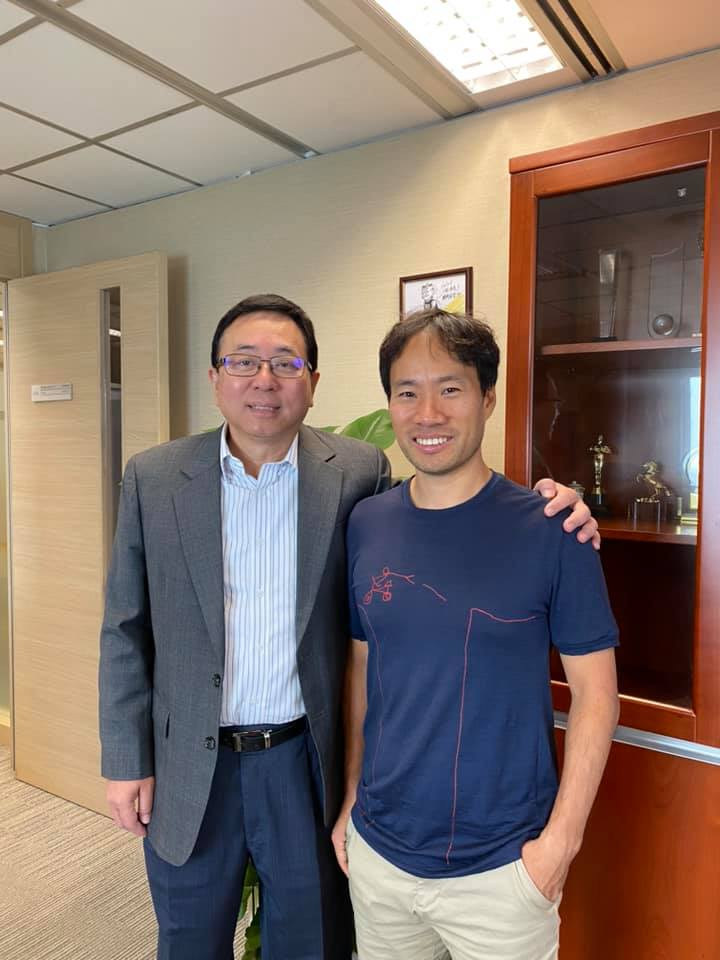
**이미지 캡션:** 사진에는 두 명의 성인 남성이 사무실로 보이는 장소에서 함께 서 있습니다. 왼쪽 남성은 50대 후반에서 60대 초반으로 보이며, 검은색 안경을 쓰고 있으며, 회색 재킷 안에 줄무늬 셔츠와 짙은 색 바지를 입고 있습니다. 그는 카메라를 향해 미소를 짓고 있습니다. 오른쪽 남성은 30대 후반에서 40대 초반으로 보이며, 짙은 남색 티셔츠에 베이지색 바지를 입고 있습니다. 티셔츠에는 붉은색으로 그려진 자전거 타는 사람 모양의 그림이 있습니다. 그는 카메라를 향해 활짝 웃고 있으며, 왼쪽 남성의 어깨에 팔을 두르고 있습니다. 배경에는 사무실 가구와 천장 조명이 보이며, 오른쪽에는 나무로 된 캐비닛이 있고 그 안에는 상패 같은 물건들이 진열되어 있습니다. 전체적으로 편안하고 긍정적인 분위기를 풍깁니다.있습니다. 배경에는 사무실 가구와 천장 조명이 보이며, 오른쪽에는 나무로 된 캐비닛이 있고 그 안에는 상패 같은 물건들이 진열되어 있습니다. 전체적으로 편안하고 긍정적인 분위기를 풍깁니다.
