# 2019년 12월

[← 2019년](README.md)

### 12월 3일 (화) 09:53 · 📷 사진 (1장)

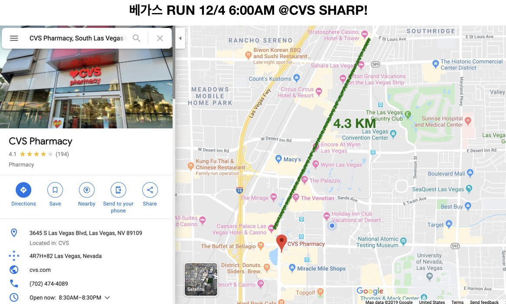
**이미지 캡션:** 이 사진은 라스베이거스의 CVS 약국을 중심으로 한 구글 지도 화면과 해당 약국의 외부 사진을 보여줍니다. 화면 상단에는 "베가스 RUN 12/4 6:00AM @CVS SHARP!"라는 텍스트가 한국어로 적혀 있어, 12월 4일 오전 6시에 CVS에서 약속이 있음을 나타냅니다. 왼쪽에는 CVS 약국의 외부 모습이 보이며, 빨간색 CVS 로고와 유리로 된 출입구가 특징입니다. 그 아래에는 CVS 약국의 이름, 평점 4.1점, 리뷰 수 194개, 그리고 'Pharmacy'라는 카테고리가 표시되어 있습니다. 또한 길찾기, 저장, 주변, 휴대폰으로 보내기, 공유 등 구글 지도에서 제공하는 여러 기능 아이콘이 보입니다. 약국의 주소는 3645 S Las Vegas Blvd, Las Vegas, NV 89109이며, 웹사이트 주소는 cvs.com, 전화번호는 (702) 474-4089입니다. 영업시간은 오전 8시 30분부터 오후 8시 30분까지입니다. 오른쪽의 지도에는 CVS 약국 위치가 빨간색 마커로 표시되어 있으며, 라스베이거스 스트립의 여러 유명 호텔 및 카지노(예: 스트라토스피어 카지노, 서커스 서커스, 미라지, 벨라지오, 베네시안 등)와 함께 표시되어 있습니다. CVS 약국에서부터 다른 지점까지의 거리가 4.3km로 표시된 녹색 선이 그려져 있습니다. 지도에는 라스베이거스 컨트리 클럽, 라스베이거스 컨벤션 센터, 선라이즈 병원 및 의료 센터, 부르바드 몰, 씨퀘스트 라스베이거스, 베스트 바이, 타겟, 네바다 대학교 라스베이거스 캠퍼스 등 다양한 장소들이 함께 표시되어 있습니다. 전반적으로 라스베이거스 여행 중 특정 CVS 약국을 찾거나, 해당 약국과의 거리를 파악하려는 상황을 보여주는 정보성 이미지입니다.

> #베가스조깅 천명 넘는분들이 리인벤트를 참여하신다고 들었는데요. 12/4수요일 아침 베가스를 조깅하며 AWS와 AI이야기 해보실분 함께해요. 일단 호스트 멤버는 Channy Yun  저구요. 오실분 모두 환영입니다. 3~4키로 달리고 돌아오는 코스인데 본인이 달리시고 싶은 만큼 달리시면 됩니다.  달리기/조깅후 7시 멋진 브런치 식당에서 식사 대접합니다.  그날 아침에 CVS앞에 6시 (sharp)에 오시면 되는데 대략 관심도를 보기 위해 아래 RSVP부탁드립니다. 지금 리인벤트 오신분들 테깅이나 공유도 감사하겠습니다. 그럼 수요일 신나게 달려보시죠!  https://goo.gl/maps/mMsqLY2szqZGVyuy9

### 12월 5일 (목) 02:22 · 📷 사진 (8장)

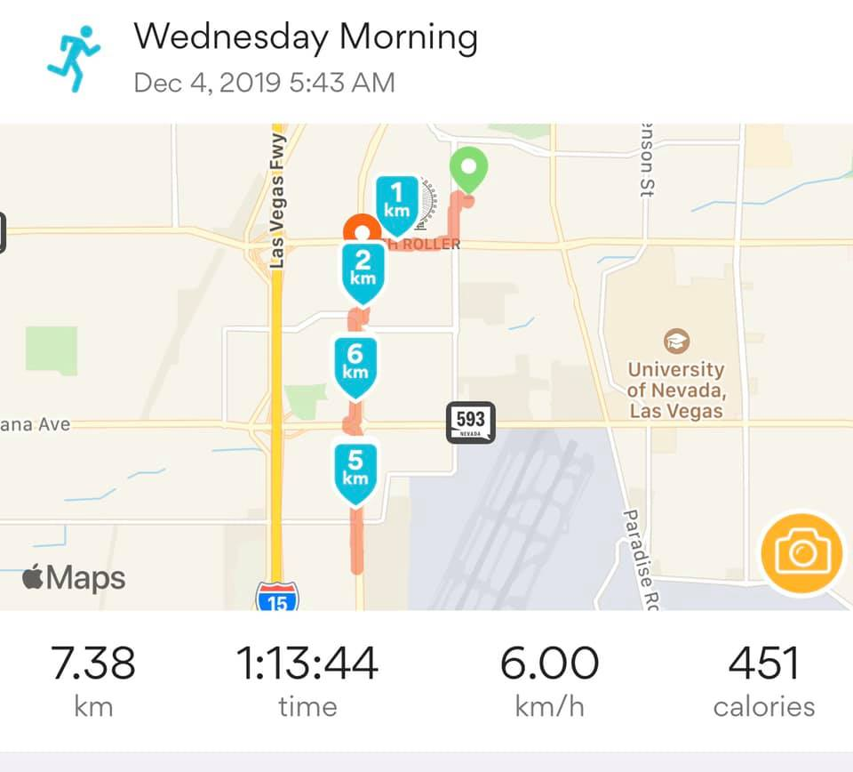
**이미지 캡션:** 이것은 수요일 아침 운동 기록으로, 2019년 12월 4일 오전 5시 43분에 시작되었으며, 지도에는 라스베이거스 프리웨이와 그 주변 도로가 표시되어 있습니다. 지도 상에는 1km, 2km, 6km, 5km 지점이 표시된 경로가 나타나며, 'H ROLLER'라는 장소와 'University of Nevada, Las Vegas'라는 텍스트도 보입니다. 또한, 'Paradise Rd'와 'enson St'라는 도로명도 확인할 수 있습니다. 하단에는 총 7.38km를 1시간 13분 44초 동안 6.00km/h의 속도로 달려 451 칼로리를 소모했다는 운동 기록이 나타나 있습니다. 사진에는 운동하는 사람의 모습은 직접적으로 보이지 않지만, 운동 기록을 보여주는 화면으로 보아 활동적인 분위기를 짐작할 수 있습니다.
 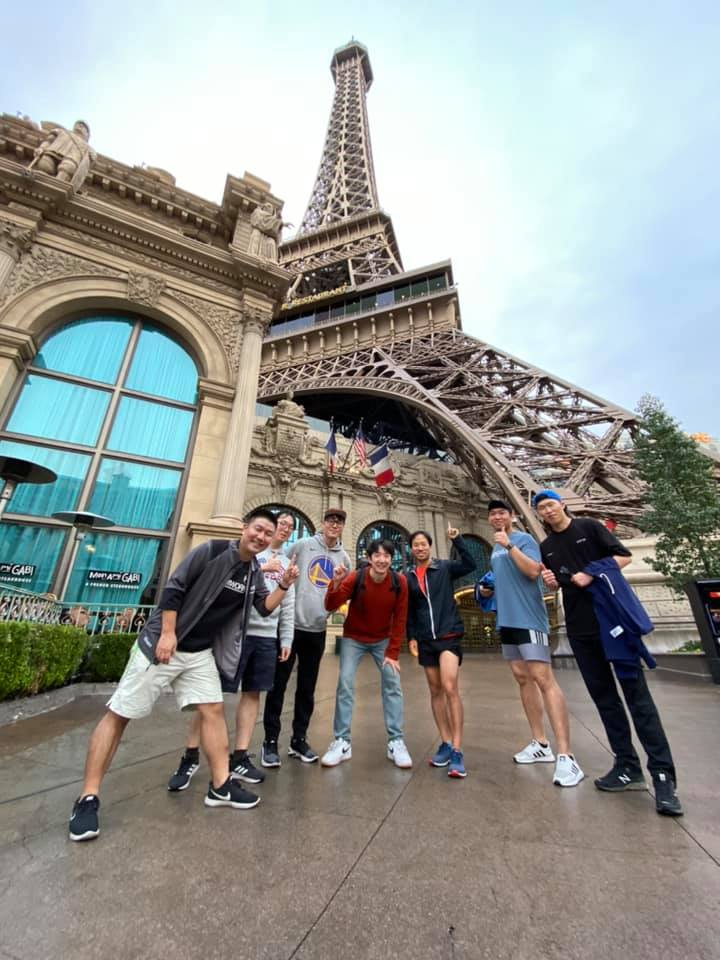
**이미지 캡션:** 에펠탑을 배경으로 일곱 명의 젊은 성인 남성들이 서 있다. 왼쪽에서부터 첫 번째 남성은 검은색 재킷과 회색 반바지를 입고 있으며, 밝게 웃고 있다. 그 옆의 남성은 회색 후드티와 검은색 반바지를 입고 있다. 세 번째 남성은 노란색 후드티와 검은색 바지를 입고 있으며, 손가락으로 브이 포즈를 취하고 있다. 네 번째 남성은 빨간색 긴팔 티셔츠와 청바지를 입고 있으며, 손을 흔들고 있다. 다섯 번째 남성은 검은색 재킷과 검은색 반바지를 입고 있으며, 포즈를 취하고 있다. 여섯 번째 남성은 파란색 티셔츠와 회색 반바지를 입고 있으며, 엄지손가락을 치켜세우고 있다. 마지막 남성은 검은색 티셔츠와 검은색 바지를 입고 있으며, 파란색 재킷을 들고 있다. 배경에는 에펠탑 모형과 프랑스 국기가 보이며, 건물에는 "GABI"라는 글자가 쓰여 있다. 전체적으로 즐겁고 활기찬 분위기이다.
 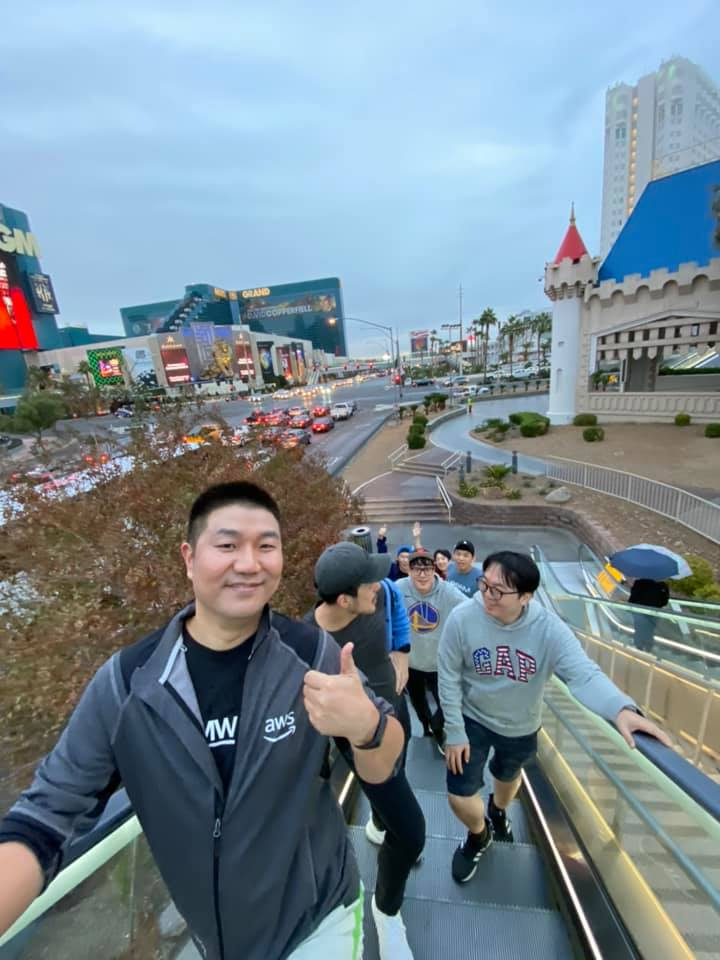
**이미지 캡션:** 사진은 라스베이거스의 스트립에 있는 에스컬레이터에서 찍은 것으로, 여러 명의 아시아계 남성들이 계단을 오르고 있습니다. 가장 앞에 있는 남성은 40대 초반으로 보이며, 회색 재킷과 검은색 티셔츠를 입고 엄지손가락을 치켜들고 있습니다. 그의 티셔츠에는 "AWS"라는 로고가 보입니다. 그 뒤로 30대에서 40대로 보이는 다른 남성들이 에스컬레이터를 타고 올라가고 있으며, 일부는 손을 흔들고 있습니다. 배경에는 라스베이거스의 유명한 호텔과 카지노 건물들이 보이며, 특히 MGM 그랜드와 뉴욕-뉴욕 호텔이 눈에 띕니다. 하늘은 흐린 편이며, 전체적으로 관광객들이 즐거운 시간을 보내고 있는 듯한 분위기입니다.
 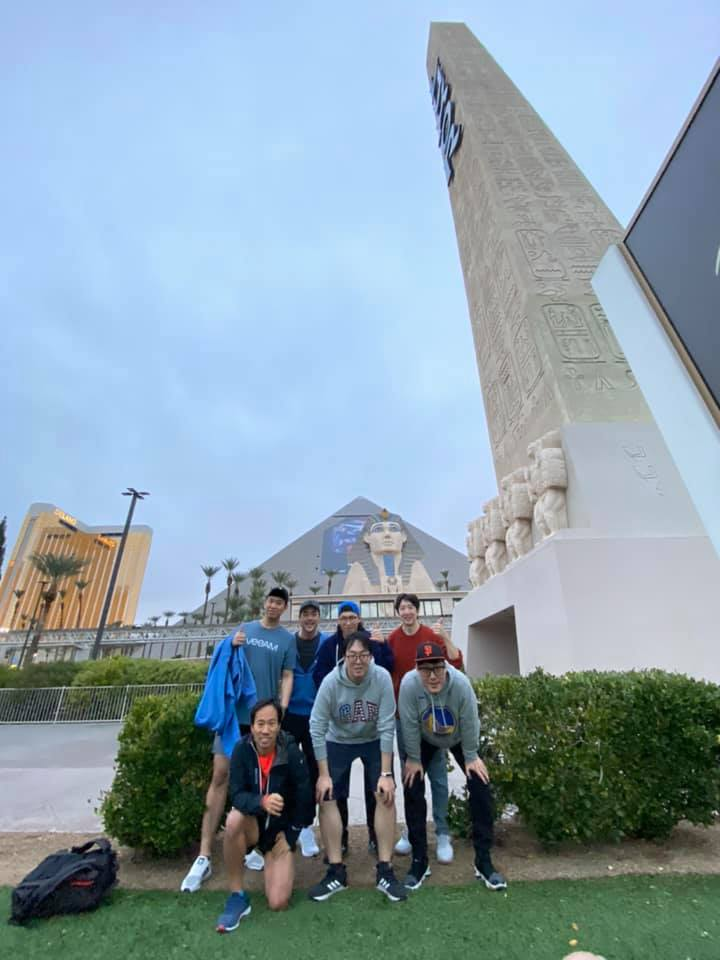
**이미지 캡션:** 이 사진은 라스베이거스의 룩소르 호텔 앞에서 촬영된 것으로 보이며, 이집트 테마의 건축물들이 배경으로 보인다. 사진에는 총 8명의 성인 남성이 있으며, 대부분 20대에서 30대로 추정된다. 이들은 캐주얼한 복장을 하고 있으며, 일부는 운동복 차림이다. 앞줄에 두 명의 남성이 쪼그려 앉아 있고, 뒷줄에 여섯 명이 서 있다. 모두 카메라를 향해 미소를 짓거나 자연스러운 표정을 짓고 있으며, 즐거운 분위기 속에서 함께 사진을 찍고 있다. 배경에는 거대한 피라미드 모양의 룩소르 호텔과 오벨리스크 조형물이 보이며, 하늘은 흐린 편이다. 잔디밭 위에 검은색 스포츠 가방이 놓여 있다.
 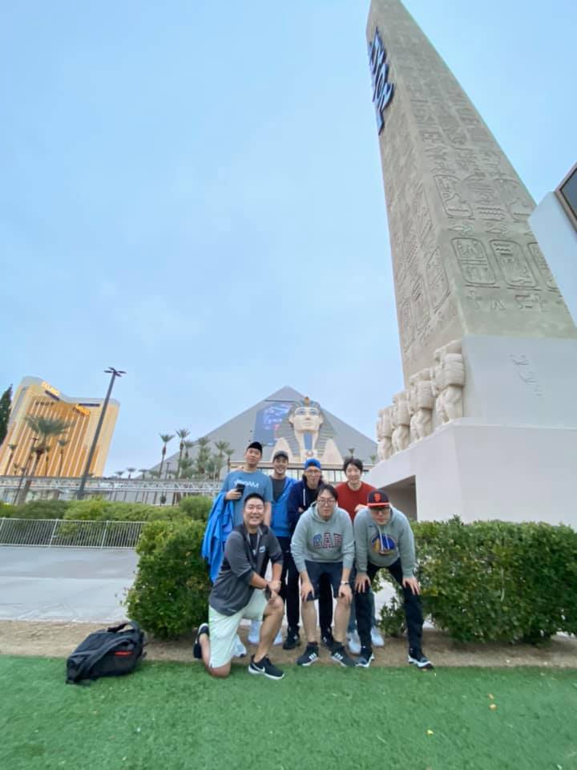
**이미지 캡션:** 이 사진은 라스베이거스의 룩소르 호텔 앞에서 일곱 명의 성인 남성들이 함께 포즈를 취하고 있는 모습을 담고 있습니다. 남성들은 대부분 20대에서 30대로 보이며, 캐주얼한 복장을 하고 있습니다. 일부는 웃고 있고, 일부는 카메라를 응시하고 있습니다. 배경에는 이집트 피라미드와 오벨리스크 모양의 룩소르 호텔 건물이 보이며, 하늘은 흐린 편입니다. 잔디밭에는 검은색 백팩이 놓여 있습니다. 전체적으로 즐겁고 편안한 분위기입니다.
 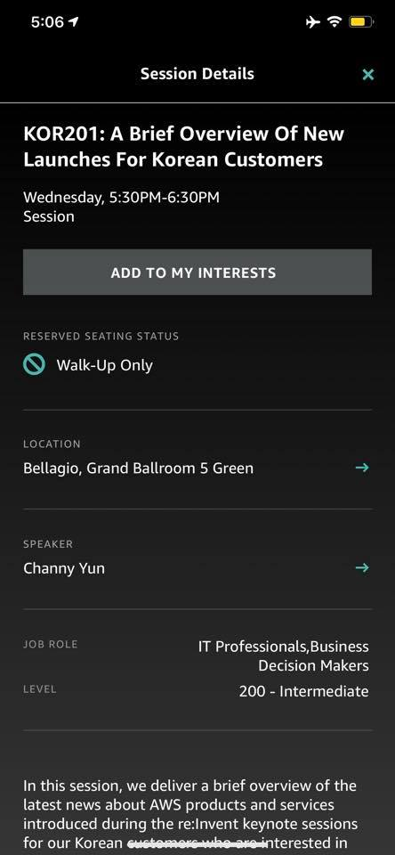
**이미지 캡션:** 이 화면은 "KOR201: 한국 고객을 위한 신규 출시 개요"라는 세션의 상세 정보를 보여줍니다. 세션은 수요일 오후 5시 30분부터 6시 30분까지 진행되며, "ADD TO MY INTERESTS" 버튼이 있습니다. 예약 좌석 상태는 "Walk-Up Only"로 표시되어 있으며, 장소는 "Bellagio, Grand Ballroom 5 Green"입니다. 발표자는 "Channy Yun"이며, 직무 역할은 "IT Professionals, Business Decision Makers"이고, 수준은 "200 - Intermediate"입니다. 하단에는 세션 내용에 대한 설명이 있는데, AWS 제품 및 서비스에 대한 최신 뉴스를 다루며 re:Invent 키노트 세션 중에 소개된 내용들을 한국 고객들에게 간략하게 소개한다고 합니다. 이 화면에는 사람이 직접적으로 보이지는 않으며, 전반적으로 어두운 배경에 흰색 텍스트로 정보가 표시되어 깔끔하고 정보 전달에 집중된 분위기입니다.
 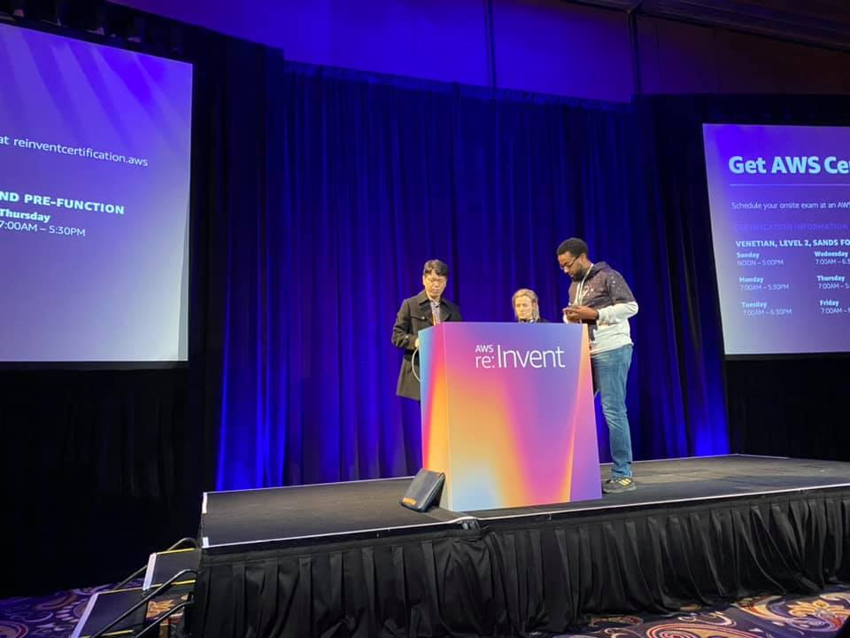
**이미지 캡션:** 이 사진은 AWS re:Invent 행사 중 무대 위에서 진행되는 세션을 보여줍니다. 무대 중앙에는 AWS re:Invent 로고가 새겨진 다채로운 색상의 연단이 놓여 있으며, 연단 뒤에는 세 명의 사람이 서 있습니다. 왼쪽에는 검은색 코트를 입은 동양인 성인 남성이 서 있고, 그의 오른쪽에는 금발의 백인 성인 여성이 서 있습니다. 가장 오른쪽에는 안경을 쓰고 후드티와 청바지를 입은 아프리카계 성인 남성이 서서 휴대폰을 보고 있습니다. 배경에는 파란색 커튼이 드리워져 있고, 좌측과 우측에는 각각 AWS re:Invent 관련 정보가 담긴 대형 스크린이 설치되어 있습니다. 좌측 스크린에는 "reinventcertification.aws"라는 웹사이트 주소와 함께 "AND PRE-FUNCTION THURSDAY 7:00AM-5:30PM"이라는 문구가 보입니다. 우측 스크린에는 "Get AWS Cert"라는 제목과 함께 AWS 시험 예약에 대한 안내 문구가 표시되어 있습니다. 전반적으로 전문적이고 정보 전달 중심의 행사 분위기를 나타냅니다.
 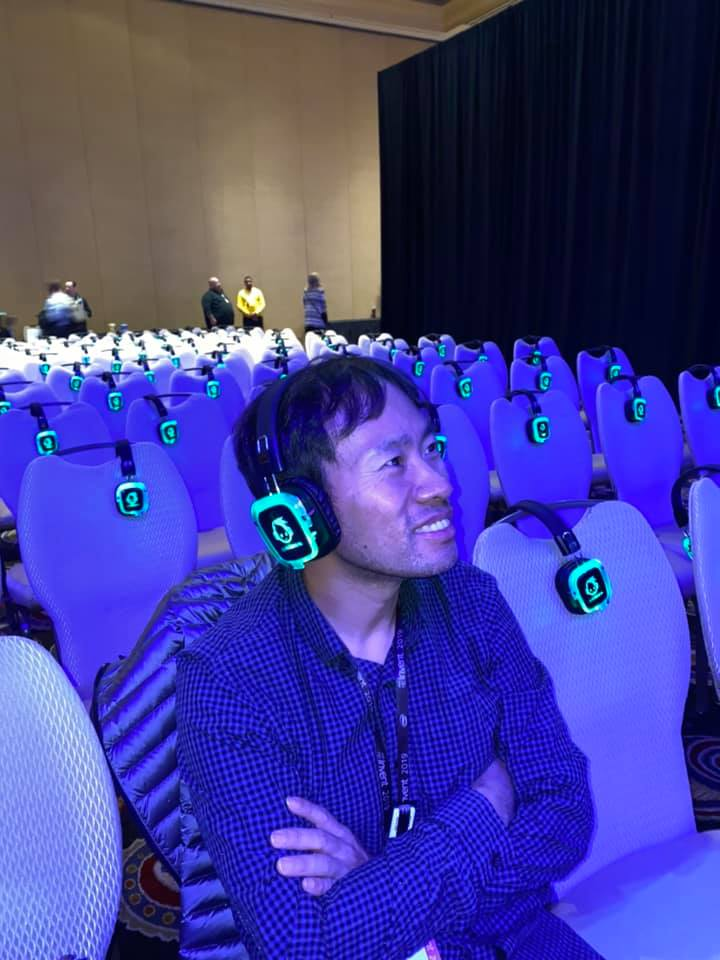
**이미지 캡션:** 사진에는 성인 남성이 파란색 체크무늬 셔츠와 검은색 패딩 조끼를 입고 앉아 있다. 그는 형광 녹색 불빛이 들어오는 헤드폰을 끼고 있으며, 팔짱을 끼고 카메라를 향해 미소를 짓고 있다. 배경에는 수많은 파란색 의자들이 줄지어 있으며, 각 의자에는 형광 녹색 불빛이 들어오는 헤드폰이 걸려 있다. 의자 뒤쪽으로는 베이지색 벽과 검은색 커튼이 보인다. 전체적으로 행사장이나 컨퍼런스 같은 분위기이며, 조명은 파란색으로 연출되어 있다. 남성의 목에는 'event 2019'라고 적힌 것으로 보이는 검은색 목걸이형 출입증이 걸려 있다.

### 12월 5일 (목) 03:07 · Just wonderful to run with amazing peopl…

📍 Las Vegas

Just wonderful to run with amazing people! It was really fun.

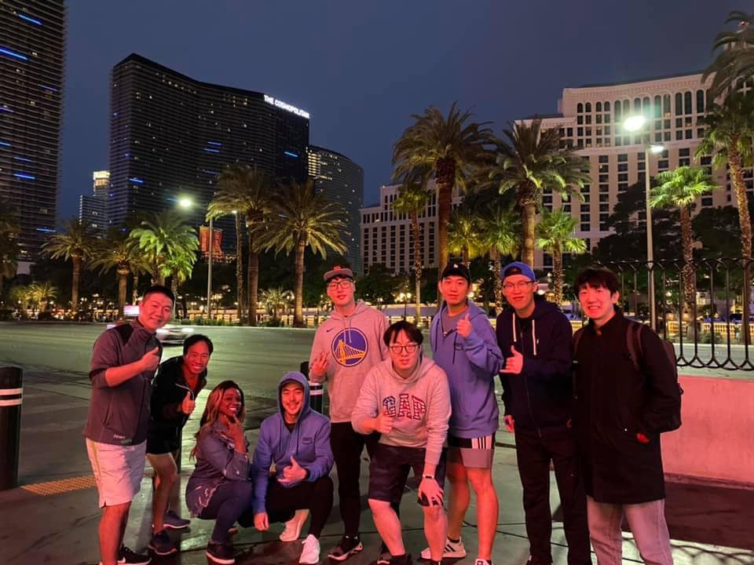
**이미지 캡션:** 밤이 깊은 도시 거리에서 여덟 명의 젊은이들이 기념 사진을 찍고 있다. 왼쪽부터 성인 남성 두 명은 각각 회색 후드티와 검은색 재킷을 입고 있으며, 밝게 웃으며 카메라를 응시하고 있다. 그 뒤로 성인 여성 한 명은 청바지와 데님 재킷을 입고 포즈를 취하고 있으며, 옆에는 성인 남성 두 명이 서 있다. 한 명은 파란색 후드티를 입고 엄지손가락을 치켜세우고 있고, 다른 한 명은 회색 후드티를 입고 있다. 가장 오른쪽에는 성인 남성 두 명이 서 있는데, 한 명은 검은색 코트를 입고, 다른 한 명은 파란색 후드티를 입고 있다. 배경에는 라스베이거스의 상징적인 호텔 건물들과 야자수가 보이며, 도시의 밤 풍경이 펼쳐져 있다. 전체적으로 즐겁고 활기찬 분위기이다.
 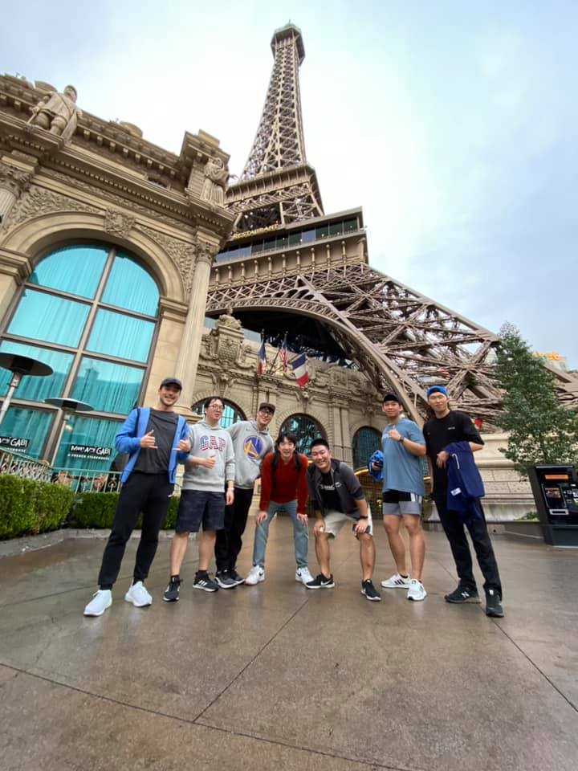
**이미지 캡션:** 이 사진은 라스베이거스 파리 호텔 앞에서 일곱 명의 젊은 성인 남성들이 포즈를 취하고 있는 모습을 담고 있습니다. 왼쪽부터 첫 번째 남성은 파란색 재킷과 검은색 티셔츠, 검은색 바지를 입고 흰색 운동화를 신고 있으며, 엄지손가락을 치켜세우고 있습니다. 두 번째 남성은 회색 후드티와 검은색 반바지, 검은색 운동화를 신고 있습니다. 세 번째 남성은 회색 후드티와 검은색 반바지, 검은색 운동화를 신고 있습니다. 네 번째 남성은 빨간색 긴팔 티셔츠와 청바지, 흰색 운동화를 신고 있으며, 약간 웅크린 자세를 취하고 있습니다. 다섯 번째 남성은 검은색 재킷과 티셔츠, 회색 반바지, 검은색 운동화를 신고 있으며, 무릎을 굽히고 있습니다. 여섯 번째 남성은 파란색 티셔츠와 회색 반바지, 흰색 운동화를 신고 있습니다. 일곱 번째 남성은 검은색 티셔츠와 검은색 바지, 검은색 운동화를 신고 있습니다. 배경에는 에펠탑 모형과 프랑스 국기가 보이며, 건물에는 "RESTAURANT"라는 글자가 쓰여 있습니다. 전체적으로 화창한 날씨에 즐거운 분위기 속에서 촬영된 것으로 보입니다.
 
**이미지 캡션:** 이것은 수요일 아침 운동 기록 화면으로, 2019년 12월 4일 오전 5시 43분에 시작되었음을 보여줍니다. 화면 상단에는 달리는 사람 아이콘과 함께 "Wednesday Morning"이라는 제목이 있고, 그 아래에는 운동 날짜와 시간이 표시되어 있습니다. 지도에는 라스베이거스 대로(Las Vegas Fwy)를 따라 표시된 운동 경로가 나타나며, 1km, 2km, 6km, 5km 지점에 마커가 있습니다. 경로 상에는 "H ROLLER"라는 텍스트와 함께 "University of Nevada, Las Vegas"라는 텍스트가 보입니다. 지도 하단에는 "Maps" 로고와 함께 운동 결과가 표시되어 있습니다. 총 이동 거리는 7.38km, 운동 시간은 1시간 13분 44초, 평균 속도는 6.00km/h, 소모 칼로리는 451kcal입니다. 전반적으로 이 화면은 사용자의 아침 조깅 기록을 보여주는 것으로, 운동의 거리, 시간, 속도, 소모 칼로리 등의 정보를 제공합니다.

### 12월 7일 (토) 10:53 · 📷 사진 (2장)

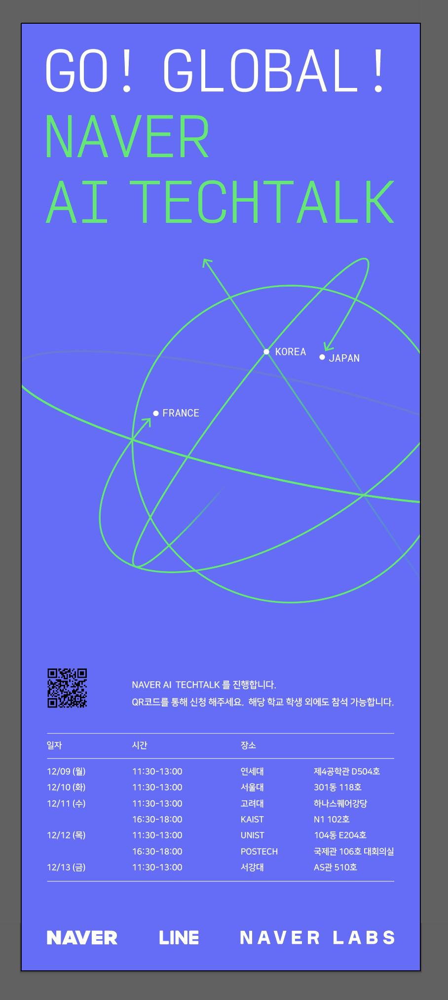
**이미지 캡션:** 이 포스터는 보라색 배경에 흰색과 녹색 글씨로 "GO! GLOBAL! NAVER AI TECHTALK"이라는 문구를 강조하고 있으며, 지구본 모양의 그래픽과 함께 한국, 일본, 프랑스를 나타내는 점들이 표시되어 있습니다. 하단에는 QR 코드가 있고, "NAVER AI TECHTALK 를 진행합니다. QR코드를 통해 신청 해주세요. 해당 학교 학생 외에도 참석 가능합니다."라는 안내 문구가 있습니다. 그 아래에는 12월 9일부터 13일까지 진행되는 행사 일정표가 날짜, 시간, 장소(연세대, 서울대, 고려대, KAIST, UNIST, POSTECH, 서강대)와 함께 상세하게 기재되어 있습니다. 포스터의 가장 하단에는 "NAVER", "LINE", "NAVER LABS"라는 로고가 배치되어 있습니다. 전반적으로 기술 행사 홍보를 위한 깔끔하고 현대적인 분위기를 풍깁니다.
 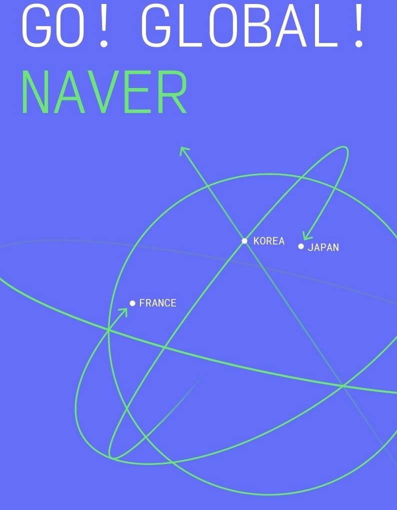
**이미지 캡션:** 이 이미지는 파란색 배경에 녹색과 흰색 텍스트 및 그래픽이 포함된 포스터입니다. 상단에는 "GO! GLOBAL!"이라는 흰색 텍스트가 있고 그 아래에는 "NAVER"라는 녹색 텍스트가 있습니다. 이미지 중앙에는 한국, 일본, 프랑스를 나타내는 점과 함께 지구본을 나타내는 녹색 타원형 궤도가 있습니다. 이 이미지는 네이버의 글로벌 확장 또는 서비스 범위를 나타내는 것으로 보이며, 텍스트와 그래픽은 현대적이고 미니멀한 디자인을 가지고 있습니다.

> 요즈음 소식을 들어 잘 아시겠지만, 큰 힘을 합쳐 Global AI Leading 회사가 되고자 하는 네이버/라인의 신나는 AI연구와 서비스 결과를 이야기 하고 토론하는 AI TECHTALK TOUR를 합니다. 본교 학생뿐만 아니라 외부에서도 참여가 가능하니 http://m.site.naver.com/0uTSM 로 신청해주시면 됩니다.  "AI, AI, AI" 를 강조한 손정의 회장님의 말씀처럼, 큰 AI시대는 반드시 올것이며,  사실 이미 오고 있습니다. 이런 글로벌 AI를 함께 하실 여러분들의 많은 관심과 참여, 그리고 공유를 부탁드립니다.  (저도 몇군데 학교 톡에 참여할 예정입니다. 오시는 분들 뵙겠습니다.) * 연세대, 12/9(월) 11시 30분, 제4공학관 D504호 * 서울대, 12/10(화) 11시 30분, 301동 118호 * 고려대, 12/11(수) 11시 30분, 하나스퀘어 강당 * KAIST, 12/11(수) 16시 30분, N1 102호 * UNIST, 12/12(목) 11시 30분, 104동 E204호 * POSTECH, 12/12(목) 16시 30분, 국제관 106호 대회의실 * 서강대, 12/13(금) 11시 30분, AS관 510호

### 12월 8일 (일) 19:27 · 📷 사진 (2장)

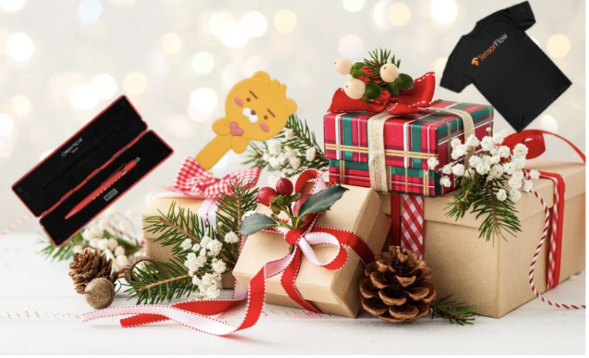
**이미지 캡션:** 크리스마스 선물 포장과 장식으로 꾸며진 배경에 여러 물건들이 놓여 있습니다. 왼쪽에는 빨간색 펜이 들어있는 검은색 케이스가 열려 있으며, 'OMANTICHE'라는 글자가 보입니다. 그 옆에는 노란색 캐릭터 장식이 있고, 여러 개의 선물 상자들이 빨간색과 흰색 리본, 그리고 크리스마스 장식으로 포장되어 있습니다. 선물 상자 위에는 검은색 티셔츠가 놓여 있는데, 'TensorFlow'라는 로고가 보입니다. 배경에는 흐릿한 조명들이 빛나고 있어 따뜻하고 축제 분위기를 자아냅니다.
 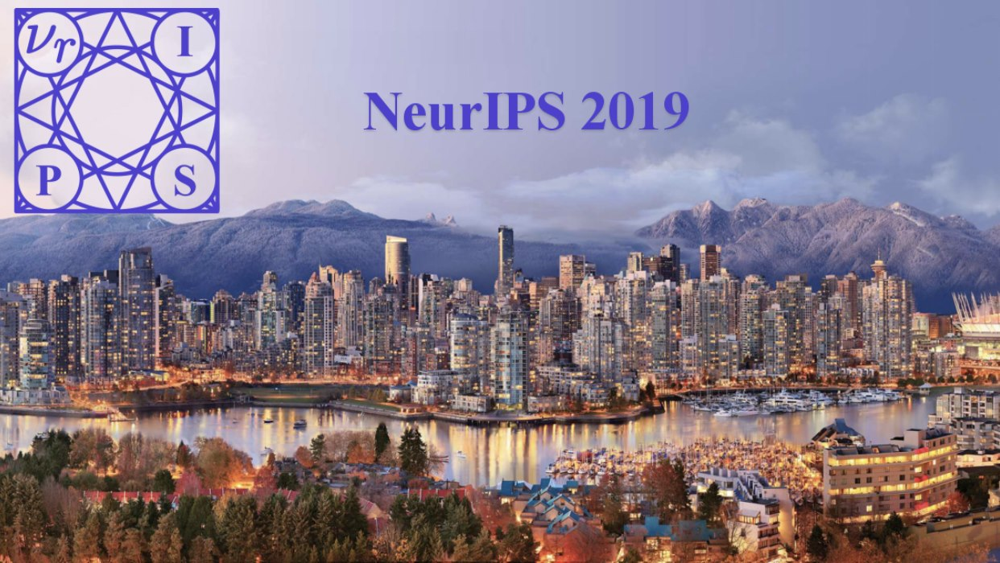
**이미지 캡션:** 이 사진은 밴쿠버의 스카이라인을 배경으로 NeurIPS 2019라는 문구가 파란색으로 쓰여 있으며, 왼쪽 상단에는 파란색 기하학적 문양이 그려져 있습니다. 문양 안에는 그리스 문자 νr, I, P, S가 각각 원 안에 배치되어 있습니다. 사진은 저녁 시간대로 보이며, 도시의 불빛과 산의 눈 덮인 봉우리가 어우러져 웅장하고 아름다운 분위기를 자아냅니다. 강에는 보트들이 정박해 있고, 도시의 건물들은 불빛으로 환하게 빛나고 있습니다. 전반적으로 학술 행사 개최 도시의 풍경을 담은 홍보성 이미지로 보입니다.

### 12월 9일 (월) 06:59 · 📷 사진 (2장)

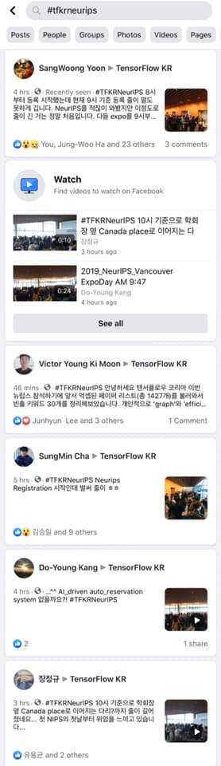
**이미지 캡션:** 이것은 페이스북의 검색 결과 페이지로, #tfkrneurips라는 해시태그로 검색된 게시물들을 보여줍니다. 페이지 상단에는 검색창과 함께 'Posts', 'People', 'Groups', 'Photos', 'Videos', 'Pages' 탭이 있습니다. 첫 번째 게시물은 SangWoong Yoon이라는 사용자가 올린 것으로, #TFKRNeurIPS 행사 등록 시작 1시간 만에 줄이 매우 길다는 내용과 함께 행사장 사진이 첨부되어 있습니다. 두 번째 섹션은 'Watch'로, 페이스북에서 볼 수 있는 동영상들을 보여주며, #TFKRNeurIPS 관련 영상 두 개가 썸네일과 함께 표시되어 있습니다. 세 번째 게시물은 Victor Young Ki Moon이라는 사용자가 올린 것으로, #TFKRNeurIPS 참석에 앞서 억셉된 페이퍼 리스트에서 자주 등장하는 키워드 30개를 정리했다는 내용입니다. 네 번째 게시물은 SungMin Cha라는 사용자가 올린 것으로, #TFKRNeurIPS 등록 시작인데 벌써 줄이 길다는 내용과 함께 행사장 사진이 첨부되어 있습니다. 다섯 번째 게시물은 Do-Young Kang이라는 사용자가 올린 것으로, "AI-driven auto_reservation system 없을까요?!"라는 질문과 함께 #TFKRNeurIPS 해시태그를 포함하고 있습니다. 마지막으로 여섯 번째 게시물은 장정규라는 사용자가 올린 것으로, #TFKRNeurIPS 행사 등록 시작 3시간 만에 학회장 옆 Canada place까지 줄이 길어졌다는 내용과 함께 행사장 사진이 첨부되어 있습니다. 전반적으로 이 페이지는 #TFKRNeurIPS 행사와 관련된 사람들의 경험, 정보 공유, 그리고 행사 현장의 분위기를 보여주고 있습니다.
 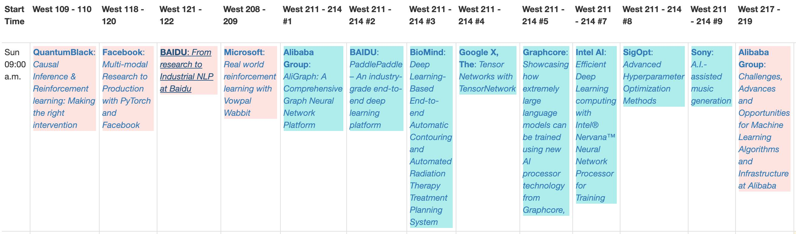
**이미지 캡션:** This image displays a schedule or agenda, likely for a conference or event, with sessions organized by time and location. The top row lists the start times and room numbers or session identifiers, such as "Start Time," "West 109-110," "West 118-120," and so on, up to "West 217-219." The first column indicates the day and time, showing "Sun 09:00 a.m." The subsequent cells contain the titles of various sessions, color-coded in pink and light blue. Pink-colored sessions include "QuantumBlack: Causal Inference & Reinforcement learning: Making the right intervention," "Facebook: Multi-modal Research to Production with PyTorch and Facebook," "BAIDU: From research to Industrial NLP at Baidu," "Microsoft: Real world reinforcement learning with Vowpal Wabbit," and "Alibaba Group: Challenges, Advances and Opportunities for Machine Learning Algorithms and Infrastructure at Alibaba." Light blue-colored sessions include "Alibaba Group: AliGraph: A Comprehensive Graph Neural Network Platform," "BAIDU: PaddlePaddle - An industry-grade end-to-end deep learning platform," "BioMind: Deep Learning-Based End-to-end Automatic Contouring and Automated Radiation Therapy Treatment Planning System," "Google X, The: Tensor Networks with TensorNetwork," "Graphcore: Showcasing how extremely large language models can be trained using new AI processor technology from Graphcore," "Intel AI: Efficient Deep Learning computing with Intel® Nervana™ Neural Network Processor for Training," "SigOpt: Advanced Hyperparameter Optimization Methods," and "Sony: A.I.-assisted music generation." There are no people visible in the image, and the background is a plain white grid. The overall atmosphere is informative and professional, typical of a conference schedule.

> #TFKRNeurIPS 정말 많은 회사들이 본인들이 하는 일에 대해 이야기를 나누는 멋진 NeurIPS 2019 Expo 입니다. 모두 병렬세션이라 다 가볼수가 없는데 가보신 분들은 후기/슬라이드 사진들 부탁드립니다.  [https://nips.cc/Expo/Conferences/2019/Schedule_overview?presentation_type=All](https://nips.cc/Expo/Conferences/2019/Schedule_overview?presentation_type=All)

### 12월 10일 (화) 06:59 · 📷 사진 (2장)

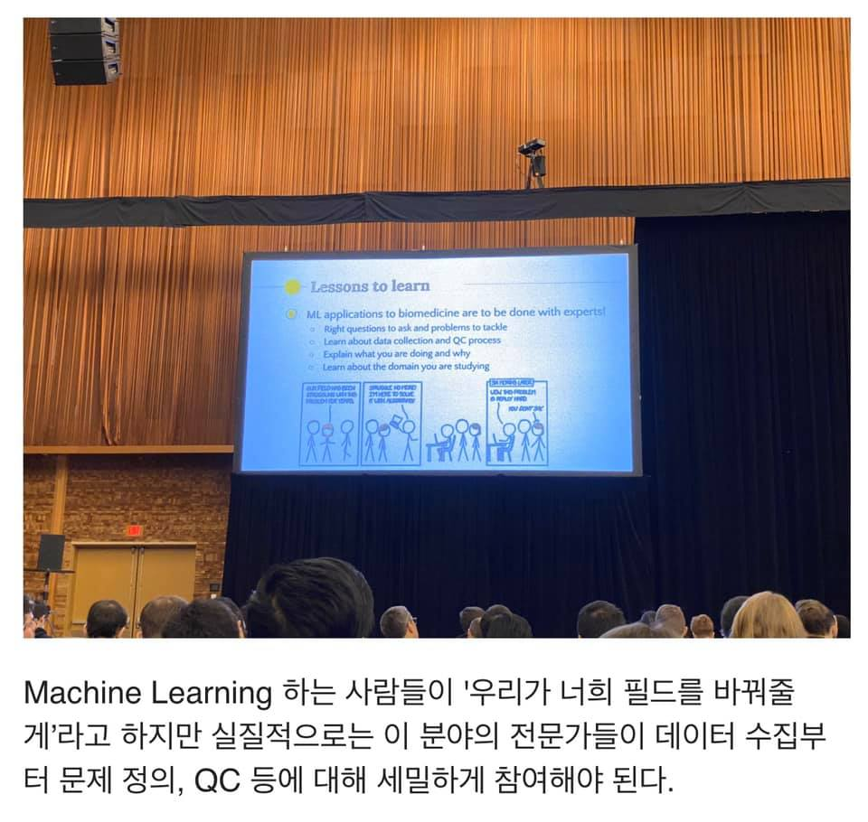
**이미지 캡션:** 넓은 강당에서 갈색 커튼을 배경으로 대형 스크린에 "Lessons to learn"이라는 제목과 함께 ML 애플리케이션이 생물의학 분야에 적용될 때 전문가와 함께해야 한다는 내용의 발표 슬라이드가 띄워져 있다. 슬라이드에는 몇 가지 요점이 나열되어 있으며, 아래에는 여러 개의 작은 그림이 포함되어 있다. 스크린 앞쪽에는 청중으로 보이는 사람들이 앉아 있으며, 대부분 성인 남성으로 보이고 머리색은 다양하다. 이들은 발표를 경청하고 있는 것으로 보인다.
 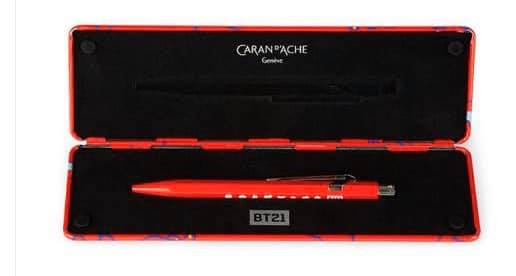
**이미지 캡션:** 열린 빨간색 펜 케이스 안에 빨간색 볼펜이 놓여 있습니다. 케이스 내부는 검은색이며, 윗부분에는 "CARAN D'ACHE Genève"라고 흰색으로 쓰여 있고, 아랫부분에는 빨간색 볼펜이 중앙에 놓여 있으며, 볼펜 몸통에는 흰색 글씨로 "BT21"이라고 적힌 작은 검은색 라벨이 있습니다. 케이스 외부의 빨간색 표면에는 파란색과 보라색의 추상적인 패턴이 그려져 있습니다. 이 사진은 제품의 깔끔하고 고급스러운 이미지를 보여주며, 펜과 케이스의 디자인을 강조하고 있습니다.

### 12월 11일 (수) 09:53 · 📷 사진 (2장)

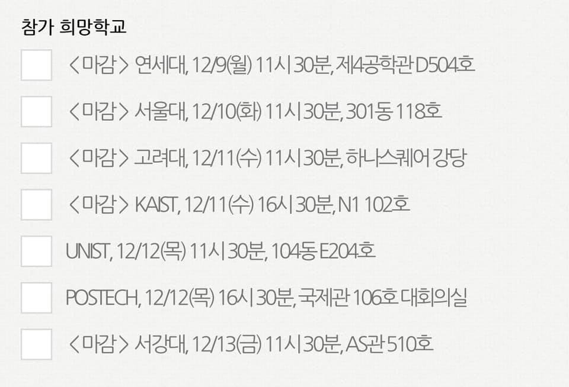
**이미지 캡션:** 이 사진은 "참가 희망학교"라는 제목 아래 여러 대학교의 행사 일정을 나열한 목록입니다. 각 항목은 체크박스와 함께 학교 이름, 날짜, 시간, 장소 정보를 포함하고 있습니다. 연세대학교는 12월 9일 월요일 11시 30분에 제4공학관 D504호에서, 서울대학교는 12월 10일 화요일 11시 30분에 301동 118호에서, 고려대학교는 12월 11일 수요일 11시 30분에 하나스퀘어 강당에서, KAIST는 같은 날 16시 30분에 N1 102호에서 행사가 예정되어 있습니다. 또한 UNIST는 12월 12일 목요일 11시 30분에 104동 E204호에서, POSTECH은 같은 날 16시 30분에 국제관 106호 대회의실에서 행사가 진행됩니다. 마지막으로 서강대학교는 12월 13일 금요일 11시 30분에 AS관 510호에서 행사가 열립니다. 일부 항목 앞에는 '<마감>'이라는 표시가 있어 해당 날짜가 마감일임을 나타낼 수 있습니다. 사진에는 사람이 등장하지 않으며, 배경은 흰색으로 텍스트 정보만을 보여주고 있습니다. 전체적으로 정보 전달을 목적으로 하는 깔끔하고 정돈된 분위기입니다.
 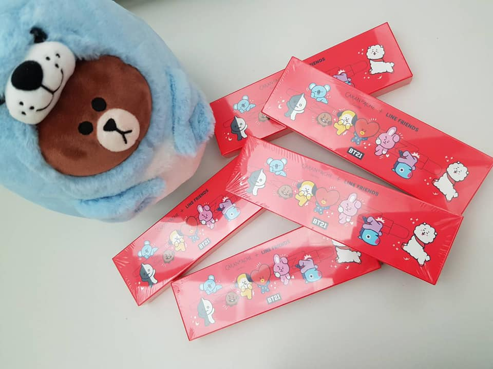
**이미지 캡션:** 사진에는 파란색 담요에 싸인 갈색 곰 인형과 빨간색 포장지에 담긴 여러 개의 BT21 캐릭터 상품이 놓여 있습니다. 곰 인형은 흰색 얼굴에 검은색 코와 눈을 가지고 있으며, 파란색 담요는 곰 인형의 머리와 팔을 감싸고 있습니다. 빨간색 포장지에는 다양한 BT21 캐릭터들이 그려져 있으며, "CARAN d'ACHE + LINE FRIENDS"와 "BT21"이라는 글자가 보입니다. 포장지는 투명한 비닐로 덮여 있어 내용물이 보입니다. 배경은 흰색으로, 상품들이 깔끔하게 진열된 모습입니다. 전체적으로 귀엽고 아기자기한 분위기를 연출합니다.

### 12월 11일 (수) 11:05 · I am so proud of him. It's just an amazi…

I am so proud of him. It's just an amazing movie and story. 

https://youtu.be/7TtC5JKip00

### 12월 15일 (일) 18:10 · 📷 사진 (1장)

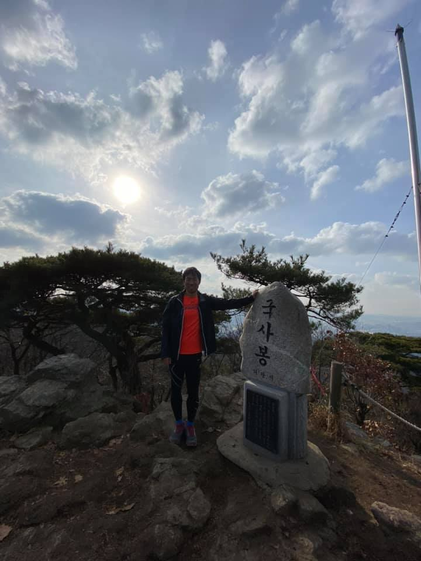
**이미지 캡션:** 푸른 하늘 아래, 한 성인 남성이 산 정상에 서서 국사봉 표지석에 손을 얹고 있다. 남성은 40대 후반에서 50대 초반으로 보이며, 짧은 검은 머리에 옅은 미소를 띠고 있다. 그는 주황색 반팔 티셔츠 위에 검은색 바람막이를 걸치고, 검은색 운동복 바지와 회색 등산화를 신고 있다. 배경에는 구름 낀 하늘과 함께 햇살이 비치고 있으며, 울창한 소나무와 바위들이 산 정상의 거친 지형을 보여준다. 오른편에는 국사봉이라고 한글로 새겨진 비석이 서 있고, 그 아래에는 또 다른 글자가 새겨진 명판이 부착되어 있다. 전반적으로 등산을 마치고 정상에 도달한 성취감과 자연의 아름다움을 만끽하는 평화로운 분위기이다.

### 12월 18일 (수) 18:36 · Wonderful morning trail running. It's so…

📍 Cheonggye Mountain 청계산

Wonderful morning trail running. It's so beautiful!

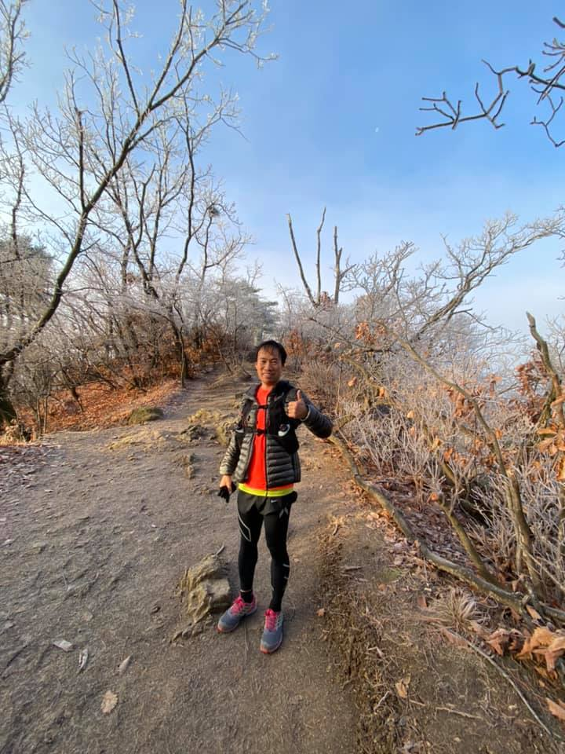
**이미지 캡션:** 한 명의 성인 남성이 산길에서 엄지손가락을 치켜세우며 포즈를 취하고 있다. 남성은 40대 정도로 보이며, 짧은 검은 머리에 웃는 표정을 짓고 있다. 그는 검은색 패딩 조끼 안에 주황색 반팔 티셔츠를 입고, 검은색 타이츠와 회색 운동화를 신고 있다. 허리에는 검은색 물통 조끼를 메고 있으며, 왼손에는 검은색 물건을 들고 있다. 배경에는 앙상한 나뭇가지들이 서리가 낀 듯 하얗게 뒤덮여 있으며, 맑고 푸른 하늘이 보인다. 땅은 흙길로 되어 있고, 낙엽이 흩어져 있다. 전반적으로 추운 날씨에 산행을 즐기는 긍정적이고 활기찬 분위기를 나타낸다.
 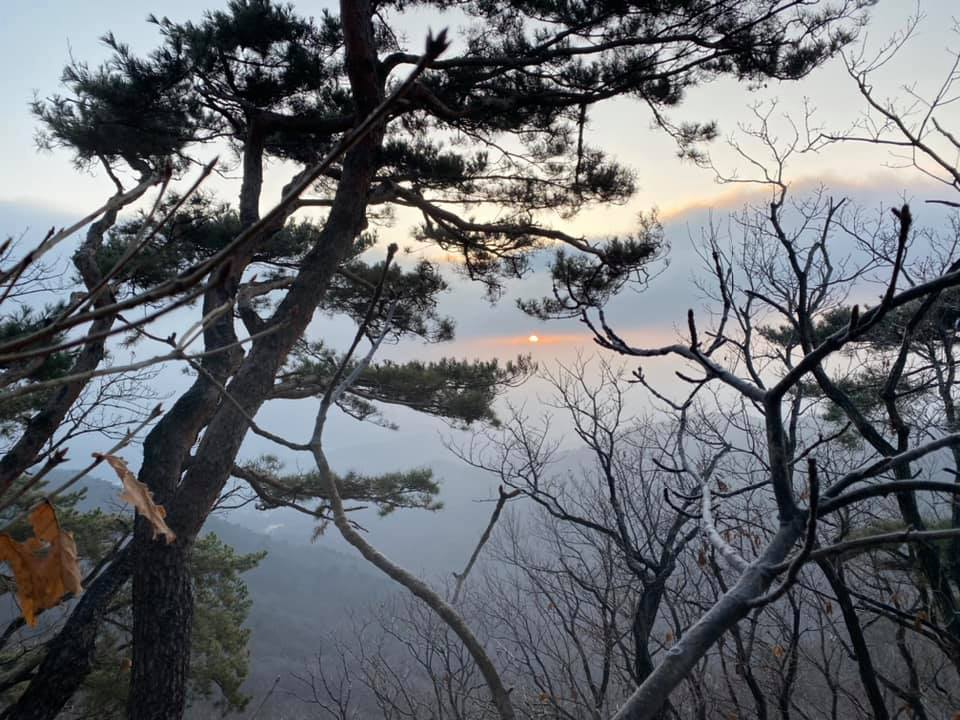
**이미지 캡션:** 이 사진은 산 정상에서 바라본 풍경으로, 앙상한 나뭇가지와 울창한 소나무가 전경을 이루고 있으며, 멀리 안개 낀 산 능선과 희미하게 떠오르는 태양이 보입니다. 사진에는 사람이 보이지 않으며, 장소는 산 정상 부근으로 추정됩니다. 사물로는 다양한 종류의 나무와 나뭇가지, 그리고 멀리 보이는 산 능선이 있습니다. 보이는 텍스트는 없으며, 전체적인 분위기는 고요하고 평화로우며, 약간은 쓸쓸한 느낌을 줍니다. 해가 뜨고 있는 시간대인 것으로 보이며, 자연의 아름다움을 담고 있습니다.
 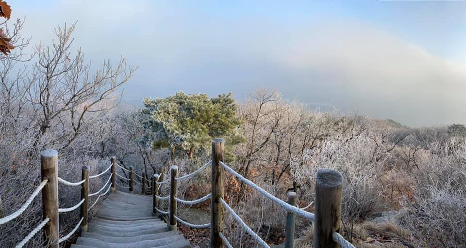
**이미지 캡션:** 이 사진은 겨울 산의 풍경을 담고 있으며, 나무들은 서리로 뒤덮여 하얗게 빛나고 있습니다. 사진의 전경에는 나무 계단이 보이며, 계단 양옆으로는 밧줄 난간이 설치되어 있습니다. 계단은 짙은 갈색의 나무 기둥과 흰색 밧줄로 이루어져 있으며, 밧줄은 여러 겹으로 꼬여 있어 안정감을 더합니다. 계단 위쪽으로는 앙상한 나뭇가지들이 서리로 뒤덮여 마치 은빛으로 장식된 듯한 모습을 하고 있습니다. 중앙에는 푸른 잎을 가진 소나무 한 그루가 서 있어 주변의 하얀 풍경과 대조를 이룹니다. 배경에는 안개가 낀 듯 희미한 산 능선이 보이며, 하늘은 맑고 푸른색입니다. 사진 속에는 사람이 보이지 않으며, 이는 고요하고 평화로운 겨울 산의 분위기를 강조합니다. 전반적으로 차갑지만 아름다운 겨울 산의 정취를 느낄 수 있는 풍경 사진입니다.
 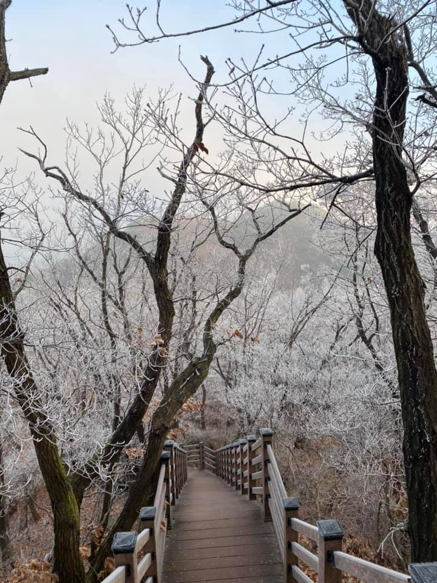
**이미지 캡션:** 이 사진은 겨울철 서리가 내린 산길의 풍경을 담고 있으며, 나무들은 앙상한 가지에 하얀 서리를 뒤집어쓰고 있어 마치 은빛으로 뒤덮인 듯한 신비로운 분위기를 자아냅니다. 사진의 전경에는 나무로 만들어진 계단이 완만하게 아래로 이어져 있으며, 계단 양옆으로는 나무 난간이 설치되어 있어 안전하게 산책을 즐길 수 있도록 합니다. 계단은 짙은 갈색 나무 판자로 만들어져 있으며, 난간은 갈색 기둥과 검은색 상단으로 이루어져 있습니다. 계단 주변의 나무들은 대부분 잎이 떨어진 상태이며, 가지마다 하얀 서리가 맺혀 있어 마치 눈꽃이 핀 듯한 아름다움을 선사합니다. 배경으로는 안개가 낀 듯 뿌연 산 능선이 희미하게 보이며, 전체적으로 차갑고 고요한 겨울의 정취를 느낄 수 있습니다. 사진에는 사람이 등장하지 않으며, 보이는 텍스트도 없습니다. 이 사진은 겨울 산의 고요하고 아름다운 자연 풍경을 보여주며, 산책로나 등산로의 겨울철 모습을 담고 있습니다.
 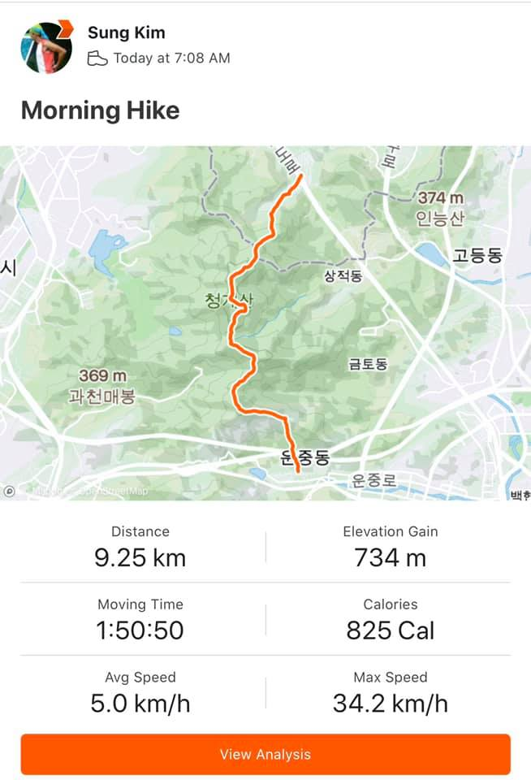
**이미지 캡션:** 이 사진은 "Sung Kim"이라는 사용자가 오늘 오전 7시 8분에 "Morning Hike"라는 제목으로 기록한 활동 내역을 보여주는 스크린샷입니다. 화면 상단에는 사용자의 프로필 사진으로 보이는 작은 이미지와 이름, 그리고 활동 시간이 표시되어 있습니다. 중앙에는 산악 지도를 배경으로 오렌지색 선으로 표시된 하이킹 경로가 나타나 있으며, 경로 주변에는 "청계사", "과천매봉", "인능산", "상적동", "금토동", "둔중동", "운중로" 등 여러 지명이 한국어로 표기되어 있습니다. 지도에는 고도 정보도 함께 표시되어 있으며, "369 m 과천매봉"과 "374 m 인능산"이라는 텍스트가 보입니다. 하단에는 활동 통계가 요약되어 있는데, 총 거리는 9.25km, 이동 시간은 1시간 50분 50초, 평균 속도는 시속 5.0km, 최대 속도는 시속 34.2km, 그리고 소모 칼로리는 825kcal로 나타납니다. "View Analysis"라는 버튼이 있어 더 자세한 분석을 볼 수 있음을 시사합니다. 전반적으로 활동적인 야외 활동 기록을 보여주는 화면이며, 날씨는 맑은 것으로 추정됩니다.

### 12월 19일 (목) 08:45 · 📷 사진 (3장)

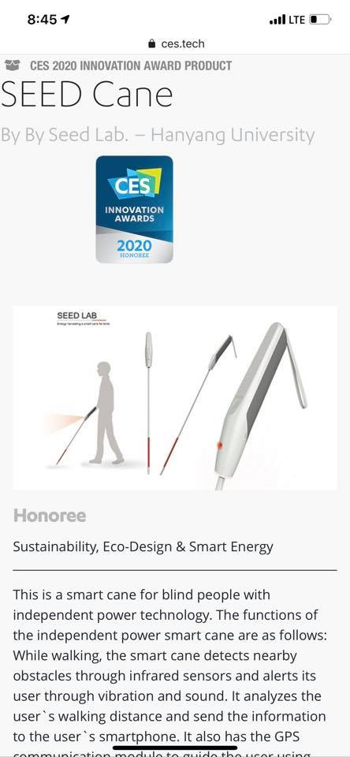
**이미지 캡션:** 화면에는 "SEED Cane"이라는 제품을 소개하는 웹페이지의 일부가 캡처되어 있습니다. 상단에는 "CES 2020 INNOVATION AWARD PRODUCT"라는 문구와 함께 "SEED Cane"이라는 제품명이 크게 표시되어 있으며, 그 아래에는 "By By Seed Lab. - Hanyang University"라고 작성되어 있습니다. CES 2020 혁신상 수상임을 나타내는 파란색 로고도 보입니다. 그 아래에는 "SEED LAB"이라는 로고와 함께 스마트 지팡이의 시각적인 표현이 세 가지 형태로 나타나는데, 첫 번째는 실루엣으로 표현된 사람이 지팡이를 짚고 걷는 모습이며, 지팡이 끝에서 주황색 빛이 퍼져 나가는 것을 보여줍니다. 두 번째와 세 번째는 지팡이 자체의 디자인을 보여주는 이미지입니다. 이어서 "Honoree"라는 제목과 함께 "Sustainability, Eco-Design & Smart Energy"라는 카테고리가 표시되어 있습니다. 마지막으로, 이 제품이 "독립적인 전력 기술을 갖춘 시각 장애인을 위한 스마트 지팡이"이며, "적외선 센서를 통해 주변 장애물을 감지하고 진동과 소리로 사용자에게 경고하며, 사용자의 보행 거리를 분석하여 스마트폰으로 정보를 전송하고 GPS 통신 모듈을 통해 사용자를 안내한다"는 설명이 텍스트로 제공됩니다. 전반적으로 제품의 혁신성과 기술적 특징을 강조하는 정보성 콘텐츠의 분위기입니다.
 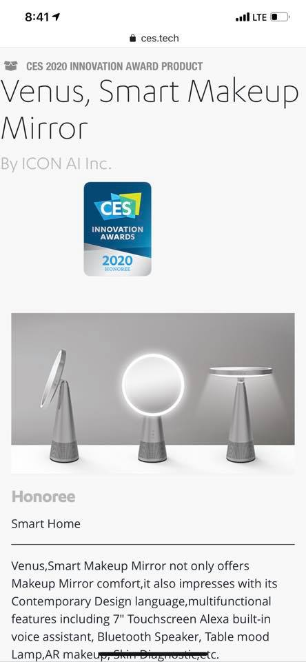
**이미지 캡션:** 이 화면은 "Venus, Smart Makeup Mirror"라는 제품을 소개하는 웹페이지의 일부로, CES 2020 혁신상 수상 제품임을 알리는 배지가 보인다. 제품 사진에는 세 개의 스마트 거울이 진열되어 있으며, 가운데 거울은 원형 조명이 켜져 있고 양옆의 거울은 기울어져 있거나 테이블 램프 형태로 디자인되어 있다. 제품명은 "Honoree"이며, "Smart Home" 카테고리에 속한다. 설명 텍스트에는 이 스마트 메이크업 거울이 편안한 사용감과 함께 현대적인 디자인 언어, 7인치 터치스크린 알렉사 음성 비서, 블루투스 스피커, 테이블 무드 램프, AR 메이크업, 피부 진단 등의 다기능 기능을 제공한다고 설명하고 있다.
 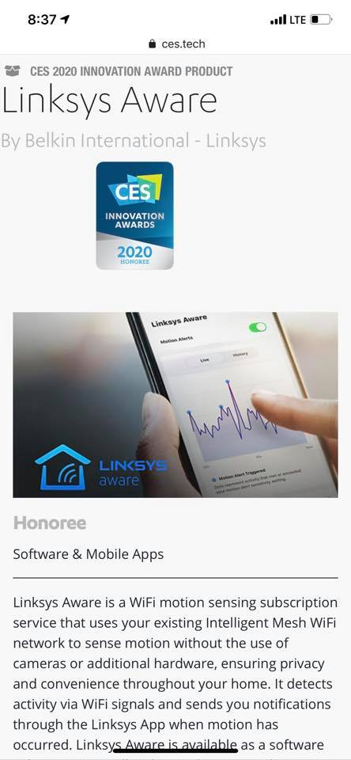
**이미지 캡션:** 화면에는 CES 2020 혁신상 수상 제품인 Linksys Aware에 대한 정보가 표시되어 있습니다. 상단에는 "CES 2020 INNOVATION AWARD PRODUCT"라는 문구와 함께 "Linksys Aware"라는 제품명이 크게 보이며, 그 아래에는 "By Belkin International - Linksys"라는 설명이 있습니다. 그 아래에는 파란색 바탕에 CES 로고와 "INNOVATION AWARDS 2020 HONOREE"라고 적힌 인증 마크가 있습니다. 중앙에는 Linksys Aware 앱이 실행되고 있는 스마트폰 화면이 보이며, 손가락으로 그래프를 터치하고 있습니다. 스마트폰 화면에는 "Linksys Aware", "Motion Alerts", "Live", "History" 등의 텍스트와 함께 움직임 감지 그래프가 표시되어 있습니다. 왼쪽 하단에는 파란색 집 모양의 로고와 함께 "LINKSYS aware"라는 문구가 있습니다. 그 아래에는 "Honoree"라는 제목과 "Software & Mobile Apps"라는 하위 분류가 있습니다. 마지막으로 Linksys Aware 서비스에 대한 설명 텍스트가 이어집니다. 전체적으로 제품 홍보 및 정보 제공을 위한 깔끔하고 현대적인 디자인의 웹페이지 화면입니다.

### 12월 23일 (월) 20:59 · She is really amazing!

She is really amazing!

### 12월 24일 (화) 22:21 · 📷 사진 (1장)

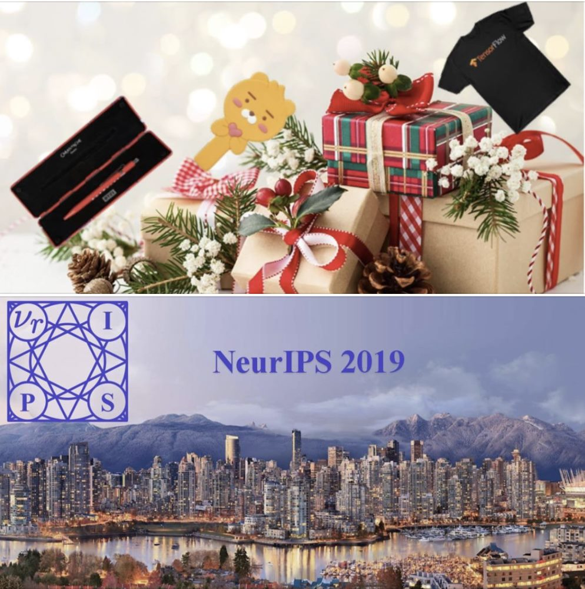
**이미지 캡션:** 이 이미지는 두 개의 분리된 장면으로 구성되어 있습니다. 상단 장면은 크리스마스 선물 포장과 장식으로 꾸며진 따뜻하고 축제 분위기를 연출합니다. 여러 개의 선물 상자가 빨간색과 녹색, 갈색 포장지로 싸여 있으며, 빨간색과 흰색 리본으로 묶여 있습니다. 선물 상자 사이에는 소나무 솔방울, 녹색 나뭇가지, 흰색 작은 꽃 장식이 놓여 있어 겨울 축제 분위기를 더합니다. 선물 상자 중 하나 옆에는 빨간색 펜이 들어 있는 검은색 케이스가 보이며, 다른 선물 상자 위에는 노란색 캐릭터 모양의 장식이 있습니다. 또한, 검은색 티셔츠가 걸려 있는데, 티셔츠에는 주황색 TensorFlow 로고가 인쇄되어 있습니다. 전반적으로 이 장면은 연말연시 선물 증정의 즐거움을 나타냅니다. 하단 장면은 밴쿠버의 도시 풍경을 보여줍니다. 수많은 고층 빌딩이 스카이라인을 이루고 있으며, 그 뒤로는 웅장한 산맥이 펼쳐져 있습니다. 도시 앞에는 강이나 만이 흐르고 있으며, 여러 척의 보트가 정박해 있습니다. 하늘은 구름이 낀 흐린 날씨를 나타내며, 도시의 불빛이 어둠 속에서 빛나고 있습니다. 이 장면의 왼쪽 상단에는 파란색 원형 로고가 있는데, 이 로고는 기하학적인 패턴과 함께 'Vr', 'I', 'P', 'S'라는 글자가 포함되어 있습니다. 로고 오른쪽에는 "NeurIPS 2019"라는 텍스트가 파란색으로 쓰여 있어, 이 장면이 2019년 NeurIPS 학회와 관련된 행사나 장소를 나타낼 수 있음을 시사합니다.

> #TFKRNeurIPS 후기로 따뜻한 크리스마스선물 나누어요! 에 응모한 모든 분들에게 선물을 드립니다. 모두에게 메리크리스마스!!  아래 링크에 선물을 받으실 주소와 받고 싶은 선물의 힌트를 12/31일까지 알려주시면 됩니다. http://naver.me/G4yo17G6  선물로 함께 참여한 분들에게도 감사드립니다.  * 왓챠플레이 1개월 이용권을 10명 * Amazon SageMaker Credit $600 3명 * Clova AI에서는 5분에게 BTS한정판 멋진 펜 * 엔비디아 리미티드 에디션? 🤣 굿즈세트 2분께 * #파파고 에서도 2분께 굿즈 * 카카오에서 카카오 미니 4개

### 12월 25일 (수) 15:05 · 📷 사진 (10장)

**이미지 캡션:** 이 사진은 온라인 학습 플랫폼인 Coursera에서 제공하는 "Google Cloud Platform Specialization을 활용한 고급 머신러닝(ML)"이라는 강좌에 대한 정보를 담고 있습니다. 강좌 제목은 파란색으로 강조되어 있으며, 그 아래에는 "About"이라는 제목과 함께 강좌에 대한 설명이 텍스트로 제공됩니다. 이 강좌는 초보자에게는 다소 어렵지만, 이미 머신러닝 분야에 입문한 사람들을 대상으로 하며, 최적화, 배포, 확장 등 실제 머신러닝 모델 구축에 대한 실무 경험을 쌓을 수 있습니다. 또한, 구조화된 데이터, 이미지 데이터, 시계열 데이터, 자연어 텍스트를 위한 확장 가능하고 정확하며 실제 운영 가능한 모델을 구축하는 방법을 배울 수 있다고 설명합니다. 사진에는 사람이나 장소, 사물은 보이지 않으며, 오직 텍스트 정보만 제공됩니다. 전반적으로 정보 전달에 초점을 맞춘 차분하고 전문적인 분위기입니다.
 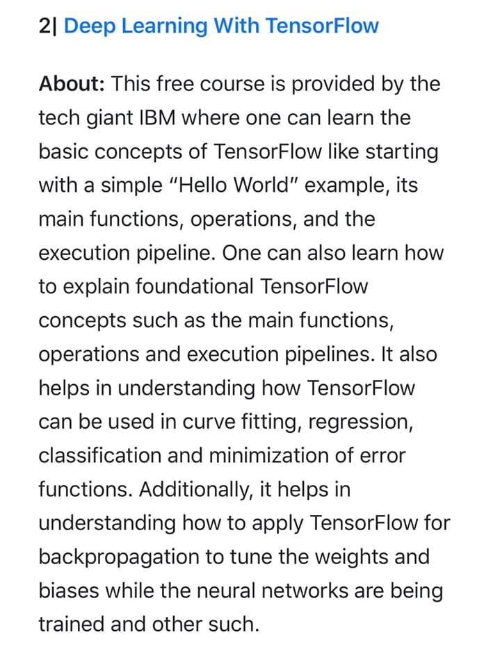
**이미지 캡션:** 이 이미지는 텍스트만 포함하고 있으며, 딥러닝과 텐서플로우에 대한 무료 강좌를 설명하는 내용입니다. 강좌는 IBM에서 제공하며, 텐서플로우의 기본 개념, 주요 함수, 연산, 실행 파이프라인 등을 배울 수 있습니다. 또한, 곡선 적합, 회귀, 분류, 오차 함수 최소화 등 텐서플로우의 활용법과 신경망 훈련 시 가중치와 편향을 조정하는 역전파 적용법도 다룹니다.
 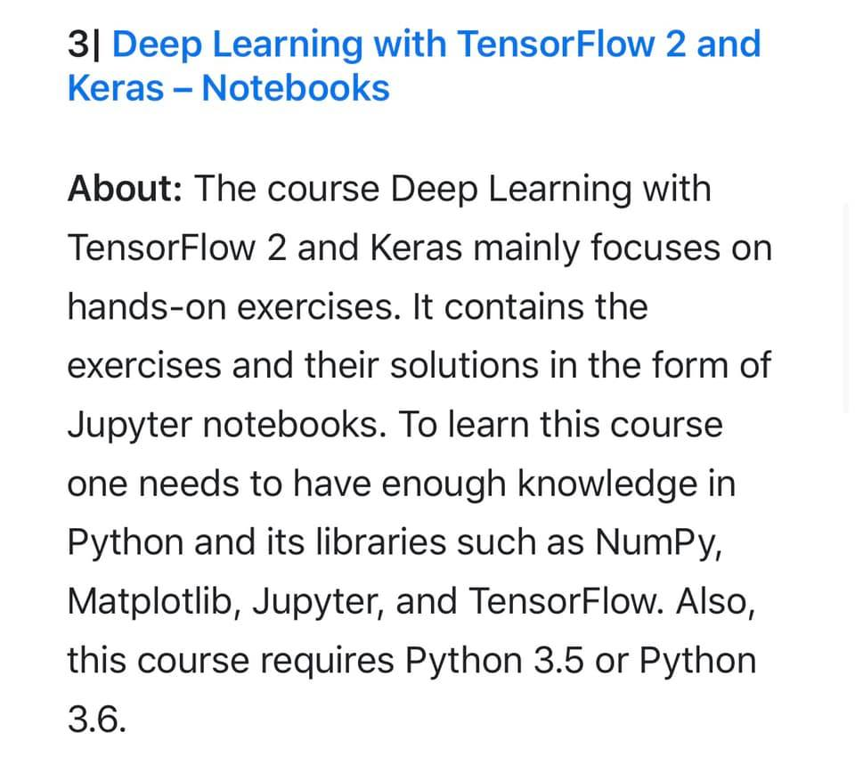
**이미지 캡션:** 이 이미지는 "Deep Learning with TensorFlow 2 and Keras - Notebooks"라는 제목의 온라인 강의 또는 자료에 대한 설명입니다. 텍스트는 파란색으로 된 제목과 검은색으로 된 본문으로 구성되어 있습니다. 제목은 "3| Deep Learning with TensorFlow 2 and Keras - Notebooks"이며, 본문은 "About:"이라는 소제목 아래에 강의 내용에 대한 설명이 이어집니다. 강의는 주로 실습 위주로 진행되며, 연습 문제와 해답이 주피터 노트북 형태로 제공된다고 합니다. 이 강의를 수강하기 위해서는 파이썬 및 NumPy, Matplotlib, Jupyter, TensorFlow와 같은 관련 라이브러리에 대한 충분한 지식이 필요하며, 파이썬 3.5 또는 3.6 버전이 요구된다고 명시되어 있습니다. 이미지에는 사람이 등장하지 않으며, 배경은 흰색으로 텍스트만 표시되어 있습니다. 전체적으로 정보 전달을 목적으로 하는 깔끔하고 간결한 화면입니다.
 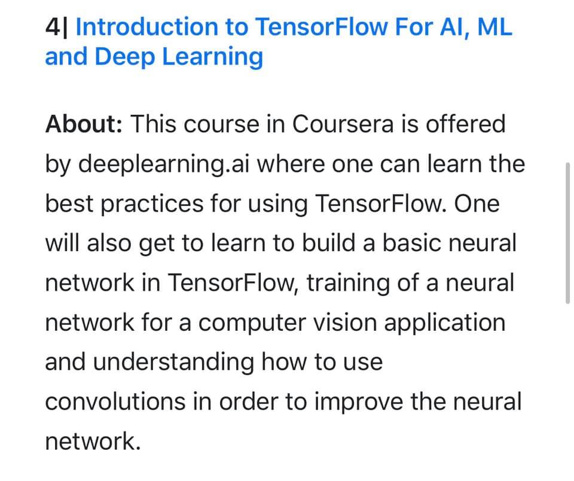
**이미지 캡션:** 이 이미지는 Coursera에서 제공되는 "TensorFlow를 사용한 AI, ML 및 딥러닝 소개"라는 강좌에 대한 설명입니다. 강좌는 deeplearning.ai에서 제공하며, TensorFlow의 모범 사례를 배우고, 기본 신경망을 구축하며, 컴퓨터 비전 애플리케이션을 위한 신경망을 훈련하고, 신경망 개선을 위한 컨볼루션 사용법을 이해하는 내용을 다룹니다. 이미지에는 사람이 등장하지 않으며, 배경은 흰색으로 텍스트만 표시되어 있습니다. 텍스트는 파란색과 검은색으로 구분되어 있으며, 강좌 제목과 설명으로 구성되어 있습니다. 전반적으로 정보 전달에 초점을 맞춘 깔끔하고 명료한 분위기입니다.
 
**이미지 캡션:** 이 사진은 텍스트 정보만 담고 있으며, 사람, 장소, 사물, 텍스트 외의 시각적 요소는 없습니다. 텍스트는 "5| Intro to TensorFlow for Deep Learning by TensorFlow"라는 제목과 "About: Intro to TensorFlow for Deep Learning by TensorFlow is a free course in Udacity where one can learn how to build deep learning applications with TensorFlow. This course is basically a practical approach to deep learning for software developers. Here, one can learn hands-on experience building the state-of-the-art image classifiers and other deep learning models."라는 설명, 그리고 "Click here to learn."이라는 문구로 구성되어 있습니다. 이 텍스트는 텐서플로우를 이용한 딥러닝 입문 강좌에 대한 정보를 제공하며, Udacity에서 제공하는 무료 강좌임을 알리고 있습니다. 강좌는 소프트웨어 개발자를 대상으로 하며, 텐서플로우를 사용하여 최첨단 이미지 분류기 및 기타 딥러닝 모델을 구축하는 실습 경험을 제공합니다. 전반적으로 정보 전달을 목적으로 하는 깔끔하고 명확한 텍스트 기반의 콘텐츠입니다.
 
**이미지 캡션:** 이 이미지는 웹페이지의 일부로, "6| Introduction to TensorFlow Lite by TensorFlow Lite"라는 제목 아래 TensorFlow Lite에 대한 소개가 담긴 텍스트가 표시됩니다. "About:" 섹션에서는 TensorFlow Lite가 Udacity에서 제공하는 무료 강좌이며, 소프트웨어 개발자를 위한 모델 배포에 대한 실용적인 접근 방식을 다룬다고 설명합니다. 이 강좌를 통해 TensorFlow Lite 프레임워크에 대한 실습 경험을 쌓고 Android, iOS 및 임베디드 Linux 플랫폼에 딥러닝 모델을 배포하는 방법을 배울 수 있다고 합니다. 마지막으로 "Click here to learn."이라는 문구와 함께 학습을 시작할 수 있는 링크가 제공됩니다. 이미지에는 사람이 등장하지 않으며, 배경은 흰색입니다. 텍스트는 검은색으로 표시되며, 일부 파란색 링크가 포함되어 있습니다. 전체적으로 정보 전달에 초점을 맞춘 깔끔하고 간결한 디자인입니다.
 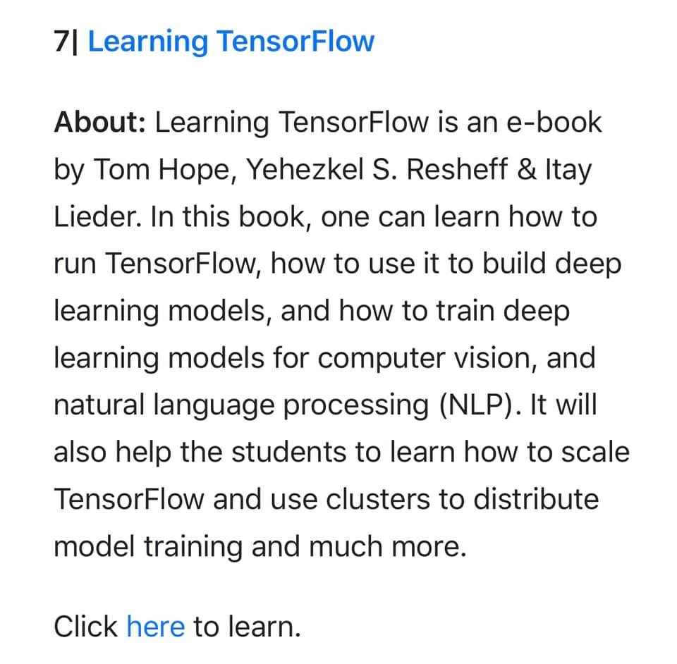
**이미지 캡션:** 이 사진은 텍스트 정보만 담고 있으며, 사람, 장소, 사물, 텍스트, 분위기 등 시각적인 요소는 없습니다. 텍스트 내용은 "7| Learning TensorFlow"라는 제목과 함께 "Learning TensorFlow"라는 전자책에 대한 설명입니다. 이 책은 Tom Hope, Yehezkel S. Resheff, Itay Lieder가 저술했으며, TensorFlow를 실행하고, 딥러닝 모델을 구축하며, 컴퓨터 비전 및 자연어 처리(NLP)를 위한 딥러닝 모델을 훈련하는 방법을 배울 수 있다고 설명합니다. 또한 TensorFlow를 확장하고 클러스터를 사용하여 모델 훈련을 분산시키는 방법 등도 다룬다고 합니다. 마지막으로 "Click here to learn."이라는 문구가 있어 학습을 위한 링크가 있음을 시사합니다.
 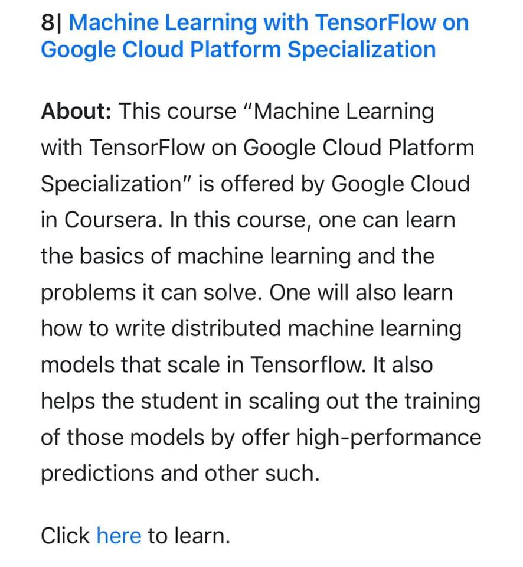
**이미지 캡션:** 이 사진은 온라인 강의에 대한 정보를 담고 있으며, 파란색 글씨로 "Machine Learning with TensorFlow on Google Cloud Platform Specialization"이라는 강의 제목이 크게 표시되어 있습니다. 그 아래에는 "About:"이라는 제목과 함께 강의에 대한 설명이 검은색 글씨로 상세하게 작성되어 있습니다. 이 강의는 Google Cloud에서 Coursera를 통해 제공되며, 머신러닝의 기본 개념과 해결할 수 있는 문제들, 그리고 TensorFlow를 사용하여 확장 가능한 분산 머신러닝 모델을 작성하는 방법을 배울 수 있다고 설명합니다. 또한, 고성능 예측을 통해 모델 학습을 확장하는 데 도움을 준다고 합니다. 마지막으로, "Click here to learn."이라는 문구가 파란색으로 표시되어 있어 클릭을 유도하고 있습니다. 사진에는 사람이 등장하지 않으며, 배경은 흰색으로 강의 내용에 집중할 수 있도록 단순하게 구성되어 있습니다.
 
**이미지 캡션:** 이 이미지는 텍스트만 포함하고 있으며, 사람이나 장소, 사물은 보이지 않습니다. 텍스트는 "10| TensorFlow Tutorials"라는 제목으로 시작하며, TensorFlow 튜토리얼에 대한 설명이 이어집니다. 이 튜토리얼은 TensorFlow 팀에서 공식 웹사이트를 통해 제공하며, 주피터 노트북 형식으로 작성되어 Google Colab에서 직접 실행할 수 있다고 설명합니다. 초보자와 숙련자 모두에게 유익하며, 기초부터 고급 사용자 정의 및 분산 학습까지 배울 수 있다고 합니다. 마지막으로 "Click here to learn."이라는 문구와 함께 학습 링크가 있음을 나타냅니다. 전반적으로 정보 제공적인 분위기이며, 기술 학습에 관한 내용입니다.
 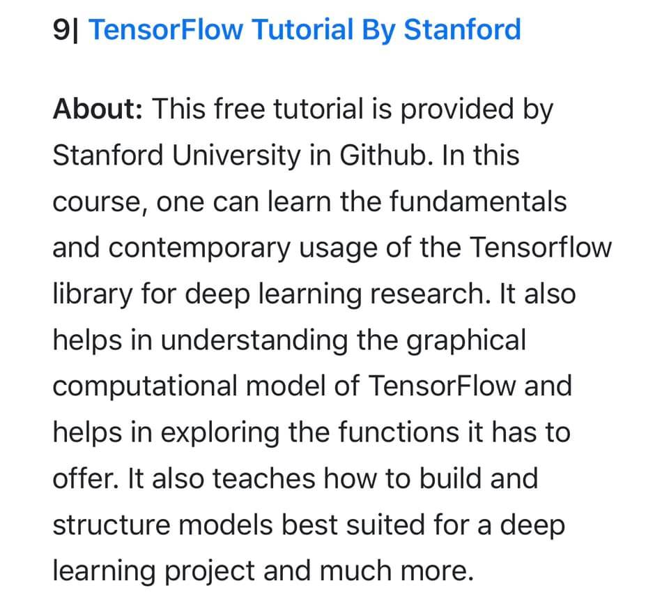
**이미지 캡션:** 이 사진은 텍스트만 포함하고 있으며, 사람이나 장소, 사물은 보이지 않습니다. 텍스트는 "9| TensorFlow Tutorial By Stanford"라는 제목과 "About:"으로 시작하는 설명으로 구성되어 있습니다. 설명 내용은 스탠포드 대학교에서 제공하는 무료 텐서플로우 튜토리얼에 대한 것으로, 딥러닝 연구를 위한 텐서플로우 라이브러리의 기본 개념과 최신 활용법, 그래픽 연산 모델 이해, 함수 탐색, 딥러닝 프로젝트에 적합한 모델 구축 및 구조화 방법 등을 배울 수 있다고 설명합니다. 전반적으로 정보 제공적인 분위기이며, 교육 자료의 일부로 보입니다.

### 12월 26일 (목) 20:42 · 📷 사진 (2장)

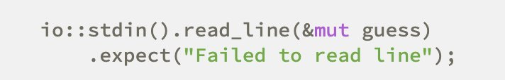
**이미지 캡션:** 이 이미지는 회색 배경에 프로그래밍 코드의 일부를 보여줍니다. 코드의 첫 번째 줄은 `io::stdin().read_line(&mut guess)`이며, 이는 표준 입력에서 한 줄을 읽어 `guess`라는 가변 변수에 저장하라는 명령입니다. 두 번째 줄은 `.expect("Failed to read line");`으로, 이전 작업이 실패할 경우 "Failed to read line"이라는 메시지와 함께 패닉을 발생시키라는 의미입니다. 코드의 일부는 회색으로 표시되지만, `mut` 키워드는 보라색으로, "Failed to read line"이라는 문자열은 녹색으로 강조되어 있어 코드의 특정 부분을 시각적으로 구분하고 있습니다. 이 이미지는 프로그래밍, 특히 Rust 언어와 관련된 맥락에서 사용될 수 있으며, 오류 처리 메커니즘을 보여줍니다.
 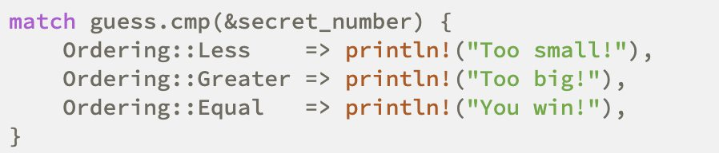
**이미지 캡션:** 이 이미지는 프로그래밍 코드의 일부를 보여줍니다. 보라색으로 강조된 'match' 키워드로 시작하며, 'guess.cmp(&secret_number)'라는 함수 호출이 이어집니다. 중괄호 안에는 세 가지 경우에 대한 조건문이 나열되어 있습니다. 첫 번째는 'Ordering::Less'로, 'Too small!'이라는 메시지를 출력합니다. 두 번째는 'Ordering::Greater'로, 'Too big!'이라는 메시지를 출력합니다. 마지막은 'Ordering::Equal'로, 'You win!'이라는 메시지를 출력합니다. 각 조건문은 화살표(=>)로 구분되며, 출력되는 메시지는 녹색으로 표시되어 있습니다. 이 코드는 사용자의 추측값과 비밀 숫자를 비교하여 그 결과를 알려주는 게임 로직의 일부로 보입니다. 배경은 회색이며, 특별한 인물이나 장소, 사물은 보이지 않습니다. 텍스트는 프로그래밍 코드의 문법에 따라 작성되었습니다. 전반적으로 기술적이고 정보 전달적인 분위기입니다.

### 12월 28일 (토) 07:41 · 📷 사진 (1장)

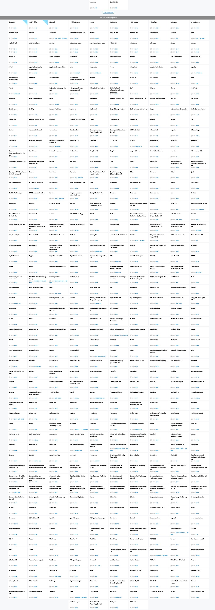
**이미지 캡션:** 이 이미지는 다양한 기업의 이름과 관련 정보가 나열된 웹 페이지의 스크린샷입니다. 화면에는 여러 열이 있으며, 각 열에는 기업 이름, 웹사이트 주소, 그리고 일부 기업의 경우 추가적인 정보가 포함되어 있습니다. 텍스트는 주로 영어로 되어 있으며, 기업 이름, 웹사이트 도메인, 그리고 일부는 "more"와 같은 링크로 구성되어 있습니다. 배경은 흰색이며, 일부 파란색 강조 표시가 있습니다. 전반적으로, 이 이미지는 기업 목록을 표시하는 데이터 기반의 인터페이스를 보여줍니다.

> #CES2020 #스압주의 1월초에 열리는 CES2020은 특히 AI관련 한 많은 회사, AI와 가전, 자동차, 5G 등의 재미있는 융합이 엄청날것 같아 큰 기대가 되는데요.  아래 AI부분 전시 리스트만 봐도 대략 500개 이상 됩니다. 제 목표는 이 500개 부스를 모두 방문하는 것인데요, 정말 철인이상의 체력이 필요할것 같습니다.   그래서 여러분들의 도움을 구합니다. 혹시 아래 회사들 보시고 관심이 있을만한 부분을 댓글로 적어 주시면 제가 그 회사들을 더 잘보고 와서 댓글의 댓글로 간략 리뷰를 남겨드리도록 하겠습니다.  찍어 주시면 제가 (체력이 허락하는한 가서) 대리로 봐드리고 리뷰를 남겨드리는 것입니다. ^^  (TFKR멤버들 중에 CES오시는 분들은 라스베가스에서 반갑게 뵙겠습니다.)    [https://www.ces.tech/Show-Floor/Exhibitor-Directory.aspx?searchTerm=&sortBy=productCategories&filter=Artificial%20Intelligence&pageNo=1&pageSize=30](https://www.ces.tech/Show-Floor/Exhibitor-Directory.aspx?searchTerm=&sortBy=productCategories&filter=Artificial%20Intelligence&pageNo=1&pageSize=30)
