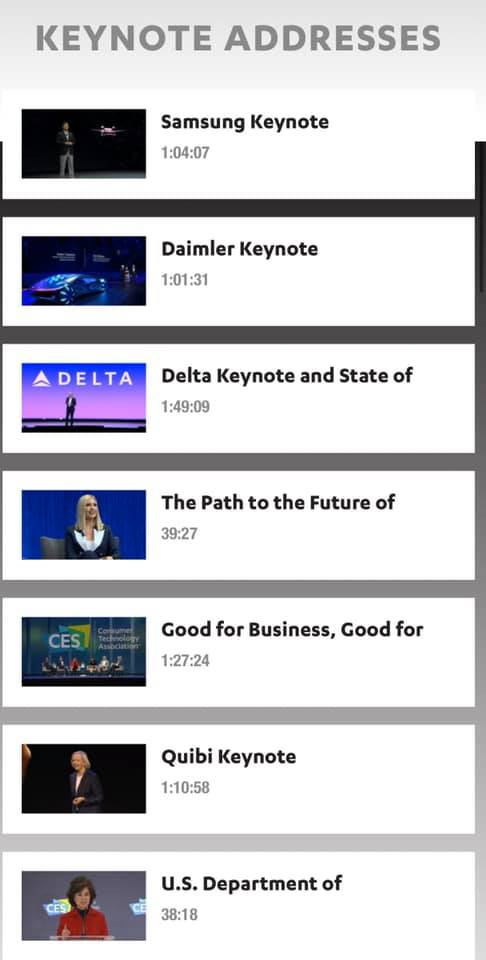
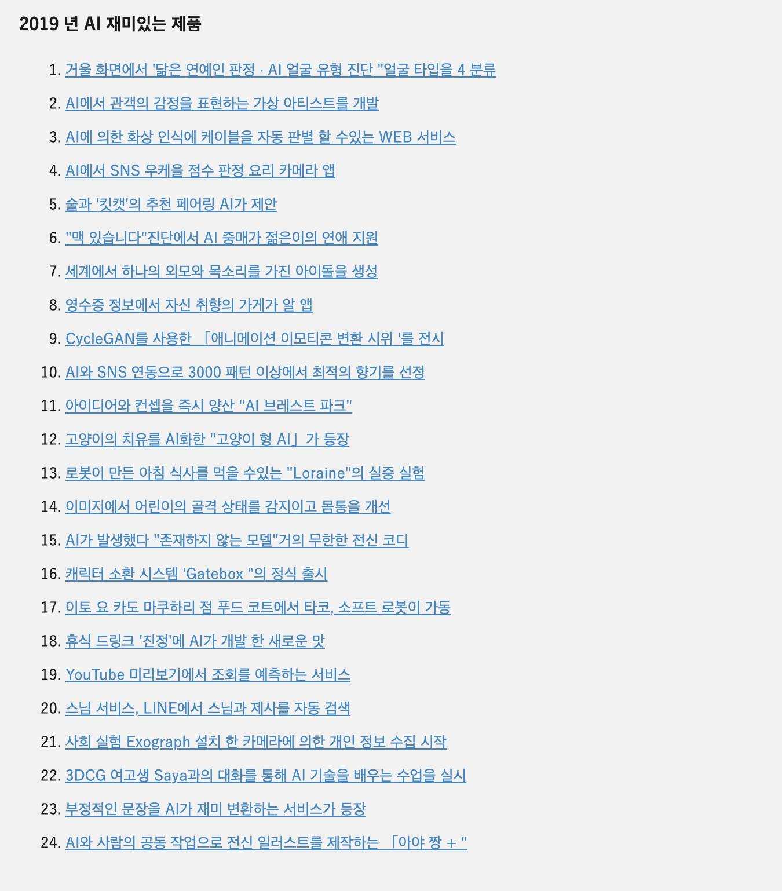
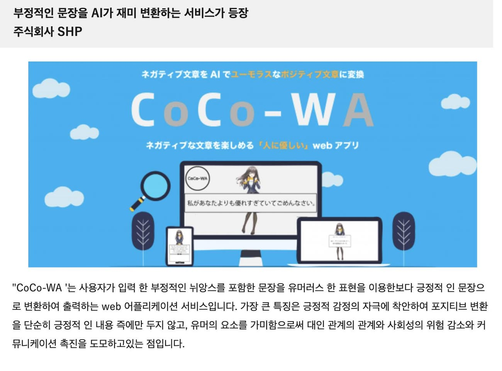

# 2020년 1월

[← 2020년](README.md)

### 1월 10일 (금) 19:48 · 📷 사진 (1장)

> #CES2020 키노트가 모두 공개 되었습니다.   https://live.ces.tech/?utm_source=CES&utm_medium=email&utm_campaign=ONSITE4  대부분의 회사들이 AI를 중심에 두고 이미 이를 이용한 제품들과 미래 방향에 대해 많이 소개 하고 있습니다. 삼성, LG 멋지고요! QUIBI도 매우 인상깊게 봤다는 이야기 많이 들었습니다.

### 1월 23일 (목) 22:54 · 📷 사진 (3장)

  
