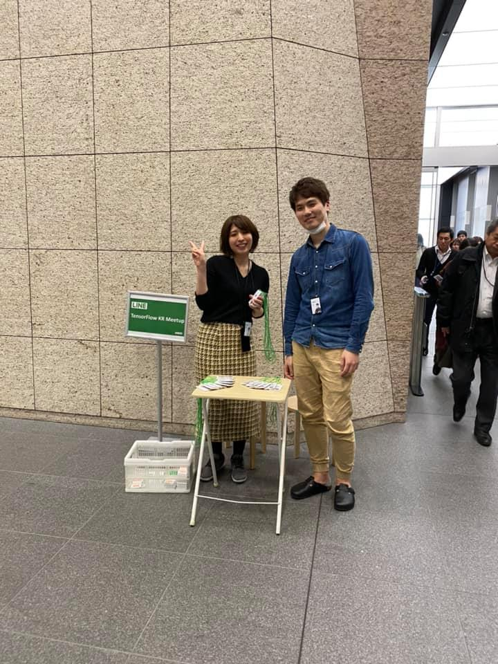
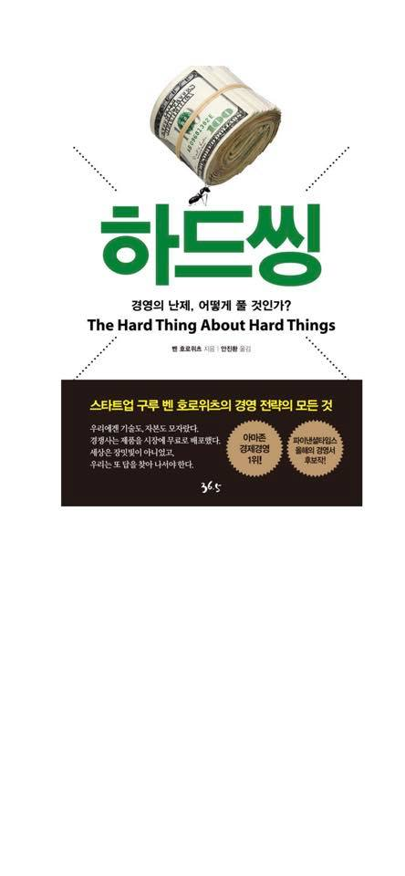
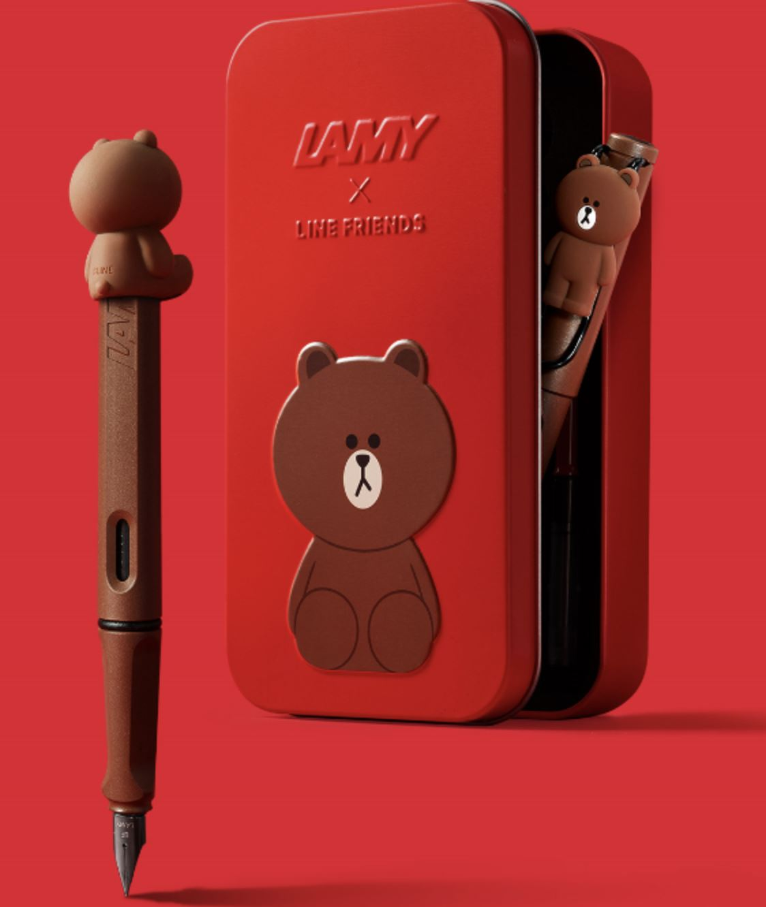
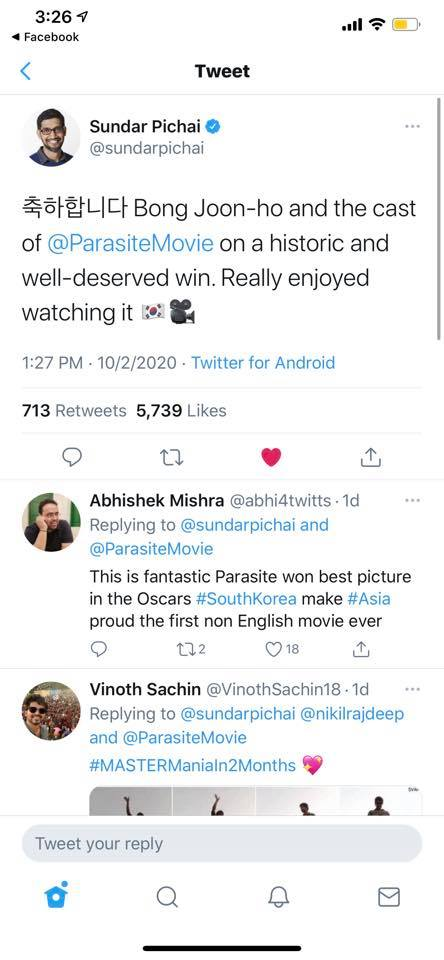
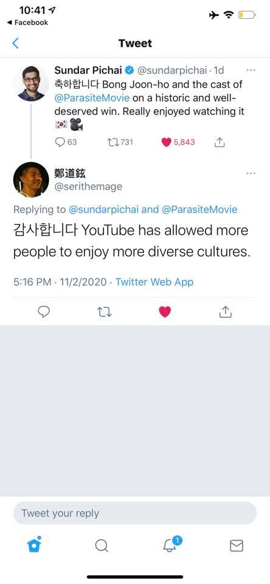
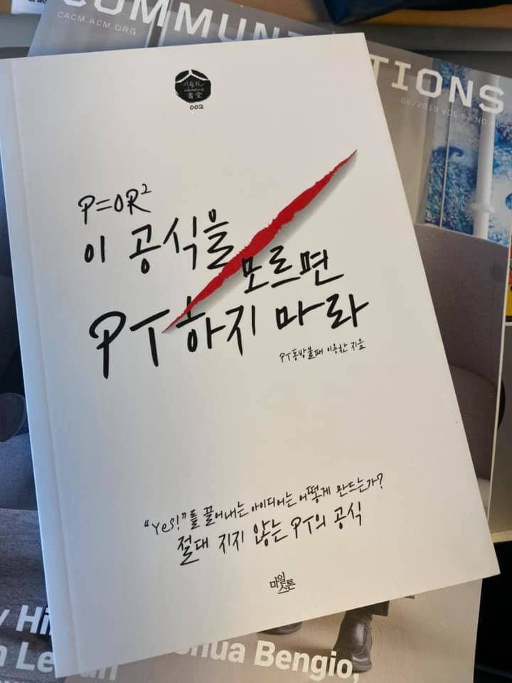

# 2020년 2월

[← 2020년](README.md)

### 2월 4일 (화) 19:38 · 📷 사진 (1장)

**이미지 캡션:** 행사 안내 부스 앞에서 성인 여성 한 명과 성인 남성 한 명이 서 있다. 여성은 20대 후반에서 30대 초반으로 보이며, 검은색 상의에 체크무늬 치마를 입고 있으며, 브이 포즈를 취하고 있다. 남성은 20대 후반에서 30대 초반으로 보이며, 청바지 재킷에 베이지색 바지를 입고 있으며, 밝게 웃고 있다. 배경에는 "LINE TensorFlow KR Meetup"이라고 적힌 안내판과 접이식 테이블이 보인다. 테이블 위에는 행사 관련 자료들이 놓여 있고, 테이블 옆에는 흰색 플라스틱 상자가 있다. 복도는 타일로 마감되어 있으며, 오른쪽에는 다른 사람들이 지나가는 모습이 보인다. 전체적으로 행사가 진행 중인 듯한 활기찬 분위기이다.감되어 있으며, 오른쪽에는 다른 사람들이 지나가는 모습이 보인다. 전체적으로 행사가 진행 중인 듯한 활기찬 분위기이다.

### 2월 6일 (목) 07:52 · 📷 사진 (1장)

**이미지 캡션:** 흰색 배경에 롤 형태의 100달러 지폐 뭉치가 놓여 있고, 그 아래에 "하드씽"이라는 큰 녹색 글씨가 있다. 지폐 뭉치 옆에는 점선으로 된 화살표와 개미 한 마리가 그려져 있다. "하드씽" 글씨 아래에는 "경영의 난제, 어떻게 풀 것인가?"라는 문구와 함께 영어로 "The Hard Thing About Hard Things"라고 쓰여 있으며, 그 아래에는 "벤 호로위츠 지음 | 안진환 옮김"이라고 작가와 번역가 정보가 있다. 하단에는 어두운 색상의 직사각형 영역이 있으며, "스타트업 구루 벤 호로위츠의 경영 전략의 모든 것"이라는 제목과 함께 "우리에겐 기술도, 자본도 모자랐다. 경쟁사는 제품을 시장에 무료로 배포했다. 세상은 장밋빛이 아니었고, 우리는 또 답을 찾아 나서야 한다."라는 문구가 적혀 있다. 또한, 이 영역 안에는 "아마존 경제경영 1위!"와 "파이낸셜타임스 올해의 경영서 후보작!"이라는 문구가 담긴 두 개의 원형 배지가 있으며, 오른쪽 하단에는 "36.5"라는 숫자가 작게 쓰여 있다. 전체적으로 책 표지 디자인으로 보이며, 성공적인 경영을 위한 어려움과 해결책에 대한 내용을 다루는 책임을 암시한다.전략의 모든 것"이라는 제목과 함께 "우리에겐 기술도, 자본도 모자랐다. 경쟁사는 제품을 시장에 무료로 배포했다. 세상은 장밋빛이 아니었고, 우리는 또 답을 찾아 나서야 한다."라는 문구가 적혀 있다. 또한, 이 영역 안에는 "아마존 경제경영 1위!"와 "파이낸셜타임스 올해의 경영서 후보작!"이라는 문구가 담긴 두 개의 원형 배지가 있으며, 오른쪽 하단에는 "36.5"라는 숫자가 작게 쓰여 있다. 전체적으로 책 표지 디자인으로 보이며, 성공적인 경영을 위한 어려움과 해결책에 대한 내용을 다루는 책임을 암시한다.

### 2월 9일 (일) 11:09 · 📷 사진 (1장)

**이미지 캡션:** 이 사진은 붉은색 배경에 갈색 펜과 붉은색 펜 케이스가 놓여 있는 모습입니다. 펜은 갈색이며, 펜촉 부분은 은색입니다. 펜의 상단에는 갈색 곰 캐릭터가 앉아 있는 모습으로 장식되어 있으며, 펜 몸통에는 "LAMY"라는 글자가 새겨져 있습니다. 붉은색 펜 케이스는 직사각형 모양으로, 열려 있는 상태이며 안쪽에는 갈색 펜이 하나 더 보입니다. 펜 케이스의 앞면에는 "LAMY X LINE FRIENDS"라는 글자와 함께 커다란 갈색 곰 캐릭터가 입체적으로 부착되어 있습니다. 곰 캐릭터는 동그란 얼굴에 작은 점 두 개와 Y자 모양의 입을 가지고 있으며, 몸통에는 두 개의 동그란 배가 표현되어 있습니다. 전체적으로 귀엽고 아기자기한 분위기를 자아내며, 문구류 제품의 광고 사진으로 보입니다.개와 Y자 모양의 입을 가지고 있으며, 몸통에는 두 개의 동그란 배가 표현되어 있습니다. 전체적으로 귀엽고 아기자기한 분위기를 자아내며, 문구류 제품의 광고 사진으로 보입니다.

### 2월 10일 (월) 14:06 · Yes, "Parasite" made Oscars history! Ama…

Yes, "Parasite" made Oscars history! Amazing!!

🔗 <https://www.latimes.com/entertainment-arts/movies/story/2020-02-09/parasite-oscars-2020-best-picture-history-korea>

### 2월 11일 (화) 15:27 · 📷 사진 (2장)

**이미지 캡션:** 이것은 트위터 화면의 스크린샷으로, 구글 CEO인 순다르 피차이가 영화 '기생충'에 대한 축하 트윗을 올린 것을 보여줍니다. 화면 상단에는 페이스북 알림과 트위터 앱의 상단 바가 보입니다. 순다르 피차이는 파란색 체크 표시가 있는 프로필 사진과 함께 이름과 트위터 핸들이 표시되어 있습니다. 그의 트윗은 한국어로 "축하합니다"로 시작하며, 봉준호 감독과 영화 '기생충' 팀의 역사적인 수상에 대한 축하를 전하고 있습니다. 그는 이 수상을 "잘 deserved win"이라고 표현하며, 영화를 "really enjoyed watching it"이라고 덧붙였습니다. 트윗 끝에는 한국 국기 이모티콘과 카메라 이모티콘이 있습니다. 트윗 아래에는 1:27 PM, 10/2/2020이라는 시간과 날짜, 그리고 "Twitter for Android"라는 정보가 표시되어 있습니다. 이 트윗은 713개의 리트윗과 5,739개의 좋아요를 받았습니다. 그 아래에는 다른 사용자들이 남긴 답글들이 보입니다. 첫 번째 답글은 Abhishek Mishra가 @sundarpichai와 @ParasiteMovie를 태그하며 "This is fantastic Parasite won best picture in the Oscars #SouthKorea make #Asia proud the first non English movie ever"라고 작성했습니다. 두 번째 답글은 Vinoth Sachin이 @sundarpichai, @nikilrajdeep, 그리고 @ParasiteMovie를 태그하며 "#MASTERManialn2Months"라는 해시태그와 함께 작성되었습니다. 화면 하단에는 답글을 작성할 수 있는 입력창과 트위터의 기본 기능 아이콘들이 보입니다. 전반적으로, 이 화면은 영화 '기생충'의 오스카 수상에 대한 긍정적인 반응과 축하 분위기를 보여줍니다.yed watching it"이라고 덧붙였습니다. 트윗 끝에는 한국 국기 이모티콘과 카메라 이모티콘이 있습니다. 트윗 아래에는 1:27 PM, 10/2/2020이라는 시간과 날짜, 그리고 "Twitter for Android"라는 정보가 표시되어 있습니다. 이 트윗은 713개의 리트윗과 5,739개의 좋아요를 받았습니다. 그 아래에는 다른 사용자들이 남긴 답글들이 보입니다. 첫 번째 답글은 Abhishek Mishra가 @sundarpichai와 @ParasiteMovie를 태그하며 "This is fantastic Parasite won best picture in the Oscars #SouthKorea make #Asia proud the first non English movie ever"라고 작성했습니다. 두 번째 답글은 Vinoth Sachin이 @sundarpichai, @nikilrajdeep, 그리고 @ParasiteMovie를 태그하며 "#MASTERManialn2Months"라는 해시태그와 함께 작성되었습니다. 화면 하단에는 답글을 작성할 수 있는 입력창과 트위터의 기본 기능 아이콘들이 보입니다. 전반적으로, 이 화면은 영화 '기생충'의 오스카 수상에 대한 긍정적인 반응과 축하 분위기를 보여줍니다.
 
**이미지 캡션:** 이것은 트위터 앱의 스크린샷으로, 두 개의 트윗이 표시됩니다. 상단 트윗은 성인 남성인 Sundar Pichai가 작성했으며, 그는 안경을 쓰고 파란색 셔츠를 입고 있으며 미소를 짓고 있습니다. 그는 한국 영화 "기생충"의 역사적인 승리를 축하하며 영화를 즐겁게 봤다고 말합니다. 트윗에는 한국 국기, 영화 카메라, 63개의 댓글, 731개의 리트윗, 5,843개의 좋아요가 포함되어 있습니다. 하단 트윗은 鄭道鉉이라는 이름의 다른 사용자가 작성했으며, 그는 검은색 셔츠를 입고 웃고 있습니다. 이 트윗은 Sundar Pichai와 "기생충" 영화에 대한 답글로, YouTube가 더 많은 사람들이 다양한 문화를 즐길 수 있도록 허용한 것에 대해 감사함을 표현합니다. 이 트윗은 2020년 11월 2일 오후 5시 16분에 트위터 웹 앱을 통해 게시되었습니다. 전반적인 분위기는 긍정적이고 축하하는 분위기입니다.ar Pichai와 "기생충" 영화에 대한 답글로, YouTube가 더 많은 사람들이 다양한 문화를 즐길 수 있도록 허용한 것에 대해 감사함을 표현합니다. 이 트윗은 2020년 11월 2일 오후 5시 16분에 트위터 웹 앱을 통해 게시되었습니다. 전반적인 분위기는 긍정적이고 축하하는 분위기입니다.

### 2월 21일 (금) 08:13 · 📷 사진 (1장)

**이미지 캡션:** 이 사진은 흰색 표지의 책 한 권을 클로즈업한 모습으로, 책 표지에는 검은색 글씨와 붉은색 붓 자국이 있다. 책의 제목은 "P=OR² 이 공식을 모르면 PT 하지 마라"이며, "PT 동방불패 이용찬 지음"이라는 부제가 작게 쓰여 있다. 책 표지 상단에는 검은색 로고와 함께 "서당 002"라는 글자가 보인다. 책 표지 중앙에는 붉은색 붓으로 획을 그은 듯한 디자인이 있어 시선을 끈다. 하단에는 "Yes!를 끌어내는 아이디어는 어떻게 만드는가? 절대 지지 않는 PT의 공식"이라는 문구와 함께 "마원"이라는 출판사 이름으로 추정되는 글자가 쓰여 있다. 책은 여러 다른 책들 위에 놓여 있으며, 배경에는 "COMMUN"과 "TIONS" 등의 글자가 희미하게 보인다. 전체적으로 책의 내용에 대한 호기심을 자극하는 디자인이며, 전문적인 느낌을 준다. 이름으로 추정되는 글자가 쓰여 있다. 책은 여러 다른 책들 위에 놓여 있으며, 배경에는 "COMMUN"과 "TIONS" 등의 글자가 희미하게 보인다. 전체적으로 책의 내용에 대한 호기심을 자극하는 디자인이며, 전문적인 느낌을 준다.
