# 2020년 3월

[← 2020년](README.md)

### 3월 9일 (월) 12:19 · 📷 사진 (1장)

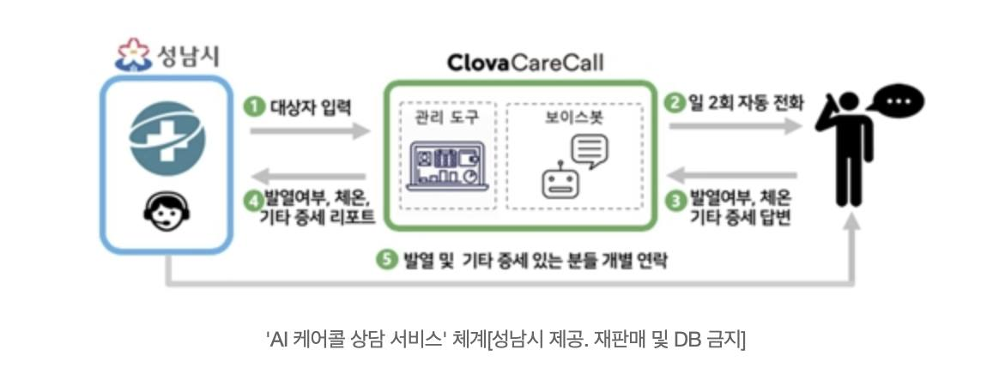
**이미지 캡션:** 이 이미지는 성남시에서 제공하는 'AI 케어콜 상담 서비스'의 작동 방식을 설명하는 흐름도입니다. 왼쪽에는 성남시 로고와 함께 의료 및 상담을 상징하는 아이콘이 있는 파란색 상자가 있습니다. 이 상자에서 시작된 화살표는 '1. 대상자 입력'이라는 텍스트와 함께 중앙의 녹색 상자로 이어집니다. 녹색 상자 안에는 '관리 도구'와 '보이스봇'이라는 두 개의 영역이 있으며, '관리 도구'에는 노트북 아이콘이, '보이스봇'에는 로봇 모양의 아이콘과 말풍선 아이콘이 있습니다. 녹색 상자에서 오른쪽으로 향하는 화살표는 '2. 일 2회 자동 전화'라는 텍스트와 함께 검은색 실루엣으로 표현된 성인 남성이 전화 통화를 하고 있는 모습으로 이어집니다. 이 남성은 헤드셋을 끼고 있으며, 머리 위에는 말풍선과 점 세 개가 있어 대화 중임을 나타냅니다. 성인 남성에게서 녹색 상자로 향하는 화살표는 '3. 발열여부, 체온, 기타 증세 답변'이라는 텍스트와 함께 돌아옵니다. 또한, 왼쪽 파란색 상자에서 녹색 상자로 향하는 또 다른 화살표는 '4. 발열여부, 체온, 기타 증세 리포트'라는 텍스트와 함께 연결됩니다. 녹색 상자 하단에서는 '5. 발열 및 기타 증세 있는 분들 개별 연락'이라는 텍스트와 함께 화살표가 아래쪽으로 이어집니다. 이미지 하단에는 'AI 케어콜 상담 서비스' 체계[성남시 제공. 재판매 및 DB 금지]'라는 설명 문구가 있습니다. 전체적으로 이 흐름도는 AI 시스템을 활용하여 시민들의 건강 상태를 주기적으로 확인하고 필요한 경우 개별적인 연락을 취하는 서비스의 과정을 시각적으로 보여주고 있습니다.

> #함께코로나19극복 #질본힘내라 #성남시힘내라  모두가 힘든 시기를 지나고 있지만 우리는 반드시 이겨낼것입니다. 우리는 (특히 AI 기술로) 어떻게 도울수 있을까요? 관련 기사를 보던중 자가 격리 대상이 많으시고, 이분들에게 증상이 있으신지를 매일 매일 전화해서 확인하시고 계시다는 것을 알게 되었습니다.   (아웃백 미금점 AI콜을 서비스 하고 있는) Nako Sung 님이 이끌고 있는 클로바 AI CALL팀과 AI 사업팀은 즉시 하는 일을 멈추고 이 기술을 이용하여 자가 격리 대상자들에게 자동으로 전화를 걸어 유증상자 분들을 빠르게 알아 내는 시스템에 대해 고민하기 시작했습니다. 성남시와 협의하고 또 개발시작하면서 데모를 만들었고 일주일 후인 오늘 드디어 적용 되었습니다. 클로바 케어콜이 성남시 자가 격리대상 분들에게 전화를 걸어 증상을 확인합니다. 이 시스템을 통해 한분이라도 빠르게 진료를 받을수 있고 힘들게 일하시는 분들의 수고를 조금이라도 덜 수 있기를 기대합니다.   계속해서 AI로, TF-KR로, 그리고 Clova AI가 할수 있는 일들을 더 많아 찾아 보겠습니다. 좋은 아이디어가 있으신 분들은 함께 나누어요.  https://www.facebook.com/784602958576087/posts/1040366592999721/

### 3월 11일 (수) 09:02 · 생일 축하 드립니다!!

생일 축하 드립니다!!

### 3월 11일 (수) 09:02 · ↪ 생일 축하 드립니다!!

*다른 프로필에 남긴 글*

생일 축하 드립니다!!

### 3월 11일 (수) 09:02 · Happy birthday!!

Happy birthday!!

### 3월 11일 (수) 09:02 · ↪ Happy birthday!!

*다른 프로필에 남긴 글*

Happy birthday!!

### 3월 12일 (목) 10:02 · 📷 사진 (3장)

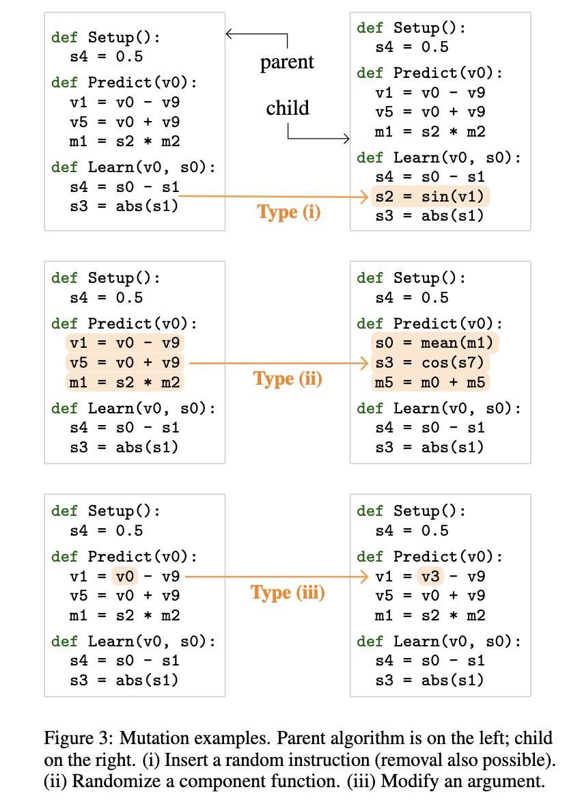
**이미지 캡션:** 이 이미지는 프로그래밍 코드의 변이(mutation) 예시를 보여주는 도표로, 왼쪽에는 부모 알고리즘 코드가, 오른쪽에는 자식 알고리즘 코드가 제시되어 있습니다. 각 예시는 세 가지 유형으로 나뉘며, 주황색 화살표로 부모 코드에서 자식 코드로의 변이 과정을 나타냅니다. 유형 (i)는 코드 줄 삽입 또는 제거를, 유형 (ii)는 함수 호출을 무작위로 변경하는 것을, 유형 (iii)는 인수를 수정하는 것을 보여줍니다. 각 코드 블록은 `Setup`, `Predict`, `Learn`이라는 세 가지 함수로 구성되어 있으며, 변이된 부분은 주황색으로 강조 표시되어 있습니다. 배경은 흰색이며, 텍스트는 검은색으로 코드를 명확하게 보여줍니다. 전체적으로 연구 또는 교육 자료로 사용될 법한, 정보 전달에 초점을 맞춘 차분하고 분석적인 분위기입니다.
 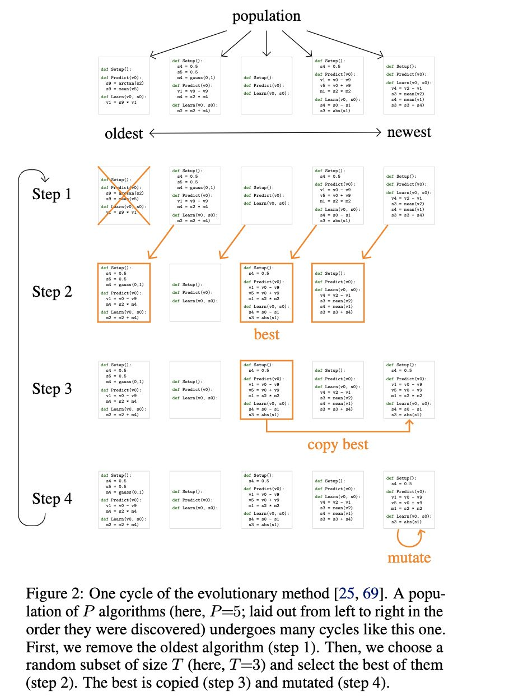
**이미지 캡션:** The image displays a flowchart illustrating an evolutionary algorithm for optimizing algorithms, with "population" at the top and arrows indicating progression from "oldest" to "newest." The flowchart is divided into four steps, each containing several boxes representing individual algorithms. Each box contains Python-like code snippets for `Setup()`, `Predict(v0)`, and `Learn(v0, s0)`. The steps are labeled "Step 1" through "Step 4." Step 1 shows the initial population of algorithms. Step 2 highlights the "best" algorithm identified from a subset. Step 3 shows the "copy best" operation, where the best algorithm is replicated. Step 4 indicates the "mutate" operation, where a copy of the best algorithm is modified. The overall background is white, and the flowchart elements are primarily black text on white boxes, with orange borders and arrows highlighting specific paths and selections. The text at the bottom, labeled "Figure 2," explains the process in detail, describing the removal of the oldest algorithm, selection of the best from a subset, copying, and mutation. There are no people visible in the image.
 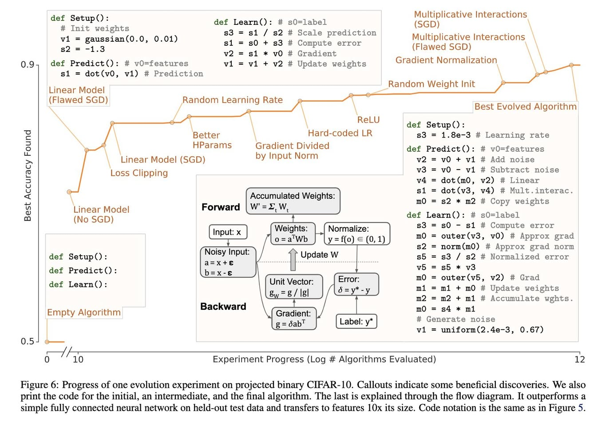
**이미지 캡션:** 이 이미지는 머신러닝 알고리즘의 진화 과정을 보여주는 그래프와 관련 코드, 그리고 알고리즘의 작동 방식을 설명하는 플로우 차트입니다. 그래프는 x축에 평가된 알고리즘의 로그 개수를, y축에 발견된 최고 정확도를 나타냅니다. 그래프 상의 여러 지점에는 "Linear Model (No SGD)", "Loss Clipping", "Better HParams", "Random Learning Rate", "ReLU", "Gradient Normalization", "Best Evolved Algorithm" 등 알고리즘의 특징이나 발견 사항을 나타내는 텍스트 라벨이 붙어 있습니다. 그래프의 오른쪽에는 세 가지 다른 시점의 알고리즘 코드가 파이썬 함수 형태로 제시되어 있으며, 각 코드 블록에는 "def Setup()", "def Predict()", "def Learn()"과 같은 함수 정의와 함께 가중치 초기화, 예측, 학습 과정에 대한 주석이 포함되어 있습니다. 가장 오른쪽에는 "Best Evolved Algorithm"이라는 라벨과 함께 가장 발전된 형태의 알고리즘 코드가 상세하게 표시되어 있습니다. 이미지 중앙에는 "Forward"와 "Backward"라는 두 개의 큰 섹션으로 나뉜 플로우 차트가 있습니다. "Forward" 섹션은 입력 데이터가 가중치를 거쳐 정규화되는 과정을 보여주며, "Backward" 섹션은 오차 계산 및 기울기 업데이트 과정을 나타냅니다. 이 플로우 차트에는 "Input: x", "Noisy Input", "Weights", "Normalize", "Error", "Label", "Unit Vector", "Gradient", "Accumulated Weights" 등의 용어가 사용되었습니다. 이미지 하단에는 이 그래프와 플로우 차트에 대한 설명이 포함된 캡션이 있습니다. 캡션은 이 그림이 CIFAR-10 데이터셋에 대한 진화 실험의 진행 상황을 보여주며, 초기, 중간, 최종 알고리즘의 코드를 제공하고, 마지막 알고리즘은 플로우 차트를 통해 설명된다고 언급합니다. 또한, 이 알고리즘이 간단한 완전 연결 신경망보다 뛰어난 성능을 보이며, 테스트 데이터에서 10배 더 큰 특징으로 전이된다고 설명합니다. 전반적으로 이 이미지는 머신러닝 알고리즘의 탐색 및 발전 과정을 시각적으로 보여주는 교육적인 자료입니다.

### 3월 14일 (토) 07:09 · 📷 사진 (11장)

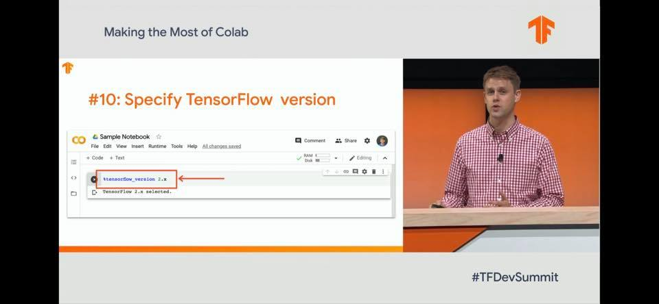
**이미지 캡션:** 화면 왼쪽에는 "Making the Most of Colab"이라는 제목과 함께 " #10: Specify TensorFlow version"이라는 부제가 보이며, 그 아래에는 구글 코랩(Colab) 노트북 화면이 캡처되어 있다. 노트북 제목은 "Sample Notebook"이고, 메뉴에는 File, Edit, View, Insert, Runtime, Tools, Help가 있으며 "All changes saved"라는 문구가 보인다. 코드 입력창에는 "tensorflow_version 2.x"라고 입력되어 있고, 빨간색 화살표가 이를 가리키고 있으며, 그 아래 줄에는 "TensorFlow 2.x selected."라는 텍스트가 표시되어 있다. 화면 오른쪽에는 붉은색 체크무늬 셔츠를 입은 젊은 성인 남성이 연단에 서서 발표하고 있으며, 그의 뒤로는 주황색 배경이 보인다. 화면 하단에는 "#TFDevSummit"이라는 해시태그가 적혀 있다. 전반적으로 기술 컨퍼런스의 발표 장면을 담고 있으며, 텐서플로우 버전 지정에 대한 내용을 다루고 있다.
 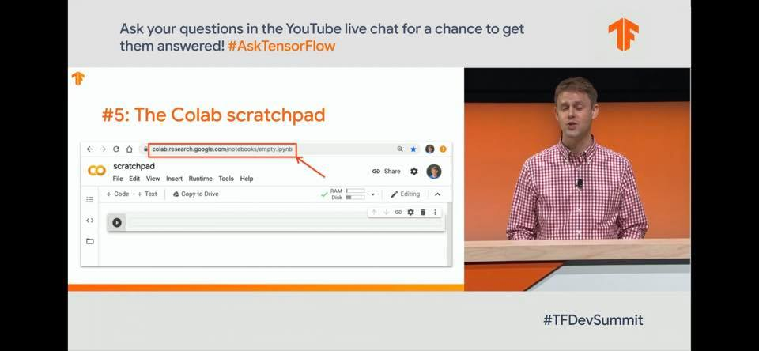
**이미지 캡션:** 화면 왼쪽에는 "Ask your questions in the YouTube live chat for a chance to get them answered! #AskTensorFlow"라는 문구가 보이고, 그 아래에는 "#5: The Colab scratchpad"라는 제목과 함께 구글 코랩(Colab) 노트북 화면이 캡처되어 있다. 코랩 화면에는 주소창에 "colab.research.google.com/notebooks/empty.ipynb"가 표시되어 있고, 빨간색 화살표가 이 주소를 가리키고 있다. 코랩 인터페이스에는 "scratchpad", "File Edit View Insert Runtime Tools Help", "+ Code + Text", "Copy to Drive", "Share", "Editing" 등의 메뉴와 버튼이 보인다. 화면 오른쪽에는 붉은색 체크무늬 셔츠를 입은 성인 남성이 연단 뒤에서 마이크를 착용하고 발표하고 있는 모습이 보인다. 남성은 30대 초반으로 보이며, 밝은 표정으로 청중을 향해 이야기하고 있다. 배경은 주황색으로, 무대 위에서 진행되는 발표임을 알 수 있다. 화면 하단에는 "#TFDevSummit"이라는 해시태그가 보인다. 전체적으로 기술 컨퍼런스의 발표 장면을 담고 있으며, 코랩을 활용한 개발 환경을 소개하는 내용으로 보인다.
 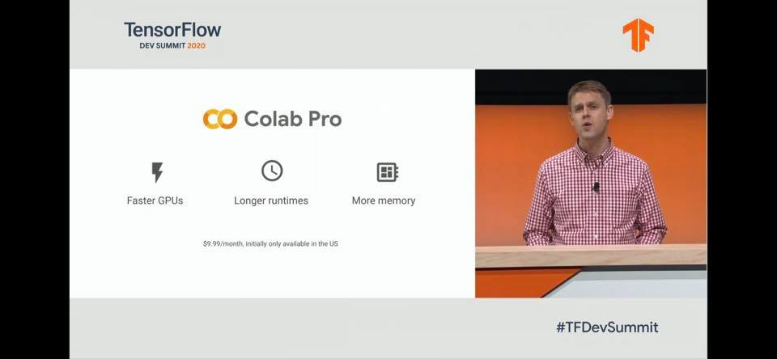
**이미지 캡션:** 화면 왼쪽에는 TensorFlow DEV SUMMIT 2020 로고와 함께 Colab Pro 서비스에 대한 정보가 표시되어 있습니다. Colab Pro는 더 빠른 GPU, 더 긴 런타임, 더 많은 메모리를 제공하며 월 9.99달러에 이용 가능하고 초기에는 미국에서만 제공된다는 내용이 아이콘과 함께 설명되어 있습니다. 화면 오른쪽에는 30대 초중반으로 보이는 백인 남성이 빨간색 체크무늬 셔츠를 입고 발표하고 있는 모습이 보입니다. 남성은 무대 위에서 연설 중이며, 배경에는 주황색과 흰색으로 디자인된 무대 장식이 있습니다. 화면 하단에는 #TFDevSummit이라는 해시태그가 표시되어 있습니다. 전체적으로 기술 컨퍼런스의 발표 장면으로 보이며, 진지하면서도 전문적인 분위기입니다.
 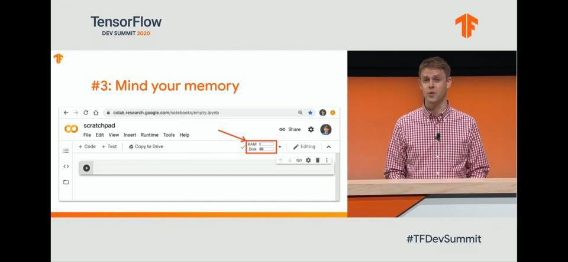
**이미지 캡션:** 화면 왼쪽에는 "TensorFlow DEV SUMMIT 2020"이라는 로고와 함께 "#3: Mind your memory"라는 제목이 보이며, 그 아래에는 구글 코랩(Colab) 노트북 화면이 캡처되어 있다. 코랩 화면에는 "scratchpad"라는 제목과 함께 파일, 편집, 보기, 삽입, 런타임, 도구, 도움말 메뉴가 있고, 코드와 텍스트를 추가하는 버튼, 드라이브로 복사하는 버튼이 보인다. 또한, 런타임 설정 부분에 RAM과 Disk 사용량을 나타내는 표시와 함께 입력란이 있으며, 빨간색 화살표가 RAM 표시 부분을 가리키고 있다. 화면 오른쪽에는 오렌지색 배경을 뒤로하고 단상 앞에 서 있는 젊은 성인 남성이 보인다. 그는 붉은색과 흰색 체크무늬 셔츠를 입고 있으며, 마이크가 셔츠에 부착되어 있다. 남성은 약간 놀란 듯한 표정으로 정면을 바라보고 있으며, 입을 살짝 벌리고 말하는 듯한 모습이다. 단상 아래에는 "#TFDevSummit"이라는 해시태그가 보인다. 전반적으로 기술 컨퍼런스의 발표 장면을 담고 있으며, 발표자는 메모리 관리에 대한 내용을 설명하고 있는 것으로 보인다.
 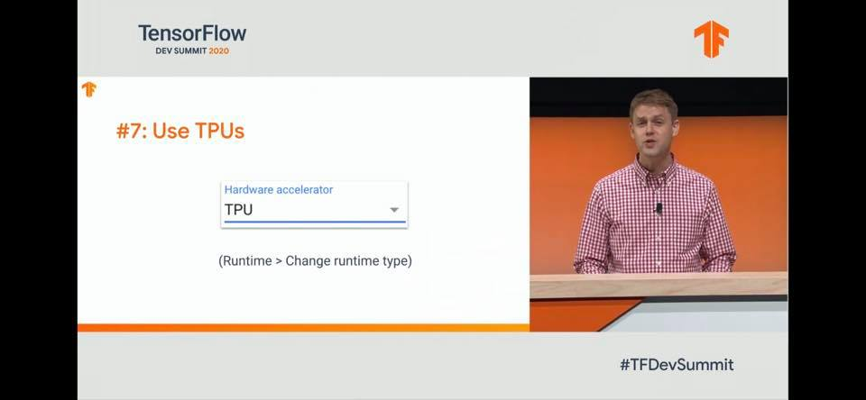
**이미지 캡션:** 이 사진은 TensorFlow 개발자 서밋 2020의 한 장면을 담고 있으며, 발표자가 무대에서 강연하는 모습과 슬라이드 화면이 함께 보인다. 발표자는 20대 후반에서 30대 초반으로 보이는 성인 남성이며, 붉은색과 흰색 체크무늬 셔츠를 입고 있다. 그는 밝고 자신감 있는 표정으로 청중을 향해 이야기하고 있으며, 마이크가 달린 핀을 옷에 달고 있다. 배경에는 주황색 패널과 나무 질감의 연단이 보인다. 슬라이드 화면에는 "TensorFlow DEV SUMMIT 2020"이라는 로고와 함께 "#7: Use TPUs"라는 제목이 크게 쓰여 있다. 그 아래에는 "Hardware accelerator"라는 라벨과 함께 "TPU"라고 선택된 드롭다운 메뉴가 보이며, "(Runtime > Change runtime type)"이라는 안내 문구가 있다. 사진의 오른쪽 하단에는 "#TFDevSummit"이라는 해시태그가 보인다. 전반적으로 기술 컨퍼런스의 발표 장면으로, 정보 전달과 교육적인 분위기를 띠고 있다.
 
**이미지 캡션:** 이 사진은 2020년 TensorFlow 개발자 서밋의 발표 장면을 담고 있으며, 화면 왼쪽에는 발표 슬라이드가, 오른쪽에는 발표자가 보인다. 슬라이드에는 "TensorFlow DEV SUMMIT 2020"이라는 로고와 함께 "#1: Only use GPUs when needed"라는 제목이 주황색 글씨로 크게 쓰여 있고, 그 아래에는 "Conserve resources to get more from Colab"이라는 부연 설명이 검은색 글씨로 작게 쓰여 있다. 화면 오른쪽에는 20대 후반에서 30대 초반으로 보이는 성인 남성이 빨간색 체크무늬 셔츠를 입고 발표하고 있으며, 입을 벌리고 열정적으로 말하는 표정을 짓고 있다. 배경은 주황색으로 되어 있으며, 발표자 앞에는 나무 재질의 연단이 놓여 있다. 화면 하단에는 "#TFDevSummit"이라는 해시태그가 보인다. 전반적으로 기술 컨퍼런스의 발표 장면으로, 정보 전달과 발표자의 열정적인 모습이 돋보이는 분위기이다.
 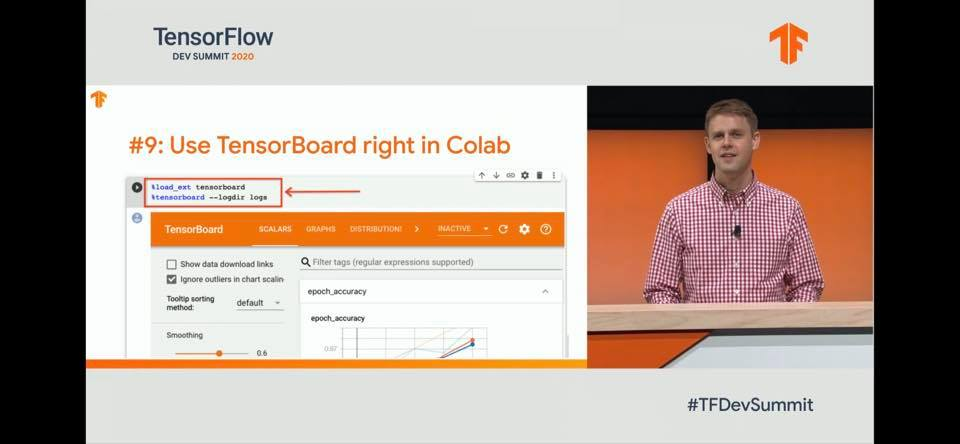
**이미지 캡션:** 화면 왼쪽에는 "TensorFlow DEV SUMMIT 2020"이라는 로고와 함께 "#9: Use TensorBoard right in Colab"이라는 제목이 보이며, 그 아래에는 Colab 노트북에서 TensorBoard를 사용하는 코드 예시가 빨간색 화살표로 강조되어 있다. 코드 내용은 `load_ext tensorboard`와 `tensorboard --logdir logs`이다. TensorBoard 인터페이스의 일부도 보이며, "TensorBoard", "SCALARS", "GRAPHS", "DISTRIBUTION" 탭과 함께 "Show data download links", "Ignore outliers in chart scaling" 등의 옵션이 보인다. 화면 오른쪽에는 붉은색 체크무늬 셔츠를 입은 젊은 성인 남성이 연단 뒤에 서서 발표하고 있으며, 그의 표정은 밝고 자신감 있어 보인다. 배경은 주황색으로, 이는 발표 장소의 일부로 보인다. 화면 하단에는 "#TFDevSummit"이라는 해시태그가 표시되어 있다. 전반적으로 기술 컨퍼런스의 발표 장면을 담고 있으며, TensorBoard를 Colab에서 활용하는 방법에 대한 정보를 전달하는 분위기이다.
 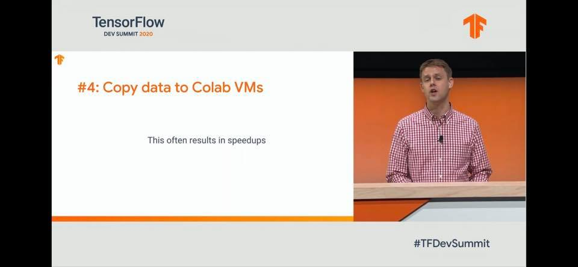
**이미지 캡션:** 화면 왼쪽에는 흰색 배경에 주황색 글씨로 "#4: Copy data to Colab VMs"라는 제목과 그 아래 "This often results in speedups"라는 부제가 표시되어 있으며, 상단에는 "TensorFlow DEV SUMMIT 2020" 로고가 보인다. 화면 오른쪽에는 오렌지색 배경을 뒤로하고 연단에 서서 발표하고 있는 30대 후반에서 40대 초반의 백인 남성이 보인다. 그는 붉은색과 흰색 체크무늬 셔츠를 입고 있으며, 마이크가 달려 있다. 남성은 입을 살짝 벌리고 청중을 바라보며 발표 중인 것으로 보인다. 화면 하단에는 "#TFDevSummit"이라는 해시태그가 보인다. 전체적으로 기술 컨퍼런스의 발표 장면을 담고 있으며, 진지하면서도 활기찬 분위기이다.
 
**이미지 캡션:** 화면 왼쪽에는 흰색 배경에 TensorFlow DEV SUMMIT 2020이라는 로고와 함께 "#2: Close tabs when done"이라는 제목과 "This actually benefits you"라는 부제가 표시되어 있습니다. 오른쪽에는 오렌지색 배경을 뒤로하고 단상 뒤에 서 있는 젊은 성인 남성이 보입니다. 그는 빨간색과 흰색 체크무늬 셔츠를 입고 있으며, 마이크가 달린 옷깃을 하고 있습니다. 남성은 카메라를 향해 말하고 있으며, 그의 표정은 진지하고 집중된 모습입니다. 화면 하단에는 "#TFDevSummit"이라는 해시태그가 보입니다. 전반적으로 기술 컨퍼런스의 발표 장면으로 보이며, 발표자는 청중에게 유용한 팁을 전달하고 있는 것으로 추정됩니다.
 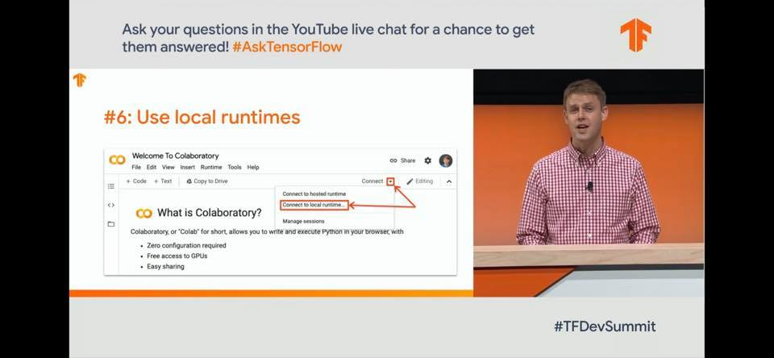
**이미지 캡션:** 화면 왼쪽에는 "Ask your questions in the YouTube live chat for a chance to get them answered! #AskTensorFlow"라는 문구가 회색 배경에 쓰여 있고, 그 아래에는 주황색 글씨로 "#6: Use local runtimes"라는 제목이 있다. 그 아래에는 "Welcome To Colaboratory"라는 제목과 함께 Colaboratory 인터페이스 화면이 보이며, "Connect" 버튼 아래 드롭다운 메뉴에서 "Connect to local runtime..." 옵션이 빨간색으로 강조 표시되어 있다. 화면 오른쪽에는 붉은색 체크무늬 셔츠를 입은 젊은 성인 남성이 연단에 서서 발표하고 있으며, 배경은 주황색이다. 화면 하단에는 "#TFDevSummit"이라는 해시태그가 보인다. 전반적으로 기술 컨퍼런스의 발표 장면으로, 코딩 환경에 대한 설명을 하고 있는 것으로 보인다.
 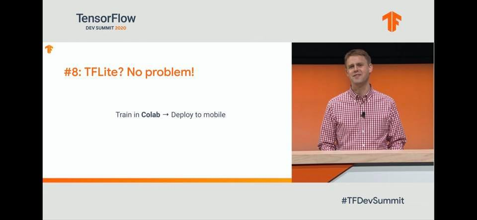
**이미지 캡션:** 화면 왼쪽에는 "TensorFlow DEV SUMMIT 2020"이라는 로고와 함께 "#8: TFLite? No problem!"이라는 제목이 주황색 글씨로 쓰여 있고, 그 아래에는 "Train in Colab → Deploy to mobile"이라는 문구가 검은색 글씨로 적혀 있다. 화면 오른쪽에는 30대 후반에서 40대 초반으로 보이는 백인 남성이 붉은색 체크무늬 셔츠를 입고 연단 뒤에 서서 카메라를 보며 미소를 짓고 있다. 남성의 뒤로는 주황색 배경이 보인다. 화면 하단에는 "#TFDevSummit"이라는 해시태그가 보인다. 전반적으로 기술 컨퍼런스의 발표 슬라이드로 보이며, TFLite를 활용한 모바일 배포에 대한 내용을 다루는 것으로 추정된다.

### 3월 14일 (토) 09:13 · If you are around, please join us for a …

If you are around, please join us for a fun riding, Gapyeong five hills, 100K on March 21, 2020.

더디어 시즌온을 하고 몸을 풀 시간이 돌아 왔습니다. 다음주 토요일 가평 5고개로 겨울동안 잠자고 있던 우리 근육을 깨워 보도록 하겠습니다. DoHyun Jung @정영준 @규현 Douglas Guen

* 일시: 2020년 3월 21일 토요일 오전 9:45 (sharp)
* 장소: 가평역
* 코스: 가평5고개 (아래 지도참고) 
* 기본룰: 기본장비인 긴장갑, 헬멧, 실손보험등 필수, 안전은 본인이 챙겨주시고, 내리막 추월금지, 오르막 추월 장려, 위생을 위해 1m이상 라이딩 간격유지

오시는 분들 모두 뵙겠습니다. 라이딩관련 정보: http://blog.naver.com/PostView.nhn?blogId=choics79&logNo=220998351612

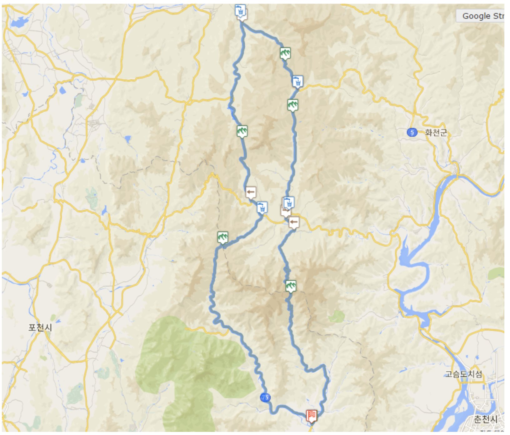
**이미지 캡션:** 이 이미지는 한국의 산악 지역을 보여주는 지도 화면으로, 파란색 선으로 표시된 경로가 산길을 따라 구불구불하게 이어져 있습니다. 지도에는 도로망, 강, 호수, 산악 지형이 표현되어 있으며, 여러 지점에 아이콘이 표시되어 있습니다. 아이콘 중에는 물방울 모양과 쇼핑백 모양이 있어 편의시설이나 휴게소를 나타내는 것으로 보이며, 산 모양 아이콘은 산악 지역이나 등산로를 의미하는 것으로 추정됩니다. 또한, "포천시", "화천군", "고슴도치섬", "춘천시"와 같은 지명과 숫자 "5", "75"가 표시되어 있어 특정 지역과 도로 번호를 나타냅니다. 지도 상단에는 "Google Str"이라는 텍스트가 희미하게 보입니다. 전반적으로 이 지도는 자전거 라이딩이나 등산과 같은 야외 활동을 위한 경로를 계획하거나 탐색하는 데 사용될 수 있는 정보를 제공하며, 산악 지형의 복잡성과 자연 경관을 시각적으로 보여줍니다.

### 3월 15일 (일) 17:50 · 생일 축하드립니다!

생일 축하드립니다!

### 3월 15일 (일) 17:50 · ↪ 생일 축하드립니다!

*다른 프로필에 남긴 글*

생일 축하드립니다!

### 3월 18일 (수) 18:25 · 📷 사진 (1장)

**이미지 캡션:** 이 이미지는 스마트폰 화면을 캡처한 것으로, 구글 폼(Google Forms)을 통해 진행되는 "ANAIN 랜선파티" 참가 신청 화면을 보여줍니다. 화면 상단에는 브라우저의 주소창에 "docs.google.com"이 표시되어 있으며, LTE 신호와 배터리 잔량도 확인할 수 있습니다. 폼은 세 개의 질문과 하나의 답변 입력란으로 구성되어 있습니다. 첫 번째 질문은 "당신의 근황을 알려주세요! (ex. 재택근무 하면서 느낀 점 / 재택 꿀팁 대방출) *"이며, 두 번째 질문은 "랜선파티에서 소개하고 싶은 favorite 술(음료)와 좋아하는 이유 *"입니다. 각 질문 아래에는 "Your answer"라고 표시된 답변 입력란이 있습니다. 마지막 부분에는 "ANAIN 랜선파티에 참가 신청 해주셔서 감사합니다!"라는 감사 메시지와 함께, 선착순 20명까지만 신청을 받고 신청 완료자에게는 이메일로 참여 방법을 안내할 것이라는 내용이 적혀 있습니다. 또한, "그럼 3월 20일 (금) 저녁 8시에 만나요. 씨유쑨!!!"이라는 문구와 함께 웃는 이모티콘이 있습니다. 화면 하단에는 보라색 "Submit" 버튼이 있으며, 그 아래에는 "Never submit passwords through Google Forms."라는 안내 문구와 함께 구글 폼에 대한 저작권 및 이용 약관 관련 정보가 표시되어 있습니다. 전반적으로 깔끔하고 정보 전달에 초점을 맞춘 인터페이스를 보여줍니다.

### 3월 25일 (수) 10:12 · 📷 사진 (1장)

**이미지 캡션:** 이 사진은 EBS 중학 라이브 특강 중 문법 연습(Grammar Practice) 화면을 캡처한 것으로, 한 성인 남성이 칠판에 영어 문장을 적고 설명하는 모습이 보인다. 남성은 안경을 쓰고 파란색 긴팔 상의를 입고 있으며, 칠판에 분필로 글씨를 쓰거나 가리키고 있다. 칠판에는 "다음 밑줄 친 부분을 어법에 맞게 고쳐 쓰시오."라는 지시문과 함께 "I used this phone for five years,"와 "Has Joe visited Korea in the summer of 2009?"와 같은 영어 문장들이 적혀 있다. 화면 하단에는 실시간 채팅창이 열려 있으며, '정승혁'이라는 사용자가 "유튜브로 보다 넘어왔어요"라고 1시간 전에 남긴 댓글을 포함하여 여러 사용자들이 댓글을 남기고 있다. 전반적으로 학습 콘텐츠를 시청하며 실시간으로 소통하는 교육적인 분위기이다.

### 3월 28일 (토) 19:40 · 📷 사진 (3장)

**이미지 캡션:** 이것은 스마트폰 화면을 캡처한 이미지로, 인터넷 속도 측정 앱의 결과 화면을 보여줍니다. 화면 상단에는 "7:39"라는 시간과 배터리 잔량, 비행기 모드 아이콘이 보입니다. "Back" 버튼과 "Start" 버튼이 있으며, "Internet speed test"라는 제목 아래에는 "Latency 325ms", "Location Tokyo, JP", "Provider SK Broadband" 정보가 표시됩니다. 다운로드 속도는 1.3 Mbps, 업로드 속도는 86.6 Mbps로 나타나며, 그래프로 속도 변화를 보여줍니다. 그 아래에는 "Locator. My Friends Finder"라는 앱 광고 배너가 있고, "Rate SK Broadband" 섹션에서는 별점 평가를 할 수 있도록 하트 아이콘 5개가 나열되어 있습니다. 마지막으로 "Your internet score" 섹션에는 "Bottom 35% in Seongnam-si, KR"이라는 문구와 함께 별점 2개가 채워져 있고, "Find the best provider"라는 파란색 버튼이 있습니다. 전반적으로 인터넷 속도 측정 결과와 관련된 정보를 제공하는 앱 화면으로, 사용자가 자신의 인터넷 환경을 확인하고 평가할 수 있도록 구성되어 있습니다.
 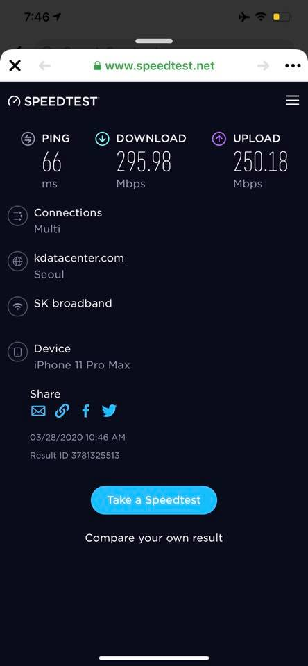
**이미지 캡션:** 이것은 스마트폰 화면을 캡처한 것으로, 인터넷 속도 측정 웹사이트인 speedtest.net의 결과 화면을 보여줍니다. 화면에는 핑(Ping) 속도가 66ms, 다운로드 속도가 295.98Mbps, 업로드 속도가 250.18Mbps로 표시되어 있습니다. 연결 정보로는 'Multi'라고 되어 있으며, 서버 위치는 'Seoul'이고 'kdatacenter.com'이라는 이름의 SK broadband 회선을 사용하고 있음을 알 수 있습니다. 기기는 'iPhone 11 Pro Max'이며, 결과는 2020년 3월 28일 오전 10시 46분에 측정되었고 결과 ID는 3781325513입니다. 화면 하단에는 'Take a Speedtest' 버튼과 'Compare your own result'라는 문구가 보입니다. 전체적으로 어두운 배경에 밝은 글씨로 인터넷 속도 측정 결과를 명확하게 보여주는 깔끔한 디자인입니다.
 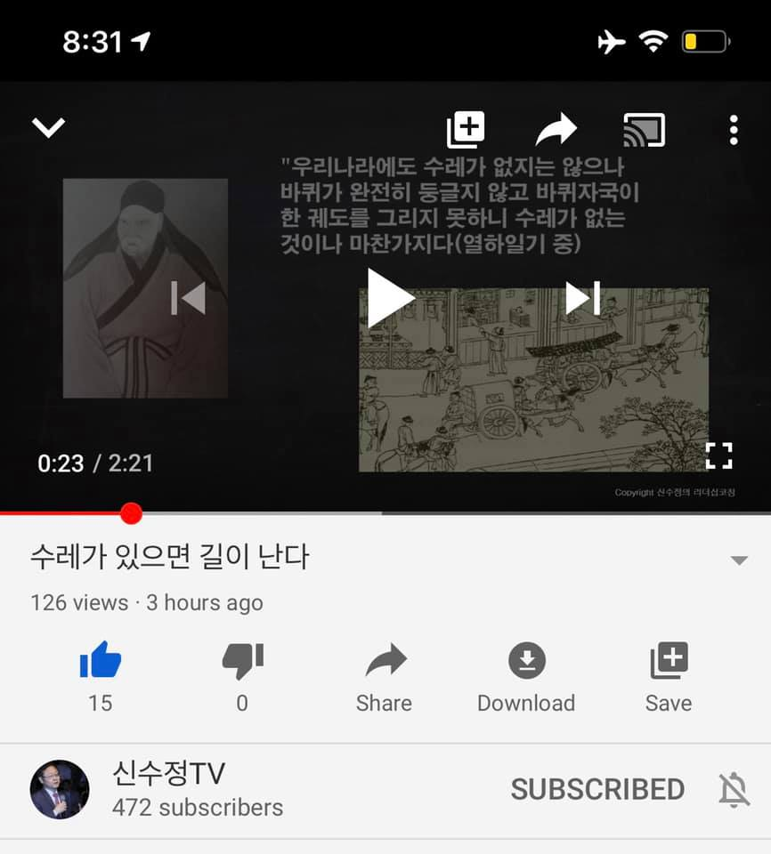
**이미지 캡션:** 이것은 유튜브 영상의 스크린샷으로, 영상 제목은 "수레가 있으면 길이 난다"이며, 126회의 조회수와 3시간 전에 게시되었다는 정보가 보인다. 영상 플레이어에는 현재 재생 시간이 0:23이고 전체 길이가 2:21임을 나타내는 타임라인이 표시되어 있다. 영상 썸네일에는 두 개의 이미지가 나란히 배치되어 있는데, 왼쪽에는 전통 복장을 한 동양 남성의 초상화가 있고, 오른쪽에는 수레와 사람들이 그려진 옛날 그림이 있다. 영상 플레이어 컨트롤에는 재생/일시정지 버튼, 이전/다음 트랙 버튼, 전체 화면 버튼 등이 보인다. 영상 설명 부분에는 "우리나라에도 수레가 없지는 않으나 바퀴가 완전히 둥글지 않고 바퀴자국이 한 궤도를 그리지 못하니 수레가 없는 것이나 마찬가지다(열하일기 중)"라는 문구가 한국어로 적혀 있다. 영상 하단에는 좋아요 15개, 싫어요 0개, 공유, 다운로드, 저장 버튼이 있으며, 채널 이름은 "신수정TV"이고 구독자 수는 472명이다. 채널 이름 옆에는 "SUBSCRIBED"라는 문구가 보이며, 이는 시청자가 이미 해당 채널을 구독했음을 나타낸다. 전반적으로 역사나 문화에 대한 교육적인 내용을 다루는 영상으로 추정되며, 차분하고 정보 전달에 초점을 맞춘 분위기이다.

### 3월 29일 (일) 08:29 · 📷 사진 (1장)

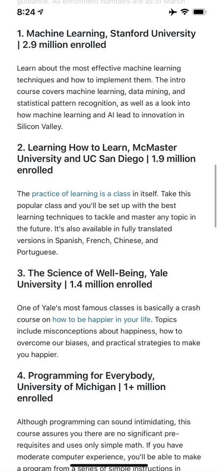
**이미지 캡션:** 이 이미지는 스마트폰 화면의 일부를 캡처한 것으로, 온라인 강의 목록을 보여주고 있습니다. 화면 상단에는 시간 정보(8:24)와 배터리 잔량, 와이파이 신호 등이 표시되어 있습니다. 주요 내용은 네 개의 온라인 강의에 대한 설명으로, 각 강의는 번호, 제목, 소속 대학, 수강생 수로 구성되어 있습니다. 첫 번째 강의는 스탠포드 대학교의 '머신러닝'으로 290만 명이 등록했으며, 머신러닝 기법과 실리콘밸리의 혁신에 대해 다룹니다. 두 번째 강의는 맥마스터 대학교와 UC 샌디에이고의 '학습 방법 배우기'로 190만 명이 등록했으며, 효과적인 학습 기술을 배우고 다양한 언어로 번역되어 제공된다는 내용입니다. 세 번째 강의는 예일 대학교의 '행복의 과학'으로 140만 명이 등록했으며, 행복에 대한 오해를 극복하고 행복을 증진하는 실질적인 전략을 다룹니다. 네 번째 강의는 미시간 대학교의 '모두를 위한 프로그래밍'으로 100만 명 이상이 등록했으며, 프로그래밍에 대한 부담감을 줄이고 간단한 수학과 컴퓨터 경험만으로도 프로그램을 만들 수 있다는 점을 강조합니다. 전반적으로 정보 제공적인 분위기이며, 교육 콘텐츠에 대한 소개를 목적으로 하는 것으로 보입니다.

> 코세라에서 가장 많이 수강 신청한 수업은 무엇을까요?   거의 3백만명이 등록한 머신러닝 수업입니다. 대단하네요.   백만명이 들은 모두를 위한 프로그래밍도 재미있을듯 합니다.   https://www.businessinsider.com/popular-coursera-courses-with-high-enrollment

### 3월 31일 (화) 08:13 · Good morning ALL! Flower walk with socia…

📍 Seongnam

Good morning ALL! Flower walk with social distance in the very early morning.

🎬 동영상 1개 (생략)
