# 2020년 4월

[← 2020년](README.md)

### 4월 4일 (토) 10:17 · #pushup100 #socialdistancing #코로나19함께극복

#pushup100 #socialdistancing #코로나19함께극복

Working on the Hundred Pushups challenge (In A Row) and now I can do only 50. Please join me in this challenge.

사회적 거리두기로 운동량이 매우 줄어 고민하던중, 한번에 100개 푸쉬업 챌린지를 시작했습니다. 이게 생각보다 빨리 늘지 않네요. 이제 어설픈 자세로 겨우 50개인데요, 곧 100개를 해보겠습니다. FB친구분들도 함께해요!

저를 응원해주시고 또 함께한다는 의미에서 푸쉬업 50개를 한번에 하시는 영상을 올려주시는 FB친구 분에게는 코로나 19 종식후에 제가 판교최고 맛집에서 식사 대접하겠습니다. (빨리 대접하는 날이 오기를 기대합니다.)

🎬 동영상 1개 (생략)

### 4월 10일 (금) 07:50 · Run to vote! DONE!!

Run to vote! DONE!!

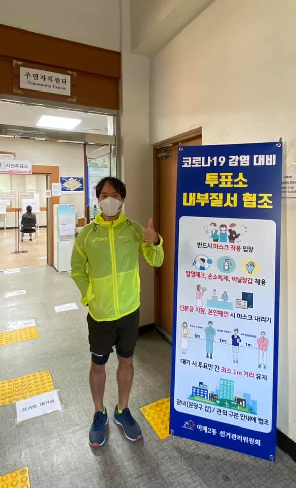
**이미지 캡션:** 한 성인 남성이 형광 연두색 바람막이 점퍼와 검은색 반바지, 파란색 운동화를 신고 마스크를 착용한 채 엄지손가락을 치켜들고 있다. 그는 주민센터 내부로 보이는 장소에 서 있으며, 배경에는 '주민자치센터 Community Center'라고 적힌 간판과 '사전투표소'라고 쓰인 표지판이 보인다. 남성 옆에는 '코로나19 감염 대비 투표소 내부질서 협조'라는 제목의 파란색 안내문이 세워져 있으며, 안내문에는 마스크 착용, 발열 체크, 손 소독, 비닐장갑 착용, 신분증 지참 및 본인 확인 시 마스크 내리기, 투표인 간 1m 거리 유지 등의 지침이 그림과 함께 설명되어 있다. 바닥에는 노란색 점자 블록과 '선거인 대기선'이라고 적힌 종이 안내문이 놓여 있어 투표소임을 짐작하게 한다. 전체적으로 방역 수칙을 준수하며 투표를 준비하는 차분하고 질서 있는 분위기이다. 1m 거리 유지 등의 지침이 그림과 함께 설명되어 있다. 바닥에는 노란색 점자 블록과 '선거인 대기선'이라고 적힌 종이 안내문이 놓여 있어 투표소임을 짐작하게 한다. 전체적으로 방역 수칙을 준수하며 투표를 준비하는 차분하고 질서 있는 분위기이다.

### 4월 12일 (일) 07:41 · 📷 사진 (1장)

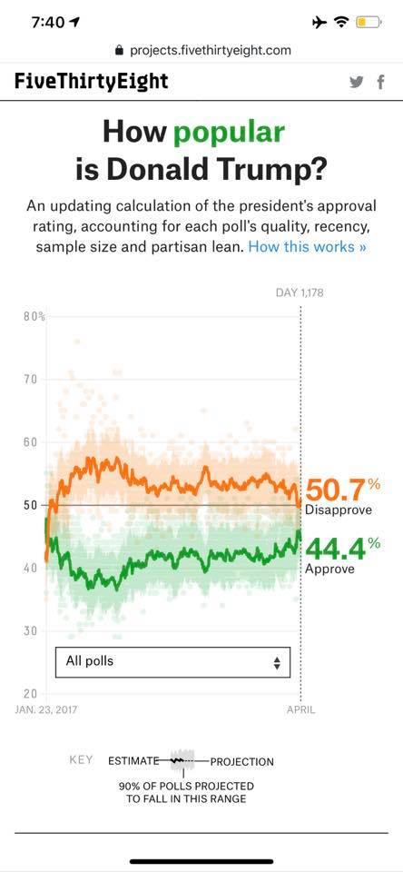
**이미지 캡션:** 이 이미지는 FiveThirtyEight 웹사이트의 기사 일부를 보여주며, 도널드 트럼프의 지지율을 나타내는 그래프가 포함되어 있습니다. 그래프는 2017년 1월 23일부터 4월까지의 기간 동안 지지율과 반대율의 변화를 보여줍니다. 주황색 선은 반대율을, 녹색 선은 지지율을 나타내며, 각 선 주변의 옅은 색 영역은 90%의 여론조사가 이 범위 안에 있을 것으로 예상됨을 의미합니다. 현재 시점(그래프의 오른쪽 끝)에서 반대율은 50.7%, 지지율은 44.4%로 표시되어 있습니다. 그래프 위에는 "How popular is Donald Trump?"라는 제목과 함께 지지율 계산 방식에 대한 간략한 설명이 있습니다. 화면 상단에는 웹사이트 이름인 "FiveThirtyEight"와 함께 브라우저의 시간, 배터리 상태, 와이파이 신호, 웹사이트 주소 등이 보입니다. 전반적으로 정치 관련 통계 데이터를 시각적으로 보여주는 정보성 콘텐츠의 일부입니다.lar is Donald Trump?"라는 제목과 함께 지지율 계산 방식에 대한 간략한 설명이 있습니다. 화면 상단에는 웹사이트 이름인 "FiveThirtyEight"와 함께 브라우저의 시간, 배터리 상태, 와이파이 신호, 웹사이트 주소 등이 보입니다. 전반적으로 정치 관련 통계 데이터를 시각적으로 보여주는 정보성 콘텐츠의 일부입니다.

### 4월 13일 (월) 09:35 · 📷 사진 (1장)

**이미지 캡션:** 이 이미지는 스마트폰 화면을 캡처한 것으로, AWS Summit Online Korea 등록 확인 페이지를 보여줍니다. 화면 상단에는 시간과 배터리 상태, 와이파이 신호가 표시되어 있으며, 웹 브라우저의 주소창에는 "pages.awscloud.com"이 보입니다. 페이지 중앙에는 AWS 로고와 함께 "AWS Summit Online"이라는 문구가 크게 표시되어 있으며, 그 아래에는 "등록확인"이라는 제목이 있습니다. 본문에는 "AWS Summit Online Korea에 등록해 주셔서 감사합니다."라는 문구와 함께, 등록 확인 메일이 곧 발송될 것이며, 받지 못했을 경우 스팸 메일함을 확인하라는 안내가 한국어로 작성되어 있습니다. 화면 하단에는 주황색 버튼으로 "콘솔에 로그인"이라는 문구가 있고, 그 아래에는 "AWS에 대해 자세히 알아보기"라는 텍스트가 있습니다. 전체적으로 깔끔하고 정보 전달에 초점을 맞춘 디자인이며, 온라인 행사 등록 완료 후의 안내 페이지임을 알 수 있습니다. 함께, 등록 확인 메일이 곧 발송될 것이며, 받지 못했을 경우 스팸 메일함을 확인하라는 안내가 한국어로 작성되어 있습니다. 화면 하단에는 주황색 버튼으로 "콘솔에 로그인"이라는 문구가 있고, 그 아래에는 "AWS에 대해 자세히 알아보기"라는 텍스트가 있습니다. 전체적으로 깔끔하고 정보 전달에 초점을 맞춘 디자인이며, 온라인 행사 등록 완료 후의 안내 페이지임을 알 수 있습니다.

### 4월 17일 (금) 13:28 · 📷 사진 (1장)

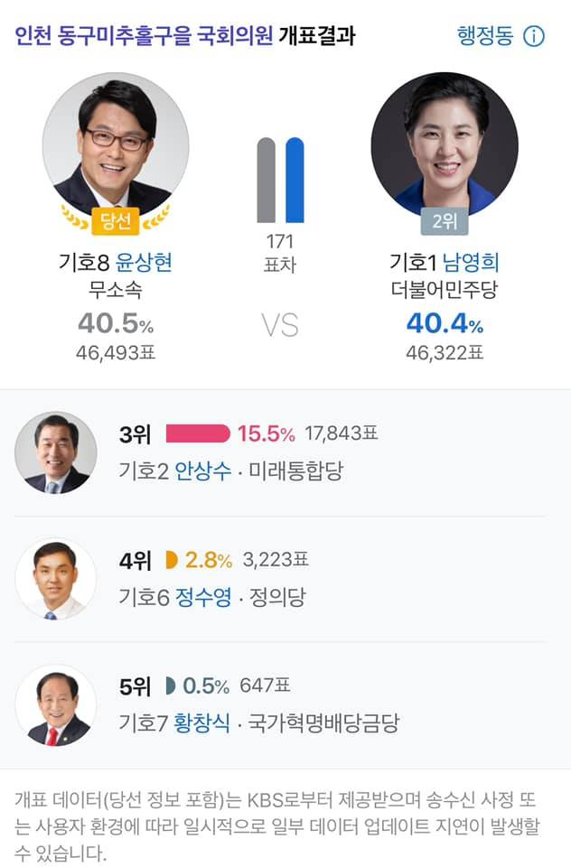
**이미지 캡션:** 인천 동구미추홀구을 국회의원 선거 개표 결과 화면으로, 1위와 2위 후보의 사진과 득표율, 득표수가 비교되어 있으며, 3위부터 5위까지의 후보 정보도 함께 표시되어 있다. 가장 상단에는 선거구명과 '행정동'이라는 텍스트가 보이며, 1위 후보인 기호 8번 윤상현은 무소속으로 40.5%의 득표율과 46,493표를 얻었고, 2위 후보인 기호 1번 남영희는 더불어민주당 소속으로 40.4%의 득표율과 46,322표를 얻어 171표 차이로 윤상현 후보가 앞서고 있음을 보여준다. 3위는 기호 2번 안상수 후보로 미래통합당 소속이며 15.5%의 득표율과 17,843표를 얻었고, 4위는 기호 6번 정수영 후보로 정의당 소속이며 2.8%의 득표율과 3,223표를 얻었으며, 5위는 기호 7번 황창식 후보로 국가혁명배당금당 소속이며 0.5%의 득표율과 647표를 얻었다. 각 후보의 사진은 정면을 바라보며 미소를 짓고 있거나 진지한 표정을 짓고 있으며, 복장은 대부분 정장을 착용하고 있다. 화면 하단에는 개표 데이터가 KBS로부터 제공되며, 송수신 사정이나 사용자 환경에 따라 데이터 업데이트가 지연될 수 있다는 안내 문구가 포함되어 있다. 전체적으로 선거 결과 정보를 전달하는 객관적이고 정보 전달 중심의 분위기이다. 소속이며 15.5%의 득표율과 17,843표를 얻었고, 4위는 기호 6번 정수영 후보로 정의당 소속이며 2.8%의 득표율과 3,223표를 얻었으며, 5위는 기호 7번 황창식 후보로 국가혁명배당금당 소속이며 0.5%의 득표율과 647표를 얻었다. 각 후보의 사진은 정면을 바라보며 미소를 짓고 있거나 진지한 표정을 짓고 있으며, 복장은 대부분 정장을 착용하고 있다. 화면 하단에는 개표 데이터가 KBS로부터 제공되며, 송수신 사정이나 사용자 환경에 따라 데이터 업데이트가 지연될 수 있다는 안내 문구가 포함되어 있다. 전체적으로 선거 결과 정보를 전달하는 객관적이고 정보 전달 중심의 분위기이다.

### 4월 20일 (월) 11:29 · #오월의희망 #함께달려요 #화악산자전거번개

#오월의희망 #함께달려요 #화악산자전거번개

900m uphill riding! Please join us on May 2, if you are around.

"달리지 않으면 넘어진다"가 정말 실감나는 것이 자전거이고 특히 업힐은 이 문구가 몸으로 체감되는 순간입니다. 오월의 희망을 담아 5월 2일 가능하신분들 함께해요. 

코스는 근처 가장 높은 (+890m) 업힐중 하나인 화악산입니다. 이코스는 중간에 신호등도 없고 차량도 많지 않아 업힐연습에는 제일 좋은 구간입니다. 코스는 아래 그림처럼 화악산 왕복 (또는 반바퀴)로 본인의 체력과 의지에 따라 많이 또는 적게 라이딩 가능하십니다.

오시는 모든 분들에게 점심 무한리필 대접드리겠습니다.

* 일시: 2020년 5월 2일 토요일 오전 10시
* 집합장소: 가평역 (10시 정확하게 출발합니다.)
* 코스: 화악산 업일 하고싶은 만큼만 (아래 코스 참고)
* 준비물/주의사항: 2M이상 거리두기 라이딩. 아침식사 든든히. 헬맷등 안정장비와 실손보험등. 내리막 추월금지 (오르막 추월 환영)등 기본 안전 주의및 본인 안전은 본인 책임 

오시는 분들 반갑게 뵙겠습니다.

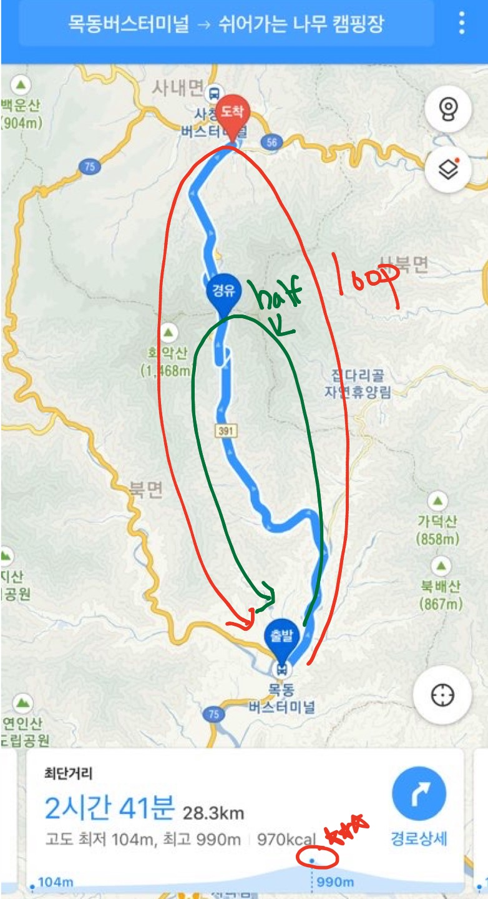
**이미지 캡션:** 이 이미지는 내비게이션 앱의 지도 화면을 캡처한 것으로, 목동버스터미널에서 쉬어가는 나무 캠핑장까지의 경로를 보여준다. 지도 상에는 산, 도로, 강, 마을 이름 등이 표시되어 있으며, 경로를 따라 파란색 선이 그려져 있다. 빨간색 타원은 경로의 일부를, 초록색 타원은 다른 경로를 나타내는 것으로 보인다. 지도 상단에는 "목동버스터미널 → 쉬어가는 나무 캠핑장"이라는 목적지가 표시되어 있으며, 하단에는 "최단거리 2시간 41분 28.3km"라는 예상 소요 시간과 거리가 나타나 있다. 또한, 고도 정보와 칼로리 소모량도 함께 표시되어 있다. 지도에는 "사내면", "경유", "출발", "목동버스터미널", "북면", "집다리골 자연휴양림" 등의 지명이 보이며, "백운산", "화악산", "가덕산", "북배산"과 같은 산 이름과 그 높이도 표기되어 있다. 지도 화면에는 카메라 아이콘과 레이어 아이콘, 그리고 현재 위치를 나타내는 파란색 점도 보인다. 전반적으로 여행 경로를 확인하고 계획하는 상황을 보여주는 이미지이다.소모량도 함께 표시되어 있다. 지도에는 "사내면", "경유", "출발", "목동버스터미널", "북면", "집다리골 자연휴양림" 등의 지명이 보이며, "백운산", "화악산", "가덕산", "북배산"과 같은 산 이름과 그 높이도 표기되어 있다. 지도 화면에는 카메라 아이콘과 레이어 아이콘, 그리고 현재 위치를 나타내는 파란색 점도 보인다. 전반적으로 여행 경로를 확인하고 계획하는 상황을 보여주는 이미지이다.

### 4월 20일 (월) 13:17 · 📷 사진 (1장)

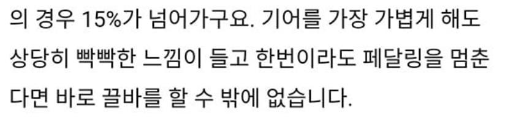
**이미지 캡션:** 이 이미지는 흰색 배경에 검은색 한국어 텍스트가 포함되어 있습니다. 텍스트는 다음과 같이 세 줄로 구성되어 있습니다. "의 경우 15%가 넘어가구요. 기어를 가장 가볍게 해도", "상당히 빡빡한 느낌이 들고 한번이라도 페달링을 멈춘", "다면 바로 끌바를 할 수 밖에 없습니다." 이 텍스트는 자전거의 기어비와 페달링에 대한 설명으로 보이며, 특히 기어를 가장 가볍게 설정해도 페달링이 빡빡하고, 한번 멈추면 다시 페달을 밟기 어렵다는 내용을 담고 있습니다. 특별한 인물, 장소, 사물, 보이는 텍스트, 분위기나 상황은 묘사되지 않았습니다.상황은 묘사되지 않았습니다.

### 4월 21일 (화) 11:55 · 📷 사진 (1장)

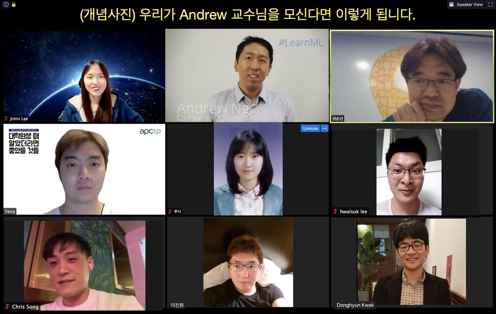
**이미지 캡션:** 화면 상단에는 "(개념사진) 우리가 Andrew 교수님을 모신다면 이렇게 됩니다."라는 한국어 문구가 보이며, 여러 개의 화상 회의 창이 격자 형태로 배치되어 있습니다. 왼쪽 상단 창에는 젊은 여성(Jimin Lee)이 지구를 배경으로 웃으며 카메라를 보고 있습니다. 그 아래 창에는 한 남성(Terry)이 흰색 티셔츠를 입고 정면을 응시하고 있으며, 그의 배경에는 "대학원생 때 알았더라면 좋았을 것들"이라는 문구가 적힌 이미지가 있습니다. 가장 왼쪽 하단 창에는 또 다른 남성(Chris Song)이 흰색 티셔츠를 입고 편안한 표정으로 카메라를 보고 있으며, 그의 배경에는 식물과 조명이 보입니다. 중앙 상단 창에는 Andrew Ng라는 이름의 남성이 "#LearnML"이라는 문구가 적힌 배경 앞에서 웃으며 이야기하고 있습니다. 그 아래 창에는 한 여성이 정면 사진처럼 보이는 모습으로 카메라를 보고 있습니다. 중앙 하단 창에는 안경을 쓴 남성(이진원)이 카메라를 보고 있습니다. 오른쪽 상단 창에는 안경을 쓴 남성이 손으로 턱을 괴고 생각하는 듯한 표정으로 카메라를 보고 있으며, 그의 배경에는 한국어로 된 여러 단어가 흐릿하게 보입니다. 그 아래 창에는 안경을 쓴 남성(hwalsuk lee)이 카메라를 보며 미소 짓고 있습니다. 가장 오른쪽 하단 창에는 정장을 입은 남성(Donghyun Kwak)이 웃으며 카메라를 보고 있습니다. 전반적으로 온라인 화상 회의의 모습이며, 다양한 연령대의 사람들이 각자의 공간에서 참여하고 있습니다.츠를 입고 편안한 표정으로 카메라를 보고 있으며, 그의 배경에는 식물과 조명이 보입니다. 중앙 상단 창에는 Andrew Ng라는 이름의 남성이 "#LearnML"이라는 문구가 적힌 배경 앞에서 웃으며 이야기하고 있습니다. 그 아래 창에는 한 여성이 정면 사진처럼 보이는 모습으로 카메라를 보고 있습니다. 중앙 하단 창에는 안경을 쓴 남성(이진원)이 카메라를 보고 있습니다. 오른쪽 상단 창에는 안경을 쓴 남성이 손으로 턱을 괴고 생각하는 듯한 표정으로 카메라를 보고 있으며, 그의 배경에는 한국어로 된 여러 단어가 흐릿하게 보입니다. 그 아래 창에는 안경을 쓴 남성(hwalsuk lee)이 카메라를 보며 미소 짓고 있습니다. 가장 오른쪽 하단 창에는 정장을 입은 남성(Donghyun Kwak)이 웃으며 카메라를 보고 있습니다. 전반적으로 온라인 화상 회의의 모습이며, 다양한 연령대의 사람들이 각자의 공간에서 참여하고 있습니다.

> [5만의 TF-KR멤버와 5월에 만나요] #5만명_가입기념_언택트_이벤트 #5월5만TFKR #만나고싶어요  AI 관련 인물 중 누구나 만날 수 있다면 어떤 사람을 만나고 싶으신가요?   요즈음 함께 모여서 웃고 떠들고 하는 행사들이 그립지만 나름 화상미팅등의 기술적인 발전으로 언텍트문화가 자리 잡고 있어서 오히려 물리적인 장벽을 넘어 마음만 먹으면 더 쉽게 (온라인으로) 모이고 만날수 있습니다.  그래서 여러분들이 만나고 싶은 사람들을 정하고, 우리 멤버들 중 연락이 가능한 지인이 있으면 연락해서 섭외하고 (5만 커뮤니티 섭외력 믿어도 되겠죠?), 직접 섭외한 지인이나 TFKR운영진이 10~20분간 대화를 나누고, 여러분은 라이브로 그리고 질문으로 함께 참여해본다면 정말 멋지지 않을까요? Zoom등은 동시 통역기능이 있어 세계 어떤 분을 모셔도 여러분이 편한 한국말로 듣고 질문을 할수 있습니다.  자 그럼 질문 나갑니다: 여러분들 누구를 만나보고 싶으세요?  아래 댓글로 만나고 싶은 AI 인사와 그 이유를 간략히 적어주세요. 댓글이 마음에 드신다면 좋아요를 통해 지지도 해주시고요. 선정된 후보는 TF-KR이 섭외해 만날 수 있는 기회를 만들어 보겠습니다.   그럼 많은 댓글 기대하겠습니다!

### 4월 24일 (금) 09:44 · 📷 사진 (12장)

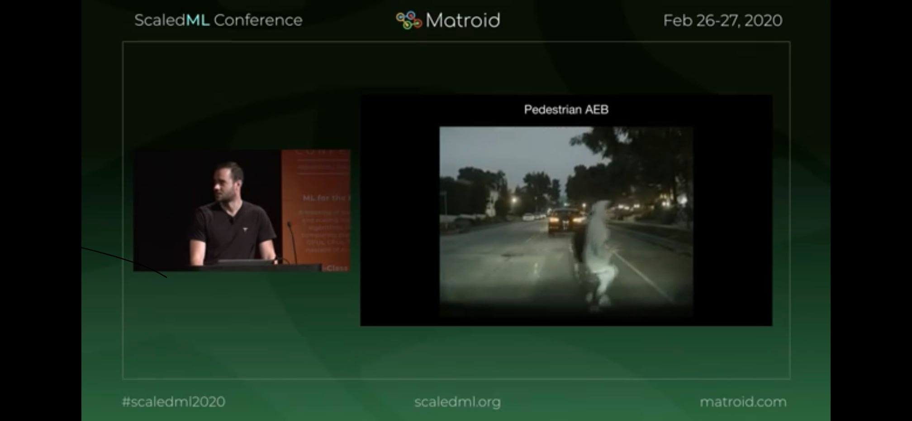
**이미지 캡션:** 이 사진은 ScaledML Conference에서 Matroid가 발표한 내용을 담고 있으며, 날짜는 2020년 2월 26-27일입니다. 화면 왼쪽에는 검은색 티셔츠를 입고 마이크 앞에 서서 발표를 하고 있는 성인 남성이 보입니다. 그는 30대 후반에서 40대 초반으로 추정되며, 짧은 머리에 약간의 수염이 있습니다. 표정은 차분하며, 발표 자료를 보고 있거나 청중을 향해 이야기하는 듯한 모습입니다. 배경에는 주황색의 발표 자료가 놓인 연단이 보입니다. 화면 오른쪽에는 "Pedestrian AEB"라는 제목과 함께 차량의 전방 시점에서 촬영된 영상이 재생되고 있습니다. 영상은 어두운 저녁 시간으로, 도로에는 차량 몇 대가 있고, 우측 차선에는 흰색 옷을 입은 사람이 차도를 건너고 있습니다. 주변에는 가로등과 건물들이 보이며, 마치 자율주행 시스템의 보행자 감지 및 긴급 제동 시스템(AEB) 시연 영상으로 보입니다. 전체적으로 차분하고 전문적인 컨퍼런스 발표 분위기이며, 하단에는 #scaledml2020, scaledml.org, matroid.com과 같은 행사 관련 정보가 표시되어 있습니다.함께 차량의 전방 시점에서 촬영된 영상이 재생되고 있습니다. 영상은 어두운 저녁 시간으로, 도로에는 차량 몇 대가 있고, 우측 차선에는 흰색 옷을 입은 사람이 차도를 건너고 있습니다. 주변에는 가로등과 건물들이 보이며, 마치 자율주행 시스템의 보행자 감지 및 긴급 제동 시스템(AEB) 시연 영상으로 보입니다. 전체적으로 차분하고 전문적인 컨퍼런스 발표 분위기이며, 하단에는 #scaledml2020, scaledml.org, matroid.com과 같은 행사 관련 정보가 표시되어 있습니다.
 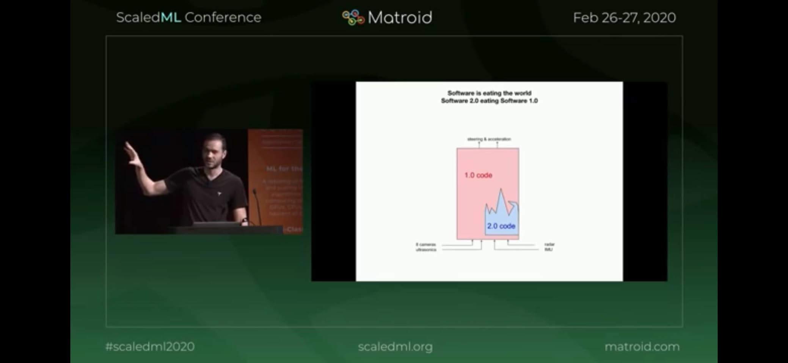
**이미지 캡션:** 화면 왼쪽에는 검은색 티셔츠를 입고 마이크 앞에 서서 손짓하며 발표하고 있는 성인 남성이 보인다. 남성은 30대 후반에서 40대 초반으로 보이며, 짧은 머리에 수염이 있다. 그의 표정은 진지하고 열정적이다. 배경에는 오렌지색과 흰색으로 된 발표 자료가 보인다. 화면 오른쪽에는 "Software is eating the world, Software 2.0 eating Software 1.0"이라는 제목과 함께 두 개의 코드 블록을 비교하는 다이어그램이 있다. 위쪽의 1.0 코드는 분홍색으로, 아래쪽의 2.0 코드는 파란색으로 표시되어 있으며, 2.0 코드가 1.0 코드를 잠식하는 듯한 그래프가 그려져 있다. 다이어그램 하단에는 "8 cameras, ultrasonics", "steering & acceleration", "radar, IMU"와 같은 입력 정보들이 표시되어 있다. 화면 상단에는 "ScaledML Conference", "Matroid", "Feb 26-27, 2020"이라는 글자가 보이고, 하단에는 "#scaledml2020", "scaledml.org", "matroid.com"이라는 웹사이트 주소와 해시태그가 표시되어 있다. 전체적으로 기술 컨퍼런스의 발표 장면으로, 소프트웨어 발전의 변화를 시각적으로 보여주는 분위기이다.드는 파란색으로 표시되어 있으며, 2.0 코드가 1.0 코드를 잠식하는 듯한 그래프가 그려져 있다. 다이어그램 하단에는 "8 cameras, ultrasonics", "steering & acceleration", "radar, IMU"와 같은 입력 정보들이 표시되어 있다. 화면 상단에는 "ScaledML Conference", "Matroid", "Feb 26-27, 2020"이라는 글자가 보이고, 하단에는 "#scaledml2020", "scaledml.org", "matroid.com"이라는 웹사이트 주소와 해시태그가 표시되어 있다. 전체적으로 기술 컨퍼런스의 발표 장면으로, 소프트웨어 발전의 변화를 시각적으로 보여주는 분위기이다.
 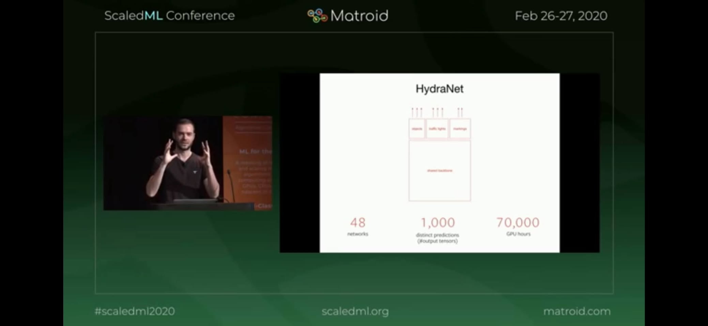
**이미지 캡션:** ScaledML Conference와 Matroid 로고가 보이며, 날짜는 Feb 26-27, 2020이다. 화면 왼쪽에는 검은색 셔츠를 입은 성인 남성이 연단에 서서 두 손을 앞으로 모으고 설명하는 모습이 보인다. 그의 뒤에는 "ML for the"라는 문구가 적힌 오렌지색 배경의 스크린이 있다. 화면 오른쪽에는 "HydraNet"이라는 제목과 함께 48개의 네트워크, 1,000개의 고유 예측, 70,000개의 GPU 시간을 나타내는 다이어그램과 통계가 흰색 배경에 표시되어 있다. 하단에는 #scaledml2020, scaledml.org, matroid.com이라는 텍스트가 보인다. 전반적으로 기술 컨퍼런스의 발표 장면으로, 전문적이고 정보 전달에 집중하는 분위기이다.2020, scaledml.org, matroid.com이라는 텍스트가 보인다. 전반적으로 기술 컨퍼런스의 발표 장면으로, 전문적이고 정보 전달에 집중하는 분위기이다.
 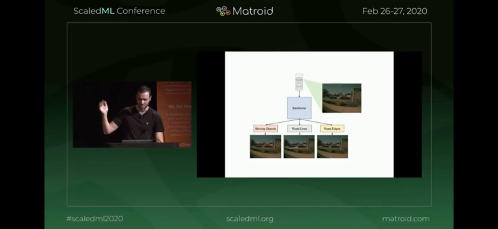
**이미지 캡션:** ScaledML Conference와 Matroid 로고가 보이고, 날짜는 Feb 26-27, 2020이다. 발표자는 검은색 티셔츠를 입은 성인 남성으로, 약 30대 후반에서 40대 초반으로 보이며, 짧은 검은색 머리에 짙은 눈썹을 가지고 있다. 그는 연단 뒤에 서서 오른손을 들어 올리고 있으며, 표정은 진지하다. 화면 왼쪽에는 발표자가 서 있는 무대와 배경이 보이고, 오른쪽에는 컴퓨터 비전 관련 다이어그램이 제시되어 있다. 다이어그램은 자동차 모양의 아이콘에서 시작하여 'Backbone'이라는 상자로 연결되고, 이 상자에서 'Moving Objects', 'Road Lines', 'Road Edges'라는 세 가지 결과로 나뉘는 과정을 시각적으로 보여준다. 각 결과 아래에는 해당 내용을 나타내는 이미지들이 배치되어 있다. 화면 하단에는 #scaledml2020, scaledml.org, matroid.com이라는 텍스트가 표시되어 있다. 전반적으로 기술 컨퍼런스의 발표 장면으로, 인공지능 또는 머신러닝 기술에 대한 설명이 이루어지고 있는 것으로 보인다.고, 이 상자에서 'Moving Objects', 'Road Lines', 'Road Edges'라는 세 가지 결과로 나뉘는 과정을 시각적으로 보여준다. 각 결과 아래에는 해당 내용을 나타내는 이미지들이 배치되어 있다. 화면 하단에는 #scaledml2020, scaledml.org, matroid.com이라는 텍스트가 표시되어 있다. 전반적으로 기술 컨퍼런스의 발표 장면으로, 인공지능 또는 머신러닝 기술에 대한 설명이 이루어지고 있는 것으로 보인다.
 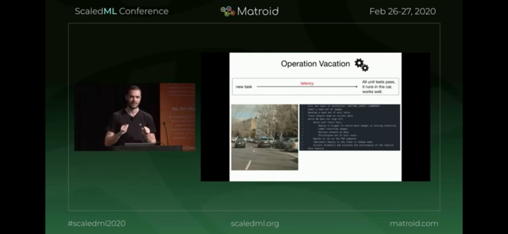
**이미지 캡션:** 화면 왼쪽에는 검은색 티셔츠를 입고 마이크 앞에서 발표하는 성인 남성이 보인다. 그는 30대 후반에서 40대 초반으로 보이며, 짧은 갈색 머리에 턱수염이 있다. 그는 손가락으로 무언가를 가리키며 열정적으로 말하고 있다. 화면 오른쪽에는 "Operation Vacation"이라는 제목의 슬라이드가 표시되어 있으며, 그 아래에는 "new task"에서 "latency"를 거쳐 "All unit tests pass, It runs in the car, works well."이라는 문구가 적힌 진행 표시줄이 있다. 슬라이드 하단에는 두 개의 이미지가 나란히 배치되어 있는데, 왼쪽에는 도시 거리의 차량들이 찍힌 사진이 있고, 오른쪽에는 코드 스니펫이 포함된 텍스트 상자가 있다. 슬라이드 상단에는 ScaledML Conference 로고와 Matroid 로고, 그리고 날짜 "Feb 26-27, 2020"이 보인다. 전체적으로 기술 컨퍼런스 발표의 한 장면으로, 머신러닝 관련 주제를 다루고 있는 것으로 추정된다.슬라이드 하단에는 두 개의 이미지가 나란히 배치되어 있는데, 왼쪽에는 도시 거리의 차량들이 찍힌 사진이 있고, 오른쪽에는 코드 스니펫이 포함된 텍스트 상자가 있다. 슬라이드 상단에는 ScaledML Conference 로고와 Matroid 로고, 그리고 날짜 "Feb 26-27, 2020"이 보인다. 전체적으로 기술 컨퍼런스 발표의 한 장면으로, 머신러닝 관련 주제를 다루고 있는 것으로 추정된다.
 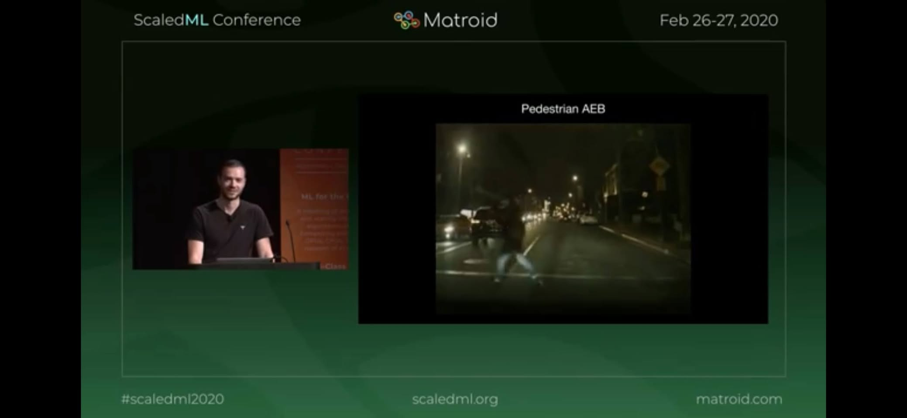
**이미지 캡션:** ScaledML Conference와 Matroid 로고가 화면 상단에 보이며, 날짜는 Feb 26-27, 2020이다. 왼쪽에는 검은색 티셔츠를 입은 30대 후반에서 40대 초반으로 보이는 성인 남성이 연단 뒤에서 발표하고 있으며, 그는 미소를 짓고 있다. 그의 뒤에는 "ML, for the..."라고 시작하는 텍스트가 있는 오렌지색 배경의 스크린이 보인다. 오른쪽에는 "Pedestrian AEB"라는 제목과 함께 밤에 횡단보도를 건너는 사람을 포착한 영상이 재생되고 있다. 영상 속 배경은 도시의 밤거리로, 가로등과 차량 불빛이 보이며, 빗방울이 떨어지는 듯한 모습도 보인다. 화면 하단에는 #scaledml2020, scaledml.org, matroid.com이라는 텍스트가 표시되어 있다. 전반적으로 기술 컨퍼런스의 발표 장면을 담고 있으며, 자율주행 기술의 한 부분인 보행자 긴급 제동 시스템(AEB)에 대한 내용을 다루는 것으로 보인다. 가로등과 차량 불빛이 보이며, 빗방울이 떨어지는 듯한 모습도 보인다. 화면 하단에는 #scaledml2020, scaledml.org, matroid.com이라는 텍스트가 표시되어 있다. 전반적으로 기술 컨퍼런스의 발표 장면을 담고 있으며, 자율주행 기술의 한 부분인 보행자 긴급 제동 시스템(AEB)에 대한 내용을 다루는 것으로 보인다.
 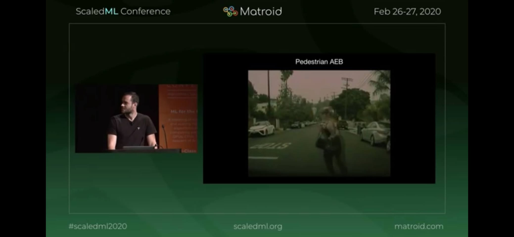
**이미지 캡션:** ScaledML Conference와 Matroid 로고가 보이고, 날짜는 2020년 2월 26-27일이다. 화면 왼쪽에는 검은색 티셔츠를 입은 30대 후반에서 40대 초반의 성인 남성이 연단에 서서 마이크를 바라보고 있으며, 그의 표정은 차분하다. 화면 오른쪽에는 "Pedestrian AEB"라는 제목과 함께 차량에서 촬영된 것으로 보이는 영상이 재생되고 있다. 영상 속에는 횡단보도를 건너는 한 명의 성인 여성이 보이며, 그녀는 검은색 옷을 입고 가방을 들고 있다. 배경에는 주택가 도로가 펼쳐져 있고, 여러 대의 차량이 주차되어 있으며, 나무와 전봇대도 보인다. 영상의 전체적인 분위기는 다소 흐릿하고 어두운 편이다. 화면 하단에는 #scaledml2020, scaledml.org, matroid.com이라는 텍스트가 표시되어 있다. 대의 차량이 주차되어 있으며, 나무와 전봇대도 보인다. 영상의 전체적인 분위기는 다소 흐릿하고 어두운 편이다. 화면 하단에는 #scaledml2020, scaledml.org, matroid.com이라는 텍스트가 표시되어 있다.
 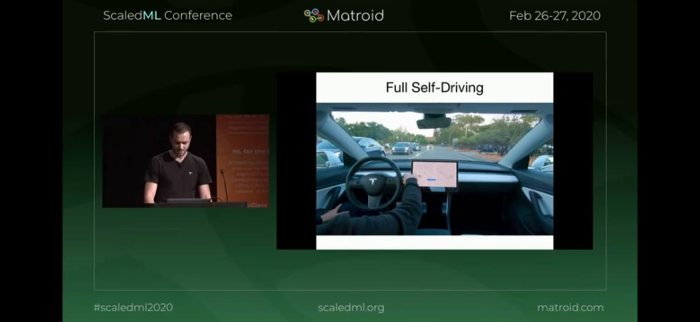
**이미지 캡션:** 이 사진은 ScaledML Conference의 발표 장면을 담고 있으며, 왼쪽에는 발표자가, 오른쪽에는 발표 내용이 담긴 슬라이드가 보인다. 발표자는 30대 후반에서 40대 초반으로 보이는 성인 남성으로, 검은색 반팔 티셔츠를 입고 단상 뒤에서 마이크를 잡고 있다. 그는 발표 슬라이드를 내려다보며 진지한 표정을 짓고 있다. 오른쪽 슬라이드에는 "Full Self-Driving"이라는 제목과 함께 테슬라 차량 내부에서 촬영된 듯한 영상이 보인다. 운전석에는 사람이 앉아 핸들을 잡고 있으며, 전방 도로에는 다른 차량들이 주행 중이다. 차량 내부의 대형 터치스크린에는 내비게이션 화면이 표시되어 있다. 배경에는 나무와 건물이 보이며, 전체적으로 낮 시간대의 야외 풍경임을 알 수 있다. 사진 상단에는 "ScaledML Conference", "Matroid", "Feb 26-27, 2020"이라는 텍스트가 보이고, 하단에는 "#scaledml2020", "scaledml.org", "matroid.com"이라는 웹사이트 주소와 해시태그가 표시되어 있다. 전체적으로 기술 컨퍼런스의 발표 장면임을 알 수 있으며, 자율 주행 기술에 대한 발표가 진행되고 있음을 시사한다. 차량들이 주행 중이다. 차량 내부의 대형 터치스크린에는 내비게이션 화면이 표시되어 있다. 배경에는 나무와 건물이 보이며, 전체적으로 낮 시간대의 야외 풍경임을 알 수 있다. 사진 상단에는 "ScaledML Conference", "Matroid", "Feb 26-27, 2020"이라는 텍스트가 보이고, 하단에는 "#scaledml2020", "scaledml.org", "matroid.com"이라는 웹사이트 주소와 해시태그가 표시되어 있다. 전체적으로 기술 컨퍼런스의 발표 장면임을 알 수 있으며, 자율 주행 기술에 대한 발표가 진행되고 있음을 시사한다.
 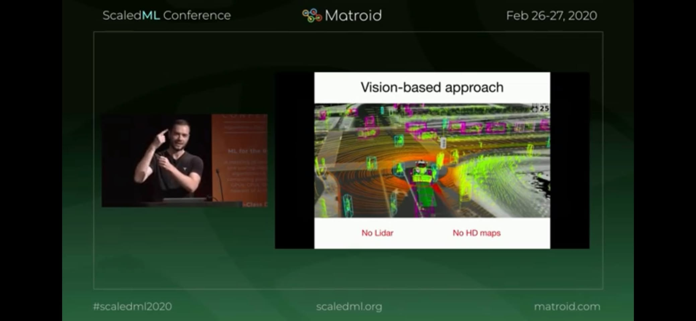
**이미지 캡션:** 이 사진은 ScaledML Conference의 발표 장면을 담고 있으며, 발표자는 검은색 티셔츠를 입은 성인 남성으로, 30대 초중반으로 보입니다. 그는 연단 뒤에 서서 오른손 검지를 관자놀이에 대고 생각하는 듯한 제스처를 취하고 있으며, 표정은 진지합니다. 배경에는 발표 내용이 담긴 슬라이드가 보이며, 왼쪽 슬라이드에는 "ML for the o"라는 텍스트와 "Class C"라는 문구가 희미하게 보입니다. 오른쪽 슬라이드는 "Vision-based approach"라는 제목과 함께 자율 주행 차량의 센서 데이터를 시각화한 이미지입니다. 이 이미지에는 다양한 색상의 점들로 표현된 도로, 차량, 건물 등이 나타나 있으며, 차량 주변에는 녹색, 보라색, 파란색 등으로 구분된 경계 상자들이 표시되어 객체 인식을 나타냅니다. 슬라이드 하단에는 "No Lidar"와 "No HD maps"라는 텍스트가 나란히 배치되어 있습니다. 전체적으로 차분하고 전문적인 분위기이며, 기술 컨퍼런스의 발표 상황임을 알 수 있습니다. 화면 하단에는 "#scaledml2020", "scaledml.org", "matroid.com"과 같은 웹사이트 주소와 해시태그가 표시되어 있습니다.데이터를 시각화한 이미지입니다. 이 이미지에는 다양한 색상의 점들로 표현된 도로, 차량, 건물 등이 나타나 있으며, 차량 주변에는 녹색, 보라색, 파란색 등으로 구분된 경계 상자들이 표시되어 객체 인식을 나타냅니다. 슬라이드 하단에는 "No Lidar"와 "No HD maps"라는 텍스트가 나란히 배치되어 있습니다. 전체적으로 차분하고 전문적인 분위기이며, 기술 컨퍼런스의 발표 상황임을 알 수 있습니다. 화면 하단에는 "#scaledml2020", "scaledml.org", "matroid.com"과 같은 웹사이트 주소와 해시태그가 표시되어 있습니다.
 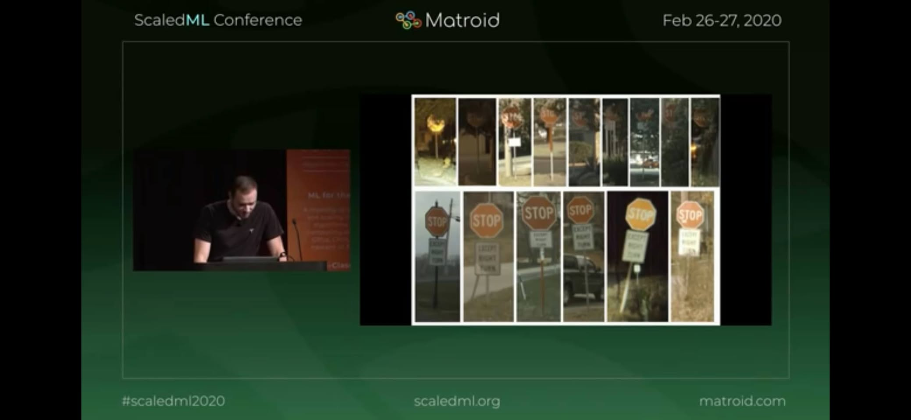
**이미지 캡션:** 이 사진은 ScaledML Conference의 발표 장면을 담고 있으며, 발표자는 검은색 티셔츠를 입은 성인 남성으로, 30대 후반에서 40대 초반으로 추정된다. 그는 연단 뒤에 서서 노트북을 보며 발표 중이며, 표정은 진지하다. 배경에는 "ScaledML Conference", "Matroid", "Feb 26-27, 2020"이라는 텍스트가 보이고, 발표 자료로 보이는 슬라이드에는 "ML for The"라는 문구와 함께 여러 개의 정지 표지판 사진이 전시되어 있다. 이 정지 표지판 사진들은 다양한 각도와 조명 조건에서 촬영되었으며, 일부 표지판에는 "EXCEPT RIGHT TURN"이라는 추가 문구가 보인다. 사진의 하단에는 "#scaledml2020", "scaledml.org", "matroid.com"이라는 웹사이트 주소와 해시태그가 표시되어 있다. 전체적으로 학술 발표회 또는 기술 컨퍼런스의 한 장면으로, 머신러닝 기술과 관련된 내용을 다루고 있음을 짐작할 수 있다. 조명 조건에서 촬영되었으며, 일부 표지판에는 "EXCEPT RIGHT TURN"이라는 추가 문구가 보인다. 사진의 하단에는 "#scaledml2020", "scaledml.org", "matroid.com"이라는 웹사이트 주소와 해시태그가 표시되어 있다. 전체적으로 학술 발표회 또는 기술 컨퍼런스의 한 장면으로, 머신러닝 기술과 관련된 내용을 다루고 있음을 짐작할 수 있다.
 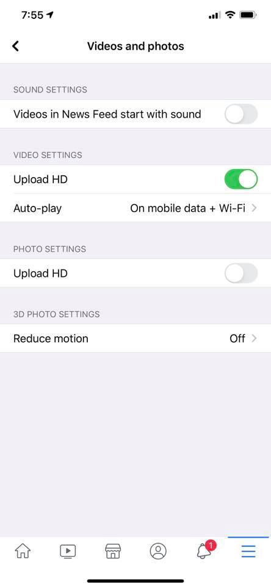
**이미지 캡션:** 이 이미지는 스마트폰 화면을 캡처한 것으로, 페이스북 앱의 '동영상 및 사진' 설정 화면을 보여줍니다. 화면 상단에는 시간 정보(7:55)와 배터리 잔량, Wi-Fi 신호 강도가 표시되어 있습니다. 화면 중앙에는 '동영상 및 사진'이라는 제목과 함께 '사운드 설정', '동영상 설정', '사진 설정', '3D 사진 설정'이라는 소제목 아래 여러 설정 항목들이 나열되어 있습니다. '사운드 설정' 아래에는 '뉴스 피드 동영상 소리 시작' 옵션이 있고, 토글 스위치가 비활성화되어 있습니다. '동영상 설정' 아래에는 'HD 업로드' 옵션이 있고, 토글 스위치가 활성화되어 있으며, '자동 재생' 옵션은 '모바일 데이터 + Wi-Fi'로 설정되어 있고 오른쪽 화살표가 표시되어 있어 추가 설정을 할 수 있음을 나타냅니다. '사진 설정' 아래에는 'HD 업로드' 옵션이 있고, 토글 스위치가 비활성화되어 있습니다. '3D 사진 설정' 아래에는 '모션 줄이기' 옵션이 있고, '끔'으로 설정되어 있으며 오른쪽 화살표가 표시되어 있습니다. 화면 하단에는 홈, 동영상, 상점, 프로필, 알림, 메뉴 아이콘이 포함된 네비게이션 바가 보입니다. 전체적으로 깔끔하고 기능적인 인터페이스를 보여주는 화면입니다.'HD 업로드' 옵션이 있고, 토글 스위치가 활성화되어 있으며, '자동 재생' 옵션은 '모바일 데이터 + Wi-Fi'로 설정되어 있고 오른쪽 화살표가 표시되어 있어 추가 설정을 할 수 있음을 나타냅니다. '사진 설정' 아래에는 'HD 업로드' 옵션이 있고, 토글 스위치가 비활성화되어 있습니다. '3D 사진 설정' 아래에는 '모션 줄이기' 옵션이 있고, '끔'으로 설정되어 있으며 오른쪽 화살표가 표시되어 있습니다. 화면 하단에는 홈, 동영상, 상점, 프로필, 알림, 메뉴 아이콘이 포함된 네비게이션 바가 보입니다. 전체적으로 깔끔하고 기능적인 인터페이스를 보여주는 화면입니다.
 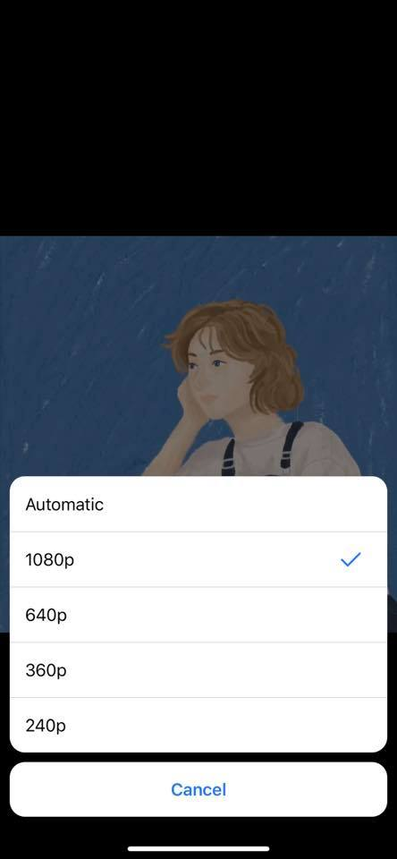
**이미지 캡션:** 푸른색 배경에 짧은 갈색 머리를 한 젊은 여성이 그려져 있으며, 그녀는 오른손으로 턱을 괴고 생각에 잠긴 듯한 표정으로 화면 오른쪽을 바라보고 있습니다. 그녀는 흰색 상의와 검은색 멜빵을 착용하고 있습니다. 화면 하단에는 'Automatic', '1080p', '640p', '360p', '240p'와 'Cancel'이라는 글자가 적힌 흰색 팝업 메뉴가 보이며, '1080p' 옆에는 파란색 체크 표시가 있습니다. 전체적으로 차분하고 감성적인 분위기를 자아냅니다.

### 4월 28일 (화) 07:29 · 📷 사진 (3장)

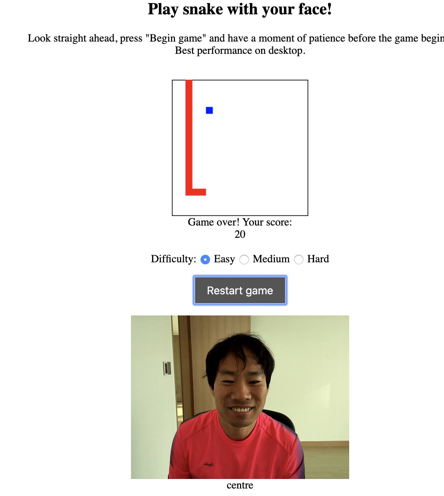
**이미지 캡션:** 화면 상단에는 "Play snake with your face!"라는 제목과 함께 게임 방법에 대한 안내 문구가 있습니다. 그 아래에는 빨간색 뱀과 파란색 점으로 구성된 간단한 스네이크 게임 화면이 보이며, "Game over! Your score: 20"이라는 문구로 게임이 종료되었음을 알리고 있습니다. 게임 난이도를 선택하는 라디오 버튼(Easy, Medium, Hard)과 "Restart game" 버튼이 있습니다. 화면 하단에는 한 명의 성인 남성이 분홍색 티셔츠를 입고 카메라를 향해 환하게 웃고 있는 모습이 담겨 있습니다. 남성은 실내에 있으며, 배경에는 문과 벽이 보입니다. 전체적으로 게임을 즐기거나 테스트하는 듯한 가볍고 긍정적인 분위기입니다. 모습이 담겨 있습니다. 남성은 실내에 있으며, 배경에는 문과 벽이 보입니다. 전체적으로 게임을 즐기거나 테스트하는 듯한 가볍고 긍정적인 분위기입니다.
 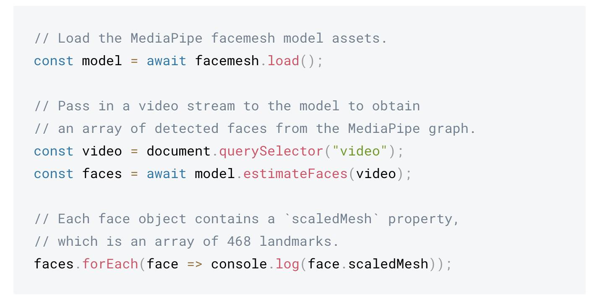
**이미지 캡션:** 이것은 프로그래밍 코드의 스크린샷으로, 회색 배경에 흰색 텍스트로 작성되었습니다. 코드의 내용은 MediaPipe facemesh 모델을 사용하여 비디오 스트림에서 얼굴을 감지하는 JavaScript 코드입니다. 코드에는 주석이 포함되어 있어 각 줄의 기능을 설명합니다. 첫 번째 주석은 MediaPipe facemesh 모델 자산을 로드하는 방법을 설명하고, 두 번째 주석은 비디오 스트림을 모델에 전달하여 감지된 얼굴 배열을 얻는 방법을 설명합니다. 세 번째 주석은 각 얼굴 객체에 468개의 랜드마크 배열인 'scaledMesh' 속성이 포함되어 있음을 설명합니다. 마지막 줄은 감지된 각 얼굴의 'scaledMesh' 속성을 콘솔에 기록합니다. 이 코드는 얼굴 인식, 얼굴 추적 또는 얼굴 기반 애플리케이션과 같은 컴퓨터 비전 애플리케이션에 사용될 수 있습니다.'scaledMesh' 속성이 포함되어 있음을 설명합니다. 마지막 줄은 감지된 각 얼굴의 'scaledMesh' 속성을 콘솔에 기록합니다. 이 코드는 얼굴 인식, 얼굴 추적 또는 얼굴 기반 애플리케이션과 같은 컴퓨터 비전 애플리케이션에 사용될 수 있습니다.
 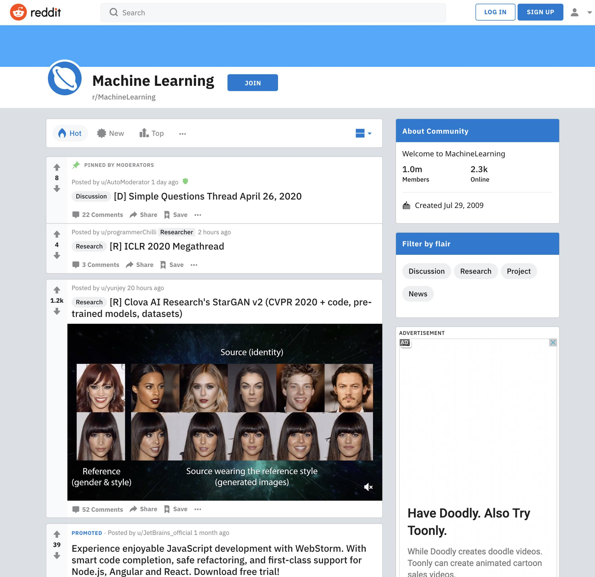
**이미지 캡션:** 이 이미지는 레딧(Reddit)의 'Machine Learning' 커뮤니티 페이지를 보여줍니다. 페이지 상단에는 레딧 로고와 검색창, 로그인 및 회원가입 버튼이 있습니다. 중앙에는 'Machine Learning' 커뮤니티 이름과 'JOIN' 버튼이 보이며, 그 아래에는 'Hot', 'New', 'Top' 등의 탭이 있습니다. 메인 콘텐츠 영역에는 여러 게시물들이 나열되어 있는데, 가장 위에 고정된 게시물은 'AutoModerator'가 1일 전에 올린 '[D] Simple Questions Thread April 26, 2020'라는 제목의 토론글입니다. 그 아래에는 'programmerChilli'가 2시간 전에 올린 '[R] ICLR 2020 Megathread'라는 연구 관련 게시물과 'yunjey'가 20시간 전에 올린 '[R] Clova AI Research's StarGAN v2 (CVPR 2020 + code, pre-trained models, datasets)'라는 연구 게시물이 있습니다. 이 연구 게시물에는 여러 사람의 얼굴 사진이 포함된 이미지가 첨부되어 있으며, 'Source (identity)', 'Reference (gender & style)', 'Source wearing the reference style (generated images)'와 같은 설명이 붙어 있습니다. 페이지 오른쪽에는 'About Community' 섹션이 있어 커뮤니티의 회원 수와 온라인 사용자 수를 보여주고 있으며, 'Filter by flair' 섹션에서는 'Discussion', 'Research', 'Project', 'News' 등의 필터 버튼이 있습니다. 또한, 광고 영역에는 'Have Doodly. Also Try Toonly.'라는 문구와 함께 관련 설명이 포함된 광고가 보입니다. 전체적으로 기술 관련 커뮤니티의 게시물 목록과 정보, 광고가 혼합된 화면입니다.egathread" is visible, followed by a post with a large image preview. This image shows a grid of faces, with the top row labeled "Source (identity)" and the bottom row labeled "Reference (gender & style)" and "Source wearing the reference style (generated images)". The faces in the image appear to be of adult women and men, with varying ethnicities and hairstyles. The post is tagged as "Research" and mentions "Clova AI Research's StarGAN v2". On the right side of the screen, there is an "About Community" section displaying the subreddit's member count and creation date, and a "Filter by flair" section with options like "Discussion", "Research", "Project", and "News". An advertisement for "Doodly" and "Toonly" is also visible. The overall atmosphere is informative and technical, typical of an online community focused on machine learning research and discussion.

> #레딧MLtop AI연구를 하면서 가장 신나는 순간중 하나는 우리가 만든 연구를 더 사람들이 사용해주는 것일텐데요. @Jung-Woo Ha 님이 이끄는 Clova AI 연구 팀에서 공개한 StarGAN v2코드와 데이타 등이 레딧의 ML 부분 top이 되었습니다.   많은 분들이 좋아 해주신 덕분입니다. 코드와 모델, 데이타 등이 공개 되어 있습니다. https://www.reddit.com/r/MachineLearning/comments/g8s1af/r_clova_ai_researchs_stargan_v2_cvpr_2020_code/
