# 2020년 5월

[← 2020년](README.md)

### 5월 2일 (토) 18:58 · Wonderful ride with fun friends! Let's d…

Wonderful ride with fun friends! Let's do it again in june.

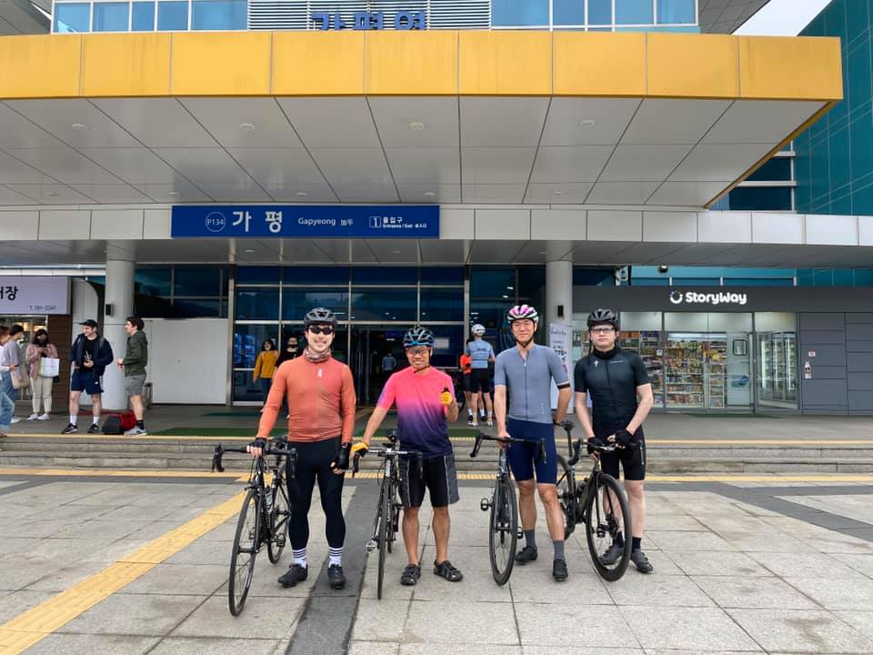
**이미지 캡션:** 네 명의 성인 남성이 자전거를 타고 가평역 앞에서 포즈를 취하고 있다. 왼쪽에서부터 첫 번째 남성은 40대 후반으로 보이며, 주황색 긴팔 상의와 검은색 긴 바지, 검은색 운동화를 착용하고 헬멧을 쓰고 있다. 그는 자전거 핸들을 잡고 카메라를 향해 미소를 짓고 있다. 두 번째 남성은 50대 초반으로 보이며, 보라색과 분홍색이 섞인 그라데이션 색상의 긴팔 상의와 검은색 긴 바지, 검은색 운동화를 착용하고 헬멧을 쓰고 있다. 그는 자전거 핸들을 잡고 카메라를 향해 미소를 짓고 있다. 세 번째 남성은 40대 후반으로 보이며, 회색 긴팔 상의와 파란색 반바지, 검은색 운동화를 착용하고 헬멧을 쓰고 있다. 그는 자전거 핸들을 잡고 카메라를 향해 미소를 짓고 있다. 네 번째 남성은 40대 후반으로 보이며, 검은색 긴팔 상의와 검은색 반바지, 검은색 운동화를 착용하고 헬멧을 쓰고 있다. 그는 자전거 핸들을 잡고 카메라를 향해 미소를 짓고 있다. 배경에는 가평역 건물이 보이며, 노란색과 파란색으로 이루어진 현대적인 디자인이다. 역 입구에는 '가평 Gapyeong'이라는 한글과 영문 표지판이 보이고, 'StoryWay'라는 편의점 간판도 보인다. 역 앞에는 여러 명의 사람들이 지나다니고 있으며, 전반적으로 밝고 활동적인 분위기이다.
 
**이미지 캡션:** 흐린 날씨 속에서 한 성인 남성이 산악 도로를 자전거를 타고 오르고 있다. 남성은 40대 후반에서 50대 초반으로 보이며, 헬멧을 쓰고 있으며, 보라색과 분홍색이 섞인 짧은 소매의 사이클링 저지와 검은색 반바지를 입고 있다. 손에는 주황색 장갑을 끼고 있으며, 얼굴에는 약간의 땀방울이 맺혀 있고 집중한 표정으로 페달을 밟고 있다. 자전거는 검은색 프레임의 로드 바이크이며, 바퀴에는 림 테이프가 둘러져 있다. 배경에는 안개가 낀 산이 보이고, 산 중턱에는 작은 붉은색 지붕의 건물이 보인다. 도로에는 금이 가 있고, 차선에는 노란색 선이 그려져 있다. 전체적으로 흐리고 약간 쌀쌀한 날씨에 홀로 자전거를 타는 고독하고도 도전적인 분위기를 풍긴다.
 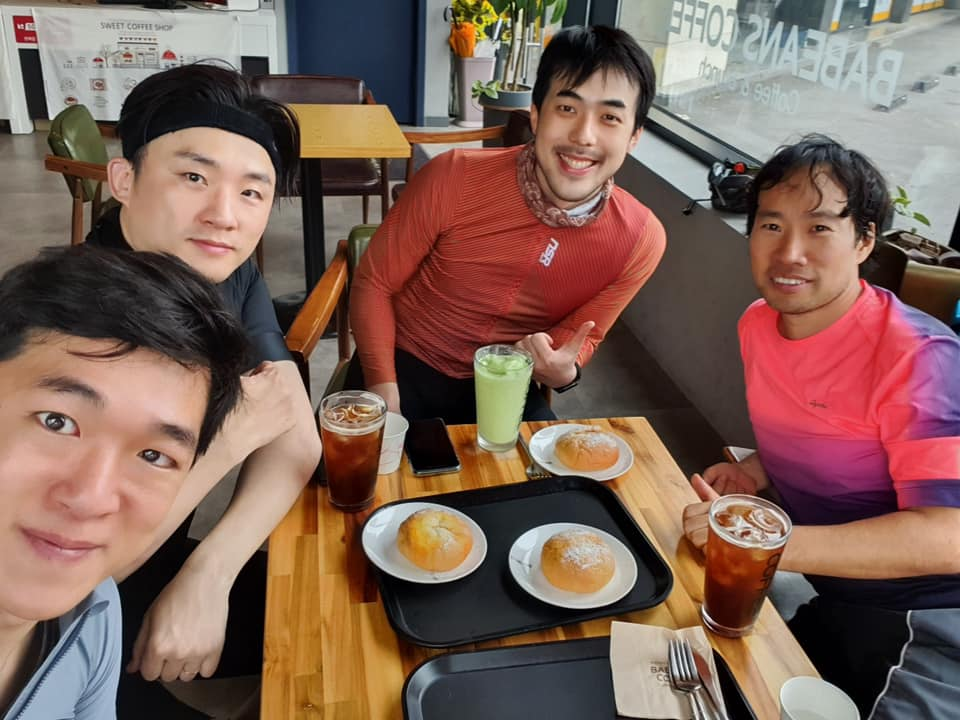
**이미지 캡션:** 네 명의 성인 남성이 카페 테이블에 앉아 사진을 찍고 있습니다. 왼쪽부터 첫 번째 남성은 검은색 헤어밴드를 하고 있으며, 검은색 상의를 입고 있습니다. 그는 카메라를 향해 미소를 짓고 있습니다. 두 번째 남성은 주황색 긴팔 상의를 입고 있으며, 턱수염이 있고, 엄지손가락을 치켜들고 있습니다. 세 번째 남성은 주황색 상의를 입고 있으며, 카메라를 향해 미소를 짓고 있습니다. 네 번째 남성은 분홍색과 보라색이 섞인 상의를 입고 있으며, 엄지손가락을 치켜들고 있습니다. 테이블 위에는 아이스 커피 두 잔, 녹색 음료 한 잔, 빵 두 개가 놓여 있습니다. 배경에는 "SWEET COFFEE SHOP"이라고 적힌 간판과 창문이 보입니다. 전체적으로 편안하고 즐거운 분위기입니다.
 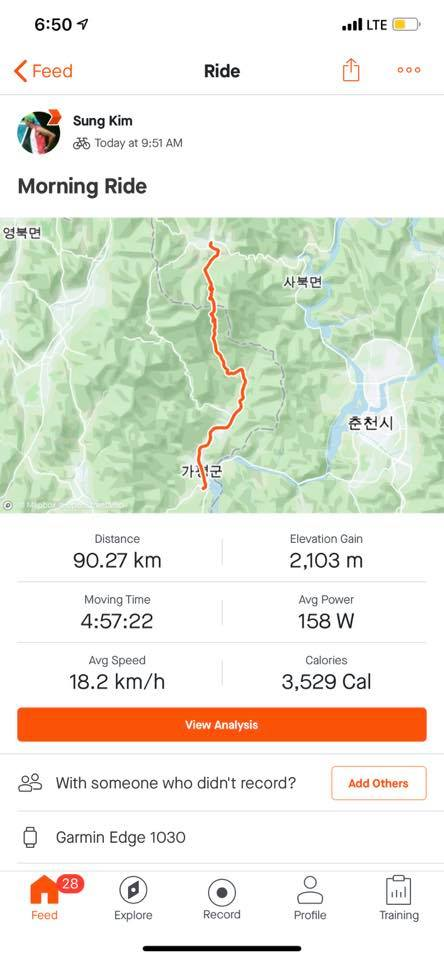
**이미지 캡션:** 이 화면은 자전거 타기 활동 기록을 보여주는 모바일 앱 화면으로, 'Sung Kim'이라는 이름의 사용자가 오늘 오전 9시 51분에 'Morning Ride'라는 제목으로 기록한 활동이다. 화면 상단에는 현재 시간 6시 50분과 LTE 신호, 배터리 잔량이 표시되어 있다. 'Feed'와 'Ride'라는 탭이 보이며, 'Feed' 탭이 선택되어 있다. 사용자의 프로필 사진으로 보이는 작은 원형 이미지에는 녹색과 분홍색 옷을 입은 사람의 상반신이 보인다. 지도에는 주황색 선으로 자전거 경로가 표시되어 있으며, '영북면', '사북면', '가천군', '춘천시'와 같은 지명이 한국어로 표기되어 있어 활동 장소가 한국의 산악 지역임을 알 수 있다. 활동 통계로는 총 거리 90.27km, 이동 시간 4시간 57분 22초, 평균 속도 18.2km/h, 고도 상승 2,103m, 평균 파워 158W, 소모 칼로리 3,529Cal가 표시된다. 'View Analysis' 버튼이 있으며, 'With someone who didn't record?'라는 문구와 함께 'Add Others' 버튼이 보인다. 또한, 'Garmin Edge 1030'이라는 기기 이름이 표시되어 있어 이 활동이 해당 기기로 기록되었음을 알 수 있다. 하단에는 'Feed', 'Explore', 'Record', 'Profile', 'Training' 등의 메뉴 아이콘이 있으며, 'Feed' 아이콘 위에 숫자 28이 표시되어 알림이 있음을 나타낸다. 전반적으로 활동적인 라이딩 기록을 상세하게 보여주는 화면이며, 날씨가 좋고 활동적인 분위기를 띤다.

🎬 동영상 1개 (생략)

### 5월 12일 (화) 17:28 · Sung Kim added a life event from December 2011: Started new job at Microsoft Research Asia.

📍 Beijing, China

### 5월 19일 (화) 19:17 · 📷 사진 (1장)

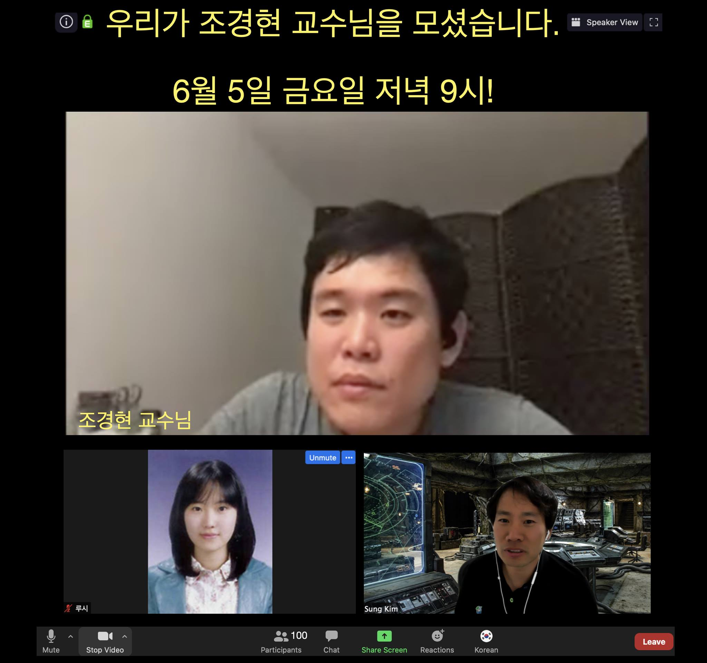
**이미지 캡션:** 상단 중앙에는 성인 남성이 회색 상의를 입고 카메라를 응시하고 있으며, 그의 뒤로는 격자무늬 배경이 보인다. 상단 좌측에는 "우리가 조경현 교수님을 모셨습니다. 6월 5일 금요일 저녁 9시!"라는 한국어 문구가 노란색과 흰색으로 표시되어 있다. 하단 좌측에는 조경현 교수님으로 보이는 젊은 여성의 사진이 있고, 그 옆에는 "루시"라는 이름이 보인다. 하단 우측에는 성인 남성이 검은색 상의를 입고 이어폰을 착용한 채 카메라를 보며 말하고 있으며, 그의 뒤로는 복잡한 기계 장치들이 있는 배경이 보인다. 이 남성의 이름은 "Sung Kim"으로 표시되어 있다. 화면 하단에는 Zoom 회의 인터페이스가 보이며, 음소거, 비디오 중지, 참가자 수, 채팅, 화면 공유, 반응, 한국어 등의 버튼이 있다. 전체적으로 온라인 화상 회의의 한 장면으로 보인다.

> [5만의 TF-KR멤버와 5월에 만나요 - 조경현 교수님편]  #5만명_가입기념_언택트_이벤트 #5월5만TFKR #만나고싶어요 #6월5일밤9시  여러분!!! 모두가 아시고 꼭 만나고 싶어 하셨던 조경현 교수님을 저희들이 모셨습니다!!!!!  > 6월 1일 까지 참여를 위한 사전 접수를 받습니다. https://forms.gle/2Pikj3mXaTrfPw7b8 에 본인의 이메일과 질문을 적어 주시면 선착순 100명을 온라인 줌으로 초대 드립니다. (영상은 추후 녹화하여 공개할 예정입니다만) 본방 사수를 위해 아래 꼭 접수 부탁드립니다.  조 교수님은 논문 총 인용 수가 47000회에 육박하는 (반올림하면 5만회 ㅎㅎ), 설명이 필요없는 ML/NLP계의 원탑이라 할수 있고요. 인공신경망 기반의 기계번역의 선구자로 널리 알려져 있을 뿐더러, 요즘에는 question answering, text summarization, cancer image classification 등 다양한 분야에서 활약을 하셨고 하고 계십니다. 머신러닝에 대한 지식과 경험이 아주 풍부하고 인사이트가 뛰어나셔서, 어떤 질문을 드려도 새로운 시각을 엿볼 수 있고 배울만한 점이 있는 분입니다. 능력도 능력이지만, 아프리카의 머신러닝계가 발전할 수 있도록 세미나를 하고 기부를 한다거나, 여성 엔지니어들이 성장할 수 있도록 지지와 기부를 하는 등, 다양한 underrepresented group들에 대한 지원을 아끼지 않는 따뜻함을 지녔다는 점도 빼놓을 수 없습니다.  조 교수님에 대해 궁금하시면 아래의 자료들을 한 번 훑어보셔도 좋을 것 같습니다.  - 자동번역이 똘똘해졌죠? 이 사람 덕분입니다  https://www.sisain.co.kr/news/articleView.html?idxno=32570  - A SOTA-less, novelty-less journey into neural sequence models (EMNLP 2019 Keynote) https://twitter.com/kchonyc/status/1192858748106219520  - What is intelligence? http://www.kyunghyuncho.me/home/blog/nyucenterfordatasciencewhatisintelligence  - Energy functions and shortcut learning https://www.underratedml.com/episodes/episode-04-energy-functions-and-shortcut-learning  이 분은 이미 내 롤모델이어서 자료들은 진작 다 봤고 난 이 분에 대해서 더 알고 싶다, 또는, 잘은 모르지만 머신러닝의 길을 먼저 걸어본 인생 선배님과 가까이서 대화해보고 싶다!!! 하시는 분들은 TF-KR에서 준비한 온라인 세미나에 참석해주세요 ㅎㅎ  6월 5일 저녁 9시에 진행되며 파파고 기계번역팀의 Lucy님과 제가 재미있게 호스팅해보겠습니다. 당연히 한국어로 진행됩니다.

### 5월 21일 (목) 08:23 · 📷 사진 (1장)

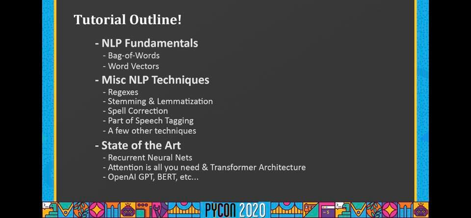
**이미지 캡션:** 이 이미지는 검은색 배경에 흰색 글씨로 된 프레젠테이션 슬라이드입니다. 슬라이드의 제목은 "Tutorial Outline!"이며, 그 아래에는 자연어 처리(NLP)와 관련된 여러 주제가 글머리 기호 목록으로 나열되어 있습니다. 주요 섹션으로는 "NLP Fundamentals", "Misc NLP Techniques", "State of the Art"가 있으며, 각 섹션 아래에는 더 구체적인 하위 주제들이 포함되어 있습니다. 예를 들어, "NLP Fundamentals" 아래에는 "Bag-of-Words"와 "Word Vectors"가 있고, "Misc NLP Techniques" 아래에는 "Regexes", "Stemming & Lemmatization", "Spell Correction", "Part of Speech Tagging", "A few other techniques"가 있습니다. "State of the Art" 섹션에는 "Recurrent Neural Nets", "Attention is all you need & Transformer Architecture", "OpenAI GPT, BERT, etc..."가 언급되어 있습니다. 슬라이드의 왼쪽에는 파란색과 노란색 테두리가 있으며, 하단에는 "PYCON 2020"이라는 로고와 함께 다채로운 그래픽 디자인이 있습니다. 이 슬라이드는 NLP 기술에 대한 튜토리얼의 개요를 보여주는 것으로 보이며, 발표자는 이 내용을 바탕으로 강의를 진행할 것으로 예상됩니다.

### 5월 24일 (일) 09:47 · 📷 사진 (3장)

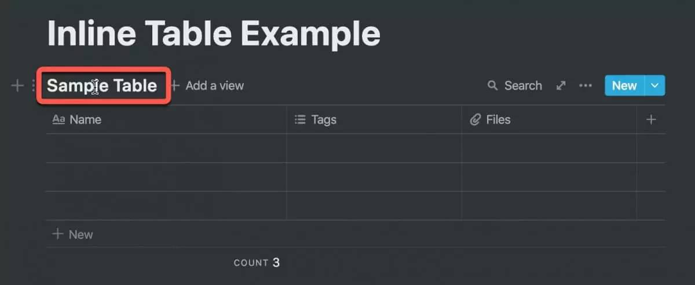
**이미지 캡션:** 이 사진은 어두운 배경의 컴퓨터 화면을 보여주며, "Inline Table Example"이라는 제목이 상단에 크게 표시되어 있습니다. 화면 중앙에는 "Sample Table"이라는 이름의 테이블이 있으며, 그 옆에는 "Add a view" 옵션이 있습니다. 테이블의 헤더에는 "Name", "Tags", "Files"라는 항목이 보이고, 각 항목 아래에는 빈 행들이 나열되어 있습니다. 오른쪽 상단에는 "Search" 기능과 "New" 버튼이 있습니다. 화면 하단에는 "COUNT 3"이라는 텍스트가 표시되어 있어 현재 테이블에 3개의 항목이 있음을 나타냅니다. 전반적으로 깔끔하고 현대적인 인터페이스 디자인을 보여주며, 데이터 관리 또는 문서 작성을 위한 도구의 일부로 보입니다.
 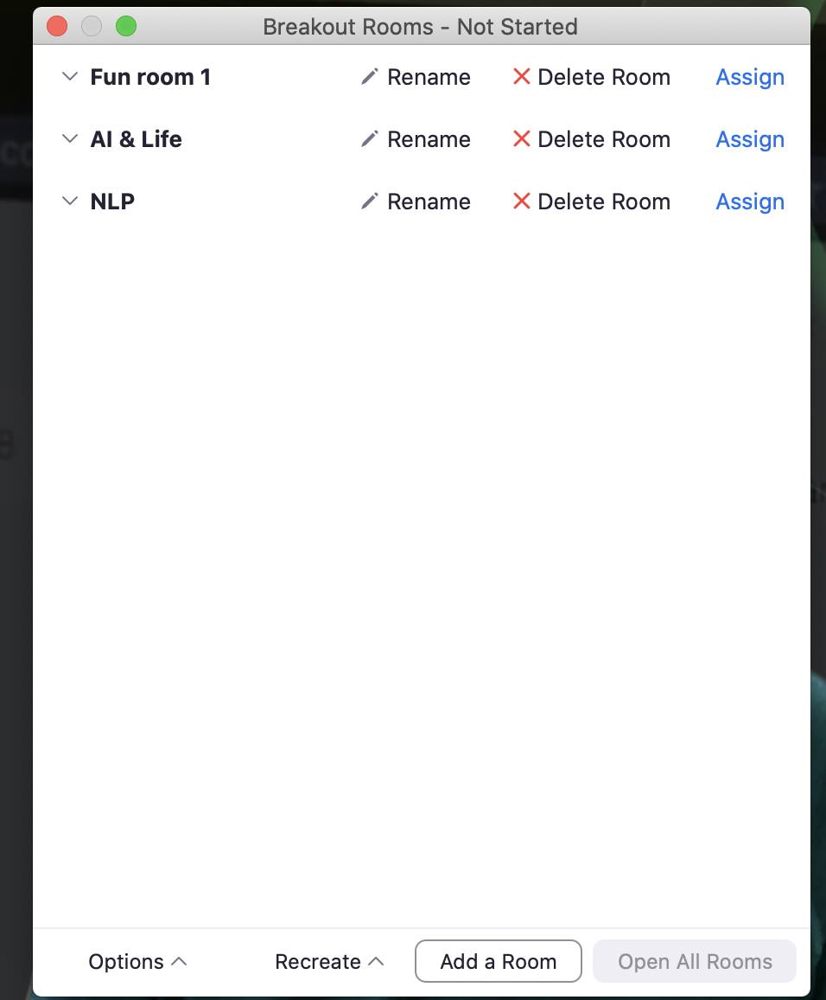
**이미지 캡션:** 이것은 컴퓨터 화면의 스크린샷으로, "Breakout Rooms - Not Started"라는 제목의 창이 열려 있습니다. 창 안에는 세 개의 방 목록이 있으며, 각 방 옆에는 "Rename", "Delete Room", "Assign"이라는 버튼이 있습니다. 첫 번째 방의 이름은 "Fun room 1"이고, 두 번째 방의 이름은 "AI & Life"이며, 세 번째 방의 이름은 "NLP"입니다. 창의 하단에는 "Options", "Recreate", "Add a Room", "Open All Rooms"라는 버튼이 있습니다. 이 화면은 온라인 회의 또는 수업에서 사용되는 기능으로 보이며, 참가자들을 소그룹으로 나누는 데 사용될 수 있습니다. 배경에는 흐릿하게 보이는 녹색과 검은색의 무언가가 있습니다.
 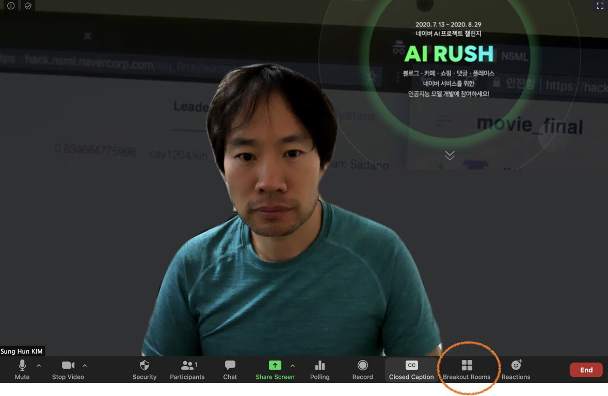
**이미지 캡션:** 화면 중앙에는 30대 후반에서 40대 초반으로 보이는 성인 남성이 푸른색 티셔츠를 입고 정면을 응시하고 있다. 남성의 머리카락은 짧고 검은색이며, 약간의 땀이 보이는 듯한 표정이다. 배경에는 컴퓨터 화면이 보이며, "AI RUSH NSML"이라는 문구와 함께 "2020. 7. 13 - 2020. 8. 29 네이버 AI 프로젝트 챌린지"라는 날짜와 행사가 표시되어 있다. 또한 "네이버 서비스를 위한 인공지능 모델 개발에 참여하세요!"라는 문구도 보인다. 화면 하단에는 Zoom 회의 인터페이스가 나타나 있으며, "Sung Hun KIM"이라는 이름과 함께 음소거, 비디오 중지, 보안, 참가자, 채팅, 화면 공유, 설문 조사, 녹화, 자막, 분할 화면, 반응, 종료 등의 기능 버튼들이 보인다. 특히 "Breakout Rooms" 버튼이 주황색 원으로 강조되어 있다. 전체적으로 온라인 회의 또는 웨비나에 참여하고 있는 상황으로 보인다.

> 노션 테이블의 엔트리를 누구나 추가 하게 할수 있나요? 즉 아래 그림과 같은 테이블을 노션 page에 인라인 했습니다. 노션 page는 읽기권한으로 오픈되어 있는데 사용자들로 부터 이름이나 의견같은 것을 입력 받으려고 하는데요.  테이블의 엔트리를 누구나가 입력하게 할수 있나요? 아님 사용자에게 의견을 받기 위한 다른 방법이 있을까요?  감사합니다.

### 5월 24일 (일) 17:56 · Do you think teaching is helpful to unde…

Do you think teaching is helpful to understand and learn new concepts? We are testing the Teaching driven Learning concept for Python. If this is successful with Korean students this year, I will extend it globally next year.

홍콩과기대 AIM (AI & Mining) 연구실 (http://www.cse.ust.hk/~hunkim) 에서 Python 프로그래밍을 *가르치면서 배우*는 TDL(Teaching driven Learning) 방식에 대한 연구를 진행하고 있습니다. 그냥 문법을 배우고 문제를 풀고 하는 방식보다 먼저 1) 간단한 개념을 이해하고 2) 관련한 한 두 문제를 풀어본 다음 3) 이를 본인의 말로 다른 사람을 가르쳐보는 (글이나 비디오 제작) 방식을 통해서 프로그래밍 언어를 더 깊게 그리고 더 빨리 이해한다는 가설입니다. 

이번 여름 방학때 10여명 정도의 중고등학생과 (CS 비전공) 대학생들과 함께 진행해본 후, 효과가 좋으면 글로벌 프로그램으로 확장해보려고 합니다. (모두 Zoom등을 사용하여 온라인으로 과정이 진행됩니다.) 아래와 같은 일정으로 6월 15일까지 참가 신청을 받고 있습니다.
https://www.notion.so/ustaim/0-Teaching-driven-Learning-f2440d6b74864f578203f6d2d99a0e1f

### 5월 29일 (금) 10:41 · 📷 사진 (5장)

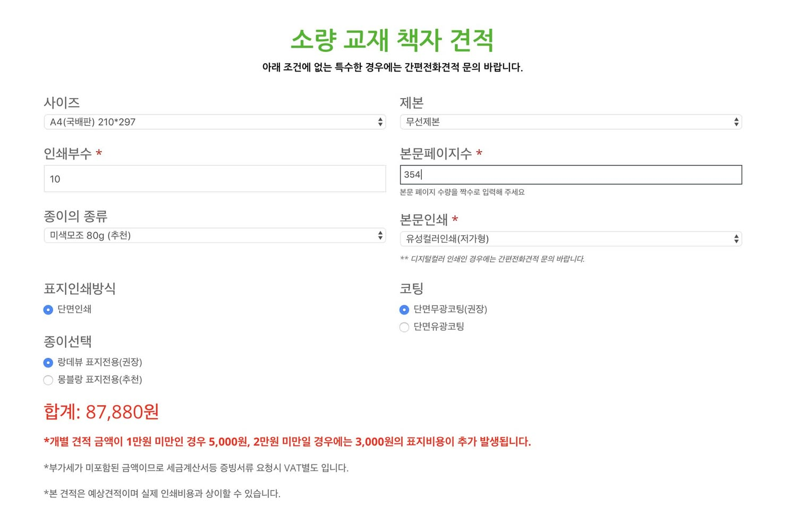
**이미지 캡션:** 이 이미지는 소량 교재 책자 견적을 위한 온라인 양식의 일부를 보여줍니다. 화면에는 책자의 크기, 제본 방식, 페이지 수, 본문 인쇄 방식, 종이 종류, 표지 인쇄 방식, 종이 선택, 코팅 방식 등 다양한 옵션이 나열되어 있습니다. 각 항목 옆에는 선택할 수 있는 드롭다운 메뉴나 라디오 버튼이 있습니다. 예를 들어, 사이즈는 A4(국판) 210*297으로 설정되어 있고, 제본은 무선 제본, 본문 페이지 수는 354로 입력되어 있습니다. 본문 인쇄는 유성 컬러 인쇄(저가형)로 선택되었으며, 종이 종류는 미색 모조 80g(추천)입니다. 표지 인쇄 방식은 단면 인쇄, 종이 선택은 랑데뷰 표지 전용(권장)으로 되어 있습니다. 코팅은 단면 무광 코팅(권장)이 선택되었습니다. 하단에는 합계 금액이 87,880원으로 표시되어 있으며, 추가적인 안내 사항으로 개별 견적 금액에 따른 표지 비용 발생 가능성, 부가세 별도 여부, 그리고 본 견적이 예상 견적임을 명시하고 있습니다. 이 화면은 사용자가 원하는 책자의 사양을 선택하고 견적을 확인하는 과정을 보여줍니다.
 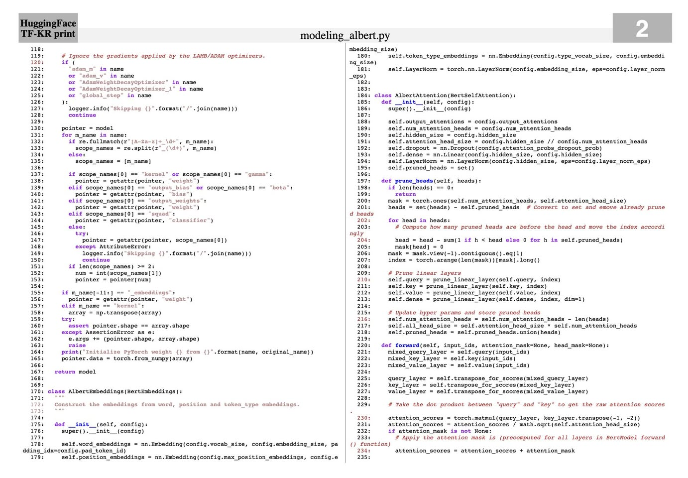
**이미지 캡션:** 이 이미지는 HuggingFace 라이브러리의 TF-KR 프린트와 `modeling_albert.py`라는 파이썬 코드 파일의 일부를 보여줍니다. 화면 왼쪽에는 "HuggingFace TF-KR print"라는 제목과 함께 코드의 일부가 표시되어 있으며, 오른쪽에는 "modeling_albert.py"라는 제목과 함께 더 많은 파이썬 코드가 표시되어 있습니다. 코드 내용은 딥러닝 모델, 특히 BERT와 유사한 모델의 아키텍처를 정의하는 것으로 보입니다. 사람: *   화면에는 사람이 보이지 않습니다. 장소/배경: *   배경은 흰색이며, 텍스트와 코드만 표시되어 있습니다. 사물: *   주요 사물은 컴퓨터 화면에 표시된 파이썬 코드입니다. 코드에는 다양한 변수, 함수, 클래스 정의가 포함되어 있습니다. 보이는 텍스트: *   "HuggingFace TF-KR print"라는 제목이 왼쪽 상단에 있습니다. *   "modeling_albert.py"라는 제목이 오른쪽 상단에 있습니다. *   코드에는 "Ignore the gradients applied by the LAMB/ADAM optimizers.", "class AlbertAttention (BertSelfAttention):", "def _init_(self, config):", "def prune_heads(self, heads):", "def forward(self, input_ids, attention_mask=None, head_mask=None):", "Construct the embeddings from word, position and token_type embeddings."와 같은 주석과 코드 라인이 포함되어 있습니다. *   오른쪽 상단 모서리에 숫자 "2"가 크게 표시되어 있습니다. 분위기/상황: *   전반적으로 기술적이고 전문적인 분위기입니다. 코드를 분석하거나 이해하려는 개발자나 연구자에게 유용할 수 있는 정보가 담겨 있습니다.
 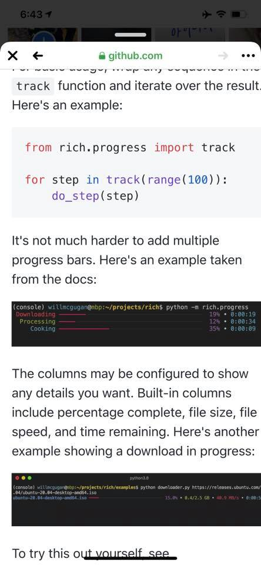
**이미지 캡션:** 이 이미지는 웹 브라우저 화면을 캡처한 것으로, GitHub 웹사이트에서 파이썬 프로그래밍 관련 내용을 보여주고 있습니다. 화면 상단에는 브라우저의 주소창이 보이며, "github.com"이라는 텍스트와 함께 자물쇠 아이콘이 표시되어 있습니다. 그 아래로는 파이썬 코드 예시가 나타나는데, `from rich.progress import track`과 `for step in track(range(100)): do_step(step)`과 같은 코드가 포함되어 있습니다. 이 코드는 진행률 표시줄을 사용하는 방법을 설명하는 것으로 보입니다. 이어서 "It's not much harder to add multiple progress bars. Here's an example taken from the docs:"라는 텍스트가 나오며, 콘솔 화면을 캡처한 이미지 두 개가 이어집니다. 첫 번째 콘솔 화면에는 "Downloading", "Processing", "Cooking"이라는 항목과 함께 진행률과 시간이 표시되는 진행률 표시줄이 나타납니다. 두 번째 콘솔 화면에는 파일 다운로드 진행 상황을 보여주는 것으로 보이는 더 상세한 정보가 포함되어 있으며, 파일 이름, 다운로드 속도, 남은 시간 등이 표시됩니다. 전체적으로 기술적인 내용을 다루는 웹 페이지의 일부를 보여주는 이미지이며, 프로그래밍 코드와 콘솔 출력 결과가 중심을 이룹니다.
 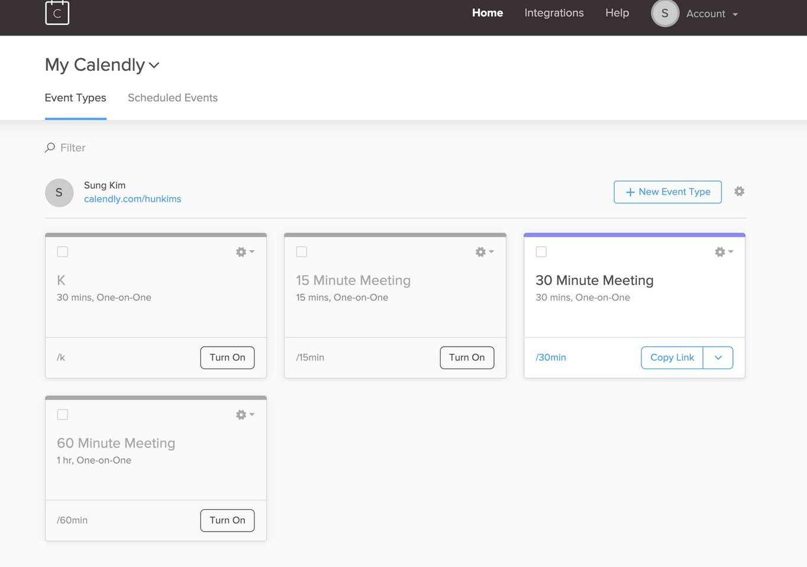
**이미지 캡션:** The image shows a screenshot of the Calendly application, specifically the "My Calendly" page displaying "Event Types." The background is a clean, light gray interface with a dark gray header bar. In the header, there are navigation links for "Home," "Integrations," "Help," and an "Account" dropdown menu indicated by a circular icon with the letter "S" inside. Below the header, the main content area features the title "My Calendly" with a dropdown arrow. Two tabs are visible: "Event Types" (currently selected and underlined) and "Scheduled Events." A search bar labeled "Filter" is present. Below the filter, a user profile section shows a circular icon with the letter "S" and the name "Sung Kim" with the calendly.com URL. The main part of the screen displays several event type cards arranged in a grid. Each card represents a different meeting duration and type. The first card, on the left, is labeled "K" with "30 mins, One-on-One" and a "Turn On" button. The second card, to its right, is for a "15 Minute Meeting," also described as "15 mins, One-on-One," with a "Turn On" button. The third card, highlighted with a purple border, is for a "30 Minute Meeting," with "30 mins, One-on-One," and options to enter "/30min" or "Copy Link." Below the first row of cards, a fourth card is visible for a "60 Minute Meeting," described as "1 hr, One-on-One," with a "/60min" field and a "Turn On" button. Each event type card has a checkbox at the top left and a gear icon at the top right for settings. The overall atmosphere is professional and organized, suggesting a tool for scheduling appointments.
 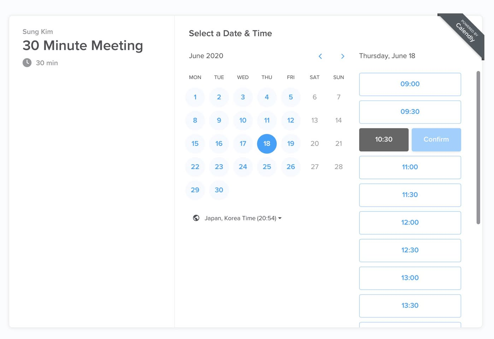
**이미지 캡션:** 이 화면은 온라인 회의 예약 시스템의 일부로, 왼쪽에는 "Sung Kim"이라는 이름으로 "30 Minute Meeting"이라는 제목과 회의 시간이 30분임을 나타내는 정보가 표시됩니다. 오른쪽에는 날짜와 시간을 선택하는 인터페이스가 있습니다. 2020년 6월 달력이 표시되어 있으며, 18일 목요일이 선택되어 있고, 해당 날짜에 예약 가능한 시간대 목록이 오른쪽에 나열되어 있습니다. 현재 10:30 시간이 선택되어 있으며, "Confirm" 버튼이 보입니다. 화면 오른쪽 상단에는 "POWERED by Calendly"라는 로고가 있습니다. 배경은 흰색이며, 전체적으로 깔끔하고 디지털적인 분위기입니다. 사용자는 이 화면을 통해 회의 날짜와 시간을 선택하고 예약할 수 있습니다.

> #아름다운코드읽기 어제 hugging face code (https://github.com/huggingface/transformers) 들을 읽다가 이런 멋진 코드는 프린트 해서 가방에 넣어 다니면서 카페나 공원에 앉아서 빨간줄을 쫙쫙 치면서 읽어보면 재미있겠다는 생각이 들어 PDF를 만들어 보았습니다. https://drive.google.com/file/d/1dsOpFoqRw69Nz-hm9Q4lI_gpP-hjiBqZ/view?usp=sharing  enscript로 출력했고 wrap이 많아 indent는 2space로 수정했습니다. (그래도 일부 wrap이 있습니다.)  질문 있습니다.   1. 이게 총 340페이지 정도 된는데 이걸 칼라 양면으로 제본해볼까 생각하는데 관심있으신분들 있으실까요? 10분이상되면 대량제작해서 보내 볼께요.  2. 왼쪽 코너에 날짜대신 Hugging Face라고 넣으면 더 멋질듯 한데 enscript 옵션 아시면 알려주세요. (아침에 10분 찾다가 포기 ㅠㅠ) (자답: 결국 ps파일 직접 수정했습니다. ^^)

### 5월 30일 (토) 06:03 · 📷 사진 (2장)

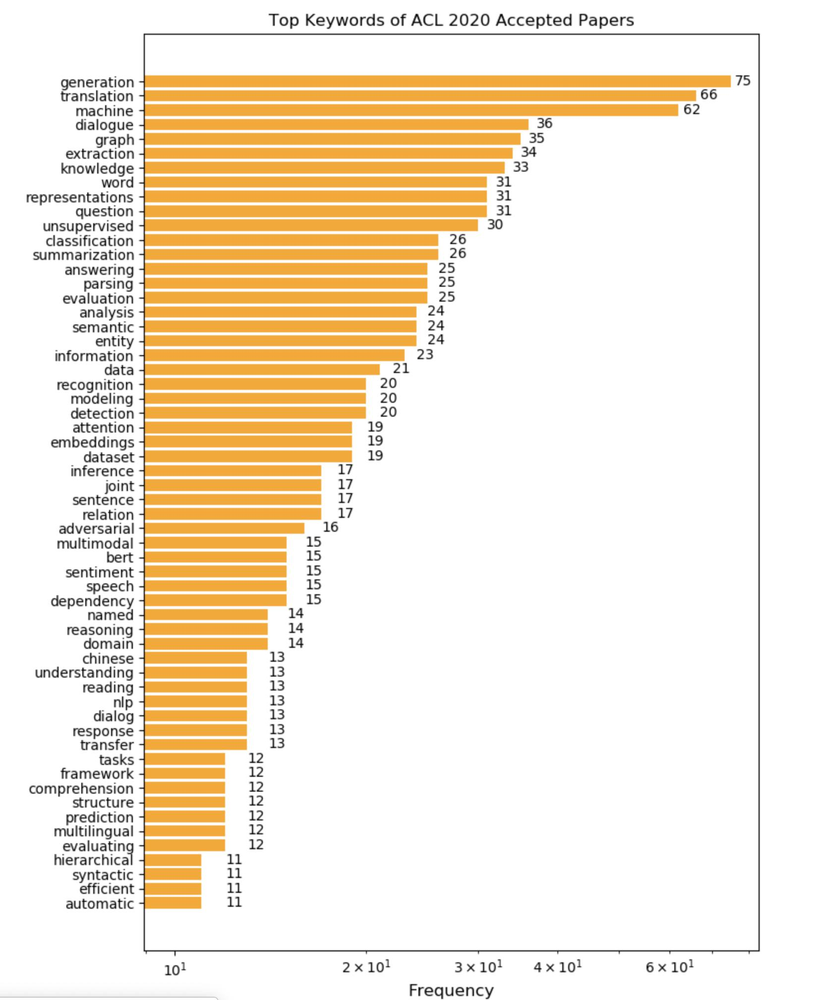
**이미지 캡션:** 이것은 ACL 2020에 수락된 논문의 상위 키워드를 보여주는 수평 막대 그래프입니다. 그래프의 제목은 "Top Keywords of ACL 2020 Accepted Papers"이며, y축에는 "generation", "translation", "machine", "dialogue", "graph", "extraction", "knowledge", "word", "representations", "question", "unsupervised", "classification", "summarization", "answering", "parsing", "evaluation", "analysis", "semantic", "entity", "information", "data", "recognition", "modeling", "detection", "attention", "embeddings", "dataset", "inference", "joint", "sentence", "relation", "adversarial", "multimodal", "bert", "sentiment", "speech", "dependency", "named", "reasoning", "domain", "chinese", "understanding", "reading", "nlp", "dialog", "response", "transfer", "tasks", "framework", "comprehension", "structure", "prediction", "multilingual", "evaluating", "hierarchical", "syntactic", "efficient", "automatic"와 같은 키워드가 나열되어 있습니다. x축은 "Frequency"를 나타내며 로그 스케일로 표시됩니다. 각 막대는 해당 키워드의 빈도를 나타내며, 가장 높은 빈도를 가진 키워드는 "generation"으로 75회, 그 다음은 "translation"으로 66회, "machine"으로 62회입니다. 그래프는 주황색 막대를 사용하여 데이터를 시각화하며, 각 막대 끝에는 해당 빈도 수가 표시되어 있습니다. 이 그래프는 ACL 2020에 제출된 논문에서 가장 많이 등장하는 주제를 파악하는 데 유용합니다.
 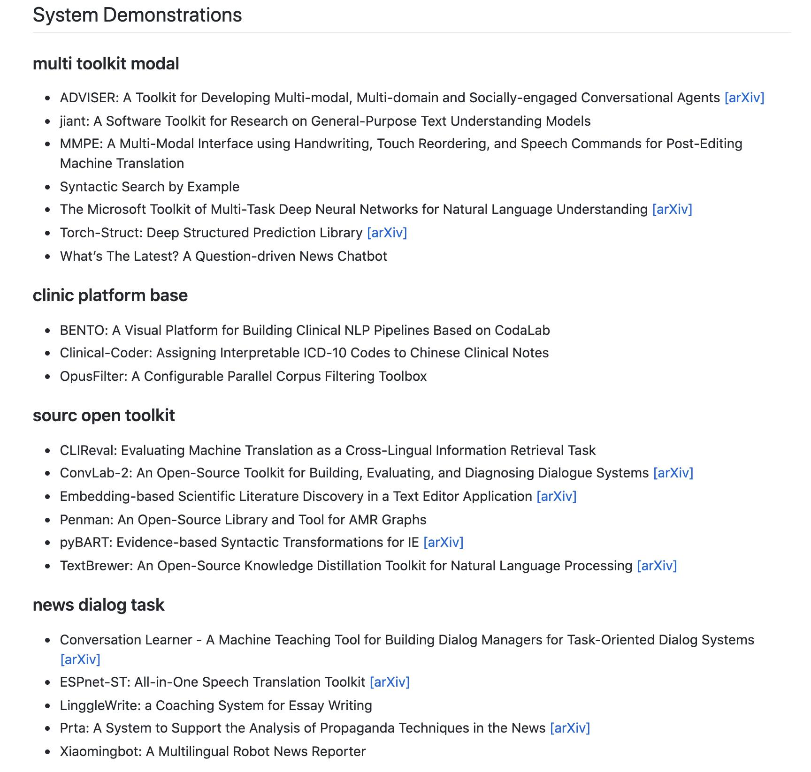
**이미지 캡션:** 이 이미지는 "System Demonstrations"라는 제목 아래 여러 연구 프로젝트 및 도구 목록을 보여주는 스크린샷입니다. 텍스트는 세 가지 주요 섹션으로 구성되어 있습니다. 첫 번째 섹션은 "multi toolkit modal"로, 대화형 에이전트, 텍스트 이해 모델, 다중 모달 인터페이스, 자연어 이해를 위한 딥 신경망, 뉴스 챗봇 등과 관련된 도구 목록을 포함합니다. 두 번째 섹션은 "clinic platform base"로, 임상 NLP 파이프라인 구축, 중국어 임상 노트에 대한 ICD-10 코드 할당, 병렬 코퍼스 필터링 도구와 관련된 프로젝트를 나열합니다. 세 번째 섹션은 "sourc open toolkit"으로, 기계 번역, 대화 시스템, 과학 문헌 검색, AMR 그래프 도구, 지식 증류 도구와 관련된 오픈 소스 도구를 포함합니다. 마지막으로 "news dialog task" 섹션은 대화 관리자 구축 도구, 음성 번역 도구, 에세이 작성 코칭 시스템, 선전 기법 분석 시스템, 다국어 로봇 뉴스 리포터와 관련된 프로젝트를 나열합니다. 각 항목에는 종종 [arXiv] 링크가 포함되어 있어 관련 논문을 찾을 수 있습니다. 전반적으로 이 이미지는 자연어 처리, 대화 시스템, 기계 번역 등 다양한 분야의 연구 및 개발 시스템을 보여주는 목록입니다.

> #타픽별로모아보자 오늘 캐터랩 핑퐁팀의 JooHong Lee 님이 올려주신 멋진 repos의 멋진 논문 제목들을 보았습니다. (멋진 코드와 리스트 공유 감사합니다. 특히 arxiv논문 링크 찾아 붙이는 코드는 너무 멋집니다.) https://www.facebook.com/groups/TensorFlowKR/permalink/1209263999414656/  다만 논문이 너무 많아서 읽기가 너무 심심하여 간단하게 LDA 를 돌려 논문을 타픽별로 그루핑 해보았습니다.  https://github.com/hunkim/ACL-2020-Papers/blob/master/papers_with_arxiv_link_topic.md  간단한 (proofreading하지 않은) LDA 분류 코드는 https://github.com/hunkim/ACL-2020-Papers/blob/master/generate_paper_list_with_arxiv_link.ipynb 있습니다.  다시한번 좋은 공유 감사드리며 덕분에 ACL2020 논문제목들 잘 보았습니다.

### 5월 30일 (토) 08:33 · I've never seen nor imagined anything li…

I've never seen nor imagined anything like this.

🔗 <https://youtu.be/ftLzQefpBvM>

### 5월 31일 (일) 09:43 · 📷 사진 (1장)

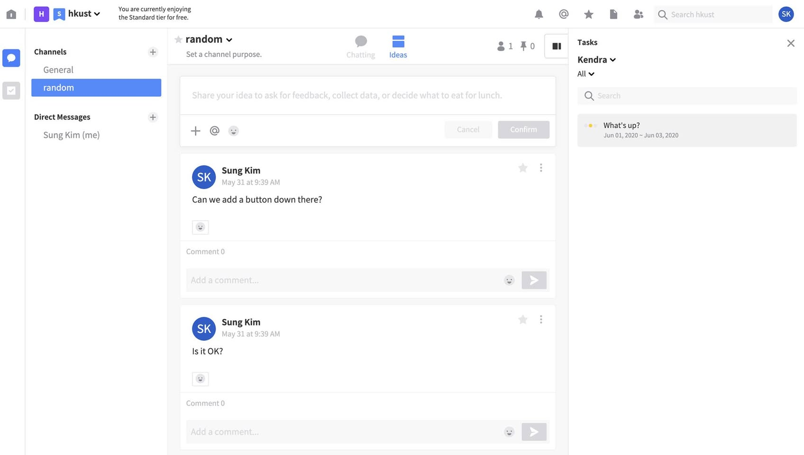
**이미지 캡션:** 이 화면은 협업 도구의 채팅 인터페이스를 보여주며, 왼쪽에는 채널 목록과 직접 메시지 목록이 있고, 가운데에는 'random' 채널의 대화 내용이 표시됩니다. 'random' 채널의 목적은 피드백 수집, 데이터 수집 또는 점심 메뉴 결정으로 설정되어 있으며, 사용자는 아이디어를 공유할 수 있습니다. 현재 'Sung Kim'이라는 사용자가 "Can we add a button down there?"와 "Is it OK?"라는 두 개의 메시지를 보냈으며, 각 메시지 아래에는 댓글을 추가할 수 있는 입력란이 있습니다. 오른쪽에는 'Kendra'라는 사용자의 작업 목록이 표시되며, 'What's up?'이라는 제목의 작업이 2020년 6월 1일부터 6월 3일까지 진행 중임을 나타냅니다. 전체적으로 업무 관련 소통 및 작업 관리가 이루어지는 깔끔하고 기능적인 인터페이스입니다.

> #슬랙대체서비스 슬랙과 유사한 서비스들이 많은데요 Discord도 많이 사용하는것 같고 누가 소개해주셔서 swit.io 잠시 테스트를 해봤는데요. 슬랙과 매우 유사한 인터페이스에 2가지 크게 눈에 띄는 것이 1) 아이디어 텝: 기존 채팅과 아이디어들을 분리해서 논의할수 있는 새로운 인터페이스 2) 프로젝트: 트렐로 같은 형식으로 프로젝트별 TODO카드를 만들어 진행 사항들을 볼수 있는것 같습니다.  정말 편하고 좋은것 같은데 혹시 swit을 사용하시는 분들은 추가로 어떤 장점이 있을까요?  다른 슬랙의 대체서비스들은 어떤것이 좋을까요?  암튼 슬랙, swit등으로 원격으로 프로젝트를 관리하고 논의하고 아이디어를 토론하기는 매우 좋은데 이제 *좋은* 프로젝트만 있으면 되겠습니다. ^^
