# 2020년 6월

[← 2020년](README.md)

### 6월 1일 (월) 18:50 · I am so happy that Naver is opening AI R…

I am so happy that Naver is opening AI RUSH 2020! We open our service models and data, and invite participants to improve the models together. I believe amazing models will come out from this two-month long event, and the models will be deployed to our services which can directly impact so many people.  Please joint us!

네이버 AI RUSH 2020함께 해요! (6월 8일 마감)

#소원달성 #네이버AIRUSH2020 어떤 회사에서 서비스 중인 모델과 데이터를 열고 전 세계에서 제일 잘 하사는 분들을 초청하여 함께 모여 한두 달 동안 그 서비스와 데이터 모델들을 들여다보면서 매일매일 서비스/모델/시스템 고민을 하고요. 그 결과로 멋진 모델들은 결국 서비스가 되어 많은 사람들을 더 행복하게 하는 그 사이클! 정말 멋지겠죠? 그것이 바로 네이버 AI RUSH CYCLE 2020입니다.

https://youtu.be/tjkVqpgI7e0

여기에서 나온 좋은 모델들은 오픈소스화도 할 예정이고요. 무엇보다도 함께 함으로써 참여자 그리고 네이버 함께 성장하는 좋은 기회가 될 것입니다.
ML 모델 경험이 있으신 분들은 누구나 신청이 가능하고 1차 예선을 거처 2차에 오신 분들은 네이버 그린팩토리에서 (8월 상황에 따라) 근무하면서 멋지고 뜨거운 여름을 함께 보내는 것입니다.

https://campaign.naver.com/airush 자세한 정보를 보시고 바로 신청하시고 (6월 8일 마감) 여름에 네이버에서 뵙도록 하겠습니다.

-- 출연해 주신 곽용재, 정민영, 하정우, 김영관, 권태희, 남다빈 님 감사드립니다.
-- 본 비디오는 Vrew로 편집되었습니다.

### 6월 2일 (화) 13:56 · 📷 사진 (3장)

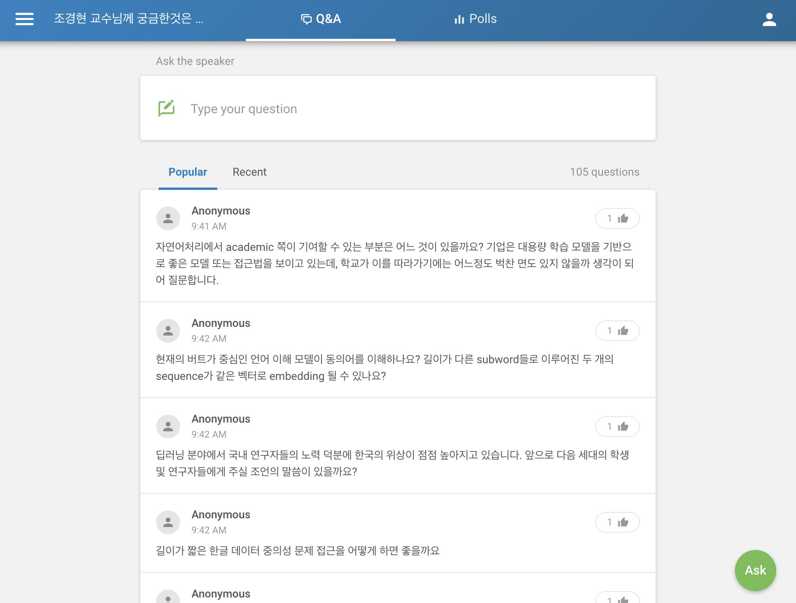
**이미지 캡션:** 이 화면은 온라인 강의나 웨비나에서 사용되는 Q&A 세션의 인터페이스를 보여줍니다. 상단에는 강의 제목으로 추정되는 "조경현 교수님께 궁금한 것은..."과 함께 Q&A, Polls 메뉴가 보입니다. 중앙에는 "Ask the speaker"라는 문구와 함께 질문을 입력할 수 있는 텍스트 필드가 있습니다. 그 아래에는 질문 목록이 나타나며, "Popular"와 "Recent" 탭으로 정렬할 수 있습니다. 현재는 "Popular" 탭이 선택되어 있으며, 105개의 질문이 있음을 알 수 있습니다. 익명의 사용자들이 올린 여러 질문들이 시간 순서대로 나열되어 있으며, 각 질문에는 좋아요를 누를 수 있는 아이콘과 함께 현재 좋아요 수가 표시되어 있습니다. 질문 내용은 자연어 처리, 언어 모델, 딥러닝 분야의 연구 동향 및 미래 세대 연구자들을 위한 조언 등 학술적인 내용이 주를 이룹니다. 화면 오른쪽 하단에는 녹색의 "Ask" 버튼이 있어 새로운 질문을 할 수 있음을 나타냅니다. 전반적으로 차분하고 정보 전달에 집중하는 분위기입니다.올린 여러 질문들이 시간 순서대로 나열되어 있으며, 각 질문에는 좋아요를 누를 수 있는 아이콘과 함께 현재 좋아요 수가 표시되어 있습니다. 질문 내용은 자연어 처리, 언어 모델, 딥러닝 분야의 연구 동향 및 미래 세대 연구자들을 위한 조언 등 학술적인 내용이 주를 이룹니다. 화면 오른쪽 하단에는 녹색의 "Ask" 버튼이 있어 새로운 질문을 할 수 있음을 나타냅니다. 전반적으로 차분하고 정보 전달에 집중하는 분위기입니다.
 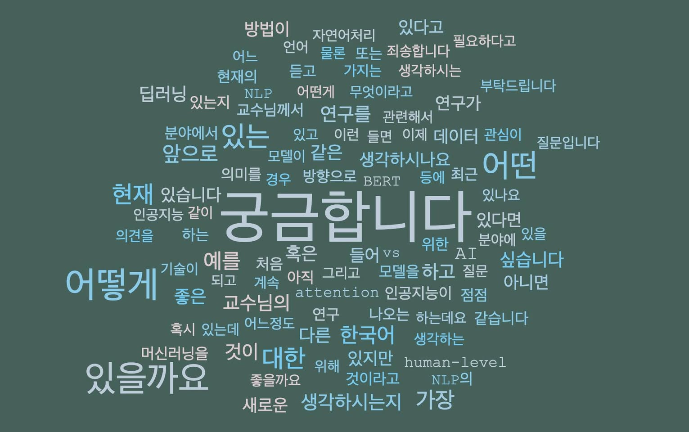
**이미지 캡션:** 이 이미지는 한국어 단어 구름으로, 다양한 크기와 색상의 한국어 단어들이 겹쳐져 있습니다. 주요 단어로는 "궁금합니다", "어떻게", "있을까요", "어떤", "대한" 등이 크고 굵게 표시되어 있으며, 이 외에도 "자연어처리", "인공지능", "연구", "모델", "생각하시는", "질문입니다", "NLP", "human-level" 등 다양한 관련 용어들이 포함되어 있습니다. 전반적으로 인공지능, 특히 자연어 처리 분야에 대한 궁금증이나 질문을 나타내는 것으로 보이며, 학술적인 논의나 연구에 대한 분위기를 풍깁니다. 배경은 짙은 녹색 단색으로, 단어들에 집중할 수 있도록 단순하게 처리되었습니다. 이미지에는 사람이 등장하지 않으며, 특정 장소나 사물도 보이지 않습니다. 텍스트는 모두 한국어로 작성되어 있습니다.깁니다. 배경은 짙은 녹색 단색으로, 단어들에 집중할 수 있도록 단순하게 처리되었습니다. 이미지에는 사람이 등장하지 않으며, 특정 장소나 사물도 보이지 않습니다. 텍스트는 모두 한국어로 작성되어 있습니다.
 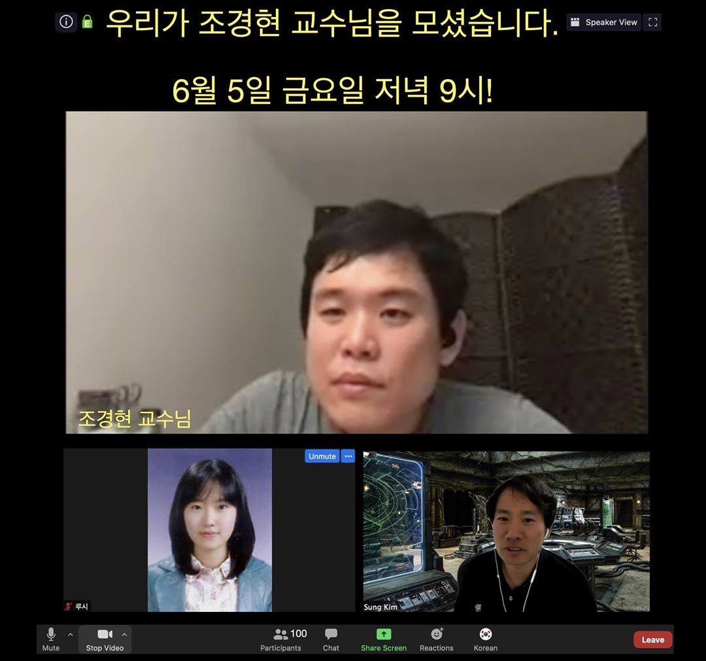
**이미지 캡션:** 이 화면은 온라인 회의 또는 웨비나의 일부로 보이며, 상단에는 "우리가 조경현 교수님을 모셨습니다. 6월 5일 금요일 저녁 9시!"라는 제목이 표시되어 있습니다. 화면은 여러 개의 창으로 분할되어 있습니다. 가장 큰 창에는 성인 남성이 회색 티셔츠를 입고 카메라를 응시하고 있으며, 배경에는 격자무늬 스크린이 보입니다. 이 남성은 30대 후반에서 40대 초반으로 추정되며, 약간 피곤해 보이는 표정입니다. 왼쪽 아래 창에는 젊은 성인 여성이 파란색 재킷과 흰색 블라우스를 입고 정면을 바라보고 있는 증명사진이 있습니다. 이 여성은 20대 초반으로 보이며, 차분한 표정입니다. 이 창에는 "루시"라는 이름이 표시되어 있습니다. 오른쪽 아래 창에는 다른 성인 남성이 검은색 옷을 입고 이어폰을 착용한 채 카메라를 보고 있으며, 배경에는 복잡한 기계와 스크린이 있는 미래적인 또는 공상 과학적인 환경이 가상 배경으로 설정되어 있습니다. 이 남성은 30대 후반에서 40대 초반으로 추정되며, 약간 미소를 띠고 있습니다. 이 창에는 "Sung Kim"이라는 이름이 표시되어 있습니다. 화면 하단에는 Zoom 회의 컨트롤 바가 있으며, 음소거, 비디오 중지, 참가자 수, 채팅, 화면 공유, 반응, 언어 설정 및 회의 종료 버튼이 보입니다. 전반적으로 이 화면은 온라인 강연이나 토론의 일부로 보이며, 조경현 교수님을 소개하고 있으며, 다른 참가자들의 모습도 함께 보여주고 있습니다.니다. 이 여성은 20대 초반으로 보이며, 차분한 표정입니다. 이 창에는 "루시"라는 이름이 표시되어 있습니다. 오른쪽 아래 창에는 다른 성인 남성이 검은색 옷을 입고 이어폰을 착용한 채 카메라를 보고 있으며, 배경에는 복잡한 기계와 스크린이 있는 미래적인 또는 공상 과학적인 환경이 가상 배경으로 설정되어 있습니다. 이 남성은 30대 후반에서 40대 초반으로 추정되며, 약간 미소를 띠고 있습니다. 이 창에는 "Sung Kim"이라는 이름이 표시되어 있습니다. 화면 하단에는 Zoom 회의 컨트롤 바가 있으며, 음소거, 비디오 중지, 참가자 수, 채팅, 화면 공유, 반응, 언어 설정 및 회의 종료 버튼이 보입니다. 전반적으로 이 화면은 온라인 강연이나 토론의 일부로 보이며, 조경현 교수님을 소개하고 있으며, 다른 참가자들의 모습도 함께 보여주고 있습니다.

### 6월 5일 (금) 21:24 · Sung is talking with Prof. Cho!

Sung is talking with Prof. Cho!

### 6월 7일 (일) 19:07 · 📷 사진 (2장)

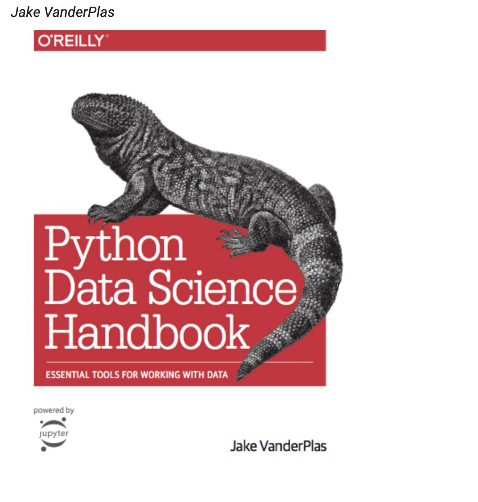
**이미지 캡션:** 이 이미지는 "Python Data Science Handbook"이라는 책의 표지입니다. 표지 중앙에는 붉은색 배경 위에 검은색과 흰색으로 그려진 도마뱀 그림이 있습니다. 도마뱀은 몸을 구부리고 있으며, 그 아래에는 흰색 글씨로 "Python Data Science Handbook"이라는 제목이 크게 쓰여 있습니다. 제목 아래에는 "ESSENTIAL TOOLS FOR WORKING WITH DATA"라는 부제가 작은 글씨로 적혀 있습니다. 표지 상단에는 "O'REILLY"라는 로고가 붉은색 배경 위에 흰색 글씨로 새겨져 있습니다. 표지 하단 왼쪽에는 "powered by jupyter"라는 문구와 함께 주피터 로고가 있습니다. 표지 상단 왼쪽에는 "Jake VanderPlas"라는 이름이, 하단 오른쪽에도 동일한 이름이 쓰여 있습니다. 전체적으로 흰색 배경에 붉은색과 검은색, 흰색이 조화롭게 사용되어 전문적이고 깔끔한 느낌을 줍니다. 이 이미지는 데이터 과학 분야의 파이썬 프로그래밍에 관한 책임을 나타냅니다.글씨로 새겨져 있습니다. 표지 하단 왼쪽에는 "powered by jupyter"라는 문구와 함께 주피터 로고가 있습니다. 표지 상단 왼쪽에는 "Jake VanderPlas"라는 이름이, 하단 오른쪽에도 동일한 이름이 쓰여 있습니다. 전체적으로 흰색 배경에 붉은색과 검은색, 흰색이 조화롭게 사용되어 전문적이고 깔끔한 느낌을 줍니다. 이 이미지는 데이터 과학 분야의 파이썬 프로그래밍에 관한 책임을 나타냅니다.
 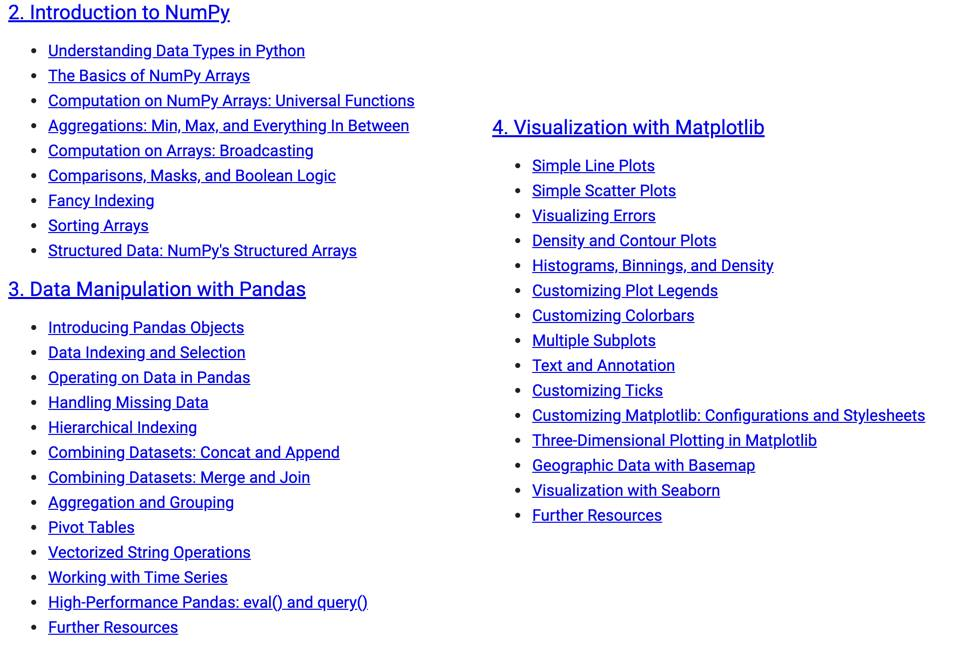
**이미지 캡션:** 이 이미지는 컴퓨터 프로그래밍, 특히 파이썬 라이브러리에 대한 학습 자료의 일부로 보이는 텍스트 목록입니다. 왼쪽에는 "2. Introduction to NumPy"와 "3. Data Manipulation with Pandas"라는 제목 아래 각각의 하위 항목들이 글머리 기호로 나열되어 있습니다. 오른쪽에는 "4. Visualization with Matplotlib"라는 제목 아래 관련 하위 항목들이 글머리 기호로 나열되어 있습니다. 모든 텍스트는 검은색이며, 제목은 파란색 밑줄이 쳐져 있어 클릭 가능한 링크임을 나타냅니다. 배경은 흰색이며, 사람이나 사물은 보이지 않습니다. 텍스트의 내용은 데이터 과학 및 분석에서 사용되는 NumPy, Pandas, Matplotlib 라이브러리의 다양한 기능과 개념을 다루고 있습니다. 전반적으로 정보 전달을 목적으로 하는 깔끔하고 구조화된 문서의 일부로 보입니다.링크임을 나타냅니다. 배경은 흰색이며, 사람이나 사물은 보이지 않습니다. 텍스트의 내용은 데이터 과학 및 분석에서 사용되는 NumPy, Pandas, Matplotlib 라이브러리의 다양한 기능과 개념을 다루고 있습니다. 전반적으로 정보 전달을 목적으로 하는 깔끔하고 구조화된 문서의 일부로 보입니다.

### 6월 9일 (화) 11:46 · 📷 사진 (1장)

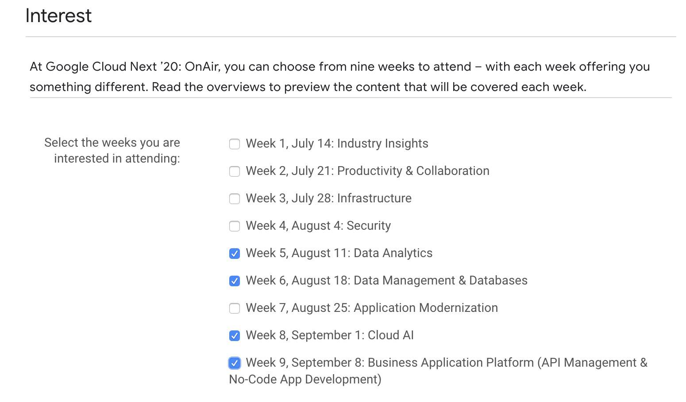
**이미지 캡션:** 이 이미지는 "Interest"라는 제목 아래에 Google Cloud Next '20: OnAir 행사 참여 의사를 선택하는 웹페이지의 일부를 보여줍니다. 텍스트는 행사에 대한 간략한 소개와 함께 9주 동안 진행되는 각 주의 주제를 나열하고 있습니다. 사용자는 관심 있는 주의 체크박스를 선택할 수 있습니다. 현재 선택된 주는 Week 5 (Data Analytics), Week 6 (Data Management & Databases), Week 8 (Cloud AI), Week 9 (Business Application Platform)이며, 각 주에는 날짜와 함께 주제가 명시되어 있습니다. 배경은 흰색이며, 텍스트는 검은색으로 표시되어 깔끔하고 정보 전달에 집중된 분위기입니다. 특별한 인물이나 사물은 보이지 않으며, 오직 텍스트와 체크박스만으로 구성된 인터페이스입니다.ication Platform)이며, 각 주에는 날짜와 함께 주제가 명시되어 있습니다. 배경은 흰색이며, 텍스트는 검은색으로 표시되어 깔끔하고 정보 전달에 집중된 분위기입니다. 특별한 인물이나 사물은 보이지 않으며, 오직 텍스트와 체크박스만으로 구성된 인터페이스입니다.

> 구글 클라우드에서 무려 9주, 넵 9주간 온라인 conference 를 합니다. 저는 아래와 같은 세션을 신청했습니다! 정말 기대 되네요. g.co/cloudnext

### 6월 10일 (수) 11:58 · 📷 사진 (1장)

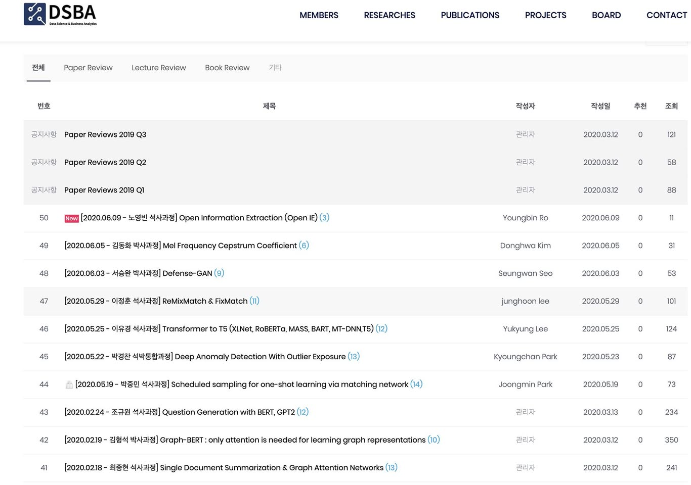
**이미지 캡션:** 이 이미지는 DSBA(Data Science & Business Analytics) 웹사이트의 게시판 페이지를 보여줍니다. 상단에는 DSBA 로고와 함께 MEMBERS, RESEARCHES, PUBLICATIONS, PROJECTS, BOARD, CONTACT 메뉴가 보입니다. 메인 콘텐츠 영역에는 '전체', 'Paper Review', 'Lecture Review', 'Book Review', '기타' 탭이 있으며, 현재 '전체' 탭이 선택되어 있습니다. 게시글 목록은 번호, 제목, 작성자, 작성일, 추천, 조회 수로 구성되어 있습니다. '공지사항'으로 표시된 세 개의 게시글은 각각 'Paper Reviews 2019 Q3', 'Paper Reviews 2019 Q2', 'Paper Reviews 2019 Q1'이며, 작성자는 모두 '관리자'이고 작성일은 2020년 3월 12일입니다. 그 아래로는 번호 50번부터 41번까지의 게시글들이 나열되어 있으며, 각 게시글은 날짜, 작성자(석사과정 또는 박사과정), 논문 제목, 그리고 괄호 안의 숫자로 구성되어 있습니다. 예를 들어, 50번 게시글은 '2020.06.09 - 노영빈 석사과정] Open Information Extraction (Open IE) (3)'이며, 작성자는 Youngbin Ro, 작성일은 2020년 6월 9일입니다. 49번 게시글은 '2020.06.05 - 김동화 박사과정] Mel Frequency Cepstrum Coefficient (6)'이며, 작성자는 Donghwa Kim, 작성일은 2020년 6월 5일입니다. 48번 게시글은 '2020.06.03 - 서승완 박사과정] Defense-GAN (9)'이며, 작성자는 Seungwan Seo, 작성일은 2020년 6월 3일입니다. 47번 게시글은 '2020.05.29 - 이정훈 석사과정] ReMixMatch & FixMatch (11)'이며, 작성자는 junghoon lee, 작성일은 2020년 5월 29일입니다. 46번 게시글은 '2020.05.25 - 이유경 석사과정] Transformer to T5 (XLNet, ROBERTA, MASS, BART, MT-DNN,T5) (12)'이며, 작성자는 Yukyung Lee, 작성일은 2020년 5월 25일입니다. 45번 게시글은 '2020.05.22 - 박경찬 석 조회 수로 구성되어 있습니다. '공지사항'으로 표시된 세 개의 게시글은 각각 'Paper Reviews 2019 Q3', 'Paper Reviews 2019 Q2', 'Paper Reviews 2019 Q1'이며, 작성자는 모두 '관리자'이고 작성일은 2020년 3월 12일입니다. 그 아래로는 번호 50번부터 41번까지의 게시글들이 나열되어 있으며, 각 게시글은 날짜, 작성자(석사과정 또는 박사과정), 논문 제목, 그리고 괄호 안의 숫자로 구성되어 있습니다. 예를 들어, 50번 게시글은 '2020.06.09 - 노영빈 석사과정] Open Information Extraction (Open IE) (3)'이며, 작성자는 Youngbin Ro, 작성일은 2020년 6월 9일입니다. 49번 게시글은 '2020.06.05 - 김동화 박사과정] Mel Frequency Cepstrum Coefficient (6)'이며, 작성자는 Donghwa Kim, 작성일은 2020년 6월 5일입니다. 48번 게시글은 '2020.06.03 - 서승완 박사과정] Defense-GAN (9)'이며, 작성자는 Seungwan Seo, 작성일은 2020년 6월 3일입니다. 47번 게시글은 '2020.05.29 - 이정훈 석사과정] ReMixMatch & FixMatch (11)'이며, 작성자는 junghoon lee, 작성일은 2020년 5월 29일입니다. 46번 게시글은 '2020.05.25 - 이유경 석사과정] Transformer to T5 (XLNet, ROBERTA, MASS, BART, MT-DNN,T5) (12)'이며, 작성자는 Yukyung Lee, 작성일은 2020년 5월 25일입니다. 45번 게시글은 '2020.05.22 - 박경찬 석

> 연구실에서 학생들과 같이 세미나를 하고 이렇게 세미나를 한 정보를 공개하고 또 학생들이 질문하고 토론한것을 모두 공개한다면 얼마나 멋질까요?   http://dsba.korea.ac.kr/seminar/  바로 강필성교수님의 연구실에서 그렇게 하시고 있는데요. 매우 코퀄의 발표 자료 (그리고 일부 영상). 무엇보다도 세미나를 참여한 학생들의 의견과 질문 토론들이 너무 좋습니다.  좋은 자료가 너무 많아서 저도 보는 중인데 트랜스포머류를 모두 정리한 자료, 추천 정리등 보고 많이 배웠습니다. 감사합니다.

### 6월 11일 (목) 17:06 · 📷 사진 (2장)

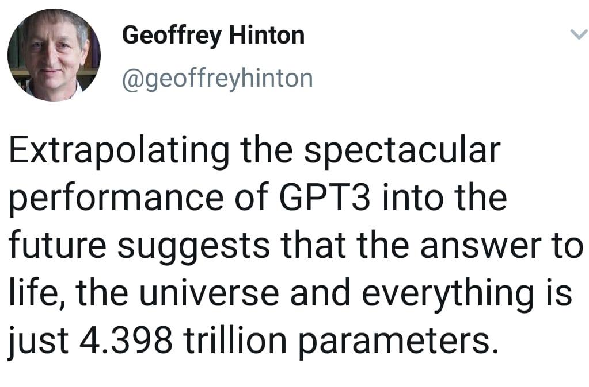
**이미지 캡션:** 이 사진은 트위터 게시물로, 프로필 사진에는 흰머리가 있고 안경을 쓴 성인 남성이 웃는 얼굴로 카메라를 바라보고 있습니다. 그는 셔츠와 재킷을 입고 있으며, 배경에는 책장이 보입니다. 게시물 작성자의 이름은 Geoffrey Hinton이고, 트위터 계정은 @geoffreyhinton입니다. 게시물 내용은 "Extrapolating the spectacular performance of GPT3 into the future suggests that the answer to life, the universe and everything is just 4.398 trillion parameters."로, GPT-3의 놀라운 성능을 미래로 외삽하면 삶, 우주, 그리고 모든 것에 대한 답이 단 4.398조 개의 매개변수일 뿐이라는 것을 시사한다는 내용입니다. 이 게시물은 인공지능의 발전과 관련된 유머러스하거나 철학적인 논평으로 보이며, 전반적으로 정보 전달과 흥미 유발을 목적으로 하는 분위기입니다.d everything is just 4.398 trillion parameters."로, GPT-3의 놀라운 성능을 미래로 외삽하면 삶, 우주, 그리고 모든 것에 대한 답이 단 4.398조 개의 매개변수일 뿐이라는 것을 시사한다는 내용입니다. 이 게시물은 인공지능의 발전과 관련된 유머러스하거나 철학적인 논평으로 보이며, 전반적으로 정보 전달과 흥미 유발을 목적으로 하는 분위기입니다.
 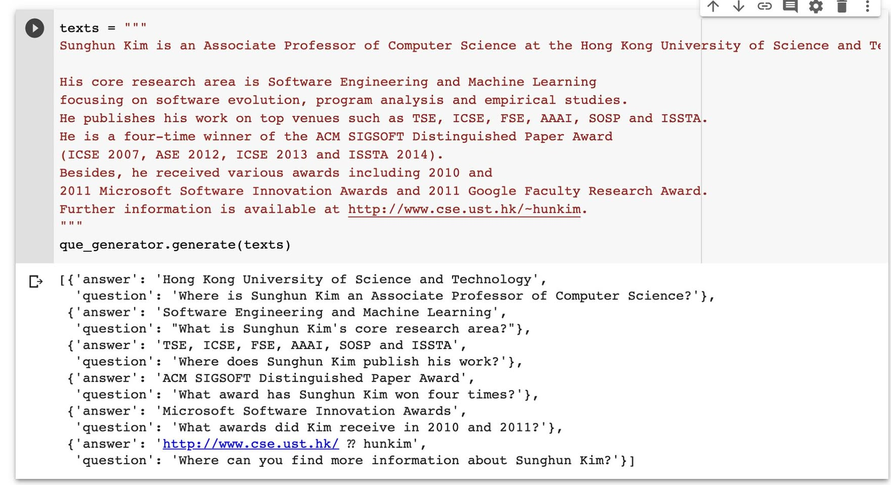
**이미지 캡션:** 화면에는 컴퓨터 코드와 텍스트가 표시되는 컴퓨터 화면의 일부가 보입니다. 상단에는 텍스트 편집기 또는 IDE의 메뉴 표시줄과 유사한 인터페이스가 있으며, 파일 탐색, 저장, 설정 및 기타 옵션을 나타내는 아이콘이 있습니다. 중앙에는 "texts ="로 시작하는 코드 블록이 있으며, 그 아래에는 Sunghun Kim이라는 사람에 대한 정보가 포함된 텍스트가 있습니다. 이 텍스트는 그가 홍콩 과학기술대학교의 컴퓨터 과학 부교수이며, 그의 주요 연구 분야는 소프트웨어 공학 및 기계 학습이라고 설명합니다. 또한 그는 여러 학술 대회에서 논문을 발표했으며 ACM SIGSOFT 우수 논문상을 네 번 수상했습니다. 또한 2010년과 2011년에 여러 상을 받았으며, 추가 정보는 제공된 웹사이트에서 찾을 수 있습니다. 이 텍스트 아래에는 "que_generator.generate(texts)"라는 코드가 있으며, 그 아래에는 이전에 제공된 텍스트를 기반으로 생성된 질문과 답변 쌍의 목록이 표시됩니다. 이 목록은 Sunghun Kim의 직책, 연구 분야, 논문 발표 장소, 수상 경력 및 추가 정보를 얻을 수 있는 방법에 대한 질문을 포함합니다. 전체적으로 이 화면은 프로그래밍 환경에서 텍스트 데이터를 처리하고 관련 질문을 생성하는 과정을 보여줍니다. 여러 학술 대회에서 논문을 발표했으며 ACM SIGSOFT 우수 논문상을 네 번 수상했습니다. 또한 2010년과 2011년에 여러 상을 받았으며, 추가 정보는 제공된 웹사이트에서 찾을 수 있습니다. 이 텍스트 아래에는 "que_generator.generate(texts)"라는 코드가 있으며, 그 아래에는 이전에 제공된 텍스트를 기반으로 생성된 질문과 답변 쌍의 목록이 표시됩니다. 이 목록은 Sunghun Kim의 직책, 연구 분야, 논문 발표 장소, 수상 경력 및 추가 정보를 얻을 수 있는 방법에 대한 질문을 포함합니다. 전체적으로 이 화면은 프로그래밍 환경에서 텍스트 데이터를 처리하고 관련 질문을 생성하는 과정을 보여줍니다.

### 6월 16일 (화) 10:50 · 📷 사진 (9장)

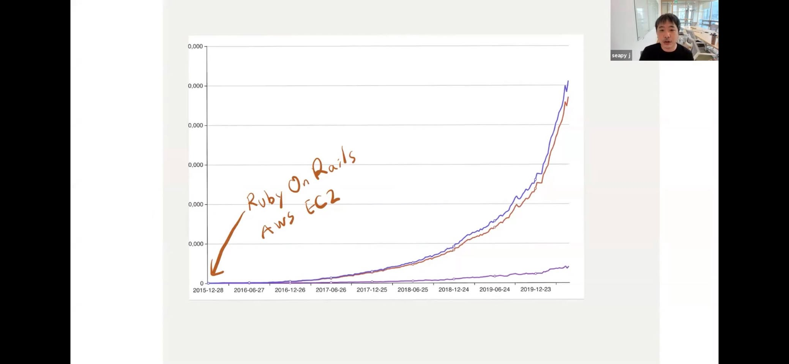
**이미지 캡션:** 화면 오른쪽 상단에는 검은색 티셔츠를 입고 안경을 쓴 30대 후반에서 40대 초반으로 보이는 동양인 남성이 화상 회의에 참여하고 있다. 그는 카메라를 응시하며 입을 살짝 벌리고 말하고 있다. 그의 뒤로는 사무실 배경이 보인다. 화면 왼쪽에는 2015년부터 2019년까지의 기간 동안 두 개의 데이터 라인이 급격히 증가하는 추세를 보여주는 그래프가 있다. 그래프에는 주황색 펜으로 "Ruby On Rails"와 "AWS EC2"라고 쓰여 있으며, 이는 두 기술의 성장세를 비교하는 것으로 보인다. 그래프의 세로축은 0부터 시작하여 0,000 단위로 표시되어 있으며, 가로축은 날짜를 나타낸다. 전반적으로 기술 성장 추세를 분석하는 발표 또는 회의의 한 장면으로 보인다.0부터 시작하여 0,000 단위로 표시되어 있으며, 가로축은 날짜를 나타낸다. 전반적으로 기술 성장 추세를 분석하는 발표 또는 회의의 한 장면으로 보인다.
 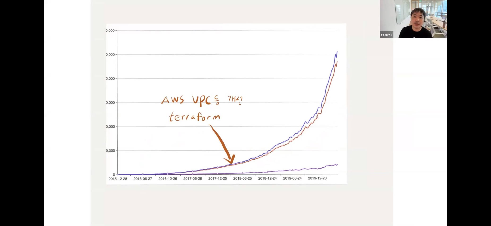
**이미지 캡션:** 화면 오른쪽 상단에는 검은색 티셔츠를 입고 안경을 쓴 30대 후반에서 40대 초반으로 보이는 동양인 남성이 화상 회의에 참여하고 있다. 그는 카메라를 응시하며 약간 놀란 듯한 표정을 짓고 있으며, 배경에는 사무실처럼 보이는 공간이 보인다. 화면 중앙에는 2015년부터 2019년까지의 기간 동안 두 개의 선 그래프가 급격히 상승하는 모습이 나타나 있다. 그래프 위에는 주황색 펜으로 "AWS VPC 등 개선"이라는 글씨와 "terraform"이라는 단어가 적혀 있으며, "terraform"이라는 단어 아래에는 그래프의 특정 지점을 가리키는 화살표가 그려져 있다. 그래프의 세로축에는 0부터 시작하여 0.000 단위로 값이 표시되어 있고, 가로축에는 날짜가 표시되어 있다. 전반적으로 기술적인 주제에 대한 발표나 회의의 일부로 보이는 상황이다.래프의 특정 지점을 가리키는 화살표가 그려져 있다. 그래프의 세로축에는 0부터 시작하여 0.000 단위로 값이 표시되어 있고, 가로축에는 날짜가 표시되어 있다. 전반적으로 기술적인 주제에 대한 발표나 회의의 일부로 보이는 상황이다.
 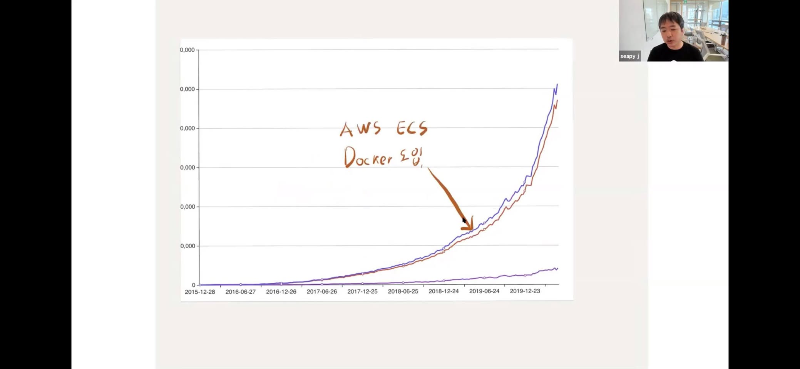
**이미지 캡션:** 화면 오른쪽 상단에는 성인 남성이 검은색 티셔츠를 입고 카메라를 보며 이야기하고 있으며, 그의 이름으로 보이는 "seapy j"라는 텍스트가 화면 좌측 하단에 작게 표시되어 있습니다. 남성 뒤로는 사무실 배경이 보입니다. 화면 중앙에는 2015년부터 2019년까지의 기간을 나타내는 x축과 수치를 나타내는 y축을 가진 그래프가 있습니다. 그래프에는 두 개의 선이 그려져 있으며, 두 선 모두 시간이 지남에 따라 가파르게 상승하는 추세를 보입니다. 그래프 상단에는 펜으로 "AWS ECS"와 "Docker 도입"이라고 쓰여 있으며, "Docker 도입"이라는 글씨에서 그래프의 두 선을 향해 갈색 화살표가 그려져 있습니다. 이 그래프는 AWS ECS와 Docker 도입에 따른 어떤 지표의 성장세를 보여주는 것으로 보이며, 전반적으로 기술 성장 또는 채택률 증가를 나타내는 긍정적인 분위기입니다.고 쓰여 있으며, "Docker 도입"이라는 글씨에서 그래프의 두 선을 향해 갈색 화살표가 그려져 있습니다. 이 그래프는 AWS ECS와 Docker 도입에 따른 어떤 지표의 성장세를 보여주는 것으로 보이며, 전반적으로 기술 성장 또는 채택률 증가를 나타내는 긍정적인 분위기입니다.
 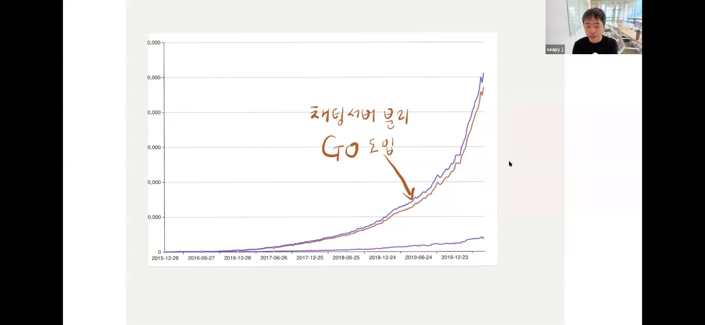
**이미지 캡션:** 화면 오른쪽 상단에는 검은색 티셔츠를 입고 안경을 쓴 성인 남성이 보이며, 그는 화면을 보며 무언가를 말하고 있다. 그의 이름은 'seapy j'로 표시되어 있다. 화면 중앙에는 그래프가 있고, 그래프 위에는 "채팅서버 분리 GO 도입"이라는 한국어 문구가 주황색 펜으로 쓰여 있으며, "GO 도입" 부분에는 그래프의 특정 지점을 가리키는 화살표가 그려져 있다. 그래프의 x축은 날짜(2015년 12월부터 2019년 12월까지)를 나타내고, y축은 0.000부터 시작하여 증가하는 수치를 보여준다. 두 개의 선 그래프는 시간이 지남에 따라 꾸준히 상승하는 추세를 보이며, 특히 후반부로 갈수록 상승폭이 커지고 있다. 전반적으로 온라인 회의나 발표 중에 그래프를 설명하는 상황으로 보인다.래프는 시간이 지남에 따라 꾸준히 상승하는 추세를 보이며, 특히 후반부로 갈수록 상승폭이 커지고 있다. 전반적으로 온라인 회의나 발표 중에 그래프를 설명하는 상황으로 보인다.
 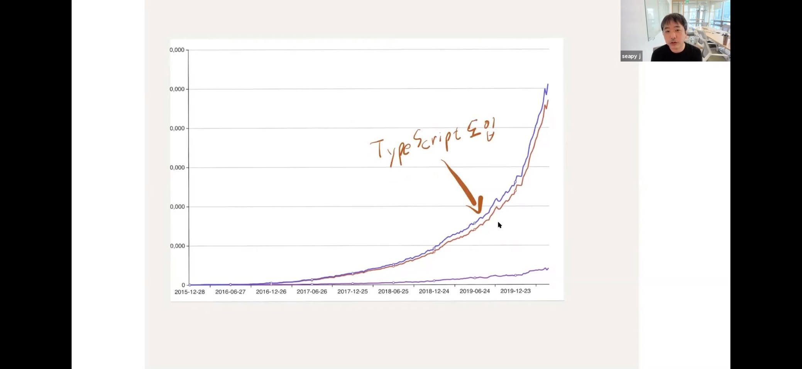
**이미지 캡션:** 화면 오른쪽 상단에는 성인 남성이 화상 회의에 참여하고 있으며, 검은색 티셔츠를 입고 있고, 그의 이름은 'seapy j'로 표시되어 있습니다. 화면 중앙에는 2015년부터 2019년까지의 기간을 나타내는 x축과 수치를 나타내는 y축으로 구성된 그래프가 있습니다. 그래프에는 두 개의 선이 그려져 있으며, 하나는 파란색이고 다른 하나는 주황색입니다. 그래프 위에는 "TypeScript 도입"이라는 한국어 문구가 손글씨로 적혀 있고, 이 문구를 가리키는 갈색 화살표가 있습니다. 이 그래프는 특정 지표가 시간이 지남에 따라 어떻게 변화했는지, 특히 TypeScript 도입 시점을 기준으로 변화를 보여주는 것으로 보입니다. 전반적으로 화면은 온라인 회의 또는 발표 중에 그래프를 설명하는 상황을 보여줍니다.남에 따라 어떻게 변화했는지, 특히 TypeScript 도입 시점을 기준으로 변화를 보여주는 것으로 보입니다. 전반적으로 화면은 온라인 회의 또는 발표 중에 그래프를 설명하는 상황을 보여줍니다.
 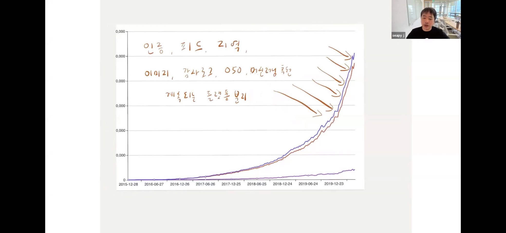
**이미지 캡션:** 화면 오른쪽 상단에는 검은색 티셔츠를 입고 안경을 쓴 30대 후반에서 40대 초반으로 보이는 동양인 남성이 보인다. 그는 카메라를 보며 입을 살짝 벌리고 이야기하는 듯한 표정을 짓고 있으며, 배경에는 사무실처럼 보이는 공간이 희미하게 보인다. 화면 왼쪽에는 그래프가 그려진 종이가 있다. 그래프는 2015년 12월부터 2019년 12월까지의 기간을 나타내며, 두 개의 선이 시간이 지남에 따라 꾸준히 상승하는 추세를 보여준다. 그래프 위에는 펜으로 한국어 글씨가 쓰여 있는데, "인증, 피드, 지역", "이미지, 감사로그, 050, 머신러닝 추천", "계속되는 플랫폼 분리"라고 읽힌다. 또한, 그래프의 상승하는 부분에 여러 개의 붉은색 화살표가 그려져 있어 특정 시점의 급격한 상승을 강조하는 것으로 보인다. 전반적으로 이 화면은 온라인 강의나 발표 자료의 일부로 보이며, 데이터 분석이나 기술 트렌드에 대한 내용을 다루고 있을 가능성이 높다.감사로그, 050, 머신러닝 추천", "계속되는 플랫폼 분리"라고 읽힌다. 또한, 그래프의 상승하는 부분에 여러 개의 붉은색 화살표가 그려져 있어 특정 시점의 급격한 상승을 강조하는 것으로 보인다. 전반적으로 이 화면은 온라인 강의나 발표 자료의 일부로 보이며, 데이터 분석이나 기술 트렌드에 대한 내용을 다루고 있을 가능성이 높다.
 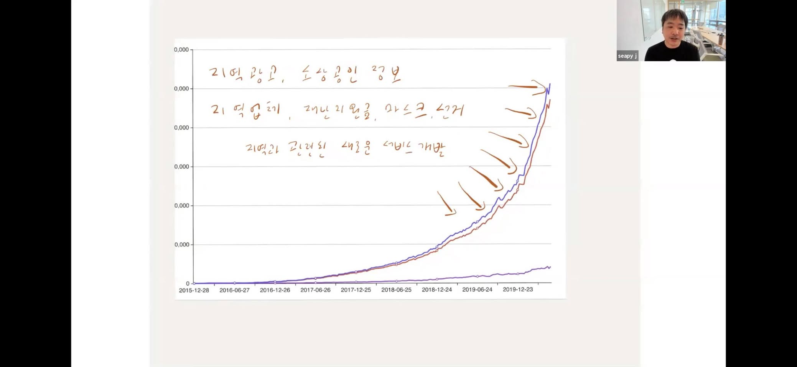
**이미지 캡션:** 화면 오른쪽 상단에는 검은색 티셔츠를 입은 성인 남성이 화상 회의에 참여하고 있으며, 그의 이름은 "seapy j"로 표시되어 있습니다. 화면 왼쪽에는 2015년부터 2019년까지의 기간을 나타내는 x축과 0부터 0.000까지의 눈금이 표시된 y축을 가진 그래프가 있습니다. 그래프 위에는 펜으로 쓰여진 세 개의 문구가 있습니다: "21역 광고, 소상공인 정보", "21역 업체, 재난 지원금, 마스크, 선거", 그리고 "지역과 관련된 새로운 서비스 개발"입니다. 각 문구 옆에는 그래프의 상승 추세를 가리키는 화살표가 그려져 있으며, 이는 해당 주제와 관련된 활동이나 성장이 증가하고 있음을 시사합니다. 전체적으로 이 이미지는 특정 주제에 대한 데이터 추세를 시각적으로 보여주며, 화상 회의를 통해 발표되거나 논의되고 있는 것으로 보입니다.살표가 그려져 있으며, 이는 해당 주제와 관련된 활동이나 성장이 증가하고 있음을 시사합니다. 전체적으로 이 이미지는 특정 주제에 대한 데이터 추세를 시각적으로 보여주며, 화상 회의를 통해 발표되거나 논의되고 있는 것으로 보입니다.
 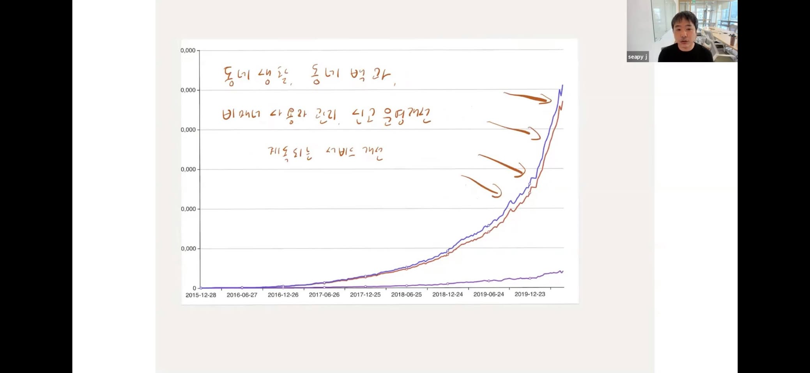
**이미지 캡션:** 화면 오른쪽 상단에는 검은색 티셔츠를 입은 40대 정도로 보이는 동양인 남성이 화상 회의에 참여하고 있으며, 그는 입을 벌리고 무언가를 말하고 있다. 화면 왼쪽에는 그래프가 있고, 그래프의 y축에는 0.000 단위로 표시되어 있으며, x축에는 2015년부터 2019년까지의 날짜가 표시되어 있다. 그래프 위에는 갈색 펜으로 "동네 생활, 동네 백과", "비매너 사용자 관리 신고 운영개선", "계속되는 서비스 개선"이라고 쓰여 있고, 각 문구 옆에는 그래프의 상승세를 나타내는 듯한 화살표가 그려져 있다. 전체적으로는 온라인 회의 중 발표자가 그래프를 설명하는 상황으로 보인다.로는 온라인 회의 중 발표자가 그래프를 설명하는 상황으로 보인다.
 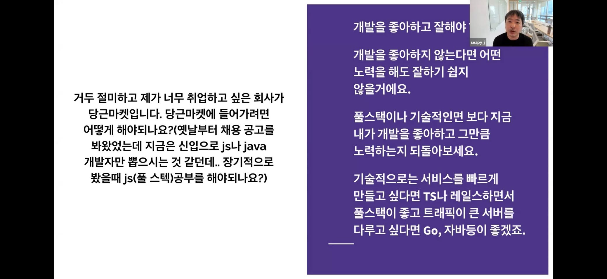
**이미지 캡션:** 화면 왼쪽에는 흰색 배경에 한국어 텍스트가 있고, 오른쪽에는 보라색 배경에 한국어 텍스트와 함께 영상 통화 화면이 보인다. 영상 통화 화면에는 30대에서 40대로 보이는 동양인 남성이 검은색 티셔츠를 입고 카메라를 바라보고 있으며, 그의 뒤로는 사무실로 보이는 배경이 흐릿하게 보인다. 왼쪽 텍스트는 당근마켓 취업을 희망하는 사람이 신입 개발자 채용 공고를 보고 JavaScript(풀스택) 공부를 해야 할지 묻는 내용이며, 오른쪽 텍스트는 개발을 좋아하고 잘해야 하며, 풀스택이나 기술적인 면보다 개발 자체를 좋아하고 노력하는지 돌아보는 것이 중요하다고 조언하는 내용이다. 또한, 빠르게 서비스를 만들고 싶다면 TypeScript나 Ruby on Rails를, 트래픽이 큰 서버를 다루고 싶다면 Go나 Java 등을 추천하고 있다. 전체적으로 취업 관련 질문과 답변이 오가는 온라인 커뮤니케이션 상황으로 보인다.아하고 노력하는지 돌아보는 것이 중요하다고 조언하는 내용이다. 또한, 빠르게 서비스를 만들고 싶다면 TypeScript나 Ruby on Rails를, 트래픽이 큰 서버를 다루고 싶다면 Go나 Java 등을 추천하고 있다. 전체적으로 취업 관련 질문과 답변이 오가는 온라인 커뮤니케이션 상황으로 보인다.

### 6월 18일 (목) 10:16 · 📷 사진 (6장)

**이미지 캡션:** 화면 상단에는 "Switch to Sharing Content", "Unpin Video", "Recording"이라는 버튼이 보이며, 그 위에 작은 창에는 "Method"라는 제목과 함께 수학 공식이나 그래프가 그려져 있다. 화면 중앙에는 푸른 하늘과 하얀 구름, 그리고 야자수가 있는 해변 풍경이 배경으로 펼쳐져 있으며, 파도가 치는 바다와 작은 섬들이 보인다. 화면 하단에는 한 성인 남성이 등장하는데, 그는 검은색 머리카락에 안경을 착용하고 있으며, 얼굴은 화면 오른쪽으로 약간 기울어져 있다. 그의 복장은 명확하게 보이지 않지만, 어두운 색상의 옷을 입고 있는 것으로 추정된다. 남성은 무언가를 바라보고 있는 듯한 표정이며, 그의 어깨와 머리 일부만 보인다. 화면 하단 좌측에는 "Jung-Woo Ha (Clova AI, NAVER) (cvpr zoom182)"라는 텍스트가 표시되어 있어, 이 영상 통화에 참여한 사람의 이름과 소속을 알 수 있다. 전반적으로 휴양지에서 온라인 회의나 발표를 진행하는 듯한 분위기이다. 명확하게 보이지 않지만, 어두운 색상의 옷을 입고 있는 것으로 추정된다. 남성은 무언가를 바라보고 있는 듯한 표정이며, 그의 어깨와 머리 일부만 보인다. 화면 하단 좌측에는 "Jung-Woo Ha (Clova AI, NAVER) (cvpr zoom182)"라는 텍스트가 표시되어 있어, 이 영상 통화에 참여한 사람의 이름과 소속을 알 수 있다. 전반적으로 휴양지에서 온라인 회의나 발표를 진행하는 듯한 분위기이다.
 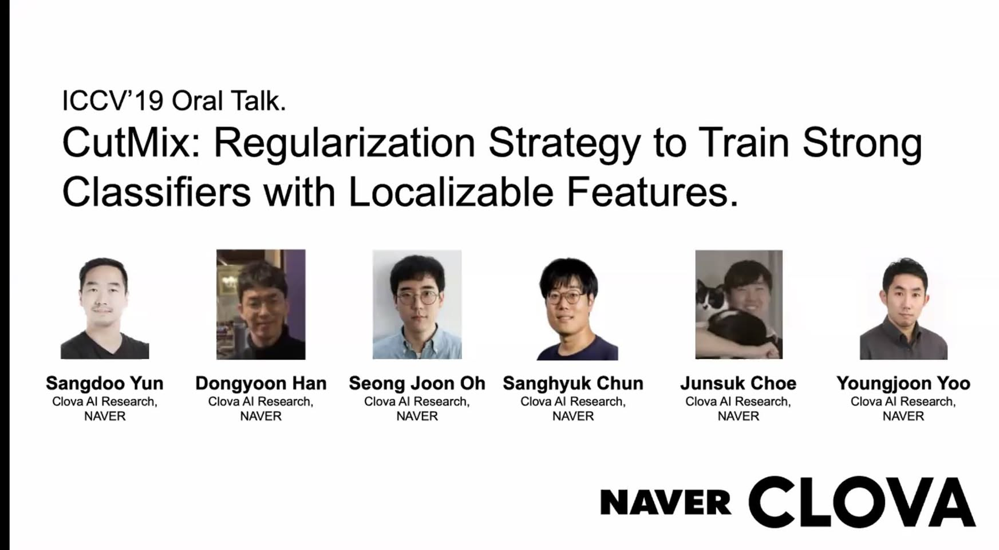
**이미지 캡션:** 이 사진은 ICCV'19 구두 발표의 제목 슬라이드로, "CutMix: Regularization Strategy to Train Strong Classifiers with Localizable Features."라는 제목이 흰색 배경에 검은색 글씨로 크게 쓰여 있습니다. 제목 아래에는 다섯 명의 남성 발표자들의 사진과 이름, 소속이 나열되어 있습니다. 왼쪽부터 첫 번째 발표자는 검은색 상의를 입고 있으며, 두 번째 발표자는 실내에서 찍은 사진으로 보이며 약간 흐릿합니다. 세 번째와 네 번째 발표자는 흰색 배경의 증명사진 스타일이며, 네 번째 발표자는 고양이와 함께 찍은 사진입니다. 다섯 번째 발표자는 회색 셔츠를 입고 있습니다. 모든 발표자는 20대 후반에서 30대 초반으로 보이며, 모두 안경을 착용하고 있습니다. 각 사진 아래에는 "Sangdoo Yun", "Dongyoon Han", "Seong Joon Oh", "Sanghyuk Chun", "Junsuk Choe", "Youngjoon Yoo"라는 이름과 함께 "Clova AI Research, NAVER"라는 소속이 기재되어 있습니다. 슬라이드 하단에는 "NAVER CLOVA" 로고가 검은색으로 크게 표시되어 있습니다. 전반적으로 깔끔하고 전문적인 분위기입니다.경의 증명사진 스타일이며, 네 번째 발표자는 고양이와 함께 찍은 사진입니다. 다섯 번째 발표자는 회색 셔츠를 입고 있습니다. 모든 발표자는 20대 후반에서 30대 초반으로 보이며, 모두 안경을 착용하고 있습니다. 각 사진 아래에는 "Sangdoo Yun", "Dongyoon Han", "Seong Joon Oh", "Sanghyuk Chun", "Junsuk Choe", "Youngjoon Yoo"라는 이름과 함께 "Clova AI Research, NAVER"라는 소속이 기재되어 있습니다. 슬라이드 하단에는 "NAVER CLOVA" 로고가 검은색으로 크게 표시되어 있습니다. 전반적으로 깔끔하고 전문적인 분위기입니다.
 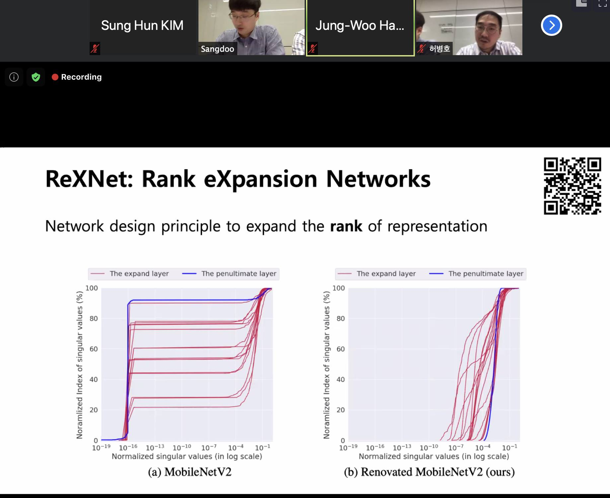
**이미지 캡션:** 화면 상단에는 온라인 회의 화면이 보이며, 좌측에는 "Sung Hun KIM"이라는 이름과 함께 마이크 아이콘이 표시되어 있고, 중앙에는 "Sangdoo"라는 이름과 함께 발표 중인 성인 남성이 보인다. 우측에는 "Jung-Woo Ha..."라는 이름과 함께 "허병호"라는 이름이 표시된 성인 남성이 보인다. 회의 화면 하단에는 "Recording"이라는 글자와 함께 녹화 중임을 나타내는 빨간색 점이 있다. 중앙에는 "ReXNet: Rank eXpansion Networks"라는 제목과 "Network design principle to expand the rank of representation"이라는 부제가 흰색 글씨로 적혀 있다. 우측 상단에는 QR 코드가 있다. 그 아래에는 두 개의 그래프가 나란히 배치되어 있다. 두 그래프 모두 x축은 "Normalized singular values (in log scale)"이고 y축은 "Noramlized Index of singular values (%)"이다. 좌측 그래프는 "(a) MobileNetV2"라고 표시되어 있으며, 여러 개의 붉은색 선과 하나의 파란색 선으로 이루어져 있다. 우측 그래프는 "(b) Renovated MobileNetV2 (ours)"라고 표시되어 있으며, 마찬가지로 여러 개의 붉은색 선과 하나의 파란색 선으로 이루어져 있다. 두 그래프 모두 붉은색 선들이 파란색 선보다 낮은 값에서 시작하여 높은 값으로 올라가는 경향을 보인다. 전반적으로 학술 발표 또는 연구 발표의 일부로 보이는 화면이다.gn principle to expand the rank of representation"이라는 부제가 흰색 글씨로 적혀 있다. 우측 상단에는 QR 코드가 있다. 그 아래에는 두 개의 그래프가 나란히 배치되어 있다. 두 그래프 모두 x축은 "Normalized singular values (in log scale)"이고 y축은 "Noramlized Index of singular values (%)"이다. 좌측 그래프는 "(a) MobileNetV2"라고 표시되어 있으며, 여러 개의 붉은색 선과 하나의 파란색 선으로 이루어져 있다. 우측 그래프는 "(b) Renovated MobileNetV2 (ours)"라고 표시되어 있으며, 마찬가지로 여러 개의 붉은색 선과 하나의 파란색 선으로 이루어져 있다. 두 그래프 모두 붉은색 선들이 파란색 선보다 낮은 값에서 시작하여 높은 값으로 올라가는 경향을 보인다. 전반적으로 학술 발표 또는 연구 발표의 일부로 보이는 화면이다.
 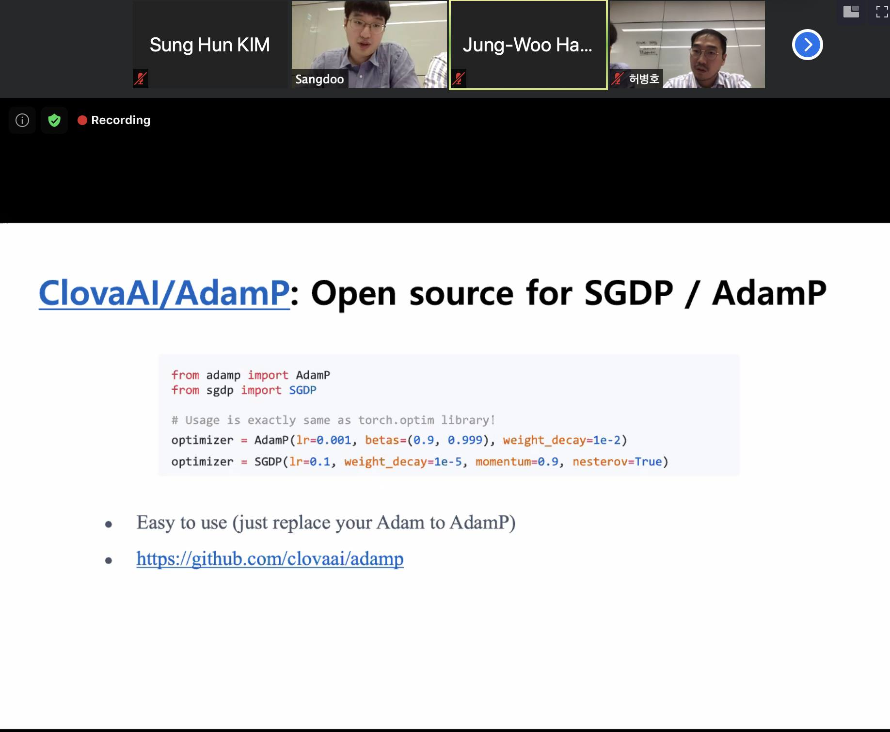
**이미지 캡션:** 화면 상단에는 온라인 회의 화면이 보이며, 세 명의 성인 남성이 각자의 화면에서 발표 또는 참여하고 있다. 왼쪽 화면에는 "Sung Hun KIM"이라는 이름과 함께 발표자가 보이고, 가운데 화면에는 "Sangdoo"라는 이름과 함께 또 다른 발표자가 보이며, 오른쪽 화면에는 "Jung-Woo Ha..."라는 이름과 함께 "허병호"라는 이름표를 가진 발표자가 보인다. 이들은 모두 캐주얼한 복장을 하고 있으며, 발표자는 약간의 미소를 띠고 있다. 화면 하단에는 발표 슬라이드가 나타나는데, "ClovaAI/AdamP: Open source for SGDP / AdamP"라는 제목과 함께 파이썬 코드 예시가 포함되어 있다. 코드에는 `AdamP`와 `SGDP` 라이브러리 사용법이 설명되어 있으며, "Easy to use (just replace your Adam to AdamP)"라는 설명과 함께 GitHub 링크가 제공된다. 전반적으로 기술 발표 또는 온라인 회의의 한 장면으로, 정보 전달과 공유를 위한 차분하고 전문적인 분위기이다.mP: Open source for SGDP / AdamP"라는 제목과 함께 파이썬 코드 예시가 포함되어 있다. 코드에는 `AdamP`와 `SGDP` 라이브러리 사용법이 설명되어 있으며, "Easy to use (just replace your Adam to AdamP)"라는 설명과 함께 GitHub 링크가 제공된다. 전반적으로 기술 발표 또는 온라인 회의의 한 장면으로, 정보 전달과 공유를 위한 차분하고 전문적인 분위기이다.
 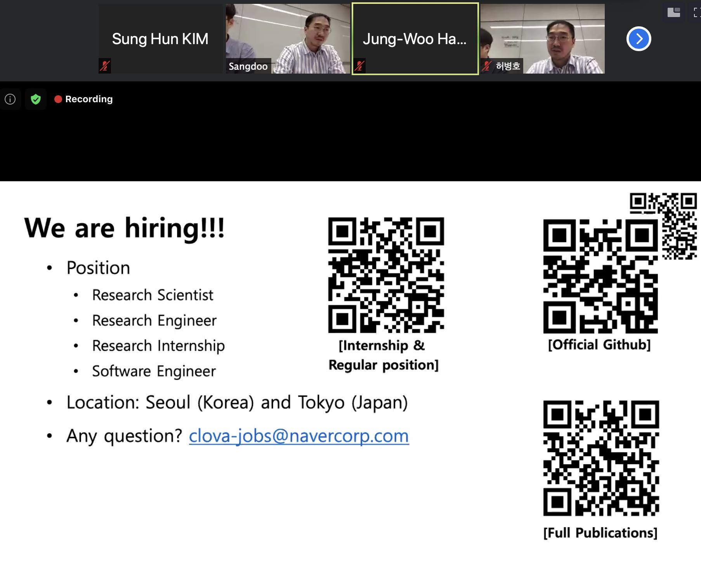
**이미지 캡션:** 화면 상단에는 온라인 회의 화면이 보이며, 여러 명의 성인 남성들이 각자의 화면 창에 나타나 있다. 왼쪽 상단 창에는 "Sung Hun KIM"이라는 이름과 함께 한 명의 성인 남성이 보이고, 그 옆 창에는 "Sangdoo"라는 이름과 함께 또 다른 성인 남성이 보인다. 오른쪽 상단 창에는 "Jung-Woo Ha..."라는 이름과 함께 성인 남성이 보이며, 그 옆에는 "허병호"라는 이름과 함께 또 다른 성인 남성이 보인다. 이들은 모두 캐주얼한 복장을 하고 있으며, 일부는 카메라를 응시하고 있다. 화면 하단에는 흰색 배경에 채용 공고 내용이 텍스트와 QR 코드로 표시되어 있다. "We are hiring!!!"이라는 큰 제목 아래, 채용 포지션으로 Research Scientist, Research Engineer, Research Internship, Software Engineer가 나열되어 있다. 근무지는 서울(한국)과 도쿄(일본)이며, 문의 사항은 "clova-jobs@navercorp.com"으로 할 수 있다고 안내되어 있다. 오른쪽에는 네 개의 QR 코드가 배치되어 있으며, 각각 "[Internship & Regular position]", "[Official Github]", "[Full Publications]"이라고 표시되어 있다. 전체적으로 채용 정보를 전달하는 비즈니스적인 분위기이며, 온라인 회의와 채용 공고가 결합된 형태이다.는 흰색 배경에 채용 공고 내용이 텍스트와 QR 코드로 표시되어 있다. "We are hiring!!!"이라는 큰 제목 아래, 채용 포지션으로 Research Scientist, Research Engineer, Research Internship, Software Engineer가 나열되어 있다. 근무지는 서울(한국)과 도쿄(일본)이며, 문의 사항은 "clova-jobs@navercorp.com"으로 할 수 있다고 안내되어 있다. 오른쪽에는 네 개의 QR 코드가 배치되어 있으며, 각각 "[Internship & Regular position]", "[Official Github]", "[Full Publications]"이라고 표시되어 있다. 전체적으로 채용 정보를 전달하는 비즈니스적인 분위기이며, 온라인 회의와 채용 공고가 결합된 형태이다.
 
**이미지 캡션:** 화면 상단에는 "krisp" 로고와 함께 "For Teams", "iOS", "SDK", "Pricing" 메뉴, "Sign in" 버튼, 그리고 "Get Krisp for Free" 버튼이 보입니다. 메인 콘텐츠 영역에는 "Working From Home?"이라는 질문과 함께 "Mute background noise in any communication app"이라는 큰 제목이 있습니다. 이 제목 아래에는 주황색 "Get Krisp for Free" 버튼과 흰색 "Watch Video" 버튼이 나란히 배치되어 있으며, 그 아래에는 "for Mac, Windows, Chrome and iOS"라는 안내 문구가 있습니다. 화면 오른쪽에는 집 안에서 소파에 앉아 노트북을 사용하는 젊은 여성 일러스트가 있고, 그 뒤로는 트램폴린 위에서 뛰노는 아이들 두 명과 바닥에 누워있는 강아지 일러스트가 보입니다. 화면 하단에는 "Trusted by Professionals From"이라는 문구와 함께 GitHub, HubSpot, Zapier, GitLab, Intel 로고가 나열되어 있습니다. 전반적으로 깔끔하고 현대적인 디자인으로, 재택근무 환경에서 소음 문제를 해결해주는 서비스인 Krisp를 홍보하는 웹사이트의 모습입니다.어 있으며, 그 아래에는 "for Mac, Windows, Chrome and iOS"라는 안내 문구가 있습니다. 화면 오른쪽에는 집 안에서 소파에 앉아 노트북을 사용하는 젊은 여성 일러스트가 있고, 그 뒤로는 트램폴린 위에서 뛰노는 아이들 두 명과 바닥에 누워있는 강아지 일러스트가 보입니다. 화면 하단에는 "Trusted by Professionals From"이라는 문구와 함께 GitHub, HubSpot, Zapier, GitLab, Intel 로고가 나열되어 있습니다. 전반적으로 깔끔하고 현대적인 디자인으로, 재택근무 환경에서 소음 문제를 해결해주는 서비스인 Krisp를 홍보하는 웹사이트의 모습입니다.

> 카페등에서 일할때 노이즈 때문에 마이크로 말하기가 힘드실때가 있잖아요. 이때 딱 좋은 것이 배경 노이즈를 없애 주는 이 프로그램입니다.  https://krisp.ai/

### 6월 18일 (목) 10:22 · Please join our (free) ClovaAI@CVPR2020 …

Please join our (free) ClovaAI@CVPR2020 Interactive session happening now at  https://zoom.us/j/93266602391?pwd=VUE4elI1d3duTWlaV2w4UVRSTEY2Zz09 It's really fun!

**이미지 캡션:** 화면 상단에는 "ICCV'19 Oral Talk."라는 문구가 있고, 그 아래에는 "CutMix: Regularization Strategy to Train Strong Classifiers with Localizable Features."라는 제목이 큰 글씨로 쓰여 있습니다. 제목 아래에는 6명의 남성 발표자들의 사진이 나란히 배치되어 있으며, 각 사진 아래에는 이름과 소속("Clova AI Research, NAVER")이 기재되어 있습니다. 왼쪽부터 첫 번째 남성은 검은색 상의를 입고 있으며, 두 번째 남성은 실내에서 찍은 사진으로 보이며 안경을 쓰고 있습니다. 세 번째와 네 번째 남성은 흰색 셔츠를 입고 안경을 착용하고 있으며, 다섯 번째 남성은 고양이를 안고 있는 모습입니다. 마지막 여섯 번째 남성은 회색 셔츠를 입고 있습니다. 사진 하단에는 "NAVER CLOVA"라는 로고가 크게 보입니다. 전체적으로 학술 발표회 슬라이드의 일부로 보이며, 진지하면서도 전문적인 분위기입니다.남성은 실내에서 찍은 사진으로 보이며 안경을 쓰고 있습니다. 세 번째와 네 번째 남성은 흰색 셔츠를 입고 안경을 착용하고 있으며, 다섯 번째 남성은 고양이를 안고 있는 모습입니다. 마지막 여섯 번째 남성은 회색 셔츠를 입고 있습니다. 사진 하단에는 "NAVER CLOVA"라는 로고가 크게 보입니다. 전체적으로 학술 발표회 슬라이드의 일부로 보이며, 진지하면서도 전문적인 분위기입니다.

### 6월 18일 (목) 22:24 · Swit is a great tool. We will have the f…

Swit is a great tool. We will have the founder and CEO, and he will talk about the great product, Q&A, and how to start a company on June 25, 7:50PM. See you around!

### 6월 20일 (토) 21:06 · Gapyeong 2020 1H season off riding with …

Gapyeong 2020 1H season off riding with wonderful friends! See you all perhaps in Sep 2020 for the 2H season kick-off riding!

SangWoo Kevin Kim Thanks for the amazing photos!

**이미지 캡션:** 한 성인 남성이 검은색과 빨간색이 섞인 사이클링 저지와 검은색 반바지, 헬멧, 장갑을 착용하고 검은색 카본 로드 자전거를 타고 도로를 달리고 있습니다. 남성은 활짝 웃으며 엄지손가락을 치켜세우고 있으며, 그의 표정은 매우 즐거워 보입니다. 자전거 앞바퀴는 도로의 노란색 중앙선을 넘어서고 있으며, 뒷바퀴는 도로 위에 있습니다. 배경에는 울창한 녹색 숲과 나무들이 보이며, 도로 옆에는 노란색으로 칠해진 콘크리트 구조물들이 놓여 있습니다. 도로 왼쪽에는 트렁크가 열린 어두운 색상의 승용차가 주차되어 있습니다. 전반적으로 야외에서 즐겁게 사이클링을 즐기는 활기찬 분위기입니다.적으로 야외에서 즐겁게 사이클링을 즐기는 활기찬 분위기입니다.
 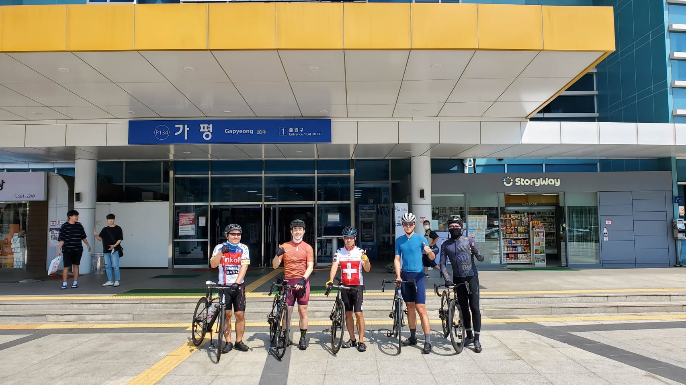
**이미지 캡션:** 다섯 명의 성인 남성이 자전거를 타고 가평역 앞에서 포즈를 취하고 있다. 왼쪽 두 명은 평상복 차림이고, 오른쪽 세 명은 사이클링 복장을 하고 헬멧을 착용했다. 모두 밝은 표정으로 카메라를 응시하고 있으며, 일부는 엄지손가락을 치켜세우고 있다. 배경에는 가평역 건물이 보이며, 노란색과 파란색이 조화된 현대적인 디자인이다. 역 입구에는 '가평 Gapyeong'이라는 표지판이 파란색 바탕에 흰색 글씨로 쓰여 있고, '1 출입구 Entrance/Exit'이라는 안내 문구도 보인다. 역 건물 옆에는 'StoryWay'라는 편의점이 있으며, 진열된 상품들이 보인다. 전체적으로 화창한 날씨에 야외 활동을 즐기는 듯한 긍정적이고 활기찬 분위기이다.'라는 편의점이 있으며, 진열된 상품들이 보인다. 전체적으로 화창한 날씨에 야외 활동을 즐기는 듯한 긍정적이고 활기찬 분위기이다.
 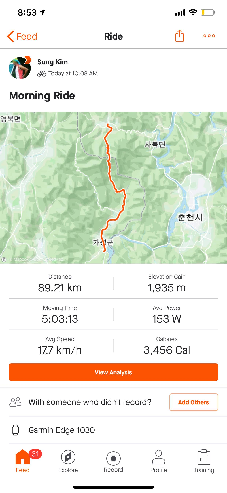
**이미지 캡션:** 이 화면은 자전거 라이딩 기록을 보여주는 앱의 일부로, 상단에는 시간과 배터리 상태가 표시되고 'Feed'와 'Ride' 메뉴가 보인다. 'Sung Kim'이라는 이름의 사용자가 오늘 오전 10시 8분에 'Morning Ride'라는 제목으로 라이딩을 기록했음을 알 수 있다. 프로필 사진에는 운동복을 입은 성인 남성이 보인다. 지도에는 주황색 선으로 라이딩 경로가 표시되어 있으며, '영북면', '사북면', '가평군', '춘천시'와 같은 지명이 보인다. 라이딩 통계로는 총 거리 89.21km, 이동 시간 5시간 3분 13초, 평균 속도 17.7km/h, 고도 상승 1,935m, 평균 파워 153W, 소모 칼로리 3,456kcal가 표시되어 있다. 'View Analysis' 버튼을 통해 더 자세한 분석을 볼 수 있으며, 'With someone who didn't record?'라는 문구와 함께 다른 사람을 추가할 수 있는 옵션이 있다. 사용된 기기는 'Garmin Edge 1030'으로 보인다. 하단에는 'Feed', 'Explore', 'Record', 'Profile', 'Training' 등의 메뉴가 있으며, 'Feed' 메뉴에는 31개의 알림이 있음을 나타내는 숫자가 표시되어 있다. 전반적으로 활동적인 라이딩을 기록하고 공유하는 앱의 인터페이스를 보여준다. 3분 13초, 평균 속도 17.7km/h, 고도 상승 1,935m, 평균 파워 153W, 소모 칼로리 3,456kcal가 표시되어 있다. 'View Analysis' 버튼을 통해 더 자세한 분석을 볼 수 있으며, 'With someone who didn't record?'라는 문구와 함께 다른 사람을 추가할 수 있는 옵션이 있다. 사용된 기기는 'Garmin Edge 1030'으로 보인다. 하단에는 'Feed', 'Explore', 'Record', 'Profile', 'Training' 등의 메뉴가 있으며, 'Feed' 메뉴에는 31개의 알림이 있음을 나타내는 숫자가 표시되어 있다. 전반적으로 활동적인 라이딩을 기록하고 공유하는 앱의 인터페이스를 보여준다.

### 6월 22일 (월) 22:06 · 📷 사진 (1장)

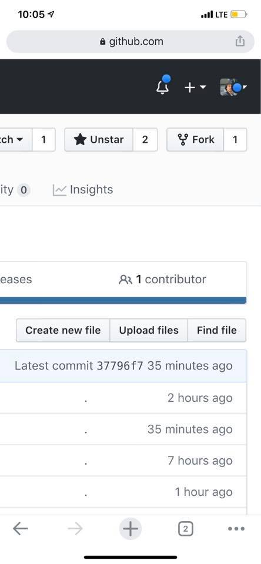
**이미지 캡션:** 이 사진은 스마트폰 화면을 캡처한 것으로, 웹 브라우저에서 GitHub 웹사이트의 저장소 페이지를 보고 있는 모습입니다. 상단에는 시간(10:05)과 배터리 상태(LTE, 배터리 잔량 표시)가 보이며, 주소창에는 'github.com'이 표시되어 있습니다. 그 아래 검은색 바에는 알림 아이콘, 더하기 아이콘, 그리고 사용자 프로필 사진으로 보이는 작은 원형 이미지가 있습니다. 저장소의 주요 기능 버튼들이 보이며, 'Watch', 'Star', 'Fork'와 각각의 개수가 표시되어 있습니다. 'Watch' 버튼 아래에는 '1'이, 'Unstar' 버튼 옆에는 '2'가, 'Fork' 버튼 옆에는 '1'이 숫자로 표시되어 있습니다. 그 아래에는 'Activity'와 'Insights'라는 메뉴가 있으며, 'Activity' 옆에는 '0'이, 'Insights' 옆에는 그래프 아이콘이 있습니다. 더 아래에는 'Releases'와 '1 contributor'라는 텍스트가 보이며, '1 contributor' 옆에는 사람 모양 아이콘이 있습니다. 파일 관리 섹션에는 'Create new file', 'Upload files', 'Find file' 버튼이 나란히 배치되어 있습니다. 가장 아래에는 'Latest commit 37796f7 35 minutes ago'라는 텍스트와 함께 최근 커밋 목록이 시간 순서대로 나열되어 있으며, 각 커밋은 점으로 구분되어 있고 시간 정보(2 hours ago, 35 minutes ago, 7 hours ago, 1 hour ago)가 표시되어 있습니다. 화면 하단에는 웹 브라우저의 탐색 바가 보이며, 뒤로 가기, 앞으로 가기, 새 탭 열기, 그리고 숫자 '2'가 표시된 아이콘이 있습니다. 전반적으로 코딩이나 소프트웨어 개발과 관련된 작업을 하고 있는 상황으로 보이며, 차분하고 집중된 분위기입니다. 아래에는 '1'이, 'Unstar' 버튼 옆에는 '2'가, 'Fork' 버튼 옆에는 '1'이 숫자로 표시되어 있습니다. 그 아래에는 'Activity'와 'Insights'라는 메뉴가 있으며, 'Activity' 옆에는 '0'이, 'Insights' 옆에는 그래프 아이콘이 있습니다. 더 아래에는 'Releases'와 '1 contributor'라는 텍스트가 보이며, '1 contributor' 옆에는 사람 모양 아이콘이 있습니다. 파일 관리 섹션에는 'Create new file', 'Upload files', 'Find file' 버튼이 나란히 배치되어 있습니다. 가장 아래에는 'Latest commit 37796f7 35 minutes ago'라는 텍스트와 함께 최근 커밋 목록이 시간 순서대로 나열되어 있으며, 각 커밋은 점으로 구분되어 있고 시간 정보(2 hours ago, 35 minutes ago, 7 hours ago, 1 hour ago)가 표시되어 있습니다. 화면 하단에는 웹 브라우저의 탐색 바가 보이며, 뒤로 가기, 앞으로 가기, 새 탭 열기, 그리고 숫자 '2'가 표시된 아이콘이 있습니다. 전반적으로 코딩이나 소프트웨어 개발과 관련된 작업을 하고 있는 상황으로 보이며, 차분하고 집중된 분위기입니다.

### 6월 23일 (화) 08:46 · 생일 축하 합니다!

생일 축하 합니다!

### 6월 23일 (화) 08:46 · ↪ 생일 축하 합니다!

*다른 프로필에 남긴 글*

생일 축하 합니다!

### 6월 24일 (수) 05:35 · 📷 사진 (1장)

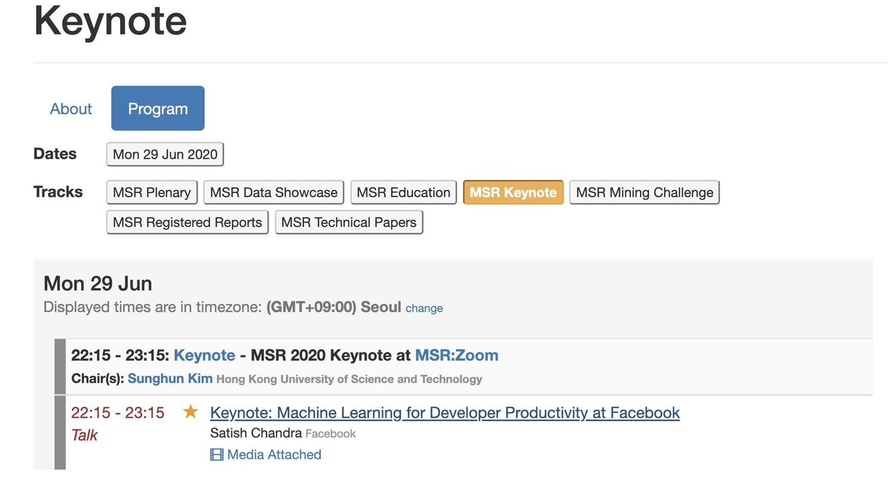
**이미지 캡션:** 이 이미지는 MSR 2020 컨퍼런스의 프로그램 일정 일부를 보여주는 웹페이지 스크린샷입니다. 상단에는 "Keynote"라는 제목이 크게 표시되어 있으며, 그 아래에는 "About"과 "Program" 버튼이 있습니다. "Dates" 섹션에는 "Mon 29 Jun 2020"이라고 날짜가 명시되어 있고, "Tracks" 섹션에는 "MSR Plenary", "MSR Data Showcase", "MSR Education", "MSR Keynote", "MSR Mining Challenge", "MSR Registered Reports", "MSR Technical Papers"와 같은 다양한 트랙 이름이 버튼 형태로 나열되어 있으며, 그중 "MSR Keynote"가 강조 표시되어 있습니다. 그 아래에는 "Mon 29 Jun"이라는 날짜와 함께 시간대가 "(GMT+09:00) Seoul"로 설정되어 있음을 알 수 있습니다. 주요 내용은 22:15부터 23:15까지 진행되는 두 개의 세션으로, 첫 번째는 "Keynote - MSR 2020 Keynote at MSR:Zoom"이며, 의장(Chair)은 Sunghun Kim으로 홍콩 과학기술대학교 소속임을 나타냅니다. 두 번째 세션은 "Talk"으로 분류되어 있으며, "Keynote: Machine Learning for Developer Productivity at Facebook"이라는 제목으로 Satish Chandra가 Facebook 소속으로 발표하며, "Media Attached"라는 표시가 있습니다. 이 화면은 온라인 컨퍼런스 프로그램의 일부로, 특정 날짜의 키노트 발표 및 관련 정보를 제공하고 있습니다.ered Reports", "MSR Technical Papers"와 같은 다양한 트랙 이름이 버튼 형태로 나열되어 있으며, 그중 "MSR Keynote"가 강조 표시되어 있습니다. 그 아래에는 "Mon 29 Jun"이라는 날짜와 함께 시간대가 "(GMT+09:00) Seoul"로 설정되어 있음을 알 수 있습니다. 주요 내용은 22:15부터 23:15까지 진행되는 두 개의 세션으로, 첫 번째는 "Keynote - MSR 2020 Keynote at MSR:Zoom"이며, 의장(Chair)은 Sunghun Kim으로 홍콩 과학기술대학교 소속임을 나타냅니다. 두 번째 세션은 "Talk"으로 분류되어 있으며, "Keynote: Machine Learning for Developer Productivity at Facebook"이라는 제목으로 Satish Chandra가 Facebook 소속으로 발표하며, "Media Attached"라는 표시가 있습니다. 이 화면은 온라인 컨퍼런스 프로그램의 일부로, 특정 날짜의 키노트 발표 및 관련 정보를 제공하고 있습니다.

> #MSR2020Keynote #FB개발자툴ML   제가 general chair로 일하고 있는 MSR2020의 멋진 키노트가 오는 2월 29일 밤 10시 KST 생중계 됩니다. FB에서 일하는  Satish Chandra님이 ML을 이용한 개발툴 개선에 대해 이야기 하는데요. 저도 개인적으로 많이 기대가 됩니다. 혹시 질문하실 내용이 있으시면 댓글 주시면 제가 질문드려보도록 하겠습니다.  https://youtu.be/Qvf7mHa-YYs (6월 29일밤 10시 KST) # Keynote: Machine Learning for Developer Productivity at Facebook > At Facebook, our developer infrastructure team is on a mission to rethink and retool Facebook’s developer toolchain by applying machine learning at every layer in our stack. Our goal is to make our developers more productive, and our processes and infrastructure more efficient, by integrating ML into our programming languages and developer tools, including IDEs, version control, or continuous integration systems, in novel ways.   참고로 Mining Software Repositories 학회는 repositoy의 유용한 정보를 ML등을 통해 마이닝해서 개발자들을 돕기 위한 방법은 연구하고 고민하는 최고의 SE학회중 하나입니다.  https://2020.msrconf.org/track/msr-2020-Keynote?track=MSR%20Keynote#program

### 6월 24일 (수) 14:24 · "Samsung added that Seung's promotion wo…

https://www.zdnet.com/article/samsung-promotes-ai-expert-to-lead-research-arm/

"Samsung added that Seung's promotion would strengthen Samsung's competence in AI, one of its key future growth engines, and also advance its AI business and strategy. The move will also boost the competence of its logic chip businesses, it said."

Wonderful news!

### 6월 25일 (목) 14:50 · 📷 사진 (3장)

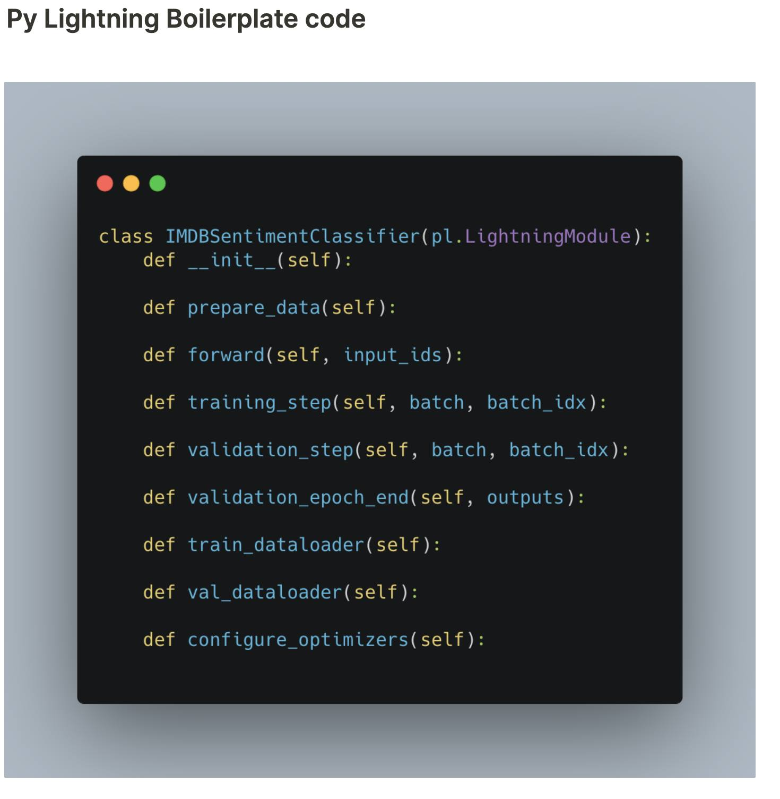
**이미지 캡션:** 이 이미지는 "Py Lightning Boilerplate code"라는 제목 아래 검은색 배경의 코드 편집기 창을 보여줍니다. 창 상단에는 빨간색, 노란색, 녹색의 세 가지 작은 점이 있어 macOS 창 제어 버튼을 연상시킵니다. 코드 편집기 안에는 파이썬 코드가 표시되어 있으며, `IMDBSentimentClassifier`라는 클래스가 `pl.LightningModule`을 상속받고 있습니다. 클래스 내에는 `__init__`, `prepare_data`, `forward`, `training_step`, `validation_step`, `validation_epoch_end`, `train_dataloader`, `val_dataloader`, `configure_optimizers`와 같은 메서드 정의가 나열되어 있습니다. 이 코드는 PyTorch Lightning 프레임워크를 사용하여 감성 분류 모델을 구축하는 데 필요한 기본적인 구조를 보여주는 것으로 보입니다. 이미지에는 사람이 등장하지 않으며, 배경은 단순한 회색으로 코딩 화면을 돋보이게 합니다. 전반적으로 기술적이고 전문적인 분위기를 풍깁니다., `validation_step`, `validation_epoch_end`, `train_dataloader`, `val_dataloader`, `configure_optimizers`와 같은 메서드 정의가 나열되어 있습니다. 이 코드는 PyTorch Lightning 프레임워크를 사용하여 감성 분류 모델을 구축하는 데 필요한 기본적인 구조를 보여주는 것으로 보입니다. 이미지에는 사람이 등장하지 않으며, 배경은 단순한 회색으로 코딩 화면을 돋보이게 합니다. 전반적으로 기술적이고 전문적인 분위기를 풍깁니다.
 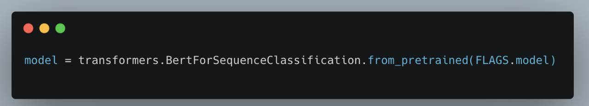
**이미지 캡션:** 어두운 배경의 컴퓨터 화면에 코드가 표시되어 있으며, 화면 왼쪽 상단에는 빨간색, 노란색, 초록색 점 세 개가 있어 창 제어 버튼을 나타냅니다. 화면 중앙에는 파이썬 코드가 흰색과 파란색으로 표시되어 있으며, "model = transformers. BertForSequenceClassification.from_pretrained(FLAGS.model)"이라는 텍스트가 보입니다. 이 코드는 자연어 처리 라이브러리인 Transformers를 사용하여 BERT 모델을 시퀀스 분류 작업에 맞게 사전 학습된 상태로 로드하는 것을 나타냅니다. 전체적으로 기술적인 맥락에서 코드를 보여주는 장면입니다.로드하는 것을 나타냅니다. 전체적으로 기술적인 맥락에서 코드를 보여주는 장면입니다.
 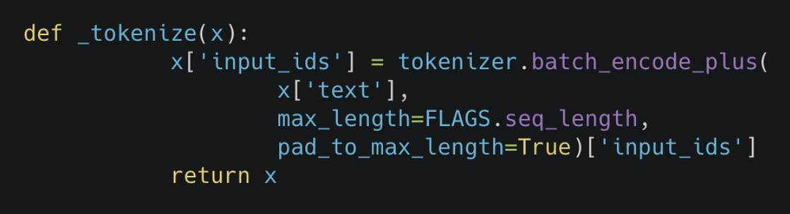
**이미지 캡션:** 이 이미지는 프로그래밍 코드의 일부를 보여줍니다. 어두운 배경에 밝은 색상의 텍스트로 코드가 표시되어 있으며, 파이썬 언어로 작성된 것으로 보입니다. 코드의 내용은 `_tokenize`라는 함수를 정의하고 있으며, 이 함수는 입력값 `x`를 받아 `tokenizer.batch_encode_plus` 함수를 사용하여 텍스트를 토큰화하고, 최대 길이를 `FLAGS.seq_length`로 설정하며, `pad_to_max_length` 옵션을 `True`로 설정하여 패딩을 적용합니다. 최종적으로 토큰화된 `input_ids`를 반환합니다. 이 코드는 자연어 처리 분야에서 텍스트 데이터를 모델이 이해할 수 있는 형태로 변환하는 과정의 일부로 보입니다. 이미지에는 사람이 등장하지 않으며, 장소나 사물도 명확하게 보이지 않습니다. 보이는 텍스트는 모두 프로그래밍 코드이며, 분위기는 기술적이고 전문적인 느낌을 줍니다._ids`를 반환합니다. 이 코드는 자연어 처리 분야에서 텍스트 데이터를 모델이 이해할 수 있는 형태로 변환하는 과정의 일부로 보입니다. 이미지에는 사람이 등장하지 않으며, 장소나 사물도 명확하게 보이지 않습니다. 보이는 텍스트는 모두 프로그래밍 코드이며, 분위기는 기술적이고 전문적인 느낌을 줍니다.

### 6월 26일 (금) 20:40 · is very happy to be again #1 Young Unive…

is very happy to be again #1 Young University!

### 6월 27일 (토) 12:17 · 📷 사진 (6장)

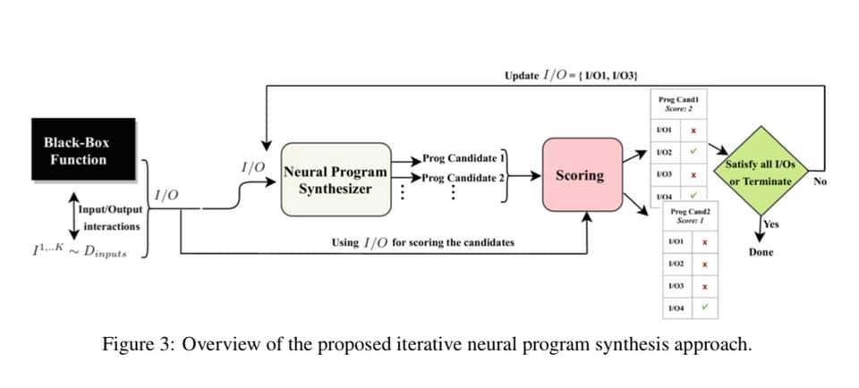
**이미지 캡션:** 이 이미지는 제안된 반복 신경망 합성 접근 방식의 개요를 보여주는 다이어그램입니다. 왼쪽에는 "블랙박스 함수"라는 레이블이 붙은 검은색 상자가 있으며, 이는 입력/출력 상호 작용과 1부터 K까지의 입력 Dinputs를 나타내는 화살표와 함께 표시됩니다. 이 블랙박스 함수는 I/O를 생성하며, 이는 신경망 합성기로 전달됩니다. 신경망 합성기는 여러 프로그램 후보(예: 프로그램 후보 1, 프로그램 후보 2)를 생성합니다. 이러한 프로그램 후보들은 점수 매기기 단계로 전달되며, 여기서 I/O를 사용하여 점수가 매겨집니다. 점수 매기기 결과는 각 프로그램 후보의 점수와 함께 표시되며, 각 I/O 쌍에 대한 성공(체크 표시) 또는 실패(x 표시)를 나타냅니다. 그런 다음 "모든 I/O 만족 또는 종료"라는 녹색 다이아몬드 모양의 결정 상자로 전달됩니다. 이 결정 상자는 모든 I/O가 만족되면 "예" 경로를 따라 "완료"로 이동하고, 그렇지 않으면 "아니요" 경로를 따라 업데이트된 I/O 집합 {I/O1, I/O3}을 생성하여 프로세스를 반복합니다. 다이어그램 하단에는 "그림 3: 제안된 반복 신경망 합성 접근 방식의 개요"라는 캡션이 있습니다. 이 이미지는 기술적인 개념을 시각적으로 표현하며, 사람이나 특정 장소는 묘사되지 않았습니다.집니다. 점수 매기기 결과는 각 프로그램 후보의 점수와 함께 표시되며, 각 I/O 쌍에 대한 성공(체크 표시) 또는 실패(x 표시)를 나타냅니다. 그런 다음 "모든 I/O 만족 또는 종료"라는 녹색 다이아몬드 모양의 결정 상자로 전달됩니다. 이 결정 상자는 모든 I/O가 만족되면 "예" 경로를 따라 "완료"로 이동하고, 그렇지 않으면 "아니요" 경로를 따라 업데이트된 I/O 집합 {I/O1, I/O3}을 생성하여 프로세스를 반복합니다. 다이어그램 하단에는 "그림 3: 제안된 반복 신경망 합성 접근 방식의 개요"라는 캡션이 있습니다. 이 이미지는 기술적인 개념을 시각적으로 표현하며, 사람이나 특정 장소는 묘사되지 않았습니다.
 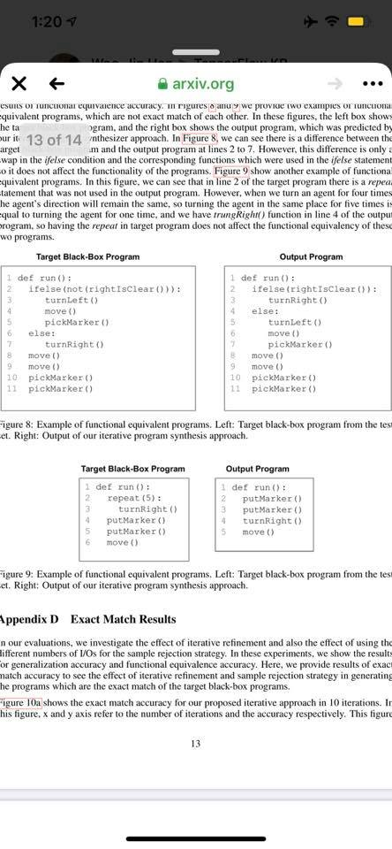
**이미지 캡션:** 이 이미지는 컴퓨터 과학 논문의 일부로, 두 개의 그림과 텍스트 설명을 포함하고 있습니다. 그림 8은 두 개의 코드 블록을 보여주는데, 왼쪽은 "Target Black-Box Program"이고 오른쪽은 "Output Program"입니다. 두 프로그램은 기능적으로 동등하지만, 코드의 구조와 일부 구문이 다릅니다. 그림 9 역시 유사하게 두 개의 코드 블록을 보여주며, "Target Black-Box Program"에는 `repeat(5)` 구문이 포함되어 있지만, "Output Program"에는 해당 구문이 없습니다. 텍스트 설명은 이 그림들이 기능적으로 동등한 프로그램의 예시이며, 왼쪽이 테스트 세트의 타겟 블랙박스 프로그램이고 오른쪽이 제안된 반복적 프로그램 합성 접근 방식의 결과임을 설명합니다. 하단에는 "Appendix D Exact Match Results"라는 제목과 함께 실험 결과에 대한 설명이 이어집니다. 전반적으로 학술적인 분위기이며, 프로그램 합성 및 분석에 대한 내용을 다루고 있습니다.이 없습니다. 텍스트 설명은 이 그림들이 기능적으로 동등한 프로그램의 예시이며, 왼쪽이 테스트 세트의 타겟 블랙박스 프로그램이고 오른쪽이 제안된 반복적 프로그램 합성 접근 방식의 결과임을 설명합니다. 하단에는 "Appendix D Exact Match Results"라는 제목과 함께 실험 결과에 대한 설명이 이어집니다. 전반적으로 학술적인 분위기이며, 프로그램 합성 및 분석에 대한 내용을 다루고 있습니다.
 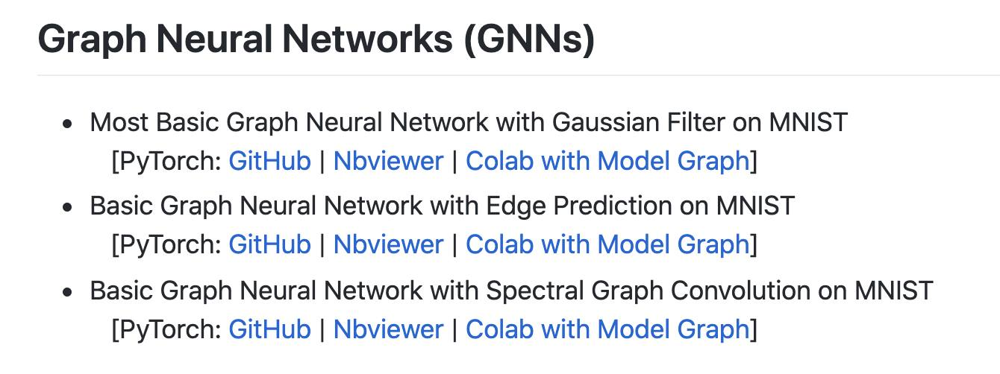
**이미지 캡션:** 이 이미지는 "Graph Neural Networks (GNNs)"라는 제목 아래 세 가지 항목으로 구성된 목록을 보여줍니다. 각 항목은 점으로 시작하며, "Most Basic Graph Neural Network with Gaussian Filter on MNIST", "Basic Graph Neural Network with Edge Prediction on MNIST", "Basic Graph Neural Network with Spectral Graph Convolution on MNIST"와 같은 그래프 신경망의 특정 구현에 대한 설명입니다. 각 설명 아래에는 대괄호 안에 "PyTorch: GitHub | Nbviewer | Colab with Model Graph"라는 텍스트가 포함되어 있으며, 이는 각 구현에 대한 추가 정보나 리소스를 제공하는 링크를 나타냅니다. 이 이미지는 컴퓨터 과학, 특히 딥러닝 및 그래프 기반 모델링 분야의 학술적이거나 기술적인 문서의 일부로 보입니다. 배경은 흰색이며, 텍스트는 검은색과 파란색으로 표시되어 있습니다. 이미지에는 사람이 등장하지 않으며, 장소나 사물에 대한 구체적인 정보도 없습니다. 전반적으로 정보 전달에 초점을 맞춘 명확하고 간결한 디자인입니다.래프 신경망의 특정 구현에 대한 설명입니다. 각 설명 아래에는 대괄호 안에 "PyTorch: GitHub | Nbviewer | Colab with Model Graph"라는 텍스트가 포함되어 있으며, 이는 각 구현에 대한 추가 정보나 리소스를 제공하는 링크를 나타냅니다. 이 이미지는 컴퓨터 과학, 특히 딥러닝 및 그래프 기반 모델링 분야의 학술적이거나 기술적인 문서의 일부로 보입니다. 배경은 흰색이며, 텍스트는 검은색과 파란색으로 표시되어 있습니다. 이미지에는 사람이 등장하지 않으며, 장소나 사물에 대한 구체적인 정보도 없습니다. 전반적으로 정보 전달에 초점을 맞춘 명확하고 간결한 디자인입니다.
 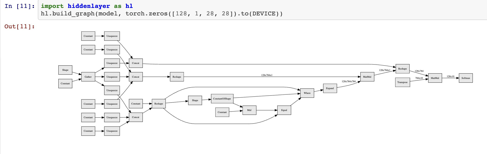
**이미지 캡션:** 이 이미지는 파이썬 코드의 일부와 그 결과로 생성된 신경망 그래프를 보여줍니다. 코드 부분에는 `hiddenlayer` 라이브러리를 `hl`로 임포트하고, `model`이라는 변수와 `torch.zeros`로 생성된 텐서를 사용하여 `hl.build_graph` 함수를 호출하는 내용이 있습니다. `torch.zeros`는 배치 크기 128, 채널 1, 높이 28, 너비 28의 텐서를 생성하며, 이를 `DEVICE`로 이동시키는 것으로 보입니다. 그래프 부분은 여러 개의 사각형 노드와 이를 연결하는 화살표로 구성되어 있으며, 각 노드에는 `Constant`, `Shape`, `Gather`, `Unsqueeze`, `Concat`, `Reshape`, `ConstantOfShape`, `Mul`, `Equal`, `Where`, `Expand`, `Transpose`, `MatMul`, `Softmax`와 같은 연산 또는 데이터의 종류를 나타내는 텍스트가 표시되어 있습니다. 일부 노드 옆에는 `128x784x1`, `128x784`, `784x10`, `128x10`과 같이 데이터의 차원을 나타내는 텍스트도 보입니다. 이 그래프는 딥러닝 모델의 구조를 시각화한 것으로, 데이터가 여러 연산을 거쳐 최종적으로 `Softmax` 레이어를 통과하는 과정을 보여줍니다. 전체적으로 흰색 배경에 회색 노드와 검은색 텍스트, 그리고 검은색 화살표로 구성되어 있어 깔끔하고 정보 전달에 집중된 분위기입니다.성되어 있으며, 각 노드에는 `Constant`, `Shape`, `Gather`, `Unsqueeze`, `Concat`, `Reshape`, `ConstantOfShape`, `Mul`, `Equal`, `Where`, `Expand`, `Transpose`, `MatMul`, `Softmax`와 같은 연산 또는 데이터의 종류를 나타내는 텍스트가 표시되어 있습니다. 일부 노드 옆에는 `128x784x1`, `128x784`, `784x10`, `128x10`과 같이 데이터의 차원을 나타내는 텍스트도 보입니다. 이 그래프는 딥러닝 모델의 구조를 시각화한 것으로, 데이터가 여러 연산을 거쳐 최종적으로 `Softmax` 레이어를 통과하는 과정을 보여줍니다. 전체적으로 흰색 배경에 회색 노드와 검은색 텍스트, 그리고 검은색 화살표로 구성되어 있어 깔끔하고 정보 전달에 집중된 분위기입니다.
 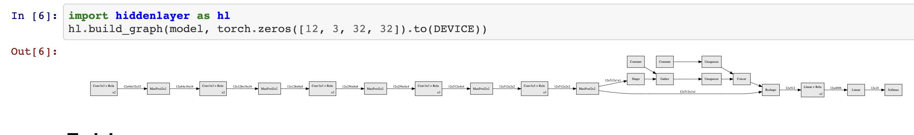
**이미지 캡션:** 이 이미지는 파이썬 코드와 함께 딥러닝 모델의 그래프 표현을 보여줍니다. 상단에는 "In [6]: import hiddenlayer as hl"이라는 텍스트와 함께 "hl.build_graph(model, torch.zeros([12, 3, 32, 32]).to(DEVICE))"라는 파이썬 코드가 보입니다. 이 코드는 hiddenlayer 라이브러리를 사용하여 모델의 그래프를 생성하는 것을 나타냅니다. 그 아래에는 "Out [6]:"라는 텍스트가 있으며, 이어서 복잡한 신경망 구조를 나타내는 여러 개의 사각형 노드와 화살표로 구성된 그래프가 펼쳐져 있습니다. 각 노드에는 "Conv3x3 > Relu", "MaxPool2x2", "Linear > Relu", "Concat", "Reshape", "Softmax" 등과 같은 레이어 이름과 차원 정보가 표시되어 있습니다. 이 그래프는 입력 데이터가 모델을 통과하면서 여러 연산을 거쳐 최종 출력이 생성되는 과정을 시각적으로 보여줍니다. 전체적으로 기술적인 내용을 담고 있으며, 딥러닝 모델의 구조를 이해하는 데 도움을 주는 정보성 이미지입니다. 노드와 화살표로 구성된 그래프가 펼쳐져 있습니다. 각 노드에는 "Conv3x3 > Relu", "MaxPool2x2", "Linear > Relu", "Concat", "Reshape", "Softmax" 등과 같은 레이어 이름과 차원 정보가 표시되어 있습니다. 이 그래프는 입력 데이터가 모델을 통과하면서 여러 연산을 거쳐 최종 출력이 생성되는 과정을 시각적으로 보여줍니다. 전체적으로 기술적인 내용을 담고 있으며, 딥러닝 모델의 구조를 이해하는 데 도움을 주는 정보성 이미지입니다.
 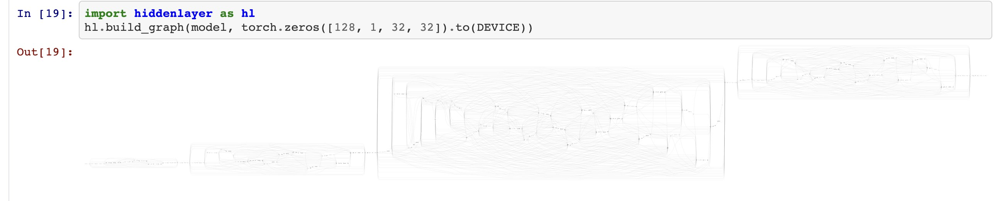
**이미지 캡션:** 이 이미지는 컴퓨터 프로그래밍 환경에서 생성된 것으로 보이며, 딥러닝 모델의 구조를 시각화한 그래프를 보여줍니다. 상단에는 파이썬 코드가 작성되어 있으며, `import hiddenlayer as hl`이라는 줄은 `hiddenlayer`라는 라이브러리를 `hl`이라는 별칭으로 불러오는 것을 나타냅니다. 바로 아래 줄인 `hl.build_graph(model, torch.zeros([128, 1, 32, 32]).to(DEVICE))`는 `hiddenlayer` 라이브러리의 `build_graph` 함수를 사용하여 `model`이라는 딥러닝 모델과 특정 크기의 텐서(`torch.zeros([128, 1, 32, 32])`)를 입력으로 받아 그래프를 생성하는 명령입니다. `DEVICE`는 연산이 수행될 장치(CPU 또는 GPU)를 의미합니다. 코드 아래에는 `Out[19]:`라는 텍스트가 있으며, 이는 해당 코드 실행의 결과로 그래프가 출력되었음을 나타냅니다. 그래프 자체는 복잡한 노드와 연결선으로 구성되어 있으며, 여러 개의 영역으로 나뉘어 있는 것처럼 보입니다. 각 노드는 모델의 레이어나 연산을 나타내고, 연결선은 데이터의 흐름을 의미합니다. 전체적으로 기술적인 내용을 다루는 화면이며, 사람이나 특정 장소, 사물은 보이지 않고, 오직 코드와 시각화된 그래프만이 존재합니다. 분위기는 분석적이고 기술적인 느낌을 줍니다.용하여 `model`이라는 딥러닝 모델과 특정 크기의 텐서(`torch.zeros([128, 1, 32, 32])`)를 입력으로 받아 그래프를 생성하는 명령입니다. `DEVICE`는 연산이 수행될 장치(CPU 또는 GPU)를 의미합니다. 코드 아래에는 `Out[19]:`라는 텍스트가 있으며, 이는 해당 코드 실행의 결과로 그래프가 출력되었음을 나타냅니다. 그래프 자체는 복잡한 노드와 연결선으로 구성되어 있으며, 여러 개의 영역으로 나뉘어 있는 것처럼 보입니다. 각 노드는 모델의 레이어나 연산을 나타내고, 연결선은 데이터의 흐름을 의미합니다. 전체적으로 기술적인 내용을 다루는 화면이며, 사람이나 특정 장소, 사물은 보이지 않고, 오직 코드와 시각화된 그래프만이 존재합니다. 분위기는 분석적이고 기술적인 느낌을 줍니다.

### 6월 30일 (화) 21:37 · 📷 사진 (1장)

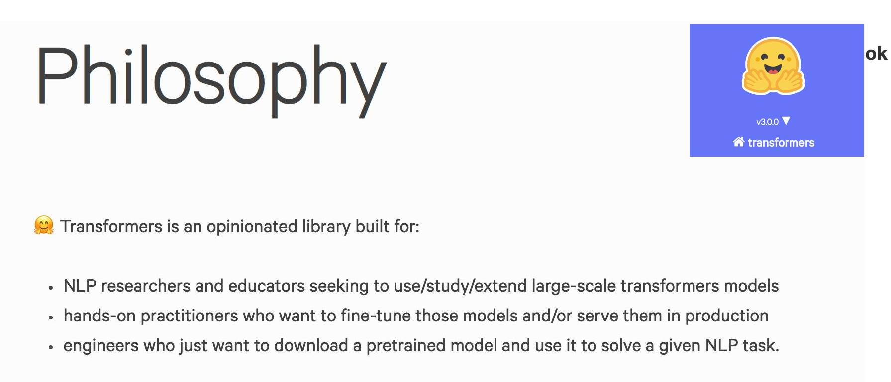
**이미지 캡션:** 이 이미지는 "Philosophy"라는 제목과 함께 "Transformers"라는 라이브러리에 대한 설명이 담긴 웹페이지의 일부를 보여줍니다. 화면 왼쪽 상단에는 크고 굵은 글씨로 "Philosophy"라고 쓰여 있습니다. 그 아래에는 웃는 이모티콘과 함께 "Transformers is an opinionated library built for:"라는 문장이 있습니다. 이 문장은 이 라이브러리가 특정 목적을 위해 만들어졌음을 나타냅니다. 이어서 세 가지 대상 그룹에 대한 목록이 점으로 구분되어 나열되어 있습니다. 첫 번째는 "NLP researchers and educators seeking to use/study/extend large-scale transformers models"로, 대규모 트랜스포머 모델을 사용, 연구 또는 확장하려는 NLP 연구원 및 교육자를 의미합니다. 두 번째는 "hands-on practitioners who want to fine-tune those models and/or serve them in production"으로, 해당 모델을 미세 조정하거나 프로덕션 환경에서 서비스하려는 실무자를 가리킵니다. 세 번째는 "engineers who just want to download a pretrained model and use it to solve a given NLP task."로, 사전 훈련된 모델을 다운로드하여 특정 NLP 작업을 해결하려는 엔지니어를 지칭합니다. 화면 오른쪽 상단에는 파란색 배경에 노란색 이모티콘이 있고, 그 아래에는 "v3.0.0"이라는 버전 정보와 집 모양 아이콘과 함께 "transformers"라는 텍스트가 있습니다. 전체적으로 이 이미지는 기술 문서의 일부로 보이며, 정보 전달에 초점을 맞춘 깔끔하고 현대적인 디자인을 가지고 있습니다.다. 첫 번째는 "NLP researchers and educators seeking to use/study/extend large-scale transformers models"로, 대규모 트랜스포머 모델을 사용, 연구 또는 확장하려는 NLP 연구원 및 교육자를 의미합니다. 두 번째는 "hands-on practitioners who want to fine-tune those models and/or serve them in production"으로, 해당 모델을 미세 조정하거나 프로덕션 환경에서 서비스하려는 실무자를 가리킵니다. 세 번째는 "engineers who just want to download a pretrained model and use it to solve a given NLP task."로, 사전 훈련된 모델을 다운로드하여 특정 NLP 작업을 해결하려는 엔지니어를 지칭합니다. 화면 오른쪽 상단에는 파란색 배경에 노란색 이모티콘이 있고, 그 아래에는 "v3.0.0"이라는 버전 정보와 집 모양 아이콘과 함께 "transformers"라는 텍스트가 있습니다. 전체적으로 이 이미지는 기술 문서의 일부로 보이며, 정보 전달에 초점을 맞춘 깔끔하고 현대적인 디자인을 가지고 있습니다.

> 허깅페이스 transformers 3.0이 나와서 문서들을 좀 살펴보고 있는데 철학 부분이 눈에 확 들어 오네요. (대략 제 마음대로 의역한) * NLP 연구자와 교육자들에게 큰 규모의 트랜스포머를 사용하고, 공부하고, 확장하게 하고 * 핸즈온 실용주의자들에게는 이 모델을을 fine-tune해서 제품에 서빙하게 하고 * 개발자들은 pre-trained된 모델을 사용해서 본인들의 문제를 풀수 있게 해준다  는 정말 멋진 말이네요.   정말 **"모두를 위한 실용의 딥러닝"** 시대를 열어가고 있어서 너무나 좋은것 같습니다.   허깅페이스 Transformers 3.0출시를 축하 합니다. https://huggingface.co/transformers/index.html
