# 2020년 7월

[← 2020년](README.md)

<a id="p0701-0814"></a>
### 7월 1일 (수) 08:14 · 📷 사진 (2장)

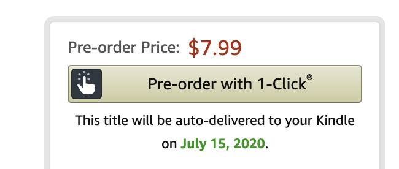
**이미지 캡션:** 이 이미지는 온라인 서점의 전자책 예약 구매 화면을 보여줍니다. 화면 중앙에는 "Pre-order Price: $7.99"라는 문구와 함께 예약 가격이 7.99달러로 표시되어 있습니다. 그 아래에는 "Pre-order with 1-Click®"이라는 버튼이 있으며, 이 버튼을 클릭하면 1-Click 기능으로 예약 구매가 진행됨을 나타냅니다. 버튼 왼쪽에는 손가락 모양의 아이콘이 있습니다. 마지막으로 "This title will be auto-delivered to your Kindle on July 15, 2020."라는 문구가 있어, 해당 전자책이 2020년 7월 15일에 자동으로 Kindle 기기로 배송될 것임을 알려줍니다. 전체적으로 깔끔하고 정보 전달에 초점을 맞춘 인터페이스 디자인입니다.
 
**이미지 캡션:** 화면 상단에는 파란색 배경에 "Join the tfkr-newsletter-mailing-list group"이라는 제목이 있습니다. 그 아래에는 "My display name:"이라는 문구가 있고, 그 옆에는 작은 프로필 사진과 함께 "hun...@gmail.com"이라는 이메일 주소가 표시되어 있으며, "edit"이라는 글자가 보입니다. 프로필 사진 속 인물은 성인 남성으로, 옅은 미소를 띠고 엄지손가락을 치켜들고 있습니다. 그 아래에는 "Link to my Google profile and show my photo on posts"라는 체크박스 문구가 있으며, 옆에는 물음표 아이콘이 있습니다. 이어서 "My profile name will be shown as: hun...@gmail.com"이라는 문구가 있습니다. 다음으로 "Email used for your membership: hunkim@gmail.com"이라는 문구가 있고, "Email delivery preference: Notify me for every new message (fewer than 1 per day)"라는 문구와 함께 드롭다운 메뉴가 있습니다. 그 아래에는 "Automatically subscribe me to email updates when I post to a topic"이라는 체크박스 문구가 회색으로 흐릿하게 표시되어 있습니다. 이어서 "Other members of this group can find your email address and could discover your Google profile. Joining this group will grant you access to resources shared with the Group. Learn More."라는 안내 문구가 있습니다. 화면 하단에는 파란색 버튼으로 "Join this group"이라고 쓰여 있고, 그 옆에는 회색 버튼으로 "Cancel"이라고 쓰여 있습니다. 마지막으로 "By clicking "Join this group" you are agreeing to the Google Groups Terms of Service."라는 문구가 있습니다. 전체적으로 웹사이트의 그룹 가입 페이지로 보이며, 사용자가 그룹에 가입하기 위한 설정을 확인하고 동의하는 과정입니다.

<a id="p0701-0902"></a>
### 7월 1일 (수) 09:02 · Happy birthday!!!

Happy birthday!!!

<a id="p0701-0902-2"></a>
### 7월 1일 (수) 09:02 · ↪ Happy birthday!!!

*다른 프로필에 남긴 글*

Happy birthday!!!

<a id="p0706-1409"></a>
### 7월 6일 (월) 14:09 · 📷 사진 (1장)


**이미지 캡션:** 이 사진은 스마트폰 화면을 캡처한 것으로, Google Forms로 만들어진 이벤트 안내 페이지를 보여줍니다. 화면 상단에는 시간과 와이파이 신호, 배터리 잔량 등이 표시되어 있으며, "Henny Son TensorFlow KR"이라는 텍스트가 보입니다. 메인 콘텐츠는 보라색 테두리 안에 있으며, "7월 17일 저녁 9시: 5만의 TF-KR 멤버와 만나요 - 실리콘밸리 자율주행 데브텍 매니저 Josh Park편"이라는 제목과 함께 "참가 신청 해주셔서 감사합니다! Zoom 링크는 메일로 개별 발송해드릴 예정입니다."라는 안내 문구가 있습니다. 또한, "Submit another response"라는 버튼이 보입니다. 이 페이지 하단에는 "This content is neither created nor endorsed by Google. Report Abuse - Terms of Service - Privacy Policy"라는 문구와 함께 "Google Forms"라는 로고가 있습니다. 전체적으로는 온라인 이벤트 참여 신청 확인 페이지로 보이며, 차분하고 정보 전달에 집중하는 분위기입니다.

<a id="p0707-0812"></a>
### 7월 7일 (화) 08:12 · 📷 사진 (1장)

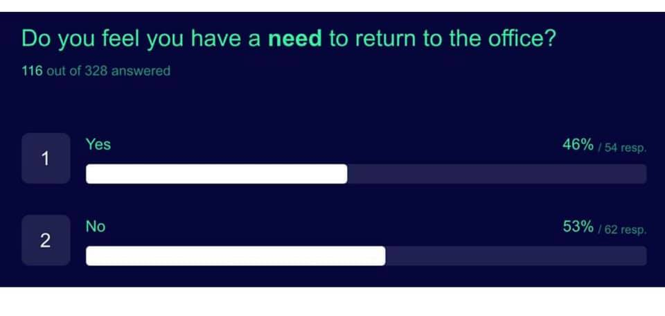
**이미지 캡션:** 이 이미지는 사무실 복귀에 대한 설문 조사 결과를 보여주는 스크린샷입니다. 화면 상단에는 "Do you feel you have a need to return to the office?"라는 질문이 녹색 글씨로 표시되어 있으며, 그 아래에는 "116 out of 328 answered"라는 문구가 있습니다. 질문 아래에는 두 가지 선택지인 "Yes"와 "No"가 각각 숫자 1과 2와 함께 나열되어 있습니다. "Yes"는 46%의 응답률과 54명의 응답자를 나타내며, "No"는 53%의 응답률과 62명의 응답자를 나타냅니다. 각 선택지 옆에는 해당 응답률을 시각적으로 보여주는 막대 그래프가 있습니다. 전체적으로 어두운 파란색 배경에 녹색과 흰색 텍스트가 사용되어 깔끔하고 정보 전달에 집중된 분위기입니다. 이 이미지는 사무실 복귀에 대한 직원들의 의견을 수집하고 분석하는 상황을 보여줍니다.

<a id="p0707-1631"></a>
### 7월 7일 (화) 16:31 · It's wonderful to have Homin Ju 주호민, the…

It's wonderful to have Homin Ju 주호민, the creator of Along with the Gods, https://en.wikipedia.org/wiki/Along_with_the_Gods:_The_Two_Worlds. We talked about how to make a good story to introduce AI.

신과 함께 등으로 유명한 대표적인 웹툰 작가님이신 주호민 작가님 뵙고 어떻게 하면 이야기로 글과 그림으로 AI를 많은 분들에게 재미있게 소개할 수 있을지에 대해 짧게 이야기 나누었습니다. 워낙 유명하고 바쁘신 분이라 성사될 수 있을지 모르겠지만 된다면 멋진 작품이 나올 것 같습니다. 기대해 주세요!


**이미지 캡션:** 두 명의 성인 남성이 밝은 실내 공간에서 함께 서서 사진을 찍고 있다. 왼쪽 남성은 40대 후반에서 50대 초반으로 보이는 대머리 남성으로, 짙은 남색 반팔 티셔츠와 청바지를 입고 있으며 목에는 신분증이 달린 흰색 목걸이를 걸고 있다. 그는 활짝 웃으며 손을 가지런히 모으고 있다. 오른쪽 남성은 30대 후반에서 40대 초반으로 보이는 남성으로, 회색 반팔 티셔츠와 검은색 바지를 입고 있다. 그는 엄지손가락을 치켜세우며 환하게 웃고 있으며, 그의 옆에는 검은색 백팩이 놓여 있다. 배경에는 대형 TV 화면이 보이며, 화면에는 "AirPlay"라는 문구와 함께 도시 야경 이미지가 표시되어 있고, "CHOOSE THIS APPLE TV CLOVA AI"라는 텍스트가 보인다. 또한, 책상 위에는 디지털 시계와 여러 가지 물건들이 놓여 있으며, 녹색 스크린과 유리 벽이 보인다. 전반적으로 밝고 긍정적인 분위기이다.
 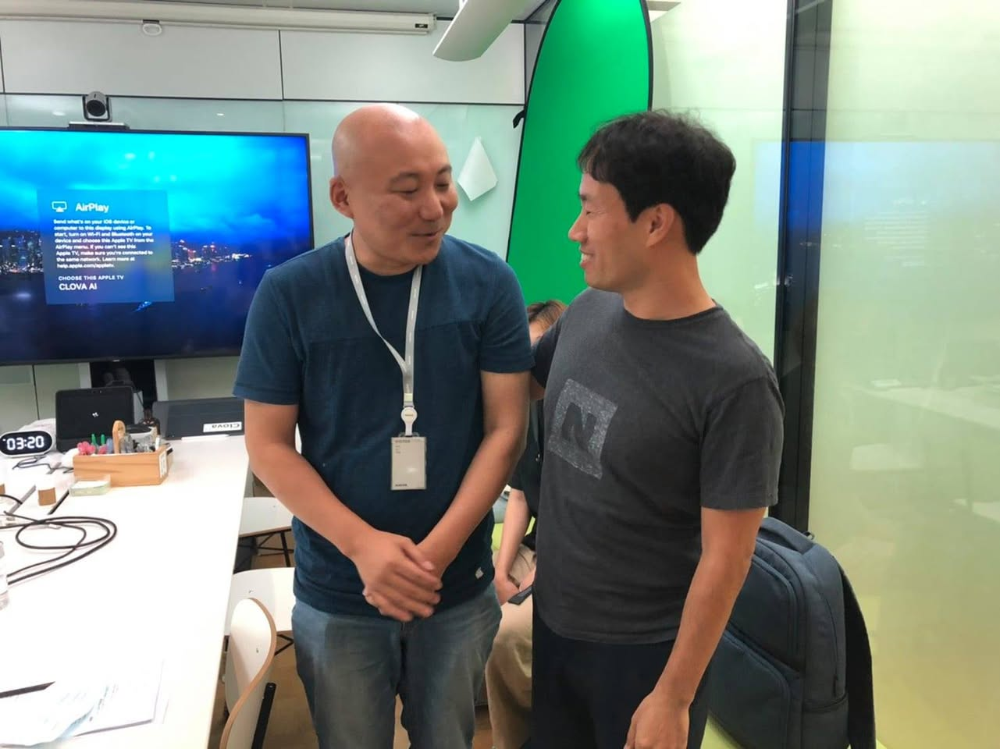
**이미지 캡션:** 두 명의 성인 남성이 실내에서 대화를 나누고 있으며, 한 명은 대머리이고 다른 한 명은 짧은 검은 머리를 하고 있습니다. 대머리 남성은 파란색 티셔츠와 청바지를 입고 있으며 목에 신분증을 걸고 있습니다. 그는 손을 앞으로 모으고 있으며, 얼굴에는 미소가 번져 있습니다. 짧은 검은 머리의 남성은 회색 티셔츠와 검은색 바지를 입고 있으며, 그의 얼굴에도 미소가 있습니다. 두 사람 모두 서로를 바라보며 편안하고 긍정적인 분위기를 자아냅니다. 배경에는 큰 TV 화면이 보이며, 화면에는 "AirPlay"와 "CLOVA AI"라는 글자가 표시되어 있습니다. TV 옆에는 디지털 시계가 있고, 책상 위에는 필기구와 서류가 놓여 있습니다. 또한, 녹색 스크린과 검은색 백팩도 보입니다. 전반적으로 사무실이나 회의실과 같은 장소로 보이며, 캐주얼한 분위기 속에서 업무 관련 대화가 이루어지고 있는 것으로 추정됩니다.

<a id="p0708-0746"></a>
### 7월 8일 (수) 07:46 · 📷 사진 (8장)

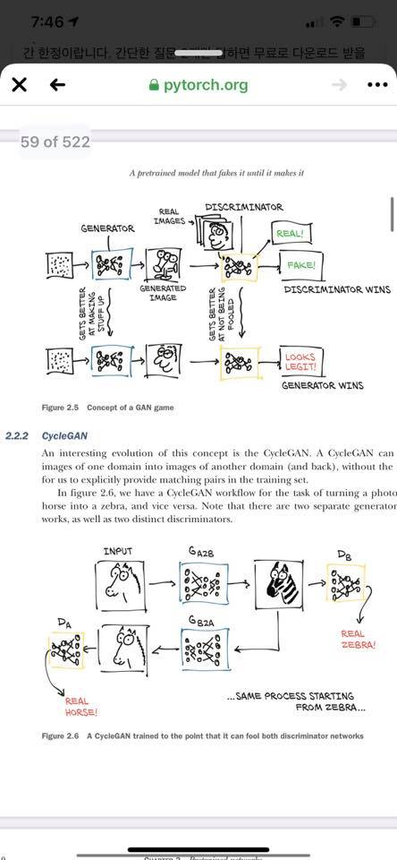
**이미지 캡션:** 이 이미지는 두 개의 다이어그램을 보여주며, 첫 번째 다이어그램은 생성적 적대 신경망(GAN)의 기본 개념을 설명하고, 두 번째 다이어그램은 CycleGAN의 작동 방식을 보여줍니다. 첫 번째 다이어그램에서는 "GENERATOR"와 "DISCRIMINATOR"라는 두 개의 신경망이 서로 경쟁하는 과정을 시각적으로 표현했습니다. 생성자는 실제 이미지와 구별하기 어려운 가짜 이미지를 생성하려고 노력하고, 판별자는 생성된 이미지가 진짜인지 가짜인지 구별하려고 노력합니다. 이 과정이 반복되면서 생성자는 더 사실적인 이미지를 만들고, 판별자는 더 정교하게 구별하게 됩니다. 다이어그램에는 "REAL IMAGES", "GENERATED IMAGE", "REAL!", "FAKE!", "DISCRIMINATOR WINS", "LOOKS LEGIT!", "GENERATOR WINS"와 같은 텍스트가 포함되어 있습니다. 두 번째 다이어그램은 CycleGAN의 워크플로우를 보여주는데, 말 이미지를 얼룩말 이미지로 변환하고 다시 말 이미지로 변환하는 과정을 예시로 들고 있습니다. 이 다이어그램에는 "INPUT", "GA2B", "GB2A", "DA", "DB", "REAL HORSE!", "REAL ZEBRA!"와 같은 레이블이 붙어 있으며, "SAME PROCESS STARTING FROM ZEBRA..."라는 텍스트도 보입니다. 두 다이어그램 모두 흰색 배경에 검은색 펜으로 그린 듯한 손그림 스타일이며, 일부 요소에는 파란색, 노란색, 빨간색으로 색칠이 되어 있습니다. 이미지 하단에는 "Figure 2.5 Concept of a GAN game"과 "Figure 2.6 A CycleGAN trained to the point that it can fool both discriminator networks"라는 캡션이 있습니다. 전반적으로 이 이미지는 GAN과 CycleGAN의 작동 원리를 이해하기 쉽게 설명하는 교육적인 자료로 보입니다.
 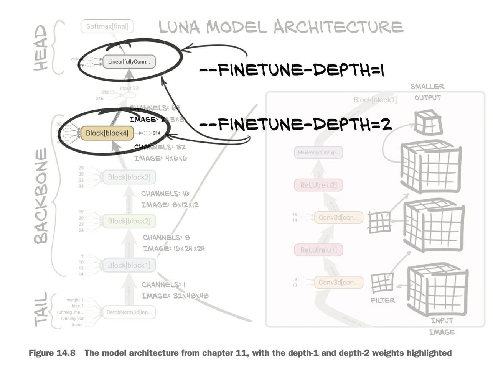
**이미지 캡션:** 이 이미지는 LUNA 모델 아키텍처를 설명하는 다이어그램으로, 딥러닝 모델의 구조를 시각적으로 보여줍니다. 다이어그램은 크게 HEAD, BACKBONE, TAIL의 세 부분으로 나뉘며, 각 부분은 신경망의 특정 레이어나 블록을 나타냅니다. HEAD 부분에는 Softmax와 Linear(fullyConn) 레이어가 있으며, 이는 모델의 최종 출력과 관련된 부분입니다. BACKBONE 부분은 여러 개의 Block(block4, block3, block2, block1)으로 구성되어 있으며, 각 블록은 채널 수와 이미지 크기 정보를 포함하고 있습니다. TAIL 부분에는 BatchNorm3d(inp...) 레이어가 있으며, 이는 모델의 입력 처리와 관련된 것으로 보입니다. 다이어그램의 오른쪽에는 모델의 출력 크기가 점차 작아지는 과정을 3D 큐브 형태로 시각화하여 보여주고 있으며, FILTER와 INPUT IMAGE라는 텍스트도 함께 표시되어 있습니다. 또한, "--FINETUNE-DEPTH=1"과 "--FINETUNE-DEPTH=2"라는 텍스트는 모델의 파인튜닝 깊이에 따른 변화를 나타내는 것으로 해석됩니다. 전체적으로 이 이미지는 딥러닝 모델의 계층적 구조와 데이터 흐름을 이해하는 데 도움을 주는 기술적인 다이어그램입니다.
 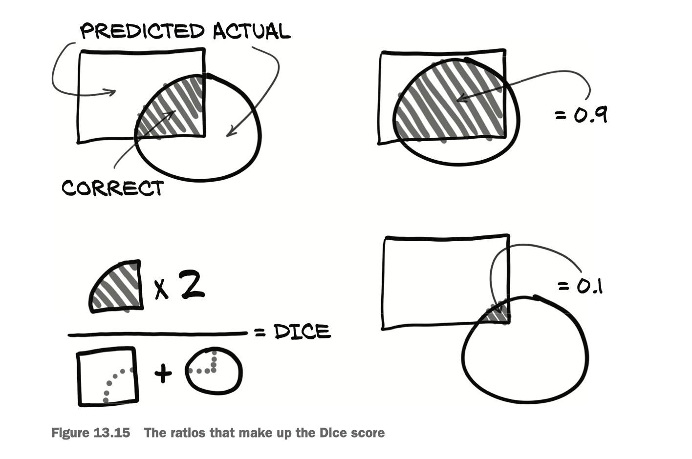
**이미지 캡션:** 이 이미지는 흰색 배경에 검은색 펜으로 그린 다이어그램으로, 네 개의 섹션으로 나뉘어 있으며 각 섹션은 기하학적 모양과 텍스트를 사용하여 개념을 설명합니다. 상단 왼쪽 섹션에는 사각형과 원이 겹쳐져 있으며, 겹쳐진 부분은 사선으로 채워져 있습니다. "PREDICTED ACTUAL"이라는 텍스트가 사각형 위에 있고, 화살표가 사각형에서 원의 겹쳐진 부분으로 향하며, "CORRECT"라는 텍스트가 원의 겹쳐진 부분을 가리킵니다. 상단 오른쪽 섹션에는 사각형과 원이 겹쳐져 있고 겹쳐진 부분은 사선으로 채워져 있으며, 이 겹쳐진 부분에서 원의 겹쳐진 부분으로 향하는 화살표가 "= 0.9"라는 텍스트로 이어집니다. 하단 왼쪽 섹션에는 사선으로 채워진 사분원 모양과 "x 2"라는 텍스트가 있고, 그 아래에는 사각형과 원이 있으며, 사각형 안에는 점들이, 원 안에는 점들이 그려져 있고 두 도형 사이에 "+" 기호가 있습니다. 이 전체 수식은 "= DICE"로 이어집니다. 하단 오른쪽 섹션에는 사각형과 원이 겹쳐져 있고 겹쳐진 부분은 사선으로 채워져 있으며, 이 겹쳐진 부분에서 원의 겹쳐진 부분으로 향하는 화살표가 "= 0.1"이라는 텍스트로 이어집니다. 이미지 하단에는 "Figure 13.15 The ratios that make up the Dice score"라는 캡션이 있습니다. 이 다이어그램은 예측과 실제 값의 일치도를 나타내는 Dice 점수를 설명하는 것으로 보이며, 겹쳐진 영역의 비율을 통해 점수를 계산하는 방식을 시각적으로 보여줍니다.
 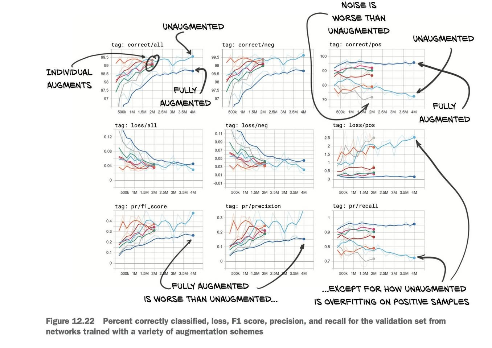
**이미지 캡션:** 이 이미지는 9개의 그래프로 구성된 도표로, 각 그래프는 신경망의 성능을 다양한 데이터 증강 기법에 따라 비교하고 있습니다. 상단에는 "NOISE IS WORSE THAN UNAUGMENTED"라는 텍스트와 함께 "UNAUGMENTED"와 "FULLY AUGMENTED"라는 레이블이 화살표로 그래프를 가리키고 있습니다. 왼쪽에는 "INDIVIDUAL AUGMENTS"라는 레이블이 있습니다. 각 그래프는 x축에 훈련 데이터의 양(500k부터 4M까지)을, y축에는 특정 성능 지표(정확도, 손실, F1 점수, 정밀도, 재현율)를 나타냅니다. 여러 색상의 선들은 서로 다른 증강 기법을 적용한 결과를 보여줍니다. 하단에는 "FULLY AUGMENTED IS WORSE THAN UNAUGMENTED..."라는 텍스트와 "...EXCEPT FOR HOW UNAUGMENTED IS OVERFITTING ON POSITIVE SAMPLES"라는 텍스트가 그래프의 특정 부분을 설명하고 있습니다. 이미지 하단에는 "Figure 12.22 Percent correctly classified, loss, F1 score, precision, and recall for the validation set from networks trained with a variety of augmentation schemes"라는 캡션이 있습니다. 전반적으로 이 도표는 데이터 증강이 신경망 성능에 미치는 영향을 시각적으로 보여주며, 특정 상황에서는 증강이 오히려 성능을 저하시킬 수 있음을 시사합니다.
 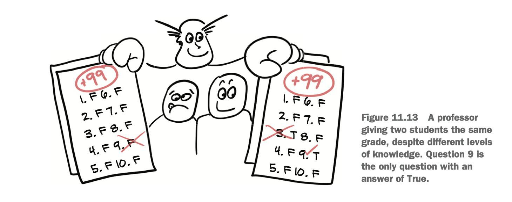
**이미지 캡션:** 이 그림은 흰색 배경에 단순한 선으로 그려진 만화 스타일의 삽화입니다. 중앙에는 두 개의 큰 종이를 들고 있는 성인 남성이 서 있습니다. 이 남성은 둥근 얼굴에 웃는 표정을 짓고 있으며, 머리 위에는 삐죽삐죽한 머리카락이 있고, 팔에는 복싱 글러브를 끼고 있습니다. 남성의 팔 아래에는 두 명의 학생으로 보이는 인물이 서 있습니다. 왼쪽 학생은 찡그린 표정으로 입술을 삐죽 내밀고 있으며, 오른쪽 학생은 눈을 동그랗게 뜨고 만족스러운 표정을 짓고 있습니다. 각 학생은 성인 남성이 들고 있는 종이와 같은 모양의 종이를 들고 있습니다. 종이에는 각각 '+99'라는 숫자가 빨간색 원 안에 적혀 있고, 그 아래에는 1번부터 5번까지 번호가 매겨진 질문 목록이 있습니다. 각 질문 옆에는 'F' 또는 'T'로 표시된 답이 있습니다. 왼쪽 종이의 3번 질문 옆에는 빨간색 X 표시가 있고, 4번 질문 옆에는 빨간색 체크 표시가 있습니다. 오른쪽 종이의 3번 질문 옆에는 빨간색 X 표시가 있고, 4번 질문 옆에는 빨간색 체크 표시가 있습니다. 그림의 오른쪽에는 "Figure 11.13 A professor giving two students the same grade, despite different levels of knowledge. Question 9 is the only question with an answer of True."라는 영어 텍스트가 있습니다. 이 그림은 지식 수준이 다른 두 학생에게 같은 점수를 주는 교수의 상황을 유머러스하게 묘사하고 있으며, 특히 9번 질문만이 정답이 'True'임을 강조하고 있습니다.
 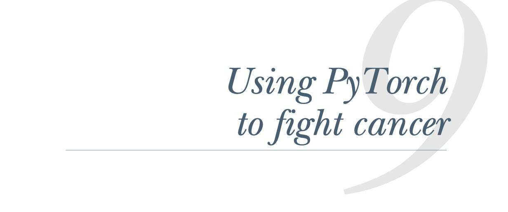
**이미지 캡션:** 이 이미지는 흰색 배경에 짙은 파란색 글씨로 "Using PyTorch to fight cancer"라는 문구가 쓰여 있으며, 오른쪽에는 연한 회색으로 겹쳐진 숫자 9가 희미하게 보인다. 글씨는 필기체와 비슷한 우아한 서체로 쓰여 있으며, "Using PyTorch"는 위쪽에, "to fight cancer"는 그 아래쪽에 배치되어 있다. 이미지 하단에는 얇은 파란색 선이 가로로 그어져 있다. 이 이미지는 특정 인물이나 장소를 보여주지 않으며, 텍스트와 그래픽 요소만으로 구성되어 있어 정보 전달이나 제목 표시와 같은 용도로 사용될 것으로 보인다. 전반적으로 깔끔하고 전문적인 분위기를 풍긴다.
 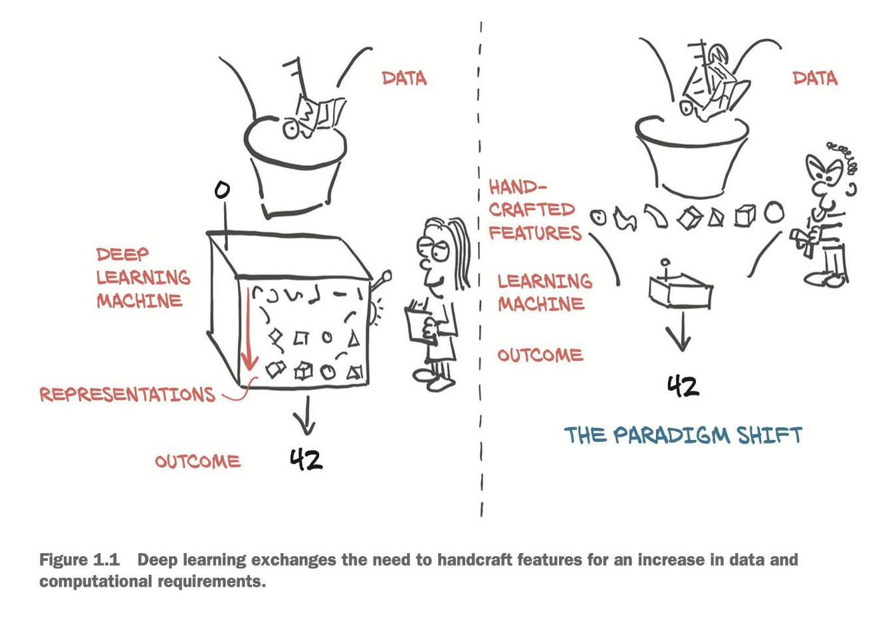
**이미지 캡션:** 이 그림은 딥러닝의 개념을 두 개의 패널로 나누어 설명하고 있으며, 왼쪽 패널은 딥러닝 머신이 데이터를 입력받아 표현(representations)을 학습하고 결과를 도출하는 과정을, 오른쪽 패널은 전통적인 머신러닝 방식에서 사람이 직접 특징(hand-crafted features)을 추출하여 학습기에 입력하고 결과를 도출하는 과정을 보여줍니다. 왼쪽 패널에는 'DEEP LEARNING MACHINE'이라고 쓰여진 상자가 있고, 상자 위에는 'DATA'라고 쓰인 글자와 함께 쓰레기통 모양의 통에서 데이터가 쏟아져 들어가는 모습이 그려져 있습니다. 상자 안에는 다양한 기하학적 도형들이 복잡하게 얽혀 있으며, 'REPRESENTATIONS'라는 글자와 함께 화살표가 상자에서 나와 'OUTCOME'과 '42'라는 숫자로 이어집니다. 오른쪽 패널에는 'HAND-CRAFTED FEATURES'라고 쓰인 글자와 함께 다양한 모양의 특징들이 나열되어 있고, 이 특징들이 쓰레기통 모양의 통에서 'DATA'와 함께 쏟아져 들어가는 모습이 그려져 있습니다. 이 특징들은 'LEARNING MACHINE'이라는 상자로 들어가고, 상자 옆에는 안경을 쓰고 무언가를 들고 있는 듯한 표정의 성인 여성이 서 있습니다. 이 학습기의 결과 역시 'OUTCOME'과 '42'라는 숫자로 나타나며, 오른쪽 하단에는 'THE PARADIGM SHIFT'라는 문구가 파란색으로 쓰여 있습니다. 전체적으로 손으로 그린 듯한 캐주얼한 그림체이며, 딥러닝이 특징 추출 과정을 자동화함으로써 데이터와 계산 요구량을 증가시킨다는 내용을 시각적으로 전달하고 있습니다.
 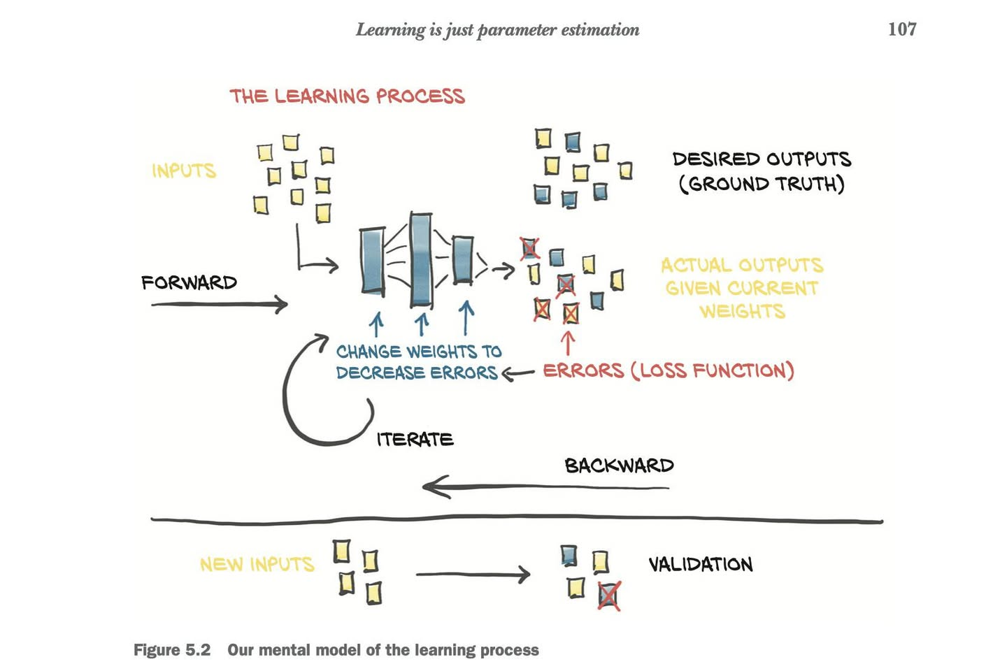
**이미지 캡션:** 이 이미지는 기계 학습의 학습 과정을 시각적으로 설명하는 다이어그램으로, 흰색 배경에 손으로 그린 듯한 그림과 텍스트로 구성되어 있습니다. 상단에는 "Learning is just parameter estimation"이라는 제목과 페이지 번호 "107"이 있습니다. 중앙에는 "THE LEARNING PROCESS"라는 큰 제목 아래, 왼쪽에서 오른쪽으로 진행되는 학습 과정을 보여줍니다. "INPUTS"라고 표시된 노란색 사각형들이 신경망으로 보이는 파란색 직사각형 여러 개를 통과하며, 이는 "FORWARD"라는 화살표로 표시됩니다. 신경망을 통과한 결과는 "ACTUAL OUTPUTS GIVEN CURRENT WEIGHTS"라고 표시된 노란색 사각형들과 일부 빨간색 X 표시가 있는 사각형들로 나타납니다. 이와 비교하여 "DESIRED OUTPUTS (GROUND TRUTH)"라고 표시된 노란색과 파란색 사각형들이 있습니다. 실제 출력과 원하는 출력 간의 차이는 "ERRORS (LOSS FUNCTION)"라고 표시되며, 빨간색 X 표시는 오류를 나타냅니다. 아래쪽에는 "CHANGE WEIGHTS TO DECREASE ERRORS"라는 텍스트와 함께 순환하는 화살표가 있어, 오류를 줄이기 위해 가중치를 조정하는 반복적인 과정을 의미합니다. 이 과정은 "ITERATE"라고 표시됩니다. 또한, "BACKWARD"라는 화살표는 오류를 바탕으로 신경망의 가중치를 업데이트하는 역전파 과정을 나타냅니다. 가장 아래쪽에는 "NEW INPUTS"라고 표시된 노란색 사각형들이 있고, 이는 "VALIDATION"이라고 표시된 노란색과 빨간색 X 표시가 있는 사각형들로 이어집니다. 이는 새로운 입력에 대한 모델의 성능을 검증하는 과정을 나타냅니다. 전체적으로, 이 다이어그램은 기계 학습 모델이 입력 데이터를 처리하고, 원하는 출력과 비교하여 오류를 계산하고, 이 오류를 줄이기 위해 가중치를 반복적으로 조정하는 과정을 명확하게 보여줍니다.

<a id="p0709-1053"></a>
### 7월 9일 (목) 10:53 · 📷 사진 (1장)

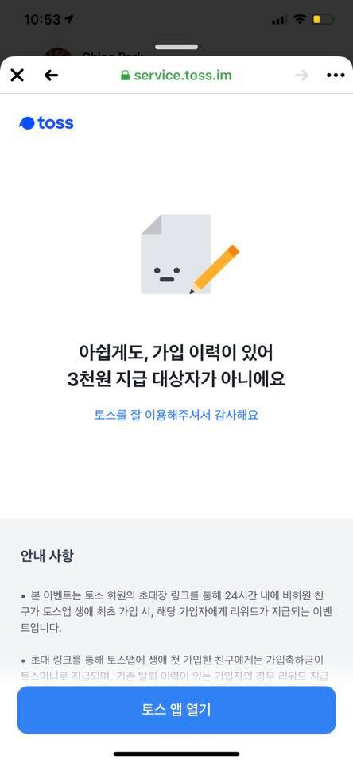
**이미지 캡션:** 화면 상단에는 시간과 배터리 잔량 표시가 보이며, 그 아래에는 웹 브라우저의 주소창이 있다. 주소창에는 자물쇠 아이콘과 함께 'service.toss.im'이라는 글자가 표시되어 있고, 좌측에는 뒤로 가기 버튼과 X 버튼이 있다. 화면 중앙에는 파란색 원 안에 흰색 글씨로 'toss'라고 쓰여진 로고가 있고, 그 아래에는 서류와 연필 모양의 귀여운 일러스트가 있다. 일러스트 아래에는 "아쉽게도, 가입 이력이 있어 3천원 지급 대상자가 아니에요"라는 문구가 큰 글씨로 쓰여 있고, 그 아래에는 "토스를 잘 이용해주셔서 감사해요"라는 작은 글씨가 있다. 화면 하단에는 "안내 사항"이라는 제목과 함께 두 개의 글머리 기호로 된 설명이 있다. 첫 번째 설명은 토스 회원의 초대장 링크를 통해 24시간 내에 비회원 친구가 토스앱에 생애 최초 가입 시 리워드가 지급된다는 내용이고, 두 번째 설명은 초대 링크를 통해 토스앱에 생애 첫 가입한 친구에게 가입 축하금이 토스머니로 지급되며 기존 탈퇴 이력이 있는 가입자의 경우 리워드 지급에 대한 내용이다. 가장 하단에는 파란색 배경에 흰색 글씨로 "토스 앱 열기"라고 쓰여진 버튼이 있다. 전반적으로 깔끔하고 현대적인 디자인이며, 사용자에게 정보를 명확하게 전달하는 데 초점을 맞춘 화면이다.

<a id="p0711-0648"></a>
### 7월 11일 (토) 06:48 · 📷 사진 (7장)

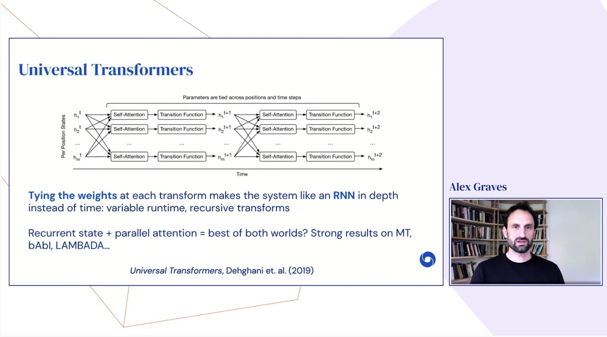
**이미지 캡션:** 화면 왼쪽에는 "Universal Transformers"라는 제목과 함께 딥러닝 모델의 구조를 나타내는 다이어그램이 있습니다. 다이어그램은 여러 개의 "Self-Attention"과 "Transition Function" 블록이 시간 축을 따라 연결되어 있으며, 각 블록은 여러 개의 "Per Position States"를 입력받아 다음 시간 단계의 상태를 출력하는 것을 보여줍니다. 다이어그램 아래에는 "Tying the weights at each transform makes the system like an RNN in depth instead of time: variable runtime, recursive transforms"라는 설명과 "Recurrent state + parallel attention = best of both worlds? Strong results on MT, bAbI, LAMBADA..."라는 문구가 있습니다. 가장 아래에는 "Universal Transformers, Dehghani et. al. (2019)"라는 출처 정보가 있습니다. 화면 오른쪽에는 "Alex Graves"라는 이름과 함께 한 명의 성인 남성이 등장하는 작은 영상 창이 있습니다. 이 남성은 검은색 상의를 입고 있으며, 배경에는 책장 가득 책이 꽂혀 있습니다. 그는 카메라를 정면으로 바라보며 약간의 미소를 띠고 있습니다. 전체적으로 학술 발표 또는 강의의 일부로 보이는 장면이며, 딥러닝 모델인 Universal Transformers에 대한 설명과 발표자의 모습이 함께 제시되고 있습니다.
 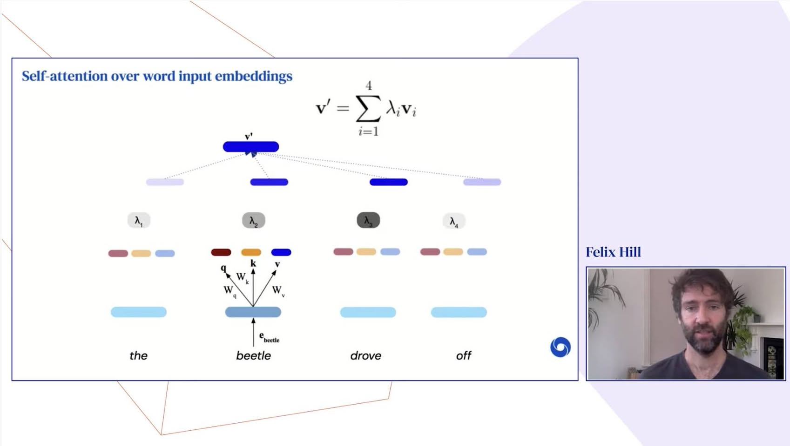
**이미지 캡션:** 화면 왼쪽에는 "Self-attention over word input embeddings"라는 제목과 함께 복잡한 다이어그램이 표시되어 있으며, 이는 단어 임베딩에 대한 셀프 어텐션 메커니즘을 시각화한 것입니다. 다이어그램에는 여러 단어("the", "beetle", "drove", "off")와 각 단어에 대한 벡터 표현, 그리고 어텐션 가중치(λ)와 쿼리(q), 키(k), 값(v) 벡터를 나타내는 요소들이 포함되어 있습니다. 수식 v' = Σ λᵢvᵢ 도 함께 표시되어 있습니다. 화면 오른쪽 하단에는 "Felix Hill"이라는 이름과 함께 한 명의 성인 남성이 등장하는 영상이 작게 표시되어 있습니다. 이 남성은 30대 후반에서 40대 초반으로 보이며, 짧은 갈색 머리와 수염을 가지고 있습니다. 그는 검은색 티셔츠를 입고 있으며, 편안한 표정으로 카메라를 응시하고 있습니다. 배경에는 식물과 액자가 걸린 벽이 보입니다. 전체적으로 발표 또는 강의의 한 장면으로 보이며, 기술적인 내용을 설명하는 분위기입니다.
 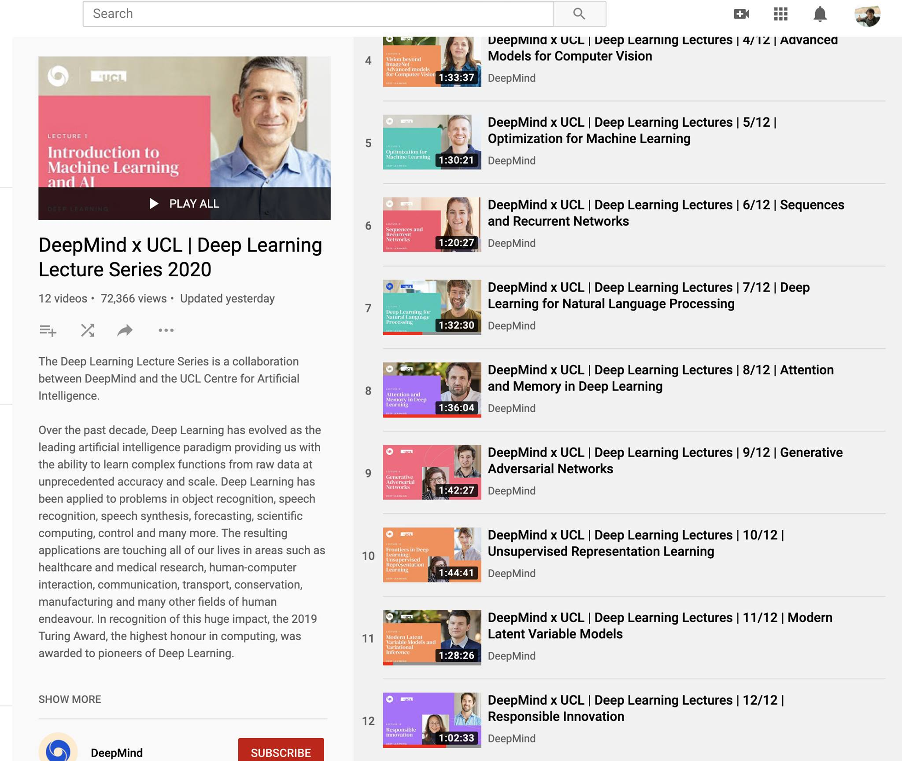
**이미지 캡션:** 이것은 유튜브 페이지로, "DeepMind x UCL | Deep Learning Lecture Series 2020"이라는 제목의 딥러닝 강의 시리즈를 보여줍니다. 메인 영상 썸네일에는 중년의 백인 남성이 미소를 지으며 카메라를 바라보고 있으며, 배경에는 "LECTURE 1 Introduction to Machine Learning and AI"라는 글자가 적힌 핑크색과 회색의 그래픽이 있습니다. 영상 제목 아래에는 12개의 영상, 72,366회의 조회수, 어제 업데이트됨이라는 정보가 표시되어 있습니다. 페이지 오른쪽에는 강의 시리즈의 다른 영상 목록이 썸네일, 제목, 길이, 게시자 이름과 함께 나열되어 있습니다. 각 썸네일에는 강의의 주제를 나타내는 그래픽과 함께 강사들의 사진이 포함되어 있습니다. 페이지 하단에는 "SHOW MORE" 버튼과 DeepMind 로고, "SUBSCRIBE" 버튼이 있습니다. 전반적으로 이 페이지는 딥러닝에 관심 있는 시청자들에게 유익한 교육 콘텐츠를 제공하는 전문적이고 정보성 있는 분위기를 풍깁니다.
 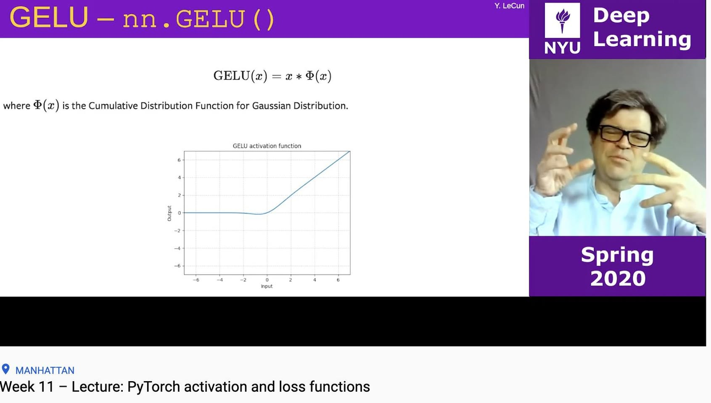
**이미지 캡션:** 화면 왼쪽에는 "GELU - nn.GELU()"라는 제목과 함께 GELU 함수의 수학적 정의인 "GELU(x) = x * Φ(x)"와 "where Φ(x) is the Cumulative Distribution Function for Gaussian Distribution."이라는 설명이 적혀 있습니다. 그 아래에는 "GELU activation function"이라는 제목의 그래프가 있는데, x축은 "Input", y축은 "Output"으로 표시되어 있으며, 입력값이 증가함에 따라 출력값이 비선형적으로 증가하는 GELU 함수의 형태를 보여줍니다. 화면 오른쪽 상단에는 "Y. LeCun", "NYU", "Deep Learning"이라는 텍스트와 함께 뉴욕대학교 로고가 보입니다. 그 아래에는 안경을 쓴 중년 남성이 손짓을 하며 설명하는 모습이 담겨 있으며, 하단에는 "Spring 2020"이라는 텍스트가 보입니다. 화면 하단에는 "MANHATTAN"이라는 위치 정보와 함께 "Week 11 - Lecture: PyTorch activation and loss functions"라는 강의 제목이 표시되어 있습니다. 전체적으로 딥러닝 강의의 한 장면으로, GELU 활성화 함수에 대한 설명과 함께 강사의 모습이 담겨 있습니다.
 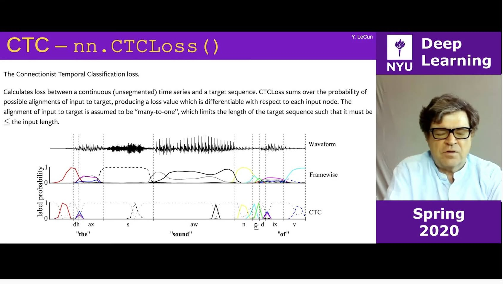
**이미지 캡션:** 화면 왼쪽에는 보라색 배경에 흰색 글씨로 "CTC - nn.CTCLoss()"라고 적혀 있고, 그 아래에는 "The Connectionist Temporal Classification loss."라는 설명과 함께 CTC 손실 함수에 대한 자세한 설명이 텍스트로 제공됩니다. 설명 아래에는 음성 파형, 프레임별 레이블 확률, CTC 레이블 확률을 보여주는 세 개의 그래프가 있습니다. 그래프에는 "dh", "ax", "s", "aw", "n", "d", "ix", "v"와 같은 음소와 "the", "sound", "of"와 같은 단어가 표시되어 있습니다. 화면 오른쪽에는 보라색 배경에 "Y. LeCun", "NYU", "Deep Learning", "Spring 2020"이라는 텍스트가 보입니다. 그 옆에는 안경을 쓴 중년 남성이 파란색 셔츠를 입고 화면을 바라보고 있으며, 그의 표정은 차분하고 집중한 듯 보입니다. 전체적으로 이 화면은 딥러닝 강의의 일부로, CTC 손실 함수에 대한 개념과 시각적 표현을 설명하고 있습니다.
 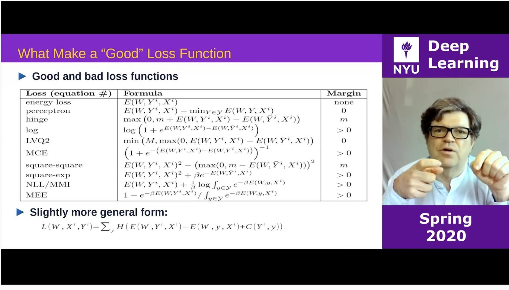
**이미지 캡션:** 화면 왼쪽에는 보라색 배경에 "What Make a "Good" Loss Function"이라는 제목이 있고, 그 아래에는 "Good and bad loss functions"라는 소제목과 함께 여러 손실 함수들의 이름, 공식, 그리고 마진 값이 표로 정리되어 있습니다. 표 아래에는 "Slightly more general form:"이라는 문구와 함께 일반화된 손실 함수의 공식이 제시되어 있습니다. 화면 오른쪽에는 뉴욕 대학교(NYU)의 딥러닝 강의 로고와 함께 한 명의 성인 남성이 등장합니다. 그는 안경을 쓰고 파란색 셔츠를 입고 있으며, 손짓을 하며 설명하는 듯한 표정을 짓고 있습니다. 화면 하단에는 "Spring 2020"이라는 문구가 보라색 배경에 표시되어 있습니다. 전체적으로 강의 또는 발표 자료의 한 장면으로 보이며, 딥러닝의 손실 함수에 대한 내용을 다루고 있습니다.
 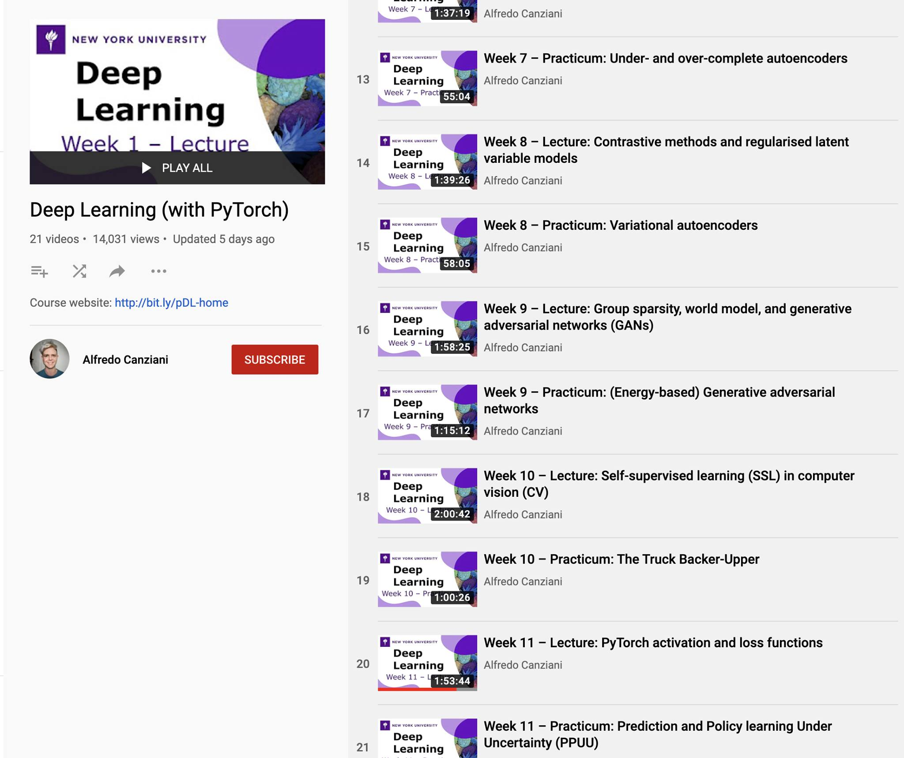
**이미지 캡션:** 이 화면은 뉴욕대학교의 "Deep Learning (with PyTorch)" 강의 영상 목록을 보여주는 유튜브 페이지의 일부입니다. 화면 왼쪽에는 강의의 메인 썸네일과 함께 "Deep Learning Week 1 - Lecture"라는 제목이 보이며, "PLAY ALL" 버튼이 있습니다. 그 아래에는 강의 제목, 영상 개수, 조회수, 업데이트 날짜가 표시되어 있습니다. 또한 강의 웹사이트 주소와 강사인 Alfredo Canziani의 프로필 사진 및 구독 버튼이 있습니다. 화면 오른쪽에는 강의 목록이 주차별로 나열되어 있으며, 각 영상은 "Week X - Lecture" 또는 "Week X - Practicum" 형식의 제목과 함께 강사 이름이 표시되어 있습니다. 영상 썸네일에는 뉴욕대학교 로고와 "Deep Learning"이라는 글자가 포함되어 있으며, 영상 길이 정보도 함께 제공됩니다. 현재 화면에는 Week 7부터 Week 11까지의 강의 목록이 보이며, 각 영상의 제목은 autoencoders, contrastive methods, variational autoencoders, generative adversarial networks (GANs), self-supervised learning (SSL), PyTorch activation and loss functions, prediction and policy learning 등 딥러닝 관련 주제들을 다루고 있습니다. 전반적으로 학술적인 강의 콘텐츠를 제공하는 유튜브 채널의 모습입니다.

<a id="p0712-1914"></a>
### 7월 12일 (일) 19:14 · 📷 사진 (5장)

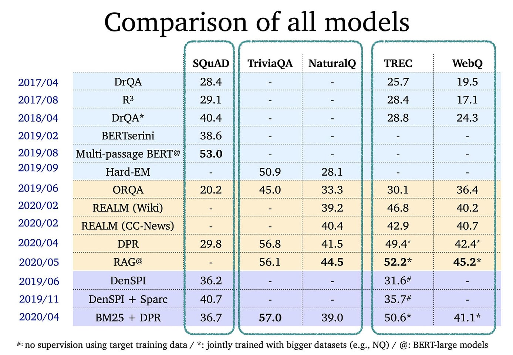
**이미지 캡션:** 이 이미지는 다양한 자연어 처리 모델의 성능을 비교하는 표를 보여줍니다. 표의 제목은 "Comparison of all models"이며, 여러 데이터셋(SQuAD, TriviaQA, NaturalQ, TREC, WebQ)에 대한 각 모델의 점수를 날짜별로 정리하고 있습니다. 표에는 2017년부터 2020년까지의 데이터가 포함되어 있으며, 각 행은 특정 날짜와 해당 날짜에 평가된 모델(DrQA, R3, BERTserini, Multi-passage BERT, Hard-EM, ORQA, REALM, DPR, RAG, DenSPI, BM25 등)을 나타냅니다. 일부 데이터 포인트에는 '#' 또는 '*'와 같은 기호가 붙어 있으며, 표 하단에 이 기호들의 의미가 설명되어 있습니다. '#'는 타겟 학습 데이터 없이 지도 학습을 사용했음을, '*'는 더 큰 데이터셋(예: NQ)으로 공동 학습했음을, '@'는 BERT-large 모델임을 나타냅니다. 표는 흰색 배경에 검은색 텍스트로 구성되어 있으며, 일부 행과 열은 가독성을 높이기 위해 연한 파란색, 노란색, 연한 보라색으로 구분되어 있습니다. 전반적으로 학술적이거나 기술적인 발표 자료의 일부로 보이는 차분하고 정보 전달에 집중된 분위기입니다.
 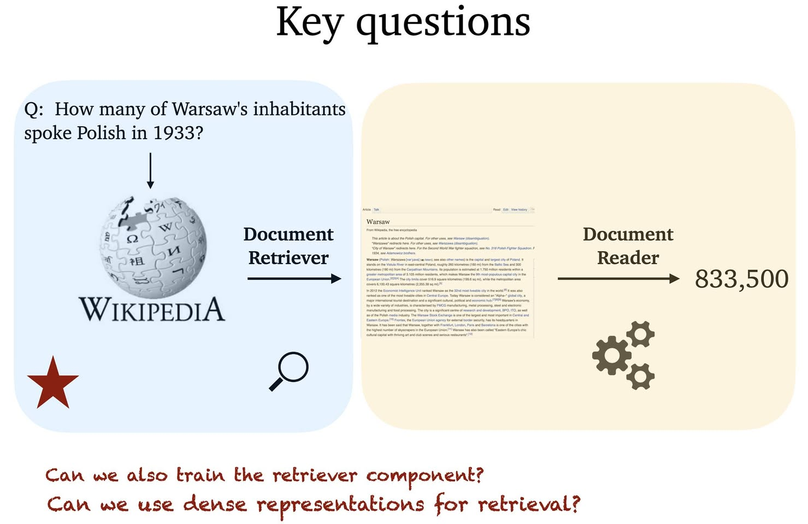
**이미지 캡션:** 이 이미지는 정보 검색 시스템의 작동 방식을 시각적으로 설명합니다. 상단에는 "Key questions"이라는 제목이 있습니다. 왼쪽에는 "Q: How many of Warsaw's inhabitants spoke Polish in 1933?"라는 질문이 있고, 그 아래에는 위키피디아 로고가 있습니다. 위키피디아 로고에서 "Document Retriever"라는 텍스트와 화살표가 오른쪽으로 이어집니다. 그 옆에는 "Warsaw"라는 제목의 위키피디아 문서 일부가 보이며, 문서 아래에는 "Document Reader"라는 텍스트와 화살표가 오른쪽으로 이어지고, 마지막으로 "833,500"이라는 숫자가 표시됩니다. 문서 리더 아래에는 톱니바퀴 세 개가 겹쳐진 아이콘이 있습니다. 이미지 하단에는 "Can we also train the retriever component?"와 "Can we use dense representations for retrieval?"이라는 두 개의 질문이 붉은색 텍스트로 쓰여 있습니다. 전반적으로 이 이미지는 질문이 주어졌을 때 위키피디아와 같은 문서 저장소에서 관련 정보를 검색하고, 해당 정보를 처리하여 최종 결과(이 경우 숫자)를 도출하는 과정을 보여주는 다이어그램입니다.
 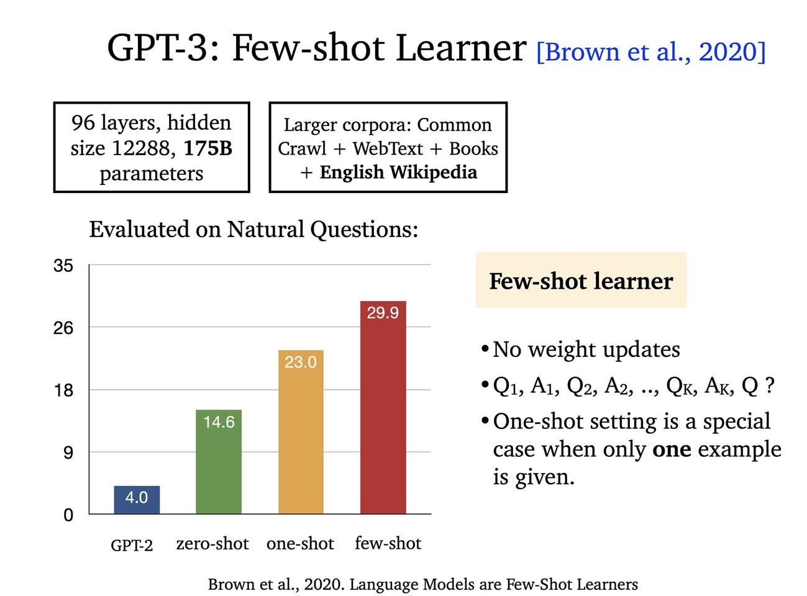
**이미지 캡션:** 이 이미지는 GPT-3 언어 모델의 "Few-shot Learner" 성능을 보여주는 그래프와 관련 정보를 담고 있습니다. 상단에는 "GPT-3: Few-shot Learner [Brown et al., 2020]"라는 제목이 있으며, 그 아래에는 GPT-3 모델의 구조적 특징을 설명하는 두 개의 상자가 있습니다. 왼쪽 상자에는 "96 layers, hidden size 12288, 175B parameters"라고 적혀 있고, 오른쪽 상자에는 학습에 사용된 데이터셋의 규모를 나타내는 "Larger corpora: Common Crawl + WebText + Books + English Wikipedia"라는 내용이 있습니다. 중앙에는 "Evaluated on Natural Questions:"라는 문구와 함께 막대그래프가 있습니다. 이 그래프는 GPT-2, zero-shot, one-shot, few-shot 네 가지 설정에 대한 성능을 보여주며, 각 막대 위에는 해당 성능 수치가 표시되어 있습니다. GPT-2는 4.0, zero-shot은 14.6, one-shot은 23.0, few-shot은 29.9의 성능을 기록했습니다. 그래프 오른쪽에는 "Few-shot learner"라는 제목과 함께 몇 가지 특징이 글머리 기호로 나열되어 있습니다. "No weight updates", "Q1, A1, Q2, A2, ..., QK, AK, Q ?", 그리고 "One-shot setting is a special case when only one example is given."이라는 내용이 포함되어 있습니다. 이미지 하단에는 "Brown et al., 2020. Language Models are Few-Shot Learners"라는 출처 정보가 기재되어 있습니다. 전반적으로 이 이미지는 학술적인 발표 자료의 일부로 보이며, GPT-3의 few-shot 학습 능력을 시각적으로 설명하고 있습니다.
 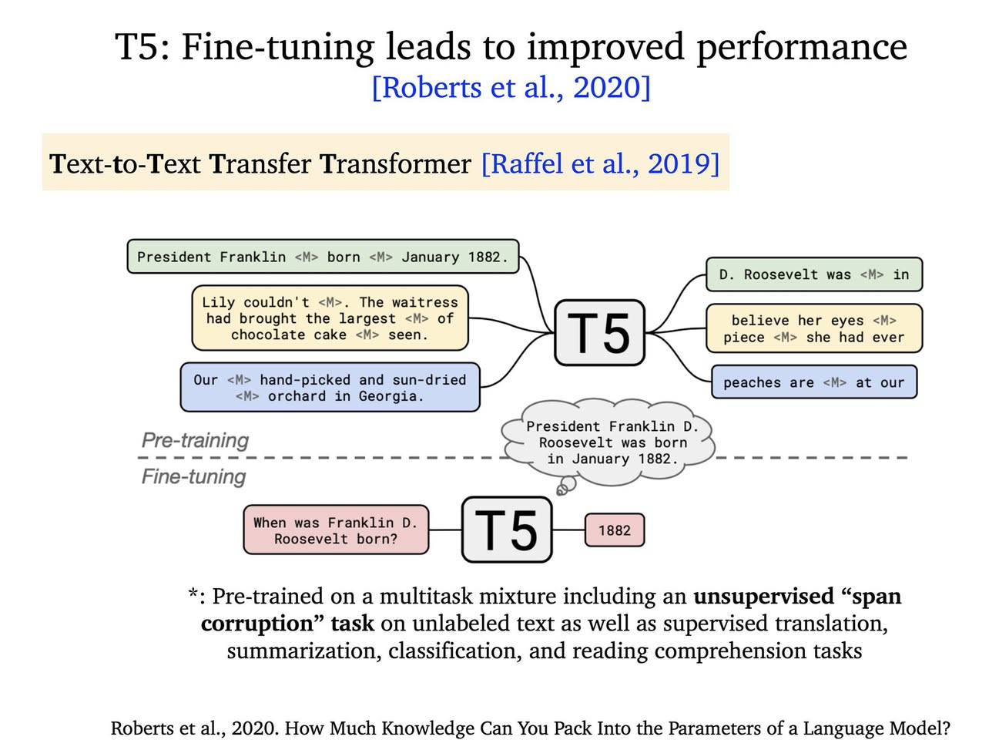
**이미지 캡션:** 이 이미지는 T5 모델의 사전 학습 및 미세 조정을 설명하는 다이어그램입니다. 상단에는 "T5: Fine-tuning leads to improved performance"라는 제목과 "[Roberts et al., 2020]"이라는 출처가 있습니다. 그 아래에는 "Text-to-Text Transfer Transformer [Raffel et al., 2019]"라는 부제가 있습니다. 다이어그램은 T5 모델을 중심으로 여러 텍스트 상자가 연결되어 있습니다. 왼쪽 상단에는 "President Franklin <M> born <M> January 1882."라는 텍스트가 있고, 그 아래에는 "Lily couldn't <M>. The waitress had brought the largest <M> of chocolate cake <M> seen." 및 "Our <M> hand-picked and sun-dried <M> orchard in Georgia."라는 텍스트가 있습니다. 이들은 사전 학습 단계의 예시로 보입니다. 오른쪽에는 "D. Roosevelt was <M> in", "believe her eyes <M> piece <M> she had ever", "peaches are <M> at our"라는 텍스트가 T5 모델에 연결되어 있습니다. 또한 "President Franklin D. Roosevelt was born in January 1882."라는 말풍선도 T5 모델에 연결되어 있습니다. 다이어그램 하단에는 "Pre-training"과 "Fine-tuning"이라는 레이블이 있으며, 미세 조정 단계에서는 "When was Franklin D. Roosevelt born?"이라는 질문과 "1882"라는 답변이 T5 모델을 통해 연결되는 것을 보여줍니다. 마지막으로, 이미지 하단에는 별표와 함께 T5 모델의 사전 학습에 대한 설명이 있으며, "Roberts et al., 2020. How Much Knowledge Can You Pack Into the Parameters of a Language Model?"이라는 출처가 명시되어 있습니다. 전반적으로 이 이미지는 T5 모델의 작동 방식과 성능 향상에 대한 정보를 전달하는 학술적인 분위기를 띠고 있습니다.
 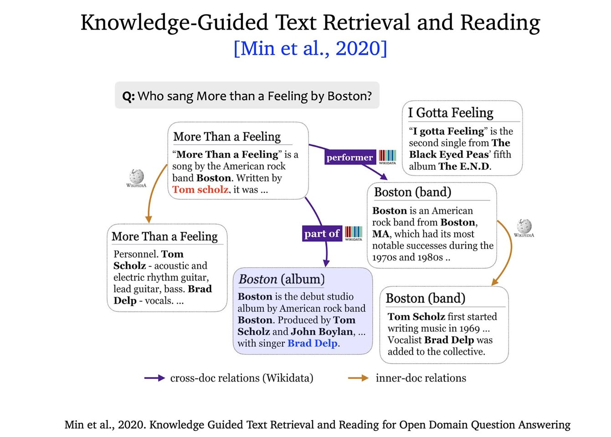
**이미지 캡션:** 이 이미지는 "Knowledge-Guided Text Retrieval and Reading"이라는 제목의 논문에서 발췌한 것으로, 2020년에 Min 등이 발표한 연구를 나타냅니다. 이미지의 중심에는 "Q: Who sang More than a Feeling by Boston?"이라는 질문이 제시되어 있으며, 이 질문에 답하기 위한 정보들이 여러 개의 상자로 나뉘어 시각적으로 연결되어 있습니다. 각 상자는 특정 정보 조각을 나타내며, 화살표는 이러한 정보 조각들 간의 관계를 보여줍니다. 왼쪽 상단에는 "More Than a Feeling"이라는 곡에 대한 설명이 있으며, 이 곡이 미국 록 밴드 보스턴(Boston)의 곡이고 Tom Scholz가 작곡했음을 명시합니다. 그 아래에는 "More Than a Feeling"이라는 제목의 또 다른 상자가 있는데, 여기에는 이 곡의 인물 정보가 담겨 있으며 Tom Scholz가 기타를, Brad Delp가 보컬을 맡았다고 언급됩니다. 오른쪽 상단에는 "I Gotta Feeling"이라는 곡에 대한 정보가 있는데, 이는 블랙 아이드 피스의 곡으로 보스턴 밴드와는 직접적인 관련이 없어 보입니다. 그 아래에는 "Boston (band)"라는 상자가 두 개 있는데, 하나는 보스턴 밴드가 1970년대와 1980년대에 성공을 거둔 미국 록 밴드임을 설명하고, 다른 하나는 Tom Scholz가 1969년에 작곡을 시작했고 Brad Delp가 보컬로 합류했음을 설명합니다. 또한 "Boston (album)"이라는 상자에는 보스턴 밴드의 데뷔 스튜디오 앨범에 대한 정보가 있으며, Tom Scholz와 John Boylan이 프로듀싱하고 Brad Delp가 보컬로 참여했음을 나타냅니다. 이미지 하단에는 "cross-doc relations (Wikidata)"와 "inner-doc relations"라는 텍스트와 함께 이를 나타내는 화살표들이 표시되어 있어, 정보들이 위키데이터와 같은 외부 소스에서 가져온 문서 간 관계와 문서 내 관계를 통해 연결됨을 보여줍니다. 전반적으로 이 이미지는 질문 답변 시스템에서 정보를 검색하고 이해하는 과정을 시각적으로 표현한 다이어그램으로, 학술적인 분위기를 띠고 있습니다.

<a id="p0713-0901"></a>
### 7월 13일 (월) 09:01 · 📷 사진 (4장)

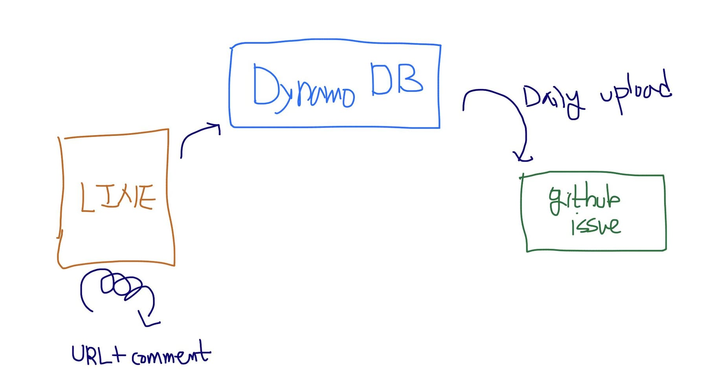
**이미지 캡션:** 이 이미지는 흰색 배경에 손으로 그린 다이어그램으로, 시스템의 데이터 흐름을 보여줍니다. 왼쪽에는 갈색 테두리로 그려진 사각형 안에 "LINE"이라고 쓰여 있으며, 그 아래에는 파란색으로 꼬인 화살표와 함께 "URL + comment"라는 텍스트가 있습니다. 이 LINE 사각형에서 파란색 화살표가 오른쪽 위로 향해 파란색 테두리의 사각형으로 이어지며, 그 안에는 "Dynamo DB"라고 쓰여 있습니다. Dynamo DB 사각형에서 다시 파란색 화살표가 오른쪽 아래로 향해 녹색 테두리의 사각형으로 이어지며, 그 안에는 "github issue"라고 쓰여 있습니다. 또한 Dynamo DB 사각형에서 오른쪽으로 뻗어 나온 파란색 화살표에는 "Daily upload"라는 텍스트가 있습니다. 전체적으로 이 다이어그램은 LINE 메시지에서 받은 URL과 댓글이 Dynamo DB에 저장되고, 이 데이터가 매일 GitHub 이슈로 업로드되는 과정을 나타내는 것으로 보입니다. 사람이나 구체적인 장소는 보이지 않으며, 다이어그램 자체의 단순하고 명료한 구성으로 인해 기술적인 정보를 전달하는 데 집중된 분위기입니다.
 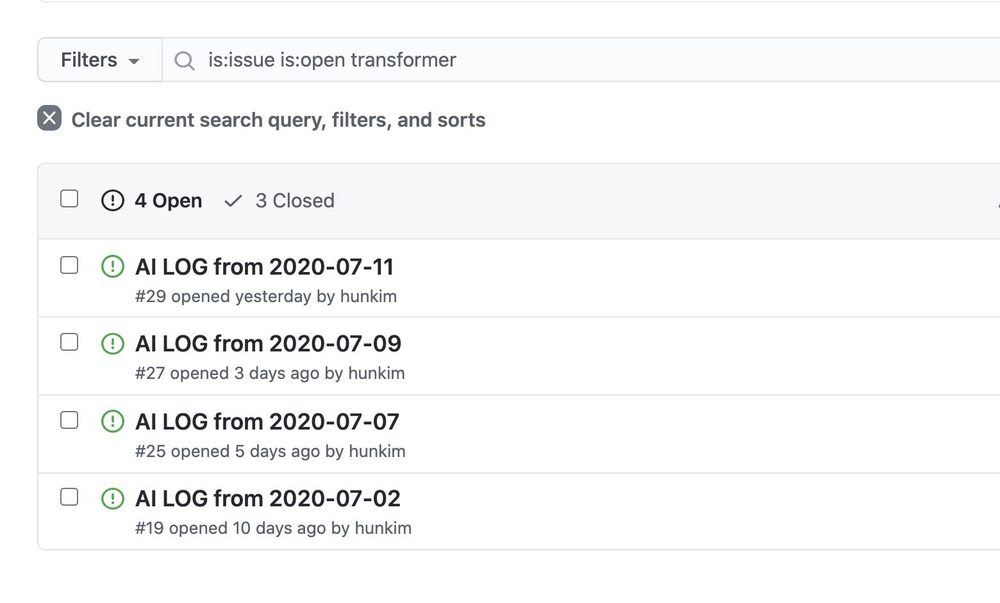
**이미지 캡션:** 이 이미지는 컴퓨터 화면의 일부를 캡처한 것으로, 소프트웨어 개발 프로젝트의 이슈 트래킹 시스템 또는 유사한 인터페이스를 보여줍니다. 화면 상단에는 "Filters"라는 드롭다운 메뉴와 검색창이 있으며, 검색창에는 "is:issue is:open transformer"라는 텍스트가 입력되어 있습니다. 그 아래에는 "Clear current search query, filters, and sorts"라는 문구가 X 아이콘과 함께 표시되어 있어 현재 설정된 검색 조건, 필터, 정렬을 초기화할 수 있음을 나타냅니다. 이어서 "4 Open"과 "3 Closed"라는 텍스트가 각각 느낌표 아이콘과 체크 표시 아이콘과 함께 나타나, 현재 열려 있는 이슈가 4개이고 닫힌 이슈가 3개임을 보여줍니다. 그 아래로는 개별 이슈 목록이 나열되어 있으며, 각 항목은 체크박스, 상태 표시 아이콘(녹색 원 안에 느낌표), 이슈 제목, 그리고 이슈 번호와 생성 시점, 생성자 정보로 구성됩니다. 첫 번째 이슈는 "AI LOG from 2020-07-11"이며, "#29 opened yesterday by hunkim"이라고 표시되어 있습니다. 두 번째 이슈는 "AI LOG from 2020-07-09"이며, "#27 opened 3 days ago by hunkim"입니다. 세 번째 이슈는 "AI LOG from 2020-07-07"이며, "#25 opened 5 days ago by hunkim"입니다. 마지막으로 네 번째 이슈는 "AI LOG from 2020-07-02"이며, "#19 opened 10 days ago by hunkim"입니다. 이 화면에는 사람이 직접적으로 보이지는 않으며, 텍스트 정보와 아이콘을 통해 시스템의 상태와 이슈 목록을 전달하고 있습니다. 전반적으로 깔끔하고 기능적인 인터페이스 디자인을 보여주며, 기술적인 맥락에서 사용되는 화면임을 알 수 있습니다.
 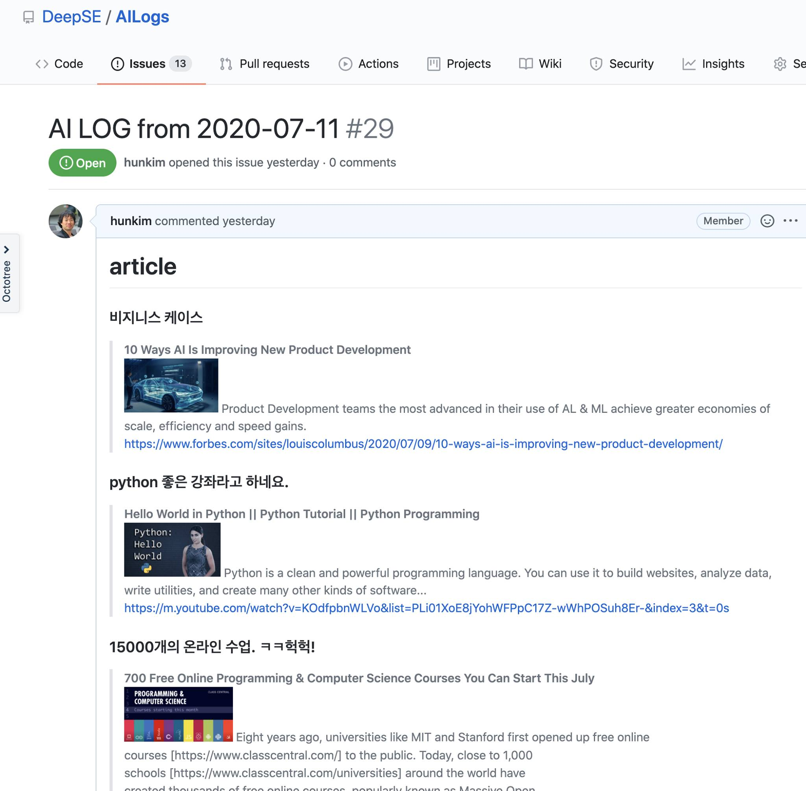
**이미지 캡션:** 화면 상단에는 GitHub의 DeepSE / AllLogs 페이지가 보이며, 'Code', 'Issues 13', 'Pull requests', 'Actions', 'Projects', 'Wiki', 'Security', 'Insights', 'Settings' 등의 메뉴가 나열되어 있습니다. 메인 콘텐츠 영역에는 'AI LOG from 2020-07-11 #29'라는 제목이 있고, 그 아래에 'Open' 상태와 함께 'hunkim'이라는 사용자가 어제 이 이슈를 열었다는 정보와 댓글이 없다는 내용이 표시됩니다. 그 아래에는 'hunkim'이라는 사용자가 어제 댓글을 달았다는 표시와 함께 'article'이라는 제목이 있습니다. 이어서 '비지니스 케이스'라는 소제목과 함께 '10 Ways AI Is Improving New Product Development'라는 제목의 기사 링크와 관련 이미지, 그리고 기사 내용 요약 및 URL이 제공됩니다. 다음으로 'python 좋은 강좌라고 하네요.'라는 소제목과 함께 'Hello World in Python || Python Tutorial || Python Programming'이라는 제목의 유튜브 영상 링크와 썸네일 이미지, 그리고 파이썬에 대한 설명과 영상 URL이 있습니다. 마지막으로 '15000개의 온라인 수업. ㅋ 큭큭큭!'이라는 소제목과 함께 '700 Free Online Programming & Computer Science Courses You Can Start This July'라는 제목의 온라인 강의 목록 링크와 썸네일 이미지, 그리고 해당 강의들에 대한 설명이 포함되어 있습니다. 전체적으로 기술 관련 정보 공유 웹사이트의 이슈 트래커 페이지로 보이며, AI와 프로그래밍 관련 콘텐츠들이 공유되고 있습니다.
 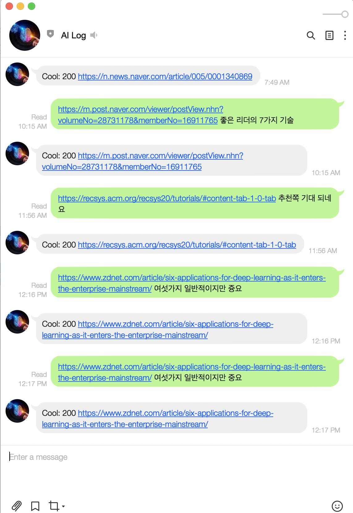
**이미지 캡션:** 이것은 스마트폰 메신저 앱의 대화 화면으로, 상단에는 "AI Log"라는 제목과 함께 AI 로고 이미지가 보인다. 대화는 여러 개의 메시지 풍선으로 구성되어 있으며, 대부분은 링크와 함께 "Cool: 200"이라는 텍스트가 포함되어 있다. 메시지들은 시간 순서대로 나열되어 있으며, 각 메시지 옆에는 보낸 시간 또는 읽은 시간이 표시되어 있다. 메시지 내용은 주로 웹사이트 링크이며, 일부는 "좋은 리더의 7가지 기술"이나 "추천쪽 기대 되네", "여섯가지 일반적이지만 중요"와 같은 짧은 한국어 문구가 함께 포함되어 있다. 대화 화면 하단에는 메시지 입력창과 첨부, 이모티콘 등의 아이콘이 보인다. 전반적으로 정보 공유나 링크 전달이 이루어지는 대화 상황으로 보인다.

<a id="p0714-1350"></a>
### 7월 14일 (화) 13:50 · 📷 사진 (1장)

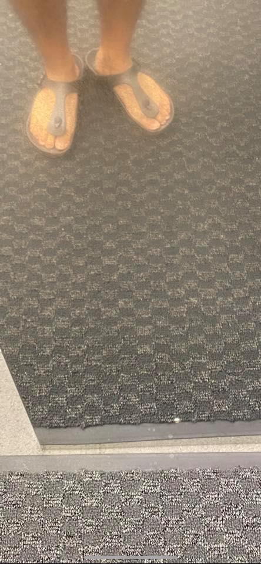
**이미지 캡션:** 이 사진은 성인 남성의 발과 샌들을 클로즈업한 것으로, 어두운 색상의 체크무늬 카펫 위에 서 있습니다. 남성은 회색 또는 검은색의 플립플랍 샌들을 신고 있으며, 샌들 안쪽으로 보이는 발은 맨발입니다. 사진의 초점은 발과 샌들에 맞춰져 있으며, 배경은 흐릿하게 처리되어 있습니다. 카펫은 격자무늬 패턴으로, 어두운 회색과 밝은 회색이 섞여 있습니다. 사진 하단에는 거울에 비친 듯한 모습이 보이는데, 역시 카펫과 샌들이 흐릿하게 반사되어 있습니다. 전체적으로 편안하고 일상적인 분위기를 나타냅니다.

<a id="p0715-0807"></a>
### 7월 15일 (수) 08:07 · 📷 사진 (1장)

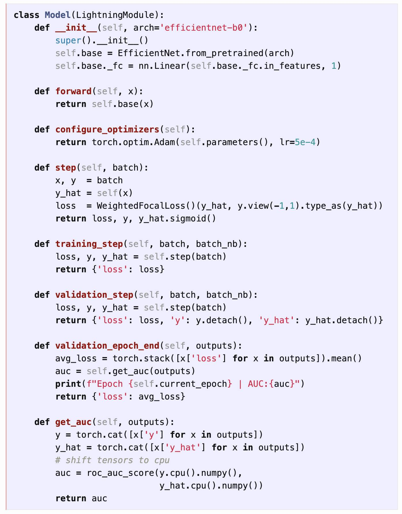
**이미지 캡션:** 이 사진은 파이썬 코드가 담긴 스크린샷으로, 딥러닝 모델을 정의하는 내용을 담고 있습니다. 코드의 내용은 PyTorch Lightning이라는 프레임워크를 사용하여 EfficientNet-b0 모델을 기반으로 하는 모델을 구축하고, 학습 및 검증 단계를 설정하는 과정을 보여줍니다. 구체적으로는 모델의 초기화, 순전파, 옵티마이저 설정, 학습 스텝, 검증 스텝, 그리고 검증 에포크 종료 시 AUC(Area Under the Curve) 계산 및 출력하는 함수들이 정의되어 있습니다. 코드의 색상으로 구분된 구문 강조는 파이썬 코드임을 명확히 나타내며, 배경은 일반적인 컴퓨터 화면의 흰색 또는 밝은 회색으로 보입니다. 특별한 인물, 장소, 사물, 텍스트는 보이지 않으며, 전체적인 분위기는 기술적이고 전문적인 느낌을 줍니다.

> #PytorchLight에반하다 저희 그룹에도 지난번 몇번에 걸쳐 Pytorch Light가 소개 된적이 있는데요. 오늘 의료 이미지 분류를 하는 간략 코드 설명을 보고 더 반하게 되는것 같습니다. 딥러닝 모델과 step 그리고 loss등에서 충분한 자유를 누릴수 있으면서 동시에 깔끔함과 gradient accumulation, 16-bit precision, 디버깅을 위한 한스텝만 돌거나 오버피팅, GPU/TPU 지원관리등을 너무나 간단하게 할수 있습니다.  [https://amaarora.github.io/2020/07/12/oganized-pytorch.html](https://amaarora.github.io/2020/07/12/oganized-pytorch.html)  우선 구조는 아름답고 간단하게:  > `**class** **Model**(LightningModule):     **def** **__init__**(self, arch**=**'efficientnet-b0'):         super().__init__()         self.base **=** EfficientNet.from_pretrained(arch)         self.base._fc **=** nn.Linear(self.base._fc.in_features, 1)      **def** **forward**(self, x):         **return** self.base(x)      **def** **configure_optimizers**(self):         **return** torch.optim.Adam(self.parameters(), lr**=**5e-4)      **def** **step**(self, batch):         x, y  **=** batch         y_hat **=** self(x)         loss  **=** WeightedFocalLoss()(y_hat, y.view(**-**1,1).type_as(y_hat))         **return** loss, y, y_hat.sigmoid()      **def** **training_step**(self, batch, batch_nb):         loss, y, y_hat **=** self.step(batch)         **return** {'loss': loss}      **def** **validation_step**(self, batch, batch_nb):         loss, y, y_hat **=** self.step(batch)         **return** {'loss': loss, 'y': y.detach(), 'y_hat': y_hat.detach()}      **def** **validation_epoch_end**(self, outputs):         avg_loss **=** torch.stack([x['loss'] **for** x **in** outputs]).mean()         auc **=** self.get_auc(outputs)         **print**(f"Epoch {self.current_epoch} | AUC:{auc}")         **return** {'loss': avg_loss}          **def** **get_auc**(self, outputs):         y **=** torch.cat([x['y'] **for** x **in** outputs])         y_hat **=** torch.cat([x['y_hat'] **for** x **in** outputs])         *# shift tensors to cpu *        auc **=** roc_auc_score(y.cpu().numpy(),                              y_hat.cpu().numpy())          **return** auc`  `일일이 batch를 세어가며 zero_grad()를 불러줘야 했던 Gradient Accmulation은 한줄 옵션으로` > `trainer **=** Trainer(gpus**=**1, max_epochs**=**2,                    num_sanity_val_steps**=**1 **if** debug **else** 0,                    accumulate_grad_batches**=**2)`  ``` `'precision**=**16' 으로 바로 16-bit precision, 'tpu_cores=8 로 바로 TPU.` 이코드는 이미지 분류의 그냥 템플릿으로 사용하고 데이타셋, 모델, 로스등만 바꾸어 많은 실험을 빠르게 해볼수 있을듯 합니다. ```

<a id="p0717-1144"></a>
### 7월 17일 (금) 11:44 · 📷 사진 (63장)

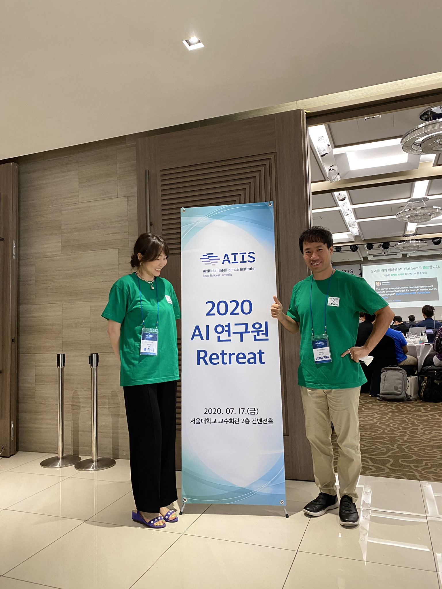
**이미지 캡션:** 한 명의 성인 여성은 녹색 티셔츠와 검은색 바지를 입고 있으며, 다른 한 명의 성인 남성은 녹색 티셔츠와 베이지색 바지를 입고 있습니다. 두 사람 모두 행사의 이름이 적힌 배너 앞에 서 있습니다. 배너에는 "2020 AI 연구원 Retreat"이라고 적혀 있으며, 날짜는 2020년 7월 17일 금요일이고 장소는 서울대학교 교수회관 2층 컨벤션홀입니다. 여성은 미소를 짓고 있고, 남성은 엄지손가락을 치켜들고 있습니다. 배경에는 회의실처럼 보이는 장소가 보이며, 다른 참석자들이 테이블에 앉아 있습니다. 전체적으로 행사의 분위기는 활기차고 긍정적입니다.
 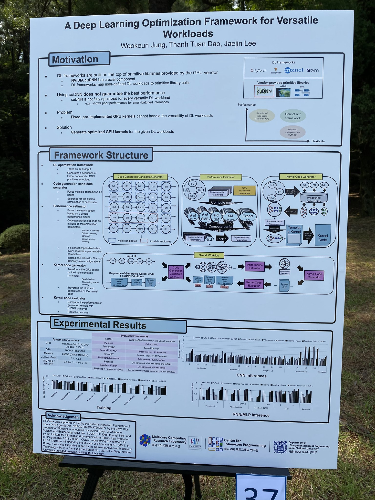
**이미지 캡션:** 이 사진은 "A Deep Learning Optimization Framework for Versatile Workloads"라는 제목의 포스터 발표 자료로, 한국어와 영어로 구성되어 있습니다. 포스터의 중앙에는 이 프레임워크의 구조를 도식화한 그림이 있으며, 좌측 상단에는 "Motivation" 섹션에서 이 프레임워크의 필요성을 설명하고 있습니다. 우측 상단에는 "DL Frameworks"와 "Vendor-provided primitive libraries"를 보여주는 다이어그램이 있습니다. 중앙 하단에는 "Experimental Results" 섹션에서 다양한 딥러닝 프레임워크와 제안된 프레임워크의 성능을 비교하는 그래프가 제시되어 있으며, "CNN Inferences"와 "RNN/MLP Inference"라는 하위 섹션으로 나뉘어 있습니다. 가장 하단에는 "Acknowledgement" 섹션에서 연구 지원 기관들을 나열하고 있으며, 여러 대학 및 연구 기관의 로고가 함께 표시되어 있습니다. 포스터는 야외에서 촬영되었으며, 배경에는 녹색 식물들이 보입니다. 포스터의 하단에는 발표 번호로 추정되는 숫자 "27"이 보입니다.
 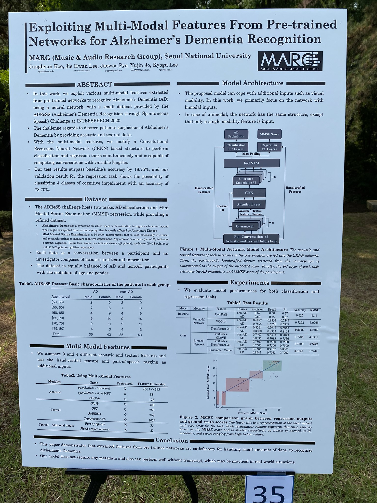
**이미지 캡션:** 이 포스터는 알츠하이머 치매 인식에 대한 다중 모달 특징을 활용하는 연구를 설명합니다. 포스터의 제목은 "Exploiting Multi-Modal Features From Pre-trained Networks for Alzheimer's Dementia Recognition"이며, MARG (Music & Audio Research Group), 서울대학교 소속의 Junghyun Koo, Jie Hwan Lee, Jaewoo Pyo, Yujin Jo, Kyogu Lee가 작성했습니다. 포스터는 연구의 초록, 모델 아키텍처, 데이터셋, 실험 결과 및 결론을 포함합니다. 초록 부분에서는 사전 훈련된 네트워크에서 추출된 다양한 다중 모달 특징을 활용하여 알츠하이머 치매(AD)를 인식하는 연구를 소개합니다. 이 연구는 INTERSPEECH 2020의 ADRESS (Alzheimer's Dementia Recognition through Spontaneous Speech) 챌린지에서 제공된 소규모 데이터셋을 사용합니다. 연구의 목표는 음향 및 텍스트 데이터를 제공하여 알츠하이머 치매가 의심되는 환자를 구별하는 것입니다. 다중 모달 특징을 사용하여 컨볼루션 순환 신경망(CRNN) 기반 구조를 수정하여 분류 및 회귀 작업을 동시에 수행하고 가변 길이의 대화를 처리할 수 있습니다. 테스트 결과는 기존 모델의 정확도를 18.75% 초과했으며, 회귀 작업의 검증 결과는 78.70%의 정확도로 4가지 인지 장애 등급을 분류할 수 있는 가능성을 보여줍니다. 모델 아키텍처 섹션에서는 제안된 모델이 시각적 양식을 포함한 추가 입력에 대처할 수 있으며, 이 연구에서는 이진 입력에 초점을 맞춘다고 설명합니다. 단일 입력의 경우 네트워크는 동일한 구조를 가지지만 단일 양식 특징만 입력으로 사용됩니다. 모델 아키텍처 다이어그램은 음향 및 텍스트 특징이 CRNN 네트워크로 입력되고, 참가자의 수작업 특징이 bi-LSTM 계층의 출력에 연결된 다음, 각 작업의 FC 계층이 참가자의 AD 확률 및 MMSE 점수를 추정하는 과정을 보여줍니다. 데이터셋 섹션에서는 ADRESS 챌린지가 AD 분류 및 Mini Mental Status Examination (MMSE) 회귀의 두 가지 작업을 호스팅하며, 개선된 데이터셋을 제공한다고 설명합니다. 알츠하이머 치매는 인지 기능이 저하되는 증후군으로, 정상적인 노화 과정에서 예상되는 것과는 달리 주로 알츠하이머병에 의해 영향을 받습니다. Mini Mental Status Examination은 임상 및 연구에서 인지적 손상을 평가하는 데 광범위하게 사용되는 30점 척도입니다. 24점 이상은 정상 인지 상태를 나타내며, 19
 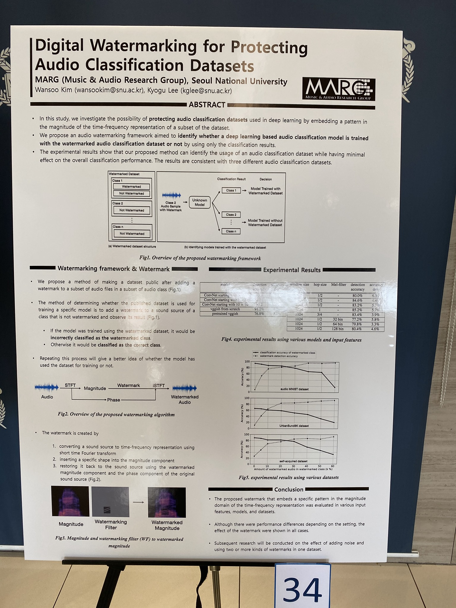
**이미지 캡션:** 이 포스터는 서울대학교 MARG (음악 및 오디오 연구 그룹)에서 발표한 "디지털 워터마킹을 이용한 오디오 분류 데이터셋 보호"에 대한 연구 내용을 담고 있습니다. 포스터의 중앙에는 연구의 개요, 워터마킹 프레임워크 및 알고리즘, 실험 결과, 그리고 결론이 포함되어 있습니다. 사람: 포스터에는 연구를 수행한 것으로 보이는 두 명의 성인 남성이 언급되어 있습니다. 이름은 완수 김 (wansookim@snu.ac.kr)과 규구 이 (kglee@snu.ac.kr)이며, 이들은 서울대학교 소속입니다. 장소/배경: 포스터는 흰색 배경에 검은색 글씨와 일부 색상이 포함된 그래픽으로 구성되어 있습니다. 연구 기관은 서울대학교이며, MARG (Music & Audio Research Group) 로고가 보입니다. 사물: 포스터에는 여러 개의 도표와 그림이 포함되어 있습니다. - Fig1: 워터마킹된 데이터셋 구조와 워터마크가 포함된 오디오 샘플을 식별하는 모델을 보여주는 다이어그램입니다. - Fig2: STFT, Magnitude, Watermark, ISTFT를 거쳐 워터마크가 적용된 오디오가 생성되는 과정을 보여주는 알고리즘 개요입니다. - Fig3: Magnitude, Watermarking Filter, Watermarked Magnitude를 보여주는 이미지입니다. - Fig4: 다양한 모델과 입력 특징을 사용한 실험 결과를 보여주는 그래프입니다. - Fig5: 다양한 데이터셋을 사용한 실험 결과를 보여주는 그래프입니다. - 표: 실험 결과를 요약한 표가 있습니다. - 로고: MARG 로고가 있습니다. - 숫자: 포스터 하단에 큰 숫자 "34"가 보입니다. 보이는 텍스트: 포스터에는 연구 제목, 저자 정보, 초록, 워터마킹 프레임워크 및 알고리즘 설명, 실험 결과 설명, 결론 등이 한국어와 영어로 작성되어 있습니다. 분위기/상황: 포스터는 학술적인 분위기를 띠고 있으며, 오디오 분류 데이터셋의 보안을 강화하기 위한 디지털 워터마킹 기술에 대한 연구 결과를 발표하는 상황입니다. 연구의 중요성과 실험 결과의 신뢰성을 강조하고 있습니다.
 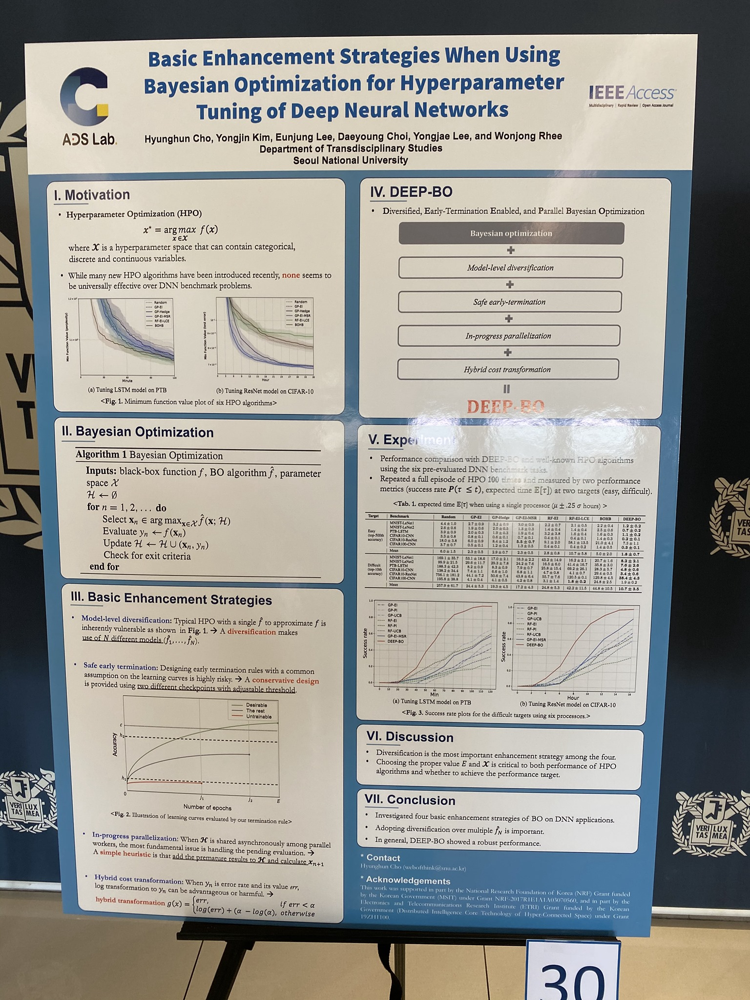
**이미지 캡션:** 이 포스터는 딥러닝 신경망 튜닝을 위한 베이지안 최적화의 기본 향상 전략을 다루고 있으며, ADS Lab. 소속의 연구원들이 작성했습니다. 포스터는 크게 동기 부여, 베이지안 최적화, 기본 향상 전략, DEEP-BO, 실험, 토론, 결론, 연락처 및 감사의 말로 구성되어 있습니다. 동기 부여 섹션에서는 하이퍼파라미터 최적화(HPO)의 중요성과 기존 HPO 알고리즘의 한계를 설명하며, 두 개의 그래프를 통해 다양한 HPO 알고리즘의 성능을 비교합니다. 베이지안 최적화 섹션에서는 베이지안 최적화 알고리즘의 작동 방식을 설명하는 순서도를 보여줍니다. 기본 향상 전략 섹션에서는 모델 수준 다각화, 안전한 조기 종료, 병렬 처리, 하이브리드 비용 변환이라는 네 가지 향상 전략을 설명하고, 각 전략에 대한 그래프와 수식을 제시합니다. DEEP-BO 섹션에서는 이러한 전략들을 통합한 DEEP-BO 알고리즘을 소개하며, 베이지안 최적화부터 시작하여 모델 수준 다각화, 안전한 조기 종료, 병렬 처리, 하이브리드 비용 변환을 거쳐 최종적으로 DEEP-BO에 도달하는 과정을 도식화했습니다. 실험 섹션에서는 DEEP-BO와 다른 HPO 알고리즘들의 성능을 비교한 표와 두 개의 그래프를 제시하며, LSTM 모델과 ResNet 모델에 대한 튜닝 결과를 보여줍니다. 토론 섹션에서는 네 가지 향상 전략 중 다각화가 가장 중요하며, 적절한 값 선택이 성능에 중요함을 강조합니다. 결론 섹션에서는 네 가지 기본 향상 전략을 조사했으며, 다각화가 중요하고 DEEP-BO가 견고한 성능을 보였다고 요약합니다. 포스터의 배경은 흰색이며, 각 섹션은 파란색 계열의 테두리로 구분되어 있습니다. 전반적으로 학술적인 분위기를 풍기며, 딥러닝 및 최적화 분야의 연구 결과를 효과적으로 전달하고 있습니다.
 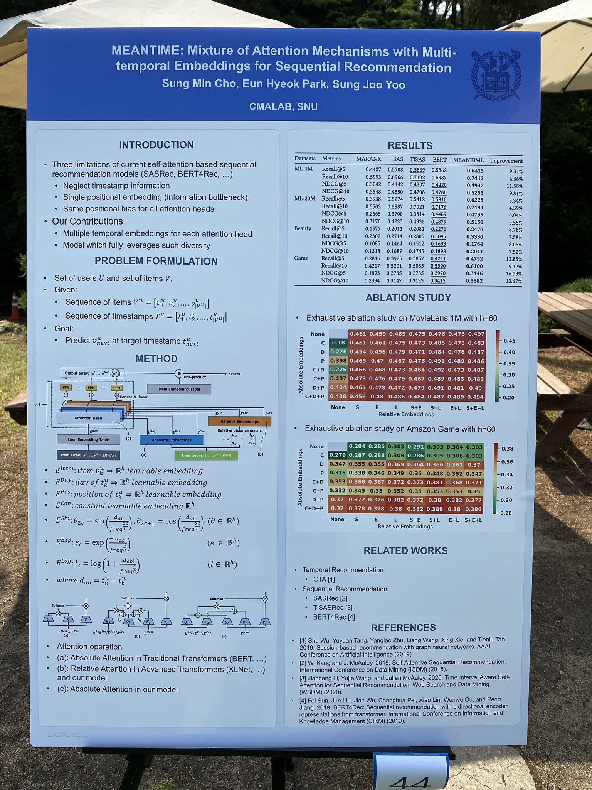
**이미지 캡션:** 이 포스터는 "MEANTIME: Mixture of Attention Mechanisms with Multi-temporal Embeddings for Sequential Recommendation"이라는 제목의 연구를 소개하며, Sung Min Cho, Eun Hyeok Park, Sung Joo Yoo가 CMALAB, SNU 소속으로 발표했습니다. 포스터는 연구의 서론, 문제 정의, 방법론, 결과, 관련 연구, 참고 문헌으로 구성되어 있습니다. **사람:** 포스터에는 특정 인물이 직접적으로 묘사되어 있지 않지만, 연구의 저자 세 명(Sung Min Cho, Eun Hyeok Park, Sung Joo Yoo)의 이름이 명시되어 있습니다. 이들은 성인 남성으로 추정됩니다. **장소/배경:** 포스터의 배경은 흰색이며, 상단에는 SNU(Seoul National University)의 로고가 파란색과 흰색으로 그려져 있습니다. 전체적으로 학술 발표 포스터의 전형적인 디자인을 따르고 있습니다. **사물:** 포스터에는 다양한 표, 그래프, 수식, 다이어그램이 포함되어 있습니다. *   **표:** "RESULTS" 섹션에는 ML-1M, ML-20M, Beauty, Game 데이터셋에 대한 다양한 메트릭(Recall@5, Recall@10, NDCG@5, NDCG@10)과 MARANK, SAS, TISAS, BERT, MEANTIME 모델의 성능 및 개선율을 비교하는 표가 있습니다. 또한 "ABLATION STUDY" 섹션에는 MovieLens 1M과 Amazon Game 데이터셋에 대한 다양한 모델 조합의 성능을 보여주는 표가 있습니다. *   **그래프:** "ABLATION STUDY" 섹션의 표 옆에는 막대 그래프가 있어 성능 수치를 시각적으로 비교할 수 있습니다. *   **수식:** "PROBLEM FORMULATION" 섹션과 "METHOD" 섹션에는 연구에서 사용되는 다양한 수식이 포함되어 있습니다. 예를 들어, 아이템 시퀀스, 타임스탬프 시퀀스, 예측 목표, 다양한 임베딩(E_item, E_day, E_pos, E_con, E_sin, E_exp, E_log)을 정의하는 수식들이 있습니다. *   **다이어그램:** "METHOD" 섹션에는 "Attention operation"이라는 제목 아래 세 가지 종류의 어텐션 메커니즘을 설명하는 다이어그램 (a), (b), (c)가 있습니다. (a)는 전통적인 트랜스포머의 절대 어텐션을, (b)는 XLNet과 같은 고급 트랜스포머의 상대 어텐션을, (c)는 본 연구 모델의 절대 어텐션을 나타냅니다. 또한, "Relative Embeddings"를 설명하는 작은 다이어그램도 있습니다. **보이는 텍스트:** 포스터에는
 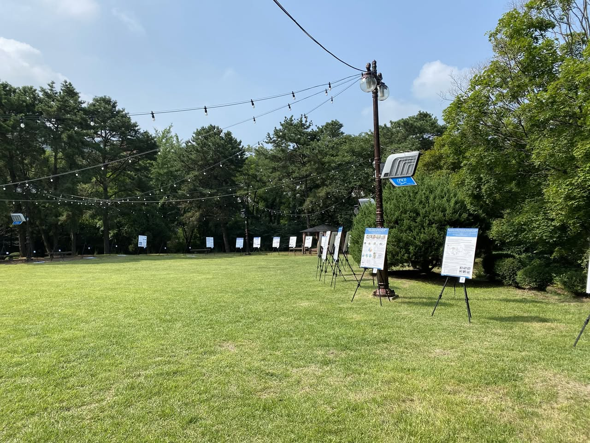
**이미지 캡션:** 푸른 잔디밭에 여러 개의 전시 패널이 세워져 있고, 뒤로는 울창한 나무들이 우거져 있으며, 하늘에는 조명 줄이 늘어져 있어 야외 전시 또는 행사가 진행 중인 것으로 보인다. 잔디밭에는 총 10개 이상의 흰색 전시 패널이 일렬로 배치되어 있으며, 각 패널은 검은색 삼각대 위에 놓여 있다. 패널에는 다양한 그래프, 도표, 텍스트가 포함되어 있어 학술 발표나 정보 전달을 위한 자료로 추정된다. 가장 가까운 패널에는 한국어로 된 제목과 내용이 보이며, 일부 패널에는 영어로 된 내용도 포함되어 있다. 오른쪽에는 가로등 역할을 하는 듯한 조명 기둥이 서 있고, 그 위에는 파란색 바탕에 흰색 글씨로 'CENCO'라는 로고가 새겨져 있다. 전반적으로 맑은 날씨에 야외에서 진행되는 교육적이거나 정보 전달 목적의 행사가 열리고 있는 평화롭고 차분한 분위기이다.
 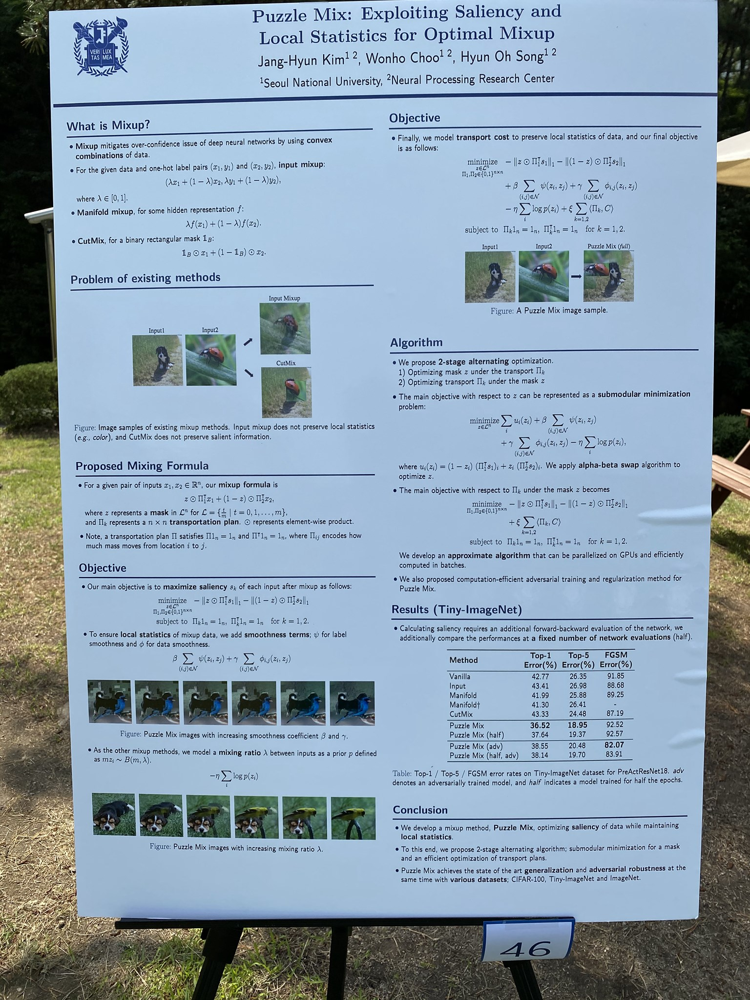
**이미지 캡션:** 이 포스터는 "퍼즐 믹스: 최적의 믹스업을 위한 특징 saliency 및 지역 통계 활용"이라는 제목의 연구를 소개하며, 서울대학교와 뉴럴 프로세싱 연구 센터의 연구자들이 작성했습니다. 포스터는 믹스업 방법론, 기존 방법의 문제점, 제안된 믹스업 공식, 알고리즘, 그리고 Tiny-ImageNet 데이터셋에서의 실험 결과 및 결론을 다룹니다. 포스터의 왼쪽 상단에는 "What is Mixup?" 섹션이 있으며, 믹스업이 딥러닝 모델의 과신 문제를 완화하기 위해 데이터의 볼록 조합을 사용한다고 설명합니다. 또한, 데이터 쌍에 대한 입력 믹스업, 은닉 표현에서의 매니폴드 믹스업, 이진 직사각형 마스크를 사용하는 컷믹스에 대한 수식과 설명을 제공합니다. 그 아래에는 기존 방법의 문제점을 보여주는 이미지 샘플이 있는데, 입력 믹스업은 지역 통계를 보존하지 못하고 컷믹스는 특징 정보를 보존하지 못함을 시각적으로 보여줍니다. 중앙에는 "Objective" 섹션이 있으며, 연구의 최종 목표는 데이터의 지역 통계를 보존하면서 믹스업 후 각 입력의 특징 saliency를 최대화하는 것이라고 명시합니다. 이를 위한 수식과 함께, 믹스업 데이터의 지역 통계를 보장하기 위해 레이블 평활도와 데이터 평활도를 위한 항을 추가한다고 설명합니다. 또한, 믹스업 비율을 사전 확률 p로 모델링하는 방법과 관련된 수식도 제시합니다. 이 섹션에는 믹스업 비율이 증가함에 따라 변화하는 이미지 샘플도 포함되어 있습니다. 오른쪽 상단에는 "Objective" 섹션이 있으며, 연구의 최종 목표는 데이터의 지역 통계를 보존하면서 믹스업 후 각 입력의 특징 saliency를 최대화하는 것이라고 명시합니다. 이를 위한 수식과 함께, 믹스업 데이터의 지역 통계를 보장하기 위해 레이블 평활도와 데이터 평활도를 위한 항을 추가한다고 설명합니다. 또한, 믹스업 비율을 사전 확률 p로 모델링하는 방법과 관련된 수식도 제시합니다. 이 섹션에는 믹스업 비율이 증가함에 따라 변화하는 이미지 샘플도 포함되어 있습니다. 그 아래 "Algorithm" 섹션에서는 2단계 교대 최적화를 제안하며, 마스크 최적화와 전송 계획 최적화를 설명합니다. 마스크에 대한 주요 목적 함수는 부분적으로 최소화 문제로 표현되며, 이를 해결하기 위해 알파-베타 스왑 알고리즘을 적용한다고 합니다. 또한, GPU 병렬 처리가 가능한 근사 알고리즘과 계산 효율적인 적대적 학습 및
 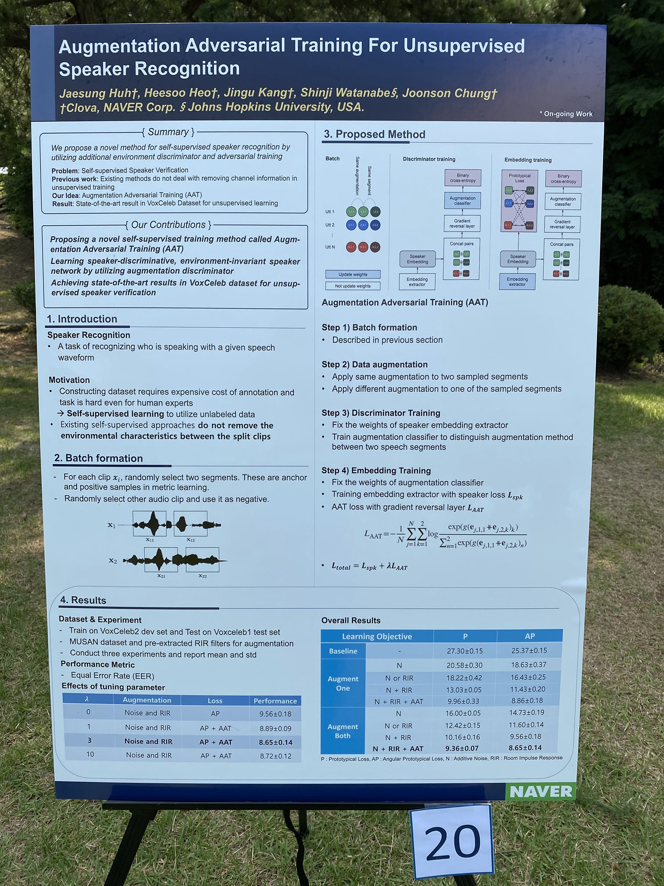
**이미지 캡션:** 이 포스터는 "Augmentation Adversarial Training For Unsupervised Speaker Recognition"이라는 주제로, 음성 인식 분야의 연구 결과를 발표하고 있습니다. 포스터 중앙에는 연구의 핵심 방법론인 "Augmentation Adversarial Training (AAT)"의 흐름을 보여주는 도식과 함께, 실험 결과 및 성능 지표를 담은 표가 배치되어 있습니다. 포스터 상단에는 연구를 수행한 연구자들의 이름과 소속이 명시되어 있으며, 하단에는 연구 결과의 일부로 보이는 숫자 "20"이 크게 표시되어 있습니다. 전반적으로 학술적인 내용을 담고 있으며, 연구 발표회나 학회에서 사용될 것으로 보입니다.
 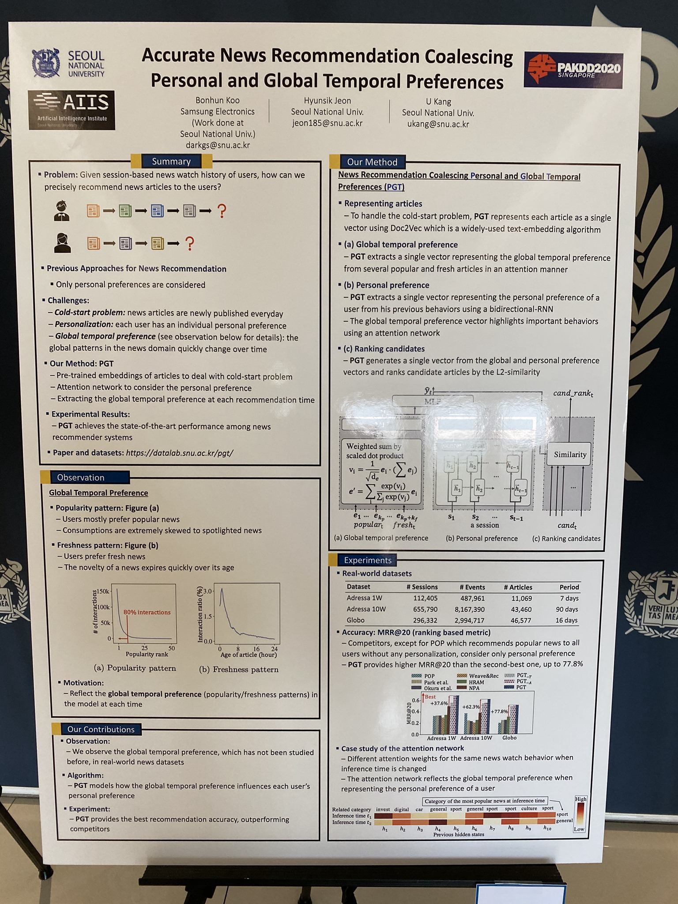
**이미지 캡션:** 이 포스터는 서울대학교 AIIS 연구실에서 진행한 "Accurate News Recommendation Coalescing Personal and Global Temporal Preferences"라는 제목의 연구를 소개하고 있습니다. 포스터의 주요 내용은 다음과 같습니다. **사람:** *   **연구자:** Bonhun Koo, Hyunsik Jeon, U Kang (서울대학교 소속, 각자의 이메일 주소와 소속이 명시되어 있음) *   **사용자:** 뉴스 추천 시스템의 대상이 되는 일반 사용자들 **장소/배경:** *   **주요 장소:** 서울대학교 (Seoul National University) *   **행사:** PAKDD 2020 SINGAPORE (포스터 상단에 로고와 행사명이 명시되어 있음) *   **배경:** 연구 발표 포스터가 전시된 학술 행사장의 모습으로 추정됨. **사물:** *   **포스터:** 연구 내용을 담고 있는 대형 인쇄물. *   **그래프 및 다이어그램:** 연구 방법론, 실험 결과, 관찰 내용을 시각적으로 보여주는 다양한 그래프와 수식, 도식들이 포함되어 있습니다. *   "Summary" 섹션의 아이콘들 (사람, 뉴스 기사, 화살표, 물음표) *   "Observation" 섹션의 두 개의 그래프: (a) Popularity pattern (인기도 순위별 상호작용 수), (b) Freshness pattern (기사 나이별 상호작용 비율) *   "Our Method" 섹션의 수식 및 도식: Global temporal preference, Personal preference, Ranking candidates를 나타내는 도식과 수식. *   "Experiments" 섹션의 표: Real-world datasets 정보 (Dataset, #Sessions, #Events, #Articles, Period) *   "Experiments" 섹션의 막대그래프: MRR@20 (ranking based metric) 비교 결과. *   "Case study of the attention network" 섹션의 히트맵 형태 그래프: 관련 카테고리별, 추론 시간별 인기도를 보여줌. *   **로고:** 서울대학교 로고, AIIS 로고, PAKDD 2020 로고, Veritas Lux Mea 로고 (포스터 하단). **보이는 텍스트:** *   연구 제목: "Accurate News Recommendation Coalescing Personal and Global Temporal Preferences" *   연구자 정보: 이름, 소속, 이메일 주소 *   섹션 제목: Summary, Our Method, Observation, Our Contributions, Experiments *   각 섹션별 상세 설명: 문제 정의, 기존 연구, 도전 과제, 제안 방법론, 실험 결과, 기여점 등 *   그래프 및 표
 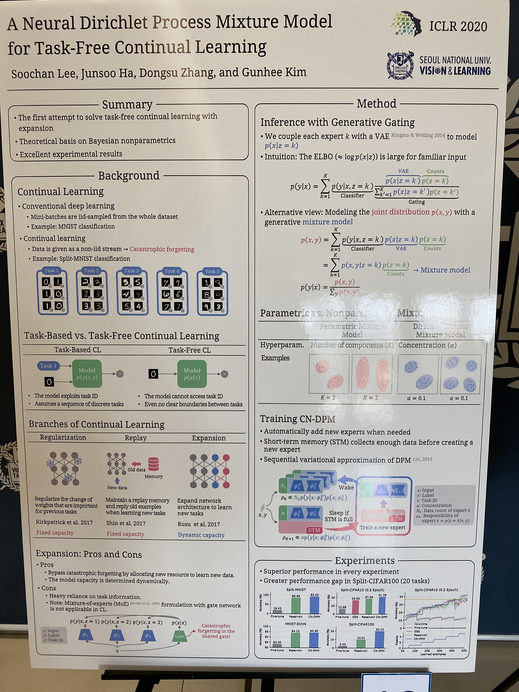
**이미지 캡션:** 이 포스터는 "A Neural Dirichlet Process Mixture Model for Task-Free Continual Learning"이라는 제목의 연구를 소개하며, Soochun Lee, Junsoo Ha, Dongsu Zhang, Gunhee Kim이 저자입니다. ICLR 2020에서 발표되었으며 서울대학교 비전 및 학습 연구실에서 진행되었습니다. 포스터는 연구의 요약, 배경, 방법론, 그리고 실험 결과를 포함합니다. 요약 부분에서는 이 연구가 Task-Free Continual Learning을 해결하기 위한 최초의 시도이며, 베이지안 비모수성에 기반하고 우수한 실험 결과를 얻었다고 설명합니다. 배경 부분에서는 기존의 Continual Learning 방식과 Task-Free Continual Learning의 차이점을 설명하며, Task-Free 방식은 데이터 스트림이 비독립적일 때 발생하는 치명적인 망각 문제를 해결하는 데 초점을 맞춥니다. 방법론 부분에서는 Generative Gating을 이용한 추론 방식과 Task-Free Continual Learning을 위한 신경망 모델인 CN-DPM의 훈련 과정을 설명합니다. 또한, Task-Based CL과 Task-Free CL의 비교, Continual Learning의 다양한 분기(정규화, 재현, 확장)를 그림과 함께 제시합니다. 마지막으로, Task-Free Continual Learning의 장단점을 설명하고, Split-CIFAR100 및 MNIST 데이터셋에서의 실험 결과를 보여주며 제안된 모델의 우수한 성능을 입증합니다. 포스터 전반적으로 복잡한 수식과 도표가 포함되어 있으며, 연구의 핵심 아이디어와 결과를 시각적으로 전달하고 있습니다.
 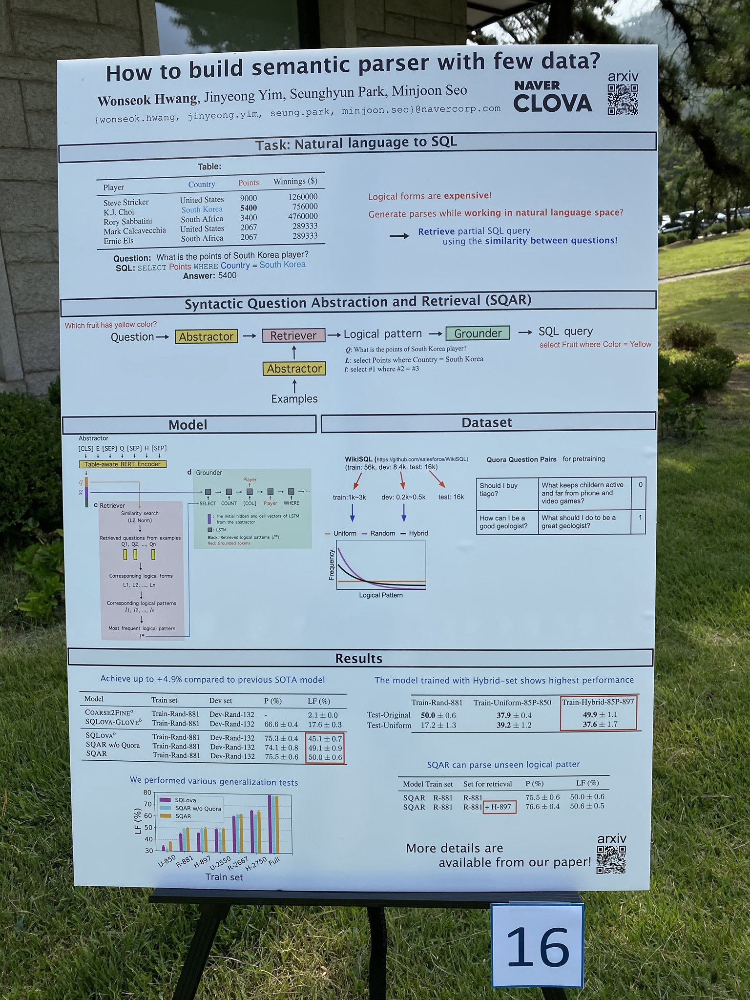
**이미지 캡션:** 이 포스터는 "How to build semantic parser with few data?"라는 제목으로, 소수의 데이터로도 의미론적 파서를 구축하는 방법을 다루고 있습니다. 포스터의 중앙에는 "Task: Natural language to SQL"이라는 섹션이 있으며, 테이블 형식의 데이터와 자연어 질문을 SQL 쿼리로 변환하는 예시가 제시되어 있습니다. 또한, "Syntactic Question Abstraction and Retrieval (SQAR)"이라는 핵심 방법론을 설명하는 다이어그램이 있습니다. 이 다이어그램은 질문을 추상화하고, 검색하며, 논리적 패턴을 생성하고, 이를 기반으로 SQL 쿼리를 생성하는 과정을 시각적으로 보여줍니다. 포스터의 하단에는 "Results" 섹션이 있어, 제안된 모델의 성능을 이전 SOTA 모델과 비교하고, 일반화 테스트 결과를 그래프로 제시합니다. 마지막으로, "SQAR can parse unseen logical patter"라는 섹션에서는 모델이 학습 데이터에 없는 논리적 패턴도 처리할 수 있음을 보여줍니다. 포스터 전반적으로 흰색 배경에 파란색, 회색, 주황색 등의 색상을 사용하여 정보를 명확하게 전달하고 있으며, 연구의 핵심 내용과 결과를 효과적으로 요약하고 있습니다.
 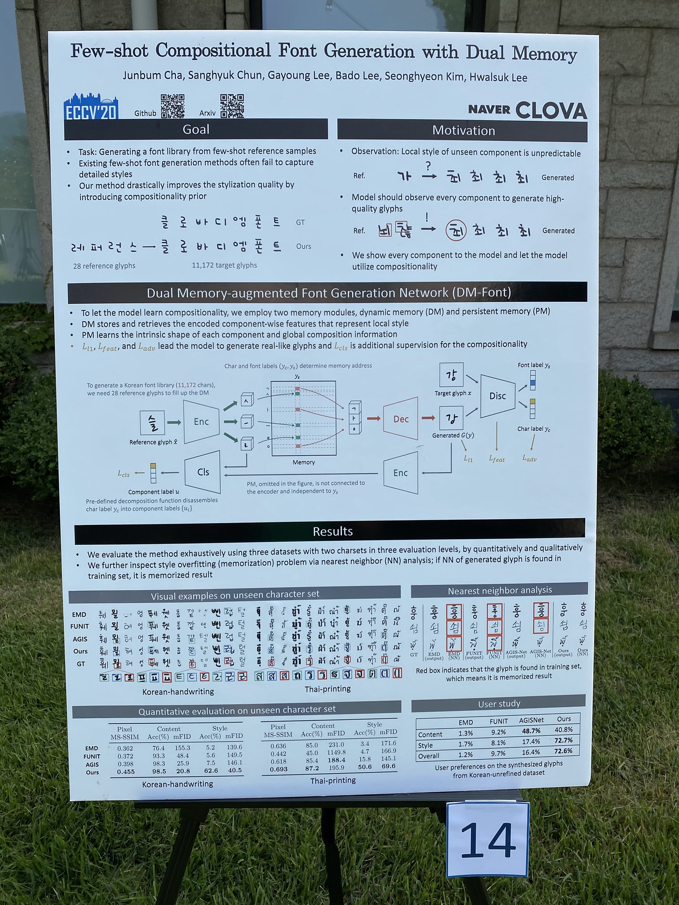
**이미지 캡션:** 이 포스터는 "Few-shot Compositional Font Generation with Dual Memory"라는 제목의 연구를 소개하며, ECCV 2020에 발표된 논문임을 알 수 있습니다. 연구는 Junbum Cha, Sanghyuk Chun, Gayoung Lee, Bado Lee, Seonghyeon Kim, Hwalsuk Lee가 진행했으며, NAVER CLOVA에서 후원했습니다. 포스터의 주요 내용은 다음과 같습니다. **목표 (Goal):** 기존의 few-shot 폰트 생성 방법은 적은 수의 참조 샘플만으로 폰트 라이브러리를 생성할 때 세부적인 스타일을 포착하는 데 어려움이 있었습니다. 이 연구는 "듀얼 메모리 증강 폰트 생성 네트워크(DM-Font)"를 통해 이러한 한계를 극복하고, 구성성(compositionality) 개념을 도입하여 스타일 품질을 획기적으로 향상시키는 것을 목표로 합니다. **동기 (Motivation):** 관찰 결과, 보이지 않는 구성 요소의 지역적 스타일은 예측하기 어렵다는 점이 발견되었습니다. 따라서 모델이 모든 구성 요소를 관찰하여 고품질의 글리프를 생성하도록 해야 합니다. 이 연구는 모든 구성 요소를 모델에 보여주고 모델이 구성성을 활용하도록 합니다. **듀얼 메모리 증강 폰트 생성 네트워크 (DM-Font):** 이 네트워크는 동적 메모리(DM)와 영구 메모리(PM)라는 두 가지 메모리 모듈을 사용하여 구성성을 학습합니다. DM은 지역 스타일을 나타내는 인코딩된 구성 요소별 특징을 저장하고 검색하며, PM은 각 구성 요소의 고유한 모양과 전역 구성 정보를 학습합니다. L11, Lfeat, Lady 항은 실제와 같은 글리프를 생성하도록 유도하며, Lcls 항은 구성성에 대한 추가적인 감독 역할을 합니다. **결과 (Results):** 연구는 세 가지 데이터셋과 두 가지 문자 세트에서 세 가지 평가 수준으로 방법을 정량적, 정성적으로 평가했습니다. 또한, 생성된 글리프의 최근접 이웃(NN)이 훈련 세트에 포함되어 있다면 스타일 과적합(암기) 문제가 발생했음을 나타내는 빨간색 상자로 표시된 시각적 예시를 통해 스타일 과적합 문제를 검사했습니다. 사용자 연구 결과, 제안된 방법이 기존 방법보다 훨씬 우수한 사용자 선호도를 보였습니다. **시각적 요소:** 포스터에는 연구의 핵심 아이디어를 설명하는 다이어그램, 한국어 및 태국어 글리프의 시각적 비교 결과, 정량적 평가 표, 사용자 연구 결과 표 등이 포함되어 있습니다. 또한, ECCV 2020 로고와 NAVER CLOVA 로고가 보입니다. **전반
 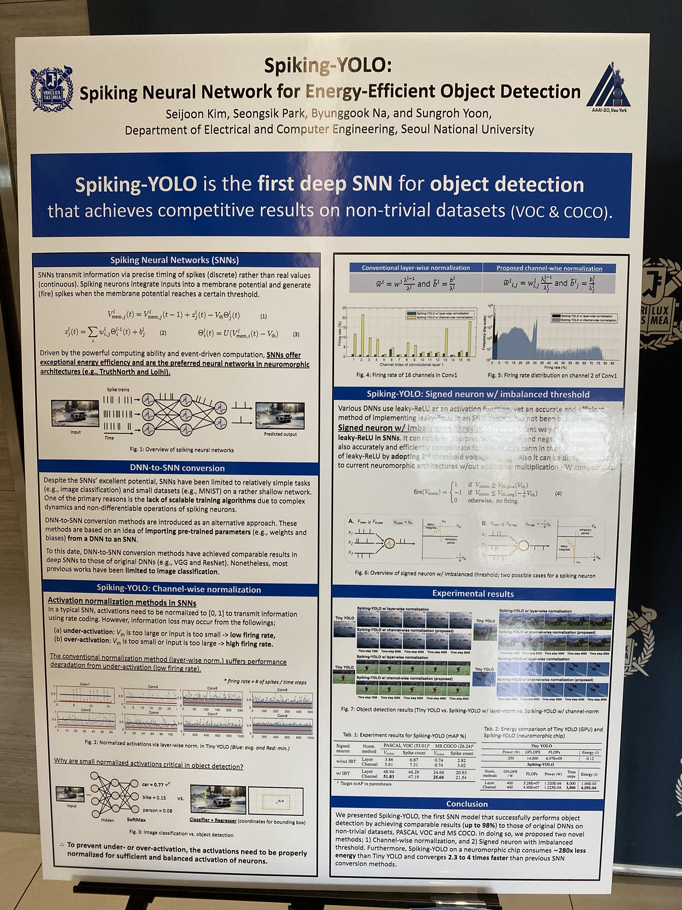
**이미지 캡션:** 이 포스터는 "Spiking-YOLO: Energy-Efficient Object Detection을 위한 스파이킹 신경망"이라는 제목의 연구를 소개하고 있으며, 여러 명의 성인 남성 연구원들이 참여했습니다. 포스터는 스파이킹 신경망(SNN)의 기본 원리, 기존 딥러닝 모델에서 SNN으로의 변환 방법, 그리고 제안된 Spiking-YOLO 모델의 특징 및 실험 결과를 설명합니다. 배경은 흰색이며, 연구 기관의 로고와 학회 정보가 포함되어 있습니다. 포스터의 주요 내용은 스파이킹 신경망을 사용하여 객체 탐지 성능을 높이고 에너지 효율성을 개선하는 방법을 제시하는 것입니다. 여러 개의 그래프, 표, 수식, 그리고 도식화된 신경망 구조가 포함되어 있어 연구의 기술적인 측면을 시각적으로 보여줍니다. 전반적으로 학술적인 분위기를 띠고 있으며, 객체 탐지 분야의 새로운 접근 방식을 제시하는 연구 발표 자료입니다.
 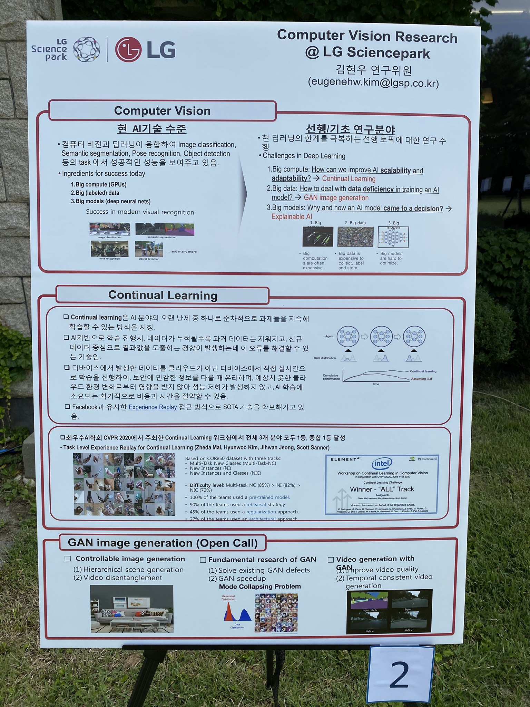
**이미지 캡션:** 이 사진은 LG 사이언스파크에서 진행된 컴퓨터 비전 연구에 대한 포스터이다. 포스터는 크게 세 부분으로 나뉘어 있으며, 각 부분은 컴퓨터 비전의 현재 기술 수준, 선행/기초 연구 분야, 그리고 지속 학습(Continual Learning)과 GAN 이미지 생성에 대한 내용을 담고 있다. **사람:** 포스터에는 직접적인 인물 사진은 없으나, 연구 책임자 김현우 연구위원의 이름과 이메일 주소가 명시되어 있다. **장소/배경:** LG 사이언스파크의 로고와 함께 컴퓨터 비전 연구에 대한 내용이 한국어로 작성되어 있다. 배경은 흰색과 회색 톤으로 깔끔하게 디자인되었으며, 각 섹션은 구분선을 통해 명확하게 나뉘어 있다. **사물:** 포스터에는 다양한 시각화 자료가 포함되어 있다. 컴퓨터 비전의 현재 기술 수준을 설명하는 부분에는 이미지 분류, 의미론적 분할, 자세 인식, 객체 탐지 등의 예시 이미지가 작게 삽입되어 있다. 지속 학습 부분에는 AI 모델의 학습 과정을 나타내는 다이어그램과 그래프가 있으며, GAN 이미지 생성 부분에는 생성된 이미지 샘플과 관련 다이어그램이 포함되어 있다. 또한, 인텔(Intel)과 엘리먼트 AI(Element AI)의 로고가 보인다. **보이는 텍스트:** 포스터에는 "LG Science park", "LG", "Computer Vision Research @ LG Sciencepark", "김현우 연구위원", "Computer Vision", "현 AI기술 수준", "선행/기초 연구분야", "Continual Learning", "GAN image generation (Open Call)" 등의 제목과 설명이 한국어로 작성되어 있다. 각 섹션별로 구체적인 연구 내용, 목표, 방법론 등이 상세히 기술되어 있다. **분위기/상황:** 포스터는 전반적으로 전문적이고 학술적인 분위기를 풍긴다. LG의 첨단 연구 역량을 보여주는 동시에, 컴퓨터 비전 분야의 최신 연구 동향과 미래 방향을 제시하고 있다. 특히, 지속 학습과 GAN 이미지 생성이라는 두 가지 핵심 연구 주제에 대한 깊이 있는 내용을 담고 있어, 관련 분야 전문가나 연구자들에게 유용한 정보를 제공할 것으로 보인다.
 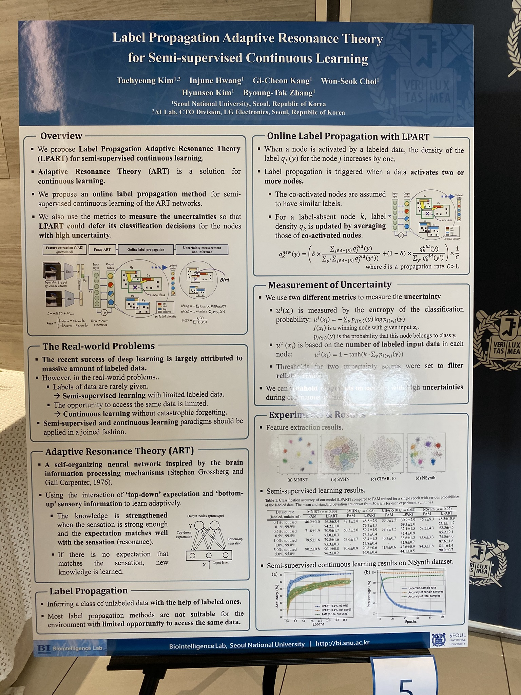
**이미지 캡션:** 이 포스터는 "레이블 전파 적응 공명 이론을 이용한 준지도 연속 학습"이라는 주제를 다루고 있으며, 여러 명의 연구자들이 참여한 것으로 보인다. 포스터는 흰색 배경에 파란색과 검은색 글씨로 구성되어 있으며, 여러 섹션으로 나누어져 있다. **사람:** 포스터에는 연구자들의 이름이 나열되어 있지만, 사진에 직접적으로 인물이 등장하지는 않는다. 이름은 "Taehyeong Kim", "Injune Hwang", "Gi-Cheon Kang", "Won-Seok Choi", "Hyunseo Kim", "Byoung-Tak Zhang" 등이며, 이들은 모두 성인 남성으로 추정된다. **장소/배경:** 포스터는 학술 발표회나 컨퍼런스에서 사용되는 것으로 보이며, 배경에는 "VERI LUX TAS MEA"라는 로고가 희미하게 보인다. 또한, "SEOUL NATIONAL UNIVERSITY"라는 문구와 로고가 있어 서울대학교에서 제작되었음을 알 수 있다. **사물:** 포스터에는 다양한 도표, 그래프, 수식, 그림 등이 포함되어 있다. 주요 사물로는 다음과 같은 것들이 있다. *   **개요 섹션:** 레이블 전파 적응 공명 이론(LPART)과 적응 공명 이론(ART)에 대한 설명과 함께, LPART의 작동 방식을 보여주는 다이어그램이 있다. 이 다이어그램에는 "Feature extraction (VAE)", "Fuzzy ART", "Online label propagation and Inference", "Uncertainty measurement and Inference", "Bird" 등의 구성 요소가 포함되어 있다. *   **온라인 레이블 전파 섹션:** 노드 활성화와 레이블 전파 과정을 설명하는 다이어그램과 수식이 있다. *   **불확실성 측정 섹션:** 불확실성을 측정하는 두 가지 지표에 대한 수식이 제시되어 있다. *   **실제 문제 섹션:** 딥러닝의 성공 요인과 준지도 학습의 한계점을 설명하고 있다. *   **적응 공명 이론(ART) 섹션:** ART의 개념을 설명하는 다이어그램이 있으며, "Output nodes (prototype)", "Top-down expectation", "Bottom-up sensation", "Input layer" 등의 용어가 사용되었다. *   **레이블 전파 섹션:** 레이블 전파의 개념과 기존 방법의 한계점을 설명하고 있다. *   **실험 결과 섹션:** *   **특징 추출 결과:** MNIST, SVHN, CIFAR-10, NSynth 데이터셋에 대한 특징 추출 결과를 보여주는 4개의 산점도 그래프가 있다. 각 그래프는 점들이 군집을 이루는 모습을 보여준다. *   **준지도
 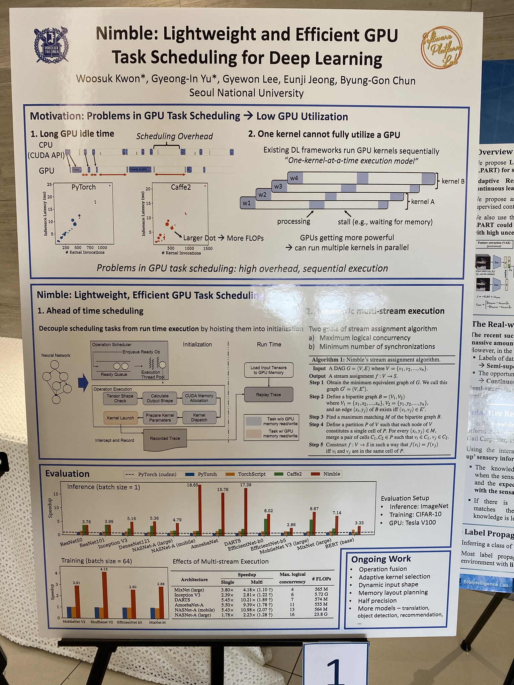
**이미지 캡션:** 이 포스터는 "Nimble: Lightweight and Efficient GPU Task Scheduling for Deep Learning"이라는 제목의 연구를 소개하며, 딥러닝 작업 스케줄링의 효율성을 높여 GPU 활용도를 개선하는 방법을 제시합니다. 포스터는 서울대학교의 Woosuk Kwon 외 4명의 연구진이 작성했습니다. 포스터의 상단에는 연구의 동기가 제시되어 있습니다. 첫 번째 동기는 "Long GPU idle time"으로, GPU가 작업 실행을 기다리며 유휴 상태로 있는 시간을 줄여야 함을 보여줍니다. 두 번째 동기는 "One kernel cannot fully utilize a GPU"로, 기존 딥러닝 프레임워크가 GPU 커널을 순차적으로 실행하여 GPU의 잠재력을 완전히 활용하지 못하는 문제를 지적합니다. 포스터의 중간 부분에는 연구에서 제안하는 "Nimble: Lightweight, Efficient GPU Task Scheduling" 방법론이 설명되어 있습니다. "Ahead of time scheduling"과 "Automatic multi-stream execution"이라는 두 가지 주요 기법을 통해 스케줄링 작업을 런타임 실행에서 분리하고, 여러 스트림을 동시에 실행하여 GPU 활용도를 높입니다. 하단에는 연구 결과를 보여주는 "Evaluation" 섹션이 있습니다. "Inference (batch size = 1)"과 "Training (batch size = 64)"에 대한 속도 향상 그래프가 제시되어 있으며, Nimble 방법론이 PyTorch, TorchScript, Caffe2와 비교하여 우수한 성능을 보임을 나타냅니다. 또한, "Effects of Multi-stream Execution" 표는 다양한 아키텍처에서 Nimble이 속도 향상, 최대 논리적 동시성, FLOPs 측면에서 개선된 결과를 보여줍니다. 포스터의 우측에는 "Overview", "The Real-world", "Label Propagation"과 같은 관련 연구 또는 배경 정보가 간략하게 언급되어 있으며, "Ongoing Work" 섹션에서는 향후 연구 방향으로 Operation fusion, Adaptive kernel selection, Dynamic input shape 등이 제시되어 있습니다. 전반적으로 포스터는 딥러닝 작업 스케줄링의 문제점을 명확히 제시하고, Nimble이라는 새로운 방법론을 통해 이를 해결하려는 연구의 핵심 내용을 시각적으로 잘 전달하고 있습니다. 그래프와 표는 연구 결과를 효과적으로 보여주며, 텍스트는 간결하고 명확하게 작성되어 있습니다. 포스터의 분위기는 학술적이고 정보 전달에 초점을 맞추고 있습니다.
 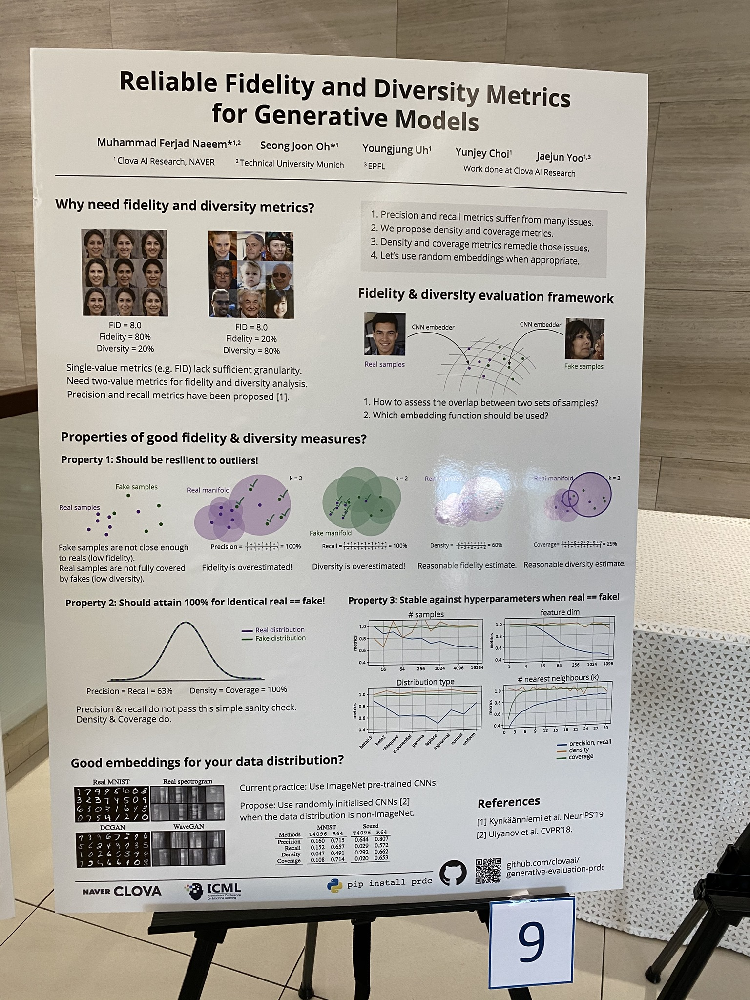
**이미지 캡션:** 이 포스터는 생성 모델을 위한 신뢰할 수 있는 충실도 및 다양성 메트릭에 대한 연구를 발표합니다. 포스터의 제목은 "Reliable Fidelity and Diversity Metrics for Generative Models"이며, 여러 연구원들의 이름과 소속이 나열되어 있습니다. 포스터는 왜 충실도와 다양성 메트릭이 필요한지, 좋은 메트릭의 속성은 무엇인지, 그리고 데이터 분포를 위한 좋은 임베딩은 무엇인지에 대한 질문을 던집니다. 충실도 및 다양성 평가 프레임워크를 보여주는 다이어그램과 함께 여러 그래프와 표가 제시되어 있습니다. 또한, 연구에서 사용된 방법론과 결과에 대한 요약도 포함되어 있습니다. 포스터 하단에는 연구의 참고 문헌, GitHub 저장소 링크, 그리고 "pip install prdc"라는 명령어가 표시되어 있습니다. 전반적으로 이 포스터는 생성 모델의 성능을 평가하기 위한 새로운 메트릭을 제안하고 그 유효성을 입증하는 것을 목표로 하는 학술 연구 발표입니다.
 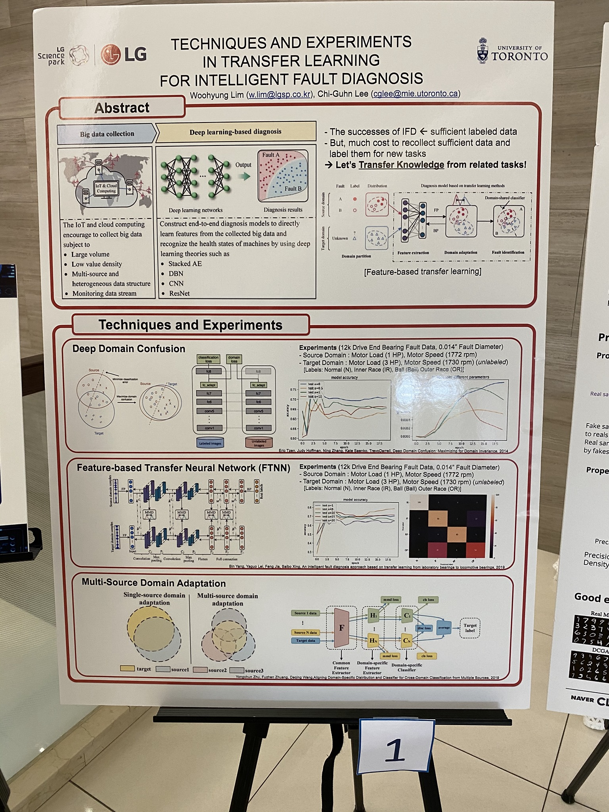
**이미지 캡션:** 이 포스터는 LG 과학 공원과 토론토 대학교의 로고가 있으며, "지능형 고장 진단을 위한 전이 학습 기법 및 실험"이라는 제목으로 구성되어 있습니다. 포스터는 크게 세 부분으로 나뉩니다. 첫 번째 부분인 "초록"에서는 빅데이터 수집과 딥러닝 기반 진단에 대해 설명하며, IoT 및 클라우드 컴퓨팅이 빅데이터 수집을 촉진하고 딥러닝 네트워크가 데이터를 직접 학습하여 기계 건강 상태를 인식하는 과정을 도식화했습니다. 또한, IFD(지능형 고장 진단)의 성공과 레이블링 비용 문제를 언급하며 관련 작업에서 지식을 전이하는 방법을 제안합니다. 두 번째 부분인 "기법 및 실험"에서는 딥 도메인 혼란, 특징 기반 전이 신경망(FTNN), 다중 소스 도메인 적응의 세 가지 주요 기법을 소개합니다. 각 기법은 복잡한 도식과 그래프로 설명되어 있으며, 특히 FTNN과 다중 소스 도메인 적응 부분에서는 구체적인 실험 결과와 모델 구조를 보여줍니다. 실험 내용은 12k 드라이브 엔드 베어링 고장 데이터에 대한 것이며, 다양한 모터 부하 및 속도 조건에서의 성능을 비교합니다. 세 번째 부분은 포스터의 오른쪽 가장자리에 위치하며, "프로젝트", "정확도", "밀도", "좋은 예"와 같은 키워드와 함께 일부 텍스트와 숫자가 포함되어 있습니다. 포스터 전반적으로 흰색 배경에 파란색과 주황색 계열의 색상을 사용하여 전문적이고 학술적인 분위기를 연출하고 있으며, 복잡한 도식과 그래프를 통해 연구 내용을 효과적으로 전달하고 있습니다. 포스터 하단에는 "1"이라고 적힌 파란색 표지판이 보입니다.
 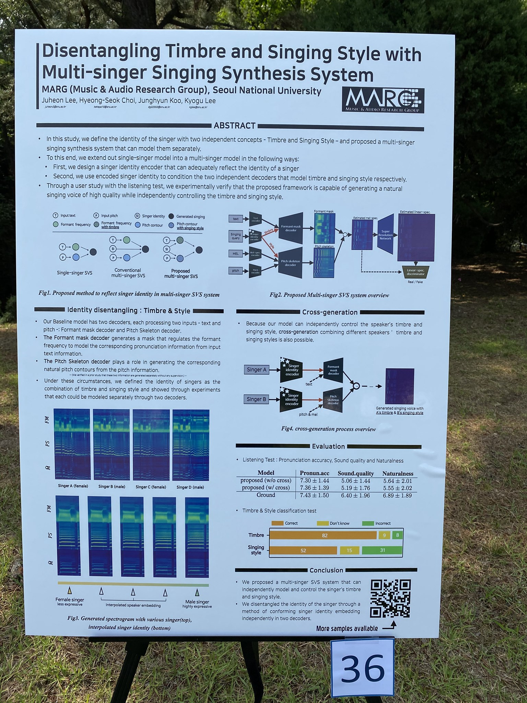
**이미지 캡션:** 이 사진은 "Disentangling Timbre and Singing Style with Multi-singer Singing Synthesis System"이라는 제목의 학술 포스터를 보여줍니다. 포스터는 한국어로 작성되었으며, 음악 및 오디오 연구 그룹(MARG)에서 제작했습니다. 포스터에는 연구의 목적, 방법론, 결과 및 결론이 요약되어 있습니다. 포스터의 주요 내용은 다음과 같습니다. *   **연구 목적**: 두 가지 독립적인 개념인 음색(Timbre)과 노래 스타일(Singing Style)을 분리하여 다중 가수 노래 합성 시스템을 제안합니다. *   **방법론**: 단일 가수 모델을 확장하여 다중 가수 모델을 만들고, 가수의 음색과 노래 스타일을 각각 독립적으로 모델링하는 두 개의 디코더를 사용합니다. 또한, 사용자 연구를 통해 제안된 프레임워크가 음색과 노래 스타일을 독립적으로 제어하면서 자연스러운 고품질 노래를 생성할 수 있음을 검증합니다. *   **결과**: 포스터에는 제안된 시스템의 개요, 생성된 스펙트로그램, 그리고 청취 테스트 및 음색/스타일 분류 테스트 결과가 포함되어 있습니다. 특히, 제안된 모델이 기존 모델 및 실제 데이터(Ground)와 비교했을 때 우수한 성능을 보임을 나타냅니다. *   **결론**: 제안된 다중 가수 노래 합성 시스템은 가수의 음색과 노래 스타일을 독립적으로 모델링하고 제어할 수 있으며, 이를 통해 가수의 정체성을 분리할 수 있음을 확인했습니다. 포스터에는 여러 개의 그림과 표가 포함되어 있습니다. *   **Fig1. Proposed method to reflect singer identity in multi-singer SVS system**: 단일 가수 SVS 시스템에서 가수의 정체성을 반영하는 방법을 보여줍니다. *   **Fig2. Proposed Multi-singer SVS system overview**: 제안된 다중 가수 SVS 시스템의 개요를 보여주는 블록 다이어그램입니다. *   **Fig3. Generated spectrogram with various singer(top), interpolated singer identity (bottom)**: 다양한 가수(상단)와 보간된 가수의 정체성(하단)으로 생성된 스펙트로그램을 보여줍니다. *   **Fig4. cross-generation process overview**: 음색과 노래 스타일을 교차 생성하는 과정을 보여줍니다. *   **Evaluation**: 청취 테스트 결과(발음 정확도, 음질, 자연스러움)와 음색 및 스타일 분류 테스트 결과를 보여주는 표입니다. *   **Conclusion**: 연구의 주요 결론을 요약하고 QR 코드를 통해 더 많은 샘플을 확인할 수 있음을 안내합니다. 포스터의 배경은 야외에서 촬영된 것으로 보이며, 녹색 식물과 나무가 흐릿하게 보입니다.
 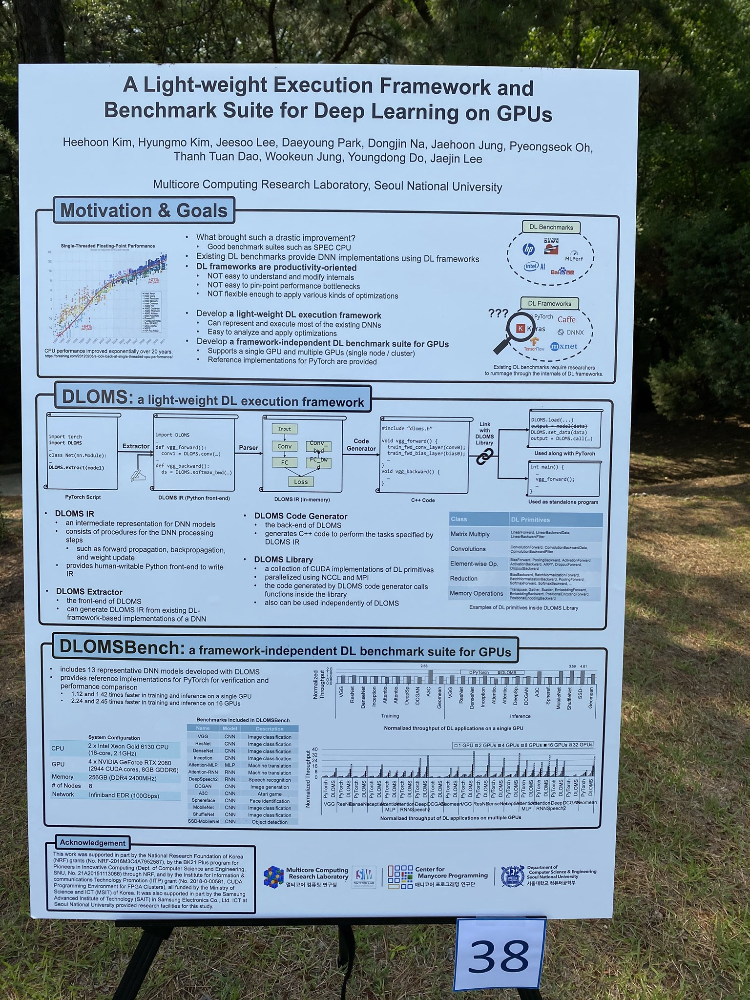
**이미지 캡션:** 이 포스터는 딥러닝 모델을 GPU에서 실행하기 위한 경량 실행 프레임워크와 벤치마크 스위트에 대한 연구를 설명합니다. 포스터의 제목은 "A Light-weight Execution Framework and Benchmark Suite for Deep Learning on GPUs"이며, 여러 명의 저자가 서울대학교 멀티코어 컴퓨팅 연구실 소속으로 기재되어 있습니다. 포스터는 크게 세 부분으로 나뉩니다. 첫 번째 부분은 "Motivation & Goals"로, 기존 딥러닝 프레임워크의 문제점과 연구의 목표를 설명합니다. 두 번째 부분은 "DLOMS: a light-weight DL execution framework"로, 제안하는 DLOMS 프레임워크의 구조와 기능을 상세히 설명합니다. 세 번째 부분은 "DLOMSBench: a framework-independent DL benchmark suite for GPUs"로, DLOMS를 기반으로 구축된 벤치마크 스위트에 대해 설명하며, 시스템 구성, 포함된 벤치마크, 그리고 성능 결과를 그래프로 보여줍니다. 마지막으로 "Acknowledgement" 섹션에서는 연구 지원 기관에 대한 감사를 표하고 있습니다. 포스터 전반적으로 흰색 배경에 검은색 글씨와 파란색, 녹색 등의 색상을 사용하여 정보를 명확하게 전달하고 있으며, 다양한 다이어그램과 그래프를 포함하여 이해를 돕고 있습니다.
 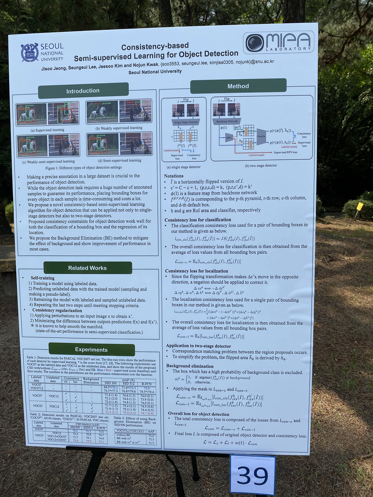
**이미지 캡션:** 이 포스터는 서울대학교에서 개발한 "일관성 기반 반지도 학습 객체 탐지"에 대한 연구를 소개합니다. 포스터의 상단에는 서울대학교와 MIFA 연구실 로고가 있으며, 연구 제목과 연구진의 이름, 소속이 명시되어 있습니다. 포스터는 크게 소개, 방법, 관련 연구, 실험, 그리고 결과로 구성되어 있습니다. 소개 섹션에서는 객체 탐지에서 정확한 주석의 중요성과 대규모 데이터셋 구축의 어려움을 설명하며, 제안하는 일관성 기반 반지도 학습 알고리즘이 단일 스테이지 및 이중 스테이지 탐지기 모두에 적용 가능함을 강조합니다. 또한, 제안하는 일관성 제약 조건이 바운딩 박스의 분류 및 위치 회귀 모두에 효과적이며, 배경 제거(BE) 방법을 통해 성능 향상을 이끌어낸다고 설명합니다. 이 섹션에는 네 가지 객체 탐지 설정 유형을 보여주는 그림이 포함되어 있습니다. 방법 섹션에서는 단일 스테이지 탐지기와 이중 스테이지 탐지기의 구조를 도식화하여 보여줍니다. 또한, 연구에서 사용되는 표기법을 정의하고, 분류 및 위치 결정에 대한 일관성 손실 함수를 수식으로 제시합니다. 특히, 이중 스테이지 탐지기의 경우 지역 제안 간의 대응 문제와 배경 제거 기법을 설명하며, 최종 손실 함수를 정의합니다. 관련 연구 섹션에서는 자기 학습(Self-training)과 일관성 정규화(Consistency regularization)라는 두 가지 주요 관련 연구 기법을 간략하게 설명합니다. 실험 섹션에서는 PASCAL VOC2007 및 COCO 데이터셋에 대한 탐지 결과 테이블을 제시하며, 제안된 방법의 성능을 기존 방법과 비교합니다. 특히, 배경 제거 기법의 효과를 보여주는 표도 포함되어 있습니다. 전반적으로 이 포스터는 객체 탐지 분야에서 반지도 학습의 효율성을 높이기 위한 새로운 접근 방식을 제시하고, 실험 결과를 통해 그 효과를 입증하는 학술적인 내용을 담고 있습니다. 포스터의 배경은 야외의 녹음이 우거진 곳으로 보이며, 포스터 하단에는 "39"라는 숫자가 크게 표시되어 있습니다.
 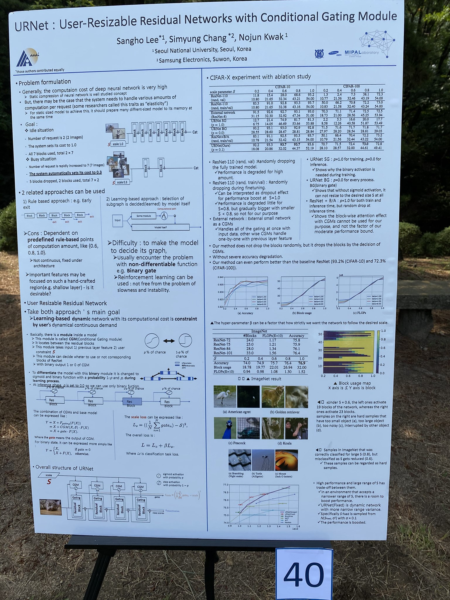
**이미지 캡션:** 이 포스터는 한국어로 된 연구 발표 자료로, URNet이라는 사용자 조절 가능한 잔차 신경망 모듈에 대한 내용을 담고 있습니다. 포스터의 중앙에는 URNet의 구조와 작동 방식을 설명하는 다이어그램이 있으며, 좌측에는 연구의 문제 제기, 목표, 관련 접근 방식, 그리고 URNet의 장점과 단점이 설명되어 있습니다. 우측 상단에는 CIFAR-10 및 CIFAR-100 데이터셋에 대한 실험 결과 표와 그래프가 제시되어 있으며, 우측 하단에는 ImageNet 데이터셋에 대한 실험 결과 이미지와 그래프가 포함되어 있습니다. 포스터의 전반적인 분위기는 학술적이고 정보 전달에 집중되어 있으며, 연구의 핵심 내용을 시각적으로 효과적으로 전달하려는 노력이 엿보입니다.
 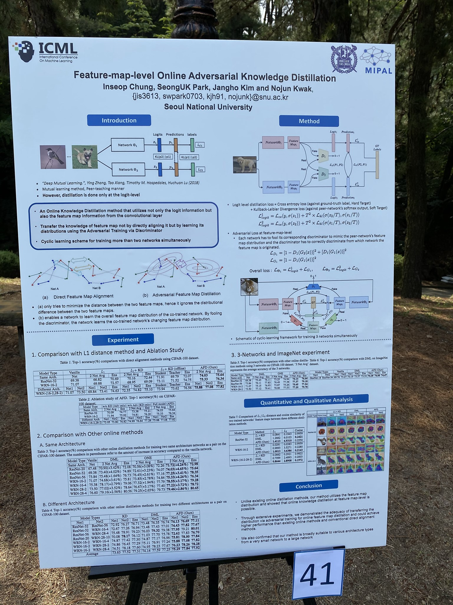
**이미지 캡션:** 이 포스터는 "Feature-map-level Online Adversarial Knowledge Distillation"이라는 주제로, 한국어로 된 제목과 저자 정보, 그리고 연구 내용을 담고 있습니다. 포스터는 여러 섹션으로 나뉘어 있으며, 각 섹션에는 설명 텍스트, 수식, 표, 그리고 도식화된 그림들이 포함되어 있습니다. **사람:** 포스터에는 저자들의 이름과 소속이 명시되어 있으며, 연구에 참여한 사람들을 나타냅니다. 구체적인 외모나 복장에 대한 정보는 없습니다. **장소/배경:** 포스터는 야외에서 촬영된 것으로 보이며, 배경에는 나무와 숲이 보입니다. 포스터 자체는 흰색 바탕에 검은색, 파란색, 빨간색 등의 글씨와 그림으로 구성되어 있습니다. **사물:** 포스터의 주요 사물은 연구 내용을 설명하는 텍스트, 수식, 표, 그리고 다양한 도식화된 그림들입니다. 또한, 포스터 상단에는 "ICML"과 "MIPAL"이라는 로고가 있습니다. **보이는 텍스트:** 포스터에는 "Feature-map-level Online Adversarial Knowledge Distillation", "Introduction", "Method", "Experiment", "Quantitative and Qualitative Analysis", "Conclusion" 등의 제목과 함께 연구 내용에 대한 상세한 설명이 한국어와 영어로 작성되어 있습니다. 또한, 저자들의 이름, 소속, 이메일 주소, 그리고 다양한 수식과 표에 포함된 데이터들이 보입니다. 포스터 하단에는 "41"이라는 숫자가 크게 쓰여 있습니다. **분위기/상황:** 포스터는 학술적인 내용을 다루고 있으며, 연구 결과를 발표하고 공유하는 학회나 세미나와 같은 상황에서 사용될 것으로 보입니다. 전반적으로 진지하고 전문적인 분위기를 풍깁니다.
 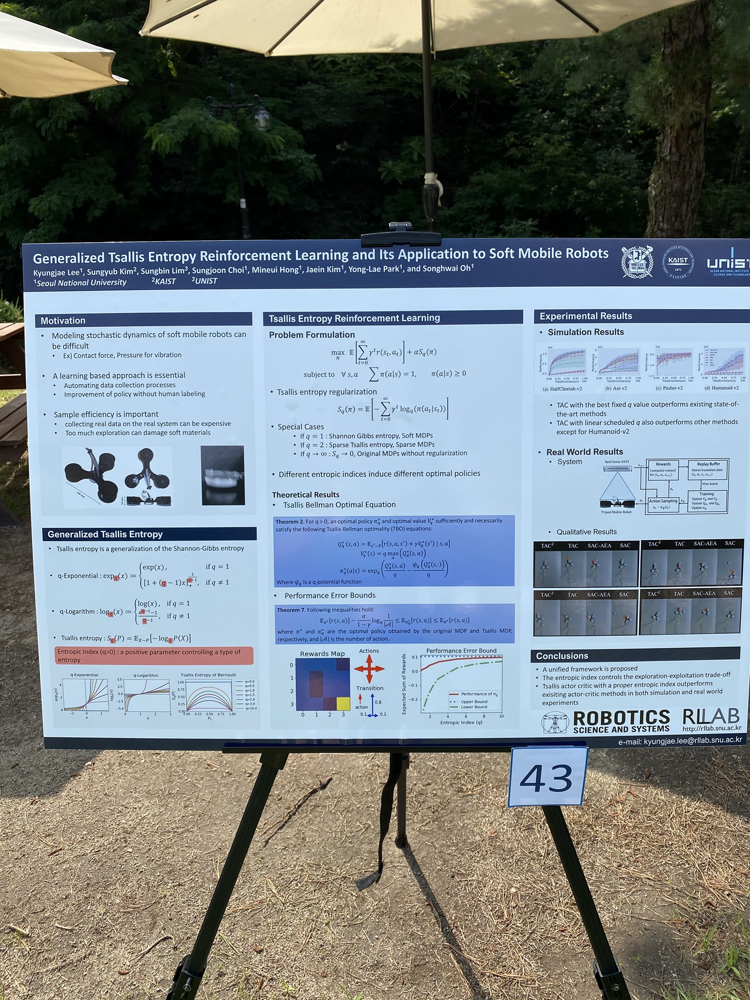
**이미지 캡션:** 이 사진은 야외에서 열린 학술 발표회에서 촬영된 것으로 보이며, 여러 개의 흰색 천막이 배경에 보이고 나무가 우거져 있습니다. 사진 중앙에는 "Generalized Tsallis Entropy Reinforcement Learning and Its Application to Soft Mobile Robots"라는 제목의 포스터가 삼각대 위에 거치되어 있습니다. 포스터는 여러 섹션으로 나뉘어 있으며, 각 섹션에는 수식, 그래프, 표, 그리고 텍스트 설명이 포함되어 있습니다. 포스터의 왼쪽 상단에는 "Motivation" 섹션이 있으며, 소프트 모바일 로봇의 동적 모델링의 어려움, 학습 기반 접근 방식의 중요성, 샘플 효율성의 중요성에 대해 설명하고 있습니다. 그 아래에는 "Generalized Tsallis Entropy" 섹션이 있으며, Tsallis 엔트로피의 정의와 q-Exponential, q-Logarithm, Tsallis 엔트로피 자체에 대한 수식이 제시되어 있습니다. 또한, 엔트로픽 인덱스(q>0)가 엔트로피 유형을 제어하는 매개변수임을 나타내는 그래프도 포함되어 있습니다. 포스터의 중앙 상단에는 "Tsallis Entropy Reinforcement Learning" 섹션이 있으며, 문제 공식화, Tsallis 엔트로피 정규화, 특별 사례, 그리고 이론적 결과가 설명되어 있습니다. 특히, Tsallis Bellman 최적 방정식과 성능 오차 경계에 대한 내용이 상세하게 기술되어 있습니다. 중앙 하단에는 "Rewards Map", "Actions", "Transition", "Performance Error Bound" 등의 시각 자료가 포함되어 있습니다. 포스터의 오른쪽 상단에는 "Experimental Results" 섹션이 있으며, 시뮬레이션 결과와 실제 세계 결과에 대한 내용이 담겨 있습니다. 시뮬레이션 결과 섹션에는 여러 그래프가 포함되어 있으며, "TAC with the best fixed q value outperforms existing state-of-the-art methods"와 같은 설명이 있습니다. 실제 세계 결과 섹션에는 시스템 구성도와 "Qualitative Results"라는 제목의 표가 있습니다. 포스터의 오른쪽 하단에는 "Conclusions" 섹션이 있으며, 제안된 통합 프레임워크, 엔트로픽 인덱스의 역할, 그리고 Tsallis 액터-크리틱 방법의 우수성에 대한 결론이 요약되어 있습니다. 그 아래에는 "ROBOTICS RILAB SCIENCE AND SYSTEMS"라는 로고와 함께 웹사이트 주소 및 이메일 주소가 기재되어 있습니다. 포스터 하단에는 "43"이라는 숫자가 적힌 파란색 표지판이 보입니다. 전반적으로 포스터는 학술적인 내용을 담고 있으며, 연구의 동기, 방법론, 결과, 그리고 결론을 체계적으로 전달하고 있습니다. 사진 속 인물은 보이지 않으며, 포스터 자체에 집중된 모습입니다. 분위기는
 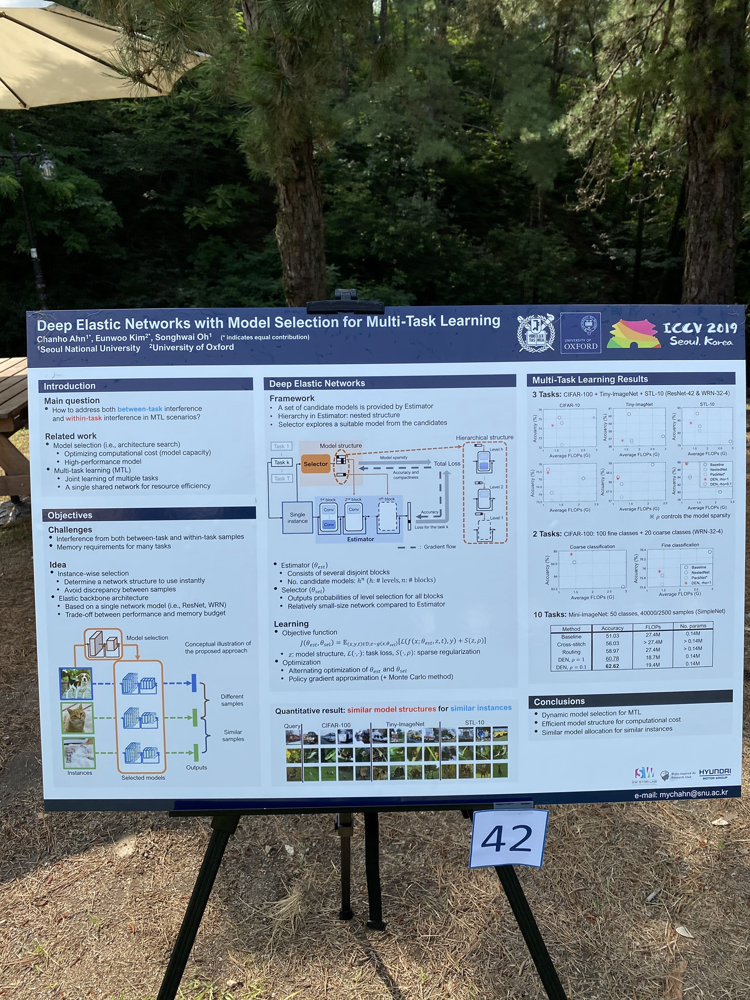
**이미지 캡션:** 이 사진은 야외에서 촬영된 학술 포스터로, "Deep Elastic Networks with Model Selection for Multi-Task Learning"이라는 제목의 연구 내용을 담고 있습니다. 포스터는 여러 섹션으로 나뉘어 있으며, 연구의 배경, 방법론, 결과 및 결론을 설명합니다. 포스터의 상단에는 연구 제목과 저자 정보, 그리고 소속 대학(서울대학교, 옥스퍼드 대학교)이 명시되어 있습니다. 또한, ICCV 2019 서울이라는 행사 정보도 함께 표기되어 있습니다. 포스터의 주요 내용은 다음과 같습니다. **서론 (Introduction)**: 연구의 핵심 질문은 "다중 작업 학습(Multi-Task Learning, MTL) 시나리오에서 작업 간 간섭과 작업 내 간섭을 어떻게 해결할 것인가?"입니다. **딥 엘라스틱 네트워크 (Deep Elastic Networks)**: 이 섹션에서는 연구의 프레임워크를 설명합니다. 추정기(Estimator)가 제공하는 후보 모델들의 집합과, 계층적인 구조를 가진 추정기, 그리고 후보 모델 중에서 적합한 모델을 탐색하는 선택자(Selector)에 대해 언급합니다. 모델 구조에 대한 다이어그램도 포함되어 있습니다. **관련 연구 (Related work)**: 모델 선택(아키텍처 탐색), 계산 비용 최적화, 고성능 모델, 다중 작업 학습, 효율적인 단일 공유 네트워크 등에 대한 기존 연구들을 나열합니다. **목표 (Objectives)**: 연구의 목표는 작업 간 및 작업 내 샘플 간섭 문제 해결, 다수의 작업을 위한 메모리 요구 사항 관리입니다. **아이디어 (Idea)**: 인스턴스별 선택을 통해 즉각적으로 사용할 네트워크 구조를 결정하고, 샘플 간의 불일치를 피하며, 탄력적인 백본 아키텍처를 기반으로 성능과 메모리 예산 간의 균형을 맞추는 것을 제안합니다. 모델 선택에 대한 개념적인 그림도 포함되어 있습니다. **학습 (Learning)**: 목적 함수와 최적화 방법에 대해 설명합니다. 목적 함수는 모델 구조와 작업 손실, 희소 정규화를 포함하며, 추정기와 선택자를 번갈아 최적화하는 방식과 정책 경사 근사법을 사용합니다. **다중 작업 학습 결과 (Multi-Task Learning Results)**: CIFAR-100, Tiny-ImageNet, STL-10 데이터셋을 사용한 3가지 작업과 CIFAR-100의 2가지 작업, Mini-ImageNet의 10가지 작업에 대한 실험 결과를 그래프와 표로 제시합니다. 각 결과는 정확도, FLOPs, 파라미터 수 등을 비교합니다. **정량적 결과 (Quantitative result)**: 유사한 인스턴스에 대해
 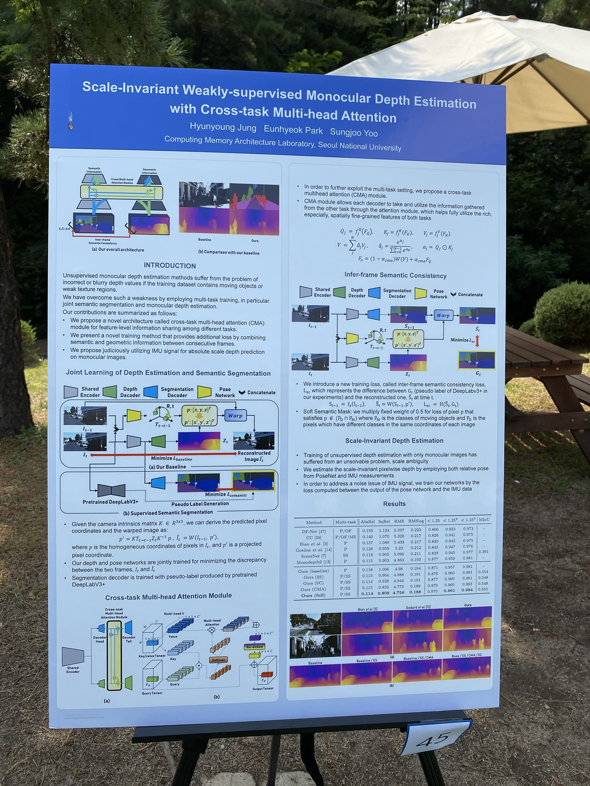
**이미지 캡션:** 이 사진은 컴퓨터 비전 분야의 학술 포스터로, "Scale-Invariant Weakly-supervised Monocular Depth Estimation with Cross-task Multi-head Attention"이라는 제목을 가지고 있습니다. 포스터는 한국어로 작성되었으며, 여러 섹션으로 구성되어 있습니다. **사람:** 포스터에는 연구자들의 이름인 Hyunyoung Jung, Eunhyeok Park, Sungjoo Yoo가 기재되어 있습니다. 이들은 성인 남성으로 추정되며, 외모나 복장에 대한 구체적인 정보는 없습니다. 포스터 자체는 야외에서 촬영된 것으로 보이며, 배경에 나무와 파라솔이 보입니다. **장소/배경:** 포스터는 야외에서 촬영되었으며, 배경에는 푸른 나무와 흰색 파라솔이 보입니다. 포스터는 나무에 걸려 있거나, 야외 테이블 위에 놓여 있는 것으로 추정됩니다. **사물:** 포스터의 주요 사물은 당연히 포스터 자체입니다. 포스터에는 여러 개의 도표, 그래프, 수식, 그리고 결과 테이블이 포함되어 있습니다. 또한, 포스터 하단에는 "45"라는 숫자가 적힌 스티커가 붙어 있습니다. **보이는 텍스트:** 포스터에는 제목, 연구자 이름, 소속 기관, 서론, 제안하는 방법론, 결과, 그리고 관련 연구에 대한 설명이 한국어로 상세하게 기재되어 있습니다. 또한, 여러 수식과 표가 포함되어 있습니다. **분위기/상황:** 포스터는 학술적인 내용을 담고 있으며, 연구 결과를 발표하고 공유하는 상황을 보여줍니다. 야외에서 촬영된 것으로 보아, 학회나 세미나 등에서 발표 중이거나 전시 중인 것으로 추정됩니다. 전반적으로 진지하고 전문적인 분위기입니다.
 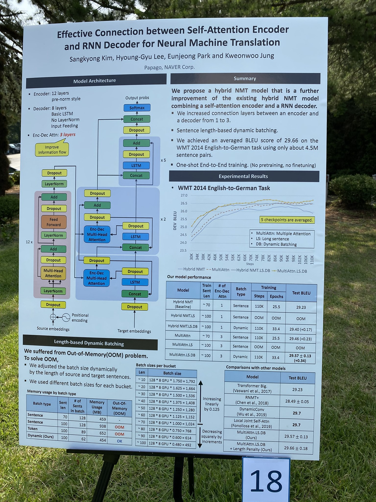
**이미지 캡션:** 이 사진은 "Effective Connection between Self-Attention Encoder and RNN Decoder for Neural Machine Translation"이라는 제목의 논문 포스터입니다. 포스터는 한국어와 영어로 작성되었으며, 한국어 텍스트는 주로 제목, 저자 정보, 소속, 그리고 일부 섹션의 제목과 설명에 사용되었습니다. **사람:** 사진에는 사람이 직접적으로 등장하지 않습니다. **장소/배경:** 배경은 흰색이며, 논문 포스터의 내용을 효과적으로 보여주기 위해 다양한 섹션으로 구성되어 있습니다. 왼쪽 상단에는 논문의 제목과 저자 정보, 소속이 표시되어 있습니다. 중앙에는 모델 아키텍처 다이어그램이 있으며, 오른쪽에는 요약, 실험 결과, 그리고 다른 모델과의 비교 결과가 그래프와 표 형태로 제시되어 있습니다. 하단에는 "Length-based Dynamic Batching"이라는 섹션이 있습니다. **사물:** *   **텍스트:** 논문의 제목, 저자 이름, 소속, 섹션 제목, 설명, 요약, 실험 결과, 그래프, 표, 모델 이름, 성능 지표 등 다양한 텍스트가 포함되어 있습니다. *   **다이어그램:** 모델 아키텍처를 설명하는 복잡한 블록 다이어그램이 있습니다. *   **그래프:** WMT 2014 English-to-German Task의 실험 결과를 보여주는 선 그래프가 있습니다. *   **표:** 모델 성능, 배치 크기, 다른 모델과의 비교 결과를 보여주는 여러 개의 표가 있습니다. *   **숫자:** "18"이라는 큰 숫자가 포스터 하단 우측에 표시되어 있습니다. 이는 페이지 번호 또는 발표 번호일 가능성이 있습니다. **보이는 텍스트:** *   **제목:** "Effective Connection between Self-Attention Encoder and RNN Decoder for Neural Machine Translation" *   **저자:** Sangkyong Kim, Hyoung-Gyu Lee, Eunjeong Park and Kwonwoo Jung *   **소속:** Papago, NAVER Corp. *   **섹션 제목:** Model Architecture, Summary, Experimental Results, Our model performance, Length-based Dynamic Batching, Comparisons with other models, Batch sizes per bucket *   **주요 내용:** "We propose a hybrid NMT model that is a further improvement of the existing hybrid NMT model combining a self-attention encoder and a RNN decoder.", "We achieved an averaged BLEU score of 29.66 on the WMT 2014 English-to-German task using only about 4.5M sentence pairs.", "We suffered from Out-of-Memory (OOM) problem. To solve OOM, We adjusted the batch size dynamically by the length of source and target sentences." *   **그래프 라벨:** DEV BLEU, Steps
 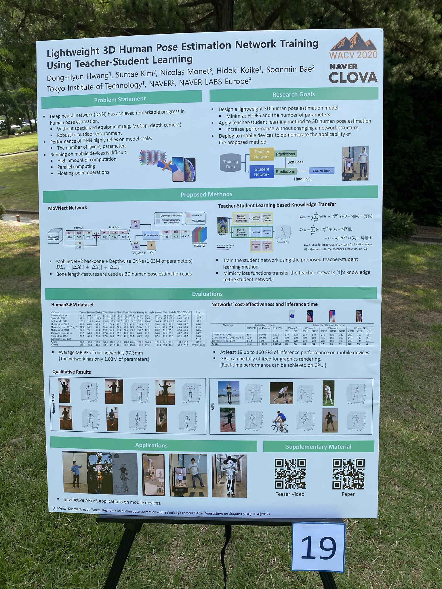
**이미지 캡션:** 이 포스터는 "가벼운 3D 인간 자세 추정 네트워크 훈련: 교사-학생 학습 활용"이라는 제목의 연구를 소개합니다. 연구는 도쿄 공업대학교, 네이버, 네이버 랩스 유럽의 연구원들이 수행했습니다. 포스터는 연구의 문제점, 목표, 제안된 방법, 평가 결과, 응용 분야 및 보충 자료를 설명합니다. 문제점 섹션에서는 딥러닝 기반 인간 자세 추정의 발전을 언급하지만, 특수 장비 없이 야외 환경에서 견고하고 모바일 장치에서 실행 가능한 모델의 필요성을 강조합니다. 연구 목표는 경량 3D 인간 자세 추정 모델을 설계하고, 교사-학생 학습 방법을 적용하여 성능을 향상시키며, 제안된 방법의 적용 가능성을 모바일 장치에 배포하여 입증하는 것입니다. 제안된 방법 섹션에서는 MoVNect 네트워크와 교사-학생 학습 기반 지식 전달을 설명합니다. 평가 섹션에서는 Human3.6M 데이터셋에 대한 네트워크의 평균 MPJPE와 모바일 장치에서의 추론 성능을 보여주는 표와 그래프를 포함합니다. 응용 분야 섹션에서는 모바일 장치용 인터랙티브 AR/VR 애플리케이션을 보여주는 이미지를 제시합니다. 보충 자료 섹션에는 티저 비디오와 논문에 대한 QR 코드가 있습니다. 포스터의 전반적인 분위기는 학술적이고 정보 전달적이며, 연구의 기술적 측면을 강조합니다.
 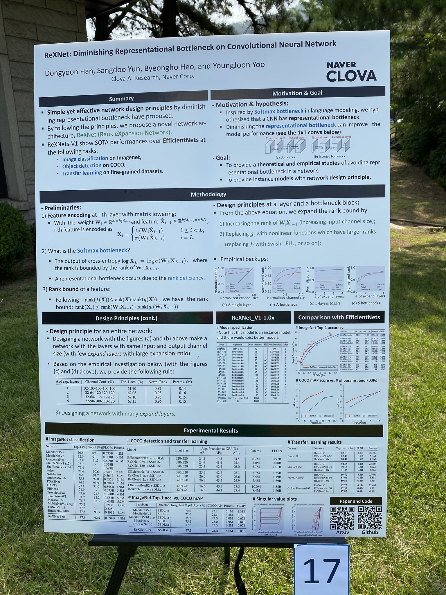
**이미지 캡션:** A poster displays research on "ReXNet: Diminishing Representational Bottleneck on Convolutional Neural Network" by Dongyoon Han, Sangdoo Yun, Byeongho Heo, and YoungJoon Yoo from Clova AI Research, Naver Corp. The poster is divided into sections including Summary, Motivation & Goal, Methodology, Design Principles, Experimental Results, and Paper and Code. The Summary highlights simple yet effective network design principles by diminishing representational bottlenecks, proposing a novel architecture called ReXNet, and showcasing its state-of-the-art performance on ImageNet classification, COCO object detection, and transfer learning. The Motivation & Goal section explains the hypothesis that a representational bottleneck exists in CNNs, inspired by language modeling, and that diminishing it can improve model performance. The Methodology section details feature encoding, the Softmax bottleneck, rank bounds, and design principles for layers and bottleneck blocks, including increasing rank and using nonlinear functions. The Experimental Results section presents performance comparisons on ImageNet classification, COCO detection, and transfer learning, showing ReXNet's competitive results against EfficientNets. The poster also includes model specifications, empirical backups with graphs, and a QR code for the paper and code on ArXiv and GitHub. The overall atmosphere is academic and informative, with a focus on presenting research findings clearly and concisely.
 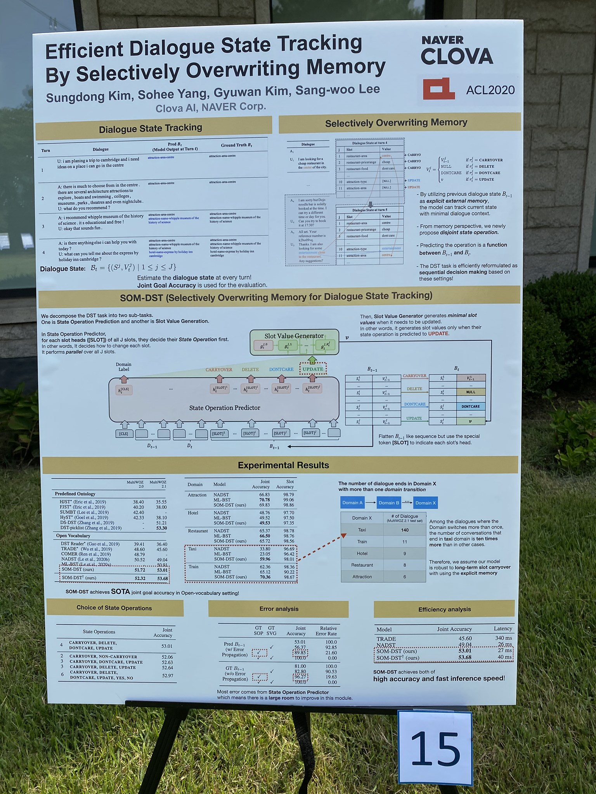
**이미지 캡션:** 이 포스터는 "선택적 덮어쓰기 메모리를 통한 효율적인 대화 상태 추적"이라는 주제를 다루고 있으며, Sungdong Kim, Sohee Yang, Gyuwan Kim, Sang-woo Lee가 Clova AI, NAVER Corp. 소속으로 발표했습니다. 포스터는 대화 상태 추적(DST) 문제를 해결하기 위한 새로운 방법론인 SOM-DST(Selectively Overwriting Memory for Dialogue State Tracking)를 소개합니다. 포스터의 왼쪽 상단에는 "대화 상태 추적"이라는 제목 아래 예시 대화와 해당 대화의 상태를 나타내는 테이블이 있습니다. 오른쪽 상단에는 "선택적 덮어쓰기 메모리"라는 제목 아래 동일한 대화에 대한 모델의 예측과 실제 상태를 비교하는 테이블이 있으며, 모델의 작동 방식에 대한 설명이 포함되어 있습니다. 포스터 중앙에는 SOM-DST 모델의 구조를 보여주는 다이어그램이 있으며, "상태 연산 예측기"와 "슬롯 값 생성기"라는 두 가지 하위 작업으로 분해됨을 설명합니다. 하단에는 "실험 결과" 섹션이 있으며, 다양한 기존 방법론과 비교하여 SOM-DST의 성능을 보여주는 표가 있습니다. 또한 "오류 분석" 및 "효율성 분석" 섹션은 모델의 성능에 대한 추가적인 통찰력을 제공합니다. 포스터 전반에 걸쳐 텍스트는 주로 흰색 배경에 검은색 또는 파란색으로 표시되며, 일부 제목과 강조 표시는 빨간색으로 되어 있습니다. 포스터의 오른쪽 하단에는 큰 숫자 "15"가 표시되어 있습니다. 포스터는 학술적인 분위기를 띠고 있으며, 연구 결과를 명확하고 체계적으로 전달하는 데 중점을 두고 있습니다.
 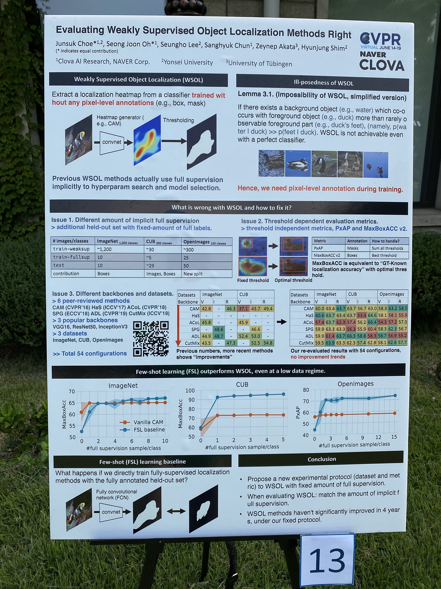
**이미지 캡션:** 이 포스터는 약 20대 후반에서 30대 초반으로 보이는 동양인 남성 연구원들이 발표한 "약지도 객체 탐지 방법 평가"에 대한 내용을 담고 있으며, 발표자는 Junsuk Choe, Seong Joon Oh, Seungho Lee, Sanghyuk Chun, Zeynep Akata, Hyunjung Shim으로 표기되어 있다. 이들은 각각 Clova AI Research, Yonsei University, University of Tübingen 소속으로 보인다. 포스터의 주요 내용은 약지도 객체 탐지(Weakly Supervised Object Localization, WSOL) 방법의 한계점과 개선 방안을 제시하고, 이를 해결하기 위한 새로운 실험 프로토콜을 제안하는 것이다. 포스터의 상단에는 "Evaluating Weakly Supervised Object Localization Methods Right CVPR"이라는 제목과 함께 발표자들의 이름과 소속이 명시되어 있다. 중앙에는 WSOL의 개념을 설명하는 다이어그램과 함께 "Lemma 3.1. (Impossibility of WSOL, simplified version)"이라는 제목으로 WSOL의 근본적인 어려움을 설명하는 내용이 있다. 이 부분에는 물에 떠 있는 오리 사진과 오리 발 사진이 포함되어 있어, 배경 객체(물)와 전경 객체(오리 발)의 동시 발생 확률이 높을 경우 객체 탐지가 어려움을 시사한다. 포스터의 중간 부분에는 WSOL의 문제점을 "What is wrong with WSOL and how to fix it?"라는 제목으로 세 가지 이슈로 나누어 설명하고 있다. 첫 번째 이슈는 "Implicit full supervision"의 양이 다르다는 점이며, 두 번째 이슈는 "Threshold dependent evaluation metrics"로 PxAP와 MaxBoxACC v2와 같은 임계값 독립적인 지표를 제안한다. 세 번째 이슈는 "Different backbones and datasets"로 다양한 백본 네트워크와 데이터셋에 대한 실험 결과를 표로 제시하고 있다. 이 표에는 CAM, HaS, ACOL, SPG, ADL, CutMix와 같은 여러 방법론의 성능이 ImageNet, CUB, OpenImages 데이터셋에서 평가된 결과가 나타나 있다. 포스터의 하단에는 "Few-shot learning (FSL) outperforms WSOL, even at a low data regime."라는 제목과 함께 세 개의 그래프가 있다. 이 그래프들은 ImageNet, CUB, OpenImages 데이터셋에서 FSL이 WSOL보다 더 나은 성능을 보임을 보여준다. 그래프 아래에는 "Few-shot (FSL) learning baseline"이라는 제목으로 FSL의 작동 방식을 설명하는 다이어그램이 있으며, 이는 Fully convolutional network (FCN)과 convnet을 활용하는 과정을 보여준다. 마지막으로 "Conclusion" 섹션에서는 새로운 실험 프로토콜 제안, WSOL 평가 시 주의사항
 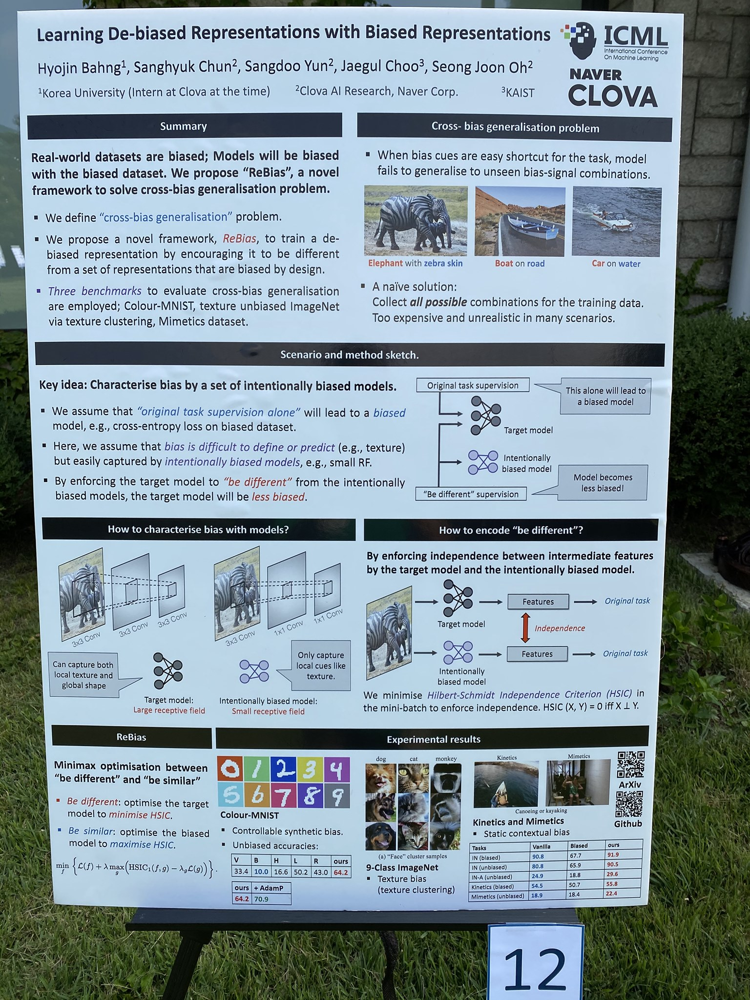
**이미지 캡션:** 이 포스터는 "편향된 표현 학습"이라는 주제를 다루고 있으며, ICML 2020 학회에서 발표된 연구 내용을 담고 있습니다. 포스터의 상단에는 연구 제목과 함께 연구자들의 이름과 소속이 명시되어 있습니다. 중앙에는 연구의 요약, 문제 정의, 제안하는 프레임워크인 "ReBias"에 대한 설명이 있습니다. 또한, 편향된 모델을 특성화하고 "다르게" 인코딩하는 방법에 대한 도식과 함께, 실험 결과 섹션에서는 다양한 데이터셋(Colour-MNIST, 9-Class ImageNet, Kinetics, Mimetics)에 대한 성능 비교를 보여줍니다. 포스터의 전체적인 분위기는 학술적이고 정보 전달에 집중하고 있으며, 연구의 핵심 아이디어와 실험 결과를 명확하게 전달하려는 목적을 가지고 있습니다.
 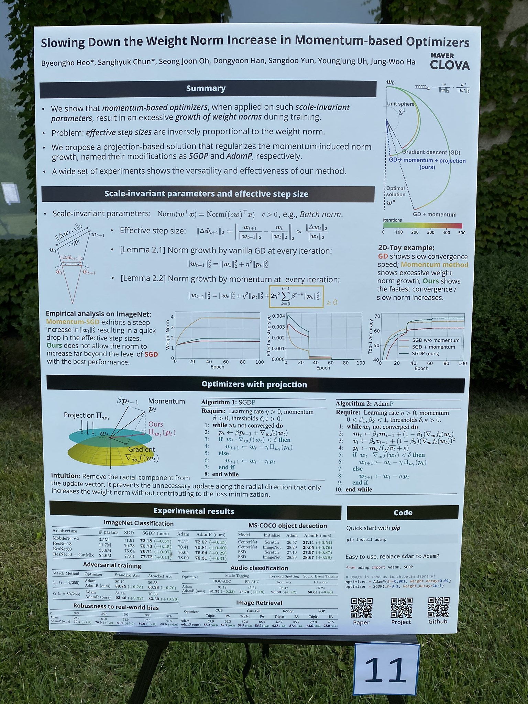
**이미지 캡션:** 이 포스터는 모멘텀 기반 최적화 기법에서 가중치 규범 증가를 늦추는 방법을 설명합니다. 포스터 상단에는 "Slowing Down the Weight Norm Increase in Momentum-based Optimizers"라는 제목이 있고, 그 아래에는 저자들의 이름과 소속 기관인 NAVER CLOVA가 있습니다. 포스터의 주요 내용은 요약, 스케일 불변 매개변수 및 효과적인 스텝 크기, 최적화 기법, 실험 결과, 코드 및 추가 정보로 구성됩니다. 요약 섹션에서는 모멘텀 기반 최적화 기법이 스케일 불변 매개변수에 적용될 때 가중치 규범의 과도한 증가를 초래하며, 이를 해결하기 위해 SGDP와 Adamp라는 투영 기반 솔루션을 제안한다고 설명합니다. 스케일 불변 매개변수 및 효과적인 스텝 크기 섹션에서는 스케일 불변 매개변수와 효과적인 스텝 크기의 정의를 설명하고, 바닐라 GD 및 모멘텀에서의 규범 증가를 보여주는 렘마를 제시합니다. 또한 ImageNet 데이터셋에 대한 경험적 분석을 통해 제안된 방법의 효과를 시각적으로 보여주는 그래프를 포함합니다. 최적화 기법 섹션에서는 SGDP와 AdamP 알고리즘을 자세히 설명하고, 직관 섹션에서는 투영의 역할을 설명합니다. 실험 결과 섹션에서는 ImageNet 분류, MS-COCO 객체 탐지, 오디오 분류, 적대적 학습 및 실제 세계 편향에 대한 강건성 등 다양한 작업에서 제안된 방법의 성능을 보여주는 표를 제시합니다. 코드 섹션에서는 pip를 사용하여 Adamp를 설치하는 방법과 Adam을 AdamP로 쉽게 교체하는 방법을 안내합니다. 마지막으로 논문, 프로젝트, GitHub에 대한 링크를 제공합니다. 포스터 전반에 걸쳐 그래프, 표, 알고리즘 설명 및 시각적 요소를 사용하여 복잡한 개념을 명확하게 전달하고 있습니다. 배경에는 녹색 식물이 보여 자연스러운 느낌을 더합니다.
 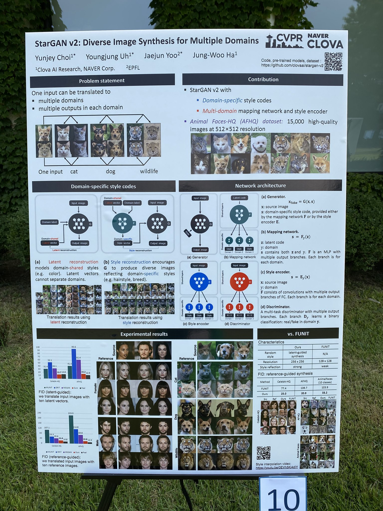
**이미지 캡션:** 이 포스터는 StarGAN v2라는 새로운 이미지 생성 모델을 소개하며, 여러 도메인에 걸쳐 다양한 이미지를 합성하는 능력을 보여줍니다. 포스터의 상단에는 "StarGAN v2: Diverse Image Synthesis for Multiple Domains"라는 제목이 크게 쓰여 있으며, 그 아래에는 연구자들의 이름과 소속이 명시되어 있습니다. 포스터의 왼쪽 상단에는 "Problem statement" 섹션이 있어, 하나의 입력 이미지를 여러 도메인으로 변환하고 각 도메인에서 여러 개의 출력을 생성하는 모델의 목표를 설명합니다. 그 아래에는 고양이, 개, 야생 동물 이미지를 보여주는 예시가 있습니다. 포스터의 오른쪽 상단에는 "Contribution" 섹션이 있으며, StarGAN v2가 도메인별 스타일 코드, 다중 도메인 매핑 네트워크 및 스타일 인코더를 사용하며, Animal Faces-HQ(AFHQ) 데이터셋을 활용한다는 내용이 담겨 있습니다. 포스터 중앙에는 모델의 네트워크 아키텍처를 설명하는 다이어그램이 있으며, 생성자, 매핑 네트워크, 스타일 인코더, 판별자로 구성됩니다. 하단에는 "Experimental results" 섹션이 있어, 잠재적 재구성 및 스타일 재구성을 사용한 번역 결과와 함께 CelebA-HQ, AFHQ 데이터셋에 대한 FID(Fréchet Inception Distance) 점수를 비교하는 그래프가 포함되어 있습니다. 또한, 다양한 도메인(여성, 고양이, 개, 야생 동물)에 대한 실제 이미지와 생성된 이미지를 비교하는 실험 결과도 보여줍니다. 포스터 하단에는 모델의 특징을 FUNIT과 비교하는 표와 스타일 보간 비디오 링크가 있습니다. 전반적으로 포스터는 연구의 목적, 방법론, 결과 및 기여도를 명확하고 시각적으로 전달하고 있습니다.
 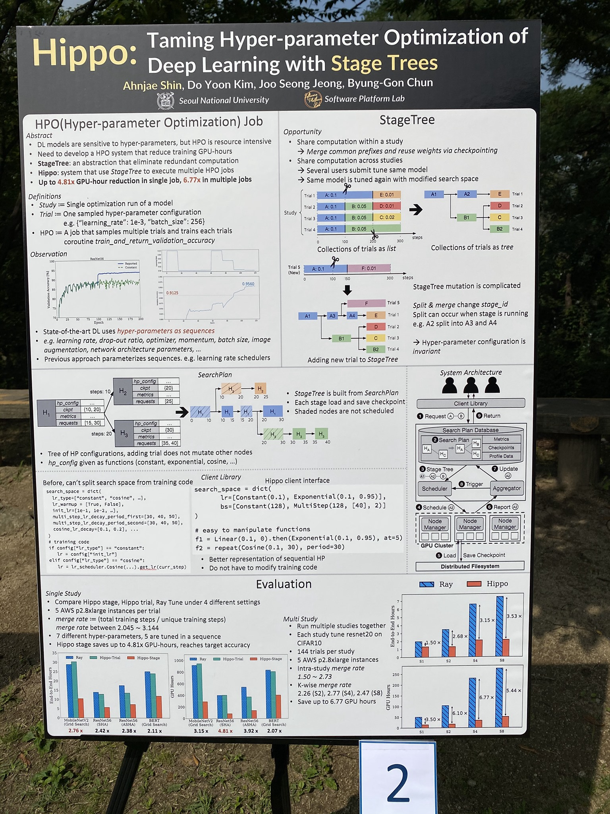
**이미지 캡션:** 이 포스터는 "Hippo: Stage Tree를 이용한 딥러닝의 하이퍼파라미터 최적화"라는 제목의 연구를 소개합니다. 포스터의 상단에는 연구의 저자 이름과 소속이 명시되어 있습니다. 중앙에는 연구의 핵심 내용인 HPO(하이퍼파라미터 최적화) 작업, StageTree의 개념, 시스템 아키텍처, 그리고 실험 결과가 시각적으로 구성되어 있습니다. 포스터의 왼쪽에는 HPO 작업의 개요, 정의, 관찰 결과 그래프, 그리고 최신 DL 모델의 하이퍼파라미터 시퀀스 표현 방식에 대한 설명이 있습니다. 중앙에는 StageTree의 작동 방식, 즉 여러 연구 간의 연산 공유, 체크포인트를 통한 가중치 재사용, 그리고 StageTree의 변이 과정에 대한 다이어그램이 포함되어 있습니다. 오른쪽에는 Hippo 시스템의 전체적인 아키텍처와 클라이언트 라이브러리, 그리고 Hippo 클라이언트 인터페이스에 대한 설명이 있습니다. 하단에는 Hippo 시스템의 성능을 Ray Tune과 비교하는 실험 결과가 막대그래프와 수치로 제시되어 있으며, 단일 연구와 다중 연구 시나리오에서의 효율성을 보여줍니다. 포스터 전반적으로 흰색 배경에 파란색과 주황색을 포인트 색상으로 사용하여 정보를 명확하게 전달하고 있으며, 전문적인 학술 발표 자료의 분위기를 띠고 있습니다.
 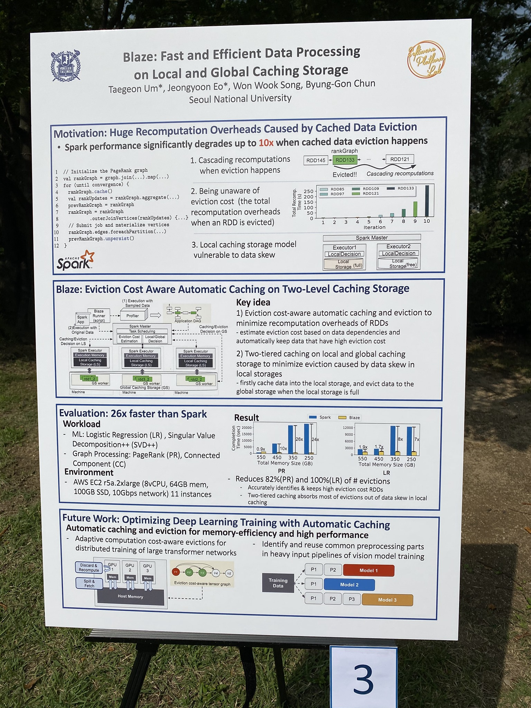
**이미지 캡션:** 이 포스터는 "Blaze: Local 및 Global 캐싱 스토리지를 사용한 빠르고 효율적인 데이터 처리"라는 제목의 연구를 소개합니다. 포스터의 주요 내용은 다음과 같습니다. **사람:** 포스터에는 특정 인물이 등장하지 않습니다. 연구진의 이름과 소속이 상단에 명시되어 있습니다. **장소/배경:** 포스터는 야외에서 촬영되었으며, 배경에는 잔디밭이 보입니다. 포스터 자체는 흰색 배경에 검은색, 파란색, 주황색, 노란색 등 다양한 색상의 텍스트와 그래픽으로 구성되어 있습니다. **사물:** 포스터에는 여러 개의 다이어그램, 그래프, 코드 스니펫, 표가 포함되어 있습니다. 특히, 데이터 처리 과정, 캐싱 전략, 성능 결과를 시각적으로 보여주는 그래픽 요소들이 두드러집니다. **보이는 텍스트:** 포스터에는 연구 제목, 연구진 이름 및 소속, 연구의 동기, 핵심 아이디어, 평가 결과, 향후 연구 계획 등 상세한 텍스트 정보가 포함되어 있습니다. 코드 스니펫은 Scala 언어로 작성된 것으로 보이며, 그래프에는 RDD(Resilient Distributed Dataset)의 eviction 횟수와 총 메모리 크기 등의 데이터가 표시됩니다. **분위기/상황:** 포스터는 학술적인 발표 또는 연구 결과 공유를 위한 것으로 보이며, 진지하고 정보 전달에 집중하는 분위기입니다. 연구의 중요성과 성과를 강조하기 위해 시각적인 요소와 명확한 텍스트 설명을 활용하고 있습니다. 특히, "Motivation" 섹션에서는 Spark의 성능 저하 문제를 강조하며, "Evaluation" 섹션에서는 Blaze 시스템이 기존 Spark보다 훨씬 빠르다는 결과를 제시하여 연구의 우수성을 부각하고 있습니다. "Future Work" 섹션은 향후 연구 방향을 제시하며 연구의 확장성을 보여줍니다.
 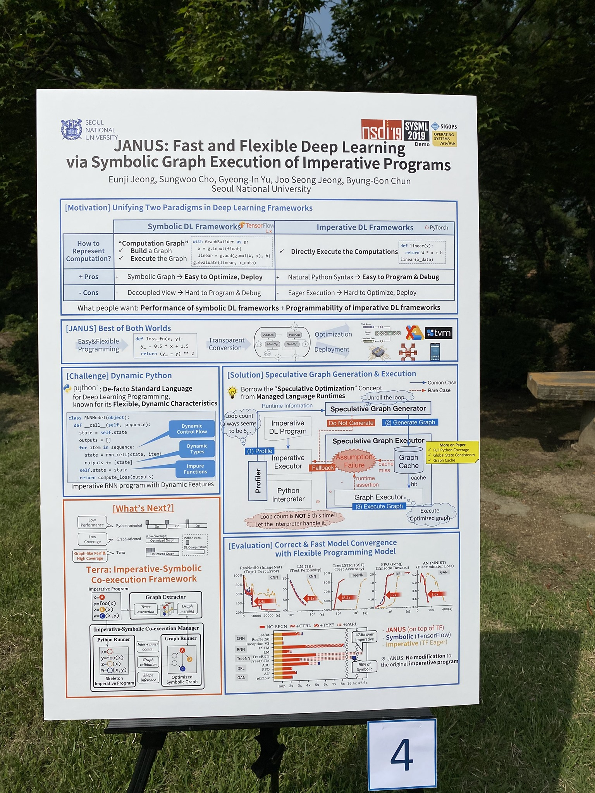
**이미지 캡션:** 이 포스터는 서울대학교의 연구자들이 개발한 JANUS라는 딥러닝 프레임워크를 소개합니다. JANUS는 명령형 프로그램의 상징적 그래프 실행을 통해 빠르고 유연한 딥러닝을 가능하게 합니다. 포스터는 딥러닝 프레임워크의 두 가지 패러다임, 즉 상징적 그래프 프레임워크와 명령형 DL 프레임워크를 비교하며 JANUS가 두 세계의 장점을 결합한다는 점을 강조합니다. 또한, JANUS의 동적 파이썬 지원, 추측적 그래프 생성 및 실행, 그리고 명령형-상징적 공동 실행 프레임워크를 설명합니다. 마지막으로, 다양한 벤치마크에서 JANUS의 성능을 평가하는 그래프와 차트를 보여줍니다. 포스터는 전반적으로 흰색 배경에 파란색, 주황색, 회색 등의 색상을 사용하여 정보를 명확하게 전달하고 있으며, 연구 발표 포스터의 전형적인 형식을 따르고 있습니다.
 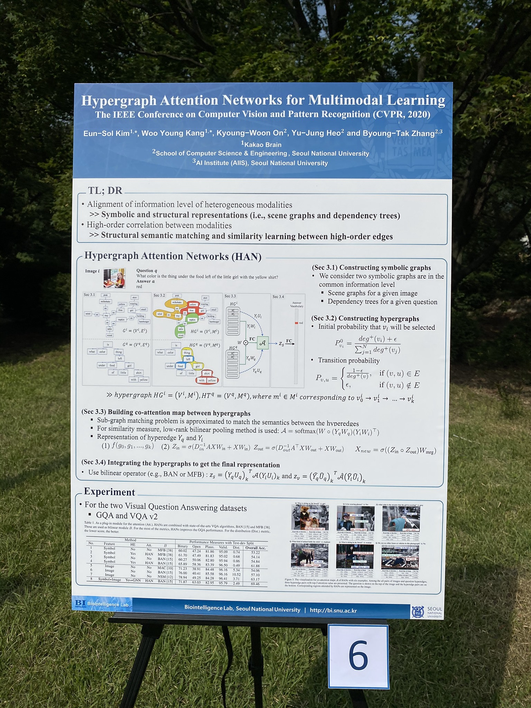
**이미지 캡션:** 이 포스터는 한국어로 된 "멀티모달 학습을 위한 하이퍼그래프 어텐션 네트워크"라는 제목의 학술 발표 자료입니다. 포스터의 상단에는 발표 제목, 저자 이름, 소속 기관이 명시되어 있습니다. 발표 내용은 크게 TL;DR (요약), Hypergraph Attention Networks (HAN)의 구성 요소, 실험 결과로 나뉩니다. TL;DR 섹션에서는 멀티모달 정보의 정렬, 기호 및 구조적 표현, 하이퍼그래프 간의 고차 상관 관계 학습에 대해 간략하게 설명합니다. HAN 섹션에서는 기호 그래프 구성, 하이퍼그래프 구성, 하이퍼그래프 간의 코어텐션 맵 구축, 최종 표현을 위한 하이퍼그래프 통합 과정을 설명합니다. 각 섹션에는 수식과 도식들이 포함되어 있어 내용을 시각적으로 이해하는 데 도움을 줍니다. 실험 섹션에서는 GQA와 VQA v2 데이터셋에 대한 성능 측정 결과를 표로 제시하고 있으며, 여러 모델의 정확도를 비교하고 있습니다. 포스터 하단에는 발표자의 소속 기관인 Biointelligence Lab, Seoul National University와 웹사이트 주소가 기재되어 있습니다. 포스터 배경은 야외에서 촬영된 것으로 보이며, 잔디밭 위에 설치된 모습입니다. 포스터 오른쪽 하단에는 숫자 6이 적힌 파란색 표지판이 보입니다. 전반적으로 학술적인 내용을 담고 있으며, 연구 결과를 효과적으로 전달하기 위해 체계적으로 구성되어 있습니다.
 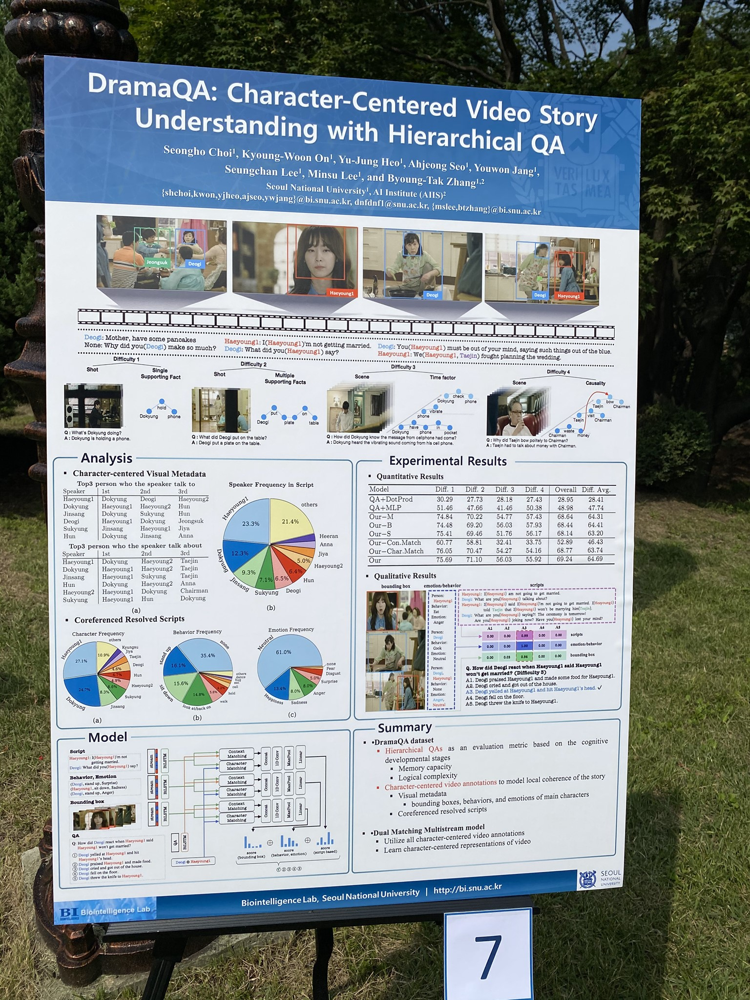
**이미지 캡션:** 이 포스터는 "DramaQA: Character-Centered Video Story Understanding with Hierarchical QA"라는 제목의 연구를 소개합니다. 포스터의 상단에는 연구 제목과 저자들의 이름, 소속이 명시되어 있습니다. 중앙에는 연구의 핵심 내용을 시각적으로 보여주는 여러 이미지와 그래프, 표가 배치되어 있습니다. 왼쪽 상단에는 드라마 장면을 캡처한 네 개의 이미지가 있으며, 각 이미지에는 인물들의 이름(예: Haeyoung1, Deogi)과 대화 내용이 표시되어 있습니다. 그 아래에는 대화의 난이도별 예시와 함께 질문과 답변이 제시되어 있습니다. 포스터의 왼쪽 하단에는 "Analysis" 섹션이 있으며, 캐릭터 중심의 시각적 메타데이터 분석 결과와 스크립트 내 화자 빈도, 감정 빈도, 행동 빈도에 대한 파이 차트가 포함되어 있습니다. 중앙에는 연구 모델의 구조를 보여주는 다이어그램이 있습니다. 오른쪽에는 "Experimental Results" 섹션이 있으며, 정량적 및 정성적 결과가 표와 그래프로 제시되어 있습니다. 정량적 결과는 다양한 모델의 성능을 비교하며, 정성적 결과는 특정 질문에 대한 답변의 예시와 함께 시각적 요소(감정, 행동, 인물)를 분석합니다. 포스터의 가장 하단에는 연구의 "Summary"가 요약되어 있으며, DramaQA 데이터셋의 특징과 Dual Matching Multistream 모델에 대한 설명이 포함되어 있습니다. 포스터의 오른쪽 하단에는 "7"이라는 숫자가 크게 쓰여 있습니다. 전반적으로 이 포스터는 드라마 영상 콘텐츠에 대한 계층적 질의응답 시스템을 개발하고 평가한 연구 결과를 효과적으로 전달하고 있습니다.
 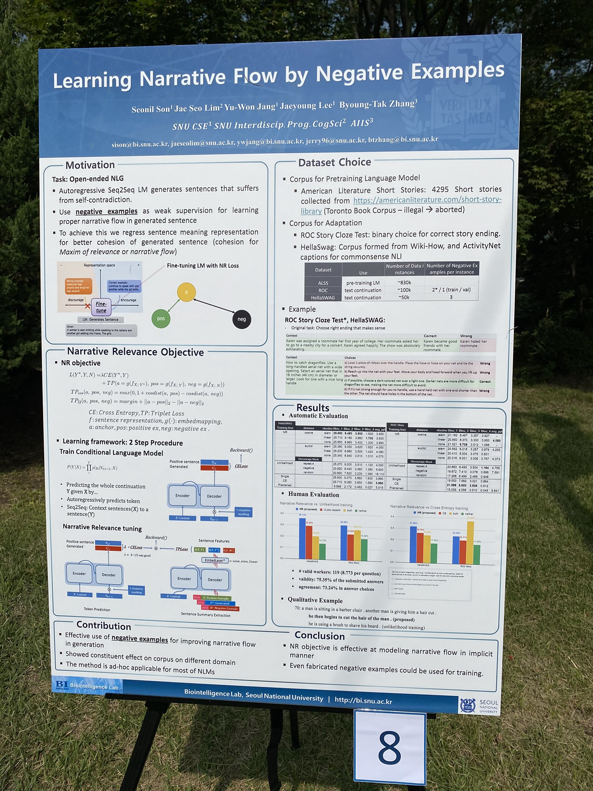
**이미지 캡션:** 이 포스터는 "Negative Examples를 통한 서사 흐름 학습"이라는 주제를 다루고 있으며, 한국어로 된 제목과 영어로 된 부제가 함께 표기되어 있습니다. 포스터는 여러 섹션으로 나뉘어 연구의 동기, 데이터셋 선택, 방법론, 결과, 기여 및 결론을 설명합니다. **사람:** 포스터에는 특정 인물이 직접적으로 묘사되어 있지 않지만, 연구자들의 이름과 소속이 명시되어 있습니다. 또한, "Human Evaluation" 섹션에는 가상의 인물인 "Karen"이 예시로 등장하며, 그녀의 상황과 선택에 대한 설명이 있습니다. "Qualitative Example" 섹션에는 이발소에서 머리를 자르는 두 명의 남성이 묘사되어 있습니다. **장소/배경:** 포스터의 배경은 흰색이며, 상단에는 "VERI LUX TAS MEA"라는 문구가 있는 로고가 보입니다. 하단에는 "Biointelligence Lab, Seoul National University"라는 문구와 함께 서울대학교 로고가 있습니다. 연구의 맥락상 학술적인 환경을 배경으로 하고 있습니다. **사물:** 포스터에는 다양한 도표, 그래프, 수식, 다이어그램이 포함되어 있습니다. 특히, "Motivation" 섹션에는 "Fine-tuning LM with NR Loss"라는 제목의 다이어그램이 있고, "Learning framework" 섹션에는 두 개의 순환 신경망(RNN) 기반 모델 구조 다이어그램이 있습니다. "Results" 섹션에는 막대그래프와 표가 포함되어 있습니다. **보이는 텍스트:** 포스터에는 한국어와 영어로 된 제목, 연구자 이름 및 소속, 연구 내용 설명, 데이터셋 정보, 예시, 결과 분석, 결론 등이 포함되어 있습니다. 구체적인 텍스트로는 "Learning Narrative Flow by Negative Examples", "Motivation", "Dataset Choice", "Example", "Results", "Human Evaluation", "Contribution", "Conclusion", "Biointelligence Lab, Seoul National University", "http://bi.snu.ac.kr", "SEOUL NATIONAL UNIVERSITY" 등이 있습니다. **분위기/상황:** 포스터는 전반적으로 학술적이고 정보 전달에 중점을 둔 진지한 분위기를 풍깁니다. 연구의 목표, 방법, 결과가 체계적으로 제시되어 있으며, 새로운 연구 방법론에 대한 탐구를 보여줍니다.
 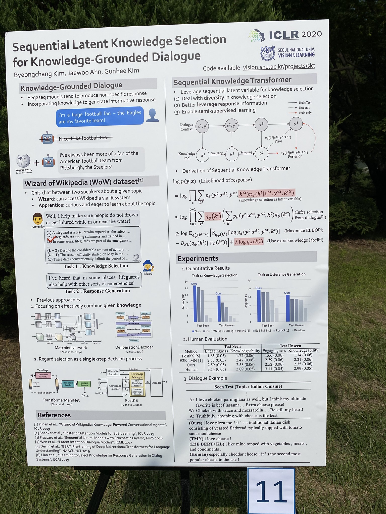
**이미지 캡션:** 이 포스터는 "Sequential Latent Knowledge Selection for Knowledge-Grounded Dialogue"라는 제목의 연구를 소개하고 있으며, 한국어로는 "지식 기반 대화를 위한 순차적 잠재 지식 선택"으로 번역될 수 있습니다. 포스터의 왼쪽 상단에는 연구의 저자들인 Byongchang Kim, Jaewoo Ahn, Gunhee Kim의 이름이 명시되어 있습니다. 포스터의 주요 내용은 다음과 같습니다. **Knowledge-Grounded Dialogue (지식 기반 대화)** * Seqzseq 모델은 비특정적인 응답을 생성하는 경향이 있습니다. * 지식을 통합하여 정보 제공적인 응답을 생성합니다. * 이 섹션에는 두 명의 대화 참여자가 등장하는 만화가 포함되어 있습니다. 한 명은 "I'm a huge football fan - the Eagles are my favorite team!"이라고 말하고, 다른 한 명은 "Nice, I like football too."라고 답하며, 이어서 "I've always been more of a fan of the American football team from Pittsburgh, the Steelers!"라고 덧붙입니다. 이 대화는 축구에 대한 두 사람의 선호도를 보여줍니다. **Wizard of Wikipedia (WoW) dataset (위키피디아 마법사 데이터셋)** * 이 데이터셋은 주어진 주제에 대한 두 명의 화자 간의 대화를 포함합니다. * 'Wizard'는 IR 시스템을 통해 위키피디아에 접근할 수 있으며, 'Apprentice'는 주제에 대해 호기심이 많고 배우고 싶어 합니다. * 이 섹션에는 'Apprentice' 역할을 하는 캐릭터가 "Well, I help make sure people do not drown or get injured while in or near the water!"라고 말하는 대화가 포함되어 있으며, 이어서 구조대원의 역할에 대한 설명이 이어집니다. **Sequential Knowledge Transformer (순차적 지식 변환기)** * 지식 선택을 위한 순차적 잠재 변수를 활용합니다. * 지식 선택의 다양성을 다룹니다. * 응답 정보를 더 잘 활용합니다. * 준지도 학습을 가능하게 합니다. * 이 섹션에는 대화 맥락, 지식 풀, 샘플링, 사전, 사후 확률을 나타내는 순차적 지식 변환기의 다이어그램이 포함되어 있습니다. * 또한 순차적 지식 변환기의 유도 과정에 대한 수학적 공식이 제시되어 있습니다. **Experiments (실험)** * **1. Quantitative Results (정량적 결과)**: 지식 선택과 발화 생성 작업에 대한 정확도와 F1 점수를 보여주는 두 개의 막대 그래프가 있습니다. 'Ours'는 제안된 모델을 나타내며, 다른 방법들과 비교됩니다. * **2.
 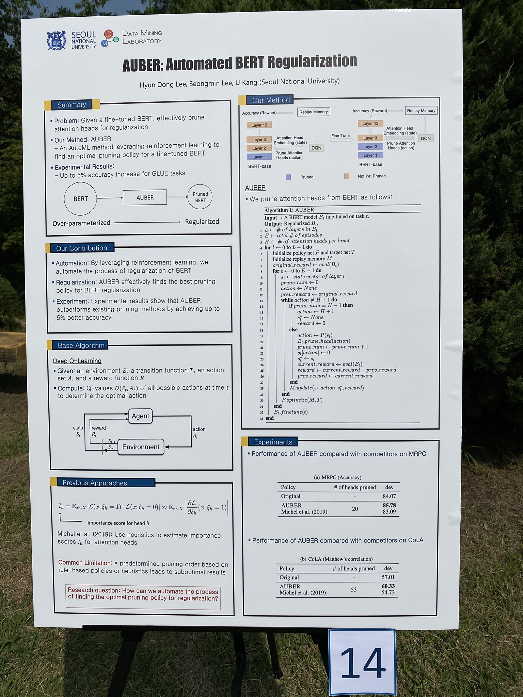
**이미지 캡션:** 이 포스터는 서울대학교 데이터 마이닝 연구실의 현동, 이성민, 강우근이 발표한 "AUBER: Automated BERT Regularization"에 대한 내용을 담고 있습니다. 포스터는 흰색 배경에 여러 섹션으로 나뉘어 있으며, 각 섹션에는 텍스트와 다이어그램, 표가 포함되어 있습니다. 포스터 상단에는 "SEOUL NATIONAL UNIVERSITY"와 "DATA MINING LABORATORY" 로고가 있습니다. 그 아래에는 "AUBER: Automated BERT Regularization"이라는 제목과 발표자들의 이름이 적혀 있습니다. 포스터의 주요 내용은 다음과 같습니다. **Summary (요약)**: *   **Problem (문제)**: 파인튜닝된 BERT 모델에서 효과적으로 어텐션 헤드를 가지치기하여 정규화하는 방법을 다룹니다. *   **Our Method (우리의 방법)**: AUBER라는 AutoML 방법을 사용하여 강화 학습을 통해 파인튜닝된 BERT 모델에 대한 최적의 가지치기 정책을 찾습니다. *   **Experimental Results (실험 결과)**: GLUE 태스크에서 최대 5%의 정확도 향상을 보여줍니다. **Our Method (우리의 방법)**: 이 섹션은 BERT 모델의 가지치기 과정을 시각적으로 보여줍니다. "BERT-base"에서 시작하여 "Fine-Tune" 과정을 거쳐 "Pruned" 또는 "Not Yet Pruned" 상태의 BERT 모델을 보여줍니다. AUBER 알고리즘은 레이어별로 어텐션 헤드를 가지치기하는 과정을 설명합니다. **Our Contribution (우리의 기여)**: *   **Automation (자동화)**: 강화 학습을 활용하여 BERT 정규화 과정을 자동화합니다. *   **Regularization (정규화)**: AUBER는 BERT 정규화를 위한 최적의 가지치기 정책을 효과적으로 찾습니다. *   **Experiment (실험)**: 실험 결과, AUBER는 기존 가지치기 방법보다 최대 5% 더 나은 정확도를 달성하여 성능이 우수함을 보여줍니다. **Base Algorithm (기본 알고리즘)**: *   **Deep Q-Learning (심층 Q-러닝)**: 환경 E, 전이 함수 T, 행동 집합 A, 보상 함수 R이 주어졌을 때, 시간 t에서의 모든 가능한 행동에 대한 Q-값 Q(St, At)를 계산하여 최적의 행동을 결정하는 과정을 설명합니다. 에이전트와 환경 간의 상호작용을 다이어그램으로 보여줍니다. **Previous Approaches (이전 접근 방식)**: *   Michel et al. (2019)의 연구를 언급하며, 어텐션 헤드의 중요도 점수를 추정하기 위해 휴리스
 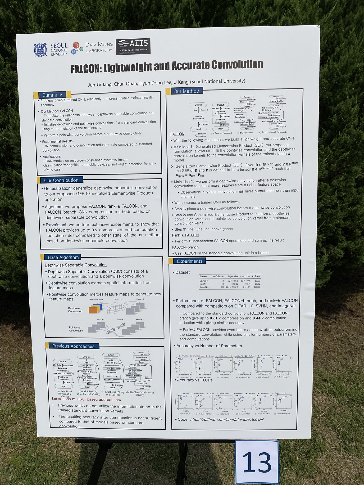
**이미지 캡션:** 이 사진은 서울대학교 데이터 마이닝 연구실과 AIIS 인공지능 연구소에서 제작한 "FALCON: Lightweight and Accurate Convolution"이라는 제목의 포스터 발표 자료이다. 포스터는 한국어로 작성되었으며, 발표자는 Jun-Gi Jang, Chun Quan, Hyun Dong Lee, U Kang (서울대학교)이다. 포스터는 발표자의 연구 내용, 방법론, 실험 결과 등을 담고 있으며, 특히 딥러닝 모델의 경량화 및 정확도 향상에 관한 내용을 다루고 있다. 포스터의 주요 내용은 다음과 같다. **요약 (Summary)** *   **문제점:** 학습된 CNN 모델을 정확도를 유지하면서 효율적으로 압축하는 것. *   **방법론 (Our Method):** FALCON은 뎁스별 분리 합성곱(depthwise separable convolution)과 표준 합성곱(standard convolution) 간의 관계를 정립하고, 뎁스별 분리 합성곱 전에 점별 합성곱(pointwise convolution)을 수행하는 방식을 제안한다. *   **실험 결과:** 표준 합성곱 대비 8배의 압축률과 연산량 감소율을 달성했다. *   **응용 분야:** 리소스 제약이 있는 시스템(모바일 기기에서의 이미지 분류/인식, 자율 주행 자동차에서의 객체 탐지)에 적용 가능하다. **우리의 기여 (Our Contribution)** *   **일반화:** 제안하는 GEP(Generalized Elementwise Product) 연산을 통해 뎁스별 분리 합성곱을 일반화한다. *   **알고리즘:** 뎁스별 분리 합성곱 기반의 CNN 압축 방법인 FALCON, rank-k FALCON, FALCON-branch를 제안한다. *   **실험:** FALCON이 기존의 뎁스별 분리 합성곱 기반 방법들보다 최대 8배의 압축률과 연산량 감소율을 제공함을 실험적으로 입증한다. **기본 알고리즘 (Base Algorithm)** *   **뎁스별 분리 합성곱 (Depthwise Separable Convolution):** 뎁스별 합성곱과 점별 합성곱으로 구성되며, 뎁스별 합성곱은 특징 맵에서 공간 정보를 추출하고, 점별 합성곱은 특징 맵을 병합하여 새로운 특징 맵을 생성한다. **이전 접근 방식 (Previous Approaches)** *   이전 연구들은 학습된 표준 합성곱 커널에 저장된 정보를 활용하지 않거나, 압축 후 정확도가 표준 합성곱 기반 모델에 비해 충분하지 않다는 한계점을 가진다. **방법론 (Our Method)** *   **핵심 아이디어:** 경량화되고 정확한 CNN을 구축하기 위해, 제안하는 GEP
 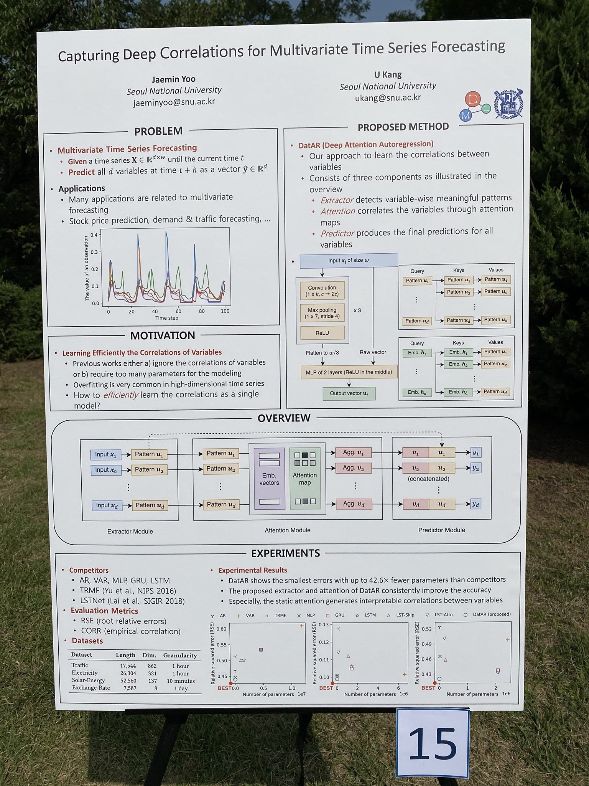
**이미지 캡션:** 이 포스터는 서울대학교의 Jaemin Yoo와 U Kang이 발표한 "Capturing Deep Correlations for Multivariate Time Series Forecasting"이라는 제목의 연구를 소개합니다. 포스터의 상단에는 연구 제목과 두 연구자의 이름, 소속 대학, 이메일 주소가 기재되어 있습니다. 중앙에는 연구의 문제점, 제안된 방법론, 개요, 실험 결과가 상세하게 설명되어 있습니다. **사람:** 포스터에는 두 명의 연구자, Jaemin Yoo와 U Kang의 이름이 명시되어 있으며, 이들은 서울대학교 소속의 성인 남성으로 추정됩니다. **장소/배경:** 포스터는 야외 잔디밭을 배경으로 촬영되었으며, 포스터 자체는 흰색 바탕에 검정색, 파란색, 빨간색, 주황색 등 다양한 색상의 텍스트와 그래프, 다이어그램으로 구성되어 있습니다. **사물:** 포스터에는 다양한 그래프와 다이어그램이 포함되어 있습니다. "PROBLEM" 섹션에는 시계열 데이터의 추세를 보여주는 그래프가 있고, "PROPOSED METHOD"와 "OVERVIEW" 섹션에는 모델의 구조를 설명하는 복잡한 다이어그램이 있습니다. "EXPERIMENTS" 섹션에는 여러 실험 결과를 비교하는 산점도 그래프가 두 개 포함되어 있습니다. 또한, 포스터 하단에는 "15"라는 숫자가 크게 표시되어 있습니다. **보이는 텍스트:** 포스터에는 연구 제목, 연구자 정보, 문제점, 제안 방법, 개요, 실험 결과, 사용된 데이터셋 정보 등 연구 내용 전반에 걸친 상세한 텍스트가 포함되어 있습니다. 특히, "Multivariate Time Series Forecasting", "DatAR (Deep Attention Autoregression)", "Extractor Module", "Attention Module", "Predictor Module", "Experimental Results", "Datasets" 등의 주요 섹션 제목과 각 섹션의 설명이 명확하게 보입니다. **분위기/상황:** 포스터는 학술적인 연구 발표 상황을 보여주며, 복잡한 시계열 데이터 분석 모델에 대한 내용을 전달하고 있습니다. 전반적으로 전문적이고 정보 전달에 초점을 맞춘 분위기입니다.
 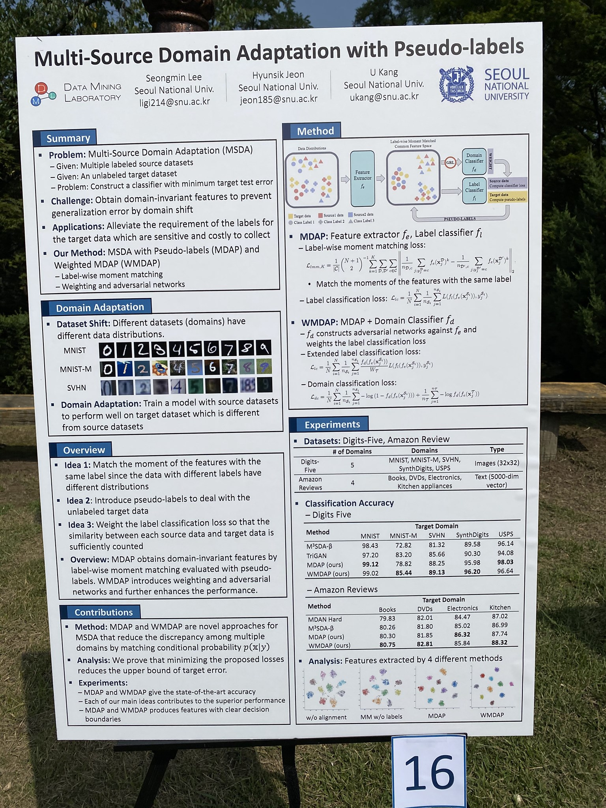
**이미지 캡션:** 이 포스터는 여러 출처의 데이터셋을 사용하여 머신러닝 모델의 성능을 향상시키는 다중 소스 도메인 적응(MSDA)에 관한 연구를 설명합니다. 포스터는 세 명의 성인 남성 연구원, 즉 Seongmin Lee, Hyunsik Jeon, U Kang이 서울대학교에서 진행한 연구를 보여줍니다. 포스터의 주요 내용은 다음과 같습니다. **요약:** *   **문제:** 여러 개의 레이블이 지정된 소스 데이터셋이 주어졌을 때, 레이블이 없는 타겟 데이터셋에 대해 최소한의 타겟 테스트 오류를 갖는 분류기를 구축하는 것이 목표입니다. *   **도전 과제:** 도메인 변화로 인한 일반화 오류를 방지하기 위해 도메인 불변 특징을 얻는 것입니다. *   **응용 분야:** 타겟 데이터에 대한 레이블이 민감하거나 수집 비용이 많이 드는 경우의 요구 사항을 완화합니다. *   **제안 방법:** 의사 레이블(pseudo-labels)을 사용한 MSDA(MDAP)와 가중치 부여 및 적대적 네트워크를 사용한 가중치 부여 MDAP(WMDAP)를 제안합니다. 이는 레이블별 모멘트 매칭과 가중치 부여 및 적대적 네트워크를 포함합니다. **도메인 적응:** *   데이터셋 시프트는 다른 도메인이 다른 데이터 분포를 갖는다는 것을 의미합니다. *   도메인 적응은 소스 데이터셋으로 모델을 훈련하여 소스 데이터셋과 다른 타겟 데이터셋에서 잘 작동하도록 하는 것입니다. **방법:** *   **MDAP:** 특징 추출기 $f_e$와 레이블 분류기 $f_l$을 사용합니다. 레이블별 모멘트 매칭 손실과 레이블 분류 손실을 계산합니다. *   **WMDAP:** MDAP에 도메인 분류기 $f_d$를 추가합니다. $f_d$는 $f_e$에 대한 적대적 네트워크를 구성하고 레이블 분류 손실을 가중치 부여합니다. 도메인 분류 손실도 계산합니다. **개요:** *   **아이디어 1:** 다른 레이블을 가진 데이터의 특징 모멘트를 일치시킵니다. *   **아이디어 2:** 레이블이 없는 타겟 데이터를 처리하기 위해 의사 레이블을 도입합니다. *   **아이디어 3:** 각 소스 데이터와 타겟 데이터 간의 유사성이 충분히 고려되도록 레이블 분류 손실에 가중치를 부여합니다. *   **개요:** MDAP는 의사 레이블로 평가된 레이블별 모멘트 매칭을
 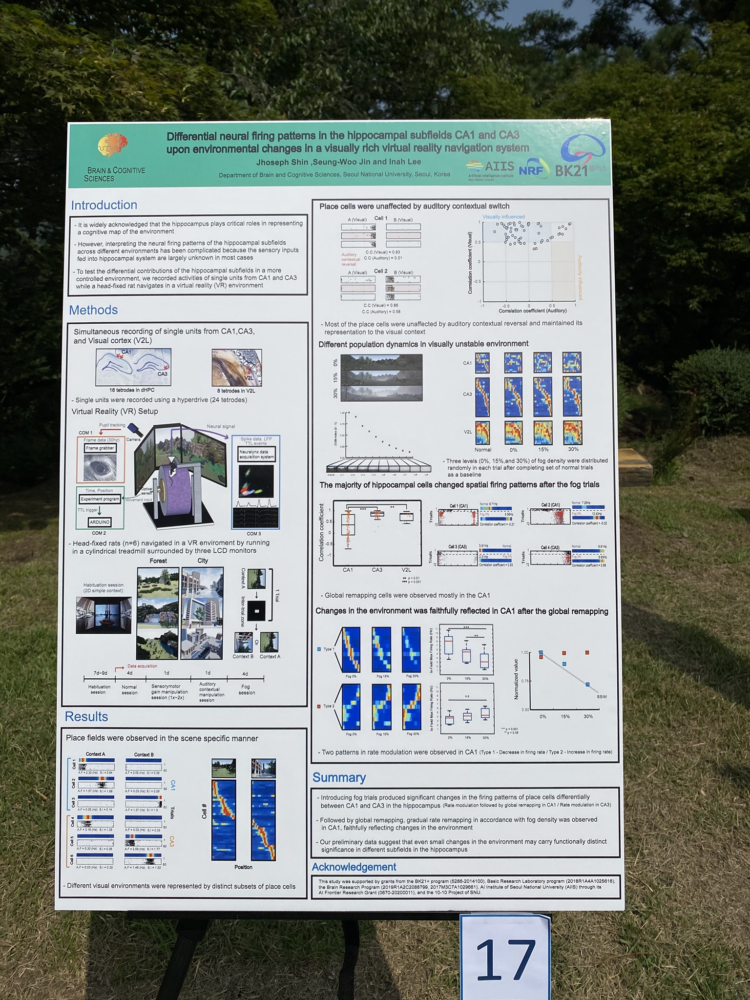
**이미지 캡션:** 이 포스터는 뇌 및 인지 과학 분야의 연구 결과를 발표하는 것으로, 가상 현실 환경에서의 신경 활동 변화를 다루고 있습니다. 포스터의 제목은 "시각적으로 풍부한 가상 현실 내비게이션 시스템에서 환경 변화에 따른 해마 CA1 및 CA3 하위 영역의 차등 신경 발화 패턴"입니다. **사람:** 포스터에는 연구를 수행한 연구자들의 이름(Jhoseph Shin, Seung-Woo Jin, Inah Lee)이 명시되어 있으며, 연구 대상으로는 성인 수컷 쥐(n=6)가 사용되었습니다. **장소/배경:** 포스터는 야외에서 촬영되었으며, 배경에는 녹색의 나무와 풀이 보입니다. 포스터 자체는 흰색 바탕에 다양한 그래프, 이미지, 텍스트로 구성되어 있습니다. **사물:** 포스터에는 뇌 과학 연구와 관련된 다양한 시각 자료가 포함되어 있습니다. 여기에는 뇌의 특정 영역(CA1, CA3, V2L)을 나타내는 다이어그램, 신경 발화 패턴을 보여주는 그래프, 가상 현실(VR) 장비 설정 이미지(헤드셋, 트레드밀, LCD 모니터), 쥐의 뇌 활동을 나타내는 이미지, 그리고 다양한 통계 분석 결과가 담긴 그래프와 상자 그림 등이 있습니다. 또한, 포스터 하단에는 "17"이라는 숫자가 적힌 표지판이 보입니다. **보이는 텍스트:** 포스터에는 연구의 제목, 저자, 소속 기관(Department of Brain and Cognitive Sciences, Seoul National University, Seoul, Korea), 연구 개요, 방법론, 결과, 요약, 그리고 연구 지원에 대한 감사 내용이 한국어와 영어로 상세하게 기재되어 있습니다. 또한, 연구에 사용된 장비, 실험 조건, 통계 수치 등이 포함되어 있습니다. **분위기/상황:** 포스터는 학술적인 분위기를 띠고 있으며, 뇌 과학 분야의 최신 연구 결과를 전달하는 데 중점을 두고 있습니다. 연구의 중요성과 결과의 의미를 강조하기 위해 다양한 시각 자료와 명확한 텍스트 설명을 활용하고 있습니다. 야외에서 포스터 발표가 이루어지고 있는 상황으로 보입니다.
 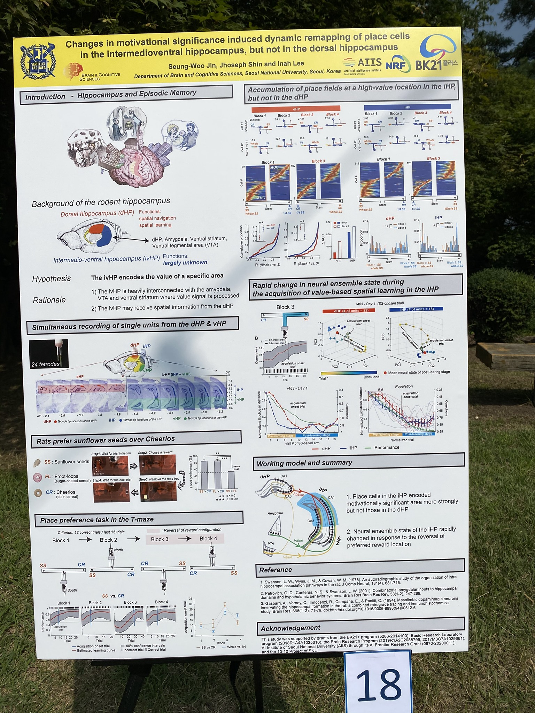
**이미지 캡션:** 이 포스터는 뇌의 해마와 관련된 기억 및 학습 메커니즘에 대한 연구 결과를 보여줍니다. 포스터의 제목은 "동기 부여의 중요성이 중간 복측 해마의 장소 세포에서 동적 재매핑을 유도하지만 등쪽 해마에서는 그렇지 않다"입니다. 포스터에는 다음과 같은 내용이 포함되어 있습니다. *   **연구자 정보**: 서울대학교 뇌인지과학과 소속의 진승우, 신조셉, 이인하 연구자가 발표했습니다. *   **서론**: 해마와 일화 기억에 대한 소개가 있습니다. *   **쥐 해마의 배경**: 등쪽 해마(dHP)와 중간 복측 해마(ivHP)의 기능과 가설, 근거에 대한 설명이 있습니다. *   **dHP 및 vHP 단일 단위 동시 기록**: 실험 결과 그래프와 데이터가 제시되어 있습니다. *   **해바라기 씨앗 대 치리오스 선호도**: 쥐가 먹이에 대한 선호도를 보이는 실험 결과 그래프가 있습니다. *   **T-미로에서의 선호도 과제**: 쥐가 특정 위치를 선호하는 실험 결과 그래프와 데이터가 있습니다. *   **작동 모델 및 요약**: 연구 결과를 바탕으로 한 모델과 두 가지 주요 요약이 제시되어 있습니다. *   **참고 문헌**: 연구에 참고된 관련 논문 목록이 있습니다. *   **감사의 글**: 연구 지원 기관에 대한 감사의 내용이 있습니다. *   **번호 18**: 포스터 번호로 보이는 숫자 18이 하단에 크게 표시되어 있습니다. 전반적으로 이 포스터는 뇌의 해마, 특히 중간 복측 해마가 학습 및 동기 부여와 관련된 공간 정보 처리에 중요한 역할을 한다는 것을 보여주는 과학 연구 발표 자료입니다.
 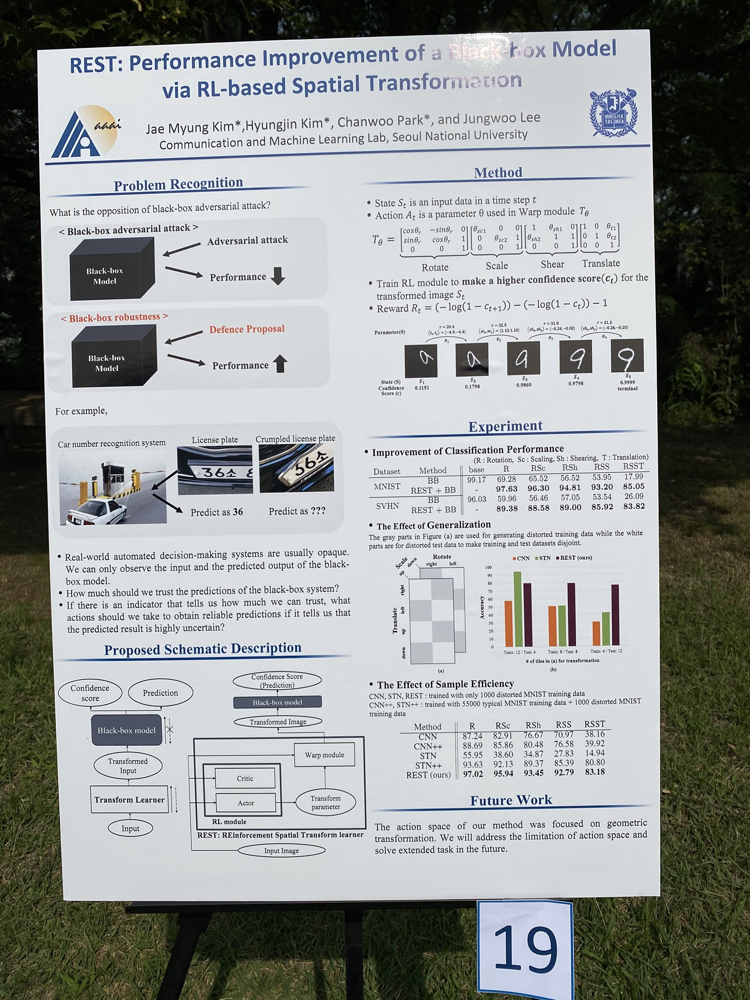
**이미지 캡션:** 이 포스터는 서울대학교 통신 및 기계 학습 연구실의 김재명, 김형진, 박찬우, 이정우가 발표한 "RL 기반 공간 변환을 통한 블랙박스 모델 성능 향상"에 대한 연구 내용을 담고 있습니다. 포스터는 크게 문제 인식, 방법론, 실험, 향후 연구로 구성되어 있으며, 블랙박스 모델의 취약점인 적대적 공격에 대한 방어 전략과 성능 향상을 제안합니다. **사람:** 포스터에는 연구자들의 이름이 명시되어 있지만, 사진 속 인물은 없습니다. **장소/배경:** 포스터는 야외에서 촬영되었으며, 배경에는 녹색 식물과 나무가 보입니다. 포스터 자체는 흰색 바탕에 검은색, 파란색, 빨간색 등의 글씨와 그림으로 구성되어 있습니다. **사물:** 포스터에는 다양한 도표, 그래프, 수식, 그림 등이 포함되어 있습니다. 특히, 블랙박스 모델의 공격과 방어를 설명하는 다이어그램, 공간 변환을 나타내는 행렬, 실험 결과를 보여주는 표와 그래프, 그리고 제안하는 모델의 구조를 나타내는 블록 다이어그램이 눈에 띕니다. 또한, 자동차 번호판 인식 시스템의 예시로 실제 번호판과 구겨진 번호판 사진이 포함되어 있습니다. **보이는 텍스트:** 포스터의 제목은 "REST: Performance Improvement of a Black-box Model via RL-based Spatial Transformation"이며, 연구자들의 이름과 소속이 명시되어 있습니다. 각 섹션별로 "Problem Recognition", "Method", "Experiment", "Future Work" 등의 소제목이 있으며, 연구 내용에 대한 상세한 설명과 수식, 표, 그래프 등이 포함되어 있습니다. 마지막에는 "19"라는 숫자가 크게 쓰여 있습니다. **분위기/상황:** 포스터는 학술적인 내용을 다루고 있으며, 연구의 중요성과 결과를 효과적으로 전달하기 위해 시각적인 요소를 잘 활용하고 있습니다. 전반적으로 진지하고 전문적인 분위기이며, 연구의 혁신성과 잠재력을 보여주고 있습니다.
 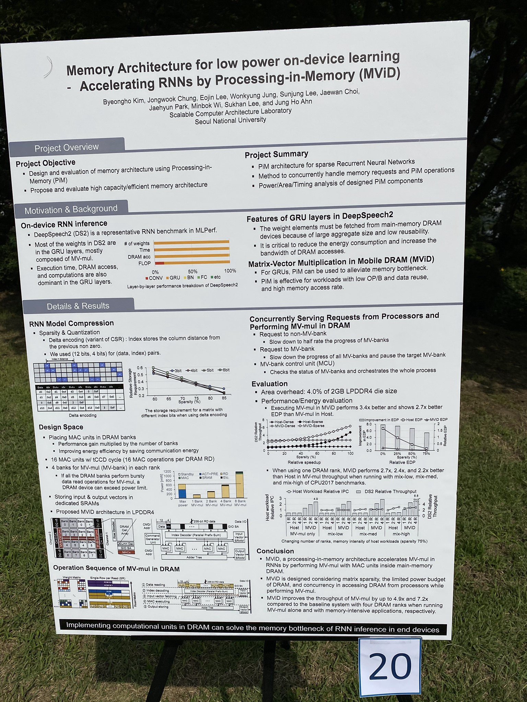
**이미지 캡션:** 이 포스터는 "메모리 아키텍처를 활용한 저전력 온디바이스 학습: 처리인메모리(MVID)를 통한 RNN 가속화"라는 주제를 다루고 있으며, 서울대학교 확장컴퓨터 아키텍처 연구실의 연구원들이 작성했습니다. 포스터는 여러 섹션으로 구성되어 있으며, 각 섹션은 연구의 목표, 동기, 결과 및 결론을 설명합니다. **사람:** 포스터에는 특정 인물이 등장하지 않지만, 연구에 참여한 연구원들의 이름이 나열되어 있습니다. **장소/배경:** 포스터는 흰색 배경에 검은색과 파란색 텍스트로 구성되어 있으며, 연구 내용을 시각적으로 전달하기 위한 다양한 그래프와 다이어그램이 포함되어 있습니다. **사물:** 포스터에는 다음과 같은 사물들이 언급되거나 시각적으로 표현되어 있습니다. *   **DRAM:** 메인 메모리 장치로, RNN 모델의 가중치를 저장하고 처리하는 데 사용됩니다. *   **RNN (Recurrent Neural Network):** 순환 신경망으로, 음성 인식과 같은 시퀀스 데이터 처리에 사용되는 딥러닝 모델입니다. *   **PIM (Processing-in-Memory):** 메모리 내에서 직접 연산을 수행하는 기술로, 데이터 이동을 줄여 성능과 에너지 효율을 향상시킵니다. *   **MV-mul (Matrix-Vector Multiplication):** 행렬-벡터 곱셈 연산으로, RNN 모델에서 중요한 연산 중 하나입니다. *   **MAC unit:** 곱셈-누산 연산을 수행하는 하드웨어 유닛입니다. *   **LPDDR4:** 저전력 DDR4 메모리 규격입니다. *   **SRAM:** 정적 랜덤 액세스 메모리로, 빠른 데이터 접근을 위해 사용됩니다. *   **그래프 및 다이어그램:** 성능, 에너지 효율, 대역폭, 스파시티 등의 데이터를 시각적으로 표현합니다. **보이는 텍스트:** 포스터에는 제목, 연구원 이름, 소속, 프로젝트 개요, 동기 및 배경, 세부 결과, 결론 등 다양한 텍스트가 포함되어 있습니다. 특히, "Memory Architecture for low power on-device learning", "Accelerating RNNs by Processing-in-Memory (MVID)", "Project Overview", "Project Summary", "Motivation & Background", "Details & Results", "Conclusion" 등의 섹션 제목과 각 섹션의 상세 내용이 명확하게 보입니다. 또한, 그래프와 다이어그램에도 축 레이블, 범례, 수치 등이 표시되어 있습니다. 포스터 하단에는 "20"이라는 숫자가 크게 표시되어 있습니다. **분위기/상황:** 포
 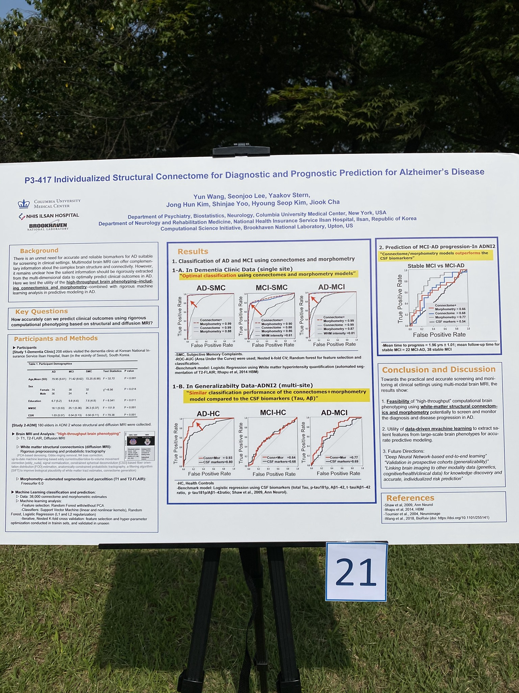
**이미지 캡션:** 이 포스터는 알츠하이머병의 진단 및 예후 예측을 위한 개인 맞춤형 구조적 커넥톰에 대한 연구 결과를 발표하고 있습니다. 포스터 상단에는 연구 제목과 함께 한국과 미국 소속의 여러 연구자 이름이 나열되어 있습니다. 포스터의 주요 내용은 배경, 연구 질문, 참가자 및 방법, 결과, 결론 및 토론, 참고 문헌으로 구성되어 있습니다. 배경 섹션에서는 뇌 MRI를 이용한 알츠하이머병 진단의 필요성을 설명하고, 커넥톰 및 형태학적 분석을 통한 뇌 질환의 조기 진단 가능성을 제시합니다. 연구 질문은 구조 및 확산 MRI 기반의 계산적 표현형 분석을 통해 임상 결과를 얼마나 정확하게 예측할 수 있는지에 대한 것입니다. 참가자 및 방법 섹션에서는 치매 클리닉 데이터와 ADNI2 데이터를 사용하여 연구를 수행했음을 밝히고, 데이터 수집 및 분석 방법에 대해 간략히 설명합니다. 결과 섹션에서는 AD, MCI, SMC, HC 그룹 간의 분류 성능을 보여주는 ROC 곡선과 함께, 커넥톰 및 형태학적 모델이 CSF 바이오마커보다 우수한 성능을 보임을 나타냅니다. 또한, ADNI2 데이터에서 MCI에서 AD로의 진행 예측에서 커넥톰/형태학적 모델이 CSF 바이오마커를 능가함을 보여줍니다. 결론 및 토론 섹션에서는 연구 결과의 실질적인 의미와 향후 연구 방향을 제시하며, 딥러닝 기반의 종단적 학습, 전향적 코호트 검증, 다중 모달리티 데이터 통합 등을 제안합니다. 포스터 하단에는 연구에 사용된 참고 문헌 목록이 포함되어 있습니다. 포스터 전반적으로 흰색 배경에 검정색 글씨와 파란색, 빨간색, 초록색 그래프가 사용되어 전문적이고 깔끔한 인상을 줍니다. 포스터 오른쪽 하단에는 숫자 '21'이 크게 적혀 있어 발표 번호나 섹션 번호를 나타내는 것으로 보입니다.
 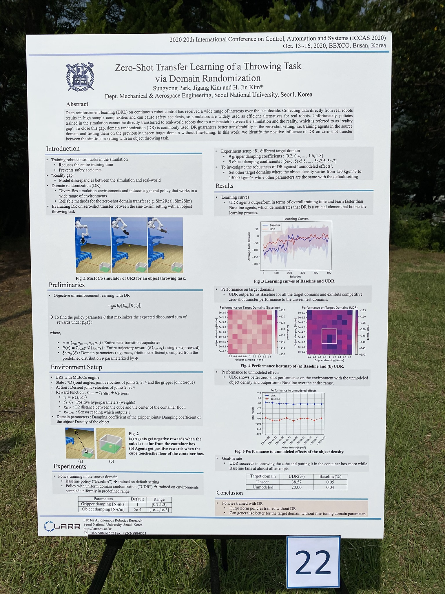
**이미지 캡션:** 이 포스터는 "도메인 무작위화를 통한 던지기 작업의 제로샷 전이 학습"이라는 제목의 연구를 소개합니다. 포스터의 중앙에는 로봇 팔이 상자를 던지는 시뮬레이션 장면을 보여주는 두 개의 이미지와 함께 연구의 핵심 내용을 설명하는 텍스트가 있습니다. 왼쪽 상단에는 연구 기관인 서울대학교 기계항공공학부의 로고가 있습니다. 포스터는 연구의 배경, 방법론, 실험 결과 및 결론을 자세히 설명합니다. 연구는 딥러닝 기반 로봇 제어에서 시뮬레이션과 실제 세계 간의 간극을 줄이는 데 중점을 둡니다. 포스터의 오른쪽에는 학습 곡선, 성능 히트맵 및 무모델링된 효과에 대한 성능을 보여주는 여러 그래프가 포함되어 있습니다. 하단에는 연구에 사용된 파라미터와 결과가 표로 요약되어 있습니다. 포스터의 오른쪽 하단에는 "22"라는 숫자가 크게 표시되어 있습니다. 전반적으로 포스터는 연구의 기술적인 측면을 명확하고 간결하게 전달하며, 시각 자료와 텍스트를 효과적으로 사용하여 정보를 구성합니다.
 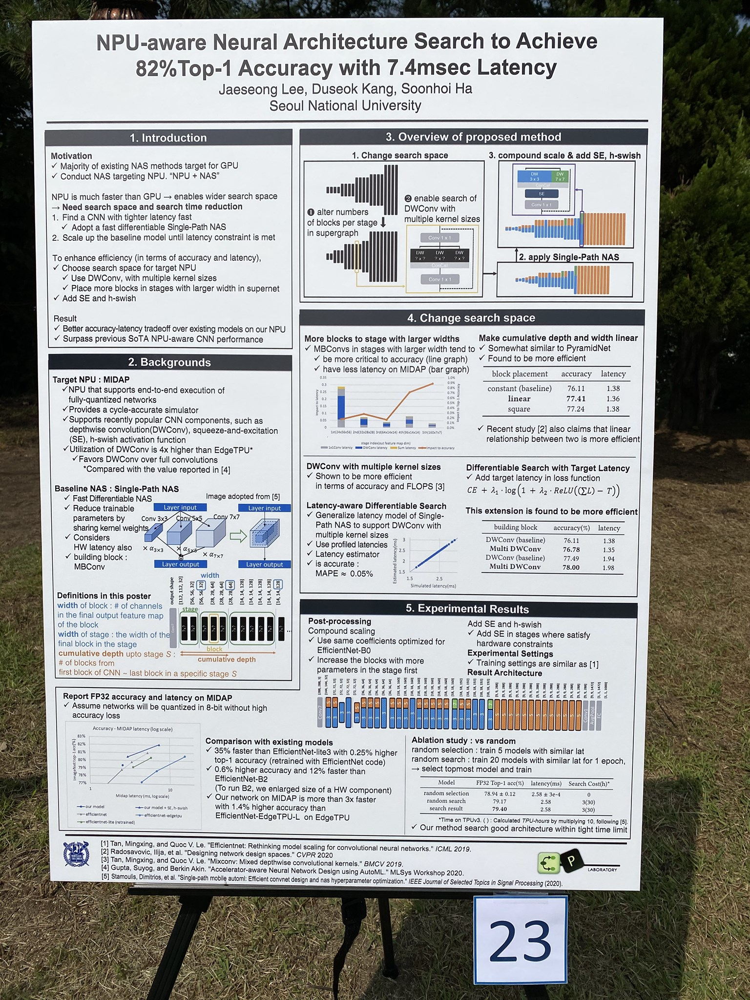
**이미지 캡션:** 이 포스터는 NPU(신경망 처리 장치)에 최적화된 신경망 아키텍처 탐색에 관한 연구를 소개하며, 82%의 Top-1 정확도를 7.4밀리초의 지연 시간으로 달성했음을 보여줍니다. 연구는 서울대학교의 이재성, 강두석, 하선호 연구원이 수행했습니다. 포스터는 서론, 배경, 제안된 방법론의 개요, 탐색 공간 변경, 실험 결과, 그리고 기존 모델과의 비교를 포함합니다. 서론에서는 GPU 중심의 기존 NAS 방법론의 한계를 지적하고 NPU에 특화된 탐색 공간과 시간 단축의 필요성을 강조합니다. 배경 섹션에서는 NPU의 특징과 DWConv, SE, h-swish와 같은 구성 요소의 중요성을 설명합니다. 제안된 방법론은 탐색 공간을 변경하고, 블록 수를 늘리며, 스테이지의 너비를 넓히는 방식을 사용합니다. 또한, 지연 시간을 고려한 차별화된 탐색을 통해 효율성을 높입니다. 실험 결과 섹션에서는 제안된 방법론이 기존 모델보다 더 나은 정확도-지연 시간 트레이드오프를 달성했음을 보여주는 그래프와 표가 제시되어 있습니다. 특히, EfficientNet-B2와 비교했을 때 더 높은 정확도와 빠른 속도를 달성했으며, MIDAP NPU에서는 3배 이상 빠른 속도와 1.4% 더 높은 정확도를 보였습니다. 마지막으로, 무작위 선택과 비교한 실험 결과는 제안된 방법론이 더 나은 아키텍처를 효율적으로 탐색할 수 있음을 입증합니다. 포스터의 전체적인 분위기는 학술적이고 정보 전달에 집중되어 있으며, 연구의 핵심 내용을 명확하게 전달하기 위해 다양한 그래프, 표, 다이어그램을 활용하고 있습니다.
 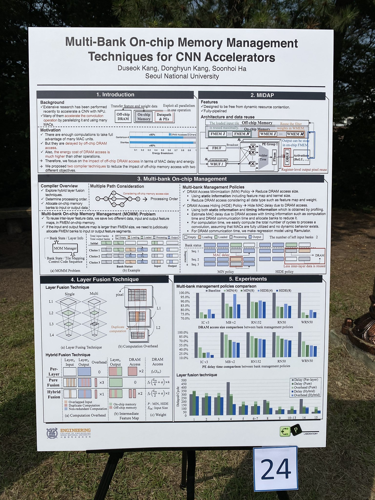
**이미지 캡션:** 이 포스터는 서울대학교의 강두석, 강동현, 하순회 연구원이 발표한 "CNN 가속기를 위한 다중 뱅크 온칩 메모리 관리 기법"에 대한 내용을 담고 있습니다. 포스터는 여러 섹션으로 나뉘어 있으며, 각 섹션은 CNN 가속기에서 온칩 메모리 관리의 중요성과 새로운 기법을 설명합니다. **사람:** 포스터에는 연구자들의 이름이 명시되어 있으며, 발표자의 성별이나 나이대는 알 수 없습니다. 포스터를 보는 사람은 주로 학술 행사나 컨퍼런스에 참석한 연구자, 학생, 엔지니어 등으로 추정됩니다. **장소/배경:** 포스터는 학술 발표회나 컨퍼런스에서 전시된 것으로 보이며, 배경에는 다른 포스터나 전시 부스가 희미하게 보입니다. 포스터 자체는 흰색 배경에 검은색, 파란색, 녹색, 주황색 등 다양한 색상의 그래프와 텍스트로 구성되어 있습니다. **사물:** 포스터에는 다양한 그래프, 다이어그램, 표, 텍스트가 포함되어 있습니다. 특히, 온칩 메모리 구조, 데이터 흐름, 연산 과정, 성능 비교 그래프 등이 시각적으로 제시되어 있습니다. 포스터 하단에는 "ENGINEERING COLLEGE OF EN"이라는 로고와 함께 "24"라는 숫자가 크게 쓰여 있어, 포스터 번호나 발표 순서를 나타내는 것으로 보입니다. **보이는 텍스트:** 포스터의 주요 텍스트는 다음과 같습니다. *   **제목:** Multi-Bank On-chip Memory Management Techniques for CNN Accelerators *   **저자:** Duseok Kang, Donghyun Kang, Soonhoi Ha, Seoul National University *   **섹션 제목:** 1. Introduction, 2. MIDAP, 3. Multi-bank On-chip Management, 4. Layer Fusion Technique, 5. Experiments *   **각 섹션의 세부 내용:** Background, Motivation, Features, Architecture and data reuse, Compiler Overview, Multiple Path Consideration, MOMM Problem, Multi-bank Management Policies, Layer Fusion Technique, Hybrid Fusion Technique, Multi-bank management policies comparison, DRAM access size comparison, PE delay time comparison, Layer fusion technique (그래프 설명) *   **기타:** 로고, 포스터 번호 "24" **분위기/상황:** 포스터는 전반적으로 학술적이고 정보 전달에 초점을 맞춘 분위기입니다. 복잡한 기술적 내용을 시각적으로 명확하게 전달하기 위해 다양한 그래프와 다이어그램을 활용하고 있으며, 연구의 중요성과 결과를 효과적으로 보여주려는 노력이 엿보입니다. 연구자들은 자신의 연구 성과를 발표하고 공유하는 상황에 있으며, 포스터
 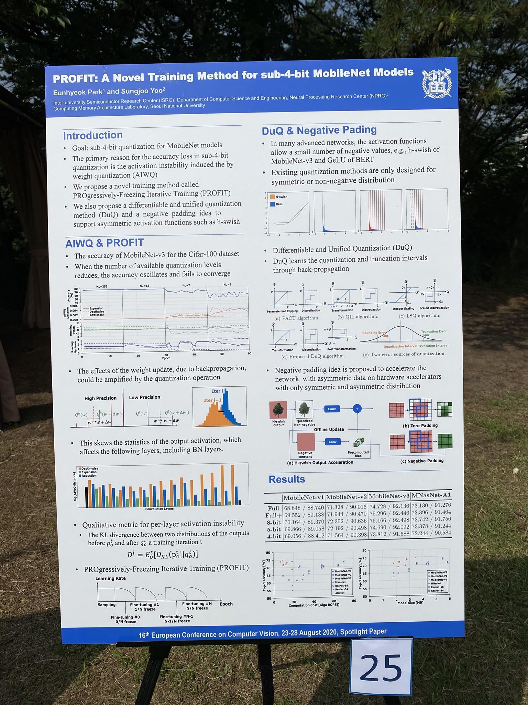
**이미지 캡션:** 이 사진은 "PROFIT: A Novel Training Method for sub-4-bit MobileNet Models"라는 제목의 학술 포스터 발표 자료이다. 포스터는 흰색 배경에 파란색과 주황색 계열의 디자인 요소가 사용되었으며, 여러 개의 섹션으로 나누어 연구 내용을 설명하고 있다. 포스터의 상단에는 연구 제목과 함께 발표자들의 이름(Eunhyeok Park, Sungjoo Yoo)과 소속(Inter-university Semiconductor Research Center, Seoul National University)이 명시되어 있다. 포스터의 주요 내용은 다음과 같이 구성되어 있다. **사람:** 포스터에는 직접적인 인물 사진은 없으나, 연구 발표자들의 이름이 명시되어 있다. **장소/배경:** 포스터는 야외에서 촬영된 것으로 보이며, 배경에는 녹색 식물과 나무가 흐릿하게 보인다. 포스터 자체는 흰색 종이 재질이며, 하단에는 "16th European Conference on Computer Vision, 23-28 August 2020, Spotlight Paper"라는 문구가 있어 학술 대회 발표 자료임을 알 수 있다. 또한, 포스터 우측 하단에는 "25"라는 숫자가 크게 쓰여 있어 발표 번호나 세션 번호를 나타내는 것으로 추정된다. **사물:** 포스터에는 다양한 그래프, 도표, 수식, 알고리즘 흐름도 등이 포함되어 있다. 주요 사물로는 다음과 같은 것들이 있다. *   **그래프:** AIWQ & PROFIT 섹션에는 양자화 수준에 따른 정확도 변화를 보여주는 선 그래프와 막대 그래프가 있다. DuQ & Negative Pading 섹션에는 활성화 함수(h-swish, ReLU)의 분포를 보여주는 그래프와 양자화 알고리즘(PACT, QIL, LSQ, DuQ)의 단계를 설명하는 도표가 있다. Results 섹션에는 모델별 정확도와 연산량(Giga FLOPS) 또는 모델 크기(MB)를 나타내는 산점도 그래프가 있다. *   **도표/흐름도:** DuQ & Negative Pading 섹션에는 양자화 및 역전파 과정을 설명하는 도표와 Negative Padding의 개념을 설명하는 그림이 있다. AIWQ & PROFIT 섹션에는 PROFIT 학습 방법을 설명하는 학습률(Learning Rate)과 에포크(Epoch)의 관계를 나타내는 도표가 있다. *   **수식:** AIWQ & PROFIT 섹션에는 KL 발산(KL divergence)을 나타내는 수식이 포함되어 있다. *   **텍스트:** 포스터 전체에 걸쳐 연구 내용, 방법론, 결과 등을 설명하는 다양한 텍스트가 포함되어 있다. *   **로고:** 서울대학교 로고와 한국
 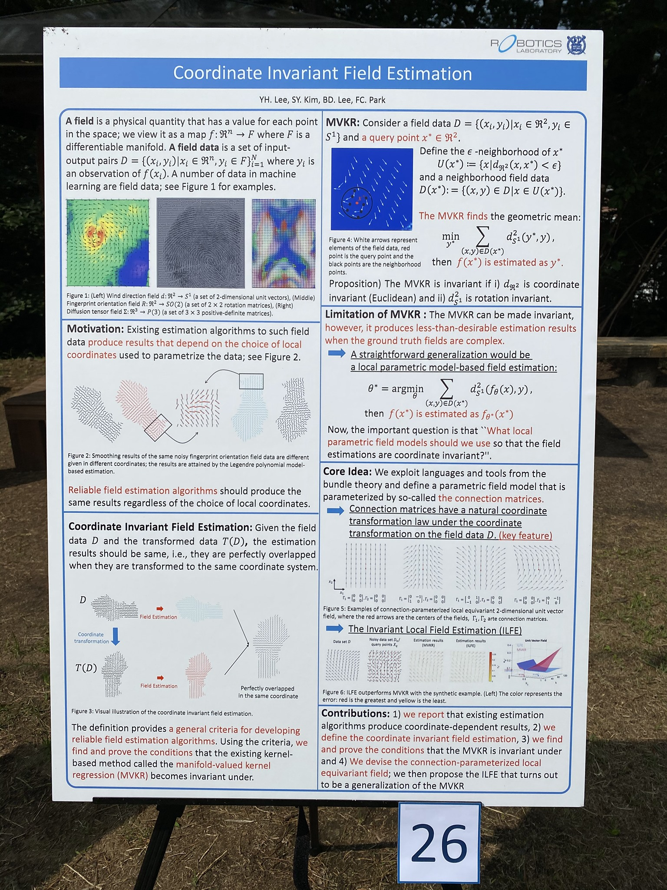
**이미지 캡션:** 이 포스터는 "Coordinate Invariant Field Estimation"이라는 주제를 다루고 있으며, YH Lee, SY Kim, BD Lee, FC Park가 작성했습니다. 포스터는 물리적 양인 필드 데이터의 추정 알고리즘이 좌표계에 독립적인 결과를 생성해야 한다는 아이디어를 설명합니다. 포스터의 왼쪽 상단에는 "A field is a physical quantity that has a value for each point in the space"라는 설명과 함께 필드 데이터의 예시로 풍향, 지문 방향, 확산 텐서 필드를 보여주는 세 개의 이미지가 있습니다. 이어서 "Motivation" 섹션에서는 기존 알고리즘이 로컬 좌표계 선택에 따라 결과가 달라지는 문제를 지적하며, "Coordinate Invariant Field Estimation" 섹션에서는 좌표 변환 후에도 추정 결과가 동일하게 유지되어야 함을 시각적으로 설명하는 다이어그램을 제시합니다. 오른쪽 상단에는 "MVKR"이라는 알고리즘을 소개하고, 그 정의와 기하 평균을 찾는 과정을 수식으로 보여줍니다. "Proposition"에서는 MVKR의 불변 조건에 대해 언급하고, "Limitation of MVKR"에서는 복잡한 필드에서 MVKR의 성능 저하 가능성을 지적하며, 이를 개선하기 위한 "local parametric model-based field estimation"을 제안합니다. "Core Idea" 섹션에서는 번들 이론을 활용하여 좌표 변환 법칙을 따르는 "connection matrices"를 정의하고, 이를 통해 "Invariant Local Field Estimation (ILFE)"을 개발했다고 설명합니다. ILFE의 예시와 MVKR과의 성능 비교를 보여주는 두 개의 이미지가 있으며, 마지막으로 "Contributions" 섹션에서 연구의 주요 기여점을 네 가지로 요약합니다. 포스터의 하단에는 "26"이라는 숫자가 크게 표시되어 있습니다. 전반적으로 이 포스터는 학술적인 내용을 담고 있으며, 연구의 배경, 방법론, 결과 및 기여점을 명확하게 전달하는 데 중점을 두고 있습니다.
 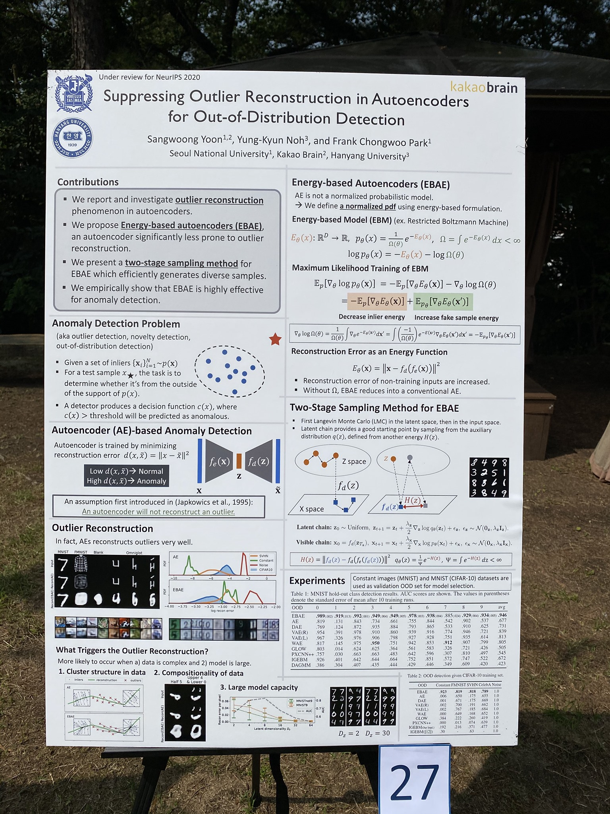
**이미지 캡션:** 이 포스터는 "Suppressing Outlier Reconstruction in Autoencoders for Out-of-Distribution Detection"이라는 제목의 연구를 소개하고 있으며, 서울대학교, 카카오 브레인, 한양대학교 소속의 Sangwoong Yoon, Yung-Kyun Noh, Frank Chongwoo Park가 작성했습니다. 포스터는 크게 네 부분으로 나뉘어 있으며, 각 부분은 연구의 기여, 문제 정의, 방법론, 실험 결과 등을 설명합니다. **사람:** 포스터에는 연구자들의 이름과 소속이 명시되어 있습니다. 연구자들은 성인 남성으로 보이며, 연구에 대한 열정적인 태도를 엿볼 수 있습니다. **장소/배경:** 포스터는 야외에서 촬영된 것으로 보이며, 배경에는 나무와 녹색 식물들이 보입니다. 포스터 자체는 흰색 배경에 검은색, 파란색, 빨간색, 노란색 등 다양한 색상의 텍스트와 그래프, 이미지가 포함되어 있습니다. **사물:** 포스터에는 다양한 수식, 그래프, 이미지, 표가 포함되어 있습니다. 그래프는 데이터 분포, 에너지 함수, 재구성 오류 등을 시각적으로 보여주며, 이미지는 MNIST 및 CIFAR-10 데이터셋의 예시를 보여줍니다. 표는 다양한 모델의 성능을 비교하는 실험 결과를 나타냅니다. **보이는 텍스트:** 포스터에는 "Under review for NeurIPS 2020", "kakao brain", "Contributions", "Energy-based Autoencoders (EBAE)", "Anomaly Detection Problem", "Autoencoder (AE)-based Anomaly Detection", "Outlier Reconstruction", "What Triggers the Outlier Reconstruction?", "Experiments", "Table 1: MNIST hold-out-set class detection results", "Table 2: OOD detection given CIFAR-10 training set" 등 다양한 텍스트가 포함되어 있습니다. **분위기/상황:** 포스터는 학술적인 분위기를 띠고 있으며, 연구의 중요성과 독창성을 강조하고 있습니다. 연구자들은 복잡한 수식과 그래프를 통해 자신들의 연구 결과를 명확하게 전달하고자 노력하고 있습니다. 포스터는 전반적으로 전문적이고 정보 전달에 초점을 맞춘 분위기를 자아냅니다.
 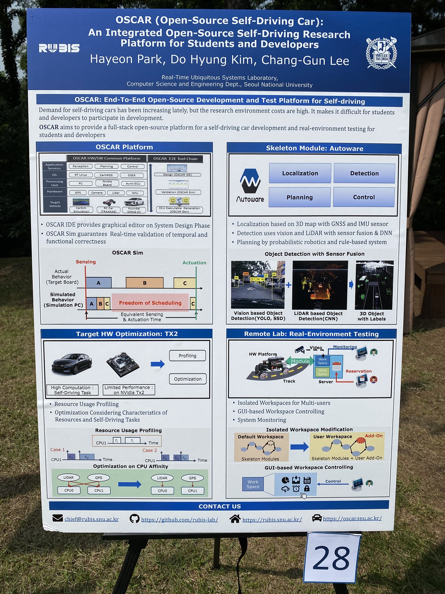
**이미지 캡션:** 이 포스터는 "OSCAR (Open-Source Self-Driving Car)"라는 제목의 연구 프로젝트를 소개하며, 이는 학생 및 개발자를 위한 통합 오픈 소스 자율 주행 연구 플랫폼입니다. 포스터의 상단에는 프로젝트의 주요 저자인 Hayeon Park, Do Hyung Kim, Chang-Gun Lee의 이름과 소속(서울대학교 컴퓨터 과학 및 공학부 실시간 유비쿼터스 시스템 연구실)이 명시되어 있습니다. 포스터의 주요 내용은 자율 주행차 개발 및 테스트 플랫폼으로서 OSCAR의 목표, OSCAR 플랫폼의 구성 요소, Skeleton Module로서 Autoware의 기능, 센서 융합을 통한 객체 탐지, TX2 하드웨어 최적화, 그리고 원격 실험실 환경에서의 실시간 테스트에 대한 설명입니다. 포스터의 왼쪽 상단에는 "RUBIS" 로고가 있으며, 그 아래에는 OSCAR 플랫폼의 개요가 도식화되어 있습니다. 이 도식은 애플리케이션 서비스, 하드웨어, 타겟 차량 등의 구성 요소를 보여줍니다. 또한, OSCAR IDE와 OSCAR Sim의 역할에 대한 설명도 포함되어 있습니다. OSCAR Sim은 센싱과 액추에이션 단계를 시뮬레이션하며, 실제 동작과 시뮬레이션된 동작의 비교를 통해 스케줄링의 자유도와 등가적인 센싱 및 액추에이션 시간을 보여주는 그래프가 있습니다. 중앙에는 "Skeleton Module: Autoware" 섹션이 있으며, Autoware의 주요 기능인 Localization, Detection, Planning, Control이 버튼 형태로 표시되어 있습니다. 이 섹션에서는 3D 맵, GNSS, IMU 센서를 활용한 위치 인식, 비전 및 LiDAR 센서 융합과 딥러닝을 이용한 객체 탐지, 확률적 로보틱스와 규칙 기반 시스템을 이용한 주행 계획에 대한 설명이 있습니다. 또한, YOLO, SSD, CNN 등의 기술을 활용한 객체 탐지 예시 이미지가 포함되어 있습니다. 하단에는 "Target HW Optimization: TX2" 섹션이 있으며, 고성능 자율 주행 작업과 NVIDIA TX2의 제한된 성능을 비교하고 있습니다. 리소스 사용량 프로파일링과 CPU 어피니티 최적화에 대한 그래프와 설명이 포함되어 있습니다. 오른쪽에는 "Remote Lab: Real-Environment Testing" 섹션이 있으며, 하드웨어 플랫폼, 모듈, 워크스페이스, 서버, 예약 시스템 등을 포함하는 원격 실험실 환경을 도식화하고 있습니다. 이 섹션은 다중 사용자 환경을 위한 격리된 워크스페이스, GUI 기반 워크스페이스 제어, 시스템 모니터링에 대해 설명합니다. 또한, 기본 워크스페이스에서 사용자 워크스페이스로의 수정 과정을 보여주는 다
 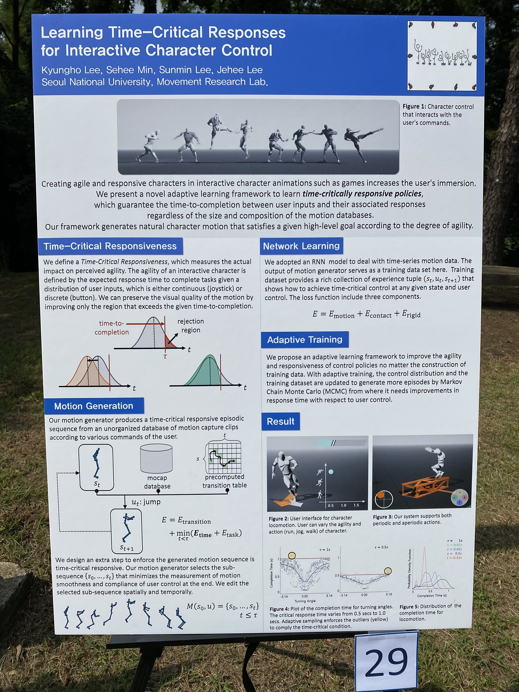
**이미지 캡션:** 이 포스터는 서울대학교 움직임 연구실의 이경호, 민세희, 이선민, 이재희가 작성한 "Learning Time-Critical Responses for Interactive Character Control"이라는 제목의 연구 내용을 담고 있습니다. 포스터는 게임과 같은 상호작용 환경에서 캐릭터 애니메이션의 민첩성과 반응성을 높이는 새로운 적응 학습 프레임워크를 소개합니다. 이 프레임워크는 사용자 입력과 그에 따른 응답 간의 시간 완료를 보장하며, 모션 데이터베이스의 크기나 구성에 관계없이 자연스러운 캐릭터 모션을 생성합니다. 포스터는 시간-임계 응답성, 네트워크 학습, 적응 훈련, 모션 생성, 그리고 결과라는 네 가지 주요 섹션으로 구성되어 있습니다. 각 섹션에는 관련 설명과 함께 도표, 그래프, 그리고 이미지들이 포함되어 있습니다. 예를 들어, "시간-임계 응답성" 섹션에서는 응답 시간과 거부 영역을 보여주는 그래프가 있고, "모션 생성" 섹션에서는 모션 생성 과정을 설명하는 다이어그램이 있습니다. "결과" 섹션에는 사용자 인터페이스, 시스템 기능, 그리고 완료 시간과 관련된 그래프들이 제시되어 있습니다. 포스터의 전반적인 분위기는 학술적이고 정보 전달에 초점을 맞추고 있으며, 연구의 핵심 내용을 시각적으로 명확하게 전달하고 있습니다. 포스터 하단에는 "29"라는 숫자가 크게 쓰여 있어 발표 번호나 페이지 번호를 나타내는 것으로 보입니다.
 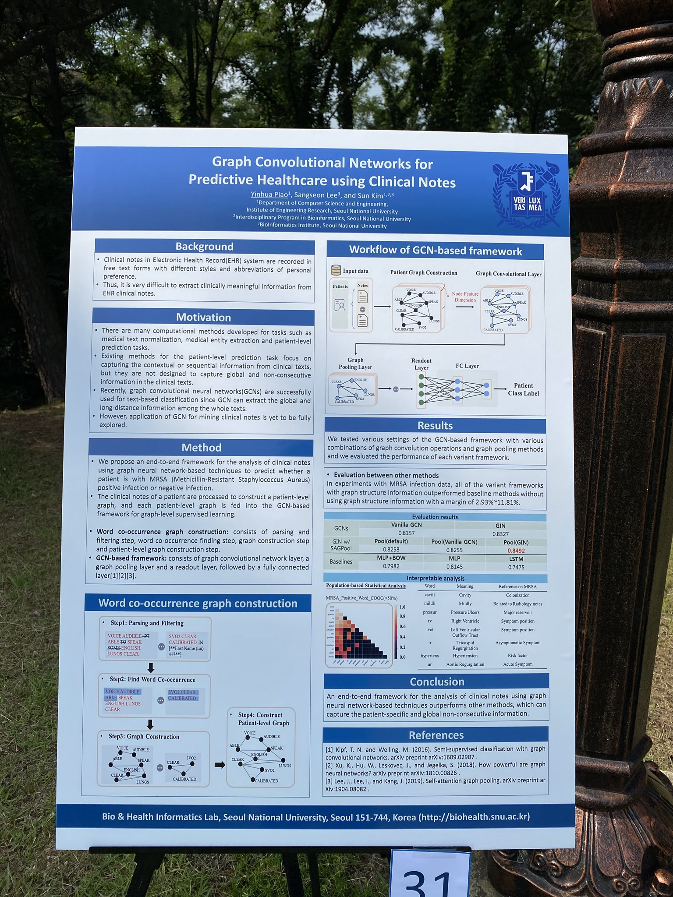
**이미지 캡션:** 이 포스터는 한국어로 된 학술 포스터로, "Graph Convolutional Networks for Predictive Healthcare using Clinical Notes"라는 제목으로 Yinhua Piao, Sangseon Lee, Sun Kim이 작성했습니다. 포스터는 서울대학교 생명공학정보학 연구실에서 제작되었으며, 서울대학교의 로고와 함께 Veri Lux Tas Mea라는 문구가 새겨져 있습니다. 포스터는 크게 배경, 동기, 방법, 결과, 결론, 참고문헌 섹션으로 나뉘어 있습니다. 배경 섹션에서는 전자의무기록(EHR)에 기록된 임상 노트의 특성과 정보 추출의 어려움을 설명합니다. 동기 섹션에서는 임상 노트 분석을 위한 기존 방법론의 한계를 지적하고 그래프 컨볼루션 네트워크(GCN)의 잠재력을 강조합니다. 방법 섹션에서는 MRSA 감염 예측을 위한 GCN 기반의 종단간 프레임워크를 제안하며, 단어 동시 발생 그래프 구축 과정과 GCN 프레임워크의 구성 요소를 설명합니다. 결과 섹션에서는 다양한 GCN 변형과 기존 방법론과의 성능 비교를 보여주며, 그래프 구조 정보가 예측 성능을 향상시킴을 입증합니다. 또한, 해석 가능한 분석 섹션에서는 특정 단어와 임상 증상 간의 연관성을 제시합니다. 결론 섹션에서는 제안된 GCN 기반 프레임워크가 임상 노트 분석에서 기존 방법론보다 우수하며 환자별 및 전반적인 비연속적 정보를 포착할 수 있음을 강조합니다. 참고문헌 섹션에서는 관련 연구 논문들을 나열합니다. 포스터 하단에는 서울대학교 생명공학정보학 연구실의 주소와 웹사이트 주소가 명시되어 있으며, 오른쪽 하단에는 "31"이라는 숫자가 보입니다. 포스터 전체적으로는 학술적인 분위기를 띠고 있으며, 복잡한 그래프와 표, 텍스트가 포함되어 있어 전문적인 내용을 다루고 있음을 알 수 있습니다.
 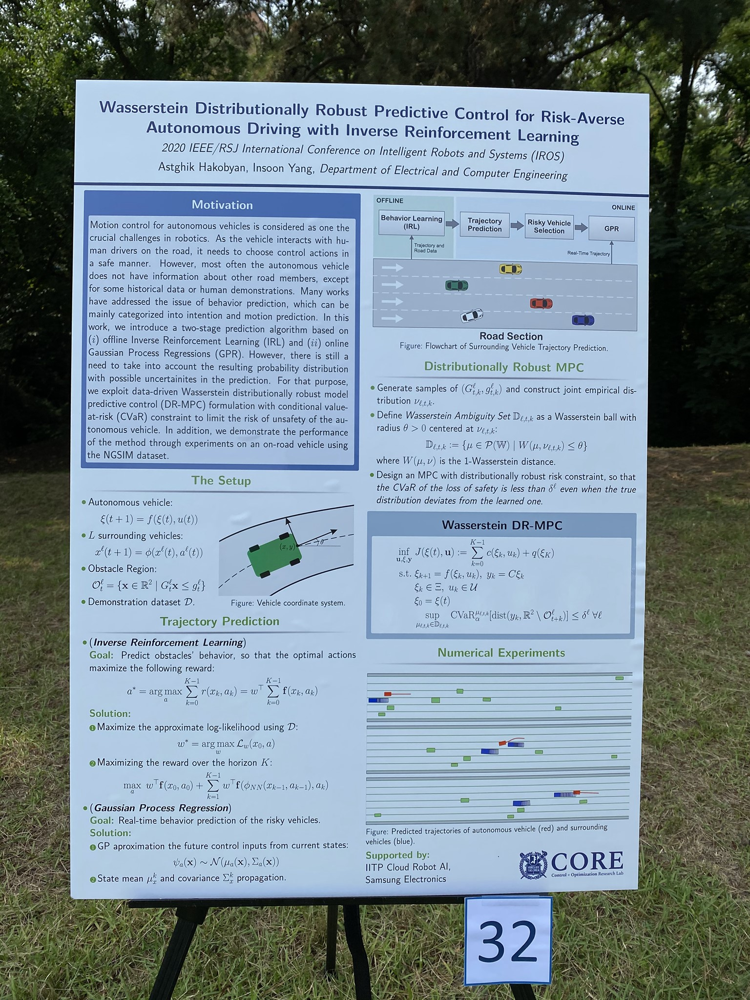
**이미지 캡션:** 이 포스터는 "Wasserstein Distributionally Robust Predictive Control for Risk-Averse Autonomous Driving with Inverse Reinforcement Learning"이라는 주제를 다루고 있으며, 2020 IEEE/RSJ International Conference on Intelligent Robots and Systems (IROS)에서 발표되었습니다. 포스터는 Astghik Hakobyan과 Insoon Yang이 작성했으며, 이들은 Department of Electrical and Computer Engineering 소속입니다. 포스터의 주요 내용은 다음과 같습니다. **동기 (Motivation):** 자율 주행 차량의 모션 제어는 로봇 공학에서 중요한 과제입니다. 차량이 도로에서 인간 운전자와 상호 작용할 때, 안전한 방식으로 제어 동작을 선택해야 합니다. 그러나 자율 주행 차량은 종종 다른 도로 이용자에 대한 정보가 부족하며, 이는 행동 예측을 어렵게 만듭니다. 이 연구에서는 오프라인 역 강화 학습(IRL)과 온라인 가우시안 프로세스 회귀(GPR)를 결합한 2단계 예측 알고리즘을 제안합니다. 또한, 예측의 불확실성을 고려하기 위해 조건부 위험 가치(CVaR) 제약을 갖춘 Wasserstein 분포 강건 모델 예측 제어(DR-MPC)를 사용하여 차량의 안전 위험을 제한합니다. NGSIM 데이터셋을 사용하여 실제 차량 실험을 통해 방법의 성능을 입증합니다. **설정 (The Setup):** *   **자율 주행 차량:** 차량의 상태는 시간 t에서의 위치와 속도(f(t), u(t))로 표현됩니다. *   **주변 차량:** 주변 차량의 상태는 시간 t에서의 위치와 속도(x(t), a'(t))로 표현됩니다. *   **장애물 영역:** 장애물 영역은 특정 공간(O = {x ∈ R² | Gx ≤ g})으로 정의됩니다. *   **시연 데이터셋:** D는 실험에 사용된 데이터셋을 나타냅니다. *   **차량 좌표계:** 그림에는 차량의 전방을 x축, 측면을 y축으로 하는 2D 좌표계가 표시되어 있습니다. **궤적 예측 (Trajectory Prediction):** *   **(역 강화 학습):** 주변 차량의 행동을 예측하여 최적의 행동이 다음 보상을 최대화하도록 합니다. *   **목표:** 주변 차량의 행동을 예측하여 최적의 행동이 다음 보상을 최대화하도록 합니다. *   **해결책:** *   D를 사용하여 근사 로그 가능도를 최대화합니다. *   K 지평선에 걸쳐 보상을 최대화합니다. *   **(가우시안 프로세스 회귀):** 위험 차량의 실시간 행동을 예측합니다. *   **목표:** 위험 차량
 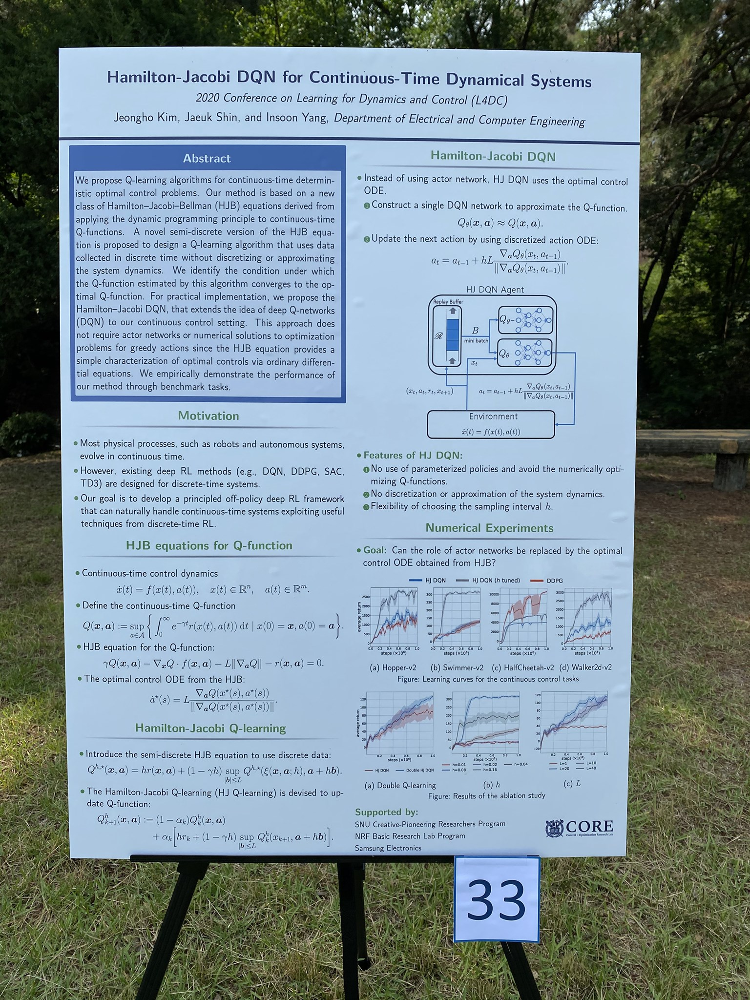
**이미지 캡션:** 이 사진은 "Hamilton-Jacobi DQN for Continuous-Time Dynamical Systems"라는 제목의 학술 포스터를 보여줍니다. 포스터는 흰색 배경에 검은색과 파란색 텍스트로 구성되어 있으며, 여러 개의 그래프와 다이어그램이 포함되어 있습니다. 포스터의 상단에는 제목, 발표자들의 이름과 소속, 그리고 발표 연도와 학회 정보가 기재되어 있습니다. 포스터의 주요 내용은 다음과 같습니다. **사람:** 포스터에는 특정 인물이 직접적으로 등장하지는 않습니다. 다만, 발표자들의 이름(Jeongho Kim, Jaeuk Shin, Insoon Yang)과 소속(Department of Electrical and Computer Engineering)이 명시되어 있습니다. **장소/배경:** 포스터는 야외 잔디밭 위에 놓여 있으며, 배경에는 녹색 잔디와 흐릿하게 보이는 나무가 있습니다. 포스터 자체는 흰색 배경에 검은색, 파란색, 회색 텍스트와 그래프로 구성되어 있습니다. **사물:** 포스터는 흰색 배경의 종이로 되어 있으며, 여러 개의 그래프와 다이어그램, 수식, 그리고 텍스트로 채워져 있습니다. 포스터 하단에는 "33"이라는 숫자가 적힌 파란색 표지판이 보입니다. **보이는 텍스트:** *   **제목:** Hamilton-Jacobi DQN for Continuous-Time Dynamical Systems *   **학회 정보:** 2020 Conference on Learning for Dynamics and Control (L4DC) *   **발표자:** Jeongho Kim, Jaeuk Shin, and Insoon Yang, Department of Electrical and Computer Engineering *   **섹션 제목:** Abstract, Motivation, HJB equations for Q-function, Hamilton-Jacobi Q-learning, Hamilton-Jacobi DQN, Numerical Experiments, Supported by: *   **주요 내용:** Q-learning 알고리즘, HJB 방정식, 연속 시간 동적 시스템, 딥러닝, 최적 제어, 수치 실험 결과 등 *   **그래프 제목:** (a) Hopper-v2, (b) Swimmer-v2, (c) Half Cheetah-v2, (d) Walker2d-v2, (a) Double Q-learning, (b) h, (c) L *   **지원 기관:** SNU Creative-Pioneering Researchers Program, NRF Basic Research Lab Program, Samsung Electronics *   **로고:** CORE 로고 *   **기타:** "33"이라는 숫자 **분위기/상황:** 포스터는 학술적인 내용을 전달하는 데 초점을 맞추고 있으며, 진지하고 정보 전달 중심적인 분위기입니다. 야외에 놓여 있지만, 발표 내용 자체는 기술적이고 전문적인 내용을 다루고
 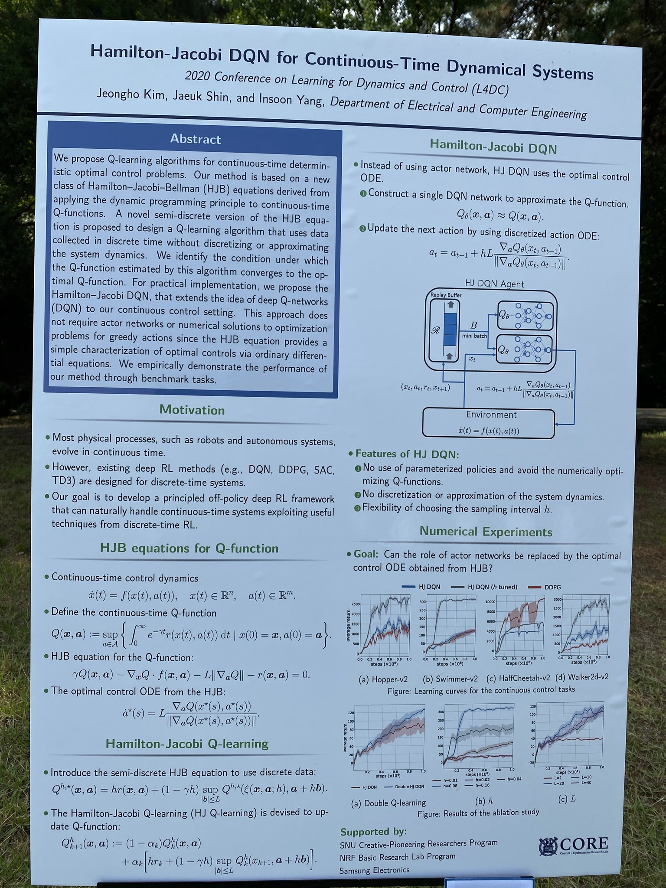
**이미지 캡션:** 이 사진은 "Hamilton-Jacobi DQN for Continuous-Time Dynamical Systems"라는 제목의 학술 포스터입니다. 포스터는 주로 흰색 배경에 검은색 글씨와 일부 파란색, 빨간색, 회색 그래프로 구성되어 있습니다. 포스터의 상단에는 제목과 함께 2020년 학습 동역학 및 제어 컨퍼런스(L4DC) 정보, 그리고 저자들의 이름(Jeongho Kim, Jaeuk Shin, Insoon Yang)과 소속(Department of Electrical and Computer Engineering)이 명시되어 있습니다. 포스터는 크게 "Abstract", "Motivation", "HJB equations for Q-function", "Hamilton-Jacobi Q-learning", "Hamilton-Jacobi DQN", "Features of HJ DQN", "Numerical Experiments", "Supported by" 섹션으로 나뉘어 있습니다. "Abstract" 섹션에서는 제안하는 Q-러닝 알고리즘과 Hamilton-Jacobi-Bellman (HJB) 방정식, 그리고 이를 기반으로 한 Hamilton-Jacobi DQN에 대해 설명하고 있습니다. "Motivation" 섹션에서는 실제 물리 시스템의 연속적인 시간 특성과 기존 딥러닝 강화학습 방법론의 이산 시간 한계를 언급하며, 연속 시간 시스템을 다룰 수 있는 새로운 프레임워크의 필요성을 강조합니다. "HJB equations for Q-function" 섹션에서는 연속 시간 제어 동역학, 연속 시간 Q-함수 정의, HJB 방정식, 그리고 HJB로부터 얻어지는 최적 제어 상미분 방정식(ODE)을 수식으로 제시합니다. "Hamilton-Jacobi Q-learning" 섹션에서는 이산 데이터를 사용하기 위한 반이산 HJB 방정식과 Q-함수 업데이트를 위한 HJ Q-러닝 방법을 설명합니다. "Hamilton-Jacobi DQN" 섹션에서는 액터 네트워크 대신 최적 제어 상미분 방정식을 사용하는 HJ DQN의 접근 방식과 단일 DQN 네트워크를 사용하여 Q-함수를 근사하는 방법을 설명하며, 관련 알고리즘 흐름도를 보여줍니다. "Features of HJ DQN" 섹션에서는 HJ DQN의 특징으로 파라미터화된 정책을 사용하지 않고 Q-함수를 최적화하며, 시스템 동역학을 이산화하거나 근사하지 않고, 샘플링 간격 h를 유연하게 선택할 수 있다는 점을 언급합니다. "Numerical Experiments" 섹션에서는 액터 네트워크의 역할을 HJB에서 얻은 최적 제어 상미분 방정식으로 대체할 수 있는지에 대한 목표를 제시하고, 다양한 제어 작업에 대한 학습 곡선 그래프와 절제 연구 결과를 보여줍니다. 그래프에는 HJ DQN, HJ DQN (h tuned), DDPG 등의 성능 비교가 포함되어 있습니다. "Supported by" 섹션에서는 SNU Creative-Pioneering Researchers Program, NRF Basic Research Lab Program, Samsung Electronics의

<a id="p0718-0749"></a>
### 7월 18일 (토) 07:49 · 📷 사진 (2장)


**이미지 캡션:** 이 이미지는 "BREAK INTO NLP"라는 제목의 가상 라이브 이벤트 포스터로, 딥러닝.ai에서 주최하며 2023년 7월 29일 오전 10시부터 11시 30분까지 PDT 시간에 진행됩니다. 포스터 왼쪽에는 보라색 배경에 흰색 테두리로 "BREAK INTO NLP"라는 문구와 "An NLP Specialization Virtual Live Event"라는 부제가 적혀 있습니다. 오른쪽에는 5명의 연사 사진과 이름, 소속이 나열되어 있습니다. 첫 번째 줄에는 옅은 파란색 셔츠를 입고 미소 짓는 아시아계 성인 남성인 Andrew Ng (Founder & CEO, deeplearning.ai), 체크무늬 셔츠를 입고 흰머리가 있는 백인 성인 남성인 Kenneth Church (Distinguished Scientist, Baidu USA), 검은색 상의를 입고 금발 머리를 한 백인 성인 여성인 Marti Hearst (Professor, School of Information & EECS Dept., UC Berkeley)가 있습니다. 두 번째 줄에는 파란색 셔츠를 입고 미소 짓는 백인 성인 남성인 Łukasz Kaiser (Staff Research Scientist, Google Brain), 옅은 파란색 셔츠를 입고 환하게 웃는 백인 성인 남성인 Younes Bensouda Mourri (Instructor of AI, Stanford University)가 있습니다. 각 연사의 사진은 원형으로 처리되어 있으며, 배경은 보라색입니다. 전체적으로 깔끔하고 전문적인 분위기를 풍기는 행사 홍보 이미지입니다.
 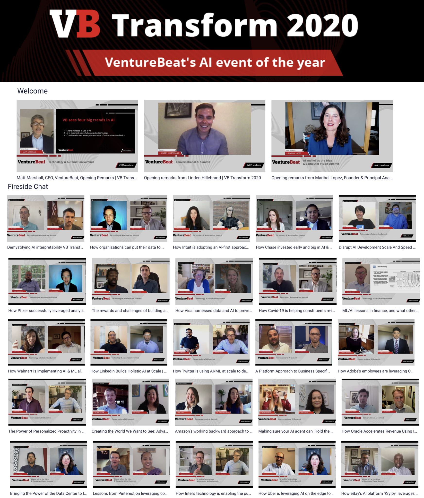
**이미지 캡션:** 이 이미지는 VentureBeat Transform 2020 컨퍼런스의 웹사이트 또는 플랫폼을 보여주며, 인공지능(AI) 관련 다양한 세션과 발표를 소개하고 있습니다. 상단에는 "VB Transform 2020"이라는 큰 제목과 "VentureBeat's AI event of the year"라는 부제가 보입니다. "Welcome" 섹션에는 세 개의 영상 미리보기 이미지가 나란히 배치되어 있으며, 각각 "VB sees four big trends in AI", "Opening remarks from Linden Hillebrand | VB Transform 2020", "Opening remarks from Maribel Lopez, Founder & Principal Ana..."라는 제목을 가지고 있습니다. 각 영상 썸네일에는 발표자들의 모습과 함께 VentureBeat 로고, 세션 제목, 발표자 이름 등이 표시되어 있습니다. "Fireside Chat" 섹션 아래로는 수많은 영상 미리보기 이미지가 격자 형태로 배열되어 있으며, 각 영상은 "Demystifying AI interpretability VB Transf...", "How organizations can put their data to...", "How Intuit is adopting an AI-first approac...", "How Chase invested early and big in AI &...", "Disrupt AI Development Scale And Speed...", "How Pfizer successfully leveraged analyti...", "The rewards and challenges of building a...", "How Visa harnessed data and AI to preve...", "How Covid-19 is helping constituents re-i...", "ML/AI lessons in finance, and what other...", "How Walmart is implementing AI & ML al...", "How Linkedin Builds Holistic AI at Scale...", "How Twitter is using AI/ML at scale to de...", "A Platform Approach to Business Specifi...", "How Adobe's employees are leveraging C...", "The Power of Personalized Proactivity in...", "Creating the World We Want to See: Adva...", "Amazon's working backward approach to...", "Making sure your AI agent can 'Hold the...", "How Oracle Accelerates Revenue Using I...", "Bringing the Power of the Data Center to I...", "Lessons from Pinterest on leveraging co....", "How Intel's technology is enabling the pu....", "How Uber is leveraging AI on the edge to...", "How eBay's AI platform 'Krylov' leverages..." 등의 다양한 주제를 다루고 있습니다. 각 영상 썸네일에는 발표자들의 모습이 담겨 있으며, 대부분 온라인 화상 회의 형태로 진행되는 것을 알 수 있습니다. 전반적으로 전문적이고 정보 전달에 초점을 맞춘 행사의 분위기를 띠고 있습니다.

> #BREAKINTONLP   멋진 분들이 모여 멋진 이야기를 나눕니다. 다만 한국시간으로 새벽 2시부터 3:30AM.ㅠㅠ  @Andrew Ng 의 미션이 정말 멋지네요. > At deeplearning.ai, our mission is to make world-class AI education accessible to everyone.   [https://www.eventbrite.com/e/break-into-natural-language-processing-tickets-113412048490](https://www.eventbrite.com/e/break-into-natural-language-processing-tickets-113412048490?aff=Hubspot&utm_campaign=deeplearning.ai+News+and+Events+Announcements&_hsenc=p2ANqtz-_q8_J1Jc5cotEwXRqL9rvjSAFsf5-qTiS3fVsgWlitkcz2Kv5diKFdUaY5_nA2U2vO7zW6O1R2MafUV6zF4w4_-CZeWg&utm_content=91596830&utm_source=hs_email&utm_medium=email&_hsmi=91596830)
> #이번주말뭐하지? #걱정끝!  곧 SalesForce를 떠나는 Richard Socher 님의 이야기를 비롯 AI interpretability, 어떻게 팀이 일하는지, 모바일 first-> AI first, AI 뱅킹/금융, Visa fraud detection, LinkedIn과 트윗 , 우버, 핀트레스드, 이베이 회사의 AI사용법, 아마존 대화팀... 볼거리가 이어집니다.  [https://venturebeat.com/transform-2020-video-hub/#/](https://venturebeat.com/transform-2020-video-hub/#/)  이거 너무 많아서 이번 주말을 다 써도 힘들듯 한데 여러분도 하나씩 보시고 한줄평 서로 남겨주시는 것은 어떨까요?  이런것을 무료로 다 볼수 있다는 것은 대단한 기쁨을 넘어 축복인듯 합니다.

<a id="p0718-1137"></a>
### 7월 18일 (토) 11:37 · is so grateful to receive over 10,000 ci…

is so grateful to receive over 10,000 citations thanks to my wonderful co-authors. Especially, thanks to Jim Whitehead (my advisor), Jung-Woo Ha, Thomas Zimmermann, Andreas Zeller, Dongsun Kim, and Jaechang Nam for our work, StarGan, Buggy classification, BugCache, AutoFix, and Bug Tossing Graph. I really enjoyed working with them, and let's do more! 

https://scholar.google.com/citations?user=JE_m2UgAAAAJ&hl=en

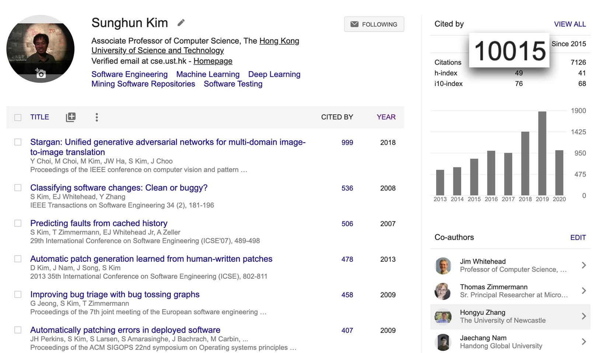
**이미지 캡션:** 화면에는 한국인 성인 남성인 Sunghun Kim 교수의 학술 프로필이 표시되어 있으며, 그는 홍콩 과학기술대학교 컴퓨터 과학과의 부교수로 재직 중입니다. 그의 프로필 사진은 어두운 배경에 그의 얼굴이 클로즈업된 모습이며, 그는 흰색 셔츠를 입고 약간 미소를 짓고 있습니다. 그의 이름 옆에는 연필 아이콘이 있어 프로필 편집이 가능함을 나타냅니다. 프로필 상단에는 "FOLLOWING" 버튼이 있으며, 그의 총 인용 횟수는 10015회로, h-index는 49, i10-index는 76입니다. 2015년 이후의 통계도 함께 표시되어 있습니다. 그의 연구 분야는 소프트웨어 엔지니어링, 머신러닝, 딥러닝, 마이닝 소프트웨어 리포지토리, 소프트웨어 테스팅입니다. 화면 중앙에는 그의 주요 논문 목록이 연도별로 정렬되어 있으며, 각 논문의 제목, 저자, 출판 정보, 인용 횟수, 발행 연도가 표시됩니다. 가장 많이 인용된 논문은 "Stargan: Unified generative adversarial networks for multi-domain image-to-image translation"으로 999회 인용되었습니다. 오른쪽에는 2013년부터 2020년까지의 연도별 인용 횟수를 보여주는 막대그래프가 있으며, 2019년에 가장 높은 인용 횟수를 기록했습니다. 그 아래에는 공동 연구자 목록이 있으며, Jim Whitehead, Thomas Zimmermann, Hongyu Zhang, Jaechang Nam의 이름과 소속이 표시되어 있습니다. 전반적으로 이 화면은 Sunghun Kim 교수의 학술적 성과와 연구 활동을 보여주는 페이지입니다.

<a id="p0719-2157"></a>
### 7월 19일 (일) 21:57 · 📷 사진 (1장)

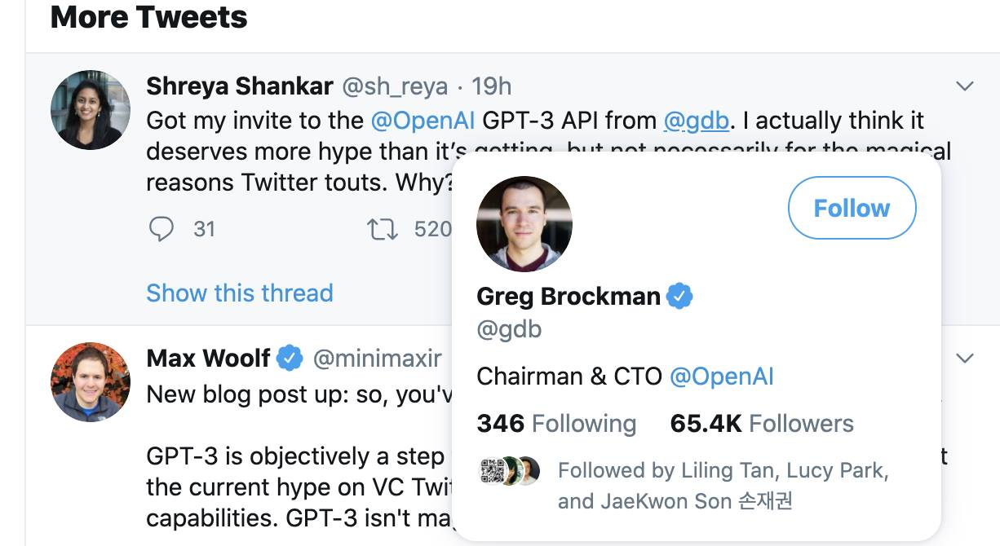
**이미지 캡션:** 화면 상단에는 "More Tweets"라는 제목이 보이며, 그 아래에는 두 개의 트윗이 나열되어 있습니다. 첫 번째 트윗은 "Shreya Shankar"라는 이름의 성인 여성 사용자가 작성했으며, 그녀는 검은색 상의를 입고 머리를 묶은 모습입니다. 트윗 내용은 "@OpenAI GPT-3 API를 @gdb로부터 초대받았다. 마법적인 이유 때문이 아니라면 트위터에서 떠드는 것보다 더 많은 주목을 받을 만하다고 생각한다. 왜?"라는 내용입니다. 이 트윗에는 31개의 댓글과 520개의 리트윗이 있습니다. 이 트윗 바로 옆에는 "Greg Brockman"이라는 이름의 성인 남성이 표시된 팝업 창이 나타나는데, 그는 회색 후드티를 입고 있으며, 그의 직책은 "Chairman & CTO @OpenAI"이고 346명의 팔로잉과 65.4K명의 팔로워를 보유하고 있습니다. 팝업 창에는 "Follow" 버튼이 있습니다. 두 번째 트윗은 "Max Woolf"라는 이름의 성인 남성 사용자가 작성했으며, 그는 회색 상의를 입고 있습니다. 트윗 내용은 "새로운 블로그 게시물이 올라왔다: GPT-3는 VC 트윗에 대한 현재의 과대광고보다 객관적으로 한 단계 앞선 것이다. GPT-3는 마법적이지 않다."라는 내용입니다. 전반적으로 이 화면은 기술, 특히 OpenAI의 GPT-3 API에 대한 트위터 토론의 일부를 보여주고 있습니다.

<a id="p0721-0837"></a>
### 7월 21일 (화) 08:37 · 생신 축하 드립니다!!

생신 축하 드립니다!!

<a id="p0721-0837-2"></a>
### 7월 21일 (화) 08:37 · ↪ 생신 축하 드립니다!!

*다른 프로필에 남긴 글*

생신 축하 드립니다!!

<a id="p0722-1007"></a>
### 7월 22일 (수) 10:07 · If you are interested in Natural Languag…

If you are interested in Natural Language Processing Open Source Software @EMNLP 2020, https://nlposs.github.io/2020/, please submit your thoughts and/or experience by 19 August 2020. 

Side note: I am happy to be a PC on this very interesting workshop, and also it's my honor to work with wonderful organizers including Lucy Park.

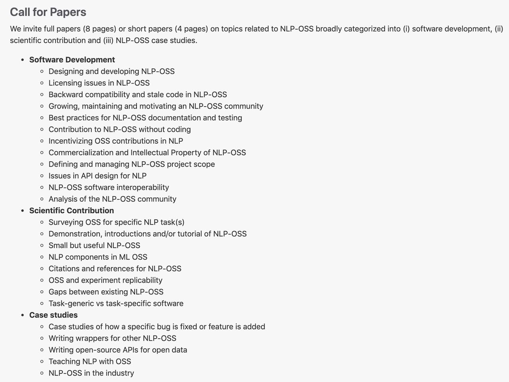
**이미지 캡션:** 이 이미지는 "Call for Papers"라는 제목의 웹 페이지 또는 문서의 일부를 보여줍니다. 텍스트는 흰색 배경에 검은색으로 표시되며, 제목은 더 큰 글꼴 크기와 굵은 글씨로 되어 있습니다. 본문은 두꺼운 글머리 기호 목록으로 구성되어 있으며, 각 목록 항목은 자연어 처리 오픈 소스 소프트웨어(NLP-OSS)와 관련된 다양한 주제를 설명합니다. 주요 범주는 "Software Development", "Scientific Contribution", "Case studies"이며, 각 범주 아래에는 더 구체적인 하위 주제들이 나열되어 있습니다. 이 텍스트는 학술 대회나 저널에 논문을 제출하도록 초대하는 공고로 보이며, 제출할 수 있는 논문의 종류(전체 논문 또는 단편 논문)와 각 논문의 페이지 수(각각 8페이지 또는 4페이지)도 명시되어 있습니다. 이 이미지에는 사람이 등장하지 않으며, 배경은 단순한 흰색입니다. 텍스트 외에는 특별한 사물이 보이지 않습니다. 전반적인 분위기는 정보 전달적이고 학술적입니다.

<a id="p0722-1009"></a>
### 7월 22일 (수) 10:09 · 📷 사진 (1장)

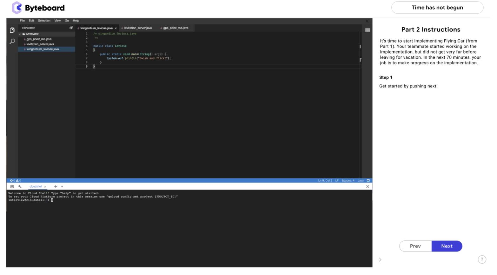
**이미지 캡션:** 이 화면은 컴퓨터 프로그래밍 환경을 보여주며, 왼쪽에는 파일 탐색기와 코드 편집기가 있고 오른쪽에는 지침과 탐색 버튼이 있습니다. 코드 편집기에는 "wingardium_leviosa.java"라는 파일이 열려 있으며, "Leviosa"라는 클래스와 "main" 메서드가 포함된 간단한 자바 코드가 표시됩니다. 코드 아래에는 "cloudshell"이라는 제목의 터미널 창이 있으며, "Welcome to Cloud Shell!"이라는 메시지와 함께 프로젝트 설정을 위한 명령어가 안내되어 있습니다. 오른쪽 패널에는 "Part 2 Instructions"라는 제목 아래 "Flying Car" 구현에 대한 지침이 제공되며, "Step 1"은 "Get started by pushing next!"라고 명시되어 있습니다. 화면 하단에는 "Prev"와 "Next" 버튼이 있어 단계별 진행을 나타냅니다. 전반적으로 코딩 작업을 수행하는 학습 또는 튜토리얼 환경으로 보입니다.

<a id="p0725-0825"></a>
### 7월 25일 (토) 08:25 · 생일 축하드립니다!

생일 축하드립니다!

<a id="p0725-0825-2"></a>
### 7월 25일 (토) 08:25 · ↪ 생일 축하드립니다!

*다른 프로필에 남긴 글*

생일 축하드립니다!

<a id="p0726-1521"></a>
### 7월 26일 (일) 15:21 · 📷 앨범: Profile pictures (1장)


**이미지 캡션:** 한 성인 남성이 스타워즈: 깨어난 포스의 배경 앞에서 스톰트루퍼 복장을 한 마네킹 옆에 서 있다. 남성은 30대 후반에서 40대 초반으로 보이며, 검은색 반팔 티셔츠를 입고 팔짱을 낀 채 카메라를 향해 미소를 짓고 있다. 그의 뒤에는 스타워즈 로고와 함께 "THE FORCE AWAKENS"라는 문구가 검은색 배경에 노란색으로 쓰여 있다. 마네킹은 흰색 스톰트루퍼 갑옷을 입고 있으며, 오른손에는 블래스터 소총을 들고 있다. 전체적으로 영화 홍보 행사나 테마파크의 한 장면으로 보이며, 즐겁고 흥미로운 분위기를 자아낸다.

<a id="p0729-1158"></a>
### 7월 29일 (수) 11:58 · is totally honored to be selected as the…

is totally honored to be selected as the first SW Maestro Guru. Specifically, I look forward to meeting so many talented members in the SW Maestro 과정.

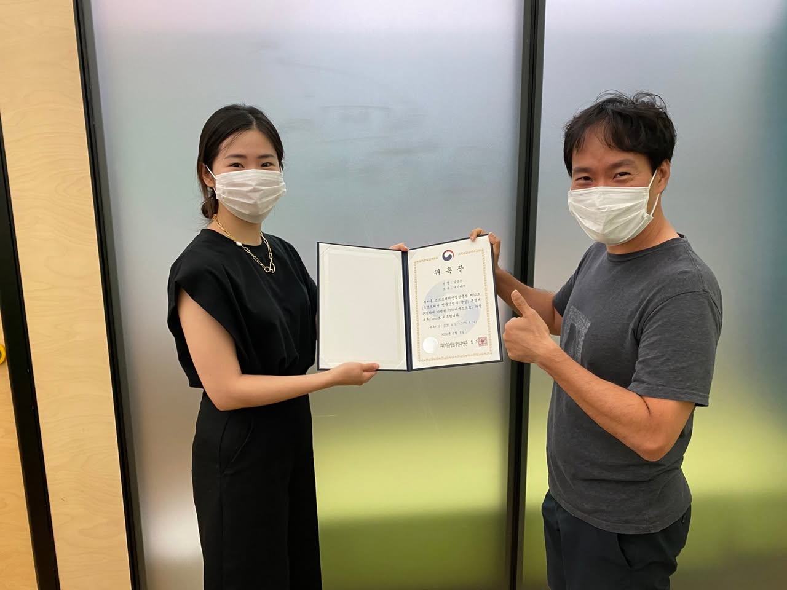
**이미지 캡션:** 한 명의 성인 여성은 검은색 상의와 바지를 입고 있으며, 목에는 금색 목걸이를 착용하고 있다. 그녀는 흰색 마스크를 쓰고 있으며, 열린 두 손으로 위촉장을 들고 있다. 그녀의 옆에는 다른 성인 남성이 회색 반팔 티셔츠를 입고 흰색 마스크를 쓰고 있으며, 한 손으로 엄지손가락을 치켜들고 다른 손으로는 위촉장을 들고 있다. 두 사람은 실내에서 사진을 찍고 있으며, 배경에는 나무 문과 불투명한 유리 벽이 보인다. 위촉장에는 한국어로 된 텍스트가 인쇄되어 있으며, 이는 공식적인 문서임을 시사한다. 전반적으로 사진은 긍정적이고 축하하는 분위기를 나타낸다.
 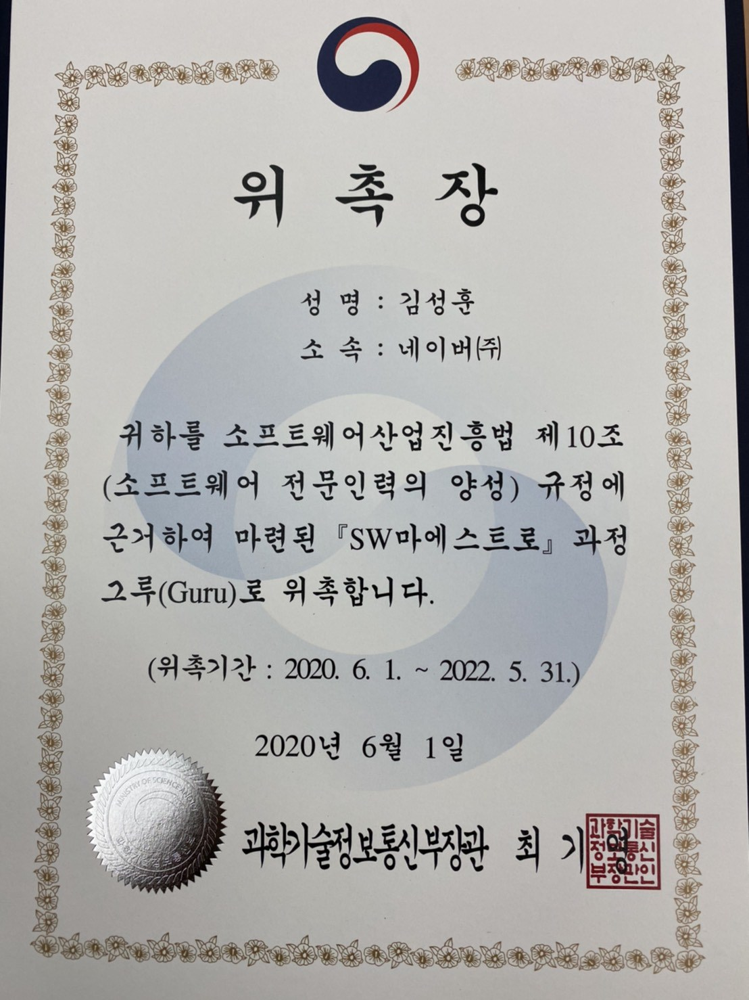
**이미지 캡션:** 이 사진은 한국어로 된 위촉장으로, 중앙에는 태극 문양이 그려진 공식 로고가 있고, 위쪽에는 "위촉장"이라는 제목이 큰 글씨로 쓰여 있습니다. 그 아래에는 "성명: 김성훈"과 "소속: 네이버(주)"라고 기재되어 있습니다. 위촉장의 본문 내용은 소프트웨어산업진흥법 제10조에 근거하여 "SW마에스트로" 과정의 "그루(Guru)"로 위촉한다는 내용이며, 위촉 기간은 2020년 6월 1일부터 2022년 5월 31일까지입니다. 위촉장 하단에는 2020년 6월 1일이라는 날짜와 함께 "과학기술정보통신부장관 최기"라는 서명이 보이며, 왼쪽에는 은색의 원형 봉인(seal)이 찍혀 있습니다. 위촉장 전체적으로는 금색 꽃무늬 테두리가 둘러져 있어 격식 있고 공식적인 분위기를 풍깁니다. 사진에는 사람이 등장하지 않으며, 배경은 위촉장 자체입니다.

<a id="p0731-0650"></a>
### 7월 31일 (금) 06:50 · 📷 사진 (2장)

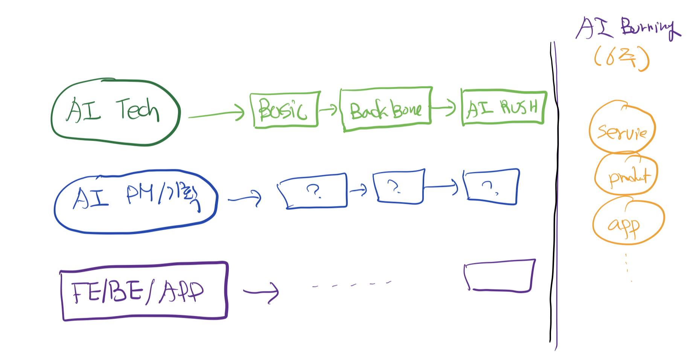
**이미지 캡션:** 이 이미지는 흰색 배경에 손으로 그린 다이어그램으로, AI 관련 프로젝트의 진행 과정을 나타내는 것으로 보입니다. 다이어그램은 여러 개의 상자와 화살표로 구성되어 있으며, 각 상자에는 텍스트가 적혀 있습니다. 왼쪽에는 세 개의 수평 흐름이 있으며, 가장 위쪽 흐름은 녹색으로 "AI Tech", "Basic", "Back Bone", "AI RUSH"라는 단어가 순서대로 연결되어 있습니다. 중간 흐름은 파란색으로 "AI PM/기획"으로 시작하여 물음표가 있는 여러 개의 상자를 거쳐 오른쪽으로 이어집니다. 가장 아래쪽 흐름은 보라색으로 "FE/BE/APP"으로 시작하여 점선과 화살표로 이어지며, 마지막에는 빈 사각형이 있습니다. 오른쪽에는 보라색 수직선으로 구분된 영역에 "AI Burning (6주)"라는 제목과 함께 주황색으로 동그라미 친 "Servie", "produt", "app"이라는 단어가 아래로 나열되어 있습니다. 전체적으로 아이디어를 시각화하거나 계획을 정리하는 과정에서 사용될 법한 다이어그램으로, 명확한 의사소통이나 정보 전달을 목적으로 하는 것으로 보입니다. 특별히 사람이나 구체적인 장소는 묘사되어 있지 않으며, 텍스트와 도형을 통해 개념적인 내용을 전달하고 있습니다.
 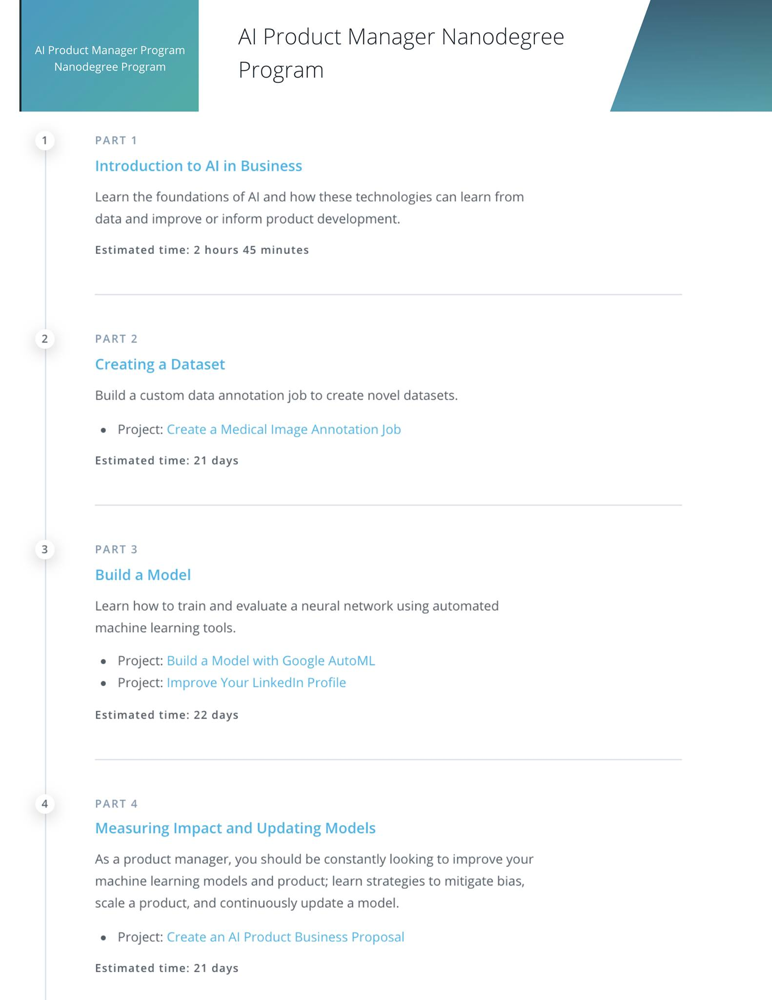
**이미지 캡션:** 이 이미지는 AI 제품 관리자 나노디그리 프로그램의 커리큘럼 개요를 보여주는 문서입니다. 사람이나 배경은 보이지 않으며, 오직 텍스트 정보만 담고 있습니다. 문서는 총 4개의 파트로 나뉘어 있으며, 각 파트별로 제목, 설명, 프로젝트 예시, 예상 소요 시간이 명시되어 있습니다. 파트 1은 "AI in Business 소개"로 AI의 기초와 제품 개발에 미치는 영향에 대해 다루며, 예상 소요 시간은 2시간 45분입니다. 파트 2는 "데이터셋 생성"으로 맞춤형 데이터 어노테이션 작업을 통해 새로운 데이터셋을 만드는 방법을 배우고, 프로젝트 예시로 "의료 이미지 어노테이션 작업 생성"이 있으며, 예상 소요 시간은 21일입니다. 파트 3은 "모델 구축"으로 자동화된 머신러닝 도구를 사용하여 신경망을 훈련하고 평가하는 방법을 배우며, 프로젝트 예시로 "Google AutoML로 모델 구축"과 "LinkedIn 프로필 개선"이 있고, 예상 소요 시간은 22일입니다. 파트 4는 "영향 측정 및 모델 업데이트"로 머신러닝 모델과 제품을 개선하고, 편향을 완화하며, 제품을 확장하고 모델을 지속적으로 업데이트하는 전략을 배우는 내용을 담고 있으며, 프로젝트 예시로 "AI 제품 비즈니스 제안서 작성"이 있고, 예상 소요 시간은 21일입니다. 문서의 전체적인 분위기는 교육적이고 정보 전달에 초점을 맞추고 있습니다.
